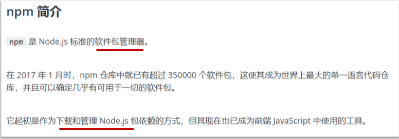
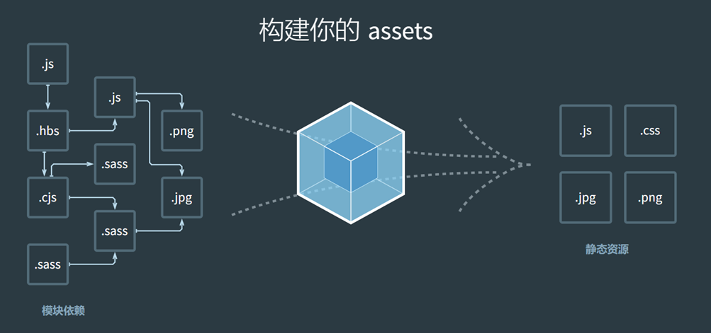
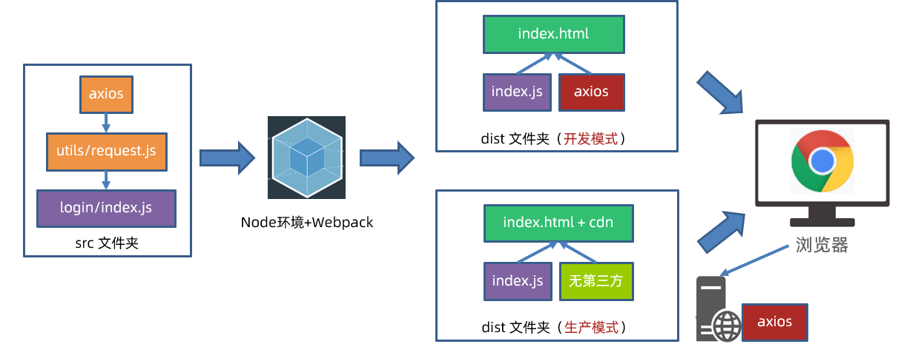

npm切换至淘宝镜像

~~~cmd
npm config set registry https://registry.npm.taobao.org --global
~~~


# Day01_Ajax入门

# 2.AJAX 概念和 axios 使用

什么是 AJAX ? [mdn](https://developer.mozilla.org/zh-CN/docs/Web/Guide/AJAX/Getting_Started)

> XMLHttpRequest是window下的，使用它相关的语法就可以与服务器进行通信


* 使用浏览器的 XMLHttpRequest 对象 与服务器通信

* 浏览器网页中，使用 AJAX技术（XHR对象）发起获取省份列表数据的请求，服务器代码响应准备好的省份列表数据给前端，前端拿到数据数组以后，展示到网页

  

1. 什么是服务器？

   * 可以暂时理解为提供数据的一台电脑

2. 为何学 AJAX ?

   * 以前我们的数据都是写在代码里固定的, 无法随时变化
   * 现在我们的数据可以从服务器上进行获取，让数据变活

3. 怎么学 AJAX ?

   * 这里使用一个第三方库叫 axios, 后续在学习 XMLHttpRequest 对象了解 AJAX 底层原理
   * 因为 axios 库语法简单，让我们有更多精力关注在与服务器通信上，而且后续 Vue，React 学习中，也使用 axios 库与服务器通信

4. 需求：从服务器获取省份列表数据，展示到页面上（体验 axios 语法的使用）

   > 获取省份列表数据 - 目标资源地址：http://hmajax.itheima.net/api/province

   * 完成效果：

     

5. 怎么用 AJAX ？

   先使用 axios [æk‘sioʊs] 库，与服务器进行数据通信

   - 基于 XMLHttpRequest 封装、代码简单、月下载量在 14 亿次
   - Vue、React 项目中都会用到 axios

   再学习 XMLHttpRequest 对象的使用，了解 AJAX 底层原理

6. 接下来讲解 axios 语法，步骤：

  7. 引入 axios.js 文件到自己的网页中

     > axios.js文件链接: https://cdn.jsdelivr.net/npm/axios/dist/axios.min.js

     引入完后，会在全局得到一个axios函数

  8. 明确axios函数的使用语法

     - 传入配置对象
     - 再用 .then 回调函数接收结果，并做后续处理，它的作用就可以接收axios成功的结果

     ```js
     axios({
       url: '目标资源地址'
     }).then((result) => { 
       // 对服务器返回的数据做后续处理
     })
     ```

     > 注意：请求的 url 地址, 就是标记资源的网址
     >
     > 注意：then 方法这里先体验使用，由来后续会讲到

     

9. 对应代码

  ```html
  <!DOCTYPE html>
  <html lang="en">
  
  <head>
    <meta charset="UTF-8">
    <meta http-equiv="X-UA-Compatible" content="IE=edge">
    <meta name="viewport" content="width=device-width, initial-scale=1.0">
    <title>AJAX概念和axios使用</title>
  </head>
  
  <body>
    <!--
      axios库地址：https://cdn.jsdelivr.net/npm/axios/dist/axios.min.js
      省份数据地址：http://hmajax.itheima.net/api/province
  
      目标: 使用axios库, 获取省份列表数据, 展示到页面上
      1. 引入axios库
    -->
    <p class="my-p"></p>
    <script src="https://cdn.jsdelivr.net/npm/axios/dist/axios.min.js"></script>
    <script>
      // 2. 使用axios函数
      axios({
        url: 'http://hmajax.itheima.net/api/province'
      }).then(result => {
        console.log(result)
        // 好习惯：多打印，确认属性名
        console.log(result.data.list)
        console.log(result.data.list.join('<br>'))
        // 把准备好省份列表，插入到页面
        document.querySelector('.my-p').innerHTML = result.data.list.join('<br>') 
      })
    </script>
  </body>
  
  </html>
  ```

~~~html
<details>
<summary>答案</summary>
<ul>
<li>浏览器和服务器之间通信，动态数据交互</li>
</ul>
</details>
~~~

# 3.认识 URL

1. 为什么要认识 URL ? [mdn](https://developer.mozilla.org/zh-CN/docs/Web/Guide/AJAX/Getting_Started)

   * 虽然是后端给我的一个地址，但是哪部分标记的是服务器电脑，哪部分标记的是资源呢？所以为了和服务器有效沟通我们要认识一下

2. 什么是 URL ？

   * 统一资源定位符，简称网址，用于定位网络中的资源（资源指的是：网页，图片，数据，视频，音频等等）

     
     
     

3. URL 的组成?

   * 协议，域名，资源路径（URL 组成有很多部分，我们先掌握这3个重要的部分即可）

     

     

4. 什么是 http 协议 ?

   * 叫超文本传输协议，规定了浏览器和服务器传递数据的格式（而格式具体有哪些稍后我们就会学到）

     

5. 什么是域名 ?

   * 标记服务器在互联网当中的方位，网络中有很多服务器，你想访问哪一台，就需要知道它的域名才可以

     

6. 什么是资源路径 ?

   * 一个服务器内有多个资源，用于标识你要访问的资源具体的位置

     

7. 接下来做个需求，访问新闻列表的 URL 网址，打印新闻数据

   * 效果图如下：

   

   > 新闻列表数据 URL 网址：http://hmajax.itheima.net/api/news

   ```js
   axios({
     url: 'http://hmajax.itheima.net/api/news'
   }).then(result => {
     console.log(result)
   })
   ```

   > url解释：从黑马服务器使用http协议，访问/api/news路径下的新闻列表资源

# 4.URL 查询参数

1. 什么是查询参数 ?

   * 携带给服务器额外信息，让服务器返回我想要的某一部分数据而不是全部数据
   * 举例：查询河北省下属的城市列表，需要先把河北省传递给服务器

     

2. 查询参数的语法 ？

   * 在 url 网址后面用?拼接格式：http://xxxx.com/xxx/xxx?参数名1=值1&参数名2=值2
   * 参数名一般是后端规定的，值前端看情况传递即可

3. axios 如何携带查询参数?

   * 使用 params 选项即可

   * 注意：axios 在运行时把参数名和值，会拼接到 url?参数名=值

     ```js
     axios({
       url: '目标资源地址',
       params: {
         参数名: 值
       }
     }).then(result => {
       // 对服务器返回的数据做后续处理
     })
     ```
     
     > 查询城市列表的 url地址：[http://hmajax.itheima.net/api/city](http://hmajax.itheima.net/api/city?pname=河北省)
     >
     > 参数名：pname （值要携带省份名字）

4. 需求：获取“河北省”下属的城市列表，展示到页面，对应代码：

   ```html
   <!DOCTYPE html>
   <html lang="en">
   <head>
     <meta charset="UTF-8">
     <meta http-equiv="X-UA-Compatible" content="IE=edge">
     <meta name="viewport" content="width=device-width, initial-scale=1.0">
     <title>查询参数</title>
   </head>
   <body>
     <!-- 
       城市列表: http://hmajax.itheima.net/api/city
       参数名: pname
       值: 省份名字
     -->
     <p></p>
     <script src="https://cdn.jsdelivr.net/npm/axios/dist/axios.min.js"></script>
     <script>
       axios({
         url: 'http://hmajax.itheima.net/api/city',
         // 查询参数
         params: {
           pname: '辽宁省'
         }
       }).then(result => {
         console.log(result.data.list)
         document.querySelector('p').innerHTML = result.data.list.join('<br>')
       })
     </script>
   </body>
   </html>
   ```


# 5.案例-查询-地区列表

根据输入的省份名字和城市名字，查询下属地区列表

* 完成效果如下：

  

* 相关参数

  > 查询地区: http://hmajax.itheima.net/api/area
  >
  > 参数名：
  >
  > pname：省份名字
  >
  > cname：城市名字


2. 正确代码如下：

   ```js
   /*
         获取地区列表: http://hmajax.itheima.net/api/area
         查询参数:
           pname: 省份或直辖市名字
           cname: 城市名字
       */
   // 目标: 根据省份和城市名字, 查询地区列表
   // 1. 查询按钮-点击事件
   document.querySelector('.sel-btn').addEventListener('click', () => {
       // 2. 获取省份和城市名字
       // PS：这两行一定要写在里面！因为每点击一次都需要重新获取value！
       let pname = document.querySelector('.province').value
       let cname = document.querySelector('.city').value
   
       // 3. 基于axios请求地区列表数据
       axios({
           url: 'http://hmajax.itheima.net/api/area',
           params: {
               // 属性名和value变量名同名了
               pname,
               cname
           }
       }).then(result => {
           // console.log(result)
           // 4. 把数据转li标签插入到页面上
           let list = result.data.list
           console.log(list)
           let theLi = list.map(areaName => `<li class="list-group-item">${areaName}</li>`).join('')
           console.log(theLi)
           document.querySelector('.list-group').innerHTML = theLi
       })
   })
   ```
   

# 6.常用请求方法和数据提交

1. 想要提交数据，先来了解什么是请求方法

   * 请求方法是一些固定单词的英文，例如：GET，POST，PUT，DELETE，PATCH（这些都是http协议规定的），每个单词对应一种对服务器资源要执行的操作，大小写都可以

     

     

   * 前面我们获取数据其实用的就是GET请求方法，但是axios内部设置了默认请求方法就是GET，我们就没有写

   * 但是提交数据需要使用POST请求方法

2. 什么时候进行数据提交呢？

   * 例如：多端要查看同一份订单数据，或者使用同一个账号进行登录，那订单/用户名+密码，就需要保存在服务器上，随时随地进行访问

     

     

3. axios 如何提交数据到服务器呢？

   * 需要学习，method 和 data 这2个新的选项了（大家不用担心，这2个学完，axios常用的选项就都学完了）

   * data是在请求体提交参数和值

     ```js
     axios({
       url: '目标资源地址',
       method: '请求方法',
       data: {
         参数名: 值
       }
     }).then(result => {
       // 对服务器返回的数据做后续处理
     })
     ```
     
   * data里面要传对象还是数组，需要查看接口文档

     

     `JSON.stringify()` 可以转换数组。JavaScript 中的 `JSON.stringify()` 方法能够将一个 JavaScript 值（包括数组）转换为 JSON 字符串格式。例如：

     Javascript

     ```javascript
     let arr = [1, 2, { "key": "value" }, true];
     let jsonStr = JSON.stringify(arr);
     console.log(jsonStr); // 输出："[1,2,{"key":"value"},true]"
     ```

     在上面的例子中，一个包含数值、对象和布尔值的数组被成功转换成了 JSON 格式的字符串。

4. 需求：注册账号，提交用户名和密码到服务器保存

   > 注册用户 URL 网址：http://hmajax.itheima.net/api/register
   >
   > 请求方法：POST
   >
   > 参数名：
   >
   > username：用户名（要求中英文和数字组成，最少8位）
   >
   > password：密码（最少6位）

   

5. 正确代码如下：

   ```js
   /*
     注册用户：http://hmajax.itheima.net/api/register
     请求方法：POST
     参数名：
       username：用户名（中英文和数字组成，最少8位）
       password：密码  （最少6位）
   
     目标：点击按钮，通过axios提交用户和密码，完成注册
   */
   document.querySelector('.btn').addEventListener('click', () => {
     axios({
       url: 'http://hmajax.itheima.net/api/register',
       // 大小写都可以，但是建议大家代码里使用小写的
       method: 'post',
       data: {
         username: 'itheima007',
         password: '7654321'
       }
     })
   })
   ```


response --> data --> message：这次报错服务器返回的报错信息


# 7.axios 错误处理

1. 如果注册相同的用户名，则会遇到注册失败的请求，也就是 axios 请求响应失败了，你会在控制台看到如图的错误：

   这里的错误是一个信息大对象

   

2. 在 axios 语法中要如何处理呢？

   * 因为，普通用户不会去控制台里看错误信息，我们要编写代码拿到错误并展示给用户在页面上

3. 使用 axios 的 catch 方法，捕获这次请求响应的错误并做后续处理，语法如下：

   ```js
   axios({
     // ...请求选项
   }).then(result => {
     // 处理成功数据
   }).catch(error => { //声明变量，就可以看见错误对象了
     // 处理失败错误
   })
   ```

4. 需求：再次重复注册相同用户名，提示用户注册失败的原因

   

   

5. 对应代码

   ```js
   document.querySelector('.btn').addEventListener('click', () => {
       axios({
         url: 'http://hmajax.itheima.net/api/register',
         method: 'post',
         data: {
           username: 'itheima007',
           password: '7654321'
         }
       }).then(result => {
         // 成功
         console.log(result)
       }).catch(error => {
         // 失败
         // 处理错误信息
         console.log(error)
         console.log(error.response.data.message)
         alert(error.response.data.message)
       })
   })
   ```

# 8.HTTP 协议-请求报文

1. 首先，HTTP 协议规定了浏览器和服务器返回内容的<span style="color: red;">格式</span>

2. 请求报文：是浏览器按照协议规定发送给服务器的内容，例如刚刚注册用户时，发起的请求报文：

   

   

3. 这里的格式包含：

   * 请求行：请求方法，URL，协议
   * 请求头：以键值对的格式携带的附加信息，比如：Content-Type（指定了本次传递的内容类型）
   * 空行：分割请求头，空行之后的是发送给服务器的资源
   * 请求体：发送的资源

4. 我们切换到浏览器中，来看看刚才注册用户发送的这个请求报文以及内容去哪里查看呢

5. 代码：直接在上个代码基础上复制，然后运行查看请求报文对应关系即可

查看请求报文：

网络 --> Fetch/XHR（专门看AJAX相关的请求的），下面就列出了刚刚所涉及到的请求

点击之后就会在右边出现详细内容的面板


标头 --> 请求标头（这里面就是我们要看的请求报文的信息了）

但是由于浏览器对请求报文进行了格式化，所以需要点击旁边的（原始）


**查看请求体**：载荷 --> 查看原数据，此时就可以看见json格式的数据了


# 9.请求报文-错误排查

1. 学习了查看请求报文有什么用呢？
   * 可以用来确认我们代码发送的请求数据是否真的正确
2. 配套模板代码里，对应 08 标题文件夹里是我同桌的代码，它把登录也写完了，但是无法登录，我们来到模板代码中，找到运行后，在<span style="color: red;">不逐行查看代码的情况下</span>，查看请求报文，看看它登录提交的相关信息对不对，帮他找找问题出现的原因
3. 发现请求体数据有问题，往代码中定位，找到类名写错误了
4. 代码：在配套文件夹素材里，找到需要对应代码，直接运行，根据报错信息，找到错误原因

将密码改为明文：

直接找到密码输入框，将type类型改为text即可


# 10.HTTP 协议-响应报文

1. 响应报文：是服务器按照协议固定的格式，返回给浏览器的内容

   

   

2. 响应报文的组成：

   * 响应行（状态行）：协议，HTTP响应状态码，状态信息
   * 响应头：以键值对的格式携带的附加信息，比如：Content-Type（告诉浏览器，本次返回的内容类型）
   * 空行：分割响应头，控制之后的是服务器返回的资源
   * 响应体：返回的资源

3. HTTP 响应状态码：

   * 用来表明请求是否成功完成

   * 例如：404（客户端要找的资源，在服务器上不存在）

     

查看响应报文：


查看**响应体**：


旁边的预览就是谷歌浏览器会对响应体进行格式化


# 11.接口文档

1. 接口文档：描述接口的文章（一般是后端工程师，编写和提供）

2. 接口：指的使用 AJAX 和 服务器通讯时，使用的 URL，请求方法，以及参数和说明，例如：[AJAX阶段接口文档](https://apifox.com/apidoc/shared-1b0dd84f-faa8-435d-b355-5a8a329e34a8)

3. 例如：获取城市列表接口样子

   
   
4. 需求：打开 AJAX 阶段接口文档，查看登录接口，并编写代码，完成一次登录的效果吧

5. 代码如下：

   > 我们在data中写的是一个对象，但是在axios内部的源码，发现data后面如果是一个对象，它就会帮你把这个对象转成json字符串携带给服务器
   
   ```js
   document.querySelector('.btn').addEventListener('click', () => {
     // 用户登录
     axios({
       url: 'http://hmajax.itheima.net/api/login',
       method: 'post',
       data: {
         username: 'itheima007',
         password: '7654321'
       }
     })
   })
   ```
   

# 12.案例-用户登录-主要业务

1. 先来到备课代码中，运行完成的页面，查看要完成的登录效果（登录成功和失败）

2. 需求：编写代码，查看接口文档，填写相关信息，完成登录业务

2. 分析实现的步骤
   
   1. 点击登录，获取并判断用户名和长度
   
   2. 提交数据和服务器通信
   
   3. 提示信息，反馈给用户（这节课先来完成前 2 个步骤）
   
      
   
4. 代码如下：

   ```js
   // 目标1：点击登录时，用户名和密码长度判断，并提交数据和服务器通信
   
   // 1.1 登录-点击事件
   document.querySelector('.btn-login').addEventListener('click', () => {
     // 1.2 获取用户名和密码
     const username = document.querySelector('.username').value
     const password = document.querySelector('.password').value
     // console.log(username, password)
   
     // 1.3 判断长度
     if (username.length < 8) {
       console.log('用户名必须大于等于8位')
       return // 阻止代码继续执行
     }
     if (password.length < 6) {
       console.log('密码必须大于等于6位')
       return // 阻止代码继续执行
     }
   
     // 1.4 基于axios提交用户名和密码
     // console.log('提交数据到服务器')
     axios({
       url: 'http://hmajax.itheima.net/api/login',
       method: 'POST',
       data: {
         username,
         password
       }
     }).then(result => {
       console.log(result)
       console.log(result.data.message)
     }).catch(error => {
       console.log(error)
       console.log(error.response.data.message)
     })
   })
   ```

复制属性路径：

对象.属性路径（data.message）


# 13.案例-用户登录-提示信息

**讲解**

1. 需求：使用提前准备好的提示框，来把登录成功/失败结果提示给用户

   

   

   

2. 使用提示框，反馈提示消息，因为有4处地方需要提示框，所以封装成函数

   1. 获取提示框

   2. 封装提示框函数，重复调用，满足提示需求

      功能：

      1. 显示提示框
      
      2. 不同提示文字msg，和成功绿色失败红色isSuccess参数（true成功，false失败）
      
         > 注意，如果添加了两个颜色样式，后面的会覆盖前面的
      
      3. 过2秒后，让提示框自动消失

3. 对应提示框核心代码：

   ```js
   /**
    * 2.2 封装提示框函数，重复调用，满足提示需求
    * 功能：
    * 1. 显示提示框
    * 2. 不同提示文字msg，和成功绿色失败红色isSuccess（true成功，false失败）
    * 3. 过2秒后，让提示框自动消失
   */
   function alertFn(msg, isSuccess) {
     // 1> 显示提示框
     myAlert.classList.add('show')
   
     // 2> 实现细节
     myAlert.innerText = msg
     const bgStyle = isSuccess ? 'alert-success' : 'alert-danger'
     myAlert.classList.add(bgStyle)
   
     // 3> 过2秒隐藏
     setTimeout(() => {
       myAlert.classList.remove('show')
       // 提示：避免类名冲突，重置背景色
       myAlert.classList.remove(bgStyle)
     }, 2000)
   }
   ```

完整代码：

~~~js
const myAlert = document.querySelector('.alert')
function alert1(msg, isSuccess) {
    if (isSuccess) {
        myAlert.classList.remove('alert-danger')
        myAlert.classList.add('alert-success')
    } else {
        myAlert.classList.remove('alert-success')
        myAlert.classList.add('alert-danger')
    }
    myAlert.classList.add('show')
    setTimeout(() => myAlert.classList.remove('show') = 0, 2000)
    myAlert.innerHTML = msg
}
document.querySelector('[type=button]').addEventListener('click', () => {
    // 目标1：点击登录时，用户名和密码长度判断，并提交数据和服务器通信
    const username = document.querySelector('[type=text]').value
    const password = document.querySelector('[type=password]').value
    if (username.length < 8) {
        // console.log('用户名必须大于等于8')
        alert1('用户名必须大于等于8', 0)
        return
    }

    if (password.length < 6) {
        // console.log('密码必须大于等于8')
        alert1('密码必须大于等于8', 0)
        return
    }


    axios({
        url: 'http://hmajax.itheima.net/api/login',
        method: 'POST',
        data: {
            username, 
            password
        }
    }).then(result => {
        // document.querySelector('.alert').classList.add('show')
        console.log(result)
        console.log(result.data.message);
        alert1(result.data.message, 1)

    }).catch(error => {

        // alert.classList.add('show')
        // console.log(error.response.data.message)
        // alert.innerHTML = error.response.data.message
        alert1(error.response.data.message, 0)

    })
})
~~~

# 14.form-serialize 插件

1. 我们前面收集表单元素的值，是一个个标签获取的

   

2. 如果一套表单里有很多很多表单元素，如何一次性快速收集出来呢？

   

3. 使用 form-serialize 插件提供的 serialize 函数就可以办到

4. form-serialize 插件语法：

   1. 引入 form-serialize 插件到自己网页中

   2. 使用 serialize 函数

      * 参数1：要获取的 form 表单标签对象（要求表单元素需要有 **name 属性**（与接口文档的参数名一致即可）-用来作为收集的数据中属性名）

      * 参数2：配置对象
        * hash：
          * true - 收集出来的是一个 JS 对象结构（推荐）
          * false - 收集出来的是一个查询字符串格式
        * empty：
          * true - 收集空值（推荐）据结构和标签结构一致
          * false - 不收集空值

5. 需求：收集登录表单里用户名和密码

6. 对应代码：

   ```html
   <!DOCTYPE html>
   <html lang="en">
   
   <head>
     <meta charset="UTF-8">
     <meta http-equiv="X-UA-Compatible" content="IE=edge">
     <meta name="viewport" content="width=device-width, initial-scale=1.0">
     <title>form-serialize插件使用</title>
   </head>
   
   <body>
     <form action="javascript:;" class="example-form">
       <input type="text" name="username">
       <br>
       <input type="text" name="password">
       <br>
       <input type="button" class="btn" value="提交">
     </form>
     <!-- 
       目标：在点击提交时，使用form-serialize插件，快速收集表单元素值
       1. 把插件引入到自己网页中
     -->
     <script src="./lib/form-serialize.js"></script>
     <script>
       document.querySelector('.btn').addEventListener('click', () => {
         /**
          * 2. 使用serialize函数，快速收集表单元素的值
          * 参数1：要获取哪个表单的数据
          *  表单元素设置name属性，值会作为对象的属性名
          *  建议name属性的值，最好和接口文档参数名一致
          *  获取出来的是value属性或者标签里夹的内容
          * 参数2：配置对象
          *  hash 设置获取数据结构
          *    - true：JS对象（推荐）一般请求体里提交给服务器
          *    - false: 查询字符串
          *  empty 设置是否获取空值
          *    - true: 获取空值（推荐）数据结构和标签结构一致
          *    - false：不获取空值
         */
         const form = document.querySelector('.example-form')
         const data = serialize(form, { hash: true, empty: true })
         // const data = serialize(form, { hash: false, empty: true })
         // const data = serialize(form, { hash: true, empty: false })
         console.log(data)
       })
     </script>
   </body>
   
   </html>
   ```


# 15.案例-用户登录-form-serialize

**目标**

尝试通过 form-serialize 重新修改用户登录案例-收集用户名和密码


**讲解**

1. 基于模板代码，使用 form-serialize 插件来收集用户名和密码
2. 在原来的代码基础上修改即可

   1. 先引入插件

      ```html
      <!-- 3.1 引入插件 -->
      <script src="./lib/form-serialize.js"></script>
      ```

   2. 然后修改代码

      ```js
      // 3.2 使用serialize函数，收集登录表单里用户名和密码
      const form = document.querySelector('.login-form')
      const data = serialize(form, { hash: true, empty: true })
      console.log(data)
      // 解构赋值
      // {username: 'itheima007', password: '7654321'}
      const { username, password } = data
      ```

1. 码区实现一下

   ```html
   <!DOCTYPE html>
   <html lang="en">
   
   <head>
     <meta charset="UTF-8">
     <meta http-equiv="X-UA-Compatible" content="IE=edge">
     <meta name="viewport" content="width=device-width, initial-scale=1.0">
     <title>Bootstrap 弹框</title>
     <!-- 引入bootstrap.css -->
     <link href="https://cdn.jsdelivr.net/npm/bootstrap@5.2.2/dist/css/bootstrap.min.css" rel="stylesheet">
   </head>
   
   <body>
     <!-- 
       目标：使用Bootstrap弹框
       1. 引入bootstrap.css 和 bootstrap.js
       2. 准备弹框标签，确认结构
       3. 通过自定义属性，控制弹框的显示和隐藏
      -->
     <button type="button" class="btn btn-primary" data-bs-toggle="modal" data-bs-target=".my-box">
       显示弹框
     </button>
   
     <!-- 
       弹框标签
       bootstrap的modal弹框，添加modal类名（默认隐藏）
      -->
     <div class="modal my-box" tabindex="-1">
       <div class="modal-dialog">
         <!-- 弹框-内容 -->
         <div class="modal-content">
           <!-- 弹框-头部 -->
           <div class="modal-header">
             <h5 class="modal-title">Modal title</h5>
             <button type="button" class="btn-close" data-bs-dismiss="modal" aria-label="Close"></button>
           </div>
           <!-- 弹框-身体 -->
           <div class="modal-body">
             <p>Modal body text goes here.</p>
           </div>
           <!-- 弹框-底部 -->
           <div class="modal-footer">
             <button type="button" class="btn btn-secondary" data-bs-dismiss="modal">Close</button>
             <button type="button" class="btn btn-primary">Save changes</button>
           </div>
         </div>
       </div>
     </div>
   
     <!-- 引入bootstrap.js -->
     <script src="https://cdn.jsdelivr.net/npm/bootstrap@5.2.2/dist/js/bootstrap.min.js"></script>
   </body>
   
   </html>
   ```


# 17.Bootstrap 弹框_属性控制

**目标**

使用属性方式控制 Bootstarp 弹框的显示和隐藏


**讲解**

1. 什么是 Bootstrap 弹框？

   * 不离开当前页面，显示单独内容，供用户操作

     

2. 需求：使用 Bootstrap 弹框，先做个简单效果，点击按钮，让弹框出现，点击 X 和 Close 让弹框隐藏

   

3. 如何使用 Bootstrap 弹框呢？

   1. 先引入 bootstrap.css 和 bootstrap.js 到自己网页中

   2. 准备弹框标签，确认结构（可以从 Bootstrap 官方文档的 Modal 里复制基础例子）- 运行到网页后，逐一对应标签和弹框每个部分对应关系

      直接在bootstrap搜索modal（模态，即弹窗）

      

   3. 通过自定义属性，通知弹框的显示和隐藏，语法如下：

      ```html
      <button data-bs-toggle="modal" data-bs-target="css选择器">
        显示弹框
      </button>
      
      <button data-bs-dismiss="modal">Close</button>
      ```


完整代码：

~~~html
<body>
  <!-- 
    目标：使用Bootstrap弹框
    1. 引入bootstrap.css 和 bootstrap.js
    2. 准备弹框标签，确认结构
    3. 通过自定义属性，控制弹框的显示和隐藏
       data-bs-toggle：点击之后会出现一个叫modal类型的弹框，但它并不是类选择器，而是bootstrap提前定好的
       data-bs-target：告诉这个按钮，点击需要控制哪个弹框
   -->
  <button type="button" class="btn btn-primary" data-bs-toggle="modal" data-bs-target=".my-box">
    显示弹框
  </button>

  <!-- 
    弹框标签
    bootstrap的modal弹框，添加modal类名（默认隐藏）
    由于一个页面中可能会有多个弹窗，此时只需要自己加个类名即可
   -->
  <div class="modal my-box" tabindex="-1">
    <div class="modal-dialog">
      <!-- 弹框-内容 -->
      <div class="modal-content">
        <!-- 弹框-头部 -->
        <div class="modal-header">
          <h5 class="modal-title">Modal title</h5>
          <!-- 点击左上角的 × 或者下面的close按钮，需要隐藏按钮，此时需要找到这两个按钮，并绑定data-bs-dismiss属性，隐藏当前所在的提示框，只需要传一个modal这个弹框的类型就行了 -->
          <button type="button" class="btn-close" data-bs-dismiss="modal" aria-label="Close"></button>
        </div>
        <!-- 弹框-身体 -->
        <div class="modal-body">
          <p>Modal body text goes here.</p>
        </div>
        <!-- 弹框-底部 -->
        <div class="modal-footer">
          <button type="button" class="btn btn-secondary" data-bs-dismiss="modal">Close</button>
          <button type="button" class="btn btn-primary">Save changes</button>
        </div>
      </div>
    </div>
  </div>

  <!-- 引入bootstrap.js -->
  <script src="https://cdn.jsdelivr.net/npm/bootstrap@5.2.2/dist/js/bootstrap.min.js"></script>
</body>
~~~


# 18.Bootstrap 弹框_JS控制

**目标**

使用 JS 方式控制 Bootstarp 弹框的显示和隐藏


**讲解**

1. 为什么需要 JS 方式控制呢？

   * 当我显示之前，隐藏之前，需要执行一些 JS 逻辑代码，就需要引入 JS 控制弹框显示/隐藏的方式了

   * 例如：

     * 点击编辑姓名按钮，在弹框显示之前，在输入框填入默认姓名
     * 点击保存按钮，在弹框隐藏之前，获取用户填入的名字并打印

     

2. 所以在显示和隐藏之前，需要执行 JS 代码逻辑，就使用 JS 方式 控制 Bootstrap 弹框显示和隐藏

   语法如下：

   ```js
   const modalDom = document.querySelector('css选择器')
   // 创建弹框对象
   const modal = new bootstrap.Modal(modelDom)
   
   // 显示弹框
   modal.show()
   // 隐藏弹框
   modal.hide()
   ```

   

3. 去代码区实现一下

   ```js
   <!-- 引入bootstrap.js -->
       <script src="https://cdn.jsdelivr.net/npm/bootstrap@5.2.2/dist/js/bootstrap.min.js"></script>
   <script> 
           // 1. 创建弹框对象
           const modalDom = document.querySelector('.name-box')
   const modal = new bootstrap.Modal(modalDom)
   
   // 编辑姓名->点击->赋予默认姓名->弹框显示
   document.querySelector('.edit-btn').addEventListener('click', () => {
       document.querySelector('.username').value = '默认姓名'
   
       // 2. 显示弹框
       modal.show()
   })
   
   // 保存->点击->->获取姓名打印->弹框隐藏
   document.querySelector('.save-btn').addEventListener('click', () => {
       const username = document.querySelector('.username').value
       console.log('模拟把姓名保存到服务器上', username)
   
       // 2. 隐藏弹框
       modal.hide()
   })
   ```


**小结**

1. 什么时候用属性控制，什么时候用 JS 控制 Bootstrap 弹框的显示/隐藏?

   直接出现/隐藏用属性方式控制，如果需要先执行一段 JS 逻辑再显示/隐藏就用 JS 方式控制


# 19.案例_图书管理\_渲染列表

**讲解**

1. 需求：基于 axios 获取到图书列表数据，并用 JS 代码渲染数据，到准备好的模板标签中

   

2. 步骤：

   1. 获取数据

   2. 渲染数据

      

      

3. 获取数据的时候，需要给自己起一个外号，为什么需要给自己起一个外号呢？

   * 我们所有人数据都来自同一个服务器上，为了区分每个同学不同的数据，需要大家设置一个外号告诉服务器，服务器就会返回你对应的图书数据了

   

4. 核心代码如下：

   > 因为默认展示列表，新增，修改，删除后都要重新获取并刷新列表，所以把获取数据渲染数据的代码封装在一个函数内，方便复用

   ```js
   /**
    * 目标1：渲染图书列表
    *  1.1 获取数据
    *  1.2 渲染数据
    */
   const creator = '老张'
   // 封装-获取并渲染图书列表函数
   function getBooksList() {
     // 1.1 获取数据
     axios({
       url: 'http://hmajax.itheima.net/api/books',
       params: {
         // 外号：获取对应数据
         creator
       }
     }).then(result => {
       // console.log(result)
       const bookList = result.data.data
       // console.log(bookList)
       // 1.2 渲染数据
       const htmlStr = bookList.map((item, index) => {
         return `<tr>
         <td>${index + 1}</td>
         <td>${item.bookname}</td>
         <td>${item.author}</td>
         <td>${item.publisher}</td>
         <td data-id=${item.id}>
           <span class="del">删除</span>
           <span class="edit">编辑</span>
         </td>
       </tr>`
       }).join('')
       // console.log(htmlStr)
       document.querySelector('.list').innerHTML = htmlStr
     })
   }
   // 网页加载运行，获取并渲染列表一次
   getBooksList()
   ```

5. 快速复制模版

   右击 --> 以html的格式修改

   

   然后直接复制这个结果即可

   

# 20.案例_图书管理\_新增图书

1. 需求：点击添加按钮，出现准备好的新增图书弹框，填写图书信息提交到服务器保存，并更新图书列表

   

   

2. 步骤：

   1. 新增弹框（控制显示和隐藏）（基于 Bootstrap 弹框和准备好的表单-用属性和 JS 方式控制）

   2. 在点击保存按钮时，收集数据&提交保存

   3. 刷新-图书列表）（重新调用下之前封装的获取并渲染列表的函数）

      

3. 核心代码如下：

   ```js
   /**
    * 目标2：新增图书
    *  2.1 新增弹框->显示和隐藏
    *  2.2 收集表单数据，并提交到服务器保存
    *  2.3 刷新图书列表
    */
   // 2.1 创建弹框对象
   const addModalDom = document.querySelector('.add-modal')
   const addModal = new bootstrap.Modal(addModalDom)
   // 保存按钮->点击->隐藏弹框
   document.querySelector('.add-btn').addEventListener('click', () => {
       // 2.2 收集表单数据，并提交到服务器保存
       const addForm = document.querySelector('.add-form')
       const bookObj = serialize(addForm, { hash: true, empty: true })
       // console.log(bookObj)
       // 提交到服务器
       axios({
           url: 'http://hmajax.itheima.net/api/books',
           method: 'POST',
           data: {
               // 这里太优雅了！展开运算符
               ...bookObj,
               creator
           }
       }).then(result => {
           // console.log(result)
           // 2.3 添加成功后，重新请求并渲染图书列表
           getBooksList()
           // 重置表单
           addForm.reset()
           // 隐藏弹框
           addModal.hide()
       })
   })
   ```


# 21.删除图书

1. 需求：点击图书删除元素，删除当前图书数据

   

   

2. 步骤：

   1. 给删除元素，绑定点击事件（事件委托方式并判断点击的是删除元素才走删除逻辑代码），并获取到要删除的数据id

   2. 基于 axios 和接口文档，调用删除接口，让服务器删除这条数据

   3. 重新获取并刷新图书列表

      


3. 核心代码如下：

   ```js
   /**
    * 目标3：删除图书
    *  3.1 删除元素绑定点击事件->获取图书id
    *  3.2 调用删除接口
    *  3.3 刷新图书列表
    */
   // 3.1 删除元素->点击（事件委托）
   document.querySelector('.list').addEventListener('click', e => {
     // 获取触发事件目标元素
     // console.log(e.target)
     // 判断点击的是删除元素
     if (e.target.classList.contains('del')) {
       // console.log('点击删除元素')
       // 获取图书id（自定义属性id）
       const theId = e.target.parentNode.dataset.id
       // console.log(theId)
       // 3.2 调用删除接口
       axios({
         url: `http://hmajax.itheima.net/api/books/${theId}`,
         method: 'DELETE'
       }).then(() => {
         // 3.3 刷新图书列表
         getBooksList()
       })
     }
   })
   ```


# 22.编辑图书

2. 需求：完成编辑图书回显当前图书数据到编辑表单，在用户点击修改按钮，收集数据提交到服务器保存，并刷新列表

   

3. 编辑数据的核心思路：

   1. 给编辑元素，绑定点击事件（事件委托方式并判断点击的是编辑元素才走编辑逻辑代码），并获取到要编辑的数据id

   2. 基于 axios 和接口文档，调用查询图书详情接口，获取正在编辑的图书数据，并回显到表单中（页面上的数据是在用户的浏览器中不够准备，所以只要是查看数据都要从服务器获取）

      

   3. 收集并提交保存修改数据，并重新从服务器获取列表刷新页面

      


4. 核心代码如下：

   > 这里的 `"title"` 作为类名是不带引号出现在最终的CSS选择器中的，因为在CSS语法中类名本身就是不带引号的。即使`key`的值是一个包含特殊字符或者空格等需要转义的情况，模板字符串也会正确处理并生成合法的选择器字符串，而不是直接插入引号。
   
   ```js
   /**
    * 目标4：编辑图书
    *  4.1 编辑弹框->显示和隐藏
    *  4.2 获取当前编辑图书数据->回显到编辑表单中
    *  4.3 提交保存修改，并刷新列表
    */
   // 4.1 编辑弹框->显示和隐藏
   const editDom = document.querySelector('.edit-modal')
   const editModal = new bootstrap.Modal(editDom)
   // 编辑元素->点击->弹框显示
   document.querySelector('.list').addEventListener('click', e => {
     // 判断点击的是否为编辑元素
     if (e.target.classList.contains('edit')) {
       // 4.2 获取当前编辑图书数据->回显到编辑表单中
       const theId = e.target.parentNode.dataset.id
       axios({
         url: `http://hmajax.itheima.net/api/books/${theId}`
       }).then(result => {
         const bookObj = result.data.data
         // document.querySelector('.edit-form .bookname').value = bookObj.bookname
         // document.querySelector('.edit-form .author').value = bookObj.author
         // 数据对象“属性”和标签“类名”一致
         // 遍历数据对象，使用属性去获取对应的标签，快速赋值
         const keys = Object.keys(bookObj) // ['id', 'bookname', 'author', 'publisher']
         keys.forEach(key => {
           document.querySelector(`.edit-form .${key}`).value = bookObj[key]
         })
       })
       editModal.show()
     }
   })
   // 修改按钮->点击->隐藏弹框
   document.querySelector('.edit-btn').addEventListener('click', () => {
     // 4.3 提交保存修改，并刷新列表
     const editForm = document.querySelector('.edit-form')
     const { id, bookname, author, publisher } = serialize(editForm, { hash: true, empty: true})
     // 保存正在编辑的图书id，隐藏起来：无需让用户修改
     // <input type="hidden" class="id" name="id" value="84783">
     axios({
       url: `http://hmajax.itheima.net/api/books/${id}`,
       method: 'PUT',
       data: {
         bookname,
         author,
         publisher,
         creator
       }
     }).then(() => {
       // 修改成功以后，重新获取并刷新列表
       getBooksList()
   
       // 隐藏弹框
       // 正确的修改后才隐藏
       editModal.hide()
    })
   })
   ```
   
5. 注意表单里面有一个隐藏域

   ~~~js
   <input type="hidden" class="id" name="id">
   ~~~

**10.案例_图书管理\_总结**

1. 因为增删改查的业务在前端实际开发中非常常见，思路是可以通用的，所以总结下思路

   > 1.渲染列表（查）
   >
   > 2.新增图书（增）
   >
   > 3.删除图书（删）
   >
   > 4.编辑图书（改）

   

2. 渲染数据（查）

   > 核心思路：获取数据 -> 渲染数据

   ```js
   // 1.1 获取数据
   axios({...}).then(result => {
     const bookList = result.data.data
     // 1.2 渲染数据
     const htmlStr = bookList.map((item, index) => {
       return `<tr>
       <td>${index + 1}</td>
       <td>${item.bookname}</td>
       <td>${item.author}</td>
       <td>${item.publisher}</td>
       <td data-id=${item.id}>
         <span class="del">删除</span>
         <span class="edit">编辑</span>
       </td>
     </tr>`
     }).join('')
     document.querySelector('.list').innerHTML = htmlStr
   })
   ```

   

3. 新增数据（增）

   > 核心思路：准备页面标签 -> 收集数据提交（必须） -> 刷新页面列表（可选）

   ```js
   // 2.1 创建弹框对象
   const addModalDom = document.querySelector('.add-modal')
   const addModal = new bootstrap.Modal(addModalDom)
   document.querySelector('.add-btn').addEventListener('click', () => {
     // 2.2 收集表单数据，并提交到服务器保存
     const addForm = document.querySelector('.add-form')
     const bookObj = serialize(addForm, { hash: true, empty: true })
     axios({...}).then(result => {
       // 2.3 添加成功后，重新请求并渲染图书列表
       getBooksList()
       addForm.reset()
       addModal.hide()
     })
   })
   ```

   

   


4. 删除图书（删）

   > 核心思路：绑定点击事件（获取要删除的图书唯一标识） -> 调用删除接口（让服务器删除此数据） -> 成功后重新获取并刷新列表

   ```js
   // 3.1 删除元素->点击（事件委托）
   document.querySelector('.list').addEventListener('click', e => {
     if (e.target.classList.contains('del')) {
       // 获取图书id（自定义属性id）
       const theId = e.target.parentNode.dataset.id
       // 3.2 调用删除接口
       axios({...}).then(() => {
         // 3.3 刷新图书列表
         getBooksList()
       })
     }
   })
   ```

   

5. 编辑图书（改）

   > 核心思路：准备编辑图书表单 -> 表单回显正在编辑的数据 -> 点击修改收集数据 -> 提交到服务器保存 -> 重新获取并刷新列表

   ```js
   // 4.1 编辑弹框->显示和隐藏
   const editDom = document.querySelector('.edit-modal')
   const editModal = new bootstrap.Modal(editDom)
   document.querySelector('.list').addEventListener('click', e => {
     if (e.target.classList.contains('edit')) {
       // 4.2 获取当前编辑图书数据->回显到编辑表单中
       const theId = e.target.parentNode.dataset.id
       axios({...}).then(result => {
         const bookObj = result.data.data
         // 遍历数据对象，使用属性去获取对应的标签，快速赋值
         const keys = Object.keys(bookObj) 
         keys.forEach(key => {
           document.querySelector(`.edit-form .${key}`).value = bookObj[key]
         })
       })
       editModal.show()
     }
   })
   
   document.querySelector('.edit-btn').addEventListener('click', () => {
     // 4.3 提交保存修改，并刷新列表
     const editForm = document.querySelector('.edit-form')
     const { id, bookname, author, publisher } = serialize(editForm, { hash: true, empty: true})
     // 保存正在编辑的图书id，隐藏起来：无需让用户修改
     // <input type="hidden" class="id" name="id" value="84783">
     axios({...}).then(() => {
       getBooksList()
       editModal.hide()
     })
   })
   ```

   

   

# 26.图片上传

1. 什么是图片上传？

   * 就是把本地的图片上传到网页上显示

2. 图片上传怎么做？

   * 先依靠文件选择元素获取用户选择的本地文件，接着提交到服务器保存，服务器会返回图片的 url 网址，然后把网址加载到 img 标签的 src 属性中即可显示

3. 为什么不直接显示到浏览器上，要放到服务器上呢？

   * 因为浏览器保存是临时的，如果你想随时随地访问图片，需要上传到服务器上

4. 图片上传怎么做呢？

   1. 先获取图片文件对象

   2. 使用 FormData 表单数据对象装入（因为图片是文件而不是以前的数字和字符串了，文件是不能直接转成JSON字符串的。所以传递文件一般需要放入 FormData 以键值对-文件流的数据传递（可以查看请求体-确认请求体结构）

      ```js
      const fd = new FormData()
      fd.append(参数名, 值)
      ```

   3. 提交表单数据对象，使用服务器返回图片 url 网址

5. 接口文档中的form-data指的就是表单数据对象

   

6. 核心代码如下：

   ```html
   <!DOCTYPE html>
   <html lang="en">
   
   <head>
     <meta charset="UTF-8">
     <meta http-equiv="X-UA-Compatible" content="IE=edge">
     <meta name="viewport" content="width=device-width, initial-scale=1.0">
     <title>图片上传</title>
   </head>
   
   <body>
     <!-- 文件选择元素 -->
     <input type="file" class="upload">
     
   
     <script src="https://cdn.jsdelivr.net/npm/axios/dist/axios.min.js"></script>
     <script>
       /**
        * 目标：图片上传，显示到网页上
        *  1. 获取图片文件
        *  2. 使用 FormData 携带图片文件
        *  3. 提交到服务器，获取图片url网址使用
       */
       // 文件选择元素->change改变事件
       document.querySelector('.upload').addEventListener('change', e => {
         // 1. 获取图片文件
         console.log(e.target.files[0])
         // 2. 使用 FormData 携带图片文件
         const fd = new FormData()
         fd.append('img', e.target.files[0])
         // 3. 提交到服务器，获取图片url网址使用
         axios({
           url: 'http://hmajax.itheima.net/api/uploadimg',
           method: 'POST',
           data: fd
         }).then(result => {
           console.log(result)
           // 取出图片url网址，用img标签加载显示
           const imgUrl = result.data.data.url
           document.querySelector('.my-img').src = imgUrl
         })
       })
     </script>
   </body>
   
   </html>
   ```


# 27.网站-更换背景图

1. 需求：先运行备课代码，查看要完成的效果，点击右上角选择本机中提供的素材图片，更换网站背景图

   

2. 网站更换背景图如何实现呢，并且保证刷新后背景图还在？具体步骤：

   1. 先获取到用户选择的背景图片，上传并把服务器返回的图片 url 网址设置给 body 背景
   2. 上传成功时，保存图片 url 网址到 localStorage 中
   3. 网页运行后，获取 localStorage 中的图片的 url 网址使用（并判断本地有图片 url 网址字符串才设置）

3. 核心代码如下：

   ```js
   /**
    * 目标：网站-更换背景
    *  1. 选择图片上传，设置body背景
    *  2. 上传成功时，"保存"图片url网址
    *  3. 网页运行后，"获取"url网址使用
    * */
   document.querySelector('.bg-ipt').addEventListener('change', e => {
     // 1. 选择图片上传，设置body背景
     console.log(e.target.files[0])
     const fd = new FormData()
     fd.append('img', e.target.files[0])
     axios({
       url: 'http://hmajax.itheima.net/api/uploadimg',
       method: 'POST',
       data: fd
     }).then(result => {
       const imgUrl = result.data.data.url
       document.body.style.backgroundImage = `url(${imgUrl})`
   
       // 2. 上传成功时，"保存"图片url网址
       localStorage.setItem('bgImg', imgUrl)
     })
   })
   
   // 3. 网页运行后，"获取"url网址使用
   const bgUrl = localStorage.getItem('bgImg')
   console.log(bgUrl)
   bgUrl && (document.body.style.backgroundImage = `url(${bgUrl})`)
   ```


# 28.个人信息设置-介绍

1. 需求：先运行备课代码，查看要完成的效果

   

2. 本视频分为，信息回显 + 头像修改 + 信息修改+ 提示框反馈 4 部分

   1. 先完成信息回显
   2. 再做头像修改-立刻就更新给此用户
   3. 收集个人信息表单-提交保存
   4. 提交后反馈结果给用户（提示框）

# 29.个人信息设置-信息渲染

1. 需求：把外号对应的个人信息和头像，渲染到页面表单和头像标签上。

   

2. 注意：还是需要准备一个外号，因为想要查看自己对应的用户信息，不想被别人影响

3. 步骤：

   * 获取数据
   * 渲染数据到页面

4. 代码如下：

   ```js
   /**
    * 目标1：信息渲染
    *  1.1 获取用户的数据
    *  1.2 回显数据到标签上
    * */
   const creator = '播仔'
   // 1.1 获取用户的数据
   axios({
     url: 'http://hmajax.itheima.net/api/settings',
     params: {
       creator
     }
   }).then(result => {
     const userObj = result.data.data
     // 1.2 回显数据到标签上
     Object.keys(userObj).forEach(key => {
       if (key === 'avatar') {
         // 赋予默认头像
         document.querySelector('.prew').src = userObj[key]
       } else if (key === 'gender') {
         // 赋予默认性别
         // 获取性别单选框：[男radio元素，女radio元素]
         const gRadioList = document.querySelectorAll('.gender')
         // 获取性别数字：0男，1女
         const gNum = userObj[key]
         // 通过性别数字，作为下标，找到对应性别单选框，设置选中状态
         gRadioList[gNum].checked = true
       } else {
         // 赋予默认内容
         document.querySelector(`.${key}`).value = userObj[key]
       }
     })
   })
   ```


# 30.个人信息设置-头像修改

1. 需求：点击修改用户头像

   

2. 实现步骤如下：

   1. 获取到用户选择的头像文件

   2. 调用头像修改接口，并除了头像文件外，还要在 FormData 表单数据对象中携带外号

   3. 提交到服务器保存此用户对应头像文件，并把返回的头像图片 url 网址设置在页面上

      

3. 注意：重新刷新重新获取，已经是修改后的头像了（证明服务器那边确实保存成功）

4. 核心代码：

   ```js
   /**
    * 目标2：修改头像
    *  2.1 获取头像文件
    *  2.2 提交服务器并更新头像
    * */
   // 文件选择元素->change事件
   document.querySelector('.upload').addEventListener('change', e => {
     // 2.1 获取头像文件
     console.log(e.target.files[0])
     const fd = new FormData()
     fd.append('avatar', e.target.files[0])
     fd.append('creator', creator)
     // 2.2 提交服务器并更新头像
     axios({
       url: 'http://hmajax.itheima.net/api/avatar',
       method: 'PUT',
       data: fd
     }).then(result => {
       const imgUrl = result.data.data.avatar
       // 把新的头像回显到页面上
       document.querySelector('.prew').src = imgUrl
     })
   })
   ```


# 31.个人信息设置-信息修改

1. 需求：点击提交按钮，收集个人信息，提交到服务器保存（无需重新获取刷新，因为页面已经是最新的数据了）

   1. 收集表单数据

   2. 提交到服务器保存-调用用户信息更新接口（注意请求方法是 PUT）代表数据更新的意思

      

2. 核心代码如下：

   ```js
   /**
    * 目标3：提交表单
    *  3.1 收集表单信息
    *  3.2 提交到服务器保存
    */
   // 保存修改->点击
   document.querySelector('.submit').addEventListener('click', () => {
     // 3.1 收集表单信息
     const userForm = document.querySelector('.user-form')
     const userObj = serialize(userForm, { hash: true, empty: true })
     userObj.creator = creator
     // 性别数字字符串，转成数字类型
     userObj.gender = +userObj.gender
     console.log(userObj)
     // 3.2 提交到服务器保存
     axios({
       url: 'http://hmajax.itheima.net/api/settings',
       method: 'PUT',
       data: userObj
     }).then(result => {
     })
   })
   ```


# 32.个人信息设置-提示框

1. 需求：使用 bootstrap 提示框，提示个人信息设置后的结果

   

2. bootstrap 的 toast 提示框和 modal 弹框使用很像，语法如下：

   1. 先准备对应的标签结构（模板里已有）

   2. 设置延迟自动消失的时间

      ```html
      <div class="toast" data-bs-delay="1500">
        提示框内容
      </div>
      ```

   3. 使用 JS 的方式，在 axios 请求响应成功时，展示结果

      ```js
      // 创建提示框对象
      const toastDom = document.querySelector('css选择器')
      const toast = new bootstrap.Toast(toastDom)
      
      // 显示提示框
      toast.show()
      ```

      

3. 核心代码：

   ```js
   /**
    * 目标3：提交表单
    *  3.1 收集表单信息
    *  3.2 提交到服务器保存
    */
   /**
    * 目标4：结果提示
    *  4.1 创建toast对象
    *  4.2 调用show方法->显示提示框
    */
   // 保存修改->点击
   document.querySelector('.submit').addEventListener('click', () => {
     // 3.1 收集表单信息
     const userForm = document.querySelector('.user-form')
     const userObj = serialize(userForm, { hash: true, empty: true })
     userObj.creator = creator
     // 性别数字字符串，转成数字类型
     userObj.gender = +userObj.gender
     console.log(userObj)
     // 3.2 提交到服务器保存
     axios({
       url: 'http://hmajax.itheima.net/api/settings',
       method: 'PUT',
       data: userObj
     }).then(result => {
       // 4.1 创建toast对象
       const toastDom = document.querySelector('.my-toast')
       const toast = new bootstrap.Toast(toastDom)
   
       // 4.2 调用show方法->显示提示框
       toast.show()
     })
   })
   ```


# 33.XMLHttpRequest - 基础使用

MDN上的定义：


AJAX 是浏览器与服务器通信的技术，采用 XMLHttpRequest 对象相关代码

axios 是对 XHR 相关代码进行了封装，让我们只关心传递的接口参数

学习 XHR 也是了解 axios 内部与服务器交互过程的真正原理，并且有更多与服务器数据通信方式


步骤：

1. 创建 XMLHttpRequest 对象
2. 调用对象内置的open方法，配置请求方法和请求 url 地址
3. 绑定监听 loadend 事件，接收响应结果
4. 发起请求

语法如下：

```js
const xhr = new XMLHttpRequest()
xhr.open('请求方法', '请求url网址')
xhr.addEventListener('loadend', () => {
  // 响应结果
  console.log(xhr.response)
})
xhr.send()
```


----

需求：以一个需求来体验下原生 XHR 语法，获取所有省份列表并展示到页面上

代码如下：

```html
<!DOCTYPE html>
<html lang="en">

<head>
  <meta charset="UTF-8">
  <meta http-equiv="X-UA-Compatible" content="IE=edge">
  <meta name="viewport" content="width=device-width, initial-scale=1.0">
  <title>XMLHttpRequest_基础使用</title>
</head>

<body>
  <p class="my-p"></p>
  <script>
    /**
     * 目标：使用XMLHttpRequest对象与服务器通信
     *  1. 创建 XMLHttpRequest 对象
     *  2. 配置请求方法和请求 url 地址
     *  3. 监听 loadend 事件，接收响应结果
     *  4. 发起请求
    */
    // 1. 创建 XMLHttpRequest 对象
    const xhr = new XMLHttpRequest()

    // 2. 配置请求方法和请求 url 地址
    // 使用原生的XHR对象时，都需要自己写，没有axios设置默认了
    xhr.open('GET', 'http://hmajax.itheima.net/api/province')

    // 3. 监听 loadend 事件，接收响应结果
    // loadend是固定名字的事件，去MDN网站可以看见很多种事件，但是loadend无论成功还是失败，它都会执行回调函数
    xhr.addEventListener('loadend', () => {
      console.log(xhr.response)
      // 在使用axios的时候，它会把返回的数据从JSON字符串转成JS对象，而在使用原生XHR对象的时候，就没有人帮我们做这件事情
      // axios内部把这个结果转换完后，它会将结果挂载到axios中结果对象的data属性下
      const data = JSON.parse(xhr.response)
      // 数组建议不要直接插入到标签中展示在网页，它会有一个数组转字符串的隐式转换，例如 [1, 2, 3] 直接打印在浏览器上就是 1,2,3，不好看
      // 所以最好还是自己转为字符串
      console.log(data.list.join('<br>'))
      document.querySelector('.my-p').innerHTML = data.list.join('<br>')
    })

    // 4. 发起请求
    xhr.send()
  </script>
</body>

</html>
```

# 34.XMLHttpRequest - 查询参数

1. 什么是查询参数：携带额外信息给服务器，返回匹配想要的数据

2. 查询参数原理要携带的位置和语法：http://xxxx.com/xxx/xxx?参数名1=值1&参数名2=值2

3. 所以，原生 XHR 需要自己在 url 后面携带查询参数字符串，没有 axios 帮助我们把 params 参数拼接到 url 字符串后面了

4. 需求：查询河北省下属的城市列表

   

5. 核心代码如下：

   ```js
   /**
    * 目标：使用XHR携带查询参数，展示某个省下属的城市列表
   */
   const xhr = new XMLHttpRequest()
   // 无论是发送数字还是文本，当它们作为查询字符串的一部分时，都会被视作字符串
   xhr.open('GET', 'http://hmajax.itheima.net/api/city?pname=辽宁省')
   xhr.addEventListener('loadend', () => {
     console.log(xhr.response)
     const data = JSON.parse(xhr.response)
     console.log(data)
     document.querySelector('.city-p').innerHTML = data.list.join('<br>')
   })
   xhr.send()
   ```

# 35.地区查询和URLSearchParams使用

1. 需求：和我们之前做的类似，就是不用 axios 而是用 XHR 实现，输入省份和城市名字后，点击查询，传递多对查询参数并获取地区列表的需求

   

2. 但是多个查询参数，如果自己拼接很麻烦，这里用 URLSearchParams 把参数对象转成“参数名=值&参数名=值“格式的字符串，语法如下：

   ```js
   // 1. 创建 URLSearchParams 对象
   const paramsObj = new URLSearchParams({
     参数名1: 值1,
     参数名2: 值2
   })
   
   // 2. 生成指定格式查询参数字符串
   const queryString = paramsObj.toString()
   // 结果：参数名1=值1&参数名2=值2
   ```
   
3. 下图叫做URL编码，而不是乱码

   > 这是由于URL网址规定，URL中只能出现英文、数字以及一些特殊的符号
   >
   > 而浏览器地址上面有中文，这是因为浏览器会对地址格式化，所以它可以显示中文。
   >
   > 但我们代码中，以及与服务器沟通的时候，我们传递的URL网址，需要在网络当中进行传输，所以遇到中文的时候我们的URL就会进行一种编码，而这种编码是浏览器自己做的。
   >
   > 我们把URL编码发给服务器，服务器也能正确的解码。
   >
   > 百度可以直接搜索URL编码和解码的网站。

   

完整代码：

~~~js
/**
     * 目标: 根据省份和城市名字, 查询对应的地区列表
    */
// 1. 查询按钮-点击事件
document.querySelector('.sel-btn').addEventListener('click', () => {
    // 2. 收集省份和城市名字
    const pname = document.querySelector('.province').value
    const cname = document.querySelector('.city').value

    // 3. 组织查询参数字符串
    const qObj = {
        pname,
        cname
    }
    // 查询参数对象 -> 查询参数字符串
    const paramsObj = new URLSearchParams(qObj)
    const queryString = paramsObj.toString()
    console.log(queryString)

    // 4. 使用XHR对象，查询地区列表
    const xhr = new XMLHttpRequest()
    xhr.open('GET', `http://hmajax.itheima.net/api/area?${queryString}`)
    xhr.addEventListener('loadend', () => {
        console.log(xhr.response)
        const data = JSON.parse(xhr.response)
        console.log(data)
        const htmlStr = data.list.map(areaName => {
            return `<li class="list-group-item">${areaName}</li>`
        }).join('')
        console.log(htmlStr)
        document.querySelector('.list-group').innerHTML = htmlStr
    })
    xhr.send()
})
~~~

# 36.XMLHttpRequest - 数据提交

1. 了解原生 XHR 进行数据提交的方式

2. 需求：通过 XHR 完成注册用户功能

   

3. 步骤和语法：

   1. 注意1：但是这次没有 axios 帮我们了，我们需要自己设置请求头 Content-Type：application/json，来告诉服务器端，我们发过去的内容类型是 JSON 字符串，让他转成对应数据结构取值使用

   2. 注意2：没有 axios 了，我们前端要传递的请求体数据，也没人帮我把 JS 对象转成 JSON 字符串了，需要我们自己转换

   3. 注意3：原生 XHR 需要在 send 方法调用时，传入请求体携带

      ```js
      const xhr = new XMLHttpRequest()
      xhr.open('请求方法', '请求url网址')
      xhr.addEventListener('loadend', () => {
        console.log(xhr.response)
      })
      
      // 1. 告诉服务器，我传递的内容类型，是 JSON 字符串
      // 参数1：请求头的属性名，参数2：携带属性对应的值
      xhr.setRequestHeader('Content-Type', 'application/json')
      // 2. 准备数据并转成 JSON 字符串
      const user = { username: 'itheima007', password: '7654321' }
      const userStr = JSON.stringify(user)
      // 3. 发送请求体数据（里面传送的是请求体的数据）
      xhr.send(userStr)
      ```


4. 核心代码如下：

   ```js
   /**
    * 目标：使用xhr进行数据提交-完成注册功能
   */
   document.querySelector('.reg-btn').addEventListener('click', () => {
     const xhr = new XMLHttpRequest()
     xhr.open('POST', 'http://hmajax.itheima.net/api/register')
     xhr.addEventListener('loadend', () => {
       console.log(xhr.response)
     })
   
     // 设置请求头-告诉服务器内容类型（JSON字符串）
     xhr.setRequestHeader('Content-Type', 'application/json')
     // 准备提交的数据
     const userObj = {
       username: 'itheima007',
       password: '7654321'
     }
     const userStr = JSON.stringify(userObj)
     // 设置请求体，发起请求
     xhr.send(userStr)
   })
   ```


# 37.认识_Promise

1. 什么是 Promise ？

   * Promise 对象用于表示一个异步（耗时的，并且不会阻塞代码，继续执行的）操作的最终完成（或失败）及其结果值

2. Promise 的好处是什么？

   * 逻辑更清晰（成功或失败会关联后续的处理函数）

   * 了解 axios 函数内部运作的机制

     

   * 能解决回调函数地狱问题

3. Promise 管理异步任务，语法怎么用？

   ```js
   // 1. 创建 Promise 对象
   // 此时需要传入一个回调函数，参数部分有Promise提供的resolve和reject两个函数
   const p = new Promise((resolve, reject) => {
    // 2. 执行异步任务-并传递结果
    // 成功调用: resolve(值) 触发 then() 执行
    // 失败调用: reject(值) 触发 catch() 执行
   })
   // 3. 接收结果，then方法也是Promise对象内置的，直接使用即可
   p.then(result => {
    // 成功
    // 来接收promise对象内异步成功的结果
   }).catch(error => {
    // 失败
    // 来接收promise对象内异步失败的结果
   })
   ```

4. 示例代码：

   ```js
   /**
    * 目标：使用Promise管理异步任务
   */
   // 1. 创建Promise对象
   const p = new Promise((resolve, reject) => {
     // 2. 执行异步代码
     setTimeout(() => {
       // 在这个异步执行后，调用resolve函数把这个结果传给Promise对象这个then的回调
       // resolve('模拟AJAX请求-成功结果')
       reject(new Error('模拟AJAX请求-失败结果'))
     }, 2000)
   })
   
   // 3. 获取结果
   p.then(result => {
     console.log(result)
   }).catch(error => {
     console.log(error)
   })
   ```
### 小结

1. 什么是 Promise ?

   <details>
   <summary>答案</summary>
   <ul>
   <li>表示（管理）一个异步操作最终状态和结果值的对象</li>
   </ul>
   </details>

2. 为什么学习 Promise ?

   <details>
   <summary>答案</summary>
   <ul>
   <li>成功和失败状态，可以关联对应处理函数，了解 axios 内部运作的原理</li>
   </ul>
   </details>

3. Promise 使用步骤？

   <details>
   <summary>答案</summary>
   <ul>
   <li>1. new Promise 对象执行异步任务。2. 用 resolve 关联 then 的回调函数传递成功结果。3.用 reject 关联 catch 的回调函数传递失败结果。</li>
   </ul>
   </details>


# 38.认识_Promise 的状态

1. 为什么要了解 Promise 的三种状态 ？

   * 知道 Promise 对象如何关联的处理函数，以及代码的执行顺序

2. Promise 有哪三种状态？

   > 每个 Promise 对象必定处于以下三种状态之一
   >
   > 每个状态的字符串是Promise管理的一种标记

   1. 待定（pending）：初始状态，既没有被兑现，也没有被拒绝
   2. 已兑现（fulfilled）：操作成功完成
   3. 已拒绝（rejected）：操作失败

   > 状态的英文字符串，可以理解为 Promise 对象内的字符串标识符，用于判断什么时候调用哪一个处理函数

3. Promise 的状态改变有什么用：调用对应函数，改变 Promise 对象状态后，内部触发对应回调函数传参并执行

   

4. 注意：每个 Promise 对象一旦被兑现/拒绝，那就是已敲定了，状态无法再被改变

### 小结

1. Promise 对象有哪 3 种状态?

   <details>
   <summary>答案</summary>
   <ul>
   <li>待定 pending，已兑现 fulfilled，已拒绝 rejected</li>
   </ul>
   </details>

2. Promise 状态有什么用?

   <details>
   <summary>答案</summary>
   <ul>
   <li>状态改变后，如何关联处理函数</li>
   </ul>
   </details>

> Promise创建后属于pending状态，new Promise之后，回调函数里的代码可以立刻执行，因为这里面的异步代码它是需要耗时的。
>
> 当异步代码有了结果之后
>
> - 成功了就会调用resolve并改变它为fulfilled（已兑现）状态，已兑现状态会导致then回调函数触发。
> - 失败了就会调用reject并改变它为rejected（已拒绝）状态，已拒绝就会导致catch回调函数触发。


# 39.使用 Promise 和 XHR_获取省份列表

1. Promise 和 XHR 都已经学过基础语法了，我们可以来结合使用一下了

2. 需求：使用 Promise 和 XHR 请求省份列表数据并展示到页面上

   

3. 步骤：

   1. 创建 Promise 对象

   2. 执行 XHR 异步代码，获取省份列表数据

   3. 关联成功或失败回调函数，做后续的处理

      > 错误情况：用地址错了404演示

4. 核心代码如下：

   ```js
   /**
    * 目标：使用Promise管理XHR请求省份列表
    *  1. 创建Promise对象
    *  2. 执行XHR异步代码，获取省份列表
    *  3. 关联成功或失败函数，做后续处理
   */
   // 1. 创建Promise对象
   const p = new Promise((resolve, reject) => {
     // 2. 执行XHR异步代码，获取省份列表
     const xhr = new XMLHttpRequest()
     xhr.open('GET', 'http://hmajax.itheima.net/api/province')
     xhr.addEventListener('loadend', () => {
       // xhr如何判断响应成功还是失败的？
       // 2xx开头的都是成功响应状态码
       if (xhr.status >= 200 && xhr.status < 300) {
         resolve(JSON.parse(xhr.response))
       } else {
         reject(new Error(xhr.response))
       }
     })
     xhr.send()
   })
   
   // 3. 关联成功或失败函数，做后续处理
   p.then(result => {
     console.log(result)
     document.querySelector('.my-p').innerHTML = result.list.join('<br>')
   }).catch(error => {
     // 错误对象要用console.dir详细打印
     console.dir(error)
     // 服务器返回错误提示消息，插入到p标签显示
     document.querySelector('.my-p').innerHTML = error.message
   })
   ```

# 40.封装_简易axios-获取省份列表

1. 需求：基于 Promise 和 XHR 封装 myAxios 函数，获取省份列表展示到页面

   

2. 步骤：

   1. 定义 myAxios 函数，接收配置对象，返回 Promise 对象
   2. 发起 XHR 请求，默认请求方法为 GET
   3. 调用成功 / 失败的处理程序
   
3. 核心语法：

   ```js
   function myAxios(config) {
     return new Promise((resolve, reject) => {
       // XHR 请求
       // 调用成功/失败的处理程序
     })
   }
   
   myAxios({
     url: '目标资源地址'
   }).then(result => {
       
   }).catch(error => {
       
   })
   ```

   

4. 步骤：

   1. 定义 myAxios 函数，接收配置对象，返回 Promise 对象
   2. 发起 XHR 请求，默认请求方法为 GET
   3. 调用成功/失败的处理程序
   4. 使用 myAxios 函数，获取省份列表展示


4. 核心代码如下：

   ```js
   /**
    * 目标：封装_简易axios函数_获取省份列表
    *  1. 定义myAxios函数，接收配置对象，返回Promise对象
    *  2. 发起XHR请求，默认请求方法为GET
    *  3. 调用成功/失败的处理程序
    *  4. 使用myAxios函数，获取省份列表展示
   */
   // 1. 定义myAxios函数，接收配置对象，返回Promise对象
   function myAxios(config) {
     return new Promise((resolve, reject) => {
       // 2. 发起XHR请求，默认请求方法为GET
       const xhr = new XMLHttpRequest()
       // 前面的表达式为假，就会原地使用后面的结果
       xhr.open(config.method || 'GET', config.url)
       xhr.addEventListener('loadend', () => {
         // 3. 调用成功/失败的处理程序
         if (xhr.status >= 200 && xhr.status < 300) {
           resolve(JSON.parse(xhr.response))
         } else {
           reject(new Error(xhr.response))
         }
       })
       xhr.send()
     })
   }
   
   // 4. 使用myAxios函数，获取省份列表展示
   myAxios({
     url: 'http://hmajax.itheima.net/api/province'
   }).then(result => {
     console.log(result)
     document.querySelector('.my-p').innerHTML = result.list.join('<br>')
   }).catch(error => {
     console.log(error)
     document.querySelector('.my-p').innerHTML = error.message
   })
   ```

   

# 41.封装_简易axios-获取地区列表

1. 需求：在上个封装的建议 axios 函数基础上，修改代码支持传递查询参数功能

2. 修改步骤：

   1. myAxios 函数调用后，判断 params 选项
   2. 基于 URLSearchParams 转换查询参数字符串
   3. 使用自己封装的 myAxios 函数显示地区列表

3. 核心代码：

   ```js
   function myAxios(config) {
     return new Promise((resolve, reject) => {
       const xhr = new XMLHttpRequest()
       // 1. 判断有params选项，携带查询参数
       if (config.params) {
         // 2. 使用URLSearchParams转换，并携带到url上
         const paramsObj = new URLSearchParams(config.params)
         const queryString = paramsObj.toString()
         // 把查询参数字符串，拼接在url？后面
         config.url += `?${queryString}`
       }
   
       xhr.open(config.method || 'GET', config.url)
       xhr.addEventListener('loadend', () => {
         if (xhr.status >= 200 && xhr.status < 300) {
           resolve(JSON.parse(xhr.response))
         } else {
           reject(new Error(xhr.response))
         }
       })
       xhr.send()
     })
   }
   
   // 3. 使用myAxios函数，获取地区列表
   myAxios({
     url: 'http://hmajax.itheima.net/api/area',
     params: {
       pname: '辽宁省',
       cname: '大连市'
     }
   }).then(result => {
     console.log(result)
     document.querySelector('.my-p').innerHTML = result.list.join('<br>')
   })
   ```


# 42.封装_携带请求体数据_简易axios-注册用户

1. 需求：修改 myAxios 函数支持传递请求体数据，完成注册用户功能

2. 修改步骤：

   1. myAxios 函数调用后，判断 data 选项
   2. 转换数据类型，在 send 方法中发送
   3. 使用自己封装的 myAxios 函数完成注册用户功能

3. 核心代码：

   ```js
   function myAxios(config) {
     return new Promise((resolve, reject) => {
       const xhr = new XMLHttpRequest()
   
       if (config.params) {
         const paramsObj = new URLSearchParams(config.params)
         const queryString = paramsObj.toString()
         config.url += `?${queryString}`
       }
       xhr.open(config.method || 'GET', config.url)
   
       xhr.addEventListener('loadend', () => {
         if (xhr.status >= 200 && xhr.status < 300) {
           resolve(JSON.parse(xhr.response))
         } else {
           reject(new Error(xhr.response))
         }
       })
       // 1. 判断有data选项，携带请求体
       if (config.data) {
         // 2. 转换数据类型，在send中发送
         const jsonStr = JSON.stringify(config.data)
         xhr.setRequestHeader('Content-Type', 'application/json')
         xhr.send(jsonStr)
       } else {
         // 如果没有请求体数据，正常的发起请求
         xhr.send()
       }
     })
   }
   
   document.querySelector('.reg-btn').addEventListener('click', () => {
     // 3. 使用myAxios函数，完成注册用户
     myAxios({
       url: 'http://hmajax.itheima.net/api/register',
       method: 'POST',
       data: {
         username: 'itheima999',
         password: '666666'
       }
     }).then(result => {
       console.log(result)
     }).catch(error => {
       console.dir(error)
     })
   })
   ```

# 43.天气预报-默认数据

需求：介绍本项目要完成的效果，和要实现的步骤和分的步骤和视频


2. 步骤

   1. 先获取北京市天气预报，展示
   2. 搜索城市列表，展示
   3. 点击城市，切换显示对应天气数据

3. 本视频先封装函数，获取城市天气并设置页面内容

4. 核心代码如下：

   > 在展示数据的时候，一般会从上到下，从左到右进行数据的展示
   
   ```js
   /**
    * 目标1：默认显示-北京市天气
    *  1.1 获取北京市天气数据
    *  1.2 数据展示到页面
    */
   // 获取并渲染城市天气函数
   function getWeather(cityCode) {
     // 1.1 获取北京市天气数据
     myAxios({
       url: 'http://hmajax.itheima.net/api/weather',
       params: {
         city: cityCode
       }
     }).then(result => {
       console.log(result)
       const wObj = result.data
       // 1.2 数据展示到页面
       // 阳历和农历日期
       const dateStr = `<span class="dateShort">${wObj.date}</span>
       <span class="calendar">农历&nbsp;
         <span class="dateLunar">${wObj.dateLunar}</span>
       </span>`
       document.querySelector('.title').innerHTML = dateStr
       // 城市名字
       document.querySelector('.area').innerHTML = wObj.area
       // 当天气温
       const nowWStr = `<div class="tem-box">
       <span class="temp">
         <span class="temperature">${wObj.temperature}</span>
         <span>°</span>
       </span>
     </div>
     <div class="climate-box">
       <div class="air">
         <span class="psPm25">${wObj.psPm25}</span>
         <span class="psPm25Level">${wObj.psPm25Level}</span>
       </div>
       <ul class="weather-list">
         <li>
           
           <span class="weather">${wObj.weather}</span>
         </li>
         <li class="windDirection">${wObj.windDirection}</li>
         <li class="windPower">${wObj.windPower}</li>
       </ul>
     </div>`
       document.querySelector('.weather-box').innerHTML = nowWStr
       // 当天天气
       const twObj = wObj.todayWeather
       const todayWStr = `<div class="range-box">
       <span>今天：</span>
       <span class="range">
         <span class="weather">${twObj.weather}</span>
         <span class="temNight">${twObj.temNight}</span>
         <span>-</span>
         <span class="temDay">${twObj.temDay}</span>
         <span>℃</span>
       </span>
     </div>
     <ul class="sun-list">
       <li>
         <span>紫外线</span>
         <span class="ultraviolet">${twObj.ultraviolet}</span>
       </li>
       <li>
         <span>湿度</span>
         <span class="humidity">${twObj.humidity}</span>%
       </li>
       <li>
         <span>日出</span>
         <span class="sunriseTime">${twObj.sunriseTime}</span>
       </li>
       <li>
         <span>日落</span>
         <span class="sunsetTime">${twObj.sunsetTime}</span>
       </li>
     </ul>`
       document.querySelector('.today-weather').innerHTML = todayWStr
   
       // 7日天气预报数据展示
       const dayForecast = wObj.dayForecast
       const dayForecastStr = dayForecast.map(item => {
         return `<li class="item">
         <div class="date-box">
           <span class="dateFormat">${item.dateFormat}</span>
           <span class="date">${item.date}</span>
         </div>
         
         <span class="weather">${item.weather}</span>
         <div class="temp">
           <span class="temNight">${item.temNight}</span>-
           <span class="temDay">${item.temDay}</span>
           <span>℃</span>
         </div>
         <div class="wind">
           <span class="windDirection">${item.windDirection}</span>
           <span class="windPower">${item.windPower}</span>
         </div>
       </li>`
       }).join('')
       // console.log(dayForecastStr)
       document.querySelector('.week-wrap').innerHTML = dayForecastStr
     })
   }
   
   // 默认进入网页-就要获取天气数据（北京市城市编码：'110100'）
   getWeather('110100')
   ```
   

# 44.天气预报-搜索城市列表

1. 介绍本视频要完成的效果：搜索匹配关键字相关城市名字，展示城市列表即可

   

2. 步骤

   1. 绑定 input 事件，获取关键字
   2. 获取展示城市列表数据

3. 核心代码如下：

   ```js
   /**
    * 目标2：搜索城市列表
    *  2.1 绑定input事件，获取关键字
    *  2.2 获取展示城市列表数据
    */
   // 2.1 绑定input事件，获取关键字
   // 这里直接通过e就可以获取当前input输入框
   document.querySelector('.search-city').addEventListener('input', (e) => {
       // !!!!!!!!!!!!!
     console.log(e.target.value)
     // 2.2 获取展示城市列表数据
     myAxios({
       url: 'http://hmajax.itheima.net/api/weather/city',
       params: {
         city: e.target.value
       }
     }).then(result => {
       console.log(result)
       const liStr = result.data.map(item => {
         // 这里自定义属性直接绑定code就行了！不用再绑id
         return `<li class="city-item" data-code="${item.code}">${item.name}</li>`
       }).join('')
       console.log(liStr)
       document.querySelector('.search-list').innerHTML = liStr
    })
   })
   ```
   

# 45.案例_天气预报-展示城市天气

1. 介绍本视频要完成的效果：点击城市列表名字，切换当前页面天气数据

   

2. 步骤

   1. 检测搜索列表点击事件，获取城市 code 值
   2. 复用获取展示城市天气函数

3. 核心代码如下：

   ```js
   /**
    * 目标3：切换城市天气
    *  3.1 绑定城市点击事件，获取城市code值
    *  3.2 调用获取并展示天气的函数
    */
   // 3.1 绑定城市点击事件，获取城市code值
   document.querySelector('.search-list').addEventListener('click', e => {
     if (e.target.classList.contains('city-item')) {
       // 只有点击城市li才会走这里！！！！！！
       const cityCode = e.target.dataset.code
       console.log(cityCode)
       // 3.2 调用获取并展示天气的函数
       getWeather(cityCode)
     }
   })
   ```


# Day04_AJAX进阶

# 47.同步代码和异步代码

[同步代码]([https://developer.mozilla.org/zh-CN/docs/Learn/JavaScript/Asynchronous/Introducing#%E5%90%8C%E6%AD%A5%E7%BC%96%E7%A8%8B](https://developer.mozilla.org/zh-CN/docs/Learn/JavaScript/Asynchronous/Introducing))：逐行执行，需原地等待结果后，才继续向下执行

[异步代码](https://developer.mozilla.org/zh-CN/docs/Learn/JavaScript/Asynchronous/Introducing)：调用后耗时，不阻塞代码继续执行（不必原地等待），在将来完成后**触发回调函数传递结果**

回答代码打印顺序：发现异步代码接收结果，使用的都是回调函数

> JS引擎：用C++编写的程序，在JS更底下的一层，专门来读取我们编写的JS代码，然后进行翻译和执行的程序。

```js
// 同步
const result = 0 + 1
console.log(result)

// 异步
setTimeout(() => {
  console.log(2)
}, 2000)

// 事件也属于异步
document.querySelector('.btn').addEventListener('click', () => {
  console.log(3)
})

// 同步
document.body.style.backgroundColor = 'pink'
console.log(4)
```

> 结果：1， 4， 2
>
> 按钮点击一次打印一次 3

# 48.回调函数地狱

1. 需求：展示默认第一个省，第一个城市，第一个地区在下拉菜单中

   

2. 概念：在回调函数中嵌套回调函数，一直嵌套下去就形成了回调函数地狱

3. 缺点：可读性差，异常无法捕获（外面的axios无法捕获里面的axios异常），耦合性严重，牵一发动全身

   ```js
   axios({ url: 'http://hmajax.itheima.net/api/province' }).then(result => {
     const pname = result.data.list[0]
     document.querySelector('.province').innerHTML = pname
     // 获取第一个省份默认下属的第一个城市名字
     axios({ url: 'http://hmajax.itheima.net/api/city', params: { pname } }).then(result => {
       const cname = result.data.list[0]
       document.querySelector('.city').innerHTML = cname
       // 获取第一个城市默认下属第一个地区名字
       axios({ url: 'http://hmajax.itheima.net/api/area', params: { pname, cname } }).then(result => {
         document.querySelector('.area').innerHTML = result.data.list[0]
       })
     })
   })
   ```

# 49.Promise-链式调用

1. 概念：依靠 then() 方法会返回一个新生成的 Promise 对象特性，继续串联下一环任务，直到结束

2. 细节：then() 回调函数中的返回值，会影响新生成的 Promise 对象最终状态和结果

3. 好处：通过链式调用，解决回调函数嵌套问题

   

4. 按照图解，编写核心代码：

   ```js
   /**
    * 目标：掌握Promise的链式调用
    * 需求：把省市的嵌套结构，改成链式调用的线性结构
   */
   // 1. 创建Promise对象-模拟请求省份名字
   const p = new Promise((resolve, reject) => {
     setTimeout(() => {
       resolve('北京市')
     }, 2000)
   })
   
   // 2. 获取省份名字
   const p2 = p.then(result => {
     console.log(result)
     // 3. 创建Promise对象-模拟请求城市名字
     // return Promise对象最终状态和结果，影响到新的Promise对象
     return new Promise((resolve, reject) => {
       setTimeout(() => {
         resolve(result + '--- 北京')
       }, 2000)
     })
   })
   
   // 4. 获取城市名字
   p2.then(result => {
     console.log(result)
   })
   
   // then()原地的结果是一个新的Promise对象
   console.log(p2 === p)
   ```


# 50.Promise-链式调用_解决回调地狱

1. 目标：使用 Promise 链式调用，解决回调函数地狱问题

2. 做法：每个 Promise 对象中管理一个异步任务，用 then 返回 Promise 对象，串联起来

   

3. Promise 链式调用如何解决回调函数地狱?

   then 的回调函数中 return Promise对象，影响当前新 Promise 对象的值

4. 按照图解思路，编写核心代码：

   > axios调用后，会在原地返回Promise对象

   ```js
   /**
    * 目标：把回调函数嵌套代码，改成Promise链式调用结构
    * 需求：获取默认第一个省，第一个市，第一个地区并展示在下拉菜单中
   */
   let pname = ''
   // 1. 得到-获取省份Promise对象
   axios({url: 'http://hmajax.itheima.net/api/province'}).then(result => {
     pname = result.data.list[0]
     document.querySelector('.province').innerHTML = pname
     // 2. 得到-获取城市Promise对象
     return axios({url: 'http://hmajax.itheima.net/api/city', params: { pname }})
   }).then(result => {
     const cname = result.data.list[0]
     document.querySelector('.city').innerHTML = cname
     // 3. 得到-获取地区Promise对象
     return axios({url: 'http://hmajax.itheima.net/api/area', params: { pname, cname }})
   }).then(result => {
     console.log(result)
     const areaName = result.data.list[0]
     document.querySelector('.area').innerHTML = areaName
   })
   ```

# 51.async 函数和 await

> 这两个关键字在JS中也被称为异步编程的终极解决方案

1. 定义：

   

2. 概念：在 async 函数内，使用 await 关键字取代 then 函数，等待获取 Promise 对象成功状态的结果值 

3. 做法：使用 async 和 await 解决回调地狱问题

4. 作用：替代 then 方法来提取 Promise 对象成功状态的结果

5. async一定是加在await最近的函数上

6. 核心代码：

   ```js
   /**
    * 目标：掌握async和await语法，解决回调函数地狱
    * 概念：在async函数内，使用await关键字，获取Promise对象"成功状态"结果值
    * 注意：await必须用在async修饰的函数内（await会阻止"异步函数内"代码继续执行，原地等待结果）
   */
   // 1. 定义async修饰函数，当前函数就会变成一个异步的函数
   async function getData() {
     // 2. await等待Promise对象成功的结果，并且它会把这个成功状态的结果提取在原地，让它赋给左边的变量
     const pObj = await axios({url: 'http://hmajax.itheima.net/api/province'})
     const pname = pObj.data.list[0]
     const cObj = await axios({url: 'http://hmajax.itheima.net/api/city', params: { pname }})
     const cname = cObj.data.list[0]
     const aObj = await axios({url: 'http://hmajax.itheima.net/api/area', params: { pname, cname }})
     const areaName = aObj.data.list[0]
   
   
     document.querySelector('.province').innerHTML = pname
     document.querySelector('.city').innerHTML = cname
     document.querySelector('.area').innerHTML = areaName
   }
   
   getData()
   ```

   > 使用 await 替代 then 的方法

# 52.async 函数和 await 捕获错误

1. try 和 catch 的作用：捕获同步流程的代码报错信息

   ```js
   try {
     // 要执行的代码
   } catch (error) {
     // error 接收的是，错误消息
     // try 里代码，如果有错误，直接进入这里执行
   }
   ```

   > try 里有报错的代码，会立刻跳转到 catch 中

2. 尝试把代码中 url 地址写错，运行观察 try catch 的捕获错误信息能力

   > 打印出来的数据是axios内部检测到错误后抛出来的信息对象
   >
   > 
   >
   > 这里的message是axios做了一些处理，返回的提示消息，如果需要接口返回的真正响应的数据，应该看response（响应），然后找到data
   >
   > 或者直接在浏览器里找响应结果
   >
   > 
   >
   > 使用try - catch不光可以捕获await相关的异常，还是在js中专门捕获异常的语句块
   
   ```js
   /**
    * 目标：async和await_错误捕获
   */
   async function getData() {
     // 1. try包裹可能产生错误的代码
     try {
       const pObj = await axios({ url: 'http://hmajax.itheima.net/api/province' })
       const pname = pObj.data.list[0]
       const cObj = await axios({ url: 'http://hmajax.itheima.net/api/city', params: { pname } })
       const cname = cObj.data.list[0]
       const aObj = await axios({ url: 'http://hmajax.itheima.net/api/area', params: { pname, cname } })
       const areaName = aObj.data.list[0]
   
    	document.querySelector('.province').innerHTML = pname
       document.querySelector('.city').innerHTML = cname
       document.querySelector('.area').innerHTML = areaName
     } catch (error) {
       // 2. 接着调用catch块，接收错误信息
       // 如果try里某行代码报错后，try中剩余的代码不会执行了
       // 错误对象一般要使用dir才能看到错误对象里的属性
       console.dir(error)
     }
   }
   
   getData()
   ```
   

# 53.事件循环

1. 概念：

   

   JavaScript 单线程（某一刻只能执行一行代码），为了让耗时代码不阻塞其他代码运行，设计了事件循环模型
   
2. 事件循环（EventLoop）：掌握后知道 JS 是如何安排和运行代码的

   > 请回答下面 2 段代码打印的结果，并说明原因

   ```js
   console.log(1)
   setTimeout(() => {
     console.log(2)
   }, 2000)
   ```

   ```js
   console.log(1)
   setTimeout(() => {
     console.log(2)
   }, 0)
   console.log(3)
   ```

   

3. 作用：事件循环负责执行代码，收集和处理事件以及执行队列中的子任务

4. 原因：JavaScript 单线程（某一刻只能执行一行代码），为了让耗时代码不阻塞其他代码运行，设计了事件循环模型

5. 概念：执行代码和收集异步任务的模型，在调用栈空闲，反复调用任务队列里回调函数的执行机制，就叫事件循环

   ```js
   /**
    * 目标：阅读并回答执行的顺序结果
   */
   console.log(1)
   setTimeout(() => {
     console.log(2)
   }, 0)
   console.log(3)
   setTimeout(() => {
     console.log(4)
   }, 2000)
   console.log(5)
   ```

   > 具体运行过程，请参考 PPT 动画和视频讲解

   

2. 为什么有事件循环？

   > JavaScript 是单线程的，为了不阻塞 JS 引擎，设计执行代码的模型
   
2. JavaScript 内代码如何执行？

   > 执行同步代码，遇到异步代码交给宿主浏览器环境执行
   > 异步有了结果后，把回调函数放入任务队列排队
   > 当调用栈空闲后，反复调用任务队列里的回调函数


# 54.事件循环-练习

1. 需求：请根据掌握的事件循环的模型概念，分析代码执行过程

   ```js
   /**
    * 目标：阅读并回答执行的顺序结果
   */153246
   console.log(1)
   setTimeout(() => {
     console.log(2)
   }, 0)
   function myFn() {
     console.log(3)
   }
   function ajaxFn() {
     // 同步
     const xhr = new XMLHttpRequest()
     xhr.open('GET', 'http://hmajax.itheima.net/api/province')
     // 异步
     xhr.addEventListener('loadend', () => {
       console.log(4)
     })
     xhr.send()
   }
   for (let i = 0; i < 1; i++) {
     console.log(5)
   }
   ajaxFn()
   document.addEventListener('click', () => {
     console.log(6)
   })
   myFn()
   ```

   
   
   

> 结果：1 5 3 2 4 点击一次document就会执行一次打印6

# 55.宏任务与微任务

1. ES6 之后引入了 Promise 对象， 让 JS 引擎也可以发起异步任务

2. 异步任务划分为了

   * 宏任务：由浏览器环境执行的异步代码
   * 微任务：由 JS 引擎环境执行的异步代码

3. 宏任务和微任务具体划分：

   

4. 事件循环模型

   > 具体运行效果，参考 PPT 动画或者视频

   ```html
   <!-- script标签，JS执行的这个事件，就会交给浏览器环境，然后它就会把整个JS脚本代码推入到宏任务中，由于调用栈是空闲的，所以它会立刻执行第一个宏任务，即script脚本 -->
   <script>
       /**
        * 目标：阅读并回答打印的执行顺序
       */
       console.log(1)
       setTimeout(() => {
           console.log(2)
       }, 0)
       // 由于Promise本身是同步的，所以它会立即执行里面的代码
       const p = new Promise((resolve, reject) => {
           resolve(3)
       })
       // then是同步的，会立刻放入调用栈，但里面的 回调函数 是异步的，会放入微任务队列！
       // Promise对象是等待状态它也并不会调用回调函数，只有Promise对象有了成功状态，状态改变以后它才会把回到函数推入到微队列中排队
       p.then(res => {
           console.log(res)
       })
       console.log(4)
   </script>
   ```

   


> 微任务队列会比宏任务队列更先执行，这是因为微任务队列更接近JS引擎
>
> 注意：宏任务**每次**在执行同步代码时，都会优先清空微任务队列任务！
>
> 下一次宏任务执行时，遇到微任务代码，会再次申请微任务队列空间放入回调函数消息排队
>
> 总结：一个宏任务包含微任务队列，他们之间是包含关系，不是并列关系


### 小结

1. 什么是宏任务？

   <details>
   <summary>答案</summary>
   <ul>
   <li>浏览器执行的异步代码
    例如：JS 执行脚本事件，setTimeout/setInterval，AJAX请求完成事件，用户交互事件等
   </li>
   </ul>
   </details>

2. 什么是微任务？

   <details>
   <summary>答案</summary>
   <ul>
   <li>JS 引擎执行的异步代码
    例如：Promise对象.then()的回调
   </li>
   </ul>
   </details>

3. JavaScript 内代码如何执行？

   <details>
   <summary>答案</summary>
   <ul>
   <li>  执行第一个 script 脚本事件宏任务，里面同步代码
    遇到 宏任务/微任务 交给宿主环境，有结果回调函数进入对应队列
    当执行栈空闲时，清空微任务队列，再执行下一个宏任务，从1再来
   </li>
   </ul>
   </details>


# 56.事件循环 - 经典面试题

需求：请切换到对应配套代码，查看具体代码，并回答打印顺序（锻炼事件循环概念的理解，阅读代码执行顺序_）

```js
// 目标：回答代码执行顺序 1 7 5 6 2 3 4
console.log(1)
setTimeout(() => {
  console.log(2)
  const p = new Promise(resolve => resolve(3))
  p.then(result => console.log(result))
}, 0)
const p = new Promise(resolve => {
  setTimeout(() => {
    console.log(4)
  }, 0)
  resolve(5)
})
p.then(result => console.log(result))
const p2 = new Promise(resolve => resolve(6))
p2.then(result => console.log(result))
console.log(7)
```


# 57.Promise.all 静态方法

1. 概念：合并多个 Promise 对象，等待所有**同时成功**完成（或某一个失败），做后续逻辑

   

2. 语法：

   ```js
   // all方法要求传入一个可迭代的结构，例如数组，数组里面就是我们要合并的小的Promise对象，Promise.all就会返回全新的大的Promise对象
   const p = Promise.all([Promise对象, Promise对象, ...])
   p.then(result => {
     // result 结果: [Promise对象成功结果, Promise对象成功结果, ...]
   }).catch(error => {
     // 第一个失败的 Promise 对象，抛出的异常对象（只要有一个失败，大的Promise就会被判定为失败，直接进入失败的回调）
   })
   ```


3. 需求：同时请求“北京”，“上海”，“广州”，“深圳”的天气并在网页尽可能同时显示

   

4. 核心代码如下：

   ```html
   <!DOCTYPE html>
   <html lang="en">
   
   <head>
     <meta charset="UTF-8">
     <meta http-equiv="X-UA-Compatible" content="IE=edge">
     <meta name="viewport" content="width=device-width, initial-scale=1.0">
     <title>Promise的all方法</title>
   </head>
   
   <body>
     <ul class="my-ul"></ul>
     <script src="https://cdn.jsdelivr.net/npm/axios/dist/axios.min.js"></script>
     <script>
       /**
        * 目标：掌握Promise的all方法作用，和使用场景
        * 业务：当我需要同一时间显示多个请求的结果时，就要把多请求合并
        * 例如：默认显示"北京", "上海", "广州", "深圳"的天气在首页查看
        * code：
        * 北京-110100
        * 上海-310100
        * 广州-440100
        * 深圳-440300
       */
       // 1. 请求城市天气，得到Promise对象
       // 这里可以直接把四个城市编码放到一个数组里，然后遍历数组也行
       const bjPromise = axios({ url: 'http://hmajax.itheima.net/api/weather', params: { city: '110100' } })
       const shPromise = axios({ url: 'http://hmajax.itheima.net/api/weather', params: { city: '310100' } })
       const gzPromise = axios({ url: 'http://hmajax.itheima.net/api/weather', params: { city: '440100' } })
       const szPromise = axios({ url: 'http://hmajax.itheima.net/api/weather', params: { city: '440300' } })
   
       // 2. 使用Promise.all，合并多个Promise对象
       const p = Promise.all([bjPromise, shPromise, gzPromise, szPromise])
       p.then(result => {
         // 注意：结果数组顺序和合并时顺序是一致
         console.log(result)
         const htmlStr = result.map(item => {
           return `<li>${item.data.data.area} --- ${item.data.data.weather}</li>`
         }).join('')
         document.querySelector('.my-ul').innerHTML = htmlStr
       }).catch(error => {
         console.dir(error)
       })
     </script>
   </body>
   
   </html>
   ```

检验：选择浏览器的节流模式，它可以让我们网速变得慢一点，这里选择低俗3g，不要忘了改回来，停用节流模式


Promise.all 什么时候使用？

> 合并多个 Promise 对象并等待所有同时成功的结果，如果有一个报错就会最终为失败状态，当需要同时渲染多个接口数据同时到网页上时使用


# 58.商品分类

1. 需求：尽可能同时展示所有商品分类到页面上

   

2. 步骤：

   1. 获取所有的一级分类数据

   2. 遍历id，创建获取二级分类请求

   3. 合并所有二级分类Promise对象

   4. 等待同时成功，开始渲染页面

3. 核心代码：

   ```js
   /**
    * 目标：把所有商品分类“同时”渲染到页面上
    *  1. 获取所有一级分类数据
    *  2. 遍历id，创建获取二级分类请求
    *  3. 合并所有二级分类Promise对象
    *  4. 等待同时成功后，渲染页面
   */
   // 1. 获取所有一级分类数据
   axios({
     url: 'http://hmajax.itheima.net/api/category/top'
   }).then(result => {
     console.log(result)
     // 2. 遍历id，创建获取二级分类请求
     const secPromiseList = result.data.data.map(item => {
       return axios({
         url: 'http://hmajax.itheima.net/api/category/sub',
         params: {
           id: item.id // 一级分类id
         }
       })
     })
     console.log(secPromiseList) // [二级分类请求Promise对象，二级分类请求Promise对象，...]
     // 3. 合并所有二级分类Promise对象
     const p = Promise.all(secPromiseList)
     p.then(result => {
       console.log(result)
       // 4. 等待同时成功后，渲染页面
       const htmlStr = result.map(item => {
         const dataObj = item.data.data // 取出关键数据对象
         return `<div class="item">
       <h3>${dataObj.name}</h3>
       <ul>
         ${dataObj.children.map(item => {
           return `<li>
           <a href="javascript:;">
             
             <p>${item.name}</p>
           </a>
         </li>`
         }).join('')}
       </ul>
     </div>`
       }).join('')
       console.log(htmlStr)
       document.querySelector('.sub-list').innerHTML = htmlStr
     })
   })
   ```

# 59.学习反馈-省市区切换

1. 需求：完成省市区切换效果

   

2. 步骤：

   1. 设置省份数据到下拉菜单

   2. 切换省份，设置城市数据到下拉菜单，并清空地区下拉菜单

   3. 切换城市，设置地区数据到下拉菜单

3. 核心代码：

   ```js
   /**
    * 目标1：完成省市区下拉列表切换
    *  1.1 设置省份下拉菜单数据
    *  1.2 切换省份，设置城市下拉菜单数据，清空地区下拉菜单
    *  1.3 切换城市，设置地区下拉菜单数据
    */
   // 1.1 设置省份下拉菜单数据
   axios({
     url: 'http://hmajax.itheima.net/api/province'
   }).then(result => {
     // 这里注意，value属性也需要绑定省份名字
     const optionStr = result.data.list.map(pname => `<option value="${pname}">${pname}</option>`).join('')
     document.querySelector('.province').innerHTML = `<option value="">省份</option>` + optionStr
   })
   
   // 1.2 切换省份，设置城市下拉菜单数据，清空地区下拉菜单
   // 下拉菜单也是绑定 'change' 事件
   document.querySelector('.province').addEventListener('change', async e => {
     // 获取用户选择省份名字
     // console.log(e.target.value)
     const result = await axios({ url: 'http://hmajax.itheima.net/api/city', params: { pname: e.target.value } })
     const optionStr = result.data.list.map(cname => `<option value="${cname}">${cname}</option>`).join('')
     // 把默认城市选项+下属城市数据插入select中
     document.querySelector('.city').innerHTML = `<option value="">城市</option>` + optionStr
   
     // 清空地区数据
     document.querySelector('.area').innerHTML = `<option value="">地区</option>`
   })
   
   // 1.3 切换城市，设置地区下拉菜单数据
   document.querySelector('.city').addEventListener('change', async e => {
     console.log(e.target.value)
     const result = await axios({url: 'http://hmajax.itheima.net/api/area', params: {
       pname: document.querySelector('.province').value,
       cname: e.target.value
     }})
     console.log(result)
     const optionStr = result.data.list.map(aname => `<option value="${aname}">${aname}</option>`).join('')
     console.log(optionStr)
     document.querySelector('.area').innerHTML = `<option value="">地区</option>` + optionStr
   })
   ```
   

# 62.学习反馈-数据提交

1. 需求：收集学习反馈数据，提交保存

   

2. 步骤：

   1. 监听提交按钮的点击事件

   2. 依靠插件收集表单数据

   3. 基于 axios 提交保存，显示结果

3. 核心代码如下：

   ```js
   /**
    * 目标2：收集数据提交保存
    *  2.1 监听提交的点击事件
    *  2.2 依靠插件收集表单数据
    *  2.3 基于axios提交保存，显示结果
    */
   // 2.1 监听提交的点击事件
   document.querySelector('.submit').addEventListener('click', async () => {
     // 2.2 依靠插件收集表单数据
     const form = document.querySelector('.info-form')
     const data = serialize(form, { hash: true, empty: true })
     console.log(data)
     // 2.3 基于axios提交保存，显示结果
     try {
       const result = await axios({
         url: 'http://hmajax.itheima.net/api/feedback',
         method: 'POST',
         // 不需要用展开运算符将data展开。。。
         data
       })
       console.log(result)
       alert(result.data.message)
     } catch (error) {
       console.dir(error)
       alert(error.response.data.message)
     }
   })
   ```

   

# 黑马头条-数据管理平台

# 63.项目介绍

黑马头条-数据管理平台：对IT资讯移动网站的数据，进行数据管理

数据管理平台-演示：配套代码在本地运行

移动网站-演示： [http://](http://geek.itheima.net/)[geek.itheima.net](http://geek.itheima.net/)[/](http://geek.itheima.net/)


功能：

1.登录和权限判断

2.查看文章内容列表（筛选，分页）

3.编辑文章（数据回显）

4.删除文章

5.发布文章（图片上传，富文本编辑器）


# 64.项目准备

技术：

基于 Bootstrap 搭建网站标签和样式

集成 wangEditor 插件实现富文本编辑器

使用原生 JS 完成增删改查等业务

基于 axios 与黑马头条线上接口交互

使用 axios 拦截器进行权限判断


项目准备：准备配套的素材代码

包含：html，css，js，静态图片，第三方插件等等


目录管理：建议这样管理，方便查找

assets：资源文件夹（图片，字体等）

lib：资料文件夹（第三方插件，例如：form-serialize）

page：页面文件夹

utils：实用程序文件夹（工具插件）


# 65.验证码登录

原因：因为短信接口不是免费的，防止攻击者恶意盗刷

步骤：

1.在 utils/request.js 配置 axios 请求基地址

作用：提取公共前缀地址，配置后 axios 请求时都会 baseURL + url

```js
axios.defaults.baseURL = 'http://geek.itheima.net'
```

2.收集手机号和验证码数据

3.基于 axios 调用验证码登录接口

4.使用 Bootstrap 的 Alert 警告框反馈结果给用户


测试的时候可以先给个默认值，这样就不需要总是一遍一遍写了，测试的时候再删掉

~~~html
<div class="item">
    <input type="text" class="form-control" name="mobile" placeholder="请输入手机号" value="13888888888">
</div>
<div class="item">
    <input type="text" class="form-control" name="code" placeholder="默认验证码246810" value="246810">
</div>
~~~


# 66.验证码登录流程

手机号+验证码，登录流程：


# 67.token 的介绍

概念：访问权限的令牌，本质上是一串字符串

创建：正确登录后，由后端签发并返回

作用：判断是否有登录状态等，控制访问权限

注意：前端只能判断 token 有无，而后端才能判断 token 的有效性


目标：只有登录状态，才可以访问内容页面

步骤：

1.在 utils/auth.js 中判断无 token 令牌字符串，则强制跳转到登录页（手动修改地址栏测试）

2.在登录成功后，保存 token 令牌字符串到本地，再跳转到首页（手动修改地址栏测试）

```js
const token = localStorage.getItem('token')
// 没有 token 令牌字符串，则强制跳转登录页
if (!token) {
  location.href = '../login/index.html'
}
```

2. token 的注意：

前端只能判断 token 的有无

后端通过解密可以提取 token 字符串的原始信息，判断有效性

### 完整代码

auth.js

~~~js
// 权限插件（引入到了除登录页面，以外的其他所有页面）
/**
 * 目标1：访问权限控制
 * 1.1 判断无 token 令牌字符串，则强制跳转到登录页
 * 1.2 登录成功后，保存 token 令牌字符串到本地，并跳转到内容列表页面
 */
const token = localStorage.getItem('token')
if (!token) location.href = '../login/index.html'
~~~

login/index.js

~~~js
/**
 * 目标1：验证码登录
 * 1.1 在 utils/request.js 配置 axios 请求基地址
 * 1.2 收集手机号和验证码数据
 * 1.3 基于 axios 调用验证码登录接口
 * 1.4 使用 Bootstrap 的 Alert 警告框反馈结果给用户
 */

// 1.2 收集手机号和验证码数据
document.querySelector('.btn').addEventListener('click', () => {
    const form = document.querySelector('.login-form')
    const data = serialize(form, { hash: true, empty: true })
    console.log(data)
    // 1.3 基于 axios 调用验证码登录接口
    axios({
        url: '/v1_0/authorizations',
        method: 'POST',
        data
    }).then(result => {
        // 1.4 使用 Bootstrap 的 Alert 警告框反馈结果给用户
        myAlert(true, '登录成功')
        console.log(result)

        // 登录成功后，保存 token 令牌字符串到本地，并跳转到内容列表页面
        localStorage.setItem('token', result.data.token)
        setTimeout(() => {
            // 延迟跳转，让 alert 警告框停留一会儿
            location.href = '../content/index.html'
        }, 1500)
    }).catch(error => {
        myAlert(false, error.response.data.message)
        console.dir(error.response.data.message)
    })
})
~~~

# 68.个人信息设置和 axios 请求拦截器

需求：设置用户昵称

语法：axios 可以在 headers 选项传递请求头参数

问题：很多接口，都需要携带 token 令牌字符串

解决：在[请求拦截器](https://www.axios-http.cn/docs/interceptors)统一设置公共 headers 选项


**axios 请求拦截器**：发起请求之前，触发的配置函数，对请求参数进行额外配置，eg：携带token字符串

使用场景：**有公共配置和设置时，统一设置在请求拦截器中**

在请求发起之前，它会经历请求拦截器函数的处理，把公共的token统一进行携带了

以后在项目中，使用相同的axios函数，发起请求时，比如请求个人信息、所有频道、文章列表，它们都会经过axios请求拦截器的处理，都会在本次请求的请求头上携带token字符串。

然后就会到达服务器端，来表明我的身份，服务器这边发现token合法，就会返回相应的数据到我们请求的位置进行使用


对应代码：

```js
axios({
  url: '目标资源地址',
  headers: {
    Authorization: `Bearer ${localStorage.getItem('token')}`
  }
})
```

```js
// 第一个函数体：请求拦截器要对我们本次请求的相关参数的配置对象可以进行一些额外的设置
// 第二个函数体：在我们请求发起之前，有什么错误信息，然后进行一些相关的处理，第二个函数体的应用场景非常少，一般我们可以不写第二个函数体
// 在请求发起之前，它会经历请求拦截器函数的处理，把公共的token统一进行携带了
// 这些属性都是固定的名字，use方法调用时需要传递两个函数体进去
axios.interceptors.request.use(function (config) {
  // 在发送请求之前做些什么
  return config
}, function (error) {
  // 对请求错误做些什么
  return Promise.reject(error)
})
```

```js
axios({
  // 个人信息
  url: '/v1_0/user/profile'
}).then(result => {
  // result：服务器响应数据对象
}).catch(error => {
    
})
```

```js
axios.interceptors.request.use(function (config) {
  const token = location.getItem('token')  
  token && config.headers.Authorization = `Bearer ${token}`
  // 在发送请求之前做些什么
  return config
}, function (error) {
  // 对请求错误做些什么
  return Promise.reject(error)
})
```

以上代码都可以直接到axios官网进行复制粘贴


代码：

request.js

注意接口文档的参数名和格式


request.js

~~~js
// 添加请求拦截器
axios.interceptors.request.use(function (config) {
    // 在发送请求之前做些什么
    // 统一携带 token 令牌字符串在请求头上
    const token = localStorage.getItem('token')
    // Bearer：授权类型的一个标识
    // && 优先级高于 = ，所以后面需要使用小括号包裹
    token && (config.headers.Authorization = `Bearer ${token}`)
    return config;
}, function (error) {
    // 对请求错误做些什么
    return Promise.reject(error);
});
~~~

auth.js

~~~js
/**
 * 目标2：设置个人信息
 * 2.1 在 utils/request.js 设置请求拦截器，统一携带 token
 * 2.2 请求个人信息并设置到页面
 */
axios({
    url: '/v1_0/user/profile'
}).then(result => {
    console.log(result);

    document.querySelector('.nick-name').innerHTML = result.data.data.name
})
~~~

# 69. axios 响应拦截器和身份验证失败

axios 响应拦截器：响应回到 then/catch 之前，触发的拦截函数，对响应结果统一处理

> 或者对错误对象也做一些处理，处理之后再统一返回到具体的逻辑页面中。
>
> response的结果就会返回到.then的参数上
>
> Promise.reject(error)错误信息对象，会被作为Promise失败的值，会影响到axios函数留在原地的Promise对象的状态。
>
> error对象就传给catch的error形参上

例如：身份验证失败（token一般一个小时过期，或者使用网站的用户伪造的token，服务器这边就会返回验证失败的错误响应），统一判断并做处理


同样代码模板也是从官网复制的

验证token过期可以直接自己编一个假的


```js
axios.interceptors.response.use(function (response) {
  // 2xx 范围内的状态码都会触发该函数。
  return response;
}, function (error) {
  // 超出 2xx 范围的状态码都会触发该函数。
  // 对响应错误做点什么，例如：判断响应状态为 401 代表身份验证失败
  // error?.response是因为我们接受的error对象可能没有response属性，这里使用的是一个可选链式的操作符。当error有值，再访问response属性；当response有值，再.status
  // 只有401的时候才是登录状态过期，在后面也可以else if再判断一些其他的错误情况
  if (error?.response?.status === 401) {
    alert('登录状态过期，请重新登录')
    // 由于JS文件都是引入到html里面运行的，所以运行时访问相对路径的时候也需要从html开始
    window.location.href = '../login/index.html'
  }
  return Promise.reject(error);
});
```

axios 响应拦截器，什么时候触发成功/失败的回调函数？

<details	>
<summary>答案</summary>
<ul>
<li>状态为 2xx 触发成功回调，其他则触发失败的回调函数</li>
</ul>
</details>

# 70.优化 axios 响应结果

**目标**

axios 直接接收服务器返回的响应结果（由于我们平时拿到的都是axios内部封装的一个结果对象，它会把服务器返回的数据对象，挂载到data属性下）

思路：其实就是在响应拦截器里，response.data 把后台返回的数据直接取出来统一返回给所有使用这个 axios 函数的逻辑页面位置的 then 的形参上

好处：可以让逻辑页面少点一层 data 就能拿到后端返回的真正数据对象


对应代码如下：

```js
axios.interceptors.response.use(function (response) {
  // 2xx 范围内的状态码都会触发该函数。
  // 对响应数据做点什么，例如：直接返回服务器的响应结果对象
  const result = response.data
  // 服务器返回的这个数据对象，会return到axios的源码内，axios就会把它当做成功的Promise状态的对应结果，然后就会返回到axios调用时，在原地return一个Promise对象，这个Promise对象的状态就会变成成功（已兑现）状态，这个已兑现的值result会传给then的回调函数中
  return result;
}, function (error) {
  // 超出 2xx 范围的状态码都会触发该函数。
  // 对响应错误做点什么，例如：判断响应状态为 401 代表身份验证失败
  if (error?.response?.status === 401) {
    alert('登录状态过期，请重新登录')
    window.location.href = '../login/index.html'
  }
  return Promise.reject(error);
});
```

# 71.发布文章-富文本编辑器

复制标签的类名，可进行快速查找


富文本：发布的内容实际上是一堆标签以及它对应的标签和内容，这种带标签带样式的这种字符串内容，就叫做富文本

富文本：带样式，多格式的文本，在前端一般使用标签配合内联样式实现

富文本编辑器：用于编写富文本内容的容器


目标：发布文章页，富文本编辑器的集成

使用：wangEditor 插件

[步骤](https://www.wangeditor.com/v5/getting-started.html)：参考文档

1. 引入 CSS 和 JS 插件
2. 定义 HTML 结构
3. 引入CSS定义样式
4. 根据文档，引入核心JS代码
5. 监听内容改变，保存在隐藏文本域（便于后期收集）muban

读文档方式：

快速上手


~~~css
/* 容器需要有边框和层级 */
#editor—wrapper {
    border: 1px solid #ccc;
    z-index: 100; /* 按需定义 */
}

/* 工具栏的容器也有个下边框 */
#toolbar-container { border-bottom: 1px solid #ccc; }
/* 编辑内容的区域，500px高 */
#editor-container { height: 500px; }
~~~

读完文档后，需要回到刚刚复制的js代码中详细看看每句话都是什么意思，这样才能满足实际开发中的需求，然后在此基础上进行一些修改

发现有不懂的函数名或属性名时，需要查阅官方文档


在快速开始底下，有对mode的解释，PS：现在调整的都是编辑器下面相关的配置，而不是工具栏的


~~~js
// 富文本编辑器
// 这个插件引入后，在全局暴露了一个wangEditor的属性，在这个基础上进行了对象的结构赋值，通过查看地下，是以函数的形式调用，所以它导出的是两个函数
// 通过读名字也就知道，这两个函数是用来创建编辑器函数，创建工具栏函数
const { createEditor, createToolbar } = window.wangEditor

// 定义了一个编辑器的配置对象
const editorConfig = {
    // placeholder：占位符提示文字
    placeholder: 'Type here...',
    // 这里看名字可以猜出来这个函数的作用，但如果猜不出来，就需要查看官方文档，或者可以直接打印内容
    // 编辑器变化时回调函数
    onChange(editor) {
        // 获取富文本内容
        const html = editor.getHtml()
        console.log('editor content', html)
        // 也可以同步到 <textarea>
        // 为了后续快速收集整个表单内容做铺垫
        document.querySelector('.publish-content').value = html
    }
}

// createEditor：真正创建编辑器
const editor = createEditor({
    // selector：选择器，告诉这个函数，把富文本编辑器创建在具体哪个标签的位置，这里使用的是id选择器
    selector: '#editor-container',
    html: '<p><br></p>',//这个在文档中可能搜不到，搜不到的时候就自己试，会发现它可以设置编辑器的默认内容
    config: editorConfig,//它把配置对象传到了这个函数中
    // 配置集成模式（default 全部） （simple 简洁）
    mode: 'default', // or 'simple'
})

// 工具栏配置对象，去官方文档中就能寻找修改配置的一些属性名，添入到代码里即可，这里默认采用全部的工具
const toolbarConfig = {}

// 创建工具栏
const toolbar = createToolbar({
    // 为指定的编辑器创建工具栏
    editor,
    // 工具栏创建的位置
    selector: '#toolbar-container',
    // 工具栏配置对象
    config: toolbarConfig,
    // 配置集成的模式
    mode: 'default', // or 'simple'
})
~~~

# 72.发布文章-频道列表

步骤：

1. 获取频道列表数据
2. 展示到下拉菜单中


~~~js
// 1.1 获取频道列表数据
// 写一个功能前，看看它要不要复用，如果需要复用，就封装成函数
async function setChannleList() {
    const res = await axios({
        url: '/v1_0/channels'
    })
    // 1.2 展示到下拉菜单中
    // 注意这里的value值，一定要和接口文档中的对应，想想获取频道列表是为了什么，是为了发布文章，就去找发布文章的接口，看看它需要什么传递的参数是什么！因为收集表单的时候使用的就是value值
    const htmlStr = `<option value="" selected="">请选择文章频道</option>` + res.data.channels.map(item => `<option value="${item.id}">${item.name}</option>`).join('')
    document.querySelector('.form-select').innerHTML = htmlStr
}
// 网页运行后，默认调用一次
setChannleList()
~~~


# 73.发布文章-封面设置

步骤：

1. 准备标签结构和样式

   ~~~html
   <div class="cover">
   	<!-- 这也就意味着，点击封面这个文字和+号实际上都相当于点击了文件选择的这个表单元素 -->
       <label for="img">封面：</label>
       // 加号的盒子使用的是label标签，因为原生的input不好改
       <label for="img" class="place">+</label>
       <input class="img-file" type="file" name="img" id="img" hidden="">
       <!-- 这个img标签默认是隐藏起来的 -->
       
   </div>
   ~~~

   并且加上了所对应的类名，所在的标签就可以显示和隐藏了

   

2. 选择文件并保存在 FormData

3. 单独上传图片并得到图片 URL 地址

4. 回显并切换 img 标签展示（隐藏 + 号上传标签）

注意：图片地址临时存储在 img 标签上，并未和文章关联保存

~~~js
/**
 * 目标2：文章封面设置
 *  2.1 准备标签结构和样式
 *  2.2 选择文件并保存在 FormData
 *  2.3 单独上传图片并得到图片 URL 网址
 *  2.4 回显并切换 img 标签展示（隐藏 + 号上传标签）
 */
// 2.2 选择文件并保存在 FormData
document.querySelector('.img-file').addEventListener('change', async e => {
    const file = e.target.files[0]
    const fd = new FormData()
    fd.append('image', file)
    // 2.3 单独上传图片并得到图片 URL 网址
    const res = await axios({
        url: '/v1_0/upload',
        method: 'POST',
        data: fd
    })
    // 2.4 回显并切换 img 标签展示（隐藏 + 号上传标签）
    const imgUrl = res.data.url
    document.querySelector('.rounded').src = imgUrl
    document.querySelector('.rounded').classList.add('show')
    document.querySelector('.place').classList.add('hide')
})
// 优化：点击 img 可以重新切换封面
// 思路：img 点击 => 用 JS 方式触发文件选择元素 click 事件方法
document.querySelector('.rounded').addEventListener('click', () => {
    // 模拟用户触发一个事件：调用这个标签的事件方法名字即可
    document.querySelector('.img-file').click()
})
~~~

# 74.发布文章-收集并保存

步骤：

1. 基于 form-serialize 插件收集表单数据对象
2. 基于 axios 提交到服务器保存
3. 调用 Alert 警告框反馈结果给用户
4. 重置表单并跳转到列表页


~~~js
/**
 * 目标3：发布文章保存
 *  3.1 基于 form-serialize 插件收集表单数据对象
 *  3.2 基于 axios 提交到服务器保存
 *  3.3 调用 Alert 警告框反馈结果给用户
 *  3.4 重置表单并跳转到列表页
 */
// 3.1 基于 form-serialize 插件收集表单数据对象
document.querySelector('.send').addEventListener('click', async e => {
    if (e.target.innerHTML !== '发布') return
    const form = document.querySelector('.art-form')
    const data = serialize(form, { hash: true, empty: true })
    // 发布文章的时候，不需要 id 属性，所以可以删除掉（id 为了后续做编辑使用）
    delete data.id
    console.log(data)
    // 自己收集封面图片地址并保存到 data 对象中
    data.cover = {
        type: 1, // 封面类型
        .\assets: [document.querySelector('.rounded').src] // 封面图片 URL 网址
    }

    // 3.2 基于 axios 提交到服务器保存
    try {
        const res = await axios({
            url: '/v1_0/mp/articles',
            method: 'POST',
            data: data
        })
        // 3.3 调用 Alert 警告框反馈结果给用户
        myAlert(true, '发布成功')
        // 3.4 重置表单并跳转到列表页
        form.reset()
        // 封面需要手动重置，reset只能清空表单元素
        // 这里可以直接从之前添加类名的地方赋值
        document.querySelector('.rounded').src = ''
        document.querySelector('.rounded').classList.remove('show')
        document.querySelector('.place').classList.remove('hide')
        // 富文本编辑器重置
        editor.setHtml('')

        setTimeout(() => {
            location.href = '../content/index.html'
        }, 1500)

    } catch (error) {
        myAlert(false, error.response.data.message)
    }
})

/**
   * 目标4：编辑-回显文章
   *  4.1 页面跳转传参（URL 查询参数方式）
   *  4.2 发布文章页面接收参数判断（共用同一套表单）
   *  4.3 修改标题和按钮文字
   *  4.4 获取文章详情数据并回显表单
   */
; (function () {
    // 4.2 发布文章页面接收参数判断（共用同一套表单）
    const paramsStr = location.search
    const params = new URLSearchParams(paramsStr)
    params.forEach(async (value, key) => {
        // 当前有要编辑的文章 id 被传入过来
        if (key === 'id') {
            // 4.3 修改标题和按钮文字
            document.querySelector('.title span').innerHTML = '修改文章'
            document.querySelector('.send').innerHTML = '修改'
            // 4.4 获取文章详情数据并回显表单
            const res = await axios({
                url: `/v1_0/mp/articles/${value}`
            })
            console.log(res)
            // 组织我仅仅需要的数据对象，为后续遍历回显到页面上做铺垫
            const dataObj = {
                channel_id: res.data.channel_id,
                title: res.data.title,
                rounded: res.data.cover..\assets[0], // 封面图片地址
                content: res.data.content,
                id: res.data.id
            }
            // 遍历数据对象属性，映射到页面元素上，快速赋值
            Object.keys(dataObj).forEach(key => {
                if (key === 'rounded') {
                    // 封面设置
                    if (dataObj[key]) {
                        // 有封面
                        document.querySelector('.rounded').src = dataObj[key]
                        document.querySelector('.rounded').classList.add('show')
                        document.querySelector('.place').classList.add('hide')
                    }
                } else if (key === 'content') {
                    // 富文本内容
                    editor.setHtml(dataObj[key])
                } else {
                    // 用数据对象属性名，作为标签 name 属性选择器值来找到匹配的标签
                    document.querySelector(`[name=${key}]`).value = dataObj[key]
                }
            })
        }
    })
})();
~~~


# 75.内容管理-文章列表展示

步骤：

1. 准备查询参数对象 
2. 获取文章列表数据
3. 展示到指定的标签结构中


```js
const queryObj = {
  status: '', // 筛选状态
  channel_id: '', // 频道id
  page: 1, // 当前页码
  per_page: 2 // 每页条数
}
let totalCount = 0 // 总条数
```

~~~js
/**
 * 目标1：获取文章列表并展示
 *  1.1 准备查询参数对象
 *  1.2 获取文章列表数据
 *  1.3 展示到指定的标签结构中
 */
// 1.1 准备查询参数对象
// 前端可以多传给参数给后端，后端需要哪个，自己取值就行了
// 查询对象放在外边，筛选和分页都来影响这个统一的对象
const queryObj = {
    status: '', // 文章状态（1-待审核，2-审核通过）空字符串-全部
    channel_id: '', // 文章频道 id，空字符串-全部
    page: 1, // 当前页码，默认获取第一页文章列表
    per_page: 2 // 当前页面条数
}
let totalCount = 0 // 保存文章总条数

// 获取并设置文章列表
async function setArtileList() {
    // 1.2 获取文章列表数据
    const res = await axios({
        url: '/v1_0/mp/articles',
        params: queryObj
    })
    // 1.3 展示到指定的标签结构中
    const htmlStr = res.data.results.map(item => `<tr>
<td>

</td>
<td>${item.title}</td>
<td>
${item.status === 1 ? `<span class="badge text-bg-primary">待审核</span>` : `<span class="badge text-bg-success">审核通过</span>`}
</td>
<td>
<span>${item.pubdate}</span>
</td>
<td>
<span>${item.read_count}</span>
</td>
<td>
<span>${item.comment_count}</span>
</td>
<td>
<span>${item.like_count}</span>
</td>
<td data-id="${item.id}">
<i class="bi bi-pencil-square edit"></i>
<i class="bi bi-trash3 del"></i>
</td>
</tr>`).join('')
    document.querySelector('.art-list').innerHTML = htmlStr

    // 3.1 保存并设置文章总条数
    totalCount = res.data.total_count
    document.querySelector('.total-count').innerHTML = `共 ${totalCount} 条`
}
// 为了防止以后调用，声明完函数就立马调用
setArtileList()
~~~


# 76.内容管理-筛选功能

步骤：

1.设置频道列表数据

2.监听筛选条件改变，保存查询信息到查询参数对象

3.点击筛选时，传递查询参数对象到服务器

4.获取匹配数据，覆盖到页面展示


> 下面筛选表单单个绑定而不是收集表单，这是因为
>
> 1. 防止用户筛选后没点筛选，就进行了分页切换
> 2. 为了后续用Vue做项目的的时候，立刻把条件数据进行绑定思想的锻炼

~~~js
/**
 * 目标2：筛选文章列表
 *  2.1 设置频道列表数据
 *  2.2 监听筛选条件改变，保存查询信息到查询参数对象
 *  2.3 点击筛选时，传递查询参数对象到服务器
 *  2.4 获取匹配数据，覆盖到页面展示
 */
// 2.1 设置频道列表数据
async function setChannleList() {
  const res = await axios({
    url: '/v1_0/channels'
  })
  const htmlStr = `<option value="" selected="">请选择文章频道</option>` + res.data.channels.map(item => `<option value="${item.id}">${item.name}</option>`).join('')
  document.querySelector('.form-select').innerHTML = htmlStr
}
setChannleList()
// 2.2 监听筛选条件改变，保存查询信息到查询参数对象
// 筛选状态标记数字->change事件->绑定到查询参数对象上
document.querySelectorAll('.form-check-input').forEach(radio => {
  radio.addEventListener('change', e => {
    queryObj.status = e.target.value
  })
})
// 筛选频道 id -> change事件 -> 绑定到查询参数对象上
document.querySelector('.form-select').addEventListener('change', e => {
  queryObj.channel_id = e.target.value
})
// 2.3 点击筛选时，传递查询参数对象到服务器
document.querySelector('.sel-btn').addEventListener('click', () => {
  // 2.4 获取匹配数据，覆盖到页面展示
  setArtileList()
})
~~~


# 77.内容管理-分页功能

步骤：

1.保存并设置文章总条数

2.点击下一页，做临界值判断，并切换页码参数请求最新数据

3.点击上一页，做临界值判断，并切换页码参数请求最新数据


setArticleList函数：

~~~js
// 3.1 保存并设置文章总条数
  totalCount = res.data.total_count
  document.querySelector('.total-count').innerHTML = `共 ${totalCount} 条`
~~~


~~~js
let totalCount = 0 // 保存文章总条数
/**
 * 目标3：分页功能
 *  3.1 保存并设置文章总条数
 *  3.2 点击下一页，做临界值判断，并切换页码参数并请求最新数据
 *  3.3 点击上一页，做临界值判断，并切换页码参数并请求最新数据
 */
// 3.2 点击下一页，做临界值判断，并切换页码参数并请求最新数据
document.querySelector('.next').addEventListener('click', e => {
  // 当前页码小于最大页码数
  if (queryObj.page < Math.ceil(totalCount / queryObj.per_page)) {
    queryObj.page++
    document.querySelector('.page-now').innerHTML = `第 ${queryObj.page} 页`
    setArtileList()
  }
})
// 3.3 点击上一页，做临界值判断，并切换页码参数并请求最新数据
document.querySelector('.last').addEventListener('click', e => {
  // 大于 1 的时候，才能翻到上一页
  if (queryObj.page > 1) {
    queryObj.page--
    document.querySelector('.page-now').innerHTML = `第 ${queryObj.page} 页`
    setArtileList()
  }
})
~~~


# 78.内容管理-删除功能

步骤：

1. 关联文章 id 到删除图标
2. 点击删除时，获取文章 id
3. 调用删除接口，传递文章 id 到服务器
4. 重新获取文章列表，并覆盖展示


在设置文章列表函数里，给del和edit按钮增加自定义属性

~~~html
<td data-id="${item.id}">
    <i class="bi bi-pencil-square edit"></i>
<i class="bi bi-trash3 del"></i>
</td>
~~~

~~~js
/**
 * 目标4：删除功能
 *  4.1 关联文章 id 到删除图标
 *  4.2 点击删除时，获取文章 id
 *  4.3 调用删除接口，传递文章 id 到服务器
 *  4.4 重新获取文章列表，并覆盖展示
 *  4.5 删除最后一页的最后一条，需要自动向前翻页
 */
// 4.2 点击删除时，获取文章 id
document.querySelector('.art-list').addEventListener('click', async e => {
  // 判断点击的是删除元素
  if (e.target.classList.contains('del')) {
    const delId = e.target.parentNode.dataset.id
    // 4.3 调用删除接口，传递文章 id 到服务器
    const res = await axios({
      url: `/v1_0/mp/articles/${delId}`,
      method: 'DELETE'
    })
    setArtileList()
  }
})
~~~

# 79.内容管理-删除最后一条

**目标**

在删除最后一页，最后一条时有 Bug

**讲解**

解决：

1. 删除成功时，判断 DOM 元素只剩一条，让当前页码 page--
2. 注意，当前页码为 1 时不能继续向前翻页
3. 重新设置页码数，获取最新列表展示


# 80.内容管理-编辑文章-回显

发布表单和编辑表单使用的是同一套表单，这样就不需要维护多个一样的表单了

步骤：

1. 页面跳转传参（URL 查询参数方式）
2. 发布文章页面接收参数判断（共用同一套表单）
3. 修改标题和按钮文字
4. 获取文章详情数据并回显表单


对应代码：

```js
const params = `?id=1001&name=xiaoli`
// 查询参数字符串 => 查询参数对象
const result = new URLSearchParams(params)
// 这个result对象和我们普通的js对象用法不太一样，他要使用内置的forEach方法来遍历每一对的参数值和对应的参数名
result.forEach((value, key) => { 
  console.log(value, key)
  // 1001 id
  // xiaoli name
})
```

完整代码：

content/index.js

> - `../publish/index.html` 是一个静态的HTML文件地址，直接指向 publish 文件夹下的 index.html 文件。
> - `../publish/index.html?id=${id}` 同样指向 publish 文件夹下的 index.html 文件，但增加了一个查询参数（query parameter）`id`，其值由`${id}`变量动态提供。这个动态URL通常用于向服务器传递信息，在服务端或客户端JavaScript中可以通过URLSearchParams接口获取到这个id的值，并根据该值来动态加载或处理页面内容。
>
> 所以，虽然它们都指向同一个HTML文件，但由于后者携带了查询参数，因此它们实际上是访问同一资源的不同方式，可能对应不同的内容展示。

~~~js
// 点击编辑时，获取文章 id，跳转到发布文章页面传递文章 id 过去
document.querySelector('.art-list').addEventListener('click', e => {
  if (e.target.classList.contains('edit')) {
    const artId = e.target.parentNode.dataset.id
    console.log(artId)
    location.href = `../publish/index.html?id=${artId}`
  }
})
~~~

publish/index.js

~~~js
/**
   * 目标4：编辑-回显文章
   *  4.1 页面跳转传参（URL 查询参数方式）
   *  4.2 发布文章页面接收参数判断（共用同一套表单）
   *  4.3 修改标题和按钮文字
   *  4.4 获取文章详情数据并回显表单
   */
// 为了防止变量污染，使用立即执行函数
  ; (function () {
    // 4.2 发布文章页面接收参数判断（共用同一套表单）
    const paramsStr = location.search
    const params = new URLSearchParams(paramsStr)
    params.forEach(async (value, key) => {
      // 当前有要编辑的文章 id 被传入过来
      // id是字符串而不是变量，需要加单引号
      if (key === 'id') {
        // 4.3 修改标题和按钮文字
        document.querySelector('.title span').innerHTML = '修改文章'
        document.querySelector('.send').innerHTML = '修改'
        // 4.4 获取文章详情数据并回显表单
        const res = await axios({
          url: `/v1_0/mp/articles/${value}`
        })
        console.log(res)
        // 组织我仅仅需要的数据对象，为后续遍历回显到页面上做铺垫
        const dataObj = {
          channel_id: res.data.channel_id,
          title: res.data.title,
          rounded: res.data.cover..\assets[0], // 封面图片地址
          content: res.data.content,
          id: res.data.id
        }
        // 遍历数据对象属性，映射到页面元素上，快速赋值
        Object.keys(dataObj).forEach(key => {
          if (key === 'rounded') {
            // 封面设置
            if (dataObj[key]) {
              // 有封面
              document.querySelector('.rounded').src = dataObj[key]
              document.querySelector('.rounded').classList.add('show')
              document.querySelector('.place').classList.add('hide')
            }
          } else if (key === 'content') {
            // 富文本内容
            editor.setHtml(dataObj[key])
          } else {
            // 用数据对象属性名，作为标签 name 属性选择器值来找到匹配的标签
            document.querySelector(`[name=${key}]`).value = dataObj[key]
          }
        })
      }
    })
  })();

/**
 * 目标5：编辑-保存文章
 *  5.1 判断按钮文字，区分业务（因为共用一套表单）
 *  5.2 调用编辑文章接口，保存信息到服务器
 *  5.3 基于 Alert 反馈结果消息给用户
 */
document.querySelector('.send').addEventListener('click', async e => {
  // 5.1 判断按钮文字，区分业务（因为共用一套表单）
  if (e.target.innerHTML !== '修改') return
  // 修改文章逻辑
  const form = document.querySelector('.art-form')
  const data = serialize(form, { hash: true, empty: true })
  // 5.2 调用编辑文章接口，保存信息到服务器
  try {
    const res = await axios({
      url: `/v1_0/mp/articles/${data.id}`,
      method: 'PUT',
      data: {
        ...data,
        cover: {
          type: document.querySelector('.rounded').src ? 1 : 0,
          .\assets: [document.querySelector('.rounded').src]
        }
      }
    })
    console.log(res)
    myAlert(true, '修改文章成功')
  } catch (error) {
    myAlert(false, error.response.data.message)
  }
})
~~~

# 81.内容管理-编辑文章-保存

步骤：

1. 判断按钮文字，区分业务（因为共用一套表单）
2. 调用编辑文章接口，保存信息到服务器
3. 基于 Alert 反馈结果消息给用户


由于发布和修改使用的是同一个按钮和同一个点击事件，所以可以写在一起，但为了方便复习，就分开写了

~~~js
/**
 * 目标5：编辑-保存文章
 *  5.1 判断按钮文字，区分业务（因为共用一套表单）
 *  5.2 调用编辑文章接口，保存信息到服务器
 *  5.3 基于 Alert 反馈结果消息给用户
 */
document.querySelector('.send').addEventListener('click', async e => {
  // 5.1 判断按钮文字，区分业务（因为共用一套表单）
  if (e.target.innerHTML !== '修改') return
  // 修改文章逻辑
  const form = document.querySelector('.art-form')
  const data = serialize(form, { hash: true, empty: true })
  // 5.2 调用编辑文章接口，保存信息到服务器
  try {
    const res = await axios({
      url: `/v1_0/mp/articles/${data.id}`,
      method: 'PUT',
      data: {
        ...data,
        cover: {
          type: document.querySelector('.rounded').src ? 1 : 0,
          // 注意图片类型是一个数组
          .\assets: [document.querySelector('.rounded').src]
        }
      }
    })
    console.log(res)
    myAlert(true, '修改文章成功')
  } catch (error) {
    myAlert(false, error.response.data.message)
  }
})
~~~

# 82.退出登录

步骤：

1.绑定点击事件

2.清空本地缓存，跳转到登录页面


~~~js
/**
 * 目标3：退出登录
 *  3.1 绑定点击事件
 *  3.2 清空本地缓存，跳转到登录页面
 */
// 3.1 绑定点击事件
document.querySelector('.quit').addEventListener('click', e => {
  // 3.2 清空本地缓存，跳转到登录页面
  localStorage.clear()
  location.href = '../login/index.html'
})
~~~

----

# 83.什么是 Node.js

## 一、引入

MDN网站对Node.js一个定义如下


Node.js 是一个独立的 JavaScript 运行环境，能独立执行 JS 代码，因为这个特点，它可以用来编写服务器后端的应用程序。

之前学习AJAX的时候，大家调用后端的那个接口，此时后端也是用对应的代码进行编写的，此时我们就可以基于 `Node.js` 的环境，使用JavaScript的语法来编写后端的数据接口对应的代码，然后给请求方返回对应的数据，甚至我们还可以返回电脑磁盘中的网页资源等，供我们的浏览器进行浏览。

Node.js 作用除了编写后端应用程序，也可以对前端代码进行压缩，转译，整合等等，提高前端开发和运行效率，即前端工程化。

我们这里主要是基于 `Node.js` 来进行前端工程化的学习，其实最主要的是为了过渡到 Vue 和 React 等框架做铺垫。


前端工程化：开发项目直到上线，过程中集成的所有工具和技术

- 压缩工具：可以将代码中的回车、注释、换行、一些长的变量名变成短的，这些都属于对前端的代码进行压缩处理。

  压缩的目的就是为了让前端的项目体积更小一些，让它更快的在用户的电脑上被加载出来。

- 格式化工具：当我们在多人协同开发同一个项目的时候，代码风格就需要统一，此时就可以集成格式化工具相关的技术。

- 转换工具：例如我们编写的是用 `less`、`sass` 这种CSS预处理语言，最终运行到浏览器上，中间需要将 `less`、`sass` 转成原生的CSS，此时我们就可以集成相应的转换工具。而且除了针对CSS，我们也可以对JS的高版本语法进行降级处理。

- 打包工具：例如webpack就是一个静态模块的打包工具，它可以对前端代码进行转换、压缩以及整合等一些处理。

- 脚手架工具：Vue、React就会用到脚手架工具，这个脚手架会把我们开发项目用到的所有准备过程全都在这个工具中准备好了，我们就可以在这些工具的基础上重点来开发一下我们的项目需求，以及相关业务逻辑的编写。

当然整个前端工程化不光包含这些，还包含一些自动化部署等等一些列的工具和技术，但是前端工程化是离不开 `Node.js` 的，因为 Node.js 可以主动读取本地的前端代码内容，此时就可以对前端代码进行一些相应的后续处理。


----

## 二、Node.js 为何能执行 JS？

首先：浏览器能执行 JS 代码，依靠的是内核中的 V8 引擎，它是用C++ 编写的程序，这个程序就是专门来读取我们编写的JS代码，然后翻译执行的。

`Node.js` 就是把这个 `V8引擎` 拿出来，然后基于 `V8引擎` 在 `Node.js` 环境脱离浏览器独立执行JS代码了。


那它们两个有什么区别呢？

如下图，在浏览器中有 `window浏览器对象模型`、`document文档对象模型`、AJAX相关的原理：`XMLHttpRequest` 等等。

而在 `Node.js` 中，因为脱离了浏览器，因此 `Node.js` 中是没有 `window` 和 `document` 这两个对象的，取而代之，它有fs和path模块等独立的API，可以主动的来读取我们本机中的一些文件内容。

但是它们两个都支持 ECMAScript 标准的代码语法


---

## 三、下载 `Node.js`

推荐下载 node-v16.19.0.msi 安装程序，因为在以后你的电脑中可能会使用vue相关的模版项目（vue-admin-template模版），而这个模版项目是基于 `Node.js` 的版本创建的，因此如果你安装了更高级的 `Node.js版本` 也是可以的，但是可能会在使用这个模版的时候报出一些错误。

VSCode中默认是powershell终端，这个是Windows10新出的终端，它默认不允许我们执行自定义的脚本命令


点击 `选择默认配置文件`


选择cmd（Command）即可


这里可以直接终止终端


此时重新新建终端的时候就是cmd终端了

Node.js 没有图形化界面，需要使用 cmd 终端命令行（利用一些命令来操控电脑执行某些程序软件）输入，node -v 检查是否安装成功

```bash
node -v
```

---

## 四、使用 `NodeJS` 运行js代码

需求：新建 index.js 文件，编写打印代码和 for 循环打印 3 个 6

```js
/**
 * 目标：编写 js 代码，用 node 命令执行
 * 终端作用：敲击命令，调用对应程序执行
 * 终端打开：目标文件->右键->在集成终端中打开
 * 命令：node xxx.js （注意路径）
 */
console.log('Hello, World')
for (let i = 0; i < 3; i++) {
  console.log(6)
}
```

Node.js 执行目标 JS 文件，需要使用 node xxx.js 命令来执行（我们可以借助 VSCode 集成终端使用，好处：可以快速切换到目标 JS 文件所在终端目录，利用相对路径找到要执行的目标 JS 文件


----

## 五、总结

1. Node.js 有什么用？

   <details>
   <summary>答案</summary>
   <ul>
   <li>编写后端程序，提供数据和网页资源，还可以作为前端工程化的工具，翻译压缩整合代码等，提高开发效率</li>
   </ul>
   </details>


2. Node.js 为何能执行 JS 代码？

   <details>
   <summary>答案</summary>
   <ul>
   <li>基于 Chrome 的 V8 引擎封装</li>
   </ul>
   </details>


3. Node.js 与浏览器环境的 JS 最大区别？

   <details>
   <summary>答案</summary>
   <ul>
   <li>Node.js 环境中没有 BOM 和 DOM，但是也用 JS 语法</li>
   </ul>
   </details>


4. Node.js 如何执行代码？

   <details>
   <summary>答案</summary>
   <ul>
   <li>在 VSCode 终端中输入：node xxx.js 回车即可执行（注意路径）</li>
   </ul>
   </details>


----

# 84.fs模块-读写文件

模块：类似插件，封装了方法和属性供我们使用

fs 模块：封装了与本机文件系统进行交互的，方法和属性，用于读写本机文件内容

fs 模块使用语法如下：

* 将 `fs模块` 加载到自己编写的js文件中，得到 fs 对象

  require是固定名字的函数，传入的是模块标识符：即模块的名字。这个模块是node安装后，内部自带的，引入之后，在原地会留下一个对象，用fs常量进行接收。

  ```js
  const fs = require('fs') 
  ```

* 写入文件内容语法：

  writeFile是这个文件内封装好的方法，这里需要传入三个参数，第二个写入的内容建议使用字符串，第三个参数是回调函数，可以用err接收本次写入的错误信息，如果写入错误，err参数就有值；如果写入正确，err参数就为空

  ```js
  fs.writeFile('文件路径', '写入内容', err => { 
    // 写入后的回调函数
  })
  ```

* 读取文件内容的语法：

  ```js
  fs.readFile('文件路径', (err, data) => {
    // 读取后的回调函数，形参1是错误信息
    // data 是文件内容的 Buffer 数据流（实际上我们读出来的字符串内容是以16进制的格式展示的，调用buffer数据流的toString方法，就可以把这个数据流转化成我们认识的字符串格式
  })
  ```

需求：向 test.txt 文件写入内容并读取打印

```js
/**
 * 目标：基于 fs 模块读写文件内容
 *  1. 加载 fs 模块对象
 *  2. 写入文件内容
 *  3. 读取文件内容
 */
// 1. 加载 fs 模块对象
const fs = require('fs')
// 2. 写入文件内容
fs.writeFile('./test.txt', 'hello, Node.js', (err) => {
    if (err) console.log(err)
    else console.log('写入成功')
})
// 3. 读取文件内容
fs.readFile('./test.txt', (err, data) => {
    if (err) console.log(err)
    // data 是 buffer 16 进制数据流对象
    // .toString() 转换成字符串
    else console.log(data.toString())
})
```

---

# 85.path模块-路径处理

为什么在 Node.js 待执行的 JS 代码中要用绝对路径：

> Node.js 执行 JS 代码时，代码中的路径都是以终端所在文件夹出发查找相对路径，而不是以我们认为的从代码本身出发，会遇到问题，所以在 Node.js 要执行的代码中，访问其他文件，建议使用绝对路径

新建 03 文件夹编写待执行的 JS 代码，访问外层相对路径下的文件，<span style="color: red;">然后在最外层终端路径来执行目标文件，造成问题</span>


问题原因：就是从代码文件夹出发，使用`../text.txt`解析路径，找不到目标文件，报错了！

解决方案：使用fd模块内置变量 `__dirname`配合 path.join()或者path.resolve() 来得到绝对路径使用

- windows： D:\备课代码\3-B站课程\03_Node.js与Webpack\03-code\03（window系统是反斜线）
- mac： /Users/xxx/Desktop/备课代码/3-B站课程/03_Node.js与Webpack/03-code/03（mac系统是斜线）
- path.join() 会使用特定于平台的分隔符，作为定界符，将所有给定的路径片段连接在一起
- 语法：
  1. 加载 path 模块
  2. 使用 path.join 方法，拼接路径

```js
const fs = require('fs')
console.log(__dirname) // D:\备课代码\2_node_3天\Node_代码\Day01_Node.js入门\代码\03

// 1. 加载 path 模块
const path = require('path')
// 2. 使用 path.join() 来拼接路径
// const pathStr = path.join(__dirname, '..', 'text.txt')
const pathStr = path.join(__dirname, '../text.txt') //直接写成这样，传入到这个方法中，它也会帮我们把这个斜线进行转换
console.log(pathStr)

fs.readFile(pathStr, (err, data) => {
  if (err) console.log(err)
  else console.log(data.toString())
})
```


---

# 86.案例-压缩前端html

> 前端工程化：前端代码压缩，整合，转译，测试，自动部署等等工具的集成统称，为了提高前端开发项目的效率

说白了就是：对前端代码进行优化，集成各种提高前端开发效率的工具等

需求：把准备好的 html 文件里的回车符（\r）和换行符（\n）去掉进行压缩，写入到新 html 中

步骤：

1. 读取源 html 文件内容

2. 正则替换字符串

3. 写入到新的 html 文件中（如果需要修改，就在原html文件中进行修改即可），并运行查看是否能正常打开网页

   使用Node.js环境下对源代码进行压缩，压缩完的内容再输出到dist文件夹中的html网页中即可

代码如下：

```js
/**
 * 目标一：压缩 html 里代码
 * 需求：把 public/index.html 里的，回车/换行符去掉，写入到 dist/index.html 中
 *  1.1 读取 public/index.html 内容
 *  1.2 使用正则替换内容字符串里的，回车符\r 换行符\n
 *  1.3 确认后，写入到 dist/index.html 内
 */
const fs = require('fs')
const path = require('path')
// 1.1 读取 public/index.html 内容
// public前面不需要再加上斜杠，它会自动加上
// fs.readFile(path.join(__dirname, '/public/index.html'))
fs.readFile(path.join(__dirname, 'public', 'index.html'), (err, data) => {
  const htmlStr = data.toString()
  // 1.2 使用正则替换内容字符串里的，回车符\r 换行符\n
  const resultStr = htmlStr.replace(/[\r\n]/g, '')
  // 1.3 确认后，写入到 dist/index.html 内
  fs.writeFile(path.join(__dirname, 'dist', 'index.html'), resultStr, err => {
    if (err) console.log(err)
    else console.log('压缩成功')
  })
})
```


# 87.认识URL中的端口号

URL 是统一资源定位符，简称网址，用于访问网络上的资源

端口号的作用：标记服务器里对应的服务程序，值为（0-65535 之间的任意整数）

注意：http 协议，默认访问的是 80 端口

Web服务：一个程序，用于提供网上信息浏览功能

注意：0-1023 和一些特定的端口号被占用，我们自己编写服务程序请避开使用

# 88.http模块-创建Web服务

**目标**

基于 Node.js 环境，使用内置 http 模块，创建 Web 服务程序

需求：引入 http 模块，使用相关语法，创建 Web 服务程序，响应返回给请求方一句提示 ‘hello，world’

步骤：

1. 加载 http 模块，创建 Web 服务对象
2. 监听 request 请求事件，设置响应头和响应体
3. 配置端口号并启动 Web 服务
4. 浏览器请求` http://localhost:Web服务的端口号/资源路径` 测试

注意：本机的域名叫做 localhost

代码如下：

使用node命令执行下面的代码，这样就会启动web服务了

```js
/**
 * 目标：基于 http 模块创建 Web 服务程序
 *  1.1 加载 http 模块，创建 Web 服务对象
 *  1.2 监听 request 请求事件，设置响应头和响应体
 *  1.3 配置端口号并启动 Web 服务
 *  1.4 浏览器请求（http://localhost:3000）测试
 */
// 1.1 加载 http 模块，创建 Web 服务对象
const http = require('http')
// 使用内置的createServer方法，在原地得到一个Web服务的对象
const server = http.createServer()
// 1.2 针对这个Web服务对象，监听 request 请求事件（当浏览器有个请求之后，它就会触发后面的回调函数），在后面的回调函数内，通过第二个形参（也叫作响应对象），设置响应头和响应体
// 形参的名字可以随便定义
server.on('request', (req, res) => {
  // 设置响应头-内容类型-普通文本以及中文编码格式
  // 这个方法里有两个参数，第一个参数是固定的字段：'Content-Type'，告诉请求方，本次给你返回的内容类型，内容类型也是固定的，叫做：'text/plain;charset=utf-8'，text/plain：普通文本，charset=utf-8：设置普通文本的编码格式为utf-8
  res.setHeader('Content-Type', 'text/plain;charset=utf-8')
  // 设置响应体内容，结束本次请求与响应，返回一串字符串的内容，但是由于返回的字符串是有中文内容的，为了让请求方正确的进行编码解析、展示，所以还需要设置响应体，调用的也是响应对象里面内置的setHeader
  res.end('欢迎使用 Node.js 和 http 模块创建的 Web 服务')
})

// 1.3 配置端口号并启动 Web 服务
// 通过使用web对象内置的listen方法设置端口号
// 启动成功后，它会在终端中启动一个进程，这个进程它会一直持续在这里，它会监听有没有人过来请求，如果有人过来请求，它会触发监听事件的处理函数，然后立刻返回相应内容
// 使用 ctrl + c ：终止进程
server.listen(3000, () => {
  console.log('Web 服务启动成功了')
})
```


# 89.案例-浏览时钟

**目标**

体验 Web 服务除了接口数据以外，还能返回网页资源等

Web 服务程序的功能：提供数据和网页资源等等功能，其他它的功能远不止于此

需求：基于 Web 服务，开发提供网页资源的功能，了解下后端的代码工作过程


步骤：

1. 基于 http 模块，创建 Web 服务

2. 使用 req.url 获取请求资源路径为 /index.html 的时候，读取 index.html 文件内容字符串返回给请求方

   > 第一个形参是我们请求的信息对象，使用`req.url`就可以获取本次请求过来的资源路径的字符串

3. 其他路径，暂时返回不存在的提示

4. 运行 Web 服务，用浏览器发起请求

代码如下：

> 建议书写的时候先把web服务器的结构写完，再去书写里面的具体内容呢

```js
/**
 * 目标：编写 web 服务，监听请求的是 /index.html 路径的时候，返回 dist/index.html 时钟案例页面内容
 * 步骤：
 *  1. 基于 http 模块，创建 Web 服务
 *  2. 使用 req.url 获取请求资源路径，并读取 index.html 里字符串内容返回给请求方
 *  3. 其他路径，暂时返回不存在提示
 *  4. 运行 Web 服务，用浏览器发起请求
 */
const fs = require('fs')
const path = require('path')
// 1. 基于 http 模块，创建 Web 服务
const http = require('http')
const server = http.createServer()
server.on('request', (req, res) => {
    // 2. 使用 req.url 获取请求资源路径，并读取 index.html 里字符串内容返回给请求方
    // 此时的文本不能再设置为普通文本，如果里面都是标签字符串，则文本类型得为：html超文本字符串
    if (req.url === '/index.html') {
        fs.readFile(path.join(__dirname, 'dist/index.html'), (err, data) => {
            res.setHeader('Content-Type', 'text/html;charset=utf-8')
            res.end(data.toString())
        })
    } else {
        // 3. 其他路径，暂时返回不存在提示
        // 这里plain和html都可以设置，因为超文本的范围内，也可以包含这些普通的字符串
        res.setHeader('Content-Type', 'text/html;charset=utf-8')
        res.end('你要访问的资源路径不存在')
    }
})
server.listen(8080, () => {
    console.log('Web 服务启动了')
})
```


----

# Node.js模块化

# 90.模块化简介

下图是从NodeJS官网截取下来的定义


最关键的一句话就是：在 Node.js 中每个文件都被当做是一个独立的模块。

之前我们写代码的时候就已经用过模块化的概念了，例如我们之前在编写Web服务的时候，`index.js` 其实就是一个模块，在这个模块中我们编写了一些JS的代码。

- 并且当我有读写文件的需求时，我又借助了另外的一个模块：fs，然后将它引入到我们自己的代码中
- 当我又想拼接一个路径时，又借助了path模块，然后将它也引入我们自己的代码中
- 当我要创建web服务时，需要借助http模块
- 想要将查询参数字符串转成查询对象，需要用到 `querystring模块`

而且我们不光可以引入NodeJS内置的模块，还可以自己定义一些JS的模块文件，然后引入到自己的代码中进行使用，例如下图的 `utils.js`。


**因此我们的项目是由多个模块组成的**，每个模块之间都是独立的（定义变量的时候就不用担心变量名是否会跟其他的模块冲突），而且提高模块代码复用性（多个js文件共用一个模块），按需加载（需要时就引入，不需要时就不引入），独立作用域。

模块内定义的变量和函数都是独立作用域的，因为 Node.js 在执行模块代码时，将使用如下所示的函数封装器对其进行封装，即 `立即执行函数`。


既然每个模块都是独立的作用域，如果我在 `util.js` 中封装了一个属性或方法，然后想要再我们自己的 `index.js` 中引入过来使用，此时我们就需要使用特定的标准语法（CommonJS标准），将我们自己写的这个模块内 想要向外暴露的`属性 / 方法`进行到处，在使用的时候还需要用对应的标准语法进行导入才能使用。

---

## CommonJS标准

但是因为模块内的属性和函数都是私有的，如果对外使用，需要使用标准语法导出和导入才可以，而这个标准叫 CommonJS 标准，接下来我们在一个需求中，体验下模块化导出和导入语法的使用。

1. 导出语法：

   ```js
   module.exports = {
     // 属性名可以自己定义，也就是对外暴露的属性名
     对外属性名: 模块内私有变量
   }
   ```

2. 导入语法：

   ```js
   // 这里的变量名就相当于上面暴露出来的对象
   const 变量名 = require('模块名或路径')
   // Node.js 环境内置模块直接写模块名（例如：fs，path，http）
   // 自定义模块：写模块文件路径（例如：./utils.js)
   ```


> 变量名的值接收的就是目标模块导出的对象

需求：定义 utils.js 模块，封装基地址和求数组总和的函数，导入到 index.js 使用查看效果


代码实现

* utils.js：导出

  ```js
  /**
   * 目标：基于 CommonJS 标准语法，封装属性和方法并导出
   */
  const baseURL = 'http://hmajax.itheima.net'
  const getArraySum = arr => arr.reduce((sum, item) => sum += item, 0)
  
  // 导出
  module.exports = {
    url: baseURL,
    arraySum: getArraySum
  }

* index.js：导入使用

  ```js
  /**
   * 目标：基于 CommonJS 标准语法，导入工具属性和方法使用
   */
  // 导入
  const obj = require('./utils.js')
  console.log(obj)
  const result = obj.arraySum([5, 1, 2, 3])
  console.log(result)
  ```

----

# 91.ECMAScript标准-默认导出和导入

CommonJS 规范是 Node.js 环境中默认的，后来官方推出 ECMAScript 标准语法（这也是官方现在推荐的），我们接下来在一个需求中，体验下这个标准中默认导出和导入的语法要如何使用

需求：封装并导出基地址和求数组元素和的函数，导入到 index.js 使用查看效果

1. 导出语法：

   ```js
   export default {
     对外属性名: 模块内私有变量
   }
   ```

1. 导入语法：

   ```js
   import 变量名 from '模块名或路径'
   ```

   > 变量名的值接收的就是目标模块导出的对象

注意：Node.js 默认只支持 CommonJS 标准语法，如果想要在当前项目环境下使用 ECMAScript 标准语法，请新建 package.json 文件设置配置项 type: 'module' 来进行设置

```json
{ 
    // "type": "commonjs" 是默认的
    "type": "module" 
}
```


代码实现：

* utils.js：导出

  ```js
  /**
   * 目标：基于 ECMAScript 标准语法，封装属性和方法并"默认"导出
   */
  const baseURL = 'http://hmajax.itheima.net'
  const getArraySum = arr => arr.reduce((sum, item) => sum += item, 0)
  
  // 默认导出
  export default {
    url: baseURL,
    arraySum: getArraySum
  }
  ```

* index.js：导入

  ```js
  /**
   * 目标：基于 ECMAScript 标准语法，"默认"导入，工具属性和方法使用
   */
  // 默认导入
  import obj from './utils.js'
  console.log(obj)
  const result = obj.arraySum([10, 20, 30])
  console.log(result)
  ```

# 92.ECMAScript标准-命名导出和导入

ECMAScript 标准的语法有很多，常用的就是默认和命名导出和导入，这节课我们来学习下命名导出和导入的使用

需求：封装并导出基地址和数组求和函数，导入到 index.js 使用查看效果

命名：名字一致

3. 命名导出语法：

   ```js
   export 修饰定义语句
   ```

2. 命名导入语法：

   ```js
   // 多个变量使用逗号分隔，记得大括号
   import { 同名变量 } from '模块名或路径'
   ```

   > 注意：同名变量指的是模块内导出的变量名，`模块内导出的变量名` 和 `这里写的变量名` 需要一样


Node.js 支持 2 种模块化标准

1. CommonJS 标准语法（默认）

2. ECMAScript 标准语法

   > 如何选择：
   >
   > 按需加载，使用命名导出和导入
   >
   > 全部加载，使用默认导出和导入

代码示例：

* utils.js 导出

  ```js
  /**
   * 目标：基于 ECMAScript 标准语法，封装属性和方法并"命名"导出
   */
  export const baseURL = 'http://hmajax.itheima.net'
  export const getArraySum = arr => arr.reduce((sum, item) => sum += item, 0)
  
  ```

* index.js 导入

  ```js
  /**
   * 目标：基于 ECMAScript 标准语法，"命名"导入，工具属性和方法使用
   */
  // 命名导入
  import {baseURL, getArraySum} from './utils.js'
  console.log(obj)
  console.log(baseURL)
  console.log(getArraySum)
  const result = getArraySum([10, 21, 33])
  console.log(result)
  ```

---

# 93.包的概念

包：将模块，代码，其他资料整合成一个文件夹，这个文件夹就叫包，文件叫模块，所以一个包包含很多模块

包分类：

* 项目包：主要用于编写项目和业务逻辑
* **软件包**：封装工具和方法进行使用

包要求：根目录中，必须有 package.json 文件（记录包的清单信息，在Vue中叫项目配置文件）


> 许可证其实就是一个英文的固定名字的字符串的值，MIT的意思就是，如果这个软件包以后商用的话，就可以使用当前作者的名字进行一个宣传，所以它就是一个标记而已


包使用：在引入一个包文件夹到代码中，默认引入的是包文件节下的 index.js 模块文件里导出的对象，如果没有 index.js 文件，则会引入 package.json 里 main 属性指定的文件模块导出的对象


需求：封装数组求和函数的模块，封装判断用户名和密码长度函数的模块，形成一个软件包，并导入到 index.js 中使用查看效果

代码示例：

* utils/lib 相关代码在素材里准备好了，只需要自己在 utils/index.js 统一出口进行导出

  ```js
  /**
   * 本文件是，utils 工具包的唯一出口（无论lib里面封装了多少个工具方法，对外暴露和让外面引入的那个模块只有这一个）
   * 作用：把所有工具模块方法集中起来，统一向外暴露
   */
  // 这里使用的是对象的解构赋值
  const { getArraySum } = require('./lib/arr.js')
  const { checkUser, checkPwd } = require('./lib/str.js')
  
  // 统一导出所有函数
  module.exports = {
    getArraySum,
    checkUser,
    checkPwd
  }
  ```

* index.js 导入软件包文件夹使用（注意：这次导入的是包文件夹，不是模块文件）

  ```js
  /**
   * 目标：导入 utils 软件包，使用里面封装的工具函数
   */
  // 这里直接写软件包的名字即可
  const obj = require('./utils')
  console.log(obj)
  const result = obj.getArraySum([10, 20, 30])
  console.log(result)
  ```

  

# 94.npm软件包管理器

> 在NodeJS安装的过程中，它就一同被安装在电脑中了

npm 简介[链接]([http://dev.nodejs.cn/learn/an-introduction-to-the-npm-package-manager#npm-%E7%AE%80%E4%BB%8B](http://dev.nodejs.cn/learn/an-introduction-to-the-npm-package-manager))： 软件包管理器，用于下载和管理 Node.js 环境中的软件包以及管理版本（记录下来版本号）



npm 使用步骤：

1. 初始化清单文件： npm init -y （得到 package.json 文件，有则跳过此命令）

   > 注意 -y 就是所有选项用默认值，所在文件夹不要有中文/特殊符号，建议英文和数字组成，因为 npm 包名限制建议用英文和数字或者下划线中划线

2. 下载软件包：npm i 软件包名称

   > node 是用来执行文件的，npm才是软件包管理器
   >
   > 下载的包会存放在当前项目下的 node_modules 中，并记录在 package.json 中

3. 使用软件包


需求：使用 npm 下载 dayjs 软件包到本地项目文件夹中，引入到 index.js 中格式化日期打印，运行观察效果

具体使用流程图：

> package-lock.json：会锁定当前项目中所使用的软件包的版本号


代码：

~~~js
/**
 * 目标：使用 npm 下载 dayjs 软件包来格式化日期时间
 *  1. （可选）初始化项目清单文件，命令：npm init -y
 *  2. 下载软件包到当前项目，命令：npm i 软件包名称
 *  3. 使用软件包
 */
// 3. 使用软件包
const dayjs = require('dayjs')
// 使用dayjs()方法可以获取一个对象，调用这个对象的format方法
const nowDateStr = dayjs().format('YYYY-MM-DD')
console.log(nowDateStr)
~~~

# 95.npm安装所有依赖

1. 我们拿到了一个别人编写的项目，但是没有 node_modules，项目能否正确运行？

   > 不能，因为缺少了项目需要的依赖软件包，比如要使用 dayjs 和 lodash 但是你项目里没有这个对应的源码，项目会报错的

   

1. 为何没有给我 node_modules？

   > 因为每个人在自己的本机使用 npm 下载，要比磁盘间传递要快（npm 有缓存在本机）

1. 如何得到需要的所有依赖软件包呢？

   > 直接在项目目录下，运行终端命令：npm i 即可安装 package.json 里记录的所有包和对应版本到本项目中的 node_modules

   


4. 需求：请在准备好的素材项目中，安装项目所有需要的依赖软件包，并运行 index.js 代码看是否正常！

# 96.npm全局软件包-nodemon

软件包区别：
* 本地软件包：当前项目内使用，<span style="color: red;">封装属性和方法</span>，存在于 node_modules

* 全局软件包：本机所有项目使用，<span style="color: red;">封装命令和工具</span>，存在于系统设置的位置

  > 只有封装了命令和工具的软件包，才能安装到全局环境中

nodemon 作用：替代 node 命令，检测代码更改，自动重启程序


3. 使用：
   1. 安装：npm i nodemon -g （-g 代表安装到全局环境中）
   2. 运行：nodemon 待执行的目标 js 文件

下载成功后它会提醒你下载了32个软件包，这是因为它可以检测到nodemon又依赖的包，此时会一并下载

需求：使用 nodemon 命令来启动素材里准备好的项目，然后修改代码保存后，观察终端重启应用程序

# 97.Node.js概念和常用命令总结

Node.js 模块化：把每个文件当做一个模块，独立作用域，按需加载，使用特定标准语法导出和导入使用

> CommonJS 标准：一般应用在 Node.js 项目环境中
>
> ECMAScript 标准：一般应用在前端工程化项目中


Node.js 包：把模块文件，代码文件，其他资料聚合成一个文件夹就是包

> 项目包：编写项目需求和业务逻辑的文件夹
>
> 软件包：封装工具和方法进行使用的文件夹（一般使用 npm 管理）
>
> * 本地软件包：作用在当前项目，封装的属性/方法，供项目调用编写业务需求
> * 全局软件包：作用在所有项目，一般封装的命令/工具，支撑项目运行


3. Node.js 常用命令：

   > 删除：uni（uninstall 卸载）
   >
   > 卸载全局软件包：npm uni 软件报名 -g
   
   


03_Webpack模块打包工具

# 98.Webpack 简介以及体验

Webpack 是一个静态模块打包工具，从入口构建依赖图，打包有关的模块，最后用于展示你的内容


Webpack的作用：压缩，转译，整合，打包我们的静态模块


静态模块：编写代码过程中的，html，css， js，图片等固定内容的文件

打包：把静态模块内容，压缩，整合，转译等（前端工程化）

> 整合：将多个js文件或者多个css文件整合成一个，可以减少用户浏览器的http请求次数，从而可以使用户更快的访问我们的网页

- 把 less / sass 转成 css 代码（这样不用下载插件也能实现了）
- 把 ES6+ 降级成 ES5
- 支持多种模块标准语法

打包过程，注意：只有和入口有直接/间接引入关系的模块，才会被打包



为何不学 vite？

> 现在很多项目还是基于 Webpack 来进行构建的，并为 Vue React 脚手架使用做铺垫！


体验 Webpack 打包 2 个 JS 文件内容

需求：封装 utils 包，校验手机号和验证码长度，在 src/index.js 中使用，使用 Webpack 打包

步骤：

1. 新建项目文件夹 Webpack_study，初始化包环境，得到 package.json 文件

   ```bash
   npm init -y
   ```

2. 新建 src 源代码文件夹（书写代码）包括 utils/check.js 封装用户名和密码长度函数，引入到 src/index.js 进行使用

   * src/utils/check.js

     ```js
     // 封装校验手机号长度和校验验证码长度的函数
     export const checkPhone = phone => phone.length === 11
     export const checkCode = code => code.length === 6
     ```

   * src/index.js

     ```js
     /**
      * 目标1：体验 webpack 打包过程
      */
     // 1.1 准备项目和源代码
     import { checkPhone, checkCode } from '../utils/check.js'
     console.log(checkPhone('13900002020'))
     console.log(checkCode('123123123123'))
     // 1.2 准备 webpack 打包的环境
     // 1.3 运行自定义命令打包观察效果（npm run 自定义命令）
     ```

3. 下载 webpack webpack-cli 到项目（版本独立）

   > --save-dev：主要用来标记，这两个包是在开发环境中使用

   ```bash
   npm i webpack webpack-cli --save-dev
   ```

   下载完毕后，配置到的是devDependencies中，如果不设置开发环境，则就直接配置到dependencies中

   

   > 注意：虽然 webpack 是全局软件包，封装的是命令工具，但是为了保证项目之间版本分别独立，所以这次比较特殊，下载到某个项目环境下，但是需要把 webpack 命令配置到 package.json 的 scripts 自定义命令，作为局部命令使用

   

4. 项目中运行工具命令，采用自定义命令的方式（局部命令）

   ```bash
   npm run build
   ```

   > npm run 自定义命令名字
   >
   > 注意：实际上在终端运行的是 build 右侧的具体命名

   执行后会有警告，但没有error就说明打包成功了，圈起来的是打包信息

   

5. 自动产生 dist 分发文件夹（压缩和优化后，用于最终运行的代码）

   webpack会分析代码里运作的过程和结果，它发现代码运行的结果只是为了打印true或者false，所以webpack会对我们的代码进行转化和翻译，最终打印一个true或false就完成了。

   注释、换行符，函数都给过滤掉了

   

 6. 需求最终流程图：

    

**总结使用过程**

初始化环境，编写代码，安装Webpack软件包，配置自定义命令，打包体验查看结果

Webpack 默认入口和出口：src/index.js 和 dist/main.js

# 99.Webpack 修改入口和出口

如何影响 Webpack 打包过程：查文档（文档里没有的时候可以通过查阅百度查看其他的文章结合看），新建配置文件和配置属性

[Webpack 配置](https://webpack.docschina.org/concepts/)：影响 Webpack 打包过程

我们现在使用的是Webpack5的版本


PS：只有和入口产生 直接/间接 的引入关系，才会被打包

> 这是因为Webpack会找到入口，会读取入口文件内的代码，看看引入了哪些其他模块文件，然后才会把对应模块文件里的代码构建起来，一起打包输出

查阅百度，Webpack.config.js 应该放在项目的根目录下

bundle：捆、包，也就是Webpack分析打包输出后的模块文件


步骤：

1. 项目根目录，新建 Webpack.config.js 配置文件

2. 导出配置对象，配置入口，出口文件路径（别忘了修改磁盘文件夹和文件的名字）

   ```js
   const path = require('path')
   
   module.exports = {
     // 入口，这里使用绝对路径，因为配置文件的代码是要在node环境中执行的，所以为了保证在任何地方执行都能找到它想访问的其他文件，使用绝对路径
     entry: path.resolve(__dirname, 'src/login/index.js'),
     // 出口
     output: {
       path: path.resolve(__dirname, 'dist'),
       // 这里会自动创建文件夹
       filename: './login/index.js',
       clean: true // 生成打包后内容之前，清空输出目录，但是这个只能在5.20.0以上的版本才能使用，如果使用的是之下的，可以查找文档看看清空目录怎么使用
     }
   }
   ```

3. 重新打包观察

图解：


# 100.案例-用户登录-长度判断

需求：点击登录按钮，判断手机号和验证码长度是否符合要求

步骤：

1. 新建 public/login.html 准备网页模板（方便查找标签和后期自动生成 html 文件做准备）

   

2. 核心 JS 代码写在 src/login/index.js 文件

   ```js
   /**
    * 目标3：用户登录-长度判断案例
    *  3.1 准备用户登录页面
    *  3.2 编写核心 JS 逻辑代码
    *  3.3 打包并手动复制网页到 dist 下，引入打包后的 js，运行
    */
   // 3.2 编写核心 JS 逻辑代码
   document.querySelector('.btn').addEventListener('click', () => {
     const phone = document.querySelector('.login-form [name=mobile]').value
     const code = document.querySelector('.login-form [name=code]').value
   
     if (!checkPhone(phone)) {
       console.log('手机号长度必须是11位')
       return
     }
   
     if (!checkCode(code)) {
       console.log('验证码长度必须是6位')
       return
     }
   
     console.log('提交到服务器登录...')
   })
   ```

3. 运行自定义命令，让 Webpack 打包 JS 代码

4. 手动复制 public/login.html 到 dist 下，手动引入打包后的 JS 代码文件，运行 dist/login.html 在浏览器查看效果

   


Webpack 打包后的前端代码是如何运行的?

<details>
<summary>答案</summary>
<ul>
<li>手动引入到 html 文件中，再交给浏览器运行</li>
</ul>
</details>

# 101.Webpack 自动生成 html 文件

[插件 html-webpack-plugin 作用](https://webpack.docschina.org/plugins/html-webpack-plugin/)：在 Webpack 打包时生成 html 文件，并引入其他打包后的资源

> 这个插件实际上是本地的一个软件包，所以需要先把它下载下来，然后也是在开发环境中使用，`--save-dev`命令行参数可以加在前面或者后面都可以


步骤：

1. 下载 html-webpack-plugin 本地软件包到项目中

   ```bash
   npm i html-webpack-plugin --save-dev
   ```

2. 配置 webpack.config.js 让 Webpack 拥有插件功能

   ```js
   // ...
   const HtmlWebpackPlugin = require('html-webpack-plugin')
   
   module.exports = {
     // ...
     // 插件（给 Webpack 提供更多功能）
     plugins: [
       new HtmlWebpackPlugin
         // 这里可以使用绝对路径，如果使用相对路径，则以当前出口的目录为相对路径，但是使用绝对路径语义更明确
         // template: './public/login.html', 
         // filename: './login/index.html' 
         template: path.resolve(__dirname, 'public/login.html'),// 模板文件
         filename: path.resolve(__dirname, 'dist/login/index.html')// 输出文件
       })
     ]
   }
   ```

3. 指定以 public/login.html 为模板复制到 dist/login/index.html，并自动引入其他打包后资源

4. 生成的html文件中引入的JS路径是这样的：

   ~~~html
   <script defer="defer" src=".././login/index.js"></script>
   ~~~

   这是因为我们的html-webpack-plugin插件里面的源代码，它会根据filename的路径，从当前路径开始分析，.代表的是login文件夹，然后它会..，看看是否匹配到出口路径中的dist文件夹的名字，发现名字一致，就直接在../的基础上拼接filename输出的打包后的文件路径。

   如果路径里再有一层，它会一直../来索引我们这个文件夹的结构，如果这里面没有dist名字，它也会从当前路径出发，一直向真实的文件夹的结构父级一直找，每找一个，会去看看下面有没有这个出口文件的名字，所以最终它都会找到这个出口的路径，然后拼接打包后的文件引入到html当中

   所以这里建议大家我们打包输出的内容最好都在出口设置的这个文件夹的下面

运行打包命令，观察打包后 dist 文件夹下内容并运行查看效果

想让有Webpack有对应的功能：找包，下包，配置包

# 102.Webpack-打包 css 代码

注意：Webpack 默认只识别 JS 和 JSON 文件内容，所以想要让 Webpack 识别更多不同内容，需要使用加载器

> 之前学的插件只是为了让Webpack有更多的功能

介绍需要的 2 个加载器来辅助 Webpack 才能打包 css 代码

* [加载器 css-loader](https://webpack.docschina.org/loaders/css-loader/)：解析 css 代码
* [加载器 style-loader](https://webpack.docschina.org/loaders/style-loader/)：把解析后的 css 代码插入到 DOM（style 标签之间）

webpack@5也就是Webpack5的版本


步骤：

1. 准备 css 文件引入到 src66/login/index.js 中（压缩转译处理等）

   下载bootstrap的模块包，也就不需要link标签引入的方式

   ~~~cmd
   npm i bootstrap
   ~~~

   注意需要先引入第三方的，再引入自己的样式

   首先写软件包的名字：bootstrap，但他默认要引入样式的话，我们需要自己往里面找这个软件包里的文件夹，因为它默认的入口并不是样式

   完整路径：.\project\NodeJS\03_Webpack_Study\node_modules\bootstrap\dist\css\bootstrap.min.css

   ```js
   /**
    * 目标5：打包 css 代码
    *  5.1 准备 css 代码，并引入到 js 中
    *  5.2 下载 css-loader 和 style-loader 本地软件包
    *  5.3 配置 webpack.config.js 让 Webpack 拥有该加载器功能
    *  5.4 打包后观察效果
    */
   // 5.1 准备 css 代码，并引入到 js 中
   // 此时并不需要加from去接收，这是因为我们只是想让CSS代码被引入过来，让Webpack处理就行了，接收CSS对象在下面用不上，所以我们可以省略变量和from的书写，直接引入就行了
   import 'bootstrap/dist/css/bootstrap.min.css'
   import './index.css'
   ```

   > 注意：这里只是引入代码内容让 Webpack 处理，不需定义变量接收在 JS 代码中继续使用，所以没有定义变量接收

2. 下载 css-loader 和 style-loader 本地软件包

   ```bash
   npm i css-loader style-loader --save-dev
   ```

3. 配置 webpack.config.js 让 Webpack 拥有该加载器功能

   ```js
   // ...
   // 加载器（让 webpack 识别更多模块文件内容）
   module.exports = {
     // ...
     module: { // module就是放一些加载器的配置项
       rules: [ // 规则列表
         {
           test: /\.css$/i, // 匹配 .css 结尾的文件
           use: ['style-loader', 'css-loader'], // 使用从后到前的加载器来解析 css 代码和插入到 DOM
         }
       ]
     }
   };
   ```

4. 打包后运行 dist/login/index.html 观察效果，看看准备好的样式是否作用在网页上

查看index.js，可以看见它把CSS样式都整合进来了，因为我们引入的时候是在js里面引入的而不是html里面


下面一些看不懂的代码也不需要强行去看，因为它们都是打包之后的产物，我们需要交给浏览器去识别运行的，而不是给程序员读的

# 103.优化-提取 css 代码

好处：css 文件可以和js一起被浏览器缓存，减少 js 文件体积

> 浏览器可以并行下载css和js代码，可以让网页更快地显示在用户眼前

注意：不能和 style-loader 一起使用

> 因为 style-loader 是把css代码打包到了js中，然后插入到DOM上，而 min-css-extract-plugin 是为了把css代码独立出来

求：让 webpack 把 css 代码内容字符串单独提取到 dist 下的 css 文件中

需要： [mini-css-extract-plugin)](https://webpack.docschina.org/plugins/mini-css-extract-plugin/)插件来实现


我们可以阅读 推荐示例 也可以自己百度搜索`webpack 提取 css 代码`这种关键字的方式，但由于我们搜索到的可能是几百年前，可以使用搜索工具进行过滤

但如果有webpack4的，那是因为它买了百度推广的广告，它会置顶在上面


下面红框的地方就是Webpack4使用的插件


步骤：

1. 下载 mini-css-extract-plugin 插件软件包到本地项目中

   ```bash
   npm i --save-dev mini-css-extract-plugin
   ```

2. 配置 webpack.config.js 让 Webpack 拥有该插件功能

   ```js
   // ...
   const MiniCssExtractPlugin = require("mini-css-extract-plugin")
   
   module.exports = {
     // ...
     module: {
       rules: [
         {
           test: /\.css$/i,
           // use: ['style-loader', 'css-loader']
           // 使用这个插件内置的loader属性
           use: [MiniCssExtractPlugin.loader, "css-loader"],
         },
       ],
     },
     plugins: [
       // ...
       new MiniCssExtractPlugin()
     ]
   };
   ```

3. 打包后观察效果

并且在html里面也引入了css的路径


# 104.优化压缩过程

> 由于我们提取好的css文件，如下图，bootstrap.min.css 文件本身就是压缩好的，而自己写的代码并没有经过压缩
>
> 

需求：把提出的 css 文件内样式代码压缩

需要：css-minimizer-webpack-plugin 插件来实现


具体的使用可以点击 [css-minimizer-webpack-plugin ](https://webpack.docschina.org/plugins/css-minimizer-webpack-plugin/)跳转到详细文档


点击之后就来到了具体的文档


~~~js
const MiniCssExtractPlugin = require('mini-css-extract-plugin');
const CssMinimizerPlugin = require('css-minimizer-webpack-plugin');

module.exports = {
  module: {
    rules: [
      {
        // 类似于less，而我们使用的是原生的CSS，所以后面的加载器我们不需要写，所以这一部分和这个插件好像并没有什么关系
        test: /.s?css$/,
        use: [MiniCssExtractPlugin.loader, 'css-loader', 'sass-loader'],
      },
    ],
  },
  // 这里开始就是最关键的了
  optimization: {
    minimizer: [
      // 这里注释的意思就是说，我们添加这个选项之后，就是告诉我们的webpack，整个打包的优化我们需要自己来设置了，这个时候虽然我们设置了压缩CSS代码，但是原本当中压缩js的功能也没有了，所以作者在这里写了一段注释，这里使用 `...` 字符串的语法，它就可以把原本压缩js优化的功能继续留在原地，如果不使用 `...` ，也可以自行下载这个名字的插件（即 `terser-webpack-plugin`），然后new这个插件的对象，就可以压缩js的代码
      // 在 webpack@5 中，你可以使用 `...` 语法来扩展现有的 minimizer（即 `terser-webpack-plugin`），将下一行取消注释
      // `...`,
      new CssMinimizerPlugin(),
    ],
  },
  // 这个插件就是我们之前用的提取CSS代码中的
  plugins: [new MiniCssExtractPlugin()],
};
~~~


步骤：

1. 下载 mini-css-extract-plugin 插件软件包到本地项目中

   ```bash
   npm i css-minimizer-webpack-plugin --save-dev 
   ```

2. 配置 webpack.config.js 让 Webpack 拥有该插件功能

   ```js
   // ...
   const CssMinimizerPlugin = require("css-minimizer-webpack-plugin");
   
   module.exports = {
     // ...
     // 优化
     optimization: {
       // 最小化
       minimizer: [
         `...`,
         new CssMinimizerPlugin(),
       ],
     }
   };
   ```
   
3. 打包后观察 css 文件内自己代码是否被压缩了

一定要有折叠的好习惯


# 105.Webpack-打包 less 代码

> 加载器：实际上它也是一堆JS代码，只不过把我们前端编写好的代码，作为字符串，然后构建了一个语法树，传到加载器的源代码中，然后它就会对对应的源码进行翻译处理等等

[加载器 less-loader](https://webpack.docschina.org/loaders/less-loader/)：把 less 代码编译为 css 代码，还需要依赖 less 软件包


步骤：

1. 新建 login/index.less 文件，设置背景图样式（图片在配套资料-素材文件夹中）

   ```less
   html {
     body {
       background: url('./assets/login-bg.png') no-repeat center/cover;
     }
   }
   ```

   

2. less 样式引入到 src/login/index.js 中

   ```js
   /**
    * 目标8：打包 less 代码
    *  8.1 新建 less 代码（设置背景图）并引入到 src/login/index.js 中
    *  8.2 下载 less 和 less-loader 本地软件包
    *  8.3 配置 webpack.config.js 让 Webpack 拥有功能
    *  8.4 打包后观察效果
    */
   // 8.1 新建 less 代码（设置背景图）并引入到 src/login/index.js 中
   import './index.less'
   ```

3. 下载 less 和 less-loader 本地软件包

   > less-loader需要借助less这个包把语法进行转换，所以需要把这两个包一起下载到当前项目的开发环境下

   ```bash
   npm i less less-loader --save-dev
   ```

4. 配置 webpack.config.js 让 Webpack 拥有功能

   ```js
   // ...
   
   module.exports = {
     // ...
     module: {
       rules: [
         {
           test: /\.css$/i, // 匹配 .css 结尾的文件
           use: [MiniCssExtractPlugin.loader, 'css-loader'], // 使用从后到前的加载器来解析 css 代码和插入到 DOM
         },
         {
           test: /\.less$/i,
           // 先使用 "less-loader" 把less文件里的代码转成css代码
           // 再借助 "css-loader" 来分析css代码
           // 然后使用 'style-loader' 帮我们插入到DOM上
           use: [
               // 'style-loader',
               // 由于前面已经使用过了MiniCssExtractPlugin，所以我们这里同样也需要进行使用
               MiniCssExtractPlugin.loader, 
               "css-loader", 
               "less-loader"]
         }
       ]
     }
   }
   ```

5. 打包后运行  观察效果

# 106.Webpack-打包图片

[资源模块](https://webpack.docschina.org/guides/asset-modules/)：Webpack 内置了资源模块的打包，无需下载额外 loader 


资源模块指：图片，字体文件等等

~~~js
资源模块类型(asset module type)，通过添加 4 种新的模块类型，来替换所有这些 loader：
// 意思就是把代码里面引的图片等资源模块文件复制到输出的目录下，然后再把我们代码中引入资源路径的地方换成URL网址的格式
asset/resource 发送一个单独的文件并导出 URL。之前通过使用 file-loader 实现。

// 这种模式会把我们资源模块文件的内容转成base64的字符串，然后拼接data URI格式，就在我们的标签上直接显示对应的内容数据
asset/inline 导出一个资源的 data URI。之前通过使用 url-loader 实现。

// 这种是直接把资源内容复制到js代码中，但是这种方式不要对我们的图片或者字体文件等等操作，不然的话我们是无法加载的，所以这种方式一般只针对于txt普通文本这种内容类型进行处理
asset/source 导出资源的源代码。之前通过使用 raw-loader 实现。

// 在导出一个 data URI 和发送一个单独的文件之间（即第一种和第二种），它会判断我们引入的资源模块文件是否在8kb的大小，如果大于8kb，那它就会直接复制文件，如果小于8kb，它会把文件内容转成data URI格式，把我们资源模块内容打包进JS代码中
asset 在导出一个 data URI 和发送一个单独的文件之间自动选择。之前通过使用 url-loader，并且配置资源体积限制实现。
~~~


仔细看文档可以发现，它使用的是旧的办法，按它这样写其实也能实现，但是我们可以找找有没有新式的写法


根据我们上边说的，这种模式的选择，将asset这个模块的类型设置为了 ' javascript/auto ' ，由此就能推导出，它由type字段来进行设置，那我们就直接找type为asset

或者我们可以从左边直接找到通用资源类型，如果这两个都不会看，可以直接百度，查查最近的文章，看看webpack5怎么打包图片


此时它匹配到的就是通用类型的位置


~~~js
const path = require('path');

module.exports = {
  entry: './src/index.js',
  output: {
    filename: 'main.js',
    path: path.resolve(__dirname, 'dist')
  },
  module: {
    rules: [
      {
       // 但由于它匹配的是.txt结尾的文件，此时我们就可以结合我们刚刚最上边的配置：匹配以这些类型的文件 /\.(png|jpg|gif)$/i 结尾的文件，type的值我们可以设asset，让它在这种类型下进行打包
       test: /\.txt/,
       type: 'asset',
      }
    ]
  },
};
~~~

如果我们想要自定义输出的路径：


步骤：

1. 配置 webpack.config.js 让 Webpack 拥有打包图片功能

   占位符 【hash】对模块内容做算法计算，得到映射的数字字母组合的字符串

   > 所以图片不变，它算出的hash值就会一直是这个
   >
   > 这里这样做是为了预防：
   >
   > 1. 项目中有n个图片，到底是写a的名字还是b的名字还是c的名字呢
   > 2. 如果代码中有多个相同的图片，但是它们的名字不一样，当它们在转为hash算法字符串的时候，就会把三张图片变成一张，但是代码中在使用这三种图片的时候，它都会使用同一个URL

   占位符 【ext】使用当前模块原本的占位符（扩展名），例如：.png / .jpg 等字符串

   占位符 【query】保留引入文件时代码中查询参数（只有 URL 下生效）

   > 这个用的特别少，了解即可
   >
   > 这种模式只有在输出单独的文件，引网址才有效，如果转成了js代码当中，这种格式是不生效的

   

2. 注意：判断临界值默认为 8KB

   大于 8KB 文件：发送一个单独的文件并导出 URL 地址

   > 所以就把代码里引的图片或者字体等等文件，它就会直接复制到输出的目录当中
   >
   > 而我们写的路径中，会被webpack进行处理，然后它会导出一个URL地址，指向你输出的这个图片的路径，包括它给你修改的名字
   >
   > 

   小于 8KB 文件：导出一个 data URI（base64字符串）

   > 即打包进JS代码中，但是打包进的去的时候它会把图片的数据转成 base64这种格式的字符串，如下图，逗号往后就是转成的base64的字符串，它实际上很长，但是这里显示不下，用桑格点省略了，这个数据还需要配合data:这种格式，然后指定后面内容字符串的内容类型，它是一个base64的图片的数据字符串，而我们这样的一个网址它就叫做data URI（数据统一资源标识符），和URL（统一资源定位符）还是很像的
   >
   > 
   >
   > 小文件打包进JS中，浏览器就可以减少一次http请求了，然后就可以让我们的网页加载更快一些
   >
   > 当我们把资源模块转成base64字符串的时候，可能会让这个文件真实的体积大20%到30%，所以如果这个文件越大，转base64字符串就得不偿失了

3. 在 src/login/index.js 中给 img 标签添加 logo 图片

   ```js
   /**
    * 目标9：打包资源模块（图片处理）
    *  9.1 创建 img 标签并动态添加到页面，配置 webpack.config.js
    *  9.2 打包后观察效果和区别
    */
   // 9.1 创建 img 标签并动态添加到页面，配置 webpack.config.js
   // 注意：js 中引入本地图片资源要用 import 方式（如果是网络图片http地址，字符串可以直接写在src即可）
   // 不能直接把图片的路径给图片的src，因为webpack会把src路径字符串当成普通的字符串原封不动的给你打包，它并不会把图片文件引过来
   import imgObj from './assets/logo.png'
   const theImg = document.createElement('img')
   theImg.src = imgObj
   document.querySelector('.login-wrap').appendChild(theImg)
   ```

4. 配置 webpack.config.js 让 Webpack 拥有打包图片功能

   ```js
   // ...
   
   module.exports = {
     // ...
     module: {
       rules: [
         // ...
         {
           // 以哪些文件结尾时，对这些资源模块文件，这里没有使用use...loader，而是内置，内置之后你需要用type的方式控制资源模块的打包类型
           test: /\.(png|jpg|jpeg|gif)$/i,
           type: 'asset',
           generator: {
             // 输出到的位置，它会默认以output.path为相对路径，所以输出到了dist下的assets下的文件的名字，[hash][ext][query]是webpack提供的固定的占位符
             filename: 'assets/[hash][ext][query]'
           }
         }
       ]
     }
   }
   ```

5. 打包后运行观察效果

# 107.案例-用户登录-完成功能

**目标**

在 Webpack 环境下，使用 npm 下包作用在前端项目

> npm是在node环境下使用，它下完的包跟入口文件产生直接或间接的引入关系，最终都会被webpack打包处理
>
> 所以这个案例也是为了体验用npm下的包是怎么作用在前端的项目里的

需求：点击登录按钮，基于 npm 下载 axios 包，完成验证码登录功能


步骤：

1. 使用 npm 下载 axios

   ```bash
   npm i axios
   ```

2. 在 request.js 中引入axios

   ~~~js
   // 这里的axios变量是一个对象
   import axios from 'axios'
   // 这个后面可以跟一个变量也可以跟一个函数
   export default axios
   ~~~
   
3. 在alert.js模块导出（直接使用命名导出）

   ~~~js
   export
   ~~~

4. 引入到 src/login/index.js 中编写业务实现

   ```js
   /**
    * 目标10：完成登录功能
    *  10.1 使用 npm 下载 axios（体验 npm 作用在前端项目中）
    *  10.2 准备并修改 utils 工具包源代码导出实现函数
    *  10.3 导入并编写逻辑代码，打包后运行观察效果
    */
   // 10.3 导入并编写逻辑代码，打包后运行观察效果
   import myAxios from '../utils/request.js'
   import { myAlert } from '../utils/alert.js'
   document.querySelector('.btn').addEventListener('click', () => {
     const phone = document.querySelector('.login-form [name=mobile]').value
     const code = document.querySelector('.login-form [name=code]').value
   
     if (!checkPhone(phone)) {
       myAlert(false, '手机号长度必须是11位')
       console.log('手机号长度必须是11位')
       return
     }
   
     if (!checkCode(code)) {
       myAlert(false, '验证码长度必须是6位')
       console.log('验证码长度必须是6位')
       return
     }
   
     myAxios({
       url: '/v1_0/authorizations',
       method: 'POST',
       data: {
         mobile: phone,
         code: code
       }
     }).then(res => {
       myAlert(true, '登录成功')
       localStorage.setItem('token', res.data.token)
       location.href = '../content/index.html'
     }).catch(error => {
       myAlert(false, error.response.data.message)
     })
   })
   ```

5. 打包后运行观察效果


npm 下载的包如何作用在前端项目上?

<details>     
<summary>答案</summary> 
<ul>
<li>被 Webpack 打包处理后，再引入到 html 文件中运行</li>      
</ul> 
</details>


# 108.Webpack 搭建开发环境

**目标**

体验 webpack-dev-server 开发服务器，快速开发应用程序


每次改动代码，都要重新打包，很麻烦，所以这里给项目集成 webpack-dev-server 开发服务器

作用：启动 Web 服务，打包输出源码在内存，并会自动检测代码变化热更新到网页

> 自动重新打包，并且以非常快的速度热更新到网页上
>
> 热更新：代码变化后，它会直接替换变化的代码，自动更新网页，（而没有变化的地方就不会替换）


> 下述指南中的配置仅仅用于开发环境（我们这个项目还处于自己电脑中开发代码的环境）
>
> 生产环境：代码部署到线上，给我们网络用户访问的那个电脑中的环境


~~~js
const path = require('path');
const HtmlWebpackPlugin = require('html-webpack-plugin');

module.exports = {
    // 首先配置之前在终端中看见的mode的警告，这一次它的值需要使用development，生产环境：production
    mode: 'development',
    entry: {
        index: './src/index.js',
        print: './src/print.js',
    },
    plugins: [
        new HtmlWebpackPlugin({
            // HtmlWebpackPlugin插件产生的网页上的标题，可以设置也可以不设置
            title: 'Output Management',
            title: 'Development',
        }),
    ],
    output: {
        filename: '[name].bundle.js',
        path: path.resolve(__dirname, 'dist'),
        clean: true,
    },
};
~~~

选择一个开发工具：

第一个可以单独使用和尝试一下，第三个其实被包含在第二个中


告诉我们这个软件包启动的服务，将我们dist目录下的内容会作为我们启动的web服务的静态的资源模块，也就是说我们通过localhost:8080然后/就可以访问这个dist目录下的任意的静态资源的内容


如果不知道devServer是什么意思，可以直接进行搜索，此时就会来到devServer相关的设置当中


在这里面我们就可以找到static，如果我们不设置static，它的默认值就是public


如果看到这还是不太明白，此时就需要结合百度文章，然后再回到自己的代码中不断地尝试不断地调整，进行一个分析

static我们现在设置和不设置都可以，所以我们这里暂时不用，因为这个东西webpack-dev-server它还是要借助打包我们编写的代码，但是这一次它把代码打包在了内存当中，所以磁盘中有没有dist目录其实都不是必须的


## 步骤

1. 下载 webpack-dev-server 软件包到当前项目

   ```bash
   npm i webpack-dev-server --save-dev
   ```

2. 配置打包的模式为开发模式，并设置自定义命令

   ```js
   // ...
   
   module.exports = {
     // ...
     // 由于对象里面是无序的，所以加在哪都行
     mode: 'development'
   }
   ```

   ```json
   "scripts": {
     // ...
     // --open：自动调用当前本机中的默认浏览器，会自动弹出浏览器，热更新你打包的这个页面
     // 前面的dev自定义命令是自定义的
     "dev": "webpack serve --open"
   },
   ```

3. 使用 npm run dev 来启动开发服务器，访问提示的域名+端口号，在浏览器访问打包后的项目网页，修改代码后试试热更新效果

   > 在 js / css 文件中修改代码保存后，会实时反馈到浏览器

启动后会出现如下：

> 此时它会访问`localhost:8080`对应的web服务，这个web服务就是我们刚刚下载的webpack-dev-server那个包里，借助NodeJS的http模块创建了一个web服务，这个web服务就会把打包内存当中的前端网页给我们返回过来
>
> 但由于这个web服务默认会以‘public’这个文件夹作为提供给浏览器浏览的静态资源的目录，所以现在这个web服务器访问这个服务提供的资源都来自于public文件夹下面
>
> 当它发现public文件夹下面只有一个login.html，但其实访问文件夹它会默认找index.html固定名字的网页，但是没有，所以它就显示了这样的一个网页

> 既然以public作为根目录，则访问直接使用：localhost:8080/login.html


~~~js
/**
 * 目标11：配置开发服务器环境 webpack-dev-server
 *  11.1 下载 webpack-dev-server 软件包到当前项目
 *  11.2 设置打包的模式为开发模式，配置自定义命令
 *  11.3 使用 npm run dev 来启动开发服务器，试试热更新效果
 */ 
// 注意1：webpack-dev-server 借助 http 模块创建 8080 默认 Web 服务
// 注意2：默认以 public 文件夹作为服务器根目录
// 注意3：webpack-dev-server 根据配置，打包相关代码在内存当中，以 output.path 的值作为服务器根目录（所以可以直接自己拼接访问 dist 目录下内容），所以它的根目录有两个，一个是public，一个是output.path
// 由于我们是打包在内存中，所以打包好后保存在内存中的dist和VSCode中的dist一毛钱关系也没有
console.log('观察页面是否有自动打包更新')
~~~

直接拼接，即：`locaohost:8080/login/index.html`


如果两个根目录里的内容有冲突，则首先访问public下的

如果想让打包之后它能够自动命中我们输出的登录页面

在public下创建一个index.html（因为webpack默认以public文件夹作为服务器根目录，所以打开之后，它就会直接访问index.html）

~~~html
<!DOCTYPE html>
<html lang="en">
<head>
  <meta charset="UTF-8">
  <meta http-equiv="X-UA-Compatible" content="IE=edge">
  <meta name="viewport" content="width=device-width, initial-scale=1.0">
  <title>Document</title>
</head>
<body>
  <script>  
    // webpack-dev-server 的 Web 服务，自动跳转到我们规定的首页
    location.href = '/login/index.html'
  </script>
</body>
</html>
~~~

# 109.Webpack 打包模式

[打包模式](https://webpack.docschina.org/configuration/mode/)：告知 Webpack 使用相应模式的内置优化

分类：

| **模式名称** | **模式名字** | **特点**                                           | 场景     |
| ------------ | ------------ | -------------------------------------------------- | -------- |
| 开发模式     | development  | 调试代码，实时加载，模块热替换等                   | 本地开发 |
| 生产模式     | production   | 压缩代码，资源优化，更轻量，适配不同的浏览器环境等 | 打包上线 |

> production会极致压缩，development会把代码分成一个个的模块，在同一个文件里会分成一段一段的，好处是某一个文件的代码发生变化，直接替换对应名字的这段代码就行了

如何设置影响 Webpack呢？

* 方式1：在 webpack.config.js 配置文件设置 mode 选项

  ```js
  // ...
  
  module.exports = {
    // ...
    mode: 'production'
  }
  ```

* 方式2：在 package.json 命令行设置 mode 参数

  ```json
  "scripts": {
    "build": "webpack --mode=production",
    "dev": "webpack serve --mode=development"
  },
  ```

> 由于dev打包好的都放在内存中，我们也看不见打包后的代码，所以体验的时候就使用build来体验
>
> 

注意：命令行设置的优先级高于配置文件中的，推荐用命令行设置

体验：在 build 命令后 修改 mode 的值，打包输出观察打包后的 js 文件内容

- 如果也想让main.css打包进login里

  

  找到插件生成CSS文件的地方，传入filname，这个插件要求你只能传入相对路径，所以我们不能像HTML这个插件这样写。

  它会以出口目录，然后接着拼接


# 110.Webpack 打包模式的应用

需求：在开发模式下用 style-loader 内嵌更快，在生产模式下提取 css 代码

[方案](https://webpack.docschina.org/configuration/mode/)[1](https://webpack.docschina.org/configuration/mode/)：webpack.config.js 配置导出函数，但是局限性大（只接受 2 种模式）

> 在这个函数的形参上，就能访问之前设置的mode属性的值了
>
> 根据 *webpack.config.js* 中的 **mode** 变量更改打包行为（即选择不同的加载器）
>
> 
>
> ~~~js
> var config = {
>   entry: './app.js',
>   //...
> };
> 
> module.exports = (env, argv) => {
>   // 函数里面第二个形参就可以.mode访问到通过命令行传给mode的具体的字符串
>   if (argv.mode === 'development') {
>     // 如果该字符串是开发模式，再通过config对象访问我们在加载器里设置的那个数组的值，给它添加不同的lorder即可
>     config.devtool = 'source-map';
>   }
> 
>   if (argv.mode === 'production') {
>     //...
>   }
> 
>   return config;
> };
> ~~~

方案2：借助 cross-env （跨平台通用）包命令，设置参数区分环境（推荐）

> cross-env是一个全局软件包，下载到项目中，可以接住它提供的命令，给NodeJS，设置一些环境变量
>
> 环境变量指的就是一些自定义参数名和对应的值，从而就可以区分不同的打包运行环境。
>
> 而且这个包还是跨平台通用的，所以不管你是window系统还是mac系统都可以使用对应这个名字的包

步骤：

1. 下载 cross-env 软件包到当前项目

   ~~~node
   npm i cross-env --save-dev
   ~~~

2. 通过命令给NodeJS环境注入环境变量：配置自定义命令，传入参数名和值（会绑定到 process.env 对象下，添加对应的参数名和参数值）

   > 参数名一定要使用一样的，因为在代码里面，比如说：.node-env，接着运行不同的命令，它就会给代码里参数名会传不同的值，所以就能在代码中使用它传入具体值的字符串区分当下是什么样的环境

   

3. 在 webpack.config.js 区分不同环境使用不同配置

   ~~~js
   {
       test: /\.css$/i, // 匹配 .css 结尾的文件
           use: [
               // process.env 是node环境中内置的环境变量，给这个对象新增了NODE_ENV
               // 这一句代码在执行赋予的时候，它会赋予对应不同的值，所以当我们运行开发环境时，这个变量的值就为development
               process.env.NODE_ENV === 'development' ? 'style-loader' : MiniCssExtractPlugin.loader, 'css-loader'
           ], // 使用从后到前的加载器来解析 css 代码和插入到 DOM
   },
       {
           test: /\.less$/i,
               // 先使用 "less-loader" 把less文件里的代码转成css代码
               // 再借助 "css-loader" 来分析css代码
               // 然后使用 'style-loader' 帮我们插入到DOM上
               use: [
                   // 'style-loader',
                   process.env.NODE_ENV === 'development' ? 'style-loader' : MiniCssExtractPlugin.loader,
                   "css-loader",
                   "less-loader"]
       }
   ~~~

   

4. 重新打包观察两种配置区别

   这个和webpack在打包时候的内置模式，是没有任何关系的，只不过我们是为了让语义明确，名字一样而已

[方案](https://webpack.docschina.org/guides/production/)[3](https://webpack.docschina.org/guides/production/)：配置不同的 webpack.config.js （适用多种模式差异性较大情况）

3. 主要使用方案 2 尝试，其他方案可以结合点击跳转的官方文档查看尝试

4. 步骤：

   1.下载 cross-env 软件包到当前项目

   ```js
   npm i cross-env --save-dev
   ```

   2.在`package.json`中配置自定义命令，传入参数名和值（会绑定到 process.env 对象下）

   

   3.在 webpack.config.js 区分不同环境使用不同配置

   ```js
   module: {
       rules: [
         {
           test: /\.css$/i,
           // use: ['style-loader', "css-loader"],
           use: [process.env.NODE_ENV === 'development' ? 'style-loader' : MiniCssExtractPlugin.loader, "css-loader"]
         },
         {
           test: /\.less$/i,
           use: [
             // compiles Less to CSS
             process.env.NODE_ENV === 'development' ? 'style-loader' : MiniCssExtractPlugin.loader,
             'css-loader',
             'less-loader',
           ],
         }
       ],
     },
   ```
   
   

   4.重新打包观察两种配置区别

# 111.Webpack 前端注入环境变量

> 环境变量的用处：根据不同环境执行不同的配置

**目标**

前端项目中，开发模式下打印语句生效，生产模式下打印语句失效


需求：前端项目中，开发模式下打印语句生效，生产模式下打印语句失效

问题：cross-env 设置的只在 Node.js 环境生效，前端代码无法访问 process.env.NODE_ENV

[解决](https://webpack.docschina.org/plugins/define-plugin)：使用 Webpack 内置的 DefinePlugin 插件（所以无需进行下载）


作用：在编译时，将前端代码中匹配的变量名，替换为值或表达式

> 比如：
>
> 'process.env.NODE_ENV'，这个插件就会在webpack打包我们编写的前端源代码时，把那些代码当成字符串，又这样一个字符串变量的时候，它就会把它替换成我们在后面书写的这个值，但后面替换的已经变成变量了！所以它在执行时会把变量的值留在原地
>
> 这个值是webpack配置文件里的，所以它实际上读取的就是cross-dev在package.json里配的环境变量的字符串
>
> 所以实际在运行时要么是development，要么是production的字符串
>
> 这里面我们又不能直接把这个表达式放在value的位置，这是因为我们这个插件内部的源码，如果发现value的位置是一个字符串，它会把字符串里的英文当做一个变量，替换到源代码匹配的位置。
>
> 但是实际上想要的是一个字符串，所以我们这里需要使用JSON.stringify把一个普通的字符串转成包裹的一个JSON字符串
>
> 

配置 webpack.config.js 中

```js
// ...
const webpack = require('webpack')

module.exports = {
  // ...
  plugins: [
    // ...
    new webpack.DefinePlugin({
      // key 是注入到打包后的前端 JS 代码中作为全局变量
      // value 是变量对应的值（在 corss-env 注入在 node.js 中的环境变量字符串）
      'process.env.NODE_ENV': JSON.stringify(process.env.NODE_ENV)
    })
  ]
}
```

给前端注入环境变量

index.js，这样在开发环境就可以使用log进行测试，而在上线的时候log全都失效

~~~js
/**
 * 目标14：前端-注入环境变量
 * 需求：前端项目代码中，开发模式下打印语句生效，生产模式下打印语句失效
 *  14.1 webpack 中配置 DefinePlugin 插件
 *  14.2 前端代码使用，并在两个模式下使用，观察区别
 */
if (process.env.NODE_ENV === 'production') {
  console.log = function() {}
}
console.log('开发模式下好用，生产模式下失效')
~~~


用于2：开发环境使用测试的基地址，打包上线的时候使用线上的接口地址，也可以使用我们注入的process.env.NODE_ENV的值进行判断

# 112.Webpack 开发环境调错 source map

**目标**

在开发环境如何精准定位到报错源码位置

[source map]([https://webpack.docschina.org/guides/development/#using-source-maps](https://webpack.docschina.org/guides/development/))：可以准确追踪 error 和 warning 在原始代码的位置

问题：代码被压缩和混淆，无法正确定位源代码位置（行数和列数）

设置：webpack.config.js 配置 [devtool 选项](https://webpack.docschina.org/configuration/devtool/)

```js
// ...

module.exports = {
  // ...
  devtool: 'inline-source-map'
}
```

> inline-source-map 选项：把源码的位置信息一起打包在 JS 文件内

注意：source map 适用于开发环境，不要在生产环境使用（防止被轻易查看源码位置），所以一般会把这个变量保存在一个对象中，再根据process.env.NODE_ENV动态的往这个对象中加入key value

index.js

~~~js
/**
 * 目标15：source-map 调试代码
 *  问题：error 和 warning 代码的位置和源代码对不上，不方便我们调试！
 *  解决：启动 webpack 的 source-map 资源地图功能
 *  15.1 在 webpack.config.js 配置 devtool 选项和值开启功能（注意：只在开发环境下使用）
 *  15.2 代码中造成错误，并在开发服务器环境下查看效果
 */
console.warn('123')
~~~

webpack.config.js

~~~js
// 将module.exports = 后面的对象抽取出来赋值给config
const config = {
  ...
}
// 开发环境下使用 sourcemap 选项
if (process.env.NODE_ENV === 'development') {
  config.devtool = 'inline-source-map'
}

// 最后再赋值给module.exports
module.exports = config
~~~

报错后，已经明确的标注了报错的位置，并且还可以点进去，直接定位到报错的地方


由于source map可以很轻易的定位到报错信息在用户的浏览器中，所以在上线的时候建议不要使用


# 113.Webpack 设置解析别名路径

[解析别名]([https://webpack.docschina.org/configuration/resolve#resolvealias](https://webpack.docschina.org/configuration/resolve))：配置模块如何解析，创建 import 或 require 的别名，来确保模块引入变得更简单

例如：

原来路径，比较长而且相对路径不安全 

解决：在 webpack.config.js 中配置解析别名 @ 来代表 src 绝对路径，在生产环境下也是可以把路径进行一个正常的解析的

原来路径如下：

```js
import { checkPhone, checkCode } from '../src/utils/check.js'
```

配置解析别名：在 webpack.config.js 中设置

```js
// ...

const config = {
  // ...
  // 解析
  resolve: {
    // 别名
    alias: {
      // 这个名字可以随便取，但是建议用 @
      '@': path.resolve(__dirname, 'src')
    }
  }
}
```

这样我们以后，引入目标模块写的路径就更简单了

```js
// 配置完后，只要从src下开始寻找即可
// 但其实webpack会找到这里面的文件，自动拼接.js / .json扩展名，所以目标文件是js或者json文件，这里是可以省略的，但为了语义更明确，
import { checkPhone, checkCode } from '@/utils/check.js'
```

修改代码的路径后，重新打包观察效果是否正常！


路径中的 '@' 符号代表什么意思？

<details>     
<summary>答案</summary> 
<ul>
<li>看在 webpack 配置中的别名路径是什么，就会在打包时替换成哪个路径使用</li>
</ul> 
</details>


# 114.优化-CDN使用

**目标**

开发模式使用本地第三方库，生产模式下使用 CDN 加载引入


[CDN](https://developer.mozilla.org/zh-CN/docs/Glossary/CDN)[定义](https://developer.mozilla.org/zh-CN/docs/Glossary/CDN)：内容分发网络，指的是一组分布在各个地区的服务器

作用：把静态资源文件/第三方库放在 CDN 网络中各个服务器中，供用户就近请求获取

好处：减轻自己服务器请求压力，就近请求物理延迟低，配套缓存策略


需求：开发模式使用本地第三方库引入到逻辑代码中进行使用，生产模式下使用 CDN 加载引入

> 使用的还是npm下载到本地的第三方库的源代码，因为在本地开发，取本地是最快的
>
> 当我们打包上线之后，它里面需要使用CDN来加载第三方库

实现需求的思路图：

> 目的：修改webpack的一些设置，让它引入这些第三方包的时候，让webpack禁止这些第三方包的打包
>
> 取而代之的是，我们可以在html文件中，使用cdn的地址，让用户使用cdn技术，来就近获取第三方库的相关代码内容
>
> 这样也能让体积缩小的更多一些，这样运行在浏览器上，实际上，它会使用cdn技术进行请求，然后就近返回第三方库对应的源码



步骤：

1.在 html 中引入第三方库的 [CDN ](https://www.bootcdn.cn/)[地址](https://www.bootcdn.cn/)[ ](https://www.bootcdn.cn/)并用模板语法判断

> 模板语法是html-webpack-plugin插件中所要求的使用的语法
>
> 尖括号+百分号+一个空格，里面可以嵌入一对js代码

login.html

> 下面这些网址都是从[BootCDN](https://www.bootcdn.cn/)中查找的，这些部署在全世界的CDN服务器电脑是需要花钱的，所以在公司里实际开发的时候，我们为了使用一些稳定的加速服务，我们会去支付一些费用，但是我们在学习的时候可以用一些公司提供的免费CDN地址
>
> 

```html
<!-- 这个插件htmlWebpackPlugin.options固定属性，再.一个自定义的属性，就可以取到我们待会在webpack配置的一个true或false的一个值，如果是true，就代表是在生产环境下，link这个标签就会留在原地 -->
<% if(htmlWebpackPlugin.options.useCdn){ %>
    <link href="https://cdn.bootcdn.net/ajax/libs/twitter-bootstrap/5.2.3/css/bootstrap.min.css" rel="stylesheet">
<% } %>

<% if(htmlWebpackPlugin.options.useCdn){ %>
  <script src="https://cdn.bootcdn.net/ajax/libs/axios/1.3.6/axios.min.js"></script>
    <!-- 虽然没有使用到bootstrap的js文件，但是也需要引入 -->
    <!-- 这是因为webpack在做替换的时候，它会把那句import css的语句原地留下一个bootstrap的变量，为了防止这个变量报错，就需要引入js -->
  <script src="https://cdn.bootcdn.net/ajax/libs/twitter-bootstrap/5.2.3/js/bootstrap.min.js"></script>
<% } %>
```


2.配置 webpack.config.js 中 [externals](https://webpack.docschina.org/configuration/externals) 外部扩展选项（防止某些 import 的包被打包）

```js
// 生产环境下使用相关配置
if (process.env.NODE_ENV === 'production') {
  // 外部扩展（让 webpack 防止 import 的包被打包进来）
  config.externals = {
    // key：import from 语句后面的字符串
    // value：留在原地的全局变量（最好和 cdn 在全局暴露的变量一致）
    // 虽然bootstrap也不需要留下的这个变量，但也需要使用一个名字来占位
    // 注意，这里要字符串的格式
    'bootstrap/dist/css/bootstrap.min.css': 'bootstrap', // import 'bootstrap/dist/css/bootstrap.min.css'
    'axios': 'axios' // import axios from 'axios'
  }
}
```

配置自定义属性

```js
// ...
const config = {
  // ...
  plugins: [
    new HtmlWebpackPlugin({
      // ...
      // 自定义属性，在 html 模板中 <%=htmlWebpackPlugin.options.useCdn%> 访问使用
      useCdn: process.env.NODE_ENV === 'production'
    })
  ]
}
```

3.两种模式下打包观察效果


问题：我们引入axios代码在最下边，但是我们使用axios的逻辑代码又在上边，我们使用的时候这个代码还没有下载下来，为什么能运行，不报错？

这是因为html-webpack-pluging插件添加了一个最关键的属性：defer，这个属性会影响浏览器在解析html文档标签的时候，它发现script里有这个属性，它就会把这个链接放在后台默默地下载，并不会阻塞代码继续往下解析，并且它会等待整个文档，包括第三方下载完毕后，它再会去执行这里面的代码


# 115.Webpack 多页面打包

概念：[单页面](https://developer.mozilla.org/zh-CN/docs/Glossary/SPA)：单个 html 文件，切换 DOM 的方式实现不同业务逻辑展示，后续 Vue/React 会学到。好处就是用户不用重新跳转加载html网页

多页面：多个 html 文件，切换页面实现不同业务逻辑展示

需求：把黑马头条-数据管理平台-内容页面一起引入打包使用

步骤：

1. 准备源码（html，css，js）放入相应位置，并改用模块化语法导出

   > content/index.html
   >
   > ~~~js
   > // 注意：没有导出和导入，只是为了让 目标 js 代码被一起打包进来，参与 html 最后的运行
   > import '@/utils/auth.js'
   > import axios from '@/utils/request.js'
   > import './index.css'
   > ~~~

2. 下载 form-serialize 包并导入到核心代码中使用

3. 配置 webpack.config.js **多入口**和多页面的设置

   > 这里建议在开发模式下项目结构是什么样，那么在webpack配置里也是什么样，这样才能保证location.href跳转的页面是一致的

   ```js
   // ...
   const config = {
     entry: {
       'login': path.resolve(__dirname, 'src/login/index.js'),
       'content': path.resolve(__dirname, 'src/content/index.js'),
       'publish': path.resolve(__dirname, 'src/publish/index.js')
     },
     // 出口
     output: {
       path: path.resolve(__dirname, 'dist'),
       filename: './[name]/index.js',
       clean: true // 生成打包后内容之前，清空输出目录
     },
     // 插件（给 Webpack 提供更多功能）
     plugins: [
       new HtmlWebpackPlugin({
         // 这里是不能使用占位符的，因为我们每产生一个，它会把所有的都会输出一次
         template: path.resolve(__dirname, 'public/login.html'), // 模板文件
         filename: path.resolve(__dirname, 'dist/login/index.html'), // 输出文件
         useCdn: process.env.NODE_ENV === 'production', // 生产模式下使用 cdn 引入的地址
         chunks: ['login'] // 引入哪些打包后的模块（和 entry 的 key 一致）
       }),
       new HtmlWebpackPlugin({
         template: path.resolve(__dirname, 'public/content.html'), // 模板文件
         filename: path.resolve(__dirname, 'dist/content/index.html'), // 输出文件
         useCdn: process.env.NODE_ENV === 'production', // 生产模式下使用 cdn 引入的地址
         chunks: ['content']
       }),
       new HtmlWebpackPlugin({
         template: path.resolve(__dirname, 'public/publish.html'), // 模板文件
         filename: path.resolve(__dirname, 'dist/publish/index.html'), // 输出文件
         useCdn: process.env.NODE_ENV === 'production', // 生产模式下使用 cdn 引入的地址
         chunks: ['publish']
       }),
       new MiniCssExtractPlugin({
         // CSS这里同样适用占位符
         filename: './[name]/index.css'
       }), // 生成 css 文件
       new webpack.DefinePlugin({
         'process.env.NODE_ENV': JSON.stringify(process.env.NODE_ENV)
       })
     ]
   }
   ```

4. 重新打包观察效果

# 116.案例-发布文章页面打包

需求：把发布文章页面一起打包

步骤：

1.准备发布文章页面源代码，改写成模块化的导出和导入方式

2.修改 webpack.config.js 的配置，增加一个入口和出口

3.打包观察效果


我们在这里面引入的第三方的样式，这个我们无论是在本地开发，还是以后打包到生产模式下，我们都可以用cdn方式引入js

这是因为我们在js引入css，也不用变量接，也用不到里面的一些内容

~~~html
<link rel="stylesheet" href="https://cdn.bootcdn.net/ajax/libs/twitter-bootstrap/5.2.3/css/bootstrap.min.css">
<link rel="stylesheet"
      href="https://at.alicdn.com/t/c/font_4001111_4jrdiaeyvuy.css?spm=a313x.7781069.1998910419.52&file=font_4001111_4jrdiaeyvuy.css">
<link rel="stylesheet" href="https://cdn.bootcdn.net/ajax/libs/bootstrap-icons/1.10.3/font/bootstrap-icons.min.css">
~~~


由于form-serialize比较特殊，在之前那个bootcdn网站找不到，这次就需要到https://unpkg.com/form-serialize（后面接上需要查找的包名，它就会自动跳转到需要的链接了，所以对应的地址就是：https://unpkg.com/form-serialize@0.7.2/index.js，它是没有min.js的，所以我们直接使用被压缩的就行了


如果不知道包名，可以来到npmjs.com这个网站，我们使用npm管理器下载的包都来自于这个网站

这里面可以看见对应的版本号和下载的命令，而这后面没有--save-dev 这是在生产模式下使用


wangeditor同样也是，直接复制安装命令即可


Wangeditor比较特殊，它需要通过require的方式进行导入

而webpack在打包前端代码时，import和require这两种语法它都认识

~~~js
// 富文本编辑器
// 创建编辑器函数，创建工具栏函数
const wangEditor = require('@wangeditor/editor')
~~~

publish/index.js

~~~js
// 由于auth.js只是为了执行一下，所以放在最前面即可
import '@/utils/auth.js'
import './index.css'

import axios from '@/utils/request.js'
import editor from '@/utils/editor.js'
import { myAlert } from '@/utils/alert.js'
import serialize from 'form-serialize'
~~~


# 117.优化-分割公共代码

需求：把 2 个以上页面引用的公共代码提取

步骤：

1.配置 webpack.config.js 的 splitChunks 分割功能

```js
// ...
const config = {
    // ...
    optimization: {
        // ...
        splitChunks: {
            chunks: 'all', // 所有模块动态非动态移入的都分割分析
            cacheGroups: { // 分隔组
                commons: { // 抽取公共模块
                    minSize: 0, // 抽取的chunk最小大小字节
                    minChunks: 2, // 最小引用数
                    reuseExistingChunk: true, // 当前 chunk 包含已从主 bundle 中拆分出的模块，则它将被重用
                    name(module, chunks, cacheGroupKey) { // 分离出模块文件名
                        const allChunksNames = chunks.map((item) => item.name).join('~') // 模块名1~模块名2
                        return `./js/${allChunksNames}` // 输出到 dist 目录下位置
                    }
                }
            }
        }
    }
}
```


2.打包观察效�