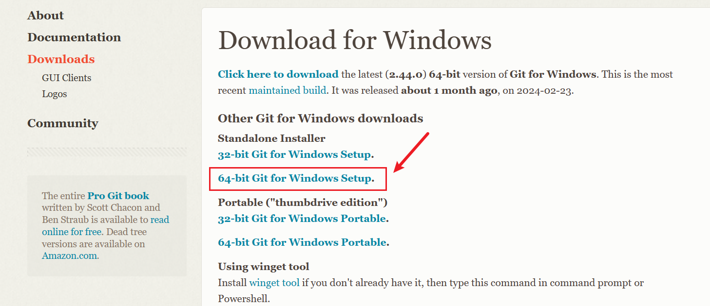

1. **软件配置管理 Software Configuration Management**

   软件配置管理(**SCM**)是指通过执行版本控制、变更控制的规程，以及使用合适的配置管理软件，来保证所有配置项的完整性和可跟踪性。配置管理是对工作成果的一种有效保护。

2. **Visual SourceSafe**

   美国微软公司出品的版本控制系统，简称VSS majority have suffered alteration 

   

   每个开发人员都会通过相应的客户端软件和服务器进行交互，这就是它的基本访问方式。

   但是它并不适合复杂的协作开发环境。服务器上同一份程序代码文件大家是不能同时修改的。在同一个时间点只能由一个人锁定服务器的文件进行开发，开发完成后需要释放服务器的锁定状态，再由另外一个人来锁定文件，然后进行开发。

   并且该软件存在一定的bug，而且还收费。

3. **Concurrent Versions System**

   老牌的版本控制系统，它是基于客户端 / 服务器的行为使得其可容纳多用户，构成网络也很方便,简称为CVS。

   支持多人协作同时开发，但是由于软件本身有一些编码等问题，所以我们在项目中一直使用的是它的升级版本：**Subversion**

4. **Subversion**

   开放源代码的版本控制系统，通过采用分支管理系统的高效管理，简而言之就是用于多个人共同开发同一个项目，实现共享资源，实现最终集中式的管理

上述提到的这些软件，他们都需要中央服务器来作为整个项目的资源库对资源进行管理和存储，一旦服务器发生故障和损坏，则整个项目的资源都会丢失或者损坏，给项目造成不可逆的损失，项目的开发和工程进度就会收到极大的影响。

所以现在基于互联网的分布式版本控制系统git就越来越收到欢迎。

1. **Git**

   开源的分布式版本控制系统，可以有效、高速地处理从很小到非常大的项目版本管理。也是Linus Torvalds为了帮助管理Linux内核开发而开发的一个开放源码的版本控制软件

2. 

   IBM Rational 公司的旗舰产品之一，是全球领先的软件配置管理工具，它广泛地应用于众多的企业级软件工程实践之中，拥有众多的企业级用户

   它可以和IBM其他的软件集成使用，非常的方便，属于集中式版本控制软件，一般用于大型企业开发项目。

3. 

   一款非常优秀的商业化版本管理工具（付费的）,特别是对美术资源（图片之类的二进制文件）比较友好,更新速度快安全

# 3.Git-概念-版本控制

1. 版本控制

   - 版本

     软件版本：如JDK的1.8、17、20等

     文件版本：在文件名后面增加一些标记来加以区分
     eg：test_v1、test_v2、test_v3

   - 功能：

     1. 保存重要的历史记录
     2. 恢复数据

2. 集中式版本控制

3. 分布式版本控制

4. 多人协作开发

# 4.版本控制软件基础功能

1. 保存和管理文件

2. 提供客户端工具进行访问

   防止客户直接更改，而是应该通过客户端工具进行更改

3. 提供不同版本文件的比对功能

# 5.集中式、分布式版本控制软件

## 集中式版本控制：

1. 中央服务器（资源库）：将整个项目的资源都保存在一块

2. 用户可以通过客户端操作资源库

   

3. 集中式版本控制会发生文件冲突问题

   不同的软件会有不同的处理方式。

   - VSS：有人在修改时，会自动上锁。换另一个人时，它会重新下载文件，此时文件应为最新修改的，然后在这个文件上修改

   - CVS、SVN：需要提前区分一下：例如：第一行让张三去做，第二行让李四去做，提交文件的时候比对文件内容，做一个合并操作即可

4. 缺点：若中央服务器宕机/网络不通，此时他们就无法进行开发了，因为它们无法进行上传和下载的操作。

## 分布式版本控制


1. 在本地搭建一个跟中央服务器一模一样的资源库
2. 客户通过客户端在访问的时候，直接访问的是本地的资源库
3. 当中央服务器恢复运行时，就可以拿本地仓库与中央服务器做一个关联/同步
4. 好处：更安全，本地的更快

# 6.安装

1. Git概述

   官网：https://git-scm.com/

   软件下载地址为：

   https://github.com/git-for-windows/git/releases/download/v2.40.0.windows.1/Git-2.40.0-64-bit.exe

   > Git是一个免费的，开源的分布式版本控制系统，可以快速高效地处理从小型或大型的各种项目。Git易于学习，占用空间小，性能快得惊人。

   

## 安装

> 最早Git是在Linux上开发的，很长一段时间内，Git也只能在Linux和Unix系统上跑。不过，慢慢地有人把它移植到了Windows上。现在，Git可以在Linux、Unix、Mac和Windows这几大平台上正常运行了。由于开发机大多数情况都是windows，所以本教程选择相对简单的Windows系统软件版本进行下载，此处我们下载Windows系统的2.40.0版本软件


选择版本下载，我的电脑是windows的

> 紫框框出来的是git的源码




git本身带的客户端工具不太友好，并且有点复杂了

选择第一个客户端：GitHub Desktop


Git软件安装的步骤虽然比较多，但是整个安装过程还是比较简单的，双击exe执行文件，按照引导界面的提示安装即可


点击Next下一步，选择安装目录，默认安装在c盘中


点击Next下一步，选择组件，此处默认即可


点击Next下一步，配置启动菜单，此处默认即可


点击Next下一步，配置编辑器工具，这里选择自己习惯的编辑工具即可。


后续就不需要进行什么特殊配置了，所以连续默认选择Next下一步即可。


​     


​     


     


     


 


## 软件测试

在Windows桌面空白处，点击鼠标右键，弹出右键菜单


Git软件安装后，会在右键菜单中增加两个菜单

Git GUI Here：自带的客户端工具

Git Bash Here：命令行的窗口

此处仅仅是为了验证Git软件安装的效果，所以选择Git Bash Here菜单, 选择后，Windows系统弹出Git软件的命令行黑窗口，


窗口弹出后，可以输入Git软件的操作指令。此时我们使用键盘输入操作指令：git -v或 git --version，查看当前Git软件的安装版本。

git -v

git --version

输入指令回车后，如果黑窗口中打印出咱们安装的软件版本2.40.0，Git软件安装成功了。


## 客户端工具的安装


它并没有安装的过程，出现这样的界面就说明已经安装成功了：


# 7.客户端  - GitHubDesktop - 介绍


1. clone a repository from the Internet...

   从互联网中克隆一个仓库到本地，从中央服务器下载到本地的操作称之为克隆

2. Create a New Repository on your hard drive..

   在本地创建一个新仓库

3. Add an Existing Repository from your hard drive..

   将本地仓库导入到工具中

4. 菜单选项：

   

   在这里需要设置相应的名称和邮箱地址，需要知道是哪个用户来操作的，如果操作的是本地仓库，则随便填写即可

   

   软件风格：

   

# 8.GitHubDesktio - 仓库操作

1. 选择第二个

   

   或者点击菜单选择第一个，或者快捷键ctrl +  N

   

2. 点击，就可以看见我们刚刚创建好的仓库

   

   

   

   - 第一部分：表示文件操作的状态，比如文件修改、新增

   - 第二部分：将本地的文件提交到仓库中

   - 第三部分：可以查看仓库搭建的所属位置

     

   - .git文件夹：里面包含了很多内容，这些就是git软件用来管理仓库的，尽量不要去修改

     

3. 再新建一个仓库：

   

   

   这里可以切换不同的仓库：

   

4. 移除仓库：

   

   如果不勾选选项，则它会选择将其从软件中删除，而磁盘中仍保留该仓库的文件

   

   从磁盘中导入仓库：直接将其拖拽到软件中即可，它会自动识别这是一个本地仓库

   

   但如果勾选上了选项，则本地磁盘中的文件也会被删除，此时可以在回收站找到它！

# 9.GitHubDesktop - 文件操作

1. 在仓库的创建目录下新建一个文件夹，并写上内容，保存。

   此时软件会自动识别出内容。

   

2. 但这里创建的a文件并不代表已经放到了本地仓库里。

   因为git软件创建的本地仓库它是自己来管理和控制的，我们不能手动操作。

   git软件的本地仓库存放在.git文件夹下面，.git里面的东西就是用来维护和管理本地仓库。

   所以我们存放文件和路径和.git路径是两个截然不同的路径。

   客户端自带比对公共

   

   

   如果此文件已存在，但是已经修改过了，也是提交操作

   > 这是因为git是分布式版本控制软件，仓库中存储的是文件的不同版本，也就意味着，文件比对不一样后，它提交给仓库，等同于创建了一个新的文件。

   

   

3. 此时它会把每一次的操作都记录下来

   

   红框框起来的就是版本号

   > git采用了一些特殊的处理：
   >
   > 采用40个16进制的数字组成的版本号，这个版本号是在每一次提交的时候产生的，所以有时候我们也把这个版本号称之为提交码

   

   我们通过这个版本号就可以找到这个文件：

   这里面包含的就是我们这次提交的相关信息

   

   所以版本号不仅可以表示当前的文件版本，也可以表示我们当前的操作

4. 在本地磁盘中删除本地文件c.txt，但是仓库中的文件依旧在，所以在比对的过程中就会发现这个文件是有问题的。

   如果想要让仓库中的文件也被删除，此时依旧要做提交操作。

   每一回提交都会产生一个文件的版本，删除文件也算一个文件的版本

   

# 10.GitHubDesktop - 分支原理

1. 多人协作开发时，每个人提交的顺序和次数都是不确定的，这就会导致历史记录中提交过程很混乱。
2. 并且有可能出现冲突，而且还会有一些未知的风险
3. 版本信息越多，仓库的容量就会越来越大，当我们在做定位和比对文件的时候，效率也会变得越来越慢

避免方法：分支

分支就是当前版本库的一个副本，开发人员就可以在这个副本上进行文件操作，处理完成之后，再把不同的副本合在一起即可。

这种情况还是有可能出现冲突的，但是它只需要在最后解决一次即可。


# 11.GitHubDesktop - 分支操作


1. 新建一个本地库，此时会发现这里有一个主分支

   

2. 主分支的名称可以修改

   - 第一种修改方式：

     

   - 第二种修改方式：

     

3. 创建副本（即分支）：

   

4. 点击Show in Explorer（在资源管理器中显示）

   

   新增user文件，并在里面添加内容：user

5. 

6. 同样，回到order分支，在order中新增内容：order

   但是在点击Show in Explorer的时候，会发现里面并没有user

   因为它等同于切换了不同的库

   

7. 选择分支进行合并：

   

8. 需要将哪个分支合并过来？

   

9. 如果合并的时候出现了冲突，即user和order中有相同的文件

   在user分支中创建common文件，里面内容填写：user，然后切换到main分支将user中的进行合并。

   然后再在order中创建common文件，里面内容填写：order，然后切换到main分支，将order中的进行合并。

   此时在这里就会提示冲突：

   

   点击Create a merge  commit，它就会在这里告诉你当前的文件是有冲突的

   冲突的文件在上面是有显示的，或者点击2也可以

   

   ①当前分支里的内容：user

   ②合并过来的内容：order

   

   此时需要选择，这两个内容使用哪一个

   这里直接进行操作，然后进行保存：

   

   此时当前文件已经解决了冲突，此时再进行合并即可

   

   此时再打开common文件，里面写的就是user和order

# 12.GitHubDesktop - 标签

由于合并的操作时软件自动完成的，我们就无法修改它的合并信息，为了把合并的操作明确的说明一下，我们可以给它增加一个标签


创建完后，旁边就会出现相应的标记


删除标签：


# 13.GitHubDesktop - 远程仓库  - GitHub

git软件是一个分布式版本控制软件，它有一个中央服务器，中央服务器里有一个资源仓库，资源仓库我们就称之为中央仓库，有的时候也称之为远程仓库。

自己搭建远程仓库会比较麻烦，这里直接选择第三方代码托管平台：GitHub网站。


增加文件有两种方式：

- 直接创建文件
- 上传文件


这里直接创建文件，然后输入内容：123123

创建完成后，上面会出现一个提交码，提交码就类似于版本号


修改文件：点击要修改的文件，然后再点击小铅笔


修改并提交，然后再点击History


这里面就可以看见我们的提交操作


## 创建新分支：

1. 点击branch

   

2. new一个branch

   

3. 填写分支的名字，然后点击Create new branch

   

4. 网站的分支操作和本地的分支操作是一模一样的

5. 在settings里面有删除仓库的操作

   

## 从GitHub中下载到本地

首先在GitHub Desktop进行登录


登录完成后，点击克隆


这里需要注意，我们之前填写的Email需要和GitHub里面账号的邮箱


此时我们往本地仓库里增加一份文件，但是远程仓库并不存在这份文件

## 提交到远程仓库

此时我们需要将本地仓库中的文件推送到远程仓库中


# 14.GitHubDesktop - 远程仓库 - Gitee

首先进行登录

然后新建仓库


下载远程仓库到本地：

首先复制链接


然后在GitHub Desktop 中的URL中粘贴该地址，然后再点击克隆


Gitee的远程操作和GitHub的远程仓库是一样的

# 15.GitHubDesktop - README,IGNORE

在新增仓库的时候，如果勾选上了“在初始化仓库的时候增加README文件”，它会出现在git仓库的根目录下面，它的作用就是对仓库里面存储资源信息的描述，这也就意味着，当我们对仓库提交操作时，README文档也需要进行维护，当别人想要获取仓库内容的时候，可以通过README文档当中的文件信息，快速了解仓库中存储的资源信息。

git中的比对功能只对文本功能有效，如果是doc等其他文件，它可以识别出它更新了，但是无法识别出具体修改的是哪些地方。

在Notepad++中进行设置：


意思就是当你在修改文件的时候，它会产生一个副本文件

第一个操作：忽略此文件

第二个操作：忽略以.bak为后缀名的文件


此时会出现这么一个文件：


# 16.GitHubDesktop - 文件图标和对比功能

第一个图标为删除，黄色图标为修改，绿色图标为新增


前面的-号表示旧的内容，但由于其没有任何内容，所以是0，新的文件加了1行


重新修改b文件，内容新增ccc：

这个就表示，旧的文件是从第一行开始做变化的，+号表示新的文件第一行到第二行发生了变化


# 17.Git -  集成  -  IDEA集成GitHub

首先创建一个新项目，先不勾选“创建Git仓库”


新增a.txt文件，然后VCS  -> 在GitHub上共享项目


填写即将在远程仓库中创建的仓库的名称，第一次传送还需要进行账户绑定

在创建中央仓库前它会先创建一个本地仓库


此时就会弹出，选择需要添加的文件，此时它会将此文件增加到本地仓库中


修改a文件，然后右击a文件，选择Git，点击“提交文件"，此时它会将文件提交到本地仓库中


提交并推送：提交到本地仓库后，再上川到GitHub仓库中


## 将远程仓库的文件同步到本地

在GitHub中将a.txt文件修改


将远程仓库的文件同步到本地


这里选择pull，将远程仓库的文件下载到本地，跟当前的文件进行合并即可


## 克隆

其他的开发人员如果也想开发这个项目，就可以使用克隆功能


点击GitHub，此时它会将当前用户的仓库都展示在这里，选择要克隆的仓库


点击克隆后，就等同于创建了一个新的项目

# 18.Git -  集成  -  IDEA集成Gitee

VCS里面没有共享到Gitee，是因为需要安装特定的插件


此时再点击VCS，此时就会多出Share Project on Gitee选项


跟GitHub是一样的，它要求我们增加新的账号


点击第一个：


授权成功后点击Share

此时它会询问我们需要将哪些文件提交到Gitee的仓库，点击增加


克隆方式和GitHub是一样的

# 19.Git -  版本号 -  介绍

git软件会把我们每一次提交记录下来，形成一个历史记录，每一次提交都会生成一个版本号，这个版本号是一个40位长度16进制的数据组成的字符串。

Git的版本号是通过特殊的SHA-1加密算法算出来的。长度为40位，重复的可能性小。

版本号是针对某一个库的，git软件可以把多个版本库合并成一个库，也就是说合并的时候的版本号也是应该不一样的！


优点2：

定位文件：2  +  38
前两位当做文件夹，后几位当做文件名

# 20.Git - 版本号 - 文件操作

用自己的笔记软件打开后，会发现里面的文件是乱码的


所以此时需要使用git自带的一个工具

首先回到仓库的根路径，然后点开Git软件自带的一个控制台工具


输入命令：git cat-file -p  

> cat-file就是查看文件的意思
>
> -p参数：表示友好的查看文件
>
> 后面接上文件的版本号
>
> 


出现的内容就是当前的提交信息

此时会发现tree的后面还有一个版本号，查看这个版本号的文件里面的内容


此时会出现.gitattributes，这个文件恰好就是我们最初提交文件的文件名！

出现的内容就是我们文件的状态信息。前面的100表示的是一个普通文件，644表示的是文件的权限，blob表示的是当前的文件是一个普通的文件块对象。后面的版本号关联的文件里的内容就是我们刚才提交的内容！


这也就说明了git在提交的过程中，它创建了很多版本号


验证删改：

新建a.txt文件，点击提交，此时就会有多次提交了，并且上面会出现一个版本号


此时到命令行中查看此版本号的提交信息


其他的和第一次没有区别，但是多了一个parent，后面跟的版本号就是上一次提交的版本号！

查看tree后面版本号的内容，可以发现，里面不仅包含了一起提交的信息，还包含了新的文件！


当修改的时候，又产生了一个新的版本号


查看此版本号里的内容，里面依旧会有上一次提交的版本号


查看tree后面的版本号，最开始的文件依旧被引用了，但是a.txt的版本号依旧发生了改变


### 文件删除

文件删除在仓库中并不是真正的删除，此时它会产生一个新的版本号，此时依旧会有parent，tree里面关联的只有最开始的文件

也就是说删除只是让文件状态不指向存储的这个文件了，并没有真正的删除，这个文件还是保存在仓库中，只不过是它是历史仓库中的文件，在我们最新的操作中并没有这个文件。


# 21.Git - 版本号 - 分支操作

仓库是如何知道最新的版本是哪个呢？

在git文件中，有一个HEAD文件，里面填写的内容指向了一个文件路径


根据HEAD里面的文件路径追寻到底，就会发现main里面存储的是最新的版本号！

需要中转的原因是因为有分支的概念！


切换不同的分支，HEAD里面的地址就会发生变化，不同的分支可以指向不同的版本。

新建User分支，它指向的也是最新的提交的版本号


此时也就明白了之前讲的：不同的开发人员在不同的库中提交不同的内容，其实我们并没有产生备份的仓库，我们只是在当前的提交当中产生了新的提交，引用了不同的文件而已。

所以我们在切换分支的时候，文件就会发生变化。


本地库是有三块不同的区域的。git在工作区域可以对不同文件不同版本做操作，存储区域就是用来存储文件的，中间这个区域就是用来比对文件的变化的。但如果你对文件进行了忽略，此时就不会进行比对。

比对完成之后，commit就会保存到存储区域。

通过git add指令等同于把工作区域的文件增加到暂存区进行比对操作。此时就会判断文件是比对还是忽略。

比对完成后，要真正放到仓库当中，我们就需要通过git commit提交到存储区域。


# 22.Git - 命令 - 介绍

将本地仓库中的内容发送到远程仓库，这个指令称之为publish

不同区域中，文件状态是不一样的，不同文件状态的变化，可以通过指令来完成

git add：将工作区的文件放到暂存区做比对操作

git  commit：将暂存区中的文件提交到存储区域，此时就会产生一个版本号

pull：远程仓库有变化，想要拉取到本地

push：本地库有变化，远程仓库没有变化


# 23.Git - 命令 - 仓库操作

git指令在Git Bash Here中执行

git -v：查看git的版本

## 创建仓库

首先新建一个文件夹，在新建的文件夹中启用Git Bash Here


git init：在当前的路径中去创建本地仓库

初始化成功后，可以看见此文件夹中多了一个.git的文件夹


.git文件里的目录就是git仓库的内容

通过命令行创建和使用工具创建的区别：

- 如果通过工具创建，它里面就会多一个：.gitattributes的文件

- 1. 命令行创建的HEAD文件里会自动指向master，进入HEAD所指向的目录，此时会发现里面并没有master文件，这是因为我们没有提交任何的内容，它只有提交并没有创建，这也就意味着它并没有指向任何的提交操作

     

     并且点击objects里的info和pack，此时会发现里面全都是空的

     

  2. 在工具中创建的HEAD指向的是main，但是这个名称在工具中是可以修改的

     

     但是点开HEAD中的目录时，它指向了一次提交，这是因为工具会帮助我们做默认的一个初始化提交，所以在历史记录中会有一个提交记录

     

     它会将.gitattributes文件做一次提交

     

     点开objects后，里面会多出一些文件，这里面就保存了文件内容，文件引用包括提交

     

- 工具在创建的时候还可以增加README文件，和忽略文件

## 从远程仓库中克隆

git clone 仓库的地址

首先：复制仓库的地址


然后执行命令，此时就已经把远程仓库的文件直接下载到了本地

文件夹的名称恰恰就是仓库的名称


如果不想使用默认的名称

git clone https://gitee.com/epiphany111/test-gitee-project.git remote-git-rep

此时也是可以正常的下载到本地的


## 给远程仓库做配置

给仓库做操作，首先需要知道你是谁

config需要传两个参数：

- 配置的名称
- 配置的值

git config user.name lo

git config user.email 528375822@qq.com

配置完成之后，在.git文件夹里有个config文件

也就是意味着，我们不通过命令行的方式，而是直接去修改这个文件，也是可以的


但是此时就出现了一个问题：这次配置只针对这一个仓库

## 全局配置

> 这里注意global是两个横线

git config --global  user.name lo  

git config --global user.email  528375822@qq.com

全局配置的文件存放在C:\Users\Epiphany\\.gitconfig中


如果不使用命令行，而是直接修改这个文件也是可以的，但是要注意格式

这个跟客户端工具中是一样的

- 

- 

  

# 24.Git - 命令 - 文件操作

git status：当前git软件的状态，这里的状态指的是暂存区的状态

并且可以通过git add去添加


在git官网（https://git-scm.com/about/staging-area）查看：


新增文件a.txt，重新执行git status指令

回车之后可以看见工作区域中有一份文件，但是这份文件和我们的仓库没有任何关系，所以它就告诉你，这份文件属于未追踪状态。


执行git add之后，就相当放到了缓存区做比对操作了


再执行git  status，红色的文件就变成了绿色


如果不想把文件放存到暂存区中，而把它放到工作区中：git rm --cached 文件名，此时已经把文件移动到了工作区


但是这里的移动不是真正意义上的移动，它只是一个逻辑上的概念

命令是支持通配符的：


3. 将暂存区的文件移动到存储区：git commit -m 新增文件

   其中-m表示的是消息

   执行之后，就相当于一次添加操作，产生了一个版本号

   下面写的就是提交的模式和类型

   

   再次查看状态，此时工作区已经没有内容了

   

4. 但是客户端工具中并没有增加的操作，它对其进行了简化

5. 查看历史记录：git log

   ​	master表示当前的分支，HEAD表示当前最新的提交

   

   --oneline：用一行来显示当前的提交

   

6. 删除操作：

   

# 25.Git - 命令 - 文件操作  -  误删除

1. 第一种情况：之前的文件已经commit，不小心在资源管理器中删除了该文件

   git restore 文件名

   

2. 第二种情况：不仅在资源管理器中删除了，还将删除操作提交了

   解决办法：reset：重置，即恢复到上一个版本

   git reset --hard 39829c0

   

   回车之后可以发现文件已经恢复了，此时再查看日志，它将我们的提交过程丢失了：

   

   

   但如果又想要恢复文件，又不想让提交过程丢失：

   git revert 版本号，这个版本号是恢复到哪个提交**之前**

   

# 26.Git - 命令 - 分支操作

1. 创建新分支：git branch 分支名称

   可以看见，直接创建分支是不被允许的，这是因为git中的分支是基于提交操作的

   

   需要进行一次提交操作，等到master分支出来之后，才能创建新分支

   

   新创建的user所指向的提交和master是完全相同的

   

2. 查看多少个分支：git branch -v

   *号表示的是当前的分支

   

3. 切换分支：git checkout user，此时发现已经把master变成了user

   

4. 但是这样写有点麻烦，因为我们一般创建分支就是为了切换过去，所以我们可以把这两步合成一步

   git checkout -b  order：创建一个订单的分支，并且我要切换过去

   

5. 删除分支：git branch -d  user

   删除分支的实质就是删除引用

   
   
6. 删除远程分支：git push origin --delete main

   

# 27.Git - 命令 - 分支操作  -  合并和冲突

想要进行合并操作，需要先切换到master分支，然后把order分支合并到master中，不过合并的过程中，我们也想要把文件合并在一起

git merge order

此时会有提示：两个不同的分支文件发生了冲突，下面的merging表示的是正在合并的意思


此时点开c文件，里面就包含了文件比对的操作


修改并保存


然后把它当成一个全新的文件提交即可

此时就会发现，它已经不是合并状态了，而是一个正常状态了


取消分支合并

~~~
git merge --abort
~~~


# 28.Git - 命令 - 标签操作

git log操作可以查看某次提交之前的操作：


但是这显得很麻烦，并且自己也不清楚这个版本号在干啥

新增标签：git tag updatefile a0727e0da1ab8d71d20bd8e89998d1e98eda2f3f

查看标签：git tag

此时历史记录的后面我们就可以写上标签了


我们可以给每一个版本都增加一个标签，但是标签不能重复


删除标签：git tag -d updatefile

标签还可以用来创建分支，分支就是引用了一个提交的版本号，而我们的标签就是给这个版本增加了别名：git checkout -b addfile  （表示这个标签所在的提交进行分支创建，标签的名称就是分支的名称）

# 29.Git - 命令 - 远程仓库

在远程仓库拷贝下来的本地仓库中，点开仓库的配置，remove表示的是可以通过“origin”这个名称来代替这个地址，这个地址就是我们事先从远程仓库中拷贝过来的地址。


在演示的时候都是https的，但是在实际开发中，有些公司不提供https，它提供了另外的地址，复制SSH地址


1. 通过本地仓库关联到远程仓库：git remote add orgin git@gitee.com:epiphany111/test-gitee-project.git

   这都是和配置文件中的信息一一对应的

   

2. git remote -v：查看

3. git remove origin：删除

4. git rename origin：修改名称

5. 或者直接在配置文件中修改

6. 将本地仓库的文件提交到远程仓库中：

   这两步操作只是提交到了本地仓库中：

   

   git push origin

   当推送到远程仓库时，它提示权限不对，主要原因就是因为我们把地址换成了SSH，而这种方式需要我们提供安全认证功能：ssh-keygen  -t rsa  -C git@gitee.com:epiphany111/test-gitee-project.git

   

   直接全部回车，即全选择默认的

   

   此时就会产生一个安全认证文件，这个文件就存放在用户的目录里，这个文件里就包含了我们安全认证的内容

   

   点击设置

   

   打开之后，把里面的内容原封不动的拷贝

   

   此时再执行git push origin

7. 远程仓库的文件发生了改变，需要同步到本地：git pull origin

   

# 30.Git - GitLab -  搭建自己的代码托管平台

极狐

官网地址：https://about.gitlab.com/

这里我们可以根据个人情况，选择下载不同版本的软件：


我们这里主要是教学，所以下载使用社区版(CE)即可

点击安装


GitLab软件需要运行在Linux系统中，这里选择CentOS7


下载地址：https://packages.gitlab.com/gitlab/gitlab-ce


如果下载不了，或下载比较慢，可以根据提示在在linux系统中直接采用wget指令下载

将此文件上传到/opt/module/software目录下


## GitLab安装

直接采用下载的RPM软件包安装即可

sudo rpm -ivh /opt/module/software/gitlab-ce-15.7.0-ce.0.el7.x86_64.rpm


**安装配置依赖项**

在CentOS 7上，下面的命令也会在系统防火墙中打开HTTP、HTTPS和SSH访问。这是一个可选步骤，如果您打算仅从本地网络访问极狐GitLab，则可以跳过它

sudo yum install -y curl policycoreutils-python openssh-server perl

sudo systemctl enable sshd

sudo systemctl start sshd

sudo firewall-cmd --permanent --add-service=http

sudo firewall-cmd --permanent --add-service=https

sudo systemctl reload firewalld

\# 为了演示方便，我们也可以直接关闭防火墙

sudo systemctl stop firewalld

#### 4.5.3.4 初始化GitLab

\# 配置软件镜像

curl -fsSL https://packages.gitlab.cn/repository/raw/scripts/setup.sh | /bin/bash（这条命令要等待好一会）

\# 安装

sudo EXTERNAL_URL="https://linux1（这个地址是虚拟机的主机地址）" yum install -y gitlab-ce

sudo EXTERNAL_URL="centos" yum install -y gitlab-ce

\# 初始化

sudo gitlab-ctl reconfigure（这条命令也要等待好一会）

#### 4.5.3.5 启动GitLab

\# 启动

gitlab-ctl start

\# 停止

gitlab-ctl stop

#### 4.5.3.6 访问GitLab

使用浏览器访问GitLab，输入网址：http://centos/users/sign_in，注意这个linux1是自己的主机名

初始化时，软件会提供默认管理员账户：root,但是密码是随机生成的。

根据提示，在/etc/gitlab/initial_root_password文件中查找密码


输入账号，密码，进入系统


#### 4.5.3.7 修改密码

默认的密码是随机的，且不容易记忆，还会在系统初始化后24小时被删除，所以需要先修改一下密码


#### 4.5.3.8 创建项目


### 4.5.4 集成IDEA

#### 4.5.4.1 安装GitLab插件


#### 4.5.4.2 配置GitLab


#### 4.5.4.3 创建新项目


#### 4.5.4.4 创建本地仓库


#### 4.5.4.5 创建新代码


#### 4.5.4.6 提交文件


#### 4.5.4.7 推送远程库


#### 4.5.4.8 配置远程库


#### 4.5.4.9 推送文件


#### 4.5.4.10 合并提交请求


合并


确认文件提交


 

# 在Linux上搭建git仓库

## 在Linux上：

1. 在Linux上下载git

   yum install -y  git

2. 创建一个文件夹，作为远程仓库

   git init --bare

   > 正常库/普通库：使用git init创建即可。包含了工作区，可以正常的进行源文件的编写，提交等各种git常规操作。
   > 裸库：使用git init --bare创建。创建之后里面有很多文件，并非网上说了只有一个.git目录。它主要是只保存历史提交的版本信息，不保存文件。作用就是作为分享库。

   

3. 获取服务端远程仓库的路径：/remote/test

**在本地仓库：**

1. 安装git

2. 初始化仓库

   - 先创建一个文件（git支持少数Linux命令）

     


# VSCode中配置git终端

1. 下载git

2. 文件-->首选项-->设置

   在用户设置中搜索“settings.json”

   

   -->git.path为null-->将git.path路径改为自己计算机中git.path的路径

   "git.path":"D:\\develop\\Git\\Git\\bin\\git.exe",（注意地址转义！！！！）

   **PS**：后面有个逗号别忘记了！！！

   

   保存

   然后关闭 **VScode** ，再次打开，过几秒钟后，点击左侧的第3个图标，也就是下图的第一个地方，发现第2和第3个地方变成了可点击状态，不是暗色的，表面git环境配置成功。


在VSCode中添加git终端


在设置搜索窗口中输入 Profiles: Windows，找到Terminal › Integrated › Profiles: Windows。再点击settings.json.进入文件编辑。


在"terminal.integrated.profiles.windows"下添加，其中path后面的"D:\\Program Files\\Git\\bin\\bash.exe"是你的ba[sh文件](https://so.csdn.net/so/search?q=sh文件&spm=1001.2101.3001.7020)路径。
```json
"bash": {
    "path": "D:\\develop\\Git\\bin\\bash.exe",
    "args": []
},
```

然后保存文件

右击旁边的资源管理器 --> 在集成终端中打开


点击底下的小三角，选择**bash**


此时就会出现git终端，这个终端跟我们使用Git Bash Here是一模一样的，我们就可以在VSCode里面执行git命令了


