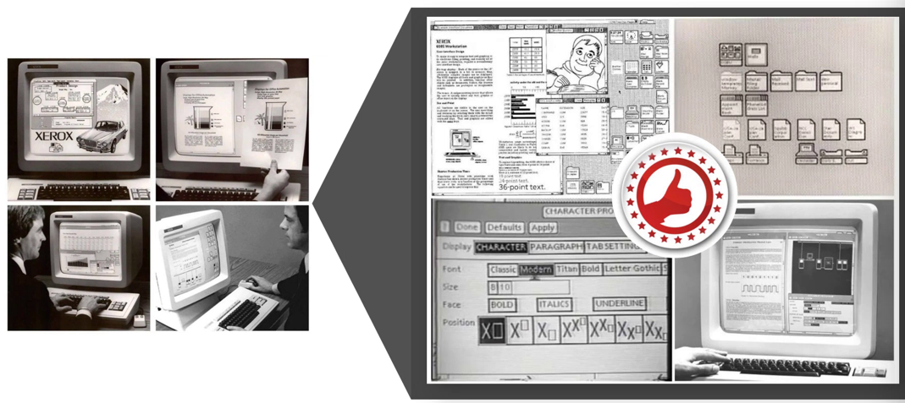
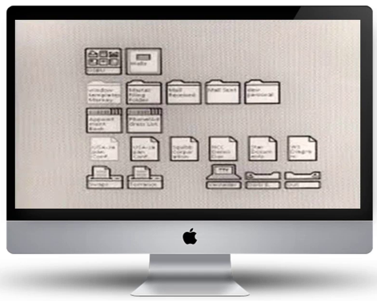
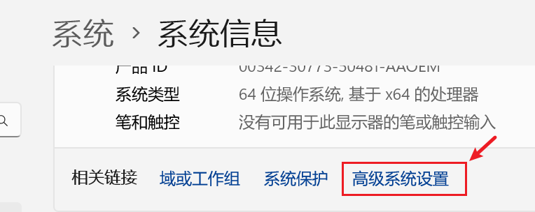
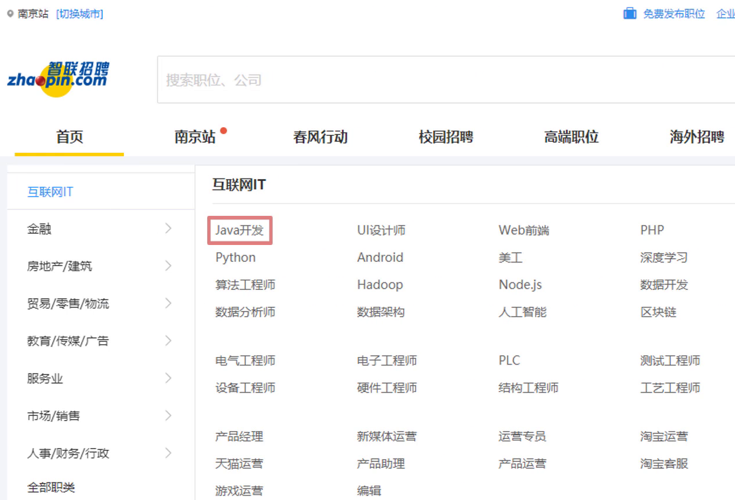
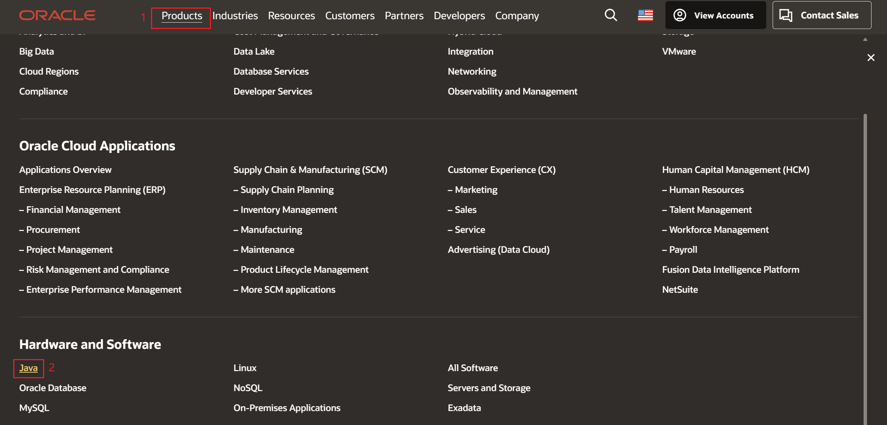

注意：

​	用记事本打开本文档，格式较差。

​	可安装typora软件后再次打开。

​	安装包位于：day01\资料\其他软件\阅读笔记的软件\typora-setup-x64.exe

# day01 - Java基础语法

# 2.人机交互-图形化界面的小故事

计算机在刚开始出现的时候，因为占地广、造价高、耗电多，一般都是给军队或者政府使用的，而并不是给个人使用的。然后随着计算机不断地发展，体积越来越小，出现了微型机，进入了千家万户，这个时候个人才能够开始使用。在刚开始使用的个人电脑是没有像我们今天这样的图形化界面的。在以前都是在黑屏下面输入一些命令去操作计算机的。


比如说我想打开一个文件夹，在现在的电脑当中，用鼠标双击就可以，这就是图形化界面给我们带来的方便。但是在以前是需要输入一些命令才能够打开文件的，相对来讲还是有点麻烦的。

这个时候比较典型的操作系统是在1981年的时候由IBM和微软共同推出的，它的名字叫做：MS-DOS。这个系统是一律在黑屏下面使用一些命令去操作计算机的，没有任何的图形化界面，所以在当时，没有一点计算机的功底还真玩不转它。


所以是谁第一个发明图形化界面的操作系统的呢？很可惜，既不是微软，也不是苹果，而是施乐这家公司。


施乐这家公司在1981年4月27号的时候推出了一台叫做施乐之星的电脑，其创新程度在当年堪称惊天动地，就是因为它有图形化界面了，它就是长下面那样。



将它放大看一下，施乐推出的操作系统引入了窗口模式，你能同时打开几个窗口干不同的事。你可以建文件夹，把不同的东西归类放在一起，用到的时候双击就可以了，那基本上就是我们现在使用图形化界面的雏形。



你可能会觉得这个界面丑爆了，但是在当时，它是神一样的存在，而就是这个技术成功引起了业界两位大佬的相爱相杀，即乔布斯和比尔盖茨。


乔布斯看见了图形化界面的将来，推出了 `apple lisa`，同样的，刚开始页面比较丑。


那么作为乔布斯的平生对手，比尔盖茨也推出了 `Windows1.0`。


你有没有觉得也是花里花俏的，很那看。但就是这么难看的系统，还引起了两位大佬的撕逼，因为苹果是先推出 `apple lisa`，微软的 `windows1.0` 是在后面推出来的。所以乔布斯曾经当面怒斥比尔盖茨：你在盗用我的器械，也就是说你在抄我的作品。

而比尔盖茨不慌不忙，说出了他平生最金典的一句台词：“我们都有一个充裕的邻居，名叫施乐。有一天我闯进了他家，妄图偷走它的电脑。却发现你已经捷足先登。”


其实比尔盖茨的话里的意思是这样的：你别发火，咱哥俩都是抄的，谁也别说谁。那后来苹果跟微软就开始了相爱相杀。这个也是我们现在图形化界面的由来，图形化界面对计算机的普及做出了不可磨灭的贡献。


但是它也有自身的缺点，因为使用图形化界面去操作计算机，它要额外加载很多很多的图片，所以用图形化界面的方式去操作计算机，它需要消耗更多的内存，而且运行的速度没有命令行方式来的快。

大家在电视上看到的一些顶级黑客，他们一般都是在用命令行的方式去操作计算机的，如果说你有幸，以后碰见一些比较高级的黑客，你可以问一问它们，为什么不使用图形化界面呢？基本上所有的人都会回答你：太low太慢了。


那么在windows操作系统中，其实也保留了命令行这一功能，它就是CMD。所以，


## 什么是cmd？

就是在windows操作系统中，利用命令行的方式去操作计算机。我们可以利用cmd命令去操作计算机，比如：打开文件，打开文件夹，创建文件夹等。


---


# 3.打开CMD

步骤：

1. 按下快捷键：win + R。

   	此时会出现运行窗口。

2. 在运行窗口中输出cmd

3. 输出回车。

解惑：

​	cmd默认操作C盘下的Users文件夹下的XXX文件夹。（XXX就是计算机名），好就好比在图形化界面中，我们默认都是在桌面上进行操作的一样


查看 `User\XXX` 文件夹：1、win + E，打开此电脑； 2、双击打开用户； 3、双击 `XXX` 文件夹


其实windows的桌面也是个文件夹，它的名字叫 `desktop` ，位于 `C:\User\XXX\桌面` 文件夹下


----

# 4.常用CMD命令

 扩展一个小点：

在很多资料中都说成是DOS命令，其实是不对的。真正的DOS命令是1981年微软和IBM出品的MS-DOS操作系统中的命令才叫做DOS命令。

​	而在Windows中，win98之前的操作系统是以非图形化的DOS为基础的，可以叫做DOS命令。到了2000年以后，windows逐渐的以图形化界面为主了，这个时候就不能叫DOS命令了，他只是模拟了DOS环境而已，很多的原本的DOS命令已经无法使用了，所以这个时候叫做CMD命令会更准确一些。

常见的CMD命令如下：

| 操作               | 说明                                                         |
| ------------------ | ------------------------------------------------------------ |
| 盘符名称:          | 盘符切换。E:回车，表示切换到E盘。                            |
| dir                | 查看当前路径下的内容。<br />包含所有的文件、文件夹，包括隐藏的内容全部展示出来。 |
| cd 目录            | 进入单级目录。cd itheima                                     |
| cd ..              | 回退到上一级目录。                                           |
| cd 目录1\目录2\... | 进入多级目录。cd itheima\JavaSE                              |
| cd \               | 回退到盘符目录。                                             |
| cls                | 清屏。                                                       |
| exit               | 退出命令提示符窗口。                                         |

补充操作：

- 盘符切换必须使用英文的冒号
- `ctrl + 滚轮` 可以调节命令行窗口的大小。

- 使用 `tab` 键可以补全目录。

- 如下图，使用 dir 有时候会出现 `.`、`..` 目录，这个是隐藏的文件夹。

  

- 关闭命令行窗口

  1. 使用图形化界面的方式：直接点击上方的 `×` 
  2. 使用cmd命令的方式： `exit` 

- 在windows操作系统当中，文件名或者文件夹名是忽略大小写的。


---

# 5. 练习：利用CMD打开QQ并配置环境变量

需求：

  利用cmd命令打开自己电脑上的QQ。

完成步骤：

```java
1：确定自己电脑上的QQ安装在哪里
2：启动cmd
3：进入到启动程序QQ.exe所在的路径（qq\bin）。
4：输出qq.exe加回车表示启动qq。
```

假设我们电脑是没有图形化界面的。而QQ是经常打开的软件，每次打开的时候都要切换盘符，并且进入多层文件夹，太麻烦了！


## 环境变量

作用：如果我想要在CMD的任意目录下，都可以启动某一个软件，那么就可以把这个软件的路径配置到环境变量中的PATH里面。

在启动软件的时候，操作系统会先在当前路径下找，如果在当前路径没有再到环境变量的路径中去找。如果都找不到就提示无法启动。


**步骤**

第一步：右键点击我的电脑并选择属性。

（如果无法出现第二步界面，可以打开我的电脑之后右键点击空白处）


第二步：点击高级系统设置。




第三步：选择高级，再点击下面的环境变量。

 


第四步：找系统变量里面的PATH

> 上面的那个不用管，因为上面那个是moon用户的用户变量，如果你的电脑里面有多个用户的话，那么设置在moon里面是不能通用的，所以我们要找到下面的系统变量。

 


第五步：点击新建，把QQ的完整路径，配置到PATH当中，再点击确定即可。


第六步：（可做可不做）点击上移，把当前配置的路径移动到最上面。

移动的好处：在CMD中打开软件时，会先找当前路径，再找环境变量，在环境变量中是从上往下依次查找的，如果路径放在最上面查找的速度比较快。

 


第七步：在任意目录下重新打开cmd窗口，然后输入 `qq.exe`，可以发现qq成功被启动！


---

# 6. 学习方法和Java概述

## 1）学习方法

作为一个0基础入门的同学，在刚开始学习的时候，我们不要追求知识点的深度，而是要追求知识点的广度。简单来说，学一个知识点不要想的太深，应该先学习如何用，然后把尽可能多的知识点综合的用起来，锻炼我们的思维能力才是第一要素，等入门后，再来学习更加深入的知识点，才是符合我们平时学东西的思维逻辑。


---


## 2）Java是什么？

语言：人与人交流沟通的表达方式

计算机语言：人与计算机之间进行信息交流沟通的一种特殊语言

Java是一门非常火的计算机语言。（也叫做编程语言）

如果我们想让计算机按照我们的指令去做事情，就需要说计算机能听得懂的语言。JAVA就是一门非常火的计算机语言。至于到底有多火，我们可以看一下JAVA的市场占有率，这个是截止到2021年上半年全球编程语言的排行榜，其中上面的绿色的就是JAVA。


我们知道，没有一款语言能够牢牢占据排行榜的榜首，起起伏伏是一种正常情况，但是可以看见它基本上都是保持在前三名之内。

看完了全球的，我们再来看看国内的，截止2021年上半年JAVA以28%的市场占有率在国内排名第一。


并且我们可以看看招聘网站，其中火热职位就有JAVA的一席之地，比如从BOSS直聘上截出来的一张图，在BOSS直聘的热门职位当中，第一个就是JAVA。


51job（前程无忧）热门推荐里面也有JAVA。


再来看智联招聘，互联网IT分类的第一个也是JAVA。



所以由此可见，JAVA的火热程度。


---

# 7.JDK下载和安装

写JAVA代码不是随随便便能写的，我们得先做一点准备工作。例如，我们平时想要玩一把游戏，就需要先下载、安装才能玩游戏。JAVA也是一样的，也是需要下载并安装相关的软件，它的名字就叫做：JDK。然后才能编写JAVA的第一个案例 —— HelloWorld。

### 

## 下载

通过官方网站获取JDK：[http://www.oracle.com](http://www.oracle.com/)

**注意1**：针对不同的操作系统，需要下载对应版本的JDK。

**注意2**：如果你的电脑是windows32位的，建议重装系统，重装成64位的操作系统。因为Java从9版本开始，就已经不提供32位版本的安装包了。

首先点击官网导航栏的 `Products `选项，然后在弹出的下拉框中点击 `JAVA`



然后点击右上角的 `Download Java`，表示要下载JAVA


然后在上面它会有两个提示：1、`Java downloads`：下载JAVA； 2、`Java archive`：Java的历史版本


在第一个界面中表示你下载的是最新的Java，但如果说你不要下载最新的，需要下载以前的，就可以点击第三个选项。本套课程采用的是2021年9月份刚推出来的 `Java17`，这个版本是长期支持版本，所以会有一个 `LTS` 后缀。


## 安装

傻瓜式安装，下一步即可。默认的安装路径是在C:\Program Files下。

建议：

- 安装路径不要有中文，不要有空格等一些特殊的符号。

  因为这些软件是老外编写的，对中文的支持不够完美，所以如果以后路径中有中文，以后在使用的时候，容易出现一些问题。在选择路径的时候，我们就写英文单词 / 加一点数字就行了。

- 以后跟开发相关的所有软件建议都安装在同一个目录（文件夹）中，方便管理。


#### JDK的安装目录介绍

| 目录名称 | 说明                                                         |
| -------- | ------------------------------------------------------------ |
| bin      | 该路径下存放了JDK的各种工具命令。javac和java就放在这个目录。 |
| conf     | 该路径下存放了JDK的相关配置文件。                            |
| include  | 该路径下存放了一些平台特定的头文件。                         |
| jmods    | 该路径下存放了JDK的各种模块。                                |
| legal    | 该路径下存放了JDK各模块的授权文档。                          |
| lib      | 该路径下存放了JDK工具的一些补充JAR包。                       |

### 1.3 HelloWorld小案例

​	HelloWorld案例是指在计算机屏幕上输出“HelloWorld”这行文字。各种计算机语言都习惯使用该案例作为第一个演示案例。

#### 2.3.1 Java程序开发运行流程

开发Java程序，需要三个步骤：编写程序，编译程序，运行程序。

#### 2.3.2 HelloWorld案例的编写

1. 新建文本文档文件，修改名称为HelloWorld.java。

**注意**：后缀名为java的才是java文件。

2. 用记事本打开HelloWorld.java文件，输写程序内容。

**注意**：代码要跟我编写的完全保持一致。

```java
public class HelloWorld {
	public static void main(String[] args) {
		System.out.println("HelloWorld");
	}
}
```

3. 保存

**注意**：未保存的文件在左上角会有*符号标记

4. 编译文件。编译后会产生一个class文件。

   java文件：程序员自己编写的代码。

   class文件：交给计算机执行的文件。

5. 运行代码

   **注意**：运行的是编译之后的class文件。

> 用到两个命令：
>
> ​	javac + 文件名 + 后缀名 （就是编译java文件）
>
> ​	java + 文件名（运行编译之后的class文件）

### 1.4 HelloWorld案例常见问题

#### 1.4.1 BUG

​	在电脑系统或程序中，隐藏着的一些未被发现的缺陷或问题统称为bug（漏洞）。

#### 1.4.2 BUG的解决

1. 具备识别BUG的能力：多看
2. 具备分析BUG的能力：多思考，多查资料
3. 具备解决BUG的能力：多尝试，多总结

#### 1.4.3 HelloWorld常见问题

1、非法字符问题。Java中的符号都是英文格式的。

2、大小写问题。Java语言对大小写敏感（区分大小写）。

3、在系统中显示文件的扩展名，避免出现HelloWorld.java.txt文件。

4、编译命令后的java文件名需要带文件后缀.java

5、运行命令后的class文件名（类名）不带文件后缀.class

...

#### 常见错误代码1：

```java
publicclass HelloWorld{
    public static void main(String[] args){
        System.out.println("HelloWorld");
    }
}
```

问题：

​	public和class之间缺少一个空格。

技巧：一般来讲在单词之间的空格是不能省略的。

​	如果是单词和符号之间的空格是可以省略的。

#### 常见错误代码2：

```java
public class HelloWorld{
    public static void main(String[] args){
        system.out.println("HelloWorld");
    }
}
```

问题：

​	system首字母必须大写。

技巧：

​	Java代码中，是严格区分大小写的。

​	所以该大写的地方一定要大写，该小写的地方一定要小写。多多练习。

#### 常见错误代码3：

```java
public class HelloWorld{
    public static void main(String[] args){
        System.out.println(HelloWorld);
    }
}
```

问题：

​	第三行代码中的HelloWorld必须用双引号引起来，否则就会出现问题。

#### 常见错误代码4：

```java
public class HelloWorld{
    public static void main(String[] args){
        System.out.println("HelloWorld")；
    }
}
```

问题：

​	在以后代码当中，所有的标点符号必须是英文状态下的。

技巧：

​	可以在输入法中进行对应的设置。

### 1.5 环境变量

#### 1.5.1 为什么配置环境变量

​	开发Java程序，需要使用JDK提供的开发工具（比如javac.exe、java.exe等命令），而这些工具在JDK的安装目录的bin目录下，如果不配置环境变量，那么这些命令只可以在bin目录下使用，而我们想要在任意目录下都能使用，所以就要配置环境变量。

注意：现在最新从官网上下载的JDK安装时会自动配置javac、java命令的路径到Path环境变量中去 ，所以javac、java可以直接使用。

#### 1.5.2配置方式


以前下载的老版本的JDK是没有自动配置的，而且自动配置的也只包含了4个工具而已，所以我们需要删掉已经配置完毕的，再次重新配置Path环境变量。

①**JAVA_HOME**：告诉操作系统JDK安装在了哪个位置（未来其他技术要通过这个找JDK）


②**Path**：告诉操作系统JDK提供的javac(编译)、java(执行)命令安装到了哪个位置


#### 1.5.3win10的bug

当电脑重启之后，环境变量失效了。表示操作系统不支持自定义的环境变量。

步骤：

- 还是要配置JAVA_HOME给以后的相关软件去使用

- 我们可以把java和javac的完整路径配置到PATH当中。

  E:\develop\JDK\bin

### 1.6 Notepad++

#### 1.6.1下载

​	打开百度，搜索一下notepad++就可以了。

​	day01的资料文件夹里面也有对应的安装包。

#### 1.6.2 安装

傻瓜式安装，直接点击下一步就可以了。

​	对安装路径有两个小建议：

- 路径不要有中文，不要有空格，不要有一些特殊符号
- 建议最好把所有的跟开发相关的软件都放在一起，方便管理。

#### 1.6.3 设置

​	右键点击java文件，选择edit with notepad++。

​	点击设置，再点击首选项。在弹出的页面当中，左侧选择新建，中间选择Java，右侧选择ANSI。

#### 1.6.4 练习

​	利用notepad++去编写一个HelloWorld并能成功编译和运行。

### 1.7 Java语言的发展

三个版本：

* Java5.0：这是Java的第一个大版本更新。
* Java8.0：这个是目前绝大数公司正在使用的版本。因为这个版本最为稳定。
* Java15.0：这个是我们课程中学习的版本。

解惑：

​	我们学的跟工作中使用的版本不太一样啊。会不会影响以后工作呢？

向下兼容。新的版本只是在原有的基础上添加了一些新的功能而已。

举例：

用8版本开发的代码，用11版本能运行吗？必须可以的。

用11版本开发的代码，用8版本能运行吗？不一定。

如果11版本开发的代码，没有用到9~11的新特性，那么用8是可以运行的。

如果11版本开发的代码，用到了9~11的新特性，那么用8就无法运行了。

### 1.8 Java的三大平台

​	JavaSE、JavaME、JavaEE

#### 1.8.1 JavaSE

​	是其他两个版本的基础。

#### 1.8.2 JavaME

​	Java语言的小型版，用于嵌入式消费类电子设备或者小型移动设备的开发。

​	其中最为主要的还是小型移动设备的开发（手机）。渐渐的没落了，已经被安卓和IOS给替代了。

​	但是，安卓也是可以用Java来开发的。

#### 1.8.3 JavaEE

​	用于Web方向的网站开发。（主要从事后台服务器的开发）

​	在服务器领域，Java是当之无愧的龙头老大。

### 1.9 Java的主要特性

- 面向对象
- 安全性
- 多线程
- 简单易用
- 开源
- 跨平台

#### 1.9.1 Java语言跨平台的原理

- 操作系统本身其实是不认识Java语言的。
- 但是针对于不同的操作系统，Java提供了不同的虚拟机。

虚拟机会把Java语言翻译成操作系统能看得懂的语言。


### 1.10 JRE和JDK


JVM（Java Virtual Machine），Java虚拟机

JRE（Java Runtime Environment），Java运行环境，包含了JVM和Java的核心类库（Java API）

JDK（Java Development Kit）称为Java开发工具，包含了JRE和开发工具

总结：我们只需安装JDK即可，它包含了java的运行环境和虚拟机。


