注意：

​	用记事本打开本文档，格式较差。

​	可安装typora软件后再次打开。

​	安装包位于：day01\资料\其他软件\阅读笔记的软件\typora-setup-x64.exe

# day01 - Java基础语法

# 2.人机交互-图形化界面的小故事

计算机在刚开始出现的时候，因为占地广、造价高、耗电多，一般都是给军队或者政府使用的，而并不是给个人使用的。然后随着计算机不断地发展，体积越来越小，出现了微型机，进入了千家万户，这个时候个人才能够开始使用。在刚开始使用的个人电脑是没有像我们今天这样的图形化界面的。在以前都是在黑屏下面输入一些命令去操作计算机的。


比如说我想打开一个文件夹，在现在的电脑当中，用鼠标双击就可以，这就是图形化界面给我们带来的方便。但是在以前是需要输入一些命令才能够打开文件的，相对来讲还是有点麻烦的。

这个时候比较典型的操作系统是在1981年的时候由IBM和微软共同推出的，它的名字叫做：MS-DOS。这个系统是一律在黑屏下面使用一些命令去操作计算机的，没有任何的图形化界面，所以在当时，没有一点计算机的功底还真玩不转它。


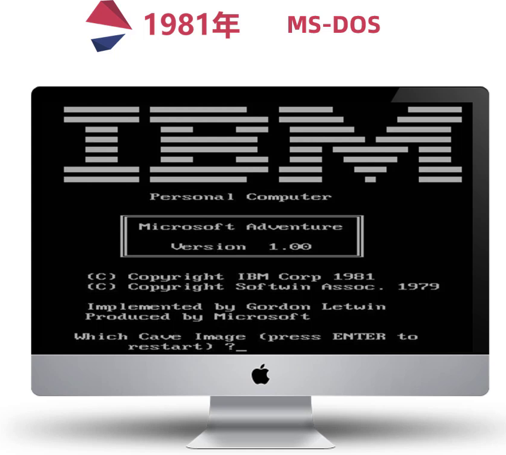

所以是谁第一个发明图形化界面的操作系统的呢？很可惜，既不是微软，也不是苹果，而是施乐这家公司。


施乐这家公司在1981年4月27号的时候推出了一台叫做施乐之星的电脑，其创新程度在当年堪称惊天动地，就是因为它有图形化界面了，它就是长下面那样。


将它放大看一下，施乐推出的操作系统引入了窗口模式，你能同时打开几个窗口干不同的事。你可以建文件夹，把不同的东西归类放在一起，用到的时候双击就可以了，那基本上就是我们现在使用图形化界面的雏形。


你可能会觉得这个界面丑爆了，但是在当时，它是神一样的存在，而就是这个技术成功引起了业界两位大佬的相爱相杀，即乔布斯和比尔盖茨。


乔布斯看见了图形化界面的将来，推出了 `apple lisa`，同样的，刚开始页面比较丑。


那么作为乔布斯的平生对手，比尔盖茨也推出了 `Windows1.0`。


你有没有觉得也是花里花俏的，很那看。但就是这么难看的系统，还引起了两位大佬的撕逼，因为苹果是先推出 `apple lisa`，微软的 `windows1.0` 是在后面推出来的。所以乔布斯曾经当面怒斥比尔盖茨：你在盗用我的器械，也就是说你在抄我的作品。

而比尔盖茨不慌不忙，说出了他平生最金典的一句台词：“我们都有一个充裕的邻居，名叫施乐。有一天我闯进了他家，妄图偷走它的电脑。却发现你已经捷足先登。”


其实比尔盖茨的话里的意思是这样的：你别发火，咱哥俩都是抄的，谁也别说谁。那后来苹果跟微软就开始了相爱相杀。这个也是我们现在图形化界面的由来，图形化界面对计算机的普及做出了不可磨灭的贡献。


但是它也有自身的缺点，因为使用图形化界面去操作计算机，它要额外加载很多很多的图片，所以用图形化界面的方式去操作计算机，它需要消耗更多的内存，而且运行的速度没有命令行方式来的快。

大家在电视上看到的一些顶级黑客，他们一般都是在用命令行的方式去操作计算机的，如果说你有幸，以后碰见一些比较高级的黑客，你可以问一问它们，为什么不使用图形化界面呢？基本上所有的人都会回答你：太low太慢了。


那么在windows操作系统中，其实也保留了命令行这一功能，它就是CMD。所以，


## 什么是cmd？

就是在windows操作系统中，利用命令行的方式去操作计算机。我们可以利用cmd命令去操作计算机，比如：打开文件，打开文件夹，创建文件夹等。


---


# 3.打开CMD

步骤：

1. 按下快捷键：win + R。

   	此时会出现运行窗口。

2. 在运行窗口中输出cmd

3. 输出回车。

解惑：

​	cmd默认操作C盘下的Users文件夹下的XXX文件夹。（XXX就是计算机名），好就好比在图形化界面中，我们默认都是在桌面上进行操作的一样


查看 `User\XXX` 文件夹：1、win + E，打开此电脑，点进C盘； 2、双击打开用户； 3、双击 `XXX` 文件夹


扩展：其实windows的桌面也是个文件夹，它的名字叫 `desktop` ，位于 `C:\User\XXX\桌面` 文件夹下


----

# 4.常用CMD命令

扩展一个小点：

在很多资料中都说成是DOS命令，其实是不对的。真正的DOS命令是1981年微软和IBM出品的MS-DOS操作系统中的命令才叫做DOS命令。

而在Windows中，win98之前的操作系统是以非图形化的DOS为基础的，可以叫做DOS命令。到了2000年以后，windows逐渐的以图形化界面为主了，这个时候就不能叫DOS命令了，他只是模拟了DOS环境而已，很多的原本的DOS命令已经无法使用了，所以这个时候叫做CMD命令会更准确一些。

常见的CMD命令如下：

| 操作               | 说明                                                         |
| ------------------ | ------------------------------------------------------------ |
| 盘符名称:          | 盘符切换。E:回车，表示切换到E盘。                            |
| dir                | 查看当前路径下的内容。<br />包含所有的文件、文件夹，包括隐藏的内容全部展示出来。 |
| cd 目录            | 进入单级目录。cd itheima                                     |
| cd ..              | 回退到上一级目录。                                           |
| cd 目录1\目录2\... | 进入多级目录。cd itheima\JavaSE                              |
| cd \               | 回退到盘符目录。                                             |
| cls                | 清屏。                                                       |
| exit               | 退出命令提示符窗口。                                         |

补充操作：

- 盘符切换必须使用英文的冒号
- `ctrl + 滚轮` 可以调节命令行窗口的大小。

- 使用 `tab` 键可以补全目录。

- 如下图，使用 dir 有时候会出现 `.`、`..` 目录，这个是隐藏的文件夹。

  

- 关闭命令行窗口

  1. 使用图形化界面的方式：直接点击上方的 `×` 
  2. 使用cmd命令的方式： `exit` 

- 在windows操作系统当中，文件名或者文件夹名是忽略大小写的。


---

# 5. 练习：利用CMD打开QQ并配置环境变量

需求：

利用cmd命令打开自己电脑上的QQ。

完成步骤：

```java
1：确定自己电脑上的QQ安装在哪里
2：启动cmd
3：进入到启动程序QQ.exe所在的路径（qq\bin）。
4：输出qq.exe加回车表示启动qq。
```

假设我们电脑是没有图形化界面的。而QQ是经常打开的软件，每次打开的时候都要切换盘符，并且进入多层文件夹，太麻烦了！


## 设置环境变量

作用：如果我想要在CMD的任意目录下，都可以启动某一个软件，那么就可以把这个软件的路径配置到环境变量中的PATH里面。

在启动软件的时候，操作系统会先在当前路径下找，如果在当前路径没有再到环境变量的路径中去找。如果都找不到就提示无法启动。


**步骤**

第一步：右键点击我的电脑并选择属性。

（如果无法出现第二步界面，可以打开我的电脑之后右键点击空白处）


第二步：点击高级系统设置。


第三步：选择高级，再点击下面的环境变量。

 


第四步：找系统变量里面的PATH

> 上面的那个不用管，因为上面那个是moon用户的用户变量，如果你的电脑里面有多个用户的话，那么设置在moon里面是不能通用的，所以我们要找到下面的系统变量。

 


第五步：点击新建，把QQ的完整路径，配置到PATH当中，再点击确定即可。


第六步：（可做可不做）点击上移，把当前配置的路径移动到最上面。

移动的好处：在CMD中打开软件时，会先找当前路径，再找环境变量，在环境变量中是从上往下依次查找的，如果路径放在最上面查找的速度比较快。

 


第七步：在任意目录下重新打开cmd窗口，然后输入 `qq.exe`，可以发现qq成功被启动！


---

# 6. 学习方法和Java概述

## 1）学习方法

作为一个0基础入门的同学，在刚开始学习的时候，我们不要追求知识点的深度，而是要追求知识点的广度。简单来说，学一个知识点不要想的太深，应该先学习如何用，然后把尽可能多的知识点综合的用起来，锻炼我们的思维能力才是第一要素，等入门后，再来学习更加深入的知识点，才是符合我们平时学东西的思维逻辑。


---


## 2）Java是什么？

语言：人与人交流沟通的表达方式

计算机语言：人与计算机之间进行信息交流沟通的一种特殊语言

Java是一门非常火的计算机语言。（也叫做编程语言）

如果我们想让计算机按照我们的指令去做事情，就需要说计算机能听得懂的语言。JAVA就是一门非常火的计算机语言。至于到底有多火，我们可以看一下JAVA的市场占有率，这个是截止到2021年上半年全球编程语言的排行榜，其中上面的绿色的就是JAVA。


我们知道，没有一款语言能够牢牢占据排行榜的榜首，起起伏伏是一种正常情况，但是可以看见它基本上都是保持在前三名之内。

看完了全球的，我们再来看看国内的，截止2021年上半年JAVA以28%的市场占有率在国内排名第一。


并且我们可以看看招聘网站，其中火热职位就有JAVA的一席之地，比如从BOSS直聘上截出来的一张图，在BOSS直聘的热门职位当中，第一个就是JAVA。


51job（前程无忧）热门推荐里面也有JAVA。


再来看智联招聘，互联网IT分类的第一个也是JAVA。


所以由此可见，JAVA的火热程度。


---

# 7.JDK下载和安装

写JAVA代码不是随随便便能写的，我们得先做一点准备工作。例如，我们平时想要玩一把游戏，就需要先下载、安装才能玩游戏。JAVA也是一样的，也是需要下载并安装相关的软件，它的名字就叫做：JDK。然后才能编写JAVA的第一个案例 —— HelloWorld。


## 下载

通过官方网站获取JDK：[http://www.oracle.com](http://www.oracle.com/)

**注意1**：针对不同的操作系统，需要下载对应版本的JDK。

**注意2**：如果你的电脑是windows32位的，建议重装系统，重装成64位的操作系统。因为Java从9版本开始，就已经不提供32位版本的安装包了。

首先点击官网导航栏的 `Products `选项，然后在弹出的下拉框中点击 `JAVA`


然后点击右上角的 `Download Java`，表示要下载JAVA


然后在上面它会有两个提示：1、`Java downloads`：下载JAVA； 2、`Java archive`：Java的历史版本


在第一个界面中表示你下载的是最新的Java，但如果说你不要下载最新的，需要下载以前的，就可以点击第三个选项。本套课程采用的是2021年9月份刚推出来的 `Java17`，这个版本是长期支持版本，所以会有一个 `LTS` 后缀。


然后根据自己的操作系统下载对应的版本，下面就以windows举例。

选中windows，然后点击中间这个进行下载，因为只有中间这个是最干净的安装包。第一个是zip包，在这个里面你下载完之后是一个压缩包，压缩包里面会有安装包还有一些其他说明性文件，但那些说明性文件对我来讲没有用，我只要一个安装包就可以了。


----


## 安装

双击打开安装包，然后傻瓜式安装，下一步即可。默认的安装路径是在C:\Program Files下。

建议：

- 安装路径不要有中文，不要有空格等一些特殊的符号。

  因为这些软件是老外编写的，对中文的支持不够完美，所以如果以后路径中有中文，以后在使用的时候，容易出现一些问题。在选择路径的时候，我们就写英文单词 / 加一点数字就行了。

- 以后跟开发相关的所有软件建议都安装在同一个目录（文件夹）中，方便管理。

例如这里就将开发所有的软件都装在E盘的develop文件夹当中。


然后点击右上角的新建文件夹按钮，新建一个文件夹，名为：`JDK17`。


----


## JDK的安装目录介绍

安装完毕后，就可以去对应的文件里找到以下文件夹。

重点需要掌握的是 `bin` 文件夹。

| 目录名称 | 说明                                                         |
| -------- | ------------------------------------------------------------ |
| bin      | 该路径下存放了JDK的各种工具命令。javac和java就放在这个目录。 |
| conf     | 该路径下存放了JDK的相关配置文件。                            |
| include  | 该路径下存放了一些平台特定的头文件。                         |
| jmods    | 该路径下存放了JDK的各种模块。                                |
| legal    | 该路径下存放了JDK各模块的授权文档。                          |
| lib      | 该路径下存放了JDK工具的一些补充JAR包。                       |


---

# 8.HelloWorld小案例

HelloWorld案例是指在计算机屏幕上输出“HelloWorld”这行文字。各种计算机语言都习惯使用该案例作为第一个演示案例。这已经是程序员圈里约定俗称的一个规矩了，"HelloWorld"就是程序员的启蒙代码。


---


## Java程序开发运行流程

开发Java程序，需要三个步骤：

1. 用记事本编写程序
2. 编译文件
3. 运行程序。


### 如何理解编译？

Java在操作系统中，是不可以直接运行的，因为操作系统它是不认识Java代码的。


运行的办法就是需要将Java代码翻译成操作系统能看得懂的东西。所以说编译的动作其实就是翻译把操作系统看不懂的内容变成操作系统能看懂的内容。


所以第二步的编译，我们也可以理解成翻译的意思。翻译完后会产生一个新的文件，然后在第三步就可以运行翻译之后的文件了。


---


## HelloWorld案例的编写

> 新版本的JDK不需要先配置环境变量。直接按照以下步骤编写即可。

### 1、新建文本文档文件，修改名称为HelloWorld.java。


**注意**：

- 后缀名为java的才是java文件。修改文件名后缀的时候会出现一个弹窗，点击yes即可。

  

- 如果文件后缀名并没有展示，需要按如下步骤进行设置。勾选上文件扩展名，文件扩展名就是后缀名。

  


### 2、用记事本打开HelloWorld.java文件，输写程序内容。代码要跟我编写的完全保持一致。

右键点击文件，然后点击打开，此时就可以使用windows自带的记事本来编辑了。


PS：双引号里写的是其他内容也行，可以是数字，也可以是字母，但不能是中文！因为会乱码，解决方案在后面Notepad++会讲解。现在先写最基本的“HelloWorld”就可以了。

这里可以养成一个习惯，只要出现括号、引号的，都要成对出现，敲完一对括号后，再将光标移到括号中间，再去补中间的代码就可以了，这样就会防止因为忘记丢掉右括号。


```java
public class HelloWorld {
	public static void main(String[] args) {
		System.out.println("HelloWorld");
	}
}
```


### 3、<kbd>ctrl + s</kbd> 保存，或者也可以直接图形化点击保存。


未保存的文件在上方一般都会有 * 符号或其他符号标记。像我这里，如果保存了就会从 `圆点` 变为 `×`


### 4、编译文件。

此时就需要使用到Java当中的工具了，找到JDK的安装目录里的bin文件夹`E:\develop\JDK17\bin`，我们所要找的工具一个是 `javac`，另一个是 `java`，用 `javac` 去编译，然后再用 `java` 去运行。`javac` 是JDK提供的一个编译工具，我们可以通过这个工具，把当前路径下的java文件编译成class文件。


这两个工具是在cmd中使用的。cmd默认操作的是 `C:\User\XXX` 下的文件夹，如果要进入到刚刚编写的HelloWorld所在的文件夹，就需要使用cmd命令进行切换了。

切换到编写的HelloWorld.java所在的文件夹后，执行 `javac HelloWorld.java`。执行完后如果没有任何信息出现，表示编译成功。编译后会多一个文件，这个文件就是翻译之后的文件，它的后缀名是class，所以我们也会把这个文件叫做class文件，或者是字节码文件。这个文件就是给操作系统在运行的时候使用的，我们人是看不懂的。


我们可以右键点击它，然后使用记事本打开。可以发现里面的东西我们是看不懂的。


### 5、运行代码。

`java` 是JKD提供的运行代码的工具。接下来使用 `java` 工具，执行 `java HelloWorld`，注意不需要加上后缀名。运行的是编译之后的class文件。此时发现，HelloWorld已经出来了。


小技巧：如果不想每次编译的时候都切换路径，可以在java文件当前所在的文件夹的上方，直接输入cmd，然后回车。此时打开的cmd窗口所在的路径就是java文件所在的路径。


---

# 9.HelloWorld案例常见问题

## BUG

BUG（小甲虫）。计算机刚开始出现的时候，因为体积比较大，一些小虫子很容易转进去。有一天有一只蟑螂钻到了计算机当中，从而导致计算机不能正常运行，此时就有两个工作人员去排查了，就是下图的两个小姐姐。


在电脑系统或程序中，隐藏着的一些未被发现的缺陷或问题统称为bug（漏洞）。


## BUG的解决

1. 具备识别BUG的能力：多看
2. 具备分析BUG的能力：多思考，多查资料
3. 具备解决BUG的能力：多尝试，多总结


## HelloWorld常见问题

1、非法字符问题。Java中的符号都是英文格式的。

例如，下方将分号改为了中文的分号，然后重新编译，此时它就会报错——第三行出现了问题：错误：需要 ’ ; ‘，并且出现了一个小箭头，指向了小括号的后面，意思就是说：这个符号我不认识，是不是一个中文？


有一个小技巧，可以避免标点符号的问题：将输入法设置为 `中文时使用英文标点`，以下以搜狗输入法举例。右击搜狗输入法，选择 `更多设置` ,然后勾选上 `中文时使用英文标点`，此时以后你输入的标点符号全部都是英文状态下的了。


2、大小写问题。Java语言对大小写敏感（区分大小写）。

例如将 `System` 的大写 `S` 改为了小写 `s`，重新编译，就会报以下错误。此时又会出现一个小箭头，表示在小箭头的前后出现了问题。


---

# 10.环境变量

开发Java程序，需要使用JDK提供的开发工具（比如javac.exe、java.exe等命令），而这些工具在JDK的安装目录的bin目录下，如果不配置环境变量，那么这些命令只可以在bin目录下使用，而我们想要在任意目录下都能使用，所以就要配置环境变量。

但是上面我们编写HelloWorld小案例时，并没有配置环境变量，但为什么可以在非bin目录下使用 `javac` 和 `java` 这两个小工具的呢？

这是因为现在最新从官网上下载的JDK安装时会自动配置javac、java命令的路径到Path环境变量中去 ，所以javac、java可以直接使用。


根据以下步骤查询环境变量，发现，在安装完JDK后，环境变量多了一个。进入到此路径后，发现Java在安装的时候将 `javac` 和 `java` 这两个命令相当于做了一个快捷方式，放到了该路径当中，然后再把这个路径配置到环境变量里。所以我们就可以在任意目录下面用到 `javac` 和 `java` 了。


以前下载的老版本的JDK是没有自动配置的，而且自动配置的也只包含了4个工具而已，如果我们要使用其他的工具还是不能使用。所以我们需要删掉已经配置完毕的，再次重新配置Path环境变量。


最简单的方式就是将JDK的bin目录直接添加到path环境变量中，但是这种方式不推荐。因为这个里面有很多变量，当我们在操作的时候，很有可能会操作到其他变量信息，如果将其它的变量修改了，那在系统里面其它的软件就有可能打不开了。所以我们应该使用以下步骤进行配置：

①**JAVA_HOME**：告诉操作系统JDK安装在了哪个位置（未来其他技术要通过 `JAVA_HOME` 找JDK），注意这个地方的路径是不带bin的。这个相当于我们自己新建了一个：`JAVA_HOME`的路径。


②然后再点击**Path**，使用两个 `%` 引用我们刚刚自己定义的路径：告诉操作系统JDK提供的javac(编译)、java(执行)命令安装到了哪个位置。

然后再将这个环境变量移动当最上面即可。


---


## win10的bug

有些win10的电脑当电脑重启之后，环境变量失效了。表示操作系统不支持自定义的环境变量。

解决方案：

还是要配置JAVA_HOME给以后的相关软件去使用，我们可以把java和javac的完整路径配置到PATH当中： `D:\develop\JDK17\bin`。


---

# 11.Notepad++

以前在记事本上写的代码看上去有点累，因为所有的单词看上去都是黑色的，并且当代码出现问题后，它提示第三行，我们还需要一行一行去数。这些问题都可以由一个高级记事本：`Notepad++` 来解决。

**下载**：打开百度，搜索一下notepad++就可以了。


**安装**：傻瓜式安装，直接点击下一步就可以了。

在选择安装路径的地方建议不要放在C盘，所有东西都放在C盘后，电脑会变的比较卡，建议专门找个文件夹，用来放跟我们开发相关的软件，因此这次还是放在 `E:\develop\notepad`。

---

## 设置

右键点击java文件，选择edit with notepad++。


点击设置，再点击首选项。在弹出的页面当中，左侧选择新建，中间选择Java，右侧选择ANSI，表示使用本地的默认编码，此时在代码的地方就可以写中文了。


---

## 练习

利用notepad++去编写一个HelloWorld并能成功编译和运行。

使用notepad++定位到当前文件所在的命令行就更加方便了：


---

# 12.Java语言的发展

JAVA语言的诞生是具有一定戏剧性的，可以说是命运多舛，差点凉凉，差点GG，差点嗝屁。


在1990年的时候Sun（Stanford University Network：斯坦福大学网络）公司成立了一个由 `James Gosling` 领导的Green计划，准备为下一代的职能家电，也就是电视机、微波炉、电话等去编写一个通用的控制器，这个负责人就是`James Gosling`，它也名为Java语言之父。

在一开始的时候，这个团队是准备用C++来编写的，但是发现C++在很多方面存在一些问题，使用起来十分不方便，导致项目的进展非常的缓慢，但是大神不愧是大神，编程语言不方便，就自己造一个，所以他们就造了一个全新的语言：`Oak语言`，起这个名字是因为他们项目团队的门前长了一颗橡树，Oak就是橡树的意思。

到了1992年的时候，Green计划已经完成了新平台的部分功能。包括Green的操作系统、Oak的程序设计语言、类库等。简单理解就是，已经用Oak语言已经做了很多很多事情了。

Sun公司看见这个团队这么牛逼，所以就在11月份，成立了由Sun公司全资的子公司，它的名字就叫做 `FirstPerson有限公司`。因为这家公司大多数都是程序员，不太会管理，所以因为管理不善，  `FirstPerson有限公司`几乎凉凉，Oak语言也差点凉凉。

但是到了1994年，随着互联网行业进入到快速的发展阶段，Java语言之父`James Gosling`非常有商业眼光，它立马改写了Oak语言。在同年秋天，完成了第一个Oak语言的网页浏览器，它的名字叫做WebRunner，这个浏览器现在已经不用了，但是在当时，它是一个跨时代的产品，Sun公司看到它们这么牛逼，所以就准备去给Oak注册商标了，但是Oak已经被一家投资公司美国橡树资本管理有限公司给注册过了，所以只能改名叫：JAVA。因为外国的程序员都是比较爱喝咖啡，而生产咖啡豆的地方叫做爪哇岛，所以就改名，叫做JAVA。

改完名字之后，在1995年的时候，正式推出了JAVA。


随后又出现了1.0、1.1、1.2、1.3、1.4版本，但是Sun公司发现了，每次更新只改小数点后面一位，太小家子气了，所以从5开始就改成了大版本号更新，称之为 `Java5.0`。在06年的时候又推出了6.0。到了09年的时候，Sun公司被Oracle甲骨文公司收购了。Oracle公司在全球而言是非常厉害的公司，是仅次于微软的第二大网络公司。所以Java在Oracle手中，市场份额越来越大，语言的版本也在不断更新，到目前为止，最新的就是刚推出来的Java17。通过这么多版本出现的时间可以发现，从Java9开始，基本上都是6个月出一次版本，Java之所以要保持这么快的更新速度，其实就是为了紧贴市场的发展，使得Java自己不会被淘汰。


但是这么快的更新速度会给我们开发者造成学习上的困扰，所以为了解决这些问题，Java会把这些版本分成两种：1、普通版（过渡版本）；2、正式版（长期支持版本）（长期支持版本会有LTS后缀）。

在这么多版本当中，其中Java8、Java11、还有我们现在学习用的Java17，就是LTS长期支持版本，所以从这一方面它就降低了开发者的学习成本。在这么多版本当中，其中有三个版本非常的重要：

* Java5.0：这是Java的第一个大版本更新。
* Java8.0：这个是目前绝大数公司正在使用的版本。因为这个版本最为稳定。
* Java17.0：这个是我们课程中学习的版本。

这些版本向下兼容。新的版本只是在原有的基础上添加了一些新的功能而已。

举例：

用8版本开发的代码，用11版本能运行吗？必须可以的。

用11版本开发的代码，用8版本能运行吗？不一定。

如果11版本开发的代码，没有用到9~11的新特性，那么用8是可以运行的。

如果11版本开发的代码，用到了9~11的新特性，那么用8就无法运行了。


---

# 13.Java能干什么？

JAVA从95年以来，已经问世了20多年了，可能比部分同学的年龄还大。

Java到底能干嘛呢，此时就需要讲到Java的三大平台，其实也就是它的三个分类：JavaSE、JavaME、JavaEE。

---

## JavaSE

JavaSE（Java Standard Edition）是Java语言的标准版，用于桌面应用的开发，是其他两个版本的基础。

桌面应用：用户只要打开程序，程序的界面就会让用户在最短的时间内找到他们需要的功能，同时主动带领用户完成他们的工作并得到最好的体验。其实就跟我们电脑上安装的这些软件是类似的：例如电脑中的计算器，就是比较简单的桌面应用；还有像右边类似于坦克大战的游戏，也可以做成桌面应用，双击打开就可以玩了。


但是在这个领域，Java是不太合适的，因为当我们写一些比较复杂的动画的时候，Java加载的速速有可能会变的很慢。在桌面应用领域，最为合适的语言是C / C++，所以在这个领域，Java可以做，但是不占优势。

所以我们学习JavaSE的目的并不是是为了写桌面应用，而是锻炼大家的逻辑思维能力，为今后要从事的JavaEE开发打基础。

---

## JavaME

JavaME（Java Micro Edition）是Java语言的小型版，用于嵌入式电子设备或者小型移动设备的开发。

嵌入式设备就是电视机、微波炉、数码相机这些里面的系统，当然还有一个最主要的：小型移动设备—手机。在以前，诺基亚手机风靡全球，它用的是塞班系统，当我们双击打开一个软件的时候，会有一个小的咖啡杯弹出来，这个软件就是用JavaME写的。随着塞班系统渐渐的没（mo）落，JavaME也渐渐的凉了。当你去一些招聘网站搜索JavaME，可以发现没有这样的工作档位，它现在已经被安卓和IOS给替代了。


但是，安卓、鸿蒙也是可以用Java来开发的。

---

# JavaEE

JavaEE（Java Enterprise Edition）是Java语言的企业版，用于Web方向的网站开发。在这个领域，是当之无愧的No1。

网站开发并不是我们看见的浏览器，完整的网站开发是浏览器和服务器开发，在服务器领域，Java是最厉害的。自从95年问世以来，没有一款语言能撼动它的位置。


下面是Java的6大应用领域

- 桌面应用开发

  制作各种各样的开发工具，有我们的Java程序员用到的Idea、C/C++用到的Clion、Python程序员用到的Pycharm。这是因为Java语言是比较规范，漏洞比较少，所以用Java语言编写的编译工具就会非常的健壮，不会有那么多漏洞以及安全性问题。

  在我国，由于一些历史原因，目前有很多办公系统，或者是市场上的税务管理系统也都是使用Java来开发的。

- 企业级应用开发

  在后续课程中其实就是带着大家去做企业级应用，像微服务、SpringCloud...

  企业级应用说简单点，就是开发服务器，而服务器可能要每秒钟承担几十万，甚至几百万的访问量，例如12306春节买票的时候，高峰期每秒钟有很多很多人，有几十万，甚至是几百万的人同事买票，到目前而言，只有Java，还有Go语言能承载这么大访问量，但是在国内，Go语言是非常小众的，所以还是用Java比较好一些。

- 移动端/嵌入式开发

  例如鸿蒙、安卓，并且CT、B超的界面，它也是用Java来开发的。

- 科学计算

  因为Java语言非常的严谨。有一个软件叫：matlab，有些同学在大学里面可能会用到，如果说你要搞一些数学的建模大赛、做一些仿真，开发一个机器人，机器人怎么走路，做一些动态的仿真效果，也是需要用到matlab。这个科学计算的软件也是使用Java来开发的。

- 大数据开发

  在大数据中有一个框架：hadoop，它的logo是一头大象。这个框架也是用Java来开发的。

- 游戏开发

  《我的世界》这款像素游戏也是用Java来开发的。


最后来看一下Java能干的事情：

左上角的天猫、淘宝、阿里云、京东，这些就是服务器的开发，也就是企业应用的开发。

中间有个WebStorm，这个是前端程序员用的开发工具、PhpStorm是Php程序员用到的开发工具、IntelliJ IDEA是Java程序员用到的开发工具、PyCharm是Python程序员用到的开发工具，这些开发工具都是用Java来开发的。

右上角的机械臂，它里面的控制管理程序，也是用Java来开发的。

右中间有科学计算工具：matlab。

右下角的我的世界，也是使用Java来开发的。


---

# 14.Java为什么这么火

一个语言火不火、能不能长久的生存下去，主要其实是看四个方面

1、用户量：使用的程序员多不多。

不管在国内，还是在国外，使用Java的程序员还是非常多的。


2、适用面：用的地方多不多。

从以下6大领域可以看出来，用到Java的地方也是非常多的。


3、与时俱进：会不会紧跟时代一起发展，如果一个语言跟不上时代的发展，不管它有多牛逼，总有一天会被市场淘汰。

从Java9版本开始，基本上都是保持半年一更新，保持这么快的更新速度，就是为了紧贴市场的发展，一旦其他语言有什么好的东西，或者是市场上出现了什么了不得的技术，Java都可以把它们融进来成为自己的东西，让自己永远保持生命力，永远不会被市场淘汰。


4、语言的本身是否有什么明显的特点

它的特点主要有以下几个：面向对象、安全性、多线程、简单易用、开源、跨平台

Java在上面这四个方面都做的非常的好，所以说Java的生命力还是非常强劲的。


---


## Java主要特性

1、面向对象

等我们以后学习完Java的面向对象之后，你可以在心里面想象一下自己对女朋友的要求：性别、年龄、身高、体重还有一些其他的要求，然后你可以把这些东西都告诉Java：我想要一个这样的女朋友。Java非常好，它会说：好的，没问题，满足你。

根据你的要求给你制造了一个女朋友，这个就是Java中的面向对象。简单理解就是根据你想的模板，把东西创建出来，这就是面向对象。创建出来的东西可以是女朋友、车子、房子、票子..... 想造什么就造什么，这个就是Java当中最难理解的面向对象


2、安全性

Java写出来的代码非常的安全，漏洞非常的少。


3、多线程

假设在12306上买票，假如有4个用户同时在12306上买票，此时就可以看成12306的服务器同时给这四个人服务，这个就是多线程。

多线程简单理解：就是可以同时做多件事情。


4、简单应用

Java语言学起来非常简单，用起来也挺容易。


5、开源

假如我现在有一部手机，在手机上下载了QQ，此时我下载的仅仅是QQ的安装包，腾讯公司它是不会把QQ的代码给你的，这就叫做不开源。

而Java就是非常的简单粗暴了，同学们要往电脑中下载Java的开发工具的时候，Oracle公司它会把Java所有的源代码也都给你，这样就会告诉你Java是如何运行、如何工作的，这个就叫做开源。

一旦开源了，世界所有的开发者都可以去维护Java了，所以Java即使有什么缺点，也被广大的程序员给修复了，这就是开源的魅力。


6、跨平台

跨平台的平台指的是操作系统，例如：Windows、Mac、Linux。

Java程序可以在任意的操作系统上面运行，这个特点就很厉害了，很多其他的语言都干不了这些事情。而且这个特点对于公司来讲是非常有帮助的。

例如现在有家公司，利用了一种不能跨平台的语言开发了一个项目，此时只能在windows上去运行，不能在其他的操作系统上去运行，如果想要在其他的操作系统上运行，还需要重新编写代码。所以会给公司增加额外的成本。


但如果换成Java程序，就非常的粗暴了，一个人写的程序可以在所有的操作系统上运行，而且只要写一次就行了。Java在95年出现的时候，也是凭借这个特性，迅速的占领市场，当时它打出了一句口号：`Write Once Run Anywhere`（一次编译，到处运行）。


---

# 15.Java语言跨平台的原理

说到跨平台的原理，就需要说到高级语言的编译运行方式。所有的高级语言，比如说：C、Java、Python等等，在运行的时候大体上会分为三步，之前在编写HelloWorld的时候也是

1. 编程：新建文件，编写代码，保存代码。

   java程序员写的.java代码，c程序员写的.c代码，python程序员写的.py代码。

2. 编译：不管是什么高级语言，操作系统本身都是不认识的，因为机器只认识0011的机器语言，所以我还需要把第一步编写好的代码进行翻译，翻译成机器能认识的语言。

3. 运行：让机器执行编译后的指令。


## 高级语言的三种编译运行方式

- 编译型
- 解释型
- 混合型，半编译，半解释（将上面两种都结合起来）

### 1、编译型

C语言就是标准的编译型语言，它会将C/C++代码根据不同的操作系统整体的翻译成0011这样的二进制，然后再交给机器去运行。但是因为每个系统都是不一样的，手机运行会用到Arm平台，电脑运行就会用到X86平台，由于每个系统所用到的平台可能是不一样的，所以在编译之后所形成的指令也有可能是不一样的。


它的运行流程是这样的：

编写代码 —> 整体进行编译，跟java一样，它也会多出来一个后缀名为 `.obj` / `o`  等这样的文件，然后再去交给不同的设备去运行，在这里会有一个小细节，因为计算机是不一样的，所以它们就存在硬件也是不一样的，会有兼容性问题，所以针对不同的操作系统它都要重新进行编译。

更夸张的是，如果我编写代码的电脑的硬件跟运行代码的硬件之间差别特别大，就算是同一个操作系统，也有可能是没发成功运行的。所以说C语言不是跨平台的。


---

### 2、解释型

解释性语言最为代表的就是Python语言，在编写好代码之后，它不会把代码的整体进行翻译，而是读一行解释一行。读到一行代码，再把这行代码解释成0011去运行，然后再去读第二行代码，然后再去解释成0011再去运行。

所以说通过这个我们就知道了，编译型语言它的特点是整体翻译，而解释型语言，它的特点是按行翻译。


它的运行方式是这样的：编写代码 —> 按行翻译 —> 再交给不同的设备去运行

在这里它也有个小细节，Java / C在编译之后，它都会产生一个新的文件，但是Python不会，它是直接拿着我们自己编译好的代码逐行解释，再去交给设备去运行的。所以说Python程序员是天生开源的，它在编写好代码后，它只能把代码交给别人运行，如果说没有将代码交给别人，别人是没发运行的。

---

## 3、混合型，半编译，半解释（将上面两种都结合起来）

混合型最为典型的就是Java，在网上有很多资料，有的资料说Java是编译型的，有的资料说Java是解释型的，但这些都不对。Java是混合型的。在Java编译运行的过程中，存在编译，也存在解释。

首先将java文件整体编译成class文件（字节码文件） —>  按行交给设备去运行，在运行的时候，它也不是直接运行在计算机上的，而是运行在虚拟机里的。那问题就来了，虚拟机是什么？

如果说我现在要让手机上的游戏在电脑上运行，肯定是不能运行的。此时就可以在电脑中装一个安卓的处理区，相当于就是在操作系统里模拟了一部手机，在这部虚拟的手机中，就可以玩手机游戏了，这部虚拟出来的手机，我们也可以理解成 虚拟机。

所以说Java语言在运行的时候，跟刚刚是一个道理，操作系统本身其实是不认识Java语言的，Java也并不是直接运行在操作系统里面的，而是运行在虚拟机里面的，虚拟机会把Java语言翻译成操作系统能看得懂的语言。我们只要针对不同的操作系统给出不同的虚拟机就可以了。这个虚拟机不是我们写的，是Java自己提供好的。而我们作为程序员，我们只需要安装一个适合自己操作系统的虚拟机就可以了。


---

# 16.JRE和JDK

程序员在编写代码的时候其实是需要一些环境，例如我们之前写的HelloWorld。我们需要的东西有JVM、核心类库、开发工具。

1、**JVM（Java Virtual Machine）**：Java虚拟机，真正运行Java程序的地方。没有虚拟机，代码都没地方运行。

2、**核心类库**：例如之前写的HelloWorld代码中，里面的System、out、println，每个单词都有其特定的含义，它们组合在一起就可以把小括号的内容直接展示出来。这些其实都是Java已经写好的东西，我们直接拿过来使用就行了。

3、**开发工具**：例如：javac 编译工具、java 运行工具、jdb 调试工具、jhat内存分析工具 ......

它们三个组成的整体，就叫JDK。JDK（Java Development Kit）称为Java开发工具包，包含了JRE和开发工具。

所以说简单理解程序员想要编写代码并且能成功运行，我们需要安装一个JDK就可以了。

---

除此之外，还有一种情况需要我们考虑，假设我现在将代码写完了，也编译完了，此时我需要将class文件交给别人运行，此时人家只需要运行class文件就行了，不需要开发了，但此时别人就不需要再安装一个完整的JDK了，因为在JDK里面，有些东西我们是用不到的，如果强行安装，就会占用硬盘空间。

但我又需要运行代码，那应该安装什么呢？虚拟机、核心类库肯定都是需要的，但是在运行的时候有一部分开发工具就不需要了。例如代码已经写好了，已经不需要javac编译工具；并且此时代码别人写好了，也已经没有问题了，此时也不再需要调试了，jdb工具也用不到了。

所以说java会在JVM、核心类库还有在运行的时候所用到的一些工具单独的抽取出来，又组成了一个 JRE。当我们以后只需要运行代码，不需要编写了，安装一个JRE就可以了。JRE比较短小，不会占用过多的硬盘空间。

**JRE（Java Runtime Environment）**，Java运行环境，包含了JVM和Java的核心类库（Java API，即Java已经写好的一些东西，我们直接拿过来用就行了）。


总结：JDK包含了JRE，JRE包含了JVM。


---

# ---------------------

# day02 - Java基础语法

# 17.注释和关键字

我们之前写的HelloWorld案例写的比较简单，但随着课程渐渐深入，当我们写一些比较难的代码时，在刚开始写完时，你知道这段代码是什么意思，但是等过了几天，再次看这段代码时，可能就会一脸懵逼，完全不知道自己写的代码是什么意思。为了避免这种情况的发生，都会在代码的上面写一写解释说明性的文字，方便别人 / 以后阅读代码，而这种解释说明性的文字就是注释。


## 一、 注释

注释是对代码的解释和说明文字。

Java中的注释分为三种：

* 单行注释：

~~~java
// 这是单行注释文字
~~~

* 多行注释：

~~~java
/*
这是多行注释文字
这是多行注释文字
这是多行注释文字
*/
注意：多行注释不能嵌套使用。
~~~

* 文档注释（暂时用不到）：

```java
/**
这是多行注释文字
这是多行注释文字
这是多行注释文字
*/
```

### 使用的技巧

​	如果我们要对代码进行解释，那么就可以使用注释。

​	当注释的内容比较少，一行就写完了，可以用单行注释。

​	如果注释的内容比较多，需要写在多行，那么可以使用多行注释。

### 注意点

​	注释的内容不会参与编译和运行的，仅仅是对代码的解释说明而已。

​	所以，不管在注释当中写什么内容，都不会影响代码运行的结果。

## 2. 关键字

### 2.1 概念

​	被Java赋予了特定含义的英文单词。

​	当我们在代码中写了关键字之后，程序在运行的时候，就知道要做什么事情了。

注意：关键字很多，不用刻意去记。

| **abstract**   | **assert**       | **boolean**   | **break**      | **byte**   |
| -------------- | ---------------- | ------------- | -------------- | ---------- |
| **case**       | **catch**        | **char**      | **class**      | **const**  |
| **continue**   | **default**      | **do**        | **double**     | **else**   |
| **enum**       | **extends**      | **final**     | **finally**    | **float**  |
| **for**        | **goto**         | **if**        | **implements** | **import** |
| **instanceof** | **int**          | **interface** | **long**       | **native** |
| **new**        | **package**      | **private**   | **protected**  | **public** |
| **return**     | **strictfp**     | **short**     | **static**     | **super**  |
| **switch**     | **synchronized** | **this**      | **throw**      | **throws** |
| **transient**  | **try**          | **void**      | **volatile**   | **while**  |

### 2.2 第一个关键字class

​	表示定义一个类。创建一个类。

类：Java项目最基本的组成单元，一个完整的Java项目有可能会有成千上万个类来组成的。

class后面跟随的就是这个类的名字，简称：类名。

在类名后面会有一对大括号，表示这个类的内容。

举例：

```java
public class HelloWorld{
    
   
}
```

解释：class表示定义类。

​	类名：HelloWorld

​	HelloWorld后面的大括号表示这个类的范围。

## 3. 字面量

作用：告诉程序员，数据在程序中的书写格式。

| **字面量类型** | **说明**                                  | **程序中的写法**           |
| -------------- | ----------------------------------------- | -------------------------- |
| 整数           | 不带小数的数字                            | 666，-88                   |
| 小数           | 带小数的数字                              | 13.14，-5.21               |
| 字符           | 必须使用单引号，有且仅能一个字符          | ‘A’，‘0’，   ‘我’          |
| 字符串         | 必须使用双引号，内容可有可无              | “HelloWorld”，“黑马程序员” |
| 布尔值         | 布尔值，表示真假，只有两个值：true，false | true 、false               |
| 空值           | 一个特殊的值，空值                        | 值是：null                 |

~~~java
public class Demo {
    public static void main(String[] args) {
        System.out.println(10); // 输出一个整数
        System.out.println(5.5); // 输出一个小数
        System.out.println('a'); // 输出一个字符
        System.out.println(true); // 输出boolean值true
        System.out.println("欢迎来到黑马程序员"); // 输出字符串
    }
}
~~~

### 区分技巧

1. 不带小数点的数字都是整数类型的字面量。
2. 只要带了小数点，那么就是小数类型的字面量。
3. 只要用双引号引起来的，不管里面的内容是什么，不管里面有没有内容，都是字符串类型的字面量。
4. 字符类型的字面量必须用单引号引起来，不管内容是什么，但是个数有且只能有一个。
5. 字符类型的字面量只有两个值，true、false。
6. 空类型的字面量只有一个值，null。

## 4. 变量

### 4.1 什么是变量？

​	变量就在程序中临时存储数据的容器。但是这个容器中只能存一个值。

### 4.2 变量的定义格式

​	数据类型 变量名 = 数据值；

#### 4.2.1 格式详解

​	数据类型：限定了变量当中能存储什么类型的数据。

​			   如果要存10，那么数据类型就需要写整数类型。

​			   如果要存10.0，那么数据类型就需要写小数类型。

​	变量名：其实就是这个容器的名字。

​			当以后想要使用变量里面的数据时，直接使用变量名就可以了。

​	数据值：真正存储在容器中的数据。

​	分号：表示语句的结束，就跟以前写作文时候的句号是一样的。

#### 4.2.2 常用的数据类型

​	整数：int

​	小数：（浮点数）double

​	其他数据类型稍后讲解

举例：

```java
public class VariableDemo{
	public static void main(String[] args){
		//定义一个整数类型的变量
		//数据类型 变量名 = 数据值;
		int a = 16;
		System.out.println(a);//16
		
		//定义一个小数类型的变量
		double b = 10.1;
		System.out.println(b);//10.1
	}
}
```

#### 4.2.3 变量的注意事项

- 变量名不能重复
- 在一条语句中，可以定义多个变量。但是这种方式影响代码的阅读，所以了解一下即可。
- 变量在使用之前必须要赋值。

案例：

```java
public class VariableDemo2{
	public static void main(String[] args){
		//1.变量名不允许重复
		//int a = 10;
		//int a = 20;
		//System.out.println(a);
		
		//2.一条语句可以定义多个变量
		//了解。
		//int a = 10, b = 20, c = 20,d = 20;
		//System.out.println(a);//?
		//System.out.println(b);//?
		
		
		//3.变量在使用之前必须要赋值
		int a = 30;
		System.out.println(a);
	}
}
```

### 4.3 变量的练习

​	需求：说出公交车到终点站之后，车上一共有多少乘客？

​		    一开始没有乘客。

​		   第一站：上去一位乘客，没有下来乘客。

​		   第二站：上去两位乘客，下来一位乘客。

​		   第三站：上去两位乘客，下来一位乘客。

​		   第四站：没有上去乘客，下来一位乘客。

​		   第五站：上去一位乘客，没有下来乘客。

​		   问：到了终点站之后，车上一共多少乘客？

​	代码解析：

```java
public class VariableTest1{
	//主入口
	public static void main(String[] args){
		//一开始没有乘客。
		int count = 0;
		//第一站：上去一位乘客
		//在原有的基础上 + 1
		count = count + 1;
		//System.out.println(count);
		//第二站：上去两位乘客，下来一位乘客
		count = count + 2 - 1; 
		//第三站：上去两位乘客，下来一位乘客
		count = count + 2 - 1;
		//第四站：下来一位乘客
		count = count - 1;
		//第五站：上去一位乘客
		count = count + 1;
		//请问：到了终点站，车上一共几位乘客。
		System.out.println(count);//3
	}
}
```

## 5. 数据类型

### 5.1 Java语言数据类型的分类

- 基本数据类型
- 引用数据类型（面向对象的时候再深入学习）

### 5.2 基本数据类型的四类八种

| 数据类型 | 关键字  | 内存占用 |                 取值范围                  |
| :------: | :-----: | :------: | :---------------------------------------: |
|   整数   |  byte   |    1     |    负的2的7次方 ~ 2的7次方-1(-128~127)    |
|          |  short  |    2     | 负的2的15次方 ~ 2的15次方-1(-32768~32767) |
|          |   int   |    4     |        负的2的31次方 ~ 2的31次方-1        |
|          |  long   |    8     |        负的2的63次方 ~ 2的63次方-1        |
|  浮点数  |  float  |    4     |        1.401298e-45 ~ 3.402823e+38        |
|          | double  |    8     |      4.9000000e-324 ~ 1.797693e+308       |
|   字符   |  char   |    2     |                  0-65535                  |
|   布尔   | boolean |    1     |                true，false                |

#### 说明

​	e+38表示是乘以10的38次方，同样，e-45表示乘以10的负45次方。

​	在java中整数默认是int类型，浮点数默认是double类型。

#### 需要记忆以下几点

byte类型的取值范围：

​	-128 ~ 127

int类型的大概取值范围：

​	-21亿多  ~ 21亿多

整数类型和小数类型的取值范围大小关系：

​	double > float > long > int > short > byte

最为常用的数据类型选择：

- 在定义变量的时候，要根据实际的情况来选择不同类型的变量。

  比如：人的年龄，可以选择byte类型。

  比如：地球的年龄，可以选择long类型。

- 如果整数类型中，不太确定范围，那么默认使用int类型。

- 如果小数类型中，不太确定范围，那么默认使用double类型。

- 如果要定义字符类型的变量，那么使用char

- 如果要定义布尔类型的变量，那么使用boolean

### 5.3 定义8种基本数据类型变量

```java
public class VariableDemo3{
    public static void main(String[] args){
        //1.定义byte类型的变量
        //数据类型 变量名 = 数据值;
        byte a = 10;
        System.out.println(a);

        //2.定义short类型的变量
        short b = 20;
        System.out.println(b);

        //3.定义int类型的变量
        int c = 30;
        System.out.println(c);

        //4.定义long类型的变量
        long d = 123456789123456789L;
        System.out.println(d);

        //5.定义float类型的变量
        float e = 10.1F;
        System.out.println(e);

        //6.定义double类型的变量
        double f = 20.3;
        System.out.println(f);

        //7.定义char类型的变量
        char g = 'a';
        System.out.println(g);

        //8.定义boolean类型的变量
        boolean h = true;
        System.out.println(h);

    }
}
```

#### **注意点**

- 如果要定义 一个整数类型的变量，不知道选择哪种数据类型了，默认使用int。
- 如果要定义 一个小数类型的变量，不知道选择哪种数据类型了，默认使用double。
- 如果要定义一个long类型的变量，那么在数据值的后面需要加上L后缀。（大小写都可以，建议大写。）
- 如果要定义一个float类型的变量，那么在数据值的后面需要加上F后缀。（大小写都可以）

### 5.4 练习1

需求：定义5个变量记录老师的信息并打印

代码示例：

```java
public class VariableTest1{
	public static void main(String[] args){
		//1.定义字符串类型的变量记录老师的姓名
		String name = "黑马谢广坤";
		//2.定义整数类型的变量记录老师的年龄
		int age = 18;
		//3.定义字符类型的变量记录老师的性别
		char gender = '男';
		//4.定义小数类型的变量记录老师的身高
		double height = 180.1;
		//5.定义布尔类型的变量记录老师的婚姻状况
		boolean flag = true;
		
		//输出5个变量的值
		System.out.println(name);
		System.out.println(age);
		System.out.println(gender);
		System.out.println(height);
		System.out.println(flag);
		
	}
}
```

### 5.5 练习2

需求：将（电影名称，主演，年份，评分）四个信息选择不同类型的变量，随后打印出来。

 代码示例：

```java
public class VariableTest2{
	public static void main(String[] args){
		//1.定义字符串变量记录电影的名称
		String movie = "送初恋回家";
		//2.定义三个变量记录主演的名字
		String name1 = "刘鑫";
		String name2 = "张雨提";
		String name3 = "高媛";
		//3. 定义整数类型的变量记录年龄的年份
		int year = 2020;
		//4.定义小数类型的变量记录电影的评分
		double score = 9.0;
		
		//打印变量的信息
		System.out.println(movie);
		System.out.println(name1);
		System.out.println(name2);
		System.out.println(name3);
		System.out.println(year);
		System.out.println(score);
		
	}
}
```

### 5.6 练习3

需求：选择其中一部手机，将（手机价格，手机品牌）两个信息选择不同类型的变量，随后打印出来。 

 代码示例：

```java
public class VariableTest3{
	public static void main(String[] args){
		//1.定义小数类型的变量记录手机的价格
		double price = 5299.0;
		
		//2.定义字符串类型的变量记录手机的品牌
		String brand = "华为";
		
		//输出变量记录的值
		System.out.println(price);
		System.out.println(brand);
	}
}
```

## 6. 标识符

业内大多数程序员都在遵守阿里巴巴的命名规则。

在day02的资料文件夹中有。

### 6.1 硬性要求：

​	必须要这么做，否则代码会报错。

- 必须由数字、字母、下划线_、美元符号$组成。
- 数字不能开头
- 不能是关键字
- 区分大小写的。

### 6.2 软件建议：

​	如果不这么做，代码不会报错，但是会让代码显得比较low。

### 6.2.1 小驼峰命名法

适用于变量名和方法名

* 如果是一个单词，那么全部小写，比如：name

* 如果是多个单词，那么从第二个单词开始，首字母大写，比如：firstName、maxAge

### 6.2.2 大驼峰命名法

适用于类名

* 如果是一个单词，那么首字母大写。比如：Demo、Test。

* 如果是多个单词，那么每一个单词首字母都需要大写。比如：HelloWorld

不管起什么名字，都要做到见名知意。

### 阿里巴巴命名规范细节：

1. 尽量不要用拼音。但是一些国际通用的拼音可视为英文单词。

   正确：alibaba、hangzhou、nanjing

   错误：jiage、dazhe

2. 平时在给变量名、方法名、类名起名字的时候，不要使用下划线或美元符号。

   错误：_name

   正确：name

## 7. 键盘录入

​	键盘录入的实际功能Java已经帮我们写好了，不需要我们自己再实现了，而Java写好的功能都放在了Scanner这个类中，所以，我们只要直接使用Scanner这个类就可以了。

使用步骤：

第一步：

​	导包：其实就是表示先找到Scanner这个类在哪。

第二步：

​	创建对象：其实就表示申明一下，我准备开始用Scanner这个类了。

第三步：

​	接收数据：也是真正干活的代码。

代码示例：

```java
//导包，其实就是先找到Scanner这个类在哪
import java.util.Scanner;
public class ScannerDemo1{
	public static void main(String[] args){
		//2.创建对象，其实就是申明一下，我准备开始用Scanner这个类了。
		Scanner sc = new Scanner(System.in);
		//3.接收数据
		//当程序运行之后，我们在键盘输入的数据就会被变量i给接收了
		System.out.println("请输入一个数字");
		int i = sc.nextInt();
		System.out.println(i);
	}
}
```

## 8. IDEA

### 8.1 IDEA概述

​	IDEA全称IntelliJ IDEA，是用于Java语言开发的集成环境，它是业界公认的目前用于Java程序开发最好的工具。

**集成环境：**

​	把代码编写，编译，执行，调试等多种功能综合到一起的开发工具。

### 8.2 IDEA的下载和安装

#### 8.2.1 下载

​	可以到官方网站自行下载，网址为：https://www.jetbrains.com/idea

​	今天的资料中，对应的安装包也提高给大家了。

#### 8.2.2 安装

- 到资料文件夹中，双击安装包。
- 点击next，准备安装


- 点击Browse修改安装路径。

  修改完毕点击next


- 勾选64-bit launcher。表示在桌面新建一个64位的快捷方式。

  其他的不要勾选。

  点击next。


- 点击Install，准备安装。


- 等进度条读取完毕之后，会有最终界面提示。

  点击finish即可。


- 第一次启动会询问，是否导入一些设置。

  选择第二个不导入，保持默认设置，再点击OK。


- 选择背景主题

  左边是黑色背景。右边是白色背景。

  这个可以根据自己的喜好来选择。

  选择完毕点击右下角的next


- 在本界面让我们购买idea。

  因为我们是学习阶段，所以可以使用免费使用30天。

  点击第一排第二个。Evaluate for free

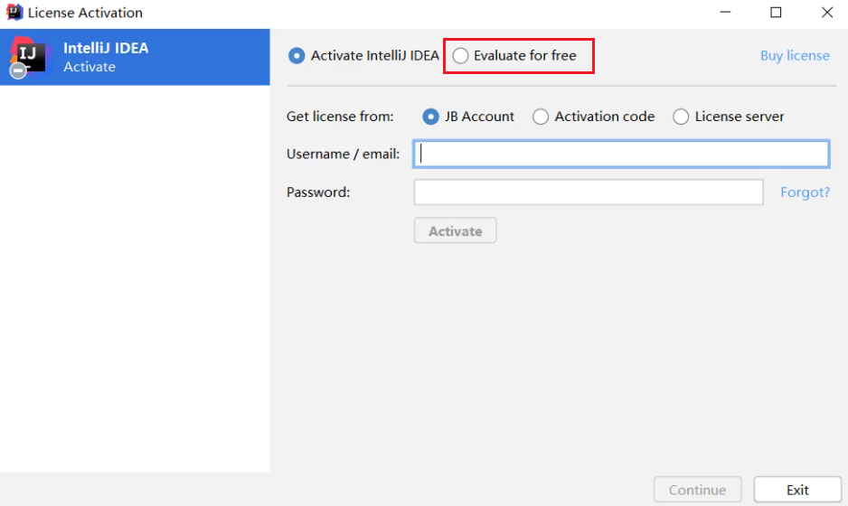

- 点击蓝色的Evaluate，就可以开始免费试用30天了。


- 当看到这个界面，就表示idea已经成功安装完毕

  可以点击右上角关闭。


### 8.3 IDEA中层级结构介绍

#### 8.3.1 结构分类

- project（项目、工程）
- module（模块）
- package（包）
- class（类）

#### 8.3.2 结构介绍

​	为了让大家更好的吸收，package这一层级，我们后面再学习，先学习最基础的project、module、class。

##### project（项目、工程）

​	淘宝、京东、黑马程序员网站都属于一个个项目，IDEA中就是一个个的Project。

##### module（模块）

​	在一个项目中，可以存放多个模块，不同的模块可以存放项目中不同的业务功能代码。在黑马程序员的官方网站中，至少包含了以下模块：

- 论坛模块
- 报名、咨询模块

为了更好的管理代码，我们会把代码分别放在两个模块中存放。

##### package（包）

​	一个模块中又有很多的业务，以黑马程序员官方网站的论坛模块为例，至少包含了以下不同的业务。

- 发帖
- 评论

为了把这些业务区分的更加清楚，就会用包来管理这些不同的业务。

##### class（类）

​	就是真正写代码的地方。

#### 8.3.3 小结

- 层级关系

  ​	project - module - package - class

- 包含数量

  ​	project中可以创建多个module
  ​	module中可以创建多个package
  ​	package中可以创建多个class

  ​	这些结构的划分，是为了方便管理类文件的。

### 8.4 IDEA中的第一个代码

##### 8.4.1 操作步骤

- 创建Project 项目
- 创建Module 模块
- 创建class   类
- 在类中编写代码
- 完成编译运行

##### 8.4.2 分步图解

- 双击启动图标

  

- 首先要新建一个项目

  点击creat new project

  

- 我们要从0开始写代码，所以新建一个空的什么都没有的项目。

  点击左下方的Empty Project

  再点击右下角的next

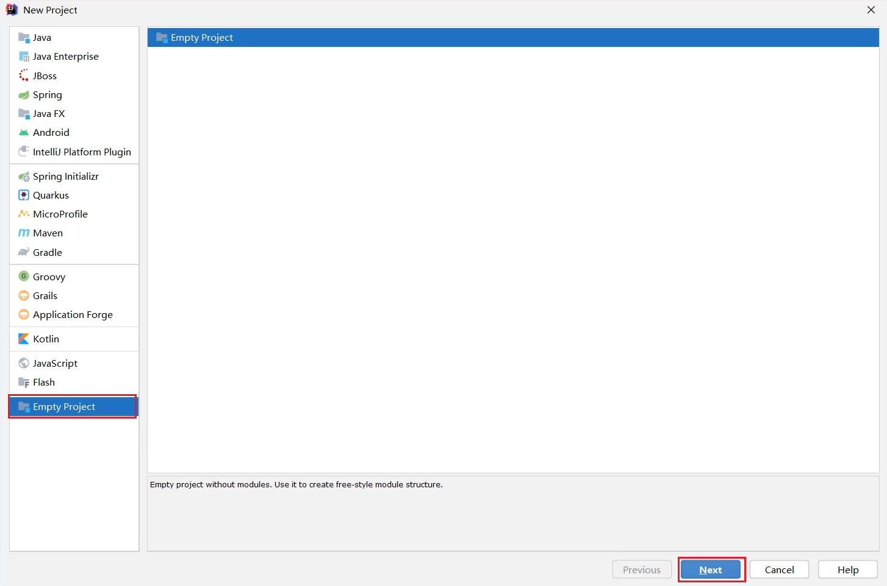

- 输入项目的名称

  输入项目的存放路径

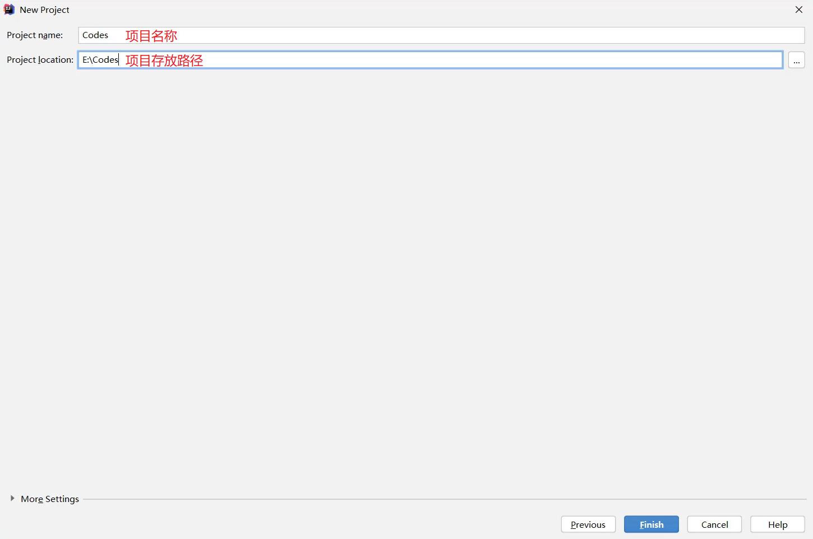

- 点击ok。idea会帮助我们在本地创建一个项目文件夹


- 点击Module，准备新建一个模块


- 点击+

  再点击New Module


- 我们要编写Java代码，所以要新建一个Java模块。

  点击Java

  再点击右下角的next

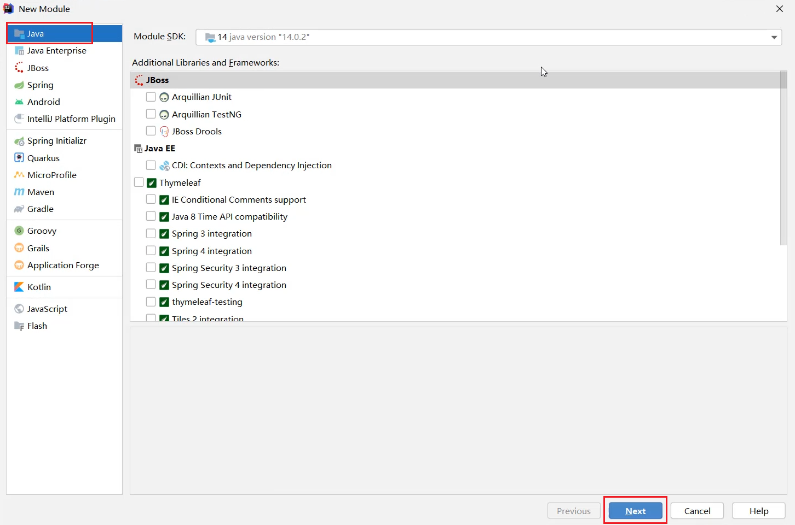

- 输入模块的名称

  再点击右下角的Next


- 成功新建一个模块之后，中间就会出现刚刚新建的模块

  点击右下角的OK


- 回到主界面

  展开刚刚新建的模块

  右键点击src，选择New，选择Java Class


- 输入类名

  再按回车


- 由于字体比较小

  所以，我们要设置一下字体。

  点击File，选择Setting。


- 搜索一下font

  在右边可以输入Size的数值来调节代码字体的大小。

  设置完毕后点击右下角的OK

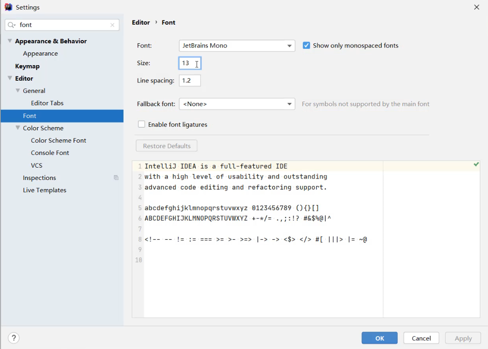

- 编写代码

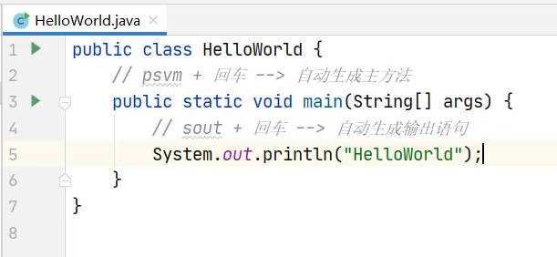

- 运行代码

  右键空白处，点击Run


- 最下面会弹出控制台。

  所有输出语句中的内容，都会在控制台上展示。

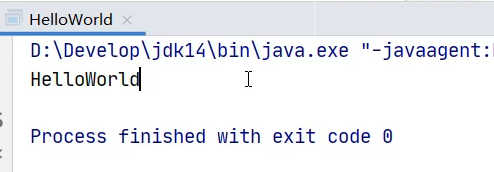

### 8.5 IDEA中类的相关操作

#### 8.5.1 类的相关操作

- 新建类文件
- 删除类文件
- 修改类文件

#### 8.5.2 新建类文件

- 所有的Java代码都会写在src文件夹当中。

  所以，右键点击src，选择new，点击Java Class

  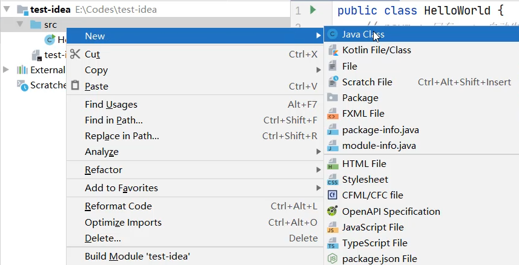

- 输入类名，再按回车

  

- 新建完毕


#### 8.5.3 修改类名

- 右键点击想要修改的文件

  点击Refactor

  再点击Rename


- 输入想要修改的名字

  输入完毕点击下面的Refactor


- 文件名和类名均已修改成功

  

#### 8.5.4 删除类文件

- 想要删除哪个文件，就右键点击该文件

  选择Delete即可

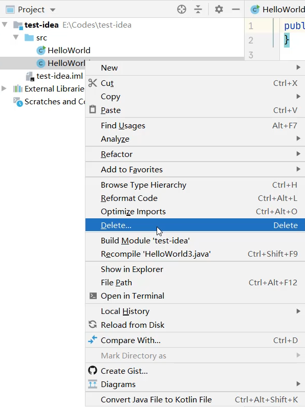

- 在弹出的界面中点击OK，确定删除


> 小贴士：
>
> 此时删除是不走回收站的，直接从硬盘中删掉了。

### 8.6 IDEA中模块的相关操作

#### 8.6.1 模块的相关操作

- 新建模块
- 删除模块
- 修改模块
- 导入模块

#### 8.6.2 新建模块

- 点击File，选择Project Structure


- 选择Module


- 点击+

  选择New Module


- 要创建一个Java模块，所以选择第一个Java

  点击右下角的Next

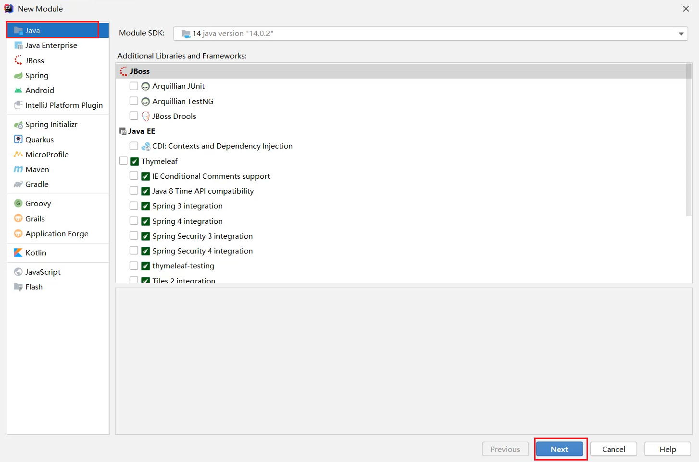

- 输入模块的名称

  点击右下角的Finish


- 成功新建完毕之后，在中间空白区域就出现了刚刚新建的模块

  点击右下角的OK


- 在主界面中，也会出现刚刚新建的模块


#### 8.6.3 删除模块

- 右键点击模块

  选择Remove Module

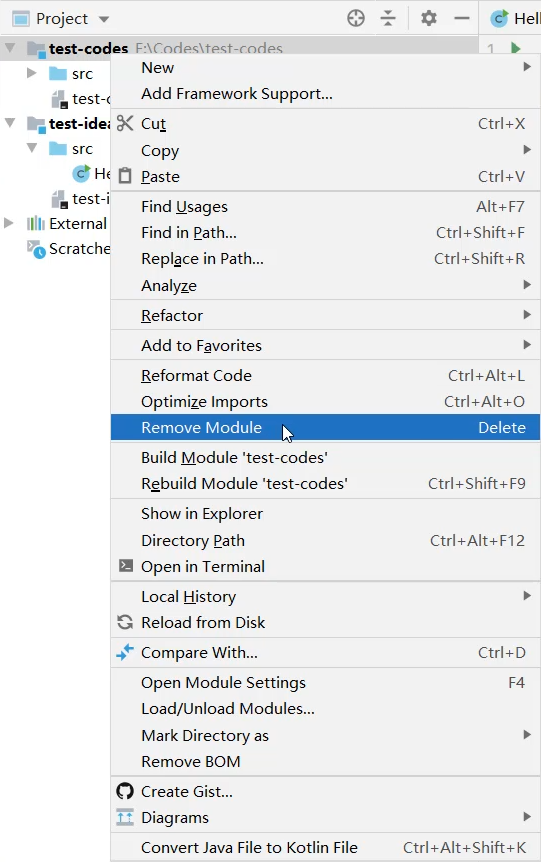

- 选择Remove，表示确定删除


- 此时发现，在IDEA列表页面，删除的模块已经不在了。

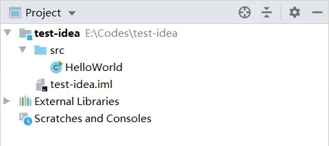

> 小贴士：
>
> 此时删除仅仅是从IDEA列表中的删除，在本地硬盘中还是存在的。

#### 8.6.4 修改模块

- 右键点击模块名

  选择Refactor

  再选择Rename


- 选择第三个修改模块名和本地文件夹名

  点击OK


- 输入要修改的新的模块名

  输入完毕点击Refactor

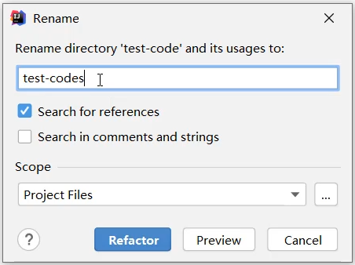

- 回到主界面，就发现模块名和文件夹名都已经修改完毕


#### 8.6.5 导入模块

- 点击File，选择Project Structure


- 选择Module

  点击+

  选择Import Module


- 从本地硬盘中选择要导入的模块

  再点击OK


- 不断点击Next

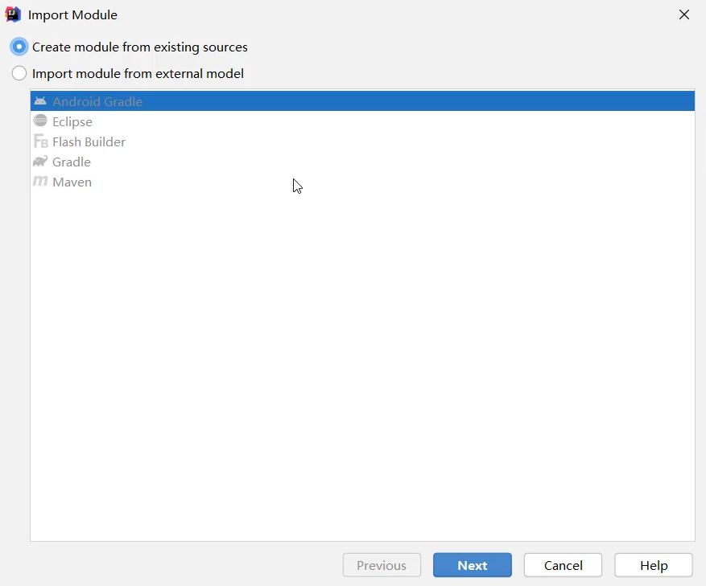

- 如果中间出现提示框，则点击Overwrite

  然后继续点击右下角的Next


- 一直点到finish为止


- 成功导入后，在中间位置就会出现导入的模块信息


- 在主界面中也会出现导入的模块信息


- 展开模块点击模块中的Java文件，会发现代码报错。

  是因为导入模块跟JDK没有关联导致。


- 可以点击右上角的Setup SDK

  再选择已经安装的JDK版本即可


- 导入完毕之后，代码就恢复正常不会报错了


### 8.7 IDEA中项目的相关操作

#### 8.7.1 项目的相关操作

- 关闭项目
- 打开项目
- 修改项目
- 新建项目

#### 8.7.2 关闭项目

- 点击File，选择Close Project即可


- 刚刚操作的项目就已经关闭了

  左侧是项目列表，如果要再次打开该项目，直接点击即可。

  右侧有create new project，可以再建一个新的项目


- 鼠标放在项目上，后面会出现一个叉。

  如果点击了这里的叉，会在IDEA的列表中删除。不会删除本地硬盘上的项目。


#### 8.7.3 打开项目

- 在本界面还可以打开本地已经存在的项目

  点击Open or Import


- 选择要打开的项目

  点击OK


- 项目就被打开了。

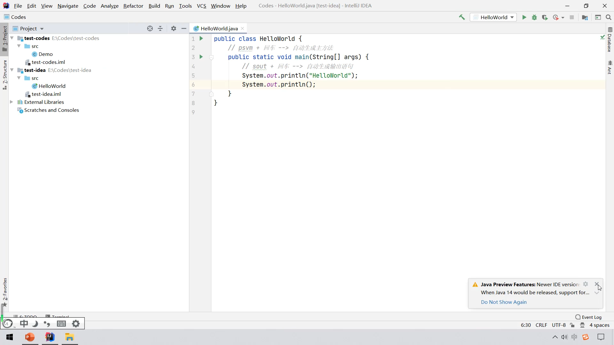

#### 8.7.4 修改项目

- 点击File，选择Project Structure


- 在这个界面，默认是Module

  所以，要先点击Project

  在右侧页面中，输入新的项目名称

  修改JDK版本和编译版本都变成JDK14

  再点击OK


- 此时发现，项目名称已经修改完毕

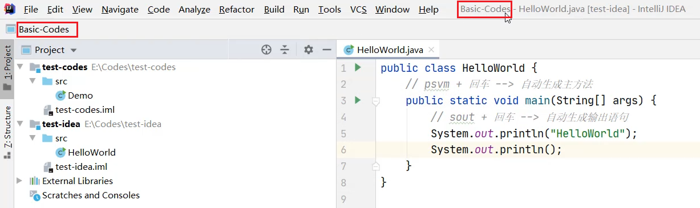

- 但是本地文件夹的名字还没有修改


- 需要先关闭当前项目


- 点击项目后面的叉，从列表中移除项目


- 到本地硬盘中手动修改文件夹的名称

 

- 点击Open or Import重新打开项目


- 选择修改之后的项目

  点击OK


- 此时会发现，项目名称和本地硬盘文件夹的名称都已经修改完毕了


#### 8.7.5 新建项目

- 点击File

  选择New

  点击Project


- 同样还是创建一个什么都没有的空项目

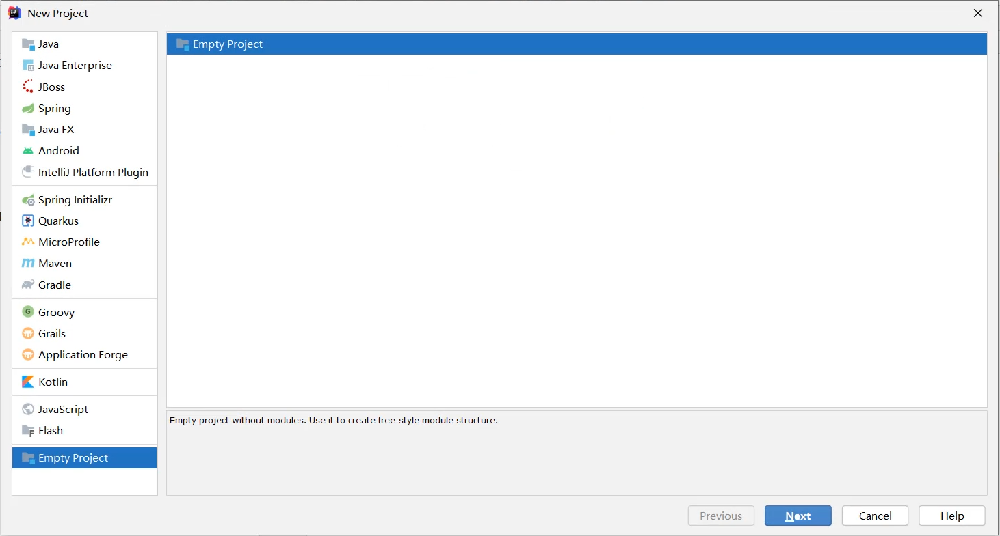

- 输入项目的名称

  点击右下角的finish


- IDEA循环是否需要帮我们在本地创建一个新的文件夹

  点击OK

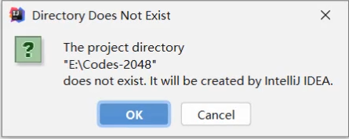

- 询问是在本窗口打开还是在一个新的窗口打开。

  可以点击New Window，在一个新的窗口打开。

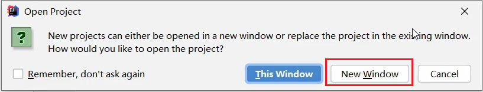

- 此时就出现了两个窗口，在一个新的窗口打开了新的项目


