注意：

​	用记事本打开本文档，格式较差。

​	可安装typora软件后再次打开。

​	安装包位于：day01\资料\其他软件\阅读笔记的软件\typora-setup-x64.exe

# day01 - Java基础语法

# 2.人机交互-图形化界面的小故事

计算机在刚开始出现的时候，因为占地广、造价高、耗电多，一般都是给军队或者政府使用的，而并不是给个人使用的。然后随着计算机不断地发展，体积越来越小，出现了微型机，进入了千家万户，这个时候个人才能够开始使用。在刚开始使用的个人电脑是没有像我们今天这样的图形化界面的。在以前都是在黑屏下面输入一些命令去操作计算机的。


比如说我想打开一个文件夹，在现在的电脑当中，用鼠标双击就可以，这就是图形化界面给我们带来的方便。但是在以前是需要输入一些命令才能够打开文件的，相对来讲还是有点麻烦的。

这个时候比较典型的操作系统是在1981年的时候由IBM和微软共同推出的，它的名字叫做：MS-DOS。这个系统是一律在黑屏下面使用一些命令去操作计算机的，没有任何的图形化界面，所以在当时，没有一点计算机的功底还真玩不转它。


所以是谁第一个发明图形化界面的操作系统的呢？很可惜，既不是微软，也不是苹果，而是施乐这家公司。


施乐这家公司在1981年4月27号的时候推出了一台叫做施乐之星的电脑，其创新程度在当年堪称惊天动地，就是因为它有图形化界面了，它就是长下面那样。


将它放大看一下，施乐推出的操作系统引入了窗口模式，你能同时打开几个窗口干不同的事。你可以建文件夹，把不同的东西归类放在一起，用到的时候双击就可以了，那基本上就是我们现在使用图形化界面的雏形。


你可能会觉得这个界面丑爆了，但是在当时，它是神一样的存在，而就是这个技术成功引起了业界两位大佬的相爱相杀，即乔布斯和比尔盖茨。


乔布斯看见了图形化界面的将来，推出了 `apple lisa`，同样的，刚开始页面比较丑。


那么作为乔布斯的平生对手，比尔盖茨也推出了 `Windows1.0`。


你有没有觉得也是花里花俏的，很那看。但就是这么难看的系统，还引起了两位大佬的撕逼，因为苹果是先推出 `apple lisa`，微软的 `windows1.0` 是在后面推出来的。所以乔布斯曾经当面怒斥比尔盖茨：你在盗用我的器械，也就是说你在抄我的作品。

而比尔盖茨不慌不忙，说出了他平生最金典的一句台词：“我们都有一个充裕的邻居，名叫施乐。有一天我闯进了他家，妄图偷走它的电脑。却发现你已经捷足先登。”


其实比尔盖茨的话里的意思是这样的：你别发火，咱哥俩都是抄的，谁也别说谁。那后来苹果跟微软就开始了相爱相杀。这个也是我们现在图形化界面的由来，图形化界面对计算机的普及做出了不可磨灭的贡献。


但是它也有自身的缺点，因为使用图形化界面去操作计算机，它要额外加载很多很多的图片，所以用图形化界面的方式去操作计算机，它需要消耗更多的内存，而且运行的速度没有命令行方式来的快。

大家在电视上看到的一些顶级黑客，他们一般都是在用命令行的方式去操作计算机的，如果说你有幸，以后碰见一些比较高级的黑客，你可以问一问它们，为什么不使用图形化界面呢？基本上所有的人都会回答你：太low太慢了。


那么在windows操作系统中，其实也保留了命令行这一功能，它就是CMD。所以，


## 什么是cmd？

就是在windows操作系统中，利用命令行的方式去操作计算机。我们可以利用cmd命令去操作计算机，比如：打开文件，打开文件夹，创建文件夹等。


---


# 3.打开CMD

步骤：

1. 按下快捷键：win + R。

   	此时会出现运行窗口。

2. 在运行窗口中输出cmd

3. 输出回车。

解惑：

​	cmd默认操作C盘下的Users文件夹下的XXX文件夹。（XXX就是计算机名），好就好比在图形化界面中，我们默认都是在桌面上进行操作的一样


查看 `User\XXX` 文件夹：1、win + E，打开此电脑，点进C盘； 2、双击打开用户； 3、双击 `XXX` 文件夹


扩展：其实windows的桌面也是个文件夹，它的名字叫 `desktop` ，位于 `C:\User\XXX\桌面` 文件夹下


----

# 4.常用CMD命令

扩展一个小点：

在很多资料中都说成是DOS命令，其实是不对的。真正的DOS命令是1981年微软和IBM出品的MS-DOS操作系统中的命令才叫做DOS命令。

而在Windows中，win98之前的操作系统是以非图形化的DOS为基础的，可以叫做DOS命令。到了2000年以后，windows逐渐的以图形化界面为主了，这个时候就不能叫DOS命令了，他只是模拟了DOS环境而已，很多的原本的DOS命令已经无法使用了，所以这个时候叫做CMD命令会更准确一些。

常见的CMD命令如下：

| 操作               | 说明                                                         |
| ------------------ | ------------------------------------------------------------ |
| 盘符名称:          | 盘符切换。E:回车，表示切换到E盘。                            |
| dir                | 查看当前路径下的内容。<br />包含所有的文件、文件夹，包括隐藏的内容全部展示出来。 |
| cd 目录            | 进入单级目录。cd itheima                                     |
| cd ..              | 回退到上一级目录。                                           |
| cd 目录1\目录2\... | 进入多级目录。cd itheima\JavaSE                              |
| cd \               | 回退到盘符目录。                                             |
| cls                | 清屏。                                                       |
| exit               | 退出命令提示符窗口。                                         |

补充操作：

- 盘符切换必须使用英文的冒号
- `ctrl + 滚轮` 可以调节命令行窗口的大小。

- 使用 `tab` 键可以补全目录。

- 如下图，使用 dir 有时候会出现 `.`、`..` 目录，这个是隐藏的文件夹。

  

- 关闭命令行窗口

  1. 使用图形化界面的方式：直接点击上方的 `×` 
  2. 使用cmd命令的方式： `exit` 

- 在windows操作系统当中，文件名或者文件夹名是忽略大小写的。


---

# 5. 练习：利用CMD打开QQ并配置环境变量

需求：

利用cmd命令打开自己电脑上的QQ。

完成步骤：

```java
1：确定自己电脑上的QQ安装在哪里
2：启动cmd
3：进入到启动程序QQ.exe所在的路径（qq\bin）。
4：输出qq.exe加回车表示启动qq。
```

假设我们电脑是没有图形化界面的。而QQ是经常打开的软件，每次打开的时候都要切换盘符，并且进入多层文件夹，太麻烦了！


## 设置环境变量

作用：如果我想要在CMD的任意目录下，都可以启动某一个软件，那么就可以把这个软件的路径配置到环境变量中的PATH里面。

在启动软件的时候，操作系统会先在当前路径下找，如果在当前路径没有再到环境变量的路径中去找。如果都找不到就提示无法启动。


**步骤**

第一步：右键点击我的电脑并选择属性。

（如果无法出现第二步界面，可以打开我的电脑之后右键点击空白处）


第二步：点击高级系统设置。


第三步：选择高级，再点击下面的环境变量。

 


第四步：找系统变量里面的PATH

> 上面的那个不用管，因为上面那个是moon用户的用户变量，如果你的电脑里面有多个用户的话，那么设置在moon里面是不能通用的，所以我们要找到下面的系统变量。

 


第五步：点击新建，把QQ的完整路径，配置到PATH当中，再点击确定即可。


第六步：（可做可不做）点击上移，把当前配置的路径移动到最上面。

移动的好处：在CMD中打开软件时，会先找当前路径，再找环境变量，在环境变量中是从上往下依次查找的，如果路径放在最上面查找的速度比较快。

 


第七步：在任意目录下重新打开cmd窗口，然后输入 `qq.exe`，可以发现qq成功被启动！


---

# 6. 学习方法和Java概述

## 1）学习方法

作为一个0基础入门的同学，在刚开始学习的时候，我们不要追求知识点的深度，而是要追求知识点的广度。简单来说，学一个知识点不要想的太深，应该先学习如何用，然后把尽可能多的知识点综合的用起来，锻炼我们的思维能力才是第一要素，等入门后，再来学习更加深入的知识点，才是符合我们平时学东西的思维逻辑。


---


## 2）Java是什么？

语言：人与人交流沟通的表达方式

计算机语言：人与计算机之间进行信息交流沟通的一种特殊语言

Java是一门非常火的计算机语言。（也叫做编程语言）

如果我们想让计算机按照我们的指令去做事情，就需要说计算机能听得懂的语言。JAVA就是一门非常火的计算机语言。至于到底有多火，我们可以看一下JAVA的市场占有率，这个是截止到2021年上半年全球编程语言的排行榜，其中上面的绿色的就是JAVA。


我们知道，没有一款语言能够牢牢占据排行榜的榜首，起起伏伏是一种正常情况，但是可以看见它基本上都是保持在前三名之内。

看完了全球的，我们再来看看国内的，截止2021年上半年JAVA以28%的市场占有率在国内排名第一。


并且我们可以看看招聘网站，其中火热职位就有JAVA的一席之地，比如从BOSS直聘上截出来的一张图，在BOSS直聘的热门职位当中，第一个就是JAVA。


51job（前程无忧）热门推荐里面也有JAVA。


再来看智联招聘，互联网IT分类的第一个也是JAVA。


所以由此可见，JAVA的火热程度。


---

# 7.JDK下载和安装

写JAVA代码不是随随便便能写的，我们得先做一点准备工作。例如，我们平时想要玩一把游戏，就需要先下载、安装才能玩游戏。JAVA也是一样的，也是需要下载并安装相关的软件，它的名字就叫做：JDK。然后才能编写JAVA的第一个案例 —— HelloWorld。


## 下载

通过官方网站获取JDK：[http://www.oracle.com](http://www.oracle.com/)

**注意1**：针对不同的操作系统，需要下载对应版本的JDK。

**注意2**：如果你的电脑是windows32位的，建议重装系统，重装成64位的操作系统。因为Java从9版本开始，就已经不提供32位版本的安装包了。

首先点击官网导航栏的 `Products `选项，然后在弹出的下拉框中点击 `JAVA`


然后点击右上角的 `Download Java`，表示要下载JAVA


然后在上面它会有两个提示：1、`Java downloads`：下载JAVA； 2、`Java archive`：Java的历史版本


在第一个界面中表示你下载的是最新的Java，但如果说你不要下载最新的，需要下载以前的，就可以点击第三个选项。本套课程采用的是2021年9月份刚推出来的 `Java17`，这个版本是长期支持版本，所以会有一个 `LTS` 后缀。


然后根据自己的操作系统下载对应的版本，下面就以windows举例。

选中windows，然后点击中间这个进行下载，因为只有中间这个是最干净的安装包。第一个是zip包，在这个里面你下载完之后是一个压缩包，压缩包里面会有安装包还有一些其他说明性文件，但那些说明性文件对我来讲没有用，我只要一个安装包就可以了。


----


## 安装

双击打开安装包，然后傻瓜式安装，下一步即可。默认的安装路径是在C:\Program Files下。

建议：

- 安装路径不要有中文，不要有空格等一些特殊的符号。

  因为这些软件是老外编写的，对中文的支持不够完美，所以如果以后路径中有中文，以后在使用的时候，容易出现一些问题。在选择路径的时候，我们就写英文单词 / 加一点数字就行了。

- 以后跟开发相关的所有软件建议都安装在同一个目录（文件夹）中，方便管理。

例如这里就将开发所有的软件都装在E盘的develop文件夹当中。


然后点击右上角的新建文件夹按钮，新建一个文件夹，名为：`JDK17`。


----


## JDK的安装目录介绍

安装完毕后，就可以去对应的文件里找到以下文件夹。

重点需要掌握的是 `bin` 文件夹。

| 目录名称 | 说明                                                         |
| -------- | ------------------------------------------------------------ |
| bin      | 该路径下存放了JDK的各种工具命令。javac和java就放在这个目录。 |
| conf     | 该路径下存放了JDK的相关配置文件。                            |
| include  | 该路径下存放了一些平台特定的头文件。                         |
| jmods    | 该路径下存放了JDK的各种模块。                                |
| legal    | 该路径下存放了JDK各模块的授权文档。                          |
| lib      | 该路径下存放了JDK工具的一些补充JAR包。                       |


---

# 8.HelloWorld小案例

HelloWorld案例是指在计算机屏幕上输出“HelloWorld”这行文字。各种计算机语言都习惯使用该案例作为第一个演示案例。这已经是程序员圈里约定俗称的一个规矩了，"HelloWorld"就是程序员的启蒙代码。


---


## Java程序开发运行流程

开发Java程序，需要三个步骤：

1. 用记事本编写程序
2. 编译文件
3. 运行程序。


### 如何理解编译？

Java在操作系统中，是不可以直接运行的，因为操作系统它是不认识Java代码的。


运行的办法就是需要将Java代码翻译成操作系统能看得懂的东西。所以说编译的动作其实就是翻译把操作系统看不懂的内容变成操作系统能看懂的内容。


所以第二步的编译，我们也可以理解成翻译的意思。翻译完后会产生一个新的文件，然后在第三步就可以运行翻译之后的文件了。


---


## HelloWorld案例的编写

> 新版本的JDK不需要先配置环境变量。直接按照以下步骤编写即可。

### 1、新建文本文档文件，修改名称为HelloWorld.java。


**注意**：

- 后缀名为java的才是java文件。修改文件名后缀的时候会出现一个弹窗，点击yes即可。

  

- 如果文件后缀名并没有展示，需要按如下步骤进行设置。勾选上文件扩展名，文件扩展名就是后缀名。

  


### 2、用记事本打开HelloWorld.java文件，输写程序内容。代码要跟我编写的完全保持一致。

右键点击文件，然后点击打开，此时就可以使用windows自带的记事本来编辑了。


PS：双引号里写的是其他内容也行，可以是数字，也可以是字母，但不能是中文！因为会乱码，解决方案在后面Notepad++会讲解。现在先写最基本的“HelloWorld”就可以了。

这里可以养成一个习惯，只要出现括号、引号的，都要成对出现，敲完一对括号后，再将光标移到括号中间，再去补中间的代码就可以了，这样就会防止因为忘记丢掉右括号。


```java
public class HelloWorld {
	public static void main(String[] args) {
		System.out.println("HelloWorld");
	}
}
```


### 3、<kbd>ctrl + s</kbd> 保存，或者也可以直接图形化点击保存。


未保存的文件在上方一般都会有 * 符号或其他符号标记。像我这里，如果保存了就会从 `圆点` 变为 `×`


### 4、编译文件。

此时就需要使用到Java当中的工具了，找到JDK的安装目录里的bin文件夹`E:\develop\JDK17\bin`，我们所要找的工具一个是 `javac`，另一个是 `java`，用 `javac` 去编译，然后再用 `java` 去运行。`javac` 是JDK提供的一个编译工具，我们可以通过这个工具，把当前路径下的java文件编译成class文件。


这两个工具是在cmd中使用的。cmd默认操作的是 `C:\User\XXX` 下的文件夹，如果要进入到刚刚编写的HelloWorld所在的文件夹，就需要使用cmd命令进行切换了。

切换到编写的HelloWorld.java所在的文件夹后，执行 `javac HelloWorld.java`。执行完后如果没有任何信息出现，表示编译成功。编译后会多一个文件，这个文件就是翻译之后的文件，它的后缀名是class，所以我们也会把这个文件叫做class文件，或者是字节码文件。这个文件就是给操作系统在运行的时候使用的，我们人是看不懂的。


我们可以右键点击它，然后使用记事本打开。可以发现里面的东西我们是看不懂的。


### 5、运行代码。

`java` 是JKD提供的运行代码的工具。接下来使用 `java` 工具，执行 `java HelloWorld`，注意不需要加上后缀名。运行的是编译之后的class文件。此时发现，HelloWorld已经出来了。


小技巧：如果不想每次编译的时候都切换路径，可以在java文件当前所在的文件夹的上方，直接输入cmd，然后回车。此时打开的cmd窗口所在的路径就是java文件所在的路径。


---

# 9.HelloWorld案例常见问题

## BUG

BUG（小甲虫）。计算机刚开始出现的时候，因为体积比较大，一些小虫子很容易转进去。有一天有一只蟑螂钻到了计算机当中，从而导致计算机不能正常运行，此时就有两个工作人员去排查了，就是下图的两个小姐姐。


在电脑系统或程序中，隐藏着的一些未被发现的缺陷或问题统称为bug（漏洞）。


## BUG的解决

1. 具备识别BUG的能力：多看
2. 具备分析BUG的能力：多思考，多查资料
3. 具备解决BUG的能力：多尝试，多总结


## HelloWorld常见问题

1、非法字符问题。Java中的符号都是英文格式的。

例如，下方将分号改为了中文的分号，然后重新编译，此时它就会报错——第三行出现了问题：错误：需要 ’ ; ‘，并且出现了一个小箭头，指向了小括号的后面，意思就是说：这个符号我不认识，是不是一个中文？


有一个小技巧，可以避免标点符号的问题：将输入法设置为 `中文时使用英文标点`，以下以搜狗输入法举例。右击搜狗输入法，选择 `更多设置` ,然后勾选上 `中文时使用英文标点`，此时以后你输入的标点符号全部都是英文状态下的了。


2、大小写问题。Java语言对大小写敏感（区分大小写）。

例如将 `System` 的大写 `S` 改为了小写 `s`，重新编译，就会报以下错误。此时又会出现一个小箭头，表示在小箭头的前后出现了问题。


---

# 10.环境变量

开发Java程序，需要使用JDK提供的开发工具（比如javac.exe、java.exe等命令），而这些工具在JDK的安装目录的bin目录下，如果不配置环境变量，那么这些命令只可以在bin目录下使用，而我们想要在任意目录下都能使用，所以就要配置环境变量。

但是上面我们编写HelloWorld小案例时，并没有配置环境变量，但为什么可以在非bin目录下使用 `javac` 和 `java` 这两个小工具的呢？

这是因为现在最新从官网上下载的JDK安装时会自动配置javac、java命令的路径到Path环境变量中去 ，所以javac、java可以直接使用。


根据以下步骤查询环境变量，发现，在安装完JDK后，环境变量多了一个。进入到此路径后，发现Java在安装的时候将 `javac` 和 `java` 这两个命令相当于做了一个快捷方式，放到了该路径当中，然后再把这个路径配置到环境变量里。所以我们就可以在任意目录下面用到 `javac` 和 `java` 了。


以前下载的老版本的JDK是没有自动配置的，而且自动配置的也只包含了4个工具而已，如果我们要使用其他的工具还是不能使用。所以我们需要删掉已经配置完毕的，并且将该 `C:\Program Files\Common Files\Oracle\Java\javapath` 路径下的工具都删除，再次重新配置Path环境变量。


最简单的方式就是将JDK的bin目录直接添加到path环境变量中，但是这种方式不推荐。因为这个里面有很多变量，当我们在操作的时候，很有可能会操作到其他变量信息，如果将其它的变量修改了，那在系统里面其它的软件就有可能打不开了。所以我们应该使用以下步骤进行配置：

①**JAVA_HOME**：告诉操作系统JDK安装在了哪个位置（未来其他技术要通过 `JAVA_HOME` 找JDK），注意这个地方的路径是不带bin的。这个相当于我们自己新建了一个：`JAVA_HOME`的路径。


②然后再点击**Path**，使用两个 `%` 引用我们刚刚自己定义的路径：告诉操作系统JDK提供的javac(编译)、java(执行)命令安装到了哪个位置。

然后再将这个环境变量移动当最上面即可。


---


## win10的bug

有些win10的电脑当电脑重启之后，环境变量失效了。表示操作系统不支持自定义的环境变量。

解决方案：

还是要配置JAVA_HOME给以后的相关软件去使用，我们可以把java和javac的完整路径配置到PATH当中： `D:\develop\JDK17\bin`。


---

# 11.Notepad++

以前在记事本上写的代码看上去有点累，因为所有的单词看上去都是黑色的，并且当代码出现问题后，它提示第三行，我们还需要一行一行去数。这些问题都可以由一个高级记事本：`Notepad++` 来解决。

**下载**：[Downloads | Notepad++ (notepad-plus-plus.org)](https://notepad-plus-plus.org/downloads/)


**安装**：傻瓜式安装，直接点击下一步就可以了。

在选择安装路径的地方建议不要放在C盘，所有东西都放在C盘后，电脑会变的比较卡，建议专门找个文件夹，用来放跟我们开发相关的软件，因此这次还是放在 `E:\develop\notepad`。

---

## 设置

右键点击java文件，选择edit with notepad++。


点击设置，再点击首选项。在弹出的页面当中，左侧选择新建，中间选择Java，右侧选择ANSI，表示使用本地的默认编码，此时在代码的地方就可以写中文了。


---

## 练习

利用notepad++去编写一个HelloWorld并能成功编译和运行。

使用notepad++定位到当前文件所在的命令行就更加方便了：


---

# 12.Java语言的发展

JAVA语言的诞生是具有一定戏剧性的，可以说是命运多舛，差点凉凉，差点GG，差点嗝屁。


在1990年的时候Sun（Stanford University Network：斯坦福大学网络）公司成立了一个由 `James Gosling` 领导的Green计划，准备为下一代的职能家电，也就是电视机、微波炉、电话等去编写一个通用的控制器，这个负责人就是`James Gosling`，它也名为Java语言之父。

在一开始的时候，这个团队是准备用C++来编写的，但是发现C++在很多方面存在一些问题，使用起来十分不方便，导致项目的进展非常的缓慢，但是大神不愧是大神，编程语言不方便，就自己造一个，所以他们就造了一个全新的语言：`Oak语言`，起这个名字是因为他们项目团队的门前长了一颗橡树，Oak就是橡树的意思。

到了1992年的时候，Green计划已经完成了新平台的部分功能。包括Green的操作系统、Oak的程序设计语言、类库等。简单理解就是，已经用Oak语言已经做了很多很多事情了。

Sun公司看见这个团队这么牛逼，所以就在11月份，成立了由Sun公司全资的子公司，它的名字就叫做 `FirstPerson有限公司`。因为这家公司大多数都是程序员，不太会管理，所以因为管理不善，  `FirstPerson有限公司`几乎凉凉，Oak语言也差点凉凉。

但是到了1994年，随着互联网行业进入到快速的发展阶段，Java语言之父`James Gosling`非常有商业眼光，它立马改写了Oak语言。在同年秋天，完成了第一个Oak语言的网页浏览器，它的名字叫做WebRunner，这个浏览器现在已经不用了，但是在当时，它是一个跨时代的产品，Sun公司看到它们这么牛逼，所以就准备去给Oak注册商标了，但是Oak已经被一家投资公司美国橡树资本管理有限公司给注册过了，所以只能改名叫：JAVA。因为外国的程序员都是比较爱喝咖啡，而生产咖啡豆的地方叫做爪哇岛，所以就改名，叫做JAVA。

改完名字之后，在1995年的时候，正式推出了JAVA。


随后又出现了1.0、1.1、1.2、1.3、1.4版本，但是Sun公司发现了，每次更新只改小数点后面一位，太小家子气了，所以从5开始就改成了大版本号更新，称之为 `Java5.0`。在06年的时候又推出了6.0。到了09年的时候，Sun公司被Oracle甲骨文公司收购了。Oracle公司在全球而言是非常厉害的公司，是仅次于微软的第二大网络公司。所以Java在Oracle手中，市场份额越来越大，语言的版本也在不断更新，到目前为止，最新的就是刚推出来的Java17。通过这么多版本出现的时间可以发现，从Java9开始，基本上都是6个月出一次版本，Java之所以要保持这么快的更新速度，其实就是为了紧贴市场的发展，使得Java自己不会被淘汰。


但是这么快的更新速度会给我们开发者造成学习上的困扰，所以为了解决这些问题，Java会把这些版本分成两种：1、普通版（过渡版本）；2、正式版（长期支持版本）（长期支持版本会有LTS后缀）。

在这么多版本当中，其中Java8、Java11、还有我们现在学习用的Java17，就是LTS长期支持版本，所以从这一方面它就降低了开发者的学习成本。在这么多版本当中，其中有三个版本非常的重要：

* Java5.0：这是Java的第一个大版本更新。
* Java8.0：这个是目前绝大数公司正在使用的版本。因为这个版本最为稳定。
* Java17.0：这个是我们课程中学习的版本。

这些版本向下兼容。新的版本只是在原有的基础上添加了一些新的功能而已。

举例：

用8版本开发的代码，用11版本能运行吗？必须可以的。

用11版本开发的代码，用8版本能运行吗？不一定。

如果11版本开发的代码，没有用到9~11的新特性，那么用8是可以运行的。

如果11版本开发的代码，用到了9~11的新特性，那么用8就无法运行了。


---

# 13.Java能干什么？以及JAVA三大平台

JAVA从95年以来，已经问世了20多年了，可能比部分同学的年龄还大。

Java到底能干嘛呢，此时就需要讲到Java的三大平台，其实也就是它的三个分类：JavaSE、JavaME、JavaEE。

---

## JavaSE

JavaSE（Java Standard Edition）是Java语言的标准版，用于桌面应用的开发，是其他两个版本的基础。

桌面应用：用户只要打开程序，程序的界面就会让用户在最短的时间内找到他们需要的功能，同时主动带领用户完成他们的工作并得到最好的体验。其实就跟我们电脑上安装的这些软件是类似的：例如电脑中的计算器，就是比较简单的桌面应用；还有像右边类似于坦克大战的游戏，也可以做成桌面应用，双击打开就可以玩了。


但是在这个领域，Java是不太合适的，因为当我们写一些比较复杂的动画的时候，Java加载的速速有可能会变的很慢。在桌面应用领域，最为合适的语言是C / C++，所以在这个领域，Java可以做，但是不占优势。

所以我们学习JavaSE的目的并不是是为了写桌面应用，而是锻炼大家的逻辑思维能力，为今后要从事的JavaEE开发打基础。

---

## JavaME

JavaME（Java Micro Edition）是Java语言的小型版，用于嵌入式电子设备或者小型移动设备的开发。

嵌入式设备就是电视机、微波炉、数码相机这些里面的系统，当然还有一个最主要的：小型移动设备—手机。在以前，诺基亚手机风靡全球，它用的是塞班系统，当我们双击打开一个软件的时候，会有一个小的咖啡杯弹出来，这个软件就是用JavaME写的。随着塞班系统渐渐的没（mo）落，JavaME也渐渐的凉了。当你去一些招聘网站搜索JavaME，可以发现没有这样的工作档位，它现在已经被安卓和IOS给替代了。


但是，安卓、鸿蒙也是可以用Java来开发的。

---

# JavaEE

JavaEE（Java Enterprise Edition）是Java语言的企业版，用于Web方向的网站开发。在这个领域，是当之无愧的No1。

网站开发并不是我们看见的浏览器，完整的网站开发是浏览器和服务器开发，在服务器领域，Java是最厉害的。自从95年问世以来，没有一款语言能撼动它的位置。


下面是Java的6大应用领域

- 桌面应用开发

  制作各种各样的开发工具，有我们的Java程序员用到的Idea、C/C++用到的Clion、Python程序员用到的Pycharm。这是因为Java语言是比较规范，漏洞比较少，所以用Java语言编写的编译工具就会非常的健壮，不会有那么多漏洞以及安全性问题。

  在我国，由于一些历史原因，目前有很多办公系统，或者是市场上的税务管理系统也都是使用Java来开发的。

- 企业级应用开发

  在后续课程中其实就是带着大家去做企业级应用，像微服务、SpringCloud...

  企业级应用说简单点，就是开发服务器，而服务器可能要每秒钟承担几十万，甚至几百万的访问量，例如12306春节买票的时候，高峰期每秒钟有很多很多人，有几十万，甚至是几百万的人同事买票，到目前而言，只有Java，还有Go语言能承载这么大访问量，但是在国内，Go语言是非常小众的，所以还是用Java比较好一些。

- 移动端/嵌入式开发

  例如鸿蒙、安卓，并且CT、B超的界面，它也是用Java来开发的。

- 科学计算

  因为Java语言非常的严谨。有一个软件叫：matlab，有些同学在大学里面可能会用到，如果说你要搞一些数学的建模大赛、做一些仿真，开发一个机器人，机器人怎么走路，做一些动态的仿真效果，也是需要用到matlab。这个科学计算的软件也是使用Java来开发的。

- 大数据开发

  在大数据中有一个框架：hadoop，它的logo是一头大象。这个框架也是用Java来开发的。

- 游戏开发

  《我的世界》这款像素游戏也是用Java来开发的。


最后来看一下Java能干的事情：

左上角的天猫、淘宝、阿里云、京东，这些就是服务器的开发，也就是企业应用的开发。

中间有个WebStorm，这个是前端程序员用的开发工具、PhpStorm是Php程序员用到的开发工具、IntelliJ IDEA是Java程序员用到的开发工具、PyCharm是Python程序员用到的开发工具，这些开发工具都是用Java来开发的。

右上角的机械臂，它里面的控制管理程序，也是用Java来开发的。

右中间有科学计算工具：matlab。

右下角的我的世界，也是使用Java来开发的。


---

# 14.Java为什么这么火

一个语言火不火、能不能长久的生存下去，主要其实是看四个方面

1、用户量：使用的程序员多不多。

不管在国内，还是在国外，使用Java的程序员还是非常多的。


2、适用面：用的地方多不多。

从以下6大领域可以看出来，用到Java的地方也是非常多的。


3、与时俱进：会不会紧跟时代一起发展，如果一个语言跟不上时代的发展，不管它有多牛逼，总有一天会被市场淘汰。

从Java9版本开始，基本上都是保持半年一更新，保持这么快的更新速度，就是为了紧贴市场的发展，一旦其他语言有什么好的东西，或者是市场上出现了什么了不得的技术，Java都可以把它们融进来成为自己的东西，让自己永远保持生命力，永远不会被市场淘汰。


4、语言的本身是否有什么明显的特点

它的特点主要有以下几个：面向对象、安全性、多线程、简单易用、开源、跨平台

Java在上面这四个方面都做的非常的好，所以说Java的生命力还是非常强劲的。


---


## Java主要特性

1、面向对象

等我们以后学习完Java的面向对象之后，你可以在心里面想象一下自己对女朋友的要求：性别、年龄、身高、体重还有一些其他的要求，然后你可以把这些东西都告诉Java：我想要一个这样的女朋友。Java非常好，它会说：好的，没问题，满足你。

根据你的要求给你制造了一个女朋友，这个就是Java中的面向对象。简单理解就是根据你想的模板，把东西创建出来，这就是面向对象。创建出来的东西可以是女朋友、车子、房子、票子..... 想造什么就造什么，这个就是Java当中最难理解的面向对象


2、安全性

Java写出来的代码非常的安全，漏洞非常的少。


3、多线程

假设在12306上买票，假如有4个用户同时在12306上买票，此时就可以看成12306的服务器同时给这四个人服务，这个就是多线程。

多线程简单理解：就是可以同时做多件事情。


4、简单应用

Java语言学起来非常简单，用起来也挺容易。


5、开源

假如我现在有一部手机，在手机上下载了QQ，此时我下载的仅仅是QQ的安装包，腾讯公司它是不会把QQ的代码给你的，这就叫做不开源。

而Java就是非常的简单粗暴了，同学们要往电脑中下载Java的开发工具的时候，Oracle公司它会把Java所有的源代码也都给你，这样就会告诉你Java是如何运行、如何工作的，这个就叫做开源。

一旦开源了，世界所有的开发者都可以去维护Java了，所以Java即使有什么缺点，也被广大的程序员给修复了，这就是开源的魅力。


6、跨平台

跨平台的平台指的是操作系统，例如：Windows、Mac、Linux。

Java程序可以在任意的操作系统上面运行，这个特点就很厉害了，很多其他的语言都干不了这些事情。而且这个特点对于公司来讲是非常有帮助的。

例如现在有家公司，利用了一种不能跨平台的语言开发了一个项目，此时只能在windows上去运行，不能在其他的操作系统上去运行，如果想要在其他的操作系统上运行，还需要重新编写代码。所以会给公司增加额外的成本。


但如果换成Java程序，就非常的粗暴了，一个人写的程序可以在所有的操作系统上运行，而且只要写一次就行了。Java在95年出现的时候，也是凭借这个特性，迅速的占领市场，当时它打出了一句口号：`Write Once Run Anywhere`（一次编译，到处运行）。


---

# 15.Java语言跨平台的原理

说到跨平台的原理，就需要说到高级语言的编译运行方式。所有的高级语言，比如说：C、Java、Python等等，在运行的时候大体上会分为三步，之前在编写HelloWorld的时候也是

1. 编程：新建文件，编写代码，保存代码。

   java程序员写的.java代码，c程序员写的.c代码，python程序员写的.py代码。

2. 编译：不管是什么高级语言，操作系统本身都是不认识的，因为机器只认识0011的机器语言，所以我还需要把第一步编写好的代码进行翻译，翻译成机器能认识的语言。

3. 运行：让机器执行编译后的指令。


## 高级语言的三种编译运行方式

- 编译型
- 解释型
- 混合型，半编译，半解释（将上面两种都结合起来）

### 1、编译型

C语言就是标准的编译型语言，它会将C/C++代码根据不同的操作系统整体的翻译成0011这样的二进制，然后再交给机器去运行。但是因为每个系统都是不一样的，手机运行会用到Arm平台，电脑运行就会用到X86平台，由于每个系统所用到的平台可能是不一样的，所以在编译之后所形成的指令也有可能是不一样的。


它的运行流程是这样的：

编写代码 —> 整体进行编译，跟java一样，它也会多出来一个后缀名为 `.obj` / `o`  等这样的文件，然后再去交给不同的设备去运行，在这里会有一个小细节，因为计算机是不一样的，所以它们就存在硬件也是不一样的，会有兼容性问题，所以针对不同的操作系统它都要重新进行编译。

更夸张的是，如果我编写代码的电脑的硬件跟运行代码的硬件之间差别特别大，就算是同一个操作系统，也有可能是没发成功运行的。所以说C语言不是跨平台的。


---

### 2、解释型

解释性语言最为代表的就是Python语言，在编写好代码之后，它不会把代码的整体进行翻译，而是读一行解释一行。读到一行代码，再把这行代码解释成0011去运行，然后再去读第二行代码，然后再去解释成0011再去运行。

所以说通过这个我们就知道了，编译型语言它的特点是整体翻译，而解释型语言，它的特点是按行翻译。


它的运行方式是这样的：编写代码 —> 按行翻译 —> 再交给不同的设备去运行

在这里它也有个小细节，Java / C在编译之后，它都会产生一个新的文件，但是Python不会，它是直接拿着我们自己编译好的代码逐行解释，再去交给设备去运行的。所以说Python程序员是天生开源的，它在编写好代码后，它只能把代码交给别人运行，如果说没有将代码交给别人，别人是没发运行的。

---

## 3、混合型，半编译，半解释（将上面两种都结合起来）

混合型最为典型的就是Java，在网上有很多资料，有的资料说Java是编译型的，有的资料说Java是解释型的，但这些都不对。Java是混合型的。在Java编译运行的过程中，存在编译，也存在解释。

首先将java文件整体编译成class文件（字节码文件） —>  按行交给设备去运行，在运行的时候，它也不是直接运行在计算机上的，而是运行在虚拟机里的。那问题就来了，虚拟机是什么？

如果说我现在要让手机上的游戏在电脑上运行，肯定是不能运行的。此时就可以在电脑中装一个安卓的处理区，相当于就是在操作系统里模拟了一部手机，在这部虚拟的手机中，就可以玩手机游戏了，这部虚拟出来的手机，我们也可以理解成 虚拟机。

所以说Java语言在运行的时候，跟刚刚是一个道理，操作系统本身其实是不认识Java语言的，Java也并不是直接运行在操作系统里面的，而是运行在虚拟机里面的，虚拟机会把Java语言翻译成操作系统能看得懂的语言。我们只要针对不同的操作系统给出不同的虚拟机就可以了。这个虚拟机不是我们写的，是Java自己提供好的。而我们作为程序员，我们只需要安装一个适合自己操作系统的虚拟机就可以了。


---

# 16.JRE和JDK

程序员在编写代码的时候其实是需要一些环境，例如我们之前写的HelloWorld。我们需要的东西有JVM、核心类库、开发工具。

1、**JVM（Java Virtual Machine）**：Java虚拟机，真正运行Java程序的地方。没有虚拟机，代码都没地方运行。

2、**核心类库**：例如之前写的HelloWorld代码中，里面的System、out、println，每个单词都有其特定的含义，它们组合在一起就可以把小括号的内容直接展示出来。这些其实都是Java已经写好的东西，我们直接拿过来使用就行了。

3、**开发工具**：例如：javac 编译工具、java 运行工具、jdb 调试工具、jhat内存分析工具 ......

它们三个组成的整体，就叫JDK。JDK（Java Development Kit）称为Java开发工具包，包含了JRE和开发工具。

所以说简单理解程序员想要编写代码并且能成功运行，我们需要安装一个JDK就可以了。

---

除此之外，还有一种情况需要我们考虑，假设我现在将代码写完了，也编译完了，此时我需要将class文件交给别人运行，此时人家只需要运行class文件就行了，不需要开发了，但此时别人就不需要再安装一个完整的JDK了，因为在JDK里面，有些东西我们是用不到的，如果强行安装，就会占用硬盘空间。

但我又需要运行代码，那应该安装什么呢？虚拟机、核心类库肯定都是需要的，但是在运行的时候有一部分开发工具就不需要了。例如代码已经写好了，已经不需要javac编译工具；并且此时代码别人写好了，也已经没有问题了，此时也不再需要调试了，jdb工具也用不到了。

所以说java会在JVM、核心类库还有在运行的时候所用到的一些工具单独的抽取出来，又组成了一个 JRE。当我们以后只需要运行代码，不需要编写了，安装一个JRE就可以了。JRE比较短小，不会占用过多的硬盘空间。

**JRE（Java Runtime Environment）**，Java运行环境，包含了JVM和Java的核心类库（Java API，即Java已经写好的一些东西，我们直接拿过来用就行了）。


总结：JDK包含了JRE，JRE包含了JVM。


---

# ---------------------

# day02 - Java基础语法

# 17.注释和关键字

我们之前写的HelloWorld案例写的比较简单，但随着课程渐渐深入，当我们写一些比较难的代码时，在刚开始写完时，你知道这段代码是什么意思，但是等过了几天，再次看这段代码时，可能就会一脸懵逼，完全不知道自己写的代码是什么意思。

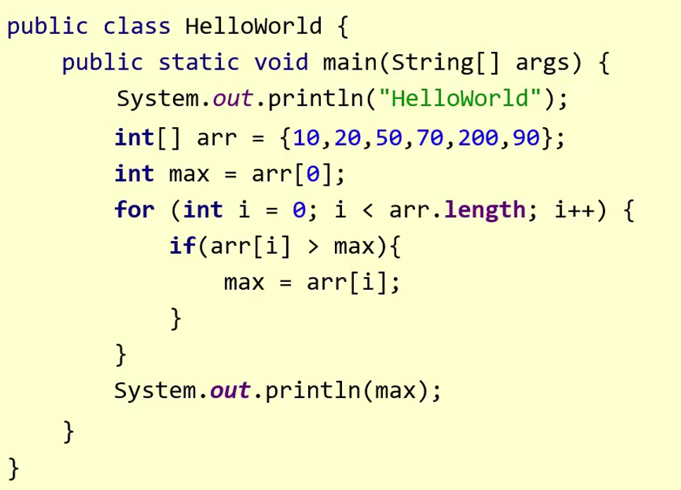

为了避免这种情况的发生，都会在代码的上面写一写解释说明性的文字，方便别人 / 以后阅读代码，而这种解释说明性的文字就是注释。


## 一、 注释

注释是在程序指定位置添加的说明性信息，简单理解，就是对代码的一种解释。

Java中的注释分为三种：

1、单行注释：它的格式是：`//` 后面加上注释信息，但是这些注释信息只能写在一行当中。

~~~java
// 这是单行注释文字
~~~

2、多行注释：当解释注释性文字比较多，一行写不下的时候，就需要用到多行注释了

~~~java
/*
这是多行注释文字
这是多行注释文字
这是多行注释文字
*/
注意：多行注释不能嵌套使用。
~~~

3、文档注释（暂时用不到）：

```java
/**
这是多行注释文字
这是多行注释文字
这是多行注释文字
*/
```

文档注释的场景：等我们以后牛逼了，要写一些代码去给别人使用。因为代码比较多，别人是不方便一行一行去阅读代码的，此时我们就可以提供一个说明文档，这个文档可以用Java自带的DOC工具自动生成，它可以根据左边的代码去自动的生成右边的文档。在生成的时候它会把文档注释里的内容都会添加在右边的文档当中。在以后，别人要用你代码的时候，就不需要去看代码了，直接看文档就可以了。


---

代码示例

~~~java
public class HelloWorld{
	// 叫做main方法，表示程序的主入口。简单理解就是，程序刚开始运行的时候，会自动去找main方法，从main方法第一行代码，从上往下，逐行运行。所以这里的main方法格式是固定的。
	public static void main(String[] args){
		/* 叫做输出语句（打印语句）
		会把小括号里面的内容进行输出打印 */
		//System.out.println("HelloWorld");
	}
} 
~~~

**注意**：

- 注释的内容不会参与编译和运行的，仅仅是对代码的解释说明而已，当使用 `javac` 将java源文件编译成class文件后，在class文件里是不存在注释的。

  所以，不管在注释当中写什么内容，都不会影响代码运行的结果，但一般我们只会写跟代码相关的内容，其他的跟代码无关的，就不要再写了。

- 不管是多行注释还是单行注释，一律都不要嵌套。

  有些同学喜欢一句话打一个 `//`，但是这种写法不好

  ~~~java
  // 叫做main方法 // 表示程序的主入口。
  ~~~

  如果想要将一句话分开，可以打逗号、句号、或者其他的标点符号，这里就没有必要再加上多余的单行注释了。但是这样写语法是不会报错的。但是多行注释不能嵌套写！前面的 `/*` 会找距离它最近的 `*/` 来作为结尾。所以为了避免这样的问题，不管是多行注释还是单行注释，一律都不要嵌套。


---

## 二、关键字

关键字：被Java赋予了特定含义的英文单词。当我们在代码中写了关键字之后，程序在运行的时候，就知道要做什么事情了。

关键字特点：

1. 关键字的字母全部小写。
2. 常用的代码编辑器，针对关键字有特殊的颜色标记，非常直观。

例如我们安装的Notepad++对关键字就会有高亮显示，例如下面的代码中红线划出来的都是关键字。


在Java中一共有50多个关键字，这些关键字不用刻意去记，因为每个关键字都包含了一个、甚至是多个知识点。

| **abstract**   | **assert**       | **boolean**   | **break**      | **byte**   |
| -------------- | ---------------- | ------------- | -------------- | ---------- |
| **case**       | **catch**        | **char**      | **class**      | **const**  |
| **continue**   | **default**      | **do**        | **double**     | **else**   |
| **enum**       | **extends**      | **final**     | **finally**    | **float**  |
| **for**        | **goto**         | **if**        | **implements** | **import** |
| **instanceof** | **int**          | **interface** | **long**       | **native** |
| **new**        | **package**      | **private**   | **protected**  | **public** |
| **return**     | **strictfp**     | **short**     | **static**     | **super**  |
| **switch**     | **synchronized** | **this**      | **throw**      | **throws** |
| **transient**  | **try**          | **void**      | **volatile**   | **while**  |


### class关键字

概念：表示定义一个类。创建一个类。

- 类：Java项目最基本的组成单元，一个完整的Java项目有可能会有成千上万个类来组成的。

- class后面跟随的就是这个类的名字，简称：类名。类名和文件名一定要保持一致！

  小技巧：如果怕类名写错，可以选中java文件，按F2，然后<kbd>ctrl + c</kbd>复制，粘贴类名即可

  

- 在类名后面会有一对大括号，表示这个类的范围。

举例：

```java
public class HelloWorld{
    
}
```

解释：class表示定义类。

​	类名：HelloWorld

​	HelloWorld后面的大括号表示这个类的范围。


---

# 18. 字面量

在有些资料，会把字面量说成常量、字面值常量，这种叫法都不是很正确，最正确的叫法还是叫做：字面量。

作用：告诉程序员，数据在程序中的书写格式。

| **字面量类型** | **说明**                                  | **程序中的写法**           |
| -------------- | ----------------------------------------- | -------------------------- |
| 整数           | 不带小数的数字                            | 666，-88                   |
| 小数           | 带小数的数字                              | 13.14，-5.21               |
| 字符串         | 必须使用双引号，内容可有可无              | “HelloWorld”，“黑马程序员” |
| 字符           | 必须使用单引号，有且仅能一个字符          | ‘A’，‘0’，   ‘我’          |
| 布尔值         | 布尔值，表示真假，只有两个值：true，false | true 、false               |
| 空值           | 一个特殊的值，空值                        | 值是：null                 |

## 区分技巧

1. 不带小数点的数字都是整数类型的字面量。
2. 只要带了小数点，那么就是小数类型的字面量。
3. 只要用双引号引起来的，不管里面的内容是什么，不管里面有没有内容，都是字符串类型的字面量。
4. 字符类型的字面量必须用单引号引起来，不管内容是什么，但是个数有且只能有一个。
5. 字符类型的字面量只有两个值，true、false。
6. 空类型的字面量只有一个值，null。

代码示例：

~~~java
public class ValueDemo1{
	public static void main(String[] args){
		//目标：需要大家掌握常见的数据在代码中如何书写的？
		
		//整数
		System.out.println(666);
		System.out.println(-777);
		
		//小数
		System.out.println(1.93);
		System.out.println(-3.71);
		
		//字符串
		System.out.println("黑马程序员");
		System.out.println("尼古拉斯阿玮");
		
		//字符
		System.out.println('男');
		System.out.println('女');
		
		//布尔
		System.out.println(true); // true
		System.out.println(false); // false
		
		//空
		//细节：null不能直接打印的。
		//如果我们要打印null，那么只能用字符串（字面量）的形式进行打印
		System.out.println("null");
		
	}
} 
~~~

---

## 扩展： /t  制表符

很多人对制表符会这么去解释：它就表示缩进、对齐、打空格，但这些解释都是错的。

正确解释应该为：在打印的时候，把前面字符串的长度补齐到8，或者8的整数倍。最少补1个空格，最多补8个空格。

应用场景：对齐


**例如**：在java中 `\t` 可以使用单引号引起来，表示它是一个特殊字符，当然也可以用双引号引起来。

前面的字符串 `name` 长度为4，在打印的时候 `\t`就代表4个空格，然后再去打印 `age`。后面先打印 `tom`，然后制表符补5个空格，再去打印 `23`。中间的 `+` 号表示字符串的拼接。并且制表符在补空格的时候，只会跟前面的字符串有关系，跟后面的字符串是没有关系的。

所谓制表符就可以类似于我们打印表格数据的时候让数据去对齐，所以说在以后，看见了这些专业名词，它的名字都是有一些特殊含义的。

~~~java
public class ValueDemo2{
	public static void main(String[] args){
		//目标：熟悉制表符的基本用法
	
		System.out.println("name" + '\t' + "age");
		System.out.println("tom" + '\t' + "23");
		
	}
} 
~~~


---

# 19. 变量

**变量**：程序中临时存储数据的容器，在程序执行过程中，其值有可能发生改变的量（数据）。但是这个容器中只能存一个值。

**应用场景**：在我们登录页面的时候，里面要输入用户名、密码，如果我们想要登录，在程序中就需要将 用户输入的用户名和密码 跟 正确的用户名和密码进行比较，但是此时会有一个问题：用户输入的用户名和密码是一个变化的值，此时就可以定义两个变量，而变量就可以理解为是在程序当中存储数据的小箱子/小空间，第一个小空间里存储的就是用户输入的用户名，第二个小空间里存储的就是用户输入的密码，例如用户输入的 `itheima` 和 `123456` 就可以存进去，又或者说用户输了 `itcast` ，密码是 `112233` 同样也可以存进去，不管用户输入什么内容，直接存入对应的变量当中就可以了，我们就可以拿着变量去跟正确的用户名和密码进行比较了。

当某个数据经常发生改变时，我们就可以用变量存储。当数据变化时，只要修改变量里面记录的值即可。这个场景就体现了变量的 `变` 字。


## 变量的定义格式

~~~java
// 分号表示语句的结束
数据类型 变量名 = 数据值；
~~~

其中变量名就是给空间起的名字，简单理解就是小箱子的名字，给它起名是为了方便以后得使用，变量名不能重复。

数据值就是存在变量空间里的数据。

数据类型：限定了变量能存储数据的类型。

等号：赋值。把右边的数据赋值给左边的变量。

分号：表示语句的结束，就跟以前写作文时候的句号是一样的。


代码示例，下述代码打印出的结果就是 `10`


---

# 20.变量的使用方式和注意事项

## 变量的用法


代码示例

~~~java
public static void main(String[] args) {
    //1.基本用法
    // 定义变量，再进行输出
    int a = 10;
    System.out.println(a);// 10
    System.out.println(a);// 10

    //2.变量参与计算
    int b = 30;
    int c = 20;
    System.out.println(b + c);//50

    //3.修改变量记录的值
    a = 50;
    System.out.println(a);//50
}
~~~


---

## 变量的注意事项

- 只能存一个值
- 变量名不允许重复定义
- 在一条语句中，可以定义多个变量。但是这种方式影响代码的阅读，所以了解一下即可。
- 变量在使用之前一定要进行赋值
- 变量的作用域范围

```java
public static void main(String[] args) {
    //注意事项
    //在一条语句中，可以定义多个变量
    int d = 100, e = 200, f = 300;
    System.out.println(d);
    System.out.println(e);
    System.out.println(a);

    //变量在使用之前必须要赋值
    // int g;
    // g = 500;
    // 建议:以后在定义变量的时候，请直接赋值
    // 不要把赋值分开写。
    int g = 500;
    System.out.println(g);
}
```

---

## 总结


---

# 21.变量练习 - 计算公交车的人数

需求：说出公交车到终点站之后，车上一共有多少乘客？

​		    一开始没有乘客。

​		   第一站：上去一位乘客，没有下来乘客。

​		   第二站：上去两位乘客，下来一位乘客。

​		   第三站：上去两位乘客，下来一位乘客。

​		   第四站：没有上去乘客，下来一位乘客。

​		   第五站：上去一位乘客，没有下来乘客。

​		   问：到了终点站之后，车上一共多少乘客？

​	代码解析：

```java
public class VariableTest1{
	//主入口
	public static void main(String[] args){
		//一开始没有乘客。
		int count = 0;
		//第一站：上去一位乘客
		//在原有的基础上 + 1
		count = count + 1;
		//System.out.println(count);
		//第二站：上去两位乘客，下来一位乘客
		count = count + 2 - 1; 
		//第三站：上去两位乘客，下来一位乘客
		count = count + 2 - 1;
		//第四站：下来一位乘客
		count = count - 1;
		//第五站：上去一位乘客
		count = count + 1;
		//请问：到了终点站，车上一共几位乘客。
		System.out.println(count);//3
	}
}
```


---

# 22.计算机中的数据存储

在计算机中，只有以下三类数据（文本、图片、声音），而视频是很多图片的组合体。

其中文本又包括了数字、字母、汉字。


**在计算机中，任意数据都是以二进制的形式来存储的。**


## 十进制

在现实生活中使用的是十进制，十进制就是由`0123456789` 这十个数字组成，它的计算规则是：逢十进一，借一当十。


例如：

### 1、十进制加法

1 + 1，在小学的时候，一般都是竖过来计算的，由于1 + 1是没有超过十的，直接计算即可。

但当数字变成 9 + 1的时候，此时就需要进一了，一旦进一了，个位就变成0了，而十位上没有任何的数字跟进上去的1相加，所以1直接落下来变成1，个位和十位组合在一起，就是个10。


如果是 `99 + 1` 呢？首先还是从右边的第一位跟下面的1相加，个位变成0，然后逢十进一；然后十位上的 9 跟进上来的 1 相加，结果还是10，然后再往百位进一，十位就变成了0；继续计算百位，百位只有进上来的1，所以百位最终就是1。个位、十位、百位组合在一起，最终的结果就是 `100`。


---

### 2、十进制减法

例如：`15 - 2`，个位的5跟2相减，变成3；十位的1下面没人跟它减，直接落下来，最终的结果就是 `13`。


但如果现在数字变成了  `15 -9` 呢？在一开始，还是个位跟个位减，但是这里 `5 - 9` 不够，不够就往前借，借过来的1当做10来处理，并且在借的时候，要在被借的地方打个点，因为十位上的1被借走了，所以十位上是没有数字能最终落下来的，所以最终的结果就是 `6`。


---

## 什么是二进制？

二进制就是由 0 和 1 这两个数字来组成的，它的计算规则是：逢二进一、借一当二。


### 二进制的运算过程

有个梗：`1 + 1` 在什么样的情况下不等于2？在二进制的时候不等于 `2`，而是等于 `10`，因为逢二进一。


十进制中的3就是在2加一，变成 `11`，十进制中的4，就是 `11 + 1`，在计算的时候也是从右往左计算的，个位1 + 1，逢二进一，一旦进位了，那么原来位置上就变成了0，前面的位置上会有个进一（蓝色的数字）；进一后，跟原来的位置上的数相加加完后，又变成了2，此时继续进1，最终的结果就变成了 `100`。


---

## 常见的进制

除了十进制和二进制外，还有八进制和十六进制。八进制和二进制是类似的，它是由 `0-7` 组成的，缝八进一。十六进制就是缝十六进一，它是由 `0-9` 和 `a - f` 组成。


这么多进制就有可能会出问题，比如说我在代码中书写一个 `1`，那你怎么知道这个1是多少进制呢？因此，Java给这些进制还做了一些规定，这种规定是在JDK7的时候才提出来的。


---

## 计算机为什么要用二进制存储数据？

下图是上个世纪计算机所用到的打孔纸带，这个纸带其实就是我们自己书写的代码，其中打了孔是0，没打孔是1。感兴趣的朋友可以搜索一下 `IBM 29卡打孔机` 相关视频，看完视频会理解更加通透。


如果我现在想让计算机去执行代码，就得把这个纸带去给计算机。


计算机一遍读取程序，一遍在纸带上打孔，然后在计算机上方会打印出程序运行的结果，例如下图就是一台1958年的电脑顺着纸带打印的程序运行的结果。


在以前，想要编程，必须先准备一个很长很长的纸带，然后用打孔器去打孔。但是如果手抖，打错了怎么办？所以在以前，程序员有两个神奇：胶水、改正纸，如果一不小心多大了一个孔，就用胶水和改正纸把孔给补上，但是如果错的太多，就只能重新打孔。这个就是上个世纪60年代的计算机，因为在纸带上面，只有两种状态：有孔和没孔，所以说在当时，计算机就使用二进制的形式来表示的。

那你想，如果当时用十进制去表示，那怎么在纸带上去表示十个完全不一样的状态呢？如果有人说将一个圆只打1 / 2、1 / 4等去表示不同的状态，这肯定不行，因为看左右图纸带上的孔，它只有一丢丢打，在当时计算机也没有那么精密，是区分不了孔的大小的，它只能区分有孔和没孔这两个状态。


而这个习惯在我们现在计算机中也延续了下来，例如右图的这种电路板，平时在计算机里，用的更多的是那种5V的电路板，所以说就有个规定，会把大于3.3v的定为1，小于3.3V的定为0，这个就是2进制的由来。


所以说计算机为什么使用二进制去存储数据，就是因为只要两种状态就可以表示二进制，在以前是有孔和没孔，在现在是高压电流和低压电流。那如果在计算机里要用十进制去表示，就需要十个完全不一样的状态，这个就太麻烦了。

---

## 进制之间的转换

进制之间的转换可以分成两种：1、任意进制转十进制；2、十进制转任意进制

### 1、任意进制转十进制

公式：`系数 * 基数的权次幂，然后将每一位相加`

系数：就是每一位上的数

基数：当前进制数，例如：将2进制转为十进制，基数就是2

权：从右往左，依次为 0 1 2 3 4 5 ....依次递增


#### 1）二进制101转十进制

第一步：将每一位都按照系数 * 基数的权次幂算出来，算完后得到三个结果，最终再相加就行。

- 右边的第一个因为右边的数字是1，所以它的系数就是2，又因为当前是二进制，所以基数就是2，权是从右开始，0、1、2...依次递增，所以右边的第一位就是0。

- 同理，再看中间这一位，系数是0，因为当前位置上的数是0，基数是2，因为当前是2进制，权是1，因为它是从右往左是第二位。

- 左边这位，系数是1，基数是2，权是2。

此时我们就可以将上面三个数据分别计算出来，然后相加，得到最后结果5，所以二进制 `101` 转成十进制后就是 `5`。


但其实，二进制转十进制有一种快速的转换方法，这种方法叫做8421快速转换法。

##### 8421快速转换法

每一个二进制值的1都是代表一个固定数值。把每一位的1代表的十进制数加起来得到的结果就是它所代表的十进制数。

例如：给二进制 `11111111` 制定一张表，在这张表中，它每一位所对应的数字从右往左对应的十进制列出来。如果我现在要将二进制的 `1101` 转为十进制怎么办？解答：拿着 `1101` 到这张表里去查，有1直接对应它的十进制数，如果该位是0就不用管，然后将对应的数字拿出来，然后相加。所以此时我们就可以认定二进制 `1101` 转成十进制后，结果为13


---

#### 2）八进制101转十进制

同样的也是带入公式即可。系数还是每一位当中的数字，基数就是当前的进制，但是当前是八进制了，所以基数就变成了8。权的规则还是和刚刚一样，从右往左，分别是0、1 、2 、3.....


---

#### 3、十六进制abc转十进制

- 右边位：因为当前位数字是c，所以系数是12。又因为当前数字是十六进制的，所以基数是16。权从右往左开始，它是0。

- 中间位：当前的数字是b，b所对应的数字是11，所以这里的系数就是11。当前是十六进制的，所以基数是16。权从右往左开始，当前是1。

- 左边位：同理，系数是10，因为a所对应的数字是10。基数是16，权是2。

最终将上面计算出的结果相加，十六进制 `abc` 转十进制得到的结果为 `2748`。


---

### 2、十进制转其他进制

解决方案：除基取余法。不断的除以基数（几进制，基数就是几）得到余数，直到商为0，再将余数倒着拼起来即可。

#### 1）十进制转二进制

例如十进制 `11` 转二进制，直接拿着11不断除以2即可。`7`转二进制也同理。


在有些资料中在相除的时候不会除到商为0，它偷懒了，商到1就结束了。然后再从商倒着拼接，也是 `1011`，这种计算方式也是可以的，只不过它是偷懒了，并不是正统的解法。正统应该是一直除，除到0结束，然后所有的余数拼接起来，这个才是最正确的解法。


---

#### 2）十进制转八进制

跟二进制同理，在除的时候不要除2，除8就行了。

---

### 总结


---

此时，你已经对二进制已经了解了，并且对数字的存储，你也已经了解了，简单一句话就是转成二进制，再进行存储。例如 `99` 转成二进制就变成 `0110 0011`，但其实这个东西并不需要你去口算，刚刚说的进制的转换，其实是给大家增加见闻的，真的要算可以使用电脑的计数器。

打开计算器，然后切换到程序员模式，展现的数字从下到上分别为：二进制、八进制、十进制、十六进制，点击需要输入的数字的进制类型，然后输入数字即可。


例如计算十进制 `99` 的二进制是多少：点击DEC，然后输入99，再点击BIN，在最上方出现的就是十进制 `99` 转二进制后的结果。


---

## 字母在计算机中的存储

字母跟二进制又是个什么关系，怎么就对应起来的呢？说到这里，我们就要说到一张码表，它的全称叫做 `American Standard Code for Information Interchange`（没过信息交换标准码表），但我们在说的时候不会说它的全称，太长了，我们会把每个单词的首字母拿出来，进行一个缩写，就变成了 `ASCII码表`，在 `ASCII码表` 中，每一个字母都跟一个唯一的数字产生对应关系。


例如字母a，十进制对应的是97。


所以字母在存储的时候，就是通过查询ASCII码表的方式来进行存储的，找到对应的数字之后，再把它变成二进制存储到计算机中。

---

## 汉字在计算机中的存储

由于ASCII码表是外国人创造的，它在创造ASCII码表的时候并没有考虑到中文。就是因为这，中国的汉字差点就灭了，感兴趣的同学可以自行百度，由于涉及到历史和政治的原因，在这里就不说了。我们一直说的 `秀` 就是代表人物之一。

为了解决汉字在计算机中的存储问题，在上个世纪80年代，我们国家自己推出了一张 `GB 2312`。看这个纸它都黄了，我相信比大多数同学的年龄还大。在这张码表当中，它就规定了汉字跟一个唯一的数字会产生一个对应关系，从这个时候开始，汉字才能在计算机中进行存储和运行。


---

## 计算机的存储规则

**1、GB2312编码：1981年5月1日发布的简体中文汉字编码国家标准。收录7445个图形字符，其中包括6763个汉字。**

过了几年，台湾地区也仿照大陆，自己推出了一个`BIG5码表`，在这个码表当中，它收录的都是一些繁体字，要注意的是，在 `GB2312`里只有简体中文，是没有繁体的。所以这就出现了一个国家，有两张码表。

**2、BIG5编码：台湾地区繁体中文标准字符集，共收录13053个中文字，1984年实施。**

但是这可不行，一个国家怎么能有两张码表，都不统一。于是在2000年3月17日推出了一张`GBK码表`，`GBK码表`也是目前windows操作系统默认使用的码表。

**3、GBK编码：2000年3月17日发布，收录21003个汉字，包含国家标准GB13000-1中的全部中日韩汉字，和BIG5编万码中的所有汉字。**

但是还是有点小不足，因为像一些非洲国家，或者是欧洲国家的文字在这张码表里面还是不包含的，因此在后来，有一个国际组织：美国国家标准协会，它提出了一个 `Unicode码表`，这张码表称之为：万国码，号称一万个国家的码表，这里的万只是一个虚词，它就表示在这个码表当中，包含了世界上大多数国家的文字。

**4、Unicode编码:国际标准字符集，它将世界各种语言的每个字符定义一个唯一的编码，以满足跨语言、跨平台的文本信息转换。**

正是因为有了这些包含中文的码表，中文才能够在计算机中起飞，而且以后会飞的越来越好，越来越高。

简单来说，数字就是转成二进制，字母跟汉字都是查询对应的码表，先找到对应的数字，再转成二进制进行存储。

接下来我们再来研究，第二类数据：图片数据。


---

## 图片数据在计算机中的存储

图片数据在计算机中分为三种，从左往右分别是：黑白图、灰度图、彩色图。


要说到图片数据在计算机中的存储，还得来说一说显示器中的三个知识点：分辨率、像素、三原色。

说到像素，就要说到显示器，在平时电脑显示器当中，见到的最多的就是：2K屏、4K屏，但其实这说的是它们的最大分辨率。

2K屏的最大分辨率有：`1920 × 1080`、`1998 × 1080`、`2048 × 1080`、`2048 × 858`。

而右边的4K屏最大分辨率有：`3840 × 2160`、`3996 × 2160`、`4096 × 2160`、`4096 × 1716`。

其中最为常见的是2K屏中的 `1920 × 1080`、`3840 × 2160`。


下面以`1920 × 1080 `来讲解一下这些分辨率表示什么意思。

其实就是表示，在显示器中，宽有1920个小格子，高有1080个小格子，整个显示器就是由这么多方形的小格子来组成的，而这里的每一个小方格就称之为一个像素。


我们也可以在屏幕上画一笔，然后再把这一笔放大，此时可以发现这个图片的周围会有锯齿，就是因为显示器是由很多很多方形小格子组成的。


如果说我们以后要写一个软件，我们要设置软件的大小，我们现在会设置软件的宽为514像素，高为595个像素，它差不多占屏幕宽度的1 / 4，高度的1 / 2。如果说我想要这个软件变大一点，就可以将它的宽高调大：宽603个像素，宽可以写680个像素。


在后面，我们会有一个练习，会带着大家去写一个游戏，游戏当中就会用到像素的概念了，所以说当以后，我们开始写游戏的时候，我让你设置宽高为100个像素的时候，我问你这个游戏大概有多大，你不能回答我：大概有这么大，大概有这么宽了。

---

### 1）黑白图

说完像素，就可以来解释黑白图了。在这个黑白图中画了一个笑脸，上面两个黑点表示眼睛，下面一个湾勾，就好比嘴巴。其实在黑白图当中，就是给每个像素点去涂抹了颜色，其中白色就是1，黑色就是0。


---

### 2）灰度图

直到灰度图之前，首先需要直到灰度表。在这张表当中，0是纯黑，255是纯白，中间就是一些不同层次的灰。

在下面这张图中，画了一个8，在没有8的地方就视为0，在画了8的地方就显示不同程度的灰色。例如第一排的8就是64、142 、146 、182......组合在一起，就是左边的8。


---

### 3）彩色图片

彩色图片是我们平时见过最多的，那这个彩色图片又是怎么记录里面的色彩的呢？其实跟刚刚也是类似的，下面就将图片嘴唇的位置进行放大。


在彩色图中，其实就是我们在给一个像素点里记录不同的颜色就可以了，那这个颜色该怎么记录呢？这时就需要先明白三原色（红黄蓝），通过三原色我们就可以搭配出各种各样五彩缤纷的颜色了。这三种颜色我们也称之为美学三原色。


在计算机当中其实也有三原色的存在，它叫做：红绿蓝，这三种颜色称之为光学三原色。

在计算机里面每个像素点的内部，其实就是由红绿蓝来组成的，我们可以讲左边的屏幕放大来看一下。在这里看见的每一个红绿蓝组成的一个整体就是一个像素点，现在就是由很多很多个像素点组成在一起，就组成了一张完整的图片，在计算机中，就是通过三种颜色的搭配，就可以组合出五彩缤纷的颜色了。


所以在这里我们要知道，计算机中的光学三原色是：红绿蓝！

我们可以去给这三种颜色设置不同的值，值越大表示当前的颜色越浓；值越小，表示当前的颜色越淡。

如果说红色设置为43，绿色设置为123，蓝色设置为194，那我就可以理解：由43份红色的颜料、123份绿色的颜料跟蓝色份194份蓝色的颜料，这么一搅和，就可以搭配出不知道怎么描述，但是还挺好看的蓝色。其他形成的颜色也同理。我们在取值的时候，里面的值是不能乱写的，它是由取值范围的，一定要写在 `0 ~ 255`之间，包含0也包含255。


如果说，我们在指定颜色的时候，写的是这种：`(255，0，0)`，那就表示不用绿色，不用蓝色，只用红色，最终就是纯红色。其他颜色同理。


上面是用十进制的颜色去表示的，同样我们也可以用十六进制的颜色去表示，十进制的255刚好对应FF。所以在十六进制下最小还是0，最大就是FF。

---

### 三原色小结

1、在计算机中，颜色是采用光学三原色

2、一个像素点里有红、绿、蓝三种颜色组成，通过这三种颜色的搭配我们就可以组成各种各样的颜色，这个颜色我们取它英文的首字母R（Red）、G（Green）、B（Blue），称这三种颜色叫RGB三原色。

3、可以讲光学三原色写成十进制的表示形式，每一位有范围0 - 255。（255,255,255）

4、当然也可以写成十六进制的表示形式，最小是0，最大是FF。（FFFFFF）

---

### 解释彩色图片

有了像素和三原色的知识点，我们就可以解释彩色图片了，在彩色图片当中，每一个像素点就是搭配了不同的三原色从而组成了各种各样漂亮的图片。所以说，在你手机里存储着各种各样让你舍不得删除的图片，其实就是一组又一组不同数据搭配出来的颜色而已，从计算机的角度来看，左边的美女和右边的美女其实它们两个是一样的。


---

## 声音在计算机中的存储

声音的存储会涉及到这种声音的波形图，看右边，这个就是声音的波形图。在波形图中，每一个点都会有每一个数字去跟它对应。


那我们平时在听音乐的时候，如果你氪金了，音质就会非常好，但你的朋友没有氪金，它听的就是全损音乐，那这怎么通过技术来实现呢？其实很简单。

我们在存储声音的时候会对声波进行采样，每个点都会有对应的数字。如果你氪金了，采样的点（比如说下图的黑点）就会比较多，记录的数据也非常的多，在听音乐的时候可以最大程度去还原音乐。


但如果说你的好朋友没有氪金怎么办，此时采样的点就会变的非常的少，那么他在听音乐的时候就是全损音乐，它在还原的时候就不会还原出最原本的声音了。例如在下面这张图中，红色是最原本的声音，但是因为现在没有氪金，采样点比较少，它的还原的时候就不会按照红色的进行还原，而是以你采样的黑点来进行还原。

它在还原的时候就会有这种情况：一直连接黑点，但是在峰值的地方可能无法还原出来，因为在上面是没有对应的采样点的。


---

## 计算机的存储规则小结

在计算机中，任意数据都是以二进制的形式来存储的。

在计算机中会有以下的三类数据，分别是：文本、图片、声音。其中文本又包含了数字、字母、汉字。


数字是直接变成二进制来存储的。

字母跟汉字是查询不同的码表，先变成数字，再变成二进制，再来进行存储的，这个码表是不需要你自己去下的，每一个操作系统里都会内置。

图片是通过每一个像素点里的RGB三原色来进行存储的。

声音是对波形图进行采样，然后再变成二进制进行存储的。


---

数据类型、标识符、键盘录入这三个都是跟变量相关的。在之前章节，我们学习了变量的定义格式，为： `数据类型 变量名 = 数据值`。一会我们学习的知识点都是跟变量相关的，数据类型 跟 数据类型相关，标识符 跟 变量名相关，键盘录入 跟 数据值相关。

# 23.数据类型

在Java中数据类型分为两种：

- 基本数据类型
- 引用数据类型（面向对象的时候再深入学习）


## 基本数据类型的四类八种

在Java中，基本数据类型是分为四类、八种的。之所以整数、浮点数又细分，最为本质的区别是它们的取值范围是不一样的。

整数最小的是byte类型的，它的取值范围是 `-128 - 127`，所以说如果你把一个两百，赋值给byte类型的变量，这个就是错的！

常用的int取值范围是 `负的2的31次方 ~ 2的31次方-1`，long的取值范围就更大了，它是一个19位的数。取值范围不一样，在内存中所占用的空间也是不一样的。具体的在内存中占用的 1 、2 、4 、8 、4 、8 、2 、1这些东西暂时不要去记忆，因为它们会涉及到计算机底层的存储原理，在后面学习第二阶段的时候，会进行深入讲解，现在先了解一下就可以了。

那我们我们在实际使用的时候，整数类型一般会使用int，小数类型一般会使用double。

|    数据类型    | 关键字  | 内存占用 |                 取值范围                  |
| :------------: | :-----: | :------: | :---------------------------------------: |
|      整数      |  byte   |    1     |    负的2的7次方 ~ 2的7次方-1(-128~127)    |
|                |  short  |    2     | 负的2的15次方 ~ 2的15次方-1(-32768~32767) |
|                |   int   |    4     |        负的2的31次方 ~ 2的31次方-1        |
|                |  long   |    8     |        负的2的63次方 ~ 2的63次方-1        |
| 浮点数（小数） |  float  |    4     |        1.401298e-45 ~ 3.402823e+38        |
|                | double  |    8     |      4.9000000e-324 ~ 1.797693e+308       |
|      字符      |  char   |    2     |                  0-65535                  |
|      布尔      | boolean |    1     |                true，false                |

**说明**：

​	e+38表示是乘以10的38次方，同样，e-45表示乘以10的负45次方。

​	在java中整数默认是int类型，浮点数默认是double类型。

---

### 定义8种基本数据类型变量

```java
public class VariableDemo3{
    public static void main(String[] args){
        //1.定义byte类型的变量
        //数据类型 变量名 = 数据值;
        byte b = 10;
        System.out.println(b);

        //2.定义short类型的变量
        short s = 20;
        System.out.println(s);

        //3.定义int类型的变量
        int i = 30;
        System.out.println(i);

        //4.定义long类型的变量
        // long l = 9999999999; => 此时会报错：整数太大
        // 如果要定义long 类型的变量，在数据值的后面需要加一个L作为后缀
        // L可以是大写也可以是小写，但是个人建议使用大写，因为小写 l 和数字 1 长得很像
        long l = 123456789123456789L;
        System.out.println(l);

        //5.定义float类型的变量
        // 定义float类型变量的时候，数据值也需要加一个 F 作为后缀，同样大小写都可以，但是为了保持跟上面一致，
        float f = 10.1F;
        System.out.println(f);

        //6.定义double类型的变量
        // double类型的变量就不需要加上后缀了，跟之前的定义方式是一样的。
        double d = 20.3;
        System.out.println(d);

        //7.定义char类型的变量
        char c = '中';
        System.out.println(c); // 中

        //8.定义boolean类型的变量
        boolean b = true;
        System.out.println(b);
    }
}
```

---

## 需要记忆以下几点

byte类型的取值范围：-128 ~ 127

int类型的大概取值范围：-21亿多  ~ 21亿多

整数类型和小数类型的取值范围大小关系：double > float > long > int > short > byte

最为常用的数据类型选择：

- 在定义变量的时候，要根据实际的情况来选择不同类型的变量。

  比如：人的年龄，可以选择byte类型。

  比如：地球的年龄，可以选择long类型。

- 如果整数类型中，不太确定范围，那么默认使用int类型。

- 如果小数类型中，不太确定范围，那么默认使用double类型。

- 如果要定义字符类型的变量，那么使用char

- 如果要定义布尔类型的变量，那么使用boolean

## 注意点

- 如果要定义 一个整数类型的变量，不知道选择哪种数据类型了，默认使用int。
- 如果要定义 一个小数类型的变量，不知道选择哪种数据类型了，默认使用double。
- 如果要定义一个long类型的变量，那么在数据值的后面需要加上L后缀。（大小写都可以，建议大写。）
- 如果要定义一个float类型的变量，那么在数据值的后面需要加上F后缀。（大小写都可以，建议跟上面的L做一个统一，也是大写F。）


---

# 24.定义变量的三个练习

## 练习1：定义5个变量记录老师的信息并打印


代码示例：

```java
public class VariableTest1{
	public static void main(String[] args){
		//1.定义字符串类型的变量记录老师的姓名
		String name = "黑马谢广坤";
		//2.定义整数类型的变量记录老师的年龄
		int age = 18;
		//3.定义字符类型的变量记录老师的性别
		char gender = '男';
		//4.定义小数类型的变量记录老师的身高
		double height = 180.1;
		//5.定义布尔类型的变量记录老师的婚姻状况
		boolean flag = true;
		
		//输出5个变量的值
		System.out.println(name);
		System.out.println(age);
		System.out.println(gender);
		System.out.println(height);
		System.out.println(flag);
		
	}
}
```

---

## 练习2：输出电影信息

需求：将（电影名称，主演，年份，评分）四个信息选择不同类型的变量，随后打印出来。

 代码示例，小数都默认使用double：

```java
public class VariableTest2{
	public static void main(String[] args){
		//1.定义字符串变量记录电影的名称
		String movie = "送初恋回家";
		//2.定义三个变量记录主演的名字
		String name1 = "刘鑫";
		String name2 = "张雨提";
		String name3 = "高媛";
		//3. 定义整数类型的变量记录年龄的年份
		int year = 2020;
		//4.定义小数类型的变量记录电影的评分
		double score = 9.0;
		
		//打印变量的信息
		System.out.println(movie);
		System.out.println(name1);
		System.out.println(name2);
		System.out.println(name3);
		System.out.println(year);
		System.out.println(score);
		
	}
}
```

---

## 练习3：输出商品信息

需求：选择其中一部手机，将（手机价格，手机品牌）两个信息选择不同类型的变量，随后打印出来。 

 代码示例：

```java
public class VariableTest3{
	public static void main(String[] args){
		//1.定义小数类型的变量记录手机的价格
		double price = 5299.0;
		
		//2.定义字符串类型的变量记录手机的品牌
		String brand = "华为";
		
		//输出变量记录的值
		System.out.println(price);
		System.out.println(brand);
	}
}
```


---

# 25.标识符

在以前我们起变量名的时候，用的都是a、b、c、d这样的字母。这样起名非常不规范，起的名字没有任何意义，并且时间长了，也就忘了a、b、c、d表示什么含义了。接下来我们就学一个知识点：标识符，让我们在以后能取一个符合规则的名字。

那么，什么是标识符，它跟变量名又有什么关系呢？

**标识符**：就是给类，方法，变量等起的名字。所以说标识符它是一个统称，凡是在代码当中我们自己起的名字（类名，方法名，变量名）都可以叫做标识符。

起名字到底有什么规矩呢？在现实生活中，其实我们也会起各种各样的名字，这些名字也会有明明规则：都是汉字、名字的个数有一定的限制、包含特殊的寓意。因此我们在Java中起名字也要遵守一定的规则，这些规则我们可以遵守业内大多数程序员都在遵守的阿里巴巴命名规则。打开 `阿里巴巴Java开发手册终极版`，在这个里面就规定了我们在写代码时候的命名规范

---

## 1、硬性要求：必须要这么做，否则代码会报错。

- 必须由数字、字母、下划线_、美元符号$组成。

- 数字不能开头

- 不能是关键字，因为关键字Java已经给它赋予了特殊的含义，我们自己就不能再用它了。

  例如我们之前学习的 `class` 关键字，那么在以后，我们取名就不可以使用class关键字了。

- 区分大小写的。

  关键字在Java中全都是小写的，而在java中又是区分大小写的，所以我们是可以使用 `Class` 的。 


## 2、软件建议：如果不这么做，代码不会报错，但阅读性非常差，显得非常不专业，是会让代码显得比较low。

下面是代码中关于起名字的软性建议。

### 1）小驼峰命名法

适用于变量名和方法名

* 如果是一个单词，那么全部小写，比如：name

* 如果是多个单词，第一个单词首字母小写，从第二个单词开始，首字母大写，比如：firstName、maxAge


### 2）大驼峰命名法

适用于类名

* 如果是一个单词，那么首字母大写。比如：Demo、Test。

* 如果是多个单词，那么每一个单词首字母都需要大写。比如：HelloWorld

不管起什么名字，都要做到见名知意。

---

## 阿里巴巴命名规范细节

1. 尽量不要用拼音。但是一些国际通用的拼音可视为英文单词。

   正确：alibaba、hangzhou、nanjing

   错误：jiage、dazhe

2. 平时在给变量名、方法名、类名起名字的时候，不要使用下划线或美元符号。

   错误：_name

   正确：name


---

# 26. 键盘录入

每次学习键盘录入的时候，都会有同学有这样的疑问：为什么要有键盘录入？其实就是为了让我们操作的数据更加的灵活。

例如定义了一个变量 `int a = 10` ，这里的变量a记录的10，是我们手动写死的，那为什么让变量a记录的值灵活起来呢？能不能让当我在键盘上输入啥，a就记录啥呢？如果要实现这个，那我们需不需要先写操作系统跟键盘之间的代码，例如：发现键盘、配对键盘、连接键盘等等一系列的步骤。其实并不需要，键盘录入的实际功能Java已经帮我们写好了，不需要我们自己再实现了，都放在了Scanner这个类中，所以，我们只要直接使用Scanner这个类如何使用就可以了。

Scanner是什么？Java已经帮我们写好一个类叫Scanner，这个类就可以接受键盘输入的数字。

---

## Scanner使用步骤

**第一步：导包。其实就是表示先找到Scanner这个类在哪。**

因为Java给我们写好的类有很多很多，我们要用它之前，就需要先找到它。

**第二步：创建对象。其实就表示申明一下，我准备开始用Scanner这个类了。**

**第三步：接收数据。也是真正干活的代码。**

代码示例：建议大家下面这三步当做固定的格式，等我们写熟了之后，再去变化里面变量的名字。

```java
//导包，其实就是先找到Scanner这个类在哪
import java.util.Scanner; // 导包的动作必须出现在类定义的上边。
public class ScannerDemo1{
	public static void main(String[] args){
		//2.创建对象，其实就是申明一下，我准备开始用Scanner这个类了。
         // 下面这个格式里面，只有sc是变量名，可以变，其他的都不允许变
		Scanner sc = new Scanner(System.in);
		//3.接收数据
		//当程序运行之后，我们在键盘输入的数据就会被变量i给接收了
		System.out.println("请输入一个整数");
         // sc.nextInt()是真正接受数据的代码，你在键盘当中输入什么，此时第12行的代码就会接收什么。接收到之后，再去把接受到的结果赋值给左边的变量，那么此时键盘里记录的就是左边键盘里输出的数据。
		int i = sc.nextInt(); // 左边这个格式里面，只有i是变量名，可以变，其他的都不允许变
		System.out.println(i);
	}
}
```

结果：


注意：键盘录入除了输整数之外，还能接受字符串等等，但是这些知识点会在后面学习。现在我们使用的 `nextInt()`  只能接受整数，如果输小数，或者中文，代码就会报错了。


---

## 练习：键盘输入数字并求和

代码示例：

~~~java
//1.导包
import java.util.Scanner;
public class ScannerTest {
	public static void main(String[] args) {
		//2.创建对象
		Scanner sc=new Scanner(System.in);
		System.out.println("请输入第一个数字");
		//3.接收数据
		int numberl=sc.nextInt();
		System.out.println("请输入第二个数字");
		//再次接收第二个数据
		int number2 =sc.nextInt();
		System.out.println(numberl + number2);
	}
}
~~~

结果展示：


---

# 27. IDEA的概述和下载安装

在以前，我们用的是windows自带记事本，或者高级记事本Notepad++去编写的代码。虽然说它们也能写，但是不够智能。最起码的就是，有些单词我忘了，它们不能给我提示，我觉得不够温馨，那有没有什么开发工具有这个功能呢？此时IDEA就可以做到。

## 一、IDEA概述

IDEA全称IntelliJ IDEA，是用于Java语言开发的集成环境，它是业界公认的目前用于Java程序开发最好的工具。

**集成环境：**把代码编写，编译，执行，调试等多种功能综合到一起的开发工具。

在以前我们代码编写使用的是记事本，编译和运行是在cmd窗口中用的 `javac` 和 `java`。


现在有了IDEA，它可以把它们全都集中在一起，所有的操作都在IDEA中进行。而且IDEA还有很多温馨的功能，例如：自动保存（省得我们自己ctrl + s保存代码了）、自动编译（当我们写完代码之后，IDEA会帮我们自动编译，我们只要直接运行，就能看见程序的结果了。因此到时候我们在IDEA中，我们只需要关注两方面：写代码 和 运行结果就行了，其他的操作IDEA都会帮我们自动完成。


最后再来看一下IDEA的市场占有率，在这里是从2017年开始统计的，在下图中，IDEA以 `42%` 占据第一。

下面的红色 `Eclipse` 以 28% 占据第2。Eclipse也是非常厉害的，在IDEA还没出来的时候，JAVA程序员开发用的基本上都是Eclipse。

当然还有排行第三的 `Android Studio`，它是一个安卓的开发工具。

到了2018年的时候，IDEA就增长到了 `56%`，其他的开发工具市场占有率就越来越少了。到了2019年的时候，IDEA增长到了 `64%`。到了2020年的时候，IDEA增长到了 `71%`，到了2021年的时候增长到了 `74%`。

那么有的同学会发现，红色的Eclipse感觉好顽强，市场份额还有 `11%`，感觉没少太多。其实就是因为在IDEA没有出来的时候，Java程序员用的都是Eclipse。所以到目前而言，有很多古老的项目都是用Eclipse开发的。

---

## 二、IDEA的下载和安装

### 下载

可以到官方网站自行下载，网址为：https://www.jetbrains.com/idea

点击下载


进来后，会有两个版本提供我们下载。上面蓝色的是终极版，它是收费的，但是会有30天免费试用时间。

下面灰色的是社区版，是完全免费的。

这两个版本也是有区别的，终极版几班上包含了所有的功能，而社区版的功能只有一部分。所以在下载的时候，还是建议下载上面的终极版本。


在下载的时候一定要根据自己的操作系统来下载。然后点击旁边向下的剪头，可以发现有两个：一个是exe安装包，另一个是zip压缩包。上面的它只有一个安装包，下面的它会把安装包和一些其他的说明性文件打包在一起给你加载。而我们现在只需要一个安装包就可以了，所以点击上面的exe就可以下载了。


---

### 安装

双击安装包。

点击next，准备安装


点击Browse修改安装路径。可以选择默认，也可以自己手动设置。在之前我们曾经说过，最好要把跟开发相关所有的软件都放在同一个文件夹里方便管理，所以我们在这一步要来修改一下：`E:\develop\idea`。


勾选64-bit launcher。表示在桌面新建一个64位的快捷方式。其他的不要勾选。然后点击next。


点击Install，准备安装。

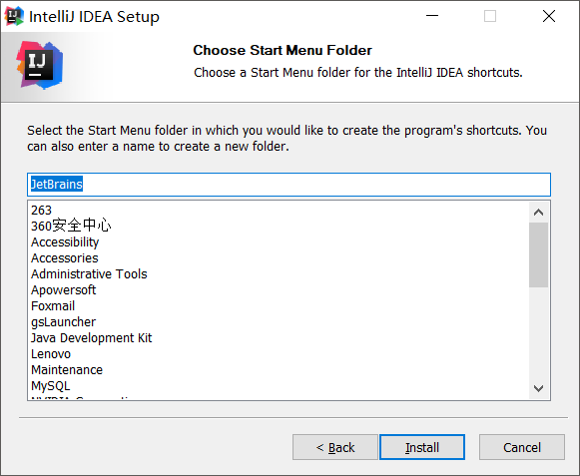

等进度条读取完毕之后，会有最终界面提示。点击finish即可。


第一次启动会询问，是否导入一些设置。选择第二个不导入，保持默认设置，再点击OK。

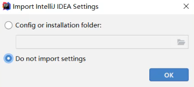

选择背景主题。左边是黑色背景。右边是白色背景。这个可以根据自己的喜好来选择。选择完毕点击右下角的next


在本界面让我们购买idea。因为我们是学习阶段，所以可以使用免费使用30天。点击第一排第二个。Evaluate for free


点击蓝色的Evaluate，就可以开始免费试用30天了。


当看到这个界面，就表示idea已经成功安装完毕。可以点击右上角关闭。


---

# 28.IDEA中的第一个代码

## 一、IDEA项目结构的介绍

第一次使用IDEA的时候还是比较麻烦的，因为IDEA有一些项目结构需要我们知道。如果我们对项目结构不清楚的话，是用不了IDEA的。

在IDEA中，项目结构一共分为以下的四个，分别为：

- project（项目、工程）
- module（模块）
- package（包）
- class（类）


我们以微信为例，来说一下这四个结构在项目当中是如何体现的。

首先，整个微信就可以看做是一个项目，所以说项目是最大的。


然后在微信的下面有四大功能键，分别是：消息、通讯录、发现、我。这四个在微信当中是互相独立的，就可以看做是四个模块。所以由此可见，一个完整的项目是包含一个或多个模块的。


那么我们以第一个消息为例，来讲解一下包。包其实就是文件夹，在消息模块中，我们会写很多文字、图片、动画。而这些文字、图片、动画都是要用代码去编写的，所以我们会在里面再去新建很多的包，然后会把相同功能的代码放在同一个包当中，方便管理。

例如第一个包我们就可以放跟文字相关的代码，第二个包就可以放跟图片相关的代码，第三个包就可以放所有跟动画相关的代码，最后一个包就可以放其他剩余的代码。


所以大家在学习IDEA的时候一定要牢记下面的项目结构：`project - module - package - class`。这些结构的划分，是为了方便管理类文件。

最大的是项目，然后是模块，在模块里面是包（文件夹），在包里面才是编写代码的类。所以如果我们想在IDEA中去编写代码，必须要新建这四层结构。


---

## 二、IDEA中的第一个代码

步骤：

1、创建项目

2、创建模块

3、新建包

4、新建代码

---

### 1、创建项目

双击启动图标


首先要新建一个项目，点击creat new project


我们要从0开始写代码，所以新建一个空的什么都没有的项目。点击左上方的Empty Project。

然后输入项目的名称 `basic-code`（基础代码），输入项目的存放路径，然后点击右下方的 `Create`。

这里注意，项目创建的位置不需要在位置后面补上项目的文件名，直接选中需要创建到的位置就行了！！！


---

### 2、新建模块

这里约定一下，第一阶段的代码会看成一个完整的项目，每一天的代码会把它看做是一个单独的模块。因为今天是第二天，所以我们要新建day02的模块。点击Module，准备新建一个模块，点击左上角的 `File`，然后再点击 `Project Structure`（项目重构）


然后点击 `Modules`，这个就是模块的意思。

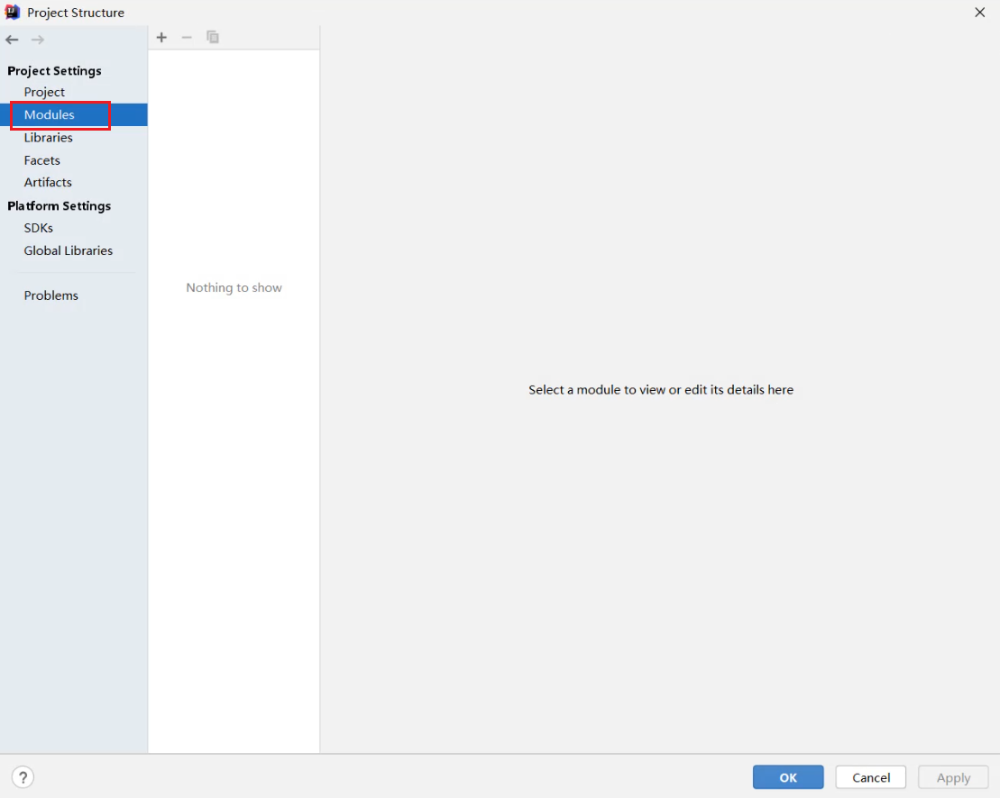

点击+，再点击New Module。`New Module` 表示新建一个模块，`Import Module` 表示导入一个已有的模块。


我们要编写Java代码，所以要新建一个Java模块。点击Java，输入模块的名称，`模块需要创建到的位置` 这里可以不用去动它。再点击右下角的Create。


成功新建一个模块之后，中间就会出现刚刚新建的模块，点击右下角的OK。


此时我们需要耐心等待一下，等右下角的进度条充满了，第二个模块就会帮我们新建完毕。因为我们新建模块它会帮我们做一些设置。


回到主界面，在左上角查看我们新建好的模块


---

### 3、新建包

右键点击src，选择New，选择Package，这个就是包，其实就是文件夹


文件夹在起名字的时候不要乱写，我们习惯性会用公司域名的反写，再加包的作用。例如我们现在是在黑马学习，黑马的官方网站是 `www.itheima.com`，现在我们就可以把这个网址反过来：com.itheima，www就不要加上了。最后再加上包的作用，这里是用来做演示的，所以取名为：demo1。连起来就是：`com.itheima.demo1`，最后回车就行了。


此时在src下面就会有这样的一个包。


这个包是什么样的一个情况呢，我们可以右键点击这个包，然后选择 `Open In`，再选择 `Explore`，此时就相当于在本地打开了这个文件夹。


可以发现我们刚刚新建的这种方式，其实是一个多级包。相当于在com里面新建了一个itheima，在itheima里面又新建了一个demo1。多级包之间我们是用点分开的。

---

### 4、新建代码

代码是在包里面的，所以我们要右键点击谁，然后新建类，这个类就会建在那个文件夹下面。我们右键点击包，然后选择new，再选择 `Java Class`，表示新建一个Java类。


然后就可以开始编写代码了。在IDEA里写代码就非常爽了，不需要我们一个单词一个单词的写了，因为每一个单词都会有代码提示。写main方法有快捷方式，输入 `psvm`就可以快速生成main方法。sout可以快速生成输出语句。


代码写完不需要保存，不需要编译，因为IDEA是帮我们自动保存，自动编译的。我们只需要直接运行代码，右键空白处，点击Run

或者我们也可以点击旁边的绿色小三角，但是最为保险的方式还是推荐右击空白处，然后点击Run就可以了。


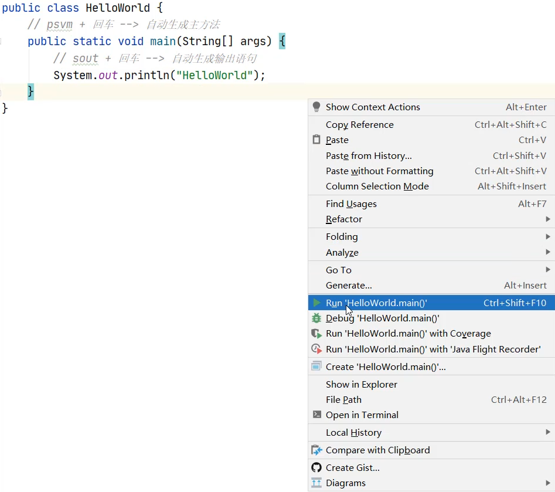

运行完后，我们稍微等一下，最下面会弹出一个窗口，这个窗口就叫做控制台。所有输出语句中的内容，都会在控制台上展示。


---

# 29.扩展设置和项目、模块的操作

在刚刚我们已经使用IDEA编写了第一个代码：HelloWorld，但是在写完之后我发现，我用起来感觉有点不太爽，例如：字体太小了，看的有点难受。再比如说背景设置。

## 一、IDEA扩展设置

### 1、修改主题

Settings —> Appearance & Behavior —> 选择对应的Theme（主题）


---

### 2、设置字体

由于字体比较小，所以，我们要设置一下字体。点击File，选择Setting。


搜索一下font，在右边可以输入Size的数值来调节代码字体 和 字体的大小。

字体一般设置为 `Consolas`，这个字体是给程序员专门设计的字体，很多程序员都比较喜欢它。Size就是设置字体的大小。`Line height` 是行间距，行间距这里默认即可。设置完毕后点击右下角的OK。


---

### 3、开启<kbd>ctrl + 滚轮</kbd>调节字体大小

Settings —> Editor —> General —> 按图勾选 —> 点击ok


---

### 4、设置注释颜色

默认注释是灰色的，而且是斜体，看着很难受。

Settings —> Editor —> Color Scheme —> Language Defaults —> Comments（注释） —> 取消勾选斜体，然后修改颜色

在设置颜色的时候，建议不要使用红色，因为在IDEA中，只有代码出现错误了，才是红色的。

修改颜色：先拖动上面的小圆圈，然后将下面的颜色拖到绿色的地方，这里将单行注释变成跟字符串类似的绿色。最后将小圆圈拖到我们想要的地方即可，这里就选择深绿色，选择完后回车即可。


接下来设置多行注释的颜色，同样去掉斜体，但这次设置颜色不需要再次去拖拽了，而是直接选择历史颜色即可。


---

### 5、实现自动导包

例如我们之前使用的Scanner，就是需要导包的。IDEA具有自动导包功能，但需要进行配置。

Settings —> Editor —> General —> Auto Import —> 勾选上图中红框框起来的两个选项即可


设置完成之后，输入Scanner，然后回车，此时可以发现已经实现了自动导包功能！


---

### 7、自动提示忽略大小写

IDEA在写代码是有默认提示的，但是默认提示在默认的情况下，它是区分大小写的。

例如写string的时候，将String的s写成了小写，IDEA并不会给你提示，而是会认为你写错了。那能不能在自动提示的时候忽略大小写呢？其实是可以的。

Settings —> Editor —> General —> 取消勾选 Match case —> 点击ok


设置完成后，再次输入string，可以发现String提示也出来了。


---

### 8、设置背景图片

Appearance —> Background Image


点击右边的三个点选择图片。Opacity可以选择透明度，数值越大越清晰，数值越小越透明。然后点击ok即可。


---

## 二、IDEA中类的相关操作

在IDEA关于类的相关操作我们只需要学会以下三个就行了

- 新建类文件
- 删除类文件
- 修改类文件

### 1、新建类文件

所有的Java代码都会写在src文件夹当中。想要将类新建在哪个包中，就右击这个包，点击新建即可。

所以，右键点击src，选择new，点击Java Class


输入类名，点击下面的Class双击一下，或者直接回车


新建完毕

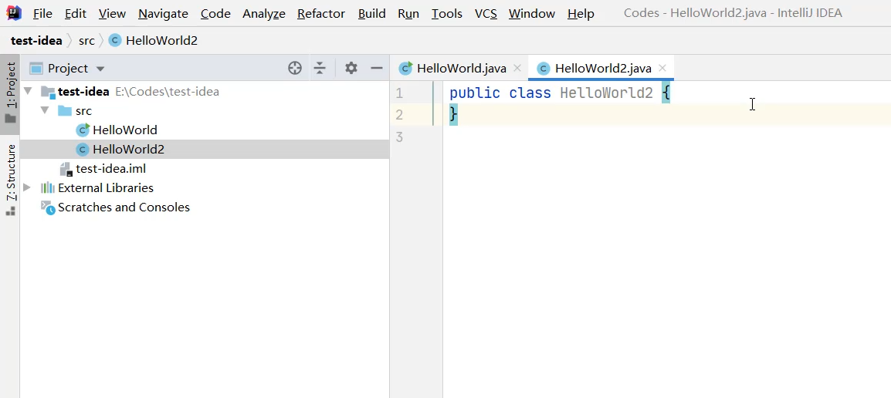

---

### 2、删除类文件

想要删除哪个文件，就右键点击该文件，选择Delete即可


在弹出的界面中点击OK，确定删除


PS：此时删除是不走回收站的，直接从硬盘中删掉了。

---

### 3、修改类名

如果要修改类名，是不能直接在代码中修改的，因为文件名跟类名需要保持一致，所以正确的修改方式应该是下面这样做。

右键点击想要修改的文件，点击Refactor，再点击Rename（改名）。或者快捷键<kbd>shift + F6</kbd>


输入想要修改的名字，输入完毕点击下面的Refactor


文件名和类名均已修改成功


---

## 三、IDEA中模块的相关操作

模块有以下四种操作，但针对于我们现在刚开始学习，我们只需要学会如何新建一个模块就行了。

- 新建模块
- 删除模块
- 修改模块
- 导入模块

### 新建模块

点击File，选择Project Structure


选择Module


点击+，选择New Module


我们要编写Java代码，所以要新建一个Java模块。点击Java，输入模块的名称，`模块需要创建到的位置` 这里可以不用去动它。再点击右下角的Create。


成功新建完毕之后，在中间空白区域就出现了刚刚新建的模块，点击右下角的OK


在主界面中，也会出现刚刚新建的模块


### 删除模块

- 右键点击模块

  选择Remove Module


- 选择Remove，表示确定删除

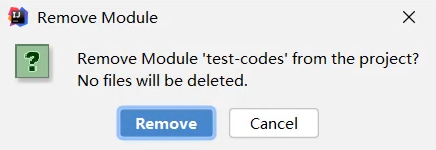

- 此时发现，在IDEA列表页面，删除的模块已经不在了。


> 小贴士：
>
> 此时删除仅仅是从IDEA列表中的删除，在本地硬盘中还是存在的。

#### 8.6.4 修改模块

- 右键点击模块名

  选择Refactor

  再选择Rename


- 选择第三个修改模块名和本地文件夹名

  点击OK


- 输入要修改的新的模块名

  输入完毕点击Refactor


- 回到主界面，就发现模块名和文件夹名都已经修改完毕


#### 8.6.5 导入模块

- 点击File，选择Project Structure


- 选择Module

  点击+

  选择Import Module

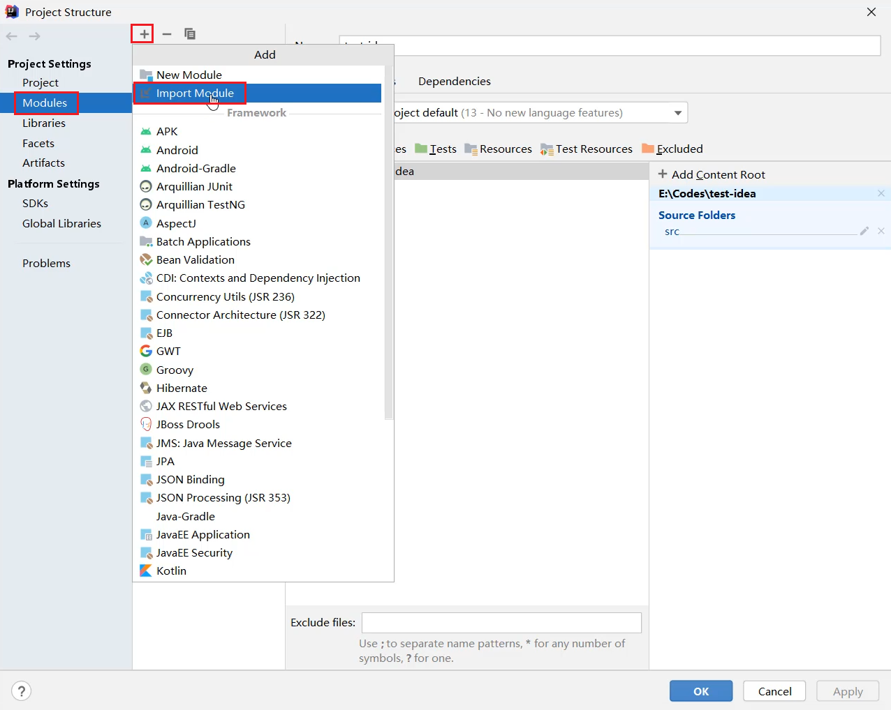

- 从本地硬盘中选择要导入的模块

  再点击OK


- 不断点击Next


- 如果中间出现提示框，则点击Overwrite

  然后继续点击右下角的Next


- 一直点到finish为止

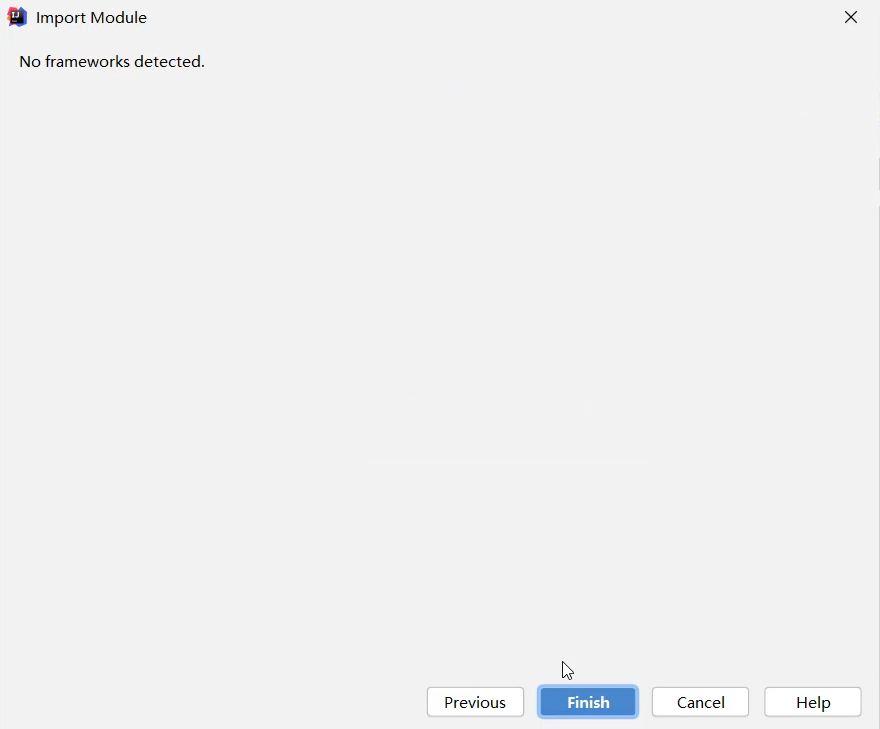

- 成功导入后，在中间位置就会出现导入的模块信息


- 在主界面中也会出现导入的模块信息


- 展开模块点击模块中的Java文件，会发现代码报错。

  是因为导入模块跟JDK没有关联导致。


- 可以点击右上角的Setup SDK

  再选择已经安装的JDK版本即可


- 导入完毕之后，代码就恢复正常不会报错了


---

## 四、IDEA中项目的相关操作

在今天，我们只需要学会如何关闭项目和如何新建项目即可。

- 关闭项目
- 打开项目
- 修改项目
- 新建项目

### 1、关闭项目

当我们打开IDEA的时候，它会默认打开上一次你操作的项目。那如果我现在要将这个项目给关闭。

点击File，选择Close Project即可


刚刚操作的项目就已经关闭了。左侧是项目列表，如果要再次打开该项目，直接点击即可。

右侧上方有create new project，可以再建一个新的项目。右边是项目列表，点击对应的项目名称，就可以重新进入到项目。


鼠标右击项目，点击`Remove from Recent Projects...`。如果点击了，会在IDEA的列表中删除。不会删除本地硬盘上的项目。


---

### 2、新建项目

点击File，选择New，点击Project


同样还是创建一个什么都没有的空项目，输入项目的名称，点击下面的Create即可


询问是在本窗口打开还是在一个新的窗口打开。可以点击New Window，在一个新的窗口打开。


此时就出现了两个窗口，在一个新的窗口打开了新的项目


---

### 打开项目

- 在本界面还可以打开本地已经存在的项目

  点击Open or Import

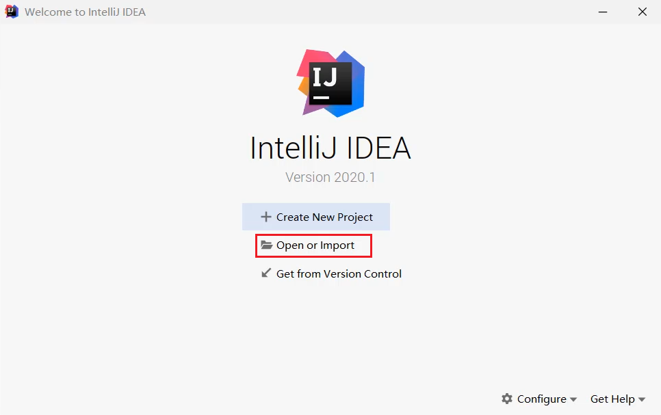

- 选择要打开的项目

  点击OK

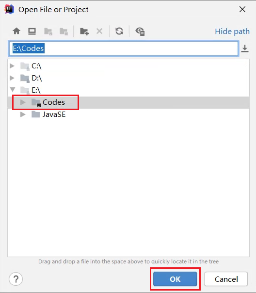

- 项目就被打开了。


### 修改项目

- 点击File，选择Project Structure


- 在这个界面，默认是Module

  所以，要先点击Project

  在右侧页面中，输入新的项目名称

  修改JDK版本和编译版本都变成JDK14

  再点击OK


- 此时发现，项目名称已经修改完毕


- 但是本地文件夹的名字还没有修改


- 需要先关闭当前项目


- 点击项目后面的叉，从列表中移除项目


- 到本地硬盘中手动修改文件夹的名称

 

- 点击Open or Import重新打开项目


- 选择修改之后的项目

  点击OK


- 此时会发现，项目名称和本地硬盘文件夹的名称都已经修改完毕了


---------------------------------------------------

# -----------------------------------

# day03

# 30.运算符、表达式和算术运算符

## 一、运算符和表达式

**运算符**：就是对常量或者变量进行操作的符号。比如： +  -  *  / 

**表达式**：用运算符把常量或者变量连接起来的，符合Java语法的式子就是表达式。比如：a + b 这个整体就是表达式。而其中+是算术运算符的一种，所以这个表达式也称之为算术表达式。

例如下图，就是将 a + b的结果赋值给左边的变量c


---


## 二、算术运算符

### +、 -、 *

分类：

```java
+ - * / %
```

`%` 取模（取余）运算符，计算方法也是两个数相除，但是获取的是它们的余数


运算特点：

```java
+ - * :跟小学数学中一模一样没有任何区别.
```

代码示例

> 在运算符的前后一般都会加一个空格，这样阅读起来美观一些

~~~java
package com.itheima.arithmeticoperator;

public class ArithmeticoperatorDemo1 {
    public static void main(String[] args) {
        //+
        System.out.println(3 + 2);//5
        //-
        System.out.println(5 - 1);//4
        //* (小学中乘是×，但是在代码中是*，使用shift + 数字8可以敲出来)
        System.out.println(7 * 9);//63

        //如果在计算的时候有小数参与
        //结论：
        //在代码中，如果有小数参与计算，结果有可能不精确的，例如1.1 + 1.1就是精确的，但如果是1.1 + 1.01就不精确了。
        //为什么呢？
        //暂时只要知道这个结论就可以了。具体的原因，涉及到了小数在计算机里的存储模式，我们到了JavaSE进阶的时候，会再详细的讲解。
        System.out.println(1.1 + 1.1);//2.2
        System.out.println(1.1 + 1.01);//2.1100000000000003
        System.out.println(1.1 - 1.01);//0.09000000000000008
        System.out.println(1.1 * 1.01);//1.1110000000000002
    }
}
~~~

---

### /、%

代码示例

~~~java
package com.itheima.arithmeticoperator;

public class ArithmeticoperatorDemo2 {
    //主入口
    //结论：
    //1.整数参与计算，结果只能得到整数
    //2.小数参与计算，结果有可能是不精确的，如果我们需要精确计算，那么需要用到后面的知识点。
    public static void main(String[] args) {
        //除法
        System.out.println(10 / 2);//5
        System.out.println(10 / 3);//3
        // 整数操作只能得到整数，想要得到小数，必须有浮点数参与运算
        System.out.println(10.0 / 3);//3.3333333333333335

        //取模，也叫取余。实际上也是做除法运算，只不过得到的是余数而已。
        System.out.println(10 % 2);//0，商5余0
        System.out.println(10 % 3);//1，商3余1

        //应用场景：
        //1. 可以用取模来判断，A是否可以被B整除
        //A % B，例如10 % 3，就可以判断10是否可以被3整除
        
        //2. 可以判断A是否为偶数
        //A % 2 如果结果为0.那么证明A是一个偶数。如果结果为1，那么证明A是一个奇数
        
        //3. 在以后，斗地主发牌
        //三个玩家
        //把每一张牌都定义一个序号
        //拿着序号 % 3 如果结果为1，就发给第一个玩家。
        //如果结果为2，那么就发给第二个玩家
        //如果结果为0，那么就发给第三个玩家
    }
}
~~~

---

## 三、练习：数值拆分

需求：键盘录入一个三位数，将其拆分为个位、十位、百位后，打印在控制台

代码示例：

```java
package com.itheima.test;

import java.util.Scanner;

public class Test1 {
    public static void main(String[] args) {
        //键盘录入一个三位数，获取其中的个位，十位，百位

        //1.键盘录入
        Scanner sc = new Scanner(System.in);
        System.out.println("请输入一个三位数");
        int number = sc.nextInt();

        //2.获取个位，十位，百位
        //公式：
        //个位：  数字 % 10
        //十位：  数字 / 10 % 10
        //百位：  数字 / 10 / 10 % 10
        //...
        int ge = number % 10;
        int shi = number / 10 % 10;
        int bai = number / 100 % 10;
        System.out.println(ge);
        System.out.println(shi);
        System.out.println(bai);
    }
}
```


---

# 31.隐式转换 和 强制转换

## 一、引入

关于算术运算符的基本用法我们已经学习完了，现在来学习关于运算符的高级用法。

下面以加法为例，它一共会有三种情况：数字相加、字符串相加、字符相加。

**案例一**：下面 `int类型` 的 `a` 和 `double类型` 的 `b` 相加结果赋值给变量`c`，`变量c`是什么类型？

以前我们在计算的时候都是同一种数据类型进行计算的，而在现在的代码中，相加的数据类型不一样了。

你现在肯定是这么想的：`10 + 12.3 = 22.3`，而22.3是一个小数，小数默认类型是double，所以你会猜c的类型一定是double。这个答案是正确的。

~~~java
public class Test {
    public static void main(String[] args) {
        int a = 10;
        double b = 12.3;
        c = a + b;
    }
}
~~~

**案例二**：下面` int类型` 的 `a` 和 `double类型` 的 `b` 相加，此时相加的结果的类型应该为int还是double呢？

~~~java
public class Test {
    public static void main(String[] args) {
        int a = 10;
        double b = 20.0;
        c = a + b;
    }
}
~~~


**在相加的过程中，首先我们要知道一个规则：数字进行运算的时候，数据类型不一样不能直接参与运算，需要转成一样的，才能运算。**

转换方式一：隐式转换 —— 将取值范围小的，变成取值范围大的

转换方式二：强制转换 —— 将取值范围大的，转换为取值范围小的


---

## 二、隐式转换

隐式转换也叫 `自动类型提升`。就是把一个取值范围小的数据或者变量，赋值给另一个取值范围大的变量。此时不需要我们额外写代码单独实现，是程序自动帮我们完成的。

最重要的是，隐式转换是不需要我们单独写代码的，是程序自动帮我们完成的。

比如说：在以前，下面代码 `double b = a;` 写的肯定是有问题的，因为类型不一样，是不能赋值的。但是我们现在学习了隐式转换，此时第二行代码就可以解释的通了。

~~~java
int a = 10;
double b = a;
~~~

先来看看取值范围：在这个取值范围中，最小的是byte，最大的是double。所以变量a赋值给变量b的时候，就是取值范围小的，赋值给取值范围大的。此时变量a记录的10，会自动提升为10.0，注意：是变量里面记录的值会提升为10.0，这个提升是不需要我们自己额外写代码实现的，是程序自动帮我们完成的。此时变量b记录的值就是10.0，小的自动的变成了大的。那它的底层原理是什么呢？这个在第二阶段会讲解，但是因为我们现在是刚开始入门，我们暂时只需要知道这个结果就可以了。


正是因为有了隐式转换，不同的数据类型才能够在一起进行计算。不同的数据类型在计算的时候会有两种提升规则。

- 取值范围小的，和取值范围大的进行运算，小的会先提升为大的，再进行运算
- byte、short、char这三种类型的数据在运算的时候，都会直接先提升为int，然后再进行运算

**例一**：在下面代码当中，a是int类型（整数），b是double类型（小数）。由于这两种类型的不一样，就不能直接运算，需要转成一样的才能运算。根据取值范围的大小关系：`double > int`，所以是变量a里面的数据会自动变成double里面的，然后再进行运算。所以 `a + b` 在进行运算的时候实际上是两个double在进行运算，所以的最后结果c，也就是double类型的。

~~~java
public class Test {
    public static void main(String[] args) {
        int a = 10;
        double b = 20.0;
        c = a + b; // 结果是？
    }
}
~~~

**例二**：a 和 b都是byte类型的，问 `a + b` 得到的结果c，是什么类型的？

根据第二个提升规则，byte类型的数据在运算的时候，都会先提升为int类型，然后再进行运算。

下面代码中，等号两边在相加的时候都会先自动提升为int类型，在提升之后，实际上就是两个int相加，因此，最终的c都是int类型的了。

~~~java
public class Test {
    public static void main(String[] args) {
        byte a = 10;
        byte b = 20;
        c = a + b; // 结果是？
    }
}
~~~

---

### 总结

- 取值范围：byte < short < int < long < float < double

- 什么时候进行转换？

  数据类型不一样，不能进行计算，需要转成一样的才可以进行计算。

- 转换规则1：

  取值范围小的，和取值范围大的进行运算，小的会先提升为大的，再进行运算

- 转换规则2：

  byte、short、char这三种类型的数据在参与计算的时候，都会直接先提升为int，然后再进行运算


---

## 三、隐式转换练习：请问最终的运算结果是什么类型的？

**例一**：加法运算时从左到右依次计算。所以它是先计算 `i + n`，i + n是int 加上long，两个类型不一样，很明显要转换，由于long 大于 int，所以i里面的值会自动提神为long类型。前面两个数在参与计算的时候就相当是两个long进行计算。

然后就是一个long类型加上一个double类型，两个类型又不一样，所以还要再转换，由于double 大于 long，所以long类型的数据会自动提升为double类型，所以最终结果就是double类型。

~~~java
int i = 10;
long n = 100L;
double d = 20.0;
数据类型 result = i + n + d;
~~~

**例二**：首先是 `b + s`，由于b是byte类型的，s是short类型的，根据刚刚讲的第二个规则，byte、short在参与计算的时候，统一先提升为int，然后再参与运算，所以 `b + s` 就相当于是两个int相加，最终的结果是int。

然后int 再去和 long类型的 n 相加，int最终提升为long。所以最终的result为long类型。

~~~java
byte b = 10;
short s = 20;
long n = 100L;
数据类型 result = b + s + n;
~~~

---

## 四、强制转换

在代码当中，如果要把一个取值范围大的数值，赋值给取值范围小的变量。是不允许直接赋值的。如果一定要这么做就需要加入强制转换。强制转换是需要我们自己手动编写代码的，它的格式是：`目标数据类型 变量名 = （目标数据类型）被强转的数据` ，简单理解就是，你想要转成什么类型，就在小括号中写什么类型就行了。

例如：将下面变量a里的数据直接赋值给变量b，肯定是不行的，因为等号后面变量a，取值范围是比较大的，而现在是把一个大的，给小的，是不能直接给的。但如果你一定要这么办，就需要先将a转为int类型。

~~~java
double a = 12.3;
int b = (int)a;
~~~

PS：强制转换有可能导致数据发生错误。（数据的精度丢失）

例如：int 类型的 a中存放的数据比较大，超出了byte的范围，此时数据就会发生错误。

~~~java
int a = 300;
byte b = (byte) a;
~~~

---

## 五、强制转换练习

如果将等号左边的result的int类型改为byte类型，那等号右边应该如何变？

~~~java
byte b1 = 10;
byte b2 = 20;
// int result = b1 + b2;
byte result = b1 + b2;
~~~

代码示例

~~~java
package com.itheima.arithmeticoperator;

public class ArithmeticoperatorDemo3 {
    public static void main(String[] args) {
        byte b1 = 10;
        byte b2 = 20;
        //现在我们要强转的是谁？
        //b1 + b2计算之后的结果。
        // (byte)b1 + b2 强转的是b1，并不是最终的结果
        byte result = (byte)(b1 + b2);
        System.out.println(result);//30
    }
}
~~~

但如果转换的数据过大，就会发生错误

~~~java
package com.itheima.arithmeticoperator;

public class ArithmeticoperatorDemo3 {
    public static void main(String[] args) {
        byte b1 = 100;
        byte b2 = 200;
        byte result = (byte)(b1 + b2);
        System.out.println(result);//-56，结果就发生错误了。因为要转换的数据过大
    }
}
~~~


---


# 32.字符串 和 字符的 + 操作

技巧：有字符串，那就是字符串拼接，没有字符串，那就是普通的运算符

* 当+操作中出现字符串时，此时就是字符串的连接符，会将前后的数据进行**拼接**，并产生一个新的字符串。

  例如：`"123" + 123`，结果为 `"123123"`，而不是246。

* 当连续进行+操作时，从左到右逐个执行的。

  例如：`1 + 2 + "abc"`，结果："3abc"

  解释：

  ​	第一步：1 + 2 。在这个过程中，没有字符串参与的，所以做的是加法运算，结果为3。

  ​	第二步：3 + "abc"。在这个过程中，有字符串参与的，所以做的是拼接操作，产生一个新的字符串"3abc"。

---

## 二、字符串相加的练习

字符串只有 + 操作，是没有 -、*、/运算的

这里特别注意的是，变量在进行拼接的时候，会把变量里的值拿出来进行拼接！！！


```java
1 + 2 + "abc" + 2 + 1
```

结果：“3abc21”

解释：

​	第一步：1 + 2 。在这个过程中，没有字符串参与的，所以做的是加法运算，结果为3。

​	第二步：3 + "abc"。在这个过程中，有字符串参与的，所以做的是拼接操作，产生一个新的字符串"3abc"。

​	第三步："3abc" + 2。在这个过程中，有字符串参与的，所以做的是拼接操作，产生一个新的字符串"3abc2"。

​	第四步："3abc2" + 1。在这个过程中，有字符串参与的，所以做的是拼接操作，产生一个新的字符串“3abc21”

---

## 三、练习：数值拆分

需求：键盘录入一个三位数，将其拆分为个位、十位、百位后，打印在控制台

我们以前在进行计算的时候是通过一系列公式将个位、十位、百位都获取出来，并打印在控制台当中，打印出来的结果就是


但是这种打印结果看起来非常累，如果我不看题目，我怎么知道这个3是什么，2是什么，1是什么？那能不能在打印的时候前面有一些说明性的提示呢？

~~~java
package com.itheima.test;

import java.util.Scanner;

public class Test1 {
    public static void main(String[] args) {
        //键盘录入一个三位数，获取其中的个位，十位，百位

        //1.键盘录入
        Scanner sc = new Scanner(System.in);
        System.out.println("请输入一个三位数");
        int number = sc.nextInt();

        //2.获取个位，十位，百位
        //公式：
        //个位：  数字 % 10
        //十位：  数字 / 10 % 10
        //百位：  数字 / 10 / 10 % 10
        //...
        int ge = number % 10;
        int shi = number / 10 % 10;
        int bai = number / 100 % 10;
        System.out.println("个位是：" + ge);
        System.out.println("十位是：" + shi);
        System.out.println("百位是：" + bai);
    }
}
~~~

结果：


---

## 四、字符的+操作

在学习隐式转换的时候，曾经有过这样的提升规则：byte、short、char三种数据在参与运算的时候，都会先提升为int，然后再进行运算。但此时就有一个问题了，byte、short都是一个数字，容易提升，但是char是一个字符，怎么进行提升呢？我们先不着急，先来看一段代码：

~~~java
char c = 'a'; // 首先定义一个字符类型的变量
int result = c + 0; // 用字符c跟数字0进行了相加
System.out.println(result);// 打印结果为：97
~~~

打印结果为什么为97呢，这就要说到字符在进行计算的时候会有以下规则：

**当+操作（作为运算符的时候）中出现了字符，会拿着字符到计算机内置的ASCII码表中去查对应的数字，然后再进行计算。**

ASCII码表（American Standard Code for Information Interchange）美国信息交换标准码表。下面红色框框起来的部分，这张表中，每一个数字都会跟一个唯一的数字产生一个一一对应的关系。这张表是操作系统类似的，每个人的系统中都是存在的，不需要你额外下载。


ASCII码表中：'a'   -----    97、'A'   -----    65

示例：


---

## 五、算术运算符的总结

分类：

```java
+ - * / %  这些操作跟小学数学几乎是一模一样的。
```

注意点：

* / 和 % 的区别：他们两个都是做除法运算，/取结果的商。% 取结果的余数。
* 整数操作只能得到整数，如果想要得到小数，必须有浮点数参与运算。

算术运算符的高级用法：

是以+为例进行的讲解，其余减法，乘法，除法的运算规则也是一样的。

特例：字符串只有+操作，没有其他操作。

---

# 33.自增自减运算符

## 一、分类

```java
++  自增运算符
--  自减运算符
```

++：就是把变量里面的值+1

--：就是把变量里面的值-1

---

## 二、使用方式

* 放在变量的前面，我们叫做先++。 比如：++a
* 放在变量的后面，我们叫做后++。 比如：a++

**注意点**：不管是先++，还是后++。单独写在一行的时候，运算结果是一模一样的。

---

## 三、代码示例

```java
package com.itheima.arithmeticoperator;

public class ArithmeticoperatorDemo5 {
    public static void main(String[] args) {
        //++ 和 --
        int a = 10;
        //表示把变量a里面的值+1
        a++;
        System.out.println(a);//11
        //表示把变量a里面的值+1
        ++a;
        System.out.println(a);//12
        //表示把变量a里面的值-1
        a--;
        System.out.println(a);//11
        //表示把变量a里面的值-1
        --a;
        System.out.println(a);//10
    }
}
```

---

## 四、自增自减运算符的应用场景

某些情况下，变量需要进行加1或者减1的时候使用。

比如：过生日多一岁，就用到了自增运算符。


比如：购物商场中，选择商品数量，也用到了自增或者自减运算符。


比如：统计很多数据中，有多少个数据满足要求，也用到了自增运算符。

---

## 五、参与计算

之前我们学到过，`++`、`--` 无论是放在变量的前面还是后边，单独写一行结果是一样。但是如果自增自减运算符参与了计算，先++和后++就不一样了。

后++的口诀 — 先加后用：先把变量a里面的值进行自增变成11，自增完了，再赋值给变量b。此时b的结果为10。

先++的口诀 -— 先用后加：先将a里面的变量拿出来用，用完了再进行自增。此时b的结果为11。


---

## 六、练习

x、y、z的值分别为？

~~~java
int x = 10;
int y = x++;
int z = ++x;
System.out.println("x:" + x);
System.out.println("y:" + y);
System.out.println("z:" + z);
~~~


~~~java
package com.itheima.arithmeticoperator;

public class ArithmeticoperatorDemo6 {
    public static void main(String[] args) {
        int x = 10;
        //后++：先用后加
        //先把x变量中的值拿出来用，赋值给y，然后再进行自增。
        //赋值给y的值是自增前的。
        int y = x++;// 这一行执行后：x = 11  y = 10
        //先++：先加后用
        //先把x进行自增，然后把自增后的结果赋值给左边的变量
        //先把x自增，变成12，然后再把自增之后的12赋值给z
        int z = ++x;// 这一行执行后：x = 12 z = 12
        System.out.println("x:" + x);//12
        System.out.println("y:" + y);//10
        System.out.println("z:" + z);//12
    }
}
~~~


---

# 34.赋值运算符 和 关系运算符

## 赋值运算符

最为常用的：	=

扩展赋值运算符：+=、-=、*=、/=、%=，注意两个符号之间是没有间隔的，是挨在一块的。

运算过程：就是把等号右边的结果赋值给左边的变量

---

### 二、扩展赋值运算符

**分类**：+=、-=、*=、/=、%=

**运算规则**：就是把左边跟右边进行运算，把最终的结果赋值给左边，对右边没有任何影响。

**注意点**：扩展的赋值运算符中隐层还包含了一个强制转换。

**案例**：以 `+=` 为例

```java
package com.itheima.assigningoperator;

public class AssigningoperatorDemo1 {
    public static void main(String[] args) {
        //+=
        //规则：将左边和右边进行相加，然后再把结果赋值给左边
        int a = 10;
        int b = 20;
        //把a+b，再把结果赋值给左边的变量a
        a += b;
        //等同于 a = (int)(a + b);
        System.out.println(a);//30
        System.out.println(b);//20


        //细节：
        //+=，-=，*=，/=，%= 底层都隐藏了一个强制类型转换，强转的类型是 左边变量的类型 所决定的
        short s = 1;
        //把左边和右边进行相加，得到结果2，再赋值给左边的变量
        s += 1;
        //等同于：s = s + 1;但是short类型在参与计算的时候，会先提升为int类型参与计算， s + 1 最终的结果应该是int类型的。但是如果不进行强制转换，那就是：将一个int类型的数赋值给short类型的数，就会报错了！
        // 但是为什么这里没有报错呢？这是因为 +=，-=，*=，/=，%= 底层都隐藏了一个强制类型转换，所以它并不是等同于 s = s + 1，而是： s = (short) (s + 1); 强转的类型是 左边变量的类型 所决定的
        System.out.println(s);//2
    }
}

```

---

## 关系运算符

关系运算符又叫比较运算符，其实就是拿着左边跟右边进行了判断而已。

**分类**：

| 符号 | 解释                                                         |
| ---- | ------------------------------------------------------------ |
| ==   | 就是判断左边跟右边是否相等，如果成立就是true，如果不成立就是false |
| !=   | 就是判断左边跟右边是否不相等，如果成立就是true，如果不成立就是false |
| >    | 就是判断左边是否大于右边，如果成立就是true，如果不成立就是false |
| >=   | 就是判断左边是否大于等于右边，如果成立就是true，如果不成立就是false |
| <    | 就是判断左边是否小于右边，如果成立就是true，如果不成立就是false |
| <=   | 就是判断左边是否小于等于右边，如果成立就是true，如果不成立就是false |

**注意点**：

* 关系运算符最终的结果一定是布尔类型的。要么是true，要么是false
* 在写 == 的时候，千万不要写成=
* 两个符号之间是没有空格的，例如 `==`、`!=`

**代码示例**

~~~java
package com.itheima.compareoperator;

public class CompareoperatorDemo1 {
    public static void main(String[] args) {
        //1.== 判断左右两边是否相等
        int a = 10;
        int b = 10;
        int c = 20;
        System.out.println(a == b);//true
        System.out.println(a == c);//false

        //!= 判断左右两边是否不相等
    }
}
~~~

---

## 练习：约会

这个练习是美国斯坦福大学Java的一个入门练习。

需求：
        您和您的约会对象在餐厅里面正在约会。
        键盘录入两个整数，表示你和你约会对象衣服的时髦度。（手动录入0~10之间的整数，不能录其他）
        如果你的时髦程度大于你对象的时髦程度，相亲就成功，输出true。
        否则输出false。

~~~java
package com.itheima.test;

import java.util.Scanner;

public class Test2 {
    public static void main(String[] args) {
        //1.键盘录入两个整数表示衣服的时髦度
        Scanner sc = new Scanner(System.in);
        System.out.println("请输入我们自己的衣服时髦度");
        int myFashion = sc.nextInt();
        System.out.println("请输入相亲对象衣服的时髦度");
        int girlFashion = sc.nextInt();

        //2.把我衣服的时髦度跟女孩的时髦度进行对比就可以了
        boolean result = myFashion > girlFashion;

        //3.打印结果
        System.out.println(result);
    }
}
~~~


---

# 35.逻辑运算符

## 一、什么是逻辑运算符？

- 在数学中，一个x，大于5，小于15，我们可以这样来进行表示： `5 < x < 15`。

- 在Java中，需要把上面的式子先进行拆解，再进行合并表达。

  拆解为：x>5 和 x<15这两个式子，然后再使用逻辑运算符将它们两个合在一起：x>5 & x<15，表示x同时要满足x>5 和 x<15两个条件。

逻辑运算符一共有四个分类：


---

## 二、& 和 | 的使用：

&：逻辑与（个人习惯读作：且，因为它就表示并且、而且）

​	两边都为真，结果才是真，只要有一个为假，那么结果就是假。

|：逻辑或（或者）

​	两边都为假，结果才是假，只要有一个为真，那么结果就是真。

代码示例：

```java
package com.itheima.logicoperator;

public class LogicoperatorDemo1 {
    public static void main(String[] args) {
        //1.& 并且
        //两边都为真，结果才是真
        System.out.println(true & true);//true
        System.out.println(false & false);//false
        System.out.println(true & false);//false
        System.out.println(false & true);//false


        //2. | 或者
        //两边都为假，结果才是假，只要有一个为真，结果就为真
        System.out.println(true | true);//true
        System.out.println(false | false);//false
        System.out.println(true | false);//true
        System.out.println(false | true);//true
    }
}
```

---

### 三：使用场景

根据固定的场景，来选择使用&还是使用|

**场景一：用户登录。**

用户名输入正确  & 密码输入正确

因为只有用户名和密码同时都正确了，那么才能成功登录，只要有一个失败了都不行。

使用技巧：当我们需要同时满足左边和右边两种情况时，可以使用且


**场景二：丈母娘选女婿**

丈母娘：女婿啊，你要么买个房子，要么买辆车。就可以把我的小棉袄穿走了。

买个房子 | 买辆车

两个条件中，只要满足其中一个，就可以穿走小棉袄了。

使用技巧：

​	当两种条件只要满足其中一个的时候，可以使用或

---

## 三、^（异或）的使用

在以后用的不多，了解一下即可。

计算规则：如果两边相同，结果为false，如果两边不同，结果为true

这里有一个小故事：有一个机构叫民政局，是用来结婚登记的，两男和两女，同性是不能登记的。但是一男一女，就可以登记，所以不同为true，相同为false。

代码示例：

```java
package com.itheima.logicoperator;

public class LogicoperatorDemo2 {
    public static void main(String[] args) {
        // ^ 逻辑异或
        //相同为false，不同为true
        //了解一下即可
        System.out.println(true ^ true);//false
        System.out.println(false ^ false);//false
        System.out.println(true ^ false);//true
        System.out.println(false ^ true);//true
    }
}
```

**!（取反）的使用**：是取反，也叫做非。

计算规则：false取反就是true，true取反就是false

温馨提示：**取反最多只用一个。**

代码示例：

```java
//! 逻辑非 取反
//提示：
//取反的感叹号不要写多次，要么不写，要么只写一次
System.out.println(!false);//true
System.out.println(!true);//false
```


---

# 36.短路逻辑运算符

## 一、为什么有短路逻辑运算符

上一节讲了四种逻辑运算符，但是使用逻辑运算符编写代码的时候是可以进一步优化，提高代码的效率的。此时就需要用到短路逻辑运算符。

**例一**：用户登录，当用户输入用户名和密码，点击登录之后，程序就去判断用户名和密码是否正确。那么在判断的时候需要判断两次，首先判断用户名是否正确，然后还要判断密码是否正确。但是如果判断用户名的时候，用户名就已经出错了，此时就不需要再判断密码了，因为此时不管密码是真还是假，整个表达式的结果都是false，用户都会登录失败。

此时如果我们在中间只用一个 &，也就是我们之前学到的逻辑运算符，不管用户名是真还是假，都需要判断密码。因此为了提高程序运行的效率，我们就需要来学习短路逻辑运算符了。

短路逻辑运算符分为两种：&&（而且）、||（或者）。我们要使用的是&&。

此时用户名如果正确，它就会去判断密码；但是如果用户名错误的话，就不会再去判断密码了，直接得到整个表达式的结果为false，表示用户登录失败，这样就能提升程序的运行效率。


**例二**：丈母娘选女婿，有房 |  有车，首先先看看有没有房，发现有，然后再去看看有没有车。

这样写代码是没有问题的，但是效率比较低，因为丈母娘看完房子之后，就会有两种情况：有房和没房。

如果没有房子，就必须去看看车子；但是如果房子已经有了，就没必要去看车子了。此时就可以用到短路逻辑运算符中的 ||，如果左边为true，就不会执行右边；如果左边会false，才会去执行右边。


---

## 二、分类

分类：  &&   ||

**&&**：运算结果跟`&`是一模一样的，只不过具有短路效果，并且效率会比较高。左边为false，右边不管是真是假，整个表达式的结果一定是false。

**||**：运算结果跟`|`是一模一样的。只不过具有短路效果，并且效率会比较高。左边为true，右边不管是真是假，整个表达式的结果一定是true。

**逻辑核心**：当左边不能确定整个表达式的结果，右边才会执行。当左边能确定整个表达式的结果，那么右边就不会执行了。从而提高了代码的运行效率。

& | ：无论左边 true false，右边都要执行。

&& ||：如果左边能确定整个表达式的结果，右边不执行。

**建议**：最为常用的逻辑运算符： &&   ||   ！


---

## 三、代码示例

~~~java
package com.itheima.logicoperator;

public class LogicoperatorDemo3 {
    public static void main(String[] args) {
        //1.&&
        //运行结果跟单个&是一样的
        //表示两边都为真，结果才是真
        System.out.println(true && true);//true
        System.out.println(false && false);//false
        System.out.println(false && true);//false
        System.out.println(true && false);//false


        //2.||
        //运行结果跟单个|是一样的
        //表示两边都为假，结果才是假。只要有一个为真，结果就为真
        System.out.println(true || true);//true
        System.out.println(false || false);//false
        System.out.println(false || true);//true
        System.out.println(true || false);//true


        //3.短路逻辑运算符具有短路效果
        //简单理解：当左边的表达式能确定最终的结果，那么右边就不会参与运行了
        int a = 10;
        int b = 10;
        boolean result1 = ++a < 5 & ++b < 5;
        System.out.println(result);//false
        System.out.println(a);//11
        System.out.println(b);//10，因为左边已经是false了，变量b自增并不会执行了
        
        boolean result2 = ++a < 5 & ++b < 5;
        System.out.println(result);//false
        System.out.println(a);//11
        System.out.println(b);//11，如果是单个的，左边不管真假，右边都会执行
    }
}
~~~

---

## 四、练习：数字6

这个练习也是美国斯坦福大学，java入门的一个练习。

数字6是一个真正伟大的数字，键盘录入两个整数。如果其中一个为 6，最终结果输出true。如果它们的和为 6的倍数。最终结果输出true。其他情况都是false。

代码示例：为true的情况有三种情况

~~~java
package com.itheima.test;

import java.util.Scanner;

public class Test3 {
    public static void main(String[] args) {
        //分析：
        //1.键盘录入两个整数
        // 变量a   变量b

        //2.a == 6 || b == 6 || (a + b) % 6 == 0
        //如果满足其中一个，那么就可以输出true

        //键盘录入两个整数
        Scanner sc = new Scanner(System.in);
        System.out.println("请输入一个整数");
        int number1 = sc.nextInt();
        System.out.println("请输入第二个整数");
        int number2 = sc.nextInt();

        //可以短路逻辑运算符去连接三个判断
        boolean result = number1 == 6 || number2 == 6 || (number1 + number2) % 6 == 0;

        System.out.println(result);
    }
}
~~~


---

# 37.三元运算符

## 一、引入

又叫做：三元表达式或者问号冒号表达式。作用：可以进行判断，根据判断的结果得到不同的内容。

**格式**：`关系表达式 ？ 表达式1 ：表达式2 ；`

其中的 关系表达式 就是一个判断

**计算规则**：

* 计算关系表达式的值。
* 如果关系表达式的值为真，那么执行表达式1。
* 如果关系表达式的值为假，那么执行表达式2。

**注意点**：三元运算符的最终结果一定要被使用，要么赋值给一个变量，要么直接打印出来，如果单独在代码中写一个三元表达式，是会报错的。

---

## 二、代码示例

需求：使用三元运算符，获取两个数的较大值

```java
package com.itheima.ternaryoperator;

public class TernaryoperatorDemo1 {
    public static void main(String[] args) {
        //分析：
        //1.定义两个变量记录两个整数
        int number1 = 10;
        int number2 = 20;

        //2.使用三元运算符获取两个整数的较大值
        //格式：  关系表达式 ? 表达式1 : 表达式2;
        //整个三元运算符的结果必须要被使用
        int max = number1 > number2 ? number1 : number2; // 赋值给一个变量
        System.out.println(max);

        System.out.println(number1 > number2 ? number1 : number2); // 直接打印出来，此时在式子的最后就不需要加分号了
    }
}

```

---

## 三、练习1-两只老虎

需求：

​	动物园里有两只老虎，两只老虎的体重分别为通过键盘录入获得，

​	请用程序实现判断两只老虎的体重是否相同。

代码示例：

```java
package com.itheima.test;

import java.util.Scanner;

public class Test4 {
    public static void main(String[] args) {
        //分析：
        //1.键盘录入两只老虎的体重
        Scanner sc = new Scanner(System.in);
        System.out.println("请输入第一只老虎的体重");
        int weight1 = sc.nextInt();
        System.out.println("请输入第二只老虎的体重");
        int weight2 = sc.nextInt();
        //2.比较
        //System.out.println(weight1 == weight2); 这种写法打印出来的要么是true，要么是false。但是现在我们想打印出相同 / 不同

        String result = weight1 == weight2 ? "相同" : "不同";
        System.out.println(result);
    }
}

```

---

## 四、练习2-求三个数的最大值

需求：

​	一座寺庙里住着三个和尚，已知他们的身高分别为150cm、210cm、165cm。

​	请用程序实现获取这三个和尚的最高身高。

代码示例：

```java
package com.itheima.test;

public class Test5 {
    public static void main(String[] args) {
        //1.定义三个变量记录三个和尚的身高
        int height1 = 150;
        int height2 = 210;
        int height3 = 165;
        //2.拿着第一个和尚和第二个和尚进行比较
        //再拿着结果跟第三个和尚进行比较即可
        int temp = height1 > height2 ? height1 : height2;
        int max = temp > height3 ? temp : height3;
        //快捷键：ctrl + alt + L 自动的格式化代码
        System.out.println(max);
    }
}
```


---

## 五、运算符的优先级

在Java中涉及了很多的运算符，每一种运算符都有各自的优先级。但是这些优先级不需要记忆。

咱们只要知道其中一点：小括号优先于所有。


---

# 38.原码反码补码

原码：十进制数据的二进制表示形式，最左边是符号位，0为正，1为负。

反码：正数的补码反码是其本身，负数的反码是符号位保持不变，其余位取反。

补码：整数的补码是其本身，负数的补码是在其反码的基础上加1。

## 二、原码

原码：十进制数据的二进制表示形式，最左边是符号位，0为正，1为负。

例如：56，下图转为二进制就是它的原码


其中左边的第一位是它的符号位，0为正，1为负，后面才是具体的数值


在计算机中，一个0或者一个1，我们称之为一个bit，中文名字叫比特位。比特币和比特位它们两个之间没有任何关系，就是名字比较像而已。

但是一个bit能表示的数据太少了，所以我们会把8个bit分为一组，叫为一个字节，而一个字节是我们计算机中最小的存储单元。

那么一个字节最大值能取到多少？第一个符号位一定是0，后面的7位肯定是1。因为二进制最多只能到1，不能到2，因为到2就会逢二进一。所以一个字节的最大值是0后面跟着7个1。把它转为十进制，那就是正的127


那么一个字节最小值能取到多少？第一个符号位肯定是1，表示负数，后面的数字是不能为0的，如果为0，这个就是-0了，-0也是0。我们应该将后面的值都变成1才行。后面的7个1转为十进制，就是127，组合在一起就是-127。


在原码当中，如果是正数计算，结果不会有任何的问题。例如在0的基础上加1，直接将右边的0变成1就行了。


---

### 原码的弊端

左边的第一位为1，表示负数，后面7个都是0，转成十进制后，就是-0，-0其实也是0。现在我在它的基础上加个1。

现在，我要在这个基础上加1，正常来说是1，但是下面这个二进制转成十进制后，结果是-1 。


现在以-1为基础，再加1。正确应该为0，但是通过这个二进制转换后的结果，实际确实-2。


现在我在-2的基础上继续加1，正确来讲结果应该为-1，但是现在通过这个二进制转换后的十进制，实际为-3。


为什么会这样呢？我们讲数字归零，要说明这个，只需要结合数轴去理解。现在数据是0。


现在是0要加1，我的想法是，应该向数轴的正方向去走一步。但是在这个前面，它有一个1，1表示符号。


所以实际情况，它是反过来，往负的方向走了一步。


总结：如果是负数计算，结果就会出错，实际运算的结果，跟我们预期的结果是相反的。


