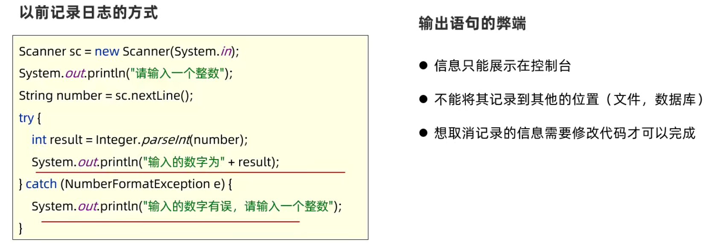
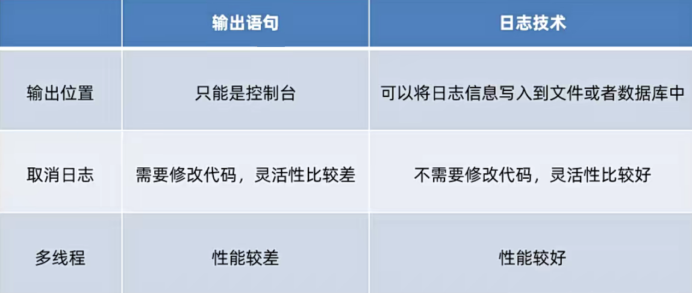
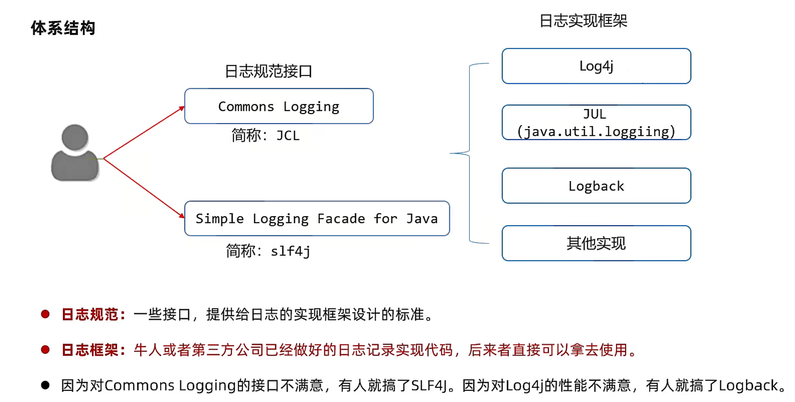
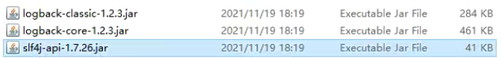
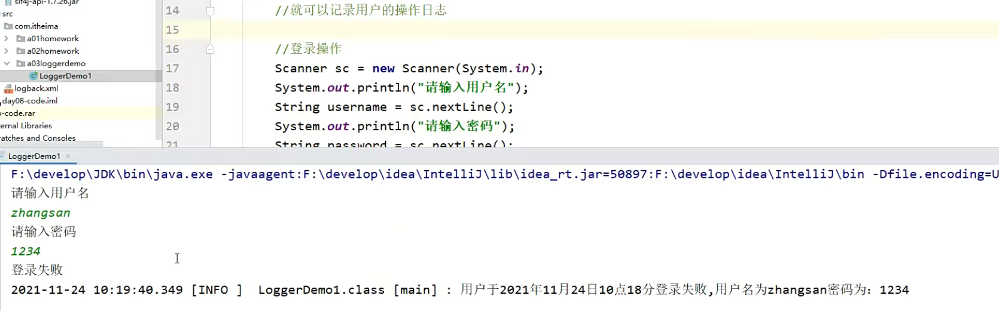
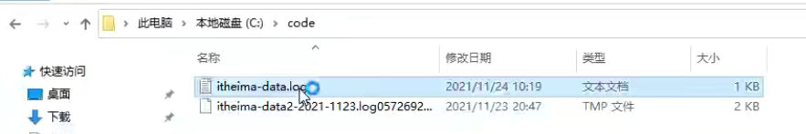
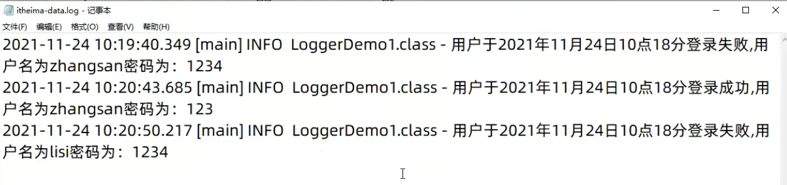
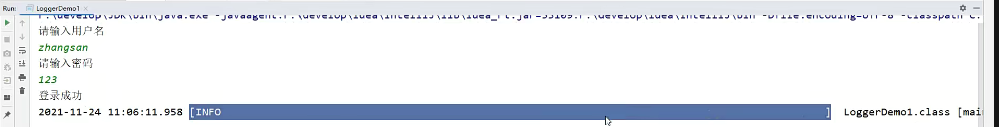

# 日志

## 一、引入

我们先来聊一聊什么是日志框架呢？日志框架又是一个什么样的东西？在代码当中，我们该如何的去操作？不着急，我们一 一的来。
首先先想一个问题，我们现在想要清楚的知道一个系统的运行过程和详情该怎么办？
那么在以前呢，我写输出语句啊，是不是就欧了呀？
但是你有没有想到输出语句，它其实是有弊端的。什么弊端？它是不是只能在控制台里面打下？你能把它搞到本地文件里面去吗？能不能？不能。



那以后我们在开发里面该怎么干？很简单，就用我们今天所说到的日志，那么日志它的功能非常的强大，我们一会回细说。那么这里我们要知道什么是日志呢？
其实就好比是我们生活中的日记。生活中的日记呢，就好比就是我们的日志一样，
它可以记录我们生活里面的点点滴滴。所有的事情我们都可以用日志，然后去记录。
那我们程序中的日志是什么？它可以用来我们记录程序运行过程中的所有信息。
它可以进行永久的存储，那么什么时候才能叫做永久存储？
是不是就是把这些信息都保存到了本地的文件里面啊？
是不是一旦到文件里面才能永久的存储啊？这个就是关于我们日志的强大之处，
它不仅仅能展示在控制台。而且还能记录在我们的文件当中，
以后想要看到的直接打开那个文件就可以了。


----

## 二、作用

第一个优势，它可以将我们系统执行的信息选择性的记录到我们指定的位置，会有以下的三个。
第一个跟以前一样，控制台里面会有。
第二个，他可以把这些信息呢直接记录在文件里面，做永久存储。
第三个它还可以放到数据库当中。
并且它可以随时以开关的形式控制，是否记录日志无需修改代码。
简单来说，我想要看日志，我就把它打开，我不想看我是不是可以随手把它关闭啊？
不需要去修改源代码，非常的方便。

**总结**

跟输出语句一样，可以把程序在运行过程中的详细信息都打印在控制台上。

利用log日志还可以把这些详细信息保存到文件和数据库中。



----

## 三、日志体系

### 1）总述

我们接下来看一下它的体系结构到底是什么样。
首先需要知道两个规范接口。

第一个叫做 `Commons Logging`

第二个叫做 `Simple Logging Facade for Java`，

接下来一起来看下面的那么这些规范性的接口是什么东西？

它其实就是提供给我们实现框架的一个设计标准。
什么标准？简单来说，接口里面是不是都是抽样方法呀？
那么如果说你有很多的实现类。那么这个时候你是不是要去实现你们的接口？
那么一旦实现接口，你要不要按照接口里面规范的方法去进行手写，那这个时候是不是就形成了一套规范的呢？

`Commons Logging接口规范` 简称 `JCL`，`J` 表示Java，`CL` 表示 `Commons Logging` 两个单词首字母的缩写。

`Simple Logging Facade for Java接口规范` 简称 `slf4j`。

接下来说实现框架。
实现框架就是一些非常牛逼的人，或者是一些第三方公司已经做好的实现类代码，这些代码我们不需要去改了，直接拿过来用就可以了

两套规范中最先出来的是 `JCL`，JCL用起来非常的尴尬，它里面的不太好用。
所以说有人对这个JCL接口规范不太满意，就搞出了另外一套好用的接口规范叫做 `slf4j。

在以前我们日志经常用的 `Log4j（Log For Java，在Java中写的一个Log日志）` 的性能不满意，有人就搞了 `Logback`。

那么一起来看一下这边的时间框架。

首先一开始是 `Log4j`，然后第二种是 `JUL（它是JDK自己集成的，看导包是java.util，但是它也不好用）`，再往下就是 `Logback(我们现在要学习的，相对来讲代码用起来非常的简单，性能也很高)`。



----

### 2）扩展

`slf4j` 其中的4直接读成4有点low，以后我们凡是看到在这种简称里面有4，或者是有二的情况，请你不要去念成4或者是2，4你要念for，2你要念two。

有的人说有没有其他的三四五六七八九的情况？没有，只有二跟四，

为什么呢？其实是有一个小小的细节的，
跟你简单的聊一聊。
我们比如说定一个方法，定一个方法，那么方法体不重要，重要的是上面的方法名。
假设我这一个方法的作用是把我们一些信息要去永久的保存到本地文件。
那么这个时候如果说我们想要把这个方法起的切名之意，我该怎么起？
首先，信息是不是我可以叫做 `info` 啊？
然后呢，把它保存到本地文件是不是需要写一个`ToFile`，合起来就是 `infoToFile` 我这么起是不是非常的见名知意，信息到文件是不是一下子就能看明白了？
那么在以前有一个程序员偷懒， `infoToFile` 中的 `to` 它没有写 `to`，而是 `2`，因为在英文中 `2` 的英文也是 `to`。
但是它这么一写，发现阅读性还挺强：以数字为中界，左边是一个单词，右边也是一个单词。
一眼就能看出来左边是一个单词，右边是一个单词，但是如果说你用以前的方式就是 `infoToFile` ，就需要用脑子去看，去区分这是三个单词。所以说这种习惯这种习惯就保留保留下来了。
那么这个时候呢，如果说以后我们自己在命名的方法当中有 `to` 你也可以写成 `2`，`For` 你可以写成四。这是一个习惯.
那以后我们在读的时候你就不能low了。看到二你要读成two，看到四你要读成for。

----

### 3）总结

1、日志的规范是什么？常见的有几种形式？

- 日志规范大多是一些接口，接口里面定义了很多抽象方法，这些抽象方法就规定了实现框架一定要按照规则去重写方法，这就叫做规范。
- 常见的规范是：`Commons Logging(JCL)`、`Simple Logging Facade for Java(slf4j)`

2、日志的实现框架有哪些常见的？

- Log4J
- Logback(我们重点学习的，其他的都大同小异)

----

## 四、Logback日志的快速入门

### 1）jar包介绍

`Logback` 是基于 `slf4j` 的日志规范实现的框架，性能比之前使用的 `log4j` 要好

官方网站：https://logback.qos.ch/index.html，由于 `Logback` 是别人写好的东西，我们就需要将比人写好的东西融入到IDEA中（专业叫做：导包），首先就需要先将别人写好的东西下载下来。

`logback` 主要分为三个技术模块

- `logback-core`：该模块为其他两个模块提供基础代码，必须有
- `logback-classic`：完整实现了slf4j API的模块。
- `logback-access`：与Tomcat 和 Jetty 等Servlet容器集成，以提供HTTP方法日志功能。（这里用不到就不导入了）

由于`logback` 是一个基于 `slf4j` 的日志框架， `slf4j` 是规范，规范中都是接口，因此需要导入



----

### 2）使用步骤

* 把第三方的代码导入到当前的项目当中

  新建lib文件夹，把jar粘贴到lib文件夹当中，全选后右键点击选择add as a ....

  检测导入成功：导入成功后jar包可以展开。在项目重构界面可以看到导入的内容

* 把配置文件粘贴到src文件夹下（而且必须是src）

* 在代码中获取日志对象

  ~~~java
  //getLogger()参数是类对象，类对象就是当前类的字节码文件对象
  //这个日志对象用了修饰符：private static final
  //static：在整个项目中，log日志是唯一的，共享的
  //final：获取完一次后，不想让别人去修改了
  //注意导包导的是slf4j的包
  private static final Logger LOGGER = LoggerFactory.getLogger("类对象");
  ~~~

* 调用方法打印日志

  ~~~java
  //手动写日志
  LOGGER.info("### 执行调用成功了...");
  ~~~

此时控制台会打印日志信息



还可以到文件中查看





----

## 五、配置文件

Logback日志系统的特性都是通过核心配置文件logback.xml控制的。

在这个里面可以规定日志怎么输出，输出到哪。

**Logback日志输出位置、格式设置**

- 通过logback.xml中的 `<appender>` 标签可以设置输出位置和日志信息的详细格式。
- 通常可以设置两个日志输出位置：控制台、系统文件中

`<pattern>%d{yyyy-MM-dd HH:mm:ss.SSS} [%-100level]  %c [%thread] : %msg%n</pattern>`：-100表示从左显示5个字符宽度

日志级别有 `TRACE, DEBUG, INFO, WARN, ERROR`，最常用的就是 `DEBUG, INFO`，但是最长的是5个字母，因此一般就写5



```xml
<?xml version="1.0" encoding="UTF-8"?>
<configuration>
    <!--
        CONSOLE ：表示当前的日志信息是可以输出到控制台的。
	    name：表示输出位置，后面的class表示哪个类来完成的往控制台输出的工作，即谁去输出的。
	    我们可以按住ctrl不松，点击ConsoleAppender，就可以跳转到这个类了，但是这个类具体怎么做的不需要我们操心，我们只需要知道是它做的就行了。
    -->
    <appender name="CONSOLE" class="ch.qos.logback.core.ConsoleAppender">
        <!--target：表示你是用什么形式输出到控制台。正常来将输出到控制台都是使用输出语句。
        输出流对象 默认 System.out，可以改为 System.err，表示错误输出，是红色，但是这个大部分用的不多。
        -->
        <target>System.out</target>
        <encoder>
            <!--
                pattern：展示的格式
                格式化输出：%d表示日期（后面指定展示的格式）
                %-5level：level表示级别，-5表示从左显示5个字符宽度，
                %c表示当前你操作的是哪个类名
                %thread表示线程名，例如main，即main线程
                %msg：日志消息，%n是换行符
                %n：换行符
			   []：如果加上，那么打印出来就有括号，如果不写，那么打印出来就没有括号
             -->
            <pattern>%d{yyyy-MM-dd HH:mm:ss.SSS} [%-5level]  %c [%thread] : %msg%n</pattern>
        </encoder>
    </appender>

    <!-- File是输出的方向通向文件的 name设置为FILE：表示当前的设置是跟文件相关的，后面的class表示是那个类完成的往文件输出的工作 -->
    <appender name="FILE" class="ch.qos.logback.core.rolling.RollingFileAppender">
        <encoder>
            <pattern>%d{yyyy-MM-dd HH:mm:ss.SSS} [%thread] %-5level %logger{36} - %msg%n</pattern>
            <charset>utf-8</charset>
        </encoder>
        <!--日志输出路径-->
        <file>C:/code/itheima-data.log</file>
        <!--指定日志文件拆分和压缩规则-->
        <rollingPolicy
                       class="ch.qos.logback.core.rolling.SizeAndTimeBasedRollingPolicy">
            <!--通过指定压缩文件名称，来确定分割文件方式-->
            <fileNamePattern>C:/code/itheima-data2-%d{yyyy-MMdd}.log%i.gz</fileNamePattern>
            <!--文件拆分大小-->
            <maxFileSize>1MB</maxFileSize>
        </rollingPolicy>
    </appender>

    <!--
	ALL：日志级别
    level:用来设置打印级别，大小写无关：TRACE, DEBUG, INFO, WARN, ERROR, ALL 和 OFF
   ， 默认debug
    <root>可以包含零个或多个<appender-ref>元素，标识这个输出位置将会被本日志级别控制。
    -->
    <root level="ALL">
        <!-- 表示当前的日志是可以输出到控制台也可以输出到文件里面，如果注释掉，那么就不会输出到这个位置。
 			上面是每种方式的配置，这里就相当于是一个开关。
			但是一般来讲我们是不会将它删掉的，因为我们想打印在控制台，也想让它在文件中也备份-->
        <appender-ref ref="CONSOLE"/>
        <appender-ref ref="FILE" />
    </root>
</configuration>
```

----

## 六、快速入门的Bug解决

有的同学C盘权限比较高，IDEA进不去里面获取到里面的东西，就可以修改地址。

---

## 七、日志级别

为什么要有日志级别？因为我们会根据不同的情况来选择不同的日志级别进行输出。

TRACE太小了，一般不会用到它的，我们从第二个开始看。

`DEBUGB` 表示在调试的时候要用到。

`INFO` 表示要记录一些用户的信息，就要用到它。

`WARN` 表示代码中出现一些警告的时候，要用到它。

`ERROR` 代码出错了就要用到这个。

用到最多的是 `DEBUG、INFO`

```
TRACE < DEBUG < INFO < WARN < ERROR
```

作用：用于控制系统中哪些日志级别是可以输出的，只输出级别不低于设定级别的日志信息。

还有两个特殊的：

​	ALL：输出所有日志

​	OFF：关闭所有日志

如下，如果写的是INFO，表示只输出级别不低于设定级别的日志信息，即大于等于自己（INFO、WARN、ERROR）

但一般这里写 `ALL` 就行了，表示打印所有

~~~xml
<root level="INFO">
    <appender-ref ref="CONSOLE"/>
    <appender-ref ref="FILE" />
</root>
~~~

PS：在写的时候大写小写都是可以的，因为在写的时候是忽略大小写的。


