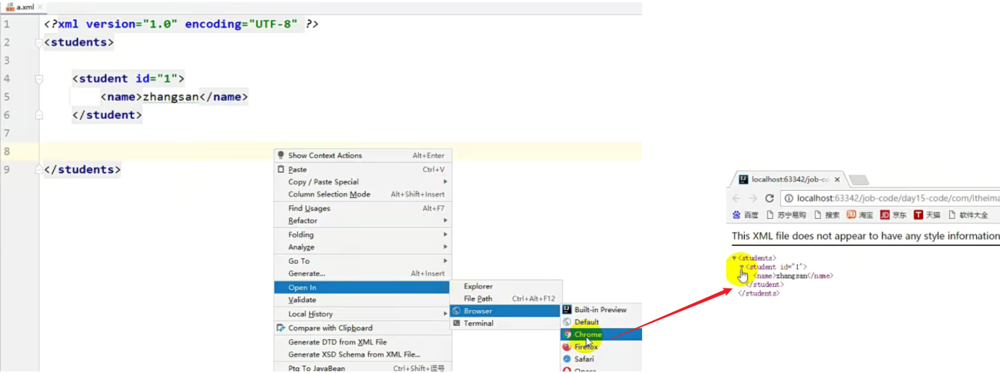
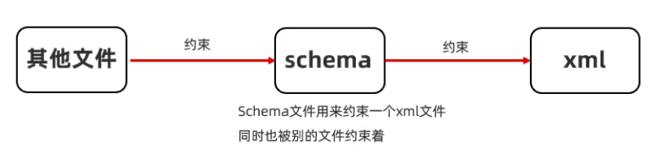
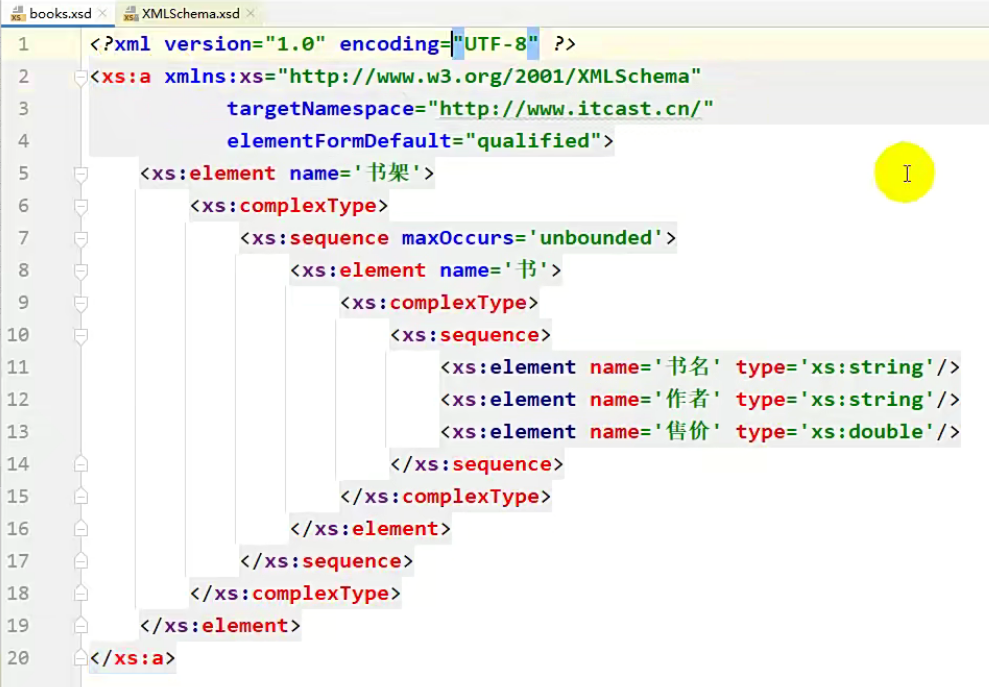
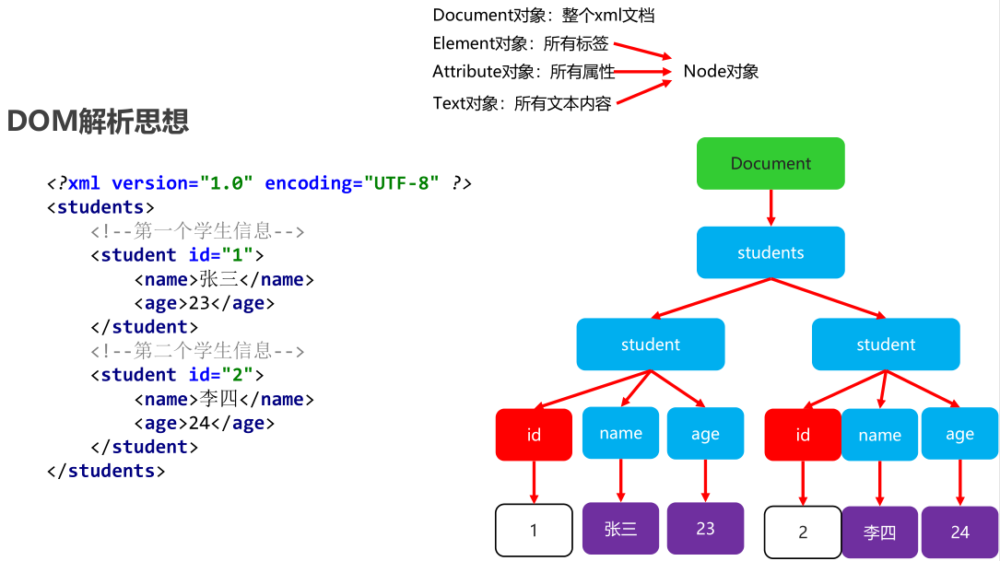
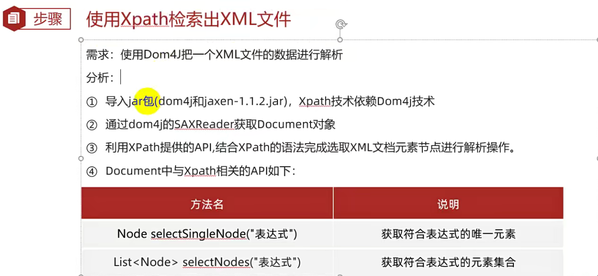
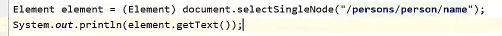
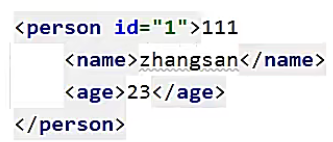

# 一、XML引入

XML在以后我们更多的是用来作为配置文件，那么什么是配置文件呢？

配置文件就是用来保存程序在运行时需要的一些参数。

例如IDEA的一些配置信息就是保存到了配置文件里面


常见的配置文件有如下几种


以IDEA为例，我们要配置信息，那么我们往txt文本文件中如何写？

非常简单，直接将它写到文本文件中，一个写一行就行了

但是这样配置会有一个小小的缺陷：光看配置文件，你能知道每个值分别表示什么意思吗？是不是不知道


因此此时就有了 `properties文件`，`properties` 中最大的特点就是：键和值相结合的形式，看到了键，就能之后后面的值表示什么意思了。

但是 `properties` 还没有解决所有的问题，像IDEA配置的信息比较简单，用 `properties` 非常的方便，但是如果要配置的信息比较复杂，那么 `properties` 就搞不定了。


例如写的拼图游戏，需要存游戏进度、游戏图片、游戏背景色

如下图，其实两种方式都不好


例如现在如果有多个用户去配置呢？这就太麻烦了，读起来的时候非常的不方便，例如找 `zhaoliu` 的游戏信息，还得一个一个去数，非常麻烦。代码写起来也很难受，首先需要将值都拿出来，然后再按照逗号来切，此时还需要来找 `zhaoliu` 的索引是第几个。

因此 `properteis` 配置信息比较简单的时候，用 `properties` 会非常的方便。

但是如果有多个用户同时配置，`properties` 就搞不定了。


当配置信息比较复杂的时候，我们就可以使用 `XML`。

XML优点：易于阅读。可以配置成组的数据。

以后选择配置文件的时候，TXT文件肯定不选


XML在配置的时候非常的方便，它可以配置成组成组的数据。

如下图就是一个XML文件，它结构非常的复杂，但是读起来很方便。在成组成组的数据非常的简单


-----

# 二、XML作为配置文件优势

万维网联盟(W3C)

万维网联盟(W3C)创建于1994年，又称W3C理事会。1994年10月在麻省理工学院计算机科学实验室成立。
建立者： Tim Berners-Lee (蒂姆·伯纳斯·李)。
是Web技术领域最具权威和影响力的国际中立性技术标准机构。
到目前为止，W3C已发布了200多项影响深远的Web技术标准及实施指南，

+ 如广为业界采用的超文本标记语言HTML（标准通用标记语言下的一个应用）、

+ 可扩展标记语言XML（标准通用标记语言下的一个子集）

+ 以及帮助残障人士有效获得Web信息的无障碍指南（WCAG）等

  有效促进了Web技术的互相兼容，对互联网技术的发展和应用起到了基础性和根本性的支撑作用。

  

XML的全称为（EXtensible Markup Language），是一种可扩展的标记语言。

标记语言：通过标签来描述数据的一门语言（标签有时候我们称之为元素）

例如下面的 `<name></name>`  就是标签，`张三` 是 `name标签` 里面的值。

~~~xml
<name>张三</name>
~~~

可扩展：标签的名字是可以自己定义的。

规则：

1. 名称可以包含字母、数字以及其他的字符
2. 名称不能以数字或者标点符号开始
3. 名称不能以字母 xml （或者 Xml、 XML等等）开始
4. 名称不能包含空格

XML作用：

- 用于进行存储数据和传输数据（这个作用用的很少。）

  **存储数据**（例如上面将 `张三` 就是存储在XML文件中，而XML文件又是存储在本地文件中的）

  **传输数据**（由于XML格式是固定的，如果现在有两个系统（A系统和B系统），A系统可以给B系统传XML文件，B系统接收到后，就可以将XML文件进行解析，获取到里面的一些数据，同样的道理，B系统可以回一个文件给A系统）

- 作为软件的配置文件

与html的区别

1. xml标签都是自定义的，html标签是预定义。
2. xml的语法严格，html语法松散
3. xml是存储数据的，html是展示数据

----

# 三、XML的基本语法

## 1）后缀名

创建一个XML类型的文件，要求文件的后缀必须使用 `xml(大写小写都无所谓，但是平时习惯性会写成小写的)`，例如 `hello_world.xml`


---

## 2）文档声明

文档声明必须是**第一行第一列**，其实就是用来声明现在写的XML文件，里面会写两个属性。

格式：`<?xml 属性列表 ?> ` 

注意并且要顶格写，并且前面还不能加空格，否则也会报错！


- version：该属性是必须存在的，只能写成1.0

- encoding：该属性不是必须的，表示打开当前xml文件的时候应该是使用什么字符编码表，如果不写，默认是默认值：ISO-8859-1，但是我们在实际开发中默认中的编码表就是UTF-8，不能写成其他的。

- standalone：是否独立。（但现在这个属性几乎都不设置了）` 这个文件有可能会依赖于其他的文件`

  取值：

  ​		yes：不依赖其他文件
  ​		no：依赖其他文件

~~~xml
<?xml version="1.0" encoding="UTF-8" standalone="yes”?>
~~~

这个格式是不需要背的，IDEA会有自动提示


---

## 3）标签

标签由一对尖括号和合法标签符组成：`<name></name>`，必须存在一个根标签，有且只能有一个。

- 一对尖括号指的就是 `<name></name>`

- 合法：指的就是里面名字的定义，虽然可以任意，但是我们代码会学习约束，即在开发中，它的名字还是会给你进行一个限定

- 根标签：写在最外面的标签，例如下图的 `students` 就是根标签，我们如果要写其他的标签，必须写在 `students` 里面

  

标签必须成对出现，有开始有结束。例如 `<name>` 就是开始标签，`</name>` 就是结束标签，结束标签比开始标签多 `/`

特殊的标签可以不成对，但是必须有结束标记，如：`<br/>`。

标签中可以定义属性，属性和标签名用空格隔开，属性值必须用引号引起来，例如 `<student id = "1"></name>`，其中 `id` 就是属性。

标签需要正确的嵌套


这些标签的语法是不需要你去背的，你只需要知道我们在写XML文件的时候，IDEA报错了，我们该如何去改就行了。

如果代码写对了，用浏览器打开是不会报错的



如果代码写错了，浏览器就会直接报错


---

## 4）注释

XML文件中可以定义注释信息，它的注释也透露着标签的味道。

IDEA注释快捷键：选中要注释的内容，然后<kbd>ctrl + /</kbd>，多行注释也行 <kbd>ctrl + shift + /</kbd>，跟IDEA中原来写代码的注释快捷键是一样的


---

## 4）特殊字符

特殊字符出现的原因是因为，在XML中是有固定含义的，例如 `<` 、 `>` 表示标签的开始/结束，`&`：和，`'`、`"` 写属性值的时候会用到，这些符号是不可能直接使用的，如果想用，就需要使用特殊符号进行修改。

XML文件中可以存在以下特殊字符。

```java
&lt; < 小于
&gt; > 大于
&amp; & 和号
&apos; ' 单引号
&quot; " 引号
```

例如 `1<2`


----

## 5）CDATA区

如果在XML文件中，特殊字符过多，难道每一个符号都要写成特殊字符吗？太麻烦了。

XML文件中可以存在CDATA区，此时它会将CDATA区中所有的内容，当成一个普通的文本来进行解析，没有什么特殊含义。

在该区域中的数据会被原样展示

~~~java
<![CDATA[ …内容… ]]>
~~~


-----

# 四、编写XML文件

在Java中的括号一定要成对书写，但是XML千万不要这样，如果XML中成对书写，会让我们编写非常的麻烦。

在XML中应该从左到右顺序书写，当写到 `<persons` ，最后敲 `>` 的时候，结束标签会自动生成。


---

# 五、XML的约束

## 1）什么是文档约束？

XML是作为软件的配置文件而存在的，当软件刚开始运行的时候，就需要去读取并解析 `XML文件` 中的内容。

此时问题就来了，XML文件编写的方式，要不要按照软件规定的格式书写呢？

如果XML虽然乱写，软件是解析不了的。

由于XML文件可以自定义标签，导致XML文件可以随便定义，但是程序在解析的时候在解析的时候有可能解析不到数据。


因此我们自己在编写XML文件的时候，一定要按照软件所规定的要求来进行书写，`软件所规定的要求` 专业来讲就叫做 `文档约束`。

**文档约束：用来限定XML文件中的标签以及属性应该怎么写。**

此时的这个限定就可以将它理解为是一个强制的要求，强制要求程序员必须按照文档约束的规定来变成XML文件。

文档约束有两个分类，所有的约束我们只需要了解一下就行了，因为以后我们不会自己去编写约束，约束一般是别人写的，软件写的，我们要掌握的是：别人给你个约束，去写一个符合要求的XML文件就行了。

- DTD
- schema

----

## 2）DTD约束


### ① dtd文件内容介绍

我们要知道，约束本身它也是一个文件，文件的后缀名就叫做 `.dtd`

定义一个元素的格式为：`<!ELEMENT 元素名 元素类型>`，`<!ELEMENT 书架（书+）` 表示：根标签只能是书架，如果叫其他的就错了。

书架后面有个括号，表示是书架里面的子标签是 `书`，`+` 表示：正则表达式中的 `+`，表示它出现的次数必须是一个或多个。

> 复杂元素：
> ​	直接写子元素名称. 多个子元素可以使用","或者"|"隔开；
> ​	","表示定义子元素的顺序 ; "|": 表示子元素只能出现任意一个
> ​	"?"零次或一次, "+"一次或多次, "*"零次或多次;如果不写则表示出现一次

再往下，它定义了 `ELEMENT 书` ，这个里面应该有 `书名、作者、售价` 这三个子标签。

然后下面就对 `书名、作者、售价` 这三个子标签又分别做了定义。

`<!ELEMENT 书名（#PCDATA）` ：书名里面就没有其他的子标签了，但是书名里面的文本内容必须是 `PCDATA`，`PCDATA` 就是文本数据的意思。

作者、售价同样也是 `PCDATA` ，即文本数据。

> 简单元素：
>
> ​	EMPTY: 表示标签体为空
>
> ​	ANY: 表示标签体可以为空也可以不为空
>
> ​	PCDATA: 表示该元素的内容部分为字符串
>
> 


定义一个属性的格式为：`<!ATTLIST 元素名称 属性名称 属性的类型 属性的约束>`

> 属性的类型：
> ​	CDATA类型：普通的字符串
>
> 属性的约束:
>
> ​	// #REQUIRED： 必须的
> ​	// #IMPLIED： 属性不是必需的
> ​	// #FIXED value：属性值是固定的

---

### ② 导入dtd

本地dtd：让电脑中的本地文件去约束 / 限定XML文件的书写


接下来我们需要编写XML文件，导入这个dtd，简单来说就是让XML文件跟dtd两者之间产生关联，这样XML文件才能按照你的要求来写。

----

### ③ 代码示例

将 `book.dtd` 粘贴到与 `a.xml` 同包下，可以发现，在写代码的时候已经有提示了


直接回车，可以发现直接自动生成了


但是我们要写成标准的，这里相对路径是相对于本文件而言的。


如果此时成功引入，我们将鼠标放到文件名上面，然后按住 `ctrl` 不松，点击后，就会跳转到对应的dtd里面了。


----

#### 引入本地DTD约束

```xml
// 这是persondtd.dtd文件中的内容,已经提前写好
<!ELEMENT persons (person)>
<!ELEMENT person (name,age)>
<!ELEMENT name (#PCDATA)>
<!ELEMENT age (#PCDATA)>

// 在person1.xml文件中引入persondtd.dtd约束
<?xml version="1.0" encoding="UTF-8" ?>
<!DOCTYPE persons SYSTEM 'persondtd.dtd'>

<persons>
    <person>
        <name>张三</name>
        <age>23</age>
    </person>

</persons>
```

#### 在xml文件内部引入

```xml
<?xml version="1.0" encoding="UTF-8" ?>
<!DOCTYPE persons [
        <!ELEMENT persons (person)>
        <!ELEMENT person (name,age)>
        <!ELEMENT name (#PCDATA)>
        <!ELEMENT age (#PCDATA)>
        ]>

<persons>
    <person>
        <name>张三</name>
        <age>23</age>
    </person>

</persons>
```

#### 引入网络dtd

```xml
<?xml version="1.0" encoding="UTF-8" ?>
<!DOCTYPE persons PUBLIC "dtd文件的名称" "dtd文档的URL">

<persons>
    <person>
        <name>张三</name>
        <age>23</age>
    </person>

</persons>
```

----

### ④ 弊端

它不能约束具体的数据类型。

例如书名，只能规定它是个文本内容，但是它不能限定它是字符串还是整数

~~~xml
<!ELEMENT 书名（#PCDATA）
~~~

所以此时有了第二种约束文件：schema

---

### ⑤  schema和dtd的区别

1. schema约束文件也是一个xml文件，符合xml的语法，这个文件的后缀名.xsd
2. 一个xml中可以引用多个schema约束文件，多个schema使用名称空间区分（名称空间类似于java包名）
3. dtd里面元素类型的取值比较单一常见的是PCDATA类型，但是在schema里面可以支持很多个数据类型
4. schema 语法更加的复杂

----

## 4）schema

### ① schema介绍

这种约束了解一下就行了，在以后schema文件不会自己写，都是软件写好的，或者别人写好的东西，我们只需要按照对应的要求去写上符合对应要求的XML文件就行了。

schema可以约束具体的数据类型，约束能力更加强大。

schema本身也是一个xml文件，既然它本身也是一个xml文件，因此它本身也需要受到其他约束文件的约束，所以schema本身自己在写的时候也非常的严谨。



第二步是与XML文件关联，没关联肯定没办法进行约束。

第三步就可以按照要求去编写XML文件了


---

### ② schema文件内容介绍

之前说过，schema本身也是XML文件，所以一开始有文档声明。

并且schema本身也是XML文件，因此它本身也会收到其他文件约束，即 `http://www.w3.org/2001/XMLSchema` 中的文件，这个文件是网络中的文件。这里可以将它理解为Java中的Object，也就是最顶级的。

由于这也是一个schema，schema可以理解为顶级约束下面的一个子约束。


可以ctrl按住不动，然后点进去，可以发现IDEA已经集成了。


----

并且如果将根标签改为其他的，此时就会报错



其实就是因为 `http://www.w3.org/2001/XMLSchema` 这个文件中肯定给schema起了个名字。

如下，定义了一个 `element标签`，名字叫做 `schema`，就是因为在这个文件里面定义了，因此我才能使用


----

接下来往下看，有一个targetNamespace，这个叫命名空间。

这个命名空间我们一般会选择一个网址，由于当前的schema文件需要约束其他的XML文件，其他的XML文件在引用的时候就需要用到这个网址，这个网址其实没什么意义，我们可以随便写，它的作用就是：其他的XML文件用你当前的schema的时候要用到的一个数据。


---

再往下，这句话没有什么实际的意义，它表示你当前的schema文件是不是一个格式良好的文件，那这不废话吗，肯定是。

因此这个就是一个固定格式，我们记住就好了。


----

重点了解的就是下面两句


-----

接下来往下看，最外面的这个，它定义的是一个element，即元素，最外面的元素肯定是根标签，根标签的名字叫做 `书架`

再往下， `complexType`，表示当前书架这个元素，它是一个复杂的标签（即书架里面还可以有其他的内容）。

`sequence` ：顺序的意思，即书架里面所定义的所有标签一定要按照我的顺序来。

但是在这里只有一个 `书` 标签。

`maxOccurs`：规定了它最大的次数，`unbounded`，即 `没有上线`。

如果 `maxOccur='1'`，那就表示书只能出现一次。

再往下，里面又定义了一个标签 `<xc:element name='书'>`，这个书是在书架里面的，它作为书架的子标签，也是一个复杂的标签，里面也有其他元素。

再往下，`书名` 是 `书` 的子标签，`type` 为 `String`，此时就规定了它的类型了。


----

### ③ 代码示例

同样的将schema文件放到代码的同包下，此时写代码就会有自动提示，并且会自动补全。

只要将schema文件粘贴到项目中，IDEA就会自动解析这个schema文件


---

### ④ 编写schema约束

1，创建一个文件，这个文件的后缀名为.xsd。
2，定义文档声明
3，schema文件的根标签为： <schema>
4，在<schema>中定义属性：
​	xmlns=http://www.w3.org/2001/XMLSchema
5，在<schema>中定义属性 ：
​	targetNamespace = 唯一的url地址，指定当前这个schema文件的名称空间。
6，在<schema>中定义属性 ：
​	elementFormDefault="qualified“，表示当前schema文件是一个质量良好的文件。
7，通过element定义元素
8，判断当前元素是简单元素还是复杂元素


----

### ⑤ 引入schema约束

这个xml文件还要写一个 `-instance` 表示它是顶级约束下的一个实例，格式是固定的


光写顶级约束没有用，还需要写当前xml文件被哪个schema所约束的。``<targetNamespace>targetNamespace="http://www.itcast.cn/"` 表示：如果别人要用我当前的schema就需要用到这个地址，所以这地址如果我们写成标准的引入方式，就需要将这个地址写在第二个 `xmlns` 这里。


由于两个xmlns属性重复了，就需要给其中一个xmlns起一个别名，一般我们会给上面这个起个别名。这个别名可以是任意的，但是一般我们都会把它叫做xsi。

第四点中的名称空间，也就是将上面 `xmlns(不带别名的)` 中的地址再写一遍，文件路径：当前这个schema文件在哪，路径可以是 `本地 / 网址`。


----

### ⑤ 示例

在我们自己写的xml中只有一个约束的地址，这个地址需要跟 `targetNamespace` 保持一致，因此 `targetNamespace` 就是用来给别人用的，别人在以后如果想要用到这个schema文件，就需要用到这个地址，现在就用到了。


----

# 六、xml解析【应用】

xml解析就是从xml中配置的数据一个一个的获取出来。

XML的数据的作用是什么，最终需要怎么处理？

- 存储数据、做配置信息、进行数据传输
- 最终需要将XML文件加载到内存里面，然后被程序进行读取，解析里面的内容

在XML文件中，有两种解析方式

- SAX解析
- DOM解析

SAX就跟IO里面的 `readline()` 一样，一次只读一行，也是从上往下逐行扫描。

由于它没有把整体的xml文件都加载到内存，所以在SAX解析中，它是不能获取整个XML的结构，因此它只能读，不能添加，不能删除。

在XML文件中，不管是删除或者添加，都需要通过父元素去操作，由于它是逐行的扫描，因此它获取不到它的父，因此它删除不了。

并且SAX的优点也可以忽略了，现在电脑内存都很大了，因此SAX这种解析方式我们不会使用了，用的是DOM。

DOM的缺点在硬件中也可以忽略不计了。


DOM肯定是不需要我们自己写的，自己写非常的麻烦，在Java、第三方都提供了各种各样的工具

常见的解析工具

+ JAXP: SUN公司提供的一套XML的解析的API（即Java自带的），但是这种方式不太好用，代码写起来非常复杂，所以也不会用它。

+ JDOM: 由于JAXP不好用，开源组织提供了一套XML的解析的API-jdom，它基于JAVA的技术对XML文档实现解析、生成、序列化以及多种操作。

+ DOM4J: 随着版本不断更新，JDOM升级成了DOM4J（Dom For Java），简单来说就是利用Java和Dom思想进行解析。

  具有性能优异、功能强大和极其易使用的特点，它的性能超过sun公司官方的dom技术，同时它也是一个开放源代码的软件，Hibernate也用它来读写配置文件。

+ jsoup：功能更强大的DOM方式的XML解析开发包，但是我们更多不会用它来解析XML，而是HTML

+ pull： 主要应用在Android手机端解析XML

我们学习的是 `DOM4J`

----

# 七、DOM的解析思想

DOM(Document Object Model)文档对象模型：就是把文档的各个组成部分看做成对应的对象。

会把xml文件全部加载到内存，这个整体在DOM中有一个对象去表示：Document，将整个 XML 文档的每一个标签元素视为一个对象

在内存中形成一个树形结构,再获取对应的值

- Document对象：整个xml文档
- Element对象：标签 / 元素 / 节点
- Attribute对象：属性
- Text对象：文本内容

`Element对象、Attribute对象、Text对象` 有一个共同的父类： `Node对象`，总的来说在整个XML中所有的内容都可以认为是 `节点`



----

# 八、dom4j获取文档对象

解析的准备工作

1. 我们可以通过网站：https://dom4j.github.io/ 去下载dom4j

2. 将提供好的dom4j-1.6.1.zip解压,找到里面的dom4j-1.6.1.jar

3. 在idea中当前模块下新建一个libs文件夹,将jar包复制到文件夹中

4. 选中jar包 -> 右键 -> 选择add as library即可

接下来就要来学习dom4j怎么用了，在第三方jar包中一般都会给我们提供 `docs文档`，找到 `index.html` 文件，这个文件表示它是首页，在这个里面就有它的使用说明


以后还会看到各种各样的index.html这样的文档。

FAQ一般是关于当前jar包问题的解释。

`Quick start：快速开始`，里面有一个 `Parsing XML`，即解析XML文件。这里面它有实例代码


~~~java
//1.获取一个解析器对象
//在底层它先通过SAX方式一行一行的将XML文件进行读取，然后再整体加载到内存中
//因此在底层它是SAX跟DOM两个相结合的方式来进行解析的。
SAXReader saxReader = new SAXReader();
//2.利用解析器把xml文件加载到内存中,并返回一个文档对象，得到文档对象后，就可以一层一层的去扒开里面的东西了
Document document = saxReader.read(new File("myxml\\xml\\student.xml"));
~~~

需求

+ 解析提供好的xml文件
+ 将解析到的数据封装到学生对象中
+ 并将学生对象存储到ArrayList集合中
+ 遍历集合

代码实现

~~~xml
<?xml version="1.0" encoding="UTF-8" ?>
<!--注释的内容-->
<!--本xml文件用来描述多个学生信息-->
<students>

    <!--第一个学生信息-->
    <student id="1">
        <name>张三</name>
        <age>23</age>
    </student>

    <!--第二个学生信息-->
    <student id="2">
        <name>李四</name>
        <age>24</age>
    </student>

</students>
~~~

```java
/**
 * 利用dom4j解析xml文件
 */
public class XmlParse {
    public static void main(String[] args) throws DocumentException {
        //1.获取一个解析器对象
        //在底层它先通过SAX方式一行一行的将XML文件进行读取，然后再整体加载到内存中
        //因此在底层它是SAX跟DOM两个相结合的方式来进行解析的。
        SAXReader saxReader = new SAXReader();
```


~~~java
//2.利用解析器把xml文件加载到内存中,并返回一个文档对象，得到文档对象后，就可以一层一层的去扒开里面的东西了
//read方法中可以传入很多类型的，文件、字符流、字节流、字符串，但是字符串不要去用，因为它里面变量的名字叫systemId，你不要给它传一个文件的路径，有时候它会解析，但是很多时候会出一些小问题，在加载/解析的时候会出错。
//最保险的方式就是用File，如果要用网络中的，就传URL
Document document = saxReader.read(new File("myxml\\xml\\student.xml"));
~~~

打印document对象的结果如下，可以发现就是后面这个文件的Document文档对象

拿到document就表示我已经拿到了xml文件的整体


下面一层一层的获取里面的内容就好了。


字节解析的时候一定要一层一层的解析

~~~java
//3.获取到根标签，并且根标签只能有一个，因此方法没有s，而是Element
Element rootElement = document.getRootElement();
//4.通过根标签来获取student标签
//elements():可以获取调用者所有的子标签.会把这些子标签放到一个集合中返回.
//elements("标签名"):可以获取调用者所有的指定的子标签,传入需要获取的子标签名，会把这些子标签放到一个集合中并返回
//PS：只能获取到它最直接的子标签，再里面就获取不到了
//List list = rootElement.elements();
List<Element> studentElements = rootElement.elements("student");
//System.out.println(list.size());

//用来装学生对象
ArrayList<Student> list = new ArrayList<>();

//5.遍历集合,得到每一个student标签
for (Element element : studentElements) {
    //获取到标签名
    sout(element.getName())
    //element依次表示每一个student标签

    //获取id这个属性，由于id不是标签（element）而是属性，因此方法名叫attribute
    Attribute attribute = element.attribute("id");
    //获取id的属性值
    String id = attribute.getValue();

    //获取name标签
    //element("标签名"):获取调用者指定的子标签
    Element nameElement = element.element("name");
    //获取这个标签的标签体内容
    String name = nameElement.getText();

    //获取age标签
    Element ageElement = element.element("age");
    //获取age标签的标签体内容
    String age = ageElement.getText();

    //            System.out.println(id);
    //            System.out.println(name);
    //            System.out.println(age);
    //将学生对象存储到集合中，属性的类型需要和XML中的保持一致
    //以后我们在解析XML文件的时候，第一反应就是将它们都封装成一个对象，否则解析出来的数据都是零散的
    Student s = new Student(id, name, Integer.parseInt(age));
    list.add(s);
}
//遍历操作
for (Student student : list) {
    System.out.println(student);
}
~~~

----

# 九、xpath

## 1）介绍

如果我不需要获取XML文件整体，而是获取文件中的一标签里面的值，就可以只用XPath。

XPath在解析XML文档方面提供了独树一帜的路径思想，更加优雅、高效。

XPath使用**路径表达式**来定位XML文档中的元素节点或属性节点。

这里的路径跟IO流学的路径不一样，IO流中写的是在硬盘中真实存在的。

而在XML文件中路径也是从根节点开始，一层一层找到自己想要获取的标签。

它有两种写法：单斜线和双个斜线的写法。


由于XPath也是第三方提供的，所以我们需要导入一个Jar包。

要注意的是 XPath技术依赖Dom4j技术，即XPath底层用的还是dom4j，只不过代码不需要我们自己写了而已。

因此在使用XPath的时候，除了导XPath的jar包，还需要导入Dom4j的jar包。


获取符合表达式的唯一元素时，如果有多个元素，就会获取第一个。



---

## 2）代码示例

XPath的四大检索方案

- 绝对路径

  

- 相对路径

- 全文检索

- 属性查找


### 绝对路径检索单个



----

### 相对路径检索

获取的时候就不是使用document去获取了，因为相对路径应该是有个参照物的。


一开始的 `.` 表示自己


----

### 全文检索

全文检索：即在整个文档中查找。

它是两个 `/`，如果使用 `//` 跟 `/` 相结合的方式查找，一定有一个前提条件：name一定是contact的子节点

`//contact//name`：可以跨级


---

### 属性检索

在全文中搜索属性，或者带属性的元素

 语法如下


泛型需要写 `Attribute`


---

如果想要让父级标签有文本内容，写一下即可



如果打印出来出来的有很多空格，表示 `getText()` 将很多空格、换行也获取到了。

但是一般带有子标签的父级标签我们不会去写它的文本内容。


---


