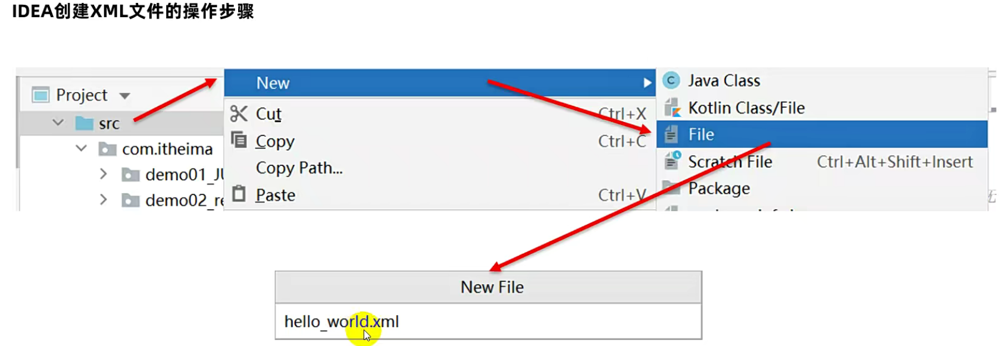

# 一、XML引入

XML在以后我们更多的是用来作为配置文件，那么什么是配置文件呢？

配置文件就是用来保存程序在运行时需要的一些参数。

例如IDEA的一些配置信息就是保存到了配置文件里面


常见的配置文件有如下几种


以IDEA为例，我们要配置信息，那么我们往txt文本文件中如何写？

非常简单，直接将它写到文本文件中，一个写一行就行了

但是这样配置会有一个小小的缺陷：光看配置文件，你能知道每个值分别表示什么意思吗？是不是不知道


因此此时就有了 `properties文件`，`properties` 中最大的特点就是：键和值相结合的形式，看到了键，就能之后后面的值表示什么意思了。

但是 `properties` 还没有解决所有的问题，像IDEA配置的信息比较简单，用 `properties` 非常的方便，但是如果要配置的信息比较复杂，那么 `properties` 就搞不定了。


例如写的拼图游戏，需要存游戏进度、游戏图片、游戏背景色

如下图，其实两种方式都不好


例如现在如果有多个用户去配置呢？这就太麻烦了，读起来的时候非常的不方便，例如找 `zhaoliu` 的游戏信息，还得一个一个去数，非常麻烦。代码写起来也很难受，首先需要将值都拿出来，然后再按照逗号来切，此时还需要来找 `zhaoliu` 的索引是第几个。

因此 `properteis` 配置信息比较简单的时候，用 `properties` 会非常的方便。

但是如果有多个用户同时配置，`properties` 就搞不定了。


当配置信息比较复杂的时候，我们就可以使用 `XML`。

XML优点：易于阅读。可以配置成组的数据。

以后选择配置文件的时候，TXT文件肯定不选


XML在配置的时候非常的方便，它可以配置成组成组的数据。

如下图就是一个XML文件，它结构非常的复杂，但是读起来很方便。在成组成组的数据非常的简单


-----

# 二、XML作为配置文件优势

万维网联盟(W3C)

万维网联盟(W3C)创建于1994年，又称W3C理事会。1994年10月在麻省理工学院计算机科学实验室成立。
建立者： Tim Berners-Lee (蒂姆·伯纳斯·李)。
是Web技术领域最具权威和影响力的国际中立性技术标准机构。
到目前为止，W3C已发布了200多项影响深远的Web技术标准及实施指南，

+ 如广为业界采用的超文本标记语言HTML（标准通用标记语言下的一个应用）、

+ 可扩展标记语言XML（标准通用标记语言下的一个子集）

+ 以及帮助残障人士有效获得Web信息的无障碍指南（WCAG）等

  

XML的全称为（EXtensible Markup Language），是一种可扩展的标记语言。

标记语言：通过标签来描述数据的一门语言（标签有时候我们称之为元素）

例如下面的 `<name></name>`  就是标签，`张三` 是 `name标签` 里面的值。

~~~xml
<name>张三</name>
~~~

可扩展：标签的名字是可以自己定义的。

XML作用：

- 用于进行存储数据和传输数据（这个作用用的很少。）

  **存储数据**（例如上面将 `张三` 就是存储在XML文件中，而XML文件又是存储在本地文件中的）

  **传输数据**（由于XML格式是固定的，如果现在有两个系统（A系统和B系统），A系统可以给B系统传XML文件，B系统接收到后，就可以将XML文件进行解析，获取到里面的一些数据，同样的道理，B系统可以回一个文件给A系统）

- 作为软件的配置文件

----

# 三、XML的基本语法

## 1）后缀名

创建一个XML类型的文件，要求文件的后缀必须使用 `xml(大写小写都无所谓，但是平时习惯性会写成小写的)`，例如 `hello_world.xml`



---

## 2）文档声明

文档声明必须是**第一行第一列**，其实就是用来声明现在写的XML文件，里面会写两个属性。

注意并且要顶格写，并且前面还不能加空格，否则也会报错！


- version：该属性是必须存在的，只能写成1.0

- encoding：该属性不是必须的，表示打开当前xml文件的时候应该是使用什么字符编码表，默认就是UTF-8，并且我们在实际开发中默认中的编码表就是UTF-8，不能写成其他的。

- standalone: 该属性不是必须的，描述XML文件是否依赖其他的xml文件，取值为yes/no

~~~xml
<?xml version="1.0" encoding="UTF-8" standalone="yes”?>
~~~

这个格式是不需要背的，IDEA会有自动提示


---

## 3）标签

标签由一对尖括号和合法标签符组成：`<name></name>`，必须存在一个根标签，有且只能有一个。

- 一对尖括号指的就是 `<name></name>`

- 合法：指的就是里面名字的定义，虽然可以任意，但是我们代码会学习约束，即在开发中，它的名字还是会给你进行一个限定

- 根标签：写在最外面的标签，例如下图的 `students` 就是根标签，我们如果要写其他的标签，必须写在 `students` 里面

  

标签必须成对出现，有开始有结束。例如 `<name>` 就是开始标签，`</name>` 就是结束标签，结束标签比开始标签多 `/`

特殊的标签可以不成对，但是必须有结束标记，如：`<br/>`。

标签中可以定义属性，属性和标签名用空格隔开，属性值必须用引号引起来，例如 `<student id = "1"></name>`，其中 `id` 就是属性。

标签需要正确的嵌套


这些标签的语法是不需要你去背的，你只需要知道我们在写XML文件的时候，IDEA报错了，我们该如何去改就行了。

如果代码写对了，用浏览器打开是不会报错的


如果代码写错了，浏览器就会直接报错


---

## 4）注释

XML文件中可以定义注释信息，它的注释也透露着标签的味道。

IDEA注释快捷键：选中要注释的内容，然后<kbd>ctrl + /</kbd>，多行注释也行 <kbd>ctrl + shift + /</kbd>，跟IDEA中原来写代码的注释快捷键是一样的


---

## 4）特殊字符

特殊字符出现的原因是因为，在XML中是有固定含义的，例如 `<` 、 `>` 表示标签的开始/结束，`&`：和，`'`、`"` 写属性值的时候会用到，这些符号是不可能直接使用的，如果想用，就需要使用特殊符号进行修改。

XML文件中可以存在以下特殊字符。

```java
&lt; < 小于
&gt; > 大于
&amp; & 和号
&apos; ' 单引号
&quot; " 引号
```

例如 `1<2`


----

## 5）CDATA区

如果在XML文件中，特殊字符过多，难道每一个符号都要写成特殊字符吗？太麻烦了。

XML文件中可以存在CDATA区，此时它会将CDATA区中所有的内容，当成一个普通的文本来进行解析，没有什么特殊含义。

在该区域中的数据会被原样展示

~~~java
<![CDATA[ …内容… ]]>
~~~


-----

# 四、编写XML文件

在Java中的括号一定要成对书写，但是XML千万不要这样，如果XML中成对书写，会让我们编写非常的麻烦。

在XML中应该从左到右顺序书写，当写到 `<persons` ，最后敲 `>` 的时候，结束标签会自动生成。


---

# 五、XML的约束

## 1）什么是文档约束？

XML是作为软件的配置文件而存在的，当软件刚开始运行的时候，就需要去读取并解析 `XML文件` 中的内容。

此时问题就来了，XML文件编写的方式，要不要按照软件规定的格式书写呢？

如果XML虽然乱写，软件是解析不了的。

由于XML文件可以自定义标签，导致XML文件可以随便定义，但是程序在解析的时候在解析的时候有可能解析不到数据。


因此我们自己在编写XML文件的时候，一定要按照软件所规定的要求来进行书写，`软件所规定的要求` 专业来讲就叫做 `文档约束`。

文档约束：用来限定XML文件中的标签以及属性应该怎么写。

**此时的这个限定就可以将它理解为是一个强制的要求，强制要求程序员必须按照文档约束的规定来变成XML文件。**

文档约束有两个分类，所有的约束我们只需要了解一下就行了，因为以后我们不会自己去编写约束，约束一般是别人写的，软件写的，我们要掌握的是：别人给你个约束，去写一个符合要求的XML文件就行了。

- DTD
- schema

----

## 2）DTD约束

### ① dtd文件内容介绍

我们要知道，约束本身它也是一个文件，文件的后缀名就叫做 `.dtd`

`ELEMENT` 是元素，`<!ELEMENT 书架（书+）` 表示：根标签只能是书架，如果叫其他的就错了。

书架后面有个括号，表示是书架里面的子标签是 `书`，`+` 表示：正则表达式中的 `+`，表示它出现的次数必须是一个或多个

再往下，它定义了 `ELEMENT 书` ，这个里面应该有 `书名、作者、售价` 这三个子标签。

然后下面就对 `书名、作者、售价` 这三个子标签又分别做了定义。

`<!ELEMENT 书名（#PCDATA）` ：书名里面就没有其他的子标签了，但是书名里面的文本内容必须是 `PCDATA`，`PCDATA` 就是文本数据的意思。

作者、售价同样也是 `PCDATA` ，即文本数据。


---

### ② 导入dtd

- 本地dtd：让电脑中的本地文件去约束 / 限定XML文件的书写


接下来我们需要编写XML文件，导入这个dtd，简单来说就是让XML文件跟dtd两者之间产生关联，这样XML文件才能按照你的要求来写。


----

### ③ 代码示例

将 `book.dtd` 粘贴到与 `a.xml` 同包下，可以发现，在写代码的时候已经有提示了


直接回车，可以发现直接自动生成了


但是我们要写成标准的，这里相对路径是相对于本文件而言的。


如果此时成功引入，我们将鼠标放到文件名上面，然后按住 `ctrl` 不松，点击后，就会跳转到对应的dtd里面了。


----

### ④ 弊端

它不能约束具体的数据类型。

例如书名，只能规定它是个文本内容，但是它不能限定它是字符串还是整数

~~~xml
<!ELEMENT 书名（#PCDATA）
~~~

所以此时有了第二种约束文件：schema

----

## 4）schema

这种约束了解一下就行了，在以后schema文件不会自己写，都是软件写好的，或者别人写好的东西，我们只需要按照对应的要求去写上符合对应要求的XML文件就行了。

schema可以约束具体的数据类型，约束能力更加强大。

schema本身也是一个xml文件，既然它本身也是一个xml文件，因此它本身也需要受到其他约束文件的约束，所以schema本身自己在写的时候也非常的严谨。


### 1.4xml解析【应用】

+ 概述

  xml解析就是从xml中获取到数据

+ 常见的解析思想

  DOM(Document Object Model)文档对象模型:就是把文档的各个组成部分看做成对应的对象。
  会把xml文件全部加载到内存,在内存中形成一个树形结构,再获取对应的值

  

+ 常见的解析工具

  + JAXP: SUN公司提供的一套XML的解析的API
  + JDOM: 开源组织提供了一套XML的解析的API-jdom
  + DOM4J: 开源组织提供了一套XML的解析的API-dom4j,全称：Dom For Java
  + pull: 主要应用在Android手机端解析XML

+ 解析的准备工作

  1. 我们可以通过网站：https://dom4j.github.io/ 去下载dom4j

     今天的资料中已经提供,我们不用再单独下载了,直接使用即可

  2. 将提供好的dom4j-1.6.1.zip解压,找到里面的dom4j-1.6.1.jar

  3. 在idea中当前模块下新建一个libs文件夹,将jar包复制到文件夹中

  4. 选中jar包 -> 右键 -> 选择add as library即可

+ 需求

  + 解析提供好的xml文件
  + 将解析到的数据封装到学生对象中
  + 并将学生对象存储到ArrayList集合中
  + 遍历集合

+ 代码实现

  ~~~xml
  <?xml version="1.0" encoding="UTF-8" ?>
  <!--注释的内容-->
  <!--本xml文件用来描述多个学生信息-->
  <students>
  
      <!--第一个学生信息-->
      <student id="1">
          <name>张三</name>
          <age>23</age>
      </student>
  
      <!--第二个学生信息-->
      <student id="2">
          <name>李四</name>
          <age>24</age>
      </student>
  
  </students>
  ~~~

  

  ```java
  
  
  // 上边是已经准备好的student.xml文件
  public class Student {
      private String id;
      private String name;
      private int age;
  
      public Student() {
      }
  
      public Student(String id, String name, int age) {
          this.id = id;
          this.name = name;
          this.age = age;
      }
  
      public String getId() {
          return id;
      }
  
      public void setId(String id) {
          this.id = id;
      }
  
      public String getName() {
          return name;
      }
  
      public void setName(String name) {
          this.name = name;
      }
  
      public int getAge() {
          return age;
      }
  
      public void setAge(int age) {
          this.age = age;
      }
  
      @Override
      public String toString() {
          return "Student{" +
                  "id='" + id + '\'' +
                  ", name='" + name + '\'' +
                  ", age=" + age +
                  '}';
      }
  }
  
  /**
   * 利用dom4j解析xml文件
   */
  public class XmlParse {
      public static void main(String[] args) throws DocumentException {
          //1.获取一个解析器对象
          SAXReader saxReader = new SAXReader();
          //2.利用解析器把xml文件加载到内存中,并返回一个文档对象
          Document document = saxReader.read(new File("myxml\\xml\\student.xml"));
          //3.获取到根标签
          Element rootElement = document.getRootElement();
          //4.通过根标签来获取student标签
          //elements():可以获取调用者所有的子标签.会把这些子标签放到一个集合中返回.
          //elements("标签名"):可以获取调用者所有的指定的子标签,会把这些子标签放到一个集合中并返回
          //List list = rootElement.elements();
          List<Element> studentElements = rootElement.elements("student");
          //System.out.println(list.size());
  
          //用来装学生对象
          ArrayList<Student> list = new ArrayList<>();
  
          //5.遍历集合,得到每一个student标签
          for (Element element : studentElements) {
              //element依次表示每一个student标签
    
              //获取id这个属性
              Attribute attribute = element.attribute("id");
              //获取id的属性值
              String id = attribute.getValue();
  
              //获取name标签
              //element("标签名"):获取调用者指定的子标签
              Element nameElement = element.element("name");
              //获取这个标签的标签体内容
              String name = nameElement.getText();
  
              //获取age标签
              Element ageElement = element.element("age");
              //获取age标签的标签体内容
              String age = ageElement.getText();
  
  //            System.out.println(id);
  //            System.out.println(name);
  //            System.out.println(age);
  
              Student s = new Student(id,name,Integer.parseInt(age));
              list.add(s);
          }
          //遍历操作
          for (Student student : list) {
              System.out.println(student);
          }
      }
  }
  ```

### 1.5DTD约束【理解】

+ 什么是约束

  用来限定xml文件中可使用的标签以及属性

+ 约束的分类

  + DTD
  + schema

+ 编写DTD约束

  + 步骤

    1. 创建一个文件，这个文件的后缀名为.dtd

    2. 看xml文件中使用了哪些元素

       <!ELEMENT> 可以定义元素

    3. 判断元素是简单元素还是复杂元素

       简单元素：没有子元素。
       复杂元素：有子元素的元素；

  + 代码实现

    ```java
    <!ELEMENT persons (person)>
    <!ELEMENT person (name,age)>
    <!ELEMENT name (#PCDATA)>
    <!ELEMENT age (#PCDATA)>
    ```

  ```
  
  ```

+ 引入DTD约束

  + 引入DTD约束的三种方法

    + 引入本地dtd

      <!DOCTYPE 根元素名称 SYSTEM ‘DTD文件的路径'>

    + 在xml文件内部引入

      <!DOCTYPE 根元素名称 [ dtd文件内容 ]>

    + 引入网络dtd

      <!DOCTYPE 根元素的名称 PUBLIC "DTD文件名称" "DTD文档的URL">

  + 代码实现

    + 引入本地DTD约束

      ```xml
      // 这是persondtd.dtd文件中的内容,已经提前写好
      <!ELEMENT persons (person)>
      <!ELEMENT person (name,age)>
      <!ELEMENT name (#PCDATA)>
      <!ELEMENT age (#PCDATA)>
      
      // 在person1.xml文件中引入persondtd.dtd约束
      <?xml version="1.0" encoding="UTF-8" ?>
      <!DOCTYPE persons SYSTEM 'persondtd.dtd'>
      
      <persons>
          <person>
              <name>张三</name>
              <age>23</age>
          </person>
      
      </persons>
      ```

    + 在xml文件内部引入

      ```xml
      <?xml version="1.0" encoding="UTF-8" ?>
      <!DOCTYPE persons [
              <!ELEMENT persons (person)>
              <!ELEMENT person (name,age)>
              <!ELEMENT name (#PCDATA)>
              <!ELEMENT age (#PCDATA)>
              ]>
      
      <persons>
          <person>
              <name>张三</name>
              <age>23</age>
          </person>
      
      </persons>
      ```

    + 引入网络dtd

      ```xml
      <?xml version="1.0" encoding="UTF-8" ?>
      <!DOCTYPE persons PUBLIC "dtd文件的名称" "dtd文档的URL">
      
      <persons>
          <person>
              <name>张三</name>
              <age>23</age>
          </person>
      
      </persons>
      ```

+ DTD语法

  + 定义元素

    定义一个元素的格式为：<!ELEMENT 元素名 元素类型>
    简单元素：

    ​	EMPTY: 表示标签体为空

    ​	ANY: 表示标签体可以为空也可以不为空

    ​	PCDATA: 表示该元素的内容部分为字符串

    复杂元素：
    ​	直接写子元素名称. 多个子元素可以使用","或者"|"隔开；
    ​	","表示定义子元素的顺序 ; "|": 表示子元素只能出现任意一个
    ​	"?"零次或一次, "+"一次或多次, "*"零次或多次;如果不写则表示出现一次

    


  + 定义属性

    格式

    定义一个属性的格式为：<!ATTLIST 元素名称 属性名称 属性的类型 属性的约束>
    属性的类型：
    ​	CDATA类型：普通的字符串

    属性的约束:

    ​	// #REQUIRED： 必须的
    ​	// #IMPLIED： 属性不是必需的
    ​	// #FIXED value：属性值是固定的

  + 代码实现

    ```java
    <!ELEMENT persons (person+)>
    <!ELEMENT person (name,age)>
    <!ELEMENT name (#PCDATA)>
    <!ELEMENT age (#PCDATA)>
    <!ATTLIST person id CDATA #REQUIRED>
    
    <?xml version="1.0" encoding="UTF-8" ?>
    <!DOCTYPE persons SYSTEM 'persondtd.dtd'>
    
    <persons>
        <person id="001">
            <name>张三</name>
            <age>23</age>
        </person>
    
        <person id = "002">
            <name>张三</name>
            <age>23</age>
        </person>
    
    </persons>
    ​```
    ```

### 1.6schema约束【理解】

+ schema和dtd的区别

  1. schema约束文件也是一个xml文件，符合xml的语法，这个文件的后缀名.xsd
  2. 一个xml中可以引用多个schema约束文件，多个schema使用名称空间区分（名称空间类似于java包名）
  3. dtd里面元素类型的取值比较单一常见的是PCDATA类型，但是在schema里面可以支持很多个数据类型
  4. schema 语法更加的复杂

  

+ 编写schema约束

  + 步骤

    1，创建一个文件，这个文件的后缀名为.xsd。
    2，定义文档声明
    3，schema文件的根标签为： <schema>
    4，在<schema>中定义属性：
    ​	xmlns=http://www.w3.org/2001/XMLSchema
    5，在<schema>中定义属性 ：
    ​	targetNamespace =唯一的url地址，指定当前这个schema文件的名称空间。
    6，在<schema>中定义属性 ：
    ​	elementFormDefault="qualified“，表示当前schema文件是一个质量良好的文件。
    7，通过element定义元素
    8，判断当前元素是简单元素还是复杂元素

    

  + 代码实现

    ```java
    <?xml version="1.0" encoding="UTF-8" ?>
    <schema
        xmlns="http://www.w3.org/2001/XMLSchema"
        targetNamespace="http://www.itheima.cn/javase"
        elementFormDefault="qualified"
    >
    
        <!--定义persons复杂元素-->
        <element name="persons">
            <complexType>
                <sequence>
                    <!--定义person复杂元素-->
                    <element name = "person">
                        <complexType>
                            <sequence>
                                <!--定义name和age简单元素-->
                                <element name = "name" type = "string"></element>
                                <element name = "age" type = "string"></element>
                            </sequence>
                            
                        </complexType>
                    </element>
                </sequence>
            </complexType>
    
        </element>
    
    </schema>
    
    ```

+ 引入schema约束

  + 步骤

    1，在根标签上定义属性xmlns="http://www.w3.org/2001/XMLSchema-instance"
    2，通过xmlns引入约束文件的名称空间
    3，给某一个xmlns属性添加一个标识，用于区分不同的名称空间
    ​	格式为: xmlns:标识=“名称空间地址” ,标识可以是任意的，但是一般取值都是xsi
    4，通过xsi:schemaLocation指定名称空间所对应的约束文件路径
    ​	格式为：xsi:schemaLocation = "名称空间url 文件路径“

  + 代码实现

    ```java
    <?xml version="1.0" encoding="UTF-8" ?>
    
    <persons
        xmlns:xsi="http://www.w3.org/2001/XMLSchema-instance"
        xmlns="http://www.itheima.cn/javase"
        xsi:schemaLocation="http://www.itheima.cn/javase person.xsd"
    >
        <person>
            <name>张三</name>
            <age>23</age>
        </person>
    
    </persons>
    ​```
    ```

+ schema约束定义属性

  + 代码示例

    ```java
    <?xml version="1.0" encoding="UTF-8" ?>
    <schema
        xmlns="http://www.w3.org/2001/XMLSchema"
        targetNamespace="http://www.itheima.cn/javase"
        elementFormDefault="qualified"
    >
    
        <!--定义persons复杂元素-->
        <element name="persons">
            <complexType>
                <sequence>
                    <!--定义person复杂元素-->
                    <element name = "person">
                        <complexType>
                            <sequence>
                                <!--定义name和age简单元素-->
                                <element name = "name" type = "string"></element>
                                <element name = "age" type = "string"></element>
                            </sequence>
                            
                            <!--定义属性，required( 必须的)/optional( 可选的)-->
                            <attribute name="id" type="string" use="required"></attribute>
                        </complexType>
                        
                    </element>
                </sequence>
            </complexType>
        </element>
        
    </schema>
    
    <?xml version="1.0" encoding="UTF-8" ?>
    <persons
        xmlns:xsi="http://www.w3.org/2001/XMLSchema-instance"
        xmlns="http://www.itheima.cn/javase"
        xsi:schemaLocation="http://www.itheima.cn/javase person.xsd"
    >
        <person id="001">
            <name>张三</name>
            <age>23</age>
        </person>
    
    </persons>
    ​```
    ```
