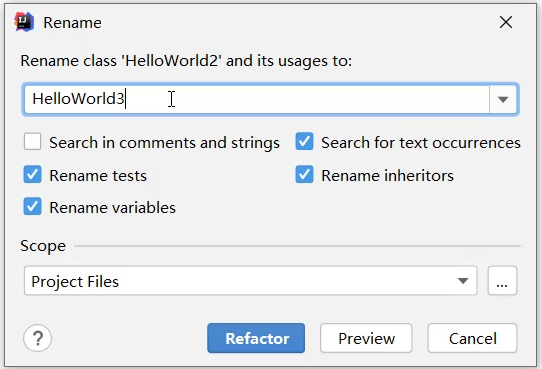
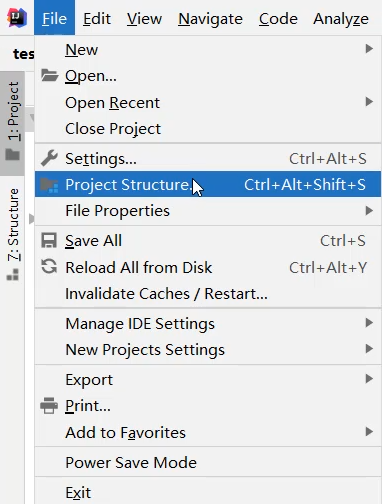
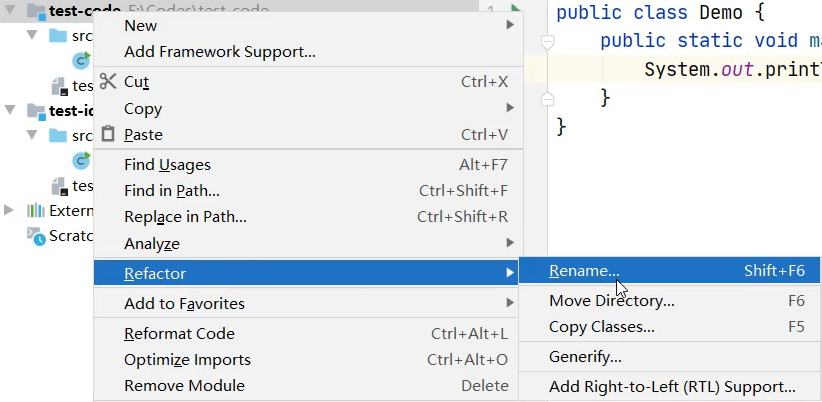
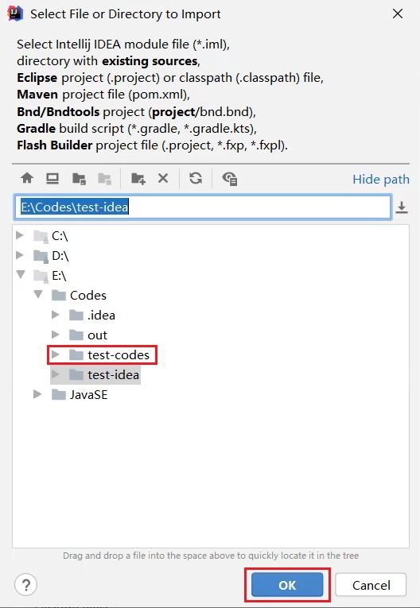
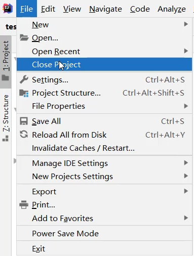
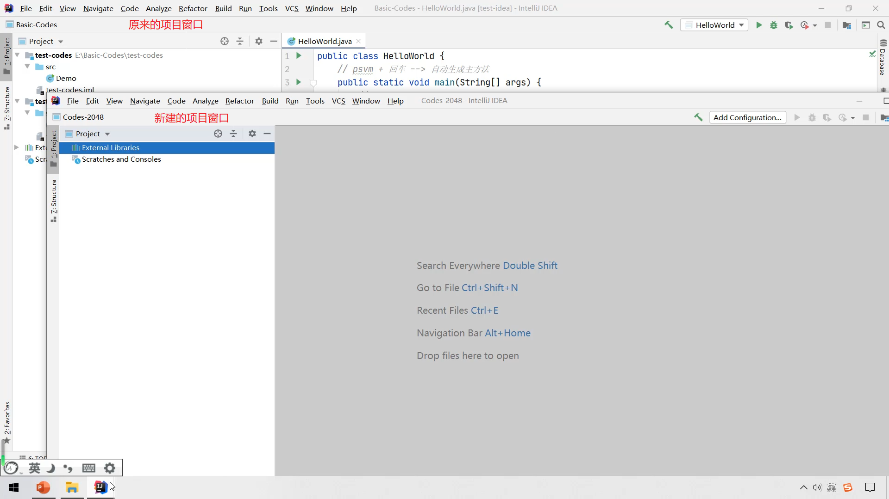
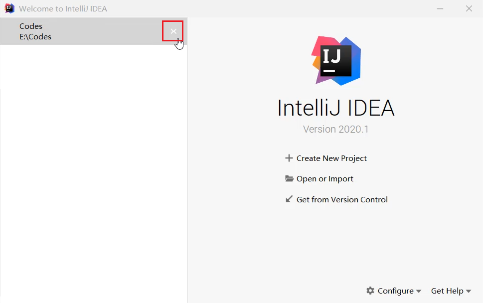
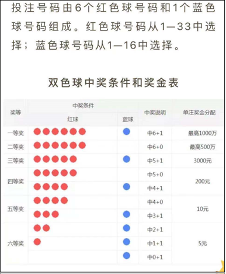

注意：

​	用记事本打开本文档，格式较差。

​	可安装typora软件后再次打开。

​	安装包位于：day01\资料\其他软件\阅读笔记的软件\typora-setup-x64.exe

# day01 - Java基础语法

# 2.人机交互-图形化界面的小故事

## 一、图形化界面的小故事

计算机在刚开始出现的时候，因为占地广、造价高、耗电多，一般都是给军队或者政府使用的，而并不是给个人使用的。然后随着计算机不断地发展，体积越来越小，出现了微型机，进入了千家万户，这个时候个人才能够开始使用。在刚开始使用的个人电脑是没有像我们今天这样的图形化界面的。在以前都是在黑屏下面输入一些命令去操作计算机的。


比如说我想打开一个文件夹，在现在的电脑当中，用鼠标双击就可以，这就是图形化界面给我们带来的方便。但是在以前是需要输入一些命令才能够打开文件的，相对来讲还是有点麻烦的。

这个时候比较典型的操作系统是在1981年的时候由IBM和微软共同推出的，它的名字叫做：MS-DOS。这个系统是一律在黑屏下面使用一些命令去操作计算机的，没有任何的图形化界面，所以在当时，没有一点计算机的功底还真玩不转它。


所以是谁第一个发明图形化界面的操作系统的呢？很可惜，既不是微软，也不是苹果，而是施乐这家公司。


施乐这家公司在1981年4月27号的时候推出了一台叫做施乐之星的电脑，其创新程度在当年堪称惊天动地，就是因为它有图形化界面了，它就是长下面那样。


将它放大看一下，施乐推出的操作系统引入了窗口模式，你能同时打开几个窗口干不同的事。你可以建文件夹，把不同的东西归类放在一起，用到的时候双击就可以了，那基本上就是我们现在使用图形化界面的雏形。


你可能会觉得这个界面丑爆了，但是在当时，它是神一样的存在，而就是这个技术成功引起了业界两位大佬的相爱相杀，即乔布斯和比尔盖茨。


乔布斯看见了图形化界面的将来，推出了 `apple lisa`，同样的，刚开始页面比较丑。


那么作为乔布斯的平生对手，比尔盖茨也推出了 `Windows1.0`。


你有没有觉得也是花里花俏的，很那看。但就是这么难看的系统，还引起了两位大佬的撕逼，因为苹果是先推出 `apple lisa`，微软的 `windows1.0` 是在后面推出来的。所以乔布斯曾经当面怒斥比尔盖茨：你在盗用我的器械，也就是说你在抄我的作品。

而比尔盖茨不慌不忙，说出了他平生最金典的一句台词：“我们都有一个充裕的邻居，名叫施乐。有一天我闯进了他家，妄图偷走它的电脑。却发现你已经捷足先登。”


其实比尔盖茨的话里的意思是这样的：你别发火，咱哥俩都是抄的，谁也别说谁。那后来苹果跟微软就开始了相爱相杀。这个也是我们现在图形化界面的由来，图形化界面对计算机的普及做出了不可磨灭的贡献。


但是它也有自身的缺点，因为使用图形化界面去操作计算机，它要额外加载很多很多的图片，所以用图形化界面的方式去操作计算机，它需要消耗更多的内存，而且运行的速度没有命令行方式来的快。

大家在电视上看到的一些顶级黑客，他们一般都是在用命令行的方式去操作计算机的，如果说你有幸，以后碰见一些比较高级的黑客，你可以问一问它们，为什么不使用图形化界面呢？基本上所有的人都会回答你：太low太慢了。


那么在windows操作系统中，其实也保留了命令行这一功能，它就是CMD。所以，什么是cmd？

----

## 二、什么是cmd？

就是在windows操作系统中，利用命令行的方式去操作计算机。我们可以利用cmd命令去操作计算机，比如：打开文件，打开文件夹，创建文件夹等。


---


# 3.打开CMD

步骤：

1. 按下快捷键：win + R。

   	此时会出现运行窗口。

2. 在运行窗口中输出cmd

3. 输出回车。

解惑：cmd默认操作C盘下的Users文件夹下的XXX文件夹。（XXX就是计算机名），好就好比在图形化界面中，我们默认都是在桌面上进行操作的一样


查看 `User\XXX` 文件夹：1、win + E，打开此电脑，点进C盘； 2、双击打开用户； 3、双击 `XXX` 文件夹


扩展：其实windows的桌面也是个文件夹，它的名字叫 `desktop` ，位于 `C:\User\XXX\桌面` 文件夹下


----

# 4.常用CMD命令

扩展一个小点：在很多资料中都会把CMD命令说成是DOS命令，其实是不对的。真正的DOS命令是1981年微软和IBM出品的MS-DOS操作系统中的命令才叫做DOS命令。

而在Windows中，win98之前的操作系统是以非图形化的DOS为基础的，可以叫做DOS命令。到了2000年以后，windows逐渐的以图形化界面为主了，这个时候就不能叫DOS命令了，他只是模拟了DOS环境而已，很多的原本的DOS命令已经无法使用了，所以这个时候叫做**CMD命令**会更准确一些。

常见的CMD命令如下：

| 操作               | 说明                                                         |
| ------------------ | ------------------------------------------------------------ |
| 盘符名称:          | 盘符切换。E:回车，表示切换到E盘。                            |
| dir                | 查看当前路径下的内容。<br />包含所有的文件、文件夹，包括隐藏的内容全部展示出来。 |
| cd 目录            | 进入单级目录。cd itheima                                     |
| cd ..              | 回退到上一级目录。                                           |
| cd 目录1\目录2\... | 进入多级目录。cd itheima\JavaSE                              |
| cd \               | 回退到盘符目录。                                             |
| cls                | 清屏。                                                       |
| exit               | 退出命令提示符窗口。                                         |

补充操作：

- 盘符切换必须使用英文的冒号，否则会被认为盘符
- `ctrl + 滚轮` 可以调节命令行窗口的大小。

- 使用 `tab` 键可以补全目录。

- 如下图，使用 dir 有时候会出现 `.`、`..` 目录，这个是隐藏的文件夹。

  

- 关闭命令行窗口

  1. 使用图形化界面的方式：直接点击上方的 `×` 
  2. 使用cmd命令的方式： `exit` 

- 在windows操作系统当中，文件名或者文件夹名是忽略大小写的。


---

# 5. 练习：利用CMD打开QQ并配置环境变量

## 一、需求

利用cmd命令打开自己电脑上的QQ。

完成步骤：

```java
1：确定自己电脑上的QQ安装在哪里
2：启动cmd
3：进入到启动程序QQ.exe所在的路径（qq\bin）。
4：输出qq.exe加回车表示启动qq。
```

假设我们电脑是没有图形化界面的。而QQ是经常打开的软件，每次打开的时候都要切换盘符，并且进入多层文件夹，太麻烦了！

----

## 二、设置环境变量的作用

作用：如果我想要在CMD的任意目录下，都可以启动某一个软件，那么就可以把这个软件的路径配置到环境变量中的PATH里面。

在启动软件的时候，操作系统会先在当前路径下找，如果在当前路径没有再到环境变量的路径中去找。如果都找不到就提示无法启动。

----

## 三、`设置环境变量` 步骤

**第一步：右键点击我的电脑并选择属性。（如果无法出现第二步界面，可以打开 `此电脑` 之后右键点击空白处）**


**第二步：点击高级系统设置。**


**第三步：选择高级，再点击下面的环境变量。**


**第四步：找系统变量里面的PATH**

> 上面的那个不用管，因为上面那个是moon用户的用户变量，如果你的电脑里面有多个用户的话，那么设置在moon里面是不能通用的，所以我们要找到下面的系统变量。


**第五步：点击新建，把QQ的完整路径，配置到PATH当中，再点击确定即可。**


**第六步：（可做可不做）点击上移，把当前配置的路径移动到最上面。**

移动的好处：在CMD中打开软件时，会先找当前路径，再找环境变量，在环境变量中是从上往下依次查找的，如果路径放在最上面查找的速度比较快。

 


**第七步：在任意目录下重新打开cmd窗口，然后输入 `qq.exe`，可以发现qq成功被启动！**


---

# 6. 学习方法和Java概述

## 一、学习方法

作为一个0基础入门的同学，在刚开始学习的时候，我们不要追求知识点的深度，而是要追求知识点的广度。简单来说，学一个知识点不要想的太深，应该先学习如何用，然后把尽可能多的知识点综合的用起来，锻炼我们的思维能力才是第一要素，等入门后，再来学习更加深入的知识点，才是符合我们平时学东西的思维逻辑。


---


## 二、Java是什么？

Java是一门非常火的计算机语言。（也叫做编程语言）

> 语言：人与人交流沟通的表达方式
>
> 计算机语言：人与计算机之间进行信息交流沟通的一种特殊语言

如果我们想让计算机按照我们的指令去做事情，就需要说计算机能听得懂的语言。JAVA就是一门非常火的计算机语言。至于到底有多火，我们可以看一下JAVA的市场占有率，这个是截止到2021年上半年全球编程语言的排行榜，其中上面的绿色的就是JAVA。


我们知道，没有一款语言能够牢牢占据排行榜的榜首，起起伏伏是一种正常情况，但是可以看见它基本上都是保持在前三名之内。

看完了全球的，我们再来看看国内的，截止2021年上半年JAVA以`28%`的市场占有率在国内排名第一。


并且我们可以看看招聘网站，其中火热职位就有JAVA的一席之地，比如从BOSS直聘上截出来的一张图，在BOSS直聘的热门职位当中，第一个就是JAVA。


51job（前程无忧）热门推荐里面也有JAVA。


再来看智联招聘，互联网IT分类的第一个也是JAVA。


所以由此可见，JAVA的火热程度。


---

# 7.JDK下载和安装 & JDK目录介绍

## 一、引入

写JAVA代码不是随随便便能写的，我们得先做一点准备工作。例如，我们平时想要玩一把游戏，就需要先下载、安装才能玩游戏。JAVA也是一样的，也是需要下载并安装相关的软件，它的名字就叫做：JDK。然后才能编写JAVA的第一个案例 —— HelloWorld。

----

## 二、下载

通过官方网站获取JDK：[http://www.oracle.com](http://www.oracle.com/)

**注意1**：针对不同的操作系统，需要下载对应版本的JDK。

**注意2**：如果你的电脑是windows32位的，建议重装系统，重装成64位的操作系统。因为Java从9版本开始，就已经不提供32位版本的安装包了。

首先点击官网导航栏的 `Products `选项，然后在弹出的下拉框中点击 `JAVA`


然后点击右上角的 `Download Java`，表示要下载JAVA


然后在上面它会有两个提示：1、`Java downloads`：下载JAVA； 2、`Java archive`：Java的历史版本


在第一个界面中表示你下载的是最新的Java，但如果说你不要下载最新的，需要下载以前的，就可以点击第三个选项。本套课程采用的是2021年9月份刚推出来的 `Java17`，这个版本是长期支持版本，所以会有一个 `LTS` 后缀。


然后根据自己的操作系统下载对应的版本，下面就以windows举例。

选中windows，然后点击中间这个进行下载，因为只有中间这个是最干净的安装包。第一个是zip包，在这个里面你下载完之后是一个压缩包，压缩包里面会有安装包还有一些其他说明性文件，但那些说明性文件对我来讲没有用，我只要一个安装包就可以了。


----

## 三、安装

双击打开安装包，然后傻瓜式安装，下一步即可。默认的安装路径是在C:\Program Files下。

建议：

- 安装路径不要有中文，不要有空格等一些特殊的符号。

  因为这些软件是老外编写的，对中文的支持不够完美，所以如果以后路径中有中文，以后在使用的时候，容易出现一些问题。在选择路径的时候，我们就写`英文单词` 或者 `加一点数字`就行了。

- 以后跟开发相关的所有软件建议都安装在同一个目录（文件夹）中，方便管理。

例如这里就将开发所有的软件都装在E盘的develop文件夹当中。


然后点击右上角的新建文件夹按钮，新建一个文件夹，名为：`JDK17`。

----

## 四、JDK的安装目录介绍

安装完毕后，就可以去对应的文件里找到以下文件夹。

重点需要掌握的是 `bin` 文件夹。

| 目录名称 | 说明                                                         |
| -------- | ------------------------------------------------------------ |
| bin      | 该路径下存放了JDK的各种工具命令。javac和java就放在这个目录。 |
| conf     | 该路径下存放了JDK的相关配置文件。                            |
| include  | 该路径下存放了一些平台特定的头文件。                         |
| jmods    | 该路径下存放了JDK的各种模块。                                |
| legal    | 该路径下存放了JDK各模块的授权文档。                          |
| lib      | 该路径下存放了JDK工具的一些补充JAR包。                       |


---

# 8.HelloWorld小案例

## 一、引入

HelloWorld案例是指在计算机屏幕上输出 `“HelloWorld”` 这行文字。各种计算机语言都习惯使用该案例作为第一个演示案例。这已经是程序员圈里约定俗称的一个规矩了，`"HelloWorld"` 就是程序员的启蒙代码。

---

## 二、Java程序开发运行流程

开发Java程序，需要三个步骤：

1. 用记事本编写程序
2. 编译文件
3. 运行程序。

----

## 三、如何理解编译？

Java在操作系统中，是不可以直接运行的，因为操作系统它是不认识Java代码的。


运行的办法就是需要将Java代码翻译成操作系统能看得懂的东西。所以说编译的动作其实就是翻译把操作系统看不懂的内容变成操作系统能看懂的内容。


所以第二步的编译，我们也可以理解成翻译的意思。翻译完后会产生一个新的文件，然后在第三步就可以运行翻译之后的文件了。

---

## 四、HelloWorld案例的编写

> 新版本的JDK不需要先配置环境变量。直接按照以下步骤编写即可。

### 1、新建文本文档文件，修改名称为HelloWorld.java。


**注意**：

- 后缀名为java的才是java文件。修改文件名后缀的时候会出现一个弹窗，点击yes即可。

  

- 如果文件后缀名并没有展示，需要按如下步骤进行设置。勾选上文件扩展名，文件扩展名就是后缀名。

  

----

### 2、用记事本打开HelloWorld.java文件，输写程序内容。代码要跟我编写的完全保持一致。

右键点击文件，然后点击打开，此时就可以使用windows自带的记事本来编辑了。


```java
public class HelloWorld {
	public static void main(String[] args) {
		System.out.println("HelloWorld");
	}
}
```

PS：双引号里写的是其他内容也行，可以是数字，也可以是字母，但不能是中文！因为会乱码，解决方案在后面Notepad++会讲解。现在先写最基本的“HelloWorld”就可以了。

这里可以养成一个习惯，只要出现括号、引号的，都要成对出现，敲完一对括号后，再将光标移到括号中间，再去补中间的代码就可以了，这样就会防止因为忘记丢掉右括号。


----

### 3、<kbd>ctrl + s</kbd> 保存，或者也可以直接图形化点击保存。


未保存的文件在上方一般都会有 `*` 符号或其他符号标记。像我这里，如果保存了就会从 `圆点` 变为 `×`


### 4、编译文件。

此时就需要使用到Java当中的工具了，找到JDK的安装目录里的bin文件夹`E:\develop\JDK17\bin`，我们所要找的工具一个是 `javac`，另一个是 `java`，用 `javac` 去编译，然后再用 `java` 去运行。`javac` 是JDK提供的一个编译工具，我们可以通过这个工具，把当前路径下的java文件编译成class文件。


这两个工具是在cmd中使用的。cmd默认操作的是 `C:\User\XXX` 下的文件夹，如果要进入到刚刚编写的HelloWorld所在的文件夹，就需要使用cmd命令进行切换了。


切换到编写的HelloWorld.java所在的文件夹后，执行 `javac HelloWorld.java`。


执行完后如果没有任何信息出现，表示编译成功。编译后会多一个文件，这个文件就是翻译之后的文件，它的后缀名是class，所以我们也会把这个文件叫做class文件，或者是字节码文件。这个文件就是给操作系统在运行的时候使用的，我们人是看不懂的。


我们可以右键点击它，然后使用记事本打开。可以发现里面的东西我们是看不懂的。


----

### 5、运行代码。

`java` 是JKD提供的运行代码的工具。接下来使用 `java` 工具，执行 `java HelloWorld`，注意不需要加上后缀名。运行的是编译之后的class文件。此时发现，HelloWorld已经出来了。


小技巧：如果不想每次编译的时候都切换路径，可以在java文件当前所在的文件夹的上方，直接输入cmd，然后回车。此时打开的cmd窗口所在的路径就是java文件所在的路径。


---

# 9.HelloWorld案例常见问题

## BUG

BUG（小甲虫）。计算机刚开始出现的时候，因为体积比较大，一些小虫子很容易转进去。有一天有一只蟑螂钻到了计算机当中，从而导致计算机不能正常运行，此时就有两个工作人员去排查了，就是下图的两个小姐姐。


在电脑系统或程序中，隐藏着的一些未被发现的缺陷或问题统称为bug（漏洞）。


## BUG的解决

1. 具备识别BUG的能力：多看
2. 具备分析BUG的能力：多思考，多查资料
3. 具备解决BUG的能力：多尝试，多总结


## HelloWorld常见问题

1、非法字符问题。Java中的符号都是英文格式的。

例如，下方将分号改为了中文的分号，然后重新编译，此时它就会报错——第三行出现了问题：错误：需要 ’ ; ‘，并且出现了一个小箭头，指向了小括号的后面，意思就是说：这个符号我不认识，是不是一个中文？


有一个小技巧，可以避免标点符号的问题：将输入法设置为 `中文时使用英文标点`，以下以搜狗输入法举例。右击搜狗输入法，选择 `更多设置` ,然后勾选上 `中文时使用英文标点`，此时以后你输入的标点符号全部都是英文状态下的了。


2、大小写问题。Java语言对大小写敏感（区分大小写）。

例如将 `System` 的大写 `S` 改为了小写 `s`，重新编译，就会报以下错误。此时又会出现一个小箭头，表示在小箭头的前后出现了问题。


---

# 10.配置Java环境变量

## 一、引入

开发Java程序，需要使用JDK提供的开发工具（比如javac.exe、java.exe等命令），而这些工具在JDK的安装目录的bin目录下，如果不配置环境变量，那么这些命令只可以在bin目录下使用，而我们想要在任意目录下都能使用，所以就要配置环境变量。

但是上面我们编写HelloWorld小案例时，并没有配置环境变量，但为什么可以在非bin目录下使用 `javac` 和 `java` 这两个小工具的呢？

这是因为现在最新从官网上下载的JDK安装时会自动配置javac、java命令的路径到Path环境变量中去 ，所以javac、java可以直接使用。

---

根据以下步骤查询环境变量，发现，在安装完JDK后，环境变量多了一个。进入到此路径后，发现Java在安装的时候将 `javac` 和 `java` 这两个命令相当于做了一个快捷方式，放到了该路径当中，然后再把这个路径配置到环境变量里。所以我们就可以在任意目录下面用到 `javac` 和 `java` 了。


----

## 二、配置Java环境变量

以前下载的老版本的JDK是没有自动配置的，而且自动配置的也只包含了4个工具而已，如果我们要使用其他的工具还是不能使用。所以我们需要删掉已经配置完毕的，并且将该 `C:\Program Files\Common Files\Oracle\Java\javapath` 路径下的工具都删除，再次重新配置Path环境变量。


最简单的方式就是将JDK的bin目录直接添加到path环境变量中，但是这种方式不推荐。因为这个里面有很多变量，当我们在操作的时候，很有可能会操作到其他变量信息，如果将其它的变量修改了，那在系统里面其它的软件就有可能打不开了。所以我们应该使用以下步骤进行配置：

① **JAVA_HOME**：告诉操作系统JDK安装在了哪个位置（未来其他技术要通过 `JAVA_HOME` 找JDK），注意这个地方的路径是不带 `bin` 的。这个相当于我们自己新建了一个：`JAVA_HOME`的路径。


② 然后再点击**Path**，使用两个 `%` 引用我们刚刚自己定义的路径：告诉操作系统JDK提供的javac(编译)、java(执行)命令安装到了哪个位置。

然后再将这个环境变量移动当最上面即可。


---

## 三、win10的bug

有些win10的电脑当电脑重启之后，环境变量失效了。表示操作系统不支持自定义的环境变量。

解决方案：还是要配置JAVA_HOME给以后的相关软件去使用，我们可以把java和javac的完整路径配置到PATH当中： `D:\develop\JDK17\bin`。


---

# 11.Notepad++

## 一、引入

以前在记事本上写的代码看上去有点累，因为所有的单词看上去都是黑色的，并且当代码出现问题后，它提示第三行，我们还需要一行一行去数。这些问题都可以由一个高级记事本：`Notepad++` 来解决。

---

## 二、下载 & 安装

**下载**：[Downloads | Notepad++ (notepad-plus-plus.org)](https://notepad-plus-plus.org/downloads/)

> 官网下载的速度可能有些慢，可以借助科学上网

**安装**：傻瓜式安装，直接点击下一步就可以了。

在选择安装路径的地方建议不要放在C盘，所有东西都放在C盘后，电脑会变的比较卡，建议专门找个文件夹，用来放跟我们开发相关的软件，因此这次还是放在 `E:\develop\notepad`。

---

## 三、设置

右键点击java文件，选择edit with notepad++。


点击设置，再点击首选项。在弹出的页面当中，左侧选择新建，中间选择Java，右侧选择ANSI，表示使用本地的默认编码，此时在代码的地方就可以写中文了。


---

## 四、练习

利用notepad++去编写一个HelloWorld并能成功编译和运行。

使用notepad++定位到当前文件所在的命令行就更加方便了：


---

# 12.Java语言的发展

JAVA语言的诞生是具有一定戏剧性的，可以说是命运多舛，差点凉凉，差点GG，差点嗝屁。


在1990年的时候Sun（Stanford University Network：斯坦福大学网络）公司成立了一个由 `James Gosling` 领导的Green计划，准备为下一代的职能家电，也就是电视机、微波炉、电话等去编写一个通用的控制器，这个负责人就是`James Gosling`，它也名为 `Java语言之父` 。

在一开始的时候，这个团队是准备用C++来编写的，但是发现C++在很多方面存在一些问题，使用起来十分不方便，导致项目的进展非常的缓慢，但是大神不愧是大神，编程语言不方便，就自己造一个，所以他们就造了一个全新的语言：`Oak语言`，起这个名字是因为他们项目团队的门前长了一颗橡树，Oak就是橡树的意思。

到了1992年的时候，Green计划已经完成了新平台的部分功能。包括Green的操作系统、Oak的程序设计语言、类库等。简单理解就是，已经用Oak语言已经做了很多很多事情了。

Sun公司看见这个团队这么牛逼，所以就在11月份，成立了由Sun公司全资的子公司，它的名字就叫做 `FirstPerson有限公司`。因为这家公司大多数都是程序员，不太会管理，所以因为管理不善，  `FirstPerson有限公司`几乎凉凉，Oak语言也差点凉凉。

但是到了1994年，随着互联网行业进入到快速的发展阶段，Java语言之父`James Gosling`非常有商业眼光，它立马改写了Oak语言。在同年秋天，完成了第一个Oak语言的网页浏览器，它的名字叫做WebRunner，这个浏览器现在已经不用了，但是在当时，它是一个跨时代的产品，Sun公司看到它们这么牛逼，所以就准备去给Oak注册商标了，但是Oak已经被一家投资公司美国橡树资本管理有限公司给注册过了，所以只能改名叫：JAVA。因为外国的程序员都是比较爱喝咖啡，而生产咖啡豆的地方叫做爪哇岛，所以就改名，叫做JAVA。

改完名字之后，在1995年的时候，正式推出了JAVA。


随后又出现了 `1.0、1.1、1.2、1.3、1.4` 版本，但是Sun公司发现了，每次更新只改小数点后面一位，太小家子气了，所以从5开始就改成了大版本号更新，称之为 `Java5.0`。在06年的时候又推出了6.0。到了09年的时候，Sun公司被Oracle甲骨文公司收购了。Oracle公司在全球而言是非常厉害的公司，是仅次于微软的第二大网络公司。所以Java在Oracle手中，市场份额越来越大，语言的版本也在不断更新，到目前为止，最新的就是刚推出来的Java17。通过这么多版本出现的时间可以发现，从Java9开始，基本上都是6个月出一次版本，Java之所以要保持这么快的更新速度，其实就是为了紧贴市场的发展，使得Java自己不会被淘汰。


但是这么快的更新速度会给我们开发者造成学习上的困扰，所以为了解决这些问题，Java会把这些版本分成两种：1、普通版（过渡版本）；2、正式版（长期支持版本）（长期支持版本会有LTS后缀）。

在这么多版本当中，其中Java8、Java11、还有我们现在学习用的Java17，就是LTS长期支持版本，所以从这一方面它就降低了开发者的学习成本。在这么多版本当中，其中有三个版本非常的重要：

* Java5.0：这是Java的第一个大版本更新。
* Java8.0：这个是目前绝大数公司正在使用的版本。因为这个版本最为稳定。
* Java17.0：这个是我们课程中学习的版本。

这些版本向下兼容。新的版本只是在原有的基础上添加了一些新的功能而已。

举例：

用8版本开发的代码，用11版本能运行吗？必须可以的。

用11版本开发的代码，用8版本能运行吗？不一定。

如果11版本开发的代码，没有用到9~11的新特性，那么用8是可以运行的。

如果11版本开发的代码，用到了9~11的新特性，那么用8就无法运行了。


---

# 13.JAVA三大平台 & Java的6大应用领域 & Java能干什么？

## 一、引入

JAVA从95年以来，已经问世了20多年了，可能比部分同学的年龄还大。

Java到底能干嘛呢，此时就需要讲到Java的三大平台，其实也就是它的三个分类：JavaSE、JavaME、JavaEE。

---

## 二、Java的三大平台

### 1）JavaSE

JavaSE（Java Standard Edition）是Java语言的标准版，用于桌面应用的开发，是其他两个版本的基础。

桌面应用：用户只要打开程序，程序的界面就会让用户在最短的时间内找到他们需要的功能，同时主动带领用户完成他们的工作并得到最好的体验。其实就跟我们电脑上安装的这些软件是类似的：例如电脑中的计算器，就是比较简单的桌面应用；还有像右边类似于坦克大战的游戏，也可以做成桌面应用，双击打开就可以玩了。


但是在这个领域，Java是不太合适的，因为当我们写一些比较复杂的动画的时候，Java加载的速速有可能会变的很慢。在桌面应用领域，最为合适的语言是C / C++，所以在这个领域，Java可以做，但是不占优势。

所以我们学习JavaSE的目的并不是是为了写桌面应用，而是锻炼大家的逻辑思维能力，为今后要从事的JavaEE开发打基础。

---

### 2）JavaME

JavaME（Java Micro Edition）是Java语言的小型版，用于嵌入式电子设备或者小型移动设备的开发。

嵌入式设备就是电视机、微波炉、数码相机这些里面的系统，当然还有一个最主要的：小型移动设备—手机。在以前，诺基亚手机风靡全球，它用的是塞班系统，当我们双击打开一个软件的时候，会有一个小的咖啡杯弹出来，这个软件就是用JavaME写的。随着塞班系统渐渐的没（mo）落，JavaME也渐渐的凉了。当你去一些招聘网站搜索JavaME，可以发现没有这样的工作档位，它现在已经被安卓和IOS给替代了。


但是，安卓、鸿蒙也是可以用Java来开发的。

---

### 3）JavaEE

JavaEE（Java Enterprise Edition）是Java语言的企业版，用于Web方向的网站开发。在这个领域，是当之无愧的No1。

网站开发并不是我们看见的浏览器，完整的网站开发是浏览器和服务器开发，在服务器领域，Java是最厉害的。自从95年问世以来，没有一款语言能撼动它的位置。


---

## 三、Java的6大应用领域

- 桌面应用开发

  制作各种各样的开发工具，有我们的Java程序员用到的Idea、C/C++用到的Clion、Python程序员用到的Pycharm。这是因为Java语言是比较规范，漏洞比较少，所以用Java语言编写的编译工具就会非常的健壮，不会有那么多漏洞以及安全性问题。

  在我国，由于一些历史原因，目前有很多办公系统，或者是市场上的税务管理系统也都是使用Java来开发的。

- 企业级应用开发

  在后续课程中其实就是带着大家去做企业级应用，像微服务、SpringCloud...

  企业级应用说简单点，就是开发服务器，而服务器可能要每秒钟承担几十万，甚至几百万的访问量，例如12306春节买票的时候，高峰期每秒钟有很多很多人，有几十万，甚至是几百万的人同事买票，到目前而言，只有Java，还有Go语言能承载这么大访问量，但是在国内，Go语言是非常小众的，所以还是用Java比较好一些。

- 移动端/嵌入式开发

  例如鸿蒙、安卓，并且CT、B超的界面，它也是用Java来开发的。

- 科学计算

  因为Java语言非常的严谨。有一个软件叫：matlab，有些同学在大学里面可能会用到，如果说你要搞一些数学的建模大赛、做一些仿真，开发一个机器人，机器人怎么走路，做一些动态的仿真效果，也是需要用到matlab。这个科学计算的软件也是使用Java来开发的。

- 大数据开发

  在大数据中有一个框架：hadoop，它的logo是一头大象。这个框架也是用Java来开发的。

- 游戏开发

  《我的世界》这款像素游戏也是用Java来开发的。


----

## 四、Java能干的事情

最后来看一下Java能干的事情：

左上角的天猫、淘宝、阿里云、京东，这些就是服务器的开发，也就是企业应用的开发。

中间有个WebStorm，这个是前端程序员用的开发工具、PhpStorm是Php程序员用到的开发工具、IntelliJ IDEA是Java程序员用到的开发工具、PyCharm是Python程序员用到的开发工具，这些开发工具都是用Java来开发的。

右上角的机械臂，它里面的控制管理程序，也是用Java来开发的。

右中间有科学计算工具：matlab。

右下角的我的世界，也是使用Java来开发的。


---

# 14.Java为什么这么火

## 一、怎么看语言火不火

一个语言火不火、能不能长久的生存下去，主要其实是看四个方面

### 1、用户量：使用的程序员多不多。

不管在国内，还是在国外，使用Java的程序员还是非常多的。


----

### 2、适用面：用的地方多不多。

从以下6大领域可以看出来，用到Java的地方也是非常多的。


----

### 3、与时俱进：会不会紧跟时代一起发展。

如果一个语言跟不上时代的发展，不管它有多牛逼，总有一天会被市场淘汰。

从Java9版本开始，基本上都是保持半年一更新，保持这么快的更新速度，就是为了紧贴市场的发展，一旦其他语言有什么好的东西，或者是市场上出现了什么了不得的技术，Java都可以把它们融进来成为自己的东西，让自己永远保持生命力，永远不会被市场淘汰。


----

### 4、语言的本身是否有什么明显的特点

它的特点主要有以下几个：面向对象、安全性、多线程、简单易用、开源、跨平台

Java在上面这四个方面都做的非常的好，所以说Java的生命力还是非常强劲的。

---

## 二、Java主要特性

### 1、面向对象

等我们以后学习完Java的面向对象之后，你可以在心里面想象一下自己对女朋友的要求：性别、年龄、身高、体重还有一些其他的要求，然后你可以把这些东西都告诉Java：我想要一个这样的女朋友。Java非常好，它会说：好的，没问题，满足你。

根据你的要求给你制造了一个女朋友，这个就是Java中的面向对象。简单理解就是根据你想的模板，把东西创建出来，这就是面向对象。创建出来的东西可以是女朋友、车子、房子、票子..... 想造什么就造什么，这个就是Java当中最难理解的面向对象

----

### 2、安全性

Java写出来的代码非常的安全，漏洞非常的少。

----

### 3、多线程

假设在12306上买票，假如有4个用户同时在12306上买票，此时就可以看成12306的服务器同时给这四个人服务，这个就是多线程。

多线程简单理解：就是可以同时做多件事情。

----

### 4、简单应用

Java语言学起来非常简单，用起来也挺容易。

---

### 5、开源

假如我现在有一部手机，在手机上下载了QQ，此时我下载的仅仅是QQ的安装包，腾讯公司它是不会把QQ的代码给你的，这就叫做不开源。

而Java就是非常的简单粗暴了，同学们要往电脑中下载Java的开发工具的时候，Oracle公司它会把Java所有的源代码也都给你，这样就会告诉你Java是如何运行、如何工作的，这个就叫做开源。

一旦开源了，世界所有的开发者都可以去维护Java了，所以Java即使有什么缺点，也被广大的程序员给修复了，这就是开源的魅力。

----

### 6、跨平台

跨平台的平台指的是操作系统，例如：Windows、Mac、Linux。

Java程序可以在任意的操作系统上面运行，这个特点就很厉害了，很多其他的语言都干不了这些事情。而且这个特点对于公司来讲是非常有帮助的。

例如现在有家公司，利用了一种不能跨平台的语言开发了一个项目，此时只能在windows上去运行，不能在其他的操作系统上去运行，如果想要在其他的操作系统上运行，还需要重新编写代码。所以会给公司增加额外的成本。


但如果换成Java程序，就非常的粗暴了，一个人写的程序可以在所有的操作系统上运行，而且只要写一次就行了。Java在95年出现的时候，也是凭借这个特性，迅速的占领市场，当时它打出了一句口号：`Write Once Run Anywhere`（一次编译，到处运行）。


---

# 15.Java语言跨平台的原理

## 一、引入

说到跨平台的原理，就需要说到高级语言的编译运行方式。所有的高级语言，比如说：C、Java、Python等等，在运行的时候大体上会分为三步，之前在编写HelloWorld的时候也是

1. 编程：新建文件，编写代码，保存代码。

   java程序员写的.java代码，c程序员写的.c代码，python程序员写的.py代码。

2. 编译：不管是什么高级语言，操作系统本身都是不认识的，因为机器只认识0011的机器语言，所以我还需要把第一步编写好的代码进行翻译，翻译成机器能认识的语言。

3. 运行：让机器执行编译后的指令。

----

## 二、高级语言的三种编译运行方式

- 编译型
- 解释型
- 混合型，半编译，半解释（将上面两种都结合起来）

### 1、编译型

C语言就是标准的编译型语言，它会将C/C++代码根据不同的操作系统整体的翻译成0011这样的二进制，然后再交给机器去运行。但是因为每个系统都是不一样的，手机运行会用到Arm平台，电脑运行就会用到X86平台，由于每个系统所用到的平台可能是不一样的，所以在编译之后所形成的指令也有可能是不一样的。


它的运行流程是这样的：

编写代码 —> 整体进行编译，跟java一样，它也会多出来一个后缀名为 `.obj` / `o`  等这样的文件，然后再去交给不同的设备去运行，在这里会有一个小细节，因为计算机是不一样的，所以它们就存在硬件也是不一样的，会有兼容性问题，所以针对不同的操作系统它都要重新进行编译。

更夸张的是，如果我编写代码的电脑的硬件跟运行代码的硬件之间差别特别大，就算是同一个操作系统，也有可能是没发成功运行的。所以说C语言不是跨平台的。


---

### 2、解释型

解释性语言最为代表的就是Python语言，在编写好代码之后，它不会把代码的整体进行翻译，而是读一行解释一行。读到一行代码，再把这行代码解释成0011去运行，然后再去读第二行代码，然后再去解释成0011再去运行。

所以说通过这个我们就知道了，编译型语言它的特点是整体翻译，而解释型语言，它的特点是按行翻译。


它的运行方式是这样的：编写代码 —> 按行翻译 —> 再交给不同的设备去运行

在这里它也有个小细节，Java / C在编译之后，它都会产生一个新的文件，但是Python不会，它是直接拿着我们自己编译好的代码逐行解释，再去交给设备去运行的。所以说Python程序员是天生开源的，它在编写好代码后，它只能把代码交给别人运行，如果说没有将代码交给别人，别人是没发运行的。

---

## 3、混合型，半编译，半解释（将上面两种都结合起来）

混合型最为典型的就是Java，在网上有很多资料，有的资料说Java是编译型的，有的资料说Java是解释型的，但这些都不对。Java是混合型的。在Java编译运行的过程中，存在编译，也存在解释。

首先将java文件整体编译成class文件（字节码文件） —>  **按行**交给设备去运行，在运行的时候，它也不是直接运行在计算机上的，而是运行在虚拟机里的。


那问题就来了，虚拟机是什么？

如果说我现在要让手机上的游戏在电脑上运行，肯定是不能运行的。此时就可以在电脑中装一个安卓的处理区，相当于就是在操作系统里模拟了一部手机，在这部虚拟的手机中，就可以玩手机游戏了，这部虚拟出来的手机，我们也可以理解成 虚拟机。


所以说Java语言在运行的时候，跟刚刚是一个道理，操作系统本身其实是不认识Java语言的，Java也并不是直接运行在操作系统里面的，而是运行在虚拟机里面的，虚拟机会把Java语言翻译成操作系统能看得懂的语言。我们只要针对不同的操作系统给出不同的虚拟机就可以了。这个虚拟机不是我们写的，是Java自己提供好的。而我们作为程序员，我们只需要安装一个适合自己操作系统的虚拟机就可以了。


---

# 16.JRE和JDK

程序员在编写代码的时候其实是需要一些环境，例如我们之前写的HelloWorld。我们需要的东西有JVM、核心类库、开发工具。

1、**JVM（Java Virtual Machine）**：Java虚拟机，真正运行Java程序的地方。没有虚拟机，代码都没地方运行。

2、**核心类库**：例如之前写的HelloWorld代码中，里面的`System`、`out`、`println`，每个单词都有其特定的含义，它们组合在一起就可以把小括号的内容直接展示出来。这些其实都是Java已经写好的东西，我们直接拿过来使用就行了。

3、**开发工具**：例如：javac 编译工具、java 运行工具、jdb 调试工具、jhat内存分析工具 ......

它们三个组成的整体，就叫**JDK**。**JDK（Java Development Kit）称为Java开发工具包，包含了JRE和开发工具**。

所以说简单理解程序员想要编写代码并且能成功运行，我们需要安装一个JDK就可以了。

---

除此之外，还有一种情况需要我们考虑，假设我现在将代码写完了，也编译完了，此时我需要将class文件交给别人运行，此时人家只需要运行class文件就行了，不需要开发了，但此时别人就不需要再安装一个完整的JDK了，因为在JDK里面，有些东西我们是用不到的，如果强行安装，就会占用硬盘空间。

但我又需要运行代码，那应该安装什么呢？虚拟机、核心类库肯定都是需要的，但是在运行的时候有一部分开发工具就不需要了。例如代码已经写好了，已经不需要javac编译工具；并且此时代码别人写好了，也已经没有问题了，此时也不再需要调试了，jdb工具也用不到了。

所以说java会在JVM、核心类库还有在运行的时候所用到的一些工具单独的抽取出来，又组成了一个 JRE。当我们以后只需要运行代码，不需要编写了，安装一个JRE就可以了。JRE比较短小，不会占用过多的硬盘空间。

**JRE（Java Runtime Environment）**，Java运行环境，包含了JVM和Java的核心类库（Java API，即Java已经写好的一些东西，我们直接拿过来用就行了）。


总结：JDK包含了JRE，JRE包含了JVM。


---

# ---------------------

# day02 - Java基础语法

# 17.注释和关键字

我们之前写的HelloWorld案例写的比较简单，但随着课程渐渐深入，当我们写一些比较难的代码时，在刚开始写完时，你知道这段代码是什么意思，但是等过了几天，再次看这段代码时，可能就会一脸懵逼，完全不知道自己写的代码是什么意思。


为了避免这种情况的发生，都会在代码的上面写一写解释说明性的文字，方便别人 / 以后阅读代码，而这种解释说明性的文字就是注释。


## 一、 注释

注释是在程序指定位置添加的说明性信息，简单理解，就是对代码的一种解释。

Java中的注释分为三种：

1、单行注释：它的格式是：`//` 后面加上注释信息，但是这些注释信息只能写在一行当中。

~~~java
// 这是单行注释文字
~~~

2、多行注释：当解释注释性文字比较多，一行写不下的时候，就需要用到多行注释了

~~~java
/*
这是多行注释文字
这是多行注释文字
这是多行注释文字
*/
注意：多行注释不能嵌套使用。
~~~

3、文档注释（暂时用不到）：

```java
/**
这是多行注释文字
这是多行注释文字
这是多行注释文字
*/
```

文档注释的场景：等我们以后牛逼了，要写一些代码去给别人使用。因为代码比较多，别人是不方便一行一行去阅读代码的，此时我们就可以提供一个说明文档，这个文档可以用Java自带的DOC工具自动生成，它可以根据左边的代码去自动的生成右边的文档。在生成的时候它会把文档注释里的内容都会添加在右边的文档当中。在以后，别人要用你代码的时候，就不需要去看代码了，直接看文档就可以了。


---

代码示例

~~~java
public class HelloWorld{
	// 叫做main方法，表示程序的主入口。简单理解就是，程序刚开始运行的时候，会自动去找main方法，从main方法第一行代码，从上往下，逐行运行。所以这里的main方法格式是固定的。
	public static void main(String[] args){
		/* 叫做输出语句（打印语句）
		会把小括号里面的内容进行输出打印 */
		//System.out.println("HelloWorld");
	}
} 
~~~

**注意**：

- 注释的内容不会参与编译和运行的，仅仅是对代码的解释说明而已，当使用 `javac` 将java源文件编译成class文件后，在class文件里是不存在注释的。

  所以，不管在注释当中写什么内容，都不会影响代码运行的结果，但一般我们只会写跟代码相关的内容，其他的跟代码无关的，就不要再写了。

- 不管是多行注释还是单行注释，一律都不要嵌套。

  有些同学喜欢一句话打一个 `//`，但是这种写法不好

  ~~~java
  // 叫做main方法 // 表示程序的主入口。
  ~~~

  如果想要将一句话分开，可以打逗号、句号、或者其他的标点符号，这里就没有必要再加上多余的单行注释了。但是这样写语法是不会报错的。但是多行注释不能嵌套写！前面的 `/*` 会找距离它最近的 `*/` 来作为结尾。所以为了避免这样的问题，不管是多行注释还是单行注释，一律都不要嵌套。


---

## 二、关键字

关键字：被Java赋予了特定含义的英文单词。当我们在代码中写了关键字之后，程序在运行的时候，就知道要做什么事情了。

关键字特点：

1. 关键字的字母全部小写。
2. 常用的代码编辑器，针对关键字有特殊的颜色标记，非常直观。

例如我们安装的Notepad++对关键字就会有高亮显示，例如下面的代码中红线划出来的都是关键字。


在Java中一共有50多个关键字，这些关键字不用刻意去记，因为每个关键字都包含了一个、甚至是多个知识点。

| **abstract**   | **assert**       | **boolean**   | **break**      | **byte**   |
| -------------- | ---------------- | ------------- | -------------- | ---------- |
| **case**       | **catch**        | **char**      | **class**      | **const**  |
| **continue**   | **default**      | **do**        | **double**     | **else**   |
| **enum**       | **extends**      | **final**     | **finally**    | **float**  |
| **for**        | **goto**         | **if**        | **implements** | **import** |
| **instanceof** | **int**          | **interface** | **long**       | **native** |
| **new**        | **package**      | **private**   | **protected**  | **public** |
| **return**     | **strictfp**     | **short**     | **static**     | **super**  |
| **switch**     | **synchronized** | **this**      | **throw**      | **throws** |
| **transient**  | **try**          | **void**      | **volatile**   | **while**  |


### class关键字

概念：表示定义一个类。创建一个类。

- 类：Java项目最基本的组成单元，一个完整的Java项目有可能会有成千上万个类来组成的。

- class后面跟随的就是这个类的名字，简称：类名。类名和文件名一定要保持一致！

  小技巧：如果怕类名写错，可以选中java文件，按F2，然后<kbd>ctrl + c</kbd>复制，粘贴类名即可

  

- 在类名后面会有一对大括号，表示这个类的范围。

举例：

```java
public class HelloWorld{
    
}
```

解释：class表示定义类。

​	类名：HelloWorld

​	HelloWorld后面的大括号表示这个类的范围。


---

# 18. 字面量

在有些资料，会把字面量说成常量、字面值常量，这种叫法都不是很正确，最正确的叫法还是叫做：字面量。

作用：告诉程序员，数据在程序中的书写格式。

| **字面量类型** | **说明**                                  | **程序中的写法**           |
| -------------- | ----------------------------------------- | -------------------------- |
| 整数           | 不带小数的数字                            | 666，-88                   |
| 小数           | 带小数的数字                              | 13.14，-5.21               |
| 字符串         | 必须使用双引号，内容可有可无              | “HelloWorld”，“黑马程序员” |
| 字符           | 必须使用单引号，有且仅能一个字符          | ‘A’，‘0’，   ‘我’          |
| 布尔值         | 布尔值，表示真假，只有两个值：true，false | true 、false               |
| 空值           | 一个特殊的值，空值                        | 值是：null                 |

## 区分技巧

1. 不带小数点的数字都是整数类型的字面量。
2. 只要带了小数点，那么就是小数类型的字面量。
3. 只要用双引号引起来的，不管里面的内容是什么，不管里面有没有内容，都是字符串类型的字面量。
4. 字符类型的字面量必须用单引号引起来，不管内容是什么，但是个数有且只能有一个。
5. 字符类型的字面量只有两个值，true、false。
6. 空类型的字面量只有一个值，null。

代码示例：

~~~java
public class ValueDemo1{
	public static void main(String[] args){
		//目标：需要大家掌握常见的数据在代码中如何书写的？
		
		//整数
		System.out.println(666);
		System.out.println(-777);
		
		//小数
		System.out.println(1.93);
		System.out.println(-3.71);
		
		//字符串
		System.out.println("黑马程序员");
		System.out.println("尼古拉斯阿玮");
		
		//字符
		System.out.println('男');
		System.out.println('女');
		
		//布尔
		System.out.println(true); // true
		System.out.println(false); // false
		
		//空
		//细节：null不能直接打印的。
		//如果我们要打印null，那么只能用字符串（字面量）的形式进行打印
		System.out.println("null");
		
	}
} 
~~~

---

## 扩展： /t  制表符

很多人对制表符会这么去解释：它就表示缩进、对齐、打空格，但这些解释都是错的。

正确解释应该为：在打印的时候，把前面字符串的长度补齐到8，或者8的整数倍。最少补1个空格，最多补8个空格。

应用场景：对齐


**例如**：在java中 `\t` 可以使用单引号引起来，表示它是一个特殊字符，当然也可以用双引号引起来。

前面的字符串 `name` 长度为4，在打印的时候 `\t`就代表4个空格，然后再去打印 `age`。后面先打印 `tom`，然后制表符补5个空格，再去打印 `23`。中间的 `+` 号表示字符串的拼接。并且制表符在补空格的时候，只会跟前面的字符串有关系，跟后面的字符串是没有关系的。

所谓制表符就可以类似于我们打印表格数据的时候让数据去对齐，所以说在以后，看见了这些专业名词，它的名字都是有一些特殊含义的。

~~~java
public class ValueDemo2{
	public static void main(String[] args){
		//目标：熟悉制表符的基本用法
	
		System.out.println("name" + '\t' + "age");
		System.out.println("tom" + '\t' + "23");
		
	}
} 
~~~


---

# 19. 变量

**变量**：程序中临时存储数据的容器，在程序执行过程中，其值有可能发生改变的量（数据）。但是这个容器中只能存一个值。

**应用场景**：在我们登录页面的时候，里面要输入用户名、密码，如果我们想要登录，在程序中就需要将 用户输入的用户名和密码 跟 正确的用户名和密码进行比较，但是此时会有一个问题：用户输入的用户名和密码是一个变化的值，此时就可以定义两个变量，而变量就可以理解为是在程序当中存储数据的小箱子/小空间，第一个小空间里存储的就是用户输入的用户名，第二个小空间里存储的就是用户输入的密码，例如用户输入的 `itheima` 和 `123456` 就可以存进去，又或者说用户输了 `itcast` ，密码是 `112233` 同样也可以存进去，不管用户输入什么内容，直接存入对应的变量当中就可以了，我们就可以拿着变量去跟正确的用户名和密码进行比较了。

当某个数据经常发生改变时，我们就可以用变量存储。当数据变化时，只要修改变量里面记录的值即可。这个场景就体现了变量的 `变` 字。


## 变量的定义格式

~~~java
// 分号表示语句的结束
数据类型 变量名 = 数据值；
~~~

其中变量名就是给空间起的名字，简单理解就是小箱子的名字，给它起名是为了方便以后得使用，变量名不能重复。

数据值就是存在变量空间里的数据。

数据类型：限定了变量能存储数据的类型。

等号：赋值。把右边的数据赋值给左边的变量。

分号：表示语句的结束，就跟以前写作文时候的句号是一样的。


代码示例，下述代码打印出的结果就是 `10`


---

# 20.变量的使用方式和注意事项

## 变量的用法


代码示例

~~~java
public static void main(String[] args) {
    //1.基本用法
    // 定义变量，再进行输出
    int a = 10;
    System.out.println(a);// 10
    System.out.println(a);// 10

    //2.变量参与计算
    int b = 30;
    int c = 20;
    System.out.println(b + c);//50

    //3.修改变量记录的值
    a = 50;
    System.out.println(a);//50
}
~~~


---

## 变量的注意事项

- 只能存一个值
- 变量名不允许重复定义
- 在一条语句中，可以定义多个变量。但是这种方式影响代码的阅读，所以了解一下即可。
- 变量在使用之前一定要进行赋值
- 变量的作用域范围

```java
public static void main(String[] args) {
    //注意事项
    //在一条语句中，可以定义多个变量
    int d = 100, e = 200, f = 300;
    System.out.println(d);
    System.out.println(e);
    System.out.println(a);

    //变量在使用之前必须要赋值
    // int g;
    // g = 500;
    // 建议:以后在定义变量的时候，请直接赋值
    // 不要把赋值分开写。
    int g = 500;
    System.out.println(g);
}
```

---

## 总结


---

# 21.变量练习 - 计算公交车的人数

需求：说出公交车到终点站之后，车上一共有多少乘客？

​		    一开始没有乘客。

​		   第一站：上去一位乘客，没有下来乘客。

​		   第二站：上去两位乘客，下来一位乘客。

​		   第三站：上去两位乘客，下来一位乘客。

​		   第四站：没有上去乘客，下来一位乘客。

​		   第五站：上去一位乘客，没有下来乘客。

​		   问：到了终点站之后，车上一共多少乘客？

​	代码解析：

```java
public class VariableTest1{
	//主入口
	public static void main(String[] args){
		//一开始没有乘客。
		int count = 0;
		//第一站：上去一位乘客
		//在原有的基础上 + 1
		count = count + 1;
		//System.out.println(count);
		//第二站：上去两位乘客，下来一位乘客
		count = count + 2 - 1; 
		//第三站：上去两位乘客，下来一位乘客
		count = count + 2 - 1;
		//第四站：下来一位乘客
		count = count - 1;
		//第五站：上去一位乘客
		count = count + 1;
		//请问：到了终点站，车上一共几位乘客。
		System.out.println(count);//3
	}
}
```


---

# 22.计算机中的数据存储

在计算机中，只有以下三类数据（文本、图片、声音），而视频是很多图片的组合体。

其中文本又包括了数字、字母、汉字。


**在计算机中，任意数据都是以二进制的形式来存储的。**


## 十进制

在现实生活中使用的是十进制，十进制就是由`0123456789` 这十个数字组成，它的计算规则是：逢十进一，借一当十。


例如：

### 1、十进制加法

1 + 1，在小学的时候，一般都是竖过来计算的，由于1 + 1是没有超过十的，直接计算即可。

但当数字变成 9 + 1的时候，此时就需要进一了，一旦进一了，个位就变成0了，而十位上没有任何的数字跟进上去的1相加，所以1直接落下来变成1，个位和十位组合在一起，就是个10。


如果是 `99 + 1` 呢？首先还是从右边的第一位跟下面的1相加，个位变成0，然后逢十进一；然后十位上的 9 跟进上来的 1 相加，结果还是10，然后再往百位进一，十位就变成了0；继续计算百位，百位只有进上来的1，所以百位最终就是1。个位、十位、百位组合在一起，最终的结果就是 `100`。


---

### 2、十进制减法

例如：`15 - 2`，个位的5跟2相减，变成3；十位的1下面没人跟它减，直接落下来，最终的结果就是 `13`。


但如果现在数字变成了  `15 -9` 呢？在一开始，还是个位跟个位减，但是这里 `5 - 9` 不够，不够就往前借，借过来的1当做10来处理，并且在借的时候，要在被借的地方打个点，因为十位上的1被借走了，所以十位上是没有数字能最终落下来的，所以最终的结果就是 `6`。


---

## 什么是二进制？

二进制就是由 0 和 1 这两个数字来组成的，它的计算规则是：逢二进一、借一当二。


### 二进制的运算过程

有个梗：`1 + 1` 在什么样的情况下不等于2？在二进制的时候不等于 `2`，而是等于 `10`，因为逢二进一。


十进制中的3就是在2加一，变成 `11`，十进制中的4，就是 `11 + 1`，在计算的时候也是从右往左计算的，个位1 + 1，逢二进一，一旦进位了，那么原来位置上就变成了0，前面的位置上会有个进一（蓝色的数字）；进一后，跟原来的位置上的数相加加完后，又变成了2，此时继续进1，最终的结果就变成了 `100`。


---

## 常见的进制

除了十进制和二进制外，还有八进制和十六进制。八进制和二进制是类似的，它是由 `0-7` 组成的，缝八进一。十六进制就是缝十六进一，它是由 `0-9` 和 `a - f` 组成。


这么多进制就有可能会出问题，比如说我在代码中书写一个 `1`，那你怎么知道这个1是多少进制呢？因此，Java给这些进制还做了一些规定，这种规定是在JDK7的时候才提出来的。


---

## 计算机为什么要用二进制存储数据？

下图是上个世纪计算机所用到的打孔纸带，这个纸带其实就是我们自己书写的代码，其中打了孔是0，没打孔是1。感兴趣的朋友可以搜索一下 `IBM 29卡打孔机` 相关视频，看完视频会理解更加通透。


如果我现在想让计算机去执行代码，就得把这个纸带去给计算机。


计算机一遍读取程序，一遍在纸带上打孔，然后在计算机上方会打印出程序运行的结果，例如下图就是一台1958年的电脑顺着纸带打印的程序运行的结果。


在以前，想要编程，必须先准备一个很长很长的纸带，然后用打孔器去打孔。但是如果手抖，打错了怎么办？所以在以前，程序员有两个神奇：胶水、改正纸，如果一不小心多大了一个孔，就用胶水和改正纸把孔给补上，但是如果错的太多，就只能重新打孔。这个就是上个世纪60年代的计算机，因为在纸带上面，只有两种状态：有孔和没孔，所以说在当时，计算机就使用二进制的形式来表示的。

那你想，如果当时用十进制去表示，那怎么在纸带上去表示十个完全不一样的状态呢？如果有人说将一个圆只打1 / 2、1 / 4等去表示不同的状态，这肯定不行，因为看左右图纸带上的孔，它只有一丢丢打，在当时计算机也没有那么精密，是区分不了孔的大小的，它只能区分有孔和没孔这两个状态。


而这个习惯在我们现在计算机中也延续了下来，例如右图的这种电路板，平时在计算机里，用的更多的是那种5V的电路板，所以说就有个规定，会把大于3.3v的定为1，小于3.3V的定为0，这个就是2进制的由来。


所以说计算机为什么使用二进制去存储数据，就是因为只要两种状态就可以表示二进制，在以前是有孔和没孔，在现在是高压电流和低压电流。那如果在计算机里要用十进制去表示，就需要十个完全不一样的状态，这个就太麻烦了。

---

## 进制之间的转换

进制之间的转换可以分成两种：1、任意进制转十进制；2、十进制转任意进制

### 1、任意进制转十进制

公式：`系数 * 基数的权次幂，然后将每一位相加`

系数：就是每一位上的数

基数：当前进制数，例如：将2进制转为十进制，基数就是2

权：从右往左，依次为 0 1 2 3 4 5 ....依次递增


#### 1）二进制101转十进制

第一步：将每一位都按照系数 * 基数的权次幂算出来，算完后得到三个结果，最终再相加就行。

- 右边的第一个因为右边的数字是1，所以它的系数就是2，又因为当前是二进制，所以基数就是2，权是从右开始，0、1、2...依次递增，所以右边的第一位就是0。

- 同理，再看中间这一位，系数是0，因为当前位置上的数是0，基数是2，因为当前是2进制，权是1，因为它是从右往左是第二位。

- 左边这位，系数是1，基数是2，权是2。

此时我们就可以将上面三个数据分别计算出来，然后相加，得到最后结果5，所以二进制 `101` 转成十进制后就是 `5`。


但其实，二进制转十进制有一种快速的转换方法，这种方法叫做8421快速转换法。

##### 8421快速转换法

每一个二进制值的1都是代表一个固定数值。把每一位的1代表的十进制数加起来得到的结果就是它所代表的十进制数。

例如：给二进制 `11111111` 制定一张表，在这张表中，它每一位所对应的数字从右往左对应的十进制列出来。如果我现在要将二进制的 `1101` 转为十进制怎么办？解答：拿着 `1101` 到这张表里去查，有1直接对应它的十进制数，如果该位是0就不用管，然后将对应的数字拿出来，然后相加。所以此时我们就可以认定二进制 `1101` 转成十进制后，结果为13


---

#### 2）八进制101转十进制

同样的也是带入公式即可。系数还是每一位当中的数字，基数就是当前的进制，但是当前是八进制了，所以基数就变成了8。权的规则还是和刚刚一样，从右往左，分别是0、1 、2 、3.....


---

#### 3、十六进制abc转十进制

- 右边位：因为当前位数字是c，所以系数是12。又因为当前数字是十六进制的，所以基数是16。权从右往左开始，它是0。

- 中间位：当前的数字是b，b所对应的数字是11，所以这里的系数就是11。当前是十六进制的，所以基数是16。权从右往左开始，当前是1。

- 左边位：同理，系数是10，因为a所对应的数字是10。基数是16，权是2。

最终将上面计算出的结果相加，十六进制 `abc` 转十进制得到的结果为 `2748`。


---

### 2、十进制转其他进制

解决方案：除基取余法。不断的除以基数（几进制，基数就是几）得到余数，直到商为0，再将余数倒着拼起来即可。

#### 1）十进制转二进制

例如十进制 `11` 转二进制，直接拿着11不断除以2即可。`7`转二进制也同理。


在有些资料中在相除的时候不会除到商为0，它偷懒了，商到1就结束了。然后再从商倒着拼接，也是 `1011`，这种计算方式也是可以的，只不过它是偷懒了，并不是正统的解法。正统应该是一直除，除到0结束，然后所有的余数拼接起来，这个才是最正确的解法。


---

#### 2）十进制转八进制

跟二进制同理，在除的时候不要除2，除8就行了。

---

### 总结


---

此时，你已经对二进制已经了解了，并且对数字的存储，你也已经了解了，简单一句话就是转成二进制，再进行存储。例如 `99` 转成二进制就变成 `0110 0011`，但其实这个东西并不需要你去口算，刚刚说的进制的转换，其实是给大家增加见闻的，真的要算可以使用电脑的计数器。

打开计算器，然后切换到程序员模式，展现的数字从下到上分别为：二进制、八进制、十进制、十六进制，点击需要输入的数字的进制类型，然后输入数字即可。


例如计算十进制 `99` 的二进制是多少：点击DEC，然后输入99，再点击BIN，在最上方出现的就是十进制 `99` 转二进制后的结果。


---

## 字母在计算机中的存储

字母跟二进制又是个什么关系，怎么就对应起来的呢？说到这里，我们就要说到一张码表，它的全称叫做 `American Standard Code for Information Interchange`（没过信息交换标准码表），但我们在说的时候不会说它的全称，太长了，我们会把每个单词的首字母拿出来，进行一个缩写，就变成了 `ASCII码表`，在 `ASCII码表` 中，每一个字母都跟一个唯一的数字产生对应关系。


例如字母a，十进制对应的是97。


所以字母在存储的时候，就是通过查询ASCII码表的方式来进行存储的，找到对应的数字之后，再把它变成二进制存储到计算机中。

---

## 汉字在计算机中的存储

由于ASCII码表是外国人创造的，它在创造ASCII码表的时候并没有考虑到中文。就是因为这，中国的汉字差点就灭了，感兴趣的同学可以自行百度，由于涉及到历史和政治的原因，在这里就不说了。我们一直说的 `秀` 就是代表人物之一。

为了解决汉字在计算机中的存储问题，在上个世纪80年代，我们国家自己推出了一张 `GB 2312`。看这个纸它都黄了，我相信比大多数同学的年龄还大。在这张码表当中，它就规定了汉字跟一个唯一的数字会产生一个对应关系，从这个时候开始，汉字才能在计算机中进行存储和运行。

在 `1981年` 发布了 `GB 2312` ，它的全称为：中华人民共和国国家标准信息交换用汉字编码字符集。

这里的 `GB` 就是 `国家标准` 的意思，因为它是 `国标` 这两个汉字的拼音首字母。

后面的 `2312` 是一个版本，`80` 是发布时间，表示是 `80年代` 发布的。

因此这张表我们也称之为 `GB2312字符集`、`GB2312编码表`


---

## 计算机的存储规则

**1、GB2312编码：1981年5月1日发布的简体中文汉字编码国家标准。收录7445个图形字符，其中包括6763个简体汉字。**

过了几年，台湾地区也仿照大陆，自己推出了一个`BIG5码表`，在这个码表当中，它收录的都是一些繁体字，要注意的是，在 `GB2312`里只有简体中文，是没有繁体的。所以这就出现了一个国家，有两张码表。

**2、BIG5编码：也叫作 `大5码` 台湾地区繁体中文标准字符集，共收录13053个中文字，1984年实施。**

但是这可不行，一个国家怎么能有两张码表，都不统一。于是在2000年3月17日推出了一张`GBK码表`。

**3、GBK编码：2000年3月17日发布，收录21003个汉字，包含国家标准GB13000-1中的全部中日韩汉字，和BIG5编万码中的所有汉字。**

这里的 `GB` 还是 `国家标准` 的意思，这里的 `K` 是 `扩展` 拼音的首字母，也就表示 `GBK` 是在原有的 `2312` 的基础上进行的扩展，因此你看它起名字都是有讲究的。

**`GBK码表`也是目前windows操作系统默认使用的码表**。

但是在操作系统中显示的不是 `GBK`，而是 `ANSI`。因为 `Windows操作系统` 它有很多的版本，有 `简体中文版：默认使用GBK`、`繁体中文版：默认使用BIG5`、`韩文版：默认使用EUC-KR`、`日文版：默认使用Shift-JS` 等等，每个版本里面默认的字符集都是不一样的，因此微软没办法，需要兼顾所有，所以给这些字符集起了一个公共的名字：`ANSI`。


现在我们要知道，我们用的都是 `简体中文版的Windows系统`，`ANSI` 就表示 `GBK` 即可。

但是还是有点小不足，因为像一些非洲国家，或者是欧洲国家的文字在这张码表里面还是不包含的，因此在后来，有一个国际组织：美国国家标准协会，它提出了一个 `Unicode码表`，这张码表称之为：万国码，号称一万个国家的码表，这里的万只是一个虚词，它就表示在这个码表当中，包含了世界上大多数国家的文字。

**4、Unicode编码:国际标准字符集，它将世界各种语言的每个字符定义一个唯一的编码，以满足跨语言、跨平台的文本信息转换。**

正是因为有了这些包含中文的码表，中文才能够在计算机中起飞，而且以后会飞的越来越好，越来越高。

简单来说，数字就是转成二进制，字母跟汉字都是查询对应的码表，先找到对应的数字，再转成二进制进行存储。

接下来我们再来研究，第二类数据：图片数据。


---

## 图片数据在计算机中的存储

图片数据在计算机中分为三种，从左往右分别是：黑白图、灰度图、彩色图。


要说到图片数据在计算机中的存储，还得来说一说显示器中的三个知识点：分辨率、像素、三原色。

说到像素，就要说到显示器，在平时电脑显示器当中，见到的最多的就是：2K屏、4K屏，但其实这说的是它们的最大分辨率。

2K屏的最大分辨率有：`1920 × 1080`、`1998 × 1080`、`2048 × 1080`、`2048 × 858`。

而右边的4K屏最大分辨率有：`3840 × 2160`、`3996 × 2160`、`4096 × 2160`、`4096 × 1716`。

其中最为常见的是2K屏中的 `1920 × 1080`、4K屏中的`3840 × 2160`。


下面以`1920 × 1080 `来讲解一下这些分辨率表示什么意思。

其实就是表示，在显示器中，宽有1920个小格子，高有1080个小格子，整个显示器就是由这么多方形的小格子来组成的，而这里的每一个小方格就称之为一个像素。


我们也可以在屏幕上画一笔，然后再把这一笔放大，此时可以发现这个图片的周围会有锯齿，就是因为显示器是由很多很多方形小格子组成的。


如果说我们以后要写一个软件，我们要设置软件的大小，我们现在会设置软件的宽为514像素，高为595个像素，它差不多占屏幕宽度的1 / 4，高度的1 / 2。如果说我想要这个软件变大一点，就可以将它的宽高调大：宽603个像素，宽可以写680个像素。


在后面，我们会有一个练习，会带着大家去写一个游戏，游戏当中就会用到像素的概念了，所以说当以后，我们开始写游戏的时候，我让你设置宽高为100个像素的时候，我问你这个游戏大概有多大，你不能回答我：大概有这么大，大概有这么宽了。

---

### 1）黑白图

说完像素，就可以来解释黑白图了。在这个黑白图中画了一个笑脸，上面两个黑点表示眼睛，下面一个湾勾，就好比嘴巴。其实在黑白图当中，就是给每个像素点去涂抹了颜色，其中白色就是1，黑色就是0。


---

### 2）灰度图

直到灰度图之前，首先需要直到灰度表。在这张表当中，0是纯黑，255是纯白，中间就是一些不同层次的灰。

在下面这张图中，画了一个8，在没有8的地方就视为0，在画了8的地方就显示不同程度的灰色。例如第一排的8就是64、142 、146 、182......组合在一起，就是左边的8。


---

### 3）彩色图片

彩色图片是我们平时见过最多的，那这个彩色图片又是怎么记录里面的色彩的呢？其实跟刚刚也是类似的，下面就将图片嘴唇的位置进行放大。


在彩色图中，其实就是我们在给一个像素点里记录不同的颜色就可以了，那这个颜色该怎么记录呢？这时就需要先明白三原色（红黄蓝），通过三原色我们就可以搭配出各种各样五彩缤纷的颜色了。这三种颜色我们也称之为美学三原色。


在计算机当中其实也有三原色的存在，它叫做：红绿蓝，这三种颜色称之为光学三原色。

在计算机里面每个像素点的内部，其实就是由红绿蓝来组成的，我们可以讲左边的屏幕放大来看一下。在这里看见的每一个红绿蓝组成的一个整体就是一个像素点，现在就是由很多很多个像素点组成在一起，就组成了一张完整的图片，在计算机中，就是通过三种颜色的搭配，就可以组合出五彩缤纷的颜色了。


所以在这里我们要知道，计算机中的光学三原色是：红绿蓝！

我们可以去给这三种颜色设置不同的值，值越大表示当前的颜色越浓；值越小，表示当前的颜色越淡。

如果说红色设置为43，绿色设置为123，蓝色设置为194，那我就可以理解：由43份红色的颜料、123份绿色的颜料跟蓝色份194份蓝色的颜料，这么一搅和，就可以搭配出不知道怎么描述，但是还挺好看的蓝色。其他形成的颜色也同理。我们在取值的时候，里面的值是不能乱写的，它是由取值范围的，一定要写在 `0 ~ 255`之间，包含0也包含255。


如果说，我们在指定颜色的时候，写的是这种：`(255，0，0)`，那就表示不用绿色，不用蓝色，只用红色，最终就是纯红色。其他颜色同理。


上面是用十进制的颜色去表示的，同样我们也可以用十六进制的颜色去表示，十进制的255刚好对应FF。所以在十六进制下最小还是0，最大就是FF。

---

### 三原色小结

1、在计算机中，颜色是采用光学三原色

2、一个像素点里有红、绿、蓝三种颜色组成，通过这三种颜色的搭配我们就可以组成各种各样的颜色，这个颜色我们取它英文的首字母R（Red）、G（Green）、B（Blue），称这三种颜色叫RGB三原色。

3、可以讲光学三原色写成十进制的表示形式，每一位有范围0 - 255。（255,255,255）

4、当然也可以写成十六进制的表示形式，最小是0，最大是FF。（FFFFFF）

---

### 解释彩色图片

有了像素和三原色的知识点，我们就可以解释彩色图片了，在彩色图片当中，每一个像素点就是搭配了不同的三原色从而组成了各种各样漂亮的图片。所以说，在你手机里存储着各种各样让你舍不得删除的图片，其实就是一组又一组不同数据搭配出来的颜色而已，从计算机的角度来看，左边的美女和右边的美女其实它们两个是一样的。


---

## 声音在计算机中的存储

声音的存储会涉及到这种声音的波形图，看右边，这个就是声音的波形图。在波形图中，每一个点都会有每一个数字去跟它对应。


那我们平时在听音乐的时候，如果你氪金了，音质就会非常好，但你的朋友没有氪金，它听的就是全损音乐，那这怎么通过技术来实现呢？其实很简单。

我们在存储声音的时候会对声波进行采样，每个点都会有对应的数字。如果你氪金了，采样的点（比如说下图的黑点）就会比较多，记录的数据也非常的多，在听音乐的时候可以最大程度去还原音乐。


但如果说你的好朋友没有氪金怎么办，此时采样的点就会变的非常的少，那么他在听音乐的时候就是全损音乐，它在还原的时候就不会还原出最原本的声音了。例如在下面这张图中，红色是最原本的声音，但是因为现在没有氪金，采样点比较少，它的还原的时候就不会按照红色的进行还原，而是以你采样的黑点来进行还原。

它在还原的时候就会有这种情况：一直连接黑点，但是在峰值的地方可能无法还原出来，因为在上面是没有对应的采样点的。


---

## 计算机的存储规则小结

在计算机中，任意数据都是以二进制的形式来存储的。

在计算机中会有以下的三类数据，分别是：文本、图片、声音。其中文本又包含了数字、字母、汉字。


数字是直接变成二进制来存储的。

字母跟汉字是查询不同的码表，先变成数字，再变成二进制，再来进行存储的，这个码表是不需要你自己去下的，每一个操作系统里都会内置。

图片是通过每一个像素点里的RGB三原色来进行存储的。

声音是对波形图进行采样，然后再变成二进制进行存储的。


---

数据类型、标识符、键盘录入这三个都是跟变量相关的。在之前章节，我们学习了变量的定义格式，为： `数据类型 变量名 = 数据值`。一会我们学习的知识点都是跟变量相关的，数据类型 跟 数据类型相关，标识符 跟 变量名相关，键盘录入 跟 数据值相关。

# 23.数据类型

在Java中数据类型分为两种：

- 基本数据类型
- 引用数据类型（面向对象的时候再深入学习）


## 基本数据类型的四类八种

在Java中，基本数据类型是分为四类、八种的。之所以整数、浮点数又细分，最为本质的区别是它们的取值范围是不一样的。

整数最小的是byte类型的，它的取值范围是 `-128 - 127`，所以说如果你把一个两百，赋值给byte类型的变量，这个就是错的！

常用的int取值范围是 `负的2的31次方 ~ 2的31次方-1`，long的取值范围就更大了，它是一个19位的数。取值范围不一样，在内存中所占用的空间也是不一样的。具体的在内存中占用的 1 、2 、4 、8 、4 、8 、2 、1这些东西暂时不要去记忆，因为它们会涉及到计算机底层的存储原理，在后面学习第二阶段的时候，会进行深入讲解，现在先了解一下就可以了。

那我们我们在实际使用的时候，整数类型一般会使用int，小数类型一般会使用double。

|    数据类型    | 关键字  | 内存占用 |                 取值范围                  |
| :------------: | :-----: | :------: | :---------------------------------------: |
|      整数      |  byte   |    1     |    负的2的7次方 ~ 2的7次方-1(-128~127)    |
|                |  short  |    2     | 负的2的15次方 ~ 2的15次方-1(-32768~32767) |
|                |   int   |    4     |        负的2的31次方 ~ 2的31次方-1        |
|                |  long   |    8     |        负的2的63次方 ~ 2的63次方-1        |
| 浮点数（小数） |  float  |    4     |        1.401298e-45 ~ 3.402823e+38        |
|                | double  |    8     |      4.9000000e-324 ~ 1.797693e+308       |
|      字符      |  char   |    2     |                  0-65535                  |
|      布尔      | boolean |    1     |                true，false                |

**说明**：

​	e+38表示是乘以10的38次方，同样，e-45表示乘以10的负45次方。

​	在java中整数默认是int类型，浮点数默认是double类型。

---

### 定义8种基本数据类型变量

```java
public class VariableDemo3{
    public static void main(String[] args){
        //1.定义byte类型的变量
        //数据类型 变量名 = 数据值;
        byte b = 10;
        System.out.println(b);

        //2.定义short类型的变量
        short s = 20;
        System.out.println(s);

        //3.定义int类型的变量
        int i = 30;
        System.out.println(i);

        //4.定义long类型的变量
        // long l = 9999999999; => 此时会报错：整数太大
        // 如果要定义long 类型的变量，在数据值的后面需要加一个L作为后缀
        // L可以是大写也可以是小写，但是个人建议使用大写，因为小写 l 和数字 1 长得很像
        long l = 123456789123456789L;
        System.out.println(l);

        //5.定义float类型的变量
        // 定义float类型变量的时候，数据值也需要加一个 F 作为后缀，同样大小写都可以，但是为了保持跟上面一致，
        float f = 10.1F;
        System.out.println(f);

        //6.定义double类型的变量
        // double类型的变量就不需要加上后缀了，跟之前的定义方式是一样的。
        double d = 20.3;
        System.out.println(d);

        //7.定义char类型的变量
        char c = '中';
        System.out.println(c); // 中

        //8.定义boolean类型的变量
        boolean b = true;
        System.out.println(b);
    }
}
```

---

## 需要记忆以下几点

byte类型的取值范围：-128 ~ 127

int类型的大概取值范围：-21亿多  ~ 21亿多

整数类型和小数类型的取值范围大小关系：double > float > long > int > short > byte

最为常用的数据类型选择：

- 在定义变量的时候，要根据实际的情况来选择不同类型的变量。

  比如：人的年龄，可以选择byte类型。

  比如：地球的年龄，可以选择long类型。

- 如果整数类型中，不太确定范围，那么默认使用int类型。

- 如果小数类型中，不太确定范围，那么默认使用double类型。

- 如果要定义字符类型的变量，那么使用char

- 如果要定义布尔类型的变量，那么使用boolean

## 注意点

- 如果要定义 一个整数类型的变量，不知道选择哪种数据类型了，默认使用int。
- 如果要定义 一个小数类型的变量，不知道选择哪种数据类型了，默认使用double。
- 如果要定义一个long类型的变量，那么在数据值的后面需要加上L后缀。（大小写都可以，建议大写。）
- 如果要定义一个float类型的变量，那么在数据值的后面需要加上F后缀。（大小写都可以，建议跟上面的L做一个统一，也是大写F。）


---

# 24.定义变量的三个练习

## 练习1：定义5个变量记录老师的信息并打印


代码示例：

```java
public class VariableTest1{
	public static void main(String[] args){
		//1.定义字符串类型的变量记录老师的姓名
		String name = "黑马谢广坤";
		//2.定义整数类型的变量记录老师的年龄
		int age = 18;
		//3.定义字符类型的变量记录老师的性别
		char gender = '男';
		//4.定义小数类型的变量记录老师的身高
		double height = 180.1;
		//5.定义布尔类型的变量记录老师的婚姻状况
		boolean flag = true;
		
		//输出5个变量的值
		System.out.println(name);
		System.out.println(age);
		System.out.println(gender);
		System.out.println(height);
		System.out.println(flag);
		
	}
}
```

---

## 练习2：输出电影信息

需求：将（电影名称，主演，年份，评分）四个信息选择不同类型的变量，随后打印出来。

 代码示例，小数都默认使用double：

```java
public class VariableTest2{
	public static void main(String[] args){
		//1.定义字符串变量记录电影的名称
		String movie = "送初恋回家";
		//2.定义三个变量记录主演的名字
		String name1 = "刘鑫";
		String name2 = "张雨提";
		String name3 = "高媛";
		//3. 定义整数类型的变量记录年龄的年份
		int year = 2020;
		//4.定义小数类型的变量记录电影的评分
		double score = 9.0;
		
		//打印变量的信息
		System.out.println(movie);
		System.out.println(name1);
		System.out.println(name2);
		System.out.println(name3);
		System.out.println(year);
		System.out.println(score);
		
	}
}
```

---

## 练习3：输出商品信息

需求：选择其中一部手机，将（手机价格，手机品牌）两个信息选择不同类型的变量，随后打印出来。 

 代码示例：

```java
public class VariableTest3{
	public static void main(String[] args){
		//1.定义小数类型的变量记录手机的价格
		double price = 5299.0;
		
		//2.定义字符串类型的变量记录手机的品牌
		String brand = "华为";
		
		//输出变量记录的值
		System.out.println(price);
		System.out.println(brand);
	}
}
```


---

# 25.标识符

在以前我们起变量名的时候，用的都是a、b、c、d这样的字母。这样起名非常不规范，起的名字没有任何意义，并且时间长了，也就忘了a、b、c、d表示什么含义了。接下来我们就学一个知识点：标识符，让我们在以后能取一个符合规则的名字。

那么，什么是标识符，它跟变量名又有什么关系呢？

**标识符**：就是给类，方法，变量等起的名字。所以说标识符它是一个统称，凡是在代码当中我们自己起的名字（类名，方法名，变量名）都可以叫做标识符。

起名字到底有什么规矩呢？在现实生活中，其实我们也会起各种各样的名字，这些名字也会有明明规则：都是汉字、名字的个数有一定的限制、包含特殊的寓意。因此我们在Java中起名字也要遵守一定的规则，这些规则我们可以遵守业内大多数程序员都在遵守的阿里巴巴命名规则。打开 `阿里巴巴Java开发手册终极版`，在这个里面就规定了我们在写代码时候的命名规范

---

## 1、硬性要求：必须要这么做，否则代码会报错。

- 必须由数字、字母、下划线_、美元符号$组成。

- 数字不能开头

- 不能是关键字，因为关键字Java已经给它赋予了特殊的含义，我们自己就不能再用它了。

  例如我们之前学习的 `class` 关键字，那么在以后，我们取名就不可以使用class关键字了。

- 区分大小写的。

  关键字在Java中全都是小写的，而在java中又是区分大小写的，所以我们是可以使用 `Class` 的。 


## 2、软件建议：如果不这么做，代码不会报错，但阅读性非常差，显得非常不专业，是会让代码显得比较low。

下面是代码中关于起名字的软性建议。

### 1）小驼峰命名法

适用于变量名和方法名

* 如果是一个单词，那么全部小写，比如：name

* 如果是多个单词，第一个单词首字母小写，从第二个单词开始，首字母大写，比如：firstName、maxAge


### 2）大驼峰命名法

适用于类名

* 如果是一个单词，那么首字母大写。比如：Demo、Test。

* 如果是多个单词，那么每一个单词首字母都需要大写。比如：HelloWorld

不管起什么名字，都要做到见名知意。

---

## 阿里巴巴命名规范细节

1. 尽量不要用拼音。但是一些国际通用的拼音可视为英文单词。

   正确：alibaba、hangzhou、nanjing

   错误：jiage、dazhe

2. 平时在给变量名、方法名、类名起名字的时候，不要使用下划线或美元符号。

   错误：_name

   正确：name


---

# 26. 键盘录入

每次学习键盘录入的时候，都会有同学有这样的疑问：为什么要有键盘录入？其实就是为了让我们操作的数据更加的灵活。

例如定义了一个变量 `int a = 10` ，这里的变量a记录的10，是我们手动写死的，那为什么让变量a记录的值灵活起来呢？能不能让当我在键盘上输入啥，a就记录啥呢？如果要实现这个，那我们需不需要先写操作系统跟键盘之间的代码，例如：发现键盘、配对键盘、连接键盘等等一系列的步骤。其实并不需要，键盘录入的实际功能Java已经帮我们写好了，不需要我们自己再实现了，都放在了Scanner这个类中，所以，我们只要直接使用Scanner这个类如何使用就可以了。

Scanner是什么？Java已经帮我们写好一个类叫Scanner，这个类就可以接受键盘输入的数字。

---

## Scanner使用步骤

**第一步：导包。其实就是表示先找到Scanner这个类在哪。**

因为Java给我们写好的类有很多很多，我们要用它之前，就需要先找到它。

**第二步：创建对象。其实就表示申明一下，我准备开始用Scanner这个类了。**

**第三步：接收数据。也是真正干活的代码。**

代码示例：建议大家下面这三步当做固定的格式，等我们写熟了之后，再去变化里面变量的名字。

```java
//导包，其实就是先找到Scanner这个类在哪
import java.util.Scanner; // 导包的动作必须出现在类定义的上边。
public class ScannerDemo1{
	public static void main(String[] args){
		//2.创建对象，其实就是申明一下，我准备开始用Scanner这个类了。
         // 下面这个格式里面，只有sc是变量名，可以变，其他的都不允许变
		Scanner sc = new Scanner(System.in);
		//3.接收数据
		//当程序运行之后，我们在键盘输入的数据就会被变量i给接收了
		System.out.println("请输入一个整数");
         // sc.nextInt()是真正接受数据的代码，你在键盘当中输入什么，此时第12行的代码就会接收什么。接收到之后，再去把接受到的结果赋值给左边的变量，那么此时键盘里记录的就是左边键盘里输出的数据。
		int i = sc.nextInt(); // 左边这个格式里面，只有i是变量名，可以变，其他的都不允许变
		System.out.println(i);
	}
}
```

结果：


注意：键盘录入除了输整数之外，还能接受字符串等等，但是这些知识点会在后面学习。现在我们使用的 `nextInt()`  只能接受整数，如果输小数，或者中文，代码就会报错了。


---

## 练习：键盘输入数字并求和

代码示例：

~~~java
//1.导包
import java.util.Scanner;
public class ScannerTest {
	public static void main(String[] args) {
		//2.创建对象
		Scanner sc=new Scanner(System.in);
		System.out.println("请输入第一个数字");
		//3.接收数据
		int numberl=sc.nextInt();
		System.out.println("请输入第二个数字");
		//再次接收第二个数据
		int number2 =sc.nextInt();
		System.out.println(numberl + number2);
	}
}
~~~

结果展示：


---

# 27. IDEA的概述和下载安装

在以前，我们用的是windows自带记事本，或者高级记事本Notepad++去编写的代码。虽然说它们也能写，但是不够智能。最起码的就是，有些单词我忘了，它们不能给我提示，我觉得不够温馨，那有没有什么开发工具有这个功能呢？此时IDEA就可以做到。

## 一、IDEA概述

IDEA全称IntelliJ IDEA，是用于Java语言开发的集成环境，它是业界公认的目前用于Java程序开发最好的工具。

**集成环境：**把代码编写，编译，执行，调试等多种功能综合到一起的开发工具。

在以前我们代码编写使用的是记事本，编译和运行是在cmd窗口中用的 `javac` 和 `java`。


现在有了IDEA，它可以把它们全都集中在一起，所有的操作都在IDEA中进行。而且IDEA还有很多温馨的功能，例如：自动保存（省得我们自己ctrl + s保存代码了）、自动编译（当我们写完代码之后，IDEA会帮我们自动编译，我们只要直接运行，就能看见程序的结果了。因此到时候我们在IDEA中，我们只需要关注两方面：写代码 和 运行结果就行了，其他的操作IDEA都会帮我们自动完成。


最后再来看一下IDEA的市场占有率，在这里是从2017年开始统计的，在下图中，IDEA以 `42%` 占据第一。

下面的红色 `Eclipse` 以 28% 占据第2。Eclipse也是非常厉害的，在IDEA还没出来的时候，JAVA程序员开发用的基本上都是Eclipse。

当然还有排行第三的 `Android Studio`，它是一个安卓的开发工具。

到了2018年的时候，IDEA就增长到了 `56%`，其他的开发工具市场占有率就越来越少了。到了2019年的时候，IDEA增长到了 `64%`。到了2020年的时候，IDEA增长到了 `71%`，到了2021年的时候增长到了 `74%`。

那么有的同学会发现，红色的Eclipse感觉好顽强，市场份额还有 `11%`，感觉没少太多。其实就是因为在IDEA没有出来的时候，Java程序员用的都是Eclipse。所以到目前而言，有很多古老的项目都是用Eclipse开发的。

---

## 二、IDEA的下载和安装

### 下载

可以到官方网站自行下载，网址为：https://www.jetbrains.com/idea

点击下载


进来后，会有两个版本提供我们下载。上面蓝色的是终极版，它是收费的，但是会有30天免费试用时间。

下面灰色的是社区版，是完全免费的。

这两个版本也是有区别的，终极版几班上包含了所有的功能，而社区版的功能只有一部分。所以在下载的时候，还是建议下载上面的终极版本。


在下载的时候一定要根据自己的操作系统来下载。然后点击旁边向下的剪头，可以发现有两个：一个是exe安装包，另一个是zip压缩包。上面的它只有一个安装包，下面的它会把安装包和一些其他的说明性文件打包在一起给你加载。而我们现在只需要一个安装包就可以了，所以点击上面的exe就可以下载了。


---

### 安装

双击安装包。

点击next，准备安装


点击Browse修改安装路径。可以选择默认，也可以自己手动设置。在之前我们曾经说过，最好要把跟开发相关所有的软件都放在同一个文件夹里方便管理，所以我们在这一步要来修改一下：`E:\develop\idea`。


勾选64-bit launcher。表示在桌面新建一个64位的快捷方式。其他的不要勾选。然后点击next。


点击Install，准备安装。


等进度条读取完毕之后，会有最终界面提示。点击finish即可。


第一次启动会询问，是否导入一些设置。选择第二个不导入，保持默认设置，再点击OK。


选择背景主题。左边是黑色背景。右边是白色背景。这个可以根据自己的喜好来选择。选择完毕点击右下角的next


在本界面让我们购买idea。因为我们是学习阶段，所以可以使用免费使用30天。点击第一排第二个。Evaluate for free


点击蓝色的Evaluate，就可以开始免费试用30天了。


当看到这个界面，就表示idea已经成功安装完毕。可以点击右上角关闭。


---

# 28.IDEA中的第一个代码

## 一、IDEA项目结构的介绍

第一次使用IDEA的时候还是比较麻烦的，因为IDEA有一些项目结构需要我们知道。如果我们对项目结构不清楚的话，是用不了IDEA的。

在IDEA中，项目结构一共分为以下的四个，分别为：

- project（项目、工程）
- module（模块）
- package（包）
- class（类）


我们以微信为例，来说一下这四个结构在项目当中是如何体现的。

首先，整个微信就可以看做是一个项目，所以说项目是最大的。


然后在微信的下面有四大功能键，分别是：消息、通讯录、发现、我。这四个在微信当中是互相独立的，就可以看做是四个模块。所以由此可见，一个完整的项目是包含一个或多个模块的。


那么我们以第一个消息为例，来讲解一下包。包其实就是文件夹，在消息模块中，我们会写很多文字、图片、动画。而这些文字、图片、动画都是要用代码去编写的，所以我们会在里面再去新建很多的包，然后会把相同功能的代码放在同一个包当中，方便管理。

例如第一个包我们就可以放跟文字相关的代码，第二个包就可以放跟图片相关的代码，第三个包就可以放所有跟动画相关的代码，最后一个包就可以放其他剩余的代码。


所以大家在学习IDEA的时候一定要牢记下面的项目结构：`project - module - package - class`。这些结构的划分，是为了方便管理类文件。

最大的是项目，然后是模块，在模块里面是包（文件夹），在包里面才是编写代码的类。所以如果我们想在IDEA中去编写代码，必须要新建这四层结构。


---

## 二、IDEA中的第一个代码

步骤：

1、创建项目

2、创建模块

3、新建包

4、新建代码

---

### 1、创建项目

双击启动图标


首先要新建一个项目，点击creat new project


我们要从0开始写代码，所以新建一个空的什么都没有的项目。点击左上方的Empty Project。

然后输入项目的名称 `basic-code`（基础代码），输入项目的存放路径，然后点击右下方的 `Create`。

这里注意，项目创建的位置不需要在位置后面补上项目的文件名，直接选中需要创建到的位置就行了！！！


---

### 2、新建模块

这里约定一下，第一阶段的代码会看成一个完整的项目，每一天的代码会把它看做是一个单独的模块。因为今天是第二天，所以我们要新建day02的模块。点击Module，准备新建一个模块，点击左上角的 `File`，然后再点击 `Project Structure`（项目重构）


然后点击 `Modules`，这个就是模块的意思。


点击+，再点击New Module。`New Module` 表示新建一个模块，`Import Module` 表示导入一个已有的模块。


我们要编写Java代码，所以要新建一个Java模块。点击Java，输入模块的名称，`模块需要创建到的位置` 这里可以不用去动它。再点击右下角的Create。


成功新建一个模块之后，中间就会出现刚刚新建的模块，点击右下角的OK。


此时我们需要耐心等待一下，等右下角的进度条充满了，第二个模块就会帮我们新建完毕。因为我们新建模块它会帮我们做一些设置。


回到主界面，在左上角查看我们新建好的模块


---

### 3、新建包

右键点击src，选择New，选择Package，这个就是包，其实就是文件夹


文件夹在起名字的时候不要乱写，我们习惯性会用公司域名的反写，再加包的作用。例如我们现在是在黑马学习，黑马的官方网站是 `www.itheima.com`，现在我们就可以把这个网址反过来：com.itheima，www就不要加上了。最后再加上包的作用，这里是用来做演示的，所以取名为：demo1。连起来就是：`com.itheima.demo1`，最后回车就行了。


此时在src下面就会有这样的一个包。


这个包是什么样的一个情况呢，我们可以右键点击这个包，然后选择 `Open In`，再选择 `Explore`，此时就相当于在本地打开了这个文件夹。


可以发现我们刚刚新建的这种方式，其实是一个多级包。相当于在com里面新建了一个itheima，在itheima里面又新建了一个demo1。多级包之间我们是用点分开的。

---

### 4、新建代码

代码是在包里面的，所以我们要右键点击谁，然后新建类，这个类就会建在那个文件夹下面。我们右键点击包，然后选择new，再选择 `Java Class`，表示新建一个Java类。


然后就可以开始编写代码了。在IDEA里写代码就非常爽了，不需要我们一个单词一个单词的写了，因为每一个单词都会有代码提示。写main方法有快捷方式，输入 `psvm`就可以快速生成main方法。sout可以快速生成输出语句。


代码写完不需要保存，不需要编译，因为IDEA是帮我们自动保存，自动编译的。我们只需要直接运行代码，右键空白处，点击Run

或者我们也可以点击旁边的绿色小三角，但是最为保险的方式还是推荐右击空白处，然后点击Run就可以了。


运行完后，我们稍微等一下，最下面会弹出一个窗口，这个窗口就叫做控制台。所有输出语句中的内容，都会在控制台上展示。


---

# 29.IDEA扩展设置和项目、模块的操作

在刚刚我们已经使用IDEA编写了第一个代码：HelloWorld，但是在写完之后我发现，我用起来感觉有点不太爽，例如：字体太小了，看的有点难受。再比如说背景设置。

## 一、IDEA扩展设置

### 1、修改主题

Settings —> Appearance & Behavior —> 选择对应的Theme（主题）


---

### 2、设置字体

由于字体比较小，所以，我们要设置一下字体。点击File，选择Setting。


搜索一下font，在右边可以输入Size的数值来调节代码字体 和 字体的大小。

字体一般设置为 `Consolas`，这个字体是给程序员专门设计的字体，很多程序员都比较喜欢它。Size就是设置字体的大小。`Line height` 是行间距，行间距这里默认即可。设置完毕后点击右下角的OK。


---

### 3、开启<kbd>ctrl + 滚轮</kbd>调节字体大小

Settings —> Editor —> General —> 按图勾选 —> 点击ok


---

### 4、设置注释颜色

默认注释是灰色的，而且是斜体，看着很难受。

Settings —> Editor —> Color Scheme —> Language Defaults —> Comments（注释） —> 取消勾选斜体，然后修改颜色

在设置颜色的时候，建议不要使用红色，因为在IDEA中，只有代码出现错误了，才是红色的。

修改颜色：先拖动上面的小圆圈，然后将下面的颜色拖到绿色的地方，这里将单行注释变成跟字符串类似的绿色。最后将小圆圈拖到我们想要的地方即可，这里就选择深绿色，选择完后回车即可。


接下来设置多行注释的颜色，同样去掉斜体，但这次设置颜色不需要再次去拖拽了，而是直接选择历史颜色即可。


---

### 5、实现自动导包

例如我们之前使用的Scanner，就是需要导包的。IDEA具有自动导包功能，但需要进行配置。

Settings —> Editor —> General —> Auto Import —> 勾选上图中红框框起来的两个选项即可


设置完成之后，输入Scanner，然后回车，此时可以发现已经实现了自动导包功能！


---

### 7、自动提示忽略大小写

IDEA在写代码是有默认提示的，但是默认提示在默认的情况下，它是区分大小写的。

例如写string的时候，将String的s写成了小写，IDEA并不会给你提示，而是会认为你写错了。那能不能在自动提示的时候忽略大小写呢？其实是可以的。

Settings —> Editor —> General —> 取消勾选 Match case —> 点击ok


设置完成后，再次输入string，可以发现String提示也出来了。


---

### 8、设置背景图片

Appearance —> Background Image


点击右边的三个点选择图片。Opacity可以选择透明度，数值越大越清晰，数值越小越透明。然后点击ok即可。


---

## 二、IDEA中类的相关操作

在IDEA关于类的相关操作我们只需要学会以下三个就行了

- 新建类文件
- 删除类文件
- 修改类文件

### 1、新建类文件

所有的Java代码都会写在src文件夹当中。想要将类新建在哪个包中，就右击这个包，点击新建即可。

所以，右键点击src，选择new，点击Java Class


输入类名，点击下面的Class双击一下，或者直接回车


新建完毕


---

### 2、删除类文件

想要删除哪个文件，就右键点击该文件，选择Delete即可


在弹出的界面中点击OK，确定删除


PS：此时删除是不走回收站的，直接从硬盘中删掉了。

---

### 3、修改类名

如果要修改类名，是不能直接在代码中修改的，因为文件名跟类名需要保持一致，所以正确的修改方式应该是下面这样做。

右键点击想要修改的文件，点击Refactor，再点击Rename（改名）。或者快捷键<kbd>shift + F6</kbd>


输入想要修改的名字，输入完毕点击下面的Refactor



文件名和类名均已修改成功


---

## 三、IDEA中模块的相关操作

模块有以下四种操作，但针对于我们现在刚开始学习，我们只需要学会如何新建一个模块就行了。

- 新建模块
- 删除模块
- 修改模块
- 导入模块

### 新建模块

点击File，选择Project Structure



选择Module


点击+，选择New Module


我们要编写Java代码，所以要新建一个Java模块。点击Java，输入模块的名称，`模块需要创建到的位置` 这里可以不用去动它。再点击右下角的Create。


成功新建完毕之后，在中间空白区域就出现了刚刚新建的模块，点击右下角的OK


在主界面中，也会出现刚刚新建的模块


### 删除模块

- 右键点击模块

  选择Remove Module


- 选择Remove，表示确定删除


- 此时发现，在IDEA列表页面，删除的模块已经不在了。


> 小贴士：
>
> 此时删除仅仅是从IDEA列表中的删除，在本地硬盘中还是存在的。

#### 8.6.4 修改模块

- 右键点击模块名

  选择Refactor

  再选择Rename



- 选择第三个修改模块名和本地文件夹名

  点击OK


- 输入要修改的新的模块名

  输入完毕点击Refactor


- 回到主界面，就发现模块名和文件夹名都已经修改完毕


#### 8.6.5 导入模块

- 点击File，选择Project Structure


- 选择Module

  点击+

  选择Import Module


- 从本地硬盘中选择要导入的模块

  再点击OK



- 不断点击Next


- 如果中间出现提示框，则点击Overwrite

  然后继续点击右下角的Next


- 一直点到finish为止


- 成功导入后，在中间位置就会出现导入的模块信息


- 在主界面中也会出现导入的模块信息


- 展开模块点击模块中的Java文件，会发现代码报错。

  是因为导入模块跟JDK没有关联导致。


- 可以点击右上角的Setup SDK

  再选择已经安装的JDK版本即可


- 导入完毕之后，代码就恢复正常不会报错了


---

## 四、IDEA中项目的相关操作

在今天，我们只需要学会如何关闭项目和如何新建项目即可。

- 关闭项目
- 打开项目
- 修改项目
- 新建项目

### 1、关闭项目

当我们打开IDEA的时候，它会默认打开上一次你操作的项目。那如果我现在要将这个项目给关闭。

点击File，选择Close Project即可



刚刚操作的项目就已经关闭了。左侧是项目列表，如果要再次打开该项目，直接点击即可。

右侧上方有create new project，可以再建一个新的项目。右边是项目列表，点击对应的项目名称，就可以重新进入到项目。


鼠标右击项目，点击`Remove from Recent Projects...`。如果点击了，会在IDEA的列表中删除。不会删除本地硬盘上的项目。


---

### 2、新建项目

点击File，选择New，点击Project


同样还是创建一个什么都没有的空项目，输入项目的名称，点击下面的Create即可


询问是在本窗口打开还是在一个新的窗口打开。可以点击New Window，在一个新的窗口打开。


此时就出现了两个窗口，在一个新的窗口打开了新的项目



---

### 打开项目

- 在本界面还可以打开本地已经存在的项目

  点击Open or Import


- 选择要打开的项目

  点击OK


- 项目就被打开了。


### 修改项目

- 点击File，选择Project Structure


- 在这个界面，默认是Module

  所以，要先点击Project

  在右侧页面中，输入新的项目名称

  修改JDK版本和编译版本都变成JDK14

  再点击OK


- 此时发现，项目名称已经修改完毕


- 但是本地文件夹的名字还没有修改


- 需要先关闭当前项目


- 点击项目后面的叉，从列表中移除项目



- 到本地硬盘中手动修改文件夹的名称

 

- 点击Open or Import重新打开项目


- 选择修改之后的项目

  点击OK


- 此时会发现，项目名称和本地硬盘文件夹的名称都已经修改完毕了


---------------------------------------------------

# -----------------------------------

# day03

# 30.运算符、表达式和算术运算符

## 一、运算符和表达式

**运算符**：就是对常量或者变量进行操作的符号。比如： +  -  *  / 

**表达式**：用运算符把常量或者变量连接起来的，符合Java语法的式子就是表达式。比如：a + b 这个整体就是表达式。而其中+是算术运算符的一种，所以这个表达式也称之为算术表达式。

例如下图，就是将 a + b的结果赋值给左边的变量c


---


## 二、算术运算符

### +、 -、 *

分类：

```java
+ - * / %
```

`%` 取模（取余）运算符，计算方法也是两个数相除，但是获取的是它们的余数


运算特点：

```java
+ - * :跟小学数学中一模一样没有任何区别.
```

代码示例

> 在运算符的前后一般都会加一个空格，这样阅读起来美观一些

~~~java
package com.itheima.arithmeticoperator;

public class ArithmeticoperatorDemo1 {
    public static void main(String[] args) {
        //+
        System.out.println(3 + 2);//5
        //-
        System.out.println(5 - 1);//4
        //* (小学中乘是×，但是在代码中是*，使用shift + 数字8可以敲出来)
        System.out.println(7 * 9);//63

        //如果在计算的时候有小数参与
        //结论：
        //在代码中，如果有小数参与计算，结果有可能不精确的，例如1.1 + 1.1就是精确的，但如果是1.1 + 1.01就不精确了。
        //为什么呢？
        //暂时只要知道这个结论就可以了。具体的原因，涉及到了小数在计算机里的存储模式，我们到了JavaSE进阶的时候，会再详细的讲解。
        System.out.println(1.1 + 1.1);//2.2
        System.out.println(1.1 + 1.01);//2.1100000000000003
        System.out.println(1.1 - 1.01);//0.09000000000000008
        System.out.println(1.1 * 1.01);//1.1110000000000002
    }
}
~~~

---

### /、%

代码示例

~~~java
package com.itheima.arithmeticoperator;

public class ArithmeticoperatorDemo2 {
    //主入口
    //结论：
    //1.整数参与计算，结果只能得到整数
    //2.小数参与计算，结果有可能是不精确的，如果我们需要精确计算，那么需要用到后面的知识点。
    public static void main(String[] args) {
        //除法
        System.out.println(10 / 2);//5
        System.out.println(10 / 3);//3
        // 整数操作只能得到整数，想要得到小数，必须有浮点数参与运算
        System.out.println(10.0 / 3);//3.3333333333333335

        //取模，也叫取余。实际上也是做除法运算，只不过得到的是余数而已。
        System.out.println(10 % 2);//0，商5余0
        System.out.println(10 % 3);//1，商3余1

        //应用场景：
        //1. 可以用取模来判断，A是否可以被B整除
        //A % B，例如10 % 3，就可以判断10是否可以被3整除
        
        //2. 可以判断A是否为偶数
        //A % 2 如果结果为0.那么证明A是一个偶数。如果结果为1，那么证明A是一个奇数
        
        //3. 在以后，斗地主发牌
        //三个玩家
        //把每一张牌都定义一个序号
        //拿着序号 % 3 如果结果为1，就发给第一个玩家。
        //如果结果为2，那么就发给第二个玩家
        //如果结果为0，那么就发给第三个玩家
    }
}
~~~

---

## 三、练习：数值拆分

需求：键盘录入一个三位数，将其拆分为个位、十位、百位后，打印在控制台

代码示例：

```java
package com.itheima.test;

import java.util.Scanner;

public class Test1 {
    public static void main(String[] args) {
        //键盘录入一个三位数，获取其中的个位，十位，百位

        //1.键盘录入
        Scanner sc = new Scanner(System.in);
        System.out.println("请输入一个三位数");
        int number = sc.nextInt();

        //2.获取个位，十位，百位
        //公式：
        //个位：  数字 % 10
        //十位：  数字 / 10 % 10
        //百位：  数字 / 10 / 10 % 10
        //...
        int ge = number % 10;
        int shi = number / 10 % 10;
        int bai = number / 100 % 10;
        System.out.println(ge);
        System.out.println(shi);
        System.out.println(bai);
    }
}
```


---

# 31.隐式转换 和 强制转换

## 一、引入

关于算术运算符的基本用法我们已经学习完了，现在来学习关于运算符的高级用法。

下面以加法为例，它一共会有三种情况：数字相加、字符串相加、字符相加。

**案例一**：下面 `int类型` 的 `a` 和 `double类型` 的 `b` 相加结果赋值给变量`c`，`变量c`是什么类型？

以前我们在计算的时候都是同一种数据类型进行计算的，而在现在的代码中，相加的数据类型不一样了。

你现在肯定是这么想的：`10 + 12.3 = 22.3`，而22.3是一个小数，小数默认类型是double，所以你会猜c的类型一定是double。这个答案是正确的。

~~~java
public class Test {
    public static void main(String[] args) {
        int a = 10;
        double b = 12.3;
        c = a + b;
    }
}
~~~

**案例二**：下面` int类型` 的 `a` 和 `double类型` 的 `b` 相加，此时相加的结果的类型应该为int还是double呢？

~~~java
public class Test {
    public static void main(String[] args) {
        int a = 10;
        double b = 20.0;
        c = a + b;
    }
}
~~~


**在相加的过程中，首先我们要知道一个规则：数字进行运算的时候，数据类型不一样不能直接参与运算，需要转成一样的，才能运算。**

转换方式一：隐式转换 —— 将取值范围小的，变成取值范围大的

转换方式二：强制转换 —— 将取值范围大的，转换为取值范围小的


---

## 二、隐式转换

隐式转换也叫 `自动类型提升`。就是把一个取值范围小的数据或者变量，赋值给另一个取值范围大的变量。此时不需要我们额外写代码单独实现，是程序自动帮我们完成的。

最重要的是，隐式转换是不需要我们单独写代码的，是程序自动帮我们完成的。

比如说：在以前，下面代码 `double b = a;` 写的肯定是有问题的，因为类型不一样，是不能赋值的。但是我们现在学习了隐式转换，此时第二行代码就可以解释的通了。

~~~java
int a = 10;
double b = a;
~~~

先来看看取值范围：在这个取值范围中，最小的是byte，最大的是double。所以变量a赋值给变量b的时候，就是取值范围小的，赋值给取值范围大的。此时变量a记录的10，会自动提升为10.0，注意：是变量里面记录的值会提升为10.0，这个提升是不需要我们自己额外写代码实现的，是程序自动帮我们完成的。此时变量b记录的值就是10.0，小的自动的变成了大的。那它的底层原理是什么呢？这个在第二阶段会讲解，但是因为我们现在是刚开始入门，我们暂时只需要知道这个结果就可以了。


正是因为有了隐式转换，不同的数据类型才能够在一起进行计算。不同的数据类型在计算的时候会有两种提升规则。

- 取值范围小的，和取值范围大的进行运算，小的会先提升为大的，再进行运算
- byte、short、char这三种类型的数据在运算的时候，都会直接先提升为int，然后再进行运算

**例一**：在下面代码当中，a是int类型（整数），b是double类型（小数）。由于这两种类型的不一样，就不能直接运算，需要转成一样的才能运算。根据取值范围的大小关系：`double > int`，所以是变量a里面的数据会自动变成double里面的，然后再进行运算。所以 `a + b` 在进行运算的时候实际上是两个double在进行运算，所以的最后结果c，也就是double类型的。

~~~java
public class Test {
    public static void main(String[] args) {
        int a = 10;
        double b = 20.0;
        c = a + b; // 结果是？
    }
}
~~~

**例二**：a 和 b都是byte类型的，问 `a + b` 得到的结果c，是什么类型的？

根据第二个提升规则，byte类型的数据在运算的时候，都会先提升为int类型，然后再进行运算。

下面代码中，等号两边在相加的时候都会先自动提升为int类型，在提升之后，实际上就是两个int相加，因此，最终的c都是int类型的了。

~~~java
public class Test {
    public static void main(String[] args) {
        byte a = 10;
        byte b = 20;
        c = a + b; // 结果是？
    }
}
~~~

---

### 总结

- 取值范围：byte < short < int < long < float < double

- 什么时候进行转换？

  数据类型不一样，不能进行计算，需要转成一样的才可以进行计算。

- 转换规则1：

  取值范围小的，和取值范围大的进行运算，小的会先提升为大的，再进行运算

- 转换规则2：

  byte、short、char这三种类型的数据在参与计算的时候，都会直接先提升为int，然后再进行运算


---

## 三、隐式转换练习：请问最终的运算结果是什么类型的？

**例一**：加法运算时从左到右依次计算。所以它是先计算 `i + n`，i + n是int 加上long，两个类型不一样，很明显要转换，由于long 大于 int，所以i里面的值会自动提神为long类型。前面两个数在参与计算的时候就相当是两个long进行计算。

然后就是一个long类型加上一个double类型，两个类型又不一样，所以还要再转换，由于double 大于 long，所以long类型的数据会自动提升为double类型，所以最终结果就是double类型。

~~~java
int i = 10;
long n = 100L;
double d = 20.0;
数据类型 result = i + n + d;
~~~

**例二**：首先是 `b + s`，由于b是byte类型的，s是short类型的，根据刚刚讲的第二个规则，byte、short在参与计算的时候，统一先提升为int，然后再参与运算，所以 `b + s` 就相当于是两个int相加，最终的结果是int。

然后int 再去和 long类型的 n 相加，int最终提升为long。所以最终的result为long类型。

~~~java
byte b = 10;
short s = 20;
long n = 100L;
数据类型 result = b + s + n;
~~~

---

## 四、强制转换

在代码当中，如果要把一个取值范围大的数值，赋值给取值范围小的变量。是不允许直接赋值的。如果一定要这么做就需要加入强制转换。强制转换是需要我们自己手动编写代码的，它的格式是：`目标数据类型 变量名 = （目标数据类型）被强转的数据` ，简单理解就是，你想要转成什么类型，就在小括号中写什么类型就行了。

例如：将下面变量a里的数据直接赋值给变量b，肯定是不行的，因为等号后面变量a，取值范围是比较大的，而现在是把一个大的，给小的，是不能直接给的。但如果你一定要这么办，就需要先将a转为int类型。

~~~java
double a = 12.3;
int b = (int)a;
~~~

PS：强制转换有可能导致数据发生错误。（数据的精度丢失）

例如：int 类型的 a中存放的数据比较大，超出了byte的范围，此时数据就会发生错误。

~~~java
int a = 300;
byte b = (byte) a;
~~~

---

## 五、强制转换练习

如果将等号左边的result的int类型改为byte类型，那等号右边应该如何变？

~~~java
byte b1 = 10;
byte b2 = 20;
// int result = b1 + b2;
byte result = b1 + b2;
~~~

代码示例

~~~java
package com.itheima.arithmeticoperator;

public class ArithmeticoperatorDemo3 {
    public static void main(String[] args) {
        byte b1 = 10;
        byte b2 = 20;
        //现在我们要强转的是谁？
        //b1 + b2计算之后的结果。
        // (byte)b1 + b2 强转的是b1，并不是最终的结果
        byte result = (byte)(b1 + b2);
        System.out.println(result);//30
    }
}
~~~

但如果转换的数据过大，就会发生错误

~~~java
package com.itheima.arithmeticoperator;

public class ArithmeticoperatorDemo3 {
    public static void main(String[] args) {
        byte b1 = 100;
        byte b2 = 200;
        byte result = (byte)(b1 + b2);
        System.out.println(result);//-56，结果就发生错误了。因为要转换的数据过大
    }
}
~~~


---


# 32.字符串 和 字符的 + 操作

技巧：有字符串，那就是字符串拼接，没有字符串，那就是普通的运算符

* 当+操作中出现字符串时，此时就是字符串的连接符，会将前后的数据进行**拼接**，并产生一个新的字符串。

  例如：`"123" + 123`，结果为 `"123123"`，而不是246。

* 当连续进行+操作时，从左到右逐个执行的。

  例如：`1 + 2 + "abc"`，结果："3abc"

  解释：

  ​	第一步：1 + 2 。在这个过程中，没有字符串参与的，所以做的是加法运算，结果为3。

  ​	第二步：3 + "abc"。在这个过程中，有字符串参与的，所以做的是拼接操作，产生一个新的字符串"3abc"。

---

## 二、字符串相加的练习

字符串只有 + 操作，是没有 -、*、/运算的

这里特别注意的是，变量在进行拼接的时候，会把变量里的值拿出来进行拼接！！！


```java
1 + 2 + "abc" + 2 + 1
```

结果：“3abc21”

解释：

​	第一步：1 + 2 。在这个过程中，没有字符串参与的，所以做的是加法运算，结果为3。

​	第二步：3 + "abc"。在这个过程中，有字符串参与的，所以做的是拼接操作，产生一个新的字符串"3abc"。

​	第三步："3abc" + 2。在这个过程中，有字符串参与的，所以做的是拼接操作，产生一个新的字符串"3abc2"。

​	第四步："3abc2" + 1。在这个过程中，有字符串参与的，所以做的是拼接操作，产生一个新的字符串“3abc21”

---

## 三、练习：数值拆分

需求：键盘录入一个三位数，将其拆分为个位、十位、百位后，打印在控制台

我们以前在进行计算的时候是通过一系列公式将个位、十位、百位都获取出来，并打印在控制台当中，打印出来的结果就是


但是这种打印结果看起来非常累，如果我不看题目，我怎么知道这个3是什么，2是什么，1是什么？那能不能在打印的时候前面有一些说明性的提示呢？

~~~java
package com.itheima.test;

import java.util.Scanner;

public class Test1 {
    public static void main(String[] args) {
        //键盘录入一个三位数，获取其中的个位，十位，百位

        //1.键盘录入
        Scanner sc = new Scanner(System.in);
        System.out.println("请输入一个三位数");
        int number = sc.nextInt();

        //2.获取个位，十位，百位
        //公式：
        //个位：  数字 % 10
        //十位：  数字 / 10 % 10
        //百位：  数字 / 10 / 10 % 10
        //...
        int ge = number % 10;
        int shi = number / 10 % 10;
        int bai = number / 100 % 10;
        System.out.println("个位是：" + ge);
        System.out.println("十位是：" + shi);
        System.out.println("百位是：" + bai);
    }
}
~~~

结果：


---

## 四、字符的+操作

在学习隐式转换的时候，曾经有过这样的提升规则：byte、short、char三种数据在参与运算的时候，都会先提升为int，然后再进行运算。但此时就有一个问题了，byte、short都是一个数字，容易提升，但是char是一个字符，怎么进行提升呢？我们先不着急，先来看一段代码：

~~~java
char c = 'a'; // 首先定义一个字符类型的变量
int result = c + 0; // 用字符c跟数字0进行了相加
System.out.println(result);// 打印结果为：97
~~~

打印结果为什么为97呢，这就要说到字符在进行计算的时候会有以下规则：

**当+操作（作为运算符的时候）中出现了字符，会拿着字符到计算机内置的ASCII码表中去查对应的数字，然后再进行计算。**

ASCII码表（American Standard Code for Information Interchange）美国信息交换标准码表。下面红色框框起来的部分，这张表中，每一个数字都会跟一个唯一的数字产生一个一一对应的关系。这张表是操作系统类似的，每个人的系统中都是存在的，不需要你额外下载。


ASCII码表中：'a'   -----    97、'A'   -----    65

示例：


---

## 五、算术运算符的总结

分类：

```java
+ - * / %  这些操作跟小学数学几乎是一模一样的。
```

注意点：

* / 和 % 的区别：他们两个都是做除法运算，/取结果的商。% 取结果的余数。
* 整数操作只能得到整数，如果想要得到小数，必须有浮点数参与运算。

算术运算符的高级用法：

是以+为例进行的讲解，其余减法，乘法，除法的运算规则也是一样的。

特例：字符串只有+操作，没有其他操作。

---

# 33.自增自减运算符

## 一、分类

```java
++  自增运算符
--  自减运算符
```

++：就是把变量里面的值+1

--：就是把变量里面的值-1

---

## 二、使用方式

* 放在变量的前面，我们叫做先++。 比如：++a
* 放在变量的后面，我们叫做后++。 比如：a++

**注意点**：不管是先++，还是后++。单独写在一行的时候，运算结果是一模一样的。

---

## 三、代码示例

```java
package com.itheima.arithmeticoperator;

public class ArithmeticoperatorDemo5 {
    public static void main(String[] args) {
        //++ 和 --
        int a = 10;
        //表示把变量a里面的值+1
        a++;
        System.out.println(a);//11
        //表示把变量a里面的值+1
        ++a;
        System.out.println(a);//12
        //表示把变量a里面的值-1
        a--;
        System.out.println(a);//11
        //表示把变量a里面的值-1
        --a;
        System.out.println(a);//10
    }
}
```

---

## 四、自增自减运算符的应用场景

某些情况下，变量需要进行加1或者减1的时候使用。

比如：过生日多一岁，就用到了自增运算符。


比如：购物商场中，选择商品数量，也用到了自增或者自减运算符。


比如：统计很多数据中，有多少个数据满足要求，也用到了自增运算符。

---

## 五、参与计算

之前我们学到过，`++`、`--` 无论是放在变量的前面还是后边，单独写一行结果是一样。但是如果自增自减运算符参与了计算，先++和后++就不一样了。

后++的口诀 — 先加后用：先把变量a里面的值进行自增变成11，自增完了，再赋值给变量b。此时b的结果为10。

先++的口诀 -— 先用后加：先将a里面的变量拿出来用，用完了再进行自增。此时b的结果为11。


---

## 六、练习

x、y、z的值分别为？

~~~java
int x = 10;
int y = x++;
int z = ++x;
System.out.println("x:" + x);
System.out.println("y:" + y);
System.out.println("z:" + z);
~~~


~~~java
package com.itheima.arithmeticoperator;

public class ArithmeticoperatorDemo6 {
    public static void main(String[] args) {
        int x = 10;
        //后++：先用后加
        //先把x变量中的值拿出来用，赋值给y，然后再进行自增。
        //赋值给y的值是自增前的。
        int y = x++;// 这一行执行后：x = 11  y = 10
        //先++：先加后用
        //先把x进行自增，然后把自增后的结果赋值给左边的变量
        //先把x自增，变成12，然后再把自增之后的12赋值给z
        int z = ++x;// 这一行执行后：x = 12 z = 12
        System.out.println("x:" + x);//12
        System.out.println("y:" + y);//10
        System.out.println("z:" + z);//12
    }
}
~~~


---

# 34.赋值运算符 和 关系运算符

## 赋值运算符

最为常用的：	=

扩展赋值运算符：+=、-=、*=、/=、%=，注意两个符号之间是没有间隔的，是挨在一块的。

运算过程：就是把等号右边的结果赋值给左边的变量

---

### 二、扩展赋值运算符

**分类**：+=、-=、*=、/=、%=

**运算规则**：就是把左边跟右边进行运算，把最终的结果赋值给左边，对右边没有任何影响。

**注意点**：扩展的赋值运算符中隐层还包含了一个强制转换。

**案例**：以 `+=` 为例

```java
package com.itheima.assigningoperator;

public class AssigningoperatorDemo1 {
    public static void main(String[] args) {
        //+=
        //规则：将左边和右边进行相加，然后再把结果赋值给左边
        int a = 10;
        int b = 20;
        //把a+b，再把结果赋值给左边的变量a
        a += b;
        //等同于 a = (int)(a + b);
        System.out.println(a);//30
        System.out.println(b);//20


        //细节：
        //+=，-=，*=，/=，%= 底层都隐藏了一个强制类型转换，强转的类型是 左边变量的类型 所决定的
        short s = 1;
        //把左边和右边进行相加，得到结果2，再赋值给左边的变量
        s += 1;
        //等同于：s = s + 1;但是short类型在参与计算的时候，会先提升为int类型参与计算， s + 1 最终的结果应该是int类型的。但是如果不进行强制转换，那就是：将一个int类型的数赋值给short类型的数，就会报错了！
        // 但是为什么这里没有报错呢？这是因为 +=，-=，*=，/=，%= 底层都隐藏了一个强制类型转换，所以它并不是等同于 s = s + 1，而是： s = (short) (s + 1); 强转的类型是 左边变量的类型 所决定的
        System.out.println(s);//2
    }
}

```

---

## 关系运算符

关系运算符又叫比较运算符，其实就是拿着左边跟右边进行了判断而已。

**分类**：

| 符号 | 解释                                                         |
| ---- | ------------------------------------------------------------ |
| ==   | 就是判断左边跟右边是否相等，如果成立就是true，如果不成立就是false |
| !=   | 就是判断左边跟右边是否不相等，如果成立就是true，如果不成立就是false |
| >    | 就是判断左边是否大于右边，如果成立就是true，如果不成立就是false |
| >=   | 就是判断左边是否大于等于右边，如果成立就是true，如果不成立就是false |
| <    | 就是判断左边是否小于右边，如果成立就是true，如果不成立就是false |
| <=   | 就是判断左边是否小于等于右边，如果成立就是true，如果不成立就是false |

**注意点**：

* 关系运算符最终的结果一定是布尔类型的。要么是true，要么是false
* 在写 == 的时候，千万不要写成=
* 两个符号之间是没有空格的，例如 `==`、`!=`

**代码示例**

~~~java
package com.itheima.compareoperator;

public class CompareoperatorDemo1 {
    public static void main(String[] args) {
        //1.== 判断左右两边是否相等
        int a = 10;
        int b = 10;
        int c = 20;
        System.out.println(a == b);//true
        System.out.println(a == c);//false

        //!= 判断左右两边是否不相等
    }
}
~~~

---

## 练习：约会

这个练习是美国斯坦福大学Java的一个入门练习。

需求：
        您和您的约会对象在餐厅里面正在约会。
        键盘录入两个整数，表示你和你约会对象衣服的时髦度。（手动录入0~10之间的整数，不能录其他）
        如果你的时髦程度大于你对象的时髦程度，相亲就成功，输出true。
        否则输出false。

~~~java
package com.itheima.test;

import java.util.Scanner;

public class Test2 {
    public static void main(String[] args) {
        //1.键盘录入两个整数表示衣服的时髦度
        Scanner sc = new Scanner(System.in);
        System.out.println("请输入我们自己的衣服时髦度");
        int myFashion = sc.nextInt();
        System.out.println("请输入相亲对象衣服的时髦度");
        int girlFashion = sc.nextInt();

        //2.把我衣服的时髦度跟女孩的时髦度进行对比就可以了
        boolean result = myFashion > girlFashion;

        //3.打印结果
        System.out.println(result);
    }
}
~~~


---

# 35.逻辑运算符

## 一、什么是逻辑运算符？

- 在数学中，一个x，大于5，小于15，我们可以这样来进行表示： `5 < x < 15`。

- 在Java中，需要把上面的式子先进行拆解，再进行合并表达。

  拆解为：x>5 和 x<15这两个式子，然后再使用逻辑运算符将它们两个合在一起：x>5 & x<15，表示x同时要满足x>5 和 x<15两个条件。

逻辑运算符一共有四个分类：


---

## 二、& 和 | 的使用：

&：逻辑与（个人习惯读作：且，因为它就表示并且、而且）

​	两边都为真，结果才是真，只要有一个为假，那么结果就是假。

|：逻辑或（或者）

​	两边都为假，结果才是假，只要有一个为真，那么结果就是真。

代码示例：

```java
package com.itheima.logicoperator;

public class LogicoperatorDemo1 {
    public static void main(String[] args) {
        //1.& 并且
        //两边都为真，结果才是真
        System.out.println(true & true);//true
        System.out.println(false & false);//false
        System.out.println(true & false);//false
        System.out.println(false & true);//false


        //2. | 或者
        //两边都为假，结果才是假，只要有一个为真，结果就为真
        System.out.println(true | true);//true
        System.out.println(false | false);//false
        System.out.println(true | false);//true
        System.out.println(false | true);//true
    }
}
```

---

### 三：使用场景

根据固定的场景，来选择使用&还是使用|

**场景一：用户登录。**

用户名输入正确  & 密码输入正确

因为只有用户名和密码同时都正确了，那么才能成功登录，只要有一个失败了都不行。

使用技巧：当我们需要同时满足左边和右边两种情况时，可以使用且


**场景二：丈母娘选女婿**

丈母娘：女婿啊，你要么买个房子，要么买辆车。就可以把我的小棉袄穿走了。

买个房子 | 买辆车

两个条件中，只要满足其中一个，就可以穿走小棉袄了。

使用技巧：

​	当两种条件只要满足其中一个的时候，可以使用或

---

## 三、^（异或）的使用

在以后用的不多，了解一下即可。

计算规则：如果两边相同，结果为false，如果两边不同，结果为true

这里有一个小故事：有一个机构叫民政局，是用来结婚登记的，两男和两女，同性是不能登记的。但是一男一女，就可以登记，所以不同为true，相同为false。

代码示例：

```java
package com.itheima.logicoperator;

public class LogicoperatorDemo2 {
    public static void main(String[] args) {
        // ^ 逻辑异或
        //相同为false，不同为true
        //了解一下即可
        System.out.println(true ^ true);//false
        System.out.println(false ^ false);//false
        System.out.println(true ^ false);//true
        System.out.println(false ^ true);//true
    }
}
```

**!（取反）的使用**：是取反，也叫做非。

计算规则：false取反就是true，true取反就是false

温馨提示：**取反最多只用一个。**

代码示例：

```java
//! 逻辑非 取反
//提示：
//取反的感叹号不要写多次，要么不写，要么只写一次
System.out.println(!false);//true
System.out.println(!true);//false
```


---

# 36.短路逻辑运算符

## 一、为什么有短路逻辑运算符

上一节讲了四种逻辑运算符，但是使用逻辑运算符编写代码的时候是可以进一步优化，提高代码的效率的。此时就需要用到短路逻辑运算符。

**例一**：用户登录，当用户输入用户名和密码，点击登录之后，程序就去判断用户名和密码是否正确。那么在判断的时候需要判断两次，首先判断用户名是否正确，然后还要判断密码是否正确。但是如果判断用户名的时候，用户名就已经出错了，此时就不需要再判断密码了，因为此时不管密码是真还是假，整个表达式的结果都是false，用户都会登录失败。

此时如果我们在中间只用一个 &，也就是我们之前学到的逻辑运算符，不管用户名是真还是假，都需要判断密码。因此为了提高程序运行的效率，我们就需要来学习短路逻辑运算符了。

短路逻辑运算符分为两种：&&（而且）、||（或者）。我们要使用的是&&。

此时用户名如果正确，它就会去判断密码；但是如果用户名错误的话，就不会再去判断密码了，直接得到整个表达式的结果为false，表示用户登录失败，这样就能提升程序的运行效率。


**例二**：丈母娘选女婿，有房 |  有车，首先先看看有没有房，发现有，然后再去看看有没有车。

这样写代码是没有问题的，但是效率比较低，因为丈母娘看完房子之后，就会有两种情况：有房和没房。

如果没有房子，就必须去看看车子；但是如果房子已经有了，就没必要去看车子了。此时就可以用到短路逻辑运算符中的 ||，如果左边为true，就不会执行右边；如果左边会false，才会去执行右边。


---

## 二、分类

分类：  &&   ||

**&&**：运算结果跟`&`是一模一样的，只不过具有短路效果，并且效率会比较高。左边为false，右边不管是真是假，整个表达式的结果一定是false。

**||**：运算结果跟`|`是一模一样的。只不过具有短路效果，并且效率会比较高。左边为true，右边不管是真是假，整个表达式的结果一定是true。

**逻辑核心**：当左边不能确定整个表达式的结果，右边才会执行。当左边能确定整个表达式的结果，那么右边就不会执行了。从而提高了代码的运行效率。

& | ：无论左边 true false，右边都要执行。

&& ||：如果左边能确定整个表达式的结果，右边不执行。

**建议**：最为常用的逻辑运算符： &&   ||   ！


---

## 三、代码示例

~~~java
package com.itheima.logicoperator;

public class LogicoperatorDemo3 {
    public static void main(String[] args) {
        //1.&&
        //运行结果跟单个&是一样的
        //表示两边都为真，结果才是真
        System.out.println(true && true);//true
        System.out.println(false && false);//false
        System.out.println(false && true);//false
        System.out.println(true && false);//false


        //2.||
        //运行结果跟单个|是一样的
        //表示两边都为假，结果才是假。只要有一个为真，结果就为真
        System.out.println(true || true);//true
        System.out.println(false || false);//false
        System.out.println(false || true);//true
        System.out.println(true || false);//true


        //3.短路逻辑运算符具有短路效果
        //简单理解：当左边的表达式能确定最终的结果，那么右边就不会参与运行了
        int a = 10;
        int b = 10;
        boolean result1 = ++a < 5 & ++b < 5;
        System.out.println(result);//false
        System.out.println(a);//11
        System.out.println(b);//10，因为左边已经是false了，变量b自增并不会执行了
        
        boolean result2 = ++a < 5 & ++b < 5;
        System.out.println(result);//false
        System.out.println(a);//11
        System.out.println(b);//11，如果是单个的，左边不管真假，右边都会执行
    }
}
~~~

---

## 四、练习：数字6

这个练习也是美国斯坦福大学，java入门的一个练习。

数字6是一个真正伟大的数字，键盘录入两个整数。如果其中一个为 6，最终结果输出true。如果它们的和为 6的倍数。最终结果输出true。其他情况都是false。

代码示例：为true的情况有三种情况

~~~java
package com.itheima.test;

import java.util.Scanner;

public class Test3 {
    public static void main(String[] args) {
        //分析：
        //1.键盘录入两个整数
        // 变量a   变量b

        //2.a == 6 || b == 6 || (a + b) % 6 == 0
        //如果满足其中一个，那么就可以输出true

        //键盘录入两个整数
        Scanner sc = new Scanner(System.in);
        System.out.println("请输入一个整数");
        int number1 = sc.nextInt();
        System.out.println("请输入第二个整数");
        int number2 = sc.nextInt();

        //可以短路逻辑运算符去连接三个判断
        boolean result = number1 == 6 || number2 == 6 || (number1 + number2) % 6 == 0;

        System.out.println(result);
    }
}
~~~


---

# 37.三元运算符

## 一、引入

又叫做：三元表达式或者问号冒号表达式。作用：可以进行判断，根据判断的结果得到不同的内容。

**格式**：`关系表达式 ？ 表达式1 ：表达式2 ；`

其中的 关系表达式 就是一个判断

**计算规则**：

* 计算关系表达式的值。
* 如果关系表达式的值为真，那么执行表达式1。
* 如果关系表达式的值为假，那么执行表达式2。

**注意点**：三元运算符的最终结果一定要被使用，要么赋值给一个变量，要么直接打印出来，如果单独在代码中写一个三元表达式，是会报错的。

---

## 二、代码示例

需求：使用三元运算符，获取两个数的较大值

```java
package com.itheima.ternaryoperator;

public class TernaryoperatorDemo1 {
    public static void main(String[] args) {
        //分析：
        //1.定义两个变量记录两个整数
        int number1 = 10;
        int number2 = 20;

        //2.使用三元运算符获取两个整数的较大值
        //格式：  关系表达式 ? 表达式1 : 表达式2;
        //整个三元运算符的结果必须要被使用
        int max = number1 > number2 ? number1 : number2; // 赋值给一个变量
        System.out.println(max);

        System.out.println(number1 > number2 ? number1 : number2); // 直接打印出来，此时在式子的最后就不需要加分号了
    }
}

```

---

## 三、练习1-两只老虎

需求：

​	动物园里有两只老虎，两只老虎的体重分别为通过键盘录入获得，

​	请用程序实现判断两只老虎的体重是否相同。

代码示例：

```java
package com.itheima.test;

import java.util.Scanner;

public class Test4 {
    public static void main(String[] args) {
        //分析：
        //1.键盘录入两只老虎的体重
        Scanner sc = new Scanner(System.in);
        System.out.println("请输入第一只老虎的体重");
        int weight1 = sc.nextInt();
        System.out.println("请输入第二只老虎的体重");
        int weight2 = sc.nextInt();
        //2.比较
        //System.out.println(weight1 == weight2); 这种写法打印出来的要么是true，要么是false。但是现在我们想打印出相同 / 不同

        String result = weight1 == weight2 ? "相同" : "不同";
        System.out.println(result);
    }
}

```

---

## 四、练习2-求三个数的最大值

需求：

​	一座寺庙里住着三个和尚，已知他们的身高分别为150cm、210cm、165cm。

​	请用程序实现获取这三个和尚的最高身高。

代码示例：

```java
package com.itheima.test;

public class Test5 {
    public static void main(String[] args) {
        //1.定义三个变量记录三个和尚的身高
        int height1 = 150;
        int height2 = 210;
        int height3 = 165;
        //2.拿着第一个和尚和第二个和尚进行比较
        //再拿着结果跟第三个和尚进行比较即可
        int temp = height1 > height2 ? height1 : height2;
        int max = temp > height3 ? temp : height3;
        //快捷键：ctrl + alt + L 自动的格式化代码
        System.out.println(max);
    }
}
```


---

## 五、运算符的优先级

在Java中涉及了很多的运算符，每一种运算符都有各自的优先级。但是这些优先级不需要记忆。

咱们只要知道其中一点：小括号优先于所有。


---

# 38.原码反码补码

## 一、概念

原码：十进制数据的二进制表示形式，最左边是符号位，0为正，1为负。

反码：正数的补码反码是其本身，负数的反码是符号位保持不变，其余位取反。

补码：整数的补码是其本身，负数的补码是在其反码的基础上加1。

----

## 二、原码

原码：十进制数据的二进制表示形式，最左边是符号位，0为正，1为负。

例如：56，下图转为二进制就是它的原码


其中左边的第一位是它的符号位，0为正，1为负，后面才是具体的数值，称为数值位。


在计算机中，一个0或者一个1，我们称之为一个bit，中文名字叫比特位。比特币和比特位它们两个之间没有任何关系，就是名字比较像而已。

但是一个bit能表示的数据太少了，所以我们会把8个bit分为一组，叫为一个字节，而一个字节是我们计算机中最小的存储单元。

那么一个字节最大值能取到多少？第一个符号位一定是0，后面的7位肯定是1。因为二进制最多只能到1，不能到2，因为到2就会逢二进一。所以一个字节的最大值是0后面跟着7个1。把它转为十进制，那就是正的127


那么一个字节最小值能取到多少？第一个符号位肯定是1，表示负数，后面的数字是不能为0的，如果为0，这个就是-0了，-0也是0。我们应该将后面的值都变成1才行。后面的7个1转为十进制，就是127，组合在一起就是-127。


在原码当中，如果是正数计算，结果不会有任何的问题。例如在0的基础上加1，直接将右边的0变成1就行了。


---

### 原码的弊端

左边的第一位为1，表示负数，后面7个都是0，转成十进制后，就是-0，-0其实也是0。现在我在它的基础上加个1。

现在，我要在这个基础上加1，正常来说是1，但是下面这个二进制转成十进制后，结果是-1 。


现在以-1为基础，再加1。正确应该为0，但是通过这个二进制转换后的结果，实际确实-2。


现在我在-2的基础上继续加1，正确来讲结果应该为-1，但是现在通过这个二进制转换后的十进制，实际为-3。


为什么会这样呢？我们讲数字归零，要说明这个，只需要结合数轴去理解。现在数据是0。


现在是0要加1，我的想法是，应该向数轴的正方向去走一步。但是在这个前面，它有一个1，1表示符号。


所以实际情况，它是反过来，往负的方向走了一步。


总结：如果是负数计算，结果就会出错，实际运算的结果，跟我们预期的结果是相反的。所以在当时，有人就想了，如果将数轴反过来不就可以了吗？所以说就出现了反码。


----

## 三、反码

反码：是为了解决原码不能计算负数的问题而出现的。

计算规则：正数的反码不变。负数的反码在原码的基础上，符号位不变，数值取反，0变1，1变0.

正数反码不变的原因是，在原码的计算中，正数的计算本身是没有问题的，既然都没有问题了，那还改它干嘛？只有负数的计算是跟原来的方向是反过来的，所以只需要将负数进行取反就可以了。

例如：我们以 `-56` 为例。首先要计算56的原码。


56的原码是后面这段


那现在是负数怎么办，那就将前面的符号位变成1就行了，组合在一起，那这个就是-56的原码。

那-56的反码是多少？负数的反码是符号位不变，数值位取反。0变1，1变0。


那么反码可以解决负数相加的问题吗？我们来看一个例子，现在用 `-56 + 1`，正确来讲，它应该等于 `-55`，那我就想了，用反码计算，能得到 `-55` 吗？不知道的话就直接来计算一下：从最右边开始算，`-56` 的反码加1后，就需要往前进一。


一共进位三次，最终就会变成下面这个数字。


通过查询计算器，可知55的原码为：


那如果现在想要得到 `-55` ，符号位取反即可


`-55` 的反码为：符号位不变，后面的数值按位取反，0变1，1变0。一旦变化之后，可以发现之前 `-56 + 1` 得到的反码和 `-55` 的反码 一模一样，因此利用反码，就可以完美解决负数计算的问题了。


---

### 反码弊端

但这并没有结束，下面是 `-1 到 -7 的反码`，以-4为例，如果用原码去计算都是不正确的，所以就出现了右边的反码。

反码计算负数都是没有问题的，但是一直加到0的时候，0这时再 + 1，反码就会一直进位，超出范围就不管了，因为我们现在计算的是一个字节，所以最终得到的结果是 8 个 0 。


其中8个0当中，左边的第一位是0，这时候它是正数，原码不变，还是8个0，所对应的十进制还是0。

因此，利用反码来计算，最终的结果跨0了，就会有1个误差。这是因为在反码中，0有两种表现形式，有一个是8个0的，还有一个是8个1的，跨0的时候在0这个地方蹦了两次。


---

## 四、补码

补码就是将反码错开了一位，它把8个1规定为是-1的补码，而下面的7个1再加一个0，把它规定为是-2的补码，等等.....以此类推

这样做就可以把0的两种表现形式给屏蔽掉了，在补码当中，0只有一种表现形式，那就是8个0。所以这也就是我们在计算补码的时候，需要使用反码 + 1的原因。

整数的原反补相同。


例如下图 `-4 + 5`，利用补码计算，结果就是1！


因此，补码完美解决了计算机当中正数和负数的计算问题。也正是因为这个原因，在计算机当中数字的存储还有运算，它都是以补码的形式来运行的。

补码还有一个小细节：因为补码是在反码的基础上 + 1计算得到的，所以 -127的补码如下图。


这样来讲就会空出一个数：一个1后面有7个0。


其实这个也很好理解，因为0原来在反码当中有两种表现形式，现在挨个错了1位，所以0这里就需要节省1个二进制表现形式的数，节省出来的就跑到了最前面。因此计算机就将 `1 + 7个0` 规定成特殊数字： -128。在一个字节中，-128是没有原码也没有反码的，只有补码的表现形式。当然这是不碍事的，因为计算机中数字的存储和计算都是以补码的形式来操作的，所以我们说，一个字节的取值范围是 `-128 - 127`。

---

## 五、总结

原码：十进制数据的二进制表现形式，最左边是符号位，0为正，1为负。

原码的弊端：利用原码进行计算的时候，如果是正数完全没有问题。但是如果是负数计算，结果就会出错，实际运算的方向跟正确的运算方向是相反的，这个时候就出现了反码。


反码出现的目的：为了解决原码不能计算负数的问题而出现的。

反码的计算规则：正数的反码不变，负数的反码在原码的基础上，符号位不变。数值取反，0变1，1变0。

反码的弊端：负数运算的时候，如果不跨0，是没有任何问题的，但是如果结果跨0，跟实际结果会有1的偏差。这个时候就出现了最终的补码。


补码出现的目的：为了解决负数计算时跨0的问题而出现的。

补码的计算规则：正数的补码不变，负数的补码是在反码的基础上 + 1。另外补码还能多记录一个特殊的值 -128，该数据在1个字节下，没有原码和反码。

补码的注意点：计算机中的存储和计算都是以补码的形式进行的。

---

## 六、多学N招

在学完原反补后，就可以解释很多很多东西了，最后我们来多学N招。

### 1）不同类型的10有什么区别

在之前我们曾经说过，整数它有四种类型：byte、short、int、long。例如10，在不同类型下，它到底有什么区别呢？

byte在计算机中占1个字节，一共是8个比特位，8个0。short在计算机中是占用两个字节的，一共是16个比特位。int在内存中是占用4个字节，32个比特位。long在计算机中占8个比特位，一种64个比特位。对应的类型的10如下图：


---

### 2）隐式转换

在之前，我们学习过类型转换。类型转换分为两种，其中一种就是隐式转换，那隐式转换的原理是什么样的呢？例如下段代码

~~~java
public class Test {
    public static void main(String[] args) {
        byte a = 10; // 000 1010
        // 将取值范围小的赋值给取值范围大的，此时会触发隐式转换
        int b = a; // byte转为int类型时，直接在前面补0。0000 0000 0000 0000 0000 0000 0000 1010
        System.out.println(b);
    }
}
~~~

---

### 3）强制转换

情况一

~~~java
public class Test {
    public static void main(String[] args) {
        int a = 300; // 正数原反补相同，都为：0000 0000 0000 0000 0000 0001 0010 1100
        // 将 a 强制转为byte类型
        // 由于byte的取值范围是 -128 到 127，已经超出了取值范围。直接去掉前面多余的位，只剩下最后的8个比特位
        byte b = (byte)a; // 0010 1100，转为十进制为44
        System.out.println(b);
    }
}
~~~

情况二

~~~java
public class Test {
    public static void main(String[] args) {
        int a = 200; // 正数原反补相同，都为：0000 0000 0000 0000 0000 0000 1100 1000
        byte b = (byte)a; // 去掉前面多余的位，留下8位为：1100 1000，此时要注意了，第一位变成了1，它是符号位，所以真正的数值变成了后面7位。并且在计算机中，数字的计算都是以补码的形式进行的，所以 1100 1000 还是补码形式。转为十进制，可以使用计算器计算
        System.out.println(b); // -56
    }
}
~~~

---

### 程序员计算机使用技巧

使用计算机中 `QWORD` 可以调节想要的字节数


选中第二个，然后不断切换 `QWORD` ，可以查看变化的字节数


然后直接用鼠标点击0，它就会直接切换成1，切换后，这个就是对应的补码的形式。往上看，在十进制中，是-56。


Java最终运行的结果，它还是会转为十进制的形式展示出来，所以上面强制转换中情况二的的结果是 -56。

----

### 4）其他的运算符


#### 逻辑与

现在逻辑与的作用并不是 true 和 false 了，而是一些数字。像这种计算方式在以后自己很少会去写，以后在看到一些源码的时候，有可能会看到一些这样的写法。所以在以后我们自己不用这么去写。

~~~java
public class Test {
    public static void main(String[] args) {
        int a = 200;  // 0000 0000 0000 0000 0000 0000 1100 1000
        int b = 10; // 0000 0000 0000 0000 0000 0000 0000 1010
        // 由于在二进制中0为false，1为true。它们在计算的时候，就是每个比特位挨着去计算，如果都是true，结果才是true。
        System.out.println(a & b); // 0000 0000 0000 0000 0000 0000 0000 1000，转换为十进制后结果是8
    }
}
~~~

---

#### 逻辑或

~~~java
public class Test {
    public static void main(String[] args) {
        int a = 200;  // 0000 0000 0000 0000 0000 0000 1100 1000
        int b = 10; // 0000 0000 0000 0000 0000 0000 0000 1010
        // 在计算的时候，只要有true，结果就是true。即只要有1，结果就是1
        System.out.println(a & b); // 0000 0000 0000 0000 0000 0000 1100 1010，转换为十进制后结果为202
    }
}
~~~

PS：这种计算数字的逻辑与和逻辑或是没有短路的。

---

#### 左移

将二进制向左移动，低位补0。

~~~java
public class Test {
    public static void main(String[] args) {
        int a = 200;  // 0000 0000 0000 0000 0000 0000 1100 1000
        // 将 a 左移两次，可以看下图，左移完后，右边空了两位，所以低位补0。
        System.out.println(a << 2); 
    }
}
~~~


低位补0


移完后，再转成十进制，就变成了800。移出去的这两位就不要了。


公式：左移一位，就是乘以2。

---

#### 右移

将二进制向右移动，最左侧叫做高位，高位补0或1。如果原来是正数，就补0；如果原来是负数，就补1。即：补的是符号位。

~~~java
public class Test {
    public static void main(String[] args) {
        int a = 200;  // 0000 0000 0000 0000 0000 0000 1100 1000
        // 将 a 右移两次
        System.out.println(a >> 2); // 50
    }
}
~~~

左边的最高位补符号位


这里补的是0，移出去的位就不要了


换算为十进制后得到的结果就为 50

公式：右移一次，相当于除以2

---

#### 无符号右移

它跟右移是一回事，不过它在补符号的时候，不管原来数字是正是负，补的都是0。

---

# -----------------------------------

# Day4 流程控制语句

流程控制语句：通过一些语句，控制程序的执行流程。分为顺序结构、分支结构、循环结构。

# 学习方法转变

在以前，我们学习的更多是Java语法中的概念，例如数据类型，类型提升、强制转换、运算符等等。在前面的知识点中，基本上我们只要能把基础概念和格式能记住就行了。

从这一章节开始，每天要学习的内容会少一些，但是需要思考的东西就变的多了，所以从现在开始不仅要理解概念，更重要的是要分析题目的逻辑，多思考多联系。

# 39.顺序结构

顺序结构语句是Java程序默认的执行流程，按照代码的先后顺序，从上到下依次执行。如下代码就是顺序结构

~~~java
package com.itheima.orderdemo;

public class OrderDemo {
    public static void main(String[] args) {
        System.out.println("努力做主人喜欢的事");
        System.out.println("大小姐驾到！统统闪开！");
        System.out.println("凛冬已至，故乡的梅花开了吗");
        System.out.println("心怀不惧，方能翱翔于天际");
    }
}
~~~

---

# 40.分支结构

分支结构包含了两种语句：if语句、switch语句

## 一、if语句

为什么要有if语句呢？

需求：键盘录入女婿酒量，如果大于 2 斤，老丈人给出回应，反之不回应

if语句在程序中就是用来进行判断的。

---

## 二、if语句的第一种格式

~~~java
if (关系表达式) {
    语句体;
}
~~~


执行流程


**代码示例**

需求：键盘录入女婿酒量，如果大于 2 斤，老丈人给出回应，反之不回应

~~~java
package com.itheima.ifdemo;

import java.util.Scanner;

public class IfDemo1 {
    public static void main(String[] args) {
        //if格式
        //if(关系表达式){
            //语句体；
        // }

        //分析：
        //1.键盘录入女婿的酒量
        Scanner sc = new Scanner(System.in);
        System.out.println("请输入女婿的酒量");
        int wine = sc.nextInt();
        //2.对酒量进行判断
        if(wine > 2){
            System.out.println("小伙子，不错哟！！");
        }
    }
}
~~~

---

## 三、if 的注意点

1. 大括号的开头可以另起一行书写，但是建议写在第一行的末尾，因为Java的发明者就是这样写的。

2. 在语句体中，如果只有一句代码，大括号可以省略不写。个人建议，大括号还是不要省略。

   下述代码这样写就会报错，因为 `int a = 100;` 至少包含了两句代码。1、定义变量a；2、给变量a赋值给100

   ~~~java
   if (number >= 10) 
       int a = 100;
   ~~~

3. 如果对一个布尔类型的变量进行判断，不要用 `==` 号，直接把变量写在小括号即可。防止 `==` 跟 `=` 搞混

   ~~~java
   boolean flag = true;
   // if (flag == true){
   if (flag){
      System.out.println("flag的值为true");
   }
   ~~~


---

## 四、练习：考试奖励

小红对小明说：如果你这次考试全班第一，我就做你女朋友。


班上其他同学非常感动，所以其他同学决定一起交白卷。


最后小红非常开心


需求：把小红的心理活动做一个代码实现。

**代码示例**

~~~java
package com.itheima.test;

public class Test1 {
    public static void main(String[] args) {
        //小红：如果你这次考试全班第一，我就做你女朋友。

        //分析：
        //1.定义变量记录小明的名次
        int ranking = 2;
        //2.对小明的名次进行判断。
        if(ranking == 1){
            System.out.println("小红成为了小明的女朋友");
        }
    }
}
~~~

---

## 五、练习：自动驾驶

当无人驾驶汽车行驶到十字路口遇到了红绿灯，如果红灯是亮的，它就会停止，如果绿灯是亮的，它就会继续前进。所以此时我们也可以使用 if语句 来进行模拟。

~~~java
package com.itheima.test;

public class Test2 {
    public static void main(String[] args) {
        //汽车无人驾驶会涉及到大量的判断
        //当汽车行驶的时候遇到了红绿灯，就会进行判断
        //如果红灯亮，就停止
        //如果黄灯亮，就减速
        //如果绿灯亮，就行驶


        //1.定义三个变量表示灯的状态
        //true表示灯亮  false表示灯灭
        boolean isLightGreen = false;
        boolean isLightYellow = false;
        boolean isLightRed = true;

        //2.判断
        //红灯亮，就停止
        //黄灯亮，就减速
        //绿灯亮，就行驶
        if(isLightGreen){
            System.out.println("GoGoGo!!!");
        }

        if(isLightYellow){
            System.out.println("slow!!!");
        }

        if(isLightRed){
            System.out.println("stop!!!");
        }
    }
}
~~~

----

# 41.if语句的第二种格式

## 一、语法

~~~java
if (关系表达式) {
    语句体1;
} else {
    语句体2;
}
~~~

PS：如果代码执行了语句体1，它就不会再执行else里的语句体2了。当语句体1执行完后，整个if就会结束。


---

## 二、练习1：吃饭

需求：键盘录入一个整数，表示身上的钱。如果大于等于100块，就是网红餐厅。否则，就吃经济实惠的沙县小吃。


~~~java
package com.itheima.test;

import java.util.Scanner;

public class Test3 {
    public static void main(String[] args) {
        //分析：
        //1.键盘录入一个整数，表示身上的钱。
        Scanner sc = new Scanner(System.in);
        System.out.println("请录入身上的钱");
        int money = sc.nextInt();
        //2.对钱进行判断（二选一）
        if(money >= 100){
            System.out.println("吃网红餐厅");
        } else{
            System.out.println("吃经济实惠的沙县小吃");
        }
    }
}
~~~

---

## 三、练习2：商品付款

这道练习是美国斯坦福大学的一道Java入门练习。

在实际开发中，如果要根据两种不同的情况来执行不同的代码，就需要用到if的第二种格式。
需求：
        假设，用户在超市实际购买，商品总价为：600元。
        键盘录入一个整数表示用户实际支付的钱。
        如果付款大于等于600，表示付款成功。否则付款失败。

~~~java
package com.itheima.test;

import java.util.Scanner;

public class Test4 {
    public static void main(String[] args) {
        //分析：
        //1.键盘录入一个整数表示用户实际支付的钱。
        Scanner sc = new Scanner(System.in);
        System.out.println("录入一个整数表示实际支付的钱");
        int money = sc.nextInt();
        //2.判断
        if(money >= 600){
            System.out.println("付款成功");
        }else{
            System.out.println("付款失败");
        }
    }
}
~~~

----

## 四、练习4：影院选座

这道练习是美国斯坦福大学的一道Java入门练习。

在实际开发中，电影院选座也会使用到if判断。
        假设某影院售卖了100张票，票的序号为1~100。
        其中奇数票号坐左侧，偶数票号坐右侧。
        键盘录入一个整数表示电影票的票号。
        根据不同情况，给出不同的提示：
        如果票号为奇数，那么打印坐左边
        如果票号为偶数，那么打印坐右边。

~~~java
package com.itheima.test;


import java.util.Scanner;

public class Test5 {
    public static void main(String[] args) {
        //分析：
        //1.键盘录入一个整数表示电影票的票号。
        Scanner sc = new Scanner(System.in);
        System.out.println("请录入一个票号");
        int ticket = sc.nextInt();
        //只有当ticket在0 ~ 100之间，才是真实有效的票
        //if的嵌套
        if(ticket >= 0 && ticket <= 100){
            //2.判断票号是奇数还是偶数
            if(ticket % 2 == 1){
                System.out.println("坐左边");
            }else{
                System.out.println("坐右边");
            }
        }
    }
}
~~~


---

# 42.if语句的第三种格式

## 一、语法

~~~java
if (关系表达式) {
    语句体1;
} else if (关系表达式2) {
    语句体2;
}
...
else {
    语句体2;
}
~~~


---

## 二、练习1：小明的礼物

需求：根据不同的分数送不同的礼物。
        如果是95~100分，送自行车一辆
        如果是90~94分，游乐场玩一天
        如果是80~89分，送变形金刚一个。
        如果是80分，揍一顿。

~~~java
package com.itheima.test;


import java.util.Scanner;

public class Test6 {
    public static void main(String[] args) {
        //分析：
        //1.键盘录入小明的考试成绩
        Scanner sc = new Scanner(System.in);
        System.out.println("请录入一个整数表示小明的成绩");
        int score = sc.nextInt();

        //对异常数据进行判断校验
        //0~100合理数据
        if(score >0 && score <= 100){
            //2.根据不同的考试成绩,给出不同的奖励
            if(score >= 95 && score <= 100){
                System.out.println("送自行车一辆");
            }else if(score >= 90 && score <= 94){
                System.out.println("游乐场玩一天");
            }else if(score >= 80 && score <= 89){
                System.out.println("送变形金刚一个");
            }else{
                System.out.println("揍一顿");
            }
        }else{
            System.out.println("当前录入的成绩不合法");
        }
    }
}
~~~

---

## 三、练习2：商品的价格

在实际开发中，多种情况判断时，会用到if的第三种格式：
需求：
            商场都会有VIP的会员制，根据不同的会员会有不同的折扣。
            假设商品总价为1000。
            键盘录入会员级别，并计算出实际支付的钱。
            会员1级：打9折。
            会员2级：打8折。
            会员3级：打7折。
            非会员：不打折，要打也是打骨折。

~~~java
package com.itheima.test;

import java.util.Scanner;

public class Test7 {
    public static void main(String[] args) {
        //分析：
        //1.定义变量记录总价
        int price = 1000;
        //2.键盘录入会员的级别
        Scanner sc = new Scanner(System.in);
        System.out.println("请录入会员的级别");
        int vip = sc.nextInt();
        //3.根据级别来计算实际要支付的钱
        if(vip == 1){
            System.out.println("实际支付的钱为" + (price * 0.9));
        }else if(vip == 2){
            System.out.println("实际支付的钱为" + (price * 0.8));
        }else if(vip == 3){
            System.out.println("实际支付的钱为" + (price * 0.7));
        }else{
            System.out.println("实际支付的钱为" + price);
        }
    }
}
~~~

----

## 四、练习3：自动驾驶

之前都是使用三个 if 来对三个变量进行判断，但是如果是这种写法，三个if是三个互相独立的代码块，每一次我们都需要从上往下把三个代码块全都执行一遍，效率相对来讲有点低。


此时我们就可以用if的第三种格式来进行优化，由于我现在只有三种情况，所以最下面的else可以省略不写。

~~~java
package com.itheima.test;

public class Test8 {
    public static void main(String[] args) {
        //汽车无人驾驶会涉及到大量的判断
        //当汽车行驶的时候遇到了红绿灯，就会进行判断
        //如果红灯亮，就停止
        //如果黄灯亮，就减速
        //如果绿灯亮，就行驶

        //1.定义三个变量表示灯的状态
        //true 亮  false 灭
        boolean isLightGreen = true;
        boolean isLightYellow = false;
        boolean isLightRed = false;

        //2.判断
        //红灯亮，就停止
        //黄灯亮，就减速
        //绿灯亮，就行驶
        if(isLightGreen){ // 当isLightGreen为真时，直接打印 `GoGoGo!!!`，下面的代码块就不会再执行了，提高了程序的运行状态。
            System.out.println("GoGoGo!!!");
        }else  if(isLightYellow){
            System.out.println("slow!!!");
        }else if(isLightRed){
            System.out.println("stop!!!");
        }
    }
}
~~~

----

## 总结

第一种格式：单条件判断

第二种格式：双条件判断

第三种格式：多条件判断

----

# 43.switch语句和联系

## 一、引入

如果需要在多种条件中选择一个，就可以使用switch。


---

## 二、语法

case和值之间要用空格隔开，值的后面要加冒号。

这个表达式就不是判断了，而是会得到一个具体的结果。然后将表达式计算出的结果，一次跟case后面的每个值进行比较。


格式说明，注意表达式里面不能是double也不能是long。

case后面的值只能是字面量，不能是变量！

并且值的类型必须要与表达式的结果的类型保持一致，否则会报错！


流程图


---

## 三、练习1：吃面条

~~~java
package com.itheima.switchdemo;

public class SwitchDemo1 {
    public static void main(String[] args) {
        //兰州拉面、武汉热干面、北京炸酱面、陕西油泼面

        //1.定义变量记录我心里想吃的面
        String noodles = "海鲜龙虾面";

        //2.拿着这个面利用switch跟四种面条匹配
        switch (noodles){
            case "兰州拉面":
                System.out.println("吃兰州拉面");
                break;
            case "武汉热干面":
                System.out.println("吃武汉热干面");
                break;
            case "北京炸酱面":
                System.out.println("吃北京炸酱面");
                break;
            case "陕西油泼面":
                System.out.println("吃陕西油泼面");
                break;
            default:
                System.out.println("吃方便面");
                break;
        }
    }
}
~~~

---

## 四、练习2：运动计划

需求：键盘录入星期数，显示今天的减肥活动。
        周一：跑步
        周二：游泳
        周三：慢走
        周四：动感单车
        周五：拳击
        周六：爬山
        周日：好好吃一顿

~~~java
package com.itheima.test;

import java.util.Scanner;

public class Test9 {
    public static void main(String[] args) {
        //分析：
        //1.键盘录入星期数
        Scanner sc = new Scanner(System.in);
        System.out.println("请录入星期");
        int week = sc.nextInt();
        //2.利用switch对星期进行匹配
        switch (week){
            case 1:
                System.out.println("跑步");
                break;
            case 2:
                System.out.println("游泳");
                break;
            case 3:
                System.out.println("慢走");
                break;
            case 4:
                System.out.println("动感单车");
                break;
            case 5:
                System.out.println("拳击");
                break;
            case 6:
                System.out.println("爬山");
                break;
            case 7:
                System.out.println("好好吃一顿");
                break;
            default:
                System.out.println("没有这个星期");
                break;
        }
    }
}
~~~


----

# 44.switch的扩展点和练习

## 一、default的位置和省略

1. 位置 ：defaule不一定是写在最下面的，我们可以写在任意位置。只不过习惯会写在最下面。

2. 省略 : defaule可以省略，语法不会有问题，但是不建议省略。

   因为如果省略的话，上面的代码如果都不匹配，那就没有可以执行的代码了。

~~~java
package com.itheima.switchdemo;

/*
    default的位置和省略
*/
public class SwitchDemo2 {
    public static void main(String[] args) {
        int number = 100;
        switch (number){
            case 1:
                System.out.println("number的值为1");
                break;
            case 10:
                System.out.println("number的值为10");
                break;
            case 20:
                System.out.println("number的值为20");
                break;
            default:
                System.out.println("number的值不是1,10或者20");
                break;
        }
    }
}
~~~

---

## 二、case穿透

case穿透：就是语句体中没有写break导致的。
执行流程：首先还是会拿着小括号中表达式的值跟下面每一个case进行匹配。
        	如果匹配上了，就会执行对应的语句体，如果此时发现了break，那么结束整个switch语句。
        	如果没有发现break，那么程序会继续执行下一个case的语句体，一直遇到break或者右大括号为止。
使用场景：如果多个case的语句体重复了，那么我们考虑利用case穿透去简化代码。

~~~java
package com.itheima.switchdemo;

/*
    case穿透
*/
public class SwitchDemo3 {
    public static void main(String[] args) {
        int number = 10;
        switch (number){
            case 1:
                System.out.println("number的值为1");
                break;
            case 10:
                System.out.println("number的值为10"); // 会打印
                // break;
            case 20:
                System.out.println("number的值为20"); // 穿透，也会打印，遇到break停止
                break;
            default:
                System.out.println("number的值不是1,10或者20");
                // break;
        }
    }
}
~~~

----

## 三、switch新特性

这个新特性是JDK12开始才有的。

~~~java
package com.itheima.switchdemo;

/*
    switch新特性
        JDK12
*/

public class SwitchDemo4 {
    public static void main(String[] args) {
        //需求：
        // 1 2 3  一 二  三
        /*int number = 1;
        switch (number){
            case 1:
                System.out.println("一");
                break;
            case 2:
                System.out.println("二");
                break;
            case 3:
                System.out.println("三");
                break;
            default:
                System.out.println("没有这种选项");
                break;
        }*/

        // 由于上面那种写法看上去有点乱，因为打印语句和break都比较多。所以在JDK12的时候，优化了语句体和break。
        int number = 10;
        switch (number) {
            // 语法：省略冒号，直接写一个箭头，在箭头的后面写一对大括号，可以将要执行的语句体都写在大括号当中。用这种方式来写可以省略break，也不会出发case穿透现象。相当于利用了一个大括号，将break给优化了。就算大括号中加上 break 对程序也没有影响。
            // 但是如果语句体有多行的话，大括号是不能省略的。
            case 0 -> {

            };
            // 但如果要跳出其他循环，就可以在里面加上 break语句，此时它执行的是我们自己写的break语句，而不是大括号自带的break语句。
            case 1 -> {
                System.out.println("一");
                break loop; // 表示我要跳出 loop 这个循环
            }
            // 如果大括号里只有一行代码，大括号是可以省略的。
            case 2 -> System.out.println("二");
            case 3 -> System.out.println("三");
            default -> System.out.println("没有这种选项");
        }
    }
}
~~~

如果switch中得到一个结果，可以使用变量去接收这个结果。

~~~java
String str = switch (number) {
    case '0' -> ""; // 如果number传递过来的是字符'0'，就将 "" 赋值给str
    case '1' -> "Ⅰ"; // 如果number传递过来的是字符'1'，就将 "Ⅰ" 赋值给str
    case '2' -> "Ⅱ";
    case '3' -> "Ⅲ";
    case '4' -> "Ⅳ";
    case '5' -> "Ⅴ";
    case '6' -> "Ⅵ";
    case '7' -> "Ⅶ";
    case '8' -> "Ⅷ";
    case '9' -> "Ⅸ";
    default -> str = "";
}; // 这种写法需要在最后加一个分号
~~~

---

## 四、switch和if第三种格式各自的使用场景

`if` 的第三种格式：一般用于对范围的判断
`switch`：把有限个数据一一列举出来，让我们任选其一

~~~java
package com.itheima.switchdemo;

/*
    switch和if第三种格式各自的使用场景
*/
public class SwitchDemo5 {
    public static void main(String[] args) {
        int score = 100;
        if(score >= 90 && score <= 100){
            System.out.println("送自行车");
        }
    }
}
~~~

----

## 五、练习1：休息日和工作日

需求：键盘录入星期数，输出工作日、休息日。(1-5) 工作日，(6-7)休息日。

~~~java
package com.itheima.test;

import java.util.Scanner;

public class Test10 {
    public static void main(String[] args) {
        //分析：
        //1.键盘录入星期数
        Scanner sc = new Scanner(System.in);
        System.out.println("请录入一个整数表示星期");
        int week = sc.nextInt();
        //2.利用switch语句来进行选择
        /* switch (week) {
            case 1:
            case 2:
            case 3:
            case 4:
            case 5:
                System.out.println("工作日");
                break;
            case 6:
            case 7:
                System.out.println("休息日");
                break;
            default:
                System.out.println("没有这个星期");
                break;
        } */
        // 简化
        /* switch (week) {
            case 1, 2, 3, 4, 5:
                System.out.println("工作日");
                break;
            case 6, 7:
                System.out.println("休息日");
                break;
            default:
                System.out.println("没有这个星期");
                break;
        }*/ 
        switch (week){
            case 1,2,3,4,5 ->  System.out.println("工作日");
            case 6,7 ->  System.out.println("休息日");
            default -> System.out.println("没有这个星期");
        }
    }
}
~~~

---

## 六、练习2：用户选择

~~~java
package com.itheima.test;

import java.util.Scanner;

public class Test11 {
    public static void main(String[] args) {
       /* 在实际开发中，如果我们需要在多种情况下选择其中一个，就可以使用switch语句。
        当我们拨打了某些服务电话时，一般都会有按键选择。
        假设现在我们拨打了一个机票预定电话。
        电话中语音提示：
        1机票查询
        2机票预订
        3机票改签
        4退出服务
        其他按键也是退出服务。请使用swtich模拟该业务逻辑。*/


        //分析：
        //1.键盘录入一个整数表示我们的选择
        Scanner sc = new Scanner(System.in);
        System.out.println("请输入您的选择");
        int choose = sc.nextInt();
        //2.根据选择执行不同的代码
        switch (choose) {
            case 1 -> System.out.println("机票查询");
            case 2 -> System.out.println("机票预订");
            case 3 -> System.out.println("机票改签");
            // 由于case4 和default功能是一样的，直接不写 case 4 即可
            //case 4 -> System.out.println("退出服务");
            default -> System.out.println("退出服务");
        }
    }
}
~~~

---

# 45.for循环格式和练习

## 一、什么是循环？

- 重复的做某件事情
- 具有明确的开始和停止标记

例如下图电风扇，`open` 按钮就是开始标记，`stop` 按钮就是停止标记。


---

## 二、循环的分类

在Java中，循环一共分为三类：for、while、do...while

---

## 三、for循环

格式

~~~java
//判断条件如果不写，默认为true
for (初始化语句; 条件判断语句; 条件控制) {
    循环体语句;
}
~~~

代码示例

~~~java
for (int i = 1; i <= 10; i++) { // 每次循环变量i都会自增一次，所以这里一共是循环十次。
    // 每次循环都会执行大括号中的循环体
    System.out.println("HelloWorld");
}
~~~

初始化语句只执行一次，判断语句为true，循环继续。判断语句为false，循环结束。


---

## 四、练习：打印 5 次HelloWorld

~~~java
package com.itheima.loopdemo;

public class ForDemo1 {
    public static void main(String[] args) {
        //1.需求：打印5次HelloWorld

        //分析：
        //i  1 ~ 5
        /*for(初始化语句;条件判断语句;条件控制语句){
            循环体；
        }*/

        for (int i = 1; i <= 5 ; i++){
            System.out.println("HelloWorld");
        }
    }
}
~~~

---

## 五、练习：输出数字

需求1：打印1-5

~~~java
package com.itheima.test;

public class Test12 {
    public static void main(String[] args) {
        //需求1：打印1-5

        //分析：
        //开始条件：1
        //结束条件：5
        for (int i = 1 ; i <= 5; i++){
            //第一次循环：i = 1
            //第二次循环：i = 2
            //i : 1 2 3 4 5
            System.out.println(i);
        }
    }
}
~~~

需求2：打印5-1

~~~java
package com.itheima.test;

public class Test12 {
    public static void main(String[] args) {
        //需求2：打印5-1
        //分析：
        //开始条件: 5
        //结束条件：1
        for(int i = 5 ; i >= 1 ; i--){
            System.out.println(i);
        } 
    }
}
~~~

---

## 六、练习：断线重连

在实际开发中，需要重复执行的代码，会选择循环实现。
        比如：如图所示。玩游戏的时候，如果网不好那么会经常断线重连。
        那么断线重连这个业务逻辑就需要重复执行。
        假设现在公司要求，断线重连的业务逻辑最多只写5次。
        请用代码实现。
        备注：断线重连的业务逻辑可以用输出语句替代。


~~~java
package com.itheima.test;

public class Test13 {
    public static void main(String[] args) {
        //分析：
        //1，因为我们需要重复执行某段代码，所以需要用循环解决
        //循环的次数 5 次
        //开始条件：1
        //结束条件：5

        for(int i = 1; i <= 5;i++){
            System.out.println("第" + i + "次执行断线重连的业逻务辑");
        }
    }
}
~~~


----

# 46.for循环练习 — 累加思想和统计思想

## 一、练习1：求和

需求：在实际开发中，如果要获取一个范围中的每一个数据时，也会用到循环。
        比如：求1-5之间的和

~~~java
package com.itheima.test;

public class Test14 {
    public static void main(String[] args) {
        //分析：
        //1.循环1~5得到里面的每一个数字
        //开始条件：1
        //结束条件：5

        //用来进行累加的
        int sum = 0;
        for(int i = 1; i <= 5 ; i++){
            
            //int sum = 0;
            //System.out.println(i);
            //可以把得到的每一个数字累加到变量sum当中
            sum = sum + i;// sum += i;
            //System.out.println(sum);
        }

        //当循环结束之后，表示已经把1~5累加到变量sum当中了
        System.out.println(sum);
    }
}
~~~

扩展小点：

1. 求和的变量不能定义在循环的里面，因为变量只在所属的大括号中有效
2. 如果我们把变量定义在循环的里面，那么当前变量只能在本次循环中有效。
   当本次循环结束之后，变量就会从内存中消失。第二次循环开始的时候，又会重新定义一个新的变量。
   结论：如果以后我们要写累加求和的变量。可以把变量定义在循环的外面。

~~~java
for(int i = 1; i <= 5 ; i++){
    // 当本次循环结束之后，变量就会从内存中消失。第二次循环开始的时候，又会重新定义一个新的变量。
    int sum = 0;
    //可以把得到的每一个数字累加到变量sum当中
    sum = sum + i;
    System.out.println(sum);
}
~~~

---

## 二、练习2：求 1 - 100 之间的偶数求和

求：在实际开发中，如果要获取一个范围中的每一个数据时，会用到循环。
        但是此时，大多情况下，不会获取所有的数据，而是获取其中符合要求的数据。
        此时就需要循环和其他语句结合使用了。
        比如：求1-100之间的偶数和

~~~java
package com.itheima.test;

public class Test15 {
    public static void main(String[] args) {
        //分析：
        //1.获取1 ~100之间的每个数
        int sum = 0;
        // IDEA快捷方式：`循环次数.fori` 可以直接打印出for循环
        for (int i = 1; i <= 100; i++) {
            //2.累加求和（先判断，再求和）
            if(i % 2 == 0){
                sum = sum + i;
            }
        }
        //打印sum
        System.out.println(sum);
    }
}
~~~

----

## 二、练习3：统计满足条件的数字

需求：键盘录入两个数字，表示一个范围。统计这个范围中。既能被3整除，又能被5整除数字有多少个？

~~~java
package com.itheima.test;

import java.util.Scanner;

public class Test16 {
    public static void main(String[] args) {
        //分析：
        //1.键盘录入两个数字
        Scanner sc = new Scanner(System.in);
        System.out.println("请录入一个数字表示范围的开始");
        int start = sc.nextInt();
        System.out.println("请录入一个数字表示范围的结束");
        int end = sc.nextInt();

        //统计变量
        //简单理解：统计符合要求的数字的个数
        int count = 0;

        //2.利用循环获取这个范围中的每一个数字
        //开始条件：start
        //结束条件：end
        for (int i = start; i <= end; i++) {
            //3.对每一个数字进行判断，统计有多少个满足要求的数字
            if (i % 3 == 0 && i % 5 == 0) {
               // System.out.println(i);
                count++;
            }
        }

        System.out.println(count);
    }
}
~~~


----

# 47.while循环语句

## 一、while循环语句和for循环语句格式对比


while循环的执行流程


---

## 二、练习：利用while循环打印1~100

需求：利用while循环打印1~100

~~~java
package com.itheima.loopdemo;

public class WhileDemo1 {
    public static void main(String[] args) {
        //分析：
        //开始条件：1
        //结束条件：100

        int i = 1;
        while(i <= 100){
            System.out.println(i);
            i++;
        }
    }
}
~~~

---

## 三、for和while的对比

相同点：运行规则是一样的。

for 和 while 的区别：

- for循环中，控制循环的变量，因为归属for循环的语法结构中，在for循环结束后，就不能再次被访问到了
- while循环中，控制循环的变量，对于while循环来说不归属其语法结构中，在while循环结束后，该变量还可以继续使用。

这种说法是很多书上的解释，但是这种说法并不是很绝对，因为for循环可以改写，for循环的初始化语句也可以写在for循环外面，小括号里初始化语句可以空着不写，此时两种循环就不会有任何区别了。


所以以下会从实际开发的角度说一下这两种到底有什么区别。

能用for循环的地方一定能用while循环进行改写，能用while循环的地方一定也能用while循环进行改写。这两个在语法当中其实是没有任何区别的，它们的区别在于使用习惯上。

- for循环中：知道循环次数或者循环的范围
- while循环：不知道循环的次数和范围， 只知道循环的结束条件

### 练习

需求：世界最高山峰是珠穆朗玛峰(8844.43米=8844430毫米)，假如我有一张足够大的纸，它的厚度是0.1毫米。请问，我折叠多少次，可以折成珠穆朗玛峰的高度?

~~~java
package com.itheima.test;

public class Test17 {
    public static void main(String[] args) {
        //分析：折叠纸张：每一次折叠纸张的厚度都是原先的两倍
        // double a = 0.1;
        // a = a * 2;
        // => a *= 2

        //1.定义一个变量用来记录山峰的高度
        double height = 8844430;
        //2.定义一个变量用来记录纸张的初始厚度
        double paper = 0.1;
        //3.定义一个变量用来统计次数
        int count = 0;
        //4.循环折叠纸张，只要纸张的厚度小于山峰的高度，那么循环就继续
        //每折叠一次，统计次数就要++
        //选择while理由：此时我们不知道循环的次数也不知道循环的范围，只知道循环的结束条件，所以用while
        while(paper < height){
            //折叠纸张
            paper = paper * 2;
            //折叠一次，++一次
            count++;
        }
        //当循环结束之后，count记录的值就是折叠的次数
        System.out.println(count);

    }
}
~~~

---

# 48.两道力扣算法题和do...while循环

## 一、练习：回文数

需求：给你一个整数 x 。
        如果 x 是一个回文整数，打印 true ，否则，返回 false 。
        解释：回文数是指正序（从左向右）和倒序（从右向左）读都是一样的整数。
        例如，121 是回文，而 123 不是。

~~~java
package com.itheima.test;

public class Test18 {
    public static void main(String[] args) {
        //分析：
        //1.定义变量记录整数
        int x = 12345;
        //把x做一个临时存储，用来最后进行判断
        int temp = x;
        //2.定义变量记录最终的结果（反过来的数字）
        int result = 0;
        //3.利用循环从右往左获取x中的数字并拼接到result当中
        //while
        while(x != 0){
            //获取到x最右边的数字
            int ge = x % 10;
            //获取一次数字之后，那么就要把当前最右边的数字给去掉
            x = x / 10;
            //拼接到result当中
            result = result * 10 + ge;
        }
        System.out.println(result == temp);


      /*  //1.如何获取到3
        int ge = x % 10;
        result = result + ge;
        System.out.println(result);

        //2.把十位2拼接到result里面
        int shi = x / 10 % 10;
        result = result * 10 + shi;
        System.out.println(result);//32

        //3.把百位拼接到result里面
        int bai = x / 100 % 10;
        result = result * 10 + bai;
        System.out.println(result);//321*/
    }
}
~~~

---

## 二、求商和余数

需求：给定两个整数，被除数和除数（都是正数，且不超过int的范围） 。
        将两数相除，要求不使用乘法、除法和 % 运算符。
        得到商和余数。

~~~java
package com.itheima.test;

public class Test19 {
    public static void main(String[] args) {
        /*
        分析：
            被除数 / 除数 = 商 ... 余数

        int a = 100;
        int b = 10;

        100 - 10 = 90
        90 - 10 = 80
        80 - 10 = 70
        70 - 10 = 60
        ...
        10 - 10 = 0 (余数)

        */


        //1.定义变量记录被除数
        int dividend = 100;
        //2.定义变量记录除数
        int divisor = 37;
        //3.定义一个变量用来统计相减了多少次
        int count = 0;
        //3.循环 while
        //在循环中，不断的用被除数 - 除数
        //只要被除数 是大于等于除数的，那么就一直循环
        while(dividend >= divisor){
            dividend = dividend - divisor;
            //只要减一次，那么统计变量就自增一次
            count++;
        }
       //当循环结束之后dividend变量记录的就是余数
        System.out.println("余数为：" + dividend);
        //当循环结束之后，count记录的值就是商
        System.out.println("商为：" + count);
    }
}
~~~

---

## 三、do....while循环

语法和特点：先执行后判断


----

# -------------------------------

# Day5  循环高级和数组

# 49.无限循环和跳转控制语句

## 一、引入

无限循环：循环一直停不下来。

for循环中，初始化语句可以空着不写，表示循环之前不做任何操作。中间的条件控制语句也可以空着不写，默认表示true，循环一直进行。最后的条件控制语句，也可以空着不写，表示每次循环之后不做任何的操作。

while循环中true一定要写，否则会报错，此时就表示判断条件为真，不断打印大括号循环体里的内容。

do...while循环中的true也一定要写，否则也会报错也表示不断打印大括号循环体里的内容。

这三种中无限循环中while循环是最常用的。


---

## 二、练习

PS：无限循环的下面不能再写其他代码了，因为循环永远停不下来，那么下面的代码永远执行不到

~~~java
package com.itheima.infiniteloop;

public class InfiniteloopDemo1 {
    public static void main(String[] args) {
        //for格式的无限循环
        for(;;){
            System.out.println("学习");
        }

        //while格式的无限循环
        while(true){
            System.out.println("学习");
        }

        //注意事项
        //无限循环的下面不能再写其他代码了，因为循环永远停不下来，那么下面的代码永远执行不到，并且写了还会报错
        while(true){
            System.out.println("给女神表白");
        }
        //System.out.println("女神答应我了");
    }
}
~~~

无限循环永远都停不下来，如果想要手动将它停下来，可以用鼠标点击左边的红色小方块，这个小方块也叫作：程序运行指示灯，如果这个方块是亮着的，表示程序在运行。如果按一下，给它按灭了，表示程序停止了。


---

## 三、跳转控制语句

在实际开发当中，很少让循环一直运行，而是会在合适的时候把循环给结束，那怎么结束呢？接下来就来学习跳转控制语句。

跳转控制语句：在循环的过程中，跳到其他语句上执行。

- continue：跳过本次循环，继续执行下次循环。

- break：结束整个循环。


案例一：小老虎吃包子，第三个包子有虫子，跳过

~~~java
package com.itheima.skiploop;

public class SkipLoppDemo1 {
    public static void main(String[] args) {
        //1.跳过某一次循环
        for (int i = 1; i <= 5; i++) {
            if(i == 3){
                //结束本次循环，继续下次循环。
                continue;
            }
            System.out.println("小老虎在吃第" + i + "个包子");
        }

    }
}
~~~

案例二：小老虎吃包子，吃完第三个就饱了。

~~~java
package com.itheima.skiploop;

public class SkipLoppDemo2 {
    public static void main(String[] args) {
        //2.结束整个循环
        for (int i = 1; i <= 5; i++) {
            System.out.println("小老虎在吃第" + i + "个包子");
            if(i == 3){
                //结束整个循环
                break;
            }
        }
    }
}
~~~


---

# 50.练习：逢七过

朋友聚会的时候可能会玩一个游戏：逢7过。
游戏规则：从任意一个数字开始报数，当你要报的数字是包含7或者是7的倍数时都要说过：过
需求：使用程序在控制台打印出1-100之间的满足逢七必过规则的数据

~~~java
package com.itheima.test;

public class LoopTest1 {
    public static void main(String[] args) {
        //分析：
        //个位7  十位7   7倍数
        //1 2 3 4 5 6 过 8 9 10 11 12 13 过 15 16 过 18 19 20 过....
        //69 过 过 过 过 过 过... 80

        //1.得到1~100之间的每一个数字
        //循环开始：1
        //循环结束：100
        for (int i = 1; i <= 100; i++) {
        //2.判断每一个数字，如果符合规则，就打印过，如果不符合规则就打印真实的数字
            if(i % 10 == 7 || i / 10 % 10 == 7  ||  i % 7 == 0){
                System.out.println("过");
                continue;
            }
            System.out.println(i);
        }
    }
}
~~~

---

# 51.练习：求平方根

需求：键盘录入一个大于等于2的整数 x ，计算并返回 x 的 平方根 。
        结果只保留整数部分 ，小数部分将被舍去 。

~~~java
package com.itheima.test;

import java.util.Scanner;

public class LoopTest2 {
    public static void main(String[] args) {
        //分析：
        //平方根   16的平方根4
        //         4的平方根2


        // 10
        // 1 * 1 = 1 < 10
        // 2 * 2 = 4 < 10
        // 3 * 3 = 9 < 10
        // 4 * 4 = 16 > 10
        //推断：10的平方根是在3~4之间。


        // 20
        // 1 * 1 = 1 < 20
        // 2 * 2 = 4 < 20
        // 3 * 3 = 9 < 20
        // 4 * 4 = 16 < 20
        // 5 * 5 = 25 > 20
        //推断：20的平方根是在4~5之间。


        //在代码当中
        //从1开始循环，拿着数字的平方跟原来的数字进行比较
        //如果小于的，那么继续往后判断
        //如果相等，那么当前数字就是平方根
        //如果大于的，那么前一个数字就是平方跟的整数部分


        //1.键盘录入一个整数
        Scanner sc = new Scanner(System.in);
        System.out.println("请输入一个整数");
        int number = sc.nextInt();
        //2.从1开始循环判断
        //开始：1 结束: number
        for (int i = 1; i <= number; i++) {
            //用i * i 再跟number进行比较
            if(i * i == number){
                System.out.println(i + "就是" + number + "的平方根");
                //一旦找到了，循环就可以停止了，后面的数字就不需要再找了，提高代码的运行效率。
                break;
            }else if(i * i > number){
                System.out.println((i - 1) + "就是" + number + "平方根的整数部分");
                break;
            }
        }
    }
}
~~~

---

# 52.判断是否为质数

需求：键盘录入一个正整数 x ，判断该整数是否为一个质数。

~~~java
package com.itheima.test;

import java.util.Scanner;

public class LoopTest3 {
    public static void main(String[] args) {
       //质数：
        //如果一个整数只能被1和本身整除，那么这个数就是质数。否则这个数叫做合数
        //7 = 1 * 7 质数
        //8 = 1 * 8  2 * 4 合数


        //分析：
        //1.键盘录入一个正整数
        //number
        Scanner sc = new Scanner(System.in);
        System.out.println("请输入一个正整数");
        int number = sc.nextInt();//9

        //定义一个变量，表示标记
        //标记着number是否为一个质数
        //true： 是一个质数
        //false : 不是一个质数

        //表示最初就认为number是一个质数
        boolean flag = true;


        //2.判断
        //写一个循环，从2开始判断，一直判断到number-1为止
        //看这个范围之内，有没有数字可以被number整除
        for (int i = 2; i < number; i++) {
            //i 依次表示这个范围之内的每一个数字
            //看number是否能被i整除就可以了
            if(number % i == 0){// 9 % 2 = 1
                flag = false;
                //System.out.println(number + "不是一个质数");
                break;
            }/*else{ // 肯定不能在else判断
                System.out.println(number + "是一个质数");
            }*/
        }

        //只有当这个循环结束了，表示这个范围之内所有的数字都判断完毕了
        //此时才能断定number是一个质数
        if(flag){
            System.out.println(number + "是一个质数");
        }else{
            System.out.println(number + "不是一个质数");
        }

    }
}
~~~

上面那种写法，如果数字很大，那么循环的次数就会很多，此时就需要简化

~~~java
package com.itheima.test;

public class LoopTest4 {
    public static void main(String[] args) {
        // 100000
        // 2 ~ 99999
        //循环的次数：将近10万次

        //推荐一个简化的思路
        //81
        //1 * 81
        //3 * 27
        //9 * 9


        //以81的平方根9，为中心
        //而且假设 a * b = 81
        //那么a和b中，其中有一个必定是小于等于9（81的平方根）的。
        //另一个是大于等于9（81的平方根）的。

        //假设，都是大于9 --- 9.1 * 9.1 > 81
        //假设，都是小于9 --- 8.9 * 8.9 < 81
        //其中一个数字一定是小于等于平方根
        //另外一个数字一定是大于等于平方根

        int number = 100;
        //如果这个范围之内，所有的数字都不能被number整除
        //那么number就一定是一个质数。
        for (int i = 2; i <= number的平方根; i++) {

        }
    }
}
~~~


---

# 53.猜数字小游戏

## 一、获取随机数

Java帮我们写好一个类叫Random，这个类可以生成一个随机数。这个类的学习可以参考以前Scanner学习步骤。


案例1：获取范围：0~10的随机数

~~~java
package com.itheima.test;

//1.导包，IDEA会帮我们自动生成
import java.util.Random;

public class LoopTest5 {
    public static void main(String[] args) {
        //先获取一个随机数。范围：0~10

        //2.创建对象
        Random r = new Random();

        //3.生成随机数
        //判断技巧：
        //在小括号中，书写的是生成随机数的范围
        //这个范围一定是从0开始的。
        //到这个数-1结束
        //口诀：包头不包尾，包左不包右
        for (int i = 0; i < 100; i++) {
            int number = r.nextInt(10);// 表示0 ~ 9之间
            System.out.println(number);
        }
    }
}
~~~

案例2：生成随机数范围：1~100的数字

~~~java
package com.itheima.test;

import java.util.Random;

public class LoopTest6 {
    public static void main(String[] args) {
        //需求：
        //随机数范围：1~100

        //创建对象
        Random r = new Random();
        //生成随机数
        int number = r.nextInt(100) + 1;//1  ~ 100
        System.out.println(number);


        //秘诀
        //用来生成任意数到任意数之间的随机数 7 ~15
        //1.让这个范围头尾都减去一个值，让这个范围从0开始  -7   0~8
        //2.尾巴+1       8 + 1 = 9
        //3.最终的结果，再加上第一步减去的值。

        Random r = new Random();
        int number = r.nextInt(9) + 7;// 7 ~ 15
                //   0 ~ 8  + 7 => 7 ~ 15
        System.out.println(number);

    }
}
~~~

---

## 猜数字小游戏

需求：程序自动生成一个1-100之间的随机数字，使用程序实现猜出这个数字是多少？

~~~java
package com.itheima.test;

import java.util.Random;
import java.util.Scanner;

public class LoopTest7 {
    public static void main(String[] args) {

        //注意点：
        //1.生成随机数的代码int number = r.nextInt(100) + 1;不能写在循环的里面的，否则每一次都会产生一个新的随机数

        //2.抽奖机制
        //用点券去抽水晶
        //保底 360次，如果360次没中，就会送你个水晶

        //扩展小需求：加一个保底机制，3次猜不中，直接提示猜中了。

        //计数器
        //用来统计当前已经猜了多少次。
        int count = 0;
        //分析
        // 1. 生成一个1-100之间的随机数字
        Random r = new Random();
        int number = r.nextInt(100) + 1;
        System.out.println(number);
        // 2. 猜这个数字是多少
        Scanner sc = new Scanner(System.in);
        while(true){
            System.out.println("请输入你要猜的数字");
            int guessNumber = sc.nextInt();

            //3 . 判断两个数字给出不同的提示
            //猜的数字大了，提示 大了
            //猜的数字小了，提示 小了
            //猜的数字一样，提示猜中了
            count++;
            if(count == 3){
                System.out.println("猜中了");
                break;
            }
            if(guessNumber > number){
                System.out.println("大了");
            }else if(guessNumber < number){
                System.out.println("小了");
            }else{
                System.out.println("猜中了");
                break;
            }
        }


    }
}
~~~


---

# 54.数组的概述和静态初始化

## 一、什么是数组？

数组指的是一种容器，可以用来存储**同种数据类型**的多个值。

同种数据类型我们不能理解的太死，例如现在定义了一个数组，限定以后能存double类型的小数。但现在有这样一堆数：有小数有整数，是否能存进去？


答案是可以的，之前学习过隐式转换，整数存进去后会自动转换成小数。

---

## 二、总结

- 数组容器在存储数据的时候，需要结合隐式转换考虑。
- 建议：容器的类型，和存储的数据类型保持一致

----

## 三、数组的定义

数组的定义和之前学习变量的定义非常类似。例如 `int a = 0`，但这句话其实是做了两件事情：等号左边叫定义，等号右边叫赋值


而我们学习数组的定义是等号左边那部分。数组的定义一共有两种格式，比定义变量多了一个中括号。

- 数据类型限定了数组以后能存什么类型的数据。
- `[ ]` 表示我们现在定义的是一个数组，如果没写 `[ ]` 就表示你现在定义的是一个变量。
- 数组名：就是一个名字，方便以后我们使用。
- `[ ]` 跟 `数组名` 是没有先后顺序的。个人习惯是第一种格式。


----

## 四、数组的初始化

初始化：就是在内存中，为数组容器开辟空间，并将数据存入容器中的过程。

数组初始化的两种方式：1、静态初始化；2、动态初始化

### 1）静态初始化

**完整格式**。在大括号中写上要存入数组中的多个元素就可以了，每个元素之间用逗号隔开。

~~~java
数据类型[] 数组名 = new 数据类型[] {元素1, 元素2, 元素3...};
~~~

示例：

~~~java
int[] arry = new int[] {11, 22, 33};
double[] arry = new double[] {11.1, 22.2, 33.3};
~~~

由于完整格式书写起来不太方便，因为它比较长。所以以后实际开发的时候，一般不会用它的完整格式，而是使用它的简写格式。

它的**简写格式**就是将 `new 数据类型[]` 直接省略，等号的右边直接写大括号。

~~~java
数据类型[] 数组名 = {元素1, 元素2, 元素3...};
~~~

示例：

~~~java
int[] arry = {11, 22, 33};
double[] arry = {11.1, 22.2, 33.3};
~~~

当数组初始化执行完毕后，在内存中就会开辟一块大空间，例如我现在要在数组中存三个元素，所以就会把大空间里分成三个小格子，每一个格子里装一个元素。

数组一旦创建完毕，长度就不能发生变化。


---

### 代码示例

~~~java
package com.itheima.arraydemo;

public class ArrayDemo1 {
    public static void main(String[] args) {
        //格式：
        //静态初始化
        //完整格式：
        //数据类型 [] 数组名 = new 数据类型[]{元素1，元素2....};
        //简化格式：
        //数据类型 [] 数组名 = {元素1，元素2....};


        //需求1：定义数组存储5个学生的年龄
        int[] arr1 = new int[]{11, 12, 13, 14, 15};
        int[] arr2 = {11, 12, 13, 14, 15};

        //需求2：定义数组存储3个学生的姓名
        String[] arr3 = new String[]{"zhangsan", "lisi", "wangwu"};
        String[] arr4 = {"zhangsan", "lisi", "wangwu"};

        //需求3：定义数组存储4个学生的身高 1.93
        double[] arr5 = new double[]{1.93, 1.75, 1.73, 1.81};
        double[] arr6 = {1.93,1.75,1.73,1.81};
    }
}
~~~


---

# 55.数组的地址值和元素访问

## 一、引入

直接将刚刚写的数组打印出来，发现打印出来的东西我们并不认识

~~~java
int[] arr1 = new int[]{11, 12, 13, 14, 15};
System.out.println(arr1); // [I@776ec8df
~~~

其实 `[I@776ec8df` 是数组容器在内存中的地址值，而并不是数组本身元素。

----

## 二、数组的地址值

定义了一个数组，其实就是在内存中开辟一段空间。在空间中再存入 `1、2、3、4、5`。

数组的地址值表示数组在内存中的位置。


----

## 三、`[D@776ec8df` 详解

~~~java
int[] arr1 = new int[]{11, 12, 13, 14, 15};
System.out.println(arr1);//[I@776ec8df
double[] arr6 = {1.93,1.75,1.73,1.81};
System.out.println(arr6);//[D@776ec8df  地址值
//扩展：
//解释一下地址值的格式含义  [D@776ec8df
//[ ：表示当前是一个数组
//D：表示当前数组里面的元素都是double类型的，I表示数组里面的元素都是int类型的。
//@：表示一个间隔符号。（固定格式）
//776ec8df：才是数组真正的地址值，它是一个十六进制的表现形式。
//但是平时我们习惯性的会把这个整体叫做数组的地址值。但其实只有后半部分才是真正的地址值776ec8df
~~~

---

## 四、元素访问

由于直接打印数组名是不会直接打印数组里的元素的，出现的是地址值。这个时候我们就需要来学习元素访问了。

格式：

~~~java
数组名[索引];
~~~

---

## 五、索引

假设现在有一个长度为5的数组，里面存了 `a 、b 、c 、d 、e` 这样的五个字母，按照正常人的理解，如果现在要获取第一个字母，直接说我们要拿第一个就行了。


计算机也是一样的，只不过计算机在数第几个的时候不会从1开始，而是从0开始。下面的 `0, 1, 2, 3, 4` 就是数组的索引。


索引：也叫作下标，角标。表示数组容器里每个小格子的编号。

索引的特点：从0开始，逐个 + 1增长，连续不间断。

我们可以通过索引把数组里的元素给获取出来，也可以通过索引把数据存储到数组当中。

----

### 代码示例

利用索引对数组中的元素进行访问 & 把数据存储到数组当中

~~~java
package com.itheima.arraydemo;

public class ArrayDemo2 {
    public static void main(String[] args) {
        //1.获取数组里面的元素
        //  格式： 数组名[索引]


        int[] arr = {1,2,3,4,5};
        //获取数组中的第一个元素
        //其实就是0索引上对应的元素
        // 获取完元素后不能单独放在这里，需要使用，可以赋值给一个变量也可以打印
        int number = arr[0];
        System.out.println(number);//1
        
        //获取数组中1索引上对应的数据，并直接打印出来
        System.out.println(arr[1]);//2


        //2.把数据存储到数组当中
        //格式：  数组名[索引] = 具体数据/变量；
        //细节：一旦覆盖之后，原来的数据就不存在了。
        arr[0] = 100;

        System.out.println(arr[0]);//100
    }
}
~~~


----

# 56.数组的遍历和三道综合练习

## 一、引入

数组遍历：将数组中所有的内容取出来，取出来之后可以（打印，求和，判断...）

注意：遍历指的是取出数据的过程，不要局限的理解为：遍历就是打印！

----

## 二、代码示例

~~~java
package com.itheima.arraydemo;

public class ArrayDemo3 {
    public static void main(String[] args) {
        //1.定义数组
        int[] arr = {1,2,3,4,5};
        //2.获取数组里面所有的元素
        //格式： 数组名[索引]
        System.out.println(arr[0]);
        System.out.println(arr[1]);
        System.out.println(arr[2]);
        System.out.println(arr[3]);
        System.out.println(arr[4]);

        //利用循环改进代码
        //开始条件：0
        //结束条件：数组的长度 - 1（最大索引）
        for (int i = 0; i < 5; i++) {
            //i: 0 1 2 3 4
            System.out.println(arr[i]);
        }

        //在Java当中，关于数组的一个长度属性，length
        //调用方式：数组名.length
        //System.out.println(arr.length);
        for (int i = 0; i < arr.length; i++) { // 这个才是通用的代码
            //i: 0 1 2 3 4
            System.out.println(arr[i]);
        }

        //扩展：
        //自动的快速生成数组的遍历方式
        //idea提供的：数组名.fori
        for (int i = 0; i < arr.length; i++) {
            System.out.println(arr[i]);
        }
    }
}
~~~

----

## 三、练习1：求和

定义一个数组，存储1,2,3,4,5，遍历数组得到每一个元素，求数组里面所有的数据和

~~~java
package com.itheima.test;

public class ArrTest1 {
    public static void main(String[] args) {
        //分析：
        //1.定义一个数组，并添加数据1,2,3,4,5
        int[] arr = {1,2,3,4,5};

        //求和变量
        int sum = 0;
        //2.遍历数组得到每一个数据，累加求和
        for (int i = 0; i < arr.length; i++) {
            //i 依次表示数组里面的每一个索引
            //arr[i] 依次表示数组里面的每一个元素
            sum = sum + arr[i];
        }

        //当循环结束之后，sum的值就是累加之后的结果
        System.out.println(sum);
    }
}
~~~

----

## 四、练习2：统计个数

定义一个数组，存储1,2,3,4,5,6,7,8,9,10。遍历数组得到每一个元素，统计数组里面一共有多少个能被3整除的数字

~~~java
package com.itheima.test;

public class ArrTest2 {
    public static void main(String[] args) {
        //分析：
        //1.定义一个数组 存储1,2,3,4,5,6,7,8,9,10
        int[] arr = {1, 2, 3, 4, 5, 6, 7, 8, 9, 10};
        //定义一个变量，用来统计次数
        int count = 0;
        //2.遍历数组得到每一个元素
        for (int i = 0; i < arr.length; i++) {
            //i 表示数组里面的每一个索引
            //arr[i] 表示数组里面的每一个元素
            //3.判断当前的元素是否为3的倍数，如果是那么统计变量就需要自增一次。
            if(arr[i] % 3 == 0){
               // System.out.println(arr[i]);
                count++;
            }
        }
        //当循环结束之后，就表示数组里面所有的数字都判断完毕了，直接打印count即可
        System.out.println("数组中能被3整除的数字有" + count + "个");
    }
}
~~~

----

## 五、练习3：变化数据

定义一个数组，存储1,2,3,4,5,6,7,8,9,10
遍历数组得到每一个元素。
要求：
1：如果是奇数，则将当前数字扩大两倍
2：如果是偶数，则将当前数字变成二分之一

~~~java
package com.itheima.test;

public class ArrTest3 {
    public static void main(String[] args) {
        //分析：
        //1.定义一个数组，存1,2,3,4,5,6,7,8,9,10
        int[] arr = {1,2,3,4,5,6,7,8,9,10};
        //2.遍历数组得到每一个元素
        for (int i = 0; i < arr.length; i++) {
            //i 依次表示数组里面的每一个索引
            //arr[i] 依次表示数组里面的每一个元素
            //3.对每一个元素进行判断
            if(arr[i] % 2 == 0){
                //偶数 变成二分之一
               arr[i] = arr[i] / 2;
            }else{
                //奇数 扩大两倍
                arr[i] = arr[i] * 2;
            }
        }

        //遍历数组
        //注意：一个循环尽量只做一件事情。如果循环里做的事情多了，会混淆
        for (int i = 0; i < arr.length; i++) {
            System.out.println(arr[i]);
        }
    }
}
~~~


----

# 57.数组的动态初始化和常见问题

## 一、为什么有数组动态初始化呢？

如果一开始就知道数组里的数据，就可以使用静态初始化去完成。但是如果一开始就不知道要添加什么数据，那此时大括号中写什么呢？

~~~java
int[] arr = {1, 2, 3, 4, 5};
int[] arr = {????}
~~~

是不是感觉写什么都不太合适。所以动态初始化和静态初始化的应用场景是不一样的。

----

## 二、动态初始化

动态初始化：初始化时只指定数组长度，由系统为数组分配初始值。

格式

~~~java
数据类型[] 数组名 = new 数据类型[数组长度];
~~~

示例：下述代码表示arr数组里只能存3个int类型的整数。

~~~java
int[] arr = new int[3];
~~~

----

## 三、代码示例

需求：定义一个数组，用来存班级中50个学生的姓名。姓名未知，等学生报道之后，再进行添加。

~~~java
package com.itheima.arraydemo;

public class ArrayDemo4 {
    public static void main(String[] args) {
        //格式：
        //数据类型[] 数组名 = new 数据类型[数组的长度];
        //在创建的时候，由我们自己指定数组的长度，由虚拟机给出默认的初始化值

        String[] arr = new String[50];
        //添加学生
        arr[0] = "zhangsan";
        arr[1] = "lisi";
        //获取
        System.out.println(arr[0]);//zhangsan
        System.out.println(arr[1]);//lisi
        System.out.println(arr[2]);//打印出来的是默认初始化值null
    }
}
~~~

---

## 四、数组默认初始化值的规律

整数类型：默认初始化值0
小数类型：默认初始化值0.0
字符类型：默认初始化值'\u0000' 空格
布尔类型：默认初始化值 false
引用数据类型：默认初始化值 null，String就是一个引用数据类型

~~~java
int[] arr2 = new int[3];
System.out.println(arr2[0]);//0
System.out.println(arr2[1]);//0
System.out.println(arr2[2]);//0
~~~

---

## 五、数组动态初始化和静态初始化的区别

1、动态初始化：手动指定数组长度，由系统给出默认初始化值。

- 只明确元素个数，不明确具体数值，推荐使用动态初始化

- 例如：使用数组容器来存储键盘录入的5个整数。

  ~~~java
  int[] arr = {????}; // 不明确数组中应该存储哪些
  int[] arr = new int[5]; // 就使用动态初始化
  ~~~


2、静态初始化：手动指定数组元素，系统会根据元素个数，计算出数组的长度。

- 需求中已经明确了要操作的具体数据，直接静态初始化即可。

- 例如：将全班的学生成绩存入数组中：11，22 ，33

  ~~~java
  int[] arr = {11, 22, 33};
  ~~~

----

## 六、数组常见问题：越界

当访问了数组中不存在的索引，就会引发索引越界异常

~~~java
package com.itheima.arraydemo;

public class ArrayDemo5 {
    public static void main(String[] args) {
        //1.定义一个数组
        int[] arr = {1,2,3,4,5};
        //长度：5
        //最小索引：0
        //最大索引：4（数组的长度 - 1）
        //如果访问的数字不在这个范围（0 ~ 4）就会报索引越界异常
        System.out.println(arr[2]);


        //小结：
        //索引越界异常
        //原因：访问了不存在的索引
        //避免：只要知道索引的范围就行了
        //最小索引：0
        //最大索引：（数组的长度 - 1）
    }
}
~~~

下图的红色就表示代码出现了问题，通常我们也会说代码报错了。

阅读报错的信息：Exception：异常，异常在main里。`java.lang.ArrayIndexOutOfBoundsException` 是异常的名字，叫做：索引越界异常。后面就会紧接着异常出现的解释：`Index 10 out of bounds for length 5`，索引10已经超过了长度为5的数组。

at：表示 `在`。`com.itheima.arraydemo` 是包名，`ArrayDemo5` 是类名。`main` 是方法名。`ArrayDemo5.java:10` 表示异常出现的位置，这里就表示在第10行出现了问题。

点一下，它就会自动跳转到第10行。


-----

# 58.数组练习1：求最值

~~~java
package com.itheima.test;

public class ArrTest4 {
    public static void main(String[] args) {
        //定义数组求最大值：33,5,22,44,55
        
        //1.定义数组用来存储5个值
        int[] arr = {33,5,22,44,55};
        //2.定义一个变量max用来存储最大值
        //临时认为0索引的数据是最大的
        int max = arr[0];
        //3.循环获取数组中的每一个元素
        //拿着每一个元素跟max进行比较
        for (int i = 0; i < arr.length; i++) {
            //i 索引  arr[i] 元素
            if(arr[i] > max){
                max = arr[i];
            }
        }
        //4.当循环结束之后，max记录的就是数组中的最大值
        System.out.println(max);//55
    }
}
~~~

**扩展问题**

~~~java
//1.根据求最大值的思路，自己改写一下求最小值
//2.为什么max要记录为arr[0],默认值不能为0吗？
//答案：不能写0。例如：如果数组里的值都是负数呢，那最大值就是0了，但数组里并没有0。
//max的初始化值一定要是数组中的值。
//3.循环中开始条件一定是0吗？
//循环的开始条件如果为0，那么第一次循环的时候是自己跟自己比了一下，对结果没有任何影响，但是效率偏低
//为了提高效率，减少一次循环的次数，循环开始条件可以写1.
for (int i = 1; i < arr.length; i++) {
    //i 索引  arr[i] 元素
    if(arr[i] > max){
        max = arr[i];
    }
}
~~~


----

# 59.数组练习2：求和并统计个数

需求：生成10个1~100之间的随机数存入数组。
        1）求出所有数据的和
        2）求所有数据的平均数
        3）统计有多少个数据比平均值小

~~~java
package com.itheima.test;

import java.util.Random;

public class ArrTest5 {
    public static void main(String[] args) {
        //分析：
        //1.定义数组，这里应该使用动态初始化，因为我们现在还不知道数组里面的值
        int[] arr = new int[10];
        //2.把随机数存入到数组当中
        Random r = new Random();

        for (int i = 0; i < arr.length; i++) {
            //每循环一次，就会生成一个新的随机数
            int number = r.nextInt(100) + 1;
            //把生成的随机数添加的数组当中
            //数组名[索引] = 数据;
            arr[i] = number;
        }


        // 1）求出所有数据的和
        //定义求和变量
        int sum = 0;
        for (int i = 0; i < arr.length; i++) {
            //循环得到每一个元素
            //并把元素累加到sum当中
            sum = sum + arr[i];
        }
        System.out.println("数组中所有数据的和为：" + sum);


        //2）求所有数据的平均数
        int avg = sum / arr.length;
        System.out.println("数组中平均数为：" + avg);


        //3）统计有多少个数据比平均值小
        int count = 0;
        for (int i = 0; i < arr.length; i++) {
            if(arr[i] < avg){
                count++;
            }
        }

        //当循环结束之后，就表示我已经找到了所有的比平均数小的数据
        System.out.println("在数组中，一共有" + count + "个数据，比平均数小");


        //遍历数组，验证答案
        for (int i = 0; i < arr.length; i++) {
            // println中删掉 ln ，表示在打印的时候就不会换行了
            System.out.print(arr[i] + " ");
        }
    }
}
~~~


-----

# 60.数组练习3：交换数据

需求：定义两个变量，交换两个变量记录的值

~~~java
package com.itheima.test;

public class ArrTest6 {
    public static void main(String[] args) {
        int a = 10;
        int b = 20;

        // 错误解法：
        //把变量b的值。赋值给了变量a。那么变量a原来的值就被覆盖了
        a = b;//a = 20 b = 20

        //把变量a的值，赋值给了变量b。
        b = a;//a = 20 b = 20

        System.out.println(a);//20
        System.out.println(b);//20 // 这样做显然是不行的

        // 正确做法：
        //定义一个临时的第三方变量
        //把变量a的值，赋值给了temp
        int temp = a;
        //把变量b的值，赋值给了a。那么变量a原来记录的值就被覆盖了
        a = b;
        //就是把变量a原来的值，赋值给了变量b
        b = temp;
        System.out.println(a);//20
        System.out.println(b);//10
    }
}
~~~

需求：定义一个数组，将数组中0索引和最大索引出的值进行交换

```java
package com.itheima.test;

public class ArrTest7 {
    public static void main(String[] args) {
        //1.定义一个数组
        int[] arr = {1,2,3,4,5};
        //2.将数组中0索引和最大索引出的值进行交换
        //也是可以利用第三方变量进行交换
        int temp = arr[0];
        arr[0] = arr[4];
        arr[4] = temp;

        //3.遍历数组
        for (int i = 0; i < arr.length; i++) {
            System.out.print(arr[i] + " ");
        }
    }
}
```

需求：定义一个数组，存入1,2,3,4,5。交换首尾索引对应的元素。
交换前：1,2,3,4,5
交换后：5,2,3,4,1

~~~java
package com.itheima.test;

public class ArrTest8 {
    public static void main(String[] args) {
        //1.定义数组存储数据
        int[] arr = {1,2,3,4,5};
        //2.利用循环去交换数据
        for(int i = 0,j = arr.length - 1; i < j; i++,j--){
            //交换变量i和变量j指向的元素
            int temp = arr[i];
            arr[i] = arr[j];
            arr[j] = temp;
        }
        //当循环结束之后，那么数组中的数据就实现了头尾交换
        for (int i = 0; i < arr.length; i++) {
            System.out.print(arr[i] + " ");
        }
    }
}
~~~


---

# 61.数组练习4：打乱数据


~~~java
package com.itheima.test;

import java.util.Random;

public class ArrTest9 {
    public static void main(String[] args) {
        //需求：定义一个数组，存入1~5。要求打乱数组中所有数据的顺序。
        //难点：
        //如何获取数组中的随机索引
       /* int[] arr = {1,2,3,4,5};
        //索引范围：0 1 2 3 4
        Random r = new Random();
        int randomIndex = r.nextInt(arr.length);
        System.out.println(randomIndex);*/


        //1.定义数组存储1~5
        int[] arr = {1, 2, 3, 4, 5};
        //2.循环遍历数组，从0索引开始打乱数据的顺序
        Random r = new Random();
        for (int i = 0; i < arr.length; i++) {
            //生成一个随机索引
            int randomIndex = r.nextInt(arr.length);
            //拿着随机索引指向的元素 跟 i 指向的元素进行交换
            int temp = arr[i];
            arr[i] = arr[randomIndex];
            arr[randomIndex] = temp;
        }
        //当循环结束之后，那么数组中所有的数据已经打乱顺序了
        for (int i = 0; i < arr.length; i++) {
            System.out.print(arr[i] + " ");
        }
    }
}
~~~


----

# 62.数组的内存图

## 一、Java的内存分配

每款软件在运行的时候，都是需要占用一块内存区域的。Java也不例外，在运行的时候，虚拟机也会占用一块内存空间。


只不过为了更好的利用这块空间，虚拟机把它分成了五个部分，每个部分都有其各自的作用。


其中有一块空间需要单独说，那就是方法区。

在JDK7以前，方法区跟堆空间它们两个是连在一起的，在真实的物理内存当中也是一块连续的空间，但是这种设计方式并不是很好。


到了JDK8的时候，就改进了这种设计，取消了方法区，新增了一块元空间的区域，把它跟堆空间分开了，把原来方法区要做的很多的事情都进行拆分，有的功能放到了堆当中，有的功能放到了堆中，有的功能放到了元空间中，而现在加载字节码文件的功能在JDK8以后就归属于元空间了。


但是它具体叫什么名字不重要，重要的是它加载完后，代码该如何运行。为了方便大家理解，我们暂时将这块区域仍叫做方法区。

我们要知道程序在内存当中怎么运行的，首先我们就需要知道这五块内存空间它各自的作用。

- 栈：方法运行时使用的内存，比如main方法运行，进入方法栈中执行

- 堆：存储对象或者数组，new来创建的，都存储在堆内存。

  new出来的东西都是在堆当中，由于数组也是new出来的，所以数组就是存储在堆当中的。

- 方法区：存储可以运行的class文件

  当我们一个类，要开始运行的时候，它都会会把这个类的字节码文件（也就是那个class文件）加载到方法区中，临时存储。

- 本地方法栈：JVM在使用操作系统功能的时候使用，和我们开发无关

- 寄存器：给CPU使用，和我们开发无关

---

## 二、栈

栈：方法运行时使用的内存，其中程序的主入口main方法在开始执行的时候就会进到栈里，当main方法中的代码执行完毕后，main方法就会从栈中出去。

---

## 三、堆

堆内存只要记住一句话就行了：只要看见 `new` 关键字，就是在堆里开辟了一个空间。

在堆中开辟空间它会有地址值，它表示在内存当中的位置。


而每一块小空间它的位置都是不一样的。


---

## 四、最简单的代码内存

先来看一个最简单的代码，我们现在只需要关注栈和堆，但由于这块代码没有用到new关键字，所以只需要关注栈空间即可。

程序在最开始运行的时候，程序的主入口main方法就会进入到栈里。


然后从第一行开始逐行往下来执行里面的代码。


首先执行到 `int a = 10;`，此时在这里定义了一个变量，它的名字就叫 `a` ，然后给这个变量做了一个类型的限定，这块空间以后只能存int类型的整数。


然后再把10放到这块小空间里。


此时需要定义第二个变量 `b`，其实就是将刚刚的动作重复了一下。再来开辟一个空间，给它起个名字叫做 `b`。给它做一个类型的限定：int。


然后再把10放入到这块空间里


再往下，执行到第三行代码，第三行是一个变量c，也做一个类型的限定：int。

但是它里面的值是 `a + b`，所以它会先把变量 a 和 变量 b 里的值拿出来进行相加，得到一个 `20`，然后再把20赋值给变量 `c`。

最后就是打印变量 `c` 中的值。它就是先找到变量c中记录的值，然后再把20打印在控制台当中。


----

## 五、数组中的内存


由于这次有new关键字，所以我们即需要考虑栈，还需要考虑堆。


首先程序开始运行，main方法需要加载到栈中。


然后开始执行第一行代码：定义一个数组。但这行代码其实是由左右这两部分来组成的。


所以我们先来看等号左边。等号的左边就是在栈中定义了这样的一个变量，变量的名字叫做arr，类型限定 `int[]`。那就表示，当前的arr可以记录int类型数组的地址值。


然后再次执行到等号的右边。


等号的右边因为有new关键字，所以它会在堆中开辟一块小空间。因为长度为2，所以它会有0和1两个索引。位置上所对应的元素就是0，因为数组是int类型的，它里面的默认初始化值就是0。


由于数组中存储的数据有很多很多，没办法将所有数据都存在arr变量中，所以Java在设计的时候就会把所有的数据放在另外一块空间里，而arr记录的就是另外一块空间的地址值。

在堆里面的空间它是有地址值的，它会通过中间的等号运算符，将这个小空间的地址赋值给左边的变量arr。


arr通过地址值也可以找到右边堆里的小空间。


所以说代码往下，打印arr的时候，它打印的其实就是变量所记录的地址值。


但是这个地址值对我们来讲没有什么用，我们要用到的是数组里的数据。

所以再往下，第三行代码：通过数组名 + 索引的方式进行获取。内存中它是通过arr找到了右边堆中的空间，然后再通过0索引找到了第一个数据。


所以在控制台中打印的就是0。


同理，打印索引1也是一样的，先通过arr找到右边这个空间。


通过1索引找到里面所对应的数据。在控制台中打印的就是数据0。


----

## 六、在内存中如何给数组赋值？

其实跟刚刚是一样的。看下面的代码，`arr[0] = 11` ，其实是就是将 11 赋值给 arr 的0索引。

在此之前，它也要通过arr找到右边的这块小空间。


然后再把11赋值给0索引，此时0索引原来的元素就可以被覆盖了。


同样的道理，将22赋值给1索引也是把原来的元素给覆盖了。此时数组里面存储的就是新的元素。


再往下，如果现在再来获取数组里的元素。


由于数组中的0索引和1索引都被修改了，所以现在获取的就是修改之后的元素，通过0元素找到的元素是11，控制台打印的就是11。


通过1索引找到的就是22，所以控制台打印的就是22。


---

## 七、两个数组的内存图

第二个数组会对第一个数组产生影响吗。

在代码中，又创建了第二个数组，虽然第二个数组里面没有new关键字，但是我们要知道，这个是简化的书写格式，它的完整书写格式里面还是有new关键字的。


因此它同样也会在堆中开辟一个空间。


而左边的arr2记录的就是第二个空间的地址值。此时在堆里就有两块空间了。这两块空间是互相独立的，两者之间是没有任何影响的。

所以在打印arr2的时候，打印的就是arr2里记录的地址值。


再往下，我们在打印arr2的0索引，此时就是通过arr2来找到了右边的第2个空间。


再去打印里面的0索引，此时在控制台里面打印的就是33


同理，我们要打印1索引，同样通过arr2找到右边第2块空间，然后再找到1索引对应的44，此时在控制台打印的就是44。

最后一个打印2索引，同样也是过arr2找到右边第2块空间，然后再找到2索引对应的55。


---

## 八、总结

1. 只要是new出来的一定是在堆里面开辟了一个小空间。并且堆里开辟的空间是有地址值的。
2. 如果new了多次，那么在堆里面有多个小空间，每个小空间中都有各自的数据。

---

## 九、两个数组指向同一个空间的内存图

在代码中定义了一个数组，在第二行代码中，并没有创建，而是把arr1赋值给了arr2，然后再在下面一顿操作。

首先main方法需要先进栈。


然后再来往下执行第一行代码


第一行代码就是定义一个数组，所以在栈里面就会有一个arr1。


由于等号右边的完整格式中有new关键字，所以就在堆里面开辟了一段空间，里面要存储11 和 22。


然后再把这块空间的地址值 `0x0011`  赋值给arr1，此时arr1就可以通过这个地址找到右边的空间。


再来看这里面的第2行代码，等号的左边还是在栈里定义了一个arr2。但是你要注意，在等号的右边它是没有new关键字的，在等号的右边是arr1。它表示将arr1所记录的内容赋值给了arr2。


来看中间这块内存，现在arr1里记录的是0x0011地址值，所以它就会把这个地址值赋值给arr2。

现在就形成了arr1和arr2都指向了同一块空间。


接下来打印arr1[0]，首先通过arr1找到 `0x0011`，然后找到里面的0索引，然后找到元素11。所以在控制台中打印的就是11。


然后再来执行下面的代码 `sout(arr2[0])` ，要注意，现在arr2记录的也是 `0x0011`，所以找的同样的也是右边的空间。找到0索引同样也是11。


所以在控制台中这两个语句在控制台中打印的都是11。


再往下，`arr[0] = 33`，相当于把33赋值给了arr2的0索引，arr2现在记录的是 `0x0011`，所以它找的就是右边这块空间的0索引里面的元素变成了33。


再往下，修改完后，再通过 `arr1` 和 `arr2` 再去访问0索引，此时打印的值应该打印的是一样的。都是33。


结论：当两个数组指向同一个小空间时，其中一个数组对小空间中的值发生了改变，那么其他数组再次访问的时候都是修改之后的结果了。


---

# -----------------------------

# Day6 方法

# 63.方法

## 一、什么是方法？

**方法（method）是程序中最小的执行单元。**

之前在写HelloWorld案例的时候，框起来的叫main方法，也叫作主方法，main方法中两条输出语句肯定是不可以只输出一个的。

main方法中的两条代码是一起执行的，它并不能拆开，所以说方法是程序中最小的执行单元。


当然在代码当中，我们也可以自己定义一些其他的方法，同样的，方法里的代码要么全都一起执行，要么全都不执行。

----

## 二、方法的作用

如果有重复的代码，我们可以将代码进行打包，将打包起来的整体起个名字，例如叫做PlayGame，如果我想打一局游戏，就不需要将这些代码再写一遍了，直接调用打包好的整体就行了。如果要打两次游戏，只需要调用两次即可。这样就可以解决代码重复问题。而这个打大包起来的整体就是我们要学习的方法。


----

## 三、实际开发中方法的应用场景

例如植物大战僵尸，在这个游戏中，很多植物都是可以发子弹的。假设有个程序员在编写代码，第一个豌豆植物，发射子弹的代码写了20行。然后第二个植物寒冰射手，发射子弹的代码也写了20行，此时已经写了40行代码了。现在又出现了第三个植物，大头菜，想让它发射子弹还需要写20行代码。


注意到，只要发射子弹，就需要写20行代码，这样代码的重复度太高。

一般我们会把相同的代码进行打包，把发射炮弹的二十行代码进行打包。如果当前的植物有发射的功能，此时重复的代码就不需要再写一遍了，直接去调用就可以了。假如此时又来了第四个植物，它也是有发射炮弹功能的，同样的重复代码也不需要再写，直接再次调用就行了。


并且在以后，就算代码有问题，我们也只需要修改方法里面的代码，调用方法的地方是不需要修改的。

----

## 四、总结

**1、什么是方法？**

方法是程序中最小的执行单元。

**2、实际开发中，什么时候用到方法？**

重复的代码、具有独立功能的代码可以抽取到方法中。

**3、方法的好处**

- 提高代码的复用性
- 提高代码的可维护性


----

# 64.最简单的方法定义和调用

## 一、概念

方法就是把一些代码打包在一起，用到的时候就调用。

**方法定义**：把一些代码打包在一起，该过程称为方法定义。

**方法调用**：方法定义后并不是直接运行的，需要手动调用才能执行，该过程称为方法调用。

----

## 二、方法的定义格式

方法的定义是写在main方法外面，类的里面

~~~java
public static 返回值类型 方法名（参数） {
    方法体;
    return 返回值;
}
~~~

方法的定义格式只有一种，但是这种格式相对来讲比较复杂，所以为了让大家更好的吸收，我们会把这种格式拆成三部分，还有各自的调用方式，由浅入深的进行学习。


----

## 三、最简单的方法定义格式

将打包起来的代码放入一个方法里，打包起来的整体我们称之为方法体。

在起方法名的时候要见名知意，遵循小驼峰命名。

定义格式：

```java
public static void 方法名 (   ) {
	// 方法体;
}
```

范例：

```java
public static void playGame (    ) {
	// 方法体;
}
```

调用格式：

```java
方法名();
```

范例：

```java
playGame();
```

注意：方法必须先定义，后调用，否则程序将报错


----

## 四、无参数方法的练习

### 1）展示女朋友的信息

需求：定义一个方法，在方法内部打印你女朋友的所有信息。

~~~java
package com.itheima.methoddemo;

public class MethodDemo2 {
    public static void main(String[] args) {
        //目标：利用方法最简单的格式完成当前练习

        //调用方法
        printGFInfo();

    }

    public static void printGFInfo(){
        System.out.println("小惠惠");
        System.out.println("萌妹子");
        System.out.println("18岁");
    }
}
~~~

----

### 2）看代码说结果

目标：能说出方法调用时的执行过程。

程序在刚开始运行的时候肯定是从main方法的第一行代码开始运行的，所以首先打印a。


然后 method() 方法开始调用了，此时就需要进入到方法里面


执行完方法后，就需要回到调用处，继续往下执行，打印b。


----

# 65.带参数方法定义和调用

## 一、引入

当方法要计算的数据不明确的时候，就可以把参数定义在小括号中，在调用方法的时候根据实际情况来传入不同的值。

小括号中有几个，在调用的时候就必须传几个。多一个少一个都是不行的，它的个数和数据类型都要对应起来。


----

## 二、带参数方法定义和调用

定义格式：

参数：由数据类型和变量名组成 -  数据类型 变量名

参数范例：int a

```java
public static void 方法名 (参数1) {
	方法体;
}

public static void 方法名 (参数1, 参数2, 参数3...) {
	方法体;
}
```

范例：

```java
public static void isEvenNumber(int number){
    ...
}
public static void getMax(int num1, int num2){
    ...
}
```

调用格式：

```java
方法名(参数)；

方法名(参数1,参数2);
```

范例：

```java
isEvenNumber(10);

getMax(10,20);
```

注意：方法调用时，参数的数量与类型必须与方法定义中小括号里面的变量一一对应，否则程序将报错。

----

## 三、代码示例

~~~java
package com.itheima.methoddemo;

public class MethodDemo4 {
    public static void main(String[] args) {
        //目标：掌握带参数方法定义的格式和调用的格式

        getSum(10,20);
    }

    public static void getSum(int num1, int num2){
        int result = num1 + num2;
        System.out.println(result);
    }
}
~~~

----

## 四、形参和实参

刚刚，我们将方法调用时里的值会叫做参数。下面方法定义时，小括号里写的，也会叫做参数。

	

这两个重复了，肯定不行，所以我们需要将它们俩分开，一个叫形参，另一个叫实参。

**形参**：方法定义中的参数。等同于变量定义格式，例如：int number

**实参**：方法调用中的参数。等同于使用变量或常量，例如： 10  number

例如我们刚刚的注意就可以简化了：方法调用时，形参和实参必须一一对应，否则程序将报错。

----

## 五、带参数方法练习

需求：定义一个方法，求长方形的周长，将结果在方法中进行打印。

```java
package com.itheima.test;

public class Test1 {
    public static void main(String[] args) {
        //目标：根据不同的需求，选择定义无参的方法，还是带参数的方法
        getLength(5.2,1.3);

    }

    //1.我要干嘛？求长方形的周长
    //2.我干这件事情，需要什么才能完成？长 宽
    public static void getLength(double len, double width){
        double result = (len + width) * 2;
        System.out.println(result);
    }
}
```

----

需求：定义一个方法，求圆的面积，将结果在方法中进行打印。

~~~java
package com.itheima.test;

public class Test2 {
    public static void main(String[] args) {
        //目标：根据不同的需求，选择定义无参的方法，还是带参数的方法

        getArea(1.5);
    }

    //1.我要干嘛？求圆的面积
    //2.我干这件事情，需要什么才能完成？ 半径的平方
    public static void getArea(double radius){
        double result = radius * radius * 3.14;
        System.out.println(result);
    }

}
~~~


-----

# 66.带返回值方法的定义和调用

## 一、引入

方法的返回值就是方法的最终运行结果。

调用处拿到方法的结果后，才能根据结果进行下一步操作。

- 如果在调用处要根据方法的结果，去编写另外一段代码逻辑。
- 为了在调用处拿到方法产生的结果，就需要定义带有返回值的方法。

---

## 二、定义格式

定义格式

```java
public static 数据类型 方法名 ( 参数 ) { 
	return 数据 ;
}
```

范例

```java
public static boolean isEvenNumber( int number ) {           
	return true ;
}
public static int getMax( int a, int b ) {
	return  100 ;
}
```

注意：方法定义时return后面的返回值与方法定义上的数据类型要匹配，否则程序将报错

调用格式

```java
// 1.直接调用
方法名 ( 参数 ) ; // 表示对返回值不做任何处理
// 2.赋值调用
数据类型 变量名 = 方法名 ( 参数 ) ; // 表示把方法运行的结果赋值给左边的变量
// 3.输出调用
System.out.println(方法名 (实参)); // 将方法的返回结果直接进行输出
```

范例

```java
isEvenNumber ( 5 ) ;
boolean  flag =  isEvenNumber ( 5 ); 
```

注意：方法的返回值通常会使用变量接收，否则该返回值将无意义

----

## 三、练习：人肉计算机

需求：定义一个方法，求一家商场每个季度的营业额。根据方法结果再算出全年营业额。

~~~java
package com.itheima.methoddemo;

public class MethodDemo5 {
    public static void main(String[] args) {
        //目标：掌握带返回值方法的定义和调用格式

        //直接调用，一般会用在没有返回值的方法中
        //getSum(10,20,30);

        //赋值调用，这个是
        //int sum = getSum(10,20,30);
        //System.out.println(sum);

        //输出调用
        //System.out.println(getSum(10,20,30));


        //先计算第一个季度的营业额
        int sum1 = getSum(10,20,30);
        //再来计算第二个季度的营业额
        int sum2 = getSum(20,30,40);
        //计算第三个季度的营业额
        int sum3 = getSum(20,30,40);
        //计算第四个季度的营业额
        int sum4 = getSum(20,30,40);

        //求全年的总营业额
        int sum = sum1 + sum2 + sum3 + sum4;

        System.out.println(sum);
    }

    public static int getSum(int num1,int num2,int num3){
        int result = num1 + num2 + num3;
        return result;//返回给方法的调用处
    }
}
~~~

----

## 四、练习：比较两个长方形的面积

需求：定义方法，比较两个长方形的面积

~~~java
package com.itheima.test;

public class Test3 {
    public static void main(String[] args) {
        //目标：要能区分出什么时候使用带返回值的方法

        //调用方法获取长方形的面积，再进行比较
        double area1 = getArea(5.3, 1.7);
        double area2 = getArea(2.4, 2.7);

        if(area1 > area2){
            System.out.println("第一个长方形更大");
        }else{
            System.out.println("第二个长方形更大");
        }
    }


    //1.我要干嘛？比较两个长方形的面积
    //2.需要什么？两个长 两个宽
/*    public static void compare(double len1, double width1, double len2, double width2){
        double area1 = len1 * width1;
        double area2 = len2 * width2;

        if(area1 > area2){
            System.out.println("第一个长方形更大");
        }else{
            System.out.println("第二个长方形更大");
        }
    }*/
    
    
    //在以后实际开发当中，我们一般是把重复的代码或者具有独立功能的代码抽取到方法当中。
    //以后我们直接调用就可以了
    //定义一个方法求长方形的面积
    //1.我要干嘛？求长方形的面积
    //2.需要什么？长 和 宽
    //3.方法的调用处，是否需要继续使用方法的结果。
    //如果要用，那么方法必须有返回值
    //如果不要用，方法可以写返回值，也可以不写返回值。
    public static double getArea(double len, double width){
        double area = len * width;
        return area;
    }
}
~~~


----

# 67.方法的小结

## 一、方法的完整写法

方法名需要见名知意，采用小驼峰命名。

```java
public static 返回值类型 方法名(参数) {
   方法体; 
   return 数据 ;
}
```

----

##  二、方法的注意事项

### 1）方法不调用就不执行

---

### 2）方法与方法之间是平级关系，方法不能嵌套定义

方法与方法之间是平级关系：即方法在定义的时候是没有上下顺序的，我们甚至可以把自己写的代码定义在main方法上面。只不过为了程序阅读性，第一个一般都是main方法，表示程序的出入口，下面才是我们自己写的方法。


方法不能嵌套定义，示例代码：

```java
public class MethodDemo {
    public static void main(String[] args) {

    }

    public static void methodOne() {
		public static void methodTwo() {
       		// 这里会引发编译错误!!!
    	}
    }
}
```

----

### 3）方法的编写顺序和执行顺序是没有关系的

方法的编写顺序和执行顺序是没有关系的，执行顺序看的应该是调用顺序，谁先调用谁就先执行。


---

### 4）void表示无返回值，可以省略return，也可以单独的书写return，后面不加数据

示例代码：

```java
public class MethodDemo {
    public static void main(String[] args) {

    }
    public static void methodTwo() {
        //return 100; 编译错误，因为没有具体返回值类型
        return;	// 后面不加数据
    }
}
```

---

### 5）return后面不能编写其他代码

return语句下面，不能编写代码，因为永远执行不到，属于无效的代码。

~~~java
public class MethodDemo {
    public static void main(String[] args) {

    }
    public static void methodTwo() {
        return;	 // return表示结束方法，方法都结束了，下面的代码肯定执行不到了 
        System.out.println(100); // 这里会报错
    }
}
~~~

----

## 三、return关键字

1、方法没有返回值：可以省略不写。如果书写，表示结束方法。

2、方法又返回值：return必须要写。表示结束方法和返回结果。


----

# 68.方法的重载

## 一、引入

如下图，相似的需求每个方法名却都不相同，这样对取名的人和调用方法的人都很困扰。因为调用的人还需要查清楚方法名叫什么他才能调用。


所以Java为了减轻我们的痛苦，它做了一个规定：这些相同功能的方法可以取同一个名字，都可以叫做sum，但是方法的形参不能一样，这个就叫做方法的重载。


----

## 二、概念

方法重载概念：方法重载指同一个类中定义的多个方法之间的关系，满足下列条件的多个方法相互构成重载

- 在同一个类中，定义了多个同名的方法，这些同名的方法具有同种的功能。
- 每个方法具有不同的参数类型或参数个数，这些同名的方法，就构成了重载关系。

**简单记：同一个类中，方法名相同，参数不同的方法。与返回值无关**

参数不同：个数不同、类型不同、顺序不同

> 顺序不同可以构成重载，但是不建议！

示例：下面这两个方法是构成重载关系的。1、在同一个类里，并且方法名相同；2、参数不一样（上面有两个参数，下面有三个参数）


我们在调用方法的时候，Java虚拟机会 **通过参数的不同** 来区分 **同名的方法**。这个就对应了我们之前学的一个知识点：在调用方法的时候，实参要和形参一一对应。


----

## 三、代码示例

正确范例

```java
public class MethodDemo {
	public static void fn(int a) {
    	//方法体
    }
    public static int fn(double a) {
    	//方法体
    }
}

public class MethodDemo {
	public static float fn(int a) {
    	//方法体
    }
    public static int fn(int a , int b) {
    	//方法体
    }
}

public class MethodDemo { // 形参顺序不同
	public static int fn(int a , double b) {
    	//方法体
    }
    public static int fn(double a , int b) {
    	//方法体
    }
}
```

错误范例

```java
public class MethodDemo {
	public static void fn(int a) {
    	//方法体
    }
    public static int fn(int a) { 	/*错误原因：重载与返回值无关*/
    	//方法体
    }
}

public class MethodDemo01 {
    public static void fn(int a) {
        //方法体
    }
} 
public class MethodDemo02 {
    public static int fn(double a) { /*错误原因：这是两个类的两个fn方法*/
        //方法体
    }
}
```

---

## 四、方法重载练习

需求：使用方法重载的思想，设计比较两个整数是否相同的方法，兼容全整数类型（byte,short,int,long） 

> PS：IDEA中，定义一个变量 / 方法没有被用到，就会是灰色的

代码：

```java
public class MethodTest {
    public static void main(String[] args) {
        //调用方法
        System.out.println(compare(10, 20));
        System.out.println(compare((byte) 10, (byte) 20)); // 值不能写10，因为整数默认是int类型，如果需要变成byte类型，需要做一个强转。
        System.out.println(compare((short) 10, (short) 20));
        System.out.println(compare(10L, 20L));
    }

    //把相同功能的方法名起成一样的名字
    //好处1：定义方法的时候可以不用那么多的单词了
    //好处2：调用方法的时候也不需要那么麻烦了。
    //int
    public static boolean compare(int a, int b) {
        System.out.println("int");
        return a == b;
    }

    //byte
    public static boolean compare(byte a, byte b) {
        System.out.println("byte");
        return a == b;
    }

    //short
    public static boolean compare(short a, short b) {
        System.out.println("short");
        return a == b;
    }

    //long
    public static boolean compare(long a, long b) {
        System.out.println("long");
        return a == b;
    }

}
```

----

# 69.方法的三个练习

## 一、数组遍历

需求：设计一个方法用于数组遍历，要求遍历的结果是在一行上的。例如：[11, 22, 33, 44, 55] 

代码：

```java
public class Test1 {
    public static void main(String[] args) {
      /*  //先打印数据，再进行换行
        System.out.println("aaa");
        //只打印不换行
        System.out.print("bbb");
        System.out.print("ddd");
        //不打印任何内容，只换行
        System.out.println();
        System.out.print("cc");*/
        //设计一个方法用于数组遍历，要求遍历的结果是在一行上的。例如：[11, 22, 33, 44, 55]
        int[] arr = {1,2,3,4,5};
        printArr(arr);
    }
    
    //定义方法用于数组的遍历
    //1.我要遍历数组
    //2.需要什么？  数组
    //3.调用处是否需要使用方法的结果。 不需要返回值
    public static void printArr(int[] arr){
        System.out.print("[");
        for (int i = 0; i < arr.length; i++) {
            if(i == arr.length - 1){
                System.out.println(arr[i]);
            }else{
                System.out.print(arr[i] + ", ");
            }
        }
        System.out.print("]");
    }
}
```

---

## 二、数组最大值

需求：设计一个方法用于获取数组中元素的最大值 

代码：

```java
public class MethodTest02 {
    public static void main(String[] args) {
        //定义一个数组，用静态初始化完成数组元素初始化
        int[] arr = {12, 45, 98, 73, 60};

        //调用获取最大值方法，用变量接收返回结果
        int number = getMax(arr);

        //把结果输出在控制台
        System.out.println("number:" + number);
    }

    //定义一个方法，用来获取数组中的最大值
    /*
        两个明确：
            返回值类型：int
            参数：int[] arr
     */
    public static int getMax(int[] arr) {
        int max = arr[0];

        for(int x=1; x<arr.length; x++) {
            if(arr[x] > max) {
                max = arr[x];
            }
        }
        return max;
    }
}
```

-----

## 三、return 和 break关键字的区别

return：跟循环没有什么关系，跟方法有关，表示1、结束方法；2、返回结果。如果方法执行到return，那么整个方法全部结束，里面的循环也会随之结束。

break：跟方法没有什么关系，是用来结束循环或者switch的。

~~~java
// 需求：判断 number 是否存在
public static boolean contains(int[] arr, int number) {
    for (int i = 0; i < arr.length; i++) {
        if (arr[i] == number) {
            // 这里用return就很好
            return true;
        }
    }
    return false;
}
~~~


----

# 70.拷贝数组

需求：定义一个方法 `copyOfRange(int[] arr, int from, int to)`。

功能：将数组arr中从索引from（包含from）开始。到索引to结束（不包含to）的元素复制到新数组中，将新数组返回。


----

# 71.方法的基本内存原理

## 一、回顾

之前我们曾经讲过，每款软件在运行的时候都会占用一块内存区域。Java也不例外，在运行的时候虚拟机也会占用一块内存空间，只不过为了更好的利用这块空间，JVM虚拟机会把它分成5个部分。每个部分都有其各自的作用。


目前我们只需要掌握栈和堆即可


----

## 二、方法调用的基本内存原理

以下代码由于没有new，所以这里用不到堆，我们只需要暂时去关注栈就行了。


这里面只有一个main方法，main方法被调用后就会进栈运行。然后从上往下执行里面的第一行代码。


第一行代码是定义了一个变量，所以在main方法里面就会有一个小空间，给这个小空间起个名字叫：number，并给它做了一个 `int` 类型的限定，表示这块小空间以后只能存储 `int类型` 的整数。这就是变量。`100` 就是真实存储在小空间的值。


往下就是输出number的值，number里面记录多少，它就打印多少。

当输出语句打印完后，方法中所有语句都执行完后，方法就需要出栈，变量也会随之消失。

----

## 三、方法在栈的流程

方法在栈里的运行过程是 `先进后出`。

假设我现在有三个方法，第一次使用的是方法一，所以方法一就要进到栈里。


然后我调用方法二，方法二就要进去，压在方法一身上。


最后调用方法三，方法三就压在了最上面。


当要出去的时候，就是上面的最先出去，即方法三。


然后再是方法二出去。


最后是方法一出去。


示例解析图


---

# 72.方法传递基本数据类型的内存原理

## 一、基本数据类型

内存图：变量中存储的是真实的数据


----

## 二、引用数据类型

此时变量arr中记录的并不是真实的数据 `123`，而是记录其他空间的地址值。

如果我们想要获取数组中的数据，只能通过arr找到右边的数组，再通过索引去获取数据。

所以当一个变量中存储的不是真实的数据，而是其他空间的地址值的时候，这个变量我们就会称之为叫做：引用数据类型。


所以引用数据类型变量中存储的是地址值。引用：使用了其他空间中的数据。

----

## 三、总结

从内存的角度解释基本数据类型和引用数据类型的区别：

- 基本数据类型：数据值是存储在自己的空间中的

  特点：赋值给其他变量，也是赋的真实的值。如下图，变量b进行了修改，是不会影响变量a中的值的。

  

- 引用数据类型：数据值是存储在其他空间中的，自己空间中存储的是地址值

  特点：赋值给其他变量，赋的是地址值

  

  由于赋的是地址值，所以现在两个变量指向了同一块空间，在这种情况下，不管是arr1还是arr2对右侧数据发生改变，另外一个再访问的时候就是修改之后的结果了。

  

-----

# 73.方法的值传递

## 一、传递基本数据类型

一开始main方法先进栈，然后定义一个变量number。然后打印number，打印的肯定是number中记录的值：100。

接着调用change方法。就会将change方法加载到栈中。在调用的时候，change方法中也有一个变量number，它记录的就是当前传递过来的100，它记录的也是100；


再往下执行change里面的代码，将200赋值给number，它其实就是将这个200赋值给了change方法中的200。

但它并不会影响main方法中的number，因为变量是有作用范围的，变量只能在所属的范围中有效。


change方法中的代码都执行完了，此时change方法就需要出栈。然后继续往下执行，继续打印number，这个number还是100。


打印完毕后，main方法中所有代码都执行完了，所以main方法也需要出栈。

结论：传递基本数据类型时，传递的是真实的数据，形参的改变不影响实际参数的值。


---

## 二、传递引用数据类型


实参传递给形参的时候，赋值过去的是地址值，因此，change方法执行的时候，形参和实参指向的是同一块空间。


在change方法中修改1索引后。main方法中arr的索引1自然也会发生改变。


索引1的值就是修改后的200了。


结论：传递引用数据类型时，传递的是地址值，形参的改变，会影响实际参数的值。

----

## 三、结论


----

# -------------------------------

# Day7 综合练习

# 74.飞机票和打印素数

## 练习一：飞机票

需求:

​	机票价格按照淡季旺季、头等舱和经济舱收费、输入机票原价、月份和头等舱或经济舱。

​	按照如下规则计算机票价格：旺季（5-10月）头等舱9折，经济舱8.5折，淡季（11月到来年4月）头等舱7折，经济舱6.5折。

代码示例：

```java
package com.itheima.test;

import java.util.Scanner;

public class Test1 {
    public static void main(String[] args) {
        /* 机票价格按照淡季旺季、头等舱和经济舱收费、输入机票原价、月份和头等舱或经济舱。
        按照如下规则计算机票价格：旺季（5-10月）头等舱9折，经济舱8.5折，淡季（11月到来年4月）头等舱7折，经济舱6.5折。*/

        //分析：
        //1.键盘录入机票原价、月份、头等舱或经济舱
        Scanner sc = new Scanner(System.in);
        System.out.println("请输入机票的原价");
        int ticket = sc.nextInt();
        System.out.println("请输入当前的月份");
        int month = sc.nextInt();
        System.out.println("请输入当前购买的舱位 0 头等舱 1 经济舱"); // 不能使用 true / false，因为之后有可能还需要加商务舱
        int seat = sc.nextInt();
        //2.先判断月份是旺季还是淡季
        //IDEA快捷键：ctrl + alt + M 自动抽取方法 首先选中要抽取的代码，然后按住快捷键
        if (month >= 5 && month <= 10) {
            //旺季 //3.继续判断当前机票是经济舱还是头等舱
            //ticket = getPrice(ticket, seat, 0.9, 0.85);
            ticket = getTicket(ticket, seat, 0.9, 0.85);
        } else if ((month >= 1 && month <= 4) || (month >= 11 && month <= 12)) {
            //淡季
            //ticket = getPrice(ticket, seat, 0.7, 0.65);
            ticket = getTicket(ticket, seat, 0.7, 0.65);
        } else {
            //表示键盘录入的月份是一个非法数据
            System.out.println("键盘录入的月份不合法");
        }

        System.out.println(ticket);
    }

    public static int getTicket(int ticket, int seat, double v, double v2) {
        if (seat == 0) {
            //头等舱
            ticket = (int) (ticket * v); // ticket * v 得到的是一个小数，结果得到的小数赋值给一个整数需要进行强转
        } else if (seat == 1) {
            //经济舱
            ticket = (int) (ticket * v2);
        } else {
            System.out.println("没有这个舱位");
        }
        return ticket;
    }

    //1.我要干嘛？根据舱位和折扣来计算最终的票价
    //2.我干这件事，需要什么才能完成？原价 舱位 头等舱的折扣 经济舱的折扣
    //3.方法的调用处是否需要继续使用这个结果  需要
    /*  public static int getPrice(int ticket, int seat, double v0, double v1) {
        if (seat == 0) {
            //头等舱
            ticket = (int) (ticket * v0);
        } else if (seat == 1) {
            //经济舱
            ticket = (int) (ticket * v1);
        } else {
            System.out.println("没有这个舱位");
        }
        return ticket;
    }*/
}
```

----

## 二、IDEA抽取方法快捷键

IDEA快捷键：ctrl + alt + M 自动抽取方法 首先选中要抽取的代码


然后按住快捷键 <kbd>ctrl + alt + M</kbd>

之后会弹出一个页面，说收取完后还有重复的代码，是否要一起抽取，点击 `Accept Signature Change` 即可。


接下来又会有一个提示：这段重复代码要不要用调用方法的形式去调用，必须的噻，所以点击 `Replace`


-----

## 练习二：打印素数

判断101~200之间有多少个素数，并输出所有素数。

备注：素数就是质数

代码示例：

```java
package com.itheima.test;

public class Test2 {
    public static void main(String[] args) {
        //判断 101 ~ 200 之间有多少个素数，并打印所有素数

        //思路一： 2 ~ 99
        //定义变量i ，赋值100
        //判断i是否为质数

        //定义一个变量用来统计有多少个质数
        int count = 0;
        //外循环：遍历101~200这个范围，依次得到这个范围之内的每一个数字
        for (int i = 101; i <= 200; i++) {
            //i 依次表示循环中的每一个数字
            //继续判断i是否为一个质数
            boolean flag = true;
            //内循环:判断当前数字是否为一个质数。
            for (int j = 2; j < i; j++) {
                //j 表示2~99之间的每一个数字
                if(i % j == 0){
                    flag = false;
                    //跳出单层循环，即内循环
                    break;
                }
            }
            if(flag){
                System.out.println("当前数字"+i+"是质数");
                count++;
            }
        }

        System.out.println("一共有" + count + "个质数");

        /* int i = 7;
        boolean flag = true;
        for (int j = 2; j < i; j++) {
            //j 表示2~99之间的每一个数字
            if(i % j == 0){
                flag = false;
                break;
            }
        }
        if(flag){
            System.out.println("当前数字是质数");
        }else{
            System.out.println("当前数字不是一个质数");
        }*/
    }
}

```

----

# 75.开发验证码和数组元素的复制

## 一、开发验证码

需求：定义方法实现随机产生一个5位的验证码

验证码格式：长度为5，前四位是大写字母或者小写字母，最后一位是数字

代码示例：

```java
package com.itheima.test;

import java.util.Random;

public class Test3 {
    public static void main(String[] args) {
        /*   需求：
            定义方法实现随机产生一个5位的验证码
            验证码格式：
            长度为5
            前四位是大写字母或者小写字母
            最后一位是数字
     */

        //方法：
        //在以后如果我们要在一堆没有什么规律的数据中随机抽取
        //可以先把这些数据放到数组当中
        //再随机抽取一个索引

        //分析：
        //1.大写字母和小写字母都放到数组当中
        char[] chs = new char[52];
        for (int i = 0; i < chs.length; i++) {
            //ASCII码表
            if(i <= 25){
                //添加小写字母
                chs[i] = (char)(97 + i);
            }else{//27
                //添加大写字母
                // A --- 65
                chs[i] = (char)(65 + i - 26);
            }
        }

        //定义一个字符串类型的变量，用来记录最终的结果
        String result = "";

        //2.随机抽取4次
        //随机抽取数组中的索引
        Random r = new Random();
        for (int i = 0; i < 4; i++) {
            int randomIndex = r.nextInt(chs.length);
            //利用随机索引，获取对应的元素
            //System.out.println(chs[randomIndex]);
            result = result + chs[randomIndex];
        }
        //System.out.println(result);
        //3.随机抽取一个数字0~9
        int number = r.nextInt(10);
        //生成最终的结果
        result = result + number;

        //打印最终结果
        System.out.println(result);
    }
}
```

-----

## 二、复制数组

需求：把一个数组中的元素复制到另一个新数组中去。

代码示例：

```java
package com.itheima.test;

public class Test4 {
    public static void main(String[] args) {
        /* 需求：
        把一个数组中的元素复制到另一个新数组中去。*/

        //分析：
        //1.定义一个老数组并存储一些元素
        int[] arr = {1,2,3,4,5};
        //2.定义一个新数组的长度跟老数组一致
        int[] newArr = new int[arr.length];
        //3.遍历老数组，得到老数组中的每一个元素，依次存入到新数组当中
        for (int i = 0; i < arr.length; i++) {
            //i 表示老数组中的索引。新数组中的每一个索引
            //arr[i]  表示老数组中的元素
            newArr[i] = arr[i];
        }

        //4.新数组中已经存满元素了
        for (int i = 0; i < newArr.length; i++) {
            System.out.println(newArr[i]);
        }
    }
}
```


-----

# 76.评委打分

需求 :  在唱歌比赛中，有6名评委给选手打分，分数范围是[0 - 100]之间的整数。选手的最后得分为：去掉最高分、最低分后的4个评委的平均分，请完成上述过程并计算出选手的得分。

代码示例：

```java
package com.itheima.test;

import java.util.Scanner;

public class Test5 {
    public static void main(String[] args) {
        //在唱歌比赛中，有6名评委给选手打分，分数范围是[0 - 100]之间的整数。
        // 选手的最后得分为：去掉最高分、最低分后的4个评委的平均分，请完成上述过程并计算出选手的得分。


        //分析：
        //1.定义一个数组，用来存储6名评委的打分（0~100）
        int[] scoreArr = getScores();
        for (int i = 0; i < scoreArr.length; i++) {
            System.out.println(scoreArr[i]);
        }
        //2.求出数组中的最大值
        int max = getMax(scoreArr);
        //3.求出数组中的最小值
        int min = getMin(scoreArr);
        //4.求出数组中6个分数的总和
        int sum = getSum(scoreArr);
        //5.（总和 - 最大值 - 最小值 ）/4
        int avg =  (sum - max - min)/(scoreArr.length - 2); // scoreArr.length - 2：值能不写死就不写死 
        //6.打印结果
        System.out.println("选手的最终得分为：" + avg);
    }

    public static int getSum(int[] scoreArr){
        int sum = 0;
        for (int i = 0; i < scoreArr.length; i++) {
            sum = sum + scoreArr[i];
        }
        return  sum;

    }


    //求数组的最大值
    public static int getMax(int[] scoreArr){
        int max = scoreArr[0];
        for (int i = 1; i < scoreArr.length; i++) {
            if(scoreArr[i] > max){
                max = scoreArr[i];
            }
        }
        return max;
    }

    //求数组的最小值
    // 这个方法直接复制粘贴max方法即可，然后进行变量max的批量替换，变成min
    public static int getMin(int[] scoreArr){
        // 变量批量替换的快捷键：shift + F6
        int min = scoreArr[0];
        for (int i = 1; i < scoreArr.length; i++) {
            if(scoreArr[i] < min){
                min = scoreArr[i];
            }
        }
        return min;
    }


    //1.我要干嘛？定义一个数组，用来存储6名评委的打分（0~100）
    //2.我需要什么？都不需要
    //3.干完了这件事情，是否需要返回？必须返回
    public static int[] getScores(){
        //定义数组
        int[] scores = new int[6];
        //使用键盘录入的形式，输入分数：0~100
        Scanner sc = new Scanner(System.in);
        for (int i = 0; i < scores.length; ) {
            System.out.println("请输入评委的打分");
            int score = sc.nextInt();//100
            // 难点1：需要对范围进行判断
            if(score >=0 && score<= 100){
                scores[i] = score;
                i++;
            }else{
                System.out.println("成绩超出了范围,继续录入，当前的i为：" + i);
            }
        }
        return  scores;
    }
}
```

----

# 77.数字加密和解密

## 一、数字加密

需求：某系统的数字密码（大于0），比如1983，采用加密方式进行传输。

规则如下：先得到每位数，然后每位数都加上5 , 再对10求余，最后将所有数字反转，得到一串新数。

举例：

```java
		1	9	8	3
+5		6   14  13   8
%10		6   4   3    8
反转	   8   3   4    6
加密后的结果就是：8346
```

代码示例：当我们要对一个数字批量操作时，一般会将数字的每一位都先放到一个数组中

```java
package com.itheima.test;

public class Test6 {
    public static void main(String[] args) {
        /*
        某系统的数字密码（大于0）。比如1983，采用加密方式进行传输，
        规则如下：
            每位数加上5
            再对10求余，
            最后将所有数字反转，
            得到一串新数。
*/


        //分析：
        //1.把整数里面的每一位放到数组当中
        int[] arr = {1, 9, 8, 3};
        //2.加密
        //每位数加上5
        for (int i = 0; i < arr.length; i++) {
            arr[i] = arr[i] + 5;
        }
        //再对10求余，
        for (int i = 0; i < arr.length; i++) {
            arr[i] = arr[i] % 10;
        }
        //将所有数字反转
        for (int i = 0, j = arr.length - 1; i < j; i++, j--) {
            int temp = arr[i];
            arr[i] = arr[j];
            arr[j] = temp;
        }
        //8 3 4 6 --> 8346
        //3.把数组里面的每一个数字进行拼接，变成加密之后的结果
        int number = 0;
        for (int i = 0; i < arr.length; i++) {
            number = number * 10 + arr[i];
        }
        System.out.println(number);
    }
}
```

---

## 扩展：把整数上的每一位都添加到数组当中

```java
package com.itheima.test;

public class Test7 {
    public static void main(String[] args) {
        //需求：
        //把整数上的每一位都添加到数组当中
        //反向推导


        //1.计算出数组的长度
        int number = 12345;
        //定义一个变量临时记录number的值，就是为了第三步的时候再次使用
        int temp = number;
        //定义一个变量进行统计
        int count = 0;
        while(number != 0){
            //每一次循环就去掉右边的一个数字
            number = number / 10;
            //去掉一位计数器就自增一次。
            count++;
        }
        //2.定义数组
        //动态初始化
        int[] arr = new int[count];
        //3.把整数上的每一位都添加到数组当中
        int index = arr.length -1;
        while(temp != 0){//12345
            //获取temp里面的每一位数组
            int ge = temp % 10;
            //再去掉右边的那位数字
            temp = temp / 10;
            //把当前获取到的个位添加到数组当中
            arr[index] = ge;
            index--;
        }
        //验证结果  1  2  3  4 5
        for (int i = 0; i < arr.length; i++) {
            System.out.print(arr[i] + " ");
        }
    }
}
```

---

## 二、数字解密

把上一题加密之后的数据进行解密

> 难点：`%10` 如何反过来？这个需要结合前面的 `+5` 来看。
>
> 每位的位数范围在 `0 ~ 9`，`+5` 后范围在 `5 ~ 14`，取余后，`5 ~ 9` 就是本身，而 `10 ~ 15` 取余后去掉了一个10。
>
> 因此在还原的时候，如果是 `0 ~ 4` 之间的数字，就需要将这个10补回来。
>
> 

代码示例：

```java
package com.itheima.test;

public class Test8 {
    public static void main(String[] args) {
        /*某系统的数字密码（大于0）。比如1983，采用加密方式进行传输，
        规则如下：
            每位数加上5
            再对10求余，
            最后将所有数字反转，
            得到一串新数。
            按照以上规则进行解密：
            比如1983加密之后变成8346，解密之后变成1983
        */


        //1.定义数组记录解密之后的结果
        int[] arr = {8, 3, 4, 6};
        //2.反转
        for (int i = 0, j = arr.length - 1; i < j; i++, j--) {
            int temp = arr[i];
            arr[i] = arr[j];
            arr[j] = temp;
        }
        //3.由于加密是通过对10取余的方式进行获取的
        //所以在解密的时候就需要判断，0~4之间+10  5~9数字不变
        for (int i = 0; i < arr.length; i++) {
            if (arr[i] >= 0 && arr[i] <= 4) {
                arr[i] = arr[i] + 10;
            }
        }
        //4.每一位减5
        for (int i = 0; i < arr.length; i++) {
            arr[i] = arr[i] - 5;
        }
        //5.获取数组里面的每一位数字拼接成最终的结果
        int number = 0;
        for (int i = 0; i < arr.length; i++) {
            number = number * 10 + arr[i];
        }
        System.out.println(number);
    }
}
```


----

# 78.抽奖

需求：一个大V直播抽奖，奖品是现金红包，分别有{2, 588 , 888, 1000, 10000}五个奖金。请使用代码模拟抽奖，打印出每个奖项，奖项的出现顺序要随机且不重复。打印效果如下：（随机顺序，不一定是下面的顺序）

```java
888元的奖金被抽出
588元的奖金被抽出
10000元的奖金被抽出
1000元的奖金被抽出
2元的奖金被抽出
```

## 解法一：重新定义一个数组

解决重复问题：重新定义一个数组，如果已经抽取到了，就将它添加到新的数组中去，用来记录。

```java
package com.itheima.test;

import java.util.Random;

public class Test9 {
    public static void main(String[] args) {
        /* 需求：
        一个大V直播抽奖，奖品是现金红包，分别有{2, 588 , 888, 1000, 10000}五个奖金。
        请使用代码模拟抽奖，打印出每个奖项，奖项的出现顺序要随机且不重复。
        打印效果如下：（随机顺序，不一定是下面的顺序）
            888元的奖金被抽出
            588元的奖金被抽出
            10000元的奖金被抽出
            1000元的奖金被抽出
            2元的奖金被抽出
        */


        //分析：
        //1.定义数组表示奖池
        int[] arr = {2, 588, 888, 1000, 10000};
        //2.定义新数组用于存储抽奖的结果
        int[] newArr = new int[arr.length];
        //3.抽奖
        Random r = new Random();
        //因为有5个奖项，所以这里要循环5次
        for (int i = 0; i < 5; ) {
            //获取随机索引
            int randomIndex = r.nextInt(arr.length);
            //获取奖项
            int prize = arr[randomIndex];
            //判断当前的奖项是否存在，如果存在则重新抽取，如果不存在，就表示是有效奖项
            boolean flag = contains(newArr, prize);
            if(!flag){
                //把当前抽取到的奖项添加到newArr当中
                newArr[i] = prize;
                //添加完毕之后，移动索引
                i++;
            }
        }
        //4.遍历newArr
        for (int i = 0; i < newArr.length; i++) {
            System.out.println(newArr[i]);
        }


    }

    //判断prize在数组当中是否存在
    //存在：true
    //不存在：false
    public static boolean contains(int[] arr,int prize){
        for (int i = 0; i < arr.length; i++) {
            if(arr[i] == prize){
                return true;
            }
        }
        return false;
    }
}
```

---

## 解法二：先将奖池先打乱

```java
package com.itheima.test;

import java.util.Random;

public class Test10 {
    public static void main(String[] args) {
       /* 需求：
        一个大V直播抽奖，奖品是现金红包，分别有{2, 588 , 888, 1000, 10000}五个奖金。
        请使用代码模拟抽奖，打印出每个奖项，奖项的出现顺序要随机且不重复。
        打印效果如下：（随机顺序，不一定是下面的顺序）
            888元的奖金被抽出
            588元的奖金被抽出
            10000元的奖金被抽出
            1000元的奖金被抽出
            2元的奖金被抽出
        */

        //1.把奖池里面的所有奖项打乱顺序
        int[] arr = {2, 588, 888, 1000, 10000};
        Random r = new Random();
        for (int i = 0; i < arr.length; i++) {
            //获取随机索引
            int randomIndex = r.nextInt(arr.length);
            //拿着i跟随机索引randomIndex上的值进行交换
            int temp = arr[i];
            arr[i] = arr[randomIndex];
            arr[randomIndex] = temp;
        }
        //2.遍历奖池,从0索引开始获取每一个奖项
        for (int i = 0; i < arr.length; i++) {
            System.out.println(arr[i]);
        }


    }
}
```


---

# 79.双色球

规则：投注的号码是分为两部分的，一个是红球号码，另一个是蓝球号码。红球号码是从 `1 ~ 33` 之间选择的，蓝球号码是从 `1 ~ 16` 之间选择的。根据中奖的个数就可以断定中的是几等奖。

 


代码示例:

```java
package com.itheima.test;

import java.util.Random;
import java.util.Scanner;

public class Test11 {
    public static void main(String[] args) {
        //1.生成中奖号码
        int[] arr = createNumber(); // 123456  7

        System.out.println("=======================");
        for (int i = 0; i < arr.length; i++) {
            System.out.print(arr[i] + " ");
        }

        System.out.println("=======================");


        //2.用户输入彩票号码（红球 + 蓝球）//654321
        int[] userInputArr = userInputNumber();

        //3.判断用户的中奖情况
        //红球 蓝球
        int redCount = 0;
        int blueCount = 0;

        //判断红球
        for (int i = 0; i < userInputArr.length - 1; i++) {
            int redNumber = userInputArr[i];
            for (int j = 0; j < arr.length - 1; j++) {
                if(redNumber == arr[j]){
                    redCount++;
                    //如果找到了，那么后面的数字就没有必要继续比较了
                    //跳出内循环，继续判断下一个红球号码是否中奖
                    break;
                }
            }
        }

        //判断蓝球
        int blueNumber = userInputArr[userInputArr.length-1];
        if(blueNumber == arr[arr.length - 1]){
            blueCount++;
        }

        //根据红球的个数以及蓝球的个数来判断中奖情况
        if(redCount == 6 && blueCount == 1){
            System.out.println("恭喜你，中奖1000万");
        }else if(redCount == 6 && blueCount == 0){
            System.out.println("恭喜你，中奖500万");
        }else if(redCount == 5 && blueCount == 1){
            System.out.println("恭喜你，中奖3000");
        }else if((redCount == 5 && blueCount == 0) ||  (redCount == 4 && blueCount == 1)){
            System.out.println("恭喜你，中奖200");
        }else if((redCount == 4 && blueCount == 0) ||  (redCount == 3 && blueCount == 1)){
            System.out.println("恭喜你，中奖10");
        }else if((redCount == 2 && blueCount == 1) ||  (redCount == 1 && blueCount == 1)|| (redCount == 0 && blueCount == 1)){
            System.out.println("恭喜你，中奖5");
        }else{
            System.out.println("谢谢参与，谢谢惠顾");
        }
    }

    public static int[] userInputNumber() {
        //1.创建数组用于添加用户购买的彩票号码
        //6个红球 1个蓝球 数组长度：7
        int[] arr = new int[7];

        //2.利用键盘录入让用输入
        Scanner sc = new Scanner(System.in);
        //让用户输入红球号码
        for (int i = 0; i < 6; ) {
            System.out.println("请输入第" + (i + 1) + "个红球号码");
            int redNumber = sc.nextInt();
            //redNumber  在1~33  唯一不重复
            if (redNumber >= 1 && redNumber <= 33) {
                boolean flag = contains(arr, redNumber);
                if (!flag) {
                    //不存在
                    //有效的，可以添加到数组当中
                    arr[i] = redNumber;
                    i++;
                } else {
                    //存在
                    System.out.println("当前红球号码已经存在，请重新输入");
                }
            } else {
                System.out.println("当前红球号码超出范围");
            }
        }

        //让用户输入篮球号码
        System.out.println("请输入篮球号码");
        //1~16
        while (true) {
            int blueNumber = sc.nextInt();
            if (blueNumber >= 1 && blueNumber <= 16) {
                arr[arr.length - 1] = blueNumber;
                break;
            } else {
                System.out.println("当前篮球号码超出范围");
            }
        }
        return arr;

    }


    public static int[] createNumber() {
        //1.创建数组用于添加中奖号码
        //6个红球 1个蓝球 数组长度：7
        int[] arr = new int[7];

        //2.随机生成号码并添加到数组当中
        //红球：不能重复的  可以是：1 2 3 4 5 6
        //蓝球：可以跟红球号码重复， 例如5

        //生成红球号码并添加到数组当中
        Random r = new Random();
        for (int i = 0; i < 6; ) {
            //获取红球号码
            int redNumber = r.nextInt(33) + 1;
            boolean flag = contains(arr, redNumber);
            if (!flag) {
                //把红球号码添加到数组当中
                arr[i] = redNumber;
                i++;
            }
        }

        //生成蓝球号码并添加到数组当中
        int blueNumber = r.nextInt(16) + 1;
        arr[arr.length - 1] = blueNumber;
        return arr;
    }

    //用于判断数组在数组中是否存在
    public static boolean contains(int[] arr, int number) {
        for (int i = 0; i < arr.length; i++) {
            if (arr[i] == number) {
                return true;
            }
        }
        return false;
    }
}
```


----

# 80.二维数组

## 一、什么是二维数组？

即：数组中存的还是数组。最外层的大数组就叫做二维数组。

我们可以将多个一维数组放到一个大的数组中方便管理，这个大的数组就叫做二维数组。


其实也有三维、四维、五维等数组，但是这些几乎是用不到的。

----

## 二、应用场景

当我们需要把数组分组管理的时候，就需要用到二维数组。

如图，定义四个一维数组，单独记录每个季度的营业额，然后将四个一维数组放到一个大的二维数组中统一管理。


当我们需要把数据分组管理的时候，就需要用到二维数组。

----

## 三、静态初始化

格式

~~~java
数据类型[][] 数组名 = new 数据类型[][] {{元素1, 元素2}, {元素1, 元素2}};
数据类型 数组名[][] = new 数据类型[][] {{元素1, 元素2}, {元素1, 元素2}};
~~~

示例

~~~java
int[][] arr = new int[][] {{11, 22}, {33, 44}};
int arr[][] = new int[][] {{11, 22}, {33, 44}};
~~~

由于上面那种书写格式相对来讲比较麻烦，所以我们会用简化书写格式

~~~java
数据类型[][] 数组名 = {{元素1, 元素2}, {元素1, 元素2}};
数据类型 数组名[][] = {{元素1, 元素2}, {元素1, 元素2}};
~~~

示例

~~~java
int[][] arr = {{11, 22}, {33, 44}};
int arr[][] = {{11, 22}, {33, 44}};
~~~

**虽然有两种书写格式，但是一般会将中括号放在变量的前面**，打开阿里巴巴代码规范。因此以后在书写的时候使用约定的代码来写就可以了。


---

## 四、静态初始化代码示例

### 1）利用静态初始化格式创建二维数组

~~~java
// 完整写法
int[][] arr1 = new int[][] {{1, 2, 3}, {4, 5, 6, 7, 8}};
// 简化
int[][] arr2 = {{1, 2, 3}, {4, 5, 6, 7, 8}};
// 由于上面的写法看着不方便，所以每一个一维数组我们一般都会另起一行
// 以后建议这样定义，把每一个一维数组单独写成一行。
// 注意：每一个一维数组其实是二维数组中的元素，所以每一个一维数组之间需要用逗号隔开。最后一个一维数组后面不需要加逗号
int[][] arr3 = {
    {1, 2, 3},
    {4, 5, 6, 7, 8}
};
~~~

---

### 2）获取元素

~~~java
System.out.println(arr3[0]); // [I@1197047 // 表示获取二维数组中的第一个一维数组，所以它打印出来的就是二维数组中第一个一维数组的地址值。
~~~

打印出来是一个地址值，`[` 表示它是一个数组，`@` 是固定格式，`1197047` 是真正的地址值。如果想要获取里面的元素，`arr3[0]` 后面还需要再加一个 `[]`。

~~~java
// arr3[0]：二维数组中的第一个一维数组
// arr3[0][0]：获取第一个一维数组中0索引的元素
System.out.println(arr3[0][0]);
~~~

获取元素 `arr[i][j]` 中：

- `i`：二维数组的索引，获取出来的是里面的一维数组
- `j`：表示一维数组中的索引，获取出来的就是真正的元素

---

### 3）遍历数组

思想：先得到一维数组，再遍历一维数组获取元素

~~~java
// 外循环：遍历二维数组，得到里面的每一个一维数组
for (int i = 0; i < arr3.length; i++) {
    // 这里的i表示二维数组中的每一个索引
    // arr3[i]：表示二维数组中的每一个元素（一维数组）
    // 内循环：遍历一维数组，得到里面的每一个元素
    for (int j = 0; i < arr3[i].length; j++) {
        // j：表示一维数组中的每一个元素
        System.out.print(arr3[i][j] + " ");
    }
    System.out.println();
}
~~~

---

## 五、动态初始化格式

- m表示这个二维数组，可以存放多少个一维数组
- n表示每一个一维数组，可以存放多少个元素

~~~java
数据类型[][] 数组名 = new 数据类型[m][n];
~~~

示例：该数组可以存放2个一维数组，每个一维数组中可以存放3个int类型元素

~~~java
int[][] arr = new int[2][3];
~~~

----

## 六、利用动态初始化格式创建二维数组

~~~~java
// 3：表示二维数组长度为3，可以装3个一维数组
// 5：表示每一个一维数组的长度都是5，可以装5个int类型的元素
int[][] arr = new int[3][5];

// 给二维数组赋值一个元素
arr[0][0] = 10;

// 遍历二维数组
// 外循环：遍历二维数组，获取里面的每一个一维数组
// 内循环：遍历一维数组，获取每一个元素
for (int i = 0; i < arr.length; i++) {
    for (int j = 0; j < arr[i].length; j++) {
        System.out.print(arr[i][j] + " ");
    }
    System.out.println();
}
~~~~

----

## 七、二维数组的内存图

假设创建了一个二维数组，main方法先进栈，然后再执行main方法的第一行代码。

等号的左边，就是在内存中定义了一个变量。其中`arr`是变量名，`int[][]` 是数据类型，表示 `arr` 可以记录int类型的二维数组的地址值。


由于等号右边有 `new` 关键字，所以在堆里面给二维数组开辟了一个小空间。假设二维数组的地址值是 `0x0011`，并在二维数组中创建了两个默认初始化值 `null`。


左边的代码中，还制定了一维数组的长度	


所以在内存中还会创建两个长度为3的一维数组，再把两个一维数组的地址值赋值给二维数组。最后再将二维数组的地址值 `0x0011` 赋值给左边的变量 `arr`，这样这个二维数组才创建完毕。


如果我们在代码中获取 `arr[0]`，获取的其实就是二维数组中 0 索引的元素。


0索引记录的是 `0x0022`，其实获取到的就是第一个一维数组。


因此如果我们要打印 `arr[0]` 的话，打印的就是一维数组的地址值。

---

但如果我们获取的是 `arr[0][1]`，首先通过前面的 `arr[0]`，获取地址值 `0x0022`，其实就是第一个一维数组。


然后再通过后面的 1，获取到1索引上的元素 0。


----

## 八、二维数组的特殊写法

### 1）特殊情况1

表示在内存中只创建一个二维数组，不创建一维数组，此时二维数组中存储的数据就是 `null`。

~~~java
public static void main(String[] args) {
    int[][] arr = new int[2][]; 
}
~~~


此时就需要我们手动去创建一维数组

~~~java
int[] arr1 = {11, 22};
int[] arr2 = {44, 55, 66};
~~~

假设这两个一维数组的地址值分别是 `0x00AA`、`0x00BB`。此时将一维数组的地址值添加给二维数组。

~~~java
arr[0] = arr1; // 将arr1赋值给arr的0索引
arr[1] = arr2; // 将arr2赋值给arr的1索引
~~~

在内存图当中，其实就是把 `0x00AA`、`0x00BB`添加到了arr对应的索引处。


这样写起来会相对比较麻烦，但是也有它的好处。在定义二维数组的时候，不需要Java帮我去创建一维数组了，下面我自己来创建。这样我自己创建就比较灵活了，我想要创建多大，它就创建多大。第一个一维数组长度是2，第二个一维数组长度是3，都可以。

如果写了固定的数字，Java会帮我们自动去创建一维数组，但是一维数组的长度都是一样的。

----

### 2）特殊情况2

创建arr的时候已经让Java自动帮我们创建一维数组。然后后面又将一维数组 `arr2` 赋值给二维数组 `arr` 的 0 索引。

~~~java
public static void main(String[] args) {
    int[][] arr = new int[2][3]; 
    int[] arr1 = {11, 22};
    int[] arr2 = {44, 55, 66};
    arr[0] = arr1;
    arr[1] = arr2; 
}
~~~

在内存图中，同样会把 `arr1` 和 `arr2` 都创建出来。


我们可以把 `arr1` 的地址 `0x00AA` 赋值给 `arr` 的0索引，将 `arr2` 的地址 赋值给 `arr` 的1索引。那么此时arr中存储的地址都会被覆盖。

此时二维数组的 `0索引` 和 `1索引` 就指向了两个新数组。


原来的两个旧数组就没有人去用了，它们两个就会变成垃圾，从而从内存中消失。


----

# 81.面向对象介绍

## 一、引入

面向对象就是写程序的套路，从字面意思来理解。

- 面向：拿、找
- 对象：能干活的东西
- 面向对象编程：拿东西过来做对应的事情

例如，之前我们要获取随机数的时候，我们找的就是 `Random` 来解决的。当我们要在控制台上输出内容的时候，就找了 `System` 来解决。当我们要获取键盘输入的数据的时候，就找了 `Scanner` 来解决。

在这个代码中我们要做对应的事情，都是找对应的东西来解决的。这种找东西来解决的思路就叫做面向对象编程。


----

## 二、为什么Java会采取面向对象这种方式来编程？

其实它跟我们现实当中采取的套路是一模一样的。

在现实生活中，我们会找一个洗衣机来帮我们做这件事情；如果我们要扫地，就会找一个扫地机器人帮我们做；如果我们要跟女朋友聊天，也是通过手机来做这件事的。


在生活中想干什么，都是找一个个东西来解决的。我们在程序中想干什么，也是找一个个东西来解决的，那有没有觉得，这种方式更符合人类思维习惯，编程更简单，更好理解。

----

## 三、面向对象重点学习什么？

**1、学习获取已有对象并使用**

例如之前获取随机数的 `Random`，键盘录入的 `Scanner`。


**2、学习如何自己设计对象并使用**

如果要解决的东西是没有已有的东西帮你做的，此时就需要自己设计东西来解决了。


---

# 82.类和对象

## 一、引入

对象就是一个又一个能帮助我们解决问题的东西，但是这些东西都不是凭空出现的，在我们造对象的时候是需要根据设计图才能造出来的。在Java中的设计图其实就叫做 `类`。

类（设计图）：是对象共同特征的描述。

对象：是真实存在的具体实例。

在Java中，必须先设计类，才能获得对象。例如我们定义一个Phone类，它就表示是一个手机的设计图。它里面暂时写什么我们不管，但是可以通过new关键字就可以获取到一部真正的手机。


----

## 二、如何定义类

~~~java
public class 类名 {
    1、成员变量（代表属性，一般是名词）
    2、成员方法（代表行为，一般是动词）
    3、构造器
    4、代码块
    5、内部类
}
~~~

* 属性：在类中通过成员变量来体现（类中方法外的变量）

  例如手机的品牌、价格、颜色。

* 行为：在类中通过成员方法来体现（和前面的方法相比去掉static关键字即可）

  例如手机能打电话、发短信、玩游戏等等。

类的定义步骤：

① 定义类，类名使用大驼峰命名

② 编写类的成员变量。要注意的是，类是表示手机这类事务，并不表示一部真正的手机，所以这里的变量只定义，不给值。

③ 编写类的成员方法

```java
public class 类名 {
	// 成员变量
	变量1的数据类型 变量1；
	变量2的数据类型 变量2;
	…
	// 成员方法
	方法1;
	方法2;	
}
```

示例代码：

```java
/*
    手机类：
        类名：
        手机(Phone)

        成员变量：
        品牌(brand)
        价格(price)

        成员方法：
        打电话(call)
        发短信(sendMessage)
 */
public class Phone {
    //成员变量
    String brand;
    int price;

    //成员方法
    public void call() {
        System.out.println("打电话");
    }

    public void sendMessage() {
        System.out.println("发短信");
    }
}
```

----

## 三、对象的使用

创建对象的格式：`类名 对象名 = new 类名();`

调用成员的格式：

* 对象名.成员变量
* 对象名.成员方法();

编写Phone类

```java
package com.itheima.test1;

public class Phone {

    //属性
    String brand;
    double price;


    //行为：
    public void call(){
        System.out.println("手机在打电话");
    }

    public void playGame(){
        System.out.println("手机在玩游戏");
    }
}
```

创建Phone对象

~~~java
package com.itheima.test1;

public class PhoneTest {
    public static void main(String[] args) {
        //创建手机的对象
        Phone p = new Phone();

        //叫做给手机赋值
        p.brand = "小米";
        p.price = 1999.98;

        //获取手机对象中的值
        System.out.println(p.brand);
        System.out.println(p.price);


        //调用手机中的方法即可
        p.call();
        p.playGame();

        // 创建第2部手机
        Phone p2 = new Phone();
        p2.brand = "苹果";
        p2.price = 8999;

        p2.call();
        p2.playGame();
    }
}
~~~

---

## 四、定义类的补充注意事项

### 1）Javabean类

- 用来描述一类事物的类，专业叫做：Javabean类。

  在Javabean类中，是不写main方法的。

- 在以前我们写的类是编写main方法的，这样的类我们会称做：测试类。

  我们可以在测试类中创建javabean类的对象并进行赋值调用。

Javabean类中，我们是可以编写属性跟行为去描述一类事务的。其中属性是由成员变量的形式体现的，而行为是由成员方法的形式体现的。

例如我们可以定义一个Student类来描述学生这类群体，学生会有很多属性，例如姓名、身高......行为就是学习和睡觉，我们可以定义两个方法来进行表示。在编写这个类的时候会有以下注意点：

- **类名首字母建议大写、英文、有意义，需要见名知意，大驼峰命名，满足标识符固定。**

- **一个Java文件中可以定义多个class类，且只能一个类是public修饰的，而且public修饰的类名必须成为代码文件名。**

  但由于在一个Java文件中写多个类一般没什么实际的意义，所以实际开发中建议还是一个文件定义一个class类。

- **成员变量的完整定义格式是：`修饰符 数据类型 变量名称 = 初始化值`，在代码中一般只定义，不给值，存在默认值。**

  这是因为Student类并不是特指某一个具体的学生，Student这个类只是用来描述学生这个群体的，而每个学生的姓名、身高都是不一样的，所以在这里我们一般都是只定义，不给值的。如果强行赋值 `String name = "张三";`，代码的语法也没有错，但是它就表示所有的人都叫做张三了。

  **因此我们赋值并不是在类中赋值，而是当创建了对象之后，才可以赋值**，因为我创建的对象才可以表示某个特定的学生，因此在这里我就可以给这个特定的学生赋它的姓名、身高等等。

  这是因为右边创建出的对象才表示某个特定的学生，因此在这里我们就可以对这个特定的学生赋它的身高、姓名等。

  

----

### 2）对象的成员变量的默认值规则

| 数据类型 |          明细          | 默认值 |
| :------: | :--------------------: | :----: |
| 基本类型 | byte、short、int、long |   0    |
|          |     float、double      |  0.0   |
|          |        boolean         | false  |
| 引用类型 | 类、接口、数组、String |  null  |

----

## 五、练习：女朋友类

编写女朋友类，创建女朋友类的对象。给女朋友的属性赋值并调用女朋友类中的方法。

GirlFriend.java

~~~java
package com.itheima.test2;

public class GirlFriend {
    //属性
    String name;
    int age;
    String gender;

    //行为
    public void sleep(){
        System.out.println("女朋友在睡觉");
    }

    public void eat(){
        System.out.println("女朋友在吃饭");
    }
}
~~~

GirlFriendTest.java

~~~java
package com.itheima.test2;

public class GirlFriendTest {
    public static void main(String[] args) {
        //创建女朋友的对象
        GirlFriend gf1 = new GirlFriend();
        gf1.name = "小诗诗";
        gf1.age = 18;
        gf1.gender = "萌妹子";

        System.out.println(gf1.name);
        System.out.println(gf1.age);
        System.out.println(gf1.gender);

        gf1.eat();
        gf1.sleep();


        System.out.println("===================");
        // 如果要拥有第二个女朋友
        GirlFriend gf2 = new GirlFriend();
        gf2.name = "小丹丹";
        gf2.age = 19;
        gf2.gender = "萌妹子";

        System.out.println(gf2.name);
        System.out.println(gf2.age);
        System.out.println(gf2.gender);

        gf2.eat();
        gf2.sleep();
    }
}
~~~


----

# 83.封装

## 一、引入

如果在一个需求中有多个事物，有的行为不知道归属于哪个类了，该怎么办呢？

例如 `人画圆` ，是把画圆写到人这个类中，还是写到圆这个类中呢？此时就用到了我们现在学习的知识点 —— 封装


封装是面向对象三大特征（封装、继承、多态）之一。

----

##  二、概念

封装：告诉我们，拿到一个需求之后，该如何正确设计对象的属性和方法。

例如：现在拿到一个需求，要求我们定义一个类描述人。属性有：姓名、年龄。行为有：吃饭、睡觉。

~~~java
public class Person {
    //属性
    String name;
    int age;
    
    public void eat(){
        System.out.println("吃饭");
    }

    //行为
    public void sleep(){
        System.out.println("睡觉");
    }
}
~~~

但是，在实际开发中需求不会这么简单的，经常会涉及到多个对象。例如：人画圆，请针对这个需求进行面向对象设计。

人画圆涉及到两个对象，定义 `Person` 类代表人，定义 `Circle` 类代表圆。由于画圆是一个行为，我肯定要定义一个 `draw` 方法来进行表示，请问 `draw` 方法我应该设计在人这个对象中，还是应该设计在原这个对象中呢？


大部分人在接触到这个问题时会这么想：人画圆，画圆的方法当然是属于人的，但是这个是错误的理解！

人画圆，应该属于圆的方法。


如果想要知道为什么，就需要讲到封装思想里一个非常重要的原则：对象代表什么，就得封装对应的数据，并提供数据对应的行为。

结合我们的案例就是：我们既然是定义了一个类来代表圆，肯定会涉及一些属性来封装圆的信息。例如：圆的半径。画圆就需要根据半径来画。应我们刚刚那句话：Circle代表圆，封装了圆的半径，那就得提供和半径相关的画圆方法。因此画圆这个方法当然是属于圆的。

----

## 三、示例：人关门

这个门是人关的，还是门自己关的？答案是自己关的，因为人只是给门一个作用力，然后门就自己把自己关起来了。

因此关门这个方法一定是门的方法，而不是人的。


~~~java
public class Door {
    boolean flag = true; // 门的状态数据
    
    public void open() {
        ...
    }
    
    public void close() {
        ...
    }
}
~~~

我们也同样用到我们上面的思想来理解这个场景：对象代表什么，就得封装对应的数据，并提供数据对应的行为。

门是开还是关，是门的状态数据，既然门封装了这个数据，那么和这个数据相关的开门、关门的方法就是门这个对象的方法了。

---

## 四、封装的好处

### 1）对象代表什么，就得封装对应的数据，并提供对应的行为

Sun公司为了Java能在市场上胜出，它基本上把我们程序员要干的事情全都提前想好了，并且设计了很多很多对象给我们用。

因为比较多，这些东西我们也不会背，Java都会汇总到一个文档当中。这个文档就叫 `JDK-API文档.CHM`。


可以看见这里有很多很多Java已经写好的类，Sun公司设计的每个对象都是用来代表一个事物的，在设计的时候都会按照我们之前讲的原则进行设计，因此它在设计的时候，不仅会提供相应的属性来封装对应的数据，还会根据我们程序员可能会涉及到的需求来涉及对数据进行相应处理的方法。

这意味着我们以后要干什么事情，我们只需要找到Sun公司给你提供的对象，然后把处理的数据交给它，调用它的方法进行操作就行了，而不需要自己去写，这样就极大降低了我们编程的门槛。


例如：Sun公司知道我们对字符串的处理是非常常见的，因此它提供了一个代表字符串的 `String` 对象。Sun公司既然提供了一个String类代表字符串，它一定会设计相应的属性来封装我们要处理的字符串，并且会提供字符串处理的所有的方法。那就意味着我们程序员将来想对字符串进行操作的话，就不需要自己写代码了，只需要使用String去封装处理的字符串，然后去找String对应的方法就行了。


~~~java
public class StringTest {
    public static void main(String[] args) {

        // 用String去记录我想要处理的字符串
        String s  = "wefipuhweiduhwiuehd";

        int len = s.length(); // 调用里面的方法
        System.out.println(len);
        
        // 调用toUpperCase方法，结果就是转为大写之后的
        String ss = s.toUpperCase();
        System.out.println(ss);
    }
}
~~~


例如：Sun公司提供了一个 `Socket` 对象代表网络连接，如果我们想要做网络编程，想要连别人的电脑，就可以使用这个对象。

Socket既然代表一个网络连接，就必须有一个属性要记住连接谁。既然有这个属性，那就一定会提供相应的连接方法，和对应的发送数据的方法。因此用Java做网络编程就很简单，创建对象，调用方法，就可以完成我们想做的事情。

----

### 2）降低我们的学习成本，可以少学、少记，或者说压根不用学，不用记对象有哪些方法，有需要时去找就行了。

这是因为Sun公司为了简化我们的开发，提供了很多很多的对象给我们用，每个对象又会有很多很多的方法。

---

## 五、private引入

例如之前写的女朋友类，如果按照之前的去写，就会不安全。原因如下：

~~~java
public class GirlFriend {
    //属性
    String name;
    int age;
    String gender;
}
~~~

我们创建一个女朋友对象，然后给age赋值，赋值18是正常的操作。

~~~java
GirlFriend gf1 = new GirlFriend();
gf1.age = 18;
~~~

但是如果有其他的人，小手一抖，赋了一个 `-18`。代码的语法是没有问题的，但是跟我们的实际情况就不符合了。

~~~java
GirlFriend gf1 = new GirlFriend();
gf1.age = -18;
~~~

这时候我们就需要来学习`private关键字`了。

----

## 六、private关键字

private是一个权限修饰符，可以修饰成员（成员变量和成员方法）。被 `private` 修饰的成员只能在本类中才能访问。

例如我们刚刚的代码，直接这么写是不安全的，因为别人在使用的时候它可以赋一些不合理的值。

~~~java
public class GirlFriend {
    //属性
    String name;
    int age;
    String gender;
}
~~~

所以我们在它的前面就需要加上 `private` 私有关键字，一旦成员变量用 `private` 修饰后，那就表示当前的成员变量已经变成私有的了，只能在本类（GirlFriend）中使用，其他类中就不能用了。

~~~java
public class GirlFriend {
    //属性
    String name;
    int age;
    String gender;
}
~~~

例如下面代码就会报错

~~~java
GirlFriend gf1 = new GirlFriend();
gf1.age = -18; // ×
~~~

现在数据安全的问题已经解决了，但是与此同时，又带来了一个新的问题：如果我给age赋了一个正确的18岁，但是代码依旧会报错，因为所有的成员变量都统一用private来修饰了，因此在其他类中都不能够像下面这样直接去调用了。

~~~java
GirlFriend gf1 = new GirlFriend();
gf1.age = 18;
~~~

那这不行，这不是我想要的，我们真正想要的是：正确的可以正常赋值，但是错误的数据无法赋值。那应该怎么办呢？

有人就会说，在左边的时候不加 `private`，然后在右边赋值的时候判断一下。这样写代码是不行的，因为

- 如果我有3000个女朋友，那每一次赋值都要判断，太麻烦了！

- 我们之前学习过封装，在封装中说过：对象代表什么，就得封装对应的数据，并提供数据对应的行为。

  而现在GirlFriend类就代表女朋友，它里面封装了女朋友所有的属性，那么对这些属性进行校验的方法，就必须也写在GirlFriend类中。


----

## 七、`set` & `age`

因此，最为标准的代码应该如下去写：

所有的属性都加上 `private` 关键字，不让外界直接去访问。与此同时，每个属性我们都要提供由 `public` 修饰的 `get` 和 `set` 方法。

`public`也是一个权限修饰符，它跟`private`是反过来的，`public`表示公共的，公开的，它表示在所有的类中都可以使用它修饰的成员。

针对 `age` 属性来讲，我们就需要提供 `setAge`、`getAge` 这两个方法，其中 `setAge` 是给 `age` 赋值的，在赋值的时候就可以对传递过来的数据进行一些校验。`getAge` 就是对外提供 `age` 这个属性的值。


----

## 八、`set` & `age` 练习

1、首先在所有成员变量前面都加上 `private` 修饰符，一旦加上，测试类中就不能直接使用里面的成员变量了。

2、针对每一个私有化的成员变量，都要提供 `get` 和 `set` 方法。

GirlFriend.java

~~~java
package com.itheima.test3;

public class GirlFriend {
    //属性
    private String name;
    private int age;
    private String gender;


    //针对于每一个私有化的成员变量，都要提供get和set方法
    //set方法：给成员变量赋值
    //get方法：对外提供成员变量的值

    //作用：给成员变量name进行赋值的
    public void setName(String name){
        //局部变量表示测试类中调用方法传递过来的数据
        //等号的左边：就表示成员位置的name，将局部变量的值赋值给成员变量
        this.name = name;
    }

    //作用：对外提供name属性的
    public String getName(){
        return name;
    }


    //age
    //setAge:给成员变量age进行赋值的
    //getAge：对外提供成员变量age的值
    public void setAge(int age){
        if(age >= 18 && age <= 50){
            this.age = age;
        }else{
            System.out.println("非法参数");
        }
    }

    public int getAge(){
        return age;
    }


    //gender
    public void setGender(String gender){
        this.gender = gender;
    }

    public String getGender(){
        return gender;
    }


    //行为
    public void sleep() {
        System.out.println("女朋友在睡觉");
    }

    public void eat() {
        System.out.println("女朋友在吃饭");
    }
}
~~~

GirlFriendTest.test 

~~~java
public class GirlFriendTest {
    public static void main(String[] args) {
        //创建女朋友的对象
        GirlFriend gf1 = new GirlFriend();
        //赋值
        gf1.setName("小诗诗");
        gf1.setAge(-18); // 赋值失败，此时会打印出 “非法参数”，下面获取值的时候获取的还是age的默认值 0
        gf1.setGender("女");

        System.out.println(gf1.getName());
        System.out.println(gf1.getAge()); 
        System.out.println(gf1.getGender());

        gf1.eat();
        gf1.sleep();
    }
}
~~~

---

## 九、private总结

1、private关键字是一个权限修饰符

2、可以修饰成员（成员变量和成员方法）

3、被private修饰的成员只能在本类中才能访问

4、针对private修饰的成员变量，如果需要被其他类使用，需要提供相应的操作

5、提供 “setXXX(参数)“ 方法，用于给成员变量赋值，方法用 public 修饰

6、提供 “getXXX() ” 方法，用于获取成员变量的值，方法用public修饰，返回值的数据类型 需要 与成员变量的数据类型对应


----

# 84.就近原则和this关键字

this关键字的作用：可以区分成员变量和局部变量。

## 一、引入

先来看一段代码，这个是将传过来的 n 赋值给 name成员变量。但是之前我们讲过，起名字的时候需要见名知意，因此这里的 `n` 就不符合规矩了，对于姓名来讲，`name` 更合适。

~~~java
public void setName(String n){
    name = n;
}
~~~

但是形参改为 `name`，就会发生一个问题：它跟成员变量的 `name` 重复了

~~~java
private String name;
public void setName(String name){
    name = name;
}
~~~

重新执行获取姓名的代码，结果为 `null`。这是因为 `setName` 的时候没有赋值成功。

~~~java
System.out.println(gf1.getName());
~~~

要解释为什么没有赋值成功，就需要先解释两个专业名词：成员变量和局部变量。

----

## 二、成员变量和局部变量

按顺序看解说

~~~java
public class GirlFriend {
    private int age; // 2.如果将变量定义在方法的外面，类的里面，这个变量就叫做成员变量
    public void method() {
        int age = 10; // 1.将变量定义在方法中，就叫做局部变量
        System.out.println(age); // 3. 当成员变量和局部变量重名的时候，打印出来的是局部变量的10
    }
}
~~~

上面打印结果涉及到一个理论：就近原则 —— 谁离我近，我就用谁。

针对上述代码，局部变量离它更近，因此打印的就是局部变量的10。

那如果我就是想打印成员变量的age，该怎么办呢？此时就需要在age前面加一个 `this` 关键字，此时它就不会用方法里面的 `age`，而是直接使用成员变量的 `age`。

~~~java
public class GirlFriend {
    private int age;
    public void method() {
        int age = 10; 
        // 谁离我近，我就用谁
        System.out.println(age);  // 由于这行代码age前没有this，它就会先去局部位置找age，如果局部位置有，使用的就是局部位置的age；但如果局部位置没有，它就会去成员变量的位置去找
        System.out.println(this.age);  // 不会到局部位置找，而是直接使用成员变量的age
    }
}
~~~

但如果只有成员变量，没有局部变量，此时的 `this` 就可以省略不写。

~~~java
public class GirlFriend {
    private int age;
    public void method() {
        // int age = 10; 
        System.out.println(age); // this省略不写
    }
}
~~~


----

# 85. 构造方法

## 一、概述

构造方法也叫作构造器、构造函数。但是我们平时习惯上还是会叫做构造方法。

作用：在创建对象的时候给成员变量进行初始化。

> 这里的 `初始化` 是一个专业名字，其实就是赋值的意思。
>
> 因此构造方法简单理解：就是在创建对象的时候给成员变量进行赋值的。

在以前的代码中，小括号中都是空着的，什么也不写。此时就表示我们调用的是空参的构造方法。


----

## 二、构造方法格式

### 1）格式

~~~java
public class Student {
    修饰符 类名(参数) {
        方法体;
    }
}
~~~

----

### 2）特点

1. 方法名与类名必须完全一样，大小写也要一致。
2. 构造方法它虽然叫做方法，但是它是没有返回值类型的，连void都不能写。
3. 因为构造方法没有返回值，因此在大括号里面是不能写return的，一旦写了，代码就会报错。

---

### 3）示例

第一个是 `空参构造`（空参构造一般是空的，什么也不写），利用空参构造来创建对象的时候，成员变量都是默认初始化值。

第二个是 `带全部参数构造方法`，在方法里面就可以给所有的成员变量进行赋值了。这样我们在创建对象的时候，name 和 age就有值了，就省的我们再去调用 `set方法` 进行赋值了，可以让我们的代码变得更加的简单。

---

### 4）执行时机

1. 创建对象的时候由虚拟机调用，不能手动调用构造方法
2. 每创建一次对象，构造方法就会被调用一次

----

## 三、代码示例

Student.java

~~~java
package com.itheima.test5;

public class Student {
    private String name;
    private int age;


    // 如果我们自己没有写任何的构造方法
    // 那么虚拟机给我们加一个空参构造方法
    /* public Student(){
        System.out.println("看看我执行了吗？");
    } */

    // 有参构造
    public Student(String name,int age){
        this.name = name;
        this.age = age;
    }

    public String getName() {
        return name;
    }

    public void setName(String name) {
        this.name = name;
    }

    public int getAge() {
        return age;
    }

    public void setAge(int age) {
        this.age = age;
    }
}
~~~

StudentTest.java

~~~java
package com.itheima.test5;

public class StudentTest {
    public static void main(String[] args) {
        //创建对象
        //调用的空参构造 tudent ss = new Student();

        Student ss = new Student("zhangsan",23);
        System.out.println(ss.getName());
        System.out.println(ss.getAge());
    }
}
~~~

----

## 四、赋值的原理

在我们创建对象的时候，会自动根据后面的参数去调用对应的构造方法。

因为我这里传了两个参数，一个是 String，一个是 int，所以它会调用这里的有参构造。

~~~java
Student ss = new Student("zhangsan",23);
~~~

一般写代码的时候有参构造和无参构造我们一般都是会写上的。因为在实际开发中，有的时候我们创建对象时，是不知道属性值的。例如：对象的属性值不是直接写死的，而是由键盘录入来的，此时我创建对象的时候，就不知道对象里的属性是什么了，此时我只能先用空参构造先把对象创建出来，然后等用户键盘录入了，此时再通过 `s.setName"";`，把用户键盘录入的数据进行复制。

----

## 五、构造方法注意事项

### 1、构造方法的定义

- 如果没有定义构造方法，系统将给出一个默认的无参数构造方法
- 如果定义了构造方法，系统将不再提供默认的构造方法

Student.java

~~~java
package com.itheima.test5;

public class Student {
    private String name;
    private int age;

    // 有参构造
    public Student(String name,int age){
        this.name = name;
        this.age = age;
    }
}
~~~

由于在 `Student` 类中已经定义了一个有参构造，系统将不再提供默认的构造方法，下述代码就会报错。

~~~java
// 会调用Student的无参构造
Student s = new Student(); // 报错
~~~

----

### 2、构造方法的重载

带参构造方法，和无参构造方法，两者方法名相同，但是参数不同，这叫做构造方法的重载。

推荐的使用方式：**无论是否使用，都手动书写无参数构造方法，和带全部参数的构造方法**。这是因为在以后的实际开发，基本上不是你一个人写一个项目，而是很多人一起开发的。假设现在自己只用到了有参构造，但是别人却可能使用无参构造。因此无论是否使用，都手动书写无参数构造方法，和带全部参数的构造方法，这已经成为了一个习惯了。

----

## 六、总结

**1、构造方法的作用？**

创建对象的时候，由虚拟机自动调用，给成员变量进行初始化的。

**2、构造方法有几种，各自的作用是什么？**

- 无参数构造方法（空参构造方法）：初始化对象时，成员变量的数据均采用默认值。
- 有参数构造方法：在初始化对象的时候，同时可以为对象进行赋值。

**3、构造方法有哪些注意事项？**

- 任何类定义出来，默认就自带了无参数构造器，写不写都有。
- 一旦定义了有参数构造器，无参数构造器就没了，此时就需要自己写无参数构造器了。
- 建议在任何时候都手动写上空参和带全部参数的构造方法。

----

## 七、构造方法扫盲

有很多资料书都这么解释：构造方法就是用来创建对象的。其实这句话是错误的。

真正创建对象其实是 `new` 关键字干的。虚拟机在创建对象的时候其实是有很多很多步骤的，其中调用构造方法只是创建对象的其中一步而已，这一步就是为了给成员变量进行初始化的。


因此真正构造方法的作用就是：在创建对象的时候，虚拟机会自动调用构造方法，它的作用是给成员变量进行初始化的。


----

# 86.标准的Javabean类

## 一、标准的Javabean类定义标准

① 类名需要见名知意

例如老师就加 `Teacher`，学生就叫 `Student`

② 为了保证数据的安全性，所有的成员变量都要 `private` 修饰

③ 提供至少两个构造方法 

* 无参构造方法
* 带全部参数的构造方法

④ get和set方法 

提供每一个成员变量对应的setXxx()/getXxx()

如果题目还有其他行为，也需要写上。例如学生还有学习、吃饭、睡觉；老师还有上课、教书等等方法。

----

## 二、代码示例

如下是某个网站的注册页面，现在就写一个标准的Javabean去描述用户。


既然要描述用户，类名就叫做 `User`。成员变量就是：用户名、密码、确认密码、邮箱、性别、年龄。

User.java

~~~java
package com.itheima.test6;

public class User {
    //属性
    private String username;
    private String password;
    private String email;
    private String gender;
    private int age;

    // 空参
    public User() {
    }

    // 带全部参数的构造
    public User(String username, String password, String email, String gender, int age) {
        this.username = username;
        this.password = password;
        this.email = email;
        this.gender = gender;
        this.age = age;
    }

    // 快捷键：alt + insert，如果按没反应，就按 alt + Fn + insert
    /**
     * 获取
     * @return username
     */
    public String getUsername() {
        return username;
    }

    /**
     * 设置
     * @param username
     */
    public void setUsername(String username) {
        this.username = username;
    }

    /**
     * 获取
     * @return password
     */
    public String getPassword() {
        return password;
    }

    /**
     * 设置
     * @param password
     */
    public void setPassword(String password) {
        this.password = password;
    }

    /**
     * 获取
     * @return email
     */
    public String getEmail() {
        return email;
    }

    /**
     * 设置
     * @param email
     */
    public void setEmail(String email) {
        this.email = email;
    }

    /**
     * 获取
     * @return gender
     */
    public String getGender() {
        return gender;
    }

    /**
     * 设置
     * @param gender
     */
    public void setGender(String gender) {
        this.gender = gender;
    }

    /**
     * 获取
     * @return age
     */
    public int getAge() {
        return age;
    }

    /**
     * 设置
     * @param age
     */
    public void setAge(int age) {
        this.age = age;
    }


    

    //插件PTG 1秒生成标准Javabean
}
~~~

---

## 三、快捷键

### 1）生成构造、get、set方法的快捷键设置

快捷键：<kbd>alt + insert</kbd>，如果按没反应，就按 <kbd>alt + Fn + insert</kbd>，可以创建构造、get、set方法。

但是我们不使用这个默认的快捷键，而是将它修改为 <kbd>ctrl + g</kbd>。

settings —> Keymap ——> 搜索 `Generate` ——> 右击`Generate...` ——> Remove Alt+Insert


然后再右击，选择 `Add Keyboard Shortcut`。


然后在键盘上输入 <kbd>ctrl + G</kbd>，点击OK，点击Apply，点击OK即可。


如果出现警告，直接点击 `Remove` 即可。


----

### 2）生成构造

输入快捷键 <kbd>ctrl + g</kbd>，然后点击 `Constructor`


它默认选中的是第一个参数：username


这个时候还不能点ok，因为一旦点了ok，它就会对第一个参数 `username` 来生成构造，但这并不是我们想要的。如果需要创建空参构造，只需要点击下方的 `Select None`，表示什么属性都不选


或者按两下 `tab`键，第一下 `tab` 是取消默认选择。第二下 `tab` 会把 `Select None` 按钮背景变蓝，即选中 `Select None`。


点击完成后，它就会直接生成空参构造。


如果需要生成带全部参数的构造方法，重新按住快捷键<kbd>ctrl + g</kbd>，重新点击 `Constructor`。这次需要按住 `shift` 不松开，再点击最下面的 `age`，相当于将所有的属性全选了，当然也可以按快捷键 <kbd>ctrl + a</kbd> 全选，再点击下面的ok即可。


或者直接按住 `shift` 不要松，然后按键盘中上下键的下键，它就会逐一选择，直到全部选中，此时再点 `OK` 即可。但 <kbd>Ctrl + A</kbd> 更方便。

此时就会生成带有全部参数的构造方法。


----

### 3）get、set方法的生成

使用快捷键<kbd>ctrl + g</kbd>，然后选中第四个 `Getter and Setter`


同样的，我们也可以<kbd>ctrl + A</kbd>全选，然后点击OK。


此时都给每个成员变量提供了对应的`get`跟`set`方法，非常的快。

---

### 4）PTG插件

PTG插件可以1秒生成标准Javabean。

首先进入下载插件的地方：settings ——> Plugins ——> Marketplace

`Marketplace`：表示下载页面。`Installed`：表示在电脑当中已经安装了的插件。


在插件市场搜索 `ptg`，然后直接点击 `Install` 即可。


此时就可以右键点击空白处，选择 `Ptg To JavaBean`，也就是利用 `ptg` 插件去生成Javabean。


点击后发现，它将空参构造、全参构造、get跟set方法全都自动生成了。更爽的是，它连注释都帮我们自动生成了。


----

# 87.对象内存图

## 一、简单回顾内存

在之前我们讲过，每款软件在运行的时候都是要占用一块内存区域的，Java也不例外。在运行的时候，虚拟机也会占用一块内存空间。

只不过为了更好地去利用这块内存，JVM把它分成了五个部分，每个部分都有它自己的作用。


现在我们要知道的就是里面的三块：栈、堆、方法区


这个里面的方法区我们要额外单独来说一下。方法区本身有很多作用、很多功能。其中，当我们要运行一个类的时候，这个类字节码文件就会被加载到方法区中临时存储。

在JDK7以前，方法区跟堆空间它们两个是连在一起的，在真实的物理内存当中也是一块连续的空间，但是这种设计方式并不是很好。


到了JDK8的时候，就改进了这种设计，取消了方法区，新增了一块元空间的区域，把它跟堆空间分开了，把原来方法区要做的很多的事情都进行拆分，有的功能放到了堆当中，有的功能放到了堆中，有的功能放到了元空间中，而现在加载字节码文件的功能在JDK8以后就归属于元空间了。


但是它具体叫什么名字不重要，重要的是它加载完后，代码该如何运行。为了方便大家理解，我们暂时将这块区域仍叫做方法区。

当运行一个类的时候，这个类的字节码文件就会加载到方法区中临时存储。比如说，这里有个`HelloWorld.class`、`Test.class`，在运行的时候都会加载到方法区中临时存储。


----

## 二、回顾栈和堆

栈：当方法被调用的时候，需要进栈执行，而方法里面所定义的变量其实也是在这里面的。当方法执行完毕后，它就需要出栈。

堆：只要是 `new` 出来的就会在堆中开辟一个小空间。堆里还有一个特点，就是堆里面开辟的空间都会有自己的地址值。

----

## 三、一个对象的内存图

### 1）创建变量的步骤

当我们在创建一个对象的时候，比如

~~~java
Student s = new Student();
~~~

在创建 `Student` 对象的时候，内存里面至少会做以下7件事情。

**1、加载class文件**

其实也就是把Student类的字节码文件加载到内存。

**2、声明局部变量**

其实就是对等号左边的 `s` 来进行声明。

**3、在堆内存中开辟一个空间**

这句话说的就是等号的右边，有一个 `new` 关键字，所以在堆里就会开辟一个小空间。而这个小空间其实也就是我们平时所说的对象。

**4、默认初始化**

**5、显示初始化**

**6、构造方法初始化**

这里的4、5、6三步，其实都是对第3步中的变量来进行赋值的。

**7、将堆内存中的地址值赋值给左边的局部变量**

----

### 2）画图解释

#### 创建变量前的代码

首先来看一下要画图的代码：写了一个很简单的`Student类`，这里面有两个属性 —— name、age，然后还有一个 `study` 学习方法。

然后在测试类中创建对象。测试类名字叫做 `TestStudent`，在这里面首先创建了它的对象，然后打印 `s`，再使用 `s` 对 name 和 age 进行打印。然后再对 name 和 age 进行赋值，赋完值之后，再获取并打印，最后再调用 `s` 的 `study` 方法。


接下来看看这些代码在内存当中到底干了那些事。

首先程序肯定先从main方法开始执行的，所以说第一步，它要将 `StudentTest类` 的字节码文件（StudentTest.class）加载到方法区里，这里面就会把main方法进行临时存储。


然后虚拟机会自动调用程序的主入口 `main方法`，所以此时main方法会被加载到栈里。


然后我们就要开始执行main方法中的代码了。第一句就是创建一个对象 `Student s = new Student();`。

刚才我们说了，创建对象的代码，虚拟机至少做了以下的7步。


----

#### 按步骤创建变量

**① 加载class文件**

由于`Student s = new Student()` 中用到了Student类，所以在方法区里面，它会把 `Student.class` 加载到这里面，临时存储。在 `Student.class` 中会有 `Student` 类的所有信息。例如所有的成员变量，还有所有的成员方法。


**② 声明局部变量**

其实就是在创建对象等号左边的这个代码，在main方法中，它就会开辟一个空间，这个空间的名字就叫做 `s`，这个空间以后能存储 `Student` 这个类对象的地址值。


**③ 在堆内存中开辟一个空间**

其实也就是在创建对象等号右边的代码。因为有 `new` 关键字，所以此时在堆里就会有一个这样的小空间。而堆里的这些空间都是有地址值的。

所以现在假设这块空间的地址值是 `001`，那么这块空间里面，就会把Student里面所有成员变量拿过来，拷贝一份放过来。除此之外，它还会有所有成员方法的地址，存储方法的地址是为了以后对象调方法的时候，我们能找到对应的方法。

此时堆里 `001` 的空间其实就是我们平时说的对象，但是现在这个对象还没有创建完毕，因为这里的 name 跟 age 都还没有值。


此时就需要4、 5、 6这三步。


首先它会进行默认初始化。

**④ 默认初始化**

这里 name 默认初始化就是 null，age默认初始化值就是 0。


**⑤ 显示初始化**

如果我们在Student类中定义成员变量的时候是直接给值了，这个就叫做显示初始化。

如果你这么写了，在显示初始化这一步，默认初始化值 null 跟 0，就会被 “张三” 和 23 所覆盖。


但是此时我们在代码当中并没有写这个代码，所以显示初始化我们可以忽略。

**⑥ 构造方法初始化**

在代码当中，由于小括号里什么都没写，所以就表示我现在调用的是空参构造。空参构造里也没有写代码，所以构造方法初始化我们也可以忽略。


但是假如此时，你用的是有参构造来创建对象，那么此时 name 跟 age 就会有值了。

因此，构造方法就是创建对象中的一步而已。

**⑦ 将堆内存中的地址赋值给左边的局部变量**

其实也就是把这里的 `001` 通过中间的 等号运算符 赋值给了左边的变量 s，此时s这个变量里就会存储地址值 `001`。

s也可以通过 `001` 这个地址值找到右边的这个空间。

到目前为止，一个对象才创建完毕。


-----

#### 创建变量后的代码

所以说在下面，如果我们直接打印 `s` 的话，其实就是打印s中记录的地址值，此时在控制台中看到的其实也就是它的地址值。

但是这个地址值对我们来讲没有用，我们需要的是获取里面的属性。

因此在代码当中我们要通过 `s` 调用 `name`， `s` 调用 `age` 。要注意的是，现在的 `s` 记录的是 `001` 地址值。

所以下面这个代码我们也可以理解为：我现在要打印 `001` 里面的 `name`，还有 `001` 里面的 `age`。`001` 找到的就是右边的这块空间。

所以就会把里面的 null 和 0 获取到了，在控制台中打印的也就是 null 和 0。


再往下就是通过 `s.name` 去给它赋值了。相当于就是把 `"阿强"` 赋值给了 `001` 的 `name`，把 `23` 赋值给了 `001` 的 `age`。此时它同样的也是找到了右边的这块空间。将原来的 null 和 0 给覆盖了。

赋值成功之后再获取，`001` 的 `name` 和 `001` 的 `age` 就变成了 `阿强` 和 `23`。所以在控制台中打印的就是 `阿强` 和 `23`。


最后一步 `s.study()` ，即用 s 调用 study，它也会先去找s中存储的，也就是 `001` 这个空间。

在 `001` 空间中，会有成员方法的地址，然后就找到下面的 `study()` 方法，这个时候study方法就会被加载进栈。

这个方法里的代码很简单，就是一句打印 “好好学习”。


当这句话打印完后，study方法就执行完毕，所以它就要从栈里面出去。

当study方法执行完毕后，整个main方法也执行完毕了，所以main方法也出栈了。

既然main方法都出去了，main中的变量也就随之消失了。所以 `s` 就会跟着消失。

当变量 `s` 消失的时候，变量指向的箭头，也就没有了。


针对右边的对象来讲，就没有人再去用这个对象了，专业是叫做：没有变量指向这个空间了。这个空间也会消失变成垃圾。

-----

## 四、两个对象的内存图

两个对象的内存图 其实就是将刚刚的 一个对象创建的过程 重复了两次而已。


由于前面的内存图解释都是一样的，我们直接跳到创建第2个对象的时候的内存图。

但是在正式的画内存图之前，问你一个问题：这一次 `.class` 字节码文件是否要再加载一次？

答案是不需要，因为在刚刚这个 class文件 已经加载过了，所以第二次在创建对象的时候，class文件不需要再加载了，直接用就可以了。

这个时候它还是在等号的左边来声明了一个局部变量，这个局部变量的名字叫做 `s2`，它以后能存储 `Student类` 对象的地址值。

再到了等号右边，因为有 `new` 关键字，所以同样也是在堆里面开辟了一块空间，这个里面也有 `name` 跟 `age`，下面也会有成员方法的地址，此时还会给里面的变量进行默认初始化、显示初始化、构造方法初始化。

最后将堆空间中的地址赋值给 `s2`。第二个对象的地址为 `002`。`s2` 通过 `002` 这个地址能找到第二块空间。

所以在下面，我直接打印 `s2` 的话，它打印的其实是 `s2` 记录的地址 `002`。


再往下赋值，是将 “阿珍” 赋值给了 `s2` 的 name ！而 `s2` 记录的地址值是 `002`，所以  “阿珍” 就赋值给了 `002` 的 name，24

 就是赋值给了 `002` 的 age。`002` 里面 null 跟 0 就被覆盖了。

要注意的是我现在操作的仅仅是 `002` 的这块空间，对 `001` 空间里面的值没有任何影响。它们是两个互相独立的空间、


再往下获取的是 `s2` 的 name 和 `s2` 的 age，而 `s2` 记录的是 `002` ，所以 `s2.name` 就是获取 `002` 里面的name，`s2.age` 获取的就是 `002` 里面的 `age`。

因此打印出来的就是 阿珍 和 24。


最后一步，它是通过 `s2` 去调用的 `study()` 方法。所以我们需要先通过 `s2` 去找到 `002` 这块空间，再通过 `002` 找到下面的 study方法，再把这个 study加载到栈里，打印里面的好好学习。


当study方法执行完毕，它就要出去。

当study方法执行完毕后，main方法也执行完毕，也要出去了。一旦main方法出去，变量 `s1` 跟 `s2` 也就没有了。针对于右边堆中的两个对象而言，就没有人再去使用这两个对象了。一旦没有人用它们，它们也就变成垃圾，这两个对象也就使用不了了。


----

## 五、两个引用指向同一个对象

由于 `Student stu2 = stu1;` 前面的代码和之前的代码都是一样的。


我们直接跳到 `Student stu2 = stu1;` 的地方。

这句话相当于把 `stu1` 变量里记录的东西赋值给 `stu2`。

在内存是这样的，它首先会去栈中声明一个 `stu2` 的小空间，这块空间的名字就叫做 `stu2`，这个类以后也能存储 `Student` 对象的地址值。此时它就将 `stu1` 记录的 `001` 赋值给了 `stu2`，所以一旦赋值完后，`stu2` 里面存的也就是 `001` 了。

此时 `stu2` 通过 `001` 也能找到右边的空间，这个就相当于两个变量都指向了同一个对象。


再往下看，`stu2.name = "阿珍"`，“阿珍”赋值给了 `stu2` 的 name，但此时 `stu2` 中记录的是 `001` ，所以这句话可以理解成：“阿珍” 赋值给了 `001` 的 name。`001` 里面 name 中存储的 阿强 就被 阿珍 给覆盖了。


此时再来执行最后一句话，由于 `stu1` 和 `stu2` 记录的都是 `001`，所以这句话就相当于在获取 `001` 的 `name` 和 `001` 的 `name`，即将 `001` 的 `name` 获取了两次，这个时候在代码中打印的就是 `阿珍...阿珍`。


代码继续往下，在代码当中有一些其他的情况需要考虑，那就是 `stu1 = null`。

`null` 就表示一个不存在的空间，相当于将 `stu1` 里面的 `001` 给覆盖了，这个时候这根线就断掉了。


再往下，再使用 `stu1.name` 再去获取的时候，`stu1`就已经找不到 `001` 了，因为中间的这个连接已经断开了。

所以此时在程序中就会触发 `NullPointerException` 异常。（空指针异常）

再往下获取 `stu2.name` ，`stu2`里是`001`，它没有被任何东西给覆盖，它还能获取到 `001` 的空间，找到里的阿珍并进行打印。

最后一行，再把 null 获取给 stu2 ，这就表示 stu2 里记录的地址也没有了，那么中间这根黑色的连接也就断开了。


一旦断开之后，右边的这个对象就没有人去用它了，一旦没有人用它，这个对象就会变成垃圾，以后就用不了了。

当这行代码执行完毕后，main方法所有代码就执行完毕了，main方法就会从栈中出去。

总结：当两个变量指向同一个对象时，只要有一个变量对这个空间里的值发生了改变，那么其他变量再次访问的时候，就是改变之后的结果了。


----

# 88.基本数据类型和引用数据类型

## 一、引入

在刚刚我们已经讲解了对象的内存图，那么通过这个内存图我们就可以把基本数据类型和引用数据类型最本质的区别给讲明白了。

在以前，我们学过基本数据类型是四类八种，而引用数据类型就是除了左边，其他所有的数据类型都是引用数据类型。


但是这种属于强行记忆，没有抓到问题的本质。说到本质，还是得来看看内存图。

----

## 二、基本数据类型

例如这段代码，`int a = 10;`，在内存当中它其实就是开辟了一个小空间，它的名字叫做 `a`，`int` 表示这个小空间中能存储 `int` 类型的整数。而整数 10，那就是真实存在当前小空间的数据，跟其他的空间是没有任何关系的。

例如此时再来定义一个 `double b = 20.0;`，那么在内存当中它就会开辟第二个空间，名字叫做 `b`，而 `20.0` 就是存储在第二个小空间里的，这个就是基本数据类型。


所以说基本数据类型就是在变量当中它存储的是真实的数据值。

----

## 三、引用数据类型

### 1）对象

我们在代码当中创建的`任意的对象`、`数组`都是引用数据类型。

例如下面的代码 `Student s = new Student();`，这里的变量 `s` 就是引用数据类型。

当 main方法加载到内存后，我们主要的还是关注创建变量的这行代码。


在等号的左边它其实就是定义了一个变量，变量的名字就叫做 `s`，而 `Student` 就表示它能存储 `Student` 这个类对象的地址值。

这个对象里的数据 `name` 、`age` 不是存在变量 `s` 里面的，而是会在堆里开辟一个小空间，对象中真实的数据 `name` 、 `age` 是存储在堆里这个小空间中的。而左边的变量 `s` 记录的仅仅是其他小空间的地址值。因此 `s` 是引用数据类型，这里的`引用`就可以理解为叫做使用其他空间的数据。


---

### 2）数组

`int[] arr = {1, 2, 3, 4};` 代码中，等号的左边其实就是一个变量，变量的名字叫做 `arr`，`int[]` 表示这个空间能存储 `int类型数组` 的地址。


等号的右边就是在堆里面开辟了一个空间，里面存储的就是 `1, 2, 3, 4`，而左边的变量 `arr` 记录的并不是数组里真实的数据，而是其他空间的地址值。

如果我想要获取数组里面的数据，那只能先找到 `arr`，通过 `arr` 找到右边的这块空间，然后再通过 `索引` 获取里面的数据。此时这个标量 `arr` 我们就称之为叫做 `引用数据类型`。


这里的引用也可以理解为使用其他空间的意思。所以说引用，就是把别的空间的数据拿过来用。

---

## 四、总结

**基本数据类型**：数据值是存储在自己的空间中。

例如 `int a = 10;` ，这个 `10` 就存储在 `a` 空间中，不会跟其他的空间产生任何的关系。	

**特点**：赋值给其他变量，也是赋的真实的值。

例如我们可以把 `a` 交给 `b`，此时赋给 `b` 的也是变量 `a` 里的真实的数据 `10`。	

那如果我将变量 `b` 中的值发生了修改，此时是不会影响变量 `a` 里的值的。

----

**引用数据类型**：数据值是存储在其他空间中，自己空间中存储的是其他空间的地址值。

例如我们之前看见的学生对象，`s1` 中存的就是其它空间的地址值，假设是 `001`，在 `001` 这个空间里存储的的才是真实的数据。

**特点**：赋值给其他变量的时候，赋的是地址值。

例如 `Student s2 = s1;` ，将 `s1` 交给了 `s2`，真正交给 `s2` 的其实是 `s1` 中存储的地址值。这样就会形成两个变量指向同一个空间。如果有一个变量对这个空间里的值发生了修改，那么另外一个再次访问的时候，就是修改之后的结果。


----

# 89.this的内存原理

## 一、回顾 `this`

在之前我们学习过 `this` 关键字，它的作用就是 用来区分局部变量和成员变量重名的。

例如下面这段代码，如果直接在 `method()` 方法中直接打印 `age`，它就会触发就近原则，谁离它更近，它就会用谁。所以第一个打印语句会打印 `10`。但如果就是想使用成员变量的 `age`，就可以在 `age` 前面加上 `this.`，此时它就会打印 `0`。


----

## 二、this的内存原理

this的本质：它其实就表示所在方法调用者的地址值。

如下内存图，首先是main方法先进栈，然后执行main方法中第一行代码，这里用到了 `Student` 这个类，所以会把 `Student` 这个类的字节码文件加载到内存。

等号的左边其实是定一个了一个变量 `s`，所以在栈中会有一个变量 `s`。

等号的右边有一个 `new` 关键字，所以就是在堆当中开辟了一块空间。假设这块空间的地址值是 `001`。

空间里因为只有成员变量 `age`，所以在 `001` 的空间里也就只有一个成员变量 `age`。除此之外还会有成员方法的地址引用。

最后再把 `001` 这个地址值赋值给左边的变量 `s`。

这些都是之前讲过的，暂时还没有涉及到 `this` 关键字。


但是下面的调用method方法就非常重要了。

`method方法` 是被 `s` 调用的，所以方法里记录的调用者的地址值就是 `001`，那么 `this` 记录的也是 `001`，这点非常的关键，因为 `this` 的本质是代表方法调用者的地址值。由于 `mehtod` 方法 是 `s` ，即 `001` 调用的，所以 `this` 记录的就是 `001`。


接下来我们看方法里面代码的执行情况。

第一行代码定义变量 `age`，所以在 `method方法` 里面就定义了一个叫做 `age` 的变量，里面记录的是数据 `10`。

再往下打印 `age`，此时它前面是没有 `this`，所以就触发就近原则，很显然，肯定是本方法中的 `age` 离它更近，所以在控制台就会打印 `10`。

最后一行代码打印 `this.age`。由于 `this` 代表方法调用者的地址值，现在 `this` 记录的是 `001` ，所以 `this.age` 这句话可以看成：我要获取 `001` 里面的 `age`。而 `001` 就是右边的这块空间，所以我们获取的其实就是这块空间里面的 `0`。


----

## 三、set方法中this的内存原理

创建了一个对象之后，set方法里也有 `this`，那set方法中的 `this` 是怎么给对象进行赋值的呢？

我们也通过内存图来看一下。

先来看左边的代码，首先利用空参，创建了两个学生对象，然后通过 `set方法` 分别对两个学生对象赋值，分别是 “竹小玲”、“桥小九”。

首先还是老套路，main方法首先进栈，然后再来执行里面的第一行代码。

`Student s1 = new Student();`，等号的左边相当于就是在main中创建了一个变量 `s1`，等号的右边因为有 `new` 关键字，所以就是在堆中开辟了一段空间。假设这段空间地址是 `001`，那么 `s1` 记录的就是 `001`。


接下来我们就可以利用 `s1` 去调用 `set` 方法进行赋值了。

首先 `setName()` 方法就会被加载进栈，方法里面有一个形参。所以在调用 `setName()` 方法的时候，它就会接收实际参数`“竹小玲”`。


而在内存当中，方法的形参其实也就是一个变量。所以此时这个变量就有值了，这个值就是传递过来的``。

由于 `setName` 方法是由 `s1` 调用的，所以方法调用者的地址值就是 `001`。

而我们曾经讲过，this的本质是：代表方法调用者的地址值。

因此，方法中的 `this` 也就记录了 `001` 地址。


关键来了，来看看方法里面的这行代码。

`this.name = name;`。等号的右边有个 `name`，这个 `name` 前面是没有 `this`的，所以就触发了就近原则，它就表示是形参 `name`。而形参记录的是`“竹小玲”`，所以我们现在认为等号的右边就是 `“竹小玲”`。

等号的左边它是用 `this` 去调用的name，而在刚刚的内存图中我们看见了，`this` 就表示调用者的地址值，也就是 `001`。所以说整句话的意思就是：把 `“朱小玲”` 赋值给 `001` 里面的 `name`，而 `001` 就是我们右边的这个空间，所以 `001` 里面的 `name` 就变成了 `“竹小玲”`。


赋值完毕后，方法执行完了，`setName()` 就会出栈。然后继续往下，再来创建第二个学生对象。这个过程跟刚刚其实是类似的。

等号的左边就是在方法里面定义了一个变量 `s2`，等号的右边就是在堆里面又开辟了一个新的小空间。假设第二个小空间的地址值是 `002`，那么 `s2` 记录的地址值就是 `002`。

接下来我们用 `s2` 去调用了 `setName()` 方法，`setName()` 也需要被加载进栈。

同样的，方法里面也是有一个形参 `name`，所以说在调用方法的时候，它就会接受实际参数 `“桥小九”`。而内存中，方法的形参其实也就是一个变量，所以这个变量现在也就有值了，那就是 `“桥小九”`。

除此之外我们还要知道，`setName()` 方法在第二次调用的时候，是 `s2` 调的。所以现在方法调用者的地址值就变成了 `002`。而方法里的 `this` 既然代表方法者的地址值，所以第二次调用 `set` 方法的时候，里面的 `this` 记录的就是 `002`。


下面再来看，关键代码又来了。

`this.name = name;`。等号的右边前面是没有 `this` 的，所以触发了就近原则，它就是这里的形参 `name`，而形参记录的是上面的 `“桥小九”`。而现在 `setName()` 方法第二次被调用的时候，这里的 `this` 记录的就是 `002`。所以这整句话的意思就是：我要把 `“桥小九”` 赋值给 `002` 的 `name`。而 `002` 就是堆里面第二个小空间，所以 `002` 里面的 `name` 就变成了 `“桥小九”`。此时对第一个空间里面是没有任何影响的，`setName()` 方法执行完毕后，同样也会出栈，这个就是它赋值的整个过程。


----

## 四、总结

来看一下刚刚两次调用 `setName()` 的方法。第一次是被 `s1` 调用的，所以第一次 `this` 记录的就是 `001` 的地址值。第二次是被 `002` 给调用的，`this` 记录的就是 `002` 的地址。

上面过程有点复杂，我们只需要记住一句话就行了： `this` 的本质是 —— 所在方法调用者的地址值。


---

# 90.成员变量和局部变量的区别

## 一、前言

成员变量和局部变量的区别有很多，不需要记。学完了这个知识点后，我们只要知道什么是局部变量，什么是成员变量就可以了。在之前我们经常的使用它们。

----

## 二、成员变量

成员变量：类中、方法外的变量。

例如下面代码，类中、方法外有两个变量 `name` 和 `age`。这两个都是成员变量。


成员变量它是没有上下顺序的，没有规定谁一定要写在上面。只不过我们平时在写代码的时候，为了方便阅读，一般来讲都是把它们写在最上面的。

---

## 三、局部变量

局部变量：方法中的变量。

再来看刚刚的代码，蓝色部分，`i` 和 下面的 `j` 都是局部变量


----

## 四、成员变量和局部变量区别

|     区别     |                  成员变量                  |                    局部变量                    |
| :----------: | :----------------------------------------: | :--------------------------------------------: |
| 类中位置不同 |                类中，方法外                |               方法内、方法声明上               |
| 初始化值不同 |               有默认初始化值               |           没有，使用之前需要完成赋值           |
| 内存位置不同 |               堆内存的对象中               |                  栈里的方法中                  |
| 生命周期不同 | 随着对象的创建而存在，随着对象的消失而消失 | 随着方法的调用而存在，随着方法的运行结束而消失 |
|    作用域    |                整个类中有效                |                 当前方法中有效                 |

----

## 五、通过内存图解释

在下面测试类中，首先我们定义了一个变量 `a`，这个变量在方法里面，所以它是局部变量。

然后我们又创建了一个 `Student` 对象。在这个 `Student` 里面它有两个成员变量：`name` 和 `age`。

接下来看内存图。首先还是 `main方法` 先进栈，第一行代码 `int a = 10;` 就是定义了一个变量 `a`，这个变量 `a` 就是在栈里面的，它就是局部变量。

而第2行代码就是创建了一个 `Student` 对象，相当于是在堆中开辟了一块空间。这个空间里有 `name`，有 `age`，这里的 `name` 跟 `age` 是成员变量，所以就是在堆当中，它们都是有默认初始化值的。引用数据类型默认初始化值是 `null`，`age` 是整数类型，所以它的默认初始化值是 `0`。


当 `main方法` 执行完毕后就要出栈。一旦出栈后，`main方法` 里的变量 `a` 就会从内存中消失。

右边创建出来的对象，如果没有变量去指向它，这个对象也会变成垃圾。它里面的 `name`、`age` 也就无法使用了


----

# ------------------------------

# Day8  面向对象综合训练


# 91.文字版格斗游戏 

## 一、练习一：文字版格斗游戏 

需求：格斗游戏，每个游戏角色的姓名，血量，都不相同，在选定人物的时候（new对象的时候），这些信息就应该被确定下来。 

举例：

​	程序运行之后结果为：

​	姓名为:乔峰		血量为:100

​	姓名为:鸠摩智	血量为:100

​	乔峰举起拳头打了鸠摩智一下，造成了XX点伤害，鸠摩智还剩下XXX点血。

​	鸠摩智举起拳头打了鸠摩智一下，造成了XX点伤害，乔峰还剩下XXX点血。

​	乔峰举起拳头打了鸠摩智一下，造成了XX点伤害，鸠摩智还剩下XXX点血。

​	鸠摩智举起拳头打了鸠摩智一下，造成了XX点伤害，乔峰还剩下XXX点血。

​	乔峰K.O.了鸠摩智 

代码示例：

Role.java

~~~java
package com.itheima.test1;

import java.util.Random;

public class Role {
    private String name;
    private int blood;

    public Role() {
    }

    public Role(String name, int blood) {
        this.name = name;
        this.blood = blood;
    }

    public String getName() {
        return name;
    }

    public void setName(String name) {
        this.name = name;
    }

    public int getBlood() {
        return blood;
    }

    public void setBlood(int blood) {
        this.blood = blood;
    }


    //定义一个方法用于攻击别人
    //思考：谁攻击谁？
    //Role r1 = new Role（）；
    //Role r2 = new Role（）；
    //r1.攻击(r2);
    //方法的调用者去攻击参数
    public void attack(Role role) {
        //计算造成的伤害 1 ~ 20
        Random r = new Random();
        int hurt = r.nextInt(20) + 1;

        //剩余血量
        int remainBoold = role.getBlood() - hurt;
        //对剩余血量做一个验证，如果为负数了，就修改为0
        remainBoold = remainBoold < 0 ? 0 : remainBoold;
        //修改一下挨揍的人的血量
        role.setBlood(remainBoold);

        //this表示方法的调用者
        System.out.println(this.getName() + "举起拳头，打了" + role.getName() + "一下，" +
                "造成了" + hurt + "点伤害，" + role.getName() + "还剩下了" + remainBoold + "点血");
    }
}
~~~

GameTest.java

```java
package com.itheima.test1;

public class GameTest {
    public static void main(String[] args) {
        //1.创建第一个角色
        Role r1 = new Role("乔峰",100);
        //2.创建第二个角色
        Role r2 = new Role("鸠摩智",100);

        //3.开始格斗 回合制游戏
        while(true){
            //r1开始攻击r2
            r1.attack(r2);
            //判断r2的剩余血量
            if(r2.getBlood() == 0){
                System.out.println(r1.getName() + " K.O了" + r2.getName());
                break;
            }

            //r2开始攻击r1
            r2.attack(r1);
            if(r1.getBlood() == 0){
                System.out.println(r2.getName() + " K.O了" + r1.getName());
                break;
            }
        }
    }
}
```

---

## 二、练习二：文字版格斗游戏进阶

在上一个的基础上，我想看到人物的性别和长相，打斗的时候我想看到武功招式。

举例：

​	程序运行之后结果为：

​	姓名为:乔峰		血量为:100	性别为:男	长相为:气宇轩昂

​	姓名为:鸠摩智	血量为:100	性别为:男	长相为:气宇轩昂

​	乔峰使出了一招【背心钉】，转到对方的身后，一掌向鸠摩智背心的灵台穴拍去。给鸠摩智造成一处瘀伤。

​	鸠摩智使出了一招【游空探爪】，飞起身形自半空中变掌为抓锁向乔峰。结果乔峰退了半步，毫发无损。 

​	。。。。

​	乔峰K.O.了鸠摩智 

分析：长相是提前定义好的，提前放在一个数组当中，程序运行之后，从数组中随机获取。

```java
//男生长相数组
String[] boyfaces = {"风流俊雅", "气宇轩昂", "相貌英俊", "五官端正", "相貌平平", "一塌糊涂", "面目狰狞"};
//女生长相数组
String[] girlfaces = {"美奂绝伦", "沉鱼落雁", "婷婷玉立", "身材娇好", "相貌平平", "相貌简陋", "惨不忍睹"};
```

武功招式也是提前定义好的，提前放在一个数组当中，程序运行之后，从数组随机获取

```java
//attack 攻击描述：
String[] attacks_desc = {
    "%s使出了一招【背心钉】，转到对方的身后，一掌向%s背心的灵台穴拍去。",
    "%s使出了一招【游空探爪】，飞起身形自半空中变掌为抓锁向%s。",
    "%s大喝一声，身形下伏，一招【劈雷坠地】，捶向%s双腿。",
    "%s运气于掌，一瞬间掌心变得血红，一式【掌心雷】，推向%s。",
    "%s阴手翻起阳手跟进，一招【没遮拦】，结结实实的捶向%s。",
    "%s上步抢身，招中套招，一招【劈挂连环】，连环攻向%s。"
```

受伤的提前也是提前定义好的，只不过不是随机了，根据剩余血量获取不同的描述

```java
//injured 受伤描述：
String[] injureds_desc = {
    "结果%s退了半步，毫发无损",
    "结果给%s造成一处瘀伤",
    "结果一击命中，%s痛得弯下腰",
    "结果%s痛苦地闷哼了一声，显然受了点内伤",
    "结果%s摇摇晃晃，一跤摔倒在地",
    "结果%s脸色一下变得惨白，连退了好几步",
    "结果『轰』的一声，%s口中鲜血狂喷而出",
    "结果%s一声惨叫，像滩软泥般塌了下去"
```

----

## 三、`%s`

其中输出语句跟以前不一样了，用的是 `System.out.printf( );`该输出语句支持%s占位符。注意不是 `sout`，而是 `souf`！！！

`System.out.printf( );` 这个输出语句只能做一个输出，它没有换行效果。如果想要换行，则需要在两个 `souf` 语句中间加一个 `System.out.println();` 语句。

```java
public class Test {
    public static void main(String[] args) {
        //两部分参数：
        //第一部分参数：要输出的内容%s（可以理解为占位）
        //第二部分参数：填充的数据
        
        System.out.printf("你好啊%s","张三");//用张三填充第一个%s
        System.out.println();//换行
        // 一旦写了两个占位，后面也需要拿着两个数据去填。如果有两个占位，却只使用了一个数据填，就会报错！
        System.out.printf("%s你好啊%s","张三","李四");//用张三填充第一个%s，李四填充第二个%s
    }
}
```

最终代码示例：

```java
package com.itheima.test2;

import java.util.Random;

public class Role {
    private String name;
    private int blood;
    private char gender;
    private String face;//长相是随机的

    String[] boyfaces = {"风流俊雅", "气宇轩昂", "相貌英俊", "五官端正", "相貌平平", "一塌糊涂", "面目狰狞"};
    String[] girlfaces = {"美奂绝伦", "沉鱼落雁", "婷婷玉立", "身材娇好", "相貌平平", "相貌简陋", "惨不忍睹"};

    //attack 攻击描述：
    String[] attacks_desc = {
            "%s使出了一招【背心钉】，转到对方的身后，一掌向%s背心的灵台穴拍去。",
            "%s使出了一招【游空探爪】，飞起身形自半空中变掌为抓锁向%s。",
            "%s大喝一声，身形下伏，一招【劈雷坠地】，捶向%s双腿。",
            "%s运气于掌，一瞬间掌心变得血红，一式【掌心雷】，推向%s。",
            "%s阴手翻起阳手跟进，一招【没遮拦】，结结实实的捶向%s。",
            "%s上步抢身，招中套招，一招【劈挂连环】，连环攻向%s。"
    };

    //injured 受伤描述：
    String[] injureds_desc = {
            "结果%s退了半步，毫发无损",
            "结果给%s造成一处瘀伤",
            "结果一击命中，%s痛得弯下腰",
            "结果%s痛苦地闷哼了一声，显然受了点内伤",
            "结果%s摇摇晃晃，一跤摔倒在地",
            "结果%s脸色一下变得惨白，连退了好几步",
            "结果『轰』的一声，%s口中鲜血狂喷而出",
            "结果%s一声惨叫，像滩软泥般塌了下去"
    };

    public Role() {
    }

    public Role(String name, int blood, char gender) {
        this.name = name;
        this.blood = blood;
        this.gender = gender;
        //随机长相
        setFace(gender);
    }


    public char getGender() {
        return gender;
    }

    public void setGender(char gender) {
        this.gender = gender;
    }

    public String getFace() {
        return face;
    }

    public void setFace(char gender) {
        Random r = new Random();
        //长相是随机的
        if (gender == '男') {
            //从boyfaces里面随机长相
            int index = r.nextInt(boyfaces.length);
            this.face = boyfaces[index];
        } else if (gender == '女') {
            //从girlfaces里面随机长相
            int index = r.nextInt(girlfaces.length);
            this.face = girlfaces[index];
        } else {
            this.face = "面目狰狞";
        }


    }


    public String getName() {
        return name;
    }

    public void setName(String name) {
        this.name = name;
    }

    public int getBlood() {
        return blood;
    }

    public void setBlood(int blood) {
        this.blood = blood;
    }


    //定义一个方法用于攻击别人
    //思考：谁攻击谁？
    //Role r1 = new Role（）；
    //Role r2 = new Role（）；
    //r1.攻击(r2);
    //方法的调用者去攻击参数
    public void attack(Role role) {
        Random r = new Random();
        int index = r.nextInt(attacks_desc.length);
        String KungFu = attacks_desc[index];

        //输出一个攻击的效果
        System.out.printf(KungFu, this.getName(), role.getName());
        System.out.println();

        //计算造成的伤害 1 ~ 20
        int hurt = r.nextInt(20) + 1;

        //剩余血量
        int remainBoold = role.getBlood() - hurt;
        //对剩余血量做一个验证，如果为负数了，就修改为0
        remainBoold = remainBoold < 0 ? 0 : remainBoold;
        //修改一下挨揍的人的血量
        role.setBlood(remainBoold);

        //受伤的描述
        //血量> 90 0索引的描述
        //80 ~  90  1索引的描述
        //70 ~  80  2索引的描述
        //60 ~  70  3索引的描述
        //40 ~  60  4索引的描述
        //20 ~  40  5索引的描述
        //10 ~  20  6索引的描述
        //小于10的   7索引的描述
        if (remainBoold > 90) {
            System.out.printf(injureds_desc[0], role.getName());
        }else if(remainBoold > 80 && remainBoold <= 90){ // 后面这段代码 remainBoold <= 90 是可以省略的，但为了提高程序的可阅读性，这里还是加上了。
            System.out.printf(injureds_desc[1], role.getName());
        }else if(remainBoold > 70 && remainBoold <= 80){
            System.out.printf(injureds_desc[2], role.getName());
        }else if(remainBoold > 60 && remainBoold <= 70){
            System.out.printf(injureds_desc[3], role.getName());
        }else if(remainBoold > 40 && remainBoold <= 60){
            System.out.printf(injureds_desc[4], role.getName());
        }else if(remainBoold > 20 && remainBoold <= 40){
            System.out.printf(injureds_desc[5], role.getName());
        }else if(remainBoold > 10 && remainBoold <= 20){
            System.out.printf(injureds_desc[6], role.getName());
        }else{
            System.out.printf(injureds_desc[7], role.getName());
        }
        System.out.println(); // 换行
    }

    public void showRoleInfo() {
        System.out.println("姓名为：" + getName());
        System.out.println("血量为：" + getBlood());
        System.out.println("性别为：" + getGender());
        System.out.println("长相为：" + getFace());
    }
}
```

GameTest

~~~java
package com.itheima.test2;

public class GameTest {
    public static void main(String[] args) {
        //1.创建第一个角色
        Role r1 = new Role("乔峰",100,'男');
        //2.创建第二个角色
        Role r2 = new Role("鸠摩智",100,'男');

        //展示一下角色的信息
        r1.showRoleInfo();
        r2.showRoleInfo();

        //3.开始格斗 回合制游戏
        while(true){
            //r1开始攻击r2
            r1.attack(r2);
            //判断r2的剩余血量
            if(r2.getBlood() == 0){
                System.out.println(r1.getName() + " K.O了" + r2.getName());
                break;
            }

            //r2开始攻击r1
            r2.attack(r1);
            if(r1.getBlood() == 0){
                System.out.println(r2.getName() + " K.O了" + r1.getName());
                break;
            }
        }
    }
}
~~~


----

# 92.两个对象数组练习

## 一、练习三：对象数组（商品）

需求：

​	定义数组存储3个商品对象。

​	商品的属性：商品的id，名字，价格，库存。

​	创建三个商品对象，并把商品对象存入到数组当中。

> 扩展快捷键：例如 `Goods g1 = new Goods();` 中，我相对 `g1` 在创建对象的时候同时进行初始化，那小括号里面那些参数的顺序我需要点开 `Goods` 类一个一个对比着看吗？这是不需要的。
>
> 这里我们只需要用鼠标点击一下小括号，然后按快捷键 <kbd>ctrl + p</kbd> 。此时就会把方法所对应的参数给你做一个展示。
>
> 此时会展现两个，第一个叫：`<no parameters>` ，表示没参数，你可以什么都不传。第二个就是有参构造的
>
> 

代码示例：

```java
package com.itheima.test3;

public class Goods {
    private String id;
    private String name;
    private double price; // 价格
    private int count; // 库存

    public Goods() {
    }

    public Goods(String id, String name, double price, int count) {
        this.id = id;
        this.name = name;
        this.price = price;
        this.count = count;
    }

    public String getId() {
        return id;
    }

    public void setId(String id) {
        this.id = id;
    }

    public String getName() {
        return name;
    }

    public void setName(String name) {
        this.name = name;
    }

    public double getPrice() {
        return price;
    }

    public void setPrice(double price) {
        this.price = price;
    }

    public int getCount() {
        return count;
    }

    public void setCount(int count) {
        this.count = count;
    }
}

```

GoodsTest.java

~~~java
package com.itheima.test3;

public class GoodsTest {
    public static void main(String[] args) {
        //1.创建一个数组
        Goods[] arr = new Goods[3];

        //2.创建三个商品对象
        Goods g1 = new Goods("001","华为P40",5999.0,100);
        Goods g2 = new Goods("002","保温杯",227.0,50);
        Goods g3 = new Goods("003","枸杞",12.7,70);

        //3.把商品添加到数组中
        arr[0] = g1; // 把第一个商品对象放到了 0 索引。
        arr[1] = g2;
        arr[2] = g3;

        //4.遍历
        for (int i = 0; i < arr.length; i++) {
            //i表示的数组里的索引， arr[i]表示元素
            Goods goods = arr[i];
            System.out.println(goods.getId() + ", " + goods.getName() + ", " + goods.getPrice() + ", " + goods.getCount());
        }
    }
}
~~~

----

## 二、键盘录入涉及到的方法

### 1）前言

在之前，我们学习过键盘录入的一个方法，那就是 `nextInt()`。这个方法表示你可以录入整数，但如果你录入小数，或者字符串，这个方法就会报错。但如果我想要接收其他的数据类型怎么办呢？在Java中也有其他的方法。

键盘录入一共有以下几种：`next()`、`nextLine()`、`nextInt()`、`nextDouble()`。

----

### 2）第一套体系：`nextInt()`、`next()`、`nextDouble()`

|      方法      |                             使用                             |
| :------------: | :----------------------------------------------------------: |
|  `nextInt()`   |  只能接收整数。如果录入小数，或者字符串，这个方法就会报错。  |
| `nextDouble()` | 能接收整数和小数，但是都会看做小数返回。<br />例如你录入的是 `10`，但是它也会按照 `10.0` 的形式返回。录入字母会报错。 |
|    `next()`    | 可以接受任意数据，但是都会返回一个字符串。例如键盘录入 `123`，但是它也是以字符串的形式来体现的。<br />比如：键盘录入abc，那么会把abc看做字符串返回。键盘录入123，那么会把123看做字符串返回。 |

`next()`，`nextInt()`，`nextDouble()` 在接收数据的时候，会遇到空格，回车，制表符其中一个就会停止接收数据，这些符号后面的数据就不会接收了。

并且在进行读取的时候，会自动跳过前面的结束符，直到读取一个有效的字符串之后，这些方法才会将其后输入的空格键、Tab键或Enter键等视为结束符。

**代码示例**

示例1

~~~java
Scanner sc = new Scanner(System.in);
System.out.println("请输入一个整数");
int num1 = sc.nextInt(); // 1.假设输入的是 "123 123"，但是 sc.nextInt() 遇到 "空格" 就停止接收了，所以下面 num1 打印出来的就是 123。但此时在内存里面还有剩下来的数据 " 123"，此时 " 123"就会给下面的第二次键盘录入的数据去接收。
System.out.println(num1); // 2.打印 "123"
System.out.println("请输入第二个整数"); // 3.相当于输入的是 " 123"，但是nextInt()在进行读取的时候，会自动跳过前面的结束符，所以 nextInt() 读取的就是 "123"
int num2 = sc.nextInt(); // 4.打印出来的就是 "123"
System.out.println(num2);
~~~

示例2

~~~java
Scanner sc = new Scanner(System.in);
System.out.println("请输入一个字符串");
String str1 = sc.next();// 1.输入 "abc bcd"，此时 str1 就会读取前面的 "abc"，剩下的 " bcd" 留在内存
System.out.println(str1);
System.out.println("请输入第二个字符串");
String str2 = sc.next(); // 2.接收到内存剩下的" bcd"，但是next()在进行读取的时候，会自动跳过前面的结束符，所以 next() 读取的就是 "bcd"
System.out.println(str2);
~~~

----

### 3）第二套体系：`nextLine()`

`nextLine()` 方法是把一整行全部接收完毕，对应了方法名中的 `line`。它可以接收空格，制表符，遇到回车才停止接收数据。

**代码示例**

```java
Scanner sc = new Scanner(System.in);
System.out.println("请输入一个字符串");
String line1 = sc.nextLine();// 输入"abc bcd"
System.out.println(line1); // 输出 abc bcd
System.out.println("请输入第二个字符串");
String line2 = sc.nextLine(); // 输入 "123 789"
System.out.println(line2); // 输出 "123 789"
```

----

### 4）混用引起的后果

上面说的两套键盘录入不能混用，如果混用会有严重的后果。

代码示例：

```java
Scanner sc = new Scanner(System.in);
int i = sc.nextInt(); // 输入的是 "123"，但其实我录入的是 "123 + 回车"，此时nextInt只接收了123，但回车还在内存里面！
String s = sc.nextLine(); // 此时nextLine就会接收内存中剩下的回车。
System.out.println(i); 
System.out.println(s);
```

当代码运行到第二行，会让我们键盘录入，此时录入123。但是实际上我们录的是 `123 + 回车` 。

而nextInt是遇到空格，回车，制表符都会停止。所以nextInt只能接收123，回车符还在内存中没有被接收。此时就被 `nextLine()` 接收了，打印出来的就是 `回车换行`。所以，如果混用就会导致nextLine接收不到数据。

----

### 5）结论 & 建议

- next（）、nextInt（）、nextDouble（）这三个配套使用。

如果用了这三个其中一个，就不要用nextLine（）。

- nextLine（）需要单独使用。

如果想要整数，那么先接收，再使用Integer.parseInt进行类型转换。

**代码示例**

```java
Scanner sc = new Scanner(System.in);
String s = sc.nextLine(); // 键盘录入123
System.out.println("此时为字符串" + s); // 此时123是字符串
int i = Integer.parseInt(s); // 想要整数再进行转换
System.out.println("此时为整数：" + i);
```

----

## 三、练习四：对象数组（汽车）

需求：定义数组存储3部汽车对象。

​	汽车的属性：品牌，价格，颜色。

​	创建三个汽车对象，数据通过键盘录入而来，并把数据存入到数组当中。

**代码示例**

Car.java

```java
package com.itheima.test5;

public class Car {
    private String brand;//品牌
    private int price;//价格
    private String color;//颜色

    public Car() {
    }

    public Car(String brand, int price, String color) {
        this.brand = brand;
        this.price = price;
        this.color = color;
    }

    public String getBrand() {
        return brand;
    }

    public void setBrand(String brand) {
        this.brand = brand;
    }

    public int getPrice() {
        return price;
    }

    public void setPrice(int price) {
        this.price = price;
    }

    public String getColor() {
        return color;
    }

    public void setColor(String color) {
        this.color = color;
    }
}
```

CarTest.java

~~~java
package com.itheima.test5;

import java.util.Scanner;

public class CarTest {
    public static void main(String[] args) {
        //1.创建一个数组用来存3个汽车对象
        Car[] arr = new Car[3];

        //2.创建汽车对象，数据来自于键盘录入
        Scanner sc = new Scanner(System.in);
        for (int i = 0; i < arr.length; i++) {
            //创建汽车的对象，这个代码只能放在for里面，每次都需要创建一个新的对象
            Car c = new Car();
            //录入品牌
            System.out.println("请输入汽车的品牌");
            String brand = sc.next();
            c.setBrand(brand);
            //录入价格
            System.out.println("请输入汽车的价格");
            int price = sc.nextInt();
            c.setPrice(price);
            //录入颜色
            System.out.println("请输入汽车的颜色");
            String color = sc.next();
            c.setColor(color);

            //把汽车对象添加到数组当中
            arr[i] = c;
        }

        //3.遍历数组
        for (int i = 0; i < arr.length; i++) {
            Car car = arr[i];
            System.out.println(car.getBrand() + ", " + car.getPrice() + ", " + car.getColor());
        }
    }
}
~~~


----

# 93.对象数组练习

## 一、练习五：对象数组（手机）

需求 :  定义数组存储3部手机对象。

​	手机的属性：品牌，价格，颜色。

​	要求，计算出三部手机的平均价格

**代码示例**

Phone.java

```java
package com.itheima.test6;

public class Phone {
    private String brand;//品牌
    private int price;//价格
    private String color;//颜色

    public Phone() {
    }

    public Phone(String brand, int price, String color) {
        this.brand = brand;
        this.price = price;
        this.color = color;
    }

    public String getBrand() {
        return brand;
    }

    public void setBrand(String brand) {
        this.brand = brand;
    }

    public int getPrice() {
        return price;
    }

    public void setPrice(int price) {
        this.price = price;
    }

    public String getColor() {
        return color;
    }

    public void setColor(String color) {
        this.color = color;
    }
}
```

PhoneTest.java

~~~java
package com.itheima.test6;

import java.math.BigDecimal;

public class PhoneTest {
    public static void main(String[] args) {
        //1.创建一个数组
        Phone[] arr = new Phone[3];

        //2.创建手机的对象
        Phone p1 = new Phone("小米",1999,"白色");
        Phone p2 = new Phone("华为",4999,"蓝色");
        Phone p3 = new Phone("魅族",3999,"红色");

        //3.把手机对象添加到数组当中
        arr[0] = p1;
        arr[1] = p2;
        arr[2] = p3;

        //4.获取三部手机的平均价格
        int sum = 0;
        for (int i = 0; i < arr.length; i++) {
            //i表示的是索引  arr[i]表示的是元素（在这里就是手机对象）
            Phone phone = arr[i];
            sum = sum + phone.getPrice();
        }

        //5.求平均值
        //建议：数据能不写死，尽量不写死
        //int avg = sum / arr.length; // 这样打印出来的只能是整数

        double avg2 = sum * 1.0 / arr.length; // 整数操作只能得到整数，想要得到小数，必须有浮点数参与运算

        System.out.println(avg2);//3665.6666666666665，在代码中，如果有小数参与计算，结果有可能不精确的
        // 如果想要精确运算，并且小数点后面想要保留两位、四舍五入等等，使用 BigDecimal 就可以实现精确运算了
    }
}
~~~

----

## 二、练习六：对象数组（女朋友）

需求：定义数组存储4个女朋友的对象。女朋友的属性：姓名、年龄、性别、爱好

​	要求1：计算出四女朋友的平均年龄

​	要求2：统计年龄比平均值低的女朋友有几个？并把她们的所有信息打印出来。

**代码示例**

GirlFriend.java

```java
package com.itheima.test7;

public class GirlFriend {
    private String name;//姓名
    private int age;//年龄
    private String gender;//性别
    private String hobby;//爱好


    public GirlFriend() {
    }

    public GirlFriend(String name, int age, String gender, String hobby) {
        this.name = name;
        this.age = age;
        this.gender = gender;
        this.hobby = hobby;
    }

    public String getName() {
        return name;
    }

    public void setName(String name) {
        this.name = name;
    }

    public int getAge() {
        return age;
    }

    public void setAge(int age) {
        this.age = age;
    }

    public String getGender() {
        return gender;
    }

    public void setGender(String gender) {
        this.gender = gender;
    }

    public String getHobby() {
        return hobby;
    }

    public void setHobby(String hobby) {
        this.hobby = hobby;
    }
}
```

GirlFriendTest.java

~~~java
package com.itheima.test7;

public class GirlFriendTest {
    public static void main(String[] args) {
        //1.定义数组存入女朋友的对象
        GirlFriend[] arr = new GirlFriend[4];

        //2.创建女朋友对象
        GirlFriend gf1 = new GirlFriend("小诗诗",18,"萌妹子","吃零食");
        GirlFriend gf2 = new GirlFriend("小丹丹",19,"萌妹子","玩游戏");
        GirlFriend gf3 = new GirlFriend("小惠惠",20,"萌妹子","看书，学习");
        GirlFriend gf4 = new GirlFriend("小莉莉",21,"憨妹子","睡觉");

        //3.把对象添加到数组当中
        arr[0] = gf1;
        arr[1] = gf2;
        arr[2] = gf3;
        arr[3] = gf4;

        //4.求和
        int sum = 0;
        for (int i = 0; i < arr.length; i++) {
            //i表示的是索引，arr[i]表示的是数组中的元素（这就指的就是女朋友对象）
            GirlFriend gf = arr[i];
            //累加
            sum = sum + gf.getAge();
        }

        //5.平均值
        int avg = sum / arr.length;

        //6.统计年龄比平均值低的有几个，打印他们的信息
        int count = 0;
        for (int i = 0; i < arr.length; i++) {
            GirlFriend gf = arr[i];
            if(gf.getAge() < avg){
                count++;
                System.out.println(gf.getName() + ", " + gf.getAge() + ", " + gf.getGender() + ", " + gf.getHobby());
            }
        }

        System.out.println(count + "个");
    }
}
~~~


---

# 94.练习七：复杂的对象数组操作

定义一个长度为3的数组，数组存储1~3名学生对象作为初始数据，学生对象的学号，姓名各不相同。

学生的属性：学号，姓名，年龄。

要求1：再次添加一个学生对象，并在添加的时候进行学号的唯一性判断。

要求2：添加完毕之后，遍历所有学生信息。

要求3：通过id删除学生信息

​             如果存在，则删除，如果不存在，则提示删除失败。

要求4：删除完毕之后，遍历所有学生信息。

要求5：查询数组id为“2”的学生，如果存在，则将他的年龄+1岁

**代码示例**

Student.java

```java
package com.itheima.test8;

public class Student {
    private int id;
    private String name;
    private int age;

    public Student() {
    }

    public Student(int id, String name, int age) {
        this.id = id;
        this.name = name;
        this.age = age;
    }

    public int getId() {
        return id;
    }

    public void setId(int id) {
        this.id = id;
    }

    public String getName() {
        return name;
    }

    public void setName(String name) {
        this.name = name;
    }

    public int getAge() {
        return age;
    }

    public void setAge(int age) {
        this.age = age;
    }
}
```

## 1）Test.java

这个 Test 先写 `要求1` 和 `要求2` 。

要求1：再次添加一个学生对象，并在添加的时候进行学号的唯一性判断。

要求2：添加完毕之后，遍历所有学生信息。

```java
package com.itheima.test8;

public class Test {
    public static void main(String[] args) {
        /*定义一个长度为3的数组，数组存储1~3名学生对象作为初始数据，学生对象的学号，姓名各不相同。
        学生的属性：学号，姓名，年龄。
        要求1：再次添加一个学生对象，并在添加的时候进行学号的唯一性判断。
        要求2：添加完毕之后，遍历所有学生信息。

        要求3：通过id删除学生信息
        如果存在，则删除，如果不存在，则提示删除失败。
        要求4：删除完毕之后，遍历所有学生信息。
        要求5：查询数组id为“heima002”的学生，如果存在，则将他的年龄+1岁*/


        //1.创建一个数组用来存储学生对象
        Student[] arr = new Student[3];
        //2.创建学生对象并添加到数组当中
        Student stu1 = new Student(1, "zhangsan", 23);
        Student stu2 = new Student(2, "lisi", 24);

        //3.把学生对象添加到数组当中
        arr[0] = stu1;
        arr[1] = stu2;


        //要求1：再次添加一个学生对象，并在添加的时候进行学号的唯一性判断。
        Student stu4 = new Student(4, "zhaoliu", 26);

        //唯一性判断
        //已存在 --- 不用添加
        //不存在 --- 就可以把学生对象添加进数组
        boolean flag = contains(arr, stu4.getId());
        if(flag){
            //已存在 --- 不用添加
            System.out.println("当前id重复，请修改id后再进行添加");
        }else{
            //不存在 --- 就可以把学生对象添加进数组
            //把stu4添加到数组当中
            //1.数组已经存满 --- 只能创建一个新的数组，新数组的长度 = 老数组 + 1
            //2.数组没有存满 --- 直接添加
            int count = getCount(arr);
            if(count == arr.length){
                //已经存满
                //创建一个新的数组，长度 = 老数组的长度 + 1
                //然后把老数组的元素，拷贝到新数组当中
                Student[] newArr = creatNewArr(arr);
                //把stu4添加进去
                newArr[count] = stu4;

                //要求2：添加完毕之后，遍历所有学生信息。
                printArr(newArr);
            }else{
                //没有存满
                //[stu1,stu2,null]
                //getCount获取到的是2，表示数组当中已经有了2个元素
                //还有一层意思：如果下一次要添加数据，就是添加到2索引的位置
                arr[count] = stu4;
                //要求2：添加完毕之后，遍历所有学生信息。
                printArr(arr);
            }
        }
    }


    public static void printArr(Student[] arr){
        for (int i = 0; i < arr.length; i++) {
            Student stu = arr[i];
            if(stu != null){
                System.out.println(stu.getId() + ", " + stu.getName() + ", " + stu.getAge());
            }
        }
    }

    //创建一个新的数组，长度 = 老数组的长度 + 1
    //然后把老数组的元素，拷贝到新数组当中
    public static Student[] creatNewArr(Student[] arr){
        Student[] newArr = new Student[arr.length + 1];

        //循环遍历得到老数组中的每一个元素
        for (int i = 0; i < arr.length; i++) {
            //把老数组中的元素添加到新数组当中
            newArr[i] = arr[i];
        }

        //把新数组返回
        return newArr;
    }

    //定义一个方法判断数组中已经存了几个元素
    public static int getCount(Student[] arr){
        //定义一个计数器用来统计
        int count = 0;
        for (int i = 0; i < arr.length; i++) {
            if(arr[i] != null){
                count++;
            }
        }
        //当循环结束之后，我就知道了数组中一共有几个元素
        return count;
    }


    //1.我要干嘛？  唯一性判断
    //2.我干这件事情，需要什么才能完成？ 数组、id
    //3.调用处是否需要继续使用方法的结果？ 必须返回
    public static boolean contains(Student[] arr, int id) {
        for (int i = 0; i < arr.length; i++) {
            //依次获取到数组里面的每一个学生对象
            Student stu = arr[i];
            //获取数组中学生对象的id
            int sid = stu.getId();
            //比较
            if(sid == id){
                return true;
            }
        }

        //当循环结束之后，还没有找到一样的，那么就表示数组中要查找的id是不存在的。
        return false;
    }
}
```

----

## 2）学会看Bug

执行上面代码，就会报下图错误。遇到Bug不要怕，要学会去阅读，从上往下看。


点击蓝色的可以跳到对应的行数。


此时就知道了，如果数组没装满，数组中就会有值为 `null`，在代码中 `null` 是不能直接使用的，用 `null` 去调用其他的方法就是会报错。所以在这个方法中我们需要对它去做一个非空判断。

~~~java
public static boolean contains(Student[] arr, int id) {
    for (int i = 0; i < arr.length; i++) {
        //依次获取到数组里面的每一个学生对象
        Student stu = arr[i];
        if(stu != null){
            //获取数组中学生对象的id
            int sid = stu.getId();
            //比较
            if(sid == id){
                return true;
            }
        }
    }

    //当循环结束之后，还没有找到一样的，那么就表示数组中要查找的id是不存在的。
    return false;
}
~~~

----

## 3）主题逻辑

```java
package com.itheima.test8;

public class Test2 {
    public static void main(String[] args) {
        /*定义一个长度为3的数组，数组存储1~3名学生对象作为初始数据，学生对象的学号，姓名各不相同。
        学生的属性：学号，姓名，年龄。
        要求1：再次添加一个学生对象，并在添加的时候进行学号的唯一性判断。
        要求2：添加完毕之后，遍历所有学生信息。

        要求3：通过id删除学生信息
        如果存在，则删除，如果不存在，则提示删除失败。
        要求4：删除完毕之后，遍历所有学生信息。
        要求5：查询数组id为“heima002”的学生，如果存在，则将他的年龄+1岁*/


        //1.创建一个长度为3的数组


        //2.创建学生对象


        //3.把学生对象添加到数组当中


        //4.再次创建一个学生对象


        //5.唯一性判断
        //5.1 已存在 --- 提示重复
        //5.2 不存在 --- 添加学生对象


        //6.添加学生对象
        //6.1 老数组已经存满
        //6.2 老数组没有存满

    }
}
```


----

# 95.需求3、4、5

# Test3.java

要求3：通过id删除学生信息。如果存在，则删除，如果不存在，则提示删除失败。

要求4：删除完毕之后，遍历所有学生信息。

```java
package com.itheima.test8;

public class Test3 {
    public static void main(String[] args) {
        /*定义一个长度为3的数组，数组存储1~3名学生对象作为初始数据，学生对象的学号，姓名各不相同。
        学生的属性：学号，姓名，年龄。

        要求3：通过id删除学生信息
            如果存在，则删除，如果不存在，则提示删除失败。
        要求4：删除完毕之后，遍历所有学生信息。

        要求5：查询数组id为“2”的学生，如果存在，则将他的年龄+1岁*/


        //1.创建一个数组用来存储学生对象
        Student[] arr = new Student[3];
        //2.创建学生对象并添加到数组当中
        Student stu1 = new Student(1, "zhangsan", 23);
        Student stu2 = new Student(2, "lisi", 24);
        Student stu3 = new Student(3, "wangwu", 25);

        //3.把学生对象添加到数组当中
        arr[0] = stu1;
        arr[1] = stu2;
        arr[2] = stu3;

        /*要求3：通过id删除学生信息
        如果存在，则删除，如果不存在，则提示删除失败。*/

        //要找到id在数组中对应的索引
        int index = getIndex(arr, 2);
        if (index >= 0){
            //如果存在，则删除
            arr[index] = null;
            //遍历数组
            printArr(arr);
        }else{
            //如果不存在，则提示删除失败
            System.out.println("当前id不存在，删除失败");
        }
    }


    //1.我要干嘛？  找到id在数组中的索引
    //2.我需要什么？ 数组 id
    //3.调用处是否需要继续使用方法的结果？ 要
    public static int getIndex(Student[] arr , int id){
        for (int i = 0; i < arr.length; i++) {
            //依次得到每一个学生对象
            Student stu = arr[i];
            //对stu进行一个非空判断
            if(stu != null){
                int sid = stu.getId();
                if(sid == id){
                    return i;
                }
            }
        }

        //当循环结束之后，还没有找到就表示不存在
        return -1;
    }

    public static void printArr(Student[] arr){
        for (int i = 0; i < arr.length; i++) {
            Student stu = arr[i];
            if(stu != null){
                System.out.println(stu.getId() + ", " + stu.getName() + ", " + stu.getAge());
            }
        }
    }
}
```

----

## Test4.java

要求5：查询数组id为“2”的学生，如果存在，则将他的年龄+1岁

~~~java
package com.itheima.test8;

public class Test4 {
    public static void main(String[] args) {
        /*定义一个长度为3的数组，数组存储1~3名学生对象作为初始数据，学生对象的学号，姓名各不相同。
        学生的属性：学号，姓名，年龄。

        要求5：查询数组id为“2”的学生，如果存在，则将他的年龄+1岁*/


        //1.创建一个数组用来存储学生对象
        Student[] arr = new Student[3];
        //2.创建学生对象并添加到数组当中
        Student stu1 = new Student(1, "zhangsan", 23);
        Student stu2 = new Student(2, "lisi", 24);
        Student stu3 = new Student(3, "wangwu", 25);

        //3.把学生对象添加到数组当中
        arr[0] = stu1;
        arr[1] = stu2;
        arr[2] = stu3;


        //4.先要找到id为2的学生对于的索引
        int index = getIndex(arr, 2);

        //5.判断索引
        if(index >= 0){
            //存在， 则将他的年龄+1岁
            Student stu = arr[index];
            //把原来的年龄拿出来
            int newAge = stu.getAge() + 1;
            //把+1之后的年龄塞回去
            stu.setAge(newAge);
            //遍历数组
            printArr(arr);
        }else{
            //不存在，则直接提示
            System.out.println("当前id不存在，修改失败");
        }


    }

    //1.我要干嘛？  找到id在数组中的索引
    //2.我需要什么？ 数组 id
    //3.调用处是否需要继续使用方法的结果？ 要
    public static int getIndex(Student[] arr , int id){
        for (int i = 0; i < arr.length; i++) {
            //依次得到每一个学生对象
            Student stu = arr[i];
            //对stu进行一个非空判断
            if(stu != null){
                int sid = stu.getId();
                if(sid == id){
                    return i;
                }
            }
        }

        //当循环结束之后，还没有找到就表示不存在
        return -1;
    }

    public static void printArr(Student[] arr){
        for (int i = 0; i < arr.length; i++) {
            Student stu = arr[i];
            if(stu != null){
                System.out.println(stu.getId() + ", " + stu.getName() + ", " + stu.getAge());
            }
        }
    }
}
~~~


----

# -----------------------------

# Day10 API & 字符串

# 96.API

## 一、概念

API (Application Programming Interface) ：应用程序编程接口

简单理解：API就是别人已经写好的东西，我们不需要自己编写，直接使用即可。

java中的API：指的就是 JDK 中提供的各种功能的 Java类。

这些类将底层的实现封装了起来，我们不需要关心这些类是如何实现的，只需要学习这些类如何使用即可，我们可以通过帮助文档来学习这些API如何使用。

我们已经学习过的API：Scanner（键盘录入）、Random（获取随机数）

----

## 二、使用API帮助文档

API帮助文档：帮助开发人员更好的使用API和查询API的一个工具。

Java会将所有的API都收录到 `JDK帮助文档`，当我们忘记了，就可以去帮助文档中查。

打开帮助文档


在文档的正中央是Java已经定义好的各种各样的包，每个包都有自己各自的作用，在每个包里都有很多很多类。

例如 `java.io` 包，这个包所有类的作用就是用来读取文件的内容，或者将数据写到文件中去，所以在以后，如果我们想要读取一个文件里的信息，就可以用这个包里的类去完成。

再往下还有一个非常重要的包：`java.lang`包，这个包提供了利用 Java 编程语言进行程序设计的基础类。意思就是说，这个包是Java当中最基础，最核心的内容。它有一个特点，在使用 `java.lang` 包里面的类的时候，是不需要我们写 `import` 进行导包的。


在页面的左上角，就罗列了Java所有的包


例如我们点击一下 `java.lang` 包，然后在下面就会出现这个包中所有的内容


往下翻，可以发现有个 `String`，它就是用来表示字符串的。然后用鼠标点一下 `String`，在右侧就会出现 `String类` 所有的信息，我们从上往下来阅读就好了。


我们学习完API帮助文档以后，如果说以后每一次都要先找包，再找类，太麻烦了。

点击右上角的 `显示`


找到索引选项卡中的输入框，在里面就可以输入我们想要查找的类了。


看类在哪个包下，Random这个类是定义在 `java.util` 包下的，所以说在使用 Random 这个类的时候需要写 `import` 导包。

导包其实就是先找到 `Random` 这个类在哪。


看类的描述，一般情况下我们只需要阅读第一行就可以了。实例就是对象的意思。这句话的意思就是：这个类的对象可以用来获取一个随机数。


查看版本，下图的意思是 `Random类` 在JDK1.0 的时候就出现了，所有的版本都可以使用这个类。

如果说在以后，看到了一个其他的类，它这里的版本写的是8，那就表示这个类在JDK8的时候才出现，低于8的版本是不能用的，大于等于8的才能使用。


看构造方法。

既然我们要用这个类里的方法去帮我们做事情，此时就需要获取这个类的对象，构造方法就决定了我们如何去创建对象。

在这里有一个空参的，所以在之前，我们其实是利用空参来创建的对象。


对象有了，我们就可以看成员方法，通过方法来做事情了。以这里的 `nextInt()` 为例，第一个 `nextInt()` 是空参，方法名叫 `nextInt`，形参没有，返回值是 `int`。它会生成随机数，这个随机数是分布在int范围内的，这个随机数用不了，因为数值太大了。

所以一般来讲我们都会指定范围，我们用的一般是下面的方法，在括号中传入参数，表示范围，方法会返回一个int类型的整数。它会返回一个伪随机数，它是取自此随机数生成器序列的、在 0（包括）和指定值（不包括）之间均匀分布的 int 值


----

## 三、API文档练习

需求：按照帮助文档的使用步骤学习 Scanner 类的使用，并实现接收键盘录入一个小数，最后输出在控制台。

步骤：

1. 打开API文档

2. 找到左上角的显示 ——> 索引 ——> 输入框中输入要查询的类名 `Scanner` ——> 点击 `显示`

3. 查看包名 `java.util`，所以在使用的时候我们要写 `import java.util.Scanner` 这样的一个导包

4. 类的描述一般都会非常的长，我们不用一个个去看，只要知道Scanner这个类是用来获取键盘输入的数据即可

5. 查看版本号，表示这个类从 `JDK5` 的时候才出现，低于 5 的版本是不能用的

   

6. 我们要调用里面的方法，就需要创建对象，创建对象肯定要看它的构造方法

   可以看见，它里面并没有一个空参构造，所以如果我们在创建Scanner对象的时候，如果小括号里空着不写，代码是会报错的

   在之前，我们使用的其实是第三个构造，它的类型是 `InputStream`，这个我们后面会学，现在我们只要知道传递一个 `System.in` 就可以了，`System.in` 就表示它会扫描你的键盘。

   

7. 对象有了之后，下面就要来键盘输入了。由于题目中要求的是接收一个小数，因此方法的返回值应该是一个小数类型的才对。

   此时就会找到 `nextDouble()`，方法里面是个空参，所以在调用的时候什么都不用传，方法返回一个 `double`。它会把我们输入的信息扫描为一个 `double` 输入的数据。

   

8. 方法找到了，我们就可以打开IDEA来书写代码了。

   在IDEA中也是有代码提示的

   

~~~java
package com.itheima.apidemo;

import java.util.Scanner;

public class ScannerDemo1 {
    public static void main(String[] args) {
        //1.创建对象
        Scanner sc = new Scanner(System.in);
        System.out.println("请输入一个小数");
        //2.接收一个小数
        double result = sc.nextDouble();
        //3.输出打印
        System.out.println(result);
    }
}
~~~


----

# 97.字符串概述

## 一、引入

在之前我们已经接触很久的字符串了，只要用双引号引起来的就是字符串，并且用字符串跟任意的数据类型进行相加，它们做的都是拼接操作，并产生了一个新的字符串，如下图所示。


在实际开发中，除了拼接，其实还有很多很多其他的操作，常见的处理有：比较、替换、截取、拼接、查找、切割、检索、加密、打乱内容、大小写转换等等.........

---

## 二、字符串在开发中的应用场景

### 1）用户登录

在上网的时候经常遇到的事情就是登录操作了，可以打开一个浏览器，然后将里面的页面放大来看一下。

在登录页面当中，用户输入的用户名和密码其实就是字符串。在我们登记登录按钮以后，程序员拿到用户输入的信息之后，就去跟正确的用户名和密码进行比较，此时就需要掌握字符串的比较功能。


---

### 2）玩游戏

我们在玩游戏的时候，经常会遇见喷子，如果喷子说的话它是含脏字的，它不会直接展示出来，在显示的时候它会变成 `**`。

此时就需要我们掌握对字符串的敏感词进行替换。


---

### 3）银行转账

下面是手机银行的转账界面，我们将中间的局部放大看一下，当我们在输入转账金额的时候，程序就会把数据转成人民币的大写，再显示出来。

此时就需要我们掌握字符串的转换功能。


---

## 4）公司面试

公司面试的时候，经常会出现一些字符串相关的练习题。


---

## 四、字符串学习内容

1、由于对字符串处理和操作非常多，所以Java提供了很多字符串相关的API，例如：String、StringBuilder、StringJonier、StringBuffer、Pattern、Matcher。掌握了这些，通常就能应对开发中常见的需求了。

2、利用字符串去处理开发中的常见问题。

3、了解字符串底层原理。掌握原理能更好的应对面试，处理开发中的一些复杂问题。

----

## 五、String概述

`java.lang.String类` 就代表字符串，Java程序中的所有字符串文字（例如 `"abc"` ）都为此类的对象。而 `java.lang` 包是Java的核心包，所以我们在使用的时候是不需要导包的。

例如下面在代码当中定义一个字符串，记录名字。还可以定义一个变量叫做 `"黑马程序员"`。

~~~java
String name = "尼古拉斯·阿伟";
String schoolName = "黑马程序员";
~~~

PS：**字符串的内容是不能发生改变的，它的对象在创建后就不能被更改了。**例如我将下面两个字符串进行拼接，它会产生一个新的字符串，对原来的 `尼古拉斯·阿伟` 或者 `黑马程序员` 是没有任何影响的，在这个过程中一共产生了三个字符串。

~~~java
String name = "尼古拉斯·阿伟";
String schoolName = "黑马程序员";
System.out.println(name + schoolName); // 字符串拼接产生一个新的字符串
~~~

---

## 六、总结

1、String是Java定义好的一个类。定义在 `java.lang` 包中，所以使用的时候不需要导包。

2、Java程序中的所有字符串文字（例如：`"abcdefg"`）都被视为此类的对象。

3、字符串不可变，它们的值在创建后不能被更改。


----

# 98.String构造方法 和 内存分析

## 一、创建String对象的两种方式

1、直接赋值。

2、通过 `new` 关键字来使用不同的构造方法去创建字符串的对象。

常用的构造方法

| 方法名                          | 说明                                      |
| ------------------------------- | ----------------------------------------- |
| public   String()               | 创建一个空白字符串对象，不含有任何内容    |
| public  String(String original) | 根据传入的字符串，创建一个新的字符串对象  |
| public   String(char[] chs)     | 根据字符数组的内容，来创建字符串对象      |
| public   String(byte[] bys)     | 根据字节数组的内容，来创建字符串对象      |
| String s =   “abc”;             | 直接赋值的方式创建字符串对象，内容就是abc |

在以前我们想都不用想，肯定用的是 `String s = "abc";` 这种创建方式，在实际开发当中，绝大多数用的也是第一种，其他的创建方式也是需要我们知道的。

**代码示例**

~~~java
package com.itheima.stringdemo;

public class StringDemo1 {
    public static void main(String[] args) {
        //1.使用直接赋值的方式获取一个字符串对象
        String s1 = "abc";
        System.out.println(s1);//abc

        //2.使用new的方式来获取一个字符串对象
        //空参构造：可以获取一个空白的字符串对象
        String s2 = new String();
        System.out.println("@" + s2 + "!");// 为了看的更方便一些，来做一个字符串的拼接。打印出来的是："@!"

        //有参构造，这种方式我们可以传多种类型的参数，它可以根据传递的字符串内容再创建一个新的字符串对象
        //这里就是传递一个字符串，根据传递的字符串内容再创建一个新的字符串对象
        String s3 = new String("abc"); // 此时IDEA中 "new String" 显示的是灰色，它是为了提示你这个东西可以不写，省略。因此这种方式只要知道有它的存在就可以了。
        System.out.println(s3);

        //传递一个字符数组
        //需求：我要修改字符串的内容。  将abc修改为Qbc
        //由于字符串是不可以发生改变的，所以我们将字符串先变成一个字符数组，然后再去修改数组里的内容，修改完了后，再利用String的这个构造，再把修改后的数组进行拼接，变成我们最终要想的字符串就可以了
        //abc  -->  {'a','b','c'}  -->  {'Q','b','c'} --> "Qbc"
        char[] chs = {'a', 'b', 'c', 'd'};
        String s4 = new String(chs); // 根据字符数组的内容再创建一个新的字符串对象
        System.out.println(s4);//abcd

        //传递一个字节数组，根据字节数组的内容再创建一个新的字符串对象
        //字节就是byte，所以字节数组就是一个byte类型的数组
        //应用场景：以后在网络当中传输的数据其实都是字节信息，而这个我们看不懂
        //我们一般要把字节信息进行转换，转成字符串，此时就要用到这个构造了。
         // 它并不是直接将 97, 98, 99, 100 直接进行拼接，而是拿着这个数字先到ASCII码表中去查，查到对应的字符，再把它进行转换，变成字符串
        String s5 = new String(bytes);
        System.out.println(s5);//abcd
    }
}
~~~

----

## 二、创建String对象不同方式的区别

### 1）简单回顾一下内存

到目前我们会涉及到的内存会有三个：栈、堆、方法区

栈跟方法有关，当方法运行的时候进栈，方法中所有的代码执行完了要出站。

堆跟对象有关，只要是 `new` 出来的，都是在堆内存中。

方法区就是当代码要运行了，字节码文件（`.class` 文件），它会加载到方法区中，临时存储。

接下来要接触一块新的区域：`StringTable（串池）`，可以把它理解成字符串常量池，顾名思义，就是用来存字符串的。但是只有直接赋值的方法获取的字符串才存在这个串池中。

在JDK以前，这个池子是在方法区里面的。


但是从JDK7开始，StringTable（串池）就从方法区挪到了堆内存。但是不管它在哪，它的运行机制是不会发生变化的。


----

### 2）直接赋值

假设现在有这么一串代码

~~~java
public class StringDemo {
    public static void main(String[] args) {
        String s1 = "abc";
        String s2 = "abc";
    }
}
~~~

首先程序启动，main方法进栈，然后开始从第一行来执行main方法中的每一行代码。

第一行代码是直接赋值的，所以在main方法中，它首先会创建一个变量 `s1`。等号的右边系统就会去观察串池有没有 `"abc"`，由于第一次是没有的，它就会创建一次新的 `"abc"`。


串池中创建的字符串也是有地址值的，然后就会将刚刚创建的 `"abc"` 的地址值赋值给 `s1`。


再来继续往下，当代码执行到第二行代码 `String s2 = "abc";` 的时候，在等号左边，还是在 `栈中的main方法` 中创建了一个变量。然后等号的右边也是直接赋值的，注意！——> 只要是直接赋值的，它就会去观察串池里面有没有 `"abc"` ，现在是有 `"abc"` 的，此时它就不会去创建一个新的 `"abc"` 了，而是会复用已经存在的  `"abc"` 。


总结：当使用双引号直接赋值时，系统会检查该字符串在串池中是否存在。不存在就创建新的，存在就复用。因此我们以后想要创建一个字符串，更多的还是使用这种直接赋值的，首先代码最简单，而且它还会节约内存。

----

### 3）手动 `new` 出来的内存图

我们以字符串数组为例

~~~java
public class StringDemo {
    public static void main(String[] args) {
        char[] chs = {'a', 'b', 'c'};
        String s1 = new String(chs);
        String s2 = new String(chs);
    }
}
~~~

首先也是main方法先进栈，先执行方法里面的第一行代码，此时在内存中就有了一个 `char` 类型的数组。数组有它的地址值，假设是 `0x0011`，再把地址值 `0x0011` 赋值给变量 `chs`。在数组里存的就是 `"abc"` 这样的三个字符。


再来执行第二行代码 `String s1 = new String(chs);`，要注意的是，等号的右边不是直接赋值的，而是 `new` 出来的。在以前我们曾经说过，只要是 `new` 出来的，那就是在堆里开辟一个新的小空间，现在也是一样的。

首先等号的左边是一个变量 `s1`，所以是在栈里面。等号的右边有 `new` 关键字，所以是在堆里面创建了一个小空间，这个空间里的内容就是字符数组的内容 `"abc"`，然后再把它的地址值 `"0x0022"` 再去赋值给 `s1`，`s1` 再通过 `0x0022` 就能找到我们创建出来的这个字符串了。


再来看第三行代码 `String s2 = new String(chs);`，这个代码就是将上面的过程再重复了一下。

等号的左边还是创建了一个变量 `s2`，等号的右边有 `new`，所以就是在堆里创建了一个新的小空间，假设这个空间的地址值是 `0x0033`，此时就会把 `0x0033` 赋值给 `s3`，`s3` 通过它就能找到第二个字符串对象。


由于每一次创建字符串都会 `new` 一个新的对象， `s1` 跟 `s2` 中存的地址值并不一样，所以这种方式并不会复用。如果相同的字符串比较多，它就会浪费内存空间。

----

### 4）总结

通过刚刚内存的学习我们知道了，以后在使用字符串的时候，尽量还是使用第一种直接赋值的方式。这种方式代码简单，而且还节约内存。


----

# 99.字符串的比较

## 一、引入

以前将字符串比较的时候我们都是使用 `==` 来比较的，如果是一样的，结果就是 `true`，如果不一样，结果就是 `False`。


那如果我们要比较的字符串，一个是 `new` 出来的，还有一个是直接赋值的，这个时候 `s1` 跟 `s2` 比较的结果是真还是假呢？

在这里我们就要来剖析一下 `==` 号比较的原理。

----

## 二、`==` 号比的到底是什么？

### 1）介绍

这个问题需要分情况讨论的。

如果比较的是左边的基本数据类型，它比较的就是具体的值。

如果是左边的引用数据类型，这个时候 `==` 号比较的是地址值。由于每一次 `new` 出来的都是新的小空间，因此 `s1` 和 `s2` 的地址值肯定不相同，所以这里的结果就是 `false`。


---

### 2）示例代码1

来看下面的代码，由于下面是直接赋值的，直接赋值的字符串是在串池中的。

所以在这里它会去检查串池中有没有 `'abc'`，第一次创建 `s1` 的时候肯定没有，所以它会在串池中创建一个新的 `"abc"`。

第二次创建 `s2` 的时候，也是直接赋值的，它同样也会去串池检查，但是这次已经有了 `"abc"`，这个时候它不会创建新的，而是会复用。所以在这个情况下，`s1` 跟 `s2` 记录的地址值是一样的，所以这里的结果就是 `true`。

~~~java
String s1 = "abc";
String s2 = "abc";
System.out.println(s1 == s2); // true
~~~

----

### 3）示例代码2

首先 `s1` 是 `new` 出来的，它就会在堆里开辟一个小空间。

而 `s2` 不是 `new` 的，它是直接赋值的，所以 `s2` 中的 `"abc"` 是在串池里面的。

因此上面的 `s1` 记录的是堆里面的地址，而下面的 `s2` 记录的是串池里面的地址。这两个记录的地址值所在的位置都不一样，结果肯定是 `false`

~~~java
String s1 = new String("abc");
String s2 = "abc";
System.out.println(s1 == s2); // false
~~~

---

## 三、字符串的比较

在字符串中，Java提供了两个比较方法。在调用方法的时候我们需要传入要比较的字符串，它会有一个布尔类型的结果，如果返回 `true`，就表示两个字符串是一致的；如果返回 `false`，就表示两个字符串是不一致的。

- `boolean equals方法(要比较的字符串)`             —— 完全一样结果才是 `true`，否则为 `false`

  例如当我们比较 `用户名和密码` 的时候，用户名和密码需要完全一模一样，这个时候我们就会使用 `equals` 进行比较

- `boolean equalsIgnoreCase(要比较的字符串)`  ——  忽略大小写的比较

  例如我们需要比较 `验证码` 的时候就可以忽略大小写，此时就可以使用 `equalsIgnoreCase` 。

**代码示例1**

~~~java
package com.itheima.stringdemo;

public class StringDemo2 {
    public static void main(String[] args) {
        //1.创建两个字符串对象
        String s1 = new String("abc");
        String s2 = "Abc";

        //2.==号比较
        //基本数据类型：比的是数据值
        //引用数据类型：比的是地址值
        System.out.println(s1 == s2);//false


        //3.比较字符串对象中的内容是否相等
        boolean result1 = s1.equals(s2);
        System.out.println(result1);

        //4.比较字符串对象中的内容是否相等，忽略大小写
        //忽略大小写只能是英文状态下的a A，涉及到英文就不行了，例如：1 一 壹 这不行
        boolean result2 = s1.equalsIgnoreCase(s2);
        System.out.println(result2);//true
    }
}
~~~

**代码示例2**

~~~java
package com.itheima.stringdemo;

import java.util.Scanner;

public class StringDemo3 {
    public static void main(String[] args) {
        //1.假设我现在键盘录入一个abc
        Scanner sc = new Scanner(System.in);
        System.out.println("请输入一个字符串");
        String str1 = sc.next();//abc，键盘录入得到的这个字符串是 `new` 出来的！
        //2.代码中再定义一个字符串abc
        String str2 = "abc";
        //3.用==比较，这两者能一样吗？
        System.out.println(str1 == str2);//4.答案为false，一个是在堆中，一个是在串池中，肯定地址不一样！
    }
}
~~~


---

# 100.练习——登录

## 一、查看 `Scanner类中next()方法` 的原码

看源码前要知道，Java的原码写的非常非常的复杂，我们千万不要自己一个人去看，自己一个人去看会看抑郁的。

现在带着大家一点一点去找，找到 `next` 里的核心代码，后面随着我们学的东西渐渐深入，我们再一点一点加大难度。

选中 `next` 方法


<kbd>ctrl + b</kbd> 跟进源码，方法返回一个 `token`，这个 `token` 其实就是我们键盘录入的数据。


这个数据是通过 `getCompleteTokenInBuffer()` 方法得到的，所以我们最终还是要看这个方法。选中它，<kbd>ctrl + b</kbd>。这个方法里的代码就非常非常多了，但是不用慌。

继续往下看，返回的是 `s`，而 `s` 又是通过这里的 `group()` 方法得到的。


<kbd>ctrl + b</kbd>进入 `group()`，所以要找这里的 `group`。


它又调用了 `group(0)`，继续<kbd>ctrl + b</kbd>。最终，它return的是下面选中的这一堆。


接下来我们选中 `getSubSequence()` 再来 <kbd>ctrl + b</kbd> ，


选中 `subSequence` 再来<kbd>ctrl + b</kbd>，进入 `subSequence` 方法后，发现这个方法没有方法体


此时我们需要回到上一步，选中 `ubSequence` ——> Go To ——> Implementation(s)，快捷键是<kbd>Ctrl + Alt + B</kbd>


然后选中一个有方法体的，例如我们可以选择 `String`。


然后再选择这里的 `substring`


此时我们需要找到这里的 `newString`，<kbd>ctrl + b</kbd>


此时我们就可以发现，通过刚刚一大堆洋洋洒洒的跟进，终于找到了它的核心代码。此时我们就会发现，它是 `new` 出来的！

因此关于刚刚找的过程其实并不重要，我们只需要知道一个核心点：键盘录入得到的这个字符串是 `new` 出来的！

**结论：以后只要想比较字符串的内容，就必须要用String里面的方法！**

----

## 二、用户登录

需求：已知正确的用户名和密码，请用程序实现模拟用户登录。总共给三次机会，登录之后，给出相应的提示。

快捷键：<kbd>ctrl + alt + T</kbd> 使用语句包裹，但是这个如果选择的是 `for`，出现的for语句就需要我们自己手动去补里面的语句。


因此在这里就可以直接输入 `3.fori` 然后回车，直接将需要放入的语句 <kbd>ctrl + X </kbd>、<kbd>ctrl + V</kbd> 粘贴过来。

~~~java
package com.itheima.stringdemo;

import java.util.Scanner;

public class StringDemo4 {
    public static void main(String[] args) {
        //读题拆解法

        //1.定义两个变量记录正确的用户名和密码
        String rightUsername = "zhangsan";
        String rightPassword = "123456";


        Scanner sc = new Scanner(System.in);
        //2.键盘录入用户名和密码
        for (int i = 0; i < 3; i++) {// 0 1 2，由于在这里，已经明确的知道了循环的此时，因此我们在这里需要使用 for循环
            System.out.println("请输入用户名");
            String username = sc.next();
            System.out.println("请输入密码");
            String password = sc.next();

            //3.比较
            if (username.equals(rightUsername) && password.equals(rightPassword)) {
                System.out.println("用户登录成功");
                break;
            } else {
                if(i == 2){
                    //最后一次机会也输入错误，此时要提示账号被锁定
                    System.out.println("账号" + username + "被锁定，请联系黑马程序员官方客服小姐姐:XXX-XXXXX");
                }else{
                    System.out.println("用户登录失败，用户名或密码有误,您还剩下" + (2 - i) + "次机会");//2 1 0
                }
            }
        }
    }
}
~~~


----

# 101.遍历字符串和统计字符个数

## 一、引入

在之前我们遍历过数组，所谓遍历就是将数组中每一个元素都给获取出来。

现在遍历字符串也是一样的，就是我们需要将字符串里的每一个字符都给拿出来。

----

## 二、涉及到的方法

- `public char charAt(int index)` ：根据索引返回对应的字符

字符串也是有索引的，例如`"钢门123吹小雪"` 为例，对应的索引分别为 `0 1 2 3 4 5 6 7`，可以发现，这个跟我们之前数组索引的规则一模一样！

- `public int length()`：返回此字符串的长度

区分 —— 数组的长度：`数组名.length`，数组的长度是一个属性，所以我们在调用的时候 `length` 后面是不加小括号的。而字符串的长度是一个方法，方法在调用的时候 `length` 是需要加小括号的。

**代码示例**

~~~java
package com.itheima.stringdemo;
import java.util.Scanner;

public class StringDemo5 {
    public static void main(String[] args) {
        //1.键盘录入一个字符串
        Scanner sc = new Scanner(System.in);
        System.out.println("请输入一个字符串");
        String str = sc.next();
        //2.进行遍历
        for (int i = 0; i < str.length(); i++) {
            //i 依次表示字符串的每一个索引
            char c = str.charAt(i);
            System.out.println(c);
        }
    }
}
~~~

---

## 三、练习：统计字符串个数

需求：键盘录入一个字符串，统计该字符串中大写字母字符，小写字母字符，数字字符出现的次数（不考虑其他字符）

~~~java
package com.itheima.stringdemo;

import java.util.Scanner;

public class StringDemo6 {
    public static void main(String[] args) {
        //1.键盘录入一个字符串
        Scanner sc = new Scanner(System.in);
        System.out.println("请输入一个字符串");
        String str = sc.next();
        //2.统计--- 计数器思想
        //定义三个计数器
        int bigCount = 0;
        int smallCount = 0;
        int numberCount = 0;
        // 如果还需要统计其他字符，只需要再加一个 otherCount 即可
        for (int i = 0; i < str.length(); i++) {
            //i 依次表示字符串中的每一个索引
            char c = str.charAt(i);
            if(c >= 'a' && c <= 'z'){
                //char类型的变量在参与计算的时候自动类型提升为int，在提升的时候就会自动查询ascii码表，变成对应的数字，然后再去进行比较
                smallCount++;
            }else if(c >= 'A' && c <= 'Z'){
                bigCount++;
            // 注：如果写成 "c >= 0 && c <= 9" 就会出问题，因为在ASCII码表中，字符 '0' 所对应的数字其实是 48 ，字符 '9' 所对应的数字其实是57。
            }else if(c >= '0' && c <= '9'){
                numberCount++;
            }
        }

        //3.输出打印
        System.out.println("小写字母有：" + smallCount + "个");
        System.out.println("大写字母有：" + bigCount + "个");
        System.out.println("数字字母有：" + numberCount + "个");
    }
}
~~~


----

# 102.练习：字符串拼接和反转

## 一、拼接字符串

定义一个方法，把 int 数组中的数据按照指定的格式拼接成一个字符串返回，调用该方法，

并在控制台输出结果。例如，数组为 int[] arr = {1,2,3}; ，执行方法后的输出结果为：[1, 2, 3]

PS：不要忘记特判！

~~~java
package com.itheima.stringdemo;

public class StringDemo7 {
    public static void main(String[] args) {
        int[] arr = {1,2,3};

        String str = arrToString(arr);
        System.out.println(str);//[123
    }


    //1.我要干嘛？ --- 遍历数组并把数组拼接成一个字符串
    //2.我干这件事情需要什么才能完成？ --- 数组
    //3.我干完了是否要把结果返回给调用处 --- 返回一个拼接之后的字符串
    //如果调用处需要继续使用，那么必须返回
    //如果调用处不需要继续使用，那么可以返回也可以不返回
    public static String arrToString(int[] arr){
        if(arr == null){
            return "";
        }

        if(arr.length == 0){
            return "[]";
        }

        String result = "[";
        //当代码执行到这里表示什么？
        //表示数组不是null，也不是长度为0的
        for (int i = 0; i < arr.length; i++) {
            //i表示的是索引，arr[i]表示的是元素
            result = result + arr[i];
            if (i != arr.length - 1) {
                result += ", ";
            }
        }
        //此时拼接右括号
        result = result + "]";
        return result;
    }
}
~~~

----

## 二、练习：字符串反转

定义一个方法，实现字符串反转。键盘录入一个字符串，调用该方法后，在控制台输出结果。例如，键盘录入 abc，输出结果 cba

> IDEA快捷键：fori :正着遍历 ，forr：倒着遍历。但是倒叙遍历我们需要修改变量的名字，可以在出现for循环的时候直接修改，也可以按快捷键<kbd>shift + F6</kbd>批量修改，并且需要将 `length > 0` 改为 `length >= 0`'。
>
> 

```java
public class Test6反转字符串 {
    public static void main(String[] args) {
        /*定义一个方法，实现字符串反转。键盘录入一个字符串，调用该方法后，在控制台输出结果
        例如，键盘录入 abc，输出结果 cba*/


        //1.定义一个字符串
        Scanner sc = new Scanner(System.in);
        System.out.println("请输入一个字符串");
        String str = sc.next();
        //2.定义一个方法，反转字符串
        //abc  --->  cba
        //可以把字符串倒着遍历，再拼接
        String result = reverse(str);
        System.out.println(result);
    }

    //注释：方法的作用就是反转字符串
    //把传递进来的字符串进行反转
    public static String reverse(String str){//abc
        //核心思想：倒着遍历并进行拼接就可以了
        //IDEA快捷键：fori :正着遍历  forr：倒着遍历
        String s = "";
        for (int i = str.length() - 1; i >= 0; i--) {
            //i 依次表示字符串里面的每一个索引（倒着的）
            //我们就可以拿到里面的每一个字符并拼接
            s = s + str.charAt(i);
        }

        //把倒着拼接之后的结果返回即可
        return s;
    }
}
```


----

# 103.练习：金额转换

## 一、介绍

金额转换在不同的业务场景当中会有不同的逻辑，现在我们的业务场景是针对于发票上的金额转换，我们需要将左下角输入的整数转为大写的汉字。注意，这里的总长度它是7位的。


案例需求：把 `2135` 变成：`零佰零拾零万贰仟壹佰叁拾伍元`。把 `789` 变成：`零佰零拾零万零仟柒佰捌拾玖元`。

这个就需要用到我们之前说的：反向逆推法。反向逆推法需要从后往前推，我们可以将 `零佰零拾零万贰仟壹佰叁拾伍元` 先去掉单位变成 `零零零贰壹叁伍`，这样来看就稍微简单一些。然后我们可以再将前面的 `零` 去掉，变成 `贰壹叁伍`，然后再将大写的 `贰壹叁伍` 变成整数 `2135` 就是题目一开始的最初数据了。


那么我们在写代码的时候将刚刚的思路反过来写，一步一步从上往下就好了。


---

## 二、思路

### 1、将 `2135` 变成大写的 `贰壹叁伍`

一开始我们可以遍历 `2135` 获取到里面的每一个数字，得到数字之后我们再进行转换就可以了。

在转换的时候我们可以把大写的内容存到一个数组当中，让 `大写的中文` 跟 `索引` 去一一对应。然后我们就可以把金额里面的每一个数字当做索引去数组里面找大写的中文就可以了。例如我拿到数字 `2`，把 `2` 当做索引到数组中去找大写的 `贰` 就行。

这种思路就是我们变成思想中的 `查表法`，所谓 `表` 其实就是下面的这个数组，组数中把数据跟索引产生一个一一对应的关系。


这种思路在很多地方都能用到，例如 `星期跟数字`，`1` 对应 `星期一`，`2` 对应 `星期二`，`3` 对应 `星期三` 等等。

### 2、补零，补齐7位即可

### 3、在中间插入单位

----

## 三、代码

```java
package com.itheima.stringdemo;

import java.util.Scanner;

public class StringDemo9 {
    public static void main(String[] args) {
        //1.键盘录入一个金额
        Scanner sc = new Scanner(System.in);
        int money; // money需要定义在循环的外面，这个地方叫做定义
        while (true) {
            System.out.println("请录入一个金额");
            money = sc.nextInt(); // 这里就是给变量进行赋值
            if (money >= 0 && money <= 9999999) {
                break;
            } else {
                System.out.println("金额无效");
            }
        }

        //定义一个变量用来表示钱的大写
        String moneyStr = "";

        //2.得到money里面的每一位数字,再转成中文
        while (true) {//2135
            //从右往左获取数据，因为右侧是数据的个位
            int ge = money % 10;
            String capitalNumber = getCapitalNumber(ge);
            //把转换之后的大写拼接到moneyStr当中
            moneyStr = capitalNumber + moneyStr;
            //第一次循环 ： "伍" + "" = "伍"
            //第二次循环 ： "叁" + "伍" = "叁伍"
            //去掉刚刚获取的数据
            money = money / 10;

            //如果数字上的每一位全部获取到了，那么money记录的就是0，此时循环结束
            if (money == 0) {
                break;
            }
        }

        //3.在前面补0，补齐7位
        int count = 7 - moneyStr.length();
        for (int i = 0; i < count; i++) {
            moneyStr = "零" + moneyStr;
        }
        System.out.println(moneyStr);//零零零贰壹叁伍

        //4.插入单位
        //定义一个数组表示单位
        String[] arr = {"佰","拾","万","仟","佰","拾","元"};
        //               零    零   零   贰   壹   叁   伍

        //做法：遍历moneyStr，依次得到 零    零   零   贰   壹   叁   伍
        //然后把arr的单位插入进去

        String result = "";
        for (int i = 0; i < moneyStr.length(); i++) {
            char c = moneyStr.charAt(i);
            //把大写数字和单位拼接到result当中
            result = result + c + arr[i];
        }

        //5.打印最终结果
        System.out.println(result);
    }

    //定义一个方法把数字变成大写的中文
    //如果传进来的是 1 -- 就将大写的壹
    // Capital：大写字母
    public static String getCapitalNumber(int number) {
        //定义数组，让数字跟大写的中文产生一个对应关系
        String[] arr = {"零", "壹", "贰", "叁", "肆", "伍", "陆", "柒", "捌", "玖"};
        //返回结果
        return arr[number];
    }
}
```


---

# 104.练习：手机号屏蔽、身份证信息查看、敏感词替换

## 一、substring字符串截取

1、字符串截取：`String substring(int beginIndex, int endIndex)`，它可以从一个大的字符串中把字符串的一部分给截取出来。括号里面传递的就是索引，从 `beginIndex`（开始索引） 开始截取，截取到 `endIndex`（结束索引）。

> PS：
>
> 1、包头不包尾，包左不包右。
>
> 2、只有返回值才是截取的小串，它对原来的字符串是没有任何影响的，因为字符串本身是不能发生变化的。

2、`substring` 还有一个重载的方法，就是一个参数的，我们只需要传入一个 `beginIndex` ，默认截取到末尾。

----

## 二、手机号屏蔽

需求：以字符串的形式从键盘接受一个手机号，将中间四位号码屏蔽，最终效果为：`131****9468`。

```java
package com.itheima.stringdemo;

public class StringDemo10 {
    public static void main(String[] args) {
        //1.获取一个手机号码
        String phoneNumber = "13112349468";

        //2.截取手机号码前面三位，注意 “phoneNumber.substring(0, 3)” 一定要复制给新的变量，原字符串是不改变的！
        String start = phoneNumber.substring(0, 3);

        //3.截取手机号码后面四位
        String end = phoneNumber.substring(7);

        //4.拼接
        String result = start + "****" + end;

        //5.打印
        System.out.println(result);
    }
}
```

----

## 三、身份证信息查看

身份证的每一位都是有固定的含义：

* 1、2位：省份 
* 3、4位：城市 
* 5、6位：区县 
* 7-14位：出生年、月、日 
* 15、16位：所在地派出所 
* 17位：性别（奇数男性，偶数女性）
* 18位：个人信息码（随机产生） 

要求打印内容方式如下：

​	人物信息为：

​	出生年月日：XXXX年X月X日

​	性别为：男/女

```java
package com.itheima.stringdemo;

public class StringDemo11 {
    public static void main(String[] args) {
        //1.定义一个字符串记录身份证号码
        String id = "321281202001011234";

        //2.获取出生年月日
        String year = id.substring(6, 10);
        String month = id.substring(10, 12);
        String day = id.substring(12, 14);


        System.out.println("人物信息为：");
        System.out.println("出生年月日:" + year + "年" + month + "月" + day + "日");

        //3.获取性别
        char gender = id.charAt(16);//'3'  ---> 3
        //利用ASCII码表进行转换
        //'0' --->  48
        //'1' --->  49
        //'2' --->  50
        //'3' --->  51
        //'4' --->  52
        //'5' --->  53
        //'6' --->  54
        //'7' --->  55
        //'8' --->  56
        //'9' --->  57

        // 如果忘记了'0'在ASCII码表中对应的数字，可以通过 System.out.println('0' + 0); 获得
        // 也可以直接 int num = gender - '0';
        int num = gender - 48;
        if(num % 2 == 0){
            System.out.println("性别为:女");
        }else{
            System.out.println("性别为:男");
        }
    }
}
```

----

## 四、replace替换

`String replace(旧值, 新值)` ——   替换。

旧值：你要把谁进行替换；新值：替换成的内容。

注意点：字符串本身是不能发生变化的，只有返回值才是替换之后的结果。

---

## 五、敏感词替换 

需求1：键盘录入一个 字符串，如果字符串中包含（TMD），则使用***替换 

```java
package com.itheima.stringdemo;

public class StringDemo12 {
    public static void main(String[] args) {
        //1.获取到说的话
        String talk = "你玩的真好，以后不要再玩了，TMD";

        //2.把里面的敏感词TMD替换为***
        String result = talk.replace("TMD", "***");

        //3.打印结果
        System.out.println(result); // 你玩的真好，以后不要再玩了，***
    }
}
```

需求2：如果要替换的敏感词比较多怎么办？

```java
public class Test10多个敏感词替换 {
    public static void main(String[] args) {
        //实际开发中，敏感词会有很多很多

        //1.先键盘录入要说的话
        Scanner sc = new Scanner(System.in);
        System.out.println("请输入要说的话");
        String talk = sc.next();//后裔你玩什么啊，TMD,GDX,ctmd,ZZ

        //2.定义一个数组用来存多个敏感词
        String[] arr = {"TMD","GDX","ctmd","ZZ","lj","FW","nt"};

        //3.把说的话中所有的敏感词都替换为***

        for (int i = 0; i < arr.length; i++) {
            //i 索引
            //arr[i] 元素 --- 敏感词
            talk = talk.replace(arr[i],"***");
        }

        //4.打印结果
        System.out.println(talk);//后裔你玩什么啊，***,***,***,***
    }
}
```

----

## 六、查询String类帮助文档

String类 定义在 `java.lang` 包是Java的核心包。所以我们在使用 `String` 这个类的包是不需要导包的。


再看下面对类的描述，Java 程序中的所有字符串字面值（如 `"abc"` ）都作为此类的实例实现，示例就是对象，在Java里面凡是有双引号的都是String这个类的对象。

字符串是常量：它们的值在创建之后不能更改。


关于它的版本，是 `JDK1.0` 出现的，因此在所有版本当中，都是可以使用的。


再往下，看它的构造


再往下，看它的成员方法，它的成员方法有很多很多，这些方法千万不要去背，以后用到了就到API文档来找就行了。


---

## 七、操作字符串其他的类

第一个类在这里拼接了1000000个字符串，右键运行。

它虽然说也能拼接，但是程序一直没有结果，需要等很久很久才能等到结果。

因此当数据量比较大的时候，一般是不会用字符串直接去拼接的。

~~~java
public class StringBuilderDemo1 {
    public static void main(String[] args) {
        String s = "";
        for (int i = 0; i < 1000000; i++) {
            s = s + "abc";
        }
        System.out.println(s);
    }
}
~~~

而是使用下列代码的方式，右键运行，‘刷’ 以下结果就出来了。

~~~java
public class StringBuilderDemo2 {
    public static void main(String[] args) {
        StringBuilder sb = new StringBuilder();

        for (int i = 0; i < 1000000; i++) {
            sb.append("abc");
        }
        System.out.println(sb);
    }
}
~~~


----

# 105.StringBuilder的基本操作

## 一、引入

如果我们用以前的方式去拼接 `10000万` 个字符串，代码也能写，但是拼起来之后速度非常非常慢。

但我想要的是速度非常非常快，所以就可以使用我们今天所学的 `StringBuilder` 开始拼接，这种方式 `刷` 一下就拼接完毕了。


StringBuilder 可以看成是一个容器，创建之后里面的内容是可变的。

**因此它的作用就是用来提高字符串的操作效率。它只是操作字符串的一个工具，并不是真的字符串。**

例如以下代码，`String s6 = s1 + s2 + s3 + s4 + s5;` 在拼接的过程中产生了很多没用的字符串，每一次通过 `+` 的拼接都会产生一个新的字符串，但这些东西非常影响内存和运行效率，这并不是我们想要的结果，我想要的是一种快捷的方式。

~~~java
String s1 = "aaa";
String s2 = "bbb";
String s3 = "ccc";
String s4 = "ddd";
String s5 = "eee";
String s6 = s1 + s2 + s3 + s4 + s5;
~~~

此时就可以使用 `StringBuilder` ，StringBuilder可以看做是一个容器，里面的内容是可以发生变化的，因此当 `s6` 在变化的时候都是在一个容器里发生变化的，并不会产生那么多没有用的字符串。


----

## 二、StringBuilder 的构造方法

`StringBuilder` 一共有两个构造。

| 方法名                             | 说明                                       |
| :--------------------------------- | :----------------------------------------- |
| `public StringBuilder()`           | 创建一个空白可变字符串对象，不包含任何内容 |
| `public StringBuilder(String str)` | 根据字符串的内容，来创建可变字符串对象     |


----

## 三、`StringBuilder` 常用方法

| 方法名                                  | 说明                                                    |
| --------------------------------------- | ------------------------------------------------------- |
| `public StringBuilder append(任意类型)` | 添加数据，并返回对象本身                                |
| `public StringBuilder reverse()`        | 反转容器中的内容                                        |
| `public int length()`                   | 返回长度（字符出现的个数）                              |
| `public String toString()`              | 通过 `toString()` 就可以把`StringBuilder`转换为`String` |

**代码示例**

PS：在Java中起名字的时候会有个小习惯，如果变量名不知道起什么，就可以用类型的首字母来做变量名。而 `StringBuilder` 类型是两个单词，第一个单词首字母是 `s`，第二个单词首字母是 `b`，所以合起来就是 `sb`。同样我们也可以通过查阅 `API帮助文档`，看看它上面的示例命名是什么，可以发现，也是 `sb。


----

下述代码很奇怪，`sb` 是 `new` 出来的对象，我打印一个对象应该是地址值才对，为什么这里什么都没有。

这是因为 `StringBuilder` 不是我们写的，而是Java已经写好的一个类。Java在底层对它做了一些特殊处理：打印对象不是地址值，而是属性值。

~~~java
StringBuilder sb = new StringBuilder();
System.out.println(sb); // 结果是什么也没有
~~~

既然打印出来的是属性值，那下面代码打印结果就很好解释了。

~~~java
StringBuilder sb = new StringBuilder("abc");
System.out.println(sb); // abc
~~~

调用其方法

~~~java
package com.itheima.stringbuilderdemo;

public class StringBuilderDemo3 {
    public static void main(String[] args) {
        //1.创建对象
        StringBuilder sb = new StringBuilder("abc");

        //2.添加元素
        sb.append(1);
        sb.append(2.3);
        sb.append(true); // 将这些进行字符串拼接，只不过这种拼接是在单个容器内部的拼接，而不是产生新的字符串

        //3.反转
        // PS：它是在容器内部直接做了反转。它跟字符串不一样，字符串本身是不能变化的，只有返回值才是截取、替换之后的结果；而 StringBuilder容器 里的内容是可以发生变化的，一旦调用 reverse() 方法后，容器内的数据就直接被反转过来了。
        sb.reverse();

        //4.获取长度
        int len = sb.length();
        System.out.println(len);


        //打印
        //普及：
        //因为StringBuilder是Java已经写好的类
        //java在底层对他做了一些特殊处理。
        //打印对象不是地址值而是属性值。
        System.out.println(sb);
    }
}
~~~

使用 `toString()`

~~~java
package com.itheima.stringbuilderdemo;

public class StringBuilderDemo4 {
    public static void main(String[] args) {
        //1.创建对象
        StringBuilder sb = new StringBuilder();

        //2.添加字符串
        sb.append("aaa");
        sb.append("bbb");
        sb.append("ccc");
        sb.append("ddd");

        System.out.println(sb);//aaabbbcccddd，但是这个 sb 并不能直接被当做字符串，因为 sb 是StringBuilder类型的，这个 sb 只是一个容器，是来帮助我们操作字符串的工具。因此在我们拼接完后，还需要再把 StringBuilder 变回字符串才可以。

        //3.再把StringBuilder变回字符串
        String str = sb.toString();
        System.out.println(str);//aaabbbcccddd
    }
}
~~~

----

## 四、链式编程

链式编程：表示当我们在调用一个方法的时候，不需要用变量接收它的结果，可以继续调用其他方法。

```java
package com.itheima.stringbuilderdemo;

import java.util.Scanner;

public class StringBuilderDemo5 {
    public static void main(String[] args) {
        // getString() 得到的是一个字符串，我们就可以使用这个字符串去调用字符串中的 substring 方法。
        // substring 截取完后得到的又是一个新的字符串，此时我们还可以继续对这个新的字符串进行操作，例如 replace("A", "Q") ，将大写 A 替换成大写 Q 。
        // 替换完后再去调用 length() 获取它的长度，而 length() 方法获取的是一个整数，此时它就不能再去调用字符串的方法了。
        int len = getString().substring(1).replace("A", "Q").length();
        System.out.println(len);
    }

    public static String getString(){ // 获取键盘里的字符串，然后把字符串做一个返回
        Scanner sc = new Scanner(System.in);
        System.out.println("请输入一个字符串");
        String str = sc.next();
        return str;
    }
}
```

学习完链式编程之后，我们就可以对刚刚的代码进行一个简化。

这是因为当我们调用 `append()` 方法之后它会返回一个 `StringBuilder` 对象，也就是所它把调用者的容器进行了一个返回，因此每一次的 `append()` 都会将容器进行返回，因此 `append()` 方法的结果还是 `StringBuilder` 对象，即这里的 `sb`。


~~~java
sb.append("aaa");
sb.append("bbb");
sb.append("ccc");
sb.append("ddd");

// 可直接写成
sb.append("aaa").append("bbb").append("ccc").append("ddd");
~~~

----

## 五、练习一：对称字符串 

需求：键盘接受一个字符串，程序判断出该字符串是否是对称字符串，并在控制台打印是或不是

例如：

  	对称字符串：123321、111
  	
  	非对称字符串：123123

代码示例：

```java
package com.itheima.stringbuilderdemo;

import java.util.Scanner;

public class StringBuilderDemo6 {
    //使用StringBuilder的场景：
    //1.字符串的拼接
    //2.字符串的反转

    public static void main(String[] args) {
        //1.键盘录入一个字符串
        Scanner sc = new Scanner(System.in);
        System.out.println("请输入一个字符串");
        String str = sc.next();

        //2.反转键盘录入的字符串
        String result = new StringBuilder().append(str).reverse().toString();

        //3.比较
        if(str.equals(result)){
            System.out.println("当前字符串是对称字符串");
        }else{
            System.out.println("当前字符串不是对称字符串");
        }
    }
}
```

----

## 六、练习2：拼接字符串 

需求：定义一个方法，把 int 数组中的数据按照指定的格式拼接成一个字符串返回。

调用该方法，并在控制台输出结果。例如：数组为`int[] arr = {1,2,3}`; 。执行方法后的输出结果为：`[1, 2, 3]`。

代码示例:

```java
package com.itheima.stringbuilderdemo;

public class StringBuilderDemo7 {
    public static void main(String[] args) {
        //1.定义数组
        int[] arr = {1,2,3};

        //2.调用方法把数组变成字符串
        String str = arrToString(arr);

        System.out.println(str);

    }

    public static String arrToString(int[] arr){
        StringBuilder sb = new StringBuilder();
        sb.append("[");

        for (int i = 0; i < arr.length; i++) {
            if(i == arr.length - 1){
                sb.append(arr[i]);
            }else{
                sb.append(arr[i]).append(", ");
            }
        }
        sb.append("]");
        return sb.toString();
    }
}
```


----

# 106. StringJoiner

## 一、引入

在之前我们拼接 `1000000` 个字符串的时候，用的是字符串直接拼接的方式。这种拼接的方式速度太慢了，因此我们使用 `StringBuilder` 进行替代，提高了代码的运行速度。


但是 `StringBuilder` 书写的代码还是比较麻烦的，例如当我们想要将数组拼接成指定字符串的时候就有点慢了。

在循环的开始去拼接左括号，在循环的结束去拼接右括号。在循环的过程中，对中间的 `, `（逗号和空格）还需要做判断


但如果我们想偷个懒，这是程序员的品格，正是因为有这样的品格，程序员才会创造很多很多一劳永逸的方法去解决问题。

那有没有一种拼接速度快，代码又简单的方式呢？这正是我们现在要学习的 `StringJoiner`。

我们现在先来体验一下 `StringJoiner`。在创建对象的时候我们可以指定中间的间隔符号，用逗号分隔，可以指定开始的符号：左括号，还可以指定结束的符号：右括号，一旦指定完后，在添加元素的时候我们就不需要进行判断了。我们在下面代码遍历到的每一个数组里的元素，直接将它扔给 `StringJoiner` 就行了。

代码非常简单，最终打印的就是我们想要的效果，所以 `StringJoiner`，用起来真的是非常方便


----

## 二、`StringJoiner` 概述

* StringJoiner跟StringBuilder一样，也可以看成是一个容器，创建之后里面的内容是可变的。

* 作用：提高字符串的操作效率，而且代码编写特别简洁，但是目前市场上很少有人用。 

  因为它是从JDK8才出现的。他们之前一直在用 `StringBuider` 用熟了就懒得改了。

----

## 三、构造方法

它的构造方法是没有空参的，它有两个带参的构造需要我们掌握。

| 方法名                                              | 说明                                                         |
| --------------------------------------------------- | ------------------------------------------------------------ |
| `public StringJoiner(间隔符号)`                     | 创建一个 `StringJoiner` 对象，指定拼接时的间隔符号           |
| `public StringJoiner(间隔符号, 开始符号, 结束符号)` | 创建一个 `StringJoiner` 对象，指定拼接时的间隔符号、开始符号、结束符号 |

 

----

## 四、成员方法

PS：`add` 目前为止只能添加字符串。

| 方法名                                  | 说明                                               |
| --------------------------------------- | -------------------------------------------------- |
| `public StringJoiner add(添加的字符串)` | 添加数据，并返回对象本身，因此这里可以使用链式编程 |
| `public int length()`                   | 返回长度（字符出现的个数）                         |
| `public String toString()`              | 返回一个字符串（改字符串就是拼接之后的结果）       |

----

## 五、代码示例

`public StringJoiner(间隔符号)`

~~~java
package com.itheima.stringjoinerdemo;

import java.util.StringJoiner;

public class StringJoinerDemo1 {
    public static void main(String[] args) {
        //1.创建一个对象，并指定中间的间隔符号
        StringJoiner sj = new StringJoiner("---");
        
        //2.添加元素
        sj.add("aaa").add("bbb").add("ccc");

        //3.打印结果
        System.out.println(sj);//aaa---bbb---ccc
    }
}
~~~

`public StringJoiner(间隔符号, 开始符号, 结束符号)`，可以通过快捷键 <kbd>ctrl + p</kbd> 查看所对应的参数。

`delimiter`：间隔符号。

`prefix`：开始符号。

`suffix`：结束符号。


或者你先随便写，然后打印运行拼接后的结果，可以就可以区分出来参数的顺序了。

~~~java
package com.itheima.stringjoinerdemo;

import java.util.StringJoiner;

public class StringJoinerDemo2 {
    public static void main(String[] args) {
        //1.创建对象
        StringJoiner sj = new StringJoiner(", ","[","]");

        //2.添加元素
        sj.add("aaa").add("bbb").add("ccc");

        int len = sj.length();
        System.out.println(len);//15，PS：sj.length() 求的是字符的个数，除了我们添加的内容以外，还有上面的间隔符号、开始标记、结束标记也是需要算进来的。

        //3.打印
        System.out.println(sj);//[aaa, bbb, ccc]

        String str = sj.toString();
        System.out.println(str);//[aaa, bbb, ccc]
    }
}
~~~

---

## 六、总结

1、String：表示字符串的类，定义了很多操作字符串的方法

2、StringBuilder：一个可变的操作字符串的容器。它可以帮助我们快速的去操作字符串。

我们一般会用它的两个功能：拼接字符串、将容器里面的内容进行反转

3、StringJoiner：JDK8出现的一个可变的操作字符串的容器，可以高效，方便的拼接字符串

所以在以后，你在拼接字符串的时候，如果你要指定开始标记、结束标记、中间的间隔符号，此时你可以使用 `StringBuilder`。但是 `StringBuilder` 代码写起来有点麻烦，此时就可以使用 `StringJoiner`。


----

# 107.字符串相关类的底层原理

## 一、需要学习的知识点

1、字符串存储的内存原理

2、`==` 号比较的到底是什么

3、字符串拼接的底层原理

4、`StringBuilder` 提高效率原理图

5、`StringBuilder` 提高效率原理图

----

## 二、回顾已学知识

### 1）字符串存储的内存原理

字符串在存储的时候会有两种情况：

- 直接赋值：会复用字符串常量池中的东西

  因此直接赋值的方式代码更简单，更节省空间

- new出来的：不会复用，而是开辟一个新空间

----

### 2）`==` 号比较的到底是什么？

- 基本类型：比较的是数据值是否相同
- 引用数据类型：比较的是地址值是否相同

因此，我们以后不管是比较字符串也好，还是比较其他的引用数据类型也好，都不会使用 `==` 号，而是使用 `equals` 方法来进行比较。

---

## 三、`StringBuilder` 的 `toString()` 方法的源码分析

快捷键<kbd>ctrl + N</kbd> ，就会出现一个搜索的界面


然后输入 `StringBuilder`，点开右上角的 `Project Files` 默认情况下会选择 `Project Files` ，表示是在你当前项目中去找 `StringBuilder`，但我当前项目肯定没有，`StringBuilder` 是Java提供的。


因此我们需要将右上角选择成 `All Places`，表示在所有的地方都进行查询。

此时在下面就会出现 `StringBuilder` 相关所出现的所有的类。我们需要找到 `java.lang` 包下的 `StringBuilder`，用鼠标点击一下就可以了。


然后按快捷键 <kbd>ctrl + F12</kbd>，我们需要来找一个 `toString()` 方法，直接输入 `toString`，然后回车即可。


此时我们就可以可以通过这个方法查看 `StringBuilder` 是怎么变成一个字符串的。

这里它会调用一个 `newString()` 的方法。


选中它，然后 <kbd>ctrl + B</kbd> 跟进。

此时就知道了，它在底层变回字符串的时候，它是 `new` 出来的。


通过刚刚的源码分析，我们就可以得出一个结论：字符串和变量一次性加，在内存当中至少会有两个对象。一个是 `StringBuilder` 对象，还有一个是 `string` 字符串对象。

---

## 四、字符串拼接的底层原理

这个拼接是怎么拼接的，直接 `+` 就可以了吗，其实不是这样的。它会有两种情况

左边的情况：等号的右边没有变量参与。

右边的情况：等号的右边有变量参与。


---

### 1）情况一：等号的右边没有变量参与

例如以下代码

~~~java
String s = "a" + "b" + "c";
System.out.println(s); // "abc"
~~~

等号右边没有变量参与，都是字符串。这种情况相对来讲比较简单，它会触发字符串的一个优化机制，在编译的时候就已经是最终的结果了。

在书写代码的时候肯定要先书写Java文件，这个文件是我们自己书写的。然后我们可以通过 `javac` 命令把它编译成 `.class` 文件，也就是字节码文件。在编译的时候Java会做一个检查，检查在拼接的时候是否有变量参与。如果没有，在编译的时候就已经是拼接完之后的结果了，这个时候代码都没运行！


因此，当我们在用Java命令去编译的时候， `String s = "a" + "b" + "c"` 跟我们之前直接赋值的写法是完全一模一样的，也是串池中管理的地址！

----

### 2）情况二：如果在拼接的时候有变量参与

#### ① 在JDK8以前，会使用 `StringBuilder` 来进行拼接

例如下面代码，`s2`、`s3` 在拼接的时候都有变量参与了，接下来就看看拼接的时候的内存图。


首先main方法先进栈，因为虚拟机在运行的时候会自动调用main方法。

然后执行main方法中的第一行代码 `String s1 = "a";`，这种方式是直接赋值的，所以在栈中它有个变量叫 `s1`，因此会在栈中的main方法中定一个 `s1`，并且在右边的串池中会生成一个 `"a"`。

现在 `s1` 记录的就是字符串 `"a"` 的地址值。


再来看第二行代码 `String s2 = s1 + "b";`。这个 `"b"` 也会在串池中生成，然后重点来了。

它在拼接的时候有变量参与，在内存中，它首先会创建一个 `StringBuilder` 对象，然后通过 `append()` 方法把 `s1` 的内容和 `"b"` 都放到 `StringBuilder` 当中，但它现在仅仅只是一个 `StringBuilder` 而已，它还不是个字符串。

因此在底层它还会通过 `tostring()` 方法将它变回字符串，因此在这个字符串里的内容就是 `"ab"` 了。

所以第二行 `String s2 = s1 + "b";` 相当于 `new StringBuilder().append(s1).append("b").toString();` 这行代码。

而通过上面 `StringBuilder` 的 `toString()` 方法的源码分析 可知，字符串和变量一次性加，在内存当中至少会有两个对象。一个是 `StringBuilder` 对象，还有一个是 `string` 字符串对象。


再来看第三行代码 `String s3 = s2 + "c";`，这行代码其实跟刚刚的过程是一样的，在内存中它还会创建一个新的 `StringBuilder` 对象，注意，这是第二个 `StringBuilder` 对象，然后把 `s2` 的内容还有`"C"` 全部放进去，最后通过 `toString` 再创建一个新的字符串对象，最终 `s3` 中装的就是 `"abc"`。


通过刚刚的图解我们知道了，在JDK8以前，如果我们直接使用变量跟字符串进行拼接：一个加号，在堆内存中之上会有两个对象。

所以说非常的浪费性能，而且速度也非常的慢。

说到这里，有部分同学思考：这里不是也是用 `StringBuilder` 来拼接的吗，`StringBuilder` 不是可以用来提高效率吗？

能想到这个问题代表你思考了，但是你的格局要大，你不能光看一行代码，而是看两行。

例如这个案例的代码，每一行代码都创建了一个新的 `StringBuilder` 对象，所以说它的效率会比较慢；而我们只能说 `StringBuilder` 能提高效率，是因为我们在内存中只有一个 `StringBuilder` 对象，所有的字符串都往同一个 `StringBuilder` 对象里面放，这样才不会反复创建新的。

----

#### ② JDK8以后

随着JDK版本不断升高，到了JDK8的时候，它对字符串的拼接做了一个优化。

代码还是上一个案例的代码。在JDK8的时候，它做了一个优化，在拼接的时候有很多方案，但是默认是我们现在所说的这个方案。

首先它会先去预估这个字符串所需要的长度，并创建一个数组。因为现在 `s1`、`s2`、`s3` 的长度都是 1，所以它预估的总长度就是3，然后就创建一个长度为3的数组，把数组村上了 `["a", "b", "c"]`，最后再把这一个整体变成一个字符串，这个就是JDK8以后字符串的拼接方式。


如果我是在用JDK7包括7以前的版本去进行拼接，这里的 `s1 + s2 + s3` 至少会创建4个对象。

首先它在拼接的时候肯定是先拼 `s1 + s2`，首先需要创建一个 `StringBuilder`，然后把 `s1` 放进去，再把 `s2` 放进去，最后再 `toString()` 创建一个 `String` 对象，因此，这一步至少会有两个对象。

然后拿着拼接之后的结果，再去跟 `s3` 进行拼接，它又创建了一个 `StringBuilder`，然后把前面的结果放到新的 `StringBuilder` 对象中，最后再把 `s3` 放进去，拼接完毕后，再调用`toString()` 创建一个 `String` 对象，因此这一步又会创建两个新对象。

但是在JDK8的时候，它做了一个预估，这一行拼接的代码只需要一个数组，然后再去创建字符串对象就可以了。

但是话又说回来，这里的预估也是需要时间的，而且我有多行代码都要进行字符串跟变量的拼接的话，每一行就都要进行预估，然后再创建数组，再变成字符串。因此就算JDK优化了，还是一样的浪费空间浪费时间。

结论：如果很多字符串变量拼接，不要直接 `+` ，在底层会创建多个对象，浪费时间，浪费性能。用 `StringBuilder`、`StringJoiner` 都行。

---

## 五、`StringBuilder` 提高效率原理图

一开始main方法先进栈，第一行代码 `StringBuilder sb = new StringBuilder();` 是创建了一个 `StringBuilder` 对象，右边就是在栈中的main方法中定义了一个 `StringBuilder` 的 `sb` 变量，左边因为有 `new` 关键字，所以是在堆内存中开辟了一个空间，空间的地址值是 `0x0011`，接着就会把这个空间的地址值赋值给左边的 `sb`。

然后就是调用 `append` 方法，将 `"a"` 、`"b"`、`"c"` 分别添加到 `StringBuilder` 当中。


这里我们要注意的是 `StringBuilder` 是一个内存可变的容器，我们是把所有的数据都往同一个 `StringBuilder` 里放的，因此它的效率会很高。

说到这里，有的同学会有疑问：这个 `StringBuilder` 会撑爆吗？答案是不会的。

----

## 六、面试水体

之所以说它是水体是因为很简单。

### 1）问题：下列代码的运行结果是？

~~~java
public class Test3 {
    public static void main(String[] args) {
        String s1 = "abc"; // 由于是直接赋值的，它记录的的"abc"是串池中的地址值
        String s2 = "ab";
        String s3 = s2 + "c"; 
        System.out.println(s1 == s3); // false，堆里的和串池中的地址值肯定不一样
    }
}
~~~

字符串拼接的时候，如果有变量：

JDK8以前：系统底层会自动创建一个 `StringBuilder` 对象，然后再调用其append方法完成拼接。拼接后，再调用其toString方法转换为String类型，而toString方法的底层是直接new了一个字符串对象。

JDK8版本：系统会预估字符串拼接之后的总大小，把要拼接的内容都放在数组中，此时也是产生一个新的字符串。

因此只要有变量参与了，在底层就是创建一个新的字符串。

---

### 2）问题：下列代码的运行结果是？

~~~java
public class Test4 {
    public static void main(String[] args) {
        String s1 = "abc";
        String s2 = "a" + "b" + "c"; // 由于没有变量参与，在底层就会触发字符串的优化机制
        System.out.println(s1 == s3); // true，两个都是串池中的地址
    }
}
~~~

----

## 七、字符串原理小结

### 1）字符串拼接的底层原理

- 如果没有变量参与，都是字符串直接相加，编译成class文件之后就已经是拼接之后的结果，会复用串池中的字符串。
- 如果有变量参与，每一行拼接的代码都会在内存中创建新的字符串，浪费内存。

### 2）`StringBuilder` 提高效率原理图

- 所有要拼接的内容都会往 `StringBuilder` 中放，不会创建很多无用的内存，节约内存。

接下来就是要看 `StringBuilder` 的源码了。

---

## 八、`StringBuilder` 整体设计

### 1）分析

由于我们直接看源码会非常恶心，所以我们先看 `StringBuilder` 整体的设计，给大家过一下，然后再去看源码。

`StringBuilder` 在开始设计的时候，底层会创建一个字节数组，默认的容量是为 `16`。这不是长度，是容量。

容量表示最多能装多少，而长度表示我们实际装了多少。


当我们现在把 `"abc"` 添加到 `StringBuilder` 当中的时候，实际上存的是 `"abc"` 在  ASCII码表上所对应的值，其他没有存的地方还是默认为0。此时它的容量还是 16，但是长度就已经变成了 3。


但如果我现在添加的元素比较多，超过了 16怎么办，例如我现在要添加的是 `a ~ z`，一共26个英文字母，此时 16 容量就不够了。

`StringBuilder` 会扩容，它会创建一个新的数组 `新数组容量 = 老容量 * 2 + 2`，原来的容量是 16，乘2再加2就是34，因此就会创建一个这样长度为34的数组。但实际的长度是24，后面还有8个空余。


如果一次性添加的数据比34还多，例如这次添加的元素为 `a ~ z、0 ~ 9`，此时就有 36 个了。

如果添加的数据已经超出了默认扩容的机制，这个时候它就会创建一个长度为 36 的数组再添加数据。

此时 `StringBuilder` 的容量是 36，长度也是 36。

前面的 26 个存 `0~z`，后面的 10 个存 `0 ~ 9`。


---

### 2）总结

- 默认创建一个长度为16的字节数组
- 添加的内容长度小于16，直接存
- 添加的内容大于16会扩容（扩容机制为：原来容量 * 2 + 2）
- 如果扩容之后还不够，以实际长度为准

添加的内容长度小于16，直接存

~~~java
public class Test4 {
    public static void main(String[] args) {
        StringBuilder sb = new StringBuilder();
        // 容量：最多装多少
        // 长度：已经装了多少
        System.out.println(sb.capacity()); // 16
        System.out.println(sb.length()); // 0

        sb.append('abc');
        System.out.println(sb.capacity()); // 16
        System.out.println(sb.length()); // 3
    }
}
~~~

添加的内容大于16会扩容（扩容机制为：原来容量 * 2 + 2）

~~~java
public class Test4 {
    public static void main(String[] args) {
        StringBuilder sb = new StringBuilder();
        // 容量：最多装多少
        // 长度：已经装了多少
        System.out.println(sb.capacity()); // 16
        System.out.println(sb.length()); // 0

        sb.append('abcdefghizklmnopqrstuvwsyz'); // 26 个英文字母
        System.out.println(sb.capacity()); // 34
        System.out.println(sb.length()); // 26
    }
}
~~~

如果扩容之后还不够，以实际长度为准

~~~java
public class Test4 {
    public static void main(String[] args) {
        StringBuilder sb = new StringBuilder();
        // 容量：最多装多少
        // 长度：已经装了多少
        System.out.println(sb.capacity()); // 16
        System.out.println(sb.length()); // 0

        sb.append("abcdefghizklmnopqrstuvwsyz0123456789"); // 26 个英文字母
        System.out.println(sb.capacity()); // 36
        System.out.println(sb.length()); // 36
    }
}
~~~

---

## 九、`StringBuilder` 的扩容机制

### 1）空参构造

首先选中 `StringBuilder` ，按住 <kbd>ctrl</kbd> 不松 ，然后用鼠标左键点一下


在这里，你看见了一个空参构造，括号里的参数就是 capacity，因此我们使用空参构造的时候，它会创建一个长度为16的字节数组。


继续按住 <kbd>ctrl</kbd> 不松 ，然后用鼠标左键点一下


`value = new byte[capacity];` 就是创建字节数组的代码，容量是 `capacity` ，也就是刚刚传进来的 16。


----

### 2）append的方法原码分析

选中 `StringBuilder.java` 这个类，然后按 <kbd>ctrl + F12</kbd> 找一下这里的 `append` 方法，`append` 方法它有很多重载的，我们来看一下 `append(string):StringBuilder` 这个（添加字符串的）。


这个方法里面它会调用其他的 `append` 方法，按住鼠标不动，然后左键点一下


它首先会对传入进来的 `str` 参数进行非空判断，如果说你要添加的是 null，此时它会调用一个 `appendNull()` 的方法，再点进去。


这个方法是往数组中添加 `n`、`u`、`l`、`l`，`count` 就表示当前已经存了多少字符。

一开始我们什么都没存，`count` 就是 0 ，n会放到数组的0索引位置上，存完了之后，`count++`。`u`会放到数组的1索引位置上，存完了之后，`count++`。以此类推。


<kbd>Ctrl + alt + ←</kbd> 回到上一步，如果你要添加的元素不是 `null` 就会继续走下面一段。 

第 `581` 行，先获取到你现在添加的字符串的长度。

`count + len` 中的 `count` 其实就是长度。验证：<kbd>ctrl + F12</kbd>，搜索 `length()` 方法，它就是将 `count` 给返回，因此这里的 `count` 就是 `length` （长度）。

`count + len` 就表示 `minimumCapacity`，意思就是现在要的最小的容量。


点进 `ensureCapacity` ，在 `ensureCapacity` 方法里会做很多判断。

如果 `minimumCapacity - oldCapacity` 小于等于 0 ，即老容量还够放，就不走大括号，这个方法就会直接结束。

大括号里的代码其实就是扩容。

如果 `minimumCapacity - oldCapacity` 大于 0，它就会满足它的扩容机制。

假设这次我将 `a ~ z` 长度为26的字符串添加进去。此时传进`ensureCapacity` 方法中的  `minimumCapacity` 最小容量就是 26。

扩容的时候调用了 `newCapacity` 方法，在扩容的时候将 `minimumCapacity` 最小容量 26 传递了过去。


点进 `newCapacity`，这个 `coder` 如果是 0 ，`2 << coder` 相当于不左移，因此它还是2，因此 `ArraysSupport.newLength` 传递的参数实际是：`oldLength, grouth, oldLength + 2`。


点进 `newLength` 方法。637 行中，`minGrowth, prefGrowth` 是拿着最小新增的，和老的 + 2，做一个比较。一个是 (26 - 16)，另一个是 18 。

`Math.max()` 点进去后，其实就是一个三元运算符。 

因此那肯定是 18 比较大，这里就是拿着18去加上前面的16，那就是相当于：`老容量 * 2 + 2`，即：34 。

此时将`老容量 * 2 + 2` 的结果赋值给前面的变量 `prefLength`，这个变量就表示我们现在要新建的数组的长度。

再来看 `第637行` 中：`int prefLength = oldLength + Math.max(minGrowth, prefGrowth);`

如果 新增的（minGrowth） 要比默认添加的（prefGrowth） 方式更大，就以我们现在新增的这个为准。


再回到上一步，现在我们知道了，通过 `257行代码`，就已经能计算出要创建的数组的长度了。

在下面它还做了一个判断 `if (length == Integer.MAX_VALUE)`，`Integer.MAX_VALUE` 是 `int` 的最大值。将鼠标放到上面，它会显示这个数值为多少。因此通过这一行代码也就知道了，它的容量是有上线的，最大也就是到 `Integer.MAX_VALUE`


如果长度小于 `Integer.MAX_VALUE` ，它就会将新增的长度返回。


再回到上一步，完事后，`ensureCapacityInternal` 方法调了一个 `copyOf` 的方法


点进 `copyof` 方法，此时它就会根据新的长度创建一个新的字节数组，然后通过 `System.arraycopy` ，这个方法是将原来数组里的东西拷贝到新数组中


再回到上两步，`ensureCapacityInternal(count + len);` 就相当于是对 `StringBuilder` 来做了一个扩容。


扩容完毕后，调用 `putStringAt` 方法，将我现在要添加的字符串添加到 `StringBuilder` 容器中，添加完毕后修改一下 `StringBuilder` 中常用的单位。

---

### 3）总结

看源码是我们作为程序员所必备的技能。

----

## 十、字符串原理小结

**1、字符串存储的内存原理**

- 直接赋值：会复用字符串常量池中的
- new出来的：是不会复用的，而是开辟了一个新的小空间

**2、`==` 号比的到底是什么？**

- 基本数据类型：比较的是真实的数据值
- 引用数据类型：比较的是地址值

**3、字符串拼接的底层原理**

- 如果没有变量参与，都是字符串直接相加，编译成class文件之后就已经是拼接之后的结果，会复用串池中的字符串。
- 如果有变量参与，每一行拼接的代码都会在内存中创建新的字符串，浪费内存。

因此如果已经想要对字符串进行拼接，不要直接 `+` ，用 `StringBuilder` /  `StringJoiner` 就可以了。

**4、`StringBuilder ` 提高效率原理图**

- 所有要拼接的内容都会往 `StringBuilder` 中放，不会创建很多无用的空间，节约内存。

**5、`StringBuilder` 的扩容机制**

- 默认创建一个长度为16的字节数组
- 添加内容长度小于16，直接存，不会扩容
- 添加的内容大于16就会扩容，扩容到：原来的容量 * 2 + 2
- 但如果我们添加的内容太多，已经超出了它默认的扩容容量了，此时它就会以实际的长度为准。


---

# 108.练习：罗马数字的两种写法

键盘录入一个字符串

要求1：长度为小于等于9

要求2：只能是数字，将内容变成罗马数字

下面是阿拉伯数字跟罗马数字的对比关系：

Ⅰ－1、Ⅱ－2、Ⅲ－3、Ⅳ－4、Ⅴ－5、Ⅵ－6、Ⅶ－7、Ⅷ－8、Ⅸ－9
        注意点：
        罗马数字里面是没有0的
        如果键盘录入的数字包含0，可以变成""(长度为0的字符串)

快捷方式，将光标放到等号两边的任意一边，然后 <kbd>alt + 回车</kbd> 就可以将语句进行分隔


然后 <kbd>shift + alt + 回车</kbd> 就可以将分隔出来的代码进行上下移动了

## 解法一

~~~java
package com.itheima.test;

import java.util.Scanner;

public class Test1Case1 {
    public static void main(String[] args) {
        //1.键盘录入一个字符串
        //书写Scanner的代码
        Scanner sc = new Scanner(System.in);
        String str;
        while (true) {
            System.out.println("请输入一个字符串");
            str = sc.next();
            //2.校验字符串是否满足规则
            boolean flag = checkStr(str);
            if (flag) {
                break;
            } else {
                System.out.println("当前的字符串不符合规则，请重新输入");
                continue;
            }
        }

        //将内容变成罗马数字
        //下面是阿拉伯数字跟罗马数字的对比关系：
        //Ⅰ－1、Ⅱ－2、Ⅲ－3、Ⅳ－4、Ⅴ－5、Ⅵ－6、Ⅶ－7、Ⅷ－8、Ⅸ－9
        //查表法：数字跟数据产生一个对应关系
        StringBuilder sb = new StringBuilder();
        for (int i = 0; i < str.length(); i++) {
            char c = str.charAt(i);
            int number = c - 48; // 1 2 3 4 5
            String s = changeLuoMa(number);
            sb.append(s);
        }

        System.out.println(sb);

    }

    public static String changeLuoMa(int number) {
        //定义一个数组，让索引跟罗马数字产生一个对应关系
        String[] arr = {"", "Ⅰ", "Ⅱ", "Ⅲ", "Ⅳ", "Ⅴ", "Ⅵ", "Ⅶ", "Ⅷ", "Ⅸ"};
        return arr[number];

    }


    public static boolean checkStr(String str) {//123456
        //要求1：长度为小于等于9
        if (str.length() > 9) {
            return false;
        }

        //要求2：只能是数字
        for (int i = 0; i < str.length(); i++) {
            char c = str.charAt(i);//0~9
            if (c < '0' || c > '9') {
                return false;
            }
        }

        //只有当字符串里面所有的字符全都判断完毕了，我才能认为当前的字符串是符合规则
        return true;
    }
}
~~~

----

## 解法二

快捷键 <kbd>ctrl + d</kbd> ：向下复制一行

~~~java
package com.itheima.test;

import java.util.Scanner;

public class Test1Case2 {
    public static void main(String[] args) {
        //1.键盘录入一个字符串
        //书写Scanner的代码
        Scanner sc = new Scanner(System.in);
        String str;
        while (true) {
            System.out.println("请输入一个字符串");
            str = sc.next();
            //2.校验字符串是否满足规则
            boolean flag = checkStr(str);
            if (flag) {
                break;
            } else {
                System.out.println("当前的字符串不符合规则，请重新输入");
                continue;
            }
        }

        //将内容变成罗马数字
        //下面是阿拉伯数字跟罗马数字的对比关系：
        //Ⅰ－1、Ⅱ－2、Ⅲ－3、Ⅳ－4、Ⅴ－5、Ⅵ－6、Ⅶ－7、Ⅷ－8、Ⅸ－9
        //查表法：数字跟数据产生一个对应关系
        StringBuilder sb = new StringBuilder();
        for (int i = 0; i < str.length(); i++) {
            char c = str.charAt(i);
            String s = changeLuoMa(c);
            sb.append(s);
        }

        System.out.println(sb);

    }

    //利用switch进行匹配
    public static String changeLuoMa(char number) {
        String str = switch (number) {
            case '0' -> "";
            case '1' -> "Ⅰ";
            case '2' -> "Ⅱ";
            case '3' -> "Ⅲ";
            case '4' -> "Ⅳ";
            case '5' -> "Ⅴ";
            case '6' -> "Ⅵ";
            case '7' -> "Ⅶ";
            case '8' -> "Ⅷ";
            case '9' -> "Ⅸ";
            default -> str = "";
        };
        return str;
    }


    public static boolean checkStr(String str) {//123456
        //要求1：长度为小于等于9
        if (str.length() > 9) {
            return false;
        }

        //要求2：只能是数字
        for (int i = 0; i < str.length(); i++) {
            char c = str.charAt(i);//0~9
            if (c < '0' || c > '9') {
                return false;
            }
        }

        //只有当字符串里面所有的字符全都判断完毕了，我才能认为当前的字符串是符合规则
        return true;
    }
}
~~~


----

# 109.练习：调整字符串的内容并比较

给定两个字符串, A和B。
        A的旋转操作就是将A 最左边的字符移动到最右边。
        例如, 若A = 'abcde'，在移动一次之后结果就是'bcdea'
        如果在若干次调整操作之后，A能变成B，那么返回True。
        如果不能匹配成功，则返回false

## 解法一

~~~java
package com.itheima.test;

public class Test2Case1 {
    public static void main(String[] args) {
        //1.定义两个字符串
        String strA = "abcde";
        String strB = "ABC";


        //2.调用方法进行比较
        boolean result = check(strA, strB);

        //3.输出
        System.out.println(result);


    }

    public static boolean check(String strA, String strB) {
        for (int i = 0; i < strA.length(); i++) {
            strA = rotate(strA);
            if(strA.equals(strB)){
                return true;
            }
        }
        //所有的情况都比较完毕了，还不一样那么直接返回false
        return false;
    }


    //作用：旋转字符串，把左侧的字符移动到右侧去
    //形参：旋转前的字符串
    //返回值：旋转后的字符串
    public static String rotate(String str) {
        //套路：
        //如果我们看到要修改字符串的内容
        //可以有两个办法：
        //1.用subString进行截取，把左边的字符截取出来拼接到右侧去
        //2.可以把字符串先变成一个字符数组，然后调整字符数组里面数据，最后再把字符数组变成字符串。


        //截取思路
        //获取最左侧那个字符
        char first = str.charAt(0);
        //获取剩余的字符
        String end = str.substring(1);

        return end + first;
    }
}
~~~

---

## 解法二

`toCharArray()` 方法将字符串变成字符数组

~~~java
package com.itheima.test;

public class Test2Case2 {
    public static void main(String[] args) {
       /* 给定两个字符串, A和B。
        A的旋转操作就是将A 最左边的字符移动到最右边。
        例如, 若A = 'abcde'，在移动一次之后结果就是'bcdea'
        如果在若干次调整操作之后，A能变成B，那么返回True。
        如果不能匹配成功，则返回false*/

        //1.定义两个字符串
        String strA = "abcde";
        String strB = "ABC";


        //2.调用方法进行比较
        boolean result = check(strA, strB);

        //3.输出
        System.out.println(result);
    }

    public static boolean check(String strA, String strB) {
        for (int i = 0; i < strA.length(); i++) {
            strA = rotate(strA);
            if (strA.equals(strB)) {
                return true;
            }
        }
        //所有的情况都比较完毕了，还不一样那么直接返回false
        return false;
    }


    //作用：旋转字符串，把左侧的字符移动到右侧去
    //形参：旋转前的字符串        
    //返回值：旋转后的字符串
    public static String rotate(String str) {
        //套路：
        //如果我们看到要修改字符串的内容
        //可以有两个办法：
        //1.用subString进行截取，把左边的字符截取出来拼接到右侧去
        //2.可以把字符串先变成一个字符数组，然后调整字符数组里面数据，最后再把字符数组变成字符串。

        //可以把字符串先变成一个字符数组，然后调整字符数组里面数据，最后再把字符数组变成字符串。


        //"ABC"   ['A','B','C']  ['B','C','A']   new String(字符数组);
        char[] arr = str.toCharArray();
        //拿到0索引上的字符
        char first = arr[0];
        //把剩余的字符依次往前挪一个位置
        for (int i = 1; i < arr.length; i++) {
            arr[i - 1] = arr[i];
        }
        //把原来0索引上的字符放到最后一个索引
        arr[arr.length - 1] = first;

        //利用字符数组创建一个字符串对象
        String result = new String(arr);
        return result;
    }
}
~~~


---

# 110.四道字符串练习题思路

## 练习一：键盘输入任意字符串，打乱里面的内容

**思路**

~~~java
package com.itheima.test;

public class Test3 {
    public static void main(String[] args) {
        //键盘输入任意字符串，打乱里面的内容

        //1.键盘输入任意字符串
        String str = "abcdefg";


        //2.打乱里面的内容
        //修改字符串里面的内容：
        //1.subString
        //2.变成字符数组
        char[] arr = str.toCharArray();//['a','b','c','d','e','f','g']

        //3.打乱数组里面的内容
        //从0索引开始，跟一个随机索引进行位置的交换
        //当数组里面的每一个元素都跟一个随机索引进行交换完毕之后，那么内容就打乱了

        //4.把字符数组再变回字符串
        String result = new String(arr);

        System.out.println(result);
    }
}

~~~

---

## 练习二：生成验证码

生成验证码
内容：可以是小写字母，也可以是大写字母，还可以是数字
规则：
长度为5
内容中是四位字母，1位数字。
其中数字只有1位，但是可以出现在任意的位置。

**思路**

~~~java
package com.itheima.test;

public class Test4 {
    public static void main(String[] args) {
        //1.可以把所有的大写字母，小写字母都放到一个数组当中
        char[] arr = new char[52];
        //a-z  A-Z

        //2.从数组中随机获取4次

        //3.生成一个0~9之间的随机数拼接到最后
        //例如ACFG7
        //思考，我们把7放到前面，修改了字符串的内容
        //把生成的验证码先变成一个字符数组
        //再让最后一个元素跟前面的随机位置的元素进行交换
        //交换完毕之后再变成字符串就可以了。
    }
}
~~~

----

## 练习三：字符串相乘

给定两个以字符串形式表示的非负整数num1和num2，返回num1和num2的乘积，它们的乘积也表示为字符串形式。
注意：需要用已有的知识完成。

~~~java
package com.itheima.test;

public class Test5 {
    public static void main(String[] args) {
        //PS：不需要考虑乘积过大之后的结果，就认为乘积一定是小于int的最大值的


        String num1 = "123456789";
        String num2 = "12345";

        //1.把num1和num2变成对应的整数才可以
        //"123456789"
        //先遍历字符串依次得到每一个字符 '1'  '2'  '3'  '4'  '5'  '6'  '7'  '8'  '9'
        //再把字符变成对应的数字即可     1    2    3     4    5    6    7    8    9
        //把每一个数字组合到一起 123456789

        //2.利用整数进行相乘


        //3.可以把整数变成字符串
        //+ ""
    }
}
~~~

---

练习四：

给你一个字符串 s，由若干单词组成，单词前后用一些空格字符隔开。
        返回字符串中最后一个单词的长度。
        单词是指仅由字母组成、不包含任何空格字符的最大子字符串。

​    示例 1：输入：s = "Hello World“	输出：5
​    解释：最后一个单词是“World”，长度为5。

​    示例 2：输入：s = "   fly me   to   the moon"	输出：4
​    解释：最后一个单词是“moon”，长度为4。

​    示例 3：输入：s = "luffy is still joyboy"	输出：6
​    解释：最后一个单词是长度为6的“joyboy”。

~~~java
package com.itheima.test;

public class Test6 {
    public static void main(String[] args) {
        //倒着遍历
        //直到遇到空格为止
        //那么遍历的次数就是单词的长度
    }
}
~~~


----

# ------------------------------------

# Day 11 集合

# 111.集合的基本使用

## 一、为什么要有集合？

如果我现在想同时存储多个元素，我们该怎么办？

数组就可以干这件事情，但是数组有弊端。

数组的长度是固定的，一旦创建完毕后，长度就不能发生变化了。那能不能有一个容器它的长度是可变的呢？当然有，这个容器就是我们今天要学习的集合。

集合是一个容器，它也是可以来存储多个数据，只不过它的长度是可以发生变化的。

当我们在创建一个集合对象的时候，因为一开始还没有添加元素，因此集合的长度一开始是为0。然后添加了第一个元素，集合的长度会自动扩容变成1，不需要我们管，集合底层自动实现的，我们只需要把元素添加进去就可以了。当添加第二个元素进去的时候，集合的长度会再次扩容变成2。添加第三个元素，它的长度会再次扩容变成3.............**在这个过程中，最为重要的四个字：自动扩容**

----

## 二、集合存储数据类型的特点

除此之外，集合跟数组在存储元素之外还有第二个区别。

数组是可以存储基本数据类型的，例如 `int[] arr1 = new int[3];`

数组也是可以存储引用数据类型的，例如 `User[] userArr = new User[2];`

但是集合只可以存引用数据类型。


但如果我们就是想存 `1~9` 这样的整数，或者是小数，或者是字符怎么办，就需要将它们变成其对应的包装类。

----

## 三、集合和数组的对比

### 1）长度的区别

数组的长度是固定的，集合的长度是可变的，当我们往集合中添加了一个元素后，集合的长度自动加1，删除一个元素，集合的长度自动减一。如果我们添加了两个元素，集合的长度自动加二，删除两个元素，集合的长度自动减二。非常的灵活，用八个字去形容：自动伸缩，可长可短。

### 2）存储类型的区别

数组是可以存储基本数据类型的，例如整数、小数、字符、布尔.....

数组还可以存引用数据类型。

但是集合只能存引用数据类型，如果需要存基本数据类型，需要把它们变成其对应的包装类才可以。


----

## 四、集合

在Java中其实规定了很多很多种集合，每种集合都有其各自的特点。


现在我们先来学习以后用的最多的 `ArrayList` 集合。

-----

## 五、ArrayList集合

想要学习这个类，肯定要来看它的构造和成员方法，因此我们先打开API帮助文档先查阅一下。

`ArrayList` 是定义在 `java.util` 包下的，因此我们一会在使用的时候需要导包。


在类名的右侧有个 `<E>`，这个 `<E>` 就是泛型，我们在创建对象的时候，`ArrayList` 后面也要写这样的 `<>`，`<>` 里面写存储的数据类型就可以了。


再往下看的就是构造方法，构造是一个空参的，我们就用它就行。


创建完对象后，我们就可以成员方法对集合里的数据进行添加、删除、查找等等。

~~~java
package com.itheima.listdemo;

import java.util.ArrayList;

public class ArrayListDemo1 {
    public static void main(String[] args) {
        //1.创建集合的对象，集合的对象创建完毕后，就好比存储数据的容器就有了
        // 但是这么写会有个小问题，集合也是个容器，也可以用来存储数据，但这里容器中的数据类型没发限定
        ArrayList list = new ArrayList();
        //此时我们就需要引入一个概念 —— 泛型，泛型的作用：限定集合中存储数据的类型
        // 如果在里面写了int，就会报错，因为集合里面不能直接存基本数据类型
        ArrayList<int> list = new ArrayList();
        // 但我们可以写字符串，因为在字符串是引用数据类型，前面写了，后面也需要写，即在类名的后面都需要写上
        // 这句话的意思就是：我们创建了一个集合用来存储数据，集合以后只能存储String这样的字符串
        ArrayList<String> list = new ArrayList<String>();
        // 但是这种写法是JDK7以前的写法，到了JDK7以后，它觉得，我前面写过了，那后面还要再写一遍，太麻烦了，因此后面的String可以省略不写，但是<>一定要留着
        ArrayList<String> list = new ArrayList<String>();

        //解释[]：
        //此时我们创建的是ArrayList的对象，而ArrayList是java已经写好的一个类
        //这个类在底层做了一些处理
        //1.打印对象不是地址值，而是集合中存储数据内容
        //2.在展示的时候会拿[]把所有的数据进行包裹
        //如果[]中间什么也没有，就表示集合现在是空的，它的长度为0，里面是没有内容的
        ArrayList<String> list = new ArrayList<>();
        System.out.println(list);
    }
}
~~~

----

## 六、`ArrayList` 成员方法

虽然方法很多，但是我们可以总结为四个字：增、删、改、查。

查的时候我们可以查询单个的，也可以查询集合中所有的元素。

所以说我们以后在学习这种容器类的知识点的时候，抓住 增、删、改、查 这四个字就可以了。

| 方法名                                  | 说明                                   |
| :-------------------------------------- | -------------------------------------- |
| `public boolean add(要添加的元素)`      | 将指定的元素追加到此集合的末尾         |
| `public boolean remove(要删除的元素)`   | 删除指定元素,返回值表示是否删除成功    |
| `public E  remove(int   index)`         | 删除指定索引处的元素，返回被删除的元素 |
| `public E   set(int index,E   element)` | 修改指定索引处的元素，返回被修改的元素 |
| `public E   get(int   index)`           | 返回指定索引处的元素                   |
| `public int   size()`                   | 返回集合中的元素的个数                 |

----

### 1）`boolean add(E e)`

`list.add("aaa");` 代码中，调用 `add` 方法时候，括号里面的 `e` 就表示 element，即添加元素的意思。

这里的 `e` 的类型是 `String`，就表示现在可以往里面添加字符串。

方法的返回值是布尔类型的，表示当前的元素是否添加成功。


`ArrayList` 集合有一个特点，就是不管添加什么，它都是可以添加成功的，因此这个方法永远返回一个 `true`。

我们可以来看看 `add` 的源码，选中 `add`，然后<kbd>ctrl + b</kbd>。


虽然中间这两行我们暂时看不懂，没关系，我们直接看最后一句话。在添加完毕后，它直接 return 一个 `true`。


由于因为不管添加什么，都会返回一个`true`，因此我们在添加的时候一般是不会去管它的返回值的，也就是说我们直接调用方法，直接使用方法本身的添加功能就可以了：`list.add("aaa");`

~~~java
//1.创建一个集合
ArrayList<String> list = new ArrayList<>();

//2.添加元素
list.add("aaa");
list.add("aaa");
list.add("bbb");
list.add("ccc");
~~~

---

### 2）`boolean remove(E e)`

元素删除成功，返回一个 `true`；如果删除失败，返回 `false`

~~~java
boolean result1 = list.remove("aaa");
System.out.println(result1); // true

boolean result2 = list.remove("ddd");
System.out.println(result2); // 当你要删除的元素不存在的时候，就会返回false
~~~

----

### 3）`E remove(int index)`

根据索引删除，看到这个方法就知道，`ArrayList集合` 还有索引，它的索引规则跟数组、字符串的规则都是一样的，都是从0开始，逐一增长，中间不间断的。

如果是通过索引删除的，它就会把被删除的元素返回。

~~~java
String str = list.remove(2);
System.out.println(str); // "aaa"
~~~

----

### 3）`E set(int index,E e)` 

把被覆盖的元素，也就是原来的旧值返回。

~~~java
String result = list.set(1, "ddd"); // 将 1 索引上的元素变成 "ddd"
System.out.println(result); // 接收到的是 "aaa"，即被覆盖的字符串
~~~

----

### 4）`E get(int index)`

根据制定的索引来查询到对应的元素。

~~~java
String s = list.get(0);
System.out.println(s); // "aaa"
~~~

----

### 5）`int size()`

获取集合的长度，要注意的是，集合的长度不叫做 `length()` 了，而是 `size()`，而且它也是个方法，在调用的时候需要加一个 `()`。

方法就会将集合的长度做一个返回。

`get()` 方法与 `size()` 方法结合起来就可以做一个变量，遍历同样不需要我们手写，使用IDEA快捷方式自动生成就可以了：<kbd>list.fori</kbd> 。


~~~java
//遍历
for (int i = 0; i < list.size(); i++) {
    //i 索引
    //list.get(i) 元素
    String str = list.get(i);
    System.out.println(str);
}
~~~

----

# 112.练习：添加字符串和整数 并遍历

## 一、练习：集合的遍历方式

需求：定义一个集合，添加字符串，并进行遍历。

遍历格式按照：`[元素1, 元素2, 元素3]`

~~~java
package com.itheima.test;

import java.util.ArrayList;

public class Test1 {
    public static void main(String[] args) {
        //1.创建集合
        ArrayList<String> list = new ArrayList<>();

        //2.添加元素
        list.add("点赞了吗？");
        list.add("收藏了吗？");
        list.add("投币了吗？");
        list.add("转发了吗？");

        //3.遍历
        System.out.print("[");
        for (int i = 0; i < list.size(); i++) {
            if(i == list.size() - 1){
                System.out.print(list.get(i));
            }else{
                System.out.print(list.get(i) + ", ");
            }
        }
        System.out.println("]");
    }
}
~~~

----

## 二、基本数据类型对应的包装类

| 基本数据类型 | 包装类    |
| ------------ | --------- |
| byte         | Byte      |
| short        | Short     |
| char         | Character |
| int          | Integer   |
| long         | Long      |
| float        | Float     |
| double       | Double    |
| boolean      | Boolean   |

在这些当中，其实我们只需要记住 `char ——> Character`、`int ——> Integer` 就可以了。

并且这些都不需要我们去背，使用IDEA就可以关联出来了。

----

## 三、练习：添加数字并遍历

需求：定义一个集合，添加数字，并进行遍历。

集合中是不能添加基本数据类型的，如果一定要添加，就需要将它变成对应的包装类。

PS：在写 `ArrayList` 的泛型的时候，我们不能直接写 `int`，而是需要写 `Integer`。

~~~java
package com.itheima.test;

import java.util.ArrayList;

public class Test2 {
    public static void main(String[] args) {
        //1.创建集合
        ArrayList<Integer> list = new ArrayList<>();

        //2.添加元素
        //jdk5以后 int 和 Integer 之间是可以互相转化的
        list.add(1);
        list.add(2);
        list.add(3);
        list.add(4);
        list.add(5);

        //3.遍历集合
        System.out.print("[");
        for (int i = 0; i < list.size(); i++) {
            if(i == list.size() - 1){
                System.out.print(list.get(i));
            }else{
                System.out.print(list.get(i) + ", ");
            }
        }
        System.out.println("]");
    }
}
~~~

----

## 四、练习：添加字符

需求：定义一个集合，添加字符。

此时创建 `ArrayList对象` 的时候泛型不能写 `char`，而需要写 `Character` 即可。

~~~java
package com.itheima.test;

import java.util.ArrayList;

public class Test3 {
    public static void main(String[] args) {
        ArrayList<Character> list = new ArrayList<>();

        list.add('a');
        list.add('b');
        list.add('c');

        System.out.println(list);
    }
}
~~~


----

# 113.练习：添加学生对象并遍历的两个练习

## 一、添加学生对象并遍历 —— 一

需求：定义一个集合，添加一些学生对象，并进行遍历。

学生类的属性为：姓名、年龄。

**Student.java**

~~~java
package com.itheima.test;

public class Student {
    //标准JavaBean：
    //1.私有化成员变量
    //2.空参构造方法
    //3.带全部参数的构造方法
    //4.get/set方法

    private String name;
    private int age;

    public Student() {
    }

    public Student(String name, int age) {
        this.name = name;
        this.age = age;
    }


    public String getName() {
        return name;
    }

    public void setName(String name) {
        this.name = name;
    }

    public int getAge() {
        return age;
    }

    public void setAge(int age) {
        this.age = age;
    }
}
~~~

**Test4.java**

这里 `ArrayList` 的泛型写什么？泛型写什么应该看元素的类型，而我现在的元素是学生对象，因此这里的泛型应该写 `Student`。

由于我们的泛型是 `Student`，因此我们只能往里面添加 `Student` 类型的对象。


~~~java
package com.itheima.test;

import java.util.ArrayList;

public class Test4 {
    public static void main(String[] args) {
        //1.创建集合
        ArrayList<Student> list = new ArrayList<>();

        //2.创建学生对象
        Student s1 = new Student("zhangsan",23);
        Student s2 = new Student("lisi",24);
        Student s3 = new Student("wangwu",25);

        //3.添加元素
        list.add(s1);
        list.add(s2);
        list.add(s3);

        //4.遍历集合
        for (int i = 0; i < list.size(); i++) {
            //i 索引 list.get(i) 元素/学生对象
            Student stu = list.get(i);
            // 由于直接打印 stu 的时候都是地址值，地址值对我来讲没有用，因此需要将里面的属性给 get 出来才行
            System.out.println(stu.getName() + ", " + stu.getAge());
        }
    }
}
~~~

----

## 二、练习二：添加学生对象并遍历 —— 二

需求：定义一个集合，添加一些学生对象，并进行遍历。

学生类的属性为：姓名、年龄。

要求：对象的数据来自键盘录入。

~~~java
package com.itheima.test;

import java.util.ArrayList;
import java.util.Scanner;

public class Test5 {
    public static void main(String[] args) {
        //1.创建集合
        ArrayList<Student> list = new ArrayList<>();
        //长度为0
        //2.键盘录入学生的信息并添加到集合当中
        Scanner sc = new Scanner(System.in);
        for (int i = 0; i < 3; i++) {
            Student s = new Student(); // 创建对象只能写在循环里面！
            System.out.println("请输入学生的姓名");
            String name = sc.next();
            System.out.println("请输入学生的年龄");
            int age = sc.nextInt();

            //把name和age赋值给学生对象
            s.setName(name);
            s.setAge(age);

            //把学生对象添加到集合当中
            list.add(s);
        }
        //3.遍历
        for (int i = 0; i < list.size(); i++) {
            //i 索引 list.get(i) 元素/学生对象
            Student stu = list.get(i);
            System.out.println(stu.getName() + ", " + stu.getAge());
        }
    }
}
~~~


----

# 114.练习：查找用户是否存在

## 一、查找用户是否存在

需求： 

1、main方法中定义一个集合，存入三个用户对象。 

   用户属性为：id，username，password    

2、要求：定义一个方法，根据id查找对应的学生信息。

   如果存在，返回 `true`

   如果不存在，返回 `false`

User.java

~~~java
package com.itheima.test;

public class User {
    private String id;
    private String username;
    private String password;


    public User() {
    }

    public User(String id, String username, String password) {
        this.id = id;
        this.username = username;
        this.password = password;
    }

    public String getId() {
        return id;
    }

    public void setId(String id) {
        this.id = id;
    }

    public String getUsername() {
        return username;
    }

    public void setUsername(String username) {
        this.username = username;
    }

    public String getPassword() {
        return password;
    }

    public void setPassword(String password) {
        this.password = password;
    }
}
~~~

Test6.test —— 1

~~~java
package com.itheima.test;

import java.util.ArrayList;

public class Test6 {
    public static void main(String[] args) {
        //1.创建集合
        ArrayList<User> list = new ArrayList<>();

        //2.创建三个用户对象
        User u1 = new User("heima001","zhangsan","123456");
        User u2 = new User("heima002","lisi","12345678");
        User u3 = new User("heima003","wangwu","1234qwer");

        //3.把用户对象添加到集合当中
        list.add(u1);
        list.add(u2);
        list.add(u3);

        //4.调用方法查看id是否存在
        boolean flag = contains(list, "heima0010");

        //5.打印结果
        System.out.println(flag);

    }

    //1.我要干嘛？   根据id查找用户
    //2.我干这件事需要什么才能完成？   list  id
    //3.调用处是否需要使用方法的结果？ 返回
    public static boolean contains(ArrayList<User> list, String id){
        for (int i = 0; i < list.size(); i++) {
            User u = list.get(i);
            String uid = u.getId();
            if(uid.equals(id)){
                //如果找到了直接返回true
                return true;
            }
        }
        //当循环结束表示集合里面所有的元素都已经比较完毕，还没有一样的，那么返回false就可以了
        return false;
    }
}
~~~

---

## 二、变形题1

Test6.test —— 2

~~~java
package com.itheima.test;

import java.util.ArrayList;

/*需求：
1，main方法中定义一个集合，存入三个用户对象。
      用户属性为：id，username，password
2，要求：定义一个方法，根据id查找对应的用户信息。
      如果存在，返回索引
      如果不存在，返回-1
*/
public class Test7 {
    public static void main(String[] args) {
        //1.创建集合
        ArrayList<User> list = new ArrayList<>();

        //2.创建三个用户对象
        User u1 = new User("heima001", "zhangsan", "123456");
        User u2 = new User("heima002", "lisi", "12345678");
        User u3 = new User("heima003", "wangwu", "1234qwer");

        //3.把用户对象添加到集合当中
        list.add(u1);
        list.add(u2);
        list.add(u3);

        //4.查找索引
        int index = getIndex(list, "heima004");

        //5.打印
        System.out.println(index);
    }


    public static int getIndex(ArrayList<User> list, String id) {
        for (int i = 0; i < list.size(); i++) {
            User u = list.get(i);
            String uid = u.getId();
            if(uid.equals(id)){
                return i;
            }
        }

        return -1;
    }
}
~~~

---

## 三、变形题2

如果题目即要我返回 `true` 跟 `false`，还要返回索引。此时我们就可以把刚刚的两个练习进行合并。

就不需要将两个方法完全写完，在写 `contains` 方法的时候可以调用 `getIndex` 方法，相当于一个偷懒。偷懒是程序员的一个美德，一定要把这个美德发展下去。

~~~java
package com.itheima.test;

import java.util.ArrayList;
public class Test6 {
    public static void main(String[] args) {
        //1.创建集合
        ArrayList<User> list = new ArrayList<>();

        //2.创建三个用户对象
        User u1 = new User("heima001","zhangsan","123456");
        User u2 = new User("heima002","lisi","12345678");
        User u3 = new User("heima003","wangwu","1234qwer");

        //3.把用户对象添加到集合当中
        list.add(u1);
        list.add(u2);
        list.add(u3);

        //4.调用方法查看id是否存在
        boolean flag = contains(list, "heima0010");

        //5.打印结果
        System.out.println(flag);

    }

    //1.我要干嘛？   根据id查找用户
    //2.我干这件事需要什么才能完成？   list  id
    //3.调用处是否需要使用方法的结果？ 返回
    public static boolean contains(ArrayList<User> list, String id){
       /* for (int i = 0; i < list.size(); i++) {
            User u = list.get(i);
            String uid = u.getId();
            if(uid.equals(id)){
                //如果找到了直接返回true
                return true;
            }
        }
        //当循环结束表示集合里面所有的元素都已经比较完毕，还没有一样的，那么返回false就可以了
        return false;*/

       return getIndex(list,id) >= 0;

    }


    public static int getIndex(ArrayList<User> list, String id) {
        for (int i = 0; i < list.size(); i++) {
            User u = list.get(i);
            String uid = u.getId();
            if(uid.equals(id)){
                return i;
            }
        }

        return -1;
    }
}
~~~


----

# 115.练习：返回多个数据

需求：
定义Javabean类：Phone
Phone属性：品牌，价格。
main方法中定义一个集合，存入三个手机对象。
分别为：小米，1000。苹果，8000。锤子 2999。
定义一个方法，将价格低于3000的手机信息返回。

Phone.java

~~~java
package com.itheima.test;

public class Phone {
    //Phone属性：品牌，价格。
    private String brand;
    private int price;

    public Phone() {
    }


    public Phone(String brand, int price) {
        this.brand = brand;
        this.price = price;
    }

    public String getBrand() {
        return brand;
    }

    public void setBrand(String brand) {
        this.brand = brand;
    }

    public int getPrice() {
        return price;
    }

    public void setPrice(int price) {
        this.price = price;
    }
}
~~~

Test8.test

~~~java
package com.itheima.test;
import java.util.ArrayList;

public class Test8 {
    public static void main(String[] args) {

        //1.创建集合对象
        ArrayList<Phone> list = new ArrayList<>();

        //2.创建手机的对象
        Phone p1 = new Phone("小米",1000);
        Phone p2 = new Phone("苹果",8000);
        Phone p3 = new Phone("锤子",2999);

        //3.添加数据
        list.add(p1);
        list.add(p2);
        list.add(p3);

        //4.调用方法
        ArrayList<Phone> phoneInfoList = getPhoneInfo(list);

        //5.遍历集合
        for (int i = 0; i < phoneInfoList.size(); i++) {
            Phone phone = phoneInfoList.get(i);
            System.out.println(phone.getBrand() + ", " + phone.getPrice());
        }

    }


    //1.我要干嘛？ 查询手机信息
    //2.我干这件事情，需要什么才能完成？  集合
    //3.我干完了，方法的调用处是否需要继续使用结果？  返回

    //技巧：
    //如果我们要返回多个数据，可以把这些数据先放到一个容器当中，再把容器返回
    //集合 数组
    public static ArrayList<Phone> getPhoneInfo(ArrayList<Phone> list){
        //定义一个集合用于存储价格低于3000的手机对象
        ArrayList<Phone> resultList = new ArrayList<>();
        //遍历集合
        for (int i = 0; i < list.size(); i++) {
            Phone p = list.get(i);
            int price = p.getPrice();
            //如果当前手机的价格低于3000，那么就把手机对象添加到resultList中
            if(price < 3000){
                resultList.add(p);
            }
        }
        //返回resultList
        return resultList;
    }
}
~~~


----

# 116.学生管理系统 —— 业务分析并搭建主菜单

以后工作中一般都会给一个需求文档，这个文档就写了当前项目中所有的业务操作，我们作为开发者需要学会阅读需求文档，从文档当中找出业务流程再去书写代码。

## 一、需求文档

----

学生管理系统

**需求**：

​	采取控制台的方式去书写学生管理系统。

> 控制台：所有的操作，所有的展示都是在控制台里面进行的。
>
> 等我们以后学习完在浏览器中展示数据的方式之后，我们也可以把它移植到浏览器当中。

一开始会有个分析，它告诉你这个项目中所有的流程。

**分析**：

**初始菜单**：

```java
"-------------欢迎来到黑马学生管理系统----------------"
"1：添加学生"
"2：删除学生"
"3：修改学生"
"4：查询学生"
"5：退出"
"请输入您的选择:"
```

**学生类**：

属性：id、姓名、年龄、家庭住址

**添加功能**：

键盘录入每一个学生信息并添加，需要满足以下要求：id唯一

**删除功能**：

键盘录入要删除的学生id，需要满足以下要求：

* id存在删除
* id不存在，需要提示不存在，并回到初始菜单

**修改功能**：

键盘录入要修改的学生id，需要满足以下要求

* id存在，继续录入其他信息
* id不存在，需要提示不存在，并回到初始菜单

**查询功能**：

打印所有的学生信息，需要满足以下要求

* 如果没有学生信息，提示：当前无学生信息，请添加后再查询
* 如果有学生信息，需要按照以下格式输出。（不用过于纠结对齐的问题）

```java
id			姓名		年龄		家庭住址
heima001	张三		23		 南京
heima002	李四		24		 北京
heima003	王五		25		 广州
heima004	赵六	 	26		 深圳
```

---

## 二、学生类的定义

```java
package com.itheima.studentsystem;

public class Student {
    //id name age address
    private String id;
    private String name;
    private int age;
    private String address;

    public Student() {
    }

    public Student(String id, String name, int age, String address) {
        this.id = id;
        this.name = name;
        this.age = age;
        this.address = address;
    }

    public String getId() {
        return id;
    }

    public void setId(String id) {
        this.id = id;
    }

    public String getName() {
        return name;
    }

    public void setName(String name) {
        this.name = name;
    }

    public int getAge() {
        return age;
    }

    public void setAge(int age) {
        this.age = age;
    }

    public String getAddress() {
        return address;
    }

    public void setAddress(String address) {
        this.address = address;
    }
}
```

----

## 三、测试类的定义

当我们点击IDEA右上角的 `×`，也相当于执行了 `System.exit(0);`，让虚拟机停止运行。


如果代码写的太多，可以点击旁边的收起来的按钮。


```java
package com.itheima.studentsystem;

import java.util.ArrayList;
import java.util.Scanner;

public class StudentSystem {
    public static void main(String[] args) {
        ArrayList<Student> list = new ArrayList<>();
        // 如果想从 switch 语句中直接结束循环，可以用一个标号在这里，相当于就是给外面的这个循环起个名字，起什么都可以，只要符合标识符的命名规范就行。起"abc"都可以，但是 "abc" 没有什么实际的意义。
        // 我给它起个名字：loop，表示循环的意思
        loop:
        while (true) {
            System.out.println("-----------------欢迎来到黑马学生管理系统-------------------");
            System.out.println("1:添加学生");
            System.out.println("2:删除学生");
            System.out.println("3:修改学生");
            System.out.println("4:查询学生");
            System.out.println("5:退出");
            System.out.println("请输入您的选择：");
            Scanner sc = new Scanner(System.in);
            String choose = sc.next(); // 推荐使用 next()，因为用户可能会输入字符串等，如果输入了字符串，nextInt() 就会报错，但是 next() 不会。等用户录进来后将这种不可取的情况写在 switch 的 default当中，因此这种写法容错率更高一点。
            switch (choose) {
                // 注意 case 后面的字面量需要与上面choose的类型保持一致，上面是字符串，下面也必须要是字符串，否则会报错，因为两个类型不一样肯定匹配不上。
                case "1" -> addStudent(list);
                case "2" -> deleteStudent(list);
                case "3" -> updateStudent(list);
                case "4" -> queryStudent(list);
                case "5" -> {
                    System.out.println("退出");
                    // 跳出外圈循环写法1：
                    //break loop; // 表示我要跳出 loop 这个循环
                    // 跳出外圈循环写法2：
                    System.exit(0);//停止虚拟机运行
                }
                default -> System.out.println("没有这个选项");
            }
        }
    }

    //添加学生
    public static void addStudent() {
        System.out.println("添加学生");
    }

    //删除学生
    public static void deleteStudent() {
        System.out.println("删除学生");
    }

    //修改学生
    public static void updateStudent() {
        System.out.println("修改学生");
    }


    //查询学生
    public static void queryStudent(ArrayList<Student> list) {
        System.out.println("查询学生");
    }
}
```

---

## 四、学习方法

1、我们在写项目的时候，不要靠着脑子想，一定要对照结构图去写。


2、写的时候千万不要照着代码看一行写一行，这叫抄作业，没有用。你一定要首先，先去读需求文档，根据需求文档自己画出项目的结构图，根据结构图再去把代码写全，这样才能学到真正的知识。


---

# 117.学生管理系统 —— 查询和添加

~~~java
//添加学生
public static void addStudent(ArrayList<Student> list) {
    //利用空参构造先创建学生对象
    Student s = new Student();

    Scanner sc = new Scanner(System.in);
    String id = null;
    while (true) {
        System.out.println("请输入学生的id");
        id = sc.next();
        boolean flag = contains(list, id);
        if(flag){
            //表示id已经存在，需要重新录入
            System.out.println("id已经存在，请重新录入");
        }else{
            //表示id不存在，表示可以使用
            s.setId(id);
            break;
        }
    }

    System.out.println("请输入学生的姓名");
    String name = sc.next();
    s.setName(name);

    System.out.println("请输入学生的年龄");
    int age = sc.nextInt();
    s.setAge(age);

    System.out.println("请输入学生的家庭住址");
    String address = sc.next();
    s.setAddress(address);


    //把学生对象添加到集合当中
    list.add(s);

    //提示一下用户。由于现在使用的是 ArrayList，ArrayList有个特点，就是它不管添加什么，结果都是添加成功，因此执行到这里的代码一定添加成功。 
    System.out.println("学生信息添加成功");
}

//查询学生
public static void queryStudent(ArrayList<Student> list) {
    if (list.size() == 0) {
        System.out.println("当前无学生信息，请添加后再查询");
        //结束方法
        return;
    }

    //打印表头信息
    System.out.println("id\t\t姓名\t年龄\t家庭住址");
    //当代码执行到这里，表示集合中是有数据的
    for (int i = 0; i < list.size(); i++) {
        Student stu = list.get(i);
        System.out.println(stu.getId() + "\t" + stu.getName() + "\t" + stu.getAge() + "\t" + stu.getAddress());
    }
}


//判断id在集合中是否存在
public static boolean contains(ArrayList<Student> list, String id) {
    //循环遍历集合得到里面的每一个学生对象
    for (int i = 0; i < list.size(); i++) {
        //拿到学生对象后，获取id并进行判断
        Student stu = list.get(i);
        String sid = stu.getId();
        if(sid.equals(id)){
            //存在，true
            return true;
        }
    }
    // 不存在false
    return false;
}
~~~


----

# 118.学生管理系统 —— 删除和修改

~~~java
//删除学生
public static void deleteStudent(ArrayList<Student> list) {
    Scanner sc = new Scanner(System.in);
    System.out.println("请输入要删除的id");
    String id = sc.next();
    //查询id在集合中的索引
    int index = getIndex(list, id);
    //对index进行判断
    //如果-1，就表示不存在，结束方法，回到初始菜单
    if(index >= 0){
        //如果大于等于0的，表示存在，直接删除
        list.remove(index);
        System.out.println("id为：" + id + "的学生删除成功");
    }else{
        System.out.println("id不存在，删除失败");
    }
}

//修改学生
public static void updateStudent(ArrayList<Student> list) {
    Scanner sc = new Scanner(System.in);
    System.out.println("请输入要修改学生的id");
    String id = sc.next();

    // 这里不用contains方法，而是使用 getIndex 方法更好，因为这样不仅可以判断它存不存在，而且还可以返回索引，我们就可以根据这个索引获取到学生对象，然后对它进行修改了。
    int index = getIndex(list, id);

    if(index == -1){
        System.out.println("要修改的id" + id + "不存在，请重新输入");
        return;
    }

    //当代码执行到这里，表示什么？表示当前id是存在的。
    //获取要修改的学生对象
    Student stu = list.get(index);

    //输入其他的信息并修改
    System.out.println("请输入要修改的学生姓名");
    String newName = sc.next();
    stu.setName(newName);

    System.out.println("请输入要修改的学生年龄");
    int newAge = sc.nextInt();
    stu.setAge(newAge);

    System.out.println("请输入要修改的学生家庭住址");
    String newAddress = sc.next();
    stu.setAddress(newAddress);

    System.out.println("学生信息修改成功");
}

//判断id在集合中是否存在
public static boolean contains(ArrayList<Student> list, String id) {
    // 法1：
    //循环遍历集合得到里面的每一个学生对象
    /*for (int i = 0; i < list.size(); i++) {
            //拿到学生对象后，获取id并进行判断
            Student stu = list.get(i);
            String sid = stu.getId();
            if(sid.equals(id)){
                //存在，true
                return true;
            }
        }
        // 不存在false
        return false;*/
    // 法2：重新写一个getIndex方法
    return getIndex
getIndex(list,id) >= 0;
}

//通过id获取索引的方法
public static int getIndex(ArrayList<Student> list, String id){
    //遍历集合
    for (int i = 0; i < list.size(); i++) {
        //得到每一个学生对象
        Student stu = list.get(i);
        //得到每一个学生对象的id
        String sid = stu.getId();
        //拿着集合中的学生id跟要查询的id进行比较
        if(sid.equals(id)){
            //如果一样，那么就返回索引
            return i;
        }
    }
    //当循环结束之后还没有找到，就表示不存在，返回-1.
    return -1;
}
~~~


---

# 119.学生管理系统升级 —— 思路分析

## 一、需求文档

---

**学生管理系统升级版**

**需求**：

​	为学生管理系统书写一个登陆、注册、忘记密码的功能。

​	只有用户登录成功之后，才能进入到学生管理系统中进行增删改查操作。

**分析**：

**登录界面**：

```java
System.out.println("欢迎来到学生管理系统");
System.out.println("请选择操作1登录 2注册 3忘记密码");
```

**用户类**：

​	属性：用户名、密码、身份证号码、手机号码

**注册功能**：

​	1，用户名需要满足以下要求：

​		验证要求：

​			用户名唯一

​			用户名长度必须在3~15位之间 

​			只能是字母加数字的组合，但是不能是纯数字

​	2，密码键盘输入两次，两次一致才可以进行注册。

​	3，身份证号码需要验证。

​		验证要求：

​			长度为18位

​			不能以0为开头

​			前17位，必须都是数字

​			最为一位可以是数字，也可以是大写X或小写x

​	4，手机号验证。

​		验证要求：

​			长度为11位

​			不能以0为开头

​			必须都是数字

**登录功能**：

​	1，键盘录入用户名

​	2，键盘录入密码

​	3，键盘录入验证码

验证要求：

​		用户名如果未注册，直接结束方法，并提示：用户名未注册，请先注册

​		判断验证码是否正确，如不正确，重新输入

​		再判断用户名和密码是否正确，有3次机会

**忘记密码**：

​       1，键盘录入用户名，判断当前用户名是否存在，如不存在，直接结束方法，并提示：未注册

​	2，键盘录入身份证号码和手机号码

​	3，判断当前用户的身份证号码和手机号码是否一致，

​			如果一致，则提示输入密码，进行修改。

​			如果不一致，则提示：账号信息不匹配，修改失败。

**验证码规则**：

​	长度为5

​	由4位大写或者小写字母和1位数字组成，同一个字母可重复

​	数字可以出现在任意位置

比如：

​	aQa1K

----

## 二、画图

### 1）整体代码分析

注册肯定是第一个做的，因为我们只有注册完了才能登录，才能忘记密码。


### 2）注册业务分析


### 3）登录业务分析


### 4）忘记密码业务分析


---

# 120.学生管理系统升级

## 一、App.java

IDEA快捷键 <kbd>alt + 回车</kbd>，选择 `create method 'login' in 'App'`，它相当于我们利用IDEA帮我们生成一个方法。


~~~java
package com.itheima.studentsystem;

import java.util.ArrayList;
import java.util.Random;
import java.util.Scanner;

public class App {
    public static void main(String[] args) {
        ArrayList<User> list = new ArrayList<>();
        Scanner sc = new Scanner(System.in);
        while (true) {
            System.out.println("欢迎来到学生管理系统");
            System.out.println("请选择操作：1登录 2注册 3忘记密码");
            String choose = sc.next();
            switch (choose) {
                case "1" -> login(list);
                case "2" -> register(list);
                case "3" -> forgetPassword(list);
                case "4" -> {
                    System.out.println("谢谢使用，再见");
                    System.exit(0);
                }
                default -> System.out.println("没有这个选项");
            }
        }
    }

    private static void login(ArrayList<User> list) {
        Scanner sc = new Scanner(System.in);
        for (int i = 0; i < 3; i++) {
            System.out.println("请输入用户名");
            String username = sc.next();
            //判断用户名是否存在
            boolean flag = contains(list, username);
            if (!flag) {
                System.out.println("用户名" + username + "未注册，请先注册再登录");
                return;
            }

            System.out.println("请输入密码");
            String password = sc.next();


            while (true) {
                String rightCode = getCode();
                System.out.println("当前正确的验证码为：" + rightCode);
                System.out.println("请输入验证码");
                String code = sc.next();
                if (code.equalsIgnoreCase(rightCode)) {
                    System.out.println("验证码正确");
                    break;
                } else {
                    System.out.println("验证码错误");
                    continue;
                }
            }

            //验证用户名和密码是否正确
            //集合中是否包含用户名和密码
            //定义一个方法验证用户名和密码是否正确
            //封装思想的应用：
            //我们可以把一些零散的数据，封装成一个对象
            //以后传递参数的时候，只要传递一个整体就可以了，不需要管这些零散的数据。
            User useInfo = new User(username, password, null, null);
            boolean result = checkUserInfo(list, useInfo);
            if (result) {
                System.out.println("登录成功，可以开始使用学生管理系统了");
                //创建对象调用方法，启动学生管理系统
                StudentSystem ss = new StudentSystem();
                ss.startStudentSystem();
                break;
            } else {
                System.out.println("登录失败，用户名或密码错误");
                if (i == 2) {
                    System.out.println("当前账号" + username + "被锁定，请联系黑马程序员客服：XXX-XXXXX");
                    //当前账号锁定之后，直接结束方法即可
                    return;
                } else {
                    System.out.println("用户名或密码错误，还剩下" + (2 - i) + "次机会");
                }
            }

        }

    }

    private static boolean checkUserInfo(ArrayList<User> list, User useInfo) {
        //遍历集合，判断用户是否存在，如果存在登录成功，如果不存在登录失败
        for (int i = 0; i < list.size(); i++) {
            User user = list.get(i);
            if (user.getUsername().equals(useInfo.getUsername()) && user.getPassword().equals(useInfo.getPassword())) {
                return true;
            } 
        }
        return false;
    }

    private static void forgetPassword(ArrayList<User> list) {
        Scanner sc = new Scanner(System.in);
        System.out.println("请输入用户名");
        String username = sc.next();
        boolean flag = contains(list, username);
        if (!flag) {
            System.out.println("当前用户" + username + "未注册，请先注册");
            return;
        }

        //键盘录入身份证号码和手机号码
        System.out.println("请输入身份证号码");
        String personID = sc.next();
        System.out.println("请输入手机号码");
        String phoneNumber = sc.next();


        //需要把用户对象通过索引先获取出来。
        int index = findIndex(list, username);
        User user = list.get(index);
        //比较用户对象中的手机号码和身份证号码是否相同。
        // 使用 equalsIgnoreCase() 的原因是因为身份证号码最后的小写x和大写X是一样的。
        if(!(user.getPersonID().equalsIgnoreCase(personID) && user.getPhoneNumber().equals(phoneNumber))){
            System.out.println("身份证号码或手机号码输入有误，不能修改密码");
            return;
        }

        //当代码执行到这里，表示所有的数据全部验证成功，直接修改即可
        String password;
        while (true) {
            System.out.println("请输入新的密码");
            password = sc.next();
            System.out.println("请再次输入新的密码");
            String againPassword = sc.next();
            if(password.equals(againPassword)){
                System.out.println("两次密码输入一致");
                break;
            }else{
                System.out.println("两次密码输入不一致，请重新输入");
                continue;
            }
        }

        //直接修改即可
        user.setPassword(password);
        System.out.println("密码修改成功");
    }

    private static int findIndex(ArrayList<User> list, String username) {
        for (int i = 0; i < list.size(); i++) {
            User user = list.get(i);
            if(user.getUsername().equals(username)){
                return i;
            }
        }
        return -1;
    }

    private static void register(ArrayList<User> list) {
        //1.键盘录入用户名
        Scanner sc = new Scanner(System.in);
        String username;
        while (true) {
            System.out.println("请输入用户名");
            username = sc.next();
            //在校验的时候会有个规矩，开发细节：先验证格式是否正确，再验证是否唯一
            //         因为在以后所有的数据，都是存在数据库中，如果我们要校验是否唯一，就需要使用到网络资源，有点浪费性能。一般会把浪费性能的放在最后
            boolean flag1 = checkUsername(username);
            if (!flag1) {
                System.out.println("用户名格式不满足条件，需要重新输入");
                continue;
            }

            //校验用户名唯一
            //username到集合中判断是否有存在
            boolean flag2 = contains(list, username);
            if (flag2) {
                //用户名已存在，那么当前用户名无法注册，需要重新输入
                System.out.println("用户名" + username + "已存在，请重新输入");
            } else {
                //不存在，表示当前用户名可用，可以继续录入下面的其他数据
                System.out.println("用户名" + username + "可用");
                break;
            }
        }
        //2.键盘录入密码
        //密码键盘输入两次，两次一致才可以进行注册。
        String password;
        while (true) {
            System.out.println("请输入要注册的密码");
            password = sc.next();
            System.out.println("请再次输入要注册的密码");
            String againPassword = sc.next();
            if (!password.equals(againPassword)) {
                System.out.println("两次密码输入不一致，请重新输入");
                continue;
            } else {
                System.out.println("两次密码一致，继续录入其他数据");
                break;
            }
        }
        //3.键盘录入身份证号码
        String personID;
        while (true) {
            System.out.println("请输入身份证号码");
            personID = sc.next();
            boolean flag = checkPersonID(personID);
            if (flag) {
                System.out.println("身份证号码满足要求");
                break;
            } else {
                System.out.println("身份证号码格式有误，请重新输入");
                continue;
            }
        }
        //4.键盘录入手机号码
        String phoneNumber;
        while (true) {
            System.out.println("请输入手机号码");
            phoneNumber = sc.next();
            boolean flag = checkPhoneNumber(phoneNumber);
            if (flag) {
                System.out.println("手机号码格式正确");
                break;
            } else {
                System.out.println("手机号码格式有误，请重新输入");
                continue;
            }
        }
        //用户名，密码，身份证号码，手机号码放到用户对象中
        User u = new User(username, password, personID, phoneNumber);
        //把用户对象添加到集合中
        list.add(u);
        System.out.println("注册成功");

        //遍历集合
        printList(list);
    }

    private static void printList(ArrayList<User> list) {
        for (int i = 0; i < list.size(); i++) {
            //i 索引
            User user = list.get(i);
            System.out.println(user.getUsername() + ", " + user.getPassword() + ", "
                    + user.getPersonID() + ", " + user.getPhoneNumber());
        }
    }

    private static boolean checkPhoneNumber(String phoneNumber) {
        //长度为11位
        if (phoneNumber.length() != 11) {
            return false;
        }
        //不能以0为开头
        if (phoneNumber.startsWith("0")) {
            return false;
        }
        //必须都是数字
        for (int i = 0; i < phoneNumber.length(); i++) {
            char c = phoneNumber.charAt(i);
            if (!(c >= '0' && c <= '9')) {
                return false;
            }
        }
        //当循环结束之后，表示每一个字符都在0-9之间
        return true;
    }

    private static boolean checkPersonID(String personID) {
        //长度为18位
        if (personID.length() != 18) {
            return false;
        }
        //不能以0为开头
        // 可以使用 personId.charAt(0) 或者 personId.startsWith（可以检测字符串是不是以0开头，如果是，返回true；如果不是，返回false。
        if (personID.startsWith("0")) {
            //如果以0开头，那么返回false
            return false;
        }
        //前17位，必须都是数字
        for (int i = 0; i < personID.length() - 1; i++) {
            char c = personID.charAt(i);
            //如果有一个字符不在0-9之间，那么直接返回false
            if (!(c >= '0' && c <= '9')) {
                return false;
            }
        }
        //最为一位可以是数字，也可以是大写X或小写x
        char endChar = personID.charAt(personID.length() - 1);
        if ((endChar >= '0' && endChar <= '9') || (endChar == 'x') || (endChar == 'X')) {
            return true;
        } else {
            return false;
        }
    }

    private static boolean contains(ArrayList<User> list, String username) {
        //循环遍历集合得到每一个用户对象
        //拿着用户对象中的用户名进行比较
        for (int i = 0; i < list.size(); i++) {
            //i 索引
            User user = list.get(i);
            String rightUsername = user.getUsername();
            if (rightUsername.equals(username)) {
                return true;
            }
        }
        //当循环结束了，表示集合里面所有的用户都比较完毕了，还没有一样的，则返回false
        return false;
    }

    private static boolean checkUsername(String username) {
        //用户名长度必须在3~15位之间
        int len = username.length();
        if (len < 3 || len > 15) {
            return false;
        }
        //当代码执行到这里，表示用户名的长度是符合要求的。
        //继续校验：只能是字母加数字的组合
        //循环得到username里面的每一个字符，如果有一个字符不是字母或者数字，那么就返回false
        for (int i = 0; i < username.length(); i++) {
            //i 索引
            char c = username.charAt(i);
            if (!((c >= 'a' && c <= 'z') || (c >= 'A' && c <= 'Z') || (c >= '0' && c <= '9'))) {
                return false;
            }
        }
        //当代码执行到这里,表示什么？
        //用户名满足两个要求：1长度满足 2内容也满足（字母+数字）
        //但是不能是纯数字
        //统计在用户名中，有多少字母就可以了。
        int count = 0;
        for (int i = 0; i < username.length(); i++) {
            //i 索引
            char c = username.charAt(i);
            if ((c >= 'a' && c <= 'z') || (c >= 'A' && c <= 'Z')) {
                count++;
                break; // 当有一个满足就可以break，这样可以减少循环次数，提高代码效率
            }
        }
        return count > 0;
    }

    private static String getCode() {
        //1.创建一个集合添加所有的大写和小写字母
        ArrayList<Character> list = new ArrayList<>();
        for (int i = 0; i < 26; i++) {
            list.add((char) ('a' + i));
            list.add((char) ('A' + i));
        }

        StringBuilder sb = new StringBuilder();
        //2.要随机抽取4个字符
        Random r = new Random();
        for (int i = 0; i < 4; i++) {
            //获取随机索引
            int index = r.nextInt(list.size());
            //利用随机索引获取字符
            char c = list.get(index);
            //把随机字符添加到sb当中
            sb.append(c);
        }

        //3.把一个随机数字添加到末尾
        int number = r.nextInt(10);
        sb.append(number);

        //4.如果我们要修改字符串中的内容
        //先把字符串变成字符数组，在数组中修改，然后再创建一个新的字符串
        char[] arr = sb.toString().toCharArray();
        //拿着最后一个索引，跟随机索引进行交换
        int randomIndex = r.nextInt(arr.length);
        //最大索引指向的元素 跟随机索引指向的元素交换
        char temp = arr[randomIndex];
        arr[randomIndex] = arr[arr.length - 1];
        arr[arr.length - 1] = temp;
        return new String(arr);
    }
}
~~~

----

## 二、User.java

~~~java
package com.itheima.studentsystem;

public class User {
    private String username;
    private String password;
    private String personID;
    private String phoneNumber;


    public User() {
    }

    public User(String username, String password, String personID, String phoneNumber) {
        this.username = username;
        this.password = password;
        this.personID = personID;
        this.phoneNumber = phoneNumber;
    }

    public String getUsername() {
        return username;
    }

    public void setUsername(String username) {
        this.username = username;
    }

    public String getPassword() {
        return password;
    }

    public void setPassword(String password) {
        this.password = password;
    }

    public String getPersonID() {
        return personID;
    }

    public void setPersonID(String personID) {
        this.personID = personID;
    }

    public String getPhoneNumber() {
        return phoneNumber;
    }

    public void setPhoneNumber(String phoneNumber) {
        this.phoneNumber = phoneNumber;
    }
}
~~~

---

## 四、StudentSystem.java

```java
public class StudentSystem {
    public static void startStudentSystem() {
    }
}
```

----

## 三、总结

### 1）开发细节

在校验的时候会有个规矩，开发细节：先验证格式是否正确，再验证是否唯一。因为在以后所有的数据，都是存在数据库中，如果我们要校验是否唯一，就需要使用到网络资源，有点浪费性能。一般会把浪费性能的放在最后。

### 2）抽取变量

例如，代码中如果要多次用到 `username.length()`，就可以将  `username.length()` 单独抽成一个变量 `len`。

多次调用 `length()` 方法会降低效率。


----

# ----------------------------------

# Day 13  static&继承

# 121.static —— 静态变量

## 一、引入

static翻译过来就是静态的意思。

首先来看一个需求：写一个JavaBean类来描述这个班级的学生。

属性：姓名、年龄、性别

行为：学习

> 从今天起我们涉及到的类就有很多个了，因此从现在开始每一个练习创建的不是一个类，而是一个包。而在IDEA中，包名是按照字母从小到大进行排序的，因此为了让大家在课后复习的时候更方便，就在前面加了一个 `a01` ，就表示是序号的意思，表示第一题，`a02` 表示第2题。但由于起名字不能以数字开头，因此在数字前面都加了一个 `a`。
>
> 

Student.java

~~~java
package com.itheima.a01staticdemo1;

public class Student {
    //属性：姓名 年龄 性别
    //新增：老师的姓名
    private String name;
    private int age;
    private String gender;
    public String teacherName;

    public Student() {
    }

    public Student(String name, int age, String gender) {
        this.name = name;
        this.age = age;
        this.gender = gender;
    }

    public String getName() {
        return name;
    }

    public void setName(String name) {
        this.name = name;
    }

    public int getAge() {
        return age;
    }

    public void setAge(int age) {
        this.age = age;
    }

    public String getGender() {
        return gender;
    }

    public void setGender(String gender) {
        this.gender = gender;
    }

    //行为
    public void study() {
        System.out.println(name + "正在学习");
    }

    public void show() {
        System.out.println(name + ", " + age + ", " + gender + ", " + teacherName);
    }
}
~~~

StudentTest.java

~~~java
package com.itheima.a01staticdemo1;

import java.util.Random;

public class StudentTest {
    public static void main(String[] args) {
        //1.创建第一个学生对象
        Student s1 = new Student();
        s1.setName("张三");
        s1.setAge(23);
        s1.setGender("男");
        s1.teacherName = "阿玮老师";

        s1.study();
        s1.show();

        //2.创建第二个学生对象
        Student s2 = new Student();
        s2.setName("李四");
        s2.setAge(24);
        s2.setGender("女");
        s2.teacherName = "阿玮老师";

        s2.study();
        s2.show();
    }
}
~~~

由于一个班只有一个老师，`teacherName` 应该是共享的。既然是共享的，那每一次都需要用对象去调用 `teacherName` 去赋值，太麻烦了。能不能只赋值一次，就让这个类所有对象都共享一个值。这必定是可以的。

解决办法：在 `teacherName` 前面加一个修饰符 ——  `static`，一旦加上之后，`Strudent` 这个类所有的对象都共享同一个老师的姓名了。

~~~java
public String teacherName;
~~~

此时当第一个学生对 `teacherName` 赋值的时候，所有的对象再去获取 `teacherName` 的时候就已经有值了。

~~~java
s1.teacherName = "阿玮老师";
~~~

并且一旦用 `static` 修饰后，它还多了一种调用方式：直接用类名去调用。

~~~java
Student.teacherName = "阿玮老师";
~~~

----

## 二、概念

static：static表示静态，是Java中的一个修饰符，可以修饰成员方法、成员变量。

因此我们需要将 `static` 修饰成员方法、 `static` 修饰成员变量分开去学习。

---

## 三、`static` 修饰成员变量

成员变量一旦被 `static` 修饰之后，这个成员变量就叫做 `静态变量`。

`静态变量` 的特点：

- 被这个类所有对象共享

- 不属于对象，属于类

- 随着类的加载而加载，优先于对象存在

  而对象一定要等 `new` 关键字执行了，它才在内存中出现

调用方式：

- 类名调用（推荐）
- 对象名调用

至于推荐类名调用的原因：既然所有的对象都共享这个属性，这个属性就不属于某个特定的类，因此用一个特定的对象去调用它，在语法中是可以的，但是不合理，因此我们需要用 `类名调用`。

----

## 四、`static` 内存图

为了内存图尽可能让大家理解，所以下面代码的成员变量前面都没有加 `private`。

程序刚开始启动，肯定是main方法先进栈。

然后执行main方法中的第一行代码中：`Student.teacherName = "阿玮老师"`，在这行代码中，使用类名调用了 `Student` 类中的静态变量 `teacherName`，并赋值为 `"阿玮老师"`。此时就用到了 `Student` 类。因此在内存中，就会将 `Student` 类的字节码文件，加载到方法区，并在内存中创建了一个 **单独存放** 静态变量的空间，我们可以把这个空间叫做 `静态区`。

因此当 `Student` 的字节码文件加载到方法区后，`静态区` 就出现了。

在JDK8以前，静态区是在方法区里面的。JDK8以后，就挪到了堆空间当中。

在静态区中就存着这个内所有的静态变量，例如 `teacherName`。由于 `teacherName` 为引用数据类型，因此默认初始化值为 `null`。

要注意的是，现在内存中并没有对象，因为我们代码还没有执行到 `new` 关键字，只有 `new` 关键字执行了，在内存当中才有对象！

由此可见：静态变量是随着类的加载而加载的，优先于对象出现的。

在以后我们还会用 `static` 去修饰其他的内容，其他的内容也会去遵守这个规则，只要使用 `static` 修饰的，都是随着类的加载而加载，加载的时候是优先于对象出现的。


此时第一行还没完，等号的右边还需要赋值，因此它会将 `静态区` 中的 `teacherNamer` 赋值为 `"阿玮老师"`，原来的 `null` 就会被覆盖。


接下来再来看第二行代码：`Student s1 = new Student();`，这个时候就出现 `new` 关键字了，此时对象在内存当中才会出现。

等号的左边相当于在栈的main方法中定义了一个变量 `s1`，等号的右边有 `new` 关键字了，所以就在堆内存中开辟了一个空间。

假设这个空间的地址值是 `0x0011` ，这个空间也是我们平时所说的对象。

在这个空间里面存储的是所有的非静态的变量：`name`、`age`，并进行默认初始化 `null`、`0`。

再将这个小空间的地址赋值给 `s1`，因此 `s1` 记录的地址就是 `0x0011`。


现在如果我想通过 `s1` 去访问静态变量 `teacherName`，此时就回去静态区中去找对应的变量。

`s1.name = "张三"`，这里的 `s1` 记录的是 `0x0011`，这行代码就相当于将 `"张三"` 赋值给 `0x0011` 的 `name`。右上角的 `null` 就会被 `"张三"` 给覆盖。

再往下，`s1.age = 23` ，`s1` 记录的是 `0x0011`，因此这行我们就可以这么理解：把 `23` 赋值给 `0x0011` 的 `age`。右上角的 `0` 就会被 `23` 给覆盖。


再往下：`s1.show()`，用 `s1` 去调用 `show()` 方法。`show()` 方法就会被加载进栈，因为此时 `show()` 方法的调用者是 `s1`，就会通过 `s1` 去找里面的 `name`、`age`，然后再去找到静态区里面的 `teacherName`。

因此在控制台中打印的就是 `张三...23...阿玮老师`。


此时方法执行完毕，`show()` 方法出栈。

然后执行：`Student s2 = new Student();`，创建了第二个对象 `s2`，等号的右边还是有 `new` 关键字，因此在堆中又开辟了一个新的小空间，假设地址为 `0x0022`。在这个小空间里面，它就会存储所有非静态的成员变量 `name`、`age`，并默认初始化为 `null` 、`0`。

如果我想通过 `s2` 去获取静态变量，它也可以到下面静态区找到 `teacherName`。

最后再将 `0x0011` 的地址赋值给左边的变量 `s2`。


继续，`s2.show()`，通过 `s2` 再去调用 `show()` 方法，此时 `show()` 方法就会被加载进栈。

又因为此时 `show()` 方法的调用者是 `s2`，就会通过 `s2` 去找里面的 `name`、`age`，然后再去找到静态区里面的 `teacherName`。

因此在控制台中打印的就是 `null...0...阿玮老师`。


然后 `show()` 方法执行完毕，出栈。

通过上面的内存图接，我们可以看到里面的核心点。静态区里面的变量，是对象共享的，在内存中只有一份，谁要用谁去拿。

而非静态的东西，例如 `name`、`age`，都是每个对象独有的，每个对象都会单独存放一份，这就是它们的区别。

----

## 五、练习：请说出以下属性是否可以被定义为静态

在以后当中，以后有哪些属性可以用 `static` 来修饰呢？

其实很简单，我们只需要抓住两个字：**共享**。只要是所有对象都共享的，就必须要用 `static` 去修饰。

案例：在 `Student` 中有以下五个属性。有哪些属性可以被 `static` 修饰呢？


是否能被 `static` 修饰，就看两个字：**共享**。但是这个共享不是绝对的，我们要看具体的业务场景。

**1、name**

如果说 `name` 用 `static` 去修饰了，就表示说有的学生都共享同一个姓名，这种情况可能性非常少，因此这个 `name` 我们不会用 `static` 去修饰。

**2、age**

如果说 `age` 用 `static` 去修饰了，就表示说有的学生都共享同一个年龄，但每个学生的年龄也是不一样的，因此 `age` 也不会用 `static` 去修饰。

**3、teacherName**

如果现在这个 `Student` 表示一个班的学生，一个班的学生老师肯定是共享的，因此在这种情况下，`teacherName` 就必须用 `static` 去修饰。

但是还有种情况，就是你放学之后，你自己给自己请的私人家教，它就不是共享的了，因此在这种情况下，老师的姓名就不能加 `static` 修饰了。

因此在不同情况下是否用 `static` 修饰，你要自己想，抓住一个核心点：**共享**。


----

# 122.static —— 静态方法和工具类

## 一、引入

上一节中，我们已经学习完了静态变量，今天来学习一下静态方法。

被 `static` 修饰的成员方法就叫做静态方法。

因此我们以前写在测试类中的都是静态方法，写在JavaBean中的 get、set 都是普通的成员方法。

特点：

- 多用在测试类和工具类中

- JavaBean类中很少会用

  在JavaBean中就算用到了，也会涉及到后面的知识点，例如：设计模式。

调用方式：

- 如果是调用本类的，直接调用就行
- 如果是调用其他类的，可以用类名调用（推荐）
- 也可以使用其他类的对象去进行调用

当然我们还是推荐用类名去进行调用。

---

## 二、工具类

工具类：帮助我们做一些事情的，但是不描述任何事物的类。

我们可以将工具类跟其他的类进行对比学习，到目前为止我们已经学习完了三种类了：JavaBean类、测试类、工具类。

**JavaBean类：用来描述一类事物的类。比如：Student（用来描述学生）、Teacher（用来描述老师）、Dog（用来描述狗）、Cat（用来描述猫等。**

我们在书写JavaBean类的时候，要私有化成员变量、书写空参构造方法、书写带全部参数的构造方法，需要针对每个私有化的成员变量提供对应的 get 和 set 方法，如果还有额外的行为，例如：`sleep()`、`study()`等，还需要写额外的成员方法。

**测试类：用来检查其他类是否书写正确，带有main方法的类，是程序的入口。**

在以前我们是在测试类中创建JavaBean类的对象，并进行赋值调用的。

**工具类：不是用来描述一类事物的，而是帮我们做一些事情的类。**

在书写工具类的时候，我们需要遵守以下规则：

**1、类名要见名知意。**

例如要写一个类专门用来进行数学计算，类名就要写成 `Math`。

如果要写一个类专门用来操作数组，类名就可以写成 `ArrUil`，表示数组工具的意思

**2、私有化构造方法**

构造方法一旦私有了，那么在外界就不能创建这个类的对象了。这是因为工具类不是用来描述一类事务的，创建它的对象没有任何的意义。

例如现在是一个JavaBean类：`Student`，这个类是用来描述学生的，创建它的对象是有意义的：创建一个 `Student` 对象，就表示一个学生；创建两个 `Student` 对象，就表示两个学生.....


但，例如我现在创建 `ArrUtil` 对象，这个对象什么都表示不了，因此我们私有化构造方法，不让外界创建它，因为创建它的对象，这个对象没有什么实际的意义。

**3、方法都定义为静态方法**

例如我们定义一个求数组最大值、最小值、和、平均值


----

## 三、练习：定义数组工具类

需求:在实际开发中，经常会遇到一些数组使用的工具类。

请按照如下要求编写一个数组的工具类:ArrayUtil

- 提供一个工具类方法printArr，用于返回整数数组的内容。

  返回的字符串格式如:`[10, 20, 50, 34, 100]`(只考虑整数数组，且只考虑一维数组)提供这样一个工具方法getAerage，用于返回平均分。(只考虑浮点型数组，且只考虑一维数组)

- 定义一个测试类TestDemo，调用该工具类的工具方法，并返回结果。

ArrayUtil.test

~~~java
package com.itheima.a02staticdemo2;

public class ArrayUtil {

    //私有化构造方法
    //目的：为了不让外界创建它的对象
    private ArrayUtil() {
    }


    //需要定义为静态的，方便调用
    public static String printArr(int[] arr) {
        StringBuilder sb = new StringBuilder();
        sb.append("[");
        for (int i = 0; i < arr.length; i++) {
            //i 索引 arr[i] 元素
            if (i == arr.length - 1) {
                sb.append(arr[i]);
            } else {
                sb.append(arr[i]).append(", ");
            }
        }
        sb.append("]");
        return sb.toString();
    }


    public static double getAverage(double[] arr) {
        double sum = 0;
        for (int i = 0; i < arr.length; i++) {
            sum = sum + arr[i];
        }
        return sum / arr.length;
    }
}
~~~

TestDemo.java

~~~java
package com.itheima.a02staticdemo2;

public class TestDemo {
    public static void main(String[] args) {
        //测试工具类中的两个方法是否正确

        int[] arr1 = {1, 2, 3, 4, 5};
        String str = ArrayUtil.printArr(arr1);
        System.out.println(str); //[1, 2, 3, 4, 5]

        double[] arr2 = {1.5, 3.7, 4.9, 5.8, 6.6};
        double avg = ArrayUtil.getAverage(arr2);
        System.out.println(avg); // 4.5
    }
}
~~~

----

## 四、练习：定义学生工具类

需求：定义一个集合，用于存储3个学生对象。

学生类的属性为：name、age、gender

定义一个工具类，用于获取集合中最大学生的年龄。

Student.java

~~~java
package com.itheima.a03staticdemo3;

public class Student {
    private String name;
    private int age;
    private String gender;

    // 空参、全称、get、set
}
~~~

Test.java

在导入 `Student` 的包的时候，会出现两个选择，这是因为我们在不同包下都创建了 `Student` 类。

而我们要导入的一个是我们现在所在的包 `a03staticdemo3` 下的 `Student`。


~~~java
package com.itheima.a03staticdemo3;

import java.util.ArrayList;

public class Test {
    public static void main(String[] args) {
        //1.创建一个集合用来存储学生对象
        ArrayList<Student> list = new ArrayList<>();

        //2.创建3个学生对象
        Student stu1 = new Student("zhangsan",23,"男");
        Student stu2 = new Student("lisi",24,"女");
        Student stu3 = new Student("wangwu",25,"男");


        //3把学生对象添加到集合当中
        list.add(stu1);
        list.add(stu2);
        list.add(stu3);

        //4.调用工具类中的方法
        int maxAgeStudent = StudentUtil.getMaxAgeStudent(list);

        System.out.println(maxAgeStudent);
    }
}
~~~

StudentUtil.java

~~~java
package com.itheima.a03staticdemo3;

import java.util.ArrayList;

public class StudentUtil {

    private StudentUtil(){}

    //静态方法
    public static int getMaxAgeStudent(ArrayList<Student> list){
        //1.定义一个参照物
        int max = list.get(0).getAge();

        //2.循环遍历集合，循环从1开始，提高效率
        for (int i = 1; i < list.size(); i++) {
            //i ——> 索引  list.get(i) ——> 元素/学生对象  我们还需要getAge获取到年龄之后再进行比较
            int tempAge = list.get(i).getAge(); // 一个方法的返回值如果需要反复去用，最好定义成一个变量去接收，提高代码效率。
            if(tempAge > max){
                max = tempAge;
            }
        }

        //3.直接返回max
        return max;
    }
}
~~~


----

# 123.static的注意事项

## 一、static的注意事项

- 静态方法只能访问静态变量和静态方法
- 非静态方法可以访问静态变量或者静态方法，也可以访问非静态的成员变量和非静态的成员方法
- 静态方法中是没有this关键字的

总结：

- 静态方法中没有this关键字和super关键字的
- 静态方法中，只能访问静态。
- 非静态方法可以访问所有。

----

## 二、代码角度解释

### 1）代码

为了让大家更简单理解，下面用的就是最简单的JavaBean

Student.java

~~~java
public class Student {
    String name;
    int age;
    static String teacherName;
    
    public void show1() {
        System.out.println(name + "," + age + "," + teacherName);
    }
    
    public static void method() {
        System.out.println("静态方法");
    }
}
~~~

StudentTest.java

~~~java
public class StudentTest {
    public static void main(String[] args) {
        Student.teacherName = "阿玮老师"; // 对共享变量 teacherName 进行了赋值
        
        Student s1 = new Student();
        s1.name = "zhangsan";
        s1.age = 23;
        s1.show1();
        
        System.out.println("==============");
        
        Student s2 = new Student();
        s2.name = "lisi";
        s2.age = 24;
        s2.show1();
    }
}
~~~

首先将 `Student` 和 `StudentTest` 类都点开。

我们在观看的时候可以这样：右键点击上面测试类的选项卡，选择这里的 `Split and Move Right`（切割 and 移动到右边）。


这样可以一左一右对比着看，相对来讲比较方便。


---

### 2）`静态方法中没有this关键字` 的解释

#### 1、非静态方法中的 `this`  调用成员变量

看到这句话能不能反过来理解：普通的非静态方法中有一个隐藏的 `this`。

确实是这样的，那么它在哪呢？

在我们非静态方法的形参中，它有一个隐藏的 `this`（`Student this`）。

要注意的是，这个 `this` 并不是我们调用方法手动赋值的，我们不能手动去给这个`this`赋值。这个`this`是在调用方法的时候，`虚拟机`给这个方法赋值的 —— 谁调用当前的方法，this 就表示谁的地址值。

~~~ java
// this：表示当前方法调用者的地址值。
// 这个this：可以把它理解成是一个变量，类型是当前这个类的类型。由于现在是 Student 类，所以现在这个 this 就是 Student 类型的。这个变量记录的就是调用者的地址值。
public void show1(Student this) {
    System.out.println(name + "," + age + "," + teacherName);
}
~~~

虚拟机是怎么给它赋值的？

在右边的测试类当中，对 `show1()` 方法调用了两次。


在第一次调用的时候，虚拟机它就会把它的调用者 `s1` 赋值给这里的 `this`；

第二次调用的时候，虚拟机它就会把它的第二个调用者 `s1` 赋值给这里的 `this`；


我们可以写代码去验证一下，在右边的测试类中创建完 `s1`、`s2` 后分别打印出它们的地址。

在左边的 `show1` 方法中打印 `this` 的地址。要注意的是，第一次是 `s1` 调用的，第一次打印的应该就是 `s1` 的地址；第二次是 `s2` 调用的，第二次打印的应该就是 `s2` 的地址。


右键运行看下效果，程序运行完后，可以看见两个地址都是一样的。


正是因为 `this` 有了这样的特性，所以在这个方法里面，调用成员变量的时候，就可以区分不同的对象了。

又因为我们在调用成员变量的时候，其实每个成员变量前面都有一个隐含的 `this`。

~~~java
public void show1(Student this) {
    System.out.println(this.name + "," + this.age + "," + teacherName);
}
~~~

这样当你的 `s1` 调用 `show1()` 的时候，此时在 `show1()` 方法中打印的就是 `s1` 的 `name` 和 `s1` 的 `age`。

第二次，通过`s2` 调用 `show1()` 的时候，此时在 `show1()` 方法中打印的就是 `s2` 的 `name` 和 `s2` 的 `age`。

只不过我们平时在局部位置，也就是在方法里面没有跟成员位置重名，因此这里的 `this.` 其实是可以省略不写的，但是我们在这里写上也没有问题。

----

#### 2、非静态方法中的 `this`  调用其他方法

在 `show1()` 方法中再写一个 `show2()` 方法。

~~~java
public void show2() {
    System.out.println("show2");
}
~~~

此时我们要注意一点，在 `show1` 中调用其他方法，在之前我们直接写方法名就可以了


但是前面它其实也有一个隐含的 `this.`，这个 `this` 就是拿着当前调用 `show1` 的那个对象，再来调用 `show2`。

~~~java
public void show1(Student this) {
    // 调用其他方法
    this.show2();
}
~~~


**解释**

第一次的时候，是 `s1` 去调用的 `show1`，所以说这里的 `this` 就被赋值成了 `s1` 的地址。这个时候再来看`13行`代码，既然 `this` 是 `s1`，那么`13行`这句话我能不能理解成：使用 `s1` 再去调用 `show2`，是可以的。


第二次，它是拿 `s2` 去调用的 `show1`，因此这个 `this` 就表示的是 `s2`。下面的 `this.show2()` 方法就是表示拿着 `s2` 再去调用的 `show2()`。

所以我们知道了，在这种普通的成员方法里面，它是含有一个隐含的 `this` 的。这个 `this` 在形参的最前面，这个东西我们不能自己赋值，如果我们强行给它赋值就会报错。


它的赋值是方法在调用的时候，由虚拟机把调用者的地址值去赋值给它的。

----

#### 3、静态方法中没有 `this` 关键字

在静态方法中的形参位置如果加上 `this`，就会报错，翻译过来就是：`'com.itheima.a03staticdemo4.Student.this' 不能从静态上下文中引用`。因此在静态方法中，是没有 `this` 关键字的。


----

#### 4、Java这样设计的原因

因为像这种非静态的东西，它往往是跟对象相关的，例如 `show1()` 方法里面的方法体，它打印出来的就是某个对象的 `name`、某个对象的 `age`，因此在这个里面它必须要有 `this`。


那静态的东西呢？静态的东西一般都是共享的，共享的它跟某一个对象是没有什么太大关系的，既然你跟某一个对象没有什么关系，因此Java在设计的时候，在静态方法里面就没有 `this` 关键字。

有了这样一个结论之后，后面的两句话就很好理解了。


----

### 3）静态方法中，只能访问静态

这句话我们返回来理解就是：静态方法中不能访问非静态的东西。非静态的东西有两个：`成员变量` 和 `成员方法`。

我们现在就在静态方法中强行调用一下 `成员变量` 和 `成员方法`。

此时它就报错了，翻译过来就是：`不能从静态上下文引用非静态字段 "name"`


报错的原因其实很简单，你在这打印 `name`，你是打印哪个对象的 `name`？如果需要表示是哪个对象的 `name` ，前面就需要有一个 `this.`，但是我们刚刚才说过，静态方法里面没有 `this`。因此静态方法不能调用非静态的成员变量。

----

同样，我们在静态方法中调用非静态成员方法 `show1()` 也是会报错的。

翻译过来就是：`不能从静态上下文中引用非静态方法 "show1()"`


报错的原因其实也很简单，如果说我们想要调用其他的非静态的成员方法，在前面也有一个隐含的 `this.`，又因为静态方法中压根就没有 `this`，所以它也调不了。

---

### 4）非静态方法可以访问所有

这句话也很好理解，它在调用 `static` 修饰的成员变量 `teacherName` 的时候，也相当于它的前面有一个 `this.`。

而静态有两种调用方式：`1、类名调用（推荐）；2、对象名调用`

第二种使用对象名调用，也是可以访问到共享的数据的。因此这么去调用一点问题也没有。


同样的在非静态方法 `show1()` 中调用非静态的 `method` 方法，也是必须可以的。

调用其他的方法，前面也有一个隐含的 `this.`，静态的成员方法是可以使用对象名调用的。

因此这种写法也是ok的。


----

搞懂了从代码方面解释这三句话，那么从语法的角度也就很好理解这三句话了。

1、静态方法中没有 `this` 关键字

2、静态方法中，只能访问静态内容

3、非静态方法中，可以访问所有

----

## 三、内存角度解释：静态方法中，只能访问静态内容

### 1）前置认知

在讲解内存之前，需要大家现有一个认知，这块内存就好比是我们程序运行的内存，静态的数据跟非静态的数据加载到内存中的时机是不一样的。

静态：随着类的加载而加载。

非静态：跟对象有关系的。

例如我们刚刚写的 `Student` 里面的 `name`，你要想那个 `name` 什么时候有值，是不是我们在创建学生对象的时候它才有值。那如果我们没有创建对象，在内存当中就不会有那个 `name`。


所以说当静态加载到内存之后，如果说我们没有创建对象，这个时候内存中它是没有非静态的数据的。而静态的东西它是可以互相调用的，这个是没有问题的。


但是非静态的东西是跟对象有关的，只要没创建对象，非静态的数据就不会出现在内存当中。因此静态是无法调用非静态的。

有了这个认知后，我们就从内存的角度去解释这个概念。

----

### 2）从内存角度解释

#### 1、静态方法不能调用实例变量

也就是说，在静态方法中，它只能调用其他的静态方法和静态变量，是不能调用 `非静态的方法` 和 `非静态的成员变量` 的。即静态方法不能访问非静态。

来看下面这段代码，首先在 `Student` 类中有一个成员方法 `name`，和一个静态变量 `teacherName`。

再往下有一个静态方法 `method`，静态方法中调用了 `name`、`teacherName`。当然我们知道这种方式的调用是错的，所以 `name` 用红色标记了，因为在 IDEA 中，红色就表示 错误 的意思。

下面还有一个非静态的 `show() 方法`，里面同样的调用了 `name` 、`teacherName`。

在下面的测试类中，我们首先先用类名调用 `teacherName` ，对静态变量做了一个赋值。然后再调用静态方法 `mathod()`。

接下来就来看一下右边的内存。


在刚开始的时候，main方法首先肯定还是要进栈，这个是死套路。然后执行main方法中的第一行代码：`Student.teacherName = "阿玮老师"`

这行代码就用到了 `Student`，用到了 `Student` 类，就会把 `Student` 的字节码文件加载到方法区，在这个里面会有所有的`成员变量`和`成员方法`。

并在内存中创建了一个 **单独存放** 静态变量的空间，我们可以把这个空间叫做 `静态区`。

因此当 `Student` 的字节码文件加载到方法区后，`静态区` 就出现了。

在JDK8以前，静态区是在方法区里面的。JDK8以后，就挪到了堆空间当中。


现在在静态区中有一个静态的 `teacherName`，因此它就会出现在静态区当中。由于 `teacherName` 是 `String`，属于引用数据类型，它默认初始化值就是 `null`。


然后又因为，在第一行代码中，给 `teacherName` 做了一个赋值，此时 `null` 就会被 `'阿玮老师'` 这个字符串所替代。


这个就是第一行代码。第二行代码 `Student.method()` 是调用了静态方法 `method()`，`Student.method` 就会找到方法区中的 `Student`  字节码文件，然后找到里面的 `method` ，然后把 `method` 加载到栈中，在方法里面它要获取两个变量：`1、name；2、teacherName`。

但由于当前的方法，是用 `Student` 这个类名去调用的，它就会到右边的 `Student` 类的静态区中找 `name`、`teacherName`。首先 `teacherName` 是可以找到的没有问题，但是 `name` 是找不到的，因为 `name` 不是静态的，既然不是静态的，就不会出现在静态区中。

通过这个我们就可以得出一个结论：静态方法不能调用非静态成员变量。

这种 `非静态的成员变量` 我们也称作 `实例变量`，这里的`实例`就是`对象`的意思。通过 `实例变量` 这个名字我们也能发现，这个变量是跟 `对象` 有关的，而现在在我们的代码中并没有对象，对象都没有，那怎么调用对象里面的示例变量呢？


----

### 2、静态方法不能调用非静态的成员方法

例如，在左边的 `method` 方法中，我添加了一段 `show()` 方法，`show()` 方法是非静态的，所以这是一种错误的调用方式，这里也把它加上了红色标记，IDEA中红色就是错误的意思。


那为什么不能调用呢？其实我们可以把它反过来理解，**假设它可以调用**。

要注意的是，在刚刚我们说过，像这种`普通的成员方法`在调用的时候，它必须要有一个`调用者`。

在方法里面打印的 `name`，实际上是调用者里面的 `name`。如果说我在静态方法 `mehtod` 里面，强行调用 `show()` 方法，这个时候它并没有调用者，没有调用 `show()` 方法的对象？是没有的。

那么既然这个对象都没有，那么下面的 `name`，它去哪找？没地找。

因此：在静态方法中同样的也不能调用非静态成员方法。


到现在为止，我们就已经知道了，静态方法中不能调用非静态的原因。

所以我们在书写方法的时候需要知道这个结论：静态方法中只能调用静态的内容，不能调用非静态的。

----

## 四、内存角度解释：非静态方法中，可以访问所有

先来看一下这段代码。`Student` 类里面有两个成员变量 `name`、`age`，有一个静态变量 `teacherName`。

静态方法 `method`，普通的成员方法 `show()`，`show()` 方法里打印一个 `name`，再打印一个 `teacherName`。

再往下，里面有一个测试类：创建一个 `Student` 对象，给 `name`、`age` 分别赋值，最后再去调用一下 `show()` 方法，最后再来看一下右边的内存图。


在一开始的时候还是main方法先进栈，然后执行到 `Student s1 = new Student();`。现在用到 `Student` 类了，它首先将 `Student` 类的字节码文件加载到方法区，在这个方法区里面会有所有的成员变量，和成员方法。

并在内存中创建了一个 **单独存放** 静态变量的空间，我们可以把这个空间叫做 `静态区`。

因此当 `Student` 的字节码文件加载到方法区后，`静态区` 就出现了。

在JDK8以前，静态区是在方法区里面的。JDK8以后，就挪到了堆空间当中。

而现在只有一个静态变量 `teacherName`，所以 `teacherName` 就被存放在了 静态区中，默认初始化值为 `null`。

等上面这些工作做好之后，到这里才叫做加载字节码文件成功。


加载完成之后，它才开始创建对象。等号的左边就是在栈中的 `main方法` 中定义了一个 `s1` 变量，等号的右边有 `new` 关键字，所以这里在堆中开辟了一个空间，假设这个空间的地址值是 `0x0011`，这个空间也就是我们平时所说的对象。

它里面存的是跟对象相关的，即所有的非静态的内容：`name`、`age`，默认初始化为 `null`、`0`。

最后再将 `0x0011` 赋值给 `s1`，这个才是创建一次对象。

如果我们想通过变量去访问静态也是可以的，我们能通过对象去访问到这个类中静态区中所有的内容。


然后再往下，去给 `name` 赋值，它是把 `"张三"` 赋值给了 `s1` 的 `name`，`s1` 是 `0x0011`，所以就是把  `"张三"` 赋值给 `0x0011` 的 `name`，原来的 `null` 就被覆盖成了 `"张三"`。

同理 `23` 赋值给 `s1` 的 `age`，那么上面的 `0` 就被 `23` 给覆盖了。


最后用 `s1` 调用 `show()`，这个时候要注意了，`show()` 方法是 `s1` 调用的，`s1` 是调用者，下面在获取 `name` 的时候，它获取的就是 `s1` 的 `name`。并且通过 `s1` 也是可以找到 `teacherName` 的。

因此在控制台中就会打印 `张三...null`


由上述的内存分析，静态的特点就是：随着类的加载而加载，字节码文件刚开始加载到内存的时候，这里的静态的 `teacherName` 在内存里面就已经存在了，它是优先于对象存在的。

因此在 `show()` 方法当中，是可以通过调用者 `s1` 是可以找到 `静态区` 中的静态变量 `teacherName` 的。

---

那么在普通的成员方法中，能不能调用静态方法呢？能不能找到这个 `method()` 呢？

其实也是可以的：现在 `show()` 方法是 `s1` 调用的，`s1` 会找到这边的对象，这个对象又是 `Student` 类型的，所以说它在调方法的时候，就会找到下面的方法区。方法区里面是有静态方法 `method` 的。


既然找到了 `method()` 方法，那它就可以加载到内存当中，因此非静态的方法中可以调用所有的东西。

---

## 五、总结

static翻译过来就表示：静态的意思，它是Java中的一个修饰符，可以修饰成员方法，成员变量。

其中，被 `static` 修饰的成员变量叫做静态变量。它的特点就是这个变量被该类所有对象都共享。

并且这个静态变量跟对象是没有关系的，随着类的加载而加载，优先于对象存在在内存当中。

在调用的时候它有两种方式：1、类名调用（推荐）；2、对象名调用。

----

其中，被static修饰的成员方法叫做静态方法。

它是多用在测试类和工具栏当中，在JavaBean中很少会去用，因为在实际开发当中，如果你需要在 JavaBean中去写静态方法，还需要集合到后面的一些知识才能解释，因此我们只需要记住这个结论就行了。

在调用的时候它有两种调用方式：1、类名调用（推荐）；2、对象名调用。

但是我们推荐，只要是静态的，不管是变量还是方法，都用类名调用，这样更好一些。


----

**static注意事项**

1、静态方法中没有 `this` 关键字

2、静态方法中，只能访问静态内容

3、非静态方法中，可以访问所有

----

这里是给有基础的同学看的，没基础的同学可以直接跳过一下内容。

有一些课程中在这里还会多讲单例设计模式，单例设计模式虽然说是用到了 `static`，但是它里面的核心亮点并不是 `static`，而是跟多线程相关的。只有在多线程里面才能把单例设计模式讲的非常的精彩。因此单例设计模式我们在static中先不讲，等后面学习到多线程的时候，再带着你慢慢去分析。

----

## 六、重新认识main方法

main方法我们每天都会写，现在我们已经能知道里面每个单词的意思了。

- `public` ：因为main方法是被JVM调用的，访问权限需要足够的大。

- `static`：main方法是静态的，所以虚拟机在调用的的时候不需要创建对象，直接类名就可以调用了

  而且因为main方法是静态的，所以测试类中其他的方法也是需要用静态修饰。

- `void`：表示方法的返回值，它表示main方法被虚拟机调用的时候，不需要给虚拟机做一个数据的返回

- `main`：main是一个方法的名字，是Java规定程序主入口方法的名。

  它是一个通用的名字，虽然它不是关键字，但是只有main才能被虚拟机识别，如果你写成其他名字了，虚拟机是不认识的

- `String[] args`：以前用于接收键盘录入数据的，现在是没有用的。

  但是Java为了上下兼容，将这个参数还是保留了。

----

## 七、以前接收数据的方式

在这需要带着大家再来读一下这里的参数：`String[] args`。

在参数中看到一个 `[]`，表示的是数组。

`String` 表示的是数组里面数据的类型，即数组里面只能存字符串。

`args` 是数组的名字。

```java
public class Test {
    public static void main(String[] args) {
        // 看到数组我就有一种浑身不舒服的感觉，看到数组我就忍不住来遍历它
        //在遍历数组前先打印 args.length
        System.out.println(args.length); // 打印的结果长度为0，因为默认情况下，这个数组中是没有数据的
        for (int i = 0; i < args.length; i++) {
            System.out.println(args[i]);
        }
    }
}
```

打印的结果长度为0，因为默认情况下，这个数组中是没有数据的

在低版本的JDK中，`args` 是用来接收键盘输入的数据，但并不是在控制台中接收的，而是在IDEA右上角中按下图点击


此时会弹出一个窗口，如下图，在 `Program arguments`（程序参数） 中，我们可以把要传递给程序的参数写在这个里面，数据之间要用空格隔开。

如果不隔开，全部写在一块，它就会把这个参数作为一个整体，交给 `String[] args` 数组，数组的长度就是 `1`。


例如我在这里传入 `Hello World Java` ，三个参数用空格隔开，`0` 索引 `Hello`，`1` 索引 `World`，`2` 索引 `Java`。


然后应用、保存一下。


此时再来运行。此时数组的长度已经变成 3 了，刚刚的 `Hello World Java` 就已经传递给这个程序了。


这种方式不需要大家掌握，了解一下就可以了，因为我们现在还想要键盘接收数据的话，直接用 `Scanner` 就好了，而刚刚学习的是一以前的接收方式。


----

# 124.继承的概述

## 一、引入

继承是面向对象三大特征（封装、继承、多态）之一，可以让类跟类之间产生子父的关系。

之前我们已经学习完了 `封装`，现在我们来学习第二个 —— `继承`。


所有的技术，它都是为了解决问题而出现的，继承也不例外。

接下来我们就一起推到一下继承是为什么出现的，它又可以解决什么样的问题。

----

## 二、封装

在推导继承之前，我们还是要来看一下封装。在之前我们讲解封装的时候曾经说过：

对象代表什么，就得封装对应的数据，并提供数据所对应的行为。

有了封装之后，程序员就可以把一些零散的数据，和一些行为都封装成一个整体，这个整体就是我们所说的对象。以后我们面对的就是这个对象的整体，而不是一些零散的数据了。

这个整体在实际开发当中有什么好处呢？我们来看一个场景：我们现在要在方法当中打印学生的信息，如果我们没有封装，我们就需要把这些零散的数据 `name`、`age`、`gender`、`address` 。。。都要大幅度传递给方法，方法就要写很多很多的参数。

但是有了封装之后，我们就可以将这个整体传递给方法了，方法需要什么参数，就可以通过 `get` 方法直接获取出来就行了。它想获取什么行为，直接用这个对象 `s` 调用那就行了，非常的方便。


-----

## 三、推导`继承`出现的原因

但是会有个小问题，当这样的JavaBean类越来越多之后，问题就会出现了。

例如现在有第二个JavaBean去描述老师，老师也有 `name`、`age`、`gender`、`address`....这样的属性，行为有 `sleep()`、`teach()`、`eat()` 这些方法。

此时就会发现了 `Student` 和 `teacher` 类中重复的代码太多了！


那该怎么解决呢？你会怎么解决呢？

你肯定会想着将相同的内容放到单独的地方，那么 `Student` 和 `Teacher` 当中就不需要去写重复的内容了，只要写上各自单独的内容就行了。


其实Java也是这么去设计的，它会把 `Student` 类、`teacher` 类中重复的内容写在第三个类中。这个类既要表示学生，又要表示老师，所以我们会给这个类起个名字，它表示的范围更大，就叫做：`Person`。

`Person` 你就可以理解成，是这个体系的 `爸爸`，下面的`Student`、`teacher` 就可以理解为 `儿子`。

这跟现实中就很像了，爸爸有的东西，儿子都可以去用。在代码当中其实也是一样的，爸爸中的 `name`、`age`、`gender`、`address`、`sleep()`、`eat()`、`set/get()`，在下面的两个儿子当中就不需要再写一遍了，儿子里面要用的时候，直接过来拿就可以了。


这个就是我们Java中的继承。

继承其实就是类与类之间的父子关系，有了这种关系之后，我们就可以少写很多很多重复的代码了。


----

## 四、继承

在Java中，提供了一个 `extends` 关键字，用这个关键字，我们就可以让一个类和另一个类建立起继承关系。

~~~java
pulic class Student extends Person { }
~~~

- `Student` 称为 `子类（派生类）`，`Pserson` 称为 `父类（基类或超类）`。

为什么会有这么多不同的称呼呢？其实是因为这些东西最原版的都是老外编写的，而清朝大国在翻译的时候往往加上了自己的理解，因此名字起的都不一样。但我们一般来讲都是叫做`子类`、`父类`。

例如有这样的继承关系，`Person` 就是父类，`Student` 和 `Teachr` 就是两个不同的子类。

有了这种继承关系后的好处：

- 可以把多个子类中重复的代码抽取到父类里面，子类中就不用再写一遍了，而是直接使用，减少代码冗余，从而提高了代码的复用性。

- 子类可以在父类的基础上，再去增加其他的功能，使子类更加的强大。

  例如子类 `Student`，还可以添加一个 `study()` 学习方法，而 `teacher` 子类还可以在父类的基础上添加一个 `teach` 教书方法。


----

## 五、继承到底要学习什么呢？

1、我们如何自己设计一个继承结构，并把代码写出来

2、我们如何去用别人已经写好的继承结构

---

## 六、自己设计继承结构

首先我们来说自己设计，自己会设计了，自然就会用别人已经写好的继承结构了。

那你觉得我们自己在设计的时候，首先第一步你要想什么？是代码该怎么写吗？

其实并不是这样的，我们自己在设计的时候，摆在我们面前的第一个难题不是里面的代码该怎么写，而是我们什么时候会用到继承技术。

----

## 七、什么时候用继承？

当类与类之间，存在相同（共性）的内容，并满足子类是父类中的一种，就可以考虑使用继承，来优化代码。

例如现在有 `Student` 跟 `Teacher`，`Student` 中会有姓名、年龄这两个属性，`Teacher` 里面也会有姓名、年龄。

此时我们就可以定义一个父类 `Person` ，然后把重复的内容都放到父类中，子类就不需要再写一遍了，这就是一个完美的继承结构。

此时我们就可以用这个结构去推导一下上面的概念。


上面概念第一句话说：`类与类之间，存在相同（共性）的内容`，这句话的意思其实就是说，下面的 `Student`、`Teacher` 之间，它是存在相同的内容的：姓名、年龄。


但是满足这个条件还不够，还需要看第二句话。

第二句话：`并且满足子类是父类中的一种`，才可以考虑使用继承，来优化代码。

例如下面，`Student —— 学生`，就是 `Person  ——  人` 中的一种。下面的 `Teacher ———— 老师`，也是 `Person ———— 人` 中的一种。

因此它就是一个完美的继承结构。


现在我们来看右边的第二个例子。现在它有两个类：`Manager`（项目经理）、`Coder`（程序员）。

`Manager`（项目经理）里面会有：`姓名、工资、管理奖金` 这三个属性。

`Coder`（程序员）里面会有：`姓名、工资` 这两个属性。

那你觉得父类应该叫什么，属性该怎么抽取呢？

应该取名为 `Employ`，这个父类的名字取名字需要规范，因为 `项目经理、程序员` 都是员工中的一种。

然后我们就可以把重复的东西写在父类中了，注意，`Manager`（项目经理）的`管理奖金`就不应该写在父类中，因为`管理奖金`是项目经理独有的，所以它应该单独写在 `Manager` 这个类当中。


现在我们来看第三个案例，假如现在有两个类：`Coder`（程序员）、`Phone`（手机）

`Coder`（程序员）里面会有：`id、名字、年龄` 这三个属性。

`Phone`（手机）里面会有：`id、名字、价格` 这三个属性。

能不能去设计一个 `Goods` 类（物品、商品），然后把 `Coder`、`Phone` 中共同的属性抽取上去呢？

如果你在代码中这么写了，首先语法当中是没有什么问题的，代码不会报错，但是它不符合实际的开发情况。

如果在公司你真的这么设计，绝对要挨骂。被骂的时候还不觉得自己错了，脸上笑嘻嘻，心里MMP的程序员。


正确答案就是，左边的这种设计结构它是不对的，因为我们在设计继承结构的时候，不能光看到相同的就抽取，还必须要满足 `子类是父类中的一种` 才可以。

现在 `Goods` 翻译过来是商品，你说 `Phone` 是个商品，没问题。那 `Coder` 程序员是商品吗？这肯定不合理。	

那到底该怎么去设计呢？此时就需要告诉你，此时它就不能写继承结构了。 `Coder`、`Phone` 需要单独的书写。

以后我们在实际开发当中，你不要想着把所有的类都设计到一个继承结构当中，这是不合理的。

在我们实际开发当中，它会有很多很多完全不同的继承结构。你可以将 `Coder`（程序员）跟其他相同的类放在一个继承结构当中；然后可以把 `Phone`（手机）跟其他的商品再去放到同一个继承结构当中，这个才是正确的设计。

----

## 八、总结

**1、什么是继承，继承的好处？**

继承是面向对象三大特征（封装、继承、多态）之一，可以让类跟类之间产生子父的关系。

我们可以把多个子类中重复的代码抽取到父类里面，子类中就不用再写一遍了，而是直接使用，减少代码冗余，从而提高了代码的复用性。

**2、继承的格式？**

在定义的子类后面，加上一个 `extends` 关键字，再跟随父类的名称就可以了。

这就表示我定义了一个子类，它继承于后面的父类

~~~java
public class 子类 extends 父类 { }
~~~

**3、继承后子类的特点？**

子类可以得到父类的属性和行为，子类可以直接使用。

子类可以在父类的基础上新增其他功能，子类更强大。

---

## 九、继承中的语法特点

在下一章中，我们就要来学习继承中的语法特点了，它会包括以下的知识点：

1、什么是继承？继承的好处

这个我们已经在刚刚学习过了

2、继承的特点

我们会从 `继承的特点` 开始继续学习

3、子类到底能继承父类中的哪些内容？（内存图 / 内存分析工具）

第三点是一个难点，是一个非常底层的东西，我们要一起来研究一下子类到底能继承父类中的哪些内容？

父类中的成员变量、成员方法、构造方法，是所有的东西都可以继承下来吗？

其实并不是的，它会有这样的关系，这个关系需要注意，跟目前市面上很多课程中讲的都不一样，甚至有些结论是完全对立、完全相反。

为了验证我们所讲的内容是对的，我们会从两个角度讲。

最开始我们会给大家画一个内存图，另外还会用Java给我们提供的一个内存分析工具带你深挖对象中的内存结构。


学完了上面这些之后，还会带你来学习 `成员变量、成员方法、构造方法` 的访问特点。


最后再跟大家讲一个 继承中独有的关键字：super。


敬请期待吧~


----

# 125.继承的特点和继承体系的设计

## 一、继承的特点

继承的特点用一句话就能说明白：Java只支持单继承，不支持多继承，但支持多层继承。

我们可以把这句话分成三部分，挨个去解释一下。


----

### 1）Java只支持单继承

- 单继承：一个子类只能继承一个父类。

  这个跟我们现实生活中也是一样的，一个儿子只能有一个爸爸。

- Java不支持多继承：子类不能同时继承多个父类。

  这个跟我们现实生活当中也是一样的，一个儿子不能有两个亲爸。


Java在当时为什么要这么去设计呢？

当时 `James Gosling` ，也就是右边的这哥们。当时它在设计 `Java` 的时候，是为了改进 `C++` 语言中各种不合理的设计。在 `C++` 中是允许多继承的，因此在 `C++` 里面一个儿子可以有多个爸爸。但是 `James Gosling` 发现了，如果Java也沿袭这一设计的话，用起来相当不爽，有一种浑身蛋疼的感觉。

怎么个蛋疼法，我们来看一个场景。

假设 Java 也沿袭了 C++ 的多继承，第一个父类里面有一个方法 `method`，方法中打印一句话：`让儿子去复习数学`。

第二个父类中也有 `method` 方法，方法中打印一句话：`让儿子去复习语文`

子类同时继承了这两个父类，此时我们就可以来创建子类的对象，并调用方法。

在之前我们曾经说，子类可以直接使用父类中的方法。但是现在就会有个问题了，现在我调用的 `method` 是调用父类A里的，还是调用父类B中的呢？此时子类就不知道了。

因此为了避免这么尴尬的问题出现，`James Gosling` 在设计Java的时候，就取消了这一设计。

因此在Java中只能单继承，不能多继承。


但是它是可以多层继承的。

----

### 2）Java支持多层继承

多层继承：子类A继承父类B，父类B 可以 继承父类C。

这样跟我们现实中的祖宗三代是一样的了。


 在它们的这个关系中，如果你单独来看左边的这两个类，儿子是子，爸爸是父。单看右边的这两个类，爸爸是子，爷爷是父。

那最左边的小孩，跟右边的爷爷，他们两个直接是什么关系呢？


在Java中，我们模糊了爷爷、太爷爷这样的关系，统称为父类。只不过我们会称爷爷是孙子的间接父类，而爸爸则是它的直接父类。


那子类又有父类，父类又有父类，那有没有一个尽头呢？

其实在Java中有一个最大的祖类，它叫做 `Object`。这个 `Objcet` 是Java提前写好的，每一个类都直接或者间接的继承 `Object`。

在代码中，假如我书写了

~~~java
public class A extends B { }
~~~

此时A是子类，B是父类，这个很明显。但是如果我没有写这样的继承关系，那么A就没有爸爸了吗？不是这样的。

~~~java
public class B { }
~~~

A会默认的继承 `Object` 类，这个关系不是我们自己写的，而是虚拟机在运行的时候自动帮你加上去的。

虚拟机在运行的时候会查看你当前这个类有没有父类，如果有，那没事了。如果说没有，虚拟机会给它加一个默认的继承关系，即继承 `Objcet` 类。

----

### 3）继承体系

当我们这样的JavaBean类写的越来越多的时候，会出现一个叫做：`继承体系`。

在继承体系最上面的类都是默认的继承于 `Object`，下面所有的类都是间接继承于 `Object` 类。


在一个继承体系当中，针对于任意一个子类，它可以使用自己直接父类里面的内容。


也可以使用自己间接父类里面的内容。


但是要注意，它不能使用这种类似于叔叔类中的内容。


----

### 4）总结

1、Java只能单继承：一个类只能继承一个直接父类

2、Java不支持多继承、但是支持多层继承。

3、Java中所有的类都直接或间接继承于 `Object` 类。

----

## 二、练习：继承的练习（自己设计一个继承体系）


### 1）分析

自己在设计继承体系的时候有个诀窍：千万千万不要在自己的脑子里去脑补，光靠脑子去想肯定是不行的。

因为当一个体系比较复杂的时候，就会完全想不明白。

分享一个思想：画图法。顾名思义，先不要盲着去写代码，先把图画出来，然后再去利用那个图再去写代码，这样非常的方便。

画图的小诀窍：从下往上画，下面的东西是子类，上面的东西是父类。

我们在画的时候需要把子类中的共性内容抽取到父类中。


书写代码也有个小诀窍：从上往下写，因为需要先写爸爸，再写儿子。

----

### 2）代码

Animal.java

~~~java
package com.itheima.a01oopextendsdemo1;

public class Animal {
    public void eat(){
        System.out.println("吃东西");
    }

    public void drink(){
        System.out.println("喝水");
    }
}
~~~

Ragdoll.java（布偶猫）

~~~java
package com.itheima.a01oopextendsdemo1;

public class Ragdoll extends Cat{

}
~~~

Cat.java

~~~java
package com.itheima.a01oopextendsdemo1;

public class Cat extends Animal {
    public void catchMouse() {
        System.out.println("猫在抓老鼠");
    }
}
~~~

Dog.java

~~~java
package com.itheima.a01oopextendsdemo1;

public class Dog extends Animal{
    public void lookHome(){
        System.out.println("狗看家");
    }
}
~~~

LiHua.java

> 由于中国狸花猫是我们清朝大国的品种，所以说它的名字就叫做：LiHua。
>
> 因为在之前我们说了，阿里巴巴编码规范，在阿里巴巴编码规范中有一条：如果拼音等同于英文，那么这个拼音是可以用的，例如这里的Lihua（狸花）。

~~~java
package com.itheima.a01oopextendsdemo1;

public class LiHua extends Cat{

}
~~~

Husky.java

~~~java
package com.itheima.a01oopextendsdemo1;

public class Husky extends Dog{

    public void breakHome(){
        System.out.println("哈士奇在拆家");
    }
}
~~~

Teddy.java

~~~java
package com.itheima.a01oopextendsdemo1;

public class Teddy extends Dog{
    public void touch(){
        System.out.println("泰迪又在蹭我的腿了~");
    }
}
~~~

到目前为止，7个类就已经全部写完。这个代码其实还没有真正结束，因为我们还需要创建对象。现在我们写的这些类都属于 JavaBean 。接下来我们还需要再写一个测试类。在测试类里面写一个 `main方法`。

~~~java
package com.itheima.a01oopextendsdemo1;

public class Test {
    public static void main(String[] args) {
        //创建对象并调用方法

        //1.创建布偶猫的对象
        Ragdoll rd = new Ragdoll();
        rd.eat();
        rd.drink();
        rd.catchMouse();

        System.out.println("----------------------");

        //2.创建哈士奇的对象
        Husky h = new Husky();
        h.eat();
        h.drink();
        h.lookHome();
        h.breakHome();
    }
}
~~~

----

### 3）注意细节

#### 1、测试

要注意，在下面代码中，使用 `rd` 去调用方法的时候，虽然我们在布偶类中一个方法也没写，但是它能调用的方法有很多很多。


那剩下的 `equals` 等方法是哪来的呢？在Java中，它有个最大的祖宗类。如果一个类是没有父类的，这个类就会默认继承于 `Object`。

因此 `Animal` 类其实还继承于 `Object` 类，`Object` 中有很多很多方法，这些方法有哪些作用，现在我们不用着急，后面会有个单独的章节去说这个 `Object`。

----

#### 2、权限修饰符

如果说写方法的时候前面的权限修饰符，没有写 `public` ，而是 `private`，这个时候子类就无法访问了。

这是因为 `private` 表示的是私有的意思，私有的东西只能在本类中访问，即 `Animal` 类，在其他类中就访问不到了。例如：爸爸的私房钱，是不是只有爸爸自己能用。

注意事项：子类只能访问父类中非私有的成员

~~~java
package com.itheima.a01oopextendsdemo1;

public class Animal {
    // 代码会报错
    private void eat(){
        System.out.println("吃东西");
    }

    public void drink(){
        System.out.println("喝水");
    }
}
~~~

----

## 三、总结

1、Java只能单继承，不能多继承，但是可以多层继承

2、Java中所有的类都直接或者间接继承于Object类

3、子类只能访问父类中非私有的成员

4、独立完成继承体系的案例


----

# 126.子类到底能继承父类中的哪些内容

## 一、引入

在将这个知识点的时候，首先要跟大家讲两个误区，很多课程中都会认为：

误区1：父类私有的东西，子类就无法继承了

误区2：父类中非私有的成员，子类可以访问的，就一定是被子类继承下来了。

接下来我们会从两个角度介绍一下，真正情况到底是怎么样的，因为难度比较大，所以首先会通过内存图的方式告诉你结论，等你知道结论之后，再利用Java提供的 `内存分析工具`，带着你让你看一下事实情况究竟是怎么样的。

第二个 `内存分析工具` 是不需要大家掌握的，在后面学习到虚拟机的时候还会来说明。

那为什么现在要用 `内存分析工具` 呢，其实这是传智教育一直的教学观念。传智教育总裁方立勋老师曾经说过：知识点要有出处，特别是像这种比较有争议的知识点，别人怎么知道你讲的就是对的呢？你需要有证据，证据就在今天要学习的 `内存分析工具` 当中。

废话不多扯，开始来撸。

----

## 二、子类到底能继承父类中的哪些内容

子类能继承父类中的哪些内容呢，首先要来看父类中到底有什么。

在父类中总共其实也只有三部分内容：构造方法、成员变量、成员方法，这三个统称为类的成员，不同的成员修饰符它的结果是不一样的。

第一类：非私有，第二类：私有，就是用 `private` 来修饰的。

其中非私有我们就学了一个：`public` ，在后面我们还会学习其他的非私有修饰符，它们的规则是一样的。

----

首先我们来看第一个：构造方法。

构造方法不管是什么样的修饰符，都是是不能够被子类继承下来的。

不管是什么样的修饰符，子类都可以把父类的成员变量继承下来。只不过私有的子类是不能直接使用的，如果一定要使用，就需要通过对应的 `get、set` 方法来使用。

私有的成员变量子类不能调，但是继承下来和调用不是一个概念。

继承下来指的是，父类里面有的东西，子类没有写，但是它可以把父类中的拷贝一份拿过来，这样相当于子类也有了，这才叫做继承下来。

但是有的时候，子类虽然把东西拿过来了，却调用不了。

但结论就是：不管是什么样的修饰符，成员变量都能被子类继承下来。我们先不管子类能不能用，只要知道关于成员变量子类都可以继承下来就可以了。

3、成员方法

这个跟上面又不一样了，非私有的，它能被继承下来；但是如果成员方法是私有的，就不能继承下来。


----

## 三、构造方法是否可以被继承

构造方法不管是什么样的修饰符，都是是不能够被子类继承下来的。

那为什么不能被继承下来呢？关于这个知识点，我们可以反过来理解。

假设构造方法是可以被子类继承的。

下面我在父类中可以写一个空参构造，再写一个有参构造，假设它能被子类继承，那么子类里面就不用再写一遍了，相当于就是把父类里面的构造方法拿过来就可以用了。

但是拿过来之后你有没有发现，它违背了构造方法的定义规则。


构造方法的名字跟子类的类名不一样了！，因此父类的构造方法它是不能被子类继承的。


当子类想要有多个构造方法，必须要自己手动写一遍。如果没有手写任何构造方法，那么虚拟机就会默认给它一个 `空构造方法`。

---

## 四、构造方法是否能被继承 —— 代码演示

注意，下面代码只建了一个文件，文件里面包含了三个类，这样写是为了大家看代码的时候更加的方便。但是在以后写综合项目的时候还是要按照以前的习惯：一个Java文件中只写一个类。

~~~java
package com.itheima.a02oopextendsdemo2;

public class Test {
    public static void main(String[] args) {
        //利用空参构造创建子类对象
        Zi z1 = new Zi();

        //利用带参构造创建子类对象
        Zi z2 = new Zi("zhangsan",23); // 会报错，就是因为子类中没有这个有参构造
    }
}

class Fu{
    String name;
    int age;

    public Fu(){}
    public Fu(String name,int age){
        this.name = name;
        this.age = age;
    }
}

class Zi extends Fu{
    //如果一个类中没有构造方法，虚拟机会自动的给你添加一个默认的空参构造
}
~~~

-----

## 五、成员变量是否可以被继承

### 1、解释

不管是什么样的修饰符，子类都可以把父类的成员变量继承下来。只不过私有的子类是不能直接使用的，如果一定要使用，就需要通过对应的 `get、set` 方法来使用。

例如下图，就是直接将 `gongFu` 成员变量继承了下来。


刚刚看到的是非私有的情况，那如果这个变量用 `private` 来修饰了呢。其实也很好理解，儿子也将上图的武功招式继承下来了，只不过它拿到的是锁起来的武功招式，不能直接用，如果实在想用，得用钥匙去打开，这里的钥匙指的其实就是 `get` 、`set`方法。


----

### 2、`没有用 private 修饰` 的继承的内存图

看内存图前先来看代码，代码有两段，第一段是关于子父类的，父类中有两个成员变量，一个是 `name`、一个是 `age`。

在子类继承了父，里面有一个独有的成员变量 `game`，相当于是儿子玩的游戏。

另一个就是一个测试类。此时我们就可以来看一下最右边的内存。


其中，栈是跟方法有关的，方法被调用，进栈执行；方法里面的代码执行完毕，需要从栈里面出去。

堆是跟 `new` 关键字有关系的，创建的对象都是在堆里面的。

而右下角的方法区，它是跟字节码文件有关的。一个类想要被使用了，这个类的字节码文件就要加载到方法区当中临时存储。

首先是测试类先来执行，因此 `TestStudent` 这个类的字节码文件就要加载到方法区，字节码文件中存储的就是 `main` 方法。


 `main方法` 被虚拟机自动调用，因此 `main方法` 就需要进栈里去运行 。

然后执行 `main方法` 里面的第一行代码，在 `main方法` 的第一行代码中，它用到了子这个类了，因此首先它要把子这个字节码文件先加载到内存当中，在这个里面它存储的就是成员变量 `game`，在加载的时候它发现了，子类有一个爸爸，因此此时它还会把父类的字节码文件加载到内存当中，在这个里面存储的父里面的 `name`、`age`。此时还没结束，父类还有自己的爸爸，

如果一个类没有写继承关系，虚拟机会给它添加一个默认的爹：`Object`，因此在方法区中，它还会加载 `Object` 的字节码文件，但是在我们现在的这个内存当中，那个 `Object` 关系不大，因此那个 `Object` 暂时可以不用考虑。


继续往下，现在字节码文件都已经加载完毕了，所以说它再来执行等号的左边，等号的左边相当于在栈里面声明了一个变量，变量的名字叫做 `z`，即栈中的这块小空间名字就叫做 `z`，前面加了一个 `Zi` 的类型限定，表示这个小空间以后，能存储 `Zi` 这个对象的地址值。

等号的右边有一个 `new` 关键字，一旦看到了 `new` ，那就一定是在堆里面开辟了一个空间，这个空间就是我们说的对象。因此现在它在堆里面开辟了一个空间，跟以前不一样的是，在以前，我们没有将继承，这个对象里就只有一块，但是现在有了继承了，就会把对象里面一分为二，一份它会去记录父里面的成员变量，还有一部分就是去记录 `子` 里面的 成员变量。

因此在左边这块当中，它会记录 `name`、`age`，这个是从父类里面继承过来的。还有一块是记录自己的 `game`（游戏），然后给它们三个做一个默认初始化值，`String` 引用数据类型，所以默认初始化值是 `null`。`int` 默认初始化值就是 `0`。

最后再把地址 `001` 赋值给左边的 `z`，`z` 就可以通过 `001` 找到右边堆内存中创建的对象。


再往下 `sout(z)`，相当于就是把变量 `z` 里记录的东西做一个打印。由于现在 `z` 中记录的是一个地址值，所以在控制台中打印的就是地址值 `001`。

再往下，`z.name = "钢门吹雪"`，相当于就是把 `"钢门吹雪"` 赋值给 `z` 的 `name`，`z` 又是 `001`， `001` 就是右边的这块空间，所以它就会把 `"钢门吹雪"`  赋值给右边的这块空间里面的 `name`，它在找的时候，会先找存储子类的成员变量，即右边的这块空间；如果没有找到，再到左边存储父类成员变量这块空间里面找，此时就找到了，因此 `name` 此时记的值就是 `"钢门吹雪"` 。


再来往下，`z.age = 23`，相当于把 `23` 赋值给 `001` 的 `age`，找到了就是把 `23` 赋值给 `age`，原来的 `0` 就被覆盖了。

接下来，`z.game = "王者荣耀"`，相当于就是把 王`者荣耀` 赋值给 `001` 的 `game`，一下子在右边就能找到了，所以说 `game` 中记的就是 `"王者荣耀"`。

最后再用 `z` 获取 `name`、`age`、`game`，分别找到里面对应的值，然后打印出来。

这个就是带有继承结构完整的内存


最后 `main方法`里的代码全都执行完了，`main方法` 出栈，一旦方法出去了，方法里的变量也就消失了，变量一旦消失了，针对右边的对象而言，就没有人去用它了，一旦没有人去用它，它就会变成垃圾。

在Java虚拟机里面其实还有个叫做：垃圾回收器。垃圾回收器你可以把它理解成 `保洁阿姨`，`保洁阿姨` 会在合适的时候会把内存里面这些用不到的垃圾去给清理掉。但是它什么时候去清理我们不知道，它是自动的，我们不管，我们只要知道对象一旦变成垃圾，就不能再用了就可以了。

----

### 3、`没有用 private修饰` 内存图总结

与之前内存图不一样的地方：

1）再加载字节码文件的时候，它会把父类也加载进来

2）在创建对象的时候，它里面会有一部分空间是存储父类继承下来的成员变量；还有一部分空间，才是存储自己子类里面的成员变量。

----

### 4、`使用private修饰` 的内存图

在刚刚，我们父类里面的成员变量没有用 `private` 修饰，但如果我们用 `private` 修饰了，这个内存会变成什么样呢，跟刚刚是一样的吗？

如下图，代码已经将成员变量的修饰符都变成了 `private`。一旦父类中用 `private` 修饰了，在测试类中，如果用 `z` 直接调用，就报错了。因此在这里就用红色加以区分，在IDEA中，红色就是错误的意思。

还是来看右边的内存。


在一开始，还是会把 `TestStudent` 的字节码加载到方法区中，然后 `main方法` 被虚拟机调用，会进到栈中运行，再来执行main方法中的第一行代码：`Zi z = new Zi()`。

第一行代码中用到了 `Zi` 这个类，所以会把 `Zi` 的字节码文件加载到内存。但又因为 `Zi` 是有一个爹的，它的爹叫做 `Fu`，因此会把 `Fu` 的字节码文件也加载到内存。

在加载的时候它又发现了，`Fu` 也有一个默认的爹 `Object`，所以在方法区中，其实还会把 `Object` 字节码加载进来，而由于在这个案例中，`Object` 暂时没有什么太大的关系，因此我们可以暂时忽略 `Object`。

继续再来往下，此时就轮到等号的左边去执行。等号的左边相当于就是一个变量的定义，因此在栈里面，它会定一个变量，变量的名字叫做 `z`，类型限定 `Zi`。

再来看等号的右边，有 `new` 关键字，因此会在堆里面开辟一个空间，再把这块空间一分为二，一部分存储父类成员变量，一部分存储子类的成员变量。然后默认初始化值，最后再把 `001` 赋值给左边的变量 `z`，`z` 通过变量，就可以找到右边的对象。

这个时候你就发现了，虽然他是 `private` 私有的，但是在子类里面，也真的能继承下来。现在，第一行代码就正式执行完了。


继续往下，走第二行 `System.out.println(z)`，相当于就是把变量 `z` 里面记录的内容打印出来，这里变量里记的就是 `001`，因此打印的就是 `001`。

再往下，`z.name = "钢门吹雪";`，由于 `z` 是 `001`，所以就把 `"钢门吹雪"` 赋值给 `001` 的 `name`。在找 `name` 的时候先找右边（子类）发现没有 `name`，然后再到左边（父类）中找，但是这个时候问题就出现了，`name` 是被 `private` 修饰的，一旦被 `private` 修饰了，像这种直接调用，它是找不到的。所以此时赋值失败，代码报错。

再往下：`z.age = 23;`，同样的道理，把 `23` 赋值给 `001` 的 `age`，先在右边找，没找到，再到左边找，发现有 `private` 修饰，因此这个时候也无法赋值，那么 `name` 跟 `age` 还是原来的默认初始化 `null` 、`0`。


再往下，`z.game = "王者农药"`，这个时候它是可以成功的赋值的，在右边这里找到了 `game` ，把它赋值成了 `"王者农药"`，原来的 `null` 就被覆盖了。

最后 `sout(z.game)`，但是由于 `name` 跟 `age` 都是由 `private` 去修饰的，所以它是找不到的，就算打印，它也找不到值，它会报错。

因此在这个地方只能打印 `z.game`，控制台显示 `"王者农药"`。


最后，代码执行完了，`main方法需要出去`，栈中的变量消失，堆中的对象没有人用了，对象就会变成垃圾，垃圾回收器会在合适的时候把这个垃圾从内存当中清理掉。

这个就是关于 `成员变量` 的继承情况。我们要知道，只要是成员变量，不管你是私有的，还是非私有的，在子类里面其实都是可以继承下来的，只不过私有的虽然继承下来了，但是不能直接去使用。


----

## 六、成员方法是否可以被继承

### 1）虚方法表

成员方法就不一样的，`私有` 跟 `非私有` 是两个不一样的情况。

首先我们先来看一个创建对象调用方法的规则，知道了这样的规则之后，我们再来画内存图。

首先有下面这样的继承结构，`A` 继承 `B`，`B` 继承 `C`，现在在代码当中，我们创建了 `A` 的对象，用 `A` 的对象去调用 `方法C`，你觉得是怎么调用的呢？

很多课程里面是这么解释的：既然我们现在创建的是 `A` 的对象，首先就应该先到 `A类` 里面去找 `方法C`，没有找到，再到它的父类 `B类` 中找，还是没有，继续到父类 `C类` 中去找 `方法C`，一级一级的往上。但这种解释其实是不对的，如果说Java虚拟机真的是这么设计的话，它会被别人骂死。


如果你想不明白，那为什么先将这个继承结构复杂化


再复杂化


此时再来看，如果我们创建的还是 `A类` 对象，但是我现在想要调用 `方法P`，按照其他课程的理解方式，那我是不是要从 `A类` 开始找，然后一级一级的往上，一直找到 `P类` 才行（其中一共有15个类），你想一下，你只是想要调用 `P类的` 一个方法，却要查 `15个类`，这样会让代码的效率变得非常的慢！！！ 

因此Java在底层它做了一些优化，它会从最顶级的父类开始，设立了一个 `虚方发表`，它会把这个类当中，经常可能要用到的方法单独抽取出来，放到一个 `虚方法表` 中。


那什么叫做经常要用的方法呢？它有三个条件：1、方法不能被 `private` 修饰；2、方法不能被 `static` 修饰；3、方法不能被 `final` 关键字修饰。


只要方法满足要求，这样的方法叫做 `虚方法`，Java就会把这些虚方法抽取出来，放到 `虚方法表中`，在继承的时候，`父类C` 它会把自己的 `虚方发表` 交给儿子 `B类`，那么在 `B类` 中它也会有自己的 `虚方法表` ：它会在 `C类` 给它的 `虚方法表` 中再添加自己类中的 `虚方法`。


那么当 `A类` 再继承 `B类` 的时候，`B类` 就会把自己的 `虚方法表` 再交给儿子 `A类`，在 `A类` 中它也会有自己的 `虚方法表` ：它会在 `B类` 给它的 `虚方法表` 中再添加自己类中的 `虚方法`。


有了 `虚方发表` 后，程序的性能就会大大的提高。

当然除了提高性能之外，`虚方法表` 还有其他的作用，比如说我们后面马上学习到的 `方法重写`，关键点就是在 `虚方法表` 中。

此时，当我们在创建一个 `A类` 对象的时候，并调用 `方法C`，此时它就不会一层一层的去往父类找了，因为在 `A类` 的虚方法表中就能直接找到 `方法C`，但是它有一个前提条件：`方法C` 必须是一个 `虚方法` 才行。

如果 `方法C` 不是一个虚方法，那么程序还是会跟以前一样，一层一层往上，先找 `A类`，再找 `B类`，再找 `C类`。

所以我们要知道一点，子类是可以继承父类里面的方法的，但是不是所有的方法都能被继承下来，**只有父类中的虚方法才能被子类继承**。


有了 `虚方法表` 的概念之后，我们就可以来画内存图了。

----

### 2）内存图

看下下面这段代码，上面是两个 `JavaBean类`，父类中有一个用 `public` 修饰的 `fuShow1()`，还有一个用 `private` 修饰的 `fuShow2`。

第二个类是 `Zi`，继承了 `Fu`，在 `Zi类` 中，它有一个 `public` 修饰的 `ziShow1()`。

下面是测试类，在测试类中执行一系列代码。其中，由于 `fuShow2()` 是由 `private` 修饰的，因此我直接调用，它是会报错的，在这里我们用红色来标记，表示报错的意思。

在右边我们就要开始来画一画它的内存图。


首先还是测试类 `main方法` 要运行，所以会把测试类 `main方法` 的字节码文件加载到方法区，然后虚拟机会自动去调用 `main方法`，`main方法` 加载进栈。


开始执行 `main` 方法里面的第一行代码。在第一行代码当中，它用到 `Zi`，此时，它就会去加载 `Zi` 的字节码文件，在 `Zi` 的字节码文件中，它会有 `Zi` 的 `所有成员变量` 和 `所有的成员方法` 。但是在这个代码中我们没有写成员变量，所以`成员变量`就可以忽略，在这里我们只需要关注`成员方法`就可以了。

在加载 `Zi` 的时候，它发现它继承了 `Fu`，所以它还会把 `Fu.class` 加载到内存当中。而 `Fu` 还有个父类 `Object`，因此 `Object` 字节码文件也会被加载到方法区。


在它们的下面还会有自己的`虚方法表`，在 `Object类` 中它有很多很多的方法，但是不是所有的方法都是 `虚方法` ，只有满足 `非 private 修饰、非 static 修饰的、非 final 修饰的` ，在 `Object类` 中，它一共会有 `5`个 `虚方法`，所以 `Object` 被 `Fu.class` 继承下来的是 `虚方法表中的5个虚方法`。


与此同时，在这个 `Fu类` 中，它也有两个方法，由于 `fuShow2()` 它是被 `private` 修饰的，所以不能被叫做 `虚方法`。

但是它会把上面的 `fuShow1()` 添加到自己的 `虚方法表` 中。此时在 `Fu.class` 的虚方法表中，它一共就有 `6个` 虚方法。

然后它再把自己的 `虚方法表` 交给 `Zi.class`。


`Zi.class` 也会把这个类的 `虚方法` 添加到 `虚方法表` 中。又由于这里的 `ziShow`() 是满足 `虚方法` 的条件的，因此，它会把 `ziShow()` 也添加进去。

这个时候就要注意了，在 `Zi.class` 的虚方法表中，它一共有 `7个` 方法。其中有 `5个方法`，是从它爷爷 `Object.class` 中继承下来的，还有一个它是从父类 `Fu.class` 中继承下来的，还有最后一个 `ziShow()` 是自己类中的虚方法，一共会有这样的关系。


到目前为止，整个`Zi.class`字节码文件就算是加载完毕了。

然后再来看 `=`(等号) 的左边：`Zi z` ，相当于就是在栈中定义了一个变量，变量的名字叫做 `z`，类型叫做 `Zi`，其实也就是在栈中的 `main方法` 中开辟了一个这样的小空间，就表示这个变量里面以后只能存储 `Zi` 这个对象的地址值。

再来看 `=`(等号) 的右边，等号的右边它是有 `new` 关键字的，看到了 `new`，就一定是在堆中开辟了一个小空间。

在这个小空间里面，左边这部分用来存储从父类中继承下来的 `成员变量` 的信息。右边部分使用来记录自己类中 `成员变量` 的信息，但是现在在代码中没有写`成员变量`，因此这个空间它就会空着。


整个对象的地址值假设是 `001`。最后再把 `001` 赋值给左边的 `变量z`，`z` 通过 `001` 就可以找到堆中的对象。

现在 `main方法` 中的第一行代码才算执行完毕。


接下来执行第二行代码 `sout(z)`，相当于打印 `变量z` 中记录的内容，你记录什么，就打印什么，由于它现在记录的是堆中的地址值 `001`，所以在控制台中打印的就是 `001`。

再往下，第三行 `z.ziShow()`，相当于就是来调用 `ziShow()` 这个方法。它在调用的时候首先会判断一下你当前的这个方法它是不是 `虚方法`，如果是 `虚方法`，它就会从 `虚方法表` 中直接调用。

现在发现了，`ziShow()` 是虚方法，所以就会从 `Zi.classs的虚方法表中` 直接调用。

一旦调用之后，它就会加载到栈中，打印 `public --- ZiShow`


再往下，执行 `z.fushow1`，这个方法也是虚方法，因此它会从 `Zi.class` 的 `虚方法表` 中直接把 `z.ziShow()` 方法加载到栈中。

然后执行 `ziShow()` 中的方法，在控制台中打印 `public --- fuShow`。


最后一个 `z.fuShow2()`，在调用的时候，虚拟机还是回来判断 `fuShow2()` 是`虚方法`吗，明显不是。

既然不是虚方法，明显就不会在 `虚方法表` 中找，它会在自己的类中找有没有 `fuShow2()`，如果没有，到父类中找。

当它找到 `fu.class` 的时候，它发现这个方法是一个私有的，是不能直接调用的，所以在这里它就会报错。


----

## 七、通过 `内存分析工具` 验证结论

### 1）代码分析

首先，根据下面代码注解中的序号逐一阅读代码

```java
package com.itheima.a03oopextendsdemo3;

import java.io.IOException;
import java.util.Scanner;

public class Test {
    public static void main(String[] args) throws IOException {
        // 7.在测试类中创建了一个 `Zi` 的对象
        
        // 8.这句话大家自己在打的时候会报错，因为它用到了Java中的第三方工具，这个代码大家就不需要自己练了，你能看懂我们做的是什么就行
        // 如果想要执行这段代码，如要在项目中引入 `jol-core-0.16` 的jar包
        // 这句话的意思是：把对象的地址值z以16进制的形式打在控制台上
        System.out.println(Long.toHexString(VM.current().addressOf(z)));

        // 9. 在这里加 Scanner 的原因是：因为内存分析工具需要程序不停止
        // 如果在这里没有加 Scanner，那么程序刷的一下，直接就会将代码运行完，运行完，程序就会停止了。
        Scanner sc = new Scanner(System.in);
        // 加了键盘录入后，程序会一直停在 18 行
        sc.next();
    }
}


class Fu {
    // 1.`a` 用 `private`(私有) 修饰了，它的值是 `0x111`
    // 0x 开头是十六进制，写成十六进制是在内存结构中，我们看上去会更加方便
    private int a = 0x111;
    // 2.`b` 是非私有的，值是 `0x222`
    int b = 0x222;

    // 3.里面有两个方法
    // 3.1 一个是 `public` 修饰的 `fuShow1()`
    public void fuShow1() {
        System.out.println("public --- FuShow");
    }

    // 3.2 还有一个 `private` 私有修饰的 `fuShow2()`
    private void fuShow2() {
        System.out.println("private --- FuShow");
    }
}

// 4.在 `Zi`类 中它继承了 `Fu`
class Zi extends Fu {
    // 5.里面有个成员变量 `c`，值为 `0x333`
    int c = 0x333;

    // 6.`Zi`类中有 `public` 修饰的 `ziShow()`方法
    public void ziShow() {
        System.out.println("public --- ZiShow");
    }
}
```

右键运行来看下效果，在控制台中我们看到的就是 `Zi` 这个对象的地址值。这个是 对象 在内存中的 真实地址。


----

### 2）内存分析工具的使用

接下来我们需要点击控制台下面的 `Terminal`，这个工具相当于就是IDEA集成的CMD工具


在控制台中输入 `jps`，这个就可以把在内存当中运行的这些 `类的 ID` 打印出来。

例如我现在运行的是 `Test类`，`Test类` 的 `ID` 就是 `18036`。


重新再来打开一个 Terminal 

输入内存分析工具： `jhsdb hsdb`，此时这个分析工具就已经弹出来了。


这个工具是 JDK 自带的。

我们可以点击左上角的 `File`，第一个选项 `Attach to HotSpot process...`（`Attach`：连接；`HotSpot`：虚拟机的名字）


点击完成后，我们可以将 `进程的ID` 粘贴过去。

`进程的ID` 通过 `jps` 就能看到了，我这里的 `Test` 的进程ID是 `18036`，因此在这我们就输入 `18036` 即可。

输入完毕后回车即可。


然后我们可以打开一个 `内存分析工具`：Tools ——> Memory Viewer（这个就是一个内存分析工具）


在 `Address` 这里，可以把刚刚看到的地址值输入过来，我这里是 `713d4fbe8`，这个数字前面一定要记得加上 `0x`，因为它是十六进制的


然后回车即可。

现在看到右边的这一堆，这一堆其实就是 `z` 这个对象里面的所有信息


----

### 3）验证成员变量是否可以被继承

那么这些信息到底是什么呢？我们先来简单的说一下，后面我们在学习虚拟机的时候，会跟大家补充说明。

先来看第一行，是16个字节，它表示对象的对象头，它里面会有我们后面所学习到的 `锁` 信息、`哈希值` 的信息......

在下面的第二行，它又是 `16个字节`，在读的时候，右边是低位，左边是高位，所以我们在读的时候，需要从右往左读。


那么在第二行的前八个字节，它就表示 `当前对象的类型`，这里我们看到了 `01000c08`，这个就表示 `Zi` 的类型。


再往前看 `111`、`222`、`333`，这个就是对象里面记录的成员变量的信息


我们打开之前画的内存图，我们曾经说过，我们创建对象的时候，对象的空间里面会有自己子类成员变量里面的信息（右边），还有从父类中继承下来的父类里面的成员信息（左边）。


这些值在内存结构中我们就能看到了。


在这里，我们通过内存分析工具就知道了，父类中成员变量的信息，它是会被子类继承下来的。

并且父类中的 `a` 的修饰符是 `private` 私有的，但是也被继承下来了。

-----

### 4）通过`内存分析工具`查看类的字节码文件

我们可以再来打开一个工具 `Inspector（检查员）`，通过这个工具我们就能看到字节码文件中 `类的信息`


我们需要在下面的输入框中输入 `Zi`，那么 `Zi` 是谁呢？

在刚刚的 `MemoryViewer` 工具中，在第二行的前八个字节，它就表示 `当前对象的类型`，这里我们看到了 `00c01408`，这个就表示 `Zi` 的类型。

在输入的时候你是不需要手动输入的，它是支持粘贴复制的，并且还可以将它手动拖过去。

然后将前面的 `00000111` 成员变量信息删掉。

只不过IDEA做了一个内存地址的压缩，前序还需要补一个 `8`，这才是它完整的地址。


你会发现，下面的这一些就是关于 `Zi类` 的字节码文件相关信息，当然这个字节码文件的信息并不是Java形式的，而是 `C++` 形式的，我们挑几个关键的来阅读一下。

在这个里面看一个东西：`super.Klass`（`super`：父类），双击将其展开。

这个里面就是 `Zi类` 的父亲的字节码文件的信息。


在这个父亲里面它其实还有 `super:Klass`，这个就是 `Object`


然后再从 `Object` 的字节码文件中找 `super:Klass`，可以发现它为 `null`。因此 `Object` 再网上就没有爹了。


然后将刚刚展开的都收起来，回到 `Zi类` 的字节码文件中。

----

### 5）通过 `内存分析工具` 查看虚方法表的长度

再往下找，我们还需要找一个叫做： `_vtable_len_`，它表示 `虚方发表` 的长度，`Zi类` 的 `虚方法表` 的长度是 `7`。


那么为什么是 `7` 呢？`虚方法` 就是从父类中继承过来的方法。

既然要说虚方法，我们就需要去看Java里面的顶级父类，那就是 `Object`。

----

### 6）`Object类` 中的 `虚方法`

在IDEA中使用快捷键 <kbd>ctrl + N</kbd> 搜索一下 `Object`


在 `Object` 中有很多很多的方法，但是不是所有的方法都是可以添加到虚方法表中的。按 <kbd>ctrl + F12</kbd> 查看 `Object类` 中的所有方法，首先来看 `clone()`方法。

#### ① `clone()`

这个方法它不是私有的，也不是用 `static` 修饰的，前面也看不到 `final`，因此这个方法可以加到虚方发表中。


#### ② `equals()`


#### ③ `finalize()`


#### ④ `hashCode()`


#### ⑤ `toString()`


因此 `Objcet类` 中，它有五个方法可以加载到 `虚方法表` 中，并且可以被 `Fu类` 继承。

---

### 7）验证 `成员方法` 是否可以被继承

`Fu类` 拿到 `Object类` 的五个虚方法后，它又会把自己满足虚方法要求的 `fuShow1()` 加载到 `虚方法表` 中，因此在 `Fu类` 的字节码文件的 `虚方法表` 中一共有 `6个` 虚方法。

然后它就将这 `6个` 虚方法交给了 `Zi类`，`Zi类` 又将自己满足虚方法要求的 `ziShow()` 再加到 `虚方法表` 中。

因此 `Zi.class` 的虚方法表里面一共有 `7个虚方法`。

再来看一下内存分析工具，此时就可以明白 `Zi类` 中的 `vtable` （虚方法表）中的长度为 `7` 的原因了。

----

### 8）通过 `内存分析工具` 查看 `成员变量`

再往底下翻，`fields_count` 表示成员变量的个数，个数为 `1`，就表示是 `Zi类` 中成员变量只有一个，即这里的 `c`。


再往下翻：`nostatic_field_size`，表示的是 `非静态的成员变量`。

这个的总数就是本类的加上父类继承过来的，因此它一共是三个。


----

### 9）通过 `内存分析工具` 查看父类中的信息

例如，`Fu类` 的字节码文件中，`虚方法表` 的 `长度为6`。


再找到 `Fu类` 的 `super:Klass`，即 `Object类`，可以看见 `Object` 的虚方法表一共有 `5个虚方法`。


----

## 八、总结

因此到目前为止，关于子类中到底能继承父类中的哪些内容，就已经全部学习完毕了。

其中，构造方法不管是什么样的修饰符，子类都不能继承。

成员变量：不管是什么样的修饰符，子类都可以继承。

成员方法：当前的成员方法能被添加到 `虚方法表` 中，那么这个方法就能被子类继承下来。但是如果你不能添加到 `虚方法表` 中，那么它就不能被子类继承。

上面是通过内存图的方式说明白的，接下来我们要通过 Java 提供的 内存分析工具去验证一下我们刚刚的结论。


----

# 127.继承中`成员变量`和`成员方法`的访问特点

## 一、引入

我们接下来往下就需要学习继承结构中的语法特点了。

在正式学习之前，需要先知道一个问题：你觉得在任意的一个类当中，它里面有哪些东西呢？

其实不外乎三样东西：成员变量、成员方法、构造方法。

因此我们就挨个来学习一下，它们三个在继承中有哪些特点。

----

## 二、继承中：`成员变量`的访问特点

### 1）画图讲解

成员变量的访问特点只满足一个要求：就近原则。

**就近原则：谁离我近，我就用谁。**

之前我们其实也学习过就近原则，但是在当时因为没有学习过继承，所以我们只学习了 `就近原则` 中的一部分，属于阉割版。

现在我们已经把继承学习完毕了，再来看 `就近原则`，就是完整版的了。

先来看一下左边的代码，`ziShow()` 方法中输出语句打印的是什么呢？


针对于这句输出语句而言，肯定是局部变量离它更近，因此打印的是 `ziShow`。


但如果此时 `ziShow()` 中没有写 `name`，那它打印的是什么？

根据 `就近原则`，如果局部位置没有 `name` 变量，就会去本类的成员变量中找，找到了，因此打印的就是 `Zi`。


那如果在本类的成员变量位置也没有写 `name变量` 怎么办？

这个时候它就会到 `Fu类` 的成员位置去找，找到了这里的值是 `Fu`，因此打印出来的就是 `Fu`。


一级一级网上找，如果在整个继承体系中都没有找到 `name变量`，它就会报错。

这就是完整版的 `就近原则`：在使用哪一个变量的时候，首先它会先在 `局部位置` 找，如果没找到，就会去 `成员位置` 找，然后没找到，就会到父类的 `成员位置` 找，一级一级往上，如果此时这三个变量出现了 `变量同名` 的情况，此时我们就可以通过关键字来进行区分。

1、如下图代码中，第一个输出语句：根据我们刚刚学习完的 `完整版就近原则`，谁离我近，我就用谁，这里就会先在 `局部位置` 找，此时就直接找到了，因此它就会打印 `ziShow()`。


2、但如果现在我只想打印 `本类成员位置` 怎么办？此时我们就可以在变量前面加上 `this` 关键字。因此第二个输出语句打印的就是 `Zi`。


3、如果加上 `super` 关键字，这里的 `super` 指的是 `父类` 的意思。因此，当你使用 `super` 去调用变量的时候，这里的 `变量name` 就表示父类的意思，它就会到父类的成员位置去找 `name`，找到了就会打印 `Fu`。


----

### 2）代码实现

```java
package com.itheima.a04oopextendsdemo4;

public class Test {
    public static void main(String[] args) {
        Zi z = new Zi();
        z.ziShow();
    }
}

class Ye {
    String name = "Ye";
}

class Fu extends Ye{
    String name = "Fu";
}

class Zi extends Fu{
    String name = "Zi";
    public void ziShow(){
        String name = "ziShow";
        System.out.println(name); // ziShow
        System.out.println(this.name); // Zi
        System.out.println(super.name); // Fu
    }
}
```

那如果想要在 `Zi类` 的 `ziShow()` 方法中打印 `Ye类` 中的 `name` 呢？

~~~java
System.out.println(super.super.name); // 会报错！没有这种写法
~~~

在 `Zi类` 中最多只能调用一个 `super`，如果连续写两个 `super` 它就会报错！

----

### 3）练习

问题：在 `Zi类` 的 `show()` 方法中写出注释所对应的语句。

~~~java
package com.itheima.a05oopextendsdemo5;

public class Test {
    public static void main(String[] args) {
        Zi z = new Zi();
        z.show();
    }
}

class Fu {
    String name = "Fu";
    String hobby = "喝茶";

}

class Zi extends Fu {
    String name = "Zi";
    String game = "吃鸡";

    public void show() {
        //如何打印Zi
        
        //如何打印Fu
        
        //如何打印喝茶
        
        //如何打印吃鸡
        System.out.println(game);
        System.out.println(this.game);
    }
}
~~~

答案

~~~java
//如何打印Zi
System.out.println(name);//Zi
System.out.println(this.name);//Zi
//如何打印Fu
System.out.println(super.name);//Fu
//如何打印喝茶
System.out.println(hobby);//喝茶
System.out.println(this.hobby);//喝茶
System.out.println(super.hobby);//喝茶
//如何打印吃鸡
System.out.println(game); // 吃鸡
System.out.println(this.game); // 吃鸡
~~~

----

## 三、`成员变量的访问特点` 总结

**1、继承中成员变量访问特点：就近原则。**

先在局部位置找，如果没有，就回到本类成员位置找，再没有，就会到父类成员位置找，逐级往上，如果一直都没有找到，代码就会报错。

**2、如果出现了重名的成员变量怎么办？**

~~~java
System.out.println(name); // 直接调用 name 的话，会从局部位置开始往上找
System.out.println(this.name); // 如果是 this.name，会从本类成员变量位置开始往上找
System.out.println(super.name); // 如果是 super.name，就会从父类成员位置开始往上找
~~~

----

## 四、继承中：`成员方法` 的访问特点

`成员方法的访问特点` 跟 `成员变量的访问特点` 是类似的。

如果直接调用，就会满足就近原则：谁离我近，我就用谁。

如果使用 `super` 调用，它就会直接访问父类。

**1）代码示例：如果直接调用，就会满足就近原则：谁离我近，我就用谁。**

~~~~java
class Person {
    public  void eat() {
        System.out.println("吃米饭，吃菜");
    }

    public void drink() {
        System.out.println("喝开水");
    }
}

class Student extends Person{

    public void lunch(){
        // 像这种方法直接调用，前面其实有一个隐含的 this，因为方法在直接调用的时候它需要有调用者
        eat();
        // 这种情况会触发 就近原则，它会先在本类中查看eat和drink方法，如果有，就会调用子类的，如果没有，就会调用从父类中继承下来的eat和drink方法
        this.eat();
        this.drink();

        // 如果用super直接调用，不会查找子类，而是直接调用父类中的eat和drink方法
        super.eat();
        super.drink();
    }
}
~~~~

**2）代码示例：如果使用 `super` 调用，它就会直接访问父类。**

~~~java
class Person {
    public  void eat() {
        System.out.println("吃米饭，吃菜");
    }

    public void drink() {
        System.out.println("喝开水");
    }
}

//留学生（OverseasStudent：外国的学生）
class OverseasStudent extends Person{
    public void lunch(){
        this.eat();//吃意大利面
        this.drink();//喝凉水

        super.eat();//吃米饭，吃菜
        super.drink();//喝开水
    }

    // 这种将父类中的方法又重新写了一遍，在Java中有什么特定的称呼吗？有什么应用场景吗？
    public void eat() {
        System.out.println("吃意大利面");
    }

    public void drink() {
        System.out.println("喝凉水");
    }
}
~~~

问题就来了，这种将父类中的方法又重新写了一遍，在Java中有什么特定的称呼吗？有什么应用场景吗？

~~~java
public void eat() {
    System.out.println("吃意大利面");
}
~~~

---

## 五、方法的重写

### 1）引入

当父类的方法不能满足子类现在的需求时，就需要进行方法重写。

书写格式：在继承体系中，子类出现了和父类中一模一样的方法声明，我们就称子类这个方法是重写的方法。

----

### 2）方法重写的细节

在重写方法的上面，我们需要加上 `@Override` ，`@` 是一个固定格式，可以读作 `艾特`。

`@Override` 整体叫做：重写的注解。所谓注解，其实跟注释是类似的，注解与注释都是给程序的一个解释说明，只不过注释是给程序员看的，而注解是给程序员和虚拟机看的。

当虚拟机看到一个方法当中有 `@Override` 的时候，这个时候它就知道了，这个方法是重写了父类里面的方法，它就会去检查你重写的语法是否正确，如果重写语法是正确的，它没有任何提示。如果语法错误了，加上注解后就会有`红色波浪线`，表示语法错误。

**因此，建议重写方法都加 `@Override` 注解，代码安全，而且非常的优雅！**

~~~java
//应用场景：当父类中方法，不能满足子类现在的需求时，我们就需要把这个方法进行重写。
//注意：子类中重写的方法上面需要加上@override
@Override
public  void eat() {
    System.out.println("吃意大利面");
}

@Override
    public void drink() {
        System.out.println("喝凉水");
    }
~~~

----

### 3）方法重写的本质

方法重写一定是建立在子父类的关系上的，因此首先假设我们有一个继承结构：A继承B，B又继承C。


在之前我们曾经说过，每个类的下面其实都有自己的`虚方法表`。

`虚方法表` 会把类中的非私有的、非静态的、非 `final` 修饰的方法全都加载到 `虚方法表` 中。

当子类继承的时候，它就会把 `父类虚方法表` 中所有的方法全都继承下来，而且，它会在父类的基础上，添加自己类中的虚方法。

同理 `A类` 也一样，它在继承 `B类` 的时候，会在 `B类` 的基础上，再添加自己类中的 `虚方法`。

如果说此时，在子类中发生了方法重写，那么子类中的方法就会进行覆盖。


假设现在在 `C类` 中有两个方法：`method1` 和 `method2`，这两个方法都是虚方法，所以可以添加到虚方发表中。


当 `B类` 继承 `C类` 的时候，它会将 `C类` 的虚方法都继承下来，假设在 `B类` 中重写了 `method2`，此时它就会把父类中继承过来的 `method2` 进行覆盖。此时 `method1` 还是 `C类` 里面的，但是 `method2` 就变成了 `B类` 里面的了，这就是方法的重写。


再往下，在 `A类` 中，如果我又继续重写了 `method2`，此时它就会继续覆盖。因此在 `A类` 中，如果我用 `A` 的对象去调用 `method1`，那么 `method1` 它是 `C类的`；但是如果用 `A` 的对象去调用 `method2`，调用的就是覆盖之后 `A类` 里面的方法。

但如果创建 `B类` 的对象，它就会去查找 `B类` 的虚方法表。调用 `method1` 还是 `C类` 里面的 `method1`；但是你调用 `method2`，就是 `B类` 中的 `method2`。


因此 `方法的重写`，它的本质就是覆盖了 `虚方法表` 中的方法而已。

说白了就是一句话：子类覆盖了从父类中继承下来 `虚方法表` 里面的方法，这个就是 `方法的重写`。

---

### 4）方法重写的注意事项和要求

1、重写方法的名称、形参列表必须与父类中的一致。

2、子类重写父类方法时，访问权限子类必须大于等于父类（默认 < protected < public）。

3、子类重写父类方法时，返回值类型子类必须小于等于父类。

由于第二点和第三点相对来讲稍微来讲有点难，在以后使用的次数也很少。

**建议：重写的方法尽量和父类保持一致。**

> 很多课程中会写：`私有方法不能被重写`、`私有方法不能被重写。`其实这两点并不完整，通过刚刚的分析，方法重写的本质我们知道了：方法重写其实就是覆盖了 `虚方法表` 中从父类继承过来的方法。因此，如果一个方法都不能加到 `虚方法表` 中，它能重写吗？肯定不行！
>
> 因此第 4 点中讲述的更加完整。

4、只有被添加到虚方法表中的方法才能被重写。如果将不再虚方法表中的方法进行重写了，`@Override` 就会报错。

---

### 5）代码验证：子类重写父类方法时，返回值类型子类必须小于等于父类。

假设 Dog类 继承 Animal类，Cat类 也继承 Animal类。

~~~java
class Person {
    public Animal eat() {
        System.out.println("吃米饭，吃菜");
    }
}

//留学生
class OverseasStudent extends Person{
    // 下面这两种写法都不会报错
    @Override
    public Animal eat() {
        System.out.println("吃意大利面");
    }
    
    @Override
    public Dog eat() {
        System.out.println("吃意大利面");
    }
}
~~~

但如果！

~~~java
class Person {
    public Dog eat() {
        System.out.println("吃米饭，吃菜");
    }
}

//留学生
class OverseasStudent extends Person{
    // 这里直接报错！Animal 下面会有 红色波浪线。
    @Override
    public Animal eat() {
        System.out.println("吃意大利面");
    }
}
~~~

----

## 六、方法重写练习：利用方法的重写设计继承结构

### 1）题目分析

现在有三种动物：哈士奇（Husky）、沙皮狗（SharPei）、中华田园犬（ChineseDog）

暂时不考虑属性，只要考虑行为。请按照继承的思想特点进行继承体系的设计。

三种动物分别有以下的行为：
哈士奇：吃饭(吃狗粮)、喝水、看家、拆家
沙皮狗：吃饭（吃狗粮、吃骨头）、喝水、看家
中华田园犬：吃饭(吃剩饭)、喝水、看家

本题的解决方法还是：画图法。

之前我们讲过，画图的时候需要从下往上画，因为不断的往上画是抽取共性的动作。

而写代码的时候需要从上往下写，先写 父类 再写 子类，因为在编写继承代码的时候，需要书写继承关系。


----

### 2）代码示例

**Dog.java**

~~~java
package com.itheima.a07oopextendsdemo7;

public class Dog {
    public void eat() {
        System.out.println("狗在吃狗粮");
    }


    public void drink() {
        System.out.println("狗在喝水");
    }

    public void lookHome() {
        System.out.println("狗在看家");
    }
}
~~~

**Husky.java**

~~~java
package com.itheima.a07oopextendsdemo7;

public class Husky extends Dog{
    //哈士奇有一个额外的方法拆家
    public void breakHome(){
        System.out.println("哈士奇又在拆家了");
    }
}
~~~

**SharPei.java**

每只狗都有吃狗粮的方法，已经抽取到了父类中，不需要重新写了，可以使用 super 先调用父类中的方法。

~~~java
package com.itheima.a07oopextendsdemo7;

public class SharPei extends Dog{

    //因为沙皮狗吃的狗粮和骨头
    //父类中的方法不能满足我们的需求了，所以需要进行重写
    @Override
    public void eat() {
        // 吃狗粮的行为，已经抽取到了父类中，不需要重新写了，可以使用 super 先调用父类中的方法。
        // 这样就是在父类的基础上再添加了 狗啃骨头 这样的行为。
        super.eat();//吃狗粮
        System.out.println("狗啃骨头");
    }
}
~~~

ChineseDog.java

~~~java
package com.itheima.a07oopextendsdemo7;

public class ChineseDog extends Dog{

    //父类中的方法不能满足我们的需求了，所以需要进行重写
    //而且中华田园犬完全用不到父类中的代码的，所以不需要通过super进行调用
    @Override
    public void eat() {
        System.out.println("吃剩饭");
    }
}
~~~

DogTest.java

~~~java
package com.itheima.a07oopextendsdemo7;

public class DogTest {
    public static void main(String[] args) {
        //创建对象并调用
        Husky h = new Husky();
        h.eat();
        h.drink();
        h.lookHome();
        h.breakHome();

        ChineseDog cd = new ChineseDog();
        cd.eat();
        cd.drink();
        cd.lookHome();
    }
}
~~~

---

### 3）案例总结

在重写的时候，我们需要根据需求分析，有的时候它是完全不需要调用父类的；但是有的时候它可以调用父类，在父类的基础上再去添加额外的东西。

----

## 七、`成员方法的访问特点` 总结

**1、继承中成员方法的访问特点**

使用 `this` 调用：就会触发就近原则。会先在本类中找，如果没有，再到父类中找。

使用 `super` 调用：它就不会在 `子类` 中找，直接找父类里面的方法。

**2、什么是方法重写？**

写继承的时候，有的时候会用到方法的重写。

当父类的方法不能满足子类现在的需求时，就需要进行方法重写。

在继承体系中，子类如果出现了和父类中一模一样的方法声明，我们就会称子类的这个方法是重写父类的。

**3、方法重写建议加上哪个注解，有什么好处？**

`@Override注解` 可以检测重写的语法是否正确，因此代码的可读性会更好。

**4、重写方法有哪些基本要求？**

- 子类重写的方法尽量跟父类中的方法保持一致。
- 只有虚方法表里面的方法可以被重写。

**5、方法重写的本质？**

覆盖虚方法表中的方法


----

# 128.继承中的构造方法

## 一、构造方法的访问特点

- 父类中的构造方法不会被子类继承。

- 子类中所有的构造方法默认会先访问父类中的无参构造，再执行自己。

  相当于下图的这个箭头，子类的无参构造会默认去访问父类的无参构造。

  

  为什么Java会这么去设计呢？这是因为父类中的属性都是共性的内容，而且都是可以被子类继承下来的。

  而父类中的空参构造，它做的事情相当于就是给父类中的属性进行默认初始化，如果没有这一步，子类在使用父类中的属性的时候，就没值了！

**官方一点解释一下为什么？**

- 子类在初始化的时候，有可能会使用到父类中的数据，如果父类没有完成初始化，子类将无法使用父类的数据
- 子类初始化之前，一定要调用父类构造方法先完成父类数据空间的初始化。

**怎么调用父类构造方法的？**

- 子类构造方法的第一行语句默认都是：**super()，不写也存在，虚拟机会自动帮你加上。并且必须在第一行。**
- 如果想调用父类有参构造，必须手动写 `super` 进行调用。因为默认它只会调用父类的无参构造。

----

## 二、`构造方法的访问特点` 代码示例

**Person.java**

```java
package com.itheima.a08oopextendsdemo8;

public class Person {
    String name;
    int age;

    public Person() {
        System.out.println("父类的无参构造");
    }

    public Person(String name, int age) {
        this.name = name;
        this.age = age;
    }
}
```

**Student.java**

~~~java
package com.itheima.a08oopextendsdemo8;

public class Student extends Person{
    public Student(){
        //子类构造方法中隐藏的super()去访问父类的无参构造
        super();
        System.out.println("子类的无参构造");
    }
    
    public Student(String name,int age){
       super(name,age);
    }
}
~~~


Test.java

~~~java
package com.itheima.a08oopextendsdemo8;

public class Test {
    public static void main(String[] args) {
        //创建学生对象
        Student s = new Student();
        Student s = new Student("zhangsan",23);
    }
}

~~~

但如果我想要在创建 `Student` 对象的时候就给 `name`、`age` 赋值。

如果这里构造方法中空着不写，它相当于默认有个 `super()`，去访问父类的无参构造，这是没有用的，因为就算访问无参构造，它还是没有给 `name`、`age` 赋值。

~~~java
package com.itheima.a08oopextendsdemo8;

public class Student extends Person{
    public Student(String name,int age){
       super();
    }
}
~~~

因此，如果我们想要将 `"zhangsan",23` 给父类的成员变量，就需要手动调用父类的带参构造。

直接将 `name、age` 直接写在 `super` 的小括号当中即可，这样就相当于调用父类的带参构造。

~~~java
package com.itheima.a08oopextendsdemo8;

public class Student extends Person{
    public Student(String name,int age){
       super(name,age);
    }
}
~~~

在调用的时候它是这样的：首先将 `"zhangsan",23` 传递给子类的 `name、age`。

然后在带参构造中，再将接收到的 `name、age` 传递给 父类的带参构造，此时就可以通过父类的带参构造给成员变量name、age`赋值了。


----

## 三、`构造方法的访问特点` 总结

- 子类不能继承父类的构造方法，但是可以通过super调用

- 子类构造方法的第一行，有一个默认的 `super();`，你写不写它都会存在。

  你写了，虚拟机就不会给你加；如果你没写，虚拟机就会帮你加上。并且必须在第一行。

- `super()` 表示 默认先访问父类中无参的构造方法，再执行自己。

- 如果你不想调用父类的无参构造，而是调用父类的有参构造，给成员变量进行赋值，那么这个 `super()` 必须手动写，而且还需要将赋的值写在 `小括号` 当中。

----

# `this`、`supper`关键字

## 一、`this` 使用总结

`this`：理解成一个变量，表示当前方法调用者的地址值。

例如：当下图中 `show()` 方法被调用的时候，就会把调用者的地址值赋值给 `this`，此时 `this` 就表示右边 `s` 对象。

并且我们下面在调用成员变量的时候，它前面其实也有个隐含的 `this`。


----

## 二、推翻其他资料

在网上有很多资料，它会把这个 `this` 解释的非常的复杂，甚至会说：在创建一个对象的时候，对象里面还包含了一个 `this`，其实这不对。

### 1）证明方法一：通过打印对象的内存结构

Student.java

~~~java
package com.itheima.a09oopextendsdemo9;

public class Student {
    String name;
    int age;

    public void show(){
        System.out.println(name + ", " + age);
    }
}
~~~

Test.java

~~~java
package com.itheima.a09oopextendsdemo9;


import org.openjdk.jol.info.ClassLayout;

public class Test {
    public static void main(String[] args) {
        Student s = new Student();
        s.name = "zhangsan";
        s.age = 23;

        // 可以把对象在内存中的结构打印出来
        ClassLayout layout = ClassLayout.parseInstance(s);
        System.out.println(layout.toPrintable());
    }
}
~~~

程序运行完毕，可以看见现在打印的这个对象，它是 `Student` 类型的。


第二段就是关于对象在内存中的结构。

第一行叫做 `markword` 表示在这个里面存储的是对象的 `哈希值`、`锁` 的信息。


第二行是 `classword`，即告诉你这个对象是什么类型的，你就可以把第二行理解成 `Student` 的意思。


从第三行开始，就是对象里面存储的成员变量的值，例如 `age` 的值是 `23`，它是占用 `4个字节`；`name` 是一个对象，是一个 `字符串` 对象，这个 `String` 它也占用四个字节。


最后一行，表示的是对象的补齐。你可以这么认为：Java的虚拟机它有强迫症，它规定了，所有对象在内存中占用的大小，必须是 `8` 的整数倍，如果你不是，虚拟机就会给你补齐，后面的补齐相当于就是空白，没有任何的意义。

即它一共占用了 `8 + 4 + 4 + 4`，最后虚拟机又补了 `4个字节`。


**但是至始至终我们都没有看到 `this`，因此在 对象里面 是没有 `this` 的。**

----

### 2）证明 `this` 在虚拟机眼中，它就是一个局部变量

此时先在 `show()` 方法中先写几个局部变量做一个对比。

在虚拟机眼中，`this` 跟下面的 `a`、`b`、`c` 其实是一模一样的。

~~~java
public class Student {
    String name;
    int age;

    public void show(){
        int a = 10;
        int b = 20;
        int c = 30;
        System.out.println(name + ', ' + age);
    }
}
~~~

首先重新运行 `Test.java` 测试类，然后通过IDEA的工具查看右边 `Student类` 的字节码信息。


在我们刚刚看到的这里的 `Student`的字节码指令当中，主要是看这里的 `show()` 方法。


`show()` 方法其中的 `Code` 以下的，就是所有方法的运行过程


这个不重要，现在我们也看不懂，我们往下拉到最下面。

在最下面有张表，表的名字叫做 `LocalVariableTable`（局部变量表）

在这张表中，就记录了 `show()` 方法中所有的局部变量。


局部变量第一个就是 `this`，它所对应的序号是 `0`。`a` 、`b`、`c` 变量都是 `int` 类型的。

因此从这里就看出了，在虚拟机中，`this` 其实就是一个局部变量。

`this` 这个局部变量当方法调用的时候就有值。因此我们不需要把这个 `this` 想的有多复杂，它就是一个局部变量而已。

----

## 三、`super` 使用总结

`super`：代表父类存储空间。

如果你看到了 `super`，那就表示它要调用父类里面的内容了。

---

## 四、`this`、`super` 的使用方式

| 关键字  | 访问成员变量                       | 访问成员方法                            | 访问构造方法                      |
| ------- | ---------------------------------- | --------------------------------------- | --------------------------------- |
| `this`  | `this.成员变量`：调用本类成员变量  | `this.成员方法(...)`：调用本类成员方法  | `this(...)`：调用本类其他构造方法 |
| `super` | `super.成员变量`：调用父类成员变量 | `super.成员方法(...)`：调用父类成员方法 | `super(...)`：调用父类构造方法    |

没有 `局部变量` 跟 `成员变量` 重名的话，前面的 `this.` 可以省略不写。

使用 `this` 调用本类成员方法的时候，`this.` 可以省略不写。

如果需要访问 `父类无参构造`，直接写 `super()` 即可。如果需要访问 `父类有参构造`，只需要在 `小括号` 中加上对应参数即可。

----

## 五、解释：`this(...)：调用本类其他构造方法`

使用场景：要给一些数据做一些默认值的时候，就会用到这种方式。

需求：如果没有主动给 `school` 变量赋值，默认为 `传智大学`。此时就可以使用 `this` 去调用本类的其他构造。

Student.java 

~~~java
package com.itheima.a09oopextendsdemo9;

public class Student {
    String name;
    int age;
    String school;

    public Student() {
        // 表示调用本类其他构造方法
        // 细节1：调用本类其他构造方法后，虚拟机就不会再添加super();，因为在本类其他构造方法中，默认的第一行有一个隐藏的 `super()`。因此在子类的构造方法中，只需要有一个构造去访问父类就行了。
        // 细节2：this() 跟 super() 一样，也必须写在第一行。
        this(null,0,"传智大学");
    }

    public Student(String name, int age, String school) {
        this.name = name;
        this.age = age;
        this.school = school;
    }
}
~~~

Test.java

~~~java
public class Test {
    public static void main(String[] args) {
        Student s = new Student();
    }
}
~~~

----

## 六、练习：带有继承结构的标准 JavaBean类

1.经理
成员变量:工号，姓名，工资，管理奖金
成员方法:工作(管理其他人)，吃饭(吃米饭)

2.厨师
成员变量:工号，姓名，工资
成员方法:工作(炒菜)，吃饭(吃米饭)

### 1）代码示例

Employee.java

~~~java
package com.itheima.a10oopextendsdemo10;

public class Employee {
    //1.类名见名知意
    //2.所有的成员变量都需要私有
    //3.构造方法（空参  带全部参数的构造）
    //4.get/set

    private String id;
    private String name;
    private double salary;

    public Employee() {
    }

    public Employee(String id, String name, double salary) {
        this.id = id;
        this.name = name;
        this.salary = salary;
    }

    public String getId() {
        return id;
    }

    public void setId(String id) {
        this.id = id;
    }

    public String getName() {
        return name;
    }

    public void setName(String name) {
        this.name = name;
    }

    public double getSalary() {
        return salary;
    }

    public void setSalary(double salary) {
        this.salary = salary;
    }

    //工作
    public void work(){
        System.out.println("员工在工作");
    }

    //吃饭
    public void eat(){
        System.out.println("吃米饭");
    }
}
~~~

Manager.java

带全部参数的构造 是需要加上父类中的 成员变量的，此时我们可以通过IDEA的自动提示功能一起做。

<kbd>alt + insert</kbd> 选择 `Constuctor`，在这里它就发现了，`Manager类` 有个爹，是 `Employee`，`Employee` 里面有两个构造方法，要不要带过来一起用？


那必须的，<kbd>ctrl + A</kbd> 全选，点击 `ok` 即可。

然后它又会弹出一个选择框，看上面的提示： `Choose Fields to Initialize by Constructor `

意思就是说：在子类中，也有个变量 `bouns` 是 `double` 类型的，要不要把它放在构造方法里面一起初始化，因此选中，然后 `ok` 即可。


只不过最后生成的空参需要再去改改，将 `bonus` 删掉即可。


重写父类方法的快捷方式：


~~~java
package com.itheima.a10oopextendsdemo10;

public class Manager extends Employee{

    private double bouns;

    //空参构造
    public Manager() {
    }

    //带全部参数的构造
    //父类 + 子类
    public Manager(String id, String name, double salary, double bouns) {
        super(id, name, salary);
        this.bouns = bouns;
    }

    // 针对于id、name、salary就不需要再写get/set方法了，因为父类里面有，我可以直接拿过来用
    public double getBouns() {
        return bouns;
    }

    public void setBouns(double bouns) {
        this.bouns = bouns;
    }

    @Override
    public void work() {
        System.out.println("管理其他人");
    }
}
~~~

Cook.java

~~~java
package com.itheima.a10oopextendsdemo10;

public class Cook extends Employee{

    public Cook() {
    }

    public Cook(String id, String name, double salary) {
        super(id, name, salary);
    }


    @Override
    public void work() {
        System.out.println("厨师正在炒菜");
    }
}
~~~

Test.java

~~~java
package com.itheima.a10oopextendsdemo10;

public class Test {
    public static void main(String[] args) {
        //创建对象并赋值调用
        Manager m = new Manager("heima001","张三",15000,8000);
        System.out.println(m.getId() + ", " + m.getName() +
                ", " + m.getSalary() + ", " + m.getBouns());
        m.work();
        m.eat();

        Cook c = new Cook();
        c.setId("heima002");
        c.setName("李四");
        c.setSalary(8000);
        System.out.println(c.getId() + ", " + c.getName() + ", " + c.getSalary());
        c.work();
        c.eat();
    }
}
~~~

----

### 2）练习总结

在 `Manager`、`Cook` 两个子类中都重写了 `work` 方法，那为什么还需要再往上抽取呢？

这是因为我们将 `work` 抽取到 父类当中，相当于是一个通用的工作方式，如果现在我再来一个收银员，如果没有给它指定它的工作内容，就可以默认使用父类中的 `work()` 方法来进行表示了，因此 共性的内容 还是需要往上抽取。


----

# --------------------------------------

# Day14 多态 & 包 & 权限修饰符 & 代码块


----

# 129.认识多态（polymorphism）

## 一、引入

**多态**是面向对象三大特征（封装、继承、多态）之一。

所有的技术都是为了解决问题而出现的，多态也不例外。

接下来我们就一起推导一下多态为什么出现，它又可以解决什么样的问题呢？

在推导多态之前，我们还是要先来看一下 `封装`。因为有了 `封装` 才有 `面向对象`，有了 `面向对象` 才有 `继承` 和 `多态`。

----

## 二、封装

之前我们讲封装的时候曾经说过：对象代表什么，就得封装对应的数据，并提供数据所对应的行为。

有了封装之后，就可以把一些`零散的数据` 和 `行为`都封装成一个整体，这就是我们所说的 `对象`。


好处就是有了对象之后，我们面对的就是一个整体，而不是一些零散的数据了。

在实际开发当中，如果我们需要在方法中打印一个学生的信息，有了封装之后，我们就可以把整体的对象，传递给方法。在方法中需要什么参数，直接通过 `get方法` 就可以获取出来了。

想要调用什么行为，通过这里的 `s` 就可以直接调用，非常的方便。


但这有个问题：当这样的JavaBean类越来越多之后，类里面重复的内容就越来越多了。

为了解决这个问题，我们就可以把同一个类中 `共性的内容` 都抽取到同一个类中，在子类中我们就不需要再写一遍了，从而提高了代码的复用性。


在这个结构中，上面是 `爸爸`，也叫做 `父类`；下面是 `儿子`，也叫作 `子类`。

在 `子类` 中可以访问 `父类` 非私有的成员，这就是继承，我们是用 `继承` 去解决 `JavaBean` 中代码重复的问题的。


`继承` 其实也是 `多态` 的前提条件，可以说没有 `继承`，就没有多态，那到底什么是多态呢？

----

## 三、多态

多态：对象的多种形态。

我们可以使用 `new` 关键字去创建一个学生对象 `new Student();`。把这个对象赋值给 `Student` 类型：`Student s = new Student();`，那就表示，这个 `Student对象` 现在是学生形态，这是我们以前创建对象的方式。


有了多态以后，我们在创建对象的时候，还可以这么玩：`Person p = new Student();`。将 `学生对象` 赋值给它的父类类型，这就表示这个学生对象现在是 `Person` 形态。

此时学生对象就有了两种形态，一个是上面的 `学生形态`，另一个就是下面 `人的形态`，这就是`多态`。


这时，有同学就要想：就这？有什么用呢？

---

## 四、多态的应用场景

相信大家都听说过：学生管理系统、教务管理系统。

在这些系统中，假设，现在有三个角色：`Student`、`Teacher`、`administrator`。

每一个角色在使用 `系统` 之前，它都是需要注册账号的。


`注册账号` 在代码里面假设就是一个 `register` 方法干的事情，那你说方法的形参我写什么类型会比较好呢？

乍一看，`Student`、`Teacher`、`administrator` 这三个类型无论哪个写在方法形参中，好像都不是很合理。


如果想实现三个角色都可以注册，在以前，我们只能写三个注册的方法，分别给老师、学生、管理员对应，但是这种设计方案是不好的，甚至是愚蠢的。因为如果再添加一个角色 `辅导员`，那么就还需要再写一个对应的 `register` 方法，太麻烦了！


遇到问题不怕，我们需要学会思考。

首先我们要想的是：现在需要的是什么？答：一个通用的注册方法。这个方法既能接受老师，又能接受学生，还能接受其他的学生。

所以为了解决这个问题，我们只能在形参写它们共同的父类：`Person`。这样就可以解决刚刚的问题了。

当我们传递一个 `new Teacher()` 对象过来的时候，代码相当于等于 `Person p = new Person`，这个就是我们刚刚所说的 `多态`—— 把子类对象，赋值给父类类型的变量。


同理，注册学生的时候也是一样的，传递 `学生对象`，赋值给父类类型。


或者是传递 `管理员对象`，也赋值给 `父类类型`。


哪怕在以后，我再添加一个 `辅导员` 的角色，只要这个角色继承于 `Person`，都可以使用这个方法来进行注册。

并且更重要的是：如果在 `register()` 注册方法里面用对象调用其他的方法，只要子类重写了这个方法，多态还可以根据你传递对象的不同，调用不同类里面的方法。

如果说你是注册老师，那么 `register()` 方法中调用的就是 `Teacher` 里面的 `show()` 方法。

同理，如果是注册学生，那么 `register()` 方法中调用的就是 `Student` 里面的 `show()` 方法。

如果是注册管理员，那么 `register()` 方法中调用的就是 `Administrator` 里面的 `show()` 方法。

这个就是多态带给我们的好处。


----

## 五、系统的学习 `多态`

在刚刚我们已经清楚了多态的重要性，现在我们就要来系统的学习一下它。

**1、什么是多态？**

同类型的对象，表现出的不同形态。

**2、多态的表现形式**

就是将子类的对象，赋值给父类的类型

~~~java
父类类型 对象名称 = 子类对象;
~~~

但是 `多态` 并不是一个随便的人，不是你想写就能写的，它需要有前提条件。

**3、多态的前提**

- 有继承/实现关系

- 有父类引用指向子类对象

   说的就是这种创建对象的方式：`Fu f = new Zi();`。

  `父类引用` 指的就是等号左边是父类类型的变量。

  

  `指向` 就是中间的等号

  

  `子类对象` 就是等号右边 `new` 出来的这个对象。

  

- 需要有方法重写

----

## 六、多态代码实现

Person.java

~~~java
package com.itheima.a01polymorphismdemo1;

public class Person {
    private String name;
    private int age;

    public Person() {
    }

    public Person(String name, int age) {
        this.name = name;
        this.age = age;
    }

    public String getName() {
        return name;
    }

    public void setName(String name) {
        this.name = name;
    }

    public int getAge() {
        return age;
    }

    public void setAge(int age) {
        this.age = age;
    }
 
    // 最后加一个 show() 方法
    public void show(){
        System.out.println(name + ", " + age);
    }
}
~~~

**Student.java**

~~~java
package com.itheima.a01polymorphismdemo1;

public class Student extends Person{
    @Override
    public void show() {
        System.out.println("学生的信息为：" + getName() + ", " + getAge());
    }
}
~~~

**Teacher.java**

~~~java
package com.itheima.a01polymorphismdemo1;

public class Teacher extends Person{
    @Override
    public void show() {
        System.out.println("老师的信息为：" + getName() + ", " + getAge());
    }
}
~~~

**Test.java**

~~~java
package com.itheima.a01polymorphismdemo1;

public class Test {
    public static void main(String[] args) {
        //创建三个对象，并调用register方法
        Student s = new Student();
        s.setName("张三");
        s.setAge(18);


        Teacher t = new Teacher();
        t.setName("王建国");
        t.setAge(30);

        Administrator admin = new Administrator();
        admin.setName("管理员");
        admin.setAge(35);


        register(s);
        register(t);
        register(admin);
    }

    //这个方法既能接收老师，又能接收学生，还能接收管理员
    //只能把参数写成这三个类型的父类
    public static void register(Person p){
        // 多态还可以根据你传递过来不同的对象去调用不同的 `show()` 方法
        p.show();
    }
}
~~~

打印结果

~~~java
学生的信息为：张三, 18
老师的信息为：王建国, 30
管理员的信息为：管理员, 35
~~~

**因此，当我们看见这个方法传递的是一个类的名字，我们需要知道，此时就可以传递这个类所有的子类对象。**

----

## 七、总结

**1、什么是多态？**

同类型的对象，表现出的不同形态。

**2、多态的前提**

- 有继承/实现关系

- 有父类引用指向子类对象

   说的就是这种创建对象的方式：`Fu f = new Zi();`。

- 需要有方法重写

**3、多态的好处？**

使用父类类型作为一个方法的形参，那么这个方法可以接收所有的子类对象。从而体现了多态的扩展性与便利。

----

# 130.多态中调用成员的特点

## 一、规则

- 调用 `成员变量`：编译看左边，运行也看左边
- 调用 `成员方法`：编译看左边，运行看右边

----

## 二、代码实现

阅读顺序：先看定义 `父类与子类` 的 代码，最后再阅读测试类

**Test.java**

~~~java
package com.itheima.a02polymorphismdemo2;

public class Test {
    public static void main(String[] args) {
        //创建对象（多态方式）
        //Fu f = new Zi();
        Animal a = new Dog();
        //使用多态调用成员变量所遵守的规则：编译看左边，运行也看左边
        //编译看左边：javac编译代码的时候，会看左边的父类中有没有这个变量，如果有，编译成功，如果没有编译失败。
        //运行也看左边：java运行代码的时候，实际获取的就是左边父类中成员变量的值
        System.out.println(a.name);//打印出来的时父类中的 "动物"

        //调用成员方法：编译看左边，运行看右边
        //编译看左边：javac编译代码的时候，会看左边的父类中有没有这个方法，如果有，编译成功，如果没有编译失败。
        //运行看右边：java运行代码的时候，实际上运行的是子类中的方法。
        a.show();///Dog --- show方法

        //理解：
        //Animal a = new Dog();
        //现在用a去调用变量和方法的呀？是的
        //而a是Animal类型的，所以默认都会从Animal这个类中去找

        //成员变量：在子类的对象中，会把父类的成员变量也继承下的，这个时候其实有两个 `name`。父：name  子：name，那在多态中我们使用的应该是哪个呢？这个就需要看这个变量是什么类型的。
        //如果像以前写的 `Dog d = new Dog();`，在以前，我们使用 `d` 去调用 `name`，`d` 是子类类型的，因此它获取的就是子类中的 `name`。
        //而我们现在使用的是多态方式，用父类类型的变量去调用，那他肯定是调用父类中的 `name`。
        
        //成员方法：如果子类对方法进行了重写，那么在虚方法表中是会把父类的方法进行覆盖的。因此它调用的其实是子类中重写的方法。
    }
}


class Animal{
    String name = "动物";

   public void show(){
        System.out.println("Animal --- show方法");
    }
}

class Dog extends Animal{
    String name = "狗";

    @Override
    public void show() {
        System.out.println("Dog --- show方法");
    }
}

class Cat extends Animal{
    String name = "猫";

   @Override
    public void show() {
        System.out.println("Cat --- show方法");
    }
}
~~~

----

## 三、多态调用成员的内存图解

接下来我们就从内存的角度去理解一下 `多态调用成员的特点`。

首先先来看一下左边的代码。上面还是一个继承结构，父类是 `Animal`，子类是 `Dog`，并且子类中重写了父类的 `show()` 方法。

在测试类中使用的是多态的方式创建的对象 `Animal a = new Dog()`，一个子类的对象赋值给了父类类型。

最后使用 `a` 分别调用 `成员变量` 和 `成员方法`。

接下来根据左边的代码，看看在右边的内存中到底是怎么回事。


首先第一步：测试类（Test.java）的字节码文件先加载到方法区当中，然后虚拟机会自动去调用 `main方法`，此时 `main方法` 加载进栈。

开始执行 `main方法` 中的第一行代码：`Animal a = new Dog()`，在第一行代码中，用到了 `Animal类`，还用到了 `Dog类`。那我们应该先加载谁的字节码文件呢？

在Java中加载字节码文件时有个特点：永远先加载父类，然后再加载子类。

此时来看，`Dog` 的父类是 `Animal`，`Animal` 还有个父类 `Object`。所以说在真正加载字节码文件的时候，它是先加载 `Object`，然后加载 `Animal` 的字节码文件，最后再加载 `Dog` 的字节码文件。只不过在这一题中 `Object类` 跟我们暂时没有什么太大的影响，这里就先忽略。此时只需要考虑 `Dog`、`Animal` 就行了。

那么在方法区中先加载父类 `Animal` 的字节码文件，在字节码文件中就有所有的 `成员变量` 和 `成员方法`。

下面它还会挂一个 `虚方法表`，它会把在 `Animal` 类中的 `虚方法` 都加载进来，在 `Animal` 中其实只有一个虚方法，那就是 `show()` 方法，此时父类加载完毕。

接下来再来加载子类 `Dog.class`，同样的在这个里面有所有的 `成员变量` 和 `成员方法`。与此同时，它会把对应的`虚方法表`继承下来，此时它就发现了，在子类中对 `show()` 方法做了一个重写，因此在子类的 `虚方法表` 中，它会把 `show()` 方法进行覆盖，覆盖之后就是子类自己的 `show()` 方法。

到目前为止，字节码文件全部加载完毕。

在字节码文件中，`Dog` 跟 `Animal` 之间会有一个联系，因为 `Dog` 它的爹是 `Animal`，它会记录自己父类 `Animal` 字节码文件的位置。


接下来再来看等号的左边，等号的左边其实就是在栈中开辟了一个小空间，这个空间就是 `变量a`。类型是 `Animal` 类型的。


再来看等号的右边，在等号右边看到了 `new`，就一定是在堆中开辟了一个小空间。假设这个空间中的地址值是 `001`，在对象当中它会把这个空间分成两部分，一部分用来存储从父类里面继承下来的 `成员变量` 的信息，还有一个是自己子类里面 `成员变量` 里面的信息。

父类中成员变量里面只有一个 `name`，赋值为 `动物`。自己子类中也有个 `name`，赋值为 `狗`。

等初始化完毕后，它会把地址值 `001` 赋值给左边的变量 `a`，`a` 通过 `001` 也可以找到右边的对象。

此时第一行代码才算是走完。


接下来执行到第二行代码：`sout(a.name)`，用 `a` 去调用变量 `name`。

刚刚我们讲过，用多态方式调用成员变量，特点是：`编译看左边，运行也看左边`。

编译看左边，就看看父类中有没有 `name`，如果有 `name` ，编译成功；如果没有 `name`，直接编译失败。

运行看左边，也是直接找父类中的 `name`，然后将 `name` 的值获取出来并进行打印。


但在以前，我们没有使用多态方式创建对象：`Dog d = new Dog()`，此时用 `d` 去调用 `name` 的时候，`d` 是子类类型的，它就不会看左边从父类中继承下来的空间，而是先到自己类的空间中找。


如果本类没有，才会到父类中找。

但是现在代码中 `a` 是 `Animal`(父类)类型的，因此它会直接去父类的空间找 `name`。这就是两种方式的区别。

----

接下来：`a.show()`，相当于是调用了里面的 `show()` 方法。

在刚刚我们说了，用多态方式调用`成员方法`，遵守一个原则：编译看左边，运行看右边。

`编译看左边`：会去找父类中有没有 `show()` 方法，如果找到了，它不会报错，代码正常；但是如果在父类中没有找到，代码都不用运行，直接爆红。

`运行看右边`：在实际运行的时候它找的是 `子类` 里面的 `show()`。又由于这个 `show()` 方法我们已经重写过了，一旦重写了，相当于就是把父类中继承下来的 `show()` 方法给覆盖了！

因此这里真正运行的还是看子类中的 `show()` 方法。


因此在控制台中打印的就是 `Dog ---- show方法`。


-----

## 四、总结

调用成员变量的特点：编译看左边，运行也看左边。

调用成员方法的特点：编译看左边，运行看右边。


----

# 131.多态的优势和弊端

## 一、多态的优势

传智教育徐磊老师 曾经总结过这一点：多态的优势一共有两点

- 在多态形式下，右边对象可以实现解耦合，便于扩展和维护

这句话比较拗口，举个栗子：比如现在用多态方式创建对象，并调用调用方法

~~~java
Person p = new Student();
// 业务逻辑发生改变时，后续代码无需修改
p.work(); 
~~~

例如过了几天，我不想让学生去工作了，而是想让老师 Teacher 去工作，此时在代码中，我们只需要将创建对象的代码修改即可，后续的代码其实是不需要修改了，更重要的是，`p.work` 运行的其实是修改之后的 `Teacher类` 中的方法。


这个就是多态的第一个优势，它可以让我们的程序更加利于维护。

- 定义方法的时候，如果使用父类作为形参，那么这个方法可以接收所有子类对象，体现多态的扩展性与便利。

这个 好处 在刚刚我们也写了代码去演示。

当我们以后在调用一个方法的时候，发现一个方法的形参是一个类名，那么我们就可以传递这个类所有的子类对象。

----

## 二、优势的示例代码

### 1）案例1：`StringBuilder`

我们来看一个以前写过的东西

~~~java
StringBuilder sb= new StringBuilder();
sb.append()
~~~

当我们想要将一些数据添加到 `sb` 当中，就需要调用 `append` 方法。

在调用的时候发现，有一个方法，类型是 `Object` 。在之前我们说过，`Object` 是Java中的顶级父类，所有的类都 `直接` / `间接` 继承 `Object类`。

这里 `append` 方法的形参是 `Object`，就表示我们可以把 `任意的对象` 都可以往里面放。

如果没有多态，要往 `StringBuilder` 中添加数据的话，每种类型都要去写一个方法，太麻烦了。

但是现在有了多态了，所有的对象都可以统一的使用这个方法即可，因为它的参数类型是 `Object`。


----

### 2）案例2：`ArrayList`

ArrayList（集合）其实也是一个容器，也可以往这个容器里面去添加元素。

我在创建的时候，后面需要加一个泛型，泛型表示元素的类型。

例如下面泛型是 `String` ，表示它只能把字符串类型的往里面添加，其他的就不能添加了。

~~~java
ArrayList<String> list = new ArrayList<>();
~~~

但假如集合后面不写泛型呢？

不写泛型就表示现在对添加到集合里面的元素没有任意的限定，即所有的类型都可以往里面添加。

~~~java
ArrayList list = new ArrayList();
list.add()
~~~

如下图，如果没有写泛型，`add` 方法的形参是 `Object` 类型。

一旦是 `Objcet` ，就表示任意类型。


----

## 三、多态的弊端

### 1）代码示例

~~~~java
package com.itheima.a03polymorphismdemo3;


public class Test {
    public static void main(String[] args) {
        //创建对象
        Animal a = new Dog();
        //编译看左边，运行看右边
        a.eat();
    }
}

class Animal{
    public void eat(){
        System.out.println("动物在吃东西");
    }
}

class Dog extends Animal{
    @Override
    public void eat() {
        System.out.println("狗吃骨头");
    }

    public void lookHome(){
        System.out.println("狗看家");
    }
}

class Cat extends Animal{
    @Override
    public void eat() {
        System.out.println("猫吃小鱼干");
    }

    public void catchMouse(){
        System.out.println("猫抓老鼠");
    }
}
~~~~

多态的弊端：不能调用子类的特有功能（例如`Dog类` 中的 `lookHome()`、`Cat类` 中的 `catchMouse()`。）


```java
//当我使用 `a` 变量去调用 lookHome() 方法时，发现IDEA根本没有 lookHome() 的提示，并且如果强行加上，也会报错！
//报错的原因？
//当调用成员方法的时候，编译看左边，运行看右边
//那么在编译的时候会先检查左边的父类中有没有这个方法，如果没有直接报错。
//因此在这它发现了，父类中没有 lookHome() 方法，这个时候就会直接报错！
a.lookHome();
```

解决方案：把调用者 `a` 变回子类类型就可以了，即强制转换（如果要把一个取值范围大的数值，赋值给取值范围小的变量。是不允许直接赋值的。如果一定要这么做就需要加入强制转换。）

就算忘记怎么强转为子类类型也没关系，可以使用 IDEA 的提示。

点击下面的红色波浪线，<kbd>alt + enter</kbd> 选择第一个：`Cast`：转换，整句话的意思是：将它转换成 `com.itheima.a03polymorphismdemo3` 包中的 `Dog` 类型。

最后回车即可。


一旦转化为子类类型后，再用 `d` 去调用，子类的特有功能 `lookHome()` 也就出来了。


-----

### 2）细节

转换的时候不能瞎转，如果转成其他类的类型，就会报错。

~~~java
//例如上面创建对象的时候：Animal a = new Dog();，子类使用的是狗的类型，但是在强转的时候我将它强制为 Cat类。
//然后用c去调用Cat类特有的catchMouse()方法：
Cat c = (Cat) a;
//编译的时候是不会报错的，但是运行的时候会抛出一个异常
c.catchMouse();
~~~

遇到异常不要怕，要学会看异常。

`Exception in thread "main"`：异常在 `main方法` 中。

在 `mian方法` 中出现了一个 `java.lang.ClassCastException` 异常，翻译过来就是：类型转化异常。

后面的` class com.itheima.a03polymorphismdemo3.Dog cannot be cast to class com.itheima.a03polymorphismdemo3.Cat (com.itheima.a03polymorphismdemo3.Dog and com.itheima.a03polymorphismdemo3.Cat are in unnamed module of loader 'app')
	at com.itheima.a03polymorphismdemo3.Test.main(Test.java:34)` ：就是异常的解释说明。

解释说明比较长，但是没关系，我们一个个看。

`com.itheima.a03polymorphismdemo3.Dog`：是一个包名 + 类名。

`class com.itheima.a03polymorphismdemo3.Dog cannot be cast to class com.itheima.a03polymorphismdemo3.Cat` ：`Dog类` 不能被转成 `Cat类`。

`at com.itheima.a03polymorphismdemo3.Test.main(Test.java:34)`：表示这个错误在 `main方法` 的第 22 行。


----

### 3）新出现的问题

此时又有新的问题出现了：倘若我也不知道你创建的对象是什么类型，那该怎么办呢？

~~~java
//此时就可以来做一个if判断，判断a是不是Dog类型 / a是不是Cat类型....
//Java的类型判断是通过一个关键字来判断类型是否相等：instanceof
//instanceof 前面是变量名，后面是类名，相当于就是判断，你这个变量所记录的对象是不是Dog类型，如果是，结果为 true，如果不是，结果为 false
if(a instanceof Dog){
    Dog d = (Dog) a;
    d.lookHome();
}else if(a instanceof Cat){
    Cat c = (Cat) a;
    c.catchMouse();
}else{
    System.out.println("没有这个类型，无法转换");
}
~~~

上面的代码看似是解决问题了，但是每次还是需要先判断再强转，太麻烦了！

因此Java在 `JDK14` 的时候，提出了一个**新特性：将判断与强转两个合在一起，写在一行。**

直接在 `Dog` /  `Cat` 的后面写上一个变量名即可。

~~~java
//新特性
//解释：先判断a是否为Dog类型，如果是，则强转成Dog类型，转换之后变量名为d
//如果不是Dog类型，则不强转，结果直接是false
if(a instanceof Dog d){
    d.lookHome();
}else if(a instanceof Cat c){
    c.catchMouse();
}else{
    System.out.println("没有这个类型，无法转换");
}
~~~

-----

## 四、总结

**1、多态的优势**

定义方法的时候，如果使用父类作为形参，那么这个方法可以接收所有子类对象，体现多态的扩展性与便利。

**2、多态的弊端是什么？**

不能使用子类的特有功能。

如果想要强行使用子类的特有功能，可以进行类型转换。

**3、引用数据类型的类型转换，有几种方式？**

引用类型的类型转换其实分为两种：自动类型转换、强制类型转换。

在刚刚，重点学习的是第二种（强制类型转换）。

这里解释一下自动类型转换：例如下面代码，将创建的`子类对象`赋值给`父类类型的变量`，由小变大，这个就是自动类型转换。

~~~java
Person p = new Student();
~~~

强制类型转化：将`父类类型的变量`，强转为`子类类型`。

~~~java
Student s = (Student) p;
~~~

**4、强制类型转换能解决什么问题？**

可以转换成真正的子类类型，从而调用子类独有功能。

5、面试官问你：多态中如果想要使用子类的特有功能该怎么办？

首先你要说，在多态中，它是不能使用子类的特有功能的；如果你一定要用，我们要做强转。

并且在强转的时候，它有可能会发生 `对象的类型与现在要转的类型不一致`，此时就会抛出异常。

解决办法就是：转换的时候用 `instanceof` 关键字来进行一个判断即可。


---

# 132.多态的综合练习

## 1）需求

~~~java
根据需求完成代码:
	1.定义狗类
		属性：
			年龄，颜色
		行为:
			eat(String something)(something表示吃的东西)
			看家lookHome方法(无参数)

	2.定义猫类
		属性：
			年龄，颜色
		行为:
			eat(String something)方法(something表示吃的东西)
			逮老鼠catchMouse方法(无参数)

	3.定义Person类 //饲养员
		属性：
			姓名，年龄
		行为：
			keepPet(Dog dog,String something)方法 // keepPet：饲养动物
				功能：喂养宠物狗，something表示喂养的东西
		行为：
			keepPet(Cat cat,String something)方法
				功能：喂养宠物猫，something表示喂养的东西
		生成空参有参构造，set和get方法  
	4.定义测试类(完成以下打印效果):
		keepPet(Dog dog,String somethind)方法打印内容如下：
			年龄为30岁的老王养了一只黑颜色的2岁的狗 // 对饲养员的描述
			2岁的黑颜色的狗两只前腿死死的抱住骨头猛吃 // 当狗在吃东西的时候的描述
		keepPet(Cat cat,String somethind)方法打印内容如下：
			年龄为25岁的老李养了一只灰颜色的3岁的猫
			3岁的灰颜色的猫眯着眼睛侧着头吃鱼
	5.思考：		
		1.Dog和Cat都是Animal的子类，以上案例中针对不同的动物，定义了不同的keepPet方法，过于繁琐，能否简化，并体会简化后的好处？
		2.Dog和Cat虽然都是Animal的子类，但是都有其特有方法，能否想办法在keepPet中调用特有方法？
~~~

----

## 2）画图分析

`Person类` 跟这个继承体系是没关系的，它是一个独立的 `JavaBean`。


----

## 3）代码示例

### Animal.java

~~~java
package com.itheima.a04polymorphismdemo4;

public class Animal {

    /*属性：
    年龄，颜色
    行为:
    eat(String something)(something表示吃的东西)*/


    private int age;
    private String color;


    public Animal() {
    }

    public Animal(int age, String color) {
        this.age = age;
        this.color = color;
    }

    public int getAge() {
        return age;
    }

    public void setAge(int age) {
        this.age = age;
    }

    public String getColor() {
        return color;
    }

    public void setColor(String color) {
        this.color = color;
    }

    public void eat(String something){
        System.out.println("动物在吃" + something);
    }
}
~~~

### Dog.java

~~~java
package com.itheima.a04polymorphismdemo4;

public class Dog extends Animal {
    /* 1.定义狗类
    行为:
    eat(String something)(something表示吃的东西)
    看家lookHome方法(无参数)*/


    //空参构造
    //带全部参数的构造
    public Dog() {
    }

    // 子类不需要再写age、color的get/set方法了，因为父类中已经含有，直接拿过来使用就行了。
    public Dog(int age, String color) {
        super(age, color);
    }

    //行为
    //eat(String something)(something表示吃的东西)
    //看家lookHome方法(无参数)
    @Override
    public void eat(String something) {
        // 由于 age、color 都是私有的，如果想要使用，就必须调用父类的 get/set 方法
        System.out.println(getAge() + "岁的" + getColor() + "颜色的狗两只前腿死死的抱住" + something + "猛吃");
    }

    public void lookHome(){
        System.out.println("狗在看家");
    }
}
~~~

### Cat.java

~~~java
package com.itheima.a04polymorphismdemo4;

public class Cat extends Animal {

    public Cat() {
    }

    public Cat(int age, String color) {
        super(age, color);
    }


    /*eat(String something)方法(something表示吃的东西)
    逮老鼠catchMouse方法(无参数)*/

    @Override
    public void eat(String something) {
        System.out.println(getAge() + "岁的" + getColor() + "颜色的猫眯着眼睛侧着头吃" + something);
    }

    public void catchMouse(){
        System.out.println("猫抓老鼠");
    }
}
~~~

### Person.java

~~~java
package com.itheima.a04polymorphismdemo4;

public class Person {
   /* 属性：
    姓名，年龄
    行为：
    keepPet(Dog dog,String something)方法
    功能：喂养宠物狗，something表示喂养的东西
    行为：
    keepPet(Cat cat,String something)方法
    功能：喂养宠物猫，something表示喂养的东西
    生成空参有参构造，set和get方法
	4.定义测试类(完成以下打印效果):
    keepPet(Dog dog,String somethind)方法打印内容如下：
    年龄为30岁的老王养了一只黑颜色的2岁的狗   //对饲养员的描述
			2岁的黑颜色的狗两只前腿死死的抱住骨头猛吃  //当狗在吃东西的时候的描述
    keepPet(Cat cat,String somethind)方法打印内容如下：
    年龄为25岁的老李养了一只灰颜色的3岁的猫
			3岁的灰颜色的猫眯着眼睛侧着头吃鱼*/

    private String name;
    private int age;

    public Person() {
    }

    public Person(String name, int age) {
        this.name = name;
        this.age = age;
    }

    public String getName() {
        return name;
    }

    public void setName(String name) {
        this.name = name;
    }

    public int getAge() {
        return age;
    }

    public void setAge(int age) {
        this.age = age;
    }

    //饲养狗
     public void keepPet(Dog dog, String something) {
        System.out.println("年龄为" + age + "岁的" + name + "养了一只" + dog.getColor() + "颜色的" + dog.getAge() + "岁的狗");
        dog.eat(something);
    }

    //饲养猫
    public void keepPet(Cat cat, String something) {
        System.out.println("年龄为" + age + "岁的" + name + "养了一只" + cat.getColor() + "颜色的" + cat.getAge() + "岁的猫");
        cat.eat(something);
    }
}
~~~

### Test.java

~~~java
package com.itheima.a04polymorphismdemo4;

   /* 根据需求完成代码:
            1.定义狗类
    属性：
    年龄，颜色
    行为:
    eat(String something)(something表示吃的东西)
    看家lookHome方法(无参数)

	2.定义猫类
    属性：
    年龄，颜色
    行为:
    eat(String something)方法(something表示吃的东西)
    逮老鼠catchMouse方法(无参数)

	3.定义Person类//饲养员
    属性：
    姓名，年龄
    行为：
    keepPet(Dog dog,String something)方法
    功能：喂养宠物狗，something表示喂养的东西
    行为：
    keepPet(Cat cat,String something)方法
    功能：喂养宠物猫，something表示喂养的东西
    生成空参有参构造，set和get方法
	4.定义测试类(完成以下打印效果):
    keepPet(Dog dog,String somethind)方法打印内容如下：
            年龄为30岁的老王养了一只黑颜色的2岁的狗   //对饲养员的描述
			2岁的黑颜色的狗两只前腿死死的抱住骨头猛吃  //当狗在吃东西的时候的描述
    keepPet(Cat cat,String somethind)方法打印内容如下：
            年龄为25岁的老李养了一只灰颜色的3岁的猫
			3岁的灰颜色的猫眯着眼睛侧着头吃鱼
	5.思考：
            1.Dog和Cat都是Animal的子类，以上案例中针对不同的动物，定义了不同的keepPet方法，过于繁琐，能否简化，并体会简化后的好处？
            2.Dog和Cat虽然都是Animal的子类，但是都有其特有方法，能否想办法在keepPet中调用特有方法？*/

public class Test {
    public static void main(String[] args) {
        //创建对象并调用方法
        Person p1 = new Person("老王",30);
        Dog d = new Dog(2,"黑");
        p1.keepPet(d,"骨头");


        Person p2 = new Person("老李",25);
        Cat c = new Cat(3,"灰");
        p2.keepPet(c,"鱼");


        //创建饲养员的对象
        Person p = new Person("老王",30);
        Dog d = new Dog(2,"黑");
        Cat c = new Cat(3,"灰");
        p.keepPet(d,"骨头");
        p.keepPet(c,"鱼");
    }
}
~~~

## 4）改进

~~~java
//想要一个方法，能接收所有的动物，包括猫，包括狗
//方法的形参：可以写这些类的父类 Animal
public void keepPet(Animal a, String something) {
    if(a instanceof Dog d){
        System.out.println("年龄为" + age + "岁的" + name + "养了一只" + a.getColor() + "颜色的" + a.getAge() + "岁的狗");
        d.eat(something);
    }else if(a instanceof Cat c){
        System.out.println("年龄为" + age + "岁的" + name + "养了一只" + c.getColor() + "颜色的" + c.getAge() + "岁的猫");
        c.eat(something);
    }else{
        System.out.println("没有这种动物");
    }
}
~~~


-----

# 133.包 

## 一、什么是包？

之前学习IDEA的时候曾经说过，包在操作系统中其实就是一个文件夹。用来管理各种不同功能的Java类，方便管理和维护。

在IDEA项目中，建包的操作如下：


**包名的命令规则**：`公司域名反写 + 包的作用`，需要全部英文小写，见名知意

```java
com.itheima.domain //domain表示这个包以后装的都是类似于Student、Teacher这些JavaBean类。
```

- 包名一般是公司域名的倒写。例如：黑马是www.itheima.com,包名就可以定义成com.itheima.技术名称。
- 包名必须用”.“连接。
- 包名的每个路径名必须是一个合法的标识符，而且不能是Java的关键字。

我们以前在写代码的时候发现，代码的第一行有一个 `package` 关键字，它后面跟随的就是一串包名。当然这串代码不需要我们手动写，是IDEA帮我们自动生成的。

它表示的是 `Student` 这个类就是定义在 `com.itheima.domain;` 包中。


当我们在使用一个类的时候，真正的使用方式其实是需要加上它的包名的，因为在很多包中，它有可能会有相同名字的类。

`包名 + 类型` 在Java中有一个称呼：全类名、全限定名，可以理解为全类名才是这个类真正的名字。


----

## 二、使用其他类的规则

当我们使用到其他类的时候，需要使用到全类名。

例如现在我想创建一个 `学生类` 的对象。因为 `学生类` 是定义在 `com.itheima.domain` 这个包当中的，因此最为完整的写法，应该是这样的：数据类型是 `com.itheima.domain` 包中的 `Student` 类。

~~~java
com.itheima.domain.Student s = new com.itheima.domain.Student();
~~~

但如果每次都让你这么去写代码，肯定不好，太麻烦了！

因此，为了解决这个问题，Java就有了 `import` 关键字，我们可以把类的全类名写在 `import` 的关键字后面，它就表示，在该类中，如果使用到 `Student类`，那么就是 `com.itheima.domain` 这个包下的 `Student`。

这样下面的代码就非常的轻松了，这才是 **导包** 的由来。


----

## 三、什么情况下需要用到导包？

- 使用同一个包中的类时，不需要导包。

  因为Java会默认到本包中去找。

- 使用 `java.lang包` 中的类时，不需要导包。

  例如 `String` 字符串 就是定义在 `java.lang包` 下。`java.lang包` 是Java的核心包，使用这个包里面的东西的时候，是不需要导包的。

- 只有上面两种情况不需要导包，其他的情况都需要导包。

- 如果同时使用两个包中的相同名字的类时，需要用全类名，这样更加的见名知意。

假设demo1和demo2中都有一个Student该如何使用？

如果直接导两个包，代码就会报错，因为代码并不知道你使用的是哪个包下的 `Student类`。

~~~java
import com.itheima.homework.demo1.Student;
import com.itheima.homework.demo2.Student;

Student s1 = new Student();
Student s2 = new Student();
~~~

因此如果需要使用两个包下 `相同类名的类` 的话，建议类还是写成全类名比较好，这样更加的见名知意。

拷贝全类名的快捷键：选中类名 <kbd>crtl + shift + alt + c</kbd> 或者用鼠标点`Copy`，再点击`Copy Reference`


```java
//全类名：包名 + 类名
com.itheima.homework.demo1.Student s1 = new com.itheima.homework.demo1.Student();
com.itheima.homework.demo2.Student s2 = new com.itheima.homework.demo2.Student();
```

----

## 四、总结

**1、包的作用？**

包就是文件夹，用来管理各种不同功能的Java类。

我们在实际开发的过程中，需要把这些类做一个分门归类，不同功能的类，我们要放在不同的包中。

**2、包名的书写规则？**

`公司域名反写 + 包的作用`，需要全部英文小写，见名知意。

**3、什么是全类名？**

`包名 + 类名` 这个整体就是 `全类名`。`全类名` 的作用就是用来区分当前的类到底是哪个包中的。

**4、什么时候需要导包？什么时候不需要导包？**

- 使用同一个包中的类时，不需要导包。

  因为Java会默认到本包中去找。

- 使用 `java.lang包` 中的类时，不需要导包。

  例如 `String` 字符串 就是定义在 `java.lang包` 下。`java.lang包` 是Java的核心包，使用这个包里面的东西的时候，是不需要导包的。

- 只有上面两种情况不需要导包，其他的情况都需要导包。

- 如果同时使用两个包中的相同名字的类时，需要用全类名，这样更加的见名知意。


---

# `final` 关键字

## 一、引入

`final` 关键字翻译为中文就是 `最终的` 意思。因此在代码当中，一旦用 `final` 修饰，那就表示 `它是最终的，不能被改变的`。


`final` 一共可以修饰三样东西。

- 方法：表示该方法是最终方法，不能被重写。
- 类：表示该类是最终类，不能被继承。
- 变量：被 `final` 修饰的变量不能再叫做 `变量` 了，而是需要被叫做 `常量`。有且仅能被赋值一次。

----

## 二、代码示例

### 1）方法：表示该方法是最终方法，不能被重写

~~~java
class Fu{
    public final void show(){
        System.out.println("父类的show方法");
    }
}

class Zi extends Fu{
    public void show() {
        System.out.println("子类的show方法");
    }
}
~~~


-----

### 3）`使用final修饰方法`的使用场景

如果当前使用的方法它是一个规则，如果这个规则我不想让别人去改变，此时这个方法就可以用 `final` 去进行修饰。

例如在 `Object类` 中就有方法是这么设计的，<kbd>ctrl + N</kbd> 来搜索一下 `Object`。

点进 `java.lang` 包下的 `Objcet类` 。


在这个里面的第一个方法 `getClass()` 就是用 `final` 修饰的，表示当前方法是一个最终方法。


说到这，就有人会说：你这不扯蛋吗，它连方法体都没有。

答：它前面有个 `native` 关键字，`native关键字` 就表示当前方法的方法体是调用 `本地C语言 / 汇编` 写的代码。

因此这个方法在Java中是看不到方法体的，它是调用本地其他语言写的方法，那些语言就跟 `操作系统、本地的环境之间` 产生一个交互。

最终要的是看方法前面的 `final`，`getClass`（`get`：获取；`class`：可以理解成编译之后的字节码文件），方法的返回值也是 `Class`，因此当前方法它的作用就是用来获取到：字节码文件的 `class` 对象，它是要跟本地的系统产生一个交互，这就是一个规则，因此用 `final` 修饰。

除此之外还有很多，例如在后面我们会学习到 `多线程`，在多线程中我们会用到 `notify()`、`notyfyAll()`、`wait()`，这三个方法它们也都是用 `final` 去修饰的。同样的这三种方法表示的其实也是一种规则，它不能让别人去改变。


因此，以后我们不想让别人去改变的方法，就可以使用 `final` 进行修饰。

----

### 3）类：表示该类是最终类，不能被继承

如下这样写，就会报错！

```java
final class Fu{
    public  void show(){
        System.out.println("父类的show方法");
    }
}

class Zi extends Fu{

}
```


----

### 4）`使用final修饰类` 的使用场景

这里以 `String类` 为例，`String类` 就是用 `final` 去修饰的。


因为字符串在虚拟机中是大量使用到的，它不想让你的子类继承 `String类`，然后对 `String类` 中的 `任意方法` 做一个重写。既然是所有的方法都不想让你重写，因此干脆就直接把 `String类` 定义成最终类，它不能再有其他的儿子了。

---

`final` 修饰方法、`final` 修饰类一般来讲，在我们自己写代码的时候很少会去用。当我们去看一些源码的时候，就会经常看到这种写法。因此上面两种写法我们知道、了解一下即可。下面的第三个，是需要我们真正掌握的。

### 5）变量：被 `final` 修饰的变量不能再叫做 `变量` 了，而是需要被叫做 `常量`。有且仅能被赋值一次。

当一个变量里面的值不想让它发生改变了，就需要使用 `final` 进行修饰。

正常的使用 `a` 变量是没问题的，但如果你想修改 `a` 变量里面的值，就会报错：`Cannot assign a value to final variable 'a'`（无法为最终变量“a”赋值）


当这个 `变量a` 被 `final` 修饰后，它应该叫做 `常量`。`常量` 只能被赋值一次。并且还不能不赋值。

----

### 6）`使用final修饰变量` 的使用场景

在后面我们马上就要学习到一个类：`Math`，在这个里面的类它是跟数学有关的。

在这个类中，它的成员位置有一个常量：`PI`（π 圆周率），由于圆周率是不会发生变化的，因此这里的 `π` 就可以使用 `final` 去进行修饰。


----

## 三、常量

在实际开发中，常量一般作为系统的配置信息，方便维护，提高代码的可读性。

**我们在起名字的时候，需要遵守以下的规则**

- 如果是一个单词：全部大写

- 如果是多个单词：也是全部大写，单词与单词直接，需要使用 `下划线` 将单词分隔开。

  PS：之前在给变量起名的时候，不建议使用 `下划线`，这是因为 `下划线` 是给 `常量` 使用的，而 `$` 是给 `内部类` 使用的。
  
  

**细节**

`final` 修饰的变量如果是 `基本数据类型` ，那么变量存储的 ==数据值== 不能发生改变。

`final` 修饰的变量如果是 `引用数据类型` ，那么变量存储的 ==地址值== 不能发生改变，但是对象内部的属性值 是可以发生变化的。

核心：不管是 `基本数据类型`，还是 `引用数据类型`，常量记录的数据是不能发生改变的（`基本数据类型` 中记录的是 `数据值`，而 `引用数据类型` 记录的是 `地址值`）。

示例1：

~~~java
// 创建对象
final Student S = new Student("zhangsan",23);
// 记录的地址值不能发生改变，内部的属性值还是可以改变的
S = new Student(); // 这行代码就会报错

S.setName("李四"); // 正确
S.setAge(24); // 正确
System.out.println(S.getName() + ", " + S.getAge()); // 正确
~~~

示例2：

~~~java
// 数组
final int[] ARR = {1,2,3,4,5};
ARR = new int[10]; // 报错

ARR[0] = 10; // 正确
ARR[1] = 20; // 正确
~~~

----

## 四、证明 `字符串是不可变的`

有了 `三` 的知识后，我们就可以证明 `字符串是不可变的`，它其实就是跟 `final关键字` 是有关系的。

<kbd>ctrl + N</kbd> 搜索一下 `java.lang` 包下的 `String`。


在字符串的底层其实就是有一个数组去用来存储字符串中的内容的，这个数组的名字是叫做 `value`。


例如有一个字符串是 `"abcd"`，真实存储在内存中的并不是 `"abcd"`，而是上面这样 `byte类型` 的 `字节数组`，它在存的时候存的是 `97 / 98 / 99`。

又因为这个数组是使用 `final` 修饰的，因此这个 `value` 所记录的地址值是不能发生改变的，因此字符串是不可以发生变化的。

有同学就要问了：你刚刚不是才讲过，字符串中的地址不可变，但是字符串中的内容不是可以发生变化吗？

话说的没错，但是它还有一个 `private` (私有) 修饰符，也就是说在外界，它是不能获取到 `value` 所记录数组的地址值的。

并且在这个 `String类` 当中，它也没有对 `value` 提供其对应的 `get` 跟 `set` 方法，因此在外界是不能获取到 `value` 所记录的地址值，因此 `字符串是不能发生改变的`。

相当于它是使用了 `final` 跟 `private` 这两个关键字结合起来，使得字符串不能发生改变。

----

## 五、常量的练习

### 1）需求

将学生管理系统中的用户的操作改写为常量的形式。

为什么有这种需求呢？看刚刚的这句话：**在实际开发中，常量一般作为系统的配置信息，方便维护，提高代码的可读性。**

这个其实就是 `常量` 在开发中的一个使用场景。

----

### 2）导入学生管理系统

在书写代码前，首先我们需要将学生管理系统的代码导入到代码当中。

`File` ——> `Project Structure`


Modules ——> Import Module

> 上面的 `New Module` 表示新建一个新模块，但我们这里需要选择导入（Import Module）。


找到学生管理系统，在很多课程中都会选择包名进行导入，其实是不对的，而是需要选择`.iml` 配置文件，点击 `OK`，


此时可以发现它成功导入


最后再点击 `OK` 即可，这种方式是不需要我们做一些额外的设置，这种是最简单的。

----

### 3）代码示例

打开学生管理系统的 `StudentSystem.java` 文件。


如果不看上面的打印，你能明白 `switch` 中的 `1、2、3....` 代表什么意思吗，显然看不懂，这就导致了 `switch` 代码的阅读性非常的差。


因此在这个地方我们就可以把它变成常量。

将一个单词快速统一转为 `大写 / 小写` 的快捷键：<kbd>ctrl + shift + u</kbd> ，这里的 `u` 就是 `upper（大写）` 的意思

~~~java
// 因为是在本类中使用的常量，不想让其他类使用，因此这里使用 `private` 来进行修饰
// 加一个 `static`(静态) ，因为下面 `startStudentSystem()` 这个方法是一个静态的，静态的方法中只能使用静态成员。
// 最后加一个 final，我不想让别人再修改了
// 后面就跟写变量是一样的了
private static final String ADD_STUDENT = "1";
private static final String DELETE_STUDENT = "2";
private static final String UPDATE_STUDENT = "13";
private static final String QUERY_STUDENT = "4";
private static final String EXIT = "5";
public static void startStudentSystem() {
    ArrayList<Student> list = new ArrayList<>();
    loop:
    while (true) {
        System.out.println("-----------------欢迎来到黑马学生管理系统-------------------");
        System.out.println("1:添加学生");
        System.out.println("2:删除学生");
        System.out.println("3:修改学生");
        System.out.println("4:查询学生");
        System.out.println("5:退出");
        System.out.println("请输入您的选择：");
        Scanner sc = new Scanner(System.in);
        String choose = sc.next();
        switch (choose) {
            // 修改完成后，代码的可读性就非常高了
            case ADD_STUDENT -> addStudent(list);
            case DELETE_STUDENT -> deleteStudent(list);
            case UPDATE_STUDENT -> updateStudent(list);
            case QUERY_STUDENT -> queryStudent(list);
            case EXIT -> {
                System.out.println("退出");
                //break loop;
                System.exit(0);//停止虚拟机运行
            }
            default -> System.out.println("没有这个选项");
        }
    }
}
~~~

----

## 六、总结

- 用 `final` 修饰方法：表示该方法是最终方法，不能被重写。
- 用 `final` 修饰类：表示该类是最终类，不能被继承。
- 用 `final` 修饰变量：被 `final` 修饰的变量不能再叫做 `变量` 了，而是需要被叫做 `常量`。有且仅能被赋值一次。

`final` 修饰的变量如果是 `基本数据类型` ，那么变量存储的 ==数据值== 不能发生改变。

`final` 修饰的变量如果是 `引用数据类型` ，那么变量存储的 ==地址值== 不能发生改变，但是对象内部的属性值 是可以发生变化的。


-----

# 134.权限修饰符

## 一、引入

`权限修饰符` ：就是用来控制一个成员能够被访问的范围的。

它可以用来修饰：`变量、方法、构造方法、内部类`。

例如之前写过的JavaBean：`Student类`，在 `Student类` 中可以写两个成员变量 `name、age`。而这两个成员变量前面写的 `private` 就是 `权限修饰符` 中的一种，它表示 `私有`。

-----

## 二、`权限修饰符` 的分类

在Java中，一共有四种 `权限修饰符`，它的作用范围从小到大依次是：`private < 空着不写 < protected < public`

其中，`空着不写` 我们也会把它叫做 `缺省 / 默认`

|     修饰符     | 同一类中 | 同一个包中的其他类 | 不同包下的子类 | 不同包下的无关类 |
| :------------: | :------: | :----------------: | :------------: | :--------------: |
|     public     |    √     |                    |                |                  |
| 空着不写(默认) |    √     |         √          |                |                  |
|   protected    |    √     |         √          |       √        |                  |
|    private     |    √     |         √          |       √        |        √         |

1、`private` 就可以理解成爸爸的私房钱，私房钱只能自己用，而别人用不了，这就是 `私有` 的含义。

2、`默认权限修饰符` 只能在本包中使用，在其他的包中就用不了了。

这里的包你可以把它理解成 `家庭`，我们毕业之后，每个人的工资，是默认上交给媳妇的，也就表示，只要是在自己家里的人都可以使用你的工资。那如果外面还有一个儿子，默认情况下肯定用不了。


3、`protected` ，翻译过来就是：`受保护的`，它是在默认的基础上，又加了一个范围，那就是：其他包中的子类也能用。

其实用刚刚的知识也能理解：外面的儿子，也是受法律保护的（受保护）。因此，除了家里人能用，外面的人也能用。


4、`public` 就很好理解了，公共的就表示所有的地方都可以使用。

----

## 三、代码实现

一共写了四个类，结构如下图


### ① 同一个类中  ——  `demo1.Animal`

~~~java
public class Animal {
   public String name;

   public void show(){
      System.out.println(name);
   }
}
~~~

### ② 同一个包中的其他类  ——  `demo1.Test`

~~~java
public class Test {
    public static void main(String[] args) {
        Animal a = new Animal();
        System.out.println(a.name);
    }
}
~~~

### ③ 不同包下的子类  ——  `demo2.Dog`

PS：注意区分！！！如果是用 `Dog的对象` 去直接调用 `name`，就不叫做 `不同包下的子类` 了！

如下图，就算 `Dog类继承了Animal类`，在用 `Dog类` 的对象去调用 `name` 时，依旧会报错。


~~~java
public class Dog extends Animal {
    public void show() {
        System.out.println(name);
    }
}
~~~

### ④ 不同包下的无关类  ——  `demo2.Test`

~~~java
public class Test {
    public static void main(String[] args) {
        Animal a = new Animal();
        System.out.println(a.name);
    }
}
~~~

----

## 四、权限修饰符的使用规则

在实际开发中，一般只用 `private`(最小的) 和 `public`(最大的) 。`默认`、`protected` 一般用的很少，因此我们只需要记住 `最大和最小` 的就行了。

在使用的时候一般会遵守以下规则：

- 所有的成员变量都要私有

- 方法需要使用 `public` 进行公开

  **特例**：如果方法中的代码是抽取其他方法中共性代码，这个方法一般是不对外提供的，也需要使用 `private` 进行私有。

**代码示例**

<kbd>ctrl + N</kbd> 搜索一下 `ArrayList` 的源代码。

然后 <kbd>ctrl + F12</kbd> 搜索一下 `add(E e)` 方法。


直接点进 `add()` 方法进行跟踪


在 `add(E e)` 中又调用了一个 `grow()` 方法，这个 `grow()` 方法其实就是对 `ArrayList` 集合进行扩容的代码。


还有另一个 `add()` 方法，这个 `add()` 方法可以添加在指定的位置：把元素 `element` 添加在指定的索引 `index`，在这个方法中也有扩容的方法。


在后面，我们还会学习往集合里面一次性添加多个元素的方法：`addAll()`，看 `678行`，这里也有扩容的代码。


因此 `grow()` 方法（扩容）属于多个方法共性的内容，它这个扩容的方法表示的是一种规则，它不想让外界调用，因此这里的 `grow()` 方法就定义成了 `private` 私有。


----

# 代码块

## 一、引入

例如下图中，在语句上下加一个单独的 `大括号`，这个就叫做 `代码块`。


根据代码块出现的位置不同，我们可以把它分为三类。

1、写在方法中的 `局部代码块`

2、写在成员位置（方法外，类里面）的 `构造代码块`

3、使用 static 修饰的 `静态代码块`

----

## 二、局部代码块

### 1）介绍

`局部代码块` 这个词语我们需要分为两部分进行解释。

`局部`：在代码中 `局部位置` 指的是在 `方法里面`。

`代码块`：就是刚刚看到的单独的大括号。

因此 `局部代码块` 合起来就是：写在 `方法里面` 的一对 `单独的大括号`，如下图所示。


作用：提前结束变量的生命周期。在之前我们曾经讲过：变量的作用范围，它只在所属的大括号中有效。

而现在，变量 `a` 是定义在 `局部代码块` 中的，因此它只能在 `局部代码块` 里面才能使用 `变量a`。

当代码执行到 `左括号` 时，`变量a` 就会从内存中消失了。


这个技术听上去很牛逼，但是现在已经用不了了。我们细品，这个技术最本质的作用就是：节约内存，变量用不到了，我就立马让它消失。

在很久很久以前，计算机硬件不是很发达的时候才会用到 `局部代码块`。例如以前的游戏机


它的内存很小很小，其中有一个很经典的游戏，它的大小只有 `128k`，这么小的内存为什么还有那么丰富的剧情呢？


它里面用到了很多编程思想，其中有一个就是我们今天说的`局部代码块` 的思想，用完了就让你立马回收，不会让你浪费一丁点内存空间。

虽然这个游戏不是Java写的，但是用完后 `立马回收` 的思想 就跟我们现在的 `局部代码块` 是一致的。

但是，随着现在计算机的硬件发展的越来越好，这个技术已经渐渐的淘汰了。现在电脑内存，少有十几个G，服务器的内存就更大了，你多定义几个变量，浪费几个字节的空间，都无所谓。

**因此局部代码块我们了解一下就可以了。**

----

### 2）代码示例

~~~java
{
    int a = 10;
} // 当代码执行到这里时，变量a就从内存中消失了
System.out.println(a); // 一旦消失，这行代码就会报错
~~~

----

## 二、构造代码块

### 1）介绍

例如在下图中，有两个构造方法：第一个是`空参构造`，第二个是`带全部参数的构造`。

在这两个构造方法中都打印了一句话：`"开始创建对象了"`，此时打印语句在两个构造方法中就重复了。

此时就可以将重复的代码抽取出来，将它写在构造代码块中。


此时你就会发现，`构造代码块` 其实就是写在` 成员位置` 的代码块。

当我们要创建 `Student对象` 的时候，它会优先于 `构造方法` 执行。所以在以前，我们可以把多个构造方法中重复的代码写在 `构造代码块` 中。

----

### 2）代码示例

下面这段代码，无论是使用 `无参构造` 还是 `全参构造` 创建对象，都会打印 `"开始创建对象了"`

~~~java
//构造代码块：
//1.写在成员位置的代码块 就是 构造代码块
//2.作用：可以把多个构造方法中重复的代码抽取出来
//3.执行时机：我们在创建本类对象的时候会先执行 构造代码块，再执行 构造方法。构造代码块它是优先于构造方法执行的。
{
    System.out.println("开始创建对象了");
}

public Student() {
    System.out.println("空参构造");
}

public Student(String name, int age) {
    System.out.println("有参构造");
    this.name = name;
    this.age = age;
}
~~~

这个技术现在其实也渐渐的淘汰了。

其实就是因为这种写法它不够灵活，假设现在写了第三个构造。

~~~java
public Student(String name) {
    System.out.println("有参构造");
    this.name = name;
}
~~~

使用第三个构造方法创建对象的时候，我不想执行 `"开始创建对象了"` 这句话，是没有办法的，因为 `构造代码块` 必定会优先于 `构造方法` 执行。

---

### 3）解决问题

如果三个构造方法中，有两个构造方法中有重复的代码，我们该如何解决呢？

**方法一**：此时我们会把重复的代码写在一个构造方法中，然后在其他的构造方法中就不需要再写了，我们可以通过 `this关键字` 去调用本类的其他构造。如果不知道 `name、age` 的值是多少，只需要在构造的时候给它一个默认值就可以了。


**方法二**：将重复的代码抽取成一个方法，在构造方法中想要用到，直接调用方法就行了。


因此，由于 `构造代码块` 不灵活，如果构造方法中有重复的代码，我们大部分使用的还是上面两种方式。对于 `构造代码块` 来说，我们只需要了解一下就行了。

----

## 三、静态代码块

静态代码块是一个重点，需要大家掌握，在以后会大量用到。

### 1）介绍

**`静态代码块` 其实就是在 `构造代码块` 前面加上了 `static` 静态关键字。**

**特点：需要通过 `static关键字` 修饰，随着类的加载而加载，并且自动触发、只执行一次。**

而`构造代码块`是每次创建对象的时候，它一定都会执行。你创建一个对象，它执行1次；你创建十个对象，它执行10次。

但是静态代码块不一样，它只执行一次，而且它是随着类的加载而加载的。当这个类加载到内存中的时候，`静态代码块`中的代码它就会自动的执行一次。

**使用场景：在类加载的时候，做一些数据初始化的时候使用。**

----

### 2）代码实现

~~~java
//执行时机：
//随着类的加载而加载的，并且只执行一次。
static {
    System.out.println("静态代码块执行了");
}
~~~

执行下段代码，可以发现创建了两个对象，但是只打印了一句 `"静态代码块执行了"`，并且是在一开始的时候执行的。

~~~java
//创建对象
Student s1 = new Student();
Student s2 = new Student("zhangsan",23);
~~~

----

### 3）使用场景

使用场景：在类加载的时候，做一些数据初始化的时候使用。

例如之前我们写的 `学生管理系统`，我们发现，每次程序运行的时候，我们都要去注册用户名、添加学生信息。。。等很多操作，感觉太麻烦了。那么能不能在程序刚开始运行的时候，就有一些初始化的数据呢？

此时我们就可以通过静态代码块去完成。

~~~java
// 由于静态中只能用静态，因此集合也需要使用 static 修饰
static ArrayList<User> list = new ArrayList<>();
static {
    // 添加一些用户信息
    list.add(new User("zhangsan", "1234qwer", "1322323", "234739817493749036"));
    list.add(new User("lisi", "1234qwer", "1322323", "234739817493749036"));
    ...
}
~~~

----

### 4）解决问题

此时有的同学会说：这些功能我不使用 `静态代码块` 好像也能做到，如下代码。

~~~java
public class App2 {
    public static void main(String[] args) {
        ArrayList<User> list = new ArrayList<>();
        list.add(new User("zhangsan", "1234qwer", "1322323", "234739817493749036"));
        list.add(new User("lisi", "1234qwer", "1322323", "234739817493749036"));
        Scanner sc = new Scanner(System.in);
        while (true) {
            System.out.println("欢迎来到学生管理系统");
            System.out.println("请选择操作：1登录 2注册 3忘记密码");
            String choose = sc.next();
            switch (choose) {
                case "1" -> login(list);
                case "2" -> register(list);
                case "3" -> forgetPassword(list);
                case "4" -> {
                    System.out.println("谢谢使用，再见");
                    System.exit(0);
                }
                default -> System.out.println("没有这个选项");
            }
        }
    }
}
~~~

这种写法确实也可以实现数据初始化，但是有弊端，由于上面这样写是将代码写在方法中的，一旦是方法，就有可能会被别人反复的去调用，那么这个集合在内存中可能就会有多个，这些用户信息也可能会反复的进行添加。

我们可以来做一个测试。首先我们需要知道：`main方法` 其实也是可以被我们手动调用的。

~~~java
public class App2 {
    public static void main(String[] args) {
        // 例如这里调用多次上面 App2 中的 main方法。这就是这种做法的弊端
        App2.main(null);
        App2.main(null);
        App2.main(null);
        App2.main(null);
        App2.main(null);
    }
}
~~~

因此，如果我们以后想要做一些 `数据初始化`，并且这些`数据初始化`的代码你只想执行一次，就将它写在静态代码块中就行了。

----

## 四、总结

**1、代码块的分类**

写在方法中的 `局部代码块`

写在成员位置（方法外，类里面）的 `构造代码块`

使用 static 修饰的 `静态代码块`

**2、局部代码块的作用**

提前结束变量的生命周期（已淘汰，了解即可）

**3、构造代码块的作用**

抽取构造方法中的重复代码（不够灵活，了解即可）

**4、静态代码块的作用**

数据的初始化（重点）


----

# ------------------------------------

# Day15 抽象类&接口&内部类

# 135.抽象类

## 一、回顾面向对象三大特征

抽象类也是面向对象中的知识点，因此我们还需要从头开始来推导。

面向对象三大特征：封装、继承、多态。

之前我们讲封装的时候曾经说过：对象代表什么，就得封装对应的数据，并提供数据所对应的行为。

有了封装之后，就可以把一些`零散的数据` 和 `行为`都封装成一个整体，这就是我们所说的 `对象`。


好处就是有了对象之后，我们面对的就是一个整体，而不是一些零散的数据了。

在实际开发当中，如果我们需要在方法中打印一个学生的信息，有了封装之后，我们就可以把整体的对象，传递给方法。在方法中需要什么参数，直接通过 `get方法` 就可以获取出来了。

想要调用什么行为，通过这里的 `s` 就可以直接调用，非常的方便。


但这有个问题：当这样的JavaBean类越来越多之后，类里面重复的内容就越来越多了。

为了解决这个问题，我们就可以把同一个类中 `共性的内容` 都抽取到同一个类中，在子类中我们就不需要再写一遍了，从而提高了代码的复用性。


在这个结构中，上面是 `爸爸`，也叫做 `父类`；下面是 `儿子`，也叫作 `子类`。

在 `子类` 中可以访问 `父类` 非私有的成员，这就是继承，我们是用 `继承` 去解决 `JavaBean` 中代码重复的问题的。


----

## 二、推导 `抽象类` 的由来

但是看下面这个图，假设多出了一个 `work()` 方法，此时就会发现一个问题：每个子类工作的内容是不一样的。

学生工作的内容是教书，老师工作的内容是教书，`work()` 方法的方法体是不一样的，那如果将这个方法抽取到父类中，方法体该如何写呢？


没法写。为了解决这个问题，在之前我们在父类中是随便写一个方法体，然后让子类再去重写，但是这种方式，它会有个小小的弊端，如果说下面的子类不是你写的，而是别人写的，别人在写子类的时候，忘记重写了 `work()` 方法，或者就是故意不重写，你拿他有办法吗？

右边的第二个子类，它也不重写，你拿他是不是也没办法。


那怎么办呢？抽象类就是专门治它们而存在的。

如果一个方法抽取到父类中，不确定方法体，就可以使用 `abstract`(抽象关键字) 去修饰，这个方法就叫做抽象方法。

抽象方法子类必须强制重写，否则子类的代码直接报错。

而抽象方法所在类，就是 `抽象类`，这就是 `抽象类` 的由来。

----

## 三、抽象方法

**抽象方法**：在一个继承结构当中，我们将共性的行为（方法）抽取到父类之后，由于每个子类执行的内容是不一样的，所以在父类中不能确定具体的方法体。该方法就可以定义为 `抽象方法`。

**抽象类**：如果一个类存在抽象方法（哪怕只有一个），那么该类就必须声明为抽象类。

-----

## 四、抽象类和抽象方法的定义格式

抽象方法的定义格式：不写方法体，直接分号结束。前面再加一个 `abstract`(抽象关键字)

~~~java
public abstract 返回值类型 方法名(参数列表);
~~~

抽象类的定义格式：直接给类名加上 `abstract`(抽象关键字) 就行了。

~~~java
public abstract class 类名{}
~~~

----

## 五、代码实现

由于每个子类的工作内容都是不一样的，所以当我们把 `work()` 方法抽取到父类中的时候，是不需要写方法体的，此时我们直接将`大括号`删掉，以`分号`结束即可。


一旦加上分号之后，IDEA就会爆红报错，我们用鼠标点击一下红色波浪线，按快捷键<kbd>alt + 回车</kbd> ，她会给我们两种解决方案。

第一种解决方案：`Add method body` —— `添加一个方法体`，这个肯定不是我想要的，因为方法体我不知道写什么，每一个子类工作的内容都是不一样的。

第二种解决方案：`Make 'work' abstract` —— `让当前的 'work' 方法变成抽象`。这正是我们需要的，因此我们选择第二种解决方案。


注意看，一旦把方法变成抽象的了之后，IDEA在类的上面也自动帮我们加上了 `abstract(抽象类关键字)`，这个就是抽象类和抽象方法。


~~~java
public abstract class Person {
    public abstract void work();
}
~~~

----

## 六、抽象类和抽象方法的注意事项

这些注意点我们不需要去背，在以后写代码的时候，如果IDEA报错了，你要知道怎么改就可以了。

### 1）抽象类不能实例化

这里的`实例化`就是`创建对象`的意思。


同样我们也可以反过来理解：如果抽象类可以创建对象，那我就可以通过该创建的对象去调用抽象类里面的抽象方法了。但是抽象方法里面又没有方法体，根本没有东西能执行。因此在Java中它就规定了，**抽象类不能创建对象！**

---

### 2）抽象类中不一定有抽象方法，但是有抽象方法的类一定是抽象类。

这句话读起来有点拗口，我们把它分成两部分来讲：

`抽象类中不一定有抽象方法`：即抽象类中有抽象方法可以，没有抽象方法也可以。

如下图，抽象方法中写了非抽象的方法，IDEA中并没有报错。


----

`但是有抽象方法的类一定是抽象类。`

当我们将类前面的 `abstract关键字` 删除后，代码就报错了。


----

### 3）抽象类可以有构造方法

如下代码，并不会报错。

~~~java
public abstract class Person {
    private String name;
    private int age;

    //作用：当创建子类对象的时，给属性进行赋值的。
    public Person() {
    }

    public Person(String name, int age) {
        this.name = name;
        this.age = age;
    }
    
    // name、age的get/set方法

    public abstract void work();

    public void sleep(){
        System.out.println("睡觉");
    }
}
~~~

说到这里，有同学就要讲了：抽象类既然都不能创建对象，那这个构造方法有什么作用呢？

不着急，我们先来写一个 `Person` 的子类，用子类去继承 `Person`。

如果子类中什么都不写，就会报错。


我们可以点击红色波浪线，然后 <kbd>alt + 回车</kbd> ，然后选择第一项，将父类中的抽象方法全部重写就可以了。


选择要重写的父类中的抽象方法


最后点击ok即可。

~~~java
public class Student extends Person{
    public Student() {
    }

    // 当我们创建学生对象的时候，将学生的姓名、年龄都传递过来，此时它并是在Student类中赋值的，而是通过 super 关键字，交给父类去进行赋值的。
    public Student(String name, int age) {
        super(name, age);
    }

    @Override
    public void work() {
        System.out.println("学生的工作是学习");
    }
}
~~~

然后在测试类中，就可以来创建子类的对象。

~~~java
public class Test {
    public static void main(String[] args) {
        Student s = new Student("zhangsan",23);
        System.out.println(s.getName() + ", " + s.getAge());
    }
}
~~~

因此，通过这个案例我们就知道了，虽然抽象类不能创建对象，但是它里面也可以写构造方法。这个构造方法的**作用是：当创建子类对象时，给属性进行赋值的。**

抽象类也是父类，既然是父类，就需要将子类共有的属性都抽取上来，当我们创建子类对象的时候，如何给这些共有的属性进行赋值呢？就是通过使用 `super` 关键字，调用父类的构造方法来进行赋值。

-----

### 4）抽象类的子类

- 要么重写抽象类中的**所有**抽象方法
- 要么子类本身也是一个抽象类

如果子类还是一个抽象类的话，同样的，我们还是不能创建子类的对象，如果一定要创建对象的话，就还需要再写一个孙子类，再去继承子类，去重写里面所有的抽象方法。

例如下方，让 `Teacher类` 去继承 `Person类`，用鼠标点击红色波浪线，<kbd>alt + 回车</kbd>，就可以看见，IDEA给出了第二个修改方案：`Make 'Teacher' abstract` —— `让老师这个类变成抽象`。


用鼠标点击第二个解决方案，此时它就不会报错了，在这种情况下`Teacher类`也不需要再去重写父类了。


但是它有个小问题，此时你在测试类中还是不能创建老师的对象，如果你想要创建老师的对象的话，就还需要再写一个类，例如这里就使用 `ATeacher类` 去继承 `Teacher类`，然后还是需要重写父类的抽象方法。

~~~java
public class ATeacher extends Teacher{
    @Override
    public void work() {
    }
}
~~~

因此一般来讲，我们更多的都是采取第一种解决方案：子类重写抽象类中的**所有**抽象方法。

----

## 七、练习：编写带有抽象类的标准Javabean类

### 1）要求

~~~java
青蛙frog		属性:名字，年龄		行为:吃虫子，喝水
狗Dog	　　 属性:名字，年龄		    行为:吃骨头，喝水
山羊Sheep		属性:名字，年龄		行为:吃艹，喝水
~~~

----

### 2）画图

抽取共性的时候要注意：父类不一定是抽象的。

当父类中有抽象方法的时候，这个类才是抽象的；但是如果父类中没有抽象方法，还是按照以前继承的方式来写就行了。


----

### 3）代码示例

#### Animal.java

~~~java
package com.itheima.a02abstractdemo2;

public abstract class Animal {
    private String name;
    private int age;

    public Animal() {
    }

    public Animal(String name, int age) {
        this.name = name;
        this.age = age;
    }


    public String getName() {
        return name;
    }

    public void setName(String name) {
        this.name = name;
    }

    public int getAge() {
        return age;
    }

    public void setAge(int age) {
        this.age = age;
    }


    public void drink(){
        System.out.println("动物在喝水");
    }


    public abstract void eat();
}
~~~

#### Frog.java

~~~java
package com.itheima.a02abstractdemo2;

public class Frog extends Animal{
    public Frog() {
    }

    public Frog(String name, int age) {
        super(name, age);
    }

    @Override
    public void eat() {
        System.out.println("青蛙在吃虫子");
    }
}
~~~

#### Dog.java

~~~java
package com.itheima.a02abstractdemo2;

public class Dog extends Animal{

    public Dog() {
    }

    public Dog(String name, int age) {
        super(name, age);
    }

    @Override
    public void eat() {
        System.out.println("狗吃骨头");
    }
}
~~~

#### Sheep.java

~~~java
package com.itheima.a02abstractdemo2;

public class Sheep extends Animal{

    public Sheep() {
    }

    public Sheep(String name, int age) {
        super(name, age);
    }

    @Override
    public void eat() {
        System.out.println("山羊在吃草");
    }
}
~~~

#### Test.java

~~~java
package com.itheima.a02abstractdemo2;

public class Test {
    public static void main(String[] args) {
        //创建对象
        Frog f = new Frog("小绿",1);
        System.out.println(f.getName() + ", " + f.getAge());
        f.drink();
        f.eat();
    }
}
~~~

----

## 八、抽象类和抽象方法的意义

将共性的内容抽取出来之后，由于方法体不确定，父类中的方法需要定义为抽象的，子类在使用的时候必须要进行重写。

有同学学完之后会问：那我不抽取到父类，直接在子类写不是更节约代码吗？

----

### 1）引入问题

假设现在我有两个子类：`Cat、Dog`，具体代码如下图。


按照我们以前所学，我们需要定义一个父类 `Animal`，然后把共性的内容抽取上去。由于 `drink` 的方法体是一样的，抽取上去没有问题，但如果 `eat` 方法没有抽取，问题就会出现了。

以后在公司里面是很多人一起来开发一个项目的，不会说一个项目是你一个人写的。

假设左边的 `Cat`  是第一个程序员开发的，这个程序员在开发的时候他觉得：吃的方法叫什么名字，我想不起来了，方法名就使用 `abc` 代替。然后猫吃东西不能每次都吃一样的吧？所以方法需要加上一个形参，表示是猫吃的东西。完整代码如下图的左边。

乍一看这个程序员写的代码，一点问题也没有。

假设右边的 `Dog` 是第二个程序员开发的，这个程序员在开发的时候他觉得：狗吃完了需要排除，因此这个程序员给这个方法加上了一个返回值。完整代码如下图的右边。

乍一看第2个程序员写的代码，也一点问题也没有。


但是两个程序员的代码合在一起，问题就出现了：假设第三个程序员，想要调用 `吃东西` 的方法，那就变的麻烦起来了。

如果他想要调用 `猫` 吃东西的方法，它就需要到 `Cat类` 中看一下吃东西的方法是哪个；

如果他想要调用 `狗` 吃东西的方法，它就需要到 `Dog类` 中看一下吃东西的方法是哪个；

如果这个Javabean的体系越来越大，每次第三个程序员调用eat方法的时候，到要到对应的子类去看一下你的 `eat` 方法是怎么写的，他才能去调用。


因此这种方式会导致代码不统一，以后在调用的时候非常的痛苦，有一种浑身蛋疼的感觉。

----

### 2）解决方案

假如我将共性的内容放到父类，其中方法体不一样的，我把它写成抽象的。那么子类在继承动物的时候，它就需要强制去重写这个方法。

以后别人在调用的时候，就不需要去看子类了，而是只需要直接去看父类就可以了。知道父类中的 `eat()` 方法是怎么定义的，就可以去调用所有子类中的 `eat()` 方法了。

同时这种方式，它还有一个隐藏的含义：`强制子类必须按照这种格式进行重写`，因此这种方式，它相当于就是有一种 `将代码格式统一` 的味道在里面。


----

## 九、总结

**1、抽象类的作用是什么？**

当我们在多个子类中抽取共性时，如果在父类中无法确定方法体，就可以把这个方法定义为抽象的。

强制让子类按照这种格式进行重写。

抽象方法所在的类，必须写成抽象类。

**2、抽象类和抽象方法的格式？**

抽象方法就是：没有方法体，然后再加一个 `abstract` 修饰

~~~java
public abstract 返回值类型 方法名(参数列表);
~~~

抽象类：直接加一个 `abstract` 就行了

~~~java
public abstract class 类名{ }
~~~

**3、继承抽象类要注意哪些东西？**

- 子类要么重写抽象类中的所有抽象方法
- 要么子类本身也是一个抽象类

但是刚刚说了，如果你采取的是第二种方式，那你还要有一个子类去进行重写。

因此一般来讲，采取第一种方式会更多一些：直接重写抽象类中的所有抽象方法。


----

# 136.接口

## 一、为什么会有 `接口` ？

首先我们还是要先来看一个继承体系：在继承体系中，父类是动物类，子类有三个（兔子类、青蛙类、狗类）。

其中 `动物类` 中定义了整个体系的共性，例如：吃饭、喝水，这没有任何毛病。

但如果说我需要给这个继承体系添加一个新的行为：游泳，那你说可以把游泳写在动物类当中吗？

正确答案是不可以的，这是为什么呢？

因为在下面的三个子类中，`狗、青蛙` 会游泳没有问题，但是 `兔子` 是不会游泳的。

如果将游泳写在父类中的话，就表示所有的子类都拥有 `游泳` 这个功能，但是 `兔子` 是不会游泳的，因此写在父类中是不合适的。


既然不合适，那到底应该写在哪呢？难道要分别写在 `青蛙类、狗类` 中吗？

其实这样写也可以，但是有个弊端：如果强行这样写，就无法限定子类中方法书写的格式，导致方法不统一。


在这种情况下，我们就回去定义一个接口，叫做 `拥有游泳的接口`。

在接口中，可以定义 `游泳` 的抽象方法，这个接口就可以看做是我自己定义的 `游泳` 的规则。

你想让哪个接口动物拥有游泳这个功能，就让这个类跟 `游泳接口` 发生关系就行了。

更重要的是，我们可以强制要求让 `青蛙类、狗类` 按照接口中定义的规则来书写代码，这样代码就统一起来。


因此`接口`就可以把它理解成是一种`规则`。例如现在的接口，就是 `游泳` 这个行为的规则。

这个时候，有的同学就要问了：以后子类中所有特有的方法，我是不是都要定义成接口？

其实没必要，举个栗子：狗类中 `lookHome()` 看家的方法，看家这个行为是只有狗才有的，其他动物是没有的。

就算你定义了看家的接口，也只有狗才能用，其他动物是用不了的，因此 `看家没有必要去写成接口`，直接将 `看家` 写在 `Dog类` 中作为狗类特有的方法就行了。


在现在这个案例中，为什么游泳需要写成特定的接口呢？

其实就是因为，除了狗，还有青蛙，也能用到游泳这个行为。

当我们需要给多个类同时去定义规则的时候，就需要用到接口了。

----

## 二、接口的应用

因此，接口就是一种规则，有了这种规则之后，在实际开发中我们写代码的时候，就可以有另外的一个思路了。

例如有一个 `搬家` 方法，形参可以写 `Car`，在调用方法的时候就可以传递很多车的对象，只要是 `Car` 的子类，都可以传递过来，因为有多态，因此是完全没有任何问题的。


但是你要想，能搬家的，不仅仅只有车，搬家公司也能搬家。但是在这个代码中，如果传递一个 `搬家公司` 的对象，代码就会报错。

因为在我们现实的逻辑中，`搬家公司` 是不可能去继承 `Car` 的，因此这里搬家公司的对象是不能传递过来的。


那应该怎么完美的去解决这个问题呢？

此时我们就需要思考：在这个案例中，我需要的是什么？——  只要能搬家就行，不管是黑车，搬家公司，三轮，哪怕是用肩膀抗，只要有搬家的行为，都可以。

细品，可以发觉我们现在要的不是一个继承体系，而是侧重于 `要干的活`。谁干、怎么干 我不管，只要能干就可以。

此时就可以定义一个 `运输` 的接口，在 `搬家` 的方法中，参数直接写 `接口类型` 就行了。

在调用方法的时候，不管是车、搬家公司，只要按照 `运输接口` 规定的规则编写的方法，都可以传递过来，这个就是接口。

接口不代表一类事务，接口就是一种规则，它是对行为的一种抽象。


----

## 三、接口和抽象类的异同

每次学完接口的时候，很多同学都会跟抽象类去混淆，其实这是两类完全不一样的知识点。

抽象类更多是用在父类当中，在抽取共性方法的时候，方法体不一样了，就可以写成抽象方法，而`抽象方法所在的类`就是`抽象类`。

例如在现在的继承体系中，`Animal类` 就可以把它定义成一个抽象类，此时抽象类是作为父类的，它是表示`动物`这一类事物。

而右边的 `接口` 就不一样了，接口它不是表示一类事务的，接口更加侧重于行为：青蛙可以拥有这个行为，狗也可以拥有这个行为。

同样的，学生也可以拥有这个行为，老师也可以拥有这个行为。

所以说接口它就是一种规则，是对行为的抽象。


----

## 四、接口的定义和使用

- 接口是使用关键字 `interface` 来定义的

  ~~~java
  public interface 接口名{}
  ~~~

- 在使用接口的时候要注意：接口不能实例化。

  也就是说接口不能创建它的对象。

- 接口与类之间是实现关系，通过 `implements` 关键字表示。

  ~~~java
  public class 类名 implements 接口名{ }
  ~~~

- 接口的子类我们一般也会称作：实现类。

  在实现类中，要么重写接口中所有的抽象方法；要么实现类本身也是一个抽象类。

  当然我们更多的还是采用第一种方式：重写接口里所有的抽象方法。

**注意1：接口和类的实现关系，可以单实现，也可以多实现。**

也就是说一个类可以实现多个接口。

~~~java
public class 类名 implements 接口名1, 接口名2{}
~~~

**注意2：实现类还可以在继承一个类的同时实现多个接口。**

~~~java
public class 类名 extends 父类 implements 接口名1, 接口名2{}
~~~

----

## 五、练习：编写带有接口和抽象类的标准Javabean类

### 1）需求

~~~java
青蛙frog		属性:名字，年龄		行为：吃虫子，蛙泳
狗Dog	　　  属性:名字，年龄	    行为：吃骨头，狗刨
兔子Rabbit	 属性:名字，年龄		 行为：吃胡萝卜
~~~

----

### 2）代码实现

#### Animal.java

~~~java
package com.itheima.a01interfacedemo1;

public abstract class Animal {
    private String name;
    private int age;


    public Animal() {
    }

    public Animal(String name, int age) {
        this.name = name;
        this.age = age;
    }

    // name、age的get / set方法
    
    public abstract void eat();
}
~~~

----

#### Swim.java

注意，新建接口的时候，需要选择下面的 `Interface`。


如果有的小伙伴忘记选择 `Interface`，也不要紧，直接将 `class` 改成 `interface` 就可以了。


~~~java
package com.itheima.a01interfacedemo1;

public interface Swim {
    // 在接口中定义游泳的规则
    public abstract void swim();
}
~~~

----

#### Rubbit.java

由于兔子是不会游泳的，因此它只需要继承 `Animal类` 即可，不需要去实现游泳接口。

~~~java
package com.itheima.a01interfacedemo1;

public class Rabbit extends Animal{
    // 记得加上构造方法
    public Rabbit() {
    }

    public Rabbit(String name, int age) {
        super(name, age);
    }

    @Override
    public void eat() {
        System.out.println("兔子在吃胡萝卜");
    }
}
~~~

----

#### Frog.java

此时青蛙是继承了一个抽象类，并且实现了一个 `Swim` 接口，此时它就要去重写所有的抽象方法。

用鼠标点击红色波浪线，<kbd>alt + 回车</kbd>，选择第一个解决办法。


此时IDEA会给你个提示：父类 `Animal类` 中有个抽象方法 `eat()`；接口 `Swim` 中有个抽象方法 `swim()`


我们需要全选，而默认也是全选，因此我们只需要点击下面的 `OK` 就可以了。

~~~java
package com.itheima.a01interfacedemo1;

public class Frog extends Animal implements Swim{
    public Frog() {
    }

    public Frog(String name, int age) {
        super(name, age);
    }

    @Override
    public void eat() {
        System.out.println("青蛙在吃虫子");
    }

    @Override
    public void swim() {
        System.out.println("青蛙在蛙泳");
    }
}
~~~

----

#### Dog.java

~~~java
package com.itheima.a01interfacedemo1;

public class Dog extends Animal implements Swim{

    public Dog() {
    }

    public Dog(String name, int age) {
        super(name, age);
    }

    @Override
    public void eat() {
        System.out.println("狗吃骨头");
    }

    @Override
    public void swim() {
        System.out.println("狗刨");
    }
}
~~~

----

#### Test.java

~~~java
package com.itheima.a01interfacedemo1;


public class Test {

    public static void main(String[] args) {
        //创建青蛙的对象
        Frog f = new Frog("小青",1);
        System.out.println(f.getName() + ", " + f.getAge());
        f.eat();
        f.swim();

        //创建兔子的对象
        Rabbit r = new Rabbit("小白",2);
        System.out.println(r.getName() + ", " + r.getAge());
        r.eat();
    }
}
~~~


----

# 137.接口的细节：成员特点和接口的各种关系

说到成员就是三样东西：成员变量、构造方法、成员方法。

----

## 一、成员变量

### 1）概述

接口中的成员变量只能是 `常量`，**默认**会使用 `public static final` 去修饰。

这里默认的意思就是：就算你没写，Java也会帮你加上。为什么是这样的呢？其实是有原因的。

思考：`多个子类的共有属性` 你觉得它是抽取到哪里的？是抽取到接口当中的吗？

并不是的，`多个子类的共有属性` 它是抽取到 `父类` 中的，不会抽取到接口里面。

因此接口中是不会有类似于：name、age等这些成员变量的。

而且接口是一种规则，规则是不能发生改变的。因此接口中的成员变量都是 `常量`，会使用 `final` 去修饰。

`static` 的目的其实就是我可以方便的进行调用，用 `接口名.常量名` 就行了。

`public` 表示公共的，表示在所有的地方都可以去使用接口中的常量。

-----

### 2）其他课程

很多课程中是这样的验证的

~~~java
System.out.println(Inter.a); // 证明它是用 static 修饰的
Inter.a = 10; // 这里报错，证明它是用 final 修饰的。
~~~

我们来查看报错原因：`Cannot assign a value to final variable 'a'`（无法为最终变量“a”赋值）


这么解释也可以，如果想要看到最本质的情况，那还是需要用到内存分析工具。

接下来就带着大家看一下，这个接口加载到内存后，它到底是什么样的。

----

### 3）通过`内存分析工具`证明

为了掩饰它的效果，这里还需要新建一个 `InterImpl`，接口的实现类。

#### Inter.java

~~~~java
package com.itheima.a02interfacedemo2;

public interface Inter {
    // 默认是 public static final 修饰的
    int a = 10;

    // 默认是 public abstract 修饰的
    void method();
}
~~~~

#### Inter.java

~~~java
package com.itheima.a02interfacedemo2;

public class InterImpl implements Inter{
    @Override
    public void method() {
        System.out.println("method");
    }
}
~~~

#### Test.java

~~~java
package com.itheima.a02interfacedemo2;
import java.util.Scanner;
/*
    成员变量
        只能是常量，默认修饰符：public static final
    构造方法
        没有
    成员方法
        只能是抽象方法，默认修饰符：public abstract
*/
public class Test {
    public static void main(String[] args) {
        //创建实现类对象并调用方法
        InterImpl ii = new InterImpl();
        ii.method();

        // 内存分析工具它有一个前提：程序不能停。
        // 程序一旦执行完毕，就无法通过 内存分析工具 再看它内存中的情况的。
        Scanner sc = new Scanner(System.in);
        sc.next();
    }
}
~~~

内存分析工具了解一下就行了，你只需要知道我在干什么就行了。后面会有一个单独的章节去说它的。

接下来执行测试类。

程序开始运行后，点击下面的 `Terminal`，然后输入 `jps`，此时我就能看到当前 `Test测试类` 在运行的时候的 ID。


然后输入 `jhsdb hsdb`，这样就可以把`内存分析工具`打开。


File ——> `Attach to HotSpot process...`（`Attach`：连接；`HotSpot`：虚拟机的名字）


输入刚刚测试类的ID：`21728`，然后点击 `OK` 即可


在这我们不需要去看对象里面是什么东西，如果需要看对象里面有什么，就需要点击 `Tool ——> Memory Viewer`。

但是我现在不想看对象里面，而是想看字节码文件中的信息，那我就点击第一个就行了。`Class Browser`。


在弹出的窗口中，可以去找我们想要的字节码文件，但是太多了。当然也可以在上面的搜索框搜索。

我们这里就来搜 `InterImpl` 这个实现类，然后回车即可。

可以发现已经找出来了这个实现类。


点击一下，在这可以看见，它有一个 `Super Class`。

`Super Class` 指的就是它爹，它爹是 `Object`。


再往下，看到 `Interfaces`，这里就表示这个类实现的所有接口。

但现在我只实现了一个接口：`Inter`，因此在这里它罗列的就是 `Inter`。


用鼠标点击一下接口，此时它在内存中的一些字节码信息，你就都能看见了。

首先先来看 `Fields`（属性）。

此时就能很明确的看清：属性是由 `public static final` 来修饰的，但是我的代码中明没有加上这三个修饰词。

也就是说 `public static final` 这三个修饰符是Java默认为我们加上的。


----

## 二、构造方法

### 1）概述

构造方法最简单，两个字：没有。

在接口当中，它是没有构造方法的，因为接口不能创建对象，而且接口中也不需要给子类的成员变量去赋值，因此接口用不着构造方法。

既然用不到，Java在设计接口的时候，就没有设计构造方法。

----

### 2）通过`内存分析工具`证明

在通过 `内存分析工具` 看构造方法之前，先来看一下 `InterImpl` 这个实现类，这个实现类中我们并没有写构造。

但是 Java 会自动的给它添加一个无参构造。


现在我们就可以通过 `内存分析工具` 看看这个无参构造长什么样子。

**回到** `InterImpl` 实现类，然后找到 `Methods`。

因为构造方法也是方法，所以它也会罗列在 `Methods` 里面。

在实现类 `InterImpl` 的字节码文件中，它有两个方法，第二个方法 `method()` 就是我们自己重写的 `method()` 方法。

除此之外还有一个，那就是第一个，这个就是那个 `无参构造`。

此时我们就知道了，如果Java给你添加了 `无参构造`，此时在 `Methods` 里面，我是可以用眼睛看到的。


这是我们就可以来看一下在 `Inter` 接口字节码文件有没有 `构造方法`。

可以看到 `Inter` 接口字节码文件的 `Methods` 中只有一个我们自己写的 `method()` 抽象方法，并没有发现有构造方法。

因此通过这个我们就能清晰的知道，在接口中，是没有构造方法的。


---

## 三、成员方法

### 1）概念

在JDK以前：接口中只能定义抽象方法。**默认**使用 `public abstract` 修饰的，就算你没写，Java也会帮你加上。

但是到了JDK和JDK9的时候，Java进行了更新，就可以写有方法体的方法了。

JDK8的新特性：接口中可以定义有方法体的方法

JDK9的新特性：接口中可以定义私有方法。

这两个到后面我们会单独再说，因此我们现在暂时还认为接口中只能写抽象方法即可。

-----

### 2）通过 `内存分析工具` 证明

紧接构造方法的证明，可以看见，我们在接口中写的抽象方法，Java也会默认帮你加上 `public abstract` 修饰词。


---

## 四、总结

1、**成员变量**只能是常量，默认是用 `public static final` 修饰的。

2、在接口当中是没有**构造方法**的。

3、在JDK7以前，接口中的**成员方法**只能是抽象方法，这个方法的前面默认用 `public abstract` 修饰。

PS：虽然 `成员变量` 和 `成员方法` 的修饰符你不写，Java也会帮你加上，但是由于我们现在是属于初学者，这些东西我们暂时先不要省略。等以后牛逼了，那个时候就可以省略了。


----

# 接口和类之间的关系

## 一、类和类的关系

类和类之间是继承关系，只能单继承，不能多继承，但是可以多层继承。

## 二、类和接口的关系

类和接口之间是实现关系，可以单实现，也可以多实现；还可以在继承一个类的同时，实现多个接口。

细节：在实现类中，如果你实现了多个接口的话，那就需要将所有的抽象方法全部重写才可以。

### 问题：那如果多个接口中有重名的抽象方法，那该怎么办呢？

**Inter1.java**

~~~java
package com.itheima.a03interfacedemo3;

public interface Inter1 {
    public abstract void method1();
    public abstract void method2();
    public abstract void method3();
}
~~~

**Inter2.java**

此时 Inter1 和 Inter2 中是没有重名的方法的。

~~~java
package com.itheima.a03interfacedemo3;

public interface Inter2 {
    public abstract void method4();
    public abstract void method5();
    public abstract void method6();
}
~~~

**InterImpl.java**

`InterImpl实现类` 实现 `Inter1,Inter2` 这两个接口的时候，需要重写里面所有的抽象方法。

使用IDEA的快捷提示操作，默认全选所有的抽象方法。

它会提示你：在 `Inter1` 中有 `1、2、3` 这三个抽象方法，在 `Inter2` 中有 `4、5、6`  这三个抽象方法


然后点击OK即可。

~~~java
package com.itheima.a03interfacedemo3;

public class InterImpl implements Inter1,Inter2{
    @Override
    public void method1() {

    }

    @Override
    public void method2() {

    }

    @Override
    public void method3() {

    }

    @Override
    public void method4() {

    }

    @Override
    public void method5() {

    }

    @Override
    public void method6() {

    }
}
~~~

那如果接口中，有重名的该怎么办？

修改 `Inter2` 接口，此时 `1、2、3` 抽象方法是与 `Inter1` 中的抽象方法重名的。

~~~java
package com.itheima.a03interfacedemo3;

public interface Inter2 {
    public abstract void method1();
    public abstract void method2();
    public abstract void method3();
    public abstract void method4();
}
~~~

此时再次用鼠标点击红色波浪线，<kbd>alt + 回车</kbd> 选择第一个，


这个时候你就发现了，`Inter1` 里面的 `1、2、3` 我们需要重现，但是在 `Inter2` 中，我们只需要重写 `method4()` 就可以了。


~~~java
package com.itheima.a03interfacedemo3;

public class InterImpl implements Inter1,Inter2{

    @Override
    public void method1() {
        System.out.println("method1");
    }

    @Override
    public void method2() {
        System.out.println("method2");
    }

    @Override
    public void method3() {
        System.out.println("method3");
    }

    @Override
    public void method4() {
        System.out.println("method4");
    }
}
~~~

**因此，多个接口中有重名的方法，我们只需要重写一次就可以了。**

这里以 `method1()` 为例，重写的这一次，重写的 `method1()` 即表示我重写了 `Inter1接口` 中的 `method1()` 方法，又表示我重写了 `Inter2接口` 中的`method1()` 方法。

----

## 三、接口和接口的关系

接口与接口直接是继承关系，而且可以单继承，也可以多继承。

PS：如果实现类，实现的是最下面的子接口的话，那么就需要重写这个 `接口体系` 所有的抽象方法。

### 代码实现

**Inter1.java**

~~~java
package com.itheima.a04interfacedemo4;

public interface Inter1 {
    public abstract void method1();
}
~~~

**Inter2.java**

~~~java
package com.itheima.a04interfacedemo4;

public interface Inter2 {
    public abstract void method2();
}
~~~

**Inter3.java**

PS：这里 `Inter3接口` 继承了 `Inter1接口` 和 `Inter2接口`。

~~~java
package com.itheima.a04interfacedemo4;

public interface Inter3 extends Inter1,Inter2{
    public abstract void method3();
}
~~~

**InterImpl.java**

此时实现类实现的是 `Inter3接口`。此时需要将整个`接口体系`（即`Inter1`、`Inter2`、`Inter3`）中所有的抽象方法全部重写，少写一个都会报错。


~~~java
package com.itheima.a04interfacedemo4;

public class InterImpl implements Inter3{
    @Override
    public void method1() {

    }

    @Override
    public void method2() {

    }

    @Override
    public void method3() {

    }
}
~~~

----

## 四、总结

1、**类和类**之间是继承关系，只能单继承，不能多继承，但是可以多层继承。

2、**类和接口**之间是实现关系，可以单实现，也可以多实现；还可以在继承一个类的同时，实现多个接口。

实现多个接口的时候需要重写里面所有的抽象方法。

3、**接口与接口**直接是继承关系，而且可以单继承，也可以多继承。

如果实现类，实现的是最下面的子接口的话，那么就需要重写这个 `接口体系` 所有的抽象方法。


----

# 138.练习：编写带有接口和抽象类的标准Javabean类

## 一、需求

~~~java
我们现在有乒乓球运动员和篮球运动员，乒乓球教练和篮球教练。
为了出国交流，跟乒乓球相关的人员都需要学习英语。
请用所有知识分析，在这个案例中，哪些是具体类，哪些是抽象类，哪些是接口?
    
乒乓球运动员:姓名，年龄，学打乒乓球，说英语
篮球运动员:姓名，年龄，学打篮球
乒乓球教练:姓名，年龄，教打乒乓球，说英语
篮球教练:姓名，年龄，教打篮球
~~~

---

## 二、画图

技巧：画图的时候从上往下画，不断的抽取共性。

### 1）错误思路

很多人在设计的时候会这么设计：

这样的设计方案很明显不好，光看这里的线就看晕了。


在之前我们曾经说了：什么情况下才能用继承？ —— 需要满足：子类是父类中的一种。

并且在这里还有一种隐含的味道在里面：一个父类中所有的子类需要是同一种事物。

这个时候我们就要来思考了，`乒乓球运动员`跟`篮球教练`关系大吗？`篮球运动员` 跟 `乒乓球教练` 关系大吗？

既然都没啥太大关系，那为什么要让他们去认同一个爹？


----

### 2）思路1

接下来我们要来说一说正确的设计。我们同样先将共性全部抽取出来。


抽取完成后，还需要写接口。

此时可以将 `学`、`教` 单独抽取出来作为接口。

这是我们的第一个思路。


---

### 3）思路2（推荐）

但其实还有第二个更好一点的思路：将两个`运动员`分在一起，将两个`教练`分在一起。


----

### 4）对比 `思路1` 和 `思路2`

光从 `继承结构` 上来看，感觉是一样的。

接口的话，`思路2` 明显更简洁一些。因此我们在写代码的时候就按照 `思路2` 这种方式来写。


---

## 三、代码示例

#### Person.java

我们将中间的两个类都定义为了抽象类，因为它是有抽象方法的，抽象方法所在的类必须是抽象类。

这样的话我们也可以把顶层的 `Person类` 也定义成 `abstract`。

因为现在我不想让外界去直接创建人的对象，因为直接创建顶层父类人的对象此时是没有意义的，所以我就把他写为抽象的。

目的其实就是不让外界去创建 `Person` 的对象。

~~~java
package com.itheima.a05interfacedemo5;

public abstract class Person {
    private String name;
    private int age;

    public Person() {
    }

    public Person(String name, int age) {
        this.name = name;
        this.age = age;
    }

    public String getName() {
        return name;
    }

    public void setName(String name) {
        this.name = name;
    }

    public int getAge() {
        return age;
    }

    public void setAge(int age) {
        this.age = age;
    }
}
~~~

---

#### Sporter.java

将 `study()` 方法写成抽象的原因是：运动员学的内容是不一样的，它们的方法体不一样，因此就可以把 `study()` 定义为抽象的。

抽象方法所在的类，必须是抽象类。

不要忘记写构造方法了。

~~~java
package com.itheima.a05interfacedemo5;

public abstract class Sporter extends Person{

    public Sporter() {
    }

    public Sporter(String name, int age) {
        super(name, age);
    }

    public abstract void study();
}
~~~

---

#### Coach.java

由于乒乓球教练和篮球教练教的东西是不一样的，因此`Coach()` 方法也应该定义为抽象的。

抽象方法所在的类必须是抽象类。

~~~java
package com.itheima.a05interfacedemo5;

public abstract class Coach extends Person{

    public Coach() {
    }

    public Coach(String name, int age) {
        super(name, age);
    }

    public abstract void teach();
}
~~~

----

#### English.java

~~~java
package com.itheima.a05interfacedemo5;

public interface English {
    public abstract void speakEnglish();
}
~~~

----

#### PingPangSpoter.java

~~~java
package com.itheima.a05interfacedemo5;

public class PingPangSporter extends Sporter implements English{

    public PingPangSporter() {
    }

    public PingPangSporter(String name, int age) {
        super(name, age);
    }

    @Override
    public void speakEnglish() {
        System.out.println("乒乓球运动员在说英语");
    }

    @Override
    public void study() {
        System.out.println("乒乓球运动员在学习如何打乒乓球");
    }
}
~~~

----

#### BasketballSporter.java

~~~java
package com.itheima.a05interfacedemo5;

public class BasketballSporter extends Sporter{

    public BasketballSporter() {
    }

    public BasketballSporter(String name, int age) {
        super(name, age);
    }

    @Override
    public void study() {
        System.out.println("篮球运动员在学习如何打篮球");
    }
}
~~~

----

#### PingPangCoach.java

~~~java
package com.itheima.a05interfacedemo5;

public class PingPangCoach extends Coach implements English{

    public PingPangCoach() {
    }

    public PingPangCoach(String name, int age) {
        super(name, age);
    }

    @Override
    public void teach() {
        System.out.println("乒乓球教练正在教如何打乒乓球");
    }

    @Override
    public void speakEnglish() {
        System.out.println("乒乓球教练在学习说英语");
    }
}
~~~

---

#### BasketballCoach.java

~~~java
package com.itheima.a05interfacedemo5;

public class BasketballCoach extends Coach{

    public BasketballCoach() {
    }

    public BasketballCoach(String name, int age) {
        super(name, age);
    }

    @Override
    public void teach() {
        System.out.println("篮球教练正在教如何打篮球");
    }
}
~~~

----

#### Test.java

~~~java
package com.itheima.a05interfacedemo5;

public class Test {
    public static void main(String[] args) {
        //创建运动员或教练的对象
        PingPangSporter pps = new PingPangSporter("刘诗雯",23);
        System.out.println(pps.getName() + ", " + pps.getAge());
        pps.study();
        pps.speakEnglish();
    }
}
~~~


---

# 139.JDK8开始后接口中新增的方法

## 一、概述

在JDK7以前：接口中只能定义抽象方法。

到了JDK8：接口中可以定义有方法体的方法。这个方法分为两种，一种是`默认方法`，另一种是用 `static` 修饰的 `静态方法`。

到了JKD9：接口中就可以定义用 `private` 修饰的私有方法。

学习这些知识点的时候，很多同学只知道语法，却不知道Java为什么这么去设计。

----

## 二、Java为什么这么去设计？

在开发当中，公司的一些大佬，它会提前把一些接口去定义好，定义完了后，就会通知下面的小弟们去用。

于是有个小弟就说：`遵命，大哥`。于是它就写了一个 `InterImpl1实现类`，实现了 `Inter` 接口，重写了 `Inter接口` 中所有的抽象方法。

小弟2号也不甘示弱，也实现了 `Inter接口`，按照里面的格式去重写了所有的抽象方法。


----

过了几天，需求发生了改变，要新增一些其他的方法了，即在接口中新增一些其他的规则。

因此在 `Inter接口` 中，又添加了一个抽象方法 `method2()`，写完后，大哥会说："小弟们，我又添加了一个规则，你们用的时候记得加进去。"

此时小弟1号脾气不好，就开始发飙了。小弟2号说："我也一样"。


因此，如果一直按照 JDK7 以前的规则来操作，那么就一定会遇到这么尴尬的事情：只要接口里面发生了变化，那么所有的这些实现类，就不得不跟着一起去改变。如果说不跟着一起改变，那么这些实现类立马会报错。

---

此时接口就自己琢磨：这些家伙真难伺候，但是我又想加新的规则，又想让他们的代码不报错怎么办呢？

此时它就想出了：我是不是在接口中写那种有方法体的方法就可以了。

因此，JDK8和JDK9新增的特性就是这么出现的。


---

## 三、接口升级

接口中有方法体的方法，它是在接口升级时，为了兼容性而使用的。

为了理解 `接口升级`，我们来看一个场景。

有一个程序员开发一个项目，在`项目版本1.0`的版本中，定义了一个 `Inter接口`，下面有两个实现类去实现 `Inter接口`。

此时 `项目Vsersion1.0 成功上线，没有任何问题`。


但是呢，过了一段时间，`项目2.0版本` 开始发布了，功能比 `1.0` 要多，所以说需要在 `Inter接口` 中加入 `10个新的方法`，这个就叫做接口升级。

当接口在升级的时候，此时就可以使用有方法体的方法。

此时实现类就不需要立马修改了，代码是不会报错的。等以后用到某个规则了，再去重写就可以了。

----

这种 `有方法体的方法` 分为两种：① 默认的（用 `default` 修饰）；② 静态的（用 `static` 修饰）

接下来我们来挨个学习。

----

## 四、`JDK8开始`接口中新增的`默认方法`

### 1）介绍

在 `JDK8版本后`，允许在接口中定义默认方法，需要使用关键字 `default` 修饰。

作用：解决接口升级的问题。

接口中**默认方法**的定义格式：在 `public` 后面加上一个 `default` 就可以了。

~~~java
// 格式
public default 返回值类型 方法名(参数列表){}
// 示例
public default void show(){}
~~~

---

**接口中默认方法的注意事项**

- 默认方法不是抽象方法，所以不强制被重写。如果被重写，重写的时候需要去掉 `default关键字`。
- `public` 是默认修饰符，可以省略。但是 `default` 不能省略，一定要加上。
- 如果实现了多个接口，多个接口中有相同名字的默认方法，此时子类不管用不用，必须要对 `相同名字的默认方法` 来进行重写。

---

### 2）代码实现

#### 默认方法不是抽象方法，所以不强制被重写。

**Inter.java**

~~~java
package com.itheima.a06interfacedemo6;

public interface InterA {
    // 为了演示示例效果，这里额外写一个抽象方法
    public abstract void method();

    public default void show(){
        System.out.println("Inter接口中的默认方法 ---- show");
    }
}
~~~

**InterImpl.java**

利用IDEA的快捷方式：用鼠标点击红色波浪线，<kbd>alt + 回车</kbd> 选择第一个，可以发现IDEA帮我默认选择的是抽象方法。


最后选择 `OK` 即可。

~~~java
package com.itheima.a06interfacedemo6;

public class InterImpl implements InterA,InterB{
    @Override
    public void method() {
        System.out.println("实现类重写的抽象方法");
    }
}
~~~

写完后，可以发现代码并没有报错，接下来在测试类中，就可以来创建实现类的对象。

**Test.java**

~~~java
//创建实现类的对象
InterImpl ii = new InterImpl();
li.method(); // 调用重写后的method方法
ii.show(); // 调用默认方法
~~~

打印结果

~~~java
实现类重写的抽象方法
Inter接口中的默认方法 ---- show
~~~

---

但如果想重写 `Inter` 中的默认方法怎么办？

我们不需要自己一个个去写，直接在实现类中写方法名，然后回车就好了。


~~~java
@Override
public void show() {
    System.out.println("重写接口中的默认方法");
}
~~~

----

#### 如果被重写，重写的时候需要去掉 `default关键字`。

在重写的默认方法中，就不能再去前面加 `default` 了。如果强行书写就会报错：扩展方法只能在接口内使用。


----

#### `public` 是默认修饰符，可以省略

在IDEA中可以直接看见，像这种灰色的，都是可以直接省略的。


----

#### 但是 `default` 不能省略，一定要加上。

因为如果 `default` 你省略了，Java会把这个方法当做是抽象方法。因为接口中的方法会默认加上 `public abstract` 修饰符。

当你删掉 `default` 关键字后，就会报错：接口中的抽象方法不能拥有方法体。


----

#### 如果实现了多个接口，多个接口中有相同名字的默认方法，此时子类不管用不用，必须要对 `相同名字的默认方法` 来进行重写

**InterA.java**

~~~java
package com.itheima.a06interfacedemo6;

public interface InterA {
    public abstract void method();

    public default void show(){
        System.out.println("InterA接口中的默认方法 ---- show");
    }
}
~~~

**InterB.java**

`InterB.java接口` 中也有默认方法 `show()`

~~~java
package com.itheima.a06interfacedemo6;

public interface InterB {
    public default void show(){
        System.out.println("InterB接口中的默认方法 ---- show");
    }
}
~~~

然后让实现类分别实现 `InterA接口` 和 `InterB接口`，并实现了`InterA接口` 中的抽象方法。

**InterImpl.java**

~~~java
package com.itheima.a06interfacedemo6;

public class InterImpl implements InterA,InterB{
    @Override
    public void method() {
        System.out.println("实现类重写的抽象方法");
    }
}
~~~

但是，代码报错。


这是因为，如果你没有重写，在测试类中创建实现类的对象，去调用 `show()` 方法，那Java怎么知道它是调用 `InterA` 中的 `show()` 还是 `InterB` 中的 `show()` 呢？

**Test.java**

~~~java
//创建实现类的对象
InterImpl ii = new InterImpl();
ii.show(); // 调用默认方法
~~~

因此在这种情况下，实现类强制重写。那么当我再在测试类中调用 `show()` 方法的时候，一定是重写之后的 `show()` 方法。

**InterImpl.java**

~~~java
package com.itheima.a06interfacedemo6;

public class InterImpl implements InterA,InterB{
    @Override
    public void method() {
        System.out.println("实现类重写的抽象方法");
    }

    @Override
    public void show() {
        System.out.println("重写接口中的默认方法");
    }
}
~~~

----

## 五、`JDK8开始`接口中新增的 `静态方法`

### 1）介绍

静态方法跟之前一样，直接使用 `static` 来修饰就行了。

接口中静态方法的定义格式：在 `public` 后面加一个 `static关键字` 就行了

~~~java
// 格式
public static 返回值类型 方法名(参数列表){ }
// 范例
public static void show(){ }
~~~

----

**接口中静态方法的注意事项**

- **静态方法只能通过接口名调用**，不能通过实现类名或者对象名调用
- `public` 可以省略，`static` 不能省略

`static不能省略` 跟 `default不能省略` 是一样的，如果省略了，Java就会将这个方法当成抽象方法。

---

### 2）代码实现

**Inter.java**

~~~java
package com.itheima.a07interfacedemo7;

public interface Inter {

    public abstract void method();

    public static void show(){
        System.out.println("Inter接口中的静态方法");
    }
}
~~~

**InterImpl.java**

当你 <kbd>alt + 回车</kbd> ，可以发现它只需要你去重写抽象方法就行了，静态方法不需要你重写。


~~~java
package com.itheima.a07interfacedemo7;

public class InterImpl implements Inter{
    @Override
    public void method() {
        System.out.println("InterImpl重写的抽象方法");
    }
}
~~~

但是当你强行重写静态方法，就会报错：静态方法不能用@Override进行注释


因为静态方法是不能被重写的。

如果你将 `@Override` 删掉，然后强行加一个 `static`，此时这个东西不叫重写。它只是刚好在实现类中跟接口有一个重名的方法而已

~~~java
package com.itheima.a07interfacedemo7;

public class InterImpl implements Inter{
    @Override
    public void method() {
        System.out.println("InterImpl重写的抽象方法");
    }

    //不叫重写
    public static void show() {
        System.out.println("InterImpl重写的抽象方法");
    }
}
~~~

在调用的时候，如果你使用的是 `InterImpl.show()` ，那么调用的就是实现类中的静态方法。

如果你使用的是 `Inter.show()`，那么调用的就是接口中的静态方法。

**Test.java**

~~~java
package com.itheima.a07interfacedemo7;


public class Test {
    public static void main(String[] args) {
        //调用接口中的静态方法
        Inter.show();

        //调用实现类中的静态方法
        InterImpl.show();

        // 此时这个东西不叫重写。它只是刚好在实现类中跟接口有一个重名的方法而已。
        // 在之前我们曾经说过：什么叫做重写？子类把从父类继承下来的虚方法表里面的方法进行覆盖了，这才叫重写。
        // 一定要有一个这样覆盖的过程，它才叫做重写。但是private、static、final修饰的，是不会添加到虚方法表中的。
        // 因此这里的写法不叫做重写，只是刚好在实现类中跟接口有一个重名的方法而已。
    }
}
~~~

----

## 六、`JDK9`新增的`私有方法`

### 1）推导

Java添加私有方法肯定是有它的原因的。

来看下面的这段代码，这段代码是我在接口中定义的两个默认方法：`start`、`end`。

这两段代码你发现，它会有个问题：有两句代码重复了。


既然重复了，就需要将重复的代码抽取出来。

在JDK9以前，我们只能再写一个 `default` 方法，将重复的代码抽取到 `log()` 方法中。


此时在左边的代码中直接调用对应的方法就可以了。


这么操作虽然可以，但是会有个小问题：抽取出来的方法，它只是抽取了重复代码而已，这些代码它是为`本接口其他方法`去服务的，不想要让外类去访问，因为外类访问它是没有意义的，访问完里面的代码，它仅仅只是一些重复的代码而已。

当一个方法不想让别人去使用时，最好的办法就是把前面的权限修饰符变成 `private`。

因此到到JDK9的时候，就提出了私有的方法，像这种抽取出来的重复代码，我们就可以定义在私有方法中。

私有方法它是分为两类的：

一个是大家看到的下图中，普通的私有方法。


还有一个是加静态关键字去修饰的 `静态的私有方法`。

---

### 2）接口中私有方法的定义格式

#### 1、`普通的私有方法`的定义格式

PS：在 `private` 和 `返回值类型` 之间，是不加 `default` 关键字的。

这个方法它是给默认方法服务的。

~~~java
// 格式
private 返回值类型 方法名(参数列表){ }
// 范例
private void show(){ }
~~~

----

#### 2、`静态的私有方法`的定义格式

这个方法它是给静态方法去服务的

~~~java
// 格式
private static 返回值类型 方法名(参数列表){ }
// 范例
private static void method(){ }
~~~

----

### 3）代码实现

**InterA.java**

~~~java
package com.itheima.a08interfacedemo8;

public interface InterA {
    public default void show1(){
        System.out.println("show1方法开始执行了");
        System.out.println("记录程序在运行过程中的各种细节，这里有100行代码");
    }

    public default void show2(){
        System.out.println("show2方法开始执行了");
        System.out.println("记录程序在运行过程中的各种细节，这里有100行代码");
    }
}
~~~

在JDK9以前，它只能重新写一个 `默认方法 show3()`，然后将重复的代码写到 `show3()` 中。

然后 `show1()` 和 `show2()` 直接调用 `show3()` 方法即可。

~~~java
package com.itheima.a08interfacedemo8;

public interface InterA {
    public default void show1(){
        System.out.println("show1方法开始执行了");
        show3();
    }

    public default void show2(){
        System.out.println("show2方法开始执行了");
        show3();
    }

    public default void show3(){
        System.out.println("记录程序在运行过程中的各种细节，这里有100行代码");
    }
}
~~~

但是有个小弊端，`show3()` 方法此时还是可以被外界调用的，但是这个方法被外界调用其实是没有任何意义的，因为它只是记录了一些重复的代码。

因此Java就觉得这种设计方案不好，在JDK9以后就提出来对应的解决方案：将权限修饰符写成 `private` 即可，然后将前面的 `default` 删掉即可，如果不删掉就会报错。


这个就是普通的私有方法，它是给默认方法去服务的。

~~~java
package com.itheima.a08interfacedemo8;

public interface InterA {
    public default void show1(){
        System.out.println("show1方法开始执行了");
        show3();
    }

    public default void show2(){
        System.out.println("show2方法开始执行了");
        show3();
    }

    private void show3(){
        System.out.println("记录程序在运行过程中的各种细节，这里有100行代码");
    }
}
~~~

----

但如果 `show1()` 和 `show2()` 并不是默认方法，而是静态方法，那么下面就不能再去写这种普通的私有方法了。

而是书写静态的私有方法。静态的私有方法，是给静态方法服务的

~~~java
package com.itheima.a08interfacedemo8;

public interface InterA {
    public static void show1(){
        System.out.println("show1方法开始执行了");
        show4();
    }


    public static void show2(){
        System.out.println("show2方法开始执行了");
        show4();
    }

   //普通的私有方法，是给默认方法服务的
    private void show3(){
        System.out.println("记录程序在运行过程中的各种细节，这里有100行代码");
    }

    //静态的私有方法，是给静态方法服务的
    private static void show4(){
        System.out.println("记录程序在运行过程中的各种细节，这里有100行代码");
    }
}
~~~

----

## 七、总结

1、JDK7以前：接口中只能定义抽象方法。

2、JDK8：它要考虑接口升级，因此在接口中可以定义有方法体的方法（这个方法分为两种：① 默认的（用 `default` 修饰）；② 静态的（用 `static` 修饰））

3、JDK9：接口中可以定义私有方法。

私有方法的目的其实就是解决上面这两种`（① 默认的（用 `default` 修饰）；② 静态的（用 `static` 修饰））` 有重复的代码，需要抽取出来，但是抽取出来的代码又不想让外界提供，就可以使用 `私有方法` 解决。

4、私有方法分为两种：① 普通的私有方法；② 静态的私有方法。

`普通的私有方法` 它是给 `默认方法` 服务的。

`静态的私有方法` 它是给 `静态方法` 服务的。


----

# 关于接口的应用

关于接口的应用需要大家掌握下面的这两种用法。

## 一、用法1

**可以把一些多个类都可能用到的规则去定义为接口。**

例如跑步接口，游泳接口，说英语的接口等等。

那么对于实现类来讲，你想要让这个实现类拥有什么功能，就可以实现对应的接口就可以了。

例如如果想让学生能跑步，能游泳，就让学生类实现左边的这两个接口。


例如如果想让老师能游泳，能说英语，就让老师类实现右边的这两个接口就行了。


因此我们可以把接口去理解成各种各样行为的规则，你想让某个Javabean去拥有对应的行为，那就实现对应的接口就行了。

----

## 二、用法2

在方法中，如果将形参写成了接口，那么我们在调用这个方法的时候，就可以传递这个接口所有的实现类对象。

只要 `车类` 或者 `搬家公司` 去实现右上角的 `运输接口`，那么在调用搬家方法的时候，`车的对象` 或者是 `搬家公司` 的对象都可以传递过来。

这个就是 ==接口的多态==。

当你传递过来之后，它就形成了一个：`接口类型 j = new 实现类对象();`


**在运行的时候，它也会遵守 `编译看左边，运行看右边` 的原则。**

----

## 三、总结

1、接口代表规则，是行为的抽象。想要让哪个类拥有一个行为，就让这个类实现对应的接口就可以了。

2、当一个方法的形参是一个接口时，我们可以传递这个接口`所有的实现类`对象，这种方法称之为 `接口多态`。


----

# 适配器设计模式

## 一、引入

说到这个知识点，我们就要来先说一说，什么叫做设计模式？

**设计模式**（Design Pattern）：是一套被反复使用、多数人知晓的、经过分类编目的、代码设计经验的总结。

使用设计模式是为了可重用代码、让代码更容易被他人理解、保证代码可靠性、程序的重用性。

**简单理解：设计模式就是解决各种问题的套路。**

现在我们学习的第一个设计模式：适配器设计模式，它可以来**解决接口与接口实现类之间的矛盾问题**。

---

## 二、通过打码引入问题

**Inter.java**

在这个接口中定义了10个抽象方法。

~~~java
package com.itheima.a09interfacedemo9;

public interface Inter {
    public abstract void method1();
    public abstract void method2();
    public abstract void method3();
    public abstract void method4();
    public abstract void method5();
    public abstract void method6();
    public abstract void method7();
    public abstract void method8();
    public abstract void method9();
    public abstract void method10();
}
~~~

需求：我现在想要使用到这个接口的第5个抽象方法。

按照我们以前所学，先写一个实现类去实现 `Inter接口`。

**InterImpl.java**

实现一个接口，就需要重写里面所有的抽象方法。但是现在有一个问题：除了 `method5()` 方法外的其他9个抽象方法，都用不到！

在以前，由于接口的语法特点，其他的这些方法，我不得不重写，这样就会导致代码在书写起来的时候，或者后期在阅读的时候太麻烦了，不能让我一下子看到这个 `method5()`！

~~~java
public class InterImpl implements Inter {
    @Override
    public void method1() { }

    @Override
    public void method2() { }

    @Override
    public void method3() { }

    @Override
    public void method4() { }

    @Override
    public void method5() { }

    @Override
    public void method6() { }

    @Override
    public void method7() { }

    @Override
    public void method8() { }

    @Override
    public void method9() { }
    
    @Override
    public void method10() { }
}
~~~

那怎么办呢？这个时候，就可以使用 `适配器设计模式`。

----

## 三、适配器设计模式

`适配器设计模式` 可以在 `Inter接口` 和 `InterImpl实现类` 中间新建一个类，类名为：`InterAdapter.java`。

先让中间这个类去实现 `Inter接口`，然后对接口中所有的方法进行 `空实现`。

空实现：实现方法，但是方法体空着不写。

**InterAdapter.java**

~~~java
public class InterAdapter implements Inter{
	@Override
    public void method1() { }

    @Override
    public void method2() { }

    @Override
    public void method3() { }

    @Override
    public void method4() { }

    @Override
    public void method5() { }

    @Override
    public void method6() { }

    @Override
    public void method7() { }

    @Override
    public void method8() { }

    @Override
    public void method9() { }
    
    @Override
    public void method10() { }
}
~~~

再往下，刚刚书写的 `InterImpl类` 就不需要去实现 `Inter接口` 了，而是让它继承中间的 `InterAdapter类`。

此时在 `InterImpl类` 中，需要用到哪个方法，就重写哪个方法就行了。

例如我们刚刚只想要使用 `method5()`，此时 `InterImpl类` 只需要重写 `method5()` 即可，其他方法就不需要去管了。

~~~java
package com.itheima.a09interfacedemo9;

public class InterImpl extends InterAdapter{
    // 我需要用到那个方法，就重写哪个方法就可以了
    @Override
    public void method5() {
        System.out.println("只要用第五个方法");
    }
}
~~~

修改完成后，针对于 `InterImpl实现类` 来讲，代码非常的简洁了。

这个代码还有最后一步，那就是中间的适配器。

这个适配器是对是所有的抽象方法进行了空实现，外界如果想要创建它的对象有意义吗？是没有意义的。

因此中间的 `InterAdapter类` 一般也会把它写成抽象类，这个抽象类的目的就是：不让外界创建它的对象。

~~~java
public abstract class InterAdapter implements Inter{
}
~~~

这个就是我们学习的`适配器设计模式`。相当于就是在 `实现类` 跟 `接口` 中间添加了第三者。

----

## 四、总结

1、当一个接口中抽象方法过多，但是我只要使用其中一部分方法时候，就可以使用`适配器设计模式`去简化代码

2、它的使用方式有以下几步

- 编写一个中间类，中间类的名字为：`XXXAdapter`，其中 `XXX` 是接口名，后面再加一个 `Adapter` 即可，表示它是一个`中间适配器类`。然后让它去实现对应的接口。
- 让 `XXXAdapter` 对接口中所有的抽象方法进行空实现。
- 让真正的实现类继承中间类 `XXXAdapter` ，并重写需要用的方法
- 为了避免其他类去创建中间适配器类的对象，中间的适配器类需要使用 `abstract` 来进行修饰

细节：有的同学会想，如果实现类还有其他的父类该怎么办呢？但是在Java中又不能多继承。

此时我们就可以让中间的适配器去继承你想要的类就行了，Java不能多继承但是可以间接继承。


----

# 140. 认识内部类

为什么要学习内部类，这是有原因的，因为`内部类`是类的五大成员之一。

类的五大成员：属性（就是我们之前讲的name、age这样的成员变量）、方法（就是我们之前所说的行为，例如 `eat()` 方法等等）、构造方法（在创建对象的时候使用到的）、代码块、内部类。

----

## 一、什么是内部类？

内部类（Inner Class）：在一个类的里面，再定义一个其他的类，这个其他的类就称之为`内部类`。

例如：在A类的内部定义B类，B类就被称为内部类。

例如下图代码中，`Outer`就被称之为 `外部类`，`Inner` 被称之为 `内部类`。与此同时，跟这两个类都无关的所有的类，我们都统称为：`外部其他类。`

所以说在以后，我们就可以在 `外部其他类` 中去创建 `内部类` 的对象，并调用它的方法。


---

## 二、为什么要学习内部类？

需求：写一个Javabean类描述汽车。

属性：汽车的品牌，车龄，颜色，发动机（engine）的品牌，使用年限。

有的同学肯定觉得想都不用想，直接定义一个 `Car类` 就行了，并在成员位置定义题目中的属性即可。


这种写法乍看上去没有什么问题，但是细品，这个里面的发动机，它是一个独立的个体，跟车本身其实还是有点区别的。

所以说，跟发动机相关的属性，我们不应该跟车定义在一起，那该怎么办呢？

有的同学又会想：那这个简单，我再定义一个发动机的类（Engine）不就ok了吗？

是的，你说的没错，但是还不够，因为发动机是需要依赖车才能存在的，发动机如果单独出现，它其实是没有什么实际意义的。


因此最好的解决方案就是把发动机 `Engine类` 定义在 `Car类` 的里面，这样就满足要求了。

这样就表示：车里面有发动机，而发动机又是一个独立的个体。

此时，`Car` 就是 `外部类`，`Engine` 就是 `内部类`。


-----

## 三、内部类的使用

我们以后在定义内部类的时候，一般会遵守这样的规则：

- 内部类表示的事物是外部类的一部分
- 内部类单独出现没有什么实际的意义

**内部类**的访问特点

- 内部类可以直接访问外部类的成员，包括私有
- 但是外部类不能直接访问内部类的成员。如果外部类要访问内部类的成员，必须要创建对象

----

## 四、代码示例

### 1）需求

~~~java
写一个Javabean类描述汽车。
属性：汽车的品牌，车龄，颜色，发动机的品牌，使用年限。

内部类的访问特点:
	内部类可以直接访问外部类的成员，包括私有
    外部类要访问内部类的成员，必须创建对象
~~~

---

### 2）代码示例

技巧：右击 `Test.java` ，然后点击 `Split and Move Right`，将它移动到右边去。


一左一右方便观看。


以下的代码可以按注释的顺序观看。

#### Test.java

~~~java
package com.itheima.a01innerclassdemo1;

public class Test {
    public static void main(String[] args) {
        Car c = new Car();
        c.carName = "宾利";
        c.carAge = 1;
        c.carColor = "粉色";

        c.show();
    }
}
~~~

#### Car.java

~~~java
package com.itheima.a01innerclassdemo1;

public class Car {
    privateString carName;
    int carAge;
    String carColor;

    // 5.这是因为，在外部其他类中创建Car对象，然后调用show()方法时，方法里面其实是有一个隐藏的 this，这个this在当前方法被调用的时候，虚拟机会把调用者的地址值赋值给这里的this。
    public void show(Car this){
        // 3.在外部类的 show() 方法中，如果你获取的是外部类的成员，一点问题都没有
        // 6.因此，如果我们在方法中直接调用成员变量的话，前面也有一个隐含的this。
        // 7.此时虚拟机就知道了，这里的this.carName是打印调用者车的名字：宾利
        System.out.println(this.carName);
        
        // 4.但是，如果你想要获取内部类的，它就会直接报错
        // 8.这个时候就需要思考：在代码中，有没有发动机的对象呢？是没有的
        // 既然没有发动机的对象，这里的engineName就不知道打印什么了，导致代码报错
        System.out.println(e.engineName);
 
        // 因此，如果外部类要访问内部类的成员，必须要创建内部类的对象，然后再使用这个对象去调用engineName
        Engine e = new Engine();
        System.out.println(e.engineName);
    }


    class Engine{
        String engineName;
        int engineAge;

        public void show(){
            // 1.使用本类中的变量是没有问题的
            System.out.println(engineName);
            // 2.内部类使用外部类的成员变量也是没有问题的
            // 尽管外部类的成员变量是用private修饰的，也是可以正常调用的
            System.out.println(carName);
        }
    }
}
~~~

----

## 五、内部类该如何使用呢？

### 1）IDEA图标

接下来带大家看一段Java的源代码，就知道如何使用了。

<kbd>ctrl + N</kbd>，搜索 `java.util` 中的 `ArrayList` 类。


此时它就会跳转到 `ArrayList` 的源码。

然后按快捷键 <kbd>ctrl + F12</kbd>，这是就会出现 `ArrayList` 中所有的成员消息的列表。

---

下面 `C` 是蓝色的，是 `class` 的首字母，这就表示后面的 `ArrayList` 是类名


-----

像这种，前面是粉红色的，里面是 `m` 的图标（method），表示这个是方法。例如 `add()` 方法。

有构造方法也有成员方法。如果方法名跟类名一样，就表示是构造方法，而方法名跟类名不一样，那就是普通的成员方法。


细节1


细节2：有的方法在后面，有这种灰色的字体，字体的前面有这种向上的小箭头，或者是向右的小箭头。

向上的箭头：表示重写父类 / 接口中的方法，在 `↑` 的后面就标记了父类 / 接口的名称。

因此这个整体就可以这么去理解：`add` 方法是重写了父类 `AbstractList` 中的方法。

还有的方法本身就是灰色的：如果我们用鼠标点击这个灰色的方法，它就会跳转到 `List` 接口中，相当于这个方法是继承了 `List` 里面的方法


接下来将下面两个方法整体说一下。

在 `ArrayList` 中可以使用从 `AbstractList`  中继承下来的 `add方法`，但是在本方法中我对这个方法进行了重写，重写的就是 `AbstractList` 里面的方法。

因此 `↑` 表示这个方法是重写的；`→` 表示这个方法来自于哪个类 / 接口


----

如果说，它前面的图标是这种黄色的，里面是 `f` 的图标，表示的是属性（成员变量 / 常量），`f` 指的是 `field`。


点进来就是一个属性（成员变量）。


-----

绿色的 `I` 表示 `interface`，接口名叫 `Entry`，这个接口来自于 `Map` 集合中


---

再往下，它前面的图标是这种蓝色的，里面是 `c` 的图标，这个就表示它是 `ArrayList` 的内部类。

可以发现，在 `ArrayList` 中有很多的内部类。


现在要给大家介绍的是第二个：`Itr`。

----

### 2）`Itr` 内部类

首先我们要知道，`ArrayList` 是一个集合，集合的作用就是帮助我们来存储元素的，我们可以把数据往集合里面放，并且可以通过遍历的方式，将数据从集合中获取出来。

但是 `ArrayList` 的遍历方式有很多很多种，在之前，我们仅仅是用最简单的`for循环`进行了遍历。

除了`for循环`的遍历方式外，还有很多的遍历方式。

这里我们看到的 `Itr(iteration)`，专业叫做 `迭代器`，这个就是一种相对比较高级的遍历方式。

这种遍历方式，相对集合来讲，是相对独立的，但是它又属于集合，所以Java就把 迭代器 这个类，设计成了 `ArrayList` 的内部类。

你要来想，如果集合都没有，那我们遍历个毛啊，它不能单独出现，一定要有集合，才能有迭代器。

这个就是 `内部类` 在实际中的应用。


---

## 六、总结

**1、什么是内部类？**

写在一个类里面的类就叫做内部类。

**2、什么时候用到内部类？**

如果B类表示的事物是A类的一部分，而且B类单独存在没有意义，这个时候我们就可以把B类设计成A类的内部类。

比如：汽车的发动机，ArrayList的迭代器，人的心脏等等。这里的发动机、迭代器、心脏，都是属于其他类的一部分，并且它们自己单独存在是没有意义的，所以我们可以把它们设计成内部类。


----

# 内部类的分类

1、写在成员位置的 `成员内部类`

`成员内部类` 我们一般是不会使用 `static静态关键字` 去修饰的。如果说你用 `static静态关键字` 去修饰了，那就不是 `成员内部类` 了，而是叫做 `静态内部类`。

2、用 `static关键字` 修饰的 `静态内部类`

3、写在方法里面的 `局部内部类`

4、没有名字的 `匿名内部类`

这四种内部类并不是所有的都是需要我们掌握的。

前面三种在以后我们几乎不会自己去写，一般是在看源代码的时候才会看到，例如刚刚看到的 `ArrayList` 中的内部类，那就是一个 `成员内部类`。因此关于前三个我们只需要了解一下，在以后能看懂就行了。

但是最后一个 `匿名内部类`，在以后我们写代码的时候，会经常用到，因此需要重点掌握。

# 141.成员内部类

## 一、书写格式

1、==成员内部类== 是写在成员位置（类中，方法外）的，没有用 `static` 修饰的。它是属于外部类的成员之一。

例如我们刚刚写的 `Car类` 中的 `Engine类`，这里的 `Engine类` 就是 `成员内部类`。


2、这个 `Engine内部类` 跟外面的 `carName、carAge`等这些成员变量 / 成员方法的地位是一模一样的。

因此成员内部类也是可以被修饰符给修饰的：`private，默认，protected，public，static`等，只要是用来修饰成员变量的，都可以用来修饰成员内部类，并且它们的规则，跟以前也是一样的。

3、`成员内部类` 中，在 `JDK16` 之前是不能定义静态变量的，在 `JDK16` 开始的时候才可以定义静态变量。

我们现在使用的是最新版本的JDK，是完全可以在 `成员内部类` 中去定义静态变量的。


但是在很多课程中，关于第三点都没有讲，因为在当时JDK16还没出来。

----

## 二、用不同的权限修饰符修饰

### 1）使用 `private` 修饰

例如下图，如果使用 `private` 去修饰成员内部类，那么在外界就不能直接创建成员内部类的对象，只能在外部类的里面去创建内部类的对象。


如果你不太理解，那么你可以换成成员变量 `carName` 去思考，如果将 `carName` 也用私有去修饰，那么在外界也不能直接去使用 `carName`，只能在本来中使用。

成员内部类其实是跟它一样的道理，一旦用 `private` 去修饰，只能在本类中使用，在外界就不能用了。

----

### 2）空着不写（默认）

如果内部类前面权限修饰符空着不写，那就跟 `Car类` 中的成员变量是一样的了，即 `默认权限`。

`默认权限` 只能在本包中使用，在其他的包中就用不了了。

----

### 3）`protected` 修饰

`protected` 可以在本包中的其他类使用，也可以在 `其他包的子类` 中使用。

---

### 4）`public` 修饰

`public` 表示公共的，表示在所有的地方都可以直接创建 `成员内部类的对象`。

---

### 5）`static` 修饰

如果使用 `static` 修饰，那就表示 `静态的内部类`。

`静态的内部类` 一会会单独的再说，所以说我们现在先达成一个共识：在以后，凡是我们说 `成员内部类`，一定不是用 `static` 修饰的。如果用 `static` 修饰，那这个时候就不叫 `成员内部类` 了，会叫做 `静态内部类`。

----

## 三、创建 `成员内部类` 的对象

### 1）方式一：在外部类中编写方法，对外提供内部类的对象

这种方式并不是所有的情况都用，一般来讲我们会用在：使用 `private` 修饰 `内部类` 的情况下。

但是如果 `内部类` 没有用 `private` 修饰，而是其他的修饰符去修饰的，那么一般我们会使用第二种方式去获取它的对象。

下面来带大家看一下 `ArrayList` 的源码：<kbd>ctrl + N</kbd> 找到 `java.util` 包下的 `ArrayList`。


<kbd>ctrl + F12</kbd> 找到 `Itr内部类`。


在以后，我们学习高级的遍历方式——迭代器的时候，就需要获取到这个迭代器的对象，但是发现，这个 `内部类` 用 `private` 修饰了。

此时可以在外部类中编写方法，对外提供内部类的对象。

仔细看，就在 `Itr内部类` 的上面，Java就提供了该方法！

并且仔细看它返回的类型，不是 `Itr类型`，而是 `Itr类` 实现的 `Iterator<E>接口` 的类型！

因此在外界我们也用这个接口的类型去接收就行了。相当于就形成了 `多态` 的形式。


----

### 2）方式二：在外部类直接创建内部类对象

当成员内部类被**非私有修饰**时，我们一般都是直接创建对象。

~~~java
// 格式
外部类名.内部类名 对象名 = 外部类对象.内部类对象;
~~~

----

### 3）在外部类直接创建内部类对象的格式详解

**Outer.java**

~~~java
package com.itheima.a02innerclassdemo2;
public class Outer {
    private class Inner{
    }
}
~~~

在以前创建对象的方式：

~~~java
// 类名 对象名 = new 类名();
Student s = new Student();
~~~

接下来我们就一起来推导一下创建内部类的方式 `外部类名.内部类名 对象名 = 外部类对象.内部类对象;`

我们需要思考：我要创建的是谁的对象？当然是 `内部类的对象`，这个代码中的 `内部类` 就叫做 `Inner`。

但在之前我们又说了：`Inner` 单独存在是没有意义的，因此我们还需要给它加一个外部类的标识：`Outer.`。

合起来 `Outer.Inner` 就表示：现在我创建的这个对象是 `Outer` 这个外部类中的  `Inner` 这个内部类的对象，这个就是等号左边的类名。

这个类名我们也叫做 `数据类型`。

后面我们再去写这个对象的名字，这里取名为 `oi`，即在创建对象的时候，使用 `oi` 这个变量去记录对象的地址值。

---

在看等号的右边之前，先思考，在之前，如果我们想要使用 `Outer类` 中的 `name属性`，都是先创建 `Outer` 的对象，然后再把这个对象的地址值去赋值给一个变量。然后再用这个变量去调用 `name`。

~~~java
Outer o = new Outer();
System.out.println(o.name);
~~~

但是你有没有想过，这个 `o`，假设我不写，直接用对象去调用 `name`，也是完全可以的。

这样写的话就是我们之前所讲的 `链式编程`，这样直接让我们少定义一个变量。

~~~java
System.out.println(new Outer().name);
~~~

此时要思考为什么要这么写？

这是因为 `name` 是一个 `成员变量`，如果想要调用，那么只能通过对象去调用。

----

此时再来反过来推导 `成员内部类`，在刚刚我们曾经讲过，`成员内部类` 其实就跟 `成员变量 / 成员方法` 是一模一样的。

那现在想要调用 `成员内部类`，那是不是也得用外部类的对象去调用？

因此在等号右边，我需要先去创建一个外部类的对象，再去调用里面的成员 `Inner`。

~~~java
Outer.Inner oi = new Outer().Inner
~~~

但是此时我调用的 `Inner` 它并不是一个变量，我要获取的时它的对象，因此就变成了最终写法。

~~~java
Outer.Inner oi = new Outer().new Inner();
~~~

因此通过这种方式，我们就能获取到 `成员内部类的对象`，其中等号的右边非常的难以理解，但是我们可以把它分成两部分：左边部分 `new Outer()` 就可以把它理解为：`外部类的对象`，它是一个 `调用者`，用来调用后面成员内部类的对象 `new Inner()` ，获取到这个对象后，再去把这个对象的地址值赋值给 `变量oi`。

----

知道获取对象的方式之后，接下来我们再反过来去研究上面的细节就非常的轻松了。

## 四、细说方法一：在外部类中编写方法，对外提供内部类的对象

### 1）引出问题

当我使用 `private` 去修饰 `Inner` 内部类后，IDEA立马爆红报错，在外界直接获取不了了！


我们可以用鼠标点击红色，然后 <kbd>alt + 回车</kbd>，这时就可以看见IDEA给我们的一些解决方案，其中最简单的解决方案就是：`Make 'Inner' public` —— `将 'inner内部类' 变成 'public' 的`


但此时我就是想要创建内部类的对象，有没有办法呢？

此时就要说到 `方法一` 了：在外部类中编写方法，对外提供内部类的对象

**Outer.java**

~~~java
package com.itheima.a02innerclassdemo2;

public class Outer {
    String name;

    private class Inner{
    }

    public Inner getInstance(){
        return new Inner();
    }
}
~~~

此时在外界我们就不需要直接创建内部类的对象了，而是先创建外部类的对象，然后使用这个对象去调用刚刚写的 `getInstance()` 方法，这样就可以获取到内部类的对象了。

~~~java
// Outer.Inner oi = new Outer().new Inner();

Outer o = new Outer();
Outer.Inner inner = o.getInstance();
~~~

在等号的左边其实还有个小细节：在等号的左边，如果 `数据类型` 还是写 `Outer.Inner` 的话，代码就会报错：`'com.itheima.a02innerclassdemo2.Outer.Inner' 在 'com.itheima.a02innerclassdemo2.Outer' 中具有私有访问权限`。

报错的原因是因为，`Inner类` 现在是一个私有的，那么在外界，根本就不知道 `Outer类` 中含有 `Inner类`，因此我们不能直接这么去表示。


---

### 2）解决问题

那怎么去写呢？有两种方式。

#### 1、方法一：使用 `Inner` 的父类类型形成一个多态

看代码，可以发现 `Inner类` 没有父类。


既然没有父类，那就是默认继承 `Object类`，因此在这里我们只需要使用 `Object` 去进行接收就行了

~~~java
Outer o = new Outer();
Object inner = o.getInstance();
~~~

---

#### 2、方法二：等号的左边直接不使用变量接收，而是直接使用方法获取到的对象

~~~java
Outer o = new Outer();
System.out.println(o.getInstance());
~~~

此时打印出来的是对象的地址值。

注意这里有个小细节：在Java中，内部类在表示类型的时候，在底层，是通过 `$` 的形式进行区分的。

`$左边` 是 `外部类的类名`，`$右边` 是 `内部类的类名`。


因此，之前大家在给变量起名字的时候，曾经给过大家一个小建议：最好不要使用下划线和美元`$`，因为 `下划线` 是给 `常量` 使用的，`$` 是给 `内部类` 使用的。


----

### 3）总结

在编写 `成员内部类`的时候，如果 `成员内部类` 用 `private` 去修饰，那么在外界我们是不能直接创建 `Inner` 的对象的。

如果说，你直接创建，代码就会报错。此时有两种解决方案。

- 将 `权限修饰符` 改为 `public`

- 在外部类提供一个方法，在方法中返回内部类的对象

  此时在外界，直接通过方法去获取内部类的对象就可以了

----

## 五、在 `JDK16` 之前是不能定义静态变量的，在 `JDK16` 开始的时候才可以定义静态变量

我们现在安装的是最新版，但是我们也是可以切换到低版本的JDK的。

在切换之前，我们现在 `Inner内部类` 中定义一个静态变量。

**Outer.java**

~~~java
package com.itheima.a02innerclassdemo2;

public class Outer {
    String name;

    private class Inner{
        static int a = 10;
    }

    public Inner getInstance(){
        return new Inner();
    }
}
~~~

此时并没有任何问题，因为现在我们使用的版本是比 `JDK16` 要高的。


那怎么去切换 `JDK` 版本呢？

File ——> Project Structure....(项目结构)


先点击左边的 `Project`，然后在右边的界面中是可以去切换版本的。

`红框框起来的序号1` 就是说明：你当前项目安装的是哪个版本的JDK，现在我们安装的是17，没有任何问题。

`红框框起来的序号2` 就是说明：你用哪个版本去编译、去运行当前的项目。


此时你编译 / 运行的版本，一定要小于等于你安装的版本。

我们可以用鼠标点击看，由于我现在安装的是 `17`，此时我就可以使用 `SDK default` 默认的 17。

还可以使用比 `17` 低的所有的版本。


随便选一个就行了，这里就选择 `15` 了，最后点击 `OK` 即可。

回到代码中看，此时 `static` 就已经爆红报错了，用鼠标放在红色波浪线上，可以看见报错信息：`在语言级别 '15' 不支持内部类中的静态声明`。


现在我们再切换回来


此时发现这里的 `static` 也不报错了。


---

## 六、成员内部类获取外部类的成员变量

### 1）需求

这里通过一个小案例的形式带着大家一起来分析。

在外部类中，我有一个成员变量 `a`，记录的值是 `10`。内部类中也有一个 `a`，值为 `20`。

内部类中还有一个方法 `show()`，`show()` 中有一个局部变量，名字也为 `a`，值为 `30`。

需求：让下面的三个输出语句打印的结果分别是 `10`、`20`、`30`，括号中该怎么去写呢？


-----

### 2）分析

这个问题的难点就是 `局部变量`、`成员变量`、`外部类的成员变量` 这三者之间重名了。

如果没有重名就很简单，直接调用即可，前面不需要加任何的关键词。

但是现在有重名，该怎么调呢？

之前针对于这种情况我们曾经讲过一个 `就近原则`，下面代码如果直接打印 `a`，它就会先在 `本方法` 中找。

~~~java
package com.itheima.a03innerclassdemo3;

public class Outer {
    private int a = 10;

    class Inner {
        private int a = 20;

        public void show() {
            int a = 30;
            System.out.println(a);//30
        }
    }
}
~~~

但如果我不想在方法中找，我想在本类中的成员位置中找，这时就可以使用 `this.a`

~~~java
package com.itheima.a03innerclassdemo3;

public class Outer {
    private int a = 10;

    class Inner {
        private int a = 20;

        public void show() {
            int a = 30;
            System.out.println(a);//30
            System.out.println(this.a);//20
        }
    }
}
~~~

那`外部类第4行`中的 `a` 怎么打印呢？

有同学会说：用 `super` 调用不就行了吗？但是Inner` 跟 `Outer` 不是继承关系。

正确答案是：`Outer.this.a`，这种方式获取的就是外部类的成员变量。

~~~java
package com.itheima.a03innerclassdemo3;

public class Outer {
    private int a = 10;

    class Inner {
        private int a = 20;

        public void show() {
            int a = 30;
            //Outer.this 获取了外部类对象的地址值
            System.out.println(Outer.this.a);//10
            System.out.println(this.a); //20
            System.out.println(a); //30
        }
    }
}
~~~

---

### 3）内部类的内存图

接下来我们一起来看看上面代码在内存中的过程是什么样的。


首先一开始，`Test类` 的字节码文件加载到内存，然后虚拟机会自动调用 `main方法`，此时 `main方法` 加载进栈。

开始执行 `main方法` 中的第一行代码：`Outer.Inner oi = new Outer().new Inner();`。这个时候发现，这句话中用到了 `Outer类` 和 `Inner类`，因此它会把 `外部类` 和 `内部类` 的字节码文件加载到 `内存` 当中。

这里要注意，`外部类`、`内部类` 在内存中是两个独立的字节码文件。


如果你不相信，我可以先带着你去看一看。

-----

打开IDEA，右键 ——> 选择 `Open In` ——> Explore


此时打开的是本地的Java文件。

然后回到项目的根文件，这里的 `basic-code` 就是我项目的名称。


在 `basic-code` 统计的目录下去找一个 `out` 文件夹，因为所有的字节码文件都在 `out文件夹` 中。


双击打开 —— production —— 找到当前的模块，这里是 `oop-innerclass`


点击进去，找到 `a03innerclassdemo3`，此时就能很明显的看见 `外部类`、`内部类` 在内存中是两个独立的字节码文件。


---

此时我们继续来看内存图。

在刚刚我们已经将 `Outer.class`、`Outer$Inner.class` 都已经加载到内存当中了，接下来就要来真正的执行这行代码了。


先来看等号的左边，等号的左边相当于就是在栈中开辟了一个空间，这个空间的名字就是这个变量，变量的名字就叫做 `oi`，变量的类型是 `Outer.Inner`，那就表示，在这个变量当中，以后能记录 `Outer.Inner` 这个类型对象的地址值。


然后再来看等号的右边，等号的右边相当于有两个部分，我们先来看第一部分：`new Outer()`


此时看见 `new` 关键字了，并且 `new` 的是 `外部类的对象`，所以说，在堆内存当中，它会创建一个 `外部类的对象`，在这个对象里面，它会记录 `成员变量a的值：10`。


再往下，第一部分执行完毕了，再来看第二部分：`new Inner()`。


第2部分又是 `new`，因此它在堆里面，会再次开辟一个空间，这个空间就是 `内部类的对象`。

在 `内部类的对象` 中，它也要存储成员变量的信息，因此它里面就会有一个 `int a = 20;`，还没完！

与此同时，Java还会给 `内部类的对象` 去加一个隐藏的成员变量 `this`，这个 `this` 就是用来记录 `外部类对象的地址值`。


对象创建完毕了，就需要将右边的地址赋值给左边的变量 `oi`，此时赋值给 `oi` 的是 `002`。

反过来想，如果 `oi` 中记录的是 `001` 的话，那么 `oi` 的类型就应该为 `Outer`，而不是 `Outer.Inner`。

但是现在既然写的是 `Outer.inner`，那就表示这个变量现在记录的是内部类的地址值 `002`。

到目前为止，第一行代码才算是执行完毕。


接下来再来走第2行，用 `oi` 调用 `show()` 方法。

这个时候 `show()` 方法就会被加载到栈中。

那我们说，方法它是有调用者的，现在 `show()` 方法是 `oi` 调的，因此这里的 `this` 记录的就是调用者的地址值 `002`。


再往下，方法里面我定义了一个局部变量 `a`，它记录的是 `30`，所以这个 `a` 就是在 `show()` 方法中。


接下来看输出语句，我们先来看最简单的 `sout(a)`，直接输出 `a`，它就会触发 `就近原则`，先到本方法中找，此时找到了，所以它直接打印 `a`，`a` 的值就为 `30`。


再往下，打印 `this.a`，`this` 记录的是调用者的地址值，当前这个方法是 `002` 调用的。

所以说，`sout(this.a)` 就可以把它理解为：我要打印 `002` 里面的 `a`，`002` 就是右边内部类的对象，所以它打印的结果就是 `20`。


最后再来看这个最长的 `sout(Outer.this.a)`。

此时要注意，前面有一个 `Outer` 前缀，此时它在找的时候，就不会找自己类(`Innter类`)中的20了，而是先找自己类(`Innter类`)中的 `this`(Outer)，通过这个 `this` 来找到 `Inner类` 中的外部类对象，即左边的 `001`，这个时候再去打印 `001` 里面的 `a`，因此打印的结果就是 `10`。


此时我们就发现了，在整个内存中，跟以前不一样的是：内部类对象中有一个隐藏的 `this`，用来记录外部类对象的地址值。

----

### 4）内存分析工具

接下来我们就回到IDEA中，用内存分析工具去验证一下我们的结论，去看一下它到底有没有这个this。

首先在测试类中，还是要来先写一个键盘录入，因为使用内存分析工具的时候，需要让程序不停止。

然后直接右键 `Run` 运行。


打开 `Terminal`，输入 `jps`，能获取到当前 `Test` 的 `ID`。

再往下，输入内存分析工具 `jhsdb hsdb`，然后回车。


File ——> `Attach to HotSpot process...`（`Attach`：连接；`HotSpot`：虚拟机的名字）


输入刚刚测试类的ID：`4300`，然后点击 `OK` 即可


我们的目的是看：Java有没有给内部类添加一个隐含的 `this变量`。

Tools ——> Class Browser

在出来的弹窗中输入 `Outer`，然后回车。

在下面关于 `Outer` 和 `Outer的内部类Inner` 的字节码文件信息都已经罗列出来了。

我们点击第二个 `Outer$Inner`。


进来后就是 `Inner内部类` 的字节码文件信息。

找到 `Fields`，它表示是内部类中所有的成员变量。

第一个 `private int a`，这个是我们自己写的。

与此同时，第二个，它有一个隐藏的成员变量，这个成员变量不是我们自己写的，是虚拟机帮我们自动添加的，它是用 `final` 去修饰的。它的 `数据类型` 是 ` com.itheima.a03innerclassdemo3.Outer `，就是 `Outer外部类`。这个变量的名字叫 `this`，只不过这里的 `this` 的名字并不是叫做 `this`，而是叫做 `this$0`，因为它需要跟 `Inner` 中的关键字 `this` 区分开。

因此，用 `this$0` 记录的就是外部类对象的地址值。


回到代码中：`System.out.println(Outer.this.a);` 中的 `Outer.this` 表示的就是获取的是 `外部类对象的地址值`，简单来说 `Outer.this` 表示的就是 `外部类的对象`。

那你说，用 `外部类的对象去调用a`，获取到的就是外部类成员变量 `a` 的值：`10`。

---

## 七、总结

**1、内部类的分类？**

- 写在成员位置的 `成员内部类`。

`成员内部类` 我们一般是不会使用 `static静态关键字` 去修饰的。如果说你用 `static静态关键字` 去修饰了，那就不是 `成员内部类` 了，而是叫做 `静态内部类`。

- 用 `static关键字` 修饰的 `静态内部类`

- 写在方法里面的 `局部内部类`

- 没有名字的 `匿名内部类`

**2、什么是成员内部类？**

`成员内部类` 是写在成员位置（类中，方法外）的，没有用 `static` 修饰的。它是属于外部类的成员之一。

**3、获取成员内部类对象的两种方式？**

- 方式一：在外部类中编写方法，对外提供内部类的对象

这种方式并不是所有的情况都用，一般来讲我们会用在：使用 `private` 修饰 `内部类` 的情况下。

但是如果 `内部类` 没有用 `private` 修饰，而是其他的修饰符去修饰的，那么一般我们会使用第二种方式去获取它的对象。

- 在外部类直接创建内部类对象

当成员内部类被非私有修饰时，我们一般都是直接创建对象。

~~~java
// 格式
外部类名.内部类名 对象名 = 外部类对象.内部类对象;
~~~

**4、外部类成员变量和内部类成员变量重名时，在内部类如何访问？**

~~~java
System.out.println(Outer.this.变量名) // 这种方式可以直接获取到外部类的成员变量
~~~


----

# 142.静态内部类

## 一、介绍

`静态内部类` 其实是 `成员内部类` 的一种特殊情况，当 `成员内部类` 的前面用 `static` 修饰的时候，里面的这个类我们就称之为：静态内部类。


书写`静态内部类`的时候，需要注意一个点：`静态内部类` 只能访问外部类中的静态变量和静态方法，如果想要访问非静态的需要创建对象。

这句话怎么理解呢？你要想，之前我们将 `static静态关键字` 的时候，曾经说过一句话：静态的里面只能访问静态，因此下面的静态内部类可以改一改，将它改为静态方法。

此时来想，在静态方法里面只能访问静态变量，如果静态方法中想要访问非静态的变量，就需要先在方法中先创建 `Car` 的对象，然后才能调用。现在换成 `静态内部类` 也是一样的道理：静态只能访问静态。


----

## 二、创建`静态内部类对象`的格式

等号的左边跟创建`普通成员内部类`的写法是一样的，数据类型还是写 `外部类名.内部类名`，但是在右边，由于是 `静态` 的，我们就**不需要**先创建外部类的对象去调用了，而是直接使用外部类的类名就可以直接调用了。

细节：下面 `new` 的并不是 `Outer`，而是和 `Outer` 中 `Inner` 的对象发生关系的。

~~~java
// 格式
外部类名.内部类名 对象名 = new 外部类名.内部类名();
// 示例
Outer.Inner oi = new Outer.Inner();
~~~

有了 `静态内部类的对象` 之后，此时我们就可以用创建出来的对象，去调用内部类中非静态的方法了。

如果说你的方法也是静态的，这个时候一个对象都不用创建了，直接使用 `类名` `点` `到` `底` 就可以了。

~~~java
外部类名.内部类名.方法名();
~~~

----

## 三、代码实现

静态内部类只能访问外部类中的静态变量和静态方法，如果想要访问非静态的需要创建外部类的对象。

**Outer.java**

~~~java
package com.itheima.a04innerclassdemo4;

public class Outer {
    int a = 10;
    static int b = 20;

    //静态内部类
    static class Inner {
        public void show1(){
            // 1.在静态内部类中直接调用外部类的非静态成员，会直接报错
            System.out.println(a);
            // 因此，如果你想要在内部类中访问a的话，需要先创建外部类的对象，用外部类的对象才能调用外部类非静态的成员变量
            Outer o = new Outer();
            System.out.println(o.a);
            System.out.println("非静态的方法被调用了");
        }

        public static void show2(){
            System.out.println("静态的方法被调用了");
        }
    }
}
~~~

**Test.java**

~~~java
package com.itheima.a04innerclassdemo4;

public class Test {
    public static void main(String[] args) {
        //创建静态内部类对象的格式：
        //      外部类名.内部类名 对象名 = new 外部类名.内部类名();
        //调用静态方法的格式：
        //      外部类名.内部类名.方法名();

        //创建静态内部类的对象
        //只要是静态的东西，都可以用类名点直接获取
        Outer.Inner oi = new Outer.Inner();
        oi.show1();

        //静态方法
        // 方法一：直接使用对象调用
        // 但是这种方式在IDEA中是没有提示的，静态的东西虽然说用对象也能调用，但是在Java中是不提倡的。
        oi.show2();
        // 方法二：直接使用类名点到底即可。
        Outer.Inner.show2();
    }
}
~~~

----

## 四、总结

**1、什么是静态内部类？**

`静态内部类` 其实是一种特殊的成员内部类，前面用 `static` 修饰。

**2、直接创建静态内部类对象的方式？**

等号的左边跟普通的成员内部类是一样的，但是等号的右边就不需要使用外部类的对象去调用了，直接用类名就可以去调用。

细节：下面 `new` 的并不是 `Outer`，而是和 `Outer` 中 `Inner` 的对象发生关系的。

~~~java
Outer.Inner oi = new Outer.Inner();
~~~

**3、如何调用静态内部类中的方法？**

如果是非静态的方法：需要使用上面的方式先创建对象，然后再使用对象去调用。

若干是静态方法：就不需要去创建对象了，直接用 `外部类名.内部类名.方法名();` 就可以直接调用了


----

# 局部内部类

## 一、介绍

1、局部内部类：将内部类定义在方法里面就叫做局部内部类，它的地位类似于方法里面的局部变量。

2、在外界我们是无法直接使用 `局部内部类` 的。如果要使用，需要在方法内部创建对象才能使用。

3、该类（局部内部类）可以访问外部类的成员，也可以访问方法里面的局部变量。

----

## 二、代码示例

### 1）将内部类定义在方法里面就叫做局部内部类，它的地位类似于方法里面的局部变量。

这就告诉我们，如果我们想要写一个局部内部类，就需要先定一个方法才可以。

**Outer.java**

~~~java
public class Outer {
    public void show(){
        int a = 10;
        //局部内部类，跟上面的a变量是类似的，都是在方法里面的局部位置
        class Inner{
        }
    }
}
~~~

局部内部类，跟上面的a变量是类似的，都是在方法里面的局部位置。

也就表示，能修饰局部变量的，也都可以来修饰局部内部类；不能修饰局部变量的，也就不能修饰局部内部类。

例如我们可以使用 `final` 修饰局部变量，此时这个 `局部变量` 就变成了常量。

~~~java
final int a = 10;
~~~

同理，我们也可以用 `final` 去修饰局部内部类。

~~~java
final class Inner{
}
~~~

那我们能不能用 `public` 去修饰 `局部变量` 呢？这是不能的，因为 `public`、`默认`、`protected`、`private` 它们只能修饰成员，局部变量它们是不能修饰的。

如下图，如果将 `public` 写在 `局部变量` 和 `局部内部类` 的前面，都是会报错的。


----

### 2）在外界我们是无法直接使用 `局部内部类` 的。如果要使用，需要在方法内部创建对象才能使用。

如果这句话不理解，那我就换个方式跟你说：在外界（这里例如在测试类）中，它是无法直接使用`show()方法`里面的局部变量 `a` 的。

因为我们现在创建 `Outer` 的对象 `o`。

~~~java
Outer o = new Outer();
~~~

然后用 `o` 去调用这里的 `a`，这个 `a` 表示的是成员变量 `a`，并不能表示 `show()方法` 中的局部变量 `a`。

因此，在外界我是没有办法直接去使用 `show()方法` 中的局部变量的。

~~~java
o.a; // 报错
~~~

因此在外界我也不能直接使用 `show()` 方法中的 `局部内部类Inner`。

但如果说你要用，就需要在方法内部创建对象才能使用。

~~~java
package com.itheima.a05innerclassdemo5;

public class Outer {
    public void show(){
        int a = 10;

        //局部内部类
        class Inner{
            String name;
            int age;

            public void method1(){
                System.out.println("局部内部类中的method1方法");
            }

            // 定义静态方法
            public static void method2(){
                System.out.println("局部内部类中的method2静态方法");
            }
        }

        //创建局部内部类的对象
        Inner i = new Inner();
        System.out.println(i.name); // 使用i调用局部内部类中的变量，打印结果:null，即默认初始化值为null
        System.out.println(i.age); // 打印结果：默认初始化值0
        i.method1(); // 使用i调用局部内部类的方法
        Inner.method2(); // 静态方法可以直接通过类名调用
    }
}
~~~

**Test.java**

~~~java
Outer o = new Outer();
o.show();
~~~

----

### 3）该类（局部内部类）可以访问外部类的成员，也可以访问方法里面的局部变量

在 `Outer外部类` 中定义局部变量 `int b = 20`，那么在局部内部类的`show()`方法当中，是可以直接获取这里的 `b`，并进行打印的。

当然，在 `show()` 方法中的局部变量 `a`，也是可以直接获取并打印的。

~~~java
package com.itheima.a05innerclassdemo5;

public class Outer {
    int b = 20;

    public void show(){
        int a = 10;

        //局部内部类
        class Inner{
            String name;
            int age;

            public void method1(){
                System.out.println(a); // 直接访问方法里面的局部变量
                System.out.println(b); // 直接访问外部类的成员变量
                System.out.println("局部内部类中的method1方法");
            }
        }
        Inner i = new Inner();
        i.method1();
    }
}
~~~

**Test.java**

~~~java
Outer o = new Outer();
o.show();
~~~

输出结果：`10` 就是 `方法里面的局部变量a`；`20` 就是 `外部类的成员变量b`


----

### 4）使用场景

`局部内部类` 确实没什么用，因此我们了解一下，知道有它的存在就可以了。

----

## 三、总结

1、局部内部类：将内部类定义在方法里面就叫做局部内部类，它的地位类似于方法里面的局部变量。

2、在外界我们是无法直接使用 `局部内部类` 的。如果要使用，需要在方法内部创建对象才能使用。

3、该类（局部内部类）可以访问外部类的成员，也可以访问方法里面的局部变量。


---

# 143.匿名内部类

## 一、介绍

`匿名内部类` 的本质就是隐藏了名字的内部类。

它的格式如下：一开始写一个 `new` 关键字，然后再加上 `类名或接口名`，在大括号中，我们可以去重写 `类中或者接口中` 的方法。

~~~java
new 类名或者接口名() {
    重写方法;
};
~~~

**整体的这个格式，它里面包含了三部分**

1、`继承` 或者是 `实现` 关系

2、方法的重写

3、创建对象

----

我们来举个例子：例如我现在有个接口，叫做 `Inter`，`Inter接口` 中有个 `show()` 抽象方法。

此时我们就可以来写这样的一个匿名内部类

~~~java
new Inter() {
    // 直接重写接口里的方法 show() 就可以了
    public void show() {
        
    }
}
~~~

---

## 二、代码示例

**Swim.java**接口

~~~java
package com.itheima.a06innerclassdemo6;
public interface Swim {
    public abstract void swim();
}
~~~

**Test.java**

匿名内部类需要重写接口中所有的方法


~~~java
package com.itheima.a06innerclassdemo6;

public class Test {

    public static void main(String[] args) {
        // 编写匿名内部类的代码
        new Swim(){
            @Override
            public void swim() {
                System.out.println("重写了游泳的方法");
            }
        }; // 注意分号不能丢！
    }
}
~~~

----

## 三、格式详解

代码写完了，感觉还是有点看不懂，接下来通过画图板，将这个格式详细信息完完，整整解析一下。

按顺序阅读每段代码的含义，接下来我们就以第4个格式为基础，一点一点的去推导成左边的`匿名内部类`的格式。


首先，第4个代码的类名是 `Student`，这个类实现了 `Swim` 这个接口，因此，它需要在自己的类中，去重写 `Swim接口` 中的抽象方法。


所以说通过这个我们就知道了，在这段代码当中，第一行其实就是类的名字而已。

从下面的这个大括号开始，到最下面的大括号结束才是类真正的内容。


但如果，我将上面的名字给删掉，那么下面的这个，就变成了一个没有名字的类了。


如果我想要让`这个没有名字的类`，去实现 `Swim接口` 其实也是可以办到的。

此时我们只需要将 `Swim` 写在前面就可以了。

现在就变成了：这个没有名字的类，去实现 `Swim` 这个接口。

那么也就是说紫色框起来的这一部分，是没有名字的类，它就是 `Swim接口` 的实现类，所以说它是不是要在自己的类中去重写 `Swim接口` 中所有的抽象方法。


那如果我还想要创建这个没有名字的类的对象，那该怎么办？

以前创建对象的时候，都是通过 `new关键字 + 类名()` 来创建对象的。

~~~java
new 类名();
~~~

现在我们也可以直接套用进去：把 `new` 放在 `Swim` 的前面，但由于这个类没有名字，因此类名就用接口去替代，再把小括号放到 `Swim接口` 的后面。最后的一个分号放到末尾即可。


现在再来看，这个格式，跟左边的代码基本一模一样。


所以通过刚刚的分析，就可以真正的去解释，刚刚书写的这段代码了。


-----

## 四、理解代码

首先，我要告诉你的是：匿名内部类，那个真正没有名字的类，并不是这个整体。

~~~java
new Swim(){
    @Override
    public void swim() {
        System.out.println("重写了游泳的方法");
    }
}; 
~~~

而是大括号后面的这一堆（即紫色框框起来的这部分），这个类实现了 `Swim接口`，因此它需要在自己这个类当中去重写 `Swim接口` 中所有的抽象方法。


而前面的 `new`，它 `new` 的不是这个接口，而是后面这个没有名字的对象


因此在刚刚我们说了，这个整体它包含有三样东西

1、`继承` 或者是 `实现` 关系：紫色框框起来的 `这个没有名字的类` 实现了 `Swim接口`

2、方法的重写：既然实现了一个接口，就需要在自己的类中去重写里面的抽象方法，如果你不重写，代码就会报错。

3、创建对象：前面的 `new关键字` 创建了后面紫色框框起来的 `这个没有名字的类` 的对象

中间还剩下一个小括号，就表示我用 `new` 在创建这个没有名字的对象的时候，我使用的是空参构造来创建的。


因此，如果是从语法的角度来解释这个整体的话，这个整体不应该叫做匿名内部类，而是叫做：`匿名内部类的对象`，它这个整体是一个对象，真正没有名字的这个类应该是紫色的区域。


说到这，有的同学就会想：如果 `Swim` 这个地方，我写的不是接口呢？而是类，那是怎么回事呢？

----

## 五、理解 `匿名内部类` 继承 `类` 的格式

首先新建 `Animal类`，里面有个 `eat` 抽象方法，抽象方法所在的类必须是抽象类。

~~~java
public abstract class Animal {
    public abstract void eat();
}
~~~

在测试类中创建 `匿名内部类`，然后重写 `Animal抽象类` 中所有的抽象方法。

~~~java
new Animal() {
    @Override
    public void eat() {
        System.out.println("重写了eat方法");
    }
};
~~~

那么这个类我们又怎么去理解呢？同样的，也是画图去解释。同样的也已经将要用到的代码都粘贴进去了。


在一开始的时候我们讲了，这个代码的整体，其实包含了三样：

1、`继承` 或者是 `实现` 关系：

2、方法的重写

3、创建对象

在这个整体中，真正没有名字的类其实是后面的大括号，没有名字的这个类跟 `Animal` 是继承关系。

后面紫色框框起来的这个类，是 `Animal` 的子类，既然是子类，那就需要去重写里面所有的抽象方法。

因此在大括号中，我们需要去重写 `eat` 方法。


前面的 `new关键字` 表示创建对象，创建的是后面`这个没有名字的类`的对象。

并且我是通过空参构造去创建的，因此小括号中什么都不写，这个就是整体格式的解释。


因此，如果 `new` 后面是个类的话，跟刚刚接口其实是一样的，这个整体同样也是 `匿名内部类的对象`。

只不过跟刚刚不一样的就是：这个没有名字的类，现在是继承前面 `Animal类` 而已。

-----

## 六、验证结论

### 1）查看匿名内部类的字节码文件

我们刚刚写的代码，如果直接运行是没有结果的。因为这段代码只是创建了一个 `匿名内部类的对象`，但是并没有执行里面的方法！

~~~java
new Swim(){
    @Override
    public void swim() {
        System.out.println("重写了游泳的方法");
    }
};
~~~

因此我们真正想让你看的是：本地的字节码文件信息。

右击 ——> Open In ——> Exploer


然后找到 `basic-code`(项目的名称)


在项目的根目录（basic-code）中找到 `out` 文件夹。

在这个文件夹中它装了所有的字节码文件，也就是编译之后的 `class文件` 。


双击点进去 ——> 点进 `production文件夹` ——> 找到模块 `oop-innerclass`，双击点进去


然后一路寻找 `com\itheima\a06innerclassdemo6`

`Animal.class` 是我们刚刚写的抽象类的字节码文件，`Swim.class` 是接口的字节码，`Test.class` 是测试类的字节码。

与此同时它还多了一个：`Test$1.class`，这个字节码文件。


然后我们将下面的匿名内部类打开，右键再来运行，此时本地又多了一个 `Test$2.class`。


所以在这里我们看到了一个效果：匿名内部类并不是真的没有名字，只是这个名字不需要你起而已，这里的 `外部类 + $ + 序号`，例如这里的 `Test$1`、`Test$2` 这个就是匿名内部类的名字。

现在我就要想了：这个匿名内部类里面，到底长什么样呢？

现在我要带着你去做一个反编译，所谓反编译就是：将 `字节码class文件` 再变回 `java代码`。

----

### 2）反编译

点击一下上面的路径，然后输入 `cmd` 回车


然后在 `cmd` 的界面中，输入 `javap`，`javap` 是JDK给我们自带的一个工具，它可以用来进行反编译，我们就反编译 `Test$1.class`，然后回车即可。


和IDEA中写的代码对比，输出的这一堆，就是没有名字的那个类中所有的内容。

~~~java
class com.itheima.a06innerclassdemo6.Test$1 implements com.itheima.a06innerclassdemo6.Swim {
    com.itheima.a06innerclassdemo6.Test$1();
    public void swim();
}

------------------------------------------------------------------------------------------

new Swim(){
    @Override
    public void swim() {
        System.out.println("重写了游泳的方法");
    }
};
~~~

一路对比下来，可以发现和我们写的匿名内部类是一模一样的。


没有名字的类是红色圈起来的这一块，它实现了 `Swim接口`。在反编译后的代码中也可以看见它的关键字是 `implements`。


----

继续往下，我们来反编译 `Test$2.class`


~~~java
class com.itheima.a06innerclassdemo6.Test$2 extends com.itheima.a06innerclassdemo6.Animal {
    com.itheima.a06innerclassdemo6.Test$2();
    public void eat();
}

------------------------------------------------------------------------------------------

new Animal(){
    @Override
    public void eat() {
        System.out.println("重写了eat方法");
    }
};
~~~

来到IDEA中做一个对比。

没有名字的类是红色圈起来的这一块，它继承了 `Animal类`。


再次一路对比下来，也是一模一样的。

和我们平时写的类唯一不同就是：Java会自动帮我们加上类名，不需要我们自己起


----

### 3）总结

在刚刚，我们通过画图和反编译的方式已经验证了我们的结论。

以后别人问你：什么是匿名内部类的时候，你要非常有底气的去告诉它，这个整体其实不是一个类，而是 `new` 出来的对象。


真正没有名字的类是后面大括号中的。


这个大括号跟前面的 这个，要么是`实现`关系，要么是`继承`关系。

如果前面是接口，那就是实现关系；如果前面是类，那就是继承关系。


在 `实现` / `继承` 之后，需要重写它里面所有的抽象方法，这个就是整体格式的理解。

-----

## 七、应用场景

格式理解之后，那以后该如何去使用呢？

来看一个场景：如何在测试类中调用下面的method方法？

~~~java
public class Test {
    public static void main(String[] args) {
    }
    
    public static void method(Animal a){
        a.eat();
    }
}
~~~

在以前，我需要自己写一个子类，然后去继承 `Animal类`，然后再创建子类的对象，传递给 `mehtod方法`

**Dog.java**

~~~java
public class Dog extends Animal{
    @Override
    public void eat() {
        System.out.println("狗吃骨头");
    }
}
~~~

**Test.java**

~~~java
Dog d = new Dog();
method(d);
~~~

但如果Dog类我只要用一次，那么还需要单独定义一个类，太麻烦了！

因此在这种情况下，我们就可以用匿名内部类的形式去简化代码。

~~~java
public class Test {
    public static void main(String[] args) {
        method(
                // 1.相当于就是把这个对象，当做参数传递给下面的 Animal a
                // 2.而这个 new 出来的对象，又是后面这堆没有名字的类的对象，这个没有名字的类又继承了 Animal类，因此可以把下面这个整体看做是 Animal 的子类对象
                new Animal() {
                    @Override
                    public void eat() {
                        System.out.println("狗吃骨头");
                    }
                }
        );
    }
    
    // 3.当你把 Animal子类的对象 传递给这个方法的时候，就形成了：Animal a = 子类对象，这个就是一个标准的多态
    public static void method(Animal a){
        // 4.因此这里在调用eat方法的时候，它还是会执行规则：编译看左边，运行看右边
        a.eat();
    }
}
~~~

因此上面这段代码的执行结果就是：狗吃骨头

----

## 八、扩展

我们先来回顾一下匿名内部类的格式

~~~java
new 类/接口(){
    需要重写的抽象方法;
}
~~~

新建一个 `Test2.java`

~~~java
public class Test2 {
	public static void main(String[] args) {
        // 在刚刚我们说了，下面这个整体是一个对象，这个对象又是通过后面这个没有名字的类创建出来的对象。
        // 而这个没有名字的类又实现了Swim接口，因此这个整体我们可以理解为：Swim接口的实现类对象
        // 那此时那我们能不能把这个对象赋值给一个 Swim类型的 变量呢？完全是可以的。
        // 等号的左边是接口，等号的右边是接口实现类的对象
        // 此时就形成了 接口多态
        Swim s = new Swim(){
            @Override
            public void swim() {
                System.out.println("重写之后游泳方法");
            }
        };
    }
}
~~~

既然是接口多态，那就可以使用 `s` 去调用里面的方法。

此时它就会遵守：编译看左边，运行看右边的原则

~~~java
s.swim();
~~~

----

并且，既然这个整体就是 Swim实现类 的对象，那不就可以直接在对象后面直接调用自己类中所有的方法了？

~~~java
new Swim(){
    @Override
    public void swim() {
        System.out.println("重写之后游泳方法");
    }
}.swim();
~~~

----

## 九、总结

**1、什么是匿名内部类？**

匿名内部类：隐藏了名字的内部类，可以写在成员位置，也可以写在局部位置。

**`匿名内部类` 就是隐藏了名字的内部类。**

但是 `匿名内部类` 并不是真的没有名字，只是不需要我们自己写而已，Java会给它起名字，格式是：`外部类类名 + $ + 序号`，例如：`Test$1`、`Test$2`。

**`匿名内部类` 可以写在成员位置，也可以写在局部位置。**

这句话非常重要。

很多课程中都会这么去讲：`匿名内部类` 是 `局部内部类` 的一种，但是这句话是错的！

回到IDEA中验证一下，如果直接将 `匿名内部类` 写在方法里面，此时它是 `局部内部类` 的一种；但是如果你写在 `方法外，类的里面(成员位置)`，这个时候它就不是 `局部内部类` 的一种了，而是 `成员内部类` 中的一种了。

~~~java
package com.itheima.a06innerclassdemo6;

public class Test2 {

    // 写在成员位置，就是一个没有名字的 成员内部类
    Swim s = new Swim(){
        @Override
        public void swim() {
            System.out.println("重写之后游泳方法");
        }
    };
    
    public static void main(String[] args) {
        // 写在方法里面，它就是一个没有名字的 局部内部类
        Swim s = new Swim(){
            @Override
            public void swim() {
                System.out.println("重写之后游泳方法");
            }
        };
    }
}
~~~

---

**2、匿名内部类的格式**

~~~java
new 类名/接口名(){
	重写方法;
};
~~~

----

**3、格式的细节**

**整体的这个格式，它里面包含了三部分**

1、`继承` 或者是 `实现` 关系

2、方法的重写

3、创建对象

因此这个整体，其实是`一个类的子类对象`或者`接口的实现类对象`。

---

**4、使用场景**

当一个方法的参数是接口或者类时，

以接口为例，可以传递这个接口的实现类对象，

如果这个实现类只需要使用一次，此时就没有必要再去定义一个新的类的，可以直接以 `匿名内部类` 的形式来简化代码。


----

# --------------------------------------

# Day16 阶段综合项目（上）


# 144.项目介绍和界面搭建

## 一、游戏的最终效果呈现

Hello，各位同学大家好。今天，我们要写一个非常有意思的小游戏 ---《拼图小游戏》
我们先来看一下游戏的最终成品展示，然后再一步一步的从0开始，完成游戏里面每一个细节。
游戏运行之后，就是这样的界面。
                                          

刚开始打开，是登录页面，因为是第一次运行，需要注册。点击注册就会跳转到注册页面

​                                       

在注册页面我们可以注册账号，用户名如果已存在则会注册失败。

​                                       

在游戏主界面中，我们可以利用上下左右移动小图片去玩游戏，还有快捷键A可以查看最终效果，W一键通关。

------

## 二、引出图形化界面

因为是游戏，所以会使用到Java中图形化界面的知识。

图形化界面的英文名字叫做：`GUI(Graphical User Interface)` ，又称图形用户接口，其实就是采取图形化的方式去显示操作界面。

例如我要展示一张图片 / 展示一个按钮，都是通过图形化界面的这种方式来给你展现出来的。

基本上所有的语言都会包含 `GUI` 的知识点。

在Java中，它有两套完整的体系，第一套体系是定义在 `AWT包` 下的，第二套体系是定义在 `Swing包` 下的。

其中 `AWT包` 中的东西是最先出来的，它会有点兼容性的问题，在有的时候，显示那些中文有可能会出现乱码，因此我们使用的是 `Swing包` 下的。


-----

## 三、为什么图形化界面知识在很多课程中都不讲？

这些知识点在很多课程中都没有讲，没有讲其实是有原因的。

Java语言主要是做后台服务器开发的。

说到这里有的同学就会问：什么是服务器？服务器有什么用？

我们以看小说为例，只有通过网络，才能把小说的内容从服务器传递过来并展示在浏览器当中，所以说我们平时用的浏览器在很多时候它只是做一个数据的展示而已。

例如登录、注册、看的小说的内容、给小说的订阅 / 打赏.... 这些功能其实都是服务器在做。


在一个项目中，用户是接触不到服务器的，它只能接触到客户端，这个客户端要么是浏览器，要么是用 `C / C++` 写的一个客户端的安装包，用户需要下载和安装。

要么是在手机当中写了一个 APP，这些都是跟用户直接接触的。


而我们的Java语言，它主要做的其实是后面后台服务器的开发。它很少回去跟用户直接接触。


因此图形化界面相关的知识点在企业中很少会有人去用，也正是因为这个原因，很多课程中把这个章节给删掉了。

但是画又说回来，这个图形化界面，真的一点用也没有吗？我不敢苟同。

----

## 四、拼图游戏的目的

对于我们初学者来讲，它的用处很大。

仔细思考，我们前面所学的知识点，是一个模块一个模块学习的，非常的零散。

我们在学习面向对象的时候，对前面的集合、字符串、循环、判断用的并不是很多。

因此在我们现在的头脑当中，这些知识点它是零散的，你没法去把它们合在一起。

所以现在，我们必须要去设计一个项目，把前面的知识点都整合起来，在你的脑海中有一个系统的概念。

如果我现在不写这个项目，继续往后去学习新的知识点，那么至少过一个月，将JavaWeb全部学完后，才会写到项目，到那个时候，你学的知识点就更多了。大脑中知识点太多，会一团浆糊，写项目的时候就会更乱了，所以说趁现在知识点还不多，而且该学的都学了，我们先写一个项目练练手。


说到这个，有同学要想了：之前我们写的学生管理系统算不算项目？

其实像之前的学生管理系统，或者是类似的，那种没有图形化界面的，都是那种控制台版的，这些东西并不叫做项目，只能算是一个综合案例而已。

我们是这样的呢？

我们平时看到的一些软件，或者是访问的网站，它其实都会有一个共同的特点：不管是什么样的业务，玩游戏、点进浏览器看小说、商场购物等等，基本上都是用鼠标点一下，页面就会去做对应的事情，这种思想是非常重要的。

没有图形化界面它是实现不了这种效果的。


因此带大家做这个游戏的目的，其实并不是要带大家去讲图形化界面的知识点，而是利用当前的这个小游戏，让我们去看一下之前学的那些知识点，在真实的项目中，到底是怎么用的。

在游戏中我们会用到很多知识点，例如面向对象里面的封装、继承、多态、抽象类、接口、内部类。

还有前面学习过的集合、字符串、数组、循环、判断等等。


因此在最后跟大家约定一些事情，Java的图形化界面的知识，只要知道课上讲解的内容就可以了，不需要课外再去找一些其他的资料去学习了。

我们现在也只是利用它，作为载体去写一个项目，让大家知道，在Java中其他的知识点在项目中是如何运用的。

---

## 五、设计游戏的目的

* 锻炼逻辑思维能力
* 利用Java的图形化界面，写一个项目，知道前面学习的知识点在实际开发中的应用场景

接下来我们就正式开撸。

-----

## 六、主界面分析

首先我们一起来分析一下游戏的主界面，这个界面我们可以把它分成三个部分，三个部分各自有各自的作用。


第一部分叫做 `JFrame`，它是由两个单词来组成的：`Java Frame(Java 窗体/界面)`，在后面，我们写的文字、图片都是需要放到这个窗体中才能展示出来的，所以一会我们先写的也是这个窗体。


中间的这一部分它是叫做 `菜单`，当我们点击功能的时候，下面会有很多功能让我们选择，例如：更换图片、重新游戏、重新登录。。。

在 `关于我们` 中，我们可以放一个二维码。

`菜单` 的名字叫做 `JMenuBar(Java Menu Bar)`，bar：栏目、条目，也就是说上面的这一长条就是菜单。


再来看第三部分，这个是叫做 `JLabel(Java Label)`，`Label：区域、容器`。我们要注意的是 `JLabel` 并不是图片，而是一个管理容器，它可以用来管理文字和图片的容器。

那怎么去理解呢？例如左上角的步数，它是一个文字。

那我们在写代码的时候，就需要先创建一个 `JLabel` 管理容器的对象，再把文字放进去，最后把管理容器JLabel放在整个窗体当中就可以了。


图片也是一样的，先创建一个JLabel管理容器对象，再把图片放进去，最后把JLabel放到整个窗体当中即可。


所以整个JLabel我们可以把它理解成是一个 `管理容器`。

----

刚刚讲的这三样东西，它有一个统一的称呼：`组件`。

也就是说窗体是一个组件，中间的菜单，它是一个组件，后面的 `JLabel` 也是一个组件，包括我们以后看到的图片、按钮、文字、进度条等，都是组件。

所以说组件是一个统称。

接下来我们就到IDEA中去创建窗体。

-----

# 创建主页面1

## 一、需求

到IDEA中创建一个宽603像素，高680像素的游戏主界面（也就是那个窗口）

到IDEA中创建一个宽488像素，高430像素的登录界面

到IDEA中创建一个宽488像素，高500像素的注册界面

说到创建对象，这里就要带你去回顾一下以前创建对象的时候，我们创建的都是老师、学生、猫、狗.....对象

这些对象我们创建出来了，其实它是没有直观性的，创建完了，看不到效果。

但是现在就不一样了，现在就非常有直观性，你能非常清晰的看到面向对象思想特点的净化。

当我们创建一个 `JFrame对象` 的时候，它就会出现一个窗体，当我创建两个 `JFrame对象` 的时候，它就会出现两个窗体......

并且我们可以通过 `set` 方法去给这些窗体设置不同的大小。

因此这里希望各位在写这个游戏代码的时候，不要为了写代码而写代码，一定要结合当前的效果去理解前面的知识点，这才是王道。

让自己对前面的知识点的理解更加的深刻。


-----

## 二、代码实现

新建模块 `puzzlegame`，现在将会带着大家一点一点的，从0开始写这个拼图游戏。

由于我们现在写的是界面，所以包名：前面 `com.itheima` 是公司域名的反写，`ui` 是包的作用，表示的是界面的意思。


先来写一个测试类，首先第一个，我们需要去创建游戏的主界面。

在Java中有个类叫做 `JFrame`，这个类可以把它理解成，它是一个 `Javabean类`，这个 `Javabean类` 它就是用来描述界面的。

因此我现在创建它的对象，给它起个名字，就叫：`gameJframe`，一旦创建这个对象之后，就表示：这个界面就已经有了。

然后我们可以通过 `set` 方法给这个界面去设置它的大小。

它里面有两个参数：1、`int`类型的 `width`(宽)。2、`int` 类型的 `height`(高)


然后输出 `宽603，高680`，要注意的是，它们的单位是：像素。

~~~java
JFrame gameJframe = new JFrame();
gameJframe.setSize(603, 680);
~~~

然后直接右键Run运行。

当程序运行后，我们并没有看到界面。

这是因为界面默认是隐藏的，因此我们还需要再调用一个方法：`setVisible(set——设置，visible——显示/看见)`。

<kbd>ctrl + p</kbd> 可以看见它有一个 `boolean` 类型的参数。默认是 false，表示将界面隐藏；如果传递 true，就表示把这个界面展示出来。


~~~java
gameJframe.setVisible(true);
~~~

修改完成后，再来右键Run运行。

可以发现，此时成功展示出了一个界面，这个界面就是游戏的主界面


这个界面就是游戏的主界面：`gameJframe`。

然后我们可以将它关闭，再把程序也关闭。


再往下，继续创建第二个登录界面、和第三个注册界面。

~~~java
//1.创建一个游戏的主界面
JFrame gameJframe = new JFrame();
gameJframe.setSize(603, 680);
gameJframe.setVisible(true);

//2.创建一个登录界面
JFrame loginJframe = new JFrame();
gameJframe.setSize(488, 430);
gameJframe.setVisible(true);

//3.创建一个注册界面
JFrame registerJframe = new JFrame();
//因为注册界面输入的东西要多一点，因此界面也更长一些
registerJframe.setSize(488, 500);
registerJframe.setVisible(true);
~~~

右键Run运行来看下效果，此时会发现，三个页面都出现了。


----

## 三、理解代码

这些代码写完后，跟大家解释一下，这些代码我们该如何去理解。

在之前我们说了，这个 `JFrame` 就可以理解成一个 `JavaBean类`，所谓 `JavaBean类` 它就是用来描述界面的。

但既然是 `JavaBean类`，那里面肯定会有很多属性(width、height — 可以通过一些set方法去对它进行一些设置)、行为(setVisible — 将整个界面展示出来的行为)。

~~~java
JFrame gameJframe = new JFrame();
~~~

----

### ① 查看属性

这里可以带大家简单的阅读一下源码：选中 `JFrame`，<kbd>ctrl + b</kbd> 跟进。

在刚刚我们分析的一些属性它并不是定义在 `JFrame类` 中，因为在Java中有很多很多的组件，每一个组件都会有宽、高，例如按钮、图片等等，因此 `宽、高` 这两个属性应该是所有组件的共有属性。那我应该定义在哪呢？

之前我们学习过一个知识点：继承，像这种共有的属性就应该抽取到父类中。

因此 <kbd>ctrl + b</kbd> 跟进 `JFrame` 的父类 `Frame`。


而 `Frame` 又继承 `Window`，继续跟进。


`Window` 又继承 `Container`，继续跟进。


`Container` 又继承 `Component`，继续跟进。


可以发现 `Component` 就是最顶级的组件，就跟我们以前写 `学生类`、`老师类` 网上抽取成 `Person类` 一样。


往下拉，可以看见它的属性。

`x、y` 表示当前组件的位置。

再往下，`width、height` 表示组件的 `宽、高`。


属性看完了，现在来看行为 `setVisible()`

----

### ② 查看行为

选中 `setVisible()` <kbd>ctrl + b</kbd> 跟进，你会发现，它就是 `Window类` 中的。

并且 `Window类` 中又用 `suepr` 关键字调用了父类中的 `setVisible()`，继续跟进。


可以看见它最终调用的是 `Component类` 中的 `show()` 方法


继续跟进。

此时就能看见，`show()` 方法中，它会根据你传进来的参数进行判断，如果你传递的是 `true`，那么它就会调用 `show()` 方法 —— 将当前的界面展示出来；如果你传递的是 `false`，就会调用 `hide()` 方法 —— 隐藏。


我们可以继续跟进这里的 `show()` 方法。

这个 `show()` 方法代码很长，不需要你看，你只要知道这个 `show()` 方法是将界面展示出来的即可。


----

### ③ 扩展

其实我们自己在代码中也是可以直接调用 `show()` 方法的。

然后将下面的代码注释掉，右击运行。

可以看见它的效果其实是一模一样的。


有细心的朋友发现了，`show()` 方法的上面它打了一个 `——`，这个就表示当前方法已过时，已过时的方法还是可以用，但是不推荐。


在新的 API 中就被我们刚刚使用的 `setVisible()` 给替代了，`setVisible()` 可以根据你的参数来判断当前是显示，还是隐藏。

----

## 四、引出问题

继续往下，我们要来继续思考了，你觉得我的代码写成这样就可以了吗？三个界面全都把它写在 `main方法` 中吗？这样肯定不好。

因为每个界面都有很多的代码逻辑。

游戏的主界面就有以下业务逻辑，一共 400多行 代码。


登录界面有以下逻辑，一共 300多行 代码。


注册界面有以下逻辑，一共 300多行 代码。


这一共有 1000多行 代码，你要是都写在 `main方法` 里面，就完犊子了。

以后有个 `bug` 想修改的时候，找都找不到。

因此现在我们要将这些代码先来做一个改进。

----

## 五、优化

### 1）解决代码集中问题

在这我就不会将所有的代码都写在 `main方法` 里面了，因为在以后实际开发中，`main方法` 里面一般来讲，它是作为程序的启动入口，一般是不会写什么业务逻辑代码的。

我们可以先看一下写好的代码，可以看见 `main方法` 中只有一个 `创建登录界面` 的代码。


接下来回到我们自己的模块当中，新建 `GameJFrame类`，利用这个类去 `extends JFrame` ，注意！这个动作很关键！

**在Java中，`JFrame` 表示一个界面 / 窗体，那它的子类呢？它的子类应该也表示界面 / 窗体。**

现在我们就规定：`GameJFrame` 这个界面表示的就是游戏的主界面，那么在以后，跟游戏相关的所有逻辑都写在这个类中。

~~~java
package com.itheima.ui;

import javax.swing.*;

public class GameJFrame extends JFrame {
    //以后跟游戏相关的所有逻辑都写在这个类中
}
~~~


----

接下来继续新建 `LoginJFrame`，用它再去继承 `JFrame`，此时 `LoginJFrame` 这个类就表示登录界面，以后所有跟登录相关的代码都写在这里。

~~~java
package com.itheima.ui;

public class LoginJFrame extends JFrame {
    //LoginJFrame 表示登录界面
    //以后所有跟登录相关的代码，都写在这里
}
~~~


----

同理，新建 `RegisterJFrame` 注册界面，用它去继承 `JFrame`，在以后跟注册相关的代码，都写在这个界面中。

~~~java
package com.itheima.ui;

import javax.swing.*;

public class RegisterJFrame extends JFrame {
    //跟注册相关的代码，都写在这个界面中
}
~~~


----

这样相当于我们将三个界面都分开了。

那 `main方法` 要放到哪呢？

在 `src` 目录下新建 `App` 类。


在 `App类` 中写 `main方法`，它就表示我们程序的启动入口。

在这，如果我们想要开启一个界面，就创建谁的对象就可以了。

例如现在我想创建登录的界面，就直接 `new LoginJFrame()` 就行了。

~~~java
import com.itheima.ui.LoginJFrame;

public class App {
    public static void main(String[] args) {
        //表示程序的启动入口
        //如果我们想要开启一个界面，就创建谁的对象就可以了
        new LoginJFrame();
    }
}
~~~

但是在这会有一个小问题：在 `LoginJFrame` 这个界面中它并没有宽高，默认都是隐藏的，那那些设置我可以写在哪呢？

----

### 2）解决初始化问题

此时我们就可以在这个里面写一个构造方法。

我的需求是：在创建登录界面的时候，同时给这个界面去设置一些信息，例如：宽、高、直接展示。

我们可以直接将刚刚 Test类 中的代码复制粘贴到这个构造方法中。

然后再将前面的调用者改为 `this`，这个 `this` 就表示调用者的地址值。

当然这里的 `this` 也可以省略不写，如果不写的话，它就会先到局部位置找，如果局部位置没找到，就会去成员位置找，如果成员位置没找到，就会到父类中找，一层一层往上找。

~~~java
package com.itheima.ui;
public class LoginJFrame {
    //LoginJFrame 表示登录界面
    //以后所有跟登录相关的代码，都写在这里
    public LoginJFrame(){
        this.setSize(488, 430);
        this.setVisible(true);
    }
}
~~~

如果你不理解，没关系，带着你再来看一遍代码。

此时我创建了一个登录界面，小括号中什么都没写，相当于就是在这里使用了空参构造。

在构造方法中有一个 `this`，`this` 就表示当前对象的地址值，因此 `this` 表示的就是左边创建的对象 `new LoginJFrame()`，这个对象就是一个界面，因为它继承了 `JFrame类`

`this.setSize(488, 430)`：给这个界面去设置宽、高。

`this.setVisible(true)`：给这个界面显示出来。


这个思想就是我们之前讲过的：构造方法就是在创建对象的时候用来初始化的。

在这里就是：创建登录界面的时候，我们可以给这里的 `宽、高、是否显示出来` 进行初始化。

同样的道理，我们可以给 `GameJFrame类`、`RegisterFrame类` 也来做一个初始化。

**GameJFrame.java**

~~~java
public class GameJFrame extends JFrame {
    //规定：GameJFrame这个界面表示的就是游戏的主界面
    //以后跟游戏相关的所有逻辑都写在这个类中
    public GameJFrame() {
        this.setSize(603, 680);
        this.setVisible(true);
    }
}
~~~

**RegisterJFrame.java**

~~~java
public class RegisterJFrame extends JFrame {
    //跟注册相关的代码，都写在这个界面中
    public RegisterJFrame() {
        this.setSize(488, 500);
        this.setVisible(true);
    }
}
~~~

现在我们的代码就用继承改写完毕了，此时 `Test.java` 对我们来讲已经没有用了，我们就可以把它右键删掉


在以后如果我们想要启动的时候，直接在 `App` 这里面启动就行了。

例如我现在想要将三个界面都打开，那我们就可以这样做：

~~~java
public class App {
    public static void main(String[] args) {
        //表示程序的启动入口
        //如果我们想要开启一个界面，就创建谁的对象就可以了
        new LoginJFrame();
        new RegisterJFrame();
        new GameJFrame();
    }
}
~~~

然后右键运行，可以看到三个界面都出来了。


程序的效果跟之前是一模一样的，但是现在，我们就使用继承对它做了一个改写。

改写的好处：将三个界面分开了。


----

# 145.创建主页面2

## 一、问题一

我们刚刚已经创建了三个主页面，并且用继承做了一个改写。

用继承改写之后的好处就是：将代码分类。


写完了之后，其实我们还有一些小问题：这些设置其实我们还没有弄完。

我们以游戏的主页面为例，左上角有这种标题；除此之外，我还想让这个软件置顶，能盖住其他所有的软件，这些东西其实也都是一些 `set设置方法` 。


----

## 二、解决问题一

找到 `GameJFrame类(游戏的主界面)`，我们来对它做一个设置。

在设置的同时，顺便也给代码加上注释。

**GameJFrame.java**

~~~java
public class GameJFrame extends JFrame {
    //规定：GameJFrame这个界面表示的就是游戏的主界面
    //以后跟游戏相关的所有逻辑都写在这个类中
    public GameJFrame() {
        // 设置界面的宽高
        this.setSize(603, 680);
        // 设置界面的标题
        this.setTitle("拼图单机版 v1.0");
        // 设置界面置顶，setAlwaysOnTop：一直处在最上方
        // ctrl + p：可以看见需要传入一个boolean类型的参数，传入true之后，它会盖住所有的软件
        this.setAlwaysOnTop(true);
        // 让界面显示出来，这行代码我们建议写在最后
        this.setVisible(true);
    }
}
~~~

补充完后，打开 `App.java`，先注释掉登录、注册，然后重新运行代码。


运行完毕，可以看见左上角的标题已经有了，并且当我点击其他软件时，它也会一直固定在最上面。


但当我注释掉 `this.setAlwaysOnTop(true);` 的时候，点击IDEA，可以看见IDEA会把游戏的界面盖住。


因此这个置顶也是需要设置的。

----

## 三、问题二

每次程序运行的时候，界面都在屏幕的左上角。

需求：在重新运行的时候，让界面打开的时候它处于屏幕的正中央。

它也是一个 `set方法`，在括号中传递 `null` 即可。


~~~java
// 设置界面居中
this.setLocationRelativeTo(null);
~~~

重新运行，当界面打开的时候可以发现它是居中的了。


----

## 四、问题三

### 1）解决问题

当我点击左上角的 `关闭按钮` 时，可以发现控制台这里，程序并没有停止，因为红色的灯，它没有灭。


但是我想当我把游戏关闭后，程序也随之停止，虚拟机直接结束，此时我们就需要去设置 `游戏的关闭模式`，这个也是一个 `set方法`。

~~~java
// 设置关闭模式，setDefaultCloseOperation：设置默认的关闭方式
// 括号中写的数字3
this.setDefaultCloseOperation(3);
~~~

重新运行程序，可以看到，当点击左上角的 `关闭按钮` 时，虚拟机也跟着一起关了，这个就是关闭模式。


那么这个关闭默认为什么是 `3` 呢？其实也是有说法的，我们可以将 `3` 删掉，然后 <kbd>ctrl + p</kbd>，可以看见参数是一个 `int类型`，也就表示每个数字都是一种关闭模式，那这种关闭模式到底有几种呢？

此时我们就可以选中 `setDefaultCloseOperation()` ，<kbd>ctrl + b</kbd> 跟进，看下源码。

可以发现它有很多种这种模式。


然后随便选中一种模式，<kbd>ctrl + b</kbd> 跟进，可以看见，这些模式都定义在一个接口当中。


之前讲接口的时候，我们曾经说过：接口是一种规则，现在它就是把这些状态，定义在了接口当中。

它一共有四种状态。

首先下载一个翻译插件：`Translation`，它支持源码翻译，下载好后重启IDEA即可。


然后选中我们需要翻译的语句，右击，选择 `Translate Documentation`


此时它就会把翻译结果直接给你写出来


按照上述操作，逐一翻译。

`状态2` 它解释起来有点拗口，会涉及到后面的知识点，大概的意思就是说：当你开启多个界面后，只有关闭最后一个界面，这个虚拟机才会停止。

`状态3` 的意思就是：只要你关闭了一个界面，那么整个虚拟机就会停止。

~~~java
// 不执行任何操作的默认窗口关闭操作。
public static final int DO_NOTHING_ON_CLOSE = 0;
// hide-window 默认窗口关闭操作
public static final int HIDE_ON_CLOSE = 1;
// dispose-window 默认窗口关闭操作。
// 注： 当 Java 虚拟机 （VM） 中的最后一个可显示窗口被释放时，VM 可能会终止。有关详细信息，请参阅 AWT 线程问题 。
// 另请参见：
// java.awt.Window.dispose(), JInternalFrame.dispose()
public static final int DISPOSE_ON_CLOSE = 2;
// 退出应用程序默认窗口关闭操作。尝试在支持此功能的 Windows 上设置此项（例如 JFrame）可能会抛SecurityManager出SecurityException基于 .建议您仅在应用程序中使用它。
// 因为：
// 1.4
// 另请参见：
// JFrame.setDefaultCloseOperation
public static final int EXIT_ON_CLOSE = 3;
~~~

因此在括号中，我们就可以去写这几种状态。

但是有个小问题：时间长了，这些数字我记不住，因此它就使用了 `public static final` 所修饰的 `常量` 给你来替代，看到这些常量名，你就能猜到它大概的意思了。因此这里的常量名只是有见名知意的效果。

因此我们可以把它来做一个截图，然后回到 `GameJFrame类` 中，在刚刚设置关闭模式的代码中，不写数字 `3`了，而是直接使用接口中的常量。


----

### 2）对每个状态做一个分析

#### ① 0 —— WindowConstants.DISPOSE_ON_CLOSE

`DO_NOTHING_ON_CLOSE`：当我们点击 `X` 的时候，它什么事都不做。

DO_NOTHING(不做任何事情)_ON_CLOSE(在关闭的时候)。

效果如下图，当我点击关闭的时候，是没有任何反应的。


----

#### ② 1 —— HIDE_ON_CLOSE

`HIDE_ON_CLOSE`：这个是默认的，如果你不设置关闭模式，那么默认就是 `HIDE_ON_CLOSE`，即 `1`。

----

#### ③ 2 —— DISPOSE_ON_CLOSE

`DISPOSE_ON_CLOSE`：表示如果你有多个界面，只有在你关闭最后一个界面的时候，它才会把整个虚拟机关闭。

但是这个模式有个小问题：就是你所有的界面都需要设置这个值，它才会生效。

例如我现在将三个类都设置为这个模式


然后在 `App` 中同时打开三个界面运行。


效果：关闭三个窗口后，虚拟机自动停止。

----

#### ④ 3 —— EXIT_ON_CLOSE

`EXIT_ON_CLOSE`：表示只要关闭其中一个，虚拟机就会结束。也就是数字 `3`。

先将三个类的关闭模式都设置为 `EXIT_ON_CLOSE`。


然后运行程序，效果如下图所示，关闭其中一个窗口，虚拟机就跟着关闭了。


----

### 3）问题：不应该是2才更合适吗

如果有问问出这个问题，说明你思考了，没有问题。

但是要注意，我们写的这三个界面，我们并不会让它同时出现：在程序一开始启动的时候，是登录界面；当跳转到游戏主界面的时候，登录界面就会被隐藏 / 关掉。

因此在游戏中，同时出现的只有一个界面。因此这里选择的就是 `3`，即 `indowConstants.EXIT_ON_CLOSE`。

这个设置任然需要在三个类中都设置。

----

### 4）完善代码

与此同时，我们将 `GameJFrame类` 中新增的设置都复制到 `LoginJFrame类` 和 `RegisterJFrame类` 中，最后将每个界面的标题修改一下即可。

**LoginJFrame.java**

~~~java
package com.itheima.ui;
import javax.swing.*;

public class LoginJFrame extends JFrame {
    //LoginJFrame 表示登录界面
    //以后所有跟登录相关的代码，都写在这里
    public LoginJFrame(){
        // 设置界面的宽高
        this.setSize(488, 430);
        // 设置界面的标题
        this.setTitle("拼图 登录");
        // 设置界面置顶，setAlwaysOnTop：一直处在最上方
        // ctrl + p：可以看见需要传入一个boolean类型的参数，传入true之后，它会盖住所有的软件
        this.setAlwaysOnTop(true);
        // 设置界面居中
        this.setLocationRelativeTo(null);
        // 设置关闭模式，setDefaultCloseOperation：设置默认的关闭方式
        // 括号中写的数字3
        this.setDefaultCloseOperation(WindowConstants.EXIT_ON_CLOSE);
        // 让界面显示出来，这行代码我们建议写在最后
        this.setVisible(true);
    }
}
~~~

**RegisterJFrame.java**

~~~java
package com.itheima.ui;

import javax.swing.*;

public class RegisterJFrame extends JFrame {
    //跟注册相关的代码，都写在这个界面中
    public RegisterJFrame() {
        // 设置界面的宽高
        this.setSize(488, 500);
        // 设置界面的标题
        this.setTitle("拼图 注册");
        // 设置界面置顶，setAlwaysOnTop：一直处在最上方
        // ctrl + p：可以看见需要传入一个boolean类型的参数，传入true之后，它会盖住所有的软件
        this.setAlwaysOnTop(true);
        // 设置界面居中
        this.setLocationRelativeTo(null);
        // 设置关闭模式，setDefaultCloseOperation：设置默认的关闭方式
        // 括号中写的数字3
        this.setDefaultCloseOperation(WindowConstants.EXIT_ON_CLOSE);
        // 让界面显示出来，这行代码我们建议写在最后
        this.setVisible(true);
    }
}
~~~

然后回到 `App.java` 中同时打开三个界面，观察效果：三个界面都已经置顶，并且左上角的标题也都修改成功了。

并且当我任意关闭一个窗口之后，整个虚拟机就直接结束了。


----

# 菜单制作

## 一、介绍

本节内容就是在游戏窗口的上方，去添加菜单。


要创建菜单，那就要先去创建菜单的对象。在Java中有一个类，它是用来专门描述菜单的：`JMenuBar(Java Menu Bar)`。

但是光有 `JMenuBar` 这一个类还不行，因为 `JMenuBar` 表示的是这一整个菜单，即我现在红色框起来的这一部分。


在菜单中，它还会有很多的选项，每一个选项都对应着一个 `JMenu` 的类，例如：功能、联系我们、充值入口。。。

现在在菜单中有三个选项，因此在代码中，我就需要创建三个 `JMenu` 的对象。


现在我以第一个 `功能` 选项为例，当我点击功能选项，下面它还会有多个下拉框，这里它会有很多个选择，每个选择都是独立的 `JMenueItem` 的对象，这里的 `Item` 就可以把它理解成 `条目` 的意思。因此我们也可以把下拉框中的`每一个选择`称之为`每一个条目`。

此时这个菜单的接口，就有一点点的难度了。


----

## 二、制作步骤

1、先创建 `JMenuBar` 的对象

2、再创建 `JMnue` 的对象

3、再创建 `JMenuItem` 的对象


但是这三个对象创建出来后，它们之间是互相独立的。

4、因此，我们还需要将 `JMenuItem` 放到 `JMenu` 里面

5、再把 `JMenue` 放到 `JMenuBar` 中

6、最后把整个菜单 `JMenuBar` 添加到 `JFrame` 界面中

----

## 三、代码实现

先来看一下最终效果，其中 `更换图片` 的代码比较复杂，我们写不写，等后面写到业务逻辑的时候，再去补全。


然后找到 `GameJFrame类`，当我们创建这个类对象的时候，会调用它的空参构造，首先一开始，它会对整个界面来做一个设置，设置完成后，再去让它设置菜单，因此我们应该将设置菜单的代码写在如下图箭头位置。


等菜单初始化完毕后，再去调用 `setVisible()` 把整个界面展示出来，因此展示界面的代码，我们一定要放到最后面。

**GameJFrame.java**

下面代码只需要从 `初始化菜单(第23行)` 开始看即可，其他的都是之前写过的

~~~java
package com.itheima.ui;

import javax.swing.*;

public class GameJFrame extends JFrame {
    //规定：GameJFrame这个界面表示的就是游戏的主界面
    //以后跟游戏相关的所有逻辑都写在这个类中
    public GameJFrame() {
        // 设置界面的宽高
        this.setSize(603, 680);
        // 设置界面的标题
        this.setTitle("拼图单机版 v1.0");
        // 设置界面置顶，setAlwaysOnTop：一直处在最上方
        // ctrl + p：可以看见需要传入一个boolean类型的参数，传入true之后，它会盖住所有的软件
        this.setAlwaysOnTop(true);
        // 设置界面居中
        this.setLocationRelativeTo(null);
        // 设置关闭模式，setDefaultCloseOperation：设置默认的关闭方式
        // 括号中写的数字3
        this.setDefaultCloseOperation(WindowConstants.EXIT_ON_CLOSE);


        // 初始化菜单
        // 1.创建整个菜单对象 JMenuBar
        JMenuBar jMenuBar = new JMenuBar();

        // 2.创建菜单上面两个选项的对象（功能、关于我们） JMenu
        JMenu functionJMenu = new JMenu("功能"); // 将要展示的文字放在小括号中，表示调用它的有参构造。
        // 快捷键 ctrl + d ：向下复制一行
        JMenu aboutJMenu = new JMenu("关于我们");

        // 3.创建选项下面的条目对象（功能：重新游戏、重新登陆、关闭游戏；关于我们：公众号），合起来一共四个 JMenuItem 对象
        JMenuItem replayItem = new JMenuItem("重新游戏"); // 同样也是调用它的有参构造设置展示文字
        // 快捷键 ctrl + d ：向下复制一行
        JMenuItem reLoginItem = new JMenuItem("重新登录");
        JMenuItem closeItem = new JMenuItem("关闭游戏");

        // 由于前三个是一组，最后一个公众号是一组，因此我们在写代码的时候打一个空行，提高阅读性
        JMenuItem accountItem = new JMenuItem("公众号");

        // 4.将每一个选项下面的条目添加到选项中：调用JMenu对象的add方法
        functionJMenu.add(replayItem);
        // 快捷键 ctrl + d ：向下复制一行
        functionJMenu.add(reLoginItem);
        functionJMenu.add(closeItem);

        aboutJMenu.add(accountItem);

        // 5.将菜单里面的两个选项添加到菜单当中：调用JMenuBar对象的add方法
        jMenuBar.add(functionJMenu);
        // 快捷键 ctrl + d ：向下复制一行
        jMenuBar.add(aboutJMenu);

        // 6.把整个菜单 `JMenuBar` 添加到 `JFrame` 界面中
        // this 表示当前的界面对象，调用 setJMenuBar 方法
        this.setJMenuBar(jMenuBar);


        // 让界面显示出来，这行代码我们建议写在最后
        this.setVisible(true);
    }
}
~~~

代码写完后，回到 `App.java` 中，先将 `LoginJFrame` 和 `RegisterJFrame` 注释掉，只留 `GameJFrame`，然后直接右键Run。


程序运行完毕后发现，这里的菜单已经有了，并且点击对应的选项也会出现其包含的条目。


----

## 四、优化

### 1）优化讲解

当我们写完 `GameJFrame类` 中的代码后，可以发现构造方法中的代码太多了！

那以后代码出问题了，还需要在构造方法中一行一行的找，太麻烦了！

因此我们需要将构造方法中不同功能的代码进行抽取，抽取成一个独立的方法。

例如将 `界面设置`、`初始化菜单` 分别放到一个方法中即可。

选中上面的这一堆


按快捷键 <kbd>ctrl + alt + M</kbd> ，然后改下方法名：`initJFrame(初始化界面)`，然后回车即可。


最后在构造方法中给 `initJFrame()` 方法加上注释即可。


-----

接下来抽取跟菜单相关的代码。

选中跟菜单相关的代码


按快捷键 <kbd>ctrl + alt + M</kbd> ，然后改下方法名：`initJMenuBar(初始化菜单)`，然后回车即可。


最后在构造方法中给 `initJMenuBar()` 方法加上注释即可。

---

然后下面的这两个方法我们直接放到最后就行了，以后如果要修改，直接找对应的方法就OK了，非常的方便。


现在我们再来回过头来看构造，构造方法中的代码就非常简洁了。


最后再来右键运行，看下效果，可以看见程序没有任何问题。


-----

### 2）完整代码

**GameJFrame.java**

~~~java
package com.itheima.ui;

import javax.swing.*;

public class GameJFrame extends JFrame {
    //规定：GameJFrame这个界面表示的就是游戏的主界面
    //以后跟游戏相关的所有逻辑都写在这个类中
    public GameJFrame() {
        // 初始化界面
        initJFrame();

        // 初始化菜单
        initJMenuBar();

        // 让界面显示出来，这行代码我们建议写在最后
        this.setVisible(true);
    }

    private void initJMenuBar() {
        // 1.创建整个菜单对象 JMenuBar
        JMenuBar jMenuBar = new JMenuBar();

        // 2.创建菜单上面两个选项的对象（功能、关于我们） JMenu
        JMenu functionJMenu = new JMenu("功能"); // 将要展示的文字放在小括号中，表示调用它的有参构造。
        // 快捷键 ctrl + d ：向下复制一行
        JMenu aboutJMenu = new JMenu("关于我们");

        // 3.创建选项下面的条目对象（功能：重新游戏、重新登陆、关闭游戏；关于我们：公众号），合起来一共四个 JMenuItem 对象
        JMenuItem replayItem = new JMenuItem("重新游戏"); // 同样也是调用它的有参构造设置展示文字
        // 快捷键 ctrl + d ：向下复制一行
        JMenuItem reLoginItem = new JMenuItem("重新登录");
        JMenuItem closeItem = new JMenuItem("关闭游戏");

        // 由于前三个是一组，最后一个公众号是一组，因此我们在写代码的时候打一个空行，提高阅读性
        JMenuItem accountItem = new JMenuItem("公众号");

        // 4.将每一个选项下面的条目添加到选项中：调用JMenu对象的add方法
        functionJMenu.add(replayItem);
        // 快捷键 ctrl + d ：向下复制一行
        functionJMenu.add(reLoginItem);
        functionJMenu.add(closeItem);

        aboutJMenu.add(accountItem);

        // 5.将菜单里面的两个选项添加到菜单当中：调用JMenuBar对象的add方法
        jMenuBar.add(functionJMenu);
        // 快捷键 ctrl + d ：向下复制一行
        jMenuBar.add(aboutJMenu);

        // 6.把整个菜单 `JMenuBar` 添加到 `JFrame` 界面中
        // this 表示当前的界面对象，调用 setJMenuBar 方法
        this.setJMenuBar(jMenuBar);
    }

    private void initJFrame() {
        // 设置界面的宽高
        this.setSize(603, 680);
        // 设置界面的标题
        this.setTitle("拼图单机版 v1.0");
        // 设置界面置顶，setAlwaysOnTop：一直处在最上方
        // ctrl + p：可以看见需要传入一个boolean类型的参数，传入true之后，它会盖住所有的软件
        this.setAlwaysOnTop(true);
        // 设置界面居中
        this.setLocationRelativeTo(null);
        // 设置关闭模式，setDefaultCloseOperation：设置默认的关闭方式
        // 括号中写的数字3
        this.setDefaultCloseOperation(WindowConstants.EXIT_ON_CLOSE);
    }
}
~~~


------

# 146.添加图片

## 一、介绍

在刚刚我们已经在界面中添加了菜单，接下来就开始学习如何在界面中添加图片。

有的同学可能会认为，下面是一张大的图片，再切割成N个小份。

其实并不是这样，在游戏中，下面这个是 `15张` 小的图片，还有一个空白而已。


在后面，当我们学习完移动后，实际上就是移动这里小图片的位置。

图片所对应的类是 `ImageIcon`，因此一张图片就会对应一个 `ImageIcon` 的对象，15张图片就应该对应 `15个ImageIcon` 的对象。

但是我们现在不能直接将 `ImageIcon` 直接添加到 `JFrame` 界面中，因为我们还需要给图片进行 `宽高、位置等` 设置。

因此需要先把图片放到一个 `JLabel` 中。

`JLabel` 你可以把它理解成是一个管理者，它可以管理 `文字和图片`。

它在管理图片的时候，就可以对图片的`宽高、位置、边框`进行设置，代码写起来也很简单。

----

## 二、步骤

首先创一个 `ImageIcon` 的对象，并指定图片在电脑中的位置。

再创建一个 `JLabel` 的对象，把图片交给 `JLabel`，再把这个整体放到界面中即可。

此时图片就会成功的添加到界面 `JFrame` 中，默认是展示在界面的正中央。


首先我们需要将图片素材全部添加到项目中。

本游戏使用到的图片都整理到了 `素材的image` 中


直接复制 `image` 这个文件夹，


打开IDEA，选中模块名，直接 <kbd>ctrl + v</kbd> 粘贴进去，点击OK即可。


注意不要粘贴错了，是粘贴在当前模块下。

找到 `image ——> animal ——> animal3 ——> all.jpg`，这个是游戏的完整图。

前面的 `1.jpg ~ 15.jpg` 就是我把这张图去分隔成了15个小方格，和一个留白。


每张小图片的大小都是固定的，看右上角。

它的宽高都是 `105 * 105`，单位是像素


-----

## 三、代码示例

### 1）思路分析

找到 `GameJFrame`，当我们创建 `GameJFrame` 对象的时候，就表示游戏的窗体就已经出来了。

然后对这个窗体进行一些初始化、添加菜单，添加完菜单后，我们要在下面去初始化图片，相当于就是将图片加载到界面当中。

这里我们通过 `initImage()` 方法，然后 <kbd>alt + 回车</kbd> ，选择第一个 `Create method 'initImage' in 'GameJFrame'` ，即利用IDEA帮我们创建方法，方法的名字叫做 `initImage`，在当前的 `GameJFrame` 类中。


此时在下面就自动生成好了方法。


然后给方法加上注释

~~~java
// 初始化图片
private void initImage() {
}
~~~

现在，我们就可以添加图片了。

但是要注意的是，图片不是直接添加到界面中的，而是需要先创建 `ImageIcon` 的对象；第二步还需要创建一个 `JLabel` 的对象（管理容器）；第三步：将管理容器添加到界面中。

~~~java
// 初始化图片
private void initImage() {
    // 创建一个图片 ImageIcon 对象

    // 创建一个 JLabel对象（管理容器）

    // 把管理容器添加到界面中
}
~~~

如果你不知道ImageIcon对象如何创建，你可以：① 看源码；② 看API帮助文档

-----

#### ① 看源码

这里就来看源码。<kbd>ctrl + N</kbd> 搜索 `javax.swing` 包下的 `ImageIcon`


然后 <kbd>ctrl + F12</kbd> 找它的构造方法，可以看见它有很多很多的构造方法。


如果不知道用谁，可以先来看最简单的空参构造。

空参构造肯定不行，因为你要想，我创建一个图片对象，那肯定要将图片在电脑上的位置告诉它。


有没有一个构造方法中直接传入一个字符串，表示图片的位置呢？

此时可以找到有一个参数是 `String` 的构造方法


点进来看一下，形参类型是 `String`，形参的名字是 `filename(文件名)`


看到这我们就知道了，我们可以把图片路径用这个构造传递进去。

----

#### ②  看API帮助文档

根据如图步骤搜索，同样也可以找到 `形参是String的构造方法`。


----

### 2）创建 `ImageIcon` 对象

首先来复制图片的路径，右击本地图片 ——> Copy Path/Reference... ——> Absolute Path，这个就是图片的完整路径


然后调用ImageIcon的构造方法将路径传入进去。

这句话的意思是：我要把 `E:\\learning_notes\\JAVA\\code\\basic-code\\puzzlegame\\image\\animal\\animal3` 路径下的 `3.jpg` 这张图片加载到内存中。

~~~java
// 创建一个图片 ImageIcon 对象
ImageIcon icon = new ImageIcon("E:\\learning_notes\\JAVA\\code\\basic-code\\puzzlegame\\image\\animal\\animal3\\3.jpg");
~~~

----

### 3）创建 `JLabel` 对象

表示的是：这个管理容器就管理括号中的内容

~~~~java
// 创建一个 JLabel对象（管理容器）
JLabel jLabel1 = new JLabel(icon);
~~~~

----

### 4）把管理容器添加到界面中

~~~java
// 把管理容器添加到界面中，调用JFrame的add方法
// 添加进去后，默认会放在页面的正中央
this.add(jLabel1);
~~~

----

### 5）调试

右键运行App，可以看见图片成功展示。


----

# 位置坐标

## 一、引入

刚刚我们已经在页面中添加了图片了，代码并不是很难。

但是代码这样写，会有一点小问题，因为图片都是默认放在正中央的，如果我们添加的图片超过一张，这些图片就会重叠在一起。

我的需求是：第一张图片在左上角显示，然后剩余的图片依次往后放。

想要实现这个效果，就会涉及到左边的概念。

----

## 二、介绍

坐标以左上角为原点，向右为 `x轴`，向下为 `y轴`。

图片所在的位置其实就是 `图片左上角的点` 在坐标上的位置。


如果是 `x、y` 都设置为0，那么该图片会显示在屏幕的左上角。


与此同时，图片的 `宽高` 也可以一起设置，之前带大家看过，所有的这种小图片都是 `105个像素`。

-----

## 三、引出问题

找到 `GameJFrame` 游戏的主界面，然后再找到构造方法，再看里面的 `initImage方法`，我们是在添加图片的时候，给图片去指定它的位置。

指定位置的时候要注意了，一定要在 `把管理容器添加到界面中` 之前才可以。


调用 `setBounds()` 方法，<kbd>ctrl + p</kbd> 查看参数，`x、y` 表示图片的位置，`width、height` 表示图片的宽高，单位都是像素。

因此位置这里就写 `0, 0`，宽高写 `105， 105`

~~~java
// 指定图片的位置，调用方法：setBounds
jLabel1.setBounds(0, 0, 105, 105);
~~~

你觉得这个代码就行了吗？不知道，打开App，右键运行，来启动一下看下效果是不是跟我们想的一样。

程序运行完毕，你发现它的位置并不在 `(0, 0)`。


这是因为在这里其实还有一个小细节。

-----

## 四、解决问题

右边是一个 `JFrame` 主窗体界面，在刚刚我们要把一张图片添加到界面中，默认是显示在正中央。

但是我刚刚已经指定了x、y的位置了，它应该显示在左上角，那为什么还是显示在正中央呢？


不着急，听我来跟你慢慢分析。

这个主窗体现在我们可以把它看成是三个部分。

第一个部分：上面的标题；

第二个部分：中间的菜单；

第三个部分：在最下面，它其实还有一个隐藏的容器。

此时这个隐藏的容器它就说话了：`JFrame` 只是个大的架子，我才是用来装载所有组件的。（图片、文字、按钮、进度条等，我们都可以叫做组件，组件是一个统称）。


我们在代码中，可以通过 `getContentPane()` 去获取这个隐藏容器。

细节：隐藏的容器不需要我们自己创建对象，因为它是 `JFrame对象` 里面的东西，当我们创建了 `JFrame窗体对象` 的时候，它就会出现了，一会会带着大家看源码。

因此我们可以直接通过 `get方法` 就能获取到这个隐藏容器了，那么我们在添加图片的时候，需要将要显示的图片添加给这个隐藏的容器。

在添加的时候没有什么特殊要求，它会把要添加的图片**默认**放在正中央。


但如果我不想让你放到正中央呢？就需要将默认的机制给取消。

因此在代码中我们还需要去调用一个方法 `setLayout(null)`，这个方法我们可以通过它的名字去猜一猜它的意思。

`set`：设置，`layout`：布局，`null`：没有。因此这个方法的大概意思：将布局设置为 `null`，这里的布局指的就是它的排列方式。

因此这个方法的真正意思：我要取消默认的居中方式。

一旦取消了这个居中方式，那就会完全按照我们自己指定的 `x、y` 的坐标来放置图片了。

----

## 五、代码示例

在 `GameJFrame类` 中的构造方法中，找到 `initJFrame` 方法，我们需要在初始化界面的时候，就将默认的居中放置给取消。

选中方法 <kbd>ctrl + b</kbd> 跟进，跳转到方法中。

~~~java
private void initJFrame() {
    ..... // 之前写的代码

    // 取消默认的居中方式，只有取消了，才会安装xy轴的形式添加组件
    this.setLayout(null);
}
~~~

回到 `initImage()` 方法中，首先我们将图片改为加载 `1.jpg` 这张图片。

然后在添加的时候，将我们之前添加的代码注释掉，然后使用 `this(当前界面的对象)` 调用方法 `getContentPane()`，获取到 `JFrame(界面)` 中隐藏的容器，然后再去调用 `add方法`，把 `jLabel1` 添加到隐藏容器中。

~~~java
// 初始化图片
private void initImage() {
    // 创建一个图片 ImageIcon 对象
    ImageIcon icon = new ImageIcon("E:\\learning_notes\\JAVA\\code\\basic-code\\puzzlegame\\image\\animal\\animal3\\1.jpg");
    // 创建一个 JLabel对象（管理容器）
    JLabel jLabel1 = new JLabel(icon);
    // 指定图片的位置，调用方法：setBounds
    jLabel1.setBounds(0, 0, 105, 105);
    // 把管理容器添加到界面中，调用JFrame的add方法
    // 添加进去后，默认会放在页面的正中央
    // this.add(jLabel1);
    this.getContentPane().add(jLabel1);
}
~~~

然后重新运行 `App`，右键运行，可以发现第一张图片 `1.jpg` 已经放在左上角了。


----

## 六、扩展

在刚刚我们说了，那个隐藏的容器不需要我们自己创建，它是在创建界面对象的时候自动就创建出来了。那我能不能看一看呢？必须是可以的。

首先找到 `GameJFrame` 的构造方法，它的第一行其实有一个隐藏的 `super()`，表示调用父类的空参构造。


<kbd>ctrl + b</kbd> 跟进它的父类 `JFrame`，<kbd>ctrl + F12</kbd> 找到空参构造。

在它的空参构造中，又调用了 `frameInit()` 方法，这就是说，我们在创建界面对象的时候，Java底层其实也做了很多的初始化动作。


<kbd>ctrl + b</kbd> 跟进 `frameInit()` 方法，此时可以看见Java底层对界面做的初始化。

最终要的是 `258行`，`setRootPane()：设置隐藏容器` 。`set`：设置；`root`：根，其实就是那个隐藏容器；`pane`：是隐藏容器的名字 `pane`，其实它完整的名字是 `panel(面板)`，`pane` 只是它一个简写名字。

它的参数是 `createRootPane()：创建一个隐藏的容器`。


选中 `createRootPane()`，<kbd>ctrl + b</kbd> 跟进。

在这个方法中，它就帮我们去创建了一个对象。


此时我们就知道了，这个隐藏容器的对象不需要我们自己创建。

在我们创建界面 `JFrame` 对象的时候，在底层，就帮我们自动的去创建了这个隐藏容器。

所以我们在代码中，直接通过 `getContentPane()` 方法获取出来就行了。

-----

# 添加剩下的图片

## 一、引入

在刚刚，我们已经将第一张图片添加到游戏的左上角了，接下来我们要开始来添加第二张图片，你觉得第二张图片它的位置是多少呢？

第二张图片的位置其实也是看这张 `图片左上角的点` 在坐标中的位置。

初中的时候，我们学习过直角坐标系，在坐标系中任意的一个点，都可以用 `x、y` 来表示。

`x`：对应在X轴的位置。

`y`：对应在Y轴的位置。

因此第二张图片的左上角在坐标系中的位置应该为：`(105, 0)`。


----

## 二、代码实现

在这里因为代码比较固定，所以我已经提前准备好了。

~~~java
// 初始化图片
private void initImage() {
    // 第一张图片
    // 创建一个图片 ImageIcon 对象
    ImageIcon icon = new ImageIcon("E:\\learning_notes\\JAVA\\code\\basic-code\\puzzlegame\\image\\animal\\animal3\\1.jpg");
    // 创建一个 JLabel对象（管理容器）
    JLabel jLabel1 = new JLabel(icon);
    // 指定图片的位置，调用方法：setBounds
    jLabel1.setBounds(0, 0, 105, 105);
    // 把管理容器添加到界面中，调用JFrame的add方法
    // 添加进去后，默认会放在页面的正中央
    // this.add(jLabel1);
    this.getContentPane().add(jLabel1);
    
    ------------------------------------------
    
    // 第二张图片
    // 创建一个 JLabel对象（管理容器）
    JLabel jLabel2 = new JLabel(new ImageIcon("E:\\learning_notes\\JAVA\\code\\basic-code\\puzzlegame\\image\\animal\\animal3\\2.jpg"));
    // 指定图片的位置，调用方法：setBounds
    jLabel2.setBounds(105, 0, 105, 105);
    // 把管理容器添加到界面中，调用JFrame的add方法
    this.getContentPane().add(jLabel2);
    
    ------------------------------------------
    
    // 第三张图片
    // 创建一个 JLabel对象（管理容器）
    JLabel jLabel3 = new JLabel(new ImageIcon("E:\\learning_notes\\JAVA\\code\\basic-code\\puzzlegame\\image\\animal\\animal3\\3.jpg"));
    // 指定图片的位置，调用方法：setBounds
    jLabel3.setBounds(210, 0, 105, 105);
    // 把管理容器添加到界面中，调用JFrame的add方法
    this.getContentPane().add(jLabel3);
    
    等等..........
}
~~~

这个代码写完后，每张图片都需要写四行代码。那如果以后我要添加100张图片呢？那就要写400行代码，太麻烦了！

----

## 三、优化

### 1）优化

在优化前，首先将 `创建ImageIcon的代码` 和 `创建JLabel的代码进行合并`

~~~java
// 创建一个 JLabel对象（管理容器）
JLabel jLabel1 = new JLabel(new ImageIcon("E:\\learning_notes\\JAVA\\code\\basic-code\\puzzlegame\\image\\animal\\animal3\\1.jpg"));
// 指定图片的位置，调用方法：setBounds
jLabel1.setBounds(0, 0, 105, 105);
// 把管理容器添加到界面中，调用JFrame的add方法
this.getContentPane().add(jLabel1);
~~~

使用循环优化：每一个循环都是打印一行图片

~~~java
// 初始化图片
private void initImage() {
    for (int i = 0; i < 4; i++) {
        // 创建一个 JLabel对象（管理容器）
        JLabel jLabel = new JLabel(new ImageIcon("E:\\learning_notes\\JAVA\\code\\basic-code\\puzzlegame\\image\\animal\\animal3\\1.jpg"));
        // 指定图片的位置，调用方法：setBounds
        jLabel.setBounds(105 * i, 0, 105, 105);
        // 把管理容器添加到界面中，调用JFrame的add方法
        this.getContentPane().add(jLabel);
    }

    for (int i = 0; i < 4; i++) {
        // 创建一个 JLabel对象（管理容器）
        JLabel jLabel = new JLabel(new ImageIcon("E:\\learning_notes\\JAVA\\code\\basic-code\\puzzlegame\\image\\animal\\animal3\\1.jpg"));
        // 指定图片的位置，调用方法：setBounds
        jLabel.setBounds(105 * i, 105, 105, 105);
        // 把管理容器添加到界面中，调用JFrame的add方法
        this.getContentPane().add(jLabel);
    }

    for (int i = 0; i < 4; i++) {
        // 创建一个 JLabel对象（管理容器）
        JLabel jLabel = new JLabel(new ImageIcon("E:\\learning_notes\\JAVA\\code\\basic-code\\puzzlegame\\image\\animal\\animal3\\1.jpg"));
        // 指定图片的位置，调用方法：setBounds
        jLabel.setBounds(105 * i, 210, 105, 105);
        // 把管理容器添加到界面中，调用JFrame的add方法
        this.getContentPane().add(jLabel);
    }

    for (int i = 0; i < 4; i++) {
        // 创建一个 JLabel对象（管理容器）
        JLabel jLabel = new JLabel(new ImageIcon("E:\\learning_notes\\JAVA\\code\\basic-code\\puzzlegame\\image\\animal\\animal3\\1.jpg"));
        // 指定图片的位置，调用方法：setBounds
        jLabel.setBounds(105 * i, 315, 105, 105);
        // 把管理容器添加到界面中，调用JFrame的add方法
        this.getContentPane().add(jLabel);
    }
}
~~~

进入 `App` 中运行，可以看见图片全都已经加载完毕了，虽然加载的都是同一张，别着急，最后再去改内容，先将加载图片的代码写完。


----

### 2）进一步优化

可以看见上面循环中的代码也是重复的

~~~java
// 初始化图片
private void initImage() {
    for (int i = 0; i < 4; i++) {
        for (int j = 0; j < 4; j++) {
            // 创建一个 JLabel对象（管理容器）
            JLabel jLabel = new JLabel(new ImageIcon("E:\\learning_notes\\JAVA\\code\\basic-code\\puzzlegame\\image\\animal\\animal3\\1.jpg"));
            // 指定图片的位置，调用方法：setBounds
            jLabel.setBounds(105 * j, 105 * i, 105, 105);
            // 把管理容器添加到界面中，调用JFrame的add方法
            this.getContentPane().add(jLabel);
        }
    }
}
~~~

重新运行程序，程序运行完毕，可以发现效果跟刚刚是一样的。


在循环嵌套的代码中，外层循环叫做 `外循环`，里面的这层循环我们叫做 `内循环`。

以后在看这种循环嵌套的时候有个技巧：先看 `内循环` 在做什么事情，然后再看外循环。

~~~java
// 初始化图片
private void initImage() {
    //外循环 --- 把内循环重复执行了4次。
    for (int i = 0; i < 4; i++) {
        //内循环 --- 表示在一行添加4张图片
        for (int j = 0; j < 4; j++) {
            JLabel jLabel = new JLabel(new ImageIcon("E:\\learning_notes\\JAVA\\code\\basic-code\\puzzlegame\\image\\animal\\animal3\\1.jpg"));
            jLabel.setBounds(105 * j, 105 * i, 105, 105);
            this.getContentPane().add(jLabel);
        }
    }
}
~~~

-----

## 四、替换图片

可以看见在本地图片中，每一张图片都跟一个数字产生了一个对应关系。

因此在代码中我们就可以这么写：定一个 `number变量` 表示要加载的图片。

~~~java
private void initImage() {
    int number = 1; // 1.表示一开始我加载的时第一张图片
    for (int i = 0; i < 4; i++) {
        for (int j = 0; j < 4; j++) {
            // 2.加载对应的图片
            JLabel jLabel = new JLabel(new ImageIcon("E:\\learning_notes\\JAVA\\code\\basic-code\\puzzlegame\\image\\animal\\animal3\\" + number +".jpg"));
            jLabel.setBounds(105 * j, 105 * i, 105, 105);
            this.getContentPane().add(jLabel);
            // 3.每次新增一张图片时，number需要自增，表示下一次加载后面一张图片
            number++;
        }
    }
}
~~~

回到App类中，右键运行代码，效果如下图，可以发现图片是正确的


但是在这里会有一个小细节，我在加载最后一张图片 `number = 16时`，它是会有点小问题的，因为我们本地并没有 `16.jpg`，因此在添加第 16张图片 的时候，它找不到。虽然找不到，但是它也会加载一个 `JLabel`，只不过这个 `JLabel` 找不到管理的图片，它就会显示一个空白。

~~~java
JLabel jLabel = new JLabel(new ImageIcon("E:\\learning_notes\\JAVA\\code\\basic-code\\puzzlegame\\image\\animal\\animal3\\16.jpg"));
~~~

----

## 五、总结

到目前为止，关于加载图片所有的代码就已经全部写完了。

现在我们把目前为止学习到的这些加载组件来回顾一下。

在刚刚书写代码的时候，我们搭建了一个主界面，它的名字叫做 `JFrame(主窗体)`。

我们给 `JFrame` 做了一个设置，例如：宽高、左上角的标题、关闭模式、让界面置顶居中、取消隐藏容器中默认居中的这种方式，取消了默认居中的这中方式，里面的组件才会按照 `x、y轴` 的形式来进行添加。


---

再往下，我们添加了菜单，菜单的名字叫做 `JMenuBar`，但是我们要知道 `JMenuBar` 指的是这个长条。


里面的每一个选项，它叫做 `JMenu`。因此在菜单里面，如果你有一个选项，就创建一个 `JMenu对象`，如果你有五个选项，那么你就要创建 `5个` JMenu的对象。


我们以第一个 `JMenu` 为例，当我选择第一个选项的时候，下面还会有很多条目，每一个条目就对应了一个 `JMenuItem` 对象


----

再往下，我们就是在下面的隐藏容器中添加图片，这里有个细节：在我们添加图片的时候，一定要取消隐藏容器中居中的默认方式，要不然 `x、y的位置` 它是不会生效的。

而且我们在添加图片的时候要注意，图片不是直接添加进去的，而是需要先创建一个 `JLabel` 容器对象，把图片放到 `JLabel` 中，再把 `JLabel` 才能添加到界面里面。


然后利用这个方式，结合循环的嵌套，就可以添加后面所有的图片。

下一步我们应该做什么呢？

我们在玩游戏之前，需要先打乱图片的顺序。因此下一节就是来打乱图片所有的顺序。


----

# 147.打乱图片

## 一、思路

在刚刚我们已经将游戏用到的小的图片都加载到界面中了，现在我们就来打乱图片的顺序。

先来看一下打乱后的效果，可以用一个词来形容，那就是：随机。


那代码该如何去实现呢？

在写代码之前，我们需要先知道一个前提：`每一张小的图片` 都是和 `一个唯一的数字` 产生对应关系。

分别是 `1 ~ 15`，右下角的空白区域为 `0`，有了这些数字之后，代码其实就很简单了。


我们可以把这些数字放到一个容器中去方便管理，这个容器我们就可以采用数组。

然后在容器里面打乱数字的顺序，最后我们按照打乱后的顺序去加载图片即可。


----

## 二、问题

但是到这个时候，会有两个小问题：

### ① 如果我按照下面这个数组里打乱的数据加载图片，会非常的不方便。

因为我还要去数：`0 - 3` 索引是第一排，`4 - 7` 索引是第二排，后面也是以此类推，需要一个个去数，太麻烦了！

因此我们会将这个数组中，每四个数字拿出来，单独放到一个一维数组中，此时就会产生四个数组。

再把这四个数组放到二维数组中，方便管理，这样就非常的方便了。

其中 `第一个数组里面的数据` 就是 `第一排所对应的图片`； `第二个数组里面的数据` 就是 `第二排所对应的图片`，以此类推。


而且在后面学习上下左右移动的时候，二维数组也非常的方便。

例如我想让空白区域往上移，那就是跟竖着的 `8` 去做一个位置的交换就行了。


但假如我用一维数组去交换 `8` 跟 `0` 的位置，单单是断定它索引的位置，就非常的麻烦！


因此在这我们用二维数组会更方便。

----

### ② 可以用集合吗？

说到这里，有的同学还会想：我用集合行不行。

告诉你，用集合也可以，但是集合嵌套的代码写起来就更复杂了，它不如二维数组简单。

因此，在以后，如果题目没有什么特殊的要求的话，我们一般是这么处理的：长度固定的，我们用数组；长度不固定的，我们会用集合。

----

## 三、练习：打乱一维数组中的数据

### 1）需求

我们先到IDEA中去写这样的一个小练习，练习写完，再去改写游戏。

`int[] tempArr = {0,1,2,3,4,5,6,7,8,9,10,11,12,13,14,15};`

要求：打乱一维数组中的数据，并按照4个一组的方式添加到二维数组中。

----

### 2）代码实现

我们首先需要来创建一个测试类，要注意的是，我们千万不要将测试类创建在 `ui` 包下，因为 `ui包` 表示游戏所有的界面。

因此我们在这要新建一个包，包名为：`com.itheima.test`，它表示这个包下所有的类都是用来测试的。


然后再来新建一个 `Test类`

~~~java
package com.itheima.test;

import java.util.Random;

public class Test1 {
    public static void main(String[] args) {
        //需求：
        //把一个一维数组中的数据：0~15 打乱顺序
        //然后再按照4个一组的方式添加到二维数组当中

        //1.定义一个一维数组
        int[] tempArr = {0, 1, 2, 3, 4, 5, 6, 7, 8, 9, 10, 11, 12, 13, 14, 15};
        //2.打乱数组中的数据的顺序
        //遍历数组，得到每一个元素，拿着每一个元素跟随机索引上的数据进行交换
        Random r = new Random();
        for (int i = 0; i < tempArr.length; i++) {
            //获取到随机索引
            int index = r.nextInt(tempArr.length);
            //拿着遍历到的每一个数据，跟随机索引上的数据进行交换
            int temp = tempArr[i];
            tempArr[i] = tempArr[index];
            tempArr[index] = temp;
        }
        //3.遍历数组
        for (int i = 0; i < tempArr.length; i++) {
            System.out.print(tempArr[i] + " ");
        }
        System.out.println();

        //4.创建一个二维数组
        int[][] data = new int[4][4];

        //5.给二维数组添加数据
        //解法一：
        //遍历一维数组tempArr得到每一个元素，把每一个元素依次添加到二维数组当中
        for (int i = 0; i < tempArr.length; i++) {
            data[i / 4][i % 4] = tempArr[i];
        }

        //解法二：编译二维数组，给里面的每一个数据赋值
        int index = 0;
        for (int i = 0; i < data.length; i++) {
            for (int j = 0; j < data[i].length; j++) {
                data[i][j] = tempArr[index];
                index++;
            }
            System.out.println();
        }

        //遍历二维数组
        for (int i = 0; i < data.length; i++) {
            for (int j = 0; j < data[i].length; j++) {
                System.out.print(data[i][j] + " ");
            }
            System.out.println();
        }
    }
}
~~~

----

## 四、改写游戏界面

我们需要在 `初始化图片` 的上面 `初始化数据`，我们在初始化数据的时候，做的其实就是打乱图片。打乱完图片后，在初始化图片的时候，此时就可以根据打乱之后的结果去加载图片。

这个 `初始化数据` 的逻辑我们通过 `initData()` 方法来实现。

此时我们可以将刚刚练习中的代码直接拷贝过来，再将创建二维数组的代码写到成员位置。

PS：这个并不是 `GameJFrame类` 的完整代码，而是新增的代码。

~~~java
package com.itheima.ui;

import javax.swing.*;
import java.util.Random;
import java.util.StringJoiner;

public class GameJFrame extends JFrame {
    // 创建一个二维数组
    // 目的：用来管理数据。加载图片的时候，会根据二维数组中的数据进行加载。
    int[][] data = new int[4][4];
    
    // 初始化数据（打乱）
    private void initData() {
        //1.定义一个一维数组
        int[] tempArr = {0, 1, 2, 3, 4, 5, 6, 7, 8, 9, 10, 11, 12, 13, 14, 15};
        //2.打乱数组中的数据的顺序
        //遍历数组，得到每一个元素，拿着每一个元素跟随机索引上的数据进行交换
        Random r = new Random();
        for (int i = 0; i < tempArr.length; i++) {
            //获取到随机索引
            int index = r.nextInt(tempArr.length);
            //拿着遍历到的每一个数据，跟随机索引上的数据进行交换
            int temp = tempArr[i];
            tempArr[i] = tempArr[index];
            tempArr[index] = temp;
        }

        //5.给二维数组添加数据
        //遍历一维数组tempArr得到每一个元素，把每一个元素依次添加到二维数组当中
        for (int i = 0; i < tempArr.length; i++) {
            data[i / 4][i % 4] = tempArr[i];
        }
    }


    // 初始化图片
    // 添加图片的时候，就需要安装二维数组中管理的数据添加图片
    private void initImage() {
        for (int i = 0; i < 4; i++) {
            for (int j = 0; j < 4; j++) {
                // 获取当前要加载图片的序号
                int num = data[i][j];
                JLabel jLabel = new JLabel(new ImageIcon("E:\\learning_notes\\JAVA\\code\\basic-code\\puzzlegame\\image\\animal\\animal3\\" + num +".jpg"));
                jLabel.setBounds(105 * j, 105 * i, 105, 105);
                this.getContentPane().add(jLabel);
            }
        }
    }
}
~~~

----

## 五、效果

重新运行 `App类`，效果如下图所示，可以发现图片成功被打乱！


-----

# 148.事件

## 一、介绍

### 1）概念

在刚刚，我们已经将游戏的界面搭建出来了，图片也都添加进去了，接下来我们要做的事情，就是让图片去移动起来，想要让它移动，就要来学习 `事件`。

事件：可以被组件识别的操作。

说白了就是：当你对组件干了某件事情之后，就会执行对应的代码。

例如在登录页面中，当 `登录按钮` 被**点击**后，就会校验 `用户名和密码` 这段逻辑，这就是事件。


----

### 2）三个核心要素

* 事件源（表示你要对哪些组件进行操作）： 按钮 图片 窗体... 

  例如刚刚的登录案例中，被点击的 `登录按钮` 就是 `事件源`

* 事件：对 `事件源` 进行的操作叫做 `事件`

  例如：鼠标单机、鼠标划入、键盘输入.....

* 绑定监听：当`事件源`上发生了某个事件，就会执行某段代码 

  例如刚刚的登录案例中，当`事件源（登录按钮）`上发生了`点击事件`后，就会执行 `校验用户名和密码` 的这段代码

----

### 3）常见的三种事件监听

* 键盘监听 KeyListener

  键盘监听：对组件用键盘进行了操作。例如很多软件的快捷键就是这么干的

* 鼠标监听 MouseListener

  凡是能用鼠标操作的，都是 `鼠标监听`

* 动作监听 ActionListener

  动作监听比较特殊，你可以把它理解为 `键盘监听`、`鼠标监听` 的精简版。

  `键盘监听` 几乎可以监听键盘中所有的按键。`鼠标监听` 可以监听 `鼠标按下不松...`，并且可以将单机分成很多步。

  但是动作监听就没有这么麻烦了，它是一个精简版。

  动作监听在监听鼠标的时候，它只能监听 `点击`；在监听键盘的时候，它只能监听空格。

----

### 4）事件的三种实现方式

* 定义实现类实现接口
* 匿名内部类
* 本类实现接口

----

## 二、动作监听

### 1）代码实现

我提前在 `Test3` 中写了一段代码，在代码中创建了一个窗体，并给界面设置了宽高、标题、界面置顶、居中、关闭模式、取消默认的居中放置、让整个界面显示出来。

```java
package com.itheima.test;

import javax.swing.*;

public class Test3 {
    public static void main(String[] args) {
        JFrame jFrame = new JFrame();
        //设置界面的宽高
        jFrame.setSize(603, 680);
        //设置界面的标题
        jFrame.setTitle("事件演示");
        //设置界面置顶
        jFrame.setAlwaysOnTop(true);
        //设置界面居中
        jFrame.setLocationRelativeTo(null);
        //设置关闭模式
        jFrame.setDefaultCloseOperation(WindowConstants.EXIT_ON_CLOSE);
        //取消默认的居中放置，只有取消了才会按照XY轴的形式添加组件
        jFrame.setLayout(null);

        jFrame.setVisible(true);
    }
}
```

在中间，我们需要创建一个按钮对象，因为我们需要来对按钮添加事件。

按钮的类叫做 `JButton(Java Button)`，给这个 `JButton` 取个名字为：`jtb`，在按钮中显示文本：`"点我啊"`

~~~java
//创建一个按钮对象
JButton jtb = new JButton("点我啊");
~~~

再往下，去给这个按钮设置`位置`和`宽高`，通过 `jtb` 去调用 `setBounds()` 方法，它同样也有四个参数：`x、y` 代表位置，`width、height` 代表宽高，它们的单位都是 `像素`。

~~~java
//设置位置和宽高
jtb.setBounds(0,0,100,50);
~~~

再往下，给 `jtb` 添加一个动作监听，调用方法 `jtb.addActionListener()`。

这段代码我们可以把它拆解一下。

`jtb`：组件对象，表示你要给哪个组件添加事件。

`addActionListener()`：`add` 可以理解成 `添加`，后面的 `ActionListener` 就是需要监听的事件。

合起来就是：我要给组件添加哪个事件监听。我现在写的是 `ActionListener` ，表示 `动作监听`，`动作监听` 包含两部分：① 鼠标左键点击；② 空格。除此之外，其他的都监听不了。

~~~java
jtb.addActionListener();
~~~

事件添加后，是不是要去执行一段代码，那这段代码在哪呢?

这段代码就是由括号中的参数去决定的。

选中方法，<kbd>ctrl + b</kbd> 跟进。


可以看见它的形参是 `ActionListener` 类型的。

选中它，继续跟进。


可以看见 `ActionListener` 是一个接口，所以我们在调用方法的时候，需要传入 `ActionListener` 接口的实现类对象。

最简单的方式就是写一个 `ActionListener` 的实现类


然后用刚刚新建的类去实现 `ActionListener接口`。实现一个接口，需要重写里面的抽象方法。


~~~java
package com.itheima.test;

import java.awt.event.ActionEvent;
import java.awt.event.ActionListener;

public class MyActionListener implements ActionListener {
    @Override
    public void actionPerformed(ActionEvent e) {
        System.out.println("按钮被点击了");
    }
}
~~~

此时在 `jtb.addActionListener()` 方法中就可以传入 `ActionListener` 的实现类对象。

这句话整体解释就是：现在我们需要给 `jtb` 这个按钮去添加动作监听事件，动作监听中包含了：鼠标左键单机、空格。

我们以 `鼠标左键单机` 为例，当用鼠标左键单机了 `jtb` 这个按钮之后，就会执行 `MyActionListener` 这个类中的代码。

因此这里的参数就表示：事件被触发之后要执行的代码。

由于里面的代码逻辑就是打印：`"按钮被点击了"`，因此当我们点击按钮后，这个输出语句就会出现。

~~~java
jtb.addActionListener(new MyActionListener());
~~~

最后，将按钮添加到整个界面中即可。

要注意的时，这个 `jtb` 也应该被添加到隐藏容器中。

~~~java
//把按钮添加到界面当中
jFrame.getContentPane().add(jtb);
~~~

右键运行来看下效果，可以发现鼠标每点击一次，都会打印出 `"按钮被点击了"` 这句话，同样按空格也会打印出这句话。


----

### 2）优化1：采用 `匿名内部类` 简化代码

在实际开发中，每一个按钮的业务逻辑都是不一样的，如果每一个按钮都要去新创建一个类，太麻烦了！

之前我们讲过，当一个接口的实现类只被用到一次时，这个类我们就没有必要再去单独定义一个类了，而是用 `匿名内部类` 的形式去简化代码。

这样写其实跟刚刚是一样的，我要给 `jtb` 这个按钮去添加 `动作监听`，当这个监听被触发了之后，就会执行 `actionPerformed()` 方法中的代码。

之前讲过，整个这段代码应该叫做 `匿名内部类的对象`，真正没有名字的类是后的的大括号，而这个大括号实现了前面 `ActionListener接口`，因此需要在该类中重写接口中所有的抽象方法。前面的 `nwe` 关键字 `new` 的并不是这里的接口，而是后面大括号这个没有名字的类。

~~~java
jtb.addActionListener(new ActionListener() {
    @Override
    public void actionPerformed(ActionEvent e) {
        System.out.println("达咩~不要点我哟~");
    }
});
~~~

右键运行，用鼠标左键点它，或者按下空格，跟刚刚的效果都是一模一样的。


这个是我们在实际开发中其中的一种写法，除此之外，我们在实际开发当中还会有另外一种写法。

----

### 3）优化2：直接使用本类作为实现类

我提前写好了 `MyJFrame类` 放到 `Test包` 下。

`MyJFrame`：我的界面，用这个界面去 `extends JFrame`。

在这个界面中，首先我对这个界面做了一个设置，然后创建了两个按钮。

~~~java
package com.itheima.test;

public class MyJFrame extends JFrame {
    public MyJFrame(){
        //设置界面的宽高
        this.setSize(603, 680);
        //设置界面的标题
        this.setTitle("拼图单机版 v1.0");
        //设置界面置顶
        this.setAlwaysOnTop(true);
        //设置界面居中
        this.setLocationRelativeTo(null);
        //设置关闭模式
        this.setDefaultCloseOperation(WindowConstants.EXIT_ON_CLOSE);
        //取消默认的居中放置，只有取消了才会按照XY轴的形式添加组件
        this.setLayout(null);

        //创建一个按钮对象
        JButton jtb1 = new JButton("点我啊");
        //给按钮设置位置和宽高
        jtb1.setBounds(0,0,100,50);


        //创建一个按钮对象
        JButton jtb2 = new JButton("再点我啊");
        //给按钮设置位置和宽高
        jtb2.setBounds(100,0,100,50);


        //让整个界面显示出来
        this.setVisible(true);
    }
}
~~~

现在我就要在这个界面中，给这两个按钮添加事件。

在添加点击事件的时候，我们需要在括号中传入 `ActionListener` 实现类的对象。

~~~java
jtb1.addActionListener();
~~~

现在我们有第三种写法：让 `MyJFrame类` 实现 `ActionListener`，然后再去重写里面所有的抽象方法。


此时在小括号中就不需要去 `new` 了，直接写 `this` 即可。

下面的 `jtb2` 也是一样的，给 `jtb2` 也去添加一个 `ActionListener`，后面的 `this` 表示的就是本类的对象。

如下代码，我给两个按钮都添加了 `动作监听`，当 `动作监听` 这个事件被触发之后，就会执行本类里面刚刚重写的 `actionPerformed()方法` 中对应的代码

~~~java
//创建一个按钮对象
JButton jtb1 = new JButton("点我啊");
//给按钮设置位置和宽高
jtb1.setBounds(0,0,100,50);
// 给按钮添加事件
jtb1.addActionListener(this);


//创建一个按钮对象
JButton jtb2 = new JButton("再点我啊");
//给按钮设置位置和宽高
jtb2.setBounds(100,0,100,50);
jtb2.addActionListener(this);
~~~

在重写 `actionPerformed()` 方法中，就可以对按钮进行判断。

`e.getSource()`：可以获取当前被操作的按钮对象，接收的时候是使用 `Object(父类类型)` 接收的。

~~~java
@Override
public void actionPerformed(ActionEvent e) {
    Object source = e.getSource();
}
~~~

再往下，就可以使用 `source变量` 跟上面的按钮做一个 `==` 比较。

~~~java
@Override
public void actionPerformed(ActionEvent e) {
    Object source = e.getSource();
    if (source == jtb1) {
        // 如果点击了按钮1，它的大小就会变成 200,200
        jtb1.setSize(200, 200);
    } else if (source == jtb2) {
        // 如果点击了按钮2，它的位置就会随机改变
        Random r = new Random();
        jtb2.setLocation(r.nextInt(500), r.nextInt(500));
    }
}
~~~

由于要在多个方法中用到 `jtb1、jtb2按钮`，因此将它们放到成员位置。

~~~java
public class MyJFrame extends JFrame implements ActionListener {
    //创建一个按钮对象
    JButton jtb1 = new JButton("点我啊");
    //创建一个按钮对象
    JButton jtb2 = new JButton("再点我啊");
    public MyJFrame(){
        // 构造方法内容
    }
}
~~~

最后，将两个按钮都添加到页面中即可。

~~~java
// 将按钮添加到整个界面中
this.getContentPane().add(jtb1);
this.getContentPane().add(jtb2);
~~~

此时 `MyJFrame类` 就已经写好了，如果想要将这个界面启动起来，就要再定义一个测试类 `Test4`。


在测试类 `new` 这个界面就行了。

~~~java
package com.itheima.test;

public class Test4 {
    public static void main(String[] args) {
        new MyJFrame();
    }
}
~~~

这样就可以启动我自己写的这个界面。

启动之后就会调用 `MyJFrame类` 的空参构造。

效果如下图，点击第二个按钮位置是随机的，点击第一个按钮可以发现它变大了。


------

## 三、鼠标监听机制 —— MouseListener

### 1）介绍

我们刚刚学习了最简单的 `ActionListener(动作监听)` ，但是动作监听它是有弊端的，它只能识别点击， 但是当我用鼠标点击一个按钮后，其实这个点击我可以把它拆解成很多，例如下面四个动作。

`将鼠标放到按钮上，还没有点击`，这个就叫做 `划入动作`。

`用鼠标点击按钮，但是不松开`，这个就叫做 `按下动作`。

`松开`，这个就叫做 `松开动作`。

`从按钮上划出`，这个就叫做 `划出动作`。

但如果想要让这个按钮有一些复杂的功能，针对于 `划入、按下、松开、划出` 都要执行不同的操作，此时就只能使用 `MouseListener`。

在 `MouseListener` 中除了这四个动作，它把 `按下跟松开` 归为了一组，叫做 `单击动作`。


如果以后我想要监听按钮的单击事件，就一共有三种写法

1. 动作监听（`ActionListenner`）
2. 鼠标监听（`MouseListener`）中的单击事件
3. 鼠标监听（`MouseListener`）中的松开事件

-----

### 2）代码实现

在这里我新建好了一个类 `MyJFrame2`，用它 `extends JFrame`，在构造方法中对整体的界面做了一些设置（宽高、标题、置顶、界面居中、关闭模式、取消默认的图片居中方式），然后在成员位置定义了一个按钮，然后在构造方法中给按钮设置了位置跟宽高，然后把按钮添加到整个界面中。

~~~java
package com.itheima.test;

import javax.swing.*;

public class MyJFrame2 extends JFrame {

    //创建一个按钮对象
    JButton jtb1 = new JButton("点我啊");

    public MyJFrame2(){
        //设置界面的宽高
        this.setSize(603, 680);
        //设置界面的标题
        this.setTitle("拼图单机版 v1.0");
        //设置界面置顶
        this.setAlwaysOnTop(true);
        //设置界面居中
        this.setLocationRelativeTo(null);
        //设置关闭模式
        this.setDefaultCloseOperation(WindowConstants.EXIT_ON_CLOSE);
        //取消默认的居中放置，只有取消了才会按照XY轴的形式添加组件
        this.setLayout(null);

        //给按钮设置位置和宽高
        jtb1.setBounds(0,0,100,50);

        //那按钮添加到整个界面当中
        this.getContentPane().add(jtb1);

        //让整个界面显示出来
        this.setVisible(true);
    }
}
~~~

需求：对按钮来绑定鼠标事件

~~~java
//给按钮绑定鼠标事件
jtb1.addMouseListener();
~~~

<kbd>ctrl + b</kbd> 跟进方法，查看形参，可以看见是 `MouseListener`。


继续跟进，可以看见 `MouseListener` 也是一个接口。


因此在小括号中，我们要传入的就是 `MouseListener接口` 的实现类对象。

同样，我们可以让本类去 `implements MouseListener` ，然后重写里面所有的方法，一共有五个。


可以看见所有的动作都在这里，因此 `MouseListener` 可以把单击拆解的很细。

`mouseClicked`：单击（按下并释放）。

`mouseEntered`：划入（表示鼠标进入组件）。

`mouseExited`：划出（退出组件）。

`mousePressed`：按下不松。

`mouseReleased`：松开。

接着，我们可以把每一个重写方法去写一个输出语句。

~~~java
@Override
public void mouseClicked(MouseEvent e) {
    System.out.println("单击");
}

@Override
public void mousePressed(MouseEvent e) {
    System.out.println("按下不松");
}

@Override
public void mouseReleased(MouseEvent e) {
    System.out.println("松开");
}

@Override
public void mouseEntered(MouseEvent e) {
    System.out.println("划入");
}

@Override
public void mouseExited(MouseEvent e) {
    System.out.println("划出");
}
~~~

最后再在绑定事件中传入 `this` 即可，表示是给 `jtb1` 这个按钮绑定鼠标事件，当这个事件被触发之后，就会执行 `this`，也就是本类里面的这些重写的代码。

~~~java
//给按钮绑定鼠标事件
jtb1.addMouseListener();
~~~

最后回到 `Test4类` 中，创建 `MyJFrame2` 对象，来启动我们刚刚写的界面。

~~~java
public class Test4 {
    public static void main(String[] args) {
        new MyJFrame2();
    }
}
~~~

程序启动后，注意看控制台，并且在松开的时候它还会触发单击事件。


----

### 3）总结

在刚刚我们已经学习完了鼠标监听：`MouseListener`，在 `MouseListener` 中它有5个方法。

`mouseClicked`：单击（按下并释放）。

`mouseEntered`：划入（表示鼠标进入组件）。

`mouseExited`：划出（退出组件）。

`mousePressed`：按下不松。

`mouseReleased`：松开。


-----

## 四、键盘监听机制 —— KeyListener

### 1）介绍

`KeyListener` 中一共有三个方法。

`keyPressed(KeyEvent e)`：表示我们在键盘上按下某个键的时候会触发这个事件（按下不松）。

`keyReleased(KeyEvent e)`：松开按键时触发。

`keyTyped(KeyEvent e)`：

第三个方法我们一般是不会用的，了解一下即可，因为第三个方法有局限性，在键盘中有一些按键它是监听不了的，例如 `ctrl、alt` 等，因此我们只需要使用上面两个键就行了。


----

### 2）代码实现

在这里，我又新建了一个 `MyJFrame3类`（我的第三个界面），然后依旧去给这个界面做了一个设置，因此我们会在这个界面中去实现键盘监听。

~~~java
package com.itheima.test;

import javax.swing.*;
import java.awt.event.KeyEvent;
import java.awt.event.KeyListener;

public class MyJFrame3 extends JFrame {

    public MyJFrame3(){
        //设置界面的宽高
        this.setSize(603, 680);
        //设置界面的标题
        this.setTitle("拼图单机版 v1.0");
        //设置界面置顶
        this.setAlwaysOnTop(true);
        //设置界面居中
        this.setLocationRelativeTo(null);
        //设置关闭模式
        this.setDefaultCloseOperation(WindowConstants.EXIT_ON_CLOSE);
        //取消默认的居中放置，只有取消了才会按照XY轴的形式添加组件
        this.setLayout(null);
        
        //让整个界面显示出来
        this.setVisible(true);
    }
}
~~~

大家在平时操作一些软件的时候会发现，很多软件都会有快捷键，一般来讲这个快捷键就是用键盘监听去实现的。

---

我们一般是给整个窗体去添加键盘监听，因此这里是通过 `this` 调用 `addKeyListener`，然后在括号里面再去写一个实现类的对象。

~~~~java
// 给整个窗体添加键盘监听
this.addKeyListener();
~~~~

选中 `addKeyListener()` 方法，<kbd>ctrl + b</kbd> 跟进，可以发现形参的类型是 `KeyListener`。


继续 <kbd>ctrl + b</kbd> 跟进，可以发现 `KeyListener` 跟之前的都一样，同样也是一个接口。


因此在括号里面，我们可以传递 `KeyListener` 的实现类对象。

此时我们就可以让本界面去 `implements KeyListener`，然后去重写该接口中所有的抽象方法。

默认全选，点击ok即可。


在下面的小括号中，我们直接传入 `this` 就行了。

这里的第一个 `this` 表示的是调用者，即本类对象，本类对象其实也就是当前界面对象，表示我要给整个界面添加监听。

那么你要添加哪个监听呢？是由谁说了算的？是由 `addKeyListener()` 方法说了算的：表示我要给本界面添加键盘监听。

~~~java
// 给整个窗体添加键盘监听
this.addKeyListener(this);
~~~

参数 `this` 表示：当事件被触发之后，会执行本类中对应代码，即我们重写的代码。

~~~java
@Override
public void keyTyped(KeyEvent e) {
    // 这个方法我们不用管
}

@Override
public void keyPressed(KeyEvent e) {
    System.out.println("按下不松");
}

@Override
public void keyReleased(KeyEvent e) {
    System.out.println("松开按键");
}
~~~

然后回到 `Test4测试类` 中，创建 `MyJFrame3对象`，效果如下图：当我按下按键时，两个方法都会触发。

当我一直按住按键不松开，就会一直重复调用 `keyPressed()` 方法。

PS：在输入的时候建议使用英文状态下的输入，并且在键盘输入时，一定要点击Java程序的运行界面，因为我们绑定事件是绑定在这个界面上的。


----

### 3）区分按键

由于 `按下不松` 的方法会反复调用，因此我们将 `区分按键` 的代码写在 `松开按键` 的方法中。

在 `keyReleased()` 方法中，有一个参数，表示 `KeyEvent`，就是你那个动作对象。

但是呢这个动作对象不重要，重要的是可以用它调用方法，其中就有一个 `getKeyCode()` 的方法，这个方法就可以获取键盘上每一个按键的编号，并且这个方法的返回值就是 `int类型` 的。

~~~java
@Override
public void keyReleased(KeyEvent e) {
    System.out.println("松开按键");
    // 获取键盘上每一个按键的编号
    int code = e.getKeyCode();
    System.out.println(code);
}
~~~

该写完代码后，回到 `Test4类` 中程序运行，点一下游戏界面，分别按 `a`、`b`、`c`、`d` 便会打印出如下图的数字。


这个打印出的数字跟 `ASCII码表` 没有什么太大关系，它只不过刚好`小写字母的编号`跟 `ASCII码表上大小的字母` 对应起来罢了。

由此我们就能发现，每一个按键，都有一个编号与之对应，此时我们就能在方法中进行 `if判断`。

~~~java
@Override
public void keyReleased(KeyEvent e) {
    System.out.println("松开按键");
    //获取键盘上每一个按键的编号
    int code = e.getKeyCode();
    if(code == 65){
        System.out.println("现在按的是A");
    }else if(code == 66){
        System.out.println("现在按的是B");
    }
}
~~~

该写完代码后，回到 `Test4类` 中再来点击程序运行，点一下游戏界面，分别按 `a`、`b` 便会打印出如下图的结果。

当我们按除 `a、b` 以外的键时其实也会触发 `keyReleased()` 方法，只不过我们对按键的编号做了一些判断，只有 `a、b` 的时候才有代码输出。


-----

# -----------------------------

# Day17 阶段综合项目（下）

# 149.美化界面

## 一、引入

来和美化后的界面对比一下，会感觉我们之前写的界面太丑啦。


左右一对比，其实我们就差三个地方：中央偏下显示、背景图片（也就是这个黄色的）、每个小图片的边框。


-----

## 二、代码实现

### 1）将 15个 小图片移动到中间偏下方

当我们以后写的代码越来越多，但是我们又需要给它添加新的需求时，我们应该写在哪里呢？

找到 `GameJFrame类`，首先，是在 `initJFrame()` 初始化界面中的方法中写吗？肯定不是，因为这个方法是对整个窗体的设置。

快捷键 <kbd>ctrl + alt + ←</kbd> 就可以回到我们在IDEA中刚刚看的地方。

肯定也不是写在 `initMenu()` 中的，因为这个方法都是跟菜单相关的。

再往下，`initData()`，这个方法是用来初始化数据的，肯定也不是，因为在这个方法中，它是用来打乱数据的。

再往下，`initImage()`，这个方法就对了，选中它，直接点进去。


因为在这个方法中，我们是用来添加小图片的，也就是这里的 `70行` 代码。


我们可以在添加小图片的同时，给它加一个 `位移`，例如我们可以在 `x轴` 方向先加10个像素，`y轴` 方向先加20个像素。

~~~java
jLabel.setBounds(105 * j + 10, 105 * i + 20, 105, 105);
~~~

运行 `App`，先来看一下运行效果，如下图所示，可以看见 `x轴` 添加10个像素， `y轴` 添加20个像素，它的位移比较小。


这个偏移的量需要我们不断去测试，在之前我已经测试过，`x轴` 方向偏移83个像素，`y轴` 方向偏移134个像素 会更好看一些。

~~~java
jLabel.setBounds(105 * j + 83, 105 * i + 134, 105, 105);
~~~

运行 `App`，再来看一下运行效果，如下图所示，游戏的图片已经跑到中间偏下方啦。


----

### 2）给游戏添加背景图片

给在大家的图片中，有一个 `background.png`，这个就是背景图片。


当我们把背景图片添加进去后，我想要的效果是：这15个小图片展示在下图框中的地方。


因此背景图片的位置也需要我们慢慢调整。

除此之外，我们还需要看背景图片的宽、高为：`508×560`，单位是像素。

----

背景图片我们同样还是写在 `initImage()` 方法中，但是这会出现一个问题，是在循环前面添加背景图片，还是在循环后面添加背景图片呢？


如果不知道，没关系，我们可以随便写一个，例如我们先写在上面。

新建 `ImageIcon` 对象

~~~java
ImageIcon bg = new ImageIcon();
~~~

复制背景图片的路径


然后括号中传入背景图片的路径

~~~java
ImageIcon bg = new ImageIcon("E:\\learning_notes\\JAVA\\code\\basic-code\\puzzlegame\\image\\background.png");
~~~

接下来创建 `JLabel对象`，同时我们也可以将创建 `ImageIcon对象` 的代码直接写在这一行。

~~~java
// 添加背景图片
JLabel background = new JLabel(new ImageIcon("E:\\learning_notes\\JAVA\\code\\basic-code\\puzzlegame\\image\\background.png"));
~~~

接下来我需要对 `background` 这个 `JLabel对象` 做一个设置（位置、宽高）。

由于位置已经在之前调试过了，`(40, 40)` 是最好的。宽高就是它原生的宽高。

~~~java
background.setBounds(40, 40, 508, 560);
~~~

最后一步将把背景图片添加到界面当中即可。

~~~java
// 把背景图片添加到界面当中
this.getContentPane().add(background);
~~~

完整代码

~~~java
// 初始化图片
private void initImage() {
    // 添加背景图片
    JLabel background = new JLabel(new ImageIcon("E:\\learning_notes\\JAVA\\code\\basic-code\\puzzlegame\\image\\background.png"));
    background.setBounds(40, 40, 508, 560);
    // 把背景图片添加到界面当中
    this.getContentPane().add(background);


    // 添加图片的循环代码
    .......
}
~~~

运行 `App`，先来看一下运行效果，如下图所示：背景图片确实已经添加进去了，而且位置也挺好，但是 `15张小图片和1个空白` 被覆盖了。


现在我们将 `添加背景图片的代码` 放到 `添加小图片代码的后面` 看看。

~~~java
// 初始化图片
private void initImage() {
    // 添加图片的循环代码
    .......
    
    // 添加背景图片
    JLabel background = new JLabel(new ImageIcon("E:\\learning_notes\\JAVA\\code\\basic-code\\puzzlegame\\image\\background.png"));
    background.setBounds(40, 40, 508, 560);
    // 把背景图片添加到界面当中
    this.getContentPane().add(background);
}
~~~

运行 `App`，再来看一下运行效果，如下图所示：这 `15张小图片` 刚好就在背景图片的正中央。


-----

因此，它在加载图片的时候，会有一个小小的细节：先加载的图片在上方，后加载的图片会塞在下面。

因此背景图片需要放到最后添加。

----

### 3）给每个小图片添加边框

添加边框的代码是在循环的里面书写的。

我们需要给管理小图片的 `JLabel` 去进行设置。

调用 `JLabel对象` 的 `setBorder()` 方法，可以看到，方法需要传入的参数类型为 `Border`。


<kbd>ctrl + b</kbd> 跟进方法


然后再选中 `Border`，<kbd>ctrl + b</kbd> 跟进看看，这时就明了了，它是一个接口。


这个接口我可以 <kbd>ctrl + c</kbd> 复制一下，打开 `API帮助文档` 来搜索一下它。

`Border接口` 其实是规定了边框的规则，下面这些所有的实现类，就是各种各样不同样式的边框，在这里，我准备使用 `BevelBorder` 这个实现类的对象，这个边框它是那种斜面样式的，相对来讲比较好看一点。


点击一下它，`BevelBorder类` 它是由两个单词来组成的，`Bevel`：斜面；`Border`：边框。合起来就是：斜面的边框。


回到IDEA中，找到 `GameJFrame类`，在调用 `setBorder()` 方法的时候，我们就要去 `new` 一个斜面的对象。


在括号中你需要传入一个参数，你可以传 `0`，或者是传 `1`，这个数字表示的就是斜面边框的方向。

我们可以先在里面写个 `0`，先来看下效果。

~~~java
// 给图片添加边框
jLabel.setBorder(new BevelBorder(0));
~~~

运行 `App`，效果如图所示。


程序运行完毕，截图放大，可以看见图片已经都添加上了边框，细看：这种边框的样式，它是让图片凸起来的。


我们回到代码当中，将里面的数字换成 `1` 试试。

~~~java
// 给图片添加边框
jLabel.setBorder(new BevelBorder(1));
~~~

运行 `App`，效果如图所示。


程序运行完毕，截图放大，可以看见图片已经都添加上了边框，细看：这种边框的样式，它是让图片凹下去的。


---

因此在这我可以传递两个值：`0` 和 `1`。

`0`：表示让图片凸起来

`1`：表示让图片凹下去

但是时间长了，这个 `0` 和 `1` 我记不住怎么办？

Java为了考虑你记不住的问题，在 `BevelBorder类` 中，它定义了一些常量。

选择 `BevelBorder`，<kbd>ctrl + b</kbd> 跟进。

往上翻，可以看见两个常量，`RAISED`：凸起来；`LOWERD`：凹下去


因此如果代码中的 `0` 跟 `1` 你记不住，就可以写它的常量形式。

由于我觉得 `1` 比较好看，因此这里写的常量就是 `BevelBorder.LOWERED`。

~~~java
// 给图片添加边框
jLabel.setBorder(new BevelBorder(BevelBorder.LOWERED));
~~~

重新运行 `App`，看下效果。程序运行完毕，可以发现这个界面比一开始的界面好看太多啦。


----

### 4）优化

代码中，我感觉图片的路径有点太长了！


能不能将路径简化一下呢？当然可以。

在简化之前，需要说一个知识点：在Java中，路径是分为两种的 —— ① 绝对路径；② 相对路径

① 绝对路径：一定是从盘符开始的（例如 `C:` 就是一个 `盘符`，它就表示是从 `C盘` 开始的）

② 相对路径：不是从盘符开始的（例如：`aaa\\bbb`，并且相对路径是相对当前项目而言的）

`aaa\\bbb` 就表示：在当前项目下去找 `aaa文件夹`，然后在 `aaa文件夹` 里面再去找 `bbb文件夹`，其中 `aaa` 是模块名称，不是项目名！！！

---

此时我们就可以来简化图片路径了。

`E:\\learning_notes\\JAVA\\code\\basic-code\\puzzlegame\\image\\background.png` 中 `E:\\learning_notes\\JAVA\\code\\basic-code` 可以直接删掉，项目的相对路径应该从项目的根目录开始。


删掉后就只剩下 `puzzlegame\\image\\background.png`，表示的是：先在当前项目中找 `puzzlegame文件夹`，再在 `puzzlegame文件夹` 中找 `image文件夹`，在 `image文件夹` 中再去找 `background.png`。

因此简写完后，代码就变成了：

~~~java
JLabel background = new JLabel(new ImageIcon("puzzlegame\\image\\background.png"));
~~~

当然在实际开发中，也是推荐写相对路径。

我们可以反过来推导，如果我写绝对路径的话，`E:\\learning_notes\\JAVA\\code\\basic-code\\puzzlegame\\image\\background.png` 是我电脑中的路径，但是别人项目的路径并不一定是这个路径！因此推荐写相对路径。

同样的，前面添加小图片的路径也需要使用相对路径简化。

~~~java
JLabel jLabel = new JLabel(new ImageIcon("puzzlegame\\image\\animal\\animal3\\" + num +".jpg"));
~~~

此时右键运行 `App`，来看下效果。

程序运行完毕，可以发现效果是一模一样的。


有些同学在修改完路径后，图片加载不出来了，此时只有一个原因：就是你的路径写错了。

----

## 三、总结

本节的代码中，我们一共改了4个地方。

**1、将15张小图片移动到界面的中央偏下方**

想要实现这个效果很简单，只要让这个整体在 x、y 上做一个适当的偏移就行了。

**2、给整个游戏添加背景图片**

在添加的时候有个小细节：在代码中后添加的，它是塞在最下方的。

因此我们在添加图片的时候，一定要先加载15张小图片，再去添加背景图片。

**3、添加图片的边框**

使用 `JLabel对象` 去调用方法 `setBorder()`，我们要添加斜面边框，斜面边框就叫做 `BevelBorder`。

在创建 `BevelBorder` 对象的时候，可以传入 `1`，也可以使用 `BevelBorder` 中的常量表示。

~~~java
jLabel.setBorder(new BevelBorder(BevelBorder.LOWERED));
~~~

**4、优化路径**

- 从盘符开始的：绝对路径
- 不是从盘符开始的：相对路径

在相对路径中有一个小细节：相对路径是相对于谁而言？

这里的相对路径是相对于当前项目而言。


----

# 150.移动图片

## 一、移动过程分析

问题：你觉得当你按了向上的按钮后，它该怎么移动才是一个合理的业务逻辑呢？


正常的业务逻辑应该是将空白的图片往下方移动。 


在这我们就可以得出一个结论：向上移动实际上就是把空白方块下方的图片网上移动。

逻辑我们知道了，那代码该如何实现呢？

我们知道，在代码中，每一张小图片其实都跟一个唯一的数字对应，而这些数字都是存放在二维数组中的。

因此我们只需要找到 `0` 和 `13` 在二维数组中的位置就行了，然后再做一个数据的交换。


现在，我又要问大家了：你觉得 `0` 和 `13` 在二维数组中的索引分别是多少呢？

正确答案是：`0` —— `(1, 1)`；`13` —— `(2, 1)`

因此，网上移动的本质其实就是：将 `13` 复制给 `(1, 1)` 位置，然后再把 `(2, 1)` 位置变成 `0` 就行了。


交换完成后，根据数字去添加对应的图片就行了，这就是向上移动。

为了让大家更好的理解数字在二维数组中的位置，下图给每个数字都做了索引标记。


---

## 二、给界面添加点击事件

找到 `GameJFrame类`（游戏的主界面），首先我们要做的其实并不是 `上下左右移动`，而是需要先给整个界面添加一个键盘监听事件。

因为我们是在整个游戏界面中按 `上下左右键` 的时候才会去移动图片。

我们让 `GameJFrame类` 去 `implements KeyListener`，然后重写里面所有的抽象方法。


此时我们需要找到 `initJFrame()` 初始化界面的方法，在方法的最后，我们需要去给整个界面去添加 `键盘监听事件`，

当事件被触发时，需要执行 `this`(即本类) 中的代码。

~~~java
// 给整个界面添加键盘监听事件
this.addKeyListener(this);
~~~

现在我要在游戏中 `上下左右移动`，既然是移动，那一定会跟这里的 `0` 发生关系。


`向上移动`：将 `0` 下面的图片往上移动。

`向下移动`：将 `0` 上面的图片往下移动。

不管你怎么移，你都得先知道 `0` 这个位置在哪才可以，因此我们需要先去统计一下 `0` 所在的位置。

这个应该在 `initData()`(打乱数据) 方法中统计：在将一维数组的值添加到二维数组中时，就可以来做一个 `if判断`。

如果你当前遍历到的位置 为0 的话，此时，就应该将 `0` 的位置记录下来。

记录 `0` 的位置我可以在方法前面定义两个变量 `x 和 y`， `x 和 y` 就表示 `0` 在二维数组中的位置。 

如果你不为 `0`，我才把数字添加到二维数组中。

~~~java
// 记录空白方块在二维数组中的位置
int x = 0;
int y = 0;

// 初始化数据（打乱）
private void initData() {
    //5.给二维数组添加数据
    //遍历一维数组tempArr得到每一个元素，把每一个元素依次添加到二维数组当中
    for (int i = 0; i < tempArr.length; i++) {
        if (tempArr[i] == 0) {
            x = i / 4;
            y = i % 4;
        } else { // 如果你不为 `0`，我才把数字添加到二维数组中
            data[i / 4][i % 4] = tempArr[i];
        }
    }
}
~~~

PS：建议将成员变量都定义在最上面

> 它是没有上下顺序的，没有规定谁一定要写在上面。只不过我们平时在写代码的时候，为了方便阅读，一般来讲都是把它们写在最上面的。


接着，找到 `keyReleased()` 重写方法，在这个方法中我们才能对 `上、下、左、右` 进行判断。

`向左的按钮` 对应的数字是 `37`，`向上的按钮` 所对应的数字是 `38`，`向右的按钮` 所对应的数字是 `39`，`向下的按钮` 所对应的数字是 `40`。

那这个是怎么知道的呢？难不成我要背吗？ ——  不需要

在这只需要将 `code值` 打印出来就行了。

~~~java
@Override
public void keyReleased(KeyEvent e) {
    int code = e.getKeyCode();
    System.out.println(code);
}
~~~

然后打开 `App` 右键运行，然后在整个界面中去按 `上下左右`，就会出现如下数字。


因此这个数字不需要去记，以后要用了打印一下即可。

这些数字其实是有规律的：从左开始，左上右下分别是37、38、39、40。

接下来，针对于这四种情况，就要来写四个判断。

~~~java
@Override
public void keyReleased(KeyEvent e) {
    int code = e.getKeyCode();
    if (code == 37) {
        System.out.println("向左移动");
    } else if (code == 38) {
        System.out.println("向上移动");
    } else if (code == 39) {
        System.out.println("向右移动");
    } else if (code == 40) {
        System.out.println("向下移动");
    }
}
~~~

然后打开 `App` 右键运行，然后在整个界面中去按 `左上右下`，就会出现如下文字。


因此接下来我们只需要将判断里面的代码去改写一下就OK了。

首先我们先来写向上移动，因为向上移动它比较好理解。

----

## 三、向上移动

向上移动实际的业务逻辑应该是：把空白方块下方的数字网上移动。

我们已经知道了 `x、y` 就表示 `空白方块`，那空白方块下面的，我该怎么表示呢？ —— `(x + 1, y)`

因此在代码中，我们只需要将 `(x, y)` 和 `(x + 1, y)` 两个位置的数据来做一个交换就行了。

最后调用方法，按照最新的数字去加载图片即可。

~~~java
@Override
public void keyReleased(KeyEvent e) {
    int code = e.getKeyCode();
    if (code == 37) {
        System.out.println("向左移动");
    } else if (code == 38) {
        System.out.println("向上移动");
        // 把空白方块下方的数字赋值给空白方块
        // PS：这里不用使用到临时变量
        // int tmp = data[x][y];
        data[x][y] = data[x + 1][y];
        // data[x + 1][y] = tmp;
        data[x + 1][y] = 0;
        x++;
        // 调用方法按照最新的数字加载图片
        initImage();
    } else if (code == 39) {
        System.out.println("向右移动");
    } else if (code == 40) {
        System.out.println("向下移动");
    }
}
~~~

代码写完后，打开 `App` 右键运行，会发现，当你按了 `向上的键` 后，事件被触发了，但是游戏界面并没有动，这是为什么呢？

这就是我们最后的一个小细节：在 `initImage()` 方法中，我们还要做一个操作。

在一开始，我们应该清楚原本已经出现的所有图片，并且在方法的最后，需要去刷新一下界面。

~~~java
// 初始化图片
private void initImage() {
    // 情况原本已经出现的所有图片
    this.getContentPane().removeAll();

    // 之前的代码
    ...............

    // 刷新一下界面
    this.getContentPane().repaint();
}
~~~

代码写完后，打开 `App` 右键运行，然后按住 `上键` ，可以发现图片已经上下移动了。


----

## 四、将 `下、左、右` 三个方向做一个代码实现

`向下移动` 的逻辑：跟向上移动的逻辑是反过来的，它其实就是把空白方块上方的图片往下移动。

`向左移动` 的逻辑：将 `0` 右边的图片向左移动。

`向右移动` 的逻辑：将 `0` 左边的图片向右移动。

~~~java
//松开按键的时候会调用这个方法
@Override
public void keyReleased(KeyEvent e) {
    //对上，下，左，右进行判断
    //左：37 上：38 右：39 下：40
    int code = e.getKeyCode();
    System.out.println(code);
    if (code == 37) {
        System.out.println("向左移动");
        //逻辑：
        //把空白方块右方的数字往左移动
        data[x][y] = data[x][y + 1];
        data[x][y + 1] = 0;
        y++;
        //调用方法按照最新的数字加载图片
        initImage();
    } else if (code == 38) {
        System.out.println("向上移动");
        //逻辑：
        //把空白方块下方的数字赋值给空白方块
        data[x][y] = data[x + 1][y];
        data[x + 1][y] = 0;
        x++;
        //调用方法按照最新的数字加载图片
        initImage();
    } else if (code == 39) {
        System.out.println("向右移动");
        //逻辑：
        //把空白方块左方的数字往右移动
        data[x][y] = data[x][y - 1];
        data[x][y - 1] = 0;
        y--;
        //调用方法按照最新的数字加载图片
        initImage();
    } else if (code == 40) {
        System.out.println("向下移动");
        //逻辑：
        //把空白方块上方的数字往下移动
        data[x][y] = data[x - 1][y];
        data[x - 1][y] = 0;
        x--;
        //调用方法按照最新的数字加载图片
        initImage();
    }
}
~~~

代码写完后，打开 `App` 右键运行，此时我们就可以完整的去玩一下这个游戏了。

----

## 五、优化代码

当 `空白的格子` 在最下面时，此时我再去按 `上键`，程序虽然没有崩，但是在控制台就报异常了。


在 `"AWT-EventQueue-0"` 里面出现了一个叫 `ArrayIndexOutOfBoundsException`：数组的索引越界异常。

这些异常我们该如何看呢？其实有一个小技巧，我们可以看前面的包名，从第三行开始的代码，包名都是 `java.desktop/java.awt.Component.....` 包下的，也就是说下面的这些代码不是我们写的，而是Java写的，Java那些大佬他们也有可能会发生错误，但是不会有这么低级的问题。因此肯定是我们写的代码出问题了。

来看第二行我们自己写的代码的包名：`com.itheima.ui` 包下的 `GameJFrame` 的 `keyReleased()` 方法中的 `191行` 出问题了。

~~~java
Exception in thread "AWT-EventQueue-0" java.lang.ArrayIndexOutOfBoundsException: Index 4 out of bounds for length 4
	at com.itheima.ui.GameJFrame.keyReleased(GameJFrame.java:191)
	at java.desktop/java.awt.Component.processKeyEvent(Component.java:6587)
	at java.desktop/java.awt.Component.processEvent(Component.java:6403)
	at java.desktop/java.awt.Container.processEvent(Container.java:2266)
	at java.desktop/java.awt.Window.processEvent(Window.java:2056)
	at java.desktop/java.awt.Component.dispatchEventImpl(Component.java:5001)
	at java.desktop/java.awt.Container.dispatchEventImpl(Container.java:2324)
	at java.desktop/java.awt.Window.dispatchEventImpl(Window.java:2780)
	at java.desktop/java.awt.Component.dispatchEvent(Component.java:4833)
~~~

点击一下出问题的蓝色字体，它就会自动跳到出问题的行。


你需要想：为什么会出问题呢？

假设现在的空白区域是最下方：`(3, 0), (3, 1), (3, 2)`，如果在这种情况下，`x` 继续 `+ 1` 时，数组就超出索引了。

因此在上面我们需要对它的边界情况做一些判断：如果超出索引了，就需要直接 `return`。

以向上移动为例：`if(x == 3) return` ：表示空白方块已经在最下方了，他的下面没有图片再能移动了

~~~java
//松开按键的时候会调用这个方法
@Override
public void keyReleased(KeyEvent e) {
    //对上，下，左，右进行判断
    //左：37 上：38 右：39 下：40
    int code = e.getKeyCode();
    System.out.println(code);
    if (code == 37) {
        System.out.println("向左移动");
        if(y == 3){
            return;
        }
        //逻辑：
        //把空白方块右方的数字往左移动
        data[x][y] = data[x][y + 1];
        data[x][y + 1] = 0;
        y++;
        //调用方法按照最新的数字加载图片
        initImage();
    } else if (code == 38) {
        System.out.println("向上移动");
        if(x == 3){
            //表示空白方块已经在最下方了，他的下面没有图片再能移动了
            return;
        }
        //逻辑：
        //把空白方块下方的数字往上移动
        //x，y  表示空白方块
        //x + 1， y 表示空白方块下方的数字
        //把空白方块下方的数字赋值给空白方块
        data[x][y] = data[x + 1][y];
        data[x + 1][y] = 0;
        x++;
        //调用方法按照最新的数字加载图片
        initImage();
    } else if (code == 39) {
        System.out.println("向右移动");
        if(y == 0){
            return;
        }
        //逻辑：
        //把空白方块左方的数字往右移动
        data[x][y] = data[x][y - 1];
        data[x][y - 1] = 0;
        y--;
        //调用方法按照最新的数字加载图片
        initImage();
    } else if (code == 40) {
        System.out.println("向下移动");
        if(x == 0){
            return;
        }
        //逻辑：
        //把空白方块上方的数字往下移动
        data[x][y] = data[x - 1][y];
        data[x - 1][y] = 0;
        x--;
        //调用方法按照最新的数字加载图片
        initImage();
    }
}
~~~

代码写完后，打开 `App` 右键运行，一直按 `向下` 或者其他的方向键，在控制台也不会出现报错信息了。

---

## 六、总结

在刚刚，我们是这么做的

1、让本类实现 `KeyListener接口`，并重写所有的抽象方法

2、给整个游戏界面添加键盘监听事件

因为我们是在游戏界面中按 `上下左右键` 去移动数字方块的。

3、在移动的时候，其实就是把空白对应的数字 `0` 跟它 `上下左右` 的数字进行一个交换

首先我们需要来统计一下空白方块对应的数字 `0` 在二维数组中的位置。

4、知道了位置后，就可以在 `keyReleased()` 重写方法中实现移动的逻辑

说到这里有同学就会想：`keyReleased()` 是按键抬起来才会触发的，那我能不能在 `keyPressed()` (按下) 的方法中写呢？

其实也可以，但是如果你按下但不松开，它就会反复去调用 `keyPressed()` 方法，这不是我想要的，我需要的一个是：按一下就移一次，因此我们应该在 `keyReleased()`(抬起来) 的方法中去实现 `上下左右` 移动的业务逻辑。

5、Bug修复：

- 当空白方块在最下面的时候，它是无法上移的
- 当空白方块在最上面的时候，它是无法下移的
- 当空白方块在最左面的时候，它是无法右移的
- 当空白方块在最右面的时候，它是无法左移的


-----

# 151.查看完整图片

## 一、引入

先来看一下最终效果。游戏在刚开始启动的时候，图片是随机打乱的。

但是在玩游戏的过程中我想看一下游戏完整的图片，该这么做呢？

我可以给这个游戏去安排一个快捷键，例如 `A`，当我按住 `A` 不松的时候，它就会显示完整图片。

当松开 `A` 的时候，再去显示打乱的图片即可。


首先来思考：在什么时候，来执行的这段代码？

是不是我在整个窗体上玩游戏的时候，按键盘上的 `A` 触发的效果？

因此我们应该给整个窗体去绑定一个 `键盘监听事件`。

当事件被触发之后，再去执行对应的代码即可。

在书写代码之前需要带着大家先去看一下我们导入的图片。

还是以 `animal` 下的 `animal3` 为例，双击打开：在每组图片中，除了给大家提供了 `1 ~ 15` 这样的小图片之外，额外的还有一个叫做：`all.jpg`。


双击打开，这个其实就是游戏的完整图片。

它的大小看右上角：高和宽都是 `420个像素`


每一组图片都会有一个 `all.jpg`，因此我们要做的其实就是按住 `A` 不松的时候，把 `all.jpg` 显示出来。


----

## 二、代码实现

找到 `GameJFrame类`，首先第一个你要来想：我是在整个窗体上玩游戏的时候触发的键盘监听事件，因此我需要给整个窗体添加一个键盘监听。

但是不需要我们再去额外写代码了，因为在我们之前写 `上下左右移动` 的时候已经绑定过了，因此这一点我们可以忽略。


接下来继续，找一下重写 `KeyListener接口` 的方法：当键盘按键按下不松的时候，就会反复调用 `keyPressed()` 方法；当你松开的时候，就会调用 `keyReleased()` 方法，因此这两个方法我们都需要用到。

先来写 `keyPressed()` 重写方法。

通过形参的 `e` 获取到当前所对应到的 `code` 值。

然后就是对 `按键a` 做一个 `if判断`。

这里一样要注意，在将完整图片添加到界面时，依旧需要先清空界面的图片，然后再来加载两张图片（完整图片、背景图片）。

图片的位置在之前也调试过了：`(83, 134)`，宽高就是图片原来的大小：`(420, 420)`。

添加背景图片的代码直接从 `initImage()` 中拷贝过来即可。

最后不要忘记 `刷新界面`！

~~~java
// 按下不松时会调用这个方法
@Override
public void keyPressed(KeyEvent e) {
    int code = e.getKeyCode();
    if (code == 65) {
        // 把界面中所有的图片全部删除
        this.getContentPane().removeAll();
        // 加载第一张完整的图片
        JLabel all = new JLabel(new ImageIcon("puzzlegame\\image\\animal\\animal3\\all.jpg"));
        all.setBounds(83, 134, 420, 420);
        this.getContentPane().add(all);

        // 添加背景图片
        JLabel background = new JLabel(new ImageIcon("puzzlegame\\image\\background.png"));
        background.setBounds(40, 40, 508, 560);
        // 把背景图片添加到界面当中
        this.getContentPane().add(background);
        // 刷新界面
        this.getContentPane().repaint();
    }
}
~~~

但此时还没结束，这个只是按下 `a` 的业务逻辑，我们还有松开，将图片变回去的代码没写！

因此在 `keyReleased()` 方法中，我们还要再来加一个判断。

松开的代码很简单：再次调用 `initImage()` 再来加载一下图片就行了。

在 `initImage()` 方法中，它还是会来清空图片，然后按照二维数组的顺序来加载 `15` 张小图片，最后加载背景图片。

因此我们直接调用 `initImage()` 方法即可。

~~~java
//松开按键的时候会调用这个方法
@Override
public void keyReleased(KeyEvent e) {
    //对上，下，左，右进行判断
    //左：37 上：38 右：39 下：40
    int code = e.getKeyCode();
    System.out.println(code);
    if (code == 37) {
        .....
    } else if (code == 38) {
        .....
    } else if (code == 39) {
        .....
    } else if (code == 40) {
        .....
    } else if (code == 65) {
        initImage();
    }
}
~~~

代码写完后，打开 `App` 右键运行，分别 `按下`、`松开` `a键`，查看效果。


代码写完后，我们还需要做最后一步优化。

----

## 三、优化

现在不管是在 `initImage()` 方法中：`animal` 下的 `animal3` 下的 `jpg图片`


还是在展示完整图片的时候，路径都是写死的：`animal` 下的 `animal3` 下的 `all.jpg`


这么写的话它其实是有一个小弊端的：我们后面是不是要去写 `更换游戏图片`，如果这里直接将路径写死的话，那么以后想要更换游戏图片，就会非常麻烦！

因此我们需要将这里的路径去改写一下，改写的方式也非常简单。

在成员位置去定义一个变量：用来记录当前展示图片的路径。

然后将重复的这一堆，可以直接粘贴过去 `"puzzlegame\\image\\animal\\animal3\\"`

~~~java
// 定义一个变量，记录当前展示图片的路径
String path = "puzzlegame\\image\\animal\\animal3\\";
~~~

下面用到这个路径的时候，就不要去用后面的值了，直接使用 `path` 就行了。

~~~java
private void initImage() {
    this.getContentPane().removeAll();

    for (int i = 0; i < 4; i++) {
        for (int j = 0; j < 4; j++) {
            // 创建一个 JLabel对象（管理容器）
            JLabel jLabel = new JLabel(new ImageIcon( path + num + ".jpg"));
        }
    }
}
~~~

背景图片就不需要使用这种方式了，因为背景图片它是固定的。

再往下，我们去展示完整图片的时候，也可以改写一下

~~~java
// 按下不松时会调用这个方法
@Override
public void keyPressed(KeyEvent e) {
    int code = e.getKeyCode();
    if (code == 65) {
        // 加载第一张完整的图片
        JLabel all = new JLabel(new ImageIcon(path + "all.jpg"));
        ....
    }
}
~~~

这样以后，如果我需要更换图片，那我就只需要更改 `path变量` 所记录的值就行了。


-----

# 作弊码

## 一、引入

在玩游戏的过程中，如果我想让它一键通过，我们就可以给它安排一个快捷键，例如 `w`。

当我按下 `w` 的时候，游戏界面就变成了最终的效果图片。


如何实现？我们是不是也是在游戏的窗体中触发的事件，因此同样的，我们需要给整个窗体添加 `键盘监听`，然后再对 `w` 做一个判断就行了。

----

## 二、代码实现

找到 `GameJFrame类` 中的 `initJFrame()` 方法，我们任然需要去给整个窗体添加 `键盘监听事件`，但是这个代码在之前已经写过了，可以直接忽略。


我们直接找到 `keyReleased()` 重写方法就行了。

通过打印 `code` 的值，可以知道 `w` 所对应的数字是 `87`，因此我们直接对 `87` 来做一个判断就行。

当按下 `w` 的时候，我们直接将图片展示为最终效果，最后不要忘记重新去加载图片！

~~~java
//松开按键的时候会调用这个方法
@Override
public void keyReleased(KeyEvent e) {
    //对上，下，左，右进行判断
    //左：37 上：38 右：39 下：40
    int code = e.getKeyCode();
    System.out.println(code);
    if (code == 37) {
        .....
    } else if (code == 38) {
        .....
    } else if (code == 39) {
        .....
    } else if (code == 40) {
        .....
    } else if (code == 65) {
        .....
    } else if (code == 87) {
        // 直接 new一个新数组
        data = new int[][]{
            {1,2,3,4},
            {5,6,7,8},
            {9,10,11,12},
            {13,14,15,0}
        };
        initImage();
    }
}
~~~

代码写完后，打开 `App` 右键运行，按下 `w`，可以发现直接 `一键胜利`！


-----

# 判断胜利

## 一、引入

一开始，游戏的图片是随机展示的，然后不断的玩，不断的去移动。当玩到最后了，所有的图片都按照正确的进行展示了，那么界面中就应该显示 `胜利` 这个图标。这个效果该如何实现呢？


其实不难：其实就是判断二维数组中的数字是否按照顺序进行排列。如果按顺序进行排列的，那么显示胜利的图片。

实现步骤：

1、既然我们要判断数组是否正确按顺序展示，因此我们需要先定义一个正确的二维数组 `win`。

这个 `win数组` 中装的就是 `1 ~ 15，最后一个是 0` 这样的正确数组。

2、在加载图片之前，先判断一下二维数组中的数字跟 `win数组` 中是否相同。

3、如果相同，就展示 `胜利` 的图标

4、如果不相同，就不会展示 `胜利` 的图标

----

正式写代码之前需要来说一个注意事项：目前我们在 `GameJFrame类` 中写的代码已经非常多了，将近 300行 了，如果将方法跟之前一样全部展开的话，会影响代码阅读，因此这里建议大家，可以把方法都收起来，这样可以提高代码的阅读性。


----

## 二、代码实现

既然要判断胜利，那就先来定义一个二维数组，用来存储正确的数据。

~~~java
// 定义一个二维数组，用来存储正确的数据
int[][] win = {
    {1, 2, 3, 4},
    {5, 6, 7, 8},
    {9, 10, 11, 12},
    {13, 14, 15, 0}
};
~~~


然后定义一个方法，用来判断 `data中数组中的数据` 和 `win数组中的数据` 是否一致，如果一致，说明游戏已经成功了；如果不一致，那就表示还没有玩成功。

~~~java
//判断data数组中的数据是否跟win数组中相同
//如果全部相同，返回true。否则返回false
public boolean victory(){
    for (int i = 0; i < data.length; i++) {
        //i : 依次表示二维数组 data里面的索引
        //data[i]：依次表示每一个一维数组
        for (int j = 0; j < data[i].length; j++) {
            if(data[i][j] != win[i][j]){
                //只要有一个数据不一样，则返回false
                return false;
            }
        }
    }
    //循环结束表示数组遍历比较完毕，全都一样返回true
    return true;
}
~~~

写完后，就养成把方法收起来的习惯。

回到 `initImage()` 方法中，需要调用一下 `victory()` 的方法。

`胜利` 的图片在 `image/win.png` 中，宽高是 `197 × 73` 像素


~~~java
// 初始化图片
private void initImage() {
    // 清除原本已经出现的所有图片
    this.getContentPane().removeAll();

    if (victory()) {
        // 如果返回true，就显示胜利的图片
        JLabel winJLabel = new JLabel(new ImageIcon("E:\\learning_notes\\JAVA\\code\\basic-code\\puzzlegame\\image\\win.png"));
        winJLabel.setBounds(203, 283, 197, 73);
        this.getContentPane().add(winJLabel);
    }

    for (int i = 0; i < 4; i++) {
        for (int j = 0; j < 4; j++) {
            .....
        }
    }
}
~~~

代码写完后，打开 `App` 右键运行，就会发现代码此时还有一个小 `bug`：当胜利之后，它还可以继续再玩，而且还多了一个空白


-----

## 三、优化

如果游戏胜利了，就应该不能再点击 `上下左右键` 去移动图片了，只能重开一把了。

回到 `keyReleased()` 重写方法，在这里需要去判断游戏是否胜利，如果胜利，此方法需要直接结束，不能再执行下面的移动代码了。

`return` 有两层含义：1、返回结果；2、结束方法。

如果当前方法没有返回值类型，是 `void` ，此时它就不需要返回结果，它只有一个作用，那就是：结束方法。

~~~java
//松开按键的时候会调用这个方法
@Override
public void keyReleased(KeyEvent e) {
    // 判断游戏是否胜利，如果胜利，此方法需要直接结束，不能再执行下面的移动代码了
    if (victory()) {
        return;
    }
    //对上，下，左，右进行判断
    //左：37 上：38 右：39 下：40
    int code = e.getKeyCode();
    System.out.println(code);
    if (code == 37) {
        .....
    } else if (code == 38) {
        .....
    } else if (code == 39) {
        .....
    } else if (code == 40) {
        .....
    } else if (code == 65) {
        .....
    } else if (code == 87) {
        ....
    }
}
~~~

代码写完后，重新打开 `App` 右键运行，可以发现 `Bug` 已经解决。


----

# 152.计步功能 & 重新游戏 & 关闭游戏 & 关于我们

## 一、计步功能

### 1）介绍

来看下最终的效果：步数统计其实我们是把它放在了左上角。


步骤：

1、定义一个变量用来统计已经玩了多少步。

2、每次按 `上下左右` 的时候，计步器自增一次即可。

----

### 2）代码实现

首先来思考，这个变量定义在哪呢？成员位置还是方法中？

告诉你，这个变量不能定义在方法里面，因为方法每调用一次，里面的变量就重新定义了。因此我们需要把它写在成员位置。

~~~java
// 定义变量，用来统计步数
int step = 0;
~~~


现在我们就能把这个变量加载到界面中了。加载界面就找这里的 `initImage()` 方法。

在方法中，需要创建一个 `JLabel对象` ，之前我们说过 `JLabel` 既可以管理图片，也可以管理文字，而这里的步数其实就是文字。

将要显示的文字直接写在小括号中即可。

~~~java
// 初始化图片
private void initImage() {
    // 清除原本已经出现的所有图片
    this.getContentPane().removeAll();

    if (victory()) {
        .....
    }

    JLabel stepCount = new JLabel("步数：" + step);
    stepCount.setBounds(50, 30, 100, 20);
    this.getContentPane().add(stepCount);

    for (int i = 0; i < 4; i++) {
        for (int j = 0; j < 4; j++) {
            .....
        }
    }
}
~~~

这一步只是让它加载到了界面中，但还没有让它动起来。

找到 `keyReleased()` 方法，每当我们按下 `上下左右键` 的时候，`step变量` 都需要自增。

`keyReleased()` 方法完整代码如下

~~~java
//松开按键的时候会调用这个方法
@Override
public void keyReleased(KeyEvent e) {
    //判断游戏是否胜利，如果胜利，此方法需要直接结束，不能再执行下面的移动代码了
    if(victory()){
        //结束方法
        return;
    }
    //对上，下，左，右进行判断
    //左：37 上：38 右：39 下：40
    int code = e.getKeyCode();
    System.out.println(code);
    if (code == 37) {
        System.out.println("向左移动");
        if(y == 3){
            return;
        }
        //逻辑：
        //把空白方块右方的数字往左移动
        data[x][y] = data[x][y + 1];
        data[x][y + 1] = 0;
        y++;
        //每移动一次，计数器就自增一次。
        step++;
        //调用方法按照最新的数字加载图片
        initImage();

    } else if (code == 38) {
        System.out.println("向上移动");
        if(x == 3){
            //表示空白方块已经在最下方了，他的下面没有图片再能移动了
            return;
        }
        //逻辑：
        //把空白方块下方的数字往上移动
        //x，y  表示空白方块
        //x + 1， y 表示空白方块下方的数字
        //把空白方块下方的数字赋值给空白方块
        data[x][y] = data[x + 1][y];
        data[x + 1][y] = 0;
        x++;
        //每移动一次，计数器就自增一次。
        step++;
        //调用方法按照最新的数字加载图片
        initImage();
    } else if (code == 39) {
        System.out.println("向右移动");
        if(y == 0){
            return;
        }
        //逻辑：
        //把空白方块左方的数字往右移动
        data[x][y] = data[x][y - 1];
        data[x][y - 1] = 0;
        y--;
        //每移动一次，计数器就自增一次。
        step++;
        //调用方法按照最新的数字加载图片
        initImage();
    } else if (code == 40) {
        System.out.println("向下移动");
        if(x == 0){
            return;
        }
        //逻辑：
        //把空白方块上方的数字往下移动
        data[x][y] = data[x - 1][y];
        data[x - 1][y] = 0;
        x--;
        //每移动一次，计数器就自增一次。
        step++;
        //调用方法按照最新的数字加载图片
        initImage();
    }else if(code == 65){
        initImage();
    }else if(code == 87){
        data = new int[][]{
            {1,2,3,4},
            {5,6,7,8},
            {9,10,11,12},
            {13,14,15,0}
        };
        initImage();
    }
}
~~~

代码写完后，打开 `App` 右键运行，可以发现计步器正常显示和使用。


-----

## 二、重新游戏

例如当我玩了一把后，想换一把，就可以点击 `功能` 下面的 `重新游戏`，此时它就需要重新打乱顺序并加载出来。


代码该如何实现呢？

1、给 `功能` 下的 `重新游戏` 绑定点击事件（`MouseLisener(鼠标监听事件)`、`ActionListener(动作监听事件)`）

其中 `MouseLisener(鼠标监听事件)` 又包含很多：`划入`、`划出`、`点击`....

其中很多功能我都不需要，我只需要一个 `点击`，因此就可以使用简化的 `ActionListener`，`ActionListener` 包含了两个：鼠标点击和空格。

2、重新打乱二维数组中的数字

3、重新加载图片

4、计步器清零

----

## 三、关闭游戏

当我们点击 `功能` 下的 `关闭游戏` 了之后，就需要退出整个游戏。

步骤：

1、给 `关闭游戏` 绑定事件

2、退出虚拟机（之前写学生管理系统的时候）有过

---

## 四、关于我们

当我点击 `关于我们` 下面的 `公众号` 时，游戏的正中央它会有这样的弹框（如下图），在弹框里面就会弹出黑马程序员的官方公众号。

这个弹框在Java中叫做 `JDialog`，也就是说我们只需要创建 `JDialog` 对象就行了。

在中间其实就是一张图片 `ImageIcon`，但是你别忘了，`ImageIcon` 还需要交给 `JLabel` 去管理的。

最后将 `JLabel` 放在 `JDialog` 弹窗中即可。


-----

## 五、代码实现

首先找到 `GameJFrame类`，让这个类再去实现 `ActionListener`，实现一个接口需要重写里面所有的抽象方法。

当 `重新开始` 被点击之后，就会自动调用 `actionperformed()` 这个方法了。


接下来需要给菜单中的条目去绑定事件：找到 `initJMenuBar()` 方法，在这个方法中，我们要给 `重新游戏`、`关闭游戏` 、`公众号` 去绑定事件。


~~~java
private void initJMenuBar() {
    //将每一个选项下面的条目添加到选项中
    .....

    // 给条目绑定事件
    replayItem.addActionListener(this);
    reLoginItem.addActionListener(this);
    closeItem.addActionListener(this);
    accountItem.addActionListener(this);

    // 将菜单里面的两个选项添加到菜单当中
    .....
}
~~~

除此之外还没完，还需要去完善 `actionPerformed()` 方法。

`e.getSource()`：可以获取当前被操作的对象，接收的时候是使用 `Object(父类类型)` 接收的。

然后将这个获取到的对象1去跟 `条目对象` 做一个比较，这样就可以区分你当前点击的是哪个条目了。

~~~java
e.getSource() == 条目对象;
~~~

因此在这个方法中，还需要使用到 `重新游戏`、`关闭游戏` 、`公众号` 这三个对象，所以我们需要将这三个对象全部放到 `成员位置`。

~~~java
// 3.创建选项下面的条目对象（功能：重新游戏、重新登陆、关闭游戏；关于我们：公众号），合起来一共四个 JMenuItem 对象
JMenuItem replayItem = new JMenuItem("重新游戏"); // 同样也是调用它的有参构造设置展示文字
// 快捷键 ctrl + d ：向下复制一行
JMenuItem reLoginItem = new JMenuItem("重新登录");
JMenuItem closeItem = new JMenuItem("关闭游戏");

// 由于前三个是一组，最后一个公众号是一组，因此我们在写代码的时候打一个空行，提高阅读性
JMenuItem accountItem = new JMenuItem("公众号");
~~~

查看完方法记得养成习惯收起来。

接下来就可以重写 `actionPerformed()` 方法了。

~~~java
@Override
public void actionPerformed(ActionEvent e) {
    // 1.获取当前被点击的条目对象
    Object obj = e.getSource();
    // 2.判断你当前点击的是谁
    if (obj == replayItem) {
        System.out.println("重新游戏");
    } else if (obj == reLoginItem) {
        System.out.println("重新登陆");
    } else if (obj == closeItem) {
        System.out.println("关闭游戏");
    } else if (obj == accountItem) {
        System.out.println("公众号");
    }
}
~~~

代码写完后运行 `App` 看看效果：点击对应的条目都会输出对应的文字。


-----

接下来我们要做的就是完善方法里面的代码。

首先来完善 `重新游戏`

### 1）重新游戏

~~~java
if (obj == replayItem) {
    System.out.println("重新游戏");
    // 再次打乱二维数组中的数组
    initData();
    // 重新加载图片
    initImage();
    // 计步器清零
    this.step = 0;
}
~~~

这么写代码其实会有两个小Bug：① 当游戏游戏时会发现计步器并没有清零；② 空白图片不见了


**① 当游戏游戏时会发现计步器并没有清零**

这是因为 `步数清零` 的代码写在了 `加载图片` 的上面，这就导致了 `加载步数` 的时候， `步数` 还没有清零！

因此这个Bug很好解决：只要将 `计步器清零` 放到 `加载图片` 的上面就行了。

~~~java
// 计步器清零
this.step = 0;
// 再次打乱二维数组中的数组
initData();
// 重新加载图片
initImage();
~~~

**② 空白图片不见了**

图片在加载的时候，是根据 `二维数组里面的数据` 去加载的，此时我们就要思考：这个问题是不是出现在 `initData()` 方法中呢？

问题在这：如果这里为 `0`，我是没有把它交给二维数组的，而是仅仅记录了 `x、y` 的位置


举例：假设**第一次**打乱后的二维数组为

~~~
11  8  7  5
12  0  3  4
14  1  6  9
15  2  10  13
~~~

假设**第二次**打乱后的一维数组为

~~~java
5   6   8   9   10  11  15  1   4   7   12  13  2   3   0   14
~~~

然后将第二次打乱后的一维数组赋值给二维数组，此时就会产生数据的覆盖

~~~java
5   6   8   9
10  11  15  1
4   7   12  13
2   3   10  14
~~~

注意倒数第二个数字 `0`，此时它就不会给二维数组中的值赋值，于是就不会被覆盖！因此这个位置此时还是原来的数据。

解决也很好解决，将 `else` 删掉即可

~~~java
for (int i = 0; i < tempArr.length; i++) {
    if (tempArr[i] == 0) {
        x = i / 4;
        y = i % 4;
    }
    data[i / 4][i % 4] = tempArr[i];
}
~~~

----

### 2）重新登陆

`重新登陆` 也很简单，相当于就是返回登录界面

~~~java
else if (obj == reLoginItem) {
    System.out.println("重新登陆");
    // 关闭当前的游戏界面
    this.setVisible(false); // 将当前界面隐藏

    // 打开登录界面
    new LoginJFrame();
} 
~~~

----

### 3）关闭游戏

~~~java
else if (obj == closeItem) {
    System.out.println("关闭游戏");
    // 直接关闭虚拟机即可
    System.exit(0);
}
~~~

-----

### 4）公众号

`公众号` 就是以弹窗的形式出现的，`弹窗` 里面加了一张图片，这个图片也是提前准备好的：`image/about.png`，图片大小为：`258 × 258`。


弹框中的很多用法都是和 `JFrame` 是一样的

~~~java
else if (obj == accountItem) {
    System.out.println("公众号");
    // 创建一个弹框对象
    JDialog jDialog = new JDialog();
    // 创建一个管理图片的容器对象
    JLabel jLabel = new JLabel(new ImageIcon("puzzlegame\\image\\about.png"));
    // 设置位置和宽高
    // PS：这里的位置并不是相对于当前界面而言的，而是相对于弹框而言的
    jLabel.setBounds(0, 0, 258, 258);
    // 把图片添加到弹框中，PS：JDialog里面也有一个隐藏容器
    jDialog.getContentPane().add(jLabel);
    // 给弹框设置大小
    jDialog.setSize(344, 344);
    // 让弹框置顶
    jDialog.setAlwaysOnTop(true);
    // 让弹框居中
    jDialog.setLocationRelativeTo(null);
    // 弹框不关闭则无法操作下面的界面
    jDialog.setModal(true);
    // 让弹框显示出来
    jDialog.setVisible(true);
}
~~~

代码写完后，选择 `App` 右键Run运行，效果如下图。并且弹窗没关闭的时候，如果想要点击游戏界面，也是不可以点击的，这就是这句话的作用 `jDialog.setModal(true);`


----

# 153.阶段项目课后练习思路分析

## 一、作业

到目前为止， `拼图小游戏` 项目已经写的差不多了，在这里留了两个作业练练手。

第一题：自行完成切换美女图片的功能。


第二题：完成登录界面逻辑


以后我们在公司的时候其实也会遇到这样的情景：给你业务需求时你需要学会去分析。

所以接下来我会把这两题单独的给大家做一个分析。

----

## 二、切换游戏图片的业务分析

以后工作的时候拿到一个需求之后需要分析两点：

* 分析当前的业务逻辑

例如当我们点击了某个按钮后，会做什么事情？

* 分析所需要的技术点

### 1）分析所需要的技术点

在这个界面中，我们需要哪些技术点：

整个的菜单就是JMenuBar

功能，关于我们：JMenu

更换图片：JMenu

重新游戏，重新登录，关闭游戏，美女，动物，运动：JMenuItem

特点：如果在菜单中，还需要嵌套二级的菜单，那么可以用JMenu完成，JMenu里面是可以再次添加其他的JMenu的。

写代码的时候如何实现：

~~~java
第一步：创建JMenuBar对象
第二步：创建三个JMenu对象（功能，关于我们，更换图片）
第三步：创建六个JMenuItem对象（重新游戏，重新登录，关闭游戏，美女，动物，运动）
第四步：把美女，动物，运动放到更换图片当中
第五步：把更换图片，重新游戏，重新登录，关闭游戏放到功能当中
第六步：把功能，关于我们放到JMenuBar
第七步：把JMenuBar放到整个界面当中
~~~

----

### 2）分析业务逻辑

1，给美女，动物，运动添加单击事件（动作监听）

2，当我们点击了美女之后，就会从13组美女图片中随机选择一组。

3，当我们点击了动物之后，就会从8组动物图片中随机选择一组。

4，当我们点击了运动之后，就会从10组运动图片中随机选择一组。

5，细节1：选择完毕之后，游戏界面中需要加载所有的小图片并且打乱顺序

6，细节2：按A的时候显示的是选择之后的图片

----

### 3）代码实现

#### ① 添加组件

~~~java
//创建菜单并添加到界面当中
//1.创建菜单JMenuBar的对象
JMenuBar jMenuBar = new JMenuBar();
//2.创建菜单上面的两个选项JMenu
JMenu functionJMenu = new JMenu("功能");
JMenu aboutJMenu = new JMenu("关于我们");

//创建更换图片
JMenu changeImage = new JMenu("更换图片");

//3.创建JMenuItem的对象
JMenuItem girl = new JMenuItem("美女");
JMenuItem animal = new JMenuItem("动物");
JMenuItem sport = new JMenuItem("运动");
JMenuItem repalyItem = new JMenuItem("重新游戏");
JMenuItem reLoginItem = new JMenuItem("重新登录");
JMenuItem closeItem = new JMenuItem("关闭游戏");
JMenuItem accountItem = new JMenuItem("公众号");


//4.把美女，动物，运动添加到更换图片当中
changeImage.add(girl);
changeImage.add(animal);
changeImage.add(sport);

//5.把更换图片，重新游戏，重新登录，关闭游戏添加到功能当中
functionJMenu.add(changeImage);
functionJMenu.add(repalyItem);
functionJMenu.add(reLoginItem);
functionJMenu.add(closeItem);
//6.把公众号添加到关于我们当中
aboutJMenu.add(accountItem);

//5.把功能，关于我们添加到JMenuBar当中
jMenuBar.add(functionJMenu);
jMenuBar.add(aboutJMenu);

//6.把整个菜单JMenuBar添加到整个界面当中
this.setJMenuBar(jMenuBar);
~~~

-----

#### ② 绑定事件

~~~java
girl.addActionListener(this);
animal.addActionListener(this);
sport.addActionListener(this);


要在重写的方法中进行判断
if(点击是否为美女){
	随机选择图片
	修改PATH变量记录的值
	写一些重开一把的逻辑
}else if(点击是否为动物){
	随机选择图片
	修改PATH变量记录的值
	写一些重开一把的逻辑
}else if(点击是否为运动){
	随机选择图片
	修改PATH变量记录的值
	写一些重开一把的逻辑
}
~~~


-----

## 三、登录界面的业务分析

这个登录界面做了一些简化：密码后面的小眼睛删掉了，这个东西在我们后面用到的时候还会继续再讲，因此现在我们只需要完成最初步的逻辑就行了。


### 1）分析所需要的技术点


第一排：用户名文字其实是一张图片，还是用JLabel去管理ImageIcon

​		输入框：JTextField(Java Text Field)（明文显示的输入框） 


第二排：密码文字其实是一张图片，还是用JLabel去管理ImageIcon

​		输入框：JPasswordField（密文显示的输入框） 

​		`JPasswordField` 是 `JTextField` 的子类

第三排：验证码文字其实是一张图片，还是用JLabel去管理ImageIcon

​		输入框：JTextField（明文显示的输入框）

​		验证码wyS7i：用JLabel去管理文字，需要自己写一个生成验证码的工具类。

第四排：两个都是按钮，绿色跟红色是按钮的背景图

​		当点击按钮不松的时候，按钮变灰，其实就是换一个深色的背景图。


----

### 2）分析业务逻辑

1，界面搭建。代码不需要大家写，大家主要完成里面的业务逻辑即可。界面搭建的代码直接复制粘贴即可。

2，用静态代码块准备一些初始的用户信息

3，点击登陆按钮之后的逻辑：

- 按下登陆不松，切换登陆按钮的背景图片
- 松开登陆按钮，逻辑较为复杂
  - 获取用户输入的用户名，密码，验证码。
  - 先比较验证码（正确  错误），如果正确：继续往下走；如果错误：给出弹框提示，与此同时还需要再生成一个新的验证码
  - 判断用户名和密码是否为空，只要有一个为空就不行
    - 细节：如果用户没有输入用户名和密码，在代码中获取的不是null，而是长度为0的字符串
  - 用户名，密码比较正确，显示登陆成功跳转游戏界面
  - 用户名，密码比较错误，弹框提示错误

4，点击注册按钮之后的逻辑

- 暂时不需要写逻辑，后面学习完IO的时候再补

5，点击验证之后

- 更换一个新的验证码（写一个工具类提供验证码）

-----

### 3）代码实现

项目实现步骤

* 对主界面进行设置
* 在主界面添加用户名和密码以及登录，注册按钮
* 对登录按钮绑定鼠标事件

#### ① 主界面设置

小细节：由于我们现在学的知识点还不多，注册额的业务逻辑我们还写不了，因为注册完毕后，需要将用户名跟密码存起来。

因此现在我们只能先写一个静态代码块，然后在静态代码块中给集合添加用户信息。

```java
public class LoginJFrame extends JFrame {
    //创建一个集合存储正确的用户名和密码
    static ArrayList<User> list = new ArrayList<>();
    static {
        list.add(new User("zhangsan","123"));
        list.add(new User("lisi","1234"));
    }
    
    
    public LoginJFrame() {
        //初始化界面
        initJFrame();

        //在这个界面中添加内容
        initView();

        //让当前界面显示出来
        this.setVisible(true);
    }

    public void initView() {
        //1. 添加用户名文字
        JLabel usernameText = new JLabel(new ImageIcon("puzzlegame\\image\\login\\用户名.png"));
        usernameText.setBounds(116, 135, 47, 17);
        this.getContentPane().add(usernameText);

        //2.添加用户名输入框
        JTextField username = new JTextField();
        username.setBounds(195, 134, 200, 30);
        this.getContentPane().add(username);

        //3.添加密码文字
        JLabel passwordText = new JLabel(new ImageIcon("puzzlegame\\image\\login\\密码.png"));
        passwordText.setBounds(130, 195, 32, 16);
        this.getContentPane().add(passwordText);

        //4.密码输入框
        JTextField password = new JTextField();
        password.setBounds(195, 195, 200, 30);
        this.getContentPane().add(password);

        //验证码提示
        JLabel codeText = new JLabel(new ImageIcon("puzzlegame\\image\\login\\验证码.png"));
        codeText.setBounds(133, 256, 50, 30);
        this.getContentPane().add(codeText);

        //验证码的输入框
        JTextField code = new JTextField();
        code.setBounds(195, 256, 100, 30);
        this.getContentPane().add(code);

        String codeStr = CodeUtil.getCode();
        JLabel rightCode = new JLabel();
        //设置内容
        rightCode.setText(codeStr);
        //位置和宽高
        rightCode.setBounds(300, 256, 50, 30);
        //添加到界面
        this.getContentPane().add(rightCode);

        //5.添加登录按钮
        JButton login = new JButton();
        login.setBounds(123, 310, 128, 47);
        login.setIcon(new ImageIcon("puzzlegame\\image\\login\\登录按钮.png"));
        //去除按钮的默认边框
        login.setBorderPainted(false);
        //去除按钮的默认背景
        login.setContentAreaFilled(false);
        this.getContentPane().add(login);

        //6.添加注册按钮
        JButton register = new JButton();
        register.setBounds(256, 310, 128, 47);
        register.setIcon(new ImageIcon("puzzlegame\\image\\login\\注册按钮.png"));
        //去除按钮的默认边框
        register.setBorderPainted(false);
        //去除按钮的默认背景
        register.setContentAreaFilled(false);
        this.getContentPane().add(register);

        //7.添加背景图片
        JLabel background = new JLabel(new ImageIcon("puzzlegame\\image\\login\\background.png"));
        background.setBounds(0, 0, 470, 390);
        this.getContentPane().add(background);
    }


    public void initJFrame() {
        this.setSize(488, 430);//设置宽高
        this.setTitle("拼图游戏 V1.0登录");//设置标题
        this.setDefaultCloseOperation(3);//设置关闭模式
        this.setLocationRelativeTo(null);//居中
        this.setAlwaysOnTop(true);//置顶
        this.setLayout(null);//取消内部默认布局
    }

    
    //要展示用户名或密码错误，需要传入要展示的内容
    public void showJDialog(String content) {
        //创建一个弹框对象
        JDialog jDialog = new JDialog();
        //给弹框设置大小
        jDialog.setSize(200, 150);
        //让弹框置顶
        jDialog.setAlwaysOnTop(true);
        //让弹框居中
        jDialog.setLocationRelativeTo(null);
        //弹框不关闭永远无法操作下面的界面
        jDialog.setModal(true);

        //创建Jlabel对象管理文字并添加到弹框当中
        JLabel warning = new JLabel(content);
        warning.setBounds(0, 0, 200, 150);
        jDialog.getContentPane().add(warning);

        //让弹框展示出来
        jDialog.setVisible(true);
    }
}
```

-----

#### ② 添加组件

```java
创建JLabel添加用户名文字
对用户名文字设置位置和宽高：116, 135, 51, 19
    
创建用户名的文本输入框：JTextField
对用户名的文本输入框设置位置和宽高：195, 134, 200, 30
    
创建JLabel添加密码文字
对密码文字设置位置和宽高：130, 195, 35, 18
    
创建密码的文本输入框：JTextField
对密码的文本输入框设置位置和宽高：195, 195, 200, 30
    
创建登录的按钮：JButton
利用setIcon方法给登录按钮设置背景色
对登录的按钮设置位置和宽高：133, 260, 90, 40
    
创建注册的按钮：JButton
利用setIcon方法给注册按钮设置背景色
对登录的按钮设置位置和宽高：256, 260, 90, 40
    
创建背景色：JLabel
给背景色设置位置和宽高：0, 0, 470, 390
    
将上面7个组件添加到主界面的中心面板中
```

-----

#### ③ 绑定事件

```java
给登录按钮绑定鼠标事件
当按下不松的时候：利用setIcon方法，修改登录按钮的背景色为蓝色
当松开的时候：利用setIcon方法，将按钮的背景色修改为红色
当点击的时候：校验用户输入的用户名和密码是否正确。
```

mouseClicked方法详解：

```java
先判断当前按下的是否为登录按钮。
如果是登录按钮，获取输入框中的用户名和密码
判断1：是否为空，如果为空，提示：用户名和密码为空，我们获取到的并不是null，而是 ""。
	要注意的是，我们判断是否为空，其实是对 "" 进行判断，因此只需要判断长度是否为0即可。
判断2：判断用户名和密码是否为zhangsan，123456，如果正确隐藏登录界面，进入游戏界面。
判断3：判断用户吗和密码，如果错误，就展示弹框，提示：用户名和密码错误
```

展示弹框步骤：

```java
成员位置创建JDialog对象

利用isVisible方法判断弹框是否存在，如果不存在则进行下面操作：
设置弹框的宽和高:100,100
设置弹框居中    
设置弹框置顶
移除弹框中所有文本
创建一个JLabel去编写文本内容
把文本JLabel添加到弹框当中
把弹框展示出来
```


-----

# 游戏完整代码

## `com.itheima.domain.User`

~~~java
package com.itheima.domain;

public class User {
    private String username;
    private String password;


    public User() {
    }

    public User(String username, String password) {
        this.username = username;
        this.password = password;
    }

    /**
     * 获取
     * @return username
     */
    public String getUsername() {
        return username;
    }

    /**
     * 设置
     * @param username
     */
    public void setUsername(String username) {
        this.username = username;
    }

    /**
     * 获取
     * @return password
     */
    public String getPassword() {
        return password;
    }

    /**
     * 设置
     * @param password
     */
    public void setPassword(String password) {
        this.password = password;
    }
}
~~~

----

## `com.itheima.ui.GameJFrame`

~~~java
package com.itheima.ui;

import javax.swing.*;
import javax.swing.border.BevelBorder;
import java.awt.event.ActionEvent;
import java.awt.event.ActionListener;
import java.awt.event.KeyEvent;
import java.awt.event.KeyListener;
import java.util.Arrays;
import java.util.Random;

public class GameJFrame extends JFrame implements KeyListener,ActionListener{
    //JFrame 界面，窗体
    //子类呢？也表示界面，窗体
    //规定：GameJFrame这个界面表示的就是游戏的主界面
    //以后跟游戏相关的所有逻辑都写在这个类中

    //创建一个二维数组
    //目的：用来管理数据
    //加载图片的时候，会根据二维数组中的数据进行加载
    int[][] data = new int[4][4];

    //记录空白方块在二维数组中的位置
    int x = 0;
    int y = 0;

    //定义一个变量，记录当前展示图片的路径
    String path = "puzzlegame\\image\\animal\\animal3\\";


    //定义一个二维数组，存储正确的数据
    int[][] win = {
            {1,2,3,4},
            {5,6,7,8},
            {9,10,11,12},
            {13,14,15,0}
    };

    //定义变量用来统计步数
    int step = 0;


    //创建选项下面的条目对象
    JMenuItem replayItem = new JMenuItem("重新游戏");
    JMenuItem reLoginItem = new JMenuItem("重新登录");
    JMenuItem closeItem = new JMenuItem("关闭游戏");

    JMenuItem accountItem = new JMenuItem("公众号");


    public GameJFrame() {
        //初始化界面
        initJFrame();

        //初始化菜单
        initJMenuBar();


        //初始化数据（打乱）
        initData();

        //初始化图片（根据打乱之后的结果去加载图片）
        initImage();

        //让界面显示出来，建议写在最后
        this.setVisible(true);

    }


    //初始化数据（打乱）
    private void initData() {
        //1.定义一个一维数组
        int[] tempArr = {0, 1, 2, 3, 4, 5, 6, 7, 8, 9, 10, 11, 12, 13, 14, 15};
        //2.打乱数组中的数据的顺序
        //遍历数组，得到每一个元素，拿着每一个元素跟随机索引上的数据进行交换
        Random r = new Random();
        for (int i = 0; i < tempArr.length; i++) {
            //获取到随机索引
            int index = r.nextInt(tempArr.length);
            //拿着遍历到的每一个数据，跟随机索引上的数据进行交换
            int temp = tempArr[i];
            tempArr[i] = tempArr[index];
            tempArr[index] = temp;
        }

        /*
        *
        *           5   6   8   9
        *           10  11  15  1
        *           4   7   12  13
        *           2   3   0  14
        *
        *           5   6   8   9   10  11  15  1   4   7   12  13  2   3   0   14
        * */

        //4.给二维数组添加数据
        //遍历一维数组tempArr得到每一个元素，把每一个元素依次添加到二维数组当中
        for (int i = 0; i < tempArr.length; i++) {
            if (tempArr[i] == 0) {
                x = i / 4;
                y = i % 4;
            }
            data[i / 4][i % 4] = tempArr[i];
        }
    }

    //初始化图片
    //添加图片的时候，就需要按照二维数组中管理的数据添加图片
    private void initImage() {

        //清空原本已经出现的所有图片
        this.getContentPane().removeAll();

        if (victory()) {
            //显示胜利的图标
            JLabel winJLabel = new JLabel(new ImageIcon("C:\\Users\\moon\\IdeaProjects\\basic-code\\puzzlegame\\image\\win.png"));
            winJLabel.setBounds(203,283,197,73);
            this.getContentPane().add(winJLabel);
        }


        JLabel stepCount = new JLabel("步数：" + step);
        stepCount.setBounds(50,30,100,20);
        this.getContentPane().add(stepCount);


        //路径分为两种：
        //绝对路径：一定是从盘符开始的。C:\  D：\
        //相对路径：不是从盘符开始的
        //相对路径相对当前项目而言的。 aaa\\bbb
        //在当前项目下，去找aaa文件夹，里面再找bbb文件夹。

        //细节：
        //先加载的图片在上方，后加载的图片塞在下面。
        //外循环 --- 把内循环重复执行了4次。
        for (int i = 0; i < 4; i++) {
            //内循环 --- 表示在一行添加4张图片
            for (int j = 0; j < 4; j++) {
                //获取当前要加载图片的序号
                int num = data[i][j];
                //创建一个JLabel的对象（管理容器）
                JLabel jLabel = new JLabel(new ImageIcon(path + num + ".jpg"));
                //指定图片位置
                jLabel.setBounds(105 * j + 83, 105 * i + 134, 105, 105);
                //给图片添加边框
                //0:表示让图片凸起来
                //1：表示让图片凹下去
                jLabel.setBorder(new BevelBorder(BevelBorder.LOWERED));
                //把管理容器添加到界面中
                this.getContentPane().add(jLabel);
            }
        }


        //添加背景图片
        JLabel background = new JLabel(new ImageIcon("puzzlegame\\image\\background.png"));
        background.setBounds(40, 40, 508, 560);
        //把背景图片添加到界面当中
        this.getContentPane().add(background);


        //刷新一下界面
        this.getContentPane().repaint();


    }

    private void initJMenuBar() {
        //创建整个的菜单对象
        JMenuBar jMenuBar = new JMenuBar();
        //创建菜单上面的两个选项的对象 （功能  关于我们）
        JMenu functionJMenu = new JMenu("功能");
        JMenu aboutJMenu = new JMenu("关于我们");


        //将每一个选项下面的条目天极爱到选项当中
        functionJMenu.add(replayItem);
        functionJMenu.add(reLoginItem);
        functionJMenu.add(closeItem);

        aboutJMenu.add(accountItem);

        //给条目绑定事件
        replayItem.addActionListener(this);
        reLoginItem.addActionListener(this);
        closeItem.addActionListener(this);
        accountItem.addActionListener(this);

        //将菜单里面的两个选项添加到菜单当中
        jMenuBar.add(functionJMenu);
        jMenuBar.add(aboutJMenu);


        //给整个界面设置菜单
        this.setJMenuBar(jMenuBar);
    }

    private void initJFrame() {
        //设置界面的宽高
        this.setSize(603, 680);
        //设置界面的标题
        this.setTitle("拼图单机版 v1.0");
        //设置界面置顶
        this.setAlwaysOnTop(true);
        //设置界面居中
        this.setLocationRelativeTo(null);
        //设置关闭模式
        this.setDefaultCloseOperation(WindowConstants.EXIT_ON_CLOSE);
        //取消默认的居中放置，只有取消了才会按照XY轴的形式添加组件
        this.setLayout(null);
        //给整个界面添加键盘监听事件
        this.addKeyListener(this);

    }

    @Override
    public void keyTyped(KeyEvent e) {

    }

    //按下不松时会调用这个方法
    @Override
    public void keyPressed(KeyEvent e) {
        int code = e.getKeyCode();
        if (code == 65){
            //把界面中所有的图片全部删除
            this.getContentPane().removeAll();
            //加载第一张完整的图片
            JLabel all = new JLabel(new ImageIcon(path + "all.jpg"));
            all.setBounds(83,134,420,420);
            this.getContentPane().add(all);
            //加载背景图片
            //添加背景图片
            JLabel background = new JLabel(new ImageIcon("puzzlegame\\image\\background.png"));
            background.setBounds(40, 40, 508, 560);
            //把背景图片添加到界面当中
            this.getContentPane().add(background);
            //刷新界面
            this.getContentPane().repaint();


        }
    }

    //松开按键的时候会调用这个方法
    @Override
    public void keyReleased(KeyEvent e) {
        //判断游戏是否胜利，如果胜利，此方法需要直接结束，不能再执行下面的移动代码了
        if(victory()){
            //结束方法
            return;
        }
        //对上，下，左，右进行判断
        //左：37 上：38 右：39 下：40
        int code = e.getKeyCode();
        System.out.println(code);
        if (code == 37) {
            System.out.println("向左移动");
            if(y == 3){
                return;
            }
            //逻辑：
            //把空白方块右方的数字往左移动
            data[x][y] = data[x][y + 1];
            data[x][y + 1] = 0;
            y++;
            //每移动一次，计数器就自增一次。
            step++;
            //调用方法按照最新的数字加载图片
            initImage();

        } else if (code == 38) {
            System.out.println("向上移动");
            if(x == 3){
                //表示空白方块已经在最下方了，他的下面没有图片再能移动了
                return;
            }
            //逻辑：
            //把空白方块下方的数字往上移动
            //x，y  表示空白方块
            //x + 1， y 表示空白方块下方的数字
            //把空白方块下方的数字赋值给空白方块
            data[x][y] = data[x + 1][y];
            data[x + 1][y] = 0;
            x++;
            //每移动一次，计数器就自增一次。
            step++;
            //调用方法按照最新的数字加载图片
            initImage();
        } else if (code == 39) {
            System.out.println("向右移动");
            if(y == 0){
                return;
            }
            //逻辑：
            //把空白方块左方的数字往右移动
            data[x][y] = data[x][y - 1];
            data[x][y - 1] = 0;
            y--;
            //每移动一次，计数器就自增一次。
            step++;
            //调用方法按照最新的数字加载图片
            initImage();
        } else if (code == 40) {
            System.out.println("向下移动");
            if(x == 0){
                return;
            }
            //逻辑：
            //把空白方块上方的数字往下移动
            data[x][y] = data[x - 1][y];
            data[x - 1][y] = 0;
            x--;
            //每移动一次，计数器就自增一次。
            step++;
            //调用方法按照最新的数字加载图片
            initImage();
        }else if(code == 65){
            initImage();
        }else if(code == 87){
            data = new int[][]{
                    {1,2,3,4},
                    {5,6,7,8},
                    {9,10,11,12},
                    {13,14,15,0}
            };
            initImage();
        }
    }


    //判断data数组中的数据是否跟win数组中相同
    //如果全部相同，返回true。否则返回false
    public boolean victory(){
        for (int i = 0; i < data.length; i++) {
            //i : 依次表示二维数组 data里面的索引
            //data[i]：依次表示每一个一维数组
            for (int j = 0; j < data[i].length; j++) {
                if(data[i][j] != win[i][j]){
                    //只要有一个数据不一样，则返回false
                    return false;
                }
            }
        }
        //循环结束表示数组遍历比较完毕，全都一样返回true
        return true;
    }

    @Override
    public void actionPerformed(ActionEvent e) {
        //获取当前被点击的条目对象
        Object obj = e.getSource();
        //判断
        if(obj == replayItem){
            System.out.println("重新游戏");
            //计步器清零
            step = 0;
            //再次打乱二维数组中的数据
            initData();
            //重新加载图片
            initImage();
        }else if(obj == reLoginItem){
            System.out.println("重新登录");
            //关闭当前的游戏界面
            this.setVisible(false);
            //打开登录界面
            new LoginJFrame();
        }else if(obj == closeItem){
            System.out.println("关闭游戏");
            //直接关闭虚拟机即可
            System.exit(0);
        }else if(obj == accountItem){
            System.out.println("公众号");

            //创建一个弹框对象
            JDialog jDialog = new JDialog();
            //创建一个管理图片的容器对象JLabel
            JLabel jLabel = new JLabel(new ImageIcon("puzzlegame\\image\\about.png"));
            //设置位置和宽高
            jLabel.setBounds(0,0,258,258);
            //把图片添加到弹框当中
            jDialog.getContentPane().add(jLabel);
            //给弹框设置大小
            jDialog.setSize(344,344);
            //让弹框置顶
            jDialog.setAlwaysOnTop(true);
            //让弹框居中
            jDialog.setLocationRelativeTo(null);
            //弹框不关闭则无法操作下面的界面
            jDialog.setModal(true);
            //让弹框显示出来
            jDialog.setVisible(true);
        }
    }
}
~~~

----

## `com.itheima.ui.LoginFrame`

~~~java
package com.itheima.ui;

import com.itheima.domain.User;
import com.itheima.util.CodeUtil;

import javax.swing.*;
import java.awt.event.MouseEvent;
import java.awt.event.MouseListener;
import java.io.BufferedReader;
import java.io.File;
import java.io.FileReader;
import java.util.ArrayList;

public class LoginJFrame extends JFrame implements MouseListener {

    static ArrayList<User> allUsers = new ArrayList<>();
    static {
        allUsers.add(new User("zhangsan","123"));
        allUsers.add(new User("lisi","1234"));
    }


    JButton login = new JButton();
    JButton register = new JButton();

    JTextField username = new JTextField();
    //JTextField password = new JTextField();
    JPasswordField password = new JPasswordField();
    JTextField code = new JTextField();

    //正确的验证码
    JLabel rightCode = new JLabel();


    public LoginJFrame() {
        //初始化界面
        initJFrame();

        //在这个界面中添加内容
        initView();


        //让当前界面显示出来
        this.setVisible(true);
    }

    public void initView() {
        //1. 添加用户名文字
        JLabel usernameText = new JLabel(new ImageIcon("puzzlegame\\image\\login\\用户名.png"));
        usernameText.setBounds(116, 135, 47, 17);
        this.getContentPane().add(usernameText);

        //2.添加用户名输入框

        username.setBounds(195, 134, 200, 30);
        this.getContentPane().add(username);

        //3.添加密码文字
        JLabel passwordText = new JLabel(new ImageIcon("puzzlegame\\image\\login\\密码.png"));
        passwordText.setBounds(130, 195, 32, 16);
        this.getContentPane().add(passwordText);

        //4.密码输入框
        password.setBounds(195, 195, 200, 30);
        this.getContentPane().add(password);


        //验证码提示
        JLabel codeText = new JLabel(new ImageIcon("puzzlegame\\image\\login\\验证码.png"));
        codeText.setBounds(133, 256, 50, 30);
        this.getContentPane().add(codeText);

        //验证码的输入框
        code.setBounds(195, 256, 100, 30);
        this.getContentPane().add(code);


        String codeStr = CodeUtil.getCode();
        //设置内容
        rightCode.setText(codeStr);
        //绑定鼠标事件
        rightCode.addMouseListener(this);
        //位置和宽高
        rightCode.setBounds(300, 256, 50, 30);
        //添加到界面
        this.getContentPane().add(rightCode);

        //5.添加登录按钮
        login.setBounds(123, 310, 128, 47);
        login.setIcon(new ImageIcon("puzzlegame\\image\\login\\登录按钮.png"));
        //去除按钮的边框
        login.setBorderPainted(false);
        //去除按钮的背景
        login.setContentAreaFilled(false);
        //给登录按钮绑定鼠标事件
        login.addMouseListener(this);
        this.getContentPane().add(login);

        //6.添加注册按钮
        register.setBounds(256, 310, 128, 47);
        register.setIcon(new ImageIcon("puzzlegame\\image\\login\\注册按钮.png"));
        //去除按钮的边框
        register.setBorderPainted(false);
        //去除按钮的背景
        register.setContentAreaFilled(false);
        //给注册按钮绑定鼠标事件
        register.addMouseListener(this);
        this.getContentPane().add(register);


        //7.添加背景图片
        JLabel background = new JLabel(new ImageIcon("puzzlegame\\image\\login\\background.png"));
        background.setBounds(0, 0, 470, 390);
        this.getContentPane().add(background);

    }


    public void initJFrame() {
        this.setSize(488, 430);//设置宽高
        this.setTitle("拼图游戏 V1.0登录");//设置标题
        this.setDefaultCloseOperation(3);//设置关闭模式
        this.setLocationRelativeTo(null);//居中
        this.setAlwaysOnTop(true);//置顶
        this.setLayout(null);//取消内部默认布局
    }


    //点击
    @Override
    public void mouseClicked(MouseEvent e) {
        if (e.getSource() == login) {
            System.out.println("点击了登录按钮");
            //获取两个文本输入框中的内容
            String usernameInput = username.getText();
            String passwordInput = password.getText();
            //获取用户输入的验证码
            String codeInput = code.getText();

            //创建一个User对象
            User userInfo = new User(usernameInput, passwordInput);
            System.out.println("用户输入的用户名为" + usernameInput);
            System.out.println("用户输入的密码为" + passwordInput);

            if (codeInput.length() == 0) {
                showJDialog("验证码不能为空");
            } else if (usernameInput.length() == 0 || passwordInput.length() == 0) {
                //校验用户名和密码是否为空
                System.out.println("用户名或者密码为空");

                //调用showJDialog方法并展示弹框
                showJDialog("用户名或者密码为空");


            } else if (!codeInput.equalsIgnoreCase(rightCode.getText())) {
                showJDialog("验证码输入错误");
            } else if (contains(userInfo)) {
                System.out.println("用户名和密码正确可以开始玩游戏了");
                //关闭当前登录界面
                this.setVisible(false);
                //打开游戏的主界面
                //需要把当前登录的用户名传递给游戏界面
                new GameJFrame();
            } else {
                System.out.println("用户名或密码错误");
                showJDialog("用户名或密码错误");
            }
        } else if (e.getSource() == register) {
            System.out.println("点击了注册按钮");
        } else if (e.getSource() == rightCode) {
            System.out.println("更换验证码");
            //获取一个新的验证码
            String code = CodeUtil.getCode();
            rightCode.setText(code);
        }
    }


    public void showJDialog(String content) {
        //创建一个弹框对象
        JDialog jDialog = new JDialog();
        //给弹框设置大小
        jDialog.setSize(200, 150);
        //让弹框置顶
        jDialog.setAlwaysOnTop(true);
        //让弹框居中
        jDialog.setLocationRelativeTo(null);
        //弹框不关闭永远无法操作下面的界面
        jDialog.setModal(true);

        //创建Jlabel对象管理文字并添加到弹框当中
        JLabel warning = new JLabel(content);
        warning.setBounds(0, 0, 200, 150);
        jDialog.getContentPane().add(warning);

        //让弹框展示出来
        jDialog.setVisible(true);
    }

    //按下不松
    @Override
    public void mousePressed(MouseEvent e) {
        if (e.getSource() == login) {
            login.setIcon(new ImageIcon("puzzlegame\\image\\login\\登录按下.png"));
        } else if (e.getSource() == register) {
            register.setIcon(new ImageIcon("puzzlegame\\image\\login\\注册按下.png"));
        }
    }


    //松开按钮
    @Override
    public void mouseReleased(MouseEvent e) {
        if (e.getSource() == login) {
            login.setIcon(new ImageIcon("jigsawgame\\image\\login\\登录按钮.png"));
        } else if (e.getSource() == register) {
            register.setIcon(new ImageIcon("jigsawgame\\image\\login\\注册按钮.png"));
        }
    }

    //鼠标划入
    @Override
    public void mouseEntered(MouseEvent e) {

    }

    //鼠标划出
    @Override
    public void mouseExited(MouseEvent e) {

    }

    //判断用户在集合中是否存在
    public boolean contains(User userInput){
        for (int i = 0; i < allUsers.size(); i++) {
            User rightUser = allUsers.get(i);
            if(userInput.getUsername().equals(rightUser.getUsername()) && userInput.getPassword().equals(rightUser.getPassword())){
                //有相同的代表存在，返回true，后面的不需要再比了
                return true;
            }
        }
        //循环结束之后还没有找到就表示不存在
        return false;
    }
}
~~~

----

## `com.itheima.ui.RegisterJFrame`

~~~java
package com.itheima.ui;

import javax.swing.*;

public class RegisterJFrame extends JFrame {
    //跟注册相关的代码，都写在这个界面中
    public RegisterJFrame(){
        this.setSize(488,500);
        //设置界面的标题
        this.setTitle("拼图 注册");
        //设置界面置顶
        this.setAlwaysOnTop(true);
        //设置界面居中
        this.setLocationRelativeTo(null);
        //设置关闭模式
        this.setDefaultCloseOperation(WindowConstants.EXIT_ON_CLOSE);
        //让显示显示出来，建议写在最后
        this.setVisible(true);


        getContentPane();
    }
}
~~~

----

## `com.itheima.util.CodeUtil`

~~~java
package com.itheima.util;

import java.util.ArrayList;
import java.util.Random;

public class CodeUtil {

    public static String getCode(){
        //1.创建一个集合
        ArrayList<Character> list = new ArrayList<>();//52  索引的范围：0 ~ 51
        //2.添加字母 a - z  A - Z
        for (int i = 0; i < 26; i++) {
            list.add((char)('a' + i));//a - z
            list.add((char)('A' + i));//A - Z
        }
        //3.打印集合
        //System.out.println(list);
        //4.生成4个随机字母
        String result = "";
        Random r = new Random();
        for (int i = 0; i < 4; i++) {
            //获取随机索引
            int randomIndex = r.nextInt(list.size());
            char c = list.get(randomIndex);
            result = result + c;
        }
        //System.out.println(result);//长度为4的随机字符串

        //5.在后面拼接数字 0~9
        int number = r.nextInt(10);
        //6.把随机数字拼接到result的后面
        result = result + number;
        //System.out.println(result);//ABCD5
        //7.把字符串变成字符数组
        char[] chars = result.toCharArray();//[A,B,C,D,5]
        //8.在字符数组中生成一个随机索引
        int index = r.nextInt(chars.length);
        //9.拿着4索引上的数字，跟随机索引上的数字进行交换
        char temp = chars[4];
        chars[4] = chars[index];
        chars[index] = temp;
        //10.把字符数组再变回字符串
        String code = new String(chars);
        //System.out.println(code);
        return code;
    }
}
~~~


----

# -----------------------------------

# Day18 常用API

# 154.游戏打包成exe

游戏的打包其实是非常复杂的，想要把拼图游戏写好之后发给朋友玩一下，最简单的方式是给它装个 `JDK`、`IDEA`。

但是这样太 `low` 了，最好的办法就是把游戏打包成exe安装包 让你的朋友直接安装就行了。

在打包的时候，有一些元素是我们需要考虑的因素。

## 一、游戏打包exe要考虑的元素

1、一定要包含图形化界面

例如我们之前写的学生管理系统、双色彩票系统，那些代码是不行的，因为在那些代码中我们没有写图形化界面的代码，就算你打包了，用户也没有地方操作。

2、代码要打包起来

3、游戏用到的图片也要打包起来

4、JDK也要打包

----

## 二、游戏打包exe核心步骤

1、把所有代码打包成一个压缩包，Java的压缩包的后缀名是 `jar` ，因此Java的压缩包我们一般也会称之为：`jar包`。

2、把jar包转换为exe安装包

PS：这个exe安装包不是最后一步，因为它里面没有代码，没有图片，也没有Java的运行环境，因此我们还需要额外再做一步

3、把第二步的exe，图片，JDK整合在一起，变成最终的exe安装包

整合完毕后，就可以把第三步的安装包发给朋友就行了，朋友安装就行了。


----

## 四、准备软件

1，   Idea：将代码打包成jar包（java形式的压缩包）

2，   exe4j：将jar包转换成exe的工具。

3，   innosetup：将游戏用到的图片，Java的运行环境和第二步打包的代码，组合成最终的安装程序。

**备注1：**exe4j和innosetup安装非常简单，傻瓜式下一步即可。

**备注2：**exe4j支持的JDK版本是8~11，其他版本的JDK不行，建议安装JDK11版本（这个JDK11在安装之后是不需要配置环境变量的，直接安装就行了）。但是由于JDK11体积太大，因此请大家自行去官网下载。

**备注3：**64位的操作系统用exe4j_windows-x64_6_0_2.exe

32位的操作系统用exe4j_windows_6_0_2.exe

**备注4：**打开我的电脑，右键空白处，点击属性，在弹出界面的中央就能查看自己电脑是64位的还是32位的。

----

## 五、软件下载地址

在《拼图游戏打包成exe》中

----

## 六、软件安装

1，     确保idea已经安装完毕

2，     安装exe4j

3，     安装innosetup

傻瓜式安装，直接下一步即可，但是要记住安装路径。

----

## 七、代码改写

代码中所有图片用到的路径需要把模块名删除，改写之后如下：


在不同的情况下，相对路径的相对位置是不一样的。

在IDEA中是相对于当前项目而言的，因此我们需要将模块名给加上。


但是当我们图片打包成 exe 之后，它的相对路径就不是相对于当前项目了，而是相对于当前本身自己。

我们可以来看一下将游戏打包成exe，并且安装完毕后文件夹里面的东西。


游戏的启动图标就是：puzzlegame.exe

它所用到的所有图片都是在上面image文件夹中，因此当我们安装完exe软件后，它的相对路径就是相对于自己而言的。

---

## 八、打包步骤

### 第一步：代码打包成jar包

1，   点击File，再点Project Structure。

2，   点击Artifaces。

3，   下方图片箭头指向位置应为空白，如果有其他内容，可以选中之后，点击减号删除。


4，   选中左侧的Artifacts ，

点击中间上方位置的+ 

点击JAR

点击From modules with dependencies...

如下图所示：


5，   Module：选择要打包的项目。


6，Main Class：点击红框最后的那个小图标，项目中是哪个main方法所在的类去启动项目，这里就选择哪个类。我的项目是由app里面的main方法启动的，所以我就选择App


7，设置 META-INF/MANIFEST.MF。

点击箭头指向的图标进行设置。


8，选择当前模块

点击OK


9，   此时这里的路径就是模块所在路径，点击OK。


10， 如果没有弹框报错，第十步可以跳过，直接看十一步。

如果出现弹框报错，表示当前模块下已存在META-INF文件夹了。可以在本地找到已存在的META-INF文件夹，右键点击DELETE删除即可。

查找方式如下：

右键模块点击open in

点击Explorer

在模块里面找到META-INF文件删除即可。


11， 如果没有报错，就出现一个puzzlegame：jar的提示。

点击右下角的OK。


12， 在idea主界面上方，点击Build里面的Build Artifacts。

如果是灰色的不能按，请确定在上面第一步~第九步有没有配置好jar包的信息。

如果已经配置好了jar的信息，此处就可以正常点击。


13， 在主界面正中央。

选择puzzlegame:jar。

再选择Build。

idea会帮我们生成jar包。


14， 等页面右下角的进度条结束，jar就已经生成完毕。


15， 点击File，再点Project Structure。

点击Artifaces。

在下图红色框中的路径下，可以找到生成好的jar包。


----

### 第二步：整合资源文件

1，   将第一步创建好的jar包拷贝到桌面上。

2，   在桌面上新建一个文件夹resource。


3，   将《拼图游戏》中的image文件夹粘贴到resource文件夹当中。

此时在桌面中的resource文件夹下的image文件夹下，就会看到游戏里面用到的所有图片。


----

### 第三步：将jar包打包成exe

1，   双击打开安装好的exe4j.exe，注册软件。

点击下面的Enter License


2，   输入用户名，公司名和注册码后点击ok

用户名，公司名随便填，最好都是小写字母。

注册码：L-g782dn2d-1f1yqxx1rv1sqd


3，   注册完毕之后点击右下角的next

备注：exe4j.exe只识别JDK8到JDK11，如果安装时出现弹框报错，请检查JDK版本，资料文件夹中给大家提供了JDK11，有需要可以安装。（黑马程序员阿玮老师出品）


4，   选择JAVA转EXE。

点击右下角的next


5，   输入名称puzzlegame

输出保存exe的路径，建议选择到桌面上。

点击右下角的next


6，   选择以图形界面的形式启动游戏

输入应用名称，puzzlegame

点击高级设置Advanced Options，选择32-bit or 64-bit


7，   勾选Generate 64-bit executable

表示要生成64位的exe安装包，如果未勾选默认生成32位的安装包。

点击右下角next


8，    然后一直下一步，一直出现如下界面

在本界面开始jar包并以及配置启动类。（黑马程序员阿玮老师出品）


9，    第一行，VM参数配置的地方加上：-Dfile.encoding=utf-8


10， 点击右侧绿色的+，添加jar包


11， 添加jar包


12， 选择桌面上的puzzlegame.jar。

点击下面的打开。（黑马程序员阿玮老师出品）


13， 检查路径，如果无误点击右下角的OK


14， 选择项目启动类


15， 因为程序主入口main方法写在App类中，所有选择app，并点击OK。


16， 本页面中，一共修改了三处。

三处全部操作完毕。点击右下角的next


17， 填写最小启动的JDK版本。输入1.8

配置exe加载的JDK，选择第一个。


18， 点击+


19， 选择Directory

下面输入.\jdk

**（注意：输入点杠jdk，都要是英文状态下输入）**

点击OK


20， 再次点击+


21， 选择Directory

下面输入.\image

**（输入点杠image，都要是英文状态下输入）**

点击OK


22， 点击右下角的next


23， 选择Client VM

点击右下角的next


24， 然后一直下一步，最终出现如下界面

点击右下角的Exit退出。


25， 点击Exit后，会提升是否需要保存刚刚的配置信息，可以点击Yes，并选择一个路径进行保存。


26， 如果第三步选择的exe保存的路径是桌面，那么在桌面上

就能看到生成的puzzlegame.exe文件了。

四个文件分别为：

左一：刚刚用jar生成的exe文件。

左二：idea生成的jar包

左三：游戏用到的资源图片

左四：刚刚用exe4J设置完毕之后保存的信息。


 

----

### 第四步：将jdk、资源文件、jar包转换后的exe三者再次打包成最终的exe

刚刚，我们仅仅是把java代码变成了exe。下面我们要把游戏中依赖的资源文件，也就是使用到的所有图片，还有JDK三者再次打包成最终的exe，这样在没有jdk电脑环境下也能运行。

1，打开inno setup


2，在欢迎页面点击右下角的关闭


4，   点击左上角的File

再点击NEW


5，   点击next


6，   输入应用名称puzzlegame

点击next


7，   不修改任何东西，直接点击next


8，   点击这里，选择桌面上已经生成好的puzzlegame.exe


9，   点击Add folder


10， 选择桌面的resource，再点击确定。


11， 如果出现下面弹框，则点击是。

如果没有出现也没有任何关系。


12， 再点击 Add file(s)…


13， 选中桌面的puzzlegame.exe，再次添加一次。

点击下面的打开。


14， 在本页面中一共设置了三处地方。

全部设置完毕，点击next。


15， 默认不用选择，点击next


16， 默认不用选择，点击next


17， 选择语言，还是默认，点击next


18， 选择输出路径，还是选择桌面。

输入最终安装包的名字，不能跟已有的puzzlegame重名。

所以我写setup，再点击右下角next


19， 默认点击next

有部分同学电脑不显示这一步，也没有关系。


20， 完成，点击finish


21， 配置到最后一步了，脚本文件，到这里会弹出问你是否马

上编译，选择否，先把脚本写好再自己编译。


22， 上面红色箭头处添加一行脚本。

\#define MyJdkName "jdk"

添加前：

23， 添加完毕之后，如下图所示


24， 往下拉，把有红色框起来的这一行删掉


25， 在上一步删除位置添加一段行的文字

Source: "自己本地JDK路径\*"; DestDir: "{app}\{#MyJdkName}"; Flags: ignoreversion recursesubdirs createallsubdirs

**千万注意：这段文字不要直接复制。根据自己电脑中JDK的安装位置进行修改，添加完毕之后如下图**


26， 点击上方的绿色按钮开始编译。


27， 此时会询问，是否需要保存。

可以点击是，选择一个位置保存一下刚刚修改之后的结果。


28，  然后等待绿色滚动条结束


29， 当绿色滚动条结束后，会自动安装setup.exe文件。

此时可以点击否，先不安装。

在桌面上，会多了一个setup.exe文件和一个后缀名为iss的文件

setup.exe：打包成功的游戏安装包。

iss文件：就是刚刚设置的脚本文件。


30， 现在就可以把这个exe文件发给你的好基友了，他的电脑

上不需要安装JDK，直接双击这个安装包就可以玩游戏了。

在安装的时候可以选择安装路径。

还可以在桌面生成快捷方式。

-----

## 九、注意点

1，   安装完毕之后，可以到安装目录去找puzzlegame.exe

双击就可以玩游戏了。刚刚桌面上的5个文件可以全部删除。以后双击puzzlegame.exe就可以玩游戏了。


2，   如果游戏运行之后，有效果但是无图片，或者部分图片无

法加载。如下图所示：此时背景图片无法加载。


3，   修改步骤一：

检查安装目录下image文件夹中是否有该图片。如果没有将缺少的图片粘贴进去重新运行游戏。（黑马程序员阿玮老师出品）

修改步骤二：

检查代码，图片的路径需要把模块名删掉。


4，代码修改后，需要重新生成exe安装包，重新安装游戏。


-----

# 常用API 学习方式

这个章节叫做常用API。

 API (Application Programming Interface) ：应用程序编程接口

简单理解：API就是别人已经写好的东西，我们不需要自己编写，直接使用即可。

java中的API：指的就是 JDK 中提供的各种功能的 Java类。

这些类将底层的实现封装了起来，我们不需要关心这些类是如何实现的，只需要学习这些类如何使用即可，我们可以通过帮助文档来学习这些API如何使用。

每一个 `Java类` 里面会有很多很多方法，这些方法千万不要去背，背也背不完。

我们真正记的应该是：`类名` 和 `类的作用`，里面的方法不需要背，以后用到了，可以查询 `API帮助文档` 。

# 155.Math

## 一、查询API帮助文档

搜索 `Math类`，我们可以从上往下去阅读一下。在阅读这篇的时候一定要自己同时也去打开帮助文档，按照我所介绍的顺序一点点往下读。

`Math类` 是定义在 `java.lang` 包下的，这个包是Java的核心包，使用核心包下的类的时候是不需要导包的。

`类 Math`：表示这个类的名字是 `Math`


中间的这一块是 `Math` 的继承结构，表示 `Math` 的父类就是 `Object`


这个表示的是 `Math类` 在源码中是怎么定义的。

**在定义的时候它用了一个 `final` 去修饰，那就表示这个类是一个最终类，它不能被继承。**


下面这一堆，就是对 `Math类` 的解释，但我们一般只需要看第一句话就行了：`Math` 类包含用于执行基本数学运算的方法，如初等指数、对数、平方根和三角函数。

这就表示以后，如果我们想要数学计算，就可以使用 `Math类` 去完成。


这个是它的版本，表示 `Math类` 在 `Java1.0` 的时候就出现了


`字段摘要` 就表示这个类中的属性，`Math类` 中的属性一共有两个

`E` ：跟微积分相关的。

`PI`：π


`方法摘要`：关于 `Math类` 中所有的方法。

要想使用Math类我们就需要先创建该类的对象，那么创建对象就需要借助于构造方法。因此我们就需要首先查看一下API文档，看看API文档中针对Math类有没有提供对应的构造方法。

可以看见在API文档中没有体现可用的构造方法，因此我们就不能直接通过new关键字去创建Math类的对象。

观察发现，这些方法都是 `static` 静态的，因此我们在调用这些方法的时候，是不需要创建对象的，直接用类名 `Math.` 去调用就行了。


这个里面的方法有很多，我们可以来简单的阅读一下

`abs()`：absolute 的缩写，表示要求一个数的绝对值。这个方法有很多的重载，它可以求小数、整数....


`cos、sin`：三角函数中的


`cbrt`：`cube root`(立方根) 的缩写，例如 8 的立方根就是 2


`log` ：对数运算


`max`：求两个数较大值


`min`：求两个数较小值


等等很多很多方法，基本上都是和数学计算相关的。

`Math` 是一个帮助我们用于进行数学计算的工具类。

在之前，我们也自己定义过工具类，之前我们定义工具类的时候就是：私有化构造方法，类里面所有的方法我们都是定义为静态的。

Java也不例外，它其实也是这么设计的。

在Math类中定义了很多数学运算的方法，但是我们并不可能将所有的方法学习一遍，我们主要学习的就是一些常见的方法。

----

## 二、常见方法

```java
public static int abs(int a)					// 返回参数的绝对值
public static double ceil(double a)				// 向上取整，例如：ceil(1.1) = 2
public static double floor(double a)			// 向下取整，例如：ceil(1.1) = 1
public static int round(float a)				// 四舍五入
public static int max(int a,int b)				// 获取两个int值中的较大值
public static int min(int a,int b)				// 获取两个int值中的较小值
public static double pow (double a,double b)	// 计算a的b次幂的值
public static double random()					// 返回值为double的随机值，范围[0.0, 1.0)左闭右开
```

-----

## 三、Math源代码

在正式写代码之前，先带着大家来看一下 Java源代码，看看 `Math类` 是怎么定义的。

快捷键 <kbd>ctrl + N</kbd>，然后将右上角换成 `All Places`，表示在所有的地方去找 `Math`。

然后选中 `java.lang包` 下的 `Math`。


此时就可以看见 `Math类` 的源码了。

Java在定义的时候是用 `public final class Math` 进行定义的，因此表示：类名是 `Math`；前面用 `final` 修饰，表示这个类是最终类，不能再有其他子类。

最重要的是 `133行`：私有化构造方法了，因此在外界我们不能创建它的对象。


再往下，看它的属性，常用的有两个。

第一个是跟微积分相关的 `E`。

第二个是圆周率。

这两个前面都是用 `public static` 修饰的，在以后调用的时候，直接用类名去调用就行了。

用 `final` 修饰表示这两个都是常量，不能修改它所记录的值了。


再往下，来看它的方法，它所有的方法这里，都有用 `static` 修饰。


------

## 四、代码演示

接下来我们就来演示一些这些方法的执行效果，如下所示

### `public static int abs(int a)`

获取参数绝对值

这个方法有很多重载方法，因此我们可以给它传递整数，也可以传递小数

~~~java
//abs 获取参数绝对值
System.out.println(Math.abs(88)); // 88
System.out.println(Math.abs(-88)); // 88
~~~

但是这个方法有个小bug，以int类型为例，取值范围: `-2147483648 ~ 2147483647`

在这个方法中，如果没有正数与负数对应，那么传递负数，结果会有误

由于 `-2147483648` 没有正数与之对应，所以`abs`结果产生bug

~~~java
System.out.println(Math.absExact(-2147483648)); // -2147483648
system.out.println(Math.abs(-2147483647)); // 2147483647
~~~

但是如果数据真的很大，就可以使用Java中新的方法：`absExact()`

这个方法，如果你传入的值获取不到它的相反数，它就会报异常。


这个方法在底层的源码中其实就是多了一个判断而已。

这个方法在 `Java15` 才出来的。


~~~java
system.out.println(Math.absExact(-2147483648));
~~~

----

### `public static double ceil(double a)`

天花板的意思，即向上取整

进一法，往数轴的正方向进一

~~~java
System.out.println(Math.ceil(12.34));//13.0
System.out.println(Math.ceil(12.54));//13.0
System.out.println(Math.ceil(-12.34));//-12.0
System.out.println(Math.ceil(-12.54));//-12.0
~~~


----

### `public static double floor(double a)`

向下取整

去尾法，向数轴的负方向走一步

~~~java
System.out.println(Math.floor(12.34));//12.0
        System.out.println(Math.floor(12.54));//12.0
        System.out.println(Math.floor(-12.34));//-13.0
        System.out.println(Math.floor(-12.54));//-13.0
~~~


----

### `public static int round(float a)`

四舍五入，比5小舍去，大于等于5：进一

~~~java
System.out.println(Math.round(12.34));//12
System.out.println(Math.round(12.54));//13
System.out.println(Math.round(-12.34));//-12
System.out.println(Math.round(-12.54));//-13
~~~

----

### `public static int max(int a,int b)`

获取两个整数的较大值

~~~java
System.out.println(Math.max(20,30));//30
~~~

---

### `min`

获取两个整数的较小值

~~~java
System.out.println(Math.min(20,30));//20
~~~

这两个方法在底层其实用的也是我们之前写的三元运算法


----

### `public static double pow(double a,double b)`

获取a的b次幂

~~~java
System.out.println(Math.pow(2,3));//8
~~~

细节1：如果第二个参数 0 ~ 1之间的小数，这个时候它就是开根号了。

~~~java
system.out.println(Math.pow(4,0.5));//2.0
~~~

细节2：如果第二个参数传的时负数

~~~java
System.out.println(Math.pow(2,-2));//0.25
~~~


建议：第二个参数我们一般传递大于等于1的正整数

-----

### `sqrt`

开根号

~~~java
System.out.println(Math.sqrt(4));//2.0
~~~

----

### `cbrt`

开立方根

~~~java
System.out.println(Math.cbrt(8));//2.0
~~~

----

### `public static double random()`

这个方法不需要大家掌握，了解一下就行了。

这个方法是获取一个随机数，范围是：`[0.0, 1.0)`（左闭右开）

~~~java
for (int i = 0; i < 1; i++) { 
    System.out.println(Math.random());
}
~~~

这个范围在 Java 中其实是不常用的，因为用这种方式如果想要获取两个整数之间的随机数，就很麻烦。

例如我现在想获取 `1 ~ 100` 之间的随机数，`Math.random() * 100` 还需要向下取整，此时范围为：`[0, 99)`，最后 `+ 1`，就变成了 `[1, 100)`

~~~java
Math.floor(Math.random() * 100) + 1
~~~

如何生成N-M之间的随机数

~~~java
Math.floor(Math.random() * (M - N + 1)) + N
~~~

Java在底层其实用的其实跟我们之前是一样的。

先来看一下我们之前的写法：

~~~java
Random r = new Random();
int number = r.nextInt(10);// 表示0 ~ 9之间
~~~

再来看一下底层源码： <kbd>ctrl + b</kbd> 跟进 `random()` 方法


这一段看不懂没关系，选中 `randomNumberGenerator` 跟进一下看看：它其实是 `new` 了一个 `Random` 的对象


<kbd>ctrl + alt + ←</kbd> 回到上一步。

因此前面的这一堆就可以理解成我们创建了一个 `Random` 对象


再去调用了 `Random` 里面的方法，`nextDouble()`。

所以说跟我们以前的写法其实是一样的，那为什么还要去讲它呢？

因为在其他的语言中，获取一个随机数，用的更多的就是这种方式，你需要看懂别人写的代码就行了。

以后我们在Java中获取随机数还是按照之前的方式。

----

## 五、总结

1、Math：帮助我们进行数学计算的工具类

2、里面的方法都是静态的，因此我们在调用方法的时候直接使用类名去调用就行了

3、常见的方法如下

~~~java
public static int abs(int a)					// 返回参数的绝对值
public static double ceil(double a)				// 向上取整，例如：ceil(1.1) = 2
public static double floor(double a)			// 向下取整，例如：ceil(1.1) = 1
public static int round(float a)				// 四舍五入
public static int max(int a,int b)				// 获取两个int值中的较大值
public static int min(int a,int b)				// 获取两个int值中的较小值
public static double pow (double a,double b)	// 计算a的b次幂的值
public static double random()					// 返回值为double的随机值，范围[0.0, 1.0)左闭右开
~~~


-----

# 156.两道数学算法题

## 一、质数

需求：判断一个数是否为一个质数

这道题我们之前写过，之前的写法如下图


但是效率偏低，需要改进一下。

如下图，8能被 `1和8` 、`2和4` 整除，16 能被 `1和16`、`2和8`、`4和4` 整除。

在数学中，后面的数叫做因子，因子都是成对出现的。


规律如下：`左边的因子`必定是`小于等于平方根`的，`右边的因子`必定是`大于等于平方根`的。


~~~java
以81的平方根9，为中心
而且假设 a * b = 81
那么a和b中，其中有一个必定是 小于等于9（81的平方根）的，另一个是大于等于9（81的平方根）的。
假设，都是大于9 --- 9.1 * 9.1 > 81
假设，都是小于9 --- 8.9 * 8.9 < 81
因此，其中一个数字一定是小于等于平方根；另外一个数字一定是大于等于平方根
~~~

因此

~~~java
int number = 100;
//如果这个范围之内，所有的数字都不能被number整除
//那么number就一定是一个质数。
for (int i = 2; i <= number的平方根; i++) {

}
~~~

代码实现

```java
public static boolean isPrime(int number) {
    // 用来记录循环的次数
    int count = 0;
    for (int i = 2; i <= Math.sqrt(number); i++) {
        count++;
        if (number % i == 0) {
            return false;
        }
    }
    System.out.println(count);
    return true;
}
```


----

## 二、自幂数

自幂数：一个n位自然数等于自身各个数位上数字的n次幂之和

​	举例1：三位数  `1^3 + 5^3 + 3^3 = 153  `

​	举例2：四位数  `1^4 + 6^4 + 3^4 + 4^3 = 1634`

如果自幂数是：

* 一位自幂数，也叫做：独身数
* 三位自幂数：水仙花数  四位自幂数：四叶玫瑰数
* 五位自幂数：五角星数  六位自幂数：六合数
* 七位自幂数：北斗七星数  八位自幂数：八仙数
* 九位自幂数：九九重阳数  十位自幂数：十全十美数

两位数没有这种数。

这些名字不是我们自己定义的，而是数学中就是这么叫的。

要求1：统计一共有多少个水仙花数。

要求2：（课后作业）证明没有两位的自幂数。

要求3：（课后作业）分别统计有多少个四叶玫瑰数和五角星数。（答案：都是3个）

```java
//水仙花数:100 ~ 999
int count = 0;
//得到每一个三位数
for (int i = 100; i <= 999; i++) {
    //个位 十位 百位
    int ge = i % 10;
    int shi = i / 10 % 10;
    int bai = i / 100 % 10;
    //判断:
    //每一位的三次方之和 跟本身 进行比较。
    double sum = Math.pow(ge, 3) + Math.pow(shi, 3) + Math.pow(bai, 3); // 这里注意pow返回值是double类型
    if (sum == i) {
        count++;
        //System.out.println(i);

        System.out.println(count);
    }
}
```


----

# 157.System类

`System` 也是一个工具类，提供了一些与系统相关的方法。

## 一、查询API帮助文档

查看API文档，我们可以看到API文档中关于System类的定义如下：

  

System类所在包为java.lang包，因此在使用的时候不需要进行导包。并且System类被`final`修饰了，因此该类是不能被继承的。

System包含了系统操作的一些常用的方法。比如获取当前时间所对应的毫秒值，再比如终止当前JVM等等。

要想使用System类我们就需要先创建该类的对象，那么创建对象就需要借助于构造方法。因此我们就需要首先查看一下API文档，看看API文档中针对System类有没有提供对应的构造方法。通过API文档来

查看一下System类的成员，如下所示：

 

在API文档中没有体现可用的构造方法，因此我们就不能直接通过new关键字去创建System类的对象。同时我们发现System类中的方法都是静态的，因此在使用的时候我们可以直接通过类名去调用。

----

## 二、常见方法

下面方法都是 `static` 修饰的，因此可以直接使用类名调用

```java
public static void exit(int status)				// 终止当前正在运行的Java虚拟机，0表示正常退出，非零表示异常退出
public static long currentTimeMillis()			// 获取当前时间所对应的毫秒值（当前时间为0时区所对应的时间即就是英国格林尼治天文台旧址所在位置）
public static native void arraycopy(Object src,  int  srcPos, Object dest, int destPos, int length); // 数组拷贝
```

----

## 三、计算机中的时间原点

在计算机中，时间是有原点的，它就表示最初的开始时间：`1979年1月1日 00:00:00`


原因：`1969年8月`，贝尔实验室的程序员`肯汤普逊`利用妻儿离开一个月的机会，开始着手创造一个全新的革命性的操作系统。

他使用B编译语言在老旧的PDP-7机器上开发出了Unix的一个版本。

随后，`汤普逊`和同事`丹尼斯里奇` 改进了B语言，开发出了C语言，重写了UNIX。

因此 `1979年1月1日 00:00:00` 就算是C语言的生日，而Java也遵守了这一原则。

在Java中也认为事件的原点就是C语言的生日。

中国在世界板块中是位于东八区的，跟标准时间是有八个小时的时差的。

因此在我们的操作系统中获取出来的时间原点是 `1979年1月1日 08:00:00`


除此之外，关于时间的换算我们也需要知道。

~~~java
1秒 = 1000 毫秒
1毫秒 = 1000 微秒
1微秒 = 1000 纳秒
~~~

除此之外还有 `皮秒、飞秒、阿托秒、仄秒、幺秒`，它们之间也是以1000为换算单位的，但是这些单位暂时跟我们没有什么太大关系，我们只需要记住 `秒和毫秒` 的换算就行了。

~~~
1秒 = 1000 毫秒
~~~

知道了这些，我们再来看 `currentTimeMillis()`：

这个方法获取的就是：从时间原点开始，到你代码运行的这个事件点，在这个过程中一共过了多少毫秒。


-----

## 四、代码示例

### `exit(int status)`

~~~java
public static void exit(int status)
~~~

终止当前运行的Java 虚拟机，方法的形参是一个状态码。

- 传`0`表示：当前虚拟机是正常停止

- 传 `非0` 表示：当前虚拟机当前是异常停止

  传 `1、2、3` 等都是异常停止，但一般我们会传 `1`

~~~java
System.exit(0);
System.out.println("看看我执行了吗? "); // 程序在执行到 System.exit(0)，虚拟机就已经停止了，这句话并不会打印
~~~

使用场景：以拼图小游戏为例，当我们需要把整个程序就结束的时候，就可以调用这个方法。

-----

### `long currentTimeMillis()`

~~~java
public static long currentTimeMillis()
~~~

返回当前系统的时间毫秒值形式，返回值的类型为 `long`

这里的 `变量l` 就表示：从时间原点开始到我运行代码的这个时间点，在这个过程中一共过了`1656569533325毫秒`

~~~java
long l = System.currentTimeMillis();
System.out.println(l);//1656569533325
~~~

获取到当前时间的毫秒值的意义：我们常常来需要统计某一段代码的执行时间。

例如下面如何判断第二种改进的方式`判断是否为质数`的效率更高呢？

~~~java
//以前判断是否为质数的方式
public static boolean isPrime1(int number) {
    for (int i = 2; i < number; i++) {
        if (number % i == 0) {
            return false;
        }
    }
    return true;
}

//改进之后判断是否为质数的方式（效率高）
public static boolean isPrime2(int number) {
    for (int i = 2; i <= Math.sqrt(number); i++) {
        if (number % i == 0) {
            return false;
        }
    }
    return true;
}
~~~

此时我们就可以在执行这段代码之前获取一次时间，在执行完毕以后再次获取一次系统时间，然后计算两个时间的差值，这个差值就是这段代码执行完毕以后所需要的时间。如下代码所示：

~~~java
public static void main(String[] args) {
    //判断1~100000之间有多少个质数
    long start = System.currentTimeMillis();
    for (int i = 1; i <= 100000; i++) {
        boolean flag = isPrime2(i);
        if (flag) {
            System.out.println(i);
        }
    }
    long end = System.currentTimeMillis();
    //获取程序运行的总时间
    System.out.println(end - start); 
}
~~~

程序运行结果为：`方式一：1514 毫秒  方式二：71毫秒`

因此通过这种方式可以断定`方式二效率更高`。

----

### `arraycopy(数据源数组, 起始索引, 目的地数组, 起始索引, 拷贝个数)`

~~~java
public static void arraycopy(数据源数组, 起始索引, 目的地数组, 起始索引, 拷贝个数)
~~~

作用：拷贝数组

~~~java
int[] arr1 = {1, 2, 3, 4, 5, 6, 7, 8, 9, 10};
int[] arr2 = new int[10];
~~~

目的：把arr1数组中的数据拷贝到arr2中

~~~java
//参数一:数据源，要拷贝的数据从哪个数组而来
//参数二:从数据源数组中的第几个索引开始拷贝
//参数三:目的地，我要把数据拷贝到哪个数组中
//参数四:目的地数组的索引
//参数五:拷贝的个数
System.arraycopy(arr1, 0, arr2, 0, 5); // 从arr1中0索引的位置开始拷贝，一共拷贝5个给arr2的索引上

//验证
for (int i = 0; i < arr2.length; i++) {
    System.out.print(arr2[i] + "");
}
~~~

课堂练习1：我想让arr2数组中是这样的效果 `0 0 0 0 1 2 3 0 0 0`

~~~java
system.arraycopy(arr1, 0, arr2, 4, 3);
~~~

课堂练习2：我想让arr2数组中是这样的效果 `0 0 7 8 9 0 0 0 0 0`

~~~
system.arraycopy(arr1, 6, arr2, 2, 3);
~~~

细节：

1、如果数据源数组和目的地数组都是**基本数据类型**，那么两者的类型必须保持一致，否则会报错。

2、在拷贝的时候需要考虑数组的长度，如果超出范围就会报数组索引越界异常。

3、如果数据源数组和目的地数组都是**引用数据类型**，那么子类类型可以赋值给父类类型。

----

### 细节3演示

**Person.java**

~~~java
package com.itheima.a02systemdemo;

public class SystemDemo3 {
    public static void main(String[] args) {
        Student s1 = new Student("zhangsan", 23);
        Student s2 = new Student("lisi", 24);
        Student s3 = new Student("wangwu", 25);

        Student[] arr1 = {s1, s2, s3};
        Student[] arr2 = new Student[3];
    }
}

class Person {
    private String name;
    private int age;

    // 空参构造、全参构造、set、get方法

    public String toString() {
        return "Person{name = " + name + ", age = " + age + "}";
    }
}


class Student extends Person {
    public Student() {
    }

    public Student(String name, int age) {
        super(name, age);
    }
}
~~~

需求：把arr1中对象的地址值赋值给arr2中

PS：如果是**引用数据类型**，那么实际上拷贝过来的是对象的地址值。

~~~java
System.arraycopy(arr1, 0, arr2, 0, 3);

//遍历数组arr2
for (int i = 0; i < arr2.length; i++) {
    Student stu = (Student) arr2[i];
    System.out.println(stu.getName() + "," + stu.getAge()); // 这种情况下是可以正常赋值，正常遍历的
}
~~~

细节3：如果数据源数组和目的地数组都是**引用数据类型**，那么子类类型可以赋值给父类类型。

也就是说，如果你的 `arr2` 是 `Person` 类型的，那么此时它也是可以赋值成功的。

只不过在你获取的时候，需要对它做一个强转，否则会报错。

~~~java
Student[] arr1 = {s1, s2, s3};
Person[] arr2 = new Person[3];
//把arr1中对象的地址值赋值给arr2中
System.arraycopy(arr1, 0, arr2, 0, 3);

//遍历数组arr2
for (int i = 0; i < arr2.length; i++) {
    Student stu = (Student) arr2[i];
    System.out.println(stu.getName() + "," + stu.getAge());
}
~~~

----

## 五、总结

1、`System`：也是一个工具类，提供了一些与系统相关的方法

2、在计算机时间原点：`1970年1月1日 00:00:00`。我国在东八区，有 `8小时` 时差：`1970年1月1日 00:00:00`

3、1秒 = 1000毫秒

4、`exit(int status)`：终止当前运行的Java 虚拟机，方法的形参是一个状态码。

5、`long currentTimeMillis()`：获取从时间原点开始，一直到你代码运行的这个时间点，一共过了多少毫秒

6、`arraycopy(数据源数组, 起始索引, 目的地数组, 起始索引, 拷贝个数)`：拷贝数组


-----

# 158.Runtime

## 一、常见方法

Runtime表示当前虚拟机的运行环境。这个类中的方法不是静态的，因此想要调用方法，就需要先获取到 `Runtime` 的对象。

但是有个小细节：这个类的对象我们不能自己直接去 `new`，而是需要调用 `getRuntime()` 的静态方法获取到的。

~~~java
public static Runtime getRuntime()		//当前系统的运行环境对象
~~~

那么Java为什么这么设计呢？不着急，一会我们去翻看源代码的时候再去解释。我们先继续往下查看一下其他的成员方法。

这个 `exit()` 方法跟我们刚刚学的 `System类中的exit()` 方法是一样的。

而 `System` 里面的 `exit()` 方法在底层，实际上调用的就是 `Runtime` 里面的 `exit()` 方法

~~~java
public void exit(int status)			//停止虚拟机
~~~

`availableProcessors()` 可以获取到CPU的线程数。

例如我的电脑是4核8线程的，那么这个方法返回的就是 `8`。

~~~java
public int availableProcessors()		//获得CPU的线程数
~~~

`maxMemory()` 方法会返回一个 `long类型` 的整数，它可以得到 `JVM能从系统中获取总内存大小（单位byte）`。

如果你想要看到 `kb、M、GB` ，还需要除以 `1024`

~~~java
public long maxMemory()				    //JVM能从系统中获取总内存大小（单位byte）
~~~

`totalMemory()` 可以得到 `JVM已经从系统中获取总内存大小（单位byte）`

区分 `maxMemory()` ，`maxMemory()` 表示的是**能**获取多少，而 `totalMemory()` 是**已经**获取了多少

~~~java
public long totalMemory()				//JVM已经从系统中获取总内存大小（单位byte）
~~~

`freeMemory()` 方法能得到 `JVM剩余内存大小（单位byte）`

~~~java
public long freeMemory()				//JVM剩余内存大小（单位byte）
~~~

`exec(String command)`：表示可以用Java代码去执行cmd命令

方法的返回值是 `Process`，这个类我们还没学，因此我们可以先忽略它。

~~~java
public Process exec(String command) 	////6.剩余内存大小
        System.out.println(Runtime.getRuntime().freeMemory() / 1024 / 1024);//251
~~~

----

## 二、代码实现

### 1）获取 `当前系统的运行环境对象`

首先，调用 `Runtime类` 的非静态方法我们需要使用对象去调用它。

想要获取这个类的对象我们是不能直接 `new` 的，假设我现在强行 `new` 一下，它就会报错。


至于为什么报错，我们就可以来看一下源代码：选中 `Runtime` <kbd>ctrl + b</kbd> 跟进。

看 `73行`，可以发现它的构造方法是私有化的，私有化构造方法就是为了不让外界去创建它的对象。

同时再来看一下第 `56行`，它自己去创建了一个对象，把对象赋值给 `currentRuntime变量`，这个变量是用 `final` 修饰的，表示变量所记录的地址值是不能发生变化的。

下面还有一个 `get方法`，方法是静态的，可以通过 `getRuntime()` 方法，把 `currentRuntime对象` 返回出去。

Java这么去设计有个好处：不管你是在哪个类中去调用 `getRuntime()` 方法，你获取的都是同一个对象。


那为什么Java要设计 `Runtime类` 只能有一个对象呢？

`Runtime类` 表示的是当前虚拟机的运行环境，而在我们的电脑当中，一个电脑只能有一个运行环境，所以说如果你创建了多个对象，它是没有实际意义的，因此Java就规定了，`Runtime` 只能有一个对象，这个对象就表示当前虚拟机的运行环境。

通过这个对象我就可以去获取到运行环境中的一些信息，例如：CPU的线程数、内存的大小......

~~~java
// 获取Runtime的对象
Runtime r1 =Runtime.getRuntime();
Runtime r2 = Runtime.getRuntime();
System.out.println(r1 == r2); // true，表示我两次获取到的其实是同一个对象
~~~

----

### 2）停止虚拟机

括号中可以传状态码，`0` 是正常停止，`非0` 是异常停止

~~~java
Runtime r1 =Runtime.getRuntime();
r1.exit(0);
~~~

或者我们也可以将这两句代码写到一起，这样就可以少定义一个变量

~~~java
Runtime.getRuntime().exit(0);
System.out.println("看看我执行了吗?"); // 这行并不会执行，因为运行完上面一行代码的时候虚拟机已经停止了
~~~

我们来找一下 `System类`

~~~java
System.exit(0);
~~~

选中 `exit()` ，<kbd>ctrl + b</kbd> 跟进，可以发现，这个代码写的跟我们一模一样：通过类名获取到对象，然后再去调用 `exit()` 方法。


由此就知道了，我们现在学的 `Runtime类` 中的 `exit()` ，其实就是 `System类` 中 `exit()` 方法的底层源码。

-----

### 3）获得CPU的线程数

由于我的电脑是核8线程的，因此结果就是8

~~~java
System.out.println(Runtime.getRuntime().availableProcessors()); //8
~~~

----

### 4）获取 `JVM能从系统中获取总内存大小（单位byte）`

~~~java
// 总内存大小,单位byte字节
System.out.println(Runtime.getRuntime().maxMemory());
~~~

由于它的单位是byte(字节)，如果我现在想要看见 `M`，就需要除以两个 `1024`。

除以 1个1024是 `kb`。

程序执行结果是 `4064M`，也就是说它总共能从我的操作系统中获取 4G 多的内存。

~~~java
System.out.println(Runtime.getRuntime().maxMemory() / 1024 / 1024); // 4064
~~~

----

### 5）获取 `JVM已经从系统中获取总内存大小（单位byte）`

程序执行结果是 `254`，这就是说JVM已经从系统中获取了大约 `254M` 的内存。

~~~java
// 已经获取的总内存大小,单位byte字节
System.out.println(Runtime.getRuntime().totalMemory() / 1024 / 1024);//254
~~~

----

### 6）JVM剩余内存大小（单位byte）

我的剩余内存大小是 `251M`，也就是说程序已经用掉了 `3M` 的内存了。

~~~java
// 剩余内存大小
System.out.println(Runtime.getRuntime().freeMemory() / 1024 / 1024);//251
~~~

----

上面的方法都是获取到运行对象里面的一些参数，在以后如果我们需要通过Java代码去监控虚拟机的内存，那么上面这几个方法就可以用上了。

### 7）运行cmd命令

我们可以把 `cmd命令` 以字符串的形式传入进去。

但是到目前为止，它不是所有的命令都可以使用，例如 `dir(获取当前路径下所有的内容)` 就使用不了，因为在这里没法指定路径。

我们可以通过这个方法去打开系统里的一些软件，例如 `notepad`，`notepad` 是 `记事本` 的意思。 

这个在 `cmd命令窗口` 中其实也可以运行，运行完后就会打开系统中的记事本。


现在我们到Java代码中运行

~~~java
Runtime.getRuntime().exec("notepad");
~~~

在Java代码中运行的时候有一个小细节，方法的下面有一个红色波浪线，其实是给了你一个提示：你调用这个方法有可能会出现一些问题，那么我该如何解决呢？

用鼠标点击一下波浪线，按 <kbd>alt + 回车</kbd> ，可以看见IDEA给了我们两个解决方案。

第一个解决方案：`Add exception to method signature`；第二个解决方案：`Surround with try/catch`。

这个两个解决方案会在后面学到 `异常` 的时候专门去解释。

现在我们只要知道这两种方式可以让这里的红色波浪线不报错，默认使用第一个就行了。

但有的时候第一个提示没有弹出来的话，这个时候再去用第二个提示。


当我们选择第一个解决方案之后，在方法的后面就会多一段代码，这个代码在后面学习到异常的时候会单独去说。


右键运行，可以发现跟 `cmd` 一样，也把记事本打开了。


----

### 8）扩展

在 `cmd命令` 中有一个命令叫做：`shutdown`，这个命令可以做一些关机操作。

但是在关机的时候，它后面需要加上参数才能执行。

`-s`：表示默认在1分钟之后关机。

`-t` ：在 `-t` 后面我们可以指定时间，单位是秒钟。

例如：`shutdown -s -t 3600` 表示在1小时之后关机。

`-a`：取消关机操作

`-r`：关机并重启

~~~java
Runtime.getRuntime().exec("shutdown -s -t 3600");
~~~

执行后，在你电脑的右下角会出现一个弹窗，提示你在一个小时之后会关机。


但如果你想取消，执行 `shutdown -a` 即可

~~~java
Runtime.getRuntime().exec("shutdown -a");
~~~


这个用处就很大了，当你在玩游戏的时候喜欢挂机打材料，但是你又不想让电脑挂一晚上，挂5个小时就差不多了。

所以它就会这么写

~~~java
Runtime.getRuntime().exec("shutdown -s -t 18000");
~~~

除了玩游戏，我们还可以在很多情况下去运行 `cmd命令`。

----

## 三、练习：恶搞好基友

### 1）需求

​	界面上方按钮默认隐藏

​	界面中间有一个提示文本和三个按钮

​	当你的好基友点击中间三个按钮的时候就在N秒之后关机，不同的按钮N的值不一样

​	任意一个按钮被点击之后，上方了按钮出现。当点击上方按钮之后取消关机任务


---

**MyJFrame.java** 的基础代码，这个代码直接复制粘贴就好

~~~java
package com.itheima.a03runtimedemo;

import javax.swing.*;
import java.awt.*;
import java.awt.event.ActionEvent;
import java.awt.event.ActionListener;
import java.io.IOException;

public class MyJframe extends JFrame implements ActionListener {

    JButton yesBut = new JButton("帅爆了");
    JButton midBut = new JButton("一般般吧");
    JButton noBut = new JButton("不帅，有点磕碜");
    JButton dadBut = new JButton("饶了我吧！");


    //决定了上方的按钮是否展示
    boolean flag = false;


    public MyJframe() {
        initJFrame();


        initView();


        //显示
        this.setVisible(true);
    }

    private void initView() {

        this.getContentPane().removeAll();

        JLabel text = new JLabel("你觉得自己帅吗？");
        // 给这段文本设置字体
        // 参数一：字体，如果写 null ，表示使用默认字体
        // 参数二：样式。0：普通汉字，不加粗，不斜体；1：加粗；2：斜体
        //参数三：字体大小
        text.setFont(new Font("微软雅黑", 0, 30));
        text.setBounds(120, 150, 300, 50);


        yesBut.setBounds(200, 250, 100, 30);
        midBut.setBounds(200, 325, 100, 30);
        noBut.setBounds(160, 400, 180, 30);

        yesBut.addActionListener(this);
        midBut.addActionListener(this);
        noBut.addActionListener(this);

        this.getContentPane().add(text);
        this.getContentPane().add(yesBut);
        this.getContentPane().add(midBut);
        this.getContentPane().add(noBut);

        this.getContentPane().repaint();
    }

    private void initJFrame() {
        //设置宽高
        this.setSize(500, 600);
        //设置标题
        this.setTitle("恶搞好基友");
        //设置关闭模式
        this.setDefaultCloseOperation(3);
        //置顶
        this.setAlwaysOnTop(true);
        //居中
        this.setLocationRelativeTo(null);
        //取消内部默认布局
        this.setLayout(null);
    }

    @Override
    public void actionPerformed(ActionEvent e) {
    }

    public void showJDialog(String content) {
        //创建一个弹框对象
        JDialog jDialog = new JDialog();
        //给弹框设置大小
        jDialog.setSize(200, 150);
        //让弹框置顶
        jDialog.setAlwaysOnTop(true);
        //让弹框居中
        jDialog.setLocationRelativeTo(null);
        //弹框不关闭永远无法操作下面的界面
        jDialog.setModal(true);

        //创建Jlabel对象管理文字并添加到弹框当中
        JLabel warning = new JLabel(content);
        warning.setBounds(0, 0, 200, 150);
        jDialog.getContentPane().add(warning);

        //让弹框展示出来
        jDialog.setVisible(true);
    }
}
~~~

----

### 2）代码实现

接下来我们需要在 `actionPerformed()` 重写方法中写三个按钮被点击之后要执行的代码。

~~~java
@Override
public void actionPerformed(ActionEvent e) {
    Object obj = e.getSource();
    if (obj == yesBut) {
        //给好基友一个弹框
        showJDialog("xxx，你太自信了，给你一点小惩罚");
        try {
            Runtime.getRuntime().exec("shutdown -s -t 3600");
        } catch (IOException ioException) {
            ioException.printStackTrace();
        }
        flag = true;
        initView();

    } else if (obj == midBut) {
        System.out.println("你的好基友点击了一般般吧");

        //给好基友一个弹框
        showJDialog("xxx，你还是太自信了，也要给你一点小惩罚");

        try {
            Runtime.getRuntime().exec("shutdown -s -t 7200");
        } catch (IOException ioException) {
            ioException.printStackTrace();
        }

        flag = true;
        initView();
    } else if (obj == noBut) {
        System.out.println("你的好基友点击了不帅");

        //给好基友一个弹框
        showJDialog("xxx，你还是有一点自知之明的，也要给你一点小惩罚");

        try {
            Runtime.getRuntime().exec("shutdown -s -t 1800");
        } catch (IOException ioException) {
            ioException.printStackTrace();
        }

        flag = true;
        initView();
    } else if (obj == dadBut) {
        //给好基友一个弹框
        showJDialog("xxx，这次就饶了你~");

        try {
            Runtime.getRuntime().exec("shutdown -a");
        } catch (IOException ioException) {
            ioException.printStackTrace();
        }
    }
}
~~~

要注意的是：最上面的按钮并不是一开始就展示的，而是点击完下面三个按钮中的任意一个才展示的。


此时在成员位置我们可以定一个布尔类型的变量 `flag`。

然后在 `initView()` 的方法里面就需要来对 `flag` 做一个判断

~~~java
//决定了上方的按钮是否展示
boolean flag = false;

private void initView() {

    this.getContentPane().removeAll();

    if (flag) {
        //展示按钮
        dadBut.setBounds(50, 20, 100, 30);
        dadBut.addActionListener(this);
        this.getContentPane().add(dadBut);
    }
    ......
}
~~~

最后写一个 `Test测试类`，右键Run运行。

~~~java
public class Test {
    public static void main(String[] args) {
        new MyJframe();
    }
}
~~~


----

# 159.Object类

## 一、介绍

**Object是Java中的顶级父类。所有的类都直接或间接的继承于Object类。**

所有的类看见Object都得叫他一声 `爸爸`，那为什么不是 `爷爷 / 老祖宗` 呢？因为在Java中我们模糊了这中继承关系，统称为 `父类`。

只不过我们会称爷爷是孙子的间接父类，而爸爸则是它的直接父类。


**Object类中的方法可以被所有的子类访问。所以我们要学习Object类和其中的方法。**

说到方法，首先就要来看它的构造方法。

----

## 二、构造方法

在 `Object类` 中它是没有成员变量的，因此没有带参的构造方法，只有一个空参构造。


为什么Java这么去设计呢？

在将继承的时候我们说过，子类里面的共性才会往父类里面抽取。那么在Java中没有一个属性是所有类的共性，因此在 `Object类` 中是没有成员变量的。

既然你没有成员变量，那肯定没有带参的构造方法。

----

说到这个，我们还可以解释之前学继承的时候遇到的一个问题。

在之前我们曾经讲过：针对于任意一个类的构造方法在第一行都有一个隐藏的 `super()`，默认访问父类的无参构造。

那为什么是默认访问无参构造，而是不是默认访问有参构造呢？

现在我们就可以解释了：因为在顶级父类Object中，它只有无参的构造方法。


说完构造，我们继续往下来看一下 `Object类` 中的成员方法。

----

## 三、成员方法

`Object类` 中一共有11个成员方法，但是很多方法跟后面的知识点是相关的，因此我们先研究其中三个常见的方法。

1、`toString()`

2、`equals()`

3、`clone()`

接下来我们将会逐一学习它们。

----

# `toString()`

## 一、用法

`toString()` 方法其实很好理解。`to`：变成，`String`：字符串，合在一起就是：变成字符串。

~~~java
public String toString()				//返回该对象的字符串表示形式(可以看做是对象的内存地址值)
~~~

代码示例

~~~java
Object obj = new Object();
String str1 = obj.toString();
System.out.println(str1); // java.lang.Object@119d7047
~~~

程序运行完毕，可以发现它把对象变成了这种字符串：`java.lang.Object@119d7047`。

这种字符串它其实是有规律的，可以分成三段,以中间的 `@` 为中心：前面是 `包名 + 类型`，`@` 自己本身是一个固定格式，`@` 后面的一堆就是对象的地址值。

如果我创建的不是 `Object类` 的对象，而是其他类的对象，其实也是这样的。

**Student.java**

```java
public class Student {
    private String name;
    private int age;

    // 无参构造、有参构造、get、set方法
}
```

注意这里，我没有让 Student 去继承其他的类，因此它默认就继承 Object。

运行下面代码，可以发现它也是这种 `包名 + 类名 @ 对象地址值`

~~~java
Student stu = new Student();
String str2 = stu.toString();
System.out.println(str2);//com.itheima.a04objectdemo.student@4eec7777
~~~

这里我可以简单带大家去看一下 `Object` 的源代码。

选中 `Object类名` <kbd>ctrl + b</kbd> 跟进，再按快捷键<kbd>ctrl + F12</kbd> 搜一下 `toString()` 然后回车。


1、中间的 `@` 是固定格式

2、前面的 `getClass().getName()` 就可以获取它的 `包名 + 类名`

3、后面的 `Integer.toHexString(hashCode());` 就可以获取到 `对象的地址值` 

但是这个地址值获取到不是直接给你的，而是经过一系列的复杂运算，然后将它变成 `16进制`。

但是现在我们可以把 `Integer.toHexString(hashCode())` 简单的理解成是 `对象的地址值`。

~~~java
getClass().getName() + "@" + Integer.toHexString(hashCode());
~~~

再往下可以去跟大家说一个小小的细节：

如果在打印 `stu` 的时候没有去调用 `toString()` 方法，而是直接打印一个对象。

你就会发现，你看到的效果其实是一样的

~~~java
Student stu = new Student();
String str2 = stu.toString();
System.out.println(str2);//com.itheima.a04objectdemo.student@4eec7777

//细节:
System.out.println(stu);//com.itheima.a04objectdemo.student@4eec7777
~~~

那为什么是这样的呢？这时我就带着你去认识一下输出语句。

----

## 二、输出语句

输出语句 `System.out.println()` 分为三部分：

1、`System`：我们刚刚学习过，它是Java里面的一个类名

选择 `System类名`，<kbd>ctrl + b</kbd> 跟进，往下找，可以发现：`out` 是 `System类` 中的一个静态变量

因此在代码中，我们就可以通过类名直接调用静态变量 `System.out`。

`out` 的初始值是 `null`，但是在下面会给 `out` 赋值。

`out` 的类型是 `PrintStream`，这个类在我们后面学习 `IO流` 的时候会再次细说。

现在我们可以先简单理解 **`System.out` 就是：`类型.静态变量`，这样它就可以获取到打印的对象**


获取到 `打印的对象` 后，就可以用这个对象，去调用 `println()` 方法，方法里面的参数就表示我们要打印的内容。

我们可以选中这里的 `println()`，<kbd>ctrl + b</kbd> 看下源码：


如果你传递了一个对象进来，首先它会调用 `String类` 中的 `valueOf()` 静态方法，把对象传递进去

~~~java
String s = String.valueOf(x);
~~~

`valueOf()` 是一个关键点，<kbd>ctrl + b</kbd> 跟进，可以看见它在底层做了一个这样的判断：判断对象为不为空，如果为空，返回字符串 `"null`，如果不是空，就会使用对象去调用 `toString()` 方法，即将对象变成了：`包名 + 类名 + @ + 地址值` 的形式。


<kbd>ctrl + alt + ←</kbd> 回到上一步，因此方法的第一行其实就是将`传递过来的对象`变成了`字符串`，在底层调用了 `toString()` 方法。

有了这个字符串后，下面它就会去调用其他的方法将这个字符串打印出来。


选中 `writeln()` 方法跟进，这个方法里面其实是有两个核心点的：

① `720行：textOut.write(s);` 其实就是将对象的字符串进行打印

② `721行：textOut.newLine();` 其实就是做了一个换行处理

这些其实就是输出语句的核心逻辑


总结：当我们打印一个对象的时候，底层会调用对象的 `toString()` 方法，把对象变成字符串，然后再打印在控制台上，打印完毕后换行处理。

----

## 三、引出 `重写toString()方法`

知道这个结论后，就需要思考了：

默认情况下因为 `Object类` 中的 `toString()` 方法返回的是地址值。所以默认情况下打印一个对象打印的就是地址值。

但是地址值对我来讲是没有意义的，如果我不想看到地址值，而是看到对象内部的属性值，那应该怎么办呢？

在之前我们学习继承的时候曾经说过：父类里面的方法如果不能满足当前的要求，就可以重写该方法。

**解决办法：重写父类中的 `toString()` 方法即可。**

当我直接在 `Student类` 中写 `toString()` 时，选择第二个 `toString()` 


然后回车，此时IDEA就会问你：你要不要将两个对象的属性值拼在里面？


但是它的这种拼接方式，稍微有一点难。


这里我将它改写一下，这样子看上去就非常的清爽了。

~~~java
public String toString() {
    return name + ", " + age;
}
~~~

现在我已经对 `toString()` 方法进行了重写，那此时我再次打印 `stu变量` 的时候，它显示的还是地址值吗？

程序运行完毕，可以发现它打印的就是对象内部的属性值。

~~~java
Student stu = new Student("张三", 23);
System.out.println(stu); // 张三, 23
~~~

----

### 四、快捷方式

其实这个书写的代码不需要我们自己去写，之前跟大家分享过 `Ptg` 插件，我们可以用 `Ptg` 自动去完成。

当我们写完私有化成员变量后，下面直接右键 ——> `Ptg To JavaBean`


往下滑，可以发现插件自动帮我们拼接好了。


回到测试类中，右键Run

~~~java
Student stu = new Student("张三", 23);
System.out.println(stu); // Student{name = 张三, age = 23}
~~~

----

## 五、总结

如果我们打印一个对象，想要看到属性值的话，那么就重写 `toString()` 方法即可。

在重写的方法中把对象的属性进行拼接即可。


----

# `equals(Object obj)`

## 一、用法

作用：比较两个对象地址值是否相等；true表示相同，false表示不相同

~~~java
public boolean equals(Object obj)
~~~

代码示例

~~~java
Student s1 = new Student();
Student s2 = new Student();

boolean result1 = s1.equals(s2);
System.out.println(result1); // false
~~~

那为什么是false呢？

----

## 二、分析

上面代码的 `equalse` 方法是由 `s1` 调用的，而 `s1` 又是 `Student类型` 的，因此在这它肯定会去找 `Student` 里面的 `equals` 。

但是我在 `Student类` 并没有写 `equals()` 方法，因此它就回去调用父类 `Object类` 中的 `equals()` 方法。

<kbd>ctrl  + N</kbd> 搜索 `java.lang包` 下的 `Object类`。


接着 <kbd>ctrl + F12</kbd> 搜索 `equals()` 方法


此时发现 `Object类` 里面的 `equals()` 方法默认是用 `==` 比较，而 `==` 在进行引用数据类型比较的时候，比较的是两个对象的地址值！


而我们刚刚在代码中，两个对象都是 `new` 出来的，它的地址值肯定不一样，因此返回的是 `false`。

----

## 三、引出 `重写equals()方法`

但在之前，我们又说过了，地址值对我们来讲，其实意义不大。

如果我想要比较两个对象，我真正要比较的应该它内部的属性值是不是相同，那这个时候我该怎么办呢？

~~~java
Student s1 = new Student("zhangsan",23);
Student s2 = new Student("zhangsan",23);

boolean result1 = s1.equals(s2);
System.out.println(result1);
~~~

此时又要说到我们将继承的时候用到的思想：父类里面的方法如果不能满足当前的要求，就可以重写该方法。

**解决办法：重写父类中的  `equals()` 方法即可。**

----

## 四、快捷方式

整个重写的方法其实也不需要我们自己去写，IDEA会自动帮我们生成：<kbd>alt + Insert</kbd> ，然后找到 `equals() and hashCode()`


不用做任何选择，我们使用 `JDK7` 以上的这个模板去写就可以了，直接点击 `Next`。


这里会默认把所有的属性全部写上，这里我们也不用去选择，直接也点击 `Next` 就好


然后 `Create` 即可


生成之后，底下的 `hashCode()` 对我来讲没有用，没有用直接删掉就好，只留 `equals()` 即可


在这个 `equals()` 方法中，我们可以简单的来看一下里面的源码。

~~~java
@Override
public boolean equals(Object o) {
    // 一开始它会去判断：你当前的调用者this跟参数里面是不是同一个对象，如果你的地址值是一样的，下面代码都不用执行，直接返回 true
    if (this == o) return true;
    // 这句代码其实就是做一些非空判断、类型的判断
    if (o == null || getClass() != o.getClass()) return false;
    // 将参数 o 向下强转为 Student 类型
    Student student = (Student) o;
    // 最后就可以来比较内部的属性值了
    return age == student.age && Objects.equals(name, student.name);
}
~~~

总结：重写之后的 `equals()` 方法比较的是对象内部的属性值。

回到测试类中，右键Run运行，此时结果就为 `true` 了

~~~java
Student s1 = new Student("zhangsan",23);
Student s2 = new Student("zhangsan",23);

boolean result1 = s1.equals(s2);
System.out.println(result1); // true，这句话就表示 s1 和 s2 对象里面的属性值是一模一样的
~~~

----

## 五、总结

1、如果没有重写 `equals()` 方法，那么默认使用 `Object类` 中的 `equals()` 方法进行比较，比较的是地址值是否相等。

2、一般来讲，地址值对于我们来说是没有什么太大意义的，所以我们会重写 `equals()` 方法，重写之后比较的就是对象内部的属性值。

----

## 六、小练习

为了验证大家是否真的理解了 `equals()` 方法，这里出一个小练习：下面两个输出语句分别输出的是什么？

~~~java
String s = "abc";
StringBuilder sb = new StringBuilder("abc");

System.out.println(s.equals(sb)); // ？？？
System.out.println(sb.equals(s));// ？？？
~~~

这个问题的核心点就是这里的 `equals()` 方法

- 第一句 `s.equals(sb)` 中的 `equals()` 方法是 `s` 调用的，因此这个 `equals()` 我看的应该是字符串里面的 `equals()` 方法。
- 第二句 `sb.equals(s)` 中的 `equals()` 方法是 `sb` 调的，因此这个 `equals()` 我看的应该是 `StringBuilder` 里面的 `equals()` 方法。

程序运行一下，会发现两个输出语句打印出来的都是 `false`。

为什么呢？不着急，我们一个一个来分析

----

### ① `s.equals(sb)`

因为 `equals()` 方法是被 `s` 调用的，而 `s` 是字符串，因此这个 `equals()` 我看的应该是字符串里面的 `equals()` 方法。

选中 `String类` <kbd>ctrl + b</kbd> 跟进，<kbd>ctrl + F12</kbd> 搜索一下 `equals()`。


我们逐句来分析

~~~java
public boolean equals(Object anObject ) {
    // 一上来它就拿着调用者跟参数 anObject 用 `==` 去比较一下这两者是否为同一个对象，如果是同一个对象，那里面的属性值就没必要比了，直接return true
    if (this == anObject) {
        return true;
    }
    // 如果不是同一个对象，开始执行下面的逻辑
    // 下面的逻辑相对来讲有点复杂，但是不要慌
    // 先来判断参数是不是字符串，如果不是字符串，(anObject instanceof String aString) 这个判断就直接返回 false 了
    return (anObject instanceof String aString)
        // 如果是字符串，它再去比较内部的属性
        && (!COMPACT_STRINGS || this.coder == aString.coder)
        && StringLatin1.equals(value, aString.value);
}
~~~

现在我们回到测试类中，总结一下：字符串中的equals方法，先判断参数是否为字符串，如果是字符串，再比较内部的属性；但是如果参数不是字符串，直接返回false。

因此 `s.equals(sb)` 返回的是 `false`，因为 `sb` 是 `StringBuilder` 的对象。

----

### ② `sb.equals(s)` 

因为 `equals()` 方法是被 `sb` 调用的，而 `sb` 是 `StringBuilder`，因此这个 `equals()` 我看的应该是 `StringBuilder` 里面的 `equals()` 方法。

选中 `StringBuilder类` <kbd>ctrl + b</kbd> 跟进，<kbd>ctrl + F12</kbd> 搜索一下 `equals()`。

此时你会发现你找不到 `equals()` 方法，这是因为 `StringBuilder类` 里面压根没有 `equals` 方法。


那它的父类中有吗？


选中 `AbstractStringBuilder` ，<kbd>ctrl + F12</kbd> 搜索一下 `equals()`，可以发现同样也没有 `equals()` 方法。


继续网上看，可以发现 `AbstractStringBuilder` 没有父类了，此时它默认继承 `Object`


而 `Object` 中的 `equals()` 比较的是地址值，因此第二句打印出的结果还是 `false`。

总结：第二句中的 `equals()` 是被sb调用的，而`sb`是`StringBuilder`，所以这里的`equals方法`要看`StringBuilder`中的`equals方法`。

那么在`StringBuilder`当中，并没有重写`equals方法`，使用的是`Object`中的。

在`Object`当中默认是使用`==号`比较两个对象的地址值，而这里的`s`和`sb`记录的地址值是不一样的，所以结果返回false。


----

# 160.浅克隆、深克隆

本节来学习 `Object类` 中的最后一个方法：`clone()` ——  对象克隆

~~~java
protected Object clone()    			//对象克隆
~~~

## 一、对象克隆

它的作用其实就是字面意思：把 `A对象` 的属性值完全拷贝给 `B对象`，也叫做对象拷贝，对象复制

这个方法有什么实际的用处呢？我们以拼图小游戏为例，我们可以把用户的属性去丰富一下

~~~java
public class User {
    int id; // 角色：可以是管理员，也可以是普通用户，也可以是氪金用户....
    String username; // 用户名
    String password; // 密码
    Strinng path; // 游戏图片
    int[] data = {...}; // 游戏进度，这个我们可以用一维数组记录，也可以使用二维数组记录
}
~~~

由于我们的游戏因为上手简单，并且比较好玩，所以有很多用户来玩。

那一个服务器我扛不住了怎么办？因此我们就需要开很多区，如下图。

假如之前有个人的号在二区，但是它在二区喷不过别人，转到了三区，这个时候就可以使用 `对象克隆` 了，将这个人在二区的角色克隆到三区就行了。


---

## 二、代码示例

### 1）准备代码

**User.java**

~~~java
package com.itheima.a04objectdemo;

import java.util.StringJoiner;

public class User {
    private int id; // 角色：可以是管理员，也可以是普通用户，也可以是氪金用户....
    private String username; // 用户名
    private String password; // 密码
    private String path; // 游戏图片
    private int[] data; // 游戏进度，这个我们可以用一维数组记录，也可以使用二维数组记录

    // 无参构造、有参构造、get、set方法

    // 这里重写了toString()方法，并且在最后拼接数组的时候单独写了一个 arrToString() 的方法，将数组变成字符串。
    // 这样子做相当于在展示用户信息里面数组的时候，展示的就不是地址值了。
    public String toString() {
        return "角色编号为：" + id + "，用户名为：" + username + "密码为：" + password + ", 游戏图片为:" + path + ", 进度:" + arrToString();
    }

    public String arrToString() {
        StringJoiner sj = new StringJoiner(", ", "[", "]");

        for (int i = 0; i < data.length; i++) {
            sj.add(data[i] + "");
        }
        return sj.toString();
    }
}
~~~

`User类`写好后，接下来到测试类中练习 `clone()` 方法。

~~~java
// 先创建一个对象
int[] data = {1, 2, 3, 4, 5, 6, 7, 8, 9, 10, 11, 12, 13, 14, 15, 0}; // 表示已经玩到最后了
User u1 = new User(1, "zhangsan", "1234qwer", "girl11", data);
~~~

接下来就可以克隆对象了。

----

### 2）重写 `clone()` 方法

在克隆的时候不能直接使用 `u1` 去调用 `clone()` 方法，我们可以来看一下 `Object类` 的源码

<kbd>ctrl + N</kbd> 搜索一下 `java.lang包` 下的 `Object类` ，然后 <kbd>ctrl + F12</kbd> 搜索一下 `clone()`。

可以看见 `clone()` 方法前面的修饰符是 `protected`，也就是说 `clone()` 只能被 `本包 / 其他包中的子类` 使用。


由于 `Object` 是定义在 `java.lang` 包下的，我们不能把代码写在 `lang包` 下。

又因为 `User类` 属于 `其他包中的子类`，但是 `User类的对象` 就不属于 `其他包中的子类` 了，调用 `clone()` 方法依旧会报错。

因此，如果我们想要用 `clone()` 方法，只能自己去重写，然后在重写中的方法里再去调用父类的 `clone()` 将其结果返回。

这种做法相当于：相当于让Java帮我们克隆一个对象，并把克隆之后的对象返回出去。

**User.java**


~~~java
@Override
protected Object clone() throws CloneNotSupportedException {
    // 调用父类的 clone()
    return super.clone();
}
~~~

----

### 3）继承 `cloneable` 接口

此时还没完，我们还需要让 `User类` 去实现 `cloneable接口`，这个接口中是没有任何的抽象方法的。


~~~java
public class User implements Cloneable {
}
~~~

那这个接口是什么意思呢？

如果一个接口里面没有抽象方法，那就表示当前的接口是一个标记性接口。

现在 `Cloneable接口` 就表示：一旦实现了 `Cloneable接口`，那么当前类的对象就可被克隆；如果没有实现 `Cloneable接口`，那么当前类的对象就不能被克隆。

---

### 4）测试

回到测试类中，用 `u1` 去调用重写后的 `clone()` 方法

~~~java
Object u2 = u1.clone();
~~~

然后 <kbd>alt + 回车</kbd> 让代码不要报错


由于现在帮我们克隆出来的对象是一个用户对象，因此我们还需要来做一个强转。

~~~java
User u2 = (User)u1.clone();
~~~

此时我们就可以来分别打印一下 `自己创建的u1` 和 `帮我们克隆出来的u2`

~~~java
System.out.println(u1); 
System.out.println(u2);
~~~

结果如下，可以发现克隆成功


补充一下 `User u2 = (User)u1.clone();` 的细节：方法在底层会帮我们创建一个对象，并把原对象中的数据拷贝过去。

----

### 5）总结

步骤如下

1、重写 `Object` 中的 `clone()` 方法

2、让JavaBean类实现 `Cloneable接口`

3、创建原对象并调用 `clone()` 即可

----

## 三、对象克隆内存图

### 1）引入

这个代码其实并不是很难，但是里面的细节还是非常多的，因此接下来会去画一个内存，方便大家理解。

在刚刚我们创建了 `User` 的对象，其实就好比我们在堆内存中开辟了一块空间，空间里面记录了对象的属性值，例如 `id` 的属性值是 `1`，`username` 的属性值是 `zhangsan`........

但是呢，这其实还不够细致，在之前我们曾经讲过：

- 如果一个变量是基本数据类型的，那么变量里面存的是真实的数据值
- 如果一个变量是引用数据类型的，那么变量里面存的是另一个空间的地址值


因此真实的内存应该是这样的：字符串是存储在串池中的，数组它也是一个单独的空间。

对象里面的 `id`，它是基本数据类型，因此变量里记录的就是真实的数据 `1`。

而 `username、password、path` 记录的都是串池里面管理的地址值。

`data数组` 记录的就是数组的地址值。

这个就是原对象。


接下来我要调用 `clone()方法` 去对这个对象进行克隆。

在Java中，克隆其实有两种方式，我们先说第一种克隆方式。

----

### 2）浅克隆 / 浅拷贝

首先先创建建一个新的对象，然后将原来对象里面记录的数据，全都拷贝过来。

如果是基本数据类型，那就会把变量中所记录的值拷贝过来。

如果是引用数据类型，那就会把变量中记录的地址值拷贝过来（包括字符串和数组）

这种克隆方式会有一个小细节：对于数组而言，上面的原数组记录的地址值是 `0x0044`，下面克隆的对象里面记录的地址值也是 `0x0044`。因此对于数组而言，两个对象使用的是同一个数组。

这种方式的特点：其中有一个对象对数组里面的数据发生了改变，另外一个对象再次访问数组的时候，就是修改之后的结果。

这种方式它有一个专业的称呼：浅克隆 / 浅拷贝


----

### 2）深克隆 / 深拷贝

首先先创建建一个新的对象，然后将原来对象里面记录的数据，全都拷贝过来。

如果是基本数据类型，跟原来一样，会把变量中所记录的值直接拷贝过来。

如果是引用数据类型，它就不会拷贝地址值了，它就会在外面重新再创建一个对象。

以 `data数组` 为例，浅克隆中，它是将 `data数组` 的地址值 `0x0044` 直接拷贝过来，但是现在不一样了，在外面它会重新创建一个新的数组，假设新数组的地址值是 `0x0055`，然后将原来数组里面的数据全都拷贝过来。

然后在克隆的对象中的 `data数组` 记录的就是 `新数组的地址值`。

因此在深克隆中，两个对象操作的数据互不干扰。


最后还有中间的字符串，字符串其实也是引用数据类型，但是这个引用数据类型它有一个特点：只要不是手动 `new` 的，它都会在串池中进行管理，字符串是会复用的！

因此在克隆这里的 `username、password、path` 时发现：这三个变量里面的值在串池中已经存在了，因此它依旧会继续复用串池中的地址值！


----

### 3）总结

在Java中有两种克隆方式：浅克隆 和 深克隆

浅克隆：不管对象内部的属性是基本数据类型还是引用数据类型，它都会完全拷贝过来

深克隆：如果是基本数据类型，它会把记录的值拷贝过来；如果是字符串，那么它会复用串池中的；如果是 `除字符串外的引用数据类型`，它就会创建新的小空间。

而在我们之前讲的 `Object` 中的 `clone()方法` 属于浅克隆。

-----

## 四、验证 `Object` 中的克隆是 `浅克隆`

先来看看一开始 `u1` 和 `u2` 里面的值


验证方式：我们可以修改 `u1变量` 中的数组中的值

~~~java
int[] arr = u1.getData();
arr[0] = 100;
~~~

然后再一起打印 `u1` 和 `u2`，观察：`u2` 中数组的值会不会跟着改动？

~~~java
System.out.println(u1); 
System.out.println(u2); 
~~~

程序运行完毕，`u2` 中的数组跟着改变了


因此，`Object` 中的 `clone()方法` 属于浅克隆。

如果我们想要深克隆，就必须去重写 `Object` 中的 `clone()` 方法。

----

## 五、深克隆代码

1、我们可以把被克隆对象中的数组获取出来。

2、然后再创建新的数组，将原数组中的数组拷贝到新数组中。

3、调用 `Object` 中的 `clone()方法` 去克隆对象。

4、将新数组的地址值赋值给 `data`

~~~java
@Override
protected Object clone() throws CloneNotSupportedException {
    //先把被克隆对象中的数组获取出来
    int[] data = this.data;
    //创建新的数组
    int[] newData =new int[data.length];
    //拷贝数组中的数据
    for (int i = 0; i < data.length; i++) {
        newData[i] = data[i];
    }
    //调用父类中的方法克隆对象
    User u= (User)super.clone();
    //因为父类中的克隆方法是浅克隆，替换克隆出来对象中的数组地址值
    u.data = newData;
    return u;
}
~~~

测试：继续使用刚刚的代码

~~~java
int[] arr = u1.getData();
arr[0] = 100;
System.out.println(u1); 
System.out.println(u2); 
~~~

结果：可以很明显看见 `u2` 中数组里的值没有跟着改变！


----

## 六、扩展

我们来看一下我们自己写的深克隆这个代码，这个代码自己写起来太麻烦了，而且它还有一个弊端：如果这个数组是一个二维数组，那么此时循环中拷贝过来的数据还是地址值，还是会有两个对象指向同一个数组的情况。

因此，真正在实际开发中的克隆，如何一劳永逸的进行深克隆呢？

----

### 1）导入jar包

此时我们会用到一个第三方的工具。

第三方：不是我们自己写的，而是Java / 别人写的。

因此第一步就应该将第三方写的代码导入到当前项目中。

别人写的代码在今天的资料中也提供了：


我们选中它 <kbd>ctrl + C</kbd>，在我当前模块下需要新建一个包：`lib`，是 `library` 单词的缩写，就表示：以后如果我要用到别人写的代码了，就会放到 `lib` 文件夹中。


选中 `lib` 文件夹，<kbd>ctrl + V</kbd> 然后点击 `OK`，这个就是别人写的代码。


最后一步：右键点击 `gson-2.6.2.jvar`，选择 `Add as Library...` ，然后点击 `OK` 即可


在jar包下面有一个小箭头，点开之后可以看见里面写的类，一旦可以展开，那就代表别人写的代码已经在我的项目中了


----

### 2）编写代码

代码非常的简单，我们先简单的了解一下，在后面的课程中还是会用到的。

~~~java
// 首先创建工具的对象
Gson gson = new Gson();
~~~

然后我们可以用对象去调用里面的 `toJson()` 方法，将要克隆的对象 `u1` 传递进去。

这句话的意思就是：把对象变成一个字符串。因此方法给我们返回的也是字符串。

~~~java
String s = gson.toJson(u1);
~~~

我们把这个字符串来打印一下

~~~java
System.out.println(s);
~~~

程序运行结果如下：将 `u1` 对象变成了字符串


在以后我们想进行对象克隆的时候，再把字符串变成对象就行了

参数1：把谁变为对象？

参数2：变成谁的对象？传入的时候需要传入 `.class` 为后缀的

方法就会返回一个 `User` 的对象

~~~java
User user = gson.fromJson(s, User.class);
~~~

最后再来打印一下它生成的 `User` 对象

~~~java
System.out.println(user);
~~~

程序运行结果如下


验证是否真的是深克隆：修改 `u1` 中数组的值，分别打印 `u1` 和 `user`，看 `user` 是否会跟着 `u1` 变化

~~~java
Gson gson =new Gson();
String s=gson.toJson(u1);
User user = gson.fromJson(s, User.class);

int[] arr= u1.getData();
arr[0] = 100;

//打印对象
System.out.println(u1);
System.out.println(user);
~~~

程序结果如下图，`user` 并没有跟着 `u1` 一起改。因此我们就利用了第三方工具实现了深克隆


-----

# `Object` 总结

1、`Object` 是Java中的顶级父类

所有的类都直接或间接的继承于 `Object类`

2、`toString()` 当你打印一个对象，不想看到它的地址值，而是看到属性值的时候，就可以重写。

3、`equals()` 当你在比较对象的时候，你想比较对象的属性值而不是地址值，就需要重写 `equals()` 方法

4、`clone()` 表示对象的克隆。`Object` 中默认是浅克隆。如果需要深克隆，可以自己去重写 `clone()` 方法，或者使用第三方工具类。

----


# `Objects` 工具类

## 一、引入

在正式学习之前，我们先来看一段代码

~~~java
package com.itheima.a05objectsdemo;

import java.util.Objects;

public class Student {
    private String name;
    private int age;

    // 无参构造、有参构造、get、set方法

    @Override
    public boolean equals(Object o) {
        if (this == o) return true;
        if (o == null || getClass() != o.getClass()) return false;
        Student student = (Student) o;
        return age == student.age && Objects.equals(name, student.name);
    }

    public String toString() {
        return name + ", " + age;
    }
}
~~~

在测试类中创建两个学生类的对象

~~~java
Student s1 = new Student("zhangsan", 23);
Student s2 = new Student("zhangsan", 23);
~~~

需求：比较两个对象属性值是否相同

~~~java
boolean result = s1.equals(s2);
System.out.println(result);
~~~

由于在 `Student类` 中，我已经重写了 `equals()` 方法，因此上面比较的肯定是属性值。

程序运行结果为 `true`。

但是我们在书写代码的时候，有的时候这个对象有可能不是你创建的，而是别人创建的，别人在写代码的时候没有写 `new`，而是 `null`

~~~java
boolean result = s1.equals(s2);
System.out.println(result);
boolean result = s1.equals(s2);
System.out.println(result);
~~~

这种情况下再来运行，此时就会直接空指针异常。

因为在Java中，`null` 表示什么都没有，你既然什么都没有，你能去调用方法吗？肯定是不行的，在Java中不能用 `null` 去调用方法。


因此如果你想要不报错，就需要对调用者 `s1` 做一个非空判断

~~~java
if(s1 != null) {
    boolean result = s1.equals(s2);
    System.out.println(result);
} else {
    System.out.println("调用者为空");
}
~~~

但是这样写感觉有点麻烦，其实Java已经有帮我们做非空判断的方法了，这就是我们今天要学习的 `Objects`

----

## 二、总述

`Objects` 是一个工具类，提供了一些方法去完成一些功能。

例如在我们重写的 `equals()` 方法中，它使用的就是 `Objects` 中的方法。


`Objects` 中有三个成员方法要知道

~~~java
public static boolean equals(Object a, Object b)			// 在底层先做了非空判断，然后再去比较两个对象
public static boolean isNull(Object obj)					// 判断对象是否为null，为空返回true，不为空返回false
public static boolean nonNull(Object obj)					// 判断对象是否不为null，跟isNull的结果相反
~~~

----

## 三、代码实现

### 1）`equals(对象1, 对象2)`

~~~java
public static boolean equals(Object a, Object b)			// 在底层先做了非空判断，然后再去比较两个对象
~~~

此时我们就可以解决 `一、引入` 中的问题了，我们可以使用 `Objects` 中的方法去对它做一个改进


~~~java
boolean result = Objects.equals(s1, s2);
System.out.println(result);
~~~

接下来我们可以简单的去阅读一下它的源码，选中 `Objects` 中的 `equals()` ，<kbd>ctrl + b</kbd> 跟进。

在这个方法中，它先用 `==号` 判断一下，传进来的这两个对象是不是同一个对象，如果是同一个对象，直接用 `短路逻辑运算符` 短路掉了，直接返回 `true`。

如果不是同一个对象，才会走到后面。

先判断 `a` 为不为 `null`，如果是 `null`，直接返回 `false`；如果不是 `null`，就会调用对象里面的 `equals()` 进行比较。

如果没有重写，比较地址值，如果重写了，就比较属性值。


----

### 2）`isNull(对象)`

~~~java
public static boolean isNull(Object obj)					// 判断对象是否为null，为空返回true，不为空返回false
~~~

代码示例

~~~java
Student s3 = new Student();
Student s4 = null;

System.out.println(Objects.isNull(s3));//false
System.out.println(Objects.isNull(s4));//true
~~~

----

### 3）`nonNull(对象)`

~~~java
public static boolean nonNull(Object obj)					// 判断对象是否 不为null，跟isNull的结果相反
~~~

代码示例

~~~java
Student s3 = new Student();
Student s4 = null;

System.out.println(Objects.isNull(s3));//false
System.out.println(Objects.isNull(s4));//true

System.out.println(Objects.nonNull(s3));//true
System.out.println(Objects.nonNull(s4));//false
~~~

`底层的源代码判断` 和 `我们自己判断是否为空` 的方式是一样的。


用这个工具类相当于就是省的我们自己判断了。

-----

## 四、总结

1、`Objects` 是一个对象工具类，在这个类中提供了一些操作对象的方法

2、`equals(对象1, 对象2)`：在底层先做了非空判断，然后再去比较两个对象

3、`isNull(对象)`：判断对象是否为空

4、`nonNull(对象)`：判断对象是否不是空，跟上面的 `isNull(对象)` 结果是反的

----

# 161.BigInteger类

`BigInteger类` 看它的名字我们也能才出来它表示什么意思，`Big`：大，`Integer`：整数，合起来就是：`BigInterger` 表示的就是一个大的整数。

## 一、引入

在Java中，整数一共有四种类型：`byte、short、int、long`。

它们最本质的区别就是，在底层占用的字节个数是不一样；`byte 1个字节`、`short 2个字节`、`int 4个字节`、`long 8个字节`。

现在我们以最大的 `long` 为例，`long` 占用 `8个字节`，每个字节占用 `8个比特位`，因此 `long` 一共占用 `64个比特位`。

因此 `long` 的二进制最多就表示这么多


如果将它转成十进制，它就是一个十九位的整数


如果你想表示的数字比它还大，那么 `long` 就不够用了，此时我们就需要用到 `BigInterger`。

`BigInterger` 表示的范围非常的广，比较小的数字可以表示，如果数字比较大，超出了 `long类型` 的取值范围，`BigInterger` 也可以表示，只要你不是小数，`BigInteger` 都可以表示。


那 `BigInterger` 它没有上限的吗？它其实有，只不过上线非常非常大，可以看做是无限的的，在本篇最后会跟你讲一下原理，我们先来学习最基本的。

查看API文档，我们可以看到`API文档`中关于`BigInteger类`的定义如下： 

 

`BigInteger`所在包是在`java.math`包下，因此在使用的时候就需要进行导包。我们可以使用`BigInteger类`进行大整数的计算

使用一个类，肯定要先创建这个类的对象，获取 `BigInterger` 的对象会有以下几种方式。

----

## 二、构造方法

### 1）第一种构造

第一个参数 `num` 就表示随机数的范围。

第二个参数 `rnd` 就表示Random对象

~~~java
public BigInteger(int num, Random rnd) 		// 获取随机大整数，范围：[0 ~ 2的num次方-1]
~~~

-----

### 2）第二种构造

这种构造我们可以传递一个字符串类型的数据，在字符串里面我们可以指定一个大的整数。

要注意的是：字符串里面必须是整数，不能写小数或者字符串，否则就会报错。

~~~java
public BigInteger(String val) 				//获取指定的大整数
~~~

----

### 3）第三种构造

第三种构造用的不多，我们了解一下就行了。

第一个参数：跟第二种构造是一样的，传递字符串形式的数字

第二个参数：表示的就是进制。如果写 `10`，就表示 `十进制`，此时跟第二种构造获取出来的 `BigInteger` 的对象是一样的，因为默认就是十进制。

~~~java
public BigInteger(String val, int radix) 	//获取指定进制的大整数
~~~

----

### 4）静态方法

除此之外在 `BigInteger` 中，它还有一个静态方法：`valueOf`，也可以获取到 `BigInteger` 的对象。

~~~java
下面这个不是构造，而是一个静态方法获取BigInteger对象
public static BigInteger valueOf(long val) 	// 静态方法获取BigInteger的对象，内部有优化
~~~

---

### 5）细节

`BigInteger` 在内部还有一个小小的细节：对象一旦创建，内部记录的值是不能发生改变的。


----


## 三、构造方法代码实现

### 1）获取随机大整数

~~~java
public BigInteger(int num, Random rnd) 		// 获取随机大整数，范围：[0 ~ 2的num次方-1]
~~~

代码示例

~~~java
Random r = new Random();
for (int i = 0; i < 100; i++) {
    BigInteger bd1 = new BigInteger(4, r);
    System.out.println(bd1); // [0 ~ 15]
}
~~~

---

### 2）获取指定的大整数

~~~java
public BigInteger(String val) 				//获取指定的大整数
~~~

代码示例

~~~java
BigInteger bd2 = new BigInteger("999999999999999999999999999999999");
System.out.println(bd2); // 999999999999999999999999999999999
~~~

但是如果，你在括号中写的是一个小数 / "abc" 这种，就会报错！

~~~java
BigInteger bd2 = new BigInteger("1.1");
System.out.println(bd2);
~~~

异常解释：`main方法` 的 `29行` 报 `NumberFormatException(数字格式化异常)` ，后面有一个异常的解释：`For input string: "1.1"`，也就是说 `"1.1" 它不是一个整数`。


但如果我在括号中写的是 `"abc"`，右键再来运行

~~~java
BigInteger bd2 = new BigInteger("abc");
System.out.println(bd2);
~~~

异常解释：`main方法` 的 `29行` 报 `NumberFormatException(数字格式化异常)` ，后面有一个异常的解释：`For input string: "abc"`，也就是说 `"abc" 它不是一个整数`。


----

### 3）获取指定进制的大整数

~~~java
public BigInteger(String val, int radix) 	//获取指定进制的大整数
~~~

第三种方式以后用的不多，了解一下即可。

如果你第二个参数写的是 `10`，那么打印出来的就是 `十进制` 的100。

~~~java
BigInteger bd4 = new BigInteger("100", 10);
System.out.println(bd4);
~~~

如果你第二个参数写的是 `2`，那么打印出来的就是 `二进制` 的 `100`。

~~~java
BigInteger bd4 = new BigInteger("100", 2);
System.out.println(bd4);
~~~

但是在打印的时候，它会把数字给你转成十进制的数字打印出来，`100` 对应的二进制数是 `4` 没有问题。 


但如果我第一个数字写的是 `"123"`，但第二个参数写的又是 `2` 呢？

~~~java
BigInteger bd4 = new BigInteger("123", 2);
System.out.println(bd4);
~~~

此时就会报错，因为二进制中只有 `0 / 1`。


总结：

1、字符串中的数字必须是数字

2、字符串中的数字必须要跟进制吻合。例如二进制中只能写 `0 / 1`，写其他的就报错。

----

### 4）`valueOf(long val)`

下面这个不是构造，而是一个静态方法获取BigInteger对象

~~~java
public static BigInteger valueOf(long val) 	// 静态方法获取BigInteger的对象，内部有优化
~~~

**代码示例**

参数类型是 `long类型` 的，因此参数中写 `100` 是可以的。

~~~java
BigInteger bd5 = BigInteger.valueOf(100);
System.out.println(bd5); // 100
~~~

----

那这种方式和第二种方式有什么区别呢？

#### ① `valueOf(long val)` 表示的范围比较小，需要在 `long` 的取值范围之内，如果超出 `long` 的范围就不行了

因为它的参数就是 `long` 类型的，如果写了一个比 `long` 大的数字，这个参数接收不了，就会报错。

`long` 的最大取值可以使用 `Long.MAX_VALUE` 获取到：`9223372036854775807`


在代码中默认是 `int类型` 的，这个数字明显超出 `int` 的范围了，因此需要在最后加一个 `L`

~~~java
BigInteger bd5 = BigInteger.valueOf(9223372036854775807L);
System.out.println(bd5); // 100
~~~

这个是 `long` 的最大值，所以程序没有报错。


但是如果我让它 `加1`，还没有运行，代码就直接报错了


但是第二种方式，是完全可以打印出来的

~~~java
BigInteger bd2 = new BigInteger("9223372036854775808");
System.out.println(bd2); // 9223372036854775808
~~~

-----

#### ② 在内部对常用的数字：`-16 ~ 16` 进行了优化

它会提前把 `-16 ~ 16` 创建好BigInteger的对象，如果多次通过 `valueOf()` 获取，它不会创建新的对象，而是返回已经准备好的对象，从而进行了优化。

~~~java
BigInteger bd5 = BigInteger.valueOf(16);
BigInteger bd6 = BigInteger.valueOf(16);
// ==号 比较的是地址值，一旦返回true，就表示前后地址值是一样的
System.out.println(bd5 == bd6);//true
~~~

如果我将数字变大，大于 `16`，这个结果就为 `false` 了

~~~java
BigInteger bd7 = BigInteger.valueOf(17);
BigInteger bd8 = BigInteger.valueOf(17);
System.out.println(bd7 == bd8);//false
~~~

我们可以简单的来阅读一下它的源码。

<kbd>ctrl + b</kbd> 跟进 `BigInteger` 的 `valueOf()` 方法，在看这个方法之前，需要先来看一下它的静态代码块。

<kbd>ctrl + F12</kbd> 找到它的静态代码块。


在静态代码块中，有一个循环


这个 `MAX_CONSTANT` 是什么呢？往上翻，可以发现是 `16`


因此这个循环就是 `从1开始，到16结束` ，在循环的过程中，它就是不断的去创建对象。

当 `i = 1` 的时候，它 `new` 的 `BigInteger` 就是 `1的对象`，把 `1的对象` 放到 `postConst[]` 数组中，这个数组存的就是正数，从 `1` 开始，一直到 `16` 的 `BigInteger` 的对象。

如果是 `-1`，它会把它放到 `negConst[]` 数组中，`neg 是 negtive 的缩写` ，在这个数组中装的就是负数，从 `-1` 开始，一直到 `-16` 的 `BigInteger` 的对象。


还没完，`0` 在哪呢？<kbd>ctrl + F12</kbd> 搜索一下，在 `BigInteger` 中有一个静态的 `ZERO` 常量。


可以看见它是用 `public static final` 修饰的，它表示的就是 `0` 这个 `BigInteger` 的对象。


知道这个数组的存在后，我们再去看 `valueOf()` 。

----

在方法中它做了一个判断：如果你传递过来的是 `0`，它就会直接返回 `ZERO常量`，就是我们刚刚看到的 `0` 这个 `BigInteger` 的对象。

再往下，如果你是在 `(0, MAX_CONSTANT(16)]` 之间，它就会在 `posConst[]` 数组中找到对象给你返回。

如果你是在 `[-MAX_CONSTANT(116), 0)` 之间，它就会在 `negConst[]` 数组中找到对象给你返会。

但如果上面三个范围你都不满足，它才给你 `new` 一个 `BigInteger` 的对象。


-----

那我们以后该怎么选择构造方法去使用呢？

最常用的是下面这两个：

- 如果你要表示的数字比较小，在 `long` 的取值范围之类，就可以用 `valueOf()` 静态方法获取
- 如果你要获取的非常大 / 不确定这个数字到底有多大，我们就会使用构造方法去获取

~~~java
public BigInteger(int num, Random rnd) 		// 获取随机大整数，范围：[0 ~ 2的num次方-1]
public static BigInteger valueOf(long val) 	// 静态方法获取BigInteger的对象，内部有优化
~~~

-----

### 5）对象一旦创建，内部记录的值是不能发生改变的

如下代码，在调用 `add()` 进行相加的时候，它不会调用参与计算的 `BigInteger对象` 中的值，而是产生了一个新的 `BigInteger对象`，用来记录 `3`

~~~java
BigInteger bd9 = BigInteger.valueOf(1);
BigInteger bd10 = BigInteger.valueOf(2);
// add()相当于就是拿调用者跟参数相加，方法返回类型是BigInteger
BigInteger result = bd9.add(bd10);
System.out.println(result); // 3
~~~

如果你不相信，我们可以用 `==号` 做一个对象的对比，可以发现结果都是 `false`

~~~java
System.out.println(bd9 == bd8); // false
System.out.println(bd10 == bd8); // false
~~~

----

### 6）总结

1、如果 `BigInteger` 表示的数字 `没有超出long` 的范围，可以用静态方法 `valueOf()` 获取。

2、如果 `BigInteger` 表示的数字 `超出long` 的范围，就可以使用构造方法获取。

3、对象一旦创建，`BigInteger` 内部记录的值是不能发生改变的。

4、在代码中，只要你进行了计算（加减乘除），都会产生一个新的 `BigInteger` 对象。

-----

## 四、常见的成员方法

`BigInteger` 是一个对象，对象是不能直接做 `加减乘除运算` 的，所有的操作必须通过方法完成。

~~~java
public BigInteger add(BigInteger val)					//加法
public BigInteger subtract(BigInteger val)				//减法
public BigInteger multiply(BigInteger val)				//乘法
public BigInteger divide(BigInteger val)				//除法，获取商
public BigInteger[] divideAndRemainder(BigInteger val)	 //除法，获取商和余数，因为结果有两个，所以返回的就是数组，0索引表示商，1索引表示余数
public  boolean equals(Object x) 					    //比较是否相同。在BigInteger类中Java重写了equals方法，因此这里的equals比较的是内部的属性值
public  BigInteger pow(int exponent) 					//次幂、次方
public  BigInteger max/min(BigInteger val) 				//返回较大值/较小值
public  int intValue(BigInteger val) 					//转为int类型整数，超出范围数据会有误
public  int intValue(BigInteger val) 					//转为long类型整数，超出范围数据会有误
~~~

----

## 五、成员方法代码实现

首先来创建两个 `BigInteger` 对象

~~~java
BigInteger bd1 = BigInteger.valueOf(10);
BigInteger bd2 = BigInteger.valueOf(5);
~~~

### 1）加法

~~~java
BigInteger bd3 = bd1.add(bd2);
System.out.println(bd3); // 15
~~~

其余的 减法、乘法、除法都是一样的，这里就不举例了

----

### 2）获取商和余数  ——  `divideAndRemainder(BigInteger val)`

返回的数组长度为 `2`，`0索引` 表示商，`1索引` 表示余数

~~~java
BigInteger[] arr = bd1.divideAndRemainder(bd2);
System.out.println(arr.length); // 2
System.out.println(arr[0]); // 商 2
System.out.println(arr[1]); // 余 0
~~~

----

### 3）比较是否相同  ——  `equals(Object x)`

~~~java
boolean result = bd1.equals(bd2);
System.out.println(result); // false，表示的是：bd1和bd2里面的值是不一样的
~~~

----

### 3）次幂  ——  `pow(int exponent)`

PS：`pow()` 中参数传递的并不是 `BigInteger` 的对象，应该是 `int类型` 的。

~~~java
BigInteger bd4 = bd1.pow(2);
System.out.println(bd4); // 100(10的2次方)
~~~

----

### 4）最大值  ——  `max(BigInteger val)`

~~~java
BigInteger bd1 = BigInteger.valueOf(10);
BigInteger bd2 = BigInteger.valueOf(5);
BigInteger bd5 = bd1.max(bd2); // 10
~~~

在这里，我将 `bd5` 和 `bd1、bd2` 分别做一个比较，结果如下

~~~java
System.out.println(bd5 == bd1); // true
System.out.println(bd5 == bd2); // false
~~~

因此，`max()` 方法底层会把 `比较大的BigInteger对象` 做一个返回，它不会创建新的 `BigInteger对象`。

因为在这，它并没有改变原来 `BigInteger对象` 里的值，它仅仅只是做了一个判断比较而已。

----

### 5）转为整数  ——  `intValue(BigInteger val)`

~~~java
public  int intValue(BigInteger val) 					//转为int类型整数，超出范围数据有误
public  int intValue(BigInteger val) 					//转为long类型整数，超出范围数据有误
~~~

在转换的时候需要注意，如果超出了形参类型能接收的范围，它是会有误的。

~~~java
BigInteger bd6 = BigInteger.valueOf(2147483647L);
int i = bd6.intValue();
System.out.println(i);
~~~


当你将数据范围改小一点，在 `int取值范围之内`，可以发现数据就是对的了


----

但如果我不想返回 `int类型`，而是返回 `long类型`，就可以使用 `longValue()` ，返回一个 `long` 类型的整数


~~~java
BigInteger bd6 = BigInteger.valueOf(2147483647L);
long i = bd6.longValue();
System.out.println(i);
~~~

除此之外，它还有一个方法：`doubleValue()`，返回的是 `double` 类型的小数


如果传入的是一个整数，那如何把它变成小数呢？例如 `200`，就可以变成 `2oo.0`

~~~java
BigInteger bd6 = BigInteger.valueOf(200);
double v = bd6.doubleValue();
System.out.println(v); // 200.0
~~~

----

## 六、`BigInteger` 底层存储方式

### 1）引出问题

对于计算机而言，它其实是没有数据类型的概念的。在计算机眼中都是0101010101，数据类型是编程语言（例如Java、C）自己规定的，既然我们在学 Java，那这里就以Java为例。

现在我有一个大的整数，将它转成二进制后如下图。

这个二进制我把它每 `32位` 分了一组，后面两段都是 `32位`，左边这里还有一位，一共就是 `65位`。


在Java中，`long类型` 是 `8个字节`，最多 `64位比特位`，因此我们上面的这个数字已经超出了 `long` 的取值范围。

那这个数组我们用 `BigInteger` 它是怎么存的呢？

----

### 2）查看源码

选中 `BigInteger` <kbd>ctrl + b</kbd> 跟进。

我想要大家看的其实就是两个成员变量。


- 第一个成员变量：`signum`，它记录的是 `BigInteger` 的正负号

  

- 第二个成员变量：`mag[]`：在这个数组里面存储的就是 `BigInteger` 里面的数据

  由于这个数据太大了，因此 `BigInteger` 会把它进行拆分：将一个很大的数拆成很多小段，每一个小段都会单独放到数组中。

说完了它的存储方式之后，我们现在肯定很好奇，它是怎么拆的呢？这个不需要掌握，了解一下就行了，接下来我们来介绍一下。

----

### 3）如何拆？

我们还是以刚刚的长整数为例。

在存储的时候，`BigInteger` 会先把这个数字转为二进制的**补码**，然后从右往左，每 `32位` 分为一组，剩下的数字当成第三组，把它分为N组。例如这里就是将它分为了三组。

然后再去把这三组分别转为各自的十进制，注意这里是**将补码转为十进制**。

然后把它们按顺序放到数组中就行了。


然后再结合我们之前在源码中看到的 `signum`，用来记录符号的这个变量，两个一结合，就可以表示一个大整数了。

现在我们可以回到IDEA中，用断点调试的方式去验证一下这个结论。

----

### 4）断点调试

所谓 `断点调试`，也叫作 `debug模式` 去运行代码。

它的作用就是：查看程序是如何一步一步执行的。

我们可以在想要看的方法前面打上断点，然后右键选择 `Debug`

~~~java
BigInteger bd = new BigInteger("27670116110564327424");
System.out.println(bd);
~~~


此时在下面会弹出两个界面

左边的界面：表示当前执行的是哪个方法

右边的界面：表示方法里面的 参数 / 数据 是怎么变化的


现在程序已经停留在 `第7行`，我想让它往下走一步，点击下面的第二个按钮即可，快捷键是 `F7`，但是还是建议大家用鼠标去点


点一下，此时 `第7行` 就执行完毕了，准备执行 `第10行`，但是现在第 `8` 行现在还没走。


现在我们的目的是看 `BigInteger bd = new BigInteger("27670116110564327424");` 在内存中是怎么存的。

这里的 `bd` 就是我们刚刚创建的 `BigInteger` 的对象，后面 `724` 就表示 `bd对象` 的地址值，但是这个地址值是一个虚拟的，并不是真实的，对象里面的数据是 `"27670116110564327424"`


它前面有个箭头，我们可以将其展开，展开后就是对象里面所有的数据。


----

`signum`：表示符号的意思，如果是整数，它就为 `1`，但如果它是负数呢？可以发现它变成了 `-1`。

由此我们就知道了：`BigInteger` 的正负是由一个变量进行体现的。


----

`mag[]`：将大的整数分段进行存储，可以发现它存储的数据跟我们刚刚推断的是一模一样的。


----

## 七、`BigInteger` 到底有没有存储上线呢？

答案：它是有的。

在Java中，数组它其实有最大长度，数组的最大长度是 `int的最大值：2147483647`，但是在真实情况下，电脑内存是扛不住这么大数组的，也就是说你的内存是创建不了这么大的数组的。

在这个数组中，每一位数字，最小是 `-2147483648`，最大也是 `2147483647`，因此我们就可以这么认为：

数组中最多能存储元素个数：21亿多

数组中每一位能表示的数字：42亿多

理论上，BigInteger能表示的最大数字为：42亿的21亿次方。

但是还没到这个数字，电脑的内存就会撑爆，所以一般认为BigInteger是无限的。 

----

## 八、总结

1、`BigInteger` 表示一个大整数。

2、如何获取 `BigInteger` 的对象？

~~~java
public BigInteger(String val) // 构造方法
public static BigInteger valueOf(long val) // 静态方法
~~~

3、常见操作


-----


----

# 162.BigDecimal类

## 一、引入

我们先来看一段代码，程序结果如下

~~~java
System.out.println(0.09 + 0.01); // 0.09999999999999999
System.out.println(0.216 - 0.1); // 0.11599999999999999
System.out.println(0.226 * 0.01); // 0.0022600000000000003
System.out.println(0.09 / 0.1); // 0.8999999999999999
~~~

可以发现得到的结果和我们想要得到的结果不一样！这是为什么呢？

想要知道为什么计算结果不精确，首先我们就需要来看一看在计算机中小数是如何存的

----

## 二、计算机中的小数

在计算机中，不管是运算，还是存储，都是转为二进制再进行操作。

假设现在有一个十进制的数据：`69.875`，它转成二进制是什么样的呢？

它会有两部分：

- 整数部分的二进制：`0100 0101`
- 小数部分的二进制：`111`


为什么是这样的呢？

我们可以把二进制再转回十进制来看一看。

小数部分转十进制的方式和整数部分是一样的，都是乘以 `基数的权次幂`， 然后再相加。

要注意的是：整数部分的权是 `0、1、2、3、4...` 这样依次递增的；而小数部分这里的权是 `-1、-2、-3` 这样依次递减的。


因此知道了，我们刚刚转为的二进制数是没有任何问题的。

但是由于现在我们研究的是小数部分的不精确性，因此现在只看小数部分的二进制。

----

`0.875` 是一个比较特殊的数字，小数部分用 `111` 就能表示了。


但假如此时我换一个数字：`0.9`，此时它小数部分的二进制就非常非常长了，需要使用 `45位` 才能够表示。


如果再换一个数字 `0.226`，它小数部分的二进制就更长了，需要用 `55位` 才能表示。


由此可见，如果我们把十进制的小数转成二进制，那么它的结果有可能会很长很长很长很长

而在Java中，`float` 和 `double` 在底层占用的字节数是有限的。

如果超出了小数部分bit位数，就会进行舍弃。


我们用这个理论去看上面的 `0.226`，它的小数部分一共有 `55位`，如果我用 `double` 去记录它，前面的 `52` 位我可以留着，但是后面还有三位，就只能舍弃了。

因此小数在存储的时候，有可能就是不精确的。

当我用一个不精确的数据去参与计算，不管是 `加减乘除`，结果都有可能是不精确的。

但是在实际开发中如果你的数据不精确，大多数情况下可能问题不大。

但是有些特殊的场景它的问题就很大了，它是需要我们进行精确运算的。

例如在银行里就是这样的：假设以后我们买房子，贷款 `100万`，按照 `4.9%` 的利息还 `30年`，计算出每个月要还的钱，结果就是右边的图。

这个时候就需要精确运算了，而且小数点需要保留后面的两位。


除此之外，在飞机、火箭这些精密零件上，也必须要有精确运算。

所以说在实际开发中，像一些金融、证券、精密零件计算..... 都需要用到小数点精确运算。

为了解决这个问题，Java就提供了一个类：`BigDecimal`，这个类就可以帮助我们进行小数的精确运算。


----

## 三、`BigDecimal` 的作用

- 用于小数的精确计算

- 用来表示很大的小数

  这个特点跟 `BigInteger` 是一样的

那么 `BigDecimal` 这个类该如何用呢？我们可以到 `API帮助文档` 中查看一下。

---

## 四、阅读 `API帮助文档`

查看API文档，我们可以看到API文档中关于BigDecimal类的定义如下：


首先看它的包，它是在 `java.math包` 下的。


再往下，就是它的继承结构：它的父类是 `Number`，爷爷是 `Object`


再往下，去看它的一些描述：`BigDecimal` 是不可变的、任意精度的有符号十进制数。

看 `不可变` ，这个特点跟 `BigInteger` 的特点是一样的，一旦创建对象之后，不管是做 `加减乘除` 等操作，它原本的值就不会再变了，而是显示一个新的 `BigDecimal对象`；并且 `任意精度` 可知，`精度` 也可以得到保证。

再往下，我们就要去看它的构造方法。

可以发现它有很多很多的构造，你可以根据不同的情况去选择不同的构造，在这里我会跟大家介绍几个构造。

下面这个构造是将一个小数变成 `BigDecimal` 对象，我们用鼠标点击一下这个蓝色的。


就可以看到这个构造方法的介绍。

将 `double` 转换为 `BigDecimal`，后者是 `double` 的二进制浮点值准确的十进制表示形式。

但是在这，它会有一个小小的注意点：此构造方法的结果有一定的不可预知性。


也就是说如果你用这种方式去创建一个 `BigDecimal` 对象的话，它的结果还有可能是不精确的。

那怎么办？我需要精确运算。

---

如果你想要精确运算，那就需要用到下面这个构造：跟 `BigInteger` 一样，它还是通过一个字符串的表示形式将它变成 `BigDecimal` 的对象，我们用鼠标点击一下它，它就会跳转到详情界面。


往下翻，这里它也有一个注意点：它不会遇到 `BigDecimal(double)` 构造方法的不可预知问题。 


也就是说我们用这种方式去计算的话，它的结果就是精确的。

----

## 五、构造方法代码示例

### 1）`BigDecimal(double)`

首先，通过传递double类型的小数来创建对象

~~~java
BigDecimal bd1 = new BigDecimal(0.01);
BigDecimal bd2 = new BigDecimal(0.09);
~~~

将 `bd1` 和 `bd2` 分别来做一个打印

~~~java
System.out.println(bd1);
System.out.println(bd2);
~~~

程序运行结果如下，都不用我们去进行 `加减乘除` 运算，结果已经就不精确了。


因此，这种方式有可能是不精确的，所以不建议使用。因此接下来说第二个，建议大家使用的。

----

### 2）`BigDecimal(String)`

通过传递字符串表示的小数来创建对象

~~~java
BigDecimal bd3 = new BigDecimal("0.01");
BigDecimal bd4 = new BigDecimal("0.09");
System.out.println(bd3);
System.out.println(bd4);
~~~

程序运行完毕，可以看见数据是精确的。


并且我们可以来运算一下，看产生的新的 `BigDecimal`对象 结果是否准确

~~~java
BigDecimal bd3 = new BigDecimal("0.01");
BigDecimal bd4 = new BigDecimal("0.09");
BigDecimal bd5 = bd3.add(bd4);
System.out.println(bd3);
System.out.println(bd4);
System.out.println(bd5);
~~~

程序运行完毕，可以看见，结果也是精确的


我们反过来来看看 `一、引入` 中写的案例：小数直接运算，它的结果就是不精确的。


但是我现在使用 `BigDecimal` 运算，它的结果就是精确的，这个就是 `BigDecimal` 最大的特点。

----

### 3）通过静态方法 `valueOf(double val)` 获取对象

`BigDecimal` 跟 `BigInteger` 一样，在 `BigDecimal类` 中，它也有一个静态方法：`valueOf(double val)`，可以帮助我们去获取一个 `BigDecimal` 的对象。

~~~java
public static BigDecimal valueOf(double val)
~~~

我们可以在静态方法中传递整数也可以传递小数，如果传递整数，例如 `10`，它实际上是以 `10.0` 的方式参与计算的。

~~~java
BigDecimal bd6 = BigDecimal.valueOf(10);
System.out.println(bd6); // 10
~~~

----

### 4）`2) 和 3)` 的区别

① 如果要表示的数字不大，没要超出 `double` 的取值范围，建议使用静态方法

② 如果要表示的数字比较大，超出了 `double` 的取值范围，建议使用构造方法

③ 如果我们传递的是0~10之间的整数，包含0，包含10，那么方法会返回已经创建好的对象，不会重新new

`value(double val)` 在底层其实也做了一些小小的判断，我们简单的来阅读一下源码

----

### 5）查看源码

选中 `BigDecimal` ，<kbd>ctrl + b</kbd> 跟进，<kbd>ctrl  + F12</kbd> 搜一下 `valueOf`，我们先带着大家去看参数是 `double` 类型的这个方法。


这个方法的原码非常的简单，它是直接把传递过来的数字，变成字符串，然后再传递给构造方法创建对象就行了。

因此它底层其实也是 `new` 出来的。


----

另一个 `valueOf` 方法我们也来看一下，这次我们要找的是参数是 `long类型` 的。


这个方法的底层稍微来讲就复杂很多。


下面我们来逐行分析一下

~~~java
// 首先拿着参数val来做一个判断：如果在 [0, ZERO_THROUGH_TEN.length) 之间
if (val >= 0 && val < ZERO_THROUGH_TEN.length)
~~~

我们先来看一下 `ZERO_THROUGH_TEN.length` 是什么，选中 `ZERO_THROUGH_TEN` <kbd>ctrl + b</kbd> 。

可以发现它就是一个数组，在数组里面它提前创建好了很多 `BigDecimal` 的对象。

例如：第一个 `BigDecimal` 表示的是 `0`，第二个 `BigDecimal` 表示的是 `1`..........

由此可见，它其中把 `0 ~ 10` 都已经创建好了对象，数组的长度是 `11`。


回到上一步，继续分析 `valueOf(long val)` 的源代码

~~~java
public static BigDecimal valueOf(long val) {
    // 如果你传递过来的整数在 [0, 11) 之间，就从数组中去拿已经创建好了的对象返回数据
    if (val >= 0 && val < ZERO_THROUGH_TEN.length)
        return ZERO_THROUGH_TEN[(int)val];
    // 如果是其他情况，都是 new 出来的
    else if (val != INFLATED)
        return new BigDecimal(null, val, 0, 0);
    return new BigDecimal(INFLATED_BIGINT, val, 0, 0);
}
~~~

这样做的目的其实跟 `BigInteger` 是一样的，也是为了节约内存，将经常使用的数据已经提前准备好了，你下次要用的时候直接给你就好了，不会重新创建。

我们也可以用代码来做一个验证，运行结果为 `true`，表示 `b6` 跟 `b7` 其实是同一个对象。

~~~java
BigDecimal bd6 = BigDecimal.valueOf(10);
BigDecimal bd7 = BigDecimal.valueOf(10);
System.out.println(bd6 == bd7); // true
~~~

但如果我传入的参数是 `10.0`，结果还会是 `true` 吗？显然，结果为 `false`

~~~java
BigDecimal bd6 = BigDecimal.valueOf(10.0);
BigDecimal bd7 = BigDecimal.valueOf(10.0);
System.out.println(bd6 == bd7);
~~~

因为在底层，如果你的参数是一个 `double` 类型的**小数**，都是 `new` 出来的。

如果你传递的是0~10之间的**整数**，包含0，包含10，那么方法才会返回已经创建好的对象，不会重新new


----

## 六、常见的成员方法

它的成员方法跟 `BigInteger` 是类似的

~~~java
public static BigDecimal valueOf(double val)		// 获取对象
public BigDecimal add(BigDecimal value)				// 加法
public BigDecimal subtract(BigDecimal value)		// 减法
public BigDecimal multiply(BigDecimal value)		// 乘法
public BigDecimal divide(BigDecimal value)			// 除法
~~~

除法它有两个重载的，还有一个除法我们可以设置：`精确几位(小数点后你要保留几位)`、`舍入模式(进一法 / 去尾法 / 四舍五入)`

~~~java
public BigDecimal divide(BigDecimal val, 精确几位, 舍入模式)   // 除法
~~~

----

## 七、成员方法代码实现

### 1）加法

~~~java
BigDecimal bd1 = BigDecimal.valueOf(10.0);
BigDecimal bd2 = BigDecimal.valueOf(2.0);
BigDecimal bd3 = bd1.add(bd2);
System.out.println(bd3); // 12.0
~~~

----

### 2）减法

~~~java
BigDecimal bd4 = bd1.subtract(bd2);
System.out.println(bd4); // 8.0
~~~

----

### 3）乘法

~~~java
BigDecimal bd5 = bd1.multiply(bd2);
System.out.println(bd5);//20.00
~~~

----

### 4）除法

~~~java
BigDecimal bd6 = bd1.divide(bd2);
System.out.println(bd6); // 5
~~~

上面的除法，运算完后是一个整数，结果是精确的。

但如果，我运算完后，它是一个小数怎么办？

程序运行完毕，发现结果也是没有问题的

~~~java
BigDecimal bd1 = BigDecimal.valueOf(10.0);
BigDecimal bd2 = BigDecimal.valueOf(4.0);
BigDecimal bd6 = bd1.divide(bd2);
System.out.println(bd6); // 2.5
~~~

上面两个都是可以除尽的情况，但如果除不尽会怎么样？

~~~java
BigDecimal bd1 = BigDecimal.valueOf(10.0);
BigDecimal bd2 = BigDecimal.valueOf(3.0);
BigDecimal bd6 = bd1.divide(bd2);
System.out.println(bd6); // 2.5
~~~

运行程序进行测试，控制台输出结果如下所示：在 `main方法的32行` 报错

```java
Exception in thread "main" java.lang.ArithmeticException: Non-terminating decimal expansion; no exact representable decimal result.
	at java.base/java.math.BigDecimal.divide(BigDecimal.java:1716)
	at com.itheima.api.bigdecimal.demo02.BigDecimalDemo02.main(BigDecimalDemo02.java:14)
```

针对这个问题怎么解决，此时我们就需要使用到BigDecimal类中另外一个divide方法，如下所示：

```java
BigDecimal divide(BigDecimal divisor, int scale, int roundingMode)
```

上述divide方法参数说明：

```java
divisor:			除数对应的BigDecimal对象
scale:				精确的位数，小数点后面要保留几位
roundingMode:		 取舍模式，最为常用的就是四舍五入
```

在以前，我们会这么写：`ROUND_HALF_UP` 就表示 `四舍五入`

~~~java
BigDecimal bd6 = bd1.divide(bd2, 2, BigDecimal.ROUND_HALF_UP);
System.out.println(bd6); // 3.33 —— 小数点后面保留两位小数，舍去的部分用四舍五入
~~~

但是细心的同学发现，这个常量上面有一个横线，出现这种标记，就表示你的代码已经过时。


JDK9的时候这种使用 `BigDecimal中的常量` 的写法已经过时了


Java 觉得这些东西是一些计算的保留方式，如果直接将它放到 `BigDecimal` 中感觉不太好，因此Java就将这些 `计算的摄入模式`，单独的写到一个类中，这个类叫：`RoundingMode`。


在这个枚举类中定义了很多种取舍方式。


这里用 `四舍五入` 举例，程序运行完毕，可以发现还是 `3.33`

~~~java
BigDecimal bd6 = bd1.divide(bd2, 2, RoundingMode.HALF_UP);
System.out.println(bd6); // 3.33
~~~

----

## 八、舍入模式

在Java中它其实给我们规定了很多舍入模式，打开一下文档来看一下

找到成员方法 `divide()` ，参数为 `RoundingMode` 的重载方法，用鼠标点击一下这里的 `RoundingMode`


`RoundingMode` 是一个枚举，枚举我们还没有学习，现在我们可以把它也理解成是一个类，它里面用到的这些东西，就可以把它理解为：用 `public static final` 所修饰的常量，后面会有一个单独的章节去讲解这个枚举的。

此时就可以看见，在Java中给我们规定了这么多的舍入模式


往下拉，它对每一种舍入模式都做了一个详解，这个解释光用嘴巴说说不清楚，我们需要通过数轴的方式来理解。

-----

### 1）UP

左右一边画图一边对比API文档。

`UP`：远离零方向舍入的舍入模式。

什么叫做 `远离零`？

针对于正数来讲，向右是远离零。针对负数来讲，向左是远离零，这个就是 `UP`。


在下面它会有一些举例：如果你是用 `5.5` 采用 `UP` 这种舍入模式的话，`远离零` 那不就是 `6` 吗。


我们来看个负数：`-1.1` 采用 `UP` 这种舍入模式的话，`远离零` 那不就是 `-2` 吗。


----

### 2）DOWN

`DOWN`：向零方向舍入的舍入模式。

可以发现跟上面的 `UP` 刚好是反过来的。

针对整数来说，`向零方向` 应该是向左。

针对于负数来说，`向零方向` 应该是向右。


看右边的举例：如果你是用 `5.5` 采用 `DOWN` 这种舍入模式的话，`向零方向` 那不就是 `5` 吗。


我们来看个负数：`-1.6` 采用 `DOWN` 这种舍入模式的话，`向零方向` 那不就是 `-1` 吗。


-----

### 3）CEILING

`CEILING`：向正无限大方向舍入的舍入模式。

`正无限大` 跟我们以前在数学中说的 `正无穷大` 是一样的。

`向正无限大方向` 这个就很简单了，不管你是正数，还是负数，都是向右的方向。


看右边的举例：如果你是用 `5.5` 采用 `CEILING` 这种舍入模式的话，`向正无限大方向` 那不就是 `6` 吗。


再来看一个负数，如果你是用 `-2.5` 采用 `CEILING` 这种舍入模式的话，`向正无限大方向` 那不就是 `-2` 吗。


----

### 4）FLOOR

`FLOOR`：向负无限大方向舍入的舍入模式。

`FLOOR` 的结果跟 `CEILING` 就是反过来的。

`向负无限大方向` 不管你是正数，还是负数，都是向左的方向。


看右边的举例：如果你是用 `5.5` 采用 `FLOOR` 这种舍入模式的话，`向负无限大方向` 那不就是 `5` 吗。


再来看一个负数，如果你是用 `-5.5` 采用 `CEILING` 这种舍入模式的话，`向负无限大方向` 那不就是 `-6` 吗。


---

### 5）HALE_UP

这个就是我们用到最多的 `四舍五入`。

`HALF_UP`：此舍入模式就是通常学校里讲的四舍五入。 

在前面也有它的说明：向最接近数字方向舍入的舍入模式，如果与两个相邻数字的距离相等(例如 `0.5` 跟 `1` 和 `2` 距离都相等），则向上舍入（进一）。如果被舍弃部分 >= 0.5，则舍入行为同 `RoundingMode.UP`(进一)；否则舍入行为同 `RoundingMode.DOWN`(舍去）。


----

### 6）HALF_DOWN

跟 `HALE_UP` 四舍五入所类似的还有一个：`HALF_DOWN`，这两种方式唯一的区别就是：在数字等于 `0.5` 的时候是不一样的。

`HALF_DOWN`：如果与两个相邻数字的距离相等，则向下舍入。


----

这些舍入模式不需要大家去背，只要大家记住 `四舍五入：HALE_UP` 即可。

但如果我们在实际开发中用到了其他的舍入模式，学会找就行了。

先找 `BigDecimal类` ——>  找到除法 `divide()`，这个方法里面需要我们指定舍入模式  ——>  点击 `RoundingMode`，然后找你需要的舍入模式就行了。

但一般来说，没有什么特殊的需求，一般我们用的都是 `HALE_UP`。

----

## 九、扩展

### 1）引出结论

我们要来看一下 `BigDecimal` 在计算机中到底是怎么存储的，它跟 `BigInteger` 还不太一样。

在这里我还是以 `0.226` 为例，它的小数部分变成二进制后有 `55位`。


如果我们是按照之前的 `BigInteger` 的方式，每三十二位去分成一组进行计算的话，这样其实是有一些小弊端的。

`0.226` 的小数位置其实还不够长，如果我换一个小数，它的二进制更长，有几百位，几千位怎么办？那这种分段进行存储的方式效率就非常的低，因此在Java中，`BigDecimal` 采取了另外一种存储方式。

我们在获取 `BigDecimal` 对象的时候，不管你是用 `valueOf()` 获取，还是 `new` 通过构造方法获取，其实最终它都是 `new` 出来的，参数都是一个字符串形式的小数。


Java拿到这个字符串后，它会做这样的事情：遍历，然后得到里面的每一个字符，然后再把这些字符转换成 `ASCII码表` 中对应的数值再来进行存储。


所以说 `BigDecimal` 在底层其实也是一个数组，数组里存的是 `每一个字符` 在 `ASCII码表` 中所对应的数字。

倘若我现在把数字变一变，变成：`123.226`，它就是以一个长度为 `7` 的数组进行存储的。


那如果我现在存的是一个负数，负数在前面还有一个负号，此时在数组当中，它就会把负号所对应的 `ASCII码表值` 存过来。

PS：如果你存的是正数，它是不会将负号存进去的。


----

### 2）验证

我们来到IDEA中采用 `Debug模式` 验证一下。

将代码赋值到测试类中，右键 `Debug`

~~~java
BigDecimal bd1 = BigDecimal.valueOf(0.226);
BigDecimal bd2 = BigDecimal.valueOf(123.226);
BigDecimal bd3 = BigDecimal.valueOf(-1.5);
~~~

一直点击下一步，直接让断点走完这三行


先来看 `bd1` 里面，可以看见它是一个 `byte类型` 的数组，长度是 `5`，数组中的数据为：`[48, 46, 50, 50, 54]`。

跟我们刚刚推断的完全一模一样。


再来看 `bd2`，它里面也是一个 `byte` 类型的数组，长度是 `7`，里面的内容是 `[49, 50, 51, 46, 50, 50, 54]`

跟我们刚刚推断的也是一模一样的。


再来看 `bd3`，它里面存储的也是一个 `byte` 类型的数组，长度是 `4`，里面的内容是 `[45, 49, 46, 53]`。

其中 `45` 表示的是负号，`49` 是 `1`，`46` 是 `.`，`53` 是 `5`。


那 `BigDecimal` 有上限吗？

----

## 十、`BigDecimal` 的上限

答案是：有的。

在Java中数组的长度是有上线的：`int` 的最大值。

因此你要记录的小数，它的总长度超过了 `int的最大值`，那么 `BigDecimal` 还是记录不了的。

但之前我们又说了，你的电脑内存是扛不住这么大的数的，因此我们可以把 `BigDecimal` 认为是无限的。

----

## 十一、总结

**1、`BigDecimal` 的作用是什么？**

- 表示较大的小数

- 解决小数运算精度失真的问题

  简单理解：就是可以让小数进行精确运算

**2、`BigDecimal` 的对象如何获取？**

- 如果小数比较大，超过了 `double` 的取值范围，就可以直接通过构造方法 `new` 出来 

  `BigDecimal bd1 = new BigDecimal("较大的小数");`

- 但是如果没有超出 `double` 的范围，就可以通过 `valueOf(val)` 的方式来获取

**3、常见操作**

在除的时候我们要知道，我们是可以给它设置 `舍入模式` 的，最为常见的就是四舍五入：`RoundingMode.HALF_UP`


----

# ------------------------------------


# Day19 正则表达式

# 163.正则表达式初体验和基本规则

正则表达式可以校验字符串是否妈祖一定的规则，并用来校验数据格式的合法性。

因此我们可以把正则表达式理解成是一种规则，这种规则就是可以用来校验字符串的。

## 一、练习：体验正则表达式

需求：假如现在要求校验一个qq号码是否正确。

规则：6位及20位之内，0不能在开头，必须全部是数字

我们先使用目前所学的知识完成校验要求。

为了考虑阅读性，所有的需求都是反过来写的，核心思想：先把异常数据进行过滤

~~~java
public static boolean checkQQ(String qq) {
    //下面的就是满足要求的数据了。
    int len = qq.length();
    if (len < 6 || len > 20) {
        return false;
    }
    //0不能在开头
    if (qq.startsWith("0")) {
        return false;
    }
    //必须全部是数字
    for (int i = 0; i < qq.length(); i++) {
        char c = qq.charAt(i);
        if (c < '0' || c > '9') {
            return false;
        }
    }
    return true;
}
~~~

这种方式是可以满足我们的需求的，但是代码还是说有点复杂的，一共 `19行` 代码。

现在我们来体验一下正则表达式：在Java的字符串中有一个方法 `matches`，括号中就可以传入一个 `正则表达式`，在Java中 `正则表达式` 也是以字符串的形式来体现的。


如下这样写，它就会去判断 `qq` 是否满足正则表达式里面的要求，如果满足，方法返回 `true`；否则，返回 `false`

~~~java
qq.matches(正则表达式);
~~~

正则表达式在书写的时候有个小技巧：从左往右依次来写。

首先：不能以 `0` 开头

~~~java
qq.matches("[1-9]");
~~~

后面的内容只要是数字就行了，在正则表达式中，只要是数字，就可以用 `\\d` 来表示

~~~java
qq.matches("[1-9]\\d");
~~~

除了开头，后面一共有多少位呢？——   5 ~ 19位

这个就是按照题目的规则写的正则表达式

~~~java
qq.matches("[1-9]\\d{5,19}");
~~~

通过这个案例我们发现了，正则表达式在校验字符串是否满足一定规则的时候：真香。

-----

## 二、正则表达式的作用

作用一：校验字符串是否满足规则

作用二：在一段文本中查找满足要求的内容

比如现在有一些网站上会有一些名字跟对应的身份证号码，那我想通过网址，把里面的身份证号码全都爬取出来，有没有办法呢？

此时就可以通过我们今天要学习的正则表达式来完成。

----

我们知道，正则表达式其实就是各种各样的规则，把这些规则拼接成一个整体，因此我们需要从 `0` 开始，一个符号一个符号开始学。

## 三、字符类

这一类只能匹配一个字符。

要注意的是，这里的 `[]` 不是数组，在正则表达式中，`[]` 表示一个范围，字符串出现的字符一定要在这个范围之内，如果不在这个范围之内，就返回 `false`。

1. \[abc\]：只能a或者b，或者c字符中的一个。
2. \[^abc\]：`^` 表示取反的意思，代表除a,b,c以外的任何字符。
3. [a-z]：代表a-z的所有小写字符中的一个。
4. [A-Z]：代表A-Z的所有大写字符中的一个。
5. [a-zA-Z]：只要是在 `a - z`、`A — Z` 这两个范围之内的字符，都可以，两头都包括
6. [a-d[m-p]]：a到d，或m到p，因此这个和 `第5点` 的是一样的
7. [a-z&&[def]]：a-z 和 def的交集。为：d, e, f
8. `[a-z&&[^bc]]：a-z和非bc的交集。（等同于[ad-z])`
9. `[a-z&&[^m-p]]：a到z除了m到p的交集。（等同于[a-lq-z]`

---

### ① `[abc]`

~~~java
//public boolean matches(String regex):判断是否与正则表达式匹配，匹配返回true
// 只能是a b c
System.out.println("-----------1-------------");
System.out.println("a".matches("[abc]")); // true
System.out.println("z".matches("[abc]")); // false
~~~

可以思考一下下面代码的结果

~~~java
System.out.println("ab".matches("[abc]")); // ？？？
~~~

运行结果可以发现：为 `false`。

要注意，`[abc]` 表示的是大括号中只能出现其中一个，而 `"ab"` 有两个，第一个 `a` 是在 `[abc]` 范围内的，但是你第二个 `b` ，没有东西去匹配了，因此直接返回 `false`。

如果想让它正确，可以这么写：`[abc][abc]`，第一个 `a` 会跟 `第一个方括号` 进行判断；第二个 `b` 会跟 `第二个方括号` 进行判断。

因此正则表达式在书写的时候一定要掌握规律：它是从左到右一个个去写的。

----

### ② `^`

~~~java
// 不能出现a b c
System.out.println("-----------2-------------");
System.out.println("a".matches("[^abc]")); // false
System.out.println("z".matches("[^abc]")); // true
~~~

之前说过，一个大括号只能表示一个字符，但 `"zz"` 有两个字符，它肯定是 `false`：第一个 `z` 是 满足 `[^abc]` 的，但是你第二个 `z` ，没有东西去匹配了，因此直接返回 `false`

~~~java
System.out.println("zz".matches("[^abc]")); //false
~~~

如果你想要让 `"zz"` 满足，此时大括号里面你就需要写两个：第一个 `z` 会跟 `第一个方括号` 进行判断；第二个 `z` 会跟 `第二个方括号` 进行判断

~~~java
System.out.println("zz".matches("[^abc][^abc]")); //true
~~~

-----

### ③ `-`

`-` 是表示范围的意思

~~~java
// a到zA到Z(包括头尾的范围)
System.out.println("-----------3-------------");
System.out.println("a".matches("[a-zA-z]")); // true
System.out.println("z".matches("[a-zA-z]")); // true
~~~

`"aa"` 又跟刚刚一样了，`"aa"` 有两个，第一个 `a` 是在 `[a-zA-z]` 范围内的，但是你第二个 `a` ，没有东西去匹配了，因此直接返回 `false`。

~~~java
System.out.println("aa".matches("[a-zA-z]"));//false
System.out.println("zz".matches("[a-zA-Z]")); //false
~~~

但如果你想要让它结果是 `true`，在后面再写一个方括号即可，这就表示第一个 `z` 会跟 `第一个方括号` 进行判断；第二个 `z` 会跟 `第二个方括号` 进行判断

~~~java
System.out.println("zz".matches("[a-zA-Z][a-zA-Z]")); //true
~~~

再来看最后一个

~~~java
System.out.println("0".matches("[a-zA-Z]"));//false
System.out.println("0".matches("[a-zA-Z0-9]"));//true
~~~

----

### ④ `[a-d[m-p]]`

`[a-d[m-p]]`： a到d，或m到p

在正则表达式中，有的时候为了提高代码阅读性，我们可以把后面的范围的括起来，一旦括起来，跟上面是一样的，也表示 `或者` 的意思。

~~~java
System.out.println("a".matches("[a-d[m-p]]"));//true
System.out.println("d".matches("[a-d[m-p]]")); //true
System.out.println("m".matches("[a-d[m-p]]")); //true
System.out.println("p".matches("[a-d[m-p]]")); //true
System.out.println("e".matches("[a-d[m-p]]")); //false
System.out.println("0".matches("[a-d[m-p]]")); //false
~~~

----

### ⑤ `&&`

注意：这里是两个 `&`，如果删掉一个，虽然没有报错，但是颜色就和下面的不一样了


并且运行结果为 `true`。

细节：如果要求两个范围的交集，那么需要写符号 `&&`，如果不小心写成了一个 `&`，那么此时表示的就不是交集了，而是一个简简单单的 `&` 符号，简单来说这个符号就没有任何含义，它仅仅表示 `&` 普通符号而已。

因此 `[a-z&[def]]` 的意思就表示：字符是不是 `a-z` 范围，是不是 `&` ，是不是 `def` 这个范围，如果有一个是，返回的就是 `ture`。

~~~java
System.out.println("a".matches("[a-z&[def]]")); //true
System.out.println("&".matches("[a-z&[def]]")); //true，这里的&仅仅只是一个 普通符号
System.out.println("&".matches("[a-z&&[def]]")); //false，这里的&&表示的是 并且
~~~

因此，两个 `&&` 才表示交集的意思

~~~java
// [a-z&&[def]] a-z和def的交集。为:d，e，f
System.out.println("----------5------------");
System.out.println("a".matches("[a-z&[def]]")); //true
System.out.println("d".matches("[a-z&&[def]]")); //true
System.out.println("0".matches("[a-z&&[def]]")); //false
~~~

---

### ⑥ `[a-z&&[^bc]]` 前后范围的交集

看到 `&&` 就一定是前后两个范围的交集

~~~java
// a-z和非bc的交集。(等同于[ad-z])，即在 a-z 范围中排除了bc
System.out.println("-----------6------------_");
System.out.println("a".matches("[a-z&&[^bc]]"));//true
System.out.println("b".matches("[a-z&&[^bc]]")); //false
System.out.println("0".matches("[a-z&&[^bc]]")); //false
~~~

----

### ⑦ `[a-z&&[^m-p]]`

看到 `&&` 就一定是前后两个范围的交集

~~~java
// a到z和除了m到p的交集。(等同于[a-1q-z])
System.out.println("-----------7-------------");
System.out.println("a".matches("[a-z&&[^m-p]]")); //true
System.out.println("m".matches("[a-z&&[^m-p]]")); //false
System.out.println("0".matches("[a-z&&[^m-p]]")); //false
~~~

----

## 四、`\ ` 转义字符

在Java中，`/(反斜线)` 表示转义字符，即：改变后面那个字符原本的含义

练习:以字符串的形式打印一个双引号

如果直接将双引号嵌套写

~~~java
System.out.println(""");
~~~

程序都不用运行，直接报错


我们要知道，`双引号""` 在Java中是有特殊含义的：表示字符串的开头或者结尾

我们刚刚那样写的：第一个双引号表示字符串的开头，第二个双引号表示字符串的结尾，它直接将前面两个当做一对了。


后面第三个双引号又认为是字符串的开头，因此你惊讶的发现，下面所有代码的颜色，都变成字符串的颜色了。


而且最后它还报错了，就是因为这在它找不到字符串的结尾了。


所以说代码有问题，那我该如何去写呢？

其实很简单，你只需要在中间的双引号前面加一个转义字符就行了

~~~java
//此时\表示转义字符，改变了后面那个双引号原本的含义
//把他变成了一个普普通通的双引号而已。
System.out.println("\"");
~~~

说到这里，我们也可以解释之前在拼图小游戏里面看见的一个东西，当我要粘贴一个路径时，会发现这里的路径中间分隔符有两个，但是在Windows操作系统中路径的分隔符应该只有一个才对，那为什么这里要写两个呢？


其实就是因为转义字符的存在，在Java中，`\` 有自己特殊的含义：表示转义字符。

如果在Java中单独只写一个 `\`，就表示：它要把后面的 `U` 做一个转义。


但是我们的需求是：我不要让这个 `\` 转义，我只想让它表示一个简简单单的 `\` 就行了。

此时就可以写两个 `\`，因此两个 `\` 表示：前面的`\`是一个转义字符，改变了后面`\`原本的含义，把他变成一个普普通通的`\`而已。

`\\` 整体就表示一个普普通通的 `\`

~~~java
System.out.println("c:\\Users\\moon\\IdeaProjects\\basic-code\\myapi\\src\\com\\itheima\\a08regexdemo\\RegexDemo1.java");
~~~

----

## 五、预定义字符

预定义字符：就是提前已经定义好的，它自己有一些特殊的含义

1. "." ： 匹配任何字符，但是只能匹配一个！
2. "\d"：任何数字[0-9]的简写；`/d` 是一个整体，不能把它拆开，并且中间不能有空格。
3. "\D"：任何非数字\[^0-9\]的简写；
4. "\s"： 空白字符：[ \t\n\x0B\f\r] 的简写，但是只能匹配一个！
5. "\S"： 非空白字符：\[^\s\] 的简写
6. "\w"：匹配任意的字母、数字和下划线：[a-zA-Z_0-9]的简写
7. "\W"：非单词字符，相当于 `[^\w]`

----

### 1） `. 表示任意一个字符`

因此你只要看到一个 `.`，你前面写什么都可以，但是一个 `.` 只能表示一个。

如下代码，我在正则表达式中写了两个 `.`，表示你前面必须要有两个任意的字符，但是现在只有一个，因此为 `false`

~~~java
System.out.println("你".matches("..")); //false
~~~

如果想让它返回 `true`，后面的正则表达式删掉一个 `.` 就行了

~~~java
System.out.println("你".matches(".")); //true
~~~

~~~java
System.out.println("你a".matches(".."));//true
~~~

----

### 2）`\\d 表示任意的一个数字`

刚才我们说了，`\d` 才表示一个任意的数字，但是在Java中，`\` 是有特殊含义的，因此需要在它的前面加一个转义字符，将后面的转义字符变成普普通通的 `\` 就行了。

来记一个简单的口诀：在Java中两个`\`表示一个`\`

~~~java
// \\d 表示任意的一个数字
// \\d只能是任意的一位数字
System.out.println("a".matches("\\d")); // false
System.out.println("3".matches("\\d")); // true
~~~

下面为 `false` 是因为 `\\d` 只能匹配一个，但是你在这有三个了

~~~java
System.out.println("333".matches("\\d")); // false
~~~

如果你想要让它满足，正则就需要写三个 `\\d`

~~~java
System.out.println("333".matches("\\d\\d\\d")); // true
~~~

---

### 3）`\\w 匹配任意的字母、数字和下划线`

~~~java
System.out.println("z".matches("\\w")); // true
System.out.println("2".matches("\\w")); // true
System.out.println("21".matches("\\w")); // false
System.out.println("你".matches("\\w"));//false
System.out.println("_".matches("\\w"));//true
~~~

---

### 4）`\\W 匹配的时非单词字符`

~~~java
System.out.println("你".matches("\\W")); // true
~~~

----

以上正则匹配只能校验单个字符。

如果想要校验多个字符，就需要学习 `数量词`。

----

## 六、数量词

语法示例：下面的 `X` 都表示 `任意内容`

1. X? : 0次或1次
2. X* : 0次到多次
3. X+ : 1次或多次(至少出现1次)
4. X{n} : 恰好n次
5. X{n,} : 至少n次
6. X{n,m}: n到m次(n和m都是包含的)

-----

### 1）`{6,}`

`{6,}` 表示：前面的东西(这里指的是 `\\w`)，它至少出现 `6次`。

`\\w` 指的是：匹配任意的字母、数字和下划线

~~~java
System.out.println("2442fsfsf".matches("\\w{6,}"));//true
System.out.println("244f".matches("\\w{6,}"));//false
~~~

----

### 2）`{4}`

`{4}` 表示：前面的内容只能 `刚好` 出现 `4次`

~~~java
System.out.println("23dF".matches("[a-zA-Z0-9]{4}"));//true
System.out.println("23 F".matches("[a-zA-Z0-9]{4}"));//false
System.out.println("23dF".matches("[\\w&&[^_]]{4}"));//true
System.out.println("23_F".matches("[\\w&&[^_]]{4}"));//false
~~~

----

## 七、API帮助文档

正则表达式看上去挺简单的，但是规则记不住怎么办？没关系，可以不用背，只要会查 `API帮助文档` 就行了。

在 `API帮助文档` 中搜索 `Pattern` 类，往下拉，就可以看见 `正则表达式的构造摘要` 了。

但是如果 `Pattern` 这个类名你也忘记了怎么办？此时可以先找 `String类`，往下拉找 `mathes()` 方法。

在这里可以，可以看见它有一个 `正则表达式` 的超链接。


用鼠标点击一下，也能跳转到 `Pattern类`。

`Pattern类` 下面写了很多，其实就是关于正则表达式的规则。我们只需要知道 `子父类、预定义字符类、数量词` 就行了。


再看数量词


----

# 164.正则表达式基本练习1

在写练习之前，先分享一个心得：写正则表达式的时候不要上来就从全局去看，而是需要：从左到右依次写。

## 一、练习一：验证手机号码

需求：请编写正则表达式验证用户输入的手机号码是否满足要求。

长度为11位，开头必须为1，第2为必须为 `3-9`，从第三位开始，都可以是任意的数字了

验证手机号码 13112345678 13712345667 13945679027 139456790271

第一部分:1 表示手机号码只能以1开头

~~~java
String regex1 = "[1]";
~~~

但是此时括号已经没有必要了，因为只有一个数字，因此我们可以将括号删掉，直接写 `1` 就行了。

~~~java
String regex1 = "1";
~~~

第二部分:[3-9] 表示手机号码第二位只能是3-9之间的

~~~java
String regex1 = "1[3-9]";
~~~

最后，从第三位开始，都可以是任意的数字了

第三部分：`\\d{9}` 表示任意数字可以出现9次，也只能出现9次

~~~java
String regex1 = "1[3-9]\\d{9}";
~~~

验证

~~~java
System.out.println("13112345678".matches(regex1));//true
System.out.println("13712345667".matches(regex1));//true
System.out.println("13945679027".matches(regex1));//true
System.out.println("139456790271".matches(regex1));//false
~~~

----

## 二、练习二：验证座机号码

需求：验证座机电话号码 020-2324242，02122442，027-42424，0712-3242434

在书写座机号正则的时候需要把正确的数据分为三部分

一：区号`@\\d{2,3}`，`0`：表示区号一定是以0开头的，`\d{2,3}`：表示区号从第二位开始可以是任意的数字，可以出现2到3次。

~~~java
String regex2 = "0\\d{2,3}";
~~~

二：`-` ，这个 `-` 可以出现也可以不出现，并且如果出现，也只能出现一次

`?`：表示次数，零次或一次

PS：如果 `[a-z]` 这样 `-` 写在 `[]` 里面，表示的是一个范围；但是当你把 `-` 写在 `[]` 外面，它表示的就是 `-` 本身，即普通字符。

~~~java
String regex2 = "0\\d{2,3}-?";
~~~

三：号码

号码的第一位也不能以0开头，从第二位开始可以是任意的数字，号码的总长度：5-10位

~~~java
String regex2 = "0\\d{2,3}-?[1-9]\\d{4,9}";
~~~

验证

~~~java
System.out.println("020-2324242".matches(regex2)); // true
System.out.println("02122442".matches(regex2)); // true
System.out.println("027-42424".matches(regex2)); // true
System.out.println("0712-3242434".matches(regex2)); // true
~~~

----

## 三、练习三：验证邮箱号码

需求：请编写正则表达式验证用户输入的邮箱号是否满足要求。

验证邮箱号码 `3232323@qq.com、zhang_san@itcast.cn、dlei0009@163.com、dlei0009@pci.com.cn`

跟刚刚一样，我们书写的时候一定要拿着正确的邮箱号码从左到右一个一个写。

在书写邮箱号码正则的时候需要把正确的数据分为三部分

第一部分：@的左边可以是数组，也可以是字母，甚至还有可能是下划线，因此可以写成`\w+`

任意的字母数字下划线，至少出现一次就可以了

`+` 表示：出现一次或多次

~~~java
String regex3 = "\\w+";
~~~

第二部分:@ 只能出现一次

~~~java
String regex3 = "\\w+@";
~~~

第三部分更复杂了，这个也是邮箱的难点，这一部分还需要分成三小份来看

`.的左边`：可以是字母，可以是数字，但是不能是下划线，总共出现`2-6次`。`[\\w&&[^_]]{2,6}`

~~~java
String regex3 = "\\w+@[\\w&&[^_]]{2,6}";
~~~

`.`：第二部分就一个 `.`，但是我们不能直接写 `.`，因为 `.` 表示匹配任意字符。

此时我们就需要转义 `.`，由于在Java中，两个 `\` 表示一个 `\`，因此这里应该写 `\\.`

PS：在正则表达式中`\`的本义是一个普通的字符；但是在正则表达式外面`\`是转义字符

~~~java
String regex3 = "\\w+@[\\w&&[^_]]{2,6}\\.";
~~~

`.的右边`：大写字母，小写字母都可以，只能出现2-3次 `[a-zA-Z]{2,3}`

~~~java
String regex3 = "\\w+@[\\w&&[^_]]{2,6}\\.[a-zA-Z]{2,3}";
~~~

我们在读这个正则表达式的时候，以 `@` 为中心来看两边，然后再以 `.` 为中心看两边

看一下这个示例：`dlei0009@pci.com.cn`，它后面还有一个 `.cn`，因此我们还需要再做一个动作：我们需要将这里的 `.` 跟后面的 `com` 看成是一组，这一组是可以出现一次或两次。

因此我们可以将这一组用小括号括起来，小括号就表示分组的意思：`([a-zA-Z]{2,3})`

~~~java
String regex3 = "\\w+@[\\w&&[^_]]{2,6}\\.([a-zA-Z]{2,3}){1,2}";
~~~

验证

~~~java
System.out.println("3232323@qq.com".matches(regex3)); // true
System.out.println("zhangsan@itcast.cnn".matches(regex3)); // true
System.out.println("dlei0009@163.com".matches(regex3)); // true
System.out.println("dlei0009@pci.com.cn".matches(regex3)); // true
~~~

-----

## 四、扩展

很多同学在刚开始学习正则表达式的时候，看得懂别人的正则表达式，但是自己在写的时候就不会了。

这个情况是很正常的，在实际开发中，一般很少会自己去写正则表达式，一般都会先百度一个类似的，然后再改成公司要求的就行了。

因此针对正则表达式，只需要你能听得懂，看得懂，给你一个正则表达式，能改成自己想要的就行了。

那应该怎么改呢？别着急，这里会分享一个插件。

File ——> settings ——> Plugins ——> 搜索 `any-rule` 插件 ——> 安装即可


有了这个插件之后，我们自己在写正则表达式的时候就不需要我们自己去动脑筋了。

可以这么玩：先写一个字符串变量，然后点击双引号


然后右键，可以看见它会多一个插件的选项，然后用鼠标点一下它


基本上我们在工作中常用的一些正则在这个里面都出现了


例如时间，我们可以找一个 `24小时制`


但是找出来之后，我们需要对它做一个修改


`/^` 和 `$/` 需要删掉，`^` 表示从开头开始匹配，`$` 表示一直匹配到末尾。但是在Java的 `matches()` 方法中，默认就是从头比到尾的

然后一根 `\` 的地方需要再加一个 `\`，因为在Java中，两根 `\` 表示一个 `\`


还没完，像上面有一些 `?:`，它是什么意思我们后面会将，但是在这里我们将它删掉也不会产生影响。

处理完后，就是关于24小时的正则表达式了

~~~java
String regex6 = "([01]\\d|2[0-3]):[0-5]\\d:[0-5]\\d";
~~~

我们可以来读一下它，能看懂就行了。

首先需要知道，24小时的时间表达形式是什么样的？例如：`23:11:11`，可以发现，它是分成三部分的。

因此我们在阅读正则表达式的时候，也以冒号为区分。

先来看第一部分：`([01]\\d|2[0-3])`，这里有一个 `|`，`|` 表示或者的意思，它表示左边是一个正则，右边也是一个正则，左右两个，满足其中一个就可以了。

因为在24小时时间制中，小时可以写 `01、02、03....`，当然也可以写 `10、12、13....`，还可以写 `20、22、23`，所以它把它分开写了：第一个正则表达式是考虑前两种情况，然后从第二位开始，就可以是 `//d` 了；第二个正则表达式就是：`2[0-3]`，即考虑到 `20、22、23` 的情况。

分钟其实也是引用的道理，第一位只能是 `0 - 5`，不能再大了，后面的第二位可以是任意的数字，所以是 `\\d`。

秒钟跟分钟是一样的。

验证：

~~~java
//24小时的正则表达式
String regex6 = "([01]\\d|2[0-3]):[0-5]\\d:[0-5]\\d";
System.out.println("23:11:11".matches(regex4));
~~~

这个正则表达式其实还可以用我们刚刚讲的分组来进行优化：分钟跟秒钟规则是一样的，既然是一样的，就没必要再写一遍了

~~~java
String regex7 = "([01]\\d 2[0-3])(:[0-5]\\d){2}";
System.out.println("23:11:11".matches(regex5));
~~~


----

因为在24小时时间制中，小时可以写 `01、02、03....`，当然也可以写 `10、12、13....`，还可以写 `20、22、23`，所以它把它分开写了：第一个正则表达式是考虑前两种情况，然后从第二位开始，就可以是 `//d` 了；第二个正则表达式就是：`2[0-3]`，即考虑到 `20、22、23` 的情况。

分钟其实也是引用的道理，第一位只能是 `0 - 5`，不能再大了，后面的第二位可以是任意的数字，所以是 `\\d`。

秒钟跟分钟是一样的。

验证：

~~~java
//24小时的正则表达式
String regex6 = "([01]\\d|2[0-3]):[0-5]\\d:[0-5]\\d";
System.out.println("23:11:11".matches(regex4));
~~~

这个正则表达式其实还可以用我们刚刚讲的分组来进行优化：分钟跟秒钟规则是一样的，既然是一样的，就没必要再写一遍了

~~~java
String regex7 = "([01]\\d|2[0-3])(:[0-5]\\d){2}";
System.out.println("23:11:11".matches(regex5));
~~~

-----


# 165.正则表达式基本练习2

## 一、练习一：验证用户名

请编写正则表达式验证用户名是否满足要求。

要求：大小写字母，数字，下划线一共4-16位

~~~java
String regex1 = "\\w{4,16}";
System.out.println("zhangsan".matches(regex1));
System.out.println("lisi".matches(regex1));
System.out.println("wangwu".matches(regex1));
System.out.println("$123".matches(regex1));
~~~

----

## 二、练习二：验证身份证号码

需求：请编写正则表达式验证身份证号码是否满足要求。

简单要求：18位，前17位任意数字，第一位数字不能是 `0`，最后一位可以是数字可以是大写或小写的x

复杂要求：按照身份证号码的格式严格要求。

身份证号码:
​		41080119930228457x
​		510801197609022309
​		15040119810705387X
​		130133197204039024 
​		430102197606046442

---

### 1）简单校验

**写法1**

最后一位可以是数字可以是大写或小写的x：用小括号括起来，中间用 `|(或者)` 连接  ——  `(//d|x|X)`，中间的 `|` 满足任意一种正则表达式即可。

PS：一定要使用小括号括起来，如果不括 `[1-9]\\d{16}\\d|x|x`，它会将左边的所有当做一个条件 `[1-9]\\d{16}\\d`，`x` 是第二个条件，`X` 是第三个条件。因此括号一定要括起来。

~~~java
String regex2 = "[1-9]\\d{16}(\\d|x|x)";
System.out.println("41080119930228457x".matches(regex2));
System.out.println("510801197609022309".matches(regex2));
System.out.println("15040119810705387X".matches(regex2));
System.out.println("130133197204039024".matches(regex2));
System.out.println("430102197606046442".matches(regex2));
~~~

**写法2**

~~~java
String regex3 = "[1-9]\\d{16}[\\dXx]";
~~~


---

### 2）忽略大小写的书写方式

下面这种方式就表示：在匹配的时候，忽略 `abc` 的大小写

PS：之类的 `i` 一定是小写。

~~~java
String regex4 = "(?i)abc";
System.out.println("abc".matches(regex4));//true
System.out.println("ABC".matches(regex4));//true
System.out.println("aBc".matches(regex4));//true
~~~

那如果我现在只想忽略 `bc` 的大小写怎么办？

很简单：将 `a` 移动到最前面去就行了

~~~java
String regex4 = "a(?i)bc";
System.out.println("abc".matches(regex4));//true
System.out.println("ABC".matches(regex4));//false
System.out.println("aBc".matches(regex4));//true
~~~

那如果我现在只想忽略 `c` 的大小写怎么办？

其实也很好办，用小括号将 `b` 括起来就行了。

~~~java
String regex4 = "a((?i)b)c";
System.out.println("abc".matches(regex4));//true
System.out.println("ABC".matches(regex4));//false
System.out.println("aBc".matches(regex4));//true
~~~

-----

### 3）简单校验优化

根据 `2）` 的知识点，来对简单校验身份证号码来做一个优化。

~~~java
String regex2 = "[1-9]\\d{16}(\\d|(?i)x)";
String regex3 = "[1-9]\\d{16}[\\d(?i)x]";
~~~

----

### 4）身份证号码的严格校验

#### ① 需求

想要严格校验身份证号码，就得先知道身份证号码的规则

身份证的每一位都是有固定的含义：

* 1、2位：省份 
* 3、4位：城市 
* 5、6位：区县 
* 7-14位：出生年、月、日 
* 15、16位：所在地派出所 
* 17位：性别（奇数男性，偶数女性）
* 18位：个人信息码（随机产生） 

----

#### ② 编写正则的小心得

第一步：按照正确的数据进行拆分

第二步：找每一部分的规律，并编写正则表达式

第三步：把每一部分的正则拼接在一起，就是最终的结果

书写的时候：从左到右去书写。因为正则表达式在匹配的时候也是从左往右来匹配的。

----

#### ③ 代码实现

前面6位：省份，市区，派出所等信息，第一位不能是0，后面5位是任意数字

~~~java
[1-9]\\d{5}
~~~

年的前半段: 18 19 20

PS：正则表达式中如果有竖线，一定要加上小括号。

~~~java
(18|19|20)
~~~

年的后半段: 任意数字出现两次

~~~java
\\d{2}
~~~

月份: 01~ 09 10 11 12

~~~java
(@[1-9]|1[0-2])
~~~

日期: 01~09 10~19 20~29 30 31

~~~java
(0[1-9]|[12]\\d|3[01])
~~~

后面四位: 任意数字出现3次 最后一位可以是数字也可以是大写x或者小写x

~~~java
\\d{3}[\\dXx]
~~~

----

每一步正则写完后，将它们都粘贴过来就好了

~~~java
String regex6 = "[1-9]\\d{5}(18|19|20)\\d{2}(0[1-9]|1[0-2])(0[1-9]|[12]\\d|3[01])\\d{3}[\\dxXx]";
System.out.println("41080119930228457x".matches(regex6));
System.out.println("510801197609022309".matches(regex6));
System.out.println("15040119810705387X".matches(regex6));
System.out.println("130133197204039024".matches(regex6));
System.out.println("430102197606046442".matches(regex6));
~~~

----

#### ④ 插件

这个身份证号码平时自己写很复杂，没关系，可以用我们之前分享的插件：`any-rule`

选中双引号中间，然后右键点击


选择最上方的 `AnyRule`


直接搜索 `身份证号码` 即可


~~~java
String regex7 = "/^[1-9]\d{5}(?:18|19|20)\d{2}(?:0[1-9]|10|11|12)(?:0[1-9]|[1-2]\d|30|31)\d{3}[\dXx]$/";
~~~

然后我们可以把 `/^` 和 `$/` 删掉，因为在Java中默认就是从头匹配到尾的。

~~~java
String regex7 = "[1-9]\d{5}(?:18|19|20)\d{2}(?:0[1-9]|10|11|12)(?:0[1-9]|[1-2]\d|30|31)\d{3}[\dXx]";
~~~

`?:` 暂时还没学，可以将它删掉，删掉并不会有任何影响

~~~java
String regex7 = "[1-9]\d{5}(18|19|20)\d{2}(0[1-9]|10|11|12)(0[1-9]|[1-2]\d|30|31)\d{3}[\dXx]";
~~~

然后将剩下来的一根 `\` 变成两根就行了

~~~java
String regex7 = "[1-9]\\d{5}(18|19|20)\\d{2}(0//d|1[0-2])(0[1-9]|[12]\\d|3[01])\\d{3}[\\dxXx]";
~~~

跟我们刚刚自己写的对比一下，可以发现一模一样，并且我们自己的还更严谨一些

看：如果按下面这种方式写， `00` 月也满足要求


但是这就是一个小问题，当我们拿到一个正则表达式后，能读得懂它，根据需求把它做一些改写就行了。

---

## 5）正则表达式小结

`()` ：分组

`a(bc)+` ：表示将 `bc` 分成了一组，后面的 `+` 表示 `bc` 这一组至少出现一次

`|`：写在方括号外面表示并集，但如果写在方括号里面呢？在方括号里面不需要写 `|`，直接将多个范围写出来就好了。

`.` 表示任意字符，除了 `\n` 。

如果你看见一个斜线是 `/` ，你可以把它理解为：上坡，上坡肯定是正斜线。

如果你看见一个斜线是 `\`，你可以把它理解为：下坡：下坡肯定是反斜线。

在Java中两根 `\(反斜线)` 代表一根 `\`，因此下面虽然写的是 `\\d`，但是程序在真正运行的时候是 `\d`


-----

# 166.爬虫

## 一、引入

正则表达式有两个作用

- 作用一：校验字符串是否满足规则
- 作用二：在一段文本中查找满足要求的内容

作用一我们已经学习完毕了，接下来来学习它的第二个作用，这个动作其实也就是我们之前经常听到的两个字：爬虫，我们可以从一大段网络文字中去爬取我们想要的数据。

爬取数据的时候有两种方式：本地爬虫和网络爬虫

在正式爬取之前，需要先知道两个类

----

## 二、Pattern类

它是在 `java.util.regex` 包中的，这个类就表示 `正则表达式`。

因此如果获取到了一个 `Pattern类` 的对象，相当于就是获取到了一个 `正则表达式` 的对象。

----

## 三、Matcher类

它也是 `java.util.regex` 包中的，这个类就表示 `文本匹配器`，它的作用就是：按照正则表达式的规则去读取字符串，而且是从头开始读取。

在读取的时候它会去找符合匹配规则的子串。

----

## 四、本地爬虫

有如下文本，请按照要求爬取数据。

~~~
Java自从95年问世以来，经历了很多版本，目前企业中用的最多的是Java8和Java11，
因为这两个是长期支持版本，下一个长期支持版本是Java17，相信在未来不久Java17也会逐渐登上历史舞台
~~~

要求：找出里面所有的JavaXX

---

### 1）第一步：获取正则表达式(Pattern)的对象

`Pattern` 对象不能直接 `new`，需要通过 `compile()` 静态方法获取，在 `compile()` 方法中的参数位置就可以去写正则表达式。

~~~java
Pattern.compile("Java\\d{0,2}");
~~~

方法会返回一个 `Pattern类` 的对象，说白了就是后面这个 `Java\\d{0,2}` 正则表达式的对象

~~~java
Pattern p = Pattern.compile("Java\\d{0,2}");
~~~

---

### 2）第二步：获取文本匹配器的对象

`matcher()` 形参中传入的是需要爬取的文本(字符串)，方法返回的是一个文本匹配器的对象。

`m`：文本匹配器的对象，`str`：需要爬取的文本，`p`：规则。

因此：`m` 要在 `str` 中找符合 `p规则` 的小串

~~~java
Matcher m = p.matcher(str);
~~~

使用 `find()` 方法，方法返回值为 `boolean`。

该方法会拿着文本匹配器从头开始读取，寻找是否有满足规则的子串。

如果没有，方法返回 `false`；如果有，方法返回 `true`。

在底层它还会去记录子串的 `起始索引` 和 `结束索引 + 1`

~~~java
m.find()
~~~

光告诉我 `有没有 / 索引` 还不行，我还得讲里面的数据拿出来才行，此时就需要调用 `group()` 方法。

这个方法的底层就会根据 `find()` 方法记录的索引进行字符串的截取。

字符串的截取可以传两个参数：`substring(起始索引, 结束索引)`，而且它的特点是：包头不包尾。

通过这个方法就知道了， `find()` 记录的结束索引需要 `+ 1` 的原因了。

截取完后，它会把截取的小串进行返回。

~~~java
boolean b = m.find();
String s = m.group();
System.out.println(s); // Java
~~~

但此时代码还没写完，它仅仅只是截取了一个，后面还有很多数据没爬取，因此此时我们需要继续往后读取。

在第二次调用 `find()` 方法的时候，会继续读后面的内容。

读取到第二个满足要求的子串时，方法会继续返回 `true`。

并把第二个子串的 `起始索引` 和 `结束索引 + 1` 进行记录。

此时我们就可以再次调用 `group()` 方法进行截取。

~~~java
b = m.find();
// 第二次调用group方法的时候，会根据find()方法记录的索引再次截取子串，并将这个子串进行返回。
String s2 = m.group();
System.out.println(s); // Java
~~~

但是代码到这还没结束，因为文本中有多少满足要求的子串我们并不知道，因此此时我们需要使用循环改进。由于不知道要循环多少次，所以这里使用 `while循环`。

~~~java
while (m.find()) {
    String s = m.group();
    System.out.println(s);
}
~~~

----

### 3）完整代码

~~~java
//1.获取正则表达式的对象
Pattern p = Pattern.compile("Java\\d{0,2}");
//2.获取文本匹配器的对象
//拿着m去读取str，找符合p规则的子串
Matcher m = p.matcher(str);

//3.利用循环获取
while (m.find()) {
    String s = m.group();
    System.out.println(s);
}
~~~

-----

## 五、网络数据爬取（了解）

需求：把链接 https://www.pv138.com/idCard/list/ 中所有的身份证号码都爬取出来。

这个网址中有很多身份证号码和名字。


由于网络里面的知识点我们还没有进行学习，因此在这里你知道这么做就行了，混个眼熟，不需要你去练。

```java
public class RegexDemo7 {
    public static void main(String[] args) throws IOException {
        /* 扩展需求2:
            把连接：https://www.pv138.com/idCard/list/
            中所有的身份证号码都爬取出来。
        */

        //创建一个URL对象，URL就可以把它理解成是一个网址对象
        URL url = new URL("https://www.pv138.com/idCard/list/");
        //openConnection()：打开连接，即连接上这个网址
        //细节:在运行这行代码的时候需要保证网络是畅通
        URLConnection conn = url.openConnection();
        //创建一个对象去读取网络中的数据
        BufferedReader br = new BufferedReader(new InputStreamReader(conn.getInputStream()));
        String line;
        //获取正则表达式的对象pattern
        String regex = "[1-9]\\d{17}";
        Pattern pattern = Pattern.compile(regex);
        //在读取的时候每次读一整行
        while ((line = br.readLine()) != null) {
            // 这里打印的就是我这行读取到的数据
            System.out.println(line);
        }
        br.close();
    }
}

```

运行上面代码，可以发现控制台中打印的信息都是我们刚刚读取到的。

但是这里面并不是所有的数据都是我想用的，我只想用里面的身份证号码怎么办？


此时就可以去用我们刚刚讲解的 `Pattern` 和 `Mathcer` 完成

~~~java
//获取正则表达式的对象pattern
String regex = "[1-9]\\d{17}";
Pattern pattern = Pattern.compile(regex);//在读取的时候每次读一整行
while ((line = br.readLine()) != null) {
    //拿着文本匹配器的对象matcher按照pattern的规则去读取当前的这一行信息
    Matcher matcher = pattern.matcher(line);
    while (matcher.find()) {
        System.out.println(matcher.group());
    }
}
~~~

运行程序看下结果：可以发现所有的身份证号码都被爬取出来了


---

## 六、练习

需求：把下面文本中的座机电话，邮箱，手机号，热线都爬取出来。

来黑马程序员学习Java，手机号:18512516758，18512508907或者联系邮箱:boniu@itcast.cn，座机电话:01036517895，010-98951256邮箱:bozai@itcast.cn，热线电话:400-618-9090 ，400-618-4000，4006184000，4006189090

~~~java
String s = "来黑马程序员学习Java，" +
                "电话:18512516758，18512508907" + "或者联系邮箱:boniu@itcast.cn，" +
                "座机电话:01036517895，010-98951256" + "邮箱:bozai@itcast.cn，" +
                "热线电话:400-618-9090 ，400-618-4000，4006184000，4006189090";
~~~

既然座机电话，邮箱，手机号你都想要，第一件事就得把座机电话，邮箱，手机号的正则表达式写出来。

由于这三个正则表达式都已经讲过了，因此直接复制粘贴就行了

~~~java
手机号的正则表达式：1[3-9]\d{9}
邮箱的正则表达式：\w+@[\w&&[^_]]{2,6}(\.[a-zA-Z]{2,3}){1,2}
座机电话的正则表达式:θ\d{2,3}-?[1-9]\d{4,9}
~~~

接下来我们就是要来写第四个正则：热线电话

~~~java
400-?[1-9]\\d{2}-?[1-9]\\d{3}
~~~

现在我们要做的就是：将大串 `s` 中的符合上面四种格式的小串都获取出来。

即：只要这个小串满足这四个正则表达式之一，就会把你获取出来

~~~java
String regex = "()|()|()|()";
~~~

由于完整代码比较长可以做一个换行，直接在要换行的地方回车就行了，IDEA会帮你自动去做字符串的拼接的。


~~~java
String regex = "(1[3-9]\\d{9})|(\\w+@[\\w&&[^_]]{2,6}(\\.[a-zA-Z]{2,3}){1,2})" +
                "|(0\\d{2,3}-?[1-9]\\d{4,9})" +
                "(400-?[1-9]\\d{2}-?[1-9]\\d{3})";
~~~

接下来我们就需要正式来爬取了

~~~java
//1.获取正则表达式的对象
Pattern p = Pattern.compile(regex);

//2.获取文本匹配器的对象
//利用m去读取s，会按照p的规则找里面的小串
Matcher m = p.matcher(s);

//3.利用循环获取每一个数据 while(m.find()){
String str = m.group();
System.out.println(str);
~~~

完整代码

~~~java
public class RegexDemo8 {
    public static void main(String[] args) {
        String s = "来黑马程序员学习Java，" +
                "电话:18512516758，18512508907" + "或者联系邮箱:boniu@itcast.cn，" +
                "座机电话:01036517895，010-98951256" + "邮箱:bozai@itcast.cn，" +
                "热线电话:400-618-9090 ，400-618-4000，4006184000，4006189090";

        System.out.println("400-618-9090");

        String regex = "(1[3-9]\\d{9})|(\\w+@[\\w&&[^_]]{2,6}(\\.[a-zA-Z]{2,3}){1,2})" +
                "|(0\\d{2,3}-?[1-9]\\d{4,9})" +
                "(400-?[1-9]\\d{2}-?[1-9]\\d{3})";

        //1.获取正则表达式的对象
        Pattern p = Pattern.compile(regex);

        //2.获取文本匹配器的对象
        //利用m去读取s，会按照p的规则找里面的小串
        Matcher m = p.matcher(s);
        //3.利用循环获取每一个数据 while(m.find()){
        String str = m.group();
        System.out.println(str);
    }
}
~~~


---

# 167.带条件爬取

## 一、需求

在刚刚我们已经学习完了正则表达式的爬取，现在我们来学习两个爬取数据的小细节，首先来看第一个：带条件的数据爬取

例如我现在有一个需求：在爬取的时候，需要按照指定的规则去爬取，但是我想获取的数据只能是其中的一部分，我该怎么办？

例如下面需求

~~~java
需求：有如下文本，按要求爬取数据。   

Java自从95年问世以来，经历了很多版本，目前企业中用的最多的是Java8和Java11，因为这两个是长期支持版本，下一个长期支持版本是Java17，相信在未来不久Java17也会逐渐登上历史舞台。

需求1：爬取版本号为8，11，17的Java文本，但是只要Java，不显示版本号。（这个就是有条件的爬取数据 / 爬取部分数据）

需求2：爬取版本号为8，11，17的Java文本。正确爬取结果为：Java8 Java11 Java17 Java17

需求3：爬取除了版本号为8，11，17的Java文本。
~~~

不管是上面的哪一种需求，我们都需要先去定义正则表达式，这个正则表达式的书写跟之前的写法就有一点点的不一样了。

----

## 二、爬取版本号为8，11，17的Java文本，但是只要Java，不显示版本号

爬取到的数据前面一定是 `Java`，因此我们直接将 `Java` 写在最开始就行了。

后面这个地方，就需要先写一个小括号，在括号中写一个 `?`，这个 `?` 可以把它理解成：替代的占位符，即前面的 `Java`。

~~~java
String regex = "Java(?)"
~~~

然后再在 `?` 后面写 `=条件`，这里就是 `=8|11|17`。

**这里 `=` 的意思就是：我需要在 `?(Java)` 后面拼接哪些东西？**

但是在获取的时候，只获取括号前面的数据(即：`Java`)。

~~~java
String regex = "Java(?=8|11|17)"
~~~

此时就可以根据我们所写的正则表达式进行爬取了。

~~~java
Pattern p = Pattern.compile(regex4);
Matcher m = p.matcher(s);
while (m.find()) {
    System.out.println(m.group());
}
~~~

可以发现打印结果有四个 `Java`，那为什么是四个 `Java` 呢？因为第一个 `Java` 后面没有跟 `8，11，17`，因此不符合要求，但后面的四个 `Java` 都是符合要求的。

但是在获取的时候，只获取括号前面的数据(即：`Java`)。


----

## 三、爬取版本号为8，11，17的Java文本

用以前的方式：

~~~java
String regex = "Java[8|11|17]";
~~~

但是用我们刚刚学的 `? 占位` 的方式也可以实现这个效果：`?` 后面加的是 `:`。

这种写法跟上面其实也是一样的，这个 `?` 表示的是前面的数据 `Java`，`Java` 的后面需要去拼接 `8、11、17`。

但是在获取的时候 **`:` 是获取所有的东西（整体）。**

~~~java
String regex = "Java(?:8|11|17)";
~~~

程序运行结果如下图


----

## 四、爬取除了版本号为8，11，17的Java文本

这种写法跟上面其实也是一样的，这个 `?` 表示的是前面的数据 `Java`，`Java` 的后面需要去拼接 `8、11、17`。

但是在获取的时候 **`!` 表示去除的意思**

~~~java
String regex = "Java(?!8|11|17)";
~~~

运行结果如下图


----

# 贪婪爬取和非贪婪爬取

## 一、概念

贪婪爬取:在爬取数据的时候尽可能的多获取数据

非贪婪爬取:在爬取数据的时候尽可能的少获取数据

----

## 二、需求1

~~~java
需求：有如下文本，按要求爬取数据。   

Java自从95年问世以来，abbbbbbbbbbbbaaaaaaaaaaaaaaaaaa,经历了很多版木，目前企业中用的最多的是]ava8和]ava11，因为这两个是长期支持版木。下一个长期支持版本是Java17，相信在未来不久Java17也会逐渐登上历史舞台
~~~

需求1：按照ab+的方式爬取ab，b尽可能多获取（前面的 ab+ 是一个正则表达式，由于ab没有使用小括号进行分组，因此这里的 ab+ 表示的是：b出现一次或多次）

在这里，如果使用贪婪爬取，就是尽可能将后面的 `b` 都获取到，这就是贪婪爬取。

~~~java
abbbbbbbbbbbb
~~~

非贪婪爬取：尽可能少获取，`ab` 就已经满足 `ab+` 的要求了，因此直接获取 `ab` 就行了。

在Java中，默认的就是贪婪爬取。

如果我们在数量词(eg：`+`、`*`) 后面加上 `?`，那么此时就是非贪婪爬取。

~~~java
String regex = "ab+";
Pattern p = Pattern.compile(regex);
Matcher m = p.matcher(s);

while (m.find()) {
    System.out.println(m.group()); // abbbbbbbbbbbb，这就是贪婪爬取
}
~~~

但是这个 `b` 我不想获取这么多，后面加个 `?` 就行了。

~~~java
String regex = "ab+?";
Pattern p = Pattern.compile(regex);
Matcher m = p.matcher(s);

while (m.find()) {
    System.out.println(m.group()); // ab，这就是非贪婪爬取
}
~~~

----

# 正则表达式在字符串方法中的使用

## 一、概述

在之前我们已经学习过一个方法：`matches()`，这个方法可以用来判断字符串是否满足正则表达式的规则。

~~~java
public String[] matches(String regex)  // 判断字符串是否满足正则表达式的规则
~~~

在 `String` 类中，还有两个方法是识别正则表达式的。

第一个方法：`replaceAll()`，这个方法看它的方法名我们也能猜出来它的作用 

~~~java
public String replaceAll(String regex, String newStr)  // 按照正则表达式的规则进行替换，并且只要字符串满足正则表达式的规则，所有的地方都会进行替换
~~~

第二个方法：`split()`

~~~java
public String[] split(String regex)  // 按照正则表达式的规则切割字符串
~~~


## 二、`replaceAll` 方法

### 1）编写代码

~~~java
有一段字符串：小诗诗dqwefqwfqwfwq12312小丹丹dqwefqwfqwfwq12312小惠惠
要求1：把字符串中三个姓名之间的字母替换为vs，替换完成之后就变成了：小诗诗vs小丹丹vs小惠惠
~~~

第一步，肯定是将需求先定义成一个字符串

~~~java
String s = "小诗诗dqwefqwfqwfwq12312小丹丹fsdafqwfqwfwq1232412小惠惠";
~~~

然后就可以使用 `s` 去调用 `replaceAll()` 方法，方法有两个参数，<kbd>ctrl + p</kbd> 获取形参列表。

形参1：`regex`，即 正则表达式

参数2：`replacement`，是 `String` 类型的，因此我们将 `vs` 以字符串的形式放在第二个参数就行了。


现在我们就可以来写替换方法了，中间这段，有字母有数字，但是没有下划线 ：`[\\w&&[^_]]` 表示我要在前面的范围中去掉下划线。

这样的字符出现几次呢？不知道，但至少出现一次，因此这里写 `+` 就行了。

下面式子就表示：我要在字符串中，把所有满足正则表达式的地方都替换成 `vs`。

由于字符串本身是不能改变的，因此必须将替换后的结果返回才行。字符串 `s` 本身是不发生改变的。

~~~java
String result1 = s.replaceAll("[\\w&&[^_]]+", "vs");
~~~

那这个方法在底层是怎么实现的呢？

----

### 2）查看源码

选中 <kbd>ctrl + b</kbd> 跟进 `replaceAll()`，看见源码后，可以发现这个代码非常的眼熟！它就是我们刚刚在爬取数据的时候写的代码。

首先用 `Pattern` 调用里面的静态方法 `compile()`，将正则表达式 `regex` 传递进去，此时我们就能得到正则表达式的对象。

然后用正则表达式的对象去调用 `matcher()` 方法，`Pattern.compile(regex).matcher(this)` 这个整体就可以得到`文本解析器的对象`。


`this` 表示的是方法调用者的地址值，当前 `replaceAll()` 是 `s` 这个字符串调用的，因此这里相当于就是将调用者，也就是 `s` 字符串放到这里。合起来就是：用 `文本解析器的对象` 去读取这个字符串。


最后再使用 `文本解析器的对象` 去调用 `replaceAll()`，此时要注意了，这个 `replaceAll()` 和上面的 `replaceAll()` 不是一个方法，第一个 `replaceAll()` 是定义在 `String` 中的；而第二个 `replaceAll()` 是由文本解析器调用的，因此第二个 `replaceAll()` 应该是 `Matcher类` 里面的方法。


选中第二个 `replaceAll()` <kbd>ctrl + b</kbd> 跟进，此时就跳转到了 `文本解析器` 这个类里面。

在这个方法里面，它就是不断的 `find()`


---

### 3）总结

方法在底层跟之前一样也会创建文本解析器的对象。然后从头开始去读取字符串中的内容，只要有满足的，那么就用第二个参数去替换。

----

## 三、`split` 方法

### 1）编写代码

假设现在字符串是 `小诗诗a小丹丹a小惠惠`

当你执行完下面这行代码时，就相当于它会把 `小诗诗a小丹丹a小惠惠` 这个大字符串按照 `a` 进行切割。

~~~java
s.split("a");
~~~

写完后，大的字符串应该就被分成了三小段。

方法的返回值是 `String[]`，因此它会将切割后的字符串放到数组中返回。


这个是比较简单的切割，那我现在要按照正则表达式的规则进行切割怎么办？

~~~java
有一段字符串：小诗诗dqwefqwfqwfwq12312小丹丹dqwefqwfqwfwq12312小惠惠
要求2：把字符串中的三个姓名切割出来
~~~

其实也是一样的，将上面讲解 `replaceAll()` 时候的正则表达式复制粘贴过来

~~~java
String[] arr = s.split("[\\w&&[^_]]+");
~~~

然后遍历 `arr`

~~~java
for (int i = 0; i < arr.length; i++) {
    System.out.println(arr[i]);
}
~~~

运行结果如下


它在切割的时候，同样也是从头到尾去找符合正则表达式规则的字符串。

切割完成后就有三个小串，再将这三个小串放到数组中，然后返回数组。


---

## 四、扩展

在 `String类` 中有很多很多的方法，那我怎么知道哪些方法是识别正则表达式的，哪些方法是不识别正则表达式的呢？

不着急，我们打开一下 `API帮助文档`，搜索 `String`。

其实我们判断一个方法是否识别正则表达式是有技巧的，例如我们找到 `matches`() 方法。

你会发现，`mathces()` 方法的形参名字叫做 `regex`，这个单词就是正则表达式的意思。


因此在Java中，一般会有这样的习惯：如果一个方法的形参叫 `regex`，那么这个方法就一定识别正则表达式。

此时我们可以用这里的规律来找 `replace()` 和 `split()`。

可以发现它们的形参都叫 `regex`。

`replaceFirst()` 方法是替换第一个匹配到的，方法的形参也叫做 `regex`，因此这个方法它也是识别正则表达式的。

再来看看我们之前学习的替换的方法：`replace()`，可以发现两个 `replace()` 的形参都不叫 `regex`，因此这两个方法就不能识别正则表达式。如果你强行把正则表达式传递过去，那么它也只是当做普通的字符串而已


----

# 168.分组

## 一、分组

分组其实就是一个小括号而已，例如下图的正则表达式。

第一个是：邮箱的正则，这里我们是将红色框框起来的这一堆进行了分组，这一堆在正式的邮箱中就表示 `.cn` 或者 `.edu.cn`，这一部分是出现一次或两次。


----

第二个是：身份证号码的简易正则表达式，这里就是将后面的四位分成了一组。


那为什么要这么分呢？因为这里是有 `|` 符号的，如果我们没有将它分组，它就会把左边这个整体当做是第一个条件，中间的 `X` 是第二个条件，右边的 `x` 是第三个条件。


但是我现在加上了分组，此时它就会认为：`\\d` 是第一个条件，中间的 `X` 是第二个条件，右边的 `x` 是第三个条件。


----

第三个是：我们之前写的关于24小时时间的正则表达式

我们还是以案例来看正则：在这里，我把小时做了一个单独的分组，这里的原因也是因为在小时中有一个 `|`，如果这里你没有进行分组，它就会将右边的所有当做第二个条件。


但现在我已经分组了，它就会认为 `[01]\\d` 是第一个条件，`2[0-3]` 是第二个条件，因为在小时中，有可能是 `1` 开头的，也有可能是 `2` 开头的，如果你是 `1` 开头的，后面可以是任意的数字；但是如果你是 `2` 开头的，后面只能是 `0-3`，两种情况是不一样的，所以我们需要分开书写。


关于 `24小时` 的正则表达式我们还有一种写法：由于 `:分钟` 和 `:秒钟` 的规则其实是一样的，既然是一样的，我们就没有必要去写两遍，我们可以把 `:分钟` 看做是一组，这一组一共出现两次。


这就是我们之前写的分组，但是在分组的时候有一些小细节需要掌握一下。

---

## 二、细节

正则表达式中，每一组其实是有组号的，也就是序号，它的规则有两个。

**规则1：从 `1` 开始，连续不间断。**

**规则2：以左括号为基准，最左边的是第一组，其次为第二组，以此类推。**

----

例如：`(\\d+)(\\d+)(\\d+)`

以左括号为基准，即：只看左括号，不看其他的。


现在，最左边的是第一组(红色)，中间的是第二组(蓝色)，右边的是第三组(绿色)。


----

接下来考你个问题：下面蓝色框起来的这一组，它是第几组呢？


正确答案：第二组。

根据规则二：以左括号为基准，因此只看左括号，不看其他的，下图用红框框起来了。


最左的的是第一组(红色)，中间的是第二组(蓝色)，最右边的是第三组(绿色)。


这个组号在正则表达式中是有实际用处的，接下来就通过几个练习来阐述。

----

## 三、捕获分组

捕获分组：把这一组的数据捕获出来，再用一次。

### 1）需求1：判断一个字符串的开始字符和结束字符是否一致？在这里只考虑一个字符

前面的第一个字符我不知道你写的是什么，就可以把第一个字符看做是单独的一组，结尾的时候再把第一组中的数据拿出来再用一次。


举例: `a123a b456b 17891 &abc& a123b(false)`


接下来开始写正则表达式，在写正则表达式之前先来回忆一下之前说过的技巧：拿着一个正确的数据，从左往右依次去写。

例如：`a123a` ，我可以将它分成三个部分 `a    123    a`。

一部分是开始，可以是字母，可以是数字也可以是负号，也就是说可以是任意的，写一个 `(.)` 就行了，这就表示：首字母可以是任意的，而且我现在将首字母当成了是第一组。

~~~java
String regex1 = "(.)";
~~~

第二部分是中间的，中间可以是任意的，并且至少出现一次，`.+` 就OK。

~~~java
String regex1 = "(.).+";
~~~

第三部分是末尾，注意，末尾就不能再写 `.` 了，如果你此时再写 `.`，就表示任意的字符，这样就跟第一组没什么关联了，在末尾得写：`\\1`，表示：我要把第一组的数据拿出来再用一次。

`\\组号`：表示把第X组的内容再拿出来用一次。

~~~java
String regex1 = "(.).+\\1";
System.out.println("a123a".matches(regex1)); // true
System.out.println("b456b".matches(regex1)); // true
System.out.println("17891".matches(regex1)); // true
System.out.println("&abc&".matches(regex1)); // true
System.out.println("a123b".matches(regex1)); // false
~~~

-----

### 2）需求2:判断一个字符串的开始部分和结束部分是否一致？这里可以有多个字符

需求2就是在需求1的基础上增加了一点点

~~~java
举例: abc123abc b456b 123789123 &!@abc&!@ abc123abd(false)
~~~

第一部分任意的字符至少出现一次，`.+` 就行了。

然后再写中间的这部分，和后面部分

~~~java
String regex2 = "(.+).+\\1";
System.out.println("a123a".matches(regex1)); // true
System.out.println("b456b".matches(regex1)); // true
System.out.println("17891".matches(regex1)); // true
System.out.println("&abc&".matches(regex1)); // true
System.out.println("a123b".matches(regex1)); // false
~~~

-----

### 3）需求3:判断一个字符串的开始部分和结束部分是否一致？开始部分内部每个字符也需要一致

~~~java
举例: aaa123aaa bbb456bbb 111789111 &&abc&&
~~~

在书写的时候还是把它分成三部分。

首先来写开始部分，开始部分肯定也要把它分为一组，并且字符可以是任意的，因此写个 `.` 就行了。

但是后面有多个字符，能写 `.+` 吗？肯定不行，因为 `.+` 表示任意的字符至少出现一次，如果是 `abc`，它也是满足的；

但是题目要求了：开始部分内部每个字符也需要一致，必须要 `aaa` 才能满足。

那怎么办呢？

注意，当你在正则表达式中看见：XXX需要一致，此时就需要用到我们上面所说的捕获分组：要把XXX数据看做一组，然后把这一组的数据再用一次，这样才能一致，数据才能重复。

因此我们可以这么写：将**第一个字符**单独看做一组

~~~java
String regex3 = "(.)";
~~~

而这个字符需要反复出现，所以这里可以写 `\\1`。

~~~java
String regex3 = "(.)\\1";
~~~

那到底出现多少次呢？不知道，这个是没有上限的，因此我们在后面写个 `*` 就行了。

`*` 表示 `0次或多次`。

要注意的是，这里的 `*` 控制的是这里的 `\\1`，它表示重复的内容可以不出现，也可以出现多次。

~~~java
String regex3 = "(.)\\1*";
~~~

---

再来写第二部分，第二部分很简单，就是 `.+`

~~~java
String regex3 = "(.)\\1*.+";
~~~

---

最后一部分：将前面 `(.)\\1*` 这个整体，还需要再拿出来用，有的人说：这还不简单，再将这一堆括起来不就行了吗？

~~~java
String regex3 = "((.)\\1*).+";
~~~

但是你要注意了，括起来之后，里面的需要就需要变成 `2` 了。

因为组号是以左括号为基准，最先出现的就是第一组。

~~~java
String regex3 = "((.)\\2*).+";
~~~

在后面，就要写 `\\1`，下面就是最终的结果了

~~~java
String regex3 = "((.)\\2*).+\\1";
System.out.println("aaa123aaa".matches(regex3)); // true
System.out.println("bbb456bbb".matches(regex3)); // true
System.out.println("111789111".matches(regex3)); // true
System.out.println("&&abc&&".matches(regex3)); // true
System.out.println("aaa123aab".matches(regex3)); // false
~~~


----

刚刚我们已经学会了正则表达式中的捕获分组，当我们在正则表达式中后续还需要使用本组内容的时候，就可以用到它了。

在正则表达式内部可以使用 `\\组号` 的形式来使用；但是在正则表达式的外面，它也是可以用组里面的信息的：使用的时候用 `$组号` 来进行体现。

### 4）练习：口吃替换

需求：将字符串：我要学学编编编编程程程程程程。

替换为：我要学编程

相当于将重复的字去掉，只留下一个字就行了。

题目说了替换，那肯定要用到方法。

首先定一个字符串，把原来的大串放这里

~~~java
String str = "我要学学编编编编程程程程程程";
~~~

然后再用 `str` 去调用方法，注意调用的是 `replaceAll()`。

如果用的是 `replace()`，它方法的形参叫做 `target`，这是不识别正则表达式的，因此需要使用下面的 `replaceAll()`，它的形参是 `regex`，是识别正则表达式的。


写正则之前，需要先想清楚需求：把重复的内容，替换成单个的

因此现在我们要做的是，先把前面重复的东西去写一个正则表达式。

我们可以把重复部分的首字母，单独去分成一组：`(.)`，这一组是第一组，因此就是 `\\1`。而

~~~java
str.replaceAll("(.)");
~~~

现在我需要将第一组的拿出来再用，再用的时候出现几次比较好？是不是至少出现一次

~~~java
String result = str.replaceAll("(.)\\1+");
~~~

那我们要替换成谁呢？应该替换成：第一组的内容，因此这里我需要继续使用第一组的东西，因此这里写 `$1` 就行了。

`$` 表示：把正则表达式中第一组的内容，再拿出来用，但是由于现在是在正则表达式的外面用的，因此不能用 `\\1`，而是 `$1` 。

~~~java
String result = str.replaceAll("(.)\\1+", "$1");
System.out.println(result); // 我要学编程
~~~

----

## 四、非捕获分组

捕获分组就是：我可以把数据用括号括起来，后续如果还要继续使用本组数据的时候，可以用 `\\组号` 或者 `$组号` 的形式再次使用。

但是在有些情况下，我仅仅是要把数据括起来，在以后不需要再使用本组的数据了，这个就叫做非捕获分组。

它的格式我们之前见过，它就是将数据仅仅括起来，而且它是不占用这里的组号的。


非捕获分组：分组之后不需要再用本组数据，仅仅是把数据括起来，不占用组号。

----

身份证号码：
41080119930228457x 

510801197609022309

15040119810705387X 

130133197204039024 

430102197606046442

下面是复制粘贴过来的 `简易版校验身份证号码`。

~~~java
String regex1 ="[1-9]\\d{16}(\\d|X|x)}";
~~~

在 `(\\d|X|x)` 中，我仅仅是想把它括起来而已，在以后，我不想用里面的数据，此时就可以在左括号的后面加一个 `?:`，这种方式就叫做 `非捕获分组`，它的特点是：不占用组号。

~~~java
String regex1 ="[1-9]\\d{16}(?:\\d|X|x)}";
~~~

但如果你后面还写一个 `\\1`，它就会报错。

这里 `\\1` 报错原因 `:(?:)` 就是非捕获分组，此时是不占用组号的。

也就是说此时它压根就不知道谁是第一组


除此之外，`(?:) (?=) (?!)`都是非捕获分组。

但一般情况下更多的使用第一个 `?:`，之前我们将 `?:` 的时候曾经说了，这里的 `?` 相当于前面所有数据，`:` 指的就是前面的数据 `[1-9]\\d{16}` 后面跟随的就是 `\\d|X|x`，那么匹配获取的时候，获取的是整体，因此更多的使用第一个 `?:`。

那能不能不写呢？可以不写，那为什么还要讲呢？

这是因为我们百度搜出来的一些正则表达式，还有插件中找到的正则表达式都有写，如果不讲，我们就看不懂。

----

## 五、总结

**1、正则表达式中分组有两种**

捕获分组、非捕获分组

**2、捕获分组（默认情况）**

捕获分组可以获取每组中的内容，反复使用。

在正则表达式内部可以使用 `\\组号` 的形式来使用；但是在正则表达式的外面，它也是可以用组里面的信息的：使用的时候用 `$组号` 来进行体现。

**3、组号的特点**

规则1：从 `1` 开始，连续不间断。

规则2：以左括号为基准，最左边的是第一组，其次为第二组，以此类推。

**4、非捕获分组**

非捕获分组：分组之后不需要再用本组数据，仅仅是把数据括起来，不占用组号。

`(?:)` 、`(?=)`、`(?!)` 都是非捕获分组。


-----

# ------------------------------------


# Day20 常用API

# 169.JDK7前时间相关类

`JDK7前时间相关类` 中涉及到三个类：`Data`、`SimpleDateFormat`、`Calendar`

`Data` 就表示时间，这个时间的对象就表示某个时间点的对象

`SimpleDateFormat` 格式化时间的类，利用这个类我们就可以把时间按照我们指定的方式来进行展示


`Calendar`：日历类

我们先来学习第一个 `Data`：时间类，但在正式学习之前，需要先给大家普及一点时间的相关知识。

----

# 时间的相关知识

全世界的时间，是有一个统一的计算标准的。

说到这，会有个疑问：是以谁为准，谁说了算，谁当大哥呢？不着急，听我给你一一道来。

## 1）以前的标准时间

我们要知道，地球是有经纬线的，经线它是连接南北两级竖着的线。

而纬线，它是跟赤道平行，横过来的线。


当地球围绕着太阳旋转的时候，你会发现一个特点：围绕太阳转一圈是一年，自己转一圈是一天。

但是现在我跟你说的不仅仅是这个，还有一点需要你知道：在同一条经线上的时间，是一样的。

例如下图这一瞬间，左边的是地球，右边的是太阳，现在在地球上红色标记出来的这条经线，它的时间就是正午十二点。


我们可以来看一下带有经纬线的世界地图。


在以前，我们就以地球上的 `0°经线` 为标准，认为它就是标准的世界时间。

我们可以将 `0°经线` 截图


然后放大看一下，这条线也叫做 `本初子午线`


而英国伦敦的 `格林威治天文台` 就在这条线上


我们可以放大来看一下，因为翻译的问题，有的书上叫做 `格林威治`，有的书上叫做 `格林尼治`，其实都表示同一个地方


我们继续来看一下世界地图。

----

全世界一共有24个时区，每个时区都按照标准的时间进行 `加减`


其中，在本初子午线右侧的，一直到东十二区，我们会称之为：东部地区。


如果你分不清东南西北，你可以这样想：面对地图，上北下南左西右东，因此右侧就是东部。

东部地区是在标准的时间上，增加时间。

而我天朝大国，是在东八区，因此就加 `8个小时`


同理，本初子午线的左侧，就是下面这两块，它就叫做 `西部地区`，`西部地区` 就是减时间。


因此，到目前为止，我们需要知道几个小结论：

全世界的时间，是有一个统一的计算标准的

在 `1884年` 的时候，把 `英国格林尼治时间 / 格林威治时间（Greenwich Mean Time） 简称 GMT` 认为是 `世界标准时间`

它的计算核心是认为：地球自转一天是24小时，再把这个时间去划分成24等分，而太阳直射时为正午12点。

这种计算方式其实是没什么太大问题的，对于平时生活已经足够了。

但是随着时代的发展，人们发现了，地球自转的速度，它是不均匀的，因此这个时刻跟实际真正的时间有误差。

据历史统计，最大误差曾达16分钟，因此 `格林威治` 的时间现在不再作为标准的时间去使用了。

----

## 2）现在的标准时间

到了 `2012年1月` 的时候，取消了将近用了 `130年` 的 `格林威治标准时间`，那么现在标准的时间是由 `原子钟` 来提供的。

`原子钟` 的原理就是利用 `铯(se)原子` 的振动频率计算出来的时间，把这个时间作为世界的标准时间，简称 `UTC`。

铯原子每震动 `9,192,631,770次` 认为这就是一秒钟。

利用这种方式去计算时间是非常精准的，号称 `2000万年` 才误差一秒钟。


----

## 3）总结

1、以前的世界标准时间叫做 `格林尼治时间 / 格林威治时间（Greenwich Mean Time） 简称 GMT`。

但是因为这种计算方式它有误差，目前世界标准时间（UTC）已经替换成：原子钟

2、中国是在东八区，所以要在世界标准时间的基础上 `+8小时`

3、时间单位换算：`1秒 = 1000毫秒`，`1毫秒 = 1000微妙`，`1微妙 = 1000纳秒`

知道跟时间相关的知识点后，我们就可以来学习 `Data类` 了。

------

# Date时间类

## 一、介绍

Date类是一个JDK写好的JavaBean类，用来描述时间，精确到毫秒。

如果我们利用空参构造去创建它的对象，默认是表示系统的当前时间。（这里的系统指的就是你的操作系统）

如果我们利用有参构造去创建对象，就表示是指定的时间。

---

## 二、自己动手写一个Date类

现在，知道了这些信息，其实我们可以用我们以前写 JavaBean 的规则自己去写一个Date类。

首先名字，肯定要叫做 `Date`，它表示就是用来描述时间的。


里面会有一些属性，属性我就可以写 `long类型` 的 `time`，它就表示当前时间的毫秒值，其实就是表示：从时间原点开始，过了这么多毫秒的时间点。

计算机的时间原点： `1979年1月1日 00:00:00`，而我们天朝大国是在东八区，因此需要在这个基础上加 `8`


再往下，就是对应的空参构造和带参构造，在空参构造里面，我们可以利用 `System.currentTimeMillis()` 获取到当前现在这个时间的毫秒值，再把毫秒值赋值给成员变量 `time` 就行了。

那如果是有参构造的话，我可以直接传递一个参数过来，把它再去赋给成员变量 `time` 就行了。


当然，如果我们自己写JavaBean类的话，还要有对应的 `get` 跟 `set` 方法。


以上就是我们自己写的 `Data类` 去描述时间。

那我告诉你，Java其实也是这么写的，回到IDEA中，我们简单来阅读一下源码。

----

## 三、阅读源码

<kbd>ctrl + N</kbd> 输入 Date，然后右上角选择 `All Places`，找到 `java.util包` 下的 `Date`


首先，在这个类中，我们要来看一下它的成员变量，名字：`fastTime`，类型是 `long`，这个变量就是表示时间的毫秒值。

再往下，我们可以看一下它的空参构造，<kbd>ctrl + F12</kbd> 往上拖


在空参构造中，是不是跟我们一样，也是用 `System.currentTimeMillis()` 去获取到当前时间的毫秒值，然后把这个数据传递给本类的其他构造，这个构造就是下面 `180行` 这里的有参构造。

在有参构造中，它就将你当前传递过来的毫秒值赋值给成员变量 `fastTime`。


除此之外，它还有对应的 `get`、`set `方法，<kbd>ctrl + F12</kbd> 来找一下这个 `get`，这个 `get方法` 叫 `getTime()`


在底层它会调用另外一个方法，但是另外一个方法最终返回的就是当前的时间的毫秒值 `fastTime`


再往下，还有一个 `setTime`，这个方法就是在赋值


所以Java它其实也是这么写的，知道源码后，我们再去学习 `Date类` 就非常轻松了。

在这里只需要大家掌握这四个方法就行了。

-----

## 四、成员方法

首先我们要知道，我们如何利用构造方法去创建 `Data对象` 表示一个时间

- `public Date()`：创建 `Date对象`，表示当前时间
- `public Date(long date)`：创建 `Date对象`，表示指定时间

其次还需要知道我如何 `修改 / 获取` 时间的毫秒值

- `public long getTime()`：获取时间对象的毫秒值
- `public void setTime(long time)`：设置 / 修改毫秒值

----

### 1）创建对象表示系统时间

空参构造表示的是当前的系统时间

~~~java
Date d1 = new Date();
System.out.println(d1);
~~~

运行结果如下图


---

### 2）创建对象表示一个指定的时间

直接将指定的毫秒值传递进去就行了，获取到的是：从时间原点开始，过了 `XXX毫秒` 的时间。

PS：创建对象要导的是 `java.util` 包下的，不要导成 `java.sql` 包了，`sql` 包是跟数据库相关的。


括号中直接写 `0` 就可以了，但是在这会有一个小细节：它的类型是 `long`，因此我们在书写的时候后面最好加一个 `L`


下面这句话的意思就是：从时间原点开始，过了 `0毫秒` 的时间，即：时间原点，

~~~java
Date d2 = new Date(0L);
System.out.println(d2);
~~~

程序运行结果如下，计算机的时间原点： `1979年1月1日 00:00:00`，而我们天朝大国是在东八区，因此需要在这个基础上加 `8`


----

### 3）`setTime()` ——  修改时间

方法需要传递一个毫秒值，因此我们需要将 `long` 类型的数据传递进去，注意不要忘记加 `L`

~~~java
d2.setTime(1000L);
System.out.println(d2);
~~~

程序运行结果如下图，修改完之后，它就表示从时间原点开始，过了 `1000毫秒` 的时间。

在刚刚我们说了：`1000毫秒 = 1秒`


----

### 4）`getTime()` ——  获取当前时间的毫秒值

~~~java
long time = d2.getTime();
System.out.println(time);
~~~

程序运行结果如下


那 `getTime()` 有什么作用呢？我们通过一个小练习来说明。

----

### 5）练习：时间计算

第一个需求就是要让我们拿着时间进行计算了

```
需求1：打印时间原点开始一年之后的时间
```

第二个需求就是要让我们进行时间的比较

~~~java
需求2：定义任意两个Date对象，比较一下哪个时间在前，哪个时间在后
~~~

在这两个需求中，你是不能直接拿着 `Date对象` 去操作的，因为 `Date` 是一个对象，它是不能直接加减乘除的。

此时就要来思考：在Java中，谁可以直接加减乘除？是不是整数、小数这些。

因此如果我们想要实现上面这两个效果，需要先将时间的毫秒值获取出来，然后我们就可以进行 `加 / 比较`。

----

#### ① 需求1：打印时间原点开始一年之后的时间

第一步：需要创建一个对象，表示时间原点。

再强调一下，导包一定要导 `java.util` 包下的。


括号中如果什么都没写，那就表示系统的当前时间。

~~~java
Date d1 = new Date();
~~~

但我现在想要的不是这个，我想要的是时间原点，因此在括号中我们需要写 `0L`。

~~~java
Date d1 = new Date(0L);
~~~

---

第二步：获取 `d1` 时间的毫秒值

~~~java
 long time = d1.getTime();
~~~

---

第三步：在这个基础上我们要加一年的毫秒值即可

乘`1000L` 表示 `1s`，再乘 `60` 表示 `1秒`，再乘 `60` 表示 `1分钟`，再乘 `24` 表示 `1天`，再乘 `365` 表示 `1年`

~~~java
time + 1000 * 60 * 60 * 24 * 365;
~~~

但是在计算的过程中，我们要留个心眼，后面的这段数据它记录出来的结果，有可能比 `int` 的取值范围要大，如果比 `int` 大了，它的结果就会有误，因此在 `1000` 的后面我们要加个 `L`，表示所有的数据在计算的时候，都以 `long` 类型的为准。

计算完后，再将计算的结果交给 `time`

~~~java
time = time + 1000 * 60 * 60 * 24 * 365;
~~~

----

第四步：将计算之后的时间毫秒值，再设置回 `d1` 当中

~~~java
d1.setTime(time);
~~~

----

第五步：打印 `d1`

~~~java
System.out.println(d1);
~~~

程序运行结果如下：时间原点开始一年之后的时间


----

#### ② 需求2：定义任意两个Date对象，比较一下哪个时间在前，哪个时间在后

第一步，肯定是定义两个 `Date对象`，里面传的参数用一个随机的整数进行表示。

在随机数中，如果我没有指定范围，就会在 `int` 的取值范围之内去获取一个随机数。

~~~java
Date d1 = new Date(r.nextInt());
~~~

由于这个数据我想让它是一个非负数，所以可以使用 `Math.abs()`

~~~java
Date d1 = new Date(Math.abs(r.nextInt()));
Date d2 = new Date(Math.abs(r.nextInt()));
~~~

----

第二步，就可以来比较时间了的大小了

但如果直接使用对象比较，是会报错的：`运算符“>”不能应用于 "java.util.Date"、"java.util.Date"`。


因为 `d1` 跟 `d2` 这两个是对象，对象是不能直接进行 `加减乘除、比较等操作`。

此时就需要先将它的毫秒值获取出来

~~~java
long time1 = d1.getTime();
long time2 = d2.getTime();
~~~

因为毫秒值是基本数据类型，基本数据类型就可以直接进行 `加减乘除、比较等操作`。

~~~java
if (time1 > time2) {
    System.out.println("第一个时间在后面，第二个时间在前面");
} else if (time1 < time2) {
    System.out.println("第二个时间在后面，第一个时间在前面");
} else {
    System.out.println("表示两个时间一样");
}
~~~

----

## 五、总结

**1、如何创建日期对象？**

使用空参构造：表示当前的系统时间

~~~java
Date date = new Date();
~~~

使用带参构造：表示一个指定的时间，括号中传递的是时间的毫秒值。

获取到的是：从时间原点开始，过了 `XXX毫秒` 的时间。

~~~java
Date date = new Date(指定毫秒值);
~~~

**2、如何修改时间对象中的毫秒值**

用一个 `set方法` 即可

~~~java
setTime(毫秒值);
~~~

----

**3、如何获取事件对象中的毫秒值**

同样的，用一个 `get方法` 就行了。

当我将时间的毫秒值获取出来之后，就可以进行 `计算、比较....` 操作

~~~java
getTime();
~~~


----

# 170.`SimpleDateFormat` 类

## 一、已经有了 `Date`，为什么还要学习 `SimpleDateFormat`？

`Date类` 只能按照默认的格式来进行展示，这样的格式是不符合我们的阅读习惯的。


因此，我们就需要来学习 `SimpleDateFormat` 类。这个类它有两个作用

----

## 二、SimpleDateFormat 类的作用

- 格式化：把时间变成我们喜欢的格式


- 解析：把字符串表示的时间变成 `Date对象`

变成 `Date对象` 之后，我们就可以对时间进行计算 / 判断。

在实际开发中，应用场景也非常多：微信的聊天记录中日期的格式，备忘录中日期的格式，相册中日期的格式。

这就是 `SimpleDateFormat类` 第一个作用：格式化时间。


第二个作用：解析。例如下图，时间间隔五年，那么这个五年，怎么用代码去计算出来？

你要知道，字符串本身它是不能直接相减的，此时就可以用到 `SimpleDateFormat` 第二个作用了：先将字符串形式的时间去变成 `Date对象`，在 `Date对象` 中，可以通过 `get方法` 获取到里面的毫秒值，就可以进行计算了。


知道这个类的作用后，我们就可以来用它了。用一个类需要先知道它的构造方法，它的构造方法常用的有两个。

-----

## 三、方法

- `public simpleDateFormat()`：构造一个 `SimpleDateFormat对象`，使用Java中的默认格式

- `public SimpleDateFormat(String pattern)`：用给定的模式和默认语言环境的日期格式符号构造SimpleDateFormat。

  参数pattern是一个字符串，代表日期时间的自定义格式。

构造方法有了后，我们就可以调用里面的成员方法

- `public String format(Date date)`：格式化（Date日期对象 ——> 字符串）。
- `public Date parse(String source)`：解析（字符串 ——> Date日期对象）。

那么在格式化的时候，我们如何指定它的格式呢？这个格式我们通常也会叫做模式。

| 标识字母（区分大小写） | 含义 |
| :--------------------- | :--- |
| y                      | 年   |
| M                      | 月   |
| d                      | 日   |
| H                      | 时   |
| m                      | 分   |
| s                      | 秒   |

例如下图，如果在展示的时候中间有空格，那么下面格式中也得加上空格


如果我不想要这种格式，只想要年月日怎么办？也很简单，你在指定格式的时候，你就使用年月日就行了。


这些模式记不住怎么办？没关系，不需要背，打开 `API帮助文档`，搜索 `SimpleDateFormat`。

找到后往下拉，可以发现所有的模式都给你展示出来。


-----

## 四、代码实现

### 1）利用空参构造创建 `SimpleDateFormat` 对象

要注意，空参构造使用的是默认的格式

~~~java
SimpleDateFormat sdf = new SimpleDateFormat();
~~~

那这个默认的格式长什么样呢？这个也不需要你背，打印一下即可。

用 `sdf` 调用里面的 `format()`，`format` 表示的就是格式化的意思。

~~~java
sdf.format();
~~~

调用 `public String format(Date date)` 方法的时候，注意看，它的参数需要有一个 `Date对象`，因此我们可以先创建一个 `Date对象`。

在括号中写 `0L`，表示用的是计算机中时间的原点。

~~~java
Date d = new Date(0L);
~~~

然后把 `d` 传递过去就行了，<kbd>ctrl + alt + v</kbd> 自动生成左边

~~~java
String str = sdf.format(d);
~~~

最后打印一下 `str` 即可

~~~java
System.out.println(str);
~~~

右键运行看下结果，可以发现，它的默认格式是这种斜线的格式。


那如果我不想默认，我要指定怎么办呢？这个时候你就不能用空参了，而是使用带参构造去创建 `SimpleDateFormat对象`。

----

### 2）利用给定的模式创建 `SimpleDateFormat`

~~~java
SimpleDateFormat sdf2 = new SimpleDateFormat();
~~~

在括号中指定格式即可（小yyyy年大MM月小dd日 大HH:小mm:小ss）

~~~java
SimpleDateFormat sdf2 = new SimpleDateFormat("yyyy年MM月dd日HH:mm:ss");
~~~

然后使用 `sdf2` 调用 `format()` 方法，将对象传递进去就行了

~~~java
String str2 = sdf2.format(d1);
~~~

然后打印一下 `str2` 就行了。程序运行完毕，可以看见跟我们想要的格式是一模一样的。

~~~java
System.out.println(str2); // 1970年01月01日 08:00:00
~~~

-----

### 3）练习：要展示的格式变为 —— yyyy年MM月dd日 时:分:秒 星期

到 `API帮助文档` 中查一下哪个字母是表示星期，然后改一下构造方法中参数的格式就行了


由于它的输出的时候会输出 `周四` 这样的两个字，为了对应输出的字符个数，建议下面使用两个 `E`

~~~java
SimpleDateFormat sdf2 = new SimpleDateFormat("yyyy年MM月dd日HH:mm:ss EE");
System.out.println(str2); // 1970年01月01日 08:00:00 周四
~~~

另外有一个小扩展：`a` 表示 `Am/pm 标记`


-----

### 4）解析 —— `parse`

解析的作用就是：把字符串表示的时间变成 `Date对象`。`parse`：解析

因此第一步：应该定义一个字符串用来表示时间。

~~~java
String str = "2023-11-11 11:11:11";
~~~

然后利用构造方法去创建 `SimpleDateFormat对象`，这个时候要注意了，你**创建对象的这个格式，要跟字符串里面的格式一模一样，否则就会报错。**


~~~java
SimpleDateFormat sdf = new SimpleDateFormat("yyyy-MM-dd HH:mm:ss");
~~~

然后使用 `sdf` 调用 `parse()` 方法，此时我们就可以将要解析的字符串传递过去，最后打印结果就行了。

~~~java
Date date = sdf.parse(str);
System.out.println(date);
~~~

代码写完后你会发现，方法下面有一个红色波浪线：用鼠标点击一下红色波浪线，<kbd>alt + 回车</kbd> 就会出现两个选择，选择第一个即可。

让代码先不要报错，后面我们会有一个专门的章节讲解它的。


接下来右键运行，可以发现 `Date对象` 已经解析出来了。


然后调用 `date` 中 `getTime()` 将当前时间的毫秒值获取出来。


有了毫秒值之后，就可以对时间进行加减、判断了，这就是解析的目的。

-----

## 五、练习1：按照指定格式展示

需求

```
假设，你初恋的出生年月日为:2000-11-11
请用字符串表示这个数据，并将其转换为:2000年11月11日
```

看到这个需求的时候有点一脸懵逼无从下手。在之前我们给大家推荐过一个方法：逆推法，我们可以用这种方式去思考当前的需求。

逆推法其实就是反过来想，你先想最终要达成什么样的结果：把时间变成2000年11月11日。

你想要这种方式，你需要什么？ ——  创建一个 `SimpleDateFormat对象`，并制格式为：年月日。

除了 `SimpleDateFormat对象`，你在格式化的时候，还需要 `Date对象` 来表示 `2000年11月11日`。那这个对象从哪来呢？

题目中已经给了你 `2000-11-11`，因此我们可以通过 `2000-11-11` 进行解析，解析成一个 `Date对象`，此时就可以了。

写代码的时候从推导出的结论往前写就行了：有了 `Date对象` 后，我们就可以创建  `SimpleDateFormat对象`，然后就可以转成 `年月日` 这种形式了。

代码示例

~~~java
//1.可以通过2000-11-11进行解析，解析成一个Date对象
String str = "2000-11-11";
//2.解析。PS：创建格式的对象需要跟字符串中保持完全一致。
SimpleDateFormat sdf1 = new SimpleDateFormat("yyyy-MM-dd");
Date date = sdf1.parse(str);
//3.格式化。这里注意，我要的是 年月日 这种格式的时间，此时就不能再用 sdf1 去调用format方法了。如果你使用 sdf1 调用 fromat方法，那么还是按照 `-` 的形式来进行格式化。因此这里我们需要重新创建一个 SimpleDateFormat对象。
SimpleDateFormat sdf2 = new SimpleDateFormat("yyyy年MM月dd日");
String result = sdf2.format(date);
System.out.println(result);
~~~

右键运行，结果如下


---

## 六、练习2：秒杀活动


```
需求:肯打鸡品牌要做一个限时秒杀
 秒杀活动开始时间:2023年11月11日 0:0:0(毫秒值)
 秒杀活动结束时间:2023年11月11日 0:10:0(毫秒值)
 小贾下单并付款的时间为:2023年11月11日 0:01:0
 小皮下单并付款的时间为:2023年11月11日 0:11:0
 用代码说明这两位同学有没有参加上秒杀活动?
```

----

代码实现

首先来想：这个题目的核心点是要来比较两个时间：将 `下单并付款的时间` 跟 `开始时间和结束时间` 比较。

在之前我们曾经说过，字符串本身，它是不能比较的，你想要比，就需要先转为基本数据类型。

因此我们需要将字符串表示的时间去进行转换，把它转成对应的毫秒值才可以进行比较，因为毫秒值是 `long`(基本数据类型) 的。

因此在这我们要做的就是：解析时间得到毫秒值。

~~~java
//1.定义字符串表示三个时间
String startstr = "2023年11月11日 0:0:0";
String endstr = "2023年11月11日 0:10:0";
String orderstr = "2023年11月11日 0:01:00";

//2.解析上面的三个时间，得到Date对象
SimpleDateFormat sdf = new SimpleDateFormat("yyyy年MM月dd日 HH:mm:ss");
Date startDate = sdf.parse(startstr);
Date endDate = sdf.parse(endstr);
Date orderDate = sdf.parse(orderstr);

//3.得到三个时间的毫秒值
long startTime = startDate.getTime();
long endTime = endDate.getTime();
long orderTime = orderDate.getTime();

//4.判断
if (orderTime >= startTime && orderTime <= endTime) {
    System.out.println("参加秒杀活动成功");
} else {
    System.out.println("参加秒杀活动失败");
}
~~~

----

## 七、总结

**1、`SimpleDateFormat` 的两个作用**

① 格式化

在格式化的时候，我们是把时间按照我们想要的方式进行展示

② 解析

将字符串表示的时间变成 `Date对象`，但是变成 `Date对象` 不是我最终想要的，我最终想要的是时间里面的毫秒值，把毫秒值拿出来后，我才可以对它进行计算、判断.....。

**2、如何指定 `SimpleDateFormat` 格式**

最为常用的就是 `yyyy年MM月dd日 HH:mm:ss`。

如果在以后，你还要展示上下午、星期、其他元素，这些元素千万不要去背，到 `API帮助文档` 中查 `SimpleDateFormat` 类就行了。


----

# 171.`Canlendar` 类

## 一、为什么要学习 `Canlendar` 类？

既然现在已经有了 `Date`、`SimpleDateFormat`，那为什么还要再学习这个类呢？其实也是有它的业务应用场景的。

需求：将 `2023年09月10日` 增加一个月，用已有的时间点其实也能做


但是感觉太麻烦了，那在这些步骤中，能不能简化一些代码的书写呢？

怎么简化呢？你要来观察这个时间，在这个时间中，其他的数据我们其实是不想变的，我想要变的只有这里的月份。


在Java中是否存在一个跟日历类似的对象呢？

在日历对象中，我是不是就可以获取到月份，在原来的基础上 `+1` 就行了。所以这就是 `Calendar` 的作用。

----

## 二、概述

`Canlendar类` 表示了系统当前时间的日历对象，利用这个对象可以单独修改、获取日历中的 `年、月、日、星期......` 信息。

但是你要注意一个小细节：`Canlendar` 是一个抽象类，不能直接 `new` 它的对象。

而是通过一个静态方法 `getInstance()` 来获取它的子类对象。


为什么这么设计呢？不着急，一会带着你去看源码就知道了。

通过  `getInstance()` 就可以获取到日历对象，在对象里面就封装了当前时间的各种各样的信息。

有了这个对象之后，就可以调用这个类里面各种各样的方法了。

---

## 三、常用方法


方法比较多，但是它是有规律的。

----

### 第一组

首先，先来看上面两个跟 `Date对象` 相关的 `get` 和 `set` 方法。

**① `public final Date getTime()`：获取日期对象**。

相当于就是通过 `Calendar日历` 获取到 `Date对象`，因此这个方法的返回值是 `Date`。

**② `public final setTime(Date date)`：给日历设置日期对象**。

相当于就是根据 `Date对象` 去修改日历所代表的时间，相当于是一个修改的方法。

----

### 第二组

第二组是跟 `毫秒值` 相关的 `get` 跟 `set` 方法。

**③ `public long getTimeInMillis()`：获取当前日期表示的时间毫秒值**

**④ `public void setTimeInMillis(long millis)`：根据毫秒值把日历对象所代表的时间进行修改。**

----

### 第三组

**⑤ `public int get(int field)`：获取到日历中某个字段的信息。**（这里的字段就表示 `属性 / 成员变量`，因此我们可以通过 `get方法` 去获取到日历里面每一个属性的值，例如：年、月、日、时、分、秒........）

**⑥ `public int get(int field, int value)`：修改日历的某个字段信息。**

参数一：你要修改哪个 `字段 / 属性`。

参数二：你要将这个属性修改为多少。

**⑦ `public void add(int field, int amount)`：在原本的基础上对某个字段进行增加 / 减少。**

例如我们一开始的案例：在 `9月10日` 的基础上加一个月，此时就可以使用 `add()` 来操作。

参数一：你要修改哪个 `字段 / 属性`。

参数二：你要将这个属性需要加多少。（如果传的是负数，那就是往前减）

-----

## 四、创建 `Calendar` 对象 & 查看源码

PS：Calendar是一个抽象类，不能直接`new`，而是通过一个静态方法获取到子类对象。

~~~java
Calendar c = Calendar.getInstance();
~~~

我们可以选中 `getInstance()` <kbd>ctrl + b</kbd> 跟进一下

在方法的底层会调用 `createCalendar()` 方法，选中它 <kbd>ctrl + b</kbd>


在这个方法里面，它有一个 `switch`，它会先得到你当前系统的时区信息，根据你当前系统的是取消，再来创建不同的子类对象


它里面有三个：

- `buddhist`：创建的是 `BuddhistCalendar(佛历)`

- `japanese`：创建的是 `JapaneseImperialCalendar(日本历)`

  `日本历` 跟我们中国的 `阴历 / 农历` 有点类似

但是上面这两个我们用的非常非常的少，了解一下就行。

更多的是返回第三个

- `gregory`：创建的是 `GregorianCalendar(格里高利历)`

因此 **`getInstance()` 会根据系统的不同的时区，获取不同的日历对象，默认表示当前时间。**

**在对象中，会把时间中的 `纪元，年，月，日，时，分，秒，星期` 等等信息都放到一个数组中。**

因此我们可以直接打印一下 `c`。

看下面打印出来的方括号，它就表示是一个数组，数组里面就是日历对象所表示的所有的信息。


例如找 `年`


-----

## 五、修改 / 获取日历代表的时间

修改有两种方式。获取的话就是它们各自对应的 `get方法`。

第一种 `public final setTime(Date date)`：给日历设置日期对象，根据 `Date对象` 来进行修改

第二种 `public void setTimeInMillis(long millis)` ：根据毫秒值把日历对象所代表的时间进行修改。

---

### ①  根据 `Date对象` 进行修改

~~~java
Calendar c = Calendar.getInstance();
Date d = new Date(0L); // 里面传入0L表示计算机的时间原点
c.setTime(d); // 将日期对象放进去
System.out.println(c);
~~~

程序运行完毕，我们来看下面控制台中的数组，往后拉，可以发现 `YEAR` 为 `1970` 是正确的，但是 `MONTH` 怎么是 `0` ，时间原点应该是 `1` 才对呀？


因此在这，它在获取时间的时候，它里面还有一些小细节。

1、在日历对象中，如果你获取的是月份，它的范围是 `0 ~ 11`。

例如：如果获取出来的是 `0`，那么实际上是 `1月`。同理，如果你获取出来的是 `1`，实际上就是 `2月`.....如果你获取出来的是 `11`，实际上就是 `12月`，因此**需要在你获取出来的基础上 `+ 1` 才是真正的月份。**

2、在老外的眼里，星期日是一周中的第一天。

因此在获取的时候，它会有  `1   2   3   4   5   6   7` 这七个数据，但是这里的 `1` 不是星期一，而是星期日，因为在老外的眼里，星期日是一周中的第一天。

如果它返回的是 `2`，真实的其实是 `星期一`.......  对应如下

`1(星期天)   2(星期一)   3(星期二)   4(星期三)   5(星期四)   6(星期五)   7(星期六)`

----

### ② `public final Date getTime()`

`get方法` 非常的简单，如果用 `c` 调用 `getTime()`，获取的其实就是我们创建出来的这个日期对象


----

### ③ 根据 `毫秒值` 进行修改

`public long getTimeInMillis()`

`public void setTimeInMillis(long millis)`

这个修改方式跟上面是一样的，有兴趣的同学可以课后自己练习一下。

----

## 六、`获取 / 修改` 日历中某个字段的信息

**① `public int get(int field)`：获取到日历中某个字段的信息。**（这里的字段就表示 `属性 / 成员变量`，因此我们可以通过 `get方法` 去获取到日历里面每一个属性的值，例如：年、月、日、时、分、秒........）

**② `public int get(int field, int value)`：修改日历的某个字段信息。**

参数一：你要修改哪个 `字段 / 属性`。

参数二：你要将这个属性修改为多少。

**③ `public void add(int field, int amount)`：在原本的基础上对某个字段进行增加 / 减少。**

----

### 1）`get` 方法

因为在 `Calendar类` 中其实是存在一个数组的，数组里面就是日历里面所有的信息。

在数组中，`0索引` 就是代表当前时间的纪元，但是纪元这个东西我们一般不会使用。我们从 `1索引` 开始使用的。

`1索引`：当前年份

`2索引`：当前月份

`3索引`：一年中的第几周

`4索引`：一个月中的第几周

`5索引`：一个月中的第几天，也就是我们平时所说的几号，也就是日期

.............以此类推，它里面一共装了17个属性，因此数组的索引范围就是 `[0, 16]`

因此如果我们要获取 `年`，只需要将 `年所对应的索引`  `1` 写在 `get()` 就行。

~~~java
int year = c.get(1);
int month = c.get(2);
int date = c.get(5);
System.out.println(year + ", " + month + ", " + date);
~~~

程序运行结果如下图。由于月的范围是 `[0, 11]`，它返回的是 `0`，其实真正的返回的是 `1月` 。


因此我们需要在获取出来的月份上再 `+1`，这个才是它真正获取出来的月份。

~~~java
int month = c.get(2) + 1;
~~~

重新运行，查看效果。可以发现已经没有问题了。


---

在刚刚我们还说了一个细节：在老外的眼里，星期日是一周中的第一天。

我们也可以来演示一下。

但是在这会出现一个问题：星期的索引我不知道是多少。就算我现在知道了，过了一段时间后，我也很容易会忘。

~~~java
int week = c.get(???);
~~~

因此 **Java为了防止我们遗忘，在 `Calendar类` 底层把索引所对应的数字都定义成了常量。**

所以以后我们在书写的时候，没必要写 `0、1、2、3.....` 这些数字，这样写起来虽然代码也可以，但是阅读性太低。因此我们需要找到 `Canlendar` 中的常量，用常量就好了。

选中 `Calendar` <kbd>ctrl +b</kbd> 跟进，然后往下拉，可以看见 `YEAR的索引是1，MONTH的索引是2.....`


翻到日期的时候，可以发现它有两个，它们两个表示的都是 `5索引`，为什么会有两个，其实是有一个小故事的：在一开始的时候，Java的设计者只写了一个 `	DATE`，但是时间长了，他觉得这个单词不够见名知意，所以它又加了一个：`DATE_OF_MONTH`，表示：`一个月中的第几天`，这样就非常见名知意了。


再往下，`DAY_OF_YEAR`：一年中的第几天，这也不是我想要的


再往下，`DAY_OF_WEEK`：一周中的第几天。这个就是我们想要的星期，它的排列在上面也已经展示出来了，一开始一周中的第一天是 `SUNDAY(星期天)`，然后再是 `MONDAY(星期一)`......以此类推


因此我们刚刚用索引写的代码就可以用 `Calendar类` 中的常量进行表示了。

~~~java
int year = c.get(Calendar.YEAR);
int month = c.get(Calendar.MONTH) + 1;
int date = c.get(Calendar.DAY_OF_MONTH);
int week = c.get(Calendar.DAY_OF_WEEK);
System.out.println(year + ", " + month + ", " + date + ", " + week);
~~~

右键运行，效果如下图所示。最后一个 `5` 表示星期四。


但是这种感觉不太好，这个 `5` 我不想看见 `5`，我就想看见 `星期四` 这种中文该怎么办呢？

其实我们也可以让它进行一个对应：我们自己写一个方法，往这个方法里面传入对应的数字 `1 ~ 7`，然后返回对应的星期。

在方法里面我们就可以定义一个数组让`汉字星期几` 跟 `1~7` 产生对应关系。

由于 `0索引` 没有东西和它对应，因此 `0索引` 我们直接写一个长度为 `0` 的字符串就行了。

这个思路在Java中有一个专业的名称：查表法。

这里的表就是我们的容器，在这种写法中，让数据跟索引产生对应的关系就行了

~~~java
public static String getWeek(int index) {
    //定义一个数组,让汉字星期几 跟1~7产生对应关系
    String[] arr = {"", "星期日", "星期一", "星期二", "星期三", "星期四", "星期五", "星期六"};
    //根据索引返回对应的星期
    return arr[index];
}
~~~

于是在刚刚打印星期的地方就不要打印 `week` 了，而是调用 `getWeek()` 将 `week` 数据当做索引给它传递进行，然后查了这个表之后，返回真实的字符串。

~~~java
int week = c.get(Calendar.DAY_OF_WEEK);
System.out.println(year + ", " + month + ", " + date + ", " + getWeek(week));
~~~

运行结果如下


---

### 2）`set` 方法

我们已经有 `get方法` 作为基础，`set方法` 就很简单了。

`public int set(int field, int value)`：修改日历的某个字段信息。

这个方法的第一个参数：字段，同样可以传入 `索引` 或者 `Calendar类的常量`

~~~java
c.set(Calendar.YEAR, 2023);
~~~

程序运行结果如下


但如果我想要修改月份，例如我要修改成 `12`，那么在参数中不能传入 `12`，而是应该写 `11`，因为在 `Calendar类` 中，月份的范围是 `[0, 11]`

~~~java
c.set(Calendar.MONTH, 11);
~~~


但是当你将月份写的超级大，例如：`2000年的999月`，它也不会报错，而是将时间顺着往后排

~~~java
c.set(Calendar.MONTH, 999);
~~~

运行程序，效果如下图：连带着前面的年份也进行了调整


----

### 3）`add` 方法

`public void add(int field, int amount)`：在原本的基础上对某个字段进行增加 / 减少。

如果传的是正数，那就是往后加；如果传的是负数，那就是往前减。

我们以 `2023年9月10日` 为基础，增加一个月，此时我们用日历类就可以这么去玩了

~~~java
//调用方法在这个基础上增加一个月
c.add(Calendar.MONTH, 1);
~~~

右键运行，可以发现已经变成了 `10月10日` 了


如果传递的是负数，那就是往前 `减一个月`

~~~java
//调用方法在这个基础上减少一个月
c.add(Calendar.MONTH, -1);
~~~

运行程序，发现结果已经变成了 `8月10日`


----

## 七、总结

1、`Canlendar` 代表什么？

`Canlendar` 表示时间的日历对象

2、如何获取对象？

不是 `new` 的，而是通过静态方法 `getInstance()` 获取到这个类的对象。

3、常见方法

`setXXX`：修改

`getXXX`：获取

`add`：在原有的基础上进行增加 / 减少

4、细节

日历类中月份的范围是 `[0, 11]`，因此我们需要在获取出来的基础上 `+ 1`

因为在老外的眼里，星期日是一周中的第一天。如果我们想要看到符合这个人习惯的 `星期一、星期二....`，就可以使用 `查表法`。


-----

# --------------------------------

# 172.JDK8新增时间相关类

在学习之前，肯定很多同学都会想：JDK7前的三个相关类感觉已经能解决所有问题了，为什么到了 `JDK8` 的时候又新增了呢？

不着急，我们来看一个案例：在之前，我们写了一个 `肯打鸡品牌的秒杀活动`，当时的代码写的非常的多。


这样做代码也能写，但是写起来非常痛苦。

但是我现在换一下，我用JDK8的时间相关类写起来就非常简单了：在代码中，我可以先定义开始时间、结束时间、下单时间，然后我们用对象就可以直接进行判断了。


因此，`JDK8` 的时间类用起来非常的方便。

它的好处主要体现在两点：代码层面、安全层面。

代码层面看图就很好理解了，我们来解释一下 `JKD7在多线程环境下会导致数据安全的问题`。

假设我现在利用 `JDK7` 以前的 `Date对象` 创建了一个时间对象，记录时间是 `2038年1月1日`。

现在下面有两个人都需要去修改时间，左边的男孩想要把时间修改成 `2038年10月1日`，右边的女孩想要把时间修改成 `2038年2月1日`。

那问题就来了，你说最终上面的时间它到底听谁的？因此JDK7的时间类有可能会出现这样的问题。


因此JDK8在设计的时候就屏蔽了这个问题，利用 `JDK8` 获取的时间和日期对象都是不可变的，如果你想修改时间，那么原来对象里面的值是不会发生变化的，它会产生一个新的时间对象。这也是JDK8新增的时间类最大的特点。

说到这个地方，有同学会想：那JDK7的时间相关类，我们是不是不用去学了？其实也不是，因为JDK7以前的时间相关类在一些老的项目中还是有应用的，所以我们也要知道。但是在一些新的项目中，用的比较多的还是 `JDK8` 新增的时间相关类。

JDK8新增的时间相关类会比较多，常用的有以下十个。

| JDK8时间类类名    | 作用                   |
| ----------------- | ---------------------- |
| ZoneId            | 时区                   |
| Instant           | 时间戳                 |
| ZoneDateTime      | 带时区的时间           |
| DateTimeFormatter | 用于时间的格式化和解析 |
| LocalDate         | 年、月、日             |
| LocalTime         | 时、分、秒             |
| LocalDateTime     | 年、月、日、时、分、秒 |
| Duration          | 时间间隔（秒，纳，秒） |
| Period            | 时间间隔（年，月，日） |
| ChronoUnit        | 时间间隔（所有单位）   |

但是你不用一个个去背，我将它们分成了四组让你来学习。

第一组：有三个类，跟JDK7以前的Date类是一样的，分别是 

- `ZoneId`：表示时区

- `Instant表示时间戳`

  即表示一个特定的时间，例如 `2023年1月1日` 我们就可以用 `Instant类的对象` 去进行表示，但是这个类有一个特点：它表示的时间是不带时区的，它表示的是世界标准时间。如果你想展示我天朝大国的时间，还需要在它的基础上加 `8个小时` 才行。

- `ZoneDateTime`：带时区的时间

  `zone`：时区


因此接下来我们先学习第一个：`ZoneId`

----

# Date类

# ZoneId 时区 

## 一、介绍

我们知道，全世界一共是分为24个时区的，每一个时区的时间都是一样的

但是Java在定义时区的时候，不是根据 `东一区、东二区、东三区...` 这样去定义的，它在定义的时候格式如下：`洲名 / 城市名` 或者是 `国家名 / 城市名`。

我们来举个例子：

`Asia/Shanghai`，前面的第一个单词：`Asia(亚洲)`，后面的第二个单词：`Shanghai(上海)`。

`Asia/Taipei`：亚洲 / 台北

`Asia/Chongqing`：亚洲 / 重庆

以上三个都是我们国家的，只不过我们要注意的是：Java在定义的时候是**没有北京**的 `Asia/Beijing`，因此我们一般使用的都是 `Asia/Shanghai`。


当然，Java给其他国家也有定义时区，例如：`Australia/Canberra` 表示的是澳大利亚的首都堪培拉、`America/New_York` 表示的是美洲的纽约。


所以说在以后我们要指定时区，就直接按照这种格式来进行书写就行了。

-----

## 二、常用方法

下面三个方法都是静态方法。

Java一共定义了 `603个` 时区，这些时区的名字是不需要你去背的，在 `ZoneId` 这个类中有一个方法可以获取到：`getAvailableZoneIds()`，这个方法是 `static` 静态方法，因此我们直接用类名直接调用就行了。

方法会返回一个集合，集合中的就是所有时区的名称。

~~~java
static Set<string> getAvailableZoneIds()  // 获取Java中支持的所有时区名称
~~~

再往下，第二个方法，用来获取系统默认时区

~~~java
static ZoneId systemDefault()	// 获取当前系统默认时区
~~~

第三个，它可以用来指定一个时区

~~~java
static Zoneld of(string zoneld)  // 指定一个时区
~~~

-----

### 1）获取所有的时区名称

~~~java
static Set<string> getAvailableZoneIds()  // 获取Java中支持的所有时区
~~~

这个方法返回的是一个集合，这个集合是没有索引的

~~~java
Set<String> zoneIds = ZoneId.getAvailableZoneIds();
System.out.println(zoneIds);
~~~

运行程序，可以发现集合中都是时区的名称


我们可以先点一下控制台，然后 <kbd>ctrl + F</kbd> 搜索一下 `Shanghai`


除此之外，我们还可以将集合的长度打印一下，结果是 `603`

~~~java
System.out.println(zoneIds.size()); // 603
~~~

在这么多时区中，不需要背，你只要知道我们可以通过这个方法来获取到所有的时区就行了。

以后如果想要获取的话，直接调用方法，然后打印一下就行了

----

### 2）获取当前系统默认时区

~~~java
static ZoneId systemDefault()	// 获取当前系统默认时区
~~~

静态方法直接只用类名调用就好了

~~~java
ZoneId zoneId = ZoneId.systemDefault();
System.out.println(zoneId); //Asia/Shanghai
~~~

如果我们想要更改当前系统的默认时区其实也是有办法的。

在搜索栏中搜索：`时间`，点击一下 `日期和时间设置`


在弹出来的窗口中就可以对时区进行修改了


例如我这里就修改为台北的。


回到代码中，右键Run，程序运行完毕，可以发现打印出来的时区已经是 `Asia/Taipei` 了


PS：测试完别忘记将系统默认时区改回来哦 ~

----

### 3）获取一个指定的时区

~~~java
static Zoneld of(string zoneld)  // 指定一个时区
~~~

直接使用 `ZoneId` 调用 `of()` 方法

~~~java
ZoneId zoneId1 = ZoneId.of("");
~~~

如果不知道当前的时区怎么写，没关系，只需要将第一个方法返回的集合打印一下就行了，然后在控制台中随便复制粘贴一个就行了。


~~~java
ZoneId zoneId1 = ZoneId.of("Asia/Pontianak");
System.out.println(zoneId1); // Asia/Pontianak
~~~

但假设你没有指定时区的话，那么代码是会报错的。


有了时区之后，我们就可以用 `ZoneId` 跟后面一些类结合起来，获取到某个时区真实的时间了。


-----

# Instant 时间戳

它就表示是某一个固定的时间的对象。

在这个类中，它有常见的一系列的方法

~~~java
static Instant now() // 获取当前时间的Instant对象(它获取的是标准时间，是不带时区的！如果想要获取到中国的时间，需要在这个基础上加8个小时)
static Instant ofXxxx(long epochMilli) 	// 根据(秒/毫秒/纳秒)获取指定时间的Instant对象
ZonedDateTime atZone(ZoneIdzone) // 指定时区，方法的返回值是ZonedDateTime，它是一个带时区的事件对象
boolean isxxx(Instant otherInstant) // 判断系列的方法
Instant minusXxx(long millisToSubtract) // 减少时间系列的方法
Instant plusXxx(long millisToSubtract) // 增加时间系列的方法
~~~

----

## 一、获取当前时间的Instant对象(标准时间)

它获取的是标准时间，是不带时区的！如果想要获取到中国的时间，需要在这个基础上加8个小时。

~~~java
static Instant now() // 获取当前时间的Instant对象
~~~

代码示例

~~~java
Instant now = Instant.now();
System.out.println(now);
~~~

程序运行完毕，看控制台，年月日、时分秒、纳秒。这个就是当前的世界标准时间。


---

## 二、获取指定的时间

~~~java
static Instant ofXxxx(long epochMilli) 	// 根据(秒/毫秒/纳秒)获取指定时间的Instant对象
~~~

注意，这里是 `ofXXX`，用 `Instant类` 去调用 `of` 开头的方法，方法有三个

---

## ① `ofEpochMilli(long epochMilli)`

我们先来看第一个：`ofEpochMilli(long epochMilli)`


这个方法的第三个单词：`Milli` 就是毫秒的意思，因此后面的参数就表示时间的毫秒，我可以通过时间的毫秒值来获取到一个Instant的对象。

~~~java
Instant instant1 = Instant.ofEpochMilli(0L);
System.out.println(instant1); // 1970-01-01T00:00:00z
~~~

程序运行外部，看见获取的是计算机时间原点的Instant对象，而且是世界的标准时间，这个是不带时区的。


----

## ② `ofEpochSecond(long epochSecond)`

`second`：秒钟。

因此你调用这个方法，括号中传入的就是秒钟。

假设我在这里传入 `1L`：表示计算机时间原点开始后过了 `1秒` 的时间。

~~~java
Instant instant2 = Instant.ofEpochSecond(1L);
System.out.println(instant2); // 1970-01-01T00:00:01Z
~~~

----

## ③ `ofEpochSecond(long epochSecond, long nanoAdjustment)`

这个方法有两个参数：

- `epochSecond`：跟刚刚一样，表示的也是秒钟

- `nanoAdjustment`：纳秒。

  `nano` 就是 `纳秒的意思`

下面代码表示：从计算机时间原点开始，多了这么多时间（1秒 + 1000000000纳秒）的那个时间点。

PS：`1秒 = 1000000000纳秒`，因此下面刚好就是过了两秒钟。

~~~java
Instant instant3 = Instant.ofEpochSecond(1L, 1000000000L);
System.out.println(instant3); // 1970-01-01T00:00:027
~~~

----

## 三、指定时区

~~~java
ZonedDateTime atZone(ZoneIdzone) // 指定时区，方法的返回值是ZonedDateTime，它是一个带时区的事件对象
~~~

由于 `atZone()方法` 不是静态的，因此我们需要通过 `Instant.now()` 获取到当前时间的对象，然后再用时间对象去调用 `atZone()` 方法。

~~~java
Instant.now().atZone();
~~~

`atZone()` 需要传入时区，但是这个方法的参数类型并不是一个字符串，而是 `ZoneId`，因此就可以用到我们刚刚学习的 `ZoneId.of()` 方法来获取时区对象。


~~~java
ZonedDateTime time = Instant.now().atZone(ZoneId.of("Asia/Shanghai"));
System.out.println(time);
~~~

程序运行完毕，可以发现已经在标准时间之上加上8小时了。


---

## 四、判断系列的方法

~~~java
boolean isxxx(Instant otherInstant) // 判断系列的方法
isBefore()：判断调用者代表的时间是否在参数表示时间的前面
isAfter()：判断调用者代表的时间是否在参数表示时间的后面
~~~

既然是判断，那我就先获取到两个 `Instant的对象` 

~~~java
Instant instant4 = Instant.ofEpochMilli(0L); // 表示计算机的时间原点
Instant instant5 = Instant.ofEpochMilli(1000L); // 表示计算机的时间原点上加上1000毫秒的时间点
~~~

然后我想要比较这两个时间，谁在前，谁在后。

此时我们不需要去获取到里面的毫秒值，而是调用 `isAfter() / isBefore()` 方法

~~~java
//isBefore:判断调用者代表的时间是否在参数表示时间的前面
boolean result1=instant4.isBefore(instant5);
System.out.println(result1); // true，表示当前的调用者 instant4 在 instant5 之前

//isAfter:判断调用者代表的时间是否在参数表示时间的后面
boolean result2 = instant4.isAfter(instant5);
System.out.println(result2);// false，表示 instant4 不在 instant5 之后
~~~

-----

## 五、减少时间系列的方法

方法表示以当前时间为基准，往前去减少时间

细节：JDK8新增的这些时间的对象，它是不可变的，如果你对它发生了减少 / 增加，那么原有的时间对象是不会变的，它会产生一个新的 `Instant对象`，所以说方法的返回值就是 `Instant的对象`

~~~java
Instant minusXxx(long millisToSubtract) // 减少时间系列的方法
~~~

首先我们先来获取一个时间对象

~~~java
Instant instant6 =Instant.ofEpochMilli(3000L);
System.out.println(instant6); // 1970-01-01T00:00:03Z
~~~

然后就可以调用 `minusXXX` 方法来减。

它在减的时候，可以减秒钟(`minusSeconds()`)，也可以减毫秒(`minusMillis`)，还可以减纳秒(`minusNanos`)


我这里就来减1s了

~~~java
Instant instant7 = instant6.minusSeconds(1);
System.out.println(instant7); // 1970-01-01T00:00:02Z
~~~

`plus方法` 与 `minus方法` 同理

~~~java
Instant plusXxx(long millisToSubtract) // 增加时间系列的方法
~~~

方法稍微有一点多，但是这些方法千万不要背，根据方法名取猜一猜它的意思就行了。


-----

在刚刚，我们已经学习完了JDK8的前两个 `ZoneId`、`Instant`，用这两个类为基础再来学习下面其他类的时候，你就会觉得非常的简单了。因为每个类里面的方法它是有共同性的。

# `ZoneDateTime` 带时区的时间

常用的方法会有以下几个

~~~java
static ZonedDateTime now() // 获取当前时间的ZonedDateTime对象
static ZonedDateTime ofXxxx(....) // 获取指定时间的ZonedDateTime对象
~~~

在以后，凡是看到 `with` 开头的，就表示 `修改时间`

~~~java
ZonedDateTime withXxx(时间) // 修改时间系列的方法
~~~

看到 `minus` 开头的就是减少时间

~~~java
ZonedDateTime minusXxx(时间) // 减少时间系列的方法
~~~

看到 `plus` 开头的就是增加时间

~~~java
ZonedDateTime plusXxx(时间) // 增加时间系列的方法
~~~

-----

## 一、获取当前时间对象（带时区）

~~~java
static ZonedDateTime now() // 获取当前时间的ZonedDateTime对象
~~~

调用 `ZonedDateTime` 的 `now()` 方法获取到的也是当前时间的对象，只不过这个时候它是带时区的。

~~~java
ZonedDateTime now = ZonedDateTime.now();
System.out.println(now); // 2024-04-24T14:35:54.799126+08:00[Asia/Shanghai]
~~~

---

## 二、获取指定的事件对象

~~~java
static ZonedDateTime ofXxxx(....) // 获取指定时间的ZonedDateTime对象
~~~

方法都是 `of` 开头的，在获取的时候会有两种方式。

### 1）`of()`

在括号中可以传入 `年月日时分秒纳秒`，最后别忘了，还要加上时区，这样就可以获取到一个指定的时间。

~~~java
ZonedDateTime time1 = ZonedDateTime.of(2023, 10, 1,
                                       11, 12, 12, 0, ZoneId.of("Asia/Shanghai"));
System.out.println(time1); // 2023-10-01T11:12:12+08:00[Asia/Shanghai]
~~~

----

### 2）`ofInstant()`

过Instant + 时区的方式指定获取时间对象

~~~java
Instant instant = Instant.ofEpochMilli(0L); // 表示计算机时间原点
ZoneId zoneId = ZoneId.of("Asia/Shanghai");
ZonedDateTime time2 = ZonedDateTime.ofInstant(instant, zoneId); // 获取到的时间就是带有时区的时间原点
System.out.println(time2); // 1970-01-01T08:00+08:00[Asia/Shanghai]
~~~

----

## 三、修改时间系列的方法

`with` 表示修改

~~~java
ZonedDateTime withXxx(时间) // 修改时间系列的方法
~~~

下面代码就是将 `time2` 的时间修改为 `2000年`

~~~java
ZonedDateTime time3 = time2.withYear(2000);
System.out.println(time3);
~~~

当然它除了修改年，还可以修改其他的


----

## 四、减少时间系列的方法

它是在当前的基础上往前减

~~~java
ZonedDateTime minusXxx(时间) // 减少时间系列的方法
~~~

例如下面代码减年份

~~~java
ZonedDateTime time4 = time3.minusYears(1);
~~~

但不仅仅可以减年份，还可以减其他的


-----

## 五、增加时间系列的方法

同理 `minusXXX` 系列的方法一样。

~~~java
ZonedDateTime time5 = time4.plusYears(1);
System.out.println(time5);
~~~

细节：JDK8新增的时间对象都是不可变的，如果我们修改了 / 减少了 / 增加了时间，那么调用者是不会发生改变的，它会产生一个新的时间。


----

# `DateTimeFormatter` 用于时间的格式化和解析

现在我们学完了 JDK8新增时间类的第一部分，接下来我们继续往下，开始学习第二部分。


在第二部分中，它涉及到的只有一个类 `DateTimeFormatter`，它的作用就是对时间进行格式化。

在这个类中有两个方法需要我们知道。

- `static DateTimeFormatter ofPattern(格式)`：静态方法。它可以指定时间的格式，等格式有了后，方法会返回 `DateTimeFormatter`，相当于就是那个格式的对象。
- `String format(时间对象)`：获取到时间格式的对象后，就可以通过 `format()` 方法，将时间转为我们想要的字符串形式了。

~~~java
// 获取时间对象，它是带时区的
ZonedDateTime time = Instant.now().atZone(ZoneId.of("Asia/Shanghai"));

// 解析/格式化器，调用静态方法 ofPattern 获取到 DateTimeFormatter 的对象，在这个方法里面我们可以指定格式
DateTimeFormatter dtf1= DateTimeFormatter.ofPattern("yyyy-MM-dd HH:mm:ss EE a");
// 调用对象里面的 format方法进行格式化
System.out.println(dtf1.format(time)); // 2024-04-24 14:58:42 周三 下午
~~~


-----

# 173.日历类

## 一、引入

在刚刚我们已经学习完了新增时间类的前两部分。

第一部分，它跟JDK7以前的 `Date类` 是类似的，它们的对象就表示当前时间的对象 / 指定时间的对象。

第二部分 `DateTimeFormatter`，它跟JDK7以前的 `SimpleDateFormat` 是类似的，可以用于时间日期的格式化。

再往下，我们接下来学习第三类。在JDK7以前的时间类中，还有一个 `Calendar` 日历类，通过这个日历类，就可以对时间里面单独的年、月、日进行单独的操作。


JDK8同样也有类似的跟日历相关的类，一共有三个。

- `LocalDate`，它里面包含了 `年、月、日`，这个类是没有 `时、分、秒` 的
- `LocalTime`：它里面包含了 `时、分、秒`，这个类是没有 `年、月、日` 的
- `LocalDateTime`：它就包含了所有 `年、月、日、时、分、秒`

在这三个类中，它里面的方法也是非常有特点的，跟之前一样。


除此之外，`LocalDateTime` 还可以转成 `LocalDate`、`LocalTime`，因为它是最长的，用的方法就是 `to` 开头的方法。


----

## 二、`LocalDate` 

它只包含 `年、月、日`，没有 `时、分、秒`

### 1）获取当前时间的日历对象

如果我们调用静态方法 `now()`，就可以获取到当前时间的日历对象。

~~~java
LocalDate nowDate = LocalDate.now();
System.out.println("今天的日期:" + nowDate); // 今天的日期:2024-04-24
~~~


----

### 2）获取指定时间的日历对象

`of()` 方法中可以传递 `年、月、日`，将指定的时间写进去。


~~~java
LocalDate ldDate = LocalDate.of(2023, 1, 1);
System.out.println("指定日期:" + ldDate);
~~~

----

### 3）获取到日历中的每一个属性值

`getXXX` 的方法可以获取到日历中的每一个属性值

~~~java
int year = ldDate.getYear();
System.out.println("year: " + year);
~~~

----

要注意，在获取月的时候，获取到的是月的对象

~~~java
Month m = ldDate.getMonth();
~~~

如果直接打印的话，打印到的是对象里面的信息

~~~java
System.out.println(m); // JANUARY
~~~

但如果我不行看到这个，我只想看到阿拉伯数字，有两种办法。

方法一：用月的对象再去调用 `getValue()` 方法

~~~java
System.out.println(m.getValue()); // 1
~~~

方式二：我们在用 `LocalDate对象` 获取数据的时候换一个方法：`getMonthValue()`，即获取月份的数据信息。

此时方法会返回一个`int值`，这个值就是阿拉伯数字

~~~java
int month = ldDate.getMonthValue();
System.out.println("month: " + month); // month: 1
~~~

---

获取日期，`getDayOfMonth`：月中的某一天，即几号

~~~java
int day = ldDate.getDayOfMonth();
System.out.println("day:" + day);
~~~

---

获取一年中的第几天

~~~java
int dayofYear = ldDate.getDayOfYear();
System.out.println("dayOfYear:" + dayofYear);
~~~

---

获取星期，只不过这个方法返回的也是星期的对象

~~~java
DayOfWeek dayOfWeek = ldDate.getDayOfWeek();
System.out.println(dayOfWeek);
~~~

如果想要看到阿拉伯数字，还需要再调用 `getValue()` 方法就行了，跟上面的 `Month` 是类似的

~~~java
System.out.println(dayOfWeek.getValue());
~~~

----

PS：上面的方法不需要去背，你只要知道 `get` 开头的就是获取就行了，我们直接使用 `对象` 调用 `get`，IDEA都会有自动提示，然后根据提示出来的方法名自己猜也能猜到。


---

### 4）判断系列的方法

`is` 开头的方法表示判断，判断两个时间谁在前谁在后。

~~~java
System.out.println(ldDate.isBefore(ldDate));
System.out.println(ldDate.isAfter(ldDate));
~~~

---

### 5）修改时间系列的方法

with开头的方法表示修改。PS：只能修改年月日。

下面例子就是将年修改为 `2000`。

~~~java
LocalDate withLocalDate = ldDate.withYear(2000);
System.out.println(withLocalDate);
~~~

验证：跟之前一样，对象里面的数据是不能发生改变的，如果你要修改，它会产生一个新的 `LocalDate对象`。

我们可以拿原来的日期对象跟修改之后的日期对象做一个 `==号` 的比较

~~~java
System.out.println(withLocalDate == ldDate); // false，false就代表它们两个不是同一个对象
~~~

----

### 6）减少时间系列的方法

minus开头的方法表示减少，只能减少年月日


PS：如果参数传入的是负数，那就是往前加，但是这种方式比较反人类

~~~java
LocalDate minusLocalDate = ldDate.minusYears(1);
System.out.println(minusLocalDate);
~~~

----

### 7）增加时间系列的方法

plus开头的方法表示增加，只能增加年月日

PS：如果参数传入的是负数，那就是往前减，但是这种方式比较反人类

~~~java
LocalDate plusLocalDate = ldDate.plusDays(1);
System.out.println(plusLocalDate);
~~~

----

### 8）扩展

利用这个类就可以解释我们平时在玩手机的时候遇到的一个场景：每年你过生日的时候那些银行、移动、联通都会给你发一些短信，它是怎么实现的呢？

其实就可以用我们刚刚所学习的 `LocalDate` 表示。

判断你今天是不是过生日，跟后面的 `时、分、秒` 没关系，我只要 `月、日` 就行了。

因此在这就可以写两个对象。

第一个：用 `LocalDate` 调用 `of()`，把你的出生年月日封装成 `LocalDate对象`

第二个：将当前时间封装成 `LocalDate对象` 。

~~~java
LocalDate birDate = LocalDate.of(2000, 1, 1);
LocalDate nowDate1 = LocalDate.now();
~~~

还没完，这里又出现了一个新的类：`MonthDay`，它表示的是 `月、日` 对象。

我们可以选中 `MonthDay` <kbd>ctrl + b</kbd> 看下源码


在 `MonthDay` 的 `of()` 中可以指定月份、日期，将它们两个封装成 `月、日` 对象。

然后再把今天的时间去封装成 `月、日` 对象

~~~java
MonthDay birMd = MonthDay.of(birDate.getMonthValue(), birDate.getDayOfMonth());
MonthDay nowMd = MonthDay.from(nowDate1);
~~~

最后将两个 `月、日` 对象进行比较，如果相同，就表示你过生日；如果为 `false`，就表示你今天不过生日，明天再判断就行了。

~~~java
System.out.println("今天是你的生日吗? " + birMd.equals(nowMd)); // 今天是你的生日吗?
~~~


----

## 三、`LocalTime`

它的用法跟 `LocalDate` 一样，只不过它里面包含的是 `时、分、秒`

### 1）代码示例

~~~java
// 获取本地时间的日历对象。(包含 时分秒)
LocalTime nowTime = LocalTime.now();
System.out.println("今天的时间:" + nowTime);

int hour = nowTime.getHour();//时
System.out.println("hour: " + hour);

int minute = nowTime.getMinute();//分
System.out.println("minute: " + minute);

int second = nowTime.getSecond();//秒
System.out.println("second:" + second);

int nano = nowTime.getNano();//纳秒
System.out.println("nano:" + nano);
System.out.println("------------------------------------");
System.out.println(LocalTime.of(8, 20));//时分
System.out.println(LocalTime.of(8, 20, 30));//时分秒
System.out.println(LocalTime.of(8, 20, 30, 150));//时分秒纳秒
LocalTime mTime = LocalTime.of(8, 20, 30, 150);

//is系列的方法
System.out.println(nowTime.isBefore(mTime));
System.out.println(nowTime.isAfter(mTime));

//with系列的方法，只能修改时、分、秒
System.out.println(nowTime.withHour(10));

//plus系列的方法，只能修改时、分、秒
System.out.println(nowTime.plusHours(10));
~~~

----

### 2）应用场景

这个类只关注 `时、分、秒、纳秒`，所以在计算时间的时候，它比较精确。

例如之前说过的秒杀活动。在秒杀活动中，差一秒钟都会导致你这个活动没有参加上，因此在这种情况下，对时间的精确性非常的有要求，并且此时 `年月日` 在这里也是没有用的，这种情况下关注更多的是 `时分秒`，因此此时会使用 `LocalTime` 更多一些。


----

## 四、`LocalDateTime`

这个类中包含的东西是最全的： `年、月、日、时、分、秒`，并且用法跟之前一样。

这些代码不用自己写，将下面示例代码导入IDEA中看看它们的作用就行了。

~~~java
// 当前时间的的日历对象(包含年月日时分秒)
LocalDateTime nowDateTime = LocalDateTime.now();

System.out.println("今天是:" + nowDateTime);//今天是：
System.out.println(nowDateTime.getYear());//年
System.out.println(nowDateTime.getMonthValue());//月
System.out.println(nowDateTime.getDayOfMonth());//日
System.out.println(nowDateTime.getHour());//时
System.out.println(nowDateTime.getMinute());//分
System.out.println(nowDateTime.getSecond());//秒
System.out.println(nowDateTime.getNano());//纳秒
// 日:当年的第几天
System.out.println("dayofYear:" + nowDateTime.getDayOfYear());
//星期
System.out.println(nowDateTime.getDayOfWeek());
System.out.println(nowDateTime.getDayOfWeek().getValue());
//月份
System.out.println(nowDateTime.getMonth());
System.out.println(nowDateTime.getMonth().getValue());

LocalDate ld = nowDateTime.toLocalDate();
System.out.println(ld);

LocalTime lt = nowDateTime.toLocalTime();
System.out.println(lt.getHour());
System.out.println(lt.getMinute());
System.out.println(lt.getSecond());
~~~


----

# 工具类

## 一、引入

继续往下，我们来学习JDK8新增时间类的第四部分。

第四部分它是三个工具类，可以用来计算时间的间隔。

- `Duration`：它在计算时间的时候侧重于 `秒` 跟 `纳秒` 的计算
- `Period`：在计算时间间隔的时候，只能算 `年、月、日`
- `ChronoUnit`：它可以计算所有单位的间间隔


因此在学习的时候，我们只需要知道这三个各自的特点就行了


----

## 二、`Period`

可以计算 `年、月、日` 之间的时间间隔，看下面代码

~~~java
// 通过LocalDate.now()获取到当前本地的日历对象 年月日
LocalDate today = LocalDate.now();
System.out.println(today);

// 生日的 年月日
LocalDate birthDate = LocalDate.of(2000, 1, 1);
System.out.println(birthDate);

// 此时可以通过 between() 计算两个时间的间隔
// PS：在计算的时候是用第二个参数减第一个参数，因此birthDate应该放到第一个参数，today放到第二个参数
// 方法会返回一个 `period` 对象，这个就表示时间间隔对象
Period period = Period.between(birthDate, today);

System.out.println("相差的时间间隔对象:" + period); // 相差的时间间隔对象:P24Y3M23D（24年3月23天）
// 如果我们通过 get方法 去获取，就可以把上面的 24、3、23 获取出来
System.out.println(period.getYears());
System.out.println(period.getMonths());
System.out.println(period.getDays());

// 获取这个时间间隔中总共有多少个月
System.out.println(period.toTotalMonths()); // 291
~~~

----

## 三、`Duration`

它更加侧重于 `秒` 跟 `纳秒` 的计算，侧重点相对来讲比较精确一点。

~~~java
// 使用LocalDateTime获取到当前时间的日历对象
LocalDateTime today = LocalDateTime.now();
System.out.println(today);

// 再定义一个LocalDateTime用来指定出生的日历对象
LocalDateTime birthDate = LocalDateTime.of(2000, 1, 1, 0, 0, 0);
System.out.println(birthDate);

// 利用 Duration 调用静态方法 between() 计算两个时间的间隔
// 在计算的时候跟刚刚一样，还是用第二个参数减第一个参数
// 方法会返回时间间隔对象 Duration
Duration duration = Duration.between(birthDate, today);
System.out.println("相差的时间间隔对象:" + duration); // 相差的时间间隔对象:PT213137H3M22.4781845S —— 这两个时间直接间隔 213137小时，3分钟，22.4781845秒

System.out.println("============================================");
// 下面我们可以将这个时间转换成整体的天数、小时、毫秒、纳秒，用的是 to 开头的方法
System.out.println(duration.toDays());// 两个时间差的天数
System.out.println(duration.toHours());// 两个时间差的小时数
System.out.println(duration.toMinutes());// 两个时间差的分钟数
System.out.println(duration.toMillis());// 两个时间差的毫秒数
System.out.println(duration.toNanos());// 两个时间差的纳秒数
~~~

---

## 四、`ChronoUnit`

第三个类是我们最为常用的，因为它能计算的单位非常的多，是最全面的一个，因此这个类是需要大家重点掌握的。

~~~java
// 同样的，还是获取到当前时间的日历对象
LocalDateTime today = LocalDateTime.now();
System.out.println(today);
// 生日的日历对象
LocalDateTime birthDate = LocalDateTime.of(2000, 1, 1,
                                           0, 0, 0);202
System.out.println(birthDate);

// 再往下就可以计算两个时间的间隔了
// 用 ChronoUnit 去调用里面的属性 YEARS，调用 YEARS 就表示：我要计算两个时间之间相差多少年
// 在计算的时候跟刚刚一样，还是用第二个参数减第一个参数
System.out.println("相差的年数:" + ChronoUnit.YEARS.between(birthDate, today));
// 如果调用 MONTHS，就表示两个时间之间相差多少月
System.out.println("相差的月数:" + ChronoUnit.MONTHS.between(birthDate, today));
// 调用 WEEKS，表示两个时间之前相差多少周
System.out.println("相差的周数:" + ChronoUnit.WEEKS.between(birthDate, today));
System.out.println("相差的天数:" + ChronoUnit.DAYS.between(birthDate, today));
System.out.println("相差的时数:" + ChronoUnit.HOURS.between(birthDate, today));
System.out.println("相差的分数:" + ChronoUnit.MINUTES.between(birthDate, today));
System.out.println("相差的秒数:" + ChronoUnit.SECONDS.between(birthDate, today));
System.out.println("相差的毫秒数:" + ChronoUnit.MILLIS.between(birthDate, today));
System.out.println("相差的微秒数:" + ChronoUnit.MICROS.between(birthDate, today));
System.out.println("相差的纳秒数:" + ChronoUnit.NANOS.between(birthDate, today));
System.out.println("相差的半天数:" + ChronoUnit.HALF_DAYS.between(birthDate, today));
System.out.println("相差的十年数:" + ChronoUnit.DECADES.between(birthDate, today));
System.out.println("相差的世纪(百年)数:" + ChronoUnit.CENTURIES.between(birthDate, today));
System.out.println("相差的千年数:" + ChronoUnit.MILLENNIA.between(birthDate, today));
System.out.println("相差的纪元数:" + ChronoUnit.ERAS.between(birthDate, today));
~~~


----

# 总结

在 `JDK8新增的时间类` 相对来讲比较多，但是不用怕，我们知道在这么多类中它其实是分为四组的。

第一组：跟JDK7的 `Date类` 是类似的，这些类的对象它就表示当前时间 / 指定时间的对象。

涉及到三个类：`ZoneId 时区`、`Instant 时间戳(表示某一个事件的的对象，但是这个时间是不带时区的，是世界的标准时间)`、`ZoneDateTime 带时区的时间`。

第二组：只有一个类 `DateTimeFormatter`，它可以把时间进行格式化，按照我们指定的格式进行输出。

第三组：日历类。它里面分为三个：`LocalDate 年月日`、`LocalTime 时分秒`、`LocalDateTime 年月日时分秒`

第四组：计算时间间隔的三个工具，其中要求大家重点掌握的是最后一个 `ChronoUnit`。

在这些类中，它里面的方法都是有共同性的，例如获取当前的时间都是 `now()`，获取指定的时间都是 `of() / ofXXX()`，修改当前时间 `withXXX()`，将当前时间往前推 `minusXXX()`，将时间往后加 `plusXXX()`。


----

# ---------------------------------------

# 174.包装类

## 一、什么是包装类？

包装类：基本数据类型对应的引用数据类型。

说白了，就是把基本数据类型变成了一个对象。

----

## 二、如何理解包装类？

从内存的角度来看，其实非常容易理解。

首先，我们先来看基本数据类型，所谓基本数据类型，在变量中记录的是真实的数据值。

例如下图的 `int i = 10;`，真实的数据值就是 `10`，那么在内存中变量里面记录的也是 `10`。


而整数 `int类型` 所对应的包装类名字叫做 `Integer`。

可以认为：在Java中，是用 `Integer` 这个类去描述整数。

在 `Integer` 类中，有一个属性：`value`，用来记录整数的数据值。

在创建对象的时候，跟以前其实是一样的，也是用 `new` 关键字去创建对象。

此时在内存中栈里面就有一个变量，假设叫做 `n`，类型就是 `Integer`。


又因为此时，有 `new` 关键字了，所以在堆中，需要开辟一块小空间，成员变量 `value` 就记录数据 `10`，而左边的栈中，变量 `n` 记录的就是对象的地址值。

此时，上面的 `a` 就是基本数据类型，下面的 `n` 就是引用数据类型，也就是我们平时所说的 `包装类`。

因此，包装类本质上其实就是创建了一个对象，对象中记录对应的数据值。


包装类我们可以这么去理解：用一个对象，把数据给包起来。

----

## 三、为什么要学习包装类？

在Java中，万物皆对象，也就是所有的东西，我都可以把它看做是一个对象，整数也不例外。

而且由于多态的存在，所有的对象都可以用 `Object` 来进行表示。

那如果说没有包装类，此时传递过来一个整数，`Object` 就接收不了，程序就会有局限性。

而且，在集合中，它是不能存基本数据类型的，只能存对象。


因此，我们要往集合中存储基本数据类型的时候，实际上也要用到包装类。


在Java中，八种基本数据类型都有其对应的包装类。

| 基本类型 | 对应的包装类（位于java.lang包中） |
| -------- | --------------------------------- |
| byte     | Byte                              |
| short    | Short                             |
| char     | **Character**                     |
| int      | **Integer**                       |
| long     | Long                              |
| float    | Float                             |
| double   | Double                            |
| boolean  | Boolean                           |

在以后我们用的最多的就是 `Integer`，所以我们以 `Integer` 进行讲解，其他类都是类似的。

----

## 四、获取Integer对象的方式（了解）

### 1）介绍

但是这个知识点只需要大家了解一下就行了，因为在JDK5的时候，对获取对象的方式进行了优化。

在JDK5以前，如果我们要获取包装类的对象，需要通过构造方法自己 `new`。

或者通过一个静态方法 `valueOf()` 来获取。


----

### 2）利用构造方法获取 `Integer` 对象

这种方式是JDK5以前的方式

括号中可以传入整数，也可以传入一个字符串

~~~java
Integer i1 = new Integer(1);
Integer i2 = new Integer("1");
System.out.println(i1);
System.out.println(i2);
~~~

然后将它们分别打印，程序运行结果如下图。

可以看见，虽然会报错：`"Integer（java.lang.String）"自版本 9 起已弃用，并标记为删除`，但是程序是可以正常打印的。


----

### 3）利用静态方法获取 `Integer` 对象

这种方式其实也是JDK5以前的方式。

调用静态方法 `valueOf()`，在括号中可以传入 `整数 / 字符串`

~~~java
Integer i3 = Integer.valueOf(123);
Integer i4 = Integer.valueOf("123");
System.out.println(i3); // 123
System.out.println(i4); // 123
~~~

除此之外，我们还可以去指定进制

~~~java
Integer i5 = Integer.valueOf("123", 8);
~~~

然后对它做一个打印。

它是将前面的 `123` 当做是八进制的，在打印的时候就会把这个八进制的 `123` 转成 `十进制进行打印`，所以它的结果就是 `83`。

~~~java
System.out.println(i5); // 83
~~~

----

### 4）这两种获取对象的区别（掌握）

这点是需要大家掌握的，因为在一些面试题中会进行出现。

我们先来看一段代码。

首先我们需要知道，`==号` 比较的是地址值，如果它的结果是 `true`，就表示：前后是同一个对象。

如果是 `false`，就表示前后不是同一个对象。

~~~java
Integer i6 = Integer.valueOf(127);
Integer i7 = Integer.valueOf(127);
System.out.println(i6 == i7); // true

Integer i8 = Integer.valueOf(128);
Integer i9 = Integer.valueOf(128);
System.out.println(i8 == i9); // false

Integer i10 = new Integer(127);
Integer i11 = new Integer(127);
System.out.println(i10 == i11); // false

Integer i12 = new Integer(128);
Integer i13 = new Integer(128);
System.out.println(i12 == i13); // false
~~~

为什么结果是上面这样呢？

如果没有看源码，那么下面两段很好理解，因为看到了 `new` 关键字，在Java中，每一次 `new` 都是创建了一个新的对象，所以下面的两个对象都是 `new` 出来的，地址值不一样，因此比较的时候肯定就是 `false` 了。

---

但是上面两个，用静态方法 `valueOf()` 获取出来的，为什么有一个是 `true` 呢？

此时我们就需要来看一下 `valueOf()` 的底层源码。选中 `valueOf()` <kbd>ctrl + b</kbd> 跟进。

在源码中，形参叫 `i`，这个就是我们传递过来的整数。

在下面，它会对 `i` 来做一个判断，如果 `i` 在 `[IntegerCache.low, IntegerCache.high]`，那么就从这里去获取 `Integer` 的对象。

如果不在这个范围里面，才自己 `new`。

在 `1080行` 的代码中有一个方括号，即数组，所以我就猜，这里的 `cache` 是不是表示一个数组。


选中 `cache` <kbd>ctrl +b</kbd>，此时就能很直观的看见了，它是一个 `Integer` 类型的数组，数组的名字叫做：`cache`


<kbd>ctrl + alt + ←</kbd> 回到上一步。此时我们就知道了，如果传递过来的参数在一个范围中，我们就不会自己 `new`，而是从一个数组中去获取 `Integer对象` 返回。

那么这个范围是多少呢？<kbd>ctrl +b</kbd> 跟进 `low`。可以发现它的值是 `-128`


然后 <kbd>ctrl + alt + ←</kbd> ，<kbd>ctrl +b</kbd> 跟进 `high`，就可以看见 `high` 是一个成员变量。

下面有一块静态代码块，在静态代码块中，它定义了一个变量 `h` ，记录的值是 `127`。

然后在 `1039行` 中，它将 `127` 赋值给了 `high`，因此我们知道了，刚刚看到的范围其实是 `byte类型` 的取值范围：`[-128, 127]`


静态代码块中首先会创建一个 `Integer` 数组，数组的长度 `size` 它是这么计算的 `(high - low) + 1`，`+ 1` 是因为在 `-128 - 127` 之间，它还有一个数据 `0`，也就是说在这个范围内，一共有 `256` 个数据。

那么下面数组长度也是 `256`。


在下面有一个数组，然后遍历数组，给数组中的每个值进行赋值，这里就是通过创建对象来赋值的 `c[i] = new Integer(j++)`。

`j` 的初始值是 `low`，即 `-128`，然后将 `-128` 创建一个 `Integer` 的对象，方法数组的 `0` 索引.

创建完后，`j++` 变成 `-127`，`i` 也 `++`，变成 `1索引`，将 `-127` 放到了 `1索引` 中。


这样我们就知道了，`Integer` 在底层实际上会把 `[-128, 127]` 之间所有的数据都创建好 `Integer` 的对象放到 `cache` 数组中。

当我们用 `valueOf()` 方法去获取到对象的时候，它会判断你的这个数据是不是在 `[-128, 127]` 之间，如果在，它不会创建新的，而是从数组中将已经创建好的对象给你返回。

如果不在这个范围内，它才会去 `new`。


因此在刚刚的代码中我们就知道了，`127` 是在范围内，因此获取的都是同一个对象。而 `128` 超出范围了，那么每次都是 `new` 的。

那Java为什么这么设计呢？

因为在我们实际开发中， `[-128, 127]` 之间的数据它用的比较多，如果每次使用都是 `new`，那么太浪费内存了，因此Java就将 `[-128, 127]` 范围内的每一个数据都创建好对象，如果要用到了不会创建新的，而是返回已经创建好的对象。

-----

### 5）包装类如何进行计算？

#### ① 以前的方式

~~~java
Integer i1 = new Integer(1);
Integer i2 = new Integer(2);
~~~

需求：要把两个数据进行相加得到结果 3

对象直接是不能直接进行计算的，在以前，如果我们想要计算的话，步骤如下：

1、把对象进行拆箱（变成基本数据类型），调用 `intValue()` 方法。

2、相加

~~~java
int result = i1.intValue() + i2.intValue();
~~~

3、把得到的结果再次进行装箱（再变回包装类）

~~~java
Integer i3 = new Integer(result);
~~~

最后再来打印 `i3`

~~~java
System.out.println(i3); // 3
~~~

上面是以前的写法，写起来太麻烦了。用的不爽，就需要改进。

因此在 `JDK5` 的时候提出了一个机制：自动装箱和自动拆箱。

----

#### ② 现在的方式

首先来解释一下 `自动装箱和自动拆箱`，所谓自动，就是不需要我们额外去写代码，Java底层都帮你做好了。

自动装箱：基本数据类型会自动的变成其对应的包装类

自动拆箱：包装类自动的变成其对象的基本数据类型

因此，现在我们就能这么去写

~~~java
Integer i1 = 10;
~~~

在底层，此时还会去自动调用静态方法 `valueof()` 得到一个 `Integer对象`，只不过这个动作不需要我们自己去操作了。

`Integer i2 = new Integer(10);`，此时可以直接将 `i2` 赋值给一个基本数据类型 `i`。这个就是自动拆箱。

~~~java
int i = i2;
~~~

因此，在JDK5以后，`int` 和 `Integer` 可以看做是同一个东西，因为在内部可以自动转换。

----

### 6）总结

**1、什么是包装类？**

包装类其实就是基本数据类型所对应的对象。

**2、JDK5以后对包装类新增了什么特性？**

自动装箱（基本数据类型会自动的变成其对应的包装类）、自动拆箱（包装类自动的变成其对象的基本数据类型）

**3、我们以后如何获取包装类对象？**

获取对象我们以后不需要 `new`，也不需要调用方法，直接赋值就行了

~~~java
Integer i = 10;
~~~

如果想要让包装类进行计算，我们也不需要手动拆箱，直接拿对象 `i1` 和 `i2` 进行相加就行了，它的底层会先进行拆箱，然后进行计算，最后再进行装箱赋值给 `i3`，这些操作都是Java底层自动去完成的。

~~~java
Integer i1 = 10;
Integer i2 = 10;
Integer i3 = i1 + i2;
~~~

-----

## 五、`Integer` 成员方法

### 1）总述

常见的成员方法一共有 `4个`，前面三个都是类似的：将一个整数分别变成二进制、八进制、十六进制。

我们要注意的是：方法的返回值是 `String`。

但是为什么返回值是字符串呢？而不是 `int / long` 类型的呢？

- 二进制有可能是 `010101` 这种形式，如果是一个整数类型，`0` 是不能开头的。

- `int / long` 它们是有长度的限制的，以 `int类型` 为例，它最多可以取到 `21个亿`，也就是说 `int类型` 最多只能有十位。

  但是二进制有可能是20多位、40多位....因此 `int / long` 有可能装不下，只有 `String` 才可以。

| 方法名                                | 说明         |
| ------------------------------------- | ------------ |
| `static string tobinarystring(int i)` | 得到二进制   |
| `static string tooctalstring(int i)`  | 得到八进制   |
| `static string toHexstring(int i)`    | 得到十六进制 |

再来看最后一个方法：`parseInt()`，利用这个方法，我们就可以做类型的转换。

| `static int parseInt(string s)` | 将字符串类型的整数转成int类型的整数 |
| ------------------------------- | ----------------------------------- |

常见的这四个方法都是静态的，所以我们在调用的时候，就可以用类名直接调用。

----

### 2）把整数转为二进制、八进制、十六进制

~~~java
//1.把整数转成二进制，十六进制
String str1 = Integer.toBinaryString(100);
System.out.println(str1);//1100100

//2.把整数转成八进制
String str2 = Integer.toOctalString(100);
System.out.println(str2);//144

//3.把整数转成十六进制
String str3 = Integer.toHexString(100);
System.out.println(str3);//64
~~~

这三个方法我们在看源码的时候就会经常看见，我们之前在看 `Object源码` 的时候就看见过，我们可以再来看一下。

<kbd>ctrl + N</kbd> 搜索 `java.lang包` 下的 `Object`


然后再找里面的 `toString()` 方法，这里就用到了  `Interger.toHexString()`，它会将对象的地址值转成十六进制的形式给你进行返回。


----

### 3）将字符串参数转换为对应的基本类型

这个方法是非常非常非常重要的，在以后我们会大量去用到。

因为Java是一种强类型语言。

强类型语言：每种数据在Java中都有各自的数据类型。

在计算的时候，如果不是同一种数据类型，是无法直接计算的，需要转成一样的才可以。

例如现在有个字符串类型的 `"123"` 和 整数类型的 `123` 相加，结果我想得到 `246`，这该怎么办呢？

如果字符串和整数直接相加，它是不会直接进行计算的，而是做一个拼接

~~~java
"123" + 123 // 123123
~~~

但如果你要将前面的字符串当成整数，你就必须得先将字符串变成整数才能计算。

因此此时我们需要使用 `Integer.parseInt()` 进行字符串的类型转换。

~~~java
int i = Integer.parseInt("123");
System.out.println(i); // 123
// 为了判断 i 是否真的转成了整数123，在这里打印 123 + 1，如果它真的转成了整数123，那么打印结果应该为124
System.out.println(i + 1);//124

String str = "true";
boolean b = Boolean.parseBoolean(str);
System.out.println(b);
~~~

**细节1：在类型转换的时候，括号中的参数只能是数字不能是其他，否则代码会报错 `java.lang.NumberFormatException`（数字格式化异常）：For input string: "abc"（对于输入字符串：“abc”）**


**细节2：8种包装类当中除了Character类之外，其他所有包装类都具有parseXxx静态方法可以将字符串参数转换为对应的基本类型**

- `public static byte parseByte(String s)`：将字符串参数转换为对应的byte基本类型。
- `public static short parseShort(String s)`：将字符串参数转换为对应的short基本类型。
- **`public static int parseInt(String s)`：将字符串参数转换为对应的int基本类型。**
- **`public static long parseLong(String s)`：将字符串参数转换为对应的long基本类型。**
- `public static float parseFloat(String s)`：将字符串参数转换为对应的float基本类型。
- `public static double parseDouble(String s)`：将字符串参数转换为对应的double基本类型。
- `public static boolean parseBoolean(String s)`：将字符串参数转换为对应的boolean基本类型。

注意:如果字符串参数的内容无法正确转换为对应的基本类型，则会抛出 `java.lang.NumberFormatException` 异常。

有了这个类型转换之后，在以后我们就要改写键盘录入的代码了。

----

### 4）改写键盘录入

在正式学习之前，先回顾一下之前讲的键盘录入。

~~~java
System.out.println("请输入一个整数"); 
int i = sc.nextInt();
System.out.println(i);
~~~

如果我要接收一个字符串，方法就要变成 `next()`

~~~java
Scanner sc = new Scanner(System.in);
System.out.println("请输入一个字符串");
String str = sc.next();
System.out.println(str);
~~~

但是这种输入方式其实是有一些小小的弊端的。

当我们在使用 `next，nextInt，nextDouble` 在接收数据的时候，遇到空格，回车，制表符的时候就停止了。

如果键盘录入的是 `123 123` 那么此时只能接收到空格前面的数据，但这不是我想要的，我想要的是接收一整行数据。

因此在这我们跟大家来做一个约定：以后我们如果想要键盘录入，不管什么类型，统一使用 `nextLine()`，这个方法会接受一整行数据，将空格、制表符全部接收完毕，它的特点是：遇到回车才停止

~~~java
String line = sc.nextLine(); // 输入：123 123
System.out.println(line); // 123 123
~~~

但如果想要整数 / 小数，拿到字符串后再去进行数据转换

~~~java
int i = Integer.parseInt(line);
System.out.println(i);

double v = Double.parseDouble(line);
System.out.println(v);
~~~


-----

# 175.两道综合练习

## 一、练习一

需求：键盘录入一些1~100之间的整数，并添加到集合中。直到集合中所有数据和超过200为止。

代码示例：

```java
public class Test1 {
    public static void main(String[] args) {
        //1.创建一个集合用来添加整数
        ArrayList<Integer> list = new ArrayList<>();
        //2.键盘录入数据添加到集合中
        Scanner sc = new Scanner(System.in);
        while (true) {
            System.out.println("请输入一个整数");
            String numStr = sc.nextLine();
            int num = Integer.parseInt(numStr);//先把异常数据先进行过滤
            if (num < 1 || num > 100){
                System.out.println("当前数字不在1~100的范围当中，请重新输入");
                continue;
            }
            //添加到集合中//细节:
            //num:基本数据类型，集合里面的数据是Integer
            //因此在添加数据的时候触发了自动装箱
            //因此list.add(Integer.valueOf(num))等价于下面一行代码
            list.add(num);
            //统计集合中所有的数据和
            int sum = getSum(list);
            //对sum进行判断
            if(sum > 200){
                System.out.println("集合中所有的数据和已经满足要求");
                break;
            }
        }
    }

    private static int getSum(ArrayList<Integer> list) {
        int sum = 0;
        for (int i = 0; i < list.size(); i++) {
            //i :索引
            //list.get(i);
            // 这里从集合中拿出来的数据是Integer类型的，这里会做一个自动拆箱
            int num = list.get(i);
            sum = sum + num; // +=
        }
        return sum;
    }
}
```

----

## 二、练习二：实现 `parseInt方法` 的效果

需求：自己实现 `parseInt方法` 的效果，将字符串形式的数据转成整数。

要求:字符串中只能是数字不能有其他字符最少一位，最多10位，`0` 不能开头

代码示例：

~~~java
package com.itheima.a04test;

public class Test2 {
    public static void main(String[] args) {
        //1.定义一个字符串
        String str = "123";
        //2.校验字符串
        //习惯:会先把异常数据进行过滤，剩下来就是正常的数据。
        if (!str.matches("[1-9]\\d{0,9}")) {
            //错误的数据
            System.out.println("数据格式有误");
        } else {
            //正确的数据
            System.out.println("数据格式正确");
            //3.定义一个变量表示最终的结果
            int number = 0;
            //4.遍历字符串得到里面的每一个字符
            for (int i = 0; i < str.length(); i++) {
                int c = str.charAt(i) - '0';//把每一位数字放到number当中
                number = number * 10 + c;
            }
            System.out.println(number);
            System.out.println(number + 1);
        }
    }
}
~~~

----

## 三、练习三

定义一个方法自己实现toBinaryString方法的效果，将一个十进制整数转成字符串表示的二进制

```java
public static String tobinarystring(int number) {//6
    //核心逻辑:
    //不断的去除以2，得到余数，一直到商为0就结束。
    //还需要把余数倒着拼接起来

    //定义一个StringBuilder用来拼接余数
    StringBuilder sb = new StringBuilder();
    //利用循环不断的除以2获取余数
    while (true) {
        if (number == 0) {
            break;
        }
        //获取余数 %
        int remaindar = number % 2;//倒着拼接
        sb.insert(0, remaindar);
        //除以2 /
        number = number / 2;
    }
    return sb.toString();
}
```


----

# 176.三道综合练习

## 一、练习三：实现 `toBinaryString方法` 的效果

需求：定义一个方法自己实现 `toBinaryString方法` 的效果，将一个十进制整数转成字符串表示的二进制

之前我们讲过一个方法：除基取余法。不断的除以基数（几进制，基数就是几）得到余数，直到商为0，再将余数倒着拼起来即可。

`StringBuilder` 中还有一个方法：`insert()`，方法中有两个参数。

参数一：`offset`，即插入到的索引位置。

参数二：`c`，插的数字


代码示例：

```java
public static String tobinarystring(int number) {
    //核心逻辑:
    //不断的去除以2，得到余数，一直到商为0就结束。
    //还需要把余数倒着拼接起来

    //定义一个StringBuilder用来拼接余数
    StringBuilder sb = new StringBuilder();
    //利用循环不断的除以2获取余数
    while (true) {
        if (number == 0) {
            break;
        }
        //获取余数 %
        int remaindar = number % 2;//倒着拼接
        sb.insert(0, remaindar);
        //除以2 /
        number = number / 2;
    }
    return sb.toString();
}
```

----

## 二、练习四：使用代码实现计算你活了多少天

需求：请使用代码实现计算你活了多少天，用JDK7和JDK8两种方式完成

代码示例：

```java
public class Test4 {
    public static void main(String[] args) throws ParseException {
        //JDK7有一个小小的规则:只要对时间进行计算或者判断，都需要先获取当前时间的毫秒值
        //1.计算出生年月日的毫秒值
        String birthday = "2000年1月1日";
        SimpleDateFormat sdf = new SimpleDateFormat("yyyy年MM月dd日");
        Date date = sdf.parse(birthday);
        long birthdayTime = date.getTime();
        //2.获取当前时间的毫秒值
        long todayTime = System.currentTimeMillis();
        //3.计算间隔多少天
        long time = todayTime - birthdayTime;
        System.out.println(time / 1000 / 60 / 60 / 24);


        //JDK8
        LocalDate ld1 = LocalDate.of(2000, 1, 1);
        LocalDate ld2 = LocalDate.now();
        long days = ChronoUnit.DAYS.between(ld1, ld2); // 注意它的计算方式是第二个参数减去第一个参数
        System.out.println(days);
    }
}
```

----

## 三、练习五：判断任意的一个年份是闰年还是平年

需求：判断任意的一个年份是闰年还是平年

要：用JDK7和JDK8两种方式判断

提示：二月有29天是闰年，一年有366天是闰年，因此这题有两个思路

代码示例：

```java
public class Test5 {
    public static void main(String[] args) {
        //jdk7
        //我们可以把时间设置为2000年3月1日
        Calendar c = Calendar.getInstance();
        c.set(2000, 2, 1);
        //月份的范围:0~11
        //再把日历往前减一天
        c.add(Calendar.DAY_OF_MONTH, -1);
        //看当前的时间是28号还是29号?
        int day = c.get(Calendar.DAY_OF_MONTH);
        System.out.println(day);

        //jdk8
        //月份的范围:1~12
        //设定时间为2000年的3月1日
        LocalDate ld = LocalDate.of(2001, 3, 1);
        //把时间往前减一天
        LocalDate ld2 = ld.minusDays(1);
        //获取这一天是一个月中的几号
        int day2 = ld2.getDayOfMonth();
        System.out.println(day2);
    }
}
```

以上代码就可以完成本题了，但是JDK8还定义了一个非常好的方法：`isLeapYear()` 就是用来判断是不是闰年

~~~java
//true:闰年
//false:平年
System.out.println(ld.isLeapYear());
~~~


------

# ---------------------------

# Day21 常见算法和Lambda表达式

# 177.

既然Java都帮我们写好了，直接调用对应的方法就能实现这些结果，那为什么我们还要学习这些算法呢？

1、知道Java的底层到底是怎么写的，而不是仅仅只是当一个代码的搬运工。

2、在面试的时候会考算法。

3、算法是高级程序员的必经之路

在正式学习算法之前，需要先知道一个误区。

很多人都会认为，将一些打乱的数据进行排序，或者在一大堆数据中找到要查找的数字，这就是算法，其实不是，这些仅仅是基础。

在企业中，算法都是用来解决一个又一个需求的。

例如在导航中搜索两个地区之间的距离，为什么会推荐这条绿色的线呢？这就是根据算法算出来的，这条路最近、红绿灯最少等等

还有，平常我们要点外卖，在下单的时候会看到很多优惠活动，有满减，有红包....但是很多优惠活动是不能叠加的，此时我们就可以计算那种方式是最便宜的，这也是算法的功劳


另外，很多软件都会有计步的功能，当然这个计步的功能会跟传感器相关，手机、手表中都会有各种各样的传感器，例如：加速传感器、振动传感器....

人在走路的时候，传感器检测到的其实是像下面这种正弦的波形，一个波峰就表示我们走了一步。当然在这个过程中，你还得屏蔽微小震动，这个也是算法。

还有我们平时在刷短视频的时候，有很多人都会刷弹幕：大数据记住我。

那现在就有一个问题了，为什么每个人刷到的视频都不一样呢？其实是有原因的，这个是短视频APP给你推荐的，在服务器中我们可以给每一个视频进行分类，给它们打上不同的标签。再根据用户跟一类视频的活跃度进行不同的推荐。


----

首先我们先来学习算法中最基本的：查找算法。

----

## 基本查找

基本查找

​	也叫做顺序查找

​        说明：顺序查找适合于存储结构为数组或者链表。

**基本思想**：顺序查找也称为线形查找，属于无序查找算法。从数据结构线的一端开始，顺序扫描，依次将遍历到的结点与要查找的值相比较，若相等则表示查找成功；若遍历结束仍没有找到相同的，表示查找失败。

示例代码：

```java
public class A01_BasicSearchDemo1 {
    public static void main(String[] args) {
        //基本查找/顺序查找
        //核心：
        //从0索引开始挨个往后查找

        //需求：定义一个方法利用基本查找，查询某个元素是否存在
        //数据如下：{131, 127, 147, 81, 103, 23, 7, 79}


        int[] arr = {131, 127, 147, 81, 103, 23, 7, 79};
        int number = 82;
        System.out.println(basicSearch(arr, number));

    }

    //参数：
    //一：数组
    //二：要查找的元素

    //返回值：
    //元素是否存在
    public static boolean basicSearch(int[] arr, int number){
        //利用基本查找来查找number在数组中是否存在
        for (int i = 0; i < arr.length; i++) {
            if(arr[i] == number){
                return true;
            }
        }
        return false;
    }
}
```

## 2. 二分查找

二分查找也叫做折半查找。

前提条件：元素必须是有序的，从小到大，或者从大到小都是可以的。

如果是无序的，也可以先进行排序。但是排序之后，会改变原有数据的顺序，查找出来元素位置跟原来的元素可能是不一样的，所以排序之后再查找只能判断当前数据是否在容器当中，返回的索引无实际的意义。

核心逻辑：每次都会排除一半的查找范围

**基本思想**：用给定值先与中间结点比较。比较完之后有三种情况：

* 相等

  说明找到了

* 要查找的数据比中间节点小

  说明要查找的数字在中间节点左边

* 要查找的数据比中间节点大

  说明要查找的数字在中间节点右边

代码示例：

```java
package com.itheima.search;

public class A02_BinarySearchDemo1 {
    public static void main(String[] args) {
        //二分查找/折半查找
        //核心：
        //每次排除一半的查找范围

        //需求：定义一个方法利用二分查找，查询某个元素在数组中的索引
        //数据如下：{7, 23, 79, 81, 103, 127, 131, 147}

        int[] arr = {7, 23, 79, 81, 103, 127, 131, 147};
        System.out.println(binarySearch(arr, 150));
    }

    public static int binarySearch(int[] arr, int number){
        //1.定义两个变量记录要查找的范围
        int min = 0;
        int max = arr.length - 1;

        //2.利用循环不断的去找要查找的数据
        while(true){
            if(min > max){
                return -1;
            }
            //3.找到min和max的中间位置
            int mid = (min + max) / 2;
            //4.拿着mid指向的元素跟要查找的元素进行比较
            if(arr[mid] > number){
                //4.1 number在mid的左边
                //min不变，max = mid - 1；
                max = mid - 1;
            }else if(arr[mid] < number){
                //4.2 number在mid的右边
                //max不变，min = mid + 1;
                min = mid + 1;
            }else{
                //4.3 number跟mid指向的元素一样
                //找到了
                return mid;
            }

        }
    }
}
```

## 3. 插值查找

在介绍插值查找之前，先考虑一个问题：

​	为什么二分查找算法一定要是折半，而不是折四分之一或者折更多呢？

其实就是因为方便，简单，但是如果我能在二分查找的基础上，让中间的mid点，尽可能靠近想要查找的元素，那不就能提高查找的效率了吗？

二分查找中查找点计算如下：

　　mid=(low+high)/2, 即mid=low+1/2*(high-low);

我们可以将查找的点改进为如下：

　　mid=low+(key-a[low])/(a[high]-a[low])*(high-low)，

这样，让mid值的变化更靠近关键字key，这样也就间接地减少了比较次数。

　　基本思想：基于二分查找算法，将查找点的选择改进为自适应选择，可以提高查找效率。当然，差值查找也属于有序查找。

**细节：**对于表长较大，而关键字分布又比较均匀的查找表来说，插值查找算法的平均性能比折半查找要好的多。反之，数组中如果分布非常不均匀，那么插值查找未必是很合适的选择。

因此通过这个我们也发现了，没有一个算法是真正打遍天下无敌手的，一定是根据当前的情况，不同的情况采取不同的措施，没有最好的，只有最适合的。

代码跟二分查找类似，只要修改一下mid的计算方式即可。


## 4. 斐波那契查找

在介绍斐波那契查找算法之前，我们先介绍一下很它紧密相连并且大家都熟知的一个概念——黄金分割。

　　黄金比例又称黄金分割，是指事物各部分间一定的数学比例关系，即将整体一分为二，较大部分与较小部分之比等于整体与较大部分之比，其比值约为1:0.618或1.618:1。

　　0.618被公认为最具有审美意义的比例数字，这个数值的作用不仅仅体现在诸如绘画、雕塑、音乐、建筑等艺术领域，而且在管理、工程设计等方面也有着不可忽视的作用。因此被称为黄金分割。

　　在数学中有一个非常有名的数学规律：斐波那契数列：1, 1, 2, 3, 5, 8, 13, 21, 34, 55, 89…….

（从第三个数开始，后边每一个数都是前两个数的和）。

然后我们会发现，随着斐波那契数列的递增，前后两个数的比值会越来越接近0.618，利用这个特性，我们就可以将黄金比例运用到查找技术中。

`mid = min + 黄金分割点左半边长度 - 1;`

 

基本思想：也是二分查找的一种提升算法，通过运用黄金比例的概念在数列中选择查找点进行查找，提高查找效率。同样地，斐波那契查找也属于一种有序查找算法。

斐波那契查找也是在二分查找的基础上进行了优化，优化中间点mid的计算方式即可

代码示例：

```java
public class FeiBoSearchDemo {
    public static int maxSize = 20;

    public static void main(String[] args) {
        int[] arr = {1, 8, 10, 89, 1000, 1234};
        System.out.println(search(arr, 1234));
    }

    public static int[] getFeiBo() {
        int[] arr = new int[maxSize];
        arr[0] = 1;
        arr[1] = 1;
        for (int i = 2; i < maxSize; i++) {
            arr[i] = arr[i - 1] + arr[i - 2];
        }
        return arr;
    }

    public static int search(int[] arr, int key) {
        int low = 0;
        int high = arr.length - 1;
        //表示斐波那契数分割数的下标值
        int index = 0;
        int mid = 0;
        //调用斐波那契数列
        int[] f = getFeiBo();
        //获取斐波那契分割数值的下标
        while (high > (f[index] - 1)) {
            index++;
        }
        //因为f[k]值可能大于a的长度，因此需要使用Arrays工具类，构造一个新法数组，并指向temp[],不足的部分会使用0补齐
        int[] temp = Arrays.copyOf(arr, f[index]);
        //实际需要使用arr数组的最后一个数来填充不足的部分
        for (int i = high + 1; i < temp.length; i++) {
            temp[i] = arr[high];
        }
        //使用while循环处理，找到key值
        while (low <= high) {
            mid = low + f[index - 1] - 1;
            if (key < temp[mid]) {//向数组的前面部分进行查找
                high = mid - 1;
                /*
                  对k--进行理解
                  1.全部元素=前面的元素+后面的元素
                  2.f[k]=k[k-1]+f[k-2]
                  因为前面有k-1个元素没所以可以继续分为f[k-1]=f[k-2]+f[k-3]
                  即在f[k-1]的前面继续查找k--
                  即下次循环,mid=f[k-1-1]-1
                 */
                index--;
            } else if (key > temp[mid]) {//向数组的后面的部分进行查找
                low = mid + 1;
                index -= 2;
            } else {//找到了
                //需要确定返回的是哪个下标
                if (mid <= high) {
                    return mid;
                } else {
                    return high;
                }
            }
        }
        return -1;
    }
}

```

## 5. 分块查找 

当数据表中的数据元素很多时，可以采用分块查找。

汲取了顺序查找和折半查找各自的优点，既有动态结构，又适于快速查找

分块查找适用于数据较多，但是数据不会发生变化的情况，如果需要一边添加一边查找，建议使用哈希查找

分块查找的过程：

1. 需要把数据分成N多小块，块与块之间不能有数据重复的交集。
2. 给每一块创建对象单独存储到数组当中
3. 查找数据的时候，先在数组查，当前数据属于哪一块
4. 再到这一块中顺序查找

代码示例：

```java
package com.itheima.search;

public class A03_BlockSearchDemo {
    public static void main(String[] args) {
        /*
            分块查找
            核心思想：
                块内无序，块间有序
            实现步骤：
                1.创建数组blockArr存放每一个块对象的信息
                2.先查找blockArr确定要查找的数据属于哪一块
                3.再单独遍历这一块数据即可
        */
        int[] arr = {16, 5, 9, 12,21, 18,
                     32, 23, 37, 26, 45, 34,
                     50, 48, 61, 52, 73, 66};

        //创建三个块的对象
        Block b1 = new Block(21,0,5);
        Block b2 = new Block(45,6,11);
        Block b3 = new Block(73,12,17);

        //定义数组用来管理三个块的对象（索引表）
        Block[] blockArr = {b1,b2,b3};

        //定义一个变量用来记录要查找的元素
        int number = 37;

        //调用方法，传递索引表，数组，要查找的元素
        int index = getIndex(blockArr,arr,number);

        //打印一下
        System.out.println(index);


    }

    //利用分块查找的原理，查询number的索引
    private static int getIndex(Block[] blockArr, int[] arr, int number) {
        //1.确定number是在那一块当中
        int indexBlock = findIndexBlock(blockArr, number);

        if(indexBlock == -1){
            //表示number不在数组当中
            return -1;
        }

        //2.获取这一块的起始索引和结束索引   --- 30
        // Block b1 = new Block(21,0,5);   ----  0
        // Block b2 = new Block(45,6,11);  ----  1
        // Block b3 = new Block(73,12,17); ----  2
        int startIndex = blockArr[indexBlock].getStartIndex();
        int endIndex = blockArr[indexBlock].getEndIndex();

        //3.遍历
        for (int i = startIndex; i <= endIndex; i++) {
            if(arr[i] == number){
                return i;
            }
        }
        return -1;
    }


    //定义一个方法，用来确定number在哪一块当中
    public static int findIndexBlock(Block[] blockArr,int number){ //100


        //从0索引开始遍历blockArr，如果number小于max，那么就表示number是在这一块当中的
        for (int i = 0; i < blockArr.length; i++) {
            if(number <= blockArr[i].getMax()){
                return i;
            }
        }
        return -1;
    }


}

class Block{
    private int max;//最大值
    private int startIndex;//起始索引
    private int endIndex;//结束索引


    public Block() {
    }

    public Block(int max, int startIndex, int endIndex) {
        this.max = max;
        this.startIndex = startIndex;
        this.endIndex = endIndex;
    }

    /**
     * 获取
     * @return max
     */
    public int getMax() {
        return max;
    }

    /**
     * 设置
     * @param max
     */
    public void setMax(int max) {
        this.max = max;
    }

    /**
     * 获取
     * @return startIndex
     */
    public int getStartIndex() {
        return startIndex;
    }

    /**
     * 设置
     * @param startIndex
     */
    public void setStartIndex(int startIndex) {
        this.startIndex = startIndex;
    }

    /**
     * 获取
     * @return endIndex
     */
    public int getEndIndex() {
        return endIndex;
    }

    /**
     * 设置
     * @param endIndex
     */
    public void setEndIndex(int endIndex) {
        this.endIndex = endIndex;
    }

    public String toString() {
        return "Block{max = " + max + ", startIndex = " + startIndex + ", endIndex = " + endIndex + "}";
    }
}
```

## 6. 哈希查找

哈希查找是分块查找的进阶版，适用于数据一边添加一边查找的情况。

一般是数组 + 链表的结合体或者是数组+链表 + 红黑树的结合体

在课程中，为了让大家方便理解，所以规定：

- 数组的0索引处存储1~100
- 数组的1索引处存储101~200
- 数组的2索引处存储201~300
- 以此类推

但是实际上，我们一般不会采取这种方式，因为这种方式容易导致一块区域添加的元素过多，导致效率偏低。

更多的是先计算出当前数据的哈希值，用哈希值跟数组的长度进行计算，计算出应存入的位置，再挂在数组的后面形成链表，如果挂的元素太多而且数组长度过长，我们也会把链表转化为红黑树，进一步提高效率。

具体的过程，大家可以参见B站阿玮讲解课程：从入门到起飞。在集合章节详细讲解了哈希表的数据结构。全程采取动画形式讲解，让大家一目了然。

在此不多做阐述。

 

## 7. 树表查找 

本知识点涉及到数据结构：树。

建议先看一下后面阿玮讲解的数据结构，再回头理解。

基本思想：二叉查找树是先对待查找的数据进行生成树，确保树的左分支的值小于右分支的值，然后在就行和每个节点的父节点比较大小，查找最适合的范围。 这个算法的查找效率很高，但是如果使用这种查找方法要首先创建树。 

　　二叉查找树（BinarySearch Tree，也叫二叉搜索树，或称二叉排序树Binary Sort Tree），具有下列性质的二叉树：

　　1）若任意节点左子树上所有的数据，均小于本身；

　　2）若任意节点右子树上所有的数据，均大于本身；

　　二叉查找树性质：对二叉查找树进行中序遍历，即可得到有序的数列。

​        不同形态的二叉查找树如下图所示：

  


　　基于二叉查找树进行优化，进而可以得到其他的树表查找算法，如平衡树、红黑树等高效算法。

具体细节大家可以参见B站阿玮讲解课程：从入门到起飞。在集合章节详细讲解了树数据结构。全程采取动画形式讲解，让大家一目了然。

在此不多做阐述。

​	不管是二叉查找树，还是平衡二叉树，还是红黑树，查找的性能都比较高


# 十大排序算法：

## 1. 冒泡排序

冒泡排序（Bubble Sort）也是一种简单直观的排序算法。

它重复的遍历过要排序的数列，一次比较相邻的两个元素，如果他们的顺序错误就把他们交换过来。

这个算法的名字由来是因为越大的元素会经由交换慢慢"浮"到最后面。

当然，大家可以按照从大到小的方式进行排列。

### 1.1 算法步骤

1. 相邻的元素两两比较，大的放右边，小的放左边
2. 第一轮比较完毕之后，最大值就已经确定，第二轮可以少循环一次，后面以此类推
3. 如果数组中有n个数据，总共我们只要执行n-1轮的代码就可以

### 1.2 动图演示


### 1.3 代码示例

```java
public class A01_BubbleDemo {
    public static void main(String[] args) {
        /*
            冒泡排序：
            核心思想：
            1，相邻的元素两两比较，大的放右边，小的放左边。
            2，第一轮比较完毕之后，最大值就已经确定，第二轮可以少循环一次，后面以此类推。
            3，如果数组中有n个数据，总共我们只要执行n-1轮的代码就可以。
        */


        //1.定义数组
        int[] arr = {2, 4, 5, 3, 1};

        //2.利用冒泡排序将数组中的数据变成 1 2 3 4 5

        //外循环：表示我要执行多少轮。 如果有n个数据，那么执行n - 1 轮
        for (int i = 0; i < arr.length - 1; i++) {
            //内循环：每一轮中我如何比较数据并找到当前的最大值
            //-1：为了防止索引越界
            //-i：提高效率，每一轮执行的次数应该比上一轮少一次。
            for (int j = 0; j < arr.length - 1 - i; j++) {
                //i 依次表示数组中的每一个索引：0 1 2 3 4
                if(arr[j] > arr[j + 1]){
                    int temp = arr[j];
                    arr[j] = arr[j + 1];
                    arr[j + 1] = temp;
                }
            }
        }

        printArr(arr);


    }

    private static void printArr(int[] arr) {
        //3.遍历数组
        for (int i = 0; i < arr.length; i++) {
            System.out.print(arr[i] + " ");
        }
        System.out.println();
    }
}
```


## 2. 选择排序

### 2.1 算法步骤

1. 从0索引开始，跟后面的元素一一比较
2. 小的放前面，大的放后面
3. 第一次循环结束后，最小的数据已经确定
4. 第二次循环从1索引开始以此类推
5. 第三轮循环从2索引开始以此类推
6. 第四轮循环从3索引开始以此类推。 

### 2.2 动图演示


 

```java
public class A02_SelectionDemo {
    public static void main(String[] args) {

        /*
            选择排序：
                1，从0索引开始，跟后面的元素一一比较。
                2，小的放前面，大的放后面。
                3，第一次循环结束后，最小的数据已经确定。
                4，第二次循环从1索引开始以此类推。

         */


        //1.定义数组
        int[] arr = {2, 4, 5, 3, 1};


        //2.利用选择排序让数组变成 1 2 3 4 5
       /* //第一轮：
        //从0索引开始，跟后面的元素一一比较。
        for (int i = 0 + 1; i < arr.length; i++) {
            //拿着0索引跟后面的数据进行比较
            if(arr[0] > arr[i]){
                int temp = arr[0];
                arr[0] = arr[i];
                arr[i] = temp;
            }
        }*/

        //最终代码：
        //外循环：几轮
        //i:表示这一轮中，我拿着哪个索引上的数据跟后面的数据进行比较并交换
        for (int i = 0; i < arr.length -1; i++) {
            //内循环：每一轮我要干什么事情？
            //拿着i跟i后面的数据进行比较交换
            for (int j = i + 1; j < arr.length; j++) {
                if(arr[i] > arr[j]){
                    int temp = arr[i];
                    arr[i] = arr[j];
                    arr[j] = temp;
                }
            }
        }


        printArr(arr);


    }
    private static void printArr(int[] arr) {
        //3.遍历数组
        for (int i = 0; i < arr.length; i++) {
            System.out.print(arr[i] + " ");
        }
        System.out.println();
    }

}

```


## 3. 插入排序

插入排序的代码实现虽然没有冒泡排序和选择排序那么简单粗暴，但它的原理应该是最容易理解的了，因为只要打过扑克牌的人都应该能够秒懂。插入排序是一种最简单直观的排序算法，它的工作原理是通过创建有序序列和无序序列，然后再遍历无序序列得到里面每一个数字，把每一个数字插入到有序序列中正确的位置。

插入排序在插入的时候，有优化算法，在遍历有序序列找正确位置时，可以采取二分查找

### 3.1 算法步骤

将0索引的元素到N索引的元素看做是有序的，把N+1索引的元素到最后一个当成是无序的。

遍历无序的数据，将遍历到的元素插入有序序列中适当的位置，如遇到相同数据，插在后面。

N的范围：0~最大索引

### 3.2 动图演示


```java
package com.itheima.mysort;


public class A03_InsertDemo {
    public static void main(String[] args) {
        /*
            插入排序：
                将0索引的元素到N索引的元素看做是有序的，把N+1索引的元素到最后一个当成是无序的。
                遍历无序的数据，将遍历到的元素插入有序序列中适当的位置，如遇到相同数据，插在后面。
                N的范围：0~最大索引

        */
        int[] arr = {3, 44, 38, 5, 47, 15, 36, 26, 27, 2, 46, 4, 19, 50, 48};

        //1.找到无序的哪一组数组是从哪个索引开始的。  2
        int startIndex = -1;
        for (int i = 0; i < arr.length; i++) {
            if(arr[i] > arr[i + 1]){
                startIndex = i + 1;
                break;
            }
        }

        //2.遍历从startIndex开始到最后一个元素，依次得到无序的哪一组数据中的每一个元素
        for (int i = startIndex; i < arr.length; i++) {
            //问题：如何把遍历到的数据，插入到前面有序的这一组当中

            //记录当前要插入数据的索引
            int j = i;

            while(j > 0 && arr[j] < arr[j - 1]){
                //交换位置
                int temp = arr[j];
                arr[j] = arr[j - 1];
                arr[j - 1] = temp;
                j--;
            }

        }
        printArr(arr);
    }

    private static void printArr(int[] arr) {
        //3.遍历数组
        for (int i = 0; i < arr.length; i++) {
            System.out.print(arr[i] + " ");
        }
        System.out.println();
    }

}

```


## 4. 快速排序 

快速排序是由东尼·霍尔所发展的一种排序算法。

快速排序又是一种分而治之思想在排序算法上的典型应用。

快速排序的名字起的是简单粗暴，因为一听到这个名字你就知道它存在的意义，就是快，而且效率高！

它是处理大数据最快的排序算法之一了。

### 4.1 算法步骤

1. 从数列中挑出一个元素，一般都是左边第一个数字，称为 "基准数";
2. 创建两个指针，一个从前往后走，一个从后往前走。
3. 先执行后面的指针，找出第一个比基准数小的数字
4. 再执行前面的指针，找出第一个比基准数大的数字
5. 交换两个指针指向的数字
6. 直到两个指针相遇
7. 将基准数跟指针指向位置的数字交换位置，称之为：基准数归位。
8. 第一轮结束之后，基准数左边的数字都是比基准数小的，基准数右边的数字都是比基准数大的。
9. 把基准数左边看做一个序列，把基准数右边看做一个序列，按照刚刚的规则递归排序

### 4.2 动图演示


 ```java
package com.itheima.mysort;

import java.util.Arrays;

public class A05_QuickSortDemo {
    public static void main(String[] args) {
        System.out.println(Integer.MAX_VALUE);
        System.out.println(Integer.MIN_VALUE);
      /*
        快速排序：
            第一轮：以0索引的数字为基准数，确定基准数在数组中正确的位置。
            比基准数小的全部在左边，比基准数大的全部在右边。
            后面以此类推。
      */

        int[] arr = {1,1, 6, 2, 7, 9, 3, 4, 5, 1,10, 8};


        //int[] arr = new int[1000000];

       /* Random r = new Random();
        for (int i = 0; i < arr.length; i++) {
            arr[i] = r.nextInt();
        }*/


        long start = System.currentTimeMillis();
        quickSort(arr, 0, arr.length - 1);
        long end = System.currentTimeMillis();

        System.out.println(end - start);//149

        System.out.println(Arrays.toString(arr));
        //课堂练习：
        //我们可以利用相同的办法去测试一下，选择排序，冒泡排序以及插入排序运行的效率
        //得到一个结论：快速排序真的非常快。

       /* for (int i = 0; i < arr.length; i++) {
            System.out.print(arr[i] + " ");
        }*/

    }


    /*
     *   参数一：我们要排序的数组
     *   参数二：要排序数组的起始索引
     *   参数三：要排序数组的结束索引
     * */
    public static void quickSort(int[] arr, int i, int j) {
        //定义两个变量记录要查找的范围
        int start = i;
        int end = j;

        if(start > end){
            //递归的出口
            return;
        }


        //记录基准数
        int baseNumber = arr[i];
        //利用循环找到要交换的数字
        while(start != end){
            //利用end，从后往前开始找，找比基准数小的数字
            //int[] arr = {1, 6, 2, 7, 9, 3, 4, 5, 10, 8};
            while(true){
                if(end <= start || arr[end] < baseNumber){
                    break;
                }
                end--;
            }
            System.out.println(end);
            //利用start，从前往后找，找比基准数大的数字
            while(true){
                if(end <= start || arr[start] > baseNumber){
                    break;
                }
                start++;
            }


            //把end和start指向的元素进行交换
            int temp = arr[start];
            arr[start] = arr[end];
            arr[end] = temp;
        }

        //当start和end指向了同一个元素的时候，那么上面的循环就会结束
        //表示已经找到了基准数在数组中应存入的位置
        //基准数归位
        //就是拿着这个范围中的第一个数字，跟start指向的元素进行交换
        int temp = arr[i];
        arr[i] = arr[start];
        arr[start] = temp;

        //确定6左边的范围，重复刚刚所做的事情
        quickSort(arr,i,start - 1);
        //确定6右边的范围，重复刚刚所做的事情
        quickSort(arr,start + 1,j);

    }
}
 ```


-----

# 182.Arrays

## 一、介绍

Arrays：操作数组的工具类。

我们可以打开 `API帮助文档` 查一下它。

`Arrays` 是定义在 `java.util包` 下的，因此需要导包。


再往下，我们看见了，在成员方法的上方，它并没有给我们提供构造方法。

那我们怎么创建对象呢？不着急，往下看，它里面基本上每个方法都是用 `static` 修饰的。

因此如果我们想要调用里面的方法不需要创建对象，直接使用类名去调用就行了。


----

## 二、常见方法

常用的方法一共会有以下几种方法。


----

### 1）把数组拼接成一个字符串

这个方法太好用了，它可以把数组拼接成一个字符串，在以后，我们想要看一个数组的内容，就不需要自己遍历了，直接 `Arrays.toString()` 就行了。

~~~java
public static string toString(数组);
~~~

代码示例

~~~java
int[] arr = {1, 2, 3, 4, 5, 6, 7, 8, 9, 10};
System.out.println(Arrays.toString(arr)); // [1, 2, 3, 4, 5, 6, 7, 8, 9, 10]
~~~

我们可以简单来看一下它的源码，选中 `toString()` <kbd>ctrl + b</kbd> 跟进，可以发现方法的源码跟我们写的几乎一模一样。


----

### 2）二分查找查找元素

二分查找的前提：数组中的元素必须是有序的。

Java中 `binarySearch()` 中还要求：数组中的元素必须是升序的。

~~~java
public static int binarySearch(数组, 查找的元素)
~~~

代码示例

~~~java
int[] arr = {1, 2, 3, 4, 5, 6, 7, 8, 9, 10};
System.out.println(Arrays.binarySearch(arr, 10)); // 9
System.out.println(Arrays.binarySearch(arr, 2)); // 1
System.out.println(Arrays.binarySearch(arr, 20)); // -11
~~~

为什么第三个返回的是 `-11` 呢？

`binarySearch()` 中，如果要查找的元素使存在的，那么返回的是真实的索引。

但是如果要查找的元素是不存在的，返回的是 `-插入点-1`

插入点：如果当前的元素在数组中，此时它应该在什么位置。例如 `20` 如果在数组中，它就应该在 `10索引`，因此它返回的应该是 `-10 - 1`，即 `-11`。

那为什么要 `-1` 呢？其实这是Java故意的，如果此时。

假设要查找数字 `0`，那么如果返回的是 `-插入点`，就会出现问题了：如果我要查找数字 `0`，此时 `0` 是不存在的，但是按照上面的规则，`-插入点`，那么就应该是 `-0`，`-0` 也是 `0`，就会给别人造成误解。因此为了避免这样的情况，Java在这个基础上又 `-1`。

----

### 3）拷贝数组

~~~java
public static int[] copyOf(原数组, 新数组长度);
~~~

这个方法的底层其实使用的就是 `System.arraycopy(数据源数组, 起始索引, 目的地数组, 起始索引, 拷贝个数)` 进行拷贝的。


代码示例

参数一：老数组

参数二：新数组的长度

方法的底层会根据第二个参数来创建新的数组：

- 如果新数组的长度小于老数组的长度，此时它会部分拷贝；

- 如果新数组的长度等于老数组的长度，此时它会完全拷贝；
- 如果新数组的长度是大于老数组的长度，此时它会补上默认初始化值。

~~~java
int[] newArr1 = Arrays.copyOf(arr, 10);
System.out.println(Arrays.toString(newArr1)); // [1, 2, 3, 4, 5, 6, 7, 8, 9, 10]
~~~

----

### 4）拷贝数组（指定范围）

细节：包头不包尾，包左不包右

~~~java
public static int[] copyOfRange(原数组, 起始索引, 结束索引);
~~~

代码示例

~~~java
int[] arr = {1, 2, 3, 4, 5, 6, 7, 8, 9, 10};
// 将老数组 arr 中，从 0索引 开始，到 9索引 拷贝到新数组中，但是是包含 0索引 不包含 9索引的
int[] newArr2 = Arrays.copyOfRange(arr, 0, 9);
System.out.println(Arrays.toString(newArr2)); // [1, 2, 3, 4, 5, 6, 7, 8, 9]
~~~

----

### 5）填充数组

参数2的数字将原来的数组进行填充，原来的数据就会被覆盖。

~~~java
public static void fill(数组, 元素);
~~~

代码示例

~~~java
int[] arr = {1, 2, 3, 4, 5, 6, 7, 8, 9, 10};
Arrays.fill(arr, 100);
System.out.println(Arrays.toString(arr));
~~~

这个方法的底层其实也非常简单。


----

### 6）按照默认方式进行数组排序

`sort`：排序。

默认情况下，它是给基本数据类型进行升序排序，底层使用的是快速排序。

~~~java
public static void sort(数组);
~~~

代码示例

~~~java
int[] arr2 = {10, 2, 3, 5, 6, 1, 7, 8, 4, 9};
Arrays.sort(arr2);
System.out.println(Arrays.toString(arr2)); // [1, 2, 3, 4, 5, 6, 7, 8, 9, 10]
~~~

那如果我不想默认，而是想降序，该怎么办呢？

此时就需要来介绍它重载的 `sort()` 方法了。

----

### 7）按照指定的规则排序

#### ① 使用

~~~java
public static void sort(数组, 排序规则);
~~~

在这里，方法会有两个参数

- 参数一：要排序的数组
- 参数二：排序的规则

方法底层也有一个细节：只能给 **引用数据类型** 的数组进行排序。如果数组是基本数据类型的，此时需要变成其对应的包装类。

因此下面数组的类型就需要变成 `Integer`

~~~java
// int[] arr = {10, 2, 3, 5, 6, 1, 7, 8, 4, 9};
Integer[] arr = {10, 2, 3, 5, 6, 1, 7, 8, 4, 9};
~~~

接下来就是对数组进行降序排序

~~~java
Arrays.sort(arr, );
~~~

第二个参数需要填入规则，但是这个规则怎么写呢？<kbd>ctrl + b</kbd> 跟进 `sor()` 查看源码。

在源码中你发现了，它的第二个参数叫 `Comparator`。


看不懂没关系，选中 `Comparator` 继续 <kbd>ctrl + b</kbd>，此时就知道了，它是一个接口，并且接口中有一个抽象方法 `compare()`。


回到代码中，在之前我们曾经说过，在调用一个方法的时候，如果是一个接口，我们就需要传递这个接口的实现类对象作为排序的规则。

但是这个实现类我只要使用一次，所以就没有必要单独去写一个类，直接采取匿名内部类的方式就可以了。

我们直接输入 `new Comparator` ，后面不用再写，直接回车就行了，IDEA会自动帮你补全。


PS：`new` 关键字 `new` 的不是 `Comparator接口`，而是后面的这个没有名字的这个类的对象。

后面这个没有名字的类，它实现了 `Comparator接口`，实现一个接口需要重写里面所有的抽象方法，所以我们需要在这个没有名字的类中重写接口里面的抽象方法 `compare`。


接口后面有个泛型，这个泛型是跟我后面数组的类型保持一致的。

在讲解如何书写规则之前，先来讲一下 `sort()` 的底层原理。

---

#### ② 底层原理

这个方法在底层，它是利用 `插入排序 + 二分查找` 的方式进行排序的。

它会默认把 `0` 索引的数据当做是有序的序列，这个插入排序跟我们以前就不太一样了，之前，我们还会去找前面有序序列有多少，剩下来的就是无需序列。Java非常的粗暴，它就认为 `0索引` 就是有序序列，`1索引` 往后都是无序序列。

然后它会用一个循环遍历无序的序列，得到里面的每一个元素，假设当前遍历得到的元素是 `A元素`，然后将 `A元素` 往有序序列中进行插入，在插入的时候它不是跟我们以前一样，从后往前遍历有序序列，而是利用二分查找确定 `A元素` 的插入点。

然后拿着 `A元素` 跟插入点的元素进行比较，比较的规则就是 `compare方法` 的方法体。

- 如果方法的返回值是负数，它就会拿着 `A元素` 继续跟前面的数据进行比较。

- 如果方法的返回值是正数，它就会拿着 `A元素` 继续跟后面的数据进行比较。

- 如果方法的返回值是 `0`，那么它跟正数是一样的，它也会拿着 `A元素` 跟后面的数据进行比较。

直到能确定 `A元素` 的最终位置为止。

----

#### ③ `compare()` 

- 参数一 `o1`：表示在无序序列中，遍历得到的每一个元素。
- 参数二 `o2`：表示有序序列中的元素。

返回值是 `int类型`，但是我们只需要考虑三种情况就可以了

- 负数：表示当前要插入的元素是小的，需要放在前面
- 正数：表示当前要插入的元素是大的，需要放在后面
- 0：表示当前要插入的元素比是一样的，也会放在后面

----

#### ④ 理解

为了方便大家更好的理解，我们先将 `o1` 和 `o2` 分别做一个打印，返回值先写成： `o1 - o2`。

~~~java
Integer[] arr = {10, 2, 3, 5, 6, 1, 7, 8, 4, 9};
Arrays.sort(arr, new Comparator<Integer>() {
    @Override
    public int compare(Integer o1, Integer o2) {
        System.out.println("-------------------");
        System.out.println("o1：" + o1);
        System.out.println("o2：" + o2);
        return o1 - o2;
    }
});
System.out.println(Arrays.toString(arr)); // [1, 2, 3, 4, 5, 6, 7, 8, 9, 10]
~~~

程序运行完毕，可以发现它是按照升序进行排列的。

刚刚我们说过，在底层，这个方法其实是利用 `插入排序 + 二分查找` 的方式进行排序的。

它默认会把 `0索引` 的数据当做是有序的序列，从 `1索引` 开始后面都是无序的序列，然后我们就可以遍历无序的序列，得到无序序列里面的每一个元素，将它插入到有序的序列中。

第一次插入的时候，有序数组为 `[10]`，无序数组为 `[2, 3, 5, 6, 1, 7, 8, 4, 9]`

`o1` 表示序序列中，遍历得到的每一个元素。也就是上面的 `2`。

`o2` 表示有序序列中的元素。也就是上面的 `10`，`o1 - o2 = 2 - 10 < 0`，表示当前要插入的元素是小的，需要放在前面，因此有序数组里面的元素就变成了 `[2, 10]`，无序数组为 `[3, 5, 6, 1, 7, 8, 4, 9]`。

第二次，它需要插入的元素就是 `3`，因此 `o1` 就是 `3`，然后跟前面的有序序列进行比较，它先跟 `10` 比较，得到的结果是 `3 - 10 < 0`，表示当前要插入的元素是小的，需要放在前面，但是 `10` 前面还有数据，因此还需要跟 `2` 比较 `3 - 2 = 1 > 0`，表示当前要插入的元素是大的，需要放在后面，因此此时有序数组就变成了 `[2, 3, 10]`，无序数组为 `[5, 6, 1, 7, 8, 4, 9]`。

第三次，它需要插入的元素就是 `5`，在之前，我们遍历有序序列的时候，是从后往前遍历的，但是Java不一样，它是采取二分查找，先去查找 `5` 在有序序列中应该插入的点，因此 `5` 是先跟中间的 `3` 作比较，`5 - 3 = 2 > 0`，因此表示当前要插入的元素是大的，需要放在后面，但是 `3` 后面有元素 `10` 怎么办？此时它再跟 `10` 比较，`5 - 10 = -5 < 0`，表示当前要插入的元素是小的，需要放在前面，因此此时有序数组就变成了 `[2, 3, 5, 10]`，无序数组为 `[6, 1, 7, 8, 4, 9]`。

后面以此类推，就可以把数据进行排列了。

-----

#### ⑤ 总结

上面讲述的原理太麻烦了，简单理解：

- `o1 - o2`：升序排列
- `o2 - o1`：降序排列

甚至在以后，简单理解都不需要去记，如果想进行排序了，就先自己随便先写一个，写完后运行一下，你看一下这个结果是不是跟你想象的一样的，如果一样，代码就不用该；如果不一样，就需要将 `o1` 和 `o2` 前后颠倒一下就行了。


----

# 183.Lambda表达式

## 一、初爽 `Lambda表达式`

`Lambda表达式` 最基本的特点就是可以用来简化匿名内部类的书写。

例如上节中，用 `Arrays` 里面的 `sort` 方法对数据进行了排序，在排序的时候制定了排序的规则，在第二个参数中传递了一个匿名内部类。

~~~java
Arrays.sort(arr, new Comparator<Integer>() {
    @Override
    public int compare(Integer o1, Integer o2) {
        return o1 - o2;
    }
});
~~~

这个代码写起来稍微有点繁琐，此时我们就可以利用 `Lambda表达式` 进行简化。

在简化的时候 `new、泛型、方法名` 都可以省略不写直接删掉，但是要注意，在删的时候还删了一个左括号，因此在后面还需要删一个右括号才可以。


然后在形参和方法体之间，再加一个箭头就行了，这个就是 `Lambda表达式`。


~~~java
Arrays.sort(arr, (Integer o1, Integer o2) -> {
    return o1 - o2;
	}
);
~~~

在正式学习 `Lambda表达式` 之前，需要先聊一聊函数式编程。

---

## 二、函数式编程

函数式编程(Functional programming) 是一种编程的思想特点。

这个特点跟我们之前学习的面向对象是有点不一样的。

在面向对象中，如果我们要做一件事情：先找对象，然后让对象做事情。

例如我们在指定排序规则的时候，首先是创建了一个 `Comparator接口` 的实现类对象，并重写了 `compare方法`，再去指定排序规则。

但是这种写法是有一点点小麻烦的，因为对于我们来将，更重要的是方法体，至于是哪个对象，我们是不关心的。

在之前，我们是受限于面向对象的语法特点，不得不去创建对象，但是现在函数式编程就不一样了，它可以忽略这些东西。


函数式编程思想，忽略面向对象的复杂语法，**强调做什么，而不是谁去做。**

简单来说，就是我们更加关注方法体里面的逻辑，而不是创建出来的对象了。

那这种思想在代码中该如何写，怎么实践呢？

其实就是我们现在学习的 `Lambda表达式`，它就是函数式思想的体现。

----

## 三、`Lambda表达式` 的标准格式

**`Lambda表达式` 是JDK8开始后的一种新语法形式。**

它的格式非常的简单，只有三部分，分别是 `() -> {}`。

- `()` ：对应着方法的形参
- `->`：没有特殊的含义，可以将它理解为 `Lambda表达式` 的固定格式
- `{}`：对应着方法的方法体


注意点：

1、`Lambda表达式` 可以用来简化匿名内部类的书写，不能用在其他地方

2、不是所有的匿名内部类都可以使用 `Lambda表达式` 进行简化。`Lambda表达式` 只能简化函数式接口的匿名内部类的写法。

3、函数式接口：**有且仅有一个抽象方法的接口叫做函数式接口**，接口上方可以加 `@FunctionaInterface` 注解进行验证。

如果是函数式接口，加上 `@FunctionaInterface` 注解后是不会报错的，但如果你不满足这个要求，加上这个注解后，它就会报错。


----

## 四、代码实现

基础代码如下。需求：使用 `Lambda表达式` 去调用一下下面的 `method()`

~~~java
public class LambdaDemo2 {
    public static void main(String[] args) {
        
    }
    
    public static void method(Swim s){
        s.swimming();
    }
}

interface Swim{
    public abstract void swimming();
}
~~~

### 1）利用匿名内部类的形式调用下面的方法

调用一个方法的时候，如果方法的形参是一个接口，那么我们要传递这个接口的实现类对象。

如果实现类对象只要用到一次，就可以用匿名内部类的形式进行书写。

要注意，我们真正 `new` 的并不是这个接口，而是后面这个没有名字的类的对象。

而后面这个没有名字的类，实现了前面 `Swim接口`。


因此这个整体，我们就可以看成是 `Swim接口` 的实现类对象


~~~java
method(new Swim() {
    @Override
    public void swimming() {
        System.out.println("正在游泳");
    }
});
~~~

----

### 2）利用 `lambda表达式` 进行改写

在改写的时候需要注意，不是所有匿名内部类都可以用 `Lambda表达式` 进行改写的，只有是函数式接口的匿名内部类才可以。

~~~java
public class demo3 {
    public static void main(String[] args) {
        method(
                () -> {
                System.out.println("正在游泳");
            }
        );
    }

    public static void method(Swim s){
        s.swimming();
    }
}

@FunctionalInterface
interface Swim{
    public abstract void swimming();
}
~~~

----

## 五、总结

**1、 `Lambda表达式` 的基本作用？**

简化函数式接口的匿名内部类。

**2、 `Lambda表达式` 有什么使用前提？**

必须是接口的匿名内部类，并且接口中只能有一个抽象方法。

**3、 `Lambda表达式` 的好处？**

 `Lambda表达式` 是一个匿名函数（即没有名字的方法），我们可以把 `Lambda表达式` 理解为是一段可以传递的代码，它可以写出更简洁、更灵活的代码，作为一种更紧凑的代码风格，使Java语言表达能力得到了提升。

说白了就是：让我们代码更加的简洁，让我们更加关注于方法体，而不是局限于面向对象的语法特点（先创建对象，才能写方法体），在 `Lambda表达式` 中可以就写方法体就行了。

----

## 六、 `Lambda表达式` 的省略写法

### 1）省略核心：可推导，可省略

刚刚的代码还不是最终的，我们还可以在原来的基础上继续省略。

省略核心：可推导，可省略（即：可以推导出来的东西，都可以省略不写）

现在我们就可以用省略的核心思想来解释一下这个  `Lambda表达式`。

在我们刚刚的代码中，调用了 `method()` 方法，在调用方法的时候，将这一堆传递过去。

由于在传递过去的时候，方法里面的形参只有一个 `Swim`，而且 `Swim` 是一个接口，在接口里面又只有一个抽象方法，因此我就能很清晰的推导出来，这一堆肯定是交给了 `Swim接口` 中的 `swimming()` 方法，当做是 `swimming()` 的方法体。


但如果接口中有两个抽象方法，它就不能推导出来这个方法体是属于哪个抽象方法的，因此接口中有且只能有一个抽象方法。


----

### 2） `Lambda表达式` 的省略规则

1、参数类型可以省略不写

2、如果形参只有一个，参数类型可以省略，同时 `()` 也可以省略

3、如果 `Lambda表达式` 的方法体只有一行，大括号，分号，return可以省略不写，并且需要同时省略。

~~~java
// lambda表达式的完整写法
Arrays.sort(arr, (Integer o1, Integer o2) -> {
    return o1 - o2;
	}
);
~~~

lambda表达式的省略写法，核心：可推导可省略。

方法的形参有两个：`o1` 和 `o2`，由于这两个形参的参数类型都是 `Integer`，因此参数类型可以省略不写。

因为下面的形参和传递过来的参数是一一对应的。

~~~java
Arrays.sort(arr, (o1, o2) -> {
    return o1 - o2;
	}
);
~~~

**如果**这个方法里面的形参只有一个，那么这里的小括号也是可以省略不写的。

~~~java
Arrays.sort(arr, o1 -> {
    return o1 - o2;
	}
);
~~~

但是这个方法的形参有两个，那么这个小括号就不能省了。

如果强行省略的话，它就推到不出来方法的形参有多少个了。


如果方法体只有一行，大括号，分号，return可以省略不写，并且需要同时省略。

此时就可以将所有的都写在一行，

~~~java
Arrays.sort(arr, (o1, o2) -> o1 - o2;);
~~~


----

# 字符串比较

在 `String类` 中有个方法叫：`compareTo()`，这个方法可以拿着字符串按照字典的顺序进行比较。

## 一、情况1

 下述代码程序运行结果为 `-1`，`-1` 就表示 `s1` 是小于 `s2` 的。

~~~java
String s1 = "a";
String s2 = "b";
int i = s1.compareTo(s2);
System.out.println(i); // -1
~~~

这个方法的底层就是拿着 `ASCII码表` 的值进行比较的，`'a' - 'b'` 即 `97 - 98` ，结果就是 `-1`，即 `a < b`。

----

## 二、情况2

程序运行完毕，为什么结果是 `-1` 呢？

~~~java
String s1 = "abc";
String s2 = "abd";
int i = s1.compareTo(s2);
System.out.println(i); // -1
~~~

在底层，它会遍历这个字符串，首先比 `a` 与 `a`，发现这两个是一样的，继续比较 `b` 与 `b`，发现又是一样的，继续比较 `c` 跟 `d`，`c` 在 `ASCII码表` 中是 `99`，`d` 是 `100`，因此 `99 - 100 = -1`。

----

# 184.五道经典算法题

## 练习一：按照要求进行排序

定义数组并存储一些女朋友对象，利用Arrays中的sort方法进行排序

要求1：属性有姓名、年龄、身高。

要求2：按照年龄的大小进行排序，年龄一样，按照身高排序，身高一样按照姓名的字母进行排序

（姓名中不要有中文或特殊字符，会涉及到后面的知识）

### 1）使用匿名内部类

~~~java
Arrays.sort(arr, new Comparator<GirlFriend>() {
    @Override
    public int compare(GirlFriend o1, GirlFriend o2) {
        // 按照年龄的大小进行排序，年龄一样，按照身高排序，身高一样按照姓名的字母进行排序
        double tmp = o1.getAge() - o2.getAge();
        tmp = tmp == 0 ? o1.getHeight() - o2.getHeight() : tmp;
        tmp = tmp == 0 ? o1.getName().compareTo(o2.getName()) : tmp;
        return tmp;
    }
});
~~~

如果直接按照上面的方式写，就会报错，因为返回值是 `int`，而 `tmp` 又是 `double类型` 的。


并且也不能直接将 `tmp` 进行强转为 `int`，假如 `tmp` 等于 `0.1`，那么强转就变成 `0` 了，就会有问题了。

因此在返回之前最好做一个判断。

~~~java
public class demo5 {
    public static void main(String[] args) {
        // 1.创建三个女朋友的对象
        GirlFriend girlFriend1 = new GirlFriend("xiaoshishi", 18, 1.67);
        GirlFriend girlFriend2 = new GirlFriend("xiaodandan", 19, 1.72);
        GirlFriend girlFriend3 = new GirlFriend("xiaohuihui", 19, 1.78);

        // 2.定义数组存储女朋友的信息
        GirlFriend[] arr = new GirlFriend[3];

        // 3.利用Arrays中的sort方法进行排序
        Arrays.sort(arr, new Comparator<GirlFriend>() {
            @Override
            public int compare(GirlFriend o1, GirlFriend o2) {
                // 按照年龄的大小进行排序，年龄一样，按照身高排序，身高一样按照姓名的字母进行排序
                double tmp = o1.getAge() - o2.getAge();
                tmp = tmp == 0 ? o1.getHeight() - o2.getHeight() : tmp;
                tmp = tmp == 0 ? o1.getName().compareTo(o2.getName()) : tmp;
                if (tmp > 0) {
                    return 1;
                } else if (tmp < 0) {
                    return -1;
                } else {
                    return 0;
                }
            }
        });
    }
}

class GirlFriend {
    private String name;
    private int age;
    private double height;

    // 无参构造、有参构造、get、set方法
}
~~~

---

### 2）lambda表达式

lambda表达式就是用来简化匿名内部类的书写的，它的格式是：`() -> {}`。

~~~java
Arrays.sort(arr, (GirlFriend o1, GirlFriend o2) -> {
                // 按照年龄的大小进行排序，年龄一样，按照身高排序，身高一样按照姓名的字母进行排序
                double tmp = o1.getAge() - o2.getAge();
                tmp = tmp == 0 ? o1.getHeight() - o2.getHeight() : tmp;
                tmp = tmp == 0 ? o1.getName().compareTo(o2.getName()) : tmp;
                if (tmp > 0) {
                    return 1;
                } else if (tmp < 0) {
                    return -1;
                } else {
                    return 0;
                }
            }
        );
~~~

继续简化，将数据类型简化

~~~java
Arrays.sort(arr, (o1, o2) -> {
                // 按照年龄的大小进行排序，年龄一样，按照身高排序，身高一样按照姓名的字母进行排序
                double tmp = o1.getAge() - o2.getAge();
                tmp = tmp == 0 ? o1.getHeight() - o2.getHeight() : tmp;
                tmp = tmp == 0 ? o1.getName().compareTo(o2.getName()) : tmp;
                if (tmp > 0) {
                    return 1;
                } else if (tmp < 0) {
                    return -1;
                } else {
                    return 0;
                }
            }
        );
~~~

-----

## 练习二：不死神兔

有一个很有名的数学逻辑题叫做不死神兔问题，有一对兔子，从出生后第三个月起每个月都生一对兔子，小兔子长到第三个月后每个月又生一对兔子，假如兔子都不死，问第十二个月的兔子对数为多少?

为了方便大家理解，在这里准备了一张表，来分析前六个月兔子的数量找到规律，然后再去求第十二个月兔子的数量。

黑色的代表原来就已经在的兔子，白色的代表新生的小兔子。

规律：从第三个数据开始，等于前两个数据和。

这样的数据在我们数学中有一个专业名词：斐波那契数列，这个数据是一个叫斐波那契的数学家发现的。


这个题目有两种求解方式。

### 1）创建一个长度为12的数组

`0索引` 就是第一个月兔子的数量；`1索引` 就是第二个月兔子的数量


### 2）递归

1、需要找到递归的出口；2、找到递归的规律


----

## 练习三：猴子吃桃子

有一堆桃子，猴子第一天吃了其中的一半，并多吃了一个！以后每天猴子都吃当前剩下来的一半，然后再多吃一个，第10天的时候（还没吃），发现只剩下一个桃子了，请问，最初总共多少个桃子?

首先我们需要来研究一下它的规律。


----

## 练习四：爬楼梯

可爱的小明特别喜欢爬楼梯，他有的时候一次爬一个台阶，有的时候一次爬两个台阶。

如果这个楼梯有20个台阶，小明一共有多少种爬法呢?

运算结果:
1层台阶 	1种爬法
2层台阶 	2种爬法
7层台阶 	21种爬法

----

### 1）分析

假设小明现在已经爬上了19阶，现在刚好有一个方法，方法名叫 `Fn(19)`，通过这个方法能计算出前面 `19层台阶` 有多少种爬法。


那么爬到第 `20阶`，只需要在 `19阶` 的基础上去思考 `19 到 20阶有多少种爬法` 。

那么 `19 到 20` 有几种爬法？毫无疑问，只有一种爬法。

那能爬到 `20阶`，还有没有其他的情况需要我们考虑呢？

假设现在小明已经爬到了 `18阶`，那么可以通过 `Fn(18)` 求出 `18阶` 台阶的爬法。那么 `18 到 20` 有几种爬法呢？

有的人会说有两种：我可以先爬到19，再爬到20 / 从18阶直接跨到20。

但这样确实是不对的：如果小明在18阶的时候再爬一层，这种爬法，已经包含在 `Fn(19)` 中了，因此为了不重复计算爬楼梯的方法，此时当小明在第 18 阶的时候想爬到20层，那么它现在只有一种爬法。

因此在这里我就可以得到一个规律：`20个台阶的爬法 = 19个台阶的爬法 + 18个台阶的爬法`。


问题：你觉得在这个过程中，我要不要再去考虑第 17个台阶 的爬法？

其实是不需要的，因为小明在第17阶的时候，它不管是爬一步还是爬两步，都已经跟刚刚的计算方式重复了。

例如在17阶爬一步，就到了18阶，那么这就跟刚刚18阶的爬法重复了。如果在17阶爬两步到19阶，那么这就跟刚刚19阶的爬法重复了。

因此在这个题目中20阶的爬法，我只需要考虑 `19个台阶的爬法` 和 `18个台阶的爬法`


代码其实也很简单，关键就是我们要把它的规律找到。


----

## 练习五：爬楼梯改写

可爱的小明特别喜欢爬楼梯，他有的时候一次爬一个台阶，有的时候一次爬两个台阶，有的时候一次爬三个台阶。

如果这个楼梯有20个台阶，小明一共有多少种爬法呢?


-----

# -----------------------------

# Day22 集合进阶

说到集合，我们不陌生，之前学习过。

但是之前学习的 `ArrayList` 只是集合中的基础，它只是Java众多集合中的一种而已，在Java中，有很多很多种集合，在这我们要全部学习完毕。


-----

# 集合体系结构

在Java中，一共有很多很多种集合，那么这么多种集合，整体上可以把它分成两类，每一类都有自己的扛把子，它们最喜欢干的事情就是跟自己这一类的集合说出这几个字。


左边的第一类集合叫做：单列集合，右边的第二类集合叫做：双列集合。

单列集合：在添加数据的时候，每次只能添加一个元素，例如现在我可以往集合中添加一些商品的名字，一次只添加一个，这个就是单列集合。


双列集合：在添加数据的时候，每次添加的是 **一对数据** ，例如每次都往集合中添加 `商品的名字和对应的价格`。


首先我们先来学习第一类：单列集合。

-----

# 单列集合

单列集合最顶层的是 `Collection`，下面又可以分成两种单列集合：`List系列`、`Set系列`。

`List系列` 下面又有三种集合 `ArrayList、LinkedList、Vector`，只不过第三个 `Vector` 在1.2的时候就已经被淘汰了，现在我们只需要知道它的存在就行了。

`Set系列` 中有 `HashSet、TreeSet`，以及 `HashSet` 的儿子 `LinkedHashSet`。

在整个体系中，红色的是 `接口`，蓝色的是 `实现类`。

而我们之前学习的 `ArrayList集合` 只是这个庞大体系中的冰山一角而已。


想要学好单列集合，我们需要知道 `List系列`、`Set系列` 有什么不同。

**`List系列集合`：在添加元素的时候，是有序、可重复、有索引的。**

- 有序：存和取的顺序是一样的。

  PS：这个有序和我们之前说的从小到大、从大到小是没有任何关系的。

- 可重复：字面意思，表示集合中存储的元素是可以重复的。

- 有索引：字面意思，我们可以通过索引去获取集合里面的每一个元素。

`Set系列集合` 的特点跟 `List系列集合` 的特点刚好是反过来的。

**`Set系列集合`：添加的元素是无序、不重复、无索引**

- 无序：存和取的数据有可能是不一样的。

- 不重复：字面意思，表示集合中不能存储重复的元素。

  因此在以后，我们可以利用 `Set集合` 的这个特性进行数据的去重。

- 无索引：指我们不能通过索引去获取 `Set集合` 里面的每一个元素。

知道了两类的区别后，接下来我们就要正式来学习 `Collection`，因为  `Collection` 是单列集合的顶层父接口。

----

# Collection

## 一、综述

 `Collection` 是单列集合的祖宗接口，它的功能是全部单列集合都可以继承使用的，因此它里面是一些共性的方法。

常见的方法会有以下几个

| 方法名                                | 说明                                   |
| :------------------------------------ | :------------------------------------- |
| `public boolean add(E e)`             | 把给定的对象添加到当前集合中           |
| `public void clear()`                 | 清空集合中所有的元素                   |
| `public boolean remove(E e)`          | 把给定的对象进行删除                   |
| `public boolean contains(Object obj)` | 判断当前集合中是否包含给定的对象       |
| `public boolean isEmpty()`            | 判断当前集合是否为空                   |
| `public int size()`                   | 返回集合中元素的个数，也就是集合的长度 |

----

## 二、代码演示

PS：`Collection` 是一个接口，我们不能直接创建它的对象。所以，现在我们学习它的方法时，只能创建它实现类的对象。


它的其中一个实现类就是 `ArrayList`。

使用多态的方式创建对象，这种方式创建对象的目的：为了学习 `Collection接口` 里面的方法。

自己在做一些练习的时候，还是按照之前的方式去创建对象。

~~~java
Collection<String> coll = new ArrayList<>();
~~~

---

### 1）把给定的对象添加到当前集合中

~~~java
public boolean add(E e)
~~~

添加的方法有个 `boolean类型` 的返回值。

1、如果我们要往 `List系列集合` 中添加数据，那么方法永远返回true，因为List系列的是允许元素重复的。

2、如果我们要往 `Set系列集合` 中添加数据，如果当前要添加元素不存在，方法返回 `true`，表示添加成功；如果当前要添加的元素已经存在，方法返回 `false`，表示添加失败，因为Set系列的集合不允许重复。

~~~java
coll.add("aaa");
coll.add("bbb");
coll.add("ccc");
System.out.println(coll); // [aaa, bbb, ccc]
~~~

---

### 2）清空集合中所有的元素

方法一旦执行后，集合中的元素就会全部没有了

~~~java
public void clear()
~~~

代码示例

~~~java
coll.clear(); // []
~~~

----

### 3）把给定的对象进行删除

1、这个方法是根据 `元素的对象` 进行删除的，在这里不能通过索引删除，在 `Collection` 中定义的是共性的方法，而 `Set系列` 是没有索引的。

2、方法会有一个布尔类型的返回值，删除成功返回`true`，删除失败返回`false`。

如果要删除的元素不存在，就会删除失败；如果要删除的元素存在，就会删除成功

~~~java
public boolean remove(E e)
~~~

代码示例

~~~java
System.out.println(coll.remove("aaa"));
System.out.println(coll); // [bbb, ccc]
~~~

----

### 4）判断当前集合中是否包含给定的对象

~~~java
public boolean contains(Object obj)
~~~

代码示例

~~~java
boolean result1 = coll.contains("bbb");
System.out.println(result1); // true
~~~

`contains()` 方法在底层也有一个小细节，我们来看下源码。

选中 `contains()` <kbd>ctrl + b</kbd> 跟进。我们直接点进去，可以看见，它是直接跳转到 `Collection类` 中。


由于 `Collection` 是接口，里面的方法是抽象方法，因此如果我需要看具体的方法体，选中 `contains` ——> `Go To` ——> `Implmentation(s)`，即实现类。


然后 IDEA 就会展示所有的实现类，由于我们刚刚创建的是 `ArrayList` 的对象，所以点击 `ArrayList` 就行了。


此时它跳到的就是 `ArrayList` 的 `contains()` 方法


`contains()` 在底层调用的是 `indexOf()` 的方法， `indexOf()` 就是找当前对象在集合中的索引。

这个方法中又调用了 `indexOfRange()` ，这个方法其实也是判断对象在集合中的索引，只不过它额外的又去加了个范围而已。


在这个代码中，我想要你看的是 else 中的这一段，用for循环从头到尾挨个遍历。

`i` 就是集合中的每一个索引，通过索引就可以获取到集合中的每一个元素，然后拿着对象 `o` 去调用 `equals()` 跟集合中的每一个元素进行比较。


**因此，`contains()` 的底层是依赖。所以，如果集合中存储的是自定义对象，例如 `Student`、`Teacher`、`GirlFriend` ，也想通过 `contains()` 判断是否包含，那么在JavaBean类中，一定要重写 `equals()`**，下面我们来举个例子。

~~~java
public class A02_CollectionDemo2 {
    public static void main(String[] args) {
        //1.创建集合的对象
        Collection<Student> coll = new ArrayList<>();


        //2.创建三个学生对象
        Student s1 = new Student("zhangsan",23);
        Student s2 = new Student("lisi",24);
        Student s3 = new Student("wangwu",25);


        //3.把学生对象添加到集合当中
        coll.add(s1);
        coll.add(s2);
        coll.add(s3);

        //4.判断集合中某一个学生对象是否包含
        Student s4 = new Student("zhangsan",23);
        //因为contains方法在底层依赖equals方法判断对象是否一致的。
        //如果存的是自定义对象，没有重写equals方法，那么默认使用Object类中的equals方法进行判断，而Object类中equals方法，是依赖地址值进行判断的。
        // 但是地址值对我来讲没有用，我想要看到的是属性值
        //需求：如果同姓名和同年龄，就认为是同一个学生。
        //所以，需要在自定义的Javabean类中，重写equals方法就可以了。
        System.out.println(coll.contains(s4));
    }
}
~~~

<kbd>alt + insert</kbd> 重写 `equals()`


那字符串在底层是怎么比的呢？

它在底层使用的也是依赖 `equals()` 进行判断的，只不过在字符串里面，Java已经重写好了 `equals()`，不用我们自己再管了，因此我们直接拿过来用就行了。

----

### 5）判断当前集合是否为空

~~~java
public boolean isEmpty()
~~~

~~~java
boolean result2 = coll.isEmpty();
System.out.println(result2); // false
~~~

方法的底层其实也非常简单，一起来看下源码。


找到 `ArrayList` 点击它。


此时就很明了了，在底层，它就是判断集合的长度是否为 `0`。


----

### 6）返回集合中元素的个数，也就是集合的长度

~~~java
public int size()
~~~

~~~java
coll.add("ddd");
int size = coll.size();
System.out.println(size); // 3
~~~


----

# 186.Collection的遍历方式

接下来开始学习 `Collection` 这个系列结合的通用遍历方式，它一共会有三种。

- 迭代器遍历
- 增强for遍历
- Lambda表达式遍历

我们以前学习的 `for循环` 遍历，是用索引把集合里面的元素一一获取出来，现在我们学习的是 `Collection` 这个系列的集合，它有第二个儿子：`Set系列` 的集合，在 `Set` 里面是没有索引的，没有索引就不能通过 `普通for` 来进行遍历。

因此以前 `普通for` 遍历方式，只有 `List系列` 才能用，而 `Set系列` 的是用不了的。


因此，我们需要来学习通用的遍历方式。

----

# 迭代器遍历

## 一、总述

所谓迭代，也就是遍历的意思：将元素一个一个获取出来。它是不依赖索引的，而是通过指针和移动的方式去获取元素。

我们来看一个场景：假设现在有一个长度为10的集合，我就可以获取一个迭代器对象，从头开始，一个一个的获取集合里面的元素，只不过迭代器有一个最大的特点，迭代器是不依赖索引的。


迭代器在Java中的类是 `Iterator`，迭代器是集合专用的遍历方式。

在代码中，我们可以通过 `iterator()` 获取迭代器的对象，方法就会返回 `Iterator` 的对象。

`Iterator<E> iterator()`：返回迭代器对象，默认指向当前集合的0索引。

然后再利用迭代器里面的两个方法

- `boolean hasNext()`：判断当前位置是否有元素，有元素返回 `true`，没有元素返回 `false`
- `E next()`：获取当前位置的元素，并将迭代器对象移向下一个索引位置


接下来我们一起来看一个小案例。

----

## 二、案例

在这里有一个集合，里面存储了十个元素，迭代器的三个方法我也写好了。

先来看第一行：利用集合调用方法，获取到迭代器的对象，默认指向集合的 `0索引` 。

迭代器对象我们就可以看做下图的 光标 / 指针 / 箭头。


然后再利用迭代器的对象调用 `hasNext()` 判断当前位置是否有元素，如果有元素，方法就会返回 `true`，如果没有，方法返回 `false`。

可以发现，此时所在 `0索引` 是有元素的，因此此时这个方法返回 `true`。

当这个迭代器的指针指向了最后一个元素的，后面一个位置时，此时就没有元素了，它会返回 `false`。


最后再利用迭代器调用 `next()` 获取元素并移动迭代器。

这个方法做了两件事情：1、获取元素；2、移动指针

例如下图，获取的就是 `0索引` 的 `"三"`，并将指针移动到了下一个索引处。


但是如果我需要获取集合中所有的元素该怎么办呢？

参数我们就可以通过循环来搞定：将 `hasNext()` 写在循环的判断条件中，如果当前位置有元素，方法返回 `true`，然后我们就进入到循环体中获取元素移动指针。

但是如果当前位置没有元素，方法返回 `false`，循环直接结束。


----

## 三、代码实现

首先往集合中添加元素

~~~java
Collection<String> coll = new ArrayList<>();
coll.add("aaa");
coll.add("bbb");
coll.add("ccc");
coll.add("ddd");
~~~

然后获取迭代器对象

迭代器就好比是一个箭头，默认指向集合的0索引处

~~~java
Iterator<String> it = coll.iterator();
~~~

然后利用循环不断的去获取集合中的每一个元素

~~~java
while(it.hasNext()){
    // next方法的两件事情：获取元素并移动指针
    String str = it.next();
    System.out.println(str);
}
~~~

-----

## 四、细节

**1、迭代器已经指向了最后一个元素的后一个位置，此时你还再次调用 `next()` 去获取元素的话，那么它会报 `NoSuchElementException(没有这个元素异常)`** 


但是它为什么报的是 `NoSuchElementException` 而不是索引越界异常呢？

因为迭代器在遍历的时候，是不依赖索引的，因此它没有报索引越界异常，而是 `NoSuchElementException`

----

**2、迭代器遍历完成，指针是不会复位的**

如果你还想将这个集合再次遍历一遍，需要重新再去获取一个迭代器的对象

第二次获取的时候，拿到的就是一个新的迭代器对象。

~~~java
Iterator<String> it2 = coll.iterator();
while(it2.hasNext()){
    String str = it2.next();
    System.out.println(str);
}
~~~

-----

**3、循环中只能用一次 `next()`，如果你想多次使用到当前遍历的元素，就只能先用一个变量去记录，在下面直接使用变量就行了。**

`hasNext()` 和 `next()` 这两个方法需要配套使用，并且在使用的时候是一一对应的。

~~~java
String str = it.next();
System.out.println(str);
~~~

-----

**4、迭代器遍历的时候，不能用集合的方法进行增加或者删除。**

~~~java
Iterator<String> it = coll.iterator();
while(it.hasNext()){
    String str = it.next();
    if("bbb".equals(str)){
        coll.remove("bbb"); // 这个就是用集合的方法进行删除
    }
}
System.out.println(coll);
~~~

此时就会报 `ConcurrentModificationException(并发修改异常)`，它出现的原因就是：在迭代器遍历的时候，如果用集合的方法添加 / 删除，都会报这个错。


那如何解决这种错误呢？打开一下帮助文档，我们需要来查看 `Iterator` 中还有哪些方法

可以发现在迭代器中，它提供了三个方法，其中第三个 `remove()` 就可以删除当前获取到的元素。


因此如果需要在遍历的时候进行删除，就不能使用集合中的方法进行删除，而是需要使用迭代器中的方法进行删除。

程序运行完毕，可以发现 `"bbb"` 已经成功被删掉了。

~~~java
Iterator<String> it = coll.iterator();
//3.利用循环不断的去获取集合中的每一个元素
while(it.hasNext()){
    //4.next方法的两件事情：获取元素,并移动指针
    String str = it.next();
    if("bbb".equals(str)){
        it.remove();
    }
}
System.out.println(coll); // [aaa, ccc, ddd, eee]
~~~

在遍历的过程**中**，不可以使用集合的方法进行增加 / 删除，但是当集合遍历完成后，就可以使用集合的方法进行增加 / 删除。

----

## 五、总结

1、迭代器在遍历集合的时候是不依赖索引的

它是通过创建指针，并且移动指针的方式去获取到集合中的每一个元素。

2、迭代器需要掌握的三个方法

~~~java
Iterator<String> it = coll.iterator();
while(it.hasNext()){
    String str = it.next();
    System.out.println(str);
}
~~~

3、迭代器的四个细节

① 迭代器已经指向了最后一个元素的后一个位置，此时你还再次调用 `next()` 去获取元素的话，那么它会报 `NoSuchElementException(没有这个元素异常)` 

② 迭代器遍历完成，指针是不会复位的

如果你还想将这个集合再次遍历一遍，需要重新再去获取一个迭代器的对象

第二次获取的时候，拿到的就是一个新的迭代器对象。

③ 循环中只能用一次 `next()`，如果你想多次使用到当前遍历的元素，就只能先用一个变量去记录，在下面直接使用变量就行了。

④ 迭代器遍历的时候，不能用集合的方法进行增加或者删除。


----

# 187.增强for遍历

## 一、总述

增强for的底层就是迭代器，增强for的出现就是为了简化迭代器的代码书写的。

增强for是JDK5之后出现的，其内部原理是一个Iterator迭代器

`所有的单列集合` 和 `数组` 才能用增强for进行遍历。


----

## 二、代码示例

~~~java
//1.创建集合并添加元素
Collection<String> coll = new ArrayList<>();
coll.add("zhangsan");
coll.add("lisi");
coll.add("wangwu");

//2.利用增强for进行遍历
//注意点：s其实就是一个第三方变量，在循环的过程中依次表示集合中的每一个数据
for(String s : coll){
    System.out.println(s);
}

System.out.println(coll);//zhangsan lisi wangwu
~~~

在书写增强for的时候不需要自己手动写，IDEA有一个快捷方式：`集合的名字 + for 回车`


但假如，我在循环遍历的过程中，将 `s` 进行了改变，在循环结束的时候，集合里的数据会发生改变吗？

~~~java
for(String s : coll){
    s = "qqq";
}
System.out.println(coll);//zhangsan lisi wangwu
~~~

集合里的数据并不会改变。为什么没改变呢？此时就需要来说到增强for的细节了。

----

## 三、细节

修改增强for中的变量，并不会改变集合中原本的数据。

因为这里的 `s` 仅仅只是一个第三方变量而已，这个第三方变量和原来的结合其实并没有什么太大关系，只不过我们是在遍历的过程中，将集合里面的每一个数据用第三方变量进行一个记录而已：当遍历到 `"a"` 的时候，就将 `"a"` 交给第三方变量 `"s"`。


在循环的过程中，如果我进行了修改，修改的也仅仅是第三方变量里面的值，对集合里面原本的数组并没有发生改变。


-----

# Lambda表达式遍历

## 一、总述

这种方式是得益于JDK8开始的新技术Lambda表达式，提供了一种更简单、更直接的遍历集合的方式。

它利用的是 `forEach()` 就可以遍历了。


---

## 二、代码示例

~~~java
//1.创建集合并添加元素
Collection<String> coll = new ArrayList<>();
coll.add("zhangsan");
coll.add("lisi");
coll.add("wangwu");
~~~

我们先使用匿名内部类的形式来进行遍历，然后再改成Lambda表达式。

首先来看看 `forEach()` 的形参 `Consumer` 是什么，由于我们现在使用的是多态的方式创建对象，因此在看源码的时候，需要去选择它的实现类。

选中 `forEach()`，然后右键 `Go To` ——> `implementation(s)`。


然后选中 `ArrayList` 即可。


然后选择形参 `Comsumer` <kbd>ctrl + b</kbd>


此时就发现了，它是一个接口，并且这个接口上加上了 `@FunctionalInterface`，表示它是一个函数式接口。


~~~java
coll.forEach(new Consumer<String>() {
    @Override
    // 这里的 s 依次表示集合中的每一个数据
    public void accept(String s) {
        // 因此如果我们需要对遍历出的数据进行一些操作，直接操作 s 就行了
        System.out.println(s);
    }
});
~~~

接下来，我们来看一下 `forEach()` 的底层源码，我们在查看 `forEach()` 源码的时候，只需要看下面选中的两行就行了。

这一行 `int i = 0; i < size; i++`，这一行就相当于一个 `普通for` 在遍历集合，因此这个 `i`  依次表示集合中的每一个索引，通过索引就可以将集合中每一个元素获取到，下面的 `elemetAt(es, i)` 就是通过索引获取到集合里面的每一个元素。

然后将元素交给 `accept()` 方法去进行处理，这个方法就是我们刚刚自己写的 `accept()`。


接下来将匿名内部类转化为Lambda表达式就行了。

~~~java
//lambda表达式
coll.forEach(s -> System.out.println(s));
~~~

----

## 三、总结

1、Collection是单列集合的顶层接口，在这个接口中所有的方法都被 `List` 和 `Set` 系列集合共享。

2、常见成员方法

`add`、`clear`、`remove`、`contains`、`isEmpty`、`size`

3、三种同样的遍历方式

- 迭代器：在遍历的过程中需要删除元素，请使用迭代器
- 如果在遍历的过程中不需要删除，仅仅只想遍历，那么使用 `增强for或Lambda表达式`


-----

# 188.List集合

List集合其实也是单列集合中的一种，所以在刚刚 `Collection` 里面相关的方法和遍历方式在 `List系列` 中同样可以使用。


## 一、List集合的特点

- 有序：存和取的元素顺序一致
- 有索引：可以通过索引操作集合中的元素
- 可重复：存储的元素可以重复

----

## 二、List集合的特有方法

List是Collection中的一种，因此Collection中的方法，List全都继承了。

在 Collection 的基础上，因为List系列的集合它有索引，因此多了很多索引操作的方法。

我们只需要将这些特有的方法单独的来学习一下就行了。

PS：这里的 `add()` 跟之前学习的 `add()` 不一样，这个 `add()` 中是有两个参数的，表示在集合的指定位置添加元素！

如果没有写参数一，那么默认添加在末尾。

| 方法名                          | 描述                                   |
| ------------------------------- | -------------------------------------- |
| `void add(int index,E element)` | 在此集合中的指定位置插入指定的元素     |
| `E remove(int index)`           | 删除指定索引处的元素，返回被删除的元素 |
| `E set(int index,E element)`    | 修改指定索引处的元素，返回被修改的元素 |
| `E get(int index)`              | 返回指定索引处的元素                   |

---

## 三、代码实现

`List` 是一个接口，我们不能直接创建它的对象。所以，现在我们学习它的方法时，只能创建它实现类的对象。

~~~java
List<String> list = new ArrayList<>();
list.add("aaa");
list.add("bbb");//1
list.add("ccc");
~~~

### 1）在此集合中的指定位置插入指定的元素

~~~java
void add(int index,E element)
~~~

需求：在 `1索引` 的位置添加 `QQQ`，原来索引上的元素会依次往后移

~~~java
list.add(1,"QQQ");
System.out.println(list); // [aaa, QQQ, bbb, ccc]
~~~

---

### 2）删除指定索引处的元素，返回被删除的元素

在书写的时候需要注意，此时的 `remove` 方法有两个。

第一个：根据对象删，方法会返回当前的对象是否删除成功，这个方法是 `Collection` 中的抽象方法。

它还有第二个重载的 `remove()` 是根据索引进行删除，它会把被删除的元素给你做一个返回。

~~~java
E remove(int index)
~~~

代码示例

~~~java
String remove = list.remove(0);
System.out.println(remove); // aaa
~~~

其实在删除的时候，它还有一个非常恶心人的小细节

~~~java
//List系列集合中的两个删除的方法
//1.直接删除元素
//2.通过索引进行删除

//1.创建集合并添加元素，添加的是整数
List<Integer> list = new ArrayList<>();

list.add(1);
list.add(2);
list.add(3);

//2.删除元素
//请问：此时删除的是1这个元素，还是1索引上的元素？
list.remove(i);

System.out.println(list); // [1, 3]，可以发现，它是将1索引位置上的2进行了删除
~~~

其实IDEA已经给我们提示了：这个 `1` 会被当做 `index`，即索引。


因为在调用方法的时候，如果方法出现了重载现象，那么它会优先调用，实参跟形参类型一致的那个方法。

`1` 默认是 `基本数据类型int`，因此它调用的就是形参是 `int类型` 的方法

如果想要调用第一个方法，就需要先将 `1` 进行自动装箱变成 `Integer类型`。


~~~java
//手动装箱，手动把基本数据类型的1，变成Integer类型
Integer i = Integer.valueOf(1);
~~~

此时再调用 `remove()` 的时候，就会删除 `元素为1` 的元素

~~~java
list.remove(i);
System.out.println(list); // [2, 3]
~~~

----

在网上有很多人会这么去解释：`remove()` 是不会自动装箱的。

这句话其实说的很对，但是它只是说了一个结论而已，而这个结论的本质就是我们刚刚说的结论：如果方法出现了重载现象，那么它会优先调用，实参跟形参类型一致的那个方法。

----

### 3）修改指定索引处的元素，返回被修改的元素

~~~java
E set(int index,E element)
~~~

在修改的同时，会将被修改的元素返回！

~~~java
String result = list.set(0, "QQQ");
System.out.println(result); // [QQQ, bbb, ccc]
~~~

----

### 4）返回指定索引处的元素

~~~java
E get(int index)
~~~

这个方法我们曾经用过：通过 `get()` 和 `size()` 相结合，就可以使用 `普通for循环` 遍历集合


---

# List集合的遍历方式

## 一、总述

在正式学习之前，我们先来回忆一下刚刚说过的话：List继承于Collection，因此在Collection中所有的方法在List里面都是可以使用的。

我们在Collection中讲解了三种遍历方式，这三种遍历方式在List集合中也是可以使用的，但是在这些的基础上，它还有自己单独的方式。

List集合一共有五种遍历方式。

- 迭代器遍历
- 列表迭代器遍历
- 增强for遍历
- Lambda表达式遍历
- 普通for循环（因为List集合存在索引）

----

## 二、代码实现

List本身也是一个接口，因此我们还是需要利用这种多态的方式来创建对象。

~~~java
//创建集合并添加元素
List<String> list = new ArrayList<>();
list.add("aaa");
list.add("bbb");
list.add("ccc");
~~~

----

### 1）迭代器遍历

~~~java
Iterator<String> it = list.iterator();
while(it.hasNext()){
    String str = it.next();
    System.out.println(str);
}
~~~

----

### 2）增强for遍历

下面的变量s，其实就是一个第三方的变量而已。在循环的过程中，依次表示集合中的每一个元素

~~~java
for (String s : list) {
    System.out.println(s);
}
~~~

----

### 3）Lambda表达式遍历

forEach方法的底层其实就是一个循环遍历，依次得到集合中的每一个元素，并把每一个元素传递给下面的accept方法
accept方法的形参s，依次表示集合中的每一个元素。

~~~java
list.forEach(new Consumer<String>() {
    @Override
    public void accept(String s) {
        System.out.println(s);
    }
});
~~~

Lambda表达式

~~~java
list.forEach(s->System.out.println(s));
~~~

-----

### 4）普通for循环

size方法跟get方法还有循环结合的方式，利用索引获取到集合中的每一个元素

~~~java
for (int i = 0; i < list.size(); i++) {
    //i:依次表示集合中的每一个索引
    String s = list.get(i);
    System.out.println(s);
}
~~~

-----

### 5）列表迭代器遍历

列表迭代器在Java中的名字叫做 `ListIterator`，它同样也是一个接口，打开帮助文档，来看一下这个接口的用法。

可以看见，`ListIterator` 是继承 `Iterator` 的，因此列表迭代器其实是我们之前学习的迭代器的子接口。

里面的指针也是默认指向 `0索引`


它里面有几个方法需要我们掌握。

1、`add(E e)` ：它可以在迭代的过程中添加元素，而且是利用迭代器里面的方法进行添加。

2、`hasNext()` ：跟原来是一样的。

3、`next()`：跟原来也是一样的。

4、`remove()` ：跟原来也是一样的，利用迭代器删除元素。

剩下的两个方法不用记，了解一下即可。


有两个好玩的方法：`hasPrevious()`，`previous()`，这两个方法跟 `next()` 是反过来的，`next()` 是从前往后去移动迭代器里面的指针；`previous()` 是从后往前反过来进行移动。

迭代器创建出来指针默认是指向 `0索引` 的，那假如你现在直接调用 `previous()` 它是会报错的，因为它前面已经没有元素让你去移动了。

`hasPrevious()`，`previous()` 只有先将迭代器往后移动，它才可以往前移动。它没有办法创建迭代器的时候直接让指针指向最后一个，然后再一个一个倒着遍历，虽然也可以这么做，但是不常见。

这两个同样也了解一下即可，因为在以后基本上用不到它。


----

这个迭代器额外添加了一个方法：在遍历的过程中，可以添加元素。

要注意，在添加的时候不能使用集合的方法 `add()` 添加，因为在用迭代器遍历集合的过程中，不能使用集合的方法 删除 / 添加。

~~~java
ListIterator<String> it = list.listIterator();
while(it.hasNext()){
    String str = it.next();
    if("bbb".equals(str)){
        //qqq
        it.add("qqq");
    }
}
System.out.println(list);
~~~

----

## 三、五种遍历方式对比

迭代器遍历：在遍历的过程中需要删除元素，请使用迭代器。

列表迭代器：在遍历的过程中需要添加元素，只能使用列表迭代器。

`列表迭代器` 是 `List集合` 系列中独有的，`Set集合` 是用不了的，`Set集合` 只能使用上面迭代器的方式进行遍历。

`增强for遍历`、`Lambda表达式`：仅仅想遍历获取集合里面的每一个元素，此时使用`增强for遍历`、`Lambda表达式`，因为这两种方式代码最简单。

`普通for`：如果遍历的时候想操作索引，那么可以用普通for遍历。


-----

# 189.数据结构

在刚刚，我们已经学习完了List集合中常见的方法，接下来就需要正式学习下面的实现类了。


这几个实现类有什么区别呢？这就需要说到底层的数据结构。

-----

## 一、引入

数据结构：计算机存储、组织数据的方式。

数据结构在我们平时开发的时候非常常见，不同的情况下我们采取不同的数据结构会让数据的查找和存储更加的有效率。

里面下面分块查找的扩展用法：哈希查找，里面就用到了数据结构。

首先我们是用数据来存储数据，然后再把同一区间的数据挂载在后面，这样我们在查找的时候就会提高效率。

例如现在需要查找 `205`，此时就不需要将所有的数据进行遍历，而是只查找其中的一部分就行了。


但如果查找的数据比较少，那么再挂载在后面就没有意义了，直接使用数组就搞定了。


因此不同的业务场景下要选择不同的数据结构，这就是我们学习数据结构的意义。

而在 `List系列` 下面的三个实现类：`ArrayList`、`LinkedList`、`Vector`，在底层中，Java就采取了不同的数据结构。

如果你不会数据结构，那么你根本不知道什么时候需要用哪种集合，因此此时我们需要正式来学习一下数据结构。

----

## 二、数据结构概述

数据结构是计算机底层存储、组织数据的方式。

它是指数据相互之间是以什么方式排列在一起的。

数据结构出现的目的是为了更加方便的管理和使用数据，但是在使用的时候需要结合具体的业务场景来进行选择。

一般情况下，精心选择的数据结构可以带来更高的运行或者存储效率。

接下来我们会学习以下八种数据结构，学习的时候抓住右边的这三个核心就行了。


首先我们先来学习第一个：栈

-----

## 三、栈

栈的特点：后进先出。

栈其实就是一个容器，就是用来存储数据的，这个容器是一端开头，我们称之为栈顶；还有一段是封闭的，我们称之为：栈底。


数据进入栈模型的过程称为：压/进栈。

先进来的数据A压在最下面，最后一个进来的时数据D，最上面的数据D我们称之为栈顶元素，最下面的数据A我们称之为栈底元素。


数据离开栈模型的过程称为：弹/出栈。

在栈中的数据只能从上面开头的地方出去，数据D先出去，然后再是数据C出去，然后数据B出去，最后数据A才能出去。

在Java的内存结构中，有一块区域叫做：栈内存，它用的也是这个思想，方法被调用的时候就会进栈，先调用的方法是在最下面的，执行完了再出去。


----

## 四、队列

队列也是一个数据结构，我们也可以用它来存储数据。

如下图，假设有这么一个容器是两端开口的，一端开口，我们称之为：后端；一端开口我们称之为：前端，队列就是长这个样子。


队列的特点：先进先出，后进后出。即：数据从后面进去，从前面出来。

数据从**后端**进入队列模型的过程称为：入队列


数据从前端离开队列模型的过程称为：出队列

PS：出队列的方向是从前端出去的，因此A先出来，再是B，再是C，再是D。


这个过程就像是排队买票，由此可见，队列是一个先进先出，后进后出的模型。

-----

## 五、数组

这里创建一个数组，里面存储 `ABCDEFG` 这七个元素，数组的索引是 `0 ~ 6`。


查询速度快：查询数据通过地址值和索引定位，查询任意数据耗时相同。元素在内存中是连续的空间。

删除效率低：要将原始数据删除，同时后面每个数据需要前移。

添加效率极低：添加位置后的每一个数据需要后移，然后再去添加元素。

由此可见，数组是一种查询快，增删慢的数据模型。

-----

## 六、链表

### 1）总述

链表里面的每个元素我们会称之为：结点，每一个结点都是一个独立的对象。既然是一个独立的对象，它自身就有一个地址值，表示结点在内存中的位置。

在结点里面会存储一下的信息：`存储具体的数据`、`下一个结点的地址值`。

因为在链表中，所有的结点都需要像一根链子一样连接起来。


在链表中，第一个被创建出来的结点称之为头结点，在头结点中也有自己的数据，后面的 `^` 表示这个结点后面再也没有其他结点了，记录的是 `空地址`。


此时我们需要在上面头结点的基础上添加一个数据A。

首先需要创建一个新的结点，新结点的地址假设是 `11`，在新结点中的数据为 `A`，新结点没有下一个结点，因此记录空地址即可。

然后将头结点记录的 `下一个结点的地址` 修改为新结点 `11`，这样这两个结点就连在一起了。


通过头结点就可以找到下一个结点 `A`。

**结论：链表中的结点都是独立的对象，在内存中是不连续的，每个结点包含 `存储具体的数据`、`下一个结点的地址值`。**

**链表查询慢，无论查询哪个数据都要从头开始找。**

在数组中，元素在内存中是连续的空间，通过数组的地址值就可以找到数组，然后再通过索引就可以找到对应的元素了。

但是在链表中是不行的，例如我们需要查询数据C，就需要从头开始，一个一个往后找。


----

**链表增删相对快**

假设我们需要在 `A` 跟 `C` 之间添加数据 `B`。

就不需要跟数组一样移动其他所有的元素。

假设现在创建一个新结点，结点的地址是 `54`，结点里面的数据为 `B`，现在我们就可以将 `B` 的下一个结点的地址值记录成37，这样 `B` 跟 `C` 就连接起来了。

而 `A` 下一个结点的地址需要将它修改成 `54`，这样数据就插入完成了。

此时就发现了，链表在插入数据的时候只需要修改对应结点记录的地址值就行了。对于其他的结点是不需要做任何的改动的。


----

看完了增加，再来看一下删除。

假设现在我们需要将 `B` 、`D` 之间的数据 `C` 删除。

第一步：将 `B` 的下一个地址值指向数据 `D`，然后我就可以直接将 `C` 删掉了，此时数据就删除成功了。


-----

### 2）总结

链表中的结点是独立的对象，在内存中是不连续的，每个结点包含数据值和下一个结点的地址。

链表查询慢，无论查询哪个数据都要从头开始找。

来拿表的特点：增删相对来说比较快。

----

### 3）扩展

在刚刚我们学习的链表，都只能从头往后找，它相当于是一条单行线，因此这种链表我们也称之为：单向链表。


其实在编程圈中，还有一种高端一点的链表，每一个结点里面有三部分组成

- 第一部分：记录前一个结点的地址值
- 第二部分：记录存储的真实的数据
- 第三部分：记录后一个结点的地址值

因此这种链表不但可以从前往后找，还可以从后往前查找，这样就可以提高查询效率，这种链表叫做：双向链表。


那为什么双向链表可以提高查询效率呢？

假设我现在要查询的不是 `A、B、C` 这样的元素，而是要查询第几个元素。

在单项链表中，不管你查询第几个，都必须从头结点开始，一个一个往后依次查询。

但是在双向链表中，需要查询第几个元素，此时就会先判断：判断需要查询的 `N` 离头近还是离尾近。

如果你是离头近，那么它就会从头结点开始一个一个的往后找。


如果是离尾近，它就会从最后一个结点开始，一个一个往前找，这样就可以提高查询效率。


----

## 七、总结

栈：像一个杯子，只有一段开口，后进先出，先进后出。

队列：头尾都开口的数据模型，先进先出，后进后出。

数组：在内存中是一片连续的空间，查询快，增删慢。

链表：每一个结点是游离的（也就是说是不连续的），查询慢（需要从头开始挨个往后找），但是首位操作极快。


-----

# 190.ArrayList源码分析

## 一、引入

先来我们来学习一下List集合中的第一个实习类：`ArrayList`。

首先我们先来看一下 `ArrayList` 在整个集合体系中的位置。菱形和菱形上/下/左/右三角

通过这个位置我们就知道了，在之前我们学习过的 `Collection` 和 `List` 中常见的方法在 `ArrayList` 中都可以拿过来直接使用，因此在 `ArrayList集合` 中我们就不需要再去学习常见的方法。

因此本节课就是来讲解一下 `ArrayList` 的底层原理，然后再去扒一扒它的源代码，看看Java是怎么去写 `ArrayList` 的。

有部分同学在某些资料中看过ArrayList的底层原理，大概知道两句话：

① ArrayList底层是数组结构的，数组默认长度为10

② 当数组添加满了之后，会自动扩容为1.5倍。

这两句话真正正确的只有第一句的前半段，剩下来的不完整。


正确的情况我会给你一一道来。

----

## 二、底层原理分析

### 1）引入

我们先来看一段代码：首先创建 `ArrayList集合` 的对象，再调用 `add()` 添加一些数据，这样我们可以一次添加一个数据。

但是在 `ArrayList` 中，还有一个 `addAll()` 方法，可以一次批量添加多个数据。

例如 `list2.addAll(list1)` 中，它就可以将 `list1` 集合中的数据全都放到 `list2` 中。


因此我们在看源码的时候需要将这两种情况都考虑进去：① 一次添加一个；② 一次添加多个

----

### 2）情况1：一次添加一个

#### ① 当我们利用空参构造创建ArrayList对象的时候，Java在底层会创建一个**默认长度为0的数组**。

并且数组有一个名字：`elementData`，与此同时，Java在底层还会有一个成员变量 `size`，它可以用来记录元素的个数。


----

#### ② 当调用 `add()` 添加第一个元素时，底层会创建一个新的长度为10的数组。

数组中默认初始化值为 `null`，因此我们也会认为 `ArrayList` 底层的数组默认长度是 `10`。

PS：不是创建集合的时候这个数组就有了，而是添加第一个元素的时候这个数组才出现。


假设现在添加的第一个元素是 `"a"`，我们就可以将 `"a"` 放到 `0索引` 的位置，添加完成后 `size++`，此时 `size` 的值就是 `1`。

有很多人会认为此时集合的长度就是 `1`，因为现在集合中只有一个元素。

确实是 `1`，但是 `size变量` 其实有两层含义：1、表示元素个数；2、下一个存入位置。


例如我现在要添加元素 `"b"`，那么 `"b"` 就应该放在 `1索引`，与此同时 `size++` 变成 `2`。

此时这个 `size` 就表示：1、集合中现在有两个元素；2、再添加下一个元素的时候就应该放在2索引。


当我们不断的添加，数组里面的元素存满了，这个时候如果需要继续再存，在底层就需要自动扩容。

----

#### ③ 存满时，会扩容1.5倍

当原来10个元素的数组存满时，它会创建一个新的数组，新数组长度是原来的1.5倍，也就是长度为15。

然后再将旧数组中所有的元素全部拷贝到新数组中。

当我们还要添加新元素时，就在 `10索引` 往后加就ok。


但如果现在这个长度为15的数组也加满了，就会继续扩容为原来的 1.5倍。

---

### 3）情况二：一次添加多个

如果不是一个一个加的，而是一次添加多个数据，1.5倍还放不下，则新创建数组的长度为实际为准。

假设集合第一次新建的长度为10的数组已经装满了，然后此时我需要一次性添加100个数据，很显然，长度为10的数组扩容1.5倍为15个数据的数组，肯定不够，此时新数组的长度就以实际情况为准：110（原来的10个 + 新增加的100个数据）。


----

## 三、查看源码

打开IDEA，<kbd>ctrl + N</kbd> 搜索 `java.lang包` 下的 `ArrayList`。


这个类的源码比较多，看起来不太方便，因此我们需要将它的大纲视图罗列出来，有两种办法

① <kbd>alt + 数字7</kbd> ，此时在左边就会有 `ArrayList` 的大纲。你想要看哪个方法直接用鼠标点就行了。


但是在左边感觉看着有点不舒服，因此我们可以将它移动到右边去


---

② <kbd>ctrl + F12</kbd> ，也可以出现这个大纲视图，并且还可以输入一些字母进行搜索。

例如输入 `add()`，那么它的相关方法也都出现了。


这里我们采用的是 <kbd>alt + 数字7</kbd> 将整个大纲都罗列出来的方式。

首先来看一下ArrayList的空参构造。

-----

### 1）空参构造

在右边点击一下空参构造，然后IDEA就会自动跳转到空参构造这里。


空参构造里面它只有一行代码。


选中 `elemetDate` <kbd>ctrl + b</kbd> 可以发现它是一个数组。

在刚刚我们说了，`ArrayList` 底层其实就是数组，数组的名字就叫做 `elementDate`。


如果我们使用空参创建，你认为是将什么东西赋值给了 `elementDate` 呢？

选中 `DEFAULTCAPACITY_EMPTY_ELEMENTDATA` <kbd>ctrl + b</kbd> 跟进，此时就会跳转到 `130行`，此时就发现了，它就是一个 `长度为0` 的数组！


因此就可以得出刚刚的结论：当我们用空参构造创建对象的时候，它在底层创建了一个长度为 `0` 的数组。

与此同时，我们还需要来看一下 `size` 成员变量，默认初始化值也是 `0`，它就表示集合中现在元素的个数。


----

### 2）`boolean add(E e)`

在右边找到 `add(E e)`，此时它就会跳转到这个方法。

这个 `add方法` 中又调用了另一个 `add方法`，选中它继续跟进。


可以发现这个方法里面只有四行代码，但并不是就这么简单

首先它会去判断你当前元素的位置 `if (s == elementData.length)`，如果数组满了，就需要调用 `grow()` 进行扩容，继续跟进 `grow()`。


此时它又调用了另一个有参的 `grow()` 方法，继续跟进


在扩容的时候还需要计算新数组的长度 `newCapacity`，最后再调用 `Arrays` 中的 `copyOf()` 进行复制。

这个过程来讲稍微有点麻烦，如果我们用眼睛一个个去看，几乎是不可能看懂的。


因此这里将里面的代码都罗列出来了，我们一个一个去讲解。

----

下面过程还是听视频讲解比较好：[集合进阶-06-ArrayList源码分析_哔哩哔哩_bilibili](https://www.bilibili.com/video/BV17F411T7Ao?p=190&vd_source=95ed0cf36a948bb4f3a90c1fe3d690af)，定位到 `12:04`

情况2：第一次添加数据


情况2：当长度的数组已经装满了。

PS：下面 `newLength()` 中默认新增的容量为 `oldCapacity >> 1`，即 `除以2`，原来的容量加上默认新增的容量，合起来就是 `1.5倍`。


-----

# 191.LinkedList集合

## 一、总述

`LinkedList集合` 底层数据结构是双链表，查询慢，增删快，但是如果操作的是首尾元素，那么速度也是极快的。

它就长下面这样子，每一个结点都会有三部分。

- 第一部分：记录前一个结点的地址值
- 第二部分：记录存储的真实的数据
- 第三部分：记录后一个结点的地址值

因此这种链表不但可以从前往后找，还可以从后往前查找，这样就可以提高查询效率，这种链表叫做：双向链表。


又因为在这个链表中，操作头跟尾的速度比较快，因此 `LinkedList` 本身多了很多直接操作首尾元素的特有API。

要注意的是，我们现在看到的这些API都是 `LinedList` 独有的。

`addLast()` 和默认的 `add()` 是一样的，因为默认的 `add()` 就是添加到末尾的。

`addFirst()` 和 `addLast()` 可以使用 `Collection` 中的方法，或者 `List集合` 中的 `void add(int index,E element)` 代替。

因此这些方法了解一下就行了，我们用的更多的还是在 `Collection` 中的方法，或者 `List集合` 中的方法就足够了。

| 方法名                      | 说明                             |
| --------------------------- | -------------------------------- |
| `public void addFirst(E e)` | 在该列表开头插入指定的元素       |
| `public void addLast(E e)`  | 将指定的元素追加到此列表的末尾   |
| ``public E getFirst()``     | 返回此列表中的第一个元素         |
| `public   E getLast()`      | 返回此列表中的最后一个元素       |
| `public E removeFirst()`    | 从此列表中删除并返回第一个元素   |
| `public   E removeLast()`   | 从此列表中删除并返回最后一个元素 |

----

## 二、源码分析

<kbd>ctrl + N</kbd> 搜索 `LinkedList`，找到 `java.util包` 下的 `LinkedList`。


<kbd>alt + 数字7</kbd> 将大纲视图罗列出来，在 `LinkedList` 中提供的方法也很多，首先来来看一个内部类：`Node`

----

### 1）内部类Node

这个类表示的就是链表中的结点，之前我们讲过一个结点中有三部分内容，因此它有三个成员变量。

`item`：表示现在我要存储的数据。

`next`：表示记录的下一个节点的地址值。

`prev`：表示记录的前一个结点的地址值。

看下面的构造方法，当我们每次创建 `Node` 对象的时候，都需要将这三个数据传递过来。


看完 `Node` 后，接下来我们就正式看一下 `LinkedList` 的源码。

----

### 2）成员变量

首先需要来看三个成员变量

1、`size`：集合的长度，也表示集合的总个数。

2、`first`：头结点，它的类型是 `Node`

3、`last`：尾节点


再往下，来看看空参构造，这个空参中什么都没有。

但我们需要知道，当我们利用空参构造创建出对象后，这里的成员变量在对象中其实就已经存在了，只不过都是默认初始化值。


-----

### 3）`add(E e)`

<kbd>ctrl + F12</kbd> 搜索 `add`，可以发现 `add` 底层调用了 `LinkLast()`，选中它跟进


在这里其实就是它不断创建节点，并把节点添加到链表中的过程。


这个过程我们使用画图板来讲解。

下面过程还是听视频讲解比较好：[集合进阶07-LinkedList和迭代器的源码分析_哔哩哔哩_bilibili](https://www.bilibili.com/video/BV17F411T7Ao/?p=191&spm_id_from=333.880.my_history.page.click&vd_source=95ed0cf36a948bb4f3a90c1fe3d690af)，定位到 `6:20`


----

# 迭代器底层源码

## 一、回顾

迭代器在之前我们已经用过很多遍了，里面一共涉及到三个常见方法。

- `iterator()`：调用集合对象调用 `iterator`，这个方法可以生成一个迭代器对象，默认指向集合的 `0索引` 处
- `hasNext()`：用迭代器对象调用 `hasNext()` ，判断当前指向的位置是否有元素
- `next()`：用迭代器对象调用 `next()`，这个方法在底层做了两件事 1、获取元素；2、移动指针

~~~java
ArrayList<String> list = new ArrayList<>();
list.add("aaa");
list.add("bbb");
list.add("ccc");

Iterator<String> it = list.iterator();
while(it.hasNext()){
    String str = it.next();
    System.out.println(str);
}
~~~

----

## 二、查看源码

选中 `iterator` <kbd>ctrl + b</kbd> ，此时它就会跳转到 `ArrayList` 中的 `iterator()`。

可以发现它在底层什么事也没干，就是创建了一个对象，因此 `iterator()` 可以获取到迭代器的对象。


那这个 `Itr` 又是个什么东西呢？看下面，可以发现它就是 `ArrayList` 中的一个内部类。

因此当我们获取到迭代器对象的时候，它相当于就是创建了自己内部类的对象。

在内部类中它有三个成员变量，我们暂时只需要先研究前面的两个就行了。

- `cursor`：翻译过来就是游标 / 光标，这个就是迭代器里面的指针。

  在创建迭代器对象的时候，默认使用的是空参构造，而空参构造中什么也没有，因此 `cursor` 的默认初始化值就是 `0`。

  此时我们就知道了：当迭代器刚开始创建出来后，指针是默认指向 `0索引` 的。

- `lastRet`：`last:刚刚,ret` ，两个合起来就是 `刚刚操作索引的位置`。

  很好理解，现在我指向的是 `0索引`，那么刚刚就是 `-1`。如果现在指向的是 `1索引`，那么刚刚就是 `0`

- `expectedModCount`：跟并发异常相关的，我们一会再说。


`hasNext()` 其实就是一个判断


`next()` 中无非就是：移动指针，再获取元素


这个是什么意思呢？打开一下画图板，我们挨个来解释。

下面过程还是听视频讲解比较好：[集合进阶07-LinkedList和迭代器的源码分析_哔哩哔哩_bilibili](https://www.bilibili.com/video/BV17F411T7Ao/?p=191&spm_id_from=333.880.my_history.page.click)，定位到 `23:`


最后来解释一下这两个变量 `int expectedModCount = modCount;`。

首先来解释一下 `modCount` 变量是什么意思。

想要看这个变量，就需要来看 `ArrayList中add方法` 的源码，可以发现，集合每添加一次元素，`modCount` 都需要 `++`


再来看一下 `remove()` ，这个方法里面也有一个 `fastRemove()`


选中 `fastRemove()` 跟进，可以发现 `modCount` 也 `++` 了


因此 `modCount` 可以理解为：集合变化的次数。

再次回到内部类 `Itr` 中，当我们创建迭代器对象的时候，它会把集合变化的次数也传递过来


在 `next()` 的第一行它就会去校验这个次数。

方法名叫 `checkForComodification()` ，即检查次数的意思，选中 `checkForComodification()` 跟进


此时就看见了，它就是拿着 `modCount`（集合现在变化的次数） 跟创建对象时你传递过来的次数做一个比较，如果两者相同，证明当前集合没有发生改变；如果两者不相等，证明在迭代器遍历集合的过程中，使用了集合的方法添加 / 删除了元素，就会抛出 `ConcurrentModificationException()`（并发修改异常）


在以后如何避免并发修改异常？

在使用迭代器 / 增强for遍历集合的过程中，不要使用集合的方法去添加或者删除元素即可。


----

# ----------------------------------

# Day23 集合（泛型&Set&数据结构）

# 192.泛型深入

## 一、回顾

泛型（`Generics`）是JDK5中引入的特性，可以在编译阶段约束操作的数据类型，并进行检查。

泛型的定义格式

- `<类型>`: 指定一种类型的格式.尖括号里面可以任意书写,一般只写一个字母.例如: <E> <T>
- `<类型1,类型2…>`: 指定多种类型的格式,多种类型之间用逗号隔开.例如: <E,T> <K,V>

**PS：泛型只能支持引用数据类型**，如果你想写整数这样的基本数据类型，那么你得写它对应的包装类。

例如下面创建的集合，就可以通过泛型来约束集合中使用的类型，这里写的是 `String`，因此往集合中添加的也只能是字符串。

~~~java
ArrayList<String> list = new ArrayList<>();
list.add("aaa");
list.add("bbb");
list.add("ccc");
~~~

 因此泛型你就可以把它理解成它是一个看门的大爷，它就使用来检查存储数据的类型的。如果数据符合条件，就能往集合中存。


但如果此时这个集合你不想存字符串了，而是想存整数，此时这个泛型就不能写 `String`，而是应该写 `int的包装类Integer`，这样在调用 `add()` 的时候就可以添加整数了。


这些都是以前所学，大家都知道。

此时就会有同学问：没有泛型的时候，集合的类型是怎么限定的呢？

----

## 二、在没有泛型的时候，集合如何存储数据

首先创建集合对象，由于没有泛型，因此这里创建的时候就不写 `<>`

~~~java
ArrayList list = new ArrayList();
~~~

在添加数据调用 `add()` 的时候，形参类型是 `Object`


当形参类型是 `Object` 的时候，它就表示我们可以往集合中添加任意的数据类型。

例如我们可以添加整数，当然它是整数的包装类 `Integer`。

~~~java
list.add(123);
~~~

同理，我们还可以添加字符串

~~~java
list.add("aaa");
~~~

甚至在这里面，还可以添加一个自定义的对象

~~~java
list.add(new Student("zhangsan",123));
~~~

有的同学认为：集合能添加任意类型元素挺好的。

先别急，我们来遍历集合中的每一个元素

~~~java
Iterator<String> it = list.iterator();
while(it.hasNext()){
    // 由于现在没有写泛型，因此它现在都会将它提升为 Object 类型
    Object obj = it.next();
    System.out.println(str);
}
~~~

程序运行结果如下，可以看见对应的数据也都打印出来了


但是这里它会有一个致命的缺陷。

在之前我们曾经将多态的时候曾经说过：多态的弊端是不能访问子类的特有功能。

因此在这里是没办法使用 `obj` 去调用子类中特有的方法。

例如我在底下调用获取字符串长度的方法 `length()`，此时就会报错。

~~~java
str.length();
~~~

有人说：那还不简单，强转一下不就行了。但是强转会有一个问题，你不知道到底强转为什么类型才行，此时就很容易出现 `类型转换异常`，此时代码写起来就非常非常麻烦。

因此如果结合中的数据比较乱，那么在获取出来元素，并操作的时候也非常的不方便。

因此Java为了解决这个问题，就推出了泛型：可以在添加数据的时候就把类型进行统一，而且我们在获取数据的时候，也省的强转了，非常的方便。

如果强行添加除指定的泛型以外的数据，那么代码在编译期间就会报错。


~~~java
ArrayList<String> list = new ArrayList<>();
list.add("aaa");
~~~

那么在获取迭代器的时候，迭代器中也有一个泛型，迭代器的泛型跟集合的泛型是保持一致的。

获取出来的数据也不需要再强转了，它返回回来的就是字符串类型的数据。

~~~java
Iterator<String> it = list.iterator();
while(it.hasNext()){
    String str = it.next();
    System.out.println(str);
}
~~~

-----

## 三、泛型的好处

通过刚刚的练习我们可以发现，泛型至少给我们带来了两个好处。

- 统一的数据类型
- 把运行时期的问题提前到了编译期间，避免了强制类型转换可能出现的异常，因为在编译阶段就可以将数据的类型给确定下来

----

## 四、扩展

Java的泛型其实是伪泛型。伪：假的。

因此上面这句话可以这么去理解：Java中的泛型其实是一个假的类型限定，这个泛型只在编译时期是有效的。

例如下图是一个集合，集合的门口也有了一个泛型，假设这个泛型做了一个限定，是 `String`，那么所有的字符串就都可以添加到集合中。


关键点来了，当数据添加到集合中的时候，它仅仅是在门口检查一下这些数据是否符合类型：如果你是字符串，它就可以添加成功。

但是当数据真正添加到集合里面的时候，集合还是会把这些数据当做是 `Object` 类型来处理，只不过当我们在获取的时候，集合的底层额外多做了一件事情，它会将这些 `Object类型` 的数据再按照泛型进行强转，强转为 `String` 类型。


在代码中的体现就是：当我们在编写Java文件的时候，在Java文件中是真正存在泛型的。

但是当这个Java文件编译成 `class字节码文件` 的时候，泛型就会消失，这个过程在Java中有一个专业名词：泛型的擦除。

也就是说：在编译的时候它会检查你添加的数据是不是字符串，如果不是，直接编译报错。


那Java为什么会这么去设计呢？

在Java的老版本中是没有泛型的，泛型是JDK5才出来的。


在JDK5以前，集合的数据都是当做 `Object类型`，大家在使用的时候就非常的不方便了，不方便就需要改。

那该如何修改，直接修改源码吗？不是的，在JDK5之前已经写了很多很多代码了，而且这些代码在市面上很多地方都在使用这些老版本的代码，如果当时Java直接改动老版本的源代码，那么全世界中所有用到集合的项目都需要跟着去改动，非常的不现实。

因此当时 `James Gosling` 看到了这么一大坨已经写好的代码，也不禁陷入了沉思。

此时它就想到了，原本的代码不动，在这些代码的门口，加一个限定，这不就搞定了吗？

这样即不需要修改原本的代码，又可以统一类型，简直万全齐美，这就是泛型的由来。

因此对应泛型你只需要记住一句话就行了：它的出现就是为了统一集合中数据的类型。

----

## 五、细节

**1、泛型中不能写基本数据类型**

为什么不能写基本数据类型呢？

因为在集合中，就算你写了泛型，那些数据在存入到集合中的时候，还是会变成 `Object`。因此如果你写基本数据类型，它是没有办法去转成 `Object` 的。

**2、指定泛型的具体类型后，传递数据时，可以传入该类类型或者其子类类型**

例如下图代码中创建集合时指定的泛型是 `Animal`，`Animal` 是一个父类，那么当我们在往里面添加数据的时候，我可以往里面添加 `Animal` 类型的对象，也可以往里面添加 `Animal` 子类类型的对象。

例如 `Cat`、`Dog`，只要你继承了 `Animal`，都是可以往集合里面添加的。


但是我们很少这么干，一般我们在写泛型的时候需要将泛型与数据类型保持一致。

**3、如果不写泛型，代码是不会报错的，集合默认能存储的类型就是 `Object` 类型。**

-----

## 六、泛型可以在很多地方进行定义

在刚刚，我们仅仅是使用泛型，那我能不能自己写一个类似于 `ArrayList` 带有泛型的类让别人去用呢，当然这必须是可以的。

泛型可以写在类的后面，也可以写在方法上，还可以写在接口后。

- 如果将泛型写在类的后面，那么这个类叫做 `泛型类`

  在类名后面定义泛型，创建该类对象的时候，确定类型

- 如果将泛型写在方法的后面，那么这个类叫做 `泛型方法`

  在修饰符后面定义方法，调用该方法的时候，确定类型

- 如果将泛型写在接口的后面，那么这个类叫做 `泛型接口`

  在接口名后面定义泛型，有两种用法：① 实现类确定类型；② 实现类延续泛型

首先我们来学习第一个：泛型类

-----

### 1）泛型类

使用场景：当定义一个类的时候，如果类中某个变量的数据类型不确定，此时就可以定义带有泛型的类。

它的格式不难，就是在类名的后面加一个 `<>` 就行了，表示是不确定的类型。

例如我们经常使用的 `ArrayList`，在源码中就是这么干的，这里的 `E` 表示的就是 `ArrayList` 中存储的不确定的类型。

当别人在使用 `ArrayList`，创建 `ArrayList` 对象的时候才会去确定它的类型。


这里的 `E` 可以理解成变量，它不是用来记录数据的，而是用来记录数据的类型的，此时这里的 `E` 可以写成 `T、E、K、V` 等。

其实可以写 `ABC` 都是可以的，只不过这里的 `T` 表示的是 `Type(类型)`，`E` 表示 `Element(元素)`，`K` 表示 `Key`，`V` 表示 `Value` 的缩写，因此我们一般用这四个字母会更多一些。

关于泛型类它的概念我们已经说完了，它的代码写起来也很简单，但是在理解泛型类的时候，格局要大，你的心里需要有两个角色：`编写ArrayList的大佬` 、`使用ArrayList的同学`。

大佬心里就会想：我在编写 `ArrayList`，但是我并不知道别人在用的时候到底存什么类型，因此他在定义 `ArrayList` 的时候就写一个泛型，表示不确定的类型。

右边我们在使用 `ArrayList` 的时候，我才知道我要存什么类型的数据，相当于就是将右边的 `String` 赋值给了左边的 `E`，这个时候 `E` 的类型才能确定下来。


### 2）自写泛型类

#### ① 示例一

接下来我们自己写一个带有泛型的 `ArrayList`。

~~~java
package com.itheima.a04mygenerics;
import java.util.Arrays;
/*
*       当我在编写一个类的时候，如果不确定类型，那么这个类就可以定义为泛型类。
*	    然后在代码的里面就可以将 E 当做数据类型来使用了。
* */
public class MyArrayList<E> {

    Object[] obj = new Object[10]; // 源码中创建的就是Object类型的数组
    int size; // 表示长度，也就是现在你存了几个元素
}
~~~

下面在写 `add方法` 的时候，使用者传入参数的类型我们并不知道，因此就可以写 `E`。

~~~java
/*
    E : 表示是不确定的类型。该类型在类名后面已经定义过了。
    e：形参的名字，变量名
* */
public boolean add(E e){
    obj[size] = e;
    size++;
    return true;
}
~~~

如果此时我将类名后的泛型删掉，此时下面的 `E` 就会报错。


因此在类名后面写 `<E>` 相当于就是定义了一个不确定的类型，因此在类中就可以使用这个不确定的类型了。

下面的 `get()` 同理，返回值类需要写 `E`，表示我们返回的也是这个不确定的类型。

返回的时候需要注意，我们从数组中取出来的元素是 `Object类型` 的，但是我们的返回类型是 `E`，因此前面需要做一个强转。

~~~java
public E get(int index){
    return (E)obj[index];
}
~~~

写完这个代码后我们来回忆一下：我们刚刚在讲解 `ArrayList泛型` 的时候说过：数据存进去后会提升为 `Object类型`，但是当我们在往外获取的时候，Java底层多做了一件事情：类型的转换。

最后再写一个 `toString()`，相当于打印对象的时候打印的不是地址值，而是内部的属性值

~~~java
@Override
public String toString() {
    return Arrays.toString(obj);
}
~~~

-----

接下来就是创建我们自己写的这个类的对象。

在创建对象的时候需要注意：如果这个类带有泛型的话，那么在创建对象的时候就必须要给它传递一个类型过去。

如果你不规定，那么它默认就是 `Object`。

~~~java
MyArrayList<String> list = new MyArrayList<>();
~~~

此时相当于：我在创建对象的时候，将 `String` 传递给了 `E`，此时这里的 `E` 就有值了，就是 `String`。

那么此时 `add方法` 的 `E` 也会变成 `String`，因此在添加的时候只能添加字符串。

`get方法同理`，此时 `E` 已经有值了，因此数据在强转的时候也是强转为字符串了，返回值同样也是字符串。


在下面我们调用 `add()` ，可以发现方法的形参已经变成 `String` 了。


----

#### ② 示例二

如果成员变量 `name、age` 的类型都是不确定的，那么此时可以使用泛型类解决。

定义 `N` 表示姓名的类型，`I` 表示年龄的类型。

~~~java
public abstract class Animal<N,I> {
    private N name;
    private I age;

    // 无参构造、有参构造、get、set方法
    
    public abstract void eat();

    public String toString() {
        return "Animal{name = " + name + ", age = " + age + "}";
    }
}
~~~

----

### 3）泛型方法

当方法中形参类型不确定时，我们应该怎么办呢？

根据刚刚所学，我们可以使用类名后面定义的泛型 `<E>`。

例如我们刚刚写的 `MyArrayList`，`add方法` 添加的数据类型是不确定的，此时就可以使用类名后面定义的泛型 `E` 表示不确定的类型。

一旦我们在类名后面写了 `<E>` 后，那么在这个类中所有的方法都可以使用这个不确定的类型 `E` 了。

PS：泛型需要先定义，再使用：即先在修饰符后面定义 `<E>`，才能在形参中使用 `E`


但是会有一个小问题，如果这个类中只有一个方法的形参不确定，那么我们就没有必要将泛型定义在类的后面，而是将泛型定义在方法上面，这个方法就叫做 `泛型方法`。


因此在以后，如果一个方法中，形参类型不确定的话，就有两种解决方案：

方案①：使用类名后面定义的泛型，所有方法都能用

方法②：在申明上定义自己的泛型，只有本方法能用

泛型方法的定义也非常的简单：在修饰符后面写 `<>` 即可。

例如右边，`show()` 的形参是不确定类型，此时就可以在 `public` 后面去定义一个泛型 `<T>` ，表示不确定的类型，此时在方法的形参和方法的里面都可以使用这个不确定的类型 `T`。

只有我们在调用方法的时候，这个 `T` 才会确定类型。


这里的 `T` 跟刚刚一样，可以理解为变量，但是它不是用来记录数据的，而是用来记录数据的类型的，可以写成：`T、E、K、V`。

-----

### 4）自写泛型方法

练习：定义一个工具类 `ListUtil`

类中定义一个静态方法 `addAll`，用来添加多个集合的元素。

~~~java
package com.itheima.a04mygenerics;

import java.util.ArrayList;

public class ListUtil {
    // 由于是工具类，建议私有化构造方法，不让外界创建它的对象
    private ListUtil(){}
}
~~~

接下来定义泛型方法，由于集合中存储的元素类型我们是不确定的，并且该类中只有这一个方法需要用到泛型，就没必要将这个泛型写在类的上面，因此该方法可以定义为泛型方法。

但是泛型方法在定义的时候，这里就不能直接定义在 `public` 后面了


此时它是一个静态方法，修饰符它有两个，因此需要写在 `static` 后面

~~~java
/*
*   参数一：集合
*   参数二~最后：要添加的元素
*
* */
public static<E> void addAll(ArrayList<E> list, E e1,E e2,E e3,E e4){
    list.add(e1);
    list.add(e2);
    list.add(e3);
    list.add(e4);
}
~~~

接下来我们在测试类中调用方法，要注意的是：在调用方法，将 `list` 传递过去的时候，形参的类型此时就都确定了。

因此泛型方法中的类型是当方法被调用的时候，类型就确定下来了。


~~~java
ArrayList<String> list1 = new ArrayList<>();
ListUtil.addAll(list1, "aaa", "bbb", "ccc", "ddd");
~~~

但如果我想让这个方法添加很多很多元素，并且方法添加的个数我们也不知道怎么办？

此时我们就可以像下面这么写，这种写法叫做：可变参数，它的底层其实就是一个数组，我们想要拿到里锚点每一个元素只需要遍历它就行了，可以使用`普通for`也可以使用`增强for`。

~~~java
public static<E> void addAll(ArrayList<E> list, E...e){
    for (E element : e) {
        list.add(element);
    }
}
~~~

----

### 5）泛型接口

当一个接口中，类型不确定的时候，就可以使用泛型接口了。

在书写的时候只需要在接口名的后面加一个 `<>` 即可。

例如Java中的 `List接口` 就是这样的，在集合中，要添加的数据类型是不明确的，因此在接口名后面加一个泛型，表示不确定的类型。


泛型接口书写出来非常的简单，关键点是我该如何去使用它。

泛型接口一共有两种使用方式

- 方式1：实现类给出具体类型
- 方式2：实现类延续泛型，在创建对象的时候再去确定具体的类型

-----

### 6）泛型接口代码示例

我们写一个 `MyArraList2类` 去实现 `List接口`。

可以发现在 `List接口` 后面是有一个泛型的。


#### ① 实现类给出具体的类型

我们在实现的时候，就可以在后面直接给出具体的类型，例如 `String`。

这就表示现在这个集合中只能存字符串，其他的存不了。

~~~java
public class MyArrayList2 implements List<String> {
    // 重写的方法，为了方便观看，这里省略了
    
    // 其中 add方法 在添加的时候，类型只有 String
    @Override
    public boolean add(String s) {
        return false;
    }
}
~~~

此时我们就可以在测试类中创建 `MyArrayList2` 的对象了，此时在创建对象的时候就没有必要再去自己写泛型了。

因为 `MyArrayList2` 的后面没有 `<>`，而且它存储的数据类型已经很明确的告诉你了：只能是 `String`


~~~java
MyArrayList2 list = new MyArrayList2();
~~~

----

#### ② 实现类延续泛型，在创建对象的时候再去确定具体的类型

新建 `MyArrayList3` ，让它实现 `List接口`。

实习类中还是没有明确类型的话，那么就可以将这个泛型延续下来。

相当于就是：现在我写了了一个泛型类，去实现了带有泛型的接口。

~~~java
public class MyArrayList3<E> implements List<E> {
    // 重写的方法，为了方便观看，这里省略了
    
    // 其中 add方法 在添加的时候，类型就不确定了
    @Override
    public boolean add(E s) {
        return false;
    }
    
    // 下面的get方法返回的数据类型也不确定了
    @Override
    public E get(int index) {
        return null;
    }
}
~~~

如果我们需要创建 `MyArrayList3` 的对象的时候，就跟我们之前创建泛型类的情况就一模一样了。

在创建对象的时候就必须要给出明确的类型。

~~~java
MyArrayList3<String> list = new MyArrayList3<>();
~~~

此时再去调用方法的时候，方法里面的形参类型就已经跟我们给定的类型是一样的了。


----

# 193.泛型的继承和通配符

## 一、泛型不具备继承性，但是数据具备继承性。

基础代码如下，这里已经写好了一个继承结构

~~~java
public class GenericsDemo5 {
    public static void main(String[] args) {
    }
}

class Ye {}
class Fu extends Ye {}
class Zi extends Fu {}
~~~

首先我们先来演示前半句：`泛型不具备继承性`。

在下面我们可以定义一个方法，然后在测试类中创建集合

~~~java
public class GenericsDemo5 {
    public static void main(String[] args) {
        //创建集合的对象
        ArrayList<Ye> list1 = new ArrayList<>();
        ArrayList<Fu> list2 = new ArrayList<>();
        ArrayList<Zi> list3 = new ArrayList<>();
    }
    public static void method(ArrayList<Ye> list) {
    }
}

class Ye {}
class Fu extends Ye {}
class Zi extends Fu {}
~~~

下面就去调用 `method()`，首先将 `list1` 放进去，可以发现代码并没有报错，表示我们可以传递 `list1` 过去，没有任何的问题。

~~~java
method(list1);
~~~

但是当我们再传递 `list2、list3` 的时候，他就会报错。


报错的原因就是因为：泛型不具备继承性。

此时，泛型里面写的是什么类型，那么只能传递什么类型的数据，你传递 `list2、list3` 都不行，只有传递 `list1` 才行，因为 `list1` 中传递的是 `<Ye>`，跟下面的形参是完全一致的，这个就是 `泛型不具备继承性`


但是数据具备继承性。

也就是说我们现在往 `list1集合` 中可以添加 `Ye`、`Fu`、`Zi` 的对象，这些添加的 ``Ye`、`Fu`、`Zi` 的对象` 就是数据。

~~~java
list1.add(new Ye());
list1.add(new Fu());
list1.add(new Zi());
~~~

----

## 二、泛型的通配符

### 1）介绍

需求：定义一个方法，形参是一个集合，但是集合中的数据类型不确定。

~~~java
public static void method(ArrayList<？？？> list) {

}
~~~

有同学就想了：既然集合里面的数据类型不确定，那就可以利用我们刚刚学的 `泛型方法` 解决，告诉你，完全是可以的。

~~~java
// 泛型需要先定义，再使用：即先在修饰符后面定义 <E>，才能在形参中使用 E
public static<E> void method(ArrayList<E> list) {

}
~~~

此时在测试类中添加 `list1、list2、list3` 都没有问题

~~~java
method(list1);
method(list2);
method(list3);
~~~

但是这种写法它会有一个小小的弊端：此时他可以接受任意的数据类型，例如 `Ye  Fu   Zi`，甚至你定义的类不在继承结构中，例如 `Student`，它也是可以传递过去的。

但在有的时候我们希望本方法虽然不确定类型，但是希望以后只能传递 `Ye  Fu  Zi`。

此时我们可以就可以使用泛型的通配符，在Java中，泛型的通配符就是一个问号，表示不确定的类型。

但是它可以进行类型的限定，它的限定方式有两种：

- `? extends E`：表示可以传递`E`或者`E所有的子类类型`
- `? super E`：表示可以传递`E`或者`E所有的父类类型`

下面如果直接在泛型中写一个 `<?>`，那么它跟 `E` 是差不多的，都表示不确定类型，只不过如果写 `?` 的话，就不需要在前面再去定义了。

~~~java
public static void method(ArrayList<?> list) {
}
~~~

如果泛型只写 `?`，还是表示所有的类型都可以传递过来。

但是如果使用 `? extends E`，那就表示 `method方法` 它能接收集合里面参数的类型是 `?`，即任意的，但是这个类型必须是 `E` 或者 `E所有的子类类型`。

PS：用这种方式，`E` 必须明确指明类型，不能再写 `E` 了。

如下图，传递 `list1、list2、list3` 都可以，而 `list4` 中的形参是 `Student2`，跟继承结构没有关系，因此报错。


如果使用 `? super E`，那就表示 `method方法` 它能接收集合里面参数的类型是 `?`，即任意的，但是这个类型必须是 `E`或者 `E所有的父类类型`。

例如下面改为 `Fu`，那就表示传递过来的集合的泛型必须是 `Fu` 或者 `Fu的父类`。

~~~java
public static void method(ArrayList<? super Fu> list) {
}
~~~

效果如下图，`Fu` 和 `Ye` 是可以的，但是其他两个就不行了。


----

### 2）应用场景

1、如果我们在定义类、方法、接口的时候，如果类型不确定，就可以定义泛型类、泛型方法、泛型接口。

2、如果类型不确定，但是能知道以后只能传递某个继承体系中的，就可以泛型的通配符

泛型的通配符的关键点：可以限定类型的范围。


----

## 三、练习

~~~java
需求：
    定义一个继承结构：
                        动物
             |                           |
             猫                          狗
          |      |                    |      |
       波斯猫   狸花猫                泰迪   哈士奇
     属性：名字，年龄
     行为：吃东西
           波斯猫方法体打印：一只叫做XXX的，X岁的波斯猫，正在吃小饼干
           狸花猫方法体打印：一只叫做XXX的，X岁的狸花猫，正在吃鱼
           泰迪方法体打印：一只叫做XXX的，X岁的泰迪，正在吃骨头，边吃边蹭
           哈士奇方法体打印：一只叫做XXX的，X岁的哈士奇，正在吃骨头，边吃边拆家
测试类中定义一个方法用于饲养动物
    public static void keepPet(ArrayList<???> list){
        //遍历集合，调用动物的eat方法
    }
要求1：该方法能养所有品种的猫，但是不能养狗
要求2：该方法能养所有品种的狗，但是不能养猫
要求3：该方法能养所有的动物，但是不能传递其他类型
~~~

**Animal.java**

~~~java
public abstract class Animal {
    private String name;
    private int age;

    // 无参构造、有参构造、get、set方法
    
    public abstract void eat();

    public String toString() {
        return "Animal{name = " + name + ", age = " + age + "}";
    }
}
~~~

四个子类重写 `eat()` 方法即可，这里就不书写出来了。

要注意的是，`Cat类` 和 `Dog类` 在继承抽象类的时候有两种解决方案

1、继承抽象类，重写里面所有的抽象方法

2、本身Cat也是一个抽象的，让Cat的子类再重写重写方法

**此时采取第二种处理方案，因为猫的两个子类中eat的方法体还是不一样的。**

**Test1.java**

~~~java
public class Test1 {
    public static void main(String[] args) {
        ArrayList<PersianCat> list1 = new ArrayList<>();
        ArrayList<LiHuaCat> list2 = new ArrayList<>();
        ArrayList<TeddyDog> list3 = new ArrayList<>();
        ArrayList<HuskyDog> list4 = new ArrayList<>();

        keepPet(list1);
        keepPet(list2);
        keepPet(list3);
        keepPet(list4);
    }
    
    // 要求1：该方法能养所有品种的猫，但是不能养狗
    public static void keepPet(ArrayList<? extends Cat> list){
        //遍历集合，调用动物的eat方法
    }
    
    // 要求2：该方法能养所有品种的狗，但是不能养猫
    public static void keepPet(ArrayList<? extends Dog> list){
        //遍历集合，调用动物的eat方法
    }

    // 要求3：该方法能养所有的动物，但是不能传递其他类型
    public static void keepPet(ArrayList<? extends Animal> list){
        //遍历集合，调用动物的eat方法
    }
}
~~~

----

## 四、泛型总结

**1、什么是泛型？**

泛型是JDK5引入的特性，可以在编译阶段约束操作的数据类型，并进行检查

**2、泛型的好处？**

- 统一数据类型
- 把运行时期的问题提前到了编译期间，避免了强制类型转换可能出现的异常，因为在编译阶段类型就能确定下来了

**3、泛型的细节？**

- 泛型中不能写基本数据类型

- 指定泛型的具体类型后，传递数据时，可以传入该类型和它的子类类型

  这个就是我们刚才所说的：数据是具有继承性的

- 如果不写泛型，类型默认是 `Object`

**4、哪里定义泛型？**

- 如果将泛型写在类的后面，那么这个类叫做 `泛型类`

  在类名后面定义泛型，创建该类对象的时候，确定类型

- 如果将泛型写在方法的后面，那么这个类叫做 `泛型方法`

  在修饰符后面定义方法，调用该方法的时候，确定类型

- 如果将泛型写在接口的后面，那么这个类叫做 `泛型接口`

  在接口名后面定义泛型，有两种用法：① 实现类确定类型；② 实现类延续泛型

**5、泛型的继承和通配符**

- 泛型不具备继承性，但是数据具备继承性

- 泛型的通配符：`?`，它也表示一切类型

  `? extends E`：表示可以传递`E`或者`E所有的子类类型`

  ``? super E`：表示可以传递`E`或者`E所有的父类类型`

**6、使用场景**

- 定义类、方法、接口的时候，如果类型不确定，就可以定义泛型
- 如果类型不确定，但是能知道是哪个继承体系中的，可以使用泛型的通配符


-------

# Set集合引入

关于集合，我们只需要关注下面几种。

看到这些集合的名字，就可以感觉到那些Java的大佬起名字它们有多专业。

`ArrayList` 中包含两个单词，`Array`：表示它底层的数据结构是数组，`List`：表示它是 `List系列` 的一员。

`LinkedList` 中包含两个单词，`Linked`：表示它底层的数据结构是链表，`List`：表示它是 `List系列` 的一员。

其他的同理。

`LinkedHashSet` 中包含三个单词，`Linked`：表示它底层的数据结构是链表，`HashSet`：表示它的爹是 `HashSet`。

也就是说 `LinkedHashSet` 是在 `HashSet` 的基础上有加了一条 `链表`。


因此想要学好 `Set系列的集合`，首先就需要去学习这些我们没有见过的数据结构 `Hash：哈希表、Tree：树、Linked：链表`。

我们先来学习 `树`。

-----

# 194.树

## 一、概念介绍

树里面的每一个元素其实也都是有说法的。

树里面的每一个元素它也叫做 `节点`，但有的书上是 `结点`，其实这两个都是一样的，因为在英文中名字叫做 `Node`，不同的人在翻译的时候，用的词语不一样而导致的不同，现在我们统一叫做 `节点`。

每一个节点是一个独立的对象，当这样的结点多了以后，就会形成下图的结构。

这个结构很像一颗倒过来的树。


关于树，有一些专业名词需要我们认识。

以下面 `16、15、17` 为例，其中 `16` 是 `15` 的父节点，`15` 是 `16` 的左子节点，`17` 是 `16` 的右子节点。


每个节点都表示一个对象，它里面不仅要存储当前的数据，额外还有父节点的地址值、左子节点的地址值、右子节点的地址值。


如果一个节点没有父节点，或者没有子节点了，就记为 `null`。

例如 `22` 是没有父节点的，最下面一排的节点都是没有子节点的，因此在这些节点中对应的位置就会记录 `null`。

在树结构中，每一个节点的子节点数量叫做 `度`。

如果上面框起来的这些节点，这些节点都有两个子节点，因此它们的度都是 `2`。

再来看最下面的一排，它是没有子节点的，因此它们的度都是 `0`。

这种树我们也称之为二叉树：二叉树中，任意节点的度 <= 2，相当于只有两个分叉。

其实也还有三叉树、四叉树..... 但是最常见最基础的就是二叉树，现在大家看见的就是一个标准的二叉树。


这颗二叉树的高度是 `4`，如果我们此时再来添加一个节点，那么它的高度就变成 `5`。


树高：树的总层数。

从上往下依次为：第一层、第二层......


在整棵树中，最上面的节点称之为 `根节点`，因此此时 `22` 就是它的 `根节点`。

这这棵树中，针对于任意的一个节点而言，左下方的结点是它的左子节点，右下方的节点是它的右子节点。

根节点的左子树就是下方蓝色虚线的部分，蓝色虚线框起来的整体就叫做 `根节点的左子树`。

根节点的右子树就是下方绿色虚线的部分，绿色虚线框起来的整体就叫做 `根节点的右子树`。


通过这个思路我们可以发散一下，其他的节点有没有左子树跟右子树呢？当然有。

我们以 `26` 为例，它的左子树就是蓝色虚线这部分，右子树就是绿色虚线这部分。


----

## 二、二叉树

如下图二叉树，每一个结点里面记录的值它是没有什么规律的，因此它仅仅是一颗比较普通的二叉树而已，这样的二叉树几乎没有什么应用场景。

如果想要在 `普通的二叉树` 中进行查找，只有遍历才行，效率比较低，因此才有了下面的 `二叉查找树`。


再来看右边的这棵树，在这棵树中，数据的规则就比较明显了。

首先它是一个二叉树，因为在二叉树中，`任意节点的度 <= 2`。

查找规律可发现：每个节点的左子节点都比自己小，每个结点的右子节点都比自己大，这样的二叉树我们就会称之为 `二叉查找树`。


-----

## 三、二叉查找树

### 1）总述

`二叉查找树`：又称`二叉排序树` 或者 `二叉搜索树`

特点

- 每一个节点上最多有两个子节点

  这句话就表示它首先得是一颗二叉树才行

- 任意节点左子树上的值都**小于**当前节点

- 任意节点右子树上的值都**大于**当前节点

接下来我们需要知道二叉查找树它是如何添加节点的，才能让这些数据产生规律。

-----

### 2）添加

它在添加节点的时候会遵守一个**规则：小的存左边，大的存右边，一样的不存。**

例如将 `7、4、10、5` 这四个数据添加到一个二叉查找中。

首先添加 `7节点`，由于 `7节点` 是第一个，没惹你跟它比，所以就会将 `7节点` 当做是 `根节点`。


再来，存入 `4节点`，`4节点` 就需要跟 `7节点` 比较了，因为 `4节点` 比 `7节点` 小，因此存左边，`4节点` 相当于就是 `7节点` 的左子节点。


然后再添加 `10节点`，还是需要跟根节点进行比较，它比根节点要大，因此存右边，`10节点` 相当于就是 `7节点` 的右子节点。


最后添加 `5节点`，它首先还是先跟根节点比较，发现比 `7节点` 小，因此需要存 `7节点` 的左边。

但是 `5节点` 发现 `7节点` 的左边已经有人了，因此此时继续比较，会发现 `5` 比 `4` 大，因此 `5` 就会当做 `4` 的右子节点。


每个节点在存入的时候都是按照这样的规则进行比较的，当存入的结点越来越多的时候，就渐渐形成了右下角这棵树的形状。


那如何查找单个数据呢？

----

### 3）查找

例如在二叉查找树中要查 `5、12、30`，其实查找的规则跟刚刚是一样的。

首先来查 `5`，它需要先跟根节点比一下，由于 `5` 是比 `7` 小的，因此证明 `5` 是在 `7` 的左边，由于 `7` 的左边不是 `5`，因此需要再跟 `4` 比较一下，由于 `5` 比 `4` 大，因此 `5` 在 `4` 的右边，此时就找到了 `5`。

由此可见，在这十个数据中查找5，找三次就找到了，因此树的查找效率还是非常高的。


查找其他数字同理。

如果我们需要查找一个不存在的 `30`，其实也是一样的，当它一直按照刚刚的规律一直查找到12的右边时，发现12的右边没有节点了，因此就可以断定，在这棵树中没有30这个节点。


-----

## 四、二叉树遍历方式

PS：下面四种说的是 **二叉树** 的遍历方式，所有的二叉树都可以采用这样的遍历方式。

前中后序遍历可以根据根节点的顺序来判断。

- 前序遍历：从根节点开始，然后按照**当前节点**，左子节点，右子节点的顺序遍历

- 中序遍历：从最左边的子结点开始，然后按照左子节点，**当前节点**，右子节点的顺序遍历

  二叉搜索树按照这种方式遍历出来的顺序是从**小到大进行排序**的，因此这种遍历方式也是作为常见的遍历方式

- 后序遍历：从最左边的子结点开始，然后按照左子节点，右子节点，**当前节点**的顺序遍历

- 层序遍历：从根节点开始一层一层的遍历

-----

## 五、平衡二叉树

### 1）二叉查找树的弊端

在添加节点的时候会有这样的特殊情况。

假设现在一共有 `7、10、11、12、13` 这五个节点，如果按照二叉查找树的规则存入到树中就会变成下图。


假设我们要从上面的这棵树找到 `13`，就需要从根节点一直查到底，此时要找 `5次` 才能找到 `13`，此时就跟一个链表一样了，所以这不合理。

一棵树如果要提高查询效率，左右的高度需要差不多才行。

此时问题就来了，在添加节点的时候，如何将这种树变成左右差不多长的树呢？

这个时候我们就需要来学习 `平衡二叉树`。


----

### 2）介绍

它是在二叉查找树的基础上又多了一个规则：**任意节点**做右子树高度差不能超过1。

例如下面这棵树就不是一颗平衡二叉树，一棵树是否平衡，不能仅仅只看根节点。

先来看根节点，左子树高度为3，右子树高度为4，因此它是满足上面的规则的。

但此时还不能下结论，我们来看 `10节点`，左子树高度为 `0`，右子树高度为 `3`，它是不满足上面规则的，因此它不是一个平衡二叉树。


下面两个就是平衡二叉树


----

## 六、树的演变

树是由很多节点组成的，每个节点都是一个独立的对象，它里面有这四部分内容。


当很多节点组合在一起的时候，保证每个节点的度 <= 2，那么此时就会形成二叉树。

最基本的二叉树在存储数据的时候是没有什么规则的，在查找数据的时候非常的麻烦，只能遍历查找，效率非常低。

为了解决这个问题，提高查找效率，我们在添加数据的时候每次都会进行比较，会遵守一个规则：小的存左边，大的存右边，一样的就不存。

这样就形成了二叉查找树，二叉查找树在查找的时候效率就非常高了。

但是这还不是最完美的解决方案，遵守二叉查找树的规则进行添加元素，就会导致左右子树的高度差会很大，如果高度差很大的话，查询效率也会降低，因此为了提高查询效率，避免长短腿出现，就有了平衡二叉树。

在平衡二叉树中又多了一个规则：任意的节点，左右子树高度差不能超过1。


那么平衡二叉树它是如何保持平衡的呢？下节课就开始学习平衡二叉树 保证平衡的机制。


-----

# 195.平衡二叉树旋转机制

当我们当树中添加节点的时候，它其实是通过旋转机制来保证树的平衡的。

旋转机制分为两种：左旋和右旋。

触发机制：当添加一个节点之后，该树不再是一颗平衡二叉树

---

## 一、左旋

### 1）情况1

如下图，添加 `12` 节点可以发现树失去了平衡。


一旦失去平衡，就会触发旋转机制。

左旋：往左旋转，右旋：往右旋转，旋转的目的就是让这棵树保持平衡。

有的同学会想：右边的节点多，左边的节点少，那肯定是左旋。

答案是对的，但是推导过程是错的。

我们在旋转的时候首先需要**确定支点：从添加的节点开始，不断的往父节点找第一个不平衡的节点。将遇到的第一个不平衡的点当做支点进行旋转。再以支点为基准再去判断是左旋还是右旋。**

因此我们第一步需要先找支点，从添加的节点 `12` 网上找，它的父节点是 `11`，由于 `11` 是满足平衡二叉树要求的，因此我们需要往上找 `10` 节点，此时就发现了，`10` 节点已经不满足平衡二叉树要求了。

因此现在是以 `10` 为支点，并且 `10` 的右边比左边多，此时才断定进行左旋。

步骤：

- 首先找到不平衡的点，以不平衡的点作为支点进行旋转
- 把支点左旋降级，变成左子节点
- 晋升原来的右子节点

这里的不平衡的点就是支点 `10`，此时就将支点 `10` 左旋降级，它原本的右子节点需要晋升，连带着 `12` 也要一起跑到上面。


----

### 2）情况2

如下图添加 `12节点` 后就破坏平衡了


首先我们需要找到支点：从添加的节点开始，不断的往父节点找第一个不平衡的节点。

一直网上找，可以发现 `7节点` 是支点。

旋转步骤

- 首先找到不平衡的点，以不平衡的点作为支点进行旋转
- 将根节点的右侧往左拉
- 原先的右子节点变成新的父节点，并把多余的左子节点出让，给已经降级的根节点当右子节点

在旋转的时候，我们先当 `9节点` 不存在，此时就是按照刚刚的方式进行旋转，旋转完毕后再来看 `9节点`。

`9` 原来是 `10` 的左子节点，此时 `9` 节点需要给已经降级的 `7` 节点的右子节点。


----

### 3）经典GIF动画

我们再来看一张风靡各大数据结构网站上的经典图。

`根节点的右侧` 指的就是红圈圈出来的，此时可以想象是有人要把这一块往上拉。


拉上去后，`S` 就需要变成新的根节点，原来的根节点 `E` 就需要降级为根节点的左子节点。

然后再将 `S` 的左子节点（即蓝色指向的地方），当做是 `E` 的右子节点。


来看一下动态图，可以发现 `S` 这个整体被拉上去了。


----

## 二、右旋

### 1）情况1

右旋跟左旋就是反过来的。

如下图，添加 `节点1` 后破坏平衡了。


既然平衡被破坏，就需要旋转了，第一步依旧是找支点，从添加的节点 `1` 开始往父节点寻找，找第一个不平衡的节点，将第一个不平衡的节点作为支点来进行旋转。

因此就是能找 `4节点` 支点，此时就需要将 `4节点` 当做支点进行右旋。

旋转步骤：

- 以不平衡的点作为支点
- 把支点左旋降级，变成右子节点
- 晋升原来的左子节点


---

### 2）情况2

如下图，在刚刚的树上添加了 `1节点`，此时就破坏平衡了，因此此时需要通过右旋保证这棵树再次平衡。


此时的支点应该就是 `7节点`，此时我们就需要以 `7节点` 作为支点来进行右旋。

步骤：

- 以不平衡的点作为支点
- 将根节点的左侧往右拉
- 原先的左子节点变成新的父节点，并把多余的右子节点出让，给已经降级的根节点当左子节点


---

### 3）经典GIF动画

根节点的左侧就是圈起来的这一块，你可以想象有人要把这块往上拉，拉上去后，这里的 `E` 就变成了新的根节点。


而原来的根节点 `S` 就会降级，变成新的根节点的右子节点，那么 `E` 原来的右子节点就需要给 `S` 当做是它的左子节点。


-----

在刚刚我们学习的左旋跟右旋，仅仅只是保持平衡的手段。

那么什么时候会触发左旋，什么时候会触发右旋呢？

----

## 三、需要旋转的四种情况

这四种情况分别为：左左、左右、右右、右左

### 1）左左

左左：当根节点左子树的左子树有节点插入，导致二叉树不平衡。

例如在下图的平衡二叉树中添加 `节点1 / 节点3`，此时就是在根节点的左子树的左子树上进行添加。

根节点的左子树就是蓝色虚线的地方，即 `4节点`。`4节点` 的左子树就是绿色虚线的地方。

添加后，一共会有两种情况，这两种情况其实是一样的。


添加后，这棵树就已经不平衡了，此时我们就需要从添加的节点开始，不断的往上找不平衡的点作为支点，然后再进行旋转。

此时就会找到 `7节点` 是支点，因此此时我们需要以`7节点` 作为支点进行右旋。

在这种情况下，不管是添加节点1还是节点3，都只需要做一次右旋就行了。

因此如果是因为左左导致不平衡，那么一次右旋就能搞定。


-----

### 2）左右

左右：当根节点左子树的右子树有节点插入，导致二叉树不平衡。

这种情况就比较复杂了，不是一次旋转就能搞定的。

如下图，我需要在根节点左子树的右子树添加节点。

根节点的左子树就是下面蓝色虚线部分，左子树的右子树，就是绿色虚线的这部分。

在此基础上添加一个节点，那我们如何去旋转呢？


有的人说简单，右旋一次不就行了吗？

我们先来找支点，可以发现 `7` 是支点，因此此时需要 `根节点7` 作为支点来进行右旋。


旋转完毕后发现，这棵树还没平衡。

因此左右的情况下，一次右旋是不行的。

不着急，我们先将这棵树归位，此时就需要分成两步了

- 将紫色部分进行局部左旋，将左右的情况变成左左
- 此时再进行一次右旋就行了


----

### 3）右右

右右跟刚刚的左左其实是反过来的。

右右：当根节点的右子树的右子树有节点插入，导致二叉树不平衡。

例如下图，蓝色虚线的地方为根节点的右子树，即 `10节点`。

而 `10节点` 的右子树为 `11节点`，即绿色虚线部分。

此时将 `12节点` 添加在该处，此时就是：在根节点的右子树的右子树上添加了节点，此时平衡就被破坏了。


因此我们需要进行左旋让这棵树保持平衡。

以根节点 `7` 作为支点进行旋转，因此在右右的情况下，一次左旋就能搞定了。


-----

### 4）右左

右左：当根节点右子树的左子树有节点插入，导致二叉树不平衡。

例如下图，根节点的右子树就是蓝色虚线这块，右子树的左子树就是绿色虚线这块。

当添加节点8后，树就不平衡了。


此时就需要进行旋转来平衡二叉树。

但是一次左旋真的能搞定吗？


可以发现，旋转后树还是不平衡的，因此跟刚刚一样，仅仅一次左旋还是不够的。

跟左右一样，也需要进行两步。

将下方局部位置进行右旋，右旋后跟刚刚的右右就一模一样了，然后再进行整体的左旋，此时就搞定了。


-----

## 四、总结

**1）回顾**

首先是二叉树，在普通的二叉树中，数据是没有任何规律的，查询效率会比较低，为了解决这个问题，所以有了二叉搜索树。

在添加节点的时候会遵守一个规则：小的存左边，大的存右边，一样的不存。因此它的数据就有规律了，那么在查询起来的时候效率也比较高。


但是它有自己的弊端，它容易出现长短腿的现象，一旦出现长短腿，那么就跟链表差不多了，而且还是单向链表，同样会影响效率。

所以为了解决这个问题，就有了平衡二叉树。在平衡二叉树中，任意节点左右子树高度差不能超过1，因此它的查询效率要更高。


----

**2）在平衡二叉树中，如何添加节点？**

平衡二叉树本身也是一颗二叉查找树，只不过是在二叉查找树的基础上保证了树的平衡而已。

因此它在添加节点的时候也会遵守：小的存左边，大的存右边，一样的不存。

-----

**3）在平衡二叉树中，如何查找单个节点？**

在树这种数据结构中，查找元素一定是从根节点开始查找的。

---

**4）为什么要旋转？**

普通的二叉树跟二叉查找树是不需要旋转的，到目前为止，只有平衡二叉树才需要旋转。

旋转的目的就是：当我们添加一个节点，导致这棵树不平衡了，此时就需要利用旋转让这棵树重新平衡。

----

**5）旋转的触发时机？**

当成功添加一个节点后，破坏了这棵树的平衡，就需要进行旋转。

但是如果没有破坏平衡，是不需要进行旋转的。

----

**6）左左是什么意思？如何旋转？**

左左：当根节点左子树的左子树有节点插入，导致二叉树不平衡。

一次右旋就ok。

----

**7）左右是什么意思？如何旋转？**

左右：当根节点左子树的右子树有节点插入，导致二叉树不平衡。

需要先局部左旋，然后再整体右旋。

----

**8）右右是什么意思？如何旋转？**

右右：当根节点的右子树的右子树有节点插入，导致二叉树不平衡。

一次左旋就ok。

-----

**9）右左是什么意思？如何旋转？**

右左：当根节点右子树的左子树有节点插入，导致二叉树不平衡。

需要先局部右旋，然后再整体左旋。


----

# 196.红黑树

## 一、介绍

红黑树是一种自平衡的二叉查找树，是计算机科学中用到的一种数据结构。

1972年出现，当时被称之为平衡二叉树B树。后来，1978年被修改为如今的 “ 红黑树 ”。

**红黑树是一种特殊的二叉查找树**，红黑树的每一个节点上都有存储位表示节点的颜色，

**每一个节点可以是红色或黑色，不能是其他颜色；红黑树不是高度平衡的，它的平衡是通过 “红黑规则” 进行实现的。**

如下图就是一颗红黑树。


红黑树是一颗二叉查找树，但是它不是一颗平衡二叉树！

平衡二叉树它是高度平衡的，当左右子树高度差超过1时，就会通过旋转保持平衡。因此平衡二叉树的查找效率会比较高，但是它本身也是有一点小弊端的：在添加节点的时候，由于旋转的次数太多了，就会造成添加节点的时间浪费。

但是我们现在要学习的红黑树就是优化了平衡二叉树，改变了规则。

当添加一个节点的时候，如果不符合我自己定义的红黑规则了，才进行旋转或者其他操作，红黑规则会比平衡二叉树的 `当左右子树高度差超过1时，就会通过旋转保持平衡` 这个规则要轻松一点，没有平衡二叉树这么严格。


-----

## 二、红黑规则

1、每一个节点有可能是红色，也可能是黑色的，不能是其他。

2、根节点必须是黑色。

3、如果一个节点没有子节点或者父节点，则该节点相应的指针属性值为 `Nil`，这些 `Nil` 视为叶节点(也叫叶子结点)，每个叶节点(Nil)是黑色的。

4、如果某一个节点是红色，那么它的子节点必须是黑色（即不能出现两个红色节点相连的情况）。

5、对每一个节点，从该节点到其所有后代叶节点的简单路径上，均包含相同数目的黑色节点。

-----

### 1、每一个节点有可能是红色，也可能是黑色的，不能是其他。

在之前我们学习的二叉树中，每一个节点中一共有四部分元素

在红色树中，它又多了一个颜色属性，用来记录红黑树结点的颜色，要么是黑色，要么是红色。


-----

### 2、如果一个节点没有子节点或者父节点，则该节点相应的指针属性值为 `Nil`，这些 `Nil` 视为叶节点(也叫叶子结点)，每个叶节点(Nil)是黑色的

如下图就是一颗红色树。


我们以 `6节点` 为例，来看看 `6` 节点里面是什么样子的。

在 `6节点` 中它首先要记录父节点的地址值，在中间的值中，记录的就是 `数字6`，颜色就是当前节点真实的颜色。

主要的来看左子节点和右子节点。


在刚刚我们看见了，它是没有左子也没有右子的，因此它记录的位置就需要记录为空，专业叫做 `Nil`，你可以把它理解成就是一个 `Null`。

我们要注意的是，这些 `Nil` 虽然表示的是空，但是在下面也会挂一个空节点，视为叶子结点，是黑色的。

只不过这些叶子结点里面是没有任何数据的。


这些叶子结点也是灭有什么意义的，我们平时在 `查找数据 / 遍历红色树` 的时候，也不会考虑叶子结点。

叶子结点唯一的作用就是待会将上面 `第五条红色规则` 的时候，用于判断当前红色树是否满足要求的。

----

### 4、如果某一个节点是红色，那么它的子节点必须是黑色（即不能出现两个红色节点相连的情况）

这句话比较拗口，我们只需要看后面一句话就行了：不能出现两个红色节点相连的情况。

因此，如果两个节点都是黑色，那么是可以在一块的。一红一黑也是可以在一块。只有两个红的不能连在一起。

----

### 5、对每一个节点，从该节点到其所有后代叶节点的简单路径上，均包含相同数目的黑色节点

**后代节点**：以根节点 `13` 为例，下面所有的节点，都是 `13节点` 的后代。


例如以 `17节点` 为例，`17` 下面的这些节点都是 `17节点` 的后代节点。


----

**后代叶节点**：以 `13` 为例，只有下面的 `Nil` 才是 `13节点` 的后代叶节点


例如以 `17节点` 为例，`17` 下面框起来的的这些节点都是 `17节点` 的后代叶节点。


----

简单路径：以13为例，从13走到8，再走到1，最后走到 `Nil`，这就是一条简单路径。

核心：只能往前，不能回头。


找到简单路径后，这些路径路径上黑色节点的数目是一样的。如上图路径，有三个黑色节点。

因此我们刚刚说的叶子节点 `Nil`，它本身实际上是没有什么本事的含义的，就是在第五条的规则中用来统计个数的。

-----

## 三、添加节点默认是红色的，因为它的效率高

我们在添加节点的时候需要知道它最基础的要求。

默认颜色：添加节点默认是红色的，因为它的效率高。

假设现在我们要添加 `20、18、23` 这三个节点。

---

### 1）假设默认添加的节点默认是黑色的

首先添加第一个节点：`20`，此时是没有任何问题的，满足红黑规则。


此时来添加第二个节点 `18`，`18` 和 `20` 比较，可以发现 `18` 比较小，因此需要存入 `20` 的左边。


注意，此时就已经违背了红色规则：`对每一个节点，从该节点到其所有后代叶节点的简单路径上，均包含相同数目的黑色节点。`。

以 `20根节点` 为例，它到左边的 `Nil`，在这条线上，它一共是三个黑色的节点，但是到右边的 `Nil` 上，它只有两个黑色的节点。

因此此时不满足这条红黑规则了。


不满足就需要调整：将添加的 `18节点` 变成红色的就行了。


继续往下，来添加第三个节点  `23`，`23` 跟 `20` 比较，发现比 `20` 大，因此要存它的右边。


存完了后它其实也违背了刚刚的第五个红黑规则：`20` 到左边的 `Nil` ，在这条简单路径上它有两个黑色节点；`20` 到右边的 `Nil`，在这条简单路径上一共有三个黑色节点，因此违背了红黑规则。


此时就需要调整：将 `23` 变成红色的就行了。


**由此可见，如果添加的节点默认是黑色的，添加三个元素，就需要调整两次。**

----

### 2）假设默认添加的节点默认是红色的

第一个节点 `20` 作为根节点，此时就违背了第二条规则：`根节点必须是黑色的`，因此此时直接将根节点 `20` 变成黑色的就行了。


再来添加第二个：`18节点`，由于 `18` 小，因此需要存在 `20节点` 的左边。


添加完成后，并没有破坏红黑规则，因此此时不需要进行任何调整。

同理，添加第三个节点 `23`，此时 `23` 比 `20` 大，因此存右边。


存完后，此时也没有违背红色规则。

因此，添加三个节点，默认是红色的话，只需要调整一次。

此时我们就可以得出一个结论：添加节点时，如果默认颜色是红色的话，这样它的效率要更高。

-----

## 四、红黑树添加节点的规则

我们在往红黑树添加节点的时候，除了要知道，默认是红色之外，其实还有很多种情况会违背红黑规则，不同的情况处理方案是不一样的。


接下来我们系统学习，当我们添加多个节点的时候，红黑树如何调整来保证完全符合红黑规则。

例如添加下面的节点，添加节点默认是红色的，因为它的效率高。


---

### 1）当前节点为根节点

首先添加 `20` 作为根节点。


此时它就违背了第二条规则 `根节点必须是黑色`，此时就可以直接去刚刚的图找处理方案：

如果你在添加节点的时候是根节点，就用蓝色的处理方案 `直接变成黑色` 。


因此此时将 `20` 变成黑色的，就处理完毕了。


----

### 2）当前节点不为根节点，父节点为黑色

接下来添加 `18节点` ，`18` 比 `20` 小，因此存左边。


此时是没有违背任何的红黑规则的。

此时在图中也有一个处理方案：如果你添加的节点非根，非根就看它的父节点，如果父节点是黑色的，那么不需要任何操作。

在这我们就知道了，`18` 的父节点是 `20`，`20` 是黑色的，此时我们不需要进行任何的操作。


继续往下，添加 `23`，`23` 比较后，需要存 `20` 的右边，由于 `23` 的父节点 `20` 也是黑的，因此也不需要进行任何操作。

这个就是前三个节点，相对来讲比较简单。


继续往下，要来添加第四个节点，从这开始，难度就要上升了。

----

### 3）当前节点不为根节点，父节点为红色，叔叔节点也为红色

开始存 `22`，首先跟根节点 `20` 比，发现比 `20` 大，因此存 `20` 右边。

右边跟 `23` 又比了一下，`22` 小于  `23`，因此要存 `23` 的右边。


此时就违背了第四条：`两个红色节点不能相连`。

开始看解决方案：如果你添加的节点是非根，就要看父节点，由于父节点是红色的，红色的就需要看叔叔节点。

例如我们刚刚添加的 `22` 的父节点是 `23`，那么叔叔节点就是 `18`，它的颜色是红色。

由于叔叔节点是红色，根据下图，可以看见一共有四种步。


① 将 "父" 设置为黑色，将 "叔叔" 设置为黑色


② 将 "祖父" 设为 "红色"

`22` 的祖父就是 `20`，因此需要将 `20` 变成红色。


然后下面有两个相对立的。

③ 如果祖父为根，再将根变回黑色

由于此时祖父 `20` 是根，因此此时需要变回来。


----

### 4）当前节点不为根节点，父节点为黑色

往下，添加 `17节点`，比了一下它发现，`17` 要比 `20` 小，所以应该存 `20` 的左边。

继续跟 `18` 节点比较，发现比 `18` 小，因此存 `18` 的左边，当做是 `18` 的左子节点。


再来对比一下规则，看看我们是否要来进行处理

如果我们添加的节点是非根，并且父节点是黑色，则不需要进行任何的操作。

因此 `17` 现在就放在这，不需要进行任何操作。


接下来是同样的道理，当我们添加 `24` 和 `19` 时，它们的父节点也都是黑色的，因此也不需要进行任何的调整。


----

### 当前节点不为根节点，父节点为红色，叔叔节点也为红色

接下来再来添加两个节点，添加这两个节点的时候就有点难了。


首先添加 `15节点`，结果对比，它应该是添加在 `17节点` 的左边。


这个时候它的父节点是红色的，叔叔节点也是红色的，此时就需要使用到下面深红色的处理方案。


它需要将 `父、叔、祖父...` 都操作一下。

① 将 "父" 设置为黑色，将 "叔叔" 设置为黑色

② 将 "祖父" 设为 "红色"


③ 如果祖父为非根，将祖父设置为当前节点再进行其他判断

此时祖父 `18` 不是根节点，所以此时我们要站在祖父节点的基础上，再次进行判断。

现在 `18节点` 的父节点是黑色的，此时我们需要再去表中找对应的处理方案。

可以看见，父节点是黑色的，不需要做任何操作，因此此时调整已经结束。


----

### 5）当前节点不为根节点，父节点为红色，叔叔节点为黑色，并且当且节点是父节点的左孩子

继续往下，添加 `14节点`，结果对比，`14节点` 应该放在 `15` 的左边，当做是 `15节点` 的左子节点。


这个时候它其实也违背了红黑规则：`不能出现两个红色相连的情况`。

因此此时我们需要调整：`14` 的父节点是 `红`，叔叔节点是 `Nil`，即黑色，而且 `14` 是 `15` 的左子节点，因此要采取的是下面深灰色的处理方案。


前两步如下图


第三步：以祖父为支点进行右旋

在旋转的时候是不需要考虑 `Nil` 叶子结点的，直接转就行了，转完后再将叶子结点补上接口。


----

### 6）当前节点不为根节点，父节点为红色，叔叔节点为黑色，并且当且节点是父节点的右孩子

还有一种情况我们需要知道。

先将 `14节点` 去掉，假设我们刚刚添加的不是 `14节点`，而是 `16节点`。

由于 `16节点` 应该添加到 `15节点` 的右边，当做是 `15` 的右子节点。


根据表中解决方案：`16` 的父 `15` 是红色的，它的叔叔是 `15` 旁边的 `Nil`，是黑色的，并且当前节点是父的右孩子，因此需要使用下面绿色的处理方案


把**父**作为当前节点，并左旋，再进行判断


在判断的时候，我们需要站在 `15` 的基础上再来看问题了，因为在刚刚在调整的时候，它是**将父节点作为当前节点**。

`15` 的父节点是红色的，叔叔节点是黑色，而且 `15` 是 `16` 的左子节点，因此就需要采取下面深灰色的处理方案。


将父节点变成黑色，将组父节点变成红色。


最后以祖父17为支点进行右旋。


旋转完毕后，整棵树就变成了下面这种情况


-----

要注意的是，有两个地方需要 `再进行其他判断`，这一点一定要注意。


通过这两个情况知道了，有时候往红黑树中添加节点，不是调整一次就行了，有可能要调整两次，也有可能要调整三次，或者更多。

----

## 五、总结

**红黑树增删改查的性能都很好。**

但是有同学就觉得：处理方案这么多这么复杂，性能为什么还更好？

因为在这些处理方案中，真正浪费时间的其实是旋转，在红黑树中，更多的处理方案仅仅是修改颜色而已，修改颜色其实是不浪费时间的，它改变的仅仅是变量中记录的值而已。

并且在这些处理方案中，并不是每次都需要进行旋转的，旋转的次数跟平衡二叉树比，要少太多了，因此红黑树增删改查的性能都很好。


---

# Set系列集合

## 一、回顾

在之前，我们已经学习完了List集合。

现在我们要来学习单列集合的第二个分支：`Set系列`


这两类集合有各自的特点。

`List系列集合`：添加的元素是有序、可重复、有索引

`Set系列集合`：添加的元素是无序、不重复、无索引

- 无序：存和取的数据有可能是不一样的。

- 不重复：字面意思，表示集合中不能存储重复的元素。

  因此在以后，我们可以利用 `Set集合` 的这个特性进行数据的去重。

- 无索引：没有带索引的方法，所以不能使用普通for循环遍历，也不能通过索引来获取元素。

----

## 二、Set集合的实现类

下面这三个实现类在  `Set` 的基础上又增加了一些自己的特点。

- `HashSet`：无序、不重复、无索引
- `LinkedHashSet`：有序、不重复、无索引
- `TreeSet`：可排序、不重复、无索引

`Set` 是一个接口，并且这个接口是继承于 `Collection接口` 的，因此Set接口中的方法基本上与Collection的API一致。

----

## 三、回顾 `Collection` 中常见的方法

要注意的是，`remove()` 只能根据对象删除，不能根据索引删，因为 `Set系列的集合` 是没有索引的。

| 方法名                                | 说明                                   |
| :------------------------------------ | :------------------------------------- |
| `public boolean add(E e)`             | 把给定的对象添加到当前集合中           |
| `public void clear()`                 | 清空集合中所有的元素                   |
| `public boolean remove(E e)`          | 把给定的对象进行删除                   |
| `public boolean contains(Object obj)` | 判断当前集合中是否包含给定的对象       |
| `public boolean isEmpty()`            | 判断当前集合是否为空                   |
| `public int size()`                   | 返回集合中元素的个数，也就是集合的长度 |

----

## 三、练习：存储字符串并遍历

利用Set系列的集合，添加字符串，并使用多种方式遍历。

① 迭代器

② 增强for

③ Lambda表达式

`Set` 是一个接口，我们不能直接创建它的对象。所以，现在我们学习它的方法时，只能创建它实现类的对象。

~~~java
//1.创建一个Set集合的对象
Set<String> s = new HashSet<>();
~~~

要注意的是，在使用 `add()` 的时候其实是有返回值的，但是我们学习 `List系列的集合` 平时都不会处理这个返回值，因为 `List系列的集合` 它是允许元素重复的，不论你添加什么，它都会返回 `true`，这个返回值对我们来讲是没有意义的。

但是 `Set系列的集合` 的 `add()` 的返回值对我们来讲就有用了。

~~~java
//2,添加元素
//如果当前元素是第一次添加，那么可以添加成功，返回true
//如果当前元素是第二次添加，那么添加失败，返回false
sout(s.add("张三")); // true
sout(s.add("张三")); // false
s.add("李四");
s.add("王五");
~~~

由于 `Set集合` 中的元素是唯一的，因此我们可以利用 `Set集合` 对元素进行去重。

我们在添加第一个 `"张三"` 的时候，返回 `true`，表示添加成功。

但是在添加第二个 `"张三"` 的时候，返回 `false`，表示添加失败

~~~java
//3.打印集合
System.out.println(s); // [李四, 张三, 王五]，通过打印结果也可以发现set集合是无序的
~~~

使用三种方式遍历

~~~java
//迭代器遍历
Iterator<String> it = s.iterator();
while (it.hasNext()){
    String str = it.next();
    System.out.println(str);
}

//增强for
for (String str : s) {
    System.out.println(str);
}

// Lambda表达式
s.forEach(str -> System.out.println(str));
~~~

----

## 四、总结

**1、`Set系列集合` 的特点**

- 无序、不重复、无索引
- Set是一个接口，这个接口是继承于 `Collection`的，因此在 `Set集合` 中我们没有什么额外的新的方法要学习，所有的方法都用 `Collection` 中的方法就行了

**2、Set系列的实现类特点**

- `HashSet`：无序、不重复、无索引
- `LinkedHashSet`：有序、不重复、无索引
- `TreeSet`：可排序、不重复、无索引


-----

# 197.HashSet

## 一、总述

在 `HashSet` 中它是没有什么新的方法的，因此我们只需要研究它的底层原理就行了。

**`HashSet集合` 底层采取 `哈希表` 存储数据的。**

`哈希表` 是一种对于增删改查数据性能都比较好的数据结构

在Java的不同版本中，哈希表的组成是不一样的。

JDK8以前：数组 + 链表

JDK8开始：数组 + 链表 + 红黑树

在哈希表中有一个非常非常重要的值：哈希值。

----

## 二、哈希值

### 1）介绍

哈希值：对象的整数表现形式。

哈希表在底层是有数组存在的，如果你要添加一个数据，它不是从 `0索引` 挨个往后存储的，而是根据 `int index = (数组长度 - 1) & 哈希值;` 这个公式算出元素在哈希表中应存入的位置。


如果现在要拿一个对象进行计算，就需要先将对象变成整数才能计算，此时这个整数有个专业名词：哈希值。

在Java中，是根据 `hashCode()` 计算出来的 `int类型` 的整数。

`hashCode()` 是定义在 `Object` 中的，所有对象都可以调用它，方法底层默认使用地址值进行计算。

但是一般情况下，用地址值去计算哈希值，这个意义并不是很大。

一般情况下，会重写 `hashCode()`，利用对象内部的属性值计算哈希值。

----

### 2）对象的哈希值特点

1、如果没有重写 `hashCode()`，此时用的是 `Object` 中的 `hashCode()`，它使用地址值计算的，而每个对象的地址值又是不一样的，因此不同对象计算出的哈希值是不同的。

2、如果已经重写了 `hashCode()`，不同的对象只要属性值相同，计算出的哈希值就是一样的。

3、在小部分情况下，不同的属性值或者不同的地址值计算出来的哈希值也有可能一样，一旦发生了这种情况，我们就会把它叫做：哈希碰撞。

----

### 3）代码示例

首先创建一个 `Student类`，此时先不重写 `hashCode()`

~~~java
public class Student implements Comparable<Student>{
    private String name;
    private int age;
    
    // 无参构造、有参构造、get、set方法
}
~~~

然后在测试类中创建对象

~~~java
Student s1 = new Student("zhangsan",23);
Student s2 = new Student("zhangsan",23);
~~~

如果没有重写hashCode方法，不同对象计算出的哈希值是不同的。

`hashCode()` 返回值类型是 `int`。

#### 1、如果没有重写 `hashCode()`，此时用的是 `Object` 中的 `hashCode()`，它使用地址值计算的，而每个对象的地址值又是不一样的，因此不同对象计算出的哈希值是不同的

~~~java
System.out.println(s1.hashCode());// 990368553
System.out.println(s2.hashCode());// 1096979270
~~~

----

#### 2、如果已经重写了 `hashCode()`，不同的对象只要属性值相同，计算出的哈希值就是一样的。

重写也不需要我们自己写，快捷键 <kbd>alt + Insert</kbd> ，然后选择 `equlas() and hashCode()`。


这里的模版默认采用 `JKD7` 以上的版本，直接点击 `Next` 即可。


这里会默认把所有的属性全部写上，这里我们也不用去选择，直接也点击 `Next` 就好


然后 `Create` 即可


此时就会发现，IDEA已经帮你重写好了 `equals方法`


此时就会发现，不同的对象只要属性值相同，计算出的哈希值就是一样的。

~~~java
System.out.println(s1.hashCode());//-1461067292
System.out.println(s2.hashCode());//-1461067292
~~~

----

#### 3、在小部分情况下，不同的属性值或者不同的地址值计算出来的哈希值也有可能一样，一旦发生了这种情况，我们就会把它叫做：哈希碰撞

例如字符串，字符串底层其实也重写好了 `hashCode()`，它也是根据里面的 `"abc"` 来进行计算的。

我们可以来看一下，<kbd>ctrl + N</kbd> 搜索 `java.lang包` 下的 `String`


然后 <kbd>ctrl + F12</kbd> 搜索 `hashCode()`。


可以发现它已经重写了，并且在重写的时候它是按照字符串内部的属性来计算的哈希值。


回到测试类中，分别使用 `"abc"、"abD"` 来打印一下它们的哈希值，可以发现是一样的，此时就发生了哈希碰撞。

~~~java
System.out.println("abc".hashCode()); // 96354
System.out.println("acD".hashCode());//96354
~~~

-----

## 三、底层原理

JDK8以前：数组 + 链表

当我们创建了一个 `HashSet集合`，在底层第一步：创建一个默认长度为16，默认加载因子为0.75的数组，数组名为tablet。

此时数组中什么也没存，因此默认初始化值为 `null`。

`0.75` 先在这里留个印象，待会在添加数据的时候就清除了。


----

### 1）情况1

在添加数据的时候，它不是从 `0索引` 开始一个一个往后添加的，而是根据 `元素的哈希值` 跟 `数组的长度` 计算出当前元素应存入的位置。

公式为：`int index = (数组长度 - 1) & 哈希值;`，得到的整数就是这个整数应存入的位置。

假设此时添加的元素计算出来应存入的位置（索引）为 `4`，此时它就会判断，判断 `4索引` 的位置是不是 `null`，如果是 `null`，就会将元素直接添加进去


接下来添加第二个元素，其实就是重复刚刚的过程。

首先获取这个元素的哈希值，拿着哈希值跟数组的长度进行计算，算出应存入的位置。

假设它计算的位置是 `1索引`，就会进行判断 `1索引` 上是不是 `null`，如果是 `null` 就会直接存进去。


但是就会有一个问题：如果不是 `null` 呢？

----

### 2）情况2

如果当前计算的值不是 `null`，表示已经有元素，此时会去调用 `equals()` 比较对象内部的属性值是否相同。

例如现在添加的第三个元素，拿着属性值跟数组的长度计算了一下，计算出应存入的位置也是 `4`，此时就会判断 `4索引` 上是不是 `null`，如果是 `null` 直接添加。


但是现在它不是 `null`，表示有元素，则调用 `equals()` 比较对象内部的属性值。

如果属性值一样，那么当前的元素会进行舍弃；如果不一样，就会添加新的元素形成链表。

前面不同JKD版本的操作方式都是一样的，但是到这里，此时添加的时候，不同的JDK版本就会有分歧了。

JDK8以前：新元素存入数组，老元素挂在新元素下面

`JDK8`及`JDK8`以后：新元素直接挂在老元素下面

首先我们来看JDK8以前的操作：新元素存数组中，老元素往下移，挂载新元素的后面形成链表


JDK8以后，新元素直接挂载老元素下面形成链表。


继续往下，添加第四个元素，同样的，会利用第四个元素的哈希值跟数组的长度进行计算，算出当前的这个元素在数组中应存入的位置。

该位置如果为 `null`，则直接添加。

假设它现在计算出来的位置还是 `4`，但是 `4索引` 不是 `null`，此时它就会去调用对象内部的 `equals()` 比较对象内部的属性值。

`4索引` 下挂了一条链表，此时它会从链表的第一个元素开始调用 `equals()`，依次跟链表上的每一个元素进行比较，如果跟链表中所有元素都不一样，就会添加新的元素。

JDK8以前：新元素存数组中，老元素往下移，挂载新元素的后面。

但是现在我们使用的都是 `8` 以后的版本，所以直接将新元素挂载下面就行了


---

### 3）情况3

此时再来添加第五个元素，根据刚刚的过程，首先还是需要计算出应存入的位置，可以发现这个位置里面已经有元素了，此时它就会通过 `equals()` 依次跟链表上的每一个元素进行比较，如果跟所有的元素都不一样，才会添加新的元素。

但是在比较到第三个的时候它发现了：这两个元素是一样的。


如果一样，当前的元素就会舍弃不存，不会到集合中进行添加。

通过这种方式，`HashSet()` 就能保证元素的唯一。

----

### 4）情况4：0.75加载因子

现在我们再回过头来看这里的 `0.75` 加载因子。

当我们按照刚刚的方式，不断的去添加元素，上面数组中的元素会越来越多，这个时候就会用到加载因子了。

这个加载因子其实就是 `HashSet` 的扩容时机，当数组中存了 `16 × 0.75 = 12` 个元素的时候，此时数组就会扩容成原先的两倍，即从 `16` 扩容到 `32`。

----

### 5）情况5

还有种情况，当链表的长度**大于8**，并且数组长度**大于等于**64，当前的链表就会自动转为红黑树，从而提高操作效率。


所以说在JDK8以后，`HashSet` 的底层它是由 `数组、挂载下面的链表、红黑树` 这三种结构组成的。


----

## 四、总结

**1、组成结构**

JDK8以前：数组 + 链表

JDK8及JDK8以后：数组 ＋ 链表 ＋ 红黑树

----

**2、添加元素的过程**

其中加载因子是用来扩容的。


----

**3、注意点**

① JDK8以后，当链表的长度**大于8**，并且数组长度**大于等于**64，当前的链表就会自动转为红黑树，从而提高操作效率。

② HashSet集合存储自定义类型元素，要想实现元素的唯一，要求必须重写 `hashCode方法` 和 `equals方法`

如果没有重写，那么不管是 `hashCode()` 还是 `equals()`，在底层都是使用地址值进行 `计算 / 比较`，但是地址值对我们来讲意义并不是很大，而且每一个对象的地址值还不是一样的，因此我们需要重写它们两个。

重写 `hashCode()` 的目的是根据属性值去计算哈希值，重写 `equals()` 的目的：在比较的时候比的也是对象内部的属性值。

③ 如果在以后，我们存储的不是 `Studnet`，而是 `String`、`Integer` ，此时就不需要我们自己重写 `equals()` 了，因为这两个类都是Java提供的，它已经重写好了。

-----

## 五、`HashSet` 的三个问题

问题1：`HashSet` 为什么存和取的顺序不一样？

问题2：`HashSet` 为什么没有索引？

问题3：`HashSet` 是利用什么机制保证数据去重的？

----

### 问题1：`HashSet` 为什么存和取的顺序不一样？

以下面的哈希表为例，`HashSet` 在遍历的时候，是从数组的 `0索引` 然后遍历每个索引的链表。

此时 `0索引` 位置是 `null`，因此它会跳过。

`1索引` 下面挂了一条链表，所以它会把链表里面所有的元素遍历完毕。

然后再去看 `2索引、3索引`，由于都是 `null`，因此跳过。

再去看 `4索引`，`4索引` 也是链表，所以它会继续讲这个链表遍历完毕。

如果数组里面存的不是链表，而是红黑树，那么也会使用我们以前的讲解方式将这棵树遍历完毕。


我们分别给这个哈希表里面的每一个元素编上号

第一个黄色的元素，就一定是第一个添加到数组当中的元素吗？不一定，因此它的存和取的顺序是有可能不一样的。


----

### 问题2：`HashSet` 为什么没有索引？

其实就是因为 `HashSet` 不够纯粹，在底层是由 `数组 + 链表 + 红黑树` 这三个组合形成的。

虽然数组中是有索引的，但是数组中有可能还挂着链表、红黑树，难道下面挂着的所有元素都是在1索引吗？这是不合适的，因此就直接取消了 `HashSet` 的索引机制。

----

### 问题3：`HashSet` 是利用什么机制保证数据去重的？

其实就是利用 `HashCode()` 和 `equals()`。

利用 `HashCode()` 可以得到哈希值，而 `哈希值` 就可以确定这个元素是添加在数组的哪个位置。

然后再去调用第二个方法 `equals()`，去比较对象内部的属性值是不是相同。

因此，如果HashSet集合存储自定义类型元素，要想实现元素的唯一，要求必须重写 `hashCode方法` 和 `equals方法`

----

## 六、练习：利用 `HashSet集合` 去除重复的元素

案例需求：创建一个存储学生对象的集合，存储多个学生对象，使用程序实现在控制台遍历该集合

要求：学生对象的成员变量值相同，我们就认为是同一个对象

**Student.java**

~~~java
public class Student {
    //姓名
    private String name;
    //年龄
    private int age;

    // 无参构造、有参构造、get、set方法
    
    @Override
    public boolean equals(Object o) {
        if (this == o) return true;
        if (o == null || getClass() != o.getClass()) return false;
        Student2 student2 = (Student2) o;
        return age == student2.age && Objects.equals(name, student2.name);
    }

    @Override
    public int hashCode() {
        return Objects.hash(name, age);
    }
}
~~~

测试类

~~~java
package com.itheima.a05myset;

import java.util.HashSet;

public class A03_HashSetDemo2 {
    public static void main(String[] args) {
        //1.创建三个学生对象
        Student s1 = new Student("zhangsan",23);
        Student s2 = new Student("lisi",24);
        Student s3 = new Student("wangwu",25);
        Student s4 = new Student("zhangsan",23);


        //2.创建集合用来添加学生
        HashSet<Student> hs = new HashSet<>();

        //3.添加元素
        System.out.println(hs.add(s1)); // true
        System.out.println(hs.add(s2)); // true
        System.out.println(hs.add(s3)); // true
        System.out.println(hs.add(s4)); // false

        //4.打印集合
        System.out.println(hs); // [Student{name = wangwu, age = 25}, Student{name = lisi, age = 24}, Student{name = zhangsan, age = 23}]
    }
}
~~~


----

# LinkedHashSet

## 一、介绍

首先来看看 `LinkedHashSet` 在单列集合中的辈分，它的辈分是比较低的，它的父类就是我们刚刚所学习的 `HashSet`。

因此我们在学习 `LinkedHashSet` 的时候就非常的轻松了，我们不需要学习额外的新的方法，直接使用 `Collection` 里面的 API 就行了。


因此关于 `LinkedHashSet` 我们只需要知道它的底层原理就行了。

-----

## 二、底层原理

 `LinkedHashSet` 底层也是三个：**有序**、不重复、无索引。

其中 `不重复、无索引` 跟它父类 `HashSet` 是一模一样的，但是前面的 `有序` 就不一样了。

 `LinkedHashSet` 会保证存储和取出的元素顺序是完全一致的。

原理：底层数据结构依然是哈希表，在哈希表的基础上额外又多了一条双链表的机制，这样就可以保证存和取的顺序是一致的了。

在添加的时候它其实也会调用 `hashCode()` 和 `equals()`。

首先添加第一个元素，在添加的时候它会调用 `hashCode()` 计算出在数组中应存入的位置。

如果该位置是 `null`，此时就会直接添加进去。

与此同时，在底层它还多了一条链表，而且是双向链表，链表的头结点就是我们刚刚添加的第一个元素。


再往下添加第二个元素，通过 `hashCode()` 计算出第二个元素应存入的位置是 `3索引`，这个地方也是没有元素的，因此直接添加。

添加成功之后，第一个元素的内部，它会记录第二个元素的地址值；第二个元素的内部也会记录第一个元素的地址值，这样就会形成一条双向链表。


继续，添加第三个元素，此时它还是通过 `hashCode()` 得到哈希值计算出应存入的位置，假设它现在计算出的位置是 `3`，这个时候发现，这个地方已经有元素了，此时就会通过 `equals()` 比较两个元素内部属性值是不是一样。

现在假设是不一样的，按照链表的规则，新的元素在JDK8以后就需要挂在下面。

与此同时，额外的，第二个元素和第三个元素之间，还要再互相记录一次地址值。

这样在双向链表中已经把前三个元素都连在一起了。


此时再来添加第四个元素，此时第三个元素与第四个元素之间，也会互相记录一次地址值。

当四个元素添加完毕之后，双向链表中，头结点就是我们刚刚添加的第一个元素，尾节点就是我们刚刚添加的最后一个元素。

在遍历的时候，就是通过这里的双向链表来遍历的，从头结点开始遍历，这种方式获取到的顺序就跟添加的顺序一模一样了。


----

## 三、代码实现

在 `Student类` 中已经重写好了 `hashCode()` 和 `equals()`

~~~java
//1.创建4个学生对象
Student s1 = new Student("zhangsan",23);
Student s2 = new Student("lisi",24);
Student s3 = new Student("wangwu",25);
Student s4 = new Student("zhangsan",23);

//2.创建集合的对象
LinkedHashSet<Student> lhs = new LinkedHashSet<>();

//3.添加元素
System.out.println(lhs.add(s1)); // true
System.out.println(lhs.add(s2)); // true
System.out.println(lhs.add(s3)); // true
System.out.println(lhs.add(s4)); // false

//4.打印集合
System.out.println(lhs); // [Student{name = zhangsan, age = 23}, Student{name = lisi, age = 24}, Student{name = wangwu, age = 25}]，可以发现添加的顺序与取出的顺序是一样的。
~~~

---

## 四、总结

**1、`LinkedHashSet` 集合的特点和原理是怎么样的？**

- 有序、不重复、无索引
- 底层基于哈希表，使用双向链表记录添加顺序

**2、在以后如果要数据去重，我们使用哪个？**

默认使用HashSet。

如果要求去重且存储有序，才使用`LinkedHashSet` 。

这是因为 `LinkedHashSet` 在哈希表的基础上又多做了一些事情，那么它的效率会比较低。


----

# 198.TreeSet

## 一、介绍

`TreeSet` 也是 `Set集合体系` 中的一员，在 `TreeSet` 中，也没有新的方法需要学习，直接使用上面 `Colleciton` 里面的方法就行了。


在 `TreeSet` 中延续了 `Set集合` 的两个特点：不重复、无索引，但是它是可以给元素进行排序的。

`可排序`：默认情况下，是按照从小到大的顺序进行排列的，因为在底层，`TreeSet` 是基于**红黑树**的数据结构实现排序的，增删改查性能都比较好。

----

## 二、练习：`TreeSet` 对象排序

需求：存储整数并进行排序

首先来创建 `TreeSet集合` 的对象，注意泛型不能直接写 `int`，而是需要写对应的包装类。

~~~java
TreeSet<Integer> ts = new TreeSet<>();
~~~

然后添加元素，并打印 `ts`。

~~~java
//2.添加元素
ts.add(4);
ts.add(5);
ts.add(1);
ts.add(3);
ts.add(2);
~~~

程序运行完毕，可以发现已经排序成功，并且默认排序规则：从小到大

~~~java
//3.打印集合
System.out.println(ts); // [1, 2, 3, 4, 5]
~~~

同样遍历也是可以的。

由于 `TreeSet` 是 `Set体系` 中的一员，因此三种遍历方式它都是可以的。

~~~java
//迭代器
Iterator<Integer> it = ts.iterator();
while(it.hasNext()){
    int i = it.next();
    System.out.println(i);
}

System.out.println("--------------------------");

//增强for
for (int t : ts) {
    System.out.println(t);
}
~~~

这里的 `forEach()` 在底层是通过 `增强for` 来进行遍历的。

`this` 表示的是当前方法的调用者，而我们方法的调用者就是 `ts`，即集合


~~~java
//lambda
ts.forEach( i-> System.out.println(i));
~~~

----

## 三、字符串比较规则

- 对于数值类型：`Integer`、`Double`，默认按照从小到大的顺序进行排序。
- 对于字符、字符串类型：按照字符在ASCII码表中的数字升序进行排序。

---

很多课程中都会这么去解释：字符和字符串默认的排序是按照字典的顺序进行排列的。

这句话表示的结果是对的，因为最终的排序结果跟字典里面的是一样的。

但是如果细细琢磨源码的话，这句话就不对了，因为在源码中，它是按照 `ASCII码表` 的数字来进行排列的，只不过刚好 `ASCII码表` 中字母的顺序跟字典上的顺序是一样的。

因此在以后，建议大家还是按照标准的方式来进行理解：按照字符在ASCII码表中的数字升序进行排序。

 那如果字符串里面的内容比较多，那它是怎么排列的呢？

---

如果字符串里的字符比较多，那么它就是从首字母开始，挨个比较的，要注意的是，此时跟字符串的长度是没有什么关系的。

首先来看 `"aaa"` 和 `"ab"`，在比较的时候，首先比第一个字母，发现第一个字母都是 `a`；

继续往后，来比第二个字母，第二个字母就不一样了，这个时候就已经能确定大小关系了，`'a'` 比 `b` 大，此时后面的就不会再看了。

因此 `"aaa"` 要在 `"ab"` 的前面。


----

接下来看 `"ab"` 和 `"aba"`。

按照刚刚的规则，先比较第一个字母，发现是一样的，继续比，直到比到第三个字母，`"ab"` 没有第三个字母，但是 `"aba"` 有第三个字母，因此它就会认为 `"aba"` 要更大，因此 `"aba"` 排在后面。


----

接下来看 `"aba"` 和 `"cd"`，此时第一个字母就能确定大小关系了，后面就不会再去看了，因此 `"aba"` 要排在前面。


----

## 四、自定义对象比较规则

### 1）引出问题

```
需求：创建TreeSet集合，并添加3个学生对象
学生对象属性：
    姓名，年龄。
    要求按照学生的年龄进行排序
    同年龄按照姓名字母排列（暂不考虑中文）
    同姓名，同年龄认为是同一个人
```

首先得写一个学生类

~~~java
public class Student {
    //姓名
    private String name;
    //年龄
    private int age;

    // 无参构造、有参构造、get、set方法
}
~~~

首先来创建三个学生对象

PS：我们在起名字的时候暂时不用中文，因为中文在码表中对应的数字我们不知道。

~~~java
Student s1 = new Student("zhangsan",23);
Student s2 = new Student("lisi",24);
Student s3 = new Student("wangwu",25);
~~~

接下来就创建 `TreeSet集合` 对象

~~~java
 TreeSet<Student> ts = new TreeSet<>();
~~~

添加元素

~~~java
ts.add(s3);
ts.add(s2);
ts.add(s1);
ts.add(s4);
~~~

打印集合看看效果

~~~java
System.out.println(ts);
~~~

程序运行完毕发现，我们没有看见想要的结果，而是一个报错：`main方法` 的 `33行` 报错。


报错原因其实也很简单，刚刚的 `Student` 是我们自己写的，我们并没有给它去添加一个默认的比较规则，此时 `TreeSet` 就比知道如何比较，因此在添加元素的时候就报错了。

那我们如何添加默认的比较规则呢？

----

### 2）`TreeSet` 的两种比较方式

**方式一：默认排序，它也叫做 `自然排序`，让JavaBean类实现 `Comparable接口` 指定比较规则。**

**方式二：比较器排序，创建 `TreeSet对象` 的时候，传递比较器 `Comparator`，然后再去指定比较的规则**

使用原则：默认使用第一种，若干第一种不能满足当前需求，就使用第二种。

例如字符串里面的排序规则Java已经定义好了，它默认是从首字母开始，按照ASCII码表的值来进行排列的。

但如果我不想要按照这个规则排序，我想要按照长度排序，你能去修改字符串里面的源码吗？不能吧，或者是非常的麻烦，几乎是不可能实现的，此时我们就可以使用第二种方式来进行排序。

**方式一和方式二如果同时存在，以方式二为准。**

例如String中Java已经定义好了默认的排序规则，此时我再给它定义一个比较器，这种情况下两种方式都存在，我们实际运行代码的时候，就是以方式二比较器的规则为准。

----

### 3）方式一：默认的排序规则 / 自然排序

让 `Student类` 实现 `Comparable接口`，重写里面的抽象方法，再指定比较规则。

注意，这个接口前面是有泛型的


由于类型确定，因此泛型的地方直接写 `Student` 就好，就不需要延续泛型了。

表示我们要比较排序的就是 `Student`，然后重写里面的抽象方法。


此时就可以在 `compareTo()` 中指定排序的规则。

需求：只看年龄，我想要按照年龄的升序进行排列

~~~java
@Override
public int compareTo(Student o) {
    return this.getAge() - o.getAge();
}
~~~

此时再去运行我们刚刚写的测试类，可以发现它在打印的时候就已经按照年龄的升序进行排序了。


此时有同学心里肯定有两个小疑问？

此时我们还需要去重写 `hashCode()` 和 `equals()` 呢？

不需要，在之前我们讲解的 `hashCode()` 和 `equals()` 跟哈希表有关的，而现在我们讲解的是 `TreeSet集合`， `TreeSet集合` 底层不是哈希表，而是红黑树。

因此当我们把 `Student` 添加到 `TreeSet集合` 中的时候， `Student` 中不需要去重写 `hashCode()` 和 `equals()` ，但是我们需要去指定它的排序规则。

----

### 4）理解规则

建议结合视频观看：[集合进阶-14-TreeSet第一种排序方式超详细讲解_哔哩哔哩_bilibili](https://www.bilibili.com/video/BV17F411T7Ao/?p=198&spm_id_from=333.1007.top_right_bar_window_history.content.click&vd_source=95ed0cf36a948bb4f3a90c1fe3d690af)，定位到 `21：47`

在添加元素的时候，它会反复不断去调用 `compareTo()` 直到确认自己的位置


我们在 `compareTo()` 中打印 `this` 跟 `o` ，就能很明确的感受到 `this` 跟 `o` 到底指的是是什么了

~~~java
@Override
//this：表示当前要添加的元素
//o：表示已经在红黑树存在的元素

//返回值：
//负数：表示当前要添加的元素是小的，存左边
//正数：表示当前要添加的元素是大的，存右边
//0 :表示当前要添加的元素已经存在，舍弃
public int compareTo(Student o) {
    System.out.println("--------------");
    System.out.println("this:" + this);
    System.out.println("o:" + o);
    //指定排序的规则
    //只看年龄，我想要按照年龄的升序进行排列
    return this.getAge() - o.getAge();
}
~~~

第一次插入 `wangwu、25` 的时候，一开始树中是没有节点的，因此第一次是 `wangwu、25` 自己跟自己比较了一下，将它当做根节点。


我们真正要看的是从第二次开始，第二次添加的是 `s2`，也就是 `lisi、24`，因此 `this` 就是 `lisi、24`。

它需要跟根节点 `wangwu、25` 比较，因此 `o` 就是 `wangwu、25`，比完后用 `24 - 25` 发现得到一个负数，所以 `lisi、24` 就要存到左边去。

其他的同理。


----

### 5）方式二：比较器排序

```
需求：请自行选择比较器排序和自然排序两种方式；
要求：存入四个字符串， “c”, “ab”, “df”, “qwer”
按照长度排序，如果一样长则按照首字母排序
```

第一步创建集合

~~~java
TreeSet<String> ts = new TreeSet<>();
~~~

添加元素

~~~java
ts.add("c");
ts.add("ab");
ts.add("df");
ts.add("qwer");
~~~

打印集合，如果我什么操作都没做的话，它就是采取默认的方式进行排序的：从首字母开始比较，跟长度无关。

~~~java
System.out.println(ts);
~~~

那为什么是这样的呢？其实这个代码就是 `String` 里面已经写好的代码。

选中 `String` <kbd>ctrl + b</kbd>，它在源码中也实现了 `Comparable接口`


并且它也重写了 `compareTo()`，在这个方法里面就是字符串默认的排序规则。


但由于现在这个规则不满足我们的要求了，又不能去修改源码，此时就可以采取第二种排序方式：比较器排序。

即我们在创建集合对象的时候，传递一个比较器的对象就行了。

那这个比较器叫什么名字呢？打开 `API帮助文档` 查看，找到 `TreeSet` 的构造方法，之前我们采取的是空参构造，空参构造采用的就是默认的比较规则，但是现在默认的比较规则不满足我的要求了，此时我们就可以用下面的第三个构造。


在第三个构造中，需要传入 `Comparator`，这个 `Comparator` 其实就是一个比较器，但是它也是以接口的形式来体现的，因此我们真正传的还是这个接口的实现类对象。


~~~java
//o1:表示当前要添加的元素
//o2：表示已经在红黑树存在的元素
//返回值规则跟之前是一样的
TreeSet<String> ts = new TreeSet<>(new Comparator<String>() {
    @Override
    public int compare(String o1, String o2) {
        // 按照长度排序
        int i = o1.length() - o2.length();
        //如果一样长则按照首字母排序
        i = i == 0 ? o1.compareTo(o2) : i;
        return i;
    }
});
~~~

重新运行程序，可以发现运行结果已经是我们想要的了

~~~java
System.out.println(ts); // [c, ab, df, qwer]
~~~

那这里能不能改成 Lambda呢？改成 Lambda有个前提，那就是这里的接口必须为函数式接口。

选中 `Comparator` <kbd>ctrl + b</kbd>，可以发现这个接口就是一个函数式接口，因此我们可以改成Lambda表达式。


~~~java
TreeSet<String> ts = new TreeSet<>((o1, o2)->{
    // 按照长度排序
    int i = o1.length() - o2.length();
    //如果一样长则按照首字母排序
    i = i == 0 ? o1.compareTo(o2) : i;
    return i;
});
~~~

----

## 五、练习

```
需求：创建5个学生对象
属性：(姓名,年龄，语文成绩,数学成绩,英语成绩),
按照总分从高到低输出到控制台
如果总分一样，按照语文成绩排
如果语文一样，按照数学成绩排
如果数学成绩一样，按照英语成绩排
如果英文成绩一样，按照年龄排
如果年龄一样，按照姓名的字母顺序排
如果都一样，认为是同一个学生，不存。
第一种：默认排序/自然排序
第二种：比较器排序
默认情况下，用第一种排序方式，如果第一种不能满足当前的需求，采取第二种方式。
课堂练习：
    要求：在遍历集合的时候，我想看到总分。
```

**Student.java**

第一种：默认排序/自然排序

第二种：比较器排序

默认情况下，用第一种排序方式，如果第一种不能满足当前的需求，采取第二种方式。

~~~java
public class Student2 implements Comparable<Student2> {
    //姓名
    private String name;
    //年龄
    private int age;
    //语文成绩
    private int chinese;
    //数学成绩
    private int math;
    //英语成绩
    private int english;
    
    // 无参构造、有参构造、get、set方法

    public String toString() {
        return "Student2{name = " + name + ", age = " + age + ", chinese = " + chinese + ", math = " + math + ", english = " + english + "}";
    }

   /* 按照总分从高到低输出到控制台
    如果总分一样，按照语文成绩排
    如果语文一样，按照数学成绩排
    如果数学成绩一样，按照英语成绩排
    如果英文成绩一样，按照年龄排
    如果年龄一样，按照姓名的字母顺序排
    如果都一样，认为是同一个学生，不存。*/
    @Override
    public int compareTo(Student2 o) {
        int sum1 = this.getChinese() + this.getMath() + this.getEnglish();
        int sum2 = o.getChinese() + o.getMath() + o.getEnglish();

        //比较两者的总分
        int i = sum1 - sum2;
        //如果总分一样，就按照语文成绩排序
        i = i == 0 ? this.getChinese() - o.getChinese() : i;
        //如果语文成绩一样，就按照数学成绩排序
        i = i == 0 ? this.getMath() - o.getMath() : i;
        //如果数学成绩一样，按照英语成绩排序（可以省略不写，因为如果总分、英文都一样，那么英语肯定也一样）
        i = i == 0 ? this.getEnglish() - o.getEnglish() : i;
        //如果英文成绩一样，按照年龄排序
        i = i == 0 ? this.getAge() - o.getAge() : i;
        //如果年龄一样，按照姓名的字母顺序排序，此时需要调用字符串默认的排序方式
        i = i == 0 ? this.getName().compareTo(o.getName()) : i;
        return i;
    }
}
~~~

接下来在测试类中创建学生对象

~~~java
//1.创建学生对象
Student2 s1 = new Student2("zhangsan",23,90,99,50);
Student2 s2 = new Student2("lisi",24,90,98,50);
Student2 s3 = new Student2("wangwu",25,95,100,30);
Student2 s4 = new Student2("zhaoliu",26,60,99,70);
Student2 s5 = new Student2("qianqi",26,70,80,70);
~~~

创建集合的时候，默认情况下会使用 `ArrayList` 会比较多，因为这个集合最常见。

如果想要数据唯一，就可以在 `Set集合` 中选择，`Set集合` 默认情况下可以使用 `HashSet`。

但如果又要唯一，又要排序，就可以使用 `TreeSet`。

~~~java
//2.创建集合
TreeSet<Student> ts = new TreeSet<>();

//3.添加元素
ts.add(s1);
ts.add(s2);
ts.add(s3);
ts.add(s4);
ts.add(s5);

//4.打印集合
//System.out.println(ts);
for (Student2 t : ts) {
    System.out.println(t);
}
~~~

-----

## 六、总结

**1、`TreeSet集合` 的特点是什么样的？**

- 可排序、不重复、无索引
- 底层基于红黑树实现排序，增删改查性能较好

**2、`TreeSet集合` 自定义排序规则有几种方式**

- 方式一：默认排序，JavaBean类实现Comparable接口，制定比较规则
- 方式二：比较器排序，创建 `TreeSet集合` 时，自定义Comparator比较器，指定比较规则

使用原则：默认使用第一种，若干第一种不能满足当前需求，就使用第二种。

例如字符串里面的排序规则Java已经定义好了，它默认是从首字母开始，按照ASCII码表的值来进行排列的。

但如果我不想要按照这个规则排序，我想要按照长度排序，你能去修改字符串里面的源码吗？不能吧，或者是非常的麻烦，几乎是不可能实现的，此时我们就可以使用第二种方式来进行排序。

**方式一和方式二如果同时存在，以方式二为准。**

例如String中Java已经定义好了默认的排序规则，此时我再给它定义一个比较器，这种情况下两种方式都存在，我们实际运行代码的时候，就是以方式二比较器的规则为准。

不管是方式一还是方式二，都是跟接口有关的，当我们重写了接口之后，方法的返回值有什么特点？

**3、方法返回值的特点**

- 负数：表示当前要添加的元素是小的，存左边
- 整数：表示当前要添加的元素是大的，存右边
- 0：表示当前要添加的元素已经存在，舍弃

----

# 单列集合的使用场景

在以后我们实际开发的时候，用到最多的有两种集合：`ArrayList`、`HashSet`。

默认情况下用 `ArrayList` 更多一些。如果要对元素进行去重，此时就用 `HashSet`。

如果当前的增删操作明显多于查询，用 `LinkedList集合`。

如果又要去重，又要保证存取顺序，用 `LinkedHashSet`。

若干想要对集合进行排序，那就使用 `TreeSet`。


------

# 源码分析

接下来就把我们刚刚所学习的 `HashSet、LinkedHashSet、TreeSet` 的底层源码看看，它们的源码非常的简单。

选中 `HashSet` <kbd>ctrl + b。

可以发现，在底层 `HashSet` 其实是 `new` 了一个 `HashMap`


并且在添加的时候，也是调用了 `Map集合` 中的添加方法。

再来看 `LinedHashSet`，在底层它会调用父类里面的构造。


选中 `super` <kbd>ctrl + b</kbd> ，可以发现在父类中它是 `new` 了一个 `LinkedHashMap`，又跟 `Map集合` 有关。


再来看最后一个，`TreeSet` 同理，`new` 的是 `TreeMap`


因此，如果我们想知道 `Set集合` 的底层源码做了哪些事，那么首先就需要先学习 `Map集合`。


 


