# 	day24 集合（Map&可变参数&集合工具类）

# 2.双列集合的特点

## 一、介绍

单列集合：在添加数据的时候，每次只能添加一个元素，例如现在我可以往集合中添加一些商品的名字，一次只添加一个，这个就是单列集合。


双列集合：在添加数据的时候，每次添加的是 **一对数据** ，例如每次都往集合中添加 `商品的名字和对应的价格`。


在这些元素中，左边的这一列称之为 `键`，右边的这一列我们称之为 `值`。

其中键是唯一的，不可以重复；值是不唯一的，可以重复。


键跟值之间是一一对应的关系，这就表示每个键只能对应自己的值。

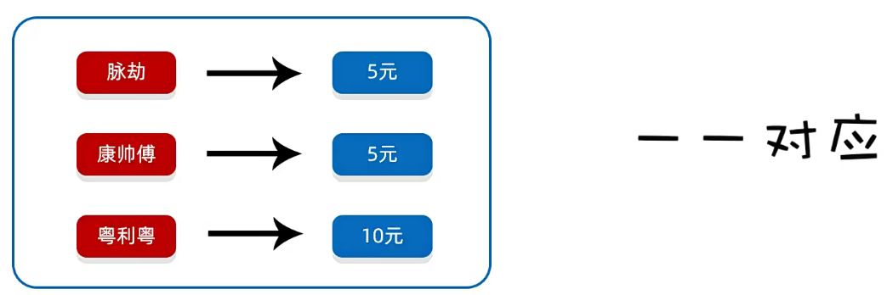

其中，一个键和值，这个整体我们称之为：键值对 / 键值对对象，在Java中也叫做 `Entry对象`。

因此右边的集合中，有三个 `Entry对象`。


----

## 二、双列集合的特点

1、双列集合一次需要添加一对数据，分别为键和值。

2、键不能重复，值可以重复。

3、键和值是一一对应的关系，每一个键只能找到自己对应的值

4、在Java中，键 + 值这个整体，我们称之为 `键值对` 或者 `键值对对象`，在Java中叫做 `Entry对象`。


----

# 3.Map集合常用的API

## 一、引入

先来看一下双列集合的体系结构。

在双列集合中，`Map` 是它最顶级的接口，在 `Map集合` 中定义了双列集合所有的共性方法，因此我们只有把它学会了后，下面的这三个实现类，就非常的轻松了，也没有什么额外的新的方法需要学习了，这就是成体系学习的好处。

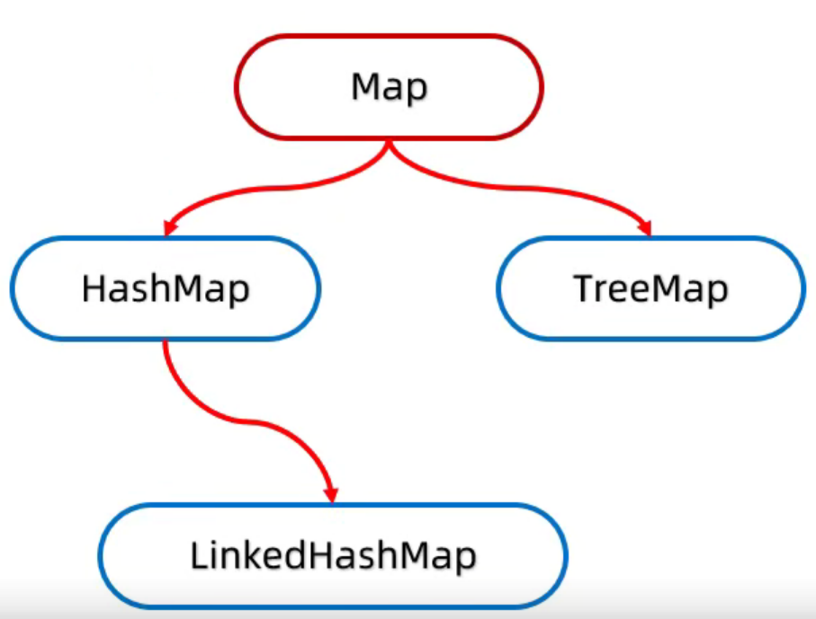

---

## 二、Map的常见API

Map是双列集合的顶层接口，它的功能是所有双列集合都可以继承使用的。

在 `Map集合` 中有以下方法

| 方法名                                | 说明                                 |
| ------------------------------------- | ------------------------------------ |
| `V put(K key,V value)`                | 添加元素                             |
| `V remove(Object key)`                | 根据键删除键值对元素                 |
| `void clear()`                        | 移除所有的键值对元素                 |
| `boolean containsKey(Object key)`     | 判断集合是否包含指定的键             |
| `boolean containsValue(Object value)` | 判断集合是否包含指定的值             |
| `boolean isEmpty()`                   | 判断集合是否为空                     |
| `int size()`                          | 集合的长度，也就是集合中键值对的个数 |

---

## 三、代码实现

创建 `Map集合的对象` 的时候需要注意，`Map` 是一个接口，并且后面有泛型。

既然它是一个接口，那么我们就不能直接创建它的对象，而是需要创建它实现类的对象。

既然 `Map` 中可以存一对元素，一对就是 `键与值`，因此泛型我们也得写两个。

前面的 `K` 表示 `Key`，即键的类型；后面的 `V` 表示 `Value`，即值的类型。

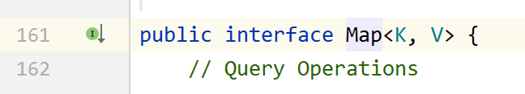

现在由于是要学习 `Map集合` 里面的方法，所以才使用多态的这种方式来创建对象。

~~~java
Map<String, String> m = new HashMap<>();
~~~

----

### 1）  添加元素

方法的形参就有两个值：`key 和 value`。

`put()` 其实有两个左右：1、添加；2、覆盖

在添加数据的时候，如果键不存在，那么直接把键值对对象添加到map集合当中，方法返回null。

在添加数据的时候，如果键是存在的，那么会把原有的键值对对象覆盖，会把被覆盖的值进行返回。

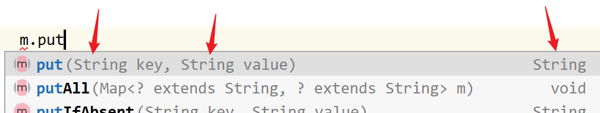

~~~java
V put(K key,V value)
~~~

~~~java
m.put("郭靖", "黄蓉");
m.put("韦小宝","沐剑屏");
m.put("尹志平","小龙女");
String value2 = m.put("韦小宝", "双儿");
System.out.println(value2); // 沐剑屏
~~~

----

### 2）根据键删除键值对元素

返回值 `V`，就是 `Value`。

即：方法会根据键删除键值对元素，并把值进行返回。

~~~java
V remove(Object key)
~~~

代码示例

~~~java
String result = m.remove("郭靖");
System.out.println(result); // 黄蓉
~~~

---

### 3）移除所有的键值对元素

~~~java
void clear()
~~~

可以发现，`clear()` 一旦执行完毕后，集合里面什么都没有了

~~~java
m.clear();
System.out.println(m); // {}
~~~

----

### 4）判断集合是否包含指定的键

方法有一个 `boolean` 的返回值，如果包含返回 `true`，如果不包含返回 `false`

~~~java
boolean containsKey(Object key)
~~~

代码示例

~~~java
boolean keyResult = m.containsKey("郭靖");
System.out.println(keyResult); // true
~~~

----

### 5）判断集合是否包含指定的值

方法有一个 `boolean` 的返回值，如果包含返回 `true`，如果不包含返回 `false`

~~~java
boolean containsValue(Object value)
~~~

代码示例

~~~java
boolean valueResult = m.containsValue("小龙女2");
System.out.println(valueResult); // false
~~~

----

### 6）判断集合是否为空

~~~java
boolean isEmpty()
~~~

代码示例

~~~java
boolean result = m.isEmpty();
System.out.println(result);
~~~

----

### 7）集合的长度，也就是集合中键值对的个数

~~~java
int size()
~~~

代码示例

~~~java
int size = m.size();
System.out.println(size);
~~~

----

# 4.`Map` 的遍历方式

`Map集合` 一共有三种遍历方式

1、键找值

2、一次获取所有的键值对对象

3、Lambda表达式

----

## 一、键找值

~~~java
//1.创建Map集合的对象
Map<String,String> map = new HashMap<>();

//2.添加元素
map.put("尹志平","小龙女");
map.put("郭靖","穆念慈");
map.put("欧阳克","黄蓉");

//3.通过键找值

//3.1获取所有的键，把这些键放到一个单列集合当中
//keySet 可以理解为：将Map集合的key放到一个Set集合中
Set<String> keys = map.keySet();
//3.2遍历单列集合，得到每一个键
for (String key : keys) {
    //System.out.println(key);
    //3.3 利用map集合中的键获取对应的值，通过get方法
    String value = map.get(key);
    System.out.println(key + " = " + value);
}
~~~

----

## 二、一次获取所有的键值对对象

在Java中，键 + 值这个整体，我们称之为 `键值对` 或者 `键值对对象`，在Java中叫做 `Entry对象`。

先复制粘贴基础代码

~~~java
//1.创建Map集合的对象
Map<String, String> map = new HashMap<>();

//2.添加元素
//键：人物的外号
//值：人物的名字
map.put("标枪选手", "马超");
map.put("人物挂件", "明世隐");
map.put("御龙骑士", "尹志平");
~~~

Map集合的第二种遍历方式，这种方式是通过键值对对象进行遍历。

通过一个方法获取所有的键值对对象，返回一个Set集合，在这个集合里面装的就是所有的键值对对象。

调用的是 `Map集合` 中的 `entrySet()`，`entry`：键值对对象。整个方法的理解：获取所有的键值对对象，将它们全部放到一个 `Set集合` 中，因此方法就会返回一个 `Set集合`。

此时 `Set集合` 里面装的就是键值对对象，因此 `Set集合` 里面的泛型就是 `Entry`，但是 `Entry` 是键值对对象，因此 `Entry` 里面也有两个泛型：`键和值`，这种情况叫做 `泛型的嵌套`。

但是在写代码的时候泛型嵌套不需要自己写，IDEA会帮我们自动生成：<kbd>ctrl + alt + V</kbd>。

`Set` 中装的是 `Entry对象`，在 `Entry` 里面装的是键和值。

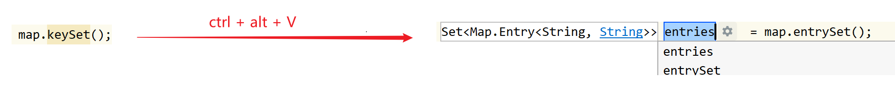

~~~java
Set<Map.Entry<String, String>> entries = map.entrySet();
~~~

选中 `Entry` 跟进。可以发现 `Entry` 是 `Map接口` 中的内部接口。

因此我们在调用内部类型的时候，需要用 `外部接口.内部接口`

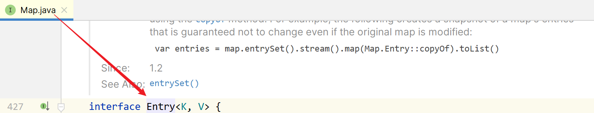

但是有的资料并没有写 `Map.`，那么此时就需要对 `Entry` 进行导包，那么下面就可以直接使用 `Entry` 了。

~~~java
import java.util.Map.Entry;
Set<Entry<String, String>> entries = map.entrySet();
~~~

接下来遍历`entries`这个集合，去得到里面的每一个键值对对象

~~~java
//这里的entry变量就依次表示一个键值对对象
for (Map.Entry<String, String> entry : entries) {
    //3.3 利用entry调用get方法获取键和值
    String key = entry.getKey();
    String value = entry.getValue();
    System.out.println(key + "=" + value);
}
~~~

----

## 三、Lambda表达式

在使用 `Lambda表达式` 进行遍历的时候，会使用到 `Map集合` 中的一个方法：`forEach()`。

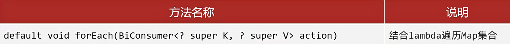

基础代码直接复制粘贴。

~~~java
//1.创建Map集合的对象
Map<String,String> map = new HashMap<>();

//2.添加元素
//键：人物的名字
//值：名人名言
map.put("鲁迅","这句话是我说的");
map.put("曹操","不可能绝对不可能");
map.put("刘备","接着奏乐接着舞");
map.put("柯镇恶","看我眼色行事");
~~~

利用lambda表达式进行遍历，需要调用 `Map` 里面的 `forEach()`，跟进 `forEach()`。

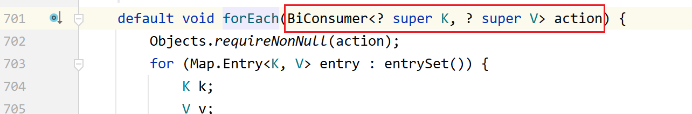

方法里面需要传入 `BiConsumer`，继续跟进 `BiConsumer`。

可以发现 `BiConsumer` 是一个接口，并且接口上面有 `@FunctionalInterface`，表示它是一个函数式接口，因此我们可以传递 `Lambda表达式`。


我们先试用匿名内部类的方式来进行遍历

~~~java
map.forEach(new BiConsumer<String, String>() {
    @Override
    // 形参一：键；形参二：值
    public void accept(String key, String value) {
        System.out.println(key + "=" + value);
    }
});
~~~

下面改写成 `Lambda表达式`

~~~java
map.forEach((key, value)-> System.out.println(key + "=" + value));
~~~

---

接下来我们查看一下 `forEach()` 的底层源码，选中 `forEach()` <kbd>ctrl + b</kbd> 跟进。

先通过 `增强for键值对` 进行遍历，取出键和值，然后再去调用 `accept()`，这个方法就是我们在匿名内部类中重写的 `accept()`，因此第一个参数就是 `键`，第二个参数就是 `值`。

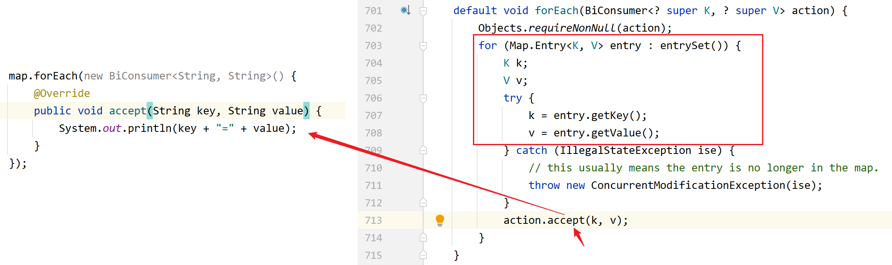


----

# 7.`HashMap` 基本的使用

`HashMap` 是 `Map体系` 中最为常用的一种集合，在 `HashMap` 中我们不需要学习额外新的方法，直接使用 `Map` 里面的方法就行了。

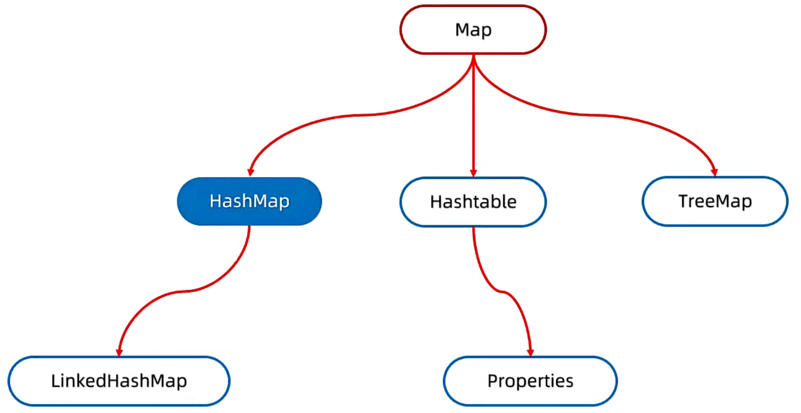

因此本节主要讲解的是 `HashMap` 本身的特点就可以直接开始写练习了。

## 一、`HashMap` 的特点

1、`HashMap` 是 `Map` 里面的一个实现类。

2、它里面没有额外需要学习的特有方法，直接使用 `Map` 里面的方法就可以了。

3、所有 `Map集合` 的特点都是由**键**决定的：无序、不重复、无索引。

- `无序`：存和取的顺序有可能是不一样的
- `不重复`：键是不能重复的
- `无索引`：不能通过索引获取里面的元素

4、`HashMap` 跟 `HashSet` 底层原理是一模一样的，都是哈希表结构。

哈希表结构：`数组 + 链表`，在JDK8的时候为了提高它的性能，所以又在里面加上了 `红黑树`

---

## 二、`HashMap` 的底层原理

当我们创建了一个 `HashMap` 对象的时候，在底层它首先还是会创建一个长度为16，默认加载因子为0.75的数组。

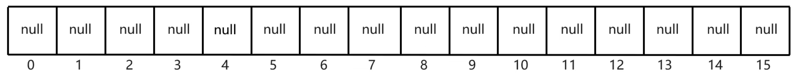

再利用 `put()` 就可以添加数据了。

`put()` 的底层首先会创建一个 `Entry对象`，`Entry对象` 里面记录的就是要添加的 `键和值`。

然后再利用键计算出键的哈希值，注意跟值无关。

然后再计算出在数组中应存入的索引。

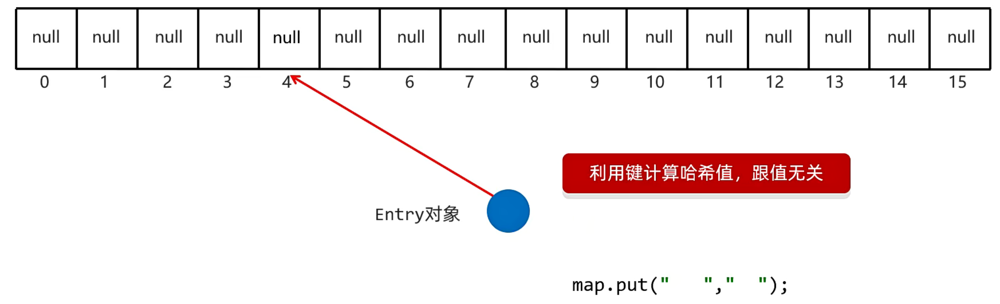

如果该位置为 `null`，直接添加即可；如果不为 `null`，跟 `HashSet` 一样，会调用 `equals()` 比较 `键` 的属性值。

接下来就和 `HashSet` 有点不一样了。

如果键里面的数据是一样的，它就会覆盖原有的 `Entry对象`，因此这就是 `put()` 隐含的覆盖功能。

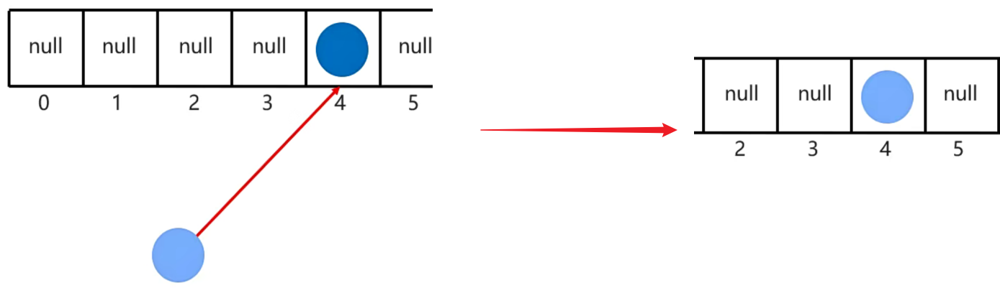

但如果比较完后 `键` 不一样呢？它就会添加新的 `Entry对象`。

在JDK8以前，新元素会添加到数组中，原先的会挂载在下面形成一条链表。

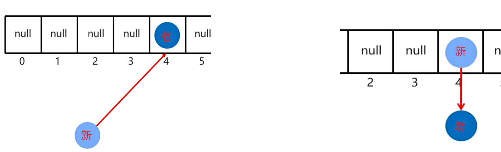

但是在JDK8的时候就没有那么复杂了，新的元素会直接挂在老元素的下面形成链表。


额外在JDK8的时候还有一个特点，为了提高性能，当 `链表长度超过8，而且数组长度 >= 64`，链表就会自动转成 `红黑树`

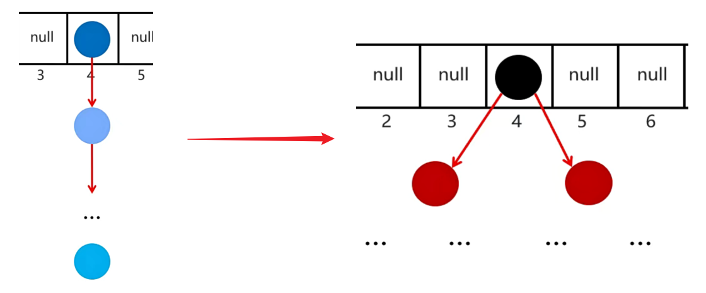

----

## 四、总结

1、`HashMap` 底层是哈希表结构

2、它也是保证 `hashCode()` 和 `equals()` 来保证**键的唯一**。

3、如果键存储的是自定义对象，需要重写 `hashCode()` 和 `equals()`

若干值存储自定义对象，就不需要重写 `hashCode()` 和 `equals()`


----

# 8.`HashMap` 练习一：存储自定义对象

案例需求

- 创建一个HashMap集合，键是学生对象(Student)，值是居住地 (String)。存储多个元素，并遍历。
- 要求保证键的唯一性：如果学生对象的成员变量值相同，我们就认为是同一个对象

**Student.java**

~~~java
public class Student {
    //姓名
    private String name;
    //年龄
    private int age;

    // 无参构造、有参构造、get、set方法
    
    @Override
    public boolean equals(Object o) {
        if (this == o) return true;
        if (o == null || getClass() != o.getClass()) return false;
        Student2 student2 = (Student2) o;
        return age == student2.age && Objects.equals(name, student2.name);
    }

    @Override
    public int hashCode() {
        return Objects.hash(name, age);
    }
}
~~~

**测试类**

~~~java
//1.创建HashMap的对象
HashMap<Student,String> hm = new HashMap<>();

//2.创建三个学生对象
Student s1 = new Student("zhangsan",23);
Student s2 = new Student("lisi",24);
Student s3 = new Student("wangwu",25);
Student s4 = new Student("wangwu",25);

//3.添加元素
hm.put(s1,"江苏");
hm.put(s2,"浙江");
hm.put(s3,"福建");
hm.put(s4,"山东");

//4.遍历集合
Set<Student> keys = hm.keySet();
for (Student key : keys) {
    String value = hm.get(key);
    System.out.println(key + "=" + value);
}

System.out.println("--------------------------");

Set<Map.Entry<Student, String>> entries = hm.entrySet();
for (Map.Entry<Student, String> entry : entries) {
    Student key = entry.getKey();
    String value = entry.getValue();
    System.out.println(key + "=" + value);
}

System.out.println("--------------------------");

hm.forEach((student, s)-> System.out.println(student + "=" +  s));
~~~


----

# 9.`HashMap` 练习二：利用 `Map集合` 进行统计

```
某个班级80名学生，现在需要组成秋游活动，
班长提供了四个景点依次是（A、B、C、D）,
每个学生只能选择一个景点，请统计出最终哪个景点想去的人数最多。
```

**测试类**

~~~java
//1.需要先让同学们投票
//定义一个数组，存储4个景点
String[] arr = {"A","B","C","D"};
//利用随机数模拟80个同学的投票，并把投票的结果存储起来
ArrayList<String> list = new ArrayList<>();
Random r = new Random();
for (int i = 0; i < 80; i++) {
    int index = r.nextInt(arr.length);
    list.add(arr[index]);
}
//2.如果要统计的东西比较多，不方便使用计数器思想
//我们可以定义map集合，利用集合进行统计。
HashMap<String,Integer> hm = new HashMap<>();
for (String name : list) {
    //判断当前的景点在map集合当中是否存在
    if(hm.containsKey(name)){
        //存在
        //先获取当前景点已经被投票的次数
        int count = hm.get(name);
        //表示当前景点又被投了一次
        count++;
        //把新的次数再次添加到集合当中
        hm.put(name,count);
    }else{
        //不存在
        hm.put(name,1);
    }
}

System.out.println(hm);

//3.求最大值
//这里不能以ABCD任何一个景点的投票次数为初始值，因为80次投票中可能一次都没有投中这个景点，那么这个景点就不在Map集合中，因此应该为 0 作为参照物。
int max = 0;
Set<Map.Entry<String, Integer>> entries = hm.entrySet();
for (Map.Entry<String, Integer> entry : entries) {
    int count = entry.getValue();
    if(count > max){
        max = count;
    }
}
System.out.println(max);
//4.判断哪个景点的次数跟最大值一样，如果一样，打印出来
for (Map.Entry<String, Integer> entry : entries) {
    int count = entry.getValue();
    if(count == max){
        System.out.println(entry.getKey());
    }
}
~~~


----

# 10.LinkedHashMap

`LinkedHashMap` 在 `Map集合` 中的辈分比较低，它的父类就是 `HashMap`，因此我们同样的也不需要学习额外的新的方法，直接使用 `Map` 里面的方法就行了。

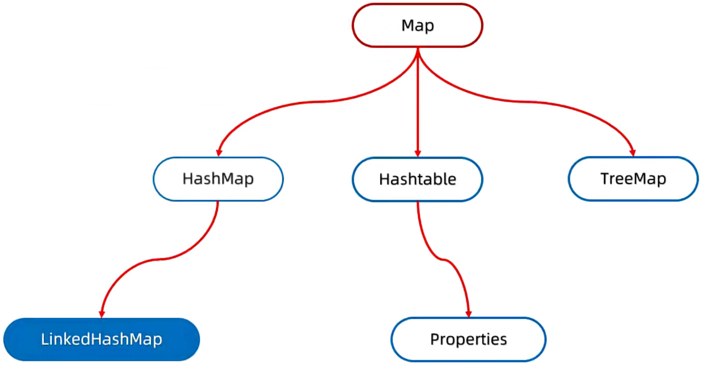

## 一、特点

由键决定：有序、不重复、无索引。

其中 `不重复、无索引` 跟它的父类 `HashMap` 是一样的。

但是这里的有序指的是：保证存储和取出的元素顺序一致。

它的实现原理跟前面的 `LinkedHashSet` 是一样的。

`LinkedHashMap` 底层数据结构是哈希表，只是在哈希表的基础上又额外多了一条双向链表机制，用来记录存储的顺序。

----

## 二、底层原理

在存的时候跟它的父类 `HashMap` 是一样的，同样会调用 `hashCode()` 计算出键的哈希值，然后再计算出它在数组中应存入的位置。

如果该位置是有元素的，就会使用 `equals()` 比较键是否相同；如果该位置是没有元素的，直接添加进去即可。

与此同时，在底层还多了一条链表，而且是双向链表。

链表的头结点就是刚刚添加的第一个元素。

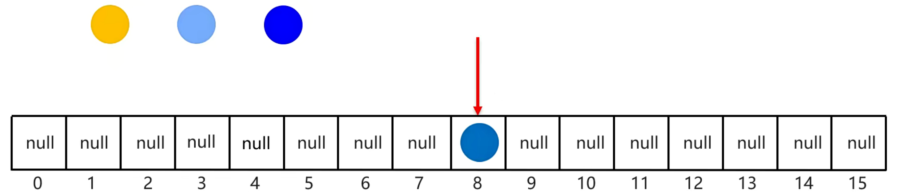

此时再来添加第二个元素，当我们将第二个元素添加成功之后，第一个元素内会记录第二个元素的的指针；第二个元素内也会记录第一个元素的地址值，这样就形成了双向链表。

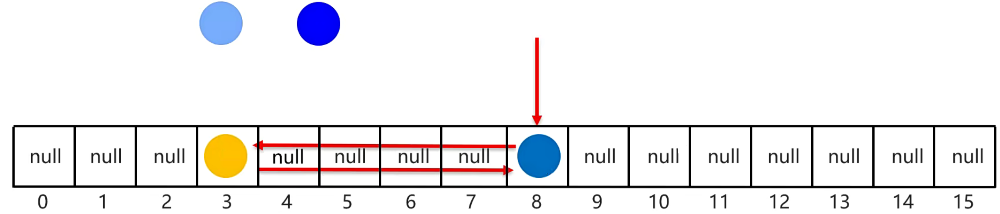

当我们再来添加第三个元素的时候，同样的还是通过键的哈希值计算出应存入的索引是 `3`，但是这里已经有元素了，因此它就会通过 `equals()` 去比较键的属性值是否相同。

如果相同直接覆盖，如果不同，在JDK8以后就会挂在下面，与此同时，第二个元素和第三个元素之间还要再互相记录一次地址值，这样在双向链表中就已经把刚刚添加的三个元素按照顺序连在一起了。

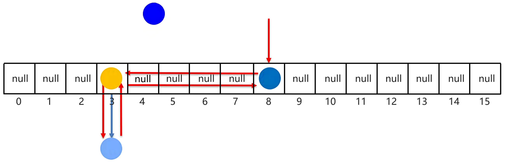

最后来添加第四个元素，与此同时，第三个元素与第四个元素之间也会互相记录一次地址值。

四个元素添加完毕，此时双向链表的头结点就是刚刚添加的第一个元素；而双向链表的尾结点就是我们刚刚添加的最后一个元素。

在遍历的时候就是从双向链表的头结点开始，依次往后遍历，这样得到的数据就跟添加的顺序是一模一样的了。

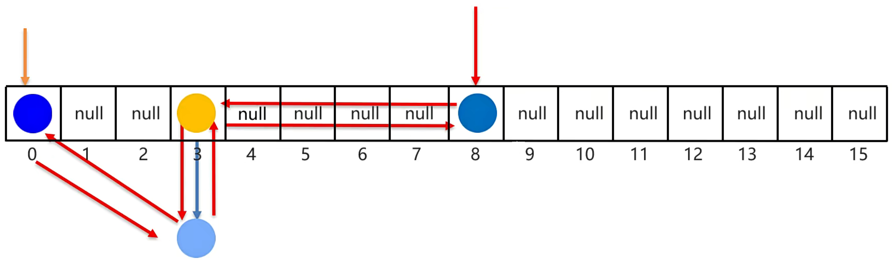

-----

## 三、代码实现

~~~java
//1.创建集合
LinkedHashMap<String,Integer> lhm = new LinkedHashMap<>();

//2.添加元素
lhm.put("c",789);
lhm.put("b",456);
lhm.put("a",123);
lhm.put("a",111);

//3.打印集合
System.out.println(lhm); // {c=789, b=456, a=111}，说明LinkedHashMap也有两个功能：1、添加；2、覆盖
~~~


---

# 11.TreeMap

`TreeMap` 学习完毕后，整个的 `Map集合` 也就学习完毕了。

在整个Map体系中，其实还有 `Hashtable`、`Properties` 这两个集合，由于这两个集合会有跟 IO 相关的方法，因此当我们学完IO后再去学习这两个集合。

关于 `TreeMap` 我们同样没有什么额外的新的方法学习，只需要知道它本身的特点和底层原理就行了。

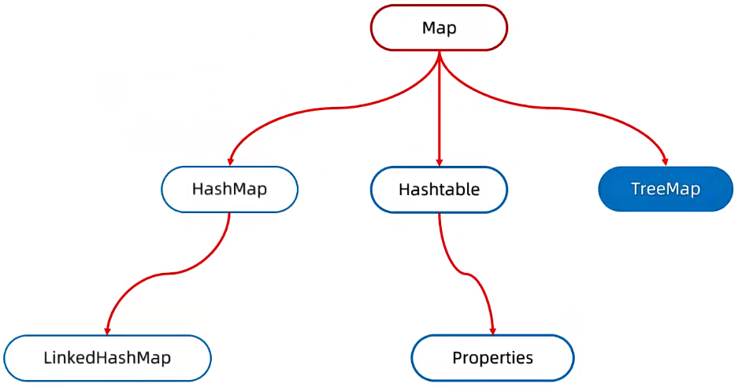

---

## 一、特点

`TreeMap` 跟 `TreeSet` 底层原理一样，都是红黑树结构。

`TreeMap` 所有的特点也是由键决定的：不重复、无索引、可排序（对键进行排序）。

PS：默认按照键的从小到大进行排序，也可以自己规定键的排序规则。

代码的书写跟 `TreeSet` 是一样的

- 实现 `Comparable接口`，指定比较规则。
- 创建集合时传递 `Comparator` 比较器对象，指定比较规则。

如果第一种和第二种同时存在，那么以第二种为准。

----

## 二、练习一

```
需求1：
    键：整数表示id
    值：字符串表示商品名称
    要求1：按照id的升序排列
    要求2：按照id的降序排列
```

运行以下代码，发现它默认是按照 `id` 升序排列的

~~~java
//1.创建集合对象
TreeMap<Integer,String> tm = new TreeMap<>();

//2.添加元素
tm.put(5,"可恰可乐");
tm.put(4,"雷碧");
tm.put(3,"九个核桃");
tm.put(2,"康帅傅");
tm.put(1,"粤利粤");

//3.打印集合
System.out.println(tm); // {1=粤利粤, 2=康帅傅, 3=九个核桃, 4=雷碧, 5=可恰可乐}
~~~

跟进 `Integer`，可以发现它也是实现了 `Comparable接口` 的。

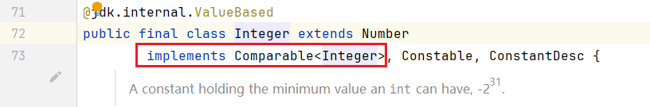

我们找到它重写的 `compareTo` 方法，可以发现在这个里面它其实已经制定了排序的规则，这个规则就是升序排列


跟进 `compare()`，可以发现这个方法里面就是一个三元运算符。

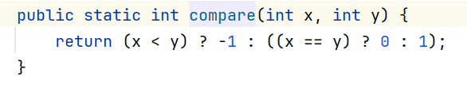

此时我们就知道了 `Integer`、`Double` 等默认都是按照升序排列的。而我们在这里存的键就是 `Integer`，因此它就默认按照升序排列了。

`String` 是按照字母在 `ASCII码表` 中对应的数字升序进行排列的，而且是从首字母开始，一个一个往后比较。

---

题目还有第二个需求：按照 `id` 降序排列。此时默认的方式就已经不能满足我们的需求了，就可以使用第二种方式：在创建集合对象的时候，小括号中可以传递比较器的对象。

~~~java
TreeMap<Integer,String> tm = new TreeMap<>(new Comparator<Integer>() {
    @Override
    public int compare(Integer o1, Integer o2) {
        //o1:当前要添加的元素
        //o2：表示已经在红黑树中存在的元素
        return o2 - o1;
    }
});
~~~


---

## 三、练习二

~~~java
需求2：
    键：学生对象
    值：籍贯
    要求：按照学生年龄的升序排列，年龄一样按照姓名的字母排列，同姓名年龄视为同一个人。
~~~

测试类

~~~java
//1.创建集合
TreeMap<Student,String> tm = new TreeMap<>();

//2.创建三个学生对象
Student s1 = new Student("zhangsan",23);
Student s2 = new Student("lisi",24);
Student s3 = new Student("wangwu",25);

//3.添加元素
tm.put(s1,"江苏");
tm.put(s2,"天津");
tm.put(s3,"北京");

//4.打印集合
System.out.println(tm);
~~~

如果不指定排序规则，就会直接报错。

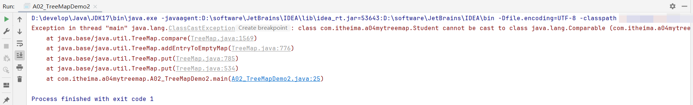

**Student.java**

~~~java
public class Student implements Comparable<Student>{
    private String name;
    private int age;

    // 无参构造、有参构造、get、set方法
    
    @Override
    public int compareTo(Student o) {
        //按照学生年龄的升序排列，年龄一样按照姓名的字母排列，同姓名年龄视为同一个人。

        //this：表示当前要添加的元素
        //o：表示已经在红黑树中存在的元素

        //返回值：
        //负数：表示当前要添加的元素是小的，存左边
        //正数：表示当前要添加的元素是大的，存右边
        //0：表示当前要添加的元素已经存在，舍弃

        int i = this.getAge() - o.getAge();
        i = i == 0 ? this.getName().compareTo(o.getName()) : i;
        return i;
    }
}
~~~

----

## 四、利用 `TreeMap` 进行排序

~~~java
需求：
字符串“aababcabcdabcde”
请统计字符串中每一个字符出现的次数，并按照以下格式输出
输出结果：
a（5）b（4）c（3）d（2）e（1）
~~~

由于利用计数器的方式进行统计有一定的弊端，因此我们就引出来一个新的思想：利用 `Map集合` 进行统计。

利用 `Map集合` 进行统计有两种方式：1、`HashMap`；2、`TreeMap`

它们的键都表示：要统计的内容；值：表示要统计的次数。

如果题目中没有要求对结果进行排序，默认使用 `HashMap`，因为它的效率是最高的。

但是如果题目要求对结果进行排序，请使用 `TreeMap`。

由结果可知，这里应该使用 `TreeMap`。

~~~java
//1.定义字符串
String s = "aababcabcdabcde";

//2.创建集合
TreeMap<Character,Integer> tm = new TreeMap<>();

//3.遍历字符串得到里面的每一个字符
for (int i = 0; i < s.length(); i++) {
    char c = s.charAt(i);
    //拿着c到集合中判断是否存在
    //存在，表示当前字符又出现了一次
    //不存在，表示当前字符是第一次出现
    if(tm.containsKey(c)){
        //存在
        //先把已经出现的次数拿出来
        int count = tm.get(c);
        //当前字符又出现了一次
        count++;
        //把自增之后的结果再添加到集合当中
        tm.put(c,count);
    }else{
        //不存在
        tm.put(c,1);
    }
}

//4.遍历集合，并按照指定的格式进行拼接
// a（5）b（4）c（3）d（2）e（1）
//StringBuilder sb = new StringBuilder();
//tm.forEach((key, value)->sb.append(key).append("(").append(value).append(")"));

StringJoiner sj = new StringJoiner("","","");
// 非字符串的内容需要 + ""
tm.forEach((key, value)->sj.add(key + "").add("(").add(value + "").add(")"));

System.out.println(sj);
~~~

----

## 五、总结

1、`TreeMap集合` 的特点是什么样的？

- 键：不重复、无索引、可排序
- 底层基于红黑树进行实现，增删改查性能较好

2、`TreeMap集合` 排序的两种方式

- 默认的排序规则：实现 `Comparable接口`，指定比较规则
- 创建集合时传递Comparator比较器对象，指定比较规则

例如字符串、Integer中默认的排序规则有时候就不能满足我们的需求了。


-----

# 12.`HashMap` 源码

选中 `HashMap` 跟进，首先我们要来看四大点。

## 一、每个元素的组成

第一个我们需要 `HashMap` 里面每一个元素到底是什么。

<kbd>ctrl + F12</kbd> 搜索 `Node`，其实在 `HashMap` 中，每一个元素都是一个 `Node` 的对象，`Node` 实现了 `Map` 里面的 `Entry接口`，因此我们也称之为：一个元素（`Node<K,V>`）它是一个Entry对象（`Entry<K,V>`）。

在一个 `Entry` 里面有四个成员变量：

- `hash`：通过键计算出来的哈希值
- `key`：键
- `value`：值

`next`：在之前我们说过，一个 `HashMap` 底层是由 `数组 + 链表 + 红黑树` 组成的，当我们在数组中添加了一个元素，如果是链表的话，下面还会挂其他的元素，这就是 `next` 的作用，它的作用就是记录下一个节点的地址值。

-----

如果转成红黑树的话，那么元素就不是 `Node类型` 了，而是 `TreeNode`，它里面一共有五个成员变量。

- `parent`：记录父节点的地址值
- `left`：左子结点
- `right`：右子节点
- `prev`：暂时没什么用
- `red`：颜色，`true` 表示当前节点为红色，`false` 表示当前节点为黑色

并且 `TreeNode` 继承了 `LinkedHashMap` 中的 `Entry`，选中这个 `Entry` 跟进

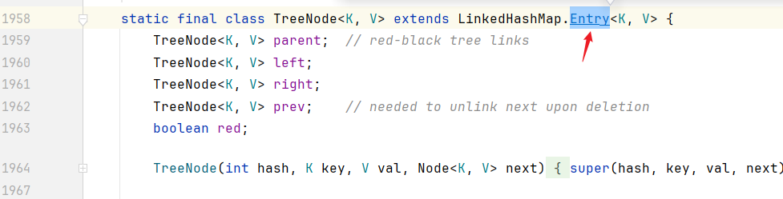

可以看见这个 `Entry` 又继承了 `HashMap` 中的 `Node`，继续跟进 `Node`


可以发现又回到 `HashMap中的Node` 了。

因此，如果是红黑树，里面的每一个节点除了有 `Node` 中的成员变量外，还会再记录父节点的地址值、左子结点、右子节点、颜色。

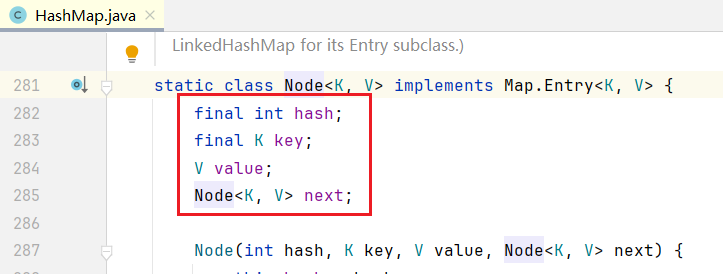

----

## 二、成员变量

<kbd>ctrl + F12</kbd> 找到 `table` 成员变量。


可以看见 `table` 是一个数组， `HashMap` 底层是由 `数组 + 链表 + 红黑树` 组成的，这个数组的名字就是 `table`，它里面装的每一个元素就是 `Node` 的对象。

---

接下来看第二个成员变量，那就是数组的长度。

<kbd>ctrl + F12</kbd> 找到 `DEFAULT_INITIAL_CAPACITY` 常量，即默认的初始容量，它后面的值是 `1 << 4`，即 `16`，所以数组默认长度是 `16`。

再往下看 `DEFAULT_LOAD_FACTOR`，表示默认的加载因子为 `0.75`，加载因子就决定了 `HashMap` 的扩容时机，当数组长度超过 `16 × 0.75` 的时候就需要进行扩容，每次扩容为原先的两倍。

---

第三个成员变量了解一下就行了：`MAXIMUM_CAPACITY`，表示最大的容量为 `1 << 30`，

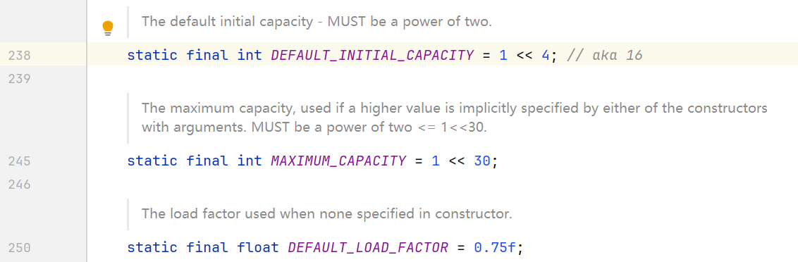

---

## 三、构造方法

找到跟类名一致的成员方法即可。

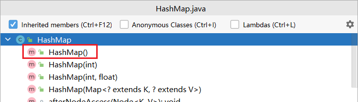

如果用空参构造创建 `HashMap` 的对象，在底层它其实只做了一件事情：将默认的加载因子0.75赋值给成员变量 `loadFactor`，这就表示当前的 `HashMap集合` 的加载因子就是 `0.75`。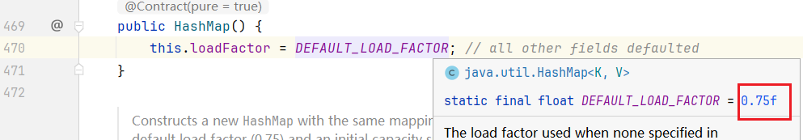

但是要注意的是，这个时候，底层的数组还没有创建！因为在刚刚我们看见了，`table` 后面并没有赋值，那么默认初始化值就是 `null`。

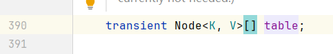

数组在我们添加元素的时候就会创建。

----

## 四、添加元素

<kbd>ctrl + F12</kbd> 找到 `put()`。

`put()` 形参有两个：`key、value`，表示键和值。

底层调用了一个 `putVal()`，在这个方法里面有五个参数。

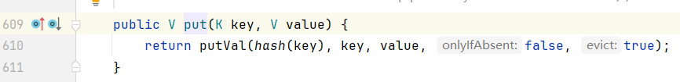

`hash(key)` ：将键传递过去。

跟进 `hash()` 看看，此时就能发现了，它拿着键调用 `hashCode()`，然后再进行一些其他的运算，我们不用操心这个方法的计算结果是什么，只需要知道它返回的是键的哈希值即可。

并且通过这个方法我们也知道了，哈希值只跟键有关系，跟值没有半毛钱关系。

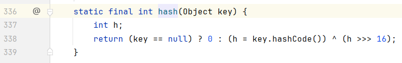

`key`：键

`value`：值

`onlyIfAbsent`：表示当前的数据是否保留。

如果添加键在HashMap中已经有了，就会进行覆盖，覆盖的原因就是这个值决定的。

`false` 表示重复的数据不保留，进行覆盖。 `true` 表示不会覆盖。它默认情况下都是 `false`。

第五个参数 `true` 现在跟我们没有什么太大关系，因此我们只需要知道前面四个参数就行了。

然后将这四个参数传递给 `putVal()`，真正的难点才刚刚开始。

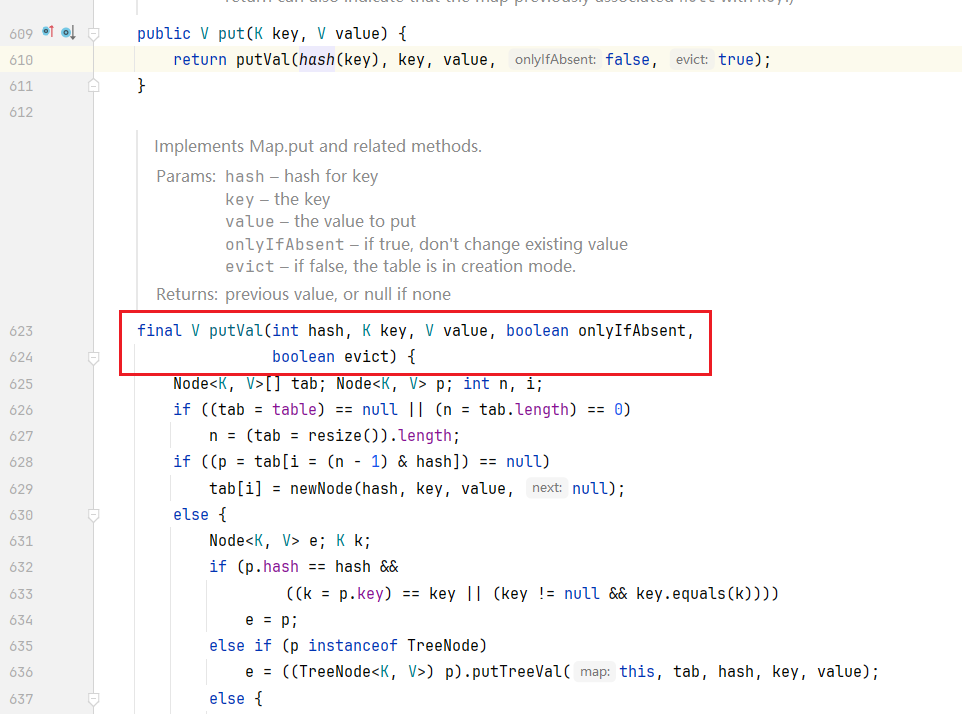

在这里可以看见一个数组，那方括号里面，肯定就是数组的索引。

如果让我们自己写，那肯定先把索引计算出来，用一个变量 `index` 表示，再把 `index` 写在方括号中。

但是编写Java的大佬直接一步到位，将 `计算、赋值` 全部写在一起了。

但我们自己不能这么写，因为我们自己写的代码需要有阅读性，这就是我们看不懂源码的第一个原因。

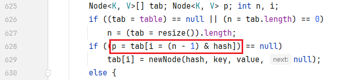

还有第二个原因：集合是跟数据结构结合在一起的，因此在阅读这些源码的时候，我们在脑海中还要去想象出数据结构的变化。

----

老师在资料中准备了两个东西，一个是下面的源码，和一张图。老师在讲解的时候：左边是源码，右边是图。

在讲解的时候会将源码一边讲一边改，改成我们平时书写习惯。右边的图老师会边讲边画好好理解。

视频地址：[集合进阶-14-HashMap源码超详细解析（二）_哔哩哔哩_bilibili](https://www.bilibili.com/video/BV1yW4y1Y7Ms?p=15&vd_source=95ed0cf36a948bb4f3a90c1fe3d690af)

~~~java
1.看源码之前需要了解的一些内容

Node<K,V>[] table   哈希表结构中数组的名字

DEFAULT_INITIAL_CAPACITY：   数组默认长度16

DEFAULT_LOAD_FACTOR：        默认加载因子0.75


HashMap里面每一个对象包含以下内容：
1.1 链表中的键值对对象
    包含：  
			int hash;         //键的哈希值
            final K key;      //键
            V value;          //值
            Node<K,V> next;   //下一个节点的地址值
			
			
1.2 红黑树中的键值对对象
	包含：
			int hash;         		//键的哈希值
            final K key;      		//键
            V value;         	 	//值
            TreeNode<K,V> parent;  	//父节点的地址值
			TreeNode<K,V> left;		//左子节点的地址值
			TreeNode<K,V> right;	//右子节点的地址值
			boolean red;			//节点的颜色
					


2.添加元素
HashMap<String,Integer> hm = new HashMap<>();
hm.put("aaa" , 111);
hm.put("bbb" , 222);
hm.put("ccc" , 333);
hm.put("ddd" , 444);
hm.put("eee" , 555);

添加元素的时候至少考虑三种情况：
2.1数组位置为null
2.2数组位置不为null，键不重复，挂在下面形成链表或者红黑树
2.3数组位置不为null，键重复，元素覆盖


//参数一：键
//参数二：值

//返回值：被覆盖元素的值，如果没有覆盖，返回null
public V put(K key, V value) {
    return putVal(hash(key), key, value, false, true);
}


//利用键计算出对应的哈希值，再把哈希值进行一些额外的处理
//简单理解：返回值就是返回键的哈希值
static final int hash(Object key) {
    int h;
    return (key == null) ? 0 : (h = key.hashCode()) ^ (h >>> 16);
}

//参数一：键的哈希值
//参数二：键
//参数三：值
//参数四：如果键重复了是否保留
//		   true，表示老元素的值保留，不会覆盖
//		   false，表示老元素的值不保留，会进行覆盖
final V putVal(int hash, K key, V value, boolean onlyIfAbsent,boolean evict) {
	    //定义一个局部变量，用来记录哈希表中数组的地址值。
    	// 成员变量已经有个table数组用来记录数组的地址值了，为什么这里还要记录呢？
    	// 成员变量是在堆中的，方法在栈中，如果在这个方法里面反复调用 table，也就是说每一次用都要到堆里面找，相对来讲比较麻烦，于是干脆就自己在方法里面定义一个，以后要用到时候直接使用这个局部变量就行了，效率要更高。
        Node<K,V>[] tab;
		
		//临时的第三方变量，用来记录键值对对象的地址值
        Node<K,V> p;
        
		//表示当前数组的长度
		int n;
		
		//表示索引
        int i;
		
		//把哈希表中数组的地址值，赋值给局部变量tab
		tab = table;

        if (tab == null || (n = tab.length) == 0){
			//1.如果当前是第一次添加数据，底层会创建一个默认长度为16，加载因子为0.75的数组
			//2.如果不是第一次添加数据，会看数组中的元素是否达到了扩容的条件
			//如果没有达到扩容条件，底层不会做任何操作
			//如果达到了扩容条件，底层会把数组扩容为原先的两倍，并把数据全部转移到新的哈希表中
			tab = resize();
			//表示把当前数组的长度赋值给n
            n = tab.length;
        }

		//拿着数组的长度跟键的哈希值进行计算，计算出当前键值对对象，在数组中应存入的位置
		i = (n - 1) & hash;//index
		//获取数组中对应元素的数据
		p = tab[i];
		
		
        if (p == null){
			//底层会创建一个键值对对象，直接放到数组当中
            tab[i] = newNode(hash, key, value, null);
        }else {
            Node<K,V> e;
            K k;
			
			//等号的左边：数组中键值对的哈希值
			//等号的右边：当前要添加键值对的哈希值
			//如果键不一样，此时返回false
			//如果键一样，返回true
			boolean b1 = p.hash == hash;
			
            if (b1 && ((k = p.key) == key || (key != null && key.equals(k)))){
                e = p;
            } else if (p instanceof TreeNode){
				//判断数组中获取出来的键值对是不是红黑树中的节点
				//如果是，则调用方法putTreeVal，把当前的节点按照红黑树的规则添加到树当中。
                e = ((TreeNode<K,V>)p).putTreeVal(this, tab, hash, key, value);
            } else {
				//如果从数组中获取出来的键值对不是红黑树中的节点
				//表示此时下面挂的是链表
                for (int binCount = 0; ; ++binCount) {
                    if ((e = p.next) == null) {
						//此时就会创建一个新的节点，挂在下面形成链表
                        p.next = newNode(hash, key, value, null);
						//判断当前链表长度是否超过8，如果超过8，就会调用方法treeifyBin
						//treeifyBin方法的底层还会继续判断
						//判断数组的长度是否大于等于64
						//如果同时满足这两个条件，就会把这个链表转成红黑树
                        if (binCount >= TREEIFY_THRESHOLD - 1)
                            treeifyBin(tab, hash);
                        break;
                    }
					//e：			  0x0044  ddd  444
					//要添加的元素： 0x0055   ddd   555
					//如果哈希值一样，就会调用equals方法比较内部的属性值是否相同
                    if (e.hash == hash && ((k = e.key) == key || (key != null && key.equals(k)))){
						 break;
					}

                    p = e;
                }
            }
			
			//如果e为null，表示当前不需要覆盖任何元素
			//如果e不为null，表示当前的键是一样的，值会被覆盖
			//e:0x0044  ddd  555
			//要添加的元素： 0x0055   ddd   555
            if (e != null) {
                V oldValue = e.value;
                if (!onlyIfAbsent || oldValue == null){
					
					//等号的右边：当前要添加的值
					//等号的左边：0x0044的值
					e.value = value;
				}
                afterNodeAccess(e);
                return oldValue;
            }
        }
		
        //threshold：记录的就是数组的长度 * 0.75，哈希表的扩容时机  16 * 0.75 = 12
        if (++size > threshold){
			 resize();
		}
        
		//表示当前没有覆盖任何元素，返回null
        return null;
    }
~~~


------

# 18.`TreeMap` 源码

选中 `TreeMap` 跟进。

## 一、需要提前知道的

在正式看源码之前，需要带大家去看四个小知识点：

### 1）`TreeMap` 底层是红黑树结构的，所以我们需要知道每一个元素的内部有哪些属性

<kbd>ctrl + F12</kbd> 搜索 `entry`，我们找的不是方法，而是找它的内部类。

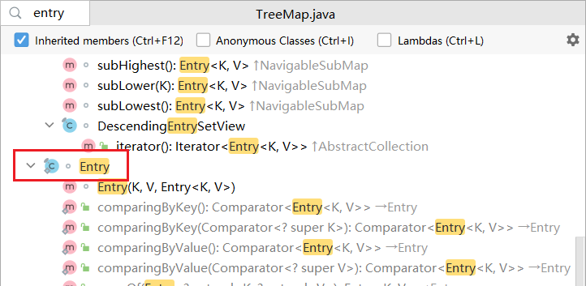

在 `TreeMap` 中，每一个元素其实就是一个 `Entry对象`，在 `Entry对象` 中有以下属性。

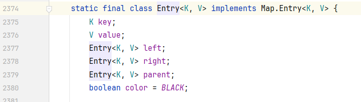

~~~java
K key; // 键
V value; // 值
Entry<K,V> left;  // 记录左子节点的地址值
Entry<K,V> right; // 记录右子节点的地址值
Entry<K,V> parent; // 记录父节点的地址值
boolean color = BLACK; // 记录节点的颜色
~~~

但是在这为什么默认节点是黑色的呢？

先来看上面用 `private static final` 定义的两个常量：`RED`、`BLACK`，此时就发现了，这里的 `RED跟BLACK` 是表示颜色，但是本质上只是常量的颜色而已。

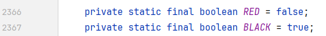

那Java为什么这么去设计呢？

如果在赋值的时候赋值 `true / false`，那就很难理解了，`true` 表示什么？`false` 表示什么？一点也不好理解，因此Java就使用了这种常量的方式提高了代码的阅读性。

此时不用看其他地方，直接看 `boolean color = BLACK;` 这一行代码，我们就知道了，创建一个 `Entry对象` 的时候，里面节点颜色的初始化值是黑色的，因此它的作用是为了提高代码的阅读性。

但是我们之前学习红黑树的时候，不都是默认红色的吗？是的，你说的非常对。

但是看源码不能只看一部分，还得结合其他地方才能得到结论。

`TreeMap` 在添加节点的时候它还会调整，一律调整为默认的红色，这些调整方案一会在看 `put()` 的时候会详细说明。

----

### 2）`TreeMap` 中的一些成员变量

<kbd>ctrl + F12</kbd> 点一下 `comparator`

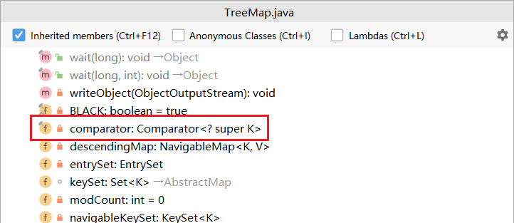

`TreeMap` 中一共有三个成员变量需要我们知道。

1、`comparator`：表示比较的规则。

2、`root`：记录红黑树根节点的地址值，并且类型是 `Entry`，因此它就表示根节点。

3、`size`：表示集合的长度，也表示红黑树中节点的个数。


-----

### 3）空参构造

空参构造非常的简单，它里面没有传递任何的数据，在方法体中将 `null` 赋值给了 `comparator`。

因此当我们用空参构造来创建对象的时候，这里的 `comparator` 记录的值就是 `null`，表示没有比较器对象。

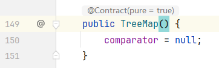

----

### 4）带参构造

带参构造就是我们在调用的时候要传递比较器对象，然后将传递过来的比较器对象赋值给成员变量 `comparator`，此时成员变量 `comparator` 才有值，这个值就是我们自己传递的比较器对象。

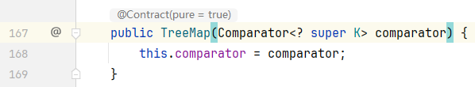

---

## 二、`put()` 底层原理

这些东西因为比较麻烦，因此老师还是将这些东西整理到文档中了。

建议观看视频理解：[集合进阶-17-TreeMap源码超详细解析（一）_哔哩哔哩_bilibili](https://www.bilibili.com/video/BV1yW4y1Y7Ms?p=18&vd_source=95ed0cf36a948bb4f3a90c1fe3d690af)，定位到 `5:31`

~~~java
1.TreeMap中每一个节点的内部属性
K key;					//键
V value;				//值
Entry<K,V> left;		//左子节点
Entry<K,V> right;		//右子节点
Entry<K,V> parent;		//父节点
boolean color;			//节点的颜色


2.TreeMap类中中要知道的一些成员变量
public class TreeMap<K,V>{
   
    //比较器对象
    private final Comparator<? super K> comparator;

	//根节点
    private transient Entry<K,V> root;

	//集合的长度
    private transient int size = 0;

   

3.空参构造
	//空参构造就是没有传递比较器对象
	 public TreeMap() {
        comparator = null;
    }
	
	
	
4.带参构造
	//带参构造就是传递了比较器对象。
	public TreeMap(Comparator<? super K> comparator) {
        this.comparator = comparator;
    }
	
	
5.添加元素
	public V put(K key, V value) {
        return put(key, value, true);
    }

参数一：键
参数二：值
参数三：当键重复的时候，是否需要覆盖值
		true：覆盖
		false：不覆盖
    这里跟 HashMap 是反过来的，这是因为它在判断的时候逻辑是不一样的。
		
	private V put(K key, V value, boolean replaceOld) {
		//获取根节点的地址值，赋值给局部变量t
        Entry<K,V> t = root;
		//判断根节点是否为null
		//如果为null，表示当前是第一次添加，会把当前要添加的元素，当做根节点
		//如果不为null，表示当前不是第一次添加，跳过这个判断继续执行下面的代码
        if (t == null) {
			//方法的底层，会创建一个Entry对象，把他当做根节点
            addEntryToEmptyMap(key, value);
			//表示此时没有覆盖任何的元素
            return null;
        }
		//表示两个元素的键比较之后的结果
        int cmp;
		//表示当前要添加节点的父节点
        Entry<K,V> parent;
		
		//表示当前的比较规则
		//如果我们是采取默认的自然排序，那么此时comparator记录的是null，cpr记录的也是null
		//如果我们是采取比较去排序方式，那么此时comparator记录的是就是比较器
        Comparator<? super K> cpr = comparator;
		//表示判断当前是否有比较器对象
		//如果传递了比较器对象，就执行if里面的代码，此时以比较器的规则为准
		//如果没有传递比较器对象，就执行else里面的代码，此时以自然排序的规则为准
        if (cpr != null) {
            do {
                parent = t;
                cmp = cpr.compare(key, t.key);
                if (cmp < 0)
                    t = t.left;
                else if (cmp > 0)
                    t = t.right;
                else {
                    V oldValue = t.value;
                    if (replaceOld || oldValue == null) {
                        t.value = value;
                    }
                    return oldValue;
                }
            } while (t != null);
        } else {
			//把键进行强转，强转成Comparable类型的
			//要求：键必须要实现Comparable接口，如果没有实现这个接口
			//此时在强转的时候，就会报错。
            Comparable<? super K> k = (Comparable<? super K>) key;
            do {
				//把根节点当做当前节点的父节点
                parent = t;
				//调用compareTo方法，比较根节点和当前要添加节点的大小关系
                cmp = k.compareTo(t.key);
				
                if (cmp < 0)
					//如果比较的结果为负数
					//那么继续到根节点的左边去找
                    t = t.left;
                else if (cmp > 0)
					//如果比较的结果为正数
					//那么继续到根节点的右边去找
                    t = t.right;
                else {
					//如果比较的结果为0，会覆盖
                    V oldValue = t.value;
                    if (replaceOld || oldValue == null) {
                        t.value = value;
                    }
                    return oldValue;
                }
            } while (t != null);
        }
		//就会把当前节点按照指定的规则进行添加
        addEntry(key, value, parent, cmp < 0);
        return null;
    }	
	
	
	
	 private void addEntry(K key, V value, Entry<K, V> parent, boolean addToLeft) {
        Entry<K,V> e = new Entry<>(key, value, parent);
        if (addToLeft)
            parent.left = e;
        else
            parent.right = e;
		//添加完毕之后，需要按照红黑树的规则进行调整
        fixAfterInsertion(e);
        size++;
        modCount++;
    }
	
	
	
	private void fixAfterInsertion(Entry<K,V> x) {
		//因为红黑树的节点默认就是红色的
        x.color = RED;

		//按照红黑规则进行调整
		
		//parentOf:获取x的父节点
		//parentOf(parentOf(x)):获取x的爷爷节点
		//leftOf:获取左子节点
        while (x != null && x != root && x.parent.color == RED) {
			
			
			//判断当前节点的父节点是爷爷节点的左子节点还是右子节点
			//目的：为了获取当前节点的叔叔节点
            if (parentOf(x) == leftOf(parentOf(parentOf(x)))) {
				//表示当前节点的父节点是爷爷节点的左子节点
				//那么下面就可以用rightOf获取到当前节点的叔叔节点
                Entry<K,V> y = rightOf(parentOf(parentOf(x)));
                if (colorOf(y) == RED) {
					//叔叔节点为红色的处理方案
					
					//把父节点设置为黑色
                    setColor(parentOf(x), BLACK);
					//把叔叔节点设置为黑色
                    setColor(y, BLACK);
					//把爷爷节点设置为红色
                    setColor(parentOf(parentOf(x)), RED);
					
					//把爷爷节点设置为当前节点
                    x = parentOf(parentOf(x));
                } else {
					
					//叔叔节点为黑色的处理方案
					
					
					//表示判断当前节点是否为父节点的右子节点
                    if (x == rightOf(parentOf(x))) {
						
						//表示当前节点是父节点的右子节点
                        x = parentOf(x);
						//左旋
                        rotateLeft(x);
                    }
                    setColor(parentOf(x), BLACK);
                    setColor(parentOf(parentOf(x)), RED);
                    rotateRight(parentOf(parentOf(x)));
                }
            } else {
				//表示当前节点的父节点是爷爷节点的右子节点
				//那么下面就可以用leftOf获取到当前节点的叔叔节点
                Entry<K,V> y = leftOf(parentOf(parentOf(x)));
                if (colorOf(y) == RED) {
                    setColor(parentOf(x), BLACK);
                    setColor(y, BLACK);
                    setColor(parentOf(parentOf(x)), RED);
                    x = parentOf(parentOf(x));
                } else {
                    if (x == leftOf(parentOf(x))) {
                        x = parentOf(x);
                        rotateRight(x);
                    }
                    setColor(parentOf(x), BLACK);
                    setColor(parentOf(parentOf(x)), RED);
                    rotateLeft(parentOf(parentOf(x)));
                }
            }
        }
		
		//把根节点设置为黑色
        root.color = BLACK;
    }
~~~

----

## 三、课堂思考问题

~~~java
6.1TreeMap添加元素的时候，键是否需要重写hashCode和equals方法？
此时是不需要重写的。
hashCode和equals方法是跟HashMap的键有关的。

6.2HashMap是哈希表结构的，JDK8开始由数组，链表，红黑树组成的。
既然有红黑树，HashMap的键是否需要实现Compareable接口或者传递比较器对象呢？
不需要的。
因为在HashMap的底层，默认是利用哈希值的大小关系来创建红黑树的。
~~~

我们可以来看下源码，跟进 `HashMap`，<kbd>ctrl + F12</kbd> 找到 `put()`。

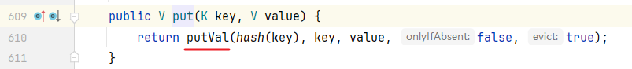

跟进 `putVal()`，可以发现如果你当前节点是 `TreeNode`，那么它是用 `putTreeVal()` 来添加。

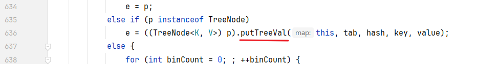

跟进 `putTreeVal()`，在这个方法里面有个 `find()`

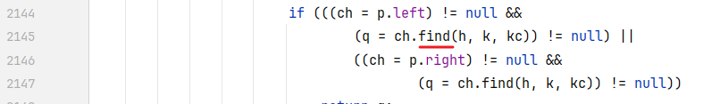

跟进看看，这里的 `p` 表示当前要添加的节点，用 `p` 调用 `hash`。

`h` 就是调用 `find()` 传递过来的哈希值。

所以在底层它是默认采用哈希值的大小关系去创建的这颗红黑树的。

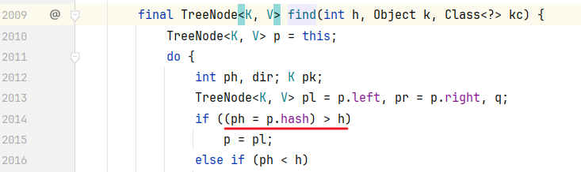

~~~java
6.3TreeMap和HashMap谁的效率更高？
如果是最坏情况，添加了8个元素，这8个元素形成了链表，此时TreeMap的效率要更高
但是这种情况出现的几率非常的少。
一般而言，还是HashMap的效率要更高。
~~~

~~~java
6.4你觉得在Map集合中，java会提供一个如果键重复了，不会覆盖的put方法呢？
~~~

对于这个问题，我们可以打开API帮助文档，或者源码来看看，这里就打开源码来看看。

首先需要思考，为什么会有这样的问题呢？

因为 `HashMap` 在添加的时候，调用了 `putVal()`，这个方法里面有一个变量去控制是否覆盖值。

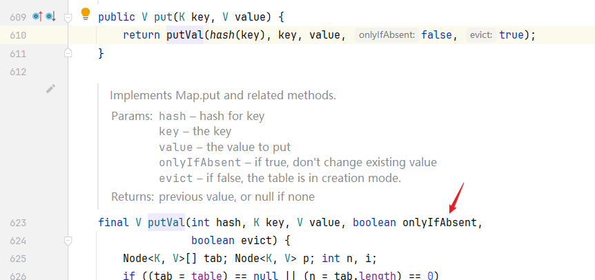

那么既然有变量控制，那是不是有覆盖和不覆盖的情况。如果它没有这两种情况的话，那我干嘛还要用变量去控制呢？

<kbd>ctrl + F12</kbd> 搜索 `putIfAbsent()`，它就表示：如果键重复了，那么值是不会覆盖的。

它在调用 `putVal()` 的时候，第四个参数的值跟 `put()` 是不一样的。

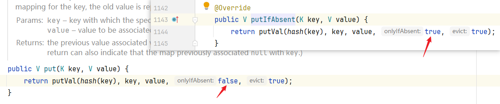

我们再来看 `TreeMap`，`TreeMap` 中也有一个 `putIfAbsent()`，它的参数跟上面的 `put()` 也是相反的。

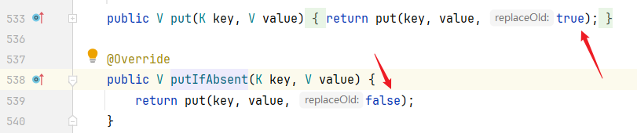

只不过下面的方法我们平时几乎不怎么用，因此了解一下知道有它的存在就行了。

**此时 `putIfAbsent` 本身不重要，主要的是在这里主要是想和大家传递一个思想：**

代码中的逻辑都有两面性，如果我们只知道了其中的A面，而且代码中还发现了有变量可以控制两面性的发生，那么该逻辑一定会有B面。

在写代码的时候我们一般会有一个习惯：

- 如果是boolean类型的变量控制，一般只有AB两面，因为boolean只有两个值

- int类型的变量控制，一般至少有三面，因为int可以取多个值。

  例如在给 `TreeMap` 制定比较规则的时候，返回值类型就是 `int类型` 的，它要控制三面：正数、负数、`0`

~~~java
6.5三种双列集合，以后如何选择？
	HashMap LinkedHashMap TreeMap
	
	默认：HashMap（效率最高）
	如果要保证存取有序：LinkedHashMap
	如果要进行排序：TreeMap
~~~


-----

# ----------------------------------------------

# day25 阶段项目（综合练习&斗地主游戏）

# 20.可变参数

我们先来看一个小案例：

```
假如需要定义一个方法求和，该方法可以灵活的完成如下需求：
计算2个数据的和
计算3个数据的和
计算4个数据的和
计算n个数据的和
```

像下面这样的写法，其实是有些小问题的，如果我们要求 `n` 个数据的和，这个 `n` 我们还不知道，那这个方法该怎么写呢？

~~~java
public class ArgsDemo1 {
    public static void main(String[] args) {
        System.out.println(getSum(10,20));
        System.out.println(getSum(10,20,30));
        System.out.println(getSum(10,20,30,40));
    }

    //计算2个数据的和
    public static int getSum(int a, int b) {
        return a + b;
    }

    //计算3个数据的和
    public static int getSum(int a, int b, int c) {
        return a + b + c;
    }

    //计算4个数据的和
    public static int getSum(int a, int b, int c, int d) {
        return a + b + c + d;
    }
}
~~~

在以前我们是这么写的：由于我们也不知道有多少个数据要求和，因此形参直接写数组就好了

~~~java
package com.itheima.a06args;

public class ArgsDemo2 {
    public static void main(String[] args) {
        //计算n个数据的和
        int[] arr = {1,2,3,4,5,6,7,8,9,10};
        int sum = getSum(arr);
        System.out.println(sum);
    }

    public static int getSum(int[] arr) {
        int sum = 0;
        for (int i : arr) {
            sum = sum + i;
        }
        return sum;
    }
}
~~~

但是这种方式也很麻烦，因为如果要求和，还需要定义一个数组，定义完后还要把数组传递给方法。其实还有更简单的方法。

在JDK5的时候提出了一个特性：可变参数。方法形参的个数是可以发生变化的。

**格式**

```
修饰符 返回值类型 方法名(参数类型... 形参名){  }
```

此时就不需要定义数组了，在小括号中直接传入要求和的数据，传几个都是可以的，但一定要是 `int类型` 的。

底层：可变参数底层就是一个数组，只不过不需要我们自己创建了，Java会帮我们创建好，然后传递给下面的 `args变量`。

~~~java
public class ArgsDemo3 {
    public static void main(String[] args) {
        getSum(1, 2, 3, 4, 5, 6, 7, 8, 9, 10);
        System.out.println(sum);
    }

    public static int getSum(int...args){
    }
}
~~~

在 `getSum()` 中打印 `args`

~~~java
System.out.println(args);//[I@119d7047
//[ ：表示当前是一个数组
//I：I表示数组里面的元素都是int类型的。
//@：表示一个间隔符号。（固定格式）
//776ec8df：才是数组真正的地址值，它是一个十六进制的表现形式。
//但是平时我们习惯性的会把这个整体叫做数组的地址值。但其实只有后半部分才是真正的地址值776ec8df
~~~

既然是数组，那么方法的写法就跟以前一模一样了

~~~java
public static int getSum(int...args){
    int sum = 0;
    for (int i : args) {
        sum = sum + i;
    }
    return sum;
}
~~~

**注意**

1. 一个方法只能有一个可变参数

   可变参数，理解为一个大胖子，有多少吃多少。如果写了多个可变参数，那么数据都会被前面的可变参数吃掉，第二个就没得吃了。

   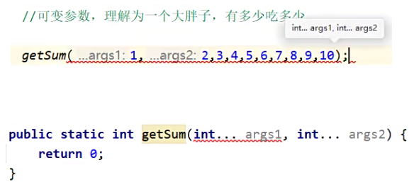

2. 如果方法中有多个形参，可变参数要放到最后。

**应用场景: Collections**

​	在Collections中也提供了添加一些元素方法：

​	

**代码演示:**

```java
public class CollectionsDemo {
	public static void main(String[] args) {
      ArrayList<Integer> list = new ArrayList<Integer>();
      //原来写法
      //list.add(12);
      //list.add(14);
      //list.add(15);
      //list.add(1000);
      //采用工具类 完成 往集合中添加元素  
      Collections.addAll(list, 5, 222, 1，2);
      System.out.println(list);
}
```


-----

# 21.集合工具类Collections

## 一、介绍

`java.util.Collections`：是集合工具类

在这个里面帮我们定义了很多很多能操作集合的方法。

参数一：集合，类型是 `Collection<T>`，也就是说这个方法只能给单列集合进行批量添加，双列集合Map是不行的。

参数二：可变参数。

~~~java
public static <T> boolean addAll(Collection<T> c, T... elements);  // 批量添加元素。
~~~

要注意，这个形参是 `List`，也就是我们只能传 `ArrayList、LinkedList、Vector`；`Set集合` 是不能打乱顺序的。

~~~java
public static void shuffle(List<?> list);  // 打乱List集合元素的顺序。
~~~

在Collections中还有很多很多其它的方法，但这里演示前两个。

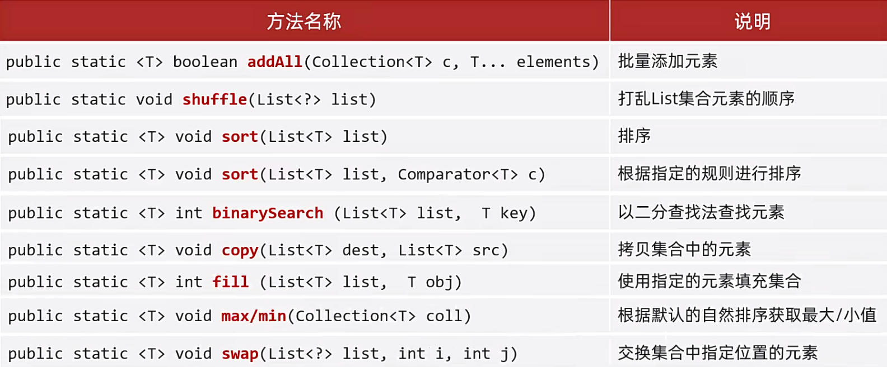

----

## 二、代码示例

注意使用的是 `Collections` 里面的方法，这个类是集合的工具类。

工具类的特点：私有化构造方法，不让外界创建它的对象。

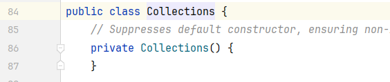

并且里面所有的方法几乎都有 `static` ，因此调用方法的时候直接使用类名调用即可。

~~~java
//addAll  批量添加元素
//1.创建集合对象
ArrayList<String> list = new ArrayList<>();
//2.批量添加元素
Collections.addAll(list,"abc","bcd","qwer","df","asdf","zxcv","1234","qwer");
//3.打印集合
System.out.println(list); // [abc, bcd, qwer, df, asdf, zxcv, 1234, qwer]

//shuffle 打乱
Collections.shuffle(list);

System.out.println(list); // [qwer, 1234, bcd, qwer, abc, df, zxcv, asdf]，每刷新一次
~~~

其他方法示例

这里的 `sort方法` 跟 `Arrays.sort()` 排序规则是一样的。

~~~java
System.out.println("-------------sort默认规则--------------------------");
//默认规则，需要重写Comparable接口compareTo方法。Integer已经实现，按照从小打大的顺序排列
//如果是自定义对象，需要自己指定规则
ArrayList<Integer> list1 = new ArrayList<>();
Collections.addAll(list1, 10, 1, 2, 4, 8, 5, 9, 6, 7, 3);
Collections.sort(list1);
System.out.println(list1);


System.out.println("-------------sort自己指定规则规则--------------------------");
Collections.sort(list1, new Comparator<Integer>() {
    @Override
    public int compare(Integer o1, Integer o2) {
        return o2 - o1;
    }
});
System.out.println(list1);

Collections.sort(list1, (o1, o2) -> o2 - o1);
System.out.println(list1);

System.out.println("-------------binarySearch--------------------------");
//需要元素有序
ArrayList<Integer> list2 = new ArrayList<>();
Collections.addAll(list2, 1, 2, 3, 4, 5, 6, 7, 8, 9, 10);
System.out.println(Collections.binarySearch(list2, 9));
System.out.println(Collections.binarySearch(list2, 1));
System.out.println(Collections.binarySearch(list2, 20));

System.out.println("-------------copy--------------------------");
//把list3中的元素拷贝到list4中
//会覆盖原来的元素
//注意点：如果list3的长度 > list4的长度，方法会报错
ArrayList<Integer> list3 = new ArrayList<>();
ArrayList<Integer> list4 = new ArrayList<>();
Collections.addAll(list3, 1, 2, 3, 4, 5, 6, 7, 8, 9, 10);
Collections.addAll(list4, 0,0,0,0,0,0,0,0,0,0,0,0,0,0,0);
Collections.copy(list4, list3);
System.out.println(list3);
System.out.println(list4);

System.out.println("-------------fill--------------------------");
//把集合中现有的所有数据，都修改为指定数据
ArrayList<Integer> list5 = new ArrayList<>();
Collections.addAll(list5, 1, 2, 3, 4, 5, 6, 7, 8, 9, 10);
Collections.fill(list5, 100);
System.out.println(list5);

System.out.println("-------------max/min--------------------------");
//求最大值或者最小值
ArrayList<Integer> list6 = new ArrayList<>();
Collections.addAll(list6, 1, 2, 3, 4, 5, 6, 7, 8, 9, 10);
System.out.println(Collections.max(list6));
System.out.println(Collections.min(list6));

System.out.println("-------------max/min指定规则--------------------------");
// String中默认是按照字母的abcdefg顺序进行排列的
// 现在我要求最长的字符串
// 默认的规则无法满足，可以自己指定规则
// 求指定规则的最大值或者最小值
ArrayList<String> list7 = new ArrayList<>();
Collections.addAll(list7, "a","aa","aaa","aaaa");
System.out.println(Collections.max(list7, new Comparator<String>() {
    @Override
    public int compare(String o1, String o2) {
        return o1.length() - o2.length();
    }
}));

System.out.println("-------------swap--------------------------");
ArrayList<Integer> list8 = new ArrayList<>();
Collections.addAll(list8, 1, 2, 3);
Collections.swap(list8,0,2);
System.out.println(list8);
~~~


----

# 22.练习一：随机点名器的两种实现方法

需求：班级里有N个学生，实现随机点名器

~~~java
//1.定义集合
ArrayList<String> list = new ArrayList<>();
//2.添加数据
Collections.addAll(list,"范闲","范建","范统","杜子腾","杜琦燕","宋合泛","侯笼藤","朱益群","朱穆朗玛峰","袁明媛");
//3.随机点名
// 第一种方式：（以前的写法）
Random r = new Random();
int index = r.nextInt(list.size());
String name = list.get(index);
System.out.println(name);

//第二种方式：打乱
Collections.shuffle(list);
//既然已经打乱了，直接获取到0索引位置的数据就行了
String name = list.get(0);
System.out.println(name);
~~~


---

# 23.练习二：随机点名器的两种实现方法

需求：班级里有N个学生，要求在随机的时候，70%的概率随机到男生，30%的概率随机到女生

这题中，`Random` 是不能直接使用的，我们以前是拿着 `Random` 随机出一堆数据，这种随机数据叫做 `随机点`。

例如范围是 `1 ~20`，如果随机出来的是 `13`，那么这个 `13` 表示的是数字 `13` 还是 `1 ~ 13` 这个范围呢？

很明显，它仅仅只能表示自己 `13` 这个数据。

因此 `Random` 随机出来的是那个点，它不能表示链。


那我们该怎么实现呢？

我们可以往集合中添加 `7个1、3个0`，此时`7个1` 在整体的数字中占 `70%`，`0占30%`。

然后将集合打乱顺序，打乱完后，从这个集合中抽 `0` 或者 `1`。

- 如果抽到了 `1`，那么就从男生里面随机
- 如果抽到 `0`，那么就从女生里面随机

~~~java
//1.创建集合
ArrayList<Integer> list = new ArrayList<>();
//2.添加数据
Collections.addAll(list,1,1,1,1,1,1,1);
Collections.addAll(list,0,0,0);
//3.打乱集合中的数据
Collections.shuffle(list);
//4.从list集合中随机抽取0或者1
Random r = new Random();
int index = r.nextInt(list.size());
int number = list.get(index);
System.out.println(number);
//5.创建两个集合分别存储男生和女生的名字
ArrayList<String> boyList = new ArrayList<>();
ArrayList<String> girlList = new ArrayList<>();

Collections.addAll(boyList,"范闲","范建","范统","杜子腾","宋合泛","侯笼藤","朱益群","朱穆朗玛峰");
Collections.addAll(girlList,"杜琦燕","袁明媛","李猜","田蜜蜜");

//6.判断此时是从boyList里面抽取还是从girlList里面抽取
if(number == 1){
    //boyList
    int boyIndex = r.nextInt(boyList.size());
    String name = boyList.get(boyIndex);
    System.out.println(name);
}else{
    //girlList
    int girlIndex = r.nextInt(girlList.size());
    String name = girlList.get(girlIndex);
    System.out.println(name);
}
~~~


----

# 24.练习三：自动点名器

需求：班级里有N个学生，被点到的学生不会再被点到。但是如果班级中所有的学生都点完了， 需要重新开启第二轮点名。

```java
//1.定义集合
ArrayList<String> list1 = new ArrayList<>();
//2.添加数据
Collections.addAll(list1, "范闲", "范建", "范统", "杜子腾", "杜琦燕", "宋合泛", "侯笼藤", "朱益群", "朱穆朗玛峰", "袁明媛");
```

在随机的时候，可以随机一个删一个。

~~~java
Random r = new Random();
int index = r.nextInt(list.size());
String name = list.get(index);
list.remove(name);
~~~

上面随机名字和删除名字其实是可以合成一行的，这是因为 `remove()` 有两个方法

- 根据元素删，返回 `boolean` ，表示当前的元素是否删除成功
- 根据索引删，它会返回被删除的元素

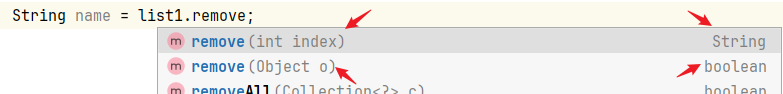

~~~java
 String name = list.remove(index);
~~~

但如果直接这么写，那么每运行一次程序都会创建一个新的集合，并没有达到题目想要抽取到所有人的目的，因此需要使用循环来改善。

~~~java
Random r = new Random();
for (int i = 0; i < list.size(); i++) {
    int index = r.nextInt(list.size());
    String name = list.get(index);
    list.remove(name);
}
~~~

首先我们需要知道：集合的长度是可以发生变化的，在一开始的时候，集合的长度是 `10`。

满足 `i < 10，即 0 < 10`，第一次进入循环，删除元素成功后，集合的长度就变为了 `9`。

满足 `i < 9，即 0 < 9`，第一次进入循环，删除元素成功后，集合的长度就变为了 `9`。

..............以此类推

由此可见，问题出在：`list.size()` 是变化的。

解决办法：在上面重新定义一个变量。

~~~java
int count = list.size();
Random r = new Random();
for (int i = 0; i < count; i++) {
    int index = r.nextInt(list.size());
    String name = list.get(index);
    list.remove(name);
}
~~~

但是由于题目还有个要求：如果班级中所有的学生都点完了， 需要重新开启第二轮点名。

那么此时删掉的名字就不能真正的删，还需要再拿个集合存起来。

~~~java
//创建一个临时的集合，用来存已经被点到学生的名字
ArrayList<String> list2 = new ArrayList<>();
//外循环：表示轮数
for (int i = 1; i <= 10; i++) {
    System.out.println("=========第" + i + "轮点名开始了======================");
    //3.获取集合的长度
    int count = list1.size();
    //4.随机点名
    Random r = new Random();
    //内循环：每一轮中随机循环抽取的过程
    for (int j = 0; j < count; j++) {
        int index = r.nextInt(list1.size());
        String name = list1.remove(index);
        list2.add(name);
        System.out.println(name);
    }
    //此时表示一轮点名结束
    //将list2的数据全部加到list1中
    list1.addAll(list2);
    list2.clear();
}
~~~


----

# 25.练习四：带权重的随机点名项目

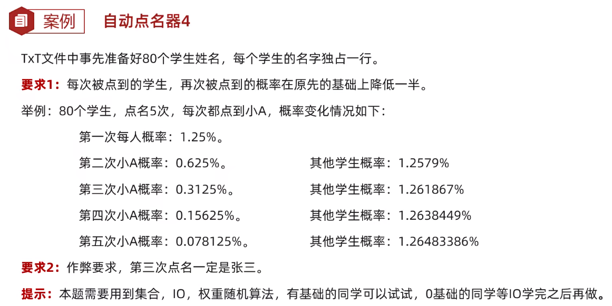

这一题会涉及到后面的知识点，因此这里先写不了。

其中这里的 `带权重随机算法` 还是很重要的：在以后，我们会学习到微服务架构，那为什么会有微服务呢？

其实就是因为现在上网的人太多了，一台服务器扛不住了，就需要将一个大项目拆分成n个小项目，部署在n个服务器中。

但是这就会有一个小问题：用户在上网的时候，我也不知道访问哪个服务器。

所以在中间就会有一个服务网关，它会根据一些算法计算出，现在哪台服务器的压力还比较小。

其中有一个算法叫做：带权重的随机，随机到哪台服务器，用户就会去访问所对应的服务器，这样的好处就是可以能让我们的项目去被更多的人访问。

一开始我们可以给每台服务器都设置权重为1，那就表示每台服务器所随机到的概率是一样的。

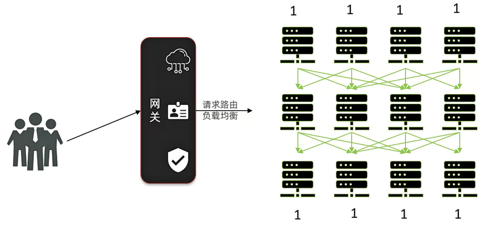

但是假设，现在有一台服务器访问的人数太多了，此时我们就可以将它的权重降低，如果降到0的话，就不会再随机到这台服务器了。

不想打字了，以后有时间再补


----

# 26.练习五：集合嵌套

需求：定义一个Map集合，键用表示省份名称province，值表示市city，但是市会有多个。

添加完毕后，遍历结果格式如下：江苏省 = 南京市，扬州市，苏州市，无锡市，常州市

之前我们说过，`Map集合` 如果没有特殊要求，那么默认使用 `HashMap`，因为它的效率最高。

~~~java
//1.创建Map集合
HashMap<String, ArrayList<String>> hm = new HashMap<>();

//2.创建单列集合存储市
ArrayList<String> city1 = new ArrayList<>();
city1.add("南京市");
city1.add("扬州市");
city1.add("苏州市");
city1.add("无锡市");
city1.add("常州市");

ArrayList<String> city2 = new ArrayList<>();
city2.add("武汉市");
city2.add("孝感市");
city2.add("十堰市");
city2.add("宜昌市");
city2.add("鄂州市");

ArrayList<String> city3 = new ArrayList<>();
city3.add("石家庄市");
city3.add("唐山市");
city3.add("邢台市");
city3.add("保定市");
city3.add("张家口市");

//3.把省份和多个市添加到map集合
hm.put("江苏省",city1);
hm.put("湖北省",city2);
hm.put("河北省",city3);

Set<Map.Entry<String, ArrayList<String>>> entries = hm.entrySet();
for (Map.Entry<String, ArrayList<String>> entry : entries) {
    //entry依次表示每一个键值对对象
    String key = entry.getKey();
    ArrayList<String> value = entry.getValue();
    StringJoiner sj = new StringJoiner(", ","","");
    for (String city : value) {
        sj.add(city);
    }

    System.out.println(key + " = " + sj);
}
~~~


----

# 27.斗地主 —— 准洗发

## 一、前言

首先来完成控制台版的前三步。

```java
完成斗地主游戏中的以下步骤：
准备牌
洗牌
发牌
// "♦", "♣", "♥", "♠"
// "3", "4", "5", "6", "7", "8", "9", "10", "J", "Q", "K", "A", "2"
```

包下的 `APP` 就表示是程序的启动入口


在以后我们真实写项目的时候，是不会在 `main方法` 中去写一写核心的逻辑的， `main方法` 一般是作为程序的启动入口。

此时我们要在 `main方法` 中做的就是：直接创建游戏的类就行了。

当创建 `PokerGame类` 对象的时候，其实就表示开启了游戏

~~~java
public class App {
    public static void main(String[] args) {
        new PokerGame();
    }
}
~~~

创建对象，实际上会调用 `PokerGame` 中的空参构造，因此我们将 `准备牌、洗牌、发牌、看牌` 写在空参构造中即可。

其中，`准备牌` 的逻辑应该写在构造方法的外面，假设我们在 `APP.java` 中创建了两个 `PokerGame` 的对象，表示我们当前要打两局斗地主，如果将 `准备牌` 写在了构造方法中，那么每打一局游戏都需要 `准备牌`，太浪费了。

因此不管打多少局游戏，都只要准备一副牌就行了，此时就需要用到我们以前学习的知识点了。

静态代码块：随着类的加载而加载，而且只执行一次

~~~java
package com.itheima.doudizhu1;

import java.util.ArrayList;
import java.util.Collections;

public class PokerGame {
    static {
        //准备牌
    }

    public PokerGame(){
        //洗牌
        
        //发牌
        
        //看牌
    }
}
~~~

----

## 二、准备牌

由于 `牌的花色` 和 `牌上的数字` 个数都是有限的，因此我们可以使用数组存储。

~~~java
//牌盒
static ArrayList<String> list = new ArrayList<>();

//静态代码块
//特点：随着类的加载而在加载的，而且只执行一次。
static {
    //准备牌
    // "♦", "♣", "♥", "♠"
    // "3", "4", "5", "6", "7", "8", "9", "10", "J", "Q", "K", "A", "2"
    String[] color = {"♦", "♣", "♥", "♠" };
    String[] number = {"3", "4", "5", "6", "7", "8", "9", "10", "J", "Q", "K", "A", "2"};

    for (String c : color) {
        //c依次表示每一种花色
        for (String n : number) {
            //n 依次表示每一个数字
            list.add(c + n);
        }
    }
    list.add("小王");
    list.add("大王");
}
~~~

-----

## 三、洗牌

~~~java
//洗牌
Collections.shuffle(list);
~~~

----

## 四、发牌

发牌需要准备四个集合，因为底牌需要存起来。

`load`：地主。底牌里面的三张牌就是给地主准备的。

~~~java
ArrayList<String> lord = new ArrayList<>();
ArrayList<String> player1 = new ArrayList<>();
ArrayList<String> player2 = new ArrayList<>();
ArrayList<String> player3 = new ArrayList<>();
~~~

接下来就是发牌。

由于发牌的时候，前三张是底牌，剩下的牌是三个玩家轮流发的，因此这里需要用到牌的序号，因此使用 `普通for + get()` 的方式遍历

~~~java
//遍历牌盒得到每一张牌
for (int i = 0; i < list.size(); i++) {
    //i：索引
    String poker = list.get(i);
    if(i <= 2){
        lord.add(poker);
        continue;
    }

    //给三个玩家轮流发牌
    if(i % 3 == 0){
        player1.add(poker);
    }else if(i % 3 == 1){
        player2.add(poker);
    }else{
        player3.add(poker);
    }
}
~~~

----

## 五、看牌

~~~java
//看牌
lookPoker("底牌",lord);
lookPoker("钢脑壳",player1);
lookPoker("大帅比",player2);
lookPoker("蛋筒",player3);

/*
* 参数一：玩家的名字
* 参数二：每位玩家的牌
* */
public void lookPoker(String name, ArrayList<String> list){
    System.out.print(name + ": ");
    for (String poker : list) {
        System.out.print(poker + " ");
    }
    System.out.println();
}
~~~

---

## 六、完整代码

~~~java
public class App {
    public static void main(String[] args) {
      /*
        完成控制台版的三步：
          准备牌
          洗牌
          发牌
       */
        //从程序的主入口开启斗地主游戏
        new PokerGame();
    }
}

public class PokerGame {
    //牌盒
    //♥3 ♣3
    static ArrayList<String> list = new ArrayList<>();

    //静态代码块
    //特点：随着类的加载而在加载的，而且只执行一次。
    static {
        //准备牌
        // "♦", "♣", "♥", "♠"
        // "3", "4", "5", "6", "7", "8", "9", "10", "J", "Q", "K", "A", "2"
        String[] color = {"♦", "♣", "♥", "♠" };
        String[] number = {"3", "4", "5", "6", "7", "8", "9", "10", "J", "Q", "K", "A", "2"};

        for (String c : color) {
            //c依次表示每一种花色
            for (String n : number) {
                //n 依次表示每一个数字
                list.add(c + n);
            }
        }
        list.add("小王");
        list.add("大王");
    }

    public PokerGame(){
        //洗牌
        Collections.shuffle(list);

        //发牌
        ArrayList<String> lord = new ArrayList<>();
        ArrayList<String> player1 = new ArrayList<>();
        ArrayList<String> player2 = new ArrayList<>();
        ArrayList<String> player3 = new ArrayList<>();

        //遍历牌盒得到每一张牌
        for (int i = 0; i < list.size(); i++) {
            //i：索引
            String poker = list.get(i);
            if(i <= 2){
                lord.add(poker);
                continue;
            }

            //给三个玩家轮流发牌
            if(i % 3 == 0){
                player1.add(poker);
            }else if(i % 3 == 1){
                player2.add(poker);
            }else{
                player3.add(poker);
            }
        }
        //看牌
        lookPoker("底牌",lord);
        lookPoker("钢脑壳",player1);
        lookPoker("大帅比",player2);
        lookPoker("蛋筒",player3);

    }

    /*
    * 参数一：玩家的名字
    * 参数二：每位玩家的牌
    * */
    public void lookPoker(String name, ArrayList<String> list){
        System.out.print(name + ": ");
        for (String poker : list) {
            System.out.print(poker + " ");
        }
        System.out.println();
    }
}
~~~


---

# 28.斗地主 —— 排序方式一：利用序号进行排序

## 一、思路分析

排序的过程中，最让人头疼的是：最小的数字 `2` 反而是最大的，因此我们不好找出它的规律。那怎么办呢？

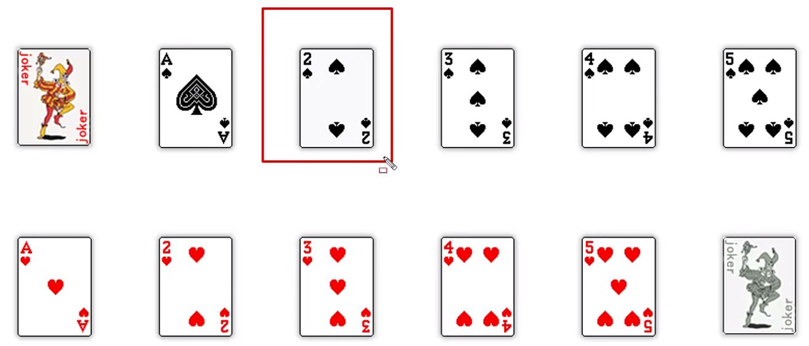

牌没有规律，但是数字是有规律的。因此我们可以将牌按照指定的规则先进行手动的排列，然后再跟 `1 / 2 / 3 ...` 这样的数字一一对应。对应完后，我们就可以认为：数字越大，所对应的牌也就越大。

因此我们需要使用 `Map集合` 将这种对应关系存起来。

那么问题就来了：在 `Map集合` 集合中，是底下的需要作为 `键`，还是上面的牌作为 `键` 呢？

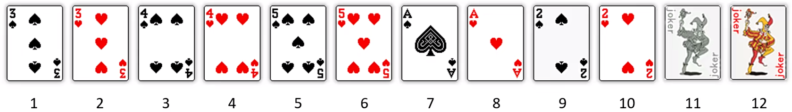

其实谁作为键有一个规则，在下面的代码中，我们以谁为主导，谁就作为键。

在刚刚我们说了，我们需要将牌先跟序号对应起来，对应起来的目的：牌的规则我们不好把握，但是下面序号的规则就很好把握。

那么在下面的代码中，我们实际上操作的都是序号，因此我们需要将序号当做 `键`。

与此同时，我们还会创建一个单列集合，用来单独存储牌的序号，这样准备牌的动作我们才算是准备好了。

接下来还有洗牌，所谓洗牌其实洗的就是序号。

发牌发的也是序号，前三个序号作为底牌，后面所有的序号再依次发给三个玩家。

发完后会发现，序号是没有顺序的，我们还需要将序号进行排序。

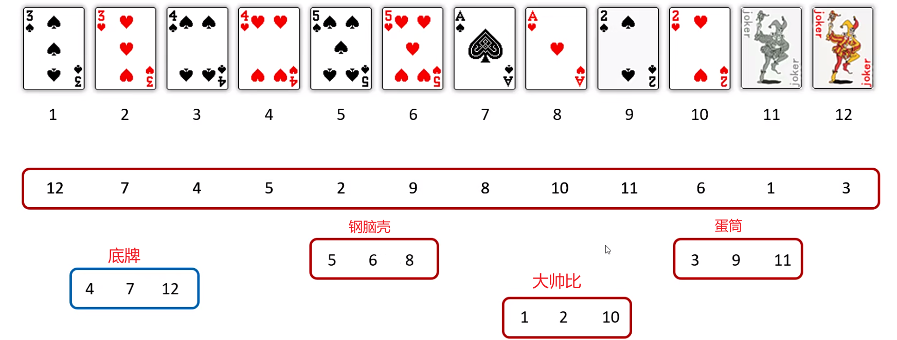

完事后，在看牌的时候，我们就可以拿着序号到一开始的 `Map集合` 中找对应的牌就行了。

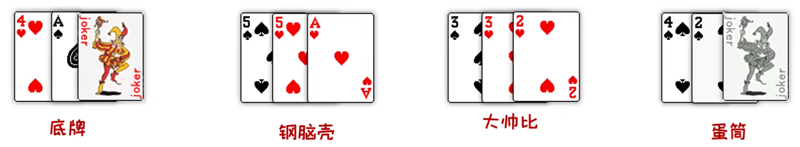

此时牌就有序了。这种排序思想是利用了编程圈中的：对应思想 —— 如果原始数据的规律非常复杂，我们可以先手动排序让`每一个数据` 跟 `唯一的序号`产生对应关系。

这里的序号就是数字，规律非常简单，后续的所有操作，我们以序号为准。

当真正需要操作原始数据的时候，再通过序号找到原始数据即可。

----

## 二、准备牌

基础代码

```java
public class App {
    public static void main(String[] args) {
        //从程序的主入口开启斗地主游戏
        new PokerGame();
    }
}

public class PokerGame {
    static {
        String[] color = {"♦", "♣", "♥", "♠"};
        String[] number = {"3", "4", "5", "6", "7", "8", "9", "10", "J", "Q", "K", "A", "2"};
    }
}
```

接下来的目的：将序号跟牌产生对应关系。

~~~java
public class PokerGame {
    //牌盒 Map
    //此时我们只要把牌跟序号产生对应关系就可以了，不需要按照序号进行排序，所以只要HashMap就可以了
    //由于在静态代码块中需要用到这个集合，因此集合前面需要加上static
    static HashMap<Integer, String> hm = new HashMap<>();
    static ArrayList<Integer> list = new ArrayList<>();

    static {
        String[] color = {"♦", "♣", "♥", "♠"};
        String[] number = {"3", "4", "5", "6", "7", "8", "9", "10", "J", "Q", "K", "A", "2"};

        //序号
        int serialNumber = 1;
        
        for (String c : color) {
            //依次表示每一个数字
            for (String n : number) {
                //依次表示每一个花色
                hm.put(serialNumber, c + n);
                list.add(serialNumber);
                serialNumber++;
            }
        }

        hm.put(serialNumber, "小王");
        list.add(serialNumber);
        serialNumber++;
        hm.put(serialNumber, "大王");
        list.add(serialNumber);
    }
}
~~~

如果跟之前一样，外层循环是花色，内存循环是数字，那么打印结果如下。

思考一下这里面的规律，例如玩家1被分到的序号是：`1 2 3 4 5 14`，通过这个序号，去查到对应的牌，真的就有序了吗？

~~~java
{1=♦3, 2=♦4, 3=♦5, 4=♦6, 5=♦7, 6=♦8, 7=♦9, 8=♦10, 9=♦J, 10=♦Q, 11=♦K, 12=♦A, 13=♦2, 
 14=♣3, 15=♣4, 16=♣5, 17=♣6, 18=♣7, 19=♣8, 20=♣9, 21=♣10, 22=♣J, 23=♣Q, 24=♣K, 25=♣A, 26=♣2, 
 27=♥3, 28=♥4, 29=♥5, 30=♥6, 31=♥7, 32=♥8, 33=♥9, 34=♥10, 35=♥J, 36=♥Q, 37=♥K, 38=♥A, 39=♥2, 
 40=♠3, 41=♠4, 42=♠5, 43=♠6, 44=♠7, 45=♠8, 46=♠9, 47=♠10, 48=♠J, 49=♠Q, 50=♠K, 51=♠A, 52=♠2, 
 53=小王, 54=大王}
~~~

可以发现并不是，因此这种规则其实是不对的。

解决办法：只需要将循环的内外层对调一下就行了

~~~java
//细节
for (String c : color) {
    //依次表示每一个数字
    for (String n : number) {
        //依次表示每一个花色
        hm.put(serialNumber, c + n);
        System.out.println(c + n);
        list.add(serialNumber);
        serialNumber++;
    }
}
~~~

----

## 三、洗牌

此时真正洗的应该是牌的序号

~~~java
public PokerGame() {
    //洗牌
    Collections.shuffle(list);
}
~~~

----

## 四、发牌

发牌我们发的其实也是序号。

在之前我们使用的是 `ArrayList`，但是这里可以使用 `TreeSet` 进行改进，因为 `TreeSet` 是支持排序的。

当我们将序号加入到 `TreeSet` 后，就会按照默认的方式进行排序，`Integer` 中默认的排序方式就是从小到大排列。

~~~java
public PokerGame() {
    //发牌
    TreeSet<Integer> lord = new TreeSet<>();
    TreeSet<Integer> player1 = new TreeSet<>();
    TreeSet<Integer> player2 = new TreeSet<>();
    TreeSet<Integer> player3 = new TreeSet<>();

    for (int i = 0; i < list.size(); i++) {
        //i :依次表示集合中的每一个索引
        //list.get(i)元素：牌的序号
        int serialNumber = list.get(i);

        if(i <= 2){
            lord.add(serialNumber);
            continue;
        }

        if(i % 3 == 0){
            player1.add(serialNumber);
        }else if(i % 3 == 1){
            player2.add(serialNumber);
        }else{
            player3.add(serialNumber);
        }
    }
}
~~~

-----

## 五、看牌

~~~java
//看牌
lookPoker("底牌",lord);
lookPoker("钢脑壳",player1);
lookPoker("大帅比",player2);
lookPoker("蛋筒",player3);

/*
    * 参数一：玩家的名字
    * 参数二：牌的序号
    * */
public void lookPoker(String name, TreeSet<Integer> ts){
    System.out.print(name + ": ");
    //遍历TreeSet集合得到每一个序号，再拿着序号到Map集合中去找真正的牌
    for (int serialNumber : ts) {
        String poker = hm.get(serialNumber);
        System.out.print(poker + " ");
    }
    System.out.println();
}
}
~~~

----

## 六、完整代码

~~~java
package com.itheima.doudizhu2;
import java.util.ArrayList;
import java.util.Collections;
import java.util.HashMap;
import java.util.TreeSet;

public class PokerGame {

    //牌盒 Map
    //此时我们只要把牌跟序号产生对应关系就可以了，不需要按照序号进行排序，所以只要HashMap就可以了
    static HashMap<Integer, String> hm = new HashMap<>();
    static ArrayList<Integer> list = new ArrayList<>();


    static {
        String[] color = {"♦", "♣", "♥", "♠"};
        String[] number = {"3", "4", "5", "6", "7", "8", "9", "10", "J", "Q", "K", "A", "2"};

        //序号
        int serialNumber = 1;
        //细节
        for (String c : color) {
            //依次表示每一个数字
            for (String n : number) {
                //依次表示每一个花色
                hm.put(serialNumber, c + n);
                System.out.println(c + n);
                list.add(serialNumber);
                serialNumber++;
            }
        }

        hm.put(serialNumber, "小王");
        list.add(serialNumber);
        serialNumber++;
        hm.put(serialNumber, "大王");
        list.add(serialNumber);

        System.out.println(hm);
    }


    public PokerGame() {
        //洗牌
        Collections.shuffle(list);

        //发牌
        TreeSet<Integer> lord = new TreeSet<>();
        TreeSet<Integer> player1 = new TreeSet<>();
        TreeSet<Integer> player2 = new TreeSet<>();
        TreeSet<Integer> player3 = new TreeSet<>();

        for (int i = 0; i < list.size(); i++) {
            //i :依次表示集合中的每一个索引
            //list.get(i)元素：牌的序号
            int serialNumber = list.get(i);

            if(i <= 2){
                lord.add(serialNumber);
                continue;
            }

            if(i % 3 == 0){
                player1.add(serialNumber);
            }else if(i % 3 == 1){
                player2.add(serialNumber);
            }else{
                player3.add(serialNumber);
            }
        }


        //看牌
        lookPoker("底牌",lord);
        lookPoker("钢脑壳",player1);
        lookPoker("大帅比",player2);
        lookPoker("蛋筒",player3);
    }

    /*
    * 参数一：玩家的名字
    * 参数二：牌的序号
    * */
    public void lookPoker(String name, TreeSet<Integer> ts){
        System.out.print(name + ": ");
        //遍历TreeSet集合得到每一个序号，再拿着序号到Map集合中去找真正的牌
        for (int serialNumber : ts) {
            String poker = hm.get(serialNumber);
            System.out.print(poker + " ");
        }
        System.out.println();
    }
}
~~~


-----

# 29.斗地主 ——  排序方式二：给每一张牌计算价值

## 一、思路分析

牌越大，价值就越大。

假设有下面一副牌，其中中间的数字是最好计算的，它们的价值就是本身的数字。

再往下，`JQK` 对应的价值是 `11、12、13`。

左边的 `A` 对应的加载是 `14`，`2` 对应的价值是 `5`。

最后就是右边的两个王，小王所对应的是 `16`，大王所对应的是 `17`。

一旦牌有了价值后，我们就可以按照加载给它们进行排序。

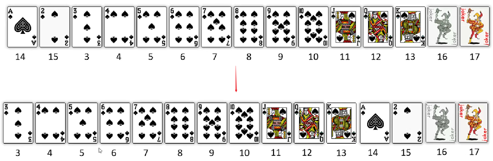

----

## 二、基础代码

前面的准备牌、洗牌、发牌是一样的

~~~java
public class App {
    public static void main(String[] args) {
        new PokerGame();
    }
}

public class PokerGame {
    //牌盒
    static ArrayList<String> list = new ArrayList<>();

    static {
        //准备牌
        String[] color = {"♦", "♣", "♥", "♠"};
        String[] number = {"3", "4", "5", "6", "7", "8", "9", "10", "J", "Q", "K", "A", "2"};

        for (String c : color) {
            for (String n : number) {
                list.add(c + n);
            }
        }
        list.add("小王");
        list.add("大王");
    }

    public PokerGame() {
        //洗牌
        Collections.shuffle(list);

        //发牌
        ArrayList<String> lord = new ArrayList<>();
        ArrayList<String> player1 = new ArrayList<>();
        ArrayList<String> player2 = new ArrayList<>();
        ArrayList<String> player3 = new ArrayList<>();

        for (int i = 0; i < list.size(); i++) {
            String poker = list.get(i);
            //发底牌
            if (i <= 2) {
                lord.add(poker);
                continue;
            }

            //给三个玩家轮流发牌
            if (i % 3 == 0) {
                player1.add(poker);
            } else if (i % 3 == 1) {
                player2.add(poker);
            } else {
                player3.add(poker);
            }
        }
    }
}
~~~

----

## 三、指定牌的价值

由于我们是利用牌的价值给它进行排序的，所以首先第一步，需要先规定好牌的价值。

指定牌的价值的时候我们并没有在集合中添加 `本身牌就是数字` 的牌。

这是因为我们可以拿牌上的数字到Map集合中判断是否存在，存在，获取价值；不存在，本身的数字就是价值。

这样可以让集合存储的数据更少，查询的效率也更高一点。

~~~java
//创建一个集合（键是牌上的数字，值是对应的加载），用来添加牌的价值
static HashMap<String, Integer> hm = new HashMap<>();
public PokerGame() {
    //指定牌的价值
    hm.put("J", 11);
    hm.put("Q", 12);
    hm.put("K", 13);
    hm.put("A", 14);
    hm.put("2", 15);
    hm.put("小王", 50);
    hm.put("大王", 100);
}
~~~

----

## 四、排序

这里我们额外写一个方法来进行排序。

在方法中，我们就可以使用 `Collections` 中的 `sort()` 来进行排序。

如果直接将 `list` 放进去的话，那么它采取的就是默认方式进行排序。

集合的泛型是 `String`，因此默认就是按照 `abcdefg` 这种方式进行排序的，但是我们想要的是按照自己的牌指定的价值进行排序。

因此在参数二的位置就需要传入比较器对象，自己制定排序的规则。

我们可以简单来看一下 `sort()` 底层的源码，跟进看看。

可以发现在底层，它又去调用了 `list` 的 `sort()`，并将比较器对象传递过去

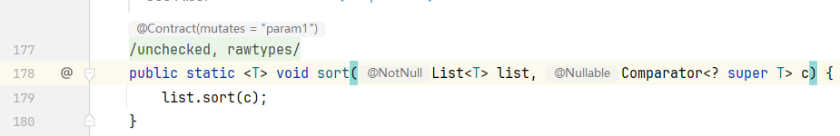

选中 `sort()` 继续跟进，可以发现在方法的底层，它首先会把集合变成数组，然后再去调用 `Arrays.sort()`。

`Arrays.sort()` 就是使用插入排序和二分查找两个结合的方式进行排序的。

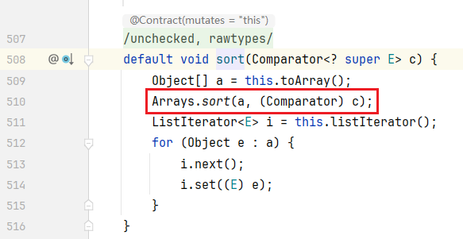

规则如下

~~~java
负数：o1小 插入到前面
正数：o1大 插入到后面
0：o1的数字跟o2的数字是一样的，需要按照花色再次排序
~~~

代码示例

~~~java
//利用牌的价值进行排序
//参数：集合
//♥5 ♥3 ♥6 ♥7 ♥9
public void order(ArrayList<String> list){
    Collections.sort(list, new Comparator<String>() {
        //Array.sort （插入排序 + 二分查找）
        @Override
        //o1：表示当前要插入到有序序列中的牌
        //o2：表示已经在有序序列中存在的牌
        public int compare(String o1, String o2) {
            //1.计算o1的花色和价值   大王
            String color1 = o1.substring(0, 1);
            int value1 = getValue(o1);

            //2.计算o2的花色和价值
            String color2 = o2.substring(0, 1);
            int value2 = getValue(o2);

            //3.比较o1和o2的价值    
            int i = value1 - value2;
            // 如果两张牌价值是一样的♥3  ♠3，那么就需要比较花色
            return i == 0 ? color1.compareTo(color2) : i;
        }
    });
}

// 由于o1和o2的价值都需要进行计算，因此抽取成方法
//计算牌的价值
//参数：牌
//返回值：价值
public int getValue(String poker){// 例如：♥3
    //获取牌上的数字
    String number = poker.substring(1);//把这里截取出来的结果，让这个结果再Map集合中存在 “ 大王”
    //拿着数字到map集合中判断是否存在
    if(hm.containsKey(number)){
        //存在，获取价值
        return hm.get(number);
    }else{
        //不存在，类型转换
        return Integer.parseInt(number);
    }
}
~~~

排序

~~~java
public PokerGame() {
    //排序
    order(lord);
    order(player1);
    order(player2);
    order(player3);
}
~~~

此时会报错

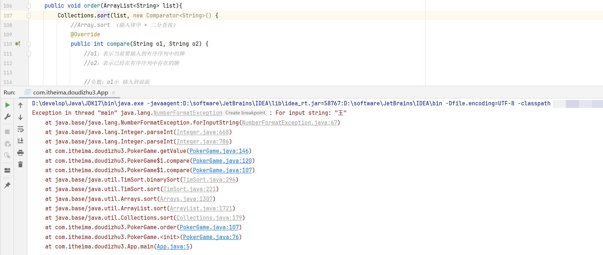

这是因为在截取的时候

~~~java
String color1 = o1.substring(0, 1); // 截出来的是：大 / 小
int value1 = getValue(o1); // 这里传递进去的就是：王
~~~

而且 `王` 在 `集合` 中并不存在，因此就会执行到 `return Integer.parseInt(number);` ，就会导致报错。

解决办法：在集合中添加牌的时候前面多一个空格就行了，这样就可以保证大小王跟上面牌的格式是一样的，将空格认为是大小王的花色。

~~~java
list.add(" 小王");
list.add(" 大王");
~~~

----

## 五、完整代码

~~~java
public class PokerGame {
    //牌盒
    static ArrayList<String> list = new ArrayList<>();

    //创建一个集合，用来添加牌的价值
    static HashMap<String, Integer> hm = new HashMap<>();

    static {
        //准备牌
        String[] color = {"♦", "♣", "♥", "♠"};
        String[] number = {"3", "4", "5", "6", "7", "8", "9", "10", "J", "Q", "K", "A", "2"};

        for (String c : color) {
            for (String n : number) {
                list.add(c + n);
            }
        }
        list.add("小王");
        list.add("大王");


        //指定牌的价值
        //牌上的数字到Map集合中判断是否存在
        //存在，获取价值
        //不存在，本身的数字就是价值
        hm.put("J", 11);
        hm.put("Q", 12);
        hm.put("K", 13);
        hm.put("A", 14);
        hm.put("2", 15);
        hm.put("小王", 50);
        hm.put("大王", 100);


    }

    public PokerGame() {
        //洗牌
        Collections.shuffle(list);

        //发牌
        ArrayList<String> lord = new ArrayList<>();
        ArrayList<String> player1 = new ArrayList<>();
        ArrayList<String> player2 = new ArrayList<>();
        ArrayList<String> player3 = new ArrayList<>();

        for (int i = 0; i < list.size(); i++) {
            String poker = list.get(i);
            //发底牌
            if (i <= 2) {
                lord.add(poker);
                continue;
            }

            //给三个玩家轮流发牌
            if (i % 3 == 0) {
                player1.add(poker);
            } else if (i % 3 == 1) {
                player2.add(poker);
            } else {
                player3.add(poker);
            }
        }


        //排序
        order(lord);
        order(player1);
        order(player2);
        order(player3);


        //看牌
        lookPoker("底牌",lord);
        lookPoker("钢脑壳",player1);
        lookPoker("大帅比",player2);
        lookPoker("蛋筒",player3);
    }


    /*
     * 参数一：玩家的名字
     * 参数二：每位玩家的牌
     * */
    public void lookPoker(String name, ArrayList<String> list){
        System.out.print(name + ": ");
        for (String poker : list) {
            System.out.print(poker + " ");
        }
        System.out.println();

    }


    //利用牌的价值进行排序
    //参数：集合
    //♥5 ♥3 ♥6 ♥7 ♥9
    public void order(ArrayList<String> list){
        Collections.sort(list, new Comparator<String>() {
            //Array.sort （插入排序 + 二分查找）
            @Override
            public int compare(String o1, String o2) {
                //o1：表示当前要插入到有序序列中的牌
                //o2：表示已经在有序序列中存在的牌

                //负数：o1小 插入到前面
                //正数：o1大 插入到后面
                //0：o1的数字跟o2的数字是一样的，需要按照花色再次排序

                //1.计算o1的花色和价值   大王
                String color1 = o1.substring(0, 1);
                int value1 = getValue(o1);

                //2.计算o2的花色和价值
                String color2 = o2.substring(0, 1);
                int value2 = getValue(o2);

                //3.比较o1和o2的价值    ♥3  ♠3
                int i = value1 - value2;
                return i == 0 ? color1.compareTo(color2) : i;

            }
        });
    }

    //计算牌的价值
    //参数：牌
    //返回值：价值
    public int getValue(String poker){//♥3
        //获取牌上的数字
        String number = poker.substring(1);//把这里截取出来的结果，让这个结果再Map集合中存在 “ 大王”
        //拿着数字到map集合中判断是否存在
        if(hm.containsKey(number)){
            //存在，获取价值
            return hm.get(number);
        }else{
            //不存在，类型转换
            return Integer.parseInt(number);
        }
    }
}
~~~


-----

# 30.斗地主 —— 登录页面

接下来就要开始写带页面的斗地主游戏了，它包含两个页面：登录页面和游戏主页面。

这个东西因为知识点受限，有的东西我们还没学，因此这里只能完成大约 `40%`，剩余的 `60%` 等学到对应的知识点就能完成了。


我们首先来看登录页面。

----

# 31.斗地主 —— 游戏界面

## 一、思路分析

首先我们需要来分析这些界面中有哪些东西，然后才能开始写代码。

这些界面代码不需要大家自己写，但是我们需要知道里面有哪些东西。

它有的东西非常多，但是不要慌，我们一个一个来讲解。


最重要的肯定是中间的牌盒，一开始我们需要将所有的牌加载到牌盒中，然后才能洗牌、发牌，这个牌盒我们就可以用一个集合来表示。

还有就是三个玩家手上的牌和三张底牌，这个也可以使用集合来表示。因此我们一共需要有四个结合。

只不过三个玩家手上的牌在很多地方都需要使用，因此需要统一管理：我们需要拿一个集合去装它们，这里就会用到集合的嵌套。

在大集合中，`0索引` 就是左边第一个玩家的牌，`1索引` 就是中间我们自己的牌，`2索引` 就是右边玩家的牌。

底牌是不会放到大集合中的，因为底牌不会在很多地方用到，它是作为一个单独的集合放在这里。

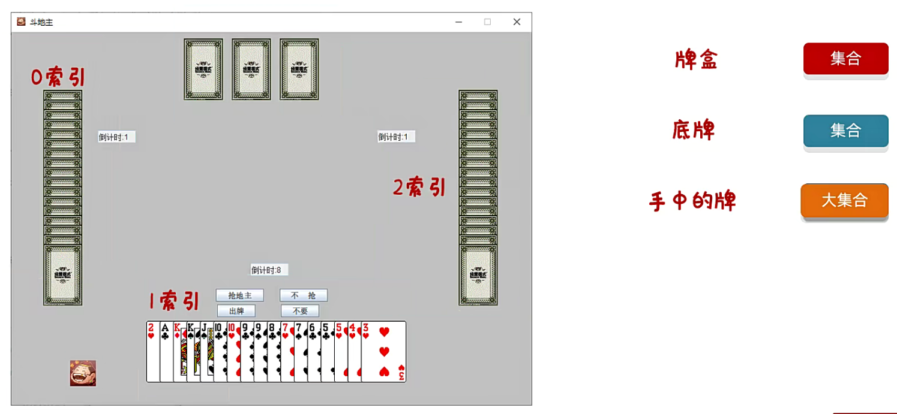

在后面打牌的时候，我们还需要再用一个集合，将我们打出的牌装起来。

如果不装，就不好判断当前玩家是什么牌型。也不好判断两个玩家之间谁的牌打，谁的牌小。

因此我们还需要再定义三个集合用来装当前打出的牌。

这里有一个小细节：我们每次在打牌的时候，需要注意数据移动的方向。

例如我们打 `红桃三`，那么此时就是从我手上的牌的集合移动到上面的集合中。

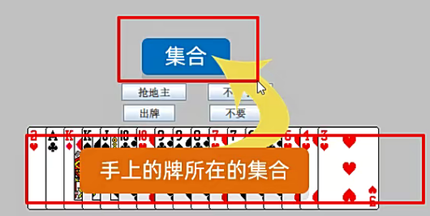

并且这三个集合，我们也需要使用一个大集合进行管理：`0索引` 就是左边第一个玩家打出的牌，`1索引` 就是中间我们自己打出的牌，`2索引` 就是右边玩家打出的牌。

以上就是我们在打牌的过程中所用到的八个集合。

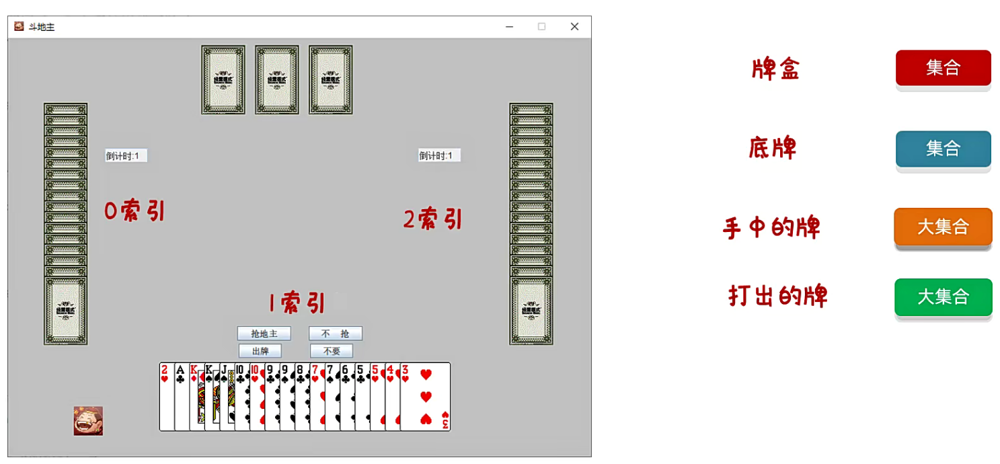

继续往下，还有提示的文本信息，即这里的倒计时，每一个玩家前面都有，其实就是三个 `JLabel`，我们要使用一个大数组去进行管理。

但是为什么这里使用数组呢？

一般来说数据比较少，不需要进行删除 / 添加操作的，就可以使用数组来进行管理。

但是如果我们需要频繁的删除  / 添加数据，此时就需要用到集合来进行管理了。

跟集合一样，`0索引` 就是左边第一个玩家提示的文字，`1索引` 就是中间我们自己提示的文字，`2索引` 就是右边玩家提示的文字。

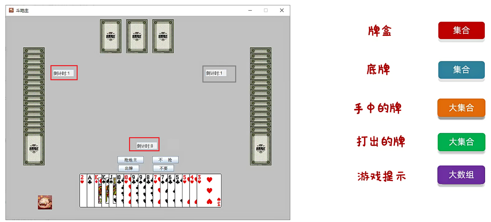

还没完，在我们自己面前，还有四个简单的按钮，只不过这四个按钮不会让他们同时展示出来。

在代码中我们会将这四个按钮分成两组，再用大数组进行管理。

`0索引` 就是左边的按钮，`1索引` 就是右边的按钮。

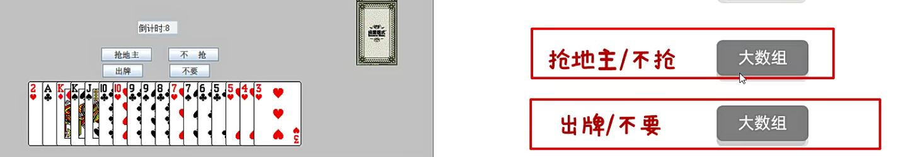

最后一个，左下角地主的图标，这个也是一个 `JLabel`，谁是地主，我们就将这个图标放在谁的前面。


----

## 二、代码实现

首先界面代码是不需要你自己写的，我们只需要能看懂即可。

首先在最上面，我们定义了一个静态变量 `container`，它表示JFrame界面中隐藏容器，所有的组件都需要放到隐藏的容器中。

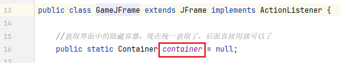

如果我们没有把它放到成员位置，那以后在添加组件的时候每次都需要去调用 `this.getContentPane()` 获取到隐藏的容器，然后再去调用 `add()` 才能去添加组件。

我觉得每次都这么写太麻烦了，而且每次都需要调用 `this.getContentPane()` 方法，效率比较低。

如果我们不想让这个方法频繁的被调用，此时就可以在 `initJframe()` 中只调用一次这个方法，相当于在一开始的会死后就将隐藏的容器获取出来了，然后将它获取给成员位置的 `container`。

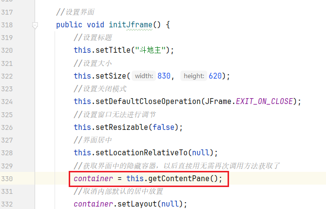

那么以后我们在添加组件的时候，就不需要去调用方法获取隐藏容器再去调用add了，而是直接使用 `container` 调用 `add()` 就行了，效率会有一丢丢的提升，代码也更简单了。


-----

# 32.斗地主 —— 面向对象设计（Poker）

## 一、属性

面向对象设计：说白了，就是在JavaBean类中要定义几个属性、定义几个方法。

面向对象的设计不能自己想，一定要结合业务场景、业务需求慢慢分析，脱离业务需求去说面向对象的设计就是耍流氓。

现在我们来想一下，在斗地主游戏中，这个牌我们该怎么表示。

首先第一个属性要想到：是牌的名字，在之前我们写的控制台版本中，直接一个字符串就搞定了，但是现在，涉及到图形化界面了就要复杂一些。


在以前，这张牌的名字是 `♠A`，但是在 `Windows操作系统` 中，它是不允许这种奇奇怪怪的符号当做名字的。

所以要来改一改，我们会用 `数字-数字` 的方式进行表示，前面的数字表示花色，后面的数字就表示牌，因此 `♠A` 的名字就是：`1-1`


可以发现每张牌的图片也是由这个来命名的

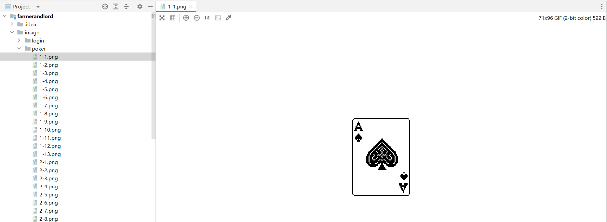

---

第二个属性应该是什么呢？

通过玩游戏可以发现，有的牌是正面，但有的牌是反面，因此还需要有一个属性去表示牌的正反面。

正反面由两种状态，这个属性应该是 `boolean`


----

当我在打牌的时候，需要对牌进行点击，点击完后，它应该会有一个升起的动作，但是不是所有的牌都能点。

因此还需要第三个属性，来表示牌是否可以被点击。


---

还没完，还有第四个属性需要考虑：我们需要来判断一下，自己的牌是否已经被点击了。

如果牌已经被弹起，再点击它，就会执行降落的操作。

因此这个牌还需要有第四个属性，用来记录当前的牌是否已经被点击。


----

## 二、方法

方法非常简单，有三个方法：

- 显示牌正面的方法
- 显示牌反面的方法
- 牌被点击后要执行的方法

这个图片是需要交给 `JLabel` 去管理的，因此我们先让 `Poker类` 继承 `JLabel`，表示当前的牌其实也就是一个 `JLabel` 管理容器，它可以管理我们加载进来的每一张牌。

~~~java
public class Poker extends JLabel implements MouseListener {

    //属性
    //1.牌的名字 格式：数字 - 数字
    private String name;

    //2.牌显示正面还是反面
    private boolean up;

    //3.是否可以被点击
    private boolean canClick = false;

    //4.当前的状态，表示当前的牌是否已经被点击
    //如果是没有被点击的状态，此时被点击了，会执行弹起的操作
    //如果是已经被点击的状态，此时被点击了，会执行降落的操作
    private boolean clicked = false;

    // 构造方法这里就不建议写空参构造了，因为每张牌必须有名字，必须有正反面，其他的属性都是有默认值的。
    public Poker(String name,boolean up){
        this.name = name;
        this.up = up;
        //判断当前的牌是显示正面还是反面
        if(this.up){
            //显示正面
            turnFront();
        }else{
            //显示反面
            turnRear();
        }
        //设置牌的宽高
        this.setSize(71,96);
        //把牌显示出来
        this.setVisible(true);
        //给每一张牌添加监听，JLabel只能添加鼠标监听，其他的监听是添加不了的
        this.addMouseListener(this);
    }

    //显示正面
    public void turnFront(){
        //给牌设置正面
        this.setIcon(new ImageIcon("farmerandlord\\image\\poker\\"+name+".png"));
        //修改成员变量
        this.up = true;
    }

    //显示反面
    public void turnRear(){
        //给牌设置反面
        this.setIcon(new ImageIcon("farmerandlord\\image\\poker\\rear.png"));
        //修改成员变量
        this.up = false;
    }

    @Override
    public void mouseClicked(MouseEvent e) {
        //点击
        //判断当前的牌是否可以被点击
        if(canClick){
            //当牌被点击之后，要么升起，要么降落
            //表示牌的位移像素
            int step = 0;
            if(clicked){
                //表示当前的牌已经被点击
                //降落（y 增加 20像素）
                step = 20;
            }else{
                //表示当前的牌还没有被点击
                //升起 （y 减少 20像素）
                step = -20;
            }
            //需要修改一下clicked变量记录的值
            clicked = !clicked;
            //修改一下牌的位置
            Point from = this.getLocation(); // 获取当前牌的位置
            //创建一个Point的对象，表示结束位置
            Point to = new Point(from.x,from.y + step);
            //把最新的位置设置给牌
            this.setLocation(to);
        }
    }

    @Override
    public void mousePressed(MouseEvent e) {

    }

    @Override
    public void mouseReleased(MouseEvent e) {

    }

    @Override
    public void mouseEntered(MouseEvent e) {

    }

    @Override
    public void mouseExited(MouseEvent e) {

    }


    /**
     * 获取
     * @return name
     */
    public String getName() {
        return name;
    }

    /**
     * 设置
     * @param name
     */
    public void setName(String name) {
        this.name = name;
    }

    /**
     * 获取
     * @return up
     */
    public boolean isUp() {
        return up;
    }

    /**
     * 设置
     * @param up
     */
    public void setUp(boolean up) {
        this.up = up;
    }

    /**
     * 获取
     * @return canClick
     */
    public boolean isCanClick() {
        return canClick;
    }

    /**
     * 设置
     * @param canClick
     */
    public void setCanClick(boolean canClick) {
        this.canClick = canClick;
    }

    /**
     * 获取
     * @return clicked
     */
    public boolean isClicked() {
        return clicked;
    }

    /**
     * 设置
     * @param clicked
     */
    public void setClicked(boolean clicked) {
        this.clicked = clicked;
    }

    public String toString() {
        return "Poker{name = " + name + ", up = " + up + ", canClick = " + canClick + ", clicked = " + clicked + "}";
    }
}
~~~


----

# ---------------------------------

# day26 集合（Stream流&方法引用）

# 34.不可变集合


## 一、创建不可变集合

不可变集合：不可以被修改的集合。

一旦创建完毕后，长度不能改，内容也不能改。

----

## 二、`创建不可变集合` 的应用场景

如果某个数据不能被修改，把它防御性拷贝到不可变集合中是个很好的实际。

当集合对象被不可信的库调用时，不可变形式是安全的。

简单理解：如果你不想让别人去修改集合中的内容，那么就可以给它去提供一个不可变的集合。

当别人拿到这个不可变的集合后，它只能进行查询操作，是不能修改 / 删除 / 添加的。

这样的场景有很多，例如斗地主游戏中的牌盒，牌盒中装了所有的牌，这些牌是固定的，一共 `54张`。

我不想让别人去修改，那万一别人加个 `3` 进去，那就是出老千了。

因此为了防止别人出老千，我们就可以使用不可变的集合


还有斗地主游戏中的出牌规则，这些规则不想增加，也不想删除，也不想让别人修改，也可以使用不可变集合。

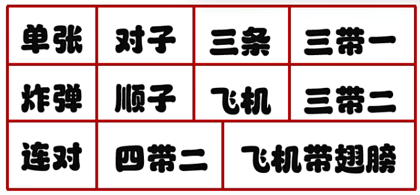

还有用代码获取的操作系统硬件信息，也是不能被修改的。

总而言之，只要你不想让别人去修改集合中的数据，只想让别人进行查询操作的话，这些数据就可以放到不可变集合中。

----

## 三、创建不可变集合的书写格式

在 `List`、`Set`、`Map` 接口中，都存在静态的 `of方法`，可以获取一个不可变的集合。

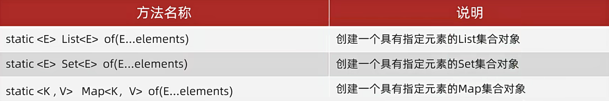

----

## 四、创建不可变的 `List集合`

可以发现这个方法的形参是个可变参数，因此在这个方法里面我们可以传递很多数据。

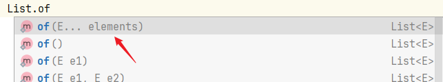

~~~java
//一旦创建完毕之后，是无法进行修改的，在下面的代码中，只能进行查询操作
List<String> list = List.of("张三", "李四", "王五", "赵六");

System.out.println(list.get(0));
System.out.println(list.get(1));
System.out.println(list.get(2));
System.out.println(list.get(3));

System.out.println("---------------------------");

for (String s : list) {
    System.out.println(s);
}

System.out.println("---------------------------");


Iterator<String> it = list.iterator();
while(it.hasNext()){
    String s = it.next();
    System.out.println(s);
}
System.out.println("---------------------------");

for (int i = 0; i < list.size(); i++) {
    String s = list.get(i);
    System.out.println(s);
}
System.out.println("---------------------------");

//list.remove("李四");
//list.add("aaa");
list.set(0,"aaa");
}
~~~

----

## 五、创建不可变的 `Set集合` 

可以发现，它的形参跟刚刚的 `List.of()` 是一模一样的，也是一个可变参数，因此我们可以往小括号中传递很多信息。

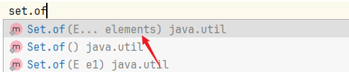

细节：当我们要获取一个不可变的Set集合时，里面的参数一定要保证唯一性，否则就会报错

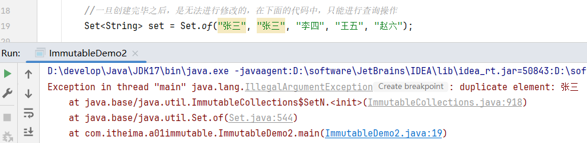

~~~java
//一旦创建完毕之后，是无法进行修改的，在下面的代码中，只能进行查询操作
Set<String> set = Set.of("张三", "张三", "李四", "王五", "赵六");

//由于Set集合是没有索引的，因此如果我们想要查询，只能遍历
for (String s : set) {
    System.out.println(s);
}

System.out.println("-----------------------");

Iterator<String> it = set.iterator();
while(it.hasNext()){
    String s = it.next();
    System.out.println(s);
}

System.out.println("-----------------------");
//set.remove("王五");
~~~

-----

## 六、创建不可变的 `Map集合` 

Java会把第一个参数和第二个参数认为是一个键值对对象，第三个参数和第四个参数认为是一个键值对对象.......

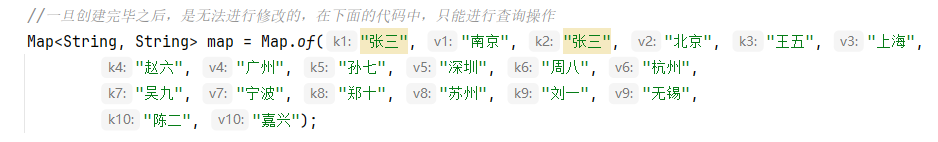

### 细节1：键是不能重复的，如果重复就会报错。

----

### 细节2：Map里面的of方法，参数是有上限的，最多只能传递20个参数，即10个键值对。

`List` 跟 `Set` 能传递多个，就是因为它的形参是 `可变参数`。

但是 `Map`，选中 `Map` 跟进，搜索 `of()`，可以发现它并没有带可变参数的 `of()`。

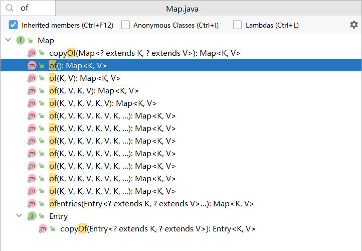

参数最多的就是 `20个参数`。


那为什么它没有设计带有可变参数的方法呢？我们自己来写个方法试试。

如果我们想让 `Map` 的 `of方法` 也能接收多个键和值，那么键和值都需要写成可变参数。

但键和值的类型不确定，因此可以使用泛型方法来解决，写完就会发现立马报错：`Vararg parameter must be the last in the list`（必须在形参的最后）。

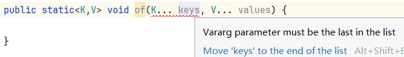

~~~java
//一旦创建完毕之后，是无法进行修改的，在下面的代码中，只能进行查询操作
Map<String, String> map = Map.of("张三", "南京", "张三", "北京", "王五", "上海",
                                 "赵六", "广州", "孙七", "深圳", "周八", "杭州",
                                 "吴九", "宁波", "郑十", "苏州", "刘一", "无锡",
                                 "陈二", "嘉兴");


Set<String> keys = map.keySet();
for (String key : keys) {
    String value = map.get(key);
    System.out.println(key + "=" + value);
}

System.out.println("--------------------------");

Set<Map.Entry<String, String>> entries = map.entrySet();
for (Map.Entry<String, String> entry : entries) {
    String key = entry.getKey();
    String value = entry.getValue();
    System.out.println(key + "=" + value);
}
System.out.println("--------------------------");
}
~~~

----

### 细节3：如果我们要传递多个键值对对象，数量大于10个，在Map接口中还有一个方法。

我们可以将 `键值` 看做是一个整体，传递给 `ofEntries()`，这个方法就可以给你返回一个不可变集合。

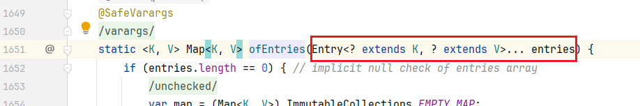

~~~java
//创建一个普通的Map集合
HashMap<String, String> hm = new HashMap<>();
hm.put("张三", "南京");
hm.put("李四", "北京");
hm.put("王五", "上海");
hm.put("赵六", "北京");
hm.put("孙七", "深圳");
hm.put("周八", "杭州");
hm.put("吴九", "宁波");
hm.put("郑十", "苏州");
hm.put("刘一", "无锡");
hm.put("陈二", "嘉兴");
hm.put("aaa", "111");
~~~

利用上面的数据来获取一个不可变的集合，首先需要获取到所有的键值对对象（Entry对象）

~~~java
Set<Map.Entry<String, String>> entries = hm.entrySet();
~~~

由于`ofEntries方法`的形参是一个可变参数，可变参数实际上就是一个数组，因此我们需要把entries变成一个数组。

我们可以用 `entries` 调用里面的 `toArray()`，`to：变成，array：数组`。

首先来调用一下没有参数的 `toArray()`，没有参数就表示没有指定类型，那么它返回的就是 `Object类型` 的。

但此时我们想要给这个数组指定类型，就可以使用下面的第二个带形参的方法，我们需要对这个数组指定类型。

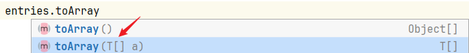

~~~java
//toArray方法在底层会比较集合的长度跟数组的长度两者的大小
//如果集合的长度 > 数组的长度 ：数据在数组中放不下，此时会根据实际数据的个数，重新创建数组
//如果集合的长度 <= 数组的长度：数据在数组中放的下，此时不会创建新的数组，而是直接用
//假设数组初始化长度为20，11个键值对会填满前11个位置，后面的9个默认初始化值为null
//因此数组的长度直接写0就行了，我们不用去关心它的长度，因为底层它会自己判断8
Map.Entry[] arr = entries.toArray(new Map.Entry[0]);
//不可变的map集合
//可变参数实际上就是一个数组，因此我们直接将数组传递过去也是可以的
Map map = Map.ofEntries(arr);
map.put("bbb","222"); // 这行代码会报错
~~~

---

上面这种写法代码太多太麻烦了，我们试着将它简化一下

~~~java
Map<Object, Object> map = Map.ofEntries(hm.entrySet().toArray(new Map.Entry[0]));
~~~

----

### `Map.copyOf()`

但是这样写还是太麻烦了，因此Java给我们在 `Map接口` 中还提供了一个 `copyOf()`。

在这个方法中它会做一个判断

~~~java
static <K, V> Map<K, V> copyOf(Map<? extends K, ? extends V> map) {
    // 当你传过来的 Map集合 就是一个不可变的集合，那么它直接把本身的集合给你返回
    if (map instanceof ImmutableCollections.AbstractImmutableMap) {
        return (Map<K,V>)map;
    } else { // 但如果你传递过来的 Map集合 是可变的，这段代码就跟我们刚刚写的一模一样
        return (Map<K,V>)Map.ofEntries(map.entrySet().toArray(new Entry[0]));
    }
}
~~~

因此在以后，如果我们要生成不可变的 `Map集合` 直接使用 `copyOf` 就行了，只不过它是在 `JDK10` 的时候才出现的。

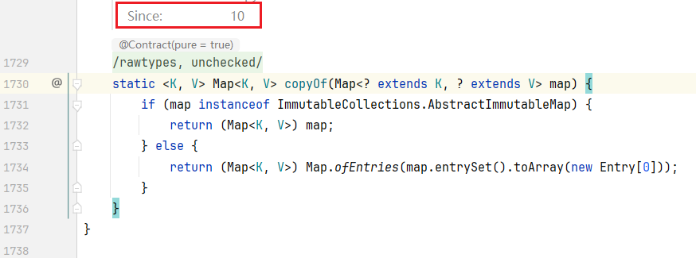

~~~java
Map<String, String> map = Map.copyOf(hm);
map.put("bbb","222"); // 报错
~~~

----

## 七、总结

1、不可变集合的特点？

定义完成后只能查询，不能修改 / 添加 / 删除

2、如何创建不可变集合？

`List`、`Set`、`Map` 接口中，都存在静态的 `of()` 可以创建不可变集合

3、三种方式的细节

- `List`：直接用

- `Set`：元素不能重复

- `Map`：元素不能重复、键值对数量最多是10个，超过10个用 `ofEntries方法`

  如果你的JDK版本大于等于10，可以用 `copyOf()` 简化代码

-----

# 35.初爽 `Stream流`

案例需求

按照下面的要求完成集合的创建和遍历

- 创建一个集合，存储多个字符串元素
- 把集合中所有以"张"开头的元素存储到一个新的集合
- 把"张"开头的集合中的长度为3的元素存储到一个新的集合
- 遍历上一步得到的集合

~~~java
ArrayList<String> list1 = new ArrayList<>();
list1.add("张无忌");
list1.add("周芷若");
list1.add("赵敏");
list1.add("张强");
list1.add("张三丰");

//1.把所有以“张”开头的元素存储到新集合中
ArrayList<String> list2 = new ArrayList<>();
for (String name : list1) {
    if(name.startsWith("张")){
        list2.add(name);
    }
}
//2.把“张”开头的，长度为3的元素再存储到新集合中
ArrayList<String> list3 = new ArrayList<>();
for (String name : list2) {
    if(name.length() == 3){
        list3.add(name);
    }
}

//3.遍历打印最终结果
for (String name : list3) {
    System.out.println(name);
}
~~~

运行上面代码，结果是对的，但是代码太多太繁杂了。

等今天我们学习完 `Stream流` 后，这个代码就非常简单了

~~~java
list1.stream().filter(name->name.startsWith("张")).filter(name -> name.length() == 3).forEach(name-> System.out.println(name));
~~~


----

# 36.`Stream流` 的思想

## 一、什么是流？

这个 `流` 我们可以把它理解成：工厂的流水线。

假设现在有这么一条制造饮料的流水线，首先需要将空瓶子放到流水线上，进行第一步操作：检查瓶子，不合格的牌子就要丢掉。

再进行第二步：消毒；消完毒后再进行第三部：灌装，然后密封、包装出厂。


Java中的 `Stream流` 跟它的思想是一样，以刚刚的练习为例。

首先将要操作的数据都放到流水线上，然后进行过滤操作，留下以张开头的，其他的数据舍弃不要。

然后进行长度的过滤，将长度为 `3` 的留下，其他的数据舍弃不要。

最后进行输出操作。

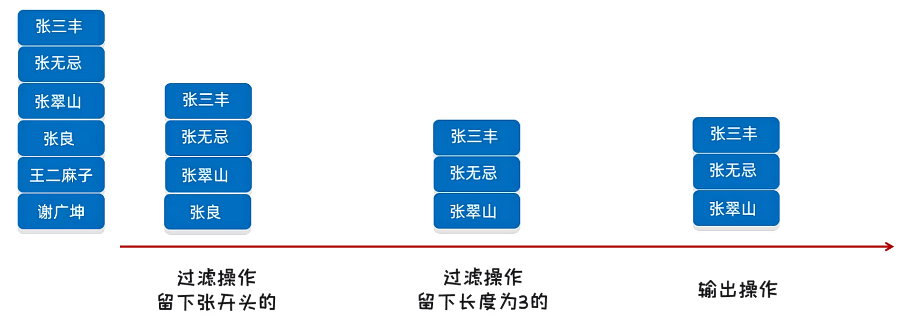

---

`Steam流` 在使用的时候一般会结合 `Lambda表达式` 去简化集合、数组的操作

## 二、`Stream流` 的使用步骤

1、先得到一条 `Steam流`(流水线) ，并把数据放到流水线上

2、利用 `Steam流` 中的API进行各种操作

例如过滤、转换、统计、打印 等等，这些操作又可以分为两种：`中间方法` 和 `终结方法`

`中间方法`：方法调用完毕后，还可以调用其他方法

`终结方法`：也就是 `Steam流` 中的最后一步，方法调用完毕后，不能再调用其他方法了。

因此完整的 `Steam流` 的使用步骤如下

① 获取 `Stream流对象` （先得到一条 `Steam流`(流水线) ，并把数据放到流水线上）

② 使用 **中间方法** 对流水线上的数据进行操作

③ 使用 **终结方法** 对流水线上的数据进行操作

----

# 获取 `Stream流`

如何获取一条流水线，并将数据放上去呢？

不同的情况会有不同的处理方案。

单列集合利用 `Collection` 中的默认方法 `steam()`，这样就可以获取到一条流水线，并把集合中的数据放到流水线上。

双列集合是不能直接使用 `steam()`，它需要通过 `keySet()` / `entrySet` 先转成单列集合，再获取 `Steam流`。

数组可以使用 `Arrays` 中的静态方法 `steam()`。

如果是 `一堆零散的数据`，也就是说这些数据是没有放到 `集合 / 数组` 中的，这些数据可以使用 `Steam接口` 中的 `of()` 来进行处理，但是这些数据需要是同种数据类型的。

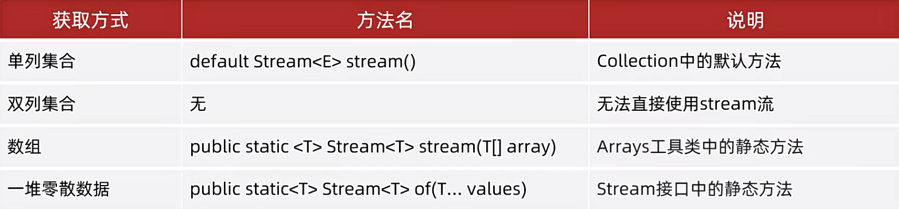

----

## 一、单列集合获取Stream流

方法的返回值就是一个 `Steam流`，并且流水线上的数据就是 `字符串`。

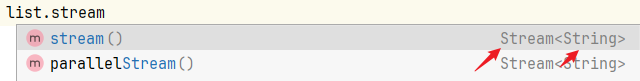

~~~java
ArrayList<String> list = new ArrayList<>();
Collections.addAll(list,"a","b","c","d","e");
//获取到一条流水线，并把集合中的数据放到流水线上
Stream<String> stream1 = list.stream();
//使用终结方法打印一下流水线上的所有数据
stream1.forEach(new Consumer<String>() {
    @Override
    public void accept(String s) {
        //s:依次表示流水线上的每一个数据
        System.out.println(s);
    }
});
~~~

上面的写法不是最终代码，我们一般会直接采取链式编程

~~~java
list.stream().forEach(s -> System.out.println(s));
~~~

----

## 二、双列集合获取 `Steam流`

双列集合是不能直接使用 `steam()`，它需要通过 `keySet()` / `entrySet` 先转成单列集合，再获取 `Steam流`。

~~~java
//1.创建双列集合
HashMap<String,Integer> hm = new HashMap<>();
//2.添加数据
hm.put("aaa",111);
hm.put("bbb",222);
hm.put("ccc",333);
hm.put("ddd",444);

//第一种获取stream流
hm.keySet().stream().forEach(s -> System.out.println(s));

//第二种获取stream流，相当于是将所有的键值对对象放到了Steam流中
hm.entrySet().stream().forEach(s-> System.out.println(s));
~~~

----

## 三、数组获取 `Steam流`

数组无论是基本数据类型还是引用数据类型，都是可以使用 `Steam流` 的。

如果数组是`基本数据类型`的，调用的就是下面的这些方法。

如果数组是`引用数据类`型的，那么它调用的就是上面带有泛型的泛型方法。

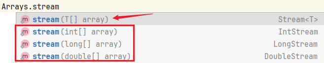

~~~java
//1.创建数组
int[] arr1 = {1,2,3,4,5,6,7,8,9,10};
String[] arr2 = {"a","b","c"};
//2.获取stream流
Arrays.stream(arr1).forEach(s-> System.out.println(s));
System.out.println("============================");
Arrays.stream(arr2).forEach(s-> System.out.println(s));
~~~

---

## 四、`一堆零散的数据` 获取 `Steam流`

前提条件：这些 `零散的数据` 需要是同种数据类型。

方法的形参是 `可变参数`，并且返回的是一个 `Steam流`。

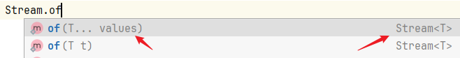

`引用数据类型` 和 `基本数据类型` 都是支持的

~~~java
Stream.of(1,2,3,4,5).forEach(s-> System.out.println(s));
Stream.of("a","b","c","d","e").forEach(s-> System.out.println(s));
~~~

----

## 五、`Steam` 中的静态方法 `of()` 的细节

很多课程中，如果想要获取数组中的  `Steam流` ，会建议大家使用 `Stream.of()`，也就是下面 `一堆零散的数据` 的处理方案。

它会这么将是因为 `Stream.of()` 的形参是一个可变参数，可变参数的底层其实就是一个数组，因此如果直接将数组传递给这个方法，看上去好像也没有问题。


用起来发现，这种方式好像也没问题，但是这种方式是错误的。

~~~java
Stream.of(arr2).forEach(s-> System.out.println(s));
~~~

因为数组不仅仅只有引用数据类型，还有基本数据类型的数组，如果我们将`基本数据类型的数组`传入进去，这个时候就会有问题了。

可以发现打印出来的是一个地址值。

~~~java
Stream.of(arr1).forEach(s-> System.out.println(s));//[I@41629346
~~~

这个就是 `Steam` 中的静态方法 `of()` 里面的一个小细节：方法的形参是一个可变参数，可以传递一堆零散的数据，也可以传递数组。

但是数组必须是引用数据类型的，如果传递基本数据类型，它是不会整体自动装箱的，它是会把整个数组当做一个元素，放到Stream当中。但我们真正想要的是将数组里面的数据放到 `Stream流` 中，而不是将数组这个整体放到 `Stream流` 中。

在以后，我们要获取 `Steam流`，需要想好是 `单列集合还是双列集合、数组、一堆零散的数据`，这四种方式它的用法是不一样的，两者之间不能互相混用。


-----

# 37.`Stream流`的中间方法

概念：中间操作的意思是,执行完此方法之后,Stream流依然可以继续执行其他操作

## 一、总述

常见方法会有以下六个

| 方法名                                            | 说明                                       |
| ------------------------------------------------- | ------------------------------------------ |
| `Stream<T> filter(Predicate predicate)`           | 过滤                                       |
| `Stream<T> limit(long maxSize)`                   | 获取前几个元素                             |
| `Stream<T> skip(long n)`                          | 跳过前几个元素                             |
| `Stream<T> distinct()`                            | 元素去重，依赖(`hashCode()` 和 `equals()`) |
| `static <T> Stream<T> concat(Stream a, Stream b)` | 合并a和b两个流为一个大流                   |
| `Stream<R> map(Function<T, R> mapper)`            | 转换流中的数据类型                         |

注意1：中间方法会返回新的 `Stream流`，原来的 `Steam流` 只能使用一次，建议使用链式编程

注意2：修改 `Steam流` 中的数据，是不会影响原来集合或者数组中的数据

----

## 二、过滤

~~~java
Stream<T> filter(Predicate predicate)
~~~

方法的形参是 `Predicate`，选中它跟进，可以发现它是一个函数式接口。

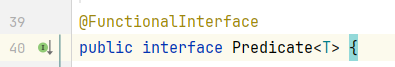

我们先使用匿名内部类，然后再使用 `Lambda表达式` 简化

~~~java
ArrayList<String> list = new ArrayList<>();
Collections.addAll(list, "张无忌", "周芷若", "赵敏", "张强", "张三丰", "张翠山", "张良", "王二麻子", "谢广坤");

//filter   过滤  把张开头的留下，其余数据过滤不要
list.stream().filter(new Predicate<String>() {
    @Override
    public boolean test(String s) {
        //如果返回值为true，表示当前数据留下
        //如果返回值为false，表示当前数据舍弃不要
        return s.startsWith("张");
    }
}).forEach(s -> System.out.println(s));
~~~

简化为 `Lambda表达式`

~~~java
list.stream()
    .filter(s -> s.startsWith("张"))
    .filter(s -> s.length() == 3)
    .forEach(s -> System.out.println(s));
~~~

----

## 注意1：中间方法会返回新的 `Stream流`，原来的 `Steam流` 只能使用一次，建议使用链式编程

例如下面不用链式编程，而是直接获取到返回值为 `stream1`，然后再使用 `stream1` 来进行过滤。

过滤完成后，再将数据打印，可以发现是没有任何的问题的。

~~~java
Stream<String> stream1 = list.stream().filter(s -> s.startsWith("张"));
Stream<String> stream2 = stream1.filter(s -> s.length() == 3);
stream2.forEach(s -> System.out.println(s));
~~~

但是在下面的代码中，如果还想再次使用 `stream1`，可以发现就会报错：`stream has already been operated upon or closed（流已经关闭了）`

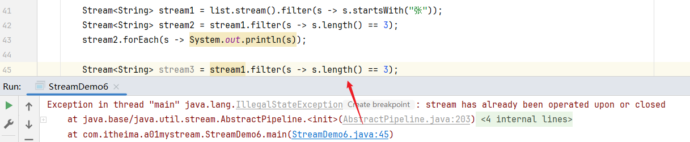

原因是因为，在 `42行` 这里，`stream1` 已经用过了，就不能再次使用了。

**所以一定要切记：原来的 `Steam流` 只能使用一次。**

既然只能使用一次，那么我们就没有必要再去用一个变量去记录了，因此**建议使用链式编程。**

因此当 `Stream流` 写熟了后发现，所以的操作一行就搞定了，代码非常的简单。

但是代码变少了也会有一个小弊端：代码的阅读性降低。

因此我们一般都会将链式编程的每一个操作都折行，这样就会提高代码的阅读性。

~~~java
list.stream()
    .filter(s -> s.startsWith("张"))
    .filter(s -> s.length() == 3)
    .forEach(s -> System.out.println(s));
~~~

----

## 注意2：修改 `Steam流` 中的数据，是不会影响原来集合或者数组中的数据

例如上面我们对集合做了两次过滤，此时再来打印集合，此时集合里面的数据是不会改变的。

----

## 三、获取前几个元素

`maxSize` 跟索引没有关系，就是字面意思：几个元素

~~~java
Stream<T> limit(long maxSize)
~~~

代码示例

~~~java
// "张无忌", "周芷若", "赵敏", "张强", "张三丰", "张翠山", "张良", "王二麻子", "谢广坤"
list.stream().limit(3).forEach(s -> System.out.println(s)); // 张无忌 周芷若 赵敏 
~~~

-----

## 四、跳过前几个元素

参数 `n` 表示的也是个数

~~~java
Stream<T> skip(long n)
~~~

代码示例

~~~java
// "张无忌", "周芷若", "赵敏", "张强", "张三丰", "张翠山", "张良", "王二麻子", "谢广坤"
list.stream().skip(4).forEach(s -> System.out.println(s)); // 张三丰 张翠山 张良 王二麻子 谢广坤 
~~~

----

## 五、`limit` 和 `skip` 练习

```
课堂练习：在 "张无忌", "周芷若", "赵敏", "张强", "张三丰", "张翠山", "张良", "王二麻子", "谢广坤" 中获取以下元素
"张强", "张三丰", "张翠山"
```

代码示例

~~~java
//第一种思路：
//先获取前面6个元素："张无忌", "周芷若", "赵敏", "张强", "张三丰", "张翠山",
//然后跳过前面3个元素
list.stream().limit(6).skip(3).forEach(s -> System.out.println(s));

//第二种思路：
//先跳过3个元素："张强", "张三丰", "张翠山", "张良", "王二麻子", "谢广坤"
//然后再获取前面3个元素："张强", "张三丰", "张翠山"
list.stream().skip(3).limit(3).forEach(s -> System.out.println(s));
~~~

----

## 六、元素去重

~~~java
Stream<T> distinct()
~~~

代码示例

~~~java
ArrayList<String> list1 = new ArrayList<>();
Collections.addAll(list1, "张无忌","张无忌","张无忌", "张强", "张三丰", "张翠山", "张良", "王二麻子", "谢广坤");
list1.stream().distinct().forEach(s -> System.out.println(s));
~~~

PS：`distinct()` 在底层是依赖 `hashCode()` 和 `equals()` 进行去重的。

由于在 `String` 中，Java已经帮我们重写好了这两个方法，因此我们直接使用就行了。

但如果集合中装的是 `自定义对象`，那么一定要手动重写。

我们可以简单看一下 `distinct()` 里面的源码，源码非常的复杂，我们只需要找里面的核心点就行了。

选中 `distinct()` <kbd>ctrl + b</kbd>，如果直接 <kbd>ctrl +b</kbd> ，那么它就是跳到接口里面的方法。

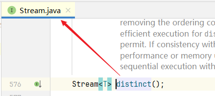

而我们需要看的是它的实体类，因此需要采用以下方法，或者 <kbd>ctrl + alt + b</kbd>

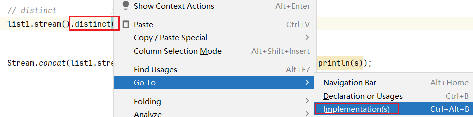

它底层会调用 `makeRef()`，继续跟进

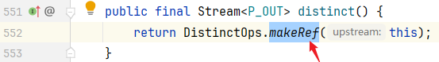

点进去后，可以发现它的源码超级多，但不要慌，我们真正看的是里面的一个核心点：`keys = new HashSet<>(keys);`。

所以我们就知道，在底层是通过 `HashSet` 进行去重的。

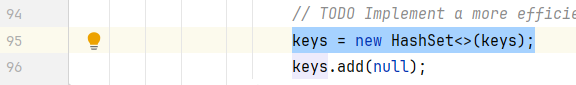

`HashSet` 在存储自定义元素的时候，需要重写 `hashCode()` 和 `equals()`。

----

## 七、合并a和b两个流为一个大流

**在合并的时候，尽可能要保证两个流中的数据类型是一致的。**

如果第一个流数据类型是 `a`，第二个流数据类型是 `b`，那么这个时候在合并的时候，它的类型就是 `a` 跟 `b` 共同的父类了，这样就相当于它做了一个类型的提升，在提升之后，它是无法使用子类里面的特有功能的。

~~~java
static <T> Stream<T> concat(Stream a, Stream b)
~~~

这个方法是 `Stream` 里面的静态方法，所以在使用的时候需要使用类名调用

~~~java
ArrayList<String> list1 = new ArrayList<>();
Collections.addAll(list1, "张无忌","张无忌","张无忌", "张强", "张三丰", "张翠山", "张良", "王二麻子", "谢广坤");

ArrayList<String> list2 = new ArrayList<>();
Collections.addAll(list2, "周芷若", "赵敏");

// 方法参数中传递需要合并的两个流，程序运行完毕发现，前面是第一个流里面的数据，后面就是第二个流中的
Stream.concat(list1.stream(),list2.stream()).forEach(s -> System.out.println(s)); // 张无忌 张无忌 张无忌 张强 张三丰 张翠山 张良 王二麻子 谢广坤 周芷若 赵敏 
~~~

-----

## 八、转换流中的数据类型

~~~java
Stream<R> map(Function<T, R> mapper)
~~~

需求：只获取里面的年龄并进行打印

~~~java
ArrayList<String> list = new ArrayList<>();
Collections.addAll(list, "张无忌-15", "周芷若-14", "赵敏-13", "张强-20", "张三丰-100", "张翠山-40", "张良-35", "王二麻子-37", "谢广坤-41");
~~~

分析：流里面原本的数据是 `String` 类型的，最终我需要获得 `int` 类型的。

因此需求其实就是将 `String` 变成 `int类型`。

`map()` 的形参是 `Function`，而 `Function` 又是函数式接口。接口中有一个 `apply()`

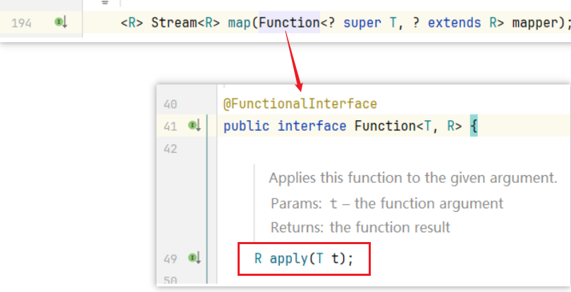

在 `Function` 中有两个泛型：

- 第一个类型：流中原本的数据类型
- 第二个类型：要转成之后的类型

`apply`的 `形参s`：依次表示流里面的每一个数据；`返回值`：表示转换之后的数据。

我们的需求是将字符串变成 `int类型`，但是不能直接将 `int` 写在泛型里，因为泛型里面不能写基本数据类型。

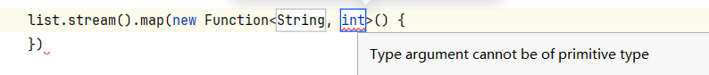

因此正确写法应该是写成：`Integer`，同样 `apply()` 的返回值需要与 `Function` 的泛型相对应，这两个都表示转换之后的类型。

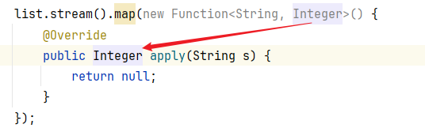

~~~java
list.stream().map(new Function<String, Integer>() {
    @Override
    public Integer apply(String s) {
        String[] arr = s.split("-");
        String ageString = arr[1];
        int age = Integer.parseInt(ageString);
        return age;
    }
})
    //当map方法执行完毕之后，流上的数据就变成了整数
	//所以在下面forEach当中，s依次表示流里面操作完毕后的每一个数据，这个数据现在就是整数了
    .forEach(s-> System.out.println(s));
~~~

改成 `Lambda表达式`

~~~java
list.stream()
    .map(s-> Integer.parseInt(s.split("-")[1]))
    .forEach(s-> System.out.println(s));
~~~


-----

# 38.`Stream流`的终结方法

概念：终结操作的意思是,执行完此方法之后,Stream流将不能再执行其他操作

## 一、总述

常见的终结方法会有以下四个

| 方法名                          | 说明                       |
| ------------------------------- | -------------------------- |
| `void forEach(Consumer action)` | 遍历                       |
| `long count()`                  | 统计                       |
| `toArray()`                     | 收集流中的数据，放到数组中 |
| `collect(Collector collector)`  | 收集流中的数据，放到集合中 |

思考为什么要收集？

我们使用 `Stream流` 可以用来处理 `集合 / 数组` 中的数据，那你处理完了之后，肯定要将这些数据保存起来，因此我们需要将它们收集起来。

---

## 二、遍历

~~~java
void forEach(Consumer action)
~~~

代码示例

~~~java
ArrayList<String> list = new ArrayList<>();
Collections.addAll(list, "张无忌", "周芷若", "赵敏", "张强", "张三丰", "张翠山", "张良", "王二麻子", "谢广坤");

//用list调用stream()获取到一个流水线，并把集合里面的数据放到流水线上
list.stream()
~~~

可以发现 `forEach()` 的返回值是 `void`，因此调用 `forEach()` 结束后就不能调用流里面的其他方法了，它是终结方法。

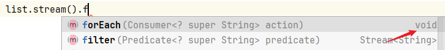

跟进 `forEach()` ，可以发现它的形参是 `Consumer`，继续跟进 `Consumer`。

发现它是一个函数式接口，因此一会我们会将它改写成 `Lambda表达式`。

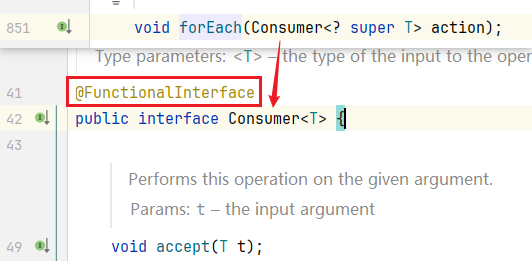

我们先写匿名内部类

~~~java
//Consumer的泛型：表示流中数据的类型
//accept方法的形参s：依次表示流里面的每一个数据
//方法体：对每一个数据的处理操作（打印）
list.stream().forEach(new Consumer<String>() {
    @Override
    public void accept(String s) {
        System.out.println(s);
    }
});
~~~

改写为 `Lambda表达式`

~~~java
list.stream().forEach(s -> System.out.println(s));
~~~

----

## 三、统计

~~~java
long count()
~~~

`count()` 的返回值是一个 `long类型` 的整数，因此 `count()` 结束后，也不能再调用流里面的其他方法了，它也是一个终结方法。

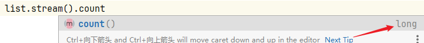

~~~java
long count = list.stream().count();
System.out.println(count); // 9
~~~

----

## 四、收集流中的数据，放到数组中

~~~java
toArray()
~~~

调用 `toArray()` 的时候会有两个，最简单的是空参的，表示我们需要收集到 `Object类型` 的数组中。

但是我们需要的是放到具体类型的数组中，就可以使用下面的方法。

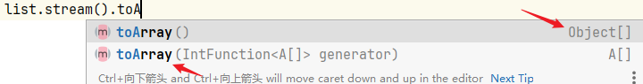

首先来讲最简单的空参，返回的是 `Object类型` 的数组中。

~~~java
Object[] arr1 = list.stream().toArray();
System.out.println(Arrays.toString(arr1));
~~~

接下来讲有参的，跟进 `toArray()` 往下滑

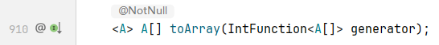

点击 `IntFunction`，可以发现它也是一个函数式接口

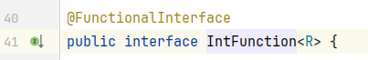

这里先写匿名内部类

~~~~~java
list.stream().toArray(new IntFunction<? extends Object[]>() {
    @Override
    public Object[] apply(int value) {
        return new Object[0];
    }
});
~~~~~

这个接口相对来将比较复杂。

`IntFunction` 的泛型是 `? extends Object[]`，前面的 `? extends Object` 表示数据的类型，后面的 `[]` 表示数组，因此这个整体就表示具体类型的数组。

由于我们要的是 `String` 类型的，因此写 `String[]` 就行了。

~~~java
list.stream().toArray(new IntFunction<String[]>() {
    @Override
    public Object[] apply(int value) {
        return new Object[0];
    }
});
~~~

接下来看里面的 `apply()`。

```
apply的形参:流中数据的个数，要跟数组的长度保持一致
apply的返回值：具体类型的数组，这个需要跟IntFunction的泛型类型对应
方法体：就是创建数组
```

```java
toArray方法的参数的作用：负责创建一个指定类型的数组
toArray方法的底层，会依次得到流里面的每一个数据，并把数据放到数组当中
toArray方法的返回值：是一个装着流里面所有数据的数组
```

~~~java
String[] arr = list.stream().toArray(new IntFunction<String[]>() {
    @Override
    public String[] apply(int value) {
        return new String[value];
    }
});
System.out.println(Arrays.toString(arr)); // [张无忌, 周芷若, 赵敏, 张强, 张三丰, 张翠山, 张良, 王二麻子, 谢广坤]
~~~

改写成 `Lambda表达式`

~~~java
String[] arr2 = list.stream().toArray(value -> new String[value]);
System.out.println(Arrays.toString(arr2)); // [张无忌, 周芷若, 赵敏, 张强, 张三丰, 张翠山, 张良, 王二麻子, 谢广坤]
~~~

PS：如果需要转为基本数据类型的数组，泛型是不能写基本数据类型的，只能转为它的包装类

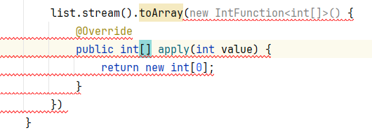

~~~java
list.stream().toArray(new IntFunction<Integer[]>() {
    @Override
    public Integer[] apply(int value) {
        return new Integer[0];
    }
});
~~~

-----

## 五、收集流中的数据，放到集合中

这个方法可以收集到 `单列集合List / Set`、`双列集合Map`

~~~java
collect(Collector collector)
~~~

准备数据

~~~java
ArrayList<String> list = new ArrayList<>();
Collections.addAll(list, "张无忌-男-15", "周芷若-女-14", "赵敏-女-13", "张强-男-20",
        "张三丰-男-100", "张翠山-男-40", "张良-男-35", "王二麻子-男-37", "谢广坤-男-41");
~~~

### 1）收集到 `List集合` 当中

需求：我要把所有的男性收集起来

PS：我们在比较的时候也可以将 `s.split("-")[1]` 放在前面跟 `"男"` 进行比较也是可以的，只不过我们在比较的时候有一个习惯：能用这种固定数据去调用的尽量就使用固定数据调用，因为前面的不可能是 `null`，但是后面的 `s.split("-")[1]` 就有可能是不确定的，不确定的东西就有可能是 `null`，`null` 的话就会导致空指针异常。

~~~java
List<String> newList1 = list.stream()
    .filter(s -> "男".equals(s.split("-")[1]))
    // Collectors是Stream里面的工具类，它里面有个静态方法叫：tolist()，这个方法底层可以帮我们创建一个ArrayList集合，这样就可以将流里面所有的数据都放到这个ArrayList集合中了
    .collect(Collectors.toList());
System.out.println(newList1); // [张无忌-男-15, 张强-男-20, 张三丰-男-100, 张翠山-男-40, 张良-男-35, 王二麻子-男-37, 谢广坤-男-41]
~~~

----

### 2）收集到 `Set集合` 当中

~~~java
Set<String> newList2 = list.stream().filter(s -> "男".equals(s.split("-")[1]))
    // toSet() 底层会帮我们创建一个HashSet集合，并将流里面的数据放到这个HashSet集合中
    .collect(Collectors.toSet());
System.out.println(newList2);
~~~

****

### 3）收集到 `List集合`、`Set集合` 中的区别

当我将 `list` 集合中的数据改为

~~~java
"张无忌-男-15", "张无忌-男-15", "周芷若-女-14", "赵敏-女-13", "张强-男-20",
        "张三丰-男-100", "张翠山-男-40", "张良-男-35", "王二麻子-男-37", "谢广坤-男-41"
~~~

此时数据就重复了，这时我们将 `newList1` 和 `newList2` 同时打印。

可以发现如果将数据收集到 `HashSet` 中，数据会去重。

~~~java
System.out.println(newList1); // [张无忌-男-15, 张无忌-男-15, 张强-男-20, 张三丰-男-100, 张翠山-男-40, 张良-男-35, 王二麻子-男-37, 谢广坤-男-41]
System.out.println(newList2); // [张强-男-20, 张良-男-35, 张三丰-男-100, 张无忌-男-15, 谢广坤-男-41, 张翠山-男-40, 王二麻子-男-37]
~~~

----

### 4）收集到 `Map集合` 当中

收集到 `Map` 时，需要规定一件事情：谁作为键，谁作为值。

```
需求：
我要把所有的男性收集起来
键：姓名。 值：年龄。
性别就不要了，因为既然是将所有的男性收集起来，那么收集起来的肯定是男性。
```

在 `toMap()` 中，我们需要传入键和值的规则

~~~java
//收集Map集合当中
//谁作为键,谁作为值.
//我要把所有的男性收集起来
//键：姓名。 值：年龄
Map<String, Integer> map = list.stream()
    .filter(s -> "男".equals(s.split("-")[1]))
    .collect(键的规则, 值的规则);
~~~

跟进 `toMap()` 看一下，可以发现集合中有两个形参，形参一：`keyMapper`（键的规则），形参二：`valueMapper`(值的规则)。

在底下有一段代码，虽然我们看不懂，但是可以猜。

`HashMap::new`：`new` 了一个 `HashMap`，然后将键、值的规则传递进去，传递给 `uniqKeysMapAccumulator()`

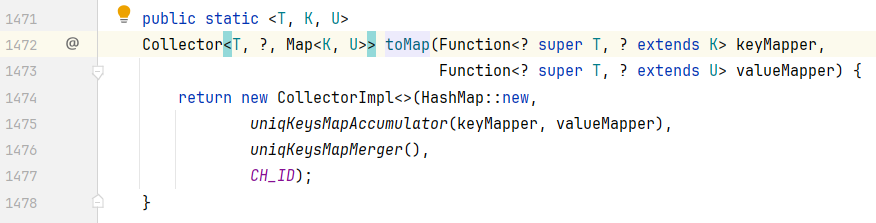

跟进 `uniqKeysMapAccumulator()`，可以看见它里面调用了 `putIfAbsent()`，将数据添加到 `Map集合` 中。

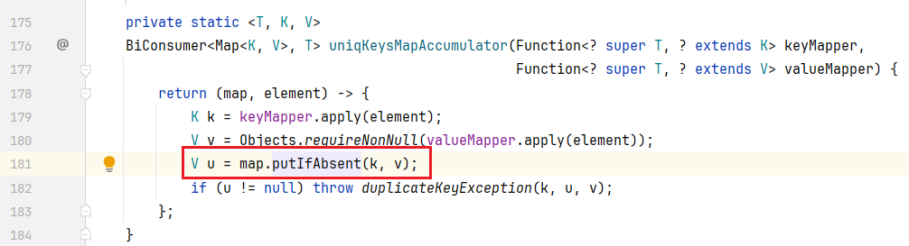

`Function接口` 和 `apply()` 的对应关系如下

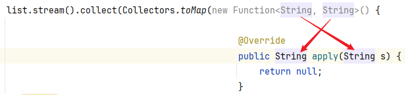

**注意点：如果我们要收集到Map集合当中，键不能重复，否则会报错。**

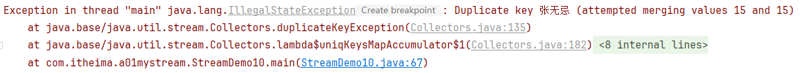

报错的原因就是因为它底层调用了 `putIfAbsent()`，这个方法里面会做一个判断：根据键先找值，如果值为 `null`，表示当前的键是不存在的，此时就将数据添加到 `Map集合` 中，但是在添加第二次的时候，这里的 `v` 就不是 `null` 了，直接返回 `v`。

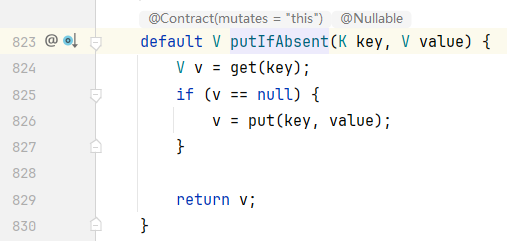

<kbd>ctrl + alt + ←</kbd> 返回上一步，可以发现它在下面又做了一个判断：如果 `u` 不是 `null`，它就会产生异常


~~~java
Map<String, Integer> map = list.stream()
        .filter(s -> "男".equals(s.split("-")[1]))
        /*
         *   toMap : 参数一表示键的生成规则
         *           参数二表示值的生成规则
         *
         * 参数一：
         *       Function泛型一：表示流中每一个数据的类型
         *               泛型二：表示Map集合中键的数据类型
         *
         *        方法apply形参：依次表示流里面的每一个数据
         *               方法体：生成键的代码
         *               返回值：已经生成的键
         *
         *
         * 参数二：
         *        Function泛型一：表示流中每一个数据的类型
         *                泛型二：表示Map集合中值的数据类型
         *
         *       方法apply形参：依次表示流里面的每一个数据
         *               方法体：生成值的代码
         *               返回值：已经生成的值
         *
         * */
        .collect(Collectors.toMap(new Function<String, String>() {
                                      @Override
                                      public String apply(String s) {
                                          //张无忌-男-15
                                          return s.split("-")[0];
                                      }
                                  },
                new Function<String, Integer>() {
                    @Override
                    public Integer apply(String s) {
                        return Integer.parseInt(s.split("-")[2]);
                    }
                }));
~~~

改写为 `lambda表达式`

~~~java
Map<String, Integer> map2 = list.stream()
    .filter(s -> "男".equals(s.split("-")[1]))
    .collect(Collectors.toMap(
        s -> s.split("-")[0],
        s -> Integer.parseInt(s.split("-")[2])));
~~~

----

# `Stream流` 总结

**1、`Stream流` 的作用**

结合了 `Lambda表达式` 去简化集合、数组的操作

**2、`Stream流` 的使用步骤**

① 获取 `Stream流对象` （先得到一条 `Steam流`(流水线) ，并把数据放到流水线上）

② 使用 **中间方法** 对流水线上的数据进行操作

③ 使用 **终结方法** 对流水线上的数据进行操作

**3、如何获取 `Stream流对象`**

单列集合利用 `Collection` 中的默认方法 `steam()`，这样就可以获取到一条流水线，并把集合中的数据放到流水线上。

双列集合是不能直接使用 `steam()`，它需要通过 `keySet()` / `entrySet` 先转成单列集合，再获取 `Steam流`。

数组可以使用 `Arrays` 中的静态方法 `steam()`。

如果是 `一堆零散的数据`，也就是说这些数据是没有放到 `集合 / 数组` 中的，这些数据可以使用 `Steam接口` 中的 `of()` 来进行处理，但是这些数据需要是同种数据类型的。


**4、常见方法**

中间方法：filter、limit、skip、distinct、concat、map

终结方法：forEach、count、collect

----

# --------------------------------------------

# 40.练习：数据过滤

~~~java
定义一个集合，并添加一些整数  1,2,3,4,5,6,7,8,9,10
过滤奇数，只留下偶数。
并将结果保存起来
~~~

代码示例

~~~java
//1. 定义一个集合
ArrayList<Integer> list = new ArrayList<>();
//2.添加一些整数
Collections.addAll(list, 1, 2, 3, 4, 5, 6, 7, 8, 9, 10);
//3.过滤奇数，只留下偶数
//进行判断，如果是偶数，返回true 保留
List<Integer> newList = list.stream()
    .filter(n -> n % 2 == 0)
    .collect(Collectors.toList());
//4.打印集合
System.out.println(newList);
~~~


----

# 41.练习：数据操作1

~~~java
创建一个ArrayList集合，并添加以下字符串，字符串中前面是姓名，后面是年龄
    "zhangsan,23",
    "lisi,24",
    "wangwu,25"
保留年龄大于等于24岁的人，并将结果收集到Map集合中，姓名为键，年龄为值
~~~

代码示例

~~~java
//1.创建一个ArrayList集合
ArrayList<String> list = new ArrayList<>();
//2.添加以下字符串
list.add("zhangsan,23");
list.add("lisi,24");
list.add("wangwu,25");
//3.保留年龄大于等于24岁的人
list.stream()
    .filter(s -> Integer.parseInt(s.split(",")[1]) >= 24)
    .collect(Collectors.toMap(new Function<String, String>() {
        @Override
        public String apply(String s) {
            return s.split(",")[0];
        }
    }, new Function<String, Integer>() {
        @Override
        public Integer apply(String s) {
            return Integer.parseInt(s.split(",")[1]);
        }
    }));

Map<String, Integer> map = list.stream()
    .filter(s -> Integer.parseInt(s.split(",")[1]) >= 24)
    .collect(Collectors.toMap(
        s -> s.split(",")[0],
        s -> Integer.parseInt(s.split(",")[1])));

System.out.println(map);
~~~


-----

# 42.练习：数据操作2

~~~java
现在有两个ArrayList集合，分别存储6名男演员的名字和年龄以及6名女演员的名字和年龄。
姓名和年龄中间用逗号隔开。
比如：张三,23
要求完成如下的操作：
1，男演员只要名字为3个字的前两人
2，女演员只要姓杨的，并且不要第一个
3，把过滤后的男演员姓名和女演员姓名合并到一起
4，将上一步的演员信息封装成Actor对象。
5，将所有的演员对象都保存到List集合中。
备注：演员类Actor，属性有：name，age
男演员：  "蔡坤坤,24" , "叶齁咸,23", "刘不甜,22", "吴签,24", "谷嘉,30", "肖梁梁,27"
女演员：  "赵小颖,35" , "杨颖,36", "高元元,43", "张天天,31", "刘诗,35", "杨小幂,33"
~~~

代码示例

~~~java
//1.创建两个ArrayList集合
ArrayList<String> manList = new ArrayList<>();
ArrayList<String> womenList = new ArrayList<>();
//2.添加数据
Collections.addAll(manList, "蔡坤坤,24", "叶齁咸,23", "刘不甜,22", "吴签,24", "谷嘉,30", "肖梁梁,27");
Collections.addAll(womenList, "赵小颖,35", "杨颖,36", "高元元,43", "张天天,31", "刘诗,35", "杨小幂,33");
//3.男演员只要名字为3个字的前两人
Stream<String> stream1 = manList.stream()
    .filter(s -> s.split(",")[0].length() == 3)
    .limit(2);
//4.女演员只要姓杨的，并且不要第一个
Stream<String> stream2 = womenList.stream()
    .filter(s -> s.split(",")[0].startsWith("杨"))
    .skip(1);
//5.把过滤后的男演员姓名和女演员姓名合并到一起
//演员信息封装成Actor对象。

//String -> Actor对象 （类型转换）
Stream.concat(stream1,stream2).map(new Function<String, Actor>() {
    @Override
    public Actor apply(String s) {
        //"赵小颖,35"
        String name = s.split(",")[0];
        int age = Integer.parseInt(s.split(",")[1]);
        return new Actor(name,age);
    }
}).forEach(s-> System.out.println(s));

// 变成Lambda表达式
List<Actor> list = Stream.concat(stream1, stream2)
    .map(s -> new Actor(s.split(",")[0], Integer.parseInt(s.split(",")[1])))
    .collect(Collectors.toList());
System.out.println(list);
~~~


-----

# 43.方法引用概述

很多人在学习方法引用的时候都会觉得非常的反人类，并且很多老师都会觉得它很奇葩。

但是并不是这样的，当你写熟了以后，你就会觉得这种写法太香了。

方法引用非常的重要，并且在以后会经常用到。

## 一、概述

`方法引用` 可以分成两个词语理解：1、方法：就是以前学习的方法；2、引用：把已经有的方法拿过来用，把它当做函数式接口中抽象方法的方法体。

总而言之一句话：**方法引用就是把已经有的方法拿过来用，当做函数式接口中抽象方法的方法体。**

例如 `Arrays` 中的 `sort()`，正常书写的时候，第一个参数表示要排序的数组；第二个参数表示排序的规则，在代码中，需要传递 `Comparator接口` 的实现类对象。

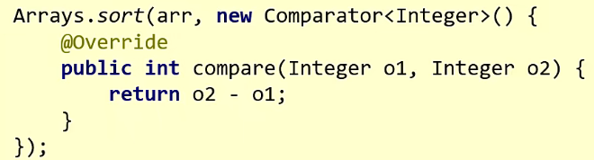

又因为 `Comparator` 是一个函数式接口，因此我们可以使用 `lambda表达式` 进行简化。

但其实 `lambda表达式` 还不是最简单的，它还可以进一步简化。

这里的排序规则我们甚至不用写，可以把已经存在的方法直接拿过来用，即将这个已经存在的方法当做是函数式接口中抽象方法的方法体。

假设我们现在有已经写好的 `subtraction()`，那么在 `sort()` 的第二个参数中，我们就可以直接去使用它，这就是方法引用。

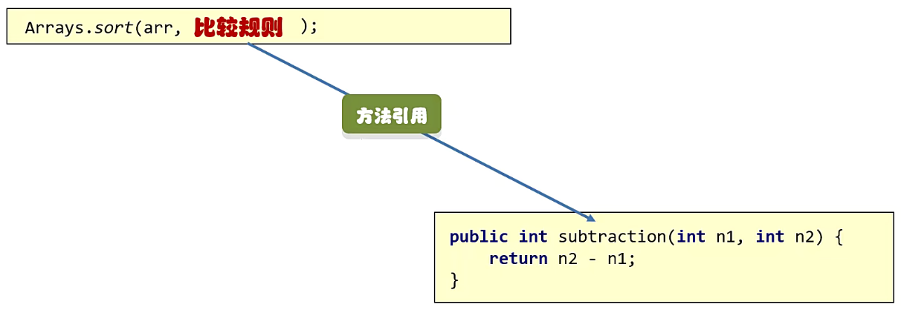

但是并不是所有的方法都能引用的，需要满足一下的四个条件才可以。

1、应用处必须是函数式接口

剩下来的三个要求是对被引用的方法有一个限制。

1、被引用的方法必须是已经存在的

如果它没有存在，那么还需要自己写，非常的麻烦

2、被引用方法的形参和返回值需要跟抽象方法保持一致

3、被引用方法的功能要满足当前的需求

例如之前的 `Comparator接口` 中的 `compare()` 功能是返回一个作为判断的整数，那么被引用的方法的功能也应该是返回一个作为判断的整数。

----

## 二、代码示例

需求：创建一个数组，进行倒序排列

~~~java
Integer[] arr = {3, 5, 4, 1, 6, 2};
~~~

匿名内部类

~~~java
Arrays.sort(arr, new Comparator<Integer>() {
    @Override
    public int compare(Integer o1, Integer o2) {
        return o2 - o1;
    }
});
~~~

因为第二个参数的类型Comparator是一个函数式接口，因此可以使用 `lambda表达式` 进行简化。

~~~java
Arrays.sort(arr, (Integer o1, Integer o2)->{
    return o2 - o1;
});
~~~

lambda表达式简化格式

~~~java
Arrays.sort(arr, (o1, o2) -> o2 - o1);
~~~

方法引用

~~~java
//1.引用处需要是函数式接口
//2.被引用的方法需要已经存在
//3.被引用方法的形参和返回值需要跟抽象方法的形参和返回值保持一致
//4.被引用方法的功能需要满足当前的要求

//由于下面是一个静态方法，我们以前调用的时候是：FunctionDemo1.subtraction()，其中FunctionDemo1是类名，subtraction是方法名。
//现在在方法引用里面也是一样的
//表示引用FunctionDemo1类里面的subtraction方法
//把这个方法当做抽象方法的方法体
Arrays.sort(arr, FunctionDemo1::subtraction);

System.out.println(Arrays.toString(arr));

//被引用的方法可以是Java已经写好的，也可以是一些第三方的工具类
public static int subtraction(int num1, int num2) {
    return num2 - num1;
}
~~~

-----

## 三、总结

**1、什么是方法引用？**

方法引用就是把已经有的方法拿过来用，当做函数式接口中抽象方法的方法体。

**2、`::` 是什么符号？**

`::`  该符号为引用运算符，而它所在的表达式被称为方法引用

**3、方法引用时要注意什么？**

- 应用处必须是函数式接口

剩下来的三个要求是对被引用的方法有一个限制。

- 被引用的方法必须是已经存在的

  如果它没有存在，那么还需要自己写，非常的麻烦

- 被引用方法的形参和返回值需要跟抽象方法保持一致

- 被引用方法的功能要满足当前的需求

  例如之前的 `Comparator接口` 中的 `compare()` 功能是返回一个作为判断的整数，那么被引用的方法的功能也应该是返回一个作为判断的整数。


-----

方法引用的分类如下图

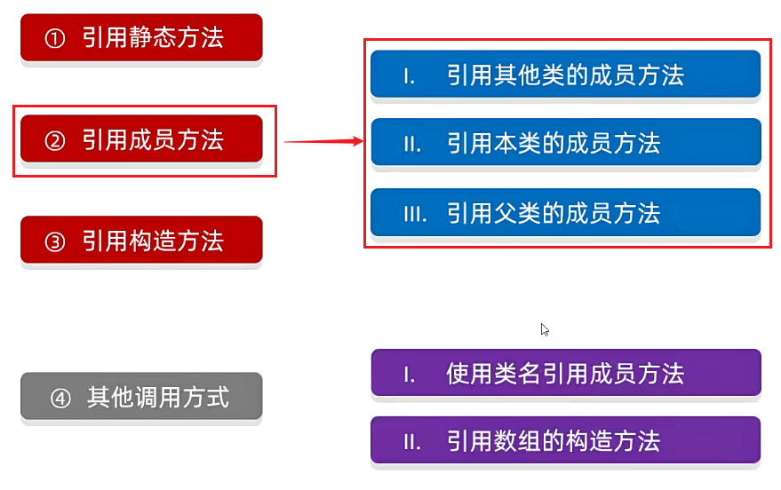

----

# 44.引用静态方法

## 一、概念

格式：`类名::静态方法`

示例：`Integer::parseInt`

这个格式其实很好理解，我们以前在调用静态方法的时候也是使用类名直接调用，只不过以前是用 `.` 进行调用的，现在就是使用 `::` 进行调用。

我们利用这个格式来写一个小练习。

----

## 二、练习

```
集合中有以下数字，要求把他们都变成int类型
"1","2","3","4","5"
```

首先创建集合并添加元素

~~~java
ArrayList<String> list = new ArrayList<>();
Collections.addAll(list,"1","2","3","4","5");
~~~

以前的方式也可以完成，但是这样写里面没有函数式接口，用不了方法引用。

~~~java
ArrayList<Integer> list2 = new ArrayList<>();
for (String s : list) {
    int i = Integer.parseInt(s);
    list2.add(i);
}
~~~

接下来使用方法引用来操作。

~~~java
//2.把他们都变成int类型
list.stream().map(new Function<String, Integer>() {
    @Override
    public Integer apply(String s) {
        int i = Integer.parseInt(s);
        return i;
    }
}).forEach(s -> System.out.println(s));
//1.方法需要已经存在
//2.方法的形参和返回值需要跟抽象方法的形参和返回值保持一致
//3.方法的功能需要把形参的字符串转换成整数
//在Java中是存在满足以上条件的方法的，例如Integer里面的parseInt()
list.stream()
    // 将parseInt()直接当做是map()形参中接口的抽象方法的方法体
    .map(Integer::parseInt)
    .forEach(s-> System.out.println(s));
~~~


-----

# 45.引用成员方法

## 一、概述

格式：`对象::成员方法`

这个格式也很好理解，你要想：在之前我们调用成员方法的时候，都是使用对象去调用的，只不过以前是用 `.` 进行调用的，现在就是使用 `::` 进行调用。

在引用成员方法的时候有三种情况需要我们知道

① 其他类：`其他类对象::方法名`

② 本类：`this::方法名`

③ 父类：`super::方法名`

----

## 二、练习一

集合中有一些名字，按照要求过滤数据。

数据："张无忌","周芷若","赵敏","张强","张三丰"

要求：只要以张开头，而且名字是3个字的

~~~java
//1.创建集合
ArrayList<String> list = new ArrayList<>();
//2.添加数据
Collections.addAll(list,"张无忌","周芷若","赵敏","张强","张三丰");
//3.过滤数据（只要以张开头，而且名字是3个字的）
list.stream().filter(s->s.startsWith("张")).filter(s->s.length() == 3).forEach(s-> System.out.println(s));

list.stream().filter(new Predicate<String>() {
    @Override
    public boolean test(String s) {
        return s.startsWith("张") && s.length() == 3;
    }
}).forEach(s-> System.out.println(s));
~~~

接下来改为方法引用，要思考：有没有这样的方法，它的形参是字符串，返回值是 `boolean`，而且方法里面做的事情跟我现在写的代码是一样的呢？

很显然，Java并没有提供这样的方法，这个时候就可以自己写一个。

新建一个类 `StringOperation.java`

~~~java
public class StringOperation {
    public boolean stringJudge(String s){
        return s.startsWith("张") && s.length() == 3;
    }
}
~~~

① 其他类：`其他类对象::方法名`

~~~java
StringOperation so = new StringOperation();
list.stream().filter(so::stringJudge)
    .forEach(s-> System.out.println(s));
~~~

② 本类：`this::方法名`

如果直接在 `main方法` 中直接用 `this` 调用下面的方法，会直接报错，因为静态方法中没有 `this`！！！

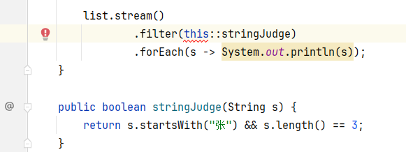

因此如果你想要引用本类的非静态方法，那么引用处必须在非静态的方法中。

但静态方法中没有 `this` 怎么办呢？这个时候你只能创建本类的对象。

~~~java
//静态方法中是没有this的
list.stream().filter(new FunctionDemo3()::stringJudge)
    .forEach(s-> System.out.println(s));
~~~

`this::方法名` 、`super::方法名` 会放在第二个练习中讲解，因为这两种方式引用处不能是静态方法，因为在静态方法里面是没有 `this` 也是没有 `super` 的。

-----

## 二、练习二

GUI界面中点击事件的方法引用写法

基础代码

**App.java**

~~~java
public class App {
    public static void main(String[] args) {
        new LoginJFrame();
    }
}
~~~

**LoginJFrame.java**

~~~java
public class LoginJFrame extends JFrame {
    JButton go = new JButton("Go");

    public LoginJFrame() {
        //设置图标
        setIconImage(Toolkit.getDefaultToolkit().getImage("myfunction\\image\\logo.jpg"));

        //设置界面
        initJframe();

        //添加组件
        initView();

        //界面显示出来
        this.setVisible(true);

    }

    //添加组件
    public void initView() {
        JLabel image = new JLabel(new ImageIcon("myfunction\\image\\kit.jpg"));
        image.setBounds(100,50,174,174);
        this.getContentPane().add(image);

        go.setFont(new Font(null,1,20));
        go.setBounds(120,274,150,50);
        go.setBackground(Color.WHITE);

        this.getContentPane().add(go);

    }

    //设置界面
    public void initJframe() {
        //设置标题
        this.setTitle("随机点名器");
        //设置大小
        this.setSize(400, 500);
        //设置关闭模式
        this.setDefaultCloseOperation(JFrame.EXIT_ON_CLOSE);
        //设置窗口无法进行调节
        this.setResizable(false);
        //界面居中
        this.setLocationRelativeTo(null);
        //取消内部默认居中放置
        this.setLayout(null);
        //设置背景颜色
        this.getContentPane().setBackground(Color.white);
        this.setAlwaysOnTop(true);//置顶
    }
}
~~~

需求：点击go之后，在控制台有数据打印


根据之前所学，我们应该给 `GO` 这个 `JButton` 添加一个点击事件。

在之前做法，是将本类 `implements ActionListener`，`go.addActionListener(this);` 表示当我们点击 `Go按钮` 后，就会执行本类里面所对应的 `actionPerformed` 方法。

~~~java
public class LoginJFrame extends JFrame implements ActionListener {
    JButton go = new JButton("Go");

    public LoginJFrame() {
        .....
    }

    //添加组件
    public void initView() {
        ....
        go.addActionListener(this);
    }

    //设置界面
    public void initJframe() {
        .....
    }

    @Override
    public void actionPerformed(ActionEvent e) {
        Object obj = e.getSource();
        if (obj == go) {
            System.out.println("Go按钮被点击了");
        }
    }
}
~~~

那现在我们要用方法引用去做，此时就非常的简单了。

---

### 1）本类成员方法引用

此时我们就不需要实现 `ActionListener接口` 了。

`go.addActionListener()` 的形参其实是一个接口

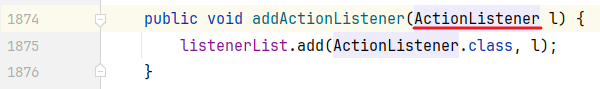

跟进 `ActionListener` 看看，虽然在 `ActionListener` 上面没有加 `@FunctionInterface`，但是它本身是一个接口，里面也只有一个抽象方法，因此它也是一个函数式接口。

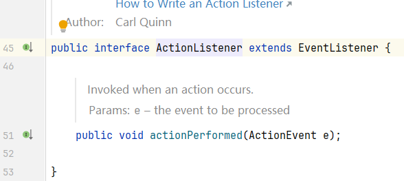

既然它是函数式接口，那么就可以在 `go.addActionListener()` 中去写方法引用了。

`ActionListener接口` 有一个 `actionPerformed()`，因此我们需要去找一个方法，它的形参是 `ActionEvent`，返回值是 `void`，方法里面干的事情就是我们这个方法里面做的判断。

Java没有给我们提供，我们可以自己写，假设我们写了一个 `method()`，此时就可以使用方法引用了。

表示当我们点击了 `go按钮` 时，就会执行 `this(本类)` 里面的 `method()`。

~~~java
public class LoginJFrame extends JFrame {
    //添加组件
    public void initView() {
        ....
        go.addActionListener(this::method);
    }
    
    public void method(ActionEvent e) {
        Object obj = e.getSource();
        if (obj == go) {
            System.out.println("Go按钮被点击了");
        }
    }
}
~~~

这样书写可以让我们的代码阅读性得到提高。

例如这个界面中有很多独立的按钮，这样每个按钮我都可以写一个独立的方法：第一个按钮被点击了，我就执行 `method1()`；第二个按钮被点击了，我就执行 `method2()` 里面的代码。

这样来讲，代码更加的独立，以后代码要修改了，有BUG了，其他点击的逻辑就不需要看了，直接看对应的方法就行了。

并且在方法里我们也不需要判断了，因为我们知道，只有当 `go` 被点击的时候，才会执行 `method1()`。

~~~java
public void method1(ActionEvent e) {
    System.out.println("Go1按钮被点击了");
}

public void method2(ActionEvent e) {
    System.out.println("Go2按钮被点击了");
}

public void method3(ActionEvent e) {
    System.out.println("Go3按钮被点击了");
}
~~~

但是如果 `method1()` 不在本类，而是在父类里面，该怎么办呢？

----

### 2）父类成员方法引用

例如我们新写一个 `MyJFrame类`

~~~java
public class MyJFrame extends JFrame {
    public void method1(ActionEvent e) {
        System.out.println("go按钮被点击了");
    }
}
~~~

然后在 `LoginJFrame` 中继承 `MyJFrame`，并且使用 `super::方法名` 来引用父类的成员方法。

下面代码就表示我们引用的是父类中的 `method1()`

~~~java
public class LoginJFrame extends MyJFrame {
    //添加组件
    public void initView() {
        go.addActionListener(super::method1);
    }
}
~~~


----

# 47.引用构造方法

在引用之前，需要想明白一件事：我们为什么要引用构造方法？其实很简单，就是为了创建对象。

格式：`类名::new`

范例：`Student::new`

```
需求：集合里面存储姓名和年龄，要求封装成Student对象并收集到List集合中
```

代码示例

~~~java
//1.创建集合对象
ArrayList<String> list = new ArrayList<>();
//2.添加数据
Collections.addAll(list, "张无忌,15", "周芷若,14", "赵敏,13", "张强,20", "张三丰,100", "张翠山,40", "张良,35", "王二麻子,37", "谢广坤,41");
//3.封装成Student对象并收集到List集合中
//String --> Student
List<Student> newList = list.stream().map(new Function<String, Student>() {
    @Override
    public Student apply(String s) {
        String[] arr = s.split(",");
        String name = arr[0];
        int age = Integer.parseInt(arr[1]);
        return new Student(name, age);
    }
}).collect(Collectors.toList());
System.out.println(newList);
~~~

接下来改写成 `方法引用`。

如果我们直接在 `map()` 中写 `Student::new`，那么会直接报错，但是又没有全部报错，只有 `new` 的地方报错了。

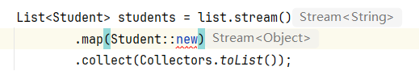

此时就需要来对照一下 `方法引用的规则` 了。

`map()` 有函数式接口，满足；`被引用的方法必须存在`，这里就是构造方法，存在，因此满足。

但是，可以发现 `第3点` 和 `第4点` 就不满足了，`Studnet类` 中并没有形参是 `String` 的构造方法，因此在刚刚调用 `new` 的时候就报错了。

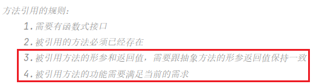

因此我们需要在 `Student` 中加一个构造。

这里会有一个疑问， `方法引用的规则` 要求返回值也需要保持一致，但是构造方法没有返回值怎么办？

你要想，构造方法运行完后，对象就已经有了，所以使用构造方法的时候，返回值不需要管，你只要能保证构造方法结束后，生成的对象跟抽象方法的返回值保持一致就行了。

~~~java
public Student(String str) {
    // 从str中获取name跟age，并将它赋值给成员变量的name跟age
    String[] arr = str.split(",");
    this.name = arr[0];
    this.age = Integer.parseInt(arr[1]);
}
~~~

最终代码

~~~java
List<Student> newList2 = list.stream().map(Student::new).collect(Collectors.toList());
System.out.println(newList2);
~~~

接下来带着大家看一下 `Collectors` 中 `toList()` 的源码，可以发现就是我们刚刚学习的，在底层它也是使用方法引用创建了 `ArrayList` 的对象，然后将每一个数据使用  `List` 中的 `add()` 添加到集合中。

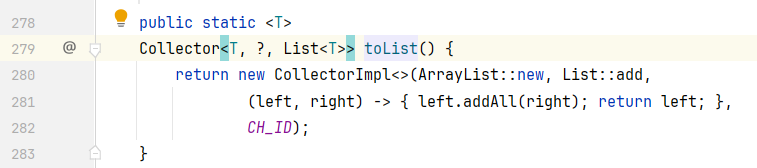


-----

# 48.类名引用成员方法

## 一、介绍

格式：`类名::成员方法`

范例：`String::substring`（表示我现在要引用的就是字符串里面的 `substring()`）

练习：集合里面一些字符串，要求变成大写后进行输出

~~~java
//1.创建集合对象
ArrayList<String> list = new ArrayList<>();
//2.添加数据
Collections.addAll(list, "aaa", "bbb", "ccc", "ddd");
//3.变成大写后进行输出
//String --> String
list.stream().map(new Function<String, String>() {
    @Override
    public String apply(String s) {
        return s.toUpperCase();
    }
}).forEach(s -> System.out.println(s));
~~~

使用 `方法引用`

~~~java
//map(String::toUpperCase)
//拿着流里面的每一个数据，去调用String类中的toUpperCase方法，方法的返回值就是转换之后的结果。
list.stream().map(String::toUpperCase).forEach(s -> System.out.println(s));
~~~

----

## 二、规则

写完后，我们应该是有疑问的，我们将 `toUpperCase()` 和 `apply()` 对比一下。

在之前我们说过，`被引用方法的返回值` 需要跟 `抽象方法里面的形参跟返回值` 保持一致。

但是对比后发现，被引用的方法没有形参！既然形参对应不起来，那为什么可以引用？

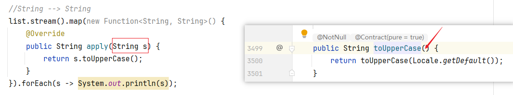

因此接下来需要说一下这种方法引用它自己的规则，注意这个规则是这种方式独有的。

```java
1.需要有函数式接口
2.被引用的方法必须已经存在
3.被引用方法的形参，需要跟抽象方法的第二个形参到最后一个形参保持一致，返回值需要保持一致。
4.被引用方法的功能需要满足当前的需求

抽象方法形参的详解：
第一个参数：表示被引用方法的调用者，决定了可以引用哪些类中的方法
            在Stream流当中，第一个参数一般都表示流里面的每一个数据。
            假设流里面的数据是字符串，那么使用这种方式进行方法引用，只能引用String这个类中的方法
```

这里主要的是来看第三个规则：被引用方法的形参，需要跟抽象方法的第二个形参到最后一个形参保持一致，返回值需要保持一致。

```
第二个参数到最后一个参数：跟被引用方法的形参保持一致，如果没有第二个参数，说明被引用的方法需要是无参的成员方法
```

这个时候我们就可以对比着看，首先来看抽象方法，发现它只有一个形参，并没有第二个形参，因此它被引用的方法必须是无参的成员方法，返回值需要保持一致，并且方法的功能也是满足我们的需求的，因此 `toUpperCse()` 是满足规则的。

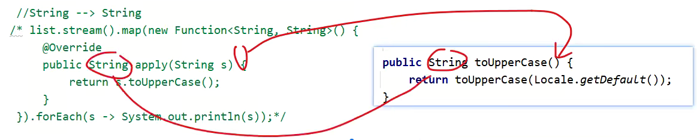

接下来解释 `抽象方法的形参`，我们这种方式去引用方法，不是所有类里面的方法都可以引用的。

~~~java
第一个参数：表示被引用方法的调用者，决定了可以引用哪些类中的方法
            在Stream流当中，第一个参数一般都表示流里面的每一个数据。
            假设流里面的数据是字符串，那么使用这种方式进行方法引用，只能引用String这个类中的方法
~~~

例如这个例子，`apply()` 中第一个参数是 `String`，它就决定了只能引用 `String` 里面的抽象方法。

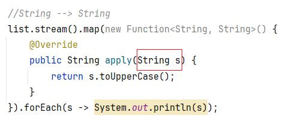

~~~java
局限性：
    不能引用所有类中的成员方法。
    是跟抽象方法的第一个形参有关，这个形参是什么类型的，那么就只能引用这个类中的方法。
//拿着流里面的每一个数据，去调用String类中的toUpperCase方法，方法的返回值就是转换之后的结果。
list.stream().map(String::toUpperCase).forEach(s -> System.out.println(s));
~~~


-----

# 49.引用数组的构造方法

格式：`数据类型[]::new`

范例：`int[]::new`，目的是创建一个 `int类型` 的数组

练习：集合中存储一些整数，收集到数组当中。

在Java底层其实有一个类，专门用来描述数组，它里面也有构造方法，当我们创建数组的时候，其实就是调用了这个构造方法。

现在我们只需要知道：引用数组的构造方法就是为了创建一个数组就行了。

~~~java
//1.创建集合并添加元素
ArrayList<Integer> list = new ArrayList<>();
Collections.addAll(list, 1, 2, 3, 4, 5);
//2.收集到数组当中
Integer[] arr = list.stream().toArray(new IntFunction<Integer[]>() {
    @Override
    public Integer[] apply(int value) {
        return new Integer[value];
    }
});
~~~

接下来就需要改写为 `方法引用` 了，在底层有一个小小的细节：创建的数组的类型，需要跟流中数据的类型保持一致。

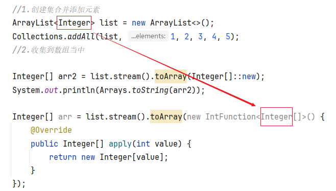

~~~java
Integer[] arr2 = list.stream()
    // 此时它会去创建一个Integer类型的数组，长度和流里面数组的个数是一样的，并把流里面的数据放到数组中
    .toArray(Integer[]::new);
System.out.println(Arrays.toString(arr2));
~~~

----

# 方法引用总结

**1、什么是方法引用？**

方法引用就是把已经有的方法拿过来用，当做函数式接口中抽象方法的方法体。

**2、`::` 是什么符号？**

`::`  该符号为引用运算符，而它所在的表达式被称为方法引用

**3、方法引用时要注意什么？**

- 应用处必须是函数式接口

剩下来的三个要求是对被引用的方法有一个限制。

- 被引用的方法必须是已经存在的

  如果它没有存在，那么还需要自己写，非常的麻烦

- 被引用方法的形参和返回值需要跟抽象方法保持一致

- 被引用方法的功能要满足当前的需求

  例如之前的 `Comparator接口` 中的 `compare()` 功能是返回一个作为判断的整数，那么被引用的方法的功能也应该是返回一个作为判断的整数。

----

方法引用一共分为以下五种

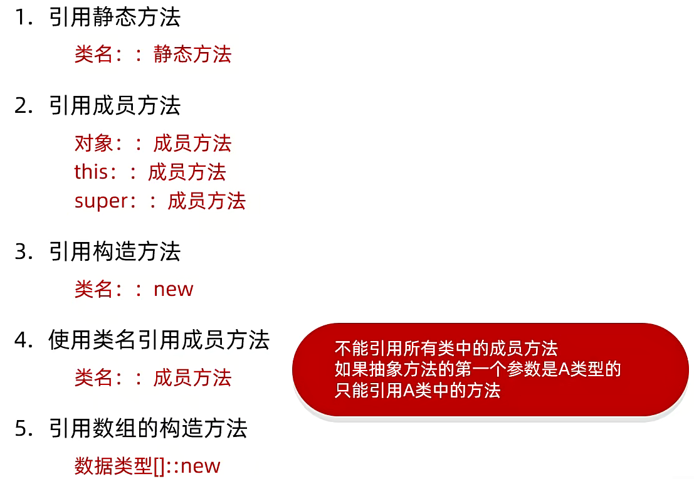


-----

# 50.练习一

```
需求：
     集合中存储一些字符串的数据，比如："张无忌,15", "周芷若,14", "赵敏,13", "张强,20", "张三丰,100", "张翠山,40", "张良,35", "王二麻子,37", "谢广坤,41"。
     收集到Student类型的数组当中
```

~~~java
//1.创建集合并添加元素
ArrayList<String> list = new ArrayList<>();
Collections.addAll(list, "张无忌,15", "周芷若,14", "赵敏,13", "张强,20", "张三丰,100", "张翠山,40", "张良,35", "王二麻子,37", "谢广坤,41");
//2.先把字符串变成Student对象，然后再把Student对象收集起来
Student[] arr = list.stream().map(Student::new).toArray(Student[]::new);
//打印数组
System.out.println(Arrays.toString(arr));
~~~

----

# 51.练习二

```
需求：
    创建集合添加学生对象
    学生对象属性：name，age
    list.add(new Student("zhangsan",23));
    list.add(new Student("lisi",24));
    list.add(new Student("wangwu",25));
要求：
    获取姓名并放到数组当中
    使用方法引用完成
```


~~~java
//1.创建集合
ArrayList<Student> list = new ArrayList<>();
//2.添加元素
list.add(new Student("zhangsan",23));
list.add(new Student("lisi",24));
list.add(new Student("wangwu",25));
//3.获取姓名并放到数组当中
String[] arr = list.stream().map(new Function<Student, String>() {
    @Override
    public String apply(Student student) {
        return student.getName();
    }
}).toArray(String[]::new);
~~~

如果该改写为方法引用，我们需要知道有没有这样的一个方法满足我的要求？

可以发现是有的，在 `Student` 里面有一个 `getName()`，因此一会我们可以直接引用这个方法。

剩下来要考虑的就是：这个方法的格式跟抽象方法是不是满足。

形参虽然不一样，但是没关系，返回值是一样的！

我们在调用这种普通成员方法的时候，有两种方式：

1、`对象::方法名`，这种方式要求形参、返回值完全一样

2、`类名::方法名`，这种方式只要求：被引用的方法是跟抽象方法第二个形参后面的保持一致

由于这里没有第二个参数，因此它所引用的成员方法只能是空参的。

而且 `apply()` 的第一个形参是 `Student`，它只能调用 `Student` 里面的方法。

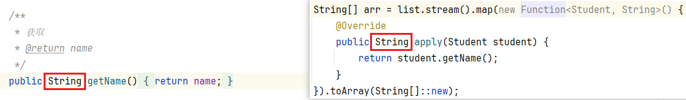

~~~java
String[] arr = list.stream().map(Student::getName).toArray(String[]::new);
System.out.println(Arrays.toString(arr));
~~~


----

# ---------------------------

# day27 IO（异常&File&综合案例）

# 52. 异常

## 一、引入

异常：就是代表程序可能出现的问题。

误区：我们现在学习的异常，不是让我们以后写代码不出现异常，而是程序出了异常之后，如何处理。

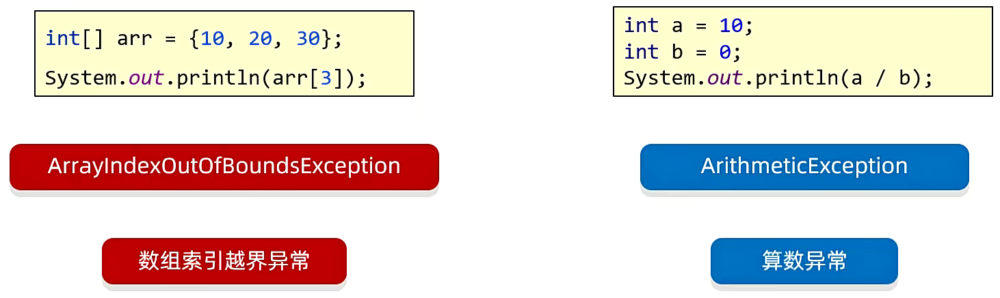

在Java中有很多很多的异常，这些异常组成了异常的继承体系。

最上层的是 `Throwable`，下面有两个子类 `Error`、`Exception`，`Exception` 就是我们经常所说的异常。

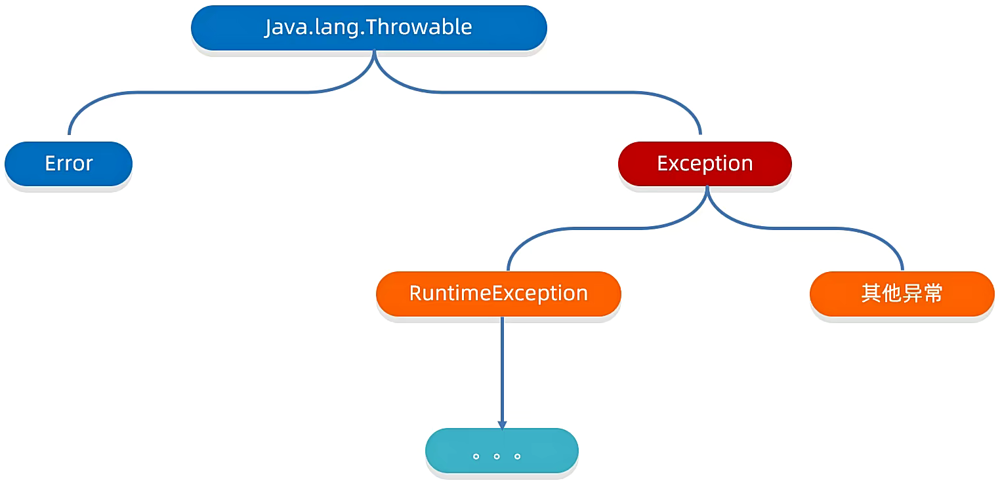

---

## 二、`Error`

`Error`：代表的系统级别错误（属于严重问题）。

例如：内存溢出，这就是由于内存不足而导致的错误，是属于硬件的问题，代码层面不需要管，也管不了。

系统一旦出现问题，`sun公司` 会把这些错误封装成 `Error对象`。

`Error` 是给 `sun公司` 自己用的，不是给我们程序员用的，因此我们开发人员不用管它。

-----

## 三、`Exception`

跟我们开发相关的就是右边的 `Exception`。

`Exception`：叫做异常，代表程序可能出现的问题。

当程序出现异常后，我们通常会用 `Exception` 以及它的子类来封装程序出现的问题。

程序出现问题又会分为两类

**1、`RuntimeException` 和 `它的子类`，这个我们会称之为 `运行时异常`。**

`运行时异常`：`RuntimeException及其子类`，编译阶段不会出现异常提醒。如果代码有问题，是在运行的时候出现的异常（如：数组索引越界异常）

**2、另一类，就是除了 `RuntimeException` 以外的所有异常，我们会称之为 `编译时异常`。**

编译时异常：编译阶段就会出现异常提醒的。（如：日期解析异常）

因此，在异常体系中，真正需要我们学习的，就是 `Exception和它的子类`。

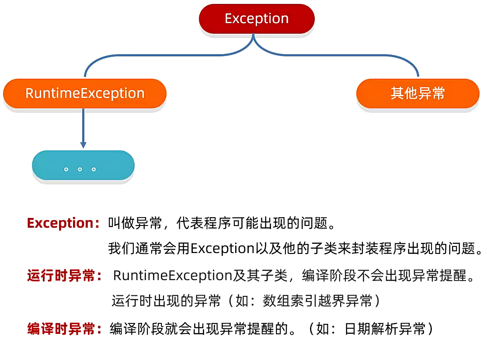

---

## 四、总结

**1、异常是什么？**

异常：就是代表程序可能出现的问题。

**2、异常体系的最上层父类是谁？异常分为几类？**

异常体系的最上层父类是 `Exception`，`Exception` 才是异常。

异常分为两类：编译时异常、运行时异常。

**3、编译时异常和运行时异常的区别？**

- 编译时异常：没有继承 `RuntimeException` 的异常，而是直接继承于 `Exception`。编译阶段就会有错误提示。
- 运行时异常：`RuntimeException本身和子类` 。编译阶段是没有错误提示的，而是运行的时候出现的。


---

# 53.编译时异常和运行时异常

编译时异常和运行时异常，它们两个有什么区别呢？我们先写个代码，再画个图，就恍然大悟了。

## 一、代码

### 1）编译时异常

~~~java
//编译时异常
String time = "2030年1月1日";
SimpleDateFormat sdf = new SimpleDateFormat("yyyy年MM月dd日");
Date date = sdf.parse(time);
System.out.println(date);
~~~

`parse()` 解析方法会有一条红色波浪线

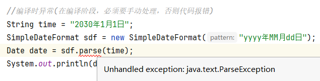

想要让代码成功运行，我们需要用鼠标点一下方法，<kbd>alt + 回车</kbd> ，然后选择第一个，这才可以。

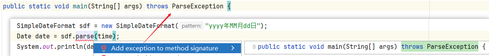

我们是这样的呢？其实就是因为 `parse()` 底层有 `ParseException`，这个异常就是编译时期异常。

编译时期异常在编译阶段，必须要手动处理，否则代码报错。

-----

### 2）运行时异常

在之前我们遇到的索引越界，就是一个标准的运行时期异常。

~~~java
int[] arr = {1,2,3,4,5};
System.out.println(arr[10]); // ArrayIndexOutOfBoundsException
~~~

运行时异常在编译阶段是不会出现问题的，只有当真正运行的时候才会出现问题。


运行时异常在编译阶段是不需要处理的，是代码运行时出现的异常。

---

## 二、画图

一开始我们写的是Java文件，如果我想要运行代码，首先通过 `javac` 进行编译，编译成字节码文件，这个阶段叫做编译阶段。

在这个阶段中要处理的异常叫做：编译时异常。

例如我们刚刚书写的 `ParseException`(日期解析日常)，你不处理，代码就报错，这就是它最大的特点。

---

编译完后，需要通过 `java命令` 去运行代码，那么在运行时出现的异常就是：运行时异常。

它是 `RuntimeException本身及其子类`，运行时异常它在编译阶段不需要处理，而是代码运行时出现的异常。

例如 `ArrayIndexOutOfBoundsException`(数组索引越界异常)，就算代码真的有问题了真的越界了，编译阶段也不会出现问题，只有代码运行的时候才会出现的异常。

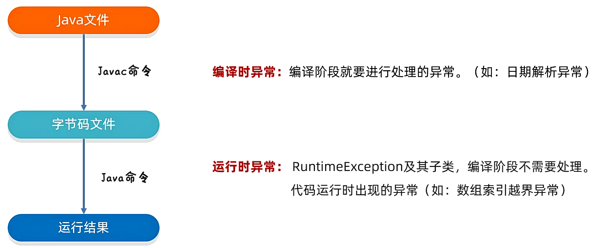

----

## 三、扩展

你觉得Java为什么这么设计呢？为什么要分`编译时异常`和`运行时异常`呢？为什么不能把所有的异常都归为一类呢？

其实是有原因的，在编译的时候Java是不会运行代码的，只会检查语法是否错误，或者做一些性能的优化。

例如定义变量的类型错了，这个就是语法错误，在编译的时候Java会检查。

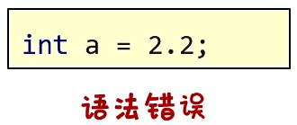

再比如说字符串拼接的优化机制：在编译之后，等号的右边就变成了最终的结果 `"abc"`。

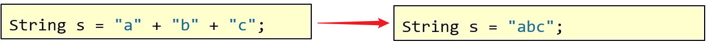

但是如果遇到索引越界，在编译的时候它是不知道的。

例如以下代码，先获取一个随机数，再根据随机数创建相应长度的数组，获取 `10索引` 上的元素，此时只有当代码真正运行了，才能确认代码的长度，才能确定索引是否超出范围。

因此像这种运行时发生的异常，是不能放到编译时的，只能在运行的时候才能确定它是否真的超出范围。

因此，索引越界异常是属于运行时发生的异常。

----

那这样问题又来了，那为什么不把所有的异常都放在下面的运行时呢？

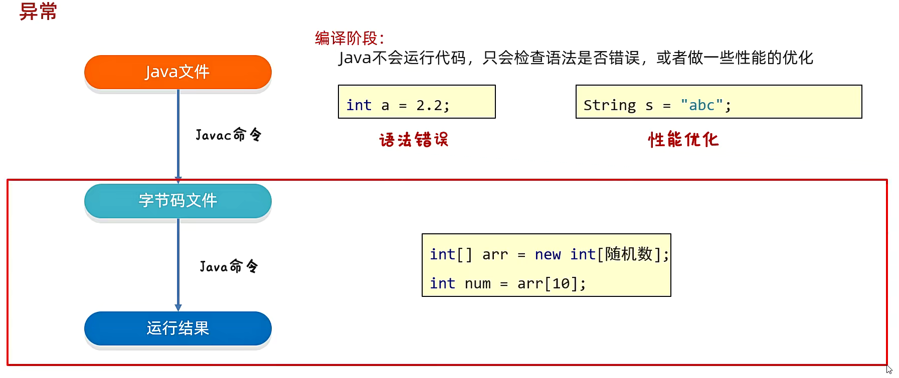

因为编译型异常更多的在于提醒程序员检查本地信息，告诉程序员：如果有问题就会出现异常。

例如：日期解析日常，`parse()` 方法底层会涉及到本地时区的相关信息。

再比如说，后面我们会用 `IO` 去读取本地文件的数据，而这个文件 `a.txt` 也是在本地操作系统中的，因此在这个代码中，它也会有编译时异常，用来提醒程序员检查本地的 `a.txt` 是否真的存在。

而下面运行时期异常，它的核心不在于提醒，它就是由于代码出错而导致程序出现的问题。

----

## 四、这两种异常在开发中都包含哪些呢？

我们可以打开一下 `API帮助文档` 看一下。

搜索 `Exception` ，这里显示的所有的都是异常，其中 `RuntimeException` 就是运行时异常。

而除了 `RuntimeException` 以外，所有的都是编译时异常。

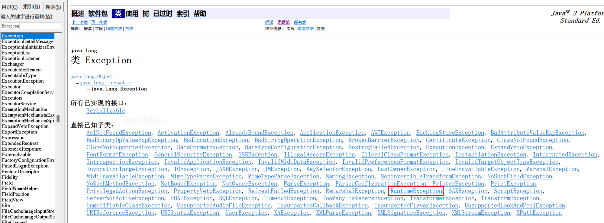

点进 `RuntimeException` 看一下，可以发现它也有很多子类。

 `RuntimeException` 所有的子类都是运行时异常，都是由于我们在代码中参数写错了而出现的异常。

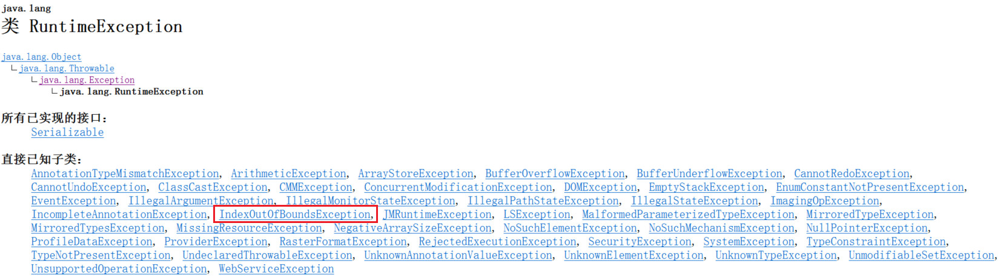

以 `IndexOutOfBoundsException` 为例，点进去看一下，可以发现它下面还有两个子类

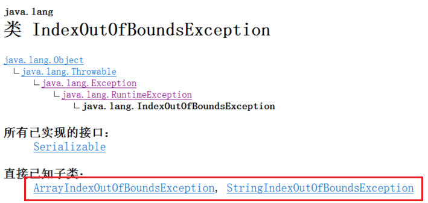

----

## 五、总结

运行时异常和编译时异常的区别？

编译时异常，在语法中，它是直接继承 `Exception`：除了 `RuntimeException和它的子类`，其他都是编译时异常。编译阶段需要进行处理，作用在于提醒程序员。

运行时异常：`RuntimeException本身和所有子类` 都是运行时异常。在编译阶段是不会报错的，是程序运行时出现的异常。

这种异常一般是由于程序员代码写错了，参数传递错误代理的问题。


-----

# 54.异常在代码中的两个作用

作用一：查询bug的关键信息

作用二：作为方法内部的一种特殊返回值，以便通知调用者底层的执行情况

---

## 作用一：查询bug的关键信息

~~~java
Student[] arr = new Student[3];// null null null

String name = arr[0].getName();
System.out.println(name);
~~~

上面这段代码就会报异常。

在看报错信息的时候，不要去看上面的蓝色部分和下面的蓝色部分，蓝色的是我们程序在运行时候的一些环境信息，需要去管它。

我们只要看中间红色的这一段就行了。

挨个来读一下：`Exception 异常` `in 在` `thread 线程` `main`，即：异常在 `main` 中出现了一个 `NullPointerException(空指针异常)` ，后面还有一堆：`Cannot invoke "com.itheima.a01myexception.Student.getName()" because "arr[0]" is null`，这一堆是异常的信息：`不能运行Student中的getName()方法 因为 arr[0] 是空的 `。

下面还有一行，这一行表示异常所在的地方：`at com.itheima.a01myexception.ExceptionDemo2.main(ExceptionDemo2.java:12)`，`在` `com.itheima.a01myexception 包名` `ExceptionDemo2 类名` `main 方法名` `ExceptionDemo2.java:12 异常所在的行数`，用鼠标点击就能跳到对应的行数。

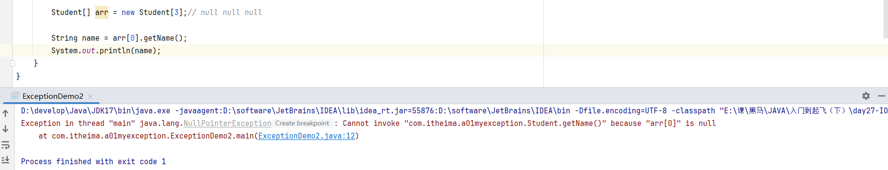

那为什么 `arr[0]` 是 `null` 呢？一开始存储了一个数组，数组里面是引用数据类型，引用数据类型的初始化值就是 `null`，用 `null` 调用 `getName()` 就会报异常。

----

## 作用二：作为方法内部的一种特殊返回值，以便通知调用者底层的执行情况

**测试类**

要求年龄：（同学） 18~40岁

~~~java
//1.创建学生对象
Student s1 = new Student();
s1.setAge(50);
~~~

**Student.java**

~~~java
/**
* 设置
* @param age
*/
public void setAge(int age) {
    if(age < 18 || age > 40){
        // 之前我们是直接打印在控制台，但是直接打印的效果其实是不好的
        //因为就算赋的值超过范围，但是setAge()并没有将赋值的结果告诉给调用者，而是直接把结果打印在控制台。
        //System.out.println("年龄超出范围");
        //此时就可以使用异常解决，在setAge()中直接给调用者返回一个异常
        //throw可以理解为：抛出。这里由于是因为参数出错而导致的问题，因此我们直接抛出RuntimeException即可
        throw new RuntimeException();
    } else{
        this.age = age;
    }
}
~~~

此时它就不会在控制台中打印了，而是将信息交给调用处 `s1.setAge(50);`，此时这行代码就知道了50赋值失败。

这里它就可以进行选择了，它有两种选择方式：1、自己悄悄处理；2、打印在控制台上。

默认是打印在控制台的。

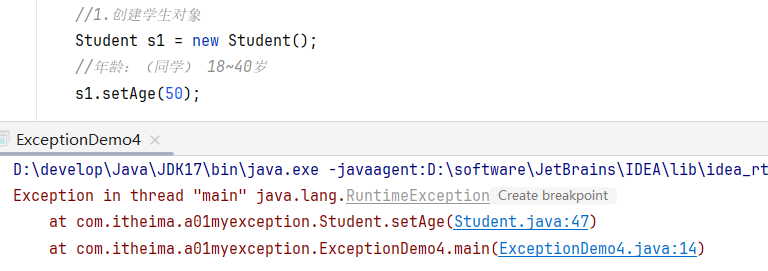


-----

# 异常的处理方式

在Java中有三种需要我们知道

1、JVM默认的处理方式

如果我们在代码中没有写任何的处理方式，那么代码会将异常交给虚拟机进行处理，虚拟机会有一套默认的处理方式。

2、自己处理

3、也可以交给调用者处理，交给调用者就叫做：抛出异常

# 55.JVM虚拟机默认处理异常的方式

JVM虚拟机默认处理异常的方式：把异常的名称，异常的原因及异常出现的位置等信息输出在了控制台，而且是以红色字体打印在控制台的。

程序在这个时候就会停止了，下面的代码不会再执行了。

~~~java
System.out.println("狂踹瘸子那条好腿");
System.out.println(2/0);//算术异常 ArithmeticException
System.out.println("是秃子终会发光");
System.out.println("火鸡味锅巴");
~~~

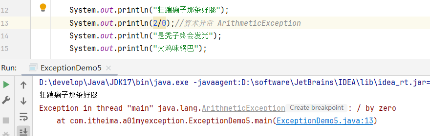


----

# 56.自己处理异常（捕获异常）

`自己处理异常` 这种方式也叫作 `捕获异常`。

~~~java
try {
    可能出现异常的代码;
} catch(异常类名 变量名) { //try里面会出什么异常，这里就需要写什么异常
    异常的处理代码;
}
~~~

目的：当代码出现异常时，可以让程序继续往下执行，不会停止虚拟机。

如下代码，如果不进行任何处理，那么一定会报数组索引越界异常的。

出现异常后，它会采取虚拟机默认的处理方案，将错误信息打印在控制台，并停止虚拟机的运行。

~~~java
int[] arr = {1, 2, 3, 4, 5, 6};
System.out.println(arr[10]);
System.out.println("看看我执行了吗？"); // 不会执行
~~~

接下来我们用 `try-catch` 的方式来处理

~~~java
int[] arr = {1, 2, 3, 4, 5, 6};
try{
    //可能出现异常的代码;
    System.out.println(arr[10]);//此处出现了异常，底层程序就会在这里创建一个ArrayIndexOutOfBoundsException对象
    //相当于 new ArrayIndexOutOfBoundsException();
    //拿着这个对象到catch的小括号中对比，看括号中的变量是否可以接收这个对象
    //如果能被接收，就表示该异常就被捕获（抓住），执行catch里面对应的代码
    //当catch里面所有的代码执行完毕，继续执行try...catch体系下面的其他代码
} catch(ArrayIndexOutOfBoundsException e){
    //如果出现了ArrayIndexOutOfBoundsException异常，我该如何处理
    System.out.println("索引越界了");
}
System.out.println("看看我执行了吗？"); // 执行
~~~


----

# 57.捕获异常灵魂四问（①②）

```

灵魂二问：如果try中可能会遇到多个问题，怎么执行？
```

## 灵魂一问：如果try中没有遇到问题，怎么执行？

如果try中没有遇到问题，会把try里面所有的代码全部执行完毕，不会执行catch里面的代码

注意：只有当出现了异常才会执行catch里面的代码

~~~java
int[] arr = {1, 2, 3, 4, 5, 6};

try {
    System.out.println(arr[0]);//1
} catch(ArrayIndexOutOfBoundsException e){
    System.out.println("索引越界了");  // 没执行
}

System.out.println("看看我执行了吗？");// 执行了
~~~

----

## 灵魂二问：如果try中可能会遇到多个问题，怎么执行？

下面代码有两句话可能会出异常，但是在 `catch` 中只捕获了 `ArrayIndexOutOfBoundsException`，你觉得代码会出问题吗？

```java
int[] arr = {1, 2, 3, 4, 5, 6};
try{
    System.out.println(arr[10]);// 这里会报ArrayIndexOutOfBoundsException
    System.out.println(2/0);// 这里会报ArithmeticException（算数异常）
}catch(ArrayIndexOutOfBoundsException e){
    System.out.println("索引越界了");
}

System.out.println("看看我执行了吗？");
```

程序运行结果如下。

代码执行过程如下：先创建数组，然后执行 `try` 里面的代码，在执行到第一句话的时候就已经出问题了，因此此时在底层会创建 `ArrayIndexOutOfBoundsException` 的对象，然后直接跳转到 `catch` 里面，下面的代码就不会再走了，因此就执行 `索引越界了`，当这句话执行完毕后，整个 `try-catch` 体系就结束了，最后执行 `看看我执行了吗？`

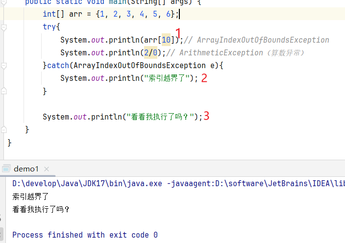

但是这个并不是我们最为标准的答案，最为标准的答案应该是：在 `try` 中可能会遇到多个问题，那么我们就需要写多个 `catch` 与之对应，即不同的异常我们会有不同的处理方案。

~~~java
细节：如果我们要捕获多个异常，这些异常中如果存在父子关系的话，那么父类一定要写在下面（例如Exception就是异常的父类，需要写在最下面）
~~~

如果将父类异常直接写在最下面，就会直接报错。

`try-catch` 的运行规则：首先运行第 `22行` 的代码进行打印，但这行代码已经出异常了，因此Java在底层会创建一个 `ArrayIndexOutOfBoundsException` 的对象，然后拿着这个对象到下面的 `catch` 中进行匹配，它匹配的时候是从上往下一次匹配的，此时第一个 `Exception e` 就已经匹配上了，这就相当于 `Exception e = new ArrayIndexOutOfBoundsException()`，这就是继承的多态，这种方式完全可以接受，因此就会直接执行 `Exception e` 里面的代码。

这样的话，所有的异常都是可以被 `Exception` 接收的，那么下面的 `catch` 永远执行不到了。


~~~java
int[] arr = {1, 2, 3, 4, 5, 6};

try {
    System.out.println(arr[10]);//ArrayIndexOutOfBoundsException
    System.out.println(2 / 0);//ArithmeticException
    String s = null;
    System.out.println(s.equals("abc"));
} catch (ArrayIndexOutOfBoundsException e) {
    System.out.println("索引越界了");
} catch (NullPointerException e) {
    System.out.println("空指针异常");
} catch (Exception e) {
    System.out.println("Exception");
}

System.out.println("看看我执行了吗？");
~~~

---

## 扩展

在JDK7以前，异常都是需要分开书写的，一个 `catch` 里面只能处理一个异常信息。

但是JDK7及JDK7以后，我们可以在catch中同时捕获多个异常，中间用 `|` 进行隔开，表示如果出现了A异常或者B异常的话，采取同一种处理方案。

PS：是 `|`，不是 `||`

~~~java
try {
    System.out.println(arr[10]);//ArrayIndexOutOfBoundsException
    System.out.println(2 / 0);//ArithmeticException
    String s = null;
    System.out.println(s.equals("abc"));
} catch (ArrayIndexOutOfBoundsException | ArithmeticException e) {
    System.out.println("索引越界了");
} catch (NullPointerException e) {
    System.out.println("空指针异常");
} catch (Exception e) {
    System.out.println("Exception");
}
~~~


----

# 58.捕获异常灵魂四问（③④）

## 灵魂三问：如果try中遇到的问题没有被捕获，怎么执行？

`try` 中可能会有 `ArrayIndexOutOfBoundsException异常`，但是在 `catch` 中并没有捕获到，我捕获的是 `NullPointerException`

~~~java
try {
    System.out.println(arr[10]);// ArrayIndexOutOfBoundsException
} catch (NullPointerException e) {
    System.out.println("空指针异常");
}

System.out.println("看看我执行了吗？");
~~~

运行结束后，可以发现它将异常信息以红色的字体打印在了控制台，而且下面的 `看看我执行了吗？` 并没有打印出来。

这个就是虚拟机默认处理异常的方式。

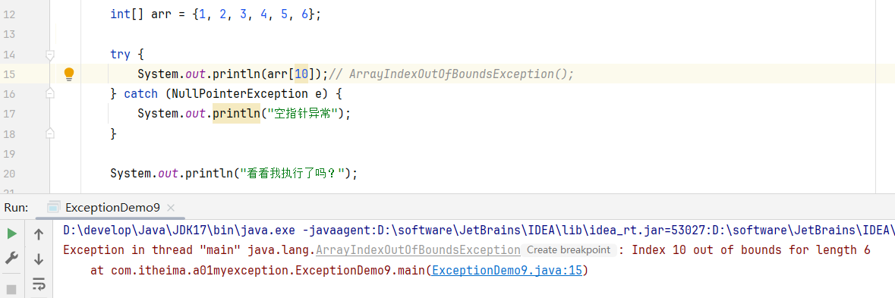

因此，如果try中遇到的问题没有被捕获，相当于try...catch的代码白写了，最终还是会交给虚拟机进行处理。

接下来我们说一下它的执行过程：首先创建一个数组，然后在 `15行` 的时候出异常了，此时就会在这创建一个 `ArrayIndexOutOfBoundsException` 的对象，然后就会去看，下面有没有一个 `catch` 能接收这个对象，首先会用 `NullPointerException` 是否能接收，发现接受不了，他们两个没有父子关系。

然后再往下，发现没有其他的 `catch` 来接受 `ArrayIndexOutOfBoundsException` 了，因此最终它就会将异常信息交给虚拟机进行处理。

而虚拟机的处理方案就是：将异常的信息以红色的字体打印在控制台，并且停止程序的运行。

---

## 灵魂四问：如果try中遇到了问题，那么try下面的其他代码还会执行吗？

如果try中遇到了问题，下面的代码就不会执行了，直接跳转到对应的catch当中，执行catch里面的语句体。

但是如果没有对应catch与之匹配，那么还是会交给虚拟机进行处理。

~~~java
int[] arr = {1, 2, 3, 4, 5, 6};

try{
    System.out.println(arr[10]);
    System.out.println("看看我执行了吗？... try"); // 不执行
}catch(ArrayIndexOutOfBoundsException e){
    System.out.println("索引越界了"); // 执行
}

System.out.println("看看我执行了吗？... 其他代码"); // 执行
~~~

执行流程

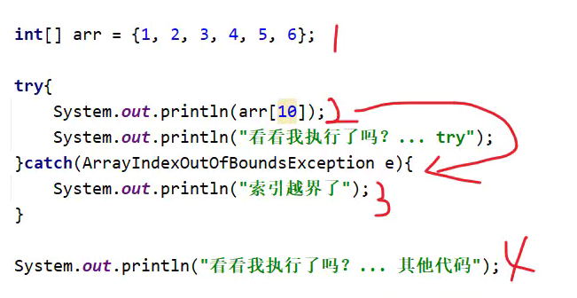


----

# 59.异常中的常见方法

## 一、引入

在刚刚我们已经学习了 `try-catch` 中自己捕获异常的方式。

在 `catch` 中我们对异常的处理，其实就写了一个输出语句而已。

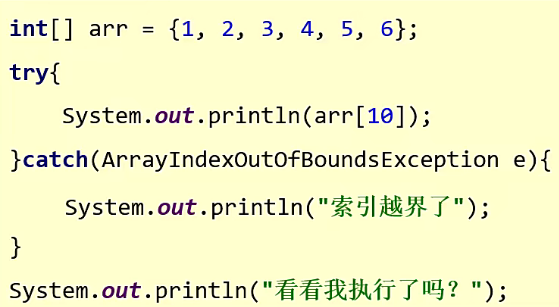

但是这不是很专业，IDEA中默认其实是用异常对象 `e` 调用了一个方法 `printStackTrace()`

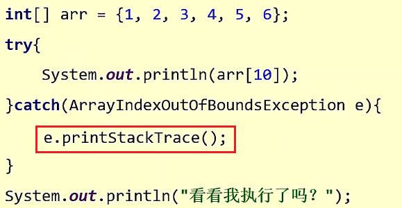

这个方法是异常中常见方法之一。

----

## 二、常见方法

异常中一共有三个常见方法，这些方法是定义在 `Throwable` 中的。

最常用的就是第一个方法，其他两个方法了解一下即可。

* `public void printStackTrace()`：把异常的错误信息输出在控制台

* `public String getMessage()`：返回此 `throwable` 的详细信息字符串

* `public String toString()`：返回此可抛出的简短描述

----

## 三、IDEA自动生成 `try-catch`

选中有可能出异常的代码，<kbd>ctrl + alt + T</kbd> 就会提示 `Surround With`，让你选择你想用哪个语句块去包裹这块代码.

点击第6个，可以发现它直接就自动生成了。

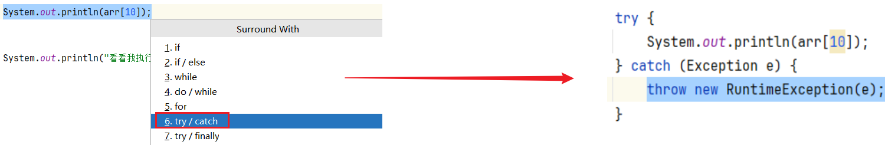

----

## 四、`public String getMessage()`

首先我们需要改一下里面的代码，在 `catch` 的形参中直接捕获的是 `Exception`，这个异常太大了，我们应该捕获实际出现的。

~~~java
int[] arr = {1, 2, 3, 4, 5, 6};
try {
    System.out.println(arr[10]);
} catch (ArrayIndexOutOfBoundsException e) {
    System.out.println(e.getMessage());
}
System.out.println("看看我执行了吗？");
~~~

程序运行结果如下：`Index 10 out of bounds for length 6`（10索引已经超过了长度为6的数组）

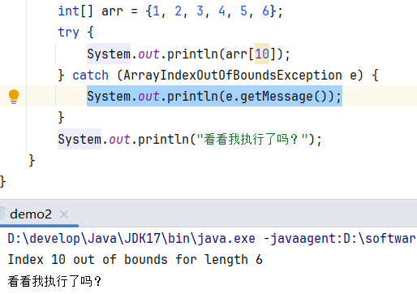

----

## 五、`public String toString()`

返回此可抛出的简短描述

~~~java
int[] arr = {1, 2, 3, 4, 5, 6};
try {
    System.out.println(arr[10]);
} catch (ArrayIndexOutOfBoundsException e) {
    System.out.println(e.toString());
}
System.out.println("看看我执行了吗？");
~~~

可以发现它出现的是异常的名字和简短信息。

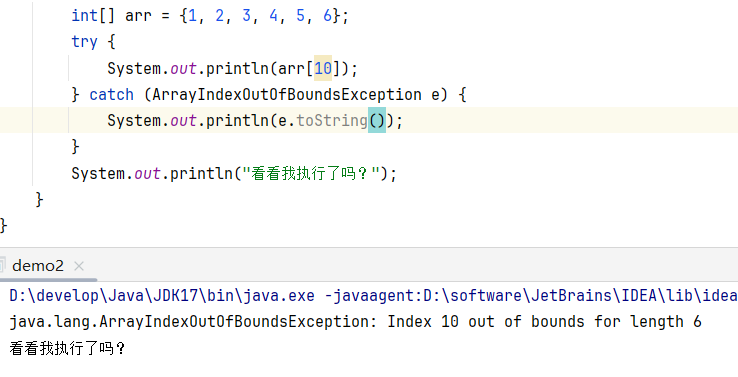

----

## 六、`public void printStackTrace()`

这个方法是没有返回值的，因此我们直接调用那就行了。

~~~java
int[] arr = {1, 2, 3, 4, 5, 6};
try {
    System.out.println(arr[10]);
} catch (ArrayIndexOutOfBoundsException e) {
    e.printStackTrace();
}
System.out.println("看看我执行了吗？");
~~~

程序执行结果如下：以红色的字体打印在控制台，但是这行代码不会结束虚拟机，它仅仅是做了一个打印的操作。

1、以红色的字体打印

2、打印的信息已经包含了上面的 `getMessage()` 和 `toString()` 的结果，并且还多了一个 `异常所在的位置`

因此在以后， `printStackTrace()` 是我们最长用的，因为它所包含的信息是最多的。

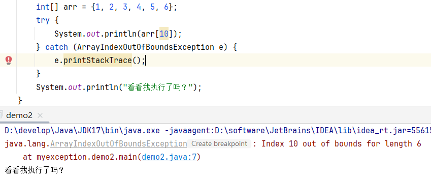

----

## 七、为什么 `printStackTrace()` 是以红色的字体打印的？

跟进 `printStackTrace()`。

在以前我们写输出语句的时候是 `System.out`，这个跟 `System.err` 有什么不一样呢？

可以发现它在底层是用 `System.err.println()` 进行输出，把异常的错误信息以红色字体输出在控制台中。

细节：仅仅是打印信息，不会停止程序运行。


~~~java
//正常的输出语句
System.out.println(123);

//错误的输出语句（但是这个错误不是说代码错误了，而是用来打印错误信息）
System.err.println(123);
~~~

程序运行效果如下，`System.err` 会将小括号里面的内容以红色的字体进行打印。

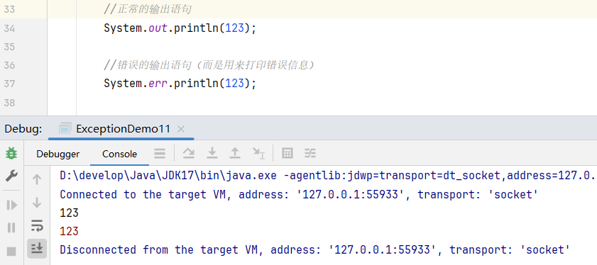

关于这种错误的输出语句方式我们了解一下就行了，我们一般是不会自己用的，都是Java的底层，或者第三方框架使用的。

而且它里面有一个小细节：当错误的输出语句跟正常的数据语句在一起打印的时候，它打印的顺序跟代码里的顺序有可能是不一样的。

多运行几次，可以发现这次跑到上面去了，要解释这个原因需要学习完多线程的知识。

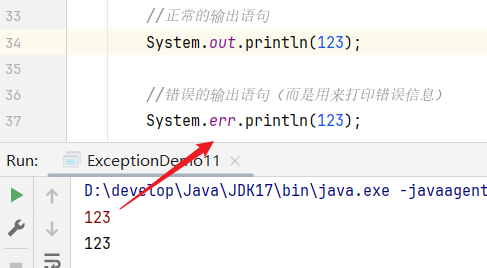


-----

# 60.抛出异常

## 一、概念

抛出异常会涉及到两个关键字：`throws`、`throw`。

1、`throws`

写在方法定义处，表示声明一个异常。告诉调用者，使用本方法可能会出现哪些异常。

例如以下代码，方法的后面可以加 `throws + 异常的类名` ，如果有多个异常，那么异常与异常之间应该使用逗号来进行隔开。

PS：：编译时异常必须要手动写上，运行时异常可以省略不写。

2、`throw`

写在方法内，表示结束方法，用来手动抛出异常对象，将异常对象交给调用者处理，方法中下面的代码不会再执行了。

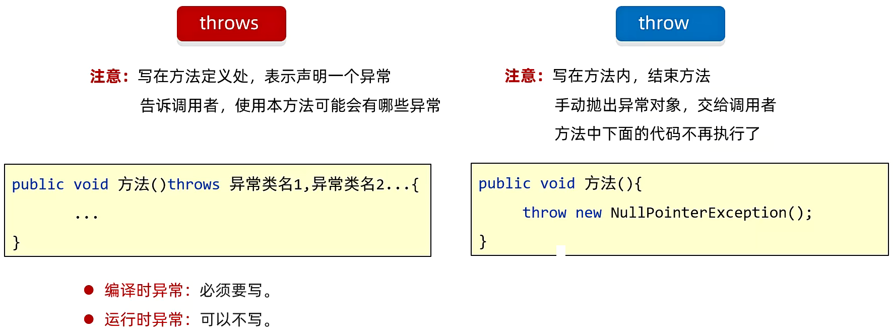

-----

## 二、代码示例

需求：定义一个方法求数组的最大值

以前我们是下面这样写的

~~~java
public static void main(String[] args) {
    int[] arr = null;
    int max = 0;
    max = getMax(arr);
    System.out.println(max);
}

public static int getMax(int[] arr) {
    System.out.println("看看我执行了吗？");
    int max = arr[0];
    for (int i = 1; i < arr.length; i++) {
        if (arr[i] > max) {
            max = arr[i];
        }
    }
    return max;
}
~~~

但是这个代码可能会有一些问题。

1、假设 `arr` 是 `null` 呢？ 

~~~java
int[] arr = null;
~~~

此时下面的方法能正常运行吗？肯定是不行的

2、假设传递长度为 `0` 的数组，也无法遍历

虽然说这样写是没有任何意义的，但是我们不能确定被人一定不会这么写。

~~~java
int[] arr = new int[0];
~~~

因此为了提高代码的健壮性，我们需要对 `getMax()` 进行以下改进。

~~~java
public static int getMax(int[] arr){
    if(arr == null){
        //手动创建一个异常对象，并把这个异常交给方法的调用者处理
        //此时方法就会结束，下面的代码不会再执行了
        throw new NullPointerException();
    }
    
    if(arr.length == 0){
        //它的意义其实跟上面是一样的，手动创建一个异常对象，并把这个异常交给方法的调用者处理
        //此时方法就会结束，下面的代码不会再执行了
        throw new ArrayIndexOutOfBoundsException();
    }

    System.out.println("看看我执行了吗？"); // 未执行
    int max = arr[0];
    for (int i = 1; i < arr.length; i++) {
        if(arr[i] > max){
            max = arr[i];
        }
    }
    return max;
}
~~~

还没完，在方法的后面其实还可以再加 `throws`，也就是说告诉调用者，本方法有可能会出哪些异常

~~~java
public static int getMax(int[] arr) throws NullPointerException,ArrayIndexOutOfBoundsException {
}
~~~

但是 `NullPointerException,ArrayIndexOutOfBoundsException` 这两个异常又是 `RuntimeException` 的子类。

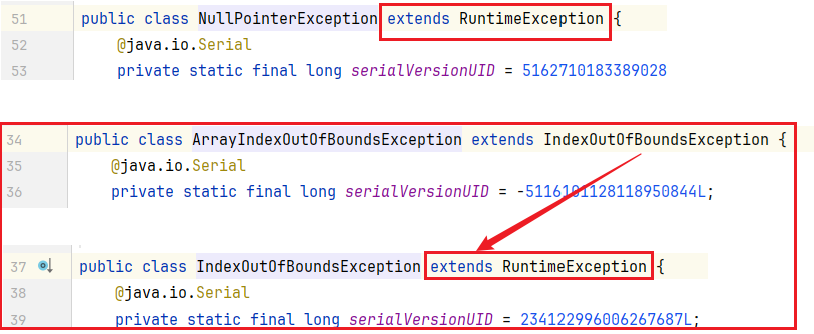

因此这两个异常都是运行时异常，运行时异常我们是不需要手动声明的，这个可以省略不写。

~~~java
public static int getMax(int[] arr)/* throws NullPointerException,ArrayIndexOutOfBoundsException*/{
}
~~~

当代码真的出现这个异常了，我们需要将异常交给调用者处理，此时调用者是不能直接不管的，因此这样的话最终就会将异常交给虚拟机处理，虚拟机的处理方案就是：停止程序，并把异常信息打印在控制台，这种方式的弊端就是：下面的代码就执行不了了，程序会结束。

所以在调用处我们最好这么干：将有可能出现异常的代码选中，<kbd>ctrl + alt + T</kbd> 选择 `try-catch` 进行捕获。

在捕获的时候我们可以将空指针异常、索引越界异常进行捕获。

~~~java
int[] arr = null;
int max = 0;
try {
    // 在调用处接收到下面发送过来的异常后，就会跳转到对应的catch里面执行对应的代码
    // 这样做的好处是：就是这里的代码出异常了，但程序并没有停止，它会继续往下执行其他的代码
    max = getMax(arr);
} catch (NullPointerException e) {
    System.out.println("空指针异常");
} catch (ArrayIndexOutOfBoundsException e) {
    System.out.println("索引越界异常");
}
System.out.println(max);

------------------------------------------

public static int getMax(int[] arr)/* throws NullPointerException,ArrayIndexOutOfBoundsException*/{
    if(arr == null){
        //手动创建一个异常对象，并把这个异常交给方法的调用者处理
        //此时方法就会结束，下面的代码不会再执行了
        throw new NullPointerException();
    }

    if(arr.length == 0){
        //手动创建一个异常对象，并把这个异常交给方法的调用者处理
        //此时方法就会结束，下面的代码不会再执行了
        throw new ArrayIndexOutOfBoundsException();
    }


    System.out.println("看看我执行了吗？");
    int max = arr[0];
    for (int i = 1; i < arr.length; i++) {
        if(arr[i] > max){
            max = arr[i];
        }
    }
    return max;
}
~~~

---

# 三种异常处理方式总结

1、如果你不管，它就会采取虚拟机默认处理异常的方式：把异常的名称，异常的原因及异常出现的位置等信息输出在了控制台，而且是以红色字体打印在控制台的。

2、`try-catch`(捕获异常)：一般用在调用处，它的目的是就算代码出错，也能让代码继续往下运行。

3、抛出：`throw、throws`

在方法中，出现异常了，方法就没有继续运行下去的意义了，此时我们采取 `抛出处理`，交给调用者进行处理。

目的：让该方法结束运行，并告诉调用者方法中出现了问题。

在调用处我们一般都是捕获异常，目的就是让程序能继续运行下去。


-----

# 61.练习：键盘录入数据

~~~java
需求：
    键盘录入自己心仪的女朋友姓名和年龄。
    姓名的长度在 3 - 10之间，
    年龄的范围为 18 - 40岁,
    超出这个范围是异常数据不能赋值，需要重新录入,一直录到正确为止。
提示：
    需要考虑用户在键盘录入时的所有情况。
    比如：录入年龄时超出范围，录入年龄时录入了abc等情况
~~~

写代码前，需要知道 `抛出` 和  `捕获` 的核心思想。

`抛出`：告诉调用者出错了，因此抛出更多是写在方法里面。

`捕获`：捕获更多的是写在方法的调用处，它的核心是让程序不要停止，程序能继续运行下去。

**测试类**

~~~java
//1.创建键盘录入的对象
Scanner sc = new Scanner(System.in);
//2.创建女朋友的对象
GirlFriend gf = new GirlFriend();
//3.接收女朋友的姓名
System.out.println("请输入你心仪的女朋友的名字");
String name = sc.nextLine();
gf.setName(name);
System.out.println("请输入你心仪的女朋友的年龄");
String ageStr = sc.nextLine();
int age = Integer.parseInt(ageStr);
gf.setAge(age);

//5.打印
System.out.println(gf);
~~~

在上面代码中，如果年龄输入字符，是会报错的。

因此我们需要对这种情况进行处理，还需要对题目进行处理。

~~~java
String ageStr = sc.nextLine();
// 办法一：我们在这里写if判断是没有问题的，但是当数据量比较多的时候，这种写法太过于繁琐
if (name.length() >= 3 && name.length() <= 10) {
    gf.setName(name);
}
int age = Integer.parseInt(ageStr);
gf.setAge(age);
~~~

那该怎么办呢？在JavaBean中，有一个 `set方法`，此时我们就可以将这些判断写在 `set方法` 里面了。

其实 `set方法` 的核心也是这样，它会对你传递过来的数据进行校验，满足要求才赋值，不满足要求直接pass不要。

抛出异常时，Java没有一个类能完美表示我们现在出的问题，此时就可以写 `RuntimeException`，创建运行时异常的父类，这就可以了。

**GirlFriend.java**

在两个方法的后面都可以写 `throws RuntimeException`，但是这个是可以省略的，因为 `RuntimeException` 是运行时期异常，运行时异常可以省略不写。

~~~java
public void setName(String name) {
    int len = name.length();
    if(len < 3 || len > 10){
        throw new RuntimeException();
    }
    this.name = name;
}

public void setAge(int age) {
    if(age < 18 || age > 40){
        throw new RuntimeException();
    }
    this.age = age;
}
~~~

接下来就要在测试类中处理异常信息。

如果不处理，就会交给虚拟机处理，它会将异常的信息打印在控制台，而且程序会停止。

这个不是我们想要的，我们想要的是：需要重新录入，一直录到正确为止。

因此这里的异常我们需要处理它。

~~~java
//1.创建键盘录入的对象
Scanner sc = new Scanner(System.in);
//2.创建女朋友的对象
GirlFriend gf = new GirlFriend();
while (true) {
    //3.接收女朋友的姓名
    try {
        // 输出语句放在try外面也是没问题的，但是为了保证代码的结构性，放里面也是ok的
        System.out.println("请输入你心仪的女朋友的名字");
        String name = sc.nextLine();
        gf.setName(name);
        //4.接收女朋友的年龄
        System.out.println("请输入你心仪的女朋友的年龄");
        // 这里不用nextInt()是因为如果它输入字符就会报错
        // 所以此时采取nextLine()，不管你录什么哪怕录的是abc，先录入到系统中，然后再来进行转换 / 判断，如果有问题，再让你重新录就行了
        String ageStr = sc.nextLine();
        int age = Integer.parseInt(ageStr);
        gf.setAge(age);
        //如果所有的数据都是正确的，那么跳出循环
        break;
    } catch (NumberFormatException e) {
        System.out.println("年龄的格式有误，请输入数字");
        //这里continue可写可不写，因为就算你不写，它下面也没有其他代码了
        //continue;
    } catch (RuntimeException e) {
        System.out.println("姓名的长度或者年龄的范围有误");
        //continue;
    }
}
//5.打印
System.out.println(gf);
~~~


-----

# 62.自定义异常

## 一、引入

在刚刚的案例中，姓名 / 年龄有误，我们不知道创建什么异常的对象，因为在Java中好像没有哪个异常能表示我现在出现的问题。

因此我们只能创建运行时异常共同的父类 `RuntimeException`。

但是`RuntimeException`其实也不是很好，这个异常也不能表示现在出现的问题，而且在调用处，还不能将姓名的处理方案和年龄的处理方案分开，所以就有了自定义异常。

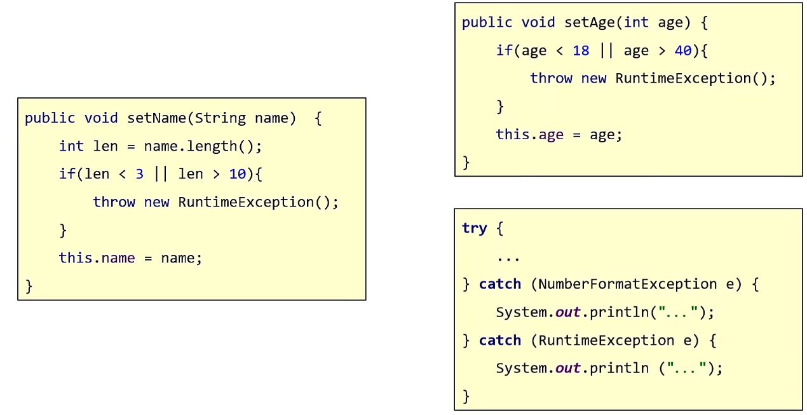

既然Java没有，我们就自己写一个，写一个能完美表示当前问题的异常类即可。

怎么写呢？我们可以先看一下Java中的异常是怎么定义的。

<kbd>ctrl + N</kbd> 搜索 `ArrayIndexOutOfBoundsException(索引越界异常)`，可以发现它只有一个继承关系，下面有一个空参，还有一个有参构造。

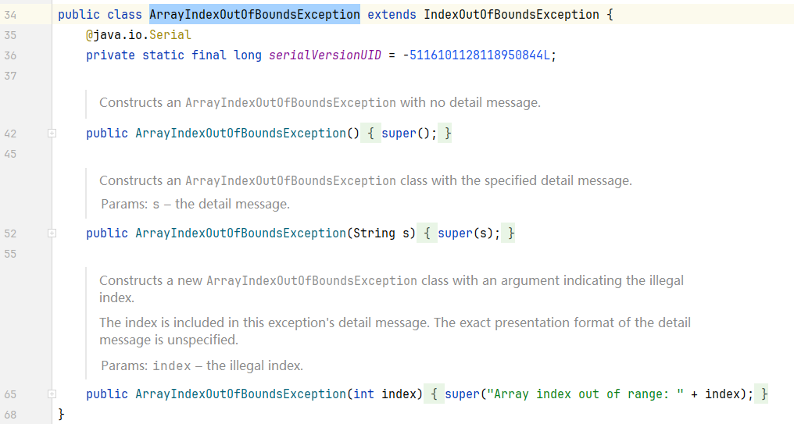

再来看一个，<kbd>ctrl + N</kbd> 搜索 `ArithmeticException` ，可以发现它也是一样的，都一个继承，一个空参构造，一个带参构造。

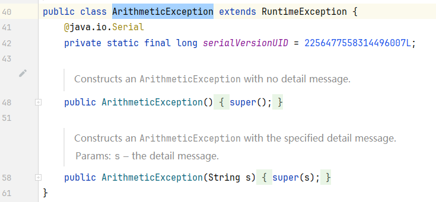

其实Java中大多数异常都是这样的，这些异常出现的原因只有一个：就是它的名字，根据不同的情况我们可以创建不同的异常对象。

----

## 二、步骤

1、定义异常类，类名要见名知意

2、写继承关系

如果你当前定义的异常是运行时异常，需要继承 `RuntimeException`；但是如果是编译时异常，直接继承 `Exception` 即可。

3、空参构造

4、带参构造

自定义异常的目的：就是为了让控制台的报错信息更加的见名知意，说的直白一点，就是为了自定义异常的名字。

在使用自定义异常的时候跟之前一样，在合适的时候直接创建它的对象，最后再来抛出即可，然后在方法的调用处使用 `try-catch` 捕获。

----

## 三、代码示例

目的：定义两个自定义异常来表示姓名和年龄的问题

首先我们来写表示姓名问题的异常。

~~~java
//运行时继承：RuntimeException 核心 就表示由于参数错误而导致的问题
//编译时继承：Exception 核心 提醒程序员检查本地信息，例如读取本地文件的时候需要检查本地文件是否存在
//在刚刚我们写的姓名问题，是因为我们键盘录入的名字参数有问题，而导致的异常，因此我们需要继承RuntimeException更加合理

//空参构造和带参构造不需要我们自己写，alt + insert，选择constructor，它会将父类RuntimeException的构造全部罗列出来，现在我们只需要写前两个，第一个是空参，第二个是带参数的构造，这个参数是报错的信息message，然后点击OK即可
~~~

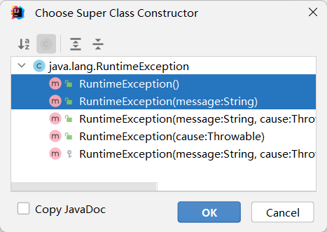

~~~java
public class NameFormatException extends RuntimeException{
    //技巧：
    //NameFormat：当前异常的名字，表示姓名格式化问题
    //Exception：它的后缀，表示当前类是一个异常类

    public NameFormatException() {
    }

    public NameFormatException(String message) {
        super(message);
    }
}
~~~

另外还有一个年龄，年龄是超出范围，因此就叫做 `AgeOutOfBoundsException`。

由于年龄也是因为参数导致的问题，因此也是继承 `RuntimeException` 也更加的合理

~~~java
public class AgeOutOfBoundsException extends RuntimeException{

    public AgeOutOfBoundsException() {
    }

    public AgeOutOfBoundsException(String message) {
        super(message);
    }
}
~~~

回到 `GirlFriend类` ，此时在抛异常的时候就不要抛 `RuntimeException` 了，而是抛出我们自定义异常。

甚至在括号中还可以写我们报错的信息。

又由于 `NameFormatException`、`AgeOutOfBoundsException` 这两个异常都是运行时异常，因此在 `方法名` 后面可以加上 `throws`，也可以不写省略。

~~~java
public void setName(String name) {
    int len = name.length();
    if(len < 3 || len > 10){
        throw new NameFormatException(name + "格式有误，长度应该为：3~10");
    }
    this.name = name;
}

public void setAge(int age) {
    if(age < 18 || age > 40){
        throw new AgeOutOfBoundsException(age + "超出了范围");
    }
    this.age = age;
}
~~~

回到测试类中

~~~java
while (true) {
    //3.接收女朋友的姓名
    try {
        System.out.println("请输入你心仪的女朋友的名字");
        String name = sc.nextLine();
        gf.setName(name);
        //4.接收女朋友的年龄
        System.out.println("请输入你心仪的女朋友的年龄");
        String ageStr = sc.nextLine();
        int age = Integer.parseInt(ageStr);
        gf.setAge(age);
        //如果所有的数据都是正确的，那么跳出循环
        break;
    } catch (NumberFormatException e) {
        // 这里面就不用在控制台打印了，而是直接调用方法printStackTrace()
        // System.out.println("年龄的格式有误，请输入数字");
        e.printStackTrace();
    } catch (NameFormatException e) {
        e.printStackTrace();
    }catch (AgeOutOfBoundsException e) {
        e.printStackTrace();
    }
}
~~~

可以发现，当输入错误的时候，就会报我们自己写的异常

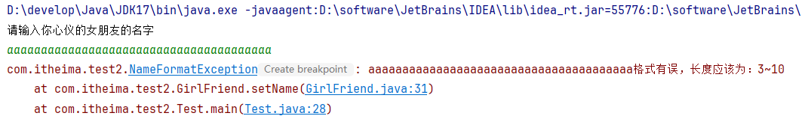


---

# 63.File的概述和构造方法

## 一、引入

假设我们现在在玩拼图小游戏，假设游戏有一个保存拼图进度的功能到txt文件中，那该多好，这样下次在玩的时候就不需要重头开始玩了。

想要实现这个功能，我们需要学习两个知识：1、txt文本文件保存在哪里；2、数据如何进行传输，也就是如何保存到文件中。

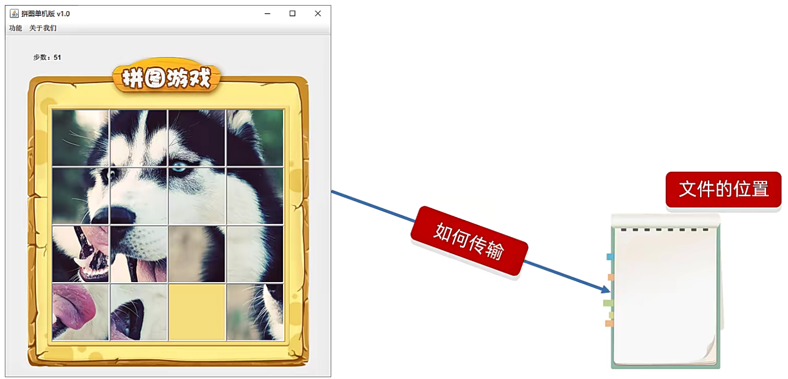

在计算机中，文件保存的位置，也叫作 `路径`，在Java中会用 `File类` 进行表示。

而数据的传输就需要用到 `IO流`。

----

## 二、路径

路径分为两种：相对路径和绝对路径。

相对路径是不带盘符的，它是相对于当前项目而言的。

绝对路径是带盘符的。

----

## 三、File类

**`File对象` 就表示一个路径，这个路径可以是文件的路径、也可以是文件夹的路径。**

这个路径可以是存在的，也可以是不存在的。

学习一个类，我们需要知道如何创建它的对象，File类常见的方法有三个。

-  `public File(String pathname) `：根据文件路径创建文件对象

- `public File(String parent, String child) ` ：根据父路径名字符串和子路径名字符串创建文件对象（拼接）

- `public File(File parent, String child)` ：根据父路径对应文件对象和子路径名字符串创建文件对象（拼接）

---

## 四、`public File(String pathname) `

根据文件路径创建文件对象：说白了就是：根据字符串表示的路径，变成` File对象`。

其中路径可以写绝对路径，也可以写相对路径，相对路径是相对于当前项目而言的，需要加上模块名。

~~~java
String str = "C:\\Users\\alienware\\Desktop\\a.txt";
File f1 = new File(str);
System.out.println(f1); // C:\Users\alienware\Desktop\a.txt
~~~

**那么为什么要将一个字符串表示的路径变成 `File对象`？**

其实很简单，变成 `File对象` 就是为了使用里面的方法，例如 `delete()`，可以将这个文件删除。

如果你仅仅只是一个字符串表示的，在Java的眼中，它仅仅是一个字符串而已，它不能跟本地的文件产生关联。

但一旦创建了 `File对象`，在Java眼中就不是一个字符串了，而是一个真实的路径，这个路径就表示桌面上的 `a.txt`。

----

## 五、`public File(String parent, String child)`

根据`父路径名字符串`和`子路径名字符串`创建文件对象。

父路径：全称叫 `父级路径`

子路径：全称叫 `子级路径`

以 `C:\Users\alienware\Desktop\a.txt` 路径为例，父路径：去掉自己，剩下来的所有，即 `C:\Users\alienware\Desktop`。

剩下来的 `a.txt` 就是子级路径。

第二个构造的**目的就是将 `父级路径` 与 `子级路径` 进行拼接。**

~~~java
String parent = "C:\\Users\\alienware\\Desktop";
String child = "a.txt";
File f2 = new File(parent,child);
System.out.println(f2); // C:\Users\alienware\Desktop\a.txt
~~~

如果你不想用这种方式，你也可以自己去拼接。

PS：在Java中 `\` 叫做转义字符，因此如果想让它变成路径分隔符，需要将它变成两个 `\`，即 `\\`

~~~java
File f3 = new File(parent + "\\" + child);
System.out.println(f3);// C:\Users\alienware\Desktop\a.txt
~~~

但是在以后我们一般不会自己拼接，而是使用Java里面的构造方法来帮我们拼接。

因为在以后我们写完的代码是不一定运行在 `Windows操作系统` 里面的，在 `Windows操作系统` 中，它的路径分隔符是 `\(反斜线)`，但是在以后还会学习 `Linux操作系统`，在这个操作系统里面路径分隔符是 `/(正斜线)`。

因此如果你是自己拼接的话，这个代码是死的。而Java底层会先获取你的操作系统，根据不同的操作系统它会用不同的路径分隔符。

因此如果以后涉及到路径的拼接，还是建议使用构造方法稳妥一些。

----

## 六、`public File(File parent, String child)`

第三个其实是跟第二个一样的，只不过它里面的类型不一样：父级路径是 `File`，子级路径是 `String`。

~~~java
File parent2 = new File("C:\\Users\\alienware\\Desktop");
String child2 = "a.txt";
File f4 = new File(parent2,child2);
System.out.println(f4); // C:\Users\alienware\Desktop\a.txt
~~~

---

## 七、总结

**1、`File` 表示什么？**

`File对象` 表示路径，可以是文件的路径、也可以是文件夹的路径。

这个路径可以是存在的，也可以是不存在的。

**2、绝对路径和相对路径是什么意思？**

绝对路径是带盘符的。

相对路径是不带盘符的，默认到当前项目下找。

**3、File三种构造方法的作用？**

变成 `File对象` 的目的就是为了使用里面的方法

-  `public File(String pathname) `：根据文件路径创建文件对象

-  `public File(String parent, String child) ` ：根据父路径名字符串和子路径名字符串创建文件对象（拼接）

-  `public File(File parent, String child)` ：根据父路径对应文件对象和子路径名字符串创建文件对象（拼接）

**那么为什么要将一个字符串表示的路径变成 `File对象`？**

其实很简单，变成 `File对象` 就是为了使用里面的方法，例如 `delete()`，可以将这个文件删除。

如果你仅仅只是一个字符串表示的，在Java的眼中，它仅仅是一个字符串而已，它不能跟本地的文件产生关联。

但一旦创建了 `File对象`，在Java眼中就不是一个字符串了，而是一个真实的路径，这个路径就表示桌面上的 `a.txt`。


-----

# 64.File的成员方法

## 一、总述

`File` 的成员方法非常的多

有跟判断获取相关的

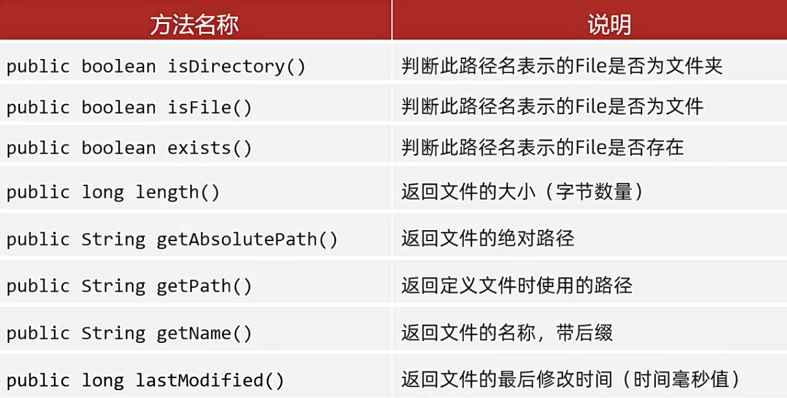

还有跟创建、删除相关的

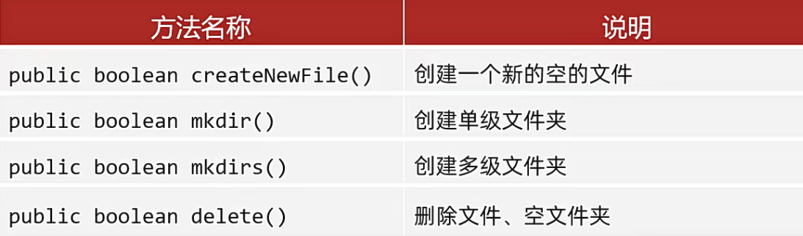

还有跟遍历文件夹相关的

当然遍历文件夹有很多的方法，其中需要我们掌握的只有一个就可以了。


方法有点多，但是不要慌，已经帮大家分好类了，而且方法很简单，不要背，通过IDEA的自动提示功能能想起来就行了。

先来看第一类：判断和获取相关的方法，其实这些方法你猜也能猜到，我们之前曾经说过，`File对象` 表示的路径可以是存在的，也可以是不存在的，因此肯定会有一个方法去判断是否存在，因此就有 `exists()`。

如果存在，它是文件还是文件夹呢？肯定也会有方法进行判断：`isDirectory()`、`isFile()`，这就是三个判断的方法。

再来看获取的方法，文件、文件夹有什么东西值得你去获取呢？大小、路径、文件名、修改时间。

---

## 二、判断方法

获取文件路径的两种方式。

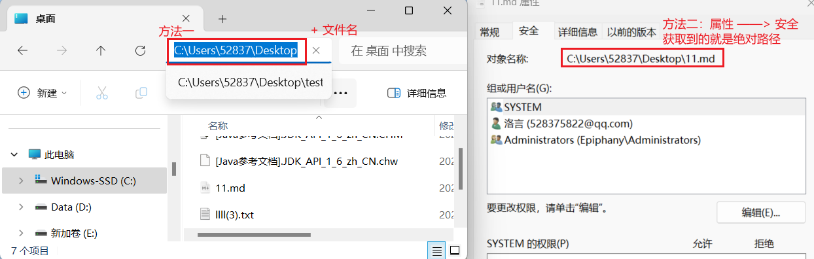

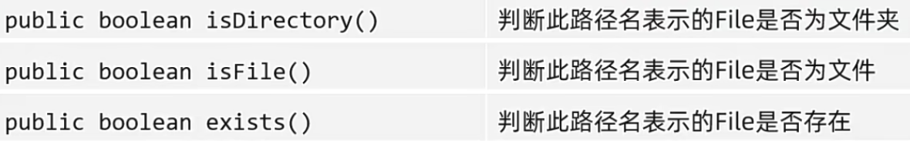

~~~java
//1.对一个文件的路径进行判断
File f1 = new File("D:\\aaa\\a.txt");
System.out.println(f1.isDirectory());//false。是不是文件夹，如果是文件夹返回true，如果是文件返回false
System.out.println(f1.isFile());//true。是不是文件
System.out.println(f1.exists());//true。判断文件夹 / 文件是否存在
System.out.println("--------------------------------------");
//2.对一个文件夹的路径进行判断
File f2 = new File("D:\\aaa\\bbb");
System.out.println(f2.isDirectory());//true
System.out.println(f2.isFile());//false
System.out.println(f2.exists());//true
System.out.println("--------------------------------------");
//3.对一个不存在的路径进行判断
File f3 = new File("D:\\aaa\\c.txt");
System.out.println(f3.isDirectory());//false
System.out.println(f3.isFile());//false
System.out.println(f3.exists());//false
~~~

---

## 三、获取方法

### 1）`public long length()`

返回文件的大小，单位是 `字节数量`。

查看多个文件的大小


查看单个文件的大小

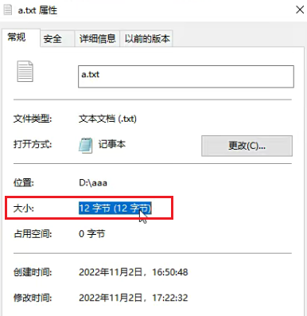

~~~java
File f1 = new File("D:\\aaa\\a.txt");
long len = f1.length();
System.out.println(len);//12
~~~

但如果调用者不是文件，而是文件夹呢？

**细节1：这个方法只能获取文件的大小，单位是字节。**

如果单位我们要是`M、G`，可以不断的除以`1024`。例如除以一次 `1024` 那就是 `kb`，除以两次 `1024` 那就是 `M`......

**细节2：这个方法无法获取文件夹的大小。**

因为调用 `length()` 的时候，不同的操作系统可能是不一样的，我的操作系统返回的是0，有的人的操作系统返回的是4096，不管是返回什么，这个结果都是不对的，这个方法是无法获取文件夹的大小的。

如果我们要获取一个文件夹的大小，需要把这个文件夹里面所有的文件大小都累加在一起。

~~~java
File f2 = new File("D:\\aaa\\bbb"); //注意bbb文件夹里是有东西的
long len2 = f2.length();
System.out.println(len2);//0
~~~

----

### 2）`public String getAbsolutePath()`

返回文件的绝对路径

~~~java
File f3 = new File("D:\\aaa\\a.txt");
String path1 = f3.getAbsolutePath();
System.out.println(path1); // D:\aaa\a.txt
~~~

有的同学会说：你将参数返回给我有什么意义。

别急，在当前模块下再新建 `a.txt`，在创建 `File对象` 的时候写相对路径，相对路径是相对于当前项目而言的。

例如以下代码，它会先在当前项目下先找 `myFile`，再去找 `a.txt`。

但如果你没有写 `myFile`，那么这个 `a.txt` 就是直接在项目下的，而不是在模块里面的了。

~~~java
File f4 = new File("myFile\\a.txt");
String path2 = f4.getAbsolutePath();
System.out.println(path2); // C:\Users\alienware\IdeaProjects\basic-code\myFile\a.txt
~~~

-----

### 3）`public String getPath()`

返回定义文件时使用的路径，即当你在创建 `File对象` 的时候，括号里面写的是什么，那么返回的就是什么。

~~~java
File f5 = new File("D:\\aaa\\a.txt");
String path3 = f5.getPath();
System.out.println(path3);//D:\aaa\a.txt

File f6 = new File("myFile\\a.txt");
String path4 = f6.getPath();
System.out.println(path4);//myFile\a.txt
~~~

----

### 4）`public String getName()`

返回文件的名称，带后缀

~~~java
File f7 = new File("D:\\aaa\\a.txt");
String name1 = f7.getName();
//a.txt:
//      a 文件名
//      txt 后缀名、扩展名
System.out.println(name1); // a.txt
~~~

下面将路径改为 `bbb文件夹`

~~~java
File f8 = new File("D:\\aaa\\bbb");
String name2 = f8.getName();
// 文件夹：返回的就是文件夹的名字
System.out.println(name2);//bbb
~~~

---

### 5）`public long lastModified()`

返回文件的最后修改时间，返回时间的毫秒值，类型为 `long`

~~~java
File f9 = new File("D:\\aaa\\a.txt");
long time = f9.lastModified();
System.out.println(time); // 1667380952425
~~~

课堂练习

~~~java
//如何把时间的毫秒值变成字符串表示的时间呢？
//格式为：yyyy年MM月dd日 HH：mm：ss
~~~

----

## 四、创建方法

计算机里面要么是文件，要么是文件夹，没有其他的了。

因此创建无非是两种：创建文件、创建文件夹。

### 1）`public boolean createNewFile()`

返回值表示：当前文件是否创建成功。

~~~java
File f1 = new File("D:\\aaa\\c.txt"); // 要注意，此时在aaa文件夹中是没有c.txt文件的
boolean b = f1.createNewFile(); // 调用createNewFile()将文件创建出来
System.out.println(b);//true
~~~

代码写完后发现，它有一个红色波浪线


<kbd>alt + 回车</kbd>，在IDEA中给出了两种异常的解决方案

1、抛出

2、用 `try-catch` 包裹

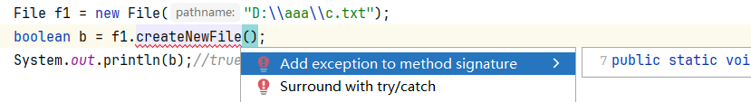

----

扩展：如果这个路径是存在它，它会报错吗？

~~~java
File f1 = new File("D:\\aaa\\a.txt"); // a.txt已存在
boolean b = f1.createNewFile();
System.out.println(b);//false
~~~

程序运行结束，并没有报错

```java
细节1：如果当前路径表示的文件是不存在的，则创建成功，方法返回true
      如果当前路径表示的文件是存在的，则创建失败，方法返回false
```

----

~~~java
细节2：如果父级路径是不存在的，那么方法会有IOException异常
~~~

~~~java
File f1 = new File("D:\\aaa\\ddd\\a.txt"); // aaa文件夹是存在的，ddd文件夹是不存在的
boolean b = f1.createNewFile();
System.out.println(b);
~~~

程序运行完毕，会发现直接报错。

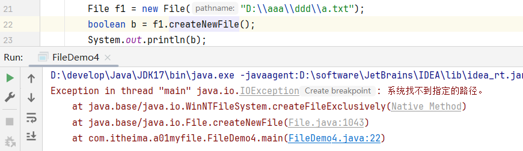

----

~~~java
细节3：createNewFile方法创建的一定是文件，如果路径中不包含后缀名，则创建一个没有后缀的文件
    由此可见，文件是可以没有后缀名的。
~~~

~~~java
File f1 = new File("D:\\aaa\\ddd");
boolean b = f1.createNewFile();
System.out.println(b);//true
~~~

如下图，这个文件也是可以使用记事本打开的。


-----

### 2）`public boolean mkdir()`

`mk：make；dir：directory`，文件夹还有一个称呼：`目录`，因此以后我们说 `创建一个目录`，其实就表示创建一个文件夹的意思。

返回值表示：当前文件夹是否创建成功。

**在 `Windows操作系统` 中，路径一定是唯一的**，不能重复的，在之前我们已经创建了一个没有后缀的文件 `ddd`，因此已经不能创建 `ddd` 文件夹了。

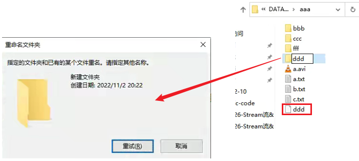

```
细节1：windows当中路径是唯一的，如果当前路径已经存在，则创建失败，返回false
```

~~~java
File f2 = new File("D:\\aaa\\ddd");
boolean b = f2.mkdir();
System.out.println(b); // false
~~~

接下来换个目录创建

~~~java
File f2 = new File("D:\\aaa\\eee");
boolean b = f2.mkdir();
System.out.println(b); // true
~~~

但如果后面有多个文件夹都不存在呢？例如下面代码，只有aaa文件夹存在会发生什么？

```
细节2：mkdir方法只能创建单级文件夹，无法创建多级文件夹。
```

~~~java
File f2 = new File("D:\\aaa\\aaa\\bbb\\ccc");
boolean b = f2.mkdir();
System.out.println(b); // false
~~~

---

### 3）`public boolean mkdirs()`

创建多级文件夹，其中包含单级文件夹。

~~~java
File f3 = new File("D:\\aaa\\ggg");
boolean b = f3.mkdirs();
System.out.println(b);//true
~~~

既然 `mkdirs()` 既能创建单级的，又能创建多级文件夹，那么 `mkdir()` 岂不是没有用了。

是的，你说的没有错以后它确实没有用了。那为什么我们还要去学习它呢？

因为在 `mkdirs()` 的底层它会用到 `mkdir()`。

源码：如果我们要创建多级文件夹，首先它会先去判断这个路径是否存在，然后用 `mkdir()` 创建单级文件夹试一下，如果创建成功了，直接 `return true`，如果没有创建成功，才会执行自己的逻辑。

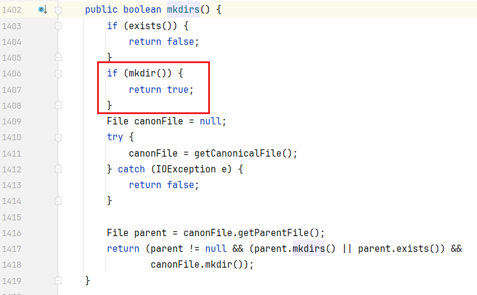

因此以后创建文件夹，可以一律使用 `mkdirs()`。

----

## 五、删除方法

`delete()` 默认只能删除文件和空文件夹，`delete()` 直接删除不走回收站。

~~~java
public boolean delete() // 删除文件、空文件夹
~~~

```
细节：
    如果删除的是文件，则直接删除，不走回收站，返回true
    如果删除的是空文件夹，则直接删除，不走回收站，返回true
    如果删除的是有内容的文件夹，则删除失败，返回false
```

~~~java
//1.创建File对象
File f1 = new File("D:\\aaa\\eee");
//2.删除
boolean b = f1.delete();
System.out.println(b);
~~~

----

## 六、获取并遍历

`获取并遍历` 的方法有很多，但是这些方法中只需要重点掌握刚刚学习的空参的 `listFiles()` 即可，其他的了解一下即可。

### 1）`public File[] listFiles()`

接下来学习 `File类` 中最重要的一个方法：获取并遍历。

获取到当前路径下所有的内容，并将它们放到一个数组中进行返回。

代码示例

~~~java
//1.创建File对象
File f = new File("D:\\aaa");
//2.listFiles方法
//作用：获取aaa文件夹里面的所有内容，包括文件，包括文件夹，哪怕你是隐藏的，它都能获取。然后把所有的内容放到数组中返回
File[] files = f.listFiles();
for (File file : files) {
    //file依次表示aaa文件夹里面的每一个文件或者文件夹
    System.out.println(file);
}
~~~

细节

1、当调用者 `File` 表示的路径不存在时，返回 `null`

2、当调用者 `File` 表示的路径是文件时，返回 `null`

3、当调用者 `File` 表示的路径是一个空文件时，回一个长度为`0`的数组

4、当调用者 `File` 表示的路径是一个有内容的文件夹时，它会将里面所有的文件和文件夹的路径放在 `File数组` 中返回

5、当调用者 `File` 表示的路径是一个有隐藏文件的文件夹时，将里面所有文件和文件夹的路径放在 `File数组` 中返回，包含隐藏文件

6、当调用者 `File` 表示的路径是需要权限才能访问的文件夹时，返回 `null`

有很多同学的电脑权限比较高，特别是 `C盘`，没有权限是进不去的。Java也是一样的，遇到这样的文件夹，用 `listFiles()` 也无法获取到里面的东西，也会返回一个 `null`。

例如 `C:\$Recycle.Bin\S-1-5-18` 是一个隐藏的文件夹，表示回收站，这个文件夹我们是没有权限进入的，因此返回 `null`。

----

### 2）`public static File[] listRoots()`

作用：获取系统中所有的盘符

注意，这个方法是 `static静态` 的，因此需要直接使用 `File类名` 调用。

这个方法在以后我们会偶尔使用，例如遍历整个硬盘的时候，搜索所有硬盘里面的电影名。

~~~java
File[] arr = File.listRoots();
System.out.println(Arrays.toString(arr)); // [C:\, D:\, E:\, F:\, G:\]
~~~

---

### 3）`public String[] list()`

获取当前该路径下所有内容。

但是它仅仅只能获取名字，如果是文件：文件名+后缀名；文件夹：获取的时文件夹的名字。

这个方法返回的类型不是 `File` ，而是 `String`

~~~java
File f1 = new File("D:\\aaa");
String[] arr2 = f1.list();
for (String s : arr2) {
    System.out.println(s);
}
~~~

----

### 4）`public String[] list(FilenameFilter filter)`

利用文件名过滤器获取当前该路径下所有内容。

选中 `list方法` 往下拉

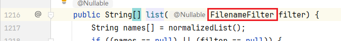

继续跟进 `FilenameFilter`，可以发现它是一个接口，而且还是一个函数式接口，因此我们可以写成匿名内部类，也可以写成 `Lambda表达式`，如果有合适的方法，我们甚至可以用方法引用。

方法返回的同样是 `String`，里面存储的就是每个文件的绝对路径。

需求：我现在要获取`D:\aaa` 文件夹里面所有的 `txt文件`。

~~~java
//accept方法的形参，依次表示aaa文件夹里面每一个文件或者文件夹的路径
//参数一：父级路径
//参数二：子级路径
//返回值：如果返回值为true，就表示当前路径保留，返回到数组中
//        如果返回值为false，就表示当前路径舍弃不要，不会返回到数组中
String[] arr3 = f2.list(new FilenameFilter() {
    @Override
    public boolean accept(File dir, String name) {
        File src = new File(dir,name);
        return src.isFile() && name.endsWith(".txt");
    }
});
~~~

就算我们不会这个方法也没关系，使用 `listFiles()` 也可以实现。

因此在以后我们重点掌握 `listFiles()` 即可，其他方法了解一下即可。

~~~java
//1.创建File对象
File f = new File("D:\\aaa");
//2.需求：打印里面所有的txt文件
File[] arr = f.listFiles();
for (File file : arr) {
    //file依次表示aaa文件夹里面每一个文件或者文件夹的路径
    if(file.isFile() && file.getName().endsWith(".txt")){
        System.out.println(file);
    }
}
~~~

---

### 5）`public File[] listFiles(FileFilter filter)`

利用文件名过滤器获取当前该路径下所有内容。

只不过它的返回值不是 `String[]` 而是 `File[]`

~~~java
//创建File对象
File f = new File("D:\\aaa");
//调用listFiles(FileFilter filter)
File[] arr1 = f.listFiles(new FileFilter() {
    @Override
    // 参数pathname依次表示文件夹里面的每一个文件或者文件夹
    //返回值：如果返回值为true，就表示当前路径保留，返回到数组中
	//		如果返回值为false，就表示当前路径舍弃不要，不会返回到数组中
    public boolean accept(File pathname) {
        return pathname.isFile() && pathname.getName().endsWith(".txt");
    }
});
~~~


----

### 6）`public File[] listFiles(FilenameFilter filter)`

利用文件名过滤器获取当前该路径下所有内容。

和 `public File[] listFiles(FileFilter filter)` 的区别是：

- `public File[] listFiles(FileFilter filter)` 中接口的形参 `pathname` 是一个完整的路径
- `public File[] listFiles(FilenameFilter filter)` 是将一个大的路径拆开为 `父级路径` 和 `子级路径`

~~~java
//调用listFiles(FilenameFilter filter)
File[] arr2 = f.listFiles(new FilenameFilter() {
    @Override                  
    public boolean accept(File dir, String name) {
        File src = new File(dir, name);
        return src.isFile() && name.endsWith(".txt");
    }
});
System.out.println(Arrays.toString(arr2));
~~~


---

# 68.练习：在当前模块下的aaa文件夹中创建一个a.txt文件

```
需求：在当前模块下的aaa文件夹中创建一个a.txt文件
```

~~~java
//1.创建a.txt的父级路径
File file = new File("myfile\\aaa");
//2.创建父级路径，不需要判断该路径是否存在
//如果aaa是存在的，那么此时创建失败的。
//如果aaa是不存在的，那么此时创建成功的。
file.mkdirs();
//3.拼接父级路径和子级路径
File src = new File(file,"a.txt");
boolean b = src.createNewFile();
if (b) {
    System.out.println("创建成功");
} else {
    System.out.println("创建失败");
}
~~~


----

# 69.练习：定义一个方法找某一个文件夹中，是否有以avi结尾的电影（暂时不需要考虑子文件夹）

~~~java
需求：
   定义一个方法找某一个文件夹中，是否有以avi结尾的电影。
  （暂时不需要考虑子文件夹）
~~~

~~~java
/*
* 作用：用来找某一个文件夹中，是否有以avi结尾的电影
* 形参：要查找的文件夹
* 返回值：查找的结果  存在true  不存在false
* */
public static boolean haveAVI(File file){
    //1.进入aaa文件夹，而且要获取里面所有的内容
    File[] files = file.listFiles();
    //2.遍历数组获取里面的每一个元素
    for (File f : files) {
        //f：依次表示aaa文件夹里面每一个文件或者文件夹的路径
        if(f.isFile() && f.getName().endsWith(".avi")){
            return true;
        }
    }
    //3.如果循环结束之后还没有找到，直接返回false
    return false;
}
~~~

----

# 70.练习：找到电脑中所有以avi结尾的电影（需要考虑子文件夹）

```
需求：找到电脑中所有以avi结尾的电影。（需要考虑子文件夹）
```

注意：当调用者 `File` 表示的路径是需要权限才能访问的文件夹时，返回 `null`

例如 `C:\$Recycle.Bin\S-1-5-18` 是一个隐藏的文件夹，表示回收站，这个文件夹我们是没有权限进入的，因此返回 `null`。

~~~java
public static void main(String[] args) {
    findAVI();
}

public static void findAVI(){
    //获取本地所有的盘符
    File[] arr = File.listRoots();
    for (File f : arr) {
        findAVI(f);
    }
}

public static void findAVI(File src){
    //1.进入文件夹src，要注意listFiles()可能会返回空
    File[] files = src.listFiles();
    //2.遍历数组,依次得到src里面每一个文件或者文件夹
    if(files != null){
        for (File file : files) {
            if(file.isFile()){
                //3，判断，如果是文件，就可以执行题目的业务逻辑
                String name = file.getName();
                if(name.endsWith(".avi")){
                    System.out.println(file);
                }
            }else{
                //4，判断，如果是文件夹，就可以递归
                //细节：再次调用本方法的时候，参数一定要是src的次一级路径
                findAVI(file);
            }
        }
    }
}
~~~

----

# 71.练习：删除一个多级文件夹

```
删除一个多级文件夹
如果我们要删除一个有内容的文件夹，分为以下两步
1.先删除文件夹里面所有的内容
2.再删除自己
```

~~~java
public static void main(String[] args) {
    File file = new File("D:\\aaa\\src");
    delete(file);

}

/*
* 作用：删除src文件夹
* 参数：要删除的文件夹
* */
public static void delete(File src){
    //1.先删除文件夹里面所有的内容
    //进入src
    File[] files = src.listFiles();
    //遍历
    for (File file : files) {
        //判断,如果是文件，删除
        if (file.isFile()) {
            file.delete();
        } else {
            //判断,如果是文件夹，就递归
            delete(file);
        }
    }
    //2.再删除自己！！！
    src.delete();
}
~~~

----

# 72.练习：统计一个文件夹的总大小

```
需求：统计一个文件夹的总大小
```

~~~java
public static void main(String[] args) {
    File file = new File("D:\\aaa\\src");

    long len = getLen(file);
    System.out.println(len);//4919189
}

/*
* 作用：
*       统计一个文件夹的总大小
* 参数：
*       表示要统计的那个文件夹
* 返回值：
*       统计之后的结果
*
* 文件夹的总大小：
*       说白了，文件夹里面所有文件的大小
* */
public static long getLen(File src){
    //1.定义变量进行累加
    long len = 0;
    //2.进入src文件夹
    File[] files = src.listFiles();
    //3.遍历数组
    for (File file : files) {
        //4.判断
        if(file.isFile()){
            //我们就把当前文件的大小累加到len当中
            len = len + file.length();
        }else{
            //判断，如果是文件夹就递归
            len = len + getLen(file);
        }
    }
    return len;
}
~~~

----

# 73.练习：统计一个文件夹中每种文件的个数并打印（考虑子文件夹）

```
需求：统计一个文件夹中每种文件的个数并打印。（考虑子文件夹）
打印格式如下：
txt:3个
doc:4个
jpg:6个
```

~~~java
public static void main(String[] args) throws IOException {
    File file = new File("D:\\aaa\\src");
    HashMap<String, Integer> hm = getCount(file);
    System.out.println(hm);
}

/*
* 作用：
*       统计一个文件夹中每种文件的个数
* 参数：
*       要统计的那个文件夹
* 返回值：
*       用来统计map集合
*       键：后缀名 值：次数
*	对于以下三种特殊的情况我们都需要考虑到
*       a.txt
*       a.a.txt
*       aaa（这种没有后缀名的是不需要统计的）
* */
public static HashMap<String,Integer> getCount(File src){
    //1.定义集合用来统计
    HashMap<String,Integer> hm = new HashMap<>();
    //2.进入src文件夹
    File[] files = src.listFiles();
    //3.遍历数组
    for (File file : files) {
        //4.判断，如果是文件，统计
        if (file.isFile()) {
            //a.txt
            String name = file.getName();
            String[] arr = name.split("\\.");
            if(arr.length >= 2){
                String endName = arr[arr.length - 1];
                if(hm.containsKey(endName)){
                    //存在
                    int count = hm.get(endName);
                    count++;
                    hm.put(endName,count);
                } else {
                    //不存在
                    hm.put(endName,1);
                }
            }
        } else {
            //5.判断，如果是文件夹，递归
            //sonMap里面是子文件中每一种文件的个数，然后将递归的结果同步到hm中
            HashMap<String, Integer> sonMap = getCount(file);
            //hm:  txt=1  jpg=2  doc=3
            //sonMap: txt=3 jpg=1
            //遍历sonMap把里面的值累加到hm当中
            Set<Map.Entry<String, Integer>> entries = sonMap.entrySet();
            for (Map.Entry<String, Integer> entry : entries) {
                String key = entry.getKey();
                int value = entry.getValue();
                if(hm.containsKey(key)){
                    //存在
                    int count = hm.get(key);
                    count = count + value;
                    hm.put(key,count);
                }else{
                    //不存在
                    hm.put(key,value);
                }
            }
        }
    }
    return hm;
}
~~~


-----

# ---------------------------------------------

# day28 IO（字节流&字符流）

# 74.IO流的概述

## 一、引入

`IO流`：存储和读取数据的解决方案。

假设我们现在在玩拼图小游戏，这些数据都是保存在内存中的，内存中数据的特点就是不能永久化存储，程序停止，数据就会丢失。

因此我们需要添加一个存档功能，假设游戏有一个保存拼图进度的功能到txt文件中，那该多好，这样下次在玩的时候就不需要重头开始玩了。

想要实现这个功能，我们需要学习两个知识：1、txt文本文件保存在哪里；2、数据如何进行传输，也就是如何保存到文件中。


`IO流` 就是为了解决这个问题而出现的：存储和读取数据的解决方案。

又因为 `IO流` 跟 `File` 是息息相关的，所以我们在学习之前需要将 `File` 简单回顾一下。

----

## 二、回顾 `File`

`File`：表示系统中的文件或者文件夹的路径。

利用 `File` 我们可以获取文件的信息、判断文件的类型、创建文件/文件夹、删除文件/文件夹。

注意：`File类` 只能对文件本身进行操作，不能读写文件里面存储的数据。

如果我们想要读写数据，就必须要用到 `IO流`。

----

## 三、`IO流` 的作用

`IO流`：用于读写文件中的数据（可以读写文件，或网络中的数据.....）

`IO流` 能做的事情主要是两点

1、将程序中的数据保存到本地文件中，这个动作也叫做：`写出数据`，英文名字 `output`

2、将本地文件中的数据加载到程序中，这个动作也叫做：`读取数据`，英文名字 `input`

问题：`IO流` 中，谁在读，谁在写？以谁为参照物看读写的方向呢？

答案：以程序为参照物进行读写，是程序在读取文件中你的数据，是程序在往文件中写出数据。

或者答 `内存` 也是没有问题的，因为程序就是运行在内存中的。

----

## 四、`IO流`

在Java中，`IO流` 是有很多很多种的，想要学好它，就需要先将它们进行分类，让大家有一个整体的认知，再一种一种的去学习。

1、`IO流`  按照**流的方向**来分的话，可以分为两种：`输入流：把本地文件中的数据读取到程序中`、`输出流：将程序中的数据写出到本地文件中`。


2、`IO流` 按照**操作文件的类型**，可以分为 `字节流`、`字符流`。

其中 `字节流` 可以操作所有类型的文件，例如：图片文件、文本文件、视频文件、音频文件.....

`字符流` 只能操作 `纯文本文件`。

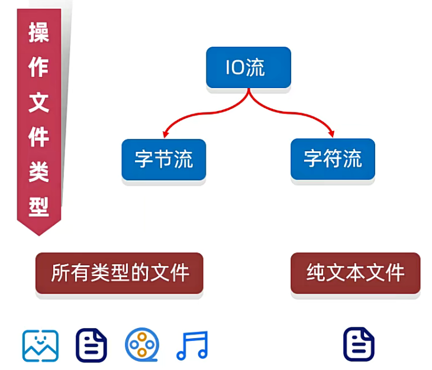

什么是纯文本文件？利用 `Windows` 自带的记事本打开并且能读的懂的就是纯文本文件。

例如 `txt文件、md文件、xml文件、lrc文件` 等。`lrc`：平时下载音频文件用来存放歌词的。

如下图用记事本打开了四种类型的文件。`txt和md` 是纯文本文件，而中间的 `Word、Excel` 不是纯文本文件。

因此以后要是遇到了 `Word、Excel` 就不能只用 `字符流` 进行操作，只能使用 `字节流` 进行操作。

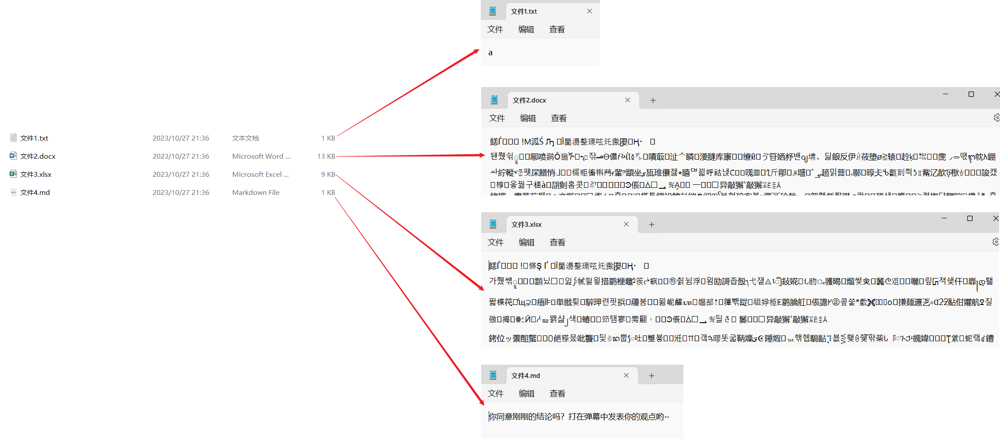

----

## 五、总结

**1、什么是 `IO流`？**

 `IO流`：存储和读取数据的解决方案。

其中的 `I` 表示 `input(输入)`，`O` 表示 `output(输出)`，`流` 是一个比喻，表示数据就像是 `水流` 一样进行传输的。

**2、`IO流`的作用**

用于读写数据，这个数据可以在本地文件中，也可以在网络中。

**3、 `IO流` 按照 `流向` 可以分类哪两种流？**

输入流：把本地文件中的数据读取到程序中。

输出流：将程序中的数据写出到本地文件中。

**4、`IO流` 按照 `操作文件的类型` 可以分类哪两种流？**

字节流：可以操作所有类型的文件

字符流：只能操作纯文本文件

**5、什么是纯文本文件？**

利用 `Windows` 自带的记事本打开并且能读的懂的就是纯文本文件。

例如 `txt文件、md文件、xml文件、lrc文件` 等。`lrc`：平时下载音频文件用来存放歌词的。


----

# 75.`IO流` 的体系

`IO流` 可以分为 `字节流` 和 `字符流`，每种流又有输入和输出之分。

下面四个类都是抽象类，我们是不能创建它们的对象的，我们还得看它们的子类。

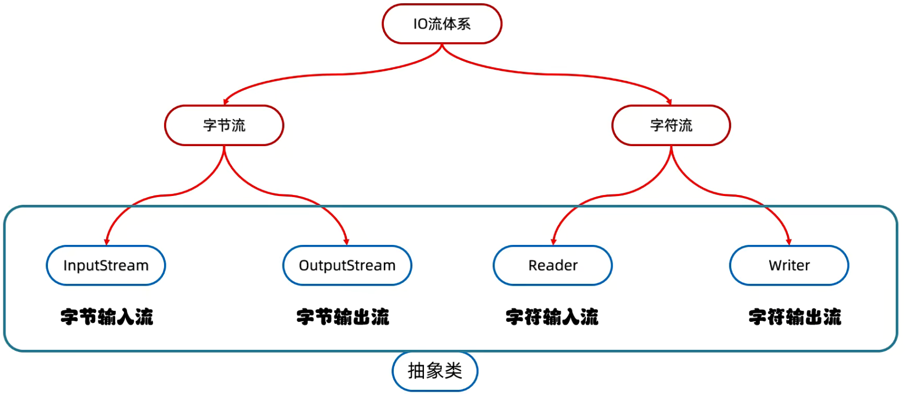

以字节流为例，如果我们想要用字节流读取本地文件中的数据，如果是你来设计子类的类名，你该怎么起呢？

先将父类 `InputStream` 拿出来，表示它本身是 `字节输入流`，用来读取数据。

又因为我们想要从本地文件中读取数据，文件的英文是 `File`，两者一结合 `FileInputStream`，就表示：操作本地文件的字节输入流。

这个名字起的多棒，第一个单词表示它的作用，第二个单词表示它的继承结构。

在以后我们还会学习其他功能的字节输入流，它们的命名规则其实都是一样的，第二个单词不变，变下第一个单词就行了。


输出流也是一样的，在前面加一个 `File`，这就表示操作本地文件的字节输出流，第一个单词表示它的作用，第二个单词表示它的继承结构。

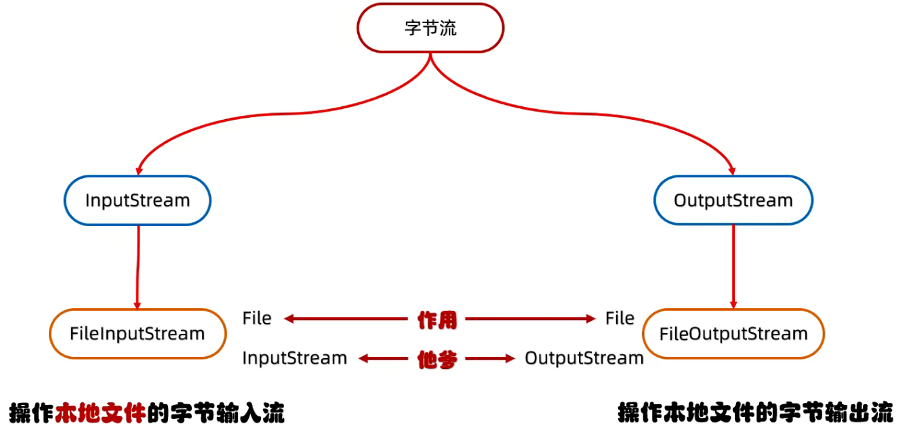

现在我们来学习一个简单的：`FileOutputStream`

-----

# 字节输出流

一切文件数据（文本、图片、视频等）在存储时，都是以二进制数字的形式保存，都一个一个的字节，那么传输时一样如此。所以，字节流可以传输任意文件数据。在操作流的时候，我们要时刻明确，无论使用什么样的流对象，底层传输的始终为二进制数据。

## 一、介绍

`FileOutputStream`：操作本地文件的字节输出流，可以把程序中的数据写到本地文件中。

书写步骤：

1、创建字节输出流对象

2、写数据

3、释放资源

-----

## 二、代码示例

需求：写出一段文字到本地文件中。（暂时不写中文）

创建对象的时候需要思考创建谁的对象，此时我们需要思考我们的需求是什么？写出一段文字到本地文件中。

既然是写出，那一定要使用到输出流：`OutputStream`。

`OutputStream` 是一个抽象类，我们不能直接创建它的对象，此时就需要来看它的子类，它有一个子类是操作本地文件的，文件的单词是 `File`，因此两者一结合，创建的就是： `FileOutputStream`。

调用构造方法时会有一个编译时异常，因此需要手动抛出。

这个编译时异常其实就是想提示你，让你检查本地文件中是否有 `a.txt`。

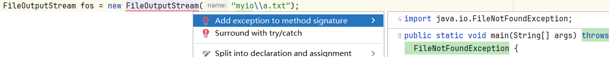

~~~java
//1.创建对象，并指定文件的路径，myio\a.txt（当前项目下的myio模块下的a.txt文件）
FileOutputStream fos = new FileOutputStream("myio\\a.txt");
~~~

写出数据也很简单，用对象调用 `write()`，方法里面需要传递 `int类型` 的整数

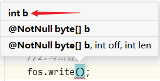

这里就随便写 `97`。

下面两个方法也都是有编译时异常的，因此同样需要进行手动处理。

`IOException` 是三行代码要抛出异常的父类，所以直接写一个 `IOException` 即可。

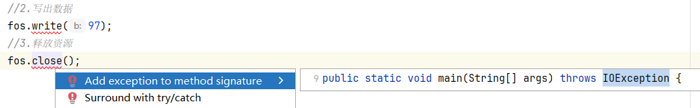

~~~java
//2.写出数据
fos.write(97);
//3.释放资源
fos.close();
~~~

代码写完后打开 `a.txt`，可以发现数据 `a` 已经写到本地文件中了。

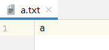

但是这三行代码怎么理解呢？

----

## 三、原理

我们电脑上的文件是有很多很多的，它怎么就知道我要将数据写到哪个文件里呢？是谁做的事情呢？

其实就是第一行代码创建对象时做的事情，它会根据书写的路径让程序跟文件之间产生一个数据传输的通道。

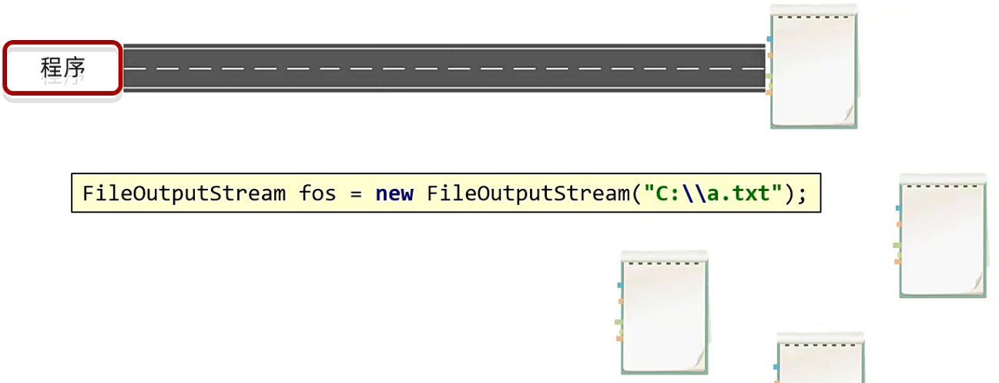

然后再去通过 `write()` 写出数据，数据相当于就是在这个通道中进行的传输。

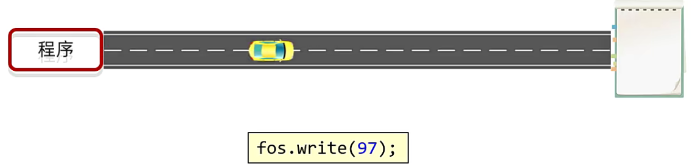

最后，当我们调用 `close()` 释放资源的时候，相当于就是将这个通道给砸了。

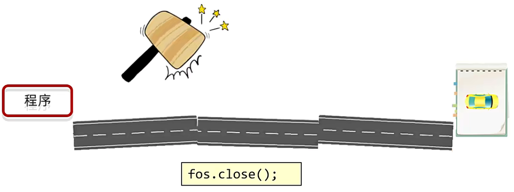


----

# 76.字节输出流写出数据的细节

## 一、创建字节输出流对象

### 细节1：参数是字符串表示的路径或者是File对象都是可以的

~~~java
FileOutputStream fos = new FileOutputStream("myio\\a.txt");
~~~

选中 `FileOutputStream` 来看下源码：如果传递的是字符串表示的路径，它的底层还是会 `new` 一个 `File对象`，最终再去调用本类的其他构造。

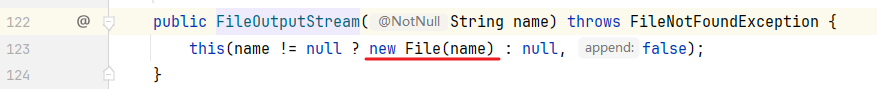

跟进 `this` 看一下，此时就跳到了 `216行` 的构造

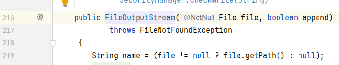

但假如此时我传递的是 `File对象`，那么它会调用哪个构造呢？

~~~java
FileOutputStream fos = new FileOutputStream(new File("myio\\a.txt"));
~~~

选中 `FileOutputStream` 跟进，可以发现方法底层还是调用了其他构造方法

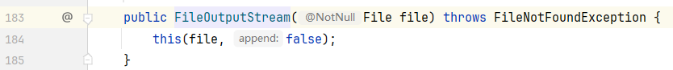

继续跟进看看，可以发现还是 `216行` 的

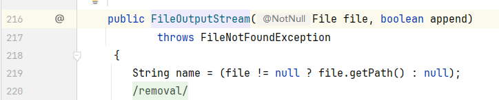

---

### 细节2：如果文件不存在会创建一个新的文件，但是要保证父级路径是存在的。

如果父级路径不存在，就会报错。

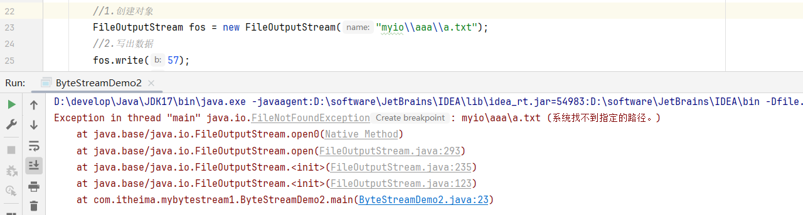

---

### 细节3：如果文件已经存在，构造方法会清空文件

----

## 二、写数据

细节：write方法的参数是整数，但是实际上写到本地文件中的是整数在ASCII上对应的字符

例如我们在括号中写的是 `97`，实际上文件中写的却是 `a`。

那如果我们真的要写一个 `97` 怎么办呢？那就将 `9` 和 `7` 分别看做是一个单独的字符，`'9'字符对应的ASCII码值是57`，`'7'字符对应的ASCII码值是55`。

```java
fos.write(57);
fos.write(55);
```

打开文件，可以发现 `97` 成功写入

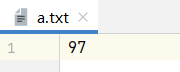

如果我们在利用字节输出流写出数据的时候，括号里面的数据是在一个字节范围以内是没有问题的。

但如果写出的数据已经超出了一个字节，那么就不能用字节流往外写了。

~~~java
FileOutputStream fos = new FileOutputStream("myio\\a.txt");
fos.write(25105); // 此时写到文件中是乱码
~~~

----

## 三、释放资源

释放资源是IO流中每一种流都要进行的操作。

每次使用完流之后都要释放资源

~~~java
fos.close();
~~~

那如果不释放资源会怎么样？

~~~java
FileOutputStream fos = new FileOutputStream("myio\\a.txt");
fos.write(57);
fos.write(55);
//将释放资源注释掉
//fos.close();

// 为了让程序不停止，这里写一个无限循环
while(true){}
~~~

运行以上代码，程序没停止，但是资源也没有释放，此时来打开一下本地文件，将它删掉，会发现，操作系统有一个提示：

相当于Java正在占用着这个文件，其他人在本地中是无法操作。

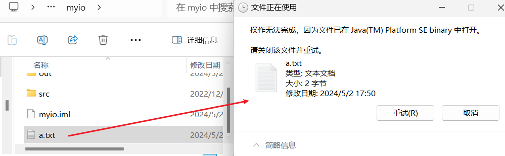

但是如果你释放了资源，那么在程序运行的时候，再去删除文件，此时也可以删除文件。

这个就是释放资源的作用，它相当于就是解除了资源的占用。

-----

## 四、总结

```
1.创建字节输出流对象
      细节1：参数是字符串表示的路径或者是File对象都是可以的
      细节2：如果文件不存在会创建一个新的文件，但是要保证父级路径是存在的。
      细节3：如果文件已经存在，则会清空文件
2.写数据
      细节：write方法的参数是整数，但是实际上写到本地文件中的是整数在ASCII上对应的字符
3.释放资源
      每次使用完流之后都要释放资源
```


----

# 77.字节输出流写出数据的三种方式

## 一、总述

在Java中 `FileOutputStream` 写出数据一共有三种方式。

方法二：如果需要一次写多个数据，可以先将它放到一个 `byte` 类型的数组中，把整个数组中的数据写到文件中就行了。

方法三：当然我们也可以写数组的一部分。

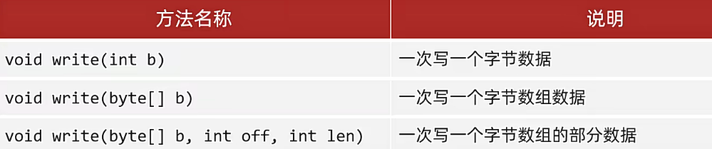

----

## 二、`write(int b)`

1. 虽然参数为int类型四个字节，但是只会保留一个字节的信息写出。
2. 流操作完毕后，必须释放系统资源，调用close方法，千万记得。

~~~java
//1.创建对象
FileOutputStream fos = new FileOutputStream("myio\\a.txt");
//2.写出数据
fos.write(97); // 真正写到文件上的是97在ASCII码表中所对应的字符a
fos.write(98); // b
//3.释放资源
fos.close();
~~~

----

## 三、`write(byte[] b)`

在创建对象的时候，这个代码有个规则：

- 如果文件不存在会创建一个新的文件，但是要保证父级路径是存在的。

- 如果文件已经存在，则会清空文件。

因此我们这次写数据时，只剩下 `abcde`

```java
//1.创建对象
FileOutputStream fos = new FileOutputStream("myio\\a.txt");
//2.写出数据
byte[] bytes = {97, 98, 99, 100, 101};
fos.write(bytes);

fos.write(bytes);
//3.释放资源
fos.close();
```

----

## 四、`write(byte[] b, int off, int len)`

```java
参数一 b：
     数组
参数二 off：
     起始索引  
参数三 len：
     个数      
```

~~~java
//1.创建对象
FileOutputStream fos = new FileOutputStream("myio\\a.txt");
byte[] bytes = {97, 98, 99, 100, 101};
fos.write(bytes);

fos.write(bytes,1,2);// b c，从1索引开始写，一共写2个
//3.释放资源
fos.close();
~~~


----

# 78.换行和续写

## 一、换行

```java
//1.创建对象
FileOutputStream fos = new FileOutputStream("myio\\a.txt",true);
```

写出数据的时候，如果使用 `write('')` 这种方式写，就需要一个字母一个字母的写，太麻烦了，因此可以使用其他的方法。

使用字符串 `str` 调用 `getBytes()`，这个方法的返回值就是一个 `byte数组`，因此这个方法就可以将字符串变成字节数组。

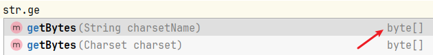

~~~java
String str = "abc";
byte[] arr = str.getBytes();
System.out.println(Arrays.toString(arr)); // [97, 98, 99]
~~~

----

接下来就可以开始来写换行代码了。

如果是 `Windows操作系统`，换行符是 `\r(回车)\n(换行)`，它叫做 `回车换行`。

因为在早期cmd中，它有这样的一个规则，如果我们需要将光标放到下一行，它其实是两步操作

- 回车：将光标放到一行的开头
- 换行：将光标移动到下一行

这是早期的一个习惯，`Windows` 将这个习惯延续下来了。

在 `Linux操作系统` 中，它认为回车换行太麻烦了，因此它的换行符只有一个 `\n`。

~~~java
换行写：再次写出一个换行符就可以了
    windows： \r\n
    Linux:    \n
    Mac:      \r
细节：
    在windows操作系统当中，java对回车换行进行了优化。
    虽然完整的是\r\n，但是我们写其中一个\r或者\n，
    java也可以实现换行，因为java在底层会补全。
建议：
    不要省略，还是写全了最好。
~~~

~~~java
//2.写出数据
String str = "kankelaoyezuishuai";
byte[] bytes1 = str.getBytes();
fos.write(bytes1);

//再次写出一个换行符就可以了
String wrap = "\r\n";
byte[] bytes2 = wrap.getBytes();
fos.write(bytes2);

String str2 = "666";
byte[] bytes3 = str2.getBytes();
fos.write(bytes3);

//3.释放资源
fos.close();
~~~

---

## 二、续写

续写其实很简单，我们在创建对象的时候，它后面还有第二个参数：续写开关。

我们先来看最简单的构造：这个方法的底层它会把字符串表示的路径先变成 `File对象`，第二个参数的默认值是  `false`，所以它相当于就是将 `路径和false` 传递给了另外一个构造方法。

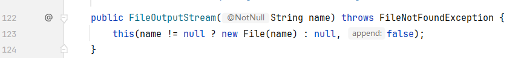

选中 `this` 跟进，这个构造方法才是我们真正的核心代码，它里面有两个参数：`路径` 和 `续写开关`。

如果为 `false`，就表示关闭续写，因此在创建对象的时候会将文件清空。

但是如果手动给它传递 `true`，那就表示 `打开续写`，续写功能一旦打开，文件就不会清空了。

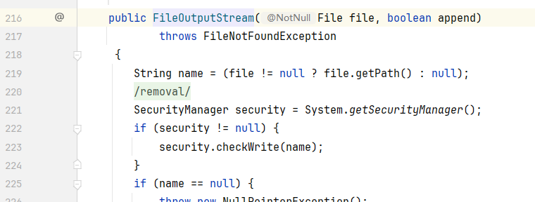

~~~java
续写：
    如果想要续写，打开续写开关即可
    开关位置：创建对象的第二个参数
    默认false：表示关闭续写，此时创建对象会清空文件
    手动传递true：表示打开续写，此时创建对象不会清空文件
~~~

~~~java
//1.创建对象
FileOutputStream fos = new FileOutputStream("myio\\a.txt", true);
//2.写出数据
String str = "kankelaoyezuishuai";
byte[] bytes1 = str.getBytes();
fos.write(bytes1);

//再次写出一个换行符就可以了
String wrap = "\r\n";
byte[] bytes2 = wrap.getBytes();
fos.write(bytes2);

String str2 = "666";
byte[] bytes3 = str2.getBytes();
fos.write(bytes3);

//3.释放资源
fos.close();
~~~

----

## 三、总结

1、FileOutputStream的作用

可以把程序中的数据写到本地文件上，是字节流中最基本最简单的基本流。

2、书写步骤

创建对象，写出数据，释放资源

3、三步操作的细节

创建对象：

- 如果关联的文件是存在的，默认会清空文件
- 如果关联的文件是不存在的，会将文件创建出来，但是要保证它的父级路径是存在的，否则会报错
- 如果想续写，在第二个参数传 `true`，表示打开续写开关，这个也叫作：追加写入

写出数据：

- 如果我们写的是整数，那么实际写到文件中的是整数在ASCII码表中所对应的字符
- 除此之外我们还可以写出一个字节数组，它相当于就是将字节数组的全部 / 一部分数据写到本地文件中
- 如果在写的时候要换行，写换行符即可

~~~java
windows： \r\n
Linux:    \n
Mac:      \r
~~~

释放资源

- 我们所使用的绝大IO流都需要释放资源

-----

# 79.字节输入流的基本用法

## 一、介绍


字节输入流（`FileInputStream`）：操作本地文件的字节输入流，可以把本地文件中的数据读取到程序中来。

书写步骤：

1、创建字节输入流对象

对象一旦创建完，程序跟本地文件之间，就好比是有了一条传输数据的通道

2、读数据

利用通道可以把文件中的数据读取到程序中来

3、释放资源

相当于就是将这个通道给砸了

-----

## 二、代码示例

假设在模块底下有一个 `a.txt`，并且里面存储了 `abcde`

现在我们是使用字节流去读，那么就是 `InputStream`，从文件中读，在它前面拼接一个 `File` 就行了，因此我们创建的是 `FileInputStream类` 的对象。

~~~java
//1.创建对象
FileInputStream fis = new FileInputStream("myio\\a.txt");
~~~

读数据是 `read()`，`read()` 是空参，但是有一个返回值，返回值是 `int类型` 的。

由于下面代码只调用了一次 `read()`，因此在文件中它读取的是第一个数据 `a`，但是到程序中不是 `a`，而是 `a` 在ASCII码表中所对应的数字 `97`，即相当于将 `97` 赋值给了 `b1`。

~~~java
//2.读取数据
int b1 = fis.read();
System.out.println(b1); // 97
//3.释放资源
fis.close();
~~~

如果想要读取多个数据，反复调用即可。

如果我们想看见原来的 `abcde`，在打印的时候强转为 `char` 即可。

~~~java
//2.读取数据
int b1 = fis.read();
System.out.println((char)b1);
int b2 = fis.read();
System.out.println((char)b2);
int b3 = fis.read();
System.out.println((char)b3);
int b4 = fis.read();
System.out.println((char)b4);
int b5 = fis.read();
System.out.println((char)b5);
// read()会一个一个去读，如果读不到了返回-1
int b6 = fis.read();
System.out.println(b6);//-1
//3.释放资源
fis.close();
~~~


-----

# 80.字节输入流读取数据的细节

## 一、创建字节输入流对象

### 细节1：如果文件不存在，就直接报错

注意模块下是没有 `b.txt` 的，如果运行下面代码，就会直接报错

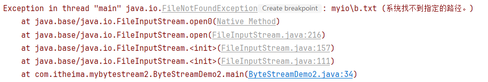

~~~java
//1.创建对象
FileInputStream fis = new FileInputStream("myio\\b.txt");
//2.读取数据
int b1 = fis.read();
System.out.println((char)b1);
//3.释放资源
fis.close();
~~~

**Java为什么这么设计呢？**

输出流有一个特点：不存在会创建，但是需要保证父级路径是存在的。

但是输入流为什么不会创建，而是报错呢？

在输出流的时候，我们要做的是把数据写到文件中，在这个过程中，最重要的是数据，因此它在本地创建一个文件，将数据写到文件中是完全没有任何问题的。

但是输入流，在读取的时候，数据在文件中。如果Java创建输入流对象的时候，文件不存在也创建一个新的，那么此时创建出来的就是一个空文件夹，这是没有意义的。

结论：因为创建出来的文件是没有数据的，没有任何意义。因此Java就没有设计这种无意义的逻辑，文件不存在直接报错。

通过这个问题我们也知道了，程序中最重要的其实是数据。

-----

## 二、读取数据

### 细节1：一次读一个字节，读出来的是数据在ASCII上对应的数字

### 细节2：读到文件末尾了，read方法返回-1

在读取数据的时候，相当于有一个指针，在一开始的时候默认指向第一个数据，当我们调用一次 `read()` 后它就会读取 `a` 并移动一次指针，不断往后，读一次移动一次。


等读到末尾后，再次调用 `read()` 就读不到数据了，既然读不到，那就表示到了文件末尾了，方法会返回 `-1`。


因此在以后就可以根据 `read()` 的返回值判断我们是否读取到了末尾。

但如果文件中有空格，空格也是数据，那么读取到程序中的就是空格在ASCII中所对应的数字。

如果文件中是 `-1`，那么在读取的时候会将它分开，先读 `-`，再读 `1`。

----

## 三、释放资源

每次使用完流后必须要释放资源。


-----

# 81.字节输入流循环读取

在刚刚数据量不多的时候，可以一次只读取一个数据，这是完全没有任何问题的。

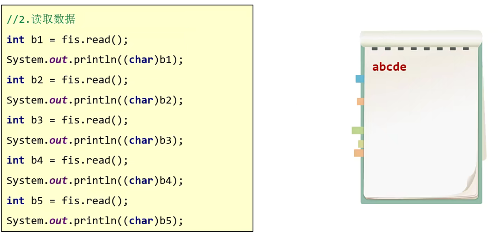

但是如果本地文件中有很多很多的数据，那该怎么办呢？

此时我们就需要来学习循环读取。

~~~java
//1.创建对象
FileInputStream fis = new FileInputStream("myio\\a.txt");
//2.循环读取
int b;
// 读取数据并赋值给变量b
while ((b = fis.read()) != -1) {
    System.out.println((char) b);
}
//3.释放资源
fis.close();
~~~

不可以不定义 `变量b`，因为 `read()` 表示读取数据，而且是读取一个数据就移动一次指针

~~~java
FileInputStream fis = new FileInputStream("myio\\a.txt"); // 文件中的数据为：abcde
//2.循环读取
while ((fis.read()) != -1) {
    System.out.println(fis.read()); //98  100  -1，通过打印结果也可以发现这样写是错误的
}
//3.释放资源
fis.close();
~~~


----

# 82.文件拷贝的基本代码

注意：选择一个比较小的文件，不要太大。大文件拷贝我们下一个视频会说。

拷贝的核心思想：边读边写，将从 `movie.mp4` 里面读取的数据直接写到 `copy.mp4` 中即可

~~~java
//1.创建对象
FileInputStream fis = new FileInputStream("D:\\itheima\\movie.mp4");
FileOutputStream fos = new FileOutputStream("myio\\copy.mp4");
//2.拷贝
int b;
while((b = fis.read()) != -1){
    fos.write(b);
}
//3.释放资源
//规则：先开的流最后关闭
fos.close();
fis.close();
~~~


----

# 83.文件拷贝的弊端和解决办法

## 一、引出问题

如果拷贝的文件过大，速度非常慢，因为在拷贝的时候，一次只读写一个字节。

但如果我们可以一次读取多个，那么速度肯定就能提升了。

因此我们需要来学习一次读取多个的方法。

方法是 `read()` 的重载方法，该方法可以传递一个字节数组。

在读取的时候就不是一个一个去读了，而是一次读取多个数据。

一次读一个字节数组的数据，每次读取会尽可能把数据装满。

例如数组长度是 `2`，那么它一次读取两个字节；如果数组长度是 `100`，那么一次读取两个字节。

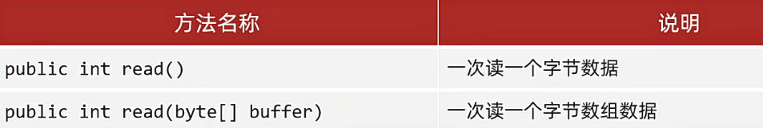

数组越大，拷贝的速度越快，但是数组本身也是会占用内存空间的，如果创建了一个长度为 `10个亿` 的数组，内存可能会直接崩。

因此我们在创建数组的时候长度一般会用 `1024的整数倍`，个人一般喜欢创建一个 `5M-10M(1024*1024*5)` 之间的数组进行文件拷贝，一次能拷贝5M的数据，这个速度已经相当不错了。

~~~java
//1.创建对象
FileInputStream fis = new FileInputStream("myio\\a.txt");
//2.读取数据，数组长度为2，表示一次读取两个字节的数据
byte[] bytes = new byte[2];
//一次读取多个字节数据，具体读多少，跟数组的长度有关
//返回值：表示本次读取到了多少个字节数据
int len1 = fis.read(bytes);
System.out.println(len1);//2
String str1 = new String(bytes);
System.out.println(str1); //ab

int len2 = fis.read(bytes);
System.out.println(len2);//2
String str2 = new String(bytes);
System.out.println(str2); // cd

//此时a.txt中只剩下e，但是为什么读取到的是ed呢？
int len3 = fis.read(bytes);
System.out.println(len3);// 1
String str3 = new String(bytes);
System.out.println(str3);// ed

//此时文件中已经没有数据读取了，len4为-1可以理解，但是为什么打印出来的数据还是ed呢？
int len4 = fis.read(bytes);
System.out.println(len4);// -1
String str2 = new String(bytes);
System.out.println(str4); // ed

//3.释放资源
fis.close();
~~~

---

## 二、分析问题

在代码中，我们是要将数据源中的数据读取到内存中。

当我们创建输入流对象的时候，就好比内存跟数据源之间有了这么一个传输数据的通道。

接下来就使用下面的这段代码去读取数据，读取的过程是怎么样的呢？

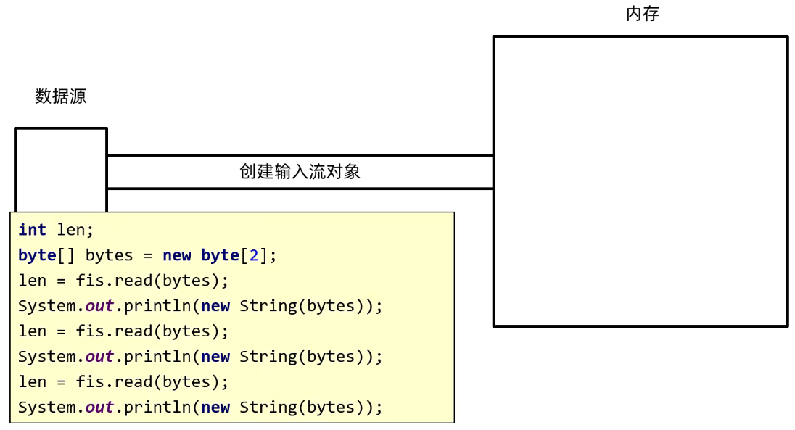

首先定义了一个 `变量len`，这个变量是用来记录读了多少个数据，跟之前变量 `b` 表示的含义是不一样的。

然后又创建了一个长度为 `2` 的数组，数组里面装的才是读取到的数据。

假设数据源中有 `abcde` 这样的五个数据。

第一次读取的时候使用 `fis` 调用 `read()` ，参数是一个数组，表示现在将读取的数据装到数组中，每次读的时候尽可能将数组装满。

因此第一次在读取的时候，会读取两个，然后将读取到的数据 `ab` 放到数组中，由于读到了两个，此时 `len` 记录的就是 `2`。

往下 `System.out.println(new String(bytes))` ，将数组中的数据变成字符串并进行打印，怎么变呢？

其实很简单，就是获取字符串里面所有的元素，把它变成字符串并进行打印，因此打印出来的结果就是 `ab`。


往下，第二次读取数据，在读取的时候，每次读取尽可能将数组装满，因此这次还是读取两个，并将读取到的数据存储到数组中。

此时数组里原来的 `ab` 就被覆盖了。

由于此时读到的还是两个，因此 `len` 中记录的是 `2`。

继续往下，将数组中的数据变成字符串再次打印，跟刚刚一样，还是将数组中所有的内容拿出来变成字符串，因此会打印 `cd`。

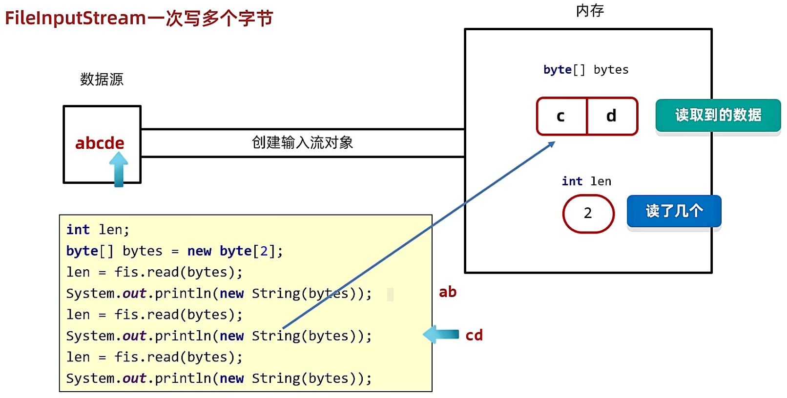

接着，第三次读取，这次读取就跟前面不一样了。

在读取的时候，它还是尽可能的会将数组装满，但是现在数据源中只剩下一个数据了，所以第三次它只能读到一个，将 `e` 读取并存储到数组中。

更重要的是原来的 `c` 被覆盖了，但是由于只读了一个数据，所以 `d` 没有覆盖，这个时候 `len` 为 `1`，因为第三次只读了一个数据。

接着就是将数组中的数据变成字符串并进行打印，打印出来的就是 `ed`。

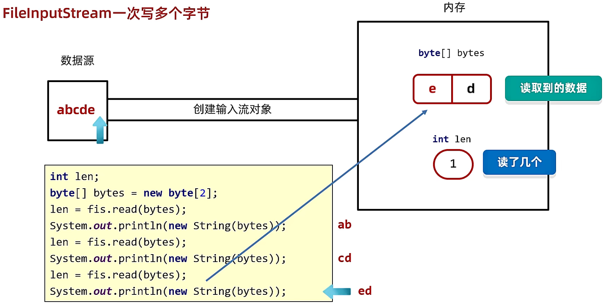

如果说，下面还读取到第四次，此时就读取不到数据了。

在Java中有一个规定，不管是原来空参的 `read()` 还是现在带有数组的方法，只要你读不到数据，方法就会返回 `-1`。

因此第四次读取的时候，`len` 的值就为 `-1` 了。

并且如果第四次还要打印数组里面的数据，还是原来的 `ed`。

----

## 三、解决办法

在 `String` 的构造方法中，除了能将 `byte数组` 变成字符串以外，它还可以将字节数组的一部分变成字符串。因此我们在变化的时候带上参数就行了。

~~~java
String str1 = new String(bytes,0,len1);//表示这个数组中，从0开始，将len个元素变成字符串
~~~

修改我们之前的代码

~~~java
//1.创建对象
FileInputStream fis = new FileInputStream("myio\\a.txt");
//2.读取数据
byte[] bytes = new byte[2];
//一次读取多个字节数据，具体读多少，跟数组的长度有关
//返回值：本次读取到了多少个字节数据
int len1 = fis.read(bytes);
System.out.println(len1);//2
String str1 = new String(bytes,0,len1);
System.out.println(str1);

int len2 = fis.read(bytes);
System.out.println(len2);//2
String str2 = new String(bytes,0,len2);
System.out.println(str2);

int len3 = fis.read(bytes);
System.out.println(len3);// 1
String str3 = new String(bytes,0,len3);
System.out.println(str3);// ed

//3.释放资源
fis.close();
~~~


---

# 84.文件拷贝改写

需求：把`D:\itheima\movie.mp4 (16.8 MB)` 拷贝到当前模块下。

下面这种方法速度是非常快的。

~~~java
//1.创建对象
FileInputStream fis = new FileInputStream("D:\\itheima\\movie.mp4");
FileOutputStream fos = new FileOutputStream("myio\\copy.mp4");
//2.拷贝
int len;
byte[] bytes = new byte[1024 * 1024 * 5];
while((len = fis.read(bytes)) != -1){
    fos.write(bytes,0,len); // 上面读多少，这里就写多少
}
//3.释放资源
fos.close();
fis.close();
~~~

双击已经拷贝好的MP4文件，此时IDEA会问你，这个MP4文件用什么方式打开呢？

默认是 `txt记事本`，但肯定是不能用记事本，我们就需要找打开方式，可以发现没有一个电影播放器。

此时就可以点击下面的 `Open matching files in associated application`，表示用操作系统中默认方式进行打开。

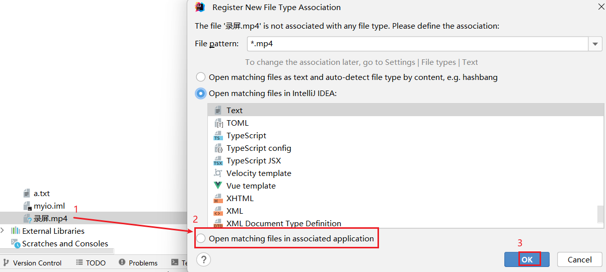


----

# 85.`IO流` 中不同JDK版本捕获异常的方式

## 一、引入

在之前我们书写 `IO流` 代码的时候，所有的异常都是采取抛出处理，但如果我们想用 `try-catch` 去捕获异常，该怎么写呢？

是将所有的代码放到 `try` 中吗？

不是的，如果我们这么去写，代码会有问题。

上面的这三行代码其实都是有可能会出异常的，当代码执行到第二行时 `fos.write()` 从本地文件中读取数据出异常了，一旦出异常 `try` 下面的代码就有可能执行不到了，直接跳转到对应的 `catch` 语句块中，这样就会导致一个问题：释放资源的代码有可能执行不到。

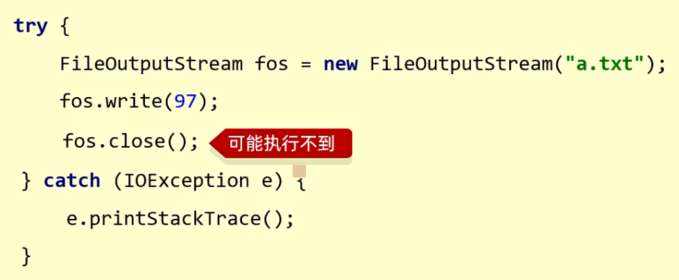

那怎么办呢？我想要的是释放资源的代码不管有没有出异常，一定要让它执行。

所以为了解决这个问题，我们来学习一下捕获异常的完整形态。

在 `try-catch` 的下面其实还有第三部分：`finally`。

----

## 二、finally

**特点：`finally` 里面的代码一定会被执行，除非虚拟机停止。**

### 1）`finally` 里面的代码一定会被执行

`try` 中不管你有没有遇到异常，当上面所有的代码执行完毕后，一定会执行 `finally` 里面的代码。

- 如果 `try` 中是没有异常的，那么先执行 `try` 里面所有的代码，再执行 `finally` 里面的代码。
- 但是如果 `try` 里面遇到了异常，那么会跳转到对应的 `catch` 中，当 `catch` 中所有的代码执行完毕后，再来执行 `finally` 里面的代码，`finally` 在最后一定会被执行到的。

因此我们就非常适合将 `释放资源` 这样的扫尾代码放到 `fiannly` 中。

----

### 2）除非虚拟机停止

例如在 `try` 中写了一个 `System.exit(0)`，或者其他原因导致虚拟机都停止了，那么 `finally` 里面的代码是执行不到的。

----

## 三、代码示例

异常一般都是采取抛出处理的，因为以后我们会学习 `Spring框架`，框架的底层会将我们抛出的异常统一处理。

因此这个知识点只需要将 `try-catch-finally` 这个结构能掌握就行了，下面的代码了解一下就行了。

选择可能出现异常的代码，<Kbd>ctrl + alt + T</kbd> ，选择 `try/catch/finally`，此时就会将所有的代码全部放在 `try` 中。

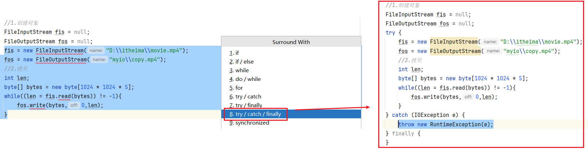

注意需要将创建对象的代码放到 `try` 外面去，否则局部变量只在所属的大括号中有效。

并且一定要赋值为 `null`，否则 `finally` 中的代码就会报错：`变量fis` 可能没有被初始化。

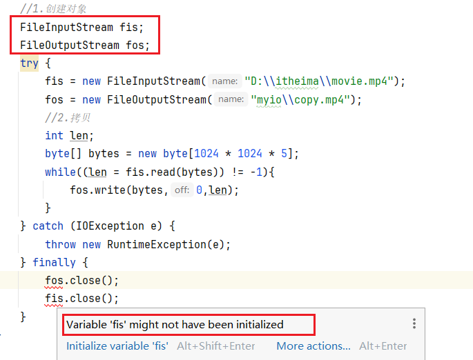

因此为了解决这个问题，在上面就应该给 `fis` 和 `fos` 初始化，但我们又不知道给它们赋值什么，因此直接赋值 `null` 即可。

写完后发现，`close()` 也是有异常的，因此在 `finally` 中还要对 `close()` 进行异常处理。

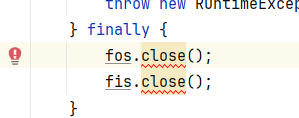

处理方案就是再嵌套一个 `try-catch`。

但此时代码还没完，在最上面我们将 `fis、fos` 都赋值为了 `null`，但假如在try的第一行就出现了异常：`fis = new FileInputStream("D:\\itheima\\b.mp4")`，此时就会报空指针异常，因为在 `itheima` 的目录下并没有 `b.mp4` 文件。

此时就会报空指针异常。

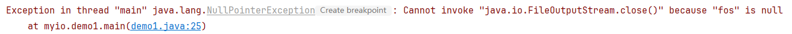

这是因为在创建对象的时候，程序跟文件之间的连接通道没有建立，那么 `fis` 中记录的值还是 `null`，那么在 `fis.close()` 的时候就会报空指针异常了！

因此在下面还需要对 `fis、fos` 进行非空判断。

~~~java
//1.创建对象
FileInputStream fis = null;
FileOutputStream fos = null;
try {
    fis = new FileInputStream("D:\\itheima\\movie.mp4");
    fos = new FileOutputStream("myio\\copy.mp4");
    //2.拷贝
    int len;
    byte[] bytes = new byte[1024 * 1024 * 5];
    while((len = fis.read(bytes)) != -1){
        fos.write(bytes,0,len);
    }
} catch (IOException e) {
    //e.printStackTrace();
} finally {
    //3.释放资源
    if(fos != null){
        try {
            fos.close();
        } catch (IOException e) {
            e.printStackTrace();
        }
    }
    if(fis != null){
        try {
            fis.close();
        } catch (IOException e) {
            e.printStackTrace();
        }
    }
}
~~~

写完代码后，肯定会觉得这个代码太麻烦了。那有没有简化的方案呢？必须有。

思考：代码麻烦的原因其实是在下面释放资源。

那如果释放资源的代码不需要我们自己写了，那就很简单了。

PS：简化方案也是了解性的内容。

----

## 四、简化方案

在JDK7的时候，Java推出了一个接口 `AutoCloseable`，它的作用看名字就能看出。

特点：凡是实现这个接口的，在特定的情况下都可以自动释放资源。

但是并不是所有的情况都是自动的！只有在特定情况下才能自动释放资源！

什么特定情况呢？此时我们就需要来看一下JDK7和JDK9的两种书写方式。

JDK7：在 `try` 的后面加一个小括号，小括号中就可以创建流的对象，如果有多个流，中间以分号隔开，最后一个流的后面是不需要加分号的。

但是不能将所有创建对象的代码都写在小括号中，只有实现了接口 `AutoCloseable` 的类才能在小括号中创建对象。

它表示：当整个 `try-catch` 执行完毕后，小括号中的流就会自动释放资源。

但是JDK7的这种写法，会让小括号中的代码难以阅读，阅读性非常的低。

因此在JDK9的时候，就可以将创建对象的代码放到外面去，在小括号中只需要写变量名就行了。

执行逻辑也是一样的，当整个 `try-catch` 全部执行完毕后，小括号中的流会自动释放资源。

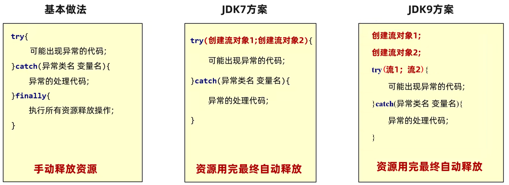

跟进 `FileInputStream`，发现它的父类是 `InputStream`

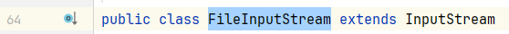

继续跟进 `InputStream`，可以发现 `InputStream` 实现了 `Closeable接口`

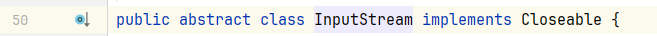

还没完，继续跟进 `Closeable接口`，可以发现 `Closeable` 继承了 `AutoCloaseable`

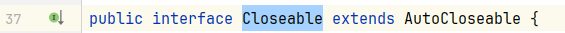

选中 `AutoCloseable` 跟进，可以发现它是一个接口，并且在JDK7的时候才出现的。

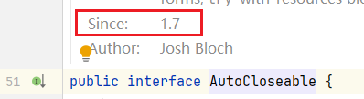

JDK7的写法

~~~java
//由于代码写在一行，非常的难以阅读，因此我们可以这行，一行写一个对象就行了
try (FileInputStream fis = new FileInputStream("D:\\itheima\\movie.mp4");
     FileOutputStream fos = new FileOutputStream("myio\\copy.mp4")) {
    //2.拷贝
    int len;
    byte[] bytes = new byte[1024 * 1024 * 5];
    while ((len = fis.read(bytes)) != -1) {
        fos.write(bytes, 0, len);
    }
} catch (IOException e) {
    e.printStackTrace();
}
~~~

JDK9的写法

如果外面还有异常，直接进行抛出即可


~~~java
public static void main(String[] args) throws FileNotFoundException {
    FileInputStream fis = new FileInputStream("D:\\itheima\\movie.mp4");
    FileOutputStream fos = new FileOutputStream("myio\\copy.mp4");

    try (fis;fos) {
        //2.拷贝
        int len;
        byte[] bytes = new byte[1024 * 1024 * 5];
        while ((len = fis.read(bytes)) != -1) {
            fos.write(bytes, 0, len);
        }
    } catch (IOException e) {
        e.printStackTrace();
    }
}
~~~


----

# 86.字符集详解（ASCII,GBK）

字节流读取中文会出现乱码（原始的数据跟读取出来的数据两者不一样）。

想要知道乱码的原因，就要用到本节学习的字符集。

但除了字符集以外，还会涉及到之前学习的 `计算机存储规则`。

----

## 一、前要知识

### 1）计算机存储规则

在计算机中，任意的数据都是以二进制的形式来存储的。

二进制就是由 0 和 1 这两个数字来组成的，它的计算规则是：逢二进一、借一当二。

其中一个 `0` 或者一个 `1` 我们会叫做一个 `bit`，中文叫做 `比特位`。

一切文件数据（文本、图片、视频等）在存储时，都是以二进制数字的形式保存，都一个一个的字节，那么传输时一样如此。所以，字节流可以传输任意文件数据。在操作流的时候，我们要时刻明确，无论使用什么样的流对象，底层传输的始终为二进制数据。

但是一个 `bit` 能存储的东西太少了，我们会把 `8个bit` 分为一组，这样就可以存储 `2的8次方`，一共 `256` 个数据，我们将它称之为一个 `字节`，而一个字节是我们计算机中最小的存储单元。


计算机在存储英文的时候，只要一个字节就行了，为什么呢？这就跟今天要学习的字符集相关了。

----

### 2）字符编码

计算机中储存的信息都是用二进制数表示的，而我们在屏幕上看到的数字、英文、标点符号、汉字等字符是二进制数转换之后的结果。按照某种规则，将字符存储到计算机中，称为**编码** 。

反之，将存储在计算机中的二进制数按照某种规则解析显示出来，称为**解码** 。

比如说，按照A规则存储，同样按照A规则解析，那么就能显示正确的文本符号。反之，按照A规则存储，再按照B规则解析，就会导致乱码现象。

编码：字符(能看懂的) --> 字节(看不懂的)

解码：字节(看不懂的) --> 字符(能看懂的)

**字符编码`Character Encoding`** : 就是一套自然语言的字符与二进制数之间的对应规则。

编码表:生活中文字和计算机中二进制的对应规则

----

### 3）字符集

**字符集 `Charset`**：也叫编码表。是一个系统支持的所有字符的集合，包括各国家文字、标点符号、图形符号、数字等。

计算机要准确的存储和识别各种字符集符号，需要进行字符编码，一套字符集必然至少有一套字符编码。常见字符集有ASCII字符集、GBK字符集、Unicode字符集等。

可见，当指定了**编码**，它所对应的**字符集**自然就指定了，所以**编码**才是我们最终要关心的。

* **ASCII字符集** ：
  * ASCII（American Standard Code for Information Interchange，美国信息交换标准代码）是基于拉丁字母的一套电脑编码系统，用于显示现代英语，主要包括控制字符（回车键、退格、换行键等）和可显示字符（英文大小写字符、阿拉伯数字和西文符号）。
  * 基本的ASCII字符集，使用7位（bits）表示一个字符，共128字符。ASCII的扩展字符集使用8位（bits）表示一个字符，共256字符，方便支持欧洲常用字符。
* **ISO-8859-1字符集**：
  * 拉丁码表，别名Latin-1，用于显示欧洲使用的语言，包括荷兰、丹麦、德语、意大利语、西班牙语等。
  * ISO-8859-1使用单字节编码，兼容ASCII编码。
* **GBxxx字符集**：
  * GB就是国标（国家标准）的意思，是为了显示中文而设计的一套字符集。
  * **GB2312**：简体中文码表。一个小于127的字符的意义与原来相同。但两个大于127的字符连在一起时，就表示一个汉字，这样大约可以组合了包含7000多个简体汉字，此外数学符号、罗马希腊的字母、日文的假名们都编进去了，连在ASCII里本来就有的数字、标点、字母都统统重新编了两个字节长的编码，这就是常说的"全角"字符，而原来在127号以下的那些就叫"半角"字符了。
  * **GBK**：最常用的中文码表。是在GB2312标准基础上的扩展规范，使用了双字节编码方案，共收录了21003个汉字，完全兼容GB2312标准，同时支持繁体汉字以及日韩汉字等。
  * **GB18030**：最新的中文码表。收录汉字70244个，采用多字节编码，每个字可以由1个、2个或4个字节组成。支持中国国内少数民族的文字，同时支持繁体汉字以及日韩汉字等。
* **Unicode字符集** ：
  * Unicode编码系统为表达任意语言的任意字符而设计，是业界的一种标准，也称为统一码、标准万国码。
  * 它最多使用4个字节的数字来表达每个字母、符号，或者文字。有三种编码方案，UTF-8、UTF-16和UTF-32。最为常用的UTF-8编码。
  * UTF-8编码，可以用来表示Unicode标准中任何字符，它是电子邮件、网页及其他存储或传送文字的应用中，优先采用的编码。互联网工程工作小组（IETF）要求所有互联网协议都必须支持UTF-8编码。所以，我们开发Web应用，也要使用UTF-8编码。它使用一至四个字节为每个字符编码，编码规则：
    1. 128个US-ASCII字符，只需一个字节编码。
    2. 拉丁文等字符，需要二个字节编码。 
    3. 大部分常用字（含中文），使用三个字节编码。
    4. 其他极少使用的Unicode辅助字符，使用四字节编码。


----

## 二、ASCII 字符集（英文）

ASCII 就是一个字符集，也叫做 `编码表`。在这张表中，它记录有 `128个数据`，这 `128个数据` 对欧洲国家来讲，已经够用了。

在ASCII中，对应的最大数字是 `127`，但是它是 `0 ~ 127`，因此一共是 `128个字符`，而一个字节最多可以表示 `256个` 数据，因此就可以得出结论：存储英文，一个字节就足以。

假设现在我们要存储小写的 `a`，查询 `ASCII` 后得到数字 `97`，二进制是 `110 0001`，问：我们难道是直接将这个二进制存储到计算机中吗？

答案：这个二进制还不能直接存，因为计算机中最小的存储单元是1个字节，但是刚刚的 `a` 的二进制只有 `7位`，不足一个字节，因此是不能直接存的。

此时计算机就会编码（将字符集中查询的数据按照一定的规则进行计算，变成真实的，实际能存在硬盘中的二进制数据）。

`ASCII` 编码规则非常简单：前面补0，补齐8位。

因此真实存储在计算机中的二进制是下面这样子的 `0110 0001`，它是以 `0` 作为开头的。

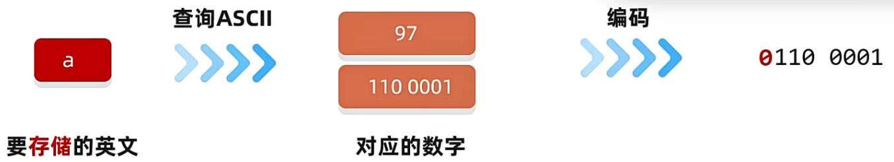

现在我们要将它从硬盘中读取出来，读到的其实还是这个二进制 `0110 0001`。

首先需要进行解码，解码跟编码就是相反的意思：将实际存储在硬盘中的二进制数据按照一定的规则进行计算，变成字符集中对应的数字。

由于在编码的时候，前面补 `0` 对数据没有什么实际的影响，所以在界面的时候直接转成十进制就行了，得到数字 `97`，查询ASCII后，得到小写 `a`。


以上就是英文字母在存储和读取的完整过程。

----

## 三、那如果是汉字呢？

ASCII里面只有欧洲国家常用的英文字母，是没有中文的，所以你觉得中文想要存储在计算机中，它需要什么呢？

是不是也需要一张类似于 `ASCII` 的表，让每一个汉字跟唯一的数字产生对应关系，如果没有这个对应关系，中文是存不了计算机的。

在 `1981年` 发布了 `GB 2312` ，它的全称为：中华人民共和国国家标准信息交换用汉字编码字符集。

这里的 `GB` 就是 `国家标准` 的意思，因为它是 `国标` 这两个汉字的拼音首字母。

后面的 `2312` 是一个版本，`80` 是发布时间，表示是 `80年代` 发布的。

因此这张表我们也称之为 `GB2312字符集`、`GB2312编码表`

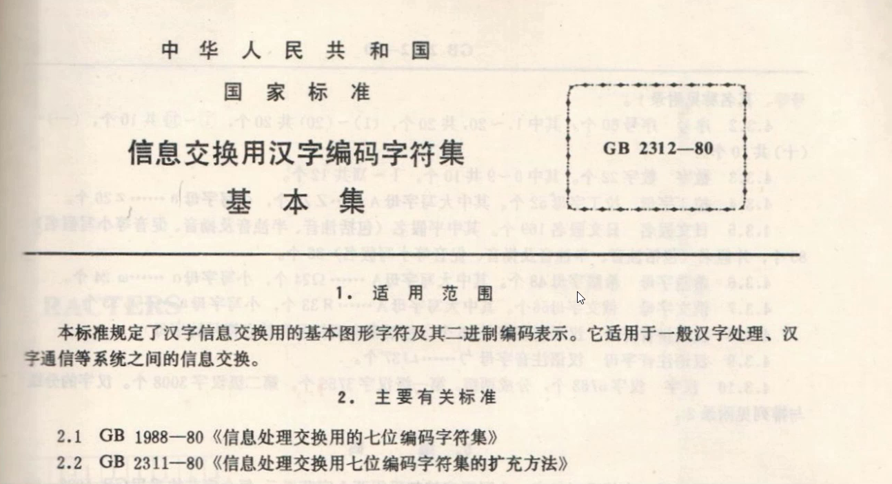

**1、GB2312编码：1981年5月1日发布的简体中文汉字编码国家标准。收录7445个图形字符，其中包括6763个简体汉字。**

过了几年，台湾地区也仿照大陆，自己推出了一个`BIG5码表`，在这个码表当中，它收录的都是一些繁体字，要注意的是，在 `GB2312`里只有简体中文，是没有繁体的。所以这就出现了一个国家，有两张码表。

**2、BIG5编码：也叫作 `大5码` 台湾地区繁体中文标准字符集，共收录13053个中文字，1984年实施。**

但是这可不行，一个国家怎么能有两张码表，都不统一。于是在2000年3月17日推出了一张`GBK码表`。

**3、GBK编码：2000年3月17日发布，收录21003个汉字，包含国家标准GB13000-1中的全部中日韩汉字，和BIG5编万码中的所有汉字。**

这里的 `GB` 还是 `国家标准` 的意思，这里的 `K` 是 `扩展` 拼音的首字母，也就表示 `GBK` 是在原有的 `2312` 的基础上进行的扩展，因此你看它起名字都是有讲究的。

**`GBK码表`也是目前windows操作系统默认使用的码表**。

但是在操作系统中显示的不是 `GBK`，而是 `ANSI`。因为 `Windows操作系统` 它有很多的版本，有 `简体中文版：默认使用GBK`、`繁体中文版：默认使用BIG5`、`韩文版：默认使用EUC-KR`、`日文版：默认使用Shift-JS` 等等，每个版本里面默认的字符集都是不一样的，因此微软没办法，需要兼顾所有，所以给这些字符集起了一个公共的名字：`ANSI`。


现在我们要知道，我们用的都是 `简体中文版的Windows系统`，`ANSI` 就表示 `GBK` 即可。

但是还是有点小不足，因为像一些非洲国家，或者是欧洲国家的文字在这张码表里面还是不包含的，因此在后来，有一个国际组织：美国国家标准协会，它提出了一个 `Unicode码表`，这张码表称之为：万国码，号称一万个国家的码表，这里的万只是一个虚词，它就表示在这个码表当中，包含了世界上大多数国家的文字。

**4、Unicode编码:国际标准字符集，它将世界各种语言的每个字符定义一个唯一的编码，以满足跨语言、跨平台的文本信息转换。**

正是因为有了这些包含中文的码表，中文才能够在计算机中起飞，而且以后会飞的越来越好，越来越高。

而这么多的字符集中，我们只需要研究其中的两个就行了：`GBK`、`Unicode`，因为 `GBK` 是 `简体中文Windows操作系统` 中默认使用的字符集，而 `Unicode` 是以后我们工作相关的。

----

## 四、GBK

学习一个字符集，其实只要知道英文和汉字是如何利用当前的字符集进行存储的就行了。

因此我们首先来看一看英文如何通过 `GBK` 进行存储的。

### 1）计算机的存储规则（英文）（GBK）

如果我们要存储小写的 `a`，首先会通过 `GBK` 查到对应的数字，这个数字也是 `97`，因为 `GBK` 是完全兼容 `ASCII字符集` 的，在GBK中，英文也是使用一个字节进行存储的，转成二进制就是 `110 0001`，同样的，这个二进制也不能直接存，计算机中最小的存储单元是一个字节，因此GBK也需要通过编码的方式将这个数字进行计算，变成真实的，实际能存储在硬盘中的二进制形式。

GBK英文编码的规则跟ASCII是一样的：前面补0，补齐8位。

规则：英文一个字节存储，兼容ASCII，二进制前面补0。


----

### 2）计算机的存储规则（汉字）（GBK）

#### ① 存储

假设我们现在要存储 `汉` 这个字，查询GBK后得到数字 `47802`，转成二进制是这么一长串 `10111010 10111010`，你会发现，太长了。

老外的英文字母是 `8`，但汉字是 `16`，即两个字节。

两个字节也是有原因的，一个字节最多只能记录 `256个` 汉字，太少了，因此国家在指定 `GBK字符集` 的时候它就规定了：一个汉字使用两个字节进行存储，两个字节 `16位`，如果全都能用上的话，能记录 `2的16次方 655535` 个汉字，这就够用了，不能再多了，如果再多用三个字节去存储，就有点浪费空间了。

**规则1：汉字两个字节存储。**

其中前面的第一个字节叫做 `高位字节`，后面的第二个字节叫做 `低位字节`。

针对于高位字节还有第二个规则。

**规则2：高位字节二进制一定以1开头，转成十进制之后是一个负数。**

**GBK汉字编码规则：二进制不需要任何变动，直接存储到硬盘中即可。**

如果你再将这个数字转成十进制的话，那么第一个字节转成十进制，一定是一个负数；第二个字节转成十进制可能为正，也可能为负。


那么为什么会有这个规定呢？其实这就是为了跟英文区分开。

GBK中英文是一个字节进行存储的，它是兼容ASCII字符集的，在编码的时候二进制前面要补0，因此英文的二进制前面一定是以0开头的。

而中文是两个字节，二进制一定是以1作为开头的，底层的二进制文件也是通过这个规则来区分中文和英文的。

假设以下为GBK编码之后的二进制，在下面这段中，有几个中文，几个英文呢？


抓住两个核心。

核心1：GK中，一个英文字母一个字节，二进制第一位是0。

核心2：GBK中，一个中文汉字两个字节，二进制第一位是1。

第一个字节，可以发现是以1作为开头的，因此这一定就是中文汉字，中文汉字在GBK中占两个字节，因此前两个字节表示一个汉字，通过解密查表，就可以发现它表示的是 `汉` 这个字。

再往下，读第三个字节，它是以0作为开头的，因此它是英文，英文在GBK中占一个字节，所以此时我们只需要读一个字节就行了，它就是小写 `a`。

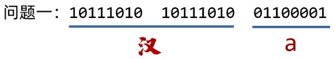

同样问题二、问题三也是一样的读法。

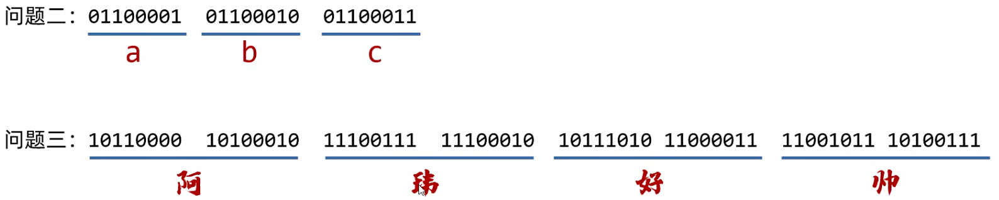

----

#### ② 读取

读取的时候读的肯定还是这个二进制，然后将这个二进制进行解码。

解密就是将实际存储在硬盘中的二进制数据按照一定的规则进行计算，变成字符集上对应的数字。

由于在上面编码的时候没有进行额外的操作，因此对数据没有什么实际的影响。

在解密的时候直接转成十进制就行了，再来查询GBK就是我们想要的汉字。

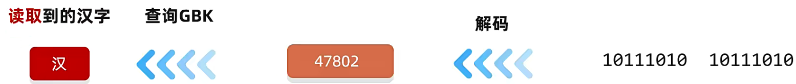


----

## 五、Unicode

### 1）引入

我国自己指定了 `GBK字符集`，其他国家也是一样的，每个国家几乎都会有自己的字符集。

如果不统一，自己玩自己的，是不利于软件的发展的。


如果不统一，你就用不了其他国家的软件，因此由美国联合世界各地主要的电脑制造商、软件开发商.......组成了一个联盟：统一码联盟（也叫Unicode组织），它们提出了 `Unicode字符集`，也叫作 `万国码`，号称一万个国家的码表，这里的万只是一个虚词，它就表示在这个码表当中，包含了世界上大多数国家的文字。

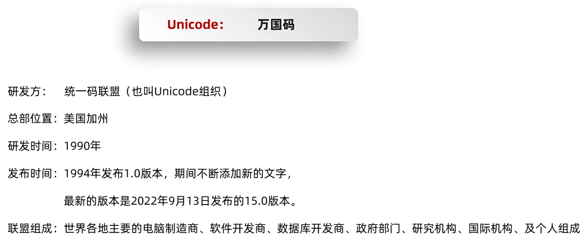

----

### 2）计算机的存储规则（英文）（Unicode）

小写的 `a` 通过 `Unicode` 查到的数字也是 `97`，因为 `Unicode` 也是完全兼容 `ASCII字符集` 的。

但是在编码的时候，`Unicode` 就复杂太多了，它有很多种的编码方案。

最先提出来的是 `UTF-16` 的编码规则：用2 ~ 4个字节保存。

UTF(`Unicode Transfer Format`)：Unicode转换格式化的一种方式，后面的 `16` 表示在这种编码方式中，最常用的就是转成 `16个比特位`。

后来又出现了第二种编码方案：`UTF-32` 编码规则，`UTF-32` 更加的粗暴，不管你是中文还是英文，统一用 `4个字节，32个比特位` 进行存储。

不用我说，你也能发现它们的不好。

`UTF-16` 对于 `abcd` 这样的英文字母不是很友好，明明一个字节就能搞定的事，为什么要用两个字节，太浪费空间了。

`UTF-32` 更夸张了，统一使用 `32个比特位` 进行保存，空间过于浪费。

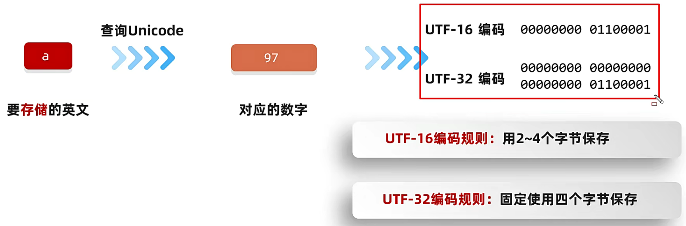

所以这是不好的行为，因此就出现了 `UTF-8` 的编码规则，它是针对 `Unicode字符集` 的一种可变长度字符编码，转成二进制后，它是用 `1 ~ 4` 个字节进行保存的，这种编码规则也是我们现在在实际开发中最为常见的，因此我们需要重点的去学习它。

- 如果是 `ASCII` 里面的英文字母，统一使用1个字节表示。

- 如果是 `拉丁文、希腊文、西里尔字母、亚美尼亚语、希伯来文、阿拉伯文、叙利亚文`，统一使用两个字节表示。

- 如果是 `中日韩文字、东南亚文字、中东文字` 统一使用三个字节表示。

- 如果是 `其他语言`，就使用 `4个字节` 表示。

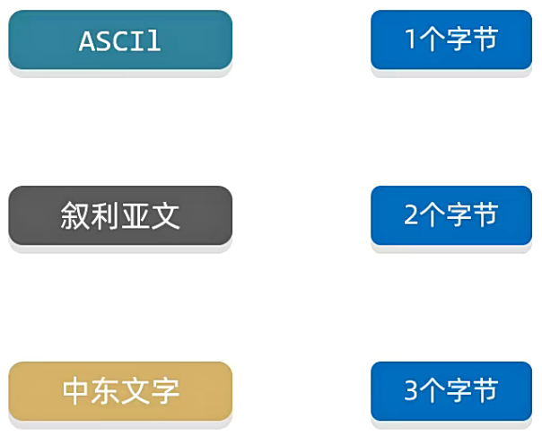

这么多的规则我们只需要知道两点就行了。


在编码的时候也是有规则的。

- 如果是 `1个字节`，前面直接补0即可

- 如果是 `3个字节`，左边的第一个字节左边要加 `1110`，中间的第二个字节前面要加 `10`，右边的第三个字节前面要加 `10`。

  剩下来的 `xxx` 就使用 `Unicode` 中查询到数字的二进制进行填补。

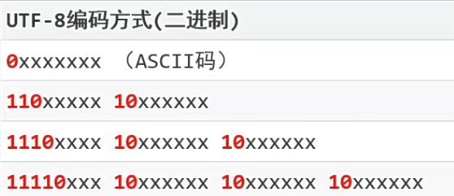

我们来举个例子，因为时间上所有的字符集实际上都是兼容 `ASCII` 的，所以小写的 `a` 在 `Unicode` 中查询到的数字也是 `97`。

转换成二进制是 `110 0001`，又因为 `UTF-8编码` 规定，`ASCII` 的英文是采取一个字节进行存储的，所以我们需要来看上面一个字节的转换方案，直接补0即可，后面的 `x` 就用 `97` 的二进制进行填补，最终的结果是 `0110 0001`。

---

### 3）计算机的存储规则（中文）（Unicode）

接下来看中文，假设要存储 `汉`，查询完 `Unicode` 后得到的数字：`27721`，转成二进制是这么一长串 `01101100 01001001`。

但是这个二进制不能直接存，需要进行 `UTF-8编码` ，由于中文是使用三个字节存储的，此时就需要来查看三个字节的编码规则。

左边的第一个字节左边要加 `1110`，中间的第二个字节前面要加 `10`，右边的第三个字节前面要加 `10`。剩下来的 `xxx` 就使用 `Unicode` 中查询到数字的二进制进行填补。

因此最终得到的结果是这样的一串二进制数据，红色的是 `UTF-8编码规定` 需要添加的，而黑色的就是用前面一串二进制进行填补得到的结果。

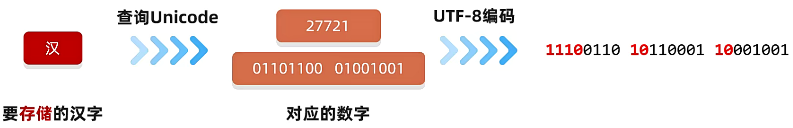

通过这些，需要记住一个结论：在 `UTF-8` 的编码规则下，英文一个字节；中文三个字节，而且中文第一个字节的首位一定是 `1`。

---

### 3）练习

1、`UTF-8` 是一个字符集吗？

`UTF-8` 不是字符集，它是 `Unicode字符集` 的一种编码方式

2、如下图

PS：以1开头的一定是中文，而中文在`UTF-8编码规则` 中，它是占三个字节的，因此我们需要一次获取三个字节才能得到一个中文。

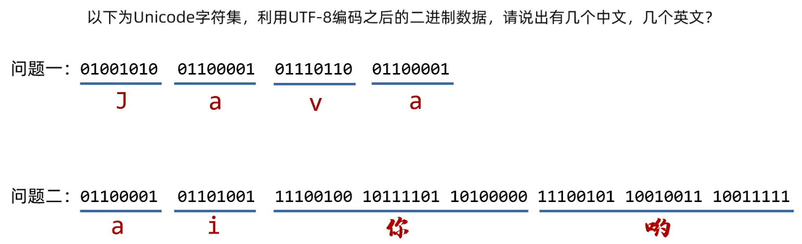

----

## 六、总结

1、在计算机中，任意数据都是以二进制的形式来存储的

2、计算机中最小的存储单元是一个字节

3、ASCII字符集中，一个英文占一个字节

4、简体中文版Windows，默认使用GBK字符集

5、GBK字符集完全兼容ASCII字符集

- 一个英文占一个字节，二进制第一位是0
- 一个中文占两个字节，二进制高位字节的第一位是1，第一个字节转成十进制是负数；第二个字节转成十进制可能为正，也可能为负。

6、`Unicode字符集` 的UTF-8编码格式

- 一个英文占一个字节，二进制第一位是0，转成十进制是正数
- 一个英文占三个字节，二进制第一位是1，第一个字节转成十进制是负数


----

# 88.为什么会有乱码？

乱码出现的原因主要有两个

原因1：读取数据时未读完 整个汉字

原因2：编码和解码时的方式不统一

## 一、原因1：读取数据时未读完 整个汉字

假设有这么一长串二进制数据进行的编码，按照我们刚刚所学：第一个字节和第二个字节开头是0，所以它表示英文字母；而第三个字节开头是1，表示中文，连续三个字节组成的整体才能表示一个英文汉字，后面同理。

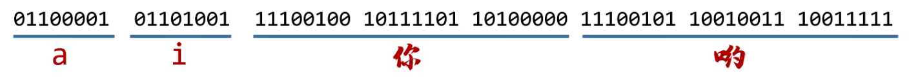

但假设我们现在用字节流去读取，字节流之所以叫做字节流，是因为它一次只能读一个字节。

此时读第一个字节，将二进制变成十进制的 `97`，查询 `码表` 得到 `小写a`，数据没有任何问题。

继续往下读取第二个字节，第二次读取的时候也会把读到的二进制解码变成十进制的 `105`，再查询码表得到小写的 `i`，也没有任何问题。

但是第三次就会有问题了，将读取到的二进制解码变成十进制的 `-28`，`-28` 在字符集中查不到对应的数据，所以系统就是显示 `???`，有的系统会显示 `□`，此时我们就说：出现了乱码。

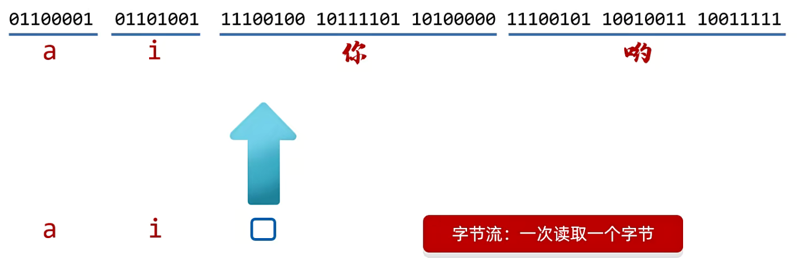

由于现在只读了 `1/3` 个中文，肯定不对，这三个字节组成的整体才表示一个汉字，因此乱码出现的第一个原因就是：读取数据时未读完 整个汉字。

---

## 二、原因2：编码和解码时的方式不统一

如下图按照 `Unicode码表` 中的 `UTF-8编码规则` 进行编码，然后进行存储


接下来讲这串二进制从硬盘中再读出来。

如果使用 `UTF-8` 进行解码，那么就需要在添加的时候额外数据给删掉，完整解码过程如下图。

此时编码跟解码的方式是一样的，不会造成乱码。

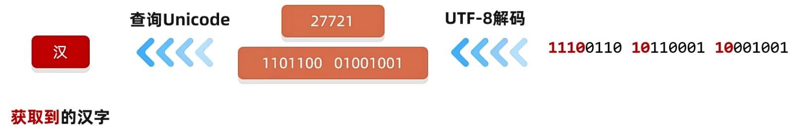

但是如果我们使用 `GBK` 的方式进行解码，`GBK` 中一个英文占一个字节，一个中文占两个字节，此时它开始读 `11100110 10110001 10001001`，读第一个字节的时候，开头是 `1`，它就知道读到了中文了，因此它一次性就会将前两个字节当做一个汉字，后面的第三个字节只能单独存在了。

按照 `GBK` 方式解码，得到的数据是 `59057` 和 `-19`。

查询 `GBK码表` 后，`59057` 是 `姹`，后面的 `-119` 没有匹配的，会显示 `?` 或者其他的符号，此时就出现了乱码。

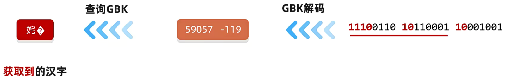

----

## 三、如何不产生乱码？

1、不要用字节流读取文本文件

2、编码解码时需要使用同一个码表，同一个编码方式。

---

## 四、扩展

疑问：字节流读取中文会乱码，但是为什么拷贝不会乱码呢？

字节流读取的时候是一个字节一个字节读取的，拷贝结束后，数据并没丢失。

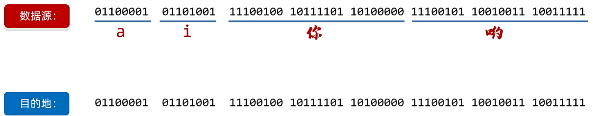

然后再使用记事本打开的时候，如果记事本所用的字符集和编码表跟数据源是一样的，那是不会出现源码的。


----

# 89.Java中编码和解码的代码实现

## 一、概述

在刚刚我们学字符集的编码方式经常会听到一句话：编码和解码，那这两个我能不能自己去看一下它的结果呢？

其实是可以的，在Java中有对应的方法让我们可以看见编码的结果和解码的结果。

现在我们使用的是 IDEA，IDEA默认的是 `Unicode` 中的UTF-8编码格式，因此 `getBytes()` 用的就是默认的 `UTF-8`。

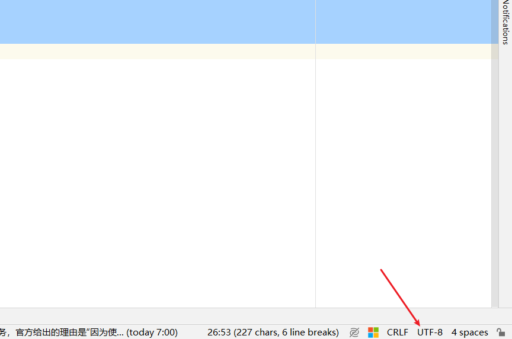

但是有的同学是使用 `eclipse` 编写代码，`eclipse` 默认的是 `GBK`。

解码使用的其实是 `String` 里面的构造方法。

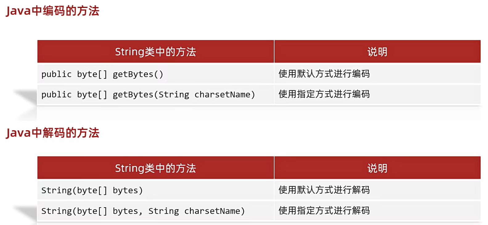

---

## 二、编码

编码：将我们要存储的数据变成真正存储在硬盘中的字节数据，因此返回值是一个 `字节数组`

~~~java
//1.编码
String str = "ai你哟"; 
byte[] bytes1 = str.getBytes();// 默认使用的是UTF-8，一个英文一个字节，一个中文三个字节，因此转换为字节后为8个字节
System.out.println(Arrays.toString(bytes1)); // [97, 105, -28, -67, -96, -27, -109, -97]，这个就是编码之后的字节数据，在存储的时候会把它们变成二进制存储在硬盘中。
~~~

但如果我们想指定编码方式，就可以使用第二个重载的 `getBytes()`

在指定的时候可以写小写也可以写大写，但是建议写成大写，因为GBK是多个英文单词首字母组合在一起的，用大写会更标准一些。

这个方法会有一个编译时异常，因为它要提醒你：这种方式在本地中有没有呢？例如不能写 `abc`，`abc` 肯定是没有的。

将异常抛出即可。

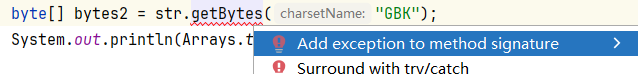

~~~java
byte[] bytes2 = str.getBytes("GBK");// 一个英文一个字节，一个中文两个字节，因此转换为字节后为6个字节
System.out.println(Arrays.toString(bytes2)); // [97, 105, -60, -29, -45, -76]
~~~

---

## 三、解码

解码跟编码是反过来的，我们可以将上面的字节数据变成我们想要查看的内容。

方法很简单，就是 `String` 的构造方法。

~~~java
String str2 = new String(bytes1);
System.out.println(str2); // ai你哟
~~~

但如果解码跟编码的方式不一样，就会出现乱码现象。

~~~java
String str3 = new String(bytes1,"GBK");
System.out.println(str3); // ai浣犲摕，可以发现前面的英文是没有问题的，但是中文就出现问题。
~~~


-----

# 90.字符流

## 一、引入

在之前我们已经分析了乱码出现的原因，主要有两个

原因1：读取数据时未读完 整个汉字

原因2：编码和解码时的方式不统一

接下来我们就需要来解决，那该怎么去解决呢？

第二个原因很好解决，既然编码和解码时的方式不统一，那我们就将它统一起来呗，在以后实际开发中，默认使用的就是 `UTF-8`。

因此我们真正要解决的其实是第一个问题。

如果世界上存在一种流，它默认的是跟字节流是一样的，也是一次读一个字节，但是当遇到中文时，一次就能读多个字节，这样就能解决我们现在遇到的难题了。

这就是我们今天要学习的字符流。

---

## 二、字符流

字符流的底层其实就是字节流，只不过在字节流的基础上又添加了**字符集**的概念。


特点

- 输入流：一次读一个字节，遇到中文时，一次读多个字节。

  如果是GBK，一次就读两个；如果是 `UTF-8`，一次就读取三个，因此一次读取几个是跟上面的字符集有关的。

- 输出流：底层会把数据按照指定的编码方式进行编码，变成字节再写到文件中

因此字符流非常适合操作一些纯文本文件，它的最大的特点就是：如果文件中有中文的话，不会出现乱码。

学习这些复杂的东西首先需要来看它的继承结构。

`IO流` 可以分为字节流和字符流，每种流又有输入和输出之分。

在之前我们已经学习完了左边的字节流，接下来就要结合字节流的学习经验去学习右边的字符流。

`Reader` 是字符的输入流，负责读取数据；

`Writer` 是字符的输出流，负责写出数据；

下面四个都是抽象类，我们不能直接创建它们的对象，得看它们的子类。


我们想要用字符流去读取本地文件中的数据，如果是你来设计子类的类名，你该怎么起名字呢？

如果是我来起名字，我会先将它的父类 `Reader` 拿出来，表示它本身是 `字符输入流`，是用来读取数据的。

又因为我们想要读取的是本地的纯文本文件，文件的英文是 `File`，两者一结合就为 `FileReader`。

就表示 `操作本地文件的字符输入流`。

你看这个名字起的多棒，第一个单词表示它的作用，第二个单词表示它的继承结构。

在以后我们还会学习其他的字符输入流，命名的规则都是一样的，第二个单词不变，变一下第一个单词就行了。


输出流其实也是一样的，在父类前加一个File，表示操作本地文件的字符输出流。

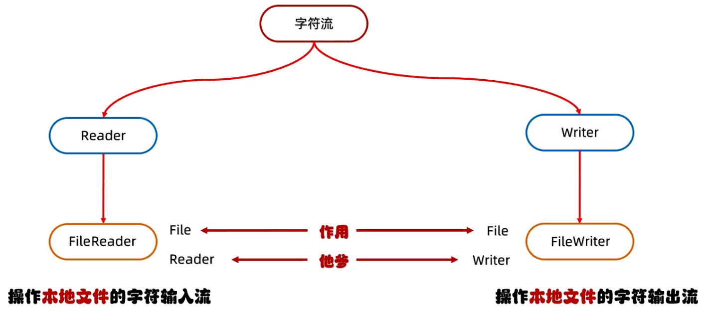

因此虽然 `IO流` 中的名字都很长，但是知道找到它其中的规律，就 `just-so-so` 了。

首先来学习读取数据的 `FileReader`，它是可以从纯文本中去读取数据。

----

## 三、FileReader

读取步骤跟以前一样，也是三步

1、创建字节输入流对象

2、读取数据

3、释放资源

----

### 1）创建字节输入流对象

在创建对象的时候，我们可以传递File对象表示的文件路径，也可以传递字符串所表示的路径。

如果你传递字符串所表示的路径的话，在底层它还是会帮你 `new` 成 `File对象`。

细节1：如果读取的文件不存在，就会直接报错。

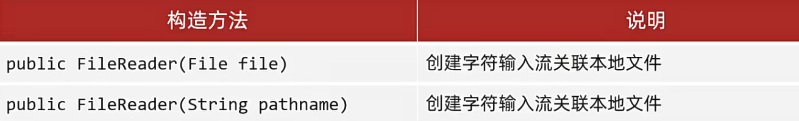

---

### 2）读取数据

可以一个一个读，也可以一次读多个放到数组中。

但是我们要注意的是，这个数组的类型已经变成 `char` 了。

细节1：字符流的底层其实也是字节流，因此上面空参的 `read()` 在底层默认是按照字节的方式进行读取的，一次读取一个字节。但是如果遇到中文，这个时候它才会一次读取多个字节，读取后进行解码，然后返回一个整数。如果读到文件末尾，就会返回 `-1`。

细节2：如果是有参的 `read()`，那就是一次读多个，并放到 `char类型` 的数组中。它有个int类型的返回值，也是表示当前读到了几个数据，如果读到文件末尾，它也是会返回 `-1`。

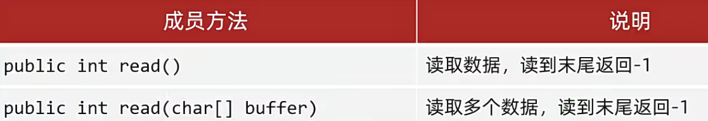

----

### 3）释放资源

这个释放资源也叫做 `关流`，方法还是 `close()`。

这个方法其实都不用记，因为几乎所有的 `IO流` 都要关流，并且方法都是 `close()`，因此我们只需要将极个别的 不需要关流的记一下就行了。

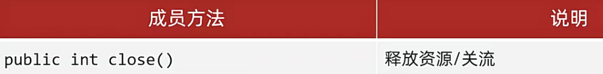

---

## 四、代码示例

~~~java
//1.创建对象并关联本地文件，读取myio模块下的a.txt文件
FileReader fr = new FileReader("myio\\a.txt");
~~~

首先来使用空参构造

字符流的底层也是字节流，默认也是一个字节一个字节的读取的。

如果遇到中文就会一次读取多个，GBK一次读两个字节，UTF-8一次读三个字节。

~~~java
int ch;
while((ch = fr.read()) != -1){
    System.out.print(ch); 
}
~~~

执行结果如下图，打印出来的是一串数字

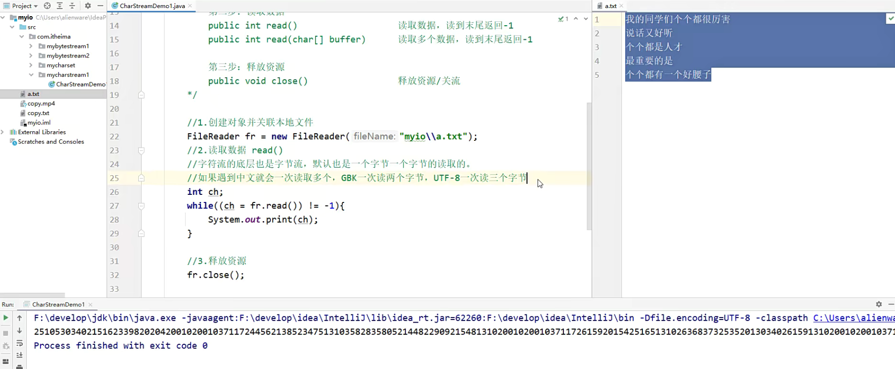

为什么呢？这就要讲到 `read()` 的细节。

`read()` 细节：

1、read():默认也是一个字节一个字节的读取的，如果遇到中文就会一次读取多个

2、在读取之后，方法的底层还会进行解码并转成十进制。最终把这个十进制作为返回值。

这个十进制的数据也表示在字符集上的数字

英文：文件里面是二进制数据 `0110 0001`，用read方法进行读取，解码并转成十进制97

中文：文件里面的二进制数据 `11100110 10110001 10001001`，一次读取三个字节，read方法进行读取，解码并转成十进制27721，因此读取完后，会把27721赋值给左边的 `ch变量`，因此打印出来的就是各种各样的十进制数据。

我想看到中文汉字，就是把这些十进制数据，再进行强转就可以了。

~~~java
int ch;
while((ch = fr.read()) != -1){
    System.out.print((char)ch);
}
//释放资源
fr.close();
~~~

程序执行完毕。可以发现就算数据中有换行符，也是可以正确读取到的。


----

# 91.有参 `read()` 详解

## 一、用法

~~~java
public int read(char[] buffer)      读取多个数据，读到末尾返回-1
~~~

参数是一个 `char类型的数组`，字节流是一个 `byte类型` 的数组。

~~~java
//1.创建对象，读取myio模块下的a.txt文件
FileReader fr = new FileReader("myio\\a.txt");
//2.读取数据
char[] chars = new char[2];
int len; // 表示当前读到了几个
//read(chars)：读取数据，解码，强转三步合并了，把强转之后的字符放到数组当中
//空参的read + 强转类型转换
while((len = fr.read(chars)) != -1){
    //把数组中的数据变成字符串再进行打印
    System.out.print(new String(chars, 0, len)); // 注意并不是将所有数据都变成字符串，因为在最后一次读取数据的时候，数组有可能装不满
}
//3.释放资源
fr.close();
~~~

在打印的时候由于 `print` 带了 `ln` ，但是为什么害后面还有一行？

在之前我们说过，每行结束有一个回车换行，在 `Windows` 中是 `\r\n`，第一次读取的时候是第一个 `害`，第二次读取的时候是 `\r`，`\r` 没有打印出来，所以在展示的时候只有一个害。

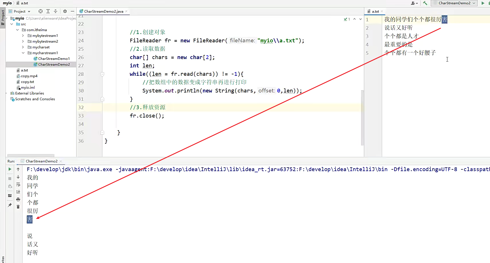

再往下读两个，是读到 `\n` 和 `说`，

由于 `\n` 的表现形式就是一个换行，因此在控制台里面就是先换行再打印输出

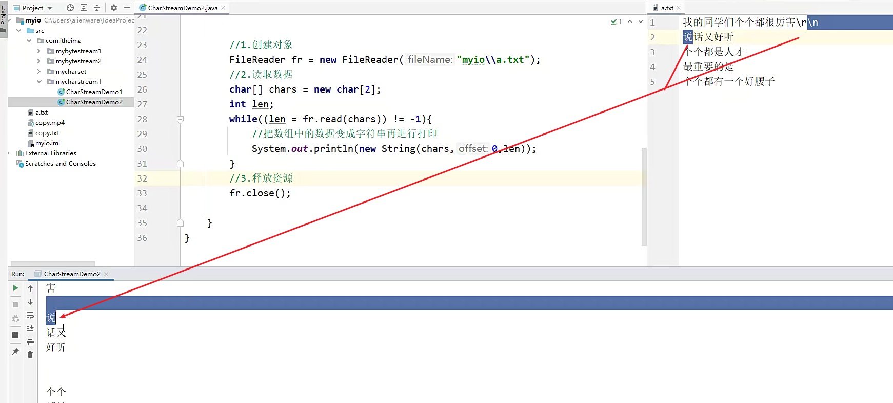

如果这样看的不舒服，可以将 `ln` 删掉，这样就会按照文本中原有的方式进行输出了。

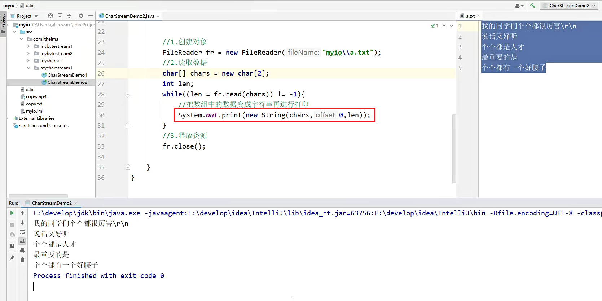

----

## 二、原理

```
read(chars)：读取数据，解码，强转三步合并了，把强转之后的字符放到数组当中
等价于空参的read + 强转类型转换
```


----

# 92.`字符流输出流`写出数据

接下来学习字符输出流（`FileWriter`）


首先来看看它的构造方法。

----

## 一、构造方法

它的构造方法可以把它分为两类进行学习。

我们先来看第一类，也就是第一个和第二个，它可以关联本地文件，本地文件可以以 `File` 的形式进行关联，也可以以字符串的形式进行关联，这两种方式是默认关闭续写的，也就是说，如果你创建对象后，文件会清空。

下面还有两个，它们有两个参数，第二个参数是 `append`，即续写开关。

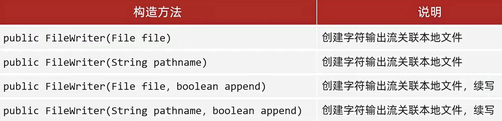

---

## 二、成员方法

`FileWriter` 有五个写出的方式。

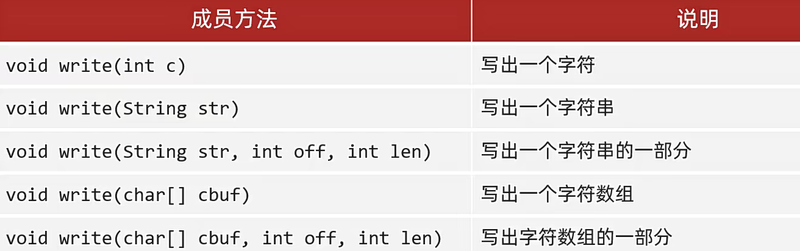

----

## 三、细节

### 1）创建字节输出流对象

细节1：参数是`字符串表示的路径` 或者 `File对象`都是可以的

因为在底层如果你传递的是字符串表示的路径，它会帮你去 `new` 一个 `File对象`

细节2：如果文件不存在会创建一个新的文件，但是要保证父级路径是存在的

细节3：如果文件已存在，则会清空文件，若干不想清空可以打开续写开关

-----

### 2）写数据

细节：如果 `write方法` 的参数是整数，但是实际上写到本地文件中的是整数在字符集上对应的字符

---

### 3）释放资源

细节：每次使用完流之后都要释放资源

----

## 四、代码实现

### 1）一次写一个字符

字节流之所以叫做字节流，是因为它每次只能操作一个字节。

如果我们在利用字节输出流写出数据的时候，括号里面的数据是在一个字节范围以内是没有问题的。

但如果写出的数据已经超出了一个字节，那么就不能用字节流往外写了。

~~~java
FileOutputStream fos = new FileOutputStream("myio\\a.txt");
fos.write(25105); // 此时写到文件中是乱码
~~~

但如果创建的是字符输出流呢？它还会有问题吗？

此时它就不会了，此时它会根据字符集的编码方式进行编码，把编码之后的数据写到文件中。

在IDEA中默认的是 `UTF-8` 编码方式，在`UTF-8` 中一个中文是三个字节，所以它就会将 `25105` 进行编码，编码成三个字节数据，再写到本地文件。

~~~java
FileWriter fw = new FileWriter("myio\\a.txt");
fw.write(25105);
fw.close();
~~~

我们可以查看此时 `a.txt` 的文件大小，可以发现是三个字节。

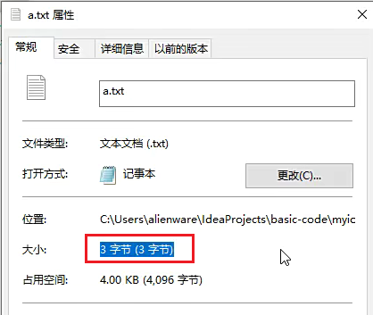

----

### 2）一次写入一句话

接下来看第二个方法，这个方法也是我们后面用的最多最多的。

我们要往文件里面写数据，不可能一个字一个字的写吧，更多的时候是每次要写一句话，而这一句话最好是用字符串的形式来进行表示。

~~~java
FileWriter fw = new FileWriter("myio\\a.txt");
//此时方法的底层也会根据当前的码表和编码方式进行编码，再把对应的字节数据写到本地中。
//例如'你'就编码出了三个字节，后面的？是中文状态下的，因此也是一个符号一个字节。但如果是英文的?，那么就是一个字节了
fw.write("你好威啊???");
fw.close();
~~~

`你好威啊???` 写到本地文件中应该是 `15个字节`

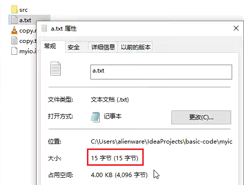

----

### 3）写出一个字符数组

接下来演示 `写出一个字符数组`

~~~java
FileWriter fw = new FileWriter("myio\\a.txt");
//在写的时候它还是会根据当前的码表和编码方式进行编码，再把对应的字节数据写到本地中。
char[] chars = {'a','b','c','我'};
fw.write(chars);
fw.close();
~~~

运行结果


----

### 4）续写

但如果我们每次写的时候不想清空，在创建对象的时候就可以打开 `续写开关`。

~~~java
FileWriter fw = new FileWriter("myio\\a.txt",true);
~~~


----

# 93.`字符输入流` 的底层原理超详解

## 一、画图分析

这个东西会有一点点小难，并且以后用到的记录也很小，那为什么还要学呢？

其实就是因为想给大家开阔一下眼界，让你知道的更多，在写代码的时候考虑的事情更加的全面。

首先来看读取数据的底层原理，在读取数据的时候，肯定要有一个数据源，假设数据源的编码规则是 `UTF-8`，现在我们要利用字符输入流把数据读取到内存中，当我们创建了 `FileReader对象` 的时候，就好比是内存跟文件之间有了一个连接的通道，但是与此同时在创建 `FileReader对象` 的时候，在底层还创建了一个长度为 `8192` 的字节数组，这个字节数组我们也称之为 `缓冲区`。

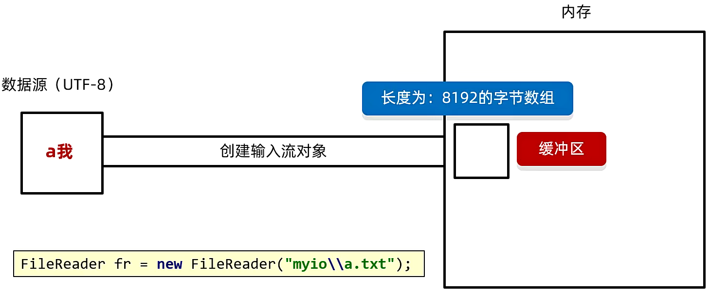

接下来我们会读下面的代码。

首先定义了一个 `int类型的变量` `ch`，在内存中，这个变量就出现了，但是此时这个变量里面是没有赋值的，接下来利用空参的 `read方法` 第一次读取。

每次在读取的时候，它会去判断缓冲区中，是否有数据可以被读取。

由于现在是第一次读，第一次里面肯定是空的，没有任何数据。

如果没有，就会从文件中读取数据，装到缓冲区中，尽可能装满缓冲区。

因此此时它就会从文件中获取 `8192个字节` 放到缓冲区中，但是现在文件中没有那么多数据，只有 `a我`（一共四个字节），因此现在它就会将这四个字节放到缓冲区中。

接着每次读取的时候就会从缓冲区中读取数据，这样它的效率会更高，减少了频繁到硬盘中读取数据的过程，因此缓冲区就是为了提高效率的。

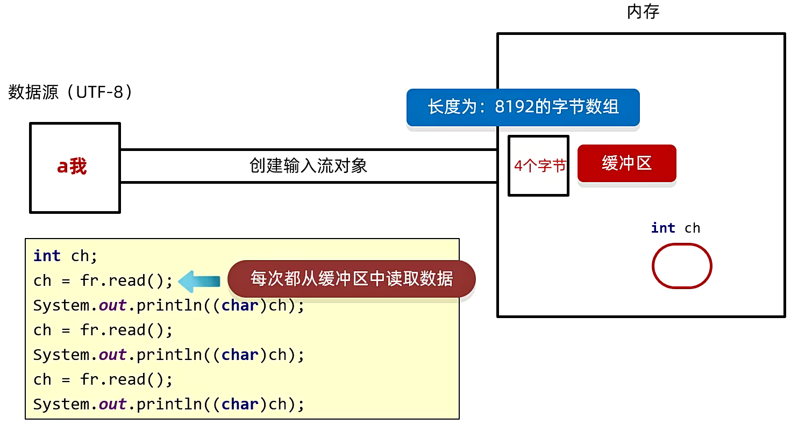

那么现在，第一次从缓冲区中读，读的是第一个字节，它将第一个字节按照 `UTF-8` 的形式进行解码，并转成十进制，再赋值给变量 `ch`，因此 `ch` 中记录的就是 `97`。

然后再将 `ch` 强制转成字符再进行打印，因此打印出来的就是小写 `a`。

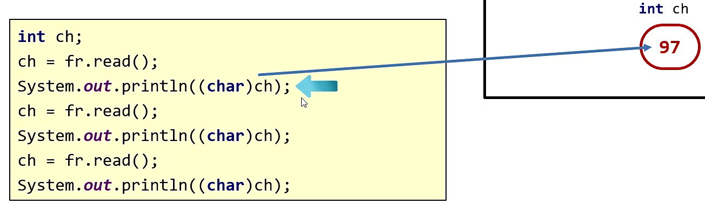

继续往下，第二次 `read()`，字符流在读取的时候，首先它都会去判断缓冲区中是否有数据可以被读取。

如果没有，就会从文件中读取数据，装到缓冲区中，尽可能装满缓冲区。

但是如果有数据，它就不会找文件了，而是直接从缓冲区中读取数据。

在第二次读取的时候它发现，这里的第二个字节是中文的，所以一次性会读取三个字节，并按照 `UTF-8` 的形式进行解码，转成十进制 `25105` 再赋值给变量 `ch`。

此时在代码中将 `ch` 强转为 `字符`，再进行打印，因此第二次打印的就是汉字 `我`。

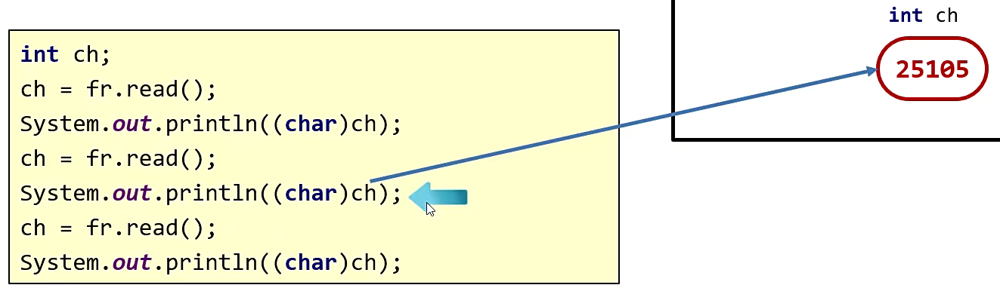

继续往下第三次读取，首先它还是会先判断缓冲区中是否有数据可以被读取。

如果没有，就会从文件中读取数据，尽可能装满缓冲区。

但是文件里面也没有剩余的数据了，此时就返回 `-1`，再将 `-1` 赋值给 `ch`。

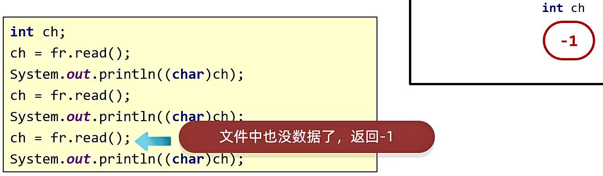

这个就是 `read方法` 完整的底层原理。

----

## 二、总结

① 当我们在创建字符输入流对象的时候，在底层它会关联文件，而且会创建一个缓冲区，所谓缓冲区就是一个 `长度为8192的字节数组`。

但是创建字节输入流（`FileInputStream`）它底层是没有缓冲区的。

② 读取数据的底层会比较麻烦

1、判断缓冲区中是否有数据可以被读取

2、如果缓冲区没有，就会从文件中读取数据，装到缓冲区中，尽可能装满缓冲区。

- 但如果文件中也没有剩余的数据了，此时返回 `-1`，表示读到了文件的末尾。

3、但是如果缓冲区有数据，它就不会找文件了，而是直接从缓冲区中读取数据。

- 空参的 `read方法`：一次读取一个字节，遇到中文一次读多个字节，把字节解码并转成十进制进行返回

  而这里十进制的数字就是英文/汉字在字符集中所对应的数字。

  因此如果你不想看到这些数字，而是真实的英文字母/汉字，还需要手动强转。

- 有参的 `read方法`：在刚开始的时候，有参的 `read方法` 也会去看缓冲区，但是它在读取的时候，将 `读取字节，解码，强转` 三步进行合并了，它会将强转后的字符放到数组中。

因此这两个 `read方法` 还是有区别的，有参的 `read方法` 多了一个强转；而空参 `read方法` 返回的是解码后的十进制数据，如果想看到那个字符，还需要我们自己手动进行强转。

----

## 三、验证结论

准备代码：关联 `myio模块` 下的 `a.txt`，然后读取四次，最后释放资源。

~~~java
FileReader fr = new FileReader("myio\\a.txt");
int b1 = fr.read();
System.out.println(b1);

int b2 = fr.read();
System.out.println(b2);

int b3 = fr.read();
System.out.println(b3);
System.out.println((char) b3);

int b4 = fr.read();
System.out.println(b4);

fr.close();
~~~

接下来我们要来验证，① 创建对象的时候它底层到底有没有那个缓冲区；② 第一次读取的时候它会不会把文件里面的数据撞到缓冲区中。

下面用 `debug` 的方式带你一步一步去查看，先打断点，然后右键 `debug`

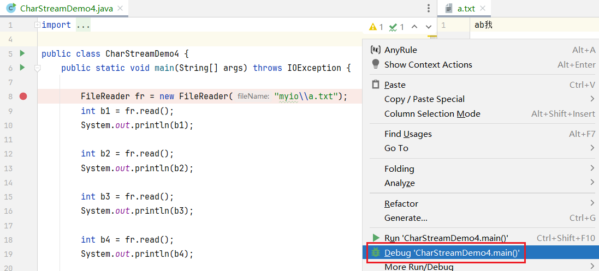

此时第8行代码变成深蓝色了，表示这一行代码现在还没有执行，但准备要执行。

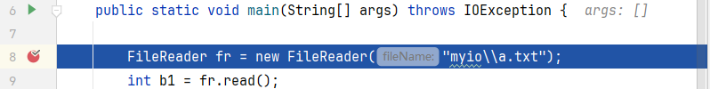

此时点击 `下一步`，这就表示创建对象的这行代码已经执行完毕。

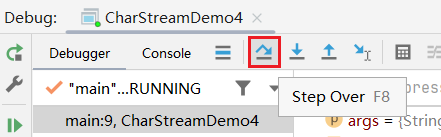

在 `fr` 里面它会有很多的数据，我们要一个一个打开，找找这里的 `bb`，这个 `bb` 就是我们刚刚所说的 `缓冲区`。

可以发现它是 `byte字节类型` 的，长度为 `8192`，因此我们就知道了，`FileReader` 底层的缓冲区其实就是一个 `长度为8192的字节数组`。

刚开始创建出来的时候，数组里什么都没有，都是 `0`。

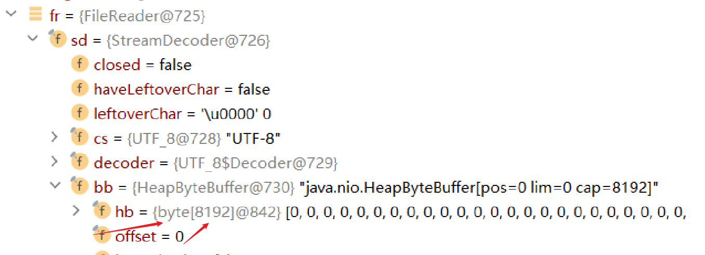

接下来执行 `read方法`，第一次读取的时候，它会把文件里的字节装到缓冲区中，而且是尽可能将缓冲区装满。

现在在文件中只有 `ab我`，`a` 一个字节，`b` 一个字节，`我` 三个字节，因为IDEA默认是 `UTF-8`。

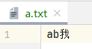

所以它总共只有五个字节，不够 `8192`，因此它就会将这五个字节全部装到缓冲区中。

可以发现前面的 `97、98` 就是 `a跟b`，下面的 `-26/-120/-111` 这三个字节其实就是 `我`。

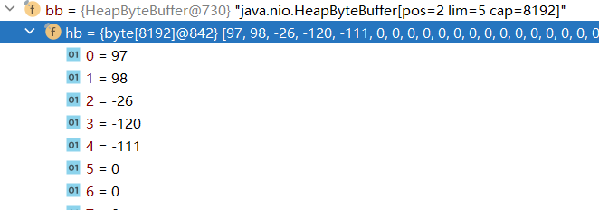

此时我们就知道了，在第一次读取的时候，它会把文件里的数据放到缓冲区中，而且会尽可能将缓冲区装满。

但是如果文件里的数据比较少，此时就是有多少装多少。

接下来就会从缓冲区中读取数据，第一次读取到的就是 `97`。

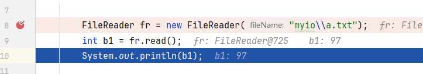

在继续往下，第二次读的时候 `98`。

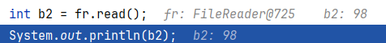

第三次在读取的时候，读到了 `-26`，此时就知道了，当前是一个中文，中文在 `UTF-8` 中是占三个字节的，因此第三次会把 `-86/-120/-111` 三个字节一起读取并进行解码，再转成十进制，转完后就是 `25105`，再赋值给 `b3`。

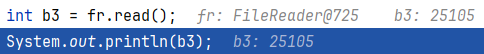

而 `25105` 就是 `我` 这个汉字在 `Unicode` 中所对应的数字，如果不想看到这个数字，就需要进行手动强转。

此时控制台中就打印出了 `我`

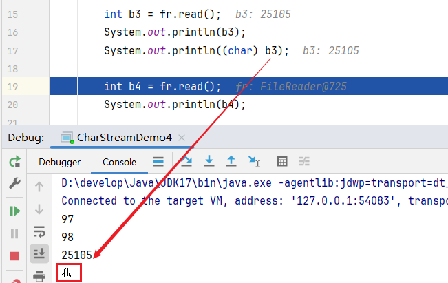

继续往下，第四次读取的时候，缓冲区里面其实已经没有数据再让你去读了，此时它会再次到文件中看文件里是否还有剩余的数据。

如果文件里面也没有了，此时方法会返回 `-1`，此时 `b4` 就是 `-1`，表示文件已经读完。

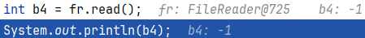

最后就是 `close()` 关流，整个资源就释放掉了。

-----

## 四、扩展1

如果文件中数据比较多的时候，它是怎么读取的呢？

准备了 `b.txt` ，它的大小为 `8193`，里面写了 `8192个a` 和 `1个b` 刚好多出一个字节

~~~java
FileReader fr = new FileReader("myio\\b.txt");
fr.read();//会把文件中的数据放到缓冲区当中

//清空文件
FileWriter fw = new FileWriter("myio\\b.txt");

//在循环里面读8192次
for (int i = 0; i < 8192; i++) {
    fr.read();
}

//在循环外面再去读第8193次
fr.read();

fr.close();
~~~

打断点，第一次读取的时候会将文件中的数据读取到缓冲区，尽可能装满缓冲区，可以发现数组的最后一个装的还是 `97`。

因此在缓存区中已经将文件里面前面 `8197个a` 全都放进去了。

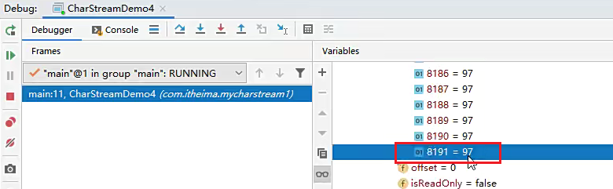

前面的读取都是先从缓冲区中读取，直到缓冲区中的数据全部读取完，它才会到缓冲区中拿。

如果要验证它是怎么从缓冲区中拿的，此时我们可以将可以将断点打在 `16行` 的前面。

读取完后，发现它将 `b` 读取到了，并放到了缓冲区中。

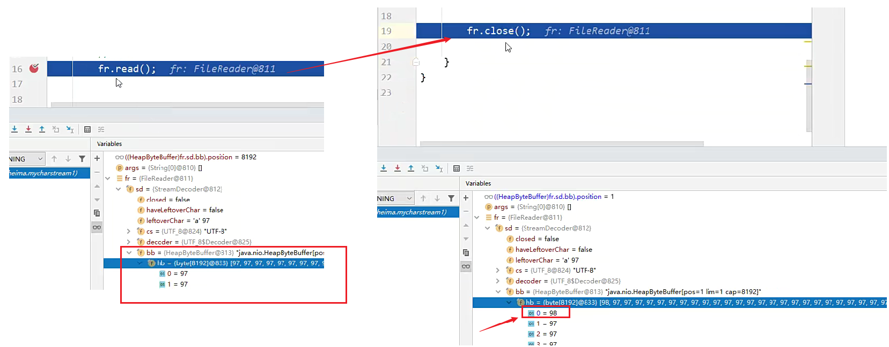

---

## 五、扩展2

```java
FileReader fr = new FileReader("myio\\b.txt");
fr.read();//会把文件中的数据放到缓冲区当中

//清空文件
FileWriter fw = new FileWriter("myio\\b.txt"); // 但是它只能清空文件，不能清空缓冲区

//请问，如果我再次使用fr进行读取，会读取到数据吗？

//此时循环读取的时候，会把缓冲区中的数据全部读取完毕，读完了才会去文件中看
//正确答案：
//会打印，但是只能读取缓冲区中的数据，文件中剩余的数据无法再次读取
int ch;
while((ch = fr.read()) != -1){
    System.out.println((char)ch);
}

fw.close();
fr.close();
```


----

# 94.`字符输出流` 的底层原理超详解

## 一、画图分析

其实也不难，就是多了一个缓冲区而已。

在输出的时候首先要有一个目的地，假设编码规则还是 `UTF-8`，现在我要利用字符输出流，将数据写到文件中。

当我们创建字符输出流（`FileWriter`）对象的时候，那就好比内存跟文件之间有了这么一个连接通道。

与此同时在创建 `FileWriter对象` 的时候，也创建了一个长度为 `8192的字节数组`，其实就是我们刚刚所说的缓冲区。

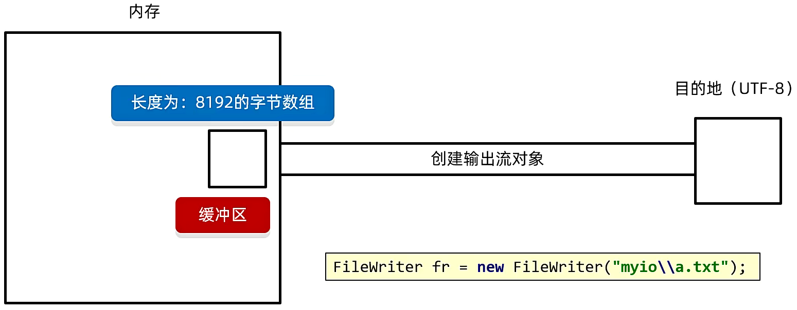

接下来会用下面的代码去写出数据。

在写出的时候它会把所有的数据按照 `UTF-8` 进行编码，一个中文变成三个字节，一个英文变成一个字节。

在写的时候跟字节流是不一样的，字节流没有缓冲区，它是直接写到文件的目的地的。

但是字符流是有缓冲区的，它是先写到缓冲区中。

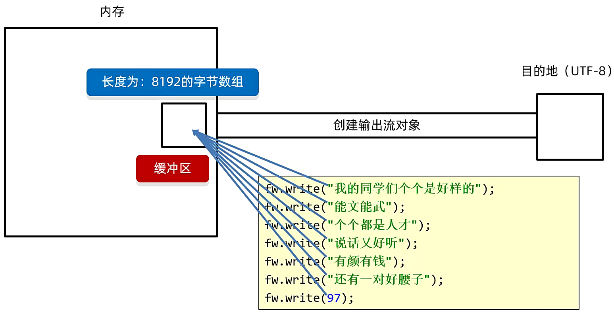

那数据什么时候才能真正的保存到目的地呢？有三种情况。

情况1：缓冲区装满了，它会自动保存到目的地，不需要我们进行任何的操作。

情况2：手动刷新。不管现在缓冲区中有多少数据，想让你直接保存到本地，这就叫做刷新操作，在代码中可以通过 `flush()` 进行完成。

情况3：释放资源/关流的时候，它也会把缓冲区中的数据保存到本地。

但是 `flush()` 跟 `close()` 是有区别的。

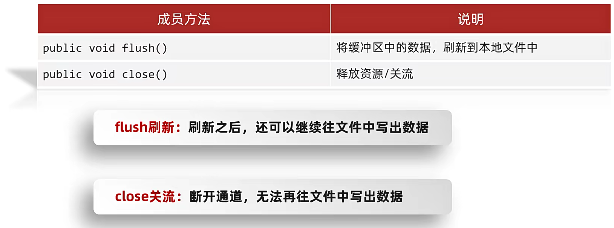

-----

## 二、验证结论

下面是基础代码。其中 `a.txt` 是空白文件。

~~~java
FileWriter fw = new FileWriter("myio\\a.txt");

fw.write("我的同学各个都很厉害");
fw.write("说话声音很好听");
fw.write("都是人才");
fw.write("超爱这里哟");

fw.close();
~~~

打个断点右键调试一下

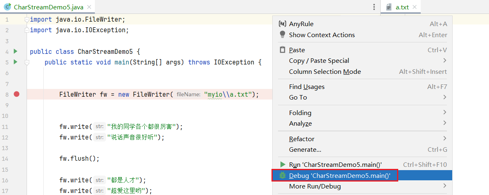

下一步，找到 `fw` 中，找里面的 `bb` 双击打开，可以发现，是一个 `byte类型` 长度为 `8192` 的字节数组，这个就是缓冲区。

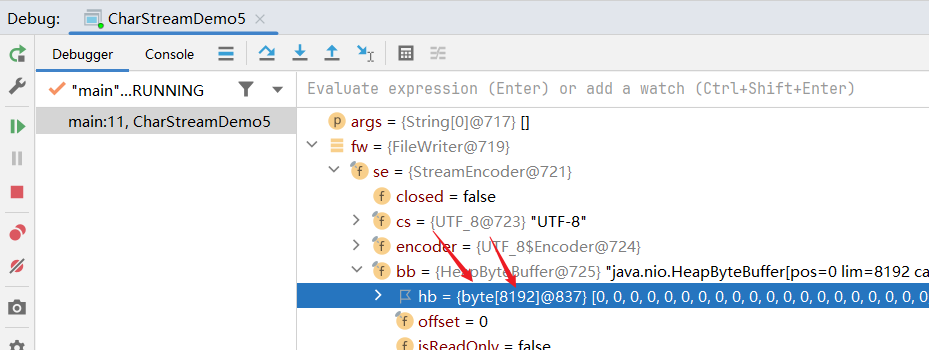

接下来我们不断写出数据的时候，其实就是将这些数据首先按照 `UTF-8` 进行编码，编码成字节，然后再把这些字节放到缓冲区中。

----

### 情况1：缓冲区装满了，它会自动保存到目的地，不需要我们进行任何的操作

~~~java
FileWriter fw = new FileWriter("myio\\a.txt");

for (int i = 0; i < 8192; i++) {
    fw.write(97);
}

//fw.close();
~~~

运行完成后，可以发现文件里还是没有数据

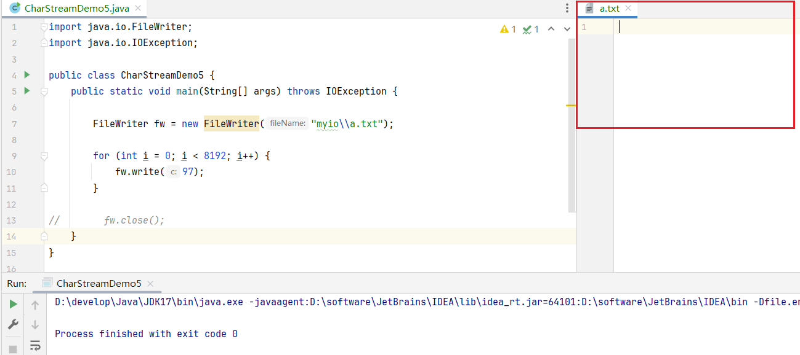

此时我们可以使用 `debug` 来运行一下。

但是如果把断点打在这，下面的循环就需要运行很多很多遍，太麻烦了。


此时我们可以在代码下面再去写一条输出语句，然后再将断电打在输出语句的前面，这样我们 `debug` 后，上面循环里的代码一下就执行完了。

接下来找里面的缓冲区，可以发现里面装满了 `97`。

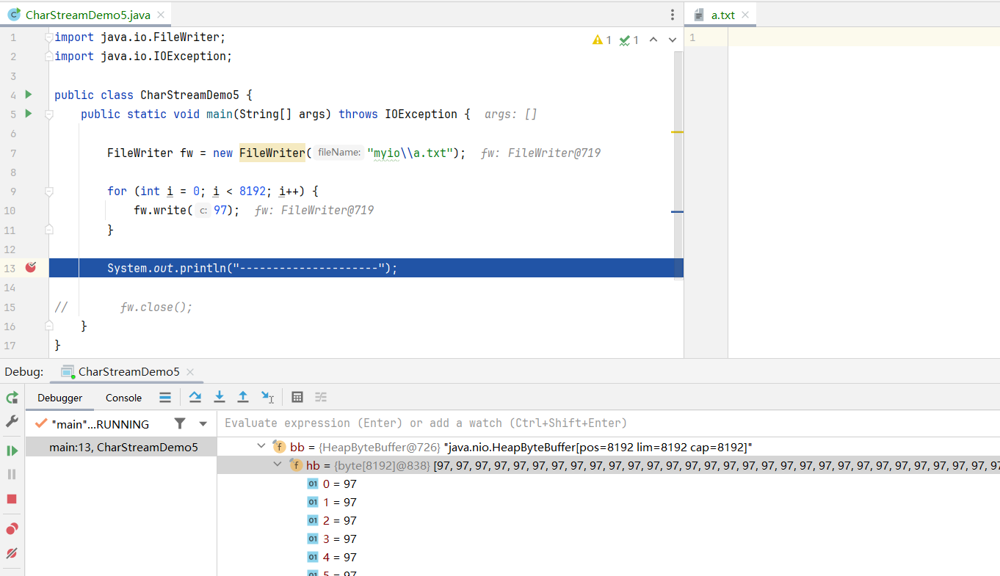

但如果现在将循环的次数改成 `8193`，在第 `8193次` 的时候，缓冲区放不下了，此时缓冲区里面的数据就会自动保存到文件中。

~~~java
for (int i = 0; i < 8193; i++) {
    fw.write(97);
}
~~~

可以发现文件里面已经有数据的。

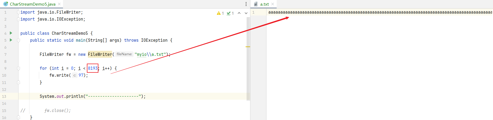

我们可以来看一下文件中有多少个数据，可以发现，就是 `8192个字节`。

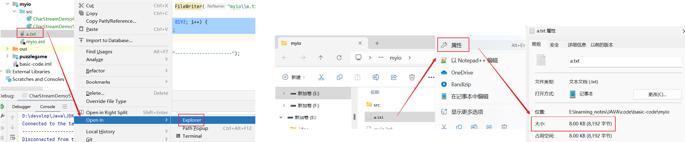

----

### 情况2：手动刷新

不管现在缓冲区中有多少数据，想让你直接保存到本地，这就叫做刷新操作，在代码中可以通过 `flush()` 进行完成。

~~~java
FileWriter fw = new FileWriter("myio\\a.txt");

fw.write("我的同学各个都很厉害");
fw.write("说话声音很好听");

fw.flush();

fw.write("都是人才");
fw.write("超爱这里哟");
fw.write("B站");

// fw.close();
~~~

执行完成后，可以看见上面的数据已经刷新到本地了，但下面的数据还在缓冲区。

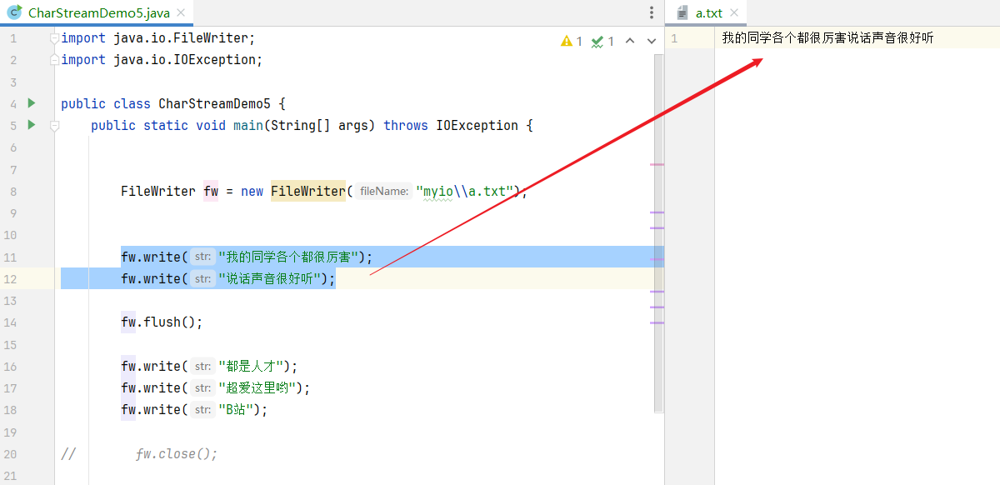

----

### 情况3：释放资源/关流的时候，它也会把缓冲区中的数据保存到本地

在 `fw.close()` 断流前，它首先会去检查一下缓冲区中有没有数据，如果有，它会把所有剩余的数据都刷新到本地。

~~~java
FileWriter fw = new FileWriter("myio\\a.txt");

fw.write("我的同学各个都很厉害");
fw.write("说话声音很好听");

fw.flush();

fw.write("都是人才");
fw.write("超爱这里哟");
fw.write("B站");

fw.close();
~~~

程序执行完毕，可以发现数据都加载到了本地。

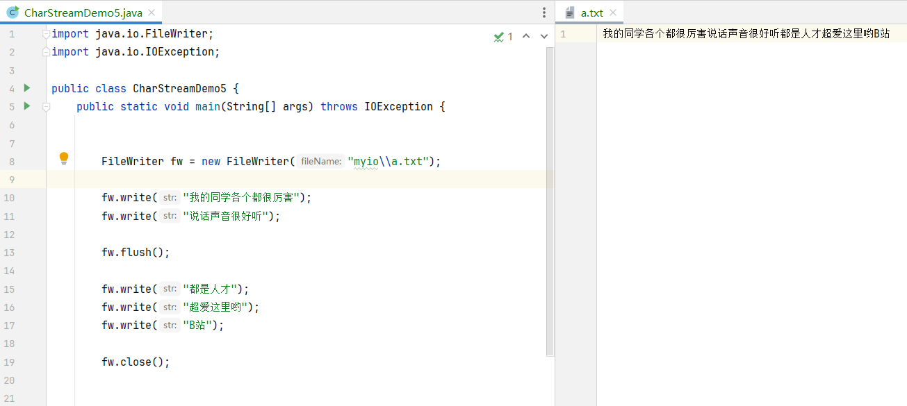

由此也可以看见，如果调了 `flush()`，后面还可以继续写数据；

但是如果调用了 `close()`，在它的下面就不能继续写数据了，因为 `close()` 调用完毕后，连接就断开了，如果强行书写，代码就会报错：`Stream closed`，它表示流已经断开了，不能再写出数据了。

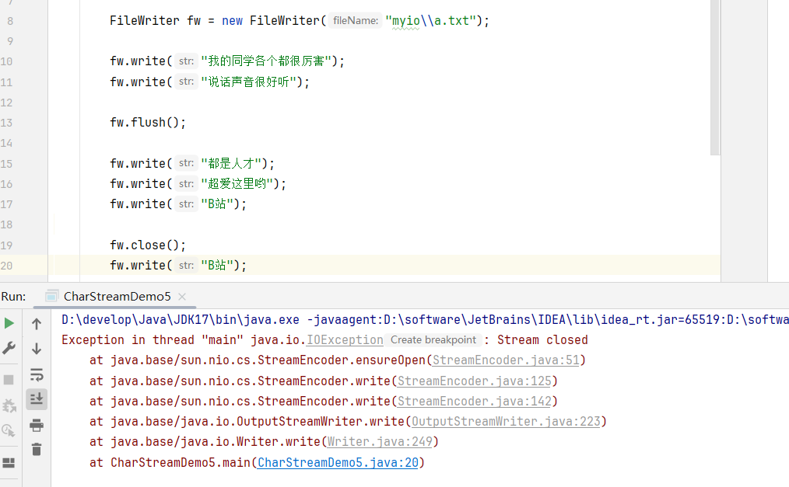


-----

# 字节流和字符流的使用场

`字节流` 可以拷贝任意类型的文件，例如：图片文件、文本文件、视频文件、音频文件.....

因此在以后凡是看到拷贝，用字节流就可以了。

`字符流` 

- 读取纯文本文件中的数据，即读取文件数据的。
- 往纯文本文件中写出数据。

# 95.练习：拷贝一个文件夹，考虑子文件夹

```
需求：拷贝一个文件夹，考虑子文件夹
```

注意：当调用者 `File` 表示的路径是需要权限才能访问的文件夹时，返回 `null`

例如 `C:\$Recycle.Bin\S-1-5-18` 是一个隐藏的文件夹，表示回收站，这个文件夹我们是没有权限进入的，因此返回 `null`。

因此也可以在下面对 `files` 做一个非空判断。

~~~java
public static void main(String[] args) throws IOException {
    //1.创建对象表示数据源
    File src = new File("D:\\aaa\\src");
    //2.创建对象表示目的地
    File dest = new File("D:\\aaa\\dest");

    //3.调用方法开始拷贝
    copydir(src,dest);
}

/*
* 作用：拷贝文件夹
* 参数一：数据源
* 参数二：目的地
*
* */
private static void copydir(File src, File dest) throws IOException {
    dest.mkdirs();
    //递归
    //1.进入数据源
    File[] files = src.listFiles();
    //2.遍历数组
    for (File file : files) {
        if(file.isFile()){
            //3.判断文件，拷贝的时候一定要从文件开始到文件结束，不能在文件夹结束
            FileInputStream fis = new FileInputStream(file);
            FileOutputStream fos = new FileOutputStream(new File(dest,file.getName()));
            byte[] bytes = new byte[1024];
            int len;
            while((len = fis.read(bytes)) != -1){
                fos.write(bytes,0,len);
            }
            fos.close();
            fis.close();
        }else {
            //4.判断文件夹，递归
            copydir(file, new File(dest,file.getName()));
        }
    }
}
~~~

---

# 96.练习：加密解码

```
为了保证文件的安全性，就需要对原始文件进行加密存储，再使用的时候再对其进行解密处理。
加密原理：
    对原始文件中的每一个字节数据进行更改，然后将更改以后的数据存储到新的文件中。
解密原理：
    读取加密之后的文件，按照加密的规则反向操作，变成原始文件。
```

前置知识

```
^ : 异或
    两边相同：false
    两边不同：true
    
但不仅仅如此，在异或的做优还可以写数字，例如 100^10
如果两边都是数字，那么它会先将这个数字变成二进制
在计算的时候，0看成false；1看成true
  100:1100100
  10: 1010
  1100100
^ 0001010
__________
  1101110 // 转成十进制：110。那如果拿着110再去^10呢？
^ 0001010
__________
  1100100 // 转成十进制：100，可以发现这个数据还原了
  
结论：一个数字异或另一个数字两次，得到的结果还是本身
那么我们就可以利用这个特性进行加密（拿着数据异或一个数字）和解密（再异或相同的数字就行了）
```

~~~java
public static void encryptionAndReduction(File src, File dest) throws IOException {
    FileInputStream fis = new FileInputStream(src);
    FileOutputStream fos = new FileOutputStream(dest);
    int b;
    while ((b = fis.read()) != -1) {
        fos.write(b ^ 2);
    }
    //4.释放资源
    fos.close();
    fis.close();
}
~~~

----

# 97.练习：修改文件中的数据

```
文本文件中有以下的数据：
    2-1-9-4-7-8
将文件中的数据进行排序，变成以下的数据：
    1-2-4-7-8-9
```

常规写法

~~~java
//1.读取数据
FileReader fr = new FileReader("myio\\a.txt");
StringBuilder sb = new StringBuilder();
int ch;
while((ch = fr.read()) != -1){
    sb.append((char)ch);
}
fr.close();
System.out.println(sb);
//2.排序
String str = sb.toString();
String[] arrStr = str.split("-");//2-1-9-4-7-8

ArrayList<Integer> list = new ArrayList<>();
for (String s : arrStr) {
    int i = Integer.parseInt(s);
    list.add(i);
}
Collections.sort(list);
System.out.println(list);
//3.写出
FileWriter fw = new FileWriter("myio\\a.txt");
for (int i = 0; i < list.size(); i++) {
    if(i == list.size() - 1){
        fw.write(list.get(i) + "");
    }else{
        fw.write(list.get(i) + "-");
    }
}
fw.close();
~~~

非常规写法

~~~java
//1.读取数据
FileReader fr = new FileReader("myio\\a.txt");
StringBuilder sb = new StringBuilder();
int ch;
while((ch = fr.read()) != -1){
    sb.append((char)ch);
}
fr.close();
System.out.println(sb);
//2.排序
Integer[] arr = Arrays.stream(sb.toString().split("-"))
                            .map(Integer::parseInt)
                            .sorted() // 这个方法默认升序排列
                            .toArray(Integer[]::new);
//3.写出
FileWriter fw = new FileWriter("myio\\a.txt");
String s = Arrays.toString(arr).replace(", ","-");
String result = s.substring(1, s.length() - 1);
fw.write(result);
fw.close();
~~~

```
细节1：文件中的数据不要换行，因为如果有换行，那么在每一行后面就会有一个\r\n，FileWriter在读取的时候也会将这个回车换行给读到，此时在排序的结果就和想象的不一样了

细节2:有的同学在关联的时候不是关联IDEA里面的文件，而是本地的txt文件。
我们自己在本地新建的txt文件会有一个隐含的bom头
```

所谓 `bom头` 就是在前面有一个隐含的字符标记，它里面记录了一些文件的信息，例如文件的字符编码等。

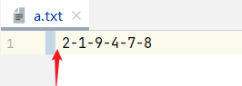

怎么去看这个 `bom头` 呢？

用记事本打开本地文件，点击另存为，我的 `文件1.txt` 中只写了一个字母 `a`。

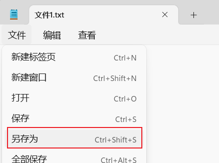

在右下角这里有一个编码，默认情况下 `Windows` 用的是 `ANSI`，即 `GBK字符集`。

但是我们在选择的时候最好选择 `UTF-8`，因为这中方式是没有 `bom头` 的，此时文件的大小就是数据的大小。

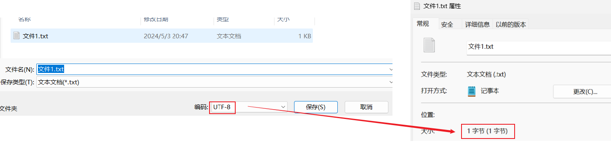

但是如果在选择的时候，一不小心选择了下面 `带有BOM的UTF-8`，点击保存。

再来查看大小，可以发现它不是一个字节了，而是4个字节。

就是因为在文件开头会有隐含的 `BOM头`，这个文件的 `BOM` 占三个字节。

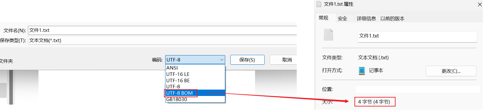

如果你有这个BOM头，代码就会将这个BOM头读取到，就有可能导致排序和你想象的不一样。

那我如何去避免这个BOM头呢？

- 如果是在本地新建的，那就另存为 `UTF-8` 进行覆盖就行了。
- 在IDEA中新建的 `txt`，默认情况下是没有 `BOM头` 的

如下图，用IDEA创建 `UTF-8` 是没有 `BOM头` 的形式

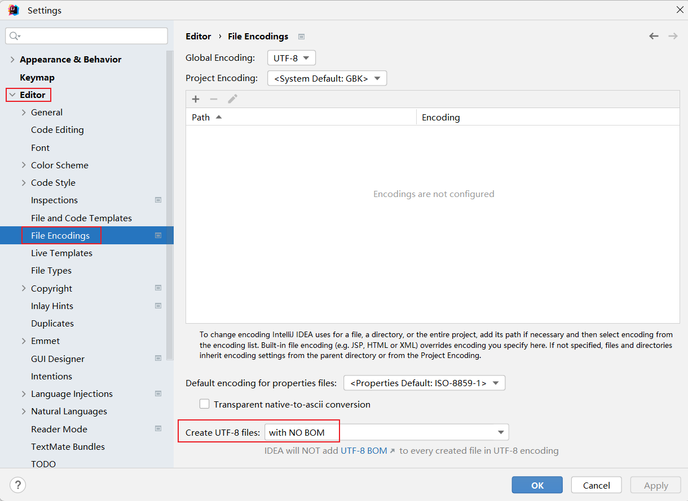


-----

# --------------------------------------

# day29 IO（其他流）

今天往下继续学习 `IO流`，学习 `IO流` 的时候一定不能忘了 `IO流` 的体系结构。

`IO流` 按照**操作文件的类型**，可以分为 `字节流`、`字符流`。

每种流都有读写之分，所以就有了各自的输出流和输入流，但是下面的这四个都是抽象类，不能创建它们的对象。

我们真正使用的都是它们的子类，所以子类的命名规则我们需要清楚。

第二个单词表示继承结构，第一个单词才表示子类真正的作用，两者一结合就是子类完整的名字。

我们之前学习的四个流是 `IO流` 中最基本的，我们也叫做 `基本流`。

接下来我们要往下学习 `高级流`， `高级流` 就是将上面的基本流做了一个封装，在它的基础上又添加了一些新的功能。

例如我觉得基本流的效率太慢了，我给它们都加上缓冲区（`Bufferd`），有了缓冲区后，效率变高了。

再结合自己的继承结构，这就是四种带有缓冲区的缓冲流。

缓冲流可以提高读写的效率，但是字符流的基本流中已经有了缓冲区了，因此下面两个字符缓冲流提高的效率不是很明显，但是它们两个里面会有两个非常好用的方法。

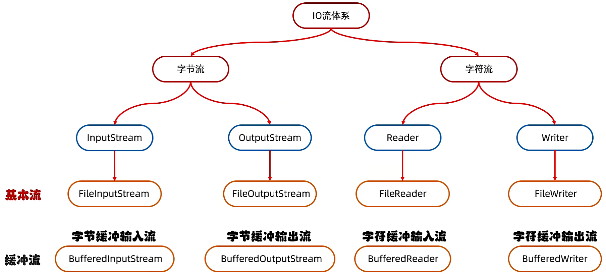

高级流不仅只有缓冲流，今天我们要学习的有很多很多，先来学习第一个：缓冲流。

----

# 缓冲流

首先我们来看一下缓冲流的继承结构。

对于字节流和字符流，Java都提供了对应的缓冲流，而每一种有都有输入和输出之分，所以缓冲流一共有四种。

例如 `BufferedInputStream`，`Buffered` 表示缓冲，`InputStream` 表示字节输入流，因此这个整体表示 `字节缓冲输入流`，它可以在拷贝文件的时候高效的读取数据，后面三个也是同样的道理。

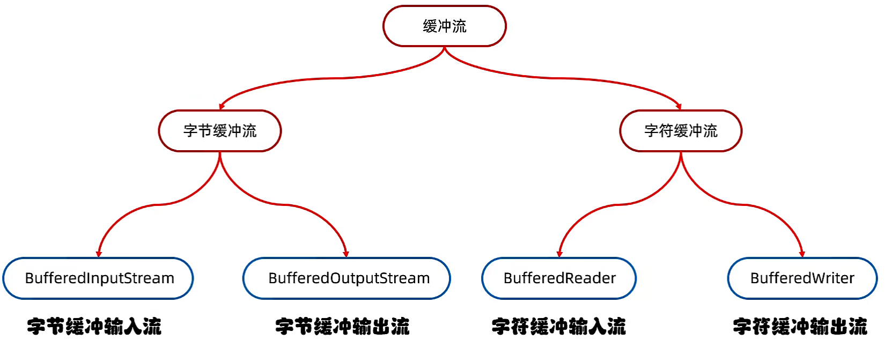

首先我们来学习 `字节缓冲流`。

# 98.字节缓冲流

## 一、介绍

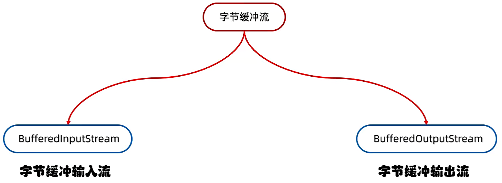

`字节缓冲流` 底层自带了长度为 `8192` 的缓冲区，利用缓冲区可以一次读取 `8192个字节`，从而提高了效率。

在创建对象的时候需要注意，缓冲流是高级流，它是对基本流做了一个包装。

缓冲流本身是不能直接读取文件中的数据的，不能直接把数据写到文件中，在创建对象的时候是需要关联基本流的，在底层真正读取数据的，其实还是这两个基本流，只不过有了这两种流的加持，它读写的效率更高而已。

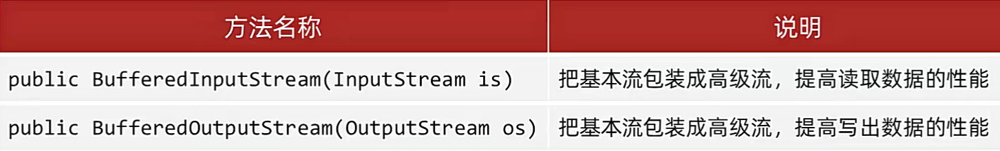

----

## 二、练习：拷贝文件（一次读写一个字节）

需求：利用字节缓冲流去拷贝文件。

`BufferedInputStream` 有两个构造

第一个构造方法：关联了字节输入流，在它里面会有一个长度默认为8192的缓冲区。

第二个构造方法：除了传递一个字节输入流以外，还能手动设定缓冲区的大小。

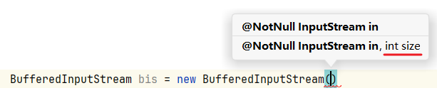

`BufferedOutputStream` 同样也有两个构造。

第一个构造方法：关联了字节输出流，在它里面会有一个长度默认为8192的缓冲区。

第二个构造方法：除了传递一个字节输出流以外，还能手动设定缓冲区的大小。

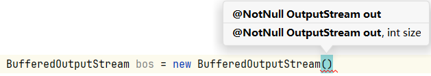

一般来讲我们用第一个就行了。

~~~java
//1.创建缓冲流的对象
BufferedInputStream bis = new BufferedInputStream(new FileInputStream("myio\\a.txt"));
BufferedOutputStream bos = new BufferedOutputStream(new FileOutputStream("myio\\a.txt"));
//2.循环读取并写到目的地
int b;
while ((b = bis.read()) != -1) {
    bos.write(b);
}
//3.释放资源，里面的FileInputStream、FileOutputStream就没必要去关了，直接关外面的bis和bos即可
bos.close();
bis.close();
~~~

----

## 三、缓冲区长什么样？

选中字节缓冲流 `BufferedInputStream` 跟进看看源码。

在创建对象的时候是将基本流传递进来，还有一个 `DEFAULT_BUFFER_SIZE`。

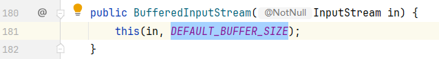

选中 `DEFAULT_BUFFER_SIZE` 跟进看看，可以发现它是一个 `private static int` 修饰的静态变量，长度就是 `8192`。

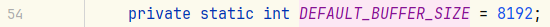

<kbd>ctrl + alt + ←</kbd> ，回到构造方法，现在我们就知道了，默认缓冲区的大小就为 `8192`，同时它会将 `基本流` 和 `8192` 传递给其他构造。

选中 `this` 跟进。

看 `201行`，这个就是它的缓冲区，`size` 就是刚刚传递进来的 `8192`。

我们在读取数据的时候就是将读取到的数据放到缓冲区中。

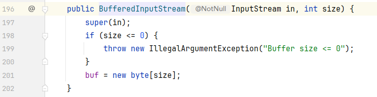

---

`字节缓冲输出流` 其实也是一样的。

跟进 `BufferedOutputStream`，发现它会把 `字节输出流` 和 `8192` 传递给本来的其他构造。

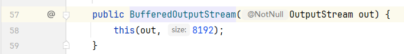

选择 `this` 跟进，看 `75行`，也创建了一个长度为 `8192` 的字节数组，它就是缓冲区。

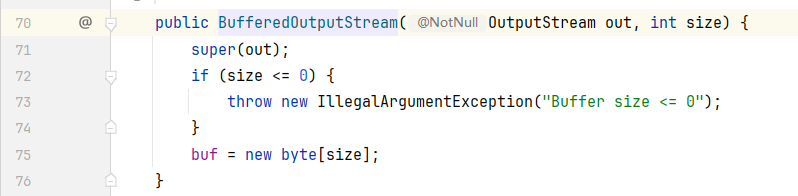

----

## 四、为什么关流的时候只需要关缓冲流

选中缓冲流的 `close()` 跟进看看，可以看见在 `188行、191行` 都将基本流进行了关闭。

在关闭的时候它会做一个判断 `if (flushException == null)`，看看你从缓冲区往外刷新数据的时候有没有出异常，如果没有出异常，直接将基本流关闭；如果有异常，它同样也是先关闭基本流，然后再做 `catch` 中其他的处理。

此时我们就知道了，不管是字节缓冲输出流，还是字节缓冲输入流，在底层其实都是帮我们将基本流做了关闭，所以我们不需要自己来关，直接调用缓冲流的 `close()` 就行了。

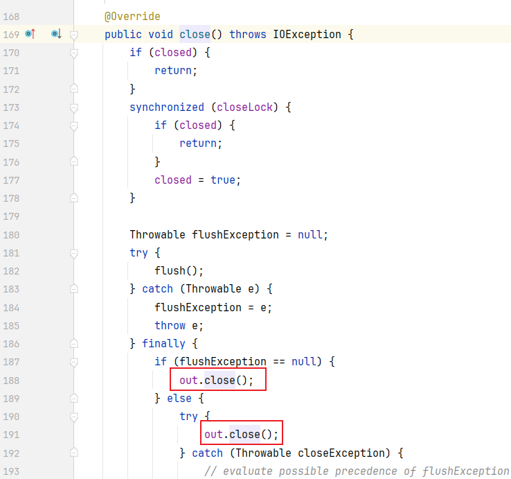


----

## 五、练习：拷贝文件（一次读写一个字节数组）

之前的写法一次只能操作一个字节，下面的写法可以一次操作多个字节。

~~~java
//1.创建缓冲流的对象
BufferedInputStream bis = new BufferedInputStream(new FileInputStream("myio\\a.txt"));
BufferedOutputStream bos = new BufferedOutputStream(new FileOutputStream("myio\\copy2.txt"));
//2.拷贝（一次读写多个字节）
byte[] bytes = new byte[1024];
int len; // 表示本次读取到了多少个有效字节
while((len = bis.read(bytes)) != -1){
    bos.write(bytes,0,len);
}
//3.释放资源
bos.close();
bis.close();
~~~


----

# 100.`字节缓冲流` 的读写原理

在拷贝的时候需要有一个 `数据源`，还要有一个 `目的地`，它们两个都是在硬盘中的。

拷贝文件其实就是将 `数据源的数据` 读取到 `内存` 中，再写到目的地。

接下来我们就看一看刚刚的这段代码到底是怎么运行的，怎么就能提高效率呢？

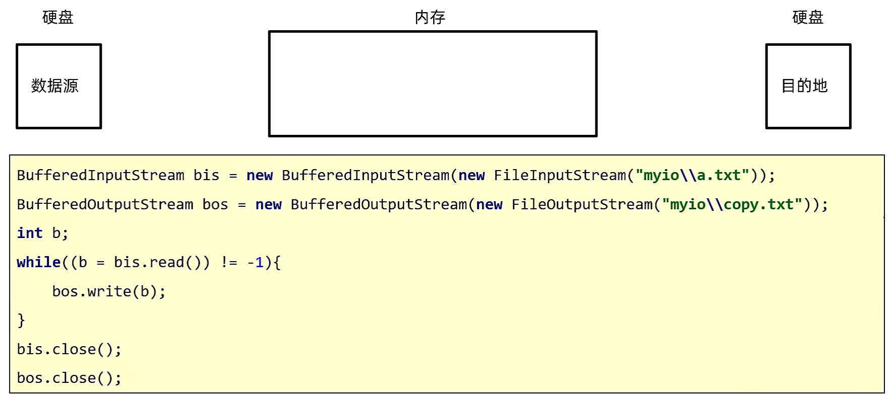

首先我们先来看创建对象，当创建了 `字节缓冲输入流` 对象的时候，在它里面还关联了基本流，这就表示真正从文件中读取数据的还是基本流 `FileInputStream`，它会从文件中读取数据再交给缓冲输入流，准确来说，是放到缓冲输入流的缓冲区中。

因为缓冲区默认大小是 `8192`，所以它会一次性读取 `8192个字节`。

再来看右边的输出流，它里面其实也关联了 `基本流`，这就表示真正将数据写到文件的还是基本流 `FileOutputStream`，它会将缓冲区的数据写到本地文件中。

`字节缓冲输出流` 它的缓冲区默认大小也是 `8192`，所以它会一次性把缓冲区中 `8192个字节` 写到文件目的地。

细节：`缓冲输入流` 里面有个缓冲区，`缓冲输出流` 里面也有一个缓冲区，这两个缓冲区不是同一个东西。

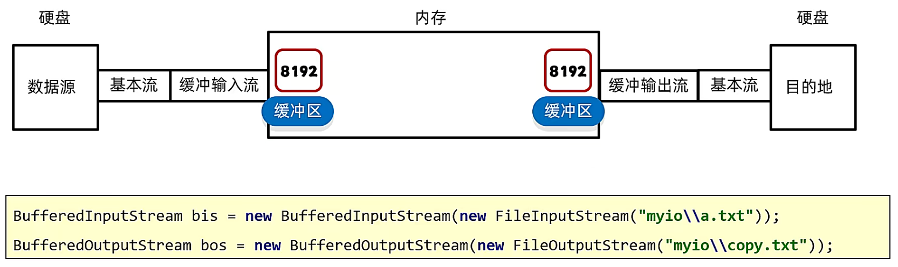

对象创建完毕了，然后就是利用下面这段代码进行了循环的读写。

首先定义了一个变量 `b`，那么在内存中就有了一个 `b`。

然后再来执行 `read方法`，这个 `read方法` 是从左边的缓冲区里面进行读取的，读取一个字节放到变量 `b` 中。

然后再去调用下面的 `write方法`，将读取到的字节再写到右边的缓冲区中。

所以中间的 `变量b` ，它其实就做了一个倒手，在左右两边来回的倒腾数据，将左边缓冲区中的数据一个一个放到右边的缓冲区中。

当右边的缓冲区填满了，就会利用基本流自动写到目的地。

但如果 `变量b` 在缓冲区中读不到数据了，此时又需要从文件中读取 `8192个字节` 放到缓冲区中，再利用变量b再次倒手，当右边的缓冲区填满后，再去写到目的地。

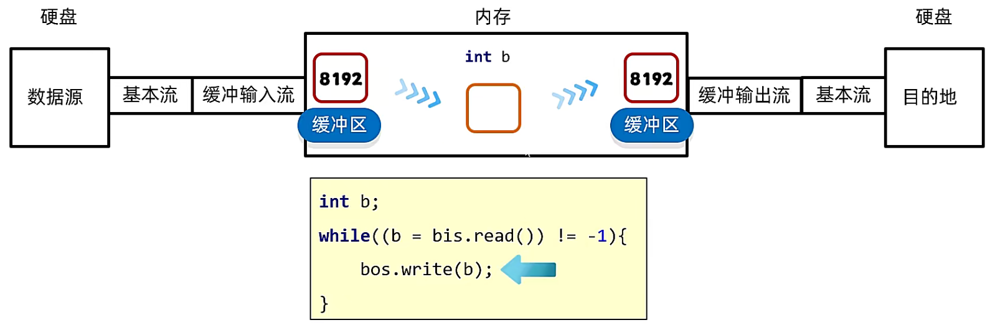

由于中间这段都是在内存中进行的，而内存的运算速度是非常的快的，所以这个倒手的时间可以几乎忽略不计，它真正节约的是 `读和写` 的时候跟硬盘之间打交道的时间。

如果你定义的是数组，那么就是一次倒手多个数据，倒手的速度会更快而已。

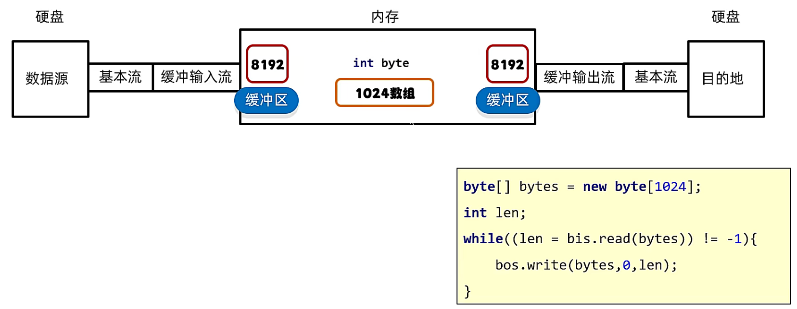


---

# 101.字符缓冲流

## 一、前言


`字符缓冲流` 也是自带 `长度为8193` 的缓冲区提高读写性能。

之前我们已经学习了字符流的基本流，我们知道，基本流本身已经有缓冲区了。

所以现在所学习的 `字符缓冲流` 它提高的效率不是很明显，但是还是得学习，因为它们里面有两个非常好用的方法，在以后我们会经常用到，因此我们还是得要学习。

----

## 二、字符缓冲流

字符缓冲流其实也是对基本流进行了包装，书写代码的思路跟之前的字节缓冲流是一样的。

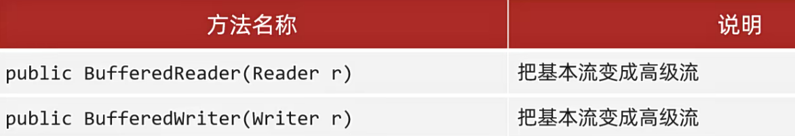

唯一不一样的是它里面有两个特有的方法。

`字符缓冲输入流特有的方法`：可以读一整行数据，遇到 `\r\n(回车换行)` 的时候才会停止。

因此如果我们使用 `readLine()` 读取，那就是一行一行的读取数据，如果读到文件末尾了，没有数据可读了，方法会返回 `null`。


`字符缓冲输出流特有的方法`：跨平台的换行。

在之前我们写回车换行的时候，我们写的是 `\r\n`，但是这是不合理的，因为同样的代码如果放到 `Mac` 或者 `Linux` 操作系统中，它的运行结果就不一样，我们还要将代码去改一改，非常的麻烦。

那么有了 `newLine()` ，就非常的方便了。方法的底层会先判断你是什么操作系统，如果你是 `Windows` 的操作系统，它就写出 `\r\n`；如果你是苹果的 `Mac`，它就写出 `\r`；如果你是 `Linux`，那就写出 `\n`。


----

## 三、`字符缓冲输入流` 代码实现

`a.txt` 中的内容如下

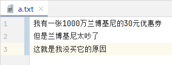

不使用 `readLine()` 也是可以读取的，但是需要将读取的字符一个一个拼接在一起，太麻烦了。

使用 `readLine()` 就可以一次读一整行了。

```java
//1.创建字符缓冲输入流的对象
BufferedReader br = new BufferedReader(new FileReader("myio\\a.txt"));
//2.读取数据
//细节：
//readLine方法在读取的时候，一次读一整行，遇到回车换行结束，但是他不会把回车换行读到内存当中
//如果将打印的ln删掉，那么它读取到的数据都会在同一行，因此在读取数据的时候需要加上ln手动换行
String line1 = br.readLine();
System.out.println(line1); // 我有一张1000万兰博基尼的30元优惠券

String line2 = br.readLine();
System.out.println(line2); // 但是兰博基尼太吵了

// 将文件中所有东西读取
String line;
while ((( line = br.readLine()) != null)){
    System.out.println(line); 
}

//3.释放资源
//同样在关流的时候我们同样也只需要关缓冲流就行了，它里面的FileReader可以不用关闭，因为缓冲流close()的底层它会帮我们把基本流进行关闭
br.close();
```

---

## 四、`字符缓冲输出流` 代码实现

~~~java
//1.创建字符缓冲输出流的对象
//如果b.txt不存在，那么它会创建，规则跟之前的基本流是一样的
//如果不想清空文件，可以开启续写，但要注意续写是FileReader的功能
BufferedWriter bw = new BufferedWriter(new FileWriter("b.txt", true));
//2.写出数据
bw.write("123");
//之前如果我们想要换行，都是下面这样写，但是这种写法不能跨平台
//br.write("\r\n");
bw.newLine();
bw.write("456");
bw.newLine();
//3.释放资源
bw.close();
~~~

----

## 五、总结

**1、缓冲流有几种？**

- 字节缓冲输入流：BufferedInputStream
- 字节缓冲输出流：BufferedOutputStream
- 字符缓冲输入流：BufferedReader
- 字符缓冲输出流：BufferedWriter

----

**2、缓冲流为什么能提高性能？**

这个问题在有些课程中会说：缓冲流自带8KB缓冲区。

这里的缓冲区它说的其实没错，但是8KB说的不对。

因为字节缓冲流中，缓冲区是 `8192` 的字节数组，字节数组是 `8KB`。

但是在字节缓冲流中，它的缓冲区是 `8192` 的字符数组。

以 `BufferedReader` 为例，跟进，可以发现它会将`关联的基本流` 和 `defaultCharBufferSize` 传递给另外一个构造方法。

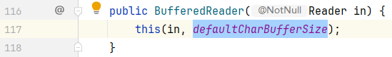

`defaultCharBufferSize`：默认字符缓冲区长度，选中它跟进，可以看见它的长度默认 `8192`。

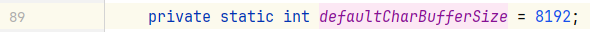

<kbd>ctrl + alt + ←</kbd>，选中 `this` 跟进，看 `106行`，可以发现它创建的是长度为8192的 `字符数组`！

在Java中，一个字符是两个字节，因此`字符缓冲流`底层的缓冲区大小为 `16KB`。

因此上面那句话应该改为：**缓冲流自带长度为8192的缓冲区，`字节缓冲流` 它的缓冲区是 `byte类型` 的，长度是 `8KB`；`字符缓冲流` 它的类型是 `char类型` 的，长度为 `16KB`。**

通过缓冲区可以显著提高字节流的读写性能。

但是对应字符流提升不明显，因为字符流的基本流中，底层已经有了缓冲区了。

但是字符缓冲流也是有意义的，因为它里面有两个特都有的方法。

----

**3、字符缓冲流两个特有的方法是什么？**

- 字符缓冲输入流BufferedReader：`readLine()`
- 字符缓冲输出流BufferedWriter：`newLine()`


-----

# 102.练习：四种拷贝方式效率对比

PS：每次运行程序的用时可能是不一样的，因为在电脑中不仅仅有Java在运行，还有其他的软件。

还有电脑性能不一样，用时也有可能是不一样的。

~~~java
public static void main(String[] args) throws IOException {
    long start = System.currentTimeMillis();
    //method1();
    //method2();          //16.253秒
    //method3();          //95.466秒，虽然也有缓冲区，但是它需要在两个缓冲区之间进行倒手，一个字节一个字节倒。又因为这个倒手是发生在字节中的，但文件太大了，因此也要浪费一点时间的。这就导致了第三种方式的性能反而降低了，低就低在倒手的时间上。
    //method4();            //17.686秒
    long end = System.currentTimeMillis();
    // 注意在除的时候需要加上.0，否则结果只能是整数
    System.out.println((end - start) / 1000.0 + "秒");
}


//字节流的基本流：一次读写一个字节4,588,568,576 字节
public static void method1() throws IOException {
    FileInputStream fis = new FileInputStream("E:\\aaa\\CentOS-7-x86_64-DVD-1810.iso");
    FileOutputStream fos = new FileOutputStream("myio\\copy.iso");
    int b;
    while ((b = fis.read()) != -1) {
        fos.write(b);
    }
    fos.close();
    fis.close();
}

//字节流的基本流：一次读写一个字节数组
public static void method2() throws IOException {
    FileInputStream fis = new FileInputStream("E:\\aaa\\CentOS-7-x86_64-DVD-1810.iso");
    FileOutputStream fos = new FileOutputStream("myio\\copy.iso");
    byte[] bytes = new byte[8192];
    int len;
    while ((len = fis.read(bytes)) != -1) {
        fos.write(bytes, 0, len);
    }
    fos.close();
    fis.close();
}

//字节流的基本流：一次读写一个字节数组
public static void method3() throws IOException {
    BufferedInputStream bis = new BufferedInputStream(new FileInputStream("E:\\aaa\\CentOS-7-x86_64-DVD-1810.iso"));
    BufferedOutputStream bos = new BufferedOutputStream(new FileOutputStream("myio\\copy.iso"));
    int b;
    while ((b = bis.read()) != -1) {
        bos.write(b);
    }
    bos.close();
    bis.close();
}

//字节流的基本流：一次读写一个字节数组
public static void method4() throws IOException {
    BufferedInputStream bis = new BufferedInputStream(new FileInputStream("E:\\aaa\\CentOS-7-x86_64-DVD-1810.iso"));
    BufferedOutputStream bos = new BufferedOutputStream(new FileOutputStream("myio\\copy.iso"));
    byte[] bytes = new byte[8192];
    int len;
    while ((len = bis.read(bytes)) != -1) {
        bos.write(bytes, 0, len);
    }
    bos.close();
    bis.close();
}
~~~


----

# 103.练习：把《出师表》的文章顺序进行恢复到一个新文件中

```
需求：把《出师表》的文章顺序进行恢复到一个新文件中。

3.侍中、侍郎郭攸之、费祎、董允等，此皆良实，志虑忠纯，是以先帝简拔以遗陛下。愚以为宫中之事，事无大小，悉以咨之，然后施行，必得裨补阙漏，有所广益。
8.愿陛下托臣以讨贼兴复之效，不效，则治臣之罪，以告先帝之灵。若无兴德之言，则责攸之、祎、允等之慢，以彰其咎；陛下亦宜自谋，以咨诹善道，察纳雅言，深追先帝遗诏，臣不胜受恩感激。
4.将军向宠，性行淑均，晓畅军事，试用之于昔日，先帝称之曰能，是以众议举宠为督。愚以为营中之事，悉以咨之，必能使行阵和睦，优劣得所。
2.宫中府中，俱为一体，陟罚臧否，不宜异同。若有作奸犯科及为忠善者，宜付有司论其刑赏，以昭陛下平明之理，不宜偏私，使内外异法也。
1.先帝创业未半而中道崩殂，今天下三分，益州疲弊，此诚危急存亡之秋也。然侍卫之臣不懈于内，忠志之士忘身于外者，盖追先帝之殊遇，欲报之于陛下也。诚宜开张圣听，以光先帝遗德，恢弘志士之气，不宜妄自菲薄，引喻失义，以塞忠谏之路也。
9.今当远离，临表涕零，不知所言。
6.臣本布衣，躬耕于南阳，苟全性命于乱世，不求闻达于诸侯。先帝不以臣卑鄙，猥自枉屈，三顾臣于草庐之中，咨臣以当世之事，由是感激，遂许先帝以驱驰。后值倾覆，受任于败军之际，奉命于危难之间，尔来二十有一年矣。
7.先帝知臣谨慎，故临崩寄臣以大事也。受命以来，夙夜忧叹，恐付托不效，以伤先帝之明，故五月渡泸，深入不毛。今南方已定，兵甲已足，当奖率三军，北定中原，庶竭驽钝，攘除奸凶，兴复汉室，还于旧都。此臣所以报先帝而忠陛下之职分也。至于斟酌损益，进尽忠言，则攸之、祎、允之任也。
5.亲贤臣，远小人，此先汉所以兴隆也；亲小人，远贤臣，此后汉所以倾颓也。先帝在时，每与臣论此事，未尝不叹息痛恨于桓、灵也。侍中、尚书、长史、参军，此悉贞良死节之臣，愿陛下亲之信之，则汉室之隆，可计日而待也。
```

如果使用字符流的基本流读也行，但是需要将所有读到的字拼在一起，太麻烦了。

因此这里使用 `字符缓冲流`，它里面有一个非常好用的 `readLine()`，一次可以读一整行数据。

排序的时候不可以使用字符串排序，因为如果写的再多一点，可能会有序号 `11、12、13` 等，此时就不能使用字符串排了，因此尽量要考虑代码的通用性。

写法一：

~~~java
//1.读取数据
BufferedReader br = new BufferedReader(new FileReader("myio\\csb.txt"));
String line;
ArrayList<String> list = new ArrayList<>();
while((line = br.readLine()) != null){
    list.add(line);
}
br.close();

//2.排序
//排序规则：按照每一行前面的序号进行排列
Collections.sort(list, new Comparator<String>() {
    @Override
    public int compare(String o1, String o2) {
        //获取o1和o2的序号
        int i1 = Integer.parseInt(o1.split("\\.")[0]);
        int i2 = Integer.parseInt(o2.split("\\.")[0]);
        return i1 - i2;
    }
});

//3.写出
BufferedWriter bw = new BufferedWriter(new FileWriter("myio\\result.txt"));
for (String str : list) {
    bw.write(str);
    bw.newLine();
}
bw.close();
~~~

写法二：

~~~java
//1.读取数据
BufferedReader br = new BufferedReader(new FileReader("myio\\csb.txt"));
String line;
TreeMap<Integer,String> tm = new TreeMap<>();
while((line = br.readLine()) != null){
    String[] arr = line.split("\\.");
    //0：序号  1 ：内容，注意这里添加的是完整的数据，包括序号
    tm.put(Integer.parseInt(arr[0]), line);
}
br.close();


//2.写出数据
BufferedWriter bw = new BufferedWriter(new FileWriter("myio\\result2.txt"));
Set<Map.Entry<Integer, String>> entries = tm.entrySet();
for (Map.Entry<Integer, String> entry : entries) {
    String value = entry.getValue();
    bw.write(value);
    bw.newLine();
}
bw.close();
~~~


----

# 104.软件运行四次

```
实现一个验证程序运行次数的小程序，要求如下：
1.当程序运行超过3次时给出提示:本软件只能免费使用3次,欢迎您注册会员后继续使用~
2.程序运行演示如下:
    第一次运行控制台输出: 欢迎使用本软件,第1次使用免费~
    第二次运行控制台输出: 欢迎使用本软件,第2次使用免费~
    第三次运行控制台输出: 欢迎使用本软件,第3次使用免费~
    第四次及之后运行控制台输出:本软件只能免费使用3次,欢迎您注册会员后继续使用~
```

## 一、代码示例

注意这里是不能通过定义变量 `int count = 0` 去统计次数，因为变量是运行在内存中的，程序结束后，变量就会消失，因此不能将变量定义在内存中。

我们可以将它保存在本地文件中。

~~~java
//1.把文件中的数字读取到内存中
BufferedReader br = new BufferedReader(new FileReader("myio\\count.txt"));
String line = br.readLine(); // 由于只有一行，就没必要循环去遍历了

int count = Integer.parseInt(line);
//表示当前软件又运行了一次
count++;//1
//2.判断
if(count <= 3){
    System.out.println("欢迎使用本软件,第"+count+"次使用免费~");
}else{
    System.out.println("本软件只能免费使用3次,欢迎您注册会员后继续使用~");
}
BufferedWriter bw = new BufferedWriter(new FileWriter("myio\\count.txt"));

//3.把当前自增之后的count写出到文件当中
bw.write(count + ""); //PS：注意转为字符串，否则如果写的是数字，那么真正写到文件里的是这个数字在字符集中所对应的字符
bw.close();
~~~

---

## 二、扩展

有的人之前拷贝写习惯了，喜欢将这两种流先创建出来，下面再挨个使用。

~~~java
BufferedReader br = new BufferedReader(new FileReader("myio\\count.txt"));
BufferedWriter bw = new BufferedWriter(new FileWriter("myio\\count.txt"));
~~~

在这里绝对不行！因为 `BufferedWriter` 在创建文件的时候，如果文件存在，就会清空。

一旦清空了，下面读取文件的时候就会有空指针。

因此一般在创建 `IO流` 对象的时候，一般会有这样的原则：`IO流` 不是随随便便创建的，而是什么时候用什么时候创建，什么时候不用什么时候关闭。

因此上面的代码一旦 `br` 读完了数据，就要将它立马关掉。

~~~java
BufferedReader br = new BufferedReader(new FileReader("myio\\count.txt"));
String line = br.readLine(); // 由于只有一行，就没必要循环去遍历了
br.close();
~~~


----

# 105.转换流

## 一、前言

首先来看看转换流在 `IO体系` 中的位置。

转换流属于字符流，它本身也是一种高级流，用来包装基本流的。

其中输入流叫做 `InputStreamReader`，输出流叫做 `OutputStreamWriter`。

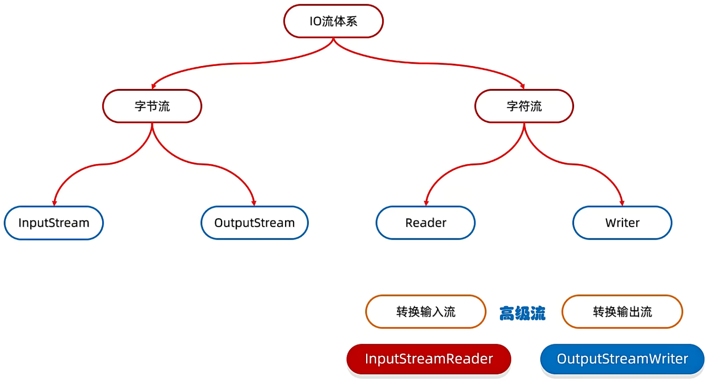

想要知道为什么要叫这个名字，我们还需要来看看它的作用。

---

## 二、作用

转换流：是字符流和字节流之间的桥梁。

首先我们来看读取数据，读取数据首先要有一个数据源，在读取的时候就是将数据源的数据读取到内存中。

当我们创建了转换流对象的时候，其实是需要包装一个 `字节输入流` 的。在包装之后这个`字节流`就变成`字符流`了，就可以拥有字符流的特性了。

例如：读取数据不会乱码了、可以指定字符集一次读取多个字节。

所以转换流中的输入流叫做 `InputStreamReader`，前面的 `InputStream` 就表示它的作用是将 `字节流` 转换成 `字符流`，后面的 `Reader` 表示转换流本身它是 `字符流` 的一员，它的父类是 `Reader`。

---

接下来看输出，输出需要有一个目的地，当我们创建了转换流对象的时候，它里面是要包装 `字节输出流` 的，它的转换方式跟左边的读是相反的：`输出流` 是将 `字符流` 转换成 `字节流`。

因为在文件中，即目的地中，它真实存储的数据其实是一个又一个的字节，因此我们需要将内存中的数据转换成字节往外写出。

它的名字叫做 `OutputStreamWriter`，前面的 `OutputStream` 就表示它的作用是将 `字符流` 转换成 `字节流`，后面的 `Writer` 表示转换流本身它是 `字符流` 的一员，它的父类是 `Writer`。`

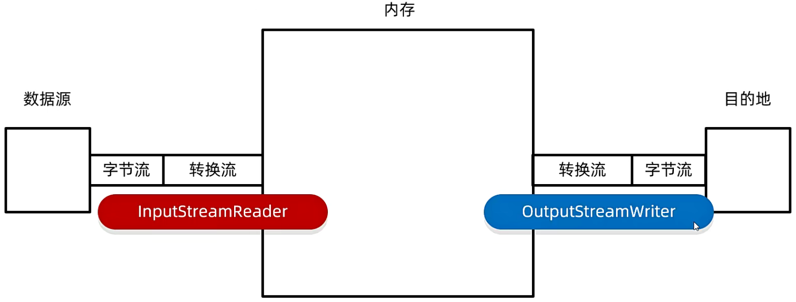

----

## 三、应用场景

作用1：指定字符集读写数据，但是在JDK11后，这种方式淘汰了。因此对于这种方式我们了解一下就行了，真正要我们学习的是它的替代方案。

作用2：字节流想要使用字符流中的方法，因此就可以使用转换流转一下。

### 1）需求1：手动创建一个GBK的文件，把文件中的中文读取到内存中，不能出现乱码

如何区分该文件是否是GBK的？

如下图，如果是 `ANSI`，那就表示使用平台默认的，简体中文默认的就是GBK。

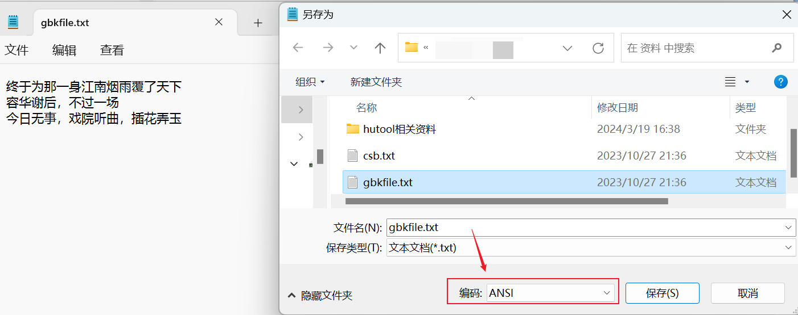

将这个文件粘贴到IDEA中，可以发现是乱码的，因为这个文件编码用的是GBK，但是IDEA默认使用的是 `UTF-8`。

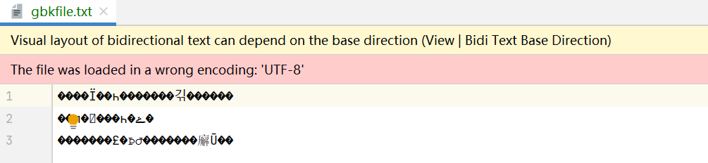

---

#### ① JDK11以前的方案

之前的 `FileReader` 和 `FileWriter` 还是不能指定编码的，因此我们只能使用转换流做。

<kbd>ctrl + p</kbd> 来看一下它构造方法的参数。

第一个：是一个参数的，它需要你去关联一个字节输入流，此时它是使用平台默认的字符编码。

但这并不是我想要的，我需要指定，此时就可以使用第二个构造，它除了让你关联字节输入流以外，还需要指定 `charsetName(字符集名字)`。

另外还有两个构造，它们也是以不同的形式去指定字符构造。

一般来讲用的都是第二个构造，因为它最简单，直接一个字符串就搞定了。

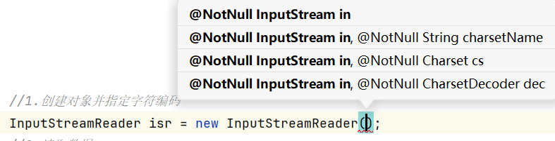

~~~java
//1.创建对象并指定字符编码，指定编码是转换流的第二个参数
InputStreamReader isr = new InputStreamReader(new FileInputStream("myio\\gbkfile.txt"), "GBK");
//2.读取数据。转换流本身就是字符流，所以我们完全可以使用之前所学习的字符流的方式进行读取
int ch;
while ((ch = isr.read()) != -1){
    System.out.print((char)ch);
}
//3.释放资源，同样只需要关闭高级流就行了，里面这些基础流是不需要关闭的，因为在高级流的底层会帮我们一起关闭
isr.close();
~~~

运行程序，可以发现读取的数据跟文件里面的数据一模一样。

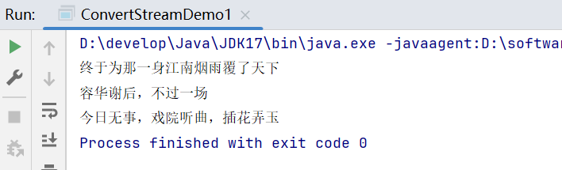

这种方式是不需要你掌握的，只需要你了解一下，因为在JDK11的时候，这种方式已经被淘汰了。

它的替代方案我们需要掌握。

----

#### ② 替代方案

在JDK11后，`FileReader` 中添加了一个新的构造，这个构造就可以指定字符编码

选中 `FileReader` 跟进看看，参数一：传递本地文件；参数二：指定字符编码。

并且这个构造不是所有版本都有的，而是 `JDK11` 才出来的。

在指定字符编码的时候，需要使用 `Charset` 调用里面的静态方法 `forName()`，然后往这个方法中指定字符编码即可。

在指定的时候可以写小写的，也可以写大写的，但是为了专业一点，还是写成大写的，因为GBK是多个单词的英文首字母合起来的。

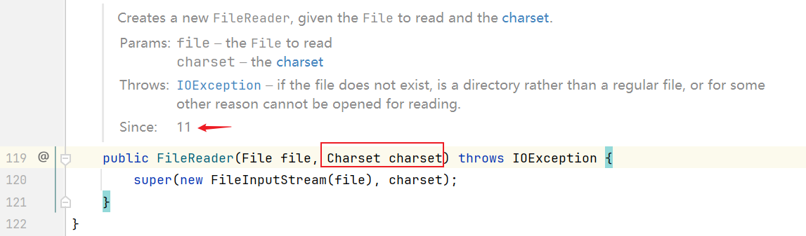

在构造的底层，其实还是调用了父类的构造，并且它的父类其实就是转换流。


转换流的父类是 `Reader`

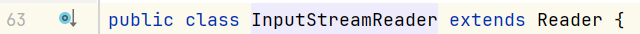

~~~java
FileReader fr = new FileReader("myio\\gbkfile.txt", Charset.forName("GBK"));
//2.读取数据
int ch;
while ((ch = fr.read()) != -1){
    System.out.print((char)ch);
}
//3.释放资源
fr.close();
~~~


---

### 2）需求2：把一段中文按照GBK的方式写到本地文件

#### ① JDK11以前的方案

同样先来看构造方法，看见它需要关联一个 `字节输出流`，如果不传入第二个参数，就表示使用平台默认的编码方式进行写出。

如果不想用默认的，想自己指定，就需要给它传第二个参数。

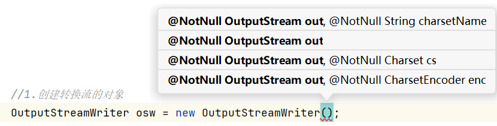

~~~java
//1.创建转换流的对象
OutputStreamWriter osw = new OutputStreamWriter(new FileOutputStream("myio\\b.txt"),"GBK");
//2.写出数据
//OutputStreamWriter它本身是一个字符流，所以在往外写出的时候，write方法跟字符流里面是完全一样的
osw.write("你好你好");
//3.释放资源
osw.close();
~~~

程序运行结束，可以发现 `b.txt` 中是乱码，因为IDEA默认使用 `UTF-8` 进行打开的，但是这个文件真正的字符编码是 `GBK`，两者不一样，所以就乱码。

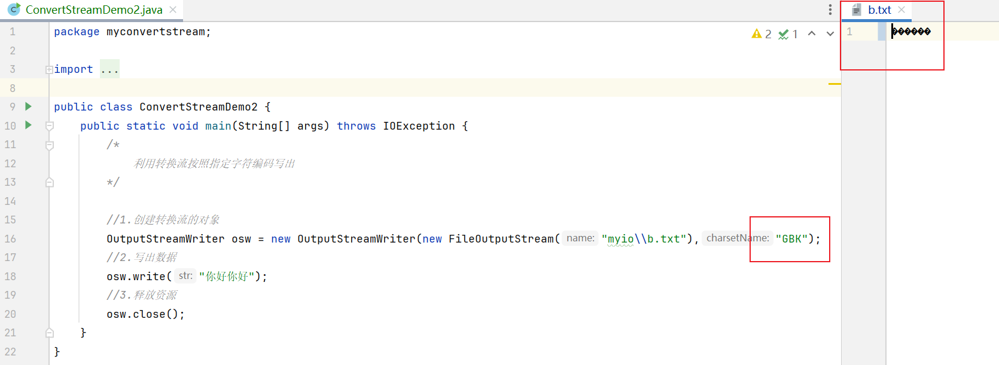

PS：千万不要到IDEA中修改字符编码，因为一旦修改了，有可能会有很多奇奇怪怪的问题。

如果一定要查看这个文件，那么我们可以在本地进行查看。

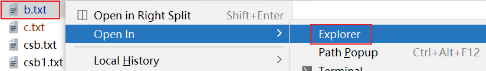

数据成功加载，并且编码也是平台默认的，即 `GBK`。

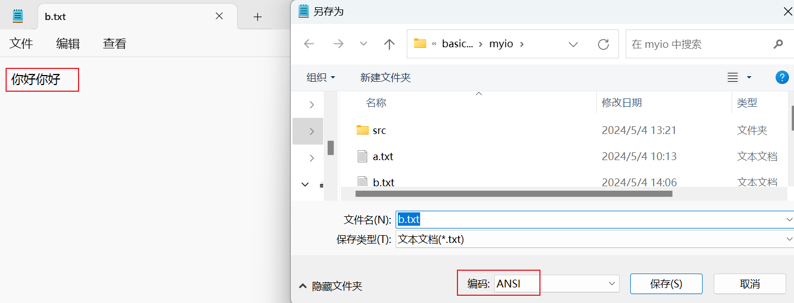

这种方式同样也是被淘汰了，所以上的代码了解一下就行了，我们要知道它的替代方案。

----

#### ② 替代方法

替代方案其实也是在JDK11的时候在 `FileWriter(基本流)` 中增加了一个新的构造，在这个构造里面可以指定字符编码。

如下图，版本11。

参数有两个，参数一：关联本地文件；参数二：指定字符编码。

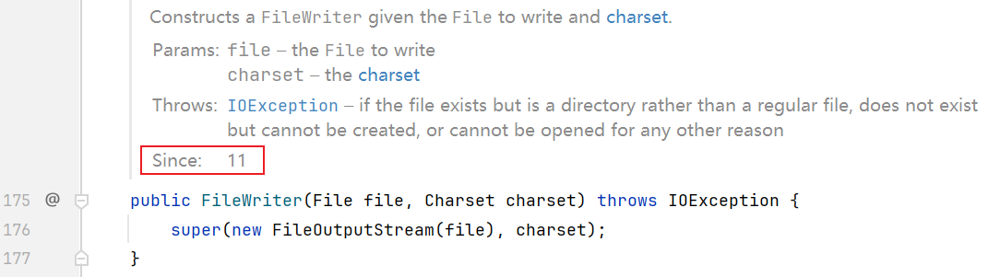

~~~java
//指定编码的时候不要写字符串，而是通过 `forName()` 静态方法指定字符编码
FileWriter fw = new FileWriter("myio\\c.txt", Charset.forName("GBK"));
fw.write("你好你好");
fw.close();
~~~


----

### 3）将本地文件中的GBK文件，转成UTF-8

IDEA默认使用的是 `UTF-8`，因此我们不管是读取数据，还是写出数据，在之前用的都是默认的 `UTF-8`。

如果文件是 `GBK`，就不能使用默认的了，我们需要手动指定。

#### ① JDK11以前的方案

~~~java
InputStreamReader isr = new InputStreamReader(new FileInputStream("myio\\b.txt"),"GBK");
// 写入的时候可以指定编码，也可以不指定编码，因为IDEA默认就是UTF-8，但是为了跟上面保持统一，这里还是写上
OutputStreamWriter osw = new OutputStreamWriter(new FileOutputStream("myio\\d.txt"),"UTF-8");

int b;
while((b = isr.read()) != -1){
    osw.write(b);
}

osw.close();
isr.close();
~~~

---

#### ② 替代方案

~~~java
FileReader fr = new FileReader("myio\\b.txt", Charset.forName("GBK"));
FileWriter fw = new FileWriter("myio\\e.txt",Charset.forName("UTF-8"));
int b;
while ((b = fr.read()) != -1){
    fw.write(b);
}
fw.close();
fr.close();
~~~


---

### 4）利用字节流读取文件中的数据，每次读一行，而且不能出现乱码

字节流里面是没有读一整行方法的，读一整行是字符缓冲流的，此时就需要利用转换流去转一下。

#### ① 方便阅读的代码

~~~java
FileInputStream fis = new FileInputStream("myio\\a.txt");
InputStreamReader isr = new InputStreamReader(fis); // 此时用isr读取中文就不会乱码了
BufferedReader br = new BufferedReader(isr); // BufferedReader中的readLine()可以读取一整行
String str = br.readLine();
System.out.println(str);
br.close();
~~~

----

#### ② 最终代码

~~~java
//BufferedReader对里面的字符流进行了保证，InputStreamReader对里面的字节流进行了转换
BufferedReader br = new BufferedReader(new InputStreamReader(new FileInputStream("myio\\a.txt")));
String line;
while ((line = br.readLine()) != null){
    System.out.println(line);
}
br.close();
~~~

----

## 四、总结

1、转换流的名字是什么？

- 字符串输入流：InputStreamReader
- 字符转换输出流：OutputStreamWriter

2、转换流的作用是什么？

- 指定字符集读写数据（JDK11之后已淘汰，了解即可）

  因为在实际开发中，还是有很多人在使用JDK8，他们是用不了JDK11的API的，因此以前的方式也需要知道。

- 字节流想要使用字符流中的方法了


----

Java 提供了一种对象**序列化**的机制。用一个字节序列可以表示一个对象，该字节序列包含该`对象的数据`、`对象的类型`和`对象中存储的属性`等信息。字节序列写出到文件之后，相当于文件中**持久保存**了一个对象的信息。 

反之，该字节序列还可以从文件中读取回来，重构对象，对它进行**反序列化**。`对象的数据`、`对象的类型`和`对象中存储的数据`信息，都可以用来在内存中创建对象。

# 107.序列化流

## 一、引入

首先我们来看看 `序列化流` 在IO流体系中的位置。序列化流是高级流，也是用来包装基本流的。

而且序列化流是属于字节流的一种，负责**输出数据**。

与之对应的有个输入流，我们也叫做 `反序列化流`。

它们的名字也遵守了 `IO流` 的命名特点

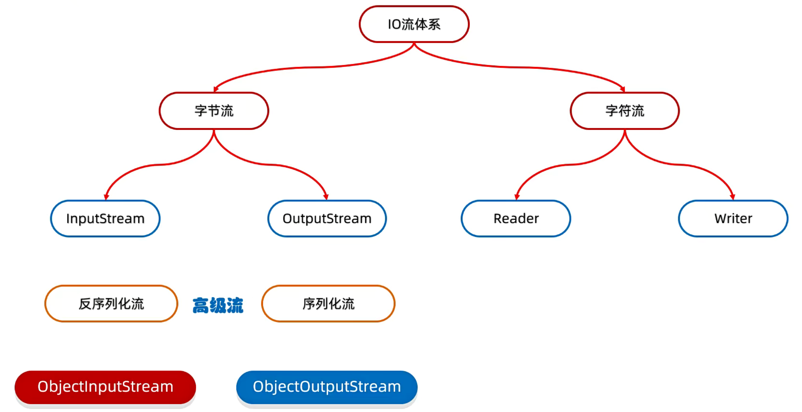

首先我们来学习 `序列化流`。

----

## 二、序列化流

序列化流：可以把Java中的对象写到本地文件中。

写到文件后，数据有一个特点：我们是看不懂的，但是没有关系，只要通过反序列化流将数据读取出来，读取的数据没错就行了。

但是有的同学会有疑问，如果我们想要写对象，直接将对象的属性值写到对象中不就可以了吗？而且数据还看得懂，还能修改。

你说的没错，但是坏就坏在：能看懂，能修改。在有的情况下，我是不想让别人看懂，修改的，例如游戏的存档，不想让用户自己修改。

所以这两种方式它都是有应用场景的。

----

## 三、方法

`序列化流` 还有一个名字：`对象操作输出流`，它的作用就是用来操作对象的，可以把Java中的对象写到本地文件中，是用来输出的，因此它的名字叫做 `ObjectOutputStream`。

它本身是高级流，因此在创建对象的时候需要关联基本流。


而且写出数据的方法也不一样了，因为现在是写出整个对象，所以方法名叫做 `writeObject()`。

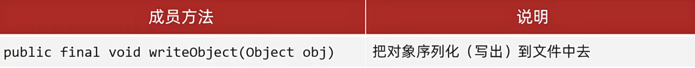

----

## 四、代码实现

**Student.java**

~~~java
public class Student {
    private String name;
    private int age;

    // 标准JavaBean剩下的东西，这里为了方便观看就省略了
}
~~~

**测试类**

~~~java
//1.创建对象
Student stu = new Student("zhangsan", 23);

//2.创建序列化流的对象/对象操作输出流
ObjectOutputStream oos = new ObjectOutputStream(new FileOutputStream("myio\\a.txt"));

//3.写出数据
oos.writeObject(stu);

//4.释放资源
oos.close();
~~~

运行代码，可以发现报错。

如果直接将对象写出，它会报 `NotSerializableException` 异常：表示这个类的对象不可被序列化。

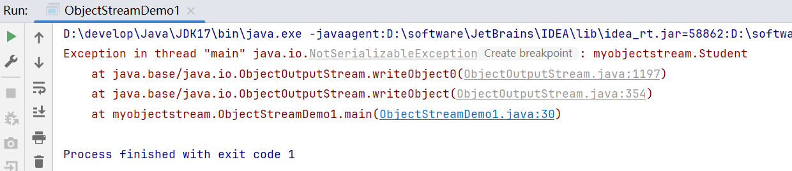

解决方案：需要让Javabean类实现 `Serializeble接口`。

~~~java
public class Student implements Serializable {
    private String name;
    private int age;
    // 标准JavaBean剩下的东西，这里为了方便观看就省略了
}
~~~

可以跟进看看 `Serializeble接口` 里面的源码，可以发现它里面没有抽象方法。

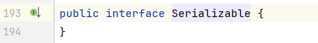

`Serializable接口` 里面是没有抽象方法，像这种没有抽象方法的接口有一个专业的名字：标记型接口。

相当给 `Student类` 打了一个标记，一旦实现了这个接口，那么就表示当前的 `Student类` 可以被序列化。

简单来说 `Student类的对象` 可以用对象操作输出流写到本地文件。

如果没有实现 `Serializeble接口` ，那就表示没有这个标记，就不能使用序列化流去序列化这个类的对象。

可以理解为：一个物品的合格证。有合格证这个物品就合格；没有合格证这个物品就不合格。

再次运行程序，可以发现没有报错，并且对象已经写入到了本地文件中了。

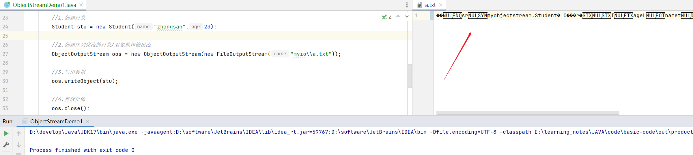


---

# 108.反序列化流

## 一、介绍

`反序列化流` 也叫作 `对象操作输出流`：可以把序列化到本地文件中的对象，读取到程序中来。

名字是 `ObjectInputStream`，需要关联字节输入流。


因为这个流它是读取文件中的对象，所以方法名叫做 `readObject`，方法的返回值就是读取到的那个对象，但是它是 `Object` 类型的，如果我们想要将它变成对象真正的类型，还需要对它做一个强转。

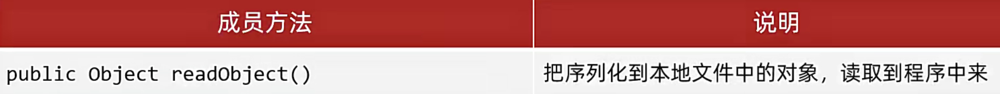

----

## 二、代码示例

~~~java
//1.创建反序列化流的对象
ObjectInputStream ois = new ObjectInputStream(new FileInputStream("myio\\a.txt"));

//2.读取数据
Student o = ois.readObject();

//3.打印对象
System.out.println(o); // Student{name = zhangsan, age = 23}
System.out.println((Student) o); // Student{name = zhangsan, age = 23}

//4.释放资源
ois.close();
~~~


-----

# 109.版本号

## 一、引出版本号

假设我们先用 `序列化流` 将对象写到本地文件中了，但是此时我对JavaBean做了一个修改，例如现在多添加了一个 `address属性`，表示学生的家庭住址。

~~~java
private String address;
~~~

然后再利用 `反序列化流` 把对象读取到内存中，此时就会报错。

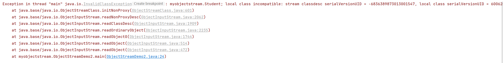

我们可以简单的阅读一下报错的信息

~~~java
Exception in thread "main" java.io.InvalidClassException: myobjectstream.Student（类名）; local class incompatible: stream classdesc serialVersionUID（在这个类中有一个叫做：serialVersionUID，是后面这段数字） = -6836389873013001547, local class serialVersionUID（但是本地文件中的serialVersionUID）是后面这串数字 = 6006265381637527298
    两者不一样了，所以它就报错了。
	at myobjectstream.ObjectStreamDemo2.main(ObjectStreamDemo2.java:24)
~~~

----

## 二、分析

如果一个类实现了 `Serializable接口`，那就表示这个类的对象是可被序列化的。

Java的底层会根据这个类的成员变量、静态变量、构造方法、成员方法，简单理解，就是根据这个类里面所有的内容进行计算，计算出一个 `long类型` 的序列号，这个序列号你也可以将它理解为：版本号。

假设现在计算出来的版本号是 `1`，数字短一些好理解一些。

当我现在创建了一个对象的时候，在对象里面它其实就包含了 `版本号：1`，再用序列化流写到本地文件中的时候，也会把版本号写到文件中。

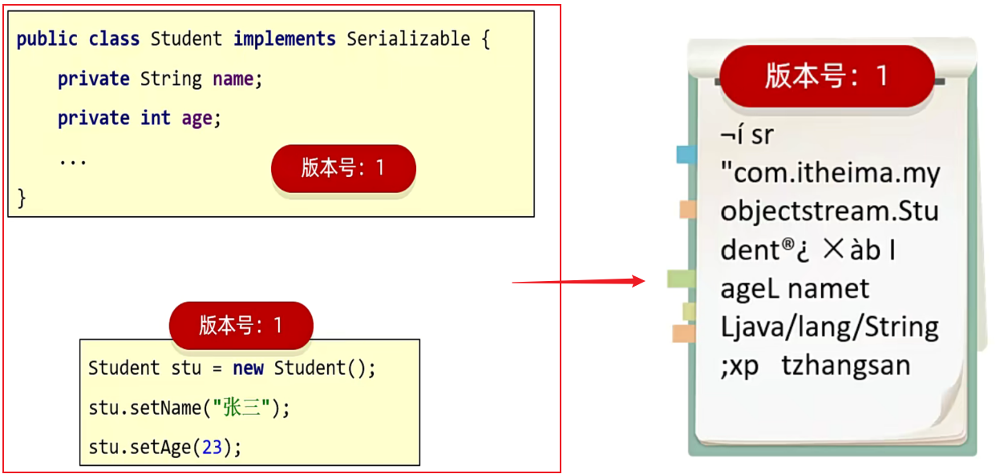

但是，如果此时修改了JavaBean类中的代码，那么Java底层会重新计算出一个版本号，假设现在版本号是 `2`。

此时用 `反序列化流` 将对象读取到内存后，就会发现两个版本号此时不一样了，代码直接报错。

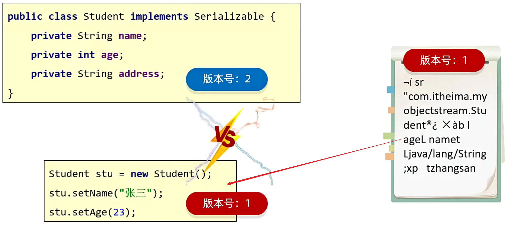

所以问题出现的原因就是：文件中的版本号，跟JavaBean类中的版本号不匹配。

虽然我们可以不去修改JavaBean类，但是当业务需求发生变化的时候，JavaBean类不可能不改。

但如果修改JavaBean的时候，不让这个版本号发生变化，也可以解决这个问题，因此我们的处理方案就是：固定版本号。

----

## 三、解决问题

在定义JavaBean类时，手动先将这个版本号定义出来，一旦手动定义了，Java底层就不会手动计算了。

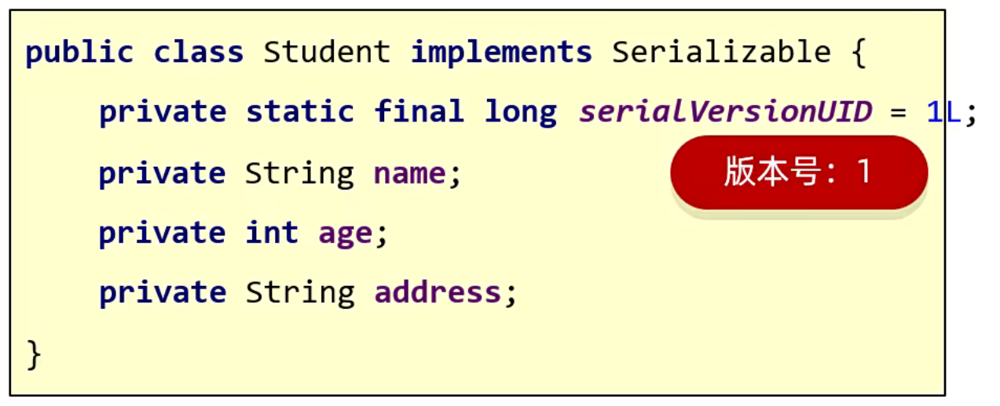

定义版本号也是有规矩要求的

- `private` ：私有。不让外界使用，也不会对版本号提供 `get / set方法`。

- `static`：共享。表示这个类所有的对象都共享同一个版本号。

- `final`：最终。表示版本号的值永远不会发生变化
- `long`：版本号的数据类型。由于版本号在计算的时候比较长，`int` 的取值范围是不够的，因此需要用 `long` 进行表示
- `serialVersionUID`：版本号的变量名，只能叫这个名字，如果写成其他的，Java就不认识了。

---

## 四、代码实现

### 1）方法一

在JavaBean中定义成员变量 `serialVersionUID`。

但是这种方式太麻烦了，需要自己写，而且我们也记不住。

~~~java
private static final long serialVersionUID = 1L; // long类型需要加L为后缀
~~~

----

### 2）方法二

对IDEA做一个设置，设置完后，我们就可以自动生成了

首先复制这里的 `Serializable` <kbd>ctrl + C</kbd>

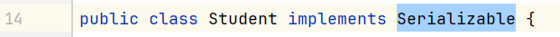

然后打开IDEA设置，左上角搜索 `Serializable`，根据如下图操作。

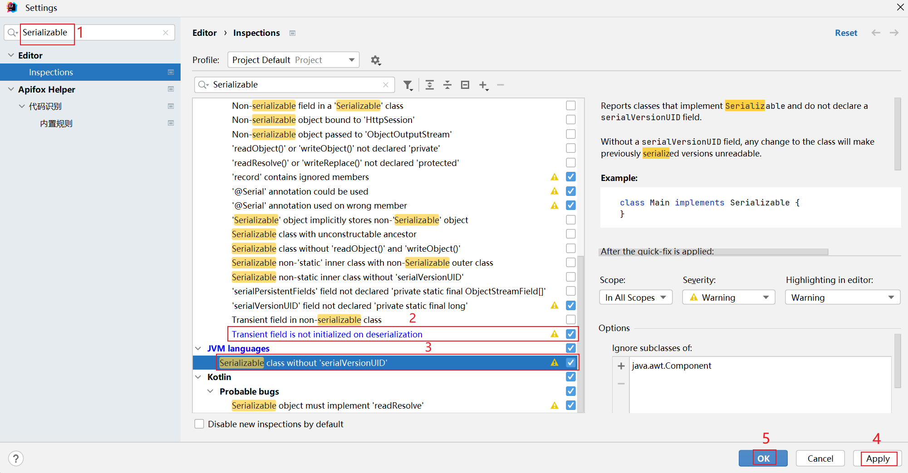

回到代码中，可以看见 `Student` 这个名字被深褐色包裹了，它其实就是给你做了一个提醒：你在这里少写了一个版本号。

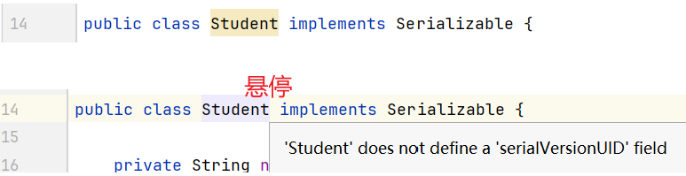

用鼠标选中 `Student`，<kbd>alt + 回车</kbd> 点击第一个

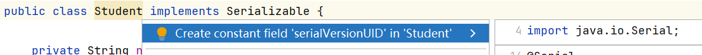

此时它会自动根据你类里面所有的成员计算出一个版本号。

要注意，一旦生成了，我们就不要去修改了。

生成后上面会有一个注解，我们还没学，可以暂时删掉。

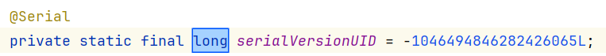

这是第二种方式，是我比较推荐的做法。

---

### 3）方法三

我们可以借鉴别人的，<kbd>ctrl + N</kbd> 搜索一个Java中已经定义好的类，例如 `ArrayList`

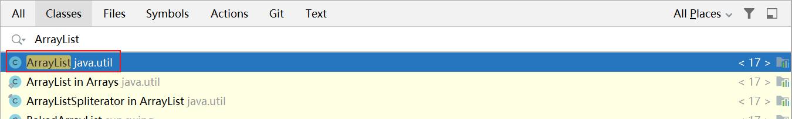

可以发现 `ArrayList` 也实现了 `Serializable接口`，并且在下面也写好了，我们可以直接将这个 <kbd>ctrl + C</kbd>


回到JavaBean类中，直接 <kbd>ctrl + V</kbd> 就行了

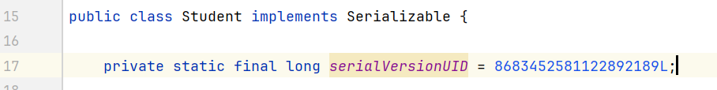

只不过你要知道，这个版本号是属于 `ArrayList` 的，我们不能用，我们需要自己改写一下它，这里还是改成 `1`。

~~~java
private static final long serialVersionUID = 1L;
~~~

只不过这个 `1` 它显得不够专业，所以第三种方式不推荐，还是推荐使用第二种方式。

----

### 4）运行代码

此时一旦加上版本号后，问题就已经解决了。

首先重新运行 `序列化流` 的代码，然后在JavaBean类中增加 `address属性`，并重新生成JavaBean类的 `toString()`，让它打印的时候出现 `address属性`

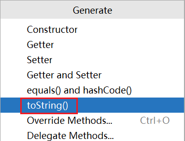

最后运行 `反序列化流` 的代码。

可以发现代码正常运行，但是 `address` 没有值，没有值就是默认初始化值，因此它读出来的就是 `null`。

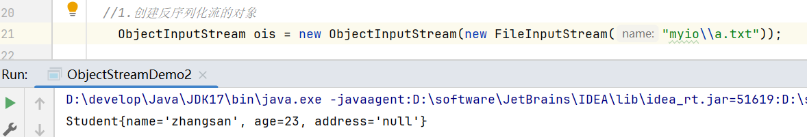

----

## 五、总结

如果想要将一个JavaBean对象序列化到本地文件中，除了实现 `Serializable接口` 外，还需要加上 `serialVersionUID`版本号。


---

# `transient` 关键字

如果JavaBean中有些成员变量的值不想序列化到本地文件，例如 `Student` 中的 `address`，需要将家庭住址进行保密。

我们先将之前只有两个成员变量的时候使用 `Ptg插件` 生成的JavaBean删掉，再根据三个成员变量去生成一个标准的JavaBean类。

然后再将有关 `serialVersionUID` 全部删掉

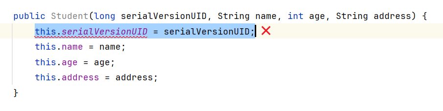

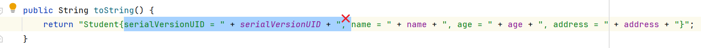

如果其中有一个成员变量的值不想序列化到本地，此时需要在这个成员变量前面加上 `transient` 关键字。

这个关键字也叫作 `瞬态关键字`，它的作用：不会把当前属性序列化到本地文件当中

~~~java
public class Student implements Serializable {
    private static final long serialVersionUID = -6357601841666449654L; // long类型需要加L为后缀

    private String name;
    private int age;
    //transient：瞬态关键字
    //作用：不会把当前属性序列化到本地文件当中
    private transient String address;
    //为了方便观看，删掉了标准JavaBean类的get、set、空参构造、有参构造、toString方法
}
~~~

重新序列化到本地

~~~java
//1.创建对象
Student stu = new Student("zhangsan",23,"南京");

//2.创建序列化流的对象/对象操作输出流
ObjectOutputStream oos = new ObjectOutputStream(new FileOutputStream("myio\\a.txt"));

//3.写出数据
oos.writeObject(stu);

//4.释放资源
oos.close();
~~~

再次反序列化

~~~java
//1.创建反序列化流的对象
ObjectInputStream ois = new ObjectInputStream(new FileInputStream("myio\\a.txt"));

//2.读取数据
Student o = (Student) ois.readObject();

//3.打印对象
System.out.println(o);

//4.释放资源
ois.close();
~~~

程序运行结果如下，可以发现 `address` 是没有值的，就是因为在序列化的时候没有将 `address` 序列化到本地文件。

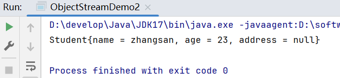


----

# 序列化流/反序列化流的细节汇总

1、使用序列化流将对象写到文件时，需要让JavaBean类实现Serializable接口。否则会出现 `NotSerializableException` 异常，表示这个类对象不可被序列化。

2、序列化流写到文件中的数据是不能修改的，一旦修改就无法再次读回来了。

3、序列化对象后，修改了JavaBean类，再次反序列化，会不会有问题？

会出现问题，会抛出 `InvalidClassException异常`

解决方案：手动给JavaBean类添加 `serialVersionUID`，这个变量你可以把它理解成序列化、版本号。

在添加的时候不建议字节写，也不建议抄别人的，建议在IDEA中设置一下，以后自动生成就行了。

4、如果一个对象中的某个成员变量的值不想被序列化，又如何实现呢？

解决方案：给该成员变量加 `transient` 关键字修饰，也叫做 `瞬态关键字`，它的作用是：该关键字标记的成员变量不参与序列化的过程。

也就是说这个变量所记录的值不会保存到本地文件中，下次使用 `反序列化流` 读取出来的时候，这个变量为默认初始化值。


----

# 110.练习：用对象流读写多个对象

由于对象的个数不确定，那么在读的时候我们该怎么操作呢？

**Student.java**

在写JavaBean类的时候要注意，不要一开始就生成 `serialVersionUID`，因为这个版本号是根据类里面所有的成员（成员变量、构造方法、成员方法......）计算出来的一个结果。

```java
public class Student implements Serializable {
    @Serial
    private static final long serialVersionUID = 8447688314497035445L;
    private String name;
    private int age;
    private String address;

    //空参构造、有参构造、get、set方法、tostring方法
}
```

## 一、引出问题

**序列化**

~~~java
//1.序列化多个对象
Student s1 = new Student("zhangsan",23,"南京");
Student s2 = new Student("lisi",24,"重庆");
Student s3 = new Student("wangwu",25,"北京");

ObjectOutputStream oos = new ObjectOutputStream(new FileOutputStream("myio\\a.txt"));
oos.writeObject(s1);
oos.writeObject(s2);
oos.writeObject(s3);

oos.close();
~~~

**反序列化**

~~~java
//1.创建反序列化流的对象
ObjectInputStream ois = new ObjectInputStream(new FileInputStream("myio\\a.txt"));

//2.读取数据
//一次readObject()只能读一个对象，我们刚刚在文件中写出了三个对象，因此需要调用三次
Student s1 = (Student) ois.readObject();
Student s2 = (Student) ois.readObject();
Student s3 = (Student) ois.readObject();

//3.释放资源
ois.close();
~~~

程序运行完毕，可以发现三个学生对象全部读取成功


但是这样的代码好吗？假设序列化的代码是别人写的，它只给了你一个 `a.txt` 文件，这样对象的数目就不确定了，因此调用 `readObject()` 几次也确定不了了，那我就来想，会不会跟以前一样，如果读不到就会返回 `-1` 或者返回 `null` 呢？

例如这里多读了一个对象，但是文件中只有三个对象，可以发现，如果一直读，超过了文件中对象的数目，不会返回 `-1` 也不回返回 `null` ，它会返回一个异常：EOF(`End Of File`)，表示读到了文件的末尾。

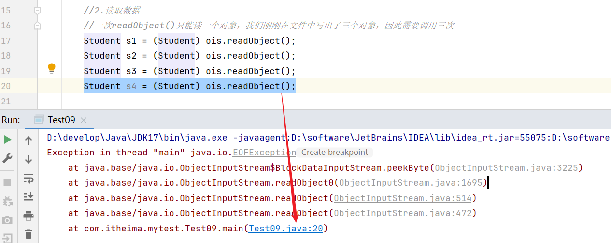

我们不可能一直读直到读到它出异常吧？

----

## 二、解决问题

这样是不对的，因此以后会有一个小小的规定：如果需要将多个对象序列化到本地文件中，我们一般都会将这些对象放到一个集合中，然后不要序列化对象了，而是直接序列化这个集合就行了。

`ArrayList` 本身也是实现了 `Serializable接口`，而且源码中也有 `serialVersionUID`，它已经满足了我们之前所说的几个细节，因此可以被序列化。

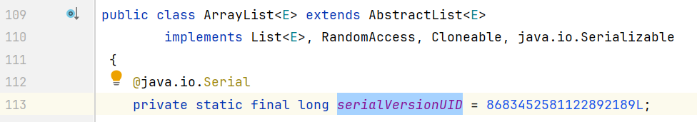

**序列化**

~~~java
//1.序列化多个对象
Student s1 = new Student("zhangsan",23,"南京");
Student s2 = new Student("lisi",24,"重庆");
Student s3 = new Student("wangwu",25,"北京");

ArrayList<Student> list = new ArrayList<>();
list.add(s1);
list.add(s2);
list.add(s3);

ObjectOutputStream oos = new ObjectOutputStream(new FileOutputStream("myio\\a.txt"));
oos.writeObject(list);

oos.close();
~~~

**反序列化**

此时在读的时候就不需要考虑循环了，直接读一次就行了。

~~~java
//1.创建反序列化流的对象
ObjectInputStream ois = new ObjectInputStream(new FileInputStream("myio\\a.txt"));

//2.读取数据
ArrayList<Student> list = (ArrayList<Student>) ois.readObject();

for (Student student : list) {
    System.out.println(student);
}

//3.释放资源
ois.close();
~~~


----

# 打印流

首先来看一下 `打印流` 在IO流体系中的位置。

`打印流` 属于高级流，也是用来包装基本流的，但是打印流不能读，只能写，因此打印流只有输出流。

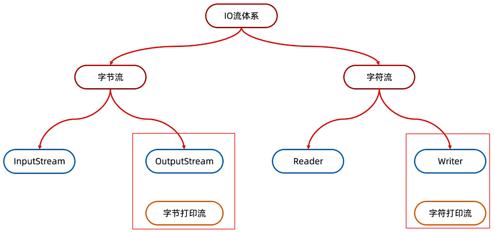

打印流分为两种：`PrintStream(字节打印流)`、`PrintWriter(字符打印流)` 两个类。

特点1：打印流只能操作文件目的地，不能操作数据源。

因此打印流只有写，没有读。

特点2：打印流里面有**特有的写出方法**，可以实现数据原样写出。

例如 打印： 97，文件中：97。打印：true，文件中：true

特点3：**特有的写出方法**，可以实现自动刷新，自动换行。

所以打印流打印一次数据 = 写出 + 换行 + 刷新

那打印流的代码我们该怎么写呢？首先来看字节打印流。

----

# 字节打印流

## 一、构造方法

创建对象首先要来看它的构造方法。

我们可以去包装基本流，也可以直接去关联文件的目的地。

但是我们要知道，就算传递的是字符串，或者是字符串所表示的路径在方法的底层它也会根据我们传递的路径去创建一个字节流的基本流 `FileOutputStream`。


在创建字节打印流的时候，我们还能指定字符编码。

这种方式指定字符编码不能传递字符串，只能使用 `Charset.forName()` 指定。


第三种构造，在写出数据的时候，可以设置自动刷新。


第四种构造就是将上面的两个构造综合起来了。

如果没有指定字符编码，默认使用平台默认的字符编码，IDEA默认是 `UTF-8`，因此如果你不写，默认就是 `UTF-8`。

这种方式指定字符编码是可以写字符串的。


但是字节打印流的底层是没有缓冲区的，因此开不开自动刷新都是一样的，所有的数据都会直接写到文件的目的地。

因此字节打印流我们真正关心的应该就是上面的两个构造。

----

## 二、成员方法

`write方法` 不是特有的，而是常规方法，既然是常规方法，那么它在write数据的时候，规则跟之前一样的。

例如小括号中写 `97`，那么真正写到文件目的地的是 `97` 在字符编码上所对应的字符 `a`，并且 `write方法` 是不能自动换行的，如果想换行还需要写 `\r\n`。


下面的三个成员方法就是特有的方法。

`println` 可以打印任意类型的数据，而且这个方法是可以自动刷新，自动换行。


`print` 可以打印任意的数据，但是这个方法不换行。


`printf` 是一个带有占位符的打印语句，这个方法也是不换行的。


但由于后面三个都是特有的方法，可以实现数据原样写出。

----

## 三、代码示例

其中的 `csn` 其实也代表字符编码

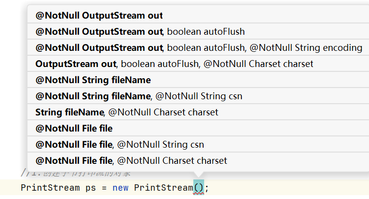

~~~java
//1.创建字节打印流的对象
PrintStream ps = new PrintStream(new FileOutputStream("myio\\a.txt"), true, Charset.forName("UTF-8"));
//2.写出数据
ps.println(97);//写出 + 自动刷新 + 自动换行 // 数据的原样写出
ps.print(true);
ps.println();
ps.printf("%s爱上了%s","阿珍","阿强");
//3.释放资源
ps.close();
~~~

`%s` 是字符串的占位符，其实它还有很多很多

~~~java
PrintStream ps = new PrintStream("a.txt");

//%n表示换行
ps.printf("我叫%s %n", "阿玮");
ps.printf("%s喜欢%s %n", "阿珍", "阿强");
ps.printf("字母H的大写：%c %n", 'H'); // %c可以把字符变成大写
ps.printf("8>3的结果是：%b %n", 8 > 3); // %b 是一个布尔类型的占位符，将8 > 3插在%b的地方
ps.printf("100的一半是：%d %n", 100 / 2); //%d 是一个整数占位符
ps.printf("100的16进制数是：%x %n", 100);
ps.printf("100的8进制数是：%o %n", 100);
ps.printf("50元的书打8.5折扣是：%f元%n", 50 * 0.85);
ps.printf("计算的结果转16进制：%a %n", 50 * 0.85);
ps.printf("计算的结果转科学计数法表示：%e %n", 50 * 0.85);
ps.printf("计算的结果转成指数和浮点数，结果的长度较短的是：%g %n", 50 * 0.85);
ps.printf("带有百分号的符号表示法，以百分之85为例：%d%% %n", 85);
ps.println("---------------------");

double num1 = 1.0;
ps.printf("num: %.4g %n", num1);
ps.printf("num: %.5g %n", num1);
ps.printf("num: %.6g %n", num1);

float num2 = 1.0F;
ps.printf("num: %.4f %n", num2);
ps.printf("num: %.5f %n", num2);
ps.printf("num: %.6f %n", num2);
ps.println("---------------------");

ps.printf("数字前面带有0的表示方式：%03d %n", 7);
ps.printf("数字前面带有0的表示方式：%04d %n", 7);
ps.printf("数字前面带有空格的表示方式：% 8d %n", 7);
ps.printf("整数分组的效果是：%,d %n", 9989997);
ps.println("---------------------");

//最终结果是10位，小数点后面是5位，不够在前面补空格，补满10位
//如果实际数字小数点后面过长，但是只规定两位，会四舍五入
//如果整数部分过长，超出规定的总长度，会以实际为准
ps.printf("一本书的价格是：%2.5f元%n", 49.8);
ps.printf("%(f%n", -76.04);

//%f，默认小数点后面7位，
//<，表示采取跟前面一样的内容
ps.printf("%f和%3.2f %n", 86.04, 1.789651);
ps.printf("%f和%<3.2f %n", 86.04, 1.789651);
ps.println("---------------------");

Date date = new Date();
// %t 表示时间，但是不能单独出现，要指定时间的格式
// %tc 周二 12月 06 22:08:40 CST 2022
// %tD 斜线隔开
// %tF 冒号隔开（12小时制）
// %tr 冒号隔开（24小时制）
// %tT 冒号隔开（24小时制，带时分秒）
ps.printf("全部日期和时间信息：%tc %n", date);
ps.printf("月/日/年格式：%tD %n", date);
ps.printf("年-月-日格式：%tF %n", date);
ps.printf("HH:MM:SS PM格式(12时制)：%tr %n", date);
ps.printf("HH:MM格式(24时制)：%tR %n", date);
ps.printf("HH:MM:SS格式(24时制)：%tT %n", date);

System.out.println("---------------------");
ps.printf("星期的简称：%ta %n", date);
ps.printf("星期的全称：%tA %n", date);
ps.printf("英文月份简称：%tb %n", date);
ps.printf("英文月份全称：%tB %n", date);
ps.printf("年的前两位数字(不足两位前面补0)：%tC %n", date);
ps.printf("年的后两位数字(不足两位前面补0)：%ty %n", date);
ps.printf("一年中的第几天：%tj %n", date);
ps.printf("两位数字的月份(不足两位前面补0)：%tm %n", date);
ps.printf("两位数字的日(不足两位前面补0)：%td %n", date);
ps.printf("月份的日(前面不补0)：%te  %n", date);

System.out.println("---------------------");
ps.printf("两位数字24时制的小时(不足2位前面补0):%tH %n", date);
ps.printf("两位数字12时制的小时(不足2位前面补0):%tI %n", date);
ps.printf("两位数字24时制的小时(前面不补0):%tk %n", date);
ps.printf("两位数字12时制的小时(前面不补0):%tl %n", date);
ps.printf("两位数字的分钟(不足2位前面补0):%tM %n", date);
ps.printf("两位数字的秒(不足2位前面补0):%tS %n", date);
ps.printf("三位数字的毫秒(不足3位前面补0):%tL %n", date);
ps.printf("九位数字的毫秒数(不足9位前面补0):%tN %n", date);
ps.printf("小写字母的上午或下午标记(英)：%tp %n", date);
ps.printf("小写字母的上午或下午标记(中)：%tp %n", date);
ps.printf("相对于GMT的偏移量:%tz %n", date);
ps.printf("时区缩写字符串:%tZ%n", date);
ps.printf("1970-1-1 00:00:00 到现在所经过的秒数：%ts %n", date);
ps.printf("1970-1-1 00:00:00 到现在所经过的毫秒数：%tQ %n", date);

ps.close();
~~~


---

# 112.字符打印流

## 一、前言

字符打印流和字节打印流两者是非常类似的。

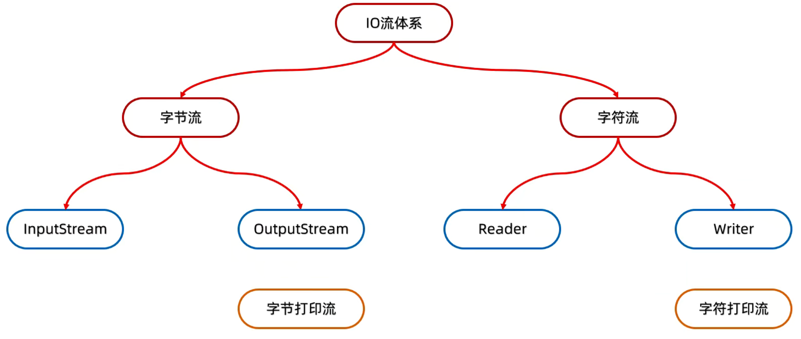

只不过字符打印流底层多了一个缓冲区，因此字符打印流效率更高一些。

并且在写出数据的时候，如果想要自动刷新，那么必须要手动开启。

想要学习一个类，首先还是要看它的构造方法

----

## 二、构造方法

构造方法其实跟字节打印流是一样的。

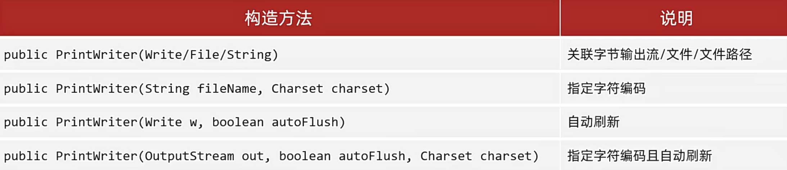

因此关于字符打印流我们只需要记住：字符流底层有缓冲区，想要自动刷新需要手动开启。

---

## 三、成员方法

成员方法基本上也一模一样

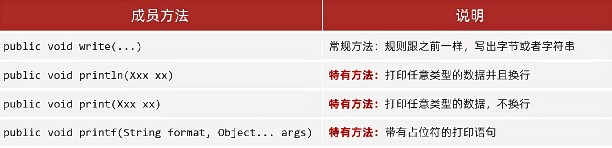

----

## 四、代码示例

字符打印流的构造方法还是比较多的，但我们可以将这些构造方法分为三组。

第一组：参数都是关联基本流的，可以关联字符输出流，也可以关联字节输入流。在第一组中是可以开启自动刷新的，因为它有 `autoFlush参数`。它还可以指定 `字符编码`。

第二组：第一个参数是一个字符串类型所表示的文件路径，第二组构造中是不能开始自动刷新的，但是它可以指定字符编码。

剩下来的就是第三组，在第三组中，第一个参数是 `File` 所表示的路径，而且在第三组中也无法开启自动刷新。

因此在以后我们真正最常用的其实还是第一组中的两个构造。

那为什么不用第一组的最后一个三个参数的呢？它多出来的参数表示字符编码，而我们以后在实际开发中，默认使用字符编码都是 `UTF-8`，因此是不需要指定的。

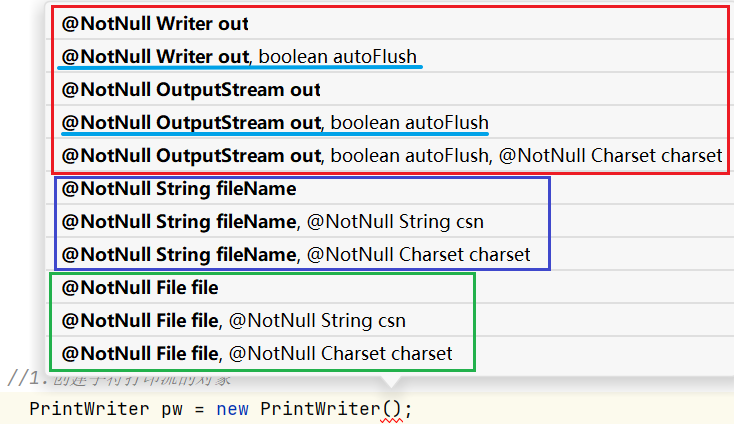

如下代码，就算没有关流，这句话也是立马写到本地了，就是因为在这开启了自动刷新。

~~~java
//1.创建字符打印流的对象
PrintWriter pw = new PrintWriter(new FileWriter("myio\\a.txt"), true);
//2.写出数据
pw.println("今天你终于叫我名字了，虽然叫错了，但是没关系，我马上改");
~~~

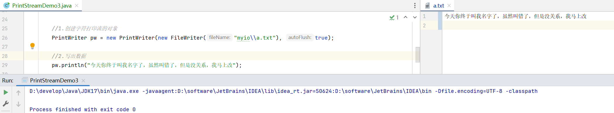

但是当你关闭了自动刷新，此时就不会立马写到本地了

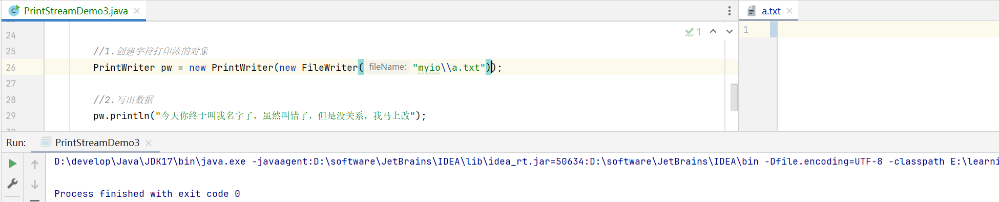

完整代码

~~~java
//1.创建字符打印流的对象
PrintWriter pw = new PrintWriter(new FileWriter("myio\\a.txt"), true);

//2.写出数据
pw.println("今天你终于叫我名字了，虽然叫错了，但是没关系，我马上改");
pw.print("你好你好"); // 表示只打印不换行
pw.printf("%s爱上了%s", "阿珍", "阿强"); // 不换行

//3.释放资源
pw.close();
~~~

---

## 五、打印流的应用场景

其实我们几乎每天都在用，因为之前每天都会写输出语句，这个里面其实就用到了打印流。

~~~java
System.out.println("123");
~~~

`System`：Java里面已经定义好的一个类，而且这个类是用 `final` 修饰，表示这个类是最终类，不能再有其他的子类了。

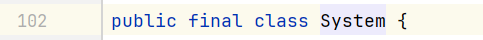

往下找，可以发现：`out` 是 `System类` 中的一个静态变量，因此在代码中，我们就可以通过类名直接调用静态变量 `System.out`。

`out` 的类型是 `PrintStream`，因此调用 `System.out` 相当于获取的就是一个打印流的对象。

这个对象是不需要我们自动创建的，而是虚拟机在启动后，由虚拟机自己创建。

这个打印流不是指向文件，而是默认指向控制台。

因此我们可以改写 `System.out.println("123")`

~~~java
//获取打印流的对象，此打印流在虚拟机启动的时候，由虚拟机创建，默认指向控制台
//所以这个打印流是一个特殊的打印流，它还有一个特殊的名字：系统中的标准输出流，是不能关闭，在系统中是唯一的。
//如果关闭了就不能再次启动，除非你将虚拟机再次重启一下。
PrintStream ps = System.out;

//拿着对象ps调用打印流中的方法println
//这个方法有三个作用：写出数据，自动换行，自动刷新
ps.println("123");

//只不过平时懒得中间再定义一个变量，因此我们是使用链式编程来书写的
System.out.println("123");
~~~

----

# 打印流总结

1、打印流有几种？各有什么特点？

有字节打印流和字符打印流两种

打印流不操作数据源，只能操作目的地

字节打印流：默认自动刷新，它有很多特有方法，其中用的最多的就是 `println`，这个方法一行抵三行：写出 + 刷新 + 换行。

字符打印流：自动刷新需要手动开启，它里面也有特有的 `println`方法，这个方法也能干三件事情：写出 + 刷新 + 换行。


----

# 压缩流和解压缩流

在开发中它们都是有自己的应用场景的。

例如我们现在要传输的数据比较大，这个时候就可以先压缩，再传输。


既然有压缩，那肯定会有解压。当接收到一个压缩包后，压缩包肯定是不能直接使用的。

我们需要先进行解压，得到里面的每一个文件，这样才能用里面的数据。


因此我们要学习的就是压缩和解压。

来看下它们在 `IO流体系` 中的位置。

`解压缩流` 主要就是读取压缩包里面的文件，所以它是读，属于 `输入流`。

而右边的 `压缩流`，是将文件中的数据写到压缩包中，所以它是写，属于 `输出流`

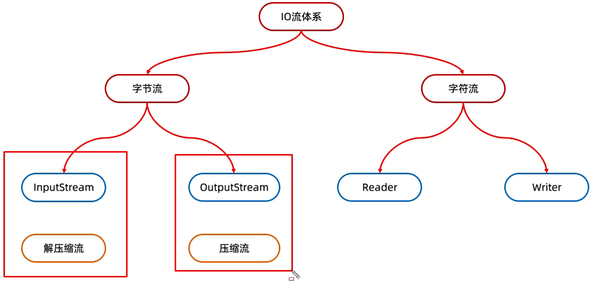

我们先来学习相对比较简单的 `解压缩流`。

-----

# 113.解压缩流

如果想要解压，在电脑中首先要有一个压缩包，这个压缩包需要是 `zip` 作为后缀的，因为Java中只能识别这个格式的。

`压缩包里面的每一个文件` 在Java中都是一个 `ZipEntry对象`。

因此解压的本质：把每一个 `ZipEntry` 按照层级拷贝到本地另一个文件夹中。

解压缩流的名字叫做 `ZipInputStream`，`Zip` 是它的作用，表示跟压缩包是有关系的；`InputStream` 表示它是用来读取的。

~~~java
public static void main(String[] args) throws IOException {
    //1.创建一个File表示要解压的压缩包
    File src = new File("D:\\aaa.zip");
    //2.创建一个File表示解压的目的地
    File dest = new File("D:\\");
    //调用方法
    unzip(src, dest);
}

//定义一个方法用来解压
public static void unzip(File src, File dest) throws IOException {
    ZipInputStream zip = new ZipInputStream(new FileInputStream(src));
    ZipEntry entry = zip.getNextEntry();
    System.out.println(entry);
}
~~~

如果多调用几次 `getNextEntry()` 会怎么样

~~~java
ZipInputStream zip = new ZipInputStream(new FileInputStream(src));
ZipEntry entry1 = zip.getNextEntry();
System.out.println(entry1);

ZipEntry entry2 = zip.getNextEntry();
System.out.println(entry2);

ZipEntry entry3 = zip.getNextEntry();
System.out.println(entry3);
~~~

运行结果如下，`aaa` 有了，还有 `aaa` 里面的 `aa.txt`，以及 `bbbb文件夹`

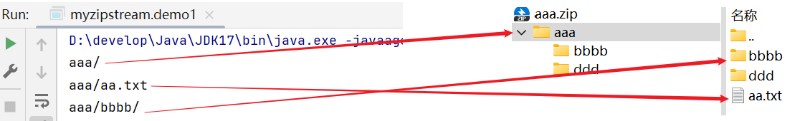

第一次打印出的 `ZipEntry` 是 `aaa/`

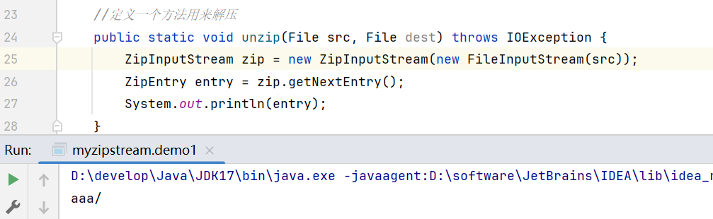

这个 `aaa` 并不是 `aaa.zip` 本身，而是它里面的文件夹。

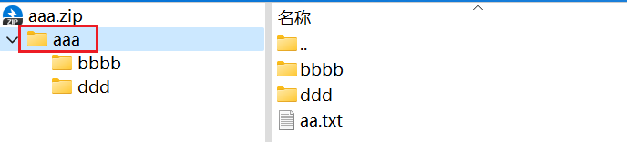

---

那么思考：它能一直获取吗？可以将子文件中的东西也获取到吗？

如果获取不到，它会返回什么呢？`null` 还是 `-1`？

没关系，我们都可以来试一下，因此这些知识点我们都可以通过不断的尝试进行总结

我也不知道这个文件夹中一共有多少 `ZipEntry对象`，但我知道绝对没有100个，因此这里直接循环100次来看看。

~~~java
for (int i = 0; i < 100; i++) {
    ZipEntry entry1 = zip.getNextEntry();
    System.out.println(entry1);
}
~~~

可以发现，当我们将压缩包里面的所有文件和文件夹都获取完毕了，这个时候再强行获取，就会返回 `null`，因此循环的结束条件我们已经知道了。

并且，子文件夹中的文件和文件夹也都可以获取到。

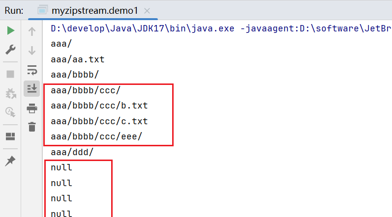

因此有了这个特性后，就不需要自己递归了，直接写一个循环就行了。

`getNextEntry()` 的底层，它会把压缩包里的每一个文件，或者文件夹全都获取到。

~~~java
public static void main(String[] args) throws IOException {
    //1.创建一个File表示要解压的压缩包
    File src = new File("D:\\aaa.zip");
    //2.创建一个File表示解压的目的地
    File dest = new File("D:\\");

    //调用方法
    unzip(src,dest);
}

//定义一个方法用来解压
public static void unzip(File src,File dest) throws IOException {
    //解压的本质：把压缩包里面的每一个文件或者文件夹读取出来，按照层级拷贝到目的地当中
    //创建一个解压缩流用来读取压缩包中的数据，解压缩流中关联基本流，再去关联压缩包的路径
    ZipInputStream zip = new ZipInputStream(new FileInputStream(src));
    //之前我们说过，`压缩包里面的每一个文件` 在Java中都是一个 `ZipEntry对象`。
    //因此在这我们需要先获取到压缩包里面的每一个zipentry对象，调用getNextExtry()
    //表示当前在压缩包中获取到的文件或者文件夹
    ZipEntry entry;
    while((entry = zip.getNextEntry()) != null){
        System.out.println(entry);
        if(entry.isDirectory()){ // entry没有isFile()，但是有isDirectory()，用来判断这个是不是一个文件夹
            //文件夹：需要在目的地dest处创建一个同样的文件夹
            File file = new File(dest,entry.toString());
            file.mkdirs();
        } else {
            //文件：需要读取到压缩包中的文件，并把他存放到目的地dest文件夹中（按照层级目录进行存放）
            //entry.toString()：将它变成字符串，即文件夹名
            FileOutputStream fos = new FileOutputStream(new File(dest, entry.toString()));
            int b;
            //读取的时候是使用zip进行读取
            while((b = zip.read()) != -1){
                //写到目的地
                fos.write(b);
            }
            fos.close();
            //表示在压缩包中的一个文件处理完毕了，需要调用closeEntry()
            zip.closeEntry();
        }
    }

    zip.close();
}
~~~


----

# 114.压缩流（压缩单个文件）

压缩：将多个文件 / 文件夹变成一个压缩包。

在压缩的时候需要注意：压缩包里面的每一个文件或文件夹都是一个 `ZipEntry对象`。

压缩本质：把每一个（文件/文件夹）看成 `ZipEntry对象` 放到压缩包中。

~~~java
需求1：把D:\\a.txt打包成一个压缩包
~~~

~~~java
public static void main(String[] args) throws IOException {
    //1.创建File对象表示要压缩的文件
    File src = new File("D:\\a.txt");
    //2.创建File对象表示压缩包的位置
    File dest = new File("D:\\");
    //3.调用方法用来压缩
    toZip(src, dest);
}

/*
 *   作用：压缩
 *   参数一：表示要压缩的文件
 *   参数二：表示压缩包的位置
 * */
public static void toZip(File src, File dest) throws IOException {
    //1.创建压缩流关联压缩包，这个压缩包名字一定要手动加上，压缩流中关联基本流，再去关联压缩包的路径
    ZipOutputStream zos = new ZipOutputStream(new FileOutputStream(new File(dest, "a.zip")));
    //2.创建ZipEntry对象，表示压缩包里面的每一个文件和文件夹
    //参数：压缩包里面的路径
    ZipEntry entry = new ZipEntry("a.txt");
    //3.把ZipEntry对象放到压缩包当中
    zos.putNextEntry(entry);
    //创建ZipOutputStream的时候肯定会在D盘下新建a.zip的压缩包，但是压缩包里还是空的，所以下面创建了ZipEntry对象，这个ZipEntry就表示压缩包里的a.txt，但是这个文件中还没有数据！我们还需要将原始文件中的数据再写到ZipEntry中才行。
    //4.把src文件中的数据写到压缩包当中
    FileInputStream fis = new FileInputStream(src); // 从src中读取数据
    int b; // 表示读到的数据
    while ((b = fis.read()) != -1) {
        // 将读取到的数据写到压缩包中
        zos.write(b);
    }
    //closeEntry()表示当前的文件已经书写完毕
    zos.closeEntry();
    zos.close();
}
~~~


-----

# 115.压缩流（压缩文件夹）

由于上一个代码，我们只需要压缩一个文件，因此写 `a.txt` 是没有问题的，但是如果我们写 `aaa\\a.txt` 会出现什么情况呢？

~~~java
ZipEntry entry = new ZipEntry("aaa\\a.txt");
~~~

可以发现它是先有了一个 `aaa文件夹`，然后在 `aaa文件夹` 里面才有了 `a.txt`

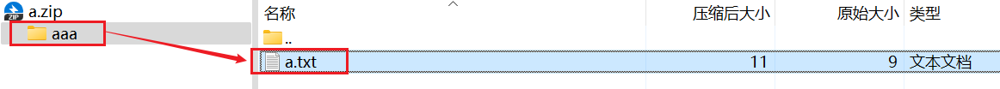

我们再来加一层 `bbb`

~~~java
ZipEntry entry = new ZipEntry("aaa\\bbb\\a.txt");
~~~

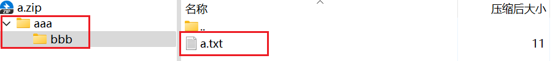

由此可知，`ZipEntry` 里面的参数其实也表示压缩包里面的路径，通过这个特点，我们就可以去压缩包中创建不同层级的子文件夹了。

有的同学写路径的时候会像下面这种写法一样

~~~java
//1.创建File对象表示要压缩的文件夹
File src = new File("D:\\aaa");
//2.创建File对象表示压缩包放在哪里（压缩包的父级路径）
File destParent = new File("D:\\aaa.zip");
~~~

但是如果真的这么写，代码会非常的不方便。

例如以后我不想压缩 `aaa文件夹` 了，而是想压缩 `bbb文件夹`，那么下面的压缩包名字还需要跟着改，太麻烦了。

我的需求是：如果我上面改了，下面也能跟着一起变动。

```java
public static void main(String[] args) throws IOException {
    //1.创建File对象表示要压缩的文件夹
    File src = new File("D:\\aaa");
    //2.创建File对象表示压缩包放在哪里（压缩包的父级路径）
    //getParentFile()：获取父级路径
    File destParent = src.getParentFile();//D:\\
    //3.创建File对象表示压缩包的路径
    File dest = new File(destParent, src.getName() + ".zip");
    //4.创建压缩流关联压缩包，解压缩流中关联基本流，再去关键压缩包的路径
    ZipOutputStream zos = new ZipOutputStream(new FileOutputStream(dest));
    //5.获取src里面的每一个文件，变成ZipEntry对象，放入到压缩包当中
    //由于src是一个文件夹，如果你想要获取到里面的每一个文件，需要递归
    toZip(src, zos, src.getName());//aaa
    //6.释放资源
    zos.close();
}

/*
 *   作用：获取src里面的每一个文件，变成ZipEntry对象，放入到压缩包当中
 *   参数一：数据源
 *   参数二：压缩流，这个压缩流已经关联好了压缩包
 *   参数三：压缩包内部的路径
 * */
public static void toZip(File src, ZipOutputStream zos, String name) throws IOException {
    //1.进入src文件夹
    File[] files = src.listFiles();
    //2.遍历数组
    //file依次表示src里面的文件或者文件夹
    for (File file : files) {
        if (file.isFile()) {
            //3.判断-文件，变成ZipEntry对象，放入到压缩包当中
            ZipEntry entry = new ZipEntry(name + "\\" + file.getName());//aaa\\no1\\a.txt
            zos.putNextEntry(entry);
            //读取文件中的数据，写到压缩包
            FileInputStream fis = new FileInputStream(file);
            int b;
            while ((b = fis.read()) != -1) {
                zos.write(b);
            }
            fis.close();
            zos.closeEntry();
        } else {
            //4.判断-文件夹，递归
            toZip(file, zos, name + "\\" + file.getName());
        }
    }
}
```


----

# 116. 工具包（Commons-io）

## 一、引入

`Commons-io` 是 `apache开源基金组织` 提供的一组有关IO操作的开源工具包。

很多课程中会将 `Commons-io` 说成 `框架`，这个说法是有问题的，因为它还达不到框架的级别，它只是一个工具包而已。

`apache` 是一个专门为支持开源软件项目而办的一个非盈利性组织。

这个组织成立于 `1999年`，总部设于美国马里兰州。

这个组织有很多很多项目，现在在世界各地被广泛的使用，这些开源的项目为Java的快速发展提供了不可磨灭的贡献。

例如有我们后面学习的 `Web应用服务器tomcat`、`项目管理工具maven`、`Java的安全框架shiro`、`分布式框架Dubbo`、`消息中间件ACTIVEMQ、RocketMQ`、`大数据的消息中间件kafka`、`分布式中做配置中心的zookeeper`、`大数据的分析平台Apache Pig`、`大数据开发的三大框架hadoop/spark/flink`、`分步搜索lucene，但是它现在已经被es所替代了`、`还有我们现在所学习的commons`。


Commons是apache开源基金组织提供的工具包，里面有很多帮助我们提高开发效率的API。

比如：

​	StringUtils   字符串工具类

​	NumberUtils   数字工具类 

​	ArrayUtils   数组工具类  

​	RandomUtils   随机数工具类

​	DateUtils   日期工具类 

​	StopWatch   秒表工具类 

​	ClassUtils   反射工具类  

​	SystemUtils   系统工具类  

​	MapUtils   集合工具类

​	Beanutils   bean工具类

​	Commons-io io的工具类

​	等等.....

其中：Commons-io是apache开源基金组织提供的一组有关IO操作的开源工具包。

作用：提高IO流的开发效率。

----

## 二、使用

由于 `commons-io` 不是我们自己写的，也不是Java提供的，而是第三方组织 `apache` 提供的。

第三方组织会将写好的代码打包成一个压缩包交给你，只不过在Java中压缩包的后缀是 `jar`，所以我们也把它叫做 `jar包`。

在 `jar包` 中其实就是别人写好的各种各样的类，如果你想要使用这些类中的方法，是不能直接用的，而是需要先将别人的代码导入到我们自己的项目中。

但是在以后我们会用到很多很多别人写好的代码，因此在正式使用的第一步是：在项目中新建一个文件夹：lib，这个文件夹以后去专门存放第三方jar包。

使用方式：

1，在项目中新建一个文件夹：lib

2，将jar包复制粘贴到lib文件夹

3，右键点击jar包，选择Add As a Library，表示将jar包跟我们的项目关联在一起了

4，在类中导包使用

它里面已经写好的方法有很多很多，但是有前面的的 `IO流` 做基础，这些方法很简单，看它的名字基本上也能猜出它的作用了。

并且你也能猜出它底层是怎么写代码的。

首先我们来说第一个相对来说比较常用的类 `FileUtils`。

第一个单词 `File` 表示 `文件 / 文件夹的路径`，`Utils` 表示 `工具`，因此这个类里面的方法都是一些 `文件/文件夹相关的方法`

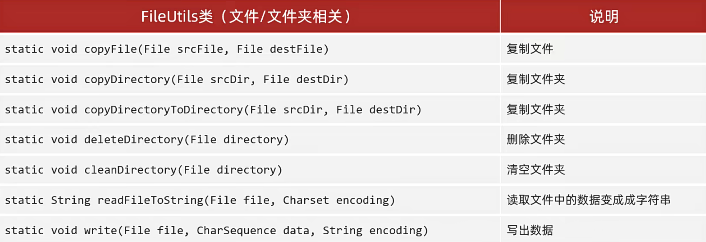

除了这个类外，还有 `IOUtils类`，也是比较常见的。这个类里面大多是跟流相关的方法。

它也有拷贝，只不过在拷贝的时候传的就不是 `File` 了，而是 `IO流`。

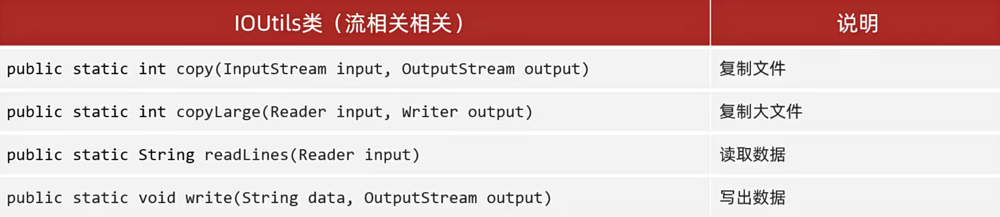

在以后，`commons-io` 淘汰了，它也会出现其他的替代品，但是只要基础扎实了，这些替代品学起来也是非常简单的。

----

## 三、代码示例

### 1）在项目中新建一个文件夹：lib

新建一个文件夹，文件夹的名字就叫做 `lib`(library)，这就表示以后，我们所用的所有第三方jar包，都会拷贝到这个文件夹中，方便管理。

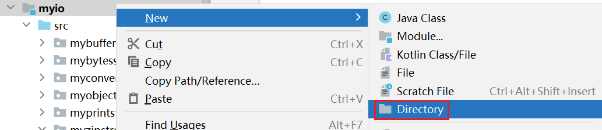

来看一下资料中提供的 `jar包`。

- `commons-io-2.11.0-javadoc`：`commons-io` 后面有 `javadoc`，那就表示在这个jar包中，都是一些文档
- `commons-io-2.11.0-sources`：`sources` 即源代码，因此在这个jar包中装的就是源代码
- `commons-io-2.11.0-tests`：`test` ，即用来做测试的
- `commons-io-2.11.0-test-sources`：用来做测试的源代码

因此上面四个都不是我想要的，我真正想要的、要导到当前项目中的，应该是第一个 `commons-io-2.11.0`（后面是它的版本号）

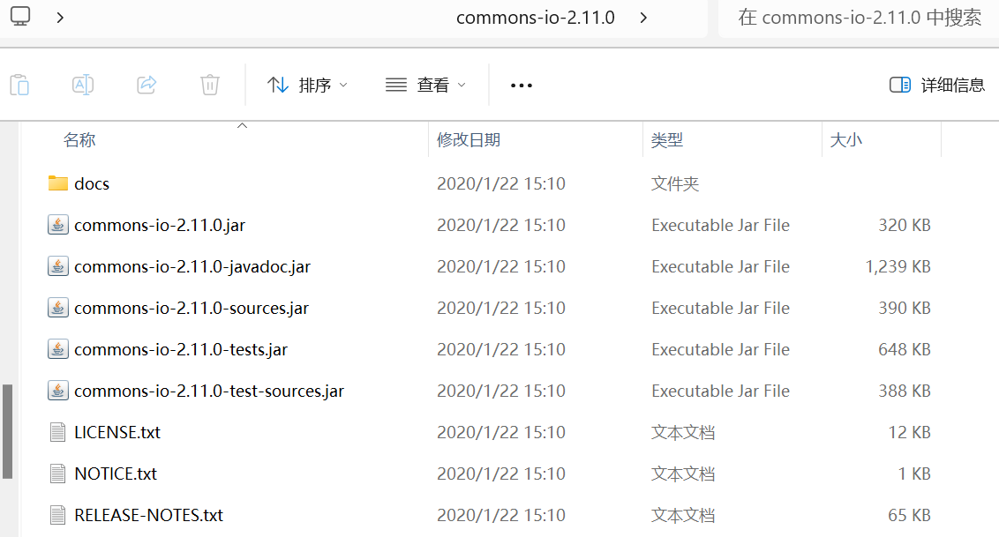

因此选中第一个 <kbd>ctrl + C</kbd>，回到代码中，点击 `lib` <kbd>ctrl + V</kbd> 直接粘贴进去就行了。

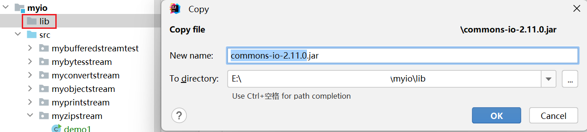

但是光粘贴过来还不行，还需要让项目跟 `jar包` 两者间产生关联。

最后一步：右键点击 `commons-io-2.11.0.jar`，选择 `Add as Library...` ，然后点击 `OK` 即可

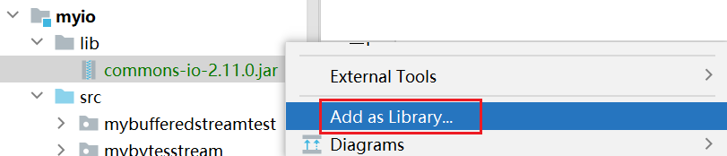

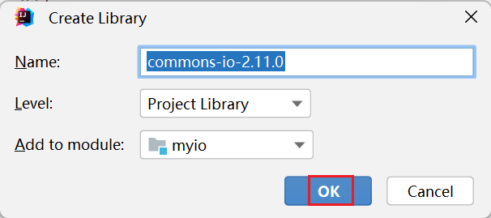

一旦关联成功后，在jar包的左边会有一个这样的箭头

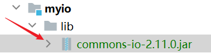

双击打开，是可以将jar包展开，看见里面的内容。这就表示你的jar包导入成功。

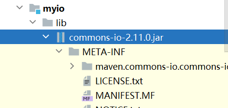


----

### 2）将jar包复制粘贴到lib文件夹

一旦导入成功之后，我就可以开始使用里面的方法了。

在书写的时候要注意导入的包

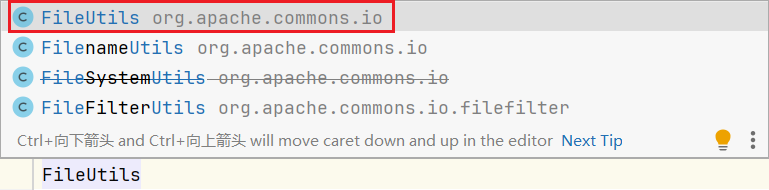

由于下面的方法都是静态的，因此可以直接使用类名调用。

```java
//一定不要导错包
import org.apache.commons.io.FileUtils;
/*
  FileUtils类
        static void copyFile(File srcFile, File destFile)                   复制文件
        static void copyDirectory(File srcDir, File destDir)                复制文件夹，直接拷贝文件夹里面的内容，拷贝后点进去，里面就是srcDir里面的东西。
        static void copyDirectoryToDirectory(File srcDir, File destDir)     复制文件夹，将数据源文件夹原封不动的拷贝到目的地文件夹里面，点进去后，会先看到srcDir目录，然后再看到srcDir目录里面的东西。
        static void deleteDirectory(File directory)                         删除文件夹，文件夹本身也被删掉了
        static void cleanDirectory(File directory)                          清空文件夹，文件夹里面的东西没有了，但是文件夹本身还在
        static String readFileToString(File file, Charset encoding)         读取文件中的数据变成成字符串
        static void write(File file, CharSequence data, String encoding)    写出数据

    IOUtils类
        public static int copy(InputStream input, OutputStream output)      复制文件
        public static int copyLarge(Reader input, Writer output)            复制大文件
        public static String readLines(Reader input)                        读取数据
        public static void write(String data, OutputStream output)          写出数据
 */
File src = new File("myio\\a.txt");
File dest = new File("myio\\copy.txt");
FileUtils.copyFile(src, dest);


File src = new File("D:\\aaa");
File dest = new File("D:\\bbb");
FileUtils.copyDirectoryToDirectory(src, dest);

File src = new File("D:\\bbb");
FileUtils.cleanDirectory(src);
```


-----

# 117.工具包（hutool）

## 一、介绍

`hutool` 工具包在市场上用的人是越来越多了，怎么能证明它的受欢迎程度呢？

有一个平台叫做 `GitHub`，它是国际性的代码托管平台，很多人，很多公司会将项目的源代码放到这个平台上面，所以是我们程序员最喜欢的一个网站，在这个网站上能找到很多很多各种各样的开源项目，因此这个网站也被我们程序员戏称为：最大的同性交友网站。

`hutool` 在GitHub上就是非常受欢迎的开源项目之一。

`hutool` 是国人开发的开源工具包，里面有很多帮助我们提高开发效率的API。

其中 `Hu` 是汉语拼音胡，是开发作者致敬前任公司。 `tool` 表示工具，两者一结合 `hutool`，它的开发者还给它赋予了一层寓意：难得糊涂，因此这个工具包我们也叫做 `糊涂包`，稀里糊涂的就把代码写完了。

在糊涂包中，有很多很多的工具类

比如：

​	DateUtil  日期时间工具类 

​	TimeInterval  计时器工具类 

​	StrUtil  字符串工具类

​	HexUtil   16进制工具类

​	HashUtil   Hash算法类

​	ObjectUtil  对象工具类

​	ReflectUtil   反射工具类

​	TypeUtil  泛型类型工具类

​	PageUtil  分页工具类

​	NumberUtil  数字工具类

但是今天我们还是来学习跟 `IO` 相关的工具类，一共有七个工具类。

最后两个 `FileReader`、`FileWriter` 跟字符流中的两个类名重复了，所以在使用的一定要注意导包。

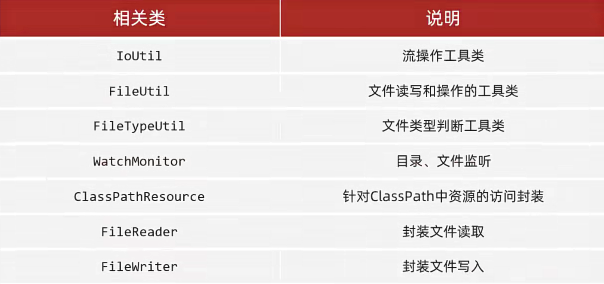

----

## 二、相关网址

~~~
官网：
	https://hutool.cn/
中文使用文档：
	https://hutool.cn/docs/#/
API文档：
	https://apidoc.gitee.com/dromara/hutool/
~~~

### 1）官网

~~~
https://hutool.cn/
~~~

在官网上其实没有什么太多的信息，我们可以简单来看一下。

一开始是它的名字，后面是它最新的版本。

下面就是一些相关网址。


往下拉，就是关于 `Hutool` 一些介绍

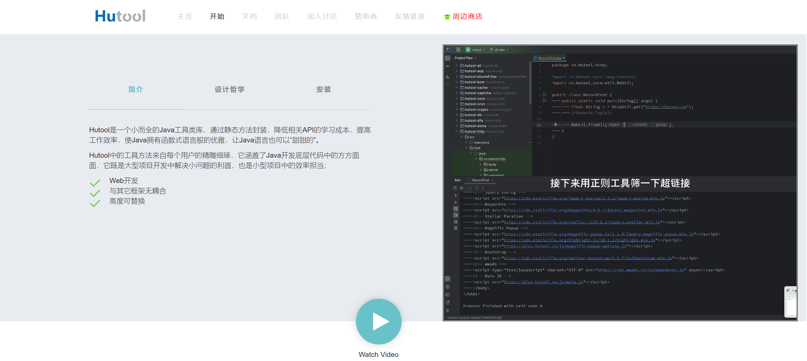

再往下拉，点击就可以跳转到另外两个网址。

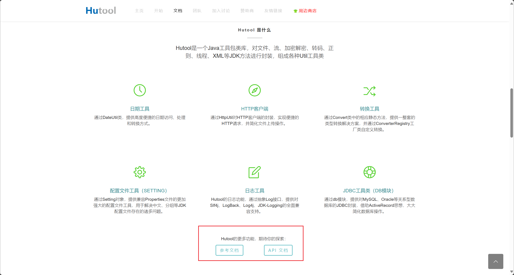

再往下拉可以看见维护人员


---

### 2）中文使用文档

~~~
https://hutool.cn/docs/#/
~~~

第二个才是真正有用的，在简洁中就是对 `Hutool` 做了一个介绍。


再往下看，它说了 `Hutool` 里面包含了很多很多组件，每个组件里面又有不同的功能

我们主要的是来看这里的第四个：`hutool-core`，它是 `hutool` 的核心包，在这个核心包里面提供了很多很多的工具类。

我们现在要学习的 `io相关` 的就是在 `core` 这个包中，因此一会我们要找的也是 `core` 里面的东西。

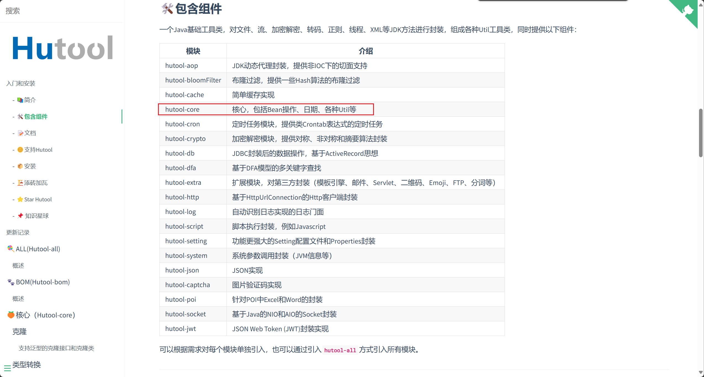

接下来我们就要来看一下 `io` 里面七个相关的类了。

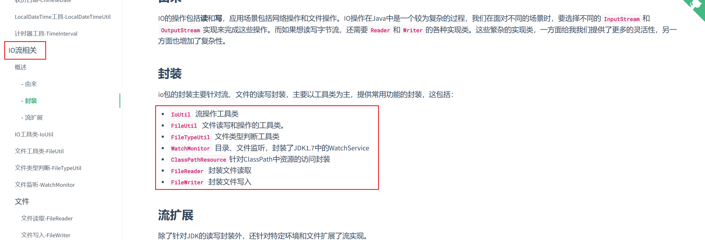

这些类里面都有什么样的方法，方法都有什么样的作用呢？此时就需要来看第三个网址。

---

### 3）API文档

~~~
https://apidoc.gitee.com/dromara/hutool/
~~~

由于 `Hutool` 是中国人写的，所以它后面的解释都是中文的，我们在学习起来的时候非常的轻松。

在刚开始打开的页面中，就是 `Hutool` 里面所有的包和每个包的作用。

首先来找 `core包`，这个包是核心包

但是在这个包里面还有很多很多的子包，每个子包又有自己的作用。

例如 `core.bean` 就是跟JavaBean相关的

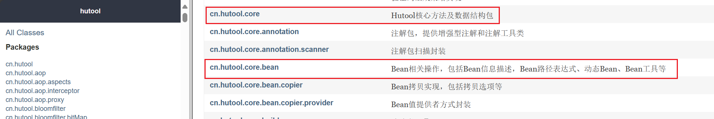

`core.clone`，就是跟克隆相关的。


`core.date` ，跟时间相关的。


再往下找，`core.io`，就是跟我们现在所学习的 `io` 所相关的，因此一会我们要找的就是  `core.io` 这个包下。


怎么找？

首先看左边上面，先选择包名，找到 `core.io` 点击。

然后下面就会出现在 `io包` 下所有的类。

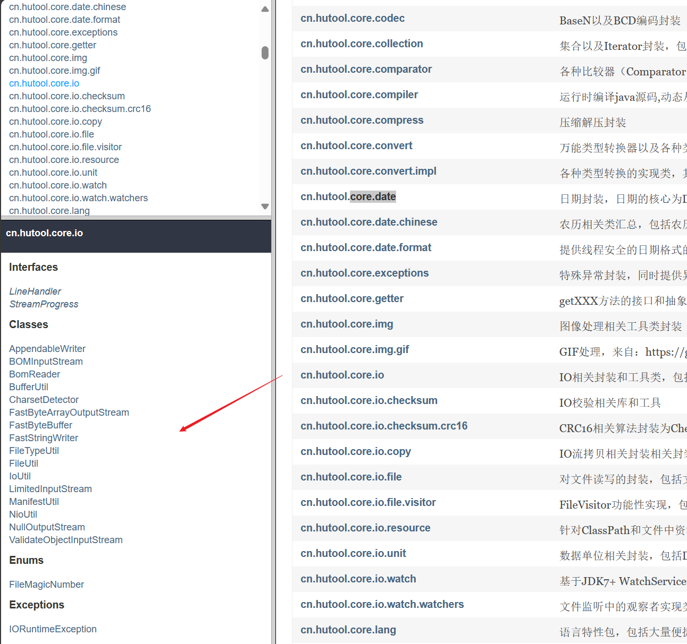

首先找 `IoUtil`，看左边，`IoUtil` 中所有的方法和解释都出来了。

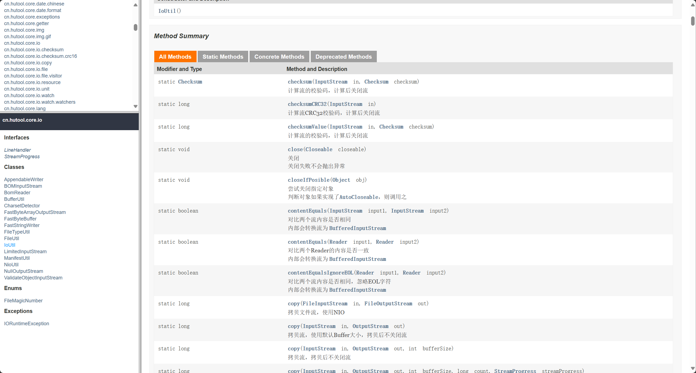

如果你想看 `FileUtil` 也一样

这些方法我们甚至都不需要自己练，看后面的解释都会了。

例如第一个 `appendLines方法`：将列表写入文件，追加模式。

这里的列表可以理解为单列集合，因为方法的参数类型是 `Collection`。

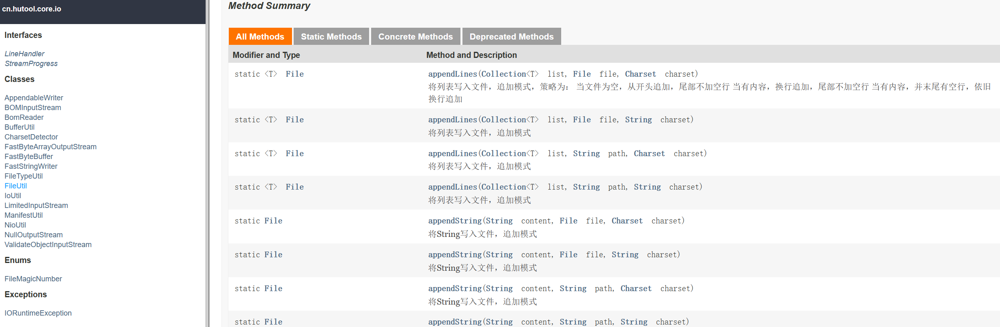

如果不想追加，想清空，此时就可以继续往下找，可以找到 `writeLines`，表示将集合里面的数据写到文件中，但是会覆盖。

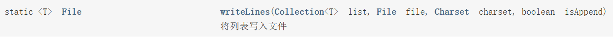

既然有写，那肯定有读的相关方法。

例如下面方法，它可以将文件里的数据读到一个集合中返回，返回值就是一个集合。

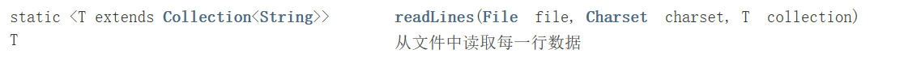

如果我现在不讲，让你用里面的方法，也只是可以使用的。这就是打基础的重要性，你可以很快上手，而且看到这个方法，你也差不多知道它的底层是怎么写的了。

----

## 三、代码示例

因为糊涂包不是我们自己写的，也不是Java写的，而是第三方写的，因此还是需要导入它的jar包。

在使用的时候要注意了，JDK版本一定要是8或者8以上的。


还是以下步骤，这里就不截图了

1，新建lib文件夹

2，把第三方jar包粘贴到文件夹中

3，右键点击add as a library

下面会对 `File类` 里面一些好用的、常见方法做一个演示，由于下面的方法都是静态的，因此可以直接使用类名调用。

~~~java
//导包的时候一定不要导错包
import cn.hutool.core.io.FileUtil;
~~~

----

### 1）`file()`

file：根据参数创建一个file对象

<kbd>ctrl + p</kbd> 来看下它的参数

它可以将一个字符串所表示的路径变成 `File对象`，还可以将父级路径跟子级路径做一个拼接，这两个功能跟之前所学习的 `File` 的构造方法是完全一模一样的。

还没完，它的强大之处在下面两个构造方法。

`String... names`：可变参数，因此我们可以在小括号中传入多个参数一起进行拼接。

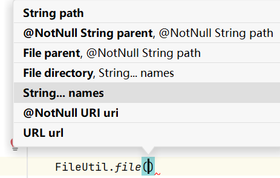

~~~java
File file1 = FileUtil.file("D:\\", "aaa", "bbb", "a.txt");
System.out.println(file1);//D:\aaa\bbb\a.txt
~~~

---

### 2）`touch()`

touch：根据参数创建文件

那是不是跟我们之前所学习的 `createNewFile()` 是一样的呢？

~~~java
File f = new File("a.txt");
f.createNewFile(); // 此时可以创建一个新的空的文件
~~~

但是 `createNewFile()` 如果父级路径是不存在的，那么方法会有IOException异常。

此时这个 `touch()` 就非常的强悍了，如果父级路径不存在，它不会报错，它会帮你把父级路径一起创建出来

~~~java
File touch = FileUtil.touch(file1);
System.out.println(touch);
~~~

----

### 3）`writeLines()`

writeLines：把集合中的数据写出到文件中，覆盖模式。

~~~java
ArrayList<String> list = new ArrayList<>();
list.add("aaa");
list.add("aaa");
list.add("aaa");

//细节：糊涂包的相对路径，不是相对于当前项目而言的，而是相对class文件而言的
File file2 = FileUtil.writeLines(list, "D:\\a.txt", "UTF-8");
System.out.println(file2);
~~~

此时会有两个效果：集合中的数据已经写到了文件中，并且文件中的东西也被覆盖。

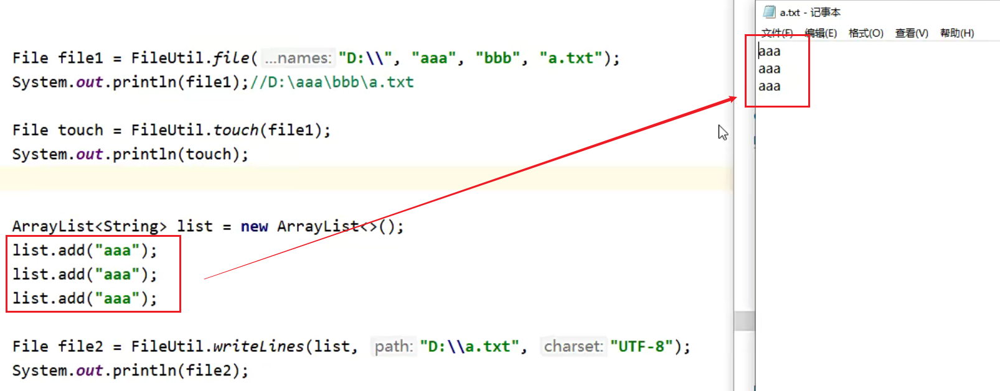

PS：如果是自定义对象，它会去调用对象的 `toString()` 写入文件中，因此我们往往需要改写 `toString()`，改成我们想要的格式。

----

### 4）`appendLines()`

appendLines：把集合中的数据写出到文件中，续写模式。

~~~java
ArrayList<String> list = new ArrayList<>();
list.add("aaa");
list.add("aaa");
list.add("aaa");
File file3 = FileUtil.appendLines(list, "D:\\a.txt", "UTF-8");
System.out.println(file3);
~~~

效果如下

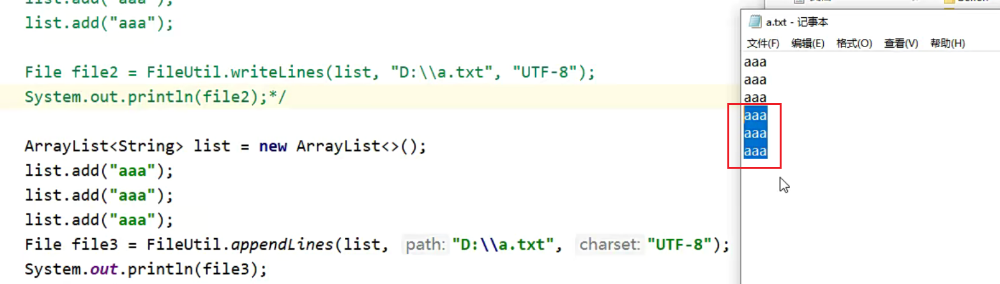

----

### 5）`readLines()`

readLines：指定字符编码，把文件中的数据，读到集合中。

第三个参数其实是可以传递一个集合的，此时它会将 `a.txt` 文件里的数据进行读取，读完后放到集合中，然后再将这个集合给你返回

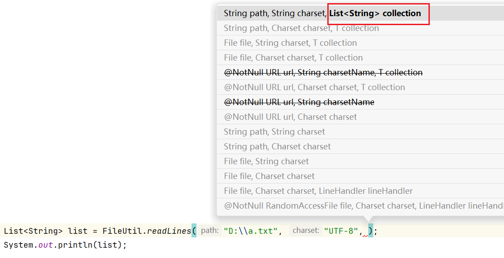

但是这么写太麻烦了，干嘛要自己创建集合，直接让方法帮我们创建，因此下面我们调用两个参数的方法，这个方法底层会帮我们创建集合。

在读的时候有个特点：一行数据它认为是集合中的一个元素。

~~~java
List<String> list = FileUtil.readLines("D:\\a.txt", "UTF-8");
System.out.println(list);
~~~


----

# -------------------------------------

# day30 阶段综合案例（带权重的随机&每日一记）

# 制造假数据

例如，如果我要随机点名，那么同学的姓名需要在记事本中提前准备好。

如果这些名字让你随便写，肯定很多同学都写不出什么花样。

例如：张三、李四、王五、赵六、孙七、周八..........

这些就是假数据，是我们胡编乱造的虚假数据，虽然这些数据是胡编乱造的，但是在开发中，这些数据尽可能要与实际的情况相吻合。

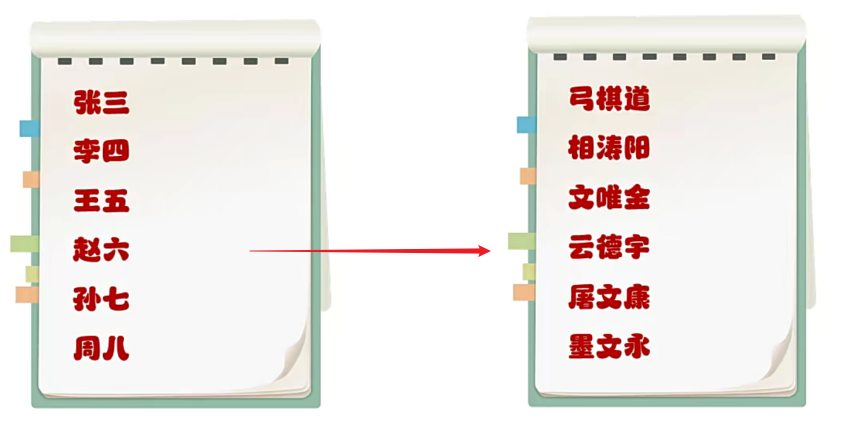

制造假数据的方式有很多，先来介绍第一种：网络爬取。

```
制造假数据：
    获取姓氏：https://hanyu.baidu.com/shici/detail?pid=0b2f26d4c0ddb3ee693fdb1137ee1b0d&from=kg0
    获取男生名字：http://www.haoming8.cn/baobao/10881.html（但是只有名，没有姓）
    获取女生名字：http://www.haoming8.cn/baobao/7641.html（但是只有名，没有姓）
```

当数据爬取完毕后，将姓氏和名字拼起来，出来的就是我们现在想要的数据。

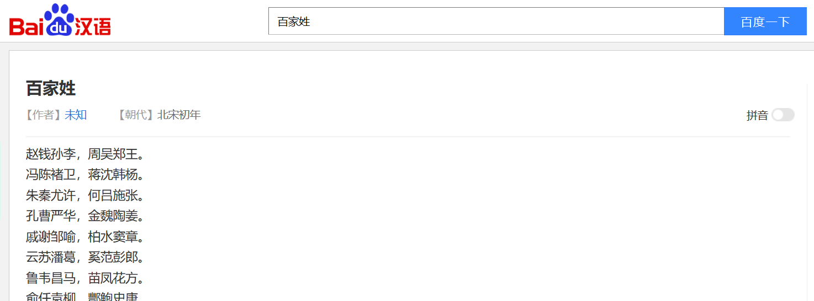


# 118.网络爬虫

## 一、代码分析

`familyName` 表示姓氏，后面加个 `Net` ，表示网址记录的是姓氏。

~~~java
public static void main(String[] args) throws IOException {
    //1.定义变量记录网址
    String familyNameNet = "https://hanyu.baidu.com/shici/detail?pid=0b2f26d4c0ddb3ee693fdb1137ee1b0d&from=kg0";
    String boyNameNet = "http://www.haoming8.cn/baobao/10881.html";
    String girlNameNet = "http://www.haoming8.cn/baobao/7641.html";

    //2.爬取数据，把网址上所有的数据拼接成一个字符串
    //由于要爬取三次，因此定义成方法，后面调用三次即可。
    //familyName：表示里面装的是所有的姓氏。Str：并且它是以字符串的姓氏来进行表示的
    String familyNameStr = webCrawler(familyNameNet);
    String boyNameStr = webCrawler(boyNameNet);
    String girlNameStr = webCrawler(girlNameNet);

    System.out.println(familyNameStr);
    // System.out.println(boyNameStr);
    // System.out.println(girlNameStr);

}

/*
* crawler：爬虫
* 作用：
*   从网络中爬取数据，把数据拼接成字符串返回
* 形参：
*   网址
* 返回值：
*   爬取到的所有数据
* */
public static String webCrawler(String net) throws IOException {
    //1.定义StringBuilder拼接爬取到的数据
    StringBuilder sb = new StringBuilder();
    //2.创建一个URL对象，url就表示网址的对象
    URL url = new URL(net);
    //3.链接上这个网址
    //细节：必须保证网络是畅通的，而且这个网址是可以链接上的。
    URLConnection conn = url.openConnection();
    //4.读取数据
    //getInputStream()：获取到输入流，网址上所有的数据通过这个输入流就能读到了
    //但是InputStream是一个字节流，由于在网址上有可能会有中文，这个中文就不能用字节流去读了，因为可能会乱码。因此我们需要将字节流进行转换，转换为字符流
    InputStreamReader isr = new InputStreamReader(conn.getInputStream());
    int ch;
    while ((ch = isr.read()) != -1){
        sb.append((char)ch);
    }
    //5.释放资源
    isr.close();
    //6.把读取到的数据返回
    return sb.toString();
}
~~~

运行代码，我们来看一看我们现在爬取到的到底是什么。

因为它爬取到的数据相对来讲比较复杂，我们一个一个来看，先来看第一个：familyNameStr

运行代码，可以看见浏览器上的数据都爬取出来了。

在这些爬取出来的数据，里面包含了我们所有想要的姓氏。

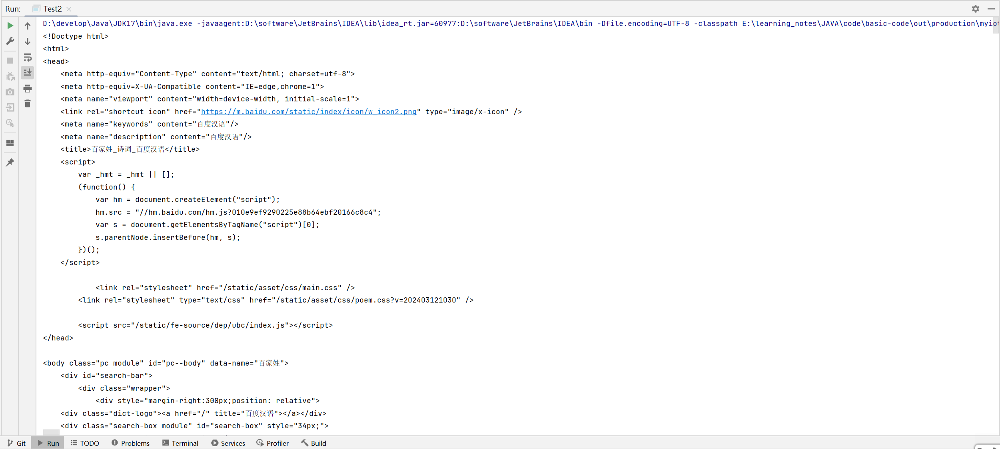

接下来看第二个爬取到的网址

~~~java
// System.out.println(familyNameStr);
System.out.println(boyNameStr);
// System.out.println(girlNameStr);
~~~

可以发现运行结果也是一样的，它里面有所有的东西。

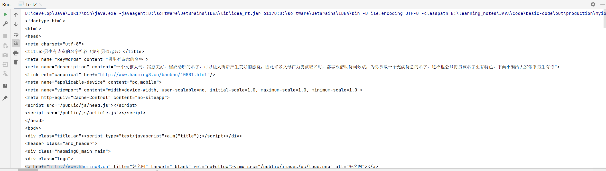

但是我不是所有东西都要，我只要里面的名字。

----

## 二、爬取姓氏

接下来需要通过正则表达式，将其中符合要求的数据获取出来。

并且我是想在三个网址中都进行获取，因此我们还需要来写一个方法 `getData()`，表示获取数据的意思。

~~~java
//3.通过正则表达式，把其中符合要求的数据获取出来
//familyNameTempList里面记录的都是姓名，只不过这个集合是临时的，所以加了一个Temp，也就是说我们拿到这个临时的集合后，还需要将它再进行处理
ArrayList<String> familyNameTempList = getData(familyNameStr,"正则表达式");
ArrayList<String> boyNameTempList = getData(boyNameStr,"正则表达式");
ArrayList<String> girlNameTempList = getData(girlNameStr,"正则表达式");

/*
* 作用：根据正则表达式获取字符串中的数据
* 参数一：
*       完整的字符串
* 参数二：
*       正则表达式
* 参数三：
*      ???? 第三个参数现在还不确定
*
* 返回值：
*       真正想要的数据
* */
private static ArrayList<String> getData(String str, String regex, ???) {
    //1.创建集合存放数据
    ArrayList<String> list = new ArrayList<>();
    //2.按照正则表达式的规则，去获取数据
    Pattern pattern = Pattern.compile(regex);
    //按照pattern的规则，到str当中获取数据
    Matcher matcher = pattern.matcher(str);
    while (matcher.find()){
        System.out.println(m.group());
    }
    return list;
}
~~~

接下来就需要先将正则表达式写出来。

正则表达式该如何写呢？你要获取什么，就写谁的正则表达式。

思考：我要获取的是这些姓氏，像下面的这些说明性的文字我其实是不要的，因此我需要写这些数据的正则表达式。

观察发现，每一句都是任意的四个汉字，然后中间用逗号或者句话隔开。我们就可以利用这个特点去写正则表达式。

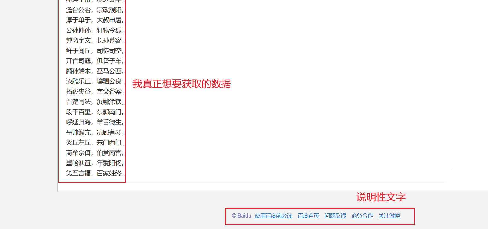

~~~java
ArrayList<String> familyNameTempList = getData(familyNameStr,".{4}(，|。)");
~~~

先爬取一下试试，可以发现都爬取出来了。但

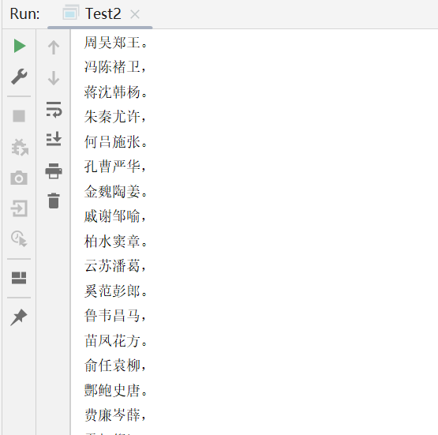

是逗号跟句号我不要怎么办？也就是说在上面这个正则表达式中，我只需要获取前面这一部分。因此可以将前面的数据括起来，将它当成第一组，后面一个括号当成第二组。

因此这个方法的后面就可以加上第三个参数，第三个参数就表示正则表达式中的第几组，如果传0，表示要获取这里完整的数据；1

~~~java
ArrayList<String> familyNameTempList = getData(familyNameStr,"(.{4})(，|。)");
~~~

接下来完善 `getData()`，index写在 `group()` 中

~~~java
/*
* 作用：根据正则表达式获取字符串中的数据
* 参数一：
*       完整的字符串
* 参数二：
*       正则表达式
* 参数三：
*      获取数据
*       0：获取符合正则表达式所有的内容
*       1：获取正则表达式中第一组数据
*       2：获取正则表达式中第二组数据
*       ...以此类推
*
* 返回值：
*       真正想要的数据
*
* */
private static ArrayList<String> getData(String str, String regex,int index) {
    //1.创建集合存放数据
    ArrayList<String> list = new ArrayList<>();
    //2.按照正则表达式的规则，去获取数据
    Pattern pattern = Pattern.compile(regex);
    //按照pattern的规则，到str当中获取数据
    Matcher matcher = pattern.matcher(str);
    while (matcher.find()){
        list.add(matcher.group(index));
    }
    return list;
}
~~~

重新运行，此时所有的名字已经都获取到了

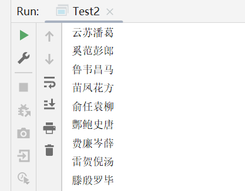

但是此时它还是四个字连在一次，等会我们需要将它们分开，因此 `familyNameTempList` 只是一个临时的集合。

---

## 三、爬取男神名字

正则表达式该怎么写呢？

我们需要打开网址，来查看我们需要爬取数据的特点。

可以看见名字都是两个汉字，在后面是以`中文的顿号`或者`中文的句话结尾`

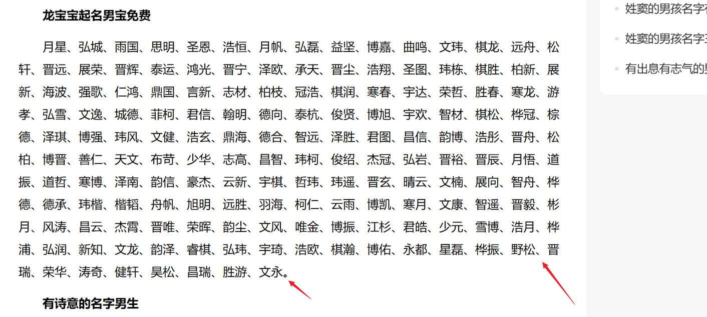

~~~java
ArrayList<String> boyNameTempList = getData(boyNameStr, "(..)(、|。)", 1);
~~~

但是这样其实还不行，打印集合看看，可以发现，不仅名字被爬取出来了，还有一些我们不需要的东西也被爬取出来了

`、日` 也是满足正则表达式要求的，因此我们需要继续修改正则。

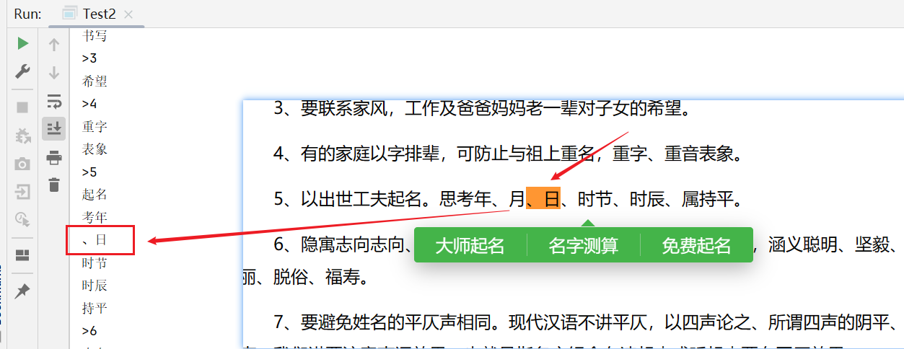

此时就要来想，这里就不能获取任意的数据了，只有前面是中文才能获取。

那中文在字符编码中的范围是多少呢？此时我们就可以使用之前分享过的 `any-rule` 插件。

然后在插件中输入 `中文`，双击点一下即可。

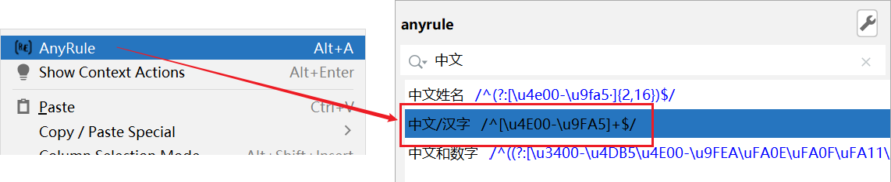

~~~java
ArrayList<String> boyNameTempList = getData(boyNameStr,"([\\u4E00-\\u9FA5]{2})(、|。)",1);
~~~

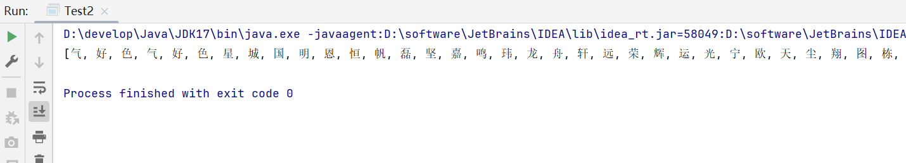

----

## 四、爬取女生名字

打开浏览器（http://www.haoming8.cn/baobao/7641.html），查看我们需要爬取数据的规律。

有的人说：可以以空格结尾，或者回车结尾。

当然不能这样爬取，因为这样符合要求的太多了，凡是有空格或者回车的，都会把它收录进来！

我们可以换种思路：将一整行数据看做是一个元素进行爬取。

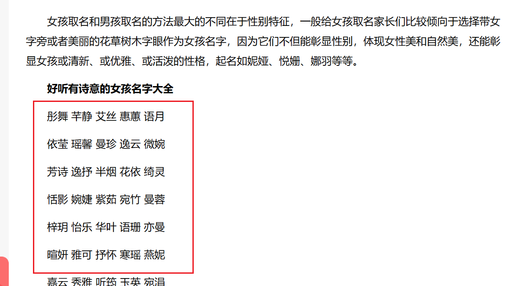

~~~java
ArrayList<String> girlNameTempList = getData(girlNameStr,"(.. ){4}..", 0);
~~~

---

## 五、数据处理

### 1）姓

在 `familyNameTempList` 集合中，是每四个姓当做是一个元素。


但是这不是我们想要的，我们想要的是将里面每一个姓都拆开放到一个新的集合中。

```java
//4.处理数据
//familyNameTempList（姓氏）
//处理方案：把每一个姓氏拆开并添加到一个新的集合当中
ArrayList<String> familyNameList = new ArrayList<>();
for (String str : familyNameTempList) {
    //str 赵钱孙李  周吴郑王   冯陈褚卫   蒋沈韩杨
    for (int i = 0; i < str.length(); i++) {
        char c = str.charAt(i);
        familyNameList.add(c + "");
    }
}
```

---

### 2）男生的名字

在 `boyNameTempList` 集合中，可以发现这些数据我们不需要做什么处理，直接就可以拿过来用。

但是发现有些数据是重复的，因此我们只需要将它做一个去重就行了。

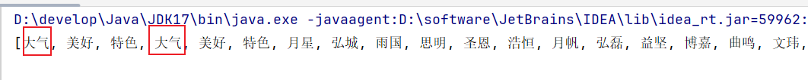

去重我们有很多的办法，例如创建一个HashSet集合，或者创建ArrayList集合，当数据往集合中添加的时候判断一下

~~~java
//boyNameTempList（男生的名字）
//处理方案：去除其中的重复元素
ArrayList<String> boyNameList = new ArrayList<>();
for (String str : boyNameTempList) {
    if(!boyNameList.contains(str)){
        boyNameList.add(str);
    }
}
~~~

---

### 3）女生的名字

可以发现女生的姓名是每五个为一组，名字跟名字之间用空格进行了隔开

```java
//girlNameTempList（女生的名字）
//处理方案：把里面的每一个元素用空格进行切割，得到每一个女生的名字
ArrayList<String> girlNameList = new ArrayList<>();

for (String str : girlNameTempList) {
    String[] arr = str.split(" ");
    for (int i = 0; i < arr.length; i++) {
        girlNameList.add(arr[i]);
    }
}
```

-----

## 六、生成数据

需求：姓名（唯一）-性别-年龄（随机）

这里定义一个方法，在方法中完成这个需求。

~~~java
//5.生成数据
//姓名（唯一）-性别-年龄
ArrayList<String> list = getInfos(familyNameList, boyNameList, girlNameList, 70, 50);
Collections.shuffle(list);

/*
* 作用：
*      获取男生和女生的信息：张三-男-23
*
* 形参：
*      参数一：装着姓氏的集合
*      参数二：装着男生名字的集合
*      参数三：装着女生名字的集合
*      参数四：需要的男生的个数
*      参数五：需要的女生的个数

* 返回值：
*	   由于我们要获取的名字有很多很多，就应该返回一个集合
* */
public static ArrayList<String> getInfos(ArrayList<String> familyNameList,ArrayList<String> boyNameList,ArrayList<String> girlNameList, int boyCount,int girlCount){
    //1.生成男生不重复的名字
    HashSet<String> boyhs = new HashSet<>();
    while (true){
        if(boyhs.size() == boyCount){
            break;
        }
        //随机
        Collections.shuffle(familyNameList);
        Collections.shuffle(boyNameList);
        boyhs.add(familyNameList.get(0) + boyNameList.get(0));
    }
    //2.生成女生不重复的名字
    HashSet<String> girlhs = new HashSet<>();
    while (true){
        if(girlhs.size() == girlCount){
            break;
        }
        //随机
        Collections.shuffle(familyNameList);
        Collections.shuffle(girlNameList);
        girlhs.add(familyNameList.get(0) + girlNameList.get(0));
    }
    //3.生成男生的信息并添加到集合当中
    ArrayList<String> list = new ArrayList<>();
    Random r = new Random();
    //【18 ~ 27】
    for (String boyName : boyhs) {
        //boyName依次表示每一个男生的名字
        int age = r.nextInt(10) + 18;
        list.add(boyName + "-男-" + age);
    }
    //4.生成女生的信息并添加到集合当中
    //用来生成任意数到任意数之间的随机数 例如7 ~15
    //1.让这个范围头尾都减去一个值，让这个范围从0开始  -7   0~8
    //2.尾巴+1       8 + 1 = 9
    //3.最终的结果，再加上第一步减去的值。 r.nextInt(9) + 7;// 7 ~ 15
    //这里要生成的是【18 ~ 25】
    for (String girlName : girlhs) {
        //girlName依次表示每一个女生的名字
        int age = r.nextInt(8) + 18;
        list.add(girlName + "-女-" + age);
    }
    return list;
}
~~~

----

## 七、写出数据

~~~java
//6.写出数据
BufferedWriter bw = new BufferedWriter(new FileWriter("myiotest\\names.txt"));
for (String str : list) {
    bw.write(str);
    bw.newLine();
}
bw.close();
~~~

---

## 八、完整代码

~~~java
public static void main(String[] args) throws IOException {
    /*
     制造假数据：
         获取姓氏：https://hanyu.baidu.com/shici/detail?pid=0b2f26d4c0ddb3ee693fdb1137ee1b0d&from=kg0
         获取男生名字：http://www.haoming8.cn/baobao/10881.html
         获取女生名字：http://www.haoming8.cn/baobao/7641.html
    */

    //1.定义变量记录网址
    String familyNameNet = "https://hanyu.baidu.com/shici/detail?pid=0b2f26d4c0ddb3ee693fdb1137ee1b0d&from=kg0";
    String boyNameNet = "http://www.haoming8.cn/baobao/10881.html";
    String girlNameNet = "http://www.haoming8.cn/baobao/7641.html";

    //2.爬取数据,把网址上所有的数据拼接成一个字符串
    String familyNameStr = webCrawler(familyNameNet);
    String boyNameStr = webCrawler(boyNameNet);
    String girlNameStr = webCrawler(girlNameNet);

    //3.通过正则表达式，把其中符合要求的数据获取出来
    ArrayList<String> familyNameTempList = getData(familyNameStr,"(.{4})(，|。)",1);
    ArrayList<String> boyNameTempList = getData(boyNameStr,"([\\u4E00-\\u9FA5]{2})(、|。)",1);
    ArrayList<String> girlNameTempList = getData(girlNameStr,"(.. ){4}..",0);

    //4.处理数据
    //familyNameTempList（姓氏）
    //处理方案：把每一个姓氏拆开并添加到一个新的集合当中
    ArrayList<String> familyNameList = new ArrayList<>();
    for (String str : familyNameTempList) {
        //str 赵钱孙李  周吴郑王   冯陈褚卫   蒋沈韩杨
        for (int i = 0; i < str.length(); i++) {
            char c = str.charAt(i);
            familyNameList.add(c + "");
        }
    }
    //boyNameTempList（男生的名字）
    //处理方案：去除其中的重复元素
    ArrayList<String> boyNameList = new ArrayList<>();
    for (String str : boyNameTempList) {
        if(!boyNameList.contains(str)){
            boyNameList.add(str);
        }
    }
    //girlNameTempList（女生的名字）
    //处理方案：把里面的每一个元素用空格进行切割，得到每一个女生的名字
    ArrayList<String> girlNameList = new ArrayList<>();

    for (String str : girlNameTempList) {
        String[] arr = str.split(" ");
        for (int i = 0; i < arr.length; i++) {
            girlNameList.add(arr[i]);
        }
    }

    //5.生成数据
    //姓名（唯一）-性别-年龄
    ArrayList<String> list = getInfos(familyNameList, boyNameList, girlNameList, 70, 50);
    Collections.shuffle(list);


    //6.写出数据
    BufferedWriter bw = new BufferedWriter(new FileWriter("myiotest\\names.txt"));
    for (String str : list) {
        bw.write(str);
        bw.newLine();
    }
    bw.close();


}

/*
* 作用：
*      获取男生和女生的信息：张三-男-23
*
* 形参：
*      参数一：装着姓氏的集合
*      参数二：装着男生名字的集合
*      参数三：装着女生名字的集合
*      参数四：男生的个数
*      参数五：女生的个数
* */
public static ArrayList<String> getInfos(ArrayList<String> familyNameList,ArrayList<String> boyNameList,ArrayList<String> girlNameList, int boyCount,int girlCount){
    //1.生成男生不重复的名字
    HashSet<String> boyhs = new HashSet<>();
    while (true){
        if(boyhs.size() == boyCount){
            break;
        }
        //随机
        Collections.shuffle(familyNameList);
        Collections.shuffle(boyNameList);
        boyhs.add(familyNameList.get(0) + boyNameList.get(0));
    }
    //2.生成女生不重复的名字
    HashSet<String> girlhs = new HashSet<>();
    while (true){
        if(girlhs.size() == girlCount){
            break;
        }
        //随机
        Collections.shuffle(familyNameList);
        Collections.shuffle(girlNameList);
        girlhs.add(familyNameList.get(0) + girlNameList.get(0));
    }
    //3.生成男生的信息并添加到集合当中
    ArrayList<String> list = new ArrayList<>();
    Random r = new Random();
    //【18 ~ 27】
    for (String boyName : boyhs) {
        //boyName依次表示每一个男生的名字
        int age = r.nextInt(10) + 18;
        list.add(boyName + "-男-" + age);
    }
    //4.生成女生的信息并添加到集合当中
    //【18 ~ 25】
    for (String girlName : girlhs) {
        //girlName依次表示每一个女生的名字
        int age = r.nextInt(8) + 18;
        list.add(girlName + "-女-" + age);
    }
    return list;
}


/*
* 作用：根据正则表达式获取字符串中的数据
* 参数一：
*       完整的字符串
* 参数二：
*       正则表达式
* 参数三：
*      获取数据
*       0：获取符合正则表达式所有的内容
*       1：获取正则表达式中第一组数据
*       2：获取正则表达式中第二组数据
*       ...以此类推
*
* 返回值：
*       真正想要的数据
*
* */
private static ArrayList<String> getData(String str, String regex,int index) {
    //1.创建集合存放数据
    ArrayList<String> list = new ArrayList<>();
    //2.按照正则表达式的规则，去获取数据
    Pattern pattern = Pattern.compile(regex);
    //按照pattern的规则，到str当中获取数据
    Matcher matcher = pattern.matcher(str);
    while (matcher.find()){
        list.add(matcher.group(index));
    }
    return list;

}


/*
* 作用：
*   从网络中爬取数据，把数据拼接成字符串返回
* 形参：
*   网址
* 返回值：
*   爬取到的所有数据
* */
public static String webCrawler(String net) throws IOException {
    //1.定义StringBuilder拼接爬取到的数据
    StringBuilder sb = new StringBuilder();
    //2.创建一个URL对象
    URL url = new URL(net);
    //3.链接上这个网址
    //细节：保证网络是畅通的，而且这个网址是可以链接上的。
    URLConnection conn = url.openConnection();
    //4.读取数据
    InputStreamReader isr = new InputStreamReader(conn.getInputStream());
    int ch;
    while ((ch = isr.read()) != -1){
        sb.append((char)ch);
    }
    //5.释放资源
    isr.close();
    //6.把读取到的数据返回
    return sb.toString();
}
~~~


----

# 122.利用糊涂包生成假数据

之前的代码我们写了很多，那第三方工具中有没有什么现成的方法呢？

其实是有的，在糊涂包中有一个现成的方法帮助我们爬取数据，而且它也有现成的方法帮助我们利用正则表达式进行解析。

因此向这种 `webCraler()` 和 `getData()` 两个方法，可以直接调用jar包中的方法。

那我们该如何找到方法呢？

例如我们要找跟爬取相关的，来看看它的代码是怎么写的。

它里面有一个工具类 `HttpUtil`，里面有一个静态方法 `get()`，将网址传递过去，它就可以将网址中所有的数据都拼接成字符串给你返回了。

拿到数据后，再根据正则表达式获取到里面想要的数据（参数为：正则表达式、字符串、正则表达式里面的第几组），方法返回一个集合。

`ReUtil` 中的 `Re` 是 `Regex` 的前面两个字母。

`findAll()` 返回的是一个 `List集合`，它是以多态的形式进行返回的，在底层它真正创建的还是一个 `ArrayList集合`

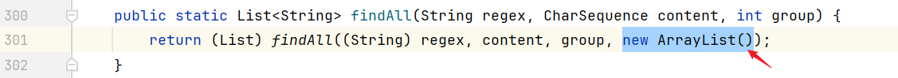

如果一定要转为ArrayList，那么只需要强转一下就行了，或者不强转，直接使用List接收也行。

两种方法都行，看你自己喜欢哪种。

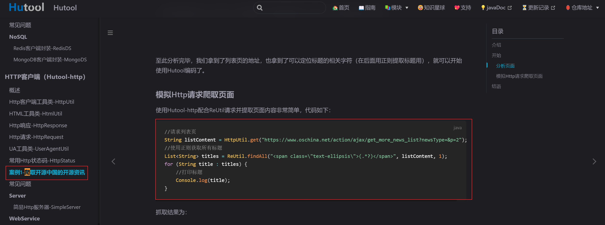

接下来就可以改造代码了。

细节：糊涂包的相对路径，不是相对于当前项目而言的，而是相对class文件而言的。（结合下面写出数据的代码看）


~~~java
public static void main(String[] args){
    //利用糊涂包生成假数据，并写到文件当中

    //1. 定义网址
    String familyNameNet = "https://hanyu.baidu.com/shici/detail?pid=0b2f26d4c0ddb3ee693fdb1137ee1b0d&from=kg0";
    String boyNameNet = "http://www.haoming8.cn/baobao/10881.html";
    String girlNameNet = "http://www.haoming8.cn/baobao/7641.html";

    //2.爬取数据
    String familyNameStr = HttpUtil.get(familyNameNet);
    String boyNameStr = HttpUtil.get(boyNameNet);
    String girlNameStr = HttpUtil.get(girlNameNet);

    //3.利用正则表达式获取数据
    //通过正则表达式，把其中符合要求的数据获取出来
    List<String> familyNameTempList = ReUtil.findAll("(.{4})(，|。)", familyNameStr, 1);
    List<String> boyNameTempList = ReUtil.findAll("([\\u4E00-\\u9FA5]{2})(、|。)", boyNameStr, 1);
    List<String> girlNameTempList = ReUtil.findAll("(.. ){4}..", girlNameStr, 0);

    System.out.println(familyNameTempList);
    System.out.println(boyNameTempList);
    System.out.println(girlNameTempList);

    //4.处理数据
    //familyNameTempList（姓氏）
    //处理方案：把每一个姓氏拆开并添加到一个新的集合当中
    ArrayList<String> familyNameList = new ArrayList<>();
    for (String str : familyNameTempList) {
        //str 赵钱孙李  周吴郑王   冯陈褚卫   蒋沈韩杨
        for (int i = 0; i < str.length(); i++) {
            char c = str.charAt(i);
            familyNameList.add(c + "");
        }
    }
    //boyNameTempList（男生的名字）
    //处理方案：去除其中的重复元素
    ArrayList<String> boyNameList = new ArrayList<>();
    for (String str : boyNameTempList) {
        if(!boyNameList.contains(str)){
            boyNameList.add(str);
        }
    }
    //girlNameTempList（女生的名字）
    //处理方案：把里面的每一个元素用空格进行切割，得到每一个女生的名字
    ArrayList<String> girlNameList = new ArrayList<>();

    for (String str : girlNameTempList) {
        String[] arr = str.split(" ");
        for (int i = 0; i < arr.length; i++) {
            girlNameList.add(arr[i]);
        }
    }

    //5.生成数据
    //姓名（唯一）-性别-年龄
    ArrayList<String> list = getInfos(familyNameList, boyNameList, girlNameList, 70, 50);
    Collections.shuffle(list);

    //6.写出数据
    //细节：糊涂包的相对路径，不是相对于当前项目而言的，而是相对class文件而言的
    FileUtil.writeLines(list, "names.txt", "UTF-8");

}

/*
 * 作用：
 *      获取男生和女生的信息：张三-男-23
 *
 * 形参：
 *      参数一：装着姓氏的集合
 *      参数二：装着男生名字的集合
 *      参数三：装着女生名字的集合
 *      参数四：男生的个数
 *      参数五：女生的个数
 * */
public static ArrayList<String> getInfos(ArrayList<String> familyNameList,ArrayList<String> boyNameList,ArrayList<String> girlNameList, int boyCount,int girlCount){
    //1.生成男生不重复的名字
    HashSet<String> boyhs = new HashSet<>();
    while (true){
        if(boyhs.size() == boyCount){
            break;
        }
        //随机
        Collections.shuffle(familyNameList);
        Collections.shuffle(boyNameList);
        boyhs.add(familyNameList.get(0) + boyNameList.get(0));
    }
    //2.生成女生不重复的名字
    HashSet<String> girlhs = new HashSet<>();
    while (true){
        if(girlhs.size() == girlCount){
            break;
        }
        //随机
        Collections.shuffle(familyNameList);
        Collections.shuffle(girlNameList);
        girlhs.add(familyNameList.get(0) + girlNameList.get(0));
    }
    //3.生成男生的信息并添加到集合当中
    ArrayList<String> list = new ArrayList<>();
    Random r = new Random();
    //【18 ~ 27】
    for (String boyName : boyhs) {
        //boyName依次表示每一个男生的名字
        int age = r.nextInt(10) + 18;
        list.add(boyName + "-男-" + age);
    }
    //4.生成女生的信息并添加到集合当中
    //【18 ~ 25】
    for (String girlName : girlhs) {
        //girlName依次表示每一个女生的名字
        int age = r.nextInt(8) + 18;
        list.add(girlName + "-女-" + age);
    }
    return list;
}
~~~


----

# 124.带权重的随机算法

## 一、引入

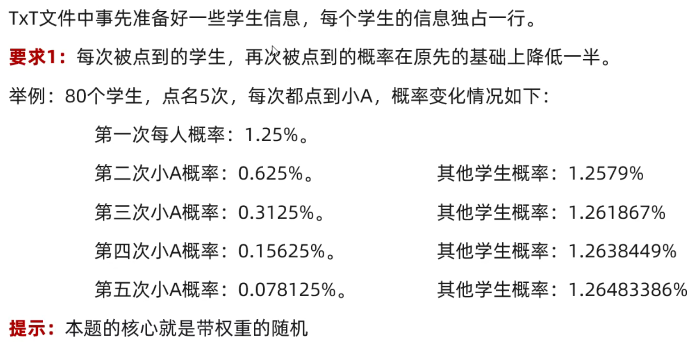

这种带权重的随机是非常常见的，例如现在最后的微服务架构，就用到了这种随机算法。

其中这里的 `带权重随机算法` 还是很重要的：在以后，我们会学习到微服务架构，那为什么会有微服务呢？

其实就是因为现在上网的人太多了，一台服务器扛不住了，就需要将一个大项目拆分成n个小项目，部署在n个服务器中。

但是这就会有一个小问题：用户在上网的时候，我也不知道访问哪个服务器。

所以在中间就会有一个服务网关，它会根据一些算法计算出，现在哪台服务器的压力还比较小。

其中有一个算法叫做：带权重的随机，随机到哪台服务器，用户就会去访问所对应的服务器，这样的好处就是可以能让我们的项目去被更多的人访问。

一开始我们可以给每台服务器都设置权重为1，那就表示每台服务器所随机到的概率是一样的。


但是假设，现在有一台服务器访问的人数太多了，此时我们就可以将它的权重降低，如果降到0的话，就不会再随机到这台服务器了。

----

## 二、梳理过程

在本地文件中，在准备数据的时候，需要给每个学生都设置权重，最初每个学生的权重都是1，就表示每个人被随机到的概率是一样的。

这个概率我们也会称之为 `权重比`，使用 `个人权重 ÷ 总权重 = 每个人的权重占比`。

现在在文件中总共有十个人，总权重就是 `10`，它里面每个人的权重占比就是 `0.1`，即 `10%` 的概率。

那么这 `10%` 的概率怎么去计算呢？

在之前我们曾经说了一个办法， `70%的概率随机到男生`、`30%的概率随机到女生`，此时我们可以往一个集合中添加 `7个1，和3个0`，根据 `1` 和 `0` 的占比情况来决定概率，这种方法是可以的，但是它是适合于数据量比较少的情况，一旦数据比较多，就不合适了。

男生、女生只有两种，可以用 `1` 和 `0` 来表示，那如果有十种数据、一百种数据呢，就没有办法进行表示了。

因此我们需要来学习一种新办法：求出每一种数据的权重占比范围。

画个数轴来理解一下，既然每个学生概率都是 `10%`，此时就可以将数轴中的 `0.0` 到 `1.0` 去分成十等分，每一个学生占据其中的一份。

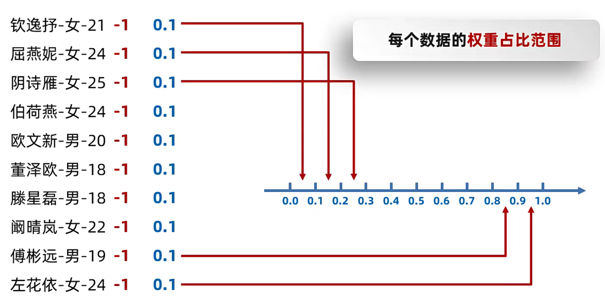

因此这里的权重占比可以这么去理解：假设现在随机到 `0.0` 到 `0.1` 之间就表示是第一位同学；随机到 `0.1` 到 `0.2` 之间就表示是第一位同学..........以此类推

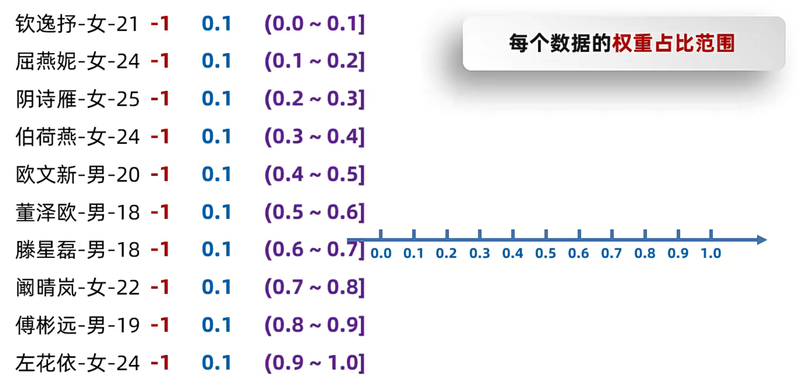

---

## 三、代码实现

首先检查数据，注意除了姓名、性别、年龄外，还需要有权重

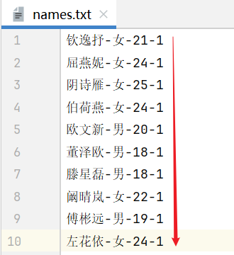

由于现在学生中的属性比较多，因此我们最好新建一个JavaBean类，在JavaBean类中定义四个属性，统一管理，这样会更方便一些。

`成员变量里面的属性顺序` 最好跟 `文件中的顺序`保持一致

**Student.java**

~~~java
public class Student {
    private String name;
    private String gender;
    private int age;
    private double weight;

    //空参构造、全参构造、set/get方法
    
    //改写toString的原因结合下面代码观看
    public String toString() {
        return name + "-" + gender + "-" + age + "-" + weight;
    }
}
~~~

**测试类**

~~~java
//1.把文件中所有的学生信息读取到内存中，并封装成一个Student对象，再方法集合里面，这样我们才能统一的进行管理
ArrayList<Student> list = new ArrayList<>();
BufferedReader br = new BufferedReader(new FileReader("myiotest\\src\\com\\itheima\\myiotest6\\names.txt"));
String line;
while((line = br.readLine()) != null){
    String[] arr = line.split("-");
    Student stu = new Student(arr[0], arr[1],Integer.parseInt(arr[2]), Double.parseDouble(arr[3]));
    list.add(stu);
}
br.close();

//接下来就是要将每个人的权重占比给算出来：个人权重 ÷ 总权重 = 每个人的权重占比
//2.计算权重的总和
double weight = 0;
for (Student stu : list) {
    weight = weight + stu.getWeight();
}

//3.计算每一个人的实际占比存起来，这里可以用数组也可以用集合
//[0.1, 0.1, 0.1, 0.1, 0.1, 0.1, 0.1, 0.1, 0.1, 0.1]
double[] arr = new double[list.size()];
int index = 0;
for (Student stu : list) {
    arr[index] = stu.getWeight() / weight;
    index++;
}

//4.计算每一个人的权重占比范围
//第一个人的范围是0 ~ 0.1，第二个人的范围是0.1~0.2，我们需要想清楚0.2是怎么来的，是不是前一个人0.1的基础上，再去加上自己本身？
//第三个人的范围也是在前一个人的基础上（0.2）加上自己本身的范围0.1，就变成了0.3
for (int i = 1; i < arr.length; i++) {
    arr[i] = arr[i] + arr[i - 1];
}
//此时如果直接打印arr，有些小数是不精确的，但是这个不精确对结果影响的不是很大，是在我们能接受范围之内的。

//5.随机抽取
//获取一个0.0~1.0之间的随机数
double number = Math.random();
//判断number在arr中的位置
//由于在arr中数据是升序排列的，因此可以使用二分查找法
//方法回返回： - 插入点 - 1
//插入点 = -方法回返回 - 1
//获取number这个数据在数组当中的插入点位置
int result = -Arrays.binarySearch(arr, number) - 1;
//获取到插入点的位置后，我们就知道是哪个学生了
Student stu = list.get(result);
System.out.println(stu);

//6.修改当前学生的权重
double w = stu.getWeight() / 2;
stu.setWeight(w);

//7.把集合中的数据再次写到文件中
BufferedWriter bw = new BufferedWriter(new FileWriter("myiotest\\src\\com\\itheima\\myiotest6\\names.txt"));
//需要按照指定的格式进行拼接太麻烦了，此时我们可以直接改写toString方法，此时我们就不需要多次调用get方法进行拼接了。
for (Student s : list) {
    bw.write(s.toString());
    bw.newLine();
}
bw.close();
~~~


----

# 125.综合练习：登录注册1

```
需求：写一个登陆小案例。
步骤：
    将正确的用户名和密码手动保存在本地的userinfo.txt文件中。
    保存格式为:username=zhangsan&password=123
    让用户键盘录入用户名和密码
            比较用户录入的和正确的用户名密码是否一致
    如果一致则打印登陆成功
            如果不一致则打印登陆失败
```

文件路径直接拷贝就好，不需要自己手动写

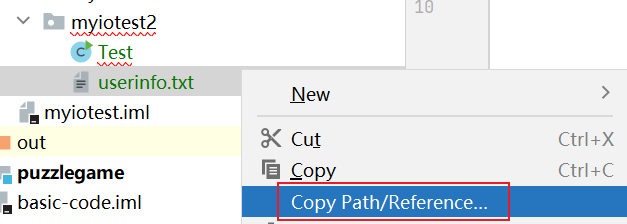

~~~java
//1.读取正确的用户名和密码
BufferedReader br = new BufferedReader(new FileReader("myiotest\\src\\com\\itheima\\myiotest7\\userinfo.txt"));
String line = br.readLine();//username=zhangsan&password=123
br.close();
String[] userInfo = line.split("&");
String[] arr1 = userInfo[0].split("=");
String[] arr2 = userInfo[1].split("=");

String rightUsername = arr1[1];
String rightPassword = arr2[1];

//2.用户键盘录入用户名和密码
Scanner sc = new Scanner(System.in);
System.out.println("请输入用户名");
String username = sc.nextLine();
System.out.println("请输入密码");
String password = sc.nextLine();

//3.比较
if(rightUsername.equals(username) && rightPassword.equals(password)){
    System.out.println("登陆成功");
}else{
    System.out.println("登陆失败");
}
~~~

# 登录注册2

```
需求：写一个登陆小案例（添加锁定账号功能）
步骤：
    将正确的用户名和密码手动保存在本地的userinfo.txt文件中。
    保存格式为:username=zhangsan&password=123&count=0
    让用户键盘录入用户名和密码
    比较用户录入的和正确的用户名密码是否一致
    如果一致则打印登陆成功
    如果不一致则打印登陆失败，连续输错三次被锁定
```

细节：如果第三次输对了，次数就需要归0

```java
public static void main(String[] args) throws IOException {
   /*
    需求：写一个登陆小案例（添加锁定账号功能）
    步骤：
        将正确的用户名和密码手动保存在本地的userinfo.txt文件中。
        保存格式为:username=zhangsan&password=123&count=0
        让用户键盘录入用户名和密码
        比较用户录入的和正确的用户名密码是否一致
        如果一致则打印登陆成功
        如果不一致则打印登陆失败，连续输错三次被锁定
    */
    //1.读取正确的用户名和密码
    BufferedReader br = new BufferedReader(new FileReader("myiotest\\src\\com\\itheima\\myiotest8\\userinfo.txt"));
    String line = br.readLine();//username=zhangsan&password=123&count=0
    br.close();
    String[] userInfo = line.split("&");
    String[] arr1 = userInfo[0].split("=");
    String[] arr2 = userInfo[1].split("=");
    String[] arr3 = userInfo[2].split("=");
    String rightUsername = arr1[1];
    String rightPassword = arr2[1];
    //count:表示用户连续输错的次数
    int count = Integer.parseInt(arr3[1]);
    //2.用户键盘录入用户名和密码
    Scanner sc = new Scanner(System.in);
    System.out.println("请输入用户名");
    String username = sc.nextLine();
    System.out.println("请输入密码");
    String password = sc.nextLine();
    //3.比较
    if (rightUsername.equals(username) && rightPassword.equals(password) && count < 3) {
        System.out.println("登陆成功");
        writeInfo("username=" + rightUsername + "&password=" + rightPassword + "&count=0");
    } else {
        count++;
        if (count < 3) {
            System.out.println("登陆失败,还剩下" + (3 - count) + "次机会");
        } else {
            System.out.println("用户账户被锁定");
        }
        writeInfo("username=" + rightUsername + "&password=" + rightPassword + "&count=" + count);
    }
}
/*
* 作用：
*       写出一个字符串到本地文件中
* 参数：
*       要写出的字符串
* */
public static void writeInfo(String content) throws IOException {
    BufferedWriter bw = new BufferedWriter(new FileWriter("myiotest\\src\\com\\itheima\\myiotest8\\userinfo.txt"));
    bw.write(content);
    bw.close();
}
```


----

# 126.导入项目

在导入比人的项目的时候有很多同学是这样操作的

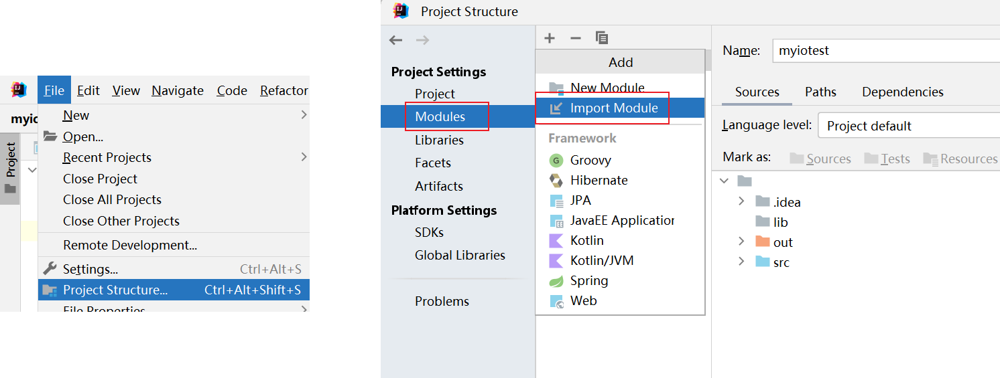

这么导入是可以的，但是如果涉及到一些路径的话，它有可能路径的表示方式跟你想的不太一样，因此不建议直接这么导入，而是建议在前面多一步。

首先找到当前要导入的模块


然后打开当前项目，直接将上面找到的模块拷贝到当前项目下


拷贝成功后，当前项目下就已经有 `puzzlegame` 了，再来导入模块

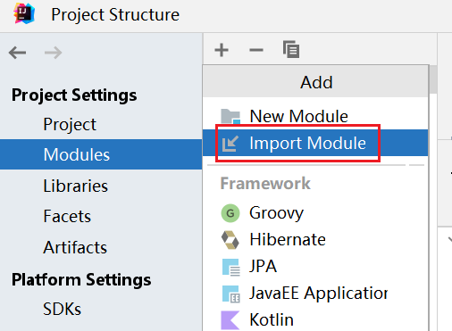

找到刚刚拷贝进来的模块，然后选择它的 `iml文件`，然后点击ok即可。

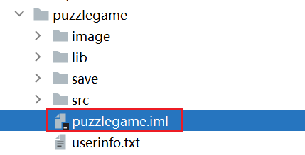

此时再看项目目录，可以发现 `puzzlegame` 已经出来了，这样导入代码才不会有路径的问题。

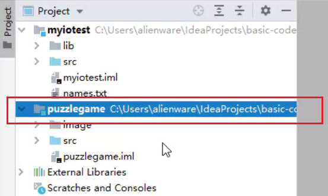


----

# 127.拼图游戏（登录界面）

## 一、思路分析

由于是具体的项目，此时就需要考虑多个用户的情况。

之前我们还没有学过IO，所有正确的数据只能保存在集合中，这样的操作它是有一个弊端的：程序一旦停止，所有的数据全部丢失，下次运行的时候还得重新注册，因此直接存集合是不行的，我们需要将用户信息保存在本地文件中，永久化存储。

在登录的时候其实就是跟文件中的数据进行比较；在注册的时候就是将用户的信息写到文件中。


登录的细节：我们肯定要将正确的用户信息读取到内存中，那么什么时候去读呢？是打开登录页面就直接读取，还是点击登录按钮的时候再读取呢？

正确答案：应该在打开界面的时候就读取，因为只要登录界面中没有关闭，我们是不会去修改文件里面的数据的，因此不管你读多少次，什么时候去读，读到的数据都是一样的，既然是这样，那为什么不是一开始就读取进来呢？

思考：读取的代码写在哪呢？静态代码块还是构造方法

想要知道这两个，就要区分静态代码块和构造方法的执行时机。

静态代码块：类第一次加载时执行，而且只执行一次。

构造方法：每次创建对象的时候都会执行，说白了，就是每次打开登录界面的时候，都会先去读一下文件。

我们这里肯定是写在构造方法中，因为我们还有可能会注册，文件中的数据就有可能发生变化，每次打开登录页面的时候，就必须重新读取文件中的内容，否则新注册的用户是看不到的。

----

## 二、代码实现

由于需要跟本地文件发生关系，因此建议先导入一个 `糊涂包`，这样我们写代码会更加的简洁。


~~~java
ArrayList<User> allUsers = new ArrayList<>();

//读取本地文件中的用户信息
private void readUserInfo() {
    //1.读取数据，readUtf8Lines()会一行一行的去读取数据，每一行都会放到集合中当做是一个元素
    List<String> userInfoStrList = FileUtil.readUtf8Lines("C:\\Users\\alienware\\IdeaProjects\\basic-code\\puzzlegame\\userinfo.txt");
    //2.遍历集合获取用户信息并创建User对象
    for (String str : userInfoStrList) {
        //username=zhangsan&password=123
        String[] userInfoArr = str.split("&");
        //0  username=zhangsan   1   password=123
        String[] arr1 = userInfoArr[0].split("=");
        String[] arr2 = userInfoArr[1].split("=");
        User u = new User(arr1[1],arr2[1]);
        allUsers.add(u);
    }

    System.out.println(allUsers);
}
~~~


----

# 128.注册界面

组件名如下


步骤如下

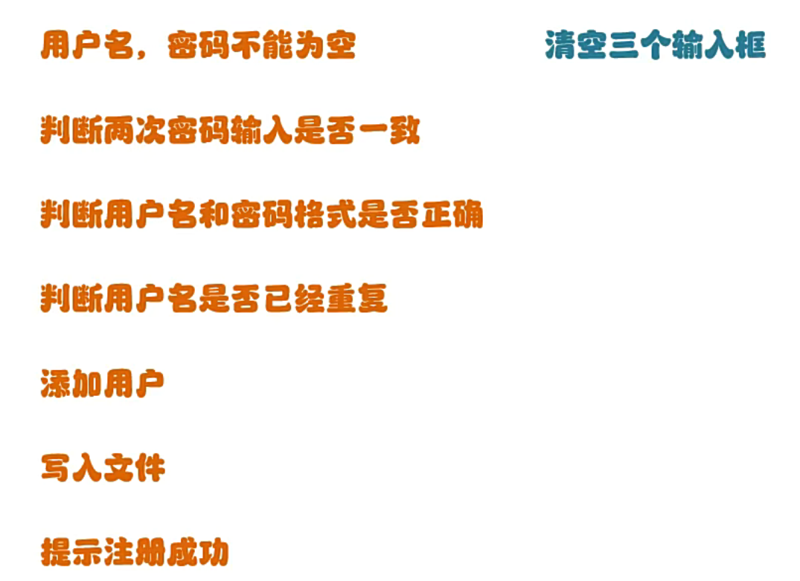

在登录界面中修改如果是注册按钮

~~~java
else if (e.getSource() == register) {
    System.out.println("点击了注册按钮");
    //关闭当前的登录界面
    this.setVisible(false);
    //打开注册界面，建议将读取到的用户信息传递给注册页面，这样在注册页面就不需要重新读了
    new RegisterJFrame(allUsers);
} 
~~~

由于登录界面使用的是 `if-else` 结构，因此不需要 `return`，因为 `if-else` 只会进入一个代码块。

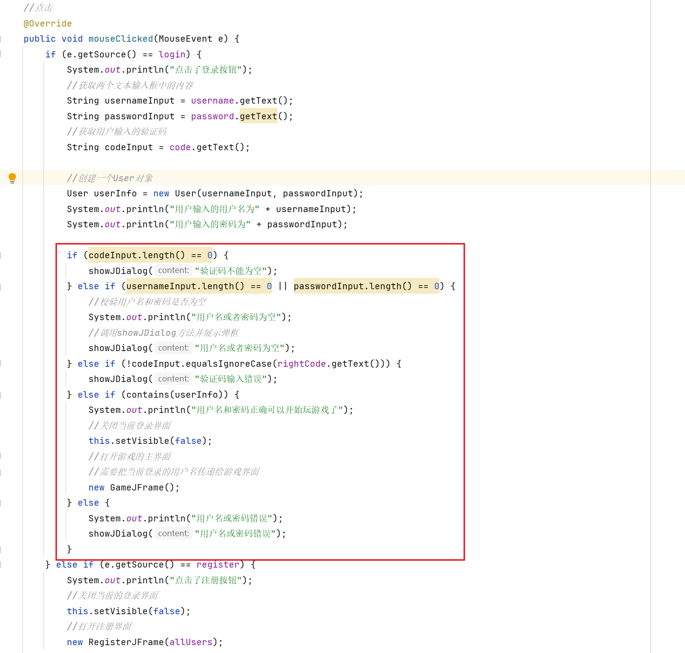

但是这里是需要 `return` 的。

```java
public class RegisterJFrame extends JFrame implements MouseListener {

    ArrayList<User> allUsers;

    //提升三个输入框的变量的作用范围，让这三个变量可以在本类中所有方法里面可以使用。
    JTextField username = new JTextField();
    JTextField password = new JTextField();
    JTextField rePassword = new JTextField();

    //提升两个按钮变量的作用范围，让这两个变量可以在本类中所有方法里面可以使用。
    JButton submit = new JButton();
    JButton reset = new JButton();

    public RegisterJFrame(ArrayList<User> allUsers) {
        this.allUsers = allUsers;
        initFrame();
        initView();
        setVisible(true);
    }

    @Override
    public void mouseClicked(MouseEvent e) {
        if(e.getSource() == submit){
            //点击了注册按钮
            //1.用户名，密码不能为空
            if(username.getText().length() == 0 || password.getText().length() == 0 || rePassword.getText().length() == 0){
                showDialog("用户名和密码不能为空");
                return;
            }
            //2.判断两次密码输入是否一致
            if(!password.getText().equals(rePassword.getText())){
                showDialog("两次密码输入不一致");
                return;
            }
            //3.判断用户名和密码的格式是否正确
            //正则表达式可以使用any-rule生成，但生成的太严格了，我们可以自行修改
            if(!username.getText().matches("[a-zA-Z0-9]{4,16}")){
                showDialog("用户名不符合规则");
                return;
            }
            if(!password.getText().matches("\\S*(?=\\S{6,})(?=\\S*\\d)(?=\\S*[a-z])\\S*")){
                showDialog("密码不符合规则，至少包含1个小写字母，1个数字，长度至少6位");
                return;
            }
            //4.判断用户名是否已经重复
            if(containsUsername(username.getText())){
                showDialog("用户名已经存在，请重新输入");
                return;
            }
            //5.添加用户
            allUsers.add(new User(username.getText(), password.getText()));
            //6.写入文件，writeLines()如果我们写入对象，它会调用toString()将结果写到文件中，因此我们需要改写toString
            FileUtil.writeLines(allUsers,"C:\\Users\\alienware\\IdeaProjects\\basic-code\\puzzlegame\\userinfo.txt","UTF-8");
            //7.提示注册成功
            showDialog("注册成功");
            //关闭注册界面，打开登录界面
            this.setVisible(false);
            new LoginJFrame();
        }else if(e.getSource() == reset){
            //点击了重置按钮
            //清空三个输入框
            username.setText("");
            password.setText("");
            rePassword.setText("");
        }
    }


    /*
    * 作用：
    *       判断username在集合中是否存在
    * 参数：
    *       用户名
    * 返回值：
    *       true：存在
    *       false：不存在
    *
    * */
    public boolean containsUsername(String username){
        for (User u : allUsers) {
            if(u.getUsername().equals(username)){
                return true;
            }
        }
        return false;
    }
}
```


----

# 129.拼图游戏（存档读档）

## 一、引入

不管是哪个游戏，一个存档记录就是一个单独的文件，但是这个文件的名字建议从0开始，这样跟计算机计数的习惯是一样的，也会让我们的代码简单很多。

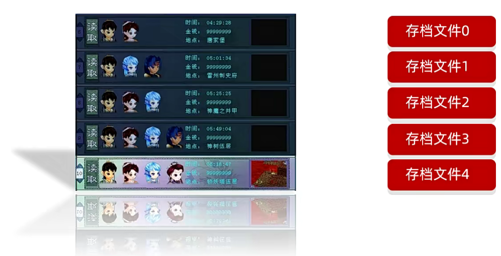

在拼图小游戏中，我们会将存档独挡的功能写在菜单中。

它里面会有存档的位置

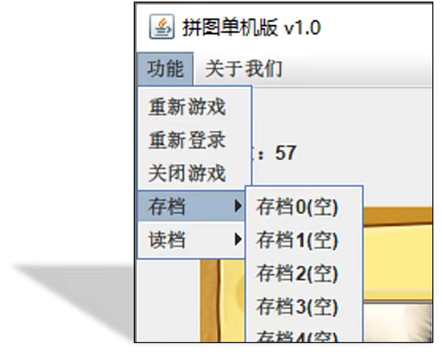

下次再玩的时候点击读档，游戏的进度就会恢复。


步骤如下

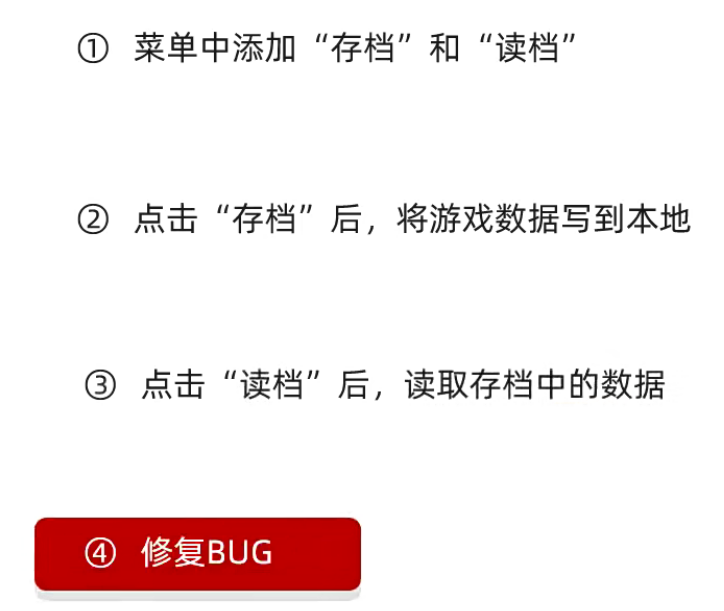

认识名字

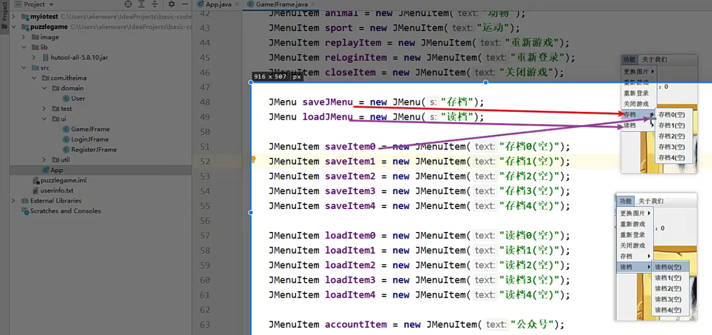

----

## 二、代码示例

首先需要思考，我们该什么样的形式将数据写到本地，难道还是和之前一样，每种数据写一行吗？

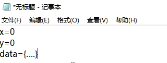

这是不对的，这么写太麻烦了，而且后面读也不好读，更重要的是，如果用户找到了这个文件，就可以随意篡改游戏的进度了。

思考：之前有一个IO流，它可以将一个对象的整体写到本地文件，更重要的是，用户不能改。即之前讲的 `序列化流/对象操作流`。

想要使用 `对象操作流` 进行写出，就需要定义一个JavaBean类

~~~java
public class GameInfo implements Serializable {
    @Serial
    private static final long serialVersionUID = 5544981119935263973L;

    private int[][] data;
    private int x = 0;
    private int y = 0;
    private String path;
    private int step;

    //空参构造、全参构造、get/set方法

    public String toString() {
        return "GameInfo{data = " + data + ", x = " + x + ", y = " + y + ", path = " + path + ", step = " + step + "}";
    }
}
~~~

一般在游戏中，会创建一个文件夹单独放游戏的进度，这里文件夹的名字就叫做 `save`。


`save文件夹` 中文件的名字该如何定义呢？一般文件名都会这么起：`save + 序号`、`data + 序号`，这里就直接 `save + 序号` 了。

后缀名可以随便写，这里写 `.data`，表示是数据的意思。

有异常要注意，它是抛不了异常的，直接 `try`，因为父类中 `actionPerformed()` 没有抛出异常，因此子类中也不能抛出异常，只能自己 `try`

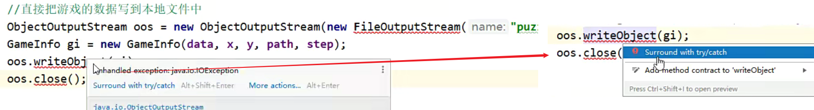

这样就可以了

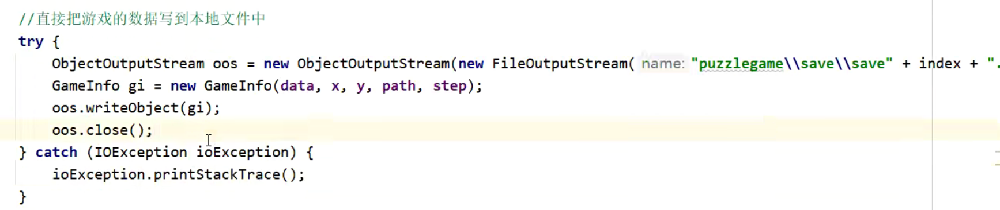

但如果你觉得这个代码有点麻烦，还可以使用糊涂包里面的方法。

糊涂包中有一个 `IOUtils类`，里面有一个 `writeObj`，方法里面有三个形参（流、是否关流、写哪个对象）

这样我们就省的自己关流了，这个方法的底层会帮我们自动搞定。

~~~java
IoUtil.writeObj(oos, true, gi);
~~~

完整代码

~~~java
//存档
else if (obj == saveItem0 || obj == saveItem1 || obj == saveItem2 || obj == saveItem3 || obj == saveItem4) {
    //获取当前是哪个存档被点击了，获取其中的序号
    JMenuItem item = (JMenuItem) obj;
    String str = item.getText(); // 存档2（空）
    int index = str.charAt(2) - '0';

    //直接把游戏的数据写到本地文件中
    try {
        ObjectOutputStream oos = new ObjectOutputStream(new FileOutputStream("puzzlegame\\save\\save" + index + ".data"));
        GameInfo gi = new GameInfo(data, x, y, path, step);
        IoUtil.writeObj(oos, true, gi);
    } catch (IOException ioException) {
        ioException.printStackTrace();
    }
    //修改一下存档item上的展示信息
    //格式：存档0(XX步)
    item.setText("存档" + index + "(" + step + "步)");
    //修改一下读档item上的展示信息，这里的index就很好用了
    loadJMenu.getItem(index).setText("存档" + index + "(" + step + "步)");
} else if (obj == loadItem0 || obj == loadItem1 || obj == loadItem2 || obj == loadItem3 || obj == loadItem4) {
    //获取当前是哪个读档被点击了，获取其中的序号
    JMenuItem item = (JMenuItem) obj;
    String str = item.getText();
    int index = str.charAt(2) - '0';

    GameInfo gi = null;
    try {
        //可以到本地文件中读取数据
        ObjectInputStream ois = new ObjectInputStream(new FileInputStream("puzzlegame\\save\\save" + index + ".data"));
        gi = (GameInfo)ois.readObject();
        ois.close();
    } catch (IOException ioException) {
        ioException.printStackTrace();
    } catch (ClassNotFoundException classNotFoundException) {
        classNotFoundException.printStackTrace();
    }

    data = gi.getData();
    path = gi.getPath();
    step = gi.getStep();
    x = gi.getX();
    y = gi.getY();

    //重新刷新界面加载游戏
    initImage();
}
~~~


----

# 131.拼图游戏（数据同步）

其实刚刚的代码还有一个小Bug，当我们重新运行程序后，独挡存档还是空的。

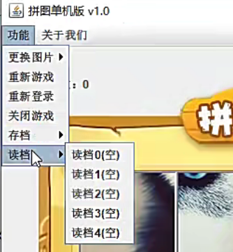

Bug出现原因：我们在游戏加载的时候，并没有去获取里面的存档信息，没有将存档信息加载到菜单中。

找到 `initJMenuBar()`，在这个方法里面，我们要读取存档信息，并将步数加载到菜单上。

这里定义一个方法单独书写。

~~~java
public void getGameInfo(){
    //1.创建File对象表示所有存档所在的文件夹
    File file = new File("puzzlegame\\save");
    //2.进入文件夹获取到里面所有的存档文件
    File[] files = file.listFiles();
    //3.遍历数组，得到每一个存档
    for (File f : files) {
        //f ：依次表示每一个存档文件
        //获取每一个存档文件中的步数
        GameInfo gi = null;
        try {
            ObjectInputStream ois = new ObjectInputStream(new FileInputStream(f));
            gi = (GameInfo)ois.readObject();
            ois.close();
        } catch (IOException e) {
            e.printStackTrace();
        } catch (ClassNotFoundException e) {
            e.printStackTrace();
        }
        //获取到了步数
        int step = gi.getStep();

        //把存档的步数同步到菜单当中
        //save0 ---> 0Item中
        //save1 ---> 1Item中
        //...

        //获取存档的文件名 save0.data
        String name = f.getName();
        //获取当存档的序号（索引）
        int index = name.charAt(4) - '0';
        //修改菜单上所表示的文字信息
        saveJMenu.getItem(index).setText("存档" + index + "(" + step + ")步");
        loadJMenu.getItem(index).setText("存档" + index + "(" + step + ")步");
    }
}
~~~


----

# 132.`properties` 的基本使用

## 一、配置文件

配置几乎所有的软件都会有，通俗易懂来讲，其实就是软件的设置，例如IDEA可以设置背景图片、字体大小、字体颜色等等，这些设置我们会将它保存到一个文件夹中永久化存储，这个保存设置的文件，我们就会将它叫做 `配置文件`。

而我们的游戏也可以有配置文件，我们可以将游戏界面的宽高、默认图片、广告图片都放到配置文件中。

有了配置文件后，至少会有两大好处

1、可以把软件的设置永久化存储

2、如果我们要修改参数，不需要改动代码，直接修改配置文件就可以了

----

在代码中，常见的配置文件有很多种，例如：XML、properties、ini、YAML........

我们先来学习第一个：properties配置文件。

----

## 二、properties配置文件

`properties配置文件` 有两个特点

1、文件的后缀名就是 `.properties`

2、文件中所有的数据，都是按照键值对的形式进行存储的，左边是键，右边是值

看见键值，就想到了Map集合，Java为了方便我们从properties配置文件中读取数据和写出数据，它专门设计了一个类，就叫做 `properties`，这个 `properties类` 是归属于 `Map集合` 的，它具有 `Map集合` 所有的特性。

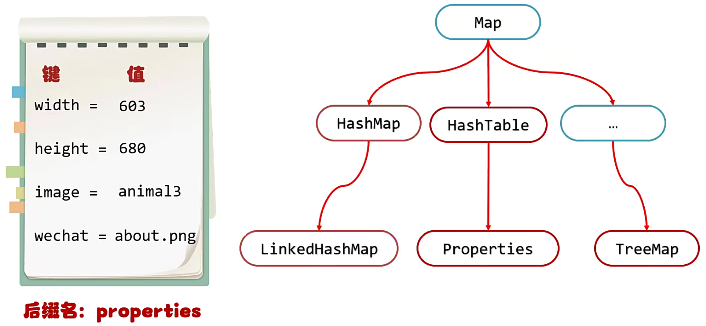

更重要的是，它里面还会有一些特有的方法，可以把集合中的数据，按照键值对的形式写到配置文件中。

也可以把配置文件中的数据读取到集合中来。

----

## 三、`Properies` 作为双列集合的使用

Java在定义Properties的时候后面没有写泛型

它既然不是一个泛型类，那么在创建对象的时候根本就不需要指定泛型。

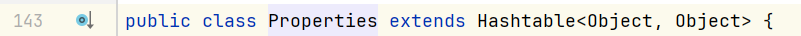

既然没有泛型，我们在添加的时候就可以添加任意的数据类型。可以发现方法参数的类型都是 `Object类型` 的。

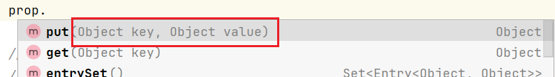

```java
//1.创建集合的对象
Properties prop = new Properties();

//2.添加数据
//细节：虽然我们可以往Properties当中添加任意的数据类型，但是一般只会往里面添加字符串类型的数据
prop.put("aaa","111");
prop.put("aaa","222");//这里会覆盖，要注意Map集合的键是唯一的，值是可以重复的。
prop.put("bbb","222");
prop.put("ccc","333");
prop.put("ddd","444");

//3.遍历集合
//方法一
Set<Object> keys = prop.keySet();
for (Object key : keys) {
    Object value = prop.get(key);
    System.out.println(key + "=" + value);
}

//方法二
Set<Map.Entry<Object, Object>> entries = prop.entrySet();
for (Map.Entry<Object, Object> entry : entries) {
    Object key = entry.getKey();
    Object value = entry.getValue();
    System.out.println(key + "=" + value);
}
```

----

## 四、Properties跟IO流结合的操作

### 1）保存（`store()`）

把集合中的数据以键值对的形式写到本地文件当中：如果我们没有学习Properties中特有的方法，这个我们其实也能做。

但是非常的麻烦，需要我们自己遍历，需要我们自己写出。

~~~java
BufferedWriter bw = new BufferedWriter(new FileWriter("myiotest\\a.properties"));
Set<Map.Entry<Object, Object>> entries = prop.entrySet();
for (Map.Entry<Object, Object> entry : entries) {
    Object key = entry.getKey();
    Object value = entry.getValue();
    bw.write(key + "=" + value);
    bw.newLine();
}
bw.close();
~~~

接下来看看它的特有方法有多简单

`store()`：保存，将集合中的数据保存到本地文件中。

方法参数有两个

输出流我们可以关联字节输出流也可以关联字符输出流。

第二个参数表示文件里面的注释信息，要注意的是，在文件中我们一般是不写中文的。

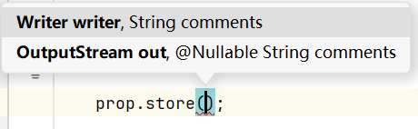

~~~java
//1.创建集合
Properties prop = new Properties();

//2.添加数据
prop.put("aaa","bbb");
prop.put("bbb","ccc");
prop.put("ddd","eee");
prop.put("fff","iii");

//3.把集合中的数据以键值对的形式写到本地文件当中
FileOutputStream fos = new FileOutputStream("myiotest\\a.properties");
prop.store(fos, "test");
fos.close();
~~~

上面的test就是我们自己写的属实信息

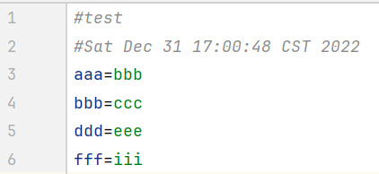

----

### 2）读取（`store()`）

- `load()`：加载，将 `properties` 中的数据读取到集合中。

这个方法可以传入字符输入流，也可以传入字节输入流

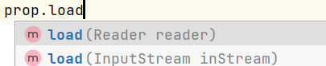

~~~java
//1.创建集合
Properties prop = new Properties();
//2.读取本地Properties文件里面的数据
FileInputStream fis = new FileInputStream("myiotest\\a.properties");
prop.load(fis);
fis.close();

//3.打印集合
System.out.println(prop);
~~~


-----

# 133.拼图游戏（配置文件）

需求：把点击 `关于我们` 要展示的广告图片放到配置文件中。

这样做我们以后如果要更改图片，就不需要我们自己去写代码了。

我们先来新建一个文件，文件名可以随便取，但是后缀名一定要叫做 `properties`。

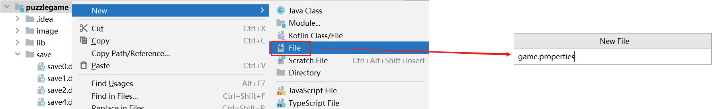

在配置文件中书写键值对的时候，`=` 前后不要加空格，值的后面也不要加 `;(分号)`，就写一个最基本最简单的 `键=值` 即可

因为如果习惯性在后面写一个分号，那么值就不是这个路径了，而是 `值 + ;`

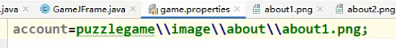

正确的写法如下

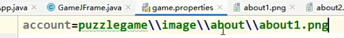

并且在代码中，用到的路径我们一律采用拷贝，因为自己写有可能会写错。

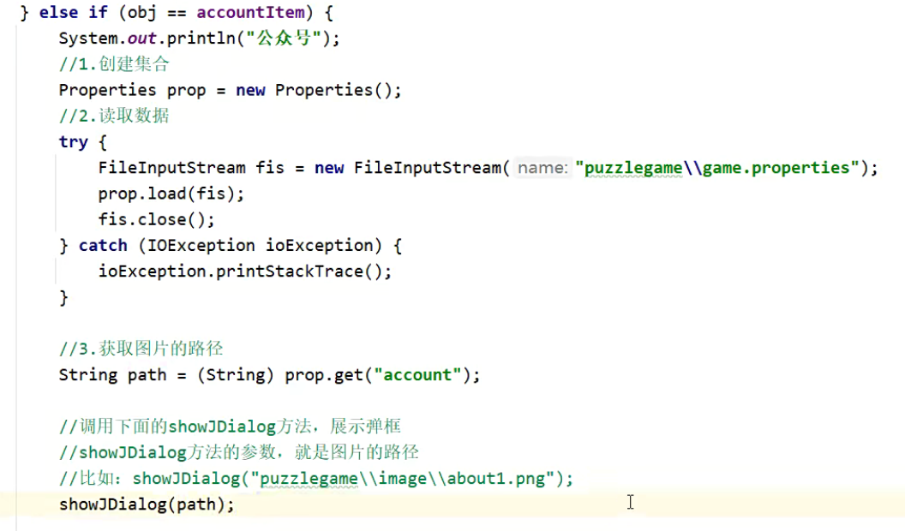


----

# 144.综合练习：每日一记


-----

# -----------------------

# day31 多线程&JUC

# 135.什么是多线程？

## 一、引入

多线程这三个字可以拆开进行理解。

- 多：数量词，表示很多的意思。

因此我们只需要知道什么是线程就行了。

线程是操作系统能够进行运算调度的最小单位。它被包含在**进程**之中，是进程中的实际运作单位。

线程的概念非常的拗口，而且在里面还有一个专业名字：`进程`。

因此我们先来解释什么是进程，再回头解释上面这句话。

进程是程序的基本执行实体。

例如打开任务管理器，在任务管理器的第一个界面中，就是进程。

看下面，每一个软件都对应着一个进程。因此进程可以这么理解：一个软件运行之后就是一个进程。

例如 `IDEA的进程`、`Typora的进程`..........


知道什么是进程后，再回过头来看进程的概念。

线程是操作系统能够进行运算调度的最小单位。它被包含在**进程**之中，是进程中的实际运作单位。

例如360，在360里面是有很多很多功能的，因此我们可以这么去理解：360运行后，它的本身是一个进程，而360里面的木马查杀、电脑清理、系统修复、优化加速，我们就可以将它们看做是4个线程。


因此关于线程可以简单理解：线程就是应用软件中互相独立的，又可以同时运行的功能。

像这种互相独立的，又可以同时运行的功能比较多，就形成了多线程。

那么多线程有什么用呢？

----

## 二、单线程和多线程的区别

### 1）单线程

例如下面代码，在运行的时候，CPU首先读到了第一行代码，此时在内存中就会创建一个变量 `a`，但是内存中创建变量是需要时间的，虽然说这个时间很短很快，但是它也要时间。

在创建的过程中CPU是没有办法运行下面的代码的，所以CPU只能先等着，假设CPU等了 `0.01秒`，然后再去读第二行。

内存中创建了一个变量 `b`，同样的在这一行CPU也等了0.01秒，同样第三行也等了0.01秒，第四行也等了0.01秒，这个就是以前代码的执行过程。

以前的代码我们也叫做 `单线程程序`，因为它是从上往下依次运行的。

CPU不会切换到其他代码去运行，所以它的效率会比较低。

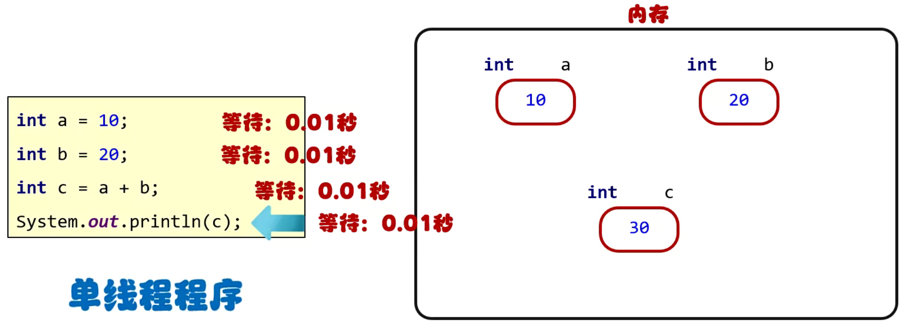

那么多线程的程序是怎么样运行的呢？

----

### 2）多线程

多线程的特点就是能同时的去做多件事情，CPU可以在多个程序间进行切换，把等待的空闲时间充分利用起来，这就是多线程最大的特点：提高程序的运行效率。

在实际开发中，多线程无处不在。

----

## 三、多线程的应用场景

例如：拷贝、迁移大文件。加载大量的资源文件......


----

## 四、总结

1、什么是多线程？

其实我们不需要去背那些拗口的概念，我们只需要知道：有了多线程后，我们就可以让程序同时做多件事情。

2、多线程的作用？

充分利用程序中的等待时间，让CPU在多个程序之间进行切换，从而提高了程序的运行效率。

3、多线程的应用场景？

它的场景有很多，但有一个辨别套路：只要你想让多个事情同时运行就需要用到多线程。

例如：软件中的耗时操作、所有的聊天软件、所有的服务器..........


----

# 136.并发和并行

并发：在同一时刻，有多个指令在单个CPU上**交替**执行。

并行：在同一时刻，有多个指令在多个CPU上**同时**执行。

## 一、并发

并发：在同一时刻，有多个指令在单个CPU上**交替**执行。

并发重点强调 `交替`，这就好比我们没事，休息的时候要打游戏，但是光打游戏还不够，还要抽烟，还要喝可乐。

由于你的手速非常快，它是在多个物品间交替执行的，这种情况就可以将它看做是并发。


你的右手就好比是CPU，而这里的鼠标、烟、可乐，就可以看做是三条线程，CPU就是在这三条线程之间交替执行，这就是并发。

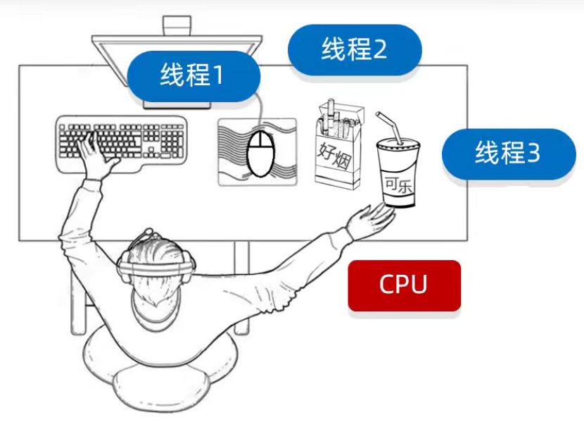

用动画来表示是这样的，红色的线表示CPU，蓝色的线表示线程（一共两条线程），CPU是在多个线程之间交替执行的。

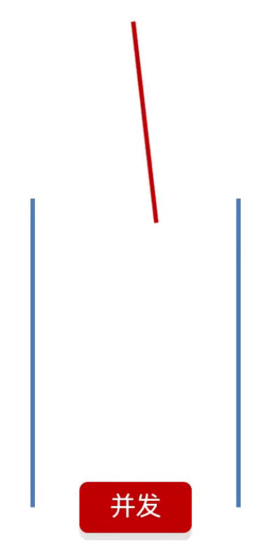

---

## 二、并行

并行：在同一时刻，有多个指令在多个CPU上**同时**执行。

`并行` 主要强调 `同时` 这两个字。

用动画来表示就是这样的，两条线程，两个CPU同时执行

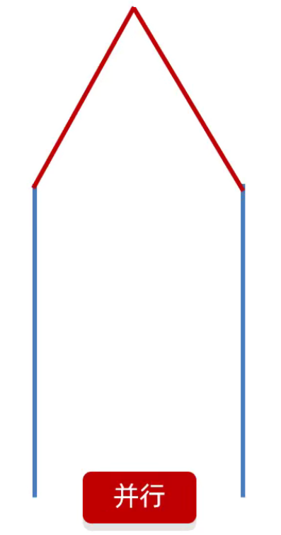

----

电脑里面只有一个CPU，但是CPU有以下种类，而这里线程的数量就表示电脑能同时运行多少条线程。

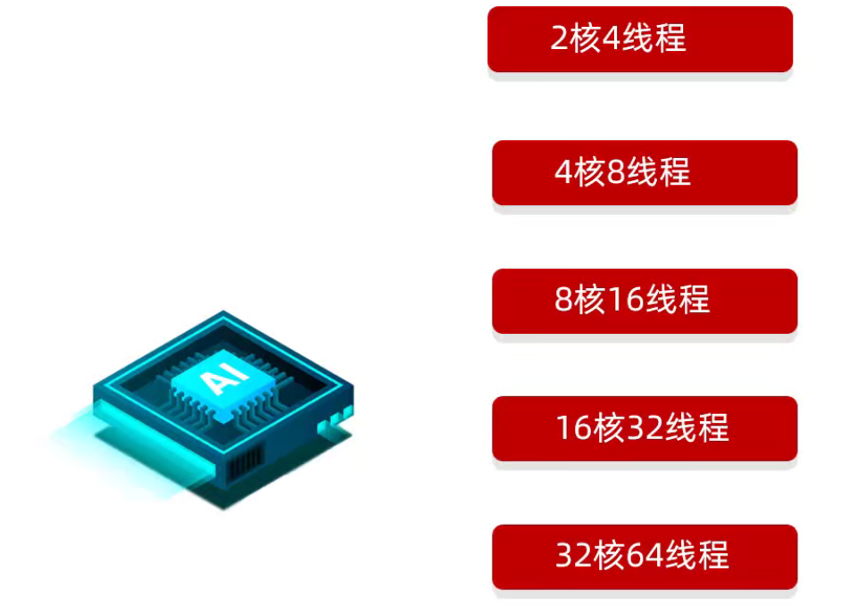

以 `2核4线程` 为例，它是可以运行四条线程的，所以你的计算机中只有四条线程，它是不用切换的。

但是如果线程越来越多，那么这四条红线就会在多个线程之间随机进行切换。

因此在计算机中，并发和并行是有可能同时都在发生的。

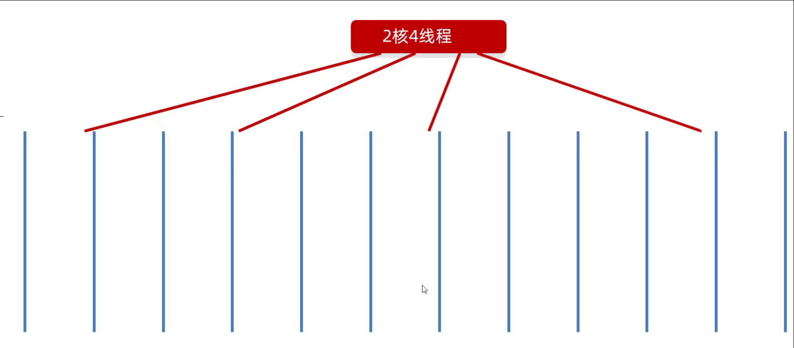


----

# 多线程的实现方式

在Java中，多线程有三种实现方式。

1、继承Thread类的方式进行实现

2、实现Runnable接口的方式进行实现

3、利用Callable接口和Future接口方式实现

我们需要在合适的时候去选择对应的实现方式，那该如何选择呢？

首先需要将这三种方式分为两类，第一类是前面两个，这两种方式是无法获取到多线程的结果的。

第二类就是下面的第三种，这种方式是可以获取到多线程运行的结果，因此如果你想要获取结果，那就使用第三种。

如果不想获取，就使用第一种跟第二种。第一种跟第二种也是有区别的。

第一种：代码相对来将会比较简单，而且因为是继承了 `Thread类`，因此在子类中可以直接使用 `Thread类` 中的方法。

但是它也有自己的缺陷：可扩展性差，在Java中是单继承，如果你已经继承了 `Thread`，那你就无法再去继承其他类了，因此为了解决这个问题，才有了下面第二种实现方式。

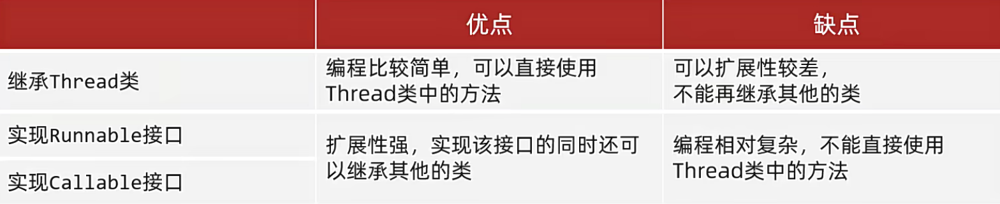

还有一个区别：`继承Thread类` 和 `实现Runnable接口` 中的 `run()` 是不能抛出异常的，因为父类中的方法并没有抛出异常。

但是 `实现Callable接口` 中的 `call()` 是可以抛出异常的。

----

# 137.多线程的第一种实现方式（继承Thread类的方式进行实现）

## 一、查询API帮助文档

先来打开 `API帮助文档`，来查一查这个 `Thread` 到底是什么。

下面介绍的意思就是：`Thread` 就表示Java中的一个线程，如果你想拥有一条线程的话，就可以创建它的对象，并开启它就行了。

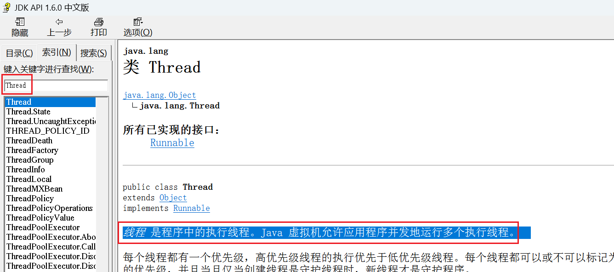

创建新执行线程有两种方法。一种方法是将类声明为 `Thread` 的子类。该子类应重写 `Thread` 类的  `run` 方法。接下来可以分配并启动该子类的实例（也就是说接下来可以创建该子类的对象）。例如，计算大于某一规定值的质数的线程可以写成： 。

即自己写一个类，然后继承 `Thread`，在这里它定义了一个成员变量，这个成员变量就是用来进行判断的。

但是如果我不想做这么复杂的逻辑，我只想打印一些输出语句。

那么上面的成员变量和构造方法都不需要写，直接重写 `run()` 即可。

在 `run()` 中书写当前线程要执行的代码。

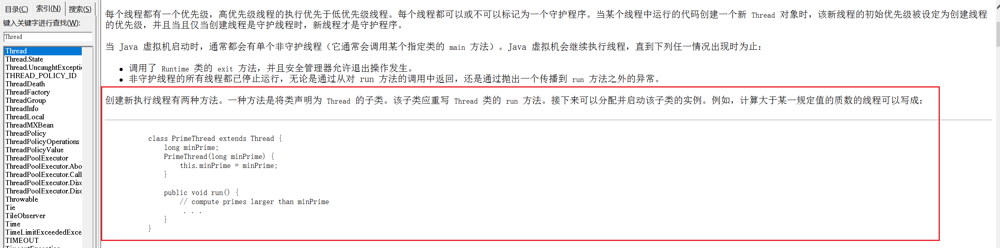

这个类书写完后，继续往下开：我们就可以创建并启动一个线程。

创建这个类的对象，然后调用 `start()`，就可以开启这条线程了。

在开启完后，它就会自动的去找这个类里面的 `run()`，执行 `run()` 里面的代码。

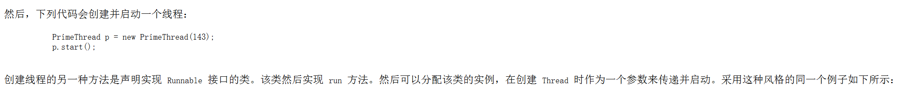

---

## 二、代码示例

```
线程的第一种启动方式：
 1. 自己定义一个类继承Thread。
 Thread是Java已经定义好的，它就表示是一个线程。那我自己写的这个类继承Thread类，那我自己写的这个类也应该表示一个线程，因为是它的子类。
 2. 重写run方法
 3. 创建子类的对象，并启动线程
```

方法介绍

| 方法名       | 说明                                        |
| ------------ | ------------------------------------------- |
| void run()   | 在线程开启后，此方法将被调用执行            |
| void start() | 使此线程开始执行，Java虚拟机会调用run方法() |

自己定义一个类继承Thread，并重写run方法

~~~java
public class MyThread extends Thread{
    @Override
    public void run() {
        //书写线程要执行代码
        //这里想让它打印100次HelloWorld
        for (int i = 0; i < 100; i++) {
            System.out.println(getName() + "HelloWorld");
        }
    }
}
~~~

创建子类的对象

~~~java
MyThread t1 = new MyThread();
MyThread t2 = new MyThread();
~~~

此时我们不能直接去调用 `run()`，例如 `t1.run()`，如果这么干，那么就仅仅只是调用一个方法，跟我们之前创建对象调方法是一模一样的。

这里应该调用 `start()` ，才表示开启线程。

~~~java
//这里给两个线程起个名字，用于区分两条线程
t1.setName("线程1");
t2.setName("线程2");

t1.start();
t2.start();
~~~

启动程序，此时就能看见我们的程序一会执行第一条线程，一会执行第二条线程，可以发现是两个线程交织在一起，交替执行的。

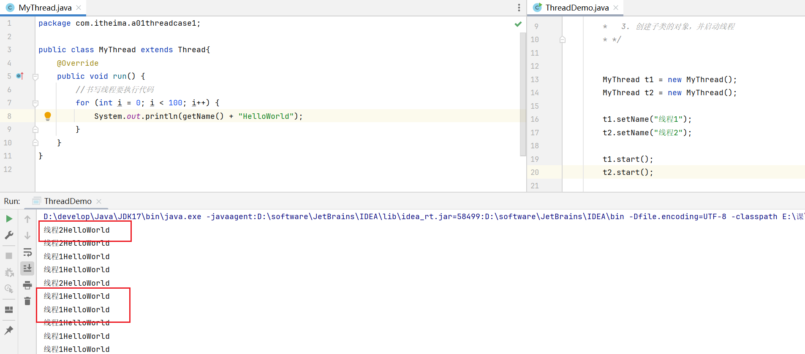


----

# 138.多线程的第二种实现方式（实现Runnable接口的方式进行实现）

## 一、查询API帮助文档

打开一下 `API帮助文档`，我们来看一下Java是怎么写的，同样也是搜索 `Thread类`。

创建线程的另一种方法是声明实现 `Runnable` 接口的类，让这个类去实现 `run()`。

在测试类中，然后再去创建一个 `Thread`，也就是创建一个线程，将自己这个类的对象传递过去，再去调用 `start()`。

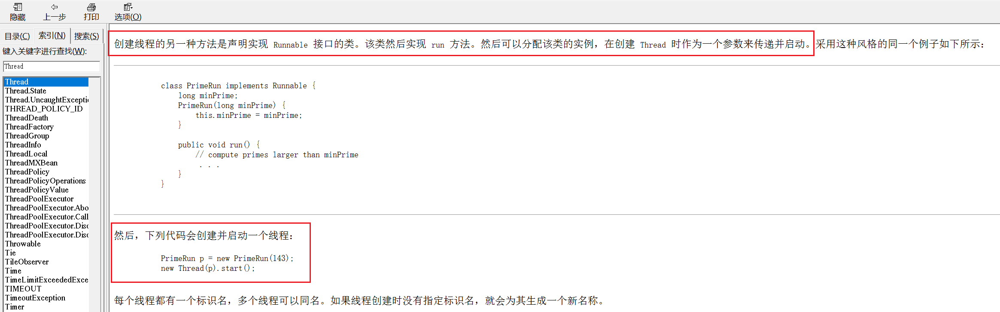

---

## 二、代码示例

```
多线程的第二种启动方式：
  1.自己定义一个类实现Runnable接口
  2.重写里面的run方法
  3.创建自己的类的对象
  4.创建一个Thread类的对象，并开启线程
```

Thread构造方法

| 方法名                               | 说明                   |
| ------------------------------------ | ---------------------- |
| Thread(Runnable target)              | 分配一个新的Thread对象 |
| Thread(Runnable target, String name) | 分配一个新的Thread对象 |

自己定义一个类实现Runnable接口，并重写里面的run方法

~~~java
public class MyRun implements Runnable{
    @Override
    public void run() {
        //书写线程要执行的代码
        for (int i = 0; i < 100; i++) {
            System.out.println("HelloWorld!");
        }
    }
}
~~~

创建自己的类的对象；创建一个Thread类的对象，并开启线程

~~~java
//创建MyRun的对象
//这个对象就表示多线程要执行的任务，因此这个对象可以理解为：任务对象
MyRun mr = new MyRun();

//创建线程对象，这个线程对象不需要我们写子类继承了，直接使用Java中现成的Thread类即可
Thread t1 = new Thread(mr); //将任务传递给线程
Thread t2 = new Thread(mr);

//给线程设置名字
t1.setName("线程1");
t2.setName("线程2");

//开启线程
t1.start();
t2.start();
~~~

为了区分，给线程加上了名字。

这里不能直接调用 `getName()` 了，因为 `getName()` 是在 `Thread类中的`，之前的实现方式是继承了 `Thread接口`，是在子类中调用了父类的 `getName()`，是完全没有任何问题的。

但是这种实现关系 `Thread` 跟我自己写的 `MyRun类` 是没有任何关系的，因此是不能使用 `getName()` 的。

解决办法：在打印之前，先**获取到当前线程对象**，在 `Thread` 中有一个 `currentThread()` 方法

~~~java
Thread t = Thread.currentThread(); // 哪条线程执行到这个方法，这个方法就会返回谁的对象
~~~

然后用对象去调用里面的方法就行了。

~~~java
public class MyRun implements Runnable{
    @Override
    public void run() {
        //书写线程要执行的代码
        for (int i = 0; i < 100; i++) {
            System.out.println(Thread.currentThread().getName() + "HelloWorld!");
        }
    }
}
~~~

执行程序，同样也可以看见交织的效果。

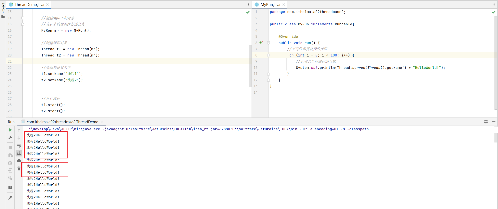


-----

# 139.138.多线程的第三种实现方式（利用Callable接口和Future接口方式实现）

## 一、介绍

为什么要有第三种实现方式呢？其实是它对前面两种方式进行了一个补充，我们先来回顾一下前两种。

1、继承Thread类的方式进行实现

2、实现Runnable接口的方式进行实现

可以发现两个 `run()` 都是没有返回值的，因此我就不能获得多线程运行的结果。

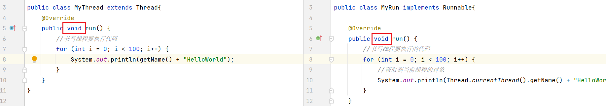

但如果我现在想要获取到多线程运行的结果该怎么办呢？

此时我们就需要用到多线程的第三种实现方式：利用Callable接口和Future接口方式实现

特点：可以获取到多线程的运行结果

```
多线程的第三种实现方式：
    特点：可以获取到多线程运行的结果
    1. 创建一个类MyCallable实现Callable接口
    2. 重写call() （是有返回值的，表示多线程运行的结果）
    3. 创建MyCallable的对象（表示多线程要执行的任务）
    4. 创建Future的对象（作用管理多线程运行的结果），但是Future是一个接口，我们不能直接创建它的对象，因此我们创建的应该是Future实现类FutureTask的对象
    5. 创建Thread类的对象，并启动（表示线程）
```

方法介绍

| 方法名                           | 说明                                               |
| -------------------------------- | -------------------------------------------------- |
| V call()                         | 计算结果，如果无法计算结果，则抛出一个异常         |
| FutureTask(Callable<V> callable) | 创建一个 FutureTask，一旦运行就执行给定的 Callable |
| V get()                          | 如有必要，等待计算完成，然后获取其结果             |

---

## 二、代码示例

这个接口它是有一个泛型的，那这个泛型是什么意思呢？

第三种方式可以获取到多线程运行的结果，这里的泛型就表示结果的类型。

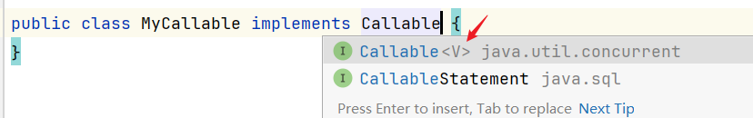

例如：我想要开启一个线程，让它去求 `1-100` 的整数和，结果肯定是一个整数，因此泛型就可以写 `Integer`。

方法的返回值跟泛型保持一致，就表示多线程运行的结果。

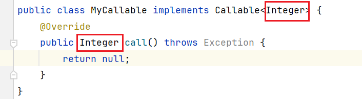

~~~java
public class MyCallable implements Callable<Integer> {
    @Override
    public Integer call() throws Exception {
        // 求1~100之间的和
        int sum = 0;
        for (int i = 1; i <= 100; i++) {
            sum = sum + i;
        }
        return sum;
    }
}
~~~

测试类

~~~java
//创建MyCallable的对象（表示多线程要执行的任务）
MyCallable mc = new MyCallable();
//创建FutureTask的对象（作用管理多线程运行的结果），其中泛型就表示多线程运行的结果
FutureTask<Integer> ft = new FutureTask<>(mc); //表示现在是用FutureTask对象去管理它的结果
//创建线程的对象
Thread t1 = new Thread(ft);
//启动线程
t1.start();

//获取多线程运行的结果
Integer result = ft.get();//FutureTask就是用来去管理它的结果的，因此可以直接使用ft去调用get()
System.out.println(result);
~~~


---

# 多线程中的常用成员方法

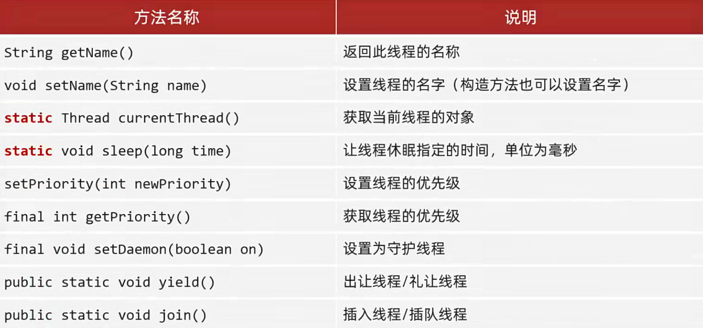

----

# 140.简单的成员方法

## 一、`setName、getName` 方法

### 1）细节一

| 方法名                     | 说明                             |
| -------------------------- | -------------------------------- |
| void  setName(String name) | 将此线程的名称更改为等于参数name |
| String  getName()          | 返回此线程的名称                 |

这个方法我们之前已经使用过了，但是如果我们没有给它设置名字，它会有默认的吗？

~~~java
public class MyThread extends Thread{
    @Override
    public void run() {
        for (int i = 0; i < 100; i++) {
            System.out.println(getName() + "@" + i);
        }
    }
}
~~~

测试类

~~~java
//1.创建线程的对象
MyThread t1 = new MyThread();
MyThread t2 = new MyThread();

//2.开启线程
t1.start();
t2.start();
~~~

程序运行完毕，`@` 前面就是线程默认的名字，格式为：`Thread-X（X是序号，从0开始的）`


我们来看下源码，<kbd>ctrl + N</kbd> 搜索一下 `java.lang` 包下的 `Thread`。

<kbd>ctrl + F12</kbd> 找到空参构造。


在空参构造中，它是用 `this关键字` 再去调用其他的构造，但是在调用的时候，它的第三个参数 `"Thread-" + nextThreadNum()` 其实就是给线程设置名字。前面的 `Thread-` 是定死了的，后面再加一个 `nextThreadNum()`。

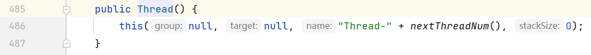

选中 `nextThreadNum()` <kbd>ctrl + b</kbd>，这下就很明了了，它就是一个变量，然后不断的自增，一开始默认初始化值是 `0`，所以第一个线程默认的序号就是 `0`，当这个方法被调用完一次后，这个变量就要 `++自增`，变成 `1`。

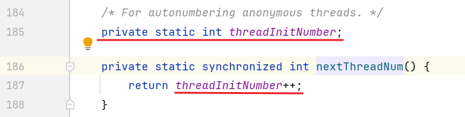

这就是它默认名字的由来。

-----

### 2）细节二

在给线程起名字的时候，我们不单单可以使用 `setName()`，`Thread` 的构造方法也是可以设置名字的。

我们可以来看一下 `API帮助文档`。

找到第三个，可以发现，在创建Thread对象的时候，可以给它去设置一个名字。

除此之外看第二个构造，是两个参数的，第一个参数是 `Runnable`，即我们可以给它传递线程的任务对象，后面还有第二个参数，就是线程的名字。

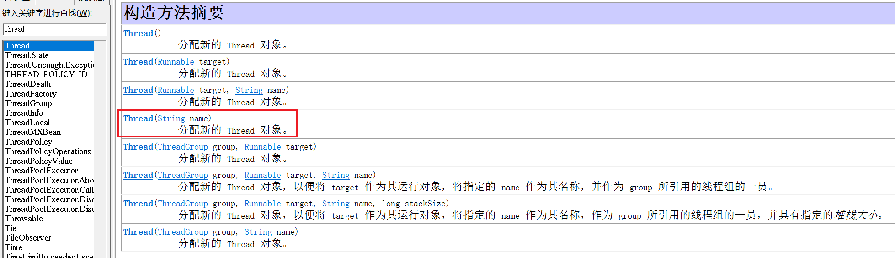

~~~java
//1.创建线程的对象
MyThread t1 = new MyThread("飞机");
MyThread t2 = new MyThread("坦克");
~~~

但此时会报错

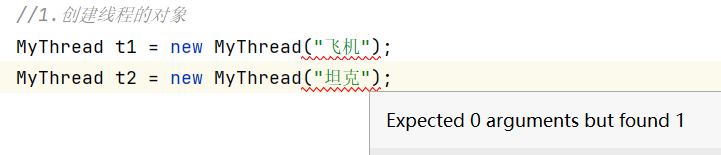

别忘了，我们现在创建的是 `MyThread`，但是我们刚刚看的是 `Thread` ，即它的父类的构造。

之前我们学习面向对象的时候说过，构造方法是不能继承的，子类如果想要使用父类的构造，需要直接写一个利用 `super关键字` 去调用父类的构造。

<kbd>alt + insert</kbd> ，选择第一个

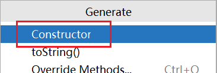

IDEA就会问你：你要继承父类的哪些构造？

我们不用全选，只需要选择我们需要的两个即可。

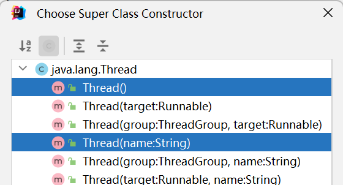

一旦生成完毕，就不会报错了，可以发现运行成功。

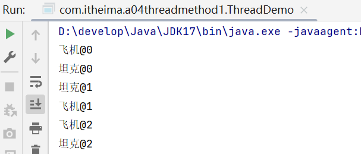

----

## 二、`currentThread` 方法

| 方法名                  | 说明               |
| ----------------------- | ------------------ |
| Thread  currentThread() | 获取当前线程的对象 |

这个方法我们之前也使用过了，因此此时我们来玩一个好玩的

~~~java
public static void main(String[] args) {
    //在main方法中不开启线程，直接用Thread.currentThread()，此时获取到的t表示什么呢？
    //如果你不知道，来看看这个方法的作用：获取当前线程的对象
    //简单理解：哪条线程执行到这个方法，此时获取的就是哪条线程的对象
    //因此t表示的是执行main方法的那条线程的对象
    Thread t = Thread.currentThread();
    String name = t.getName();
    System.out.println(name);
}
~~~

程序运行完毕，可以看见它的名字也叫做 `main`

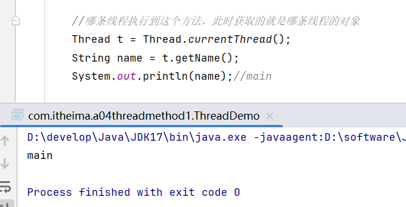

```
细节：
    当JVM虚拟机启动之后，会自动的启动多条线程
    其中有一条线程就叫做main线程
    他的作用就是去调用main方法，并执行里面的代码
    在以前，我们写的所有的代码，其实都是运行在main线程当中
```

---

## 三、`sleep` 方法

| 方法名                         | 说明                           |
| ------------------------------ | ------------------------------ |
| static void sleep(long millis) | 让线程休眠指定时间，单位为毫秒 |

```
细节：
    1、哪条线程执行到这个方法，那么哪条线程就会在这里停留对应的时间
    2、方法的参数：就表示睡眠的时间，单位毫秒
        1秒 = 1000毫秒
    3、当时间到了之后，线程会自动的醒来，继续执行下面的其他代码
```

下面代码的效果就是：先打印 `11111111111`，等五秒后才打印 `22222222222`。

效果出现的原因就是因为：main线程执行到这个地方后停留了五秒钟，时间到了之后再继续执行下面的代码。

~~~java
System.out.println("11111111111");
Thread.sleep(5000);
System.out.println("22222222222");
~~~

同理，将睡眠写在 `MyThread类` 中，每打印一次就睡眠一下。

此时方法有异常不能抛出，只能 `try`，因为父类 `Thread类` 中，`run()` 是没有抛出异常的，父类没有抛出异常，子类也就不能抛，子类只能自己 `try`。

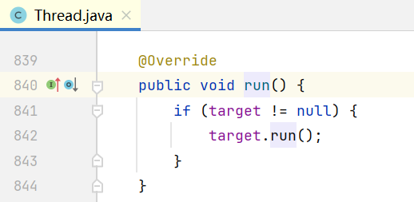

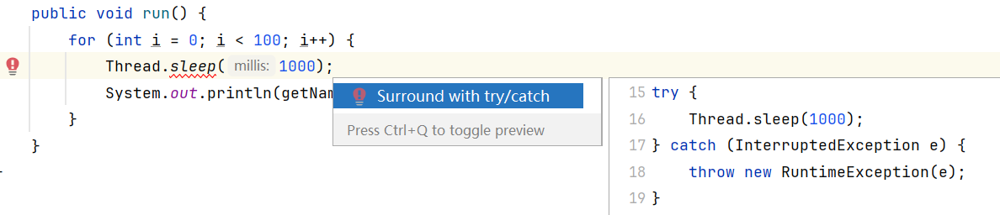

```java
@Override
public void run() {
    for (int i = 0; i < 100; i++) {
        try {
            Thread.sleep(1000);
        } catch (InterruptedException e) {
            e.printStackTrace();
        }
        System.out.println(getName() + "@" + i);
    }
}
```


-----

# 141.线程的优先级

说到优先级，我们就需要先来学习一下 `线程的调度`。

## 一、线程的调度

在计算机中，线程的调度有两种：抢占式调度、非抢占式调度。

抢占式调度：多个线程在抢夺CPU的执行权。

CPU在什么时候执行哪条线程是不确定的，执行多少时间也是不确定的，所以 `抢占式调度` 体现了一种随机性。

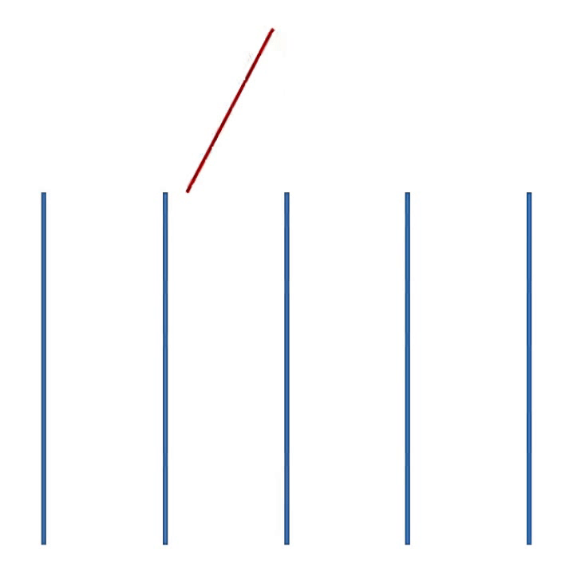

非抢占式调度：所有的线程轮流的执行，你一次我一次，执行的时间也是差不多的。


在Java中采取了第一种：抢占式调度。

抢占式调度重点掌握两个字：随机性，这里的优先级跟随机是有关系的。

----

## 二、优先级

优先级越大，这条线程抢到CPU的概率就是最大的。

在Java中线程的优先级分为十档，最小的是 `1`，最大的是 `10`，如果没有设置，默认就是 `5`。

优先级相关方法

| 方法名                                  | 说明                                                         |
| --------------------------------------- | ------------------------------------------------------------ |
| final int getPriority()                 | 返回此线程的优先级                                           |
| final void setPriority(int newPriority) | 更改此线程的优先级。线程默认优先级是5；线程优先级的范围是：1-10 |

~~~java
public class MyRunnable implements Runnable{
    @Override
    public void run() {
        for (int i = 1; i <= 100; i++) {
            System.out.println(Thread.currentThread().getName() + "---" + i);
        }
    }
}
~~~

测试类

~~~java
//创建线程要执行的参数对象
MyRunnable mr = new MyRunnable();
//创建线程对象，并指定名字
Thread t1 = new Thread(mr, "飞机");
Thread t2 = new Thread(mr, "坦克");

System.out.println(t1.getPriority()); //5
System.out.println(t2.getPriority()); //5，由此可得，默认优先级就是5

// 好奇一下，当前main线程的优先级是多少？
System.out.println(Thread.currentThread().getPriority());//打印结束，可以发现也是5
~~~

我们可以来看看 `Thread` 的源码。

<kbd>ctrl + F12</kbd> 找到 `MIN_PRIORITY` 和 `MAX_PRIORITY`，可以发现最小为1，最大是10，默认的是中间的 `NORM_PRIORITY`，即 `5`

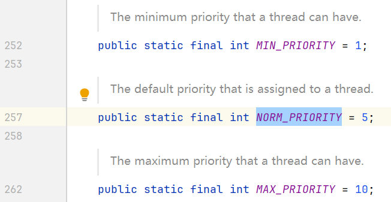

优先级越高，抢到CPU的概率就越高，但是并不能保证它 `100%` 能抢到CPU的执行权。

~~~java
t1.setPriority(1);
t2.setPriority(10);

t1.start();
t2.start();
~~~

由于坦克的优先级高，因此它先执行完毕没有问题

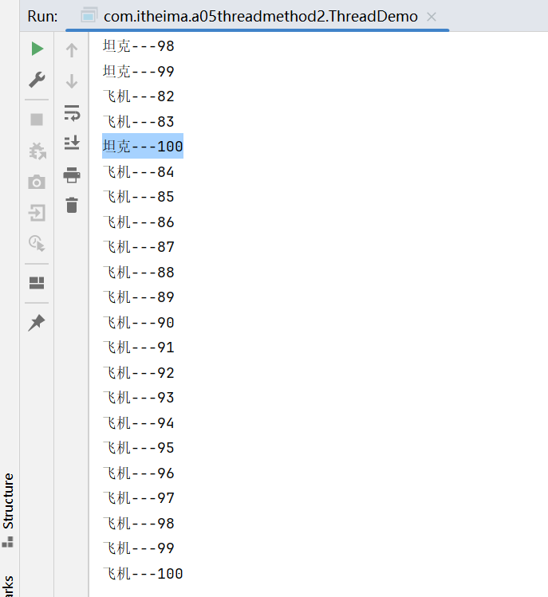

但是这只是概率问题，飞机也有可能先执行完毕。

因此优先级并不是绝对的，只是一个概率问题。


----

# 142.守护线程

## 一、代码示例

| 方法名                     | 说明                                                         |
| -------------------------- | ------------------------------------------------------------ |
| void setDaemon(boolean on) | 将此线程标记为守护线程，当运行的线程都是守护线程时，Java虚拟机将退出 |

先来看看三个准备好的代码

**MyThread1.java**

~~~java
public class MyThread1 extends Thread{
    @Override
    public void run() {
        for (int i = 1; i <= 10; i++) {
            System.out.println(getName() + "@" + i);
        }
    }
}
~~~

**MyThread2.java**

~~~java
public class MyThread2 extends Thread{
    @Override
    public void run() {
        for (int i = 1; i <= 100; i++) {
            System.out.println(getName() + "@" + i);
        }
    }
}
~~~

**main方法**

~~~java
public static void main(String[] args) {
    MyThread1 t1 = new MyThread1();
    MyThread2 t2 = new MyThread2();

    t1.setName("女神");
    t2.setName("备胎");

    //把第二个线程设置为守护线程（守护线程说的比较难听一点就是：备胎线程）
    t2.setDaemon(true);

    t1.start();
    t2.start();
}
~~~

```
细节：
    当其他的非守护线程执行完毕之后，守护线程会陆续结束
通俗易懂：
    当女神线程结束了，那么备胎也没有存在的必要了
```

程序运行结束，当女神线程执行完毕后，备胎线程就没有必要往下了，它也会陆陆续续的结束。

在备胎线程中，我循环了100次，但是备胎线程执行到16就结束了。

因此要注意的是：备胎不是里面就结束了，当女神线程结束后，系统会告诉备胎：备胎，你没存在的必要了，你结束吧。告诉它的过程中，备胎又瞬间往下执行了一波，因此备胎线程是陆续结束的。

控制台打印结果如下

~~~java
D:\develop\Java\JDK17\bin\java.exe -javaagent:D:\software\JetBrains\IDEA\lib\idea_rt.jar=55403:D:\software\JetBrains\IDEA\bin -Dfile.encoding=UTF-8 -classpath
备胎@1
女神@1
备胎@2
女神@2
备胎@3
女神@3
备胎@4
女神@4
备胎@5
女神@5
备胎@6
女神@6
备胎@7
女神@7
备胎@8
女神@8
备胎@9
女神@9
备胎@10
女神@10
备胎@11
备胎@12
备胎@13
备胎@14
备胎@15
备胎@16

Process finished with exit code 0
~~~

----

## 二、应用场景

假设现在又两个人在用QQ进行聊天，此时左边的人要给右边的人发一个文件。

此时聊天可以看做一个线程，发送文件也可以看做一个线程，因此此时至少会有两个线程。

但此时如果我们将聊天窗口关闭，也就是 `线程1` 结束了，此时 `线程2` 就没有执行下去的必要了，此时就可以将 `线程2` 设置为 `守护线程（备胎线程）`。


----

# 143.礼让线程

这个方法用的不多，了解一下即可。

方法是静态的，直接用类名调即可。

| 方法名                     | 说明              |
| -------------------------- | ----------------- |
| public static void yield() | 出让线程/礼让线程 |

**MyThread.java**

```java
public class MyThread extends Thread{
    @Override
    public void run() {//"飞机"  "坦克"
        for (int i = 1; i <= 100; i++) {
            System.out.println(getName() + "@" + i);
        }
    }
}
```

**main方法**

~~~java
public class ThreadDemo {
    public static void main(String[] args) {
        MyThread t1 = new MyThread();
        MyThread t2 = new MyThread();

        t1.setName("飞机");
        t2.setName("坦克");

        t1.start();
        t2.start();
    }
}
~~~

运行上面代码，我们可以发现，线程的执行是随机性的，有可能是：你一次我一次，也有可能刷一下执行很多很多的飞机，然后再刷一下执行很多很多的坦克。

我觉得这样不太好，那能不能让线程的执行尽可能均匀一些呢？

因此就可以用到 `yield()`，出让线程方法。

例如：现在是 "飞机线程" 抢到了CPU的执行权，此时就会打印飞机，打印完后，如果没有 `yield()`，那么CPU的执行权还在飞机线程上，因此就有可能导致飞机一直打印，直到CPU的执行权被坦克抢走。

但现在我们加了一个 `yield()`，表示当飞机这个线程打印完后，此时它就会出让CPU的执行权，那么下一次在运行的时候，飞机跟坦克就会重新再去抢夺CPU的执行权，此时是有可能让这个结果尽可能均匀一点。

但是它只是尽可能的均匀一点，虽然飞机出让了CPU的执行权，但是在上面再次抢夺的时候，飞机有可能再抢到CPU，因此不是绝对的。

因此这个方法在以后用的非常少，了解一下即可。

~~~java
public class MyThread extends Thread{
    @Override
    public void run() 
        for (int i = 1; i <= 100; i++) {
            System.out.println(getName() + "@" + i);
            //表示出让当前CPU的执行权
            Thread.yield();
        }
    }
}
~~~

运行结果如下

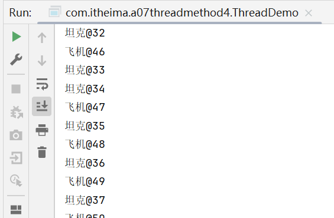


----

# 144.插入线程

| 方法名                   | 说明              |
| ------------------------ | ----------------- |
| public final void join() | 插入线程/插队线程 |

**MyThread.java**

```java
public class MyThread extends Thread{
    @Override
    public void run() {
        for (int i = 1; i <= 100; i++) {
            System.out.println(getName() + "@" + i);
        }
    }
}
```

**main方法**

~~~java
public class ThreadDemo {
    public static void main(String[] args) {
        MyThread t = new MyThread();
        t.setName("土豆");
        t.start();
        
        //执行在main线程当中的
        for (int i = 0; i < 10; i++) {
            System.out.println("main线程" + i);
        }
    }
}
~~~

运行以上代码，那就应该是 `土豆线程` 和 `main线程` 正在抢夺CPU的执行权，谁抢到了谁就执行。

现在有一个需求：将 `土豆线程` 插入到 `main线程` 之前，即等 `土豆线程` 执行完后，`main线程` 再继续执行。

此时就可以用到 `join()` 方法。

~~~java
public class ThreadDemo {
    MyThread t = new MyThread();
    t.setName("土豆");
    t.start();

    //表示把t这个线程，插入到当前线程之前。
    //t形参:土豆
    //当前线程: 看这段代码是运行在哪个线程上的，这里是main线程
    t.join(); //理解：将土豆线程插入到main线程之前，等土豆线程中所有的代码都执行完了，才会轮到main线程执行

    //执行在main线程当中的
    for (int i = 0; i < 10; i++) {
        System.out.println("main线程" + i);
    }
}
~~~

程序运行结果：等土豆线程运行完后，才轮到 `main线程`

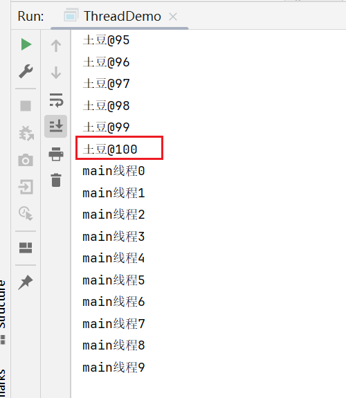

同样的，这个方法我们以后用到的也不多，因此了解一下即可。


-----

# 145.线程的生命周期

生命周期：从生到死的过程中经历了哪些状态。

当创建线程对象的时候，它是新建状态，新建完后，调用 `start()` 去运行线程，此时就变成了 `就绪状态`。

注意是 `调用完start()` 之后才变成 `就绪状态`。

在 `就绪状态` 下，线程开始抢夺CPU的执行权，PS：它是正在抢，但是还没抢到。没有抢到就没办法执行代码，所以 `就绪状态` 是：有执行资格，但是没有执行权。

- 有执行资格：你有资格去抢CPU的执行权
- 没有执行权：你现在还没有抢到，不能去执行代码

因此在 `就绪状态` 下，线程干的事情说白了就是不停的去抢CPU。

如果抢到了CPU的执行权，此时就会变成 `运行状态`，运行状态下线程就会运行代码，因此此时它是有执行资格，也是有执行权的。

在运行的过程中，CPU的执行权是有可能被其他线程抢走的，一旦被抢走，此时又会回到 `就绪状态`。

但如果当前的线程将 `run()` 中所有的代码全都运行完了，此时线程就会死亡变成垃圾，此时就是 `死亡状态`。

最后还有一种情况：如果在运行的时候遇到了 `sleep()`，此时线程就会阻塞，即等着，此时什么也干不了，它不能去抢CPU的执行权，也不能执行代码，因此它是没有执行资格，也没有执行权的，如果此时代码还没执行完，CPU的执行权也一定会被其他线程抢走。

当睡眠的时间到了之后，它就会变成 `就绪状态`，开始重新抢夺CPU的执行权。

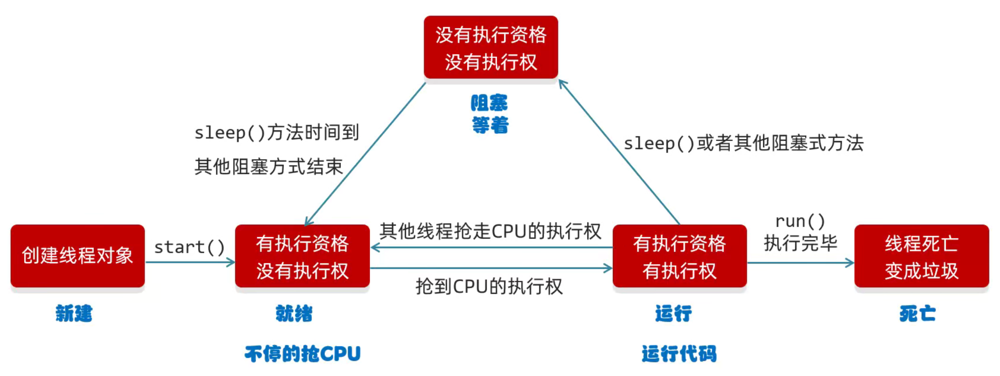

为了考验大家是否看懂了，这里问个问题：sleep方法会让线程睡眠，睡眠时间到了之后，立马就会执行下面的代码吗？

它是不会立马执行的，因为sleep时间到了之后，它是变成了 `就绪状态`，此时它是先去抢夺CPU的执行权，抢到了才会去执行代码。


----

# 146.线程的安全问题（同步代码块）

多线程可以帮我们提高效率，但是提高效率的同时它会有一个弊端：不安全。

在学习之前，我们先来看一个小练习。

## 一、引出问题

~~~java
需求：某电影院目前正在上映国产大片，共有100张票，而它有3个窗口卖票，请设计一个程序模拟该电影院卖票
~~~

这三个窗口在程序中应该是互相独立的，因此三个窗口就可以看做三个线程

**MyThread.java**

~~~java
public class MyThread extends Thread {
    int ticket = 0;//0 ~ 99

    @Override
    public void run() {
        while (true) {
            //同步代码块
            if (ticket < 100) {
                try {
                    //方法执行的太快了，这里让它睡眠10毫秒
                    Thread.sleep(10);
                } catch (InterruptedException e) {
                    e.printStackTrace();
                }
                ticket++;
                System.out.println(getName() + "正在卖第" + ticket + "张票！！！");
            } else {
                break;
            }
        }
    }
}
~~~

**测试类**

~~~java
public static void main(String[] args) {
    //创建线程对象
    MyThread t1 = new MyThread();
    MyThread t2 = new MyThread();
    MyThread t3 = new MyThread();

    //起名字
    t1.setName("窗口1");
    t2.setName("窗口2");
    t3.setName("窗口3");

    //开启线程
    t1.start();
    t2.start();
    t3.start();
}
~~~

运行上面代码，可以发现三个窗口卖的票好像是互相独立的，即三个窗口总共卖了300张票。

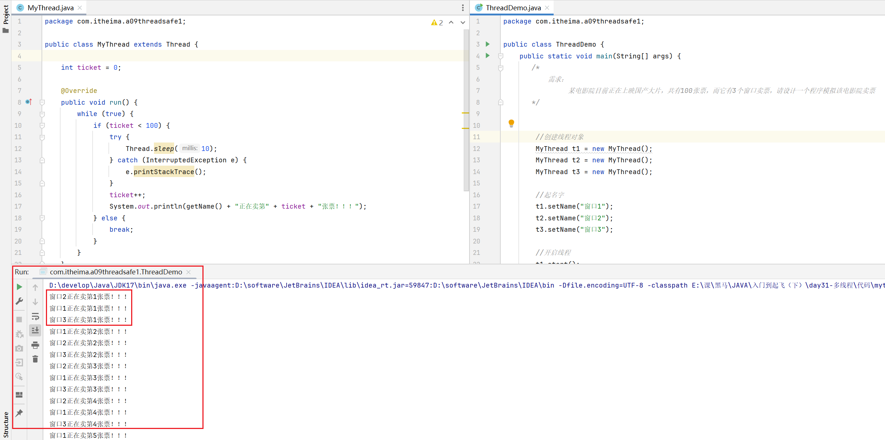

但这不是我想要的，我想要的是总共只有100张票

此时需要在 `ticket变量` 前面加一个 `static` 静态关键字。

~~~java
//表示这个类所有的对象，都共享ticket数据
static int ticket = 0;//0 ~ 99
~~~

但是改完后还有问题，运行代码，可以发现它还有重复的票

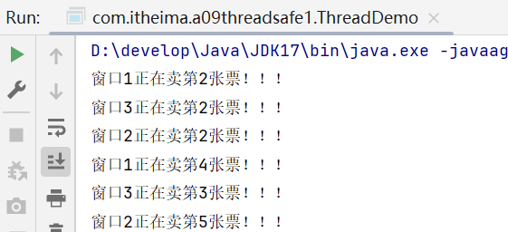

并且将控制台划到最后，发现它还会超出范围。


----

## 二、分析问题

### 1）为什么票会重复

假设现在有三条线程，三条线程要操作的数据刚开始为0。

线程开启后，三条线程会子在这里抢夺CPU的执行权，谁抢到了，就会继续往下执行。

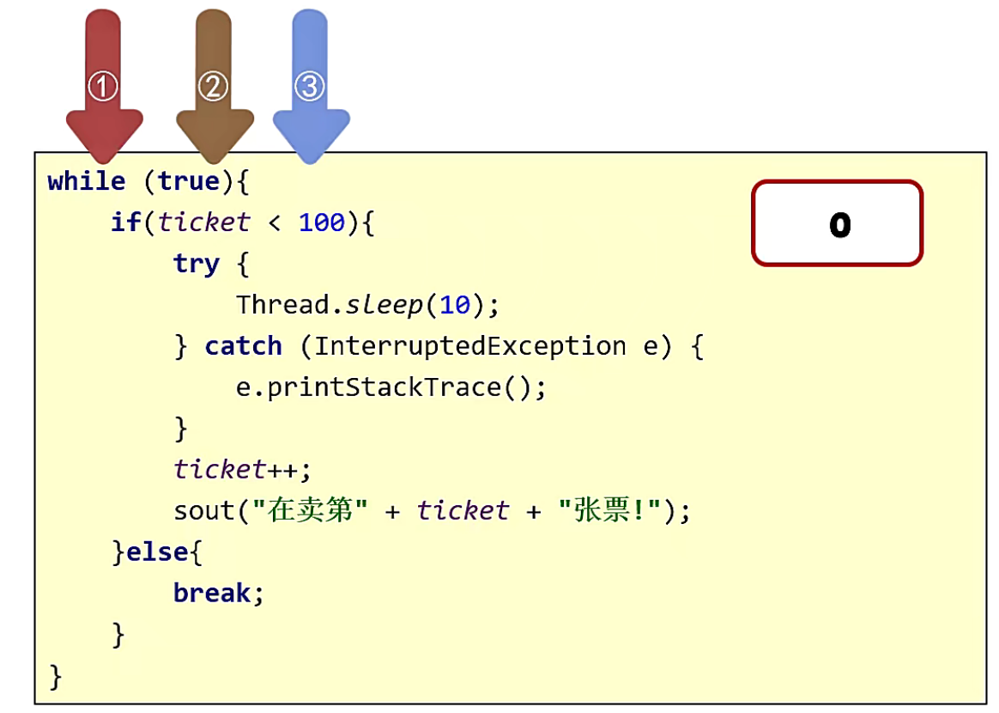

假设线程1在一开始抢到了CPU的执行权，线程1就会继续往下执行，此时是满足这里的判断条件的，所以线程1就会进入到if中，进来后立马睡10毫秒。

睡觉的时候是不会去抢夺CPU的执行权的，CPU的执行权一定会被其他线程抢走。

假设是线程2抢到了，线程2就会继续往下执行，此时也是满足这里的判断条件的，所以线程2也会进入if中，进来后，同样去睡10毫秒。

此时CPU的执行权就会被线程3抢走，线程3也会进来睡10毫秒。

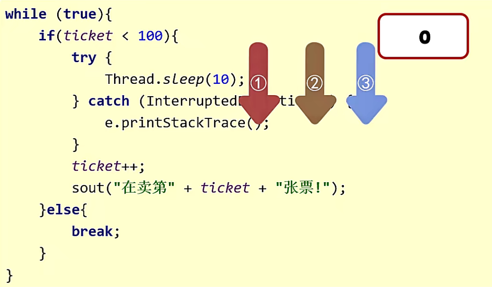

时间到了后这三条线程就会陆陆续续的醒来，继续执行下面的代码。

假设线程1醒来了，它抢夺到了CPU的执行权，线程1就会继续往下执行：`ticket++`，由 `0` 变成了 `1`，但是自增后，它还没来得及去打印，CPU的执行权就被线程2抢走了。

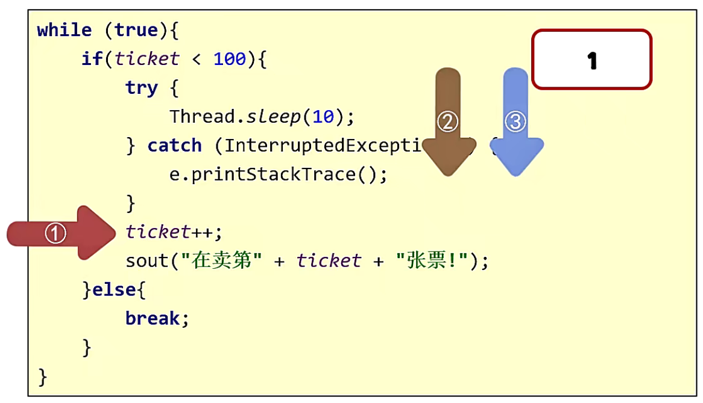

线程2在这里也对 `ticket` 做了一次自增，`ticket` 就会从 `1` 变成了 `2`。

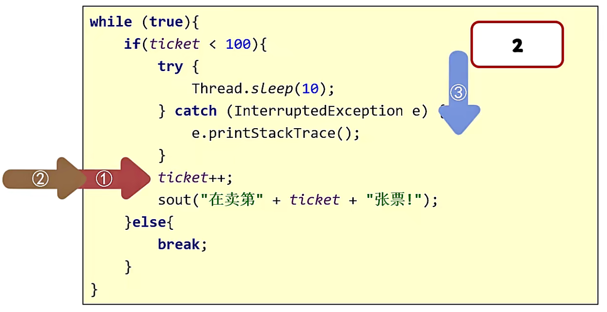

因此，我们需要知道一句话：线程在执行代码的时候，CPU的执行权随时有可能会被其他线程抢走。

假设现在又被线程3抢走了，线程3也做了一次自增，`ticket` 就变成了 `3`。

那么在这个时候，不管是 `线程1` 还是 `线程2` 还是 `线程3`，继续往下打印票号的时候，它在打印的都是 `3号票`。

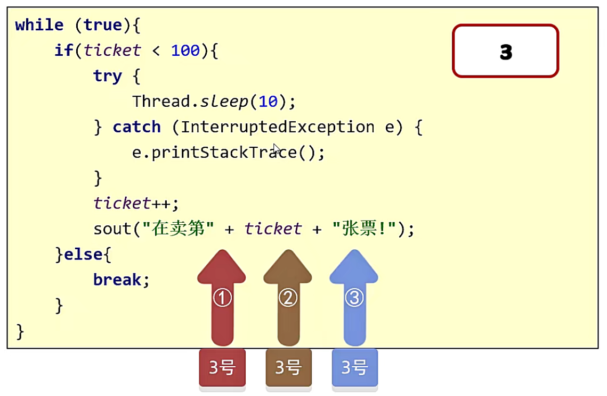

这就是重复票的由来，其根本原因是：线程执行时有随机性，CPU的执行权随时有可能会被其他的线程抢走。

----

### 2）为什么票会超出范围？

假设 `ticket` 现在已经到 `99` 了，此时三条线程在抢夺CPU的执行权。

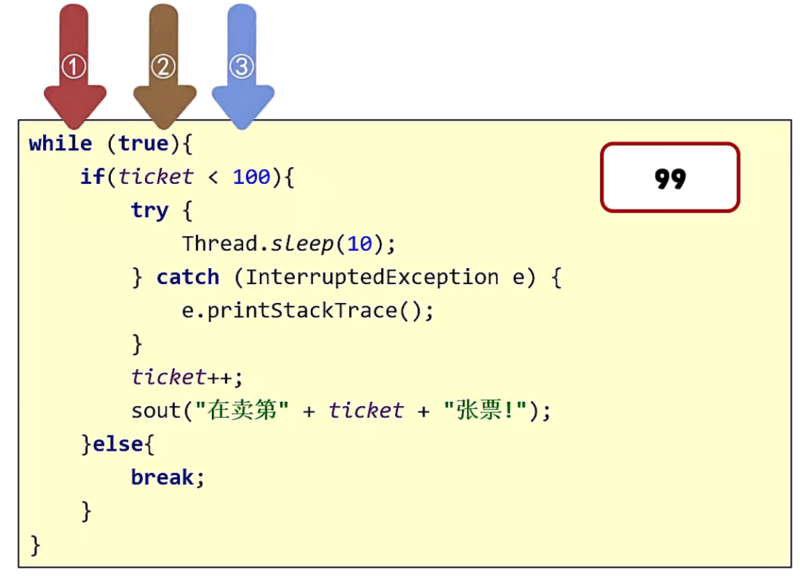

假设线程1抢夺到了CPU的执行权，睡10毫秒。

睡10毫秒的时候CPU的执行权被线程2抢到了，线程2也会进来睡10毫秒。

睡10毫秒的时候CPU的执行权被线程3抢到了，线程3也会进来睡10毫秒。

睡眠完后还是会陆陆续续的醒来，继续执行下面的代码。

假设现在线程1醒来了，抢到了CPU的执行权，执行 `ticket自增`，由 `99` 变成了 `100`。

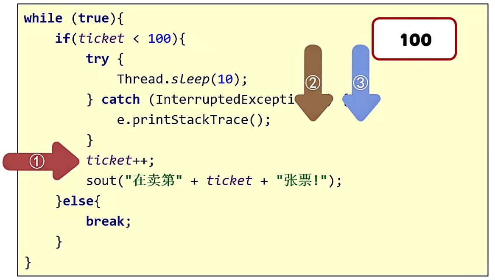

自增完成后还是一样，还没来得及打印，CPU的执行权被线程2抢走了，线程2也做了一次自增，`ticket` 变成了 `101`。

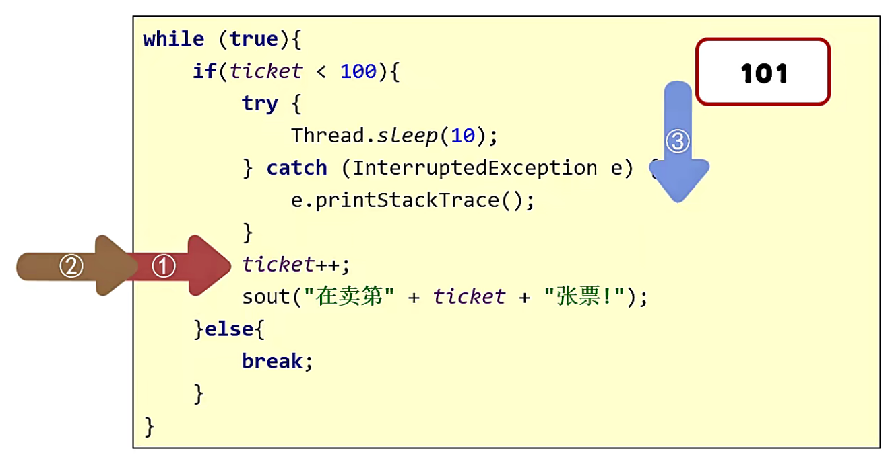

同样的，这个时候它也还没有打印，`ticket` 执行权又被线程3抢走了，线程3也做了一次自增，`ticket` 变成了 `102`。

那么这个时候不管是线程1，还是线程2，还是线程3，它们打印的都是 `102号票`。

这就是超出范围的由来。

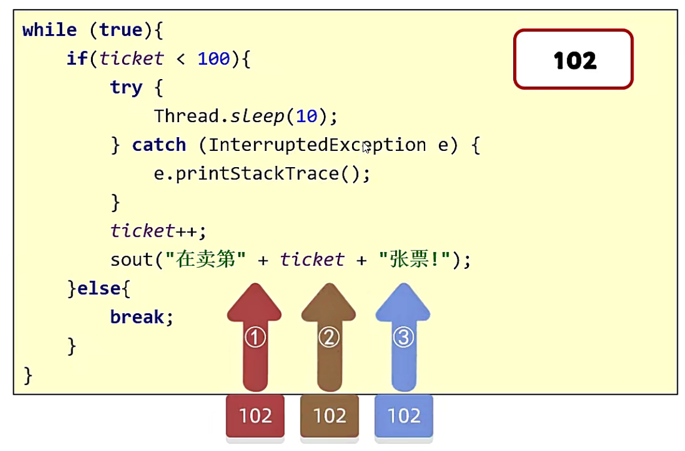

其根本原因跟刚刚是一样的：线程执行的时候是具有随机性的，CPU的执行权随时都有可能会被其他线程抢走，这个就是买票所产生的原因。

那我们该如何纠正呢？

如果我们能将操作数据的这段代码给锁起来，当有线程进来后，其他的线程就算抢夺到了CPU的执行权，也得在外面等着，它进不来。

只有当线程1出来了，其他的线程才能进去。

----

## 三、同步代码块

把操作共享数据的代码锁起来

此时会用到一个关键字 `synchronized`，在它的后面写 `锁对象` 就行了

~~~java
synchronized (锁){
    操作共享数据的代码
}
~~~

细节1：在最初锁的状态是默认打开的，如果有一个线程进去了，此时锁就会自动关闭。

细节2：当锁里面所有的代码都执行完毕了，线程出来了，这时候锁才会自动打开。

----

## 四、修改代码

小括号中需要写锁对象，这个锁对象是任意的，任意到我在上面创建一个Object的对象都可以，只不过我们一定要切记，这是一个锁对象，一定要是唯一的，即在对象前面加一个静态关键字就可以保证唯一了，即：MyThread这个类不管创建多少对象，这里的obj都是共享的，都是同一个。

~~~java
public class MyThread extends Thread {
    //表示这个类所有的对象，都共享ticket数据
    static int ticket = 0;//0 ~ 99

    static Object obj = new Object();

    @Override
    public void run() {
        //此时我们就可以将obj放在小括号中，当做锁对象
        //这样就能解决线程安全的问题，这种解决方式我们会叫做：同步代码块
        //利用同步代码块将操作共享数据的代码给锁起来，让同步代码块里的代码轮流进行的
        while (obj) {
            synchronized (MyThread.class) {//相当于将共享数据的代码锁起来了，此时不管你有多少条线程，这个里面的代码都是轮流执行的。
                //同步代码块
                if (ticket < 100) {
                    try {
                        Thread.sleep(10);
                    } catch (InterruptedException e) {
                        e.printStackTrace();
                    }
                    ticket++;
                    System.out.println(getName() + "正在卖第" + ticket + "张票！！！");
                } else {
                    break;
                }
            }
        }
    }
}
~~~

----

## 五、同步代码块的两个小细节

### 1）synchronized同步代码块不能写在循环的外面

如果你写在循环的外面就会有一个小问题：

~~~java
@Override
public void run() {
    synchronized (obj) {
        while (true) {
            //同步代码块
            if (ticket < 100) {
                try {
                    Thread.sleep(10);
                } catch (InterruptedException e) {
                    e.printStackTrace();
                }
                ticket++;
                System.out.println(getName() + "正在卖第" + ticket + "张票！！！");
            } else {
                break;
            }
        }
    }
}
~~~

运行上面代码，你会发现窗口1将所有的代码都卖完了，压根就没有窗口2，窗口3什么事。

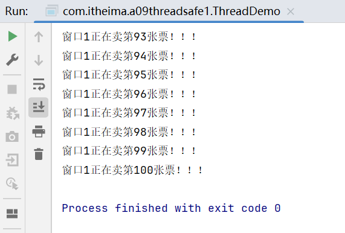

程序刚开始运行的时候，窗口1、窗口2、窗口3它会去抢夺CPU的执行权。

如果说窗口1抢到了，此时它就会进来，进来后，这里的锁就关闭了。

就算窗口2、窗口3抢到CPU的执行权，它也得在synchronized的外面等着，一直等到synchronized里面所有的代码全都执行完毕后，线程1出来了，2跟3才有可能进去。

由于synchronized里面是循环，窗口1只有将100张票全部卖完了，线程1才会出来，此时就会导致一个线程会将所有的票卖完。

~~~java
@Override
public void run() {
    synchronized (obj) {
        ///----------------------------------------------------
        while (true) {
            ............
        }
    }
}
~~~

---

### 2）synchronized里面的锁对象一定要是唯一的

那如果不是唯一的，会出现什么效果呢？

如果现在有两条线程，两条线程看的是不同的锁，那么这把锁还有意义吗？

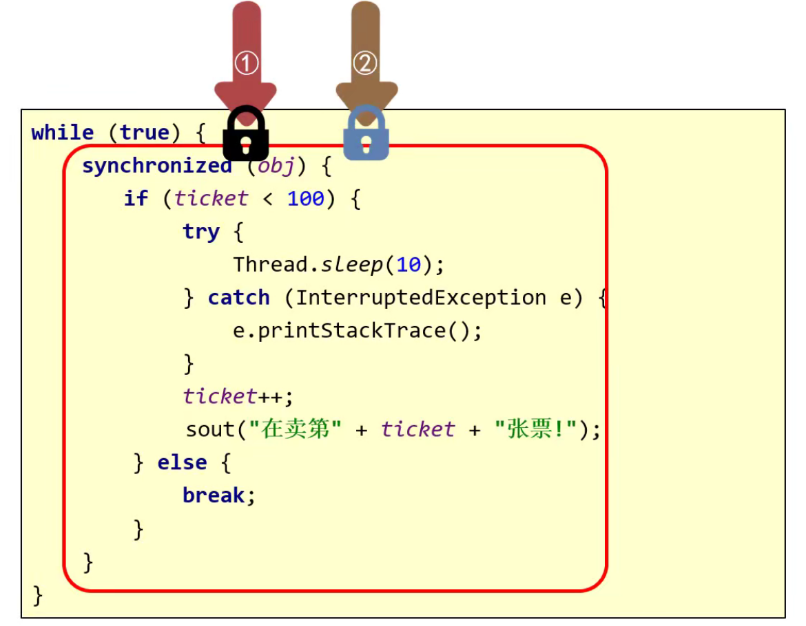

就没意义了，如果每条线程对应的锁不一样，那这个synchronized代码块就等于没有写。

下面代码将之前的obj改成this，当线程1进来后，这里的this表示的就是线程1本身，线程2进来后，this表示的就是线程2本身，此时这里的锁对象就是不一样，我们可以来运行一下。

~~~java
@Override
public void run() {
    while (true) {
        synchronized (this) {
            //同步代码块
            if (ticket < 100) {
                try {
                    Thread.sleep(10);
                } catch (InterruptedException e) {
                    e.printStackTrace();
                }
                ticket++;
                System.out.println(getName() + "正在卖第" + ticket + "张票！！！");
            } else {
                break;
            }
        }
    }
}
~~~

程序运行完毕，可以发现卖重复票的情况和超票的情况依旧存在。

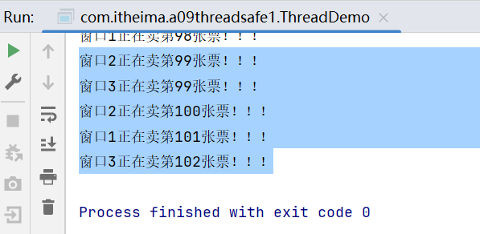

所以 **synchronized里面的锁对象一定要是唯一的**。

但一般我们会怎么写呢？一般我们会在这写当前类的字节码文件对象。

其实说的就是那个class的对象，这个对象其实是唯一的，因为在同一个文件夹里面只能有一个 `MyThread.class`，因此字节码文件对象一定是唯一，那么既然你是唯一的，那我就把你拿过来当做是锁对象就行了。

~~~java
@Override
public void run() {
    while (true) {
        synchronized (this) {
            //同步代码块
            if (ticket < 100) {
                try {
                    Thread.sleep(10);
                } catch (InterruptedException e) {
                    e.printStackTrace();
                }
                ticket++;
                System.out.println(getName() + "正在卖第" + ticket + "张票！！！");
            } else {
                break;
            }
        }
    }
}
~~~


----

# 149.同步方法

## 一、总述

刚刚我们已经学习完了同步代码块，就是将一段代码锁起来，这样就可以解决多线程操作共享数据时带来的数据安全问题。

但是如果我们想要将一个方法里面所有的代码全部锁起来，此时就没有必要去用同步代码块了，我们可以直接将 `synchronized` 加在方法上，此时这个方法就叫做同步方法。

~~~java
修饰符 synchronized 返回值类型 方法名(方法参数) { 
	方法体；
}
~~~

特点1：同步方法是锁住方法里面所有的代码

特点2：同步方法的锁对象，我们是不能自己指定的，是Java已经规定好的。

- 如果你当前的方法是非静态的，它的锁对象就是 `this`，即当前方法的调用者。
- 如果你当前的方法是静态的，它的锁对象就是 `当前类的字节码文件对象`。

----

## 二、练习

题目还是刚刚的题目，只不过要求用同步方法完成。

很多同学在写同步方法的时候都会有一个小疑问：不知道把哪些方法写在同步方法中。

技巧：你首先不要写同步方法，而是先写同步代码块，然后再把同步代码块里面的代码去抽取成方法就行了。

```
需求：
     某电影院目前正在上映国产大片，共有100张票，而它有3个窗口卖票，请设计一个程序模拟该电影院卖票
     利用同步方法完成
     技巧：同步代码块
```

我们先用同步代码块写，再去改成同步方法。

由于在之前我们用的都是多线程的第一种实现方式，这里就使用第二种实现方式。

由于现在使用的是第二种实现方式，此时 `ticket` 的前面就没必要去加 `static` 了。

我们之前一直使用第一种实现方式（继承Thread类），此时它是有可能创建多个对象的，所以如果我想让所有的对象都共享一个 ticket成员变量的值，在前面就需要加static。

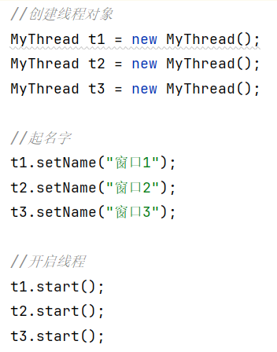

但是我们现在使用的是第二种实现方式（实现Runnable接口），在这种方式下，MyRunnable（我们自己写的类）只有可能会创建一次，它是作为一个参数让线程去执行的，所以只会创建一次它的对象。

那么既然只会创建一次，ticket就没有必要再去加static了。

~~~java
public class MyRunnable implements Runnable {
    int ticket = 0;
    @Override
    public void run() {
    }
}
~~~

接下来完善 `run()`，写 `run()` 的时候也是有套路的

```java
public class MyRunnable implements Runnable {

    int ticket = 0;

    @Override
    public void run() {
        //1.循环
        while (true) {
            //2.同步代码块（同步方法）
            //3.判断共享数据是否到了末尾，如果到了末尾
            if (ticket == 100) {
                break;
            } else {
                //4.判断共享数据是否到了末尾，如果没有到末尾
                try {
                    Thread.sleep(10);
                } catch (InterruptedException e) {
                    e.printStackTrace();
                }
                ticket++;
                System.out.println(Thread.currentThread().getName() + "在卖第" + ticket + "张票！！！");
            }
        }
    }
}
```

**测试类**

~~~java
MyRunnable mr = new MyRunnable();

Thread t1 = new Thread(mr);
Thread t2 = new Thread(mr);
Thread t3 = new Thread(mr);

t1.setName("窗口1");
t2.setName("窗口2");
t3.setName("窗口3");

t1.start();
t2.start();
t3.start();
~~~

接下来改成同步方法。

改写很简单：将synchronized里面所有的代码全都放到方法中即可。

选中synchronized里面所有的代码，<kbd>ctrl + alt + M</kbd> ，此时就可以抽取成一个方法了。

```java
public class MyRunnable implements Runnable {

    int ticket = 0;

    @Override
    public void run() {
        //1.循环
        while (true) {
            //2.同步代码块（同步方法）
            if (method()) break;
        }
    }

    //this
    private synchronized boolean method() {
        //3.判断共享数据是否到了末尾，如果到了末尾
        if (ticket == 100) {
            return true;
        } else {
            //4.判断共享数据是否到了末尾，如果没有到末尾
            try {
                Thread.sleep(10);
            } catch (InterruptedException e) {
                e.printStackTrace();
            }
            ticket++;
            System.out.println(Thread.currentThread().getName() + "在卖第" + ticket + "张票！！！");
        }
        return false;
    }
}
```

----

## 三、StringBuffer

学习完同步方法后，我们之前有很多知识点其实也就可以解释了。

很多同学在之前肯定听过：字符串在进行拼接的时候，除了 `StringBuilder` 外，还有一个类：`StringBuffer`。

那这个 `StringBuffer` 跟我们之前学习的 `StringBuilder` 有什么区别呢？

打开 `API帮助文档` 来看一下。

这里打开了两个 `API帮助文档`，左边是 `StringBuilder`，右边是 `StringBuffer`

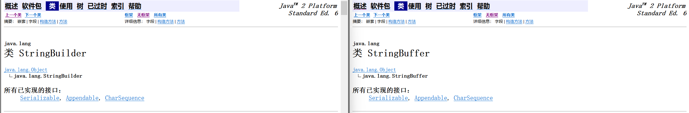

往下滑，可以惊讶的发现，方法都是一模一样的。

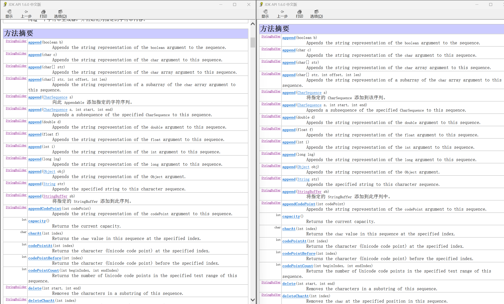

那为什么Java要定义两个完全一模一样的类呢？

看下面，StringBuilder下面有这样一句话：将 `StringBuilder` 的实例（即对象的意思）用于多个线程是不安全的。如果需要这样的同步，则建议使用 `StringBuffer`。 


接下来看下源码，同样左边是 `StringBuilder`，右边是 `StringBuffer`。

往下拉，找到成员方法。可以发现，`StringBuffer` 里面每一个成员方法都有 `synchronized`，但左边的 `StringBuilder` 所有的成员方法都没有 `synchronized`，这就表示 `StringBuffer` 是线程安全的，因为它里面所有的方法前面都有 `synchronized`，即它里面所有的方法都是同步的。

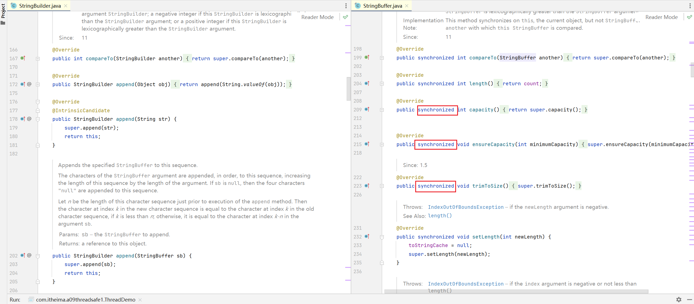

那我们以后如何选择呢？

如果你的代码是单线程的，不需要考虑多线程中数据安全的情况，就用 `StringBuilder` 就行了。

但如果是多线程环境下，需要考虑到 `数据安全`，这时候就可以选择右边的  `StringBuffer`。


-----

# 150.lock锁

## 一、引入

我们刚刚学习完了同步代码块和同步方法，它们里面有个细节要注意。

这里以同步代码为例。我们发现，当有线程进入到同步代码块后，这里的锁是会自动关闭的。

当线程执行完里面的代码后，锁又会自动打开。

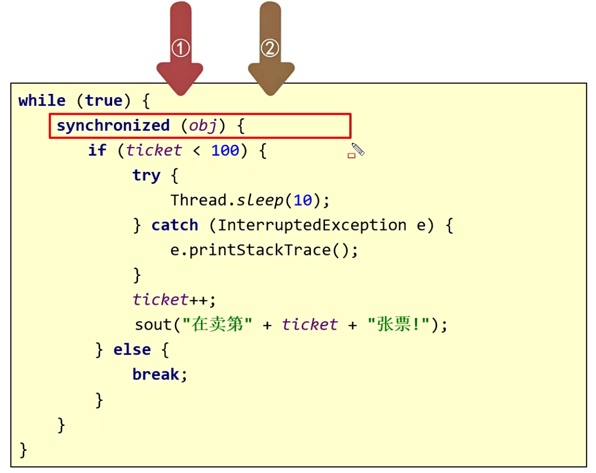

也就是说这里的锁的开关，我们是没有办法自己控制，都是自动的。

但如果我想手动去加锁，或者手动释放锁，有没有办法呢？

当然这必须是有的，在JavaJDK5以后提供了一个新的锁对象Lock。

Lock实现提供比使用synchronized方法和语句可以获得更广泛的锁定操作。

Lock中提供了获得锁、释放锁的方法，这样我们就可以去手动上锁、手动释放锁。

| 方法名        | 说明   |
| ------------- | ------ |
| void lock()   | 获得锁 |
| void unlock() | 释放锁 |

Lock是接口不能直接实例化（创建对象），这里采用它的实现类ReentrantLock来实例化

在创建对象的时候直接用它的空参构造就行了

| 方法名          | 说明                        |
| --------------- | --------------------------- |
| ReentrantLock() | 创建一个ReentrantLock的实例 |

----

## 二、引出问题

将之前的代码使用 `Lock` 来改写

~~~java
public class MyThread extends Thread{
    static int ticket = 0;

    //Lock是一个接口，在创建的时候需要创建它实现类的对象
    Lock lock = new ReentrantLock();

    @Override
    public void run() {
        //1.循环
        while(true){
            //由于上锁跟释放锁跟同步代码块是重复的，因此需要将同步代码块给注释掉
            //2.同步代码块
            //synchronized (MyThread.class){
            lock.lock(); 

            //3.判断
            if(ticket == 100){
                break;
                //4.判断
            }else{
                try {
                    Thread.sleep(10);

                } catch (InterruptedException e) {
                    e.printStackTrace();
                }
                ticket++;
                System.out.println(getName() + "在卖第" + ticket + "张票！！！");
            }
            //  }
            lock.unlock(); // 释放锁
        }
    }
}
~~~

如果此时直接运行代码，票依旧是有重复的，并且也会超出范围。这是为什么呢？

由于我们用的是第一种方式实现的多线程，`MyThread` 需要创建很多次

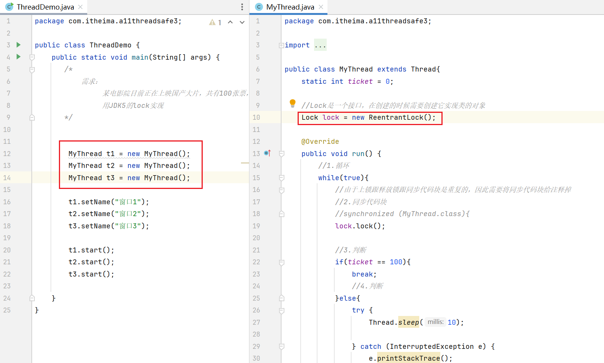

如果 `MyThread` 创建很多次，那么势必造成这里的 `Lock锁` 有多个对象，所以我们需要在它的前面加上 `static静态关键字`，这就表示所有的对象都共享同一把锁。

```java
static Lock lock = new ReentrantLock();
```

运行后重复的票没有了，超出范围的票也没有了，但是新的问题又出现了：程序居然没停！

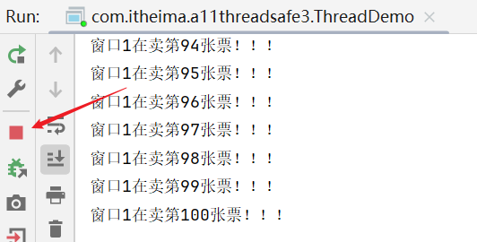

假设三个线程都在 `run()` 这里抢夺CPU的执行权，一开始假设线程1抢夺到了CPU的执行权。

然后执行到while循环、lock.lock()，此时相当于将锁给锁上了，线程1进来。

进来后做了一个判断：`ticket == 100`，发现不等于，就会执行 `else` 中的代码块，于是就会睡觉。

睡觉的时候CPU的执行权就会被抢走，给线程2或者线程3，它抢走后，它执行到了 `lock.lock()`，此时它无法获取到锁对象了，锁已经关闭了，因为线程1已经事先拿到了锁，一旦拿到了锁之后，锁就会关掉。其他的线程就算你抢到了CPU的执行权，它也会被关在外面。到这里还是跟之前是一样的。

继续往下分析，当线程1醒来后，执行下面的代码，直到调用 `unlock()`，即释放锁。

此时回到循环的上面，继续和线程2线程3抢夺CPU执行权。

假设现在每次都是线程1抢到的，因此线程1会把所有的票都卖完。

假设现在是最后一次，`ticket = 100`。假设还是线程1抢到了执行权，此时通过 `lock.lock()` 拿到了锁，然后进行 `ticket == 100` ，判断为true，执行break，直接跳到了循环的外面，此时问题就出现了，它都没有执行到这里的 `unlock()` ！

这就导致了线程1虽然结束了，但是它还拿着锁对象出去的，没有把锁给打开，这就导致了线程2和线程3一直停在 `lock.lock()`，此时程序就不会停止。

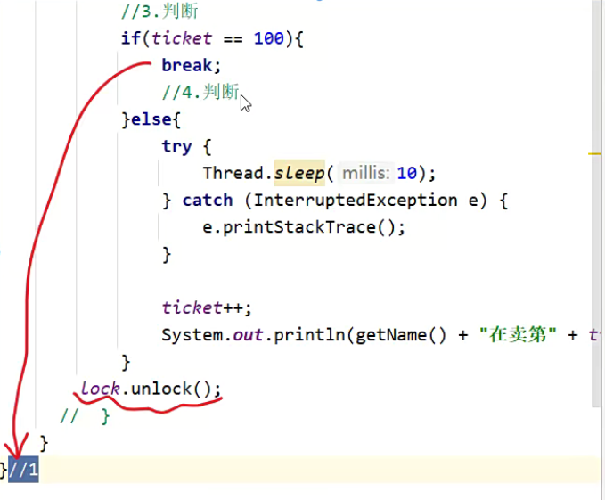

---

## 三、解决问题

但是这并不是我想要的，我想要的是：不管是什么样的情况，程序都能停止，即 `lock.unlock()` 都能执行到。

哪怕你循环结束了，你也得把这个锁释放了。

有的同学会说：在break前面再加一个 `unlock()` 不就行了吗？

这确实是可以的，但是 `unlock()` 算是扫尾代码，像这种扫尾代码我干嘛要写两遍呢？

有没有一种更为简单的办法？是有的，而且是最稳妥的。

在Java中异常的处理体系中，有个 `finally`，特性：不管怎么样，它里面的代码一定会执行，因此我们可以利用这个特性将 `unlock()` 写在 `finally` 中。

改写：将从锁开始全部的代码，全都放到 `try-catch` 中。

~~~java
public class MyThread extends Thread{

    static int ticket = 0;

    static Lock lock = new ReentrantLock();

    @Override
    public void run() {
        //1.循环
        while(true){
            //2.同步代码块
            //synchronized (MyThread.class){
            lock.lock(); //2 //3
            try {
                //3.判断
                if(ticket == 100){
                    break;
                    //4.判断
                }else{
                    Thread.sleep(10);
                    ticket++;
                    System.out.println(getName() + "在卖第" + ticket + "张票！！！");
                }
                //  }
            } catch (InterruptedException e) {
                e.printStackTrace();
            }
            lock.unlock();
        }
    }
}
~~~


----

# 151.死锁

死锁说白了，就是在程序中出现了锁的嵌套。

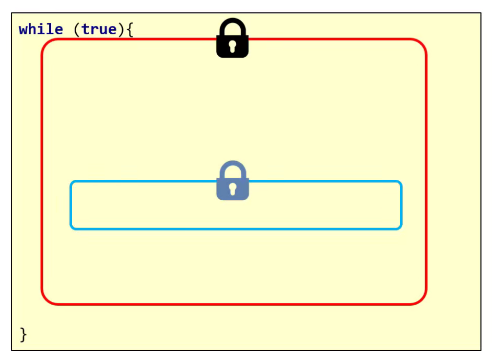

死锁不是一个知识点，它是一个错误。

现在我们学习死锁的目的就是：以后不要犯这个错误。

A线程拿着A锁，B线程拿着B锁，它们都在等着对方释放锁，此时程序就会卡死，运行不下去。

由于死锁不是一个知识点，而是一个错误，因此下面的代码是不需要你去练的，你只需要理解它的过程就行了

**测试类**

~~~java
yThread t1 = new MyThread();
MyThread t2 = new MyThread();

t1.setName("线程A");
t2.setName("线程B");

t1.start();
t2.start();
~~~

**MyThread.java**

~~~java
public class MyThread extends Thread {
    //定义了两把锁，一把A锁一把B锁
    static Object objA = new Object();
    static Object objB = new Object();

    @Override
    public void run() {
        //1.循环
        while (true) {
            //如果是线程A就执行这段
            if ("线程A".equals(getName())) {
                //先是A锁
                synchronized (objA) {
                    System.out.println("线程A拿到了A锁，准备拿B锁");//A
                    //再是B锁
                    synchronized (objB) {
                        System.out.println("线程A拿到了B锁，顺利执行完一轮");
                    }
                }
            } else if ("线程B".equals(getName())) { //如果是线程B，就执行这段
                if ("线程B".equals(getName())) {
                    //但是在线程B中，先是B锁
                    synchronized (objB) {
                        System.out.println("线程B拿到了B锁，准备拿A锁");//B
                        //再是A锁
                        synchronized (objA) {
                            System.out.println("线程B拿到了A锁，顺利执行完一轮");
                        }
                    }
                }
            }
        }
    }
}
~~~

此时它会出现什么情况呢？运行程序发现，程序卡死了。

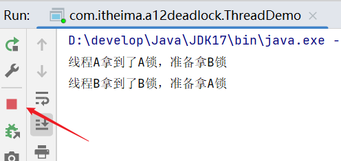

那为什么会开始呢？

首先还是线程A、线程B在抢夺CPU的执行权

~~~~java
@Override
public void run() { //A //B
    ....
}
~~~~

假设现在是线程A抢到了，此时它就会进去，然后做一个判断，是线程A就会执行线程A里面的代码

在执行的时候默认情况下锁都是打开的，所以A可以拿到 `objA`，即A锁

~~~java
@Override
public void run() {
    while (true) {
        if ("线程A".equals(getName())) {
            synchronized (objA) { //拿到A锁
                //一旦拿到后，A锁就关闭了
                System.out.println("线程A拿到了A锁，准备拿B锁");//然后打印这句话
                //但是当线程A还没有拿到B锁，此时CPU的执行权被上面的线程B抢到了
                synchronized (objB) {
                    System.out.println("线程A拿到了B锁，顺利执行完一轮");
                }
            }
        } else if ("线程B".equals(getName())) {
            //线程B就会执行到这段代码，此时B锁是打开的，因为线程A停在了第7行，它导致了A锁关闭，但是它还没去操作B锁
            synchronized (objB) { //因此此时线程B在执行的时候，看到B锁，是可以进来的
                System.out.println("线程B拿到了B锁，准备拿A锁");//进来后就会打印这句话
                //但是此时就出问题了，B如果想要继续往下执行，就必须要让A锁打开
                //但是A锁打开不了，因为线程A还在拿着A锁
                //那A锁什么时候才能释放呢？很简单，只有当synchronized (objA) 代码块中所有代码都执行完了，A锁才能释放。
                //说白了线程A需要拿到B锁然后执行完里面的代码A锁才能释放
                //但是线程A进不去，因为B锁已经被线程B拿到了
                synchronized (objA) {
                    System.out.println("线程B拿到了A锁，顺利执行完一轮");
                }
            }
        }
    }
}
~~~

此时线程A正在等着线程B释放锁，而线程B又在等着线程A释放锁，此时两个线程都会卡死在对应的地方：A线程卡死在第7行，B线程卡死在16行，这个时候程序就运行不下去了，这个就是死锁

**总结：以后我们在写锁的时候，千万不要让两个锁嵌套就行了。**


----

# 152.生产者和消费者（等待唤醒机制）

## 一、思路分析

### 1）引入

`生产者和消费者` 也叫做 `等待唤醒机制`。

`生产者消费者模式` 是一个十分经典的多线程协作的模式，学习完了 `等待唤醒机制`，会让我们对多线程的运行有更加深刻的理解。

之前我们学习过，线程的执行是有随机性的，所以如果有两条线程正在执行，它的结果有可能是这样的，完全随机。


但是我们现在学习的 `等待唤醒机制`，这个机制就要打破随机的规则。

它会让两个线程轮流执行，你一次我一次。这就是在 `等待唤醒机制` 中多线程的运行结果。


其中的一条线程我们会将它叫做 `生产者`，负责 `生产数据`。

另一条线程我们会叫做 `消费者`，负责 `消费数据`。

由于这个过程非常的复杂，我们先将一个小故事，用故事去理解复杂的代码逻辑。

假设现在有两个人，一个是吃货，一个是厨师。

吃货负责吃，所以它是消费者；厨师负责做，所以它是生产者。

但是光有它们两个还不够，还需要有第三者桌子，因为在默认情况下，线程的执行是具有随机性的，我们需要有一个东西去控制线程的执行，现在我们就用桌子去控制。


假设现在桌子上有一碗面条，如果有面条，就是吃货执行，负责吃。


但是如果桌子上没有面条，那就是厨师去执行，它负责做面条。


我们先来看看理想情况是怎么样的。

理想情况下，就是一开始是厨师先抢到了CPU的执行权，此时桌子上是没有面条的，所以厨师在一开始就要做一碗面条。

做完了后将买那条放在桌子上，再让吃货线程来吃，这就是理想的情况。

相当于就是厨师做一个，吃货吃一个。


但是程序程序没有这么听话，它不能按照我们自己想的去执行，线程的执行是具有随机性的。

所以我们需要将各种各样的情况给考虑到。

但是它出现的情况没有大家想的那么复杂，只有两种情况。

我们先来分析第一种：消费者等待。

----

### 2）情况一：消费者等待

假设在一开始，不是厨师先抢到CPU的执行权，而是吃货先抢到CPU的执行权，这个时候桌子上还没有东西的，总不能啃桌子吧，所以它只能先等着，代码中叫做 `wait`。

一旦它等了，CPU的执行权一定会被厨师抢到，厨师就会看下桌子上有没有面条，现在没有，那就开始做，做一碗面条放在桌子上。

做完后还没完，吃货还在等着，因此厨师需要含吃货去吃，这个动作我们也叫作 `唤醒`，英文：`notify`。


吃货一旦被唤醒后就开始。


以上就是第一种消费者等待的情况。

主要核心思想其实就是看桌子，桌子上如果没有面条，消费者就会等待。

消费者和生产者执行过程如下


----

### 3）情况二：生产者等待

在一开始的时候是厨师抢到了CPU的执行权，此时桌子上是没有事物的，此时厨师就会执行我们刚刚分析到的三步：制作食物、把事物放在桌子上、叫醒等待的消费者开吃。

但是现在没有人在等，这个其实也没有什么太大关系，就是喊一下的事情，代码是不会受到任何影响的。


这个时候，就不能是左边的吃货去抢到CPU的执行权了，如果是吃货抢到了CPU的执行权，此时就变成理想情况了。

而我们现在说的是生产者等待的情况，因此下一次还是厨师抢到CPU的执行权。

此时厨师抢到CPU执行权后，她就不能做面条了，因为桌子上已经有了，所以此时厨师只能等着。

因此关于生产者的三步我们就需要改进一下，加个判断即可。

此时厨师已经等着了，一旦它等待，CPU的执行权就会被吃货抢走，吃货就会执行我们刚刚推导的两步，它会去判断桌子上是否有事物，没有事物就会等待。

如果有就开始，吃完后还需要再次唤醒厨师继续做。

说以这才是生产者和消费者完整的执行过程。


在这个过程中涉及到三个方法

| 方法名           | 说明                                                         |
| ---------------- | ------------------------------------------------------------ |
| void wait()      | 当前线程等待，直到另一个线程调用该对象的 notify()方法或 notifyAll()方法唤醒为止 |
| void notify()    | 随机唤醒单个线程                                             |
| void notifyAll() | 唤醒所有线程                                                 |

----

## 二、Desk的代码实现

在刚刚分析的过程中，我们知道在里面至少会有三个角色，分别是 `生产者`、`消费者` 以及中间那个控制 `生产者和消费者的那个第三者`。

~~~java
public class Desk {

    /*
    * 作用：控制生产者和消费者的执行
    *
    * */

    //那如何控制呢？在它里面就应该有一个状态，没有食物就是厨师执行，有实物就是吃货执行
    //为了方便外界调用，这里直接使用public static就行了
    //表示桌子上是否有面条  0：没有面条  1：有面条
    //那为什么不使用boolean类型表示呢？因为boolean只有两个值，它只能控制两条线程轮流执行。
    //以后我的需求变更了，需要控制三条线程、四条线程轮流执行，这个boolean就搞不定了。因此这里为了考虑到后面的通用性，这里用int类型
    public static int foodFlag = 0;

    //吃货也不可能一直吃，因此需要有一个变量来表示总个数
    //总个数
    public static int count = 10; // 表示吃货最多可以吃十个

    //在线程中还需要用到锁，因此在这里定一个锁对象
    //锁对象
    public static Object lock = new Object();
}
~~~

接下来就是补全吃货和厨师里面的代码就行了。

----

## 三、消费者代码实现

大家以后在写多线程的时候，一定要按照之前四个套路去写，有了套路多线程的代码会变得非常简单。

```
1. 循环
2. 同步代码块（之后可以改写为同步方法或者lock锁，都行）
3. 判断共享数据是否到了末尾（到了末尾）,建议先写到了末尾的情况，因为到了末尾更简单
4. 判断共享数据是否到了末尾（没有到末尾，执行核心逻辑）
```

~~~java
public class Foodie extends Thread {

    @Override
    public void run() {
        //1. 循环
        while (true) {
            //2. 同步代码块（之后可以改写为同步方法或者lock锁，都行）
            //括号中写锁对象，锁对象一定要唯一，在Desk中的静态变量lock，我们将它当做是锁就行了
            synchronized (Desk.lock) {
                //3. 判断共享数据是否到了末尾（到了末尾）
                //什么是共享数据？很简单，你就想线程什么时候才能停止。
                //即当吃货把十碗面条都吃完了，线程就要停止了。因此此时共享数据就是Desk里面的count。它的初始值是10，如果你变成0了，那么循环就要停止。循环一旦停止，循环就会结束了。
                if (Desk.count == 0) {
                    break;
                } else {
                    //4. 判断共享数据是否到了末尾（没有到末尾，执行核心逻辑）
                    //先判断桌子上是否有面条
                    if (Desk.foodFlag == 0) {
                        //如果没有，就等待
                        try {
                            //等待的时候不能直接调用wait()，而是需要使用锁对象去调用wait()
                            //为什么是这样呢？其实是有原因的，这行代码会有一个逻辑：让当前线程跟锁进行绑定
                            //一旦绑定后，在下面我们进行notifyAll()唤醒的时候就可以操作了。
                            //因为我们在唤醒的时候肯定不能唤醒操作系统中所有的线程，那我该唤醒哪些线程呢？其实就跟这个锁是有关系的。
                            //我们下面在调用notifyAll()的时候也是通过锁进行调用的，这个时候Dest.lock.notyfyAll()就表示现在要唤醒这把锁绑定的所有线程。
                            //因此我们不管调用wait()还是调用下面notyfyAll()，都是需要用锁对象调用的。
                            //wait()有异常，我们需要对它进行处理，并且它只能try不能抛出
                            Desk.lock.wait();
                        } catch (InterruptedException e) {
                            e.printStackTrace();
                        }
                    } else { // 这里的else就表示footFlag不是0，即桌子上是有面条的
                        //把吃的总数-1
                        Desk.count--;
                        //如果有，就开吃
                        System.out.println("吃货在吃面条，还能再吃" + Desk.count + "碗！！！");
                        //吃完之后，唤醒厨师继续做
                        Desk.lock.notifyAll();//表示要去唤醒绑定在这把锁上的所有线程
                        //修改桌子的状态
                        Desk.foodFlag = 0;
                    }
                }
            }
        }
    }
}
~~~

----

## 四、生产者代码实现

首先生产者也是个多线程，多线程中的四个套路千万别忘了。

~~~java
1. 循环
2. 同步代码块（之后可以改写为同步方法或者lock锁，都行）
3. 判断共享数据是否到了末尾（建议先写到了末尾的情况，因为到了末尾更简单）
4. 判断共享数据是否到了末尾（没有到末尾，执行核心逻辑）
~~~


~~~java
public class Cook extends Thread {
    @Override
    public void run() {
        //1. 循环
        while (true) {
            //2. 同步代码块（之后可以改写为同步方法或者lock锁，都行）
            synchronized (Desk.lock) {
                //3. 判断共享数据是否到了末尾
                if (Desk.count == 0) {
                    //到末尾了
                    break;
                } else {
                    //没有到末尾
                    //判断桌子上是否有食物
                    if (Desk.foodFlag == 1) {
                        //如果有，就等待吃货将已有的吃掉
                        try {
                            Desk.lock.wait();
                        } catch (InterruptedException e) {
                            e.printStackTrace();
                        }
                    } else {
                        //如果没有，就制作食物
                        System.out.println("厨师做了一碗面条");
                        //修改桌子上的食物状态
                        Desk.foodFlag = 1;
                        //叫醒等待的消费者开吃
                        Desk.lock.notifyAll();
                    }
                }
            }
        }
    }
}
~~~

----

## 五、测试

~~~java
public static void main(String[] args) {
    //创建线程的对象
    Cook c = new Cook();
    Foodie f = new Foodie();

    //给线程设置名字
    c.setName("厨师");
    f.setName("吃货");

    //开启线程
    c.start();
    f.start();
}
~~~

程序运行完毕，可以发现就是跟我们想象中是一样的，厨师做一碗，吃货吃一碗.........

并且程序也已经停止。如果你写完代码，这里的红灯没有灭，那么你的代码就是有bug的。

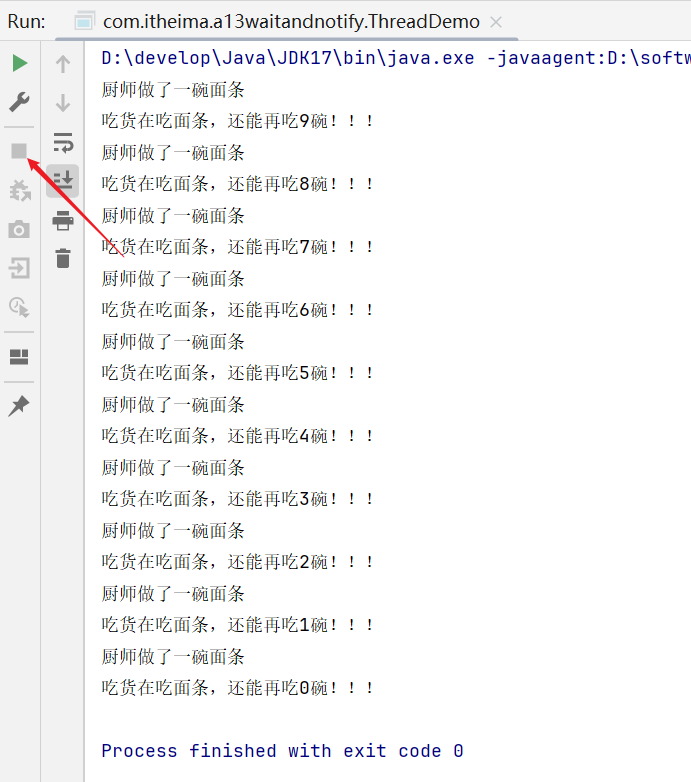


-----

# 155.阻塞队列实现等待唤醒机制

## 一、引入

我们刚刚已经学习完了 `等待唤醒机制` 最基本的写法，其实它还有第二种方式：利用阻塞队列实现。

那什么是阻塞队列呢？其实就好比是连接生产者和消费者之间的管道。

以刚刚的故事为例，厨师做好面条后，就可以将面条放在管道中，而且左边的消费者就可以从管道中获取面条去吃。

而且更重要的是，我们去规定管道中最多能放多少碗面条。


如果我们规定管道中只能放一碗面条，那么运行结果就是和我们上面写的代码是一样的，做一碗吃一碗，做一碗吃一碗。

中间的这个管道其实就是阻塞队列。

阻塞队列可以分成两个单词去理解：

- 队列：数据在管道中就好比是排队一样，先放进去的这碗面，是最先被拿出来的，所以就叫做队列。

- 阻塞：当厨师put数据时，如果中间的管道已经放满了，此时厨师就会等着，因此将等着，什么也干不了的这个动作叫做 `阻塞`

  吃货其实也会阻塞的，当吃货从管道中获取不到数据了，此时它也只能等着，什么也干不了，这个动作也叫作阻塞。

知道了什么是阻塞队列，接下来看看阻塞队列的体系结构。

----

## 二、阻塞队列的继承结构

阻塞队列一共实现了四个接口

- 最顶层的接口是 `Iterable`，也就表示，阻塞队列是可以利用迭代器/增强for进行遍历的。

- 阻塞队列本身还实现了 `Collection接口`，由此可见，阻塞队列其实就是一个单列集合。

- `Queue`：它表示队列
- `BlockingQueue`：表示是阻塞队列

上面四个都是接口，不能直接创建它们的对象，我们要创建的是两个实现类的对象。

`ArrayBlockingQueue`、`LinkedBlockingQueue`，它们有什么区别呢？

`ArrayBlockingQueue`：底层是数组实现的，有界（即有长度的界限）。我们在创建 `ArrayBlockingQueue` 对象的时候，必须要去指定队列的长度。

`LinkedBlockingQueue`：底层是链表实现的，无界（指没有长度的界限），创建它的对象的时候我们不需要去指定队列的长度。但是它又并不是真正的无界，它其实也是有最大值的，只不过这个最大值非常的大，是int的最大值，有21个亿那么多。

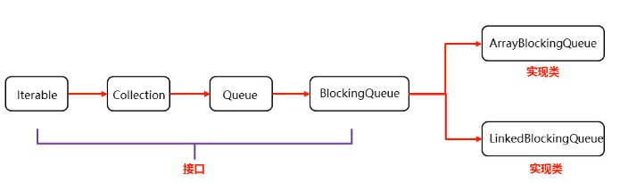

----

## 三、用阻塞队列完成 `唤醒机制` 代码实现

用阻塞队列完成 `唤醒机制`，代码非常的简单。

只不过在这里我们有个小细节一定要注意：生产者和消费者必须使用同一个阻塞队列才行。

因此`阻塞队列的对象`的代码最好写在测试类中，有了这个对象后，我们再通过创建对象的方式将队列传递给 `Cook`、`foodie`，这样就可以实现两者用的是同一个阻塞队列。

~~~java
public class ThreadDemo {
    public static void main(String[] args) {创建阻塞队列的对象，泛型表示的是队列中数据的类型
        //通过刚刚的学习我们知道，ArrayBlockingQueue是一个有界的阻塞队列，因此在创建它对象的时候必须指定上线
        //这里假设它最多只能放1个
        ArrayBlockingQueue<String> queue = new ArrayBlockingQueue<>(1);
    }
}
~~~

细节：这里是不需要写锁的，看一下源码就知道了，`put()` 底层已经有锁了。

选择 `ArrayBlockingQueue` 的 `put()` 跟进，可以发现在方法中，它首先会用 `lock锁` 的方式将代码锁起来。

~~~java
public void put(E e) throws InterruptedException {
    Objects.requireNonNull(e);
    //获取到锁对象
    final ReentrantLock lock = this.lock;
    //然后用锁对象去调用一个方法，这个方法就可以来获取锁。
    lock.lockInterruptibly();
    try {
        //然后进行循环判断，数据的个数 跟 队列的长度是否相等。
        while (count == items.length)
            //如果相等，说明队列装满了，等待
            notFull.await();
        //没有装满就往队列中放数据就行了
        enqueue(e);
    } finally {
        //当这些逻辑执行完毕后，再调用unlock()释放锁
        lock.unlock();
    }
}
~~~

并且take()的底层也是有锁的，我们在写代码的时候也不需要去加锁了，否则就会有锁的嵌套，锁的嵌套容易导致死锁。

~~~java
public E take() throws InterruptedException {
    //先获取到锁对象
    final ReentrantLock lock = this.lock;
    //然后再去调用lock方法获取到锁
    lock.lockInterruptibly();
    try {
        //在下面它又写了一个循环，来判断队列中数据是不是0
        while (count == 0)
            //如果是0表示没数据，拿不出来只能等着
            notEmpty.await();
        //如果有数据就获取
        return dequeue();
    } finally {
        //当上面所有代码执行完毕后，再调用unlock()释放锁
        lock.unlock();
    }
}
~~~

代码示例

~~~java
public class Cook extends Thread{
    //定义一个成员变量，表示阻塞队列，只不过此时只是只定义不给值。创建对象的时候才赋值。
    ArrayBlockingQueue<String> queue;

    public Cook(ArrayBlockingQueue<String> queue) {
        this.queue = queue;
    }

    @Override
    public void run() {
        while(true){
            //不断的把面条放到阻塞队列当中
            try {
                //异常直接try即可
                queue.put("面条");
                System.out.println("厨师放了一碗面条");
            } catch (InterruptedException e) {
                e.printStackTrace();
            }
        }
    }
}

----------------------------------

public class Foodie extends Thread{

    ArrayBlockingQueue<String> queue;

    public Foodie(ArrayBlockingQueue<String> queue) {
        this.queue = queue;
    }

    @Override
    public void run() {
        while(true){
            //不断从阻塞队列中获取面条
            try {
                //获取面条，获取的方法叫take()
                //并且take()的底层也是有锁的，我们在写代码的时候也不需要去加锁了
                String food = queue.take();
                System.out.println(food);
            } catch (InterruptedException e) {
                e.printStackTrace();
            }
        }
    }
}

-----------------------------------------------

public class ThreadDemo {
    public static void main(String[] args) {创建阻塞队列的对象，泛型表示的是队列中数据的类型
        //通过刚刚的学习我们知道，ArrayBlockingQueue是一个有界的阻塞队列，因此在创建它对象的时候必须指定上线
        //这里假设它最多只能放1个
        ArrayBlockingQueue<String> queue = new ArrayBlockingQueue<>(1);

        //2.创建线程的对象，并把阻塞队列传递过去
        Cook c = new Cook(queue);
        Foodie f = new Foodie(queue);

        //3.开启线程
        c.start();
        f.start();
    }
}
~~~

程序运行完毕，发现结果怎么跟想象的不太一样，这里怎么会有连续的？

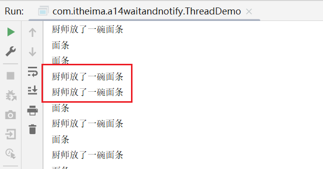

我们刚刚控制台看到的运行结果是这两条打印语句导致的。

但打印语句其实是定义在锁的外面，定义在锁的外面其实就是会导致这个现象。

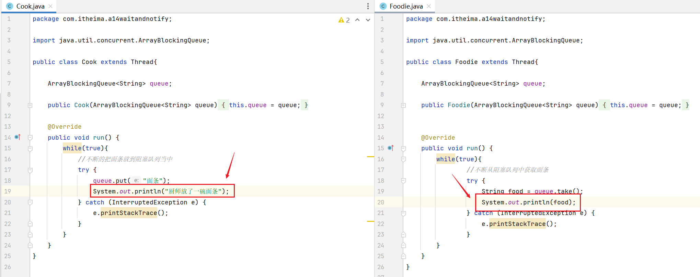

当我们将之前写的等待唤醒机制的代码进行改写，将打印语句放到锁的外面，发现也会这样的情况

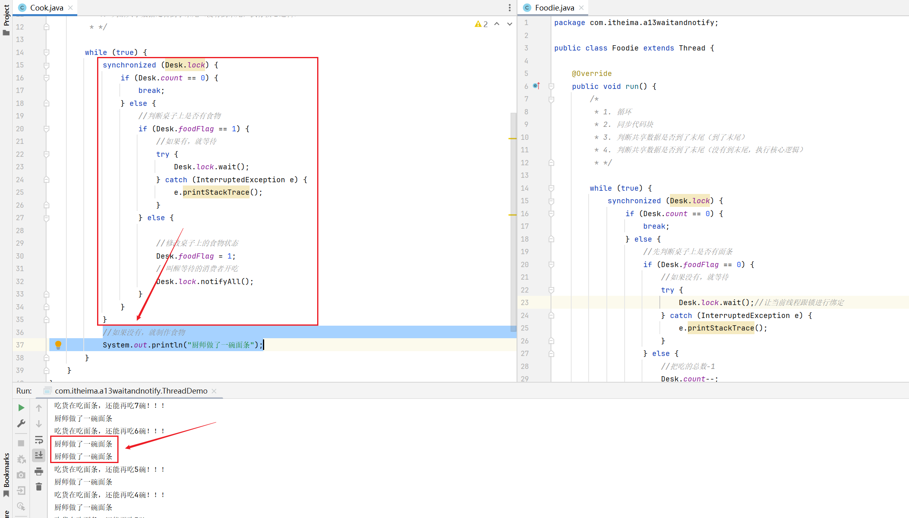

因此连续的原因就是因为我们将打印语句写在了锁的外面，导致看上去数据错乱的情况。

但是写在锁的外面并不会对数据的安全造成影响，它没有对共享数据造成任何的修改/改编，它只是对我们看运行的结果造成了一点点不方便而已。


----

# 156.多线程的6中状态

在之前我们简单的分析过，线程有 `新建、就绪、运行、死亡、阻塞` 这几种状态。


但是还不够完整，除此之外还有几种状态需要我们知道。

在代码运行的过程中，如果你遇到了 `wait()`，此时就会进入到 `等待` 状态，直到被人唤醒它为止。

如果需要了 `sleep()`，这个状态，标准是叫做 `计时等待` 状态，当时间到了之后它会自动醒来。

这个才是我们理解的线程七大状态。

但是在这里会有一个小细节：Java的虚拟机中，它是没有定义运行状态的。

这里的运行状态是为了方便大家理解，我自己加上的。

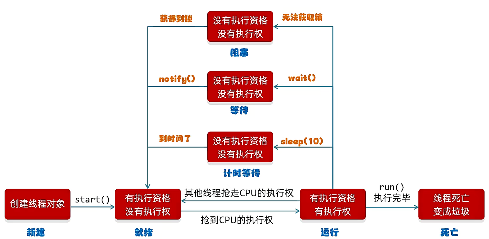

我们可以通过 `API帮助文档` 来查阅一下，搜索 `Thread.State`。

可以看见，线程的六个状态都定义在这里。

- NEW：新建
- RUNNABLE：就绪
- BLOCKED：阻塞
- WAITING：无限等待
- TIMED WAITING：计时等待
- TERMINGATED：结束、死亡状态

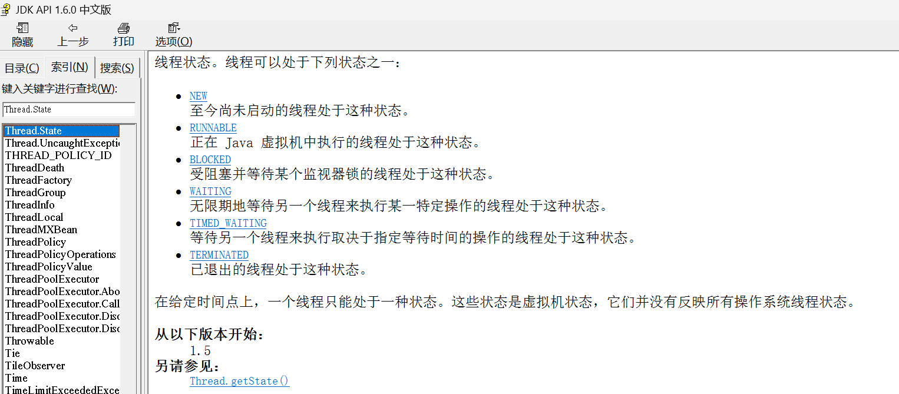

那为什么Java没有定义运行状态呢？是有原因的。

当线程抢夺到CPU执行权的时候，此时虚拟机就会把当前的线程交给操作系统去管理，虚拟机就不管了。

既然此时虚拟机已经不管了，因此它就没有定义运行状态。

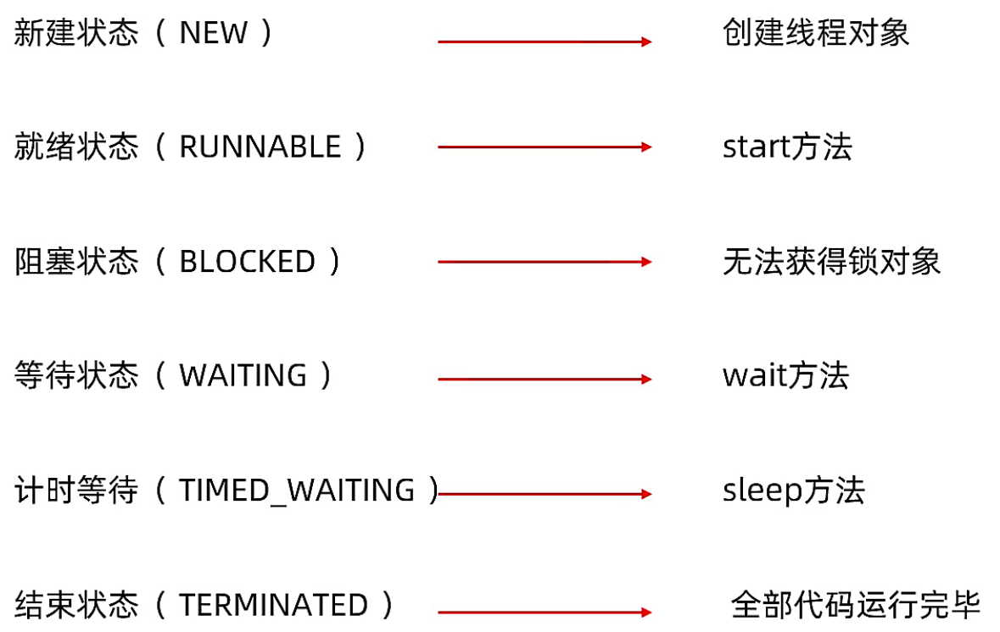


-----


# 158.综合练习：抢红包

~~~java
需求：
	抢红包也用到了多线程。
	假设：100块，分成了3个包，现在有5个人去抢。
	其中，红包是共享数据。
	5个人是5条线程。
	打印结果如下：
		  XXX抢到了XXX元
		  XXX抢到了XXX元
~~~

四个套路，但又由于这里抢红包每个人只能抢一次，因此第一步循环就不用写了

~~~java
1. 循环
2. 同步代码块（之后可以改写为同步方法或者lock锁，都行）
3. 判断共享数据是否到了末尾（到了末尾）,建议先写到了末尾的情况，因为到了末尾更简单
4. 判断共享数据是否到了末尾（没有到末尾，执行核心逻辑）
~~~

PS：需要随机带小数，可以使用 `Random类` 的 `nextDouble(double bound)`，如果你传递 100，它就会在100中随机，随机的时候是带小数的，只不过这个方法在JDK17的时候才能用，低版本用不了。

~~~java
public class MyThread extends Thread {
    //共享数据
    //100块，分成了3个包
    static double money = 100;
    static int count = 3;

    //最小的中奖金额，能是0吗？不能，最小也是最小的中奖金额
    //又由于最小的中奖金额是不会发生变化的，因此用final修饰
    //用final修饰后，它就变成常量了，常量的名字要大写
    static final double MIN = 0.01;

    @Override
    public void run() {
        //同步代码块
        synchronized (MyThread.class) {
            if (count == 0) {
                //判断，共享数据是否到了末尾（已经到末尾）
                System.out.println(getName() + "没有抢到红包！");
            } else {
                //判断，共享数据是否到了末尾（没有到末尾），就抽奖
                //但是抽奖的时候不能直接随机，因为随机到最后一次，就不要再随机了，第三次就是剩余的钱，因此随机前应该对count进行判断
                //定义一个变量，表示中奖的金额
                double prize = 0;
                if (count == 1) {
                    //表示此时是最后一个红包
                    //就无需随机，剩余所有的钱都是中奖金额
                    prize = money;
                } else {
                    //表示第一次，第二次（随机）
                    Random r = new Random();
                    //nextDouble()中随机的范围不能直接写money，下面举个例子你就懂了
                    //假设现在是100 元 分成了 3个包
                    //第一个红包的最大金额应该为：99.98
                    //计算方式：100 - (3-1) * 0.01（最小值），这样计算出来的才是随机的范围
                    double bounds = money - (count - 1) * MIN;
                    prize = r.nextDouble(bounds);
                    if (prize < MIN) {
                        //如果小于最小的金额，此时就将你强制变成最小的金额。
                        prize = MIN;
                    }
                }
                //从money当中，去掉当前中奖的金额
                money = money - prize;
                //红包的个数-1
                count--;
                //本次红包的信息进行打印
                System.out.println(getName() + "抢到了" + prize + "元");
            }
        }
    }
}
~~~

在写测试类的时候教你一招


~~~java
public static void main(String[] args) {
    //创建线程的对象
    MyThread t1 = new MyThread();
    MyThread t2 = new MyThread();
    MyThread t3 = new MyThread();
    MyThread t4 = new MyThread();
    MyThread t5 = new MyThread();

    //给线程设置名字
    t1.setName("小A");
    t2.setName("小QQ");
    t3.setName("小哈哈");
    t4.setName("小诗诗");
    t5.setName("小丹丹");

    //启动线程
    t1.start();
    t2.start();
    t3.start();
    t4.start();
    t5.start();
}
~~~

运行程序，这就是我们想要的结果，三个人抢到了，两个人没有抢到，而且三个人的总金额是100元。


写完后发现，虽然逻辑对了，数据好像也没有什么太大问题，但是跟实际生活好像有一点不一样，在实际生活中，应该保留小数点后面两位，我要进行精确计算怎么办？

因此我们还需要将这个代码去改一改，改成精确运算就行了，即使用 `BigDecimal`。

只不过 `BigDecimal` 在用起来的时候非常难受，非常不方便，它里面加减乘除所有的全部都是使用方法来实现的。

在操作完后，还需要对抽奖结果进行一个四舍五入的设置，并且小数点保留两位。

~~~java
//设置抽中红包，小数点保留两位，四舍五入
prize = prize.setScale(2,RoundingMode.HALF_UP);
~~~

完整代码

~~~java
public class MyThread extends Thread {
    //总金额
    static BigDecimal money = BigDecimal.valueOf(100.0);
    //个数
    static int count = 3;
    //最小抽奖金额
    static final BigDecimal MIN = BigDecimal.valueOf(0.01);

    @Override
    public void run() {
        synchronized (MyThread.class) {
            if (count == 0) {
                System.out.println(getName() + "没有抢到红包！");
            } else {
                //中奖金额
                BigDecimal prize;
                if (count == 1) {
                    prize = money;
                } else {
                    //获取抽奖范围
                    double bounds = money.subtract(BigDecimal.valueOf(count - 1).multiply(MIN)).doubleValue();
                    Random r = new Random();
                    //抽奖金额
                    prize = BigDecimal.valueOf(r.nextDouble(bounds));
                }
                //设置抽中红包，小数点保留两位，四舍五入
                prize = prize.setScale(2, RoundingMode.HALF_UP);
                //在总金额中去掉对应的钱
                money = money.subtract(prize);
                //红包少了一个
                count--;
                //输出红包信息
                System.out.println(getName() + "抽中了" + prize + "元");
            }
        }
    }
}
~~~


-----

# 159.综合练习：抽奖箱抽奖

~~~java
有一个抽奖池,该抽奖池中存放了奖励的金额,该抽奖池中的奖项为 {10,5,20,50,100,200,500,800,2,80,300,700};
创建两个抽奖箱(线程)设置线程名称分别为“抽奖箱1”，“抽奖箱2”
随机从抽奖池中获取奖项元素并打印在控制台上,格式如下:
                 每次抽出一个奖项就打印一个(随机)
	抽奖箱1 又产生了一个 10 元大奖
	抽奖箱1 又产生了一个 100 元大奖
	抽奖箱1 又产生了一个 200 元大奖
	抽奖箱1 又产生了一个 800 元大奖
	抽奖箱2 又产生了一个 700 元大奖
	.....
~~~

首先思考，这些奖项 `10, 5, 20, 50, 100, 200, 500, 800, 2, 80, 300, 700` 我们该放到数组中还是集合中呢？

两个其实都是可以的，但由于集合操作更方便，因此这里定义在集合中。

~~~java
public class Test {
    public static void main(String[] args) {
        //创建奖池
        ArrayList<Integer> list = new ArrayList<>();
        Collections.addAll(list, 10, 5, 20, 50, 100, 200, 500, 800, 2, 80, 300, 700);

        //创建线程
        MyThread t1 = new MyThread(list);
        MyThread t2 = new MyThread(list);

        //设置名字
        t1.setName("抽奖箱1");
        t2.setName("抽奖箱2");

        //启动线程
        t1.start();
        t2.start();
    }
}

------------------------------

public class MyThread extends Thread {
    ArrayList<Integer> list;

    public MyThread(ArrayList<Integer> list) {
        this.list = list;
    }

    @Override
    public void run() {
        //1.循环
        //2.同步代码块
        //3.判断
        //4.判断
        while (true) {
            synchronized (MyThread.class) {
                if (list.size() == 0) {
                    break;
                } else {
                    //继续抽奖
                    Collections.shuffle(list);
                    int prize = list.remove(0);
                    System.out.println(getName() + "又产生了一个" + prize + "元大奖");
                }
            }
            //由于这里奖项太少了，一个线程有可能短时间内会将所有奖项全部打印完
            //如果想让结果平均一些，那就在锁的外面让线程睡10毫秒
            //有的人会将sleep()写在synchronized里面，但是写在这效果不明显，因为线程1在synchronized里面睡觉，线程2依旧是进不来的，因此写在外面是最好的。
            try {
                Thread.sleep(10); //假设线程1在这里睡着了，此时CPU的执行权就没有了，一定会被线程2抢走，此时线程2就会进入到锁中进行抽奖
            } catch (InterruptedException e) {
                e.printStackTrace();
            }

        }
    }
}
~~~


----

# 160.综合练习：抽奖箱抽奖

```
有一个抽奖池,该抽奖池中存放了奖励的金额,该抽奖池中的奖项为 {10,5,20,50,100,200,500,800,2,80,300,700};
创建两个抽奖箱(线程)设置线程名称分别为“抽奖箱1”，“抽奖箱2”
随机从抽奖池中获取奖项元素并打印在控制台上,格式如下:
每次抽的过程中，不打印，抽完时一次性打印(随机)    在此次抽奖过程中，抽奖箱1总共产生了6个奖项。
    分别为：10,20,100,500,2,300最高奖项为300元，总计额为932元
在此次抽奖过程中，抽奖箱2总共产生了6个奖项。
    分别为：5,50,200,800,80,700最高奖项为800元，总计额为1835元
```

## 实现方式一

~~~java
public class Test {
    public static void main(String[] args) {
        //创建奖池
        ArrayList<Integer> list = new ArrayList<>();
        Collections.addAll(list, 10, 5, 20, 50, 100, 200, 500, 800, 2, 80, 300, 700);

        //创建线程
        MyThread t1 = new MyThread(list);
        MyThread t2 = new MyThread(list);

        //设置名字
        t1.setName("抽奖箱1");
        t2.setName("抽奖箱2");

        //启动线程
        t1.start();
        t2.start();
    }
}

-------------------------------------
    
public class MyThread extends Thread {

    ArrayList<Integer> list;

    public MyThread(ArrayList<Integer> list) {
        this.list = list;
    }

    //线程一
    static ArrayList<Integer> list1 = new ArrayList<>();
    //线程二
    static ArrayList<Integer> list2 = new ArrayList<>();

    @Override
    public void run() {
        while (true) {
            synchronized (MyThread.class) {
                if (list.size() == 0) {
                    if ("抽奖箱1".equals(getName())) {
                        System.out.println("抽奖箱1" + list1);
                    } else { // 这里可以用else-if，但由于这里只有两条线程，因此使用else更简单一些
                        System.out.println("抽奖箱2" + list2);
                    }
                    break;
                } else {
                    //继续抽奖
                    Collections.shuffle(list);
                    int prize = list.remove(0);
                    if ("抽奖箱1".equals(getName())) {
                        list1.add(prize);
                    } else {
                        list2.add(prize);
                    }
                }
            }
            try {
                Thread.sleep(10);
            } catch (InterruptedException e) {
                e.printStackTrace();
            }

        }
    }
}
~~~

写完方式一时，有没有感觉代码有点不太合适呢？

我们现在仅仅只有两个线程，因此在成员变量中创建2个集合就行了。

但是如果有100个线程呢？每一个线程对应着一个集合，就需要创建100个集合，还有下面的判断 `if ("抽奖箱1".equals(getName()))`，需要写100个 `if-else`，太麻烦了！

因此刚刚的写法不行，虽然它能解决问题，但是不好。

----

## 实现方式二（推荐）

### 1）代码实现

直接将定义集合的代码写在 `run()` 中，然后在下面也不需要进行判断了 `if ("抽奖箱1".equals(getName()))`，直接使用即可。

那为什么可以搞定呢？

以两条线程为例。当线程启动完毕后，线程1、线程2是在 `run方法` 这里抢夺CPU的执行权的，不管是谁抢到了CPU的执行权，它都会去执行 `run()` 中的代码。

假设线程1抢到了CPU的执行权，此时它会去创建一个集合挂在线程1上面；而线程2抢到了CPU的执行权，此时它同样也会去创建一个集合挂在线程2上面，这就形成了每一个线程都有自己的集合。

~~~java
public static void main(String[] args) {
    //创建奖池
    ArrayList<Integer> list = new ArrayList<>();
    Collections.addAll(list, 10, 5, 20, 50, 100, 200, 500, 800, 2, 80, 300, 700);

    //创建线程
    MyThread t1 = new MyThread(list);
    MyThread t2 = new MyThread(list);


    //设置名字
    t1.setName("抽奖箱1");
    t2.setName("抽奖箱2");


    //启动线程
    t1.start();
    t2.start();
}

------------------------------

public class MyThread extends Thread {
    ArrayList<Integer> list;

    public MyThread(ArrayList<Integer> list) {
        this.list = list;
    }

    @Override
    public void run() {
        ArrayList<Integer> boxList = new ArrayList<>();//1 //2
        while (true) {
            synchronized (MyThread.class) {
                if (list.size() == 0) {
                    System.out.println(getName() + boxList);
                    break;
                } else {
                    //继续抽奖
                    Collections.shuffle(list);
                    int prize = list.remove(0);
                    boxList.add(prize);
                }
            }
            try {
                Thread.sleep(10);
            } catch (InterruptedException e) {
                e.printStackTrace();
            }

        }
    }
}
~~~

代码实现了，那它的本质到底是什么呢？来画个内存图，你就恍然大悟了。

----

### 2）内存图

内存图我们知道，它里面有栈有堆。

在方法里面首先开启了两条线程，在线程的类中，代码比较简单，成员位置有一个变量，`run()` 里面还有一个局部变量，接下来看看它们在内存中到底是怎么回事吧。

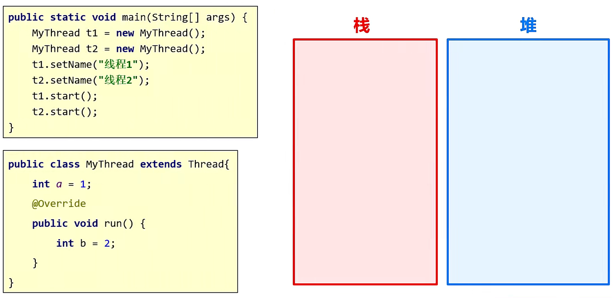

在正式画内存图之前，我们在大脑中需要有一个思维：当程序启动后，它是有一个main线程的，而main方法就是运行在main线程中。

在main方法中我是先创建了线程对象，再开启了两条自己的线程，此时在右边的图中就有三条线程了。

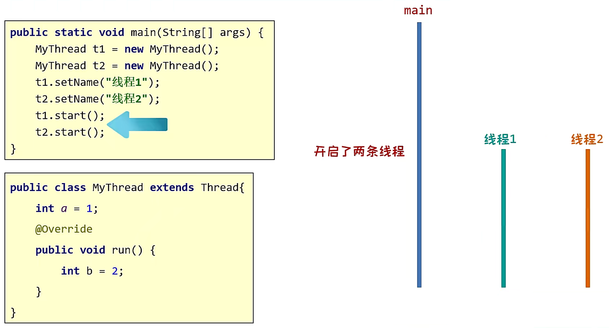

在Java内存图中，堆内存是唯一的，而栈内存不是唯一的，它是跟线程有关系的，简单理解：每个线程都有自己的栈，这个我们也会称之为：线程栈。

在以前因为我们没有学习多线程的知识，所以只画了一个栈，现在我们知道了，以前我们画的所有的栈，其实都是 `main线程的栈`，而程序的主入口 `main方法` 就是运行在 `main线程` 这个栈中的，此时我们就要来执行main方法中所有的代码。

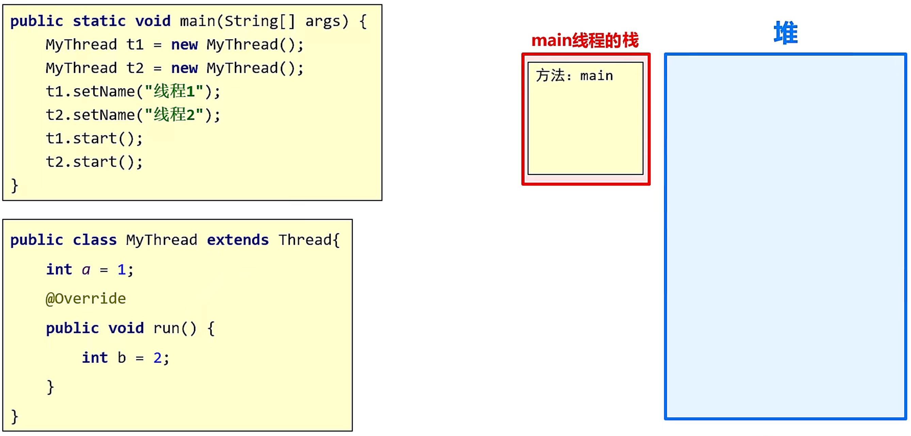

一开始的两行跟以前一样，创建对象，有 `new` 关键字了，所以就会在堆中创建了两个对象，在对象里面会有一些成员变量。

首先第一个成员变量我们肯定知道，即 `name`，从父类中继承下来的姓名，它的默认值是 `Thread-X(X是序号)`。

另外还有成员变量 `a`，并且是每个对象里面都有自己的a，这个跟我们之前所学是一模一样的。

继续往下，当对象创建完毕后，`t1` 会记录上面这个对象的地址值，`t2` 会记录下面这个对象的地址值，此时 `main方法` 的前两行代码才算执行完毕。

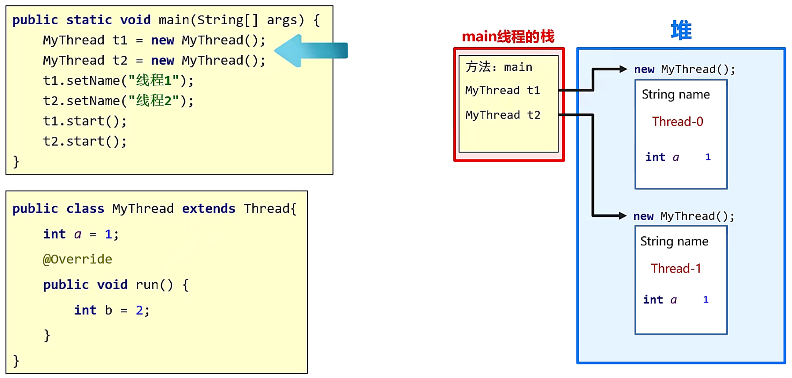

然后再去用 `t1` 调用 `setName()`，`t2` 去调用 `setName()`，此时 `setName()`  方法会进入到 `main线程` 的栈中，它的作用就是修改对象里面的名字，因此此时右边 `Thread-0` 和 `Thread-1` 就会变成我自己设置的名字 `线程1` 和 `线程2`。

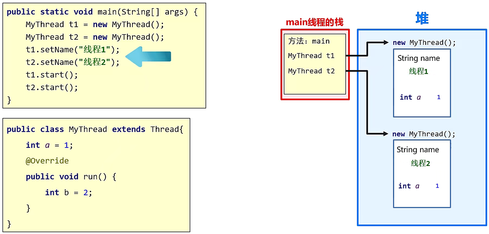

接下来 `t1.start()`、`t2.start()`，当这两个方法执行完毕后，那就表示线程已经开启了。

在内存中的表示就是：多了一个线程1和线程2的栈。注意，每一个线程都有自己独立的栈空间。

之前我们说过，不管是线程1还是线程2，都会去执行 `run()` 方法，所以此时 `run()` 方法就要进栈，而且线程1的栈，线程2的栈都要进去。

再来想，`run()` 方法中有一个局部变量 `b`，那这个b在线程1的栈、线程2的栈都有。

而且它们两个是互相独立的，是不会产生干扰的。

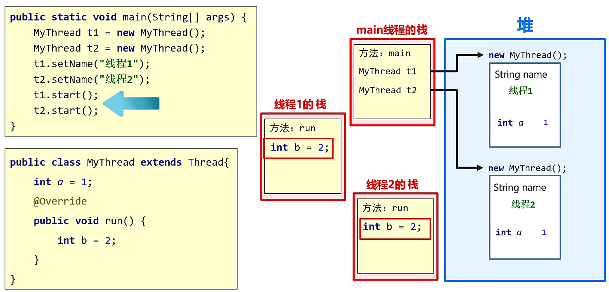

那如果此时我们将这里的b改成集合呢？

那么此时在线程1的栈中，和线程2的栈中，都有自己的集合，就是这么个道理。

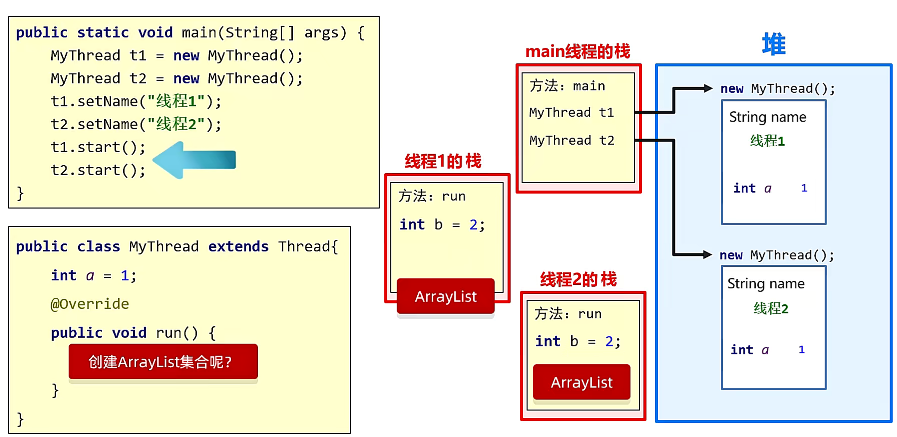


-----

# 161.综合练习：多线程之间的比较

```
需求：
有一个抽奖池,该抽奖池中存放了奖励的金额,该抽奖池中的奖项为 {10,5,20,50,100,200,500,800,2,80,300,700};
创建两个抽奖箱(线程)设置线程名称分别为    "抽奖箱1", "抽奖箱2"
随机从抽奖池中获取奖项元素并打印在控制台上,格式如下:
在此次抽奖过程中，抽奖箱1总共产生了6个奖项，分别为：10,20,100,500,2,300
    最高奖项为300元，总计额为932元
在此次抽奖过程中，抽奖箱2总共产生了6个奖项，分别为：5,50,200,800,80,700
    最高奖项为800元，总计额为1835元
在此次抽奖过程中,抽奖箱2中产生了最大奖项,该奖项金额为800元
核心逻辑：获取线程抽奖的最大值（看成是线程运行的结果）
以上打印效果只是数据模拟,实际代码运行的效果会有差异
```

## 一、难点分析

在想怎么做之前，先来想想它的难点

我不知道这个800是被线程1抽走了，还是被线程2抽走了

有的同学会说这个其实很简单：先求出线程1的最大值，再求出线程2的最大值，去比较一下这两个不就行了吗？

但是要注意，它还有第二难点：你在比较线程的时候，是不是需要两个线程运行完毕才能比较？

那你能知道是线程1先执行完，还是线程2先执行完吗？

并且你也不知道那个比较的代码该写在哪，所以这个才是题目的难点。

---

## 二、代码实现

由以上分析可知，难点其实就是：在此次抽奖过程中，抽奖箱2中产生了最大奖项,该奖项金额为800元

那我们该如何做呢？

思考：现在我们要打印这句话其实说白了，我们就是想要获取两条线程的最大值。

如果线程1的最大值和线程2的最大值都能拿到了，那么比一下就完事了

核心逻辑：获取线程抽奖的最大值，那我能不能将这个最大值，看成是线程运行的结果呢？

完全可以，有了这个结果之后，我们就可以比较了。

由此，我们要用多线程的第三种方式来写它

~~~java
public class MyCallable implements Callable<Integer> {
    ArrayList<Integer> list;

    public MyCallable(ArrayList<Integer> list) {
        this.list = list;
    }

    @Override
    public Integer call() throws Exception {
        ArrayList<Integer> boxList = new ArrayList<>();//1 //2
        while (true) {
            synchronized (MyCallable.class) {
                if (list.size() == 0) {
                    System.out.println(Thread.currentThread().getName() + boxList);
                    break;
                } else {
                    //继续抽奖
                    Collections.shuffle(list);
                    int prize = list.remove(0);
                    boxList.add(prize);
                }
            }
            // 这里的异常就不需要try-catch了，因为call()是可以抛出异常的
            Thread.sleep(10);
        }
        //把集合中的最大值返回，这段代码应该写在循环的外面，循环结束后才表示抽奖结束。
        //但是这里我们需要多判断一种情况：这个线程有可能一个奖都没抽到，此时直接return null即可。
        if(boxList.size() == 0){
            return null;
        } else {
            // 求最大值的方法不需要你自己写，因为工具类中有对应的方法。
            return Collections.max(boxList);
        }
    }
}
~~~

**测试类**

~~~java
public static void main(String[] args) throws ExecutionException, InterruptedException {
    //创建奖池
    ArrayList<Integer> list = new ArrayList<>();
    Collections.addAll(list, 10, 5, 20, 50, 100, 200, 500, 800, 2, 80, 300, 700);

    //创建多线程要运行的参数对象
    MyCallable mc = new MyCallable(list);

    //创建多线程运行结果的管理者对象，这里需要创建两个多线程结果对象，不然下面获取结果的时候，不知道获取的是哪条线程的结果
    //线程一
    FutureTask<Integer> ft1 = new FutureTask<>(mc);
    //线程二
    FutureTask<Integer> ft2 = new FutureTask<>(mc);

    //创建线程对象
    Thread t1 = new Thread(ft1);
    Thread t2 = new Thread(ft2);

    //设置名字
    t1.setName("抽奖箱1");
    t2.setName("抽奖箱2");

    //开启线程
    t1.start();
    t2.start();


    Integer max1 = ft1.get();
    Integer max2 = ft2.get();

    System.out.println(max1);
    System.out.println(max2);

    //在此次抽奖过程中,抽奖箱2中产生了最大奖项,该奖项金额为800元
    if (max1 == null) {
        System.out.println("在此次抽奖过程中,抽奖箱2中产生了最大奖项,该奖项金额为" + max2 + "元");
    } else if (max2 == null) {
        System.out.println("在此次抽奖过程中,抽奖箱1中产生了最大奖项,该奖项金额为" + max1 + "元");
    } else if (max1 > max2) {
        System.out.println("在此次抽奖过程中,抽奖箱1中产生了最大奖项,该奖项金额为" + max1 + "元");
    } else if (max1 < max2) {
        System.out.println("在此次抽奖过程中,抽奖箱2中产生了最大奖项,该奖项金额为" + max2 + "元");
    } else {
        System.out.println("两者的最大奖项是一样的");
    }
}
~~~


---

# 163.线程池

## 一、核心原理

### 1）引入

我们之前写的多线程的代码是这样的：当我们需要一个线程的时候，我们就可以创建线程的对象，代码跑完，线程就会消失。这种方式其实是不对的，它会浪费操作系统的资源。

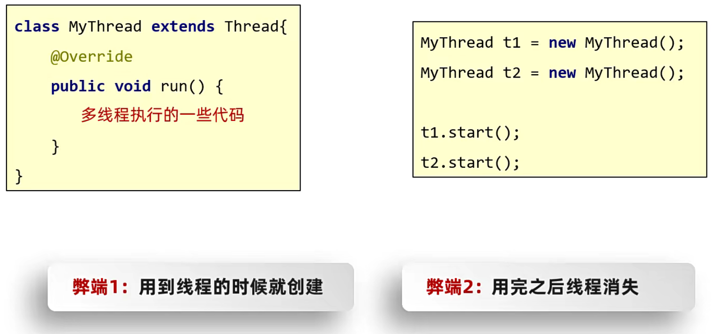

所以我们也需要改进：准备一个容器用来存放线程，这个容器就叫做：线程池（ThreadPool）。

刚开始线程池里面是空的，没有线程。

当我们给线程池提交一个任务的时候，线程池本身它就会自动的去创建一个线程，拿着这个线程去执行任务，执行完了再把线程还回去。

第二次再提交任务的时候，它就不需要再去创建新的线程了，而是拿着已经存在的线程去执行任务，执行完了再还回去。

这个就是我们多线程的核心原理。

----

### 2）特殊情况

如果我们在提交第二个任务的时候，线程还正在执行第一个任务，它还没有还回去，此时线程池就会创建一个新的线程。

拿着新的线程去执行第二个任务，那么在这个时候，我又提交了很多其他的任务，此时线程池就会继续创建新的线程，执行新提交的任务。

任务执行完毕，它会把线程再还给线程池。

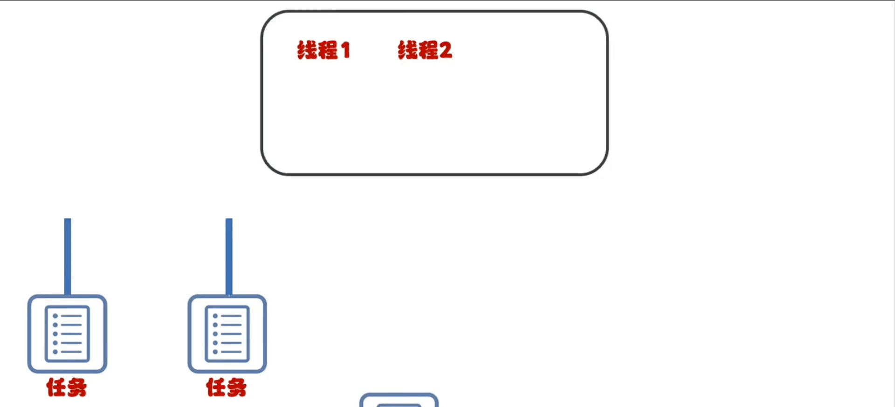

说道这里有的同学会有疑问：线程池它没有上线的吗？

线程池其实是有上线的，并且这个上线我们可以自己设置，假设我现在设置了最大线程数量为3。

那么这三个线程就会去执行前面的三个任务，后面的两个任务只能先排队等着。

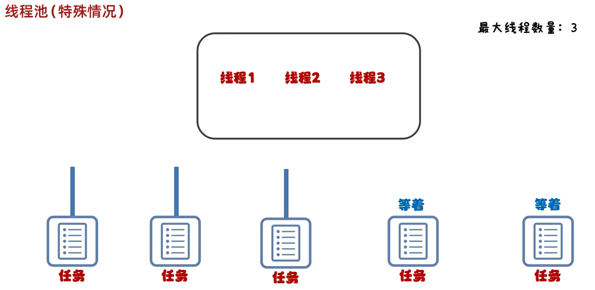

---

### 3）核心逻辑

接下来梳理一下线程池的核心逻辑。

1、创建一个池子，池子中是空的

2、提交任务时，池子会创建新的线程对象，任务执行完毕，线程归还给池子。
     下回再次提交任务时，不需要创建新的线程，就不需要创建新的线程了，直接复用已经存在的线程即可。

3、但是如果提交任务时，池子中没有空闲线程，而且也无法创建新的线程，任务就会排队等待。

---

### 4）打码步骤

代码步骤其实也非常简单

1、创建线程池

2、提交任务

PS：当我们提交任务的时候，线程池的底层会去创建线程，或者去复用已经存在的线程，这些代码是不需要我们自己写的，是线程池的底层会去自动完成。我们要做的就是给它提交任务。

3、当所有的任务全部执行完毕，就可以关闭线程池。

但是在我们实际开发中，线程池一般是不会关闭的。因为服务器是24小时运行的，服务器一旦不关闭，那就是随时随地都有可能有新的任务要执行，那么线程池也就不会关闭。

创建线程池在Java中有一个工具类：`Executors`，通过这个工具栏，我们就可以去调用方法，返回不同类型的线程池对象。

我们可以创建一个没有上线的线程池，但是这种方法并不是真正没有意义的上线，它也是有上线的，是int类型的最大值。

这个绝对是够用了，因为它还没有创建那么多线程，电脑就会先崩溃掉。因此我们会将它认为是一个没有上线的线程池。

~~~java
static ExecutorService newCachedThreadPool()   创建一个默认的线程池
~~~

再往下，还会有第二种方式，它可以创建一个有上线的线程池。

	static newFixedThreadPool(int nThreads)	    创建一个指定最多线程数量的线程池

---

## 二、代码实现

### 1）创建没有上线的线程池

~~~java
//1.获取线程池对象，newCachedThreadPool()可以获取一个没有上限的线程池对象
ExecutorService pool1 = Executors.newCachedThreadPool();
~~~

提交任务的时候也是调用方法：submit()

其中，我们可以给它提供 `Runnable的实现类`，还可以给它提供 `Callable的实现类`

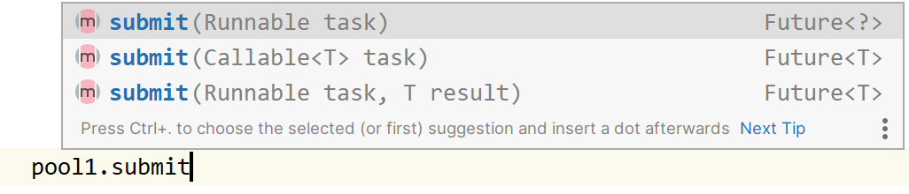

因此此时我们需要写一个实现类

~~~java
public class MyRunnable implements Runnable{
    @Override
    public void run() {
        for (int i = 1; i <= 100; i++) {
            System.out.println(Thread.currentThread().getName() + "---" + i);
        }
    }
}
~~~

测试类完整代码

~~~java
//1.获取线程池对象
ExecutorService pool1 = Executors.newCachedThreadPool();

//2.提交任务
pool1.submit(new MyRunnable());

//3.销毁线程池，一旦池子被摧毁后，它里面所有的线程也会消失
pool1.shutdown();
~~~

运行代码，可以看见线程是有自己的名字 `pool-thread-1`，后面就是我们在 `run()` 中打印的序号。

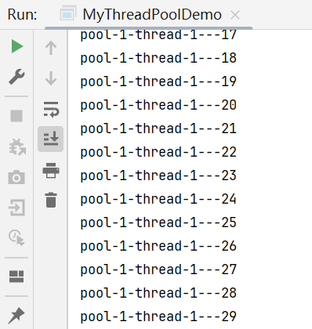

在刚刚我们说了，线程池一般是不会销毁的，因此需要将第三步注释掉，再给第二步多提交几个任务。

~~~java
ExecutorService pool1 = Executors.newCachedThreadPool();
//2.提交任务
pool1.submit(new MyRunnable());
pool1.submit(new MyRunnable());
pool1.submit(new MyRunnable());
pool1.submit(new MyRunnable());
pool1.submit(new MyRunnable());
pool1.submit(new MyRunnable());


//3.销毁线程池
//pool1.shutdown();
~~~

运行程序，可以看见编号为 `1-5` ，由此可见线程池开启了五个线程去执行我们的任务。

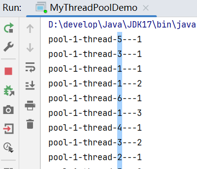

-----

### 2）展示复用的效果

我们可以将任务写的简单一些，不要循环打印那么多次了，直接打印一句话就行了

~~~java
public class MyRunnable implements Runnable{
    @Override
    public void run() {
            System.out.println(Thread.currentThread().getName() + "---");
    }
}
~~~

回到测试类中多提交几个任务，并且每次提交任务之前，都让 `main线程` 先睡个1秒钟，目的就是为了让上一个任务赶紧执行完毕，把线程还回去。

~~~java
public static void main(String[] args) throws InterruptedException {
    ExecutorService pool1 = Executors.newCachedThreadPool();
    //2.提交任务
    pool1.submit(new MyRunnable());
    Thread.sleep(1000);
    pool1.submit(new MyRunnable());
    Thread.sleep(1000);
    pool1.submit(new MyRunnable());
    Thread.sleep(1000);
    pool1.submit(new MyRunnable());
    Thread.sleep(1000);
    pool1.submit(new MyRunnable());
    Thread.sleep(1000);
    pool1.submit(new MyRunnable());

    //3.销毁线程池
    //pool1.shutdown();
}
~~~

任务执行完毕，可以发现每次都是线程1

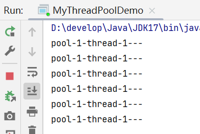

----

### 3）创建有上限的线程池

~~~java
static newFixedThreadPool(int nThreads)	    创建一个指定最多线程数量的线程池
~~~

测试代码

~~~java
public class MyRunnable implements Runnable{
    @Override
    public void run() {
        for (int i = 1; i <= 100; i++) {
            System.out.println(Thread.currentThread().getName() + "---" + i);
        }
    }
}

-----------------------------
    
public static void main(String[] args) throws InterruptedException {
    //1.获取线程池对象
    ExecutorService pool1 = Executors.newFixedThreadPool(3);
    //2.提交任务
    pool1.submit(new MyRunnable());
    pool1.submit(new MyRunnable());
    pool1.submit(new MyRunnable());
    pool1.submit(new MyRunnable());
    pool1.submit(new MyRunnable());
    pool1.submit(new MyRunnable());

    //3.销毁线程池
    //pool1.shutdown();
}
~~~

运行完毕，不管怎么看，都只有 `123`，这就表示了线程池中最多只能有三个线程。

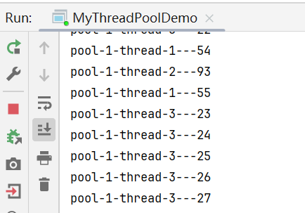

以上是我们通过代码的运行结果进行的验证，还有一种验证方式：利用Debug进行验证

注意关注一下变量

- `pool size`：目前线程池中有多少线程，现在是0，那就表示线程池刚开始创建的时候它里面是空的，什么也没有。
- `workQueue`：记录了你当前有多少任务在排序等待，目前 `size` 是0，因此一开始的时候是没有认为在等的。

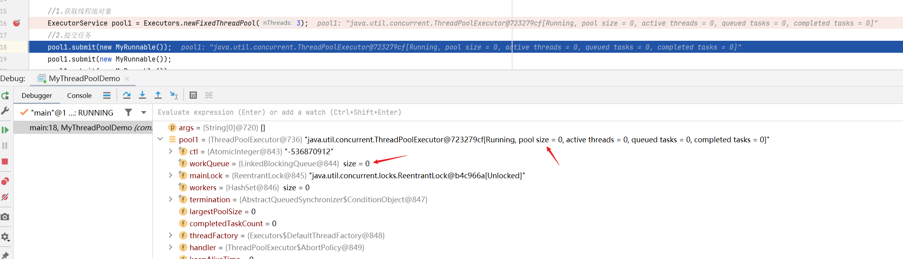

点击下一步，当我们将第一个任务提交上去后， `poll size` 变成 `1` 了，表示线程池中已经有一个线程了。

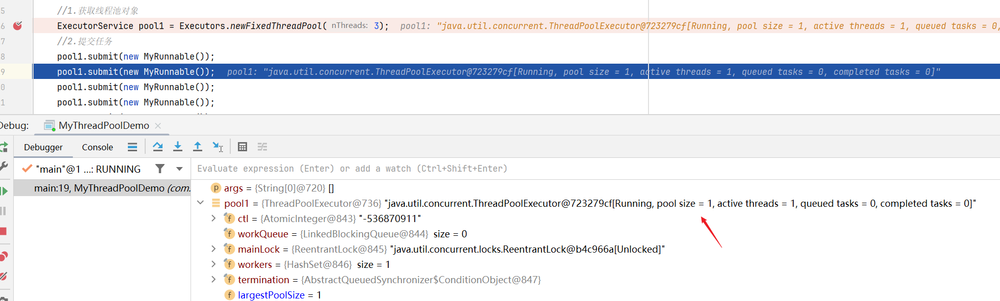

再点击两次下一步，线程池中里面就有三个了，此时看好了，池子里面有3个线程，后面的队伍还是0，还没有任务在排队。


接下来再下一步，池子的长度还是 `3`，但是在外面已经有一个任务在排队等待了。

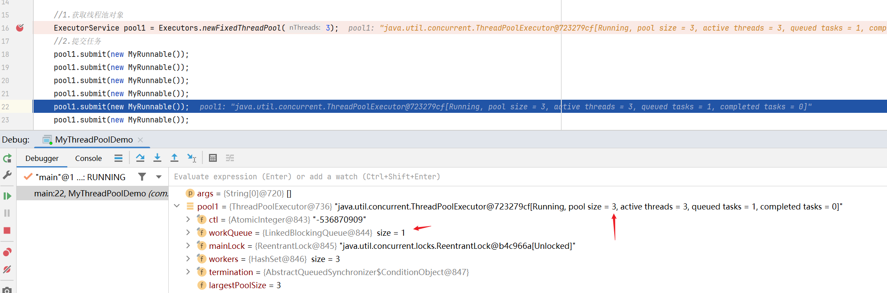

再点击下一个，可以看见有两个任务在排队了。

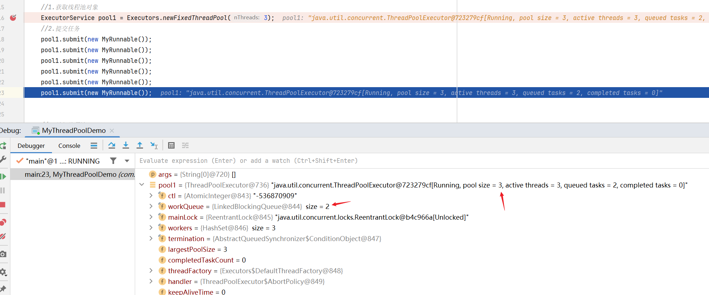


-----

# 164.自定义线程池超详细解析

## 一、引入

我们刚刚已经学习了创建线程池的两个静态方法，这两个静态方法是通过Java的工具类进行获取的，方便是方便了，但是不够灵活。

例如当我们的任务提交的比较多，这个任务就会排队等待，如果想修改队伍的长度，此时就修改不了。

那我们能不能不用工具类，自己创建线程池的对象呢？这样我就可以对我想要的参数进行设置了。

当然这必须是可以的，我们可以来看一下 `newFixedThreadPool()` 方法的源码。

可以发现在底层它其实是创建了 `ThreadPoolExecutor` 这个类的对象，在创建对象的时候，传递了很多很多的参数。

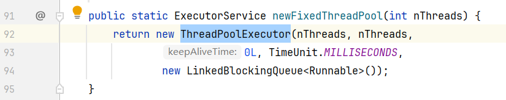

那我就在想了：这是一个什么样的类呢？不着急，选中 `ThreadPoolExecutor` <kbd>ctrl + C</kbd> 打开一下 `API帮助文档` 搜索一下它。

这个类其实就是线程池的类，如果我们创建了它的对象，相当于就是已经有了一个线程池，因此我们需要去看它的构造方法。

不看还好，一看吓一跳，它最长的方法有7个参数。

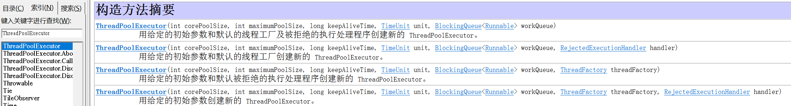

但是不要害怕，为了让大家更深刻去理解这7个参数，这里用一个小故事来帮你理解。

小A同学开了一个饭馆，这个饭馆实施的是一对一服务，其实就是一个服务员就服务一个顾客。

当这个顾客走了，这个服务员才能去服务别人。

但是小A同学比较抠，它也不知道自己这家饭馆能经营多久，所以上面的服务员没有立马招聘，而是等客户来了，来一个招一个。

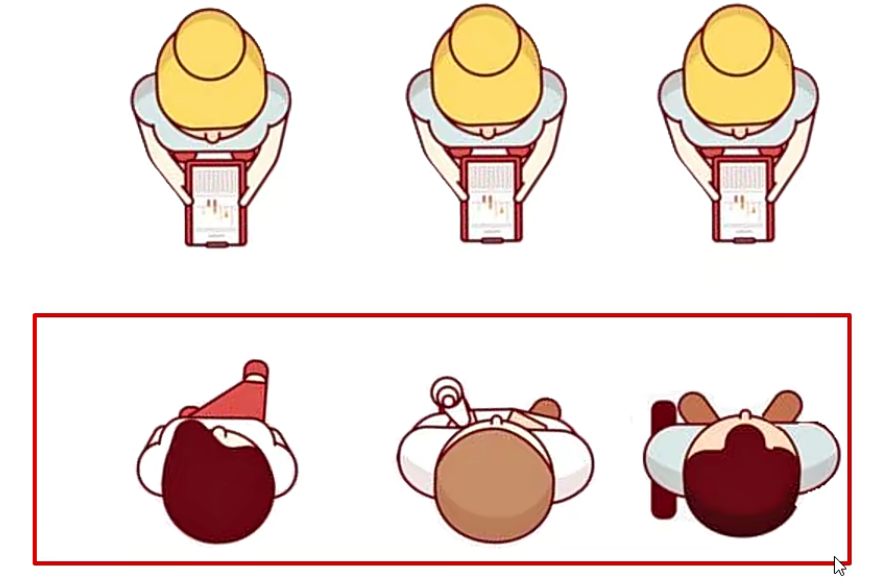

那如果这三个客户一直没走，此时又来了三位顾客，此时在饭馆中就没有空闲的服务员了，因此就需要再招聘三个。

因为饭馆不大，所以只能服务六名顾客，与之对应的，就是：最多只能招聘6名服务员。

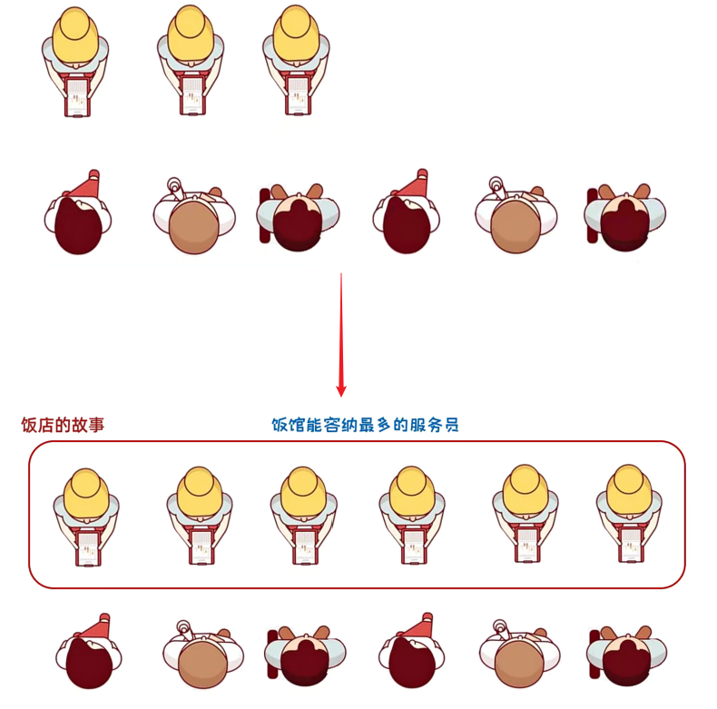

其中三名是正式员工，还有三名是临时员工。那这两类员工有什么不同呢？

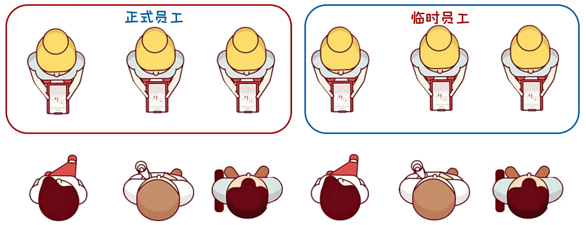

假设另外三位顾客已经走了，那么临时员工就会空闲下来。

如果一段时间内，还没有其他的顾客来，为了节约成本，就要把临时工辞掉。

但是正式员工就不一样了，即使没有顾客，正式员工也不能辞退，除非饭馆倒闭。

以上是生意不好的情况，但是如果生意特别好呢？

饭馆的外面肯定要排队，排队不要紧，但是排队肯定会有隐患，如果队伍过长，可能会导致队伍等待时间过长，顾客心里就会非常的暴躁。


小A同学作为老板，它就指定了一个规则：最多只允许十名顾客进行排队，后面排队的顾客，只能拒绝服务了。


故事讲完，我们来梳理一下故事中的核心元素。

第三个和第四个并不一样，假设临时员工它是空闲60秒就被辞退了，那么第三个数值就是 `60`，下面的第四个数值就是 `秒`，所以第三个是值，第四个是单位。

我们自己定义的线程池也会用到类似的七个参数。

在线程池中除了核心线程外，还会有一些临时的线程，而临时的线程是有可能随时随地会被销毁的，那么多长时间被销毁呢？就是由第三个和第四个数据决定的。

最后一个参数：线程池中的数目如果比较多，也会去拒绝服务。

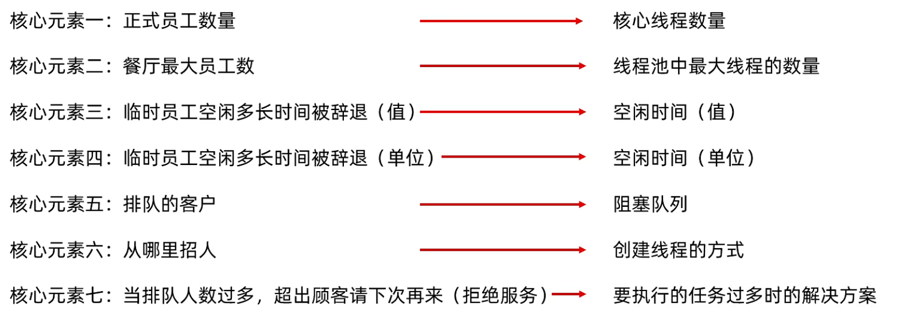

接下来通过画图，让你明白这7个参数各自的作用。

----

## 二、画图演示

### 1）情况一

在刚开始线程池是空的，里面什么线程都没有。

现在我设置：核心线程3，临时线程也是3。这就表示线程池中最多只有6条线程。

其中核心线程，跟刚刚故事中饭点里的核心员工是一样的，永远不会被销毁，除非你去销毁整个线程池。

而临时线程就跟饭点里的临时员工是一样的，如果一段时间不工作，就要把它进行销毁。

接下来我们要往线程池中提交任务了。

假设在刚开始我们提交了三个任务，线程池就会创建三条线程去处理这三个任务

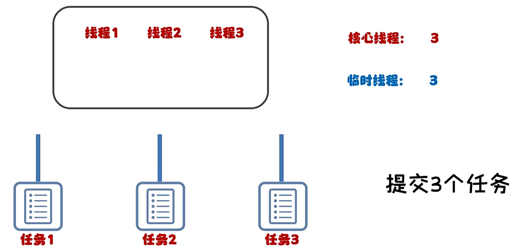

但是如果我们提交了五个任务呢？是跟刚刚一样创建五个线程去执行五个任务吗？

---

### 2）情况2

其实不是这样的，正确的应该是这样的：当我们创建了五个任务后，它会创建三个线程来处理，因为核心线程最多只能有三个。

剩余的两个任务就会来后面排队等待，等有了空闲的线程，后面的两个任务才会被执行。

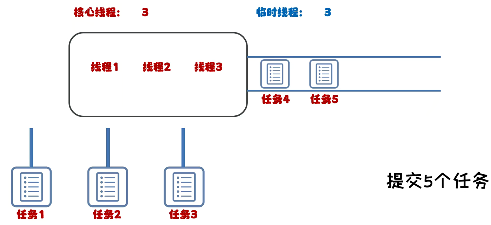

继续让下，将提交的任务增加，假设我们现在提交了八个任务，跟刚刚一样，因为设置了核心线程最多是3个，因此它会创建三条线程来处理前面的三个任务，剩余的任务就会在后面排队。

假设我们定义了队伍的长度最长为 3。此时任务4/5/6就会在队伍中排队等待。

这个时候线程池才会创建临时线程去处理任务。

因此在这里有两个小细节要去注意

- 核心线程都在忙，而且队伍中已经排满了，这个时候才会去创建临时线程。
- 先提交的任务不一定先执行。例如刚刚的案例，任务4/5/6还在队伍中排队，而后提交的 7/8 已经正在执行了。

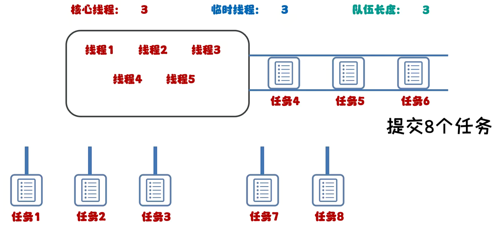

还没完，还有最后一种情况需要我们知道。如果我们提交的任务再多，例如有10个。

---

### 3）情况三

此时它已经超过了核心线程的数量+临时线程的数量+队伍的长度。

第一步，还是会创建三个核心线程去处理任务；

第二步将4/5/6放到队伍中排队等待；

第三步，创建临时线程去执行7/8/9；

现在线程池已经在满负荷工作了，核心线程在工作，队伍排满了，临时线程也在工作。

因此如果还有其他任务，就会触发任务的拒绝策略。

什么策略呢？默认就是舍弃不要。

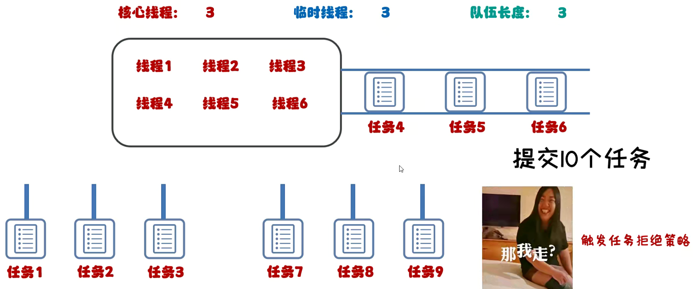

在Java中的任务策略一共会有四种，默认就是第一种：`AbortPolicy`。其他的几个了解一下即可

~~~java
ThreadPoolExecutor.AbortPolicy: 		   丢弃任务并抛出RejectedExecutionException异常。是默认的策略。
ThreadPoolExecutor.DiscardPolicy： 		  丢弃任务，但是不抛出异常 这是不推荐的做法。
ThreadPoolExecutor.DiscardOldestPolicy：    抛弃队列中等待最久的任务 然后把当前任务加入队列中。（即将队伍中排在第一个的给抛弃）
ThreadPoolExecutor.CallerRunsPolicy:        调用任务的run()方法绕过线程池直接执行。（这种方式不会直接提交给线程池了，而是直接调用任务的run()绕过线程池直接执行）
~~~

以上就是线程池完整的过程，重点还是这七个参数，这七个参数有一些小细节，我们一会在写代码的时候要注意。

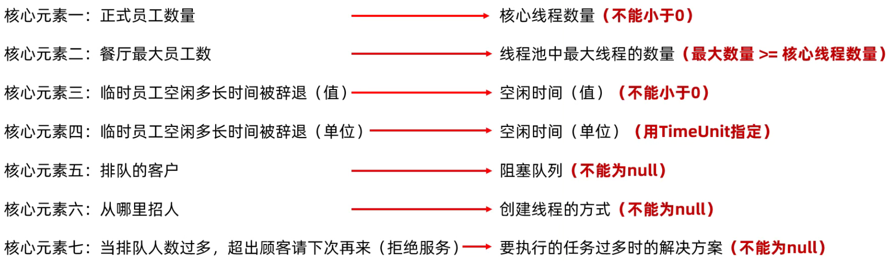

----

## 三、代码实现

### 1）参数介绍

线程池的类叫做 `ThreadPoolExecutor`。

书写的时候由于参数比较多，不要写在一行，我们可以分行写，一行写一个。

~~~java
ThreadPoolExecutor pool = new ThreadPoolExecutor(
    3,  //核心线程数量，不能小于0
    6,  //最大线程数，不能小于0，最大数量 >= 核心线程数量，由此就可以计算出临时线程数量为3
    60,//空闲线程最大存活时间
    TimeUnit.SECONDS,//时间单位，不能写字符串，而是使用TimeUnit指定，一般我们都会写秒
    new ArrayBlockingQueue<>(3),//任务队列，即我们之前学习的阻塞队列，我们可以new ArrayBlockingQueue，还能new LinkedBlockingQueue，如果想要指定队伍的长度，那就new ArrayBlockingQueue
    Executors.defaultThreadFactory(),//创建线程工厂，说白了就是：线程池如何去获取到一个线程。这里不能直接new Thread，而是需要调用工具类Executors，里面有个defaultThreadFactory()，这个方法在底层其实也是new，我们可以来看下源码
~~~

选中 `defaultThreadFactory` 跟进，在底层它是 `new` 了一个 `DefaultThreadFactory`

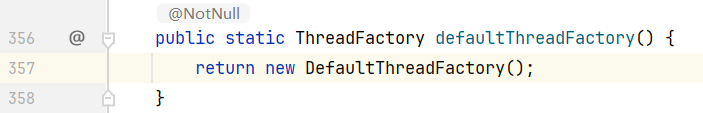

选中 `DefaultThreadFactory` 继续跟进，可以发现它其实也是new了一个Thread，只不过给这个线程做了一系列设置而已

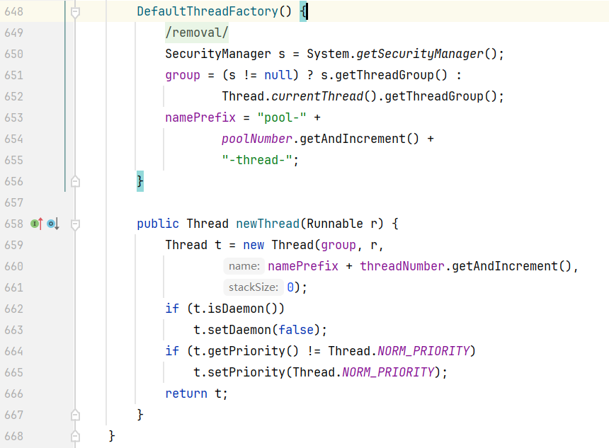

接着最后一个参数

~~~java
	new ThreadPoolExecutor.AbortPolicy()//任务的拒绝策略是ThreadPoolExecutor里面的静态内部类
);
~~~

选中 `ThreadPoolExecutor` 跟进，然后 <kbd>ctrl + F12</kbd>，可以看见都是内部类。

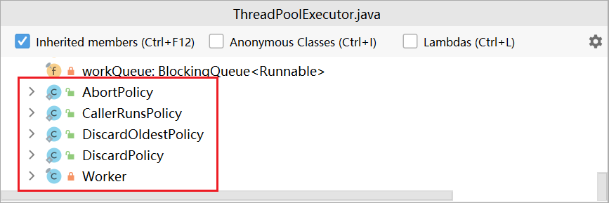

再来点击第一个看看，前面有一个static，所以它是静态的内部类。

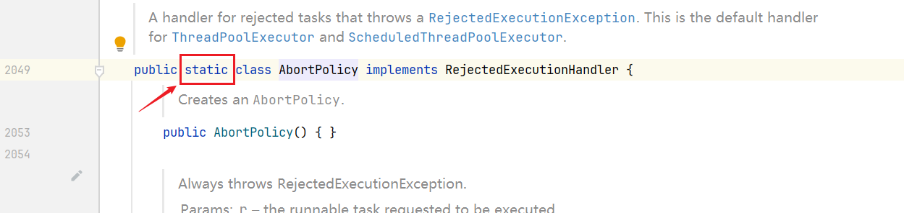

创建静态内部类：`外部类名.内部类名 对象名 = new 外部类名.内部类名();`

那为什么要把任务的拒绝策略定义为内部类呢？其实之前关于这个思想我们曾经说过。

在之前我们将内部类的时候曾经说过一句话：什么时候才要定义内部类？内部类是依赖外部类而存在的，单独出现没有任何的意义，而且内部类本身又是一个独立的个体，这个时候就要定义为内部类。

任务的拒绝策略单独存在有意义吗？没有意义，因为它是专门为线程池而服务的。

而且任务的拒绝策略又是一个独立的个体，所以就把它定义为了线程池的内部类。

下面的代码就很简单了，我们直接给这个池子提交任务就行了，提交的方式跟之前也是一模一样的。

----

### 2）完整代码

~~~java
public static void main(String[] args){
    /*
        ThreadPoolExecutor threadPoolExecutor = new ThreadPoolExecutor
        (核心线程数量,最大线程数量,空闲线程最大存活时间,任务队列,创建线程工厂,任务的拒绝策略);

        参数一：核心线程数量              不能小于0
        参数二：最大线程数                不能小于0，最大数量 >= 核心线程数量
        参数三：空闲线程最大存活时间       不能小于0
        参数四：时间单位                  用TimeUnit指定
        参数五：任务队列                  不能为null
        参数六：创建线程工厂              不能为null
        参数七：任务的拒绝策略             不能为null
    */

    ThreadPoolExecutor pool = new ThreadPoolExecutor(
        3,  //核心线程数量，能小于0
        6,  //最大线程数，不能小于0，最大数量 >= 核心线程数量
        60,//空闲线程最大存活时间
        TimeUnit.SECONDS,//时间单位
        new ArrayBlockingQueue<>(3),//任务队列
        Executors.defaultThreadFactory(),//创建线程工厂
        new ThreadPoolExecutor.AbortPolicy()//任务的拒绝策略
    );

    pool.submit(new MyRunnable());

}
~~~

----

## 四、总结

关于这个知识点，我们知道两点就行了：

1、自定义线程池中，七个参数各自的作用。

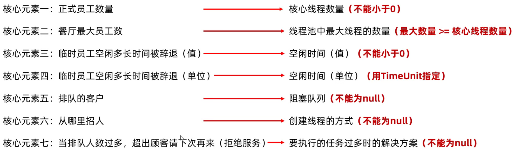

2、线程池的工作原理

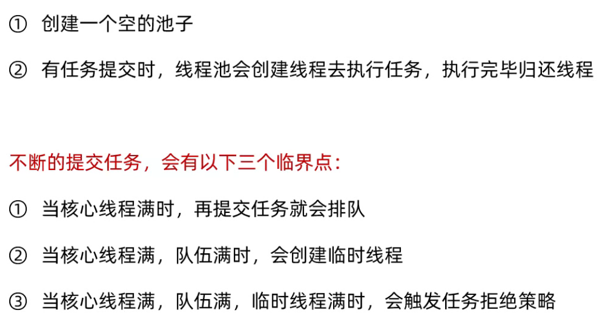

---

# 165.操作系统最大并行数

线程池到底多大才合适呢？我们可以随便写吗？肯定不是的，它的大小是有计算的功能是计算的公式，公式来讲相对来说比较复杂，但是没有关系，一会可以慢慢分析。

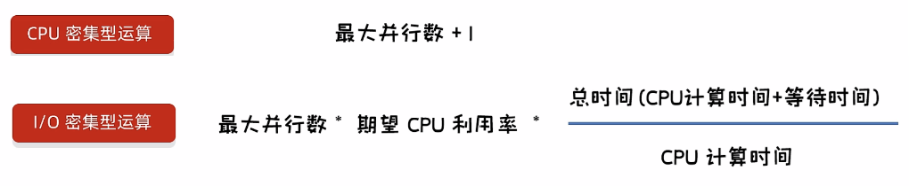

但是我们需要先搞明白公式中的一个专业名词：什么叫做 `最大并行数`？

`最大并行数` 跟我们电脑中CPU的型号是有关系的，以 `4核8线程` 的CPU为例。

- `4核`：好比CPU有四个大脑，能同时并行的去做四件事情
- 但是英特尔发明了超线程技术，它就可以把原本的四个大脑虚拟成8个，虚拟完的8个其实就是后面的8线程。

它就表示针对于 `4核8线程` 的CPU而言，最大的并行数为8，那在我的电脑中我如何去看这个数据呢？有两种方式。

1、方法一：<kbd>win + e</kbd> 打开我的电脑，点击属性


点击设备管理器

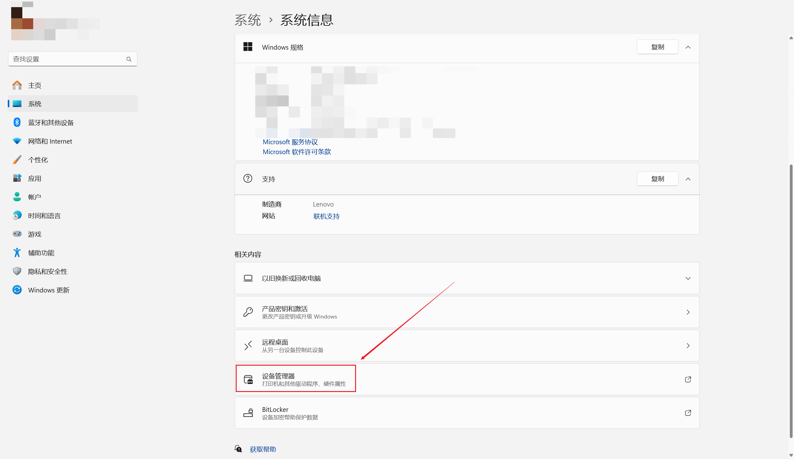

在设备管理器中点击 `处理器`

我这里显示有20个，就表示我的电脑是 `14核20线程` 的

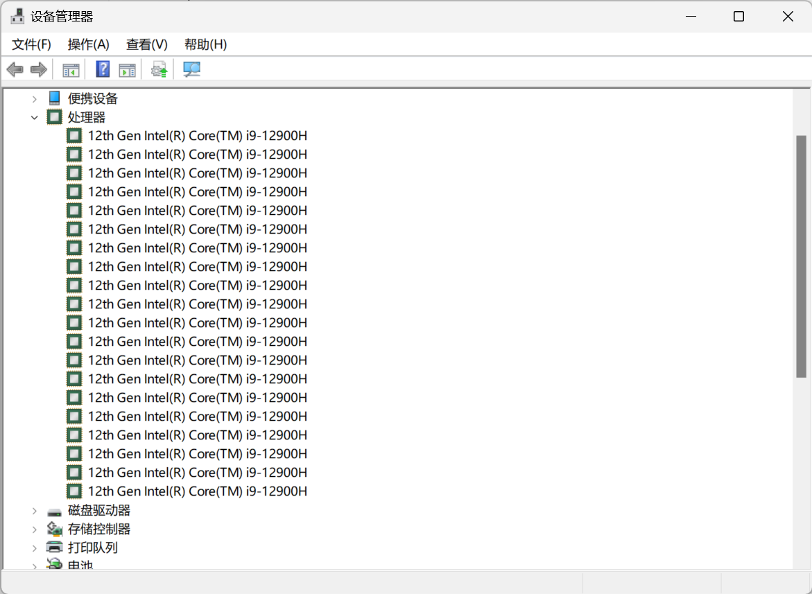

2、方法二：打开任务管理器，点击 `性能`，看右下角

`内核14，逻辑处理器20`，那就表示是 `14核20线程` 的。

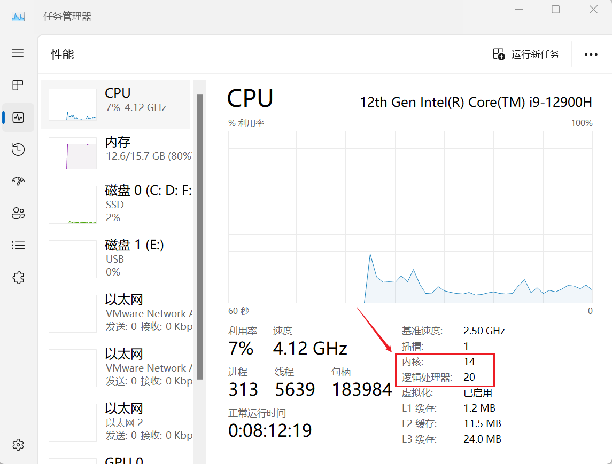

但是这里会有一个特殊情况，会有极少部分操作系统它不会把CPU所有的资源都交给一个软件用，因此我们光从任务管理器中看还不是很稳妥，我们最好是在IDEA中用代码去获取，这才是最稳妥的。

~~~java
//向Java虚拟机返回可用处理器的数目
//Runtime.getRuntime()：获取到当前系统的运行环境
//availableProcessors()可以获取到Java虚拟机可用的处理器数目
int count = Runtime.getRuntime().availableProcessors();
System.out.println(count);
~~~

结果是20，那就表示我的操作系统Java是能用所有的资源的。


因此一会计算的时候，我的电脑最大并行数就用 `20` 来进行计算。


----

# 166.线程池多大合适？

线程池多大合适？

它是有公式的，看你的项目是什么类型的。

项目一般会把它分成两种类型：CPU密集型、I/O密集型。

假设如果你的项目中计算比较多，但是读取本地文件/读取数据库的操作比较少，那就属于上面的CPU密集型运算，这种情况下我们通常会采用 `最大并行数 + 1` 就行了，这样就可以实现最优的CPU利用率。

`+1` 是为了保证当前项目由于ye缺失故障，或者因为一些其他原因导致线程暂停，如果这个线程有问题了，那么额外的线程就可以顶上去。此时就能保证CPU的时候周期不被浪费。简单理解：前面的线程如果出问题了，那么后面的+1就好比是候补的，可以顶上去。

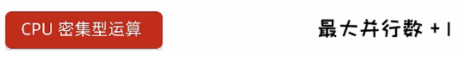

但是如果你的项目读取本地文件操作会比较多，或者读取数据库的操作比较多，这个项目就是 `I/O密集型项目`，而我们现在大多数项目都是 `I/O密集型项目`，在这个项目中，CPU并不是总是处于繁忙状态的。

例如当我们进行业务计算的时候，此时就会使用CPU的资源；但是当你进行 `I/O操作` 的时候/操作数据库的时候，这个时候CPU就闲下来了，此时就可以利用多线程技术将闲下来的时间给利用起来，从而提高了CPU的利用率。


解释公式：以 `4核8线程` 的电脑为例

- 最大并行数是8

- 期望CPU利用率：那我肯定希望它100%被利用，因此这里就写100%

- 总时间包括CPU计算时间和等待时间。

  例如我现在要从本地文件中读取两个数据，并进行相加，在这个过程里面它至少会有两个操作：1、读取两个数据；2、相加。那么在这两个操作中，读取本地文件中的数据它是跟硬盘有关系的，跟CPU是没有关系的，只有相加才跟CPU是有关系的。假设这两个操作都是耗时1秒钟，那么套用公式，总时间：2s，CPU计算时间：1s，那我就可以这么认为：总时间是100%，CPU的计算时间占50%，这个时候我们就可以将CPU等待的时间拿出来做其他的事情。

因此按照计算公式可以得到，结果是16。因此我就可以规定线程池的总大小就是16。


CPU计算时间和等待时间其实是需要我们利用工具测试的，例如有一款工具叫做 `thread dump`，它就可以测试。

一旦测试后，就可以套用公式计算结果了。


----

# 167.多线程的额外开展内容

关于多线程其实还有一些其他的知识点，但是这些知识点在我们平时实际开发中出现的几率比较低，更多的是在面试的时候别人喜欢问，因此学习的时候可以将这段跳过，等以后你要面试了再将这块拿出来翻一翻即可。


----

# -----------------------

# day32 网络编程

# 168.初识网络编程

## 一、什么是网络编程？

网络编程：在网络通信协议下，不同计算机上运行的程序，进行的数据传输。

简单理解：以前我们写的代码是单机版的，只能自己玩自己；如果你想将一个计算的结果，或者将电脑上珍藏多年的图片、视频通过网络传递给你的朋友，用以前的所学是不行的，就需要用到我们今天所学习的 `网络编程`。

在实际开发中，网络编程无处不在：即时通信、网游对战、经融证券、国际贸易、右键、、等等

不管是什么场景，本质都是计算机跟计算机之间通过网络进行数据运输。

只要你进行数据的传输，就需要用到我们今天所学习的 `网络编程`。

Java中可以使用 `java.net包` 下的技术轻松的开发出场景的网络应用程序。

在正式写代码之前，我们需要知道市面上目前场景的软件架构，知道了软件的架构，以后我们在工作的时候就可以轻松的进行选择。

常见的软件架构一共有两种：BS、CS

- BS架构：Browser/Server，浏览器/服务器架构模式。客户端只需要浏览器输入网址就能使用了，应用程序的逻辑和数据都存储在服务端。（维护方便 体验一般）

  例如：京东和淘宝的网站。

  优点：客户端不需要安装；维护成本较低。

  缺点：所有的计算和存储任务都是放在服务端的，服务器的负荷较重；在服务器计算完成之后把结果再传给客户端，因此客户端和服务器端会进行非常频繁的数据通信，从而网络负荷较重。

- CS架构：Client/Server，客户端/服务器架构模式，在这种模式下，我们是需要去下载对应的客户端程序，在远程还有一个服务端程序。并且每个操作系统的客户端都不一样。（开发、维护麻烦  体验不错，速度快）

  例如：QQ、Steam，这两个都要下载客户端才能使用。

  **优点**：充分利用客户端机器的资源，减轻服务器的负荷。

  一部分安全要求不高的计算任务存储任务放在客户端执行，不需要把所有的计算和存储都在服务器端执行，从而能够减轻服务器的压力，也能够减轻网络负荷。

  **缺点**：需要安装；升级维护成本较高。

当然现在很多大的互联网公司两种架构都能兼顾，例如淘宝：在电脑上我们可以通过浏览器进行访问，而在手机上我们可以下载客户端，即淘宝的APP进行访问。

在 `CS架构` 中是 `客户端 + 服务器`，在 `BS架构` 中是 `浏览器 + 服务器`，所以我们要知道，不管是CS还是BS架构，客户端/浏览器它们两个负责的仅仅是把数据展示出来，展示给用户看。

在项目中真正核心的业务逻辑其实就是后面的服务器中的。


----

## 二、BS架构

以网页游戏为例，来分析一下BS的优缺点。

基本上所有的网页游戏都有一个特点：不需要下载客户端，打开浏览器输入网址就能玩了，非常的方便。

方便是方便了，但是它的画面用一个字来形容就是 `烂`。

是游戏公司脑子不好，故意将画面设计的这么烂，让我们毫无游戏体验吗？

其实不是这样的，在BS架构中，浏览器里面要显示的所有的图片、特效、背景音乐等，在你的本地是没有的，所有的东西都需要通过网络给你传递过来。

你想一下，如果右边的画面它做的非常的精美，那么图片就会变的非常的大。如果玩家的网络再不好，那么根本显示不了游戏的界面。


此时我们就能发现BS架构的优缺点：

1、不需要开发客户端程序，只需要开发前端页面 + 服务器即可，打开浏览器就能访问，针对于公司来讲，开发、部署、维护都非常的简单。

2、而针对于用户来讲，也不需要去下载和安装客户端了，打开浏览器就能使用，非常的方便。

特别是，如果我想要更新一个功能，用户是不需要操作的，我直接在服务器修改就行了。用户唯一要做的就是刷新一下浏览器，仅此而已。

因此BS架构的特点主要突出一个：方便。

但是它也有自己的缺点：如果应用过大，用户的体验可能就会收到影响。例如：网页游戏的画质就会非常的差劲，背景音乐也没那么精美。

----

## 三、CS架构

所有需要我们下载安装包并进行安装的，其实都是CS架构，并且画面越精美的，它的安装包就越大，那为什么是这样的呢？

其实就是因为在CS架构中，安装包里面包含的其实就是游戏里面用到的图片、音乐等等资源，这些资源在安装的时候就已经在用户本地了。

在玩游戏的过程中，服务器就不需要将游戏的图片、音乐通过网络传输给客户端了。

它只需要告诉客户端：你现在该显示哪张图片，这就可以了。


由此可见，CS架构的软件，因为事先已经下载好了所有的资源，所以可以把画面、音乐做的非常的精美，用户的体验非常的好。

缺点：跟BS相比，CS需要同时开发两个东西：既要开发服务端，又要开发客户端。

因此针对于公司来讲CS架构它的开发、安装、部署、维护都会非常的麻烦。

特别是，服务器一更新，那么你的客户端也不得不跟着一起更新，要不然你这游戏就玩不了。

----

## 四、总结

因此不管是哪种架构，它自己都有各自的优缺点，具体用哪种，需要结合当前项目的特点来断定。

一般来讲，像王者荣耀这样的游戏，它对于画面、音乐有非常大的要求，就可以用CS。

但是如果是类似于新闻、购物网站这些，它对画质没什么太大要求，此时就可以用BS架构。

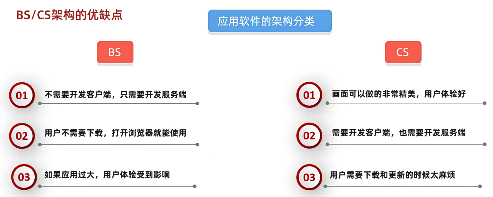

本节总结


-----

# 169.网络编程三要素

所谓三要素就是：两台电脑你想传输数据，你觉得需要知道哪些东西需要才能进行传输呢？

特别是，我想要给一堆电脑中的其中一台发送数据，想要实现这个功能，需要知道哪些参数才行呢？

第一个要知道的，就是对方电脑在互联网上的地址，而这个地址是唯一的，我们也叫做**IP**。

光有IP还不够，因为我们电脑中还有很多其他的软件。

假设我是从微信发送的数据，对方也是微信接收的，那么你怎么确定对方一定是用微信接收的，而不是其他的QQ或者其他软件呢？

因此第二个我们要确定的是：对方电脑上接收数据的软件，这个也叫作**端口号**，一个端口号只能被一个软件绑定使用。

第三个，数据在传输的时候，是不能随便书写它的格式的，我们还需要去确定网络传输的规则，这个叫做**协议**。

**因此 `IP、端口号、协议`，这就是网络编程三要素，需要知道这三个，我们才能进行数据的传输。**

下面的这三句话不需要可以去背的，在大脑中有一个印象就行了。

IP：设备在网络中的地址，是唯一的标识。

注意是设备，不是电脑，因为能上网的东西非常的多，例如手机、watch等，只要你上网，都需要有一个IP。

端口号：应用程序在设备中唯一的标识。

协议：数据在网络中传输的规则，常见的协议有UDP、TCP、http、https、ftp。


----

# 170.三要素（IP）

IP：全称 `Internet Protocal`，是互联网协议地址，也称IP地址。它是分配给上网设备的数字标签。

通俗理解：IP就是设备在网络中的地址，它是唯一的。

常见的IP分类为：IPv4、IPv6。

我们先来看第一种，最常见的 `IPv4`

----

## 一、IPv4

`IPv4` ：全称 `Internet Protocol version 4`，互联网通信协议第四版。

那有没有第一版、第二版、第三版呢？答案是没有的，刚开始出来就是第四版。

个人猜想：第一版、第二版、第三版肯定是有，只不过是实验室中的测试版本，没有对外发布，正式发布正式使用的就是第四版。

第四版的IP采取了32位地址长度，分为4组。

因此计算机中，真正的IP并不是我们平时看到的这样的，

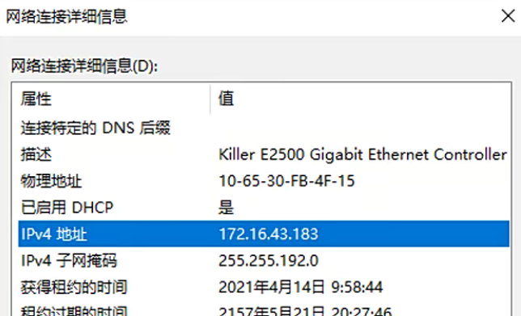

真正的样子应该是这样的：32个bit，即4个字节，变成二进制是这么一长串。

只不过这种方式不好记，也不好用，因此就出现了 `点分十进制表示法`（`点`：表示用点分隔，`十进制`：表示转化为十进制的表示方式），它会把 `8个bit` 分为一组，总共就是四组，每一组转成十进制，中间用 `.` 进行区分，此时才变成我们平时所看到的这个IP。

只不过要注意了，它在转换的时候，是没有负数说法的，每一组的取值范围是 `0 ~ 255`，所以转成十进制后，每一组最大值是 `255`。

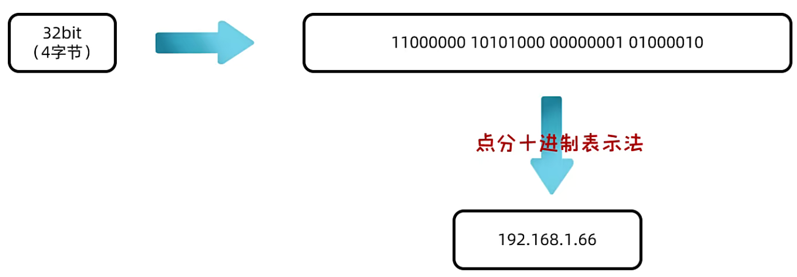

但其实这种 `IPv4` 它是有弊端的，四组，每组取值范围是 `0 ~ 255`，总共 `256的4次方` 个数据，得到结果42亿多，不到43亿，所以在 `IPv4` 中，总共也只有不到 `43亿` 个 `IP`，因此 `IPv4` 数量是有限的，是不够使用的，事实上其实也是如此。

`2019年11月26日` 不到43亿个IP，已经全部分配完毕。

为了解决 `IPv4` 不够用的问题，所以才出现了 `IPv6`。

那 `IPv5` 呢？ `IPv5` 其实也有，只不过它的设计理念不好，还没发布就被淘汰了，所以现在我们知道的是 `Ipv6`。

----

## 二、IPv6

IPv6：全称 `Internet Protocol version 6`，互联网通信协议第六版。

在第六版中，它是采取128位地址长度，分成了8组，每一组是16个bit。

因此在 `IPv6` 的情况下最多有 `2的128次方个ip`，这样说没什么感觉，换种说法：`IPv6` 可以给地球上的每一粒沙子都定义一个ip。

但是现在的 `IPv6` 还没有大规模的使用，在目前还是初级阶段，因此现在我们对它简单了解一下就行了。

`IPv6` 平时在记录的时候它也不会直接去写二进制，它也有自己独立的转换方式：冒分十六进制表示法（即将上面的每一组转成十六进制，再用冒号去分隔。

又由于它比较长，因此还可以进一步简化：我们可以将每一组前面的 `0` 进行省略。

但是它里面还有一种特殊情况：如果计算出的16进制表示形式中间有很多很多连续的0，此时可以采用 `0位压缩表示法`。

操作系统如果看见你中间写了两个连续的两个 `冒号`，此时它就会在中间补0，去把它变成左边的样子。

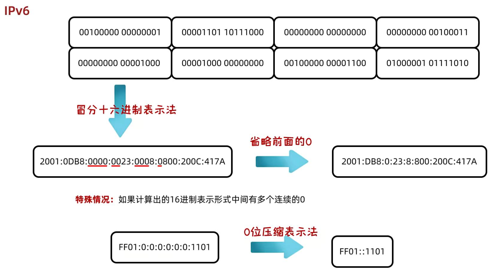

`IPv6` 还在渐渐普及，目前已经有很多APP支持 `IPv6` 了，相信在不久的将来，`IPv6` 一定会全面的替代 `IPv4`，成为这个市场的总和。


-----

# 171.`IPv4` 的一些小细节

## 一、目前是如何解决IPv4不够的问题呢？

`IPv6` 还没有大量普及，但是 `IPv4` 又分配完了，那么目前是如何解决IP不够的问题呢？

此时就要说到 `IPv4` 的地址分类，它可以分为两类：公网地址（万维网使用）和私有地址（局域网使用），私有IP也叫做局域网IP。

其中 `192.168.` 开头的就是私有地址，范围即为 `192.168.0.0 -- 192.168.255.255`，现在就是用局域网IP去节省IP的使用。

我们以网吧为例，网吧里面是有很多很多电脑的，但是不是每一台电脑在连接外网的时候都有一个公网的IP。

它们往往是共享同一个公网IP，再用路由器给每一台电脑分配一个局域网IP，这样就可以实现节约IP的效果。

所以在之前你有没有听过一件事情：网吧里面某个人上了一些网站，然后这个IP就被禁了上不了网了，就会导致网吧中部分电脑一起连不上外网，其实就是这些电脑共享同一个公网IP的原因。

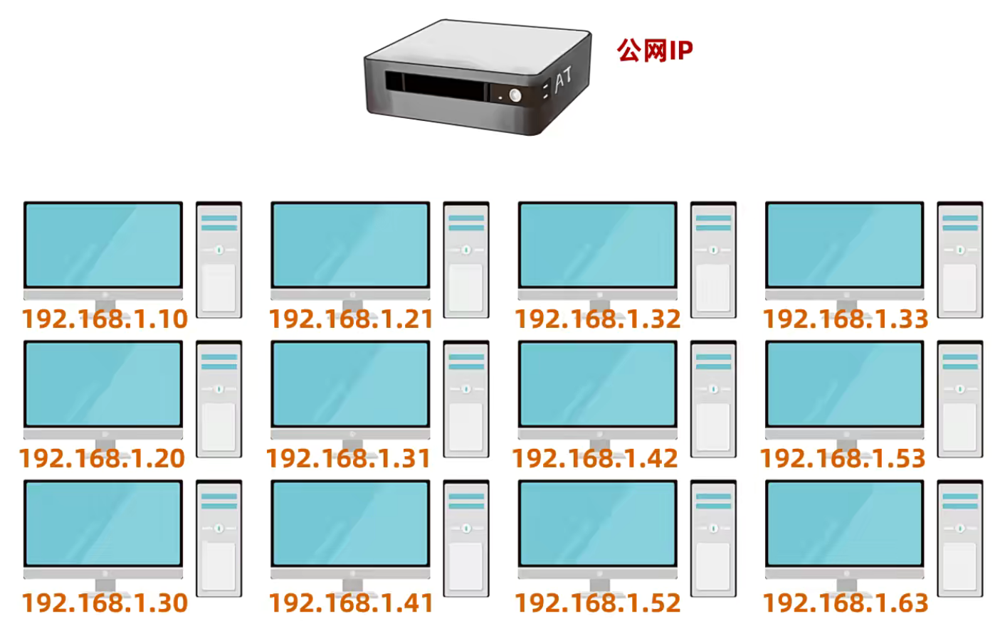

----

## 二、特殊IP地址

在众多IP中有一个特殊的IP需要我们记一下。

`127.0.0.1`，它也叫做 `localhost`，是回送地址，也称本地回环地址，其实也就表示本机，也就是我们自己电脑的IP，它永远只会寻找当前所在的本机。

疑问：假设 `192.168.1.100` 是我自己电脑的IP，那么这个IP跟 `127.0.0.1` 是一样的吗？

答案是不一样的。

假设现在我的局域网中有6台电脑，这些IP都是由路由器所分配的

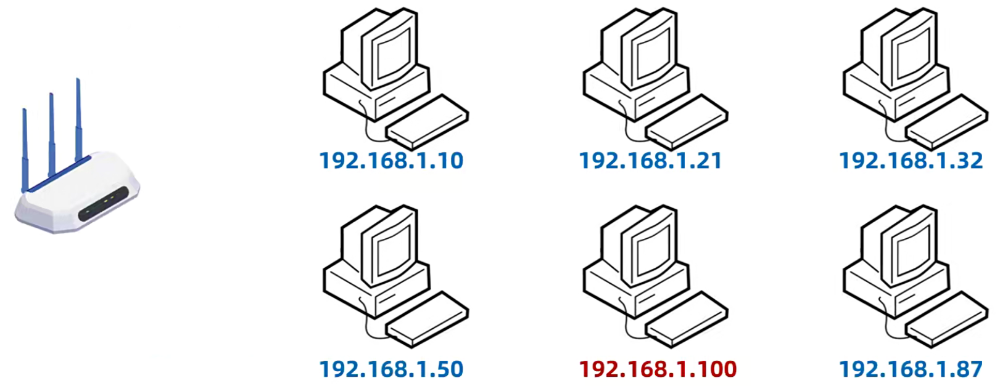

假设我自己的电脑现在是 `192.168.1.100`，现在我发送数据的时候，也往这个IP中发送数据，那你觉得它是怎么发的？

此时这个数据是先发到路由器，路由器再找到你当前的IP，这样才能实现数据的发送。

但是此时会有一个小细节：每一个路由器给你分配的IP是有可能不一样的。

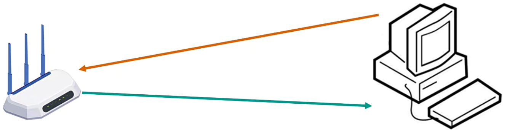

但是如果我往 `127.0.0.1` 发送数据，此时它是不经过路由器的。

你的数据在经过网卡的时候，网卡发现，你要往 `127.0.0.1` 发送数据，此时它就直接把这个数据给你自己发过来了，不管你是在哪个地方上网，永远都是这样的，这就是两个的区别。

所以：在以后我们自己写练习的时候，如果是自己给自己发数据，那就写 `127.0.0.1` 就行了。

----

## 三、常用的CMD命令

- ifconfig：查看本机IP地址
- ping：检查网络是否连通

如下图就是我自己电脑的IP

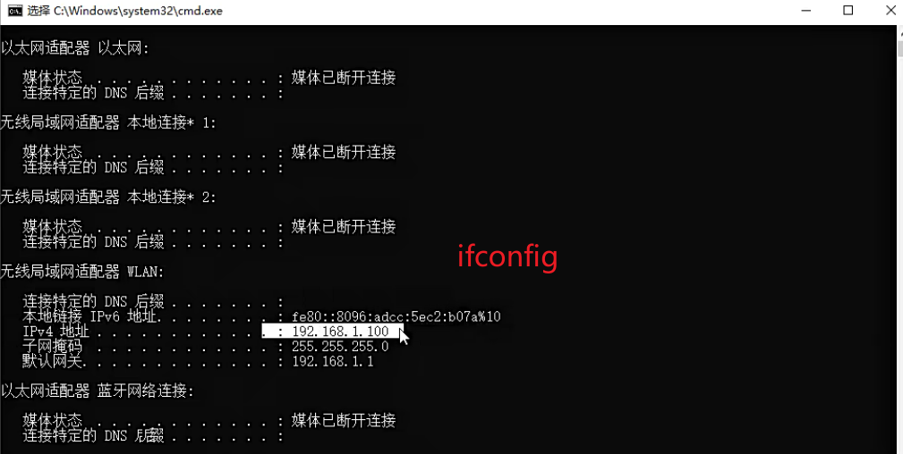

接下来测试两台电脑之间网络是否畅通，例如现在在我的局域网里面，它有一个电脑的IP是 `192.168.1.105`，现在我的电脑正在测试跟这台电脑的网络是否畅通，它一共发送了四个数据包，四个数据包全部能接收到，没有丢失，那就表示我的电脑跟这台电脑的网络是畅通的。

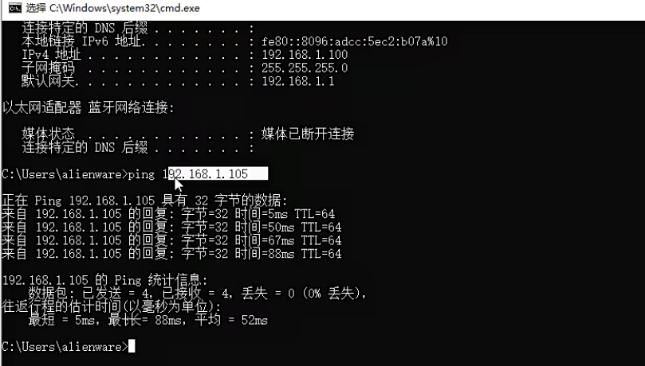

那我现在换一个，换成 `192.168.1.106`，在我的局域网里面现在是没有这个电脑的，那么在这个下面就会显示网络不通。

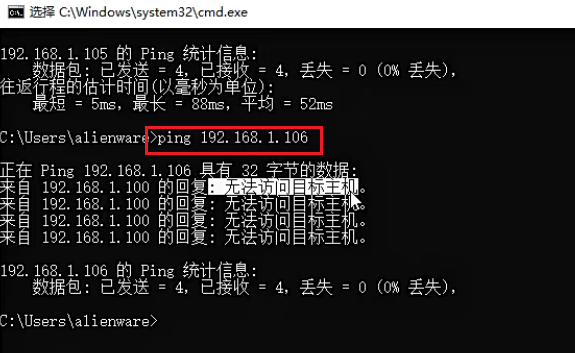

`ping` 除了能检查局域网中网络是否畅通，还可以检查你的电脑跟外网是否畅通，例如现在我们可以 `ping` 一个百度。

要注意的是，现在我虽然ping的是一个网址，但是网址的底层逻辑其实也是一个IP。

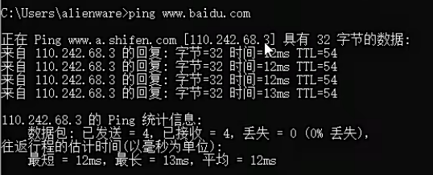


-----

# 172.InetAddress类的使用

现在我们来学习一个在Java中用来表示IP的类：InetAddress。

接下来打开一下 `API帮助文档` 来查询一下。

`此类表示互联网协议 (IP) 地址` 这句话其实也就是说，这个类的对象也就表示IP的对象。

但是会有一个问题，IP有两种，一种是IPv4，一种是Ipv6，你到底是哪个的对象？

其实在下面也有，它有两个子类：`Inet4Address`，`Inet6Address`，所以我们在获取这个类的对象的时候，底层会有一个操作：它会先判断你当前系统用的是 `4版本` 的，还是 `6版本的`。

- 如果你用的是 `4版本` 的，那么它创建的其实是第一个子类的对象返回；
- 如果你用的是 `6版本` 的，那么它创建的其实是第二个子类的对象返回；

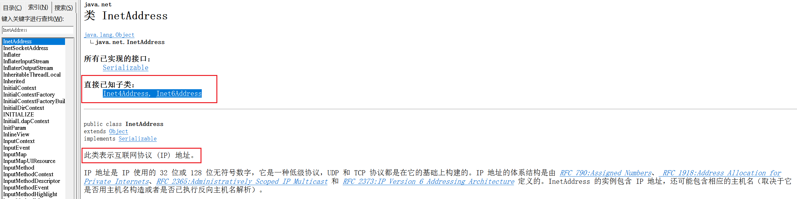

那我如何获取它的对象呢？

要注意了，这个类没有对外提供构造方法，所以我们不能直接 `new`，而是需要通过它的静态方法 `getByName` 获取到对象，这个方法的底层其实就是做了一个判断，判断你用的是IPv4还是IPv6，判断完了后，它会创建对应的子类对象给你进行返回。

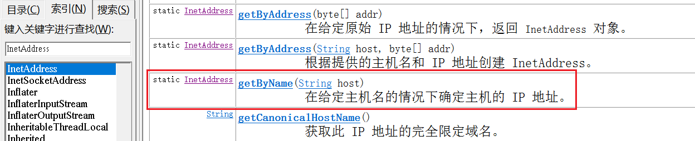

对象有了，就可以调用其他的方法了。

~~~java
static InetAddress getByName(String host)  确定主机名称的IP地址。主机名称可以是机器名称，也可以是IP地址
String getHostName()                        获取此IP地址的主机名
String getHostAddress()                     返回文本显示中的IP地址字符串
~~~

首先来获取到InetAddress的对象

```java
//在括号中可以传入IP或者主机名
InetAddress address = InetAddress.getByName("192.168.1.100"); //这个IP你不一定要写自己的，写其他的也是可以的
System.out.println(address);//IP对象：/192.168.201.1 就已经获取到了
```

接下来用主机名创建对象，主机名其实就是你给自己电脑起的名字，如果你没起，它也会有默认的。

<kbd>win + e</kbd> 打开我的电脑，右击空白处点击属性

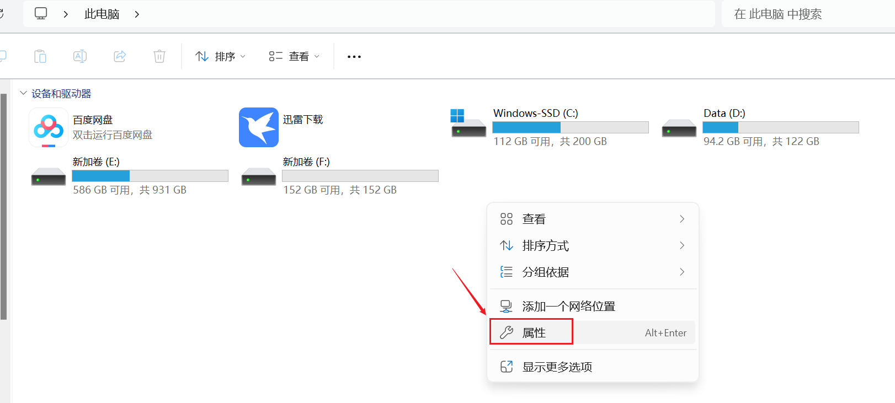

如下图红色箭头的地方就是你电脑的名字。

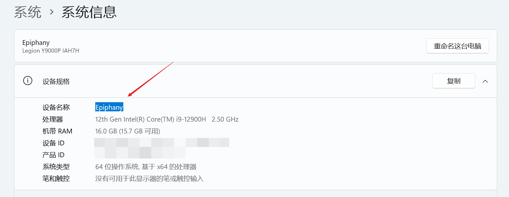

这个名字其实是可以修改的，点击上面的 `重命名这台电脑`

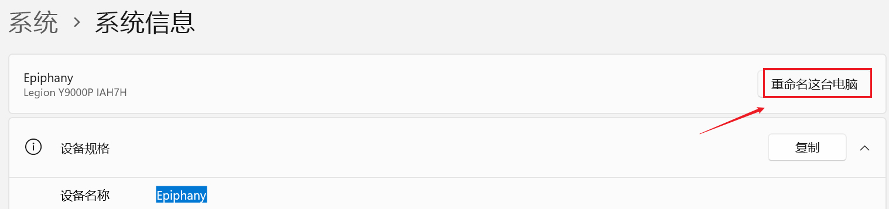

现在就可以修改计算机的名字，修改完了需要重启。


建议：计算机的名字不要用中文，如果用中文，后面在学习其他知识的时候有可能会有问题的。

~~~java
InetAddress address = InetAddress.getByName("DESKTOP-5OJJSAM");
System.out.println(address);// Epiphany/192.168.201.1
~~~

对象有了，就可以调用里面的方法了，但是在调用方法之前，你需要知道这个对象是表示什么的。

`address` 表示的是IP的对象，IP表示网络中的某台电脑，所以这个类的对象我们其实就可以把它真正的将它看做是一台电脑的对象。

`getHostName()` 细节：如果你的电脑因为网络原因，或者局域网中压根就没有这台电脑，它此时是获取不到它的主机名的，如果获取不到，它就是以IP的形式进行体现的，因此如果这个方法返回一个IP，不要惊慌。

~~~java
//获取到电脑的主机名
String name = address.getHostName();
System.out.println(name);//DESKTOP-5OJJSAM

//获取到电脑的IP
String ip = address.getHostAddress();
System.out.println(ip);//192.168.1.100
~~~

那这个代码有什么用呢？其实这个代码是我们前置的代码，我一旦获取到某一台电脑之后，下面就可以给这台电脑发送信息了。


----

# 173.三要素（端口号）

## 一、介绍

端口号：是应用程序在设备中唯一的标识。

它是由两个字节所表示的整数，取值范围：`0 ~ 65535`，也就是说在我们的设备中，最多只有六万多个端口号。

这些端口不是所有的我们都能用的。

其中 `0 ~ 1023` 之间的端口号用于一些知名的网络服务或者应用，简单理解就是 `0 ~ 1023` 我们是不能用的。

如果你想用，我们用 `1024` 以上的端口号就行了。

注意：一个端口号只能被一个应用程序使用

----

## 二、画图理解

假设现在有两台电脑，一台是电脑A，一台是电脑B，现在左边的电脑A要给右边的电脑B发送消息。

在这个过程中其实就有端口的存在。

端口其实就能理解为：电脑往外发送数据，或者是接收数据的出口或入口。

再说的直白一点，端口你可以把它理解为这样的各种各样的小眼，这些小眼是有编号的，编号从 `0` 开始，最多到 `65535`。

而我们的软件在启动后，它一定要跟一个端口进行绑定，如果你不绑定，那么你当前程序是单机的，是无法对外发送数据或者接收数据的。

假设微信在启动的时候，是跟 `65533` 这个端口进行绑定，这个时候电脑A在发送数据的时候，就会通过 `65533` 往外法。

在右边的电脑中由于 `65533` 也绑定了微信，因此左边的微信在发消息的时候，它也会发送到 `65533` 这个端口上。

在右边 `65533` 是有微信软件的，因此这个消息就被微信所接收到了。

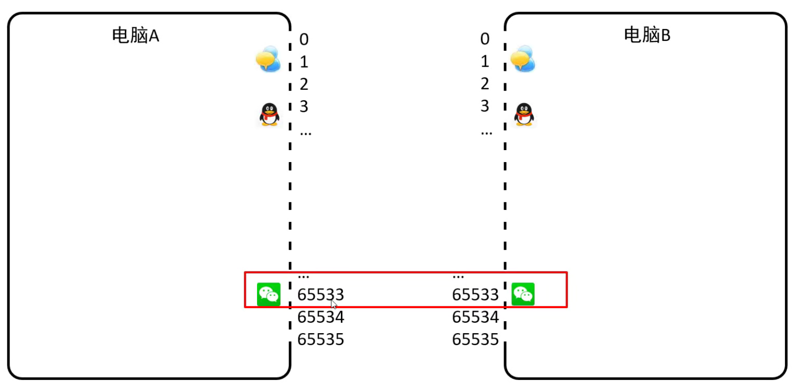


----

# 174.三要素（协议）

## 一、引入

协议：计算机网络中，连接和通信的规则被称为网络通信协议。

说白了，协议就是数据传输的规则。

在传输数据的时候，国际标准组织定义了一个 `OSI参考模型`，这个模型是把传输数据分成七层，只不过这种分发过于理想化，也太复杂，所以未能在因特网上进行广泛推广。

后来将这个模型进行了简化，简化后叫做 `TCP/IP参考模型（或TCP/IP协议）`，这个模型正在被广泛使用。

我们一起来看看这两个模型的结构。但由于现在我们还没有详细的去学习里面的一些协议，所以我们对这个模型其实是没什么太大感觉的，没关系，我们先对他做一个简单的了解，因为一会等我们详细的学习完协议后，再来看这个，就非常有感觉了。

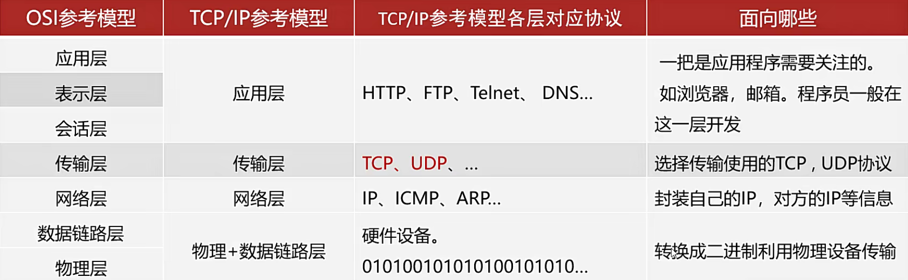

在最初的OSI参考模型中，它是将这个数据的传输分成了七层。

在发送数据的时候，对方的电脑其实也有着七层，我们的代码是运行在最上面，应用层的。

如果说我想要发送一条数据，左边自己的电脑中它会一层一层的往下，在最下面的物理层最终会把数据转成二进制，再去传给对方的电脑。

对方的电脑接受到二进制后，会进行解析，再一层一层的传递给最上面的应用层，这样我们的程序就可以接受到数据了，这个就是OSI参考模型。


但是这种模型太过于复杂也太过于理想化，所以后来又出现了 `TCP/IP模型`。

在 `TCP/IP模型` 中，它将应用层、表示层、会话层进行了合并，三层合并变成了应用层，下面的传输层和网络层没有发生变化，最后的两层进行了合并，变成了 `物理链路层`，简化后流程变的简单了，也大大减少了资源的消耗，所以说这个模型一直沿用至今。

这里的每一层其实都有自己的协议，其中应用层：有我们平时经常用的HTTP、FTP、DNS等，这些协议的底层其实就是我们今天所学习的TCP和UDP协议，而TCP和UDP底层又用到了下面的 `IP、ICMP、ARP` 等等协议，但是最终还是会转成 `0101` 的二进制形式。

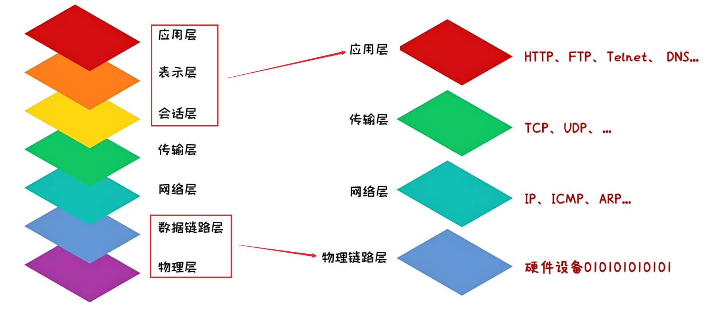

这些东西大家现在现有一个大致的印象，等我们今天把协议全部学习完毕后再会回过头来看这张图就非常有感觉了。

今天重点会学习两个协议：UDP和TCP，这两个协议的特点现在需要你背上。

----

## 二、UDP协议

`UDP协议` 也叫做 `用户数据报协议（User Datagram Protocol）`。

`UDP` 是**面向无连接**的通信协议。

它的速度非常的快，但是它有大小限制，一次最多只能发送64KB，数据不安全，数据容易丢失。

那 `面向无连接` 是什么意思？

假设现在是左边的电脑要给右边的电脑发送数据，在发送数据之前，需要检查两台电脑之间的网络是否畅通。

但是UTP协议是不会检查的，数据就直接发送了，你能收到就收到，收不到就拉到，这就是  `面向无连接`。

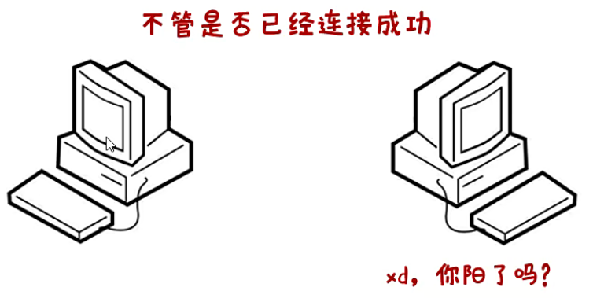

---

## 三、TCP协议

传输控制协议TCP（Transmission Control Protocol）

TCP协议是**面向连接**的通信协议。

它的速度比较慢，但是没有大小限制，数据相对来将会比较安全。

其实刚好是跟上面是反过来的，它在发送数据的时候，会先去检查两台电脑之间的网络是否畅通。

简单来说就是：确保连接成功，才会发送数据，这个就是面向连接。


----

## 四、两种协议的区别

现在这两种协议其实都是有应用场景的。

UTP的优点就是：速度非常的快，因为它在发送数据的时候是不需要检查网络的。

但是它也有缺点，就是因为它不检查网络，所以数据不安全，数据容易丢失。

因此UTP适用于丢失一点数据不会产生任何影响的情况，例如：网络会议、语音通话、在线视频，大不了就是卡了一下。

而 `TCP` 就适用于对数据有非常高的要求，一点都不能丢的情况：下载软件（丢一点数据，安装包可能就用不了了）、文字聊天（你发消息，少一个字，意思可能就变了）、发送邮件.....

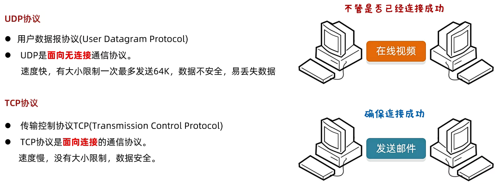


-----

# 175.利用 `UTP协议` 发送数据 / 接收数据

## 一、发送数据

### 1）介绍

接下来学习如何利用 `UTP协议` 去发送数据和接收数据。

它的步骤相对来讲会比较繁琐，我们先来将一个小故事，用故事去推导过程。

假设 `帅玮` 要给 `小惠惠` 去送一些小惠惠非常喜欢的东西，例如小熊、裙子等。

但是 `帅玮` 在北京，`小惠惠` 在南京，只能通过快递寄给它。

他是将这些东西散装着寄给她吗？肯定不是的，需要找一个箱子，将所有的礼物放到箱子打包好，再交给快递小哥寄出去，这就是发送。

在这个故事中做了四件事情，这四件事情其实就对应着UTP发送数据。

1、找快递公司。——>  在Java中有一个类叫做 `DatagramSocket`，这个类好比是快递公司，它负责利用UTP协议往外发送数据。

2、打包礼物。——>  发送数据的时候不能散装着，需要将数据打包，这个包叫做 `DatagramPacket`，我们可以把所有的数据放到 `DatagramPacket` 中一起往外发。

3、快递公司发送包裹。——>  发送数据。

4、付钱走人。——>  释放资源。

----

### 2）代码实现

首先创建DatagramSocket对象，相当于快递公司

~~~java
//在小括号中我们可以什么都不传，利用空参构造；也可以指定一个端口。
//此时在底层有一个小细节：
//创建DatagramSocket对象的时候，它还会去绑定对应的端口，以后我们就是通过这个端口往外发送数据
//空参：所有可用的端口中随机一个进行使用
//有参：指定端口号进行绑定
DatagramSocket ds = new DatagramSocket();
~~~

很多同学会很容易忘，忘了没关系，可以这么想：上面已经将快递公司创建出来了，快递公司的作用就是 `发送数据`，因此我们可以使用 `ds` 去调用 `send()`，但是在发的时候你发现了，它需要一个 `DatagramPacket`，这个就是打包好的数据。

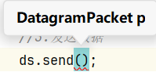

这个时候你就想起了，哦，我还需要做第二步：打包数据，创建一个 `DatagramPacket` 对象，那此时我们需要将什么东西打包起来呢？来看下里面的参数。

首先，先来看前面，前面有一个数组，这个数组后后面的 `offset`、`length`，其实就表示我现在要发出的数据，数据是利用字节数组往外发，在发的时候可以执行：从哪个索引开始，一共要发几个。

如果需要发数组中所有的东西，那就可以用下面的构造方法，起始索引 `offset` 就可以不用指定了，直接写 `length` 即可，`length` 写数组的长度就行了。

后面还有一个参数叫做 `InetAddress`，这个就表示：我要给哪台电脑发，因此我们可以在 `InetAddress` 这里指定IP，后面还有一个 `prot`，表示你要发给这台电脑哪个端口上。

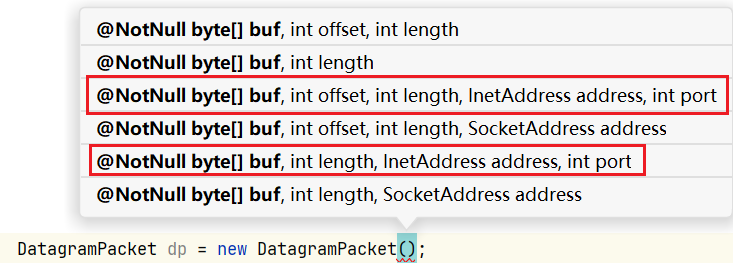

~~~java
String str = "你好威啊！！！";
byte[] bytes = str.getBytes();
InetAddress address = InetAddress.getByName("127.0.0.1"); // 指定电脑
int port = 10086; // 往哪个端口上发送数据

DatagramPacket dp = new DatagramPacket(bytes, bytes.length, address, port);
~~~

最后发送数据，释放资源即可

```java
//3.发送数据
ds.send(dp);

//4.释放资源
ds.close();
```

运行程序，可以看见控制台没有任何结果，那到底发送成功没，我们也不知道。

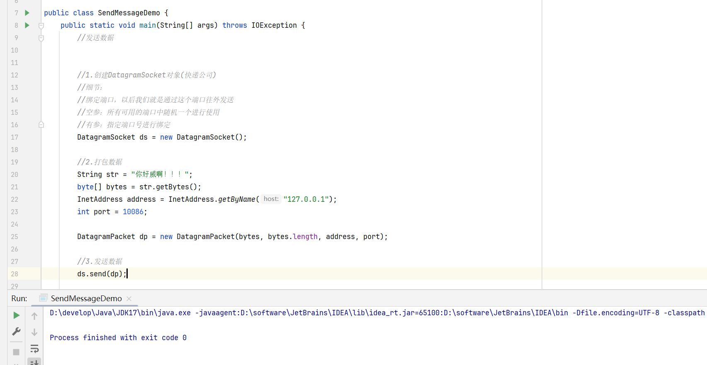

为什么呢？刚刚我们说过，UTP协议是面向无连接的，在发送数据的时候，我管你这个连接有没有建立，直接发就行了，接到就接到了，没接到就拉倒，这就是UTP的特点。

----

## 二、接收数据

接收数据就好比是 `小惠惠` 收到了包裹，那你说该怎么办呢？

首先快递公司肯定是先将包裹交给 `小惠惠`， `小惠惠` 拿到包裹后，需要从包裹中取出 `帅玮` 送的礼物，这就是接收。

在这个过程中，小惠惠做了一下几件事情，其实这就对应着UTP的接收数据。

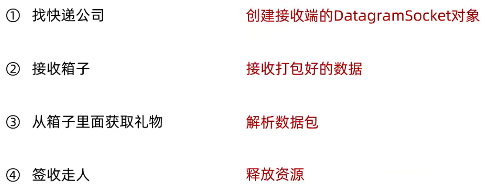

第一步跟刚刚一样，也是创建DatagramSocket对象

~~~java
//1.创建DatagramSocket对象，这个对象就表示是快递公司
//细节：如果这里没有指定端口，那就表示你发送的时候是从随机端口去接收数据，那肯定是不行的
//因此在接收的时候，一定要绑定端口
//而且绑定的端口一定要跟发送的端口保持一致
DatagramSocket ds = new DatagramSocket(10086);
~~~

接下来就是接收数据，在接收的时候你发现了，它需要一个 `DatagramPacket`，也就是说你需要新建一个箱子去接收数据。

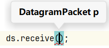

那么在 `DatagramPacket` 中需要传递什么呢？

注意现在这个箱子是用来接收数据的，既然你是接收数据，所以后面的两个参数其实就不要了，我只需要给它传递一个数组就行了。

如果要用数组所有的空间去接收数据，那就使用第二个构造。

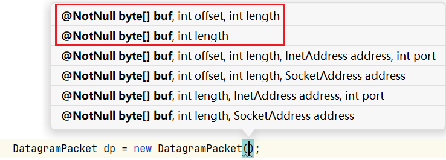

然后再通过快递公司 `dp` 利用 `receive()` 方法去接收数据。

PS：`receive()` 是阻塞的，简单理解：程序执行到这一步的时候，会在这里死等，等发送端发送消息。

运行下图代码可以发现，`11111` 打印出来了，但是 `22222` 没有打印出来，这就表示程序已经停在了 `24行`，它在等待发送端发送数据，如果一直没发，就一直死等，直到等到。

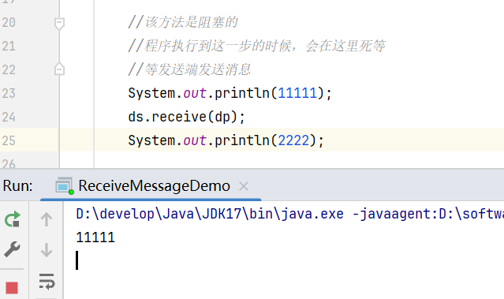

~~~java
//2.接收数据包
byte[] bytes = new byte[1024];
//你要拿着这个数组里面哪些部分去接收数据呢？很显然我要拿着整个数组所有的空间去接收数据，将来在接收数据的时候，它就会尽可能将这个数组给装满
//如果你这里写10，那么它只会用前10个来装数据
DatagramPacket dp = new DatagramPacket(bytes, bytes.length);

ds.receive(dp);
~~~

我们还需要做第三步，那就是解析数据包，所有的东西都在 `dp` 中，即箱子。

在解析的时候我可以从这个箱子里面拿到很多很多的东西。

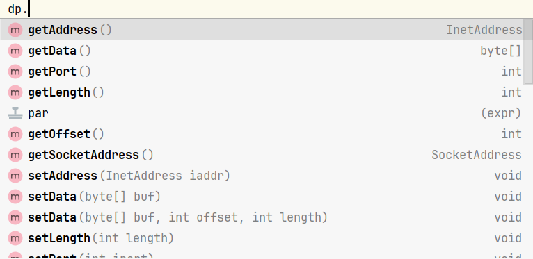

~~~java
//3.解析数据包
byte[] data = dp.getData(); // 获取发送过来的数据，获取的其实就是上面的这个数组
int len = dp.getLength(); // 获取到多少字节数据
// dp.getAddress()：是从哪台电脑发过来的，获取到真正的IP
//当然真正的IP最后在后面最好再去调用一个getHostAddress()，这个才是真正的IP
InetAddress address = dp.getAddress().getHostAddress();  
String name = dp.getAddress().getHostName(); // 获取到主机名
int port = dp.getPort(); // 对方是从哪个端口给你发过来的

//打印的时候不能直接打印字节数组，字节数组是看不懂的，需要将字节数组变成字符串
System.out.println("接收到数据" + new String(data, 0, len)); // 但是这个数组又很大，所以需要用到上面获取到的len，表示我要将这个数组中从0开始，一共len个字节去变成字符串
System.out.println("该数据是从" + address + "这台电脑中的" + port + "这个端口发出的");

//4.释放资源
ds.close();
~~~

接下来运行代码，但是在运行的时候需要注意：先来运行接收端，再来运行发送端。

在控制台中我们需要学会切换，第一个地方是接收端的控制台，后面还有一个就是发送端的控制台。

由于在发生的时候我们是用空参构造创建对象，此时就没有指定端口，系统就可以在所有可用的端口中随机一个进行使用，但是这个是无所谓的，你从哪个端口发出不重要，你只要保证你是发到 `10086端口` ，而且在接的时候也是从 `10086端口` 接就行了。

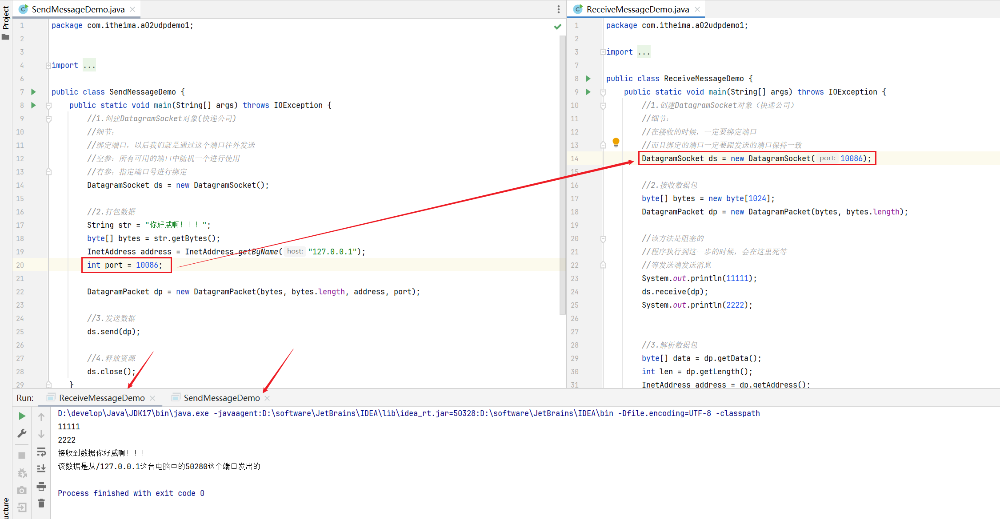


----

# 177.UDP练习（聊天室）

## 一、代码示例

```
按照下面的要求实现程序
    UDP发送数据：数据来自于键盘录入，直到输入的数据是886，发送数据结束
    UDP接收数据：因为接收端不知道发送端什么时候停止发送，故采用死循环接收
```

**SendMessageDemo.java**

```java
//1.创建对象DatagramSocket的对象，这里没有指定端口，那就表示我会从随机端口发送数据
DatagramSocket ds = new DatagramSocket();
//2.打包数据
Scanner sc = new Scanner(System.in);
while (true) {
    System.out.println("请输入您要说的话：");
    String str = sc.nextLine();
    if("886".equals(str)){
        break;
    }
    byte[] bytes = str.getBytes();
    InetAddress address = InetAddress.getByName("127.0.0.0");
    int port = 10086;
    DatagramPacket dp = new DatagramPacket(bytes, bytes.length, address,port);
    //3.发送数据
    ds.send(dp);
}
//4.释放资源
ds.close();
```

**ReceiveMessageDemo.java**

~~~java
//1.创建对象DatagramSocket的对象
DatagramSocket ds = new DatagramSocket(10086);
//2.接收数据包，写在循环体外面，每次后面一次接收到的数据会将前面的数据给覆盖
byte[] bytes = new byte[1024];
DatagramPacket dp = new DatagramPacket(bytes, bytes.length);
while (true) {
    ds.receive(dp);
    //3.解析数据包
    byte[] data = dp.getData();
    int len = dp.getLength();
    String ip = dp.getAddress().getHostAddress();
    String name = dp.getAddress().getHostName();
    //4.打印数据
    System.out.println("ip为：" + ip + ",主机名为：" + name + "的人，发送了数据：" + new String(data, 0, len));
}
~~~

----

## 二、扩展

我们将这个代码改一改，就可以形成聊天室了

点击右上角 `Edit Configurations`

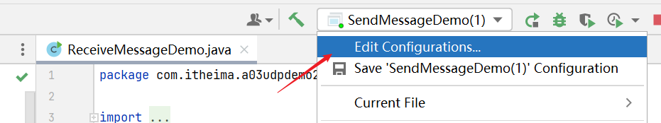

这里要确定一下类名跟包名，包名是 `com.itheima.a03udpdemo2`，类名是 `SendMessageDemo`，我要把这个类能重复的运行多次

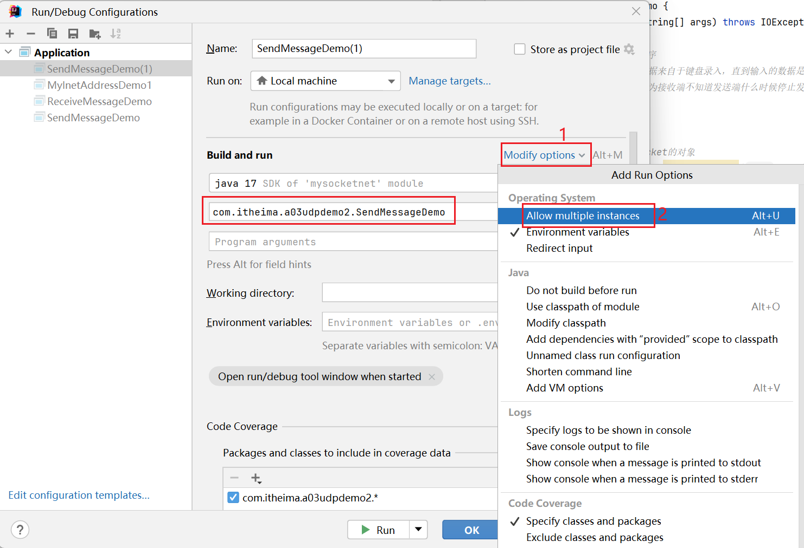

最后点击OK即可，一旦设置完后，发送端就可以运行多个了。

此时可以将三个发送端看做是三个人，三个人所有的信息都会往接收端发送，这就是一个聊天室。

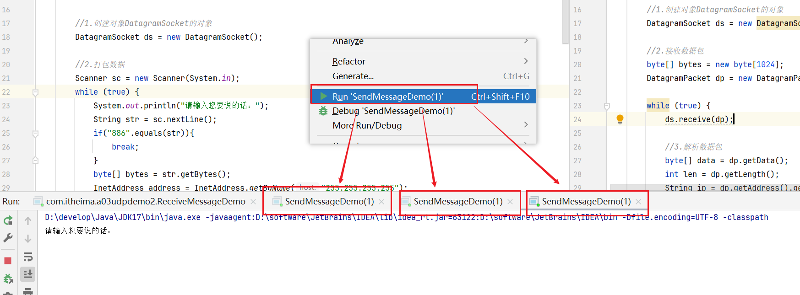


----

# 178.单播、组播、广播

## 一、介绍

UDP在通信的时候有三种方式，分别是 `单播、组播、广播`。

单播：一对一，左边的发送端只给右边的一台电脑发送数据。


组播：顾名思义，可以给一组电脑发送信息。

左边还是发送端，但是右边的接收端可以是一组。

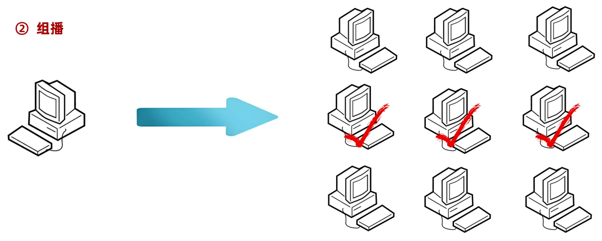

广播：左边的发送端，可以给局域网中所有的电脑发送数据。

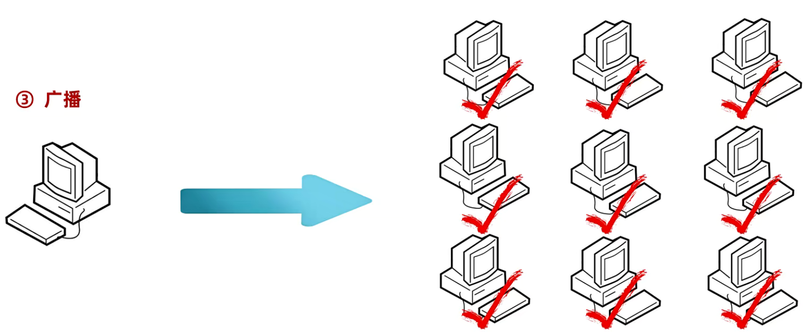

那么这三种方式代码该怎么写呢？

单播很简单，我们之前写的所有的代码都是单播形式。因为我们之前写的代码就是一对一的形式。

----

## 二、组播

组播地址，范围是 `224.0.0.0 ~ 239.255.255.255`，其中如果我们自己想用，只能用 `224.0.0.0 ~ 224.0.0.255` 范围内的，因为这个范围是给我们预留的组播地址。

那这个组播地址和之前的IP有什么不一样呢？

之前的IP只能表示一台电脑，而这里随便一个组播地址，就可以表示多台电脑。

组播代码其实也是跟之前一模一样的。

### 1）发送端代码

在创建对象的时候，之前单播创建的是 `DatagramSocket`，但是现在是组播，因此我们需要创建 `MulticastSocket` 这个类的对象才行。

其他的都是一样的，只不过在发送数据指定IP的时候，需要指定组播地址。

```java
public static void main(String[] args) throws IOException {
    //创建MulticastSocket对象
    MulticastSocket ms = new MulticastSocket();

    // 创建DatagramPacket对象
    String s = "你好,你好!";
    byte[] bytes = s.getBytes();
    InetAddress address = InetAddress.getByName("224.0.0.1");
    int port = 10000;

    DatagramPacket datagramPacket = new DatagramPacket(bytes, bytes.length, address, port);

    // 调用MulticastSocket发送数据方法发送数据
    ms.send(datagramPacket);

    // 释放资源
    ms.close();
}
```

----

### 2）接收端代码

接收端同样也是创建 `MulticastSocket` 对象，但是在下面接收端多了一步：将当前本机，添加到 `224.0.0.1` 的这一组当中。

下面一共写了三个接收端。当我们先运行接收端，再来运行发送端发送数据的时候你会发现，这里的三个接收端都可以接收到数据。

~~~java
public class ReceiveMessageDemo1 {
    public static void main(String[] args) throws IOException {
        //1. 创建MulticastSocket对象
        MulticastSocket ms = new MulticastSocket(10000);

        //2. 将将当前本机，添加到224.0.0.1的这一组当中
        InetAddress address = InetAddress.getByName("224.0.0.1");
        ms.joinGroup(address);

        //3. 创建DatagramPacket数据包对象
        byte[] bytes = new byte[1024];
        DatagramPacket dp = new DatagramPacket(bytes, bytes.length);

        //4. 接收数据
        ms.receive(dp);

        //5. 解析数据
        byte[] data = dp.getData();
        int len = dp.getLength();
        String ip = dp.getAddress().getHostAddress();
        String name = dp.getAddress().getHostName();

        System.out.println("ip为：" + ip + ",主机名为：" + name + "的人，发送了数据：" + new String(data, 0, len));

        //6. 释放资源
        ms.close();
    }
}

---------------------
    
public class ReceiveMessageDemo2 {
    public static void main(String[] args) throws IOException {
        //1. 创建MulticastSocket对象
        MulticastSocket ms = new MulticastSocket(10000);

        //2. 将将当前本机，添加到224.0.0.1的这一组当中
        InetAddress address = InetAddress.getByName("224.0.0.1");
        ms.joinGroup(address);

        //3. 创建DatagramPacket数据包对象
        byte[] bytes = new byte[1024];
        DatagramPacket dp = new DatagramPacket(bytes, bytes.length);

        //4. 接收数据
        ms.receive(dp);

        //5. 解析数据
        byte[] data = dp.getData();
        int len = dp.getLength();
        String ip = dp.getAddress().getHostAddress();
        String name = dp.getAddress().getHostName();

        System.out.println("ip为：" + ip + ",主机名为：" + name + "的人，发送了数据：" + new String(data, 0, len));

        //6. 释放资源
        ms.close();
    }
}

---------------------------
    
public class ReceiveMessageDemo3 {
    public static void main(String[] args) throws IOException {
        //1. 创建MulticastSocket对象
        MulticastSocket ms = new MulticastSocket(10000);

        //2. 将将当前本机，添加到224.0.0.2的这一组当中
        InetAddress address = InetAddress.getByName("224.0.0.1");
        ms.joinGroup(address);

        //3. 创建DatagramPacket数据包对象
        byte[] bytes = new byte[1024];
        DatagramPacket dp = new DatagramPacket(bytes, bytes.length);

        //4. 接收数据
        ms.receive(dp);

        //5. 解析数据
        byte[] data = dp.getData();
        int len = dp.getLength();
        String ip = dp.getAddress().getHostAddress();
        String name = dp.getAddress().getHostName();

        System.out.println("ip为：" + ip + ",主机名为：" + name + "的人，发送了数据：" + new String(data, 0, len));

        //6. 释放资源
        ms.close();
    }
}
~~~

----

## 三、广播

如果我们发送信息的时候，发到的是 `255.255.255.255` 上，此时局域网中所有的电脑都可以接收到你的信息，这就是广播。

广播其实是最简单的，代码几乎跟单播是一模一样的，我们只要把单播的地址改成 `255.255.255.255` 即可。

此时在发送的时候，就可以给局域网里面所有的电脑都去发生数据了。

~~~java
//1.创建对象DatagramSocket的对象
DatagramSocket ds = new DatagramSocket();

//2.打包数据
Scanner sc = new Scanner(System.in);
while (true) {
    System.out.println("请输入您要说的话：");
    String str = sc.nextLine();
    if ("886".equals(str)) {
        break;
    }
    byte[] bytes = str.getBytes();
    InetAddress address = InetAddress.getByName("255.255.255.255");
    int port = 10086;
    DatagramPacket dp = new DatagramPacket(bytes, bytes.length, address, port);
    //3.发送数据
    ds.send(dp);
}

//4.释放资源
ds.close();
~~~


-----

# 179.TCP协议

## 一、介绍

TCP通信协议是一种可靠的网络协议，它在通信的两段各建立一个Socket对象。

在通信前，一定要保证连接已经建立。

连接一旦建立后，会通过IO流来进行网络通信。

例如下图，有两台电脑，左边的是发送端，我们也可以把它叫做客户端，现在是客户端要往服务器去发送数据，因此右边就是接收端，我们就将它叫做服务器。

它们两个在发送数据前，一定要保证连接已经建立，如果连接不建立的话，TCP是无法发送数据的。

连接一旦建立后，客户端就可以往服务端发送数据了，例如发一句：`你瞅啥？`

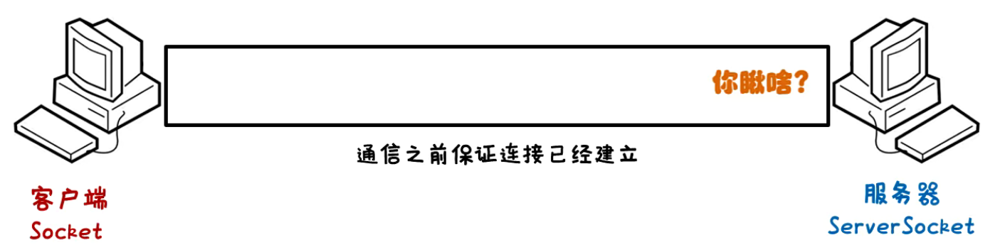

但是要注意，在发送数据的时候它是通过IO流来进行网络通信的，所以就刚刚的这一个发送数据，流的方向是不一样的。

- 针对于客户端来讲，它是往外发，所以它用的是输出流；

- 针对于服务器来讲，它是接收数据，所以它要用输入流；

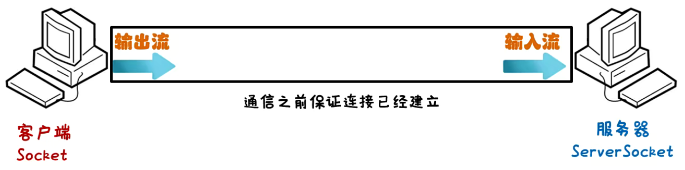

在书写代码的时候它会有以下几步，先来看客户端

① 创建客户端的Socket对象（Socket）与制定服务端连接

在创建对象的时候需要传递服务器的IP和端口号。

~~~java
Socket(String host, int port)
~~~

② 因为客户端在发送数据的时候是写出，所以我们要获取到输出流 `OutputStream`，然后再写出数据。

~~~java
OutputStream getOutputStream()
~~~

③ 写完后直接释放资源即可。

~~~java
void close()
~~~

----

再来看下服务器

① 服务器第一步首先也是来创建Socket对象，但是它是叫做 `ServerSocket`

在创建对象的时候需要去绑定一个端口号，此时服务器绑定的端口，要跟客户端连接的端口保持一致！

~~~java
ServerSocket(int port)
~~~

② 监听客户端连接，返回一个Socket对象

如果有客户端来连了，此时这个方法会返回一个Socket对象，其实就表示下图红框的连接已经建立了。

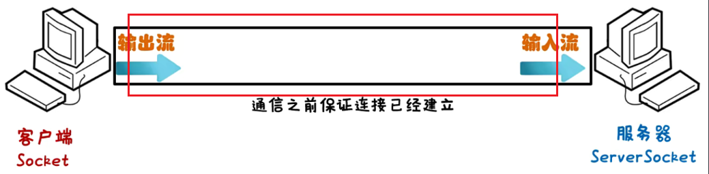

~~~java
Socket accept()
~~~

③ 连接一旦建立后，服务器就可以获取到输入流 `InputStream` 去读取数据。

~~~java
InputStream getInputStream()
~~~

④ 释放资源

~~~java
void close()
~~~

----

## 二、发送数据代码实现

第一步，创建Socket对象

细节：在创建对象的同时会连接服务端，如果连接不上，代码会报错

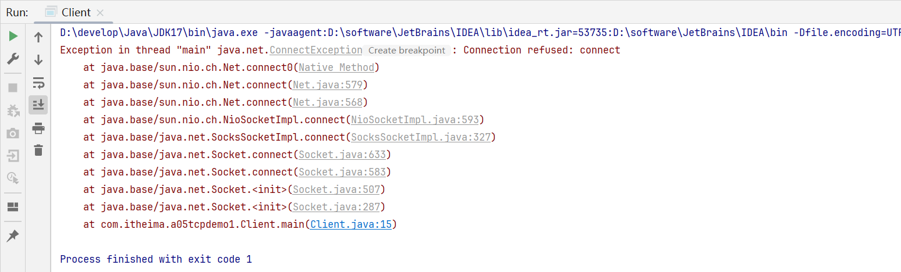

~~~java
Socket socket = new Socket("127.0.0.1", 10000);
~~~

一旦连接上了，下面的代码就很简单了

~~~java
//2.可以从连接通道中获取输出流
OutputStream os = socket.getOutputStream();
//写出数据，要注意字节流往外写出的时候只能写字节信息
os.write("aaa".getBytes());

//3.释放资源
os.close();
socket.close();
~~~

----

## 三、接收数据代码实现

~~~java
public static void main(String[] args) throws IOException {
    //1.创建对象ServerSocker
    ServerSocket ss = new ServerSocket(10000);

    //2.监听客户端的链接，其实说白了就是可以调用里面的accept方法去死等客户端来连，如果一直没有客户端来连，服务端的代码就会卡死在accept()中，但一旦有客户端来连，就会返回客户端的连接对象
    Socket socket = ss.accept();

    //3.从连接通道中获取输入流读取数据
    InputStream is = socket.getInputStream();
    //由于我也不知道你发过来的数据有多少，因此可以定义一个循环去读取
    int b;
    while ((b = is.read()) != -1) {
        System.out.println((char) b);
    }

    //4.释放资源
    socket.close(); //相当于端口和客户端连接
    ss.close(); // 相当于关闭了服务器
}
~~~

在运行的时候先运行服务端，再运行客户端。但是要注意的是，现在还不能发送中文，因为发送中文会乱码。


----

# 180.TCP协议（中文乱码问题）

## 一、为什么会乱码？

因为在客户端发数据的时候并没有制定编码表，因此它会使用平台默认的编码表，IDEA是UTF-8，此时就会将一个中文变成三个字节。

四个中文就是12个字节，此时它是将12个字节全部写到了服务器。

但是服务器在读的时候是一个字节一个字节的读取的，因此每次读取的时候只读取了 `1/3` 个中文，所以肯定乱码。

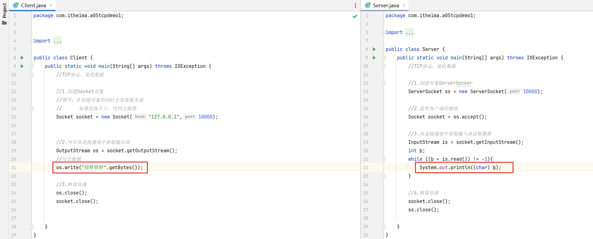

因此右边的服务器就需要将它改动一下，将is字节流变成字符流才可以。

~~~java
//3.从连接通道中获取输入流读取数据
InputStream is = socket.getInputStream();
InputStreamReader isr = new InputStreamReader(is);

int b;
while ((b = isr.read()) != -1){
    System.out.print((char) b);
}
~~~

运行程序，可以发现中文正常读取了。

如果想要提高读取的效率，在外面还可以再去包一个缓冲流。

~~~java
//3.从连接通道中获取输入流读取数据
//InputStream is = socket.getInputStream();
//InputStreamReader isr = new InputStreamReader(is);
//BufferedReader br = new BufferedReader(isr);

BufferedReader br = new BufferedReader(new InputStreamReader(socket.getInputStream()));

int b;
while ((b = br.read()) != -1){
    System.out.print((char) b);
}
~~~


-----

# 181.TCP协议（代码细节）


