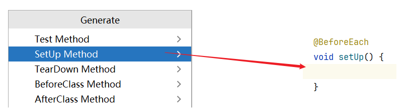

# 一、单元测试的概述

## 1）引入

我们在运行代码的时候都是一个方法方法的运行，是不可以只运行方法中的某一行代码，因此Java程序最小的功能单元是方法。

单元测试就是针对最小的功能单元编写测试代码，Java程序最小的功能单元是方法，因此单元测试就是针对Java方法的测试，进而检查方法的正确性。

以前没有单元测试的时候，只有一个main方法，如果一个方法的测试失败了，其他方法测试都会受到影响。

因为`main方法`都是运行在 `main线程` 中的，一个方法只要出现了异常，那么这条线程就没了，下面的代码就执行不到了。

并且以前的方法中，需要程序员自己根据控制台的打印结果去观察测试是否运行成功。

但是这些都有一些不方便。那单元测试可以给我们解决一些什么问题呢？

**JUnit是使用Java语言实现的单元测试框架，它是开源的，Java开发者都应当学习并使用JUnit编写单元测试。**

它是一个第三方的工具。（需要把别人写的代码导入项目中，专业叫法：导jar包）

此外，几乎所有的IDE工具都继承了JUnit，我们在使用的时候正常情况下是不需要导包的，但是如果引入进来，还是需要导一下第三方的jar包的。这样我们就可以直接在IDE中编写并运行JUnit测试，JUnit目前最新版本是5，但是在开发中最常用的版本是4。

为什么不用最新的呢，因为在实际开发中有一个特性，不管是JUnit、JDK、IDEA，所有版本我们永远都不会用最新的，而是用最稳定的。

----

## 2）JUnit优点

1、JUnit可以灵活的选择执行哪些测试方法，可以一键执行全部测试方法。

2、单元测试中的某个方法测试失败了，不会影响其他测试方法的测试。

3、方法运行成功是绿色，方法运行失败是红色。


---

## 3）结果


----

# 二、单元测试的快速入门

## 1）分析

由于JUnit是第三方写的，因此需要先将别人写好的代码导入到项目中。

PS：并不是所有方法都可以使用JUnit测试的！

前提条件：该测试方法必须是公共的无参数无返回值的非静态方法。（`public void 方法名(){}`）

`@Test` 是一个注解，它是对程序的解释说明，这里表示我们要运行 / 测试当前书写的方法。


----

## 2）步骤

1，一定要先写一个方法。

2，在这个方法的上面写@Test，然后按alt + 回车，点击Junit4


如果导包成功在左下角就会出现Junit4的相关jar包


----

## 3）手动导入

1，在当前模块下，右键新建一个文件夹（lib）

2，把今天资料里面的两个jar包，拷贝到lib文件夹里面

3，选中两个jar右键点击add as a lib....

4，到代码中，找到@Test，按alt + 回车，再来导入。

----

## 4）运行测试代码

* 只能直接运行无参无返回值的非静态方法

  

* 想要运行谁，就右键点击哪个方法。如果想要运行一个类里面所有的测试方法，选择类名，点击即可。

  

----

# 三、JUnit在实际开发中的用法

## 1）Junit正确的打开方式（正确的使用方式）

注意点：以后在实际开发中，如果想要测试一个方法是否争取，并不是直接在要测试的方法上面直接加@Test

原因：因为要测试的方法有可能是有参数的，有返回值，或者是静态的。

## 2）正确的使用方式

1、新建测试类

2、新建测试方法（要测试的方法名 + Test） ，例如methodTest

3、在这个方法中直接调用要测试的方法

4、在测试方法的上面写@Test

代码示例：测试JunitDemo1中的add方法

单元测试中有一个东西叫做：断言（拿着预计结果跟实际结果两者做一个比较）


一旦这两个结果是一致的，那么测试方法运行成功，是绿色的。如果不一致，就会抛异常。


----

## 3）实际开发中单元测试完整的使用方式

JUnit常用注解


前提：以后在工作的时候，测试代码不能污染原数据。（即修改、篡改）

但如果测试的时候不得不去修改原数据怎么办？

~~~java
1.利用Before去对数据做一个初始化的动作
2.利用Test真正的去测试方法
3.利用After去还原数据
~~~

需求：测试File中的delete方法，写的是否正确

代码示例：

```java
public class JunitDemo3 {
    //如果只写method方法，那么就污染原数据，当测试代码运行后，a.txt就被删除了
    //但是作为一个标准的测试人员，运行完单元测试之后，不能污染原数据
    //需要达到下面两个要求：
    //1.得到结果
    //2.a.txt还在而且其他的备份文件消失
    @Test
    public void method(){
        File file = new File("C:\\Users\\moon\\Desktop\\a.txt");
        boolean delete = file.delete();

        //检查a.txt是否存在
        boolean exists = file.exists();

        //只有同时满足了下面所有的断言，才表示delete方法编写正确
        Assert.assertEquals("delete方法出错了", delete, true);
        Assert.assertEquals("delete方法出错了", exists, false);
    }

    @Before
    public void beforemethod() throws IOException {
        //先备份
        File src = new File("C:\\Users\\moon\\Desktop\\a.txt");
        File dest = new File("C:\\Users\\moon\\Desktop\\copy.txt");

        FileInputStream fis = new FileInputStream(src);
        FileOutputStream fos = new FileOutputStream(dest);
        int b;
        while((b = fis.read()) != -1){
            fos.write(b);
        }
        fos.close();
        fis.close();
    }

    @After
    public void aftermethod() throws IOException {
        //还要对a.txt做一个还原
        File src = new File("C:\\Users\\moon\\Desktop\\copy.txt");
        File dest = new File("C:\\Users\\moon\\Desktop\\a.txt");

        FileInputStream fis = new FileInputStream(src);
        FileOutputStream fos = new FileOutputStream(dest);
        int b;
        while((b = fis.read()) != -1){
            fos.write(b);
        }
        fos.close();
        fis.close();

        //备份数据要删除
        src.delete();
    }
}
```

----

# 四、相对路径

默认情况下，相对路径是相对于项目而言的。

但是在单元测试中，相对路径是相对当前模块而言的。

----

# 五、@Before、@After快捷生成方式

快速生成 `@Before方法`



快速生成 `@After方法`


快速生成 `@Test方法`


