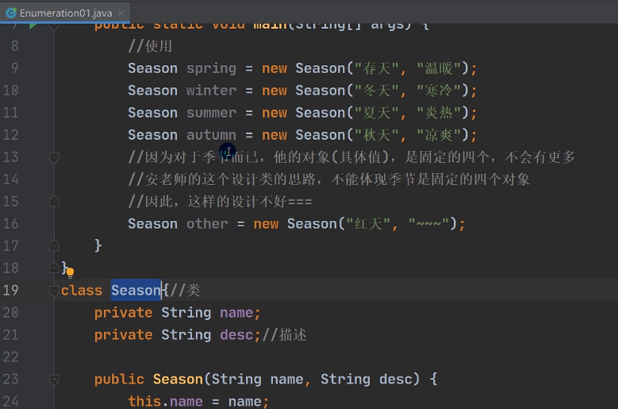
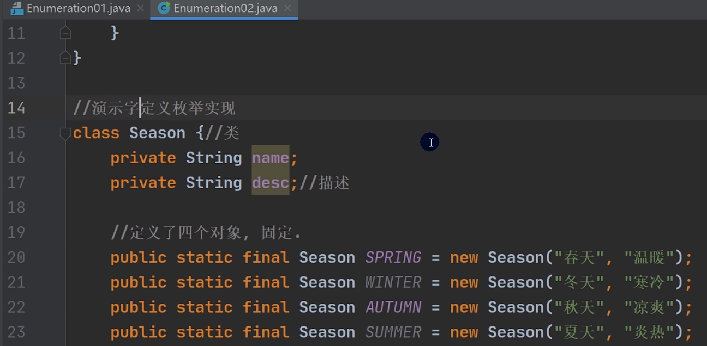
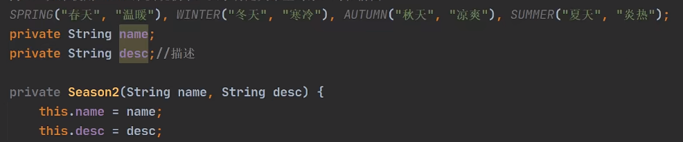
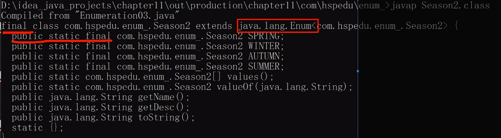
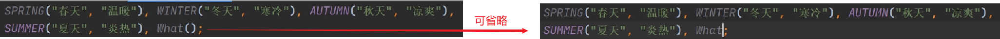
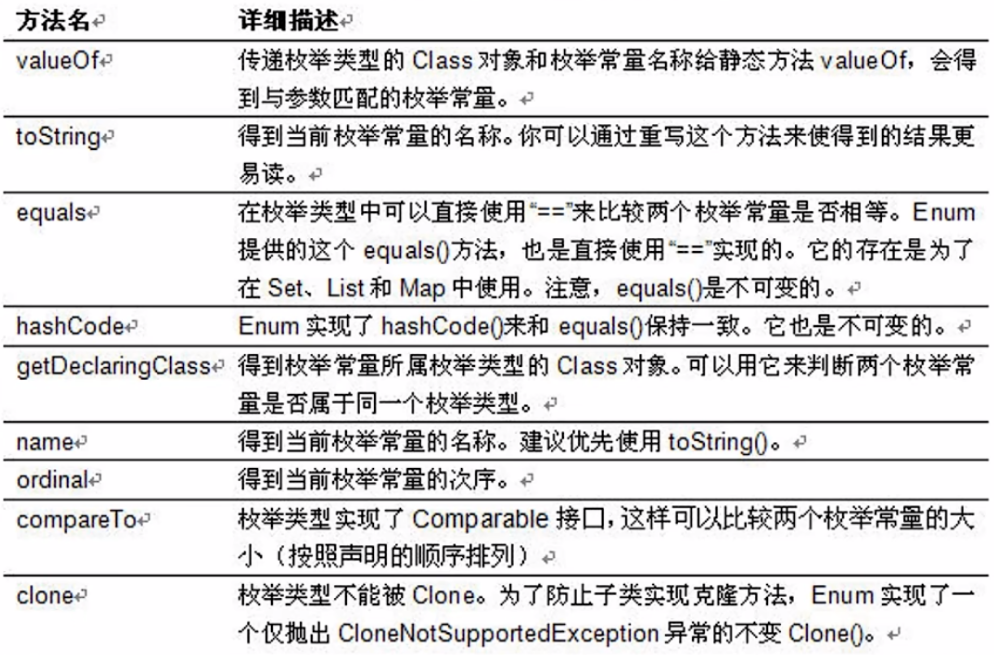

# 一、引入枚举

需求：创建季节（Season）对象。

如下写法此时就不太合适了，因为不能体现出Season是固定的，而且是不可修改的。

因此就出现了枚举，将有限值列举出来的类就叫做枚举类

- 枚：一个一个的
- 举：列出来

通过我们刚刚写的代码可以发现，创建Season对象有如下特点

1、季节的值是有限的几个值（spring、summer、autumn、winter）

2、只读、不需要修改

----

# 二、枚举介绍

枚举（enumeration，简写enum）是一组常量的集合。

枚举属于一种特殊的类，里面只包含一组有限的特定对象。

枚举的两种实现方式

1、自定义类实现枚举

2、使用enum关键字实现枚举

-----

# 三、自定义枚举实现

1. 构造方法私有化，防止 `new`
2. 可以提供get方法，但是不需要提供set方法，因为枚举对象值通常只为只读。
3. 对对外暴露对象，枚举对象/属性使用 `public final static` 共同修饰
4. 枚举对象名通常使用全部大写，常量的命名规范

----

# 四、使用enum关键字实现枚举

## 1）代码

1、将 `class` 关键字改为 `enum` 关键字

2、将 `public static final Season SPRING = new Season("春天", "温暖")` 改为 `SPRING("春天", "温暖")`

解读：`SPRING` 就是常量名，后面就是构造方法的实参列表。其实本质还是有 `public static final` 修饰，只不过它简化了。

3、如果有多个常量，使用 `,(逗号)` 间隔

4、如果使用enum来实现枚举，要求将定义常量对象写在最前面。

使用方式

~~~java
Season.AUTUMN;
~~~

-----

## 2）细节

1、当我们使用enum关键字书写一个枚举类时，默认会继承Enum类

通过 `javap` 反编译可知，这种写法就是简化，反编译后还是我们原来写的形式

2、 传统的 `public static final Season SPRING = new Season("春天", "温暖")` 简化成 `SPRING("春天", "温暖")`，这里必须知道他调用的是哪个构造器

3、如果使用无参构造器创建枚举对象，则实参列表和小括号都可以省略

4、使用enum关键字后，就不能再继承其他类了，因为enum会隐式继承Enum，而Java是单继承机制。

----

# 五、枚举Enum成员方法

使用关键字enum时，会隐式继承Enum类，这样我们就可以使用Enum类相关的方法。

values() 方法是一个由编译器自动生成的静态方法，用于返回该枚举类中所有常量的数组。

