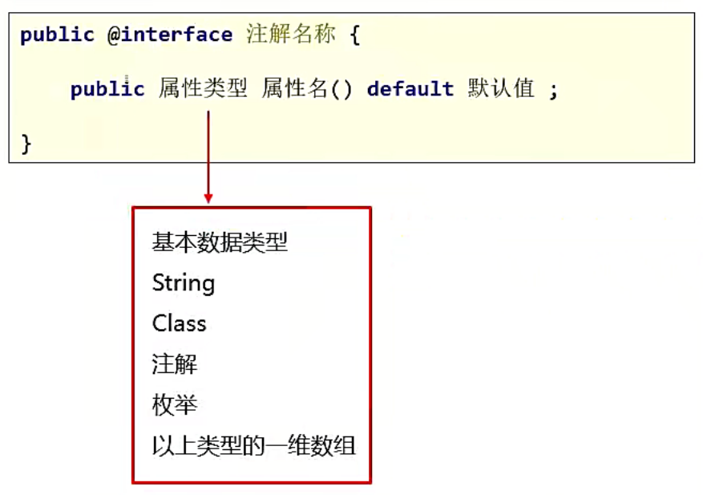

# 一、注解的引入

## 1）什么是注解？

注解有一个名字叫：Annotation。是JDK1.5的新特性。

注解的作用跟注释是一样的，它也是对我们的程序来进行标注的。通过注解可以给类增加一些额外的信息。

----

## 2）注释和注解的区别？

共同点：都可以对程序进行解释说明。

不同点：注释，是给程序员看的。只在Java中有效。当编译之后，会进行注释擦除，在class文件中不存在注释的。

​		注解，是给虚拟机看的。当虚拟机看到注解之后，就知道要做什么事情了。

例如当子类重写父类方法的时候，在重写的方法上面写@Override。

当虚拟机看到@Override的时候，就知道下面的方法是重写的父类的。检查语法，如果语法正确编译正常，如果语法错误，就会报错。

----

## 3）Java中已经存在的注解

`@Override`：表示方法的重写

`@Deprecated`：表示修饰的方法已过时。

已过时的方法还是可以继续使用的，但是一定会有替代解决方案。


`@SuppressWarnings("all")`：压制警告

例如变量没有被使用，IDEA中就会是灰色的；有时候还有一些黄色波浪线；当单词写错时也会有波浪线，这些叫警告信息。但是我觉得这些太难看了，在类的上面就可以加上 `@SuppressWarnings("all")`。

仔细观察，a跟b颜色变亮了。


除此之外，还需要掌握第三方框架中提供的注解：

比如：Junit

@Test 表示运行测试方法

@Before 表示在Test之前运行，进行数据的初始化

@After 表示在Test之后运行，进行数据的还原

----

# 二、自定义注解

## 1）定义自定义注解

自定义注解单独存在是没有什么意义的，一般会跟反射结合起来使用，会用反射去解析注解。

自定义注解就是自己做一个注解来使用。

格式如下：`interface` 前面有一个 `@`，那此时它就不是一个接口了，而是一个注解。

注解的命名规则跟类名的命名规则是一样的，采用大驼峰命名法。

再往下，注意不是方法，而是注解中特有的格式：属性。

属性简单理解就是成员变量。

细节：

- 属性的成员修饰符默认用 `public` 修饰，就算我们不写，也自带 `public`
- 注解属性在定义的时候不能单独写，后面需要写一个 `()`。
- 可以使用 `default关键字` 赋默认值，这个可写可不写。
- 前面的属性类型不是所有类型都能定义。

`以上类型的一维数组`：例如 `int[]`。



----

## 2）使用自定义注解

后面的 `(属性名1=指1, 属性名2=值2)` 就是给你的属性进行赋值的。

如果属性有默认值，可以赋，也可以不赋；但是如果没有默认值，在使用的时候就必须要赋值，如果不赋值就会报错。

~~~java
@注解名(属性名1=指1, 属性名2=值2)
~~~


-----

## 3）特殊属性：value

value：当注解中只有**"一个属性"**，并且属性名是"value"，使用注解时，可以省略value属性名。与类型无关。

但是如果有多个属性，且多个属性，且多个属性没有默认值，那么value名称是不能省略的。

在刚刚我们使用了Java中的一个自带注解 `@SuppressWarnings("all")`，此时就是将 `"all"` 赋值给了 `value属性`。


但如果属性还有一个 `age`，此时就不能省略属性名了，因为它也不知道将值赋给谁。

但是如果 `age` 有默认值，但是 `value` 没有默认值，才是就是可以省略 `value属性名` 的。

```java
//注解的定义
public @interface Anno2 {
    public String value();

    public int age() default 23;
}

//注解的使用
@Anno2("123")
public class AnnoDemo2 {
    @Anno2("123")
    public void method(){
    }
}
```

----

# 三、元注解

## 1）介绍

元注解：就是注解注解的注解。

大白话：可以写在注解上面的注解。即元注解本身也是一个注解，这个注解写在注解的上面。

@Target ：指定注解能在哪里使用

@Retention ：可以理解为保留时间(生命周期) 

### ①  Target

作用：用来标识注解使用的位置，如果没有使用该注解标识，则自定义的注解可以使用在任意位置。

可使用的值定义在ElementType枚举类中，常用值如下

* TYPE：表示当前的注解可以写在 `类，接口` 上
* FIELD, 成员变量
* METHOD, 成员方法
* PARAMETER, 方法参数
* CONSTRUCTOR, 构造方法
* LOCAL_VARIABLE, 局部变量

~~~java
@Target(ElementType.METHOD) // 此时MyTest注解只能写在方法上面，写在其他地方报错
public @interface MyTest {
}
~~~

----

### ② Retention

作用：用来标识注解的生命周期(有效范围)

可使用的值定义在RetentionPolicy枚举类中，常用值如下

前面两个一般我们都不会使用，一般都会用 `RUNTIME`

* SOURCE：注解只作用在源码阶段，生成的字节码文件中不存在
* CLASS：注解作用在源码阶段，字节码文件阶段，运行阶段不存在，这个也是它的默认值
* RUNTIME：注解作用在源码阶段，字节码文件阶段，程序运行阶段都在

~~~java
@Target(ElementType.METHOD)
@Retention(RetentionPolicy.RUNTIME)
public @interface MyTest {
}
~~~

----

# 四、注解的解析

自定义注解单独存在是没有什么意义的，一般会跟反射结合起来使用，会用反射去解析注解。

住额吉的操作中经常需要进行解析，注解的解析就是判断是否存在注解，存在注解就解析出内容。

与注解解析相关的接口

- Annotation：注解的顶级接口
- 可以利用反射解析注解


注解解析的技巧：

- 注解在哪个成分上，我们就先拿到哪个成分对象

例如现在我将注解写在方法上面，那肯定是不能直接拿到这个注解的，而是需要先通过字节码文件拿到方法的对象，然后通过方法再去获取到上面的注解。

如果要获取到类上面的注解，就需要先获取到类；如果要获取成员变量上的注解，就需要先获取成员变量才行。

----

# 五、模拟JUnit自带的@Test注解


```java
//表示这我们的注解可以写在方法上面，其他地方不能写
@Target(ElementType.METHOD)
// 这里不能写RetentionPolicy.SOURSE，因为反射是从class文件中获取的，SOURSE表示注解只作用在源码阶段，生成的字节码文件中不存在，此时字节码文件中都没有注解了，那我获取什么
//表示着我们的注解可以在任意时期都存在
@Retention(RetentionPolicy.RUNTIME) 
public @interface MyTest {
}

public class MyTestMethod {

    //表示程序运行后，需要自动运行method1
    @MyTest
    public void method1(){
        System.out.println("method1");
    }

    @MyTest
    public void method2(){
        System.out.println("method2");
    }

    public void method3(){
        System.out.println("method3");
    }
}

public class MyTestDemo {
    public static void main(String[] args) throws ClassNotFoundException, IllegalAccessException, InstantiationException, InvocationTargetException {
        //1,获取class对象
        Class clazz = Class.forName("com.itheima.test2.MyTestMethod");

        //获取对象
        Object o = clazz.newInstance();

        //2.获取所有方法
        Method[] methods = clazz.getDeclaredMethods();
        //method依次表示类里面的每一个方法
        for (Method method : methods) {
            //由于不确定当前方法是不是私有的，因此一律临时修改权限
            method.setAccessible(true);
            //判断当前方法有没有MyTest注解
            if(method.isAnnotationPresent(MyTest.class)) {
                method.invoke(o);
            }
        }
    }
}
```
