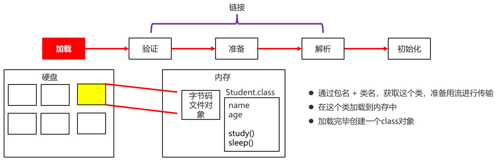

# 一、初步了解类加载器

我们自己在写代码的时候，作为程序员，面对的是Java文件，当我们写完后我们就需要将Java文件编译成Class文件（字节码文件），虚拟机实际运行的文件是编译后的字节码文件，但是这个字节码文件自己是没有长腿的，它不会自己跑到虚拟机中去运行，因此此时就需要有一个人，将它搬到虚拟机中，而这个人就是我们今天要学习的 `类加载器`。

+ 作用

  负责将.class文件（存储在硬盘上的物理文件）加载在到内存中

  

----

# 二、类加载时机

简单理解：类什么时候会被加载到内存中？

并不是虚拟机一启动类就会加载到内存中，类加载时机一共有一下6种

有以下的几种情况：

+ 创建类的实例（对象）
+ 调用类的类方法（这里的类方法只的就是静态方法，静态方法是用类名直接调用的，不用创建对象）
+ 访问类或者接口的类变量，或者为该类变量赋值（这里的类变量指的就是静态变量，此时也不需要创建对象）
+ 使用反射方式来强制创建某个类或接口对应的java.lang.Class对象
+ 初始化某个类的子类（例如创建Student对象，那么也需要将Student父类的字节码文件也加载到内存中。
+ 直接使用java.exe命令来运行某个主类（运行一个类的时候，需要将该类的字节码文件加载到内存中。

总结而言：用到了就加载，不用不加载

------

# 三、类加载过程

类是在用到的时候才加载，不用是不加载的。

但是这个加载不是一下子嗖的一下就加载了，这个加载的过程还是比较复杂的。

它分为以下几步，其中 `验证、准备、解析` 又叫做 `链接`


下面我们就分别来学习一下这每一步都做了哪些事情。

----

## 1）加载

一开始字节码文件一定是存储在硬盘上的

+ 首先通过全限定名（即全类名，包名 + 类名。使用全类名的原因是因为不同的包下可能会有相同的类名。），找到这个类的字节码文件，然后准备用流进行传输（在Java中所有的数据传输都是以流的方式进行传输的）

+ 将这个字节流所代表的静态存储结构转化为运行时数据结构，即：通过刚刚得到的流将字节码文件加载到内存中，此时字节码文件已经到内存里面了。

+ 在内存中生成一个代表这个类的java.lang.Class对象，任何类被使用时，系统都会为之建立一个java.lang.Class对象。

  这句话的意思就是：当一个类加载到内存后，你是不能随便乱放的，此时虚拟机会创建这个类的class对象来存储类中的成员信息。

以 `Student.class` 为例，在内存中创建的就是 `Student类` 的class对象，在里面会存储 `name、age` 这些成员变量，以及 `study()、sleep()` 这些成员方法。



----

## 2）链接

在 `加载` 后，字节码文件已经到内存中了，并且在内存中会创建一个  `class对象` 用来存储类中的成员信息。

接下来学习 `链接` 中的 `验证、准备、解析` ，首先来讲 `验证`。

### ① 验证

链接阶段的第一步，这一阶段为了确保Class文件字节流中包含的信息符合当前虚拟机的要求，并且不会危害虚拟机自身安全。

简单理解就是：看一下文件中的信息是否符合虚拟机规范，有没有安全隐患


----

### ② 准备

负责为类的类变量（被static修饰的变量，即静态变量）分配内存，并设置默认初始化值

即在刚刚创建的class对象中开辟一个小空间，用于初始化静态变量。


----

### ③ 解析

将类的二进制数据流中的符号引用替换为直接引用。

当一个字节码文件加载到内存中的时候，虚拟机会创建一个class对象，假设这个对象的地址值就是 `0x0011`，对象里面会记录类的成员信息。但是这些成员信息应该是有类型的，例如下图，`name` 的类型是 `String`，但是 `String` 是一个别的类的名字，但是 `String` 被内存加载到哪里在加载阶段还是不知道的，因此这里的 `String` 其实是使用符号替代的，这个就叫做 `符号引用`，假设这里的符号是 `&&&`。

到了 `解析` 这一步的时候，就会去找 `String` 这个类在哪里而且会把这个临时的符号变成实际的String的引用，假设 `String类` 的地址是 `0x0022`，那就把 `&&&` 变成 `0x0022`，这个就叫做 `符号引用变成直接引用`。


简单来说解析这一步：本类中如果用到了其他类，此时就需要找到对应的类


----

## 3）初始化

根据程序员通过程序制定的主观计划去初始化类变量和其他资源

简单理解：静态变量赋值以及其他资源进行初始化


----

## 3）总结

+ 当一个类被使用的时候，才会加载到内存
+ 类加载的过程: 加载、验证、准备、解析、初始化

---

# 四、类加载的分类

绝大多数的Java程序都会使用到以下系统提供的类加载器

+ Bootstrap class loader：初始化，虚拟机的内置类加载器，底层是用C++实现的，当虚拟机启动的时候，它会自动进行启动。通常表示为null ，并且没有父null
+ Platform class loader：平台类加载器，负责加载JDK中一些特殊的模块
+ System class loader：系统类加载器，也被称之为 `应用程序类加载器` ，负责加载用户类路径上所指定的类库

一般情况下，我们自己写的大部分代码就是使用 `系统类加载器` 去加载到内存中的。

而这些类加载器它都有各自的加载范围，什么样的类该用哪种加载器去加载，这个在Java中已经规定好了，不需要我们再写额外的代码去实现了。

----

# 五、双亲委派模型

## 1）介绍

这个需要回忆一下我们刚刚学习的三种类加载器。

其中用的最多的就是 `系统类加载器`，如果有必要，我们还可以加入 `自定义类加载器`，这些类加载器的层级关系，我们就称之为：`类加载器的双亲委派模型`，在这个模型中，除了顶层的 `启动类加载器` 之外，其他的加载器都应该有自己的父类加载器。

例如 `自定义类加载器` 的父类就是 `系统类加载器`，`系统类加载器` 的父类就是 `平台类加载器`，`平台类加载器` 的父类就是 `启动类加载器`，由于 `启动类加载器` 是最顶层的，所以它上面就没有父类加载器了。

这里的父子关系并不是我们在代码中写的 `extends`，而是在逻辑上的继承。

假设我现在想要用最下面的类加载器去加载一个文件，它首先不会自己去尝试加载，而是把这个加载任务委派给父类加载器去完成，即 `自定义类加载器` 会委派给 `系统类加载器`，`系统类加载器` 还会委托给 `平台类加载器完成` 去完成，`平台类加载器` 继续委托给上面的启动类加载器去完成，启动类加载器是最顶层的了，所以它不会再往上委托了。

因此所有的加载请求最终都会传递到最顶层的 `启动类加载器` 中，所以这个传递委托的关系，我们也认为是逻辑上的继承。

当父类加载器无法完成这个加载请求的时候，它就会一层一层的往下返回。

`启动类加载器` 会返回给 `平台类加载器`，然后继续返回给 `系统类加载器`，最后返回给 `自定义类加载器`，一层一层往下返回，此时下面的子加载器才会尝试自己去加载我们想要的字节码文件。


在这个模型中， `自定义类加载器` 我们平时用的不多，最为常见的就是 `系统类加载器`，在 `Classloader` 中有一个系统方法 `getSystemClassLoader`，就可以获取到 `系统类加载器`。

然后通过调用 `getParent()` 得到它的父类加载器 `Platform Classloader`，再去调用 `getParent()` 就可以得到 `启动类加载器Bootstrap ClassLoader` 。


----

## 2）代码演示

```java
public class ClassLoaderDemo1 {
    public static void main(String[] args) {
        //获取系统类加载器
        ClassLoader systemClassLoader = ClassLoader.getSystemClassLoader();

        //获取系统类加载器的父加载器 --- 平台类加载器
        ClassLoader classLoader1 = systemClassLoader.getParent();

        //获取平台类加载器的父加载器 --- 启动类加载器
        ClassLoader classLoader2 = classLoader1.getParent();

        System.out.println("系统类加载器" + systemClassLoader);
        System.out.println("平台类加载器" + classLoader1);
        System.out.println("启动类加载器" + classLoader2);

    }
}
```

运行结果如下，最顶层的 `启动类加载器` 一般都是用 `null` 来进行表示，因此此时控制台输出的就是 `null`。


----

# 六、ClassLoader 中的两个方法【应用】

方法介绍

| 方法名                                              | 说明                                                         |
| --------------------------------------------------- | ------------------------------------------------------------ |
| public static ClassLoader getSystemClassLoader()    | 获取系统类加载器，将这个加载器以 `ClassLoader` 的形式给我们返回 |
| public InputStream getResourceAsStream(String name) | 使用我们获取到类加载器去加载某一个资源文件<br />参数就是资源文件的路径，返回值是一个字节流<br />文件中的数据都在这个流中。 |

示例代码

```java
public class ClassLoaderDemo2 {
    public static void main(String[] args) throws IOException {
        //static ClassLoader getSystemClassLoader() 获取系统类加载器
        //InputStream getResourceAsStream(String name)  加载某一个资源文件

        //获取系统类加载器
        ClassLoader systemClassLoader = ClassLoader.getSystemClassLoader();

        //利用加载器去加载一个指定的文件
        //参数：文件的路径，一般会写成相对路径
        //在以前学习的IO流中，相对路径是相对整个项目而言的，但是在类加载器中，相对路径是相对于src而言的。
        //返回值：字节流。
        InputStream is = systemClassLoader.getResourceAsStream("prop.properties");

        Properties prop = new Properties();
        prop.load(is);

        System.out.println(prop);

        is.close();
    }
}
```
