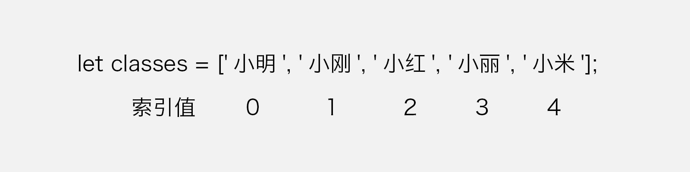
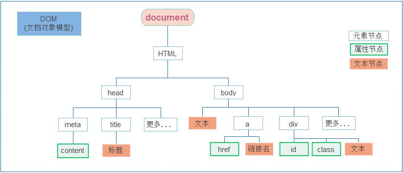
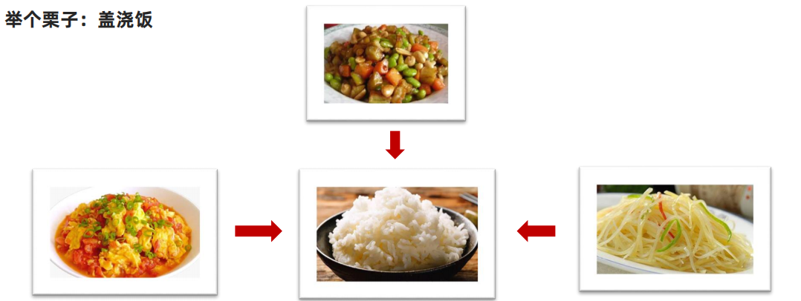

console.log()输出，变量中间用逗号隔开，得到的效果是空格，相当于空格

~~~js
console.log(leave, year, month, day);
~~~


小快捷键：按住alt，然后用鼠标选择多个目标，就可以进行一起编辑

按住alt然后点上下箭头，这一行就会一起移动

shift+回车，直接跳过后面的字符直接新开一行

// change 事件 内容发生了变化（只要回车或者失焦就被监测到），input：只要有变化了就被监测到

# 2.软件

1. 截图软件：Snipaste

   快捷键：

   - f1 截图
   - f3 定在屏幕上
   - 取色：shift切换

   PS：fn+esc键是“锁定功能键”

   在控制里可以自定义快捷键

   

2. 画图：Zoomit64

   快捷键：

   - ctrl + 1 放大
   - ctrl + 2 画图
   - 画图的时候按住ctrl是矩形
   - 画图的时候按住tab是椭圆
   - 画图的时候按字母可以改变颜色。r 红色 b 蓝色 g 绿色 p 粉色 o 橙色

3. 插件：Error Lens，如果代码有问题，就会提前报错

4. 颜色主题：One Dark Pro，然后点击设置颜色主题的按钮

5. 学习JS尽量不要安装格式化插件，因为学vue之后，对语法规范是有要求的。

   使用VSCode自带的格式化工具：

   

6. 设置代码缩进字符为2个字符（即一个tab两个键）：

   

7. 左右分屏：Live Server


# 3.JavaScript简介和体验

# JavaScript 基础 - 第1天

> 了解变量、数据类型、运算符等基础概念，能够实现数据类型的转换，结合四则运算体会如何编程。

- 体会现实世界中的事物与计算机的关系
- 理解什么是数据并知道数据的分类
- 理解变量存储数据的“容器”
- 掌握常见运算符的使用，了解优先级关系
- 知道 JavaScript 数据类型隐式转换的特征

介绍

> 掌握 JavaScript 的引入方式，初步认识 JavaScript 的作用

JavaScript是一种运行在客户端（浏览器）的**编程语言**，实现人机交互效果。

> HTML，CSS属于标记语言

**ECMA：** ECMA国际（前身为欧洲计算机制造商协会），制定了标准化的脚本程序设计语言 ECMAScript，这种语言得到广泛应用。

JavaScript遵循的是ECMAScript的语法规范，因为ECMAScript规定的语法规范还有JScript，微软出的脚本语言

JavaScript权威网站：MDN
https://developer.mozilla.org/zh-CN/docs/Web/JavaScript


## js组成

JavaScript的组成

- ECMAScript:
  - 规定了js基础语法核心知识。
  - 比如：变量、分支语句、循环语句、对象等等


- Web APIs :
  - DOM   文档对象模型， 定义了一套操作HTML文档的API
  - BOM   浏览器对象模型，定义了一套操作浏览器窗口的API

 

## 

2.作用（做什么？） 

- 网页特效 (监听用户的一些行为让网页作出对应的反馈) 
- 表单验证 (针对表单数据的合法性进行判断)
- 数据交互 (获取后台的数据, 渲染到前端)
- 服务端编程 (node.js）


# 4.JavaScript书写位置

引入方式

JavaScript 程序不能独立运行，它需要被嵌入 HTML 中，然后浏览器才能执行 JavaScript 代码。通过 `script` 标签将 JavaScript 代码引入到 HTML 中，有两种方式：

**内部方式**

通过 `script` 标签包裹 JavaScript 代码

规范：script标签写在 `</body>` 上面

> 注意事项：
>
> 我们将 `<script>` 放在HTML文件的底部附近的原因是浏览器会按照代码在文件中的顺序加载 HTML。有了标签，才能找到这个标签，然后去执行对应的操作
> 如果先加载的 JavaScript 期望修改其下方的 HTML，那么它可能由于 HTML 尚未被加载而失效。
> 因此，将 JavaScript 代码放在 HTML页面的底部附近通常是最好的策略。

```html
<!DOCTYPE html>
<html lang="en">
<head>
  <meta charset="UTF-8">
  <title>JavaScript 基础 - 引入方式</title>
</head>
<body>
  <!-- 内联形式：通过 script 标签包裹 JavaScript 代码 -->
  <script>
    alert('嗨，欢迎来传智播学习前端技术！')
  </script>
</body>
</html>
```

**外部形式**

一般将 JavaScript 代码写在独立的以 .js 结尾的文件中，然后通过 `script` 标签的 `src` 属性引入（也是找到  / body），这个标签里面的是不支持写内容的，写了也不会执行

```javascript
// demo.js
document.write('嗨，欢迎来传智播学习前端技术！')
```

```html
<!DOCTYPE html>
<html lang="en">
<head>
  <meta charset="UTF-8">
  <title>JavaScript 基础 - 引入方式</title>
</head>
<body>
  <!-- 外部形式：通过 script 的 src 属性引入独立的 .js 文件 -->
  <script src="demo.js"></script>
</body>
</html>
```

如果 script 标签使用 `src` 属性引入了某 `.js` 文件，那么 标签的代码会被忽略！！！如下代码所示：

```html
<!DOCTYPE html>
<html lang="en">
<head>
  <meta charset="UTF-8">
  <title>JavaScript 基础 - 引入方式</title>
</head>
<body>
  <!-- 外部形式：通过 script 的 src 属性引入独立的 .js 文件 -->
  <script src="demo.js">
    // 此处的代码会被忽略掉！！！！
  	alert(666);  
  </script>
</body>
</html>
```

#  5.注释和结束符

通过注释可以屏蔽代码被执行或者添加备注信息，JavaScript 支持两种形式注释语法：

单行注释

使用 `// ` 注释单行代码

```html
<!DOCTYPE html>
<html lang="en">
<head>
  <meta charset="UTF-8">
  <title>JavaScript 基础 - 注释</title>
</head>
<body>
  
  <script>
    // 这种是单行注释的语法
    // 一次只能注释一行
    // 可以重复注释
    document.write('嗨，欢迎来传智播学习前端技术！');
  </script>
</body>
</html>
```

多行注释

使用 `/* */` 注释多行代码

```html
<!DOCTYPE html>
<html lang="en">
<head>
  <meta charset="UTF-8">
  <title>JavaScript 基础 - 注释</title>
</head>
<body>
  
  <script>
    /* 这种的是多行注释的语法 */
    /*
    	更常见的多行注释是这种写法
    	在些可以任意换行
    	多少行都可以
      */
    document.write('嗨，欢迎来传智播学习前端技术！')
  </script>
</body>
</html>
```

**注：编辑器中单行注释的快捷键为 `ctrl + /`，多行注释的快捷键为：shift+alt+a**

结束符

在 JavaScript 中 `;` 代表一段代码的结束，多数情况下可以省略 `;` 使用回车（enter）替代。但是CSS中低的分号一定要写

```html
<!DOCTYPE html>
<html lang="en">
<head>
  <meta charset="UTF-8">
  <title>JavaScript 基础 - 结束符</title>
</head>
<body>
  
  <script> 
    alert(1);
    alert(2);
    alert(1)
    alert(2)
  </script>
</body>
</html>
```

实际开发中有许多人主张书写 JavaScript 代码时省略结束符 `;`因为可以使代码看起来更简单

约定：为了风格统一，结束符要么每句都写，要么每句都不写（按照团队要求）

# 6.输入和输出

> 语法可以理解为是一种规则，是一种约定

输出和输入也可理解为人和计算机的交互，用户通过键盘、鼠标等向计算机输入信息，计算机处理后再展示结果给用户，这便是一次输入和输出的过程。

举例说明：如按键盘上的方向键，向上/下键可以滚动页面，按向上/下键这个动作叫作输入，页面发生了滚动了这便叫输出。

**输出**

JavaScript 可以接收用户的输入，然后再将输入的结果输出：

> PS：中文一定要加引号 `''`，`''` 并不会被打印出来

`alert()`、`document.wirte()、console.log('控制台打印')`

**输出语句**

| api              | 描述                  |
| ---------------- | --------------------- |
| window.alert()   | 浏览器弹出警告框      |
| document.write() | 写入HTML,在浏览器展示 |
| console.log()    | 写入浏览器控制台      |

以数字为例，向 `alert()` 或 `document.write()`输入任意数字，他都会以弹窗形式展示（输出）给用户。

如果输出的内容写的是标签，也会被解析成网页元素。

eg：

可以注意到，下方已经加了一个h1标签


```html
<script>
    document.write('<h1>我是标题</h1>')
</script>
```


**输入**

向 `prompt()` 输入任意内容会以弹窗形式出现在浏览器中，一般提示用户输入一些内容。

```html
<!DOCTYPE html>
<html lang="en">
<head>
  <meta charset="UTF-8">
  <title>JavaScript 基础 - 输入输出</title>
</head>
<body>
  
  <script> 
    // 1. 输入的任意数字，都会以弹窗形式展示
    document.write('要输出的内容')
    alert('要输出的内容');

    // 2. 以弹窗形式提示用户输入姓名，注意这里的文字使用英文的引号
    prompt('请输入您的姓名:')
  </script>
</body>
</html>
```

JavaScript 代码执行顺序： 

- 按HTML文档流顺序执行JavaScript代码
- alert() 和 prompt() 它们会跳过页面渲染先被执行（目前作为了解，后期讲解详细执行过程）

字面量 

目标：能说出什么是字面量 

在计算机科学中，字面量（literal）是在计算机中描述 事/物 

比如：

- 我们工资是： 1000 此时 1000 就是 数字字面量
-  '黑马程序员' 字符串字面量
- 还有接下来我们学的 [ ] 数组字面量 {} 对象字面量 等等

# 7.变量的声明和赋值

> 理解变量是计算机存储数据的“容器”，掌握变量的声明方式

变量是计算机中用来存储数据的“容器”，它可以让计算机变得有记忆，通俗的理解变量就是使用【某个符号】来代表【某个具体的数值】（数据）

```html
<script>
  // x 符号代表了 5 这个数值
  x = 5
  // y 符号代表了 6 这个数值
  y = 6
    
  //举例： 在 JavaScript 中使用变量可以将某个数据（数值）记录下来！

  // 将用户输入的内容保存在 num 这个变量（容器）中
  num = prompt('请输入一数字!')

  // 通过 num 变量（容器）将用户输入的内容输出出来
  alert(num)
  document.write(num)
</script>
```

声明

声明(定义)变量有两部分构成：声明关键字、变量名（标识）

> let 即关键字 (let: 允许、许可、让、要)，所谓关键字是系统提供的专门用来声明（定义）变量的词语

```html
<!DOCTYPE html>
<html lang="en">
<head>
  <meta charset="UTF-8">
  <title>JavaScript 基础 - 声明和赋值</title>
</head>
<body>
  
  <script> 
    // let 变量名
    // 声明(定义)变量有两部分构成：声明关键字、变量名（标识）
    // let 即关键字，所谓关键字是系统提供的专门用来声明（定义）变量的词语
    // age 即变量的名称，也叫标识符
    let age
  </script>
</body>
</html>
```

关键字是 JavaScript 中内置的一些英文词汇（单词或缩写），它们代表某些特定的含义，如 `let` 的含义是声明变量的，看到 `let`  后就可想到这行代码的意思是在声明变量，如 `let age;` 

`let` 和 `var` 都是 JavaScript 中的声明变量的关键字，推荐使用 `let` 声明变量！！！

赋值

声明（定义）变量相当于创造了一个空的“容器”，通过赋值向这个容器中添加数据。

> 在变量名之后跟上一个“=”，然后是数值。在js里面不叫等号，而是叫赋值号。
>
> 等号的两边一定要加空格！
>
> 字符串才加 ' '，变量不需要加引号

```html
<!DOCTYPE html>
<html lang="en">
<head>
  <meta charset="UTF-8">
  <title>JavaScript 基础 - 声明和赋值</title>
</head>
<body>
  
  <script> 
    // 声明(定义)变量有两部分构成：声明关键字、变量名（标识）
    // let 即关键字，所谓关键字是系统提供的专门用来声明（定义）变量的词语
    // age 即变量的名称，也叫标识符
    let age
    // 赋值，将 18（数字字面量） 这个数据存入了 age 这个“容器”中
    age = 18
    // 这样 age 的值就成了 18
    document.write(age)
    
    // 也可以声明和赋值同时进行，这个过程叫变量的初始化
    let str = 'hello world!'
    alert(str);
  </script>
</body>
</html>
```

3.更新变量： 变量赋值后，还可以通过简单地给它一个不同的值来更新它。


4.声明多个变量： 变量赋值后，还可以通过简单地给它一个不同的值来更新它。

语法：多个变量中间用逗号隔开。


说明：看上去代码长度更短，但并不推荐这样。为了更好的可读性，请一行只声明一个变量。


打印时连续打印两个，中间用逗号隔开，控制台显示的是中间使用了空格隔开


如果出错了，可以使用检查检测到，还会告诉你是第几行


# 10.变量的本质

内存：计算机中存储数据的地方，相当于一个空间 

变量本质：是程序在内存中申请的一块用来存放数据的小空间


变量命名规则与规范 

规则：必须遵守，不遵守报错 (法律层面) 

规范：建议，不遵守不会报错，但不符合业内通识 （道德层面） 

1. 关于变量的名称（标识符）有一系列的规则需要遵守：

   1. 只能是字母、数字、下划线、$，且不能能数字开头
   2. 字母区分大小写，如 Age 和 age 是不同的变量
   3. JavaScript 内部已占用于单词（关键字或保留字）不允许使用

   注：所谓关键字是指 JavaScript 内部使用的词语，如 `let` 和`var`，保留字是指 JavaScript 内部目前没有使用的词语，但是将来可能会使用词语。

   ```html
   <!DOCTYPE html>
   <html lang="en">
   <head>
     <meta charset="UTF-8">
     <title>JavaScript 基础 - 变量名命名规则</title>
   </head>
   <body>
     
     <script> 
       let age = 18 // 正确
       let age1 = 18 // 正确
       let _age = 18 // 正确
   
       // let 1age = 18; // 错误，不可以数字开头
       let $age = 18 // 正确
       let Age = 24 // 正确，它与小写的 age 是不同的变量
       // let let = 18; // 错误，let 是关键字
       let int = 123 // 不推荐，int 是保留字
     </script>
   </body>
   </html>
   ```

2. 规范：

   - 起名要有意义

   - 遵守小驼峰命名法（大驼峰就是每个单词都大写）

     第一个单词首字母小写，后面每个单词首字母大写。例：userName

sex形容公和母好一些，gender形容男和女


关键字

在较旧的JavaScript，使用关键字 var 来声明变量 ，而不是 let。 var 现在开发中一般不再使用它，只是我们可能再老版程序中看到它。 let 为了解决 var 的一些问题。

var 声明:

- 可以先使用 在声明 (不合理) 
- var 声明过的变量可以重复声明(不合理)
- 比如变量提升、全局变量、没有块级作用域等等

结论： var 就是个bug，别迷恋它了，以后声明变量我们统一使用 let

JavaScript 使用专门的关键字 `let` 和 `var` 来声明（定义）变量，在使用时需要注意一些细节：

以下是使用 `let` 时的注意事项：

1. 允许声明和赋值同时进行
2. 不允许重复声明
3. 允许同时声明多个变量并赋值
4. JavaScript 中内置的一些关键字不能被当做变量名

以下是使用 `var` 时的注意事项：

2. 允许声明和赋值同时进行
2. 允许重复声明
3. 允许同时声明多个变量并赋值

大部分情况使用 `let` 和 `var` 区别不大，但是 `let` 相较 `var` 更严谨，因此推荐使用 `let`，后期会更进一步介绍二者间的区别。

# 13.常量

概念：使用 const 声明的变量称为“常量”。

使用场景：当某个变量永远不会改变的时候，就可以使用 const 来声明，而不是let。

命名规范：和变量一致

~~~javascript
const PI = 3.14
~~~

>注意： 常量不允许重新赋值,                                                                                                                                                                                                                                                                                                                                                                                                                                                                                                                                                                                                                                                                                                                                                                                                                                                                                                                                                                                                                                                                                                                                                                                                                                                                                                                                                                                                                                                                                                                                                                                                                                                                                                                                                                                                                                                                                                                                                                                                                                                                                                                                                                                                                                                                                                                                                                                                                                                                                                                                                                                                                                                                                                                                                                                                                                                                                                                                                                                                                                                                                                                                                                                                                                                                                                                                                                                                                                                                                                                                                                                                                                                                                                                                                                                                                                                                                                                                                                                                                                                                                                                                                                                                                                                                                                                                                                                                                                                                                                                                                                                                                                                                                                                                                                                                                                                                                                                                                                                                                                                                                                                                                                                                                                                                                                                                                                                                                                                                                                                                                                                                                                                                                                                                                                                                                                                                                                                                                                                                                                                                                                                                                                                                                                                                                                                                                                                                                                                                                                                                                                      声明的时候必须赋值（初始化）

# 14.数字数据类型和算术运算法

**数据类型**

> 计算机世界中的万事成物都是数据。

计算机程序可以处理大量的数据，为了方便数据的管理，将数据分成了不同的类型：

- 原始类型（基本数据类型）：`number/string/boolean/null/undefined/symbol`

  symbol是ES6中新增的类型，我们一般很少使用。

- 对象类型（引用数据类型）：总的来说JS中对象类型就是object，如果要细分，object中又包括 `数组、对象、函数` 等对象


数值类型

即我们数学中学习到的数字，可以是整数、小数、正数、负数

```html
<!DOCTYPE html>
<html lang="en">
<head>
  <meta charset="UTF-8">
  <title>JavaScript 基础 - 数据类型</title>
</head>
<body>
  
  <script> 
    let score = 100 // 正整数
    let price = 12.345 // 小数
    let temperature = -40 // 负数

    document.write(typeof score) // 结果为 number
    document.write(typeof price) // 结果为 number
    document.write(typeof temperature) // 结果为 number
  </script>
</body>
</html>
```

JavaScript 中的数值类型与数学中的数字是一样的，分为正数、负数、小数等。

> JS 是弱数据类型，变量到底属于那种类型，只有赋值之后，我们才能确认 
>
> Java是强数据类型 例如 int a = 3 必须是整数

**运算符**

算术运算符

数字是用来计算的，比如：乘法 * 、除法 / 、加法 + 、减法 - 等等，所以经常和算术运算符一起。

算术运算符：也叫数学运算符，主要包括加、减、乘、除、取余（求模）等

算术运算符：* / %优先级是一样的，在计算的时候按照从左到右的顺序。

| 运算符 | 作用                                                 |
| ------ | ---------------------------------------------------- |
| +      | 求和                                                 |
| -      | 求差                                                 |
| *      | 求积                                                 |
| /      | 求商                                                 |
| **%**  | 取模（取余数），开发中经常用于作为某个数字是否被整除 |

> 注意：在计算失败时，显示的结果是 NaN （not a number）

```javascript
// 算术运算符
console.log(1 + 2 * 3 / 2) //  4 
let num = 10
console.log(num + 10)  // 20
console.log(num + num)  // 20

// 1. 取模(取余数)  使用场景：  用来判断某个数是否能够被整除
console.log(4 % 2) //  0  
console.log(6 % 3) //  0
console.log(5 % 3) //  2
console.log(3 % 5) //  3

// 2. 注意事项 : 如果我们计算失败，则返回的结果是 NaN (not a number)
console.log('pink老师' - 2)
console.log('pink老师' * 2)
console.log('pink老师' + 2)   // pink老师2
```


NaN（not a number) 代表一个计算错误。它是一个不正确的或者一个未定义的数学操作所得到的结果


NaN 是粘性的。任何对 NaN 的操作都会返回NaN


```js
alert(NaN == NaN) //返回false，它自己也不等于自己，一些未知的结果都统称NaN
```


# 15.字符串数据类型以及拼接

字符串类型

通过单引号（ `''`） 、双引号（ `""`）或反引号包裹的数据都叫字符串，单引号和双引号没有本质上的区别，推荐使用单引号（因为HTML里，如class写的就是双引，所以js里使用的就是单引，用于区分）。

注意事项：

1. 无论单引号或是双引号必须成对使用

2. 单引号/双引号可以互相嵌套，但是不以自已嵌套自已（如果需要加引号，口诀：外双内单，或者外单内双）

   这是由于每个引号都是找离它最近的进行匹配

   ```js
   console.log('pink老师讲课非常有'激情'') //报错
   console.log('pink老师讲课非常有"激情"') //写法1：可以使用双引号
   console.log('pink老师讲课非常有\'激情\'') //写法2：使用反斜杠对它进行转义
   ```

   

3. 必要时可以使用转义符 `\`，输出单引号或双引号

> 在谷歌浏览器中可以看见，数字的颜色是蓝色的，而字符串的是黑色的
>
> 

```html
<!DOCTYPE html>
<html lang="en">
<head>
  <meta charset="UTF-8">
  <title>JavaScript 基础 - 数据类型</title>
</head>
<body>
  
  <script> 
    let user_name = '小明' // 使用单引号
    let gender = "男" // 使用双引号
    let str = '123' // 看上去是数字，但是用引号包裹了就成了字符串了
    let str1 = '' // 这种情况叫空字符串
		
    documeent.write(typeof user_name) // 结果为 string
    documeent.write(typeof gender) // 结果为 string
    documeent.write(typeof str) // 结果为 string
  </script>
</body>
</html>
```

字符串拼接：

场景： + 运算符 可以实现字符串的拼接。 

口诀：数字相加，字符相连

# 16.模板字符串

ES6新加的

使用场景

- 拼接字符串和变量
- 在没有它之前，要拼接变量比较麻烦


语法

- ` (反引号)
- 在英文输入模式下按键盘的tab键上方那个键（1左边那个键）
- 内容拼接变量时，用 ${ } 包住变量


# 17.布尔型、null和undefined以及类型检测

**布尔类型**

表示肯定或否定时在计算机中对应的是布尔类型数据，它有两个固定的值 `true` 和 `false`，表示肯定的数据用 `true`，表示否定的数据用 `false`。这两个是布尔型字面量

```html
<!DOCTYPE html>
<html lang="en">
<head>
  <meta charset="UTF-8">
  <title>JavaScript 基础 - 数据类型</title>
</head>
<body>
  
  <script> 
    //  pink老师帅不帅？回答 是 或 否
    let isCool = true // 是的，摔死了！
    isCool = false // 不，套马杆的汉子！

    document.write(typeof isCool) // 结果为 boolean
  </script>
</body>
</html>
```

**undefined**

未定义是比较特殊的类型，只有一个值 undefined，只声明变量，不赋值的情况下，变量的默认值为 undefined，一般很少【直接】为某个变量赋值为 undefined。

```html
<!DOCTYPE html>
<html lang="en">
<head>
  <meta charset="UTF-8">
  <title>JavaScript 基础 - 数据类型</title>
</head>
<body>
  
  <script> 
    // 只声明了变量，并末赋值
    let tmp;
    document.write(typeof tmp) // 结果为 undefined
  </script>
</body>
</html>
```

注：JavaScript 中变量的值决定了变量的数据类型。

**null（空类型）** 

JavaScript 中的 null 仅仅是一个代表“无”、“空”或“值未知”的特殊值


null 和 undefined 区别：

- undefined 表示没有赋值
- null 表示赋值了，但是内容为空 null 

开发中的使用场景： 

官方解释：把 null 作为尚未创建的**对象** （即它是一个对象数据类型）

大白话： 将来有个变量里面存放的是一个对象，但是对象还没创建好，可以先给个null

```js
console.log(undefined + 1) //NaN
console.log(null + 1) //1
```

**注：通过 typeof 关键字检测数据类型**

typeof 运算符可以返回被检测的数据类型。它支持两种语法形式： 

1. 作为运算符： typeof x （常用的写法） 
2. 函数形式： typeof(x) 

换言之，有括号和没有括号，得到的结果是一样的，所以我们直接使用运算符的写法。

```html
<!DOCTYPE html>
<html lang="en">
<head>
  <meta charset="UTF-8">
  <title>JavaScript 基础 - 数据类型</title>
</head>
<body>
  
  <script> 
    // 检测 1 是什么类型数据，结果为 number
    document.write(typeof 1)
    let obj
    document.write(typeof obj) //object
  </script>
</body>
</html>
```


# 18.类型转换

> 理解弱类型语言的特征，掌握显式类型转换的方法

JavaScript是弱数据类型： JavaScript也不知道变量到底属于那种数据类型，只有赋值了才清楚。

 坑： 使用表单、prompt 获取过来的数据默认是字符串类型的，此时就不能直接简单的进行加法运算。

在 JavaScript 中数据被分成了不同的类型，如数值、字符串、布尔值、undefined，在实际编程的过程中，不同数据类型之间存在着转换的关系。

### 隐式转换

某些运算符被执行时，系统内部自动将数据类型进行转换，这种转换称为隐式转换。

规则：

- 号两边只要有一个是字符串，都会把另外一个转成字符串
- 除了+以外的算术运算符 比如 - * / 等都会把数据转成数字类型 

缺点：

- 转换类型不明确，靠经验才能总结

小技巧： 

- +号作为正号解析可以转换成数字型
- 任何数据和字符串相加结果都是字符串

```html
<!DOCTYPE html>
<html lang="en">
<head>
  <meta charset="UTF-8">
  <title>JavaScript 基础 - 隐式转换</title>
</head>
<body>
  <script> 
    console.log(1 + 1) //2
    console.log('ping' + 1) //pink1
    console.log('ping' - 1) //NaN
    console.log(2 + 2) //4
    console.log(2 + '2') //22
    console.log(2 - 2) //0
      
    console.log(2 - '2') //0，如果是空字符串""或者null，经过数字转换后会变为0，undefined经过数字转换之后会变成NaN
    //null == undefined 返回true，但是如果是 null === undefined 返回false，因为数据类型不一样
    console.log(+12) //12
      
    console.log(+'123'); //转化为数字型
  </script>
</body>
</html>
```

注：数据类型的隐式转换是 JavaScript 的特征，后续学习中还会遇到，目前先需要理解什么是隐式转换。

补充介绍模板字符串的拼接的使用

### 显式转换

编写程序时过度依靠系统内部的隐式转换是不严禁的，因为隐式转换规律并不清晰，大多是靠经验总结的规律。为了避免因隐式转换带来的问题，通常根逻辑需要对数据进行显示转换。

转换为数字型

- Number(数据)
  - 转成数字类型
  - 如果字符串内容里有非数字，转换失败时结果为 NaN（Not a Number）即不是一个数字
  - NaN也是number类型的数据，代表非数字
- parseInt(数据) 
  - 只保留整数
- parseFloat(数据) 
  - 可以保留小数

```js
console.log(parseInt('12')) //12
console.log(parseInt('12px')) //12
console.log(parseInt('12.32px')) //12
console.log(parseInt('abc12px')) //NaN

console.log(parseFloat('12')) //12
console.log(parseFloat('12px')) //12
console.log(parseFloat('12.32px')) //12.32
console.log(parseFloat('abc12px')) //NFloat
```


#### Number

通过 `Number` 显示转换成数值类型，当转换失败时结果为 `NaN`（Not a Number）即不是一个数字。

> 小快捷键：按住alt，然后用鼠标选择多个目标，就可以进行一起编辑

```html
<!DOCTYPE html>
<html lang="en">
<head>
  <meta charset="UTF-8">
  <title>JavaScript 基础 - 隐式转换</title>
</head>
<body>
  <script>
    let t = '12'
    let f = 8

    // 显式将字符串 12 转换成数值 12
    t = Number(t)

    // 检测转换后的类型
    // console.log(typeof t);
    console.log(t + f) // 结果为 20

    // 并不是所有的值都可以被转成数值类型
    let str = 'hello'
    // 将 hello 转成数值是不现实的，当无法转换成
    // 数值时，得到的结果为 NaN （Not a Number）
    console.log(Number(str))
    //法2：
    console.log(+str) //隐式类型转换
      
    console.log(`两个数相加的和是：${num1 + num2}`) //模板字符串
  </script>
</body>
</html>
```

VSCode里可以直接看见数据类型


# 19.综合案例

``` html
<style>
    table {
      /* 合并相邻边框 */
      border-collapse: collapse;
      height: 80px;
      margin: 0 auto;
    }

    table,
    th,
    td {
      border: 1px solid #000;
    }
</style>
<script>
    let price = +prompt('请输入商品价格：')
    let num = +prompt('请输入商品数量：')
    let address = prompt('请输入收货地址：')
    document.write(`
    <table border=1 cellspacing="0">
    <tr>
      <th>商品名称</th>
      <th>商品价格</th>
      <th>商品数量</th>
      <th>总价</th>
      <th>收货地址</th>
    </tr>
    <tr>
      <td>小米手机</td>
      <td>${price}元</td>
      <td>${num}</td>
      <td>${num * price}元</td>
      <td>${address}</td>
    </tr>
    </table>
    `)
</script>
```

# 

# 

# 第2天

> 理解什么是流程控制，知道条件控制的种类并掌握其对应的语法规则，具备利用循环编写简易ATM取款机程序能力

- 运算符
- 语句
- 综合案例

# 20.赋值运算符

赋值运算符：对变量进行赋值的运算符

 =     将等号右边的值赋予给左边, 要求左边必须是一个容器（也就是必须是一个变量）

| 运算符 | 作用     |
| ------ | -------- |
| +=     | 加法赋值 |
| -+     | 减法赋值 |
| *=     | 乘法赋值 |
| /=     | 除法赋值 |
| %=     | 取余赋值 |

```javascript
<script>
let num = 1
// num = num + 1
// 采取赋值运算符
// num += 1
num += 3
console.log(num)
</script>
```

# 21.自增/自减运算符

**一元运算符**

众多的 JavaScript 的运算符可以根据所需表达式的个数，分为一元运算符、二元运算符、三元运算符


| 符号 | 作用 | 说明                       |
| ---- | ---- | -------------------------- |
| ++   | 自增 | 变量自身的值加1，例如: x++ |
| --   | 自减 | 变量自身的值减1，例如: x-- |

1. 写在前面叫前置自增，写在后面就叫后置自增
2. ++在前和++在后在单独使用时二者并没有差别，而且一般开发中我们都是独立使用
3. ++在后（后缀式）我们会使用更多

> 注意：
>
> 1. 只有变量能够使用自增和自减运算符
> 2. ++、-- 可以在变量前面也可以在变量后面，比如: x++  或者  ++x 

```javascript
<script>
    // let num = 10
    // num = num + 1
    // num += 1
    // // 1. 前置自增
    // let i = 1
    // ++i
    // console.log(i)

    // let i = 1
    // console.log(++i + 1) //3
    // 2. 后置自增
    // let i = 1
    // i++
    // console.log(i)
    // let i = 1
    // console.log(i++ + 1) //2

    // 了解 
    let i = 1
    console.log(i++ + ++i + i)
  </script>
```

# 22.比较运算符

使用场景：比较两个数据大小、是否相等，根据比较结果返回一个布尔值（true / false）

| 运算符 | 作用                                   |
| ------ | -------------------------------------- |
| >      | 左边是否大于右边                       |
| <      | 左边是否小于右边                       |
| >=     | 左边是否大于或等于右边                 |
| <=     | 左边是否小于或等于右边                 |
| ===    | 左右两边是否`类型`和`值`都相等（重点） |
| ==     | 左右两边`值`是否相等                   |
| !=     | 左右值不相等                           |
| !==    | 不同类型不比较，且无结果，同类型才比较 |

```javascript
<script>
  console.log(3 > 5)
  console.log(3 >= 3)
  console.log(2 == 2)
  // 比较运算符有隐式转换 把'2' 转换为 2  双等号 只判断值
  console.log(2 == '2')  // true，比较运算符也有隐式转换，它会把字符型或者其他类型转换为数字型，因为只有数字才可以比较
  // console.log(undefined === null)
  // === 全等 判断 值 和 数据类型都一样才行
  // 以后判断是否相等 请用 ===  
  console.log(2 === '2') //false
  console.log(undefined == null) //true
  console.log(undefined === null) //false

  console.log(NaN === NaN) // NaN 不等于任何人，包括他自己
  console.log(2 !== '2')  // true  
  console.log(2 != '2') // false 
  console.log('-------------------------')
  console.log('a' < 'b') // true
  console.log('aa' < 'ab') // true
  console.log('aa' < 'aac') // true
  console.log('-------------------------')
</script>
```

- 字符串比较，是比较的字符对应的ASCII码

  - 从左往右依次比较
  - 如果第一位一样再比较第二位，以此类推
  - 比较的少，了解即可

- NaN不等于任何值，包括它本身

  涉及到"NaN“ 都是false

- 尽量不要比较小数，因为小数有精度问题

  > JS中小数运算一般会先转为整数
  >
  > 

> 不同类型之间比较会发生隐式转换
>
> - 最终把数据隐式转换转成number类型再比较
> - 所以开发中，如果进行准确的比较我们更喜欢 === 或者 !=


# 23.逻辑运算符

使用场景：可以把多个布尔值放到一起运算，最终返回一个布尔值

| 符号 | 名称   | 日常读法 | 特点                       | 口诀           |
| ---- | ------ | -------- | -------------------------- | -------------- |
| &&   | 逻辑与 | 并且     | 符号两边有一个假的结果为假 | 一假则假       |
| \|\| | 逻辑或 | 或者     | 符号两边有一个真的结果为真 | 一真则真       |
| !    | 逻辑非 | 取反     | true变false  false变true   | 真变假，假变真 |

| A     | B     | A && B | A \|\| B | !A    |
| ----- | ----- | ------ | -------- | ----- |
| false | false | false  | false    | true  |
| false | true  | false  | true     | true  |
| true  | false | false  | true     | false |
| true  | true  | true   | true     | false |

```javascript
<script>
    // 逻辑与 一假则假
    console.log(true && true)
    console.log(false && true)
    console.log(3 < 5 && 3 > 2)
    console.log(3 < 5 && 3 < 2)
    console.log('-----------------')
    // 逻辑或 一真则真
    console.log(true || true)
    console.log(false || true)
    console.log(false || false)
    console.log('-----------------')
    // 逻辑非  取反
    console.log(!true)
    console.log(!false)

    console.log('-----------------')

    let num = 6
    console.log(num > 5 && num < 10)
    console.log('-----------------')
  </script>
```

### 运算符优先级


> 逻辑运算符优先级： ！> && >  ||  

# 24.if单分支语句以及判断成绩案例

语句

表达式和语句


程序三大流程控制语句

- 以前我们写的代码，写几句就从上往下执行几句，这种叫顺序结构
- 有的时候要根据条件选择执行代码，这种就叫分支结构
- 某段代码被重复执行，就叫循环结构


分支语句

分支语句可以根据条件判定真假，来选择性的执行想要的代码

分支语句包含：

1. if分支语句（重点）
2. 三元运算符
3. switch语句

if 分支语句

if语句有三种使用：单分支、双分支、多分支

语法：

~~~javascript
if(条件表达式) {
  // 满足条件要执行的语句
}
~~~

小括号内的条件结果是布尔值，为 true 时，进入大括号里执行代码；为false，则不执行大括号里面代码

小括号内的结果若不是布尔类型时，会发生类型转换为布尔值，类似Boolean()

如果大括号只有一个语句，大括号可以省略，但是，俺们不提倡这么做~

~~~javascript
<script>
    // 单分支语句
    // if (false) {
    //   console.log('执行语句')
    // }
    // if (3 > 5) {
    //   console.log('执行语句')
    // }
    // if (2 === '2') {
    //   console.log('执行语句')
    // }
    //  1. 除了0 所有的数字都为真
    //   if (0) {
    //     console.log('执行语句')
    //   }
    // 2.除了 '' 所有的字符串都为真 true
    // if ('pink老师') {
    //   console.log('执行语句')
    // }
    //3.undefined、null、false、NaN为假
    // if ('') {
    //   console.log('执行语句')
    // }
    // // if ('') console.log('执行语句')//不提倡这样写

    // 1. 用户输入
    let score = +prompt('请输入成绩')
    // 2. 进行判断输出
    if (score >= 700) {
      alert('恭喜考入黑马程序员')
    }
    console.log('-----------------')

  </script>
~~~

# 25.if双分支语句以及闰年案例

如果有两个条件的时候，可以使用 if else 双分支语句

~~~javascript
if (条件表达式){
  // 满足条件要执行的语句
} else {
  // 不满足条件要执行的语句
}
~~~

例如：

~~~javascript
 <script>
    // 1. 用户输入
    let uname = prompt('请输入用户名:')
    let pwd = prompt('请输入密码:')
    // 2. 判断输出
    if (uname === 'pink' && pwd === '123456') {
      alert('恭喜登录成功')
    } else {
      alert('用户名或者密码错误')
    }
  </script>
~~~

VSCode小技巧：

点击一个单词，相同单词的都会被框起来，没框起来的就是错的


# 26.if 多分支语句

使用场景： 适合于有多个条件的时候

~~~javascript
 <script>
    // 1. 用户输入
    let score = +prompt('请输入成绩：')
    // 2. 判断输出
    if (score >= 90) {
      alert('成绩优秀，宝贝，你是我的骄傲')
    } else if (score >= 70) {
      alert('成绩良好，宝贝，你要加油哦~~')
    } else if (score >= 60) {
      alert('成绩及格，宝贝，你很危险~')
    } else {
      alert('成绩不及格，宝贝，我不想和你说话，我只想用鞭子和你说话~')
    }
  </script>
~~~

# 27.三元运算符（三元表达式）

**使用场景**： 一些简单的双分支，可以使用  三元运算符（三元表达式），写起来比 if  else双分支 更简单

**符号**：? 与 : 配合使用

语法：

~~~javascript
条件 ? 表达式1 ： 表达式2
~~~

例如：

~~~javascript
// 三元运算符（三元表达式）
// 1. 语法格式
// 条件 ? 表达式1 : 表达式2 

// 2. 执行过程 
// 2.1 如果条件为真，则执行表达式1
// 2.2 如果条件为假，则执行表达式2

// 3. 验证
// 5 > 3 ? '真的' : '假的'
console.log(5 < 3 ? '真的' : '假的')

// let age = 18 
// age = age + 1
//  age++

// 1. 用户输入 
let num = prompt('请您输入一个数字:')
// 2. 判断输出- 小于10才补0
// num = num < 10 ? 0 + num : num
num = num >= 10 ? num : 0 + num
alert(num)
~~~

# 28.数字补0案例

```js
//法1：
num < 10 ? '0' + num : num

//法2：输入进来的就是字符串
let num = prompt('请输入一个数字：')
```

# 29.switch语句（了解）

switch：开关

使用场景： 适合于有多个条件的时候，也属于分支语句，大部分情况下和 if多分支语句 功能相同

注意：

1. 找到跟小括号里数据全等的case值，并执行里面对应的代码
2. switch case语句一般用于等值判断，不适合于区间判断，if适合于区间判断
3. switchcase一般需要配合break关键字使用 没有break会造成case穿透
4. if 多分支语句开发要比switch更重要，使用也更多

例如：

~~~javascript
// switch分支语句
// 1. 语法
// switch (表达式) {
//   case 值1:
//     代码1
//     break

//   case 值2:
//     代码2
//     break
//   ...
//   default:
//     代码n
// }

<script>
  switch (2) {
    case 1:
    console.log('您选择的是1')
    break  // 退出switch
    case 2:
    console.log('您选择的是2')
    break  // 退出switch
    case 3:
    console.log('您选择的是3')
    break  // 退出switch
    default:
    console.log('没有符合条件的')
  }
</script>
~~~

# 30.断点调试

**作用：**学习时可以帮助更好的理解代码运行，工作时可以更快找到bug

浏览器打开调试界面

1. 按F12打开开发者工具
2. 点到源代码一栏 （ sources ）
3. 选择代码文件

**断点：**在某句代码上加的标记就叫断点，当程序执行到这句有标记的代码时会暂停下来

代码是从上往下指定的，打完断点后一定要刷新浏览器


可以观察到变量里的数值


在监视里可以添加想要观察的变量


循环语句

使用场景：重复执行 指定的一段代码，比如我们想要输出10次 '我学的很棒'

学习路径：

1.while循环

2.for 循环（重点）

# 31.while循环

while :  在…. 期间， 所以 while循环 就是在满足条件期间，重复执行某些代码。

**语法：**

释义： 

1. 跟if语句很像，都要满足小括号里的条件为true才会进入 循环体 执行代码
2. while大括号里代码执行完毕后不会跳出，而是继续回到小括号里判断条件是否满足，若满足又执行大括号里的代码，然后再回到 小括号判断条件，直到括号内条件不满足，即跳

~~~javascript
while (条件表达式) {
   // 循环体    
}
~~~

例如：

~~~javascript
// while循环: 重复执行代码

// 1. 需求: 利用循环重复打印3次 '月薪过万不是梦，毕业时候见英雄'
let i = 1
while (i <= 3) {
  document.write('月薪过万不是梦，毕业时候见英雄~<br>')
  i++   // 这里千万不要忘了变量自增否则造成死循环
}
~~~

循环三要素：

1.初始值 （经常用变量）

2.终止条件

3.变量的变化量

例如：

~~~javascript
<script>
  // // 1. 变量的起始值
  // let i = 1
  // // 2. 终止条件
  // while (i <= 3) {
  //   document.write('我要循环三次 <br>')
  //   // 3. 变量的变化量
  //   i++
  // }
  // 1. 变量的起始值
  let end = +prompt('请输入次数:')
let i = 1
// 2. 终止条件
while (i <= end) {
  document.write('我要循环三次 <br>')
  // 3. 变量的变化量
  i++
}

</script>
~~~

# 33.中止循环

`break`   中止整个循环，一般用于结果已经得到, 后续的循环不需要的时候可以使用（提高效率）  

`continue`  中止本次循环，一般用于排除或者跳过某一个选项的时候

~~~javascript
<script>
    // let i = 1
    // while (i <= 5) {
    //   console.log(i)
    //   if (i === 3) {
    //     break  // 退出循环
    //   }
    //   i++

    // }


    let i = 1
    while (i <= 5) {
      if (i === 3) {
        i++
        continue
      }
      console.log(i)
      i++

    }
  </script>
~~~

无限循环

1.while(true) 来构造“无限”循环，需要使用break退出循环。（常用）

2.for(;;) 也可以来构造“无限”循环，同样需要使用break退出循环。

~~~javascript
// 无限循环  
// 需求： 页面会一直弹窗询问你爱我吗？
// (1). 如果用户输入的是 '爱'，则退出弹窗
// (2). 否则一直弹窗询问

// 1. while(true) 无限循环
// while (true) {
//   let love = prompt('你爱我吗?')
//   if (love === '爱') {
//     break
//   }
// }

// 2. for(;;) 无限循环
for (; ;) {
  let love = prompt('你爱我吗?')
  if (love === '爱') {
    break
  }
}
~~~

# 34.综合案例-ATM存取款机


分析：

①：提示输入框写到循环里面（无限循环）

②：用户输入4则退出循环 break

③：提前准备一个金额预先存储一个数额 money

④：根据输入不同的值，做不同的操作

​     (1)  取钱则是减法操作， 存钱则是加法操作，查看余额则是直接显示金额

​     (2) 可以使用 if else if 多分支 来执行不同的操作

完整代码：

~~~javascript
<script>
  // 1. 开始循环 输入框写到 循环里面
  // 3. 准备一个总的金额
  let money = 100
while (true) {
  let re = +prompt(`
请您选择操作：
1.存钱
2.取钱
3.查看余额
4.退出
`)
  // 2. 如果用户输入的 4 则退出循环， break  写到if 里面，没有写到switch里面， 因为4需要break退出循环
  if (re === 4) {
    break
  }
  // 4. 根据输入做操作
  switch (re) {
    case 1:
      // 存钱
      let cun = +prompt('请输入存款金额')
      money = money + cun
      break
      case 2:
      // 存钱
      let qu = +prompt('请输入取款金额')
      money = money - qu
      break
      case 3:
      // 存钱
      alert(`您的银行卡余额是${money}`)
      break
  }
}
</script>
~~~


JavaScript 基础第三天笔记

# 35.if 多分支语句和 switch的区别

1. 共同点

   - 都能实现多分支选择， 多选1 
   - 大部分情况下可以互换

2. 区别：

   - switch…case语句通常处理case为比较**确定值**的情况，而if…else…语句更加灵活，通常用于**范围判断**(大于，等于某个范围)。
   - switch 语句进行判断后直接执行到程序的语句，效率更高，而if…else语句有几种判断条件，就得判断多少次
   - switch 一定要注意 必须是 ===  全等，一定注意 数据类型，同时注意break否则会有穿透效果
   - 结论：
     - 当分支比较少时，if…else语句执行效率高。
     - 当分支比较多时，switch语句执行效率高，而且结构更清晰。

   

for 语句

> 掌握 for 循环语句，让程序具备重复执行能力

`for` 是 JavaScript 提供的另一种循环控制的话句，它和 `while` 只是语法上存在差异。

**for语句的基本使用**

1. 实现循环的 3 要素

```html
<script>
  // 1. 语法格式
  // for(起始值; 终止条件; 变化量) {
  //   // 要重复执行的代码
  // }

  // 2. 示例：在网页中输入标题标签
  // 起始值为 1
  // 变化量 i++
  // 终止条件 i <= 6
  for(let i = 1; i <= 6; i++) {
    document.write(`<h${i}>循环控制，即重复执行<h${i}>`)
  }
</script>
```

2. 变化量和死循环，`for` 循环和 `while` 一样，如果不合理设置增量和终止条件，便会产生死循环。


3. 跳出和终止循环

```html
<script>
    // 1. continue 
    for (let i = 1; i <= 5; i++) {
        if (i === 3) {
            continue  // 结束本次循环，继续下一次循环
        }
        console.log(i)
    }
    // 2. break
    for (let i = 1; i <= 5; i++) {
        if (i === 3) {
            break  // 退出结束整个循环
        }
        console.log(i)
    }
</script>
```

结论：

- `JavaScript` 提供了多种语句来实现循环控制，但无论使用哪种语句都离不开循环的3个特征，即起始值、变化量、终止条件，做为初学者应着重体会这3个特征，不必过多纠结三种语句的区别。
- 起始值、变化量、终止条件，由开发者根据逻辑需要进行设计，规避死循环的发生。
- 当如果明确了循环的次数的时候推荐使用`for`循环,当不明确循环的次数的时候推荐使用`while`循环

>注意：`for` 的语法结构更简洁，故 `for` 循环的使用频次会更多。


# 38.循环嵌套

利用循环的知识来对比一个简单的天文知识，我们知道地球在自转的同时也在围绕太阳公转，如果把自转和公转都看成是循环的话，就相当于是循环中又嵌套了另一个循环。


实际上 JavaScript 中任何一种循环语句都支持循环的嵌套，如下代码所示：


```html
// 1. 外面的循环 记录第n天 
for (let i = 1; i < 4; i++) {
    document.write(`第${i}天 <br>`)
    // 2. 里层的循环记录 几个单词
    for (let j = 1; j < 6; j++) {
        document.write(`记住第${j}个单词<br>`)
    }
}
```

记住，外层循环循环一次，里层循环循环全部

倒三角

~~~javascript
 // 外层打印几行
for (let i = 1; i <= 5; i++) {
    // 里层打印几个星星
    for (let j = 1; j <= i; j++) {
        document.write('★')
    }
    //换行
    document.write('<br>')
}
~~~

 

九九乘法表

样式css

~~~css
span {
    display: inline-block;
    /* 盒子错位的话，固定宽度，最大宽度即可 */
    width: 100px;
    padding: 5px 10px;
    border: 1px solid pink;
    margin: 2px;
    border-radius: 5px;
    box-shadow: 2px 2px 2px rgba(255, 192, 203, .4);
    background-color: rgba(255, 192, 203, .1);
    text-align: center;
    color: hotpink;
}
~~~

javascript 

~~~javascript
 // 外层打印几行
for (let i = 1; i <= 9; i++) {
    // 里层打印几个星星
    for (let j = 1; j <= i; j++) {
        // 只需要吧 ★ 换成  1 x 1 = 1   
        document.write(`
		<span> ${j} x ${i} = ${j * i} </span>
     `)
    }
    document.write('<br>')
}
~~~


# 42.数组的基本使用以及案例

数组

> 知道什么是数组及其应用的场景，掌握数组声明及访问的语法。

数组是什么？

**数组：**(Array)是一种可以按顺序保存数据的数据类型

数组 (Array) —— 一种将 一组数据存储在单个变量名下 的优雅方式

**使用场景：**如果有多个数据可以用数组保存起来，然后放到一个变量中，管理非常方便

数组的本质也属于对象

数组的基本使用

**定义数组和数组单元**

> [ ]叫数组的字面量

```html
<script>
  // 1. 语法，使用 [] 来定义一个空数组
  // 定义一个空数组，然后赋值给变量 classes
  // let classes = [];

  // 2. 定义非空数组
  let classes = ['小明', '小刚', '小红', '小丽', '小米']
  
  // 3. 使用new Array 构造函数声明（了解）
  let classes = new Array('小明', '小刚', '小红', '小丽', '小米')
</script>
```

通过 `[]` 定义数组，数据中可以存放真正的数据，如小明、小刚、小红等这些都是数组中的数据，我们这些数据称为数组单元，数组单元之间使用英文逗号分隔。

**访问数组和数组索引**

使用数组存放数据并不是最终目的，关键是能够随时的访问到数组中的数据（单元）。其实 JavaScript 为数组中的每一个数据单元都编了号，通过数据单元在数组中的编号便可以轻松访问到数组中的数据单元了。

我们将数据单元在数组中的编号称为索引值，也有人称其为下标。

索引值实际是按着数据单元在数组中的位置依次排列的，注意是从` 0` 开始的，如下图所示：



观察上图可以数据单元【小明】对应的索引值为【0】，数据单元【小红】对应的索引值为【2】

```html
<script>
  let classes = ['小明', '小刚', '小红', '小丽', '小米']
  
  // 1. 访问数组，语法格式为：变量名[索引值]
  document.write(classes[0]) // 结果为：小明
  document.write(classes[1]) // 结果为：小刚
  document.write(classes[4]) // 结果为：小米
  
  // 2. 通过索引值还可以为数组单重新赋值
  document.write(classes[3]) // 结果为：小丽
  // 重新为索引值为 3 的单元赋值
  classes[3] = '小小丽'
  document.wirte(classes[3]); // 结果为： 小小丽
</script>
```

- 数组是按顺序保存，所以每个数据都有自己的编号
- 计算机中的编号从0开始，所以小明的编号为0，小刚编号为1，以此类推
- 在数组中，数据的编号也叫索引或下标
- 数组可以存储任意类型的数据

- 通过下标取数据
- 取出来是什么类型的，就根据这种类型特点来访问

中文一定要加引号，因为js里面变量名字是中文它也支持


注意小错误：

~~~js
let arr = [2, 6, 7, 1]
let sum
sum = sum + arr[0]
console.log(sum) //NaN，undefined加任何数都是NaN

//特殊情况：
console.log(undefined + '1') //undefined1

//所以sum在定义的时候一定要给它赋值
let sum = 0
~~~

数据单元值类型

数组做为数据的集合，它的单元值可以是任意数据类型

```html
<script>
  // 6. 数组单值类型可以是任意数据类型

  // a) 数组单元值的类型为字符类型
  let list = ['HTML', 'CSS', 'JavaScript']
  // b) 数组单元值的类型为数值类型
  let scores = [78, 84, 70, 62, 75]
  // c) 混合多种类型
  let mixin = [true, 1, false, 'hello']
</script>
```

数组长度属性

重申一次，数组在 JavaScript 中并不是新的数据类型，它属于对象类型。

```html
<script>
  // 定义一个数组
  let arr = ['html', 'css', 'javascript']
  // 数组对应着一个 length 属性，它的含义是获取数组的长度
  console.log(arr.length) // 3
</script>
```

**操作数组**

# 43.修改数组

数组访问越过下标，查询结果为undefined

~~~js
let arr = []
console.log(arr)//[]
console.log(arr[0]) //undefined
arr[0] = 1
arr[1] = 5
console.log(arr); //[1, 5]
~~~

# 44.数组操作-新增

数组做为对象数据类型，不但有 `length` 属性可以使用，还提供了许多方法：

1. push 动态向数组的尾部添加一个单元

   按顺序加进去。

   > 该方法返回的是**新**数组的长度
   >
   > ~~~js
   > console.log(arr.push(1, 2, 3))//5
   > ~~~

2. unshift 动态向数组头部添加一个单元

   ~~~js
   let arr = [1, 5]
   console.log(arr); //[1, 5]
   arr.push(1, 2, 3)
   console.log(arr) //[1, 5, 1, 2, 3]
   arr.unshift(1, 2, 3)
   console.log(arr) //[1, 2, 3, 1, 5, 1, 2, 3]
   ~~~

第一次打开浏览器页面的时候会出现对象的形式


再刷新一下就是数组了


# 46.数组操作 - 删除

1. pop 删除最后一个元素，并返回该元素的值

   ~~~javascript
   arr.pop()
   ~~~

2. shift 删除第一个元素

   > 以上两个都只能删一个

3. splice 删除指定元素

   > 语法：
   >
   > start 起始位置:
   >
   > - 指定修改的开始位置（从0计数），包括该指定位置
   >
   > deleteCount: 
   >
   > - 表示要移除的数组元素的个数
   > - 可选的。 如果省略则默认从指定的起始位置删 除到最后
   >
   > ~~~js
   > arr.splice(start, deleteCount, 项1, 项2)
   > arr.splice(起始位置, 删除几个元素, 删完之后想要添加的元素)
   > ~~~

使用以上4个方法时，都是直接在原数组上进行操作，即成功调任何一个方法，原数组都跟着发生相应的改变。并且在添加或删除单元时 `length` 并不会发生错乱。

```html
<script>
  // 定义一个数组
  let arr = ['html', 'css', 'javascript']

  // 1. push 动态向数组的尾部添加一个单元
  arr.push('Nodejs')
  console.log(arr)
  arr.push('Vue')

  // 2. unshit 动态向数组头部添加一个单元
  arr.unshift('VS Code')
  console.log(arr)

  // 3. splice 动态删除任意单元
  arr.splice(2, 1) // 从索引值为2的位置开始删除1个单元
  console.log(arr)

  // 4. pop 删除最后一个单元
  arr.pop()
  console.log(arr)

  // 5. shift 删除第一个单元
  arr.shift()
  console.log(arr)
</script>
```

数组排序

~~~js
arr.sort() //升序

arr.sort(function (a, b) {//升序（a比b大才交换）
    a - b
})

arr.sort(function (a, b) {//降序
    b - a
})
~~~


JavaScript 基础 - 第4天笔记

> 理解封装的意义，能够通过函数的声明实现逻辑的封装，知道对象数据类型的特征，结合数学对象实现简单计算功能。

- 理解函数的封装的特征
- 掌握函数声明的语法
- 理解什么是函数的返回值
- 知道并能使用常见的内置函数

# 50.函数的基本使用以及封装练习

函数也是对象

> 理解函数的封装特性，掌握函数的语法规则

声明和调用

函数可以把具有相同或相似逻辑的代码“包裹”起来，通过函数调用执行这些被“包裹”的代码逻辑，这么做的优势是有利于精简代码方便复用。

声明（定义）

声明（定义）一个完整函数包括关键字、函数名、形式参数、函数体、返回值5个部分


**调用**

声明（定义）的函数必须调用才会真正被执行，使用 `()` 调用函数。

```html
<!DOCTYPE html>
<html lang="en">
<head>
  <meta charset="UTF-8">
  <title>JavaScript 基础 - 声明和调用</title>
</head>
<body>
  <script>
    // 声明（定义）了最简单的函数，既没有形式参数，也没有返回值
    function sayHi() {
      console.log('嗨~')
    }
    // 函数调用，这些函数体内的代码逻辑会被执行
    // 函数名()
        
    sayHi()
    // 可以重复被调用，多少次都可以
    sayHi()
  </script>
</body>
</html>
```

> 注：函数名的命名规则与变量是一致的，小驼峰命名法，前缀已改为动词。并且尽量保证函数名的语义。
>
> 

小案例： 小星星

~~~javascript
<script>
        // 函数声明
        function sayHi() {
            // document.write('hai~')
            document.write(`*<br>`)
            document.write(`**<br>`)
            document.write(`***<br>`)
            document.write(`****<br>`)
            document.write(`*****<br>`)
            document.write(`******<br>`)
            document.write(`*******<br>`)
            document.write(`********<br>`)
            document.write(`*********<br>`)
        }
        // 函数调用
        sayHi()
        sayHi()
        sayHi()
        sayHi()
        sayHi()
    </script>
~~~

参数

通过向函数传递参数，可以让函数更加灵活多变，参数可以理解成是一个变量。

声明（定义）一个功能为打招呼的函数

- 传入数据列表
- 声明这个函数需要传入几个数据
- 多个数据用逗号隔开

```html
<!DOCTYPE html>
<html lang="en">
<head>
  <meta charset="UTF-8">
  <title>JavaScript 基础 - 函数参数</title>
</head>
<body>

  <script>
    // 声明（定义）一个功能为打招呼的函数
    // function sayHi() {
    //   console.log('嗨~')
    // }
    // 调用函数
    // sayHi()
	

    // 这个函数似乎没有什么价值，除非能够向不同的人打招呼
    // 这就需要借助参数来实现了
    function sayHi(name) {
      // 参数 name 可以被理解成是一个变量
      console.log(name)
      console.log('嗨~' + name)
    }

    // 调用 sayHi 函数，括号中多了 '小明'
    // 这时相当于为参数 name 赋值了
    sayHi('小明')// 结果为 小明

    // 再次调用 sayHi 函数，括号中多了 '小红'
    // 这时相当于为参数 name 赋值了
    sayHi('小红') // 结果为 小红
  </script>
</body>
</html>
```

总结：

1. 声明（定义）函数时的形参没有数量限制，当有多个形参时使用 `,` 分隔
2. 调用函数传递的实参要与形参的顺序一致

**函数体**

函数体是函数的构成部分，它负责将相同或相似代码“包裹”起来，直到函数调用时函数体内的代码才会被执行。函 数的功能代码都要写在函数体当中。

# 51.形参和实参、参数的默认值

形参：**声明**函数时写在函数名右边小括号里的叫形参（形式上的参数）

实参：**调用**函数时写在函数名右边小括号里的叫实参（实际上的参数）

形参可以理解为是在这个函数内声明的变量（比如 num1 = 10），实参可以理解为是给这个变量赋值

开发中尽量保持形参和实参个数一致

```html
<!DOCTYPE html>
<html lang="en">
<head>
  <meta charset="UTF-8">
  <title>JavaScript 基础 - 函数参数</title>
</head>
<body>
  <script>
    // 声明（定义）一个计算任意两数字和的函数
    // 形参 x 和 y 分别表示任意两个数字，它们是两个变量
    function count(x, y) {
      console.log(x + y);
    }
    // 调用函数，传入两个具体的数字做为实参
    // 此时 10 赋值给了形参 x
    // 此时 5  赋值给了形参 y
    count(10, 5); // 结果为 15
  </script>
</body>
</html>
```

如果没有传递参数，而函数声明的时候又定义了参数，则该参数的值为undefined

~~~js
function getSum(num1, num2) {
    document.write(num1 + num2 + `<br>`)
}
console.log(getSum(1, 2)) //3
console.log(getSum());//NaN
~~~

改进代码：用户不输入实参，可以给形参默认值，可以默认为 0, 这样程序更严谨

> 这个默认值只会在缺少实参参数传递时 才会被执行，所以有参数会优先执行传递过来的实参, 否则默认为 undefined

~~~js
function getSum(num1 = 0, num2 = 0) {
    document.write(num1 + num2 + `<br>`)
}
console.log(getSum(1, 2)) //3
console.log(getSum()) //0

//传数组
getSum([1, 2, 3])
//如果传空的数组，然后函数里又使用了arr.length，就会报错：
//Uncaught TypeError: Cannot read properties of undefined (reading 'length')
//由于没有传参数，arr就是undefined类型，undefined.length当然是错误的语法，所以函数最好写成：
function getArrSum(arr = []) {
~~~

总结：

1. 声明函数时为形参赋值即为参数的默认值
2. 如果参数未自定义默认值时，参数的默认值为 `undefined`
3. 调用函数时没有传入对应实参时，参数的默认值被当做实参传入

# 53.返回值

函数的本质是封装（包裹），函数体内的逻辑执行完毕后，函数外部如何获得函数内部的执行结果呢？要想获得函数内部逻辑的执行结果，需要通过 `return` 这个关键字，将内部执行结果传递到函数外部，这个被传递到外部的结果就是返回值。

```html
<!DOCTYPE html>
<html lang="en">
<head>
  <meta charset="UTF-8">
  <title>JavaScript 基础 - 函数返回值</title>
</head>       
<body>

  <script>
    // 定义求和函数
    function count(a, b) {
      let s = a + b
      // s 即为 a + b 的结果
      // 通过 return 将 s 传递到外部
      return s
    }

    // 调用函数，如果一个函数有返回值
    // 那么可将这个返回值赋值给外部的任意变量
    let total = count(5, 12)
    
    //return只能返回一个值，那就返回数组
    return [max, min]
    //使用
    console.log(`数组的最大值是：${newArr[0]}`);
    console.log(`数组的最小值是：${newArr[1]}`);
  </script>
</body>
</html>
```

总结：

1. 在函数体中使用return 关键字能将内部的执行结果交给函数外部使用
2. 函数内部只能出现1 次 return，并且 return 下一行代码不会再被执行，所以return 后面的数据**不要换行写**，js中换行就代表语句结束了
3. return会立即结束当前函数
4. 函数可以没有return，这种情况默认返回值为 undefined

# 56.函数细节补充

- 两个相同的函数后面的会覆盖前面的函数

- 在Javascript中 实参的个数和形参的个数可以不一致

  1. 如果形参过多 会自动填上undefined (了解即可)

  2. 如果实参过多 那么多余的实参会被忽略 (函数内部有一个arguments,里面装着所有的实参)

- 函数一旦碰到return就不会在往下执行了 函数的结束用return


# 57.作用域

通常来说，一段程序代码中所用到的名字并不总是有效和可用的，而限定这个名字的可用性的代码范围就是这个名字的作用域。

作用域的使用提高了程序逻辑的局部性，增强了程序的可靠性，减少了名字冲突。

**全局作用域**

作用于所有代码执行的环境(整个 script 标签内部)或者一个独立的 js 文件

处于全局作用域内的变量，称为全局变量

**局部作用域**

作用于函数内的代码环境，就是局部作用域。 因为跟函数有关系，所以也称为函数作用域。

处于局部作用域内的变量称为局部变量

>变量有一个坑， 特殊情况： 
>
>如果函数内部，变量没有声明，直接赋值，也当全局变量看，但是强烈不推荐
>
>但是有一种情况，函数内部的形参可以看做是局部变量。

# 58.变量的访问原则

- 只要是代码，就至少有一个作用域
- 写在函数内部的局部作用域
- 如果函数中还有函数，那么在这个作用域中就又可以诞生一个作用域
- 访问原则：在能够访问到的情况下 先局部， 局部没有在找全局

以下结果为20


# 59.匿名函数之函数表达式

函数可以分为具名函数和匿名函数

匿名函数：没有名字的函数,无法直接使用。

#### 函数表达式

~~~javascript
// 声明
let fn = function() { 
   console.log('函数表达式')
}
// 调用
fn()//这个变量名就相当于函数名，只是把这个函数赋给了这个变量
~~~

和具名函数的不同：

> 具名函数可以先调用再声明，因为函数提升
>
> 但是函数表达式不行，必须先声明后使用

# 60.匿名函数之立即执行函数

立即执行函数也叫自执行函数

场景介绍: 避免全局变量之间的污染（比如变量名之间不能相互冲突）

~~~javascript
//写法1
(function(){ xxx  })();
//写法2
(function(){xxxx}());
//写法3，分号写前面也行
;(function(){xxxx}())
//写法4：
//function(){}() 直接这样写会报错，因为它并不会把前面当做一个整体
!function(){}()
//或者，就会被当成一个整体
+function(){}()

//立即执行函数也是可以有名字的
(function getSum(){xxxx}());

(function(){
    let num = 20
}());
~~~

>无需调用，立即执行，其实本质已经调用了（第二个小括号本质是调用前面的函数，里面可以传入实参）
>
>多个立即执行函数之间用**分号**隔开，否则会报错

# 61.综合案例-封装计算时间函数

计算公式：计算时分秒 

小时： h = parseInt(总秒数 / 60 / 60 % 24) 

分钟： m = parseInt(总秒数 / 60 % 60 )                                                                                                                                                                                                                                                                                                                                                                                                                                                                                                                                                                                                                                                                                                                                        

秒数: s = parseInt(总秒数 % 60)

# 62.逻辑中断

1. 短路：只存在于 && 和 || 中，当满足一定条件会让右边代码不执

   

2. 原因：通过左边能得到整个式子的结果，因此没必要再判断右边

3. 运算结果：无论 && 还是 || ，运算结果都是最后被执行的表达式值，一般用在变量赋值

开发中，还会见到以下的写法：

~~~js
//undefined在逻辑运算中当假看
//null，NaN也为假
function getSum(x, y) {
      x = x || 0 //如果都是假，则返回最后一个假的
      y = y || 0
      console.log(x + y)
    }
getSum()
~~~

~~~js
console.log(11 && 22) //22 都是真，返回最后一个真值
console.log(undefined && 22) //不是返回false，而是返回假的元素：undefined，但如果把它强制转换为布尔值，就为false了
console.log(11 || 22) //11 都是真，返回第一个一个真值，如果有一个为假，则返回真的那个
~~~


JavaScript 基础 - 第5天

> 知道对象数据类型的特征，能够利用数组对象渲染页面

- 理解什么是对象，掌握定义对象的语法
- 掌握数学对象的使用

# 65.什么是对象以及基本使用

**对象**

> 对象是 JavaScript 数据类型的一种，之前已经学习了数值类型、字符串类型、布尔类型、undefined。对象数据类型可以被理解成是一种数据集合。它由**属性**和**方法**两部分构成。
>
> 可以理解为是一种**无序**的数据集合， 注意数组是有序的数据集合

**语法**

声明一个对象类型的变量与之前声明一个数值或字符串类型的变量没有本质上的区别。

实际开发中，我们多用花括号。 { } 是对象字面量

```html
<!DOCTYPE html>
<html lang="en">
<head>
  <meta charset="UTF-8">
  <title>JavaScript 基础 - 对象语法</title>
</head>
<body>

  <script>
    // 声明字符串类型变量
    let str = 'hello world!'
    
    // 声明数值类型变量
    let num = 199

    // 声明对象类型变量，使用一对花括号
    // 法1：利用对象字面量创建对象
    // user 便是一个对象了，目前它是一个空对象
    let user = {}
    
    // 法2：利用 new Object 创建对象
    let obj = new Object()
    obj.uname = '佩奇'
    // 等价于
    // 使用{}字面量创建对象本质就是new Object
    let obj = new Object({ name: '佩奇'})
    console.log(o) // {name: '佩奇'}
      
    // 法3：利用构造函数创建对象
    // 自定义构造函数
  </script>
</body>
</html>
```

> 属性：信息或叫特征（名词）。
>
> 方法：功能或叫行为（动词）。
>
> 

### 属性和访问

数据描述性的信息称为属性，如人的姓名、身高、年龄、性别等，一般是名词性的。

1. 属性都是成 对出现的，包括属性名和值，它们之间使用英文 `:` 分隔
2. 多个属性之间使用英文 `,` 分隔
3. 属性就是依附在对象上的变量（外面是变量，对象内是属性）
4. 属性名可以使用 `""` 或 `''`，一般情况下省略，除非名称遇到特殊符号如空格、中横线等

```html
<!DOCTYPE html>
<html lang="en">
<head>
  <meta charset="UTF-8">
  <title>JavaScript 基础 - 对象语法</title>
</head>
<body>

  <script>
    // 通过对象描述一个人的数据信息
    // person 是一个对象，它包含了一个属性 name
    // 属性都是成对出现的，属性名 和 值，它们之间使用英文 : 分隔
    let person = {
      name: '小明', // 描述人的姓名
      age: 18, // 描述人的年龄
      stature: 185, // 描述人的身高
      gender: '男', // 描述人的性别
    }
    
    let pink = {
      uname: 'pink老师',
      age: 18,
      gender: '女'
    }
    console.log(pink) //{uname: 'pink老师', age: 18, gender: '女'}
    console.log(typeof pink) //object
  </script>
</body>
</html>
```

# 66.对象的操作 - 增删改

声明对象，并添加了若干属性后，可以使用 `.`（可以理解为 的 ，对象的属性值） 或 `[``]` 获得对象中属性对应的值，我称之为属性访问。

```html
<!DOCTYPE html>
<html lang="en">
<head>
  <meta charset="UTF-8">
  <title>JavaScript 基础 - 对象语法</title>
</head>
<body>

  <script>
    // 通过对象描述一个人的数据信息
    // person 是一个对象，它包含了一个属性 name
    // 属性都是成对出现的，属性名 和 值，它们之间使用英文 : 分隔
    let person = {
      name: '小明', // 描述人的姓名
      age: 18, // 描述人的年龄
      stature: 185, // 描述人的身高
      gender: '男', // 描述人的性别
    };
    //改：对象名.属性 = 新值
    person.name = '小红'
    
    // 访问人的名字
    console.log(person.name) // 结果为 小明
    // 访问人性别
    console.log(person.gender) // 结果为 男
    // 访问人的身高
    console.log(person['stature']) // 结果为 185
   // 或者
    console.log(person.stature) // 结果同为 185
      
    //法2：
    let pink = {
      'pink-uname': 'pink老师'
    }
    console.log(pink.pink - name) //NaN，这是因为pink里并没有pink这个属性，为undefined，undefined - 任何数都为NaN
    // 这种写法需要加引号，一旦加引号就是当做字符串来看，这种方法后面会大量使用
    console.log(pink['pink-name']);
      
  </script>
</body>
</html>
```

扩展：也可以动态为对象添加属性，动态添加与直接定义是一样的，只是语法上更灵活。

```html
<!DOCTYPE html>
<html lang="en">
<head>
  <meta charset="UTF-8">
  <title>JavaScript 基础 - 对象语法</title>
</head>
<body>

  <script>
    // 声明一个空的对象（没有任何属性）
	let user = {}
    // 动态追加属性
    // 改和增语法一样，判断标准就是对象有没有这个属性，没有就是新增，有就是改
    user.name = '小明'
    user['age'] = 18
    
    // 动态添加与直接定义是一样的，只是语法上更灵活
  </script>
</body>
</html>
```

删

~~~js
//语法：delete 对象名.属性
delete person.gender //删除 gender 属性
~~~

# 68.方法和调用

> js中在对象外面叫函数，在对象里面叫方法
>
> 对象里面用冒号，对象外面用等号

数据行为性的信息称为方法，如跑步、唱歌等，一般是动词性的，其本质是函数。

1. 方法是由方法名和函数两部分构成，它们之间使用 : 分隔
2. 多个属性之间使用英文 `,` 分隔
3. 方法是依附在对象中的函数
4. 方法名可以使用 `""` 或 `''`，一般情况下省略，除非名称遇到特殊符号如空格、中横线等

```html
<!DOCTYPE html>
<html lang="en">
<head>
  <meta charset="UTF-8">
  <title>JavaScript 基础 - 对象方法</title>
</head>
<body>

  <script>
    // 方法是依附在对象上的函数
    let person = {
      name: '小红',
      age: 18,
      // 方法是由方法名和函数两部分构成，它们之间使用 : 分隔
      singing: function () {
        console.log('两只老虎，两只老虎，跑的快，跑的快...')
      },
      run: function () {
        console.log('我跑的非常快...')
      }
    }
  </script>
</body>
</html>
```

声明对象，并添加了若干方法后，可以使用 `.` 或 `[]` 调用对象中函数，我称之为方法调用。

```html
<!DOCTYPE html>
<html lang="en">
<head>
  <meta charset="UTF-8">
  <title>JavaScript 基础 - 对象方法</title>
</head>
<body>

  <script>
    // 方法是依附在对象上的函数
    let person = {
      name: '小红',
      age: 18,
      // 方法是由方法名和函数两部分构成，它们之间使用 : 分隔
      singing: function () {
        console.log('两只老虎，两只老虎，跑的快，跑的快...')
      },
      run: function () {
        console.log('我跑的非常快...')
      }
    }
    
    // 调用对象中 singing 方法
    person.singing()
    // 调用对象中的 run 方法
    person.run()

  </script>
</body>
</html>
```

扩展：也可以动态为对象添加方法，动态添加与直接定义是一样的，只是语法上更灵活。

```html
<!DOCTYPE html>
<html lang="en">
<head>
  <meta charset="UTF-8">
  <title>JavaScript 基础 - 对象方法</title>
</head>
<body>

  <script>
    // 声明一个空的对象（没有任何属性，也没有任何方法）
	let user = {}
    // 动态追加属性
    user.name = '小明'
    user['age'] = 18
    
    // 动态添加方法
    user.move = function () {
      console.log('移动一点距离...')
    }
    
  </script>
</body>
</html>
```

**注：无论是属性或是方法，同一个对象中出现名称一样的，后面的会覆盖前面的。**

### null

null 也是 JavaScript 中数据类型的一种，通常只用它来表示不存在的对象。使用 typeof 检测类型它的类型时，结果为 `object`。

# 69.遍历对象

for 遍历对象的问题：

- 对象没有像数组一样的length属性,所以无法确定长度
- 对象里面是无序的键值对, 没有规律. 不像数组里面有规律的下标

一般不用这种方式遍历数组、主要是用来遍历对象

for in语法中的 k / key（键）（一般用这两个单词） 是一个变量, 在循环的过程中依次代表对象的**属性名**，这里拿到的其实是 'uname' ，一定是加引号的字符串

for of语法中的 value（值）

> 通过这种方式来遍历数组，可以看见k打印出来的是字符串类型的下标（在谷歌浏览器中呈黑色），所以在操作时很容易出问题，所以很少用这种方式来遍历数组
>
> 
>
> ```js
> let arr = ['pink', 'red', 'blue']
> for (let k in arr) {
>     console.log(k)
>     console.log(arr[k])
> }
> ```

由于 k 是变量, 所以必须使用 [ ] 语法解析

一定记住： k 是获得对象的属性名（得到的结果都是带 '  ' 的字符串！不能使用obj.k这种方法来获取里面的值，否则会得到undefined，因为这样会被解析为k属性）， 对象名[k] 是获得 属性值

~~~javascript
let obj = {
    uname: 'pink'
}
for(let k in obj) {
    // k 属性名  字符串  带引号    obj.'uname'     k ===  'uname'
    // obj[k]  属性值    obj['uname']   obj[k]
}
~~~

for in 不提倡遍历数组 因为 k 是 字符串  

# 70.渲染学生信息表案例

~~~html
<body>
  <h2>学生信息</h2>
  <p>将数据渲染到页面中...</p>

  <table>
    <caption>学生列表</caption>
    <tr>
      <th>序号</th>
      <th>姓名</th>
      <th>年龄</th>
      <th>性别</th>
      <th>家乡</th>
    </tr>
    <!-- script写到这里 -->
    <script>
      // 1.准备
      let student = [
        {},
        {}
      ]
      // 2.渲染
      for (let i = 0; i < student.length; i++) {
        document.write(`
        <tr>
          <td>${i + 1}</td>
          <td>${student[i].name}</td>
          <td>${student[i].age}</td>
          <td>${student[i].gender}</td>
          <td>${student[i].hometown}</td>
        </tr>
          `)
      }
    </script>
  </table>

</body>
~~~

# 71.内置对象

回想一下我们曾经使用过的 `console.log`，`console`其实就是 JavaScript 中内置的对象，该对象中存在一个方法叫 `log`，然后调用 `log` 这个方法，即 `console.log()`。

除了 `console` 对象外，JavaScritp 还有其它的内置的对象

### Math

`Math` 是 JavaScript 中内置的对象，称为数学对象，这个对象下即包含了属性，也包含了许多的方法。

属性

- Math.PI，获取圆周率

```javascript
// 圆周率
console.log(Math.PI);
```

方法

- Math.random，生成 0 到 1 间的随机数

```javascript
// 0 ~ 1 之间的随机数, 包含 0 不包含 1
Math.random()
```

- Math.ceil，数字向上取整

```javascript
// 舍弃小数部分，整数部分加1
Math.ceil(3.4)
```

- Math.floor，数字向下取整

  和parseInt( )很相似，parseInt( )里可以取字符串，但是如果是floor里面写的是字符串，则结果为NaN

```javascript
// 舍弃小数部分，整数部分不变
Math.floor(4.68)
```

- Math.round，四舍五入取整

```javascript
// 取整，四舍五入原则
Math.round(5.46539)
Math.round(4.849)
Math.round(1.5) //2
Math.round(-1.1) //-1
Math.round(-1.5) //-1，往大的增进，但数学里是-2，谁大取谁
Math.round(-1.6) //-2，靠近谁取谁
```

- Math.max，在一组数中找出最大的

```javascript
// 找出最大值
Math.max(10, 21, 7, 24, 13)
```

- Math.min，在一组数中找出最小的

```javascript
// 找出最小值
Math.min(24, 18, 6, 19, 21)
```

- Math.pow，幂方法

```javascript
// 求某个数的多少次方
Math.pow(4, 2) // 求 4 的 2 次方
Math.pow(2, 3) // 求 2 的 3 次方
```

- Math.sqrt，平方根

```javascript
// 求某数的平方根
Math.sqrt(16)
```

- abs：绝对值
- Math对象在线文档：https://www.w3school.com.cn/js/jsref_obj_math.asp

数学对象提供了比较多的方法，这里不要求强记，通过演示数学对象的使用，加深对对象的理解。

# 72.随机数函数

Math.random，生成 0 到 1 间的随机数，[0, 1)

如果要从数组中随机抽一个人：

~~~js
let random = Math.floor(Math.random() * arr.length)
~~~

如何生成N-M之间的随机数

~~~js
Math.floor(Math.random() * (M - N + 1)) + N
// 写法2：
parseInt(Math.random() * (M - N + 1)) + N
~~~

用途：封装成一个随机数函数

~~~js
function getRandom(N, M) {
    return Math.floor(Math.random() * (M - N + 1)) + N
}
~~~


随机产生颜色

~~~js
function getRandom(M, N) {
    return Math.floor(Math.random(N - M + 1) + M)
}
/* 加默认值 */
function getRandomColor(flag = true) {
    if (flag) {
        for (let i = 0; i < 6; i++) {
            let color = '#'
            let arr = ['0', '1', '2', '3', '4', '5', '6', '7', '8', '9', 'a', 'b', 'c', 'd', 'e', 'f']
            let += arr[getRandom(0, arr.length)]
        }
        return let
    } else {
        let r = getRandom(0, 255)
        let g = getRandom(0, 255)
        let b = getRandom(0, 255)
        return `rgb(${r}, ${g}, ${b})`
    }
}
~~~

# 73.简单和引用数据类型

关键字、保留字


简单类型又叫做基本数据类型或者值类型，复杂类型又叫做引用类型。

- 值类型：简单数据类型/基本数据类型，在存储时变量中存储的是值本身，因此叫做值类型

  string ，number，boolean，undefined，null

- 引用类型：复杂数据类型，在存储时变量中存储的仅仅是地址（引用），因此叫做引用数据类型

  通过 new 关键字创建的对象（系统对象、自定义对象），如 Object、Array、Date等

堆栈空间分配区别： 

1、栈（操作系统）：由操作系统自动分配释放存放函数的参数值、局部变量的值等。其操作方式类似于数据结构中的 栈； 

简单数据类型存放到栈里面 

2、堆（操作系统）：存储复杂类型(对象)，一般由程序员分配释放，若程序员不释放，由垃圾回收机制回收。 

引用数据类型存放到堆里面


复习：

splice() 方法用于添加或删除数组中的元素。

**注意：**这种方法会改变原始数组。

1. **删除数组：**

splice(起始位置， 删除的个数)

比如：1

~~~javascript
let arr = ['red', 'green', 'blue']
arr.splice(1,1) // 删除green元素
console.log(arr) // ['red, 'blue']
~~~

2. **添加元素**

splice(起始位置，删除个数，添加数组元素)

~~~javascript
let arr = ['red', 'green', 'blue']
//arr.splice(1, 0, 'pink') // 在索引号是1的位置添加 pink
//console.log(arr) // ['red', 'pink', 'green', 'blue']
arr.splice(1, 0, 'pink', 'hotpink') // 在索引号是1的位置添加 pink  hotpink
console.log(arr) // ['red', 'pink', 'hotpink', 'green', 'blue']
~~~


Web APIs - 第1天笔记

> 了解 DOM 的结构并掌握其基本的操作，体验 DOM 的在开发中的作用

- 知道 ECMAScript 与 JavaScript 的关系
- 了解 DOM 的相关概念及DOM 的本质是一个对象
- 掌握查找节点的基本方法
- 掌握节点属性和文本的操作
- 能够使用间歇函数创建定时任务

# 79.声明变量const优先

**变量声明**

建议： const 优先，尽量使用const，原因是：

- const 语义化更好（这个变量声明之后很有可能不做改变了）
- 很多变量我们声明的时候就知道他不会被更改了，那为什么不用 const呢？
- 实际开发中也是，比如react框架，基本const

如果你还在纠结，那么我建议（也是不成文的前端约定）：

- 有了变量先给const，如果发现它后面是要被修改的，再改为let。（因为如果变量是const，但如果修改了，一定会报错）
- 建议数组和对象使用 const 来声明

这两种情况可以把 let 改为 const，基本数据类型就不行，引用类型就可以（因为地址没变，只是堆里面的发生了变化


## 介绍

> 知道 ECMAScript 与 JavaScript 的关系，Web APIs 是浏览器扩展的功能。

严格意义上讲，我们在 JavaScript 阶段学习的知识绝大部分属于 ECMAScript 的知识体系，ECMAScript 简称 ES 它提供了一套语言标准规范，如变量、数据类型、表达式、语句、函数等语法规则都是由 ECMAScript 规定的。浏览器将 ECMAScript 大部分的规范加以实现，并且在此基础上又扩展一些实用的功能，这些被扩展出来的内容我们称为 Web APIs。


ECMAScript 运行在浏览器中然后再结合 Web APIs 才是真正的 JavaScript，Web APIs 的核心是 DOM 和 BOM。

扩展阅读：ECMAScript 规范在不断的更新中，存在多个不同的版本，早期的版本号采用数字顺序编号如 ECMAScript3、ECMAScript5，后来由于更新速度较快便采用年份做为版本号，如 ECMAScript2017、ECMAScript2018 这种格式，ECMAScript6 是 2015 年发布的，常叫做 EMCAScript2015。

关于 JavaScript 历史的[扩展阅读](https://javascript.ruanyifeng.com/introduction/history.html)。

# 80.Web API

**作用和分类**

作用: 就是使用 JS 去操作 html 和浏览器

分类：DOM (文档对象模型)、BOM（浏览器对象模型）


**什么是DOM?**

> 知道 DOM 相关的概念，建立对 DOM 的初步认识，学习 DOM 的基本操作，体会 DOM 的作用

DOM（Document Object Model —— 文档对象模型）是用来呈现以及与任意 HTML 或 XML文档交互的API

白话文：DOM是浏览器提供的一套专门用来 操作网页内容（即标签） 的功能

是将整个 HTML 文档的每一个标签元素视为一个对象，这个对象下包含了许多的属性和方法，通过操作这些属性或者调用这些方法实现对 HTML 的动态更新，为实现网页特效以及用户交互提供技术支撑。

简言之 DOM 是用来动态修改 HTML 的，其目的是开发网页特效及用户交互。

观察一个小例子：


上述的例子中当用户分分别点击【开始】或【结束】按钮后，通过右侧调试窗口可以观察到 html 标签的内容在不断的发生改变，这便是通过 DOM 实现的。

#### DOM 树

- 将 HTML 文档以树状结构直观的表现出来，我们称之为文档树或 DOM 树
- 描述网页内容关系的名词
- 作用：文档树直观的体现了标签与标签之间的关系

```html
<!DOCTYPE html>
<html lang="en">
<head>
  <meta charset="UTF-8">
  <meta name="viewport" content="width=device-width, initial-scale=1.0">
  <title>标题</title>
</head>
<body>
  文本
  <a href="">链接名</a>
  <div id="" class="">文本</div>
</body>
</html>
```

如下图所示，将 HTML 文档以树状结构直观的表现出来，我们称之为文档树或 DOM 树，**文档树直观的体现了标签与标签之间的关系。**（整个页面就叫document，最大的标签是HTML）



#### DOM 节点

> 在DOM里面，每一个标签都会有一个对应着的树状的结构，以对象的形式来进行表示

节点是文档树的组成部分，**每一个节点都是一个 DOM 对象**，主要分为元素节点、属性节点、文本节点等。

1. 【元素节点】其实就是 HTML 标签，如上图中 `head`、`div`、`body` 等都属于元素节点。
2. 【属性节点】是指 HTML 标签中的属性，如上图中 `a` 标签的 `href` 属性、`div` 标签的 `class` 属性。
3. 【文本节点】是指 HTML 标签的文字内容，如 `title` 标签中的文字。
4. 【根节点】特指 `html` 标签。
5. 其它...

**DOM对象**

DOM对象：浏览器根据html标签自动生成的 JS对象（在html中是标签，但是通过JS方式拿过来，在DOM树里，它都是一个对象，叫DOM对象）

- 所有的标签属性都可以在这个对象上面找到
- 修改这个对象的属性会自动映射到标签身上

DOM的核心思想

- 把网页内容当做对象来处理

document（这是DOM里面最大的对象）

- 是 DOM 里提供的一个对象

- 所以它提供的属性和方法都是用来访问和操作网页内容的

  例：document.write()

- 网页所有内容都在document里面


#### document

`document` 是 JavaScript 内置的专门用于 DOM 的对象，该对象包含了若干的属性和方法，`document` 是学习 DOM 的核心。

```html
<script>
  // document 是内置的对象
  // console.log(typeof document);

  // 1. 通过 document 获取根节点
  console.log(document.documentElement); // 对应 html 标签

  // 2. 通过 document 节取 body 节点
  console.log(document.body); // 对应 body 标签

  // 3. 通过 document.write 方法向网页输出内容
  document.write('Hello World!');
</script>
```

上述列举了 `document` 对象的部分属性和方法，我们先对 `document` 有一个整体的认识。

# 81.获取DOM对象

> **CSS选择器中怎么写，这里面就怎么写**

1. querySelector（查询选择器）   满足条件的第一个元素

   > 里面的CSS选择器必须加引号，不加引号就是当变量来看了
   >
   > 1. 语法：
   >
   >    
   >
   > 2. 参数：包含一个或多个有效的CSS选择器 **字符串**(所以一定要加引号)
   >
   > 3. **返回值**为对象： 
   >
   >    CSS选择器匹配的第一个元素，一个 HTMLElement对象。 
   >
   >    如果没有匹配到，则返回null。
   >
   > 4. 例如：
   >
   >    ~~~html
   >    <style>
   >        .box {
   >            width: 200px;
   >            height: 200px;
   >        }
   >    </style>
   >    <body>
   >        <h3>查找元素类型节点</h3>
   >        <p>从整个 DOM 树中查找 DOM 节点是学习 DOM 的第一个步骤。</p>
   >        <ul>
   >            <li>元素</li>
   >            <li>元素</li>
   >            <li>元素</li>
   >            <li>元素</li>
   >        </ul>
   >        <script>
   >            // 法1：
   >            const box = document.querySelector('div')
   >            // 法2：
   >            const box = document.querySelector('div')
   >            console.log(box)
   >            // 获取p
   >            const nav = document.querySelector('#nav')
   >            // 获取第一个p元素
   >            const p = document.querySelector('p')  
   >            // 获取第一个li元素
   >            const li = document.querySelectorAll('ul li:first-child') 
   >        </script>
   >    </body>
   >    </html>
   >    ~~~

2. querySelectorAll  满足条件的元素集合 返回**伪数组**

   > 伪数组：
   >
   > - 有长度有索引号的数组
   > - 但是没有 pop( )  push( ) 等数组方法
   >
   > 想要得到里面的每一个对象，则需要遍历（for）的方式获得。
   >
   > 哪怕只有一个元素，通过querySelectAll() 获取过来的也是一个伪数组，里面只有一个元素而已                                 
   >
   > ~~~js
   > const lis = document.querySelectorAll('.nav li')
   > for (let i = 0; i < lis.length; i++) {
   >     lis[i].style.color = 'red'
   > }                                                           
   > ~~~

   > 语法：
   >
   > 
   >
   > 参数:
   >
   > 包含一个或多个有效的CSS选择器 **字符串**(所以一定要加引号)
   >
   > 返回值： 
   >
   > CSS选择器匹配的NodeList 对象集合
   >
   > 例如：
   >
   > ~~~html
   > <body>
   >     <ul>
   >         <li>元素</li>
   >         <li>元素</li>
   >         <li>元素</li>
   >         <li>元素</li>
   >     </ul>
   >     <script>
   >         // 选择ul中所有的小li
   >         const lis = document.querySelectorAll('ul li')
   >         console.log(lis)
   >     </script>
   > </body>
   > </html>
   > ~~~

   > querySelector( )可以直接操作修改
   >
   > querySelector(  )不能直接修改，只能通过遍历的方式一次给里面的元素做修改

3. 了解其他方式

   1. getElementById（里面的参数也是字符串，只是这里面的id不需要写#，直接写名字就行了）
   2. getElementsByTagName（这里获取的也是伪数组

总结：

- document.getElementById 专门获取元素类型节点，根据标签的 `id`  属性查找
- 任意 DOM 对象都包含 nodeType 属性，用来检检测节点类型

# 82.操作元素内容

> - DOM对象都是根据标签生成的,所以操作标签,本质上就是操作DOM对象。
> - 就是操作对象使用的点语法。
> - 如果想要修改标签元素的里面的内容，则可以使用如下几种方式：
>   1. 对象.innerText 属性
>   2. 对象.innerHTML 属性

通过修改 DOM 的文本内容，动态改变网页的内容。

1. `innerText` 将文本内容添加/更新到任意标签位置，**文本中包含的标签不会被解析。**

```html
<script>
  // innerText 将文本内容添加/更新到任意标签位置
  const intro = document.querySelector('.intro')
  intro.innerText = '嗨~ 我叫李雷！'
  intro.innerText = '<h4>嗨~ 我叫李雷！</h4>' // 此时输出的就是<h4>嗨~ 我叫李雷！</h4>
</script>
```

2. `innerHTML` 将文本内容添加/更新到任意标签位置，**文本中包含的标签会被解析。**

```html
<script>
  // innerHTML 将文本内容添加/更新到任意标签位置
  const intro = document.querySelector('.intro')
  intro.innerHTML = '嗨~ 我叫韩梅梅！'
  intro.innerHTML = '<h4>嗨~ 我叫韩梅梅！</h4>'
</script>
```

总结：如果文本内容中包含 `html` 标签时推荐使用 `innerHTML`，否则建议使用 `innerText` 属性。

**操作元素属性** 

有3种方式可以实现对属性的修改：

# 83.常用属性修改

> 语法：
>
> 有这个属性就是改，没有这个属性，就是增

1. 直接能过属性名修改，最简洁的语法

```html
<script>
  // 1. 获取 img 对应的 DOM 元素
  const pic = document.querySelector('.pic')
	// 2. 修改属性
  pic.src = './images/lion.webp'
  pic.width = 400;
  pic.alt = '图片不见了...'
</script>
```

# 84.通过style修改样式属性

1. 应用【修改样式】，通过修改行内样式 `style` 属性，实现对样式的动态修改。

通过元素节点获得的 `style` 属性本身的数据类型也是对象，如 `box.style.color`、`box.style.width` 分别用来获取元素节点 CSS 样式的 `color` 和 `width` 的值。

此时它会把之前的样式覆盖掉，因为它使用的是行内样式！行内样式的权重高于样式表


> 修改值一定是**字符串**！

```html
<!DOCTYPE html>
<html lang="en">
<head>
  <meta charset="UTF-8">
  <meta name="viewport" content="width=device-width, initial-scale=1.0">
  <title>练习 - 修改样式</title>
</head>
<body>
  <div class="box">随便一些文本内容</div>
  <script>
    // 获取 DOM 节点
    const box = document.querySelector('.intro')
    box.style.color = 'red'
    // 赋值的时候，需要的时候不要忘记加css单位
    box.style.width = '300px'
    // css 属性的 - 连接符会当成 JavaScript 的 减运算符
    // 所以要改成小驼峰法
    box.style.backgroundColor = 'pink'
  </script>
</body>
</html>
```


小案例：页面刷新，页面随机更换背景图片

需求：当我们刷新页面，页面中的背景图片随机显示不同的图片 

分析： 

①： 随机函数 

②： css页面背景图片 background-image 

③： 标签选择body（更换的就是body的背景图）， 因为body是唯一的标签，可以直接写 document.body.style


# 85.操作类名(className) 操作CSS

如果修改的样式比较多，直接通过style属性修改比较繁琐，我们可以通过借助于css类名的形式。

语法：


> PS:
>
> 1. 由于class是关键字, 所以使用className去代替
> 2. className是使用新值换旧值（会覆盖之前的类名）, 如果需要添加一个类,需要保留之前的类名（写成：'nav pink'）
> 3. ' '里面不需要加.，直接写类名即可

~~~html
<!DOCTYPE html>
<html lang="en">
<head>
  <meta charset="UTF-8">
  <meta name="viewport" content="width=device-width, initial-scale=1.0">
  <title>练习 - 修改样式</title>
    <style>
        .pink {
            background: pink;
            color: hotpink;
        }
    </style>
</head>
<body>
  <div class="box">随便一些文本内容</div>
  <script>
    // 获取 DOM 节点
    const box = document.querySelector('.intro')
    box.className = 'pink'
  </script>
</body>
</html>
~~~

>注意：
>
>1.由于class是关键字, 所以使用className去代替
>
>2.className是使用新值换旧值, 如果需要添加一个类,需要保留之前的类名

# 86.通过 classList 操作类控制CSS

为了解决className 容易覆盖以前的类名，我们可以通过classList方式**追加**和删除类名

**classList.contains() 看看有没有包含某个类，如果有则返回true，没有则返回false**

~~~html
<!DOCTYPE html>
<html lang="en">

<head>
    <meta charset="UTF-8">
    <meta http-equiv="X-UA-Compatible" content="IE=edge">
    <meta name="viewport" content="width=device-width, initial-scale=1.0">
    <title>Document</title>
    <style>
        div {
            width: 200px;
            height: 200px;
            background-color: pink;
        }

        .active {
            width: 300px;
            height: 300px;
            background-color: hotpink;
            margin-left: 100px;
        }
    </style>
</head>

<body>

    <div class="one"></div>
    <script>
        // 1.获取元素
        // let box = document.querySelector('css选择器')
        let box = document.querySelector('div')
        // add是个方法 添加  追加
        // PS：里面的类名不加 .
        // classList是属性
        // box.classList.add('active')
        // remove()也是个方法 移除 类
        // box.classList.remove('one')
        // 切换类：有就删掉，没有就加上
        box.classList.toggle('one')
    </script>
</body>

</html>
~~~

随机轮播图案例

~~~html
<script>
    // 1. 初始数据
    const sliderData = [
        { url: './images/slider01.jpg', title: '对人类来说会不会太超前了？', color: 'rgb(100, 67, 68)' },
        { url: './images/slider02.jpg', title: '开启剑与雪的黑暗传说！', color: 'rgb(43, 35, 26)' },
        { url: './images/slider03.jpg', title: '真正的jo厨出现了！', color: 'rgb(36, 31, 33)' },
        { url: './images/slider04.jpg', title: '李玉刚：让世界通过B站看到东方大国文化', color: 'rgb(139, 98, 66)' },
        { url: './images/slider05.jpg', title: '快来分享你的寒假日常吧~', color: 'rgb(67, 90, 92)' },
        { url: './images/slider06.jpg', title: '哔哩哔哩小年YEAH', color: 'rgb(166, 131, 143)' },
        { url: './images/slider07.jpg', title: '一站式解决你的电脑配置问题！！！', color: 'rgb(53, 29, 25)' },
        { url: './images/slider08.jpg', title: '谁不想和小猫咪贴贴呢！', color: 'rgb(99, 72, 114)' },
    ]

    // 1.需要一个随机数
    const random = parseInt(Math.random() * sliderData.length)
    // 2.把对应的数据渲染到标签里
    // 2.1 获取图片
    const img = document.querySelector('.slider-wrapper img')
    // 2.2 修改图片路径 = 对象.url
    img.src = sliderData[random].url
    // 2.3 修改 获取p标签
    const p = document.querySelector('.slider-footer p')
    // 2.4 修改p标签里的内容
    p.innerHTML = sliderData[random].title
    // 修改背景颜色
    const footer = document.querySelector('.slider-footer')
    footer.style.backgroundColor = sliderData[random].color
    // 2.5 获取类有active的li
    // const active = document.querySelector('.slider-indicator li .active')
    const active = document.querySelector('.slider-indicator li.active')
    active.classList.remove('active')
    // 2.6 使当前结点li添加active类
    // const li = document.querySelector(`.slider-indicator li:nth-child(${random} + 1)`)
    const li = document.querySelector(`.slider-indicator li:nth-child(${random + 1})`)
    li.classList.add('active')
</script>
~~~


# 89.操作表单元素属性

表单很多情况，也需要修改属性，比如点击眼睛，可以看到密码，本质是把表单类型转换为文本框

正常的有属性有取值的跟其他的标签属性没有任何区别

获取:DOM对象.属性名

设置:DOM对象.属性名= 新值

> innerHTML可以获取元素内容，但仅限于普通元素，表单并不是通过它来获取的！而是通过value来获取

> 表单属性中添加就有效果,移除就没有效果,一律使用布尔值表示 如果为true 代表添加了该属性 如果是false 代 表移除了该属性
>
> 比如： disabled（禁用该按钮，默认flase，不禁用）、checked、selected，这三个只接收布尔值

~~~html
<!DOCTYPE html>
<html lang="en">

<head>
    <meta charset="UTF-8">
    <meta http-equiv="X-UA-Compatible" content="IE=edge">
    <meta name="viewport" content="width=device-width, initial-scale=1.0">
    <title>Document</title>

</head>

<body>
    <input type="text" value="请输入">
    <button disabled>按钮</button>
    <input type="checkbox" name="" id="" class="agree">
    <script>
        // 1. 获取元素
        let input = document.querySelector('input')
        // 2. 取值或者设置值  得到input里面的值可以用 value
        // console.log(input.value)
        input.value = '小米手机'
        input.type = 'password'

        // 2. 启用按钮
        let btn = document.querySelector('button')
        // disabled 不可用   =  false  这样可以让按钮启用
        btn.disabled = false
        // 3. 勾选复选框
        let checkbox = document.querySelector('.agree')
        checkbox.checked = false
        checkbox.checked = 'true' // 这个也会启动，因为除''空字符串以外，都会隐式转化为true，但是不提倡这样写
    </script>
</body>

</html>
~~~

# 90.自定义属性

标准属性: 标签天生自带的属性 比如class id title等, 可以直接使用点语法操作比如： disabled、checked、selected

自定义属性：

在html5中推出来了专门的data-自定义属性  

在标签上一律以data-开头

在DOM对象上一律以dataset对象方式获取

~~~html
<!DOCTYPE html>
<html lang="en">

<head>
    <meta charset="UTF-8">
    <meta http-equiv="X-UA-Compatible" content="IE=edge">
    <meta name="viewport" content="width=device-width, initial-scale=1.0">
    <title>Document</title>

</head>

<body>
   <div data-id="1"> 自定义属性 </div>
    <script>
        // 1. 获取元素
        let div = document.querySelector('div')
        // 2. 获取自定义属性值
         console.log(div.dataset.id)
    </script>
</body>

</html>
~~~

# 91.定时器 - 间歇函数

> 知道间歇函数的作用，利用间歇函数创建定时任务。

`setInterval` 是 JavaScript 中内置的函数，它的作用是间隔固定的时间自动重复执行另一个函数，也叫定时器函数。

> 1秒等于1000ms

```html
<script>
    // 1. 定义一个普通函数
    function repeat() {
        console.log('不知疲倦的执行下去....')
    }

    // 2. 使用 setInterval 调用 repeat 函数
    // 间隔 1000 毫秒，重复调用 repeat
    // PS：里面函数千万不能加（），因为（）是调用的意思！而这个函数每隔时间会自动调用！不用加（）！
    // 加小括号写法：setInterval('repeat()', 1000)，但是很少用
    // 第一次执行时的时候是间隔1000ms才开始执行
    setInterval(repeat, 1000)

    // 使用匿名函数也行
    setInterval(function () {
        console.log('一秒只是一行');
    }, 1000)
    
    
    //获取定时器的序号使用let，因为定时器要开要关，后面会改变！
    let n = setInterval(repeat, 1000)
    // 定时器返回的是一个id数字
    console.log(n) //n
    // 关闭定时器
    clearInterval(n) //关闭n号
</script>
```

用户倒计时效果

~~~html
<!DOCTYPE html>
<html lang="en">

    <head>
        <meta charset="UTF-8">
        <meta name="viewport" content="width=device-width, initial-scale=1.0">
        <title>Document</title>
    </head>

    <body>
        <textarea name="" id="" cols="32" rows="11">
            用户注册协议
            欢迎注册成为京东用户！在您注册过程中，您需要完成我们的注册流程并通过点击同意的形式在线签署以下协议，请您务必仔细阅读、充分理解协议中的条款内容后再点击同意（尤其是以粗体或下划线标识的条款，因为这些条款可能会明确您应履行的义务或对您的权利有所限制）。
            【请您注意】如果您不同意以下协议全部或任何条款约定，请您停止注册。您停止注册后将仅可以浏览我们的商品信息但无法享受我们的产品或服务。如您按照注册流程提示填写信息，阅读并点击同意上述协议且完成全部注册流程后，即表示您已充分阅读、理解并接受协议的全部内容，并表明您同意我们可以依据协议内容来处理您的个人信息，并同意我们将您的订单信息共享给为完成此订单所必须的第三方合作方（详情查看
        </textarea>
        <br>
        <button class="btn" disabled>我已经阅读用户协议(60)</button>

        <script>
            // 1.获取元素
            const btn = document.querySelector('.btn')
            // 2.倒计时
            let i = 60
            // 2.1 开启定时器
            let n = setInterval(function () {
                i--
                btn.innerHTML = `我已经阅读用户协议(${i})`
                if (i == 0) {
                    clearInterval(n)
                    btn.disabled = false
                    btn.innerHTML = `同意`
                }
            }, 1000)

        </script>
    </body>

</html>
~~~


94.轮播图改进：

~~~js
let i = 0; //新号量，控制图片的张数
let n = setInterval(function () {
    // let random = parseInt(Math.random() * sliderData.length)
    i++
    // 重置i
    // i = i % sliderData.length
    if (i >= sliderData.length) {
        i = 0;
    }
    let random = i
    let obj = sliderData[random]
    img.src = obj.url
    title.innerHTML = obj.title
    color.style.backgroundColor = obj.color
    document.querySelector('.slider-indicator .active').classList.remove('active')
    let li = document.querySelector(`.slider-footer li:nth-child(${random + 1})`)
    li.classList.add('active')
}, 1000)
~~~

# 

# 

# Web APIs - 第2天

> 学会通过为DOM注册事件来实现可交互的网页特效。

- 能够判断函数运行的环境并确字 this 所指代的对象
- 理解事件的作用，知道应用事件的 3 个步骤


> 学习会为 DOM 注册事件，实现简单可交互的网页特交。

# 94.事件监听以及案例                  

**事件**

事件是编程语言中的术语，它是用来描述程序的行为或状态的，**一旦行为或状态发生改变，便立即调用一个函数。**

例如：用户使用【鼠标点击】网页中的一个按钮、用户使用【鼠标拖拽】网页中的一张图片

**事件监听**

也称为**绑定事件**或者**注册事件**

结合 DOM 使用事件时，需要为 DOM 对象添加事件监听，等待事件发生（触发）时，便立即调用一个函数。

`addEventListener` 是 DOM 对象专门用来添加事件监听的方法，它的两个参数分别为【事件类型】和【事件回调】。

> 事件回调千万不要加小括号！因为当事件触发的时候它会自动调用该函数

> 事件类型是字符串，不加引号就当变量看了
>
> 所有的事件类型全部小写，没有大写字母


- 事件监听三要素：
  1. 事件源： 哪个dom元素被事件触发了，要获取dom元素                                                                                                                                                                                                                                                                                                                                                                                                                                                                                                                                                                                                                                                                                                                                                                                                                                                                           
  2. 事件类型： 用什么方式触发，比如鼠标单击 click、鼠标经过 mouseover 等
  3. 事件调用的函数： 要做什么事，事件的底层就是方法调用

```html
<!DOCTYPE html>
<html lang="en">
<head>
  <meta charset="UTF-8">
  <meta name="viewport" content="width=device-width, initial-scale=1.0">
  <title>事件监听</title>
</head>
<body>
  <h3>事件监听</h3>
  <p id="text">为 DOM 元素添加事件监听，等待事件发生，便立即执行一个函数。</p>
  <button id="btn">点击改变文字颜色</button>
  <script>
    // 1. 获取 button 对应的 DOM 对象
    const btn = document.querySelector('#btn')

    // 2. 添加事件监听
    // PS：事件类型一定要加引号
    btn.addEventListener('click', function () {
      console.log('等待事件被触发...')
      // 改变 p 标签的文字颜色
      let text = document.getElementById('text')
      text.style.color = 'red'
    })

    // 3. 只要用户点击了按钮，事件便触发了！！！
  </script>
</body>
</html>
```

完成事件监听分成3个步骤：

1. 获取 DOM 元素
2. 通过 `addEventListener` 方法为 DOM 节点添加事件监听
3. 等待事件触发，如用户点击了某个按钮时便会触发 `click` 事件类型
4. 事件触发后，相对应的回调函数会被执行

大白话描述：所谓的事件无非就是找个机会（事件触发）调用一个函数（回调函数）。

# 95.随机点名案例

~~~js
// 数据数组
const arr = ['马超', '黄忠', '赵云', '关羽', '张飞']

const qs = document.querySelector('.qs')
let random

let n = 0
let name = 0
const start = document.querySelector('.start')
start.addEventListener('click', function () {
    n = setInterval(function () {
        random = parseInt(Math.random() * arr.length)
        qs.innerHTML = `${arr[random]}`
        name = random
    }, 35)

    //  如果数组里面只有一个值了，让两个按钮禁用即可
    if (arr.length === 1) {
        // start.disabled = true
        // end.disabled = true
        // 连写，有赋值就先看右边
        start.disabled = end.disabled = true
    }
})
const end = document.querySelector('.end')
end.addEventListener('click', function () {
    clearInterval(n)
    arr.splice(random, 1)
    console.log(arr);
})
~~~

> 垃圾回收机制：当变量不用时，它会自动销毁掉

# 96.事件监听版本以及鼠标事件

**事件监听版**

> L：level（级别）

- DOM L0

  事件源.on事件 = function() { }

- DOM L2

  事件源.addEventListener(事件， 事件处理函数）

- 区别：

  on方式会被覆盖，addEventListener方式可绑定多次，拥有事件更多特性，推荐使用

发展史：

- DOM L0 ：是 DOM 的发展的第一个版本； L：level
- DOM L1：DOM级别1 于1998年10月1日成为W3C推荐标准
- DOM L2：使用addEventListener注册事件
- DOM L3： DOM3级事件模块在DOM2级事件的基础上重新定义了这些事件，也添加了一些新事件类型                                                                                                                                                                                                                                                                                                                                                                                                                                                                                                                                                                                                                                                                                                                                                                                                                                                                                                                                                                                                                                                                                                                                                 

mouseenter：鼠标经过

mouseleave：鼠标离开


事件类型


`click` 译成中文是【点击】的意思，它的含义是监听（等着）用户鼠标的单击操作，除了【单击】还有【双击】`dblclick`

```html
<script>
  // 双击事件类型
  btn.addEventListener('dblclick', function () {
    console.log('等待事件被触发...');
    // 改变 p 标签的文字颜色
    const text = document.querySelector('.text')
    text.style.color = 'red'
  })

  // 只要用户双击击了按钮，事件便触发了！！！
</script>
```

结论：【事件类型】决定了事件被触发的方式，如 `click` 代表鼠标单击，`dblclick` 代表鼠标双击。

### 事件处理程序

`addEventListener` 的第2个参数是函数，这个函数会在事件被触发时立即被调用，在这个函数中可以编写任意逻辑的代码，如改变 DOM 文本颜色、文本内容等。

```html
<script>
  // 双击事件类型
  btn.addEventListener('dblclick', function () {
    console.log('等待事件被触发...')
    
    const text = document.querySelector('.text')
    // 改变 p 标签的文字颜色
    text.style.color = 'red'
    // 改变 p 标签的文本内容
    text.style.fontSize = '20px'
  })
</script>
```

结论：【事件处理程序】决定了事件触发后应该执行的逻辑。


事件类型

将众多的事件类型分类可分为：鼠标事件、键盘事件、表单事件、焦点事件等，我们逐一展开学习。

### 鼠标事件

鼠标事件是指跟鼠标操作相关的事件，如单击、双击、移动等。

1. `mouseenter 监听鼠标是否移入 DOM 元素

```html
<body>
  <h3>鼠标事件</h3>
  <p>监听与鼠标相关的操作</p>
  <hr>
  <div class="box"></div>
  <script>
    // 需要事件监听的 DOM 元素
    const box = document.querySelector('.box');

    // 监听鼠标是移入当前 DOM 元素
    box.addEventListener('mouseenter', function () {
      // 修改文本内容
      this.innerText = '鼠标移入了...';
      // 修改光标的风格
      this.style.cursor = 'move';
    })
  </script>
</body>
```

1. `mouseleave 监听鼠标是否移出 DOM 元素

```html
<body>
  <h3>鼠标事件</h3>
  <p>监听与鼠标相关的操作</p>
  <hr>
  <div class="box"></div>
  <script>
    // 需要事件监听的 DOM 元素
    const box = document.querySelector('.box');

    // 监听鼠标是移出当前 DOM 元素
    box.addEventListener('mouseleave', function () {
      // 修改文本内容
      this.innerText = '鼠标移出了...';
    })
  </script>
</body>
```

# 97.完整轮播图

~~~js
// 1. 初始数据
const sliderData = [
    { url: './images/slider01.jpg', title: '对人类来说会不会太超前了？', color: 'rgb(100, 67, 68)' },
    { url: './images/slider02.jpg', title: '开启剑与雪的黑暗传说！', color: 'rgb(43, 35, 26)' },
    { url: './images/slider03.jpg', title: '真正的jo厨出现了！', color: 'rgb(36, 31, 33)' },
    { url: './images/slider04.jpg', title: '李玉刚：让世界通过B站看到东方大国文化', color: 'rgb(139, 98, 66)' },
    { url: './images/slider05.jpg', title: '快来分享你的寒假日常吧~', color: 'rgb(67, 90, 92)' },
    { url: './images/slider06.jpg', title: '哔哩哔哩小年YEAH', color: 'rgb(166, 131, 143)' },
    { url: './images/slider07.jpg', title: '一站式解决你的电脑配置问题！！！', color: 'rgb(53, 29, 25)' },
    { url: './images/slider08.jpg', title: '谁不想和小猫咪贴贴呢！', color: 'rgb(99, 72, 114)' },
]

// 1.获取元素
const slider = document.querySelector('.slider')
const img = document.querySelector('.slider-wrapper img')
const p = document.querySelector('.slider-footer p')
const pre = document.querySelector('.prev')
const next = document.querySelector('.next')
const footer = document.querySelector('.slider-footer')
let i = 0

pre.addEventListener('click', function () {
    i--
    // 没想到我也会犯这么低级的错误。。。
    // i < 0 ? sliderData.length - 1 : i
    i = i < 0 ? sliderData.length - 1 : i
    toggle()
})

next.addEventListener('click', function () {
    i++
    // i === sliderData.length ? 0 : i
    i = i === sliderData.length ? 0 : i
    toggle()
})

document.querySelectorAll('.slider-indicator li')


//声明一个渲染的函数作为复用
function toggle() {
    img.src = sliderData[i].url
    p.innerHTML = sliderData[i].title
    footer.style.backgroundColor = sliderData[i].color
    document.querySelector('.slider-indicator .active').classList.remove('active')
    document.querySelector(`.slider-indicator li:nth-child(${i + 1})`).classList.add('active')
}

// 自动播放模块
let timeId = setInterval(function () {
    // 利用js自动调用点击事件
    // 传统写法：next.onclick = function() {}，click里装的是个函数，加括号就是调用这个函数
    next.click()
}, 1000)

slider.addEventListener('mouseenter', function () {
    // 停止定时器
    clearInterval(timeId)
})

slider.addEventListener('mouseleave', function () {
    // 停止定时器（一个好习惯，先关掉，再开启一个新的定时器）
    clearInterval(timeId)
    // 开启定时器，开启的是同一个定时器
    timeId = setInterval(function () {
        // 利用js自动调用点击事件
        // 传统写法：next.onclick = function() {}，click里装的是个函数，加括号就是调用这个函数
        next.click()
    }, 1000)
})
~~~

# 99  .焦点事件

focus  获得焦点

blur 失去焦点

**小米搜索框案例**

~~~html
<style>
    .mi .search {
        border: 1px solid #ff6700;
    }
</style>

<script>
    // 1.获取元素
    // 属性选择器
    let search = document.querySelector('[type=search]')
    let list = document.querySelector('.result-list')

    search.addEventListener('focus', function () {
        console.log('集中');
        list.style.display = 'block'
        search.classList.add('search')
    })

    search.addEventListener('blur', function () {
        list.style.display = 'none'
        search.classList.remove('search')
    })
</script>
~~~

#  100.键盘事件

keydown   键盘按下触发
keyup   键盘抬起触发


### 文本框输入事件

input  

~~~html
<!-- focus伪类选择器，获得焦点 -->
<style>
    input {
        width: 200px;
        transition: all .8s; // 加过度
    }

    /*获得光标*/
    input:focus {
        width: 300px;
    }
</style>

<input type="text">
~~~


发布评论案例

~~~html
<style>
    .wrapper .total {
        margin-right: 80px;
        color: #999;
        margin-top: 5px;
        opacity: 0;
        transition: all 0.5s;
    }
</style>

<script>
    let textarea = document.querySelector('#tx')
    let total = document.querySelector('.total')
    textarea.addEventListener('focus', function () {
        total.style.opacity = 1
    })

    textarea.addEventListener('blur', function () {
        total.style.opacity = 0
    })

    textarea.addEventListener('input', function () {
        total.innerHTML = `${textarea.value.length}/200字` //因为textarea.value得到的是一个字符串
    })
</script>
~~~


# 101.事件对象

任意事件类型被触发时与事件相关的信息会被以对象的形式记录下来，我们称这个对象为事件对象。

```html
<body>
  <h3>事件对象</h3>
  <p>任意事件类型被触发时与事件相关的信息会被以对象的形式记录下来，我们称这个对象为事件对象。</p>
  <hr>
  <div class="box"></div>
  <script>
    // 获取 .box 元素
    const box = document.querySelector('.box')

    // 添加事件监听
    box.addEventListener('click', function (e) {
      console.log('任意事件类型被触发后，相关信息会以对象形式被记录下来...');

      // 事件回调函数的第1个参数即所谓的事件对象
      console.log(e)
    })
  </script>
</body>
```

事件回调函数的【第1个参数】即所谓的事件对象，通常习惯性的将这个对数命名为 `e`、`event`、`ev` 、`ev` 。

接下来简单看一下事件对象中包含了哪些有用的信息：

1. `ev.type` 当前事件的类型

2. `ev.clientX/Y` 光标相对浏览器窗口的位置

3. `ev.offsetX/Y` 光标相于当前 DOM 元素的位置

4. `key `用户按下的键盘键的值

   现在不提倡使用KeyCode

   

注：在事件回调函数内部通过 window.event 同样可以获取事件对象。

**评论回车发布案例**

需求：按下回车键盘，可以发布信息 

分析： 

①：用到按下键盘事件 keydown 或者 keyup 都可以 （但一般喜欢用keyup，因为keydown可以一直按着）

②：如果用户按下的是回车键盘，则发布信息

③：让留言信息模块显示，把拿到的数据渲染到对应标签内部

~~~js
textarea.addEventListener('keyup', function (e) {
    if (e.key === 'Enter') {
        // 如果用户输入的不为空，就显示和打印
        // if (tx.value.trim() != '') {
        // 等价于
        if (tx.value.trim() != '') {
            item.style.display = 'flex'
            // 我为什么喜欢复杂化呢。。。
            // p.innerHTML = `${textarea.value}`
            p.innerHTML = textarea.value.trim() //去除字符串左右的空格
        }
        // 清空文本域
        textarea.value = ''
        // 按下回车后，就要把 字符统计 复原
        total.innerHTML = `0/200字`
    }
})
~~~

# 103.this环境对象

> 能够分析判断函数运行在不同环境中 this 所指代的对象。它代表着当前函数运行时所处的环境
>
> 每个函数里都有this

环境对象指的是函数内部特殊的变量 `this` ，它代表着当前函数运行时所处的环境。

```html
<script>
  // 声明函数
  function sayHi() {
    // this 是一个变量
    console.log(this);
  }

  // 声明一个对象
  let user = {
    name: '张三',
    sayHi: sayHi // 此处把 sayHi 函数，赋值给 sayHi 属性
  }
  
  let person = {
    name: '李四',
    sayHi: sayHi
  }

  // 直接调用
  sayHi() // window
  window.sayHi() // window

  // 做为对象方法调用
  user.sayHi()// user
	person.sayHi()// person
</script>
```

结论：

1. `this` 本质上是一个变量，数据类型为对象

2. 函数的调用方式不同 `this` 变量的值也不同

3. 函数直接调用时实际上 `window.sayHi()` 所以 `this` 的值为 `window`

4. 箭头函数里没有this

5. 【谁调用， this 就是谁】 是判断 this 指向的粗略规则

   eg：这里的this指的是button

   ~~~html
   <script>
       let btn = document.querySelector('button')
       btn.addEventListener('click', function () {
           console.log(this);
           // btn.style.color = 'red'
           this.style.color = 'red'
       })
   </script>
   ~~~

6. 直接调用函数，其实相当于是 window.函数，所以 this 指代 window

## 回调函数

如果将函数 A 做为参数传递给函数 B 时，我们称函数 A 为回调函数。

回头调用简称回调

```html
<script>
  // 声明 foo 函数
  function foo(arg) {
    console.log(arg);
  }

  // 普通的值做为参数
  foo(10);
  foo('hello world!');
  foo(['html', 'css', 'javascript']);

  function bar() {
    console.log('函数也能当参数...');
  }
  // 函数也可以做为参数！！！！
  foo(bar);
</script>
```

函数 `bar` 做参数传给了 `foo` 函数，`bar` 就是所谓的回调函数了！！！

我们回顾一下间歇函数 `setInterval` 

```html
<script>
	function fn() {
    console.log('我是回调函数...');
  }
  // 调用定时器
  setInterval(fn, 1000);
</script>
```

`fn` 函数做为参数传给了 `setInterval` ，这便是回调函数的实际应用了，结合刚刚学习的函数表达式上述代码还有另一种更常见写法。

```html
<script>
  // 调用定时器，匿名函数做为参数
  setInterval(function () {
    console.log('我是回调函数...'); //不会立即调用，1000之后回头调用该函数
  }, 1000);
</script>
```

结论：

1. 回调函数本质还是函数，只不过把它当成参数使用
2. 使用匿名函数做为回调函数比较常见

# 104.Tab栏切换案例

> Tab栏，有选项卡的意思 

~~~html
<body>
    <div class="tab">
        <div class="tab-nav">
            <h3>每日特价</h3>
            <ul>
                <li><a class="active" href="javascript:;">精选</a></li>
                <li><a href="javascript:;">美食</a></li>
                <li><a href="javascript:;">百货</a></li>
                <li><a href="javascript:;">个护</a></li>
                <li><a href="javascript:;">预告</a></li>
            </ul>
        </div>
        <div class="tab-content">
            <div class="item active"></div>
            <div class="item"></div>
            <div class="item"></div>
            <div class="item"></div>
            <div class="item"></div>
        </div>
    </div>
    <script>
        // 1. a 模块制作 要给 5个链接绑定鼠标经过事件
        // 1.1 获取 a 元素 
        const as = document.querySelectorAll('.tab-nav a')
        // console.log(as) 
        for (let i = 0; i < as.length; i++) {
            // console.log(as[i])
            // 要给 5个链接绑定鼠标经过事件
            as[i].addEventListener('mouseenter', function () {
                // console.log('鼠标经过')
                // 排他思想  
                // 干掉别人 移除类active
                document.querySelector('.tab-nav .active').classList.remove('active')
                // 我登基 我添加类 active  this 当前的那个 a 
                this.classList.add('active')

                // 下面5个大盒子 一一对应  .item 
                // 干掉别人
                document.querySelector('.tab-content .active').classList.remove('active')
                // 对应序号的那个 item 显示 添加 active 类
                document.querySelector(`.tab-content .item:nth-child(${i + 1})`).classList.add('active')

            })
        }
    </script>
</body>
~~~

# 105.表单全选反选案例

需求：用户点击全选，则下面复选框全部选择，取消全选则全部取消 

分析：

 ①：全选复选框点击，可以得到当前按钮的 checked 

②：把下面所有的小复选框状态checked，改为和全选复选框一致

~~~js
// 1. 获取大复选框
const checkAll = document.querySelector('#checkAll');
// 2. 获取所有的小复选框
const cks = document.querySelectorAll('.ck');
// 3. 点击大复选框 注册事件
// ck.addEventListener('click', function () {
//   if (ck.checked) {
//     // this.checked = false
//     for (let i = 0; i < cks.length; i++) {
//       cks[i].checked = false;
//     }
//   } else {
//     // ck.checked = true
//     for (let i = 0; i < cks.length; i++) {
//       cks[i].checked = true;
//     }
//   }
// })

// 4. 遍历所有小复选框，让小复选框的checked = 大复选框的 checked
// 这写法太优秀了，点击之后，复选框的状态先改变，然后再执行后面的函数
checkAll.addEventListener('click', function () {
    for (let i = 0; i < cks.length; i++) {
        cks[i].checked = checkAll.checked
        // 或者写成this也可以，这里的this指的是checkAll
        cks[i].checked = this.checked
    }
})
~~~


**css伪类选择器**

> 有个选择器专门用来选择 选定状态 的复选框

~~~html
<style>
    /* checked：伪类选择器，选择被勾选的复选框 */
    .ck:checked {
        width: 20px;
        height: 20px;
    }
</style>

<body>
    <input type="checkbox" name="" id="" class="ck">
</body>
~~~


需求：用户点击全选，则下面复选框全部选择，取消全选则全部取消,文字对应变化 

分析： ①：遍历下面的所有的checkbox,添加点击事件 

②：检查小复选框选中的个数，是不是等于 小复选框总的个数， 

③： 把结果给 全选按钮 

④： 利用css 复选框选择器 input:checked

~~~js
// 1. 获取大复选框
const checkAll = document.querySelector('#checkAll');
// 2. 获取所有的小复选框
const cks = document.querySelectorAll('.ck');
// 3. 点击大复选框 注册事件
checkAll.addEventListener('click', function () {
    // 4. 遍历所有小复选框，让小复选框的checked = 大复选框的 checked
    for (let i = 0; i < cks.length; i++) {
        cks[i].checked = checkAll.checked
    }
})
// 5 小复选框控制大复选框
// 5.1 给所有的小复选框添加点击事件
for (let i = 0; i < cks.length; i++) {
    cks[i].addEventListener('click', function () {
        // 判断小复选框选中的个数，是不是等于 小复选框总的个数
        // 一定要写到点击里面，因为每次要获取最新的个数
        // console.log(document.querySelectorAll('.ck:checked').length === cks.length);
        checkAll.checked = document.querySelectorAll('.ck:checked').length === cks.length
    })
}
~~~


Web APIs - 第3天

> 进一步学习 事件进阶，实现更多交互的网页特效，结合事件流的特征优化事件执行的效率

- 掌握阻止事件冒泡的方法
- 理解事件委托的实现原理

# 106.事件流

事件流指的是事件完整执行过程中的流动路径，了解事件的执行过程有助于加深对事件的理解，提升开发实践中对事件运用的灵活度。


如上图所示，任意事件被触发时总会经历两个阶段：【捕获阶段】和【冒泡阶段】。

简言之，捕获阶段是【从父到子】的传导过程，冒泡阶段是【从子向父】的传导过程。

实际工作都是使用事件冒泡为主

### 捕获和冒泡

**事件捕获**：从DOM的根元素开始去执行对应的事件 (从外到里)

事件捕获需要写对应代码才能看到效果

代码（需要在后面加上 是否使用捕获机制）：


~~~html
<!DOCTYPE html>
<html lang="en">

<head>
  <meta charset="UTF-8">
  <meta http-equiv="X-UA-Compatible" content="IE=edge">
  <meta name="viewport" content="width=device-width, initial-scale=1.0">
  <title>Document</title>
  <style>
    .father {
      width: 500px;
      height: 500px;
      background-color: pink;
    }

    .son {
      width: 200px;
      height: 200px;
      background-color: purple;
    }
  </style>
</head>

<body>
  <div class="father">
    <div class="son"></div>
  </div>
  <script>
    const fa = document.querySelector('.father')
    const son = document.querySelector('.son')
    // 山东  济南  蓝翔   目标（pink老师）  捕获阶段
    //  蓝翔  济南   山东   冒泡阶段
    // 第三个参数默认就是false，即使用冒泡
    document.addEventListener('click', function () {
      alert('我是爷爷') //1
    }, true)
    fa.addEventListener('click', function () {
      alert('我是爸爸') //2
    }, true)
    son.addEventListener('click', function () {
      alert('我是儿子') //3
    }, true)

  </script>
</body>

</html>
~~~

说明：

- 给上面盒子都注册了同一种点击事件，即同名事件。
- addEventListener第三个参数传入 true 代表是捕获阶段触发（很少使用），从大的往小的依次流动
- 若传入false代表冒泡阶段触发，默认就是false
- 若是用 L0 事件监听，则只有冒泡阶段，没有捕获


**事件冒泡**：当一个元素的事件被触发时，同样的事件将会在该元素的所有祖先元素中依次被触发。这一过程被称为事件冒泡

- 事件流只会在父子元素具有相同事件类型时才会产生影响。

  简单理解：当一个元素触发事件后，会依次向上调用所有父级元素的 同名事件。

- 事件冒泡是默认存在的。L0也是默认冒泡，因为它没有捕获

- L2事件监听第三个参数是 false，或者默认都是冒泡

~~~html
<!DOCTYPE html>
<html lang="en">

<head>
  <meta charset="UTF-8">
  <meta http-equiv="X-UA-Compatible" content="IE=edge">
  <meta name="viewport" content="width=device-width, initial-scale=1.0">
  <title>Document</title>
  <style>
    .father {
      width: 500px;
      height: 500px;
      background-color: pink;
    }

    .son {
      width: 200px;
      height: 200px;
      background-color: purple;
    }
  </style>
</head>

<body>
  <div class="father">
    <div class="son"></div>
  </div>
  <script>
    const fa = document.querySelector('.father')
    const son = document.querySelector('.son')
    // 山东  济南  蓝翔   目标（pink老师）  捕获阶段
    //  蓝翔  济南   山东   冒泡阶段
    // 第三个参数默认就是false，即使用冒泡
    document.addEventListener('click', function () {
      alert('我是爷爷') //1
    })
    fa.addEventListener('click', function () {
      alert('我是爸爸') //2
    })
    son.addEventListener('click', function () {
      alert('我是儿子') //3
    })

  </script>
</body>

</html>
~~~


执行上述代码后发现，当单击事件触发时，其祖先元素的单击事件也【相继触发】，这是为什么呢？

结合事件流的特征，我们知道当某个元素的事件被触发时，事件总是会先经过其祖先才能到达当前元素，然后再由当前元素向祖先传递，事件在流动的过程中遇到相同的事件便会被触发。

再来关注一个细节就是事件相继触发的【执行顺序】，事件的执行顺序是可控制的，即可以在捕获阶段被执行，也可以在冒泡阶段被执行。

如果事件是在冒泡阶段执行的，我们称为冒泡模式，它会先执行子盒子事件再去执行父盒子事件，默认是冒泡模式。

如果事件是在捕获阶段执行的，我们称为捕获模式，它会先执行父盒子事件再去执行子盒子事件。

绝大部分场景都采用默认的冒泡模式（其中一个原因是早期 IE 不支持捕获）


### 阻止冒泡

问题：阻止冒泡是指阻断事件的流动，保证事件只在当前元素被执行，而不再去影响到其对应的祖先元素。

需求：若想把事件就限制在当前元素内，就需要阻止事件冒泡

前提：阻止事件冒泡需要拿到事件对象（即回调函数的第一个参数）

语法：（这句话既能阻止冒泡，也能阻止捕获，但我们平时也不使用捕获）


```js
const fa = document.querySelector('.father')
const son = document.querySelector('.son')
// 山东  济南  蓝翔   目标（pink老师）  捕获阶段
//  蓝翔  济南   山东   冒泡阶段
document.addEventListener('click', function () {
    alert('我是爷爷')
})
fa.addEventListener('click', fu.nction () {
    alert('我是爸爸')
})
son.addEventListener('click', function (e) {
    alert('我是儿子')
    // 组织流动传播  事件对象.stopPropagation()
    e.stopPropagation()
})
```

结论：事件对象中的 `ev.stopPropagation` 方法，专门用来阻止事件冒泡。

# 110.阻止元素默认行为

我们某些情况下需要阻止默认行为的发生，比如 阻止 链接的跳转，表单域跳


~~~html
<body>
  <form action="http://www.itcast.cn">
    <input type="submit" value="免费注册">
  </form>
  <a href="http://www.baidu.com">百度一下</a>
  <script>
    const form = document.querySelector('form')
    form.addEventListener('submit', function (e) {
      // 阻止默认行为  提交
      e.preventDefault()
    })

    const a = document.querySelector('a')
    a.addEventListener('click', function (e) {
      e.preventDefault()
    })
  </script>
</body>
~~~


# 107.事件解绑、mouseover和mouseenter的区别

### 解绑事件

1. on事件方式，直接使用null覆盖偶就可以实现事件的解绑

   语法：

   

2. addEventListener方式，必须使用：

   removeEventListener(事件类型, 事件处理函数, [获取捕获或者冒泡阶段])

   > 查看mdn网站，第三个参数是可以省略的：
   >
   > 

   注意：匿名函数无法被解绑

   ~~~js
   const btn = document.querySelector('button')
   // btn.onclick = function () {v
   //   alert('点击了')
   //   // L0 事件移除解绑，null是个空对象，因为function就是个对象
   //   btn.onclick = null
   // }
   function fn() {
       alert('点击了')
   }
   btn.addEventListener('click', fn)
   // L2 事件移除解绑
   btn.removeEventListener('click', fn)
   ~~~


### 鼠标经过事件的区别

>鼠标经过事件：
>
>mouseover 和 mouseout 会有冒泡效果
>
>mouseenter  和 mouseleave   没有冒泡效果 (推荐)

下述代码，当鼠标移动到孩子身上的时候，默认离开父级，所以会触发鼠标离开事件

孩子没有鼠标经过事件，但它会进行冒泡，father有鼠标经过事件，所以又会触发一次。


~~~html
<!DOCTYPE html>
<html lang="en">

<head>
  <meta charset="UTF-8">
  <meta http-equiv="X-UA-Compatible" content="IE=edge">
  <meta name="viewport" content="width=device-width, initial-scale=1.0">
  <title>Document</title>
  <style>
    .dad {
      width: 400px;
      height: 400px;
      background-color: pink;
    }

    .baby {
      width: 200px;
      height: 200px;
      background-color: purple;
    }
  </style>
</head>

<body>
  <div class="dad">
    <div class="baby"></div>
  </div>
  <script>
    const dad = document.querySelector('.dad')
    const baby = document.querySelector('.baby')
    dad.addEventListener('mouseover', function () {
      console.log('鼠标经过')
    })
    dad.addEventListener('mouseout', function () {
      console.log('鼠标离开')
    })
  </script>
</body>

</html>
~~~

但如果使用mouseenter、mouseleave，则鼠标滑到孩子身上的时候，mouseleave也不会触发


### L0 和 L2 两种注册事件的区别

传统on注册（L0）

- 同一个对象,后面注册的事件会覆盖前面注册(同一个事件)
- 直接使用null覆盖就可以实现事件的解绑
- 都是冒泡阶段执行的

事件监听注册（L2）

- 语法: addEventListener(事件类型, 事件处理函数, 是否使用捕获)
- 后面注册的事件不会覆盖前面注册的事件(同一个事件可以被注册多次)
- 可以通过第三个参数去确定是在冒泡或者捕获阶段执行
- 解绑必须使用removeEventListener(事件类型, 事件处理函数, 获取捕获或者冒泡阶段)
- 匿名函数无法被解绑


# 108.事件委托

事件委托是利用事件流（事件冒泡）的特征解决一些现实开发需求的知识技巧，主要的作用是提升程序效率。

- 优点：减少注册次数，可以提高程序性能
- 原理：事件委托其实是利用事件冒泡的特点。
  - 给父元素（不一定是直接父元素）注册事件，当我们触发子元素的时候，会冒泡到父元素身上，从而触发父元素的事 件
- 实现：事件对象.target. tagName 可以获得真正触发事件的元素

ul.addEventListener('click' , function(){}) 执行父级点击事件

> 鼠标移到li上去，就可以检测出是第几个小li
>
> 

大量的事件监听是比较耗费性能的，如下代码所示

```html
<script>
  // 假设页面中有 10000 个 button 元素
  const buttons = document.querySelectorAll('table button');

  for(let i = 0; i <= buttons.length; i++) {
    // 为 10000 个 button 元素添加了事件
    buttons.addEventListener('click', function () {
      // 省略具体执行逻辑...
    })
  }
</script>
```

利用事件流的特征，可以对上述的代码进行优化，事件的的冒泡模式总是会将事件流向其父元素的，如果父元素监听了相同的事件类型，那么父元素的事件就会被触发并执行，正是利用这一特征对上述代码进行优化，如下代码所示：

```html
<script>
  // 假设页面中有 10000 个 button 元素
  let buttons = document.querySelectorAll('table button');
  
  // 假设上述的 10000 个 buttom 元素共同的祖先元素是 table
  let parents = document.querySelector('table');
  parents.addEventListener('click', function () {
    console.log('点击任意子元素都会触发事件...');
  })
</script>
```

我们的最终目的是保证只有点击 button 子元素才去执行事件的回调函数，如何判断用户点击是哪一个子元素呢？


事件对象中的属性 `target` 或 `srcElement`属性表示真正触发事件的元素，它是一个元素类型的节点。

```html
<script>
    // 点击每个小li 当前li 文字变为红色
    // 按照事件委托的方式  委托给父级，事件写到父级身上
    // 1. 获得父元素
    const ul = document.querySelector('ul')
    ul.addEventListener('click', function (e) {
        // 想让当前li变颜色肯定不能用this，因为事件委托是委托给父亲，此时ul里面所有的元素都会变红
        // this.style.color = 'red'

        // 正确做法：
        // console.log(e);
        //  e.target.style.color = 'red'

        // 需求：只要点击li才会有效果
        // dir 是打印对象，此时打印出来的对象里面有个tagName属性
        console.dir(e.target);
        if (e.target.tagName === 'LI') {
            e.target.style.color = 'red'
        }
    })

    const p = document.querySelector('ul p')
    p.removeEventListener('click', function () {
        console.log('我不需要被点击');
    })
</script>
```

优化过的代码只对祖先元素添加事件监听，相比对 10000 个元素添加事件监听执行效率要高许多！！！

# 109.事件委托版本tab栏切换

~~~html
<script>
    // 采取事件委托的形式 tab栏切换
    // 1. 获取 ul 父元素 因为 ul只有一个
    const ul = document.querySelector('.tab-nav ul')
    // 获取 5个 item 
    const items = document.querySelectorAll('.tab-content .item')
    // 2. 添加事件
    ul.addEventListener('click', function (e) {
        // console.log(e.target)  // e.target是我们点击的对象
        // 我们只有点击了 a 才会 进行 添加类和删除类操作 
        // console.log(e.target.tagName)  // e.target.tagName 点击那个对象的 标签名
        if (e.target.tagName === 'A') {
            // console.log('我选的是a')
            // 排他思想 ，先移除原来的active  
            document.querySelector('.tab-nav .active').classList.remove('active')
            //当前元素添加 active  是 e.target
            // this 指向ul 不能用this 
            e.target.classList.add('active')

            // 下面大盒子模块
            // console.log(e.target.dataset.id)
            const i = +e.target.dataset.id
            // 排他思想 ，先移除原来的active 
            document.querySelector('.tab-content .active').classList.remove('active')
            // 对应的大盒子 添加 active 
            // 这里注意，一定要把上面的i转为数字型
            // 法1：document.querySelector(`.tab-content .item:nth-child(${i + 1})`).classList.add('active')
            items[i].classList.add('active')
        }
    })
</script>
~~~


# 111.页面加载事件和页面滚动事件

### 页面加载事件

加载外部资源（如图片、外联CSS和JavaScript等）加载完毕时触发的事件

为什么要学？

- 有些时候需要等页面资源全部处理完了做一些事情
- 老代码喜欢把 script 写在 head 中，这时候直接找 dom 元素找不到

有些时候需要等页面资源全部处理完了做一些事情

**事件名：load**（等待）

监听页面所有资源加载完毕：

> window比document还要大，window代表整个窗口

~~~javascript
window.addEventListener('load', function() {
    // xxxxx
})
~~~

注意：不光可以监听整个页面资源加载完毕，也可以针对某个资源绑定load事件


当初始的 HTML 文档被完全加载和解析完成之后（即当前的dom元素加载完毕，简单来说就是那些标签），DOMContentLoaded 事件被触发，而无需等待样式表、图像等完 全加载

事件名：DOMContentLoaded

监听页面DOM加载完毕：

- 给 document 添加 DOMContentLoaded 事件

~~~html
<!DOCTYPE html>
<html lang="en">

    <head>
        <meta charset="UTF-8">
        <meta http-equiv="X-UA-Compatible" content="IE=edge">
        <meta name="viewport" content="width=device-width, initial-scale=1.0">
        <title>Document</title>
        <script>
            // 等待页面所有资源加载完毕，就回去执行回调函数
            // window.addEventListener('load', function () {
            //   const btn = document.querySelector('button')
            //   btn.addEventListener('click', function () {
            //     alert(11)
            //   })
            // })

            // img.addEventListener('load', function () {
            //   // 等待图片加载完毕，再去执行里面的代码
            // })

            document.addEventListener('DOMContentLoaded', function () {
                const btn = document.querySelector('button')
                btn.addEventListener('click', function () {
                    alert(11)
                })
            })
        </script>
    </head>

    <body>
        <button>点击</button>

    </body>

</html>
~~~


### 元素滚动事件

滚动条在滚动的时候持续触发的事件

为什么要学？

- 很多网页需要检测用户把页面滚动到某个区域后做一些处理， 比如固定导航栏，比如返回顶部

事件名：scroll

监听整个页面滚动：

~~~javascript
window.addEventListener('scroll', function() {
    // xxxxx
})
~~~

> 给 window 或 document 添加 scroll 事件，window更常见

- 监听某个元素的内部滚动直接给某个元素加即可


### 页面滚动事件-获取位置

scrollLeft和scrollTop （属性）

- 获取被卷去的大小

  

- 获取元素内容往左、往上滚出去看不到的距离

- 这两个值是可读写的

  > 可读写：1.能给它取值 2.能给它赋值

尽量在scroll事件里面获取被卷去的距离

> document.documentElement HTML 文档返回对象为HTML元素

~~~html
<!DOCTYPE html>
<html lang="en">

<head>
  <meta charset="UTF-8">
  <meta http-equiv="X-UA-Compatible" content="IE=edge">
  <meta name="viewport" content="width=device-width, initial-scale=1.0">
  <title>Document</title>
  <style>
    body {
      padding-top: 100px;
      height: 3000px;
    }

    div {
      display: none;
      margin: 100px;
      overflow: scroll;
      width: 200px;
      height: 200px;
      border: 1px solid #000;
    }
  </style>
</head>

<body>
  <div>
    我里面有很多很多的文字
    我里面有很多很多的文字
    我里面有很多很多的文字
    我里面有很多很多的文字
    我里面有很多很多的文字
    我里面有很多很多的文字
    我里面有很多很多的文字
    我里面有很多很多的文字
    我里面有很多很多的文字
    我里面有很多很多的文字
    我里面有很多很多的文字
    我里面有很多很多的文字
    我里面有很多很多的文字
    我里面有很多很多的文字

  </div>
  <script>
    const div = document.querySelector('div')
    // 页面滚动事件
    window.addEventListener('scroll', function () {
      // console.log('我滚了')
      // 我想知道页面到底滚动了多少像素， 被卷去了多少  scrollTop
      // 获取html元素写法  
      // document.documentElement  
      // console.log(document.documentElement.scrollTop)
      const n = document.documentElement.scrollTop
      // 由于屏幕的分辨率不同，可能会出现小数，但是不会超过1px，写 >= 最保险
      if (n >= 100) {
        div.style.display = 'block'
      } else {
        div.style.display = 'none'
      }
    })
    // const div = document.querySelector('div')
    // div.addEventListener('scroll', function () {
    //   // console.log(111)
    //   // scrollTop 被卷去的头部
    //   console.log(div.scrollTop)
    // })
  </script>
</body>

</html>
~~~

scrollTop细节

~~~html
<script>
    // 可赋值，赋的值一定要是数字型的，并且不带单位
    // 应用场景：有时候浏览器底部会有个返回顶部，直接把scrollTop改为0
    document.documentElement.scrollTop = 800
    // window.addEventListener就是给页面添加事件
    window.addEventListener('scroll', function () {
      // 必须写到里面，每次都需要获取最新的值
      const n = document.documentElement.scrollTop
      // 得到是 数字型 不带单位
      // console.log(n)
    })
  </script>
~~~

# 112.小兔鲜显示电梯导航和返回顶部案例

滚动到指定的坐标

- scrollTo() 方法可把内容滚动到指定的坐标

  语法：元素.scrollTo(x, y)

  与scrollTop不同的是，scrollTo()是方法，而scrollTop是属性

~~~js
// 获取元素
const entry = document.querySelector('.xtx_entry')
const elevator = document.querySelector('.xtx-elevator')
// 1. 当页面滚动大于 300像素，就显示 电梯导航
// 2. 给页面添加滚动事件
window.addEventListener('scroll', function () {
    // 被卷去的头部大于 300 
    const n = document.documentElement.scrollTop
    // if (n >= 300) {
    //   elevator.style.opacity = 1
    // } else {
    //   elevator.style.opacity = 0
    // }
    // 简写
    elevator.style.opacity = n >= 300 ? 1 : 0
})

// 点击返回页面顶部
const backTop = document.querySelector('#backTop')
backTop.addEventListener('click', function () {
    // 可读写
    // document.documentElement.scrollTop = 0
    // window.scrollTo(x, y)
    window.scrollTo(0, 0)
})
~~~

# 113.页面尺寸事件

会在窗口尺寸改变的时候触发事件：

~~~javascript
window.addEventListener('resize', function() {
    // xxxxx
})
~~~

检测屏幕宽度：

~~~js
window.addEventListener('resize', function() {
    let w = document.documentElement.clientWitdth
    console.log(w)
})
~~~

获取宽高：

- 获取元素的可见部分宽高（不包含边框，margin，滚动条等）

- clientWidth和clientHeight

  如下图，不包含边框以外的部分

  

看flexible.js源码：

> 在VSCode中 window, document 都是红颜色的，是因为它们都是形参，通过参数传进来的

~~~js
(function flexible(window, document) {
    // 获取HTML
    var docEl = document.documentElement
    // 获取当前的dpr，判断是二倍图还是一倍的，PC端就是1，移动端就是2
    // 如果浏览器不识别，前面的就是undefined，浏览器就会当 1 来解析
    var dpr = window.devicePixelRatio || 1

    // adjust body font size
    function setBodyFontSize() {
        // 如果可以直接识别body，就把body改为12px，但如果还没加载完，就等整个dom加载完了再执行document.body
        if (document.body) {
            // font-size需要加单位
            document.body.style.fontSize = (12 * dpr) + 'px'
        } else {
            document.addEventListener('DOMContentLoaded', setBodyFontSize)
        }
    }
    setBodyFontSize();

    // 最核心的就下面几句话
    // set 1rem = viewWidth / 10
    function setRemUnit() {
        // 往上看（或者直接把鼠标放在docEl上，它就会告诉你它是啥类型，docEl就是HTML，简单来说就是整个窗口
        // 获取整个窗口的宽度，不包含边框，也不包含滚动条，以前使用的就是化成10等分，原因就在这
        var rem = docEl.clientWidth / 10
        docEl.style.fontSize = rem + 'px'
    }

    setRemUnit()

    //当屏幕尺寸发生变化时，就重新调用这个函数
    // reset rem unit on page resize
    window.addEventListener('resize', setRemUnit)


    //pageshow是为了兼容性，像火狐resize就会有问题
    window.addEventListener('pageshow', function (e) {
        if (e.persisted) {
            setRemUnit()
        }
    })

    // 下面的是为了处理1px的问题
    // 按照正常情况下，写了1px的边框在经济里面显示2px，看起来稍微有点粗，所以有些人喜欢写0.5px，0.5到真机变成1px了，但是现在都不去处理这1px了
    // detect 0.5px supports
    if (dpr >= 2) {
        var fakeBody = document.createElement('body')
        var testElement = document.createElement('div')
        testElement.style.border = '.5px solid transparent'
        fakeBody.appendChild(testElement)
        docEl.appendChild(fakeBody)
        if (testElement.offsetHeight === 1) {
            docEl.classList.add('hairlines')
        }
        docEl.removeChild(fakeBody)
    }
}(window, document))
~~~


## 元素尺寸与位置 offset家族

获取元素的自身宽高、包含元素自身设置的宽高、padding、border

offsetWidth和offsetHeight  

获取出来的是数值,方便计算

注意: 获取的是可视宽高, 如果盒子是隐藏的,获取的结果是0

**获取位置**：

- 获取元素距离自己**定位父级元素**的左、上距离，如果都没有，就以文档的左上角为准（有点像绝对定位）
- offsetLeft和offsetTop 注意是只读属性

~~~html
<script>
    const div = document.querySelector('div')
    const p = document.querySelector('p')
    //PS：Chrome 浏览器body会有一个默认8px的margin
    // console.log(div.offsetLeft)
    // 检测盒子的位置  最近一级带有定位的祖先元素
    console.log(p.offsetLeft)
</script>
~~~


**小兔鲜显示电梯导航优化**

~~~js
// 获取元素
const entry = document.querySelector('.xtx_entry')
const elevator = document.querySelector('.xtx-elevator')
window.addEventListener('scroll', function () {
    const n = document.documentElement.scrollTop
    // 直接将底下的300改为entry.offsetTop
    elevator.style.opacity = n >= entry.offsetTop ? 1 : 0
})
~~~

# 114.仿京东滑动以及bilibili导航滑动案例

**仿京东固定导航栏案例**

需求：当页面滚动到秒杀模块，导航栏自动滑入，否则滑出

> 注意top值一定要加单位

~~~js
const sk = document.querySelector('.sk')
const header = document.querySelector('.header')
// 1. 页面滚动事件
window.addEventListener('scroll', function () {
    // 当页面滚动到 秒杀模块的时候，就改变 头部的 top值
    // 页面被卷去的头部 >=  秒杀模块的位置 offsetTop
    const n = document.documentElement.scrollTop
    header.style.top = n >= sk.offsetTop ? 0 : '-80px'
})
~~~

**实现bilibili 点击小滑块移动**

需求：当点击链接，下面红色滑块跟着移动

~~~js
// 1. 事件委托的方法 获取父元素 tabs-list
const list = document.querySelector('.tabs-list')
const line = document.querySelector('.line')
// 2. 注册点击事件
list.addEventListener('click', function (e) {
    // 只有点击了A 才有触发效果
    if (e.target.tagName === 'A') {
        // console.log(11)
        // 当前元素是谁 ？  e.target
        // 得到当前点击元素的位置
        // console.log(e.target.offsetLeft)
        // line.style.transform = 'translateX(100px)'
        // 把我们点击的a链接盒子的位置  然后移动
        line.style.transform = `translateX(${e.target.offsetLeft}px)`
    }
})
~~~


获取位置：

element.getBoundingClientRect()

方法返回元素的大小及其相对于**视口**（即可视区）的位置，而offsetTop是相当于整个文档


### 总结


# 115.综合案例-电梯导航案例上集

由于上一个模块的功能和这个模块的功能没啥联系，为了防止污染，放到自执行函数中。

**电梯导航**

需求：点击不同的模块，页面可以自动跳转不同的位置 

模块分析：

①：显示隐藏电梯盒子和返回顶部已经完成，可以放到自执行函数里面，防止变量污染 

②：电梯模块单独放到自执行函数里面 

③：点击每个模块，页面自动滚动到对应模块，使用事件委托方法更加简单 

④：页面滚动到对应位置，电梯导航对应模块自动发生变化

~~~js
// 第一大模块，页面滑动可以显示和隐藏
(function () {
    // 获取元素
    const entry = document.querySelector('.xtx_entry')
    const elevator = document.querySelector('.xtx-elevator')
    // 1. 当页面滚动大于 300像素，就显示 电梯导航
    // 2. 给页面添加滚动事件
    window.addEventListener('scroll', function () {
        // 被卷去的头部大于 300 
        const n = document.documentElement.scrollTop
        // if (n >= 300) {
        //   elevator.style.opacity = 1
        // } else {
        //   elevator.style.opacity = 0
        // }
        // 简写
        elevator.style.opacity = n >= entry.offsetTop ? 1 : 0
    })

    // 点击返回页面顶部
    const backTop = document.querySelector('#backTop')
    backTop.addEventListener('click', function () {
        // 可读写
        // document.documentElement.scrollTop = 0
        // window.scrollTo(x, y)
        window.scrollTo(0, 0)
    })
})();

// 第二第三都放到另外一个执行函数里面
(function () {
    // 2. 点击页面可以滑动 
    const list = document.querySelector('.xtx-elevator-list')
    list.addEventListener('click', function (e) {
        // console.log(11)
        // 字符串为真，如果没有该自定义属性，返回undefined
        if (e.target.tagName === 'A' && e.target.dataset.name) {
            // 排他思想  
            // 先移除原来的类active 
            // 先获取这个active的对象
            const old = document.querySelector('.xtx-elevator-list .active')
            // console.log(old) //找不到old元素就会返回null
            // 判断 如果原来有active类的对象，就移除类，如果开始就没有对象，就不删除，所以不报错
            // old里面装的是对象
            if (old) old.classList.remove('active')
            // 当前元素添加 active 
            e.target.classList.add('active')
            // 获得自定义属性  new   topic 
            // console.log(e.target.dataset.name)
            // 根据小盒子的自定义属性值 去选择 对应的大盒子
            // console.log(document.querySelector(`.xtx_goods_${e.target.dataset.name}`).offsetTop)
            // 获得对应大盒子的 offsetTop
            const top = document.querySelector(`.xtx_goods_${e.target.dataset.name}`).offsetTop
            // 让页面滚动到对应的位置
            document.documentElement.scrollTop = top

        }
    })
~~~

# 116.综合案例-电梯导航案例下集

**滚动效果**

查看mdn：


在底下这里可以进行模拟，默认属性值是auto，即直接跳转


~~~css
/* 页面滑动 */
html {
  /* 让滚动条丝滑(smooth)的滚动 */
  scroll-behavior: smooth;
}
~~~


需求：点击不同的模块，页面可以自动跳转不同的位置

模块分析3：页面滚动到大盒子位置，电梯导航小盒子对应模块自动处于选中状态

①： 当页面滚动了，先移除所有小li 里面a 的状态 active 防止有多个 active

②： 因为页面滚动需要不断获取大盒子的位置，所以需要把所有的大盒子都获取过来

③： 开始进行滚动判断

- 如果页面滚动大于 新鲜好物大盒子的offsetTop 并且小于 人气推荐盒子的 offsetTop 就把 对应的小盒子先出来加类
- 依次类推
- 最后一个，如果大于等于最新专题模块， 就选出最后一个对应小盒子（更精确）

> 使用索引号来选不严谨，它中间不能穿插任何元素

~~~js
// 第二第三都放到另外一个执行函数里面
(function () {
    // 2. 点击页面可以滑动 
    const list = document.querySelector('.xtx-elevator-list')
    list.addEventListener('click', function (e) {
        // console.log(11)
        // 字符串为真，如果没有该自定义属性，返回undefined
        if (e.target.tagName === 'A' && e.target.dataset.name) {
            // 排他思想  
            // 先移除原来的类active 
            // 先获取这个active的对象
            const old = document.querySelector('.xtx-elevator-list .active')
            // console.log(old) //找不到old元素就会返回null
            // 判断 如果原来有active类的对象，就移除类，如果开始就没有对象，就不删除，所以不报错
            // old里面装的是对象
            if (old) old.classList.remove('active')
            // 当前元素添加 active 
            e.target.classList.add('active')
            // 获得自定义属性  new   topic 
            // console.log(e.target.dataset.name)
            // 根据小盒子的自定义属性值 去选择 对应的大盒子
            // console.log(document.querySelector(`.xtx_goods_${e.target.dataset.name}`).offsetTop)
            // 获得对应大盒子的 offsetTop
            const top = document.querySelector(`.xtx_goods_${e.target.dataset.name}`).offsetTop
            // 让页面滚动到对应的位置
            document.documentElement.scrollTop = top

        }
    })


    // 3. 页面滚动，可以根据大盒子选 小盒子 添加 active 类
    window.addEventListener('scroll', function () {
        //  3.1  先移除类 
        // 先获取这个active的对象
        const old = document.querySelector('.xtx-elevator-list .active')
        // console.log(old)
        // 判断 如果原来有active类的对象，就移除类，如果开始就没有对象，就不删除，所以不报错
        if (old) old.classList.remove('active')
        // 3.2 判断页面当前滑动的位置，选择小盒子

        // 获取4个大盒子
        // new 是关键字，使用news
        const news = document.querySelector('.xtx_goods_new')
        const popular = document.querySelector('.xtx_goods_popular')
        const brand = document.querySelector('.xtx_goods_brand')
        const topic = document.querySelector('.xtx_goods_topic')
        const n = document.documentElement.scrollTop
        if (n >= news.offsetTop && n < popular.offsetTop) {
            // 选择第一个小盒子，使用属性选择器
            document.querySelector('[data-name=new]').classList.add('active')
        } else if (n >= popular.offsetTop && n < brand.offsetTop) {
            document.querySelector('[data-name=popular]').classList.add('active')
        } else if (n >= brand.offsetTop && n < topic.offsetTop) {
            document.querySelector('[data-name=brand]').classList.add('active')
        } else if (n >= topic.offsetTop) { //建议这里继续写else if，因为后面可能还有可能有新的模块
            document.querySelector('[data-name=topic]').classList.add('active')
        }
    })

})();
~~~


**属性选择器**

~~~html
<style>
    /* 选出有value属性的 */
    input[value] {
        color: red;
    }
</style>
<!-- 如果有相同属性，但是值不一样 -->
<style>
    input[type=text] { //属性选择器中，引号加与不加都可以
    input[type="text"] {
        color: red;
    }
</style>

<body>
    <input type="text" value="123">
    <input type="password">
</body>
~~~


# Web APIs - 第4天

> 进一步学习 DOM 相关知识，实现可交互的网页特效

- 能够插入、删除和替换元素节点
- 能够依据元素节点关系查找节点

# 117.日期对象


掌握 Date 日期对象的使用，动态获取当前计算机的时间。


ECMAScript 中内置了获取系统时间的对象 Date，使用 Date 时与之前学习的内置对象 console 和 Math 不同，它需要借助 new 关键字才能使用。

### 实例化

~~~javascript
  // 1. 实例化
  // const date = new Date(); // 得到当前系统默认时间
  const date = new Date('2020-05-01') // 指定时间，里面是个字符串，注意加引号，用途：倒计时
  const date = new Date('2020-05-01 08:30:00')
  // date 变量即所谓的时间对象
  console.log(typeof date)
~~~

### 方法

> 日期对象的方法

 ~~~javascript
   // 1. 实例化
  const date = new Date();
  // 2. 调用时间对象方法
  // 通过方法分别获取年、月、日，时、分、秒
  const year = date.getFullYear(); // 四位年份
  const month = date.getMonth(); // 0 ~ 11
 ~~~


getFullYear 获取四位年份

getMonth 获取月份，取值为 0 ~ 11，所以月份一定要加1！

getDate 获取月份中的每一天，不同月份取值也不相同，得到的是今天是几号

getDay 获取星期，取值为 0 ~ 6，0代表星期天

getHours 获取小时，取值为 0 ~ 23

getMinutes 获取分钟，取值为 0 ~ 59

getSeconds 获取秒，取值为 0 ~ 59

~~~html
<!DOCTYPE html>
<html lang="en">

    <head>
        <meta charset="UTF-8">
        <meta http-equiv="X-UA-Compatible" content="IE=edge">
        <meta name="viewport" content="width=device-width, initial-scale=1.0">
        <title>Document</title>
        <style>
            div {
                width: 300px;
                height: 40px;
                border: 1px solid pink;
                text-align: center;
                line-height: 40px;
            }
        </style>
    </head>

    <body>
        <div></div>
        <script>
            const div = document.querySelector('div')
            function getMyDate() {
                const date = new Date()
                let h = date.getHours()
                let m = date.getMinutes()
                let s = date.getSeconds()
                h = h < 10 ? '0' + h : h
                m = m < 10 ? '0' + m : m
                s = s < 10 ? '0' + s : s
                return `今天是: ${date.getFullYear()}年${date.getMonth() + 1}月${date.getDate()}号 ${h}:${m}:${s}`
            }

            // 由于定时器隔一秒才开始执行，刚开始的一秒盒子里会没有内容，所以在一开始的时候就让它执行一次
            div.innerHTML = getMyDate()
            setInterval(function () {
                div.innerHTML = getMyDate()
            }, 1000)
        </script>
    </body>

</html>
~~~

**时间的另外一个写法**

~~~js
const div = document.querySelector('div')
// 得到日期对象
const date = new Date()
div.innerHTML = date.toLocaleString()  // 2022/4/1 09:41:21
setInterval(function () {
    const date = new Date()
    div.innerHTML = date.toLocaleString()  // 2022/4/1 09:41:21

}, 1000)
// div.innerHTML = date.toLocaleDateString()  // 2022/4/1
// div.innerHTML = date.toLocaleTimeString()  // 2022/4/1
~~~


# 118.时间戳

使用场景： 如果计算倒计时效果，前面方法无法直接计算，需要借助于时间戳完成

时间戳是指1970年01月01日00时00分00秒起至现在的总秒数或毫秒数，它是一种特殊的计量时间的方式。

时间戳是唯一的，因为时间是不可能倒回的，像邮戳一样在此盖章

**算法**：

- 将来的时间戳 - 现在的时间戳 = 剩余时间毫
- 剩余时间毫秒数 转换为 剩余时间的 年月日时分秒 就是 倒计时时间
- 比如 将来时间戳 2000ms - 现在时间戳 1000ms = 1000ms
- 1000ms 转换为就是 0小时0分1秒

注：ECMAScript 中时间戳是以毫秒计的。

Date.now()只能得到当前的时间戳， 而前面两种可以返回指定时间。常用的就是第二种，带+号的

~~~javascript
// 1. 实例化
const date = new Date()
// 2. 获取时间戳
console.log(date.getTime())


// 还有一种获取时间戳的方法
// new Date()返回的是字符串，在前面加上+号隐式转换，转换完毕后就是当前的时间戳
console.log(+new Date())
console.log('-----------------');
console.log(+new Date('2022-4-1 18:30:00'))


// 还有一种获取时间戳的方法，这种方式都不需要实例化
console.log(Date.now())


// 星期用法
// 我要根据日期 Day()  0 ~ 6  返回的是 星期一
const arr = ['星期天', '星期一', '星期二', '星期三', '星期四', '星期五', '星期六']
// const date = new Date()
console.log(arr[new Date().getDay()])

~~~

获取时间戳的方法，分别为 getTime 和 Date.now 和  +new Date()

# 119.倒计时案例的制作

需求：计算到下课还有多少时间

分析：

 ①：用将来时间减去现在时间就是剩余的时间 

②：核心： 使用将来的时间戳减去现在的时间戳 

③：把剩余的时间转换为 天 时 分 秒

注意：

1. 通过时间戳得到是毫秒，需要转换为秒在计算
2. 转换公式：
   - d = parseInt(总秒数 / 60 / 60 / 24); // 计算当前天数
   - h = parseInt(总秒数 / 60 / 60 % 24) // 计算当前小时
   - m = parseInt(总秒数 / 60 % 60 ); // 计算当前分数
   - s = parseInt(总秒数 % 60); // 计算当前秒数

~~~html
<script>
    // 随机颜色函数
    // 1. 自定义一个随机颜色函数
    function getRandomColor(flag = true) {
        if (flag) {
            // 3. 如果是true 则返回 #ffffff
            let str = '#'
            let arr = ['0', '1', '2', '3', '4', '5', '6', '7', '8', '9', 'a', 'b', 'c', 'd', 'e', 'f']
            // 利用for循环随机抽6次 累加到 str里面
            for (let i = 1; i <= 6; i++) {
                // 每次要随机从数组里面抽取一个  
                // random 是数组的索引号 是随机的
                let random = Math.floor(Math.random() * arr.length)
                // str = str + arr[random]
                str += arr[random]
            }
            return str

        } else {
            // 4. 否则是 false 则返回 rgb(255,255,255)
            let r = Math.floor(Math.random() * 256)  // 55
            let g = Math.floor(Math.random() * 256)  // 89
            let b = Math.floor(Math.random() * 256)  // 255
            return `rgb(${r},${g},${b})`
        }

    }

    // 页面刷新随机得到颜色
    const countdown = document.querySelector('.countdown')
    countdown.style.backgroundColor = getRandomColor()
    // 函数封装 getCountTime
    function getCountTime() {
        // 1. 得到当前的时间戳
        const now = +new Date()
        // 2. 得到将来的时间戳
        const last = +new Date('2022-4-1 18:30:00')
        // console.log(now, last)
        // 3. 得到剩余的时间戳 count  记得转换为 秒数
        const count = (last - now) / 1000
        // console.log(count)
        // 4. 转换为时分秒
        // h = parseInt(总秒数 / 60 / 60 % 24)   //   计算小时
        // m = parseInt(总秒数 / 60 % 60);     //   计算分数
        // s = parseInt(总秒数 % 60);   
        // let d = parseInt(count / 60 / 60 / 24)               //   计算当前秒数
        let h = parseInt(count / 60 / 60 % 24)
        h = h < 10 ? '0' + h : h
        let m = parseInt(count / 60 % 60)
        m = m < 10 ? '0' + m : m
        let s = parseInt(count % 60)
        s = s < 10 ? '0' + s : s
        console.log(h, m, s)

        //  5. 把时分秒写到对应的盒子里面
        document.querySelector('#hour').innerHTML = h
        document.querySelector('#minutes').innerHTML = m
        document.querySelector('#scond').innerHTML = s
    }
    // 先调用一次
    getCountTime()

    // 开启定时器，注意定时器里的函数不再需要加小括号！
    setInterval(getCountTime, 1000)
</script>
~~~


# 119.回顾DOM 节点

回顾之前 DOM 的操作都是针对元素节点的属性或文本的，除此之外也有专门针对元素节点本身的操作，如插入、复制、删除、替换等。

CURD主要是针对元素。所以我们口头上说的结点默认为元素结点

# 120.查找DOM节点

DOM 树中的任意节点都不是孤立存在的，它们要么是父子关系，要么是兄弟关系，不仅如此，我们可以依据节点之间的关系查找节点。

**节点关系**：针对的找亲戚**返回的都是对象**

查找节点都是直接使用属性，后面一定不要加括号！

### 父节点查找

- parentNode 属性
- 返回**最近一级**的父节点 找不到返回为null


```html
<script>
    // // 1. 获取事件源
    // const box1 = document.querySelector('.box1')
    // // 2. 事件侦听
    // box1.addEventListener('click', function () {
    //   this.parentNode.style.display = 'none'
    // })

    // 1. 获取三个关闭按钮
    const closeBtn = document.querySelectorAll('.box1')
    for (let i = 0; i < closeBtn.length; i++) {
        closeBtn[i].addEventListener('click', function () {
            // 直接写this
            // 关闭我的爸爸 所以只关闭当前的父元素
            this.parentNode.style.display = 'none'
        })
    }
</script>
```

关闭广告改造：

~~~html
<script>
    const box1 = document.querySelector('.box1')
    // box1就是this
    box1.addEventListener('click', function () {
        this.parentNode.style.display = 'none'
    })
</script>
~~~


### 子节点查找

1. childNodes 属性
   - 获得所有子节点、包括文本节点（空格、换行）、注释节点等，回车换行会被认为是空白文本节点
2. children 属性 （重点）
   - 仅获得所有元素节点（简单来说就是标签）
   - 返回的还是一个伪数组
   - *选择的是 亲儿子* ，但是儿子的儿子的内容包含在儿子的属性里面

```html
  <script>
    const ul = document.querySelector('ul')  // ul
    console.log(ul.children)  // 得到伪数组  选择的是 亲儿子 
  </script>
```


### 兄弟结点查找

属性

- `previousSibling` 和 `nextSibling`包含空结点文字结点，而下面两个仅仅只是选元素
- `previousElementSibling`获取前一个节点，以相对位置查找节点
-  `nextElementSibling`获取后一个节点，以相对位置查找节点

```html
<script>
    const li2 = document.querySelector('ul li:nth-child(2)')
    console.log(li2.previousElementSibling)  // 上一个兄弟
    console.log(li2.nextElementSibling)  // 下一个兄弟
</script>
```


# 121.增加节点以及学成在线案例

一般情况下，我们新增节点，按照如下操作：

- 创建一个新的节点
- 把创建的新的节点放入到指定的元素内部

1. 创建节点

   ~~~js
   // 创造一个新的元素节点，VSCode提示：ce
   document.createElement('标签名')
   ~~~

2. 追加节点（即插入结点）

   要想在界面看到，还得插入到某个父元素中

   - 插入到父元素的最后一个子元素:

     ~~~js
     //插入到这个父元素的最后
     父元素.appendChild(要插入的元素)
     ~~~

     

   - 插入到父元素中某个子元素的前面

     ~~~js
     // 插入到某个子元素的前面
     父元素.insertBefore(要插入的元素，在哪个元素前面)
     ~~~

~~~html
<script>
    // 1. 创建节点
    const div = document.createElement('div')
    // console.log(div)
    
    // 2. 追加节点 作为最后一个子元素
    document.body.appendChild(div)
    const ul = document.querySelector('ul')
    const li = document.createElement('li')
    li.innerHTML = '我是li'
    ul.appendChild(li)
    ul.children
    
    //  3. 追加节点 插入到父元素中某个子元素的前面
    // insertBefore(插入的元素, 放到哪个元素的前面)
    ul.insertBefore(li, ul.children[0])
</script>
~~~

> 在JavaScript中，`append()` 和 `appendChild()` 都是用来向DOM元素添加子节点的方法，但它们之间存在一些区别：
>
> 1. **`.append()`**：
>    - 这是HTML5引入的一个方法，属于 `Element` 和 `DocumentFragment` 对象的扩展。
>    - 用法：`element.append(content1[, content2[, ...]])`
>    - 功能：将一个或多个节点（可以是文本节点、元素节点或其他可插入的节点类型）添加到**指定元素的末尾**。如果传入的是文本内容，则会自动创建文本节点并添加。
>    - 示例：`parentDiv.append(childElement, anotherChildElement, 'Some text')`
> 2. **`.appendChild()`**：
>    - 这是一个较早存在的标准DOM方法，适用于所有Node对象，包括Element、Document和DocumentFragment等。
>    - 用法：`node.appendChild(childNode)`
>    - 功能：将单个子节点添加到指定节点的末尾。如果子节点已经是文档的一部分，则会被从原来的位置移除后再添加到新位置。
>    - 示例：`parentDiv.appendChild(childElement)`
>
> 总结来说，`append()` 方法允许一次性添加多个节点，并且可以直接接受字符串作为文本节点插入，而 `appendChild()` 只能逐个添加子节点，并且不支持直接插入字符串，需要先转换为文本节点。另外，`append()` 在处理大量操作时可能会有更好的性能表现，因为它可以减少DOM操作次数。


### 学成在线案例渲染

需求：按照数据渲染页面


分析： 

①：准备好空的ul 结构 

②：根据数据的个数，创建一个新的空li 

③：li里面添加内容 img 标题等 

④：追加给ul

~~~js
const ul = document.querySelector('.box-bd ul')

// 每个元素都create and append,不但麻烦而且不方便阅读，最好的方法是create一个元素，其它内容全部放到innerHTML中，然后append.
/* for (let i = 0; i < data.length; i++) {
      const li = document.createElement('li')
      const src = document.createElement('img')
      const a = document.createElement('a')
      console.log(a);
      src.src = data[i].src
      const title = document.createElement('p')
      title.innerHTML = data[i].title
      const num = document.createElement('p')
      num.innerHTML = data[i].num
      a.appendChild(src)
      a.appendChild(title)
      console.log(a);
      a.appendChild(num)
      li.appendChild(a)
      ul.appendChild(li)
    } */

// 1. 根据数据的个数，创建 对应的小li
for (let i = 0; i < data.length; i++) {
    // 2. 创建新的小li
    const li = document.createElement('li')
    // 把内容给li
    li.innerHTML = `
    <a href="#">
        
        <h4>
        ${data[i].title}
        </h4>
        <div class="info">
        <span>高级</span> • <span>${data[i].num}</span>人在学习
        </div>
    </a>
    `
    // 3. ul追加小li
    ul.appendChild(li)
}
~~~

这里注意属性和属性之间一定要加空格


否则就变成拼接了


# 122.克隆结点和删除结点

### 克隆节点

~~~js
// 克隆一个已有的元素节点
元素.cloneNode(布尔值)
~~~

cloneNode会克隆出一个跟原标签一样的元素，括号内传入布尔值

- 若为true，则代表克隆时会包含后代节点一起克隆（深克隆）
- 若为false，则代表克隆时只包括标签，标签里的innerHTML克隆后也是空的（浅克隆）
- 默认为false

~~~html
<script>
    const ul = document.querySelector('ul')
    // 1 克隆节点  元素.cloneNode(true)
    // const li1 = ul.children[0].cloneNode(true)
    // console.log(li1)
    // 2. 追加
    ul.appendChild(ul.children[0].cloneNode(true))
</script>
~~~


### 删除节点

在 JavaScript 原生DOM操作中，要删除元素必须通过父元素删除

语法

```js
父元素.removeChild(要删除的元素)
```

~~~html
<script>
    const ul = document.querySelector('ul')
    // 删除节点  父元素.removeChlid(子元素)
    ul.removeChild(ul.children[0])
</script>
~~~

结论：

- `removeChild` 删除节点时一定是由父子关系。如不存在父子关系则删除不成功。
- 删除节点和隐藏节点（display:none） 有区别的： 隐藏节点还是存在的，但是删除，则从html中删除节点

> 在JavaScript中，`remove()` 和 `removeChild()` 方法都用于从DOM树中移除元素，但它们的用法和适用对象有所不同：
>
> 1. **`.remove()`**：
>    - 这是HTML5引入的一个方法，直接定义在Element.prototype上。
>    - 用法：`element.remove()`
>    - 功能：从DOM中删除**元素本身及其所有子节点**。这个方法会简单地从其父节点中移除该元素，无需显式引用父节点。
> 2. **`.removeChild()`**：
>    - 这是一个标准的DOM方法，适用于所有Node类型，特别是Element节点。
>    - 用法：`parentNode.removeChild(childNode)`
>    - 功能：从指定的父节点中移除一个子节点。你需要明确提供要移除的子节点作为参数，并且必须是在父节点下的直接子节点。
>
> 总结来说，`remove()` 是一个便捷的方法，用来删除调用它的元素；而 `removeChild()` 则需要提供父节点以及要删除的子节点作为参数，主要用于更具体的场景，例如当你想要删除特定子节点时，或者当操作的对象不是当前上下文中的元素时。

# 123.M端事件

> M端即Mobile（移动端）

移动端也有自己独特的地方。比如触屏事件 touch（也称触摸事件），Android 和 IOS 都有。

- 触屏事件 touch（也称触摸事件），Android 和 IOS 都有。

- touch 对象代表一个触摸点。触摸点可能是一根手指，也可能是一根触摸笔。触屏事件可响应用户手指（或触控笔 ）对屏幕或者触控板操作。

- 常见的触屏事件如下：

  

~~~html
<script>
    const div = document.querySelector('div')
    // 1. 触摸
    div.addEventListener('touchstart', function () {
        console.log('开始摸我了')
    })
    // 2. 离开
    div.addEventListener('touchend', function () {
        console.log('离开了')
    })
    // 3. 移动
    div.addEventListener('touchmove', function () {
        console.log('一直摸，移动')
    })
</script>
~~~

# 124.swiper插件的使用

> M端好用的插件

插件: 就是别人写好的一些代码,我们只需要复制对应的代码,就可以直接实现对应的效果

学习插件的基本过程

- 熟悉官网,了解这个插件可以完成什么需求 https://www.swiper.com.cn/

  

- 看在线演示,找到符合自己需求的demo，如果没有，那就二次开发(在别人的基础上修改) https://www.swiper.com.cn/demo/index.html

- 查看基本使用流程 https://www.swiper.com.cn/usage/index.html

- 查看APi文档,去配置自己的插件 https://www.swiper.com.cn/api/index.html

- 注意: 多个swiper同时使用的时候, 类名需要注意区分

里面有很多炫酷模板


## swiper使用

1. 下载

   

2. 找到这两个文件

   

3. 找到自己想要的素材，并记住序号，

   

4. 如果没有网，就在demo文件夹里就能找到这个

   


   如果有网，直接点击右上角的 ’ 在新窗口打开 ‘ 

   

5. 右击，点击查看网页源代码

   

6. 定义轮播图盒子的大小

   ~~~html
   <style>
       .box {
           width: 800px;
           height: 300px;
           background-color: pink;
           margin: 100px auto;
       }
   </style>
   
   <body>
       <div class="box"></div>
   </body>
   ~~~

7. 引入swiper相关文件

   ~~~html
   <link rel="stylesheet" href="./swiper.min.css">
   <script src="./swiper.min.js"></script>
   ~~~

8. 复制粘贴

9. 在API文档中，可以选择需要的组件

   

   

10. 自动播放

    

    触摸之后是否暂停

    

11. 使用键盘控制Swiper切换

    使用它开启键盘切换，使用键盘的左右键就可以进行切换了

    

> 如果原项目是通过less来写的，则复制的css可以直接放到本地，注意js的引入顺序，现有swiper的js才能使用下面手写的js         
>
> ~~~html
> <!-- 引入js文件 -->
> <script src="./js/flexible.js"></script>
> <script src="./js/swiper.min.js"></script>
> <!-- Initialize Swiper -->
> <script>
>     var swiper = new Swiper('.swiper-container', {
>         pagination: {
>             el: '.swiper-pagination',
>         },
>         autoplay: {
>             delay: 3000,//3秒切换一次
>         },
>     });
> </script>
> ~~~

# 125.学生信息表

**业务模块**：

①： 点击录入按钮可以录入数据

②： 点击删除可以删除当前的数据


**说明**：

本次案例，我们尽量减少dom操作，采取操作数据的形式

增加和删除都是针对于数组的操作，然后根据数组数据渲染页面

**核心思路**：

①： 声明一个空的数组

②： 点击录入，根据相关数据，生成对象，追加到数组里面

1. 首先取消表单默认提交事件

2. 创建新的对象，里面存储 表单获取过来的数据，格式如图

   

3. 追加给数组

4. 渲染数据。 遍历数组， 动态生成tr， 里面填写对应td数据， 并追加给 tbody

③： 根据数组数据渲染页面-表格 的 行

④： 点击删除按钮，删除的是对应数组里面的数据

⑤： 再次根据数组的数据，渲染页面

鼠标放在items上面，可以看见这个集合已经获取过来了


~~~html
<table>
    <thead>
      <tr>
        <th>学号</th>
        <th>姓名</th>
        <th>年龄</th>
        <th>性别</th>
        <th>薪资</th>
        <th>就业城市</th>
        <th>操作</th>
      </tr>
    </thead>
    <!-- 添加元素的时候需要通过父元素来添加，所以有个tbody -->
    <tbody>
      <!-- 
        <tr>
          <td>1001</td>
          <td>欧阳霸天</td>
          <td>19</td>
          <td>男</td>
          <td>15000</td>
          <td>上海</td>
          <td>
            <a href="javascript:">删除</a>
          </td>
        </tr> 
        -->
    </tbody>
  </table>
  <script>
    // 获取元素
    const uname = document.querySelector('.uname')
    const age = document.querySelector('.age')
    const gender = document.querySelector('.gender')
    const salary = document.querySelector('.salary')
    const city = document.querySelector('.city')
    const tbody = document.querySelector('.tbody')
    // 获取所有带有name属性的 元素
    const items = document.querySelectorAll('[name]')
    // 声明一个空的数组， 增加和删除都是对这个数组进行操作
    const arr = []

    // 1. 录入模块
    // 1.1 表单提交事件
    const info = document.querySelector('.info')
    info.addEventListener('submit', function (e) {
      // 阻止默认行为  不跳转
      e.preventDefault()
      // console.log(11)

      // 这里进行表单验证  如果不通过，直接中断，不需要添加数据
      // 先遍历循环
      for (let i = 0; i < items.length; i++) {
        if (items[i].value === '') {
          return alert('输入内容不能为空')
        }
      }
      // 创建新的对象，前面是属性，后面是表单数据
      const obj = {
        stuId: arr.length + 1,
        uname: uname.value,
        age: age.value,
        gender: gender.value,
        salary: salary.value,
        city: city.value
      }
      // console.log(obj)
      // 追加给数组里面
      arr.push(obj)
      // console.log(arr)
      // 清空表单  重置 
      this.reset()
      // 调用渲染函数
      render()
    })


    // 2. 渲染函数 因为增加和删除都需要渲染
    function render() {
      // 先清空tbody 以前的行 ，把最新数组里面的数据渲染完毕 
      tbody.innerHTML = ''
      // 遍历arr数组
      for (let i = 0; i < arr.length; i++) {
        // 生成 tr 
        const tr = document.createElement('tr')
        tr.innerHTML = `
          <td>${arr[i].stuId}</td>
          <td>${arr[i].uname}</td>
          <td>${arr[i].age}</td>
          <td>${arr[i].gender}</td>
          <td>${arr[i].salary}</td>
          <td>${arr[i].city}</td>
          <td>
            <!-- 自定义属性 -->
            <a href="javascript:" data-id=${i}>删除</a>
          </td>
        `
        // 追加元素  父元素.appendChild(子元素)
        tbody.appendChild(tr)
      }
    }


    // 3. 删除操作
    // 3.1 事件委托 tbody
    //委托给tbody的原因是因为tr及tr里面的数据都会改变，如果使用原先的遍历的方式给每个标签添加点击事件，会导致后面新增的标签没有绑定点击事件
    tbody.addEventListener('click', function (e) {
      if (e.target.tagName === 'A') {
        // 得到当前元素的自定义属性 data-id
        // console.log(e.target.dataset.id)
        // 删除arr 数组里面对应的数据
        arr.splice(e.target.dataset.id, 1)
        console.log(arr)
        // 从新渲染一次
        render()
      }
    })
  </script>
~~~

### 关于stuId 处理的问题

> 自定义属性可以使用i的原因是因为每次进行页面渲染的时候都会重新给data-id赋值

(1) 最好的做法： 新增加序号应该是最后一条数据的序号 + 1 

~~~js
数组[数组的长度-1].stuId + 1
~~~

(2) 但是要判断， 如果没有数据则是直接赋值为1，否则就采用上面的做法

# Web APIs - 第5天

- BOM操作
- 综合案例

# 127.BOM和延迟函数setTimeout

## window对象

**BOM** (Browser Object Model ) 是浏览器对象模型

BOM里包含DOM，只不过BOM平时使用的少

- window对象是一个全局对象，也可以说是JavaScript中的顶级对象

- 像document、alert()、console.log()这些都是window的属性，基本BOM的属性和方法都是window的

  ~~~js
  console.log(document === window.document) //true
  ~~~

- 所有通过var定义在全局作用域中的变量、函数都会变成window对象的属性和方法

  ~~~js
  function fn() {
      console.log(11)
  }
  window.fn() //11
  
  // 除var声明之外的变量就不行！比如const是在自己的作用域内
  // const num = 10
  // console.log(window.num) //undefined
  var num = 10
  console.log(window.num)
  ~~~

- window对象下的属性和方法调用的时候可以省略window

 


## 定时器-延迟函数

JavaScript 内置的一个用来让代码延迟执行的函数，叫 setTimeout

**语法：**

~~~JavaScript
setTimeout(回调函数, 等待的毫秒数)
~~~

setTimeout 仅仅只执行一次，所以可以理解为就是把一段代码延迟执行, 平时省略window

间歇函数 setInterval : 每隔一段时间就执行一次， , 平时省略window

清除延时函数：

~~~JavaScript
let timeId = setTimeout(回调函数, 等待的毫秒数) //  延时函数返回的也是id
clearTimeout(timeId)
~~~

>注意点
>
>1. 延时函数需要等待,所以后面的代码先执行
>2. 返回值是一个正整数，表示定时器的编号

5秒钟之后消失的广告

~~~html

<script>
    // 1.获取元素
    const img = document.querySelector('img')
    setTimeout(function () {
        img.style.display = 'none'
    }, 3000)
</script>
~~~

# 127.事件循环eventloop

### JS执行机制

> js要解析必须先有js解析器。
>
> 浏览器有两个引擎：1.渲染引擎 2.JS解析器，谷歌就是V8引擎

> 以下两题的结果都是132
>
> 

JavaScript 语言的一大特点就是单线程，也就是说，同一个时间只能做一件事。

这是因为 Javascript 这门脚本语言诞生的使命所致——JavaScript 是为处理页面中用户的交互，以及操作 DOM 而诞生的。比如我们对某个 DOM 元素进行添加和删除操作，不能同时进行。 应该先进行添加，之 后再删除。

单线程就意味着，所有任务需要排队，前一个任务结束，才会执行后一个任务。这样所导致的问题是： 如果 JS 执行的时间过长，这样就会造成页面的渲染不连贯，导致页面渲染加载阻塞的感觉。

为了解决这个问题，利用多核 CPU 的计算能力，HTML5 提出 Web Worker 标准，允许 JavaScript 脚本创建多个 线程。于是，JS 中出现了同步和异步。

**同步**

前一个任务结束后再执行后一个任务，程序的执行顺序与任务的排列顺序是一致的、同步的。比如做饭的同 步做法：我们要烧水煮饭，等水开了（10分钟之后），再去切菜，炒菜。

**异步**

你在做一件事情时，因为这件事情会花费很长时间，在做这件事的同时，你还可以去处理其他事 情。比如做饭的异步做法，我们在烧水的同时，利用这10分钟，去切菜，炒菜。

他们的本质区别： 这条流水线上各个流程的执行顺序不同。

**同步任务**

同步任务都在主线程上执行，形成一个**执行栈**。

**异步任务**

JS 的异步是通过**回调函数**实现的。

一般而言，异步任务有以下三种类型：

1. 普通事件，如 click、resize 等
2. 资源加载，如 load、error
3. 定时器，包括 setInterval、setTimeout 等（尽管时间是0ms，那也是耗时的，属于异步任务）

异步任务相关添加到**任务队列**中（任务队列也称为消息队列）。


1. 先执行执行栈中的同步任务。

2. 异步任务放入任务队列中。

3. 一旦执行栈中的所有同步任务执行完毕，系统就会按次序读取任务队列中的异步任务，于是被读取的异步任务结束等待 状态，进入执行栈，开始执行。

4. 时间循环：执行代码和收集异步任务的模型，在调用栈空闲，反复调用任务队列里回调函数的执行机制

   

> js是没有办法处理单线程的，但浏览器可以处理多线程
>
> 浏览器异步任务执行完就推入任务队列中
>
> 宿主环境一共有两个：浏览器和Node
>
> 队列是内存里开辟的一块空间
>
> 执行栈里执行完就会出栈


由于主线程不断的重复获得任务、执行任务、再获取任务、再执行，所以这种机制被称为事件循环（ event loop） 。

# 129.location对象 

location (地址) 的数据类型是**对象**，它拆分并保存了 URL 地址的各个组成部分

> 1. 它属于window，但可以省略window
>
> 2. spa：单页面应用程序，有点像tab栏切换，只不过它是组件
>
>    后期vue路由的铺垫，经常用于不刷新页面，显示不同页面，比如 网易云音
>
>    
>
> 3. 强制刷新：不从本地取数据，而是从在线重新拉下来这些数据。

| 属性/方法 | 说明                                                         |
| --------- | ------------------------------------------------------------ |
| href      | 属性，获取完整的 URL 地址，赋值时用于地址的跳转              |
| search    | 属性，获取地址中携带的参数，符号 ？后面部分（包括？号）      |
| hash      | 属性，获取地址中的啥希值，符号 # 后面部分（包括#号）         |
| reload()  | 方法，用来刷新当前页面，传入参数 true 时表示强制刷新，相当于F5表示刷新，ctrl+F5表示强制刷新。 |
| clear()   | 方法，用来清除缓存                                           |

~~~html
<body>
  <form>
    <input type="text" name="search"> <button>搜索</button>
  </form>
  <a href="#/music">音乐</a>
  <a href="#/download">下载</a>

  <button class="reload">刷新页面</button>
  <script>
    // location 对象  
    // 1. href属性 （重点） 得到完整地址，赋值则是跳转到新地址
    console.log(location.href)
    // location.href = 'http://www.itcast.cn'

    // 2. search属性  得到 ? 后面的地址 
    console.log(location.search)  // ?search=笔记本

    // 3. hash属性  得到 # 后面的地址
    console.log(location.hash)

    // 4. reload 方法  刷新页面
    const btn = document.querySelector('.reload')
    btn.addEventListener('click', function () {
      // location.reload() // 页面刷新
      location.reload(true) // 强制页面刷新 ctrl+f5
    })
  </script>
</body>
~~~


### 案例-5秒钟之后跳转的页面

需求：用户点击可以跳转，如果不点击，则5秒之后自动跳转，要求里面有秒数倒计时

~~~html
<body>
    <a href="http://www.itcast.cn">支付成功<span>5</span>秒钟之后跳转到首页</a>
    <script>
        // 1. 获取元素
        const a = document.querySelector('a')
        // 2.开启定时器
        // 3. 声明倒计时变量
        let num = 5
        let timerId = setInterval(function () {
            num--
            a.innerHTML = `支付成功<span>${num}</span>秒钟之后跳转到首页`
            // 如果num === 0 则停止定时器，并且完成跳转功能
            if (num === 0) {
                clearInterval(timerId)
                // 4. 跳转  location.href
                location.href = 'http://www.itcast.cn'
            }
        }, 1000)
    </script>
</body>
~~~


# 129.navigator对象和history对象

## navigator对象

navigator是对象，该对象下记录了浏览器自身的相关信息

常用属性和方法：

- 通过 userAgent 检测浏览器的版本及平台

~~~javascript
// 检测 userAgent（浏览器信息）
(function () {
  const userAgent = navigator.userAgent
  // 验证是否为Android或iPhone
  const android = userAgent.match(/(Android);?[\s\/]+([\d.]+)?/)
  const iphone = userAgent.match(/(iPhone\sOS)\s([\d_]+)/)
  // 如果是Android或iPhone，则跳转至移动站点
  if (android || iphone) {
    location.href = 'http://m.itcast.cn'
  }})();

// 如果不是手机端，就继续执行下面的代码，即PC端
~~~

## history对象

history (历史)是对象，主要管理历史记录， 该对象与浏览器地址栏的操作相对应，如前进、后退等

**使用场景**

history对象一般在实际开发中比较少用，但是会在一些OA 办公系统中见到。


常见方法：


~~~html
<body>
  <button class="back">←后退</button>
  <button class="forward">前进→</button>
  <script>
    // histroy对象

    // 1.前进
    const forward = document.querySelector('.forward')
    forward.addEventListener('click', function () {
      // history.forward() 
      history.go(1)
    })
    // 2.后退
    // const back = forward.previosElementSibling
    const back = document.querySelector('.back')
    back.addEventListener('click', function () {
      // history.back()
      history.go(-1)
    })
  </script>
</body>

~~~

# 131.本地存储

本地存储：将数据存储在本地浏览器中

1. 设置、读取方便、甚至页面刷新不丢失数据
2. 容量较大，sessionStorage 和 localStorage 约 5M 左右

常见的使用场景：

<https://todomvc.com/examples/vanilla-es6/>    页面刷新数据不丢失

好处：

1、页面刷新或者关闭不丢失数据，实现数据持久化

2、容量较大，sessionStorage和 localStorage 约 5M 左右

###  localStorage（重点）

**作用:** 数据可以长期保留在本地浏览器中，刷新页面和关闭页面，数据也不会丢失

**特性：**

- 可以多窗口（页面）共享（同一浏览器可以共享）

- 以键值对的形式存储，并且存储的是字符串， 省略了window

**语法**

> 键无论是存储、获取、删除都需要加引号，否则就当变量了！！！
>
> 值在存储的时候都会转化为字符串

存储数据：

item：小项

~~~js
localStorage.setItem(key,value)
~~~

获取数据：

~~~js
localStorage.getItem(key)
~~~

删除数据：

~~~js
localStorage.removeItem(key)
~~~

浏览器内查看：

> 可以跨不同页面查看，但是要注意跨域问题，前面的域名相同就可以取

可以拽着Application把它拽到前面来


点击浏览器右上角的键，可以全部删除


~~~html
<script>
    // 1. 要存储一个名字  'uname'， 'pink老师'
    // localStorage.setItem('键'，'值')
    localStorage.setItem('uname', 'pink老师')
    // 2. 获取方式  都加引号
    console.log(localStorage.getItem('uname'))
    // 3. 删除本地存储  只删除名字
    // localStorage.removeItem('uname')
    // 4. 改  如果原来有这个键，则是改，如果么有这个键是增
    localStorage.setItem('uname', 'red老师')

    // 我要存一个年龄
    // 2. 本地存储只能存储字符串数据类型，键放什么类型都会被转为字符串
    localStorage.setItem('age', 18)
    console.log(localStorage.getItem('age'))
</script>
~~~

### sessionStorage（了解）

特性：

- 用法跟localStorage基本相同
- 区别是：当页面浏览器被关闭时，存储在 sessionStorage 的数据会被清除

存储：sessionStorage.setItem(key,value)

获取：sessionStorage.getItem(key)

> 若key不存在，找不到也不会报错，它会返回null

删除：sessionStorage.removeItem(key)

# 132.localStorage 存储复杂数据类型

**问题：**本地只能存储字符串,无法存储复杂数据类型.

~~~html
<script>
    const obj = {
        uname: 'pink',
        age: 18,
        gender: '女'
    }
    localStorage.setItem('obj', obj)
    console.log(localStorage.getItem('obj')) //'[object Object]'，直接输出来的是无法直接使用的
</script>
~~~

**解决：**需要将复杂数据类型转换成 JSON字符串,在存储到本地

**语法：**JSON.stringify(复杂数据类型)

JSON字符串：

- 首先是1个字符串
- 属性名使用双引号引起来，不能单引号
- 属性值如果是字符串型也必须双引号

~~~html
<script>
    const obj = {
        uname: 'pink老师',
        age: 18,
        gender: '女'
    }
    // // 存储 复杂数据类型  无法直接使用
    // localStorage.setItem('obj', obj)  [object object]    
    // // 取
    // console.log(localStorage.getItem('obj'))

    // 1.复杂数据类型存储必须转换为 JSON字符串存储
    localStorage.setItem('obj', JSON.stringify(obj))
    // JSON 对象  属性和值有引号，而是引号统一是双引号
    // {"uname":"pink老师","age":18,"gender":"女"}
    // 取
    // console.log(typeof localStorage.getItem('obj'))
</script>
~~~


**问题：**因为本地存储里面取出来的是字符串，不是对象，无法直接使用

**解决： **把取出来的字符串转换为对象

**语法：**JSON.parse(JSON字符串)

~~~html
<script>
    // 2. 把JSON字符串转换为 对象
    const str = localStorage.getItem('obj') // {"uname":"pink老师","age":18,"gender":"女"}
    console.log(JSON.parse(str)) 
</script>
~~~

# 133.综合案例-读取本地存储数据

技巧：直接将案例数据复制到需要添加的地方，然后再1对里面的值根据自己的需要进行修改


~~~html
<script>
    // 参考数据
    const initData = [
        {
            stuId: 1,
            uname: '迪丽热巴',
            age: 22,
            salary: '12000',
            gender: '女',
            city: '北京',
            time: '2099/9/9 08:08:08'
        }
    ]
    // localStorage.setItem('data', JSON.stringify(initData))
    // 1. 渲染业务
    // 1.1 先读取本地存储的数据
    // (1). 本地存储有数据则记得转换为对象然后存储到变量里面，后期用于渲染页面
    // (2). 如果没有数据，则用 空数组来代替
    const arr = JSON.parse(localStorage.getItem('data')) || []
    console.log(arr)
    // 1.2 利用map和join方法来渲染页面
    const tbody = document.querySelector('tbody')
    function render() {
        // (1). 利用map遍历数组，返回对应tr的数组
        const trArr = arr.map(function (ele, index) {
            return `
<tr>
<td>${ele.stuId}</td>
<td>${ele.uname}</td>
<td>${ele.age}</td>
<td>${ele.gender}</td>
<td>${ele.salary}</td>
<td>${ele.city}</td>
<td>${ele.time}</td>
<td>
<a href="javascript:" data-id="${index}">
<i class="iconfont icon-shanchu"></i>
删除
    </a>
    </td>
    </tr>
`
        })

        console.log(trArr)
        // (2). 把数组转换为字符串 join
        // (3). 把生成的字符串追加给tbody 
        tbody.innerHTML = trArr.join('')
        // 显示共计有几条数据
        document.querySelector('.title span').innerHTML = arr.length
    }
    render()

    // 2. 新增业务
    const info = document.querySelector('.info')
    const uname = document.querySelector('.uname')
    const age = document.querySelector('.age')
    const salary = document.querySelector('.salary')
    const gender = document.querySelector('.gender')
    const city = document.querySelector('.city')

    // 2.1 form表单注册提交事件，阻止默认行为
    info.addEventListener('submit', function (e) {
        e.preventDefault()
        // 2.2 非空判断
        if (!uname.value || !age.value || !salary.value) {
            return alert('输入内容不能为空')
        }
        // 2.3 给 arr 数组追加对象，里面存储 表单获取过来的数据
        arr.push({
            // 处理 stuId：数组最后一条数据的stuId + 1      
            stuId: arr.length ? arr[arr.length - 1].stuId + 1 : 1,
            uname: uname.value,
            age: age.value,
            salary: salary.value,
            gender: gender.value,
            city: city.value,
            time: new Date().toLocaleString()
        })
        // 2.4 渲染页面和重置表单（reset()方法）
        render()
        this.reset() // 重置表单

        // 2.5 把数组重新存入本地存储里面，记得转换为JSON字符串存储
        localStorage.setItem('data', JSON.stringify(arr))
    })

    // 3. 删除业务
    // 3.1 采用事件委托形式，给 tbody 注册点击事件
    tbody.addEventListener('click', function (e) {
        // 判断是否点击的是删除按钮  A 链接
        if (e.target.tagName === 'A') {
            // alert(11)
            // 3.2 得到当前点击链接的索引号。渲染数据的时候，动态给a链接添加自定义属性例如 data-id="0"
            console.log(e.target.dataset.id)

            // 确认框 确认是否要真的删除。点击确认，返回true；点击取消，返回false
            if (confirm('您确定要删除这条数据吗？')) {
                // 3.3 根据索引号，利用 splice 删除数组这条数据
                arr.splice(e.target.dataset.id, 1)
                // 3.4 重新渲染页面 
                render()
                // 3.5 把最新 arr 数组存入本地存储
                localStorage.setItem('data', JSON.stringify(arr))
            }
        }
    })

</script>
~~~


# 133.数组map和join方法

### map 方法

使用场景：

map 可以遍历数组处理数据，并且返回**新的数组**，并不会改变原数组的内容！

**语法：**

~~~html
<body>
    <script>
        const arr = ['red', 'blue', 'pink']
        // 1. 数组 map方法 处理数据并且 返回一个数组
        //map方法里传入一个回调函数，回调函数里有两个参数
        const newArr = arr.map(function (item, index) {
            // console.log(item)  // 数组元素
            // console.log(index) // 索引号
            return ele + '颜色'
        })
        console.log(newArr)
    </script>
</body>
~~~

>map 也称为映射。映射是个术语，指两个元素的集之间元素相互“对应”的关系。
>
>map重点在于有返回值，forEach没有返回值（undefined）

----

### join方法

**作用：**join() 方法用于把数组中的所有元素转换一个字符串

**语法：**

~~~html
<body>
  <script>
    const arr = ['red', 'blue', 'pink']

    // 1. 数组 map方法 处理数据并且 返回一个数组
    const newArr = arr.map(function (ele, index) {
      // console.log(ele)  // 数组元素
      // console.log(index) // 索引号
      return ele + '颜色'
    })
    console.log(newArr)

    // 2. 数组join方法  把数组转换为字符串
    // 小括号为空则逗号分割
    console.log(newArr.join())  // red颜色,blue颜色,pink颜色
    // 小括号是空字符串，则元素之间没有分隔符
    console.log(newArr.join(''))  //red颜色blue颜色pink颜色
    console.log(newArr.join('|'))  //red颜色|blue颜色|pink颜色
  </script>
</body>
~~~

# Web APIs - 第6天

> 目标：能够利用正则表达式完成小兔鲜注册页面的表单验证，具备常见的表单验证能力

- 正则表达式
- 综合案例
- 阶段案例


# 138.正则表达式

**正则表达式**（Regular Expression）是一种字符串匹配的模式（规则）。

在 JavaScript中，正则表达式也是对象。

通常用来查找、替换那些符合正则表达式的文本，许多语言都支持正则表达式

**使用场景：**

- 例如验证表单：用户名表单只能输入英文字母、数字或者下划线， 昵称输入框中可以输入中文(匹配）

  比如用户名： /^[a-z0-9_-]{3,16}$/

- 过滤掉页面内容中的一些敏感词(替换)

- 从字符串中获取我们想要的特定部分(提取)等 

 


### 正则基本使用

1. 定义正则表达式语法

   ~~~JavaScript
   const reg =  /表达式/
   ~~~

   - 其中` /   / `是正则表达式字面量

   - 正则表达式也是`对象 `

   - reg就是正则表达式的意思

     

2. 使用正则

   - `test()方法`   用来查看正则表达式与指定的字符串是否匹配
   
   - 如果正则表达式与指定的字符串匹配 ，返回`true`，否则`false`
   
   - 语法：
   
     ~~~js
     regObj.test(被检测的字符串)
     ~~~
   
   - exec() 方法 在一个指定字符串中执行一个搜索匹配
   
     语法：
   
     ~~~js
     regObj.exec(被检测字符串)
     ~~~
   
     
   
     如果匹配成功，exec() 方法返回一个数组，否则返回null

~~~html
<script>
    const str = '我们在学习前端，希望学习前端能高薪毕业'
    // 正则表达式使用：
    // 1. 定义规则
    const reg = /前端/
    // 2. 是否匹配
    // console.log(reg.test(str))  // true
    // 3. exec()
    console.log(reg.exec(str))  // 返回数组
</script>
~~~

`exec()` 结果如下，数组中记录了找到了的信息，如果没找到，就返回 `null`

- 0索引为 `前端`，表示找到了
- `index:5` 在索引为5的这里


----

# 139.元字符

**普通字符:**

- 大多数的字符仅能够描述它们本身，这些字符称作普通字符，例如所有的字母和数字。
- 普通字符只能够匹配字符串中与它们相同的字符。    
- 比如，规定用户只能输入英文26个英文字母，普通字符的话就是这么写：  `/[abcdefghijklmnopqrstuvwxyz]/`

---

**元字符(特殊字符）**

- 是一些具有特殊含义的字符，可以极大提高了灵活性和强大的匹配功能。
- 比如，规定用户只能输入英文26个英文字母，换成元字符写法： /[a-z]/  

---

#### 边界符

正则表达式中的边界符（位置符）用来提示字符所处的位置，主要有两个字符


>如果 ^ 和 $ 在一起，表示必须是精确匹配

~~~html
<script>
    console.log(/哈/.test('哈')) // true
    console.log(/哈/.test('哈哈')) // true
    console.log(/哈/.test('二哈')) // true
    console.log('------------------')
    // 1. 边界符
    console.log(/^哈/.test('哈')) // true
    console.log(/^哈/.test('哈哈')) // true
    console.log(/^哈/.test('二哈')) // false
    console.log(/^哈$/.test('哈')) // true  只有这种情况为true 否则全是false

    // 这个意思就是说只能有一个‘哈’，也叫作精确匹配，所匹配的字符串必须和^ &之间的字符串一模一样才通过，`^` 表示从开头开始匹配，`$` 表示一直匹配到末尾。
    console.log(/^哈$/.test('哈哈')) // false ！！！！！！！！！！！！！！！！！！！！！！！！！

    console.log(/^哈$/.test('二哈')) // false
</script>
~~~


----

# 140.量词

量词用来设定某个模式重复次数


> 注意： 逗号左右两侧千万不要出现空格

~~~js
//  量词 * 类似 >=0 次
console.log(/^哈$/.test('哈')) // true

// 只允许出现哈，但是哈可以有多个，并且只能有哈
console.log(/^哈*$/.test('')) // true
console.log(/^哈*$/.test('哈')) // true
console.log(/^哈*$/.test('哈哈')) // true
console.log(/^哈*$/.test('二哈很傻')) //  false
console.log(/^哈*$/.test('哈很傻')) //  false
console.log(/^哈*$/.test('哈很哈')) // false
console.log('------------------')

//  量词 + 类似 >=1 次，并且只能含有哈
console.log(/^哈$/.test('哈')) // true
console.log(/^哈+$/.test('')) // false
console.log(/^哈+$/.test('哈')) // true
console.log(/^哈+$/.test('哈哈')) // true
console.log(/^哈+$/.test('二哈很傻')) //  false
console.log(/^哈+$/.test('哈很傻')) //  false
console.log(/^哈+$/.test('哈很哈')) // false

console.log('------------------')
console.log('------------------')
//  量词 ? 类似  0 || 1，其他全部为false
console.log(/^哈?$/.test('')) // true
console.log(/^哈?$/.test('哈')) // true
console.log(/^哈?$/.test('哈哈')) // false
console.log(/^哈?$/.test('二哈很傻')) //  false
console.log(/^哈?$/.test('哈很傻')) //  false
console.log(/^哈?$/.test('哈很哈')) // false


// 量词 {n} 写几，就必须出现几次，除此之外全部为false
// 写n，代表重复n次
console.log(/^哈{4}$/.test('哈'))
console.log(/^哈{4}$/.test('哈哈'))
console.log(/^哈{4}$/.test('哈哈哈'))
console.log(/^哈{4}$/.test('哈哈哈哈')) // true
console.log(/^哈{4}$/.test('哈哈哈哈哈'))
console.log(/^哈{4}$/.test('哈哈哈哈哈哈'))

console.log('------------------')

// 量词 {n,}   >=n
console.log(/^哈{4,}$/.test('哈'))
console.log(/^哈{4,}$/.test('哈哈'))
console.log(/^哈{4,}$/.test('哈哈哈'))
console.log(/^哈{4,}$/.test('哈哈哈哈')) // true
console.log(/^哈{4,}$/.test('哈哈哈哈哈')) // true
console.log(/^哈{4,}$/.test('哈哈哈哈哈哈')) // true

console.log('------------------')

// 量词 {n,m}  逗号左右两侧千万不能有空格    >=n && <= m
console.log(/^哈{4,6}$/.test('哈'))
console.log(/^哈{4,6}$/.test('哈哈'))
console.log(/^哈{4,6}$/.test('哈哈哈'))
console.log(/^哈{4,6}$/.test('哈哈哈哈'))
console.log(/^哈{4,6}$/.test('哈哈哈哈哈'))
console.log(/^哈{4,6}$/.test('哈哈哈哈哈哈'))
console.log(/^哈{4,6}$/.test('哈哈哈哈哈哈哈'))
~~~

---

# 141.字符类

#### 范围

表示字符的范围，定义的规则限定在某个范围，比如只能是英文字母，或者数字等等，用表示范围

(1) [ ] 匹配字符

后面的字符串只要包含 abc 中任意一个字符，都返回 true

~~~js
// 字符类   [abc]  只选1个
console.log(/^[abc]$/.test('a'))  // true
console.log(/^[abc]$/.test('b'))  // true
console.log(/^[abc]$/.test('c'))  // true
console.log(/^[abc]$/.test('ab'))  // false

// 如果需要重复出现，加量词就行了
console.log(/^[abc]{2}$/.test('ab'))  // true
~~~

 [ ] 里面加上 - 连字符

使用连字符 - 表示一个范围

~~~js
// 字符类   [a-z]  只选1个
console.log(/^[A-Z]$/.test('p'))  // false
console.log(/^[A-Z]$/.test('P'))  // true
console.log(/^[0-9]$/.test(2))  // true
console.log(/^[a-zA-Z0-9]$/.test(2))  // true

//  要求表单里只能输入字符和数字
console.log(/^[a-zA-Z0-9]$/.test('p'))  // true
console.log(/^[a-zA-Z0-9]$/.test('P'))  // true
~~~

比如：

- [a-z] 表示 a 到 z 26个英文字母都可以

- [a-zA-Z] 表示大小写都可以

- [0-9] 表示 0~9 的数字

- 认识下：

  {4,}重复的一定是离它最近的那个

  

[ ] 里面加上 ^ 取反符号

比如：

- [^a-z] 匹配除了小写字母以外的字符
- 注意要写到中括号里面，写在中括号外面就代表必须以这个字符开头

. 匹配除换行符之外的任何单个字符

`(png|jpg|jpeg|gif)`：这部分表示匹配四种图片文件类型的扩展名中的任意一种。竖线 `|` 表示逻辑“或”操作，即匹配 `png` 或 `jpg` 或 `jpeg` 或 `gif`。


**用户名验证案例**

需求：用户名要求用户英文字母,数字,下划线或者短横线组成，并且用户名长度为 6~16位

~~~html
<script>
    // 1. 准备正则
    const reg = /^[a-zA-Z0-9-_]{6,16}$/
const input = document.querySelector('input')
const span = input.nextElementSibling
input.addEventListener('blur', function () {
    // console.log(reg.test(this.value))
    if (reg.test(this.value)) {
        span.innerHTML = '输入正确'
        // 这里使用className而并不是classList，因为需要覆盖。
        // CSS中，如果一个标签有两个类名，下面的类会覆盖上面的类
        span.className = 'right'
    } else {
        span.innerHTML = '请输入6~16位的英文数字下划线'
        span.className = 'error'
    }
})
</script>
~~~


# 142.预定义类以及修饰符和替换

字符类

### 预定义类

预定义：就是提前已经定义好的，它自己有一些特殊的含义


 


## 修饰符和替换

**修饰符**约束正则执行的某些细节行为，如是否区分大小写、是否支持多行匹配等

语法：

~~~js
/表达式/修饰符
~~~

- i 是单词 ignore 的缩写，正则匹配时字母不区分大小写
- g 是单词 global 的缩写，匹配所有满足正则表达式的结果

~~~js
console.log(/^java$/.test('java'))
console.log(/^java$/i.test('JAVA'))
console.log(/^java$/i.test('Java'))
~~~


**replace 替换方法**，可以完成字符的替换


~~~js
const str = 'java是一门编程语言， 学完JAVA工资很高'
// 替换完后，它是有返回值的，并不会改变原来的字符串
// 如果不写g（global），那就只能替换一个
// | ：或
// const re = str.replace(/java|JAVA/g, '前端')
const re = str.replace(/java/ig, '前端')
console.log(re)  // 前端是一门编程语言， 学完前端工资很高
~~~


### 案例 - 过滤敏感字

~~~html
<script>
    const tx = document.querySelector('textarea')
    const btn = document.querySelector('button')
    const div = document.querySelector('div')
    btn.addEventListener('click', function () {
        // console.log(tx.value)
        // 这里注意所有的字符串都不要加引号！
        div.innerHTML = tx.value.replace(/激情|基情/g, '**')
        tx.value = ''
    })
</script>
~~~

# 143.注册页面-短信验证

~~~js
(function () {
    // 1. 发送短信验证码模块
    const code = document.querySelector('.code')
    let flag = true  // 通过一个变量来控制   节流阀 
    //  1.1 点击事件
    code.addEventListener('click', function () {
        if (flag) {
            // 取反了，不能马上第二次点击
            flag = false
            let i = 5
            // 点击完毕之后立马触发
            code.innerHTML = `0${i}秒后重新获取`
            // 开启定时器
            let timerId = setInterval(function () {
                i--
                // 注意这里不能用this，因为这里又是一个函数了！
                // window调用的定时器，如果写this，则这个this指代的是window
                code.innerHTML = `0${i}秒后重新获取`
                if (i === 0) {
                    // 清除定时器
                    clearInterval(timerId)
                    // 从新获取
                    code.innerHTML = `重新获取`
                    // 到时间了，可以开启 flag了
                    flag = true
                }
            }, 1000)
            }
    })
})();
~~~

# 144.注册页面-验证用户名模块

### change事件

~~~html
<body>
    <!-- <input type="text"> -->
    <input type="checkbox" name="" id="">
    <script>
        // change 事件 内容发生了变化（只要回车或者失焦就被监测到），input：只要有变化了就被监测到
        const input = document.querySelector('input')
        input.addEventListener('change', function () {
            console.log(111)
        })
    </script>
</body>
~~~

右键可以修改HTML


~~~js
// 2. 验证的是用户名
// 2.1 获取用户名表单
const username = document.querySelector('[name=username]')
// 2.2 使用change事件  值发生变化的时候
// 全部输入完才会触发，而input只要输入就会触发
username.addEventListener('change', verifyName)
// 2.3 封装verifyName函数
function verifyName() {
    // console.log(11)

    // ！！！！！！！！
    // 这里一定不要通过querySelector获取，因为有很多个span，而且类名都叫msg，一定要是下一个兄弟
    const span = username.nextElementSibling
    // 2.4 定规则  用户名
    const reg = /^[a-zA-Z0-9-_]{6,10}$/
    if (!reg.test(username.value)) {
        // console.log(11)
        span.innerText = '输入不合法,请输入6~10位'
        return false
    }
    // 这里可以不用else，因为不合法的以及return了
    // 2.5 合法的 就清空span
    span.innerText = ''
    return true
}
~~~

# 145.注册页面-验证手机号和密码框模块

~~~js
// 3. 验证的是手机号
// 2.1 获取手机表单
const phone = document.querySelector('[name=phone]')
// 2.2 使用change事件  值发生变化的时候
phone.addEventListener('change', verifyPhone)
// 2.3 verifyPhone
function verifyPhone() {
    // console.log(11)
    const span = phone.nextElementSibling
    // 2.4 定规则  用户名
    const reg = /^1(3\d|4[5-9]|5[0-35-9]|6[567]|7[0-8]|8\d|9[0-35-9])\d{8}$/
    if (!reg.test(phone.value)) {
        // console.log(11)
        span.innerText = '输入不合法,请输入正确的11位手机号码'
        return false
    }
    // 2.5 合法的 就清空span
    span.innerText = ''
    return true
}


// 4. 验证的是验证码
// 4.1 获取验证码表单
const codeInput = document.querySelector('[name=code]')
//4.2 使用change事件  值发生变化的时候
codeInput.addEventListener('change', verifyCode)
// 4.3 verifyPhone
function verifyCode() {
    // console.log(11)
    const span = codeInput.nextElementSibling
    // 4.4 定规则  验证码
    const reg = /^\d{6}$/
    if (!reg.test(codeInput.value)) {
        // console.log(11)
        span.innerText = '输入不合法,6 位数字'
        return false
    }
    // 4.5 合法的 就清空span
    span.innerText = ''
    return true
}

// 5. 验证的是密码框
// 5.1 获取密码表单
const password = document.querySelector('[name=password]')
//5.2 使用change事件  值发生变化的时候
password.addEventListener('change', verifyPwd)
// 5.3 verifyPhone
function verifyPwd() {
    // console.log(11)
    const span = password.nextElementSibling
    // 5.4 定规则  密码
    const reg = /^[a-zA-Z0-9-_]{6,20}$/
    if (!reg.test(password.value)) {
        // console.log(11)
        span.innerText = '输入不合法,6~20位数字字母符号组成'
        return false
    }
    // 5.5 合法的 就清空span
    span.innerText = ''
    return true
}


// 6. 密码的再次验证
// 6.1 获取再次验证表单
const confirm = document.querySelector('[name=confirm]')
//6.2 使用change事件  值发生变化的时候
confirm.addEventListener('change', verifyConfirm)
// 6.3 verifyPhone
function verifyConfirm() {
    // console.log(11)
    const span = confirm.nextElementSibling
    // 6.4 当前表单的值不等于 密码框的值就是错误的
    if (confirm.value !== password.value) {
        // console.log(11)
        span.innerText = '两次密码输入不一致'
        return false
    }
    // 6.5 合法的 就清空span
    span.innerText = ''
    return true
}
~~~

# 146.注册页面-我同意模块以及全部提交验证

按上下箭头可以查看上一次的语句


~~~js
// 7. 我同意
const queren = document.querySelector('.icon-queren')
queren.addEventListener('click', function () {
    // 切换类  原来有的就删掉，原来没有就添加
    this.classList.toggle('icon-queren2')
})

// 8. 提交模块
const form = document.querySelector('form')
form.addEventListener('submit', function (e) {
    // 判断是否勾选我同意模块 ，如果有 icon-queren2说明就勾选了，否则没勾选
    if (!queren.classList.contains('icon-queren2')) {
        alert('请勾选同意协议')
        // 这里不能直接return，因为return是返回函数，但并不会阻止默认行为
        // 阻止提交
        e.preventDefault()
    }
    // 依次判断上面的每个框框 是否通过，只要有一个没有通过的就阻止
    // console.log(verifyName())
    if (!verifyName()) e.preventDefault()
    if (!verifyPhone()) e.preventDefault()
    if (!verifyCode()) e.preventDefault()
    if (!verifyPwd()) e.preventDefault()
    if (!verifyConfirm()) e.preventDefault()
})
~~~

# 147.登录页制作

~~~js
// 1. tab栏切换  事件委托
const tab_nav = document.querySelector('.tab-nav')
const pane = document.querySelectorAll('.tab-pane')
// 1.1 事件监听
tab_nav.addEventListener('click', function (e) {
    if (e.target.tagName === 'A') {
        // 取消上一个active
        // 新写法
        tab_nav.querySelector('.active').classList.remove('active')
        // 当前元素添加active
        e.target.classList.add('active')

        // 先干掉所有人  for循环
        for (let i = 0; i < pane.length; i++) {
            pane[i].style.display = 'none'
        }
        // 让对应序号的 大pane 显示 
        pane[e.target.dataset.id].style.display = 'block'
    }
})

// 点击提交模块
const form = document.querySelector('form')
const agree = document.querySelector('[name=agree]')
const username = document.querySelector('[name=username]')
form.addEventListener('submit', function (e) {
    e.preventDefault()
    // 判断是否勾选同意协议
    if (!agree.checked) {
        return alert('请勾选同意协议')
    }

    // 记录用户名到本地存储
    localStorage.setItem('xtx-uname', username.value)
    // 跳转到首页
    location.href = './index.html'
})
~~~

# 148.首页制作

需求：

1. 从登录页面跳转过来之后，自动显示用户名 
2. 如果点击退出，则不显示用户名

步骤： 

最好写个渲染函数，因为一会的退出还需要用到 

①：如果本地存储有记录的用户名， 读取本地存储数据 

​		需要把用户名写到 第一个li里面 

​			格式： 

~~~html
<a href="javascript:;"><i class="iconfont icon-user">pink老师</i></a>
~~~

​	因为登录了，所以第二个里面的文字变为，退出登录 

​			格式： 

~~~html
<a href="javascript:;">退出登录</a>
~~~

②：如果本地存储没有数据，则复原为默认的结构

~~~html
<script>
    // 1、 获取第一个小li
    const li1 = document.querySelector('.xtx_navs li:first-child')
    const li2 = li1.nextElementSibling
    // 2. 最好做个渲染函数 因为退出登录需要重新渲染
    function render() {
        // 2.1 读取本地存储的用户名
        const uname = localStorage.getItem('xtx-uname')
        // console.log(uname)
        if (uname) {
            li1.innerHTML = `<a href="javascript:;"><i class="iconfont icon-user">${uname
        }</i></a>
`
            li2.innerHTML = '<a href="javascript:;">退出登录</a>'
        } else {
            li1.innerHTML = '<a href="./login.html">请先登录</a>'
            li2.innerHTML = '<a href="./register.html">免费注册</a>'
        }
    }
    render()  // 调用函数

    // 2. 点击退出登录模块
    li2.addEventListener('click', function () {
        // 删除本地存储的数据
        localStorage.removeItem('xtx-uname')
        // 重新渲染
        render()
    })
</script>
~~~

# 149.放大镜效果-鼠标经过盒子制作

业务分析：

①：鼠标经过对应小盒子，左侧中等盒子显示对应中等图片

②： 鼠标经过中盒子，右侧会显示放大镜效果的大盒子

③： 黑色遮罩盒子跟着鼠标来移动

④： 鼠标在中等盒子上移动，大盒子的图片跟着显示对应位置


思路分析：

①：鼠标经过小盒子，左侧中等盒子显示对应中等图片

1. 获取对应的元素
2. 采取事件委托的形式，监听鼠标经过小盒子里面的图片， 注意此时需要使用 `mouseover` 事件，因为需要事件冒泡触发small 
3. 让鼠标经过小图片的爸爸li盒子，添加类，其余的li移除类（注意先移除，后添加）
4. 鼠标经过小图片，可以拿到小图片的src， 可以做两件事
   - 让中等盒子的图片换成这个 这个小图片的src
   - 让大盒子的背景图片，也换成这个小图片的 src （稍后做）

~~~js
// 1. 获取三个盒子
// 2. 小盒子 图片切换效果
const small = document.querySelector('.small')
//  中盒子
const middle = document.querySelector('.middle')
//  大盒子
const large = document.querySelector('.large')
// 2. 事件委托
small.addEventListener('mouseover', function (e) {
    if (e.target.tagName === 'IMG') {
        // console.log(111)
        // 排他 干掉以前的 active  li 上面
        this.querySelector('.active').classList.remove('active')
        // 当前元素的爸爸添加 active
        e.target.parentNode.classList.add('active')
        // 拿到当前小图片的 src
        // console.log(e.target.src)
        // 让中等盒子里面的图片，src 更换为   小图片src
        middle.querySelector('img').src = e.target.src
        // 大盒子更换背景图片
        large.style.backgroundImage = `url(${e.target.src})`
    }
})
~~~

# 150.放大镜效果-鼠标经过中等大盒子制作

②： 鼠标经过中等盒子，右侧大盒子显示

1. 用到鼠标经过和离开，鼠标经过中盒子，大盒子 利用 display 来显示和隐藏

2. 鼠标离开不会立马消失，而是有200ms的延时，用户体验更好，所以尽量使用定时器做个延时 setTimeout

3. 显示和隐藏也尽量定义一个函数，因为鼠标经过离开**中等盒子**，会显示隐藏，同时，鼠标经过**大盒子**，也会显示和隐藏

4. 给大盒子里面的背景图片一个默认的第一张图片

~~~js
// 3. 鼠标经过中等盒子， 显示隐藏 大盒子
middle.addEventListener('mouseenter', show)
middle.addEventListener('mouseleave', hide)
let timeId = null
// 显示函数 显示大盒子
function show() {
    // 先清除定时器
    clearTimeout(timeId)
    large.style.display = 'block'
}
// 隐藏函数 隐藏大盒子
function hide() {
    timeId = setTimeout(function () {
        large.style.display = 'none'
    }, 200)
}


// 4. 鼠标经过大盒子， 显示隐藏 大盒子
large.addEventListener('mouseenter', show)
large.addEventListener('mouseleave', hide)
~~~

但此时会出现一个问题：当没有经过小盒子而直接经过大盒子的时候，就不会出现，做法：css将其背景图直接改为：直接使用第一张默认图片。

但是要注意的是，image需要写在size上面，因为先有图片才能缩小

~~~css
background-image: url(../images/1.jpg);
background-size: 800px 800px;
~~~

③： 黑色遮罩盒子跟着鼠标来移动

1. 先做鼠标经过 中等盒子，显示隐藏 黑色遮罩 的盒子

2. 让黑色遮罩跟着鼠标来走, 需要用到鼠标移动事件  mousemove 

   ~~~js
   const layer = document.querySelector('.layer')
   middle.addEventListener('mouseenter', function() {
       layer.style.display = 'block'
   })
   middle.addEventListener('mouseleave', function() {
       layer.style.display = 'none'
   })
   ~~~

# 151.放大镜效果-大盒子放大效果制作

让黑色盒子的移动的核心思想：不断把鼠标在**中等盒子内**的坐标给黑色遮罩层 let  top 值，这样遮罩层就可以跟着移动了

- 需求

  - 我们要的是 鼠标在 中等盒子内的坐标， 没有办法直接得到
  - 得到1：  鼠标在页面中的坐标
  - 得到2：  中等盒子在页面中的坐标

- 算法

  - 得到鼠标在页面中的坐标  利用事件对象的  pageX  

  - 得到middle中等盒子在页面中的坐标   middle.getBoundingClientRect()  ->  可以得到相对于视口中的坐标

    > offsetLeft和offsetTop是获取元素距离自己**定位父级元素**的左、上距离，如果有定位就不可以使用了！

  - 鼠标在middle 盒子里面的坐标   =   鼠标在页面中的坐标  -   middle 中等盒子的坐标

  - 黑色遮罩层不断得到       鼠标在middle 盒子中的坐标 就可以移动起来了

  >注意 y坐标特殊，需要减去 页面被卷去的头部 
  >
  >为什么不用 box.offsetLet 和 box.offsetTop  因为这俩属性跟带有定位的父级有关系，很容被父级影响，而getBoundingClientRect() 不受定位的父元素的影响

- 限定遮罩的盒子只能在middle 内部移动，需要添加判断

  - 限定水平方向 大于等于0 并且小于等于 400
  - 限定垂直方向 大于等于0 并且小于等于 400

- 遮罩盒子移动的坐标： 

  - 声明一个 mx 作为移动的距离
  - 水平坐标 x 如果 小于等于100 ，则移动的距离 mx 就是  0  不应该移动
  - 水平坐标 如果 大于等于100 并且小于300，移动的距离就是  mx - 100 （100是遮罩盒子自身宽度的一半）
  - 水平坐标 如果 大于等于300，移动的距离就是  mx   就是200  不应该在移动了
  - 其实我们发现水平移动， 就在 100 ~ 200 之间移动的
  - 垂直同理

~~~javascript
let mx = 0, my = 0;
if (x <= 100) mx = 0
if (x > 100 && x < 300) mx = x - 100
if (x >= 300) mx = 200

if (y <= 100) my = 0
if (y > 100 && y < 300) my = y - 100
if (y >= 300) my = 200
~~~

- 大盒子图片移动的计算方法：
  - 中等盒子是 400px  大盒子 是 800px 的图片
  - 中等盒子移动1px， 大盒子就应该移动2px， 只不过是负值

~~~JavaScript
large.style.backgroundPositionX = - 2 * mx + 'px'
large.style.backgroundPositionY = - 2 * my + 'px'
~~~

放大镜完整代码：

~~~js
// 6.移动黑色遮罩盒子
middle.addEventListener('mousemove', function (e) {
    // let x = 10, y = 20
    // console.log(11)
    // 鼠标在middle 盒子里面的坐标 = 鼠标在页面中的坐标 - middle 中等盒子的坐标
    // console.log(e.pageX)鼠标在页面中的坐标
    // middle 中等盒子的坐标
    // console.log(middle.getBoundingClientRect().left)
    let x = e.pageX - middle.getBoundingClientRect().left
    let y = e.pageY - middle.getBoundingClientRect().top - document.documentElement.scrollTop
    // console.log(x, y)
    // 黑色遮罩移动 在 middle 盒子内 限定移动的距离
    if (x >= 0 && x <= 400 && y >= 0 && y <= 400) {
        // 黑色盒子不是一直移动的
        // 声明2个变量 黑色盒子移动的 mx my变量 
        let mx = 0, my = 0
        if (x < 100) mx = 0
        if (x >= 100 && x <= 300) mx = x - 100
        if (x > 300) mx = 200

        if (y < 100) my = 0
        if (y >= 100 && y <= 300) my = y - 100
        if (y > 300) my = 200

        // 记得一定要加上单位
        layer.style.left = mx + 'px'
        layer.style.top = my + 'px'
        // 大盒子的背景图片要跟随 中等盒子移动  存在的关系是 2倍   
        large.style.backgroundPositionX = -2 * mx + 'px'
        large.style.backgroundPositionY = -2 * my + 'px'
    }
})
~~~


## 正则插件

 包含了常见的正则表达式

# 

# 

# JavaScript 进阶 - 第1天

> 学习作用域、变量提升、闭包等语言特征，加深对 JavaScript 的理解，掌握变量赋值、函数声明的简洁语法，降低代码的冗余度。

- 理解作用域对程序执行的影响
- 能够分析程序执行的作用域范围
- 理解闭包本质，利用闭包创建隔离作用域
- 了解什么变量提升及函数提升
- 掌握箭头函数、解析剩余参数等简洁语法

1. 掌握作用域等概念加深对JS理解

2. 学习ES6新特性让代码书写更加简洁便利

   > 这里说的ES6指的不是纯ES6，而是指ES6+（即把ES6、ES7、ES8、ES9、ES10统称为ES6+

# 153.作用域和作用域链

## 作用域

> 了解作用域对程序执行的影响及作用域链的查找机制，使用闭包函数创建隔离作用域避免全局变量污染。

作用域（scope）规定了变量能够被访问的“范围”，离开了这个“范围”变量便不能被访问，作用域分为全局作用域和局部作用域。

### 局部作用域

局部作用域分为函数作用域和块作用域。

#### 函数作用域

在函数内部声明的变量只能在函数内部被访问，外部无法直接访问。

总结：

1. 函数内部声明的变量，在函数外部无法被访问
2. 函数的参数也是函数内部的局部变量
3. 不同函数内部声明的变量无法互相访问
4. 函数执行完毕后，函数内部的变量实际被清空了

```html
<script>
  // 声明 counter 函数
  function counter(x, y) {
    // 函数内部声明的变量
    const s = x + y
    console.log(s) // 18
  }
  // 设用 counter 函数
  counter(10, 8)
  // 访问变量 s
  console.log(s)// 报错
</script>
```

总结：

1. 函数内部声明的变量，在函数外部无法被访问
2. 函数的参数也是函数内部的局部变量
3. 不同函数内部声明的变量无法互相访问
4. 函数执行完毕后，函数内部的变量实际被清空了

#### 块作用域

在 JavaScript 中使用 `{}` 包裹的代码称为代码块（包括函数和for、if），代码块内部声明的变量外部将【有可能】无法被访问。

var声明的就可以被访问，因为var没有块级作用域

JavaScript 中除了变量外还有常量，常量与变量本质的区别是【常量必须要有值且不允许被重新赋值】，常量值为对象时其属性和方法允许重新赋值。

for是一个整体，默认for()中声明的变量也是放在 { } 里

总结：

1. `let` 声明的变量会产生块作用域，`var` 不会产生块作用域
2. `const` 声明的常量也会产生块作用域
3. 不同代码块之间的变量无法互相访问
4. 推荐使用 `let` 或 `const`

注：开发中 `let` 和 `const` 经常不加区分的使用，如果担心某个值会不小被修改时，则只能使用 `const` 声明成常量。

### 全局作用域

`<script>` 标签和 `.js` 文件的【最外层】就是所谓的全局作用域，在此声明的变量在函数内部也可以被访问。

```html
<script>
  // 此处是全局
  
  function sayHi() {
    // 此处为局部
  }

  // 此处为全局
</script>
```

全局作用域中声明的变量，任何其它作用域都可以被访问，如下代码所示：

总结：

1. 为 `window` 对象动态添加的属性默认也是全局的，不推荐！

   eg：

   ~~~js
   window.a = 10
   ~~~

2. 函数中未使用任何关键字声明的变量为全局变量，不推荐！！！

3. 尽可能少的声明全局变量，防止全局变量被污染

JavaScript 中的作用域是程序被执行时的底层机制，了解这一机制有助于规范代码书写习惯，避免因作用域导致的语法错误。

### 作用域链

在解释什么是作用域链前先来看一段代码：

```html
<script>
  // 全局作用域
  let a = 1
  let b = 2
  // 局部作用域
  function f() {
    let a
    // 局部作用域
    function g() {
      a = 2
      console.log(a) //2
    }
  }
</script>
```

函数内部允许创建新的函数，`f` 函数内部创建的新函数 `g`，会产生新的函数作用域，由此可知作用域产生了嵌套的关系。

如下图所示，父子关系的作用域关联在一起形成了链状的结构，作用域链的名字也由此而来。

**作用域链本质上是底层的变量查找机制**

- 在函数被执行时，会优先查找当前函数作用域中查找变量
- 如果当前作用域查找不到则会依次逐级查找父级作用域直到全局作用域


总结：

1. 嵌套关系的作用域串联起来形成了作用域链
2. 相同作用域链中按着从小到大的规则查找变量
3. 子作用域能够访问父作用域，父级作用域无法访问子级作用域

# 154.JS垃圾回收机制以及算法

垃圾回收机制(Garbage Collection) 简称 GC

JS中内存的分配和回收都是自动完成的，内存在不使用的时候会被垃圾回收器自动回收。

正因为垃圾回收器的存在，许多人认为JS不用太关心内存管理的问题

但如果不了解JS的内存管理机制，我们同样非常容易成内存泄漏（内存无法被回收）的情况


### 内存的生命周期

JS环境中分配的内存, 一般有如下生命周期：

1. 内存分配：当我们声明变量、函数、对象的时候，系统会自动为他们分配内存
2. 内存使用：即读写内存，也就是使用变量、函数等
3. 内存回收：使用完毕，由垃圾回收自动回收不再使用的内存

说明：

- 全局变量一般不会回收(关闭页面回收)；
- 一般情况下局部变量的值, 不用了, 会被自动回收掉

内存泄漏：程序中分配的内存由于某种原因程序**未释放**或**无法释放**叫做内存泄漏


### JS垃圾回收机制-算法说明

堆栈空间分配区别：

1. 栈（操作系统）: 由操作系统自动分配释放函数的参数值、局部变量等，基本数据类型放到栈里面。
2. 堆（操作系统）: 一般由程序员分配释放，若程序员不释放，由垃圾回收机制回收。复杂数据类型放到堆里面。

下面介绍两种常见的浏览器垃圾回收算法: **引用计数法** 和 **标记清除法**


#### 引用计数

IE采用的引用计数算法, 定义“内存不再使用”，就是看一个对象是否有指向它的引用，没有引用了就回收对象

算法：

1. 跟踪记录被引用的次数
2. 如果被引用了一次，那么就记录次数1,多次引用会累加 ++
3. 如果减少一个引用就减1 --
4. 如果引用次数是0 ，则释放

例1：

~~~js
const arr = [1, 2, 3, 4]
arr = null
~~~

例2：

~~~js
let person = {
    age: 18,
    name: '佩奇'
}
let p = person
person = 1
p = null
~~~

由上面可以看出，引用计数算法是个简单有效的算法。

但它却存在一个致命的问题：嵌套引用（循环引用）

如果两个对象相互引用，尽管他们已不再使用，垃圾回收器不会进行回收，导致内存泄露。

~~~js
function fn() {
    let o1 = {}
    let o2 = {}
    o1.a = o2
    o2.a = o1
    return '引用计数无法回收'
}
fn()
~~~

因为他们的引用次数永远不会是0。这样的相互引用如果说很大量的存在就会导致大量的内存泄露


#### 标记清除法

现代的浏览器已经不再使用引用计数算法了。

现代浏览器通用的大多是基于标记清除算法的某些改进算法，总体思想都是一致的。

核心：

1. 标记清除算法将“不再使用的对象”定义为“无法达到的对象”。
2. 就是从根部（在JS中就是全局对象）出发定时扫描内存中的对象。 凡是能从根部到达的对象（也就是能够找到的），都是还需要使用的。
3. 那些无法由根部出发触及到的对象被标记为不再使用，稍后进行回收。

标记所有的引用


~~~js
function fn() {
    let o1 = {}
    let o2 = {}
    o1.a = o2
    o2.a = o1
    return '引用计数无法回收'
}
fn()
~~~

根部已经访问不到，所以自动清除


# 155.闭包

概念：一个函数对周围状态的引用捆绑在一起，内层函数中访问到其外层函数的作用域

简单理解：闭包 =  内层函数 + 外层函数的变量

先看个简单的代码：

~~~js
function outer() {
    // 闭合的是因为这个a外面的用不了
    const a = 1
    function f() {
        // 如果里层函数没有用到外层函数的变量，就不叫闭包
        console.log(a)
    }
}
~~~

闭包是一种比较特殊和函数，使用闭包能够访问函数作用域中的变量。从代码形式上看闭包是一个做为返回值的函数，如下代码所示：

```js
// 简单的写法
    function outer() {
      let a = 10
      function fn() {
        console.log(a)
      }
      fn()
    }
    outer()
```

使用断点调试找到scope（作用域）

> Local：局部变量
>
> Global：全局变量

此时就能看见闭包（Closure部分）

> 旁边的（outer）表示的是它是用outer函数包起来的，但其实闭包是由fn函数和a变量构成的


闭包作用：封闭数据，提供操作，外部也可以访问函数内部的变量

闭包的基本格式:

~~~js
// 常见的闭包的形式   外部可以访问使用 函数内部的变量
function outer() {
    let a = 100
    function fn() {
        console.log(a)
    }
    return fn
}

// outer()   ===  fn   ===  function fn() {}
//const fun = function fn() { }
const fun = outer()
fun() //调用函数
~~~


闭包应用：实现数据的私有

比如，我们要做个统计函数调用次数，函数调用一次，就++

~~~js
// 普通形式 统计函数调用的次数
let i = 0
function fn() {
    i++
    console.log(`函数被调用了${i}次`)
}
//  因为 i 是全局变量，容易被修改
// 闭包形式 统计函数调用的次数
// 这样实现了数据私有，无法直接修改count
function count() {
    let i = 0
    function fn() {
        i++
        console.log(`函数被调用了${i}次`)
    }
    return fn
}
// 由于fun是全局变量，在页面关闭时才会被销毁，而fun又指向fn，fn里又包含i，所以i并不会在调用结束的时候被销毁！
const fun = count()
~~~


总结：

1.怎么理解闭包？

- 闭包 = 内层函数 + 外层函数的变量

2.闭包的作用？

- 封闭数据，实现数据私有，外部也可以访问函数内部的变量
- 闭包很有用，因为它允许将函数与其所操作的某些数据（环境）关联起来

3.闭包可能引起的问题？

- 内存泄漏

# 156.变量和函数提升

### 变量提升

变量提升是 JavaScript 中比较“奇怪”的现象，它允许在变量声明之前即被访问（仅存在于var声明变量）

```js
// 1. 把所有var声明的变量提升到 当前作用域的最前面（只会提升到当前作用域！）
// 2. 只提升声明， 不提升赋值
console.log(num + '件') // undefined 件
var num = 10

//相当于
var num
console.log(num + '件') // undefined 件
num = 10
// console.log(num)

function fn() {
    console.log(num)
    var num = 10
    }
fn()

// 相当于
function fn() {
    var num
    console.log(num)
    num = 10
}
fn()
```

总结：

1. 变量在未声明即被访问时会报语法错误
2. 变量在声明之前即被访问，变量的值为 `undefined`
3. `let` 声明的变量不存在变量提升，推荐使用 `let`
4. 变量提升出现在**当前作用域**当下
5. **实际开发中推荐先声明再访问变量**，也推荐使用let和const

注：JS初学者经常花很多时间才能习惯变量提升，还经常出现一些意想不到的bug，正因为如此，ES6 引入了块级作用域， 用let 或者 const声明变量，让代码写法更加规范和人性化。

变量提升的流程

- 先把var 变量提升到当前作用域于最前面
- 只提升变量声明， 不提升变量赋值
- 然后依次执行代码

---

### 函数提升

函数提升与变量提升比较类似，是指函数在声明之前即可被调用。

```js
fn()
function fn() {
    console.log('函数提升')
}

// 等价于
var fn
// 1. 会把所有函数声明提升到当前作用域的最前面
// 2. 只提升函数声明，不提升函数调用
fn()
function fn() {
    console.log('函数提升')
}
```

PS：但是函数表达式 必须先声明和赋值， 后调用 否则 报错，因为函数表达式的行为叫赋值，不叫声明，这种做法相当于只提升变量，不提升赋值！所以函数并不会赋值

~~~js
// 以下代码就会报错
fun()
var fun = function () {
    console.log('函数表达式')
}
~~~


~~~js
// 因为它相当于
var fun
// 此时调用，就会报错fun不是一个函数！
fun()
var fun = function () {
    console.log('函数表达式')
}
~~~


总结：

1. 函数提升能够使函数的声明调用更灵活
2. 函数表达式不存在提升的现象
3. 函数提升出现在相同作用域（当前作用域）当中

# 157.函数剩余参数和展开运算符

函数参数

函数参数的使用细节，能够提升函数应用的灵活度。

## 动态参数

形参直接不写，在每一个函数里都有一个属性：arguments。

`arguments` 是函数内部内置的伪数组变量，它包含了调用函数时传入的所有实参。

```js
function getSum() {
    // arguments 动态参数 只存在于 函数里面
    // 是伪数组 里面存储的是传递过来的实参
    // console.log(arguments)  [2,3,4]
    let sum = 0
    for (let i = 0; i < arguments.length; i++) {
        sum += arguments[i]
    }
    console.log(sum)
}
getSum(2, 3, 4)
getSum(1, 2, 3, 4, 2, 2, 3, 4)
```

总结：

1. `arguments` 是一个伪数组，只存在于函数中
2. `arguments` 的作用是动态获取函数的实参
3. 可以通过for循环依次得到传递过来的实参

---

## 剩余参数

剩余参数允许我们将一个不定数量的参数表示为一个数组

```js
// 这里的arr是变量名，只能放在最末位
function getSum(a, b, ...arr) {
    // 此时arr里面存的是3,4,5
    console.log(arr)  // 使用的时候不需要写 ...
}
getSum(2, 3)
getSum(1, 2, 3, 4, 5)
```

总结：

1. `...` 是语法符号，取的是最末位的函数形参，用于获取多余的实参
2. 借助 `...` 获取的剩余实参，是个真数组
3. 开发中，还是提倡多使用 剩余参数。因为以后写的箭头函数里面没有arguments

## 展开运算符

展开运算符(…)：将一个数组进行展开，也可以运用于对象，这里讲解的是数组

**典型运用场景： 求数组最大值(最小值)、合并数组等**

~~~js
const arr = [1, 5, 3, 8, 2]
console.log(...arr) // 1 5 3 8 2
~~~

说明：

1. 不会修改原数组
2. 和剩余参数不同的是，这两个写的位置不一样，一个是写在函数内部，一个是用在数组 / 数组

~~~js
const arr1 = [1, 2, 3]
// 展开运算符 可以展开数组
// console.log(...arr)

// Math.max只能写值，不能传数组
// console.log(Math.max(1, 2, 3))
// ...arr1  === 1,2,3 // 将数组展开，返回的时候是用逗号隔开的，但是在log打印的时候log会将,表示为传参，打出来的自然就是用空格隔开了的
// 1 求数组最大值
console.log(Math.max(...arr1)) // 3
console.log(Math.min(...arr1)) // 1

console.log('---------------------------')

// 2. 合并数组
const arr2 = [3, 4, 5]
const arr = [...arr1, ...arr2]
console.log(arr) //1, 2, 3, 4, 5
~~~

# 158.箭头函数

目的：引入箭头函数的目的是更简短的函数写法并且不绑定this，箭头函数的语法比函数表达式更简洁。

使用场景：箭头函数更适用于那些本来需要匿名函数的地方

```js
// 箭头函数主要用来替代函数表达式，如果在外面单独声明一个有名的函数，是不能使用箭头函数的
    const fn = function () {
      console.log(123)
    }
    // 1. 箭头函数 基本语法，直接使用 => 代表 function，=> 指向函数体
    const fn = () => {
      console.log(123)
    }
    fn() // 箭头函数一样也是fn调用
```

1. 只有一个形参的时候，可以省略小括号（没有参数时也不能省略小括号）

~~~js
const fn = (x) => {
    console.log(x)
}
fn(1)

const fn = x => {
    console.log(x)
}
fn(1)
~~~

2. 只有一行代码的时候，我们可以省略大括号

~~~js
const fn = x => console.log(x)
fn(1)
~~~

3. 只有一行代码的时候，可以省略return

~~~js
const fn = x => {
    return x + x
}

// 等价于
const fn = x => x + x
console.log(fn(1))
~~~

4. 箭头函数可以直接返回一个对象

~~~js
// 5. 箭头函数可以直接返回一个对象，要求：必须加()，这是因为对象的{}和函数方法体的{}冲突了，不加的话会把它识别为一个代码段
// 前面的uname是属性值，后面的uname是属性名
const fn = (uname) => ({ uname: uname })
console.log(fn('刘德华'))
~~~

总结：

1. 箭头函数属于表达式函数，因此不存在函数提升
2. 箭头函数只有一个参数时可以省略圆括号 `()`
3. 箭头函数函数体只有一行代码时可以省略花括号 `{}`，并自动做为返回值被返回
4. 加括号的函数体返回对象字面量表达式

#### 箭头函数参数

箭头函数中没有 `arguments`，只能使用 `...` 动态获取实参

~~~html
<body>
  <script>
    // 1. 利用箭头函数来求和
    const getSum = (...arr) => {
      let sum = 0
      for (let i = 0; i < arr.length; i++) {
        sum += arr[i]
      }
      return sum
    }
    const result = getSum(2, 3, 4)
    console.log(result) // 9
  </script>
~~~

## 箭头函数 this

在箭头函数出现之前，每一个新函数根据它是被如何调用的来定义这个函数的this值， 非常令人讨厌。

箭头函数不会创建自己的this,它只会从自己的作用域链的上一层沿用this。

~~~js
// 以前this的指向：谁调用的这个函数，this 就指向谁
console.log(this)  // window
// 普通函数
function fn() {
    console.log(this)  // window，因为完整的写法是：window.fn()，是window调的这个函数
}

// 对象方法里面的this
const obj = {
    name: 'andy',
    sayHi: function () {
        console.log(this)  // obj
    }
}
obj.sayHi()

// 2. 箭头函数的this  是上一层作用域的this 指向
// 这个作用域里是没有this的，它就会往上一级找，即script，script中的this指向window，并不是因为window调用的这个函数它才指向window！
const fn = () => {
    console.log(this)  // window
}
fn()

// 对象方法箭头函数 this
const obj = {
    uname: 'pink老师',
    sayHi: () => {
        这个作用域里没有this，会到上一层寻找，而上一层就是script，script中的this指的就是window，因为是window调的obj
        console.log(this)  // this 指向谁？ window
    }
}
obj.sayHi()

const obj = {
    uname: 'pink老师',
    sayHi: function () {
        console.log(this)  // obj
        let i = 10
        const count = () => {
            console.log(this)  // obj 
        }
        count()
    }
}
obj.sayHi()
~~~

在开发中【使用箭头函数前需要考虑函数中 this 的值】，事件回调函数使用箭头函数时，this 为全局的 window，因此 **DOM事件回调函数为了简便，还是不太推荐使用箭头函数**


# 159.解构赋值

> 知道解构的语法及分类，使用解构简洁语法快速为变量赋值。

解构赋值是一种快速为变量赋值的简洁语法，本质上仍然是为变量赋值，分为数组解构、对象解构两大类型。

### 数组解构

**数组解构是**将数组的单元值快速批量赋值给一系列变量的简洁**语法**，如下代码所示：

```html
<script>
  // 普通的数组
  let arr = [1, 2, 3]
  // 批量声明变量 a b c 
  // 同时将数组单元值 1 2 3 依次赋值给变量 a b c
  let [a, b, c] = arr
  console.log(a); // 1
  console.log(b); // 2
  console.log(c); // 3
</script>
```

交换两个变量

~~~js
// 交换2个变量的值
let a = 1
let b = 2;
[b, a] = [a, b]
console.log(a, b)
~~~

JS中加分号的情况

~~~js
// 1. 立即执行函数要加
// (function () { })();
// (function () { })();

// 2. 使用数组的时候
// const arr = [1, 2, 3]
const str = 'pink'; // 如果这里不加分号，下面一行就会报错：map不是一个function
// 以数组开头不会被认为是换行！
[1, 2, 3].map(function (item) {
    console.log(item)
})
//有些人喜欢这样加：
;[1, 2, 3].map

let a = 1
let b = 2
;[b, a] = [a, b]

console.log(a, b)
~~~

接收数据结构的时候最好也加上const，因为如果不加的话就当全局变量来看了

> 变量有一个坑， 特殊情况： 
>
> 如果函数内部，变量没有声明，直接赋值，也当全局变量看，但是强烈不推荐
>
> 但是有一种情况，函数内部的形参可以看做是局部变量。

~~~js
const pc = ['海尔', '联想', '小米', '方正']
const [hr, lx, mi, fz] = ['海尔', '联想', '小米', '方正']
console.log(hr)
console.log(lx)
console.log(mi)
console.log(fz)
~~~

数组解构的一些特殊情况：

1. 变量多 单元值少的情况

   变量的数量大于单元值数量时，多余的变量将被赋值为 undefine

   ~~~js
   // 1. 变量多， 单元值少 ， undefined
   const [a, b, c, d] = [1, 2, 3]
   console.log(a) // 1
   console.log(b) // 2
   console.log(c) // 3
   console.log(d) // undefined
   ~~~

2. 变量少 单元值多的情况

   ~~~js
   const [a, b] = [1, 2, 3]
   console.log(a) // 1
   console.log(b) // 2
   ~~~

3. 利用剩余参数解决变量少 单元值多的情况，但只能置于最末位

   ~~~js
   // 3.  剩余参数 变量少， 单元值多
   const [a, b, ...c] = [1, 2, 3, 4]
   console.log(a) // 1
   console.log(b) // 2
   console.log(c) // [3, 4]  真数组
   ~~~

4. 防止有undefined传递单元值的情况，可以设置默认值

   允许初始化变量的默认值，且只有单元值为 `undefined` 时默认值才会生效

   ~~~js
   const [a = 0, b = 0] = [1, 2]
   // const [a = 0, b = 0] = []
   console.log(a) // 1
   console.log(b) // 2
   ~~~

5. 按需导入，忽略某些返回值

   ~~~js
   const [a, b, , d] = [1, 2, 3, 4]
   console.log(a) // 1
   console.log(b) // 2
   console.log(d) // 4
   ~~~

6. 多维数组：

   ~~~js
   const arr = [1, 2, [3, 4]]
   console.log(arr[0])  // 1
   console.log(arr[1])  // 2
   console.log(arr[2])  // [3,4]
   console.log(arr[2][0])  // 3
   ~~~

   支持多维数组的结构

   ~~~js
   // 多维数组解构
   const arr = [1, 2, [3, 4]]
   const [a, b, c] = [1, 2, [3, 4]]
   console.log(a) // 1
   console.log(b) // 2
   console.log(c) // [3,4]
   
   
   const [a, b, [c, d]] = [1, 2, [3, 4]]
   console.log(a) // 1
   console.log(b) // 2
   console.log(c) // 3
   console.log(d) // 4
   ~~~

   

总结：

1. 赋值运算符 `=` 左侧的 `[]` 用于批量声明变量，右侧数组的单元值将被赋值给左侧的变量
2. 变量的顺序对应数组单元值的位置依次进行赋值操作
3. 变量的数量大于单元值数量时，多余的变量将被赋值为  `undefined`
4. 变量的数量小于单元值数量时，可以通过 `...` 获取剩余单元值，但只能置于最末位
5. 允许初始化变量的默认值，且只有单元值为 `undefined` 时默认值才会生效

注：支持多维解构赋值，比较复杂后续有应用需求时再进一步分析

# 160.对象解构

对象解构是将对象属性和方法快速批量赋值给一系列变量的简洁语法

```js
// 对象解构
// 对象里面的属性也是变量，只不过在变量里面叫属性，在变量外面叫方法
const obj = {
    uname: 'pink老师',
    age: 18
}
// 以前的使用方式
obj.uname
obj.age 
// 解构的语法
// 顺序不一样也没关系，因为对象是无序的，解构的时候是根据变量名对应来赋值的
const { uname, age } = {age: 18, uname: 'pink老师' }
// 等价于 const uname =  obj.uname
// 要求属性名和变量名必须一致才可以，但是不能与外面的变量名相冲突
console.log(uname)
console.log(age)
```

总结：

1. 赋值运算符 `=` 左侧的 `{}` 用于批量声明变量，右侧对象的属性值将被赋值给左侧的变量
2. 对象属性的值将被赋值给与属性名相同的变量
3. 对象中找不到与变量名一致的属性时变量值为 `undefined`
4. 允许初始化变量的默认值，属性不存在或单元值为 `undefined` 时默认值才会生效

**给新的变量名赋值**

冒号表示“什么值：赋值给谁

~~~js
// 1. 对象解构的变量名 可以重新改名  旧变量名: 新变量名
const { uname: username, age } = { uname: 'pink老师', age: 18 }

console.log(username)
console.log(age)
~~~

**数组对象解构**

~~~js
// 2. 解构数组对象
const pig = [
    {
        uname: '佩奇',
        age: 6
    }
]
const [{ uname, age }] = pig
console.log(uname)
console.log(age)
~~~

**多级对象解构**

~~~js
// 多级对象解构
// 因为对象有很多个，所以需要告诉编辑器我们要结构的是哪个对象的
const { name, family: { mother, father, sister } } = pig
console.log(name)
console.log(mother)
console.log(father)
console.log(sister)
~~~

当数组里有对象时

~~~js
const person = [
    {
        name: '佩奇',
        family: {
            mother: '猪妈妈',
            father: '猪爸爸',
            sister: '乔治'
        },
        age: 6
    }
]
const [{ name, family: { mother, father, sister } }] = person
console.log(name)
console.log(mother)
console.log(father)
console.log(sister)
~~~


~~~js
// 1. 这是后台传递过来的数据
const msg = {
    "code": 200,
    "msg": "获取新闻列表成功",
    "data": [
        {
            "id": 1,
            "title": "5G商用自己，三大运用商收入下降",
            "count": 58
        },
        {
            "id": 2,
            "title": "国际媒体头条速览",
            "count": 56
        },
        {
            "id": 3,
            "title": "乌克兰和俄罗斯持续冲突",
            "count": 1669
        },

    ]
}

// 需求1： 请将以上msg对象  采用对象解构的方式 只选出  data 方面后面使用渲染页面
// const { data } = msg
// console.log(data)
// 需求2： 上面msg是后台传递过来的数据，我们需要把data选出当做参数传递给 函数
// const { data } = msg
// msg 虽然很多属性，但是我们利用解构只要 data值
function render({ data }) {
    // const { data } = arr
    // 我们只要 data 数据
    // 内部处理
    console.log(data)

}
render(msg)

// 需求3， 为了防止msg里面的data名字混淆，要求渲染函数里面的数据名改为 myData
function render({ data: myData }) {
    // 要求将 获取过来的 data数据 更名为 myData
    // 内部处理
    console.log(myData)

}
render(msg)
~~~


# 161.forEach遍历数组

forEach() 方法用于调用数组的每个元素，并将元素传递给回调函数

forEach() 是加强版的for循环

>注意：  
>
>1.forEach 主要是遍历数组，不返回值
>
>2.参数当前数组元素是必须要写的， 索引号可选。

~~~js
// forEach 就是遍历  加强版的for循环  适合于遍历数组对象
const arr = ['red', 'green', 'pink']
const result = arr.forEach(function (item, index) {
    console.log(item)  // 数组元素 red  green pink
    console.log(index) // 索引号
})
// console.log(result) // undefined
~~~

# 162.渲染商品案例

~~~js
// 1. 声明一个字符串变量
let str = ''
// 2. 遍历数据 
goodsList.forEach(item => {
    // console.log(item)  // 可以得到每一个数组元素  对象 {id: '4001172'}
    // const {id} =  item  对象解构
    const { name, price, picture } = item
    str += `
        <div class="item">
        
        <p class="name">${name}</p>
        <p class="price">${price}</p>
        </div>
`
})
// 3.生成的 字符串 添加给 list 
document.querySelector('.list').innerHTML = str
~~~

# 163.筛选商品案例

Tab栏切换

~~~css
.filter a:active,
.filter a:focus {
    background: #05943c;
    color: #fff;
~~~


### filter筛选数组

filter() 方法创建一个**新的数组**，新数组中的元素是通过检查指定数组中符合条件的所有元素

主要使用场景： 筛选数组符合条件的元素，并**返回筛选之后元素的新数组**

参数：item必须写， index 可选

因为返回新数组，所以不会影响原数组

~~~js
// 返回的符合条件的新数组
const newArr = arr.filter(function (item, index) {
    // console.log(item)
    // console.log(index)
    // 每次返回的时候都进行比较
    return item >= 20 // 如果在map里写这句话，返回的就是true / false
})

const newArr = arr.filter(item => item >= 20)
console.log(newArr)
~~~

案例完整代码：

~~~js
// 1. 渲染函数  封装
function render(arr) {
    // 声明空字符串
    let str = ''
    // 遍历数组 
    arr.forEach(item => {
        // 解构
        const { name, picture, price } = item
        str += `
<div class="item">

<p class="name">${name}</p>
<p class="price">${price}</p>
</div> 
`
    })
    // 追加给list 
    document.querySelector('.list').innerHTML = str
}
render(goodsList)  // 页面一打开就需要渲染

// 2. 过滤筛选  
document.querySelector('.filter').addEventListener('click', e => {
    // e.target.dataset.index   e.target.tagName
    const { tagName, dataset } = e.target
    // 判断 
    if (tagName === 'A') {
        // console.log(11) 
        // arr 返回的新数组
        let arr = goodsList
        if (dataset.index === '1') {
            arr = goodsList.filter(item => item.price > 0 && item.price <= 100)
        } else if (dataset.index === '2') {
            arr = goodsList.filter(item => item.price >= 100 && item.price <= 300)
        } else if (dataset.index === '3') {
            arr = goodsList.filter(item => item.price >= 300)
        }
        // 渲染函数
        render(arr)
    }
})
~~~

# 

# 

# JavaScript 进阶 - 第2天

> 了解面向对象编程的基础概念及构造函数的作用，体会 JavaScript 一切皆对象的语言特征，掌握常见的对象属性和方法的使用。

- 了解面向对象编程中的一般概念
- 能够基于构造函数创建对象
- 理解 JavaScript 中一切皆对象的语言特征
- 理解引用对象类型值存储的的特征
- 掌握包装类型对象常见方法的使用

# 164.深入对象

> 了解面向对象的基础概念，能够利用构造函数创建对象。

# 165.构造函数

**构造函数** ：是一种特殊的**函数**，主要用来初始化对象

构造函数是专门用于创建对象的函数，如果一个函数使用 `new` 关键字调用，那么这个函数就是构造函数。

**使用场景**：常规的 {...} 语法允许创建一个对象。比如我们创建了佩奇的对象，继续创建乔治的对象还需要重新写一 遍，此时可以通过构造函数来快速创建多个类似的对象。

构造函数在技术上是常规函数。

实践中为了从视觉上区分构造函数和普通函数，有两个约定：

1. 它们的命名以大写字母开头。
2. 它们只能由 "new" 操作符来执行。

```js
// 创建一个猪 构造函数 
function Pig(uname, age) {
    this.uname = uname // 这里的this指的是函数的调用者，即我们创建的对象
    this.age = age // 右边的age是形参，左边的age是对象属性
}

// console.log(new Pig('佩奇', 6))
// console.log(new Pig('乔治', 3))
const p = new Pig('佩奇', 6)
console.log(p)

//  const pepa = { uname: '佩奇', age: 6 }

// const obj = new Object()
```

总结：

2. 使用 `new` 关键字调用函数的行为被称为实例化
3. 实例化构造函数时没有参数时可以省略 `()`，但是不建议省略
4. 构造函数内部无需写return，返回值即为新创建的对象
5. 构造函数内部的 `return` 返回的值无效！所以不要写return
6. new Object（） new Date（） 也是实例化构造函数

注：实践中为了从视觉上区分构造函数和普通函数，习惯将构造函数的首字母大写。

# 166.实例化执行过程

说明：

1. 只要一new就创建新的空对象
2. 构造函数this指向新对象
3. 执行构造函数代码，修改this，添加新的属性
4. 自动返回新对象

# 167.实例成员和静态成员

### 实例成员

通过构造函数创建的对象称为实例对象，实例对象中的属性和方法称为实例成员（实例属性和实例方法）。

说明：

1. 构造函数内部 `this` 实际上就是实例对象，为其动态添加的属性和方法即为实例成员
2. 为构造函数传入参数，动态创建结构相同但值不同的对象
3. 构造函数创建的实例对象彼此独立互不影响。


### 静态成员

在 JavaScript 中底层函数本质上也是对象类型，因此允许直接为函数动态添加属性或方法，构造函数的属性和方法被称为**静态成员**。

我们之前用到的Date.now()、Math.PI、Math.random()都是静态成员

```html
<script>
  // 构造函数
  function Person(name, age) {
    // 省略实例成员
  }
  // 静态属性
  Person.eyes = 2
  Person.arms = 2
  // 静态方法
  Person.walk = function () {
    console.log('^_^人都会走路...')
    // this 指向 Person构造函数，因为是构造函数调用的这个方法
    console.log(this.eyes)
  }
</script>
```

总结：

1. 静态成员指的是添加到构造函数本身的属性和方法
2. 一般公共特征的属性或方法静态成员设置为静态成员
3. 静态成员方法中的 `this` 指向构造函数本身
4. 静态成员中的属性和方法只有构造方法里有，实例里面是没有的！


# 内置构造函数

# 168.基本包装类型

> 掌握各引用类型和包装类型对象属性和方法的使用。

在 JavaScript 中**最主要**的数据类型有 6 种：

**基本数据类型**（简单类型或基础类型）：

- 字符串、数值、布尔、undefined、null

**引用类型**：

对象

常见的对象类型数据包括数组和普通对象。

其实字符串、数值、布尔、等基本类型也都有专门的构造函数，这些我们称为包装类型。

JS中几乎所有的数据都可以基于构成函数创建。

在 JavaScript 中的字符串、数值、布尔具有对象的使用特征，如具有属性和方法

之所以具有对象特征的原因是字符串、数值、布尔类型数据是 JavaScript 底层使用 Object 构造函数“包装”来的，被称为包装类型。

~~~js
const str = 'pink'
// 包装由 js 底层完成， 把简单数据类型（基本数据类型）包装为了引用数据类型（复杂数据类型，即对象），但检测的时候还是基本数据类型
const str = new String('pink')
~~~

# 169.Object静态方法

**引用类型**

- Object，Array，RegExp，Date 等

**包装类型**

- String，Number，Boolean 等

`Object` 是内置的构造函数，用于创建普通对象。

推荐使用字面量方式声明对象，而不是 Object 构造函数

学习三个常用静态方法（静态方法就是只有构造函数Object可以调用的）

1. Object.keys 静态方法获取对象中所有属性（键）

   Object.values 静态方法获取对象中所有属性（值）

   语法：

   ~~~js
   const o = { uname: 'pink', age: 18 }
   // 1.获得所有的属性名
   console.log(Object.keys(o))  //返回数组 ['uname', 'age']，keys的参数是对象
   
   // 2. 获得所有的属性值
   console.log(Object.values(o))  // 返回的也是数组 ['pink', 18]
   // 3. 对象的拷贝
   // const oo = {}
   // Object.assign(oo, o)
   // console.log(oo)
   Object.assign(o, { gender: '女' })
   console.log(o)
   ~~~

2. Object. assign 静态方法常用于对象拷贝

   使用：经常使用的场景给对象添加属性

   ~~~js
   // 3. 对象的拷贝
   const oo = {}
   // 把o拷贝给oo，被拷贝的放在第二个
   Object.assign(oo, o)
   console.log(oo)
   
   Object.assign(o, { gender: '女' }) // 将gender属性追加到了o里
   console.log(o)
   ~~~

总结：

1. 推荐使用字面量方式声明对象，而不是 `Object` 构造函数
3. `Object.keys` 静态方法获取对象中所有属性
4. `Object.values` 表态方法获取对象中所有属性值
4. `Object.assign` 静态方法拷贝对象

# 170.Array

`Array` 是内置的构造函数，用于创建数组。

创建数组建议使用字面量创建，不用 Array构造函数创建

```html
<script>
  // 构造函数创建数组
  let arr = new Array(5, 7, 8);

  // 字面量方式创建数组
  let list = ['html', 'css', 'javascript']

</script>
```

数组常见**实例**方法

|  方法   |   作用   |                             说明                             |
| :-----: | :------: | :----------------------------------------------------------: |
| forEach | 遍历数组 |         不返回，用于不改变值，经常用于查找打印输出值         |
| filter  | 过滤数组 |                  筛选数组元素，并生成新数组                  |
|   map   | 迭代数组 | 返回新数组，新数组里面的元素是处理之后的值，经常用于处理数据 |
| reduce  |  累计器  |            返回函数累计处理的结果，经常用于求和等            |

### reduce

reduce 返回函数累计处理的结果，经常用于求和等

**基本语法**：

~~~js
arr.reduce(function(累计值, 当前元素 [,索引号][,源数组]){}, 起始值)
~~~

**累计值参数**：

1. 如果有起始值，则以起始值为准开始累计， 累计值 = 起始值
2. 如果没有起始值， 则累计值以数组的第一个数组元素作为起始值开始累计
3. 后面每次遍历就会用后面的数组元素 累计到 累计值 里面 （类似求和里面的 sum ）

**reduce执行过程**：

1. 如果没有起始值，则**上一次值**以**数组的第一个数组元素的值**
2. 每一次循环，把返回值给作为 下一次循环的上一次值
3. 如果有起始值，则 起始值作为上一次值

~~~js
// arr.reduce(function(累计值, 当前元素){}, 起始值)
arr.reduce(function (prev, item) {
    // console.log(11)
    // console.log(prev)
    return prev + item
}, 0)
arr.reduce(function (prev, item) {
    console.log(11)
    // console.log(prev)
    return prev + item
})

const arr = [1, 2, 3]
const re = arr.reduce((prev, item) => prev + item)
console.log(re)
~~~

工资案例

~~~js
const arr = [{
        name: '张三',
        salary: 10000
    }, {
        name: '李四',
        salary: 10000
    }, {
        name: '王五',
        salary: 20000
    },
]

// 这里必须要写初始值，否则就会拿第一个元素当成初始值，但在这里我们的第一个元素是一个对象！
console.log(arr.reduce((prev, cur) => prev + cur.salary, 0))

// 如果涨薪30%，则乘以1.3即可
~~~

# 171.数组find、every和转换为真数组

遇见一个新方法，直奔MDN

旁边是可以切换语言的


查看方式：

1. 看参数
2. 看返回值
3. 看基本语法
4. 看示例

> callback：回调函数

### find方法

返回值：数组中**第一个**满足所提供测试函数的元素的值，否则返回 [`undefined`](https://developer.mozilla.org/zh-CN/docs/Web/JavaScript/Reference/Global_Objects/undefined)。

> 只要找到就返回了，不再执行下面的了

~~~js
const arr = ['red', 'blue', 'green']
const re = arr.find(function (item) {
    return item === 'blue'
})
console.log(re)

const arr = [
    {
        name: '小米',
        price: 1999
    },
    {
        name: '华为',
        price: 3999
    },
]
// 找小米 这个对象，并且返回这个对象
const mi = arr.find(function (item) {
    // console.log(item)  //
    // console.log(item.name)  //
    console.log(111) //只打印一次
    return item.name === '华为'
})
// 1. find 查找
const mi = arr.find(item => item.name === '小米')
console.log(mi)
~~~


### every方法

**`every()`** 方法测试一个数组内的所有元素是否都能通过指定函数的测试。它**返回一个布尔值**。

~~~js
// 2. every 每一个是否都符合条件，如果都符合返回 true ，否则返回false
const arr1 = [10, 20, 30]
const flag = arr1.every(item => item >= 20)
console.log(flag)
~~~

**案例**：

const spec = { size: '40cm*40cm' , color: '黑色'} 请将里面的值写到div标签里面，展示内容如下：


~~~js
const spec = { size: '40cm*40cm', color: '黑色' }
//1. 所有的属性值回去过来  数组
// console.log(Object.values(spec))
// 2. 转换为字符串   数组join('/') 把数组根据分隔符转换为字符串
// console.log(Object.values(spec).join('/'))
document.querySelector('div').innerHTML = Object.values(spec).join('/')
~~~

### 静态方法 Array.from()

伪数组转换为真数组

~~~js
//  Array.from(lis) 把伪数组转换为真数组
const lis = document.querySelectorAll('ul li')
// console.log(lis)
// lis.pop() 报错

//返回真数组
const liss = Array.from(lis)
liss.pop() //不报错
console.log(liss)
~~~


总结：

1. 推荐使用字面量方式声明数组，而不是 `Array` 构造函数
2. 实例方法 `forEach` 用于遍历数组，替代 `for` 循环 (重点)
3. 实例方法 `filter` 过滤数组单元值，生成新数组(重点)
4. 实例方法 `map` 迭代原数组，生成新数组(重点)
5. 实例方法 `join` 数组元素拼接为字符串，返回字符串(重点)
6. 实例方法  `find`  查找元素， 返回符合测试条件的第一个数组元素值，如果没有符合条件的则返回 undefined(重点)
7. 实例方法`every` 检测数组所有元素是否都符合指定条件，如果**所有元素**都通过检测返回 true，否则返回 false(重点)
8. 实例方法`some` 检测数组中的元素是否满足指定条件   **如果数组中有**元素满足条件返回 true，否则返回 false
9. 实例方法 `concat`  合并两个数组，返回生成新数组
10. 实例方法 `sort` 对原数组单元值排序
11. 实例方法 `splice` 删除或替换原数组单元
12. 实例方法 `reverse` 反转数组
13. 实例方法 `findIndex`  查找元素的索引值

# 172.字符串常见方法

**String**

`String` 是内置的构造函数，用于创建字符串。

字符串的方法都是**实例方法**！

总结：

1. 实例属性 `length` 用来获取字符串的度长(重点)
2. 实例方法 `split('分隔符')` 用来将字符串拆分成数组(重点)
3. 实例方法 `substring（需要截取的第一个字符的索引[,结束的索引号]）` 用于字符串截取(重点)
4. 实例方法 `startsWith(检测字符串[, 检测位置索引号])` 检测是否以某字符开头(重点)
5. 实例方法 `includes(搜索的字符串[, 检测位置索引号])` 判断一个字符串是否包含在另一个字符串中，根据情况返回 true 或 false(重点)
6. 实例方法 `toUpperCase` 用于将字母转换成大写
7. 实例方法 `toLowerCase` 用于将就转换成小写
8. 实例方法 `indexOf`  检测是否包含某字符，找到返回该字符的索引，没找到返回-1
9. 实例方法 `endsWith` 检测是否以某字符结尾
10. 实例方法 `replace` 用于替换字符串，支持正则匹配
11. 实例方法 `match` 用于查找字符串，支持正则匹配

注：String 也可以当做普通函数使用，这时它的作用是强制转换成字符串数据类型。

### split方法

~~~js
//1. split 把字符串 转换为 数组，和 join() 相反
const str = 'pink,red'
const arr = str.split(',')
console.log(arr)
const str1 = '2022-4-8'
const arr1 = str1.split('-')
console.log(arr1)
~~~

### substring方法

> Mozilla 是火狐浏览器，MDN是这个社区提供支持的

> `slice()`：如果传入负数，它将被解释为相对于字符串结尾的偏移量。例如，`str.slice(-2)` 将返回最后两个字符。
>
> `substring()`：如果传入负数，它将被视为0。因此，它对于负数参数的行为不如 `slice()` 方便和直观。同样，当参数超出字符串长度时，`substring()` 会将其转换为有效的索引值（不超过字符串长度）

~~~js
// 2. 字符串的截取   substring(开始的索引号[， 结束的索引号])
// 2.1 如果省略 结束的索引号，默认取到最后
// 2.2 结束的索引号不包含想要截取的部分，左闭右开
const str = '今天又要做核酸了'
console.log(str.substring(5, 7))
~~~

### startsWith方法

如果给定的字符在字符串的开头被找到（包括当 `searchString` 是空字符串时），则返回 **`true`**；否则返回 **`false`**。

endsWith：用于判断一个字符串是否以指定字符串结尾，如果是则返回 `true`，否则返回 `false`。

**语法**：

```js
includes(searchString)
includes(searchString, position) // 从position位置开始往后寻找
```

~~~js
// 3. startsWith 判断是不是以某个字符开头
const str = 'pink老师上课中'
console.log(str.startsWith('pink')) // true
~~~

### includes方法

**`includes()`** 方法执行区分大小写的搜索，以确定是否可以在一个字符串中找到另一个字符串，并根据情况返回 `true` 或 `false`。

> 注意是String里的includes

~~~js
// 4. includes 判断某个字符是不是包含在一个字符串里面
const str = '我是pink老师'
console.log(str.includes('pink')) // true
~~~


# 173.渲染赠品案例

~~~js
const gift = '50g的茶叶,清洗球'
// 1. 把字符串拆分为数组
// console.log(gift.split(',')) [,]
// 2. 根据数组元素的个数，生成 对应 span标签
// const str = gift.split(',').map(function (item) {
//   return `<span>【赠品】 ${item}</span> <br>`
// }).join('')

// // console.log(str)
// document.querySelector('div').innerHTML = str
document.querySelector('div').innerHTML = gift.split(',').map(item => `<span>【赠品】 ${item}</span> <br>`).join('')
~~~

# 174.购物车案例渲染数据

#### Number

`Number` 是内置的构造函数，用于创建数值。

常用方法：

toFixed() 设置保留小数位的长度

```js
// toFixed 方法可以让数字指定保留的小数位数
const num = 10.923
// 不写就是保留0位小数
// 保留小数是四舍五入的
console.log(num.toFixed())
console.log(num.toFixed(1)) // 10.9
const num1 = 10
console.log(num1.toFixed(2)) // 10.00
```

总结：

1. 推荐使用字面量方式声明数值，而不是 `Number` 构造函数
2. 实例方法 `toFixed` 用于设置保留小数位的长度

### 购物车案例

> if语句在模板字符串中是不合法的，`${ }`中只能写表达式应该使用三目运算符

使用模板字符串一定要小心，标签多一个空格少一个空格都不行！

eg：

~~~html
< div> // 这里就多了一个空格
~~~

步骤：

粘贴死数据 => 修改不需要更变的变量 => 需要修改的变量修改完成后单独弄成一个变量 => 写入变量

~~~js
// 1. 根据数据渲染页面
document.querySelector('.list').innerHTML = goodsList.map(item => {
    // console.log(item)  // 每一条对象
    // 对象解构  item.price item.count
    const { picture, name, count, price, spec, gift } = item
    // 规格文字模块处理
    const text = Object.values(spec).join('/')
    // 计算小计模块 单价 * 数量  保留两位小数 
    // JS中小数运算一般会先转为整数
    // 注意精度问题，因为保留两位小数，所以乘以 100  最后除以100
    const subTotal = ((price * 100 * count) / 100).toFixed(2)
    // 处理赠品模块 '50g茶叶,清洗球'
    // 没有gift就返回undefined，undefined为假
    const str = gift ? gift.split(',').map(item => `<span class="tag">【赠品】${item}</span> `).join('') : ''
    return `
    <div class="item">
    
    <p class="name">${name} ${str} </p>
    <p class="spec">${text} </p>
    <p class="price">${price.toFixed(2)}</p>
    <p class="count">x${count}</p>
    <p class="sub-total">${subTotal}</p>
    </div>
`
}).join('')

// 3. 合计模块
// 注意写初始值
const total = goodsList.reduce((prev, item) => prev + (item.price * 100 * item.count) / 100, 0)
// console.log(total)
document.querySelector('.amount').innerHTML = total.toFixed(2)
~~~


### 转化为字符串

~~~js
const num = 10
// 强制转换
console.log(String(num))
// 通过Number方法
console.log(num.toString())
~~~

# JavaScript 进阶 - 第3天笔记

> 了解构造函数原型对象的语法特征，掌握 JavaScript 中面向对象编程的实现方式，基于面向对象编程思想实现 DOM 操作的封装。

- 了解面向对象编程的一般特征
- 掌握基于构造函数原型对象的逻辑封装
- 掌握基于原型对象实现的继承
- 理解什么原型链及其作用
- 能够处理程序异常提升程序执行的健壮性

>JS是面向函数编程

# 177.编程思想

> 学习 JavaScript 中基于原型的面向对象编程序的语法实现，理解面向对象编程的特征。

### 面向过程

面向过程就是分析出解决问题所需要的步骤，然后用函数把这些步骤一步一步实现，使用的时候再一个一个的依次

调用就可以了。

 举个栗子：蛋炒饭


### 面向对象（OOP）

面向对象是把事务分解成为一个个对象，然后由对象之间分工与合作。



在面向对象程序开发思想中，每一个对象都是功能中心，具有明确分工。

面向对象编程具有灵活、代码可复用、容易维护和开发的优点，更适合多人合作的大型软件项目。

面向对象的特性：

- 封装性


- 继承性
- 多态性

### 面向过程和面向对象的对比

**面向过程编程**

**优点**：性能比面向对象高，适合跟硬件联系很紧密 的东西，例如单片机就采用的面向过程编程。

**缺点**：没有面向对象易维护、易复用、易扩展

**面向对象编程**

**优点**：易维护、易复用、易扩展，由于面向对象有封装 、继承、多态性的特性，可以设计出低耦合的系统，使 系统 更加灵活、更加易于维护

**缺点**：性能比面向过程低

生活离不开蛋炒饭，也离不开盖浇饭，选择不同而已，只不过前端不同于其他语言，面向过程更多


# 178.构造函数实现封装以及存在的问题

- 封装是面向对象思想中比较重要的一部分，js面向对象可以通过构造函数实现的封装。
- 同样的将变量和函数组合到了一起并能通过 this 实现数据的共享，所不同的是借助构造函数创建出来的实例对象之 间是彼此不影响的

## 构造函数

对比以下通过面向对象的构造函数实现的封装：

```js
// 构造函数  公共的属性和方法 封装到 Star 构造函数里面了
function Star(uname, age) {
    this.uname = uname
    this.age = age
    // this.sing = function () {
    //   console.log('唱歌')
    // }
}
const ldh = new Star('刘德华', 55)
const zxy = new Star('张学友', 58)
// console.log(ldh === zxy)  // false
console.log(ldh.sing === zxy.sing) //false，说明俩函数不一样
```

>总结：
>
>1. 构造函数体现了面向对象的封装特性
>2. 构造函数实例创建的对象彼此独立、互不影响

封装是面向对象思想中比较重要的一部分，js面向对象可以通过构造函数实现的封装。

前面我们学过的构造函数方法很好用，但是 存在`浪费内存`的问题


# 179.原型对象prototype

构造函数通过原型分配的函数是所有对象所 共享的。

- JavaScript 规定，每一个构造函数都有一个 prototype 属性，指向另一个对象，所以我们也称为原型对象

  > 比如之前学的location，location是个属性，但是它是以对象的形式存在的，所以我们也称之为location对象

- 这个对象可以挂载函数，对象实例化不会多次创建原型上函数，节约内存

- 我们可以把那些不变的方法，直接定义在 prototype 对象上，这样所有对象的实例就可以**共享这些方法**。

- 构造函数和原型对象中的this 都指向 实例化的对象

```js
// 1. 公共的属性写到 构造函数里面
// 2. 公共的方法写到原型对象身上   节约了内存
Star.prototype.sing = function () {
    console.log('唱歌')
}

// console.dir(Star.prototype) // 原型
ldh.sing() //调用
zxy.sing() //调用
console.log(ldh.sing === zxy.sing) //true
```


构造函数和原型里面的this指向的都是**实例化的对象**

~~~js
let that
function Star(uname) {
    // that = this
    // console.log(this)
    // 没有this就是当普通函数看了
    this.uname = uname
}
// 原型对象里面的函数this指向的还是 实例对象 ldh
Star.prototype.sing = function () {
    that = this
    console.log('唱歌')
}
// 实例对象 ldh   
// 构造函数里面的 this 就是  实例对象  ldh
const ldh = new Star('刘德华')
ldh.sing()
console.log(that === ldh) // true
~~~


构造函数 `Person` 中未定义任何方法，这时实例对象调用了原型对象中的方法 `sayHi`，接下来改动一下代码：

```html
<script>
  function Person() {
    // 此处定义同名方法 sayHi
    this.sayHi = function () {
      console.log('嗨!');
    }
  }

  // 为构造函数的原型对象添加方法
  Person.prototype.sayHi = function () {
    console.log('Hi~');
  }

  let p1 = new Person();
  p1.sayHi(); // 输出结果为 嗨!
</script>
```

构造函数 `Person` 中定义与原型对象中相同名称的方法，这时实例对象调用则是构造函中的方法 `sayHi`。

通过以上两个简单示例不难发现 JavaScript 中对象的工作机制：**当访问对象的属性或方法时，先在当前实例对象是查找，然后再去原型对象查找，并且原型对象被所有实例共享。**

总结：**结合构造函数原型的特征，实际开发重往往会将封装的功能函数添加到原型对象中。**

# 180.数组扩展案例-求最大值和数组求和

~~~js
// 自己定义 数组扩展方法  求和 和 最大值 
// 1. 我们定义的这个方法，任何一个数组实例对象都可以使用
// 2. 自定义的方法写到  数组.prototype 身上
// 1. 最大值
const arr = [1, 2, 3]
Array.prototype.max = function () {
    // 展开运算符
    return Math.max(...this)
    // 原型函数里面的this 指向谁？ 实例对象 arr
}
// 2. 最小值
Array.prototype.min = function () {
    // 展开运算符
    return Math.min(...this)
    // 原型函数里面的this 指向谁？ 实例对象 arr
}
console.log(arr.max())
console.log([2, 5, 9].max())
console.log(arr.min())
// const arr = new Array(1, 2)
// console.log(arr)
// 3. 求和 方法 
Array.prototype.sum = function () {
    return this.reduce((prev, item) => prev + item, 0)
}
console.log([1, 2, 3].sum())
console.log([11, 21, 31].sum())
~~~

# 181.constructor 属性以及应用


在哪里？ 每个**原型对象**里面都有个constructor 属性（constructor 构造函数）

**作用**：该属性指向创造该原型对象的构造函数， 简单理解，就是指向我的爸爸，我是有爸爸的孩子

~~~js
// constructor  单词就是 构造函数
function Star() {
}
const ldh = new Star()
console.log(Star.prototype.constructor === Star) //true
~~~


**使用场景：**

如果有多个对象的方法，我们可以给原型对象采取对象形式赋值.

但是这样就会覆盖构造函数原型对象原来的内容，这样修改后的原型对象 constructor 就不再指向当前构造函数了

此时，我们可以在修改后的原型对象中，添加一个 constructor 指向原来的构造函数。

~~~js
Star.prototype = { // 注意这里是直接赋值
    constructor: Star,
    sing: function () {
        console.log('唱歌')
    },
    dance: function () {
        console.log('跳舞')
    },
}
console.log(Star.prototype) // 此时这里打印结果是没有constructor的！
~~~

正确做法：

~~~js
Star.prototype = { 
    // 从新指回创造这个原型对象的 构造函数
    constructor: Star,
    sing: function () {
        console.log('唱歌')
    },
    dance: function () {
        console.log('跳舞')
    },
}
~~~


# 182.对象原型`_proto_`

**思考**

构造函数可以创建实例对象，构造函数还有一个原型对象，一些公共的属性或者方法放到这个原型对象身上

但是 为啥实例对象可以访问原型对象里面的属性和方法呢？


### 对象原型

对象的原型简称对象原型，对象原型指向原型对象

只要实例化了，对象都会有一个**属性** `__proto__` （注意有两个`_`）指向构造函数的 prototype 原型对象，之所以我们对象可以使用构造函数 prototype 

原型对象的属性和方法，就是因为对象有 __proto__ 原型的存在。

~~~js
function Star() {

}
const ldh = new Star()
// 对象原型__proto__ 指向 改构造函数的原型对象
console.log(ldh.__proto__)
// console.log(ldh.__proto__ === Star.prototype) // true
// 对象原型里面有constructor 指向 构造函数 Star
console.log(ldh.__proto__.constructor === Star) //true
~~~

注意：

- `__proto__` 是JS非标准属性，所以一些浏览器不是按照这个写法
- [[prototype]]和`__proto__`意义相同，但是查看的时候不能写[[prototype]]，只能写`__proto__`
- `__proto__`是只读的
- 用来表明当前实例对象指向哪个原型对象prototype
- `__proto__`对象原型里面也有一个 constructor属性，指向创建该实例对象的构造函数


1. prototype是什么？哪里来的？
   - 原型（原型对象）
   - 构造函数都自动有原型
2. constructor属性在哪里？作用干啥的？
   - prototype原型和对象原型__proto__里面都有
   - 都指向创建实例对象 / 原型的构造函数
3. `__proto__`属性在哪里？指向谁？
   - 在实例对象里面
   - 指向原型 prototype

# 183.原型继承

继承是面向对象编程的另一个特征，通过继承进一步提升代码封装的程度，继承有很多方式：原型继承、组合式继承... JavaScript 中大多是借助原型对象实现继承，所以简称原型继承

的特性。

龙生龙、凤生凤、老鼠的儿子会打洞描述的正是继承的含义。

继承-让男人和女人都能继承人类的一些属性和方法

- 把男人女人公共的属性和方法抽取出来 People
- 然后赋值给Man的原型对象，可以共享这些属性和方法
- 注意让constructor指回Man这个构造函数

~~~js
const Person() {
    eyes: 2
    head: 1
}

function Woman() {

}
Woman.prototype = Person
Woman.prototype.constructor = Woman
console.dir(Woman.prototype);
~~~

问题：

如果我们给男人添加了一个吸烟的方法，发现女人自动也添加这个方法

原因：

男人和女人都同时使用了同一个对象，根据引用类型的特点，他们指向同一个对象，修改一个就会都影响


解决：

需求：男人和女人不要使用同一个对象，但是不同对象里面包含相同的属性和方法

答案：构造函数

new 每次都会创建一个新的对象

```js
// 继续抽取   公共的部分放到原型上
// const Person1 = {
//   eyes: 2,
//   head: 1
// }
// const Person2 = {
//   eyes: 2,
//   head: 1
// }
// 构造函数  new 出来的对象 结构一样，但是对象不一样
function Person() {
    this.eyes = 2
    this.head = 1
}
// console.log(new Person)
// 女人  构造函数   继承  想要 继承 Person
function Woman() {

}
// Woman 通过原型来继承 Person
// 父构造函数（父类）   子构造函数（子类）
// 原型继承最核心的代码：子类的原型 = new 父类  
Woman.prototype = new Person()   // {eyes: 2, head: 1} 
// 指回原来的构造函数
Woman.prototype.constructor = Woman

// 给女人添加一个方法  生孩子
Woman.prototype.baby = function () {
    console.log('宝贝')
}
const red = new Woman()
console.log(red)
// console.log(Woman.prototype)
// 男人 构造函数  继承  想要 继承 Person
function Man() {

}
// 通过 原型继承 Person
Man.prototype = new Person()
Man.prototype.constructor = Man
const pink = new Man()
console.log(pink)
```

# 184.原型链以及instanceof运算符

### 原型链

基于原型对象的继承使得不同构造函数的原型对象关联在一起，并且这种关联的关系是一种链状的结构，我们将原型对象的链状结构关系称为原型链

1. 只要是对象就有`__proto__`
2. 只要是原型对象，里面就有constructor


```js
// function Objetc() {}
console.log(Object.prototype)
console.log(Object.prototype.__proto__) // 因为Object已经是最大的了，所以这里返回null

function Person() {

}
const ldh = new Person()
// console.log(ldh.__proto__ === Person.prototype)
// 原型对象也是个对象，对象里面就有__proto__
// console.log(Person.prototype.__proto__ === Object.prototype)
```

**原型链就是一个查找规则**，就像作用域链一样

① 当访问一个对象的属性（包括方法）时，首先查找这个对象自身有没有该属性。

② 如果没有就查找它的原型（也就是 `__proto__`指向的 prototype 原型对象）

> 这也是MDN里面`map`方法写的是`Array.prototype.map()的`原因
>
> 

③ 如果还没有就查找原型对象的原型（Object的原型对象）

④ 依此类推一直找到 Object 为止（null）

⑤ `__proto__`对象原型的意义就在于为对象成员查找机制提供一个方向，或者说一条路线

> 面试回答：
>
> 原型链是一种查找规则，为对象提供了查找属性和方法的一条路线，先从自身的原型对象查找，如果没有，再往上一层查找，直到找到最大的那个

原型链最大的好处就是对象里没有该方法，只要通过原型链找到该方法，也可以拿来使用

⑥ 可以使用 instanceof 运算符用于检测构造函数的 prototype 属性是否出现在某个实例对象的原型链上

~~~js
console.log(ldh instanceof Person) // true
console.log(ldh instanceof Object) // true，ldh也是属于构造函数的，只要能找到都返回 true
console.log(ldh instanceof Array) // false
console.log([1, 2, 3] instanceof Array) // true
console.log(Array instanceof Object) // true，万物皆对象
~~~

# 185.模态框构造函数

目的： 练习面向对象写插件（模态框）

需求：


弹出来的框也被称为模态框，是Model英译过来的，因为提示框有关闭按钮、确定按钮供用户来进行操作

分析需求：

1. 定义模态框 Modal 构造函数，用来创建对象
2. 模态框具备 打开功能 open 方法 （按钮点击可以打开模态框）
3. 模态框 具备关闭功能 close 方法

open 和 close 方法 写到构造函数的原型对象上，共享方法

所以可以分为三个模块， 构造函数， open方法， close方法


步骤：

①：Modal 构造函数 制作

- 在页面中创建模态框
  1. 创建div标签可以命名为：modalBox
  2. div标签的类名为 modal 
  3. 标签内部添加 基本结构，并填入相关数据
- 需要的公共属性： 标题（title）、提示信息内容（message） 可以设置默认参数
- 构造函数千万别忘记this！使用this指向我们创建的对象


close方法：

- 写到构造函数的原型对象身上

- 把刚才创建的modalBox 从页面 body 标签中 删除

- 需要注意，x 删除按钮绑定事件，要写到open里面添加

  因为open是往页面中添加元素，同时顺便绑定事件

BUG：多次点击会显示很多的模态框

解决：准备open显示的时候，先判断页面中有没有modal盒子，有就移除，没有就添加

~~~js
// if (!document.querySelector('.modal')) {
// 法2：
const box = document.querySelector('.modal')
box && box.remove()
~~~


~~~js
// 1.  模态框的构造函数
function Modal(title = '', message = '') {
    // 公共的属性部分
    this.title = title
    this.message = message
    // 因为盒子是公共的
    // 1. 创建 一定不要忘了加 this 
    this.modalBox = document.createElement('div')
    // 2. 添加类名
    this.modalBox.className = 'modal'
    // 3. 填充内容 更换数据
    this.modalBox.innerHTML = `
<div class="header">${this.title} <i>x</i></div>
<div class="body">${this.message}</div>
`
    // console.log(this.modalBox)
}
// 2. 打开方法 挂载 到 模态框的构造函数原型身上
Modal.prototype.open = function () {
    // 注意这个方法不要用到箭头函数，因为我们需要this指向实例对象
    // if (!document.querySelector('.modal')) {
    // 法2：
    const box = document.querySelector('.modal')
    box && box.remove()
    // 把刚才创建的盒子 modalBox  渲染到 页面中  父元素.appendChild(子元素)
    document.body.appendChild(this.modalBox)
    // 获取 x  调用关闭方法
    this.modalBox.querySelector('i').addEventListener('click', () => {
        // 箭头函数没有this 上一级作用域的this
        // 这个this 指向 实例对象 
        this.close()
    })
}
// 3. 关闭方法 挂载 到 模态框的构造函数原型身上
Modal.prototype.close = function () {
    // document.body.removeChild(this.modalBox)
    this.modalBox.remove()
}

// 4. 按钮点击
document.querySelector('#delete').addEventListener('click', () => {
    const m = new Modal('温馨提示', '您没有权限删除')
    // 调用 打开方法
    m.open()
})

// 5. 按钮点击
document.querySelector('#login').addEventListener('click', () => {
    const m = new Modal('友情提示', '您还么有注册账号')
    // 调用 打开方法
    m.open()
})
~~~

# 

# 

# JavaScript 进阶 - 第4天

## 深浅拷贝

# 188.浅拷贝

首先浅拷贝和深拷贝只针对**引用类型**

浅拷贝：拷贝的是地址（只拷贝最外面的一层，但如果里面还有引用类型，拷贝的就是地址）

常见方法：

1. 拷贝对象：Object.assgin() / 展开运算符 {...obj} 拷贝对象
2. 拷贝数组：Array.prototype.concat() 或者 [...arr]

>如果是简单数据类型拷贝值，引用数据类型拷贝的是地址 (简单理解： 如果是单层对象，没问题，如果有多层就有问题)

~~~js
const obj = {
    uname: 'pink',
    age: 18
}
// 浅拷贝
const o = { ...obj }
console.log(o)
o.age = 20
console.log(o) // 20
console.log(obj) // 18


const o = {}
Object.assign(o, obj)
o.age = 20
console.log(o)
console.log(obj)
~~~

~~~js
const obj = {
    uname: 'pink',
    age: 18,
    family: {
        baby: '小pink'
    }
}
o.family.baby = '老pink'
console.log(o)
console.log(obj)
~~~

1. 直接赋值和浅拷贝有什么区别？
   - 直接赋值的方法，只要是对象，都会相互影响，因为是直接拷贝对 象栈里面的地址
   - 浅拷贝如果是一层对象，不相互影响，如果出现多层对象拷贝还会 相互影响
2. 浅拷贝怎么理解？
   - 拷贝对象之后，里面的属性值是简单数据类型直接拷贝值
   - 如果属性值是引用数据类型则拷贝的是地址

## 深拷贝

首先浅拷贝和深拷贝只针对引用类型

深拷贝：拷贝的是对象，不是地址

常见方法：

1. 通过**递归**实现深拷贝
2. lodash/cloneDeep（js库）
3. 通过JSON.stringify()实现

# 189.函数递归

如果一个函数在内部可以调用其本身，那么这个函数就是递归函数

- 简单理解:函数内部自己调用自己, 这个函数就是递归函数
- 递归函数的作用和循环效果类似
- 由于递归很容易发生“栈溢出”错误（stack overflow），所以必须要加退出条件 return

案例：利用递归函数实现 setTimeout 模拟 setInterval效果

~~~js
function getTime() {
    document.querySelector('div').innerHTML = new Date().toLocaleString()
    setTimeout(getTime, 1000)
}
getTime()
~~~

# 190.深拷贝实现

#### 递归实现深拷贝

~~~js
const obj = {
    uname: 'pink',
    age: 18,
    hobby: ['乒乓球', '足球'],
    family: {
        baby: '小pink'
    }
}
const o = {}
// 拷贝函数
function deepCopy(newObj, oldObj) {
    debugger
    for (let k in oldObj) {
        // 处理数组的问题  一定先写数组 在写 对象 不能颠倒
        if (oldObj[k] instanceof Array) {
            newObj[k] = []
            //  newObj[k] 接收 []  hobby
            //  oldObj[k]   ['乒乓球', '足球']
            deepCopy(newObj[k], oldObj[k])
        } else if (oldObj[k] instanceof Object) {
            newObj[k] = {}
            deepCopy(newObj[k], oldObj[k])
        }
        else {
            //  k  属性名 uname age    oldObj[k]  属性值  18
            // newObj[k]  === o.uname  给新对象添加属性
            newObj[k] = oldObj[k]
        }
    }
}
deepCopy(o, obj) // 函数调用  两个参数 o 新对象  obj 旧对象
console.log(o)
o.age = 20
o.hobby[0] = '篮球'
o.family.baby = '老pink'
console.log(obj)
console.log([1, 23] instanceof Object)
// 复习
// const obj = {
//   uname: 'pink',
//   age: 18,
//   hobby: ['乒乓球', '足球']
// }
// function deepCopy({ }, oldObj) {
//   // k 属性名  oldObj[k] 属性值
//   for (let k in oldObj) {
//     // 处理数组的问题   k 变量
//     newObj[k] = oldObj[k]
//     // o.uname = 'pink'
//     // newObj.k  = 'pink'
//   }
// }
~~~

> 面试：
>
> 深拷贝新对象不会影响就对象，深拷贝需要用到函数递归。
>
> 当我们在普通拷贝时没问题，直接赋值即可。但是如果遇到数组，则再次调用递归函数将数组传进去就行了。但是如果遇见的是对象形式，再次运用递归把对象传进去。先Array后对象。

# 191.js库lodash里面cloneDeep内部实现了深拷贝

Lodash 是一个一致性、模块化、高性能的 JavaScript 实用工具库。

> Lodash有个典型特点：所有的函数前面都加上`_.` 后面写函数名就行了（因为这样不会存在命名冲突的问题）。传的参数就是拷贝值，返回来的参数就是拷贝完的对象


~~~html
<body>
  <!-- 先引用 -->
  <script src="./lodash.min.js"></script>
  <script>
    const obj = {
      uname: 'pink',
      age: 18,
      hobby: ['乒乓球', '足球'],
      family: {
        baby: '小pink'
      }
    }
    const o = _.cloneDeep(obj)
    console.log(o)
    o.family.baby = '老pink'
    console.log(obj)
  </script>
</body>
~~~

#### JSON序列化

~~~html
<body>
  <script>
    const obj = {
      uname: 'pink',
      age: 18,
      hobby: ['乒乓球', '足球'],
      family: {
        baby: '小pink'
      }
    }
    // 把对象转换为 JSON 字符串
    // console.log(JSON.stringify(obj))
    const o = JSON.parse(JSON.stringify(obj))
    console.log(o)
    o.family.baby = '123'
    console.log(obj)
  </script>
</body>
~~~

# 192.异常处理

> 了解 JavaScript 中程序异常处理的方法，提升代码运行的健壮性。

### throw

异常处理是指预估代码执行过程中可能发生的错误，然后最大程度的避免错误的发生导致整个程序无法继续运行

总结：

1. throw 抛出异常信息，程序也会终止执行
2. throw 后面跟的是错误提示信息
3. Error 对象配合 throw 使用，能够设置更详细的错误信息

```html
<script>
  function counter(x, y) {
    if(!x || !y) {
      // throw '参数不能为空!'; // 这种方式一扔程序就会中断
      throw new Error('参数不能为空!') // 会告诉我们第几行
    }

    return x + y
  }
  counter()
</script>
```

总结：

1. `throw` 抛出异常信息，程序也会终止执行
2. `throw` 后面跟的是错误提示信息
3. `Error` 对象配合 `throw` 使用，能够设置更详细的错误信息

### try ... catch

我们可以通过try / catch 捕获错误信息（浏览器提供的错误信息） try 试试 catch 拦住 finally 最后

```html
<script>
   function foo() {
      try {
        // 查找 DOM 节点
        const p = document.querySelector('.p')
        p.style.color = 'red'
      } catch (error) { // catch中有个参数，error里保存了浏览器的错误信息
        // try 代码段中执行有错误时，会执行 catch 代码段
        // 查看错误信息
        console.log(error.message) // 错误信息里的属性
        // 终止代码继续执行
        // return
        // 或者配合throw使用
        throw new Error('你看看，选择器错误了吧')
      }
      finally {
          // 不管你程序对不对，一定会执行的代码
          alert('执行')
      }
      console.log('如果出现错误，我的语句不会执行')
    }
    foo()
</script>
```

总结：

1. `try...catch` 用于捕获错误信息
2. 将预估可能发生错误的代码写在 `try` 代码段中
3. 如果 `try` 代码段中出现错误后，会执行 `catch` 代码段，并截获到错误信息
4. finally 不管是否有错误，都会执行


### debugger

相当于断点调试（手写）

我们可以通过try / catch 捕获错误信息（浏览器提供的错误信息）

# 193.普通函数和箭头函数的this

**处理this**

> 了解函数中 this 在不同场景下的默认值，知道动态指定函数 this 值的方法。

`this` 是 JavaScript 最具“魅惑”的知识点，不同的应用场合 `this` 的取值可能会有意想不到的结果，在此我们对以往学习过的关于【 `this` 默认的取值】情况进行归纳和总结。

### 普通函数

**普通函数**的调用方式决定了 `this` 的值，即【谁调用 `this` 的值指向谁】，如下代码所示：

```js
// 普通函数：  谁调用我，this就指向谁
console.log(this)  // window
function fn() {
    console.log(this)  // window    
}
window.fn()
window.setTimeout(function () {
    console.log(this) // window 
}, 1000)
document.querySelector('button').addEventListener('click', function () {
    console.log(this)  // 指向 button
})
const obj = {
    sayHi: function () {
        console.log(this)  // 指向 obj
    }
}
obj.sayHi()
```

注： 普通函数没有明确调用者时 `this` 值为 `window`，严格模式下没有调用者时 `this` 的值为 `undefined`。

> 严格模式：按照正常的语法来写，所有的变量必须先声明再赋值，函数不允许声明多个一样的
>
> 写法：在当前作用域或者整个js前面写上：'use strict'，下面所有的代码都要按照严格模式来写了
>
> 

### 箭头函数this指向

**箭头函数**中的 `this` 与普通函数完全不同，也不受调用方式的影响，事实上箭头函数中并不存在 `this` ！箭头函数中访问的 `this` 不过是箭头函数所在作用域的 `this` 变量。

1. 箭头函数会默认帮我们绑定外层 this 的值，所以在箭头函数中 this 的值和外层的 this 是一样的
2. 箭头函数中的this引用的就是最近作用域中的this
3. 向外层作用域中，一层一层查找this，直到有this的定义

```html
<script>
    
  console.log(this) // 此处为 window
  // 箭头函数
  const sayHi = function() {
    console.log(this) // 该箭头函数中的 this 为函数声明环境中 this 一致
  }
  // 普通对象
  const user = {
    name: '小明',
    // 该箭头函数中的 this 为函数声明环境中 this 一致
    walk: () => {
      console.log(this) // window
    },
    
    sleep: function () {
      let str = 'hello'
      console.log(this)
      let fn = () => {
        console.log(str)
        console.log(this) // 该箭头函数中的 this 与 sleep 中的 this 一致
      }
      // 调用箭头函数
      fn();
    }
  }

  // 动态添加方法
  user.sayHi = sayHi
  
  // 函数调用
  user.sayHi()
  user.sleep()
  user.walk()
</script>
```

**注意情况1**：

在开发中【使用箭头函数前需要考虑函数中 `this` 的值】，**事件回调函数**使用箭头函数时，`this` 为全局的 `window`，因此DOM事件回调函数不推荐使用箭头函数，如下代码所示：

```html
<script>
  // DOM 节点
  const btn = document.querySelector('.btn')
  // 箭头函数 此时 this 指向了 window
  btn.addEventListener('click', () => {
    console.log(this)
  })
  // 普通函数 此时 this 指向了 DOM 对象
  btn.addEventListener('click', function () {
    console.log(this)
  })
</script>
```

**注意情况2**：

同样由于箭头函数 `this` 的原因，**基于原型的面向对象也不推荐采用箭头函数**，如下代码所示：

因为构造函数和原型对象里的this指向的都是实例

```html
<script>
  function Person() {
  }
  // 原型对像上添加了箭头函数
  Person.prototype.walk = () => {
    console.log('人都要走路...')
    console.log(this); // window
  }
  const p1 = new Person()
  p1.walk()
</script>
```

**改变this指向**

以上归纳了普通函数和箭头函数中关于 `this` 默认值的情形，不仅如此 JavaScript 中还允许指定函数中 `this` 的指向，有 3 个方法可以动态指定普通函数中 `this` 的指向：

# 194.call方法

使用 `call` 方法调用函数，同时指定函数中 `this` 的值

语法：

~~~js
fun.call(thisArg,arg1,arg2,...)
~~~

- thisArg：在 fun 函数运行时指定的 this 值
- arg1，arg2：传递的其他参数，其余参数会依次自动传入函数做为函数的参数
- 返回值就是函数的返回值，因为它就是调用函数

```js
const obj = {
    uname: 'pink'
}
function fn(x, y) {
    console.log(this) // window
    console.log(x + y)
}
// 1. 调用函数  
// 2. 改变 this 指向
fn.call(obj, 1, 2)
```


# 195.apply方法

使用 `call` 方法**调用函数**，同时指定函数中 `this` 的值

语法：

~~~js
fun.apply(thisArg, [argsArray])
~~~

- thisArg：在fun函数运行时指定的 this 值
- argsArray：传递的值，必须包含在数组里面，接的时候就是正常接，数组的单元值依次自动传入函数做为函数的参数
- 返回值就是函数的返回值，因为它就是调用函数
- 因此 apply 主要跟数组有关系，比如使用 Math.max() 求数组的最大值

```js
const obj = {
    age: 18
}
function fn(x, y) {
    console.log(this) // {age: 18}
    console.log(x + y)
}
// 1. 调用函数
// 2. 改变this指向 
//  fn.apply(this指向谁, 数组参数)
fn.apply(obj, [1, 2])
// 3. 返回值   本身就是在调用函数，所以返回值就是函数的返回值

// 使用场景： 求数组最大值
// const max = Math.max(1, 2, 3)
// console.log(max)
const arr = [100, 44, 77]
const max = Math.max.apply(Math, arr)
// 如果this不想有任何变化，可以直接赋值为null
const min = Math.min.apply(null, arr)
console.log(max, min)
// 使用场景： 求数组最大值
console.log(Math.max(...arr))
```

# 196.bind方法

`bind` 方法并**不会调用函数**，而是创建一个指定了 `this` 值的新函数，在开发中有很多函数都不希望它立马执行

语法：

~~~js
fun.bind(thisArg, arg1, arg2, ...)
~~~

- thisArg：在 fun 函数运行时指定的 this 值
- arg1，arg2：传递的其他参数
- 返回由指定的 this 值和初始化参数改造的 原函数拷贝 （新函数）
- 因此当我们只是想改变 this 指向，并且不想调用这个函数的时候，可以使用 bind，比如改变定时器内部的 this指向.

```js
const obj = {
    age: 18
}
function fn() {
    console.log(this)
}

// 1. bind 不会调用函数 
// 2. 能改变this指向
// 3. 返回值是个函数，但是这个函数里面的this是更改过的obj
const fun = fn.bind(obj)
// console.log(fun) 
fun()

// 需求，有一个按钮，点击里面就禁用，2秒钟之后开启
document.querySelector('button').addEventListener('click', function () {
    // 禁用按钮
    this.disabled = true
    window.setTimeout(function () {
        // 在这个普通函数里面，我们要this由原来的window 改为 btn
        this.disabled = false
    }.bind(this), 2000)   // 这里的this 和 btn 一样
})
```

注：`bind` 方法创建新的函数，与原函数的唯一的变化是改变了 `this` 的值。

### call apply bind 总结

**相同点**

- 都可以改变函数内部的this指向.

**区别点**

- call 和 apply 会调用函数, 并且改变函数内部this指向.
- call 和 apply 传递的参数不一样, call 传递参数 aru1, aru2..形式 apply 必须数组形式[arg]
- bind 不会调用函数, 可以改变函数内部this指向.

**主要应用场景**

- call 调用函数并且可以传递参数
- apply 经常跟数组有关系. 比如借助于数学对象实现数组最大值最小值
- bind 不调用函数,但是还想改变this指向. 比如改变定时器内部的this指向

**防抖节流**

1. 防抖（debounce）
   所谓防抖，就是指触发事件后在 n 秒内函数只能执行一次，如果在 n 秒内又触发了事件，则会重新计算函数执行时间
2. 节流（throttle）
   所谓节流，就是指连续触发事件但是在 n 秒中只执行一次函数

# 197.什么是防抖以及底层实现

## 防抖

防抖：单位时间内，频繁触发事件，只执行最后一次

也就是延迟执行

举个栗子：王者荣耀回城，只要被打断就需要重新来

使用场景：

- 搜索框输入。只需用户最后一次输入完，再发送请求
- 手机号、邮箱验证输入检测

~~~js
const box = document.querySelector('.box')
let i = 1  // 让这个变量++
// 鼠标移动函数
function mouseMove() {
    box.innerHTML = ++i
    // 如果里面存在大量操作 dom 的情况，可能会卡顿
}
box.addEventListener('mousemove', mouseMove) // 移动1px就会调用一次函数，性能很低！
~~~

---

要求：鼠标在盒子上移动，鼠标停止500ms之后，里面的数字才会变化+1

实现方式：

1. lodash提供的防抖来处理

   

   - wait：默认时间，底层就是靠定时器实现的

2. 手写一个防抖函数来处理

~~~js
const box = document.querySelector('.box')
let i = 1  // 让这个变量++
// 鼠标移动函数
function mouseMove() {
    box.innerHTML = ++i
    // 如果里面存在大量操作 dom 的情况，可能会卡顿
}

box.addEventListener('mousemove', _.debounce(mouseMove, 500))
~~~

---

### 手写防抖函数

核心思路：

防抖的核心就是利用定时器（setTimeout）来实现

1. 声明一个定时器变量
2. 当鼠标每次滑动（事件触发）都先判断是否有定时器了，如果有定时器先清除以前的定时器
3. 如果没有定时器则开启定时器，记得存到变量里面
4. 在定时器里面调用要执行的函数

~~~js
const box = document.querySelector('.box')
let i = 1  // 让这个变量++

function mouseMove() {
    box.innerHTML = ++i
    // 如果里面存在大量操作 dom 的情况，可能会卡顿
}
function debounce(fn, t) {
    // 起始时间
    let timer = 0
    // return 返回一个匿名函数
    return function () {
        // 2.3.4
        if (timer) clearTimeout(timer)
        timer = setTimeout(function () {
            fn()
        }, 500)
    }
}
// 这里的回调函数有点特殊，它是带小括号的，所以页面一加载就会立马执行，鼠标滑动的时候就不会再调用了。此时需要返回一个匿名函数
box.addEventListener('mousemove', debounce(mouseMove, 500))
~~~

# 198.什么是节流（throttle）以及底层实现和总结

节流：单位时间内，频繁触发事件，只执行一次

举个栗子：

- 王者荣耀技能冷却，期间无法继续释放技能
- 和平精英98k换子弹期间不能射击

使用场景：

- 高频事件：鼠标移动mousemove、页面尺寸缩放 resize 、滚动条滚动scroll等等

---

案例：鼠标滑过盒子显示文字

要求：鼠标在盒子上移动，不管移动多少次，每隔500ms才+1

实现方式：

1. lodash提供的节流函数来处理

   

   ~~~js
   const box = document.querySelector('.box')
   let i = 1  // 让这个变量++
   // 鼠标移动函数
   function mouseMove() {
       box.innerHTML = ++i
       // 如果里面存在大量操作 dom 的情况，可能会卡顿
   }
   ddEventListener('mousemove', _.throttle(mouseMove, 500))
   ~~~

2. 手写一个节流函数来处理

   核心思路：

   节流的核心就是利用定时器（setTimeout）来实现

   1. 声明一个定时器变量

   2. 当鼠标每次滑动都先判断是否有定时器了，如果有定时器则不开启新定时器

   3. 如果没有定时器则开启定时器，记得存到变量里面

      - 定时器里面调用执行的函数

      - 定时器里面要把定时器清空

        > 在 stTimeout中是无法删除定时器的，因为定时器还在运作，所以使用timer = null 而不是 clearTimeout(timer)

   ~~~js
   const box = document.querySelector('.box')
   let i = 1  // 让这个变量++
   // 鼠标移动函数
   function mouseMove() {
       box.innerHTML = ++i
       // 如果里面存在大量操作 dom 的情况，可能会卡顿
   }
   function throttle(fn, t) {
       let timer = null
       return function() {
           if (!timer) {
               timer = setTimeout(function() {
                   fn()
                   // 清空定时器
                   timer = null
               }, t)
           }
       }
   }
   ddEventListener('mousemove', throttle(mouseMove, 500))
   ~~~

# 199.记录视频播放时间

页面打开，可以记录上一次的视频播放位置

分析：

两个事件:

①：ontimeupdate 事件在视频/音频（audio/video）当前的播放位置发送改变时触发

②：onloadeddata 事件在当前帧的数据加载完成且还没有足够的数据播放视频/音频（audio/video）的 下一帧时触发

谁需要节流？

ontimeupdate ， 触发频次太高了，我们可以设定 1秒钟触发一次

~~~js
// 1. 获取元素  要对视频进行操作
const video = document.querySelector('video')
video.ontimeupdate = _.throttle(() => {
    console.log(11)
}, 1000)
~~~

思路：

1. 在ontimeupdate事件触发的时候，每隔1秒钟，就记录当前时间到本地存储
2. 下次打开页面， onloadeddata 事件触发，就可以从本地存储取出时间，让视频从取出的时间播放，如 果没有就默认为0s
3. 获得当前时间 video.currentTime （可读写）

~~~js
// 1. 获取元素  要对视频进行操作
const video = document.querySelector('video')
video.ontimeupdate = _.throttle(() => {
    // console.log(video.currentTime) 获得当前的视频时间
    // 把当前的时间存储到本地存储
    localStorage.setItem('currentTime', video.currentTime)
}, 1000)

// 打开页面触发事件，就从本地存储里面取出记录的时间， 赋值给  video.currentTime
video.onloadeddata = () => {
    // console.log(111)
    video.currentTime = localStorage.getItem('currentTime') || 0
}
~~~


