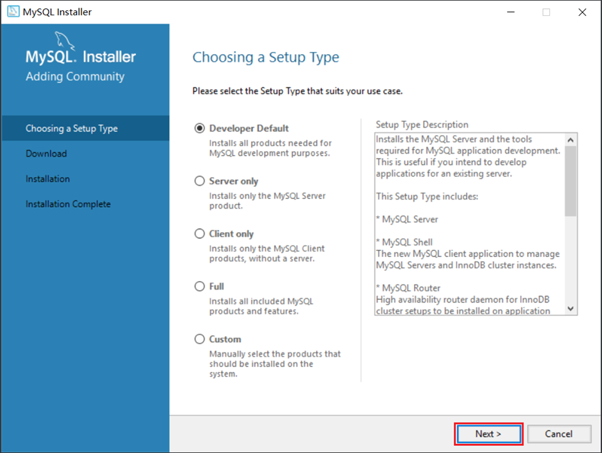
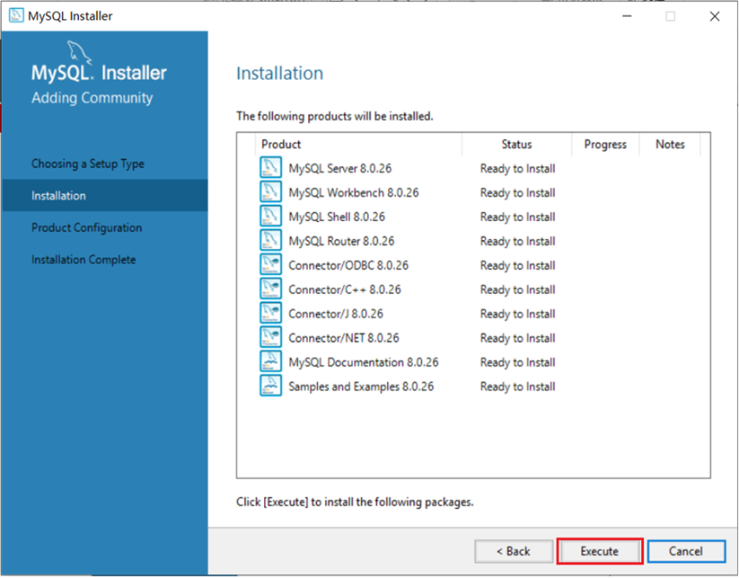
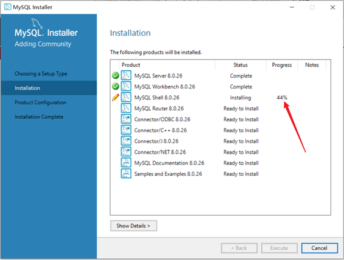
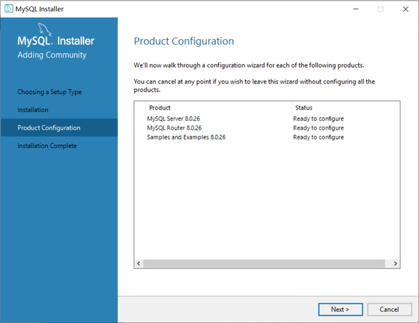
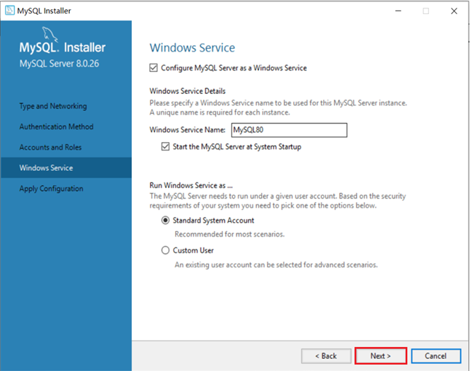
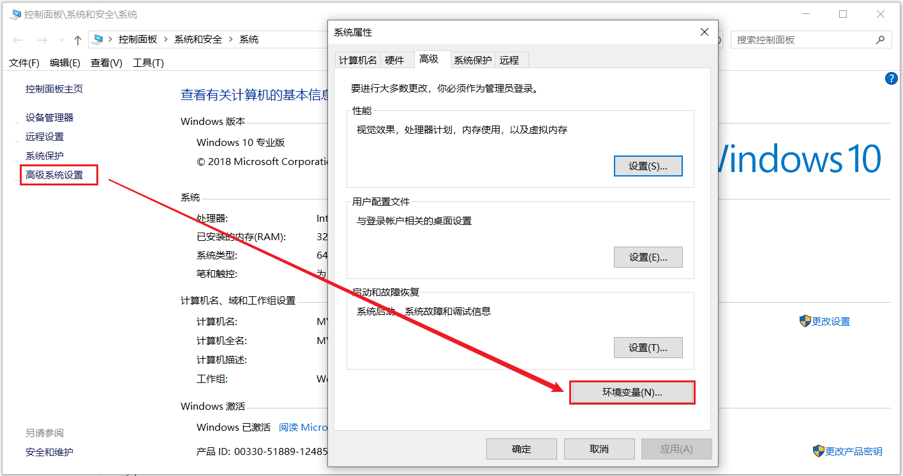
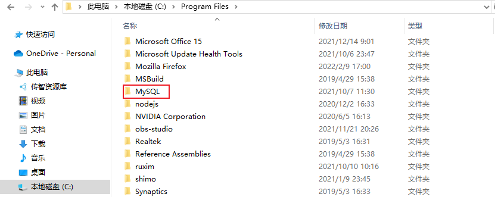

# MySQL安装

### 1. 安装

**1). 双击官方下来的安装包文件**

 

**2). 根据安装提示进行安装**

 

 

 

安装MySQL的相关组件，这个过程可能需要耗时几分钟，耐心等待。

 

 

 

 

==输入MySQL中root用户的密码,一定记得记住该密码==

 

 

 

### 2. 配置

安装好MySQL之后，还需要配置环境变量，这样才可以在任何目录下连接MySQL。

1). 在此电脑上，右键选择属性

 

2). 点击左侧的 "高级系统设置"，选择环境变量

 

3). 找到 Path 系统变量, 点击 "编辑"

 

4). 选择 "新建" , 将MySQL Server的安装目录下的bin目录添加到环境变量

 

# MySQL卸载文档-Windows版

### 1. 停止MySQL服务

win+R 打开运行，输入 services.msc 点击 "确定" 调出系统服务。

 

 

### 2. 卸载MySQL相关组件

打开控制面板 ---> 卸载程序 ---> 卸载MySQL相关所有组件

 

 

### 3. 删除MySQL安装目录

 

### 4. 删除MySQL数据目录

数据存放目录是在 C:\ProgramData\MySQL，直接将该文件夹删除。

 

### 5. 再次打开服务，查看是否有MySQL卸载残留

如果已将MySQL卸载，但是通过任务管理器--->服务，查看到MySQL服务仍然残留在系统服务里。

解决办法：

​	以管理员方式运行cmd命令行，输入以下命令：

​	sc delete 服务名称（如MySQL80）

这样可以实现删除服务。

