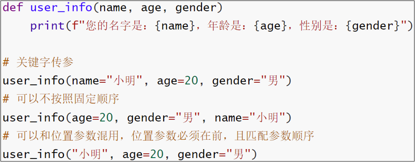
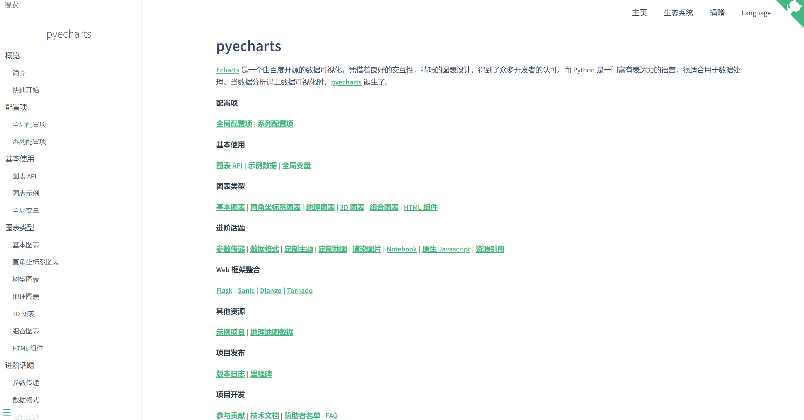

# 2.初始Python

1989年，为了**打发**圣诞节假期，Gudio van Rossum吉多· 范罗苏姆（龟叔）决心开发一个新的解释程序（Python雏形）

1991年，第一个Python解释器诞生

Python这个名字，来自龟叔所挚爱的电视剧Monty Python's Flying Circus


Python直译过来的意思是蟒蛇的意思，所以python语言的logo也就由两条小蟒蛇组合而成。


**为什么选择** **Python**

**简单**

**易学**

**开发效率高**


**适用面广泛**

| **人群/岗位**         | **用Python做什么**                                           |
| --------------------- | ------------------------------------------------------------ |
| IT从业者              | 自动化脚本（运维开发、测试开发等）                           |
| 普通白领              | 自动化办公                                                   |
| 后端开发              | WEB应用程序                                                  |
| 科学家                | 基于Python完成数据计算（生物、化学、物理）                   |
| **人工智能/机器学习** | **基于Python开发AI程序**                                     |
| **大数据开发**        | **基于** **Python**完成大数据任务开发（**Spark**、**Flink**） |
| **学生**              | **计算机二级考试**  **小学六年级Python课程**                 |

# 3.什么是编程语言

语言：进行沟通交流的表达方式

计算机只认识二进制0和1


**为什么不直接把中文翻译成二进制呢？**

自然语言远比编程语言复杂

编程语言语法”死板”

“翻译官”更容易翻译

# 4.Python环境安装（Windows）

想要使用Python语言编写程序，我们必须下载Python安装包并配置Python环境，

Python目前最新版本是：3.10.4（发布于2022年3月24日）

本次课程就基于当前最新版本进行学习


下载最新版Python

https://www.python.org


安装最新稳定版本


将页面拖到最底下，点击安装


## 安装流程

点击自定义安装


进入到可选的属性，默认都是全选的，点击下一步


配置Python的安装路径，**建议单独创建一个文件夹存放Python**


关闭路径长度的限制


**验证是否安装成功**

在命令提示符程序内，输入：python 并回车，出现python版本说明安装成功


# 7.第一个Python程序

向世界说你好，应该是全世界，所有程序员入门编程语言时，都会选择的第一个程序。

让我们也延续这一份来自程序员之间的浪漫，学习如何使用Python，向世界说你好。

我们的Python代码非常简单，如下：

~~~python
print("Hello World!!!")
~~~

含义：向屏幕上输出（显示），Hello World!!!

**注意**：输入的双引号和括号，请使用**英文符号**哦

打开CMD（命令提示符）程序，输入Python并回车

然后，在里面输入代码回车即可立即执行


# 9.常见问题解答

**命令提示符** 程序

使用快捷键：win + r

打开运行框，输入cmd后回车即可打开命令提示符程序


**2.命令提示符内，输入python出现**：'python' 不是内部或外部命令，也不是可运行的程序或批处理文件。

安装python的时候，没有勾选：add python 3.10 to PATH的选项


卸载Python，重新安装python，勾选这个选项。

然后重新打开命令提示符程序，即可


3.命令提示符内，出现：无法初始化设备 PRN


这是因为没有进入到python解释器环境内执行代码。

应该在命令提示符内：


4.执行出现：SyntaxError: invalid character '“' (U+201C)

这是因为，代码中的符号是中文符号。

请检查代码中的：

- 双引号

- 小括号

这两个符号，应该是英文符号

# 10.Python解释器

首先，一个基本原理是：

**计算机只认识二进制，即：0和1**

其实很简单，计算机是不会认识Python代码的。但是Python有解释器程序，如下图


安装Python环境，本质上，就是在电脑中，安装：

Python解释器程序

代码，随时可以写，但能不能运行，就要看电脑里面有没有解释器程序了。

Python解释器，是一个计算机程序，用来翻译Python代码，并提交给计算机执行。

在解释器环境内可以一行行的执行我们输入的代码

也可以使用解释器程序，去执行”.py”代码文件


所以，它的功能很简单，就2点：

1. 翻译代码

2. 提交给计算机运行

解释器存放在：<Python安装目录>/**python.exe**

**我们在CMD（命令提示符）程序内，执行的python，就是上图的python.exe程序哦**


**思考一下：**

**在python解释器程序内，我们发现，写完一行代码并回车后，会直接运行他。**

我们可以将代码，写入一个以”.py”结尾的文件中，使用python命令去运行它。

****

如，在Windows系统的D盘，我们新建一个名为：test.py的文件，并通过记事本程序打开它，输入如下内容：


在“命令提示符”程序内，使用python命令，运行它，如图：

**退出"命令提示符"程序：exit()**

“.py”文件是：python语言的代码文件，里面记录了python的代码

# 11.PyCharm开发工具的安装和基础使用

Python程序的开发有许多种方式，一般我们常见的有：

- Python解释器环境内，执行单行代码

- 使用Python解释器程序，执行Python代码文件

- 使用第三方IDE（集成开发工具），如PyCharm软件，开发Python程序

最常用的就是使用PyCharm软件进行开发

PyCharm集成开发工具（IDE），是当下全球Python开发者，使用**最频繁的工具软件**。

绝大多数的Python程序，都是在PyCharm工具内完成的开发。

本次课程全程基于PyCharm软件工具，来讲解Python。


首先，我们先下载并安装它：

打开网站：https://www.jetbrains.com

该网站自带中文


在开发者工具里找到PyCharm


专业版和社区版


安装步骤：


找到安装好的Python，打开

创建一个工程，我们来尝试写一写代码


指定工程路径以及选择Python解释器

配置Python解释器：

点击第三个选项，选择一个系统内置的解释器


工程创建完成：


创建一个Python代码文件 ，名称test.py


这里不带后缀py也可以，创建完成后它会自动加上后缀


填写如下内容


在空白处右键，然后选择运行：


# 12.PyCharm的基础使用

**修改主题**

默认是黑色主题，我们可以在PyCharm的右上角，点击“齿轮”


然后点击：”theme”，选择主题：


选择想要的主题即可：


**修改默认字体和大小**

打开设置：


**通过快捷键快速设置字体大小**

打开设置：


添加鼠标快捷键：


按ctrl + 鼠标滚轮上


同样，输入decre来设置减小字体的快捷键


**汉化软件**

打开插件功能：


翻译软件：


安装成功后：


**常用快捷键**

• ctrl + alt + s : 打开软件设置

• ctrl + d ：复制当前行代码

• shift + alt + 上\下 ： 将当前行代码上移或下移

• crtl + shift + f10 : 运行当前代码文件

• shift + f6 ：重命名文件

• ctrl + a : 全选

• ctrl + c\v\x : 复制、粘贴、剪切

• ctrl + f : 搜索

# 13.字面量

字面量：在代码中，被写下来的固定的值，称之为字面量

Python中常用的有6种值（数据）的类型

| 类型                                                         | 描述                                                         | 说明                                             |
| ------------------------------------------------------------ | ------------------------------------------------------------ | ------------------------------------------------ |
| 数字（Number）                                               | 支持  •整数（int）  •浮点数（float）  •复数（complex）  •布尔（bool） | 整数（int），如：10、-10                         |
| 浮点数（float），如：13.14、-13.14                           |                                                              |                                                  |
| 复数（complex），如：4+3j，以j结尾表示复数                   |                                                              |                                                  |
| 布尔（bool）表达现实生活中的逻辑，即真和假，True表示真，False表示假。  True本质上是一个数字记作1，False记作0 |                                                              |                                                  |
| 字符串（String）                                             | 描述文本的一种数据类型                                       | 字符串（string）由任意数量的字符组成             |
| 列表（List）                                                 | 有序的可变序列                                               | Python中使用最频繁的数据类型，可有序记录一堆数据 |
| 元组（Tuple）                                                | 有序的不可变序列                                             | 可有序记录一堆不可变的Python数据集合             |
| 集合（Set）                                                  | 无序不重复集合                                               | 可无序记录一堆不重复的Python数据集合             |
| 字典（Dictionary）                                           | 无序Key-Value集合                                            | 可无序记录一堆Key-Value型的Python数据集合        |

字符串（string），又称文本，是由任意数量的字符如中文、英文、各类符号、数字等组成。所以叫做字符的串

Python中，字符串需要用双引号（"）包围起来

被引号包围起来的，都是字符串


# 14.注释

## 一、介绍

注释：在程序代码中对程序代码进行解释说明的文字。

作用：注释不是程序，**不能被执行**，只是对程序代码进行解释说明，让别人可以看懂程序代码的作用，能够大大增强程序的可读性。

----

## 二、注释的分类

- 单行注释：以 #开头，#右边 的所有文字当作说明，而不是真正要执行的程序，起辅助说明作用

  > **注意，#号和注释内容一般建议以一个空格隔开**
  >
  > 这个是Python规范的要求。规范是Python官方建议的要求，不强制，不遵守也不影响程序执行。
  >
  > 但官方和大厂的代码都会遵守规范，所以遵守规范也会让我们的代码更高级。
  >
  > 不遵守规则：会出现问题
  >
  > 不遵守规范：不太高级

  

- 多行注释： 以 一对三个双引号 引起来 ("""注释内容""")来解释说明一段代码的作用使用方法

  

  多行注释一般用于对Python文件进行解释，或者对类或方法进行解释

  而对文件进行解释，一般会写到最上面的位置

# 15.变量

变量：**在程序运行时**，能储存计算结果或能表示值的抽象概念。

简单的说，变量就是在程序运行时，记录数据用的

**变量的定义格式**


变量就像盒子，可以存放内容。变量的特征就是，**变量存储的数据，是可以发生改变的。**


在python中，第二种写法是不被允许的。

print可以输出非常多份的数据，每分数据可以通过逗号隔开。

~~~python
# print(内容1, 内容2, ......, 内容N)
money = 50
print("钱包还有：", money)
print("钱包还有：" + money)
~~~


Python中如何做减法？

使用符号 - 即可完成减法运算

拓展：加（+）、减（-）、乘（*）、除（/）

# 16.数据类型

目前在入门阶段，我们主要接触如下三类数据类型：

| 类型       | 描述             | 说明                              |
| ---------- | ---------------- | --------------------------------- |
| **string** | 字符串类型       | 用引号引起来的数据都是字符串      |
| **int**    | 整型（有符号）   | 数字类型，存放整数 如 -1,10, 0 等 |
| **float**  | 浮点型（有符号） | 数字类型，存放小数 如 -3.14, 6.66 |

string、int、float这三个英文单词，就是类型的标准名称。

我们可以通过 `type()` 语句来得到数据的类型：

语法：type(被查看类型的数据)

1. 在print语句中，直接输出类型信息：

   str是string的缩写

   

2. 用变量存储type()的结果（返回值）：

   

查看的都是<字面量>的类型，还能查看变量中存储的数据类型


我们通过type(变量)可以输出类型，这是查看变量的类型还是数据的类型？

查看的是：变量存储的数据的类型。因为，变量无类型，但是它存储的数据有。


我们可能会说：字符串变量

但要知道，不是变量是字符串，而是它存储了：字符串

---

# 17.数据类型转换

**为什么要转换类型**

数据类型之间，在特定的场景下，是可以相互转换的，如字符串转数字、数字转字符串等

那么，我们为什么要转换它们呢？

数据类型转换，将会是我们以后经常使用的功能。

如：

- 从文件中读取的数字，默认是字符串，我们需要转换成数字类型

- 后续学习的input()语句，默认结果是字符串，若需要数字也需要转换

- 将数字转换成字符串用以写出到外部系统

- 等等

用途很多，那么让我们来学习一下如何转换吧。

| 语句(函数) | 说明                   |
| ---------- | ---------------------- |
| int(x)     | 将x转换为一个整数      |
| float(x)   | 将x转换为一个浮点数    |
| str(x)     | 将对象  x 转换为字符串 |

同前面学习的`type()`语句一样，这三个语句，都是带有结果的（返回值），我们可以用print直接输出，或用变量存储结果值


类型转换不是万能的，毕竟强扭的瓜不会甜，我们需要注意：

1. 任何类型，都可以通过str()，转换成字符串
2. 字符串内必须只有数字，才可以将字符串转换为数字


~~~python
# 浮点数转整数，会丢失精度，也就是小数部分
int_num = int(11.645)
print(type(int_num), int_num) # 11
~~~

---

# 19.标识符

**什么是标识符**

在Python程序中，我们可以给很多东西起名字，比如：

- 变量的名字

- 方法的名字

- 类的名字,等等

这些名字，我们把它统一的称之为标识符，用来做内容的标识。

所以，标识符：是用户在编程的时候所使用的一系列名字，用于给变量、类、方法等命名。

Python中，标识符命名的规则主要有3类：

- **内容限定**

- **大小写敏感**

- **不可使用关键字**

**内容限定**

标识符命名中，只允许出现这四类元素，其余任何内容都不被允许。

- 英文

- 中文

- 数字

- 下划线（_）

注意：

1. 不推荐使用中文

   > 尽管Python它支持以中文作为标识符的命名，但是目前支持的还不太完善，我们使用中文的话可能会有一些隐藏的问题，其次在行业中，大多数的程序员都会使用英文来去做标识符的命名，而不会使用中文。

2. 数字不可以开头


**大小写敏感**

以定义变量为例：

Andy = “安迪1”

andy = “安迪2”

字母a的大写和小写，是完全能够区分的。


**不可使用关键字**

Python中有一系列单词，称之为关键字。

关键字在Python中都有特定用途，我们不可以使用它们作为标识符。

关键字同样大小写敏感。


学完了标识符（变量、类、方法）的命名**规则**后，我们在来学习标识符的命名**规范**。

变量名，类名，方法名。不同的标识符，有不同的规范。


我们目前只接触到了：变量。所以，目前学习：变量的命名规范。

- 见名知意

  明了：尽量做到，看到名字，就知道是什么意思

  简洁：尽量在确保“明了”的前提下，减少名字的长度

- 下划线命名法

  多个单词组合变量名，要使用下划线做分隔。

- 英文字母全小写

  命名变量中的英文字母，应全部小写

---

# 20.运算符

| 运算符 | 描述   | 实例                                                         |
| ------ | ------ | ------------------------------------------------------------ |
| +      | 加     | 两个对象相加  a + b 输出结果  30                             |
| -      | 减     | 得到负数或是一个数减去另一个数  a - b 输出结果  -10          |
| *      | 乘     | 两个数相乘或是返回一个被重复若干次的字符串  a * b 输出结果  200 |
| /      | 除     | b /  a 输出结果 2                                            |
| //     | 取整除 | 返回商的整数部分  9//2 输出结果  4 , 9.0//2.0 输出结果  4.0  |
| %      | 取余   | 返回除法的余数  b % a 输出结果  0                            |
| **     | 指数   | a**b  为10的20次方，  输出结果 100000000000000000000         |

加减乘除和求平方，我们在前面已经使用过啦。

现在在带上：整除以及求余数，一起试一试吧。


**赋值运算符**

| **运算符** | **描述**   | **实例**                                                     |
| ---------- | ---------- | ------------------------------------------------------------ |
| =          | 赋值运算符 | 把 =  号右边的结果 赋给 左边的变量，如 num  = 1 + 2 * 3，结果num的值为7 |

**复合赋值运算符**

| **运算符** | **描述**         | **实例**                    |
| ---------- | ---------------- | --------------------------- |
| +=         | 加法赋值运算符   | c  += a 等效于 c =  c + a   |
| -=         | 减法赋值运算符   | c  -= a 等效于 c =  c - a   |
| *=         | 乘法赋值运算符   | c  *= a 等效于 c =  c * a   |
| /=         | 除法赋值运算符   | c  /= a 等效于 c =  c / a   |
| %=         | 取模赋值运算符   | c  %= a 等效于 c =  c % a   |
| **=        | 幂赋值运算符     | c  **= a 等效于 c =  c ** a |
| //=        | 取整除赋值运算符 | c  //= a 等效于 c =  c // a |

---

# 21.字符串的三种定义方式

字符串有3种不同的定义方式：

- 双引号定义法："字符串"（最常用的写法）

- 单引号定义法：'字符串'

- 三引号定义法："""字符串"""

三引号定义法，表示在一堆三个双引号的范围内，均是字符串，如下：


三引号定义法，和多行注释的写法一样，同样支持换行操作。表示在一堆三个双引号的范围内，均是字符串。要注意的是，包含范围是：**从三个引号开始，到下一个三个引号结束**

- 使用变量接收它，它就是字符串
- 不使用变量接收它，就可以作为多行注释使用。


**思考：如果我想要定义的字符串本身，是包含：单引号、双引号自身呢？如何写？**

- 单引号定义法，可以内含双引号
- 双引号定义法，可以内含单引号
- 可以使用转移字符（反斜杠）（\）来将引号解除效用，变成普通字符串

---

# 22.字符串拼接

如果我们有两个字符串（文本）字面量，可以将其拼接成一个字符串，通过+号即可完成，如：

~~~python
print("学IT来黑马" + "月薪过万")
~~~

输出结果：


不过一般，单纯的2个字符串字面量进行拼接显得很呆，一般，`字面量和变量` 或 `变量和变量之间会使用拼接`，如：


既然可以和字符串变量完成拼接，那么，是否可以和其它变量类型如数字类型完成拼接呢？

**字符串无法和非字符串变量进行拼接**，这个时候会报类型错误。因为类型不一致，无法接上。


---

# 23.字符串格式化

我们会发现，这个拼接字符串也不好用啊

1. 变量过多，拼接起来实在是太麻烦了
2. 字符串无法和数字或其它类型完成拼接。


所以，有没有其它方式，即方便又支持拼接其它类型呢？这个方式，就是字符串的格式化。

我们可以通过如下语法，完成字符串和变量的快速拼接。这种方式的拼接我们把它叫做：占位式的拼接

```python
name = "黑马程序员"
message = "学IT来：%s" % (name)
print(message)
```


其中的，%s 

- % 表示：我要占位

- s  表示：将变量变成字符串放入占位的地方

第2个 `%` 代表补全变量

所以，综合起来的意思就是：我先占个位置，等一会有个变量过来，我把它变成字符串放到占位的位置。


那数字类型呢？可以不可以占位？那必须可以，我们来尝试如下代码，数字也能用%s占位，这里是将数字 转换成了 字符串，也就是数字57，变成了字符串"57"被放入占位的地方。

```python
# 通过占位的形式，完成数字和字符串的拼接
class_num = 57 # class_num表示班级的号码
avg_salary = 16781
message = "Python大数据学科，北京%s期，毕业平均工资：%s" % (class_num, avg_salary)
print(message)
```


PS：多个变量占位，变量要用括号括起来，使用逗号分隔，并按照占位的顺序填入。

数字类型，也太没有地位了吧，竟然要被转成字符串拼接。有没有体面一点的方式，让数字以其原本的面貌拼接进去呢？

Python中，其实支持非常多的数据类型占位，最常用的是如下三类。

| 格式符号 | 转化                             |
| -------- | -------------------------------- |
| %s       | 将内容转换成字符串，放入占位位置 |
| %d       | 将内容转换成整数，放入占位位置   |
| %f       | 将内容转换成浮点型，放入占位位置 |

如下代码，完成字符串、整数、浮点数，三种不同类型变量的占位。

```python
name = "传智播客"
set_up_year = 2006
stock_price = 19.99
message = ("我是：%s，我成立于：%d，我今天的股价是：%f") % (name, set_up_year, stock_price)
print(message)
```


---

# 24.字符串格式化的精度控制

观察我们刚刚写的代码，19.99变成了19.990000了，这就是因为我们没有对它做精度控制。

我们可以使用辅助符号"m.n"来控制数据的宽度和精度

- m，控制宽度，要求是数字（很少使用）,**设置的宽度小于数字自身，不生效**

- .n，控制小数点精度，要求是数字，**会进行小数的四舍五入**，数据会失真

示例：

- %5d：表示将整数的宽度控制在5位，如数字11，被设置为5d，就会变成：[空格] [空格] [空格]11，用三个空格补足宽度。

- %5.2f：表示将宽度控制为5，将小数点精度设置为2

小数点和小数部分也算入宽度计算。如，对11.345设置了%7.2f 后，结果是：[空格] [空格]11.35。2个空格补足宽度，小数部分限制2位精度后，四舍五入为 .35

- %.2f：表示不限制宽度，只设置小数点精度为2，如11.345设置%.2f后，结果是11.35


---

# 25.字符串格式化的方式2

目前通过%符号占位已经很方便了，还能进行精度控制。可是追求效率和优雅的Python，是否有更加优雅的方式解决问题呢？

通过语法：f"内容{变量}"的格式来快速格式化（在字符串的前面加上 `f`(format格式化的首字母) 作为标记，标记完之后，可以在内容中通过{ }进行占位，然后在大括号的内部填入变量就可以完成快速格式化了。看如下代码


PS：这种写法不做精度控制，也不理会类型，适用于快速格式化字符串，所以这种方式适合对精度没有要求的时候快速使用呢。

---

# 26.对表达式进行格式化

刚刚的演示，都是基于变量的。可是，我想更加优雅些，少写点代码，直接对“表达式”进行格式化是否可行呢？那么，我们先了解一下什么是表达式。

表达式：一条具有**明确执行结果**的**代码语句**，如：

1 + 1、5 * 2，就是表达式，因为有具体的结果，结果是一个数字，又或者，常见的变量定义：name = “张三” （这个也是有具体的结果，具体的结果赋值给了具体的变量）， age = 11 + 11。

等号右侧的都是表达式呢，因为它们有具体的结果，结果赋值给了等号左侧的变量。

那么，对于字符串格式化，能否直接格式化一个表达式呢？可以，上代码，在无需使用变量进行数据存储的时候，可以直接格式化表达式，简化代码哦。


---

# 27.字符串格式化练习题讲解

定义如下变量：

- name，公司名
- stock_price，当前股价
- stock_code，股票代码
- stock_price_daily_growth_factor，股票每日增长系数，浮点数类型，比如1.2
- growth_days，增长天数

计算，经过growth_days天的增长后，股价达到了多少钱

使用字符串格式化进行输出，如果是浮点数，要求小数点精度2位数。示例输出：


红色框框都是变量，要使用格式化的方式拼接进去

提示，可以使用： 当前股价 ***** 增长系数 ***\*** 增长天数， 用来计算最终股价哦。如，股价19.99 * 系数1.2 ** 7天 = 71.62778419199998，小数点现在精度2位后结果：71.63

股票代码需要使用字符串定义，如果是数字的话，这种写法是不符合规定的，数字不能直接以0开头

~~~python
# 定义需要的变量
name = "传智播客"
stock_price = 19.99
stock_code = "003032"
# 股票 价格 每日 增长 因子
stock_price_daily_growth_factor = 1.2
growth_days = 7

finally_stock_price = stock_price * stock_price_daily_growth_factor ** growth_days

print(f"公司：{name}，股票代码：{stock_code}，当前股价：{stock_price}")
print("每日增长系数: %.1f，经过%d天的增长后，股价达到了：%.2f" % (stock_price_daily_growth_factor, growth_days, finally_stock_price))
~~~

---

# 28.数据输入（input语句）

我们前面学习过print语句（函数），可以完成将内容（字面量、变量等）输出到屏幕上。在Python中，与之对应的还有一个input语句，用来获取键盘输入。

- 数据输出：print

- 数据输入：input

使用上也非常简单：

- 使用input()语句可以从键盘获取输入

- 使用一个变量接收（存储）input语句获取的键盘输入数据即可
- = 是标准的赋值运算符，把右边的结果赋予左边的变量。

在控制台中输入的内容，本质上来说被input语句接收了，它接受的内容又赋值给了name这个变量。


在前面的代码中，输出 “请告诉我你是谁？” 的print语句其实是多余的


input()语句其实是可以在要求使用者输入内容前，输出提示内容的哦，如图，在input的括号内直接填入提示内容即可。这个功能等用于直接在它前面输出一个print。


我们刚刚试验的都是输入了字符串类型的数据。那么如果我们输入数字类型或其它类型，结果会如何？

那么，通过前面学习过**type()**语句来验证一下输入内容的数据类型吧。


可以看到，无论键盘输入何种类型的数据，**最终的结果都是：字符串类型的数据**。如果需要得到其他类型，请自行进行转换。

---

# 29.布尔类型和比较运算符

**布尔类型**

进行判断，只有2个结果：是 / 否。程序中使用**布尔类型**描述是或否。布尔类型是数字中的小类。


**使用：布尔类型**

Python中常用的有**6**种值（数据）的类型

| 类型               | 描述                                                         | 说明                                                         |
| ------------------ | ------------------------------------------------------------ | ------------------------------------------------------------ |
| 数字（Number）     | 支持  •整数（int）  •浮点数（float）  •复数（complex）  •布尔（bool） | 整数（int），如：10、-10                                     |
|                    |                                                              | 浮点数（float），如：13.14、-13.14                           |
|                    |                                                              | 复数（complex），如：4+3j，以j结尾表示复数                   |
|                    |                                                              | 布尔（bool）表达现实生活中的逻辑，即真和假，True表示真  False表示假。  True本质上是一个数字记作1，False记作0。<br />所以它们被标记为数字类型。 |
| 字符串（String）   | 描述文本的一种数据类型                                       | 字符串（string）由任意数量的字符组成                         |
| 列表（List）       | 有序的可变序列                                               | Python中使用最频繁的数据类型，可有序记录一堆数据             |
| 元组（Tuple）      | 有序的不可变序列                                             | 可有序记录一堆不可变的Python数据集合                         |
| 集合（Set）        | 无序不重复集合                                               | 可无序记录一堆不重复的Python数据集合                         |
| 字典（Dictionary） | 无序Key-Value集合                                            | 可无序记录一堆Key-Value型的Python数据集合                    |

布尔类型的字面量（注意它们的首字母都是大写的）：

- True 表示真（是、肯定）

- False 表示假 （否、否定）

定义变量存储布尔类型数据：

~~~bash
变量名称 = 布尔类型字面量
~~~

布尔类型不仅可以自行定义，同时也可以通过计算的来。

也就是使用比较运算符进行比较运算得到布尔类型的结果。下面的 > 和 == 都是比较运算符。


## 比较运算符

| **运算符** | **描述**                                                     | **示例**                         |
| ---------- | ------------------------------------------------------------ | -------------------------------- |
| ==         | 判断内容是否相等，满足为True，不满足为False                  | 如a=3,b=3，则(a  == b)  为  True |
| !=         | 判断内容是否不相等，满足为True，不满足为False                | 如a=1,b=3，则(a  != b) 为  True  |
| >          | 判断运算符左侧内容是否大于右侧  满足为True，不满足为False    | 如a=7,b=3，则(a  > b)  为 True   |
| <          | 判断运算符左侧内容是否小于右侧  满足为True，不满足为False    | 如a=3,b=7，则(a  < b)  为 True   |
| >=         | 判断运算符左侧内容是否大于等于右侧  满足为True，不满足为False | 如a=3,b=3，则(a  >= b) 为  True  |
| <=         | 判断运算符左侧内容是否小于等于右侧  满足为True，不满足为False | 如a=3,b=3，则(a  <= b) 为  True  |

~~~python
"""
演示布尔类型的定义
以及比较运算符的应用
"""
# 定义变量存储布尔类型的数据
bool_1 = True
bool_2 = False
print(f"bool_1变量的内容是：{bool_1}, 类型是：{type(bool_1)}") # bool_1变量的内容是：True，类型是：<class 'bool'>
print(f"bool_2变量的内容是：{bool_2}, 类型是：{type(bool_2)}") # bool_2变量的内容是：False，类型是：<class 'bool'>

# 比较运算符的使用
# == , !=, >, <, >=, <=
# 演示进行内容的相等比较
num1 = 10
num2 = 10
print(f"10 == 10的结果是：{num1 == num2}")

num1 = 10 # 为num1 和 num2 重新赋值
num2 = 15
print(f"10 != 15的结果是：{num1 != num2}")

name1 = "itcast"
name2 = "itheima"
print(f"itcast == itheima 结果是：{name1 == name2}")

# 演示大于小于，大于等于小于等于的比较运算
num1 = 10
num2 = 5
print(f"10 > 5结果是：{num1 > num2}")
print(f"10 < 5的结果是：{num1 < num2}")

num1 = 10
num2 = 11
print(f"10 >= 11的结果是：{num1 >= num2}")
print(f"10 <= 11的结果是：{num1 <= num2}")
~~~

---

# 30.if语句的基本格式

语法：1）不要忘记冒号	2）`条件成立时，要做的事情` 的前面是有4个空格做了缩进，python是通过空格缩进来判断它所归属的。


~~~python
# 定义变量
age = 30
# 进行判断，age >= 18 通过比较运算符得到的结果是一个布尔类型的
if age >= 18:
    print("我已经成年了")
~~~

同样，if条件成立之后，我们可以不仅仅只写一条代码，我们可以写任意多条代码，但一定要注意，需要使用4个空格做缩进确定代码属于哪个代码块，最后一个print打印语句就不受 if 的约束。

~~~python
age = 18
if age >= 18:
    print(f"我已经{age}岁了")
    print("即将步入大学")
print("时间过的真快")
~~~


**if语句的注意点**

- 判断语句的结果，必须是布尔类型True或False，True会执行 if 内的代码语句，False则不会执行。
- 不要忘记判断条件后的：引号
- 归属于if语句的代码块，需在前方填充4个空格缩进


---

# 31.案例 - 成年人判断

结合前面学习的input输入语句，完成如下案例：

1. 通过input语句，获取键盘输入，为变量age赋值。（注意转换成数字类型）

2. 通过if判断是否是成年人，满足条件则输出提示信息，如下：


提示：您已成年，需要补票的信息输出，来自 if 判断

~~~python
# 获取键盘输入
age = int(input("请输入你的年龄："))

# 通过if判断是否是成年人
if age >= 18:
    print("您已成年，游玩需要买票，10元.")

print("祝您游玩愉快")
~~~

---

# 32.if - else组合判断语句

if满足条件会执行相应的代码语句，如果不满足呢？

有没有不满足的情况下，可供执行的代码呢？**if else** **语句可以实现**

语法：


代码示例：

```python
# 这里注意input得到的永远是字符串类型的数据，这里需要强转为int
age = int(input("请输入你的年龄"))
if age >= 18:
    print("您已成年，游玩需补票10元！")
else:
    print("您未成年，可以免费游玩！")
```


注意：

1. if else 语句，其中if和其代码块，条件满足时执行；else搭配if的判断条件，当不满足的时候执行
2. if else语句的注意事项：
   - else不需要判断条件，当if的条件不满足时，else执行
   - else的代码块，同样要4个空格作为缩进


---

# 34.if - elif -else组合使用的语法

某些场景下，判断条件不止一个，可能有多个。这种需求能用Python实现吗？**if** **elif** **else** **语句可以实现**

语法：


代码示例


----


## if elif else语句 注意点

elif 语句可以写多个。


1、判断是互斥且有顺序的。

- 满足1（如图编号）将不会理会2和3

- 满足2，将不会理会3

- 1、2、3均不满足，进入else

- else也可以省略不写，效果等同3个独立的if判断


2、空格缩进同样不可省略


3、可以如下图，将input输入语句直接写入判断条件中。节省代码量，并且这个时候它不会让你同时再输入三个变量的值了，而是会让你挨个输入，如果有个条件已经满足了，就不会让你输入下一个变量了。


---

# 35.案例：猜猜心理数字

1. 定义一个变量，数字类型，内容随意。

2. 基于input语句输入猜想的数字，通过if和多次elif的组合，判断猜想数字是否和心里数字一致。

~~~python
# 定义一个变量数字
num = 5

# 通过键盘输入获取猜想的数字，通过多次if 和 elif的组合进行猜想比较
if int(input("请猜一个数字：")) == num:
    print("恭喜第一次就猜对了呢")
elif int(input("猜错了，再猜一次：")) == num:
    print("猜对了")
elif int(input("猜错了，再猜一次：")) == num:
    print("恭喜，最后一次机会，你猜对了")
else:
    print("Sorry 猜错了")
~~~


----

# 36.判断语句的嵌套

有很多场景，不仅仅是多个并列条件，还会有满足前置条件才会二次判断的多层判断需求。**对这种需求，嵌套判断语句可以实现**

许多逻辑的判断，是嵌套的，多层次的。对于这种需求，我们可以：自由组合 if elif else，完成特定需求的要求


基础语法格式如下：


如上图，第二个if，属于第一个if内，只有第一个if满足条件，才会执行第二个if

嵌套的关键点，在于：空格缩进，通过空格缩进，来决定语句之间的：层次关系


**简单嵌套**

如图，判断有2层，当外层if满足条件（图中编号1）时，才会执行内层if判断（图中编号2）；当外层if（编号1）不满足，直接执行外层esle。


**注意事项**

1. 嵌套判断语句可以用于多条件、多层次的逻辑判断

2. 嵌套判断语句可以根据需求，自由组合if elif else来构建多层次判断

3. 嵌套判断语句，一定要注意空格缩进，Python通过空格缩进来决定层次关系


---

# 37.判断语句综合案例

案例要求: 

1. 数字随机产生，范围1-10

2. 有3次机会猜测数字，通过3层嵌套判断实现

3. 每次猜不中，会提示大了或小了

提示，通过如下代码，可以定义一个变量num，变量内存储随机数字。


代码示例

```python
import random
num = random.randint(1, 10)

guess_num = int(input("输入你要猜测的数字："))
if guess_num == num:
    print("恭喜，第一次就猜中了")
else:
    if guess_num > num:
        print("你猜测的数字大了")
    else:
        print("你猜测的数字小了")
        guess_num = int(input("再次输入你要猜测的数字："))

    if guess_num == num:
        print("恭喜，第二次猜中了")
    else:
        if guess_num > num:
            print("你猜测的数字大了")
        else:
            print("你猜测的数字小了")
            guess_num = int(input("第三次输入你要猜测的数字："))
    
            if guess_num == num:
                print("第三次猜中了")
            else:
                print("三次机会用完了，没有猜中。")
```


---

# 38.while循环的基础应用

循环有两个关键要素：操作、条件。

语法：只要条件满足，会无限循环执行


案例：小美心软，只要表白100次，就会成功

~~~python
i = 0
while i < 100:
    print("小美，我喜欢你")
    i += 1
~~~


注意：

1. while的条件需得到布尔类型，True表示继续循环，False表示结束循环

2. 需要设置循环终止的条件，如i += 1配合 i < 100，就能确保100次后停止，否则将无限循环

3. 空格缩进和if判断一样，都需要设置

---

# 39.案例：使用while循环求1-100的和

提示：

1. 终止条件不要忘记，设置为确保while循环100次

2. 确保累加的数字，从1开始，到100结束

```python
i = 1
sum = 0
while i <= 100:
    sum += i
    i += 1
print(f"1-100累加的和是：{sum}")
```


---

# 40.案例：使用while循环实现猜数字

设置一个范围1-100的随机整数变量，通过while循环，配合input语句，判断输入的数字是否等于随机数

无限次机会，直到猜中为止。每一次猜不中，会提示大了或小了。猜完数字后，提示猜了几次

提示：

- 无限次机会，终止条件不适合用数字累加来判断

- 可以考虑布尔类型本身（True or False）

- 需要提示几次猜中，就需要提供数字累加功能

- 随机数可以使用：

  

代码示例

~~~python
# 获取范围在1-100的随机数字
import random
num = random.randint(1, 100)
# 定义一个变量，记录总共猜测了多少次
count = 0

# 通过一个布尔类型的变量，做循环是否继续的标记
flag = True
while flag:
    guess_num = int(input("请输入你猜测的数字:"))
    count += 1
    if guess_num == num:
        print("猜中了")
        # 设置为False就是终止循环的条件
        flag = False
    else:
        if guess_num > num:
            print("你猜的大了")
        else:
            print("你猜的小了")

print(f"你总共猜测了{count}次")
~~~


---

# 41.while循环的嵌套应用

语法：循环内套循环


案例：表白100天，每一天都会送10朵玫瑰花


- 同判断语句的嵌套一样，循环语句的嵌套，要注意空格缩进。

- 基于空格缩进来决定层次关系

- 注意条件的设置，避免出现无限循环（除非真的需要无限循环）
- 循环条件的控制，层次越多越复杂，需要细心 + 耐心


---

# 42.案例：使用while循环打印出九九乘法表

## 补充知识 - print输出不换行

默认print语句输出内容会自动换行，在即将完成的案例中，我们需要使用print语句，输出不换行的功能，非常简单，实现方式如下，在print语句中，加上 end=’’ 即可输出不换行了


ps: `end=''` 是使用的方法传参功能，我们在后面会详细讲解。


**补充知识-制表符\t**

在字符串中，有一个特殊符号：\t，效果等同于在键盘上按下：tab键。

它可以让我们的多行字符串进行对齐。比如：


**案例-打印九九乘法表**

通过while循环，输出如下九九乘法表内容


提示：

- 2层循环，外层控制行，内层控制列

- 外层循环和内存循环的累加数字变量，用以辅助输出乘法表的数值

代码

~~~python
"""
演示使用while的嵌套循环
打印输出九九乘法表
"""

# 定义外层循环的控制变量
i = 1
while i <= 9:

    # 定义内层循环的控制变量
    j = 1
    while j <= i:
        # 内层循环的print语句，不要换行，通过\t制表符进行对齐
        print(f"{j} * {i} = {j * i}\t", end='')
        j += 1

    i += 1
    print()     # print空内容，就是输出一个换行
~~~


---

# 43.for循环的基础语法

除了while循环语句外，Python同样提供了for循环语句。两者能完成的功能基本差不多，但仍有一些区别：

- while循环的循环条件是自定义的，自行控制循环条件

- for循环是一种”轮询”机制，是对一批内容进行”逐个处理”

**while循环**


**for循环**

for循环就是将”待办事项”逐个完成的循环机制


**语法**

~~~python
for 临时变量 in 待处理数据集: 
        循环满足条件时执行的代码
~~~

从待处理数据集中：逐个取出数据，赋值给临时变量

**遍历字符串**

 ~~~python
# 定义字符串name
name = ”itheima”
# for循环处理字符串
for x in name: 
       print(x)
 ~~~

运行结果如下，可以看出，for循环是将字符串的内容：依次取出。所以，for循环也被称之为：遍历循环


同while循环不同，for循环是无法定义循环条件的。只能从被处理的数据集中，依次取出内容进行处理。

所以，理论上讲，Python的for循环无法构建无限循环（被处理的数据集不可能无限大）。要注意，循环内的语句，需要有空格缩进


---

# 44.案例：利用for循环数一数字符串中有几个a

定义字符串变量name，内容为："itheima is a brand of itcast"

通过for循环，遍历此字符串，统计有多少个英文字母："a"

提示：

1. 计数可以在循环外定义一个整数类型变量用来做累加计数

2. 判断是否为字母"a"，可以通过if语句结合比较运算符来完成

代码示例

~~~python
# 统计如下字符串中，有多少个字母a
name = "itheima is a brand of itcast"

# 定义一个变量，用来统计有多少个a
count = 0

# for 循环统计
# for 临时变量 in 被统计的数据:
for x in name:
    if x == "a":
        count += 1

print(f"被统计的字符串中有{count}个a")
~~~


---

# 45.range语句

range的用途很多，多数用在for循环场景。

 ~~~python
for 临时变量 in 待处理数据集(可迭代对象): 
        循环满足条件时执行的代码
 ~~~

语法中的：待处理数据集，严格来说，称之为：序列类型

序列类型指，其内容可以一个个依次取出的一种类型，包括：字符串、列表、元组等。

for循环语句，本质上是遍历：序列类型。尽管除字符串外，其它可迭代类型目前没学习到，但不妨碍我们通过学习range语句，获得一个简单的数字序列（可迭代类型的一种）。

**语法1**：

~~~python
range(num)
~~~

获取一个从0开始，到num结束的数字序列（不含num本身）

如range(5)取得的数据是：[0, 1, 2, 3, 4]

---

**语法2**：

~~~python
range(num1, num2)
~~~

获得一个从num1开始，到num2结束的数字序列（不含num2本身）。如，range(5, 10)取得的数据是：[5, 6, 7, 8, 9]

---

**语法3**：

~~~python
range(num1, num2, step)
~~~

获得一个从num1开始，到num2结束的数字序列（不含num2本身）。数字之间的步长，以step为准（step默认为1）。如，range(5, 10, 2)取得的数据是：[5, 7, 9]

代码示例

~~~python
# range语法1 range(num)
for x in range(10):
    print(x)

# range 语法2 range(num1, num2)
for x in range(5, 10):
    # 从5开始，到10结束（不包含10本身）的一个数字序列，数字之间间隔是1
    print(x)

# range 语法3 range(num1, num2, step)
for x in range(5, 10, 2):
    # 从5开始，到10结束（不包含10本身）的一个数字序列，数字之间的间隔是2
    print(x)

for x in range(10):
    print("送玫瑰花")
~~~


---

# 46.for循环临时变量作用域

如图代码，思考一下：红框中的print语句，能否访问到变量 `i` ？


规范上：不允许，实际上：可以


**for循环的变量作用域**

回看for循环的语法，我们会发现，将从数据集（序列）中取出的数据赋值给：临时变量，为什么是临时的呢？

临时变量，在编程规范上，作用范围（作用域），只限定在for循环内部

如果在for循环外部访问临时变量，规范是软要求，规则是硬要求。这种限定：

- 是编程规范的限定，而非强制限定
- 不遵守也能正常运行，但是不建议这样做

如下图，编译器报了警告，编译器察觉出来什么问题，但它也不确定，因为它没有给你红色（红色是报错）。但真正运行的时候可以发现 i 是可以正常访问到 i 的。


如果实在需要在循环外访问循环内的临时变量，让代码符合规范，可以在循环外预先定义


如图，每一次循环的时候，都会将取出的值赋予 i 变量。

- 由于i变量是在循环之前（外）定义的

- 在循环外访问i变量是合理的、允许的


---

# 47.for循环的嵌套使用

语法


案例：表白100天，每一天都会送10朵玫瑰花

~~~python
# 坚持表白100天，每天都送10朵花
# range
i = 0
for i in range(1, 101):
    print(f"今天是向小美表白的第{i}天，加油坚持。")

    # 写内层的循环了
    for j in range(1, 11):
        print(f"给小美送的第{j}朵玫瑰花")

    print("小美我喜欢你")

print(f"第{i}天，表白成功")
~~~

如图，和while循环一样，需要注意缩进。因为通过缩进，确定层次关系。

我们目前学习了2个循环，while循环和for循环。这两类循环语句是可以相互嵌套的，如下，小美表白的案例可以改为：


---

# 48.案例：使用for循环打印出九九乘法表

通过for循环，输出如下九九乘法表内容


提示：

- 2层循环，外层控制行，内层控制列

- 可使用range语句来得到数字序列进行for循环

- 内层for循环的range最大范围，取决于当前外层循环的数字

~~~python
# 通过外层循环控制行数
for i in range(1, 10):
    # 通过内层循环控制每一行的数据
    for j in range(1, i + 1):
        # 在内层循环中输出每一行的内容
        print(f"{j} * {i} = {j * i}\t", end='')

    # 外层循环可以通过print输出一个回车符
    print()
~~~


---

# 49.continue 和 break

思考：无论是while循环或是for循环，都是重复性的执行特定操作。在这个重复的过程中，会出现一些其它情况让我们不得不：

1、暂时跳过某次循环，直接进行下一次；2、提前退出循环，不在继续

对于这种场景，Python提供continue和break关键字用以对循环进行临时跳过和直接结束。


**continue**

continue关键字用于：中断本次循环，直接进入下一次循环

continue可以用于：  for循环和while循环，效果一致

continue关键字只可以控制：它所在的循环临时中断

例如：continue只能控制下图编号1的for循环，对编号2的for循环，无影响


**break**

break关键字用于：直接结束所在循环

break可以用于：  for循环和while循环，效果一致

break关键字同样只可以控制：它所在的循环永久中断

例如：break只能控制下图编号1的循环，对编号2的循环，无影响


----

# 50.循环综合案例：发工资

某公司，账户余额有1W元，给20名员工发工资。

- 员工编号从1到20，从编号1开始，依次领取工资，每人可领取1000元

- 领工资时，财务判断员工的绩效分（1-10）（随机生成），如果低于5，不发工资，换下一位

- 如果工资发完了，结束发工资。

	

提示：

- continue用于跳过员工，break直接结束发工资

- if判断余额，不要忘记发完工资后，余额减少1000哦


---

# 51.函数的初体验

函数：是组织好的，可重复使用的，用来实现特定功能的代码段。

- 组织好的：提前将功能逻辑都写好了


为什么随时都可以使用，len()统计长度？因为，len()是Python内置的函数：

- 是提前写好的

- 可以重复使用

- 实现统计长度这一特定功能的代码段

我们使用过的：input()、print()、str()、int()等都是Python的内置函数。

为了得到一个针对特定需求、可供重复利用的代码段，提高程序的复用性，减少重复性代码，提高开发效率。


---

# 52.函数的基础定义语法

函数的定义：


函数的调用：


注意事项：

① 参数如不需要，可以省略，但是括号一定要加上

② 返回值如不需要，可以省略

③ 函数必须先定义后使用


---

# 53.案例：自动查核酸

定义一个函数，函数名任意，要求调用函数后可以输出如下欢迎语：


代码示例：通过 `\n` 可以直接换行

~~~python
# 定义函数
def check():
    # 编写函数体输出信息
    print("欢迎来到黑马程序员！\n请出示您的健康码以及72小时核酸证明！")

# 调用函数
check()
~~~


---

# 54.函数的传入参数

## 一、引入

传入参数的功能是：在函数进行计算的时候，接受外部提供的数据。也就是调用的时候可以通过外部向函数内传入数据。

有如下代码，完成了2个数字相加的功能：


函数的功能非常局限，只能计算1 + 2。

有没有可能实现：每一次使用函数，去计算用户指定的2个数字，而非每次都是1 + 2呢？可以的，使用函数的传入参数功能，即可实现。

---

## 二、语法解析

基于函数的定义语法：


可以有如下函数定义：


实现了，每次计算的是x + y，而非固定的1 + 2。x + y的值，可以在调用函数的时候指定。

~~~python
# 定义2数相加的函数，通过参数接收被计算的2个数字
def add(x, y, z):
    result = x + y + z
    print(f"{x} + {y} + {z}的计算结果是：{result}")

# 调用函数，传入被计算的2个数字
add(5, 6, 7)
~~~

语法解析：

- 函数定义中，提供的x和y，称之为：形式参数（形参），表示函数声明将要使用2个参数

- 参数之间使用逗号进行分隔

- 函数调用中，提供的5和6，称之为：实际参数（实参），表示函数执行时真正使用的参数值

- 传入的时候，按照顺序传入数据，使用逗号分隔

传入参数的数量是不受限制的。

- 可以不使用参数

- 也可以仅使用任意N个参数


---

# 55.练习案例：升级版自动查核酸

定义一个函数，名称任意，并接受一个参数传入（数字类型，表示体温）

在函数内进行体温判断（正常范围：小于等于37.5度），并输出如下内容：


**代码示例**

~~~python
# 定义函数，接收1个形式参数，数字类型，表示体温
def check(num):
    # 在函数体内进行判断体温
    print("欢迎来到黑马程序员！请出示您的健康码以及72小时核酸证明，并配合测量体温！")
    if num <= 37.5:
        print(f"体温测量中，您的体温是：{num}度，体温正常请进！")
    else:
        print(f"体温测量中，您的体温是：{num}度，需要隔离！")

# 调用函数，传入实际参数
check(37.6)
~~~


---

# 56.函数的返回值

## 一、什么是返回值？

**生活中的返回值**：假设小明有一个功能，它就是专门去帮我们买东西的。今天跟小明说：帮我买3瓶可乐。此时小明的功能可以认为是一个函数，我们让它买3瓶可乐，就相当于给这个函数传参了。传完餐后，小明这个函数就开始工作了。买完可乐后就把可乐给了我们，这个可乐就是返回值。


**程序中的返回值**：

如图代码，定义两数相加的函数功能。完成功能后，会将相加的结果返回给函数调用者

`return` 语句在同一函数中可以出现多次，但只要有一个得到执行，就会直接结束函数的执行。


如果 `return` 语句中返回多个值，则这些值会默认组成一个元祖。另外，也可以自行设置将多个返回值组成列表等其他列表类型。

所以，变量r接收到了函数的执行结果。综上所述：所谓“返回值”，就是程序中函数完成事情后，最后给调用者的结果。

---

## 二、返回值语法格式

语法格式如图：


如图，变量就能接收到函数的返回值。语法就是：通过return关键字，就能向调用者返回数据。

---

## 三、代码示例

定义一个函数，完成两数相加的功能，并返回结果。

PS：函数体在遇到return后就结束了，所以写在return后的代码不会执行。

~~~python
# 定义一个函数，完成2数相加功能
def add(a, b):
    result = a + b
    # 通过返回值，将相加的结果返回给调用者
    return result
    # 返回结果后，还想输出一句话，此时这句话是不能输出的。因为函数在执行的时候遇到return关键字，后面所有的代码就都不执行
    print("我完事了")


# 函数的返回值，可以通过变量去接收
r = add(5, 6)
print(r)
~~~


---

# 57.函数返回值之None类型

## 一、None类型

思考：如果函数没有使用return语句返回数据，那么函数有返回值吗？实际上是：有的。

Python中有一个特殊的字面量：None，其类型是：`<class 'NoneType'>`，无返回值的函数，实际上就是返回了：None这个字面量。

None表示：空的、无实际意义的意思，函数返回的None，就表示，这个函数没有返回什么有意义的内容。也就是返回了空的意思。

**代码示例**

~~~python
# 无return语句的函数返回值
def say_hi():
    print("你好呀")

result = say_hi()
print(f"无返回值函数，返回的内容是：{result}")
print(f"无返回值函数，返回的内容类型是：{type(result)}")
~~~

None可以主动使用return返回，效果等同于不写return语句

~~~python
# 主动返回None的函数
def say_hi2():
    print("你好呀")
    return None

result = say_hi2()
print(f"无返回值函数，返回的内容是：{result}")
print(f"无返回值函数，返回的内容类型是：{type(result)}")
~~~

---

## 二、None的应用场景

None作为一个特殊的字面量，用于表示：空、无意义，其有非常多的应用场景。

**场景一**：用在函数无返回值上

**场景二**：用在if判断上

在 if 判断中，None等同于False。因为None表示空的意思，啥都没有，所以None等同于假。

一般用于在函数中主动返回None，配合if判断做相关处理

~~~python
# None用于if判断
def check_age(age):
    if age > 18:
        return "SUCCESS"
    else:
        return None

result = check_age(16)
# if result == False: 这样写也可以，但是会显得有点啰嗦
if not result:
    # 进入if表示result是None值 也就是False
    print("未成年，不可以进入")
~~~

**场景三**：用于声明无内容的变量上，定义变量，但暂时不需要变量有具体值，可以用None来代替

~~~python
# None用于声明无初始内容的变量
name = None # 此时变量里存的是空，无意义的内容
~~~


---

# 58.函数说明文档

## 一、函数的说明文档

函数是纯代码语言，想要理解其含义，就需要一行行的去阅读理解代码，效率比较低。我们可以给函数添加说明文档，辅助理解函数的作用。

语法如下：通过多行注释的形式对函数进行解释。既然是注释的话，怎么写都可以，但如果想要规范一些，我们遵循一些语法格式还是有用的。

例如：在多行注释里面可以对函数做一个整体的说明、通过 `:param` 对参数 进行说明、通过 `:return`  对返回值做一个说明。通过这种方式，不仅可以对函数做一个整体说明，还可以对参数和返回值做一个相应的解释，更让我们方便去理解这个函数。


通过多行注释的形式，对函数进行说明解释，内容应写在函数体之前。

### 代码示例

需求：定义一个简单的两数相加的函数

PyCharm中输入三个引号，PyCharm会自动帮你补全六个引号，此时光标在六个引号中间，直接回车，PyCharm就会自动帮你补全。


~~~python
# 定义函数，进行文档说明
def add(x, y):
    """
    add函数可以接收2个参数，进行2数相加的功能
    :param x: 形参x表示相加的其中一个数字
    :param y: 形参y表示相加的另一个数字
    :return: 返回值是2数相加的结果
    """
    result = x + y
    print(f"2数相加的结果是：{result}")
    return result

add(5, 6)
~~~


---

## 二、在PyCharm中查看函数说明文档

在PyCharm编写代码时，可以通过鼠标悬停，查看调用函数的说明文档


---

# 59.函数的嵌套调用

## 一、什么是函数的嵌套

所谓函数嵌套调用指的是一个函数里面又调用了另外一个函数

**代码示例**

~~~python
# 定义函数func_b
def func_b():
    print("---2---")
# 定义函数func_a，并在内部调用func_b
def func_a():
    print("---1---")

    # 嵌套调用func_b
    func_b()

    print("---3---")
# 调用函数func_a
func_a()
~~~

执行结果：

如果函数A中，调用了另外一个函数B，那么先把函数B中的任务都执行完毕之后才会回到上次 函数A执行的位置。


---

# 60.变量在函数中的作用域

变量作用域指的是变量的作用范围（变量在哪里可用，在哪里不可用）

主要分为两类：局部变量和全局变量。

## 一、局部变量

所谓局部变量是定义在函数体内部的变量，即只在函数体内部生效


变量a是定义在`testA`函数内部的变量，在函数外部访问则立即报错。

局部变量的作用：在函数体内部，临时保存数据，即当函数调用完成后，则销毁局部变量

**代码示例**

~~~python
# 演示局部变量
def test_a():
    num = 100
    print(num)

test_a()
# 出了函数体，局部变量就无法使用了
print(num) # 报错：Name 'num' can be undefined 
~~~

---

## 二、全局变量

所谓全局变量，指的是在函数体内、外 都能生效的变量。

思考：如果有一个数据，在函数A和函数B中都要使用，该怎么办？

答：将这个数据存储在一个全局变量里面


**代码示例**

~~~python
# 演示全局变量
num = 200

def test_a():
    print(f"test_a: {num}")

def test_b():
    print(f"test_b: {num}")

test_a()
test_b()
print(num)
~~~

---

## 三、在函数内修改全局变量

### 1）问题

~~~python
# 在函数内修改全局变量
num = 200

def test_a():
    print(f"test_a: {num}")

def test_b():
    num = 500       # 局部变量
    print(f"test_b: {num}")

test_a() # test_a：200
test_b() # test_b：500
print(num) # 200
~~~

可以发现，在 `test_b` 中的修改操作并没有生效，这是因为我们在函数内部所写的这个num又变成了局部变量， `test_b` 函数体内定义的局部变量 和 全局的 num 变量是没有任何关系的。

---

### 2）解决办法

☆ 使用 global关键字 可以在函数内部声明变量为全局变量, 如下所示

~~~python
# global关键字，在函数内声明变量为全局变量
num = 200

def test_a():
    print(f"test_a: {num}")

def test_b():
    global num      # 设置内部定义的变量为全局变量
    num = 500
    print(f"test_b: {num}")

test_a() # test_a：200
test_b() # test_b：500
print(num) # 500
~~~


---

# 61.函数综合案例

## 一、需求

需求：做一个 `黑马ATM` 取钱的机器，需要我们在控制台中模拟ATM的行为，它所包含如下几个功能。

主菜单效果


查询余额效果


存、取款效果


---

## 二、细节

定义一个全局变量：money，用来记录银行卡余额（默认5000000）

定义一个全局变量：name，用来记录客户姓名（启动程序时输入），因此在定义全局变量的时候这个name就没有什么意义，此时我们就可以通过None先赋予一个没有意义的初值，有了初值后，后续我们再给它设置有意义的名字就行了。

定义如下的函数：

- **查询余额函数**

- **存款函数**

- **取款函数**

- **主菜单函数**

要求：

- 程序启动后要求输入客户姓名

- 查询余额、存款、取款后都会返回主菜单

存款、取款后，都应显示一下当前余额

客户选择退出或输入错误，程序会退出，否则一直运行

---

## 三、代码

~~~python
"""
演示函数综合案例开发
"""

# 定义全局变量money name
money = 5000000
name = None
# 要求客户输入姓名
name = input("请输入您的姓名：")
# 定义查询函数
def query(show_header):
    if show_header:
        print("-------------查询余额------------")
    print(f"{name}，您好，您的余额剩余：{money}元")


# 定义存款函数
def saving(num):
    global money    # money在函数内部定义为全局变量
    money += num
    print("-------------存款------------")
    print(f"{name}，您好，您存款{num}元成功。")

    # 调用query函数查询余额
    query(False)

# 定义取款函数
def get_money(num):
    global money
    money -= num
    print("-------------取款------------")
    print(f"{name}，您好，您取款{num}元成功。")

    # 调用query函数查询余额
    query(False)
# 定义主菜单函数
def main():
    print("-------------主菜单------------")
    print(f"{name}，您好，欢迎来到黑马银行ATM。请选择操作：")
    # 由于 查询余额 和存款 字数相差太多了，需要使用两个 \t 来对其
    print("查询余额\t[输入1]")
    print("存款\t\t[输入2]")
    print("取款\t\t[输入3]")    # 通过\t制表符对齐输出
    print("退出\t\t[输入4]")
    return input("请输入您的选择：") # 直接将选择返回

# 设置无限循环，确保程序不退出
while True:
    keyboard_input = main()
    if keyboard_input == "1":
        query(True)
        continue    # 通过continue继续下一次循环，一进来就是回到了主菜单
    elif keyboard_input == "2":
        num = int(input("您想要存多少钱？请输入："))
        saving(num)
        continue
    elif keyboard_input == "3":
        num = int(input("您想要取多少钱？请输入："))
        get_money(num)
        continue
    else:
        print("程序退出啦")
        break       # 通过break退出循环
~~~


---

# 62.数据容器入门

## 一、为什么学习数据容器

思考一个问题：如果我想要在程序中，记录5名学生的信息，如姓名。如何做呢？解决办法如图所示，记录5名学生信息可以不用再定义5个变量了，而是放在容器里面。

**这就是数据容器，一个容器可以容纳多份数据**


**学习数据容器，就是为了批量存储或批量使用多份数据**

---

## 二、数据容器

Python中的数据容器：一种可以容纳多份数据的数据类型，容纳的每一份数据称之为1个元素。**每一个元素，可以是任意类型的数据**，如字符串、数字、布尔等。如下图


数据容器根据特点的不同，如：

- 是否支持重复元素

- 是否可以修改

- 是否有序，等

分为5类，分别是：列表（list）、元组（tuple）、字符串（str）、集合（set）、字典（dict），我们将一一学习它们。


---

# 63.列表的定义语法

## 一、为什么需要列表？

**思考1**：有一个人的姓名(TOM)怎么在程序中存储？

答：字符串变量

**思考2**：如果一个班级100位学生，每个人的姓名都要存储，应该如何书写程序？声明100个变量吗？

答：No，我们使用列表就可以了， 列表一次可以存储多个数据。

列表（list）类型，是数据容器的一类，我们来详细学习它。

----

## 二、列表定义语法


列表内的每一个数据，专业术语称之为元素。我们平时所说的 `元素1、元素2、元素3` 说的其实也就是 `第一份数据、第二份数据、第三份数据`

- 以 `[]` 作为标识

- 列表内每一个元素之间用 `,` 逗号隔开

----

## 三、案例演示

~~~python
# 定义一个列表 list
my_list = ["itheima", "itcast", "python"]
print(my_list) # ['itheima', 'itcast', 'python']
print(type(my_list)) # <class 'list'>

# 列表中存储的元素类型可以是不同的数据类型
my_list = ["itheima", 666, True]
print(my_list) # ['itheima', 666, True]
print(type(my_list)) # <class 'list'>
~~~

注意：列表可以一次存储多个数据，且可以为不同的数据类型，支持嵌套（列表中再存储列表）

**嵌套列表定义的形式**

~~~python
# 定义一个嵌套的列表
my_list = [[1, 2, 3], [4, 5, 6]]
print(my_list) # [[1, 2, 3], [4, 5, 6]]
print(type(my_list)) # <class 'list'>
~~~


----

# 64.列表的下标索引

## 一、索引的使用

如何从列表中取出特定位置的数据呢？ 我们可以使用：下标索引。

在列表中可以存储多个元素，元素是有顺序的，按照顺序从左到右，第一个元素它有个下标索引叫做 `0`，第一个元素的下标索引叫做 `1` ，以此类推，从左到右逐个加一 ......


如图，列表中的每一个元素，都有其位置下标索引，从前向后的方向，从0开始，依次递增

我们只需要按照下标索引，即可取得对应位置的元素。

~~~python
# 语法：列表[下标索引]
~~~

~~~python
# 通过下标索引取出对应位置的数据
my_list = ["Tom", "Lily", "Rose"]
# 列表[下标索引], 从前向后从0开始，每次+1，  从后向前从-1开始，每次-1
print(my_list[0]) # Lily
print(my_list[1]) # Rose
print(my_list[2]) # Rose
# 错误示范；通过下标索引取数据，一定不要超出范围
print(my_list[3])
~~~

----

## 二、反向索引

或者，可以反向索引，也就是从后向前：从 `-1` 开始，依次递减（-1、-2、-3......）


如图，从后向前，下标索引为：-1、-2、-3，依次递减。

```python
# 通过下标索引取出数据（倒序取出）
print(my_list[-1]) # Rose
print(my_list[-2]) # Lily
print(my_list[-3]) # Tom
```

----

## 三、嵌套列表的索引

图中我们有一个简单的列表，列表里面有两个元素（两个都是列表），分别是 `元素0` 和 `元素1`，这里的说的 `0` 和 `1` 其实就是它的下标索引。

而元素本身它又是一个列表，所以在列表的内部它同样又有对应的下标，有 `0` 有 `1`。


如图，下标就有2个层级了。


~~~python
# 取出嵌套列表的元素
my_list = [[1, 2, 3], [4, 5, 6]]
# my_list[1] 取到的又是一个列表，因此同样可以通过索引获取元素
print(my_list[1][1]) # 5
~~~

---

## 四、总结

**1、列表的下标索引是什么？**

列表的每一个元素，都有编号称之为下标索引。

从前向后的方向，编号从0开始递增

从后向前的方向，编号从-1开始递减

**2、如何通过下标索引取出对应位置的元素呢？**

列表[下标]，即可取出

**3、下标索引的注意事项**

要注意下标索引的取值范围，超出范围无法取出元素，并且会报错


-----

# 65.列表的常用操作方法

## 一、引入

**列表除了可以：定义、使用下标索引获取值**

**以外，列表也提供了一系列功能：`插入元素、删除元素、清空列表、修改元素、统计元素个数` 等等功能，这些功能我们都称之为：列表的方法**

**回忆**：函数是一个封装的代码单元，可以提供特定功能。

在Python中，如果将函数定义为class（类）的成员，那么函数会称之为：方法。

函数和方法其实在功能上都是一样的（都有传入参数，都有返回值），只不过她们写的地方是不同的，同时在使用的时候调用方式有所不同。


方法和函数功能一样， 有传入参数，有返回值，只是方法的使用格式不同：

函数的使用： `num = add(1, 2)`

方法的使用：

~~~python
student = Student()
num = student.add(1, 2)
~~~

关于类和方法的定义，在面向对象章节我们学习，目前我们知道如何使用方法即可。

此时我们就能再想一下，`list列表` 里面提供了一系列的方法，其实本质是来说，就是列表 `list的这个变量` ，通过 `.`（点）上一系列的功能和方法就可以使用了。说白了就是list的内部提供了一系列可供我们使用的函数。但由于 `list` 是 `python` 提供的类，因此里面的函数严格意义上来讲，我们应该称之为 `方法`。

----

## 二、列表的查询功能（方法）

功能：查找指定元素在列表的下标，如果找不到，报错ValueError

语法：`列表.index(元素)`，把元素传进去就会得到一个返回值，这个返回值就会告诉你 `这个元素在列表中的下标是多少`

~~~python
mylist = ["itcast", "itheima", "python"]
# 查找某元素在列表内的下标索引
index = mylist.index("itheima")
print(f"itheima在列表中的下标索引值是：{index}") # itheima在列表中的下标索引值是：1
# 果被查找的元素不存在，会报错
index = mylist.index("hello")
print(f"hello在列表中的下标索引值是：{index}") # 报错
~~~

----

## 三、列表的修改功能（方法）

### 1）修改特定位置（索引）的元素值

语法：`列表[下标] = 值`

可以使用如上语法，直接对指定下标（正向、反向下标均可）的值进行：重新赋值（修改）

~~~python
mylist = ["itcast", "itheima", "python"]
# 修改特定下标索引的值
mylist[0] = "传智教育"
print(f"列表被修改元素值后，结果是：{mylist}") # 列表被修改元素值后，结果是：['传智教育', 'itheima', 'python']
~~~

---

### 2）插入元素

语法：`列表.insert(下标, 元素)`，在指定的下标位置，插入指定的元素

~~~python
mylist = ['传智教育', 'itheima', 'python']
# 在指定下标位置插入新元素
mylist.insert(1, "best")
print(f"列表插入元素后，结果是：{mylist}") # 列表插入元素后，结果是：['传智教育', 'best', 'itheima', 'python']
~~~

----

### 3）追加元素

语法：`列表.append(元素)`，将指定元素，追加到列表的尾部

~~~python
mylist = ['传智教育', 'best', 'itheima', 'python']
# 在列表的尾部追加`单个`新元素
mylist.append("黑马程序员")
print(f"列表在追加了元素后，结果是：{mylist}") # 列表在追加了元素后，结果是：['传智教育', 'best', 'itheima', 'python', '黑马程序员']
~~~

---

### 4）追加元素方式2

语法：`列表.extend(其它数据容器)`，将其它数据容器的内容取出，依次追加到列表尾部

~~~python
mylist = ['传智教育', 'best', 'itheima', 'python', '黑马程序员']
# 在列表的尾部追加`一批`新元素
mylist2 = [1, 2, 3]
mylist.extend(mylist2)
print(f"列表在追加了一个新的列表后，结果是：{mylist}") # 列表在追加了一个新的列表后，结果是：['传智教育', 'best', 'itheima', 'python', '黑马程序员', 1, 2, 3]
~~~

----

### 5）删除元素

语法1： `del 列表[下标]`

语法2：`列表.pop(下标)`

> `pop()` 方法的作用本来是：将指定下标的元素取出来，然后返回出去。我们得到元素的同时，该元素也从列表中移除出去了。

~~~python
# 删除指定下标索引的元素（2种方式）
mylist = ["itcast", "itheima", "python"]

# 方式1：del 列表[下标]
del mylist[2]
print(f"列表删除元素后结果是：{mylist}") # 列表删除元素后结果是：['itcast', 'itheima']
# 方式2：列表.pop(下标)
mylist = ["itcast", "itheima", "python"]
element = mylist.pop(2) # 通过指定下标删除元素，同时可以通过变量去接收它删除的元素
print(f"通过pop方法取出元素后列表内容：{mylist}, 取出的元素是：{element}") # 通过pop方法取出元素后列表内容：['itcast', 'itheima'], 取出的元素是：python
~~~

----

### 6）删除某元素在列表中的第一个匹配项

这个方法是从 **前到后** 去搜索这个元素，删除找到的第一个元素，只能删除一个

语法：`列表.remove(元素)`

~~~python
# 删除某元素在列表中的第一个匹配项
mylist = ["itcast", "itheima", "itcast", "itheima", "python"]
mylist.remove("itheima")
print(f"通过remove方法移除元素后，列表的结果是：{mylist}") # 通过remove方法移除元素后，列表的结果是：['itcast', 'itcast', 'itheima', 'python']
~~~

----

### 7）清空列表内容

语法：`列表.clear()`

~~~python
# 清空列表
mylist.clear()
print(f"列表被清空了，结果是：{mylist}") # 列表被清空了，结果是：[]
~~~

----

### 8）统计某元素在列表内的数量

语法：`列表.count(元素)`

~~~python
# 统计列表内某元素的数量
mylist = ["itcast", "itheima", "itcast", "itheima", "python"]
count = mylist.count("itheima")
print(f"列表中itheima的数量是：{count}") # 列表中itheima的数量是：2
~~~

----

### 9）统计列表内，有多少元素

语法：`len(列表)`

可以得到一个int数字，表示列表内的元素数量

~~~python
# 10. 统计列表中全部的元素数量
mylist = ["itcast", "itheima", "itcast", "itheima", "python"]
count = len(mylist)
print(f"列表的元素数量总共有：{count}个") # 列表的元素数量总共有：5个
~~~

----

## 四、总结

| **编号** | **使用方式**            | **作用**                                       |
| -------- | ----------------------- | ---------------------------------------------- |
| 1        | 列表.append(元素)       | 向列表中追加一个元素                           |
| 2        | 列表.extend(容器)       | 将数据容器的内容依次取出，追加到列表尾部       |
| 3        | 列表.insert(下标, 元素) | 在指定下标处，插入指定的元素                   |
| 4        | del 列表[下标]          | 删除列表指定下标元素                           |
| 5        | 列表.pop(下标)          | 删除列表指定下标元素                           |
| 6        | 列表.remove(元素)       | 从前向后，删除此元素第一个匹配项               |
| 7        | 列表.clear()            | 清空列表                                       |
| 8        | 列表.count(元素)        | 统计此元素在列表中出现的次数                   |
| 9        | 列表.index(元素)        | 查找指定元素在列表的下标  找不到报错ValueError |
| 10       | len(列表)               | 统计容器内有多少元素                           |

功能方法非常多，同学们不需要硬记下来。

学习编程，不仅仅是Python语言本身，以后根据方向，会学习更多的框架技术。除了经常用的，大多数是记忆不下来的。

我们要做的是，有一个模糊印象，知晓有这样的用法即可。需要的时候，随时查阅资料即可。

-----

## 五、列表的特点

经过上述对列表的学习，可以总结出列表有如下特点：

- 可以容纳多个元素（列表的元素并不是说没有上限，只不过它的上限非常大。上限为 `2**63-1`、`9223372036854775807个`）

- 可以容纳不同类型的元素（混装）

- 数据是有序存储的（有下标序号）

- 允许重复数据存在

- 可以修改（增加或删除元素等）


----

# 66.列表的常用操作课后练习讲解

有一个列表，内容是：[21, 25, 21, 23, 22, 20]，记录的是一批学生的年龄

请通过列表的功能（方法），对其进行

1. 定义这个列表，并用变量接收它
2. 追加一个数字31，到列表的尾部
3. 追加一个新列表[29, 33, 30]，到列表的尾部
4. 取出第一个元素（应是：21）
5. 取出最后一个元素（应是：30）
6. 查找元素31，在列表中的下标位置

~~~python
"""
演示List常用操作的课后练习
"""

# 1. 定义这个列表，并用变量接收它， 内容是：[21, 25, 21, 23, 22, 20]
mylist = [21, 25, 21, 23, 22, 20]

# 2. 追加一个数字31，到列表的尾部
mylist.append(31)

# 3. 追加一个新列表[29, 33, 30]，到列表的尾部
mylist.extend([29, 33, 30])
# 4. 取出第一个元素（应是：21）
num1 = mylist[0]
print(f"从列表中取出来第一个元素，应该是21，实际上是：{num1}")

# 5. 取出最后一个元素（应是：30）
num2 = mylist[-1]
print(f"从列表中取出来最后一个元素，应该是30，实际上是：{num2}")

# 6. 查找元素31，在列表中的下标位置
index = mylist.index(31)
print(f"元素31在列表的下标位置是：{index}")
print(f"最后列表的内容是：{mylist}")
~~~


----

# 67.列表的循环遍历

## 一、while循环

既然数据容器可以存储多个元素，那么，就会有需求从容器内依次取出元素进行操作。

将容器内的元素依次取出进行处理的行为，称之为：遍历、迭代。

如何遍历列表的元素呢？

- 可以使用前面学过的while循环

如何在循环中取出列表的元素呢？

- 使用列表 `[下标]` 的方式取出

循环条件如何控制？

- 定义一个变量表示下标，从0开始

- 循环条件为 `下标值 < 列表的元素数量`


**代码示例**

~~~py
def list_while_func():
    """
    使用while循环遍历列表的演示函数
    :return: None
    """
    mylist = ["传智教育", "黑马程序员", "Python"]
    # 循环控制变量：通过下标索引来控制，默认是0
    # 每一次循环，将下标索引变量+1
    # 循环条件：下标索引变量 < 列表的元素数量

    # 定义一个变量，用来标记列表的下标
    index = 0       # 初始下标为0
    while index < len(mylist):
        # 通过index变量取出对应下标的元素
        element = mylist[index]
        print(f"列表的元素：{element}")

        # 至关重要：将循环变量（index）每一次循环都+1
        index += 1

list_while_func()
~~~

---

## 二、for循环

除了while循环外，Python中还有另外一种循环形式：for循环。

对比while，for循环更加适合对列表等数据容器进行遍历。

语法：


表示，从容器内，依次取出元素并赋值到临时变量上。

在每一次的循环中，我们可以对临时变量（元素）进行处理。

~~~python
def list_for_func():
    """
    使用for循环遍历列表的演示函数
    :return:
    """
    mylist = [1, 2, 3, 4, 5]
    # for 临时变量 in 数据容器:
    for element in mylist:
        print(f"列表的元素有：{element}")

list_for_func()
~~~

---

## 三、while循环和for循环的对比

while循环和for循环，都是循环语句，但细节不同：

在循环控制上：

- **while****循环****可以自定循环条件****，并自行控制**

- **for****循环****不可以自定循环条件****，只可以一个个从容器内取出数据**

在无限循环上：

- **while循环****可以****通过条件控制做到无限循环**

- **for循环理论上****不可以****，因为被遍历的容器容量不是无限的**

在使用场景上：

- **while循环适用于任何想要循环的场景**

- **for循环适用于，遍历数据容器的场景或简单的固定次数循环场景**


---

## 四、总结

1. 什么是遍历？

将容器内的元素依次取出，并处理，称之为遍历操作

2. 如何遍历列表的元素？

可以使用while或for循环

3. for循环的语法：


4. for循环和while对比

- for循环更简单，while更灵活

- for用于从容器内依次取出元素并处理，while用以任何需要循环的场景


---

# 68.元组的定义和操作

## 一、为什么需要元组

思考：列表是可以修改的。

如果想要传递的信息，不被篡改，列表就不合适了。

元组同列表一样，都是可以封装多个、不同类型的元素在内。

**但最大的不同点在于**：

元组一旦定义完成，就不可修改

所以，当我们需要在程序内封装数据，又不希望封装的数据被篡改，那么元组就非常合适了

---

## 二、**定义元组**

元组定义：定义元组使用小括号，且使用逗号隔开各个数据，数据可以是不同的数据类型。


`tuple()` 得到的其实是一个元组的类对象。

~~~python
t1 = (1, "Hello", True)
t2 = ()
t3 = tuple()
print(f"t1的类型是：{type(t1)}, 内容是：{t1}") # t1的类型是：<class 'tuple'>, 内容是：(1, 'Hello', True)
print(f"t2的类型是：{type(t2)}, 内容是：{t2}") # t2的类型是：<class 'tuple'>, 内容是：()
print(f"t3的类型是：{type(t3)}, 内容是：{t3}") # t3的类型是：<class 'tuple'>, 内容是：()
~~~

注意：元组只有一个数据，这个数据后面要添加逗号

~~~python
# 定义单个元素的元素
t4 = ("hello")
print(f"t4的类型是：{type(t4)}, t4的内容是：{t4}") # t4的类型是：<class 'str'>, t4的内容是：hello

t4 = ("hello", )
print(f"t4的类型是：{type(t4)}, t4的内容是：{t4}") # t4的类型是：<class 'tuple'>, t4的内容是：('hello',)
~~~

元组也支持嵌套：

~~~python
# 元组的嵌套
t5 = ( (1, 2, 3), (4, 5, 6) )
print(f"t5的类型是：{type(t5)}, 内容是：{t5}") # t5的类型是：<class 'tuple'>, 内容是：((1, 2, 3), (4, 5, 6))

# 下标索引去取出内容
num = t5[1][2]
print(f"从嵌套元组中取出的数据是：{num}") # 从嵌套元组中取出的数据是：6
~~~

---

## 三、元组的相关操作

PS：元组由于不可修改的特性，所以其操作方法非常少。

| **编号** | **方法**  | **作用**                                           |
| -------- | --------- | -------------------------------------------------- |
| 1        | index()   | 查找某个数据，如果数据存在返回对应的下标，否则报错 |
| 2        | count()   | 统计某个数据在当前元组出现的次数                   |
| 3        | len(元组) | 统计元组内的元素个数                               |

~~~python
# 元组的操作：index查找方法
t6 = ("传智教育", "黑马程序员", "Python")
index = t6.index("黑马程序员")
print(f"在元组t6中查找黑马程序员，的下标是：{index}") # 在元组t6中查找黑马程序员，的下标是：1
# 元组的操作：count统计方法
t7 = ("传智教育", "黑马程序员", "黑马程序员", "黑马程序员", "Python")
num = t7.count("黑马程序员")
print(f"在元组t7中统计黑马程序员的数量有：{num}个") # 在元组t7中统计黑马程序员的数量有：3个
# 元组的操作：len函数统计元组元素数量
t8 = ("传智教育", "黑马程序员", "黑马程序员", "黑马程序员", "Python")
num = len(t8)
print(f"t8元组中的元素有：{num}个") # t8元组中的元素有：5个

# 元组的遍历：while
index = 0
while index < len(t8):
    print(f"元组的元素有：{t8[index]}")
    # 至关重要
    index += 1

# 元组的遍历：for
for element in t8:
    print(f"2元组的元素有：{element}")

# 修改元组内容
# t8[0] = "itcast"
~~~

如果元组内容被修改，会报错


---

## 四、修改元组特例

可以修改元组内的list的内容（修改元素、增加、删除、反转等）


~~~python
# 定义一个元组
t9 = (1, 2, ["itheima", "itcast"])
print(f"t9的内容是：{t9}") # t9的内容是：(1, 2, ['itheima', 'itcast'])
t9[2][0] = "黑马程序员"
t9[2][1] = "传智教育"
print(f"t9的内容是：{t9}") # t9的内容是：(1, 2, ['黑马程序员', '传智教育'])
~~~

这也说明元组的元素是不可以修改的，list没有变，变的是list内部的内容

---

不可以替换list为其它list或其它类型


---

## 五、元组的遍历

同列表一样，元组也可以被遍历。

可以使用while循环和for循环遍历它


---

## 六、元组的特点

经过上述对元组的学习，可以总结出列表有如下特点：

- 可以容纳多个数据

- 可以容纳不同类型的数据（混装）

- 数据是有序存储的（下标索引）

- 允许重复数据存在

- 不可以修改（增加或删除元素等）

- 支持for循环

多数特性和list一致，不同点在于不可修改的特性。

---

## 七、总结

1. 元组的定义方式：

- `(元素, 元素, 元素, ......)`

2. 元组的操作方法：


3. 元组的注意事项：

- 不可修改内容（可以修改内部list的内部元素）

4. 元组的特点：

- 和list基本相同（有序、任意数量元素、允许重复元素），唯一不同在于**不可修改**。

- 支持for循环


---

# 69.数据容器：字符串的定义和操作

## 一、**再识字符串**

尽管字符串看起来并不像：列表、元组那样，一看就是存放了许多数据的容器。

但不可否认的是，字符串同样也是数据容器的一员。

字符串是字符的容器，一个字符串可以存放任意数量的字符。

如，字符串：`"itheima"`，如下图，每个字符就是一个元素


---

## 二、字符串的下标（索引）

和其它容器如：列表、元组一样，字符串也可以通过下标进行访问

- 从前向后，下标从0开始

- 从后向前，下标从-1开始

~~~python
my_str = "itheima and itcast"
# 通过下标索引取值
value = my_str[2]
value2 = my_str[-16]
print(f"从字符串{my_str}取下标为2的元素，。值是：{value},取下标为-16的元素。值是：{value2}") # D:\develop\Python\Python312\python.exe E:\课\黑马\Python\第1-12章资料\代码\python-learn\07_数据容器\06_字符串.py
~~~

---

同元组一样，字符串是一个：无法修改的数据容器。

所以：

- 修改指定下标的字符 （如：字符串[0] = “a”）

- 移除特定下标的字符 （如：del 字符串[0]、字符串.remove()、字符串.pop()等）

- 追加字符等 （如：字符串.append()）

均无法完成，如果强制修改，就会报错。

~~~python
my_str[2] = "H"
~~~


如果必须要做，只能得到一个新的字符串，旧的字符串是无法修改

----

## 三、字符串的常用操作

### 查找特定字符串的下标索引值

语法：`字符串.index(字符串)`

~~~python
# index方法
value = my_str.index("and")
print(f"在字符串{my_str}中查找and，其起始下标是：{value}")
~~~

---

### 字符串的替换

语法：`字符串.replace(字符串1，字符串2）`

功能：将字符串内的全部：字符串1，替换为字符串2

注意：不是修改字符串本身，而是得到了一个新字符串哦

~~~python
# replace方法
new_my_str = my_str.replace("it", "程序")
print(f"将字符串{my_str}，进行替换后得到：{new_my_str}") # 将字符串itheima and itcast，进行替换后得到：程序heima and 程序cast
~~~

可以看到，字符串 `my_str` 本身并没有发生变化，而是得到了一个新字符串对象

---

### 字符串的分割

语法：`字符串.split(分隔符字符串）`

功能：按照指定的分隔符字符串，将字符串划分为多个字符串，并存入列表对象中

注意：字符串本身不变，而是得到了一个列表对象

~~~python
# split方法
my_str = "hello python itheima itcast"
my_str_list = my_str.split(" ")
print(f"将字符串{my_str}进行split切分后得到：{my_str_list}, 类型是：{type(my_str_list)}") # 将字符串hello python itheima itcast进行split切分后得到：['hello', 'python', 'itheima', 'itcast'], 类型是：<class 'list'>
~~~

可以看到，字符串按照给定的 <空格> 进行了分割，变成多个子字符串，并存入一个列表对象中。

---

### 字符串的规整操作（去前后空格）

语法：`字符串.strip()`

~~~python
# strip方法
my_str = "  itheima and itcast  "
new_my_str = my_str.strip() # 不传入参数，去除首尾空格，即函数有默认值
print(f"字符串{my_str}被strip后，结果：{new_my_str}") # 字符串  itheima and itcast  被strip后，结果：itheima and itcast
~~~

字符串的规整操作（去前后指定字符串）

语法：字符串.strip(字符串)

~~~python
my_str = "12itheima and itcast21"
new_my_str = my_str.strip("12")
print(f"字符串{my_str}被strip('12')后，结果：{new_my_str}") # 字符串12itheima and itcast21被strip('12')后，结果：itheima and itcast
~~~

注意，传入的是 `“12”` 其实就是：`”1”` 和 `”2”` 都会移除，是按照单个字符。

---

### 统计字符串中某字符串的出现次数

语法：`字符串.count(字符串)`

~~~python
# 统计字符串中某字符串的出现次数, count
my_str = "itheima and itcast"
count = my_str.count("it")
print(f"字符串{my_str}中it出现的次数是：{count}") # 字符串itheima and itcast中it出现的次数是：2
~~~

---

### 统计字符串的长度

统计字符串的长度

语法：`len(字符串)`

~~~python
# 统计字符串的长度, len()
my_str = "itheima and itcast"
num = len(my_str)
print(f"字符串{my_str}的长度是：{num}") # 字符串itheima and itcast的长度是：18
~~~

可以看出：

- 数字（1、2、3...）

- 字母（abcd、ABCD等）

- 符号（空格、!、@、#、$等）

- 中文

均算作1个字符

所以上述代码，结果20

----

## 四、字符串常用操作汇总

| **编号** | **操作**                             | **说明**                                                     |
| -------- | ------------------------------------ | ------------------------------------------------------------ |
| 1        | 字符串[下标]                         | 根据下标索引取出特定位置字符                                 |
| 2        | 字符串.index(字符串）                | 查找给定字符的第一个匹配项的下标                             |
| 3        | 字符串.replace(字符串1, 字符串2)     | 将字符串内的全部字符串1，替换为字符串2  不会修改原字符串，而是得到一个新的 |
| 4        | 字符串.split(字符串)                 | 按照给定字符串，对字符串进行分隔  不会修改原字符串，而是得到一个新的列表 |
| 5        | 字符串.strip()  字符串.strip(字符串) | 移除首尾的空格和换行符或指定字符串                           |
| 6        | 字符串.count(字符串)                 | 统计字符串内某字符串的出现次数                               |
| 7        | len(字符串)                          | 统计字符串的字符个数                                         |

---

## 五、字符串的遍历


---

## 六、字符串的特点

作为数据容器，字符串有如下特点：

- 只可以存储字符串
- 长度任意（但也不是绝对任意，取决于内存大小，只要你的内存够大，字符串是可以做到非常非常长的）
- 支持下标索引
- 允许重复字符串存在
- 不可以修改（增加或删除元素等）
- 支持for循环

基本和列表、元组相同

不同与列表和元组的在于：字符串容器可以容纳的类型是单一的，只能是字符串类型。

不同于列表，相同于元组的在于：字符串不可修改

---

## 七、总结

1. 字符串为什么被称之为数据容器呢？

字符串可以看做是字符的容器，支持下标索引等特性 

2. 字符串有哪些常用操作方法？

| **编号** | **操作**                             | **说明**                                                     |
| -------- | ------------------------------------ | ------------------------------------------------------------ |
| 1        | 字符串[下标]                         | 根据下标索引取出特定位置字符                                 |
| 2        | 字符串.index(字符串）                | 查找给定字符的第一个匹配项的下标                             |
| 3        | 字符串.replace(字符串1, 字符串2)     | 将字符串内的全部字符串1，替换为字符串2  不会修改原字符串，而是得到一个新的 |
| 4        | 字符串.split(字符串)                 | 按照给定字符串，对字符串进行分隔  不会修改原字符串，而是得到一个新的列表 |
| 5        | 字符串.strip()  字符串.strip(字符串) | 移除首尾的空格和换行符或指定字符串                           |
| 6        | 字符串.count(字符串)                 | 统计字符串内某字符串的出现次数                               |
| 7        | len(字符串)                          | 统计字符串的字符个数                                         |

3. 字符串有哪些特点：


---

# 70.练习案例：分割字符串

给定一个字符串："itheima itcast boxuegu"

- 统计字符串内有多少个"it"字符
- 将字符串内的空格，全部替换为字符："|"
- 并按照"|"进行字符串分割，得到列表

提示：count、replace、split

~~~python
"""
字符串课后练习演示
"itheima itcast boxuegu"
"""
my_str = "itheima itcast boxuegu"
# 统计字符串内有多少个"it"字符
num = my_str.count("it")
print(f"字符串{my_str}中有{num}个it字符")
# 将字符串内的空格，全部替换为字符："|"
new_my_str = my_str.replace(" ", "|")
print(f"字符串{my_str}被替换空格后，结果是：{new_my_str}")
# 并按照"|"进行字符串分割，得到列表
my_str_list = new_my_str.split("|")
print(f"字符串{new_my_str}按照|分割后结果是：{my_str_list}")
~~~


---

# 71.序列和序列的切片操作

## 一、序列

序列是指：内容连续、有序，可使用下标索引的一类数据容器

列表、元组、字符串，均可以可以视为序列。

如图，序列的典型特征就是：有序并可用下标索引，字符串、元组、列表均满足这个要求


---

## 二、序列的常用操作 **-** 切片

序列支持切片，即：列表、元组、字符串，均支持进行切片操作

切片：从一个序列中，取出一个子序列

语法：`序列[起始下标:结束下标:步长]`

表示从序列中，从指定位置开始，依次取出元素，到指定位置结束，得到一个新序列：

- 起始下标表示从何处开始，可以留空，留空视作从头开始
- 结束下标（不含）表示何处结束，可以留空，留空视作截取到结尾
- 步长表示，依次取元素的间隔
- 步长1表示，一个个取元素。步长默认为1，可以省略不写
- 步长2表示，每次跳过1个元素取
- 步长N表示，每次跳过N-1个元素取
- 步长为负数表示，反向取（注意，起始下标和结束下标也要反向标记）

注意，此操作不会影响序列本身，而是会得到一个新的序列（列表、元组、字符串），因为 `元组、字符串` 都是不支持修改的

---

## 三、序列的切片演示

~~~python
"""
演示对序列进行切片操作
"""

# 对list进行切片，从1开始，4结束，步长1
my_list = [0, 1, 2, 3, 4, 5, 6]
result1 = my_list[1:4]      # 步长默认是1，所以可以省略不写
print(f"结果1：{result1}") # 结果1：[1, 2, 3]

# 对tuple进行切片，从头开始，到最后结束，步长1
my_tuple = (0, 1, 2, 3, 4, 5, 6)
result2 = my_tuple[:]     # 起始和结束不写表示从头到尾，步长为1可以省略。这样写相当于原封不动的将容器中每一个元素取出来
print(f"结果2：{result2}") # 结果2：(0, 1, 2, 3, 4, 5, 6)

# 对str进行切片，从头开始，到最后结束，步长2
my_str = "01234567"
result3 = my_str[::2]
print(f"结果3：{result3}") # 结果3：0246


# 对str进行切片，从头开始，到最后结束，步长-1
my_str = "01234567"
result4 = my_str[::-1]          # 等同于将序列反转了
print(f"结果4：{result4}") # 结果4：76543210


# 对列表进行切片，从3开始，到1结束，步长-1
my_list = [0, 1, 2, 3, 4, 5, 6]
result5 = my_list[3:1:-1]
print(f"结果5：{result5}") # 结果5：[3, 2]


# 对元组进行切片，从头开始，到尾结束，步长-2
my_tuple = (0, 1, 2, 3, 4, 5, 6)
result6 = my_tuple[::-2]
print(f"结果6：{result6}") # 结果6：(6, 4, 2, 0)
~~~

**可以看到，这个操作对列表、元组、字符串是通用的**

**同时非常灵活，根据需求，起始位置，结束位置，步长（正反序）都是可以自行控制的**

---

## 四、总结

1. 什么是序列？

内容连续、有序，支持下标索引的一类数据容器

2. 哪些数据容器可以视为序列？

列表、元组、字符串

3. 序列如何做切片

`序列[起始:结束:步长]`

- 起始可以省略，省略从头开始
- 结束可以省略，省略到尾结束
- 步长可以省略，省略步长为1（可以为负数，表示倒序执行）


---

# 72.练习案例：序列的切片实践

有字符串："万过薪月，员序程马黑来，nohtyP学"

请使用学过的任何方式，得到 `"黑马程序员"`

可用方式参考：

- 倒序字符串，切片取出或切片取出，然后倒序

- split分隔"，" replace替换"来"为空，倒序字符串

~~~python
"""
演示序列的切片的课后练习
"万过薪月，员序程马黑来，nohtyP学"
"""
my_str = "万过薪月，员序程马黑来，nohtyP学"
# 倒序字符串，切片取出
result1 = my_str[::-1][9:14]
print(f"方式1结果：{result1}") # 方式1结果：黑马程序员
# 切片取出，然后倒序
result2 = my_str[5:10][::-1] 
print(f"方式2结果：{result2}") # 方式2结果：黑马程序员

# split分隔"，"  replace替换"来"为空，倒序字符串
result3 = my_str.split("，")[1].replace("来", "")[::-1]
print(f"方式3结果：{result3}") # 方式3结果：黑马程序员
~~~


---

# 73.集合的定义和操作

## 一、为什么使用集合

我们目前接触到了列表、元组、字符串三个数据容器了。基本满足大多数的使用场景。

为何又需要学习新的集合类型呢？

通过特性来分析：

- 列表可修改、支持重复元素且有序

- 元组、字符串不可修改、支持重复元素且有序

同学们，有没有看出一些局限？

局限就在于：它们都支持重复元素。

如果场景需要对内容做去重处理，列表、元组、字符串就不方便了。

而集合，最主要的特点就是：不支持元素的重复（自带去重功能）、并且内容无序

和列表、元组、字符串等定义基本相同：

- 列表使用：`[]`
- 元组使用：`()`
- 字符串使用：`""`
- 集合使用：{}


~~~python
"""
演示数据容器集合的使用
"""

# 定义集合
my_set = {"传智教育", "黑马程序员", "itheima", "传智教育", "黑马程序员", "itheima", "传智教育", "黑马程序员", "itheima"}
my_set_empty = set()        # 定义空集合
print(f"my_set的内容是：{my_set}, 类型是：{type(my_set)}") # my_set的内容是：{'传智教育', 'itheima', '黑马程序员'}, 类型是：<class 'set'>
print(f"my_set_empty的内容是：{my_set_empty}, 类型是：{type(my_set_empty)}") # my_set_empty的内容是：set(), 类型是：<class 'set'>
~~~

**结果中可见：去重且无序**

**因为要对元素做去重处理，所以无法保证顺序和创建的时候一致**

---

## 二、集合的常用操作 - 修改

首先，因为集合是无序的，所以集合**不支持：下标索引访问**

但是集合和列表一样，是允许修改的，所以我们来看看集合的修改方法。

### 添加新元素

   语法：`集合.add(元素)`。将指定元素，添加到集合内

   结果：集合本身被修改，添加了新元素

~~~python
# 添加新元素
my_set.add("Python")
my_set.add("传智教育")    
print(f"my_set添加元素后结果是：{my_set}") # my_set添加元素后结果是：{'传智教育', 'Python', 'itheima', '黑马程序员'}
~~~

---

### 移除元素

   语法：`集合.remove(元素)`，将指定元素，从集合内移除

   结果：集合本身被修改，移除了元素

~~~python
# 移除元素
my_set.remove("黑马程序员")
print(f"my_set移除黑马程序员后，结果是：{my_set}")
~~~

---

### 从集合中随机取出元素

   语法：`集合.pop()`，功能，从集合中随机取出一个元素

   结果：会得到一个元素的结果。同时集合本身被修改，元素被移除

列表也有 `pop()方法`，但是由于集合不支持下标索引，所以它没有参数

~~~python
# 随机取出一个元素
my_set = {"传智教育", "黑马程序员", "itheima"}
element = my_set.pop()
print(f"集合被取出元素是：{element}, 取出元素后：{my_set}") # 集合被取出元素是：传智教育, 取出元素后：{'itheima', '黑马程序员'}
~~~

---

### 清空集合

   语法：集合.clear()，功能，清空集合

   结果：集合本身被清空

~~~python
# 清空集合, clear
my_set.clear()
print(f"集合被清空啦，结果是：{my_set}") # 集合被清空啦，结果是：set()
~~~

---

### 取出2个集合的差集

   语法：集合1.difference(集合2)，功能：取出集合1和集合2的差集（集合1有而集合2没有的）

   结果：得到一个新集合，集合1和集合2不变

~~~python
# 取2个集合的差集
set1 = {1, 2, 3}
set2 = {1, 5, 6}
set3 = set1.difference(set2)
print(f"取出差集后的结果是：{set3}") # 取出差集后的结果是：{2, 3}
print(f"取差集后，原有set1的内容：{set1}") # 取差集后，原有set1的内容：{1, 2, 3}
print(f"取差集后，原有set2的内容：{set2}") # 取差集后，原有set2的内容：{1, 5, 6}
~~~

---

### 消除2个集合的差集

   语法：集合1.difference_update(集合2)

   功能：对比集合1和集合2，在集合1内，删除和集合2相同的元素。

   结果：集合1被修改，集合2不变

~~~python
# 消除2个集合的差集
set1 = {1, 2, 3}
set2 = {1, 5, 6}
set1.difference_update(set2)
print(f"消除差集后，集合1结果：{set1}") # 消除差集后，集合1结果：{2, 3}
print(f"消除差集后，集合2结果：{set2}") # 消除差集后，集合2结果：{1, 5, 6}
~~~

---

### 2个集合合并

   语法：`集合1.union(集合2)`

   功能：将集合1和集合2组合成新集合

   结果：得到新集合，集合1和集合2不变

~~~python
# 2个集合合并为1个
set1 = {1, 2, 3}
set2 = {1, 5, 6}
set3 = set1.union(set2)
print(f"2集合合并结果：{set3}") # 2集合合并结果：{1, 2, 3, 5, 6}
print(f"合并后集合1：{set1}") # 合并后集合1：{1, 2, 3}
print(f"合并后集合2：{set2}") # 合并后集合2：{1, 5, 6}
~~~

---

### 查看集合的元素数量

   语法：`len(集合)`

   功能：统计集合内有多少元素

   结果：得到一个整数结果

~~~python
# 统计集合元素数量len()
set1 = {1, 2, 3, 4, 5, 1, 2, 3, 4, 5}
num = len(set1)
print(f"集合内的元素数量有：{num}个") # 集合内的元素数量有：5个
~~~

---

集合同样支持使用for循环遍历

~~~python
# 集合的遍历
# 集合不支持下标索引，不能用while循环
# 可以用for循环
set1 = {1, 2, 3, 4, 5}
for element in set1:
    print(f"集合的元素有：{element}")
~~~

要注意：集合**不支持下标索引**，所以也就**不支持使用while循环**。

---

## 三、集合常用功能总结

| **编号** | **操作**                       | **说明**                                                    |
| -------- | ------------------------------ | ----------------------------------------------------------- |
| 1        | 集合.add(元素)                 | 集合内添加一个元素                                          |
| 2        | 集合.remove(元素)              | 移除集合内指定的元素                                        |
| 3        | 集合.pop()                     | 从集合中随机取出一个元素                                    |
| 4        | 集合.clear()                   | 将集合清空                                                  |
| 5        | 集合1.difference(集合2)        | 得到一个新集合，内含2个集合的差集  原有的2个集合内容不变    |
| 6        | 集合1.difference_update(集合2) | 在集合1中，删除集合2中存在的元素  集合1被修改，集合2不变    |
| 7        | 集合1.union(集合2)             | 得到1个新集合，内含2个集合的全部元素  原有的2个集合内容不变 |
| 8        | len(集合)                      | 得到一个整数，记录了集合的元素数量                          |

---

## 四、集合的特点

经过上述对集合的学习，可以总结出集合有如下特点：

- 可以容纳多个数据
- 可以容纳不同类型的数据（混装）
- 数据是无序存储的（不支持下标索引）
- 不允许重复数据存在
- 可以修改（增加或删除元素等）
- 支持for循环

---

## 五、总结

1.集合有哪些特点

- 集合内不允许重复元素（去重）
- 集合内元素是无序的（不支持下标索引）

2. 集合的定义方式：

`{元素, 元素, ......, 元素}`

3. 集合的常用操作

| **编号** | **操作**                       | **说明**                                                    |
| -------- | ------------------------------ | ----------------------------------------------------------- |
| 1        | 集合.add(元素)                 | 集合内添加一个元素                                          |
| 2        | 集合.remove(元素)              | 移除集合内指定的元素                                        |
| 3        | 集合.pop()                     | 从集合中随机取出一个元素                                    |
| 4        | 集合.clear()                   | 将集合清空                                                  |
| 5        | 集合1.difference(集合2)        | 得到一个新集合，内含2个集合的差集  原有的2个集合内容不变    |
| 6        | 集合1.difference_update(集合2) | 在集合1中，删除集合2中存在的元素  集合1被修改，集合2不变    |
| 7        | 集合1.union(集合2)             | 得到1个新集合，内含2个集合的全部元素  原有的2个集合内容不变 |
| 8        | len(集合)                      | 得到一个整数，记录了集合的元素数量                          |

4. 如何遍历集合元素

- 可以使用for循环进行变量
- 不可以使用while循环，因为不支持下标索引

5. 集合的特点


---

# 74.集合的课后练习

**信息去重**

有如下列表对象：

my_list = ['黑马程序员', '传智播客', '黑马程序员', '传智播客', 'itheima', 'itcast', 'itheima', 'itcast', 'best']

请：

- 定义一个空集合
- 通过for循环遍历列表
- 在for循环中将列表的元素添加至集合
- 最终得到元素去重后的集合对象，并打印输出

~~~python
"""
演示集合的课后练习题
my_list = ['黑马程序员', '传智播客', '黑马程序员', '传智播客',
    'itheima', 'itcast', 'itheima', 'itcast', 'best']
"""
my_list = ['黑马程序员', '传智播客', '黑马程序员', '传智播客',
    'itheima', 'itcast', 'itheima', 'itcast', 'best']

# 定义一个空集合
my_set = set()

# 通过for循环遍历列表
for element in my_list:
    # 在for循环中将列表的元素添加至集合
    my_set.add(element)

# 最终得到元素去重后的集合对象，并打印输出
print(f"列表的内容是：{my_list}") # 列表的内容是：['黑马程序员', '传智播客', '黑马程序员', '传智播客', 'itheima', 'itcast', 'itheima', 'itcast', 'best']
print(f"通过for循环后，得到的集合对象是：{my_set}") # 通过for循环后，得到的集合对象是：{'黑马程序员', 'itheima', 'itcast', 'best', '传智播客'}
~~~


---

# 75.字典的定义

## 一、为什么使用字典


所以，我们可以认为，生活中的字典就是记录的一堆：

【字】：【含义】

【字】：【含义】

......

【字】：【含义】

---

Python中字典和生活中字典十分相像：


---


---

## 二、字典的定义

字典的定义，同样使用 `{}`，不过存储的元素是一个个的：键值对，如下语法：


- 使用 `{}` 存储原始，每一个元素是一个键值对
- 每一个键值对包含Key和Value（用冒号分隔）
- 键值对之间使用逗号分隔
- Key和Value可以是任意类型的数据（key不可为字典）
- **Key不可重复**，重复会对原有数据覆盖

前文中提到的，记录学生成绩，可以使用如下定义：

~~~python
# 定义字典
my_dict1 = {"王力鸿": 99, "周杰轮": 88, "林俊节": 77}
# 定义空字典
my_dict2 = {}
my_dict3 = dict()
print(f"字典1的内容是：{my_dict1}, 类型：{type(my_dict1)}") # 字典1的内容是：{'王力鸿': 99, '周杰轮': 88, '林俊节': 77}, 类型：<class 'dict'>
print(f"字典2的内容是：{my_dict2}, 类型：{type(my_dict2)}") # 字典2的内容是：{}, 类型：<class 'dict'>
print(f"字典3的内容是：{my_dict3}, 类型：{type(my_dict3)}") # 字典3的内容是：{}, 类型：<class 'dict'>

# 定义重复Key的字典
my_dict1 = {"王力鸿": 99, "王力鸿": 88, "林俊节": 77}
print(f"重复key的字典的内容是：{my_dict1}") # 重复key的字典的内容是：{'王力鸿': 88, '林俊节': 77}
~~~

可以发现，如果有两个相同的key，保留的就是后面这个，后面的会覆盖前面的

---

## 三、字典数据的获取

字典同集合一样，不可以使用下标索引，字典也是没有下标索引的

但是字典可以通过Key值来取得对应的Value

~~~python
# 从字典中基于Key获取Value
my_dict1 = {"王力鸿": 99, "周杰轮": 88, "林俊节": 77}
score = my_dict1["王力鸿"]
print(f"王力鸿的考试分数是：{score}") # 王力鸿的考试分数是：99
score = my_dict1["周杰轮"]
print(f"周杰轮的考试分数是：{score}") # 周杰轮的考试分数是：88
~~~

---

## 四、字典的嵌套

字典的Key和Value可以是任意数据类型（Key不可为字典）

那么，就表明，字典是可以嵌套的

需求如下：记录学生各科的考试信息


代码：

~~~python
# 定义嵌套字典，回车符是完全不会影响字典的功能的，因为字典的分隔完全是通过逗号来分隔的
stu_score_dict = {
    "王力鸿": {
        "语文": 77,
        "数学": 66,
        "英语": 33
    }, "周杰轮": {
        "语文": 88,
        "数学": 86,
        "英语": 55
    }, "林俊节": {
        "语文": 99,
        "数学": 96,
        "英语": 66
    }
}
print(f"学生的考试信息是：{stu_score_dict}") # 学生的考试信息是：{'王力鸿': {'语文': 77, '数学': 66, '英语': 33}, '周杰轮': {'语文': 88, '数学': 86, '英语': 55}, '林俊节': {'语文': 99, '数学': 96, '英语': 66}}
~~~

---

## 三、嵌套字典的内容获取

嵌套字典的内容获取，如下所示：

~~~python
# 从嵌套字典中获取数据
# 看一下周杰轮的语文信息
score = stu_score_dict["周杰轮"]["语文"]
print(f"周杰轮的语文分数是：{score}") # 周杰轮的语文分数是：88
score = stu_score_dict["林俊节"]["英语"]
print(f"林俊节的英语分数是：{score}") # 林俊节的英语分数是：66
~~~

---

## 四、总结

1. 为什么使用字典

字典可以提供基于Key检索Value的场景实现，就像查字典一样

2. 字典的定义语法


3. 字典的注意事项

- 键值对的Key和Value可以是任意类型（Key不可为字典）
- 字典内Key不允许重复，重复添加等同于覆盖原有数据
- 字典不可用下标索引，而是通过Key检索Value


---

# 76.字典的常用操作 和 字典的特点

## 一、字典的常用操作

### 新增元素

 语法：`字典[Key] = Value`，结果：字典被修改，新增了元素

~~~python
my_dict = {"周杰轮": 99, "林俊节": 88, "张学油": 77}
# 新增元素
my_dict["张信哲"] = 66
print(f"字典经过新增元素后，结果：{my_dict}") # 字典经过新增元素后，结果：{'周杰轮': 99, '林俊节': 88, '张学油': 77, '张信哲': 66}
~~~

---

### 更新元素

 语法：`字典[Key] = Value`，结果：字典被修改，元素被更新

 注意：字典Key不可以重复，所以对已存在的Key执行上述操作，就是**更新**Value值

~~~python
# 更新元素
my_dict["周杰轮"] = 33
print(f"字典经过更新后，结果：{my_dict}") # 字典经过更新后，结果：{'周杰轮': 33, '林俊节': 88, '张学油': 77, '张信哲': 66}
~~~

---

### 删除元素

 语法：字典.pop(Key)，结果：获得指定Key的Value，同时字典被修改，指定Key的数据被删除

~~~python
# 删除元素
score = my_dict.pop("周杰轮")
print(f"字典中被移除了一个元素，结果：{my_dict}, 周杰轮的考试分数是：{score}") # 字典中被移除了一个元素，结果：{'林俊节': 88, '张学油': 77, '张信哲': 66}, 周杰轮的考试分数是：33
~~~

---

### 清空字典

 语法：`字典.clear()`，结果：字典被修改，元素被清空

~~~python
# 清空元素, clear
my_dict.clear()
print(f"字典被清空了，内容是：{my_dict}") # 字典被清空了，内容是：{}
~~~

---

### 获取全部的key

 语法：字典.keys()，结果：得到字典中的全部Key

~~~python
# 获取全部的key
my_dict = {"周杰轮": 99, "林俊节": 88, "张学油": 77}
keys = my_dict.keys()
print(f"字典的全部keys是：{keys}") # 字典的全部keys是：dict_keys(['周杰轮', '林俊节', '张学油'])
~~~

---

### 遍历字典

 语法：`for key in 字典.keys()`

~~~python
# 遍历字典
# 方式1：通过获取到全部的key来完成遍历
for key in keys:
    print(f"字典的key是:{key}")
    print(f"字典的value是：{my_dict[key]}")
    
# 方式2：直接对字典进行for循环，每一次循环都是直接得到key
for key in my_dict:
    print(f"2字典的key是:{key}")
    print(f"2字典的value是：{my_dict[key]}")
~~~

注意：字典不支持下标索引，所以同样不可以用while循环遍历

---

### 计算字典内的全部元素（键值对）数量

 语法：len(字典)

 结果：得到一个整数，表示字典内元素（键值对）的数量

~~~python
# 统计字典内的元素数量, len()函数
num = len(my_dict)
print(f"字典中的元素数量有：{num}个") # 字典中的元素数量有：3个
~~~

---

## 三、字典的常用操作总结

| **编号** | **操作**          | **说明**                                      |
| -------- | ----------------- | --------------------------------------------- |
| 1        | 字典[Key]         | 获取指定Key对应的Value值                      |
| 2        | 字典[Key] = Value | 添加或更新键值对                              |
| 3        | 字典.pop(Key)     | 取出Key对应的Value并在字典内删除此Key的键值对 |
| 4        | 字典.clear()      | 清空字典                                      |
| 5        | 字典.keys()       | 获取字典的全部Key，可用于for循环遍历字典      |
| 6        | len(字典)         | 计算字典内的元素数量                          |

---

## 三、字典的特点

经过上述对字典的学习，可以总结出字典有如下特点：

- 可以容纳多个数据
- 可以容纳不同类型的数据
- 每一份数据是KeyValue键值对
- 可以通过Key获取到Value，Key不可重复（重复会覆盖）
- 不支持下标索引
- 可以修改（增加或删除更新元素等）
- 支持for循环，不支持while循环

---

## 四、总结

1. 字典的常用操作

| **编号** | **操作**          | **说明**                                      |
| -------- | ----------------- | --------------------------------------------- |
| 1        | 字典[Key]         | 获取指定Key对应的Value值                      |
| 2        | 字典[Key] = Value | 添加或更新键值对                              |
| 3        | 字典.pop(Key)     | 取出Key对应的Value并在字典内删除此Key的键值对 |
| 4        | 字典.clear()      | 清空字典                                      |
| 5        | 字典.keys()       | 获取字典的全部Key，可用于for循环遍历字典      |
| 6        | len(字典)         | 计算字典内的元素数量                          |

2. 操作注意

- 新增和更新元素的语法一致，如果Key不存在即新增，如果Key存在即更新（Key不可重复）

3. 字典的特点


---

# 77.字典课后练习讲解：升职加薪

有如下员工信息，请使用字典完成数据的记录。

并通过for循环，对所有级别为1级的员工，级别上升1级，薪水增加1000元


运行后，输出如下信息：


~~~python
"""
演示字典的课后练习：升职加薪，对所有级别为1级的员工，级别上升1级，薪水增加1000元
"""

# 组织字典记录数据
info_dict = {
    "王力鸿": {
        "部门": "科技部",
        "工资": 3000,
        "级别": 1
    },
    "周杰轮": {
        "部门": "市场部",
        "工资": 5000,
        "级别": 2
    },
    "林俊节": {
        "部门": "市场部",
        "工资": 7000,
        "级别": 3
    },
    "张学油": {
        "部门": "科技部",
        "工资": 4000,
        "级别": 1
    },
    "刘德滑": {
        "部门": "市场部",
        "工资": 6000,
        "级别": 2
    }
}

print(f"员工在升值加薪之前的结果：{info_dict}")
# 员工在升值加薪之前的结果：{'王力鸿': {'部门': '科技部', '工资': 3000, '级别': 1}, '周杰轮': {'部门': '市场部', '工资': 5000, '级别': 2}, '林俊节': {'部门': '市场部', '工资': 7000, '级别': 3}, '张学油': {'部门': '科技部', '工资': 4000, '级别': 1}, '刘德滑': {'部门': '市场部', '工资': 6000, '级别': 2}}

# for循环遍历字典
for name in info_dict:
    # if条件判断符合条件员工
    if info_dict[name]["级别"] == 1:
        # 升职加薪操作
        # 获取到员工的信息字典
        employee_info_dict = info_dict[name]
        # 修改员工的信息
        employee_info_dict["级别"] = 2    # 级别+1
        employee_info_dict["工资"] += 1000    # 工资+1000
        # 将员工的信息更新回info_dict
        info_dict[name] = employee_info_dict

# 输出结果
print(f"对员工进行升级加薪后的结果是：{info_dict}")
# 对员工进行升级加薪后的结果是：{'王力鸿': {'部门': '科技部', '工资': 4000, '级别': 2}, '周杰轮': {'部门': '市场部', '工资': 5000, '级别': 2}, '林俊节': {'部门': '市场部', '工资': 7000, '级别': 3}, '张学油': {'部门': '科技部', '工资': 5000, '级别': 2}, '刘德滑': {'部门': '市场部', '工资': 6000, '级别': 2}}
~~~


---

# 78.5类数据容器的总结对比

## 一、数据容器分类

数据容器可以从以下视角进行简单的分类：

是否支持下标索引

- **支持：列表、元组、字符串** **-** **序列类型**

- **不支持：集合、字典** **-** **非序列类型**

是否支持重复元素：

- **支持：列表、元组、字符串** **-** **序列类型**
- **不支持：集合、字典** **-** **非序列类型**

是否可以修改

- **支持：列表、集合、字典**
- **不支持：元组、字符串**

---

## 二、数据容器特点对比


---

## 三、总结

基于各类数据容器的特点，它们的应用场景如下：

- 列表：一批数据，可修改、可重复的存储场景
- 元组：一批数据，不可修改、可重复的存储场景
- 字符串：一串字符串的存储场景
- 集合：一批数据，去重存储场景
- 字典：一批数据，可用Key检索Value的存储场景


---

# 79.数据容器的通用操作

## 一、遍历

数据容器尽管各自有各自的特点，但是它们也有通用的一些操作。

首先，在遍历上：

- 5类数据容器都支持for循环遍历

- 列表、元组、字符串支持while循环，集合、字典不支持（无法下标索引）

尽管遍历的形式各有不同，但是，它们都支持遍历操作。

---

## 二、数据容器的通用统计功能

除了遍历这个共性外，数据容器可以通用非常多的功能方法


同学们可能会疑惑，字符串如何确定大小？

我们下一个小节为同学们解惑。

~~~python
my_list = [1, 2, 3, 4, 5]
my_tuple = (1, 2, 3, 4, 5)
my_str = "abcdefg"
my_set = {1, 2, 3, 4, 5}
my_dict = {"key1": 1, "key2": 2, "key3": 3, "key4": 4, "key5": 5}

# len元素个数
print(f"列表 元素个数有：{len(my_list)}") # 列表 元素个数有：5
print(f"元组 元素个数有：{len(my_tuple)}") # 元组 元素个数有：5
print(f"字符串元素个数有：{len(my_str)}") # 字符串元素个数有：7
print(f"集合 元素个数有：{len(my_set)}") # 集合 元素个数有：5
print(f"字典 元素个数有：{len(my_dict)}") # 字典 元素个数有：5

# max最大元素
print(f"列表 最大的元素是：{max(my_list)}") # 列表 最大的元素是：5
print(f"元组 最大的元素是：{max(my_tuple)}") # 元组 最大的元素是：5
print(f"字符串最大的元素是：{max(my_str)}") # 字符串最大的元素是：g
print(f"集合 最大的元素是：{max(my_set)}") # 集合 最大的元素是：5
print(f"字典 最大的元素是：{max(my_dict)}") # 字典 最大的元素是：key5
# min最小元素
print(f"列表 最小的元素是：{min(my_list)}") # 列表 最小的元素是：1
print(f"元组 最小的元素是：{min(my_tuple)}") # 元组 最小的元素是：1
print(f"字符串最小的元素是：{min(my_str)}") # 字符串最小的元素是：a
print(f"集合 最小的元素是：{min(my_set)}") # 集合 最小的元素是：1
print(f"字典 最小的元素是：{min(my_dict)}") # 字典 最小的元素是：key1
~~~

---

## 三、容器的通用转换功能

除了下标索引这个共性外，还可以通用类型转换


~~~python
# 类型转换: 容器转列表
print(f"列表转列表的结果是：{list(my_list)}") # 列表转列表的结果是：[1, 2, 3, 4, 5]
print(f"元组转列表的结果是：{list(my_tuple)}") # 元组转列表的结果是：[1, 2, 3, 4, 5]
print(f"字符串转列表结果是：{list(my_str)}") # 字符串转列表结果是：['a', 'b', 'c', 'd', 'e', 'f', 'g']
print(f"集合转列表的结果是：{list(my_set)}") # 集合转列表的结果是：[1, 2, 3, 4, 5]
print(f"字典转列表的结果是：{list(my_dict)}") # 字典转列表的结果是：['key1', 'key2', 'key3', 'key4', 'key5']
# 类型转换: 容器转元组
print(f"列表转元组的结果是：{tuple(my_list)}") # 列表转元组的结果是：(1, 2, 3, 4, 5)
print(f"元组转元组的结果是：{tuple(my_tuple)}") # 元组转元组的结果是：(1, 2, 3, 4, 5)
print(f"字符串转元组结果是：{tuple(my_str)}") # 字符串转元组结果是：('a', 'b', 'c', 'd', 'e', 'f', 'g')
print(f"集合转元组的结果是：{tuple(my_set)}") # 集合转元组的结果是：(1, 2, 3, 4, 5)
print(f"字典转元组的结果是：{tuple(my_dict)}") # 字典转元组的结果是：('key1', 'key2', 'key3', 'key4', 'key5')
# 类型转换: 容器转字符串
print(f"列表转字符串的结果是：{str(my_list)}") # 列表转字符串的结果是：[1, 2, 3, 4, 5]
print(f"元组转字符串的结果是：{str(my_tuple)}") # 元组转字符串的结果是：(1, 2, 3, 4, 5)
print(f"字符串转字符串结果是：{str(my_str)}") # 字符串转字符串结果是：abcdefg
print(f"集合转字符串的结果是：{str(my_set)}") # 集合转字符串的结果是：{1, 2, 3, 4, 5}
print(f"字典转字符串的结果是：{str(my_dict)}") # 字典转字符串的结果是：{'key1': 1, 'key2': 2, 'key3': 3, 'key4': 4, 'key5': 5}
# 类型转换: 容器转集合
print(f"列表转集合的结果是：{set(my_list)}") # 列表转集合的结果是：{1, 2, 3, 4, 5}
print(f"元组转集合的结果是：{set(my_tuple)}") # 元组转集合的结果是：{1, 2, 3, 4, 5}
print(f"字符串转集合结果是：{set(my_str)}") # 字符串转集合结果是：{'d', 'b', 'c', 'a', 'f', 'g', 'e'}
print(f"集合转集合的结果是：{set(my_set)}") # 集合转集合的结果是：{1, 2, 3, 4, 5}
print(f"字典转集合的结果是：{set(my_dict)}") # 字典转集合的结果是：{'key3', 'key1', 'key5', 'key4', 'key2'}
~~~

那为什么没有转化为字典的操作呢？不是有一个 `dict()` 的函数吗？

因为字典要求的数据是键值对，例如将列表转换为字典，是会报错的，因为它不是键值对，它没有办法给你凭空变出一个value；但反过来字典是可以转换为其他类型的，无非是丢不丢失value而已。


---

## 四、容器通用排序功能

通用排序功能：`sorted(容器, [reverse=True])`

将给定容器进行排序，注意，**排序后都会得到 `列表（list）` 对象**。

~~~python
# 进行容器的排序
my_list = [3, 1, 2, 5, 4]
my_tuple = (3, 1, 2, 5, 4)
my_str = "bdcefga"
my_set = {3, 1, 2, 5, 4}
my_dict = {"key3": 1, "key1": 2, "key2": 3, "key5": 4, "key4": 5}

# 从小到大
print(f"列表对象的排序结果：{sorted(my_list)}") # 列表对象的排序结果：[1, 2, 3, 4, 5]
print(f"元组对象的排序结果：{sorted(my_tuple)}") # 元组对象的排序结果：[1, 2, 3, 4, 5]
print(f"字符串对象的排序结果：{sorted(my_str)}") # 字符串对象的排序结果：['a', 'b', 'c', 'd', 'e', 'f', 'g']
print(f"集合对象的排序结果：{sorted(my_set)}") # 集合对象的排序结果：[1, 2, 3, 4, 5]
print(f"字典对象的排序结果：{sorted(my_dict)}") # 字典对象的排序结果：['key1', 'key2', 'key3', 'key4', 'key5']

# 从大到小
print(f"列表对象的反向排序结果：{sorted(my_list, reverse=True)}") # 列表对象的反向排序结果：[5, 4, 3, 2, 1]
print(f"元组对象的反向排序结果：{sorted(my_tuple, reverse=True)}") # 元组对象的反向排序结果：[5, 4, 3, 2, 1]
print(f"字符串对象反向的排序结果：{sorted(my_str, reverse=True)}") # 字符串对象反向的排序结果：['g', 'f', 'e', 'd', 'c', 'b', 'a']
print(f"集合对象的反向排序结果：{sorted(my_set, reverse=True)}") # 集合对象的反向排序结果：[5, 4, 3, 2, 1]
print(f"字典对象的反向排序结果：{sorted(my_dict, reverse=True)}") # 字典对象的反向排序结果：['key5', 'key4', 'key3', 'key2', 'key1']
~~~

---

## 五、容器通用功能总览

| **功能**                     | **描述**                                         |
| ---------------------------- | ------------------------------------------------ |
| 通用for循环                  | 遍历容器（字典是遍历key）                        |
| max                          | 容器内最大元素                                   |
| min()                        | 容器内最小元素                                   |
| len()                        | 容器元素个数                                     |
| list()                       | 转换为列表                                       |
| tuple()                      | 转换为元组                                       |
| str()                        | 转换为字符串                                     |
| set()                        | 转换为集合                                       |
| sorted(序列, [reverse=True]) | 排序，reverse=True表示降序  得到一个排好序的列表 |


---

# 80.字符串大小比较

## 一、ASCII码表

在程序中，字符串所用的所有字符如：

- 大小写英文单词
- 数字
- 特殊符号`(!、\、|、@、#、空格等）`

都有其对应的ASCII码表值

每一个字符都能对应上一个：数字的码值

字符串进行比较就是基于数字的码值大小进行比较的。


---

## 二、字符串比较

字符串是按位比较，也就是一位位进行对比，只要有一位大，那么整体就大。


~~~python
# abc 比较 abd
print(f"abd大于abc，结果：{'abd' > 'abc'}") # abd大于abc，结果：True
# a 比较 ab
print(f"ab大于a，结果：{'ab' > 'a'}") # ab大于a，结果：True
# a 比较 A
print(f"a 大于 A，结果：{'a' > 'A'}") # a 大于 A，结果：True
# key1 比较 key2
print(f"key2 > key1，结果：{'key2' > 'key1'}") # key2 > key1，结果：True
~~~

---

## 三、总结

1. 字符串如何比较

从头到尾，一位位进行比较，其中一位大，后面就无需比较了。

2. 单个字符之间如何确定大小？

通过ASCII码表，确定字符对应的码值数字来确定大小


---

# 81.函数的多返回值

问： 如果一个函数如些两个return (如下所示)，程序如何执行？


**答：**只执行了第一个return，原因是因为return可以退出当前函数，导致return下方的代码不执行

如果一个函数要有多个返回值，该如何书写代码？


按照返回值的顺序，写对应顺序的多个变量接收即可，变量之间用逗号隔开，支持不同类型的数据return

~~~python
def test_return():
    return 1, "hello", True

x, y, z = test_return()
print(x) # 1
print(y) # hello
print(z) # True
~~~


---

# 82.函数的多种传参方式

使用方式上的不同, 函数有4中常见参数使用方式:

- 位置参数
- 关键字参数
- 缺省参数
- 不定长参数

## 一、位置参数

**位置参数：**调用函数时根据函数定义的参数位置来传递参数

注意：传递的参数和定义的参数的顺序及个数必须一致


---

## 二、关键字参数

**关键字参数：**函数调用时通过`“键=值”`形式传递参数，传参的时候顺序可以不固定

作用：可以让函数更加清晰、容易使用，同时也清除了参数的顺序需求.



注意：函数调用时，如果有位置参数时，位置参数必须在关键字参数的前面，但关键字参数之间不存在先后顺序

~~~python
def user_info(name, age, gender):
    print(f"姓名是:{name}, 年龄是:{age}, 性别是:{gender}")
# 位置参数 - 默认使用形式
user_info('小明', 20, '男')

# 关键字参数
user_info(name='小王', age=11, gender='女')
user_info(age=10, gender='女', name='潇潇')    # 可以不按照参数的定义顺序传参
user_info('甜甜', gender='女', age=9)
~~~

---

## 三、缺省参数（默认值）

缺省参数：缺省参数也叫默认参数，用于定义函数，为参数提供默认值，调用函数时可不传该默认参数的值（注意：所有位置参数必须出现在默认参数前，包括函数定义和调用）

作用：当调用函数时没有传递参数, 就会使用默认是用缺省参数对应的值。

注意：函数调用时，如果为缺省参数传值则修改默认参数值, 否则使用这个默认值

~~~python
# 缺省参数（默认值）
def user_info(name, age, gender = '男'):
    print(f"姓名是:{name}, 年龄是:{age}, 性别是:{gender}") # 姓名是:小天, 年龄是:13, 性别是:男

user_info('小天', 13)
user_info('小天', 13, '女') # 如果传递了就会进行覆盖
~~~

PS：默认参数必须写在最后面，否则报错


---

## 四、不定长参数

**不定长参数：**不定长参数也叫可变参数， 用于不确定调用的时候会传递多少个参数(不传参也可以)的场景.

**作用**：当调用函数时不确定参数个数时, 可以使用不定长参数

不定长参数的类型**:**

   ①位置传递

   ②关键字传递

---

### 1）位置传递

注意：传进的所有参数都会被args变量收集，它会根据传进参数的位置合并为一个元组`(tuple)`，`args`是元组类型，这就是位置传递。

其实不定长的位置传递这一块，默认有个规范，取名叫 `args`。


~~~python
# 不定长 - 位置不定长, *号
# 不定长定义的形式参数会作为元组存在，接收不定长数量的参数传入
def user_info(*args):
    print(f"args参数的类型是：{type(args)}，内容是:{args}") # args参数的类型是：<class 'tuple'>，内容是:(1, 2, 3, '小明', '男孩')

user_info(1, 2, 3, '小明', '男孩')
~~~

---

### 2）关键字不定长

注意：参数是 `“键=值”` 形式的形式的情况下, 所有的“键=值”都会被kwargs接受, 同时会根据 `“键=值”` 组成字典.

规范一般是 `kwargs(key word args)`


~~~python
# 不定长 - 关键字不定长, **号
def user_info(**kwargs):
    print(f"args参数的类型是：{type(kwargs)}，内容是:{kwargs}") # args参数的类型是：<class 'dict'>，内容是:{'name': '小王', 'age': 11, 'gender': '男孩'}
user_info(name='小王', age=11, gender='男孩') 
~~~

---

## 五、总结

1. 掌握位置参数

- 根据参数位置来传递参数

2. 掌握关键字参数

- 通过“键=值”形式传递参数，可以不限参数顺序
- 可以和位置参数混用，位置参数需在前

3. 掌握缺省参数

- 不传递参数值时会使用默认的参数值
- 默认值的参数必须定义在最后

4. 掌握不定长参数

- 位置不定长传递以 `*号` 标记一个形式参数，以 `元组` 的形式接受参数，形式参数一般命名为args
- 关键字不定长传递以 `**号` 标记一个形式参数，以 `字典` 的形式接受参数，形式参数一般命名为kwargs


---

# 83.函数作为参数传递

## 一、语法说明

在前面的函数学习中，我们一直使用的函数，都是接受数据作为参数传入：

- 数字
- 字符串
- 字典、列表、元组等

其实，我们学习的函数本身，也可以作为参数传入另一个函数内。


函数compute，作为参数，传入了test_func函数中使用。

- test_func需要一个函数作为参数传入，这个函数需要接收2个数字进行计算，计算逻辑由这个被传入函数决定
- compute函数接收2个数字对其进行计算，compute函数作为参数，传递给了test_func函数使用
- 最终，在test_func函数内部，由传入的compute函数，完成了对数字的计算操作

所以，这是一种，**计算逻辑的传递，而非数据的传递**。

就像上述代码那样，不仅仅是相加，相见、相除、等**任何逻辑都可以自行定义并作为函数传入**。

~~~python
"""
演示函数作为参数传递
"""

# 定义一个函数，接收另一个函数作为传入参数
def test_func(compute):
    result = compute(1, 2)  # 确定compute是函数
    print(f"compute参数的类型是:{type(compute)}") # compute参数的类型是:<class 'function'>
    print(f"计算结果：{result}") # 计算结果：3

# 定义一个函数，准备作为参数传入另一个函数
def compute(x, y):
    return x + y
# 调用，并传入函数
test_func(compute)
~~~

---

## 二、总结

1. 函数本身是可以作为参数，传入另一个函数中进行使用的。

2. 将函数传入的作用在于：传入计算逻辑，而非传入数据。


---

# 84.lambda匿名函数

## 一、语法说明

函数的定义中

- def关键字，可以定义带有名称的函数
- lambda关键字，可以定义匿名函数（无名称）

有名称的函数，可以基于名称重复使用。

无名称的匿名函数，只可临时使用一次。

匿名函数定义语法：


- lambda 是关键字，表示定义匿名函数
- 传入参数表示匿名函数的形式参数，如：`x, y` 表示接收2个形式参数
- 函数体，就是函数的执行逻辑，要注意：只能写一行，无法写多行代码

---


使用def和使用lambda，定义的函数功能完全一致，只是lambda关键字定义的函数是匿名的，无法二次使用

lambda是没有办法写多行

~~~python
"""
演示lambda匿名函数
"""

# 定义一个函数，接受其它函数输入
def test_func(compute):
    result = compute(1, 2)
    print(f"结果是:{result}")
# 通过lambda匿名函数的形式，将匿名函数作为参数传入
def add(x, y):
    return x + y
test_func(add)
test_func(lambda x, y: x + y)
~~~

---

## 二、总结

1. 匿名函数使用lambda关键字进行定义
2. 定义语法：


3. 注意事项：

- 匿名函数用于临时构建一个函数，只用一次的场景
- 匿名函数的定义中，函数体只能写一行代码，如果函数体要写多行代码，不可用lambda匿名函数，应使用def定义带名函数


---

# 85.文件编码概念

## 一、文件编码

思考：计算机只能识别：0和1，那么我们丰富的文本文件是如何被计算机识别，并存储在硬盘中呢？

答案：使用编码技术（密码本）将内容翻译成0和1存入。

编码技术即：翻译的规则，记录了如何将内容翻译成二进制，以及如何将二进制翻译回可识别内容。


计算机中有许多可用编码：

- UTF-8
- GBK
- Big5

等

不同的编码技术，将内容翻译成二进制也是不同的。

编码有许多，所以要使用正确的编码， 才能对文件进行正确的读写操作呢。


如上，如果你给喜欢的女孩发送文件，使用编码A进行编码（内容转二进制）。

女孩使用编码B打开文件进行解码（二进制反转回内容），自求多福吧。

---

## 三、查看文件编码

我们可以使用Windows系统自带的记事本，打开文件后，即可看出文件的编码是什么：


UTF-8是目前全球通用的编码格式

除非有特殊需求，否则，一律以UTF-8格式进行文件编码即可。

---

## 三、总结

1. 什么是编码？

编码就是一种规则集合，记录了内容和二进制间进行相互转换的逻辑。

编码有许多中，我们最常用的是UTF-8编码

2. 为什么需要使用编码？

计算机只认识0和1，所以需要将内容翻译成0和1才能保存在计算机中。

同时也需要编码， 将计算机保存的0和1，反向翻译回可以识别的内容。


---

# 86.文件的读取操作

## 一、什么是文件

内存中存放的数据在计算机关机后就会消失。要长久保存数据，就要使用硬盘、光盘、U 盘等设备。为了便于数据的管理和检索，引入了“文件”的概念。

一篇文章、一段视频、一个可执行程序，都可以被保存为一个文件，并赋予一个文件名。操作系统以文件为单位管理磁盘中的数据。一般来说，文件可分为文本文件、视频文件、音频文件、图像文件、可执行文件等多种类别。


---

## 二、文件操作包含哪些内容呢？

在日常生活中，文件操作主要包括打开、关闭、读、写等操作。


---

## 三、文件的操作步骤

想想我们平常对文件的基本操作，大概可以分为三个步骤（简称文件操作三步走）：

① 打开文件

② 读写文件

③ 关闭文件

注意：可以只打开和关闭文件，不进行任何读写

---

## 四、open()打开函数

在Python，使用open函数，可以打开一个已经存在的文件，或者创建一个新文件，语法如下

~~~python
open(name, mode, encoding)
~~~

name：是要打开的目标文件名的字符串(可以包含文件所在的具体路径)。

mode：设置打开文件的模式(访问模式)：只读、写入、追加等。

encoding:编码格式（推荐使用UTF-8）

示例代码：

~~~python
f = open('python.txt', 'r', encoding="UTF-8") # r表示只读模式
# encoding的顺序不是第三位，所以不能用位置参数，用关键字参数直接指定
~~~

注意：此时的`f`是`open`函数的文件对象，对象是Python中一种特殊的数据类型，拥有属性和方法，可以使用对象.属性或对象.方法对其进行访问，后续面向对象课程会给大家进行详细的介绍。

---

## 五、mode常用的三种基础访问模式

| **模式** | **描述**                                                     |
| -------- | ------------------------------------------------------------ |
| r        | 以只读方式打开文件。文件的指针将会放在文件的开头。这是默认模式。 |
| w        | 打开一个文件只用于写入。如果该文件已存在则打开文件，并从开头开始编辑，原有内容会被删除。  如果该文件不存在，创建新文件。 |
| a        | 打开一个文件用于追加。如果该文件已存在，新的内容将会被写入到已有内容之后。  如果该文件不存在，创建新文件进行写入。 |

~~~python
# 打开文件
import time

f = open("D:/测试.txt", "r", encoding="UTF-8") # 解释一下这里为什么要使用关键字传参：这是由于encoding位置不是在第三位，所以这里使用关键字的形式将它的参数名标记了起来，用来指定 "UTF-8" 一定要给 encoding参数
print(type(f)) # <class '_io.TextIOWrapper'>
~~~

---

## 六、读操作相关方法

### `read()` 方法

~~~python
文件对象.read(num)
~~~

num表示要从文件中读取的数据的长度（单位是字节），**如果没有传入num，那么就表示读取文件中所有的数据**。

在读取的时候，当前程序会记录读取的位置，当下一次调用 `read()` 的时候会从后面继续读

~~~python
f = open("D:/测试.txt", "w", encoding="UTF-8")
print(type(f))
# 读取文件 - read()
print(f"读取10个字节的结果：{f.read(10)}") # 读取10个字节的结果：黑马程序员是传智教育
print(f"read方法读取全部内容的结果是：{f.read()}") # read方法读取全部内容的结果是：旗下高端IT教育品牌
~~~

---

### `readlines()` 方法

readlines可以按照行的方式把整个文件中的内容进行一次性读取，并且返回的是一个列表，其中每一行的数据为一个元素。

代码示例，可以看见 `\n` 特殊字符也读取到了，`\n` 指的就是`回车换行符`

~~~python
# print("-----------------------------------------------")
# 读取文件 - readLines()
lines = f.readlines()   # 读取文件的全部行，封装到列表中
print(f"lines对象的类型：{type(lines)}") # lines对象的类型：<class 'list'>
print(f"lines对象的内容是：{lines}") # lines对象的内容是：['黑马程序员是传智教育旗下高端IT教育品牌\n', '成立至今以高品质教学质量赢得好口碑\n', '为企业输送了大批优质IT人才\n', '致力于培养高级软件工程师\n', '现已开设10余个精品热门学科\n', '20所直营分校遍布全国\n', '学Python来黑马，月薪过万。']
~~~

---

### readline()方法：一次读取一行内容

~~~python
# 读取文件 - readline()
line1 = f.readline()
line2 = f.readline()
line3 = f.readline()
print(f"第一行数据是：{line1}") # 第一行数据是：黑马程序员是传智教育旗下高端IT教育品牌
print(f"第二行数据是：{line2}") # 第二行数据是：成立至今以高品质教学质量赢得好口碑
print(f"第三行数据是：{line3}") # 第三行数据是：为企业输送了大批优质IT人才
~~~

---

### for循环读取文件行

~~~python
# for循环读取文件行，line就记录了文件中的每一行数据
for line in f:
    print(f"每一行数据是:{line}")
~~~

---

### close() 关闭文件对象

需要将文件关闭的原因：程序会持续的占用这个文件，所以当程序在运行的时候，你若没有将文件关闭，那么这个文件将一直被我们的Python程序所占用。

我们的程序有两种方式去接触占用：1、主动调用 `close()`；2、程序停止运行

~~~python
# 文件的关闭
f.close()
~~~

---

### with open 语法

通过 `with open 语法` 可以得到文件对象，然后通过for循环遍历。

下面这个程序是没有使用 `close()`，但是也可以删除 `D:/测试.txt` 文件，这是因为 `with open` 语句块执行完后，它会自动将文件关闭了，因此通过这个语法就可以避免你遗忘了 `close()`。

~~~python
# with open 语法操作文件
with open("D:/测试.txt", "r", encoding="UTF-8") as f: # f就是文件对象的名称
    for line in f:
        print(f"每一行数据是：{line}")
~~~

---

## 七、操作汇总

| 操作                                   | 功能                                     |
| -------------------------------------- | ---------------------------------------- |
| 文件对象  = open(file, mode, encoding) | 打开文件获得文件对象                     |
| 文件对象.read(num)                     | 读取指定长度字节  不指定num读取文件全部  |
| 文件对象.readline()                    | 读取一行                                 |
| 文件对象.readlines()                   | 读取全部行，得到列表                     |
| for line in 文件对象                   | for循环文件行，一次循环得到一行数据      |
| 文件对象.close()                       | 关闭文件对象                             |
| with open() as f                       | 通过with  open语法打开文件，可以自动关闭 |

---

## 八、总结

1. 操作文件需要通过open函数打开文件得到文件对象
2. 文件对象有如下读取方法：

- read()
- readline()
- readlines()
- for line in 文件对象

3. 文件读取完成后，要使用文件对象.close()方法关闭文件对象，否则文件会被一直占用


---

# 87.课后练习：单词计数

通过Windows的文本编辑器软件，将如下内容，复制并保存到：word.txt，文件可以存储在任意位置

~~~txt
itheima itcast python
itheima python itcast
beijing shanghai itheima
shenzhen guangzhou itheima
wuhan hangzhou itheima
zhengzhou bigdata itheima
~~~

通过文件读取操作，读取此文件，统计itheima单词出现的次数

~~~python
"""
演示读取文件，课后练习题
"""

# 打开文件，以读取模式打开
f = open("D:/word.txt", "r", encoding="UTF-8")
# 方式1：读取全部内容，通过字符串count方法统计itheima单词数量
content = f.read()
count = content.count("itheima")
print(f"itheima在文件中出现了:{count}次")


# 方式2：读取内容，一行一行读取
count = 0       # 使用count变量来累计itheima出现的次数
for line in f:
    line = line.strip()     # 去除开头和结尾的空格以及换行符
    words = line.split(" ")
    for word in words:
        if word == "itheima":
            count += 1      # 如果单词是itheima，进行数量的累加加1
# 判断单词出现次数并累计
print(f"itheima出现的次数是：{count}")
# 关闭文件
f.close()
~~~


---

# 88.文件的写出操作

## 一、写操作快速入门

案例演示：


注意：

- 直接调用write，内容并未真正写入文件，而是会积攒在程序的内存中，称之为缓冲区
- 当调用flush、或者close方法的时候，内容会真正写入文件
- 这样做是避免频繁的操作硬盘，导致效率下降（攒一堆，一次性写磁盘）

~~~python
f = open("D:/test.txt", "w", encoding="UTF-8")
# write写入
f.write("Hello World!!!")       # 内容写入到内存中
# flush刷新
f.flush()                       # 将内存中积攒的内容，写入到硬盘的文件中
# close关闭
f.close()                       # close方法，内置了flush的功能的
~~~

---

## 二、写操作注意

- 文件如果不存在，使用”w”模式，会创建新文件
- 文件如果存在，使用”w”模式，会将原有内容清空

~~~python
# 打开一个存在的文件
f = open("D:/test.txt", "w", encoding="UTF-8")
# write写入、flush刷新
f.write("黑马程序员")
# close关闭
f.close()
~~~

---

## 三、总结

1. 写入文件使用open函数的”w”模式进行写入
2. 写入的方法有：

- wirte()，写入内容
- flush()，刷新内容到硬盘中

3. 注意事项：

- w模式，文件不存在，会创建新文件
- w模式，文件存在，会清空原有内容
- close()方法，带有flush()方法的功能


---

# 89.文件的追加写入操作

## 一、追加写入操作快速入门

案例演示：

~~~python
# 1. 打开文件，通过a模式打开即可
f = open('python.txt', 'a')

# 2.文件写入
f.write('hello world')

# 3. 内容刷新
f.flush()
~~~

注意：

- a模式，文件不存在会创建文件
- a模式，文件存在会在最后，追加写入文件

~~~python
# 打开文件，不存在的文件
f = open("D:/test.txt", "a", encoding="UTF-8")
# write写入
f.write("黑马程序员")
# flush刷新
f.flush()
# close关闭
f.close()


# 打开一个存在的文件
f = open("D:/test.txt", "a", encoding="UTF-8")
# write写入、flush刷新
f.write("\n月薪过万")
# close关闭
f.close()
~~~

---

## 二、总结

1. 追加写入文件使用open函数的”a”模式进行写入
2. 追加写入的方法有（和w模式一致）：

- wirte()，写入内容
- flush()，刷新内容到硬盘中

3. 注意事项：

- a模式，文件不存在，会创建新文件
- a模式，文件存在，会在原有内容后面继续写入
- 可以使用 `"\n"` 来写出换行符


---

# 90.文件操作的综合案例

需求：有一份账单文件，记录了消费收入的具体记录，内容如下：

~~~txt
name,date,money,type,remarks

周杰轮,2022-01-01,100000,消费,正式

周杰轮,2022-01-02,300000,收入,正式

周杰轮,2022-01-03,100000,消费,测试

林俊节,2022-01-01,300000,收入,正式

林俊节,2022-01-02,100000,消费,测试

林俊节,2022-01-03,100000,消费,正式

林俊节,2022-01-04,100000,消费,测试

林俊节,2022-01-05,500000,收入,正式

张学油,2022-01-01,100000,消费,正式

张学油,2022-01-02,500000,收入,正式

张学油,2022-01-03,900000,收入,测试

王力鸿,2022-01-01,500000,消费,正式

王力鸿,2022-01-02,300000,消费,测试

王力鸿,2022-01-03,950000,收入,正式

刘德滑,2022-01-01,300000,消费,测试

刘德滑,2022-01-02,100000,消费,正式

刘德滑,2022-01-03,300000,消费,正式
~~~

同学们可以将内容复制并保存为 `bill.txt`文件

我们现在要做的就是：

- 读取文件
- 将文件写出到`bill.txt.bak`文件作为备份
- 同时，将文件内标记为测试的数据行丢弃


实现思路：

- open和r模式打开一个文件对象，并读取文件
- open和w模式打开另一个文件对象，用于文件写出
- for循环内容，判断是否是测试不是测试就write写出，是测试就continue跳过
- 将2个文件对象均close()

~~~python
# 打开文件得到文件对象，准备读取
fr = open("D:/bill.txt", "r", encoding="UTF-8")
# 打开文件得到文件对象，准备写入
fw = open("D:/bill.txt.bak", "w", encoding="UTF-8")
# for循环读取文件
for line in fr:
    line = line.strip()
    # 判断内容，将满足的内容写出
    if line.split(",")[4] == "测试":
        continue        # continue进入下一次循环，这一次后面的内容就跳过了
    # 将内容写出去
    fw.write(line)
    # 由于前面对内容进行了strip()的操作，所以要手动的写出换行符
    fw.write("\n")

# close2个文件对象
fr.close()
fw.close()      # 写出文件调用close()会自动flush()
~~~


---

# 91.了解异常

## 一、什么是异常

当检测到一个错误时，Python解释器就无法继续执行了，反而出现了一些错误的提示，这就是所谓的 `“异常”`, 也就是我们常说的**BUG**


---

## 二、bug单词的诞生

早期计算机采用大量继电器工作，马克二型计算机就是这样的。

1945年9月9日，下午三点，马克二型计算机无法正常工作了，技术人员试了很多办法，最后定位到第70号继电器出错。负责人哈珀观察这个出错的继电器，发现一只飞蛾躺在中间，已经被继电器打死。她小心地用摄子将蛾子夹出来，用透明胶布帖到“事件记录本”中，并注明“第一个发现虫子的实例。”自此之后，引发软件失效的缺陷，便被称为Bug。


---

## 三、异常演示

例如：以`r`方式打开一个不存在的文件。

~~~python
f = open('linux.txt', 'r')
~~~

执行结果：


---

## 四、总结

1. 什么是异常：

异常就是程序运行的过程中出现了错误

2. bug是什么意思：

bug就是指异常的意思，因为历史因为小虫子导致计算机失灵的案例，所以延续至今，bug就代表软件出现错误。


---

# 92.异常的捕获方法

## 一、为什么要捕获异常

世界上没有完美的程序，任何程序在运行的过程中，都有可能出现：异常，也就是出现bug

导致程序无法完美运行下去。

我们要做的，不是力求程序完美运行。

而是在力所能及的范围内，对可能出现的bug，进行提前准备、提前处理。

这种行为我们称之为：异常处理（捕获异常）

---

## 二、为什么需要捕获异常

当我们的程序遇到了BUG, 那么接下来有两种情况:

​    ① 整个程序因为一个BUG停止运行

​    ② 对BUG进行提醒, 整个程序继续运行

显然在之前的学习中, 我们所有的程序遇到BUG就会出现①的这种情况, 也就是整个程序直接奔溃.

但是在真实工作中, 我们肯定不能因为一个小的BUG就让整个程序全部奔溃, 也就是我们希望的是达到② 的这种情况

那这里我们就需要使用到**捕获异常**

**捕获异常的作用在于：提前假设某处会出现异常，做好提前准备，当真的出现异常的时候，可以有后续手段。**

---

## 三、捕获常规异常

基本语法：

~~~python
try:
    可能发生错误的代码
except:
    如果出现异常执行的代码
~~~

快速入门

需求：尝试以`r`模式打开文件，如果文件不存在，则以`w`方式打开。

~~~python
try:
    f = open('linux.txt', 'r')
except:
    f = open('linux.txt', 'w') # 使用w方式进行处理，此时就不会出现异常了，因为w方式会创建出文件
~~~

---

## 四、捕获指定异常

基本语法：

~~~python
try:
    print(name)
except NameError as e:
    print('name变量名称未定义错误')
~~~

PS：

① 如果尝试执行的代码的异常类型和要捕获的异常类型不一致，则无法捕获异常。

② 一般try下方只放一行尝试执行的代码。

~~~python
# 捕获指定的异常
try:
    print(name)
    # 1 / 0
except NameError as e:
    print("出现了变量未定义的异常")
    print(e)
~~~

---

## 五、捕获多个异常

当捕获多个异常时，可以把要捕获的异常类型的名字，放到except 后，并使用元组的方式进行书写。

~~~python
try:
    print(1/0)
except (NameError, ZeroDivisionError):
    print('ZeroDivision错误...')
~~~

执行结果：


~~~python
# 捕获多个异常
try:
    # 1 / 0
    print(name)
except (NameError, ZeroDivisionError) as e:
    print("出现了变量未定义 或者 除以0的异常错误")
# 未正确设置捕获异常类型，将无法捕获异常
~~~

---

## 六、捕获所有异常

方法一：

~~~python
try:
    f = open('linux.txt', 'r')
except:
    f = open('linux.txt', 'w') 
~~~

方法二（更常用）：

~~~python
# 捕获所有异常
try:
    f = open("D:/123.txt", "r", encoding="UTF-8")
except Exception as e: # Exception属于顶级异常，其他的异常其实都属于小弟
    print("出现异常了")
    f = open("D:/123.txt", "w", encoding="UTF-8")
else: # 如果没有异常
    print("好高兴，没有异常。")
finally:
    print("我是finally，有没有异常我都要执行")
    f.close()
~~~

---

## 七、异常else

else表示的是如果没有异常要执行的代码。

~~~python
try:
    print(1)
except Exception as e:
    print(e)
else:
    print('我是else，是没有异常的时候执行的代码')
~~~

执行结果：


---

## 八、异常的finally

finally表示的是无论是否异常都要执行的代码，例如关闭文件。

~~~python
try:
    f = open('test.txt', 'r')
except Exception as e:
    f = open('test.txt', 'w')
else:
    print('没有异常，真开心')
finally:
    f.close()
~~~

---

## 九、总结

1. 为什么要捕获异常？

在可能发生异常的地方，进行捕获。当异常出现的时候，提供解决方式，而不是任由其导致程序无法运行。

2. 捕获异常的语法？


3. 如何捕获所有异常？

异常的种类多种多样，如果想要不管什么类型的异常都能捕获到，那么使用:

- except:
- except Exception:（更常用）

两种方式捕获全部的异常


---

# 93.异常的传递性

## 一、异常的传递

异常是具有传递性的

当函数func01中发生异常, 并且没有捕获处理这个异常的时候, 异常

会传递到函数func02, 当func02也没有捕获处理这个异常的时候

main函数会捕获这个异常, 这就是异常的传递性.


**提示**：当所有函数都没有捕获异常的时候, 程序就会报错

结果如下图所示，根据异常的打印信息也可以看见，异常是一层一层往上传的


---

# 94.模块的概念和导入

## 一、什么是模块

Python 模块(Module)，是一个 Python 文件，以 `.py` 结尾. 模块能定义函数，类和变量，模块里也能包含可执行的代码.

模块的作用：python中有很多各种不同的模块, 每一个模块都可以帮助我

们快速的实现一些功能, 比如实现和时间相关的功能就可以使用time模块

我们可以认为一个模块就是一个工具包, 每一个工具包中都有各种不同的

工具供我们使用进而实现各种不同的功能.

大白话：模块就是一个Python文件，里面有类、函数、变量等，我们可以

拿过来用（导入模块去使用）

---

## 二、模块的导入方式

模块在使用前需要先导入 导入的语法如下:


常用的组合形式如：

- import 模块名
- from 模块名 import 类、变量、方法等
- from 模块名 import *
- import 模块名 as 别名
- from 模块名 import 功能名 as 别名

---

## 三、import模块名

基本语法：

~~~python
import 模块名
import 模块名1，模块名2

模块名.功能名()
~~~

案例：导入time模块

~~~python
# 使用import导入time模块使用sleep功能（函数）
import time     # 导入Python内置的time模块（time.py这个代码文件）
print("你好")
time.sleep(5)   # 通过. 就可以使用模块内部的全部功能（类、函数、变量）
print("我好")
~~~

<kbd>ctrl + 鼠标左键</kbd> 就可以点进time模块


可以发现它其实就是一个 `.py` 文件，其中里面就有一个 `sleep()` 


---

## 四、from 模块名 import 功能名

`import` 相当于将整个模块都引进来了，然后用过 `.` 可以使用它里面的所有功能。

但是有的时候并不是每个功能都要去使用的，例如我们只用 `sleep()函数`，此时我们就可以使用 `from time import sleep`，这句话的意思是：从 `time` 里面导入 `sleep()方法`，此时只能使用sleep方法，time里面其他的方法就使用不了了。

基本语法：

~~~python
from 模块名 import 功能名
功能名()
~~~

案例：导入time模块中的sleep方法

~~~python
# 使用from导入time的sleep功能（函数）
from time import sleep
print("你好")
sleep(5) # 由于我们上面将sleep单独导入了，此时可以直接使用sleep函数，而不用使用time模块去点
print("我好")
~~~

---

## 五、from 模块名 import  *

基本语法：

~~~python
from 模块名 import *
功能名()
~~~

案例：导入time模块中所有的方法

~~~python
# 使用 * 导入time模块的全部功能
from time import *      # *表示全部的意思
print("你好")
sleep(5) # 与import导入time的区别在于，这种方式不需要使用time点
print("我好")
~~~

---

## 六、as定义别名

基本语法：

~~~python
# 模块定义别名
import 模块名 as 别名

# 功能定义别名
from 模块名 import 功能 as 别名
~~~

案例：

~~~python
# 使用as给特定功能加上别名
import time as t
print("你好")
t.sleep(5) # 此时使用 t.sleep() 和 time.sleep() 的效果是完全一样的，使用场景：模块名非常长的情况下
print("我好")

# from也同理
from time import sleep as sl
print("你好")
sl(5)
print("我好")
~~~

---

## 七、总结

1. 什么是模块？

模块就是一个Python代码文件，内含类、函数、变量等，我们可以导入进行使用。

2. 如何导入模块

3. 注意事项：

- from可以省略，直接`import`即可
- as别名可以省略
- 通过`"."`来确定层级关系
- 模块的导入一般写在代码文件的开头位置


---

# 95.自定义模块并导入

## 一、制作自定义模块

Python中已经帮我们实现了很多的模块. 不过有时候我们需要一些个性化的模块, 这里就可以通过自定义模块实现, 也就是自己制作一个模块

**案例**：新建一个Python文件，命名为my_module1.py，并定义test函数


注意：每个Python文件都可以作为一个模块，模块的名字就是文件的名字。也就是说自定义模块名必须要符合标识符命名规则

~~~python
# 导入自定义模块使用
import my_module1
from my_module1 import test
test(1, 2)
~~~

注意事项：当导入多个模块的时候，且模块内有同名功能。 当调用这个同名功能的时候，调用到的是后面导入的模块的功能

~~~python
# 导入不同模块的同名功能
from my_module1 import test
from my_module2 import test
test(1, 2)
~~~

---

## 二、测试模块

在实际开发中，当一个开发人员编写完一个模块后，为了让模块能够在项目中达到想要的效果，

这个开发人员会自行在py文件中添加一些测试信息，例如，在my_module1.py文件中添加测试代码 `test(1,1)`

~~~python
def test(a, b):
    print(a + b)

test(1, 1)
~~~

问题：

此时，无论是当前文件，还是其他已经导入了该模块的文件，在运行的时候都会自动执行`test`函数的调用

解决方案：


在整个python文件中，内置都会有一个变量叫 `__name__`，当我们以右键运行的时候，这个变量的名字就会标记为 `__main_`，因此当我们运行该文件的时候，这个if语句的结果就为True，所以它就会进来调用执行


~~~python
def test(a, b):
    print(a + b)

# 只在当前文件中调用该函数，其他导入的文件内不符合该条件，则不执行test函数调用
# if __name__ == '__main__' 表明当前代码文件是直接运行的，那如果不等于的话，那就表明它是被导入进去的
if __name__ == '__main__':
    test (1, 1)
~~~

此时再使用 `form`、`import` 导入模块的时候，再也没有结果输出了，这是因为from的时候结果不是 `__main_`，所以这个 `if` 进不来

---

## 三、__all__

如果一个模块文件中有`__all__`变量，当使用`from xxx import *`导入时，只能导入这个列表中的元素


---

## 四、总结

1. 如何自定义模块并导入？

在Python代码文件中正常写代码即可，通过import、from关键字和导入Python内置模块一样导入即可使用。

2. __main__变量的功能是？

`if __main__ == __main__` 表示，只有当程序是直接执行的才会进入if内部，如果是被导入的，则if无法进入

3. 注意事项

- 不同模块，同名的功能，如果都被导入，那么后导入的会覆盖先导入的

- `__all__`变量可以控制 `import *` 的时候哪些功能可以被导入


---

# 96.自定义Python包

## 一、思考

基于Python模块，我们可以在编写代码的时候，导入许多外部代码来丰富功能。

但是，如果Python的模块太多了，就可能造成一定的混乱，那么如何管理呢？

通过Python包的功能来管理。

---

## 二、什么是Python包

从物理上看，包就是一个文件夹，在该文件夹下包含了一个 ``__init__.py` 文件，该文件夹可用于包含多个模块文件

从逻辑上看，包的本质依然是模块


包的作用：当我们的模块文件越来越多时,包可以帮助我们管理这些模块, 包的作用就是包含多个模块，但包的本质依然是模块

---

## 三、快速入门

步骤如下：

① 新建包`my_package`

② 新建包内模块：`my_module1` 和 `my_module2`

③ 模块内代码如下


`__init__.py` 文件可以是空的，但是必须存在，因为只有这个文件存在，它才是一个包，可以发现 `python包` 的图标和普通文件夹的图标也是不一样的。


---

## 四、导入包

### 方式一：`import 包名.模块名`

~~~python
import 包名.模块名

包名.模块名.目标
~~~


---

### 方式二：from 包名 import 模块名

~~~python
from my_package import my_module1
from my_package import my_module2
my_module1.info_print1()
my_module2.info_print2()
~~~

---

### 方式三：from 模块名 import *

~~~python
from my_package.my_module1 import info_print1
from my_package.my_module2 import info_print2
info_print1()
info_print2()
~~~

注意：必须在`__init__.py`文件中添加`__all__ = []`，控制允许导入的模块列表

~~~python
from 包名 import *
模块名.目标
~~~


---

## 五、总结

1. 什么是Python的包？

包就是一个文件夹，里面可以存放许多Python的模块（代码文件），通过包，在逻辑上将一批模块归为一类，方便使用。

2. `__init__.py` 文件的作用？

创建包会默认自动创建的文件，通过这个文件来表示一个文件夹是Python的包，而非普通的文件夹。

3. `__all__` 变量的作用？

同模块中学习到的是一个作用，控制 `import *` 能够导入的内容


---

# 97.安装第三方包

## 一、什么是第三方包

我们知道，包可以包含一堆的Python模块，而每个模块又内含许多的功能。

所以，我们可以认为：一个包，就是一堆同类型功能的集合体。

在Python程序的生态中，有许多非常多的第三方包（非Python官方），可以极大的帮助我们提高开发效率，如：

- 科学计算中常用的：numpy包
- 数据分析中常用的：pandas包
- 大数据计算中常用的：pyspark、apache-flink包
- 图形可视化常用的：matplotlib、pyecharts
- 人工智能常用的：tensorflow
- 等

这些第三方的包，极大的丰富了Python的生态，提高了开发效率。

但是由于是第三方，所以Python没有内置，所以我们需要安装它们才可以导入使用哦。

---

## 二、安装第三方包 - pip

第三方包的安装非常简单，我们只需要使用Python内置的`pip`程序即可。

打开我们许久未见的：命令提示符程序，在里面输入：

`pip install 包名称`

即可通过网络快速安装第三方包


---

## 三、pip的网络优化

由于pip是连接的国外的网站进行包的下载，所以有的时候会速度很慢。

我们可以通过如下命令，让其连接国内的网站进行包的安装：

`pip install -i https://pypi.tuna.tsinghua.edu.cn/simple 包名称`


`https://pypi.tuna.tsinghua.edu.cn/simple` 是清华大学提供的一个网站，可供 `pip程序` 下载第三方包

---

## 四、安装第三方包 - PyCharm

PyCharm也提供了安装第三方包的功能：


由于PyCharm中它也是使用官方，即国外的网站下载的，如果你觉得比较慢，你可以将 `Options选项` 选上，同样写上 `-i`，后面加网址即可。


安装后底下会有一个进度条，打开可以看见都是后台执行的任务。


---

## 五、总结

1. 什么是第三方包？有什么作用？

第三方包就是非Python官方内置的包，可以安装它们扩展功能，提高开发效率。

2. 如何安装？

- 在命令提示符内：
- **pip install** **包名称**
- `pip install -i https://pypi.tuna.tsinghua.edu.cn/simple 包名称`
- 在PyCharm中安装


---

# 98.异常-模块-包-综合案例讲解：自定义工具包

## 一、需求

创建一个自定义包，名称为：my_utils (我的工具）

在包内提供2个模块

`str_util.py` （字符串相关工具，内含：）

- 函数：`str_reverse(s)`，接受传入字符串，将字符串反转返回
- 函数：`substr(s, x, y)`，按照下标x和y，对字符串进行切片

file_util.py（文件处理相关工具，内含：）

- 函数：print_file_info(file_name)**，**接收传入文件的路径，打印文件的全部内容，如文件不存在则捕获异常，输出提示信息，通过finally关闭文件对象
- 函数：append_to_file(file_name**, **data)，接收文件路径以及传入数据，将数据追加写入到文件中

构建出包后，尝试着用一用自己编写的工具包。

---

## 二、代码示例

`my_utils/file_util.py`

~~~python
"""
字符串相关的工具模块
"""

def str_reverse(s):
    """
    功能是将字符串完成反转
    :param s: 将被反转的字符串
    :return: 反转后的字符串
    """
    return s[::-1]


def substr(s, x, y):
    """
    功能是按照给定的下标完成给定字符串的切片
    :param s: 即将被切片的字符串
    :param x: 切片的开始下标
    :param y: 切片的结束下标
    :return: 切片完成后的字符串
    """
    return s[x:y]

if __name__ == '__main__':
    print(str_reverse("黑马程序员"))
    print(substr("黑马程序员", 1, 3))
~~~

---

`my_utils/file_util.py`

~~~python
"""
文件处理相关的工具模块
"""

def print_file_info(file_name):
    """
    功能是：将给定路径的文件内容输出到控制台中
    :param file_name: 即将读取的文件路径
    :return: None
    """
    f = None
    try:
        f = open(file_name, "r", encoding="UTF-8")
        content = f.read()
        print("文件的全部内容如下：")
        print(content)
    except Exception as e:
        print(f"程序出现异常了，原因是：{e}")
    finally:
        if f:       # 如果变量是None（在open方法的时候就报异常），表示False，如果有任何内容，就是True
            f.close()


def append_to_file(file_name, data):
    """
    功能：将指定的数据追加到指定的文件中
    :param file_name: 指定的文件的路径
    :param data: 指定的数据
    :return: None
    """
    f = open(file_name, "a", encoding="UTF-8")
    f.write(data)
    f.write("\n")
    f.close()


if __name__ == '__main__':
    # print_file_info("D:/bill.txtxxx")
    append_to_file("D:/test_append.txt", "传智教育")
~~~

测试

~~~python
"""
演示异常、模块、包的综合案例练习
"""
# 创建my_utils 包， 在包内创建：str_util.py 和 file_util.py 2个模块，并提供相应的函数

import my_utils.str_util
from my_utils import file_util

print(my_utils.str_util.str_reverse("黑马程序员"))
print(my_utils.str_util.substr("itheima", 0, 4))


file_util.append_to_file("D:/test_append.txt", "itheima")
file_util.print_file_info("D:/test_append.txt")
~~~


---

# 99.数据可视化 —— 案例介绍

## 效果一：2020年印美日新冠累计确诊人数

2020年是新冠疫情爆发的一年, 随着疫情的爆发, 国内外确诊人数成了大家关心的热点, 

相信大家都有看过类似的疫情报告. 本案例对印度美国日本三个国家确诊人数的进行了

可视化处理, 形成了可视化的疫情确诊人数报告.


---

## 效果二：全国疫情地图可视化


---

## 效果三：动态GDP增长图


---

## 数据来源

l**本案例数据全部来自** **<<****百度疫情实时大数据报告****>>****，及公开的全球各国****GDP****数据**


l**使用的技术**

**Echarts** 是个由百度开源的数据可视化，凭借着良好的交互性，精巧的图表设计，得到了众多开发者的认可. 而 **Python** 是门富有表达力的语言，很适合用于数据处理. 当数据分析遇上数据可视化时 `pyecharts` 诞生了.


---

# 100.JSON数据格式的转换

## 一、 什么是json

- JSON是一种轻量级的数据交互格式。可以按照JSON指定的格式去组织和封装数据
- JSON本质上是一个带有特定格式的字符串


**主要功能**：json就是一种在各个编程语言中流通的数据格式，负责不同编程语言中的数据传递和交互. 类似于：

- 国际通用语言-**英语**
- 中国56个民族不同地区的通用语言-**普通话**

---

## 二、 json有什么用

l各种编程语言存储数据的容器不尽相同,在Python中有字典dict这样的数据类型, 而其它语言可能没有对应的字典。

为了让不同的语言都能够相互通用的互相传递数据，JSON就是一种非常良好的中转数据格式。如下图，以Python和C语言互传数据为例：


---

## 三、 json格式数据转化

json格式的数据要求很严格，下面我们看一下他的要求

~~~python
# json数据的格式可以是： 
{"name":"admin", "age":18}  # 这个格式就是python中使用的字典，他是字典，同样也是JSON

# 也可以是：  
[{"name":"admin","age":18},{"name":"root","age":16},{"name":"张三","age":20}] # 它是列表，也是JSON，里面嵌套字典
~~~

可以发现python是有优势的，因为python和JSON格式是无缝切换的，JSON说白了其实就是一个Python的列表 / 字典，只不过如果是列表，里面需要嵌套字典；如果是子带你本身的话，就没有什么特殊的，和Python的字典完全一样。

所以你可以认为我们所谓的JSON就是把Python中字典转换为字符串，或者将Python中内嵌字典的列表转为字符串，此时这两种类型就直接变成JSON数据了。

了解了JSON长什么样之后，我们其实对它的语法就不用去强求太多了，你正常的在代码中定义出来字典、或者内嵌字典的列表就可以无缝的和JSON进行转换，或者反过来将JSON转为字典或者列表。

---

## 四、Python数据和Json数据的相互转化

~~~python
# 导入json模块 
import json 

# 准备符合格式json格式要求的python数据 
data = [{"name": "老王", "age": 16}, {"name": "张三", "age": 20}]
 
# 通过 json.dumps(data) 方法把python数据转化为了 json数据 
data = json.dumps(data) 

# 通过 json.loads(data) 方法把json数据转化为了 python数据 
data = json.loads(data)
~~~

---

## 五、代码示例

~~~python
"""
演示JSON数据和Python字典的相互转换
"""
import json
# 准备列表，列表内每一个元素都是字典，将其转换为JSON
data = [{"name": "张大山", "age": 11}, {"name": "王大锤", "age": 13}, {"name": "赵小虎", "age": 16}]
json_str = json.dumps(data, ensure_ascii=False) # 第二个参数用于中文编码问题，如果我们不写中文，那就可以不写这个参数，设置成False表示我不使用ASCII码去转换它，而是将它的内容直接输出出去，如果为True，中文就会转换为Unicode的字符了。
print(type(json_str)) # <class 'str'>
print(json_str) # [{"name": "张大山", "age": 11}, {"name": "王大锤", "age": 13}, {"name": "赵小虎", "age": 16}]
# 准备字典，将字典转换为JSON
d = {"name":"周杰轮", "addr":"台北"}
json_str = json.dumps(d, ensure_ascii=False)
print(type(json_str)) # <class 'str'>
print(json_str) # {"name": "周杰轮", "addr": "台北"}
# 将JSON字符串转换为Python数据类型[{k: v, k: v}, {k: v, k: v}]
s = '[{"name": "张大山", "age": 11}, {"name": "王大锤", "age": 13}, {"name": "赵小虎", "age": 16}]'
l = json.loads(s)
print(type(l)) # <class 'list'>
print(l) # [{'name': '张大山', 'age': 11}, {'name': '王大锤', 'age': 13}, {'name': '赵小虎', 'age': 16}]
# 将JSON字符串转换为Python数据类型{k: v, k: v}
s = '{"name": "周杰轮", "addr": "台北"}'
d = json.loads(s)
print(type(d)) # <class 'dict'>
print(d) # {'name': '周杰轮', 'addr': '台北'}
~~~

---

## 六、总结

1. json：是一种轻量级的数据交互格式，采用完全独立于编程语言的文本格式来存储和表示数据（就是字符串）

Python语言使用JSON有很大优势，因为：JSON无非就是一个单独的字典或一个内部元素都是字典的列表，所以JSON可以直接和Python的字典或列表进行无缝转换。

2. json格式数据转化

通过 `json.dumps(data)` 方法把python数据转化为了 json数据

`data = json.dumps(data)`

如果有中文可以带上：`ensure_ascii=False`参数来确保中文正常转换

通过 `json.loads(data)` 方法把josn数据转化为了 python列表或字典

`data = json.loads(data)`


---

# 101.pyecharts模块简介

## 一、pyecharts模块

如果想要做出数据可视化效果图, 可以借助pyecharts模块来完成

**概况** ：**Echarts** 是个由百度开源的数据可视化，凭借着良好的交互性，精巧的图表设计，得到了众多开发者的认可。 而 **Python** 是门富有表达力的语言，很适合用于数据处理。 当数据分析遇上数据可视化时pyecharts 诞生了.

官网：pyecharts.org

在右上角可以切换语言为中文，直接就可以进入到它的相关中文文档中了。


这个框架 / 模块它的内容还是非常多的，我们在本次的案例中只是简单的使用它的一些基本的图标。



对于pyecharts这个模块来说，它还有一个叫做画廊的功能，官网：gallery.pyecharts.org。

因为我们这是一个可视化框架，它的主要功能就是产生各种各样的图标。

---

## 二、pyecharts模块安装

使用在前面学过的pip命令即可快速安装PyEcharts模块

~~~python
pip install pyecharts
~~~


输入 `python` 进入python环境，然后输入 `import pyecharts`，如果没有出现任何问题，那就表示可以正常使用了。


---

## 三、总结

1. 开发可视化图表使用的技术栈是：

Echarts框架的Python版本：PyEcharts包

2. 如何安装PyEcharts包：

pip install pyecharts

3. 如何查看官方示例

打开官方画廊：https://gallery.pyecharts.org/#/README


---

# 102.pyecharts的入门使用

## 一、pyechars入门

**基础折线图**

天极爱y轴数据和天极爱x轴数据是一一对应的。


~~~python
"""
演示pyecharts的基础入门
"""
# 导包
from pyecharts.charts import Line
from pyecharts.options import TitleOpts, LegendOpts, ToolboxOpts, VisualMapOpts
# 创建一个折线图对象
line = Line()
# 给折线图对象添加x轴的数据
line.add_xaxis(["中国", "美国", "英国"])
# 给折线图对象添加y轴的数据
line.add_yaxis("GDP", [30, 20, 10])

# 通过render方法，将代码生成为图像
line.render()
~~~

运行完代码会发现什么都没有出现，这是因为图像已经变成一个文件了，


这个文件是一个网页文件，它里面记录的是html网页代码，将文件通过浏览器打开


---

## 二、 pyecharts有哪些配置选项

pyecharts模块中有很多的配置选项, 常用到2个类别的选项:

- 全局配置选项

  针对整个图像进行配置，例如图像的标题、图像的图例、工具箱

- 系列配置选项

  针对具体的轴数据进行配置

系列配置我们在后面的个性化会讲解，我们先来看看全局配置

---

## 三、`set_global_opts`方法

这里**全局配置选项**可以通过**set_global_opts**方法来进行配置, 相应的选项和选项的功能如下:

标题、图例、工具箱....

这些基础的元素跟图标类型没有关系，你这里面不管是饼图还是柱状图，还是折线图，标题、图例、工具箱这些总归是要有的，因此全局配置项就是针对这些通用的配置去进行设置的。


给我们得到一个折线图对象的时候，就可以调用 `set_global_opts方法` 设置相关的全局配置项了

~~~python
"""
演示pyecharts的基础入门
"""
# 导包
from pyecharts.charts import Line
# pyecharts里面有options，里面有一系列可配置的选项
from pyecharts.options import TitleOpts, LegendOpts, ToolboxOpts, VisualMapOpts
# 创建一个折线图对象
line = Line()
# 给折线图对象添加x轴的数据
line.add_xaxis(["中国", "美国", "英国"])
# 给折线图对象添加y轴的数据
line.add_yaxis("GDP", [30, 20, 10])

# 设置全局配置项set_global_opts来设置,
line.set_global_opts(
    # 拿到TitleOpts后，就可以在方法中传入对应的参数来控制行为了
    # pos_bottom="1%"：距离底部1%的距离
    title_opts=TitleOpts(title="GDP展示", pos_left="center", pos_bottom="1%"),
    # is_show：是否展示
    legend_opts=LegendOpts(is_show=True), # 图例是否展示，默认是展示
    toolbox_opts=ToolboxOpts(is_show=True),
    # visualmap_opts：视觉映射选项
    visualmap_opts=VisualMapOpts(is_show=True),
)

# 通过render方法，将代码生成为图像
line.render()
~~~

<kbd>ctrl + p</kbd> 可以看见方法所有的参数，传参的时候可以通过位置传参，也可以通过关键字传参。


剩余的全局配置项可以在 https://pyecharts.org/#/zh-cn/global_options 上查找


效果图如下


---

## 四、总结

1. pyecharts模块中有很多的配置选项, 常用到三个类别的选项:

全局配置选项

系列配置选项

2. 全局配置项能做什么？

- 配置图表的标题
- 配置图例
- 配置鼠标移动效果
- 配置工具栏
- 等整体配置项


---

# 103.


