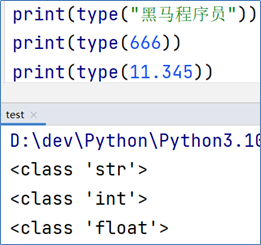

# 2.初始Python

1989年，为了**打发**圣诞节假期，Gudio van Rossum吉多· 范罗苏姆（龟叔）决心开发一个新的解释程序（Python雏形）

1991年，第一个Python解释器诞生

Python这个名字，来自龟叔所挚爱的电视剧Monty Python's Flying Circus


Python直译过来的意思是蟒蛇的意思，所以python语言的logo也就由两条小蟒蛇组合而成。


**为什么选择** **Python**

**简单**

**易学**

**开发效率高**


**适用面广泛**

| **人群/岗位**         | **用Python做什么**                                           |
| --------------------- | ------------------------------------------------------------ |
| IT从业者              | 自动化脚本（运维开发、测试开发等）                           |
| 普通白领              | 自动化办公                                                   |
| 后端开发              | WEB应用程序                                                  |
| 科学家                | 基于Python完成数据计算（生物、化学、物理）                   |
| **人工智能/机器学习** | **基于Python开发AI程序**                                     |
| **大数据开发**        | **基于** **Python**完成大数据任务开发（**Spark**、**Flink**） |
| **学生**              | **计算机二级考试**  **小学六年级Python课程**                 |

# 3.什么是编程语言

语言：进行沟通交流的表达方式

计算机只认识二进制0和1


**为什么不直接把中文翻译成二进制呢？**

自然语言远比编程语言复杂

编程语言语法”死板”

“翻译官”更容易翻译

# 4.Python环境安装（Windows）

想要使用Python语言编写程序，我们必须下载Python安装包并配置Python环境，

Python目前最新版本是：3.10.4（发布于2022年3月24日）

本次课程就基于当前最新版本进行学习


下载最新版Python

https://www.python.org


安装最新稳定版本


将页面拖到最底下，点击安装


## 安装流程

点击自定义安装


进入到可选的属性，默认都是全选的，点击下一步


配置Python的安装路径，**建议单独创建一个文件夹存放Python**


关闭路径长度的限制


**验证是否安装成功**

在命令提示符程序内，输入：python 并回车，出现python版本说明安装成功


# 7.第一个Python程序

向世界说你好，应该是全世界，所有程序员入门编程语言时，都会选择的第一个程序。

让我们也延续这一份来自程序员之间的浪漫，学习如何使用Python，向世界说你好。

我们的Python代码非常简单，如下：

~~~python
print("Hello World!!!")
~~~

含义：向屏幕上输出（显示），Hello World!!!

**注意**：输入的双引号和括号，请使用**英文符号**哦

打开CMD（命令提示符）程序，输入Python并回车

然后，在里面输入代码回车即可立即执行


# 9.常见问题解答

**命令提示符** 程序

使用快捷键：win + r

打开运行框，输入cmd后回车即可打开命令提示符程序


**2.命令提示符内，输入python出现**：'python' 不是内部或外部命令，也不是可运行的程序或批处理文件。

安装python的时候，没有勾选：add python 3.10 to PATH的选项


卸载Python，重新安装python，勾选这个选项。

然后重新打开命令提示符程序，即可


3.命令提示符内，出现：无法初始化设备 PRN


这是因为没有进入到python解释器环境内执行代码。

应该在命令提示符内：


4.执行出现：SyntaxError: invalid character '“' (U+201C)

这是因为，代码中的符号是中文符号。

请检查代码中的：

- 双引号

- 小括号

这两个符号，应该是英文符号

# 10.Python解释器

首先，一个基本原理是：

**计算机只认识二进制，即：0和1**

其实很简单，计算机是不会认识Python代码的。但是Python有解释器程序，如下图


安装Python环境，本质上，就是在电脑中，安装：

Python解释器程序

代码，随时可以写，但能不能运行，就要看电脑里面有没有解释器程序了。

Python解释器，是一个计算机程序，用来翻译Python代码，并提交给计算机执行。

在解释器环境内可以一行行的执行我们输入的代码

也可以使用解释器程序，去执行”.py”代码文件


所以，它的功能很简单，就2点：

1. 翻译代码

2. 提交给计算机运行

解释器存放在：<Python安装目录>/**python.exe**

**我们在CMD（命令提示符）程序内，执行的python，就是上图的python.exe程序哦**


**思考一下：**

**在python解释器程序内，我们发现，写完一行代码并回车后，会直接运行他。**

我们可以将代码，写入一个以”.py”结尾的文件中，使用python命令去运行它。

****

如，在Windows系统的D盘，我们新建一个名为：test.py的文件，并通过记事本程序打开它，输入如下内容：


在“命令提示符”程序内，使用python命令，运行它，如图：

**退出"命令提示符"程序：exit()**

“.py”文件是：python语言的代码文件，里面记录了python的代码

# 11.PyCharm开发工具的安装和基础使用

Python程序的开发有许多种方式，一般我们常见的有：

- Python解释器环境内，执行单行代码

- 使用Python解释器程序，执行Python代码文件

- 使用第三方IDE（集成开发工具），如PyCharm软件，开发Python程序

最常用的就是使用PyCharm软件进行开发

PyCharm集成开发工具（IDE），是当下全球Python开发者，使用**最频繁的工具软件**。

绝大多数的Python程序，都是在PyCharm工具内完成的开发。

本次课程全程基于PyCharm软件工具，来讲解Python。


首先，我们先下载并安装它：

打开网站：https://www.jetbrains.com

该网站自带中文


在开发者工具里找到PyCharm


专业版和社区版


安装步骤：


找到安装好的Python，打开

创建一个工程，我们来尝试写一写代码


指定工程路径以及选择Python解释器

配置Python解释器：

点击第三个选项，选择一个系统内置的解释器


工程创建完成：


创建一个Python代码文件 ，名称test.py


这里不带后缀py也可以，创建完成后它会自动加上后缀


填写如下内容


在空白处右键，然后选择运行：


# 12.PyCharm的基础使用

**修改主题**

默认是黑色主题，我们可以在PyCharm的右上角，点击“齿轮”


然后点击：”theme”，选择主题：


选择想要的主题即可：


**修改默认字体和大小**

打开设置：


**通过快捷键快速设置字体大小**

打开设置：


添加鼠标快捷键：


按ctrl + 鼠标滚轮上


同样，输入decre来设置减小字体的快捷键


**汉化软件**

打开插件功能：


翻译软件：


安装成功后：


**常用快捷键**

• ctrl + alt + s : 打开软件设置

• ctrl + d ：复制当前行代码

• shift + alt + 上\下 ： 将当前行代码上移或下移

• crtl + shift + f10 : 运行当前代码文件

• shift + f6 ：重命名文件

• ctrl + a : 全选

• ctrl + c\v\x : 复制、粘贴、剪切

• ctrl + f : 搜索

# 13.字面量

字面量：在代码中，被写下来的固定的值，称之为字面量

Python中常用的有6种值（数据）的类型

| 类型                                                         | 描述                                                         | 说明                                             |
| ------------------------------------------------------------ | ------------------------------------------------------------ | ------------------------------------------------ |
| 数字（Number）                                               | 支持  •整数（int）  •浮点数（float）  •复数（complex）  •布尔（bool） | 整数（int），如：10、-10                         |
| 浮点数（float），如：13.14、-13.14                           |                                                              |                                                  |
| 复数（complex），如：4+3j，以j结尾表示复数                   |                                                              |                                                  |
| 布尔（bool）表达现实生活中的逻辑，即真和假，True表示真，False表示假。  True本质上是一个数字记作1，False记作0 |                                                              |                                                  |
| 字符串（String）                                             | 描述文本的一种数据类型                                       | 字符串（string）由任意数量的字符组成             |
| 列表（List）                                                 | 有序的可变序列                                               | Python中使用最频繁的数据类型，可有序记录一堆数据 |
| 元组（Tuple）                                                | 有序的不可变序列                                             | 可有序记录一堆不可变的Python数据集合             |
| 集合（Set）                                                  | 无序不重复集合                                               | 可无序记录一堆不重复的Python数据集合             |
| 字典（Dictionary）                                           | 无序Key-Value集合                                            | 可无序记录一堆Key-Value型的Python数据集合        |

字符串（string），又称文本，是由任意数量的字符如中文、英文、各类符号、数字等组成。所以叫做字符的串

Python中，字符串需要用双引号（"）包围起来

被引号包围起来的，都是字符串


# 14.注释

## 一、介绍

注释：在程序代码中对程序代码进行解释说明的文字。

作用：注释不是程序，**不能被执行**，只是对程序代码进行解释说明，让别人可以看懂程序代码的作用，能够大大增强程序的可读性。

----

## 二、注释的分类

- 单行注释：以 #开头，#右边 的所有文字当作说明，而不是真正要执行的程序，起辅助说明作用

  > **注意，#号和注释内容一般建议以一个空格隔开**
  >
  > 这个是Python规范的要求。规范是Python官方建议的要求，不强制，不遵守也不影响程序执行。
  >
  > 但官方和大厂的代码都会遵守规范，所以遵守规范也会让我们的代码更高级。
  >
  > 不遵守规则：会出现问题
  >
  > 不遵守规范：不太高级

  

- 多行注释： 以 一对三个双引号 引起来 ("""注释内容""")来解释说明一段代码的作用使用方法

  

  多行注释一般用于对Python文件进行解释，或者对类或方法进行解释

  而对文件进行解释，一般会写到最上面的位置

# 15.变量

变量：**在程序运行时**，能储存计算结果或能表示值的抽象概念。

简单的说，变量就是在程序运行时，记录数据用的

**变量的定义格式**


变量就像盒子，可以存放内容。变量的特征就是，**变量存储的数据，是可以发生改变的。**


在python中，第二种写法是不被允许的。

print可以输出非常多份的数据，每分数据可以通过逗号隔开。

~~~python
# print(内容1, 内容2, ......, 内容N)
money = 50
print("钱包还有：", money)
print("钱包还有：" + money)
~~~


Python中如何做减法？

使用符号 - 即可完成减法运算

拓展：加（+）、减（-）、乘（*）、除（/）

# 16.数据类型

目前在入门阶段，我们主要接触如下三类数据类型：

| 类型       | 描述             | 说明                              |
| ---------- | ---------------- | --------------------------------- |
| **string** | 字符串类型       | 用引号引起来的数据都是字符串      |
| **int**    | 整型（有符号）   | 数字类型，存放整数 如 -1,10, 0 等 |
| **float**  | 浮点型（有符号） | 数字类型，存放小数 如 -3.14, 6.66 |

string、int、float这三个英文单词，就是类型的标准名称。

我们可以通过 `type()` 语句来得到数据的类型：

语法：type(被查看类型的数据)

1. 在print语句中，直接输出类型信息：

   str是string的缩写

   

2. 用变量存储type()的结果（返回值）：

   

查看的都是<字面量>的类型，还能查看变量中存储的数据类型


我们通过type(变量)可以输出类型，这是查看变量的类型还是数据的类型？

查看的是：变量存储的数据的类型。因为，变量无类型，但是它存储的数据有。


我们可能会说：字符串变量

但要知道，不是变量是字符串，而是它存储了：字符串

---

# 17.数据类型转换

**为什么要转换类型**

数据类型之间，在特定的场景下，是可以相互转换的，如字符串转数字、数字转字符串等

那么，我们为什么要转换它们呢？

数据类型转换，将会是我们以后经常使用的功能。

如：

- 从文件中读取的数字，默认是字符串，我们需要转换成数字类型

- 后续学习的input()语句，默认结果是字符串，若需要数字也需要转换

- 将数字转换成字符串用以写出到外部系统

- 等等

用途很多，那么让我们来学习一下如何转换吧。

| 语句(函数) | 说明                   |
| ---------- | ---------------------- |
| int(x)     | 将x转换为一个整数      |
| float(x)   | 将x转换为一个浮点数    |
| str(x)     | 将对象  x 转换为字符串 |

同前面学习的`type()`语句一样，这三个语句，都是带有结果的（返回值），我们可以用print直接输出，或用变量存储结果值


类型转换不是万能的，毕竟强扭的瓜不会甜，我们需要注意：

1. 任何类型，都可以通过str()，转换成字符串
2. 字符串内必须只有数字，才可以将字符串转换为数字


~~~python
# 浮点数转整数，会丢失精度，也就是小数部分
int_num = int(11.645)
print(type(int_num), int_num) # 11
~~~

---

# 19.标识符

**什么是标识符**

在Python程序中，我们可以给很多东西起名字，比如：

- 变量的名字

- 方法的名字

- 类的名字,等等

这些名字，我们把它统一的称之为标识符，用来做内容的标识。

所以，标识符：是用户在编程的时候所使用的一系列名字，用于给变量、类、方法等命名。

Python中，标识符命名的规则主要有3类：

- **内容限定**

- **大小写敏感**

- **不可使用关键字**

**内容限定**

标识符命名中，只允许出现这四类元素，其余任何内容都不被允许。

- 英文

- 中文

- 数字

- 下划线（_）

注意：

1. 不推荐使用中文

   > 尽管Python它支持以中文作为标识符的命名，但是目前支持的还不太完善，我们使用中文的话可能会有一些隐藏的问题，其次在行业中，大多数的程序员都会使用英文来去做标识符的命名，而不会使用中文。

2. 数字不可以开头


**大小写敏感**

以定义变量为例：

Andy = “安迪1”

andy = “安迪2”

字母a的大写和小写，是完全能够区分的。


**不可使用关键字**

Python中有一系列单词，称之为关键字。

关键字在Python中都有特定用途，我们不可以使用它们作为标识符。

关键字同样大小写敏感。


学完了标识符（变量、类、方法）的命名**规则**后，我们在来学习标识符的命名**规范**。

变量名，类名，方法名。不同的标识符，有不同的规范。


我们目前只接触到了：变量。所以，目前学习：变量的命名规范。

- 见名知意

  明了：尽量做到，看到名字，就知道是什么意思

  简洁：尽量在确保“明了”的前提下，减少名字的长度

- 下划线命名法

  多个单词组合变量名，要使用下划线做分隔。

- 英文字母全小写

  命名变量中的英文字母，应全部小写

---

# 20.运算符

| 运算符 | 描述   | 实例                                                         |
| ------ | ------ | ------------------------------------------------------------ |
| +      | 加     | 两个对象相加  a + b 输出结果  30                             |
| -      | 减     | 得到负数或是一个数减去另一个数  a - b 输出结果  -10          |
| *      | 乘     | 两个数相乘或是返回一个被重复若干次的字符串  a * b 输出结果  200 |
| /      | 除     | b /  a 输出结果 2                                            |
| //     | 取整除 | 返回商的整数部分  9//2 输出结果  4 , 9.0//2.0 输出结果  4.0  |
| %      | 取余   | 返回除法的余数  b % a 输出结果  0                            |
| **     | 指数   | a**b  为10的20次方，  输出结果 100000000000000000000         |

加减乘除和求平方，我们在前面已经使用过啦。

现在在带上：整除以及求余数，一起试一试吧。


**赋值运算符**

| **运算符** | **描述**   | **实例**                                                     |
| ---------- | ---------- | ------------------------------------------------------------ |
| =          | 赋值运算符 | 把 =  号右边的结果 赋给 左边的变量，如 num  = 1 + 2 * 3，结果num的值为7 |

**复合赋值运算符**

| **运算符** | **描述**         | **实例**                    |
| ---------- | ---------------- | --------------------------- |
| +=         | 加法赋值运算符   | c  += a 等效于 c =  c + a   |
| -=         | 减法赋值运算符   | c  -= a 等效于 c =  c - a   |
| *=         | 乘法赋值运算符   | c  *= a 等效于 c =  c * a   |
| /=         | 除法赋值运算符   | c  /= a 等效于 c =  c / a   |
| %=         | 取模赋值运算符   | c  %= a 等效于 c =  c % a   |
| **=        | 幂赋值运算符     | c  **= a 等效于 c =  c ** a |
| //=        | 取整除赋值运算符 | c  //= a 等效于 c =  c // a |

---

# 21.字符串的三种定义方式

字符串有3种不同的定义方式：

- 双引号定义法："字符串"（最常用的写法）

- 单引号定义法：'字符串'

- 三引号定义法："""字符串"""

三引号定义法，表示在一堆三个双引号的范围内，均是字符串，如下：


三引号定义法，和多行注释的写法一样，同样支持换行操作。表示在一堆三个双引号的范围内，均是字符串。要注意的是，包含范围是：**从三个引号开始，到下一个三个引号结束**

- 使用变量接收它，它就是字符串
- 不使用变量接收它，就可以作为多行注释使用。


**思考：如果我想要定义的字符串本身，是包含：单引号、双引号自身呢？如何写？**

- 单引号定义法，可以内含双引号
- 双引号定义法，可以内含单引号
- 可以使用转移字符（反斜杠）（\）来将引号解除效用，变成普通字符串

---

# 22.字符串拼接

如果我们有两个字符串（文本）字面量，可以将其拼接成一个字符串，通过+号即可完成，如：

~~~python
print("学IT来黑马" + "月薪过万")
~~~

输出结果：


不过一般，单纯的2个字符串字面量进行拼接显得很呆，一般，`字面量和变量` 或 `变量和变量之间会使用拼接`，如：


既然可以和字符串变量完成拼接，那么，是否可以和其它变量类型如数字类型完成拼接呢？

**字符串无法和非字符串变量进行拼接**，这个时候会报类型错误。因为类型不一致，无法接上。


---

# 23.字符串格式化

我们会发现，这个拼接字符串也不好用啊

1. 变量过多，拼接起来实在是太麻烦了
2. 字符串无法和数字或其它类型完成拼接。


所以，有没有其它方式，即方便又支持拼接其它类型呢？这个方式，就是字符串的格式化。

我们可以通过如下语法，完成字符串和变量的快速拼接。这种方式的拼接我们把它叫做：占位式的拼接

```python
name = "黑马程序员"
message = "学IT来：%s" % (name)
print(message)
```


其中的，%s 

- % 表示：我要占位

- s  表示：将变量变成字符串放入占位的地方

第2个 `%` 代表补全变量

所以，综合起来的意思就是：我先占个位置，等一会有个变量过来，我把它变成字符串放到占位的位置。


那数字类型呢？可以不可以占位？那必须可以，我们来尝试如下代码，数字也能用%s占位，这里是将数字 转换成了 字符串，也就是数字57，变成了字符串"57"被放入占位的地方。

```python
# 通过占位的形式，完成数字和字符串的拼接
class_num = 57 # class_num表示班级的号码
avg_salary = 16781
message = "Python大数据学科，北京%s期，毕业平均工资：%s" % (class_num, avg_salary)
print(message)
```


PS：多个变量占位，变量要用括号括起来，使用逗号分隔，并按照占位的顺序填入。

数字类型，也太没有地位了吧，竟然要被转成字符串拼接。有没有体面一点的方式，让数字以其原本的面貌拼接进去呢？

Python中，其实支持非常多的数据类型占位，最常用的是如下三类。

| 格式符号 | 转化                             |
| -------- | -------------------------------- |
| %s       | 将内容转换成字符串，放入占位位置 |
| %d       | 将内容转换成整数，放入占位位置   |
| %f       | 将内容转换成浮点型，放入占位位置 |

如下代码，完成字符串、整数、浮点数，三种不同类型变量的占位。

```python
name = "传智播客"
set_up_year = 2006
stock_price = 19.99
message = ("我是：%s，我成立于：%d，我今天的股价是：%f") % (name, set_up_year, stock_price)
print(message)
```


---

# 24.字符串格式化的精度控制

观察我们刚刚写的代码，19.99变成了19.990000了，这就是因为我们没有对它做精度控制。

我们可以使用辅助符号"m.n"来控制数据的宽度和精度

- m，控制宽度，要求是数字（很少使用）,**设置的宽度小于数字自身，不生效**

- .n，控制小数点精度，要求是数字，**会进行小数的四舍五入**，数据会失真

示例：

- %5d：表示将整数的宽度控制在5位，如数字11，被设置为5d，就会变成：[空格] [空格] [空格]11，用三个空格补足宽度。

- %5.2f：表示将宽度控制为5，将小数点精度设置为2

小数点和小数部分也算入宽度计算。如，对11.345设置了%7.2f 后，结果是：[空格] [空格]11.35。2个空格补足宽度，小数部分限制2位精度后，四舍五入为 .35

- %.2f：表示不限制宽度，只设置小数点精度为2，如11.345设置%.2f后，结果是11.35


---

# 25.字符串格式化的方式2

目前通过%符号占位已经很方便了，还能进行精度控制。可是追求效率和优雅的Python，是否有更加优雅的方式解决问题呢？

通过语法：f"内容{变量}"的格式来快速格式化（在字符串的前面加上 f（format格式化的首字母） 作为标记，标记完之后，可以在内容中通过{ }进行占位，然后在大括号的内部填入变量就可以完成快速格式化了。看如下代码


PS：这种写法不做精度控制，也不理会类型，适用于快速格式化字符串，所以这种方式适合对精度没有要求的时候快速使用呢。

---

# 26.对表达式进行格式化

刚刚的演示，都是基于变量的。可是，我想更加优雅些，少写点代码，直接对“表达式”进行格式化是否可行呢？那么，我们先了解一下什么是表达式。

表达式：一条具有**明确执行结果**的**代码语句**，如：

1 + 1、5 * 2，就是表达式，因为有具体的结果，结果是一个数字，又或者，常见的变量定义：name = “张三” （这个也是有具体的结果，具体的结果赋值给了具体的变量）， age = 11 + 11。

等号右侧的都是表达式呢，因为它们有具体的结果，结果赋值给了等号左侧的变量。

那么，对于字符串格式化，能否直接格式化一个表达式呢？可以，上代码，在无需使用变量进行数据存储的时候，可以直接格式化表达式，简化代码哦。


---

# 27.字符串格式化练习题讲解

定义如下变量：

- name，公司名
- stock_price，当前股价
- stock_code，股票代码
- stock_price_daily_growth_factor，股票每日增长系数，浮点数类型，比如1.2
- growth_days，增长天数

计算，经过growth_days天的增长后，股价达到了多少钱

使用字符串格式化进行输出，如果是浮点数，要求小数点精度2位数。示例输出：


红色框框都是变量，要使用格式化的方式拼接进去

提示，可以使用： 当前股价 ***** 增长系数 ***\*** 增长天数， 用来计算最终股价哦。如，股价19.99 * 系数1.2 ** 7天 = 71.62778419199998，小数点现在精度2位后结果：71.63

股票代码需要使用字符串定义，如果是数字的话，这种写法是不符合规定的，数字不能直接以0开头

~~~python
# 定义需要的变量
name = "传智播客"
stock_price = 19.99
stock_code = "003032"
# 股票 价格 每日 增长 因子
stock_price_daily_growth_factor = 1.2
growth_days = 7

finally_stock_price = stock_price * stock_price_daily_growth_factor ** growth_days

print(f"公司：{name}，股票代码：{stock_code}，当前股价：{stock_price}")
print("每日增长系数: %.1f，经过%d天的增长后，股价达到了：%.2f" % (stock_price_daily_growth_factor, growth_days, finally_stock_price))
~~~

---

# 28.数据输入（input语句）

我们前面学习过print语句（函数），可以完成将内容（字面量、变量等）输出到屏幕上。在Python中，与之对应的还有一个input语句，用来获取键盘输入。

- 数据输出：print

- 数据输入：input

使用上也非常简单：

- 使用input()语句可以从键盘获取输入

- 使用一个变量接收（存储）input语句获取的键盘输入数据即可
- = 是标准的赋值运算符，把右边的结果赋予左边的变量。

在控制台中输入的内容，本质上来说被input语句接收了，它接受的内容又赋值给了name这个变量。


在前面的代码中，输出 “请告诉我你是谁？” 的print语句其实是多余的


input()语句其实是可以在要求使用者输入内容前，输出提示内容的哦，如图，在input的括号内直接填入提示内容即可。这个功能等用于直接在它前面输出一个print。


我们刚刚试验的都是输入了字符串类型的数据。那么如果我们输入数字类型或其它类型，结果会如何？

那么，通过前面学习过**type()**语句来验证一下输入内容的数据类型吧。


可以看到，无论键盘输入何种类型的数据，**最终的结果都是：字符串类型的数据**。如果需要得到其他类型，请自行进行转换。

---

# 29.布尔类型和比较运算符

**布尔类型**

进行判断，只有2个结果：是 / 否。程序中使用**布尔类型**描述是或否。布尔类型是数字中的小类。


**使用：布尔类型**

Python中常用的有**6**种值（数据）的类型

| 类型               | 描述                                                         | 说明                                                         |
| ------------------ | ------------------------------------------------------------ | ------------------------------------------------------------ |
| 数字（Number）     | 支持  •整数（int）  •浮点数（float）  •复数（complex）  •布尔（bool） | 整数（int），如：10、-10                                     |
|                    |                                                              | 浮点数（float），如：13.14、-13.14                           |
|                    |                                                              | 复数（complex），如：4+3j，以j结尾表示复数                   |
|                    |                                                              | 布尔（bool）表达现实生活中的逻辑，即真和假，True表示真  False表示假。  True本质上是一个数字记作1，False记作0。<br />所以它们被标记为数字类型。 |
| 字符串（String）   | 描述文本的一种数据类型                                       | 字符串（string）由任意数量的字符组成                         |
| 列表（List）       | 有序的可变序列                                               | Python中使用最频繁的数据类型，可有序记录一堆数据             |
| 元组（Tuple）      | 有序的不可变序列                                             | 可有序记录一堆不可变的Python数据集合                         |
| 集合（Set）        | 无序不重复集合                                               | 可无序记录一堆不重复的Python数据集合                         |
| 字典（Dictionary） | 无序Key-Value集合                                            | 可无序记录一堆Key-Value型的Python数据集合                    |

布尔类型的字面量（注意它们的首字母都是大写的）：

- True 表示真（是、肯定）

- False 表示假 （否、否定）

定义变量存储布尔类型数据：

~~~bash
变量名称 = 布尔类型字面量
~~~

布尔类型不仅可以自行定义，同时也可以通过计算的来。

也就是使用比较运算符进行比较运算得到布尔类型的结果。下面的 > 和 == 都是比较运算符。


## 比较运算符

| **运算符** | **描述**                                                     | **示例**                         |
| ---------- | ------------------------------------------------------------ | -------------------------------- |
| ==         | 判断内容是否相等，满足为True，不满足为False                  | 如a=3,b=3，则(a  == b)  为  True |
| !=         | 判断内容是否不相等，满足为True，不满足为False                | 如a=1,b=3，则(a  != b) 为  True  |
| >          | 判断运算符左侧内容是否大于右侧  满足为True，不满足为False    | 如a=7,b=3，则(a  > b)  为 True   |
| <          | 判断运算符左侧内容是否小于右侧  满足为True，不满足为False    | 如a=3,b=7，则(a  < b)  为 True   |
| >=         | 判断运算符左侧内容是否大于等于右侧  满足为True，不满足为False | 如a=3,b=3，则(a  >= b) 为  True  |
| <=         | 判断运算符左侧内容是否小于等于右侧  满足为True，不满足为False | 如a=3,b=3，则(a  <= b) 为  True  |

~~~python
"""
演示布尔类型的定义
以及比较运算符的应用
"""
# 定义变量存储布尔类型的数据
bool_1 = True
bool_2 = False
print(f"bool_1变量的内容是：{bool_1}, 类型是：{type(bool_1)}") # bool_1变量的内容是：True，类型是：<class 'bool'>
print(f"bool_2变量的内容是：{bool_2}, 类型是：{type(bool_2)}") # bool_2变量的内容是：False，类型是：<class 'bool'>

# 比较运算符的使用
# == , !=, >, <, >=, <=
# 演示进行内容的相等比较
num1 = 10
num2 = 10
print(f"10 == 10的结果是：{num1 == num2}")

num1 = 10 # 为num1 和 num2 重新赋值
num2 = 15
print(f"10 != 15的结果是：{num1 != num2}")

name1 = "itcast"
name2 = "itheima"
print(f"itcast == itheima 结果是：{name1 == name2}")

# 演示大于小于，大于等于小于等于的比较运算
num1 = 10
num2 = 5
print(f"10 > 5结果是：{num1 > num2}")
print(f"10 < 5的结果是：{num1 < num2}")

num1 = 10
num2 = 11
print(f"10 >= 11的结果是：{num1 >= num2}")
print(f"10 <= 11的结果是：{num1 <= num2}")
~~~

---

# 30.if语句的基本格式

语法：1）不要忘记冒号	2）`条件成立时，要做的事情` 的前面是有4个空格做了缩进，python是通过空格缩进来判断它所归属的。


~~~python
# 定义变量
age = 30
# 进行判断，age >= 18 通过比较运算符得到的结果是一个布尔类型的
if age >= 18:
    print("我已经成年了")
~~~

同样，if条件成立之后，我们可以不仅仅只写一条代码，我们可以写任意多条代码，但一定要注意，需要使用4个空格做缩进确定代码属于哪个代码块，最后一个print打印语句就不受 if 的约束。

~~~python
age = 18
if age >= 18:
    print(f"我已经{age}岁了")
    print("即将步入大学")
print("时间过的真快")
~~~


**if语句的注意点**

- 判断语句的结果，必须是布尔类型True或False，True会执行 if 内的代码语句，False则不会执行。
- 不要忘记判断条件后的：引号
- 归属于if语句的代码块，需在前方填充4个空格缩进


---

# 31.案例 - 成年人判断

结合前面学习的input输入语句，完成如下案例：

1. 通过input语句，获取键盘输入，为变量age赋值。（注意转换成数字类型）

2. 通过if判断是否是成年人，满足条件则输出提示信息，如下：


提示：您已成年，需要补票的信息输出，来自 if 判断

~~~python
# 获取键盘输入
age = int(input("请输入你的年龄："))

# 通过if判断是否是成年人
if age >= 18:
    print("您已成年，游玩需要买票，10元.")

print("祝您游玩愉快")
~~~

---

# 32.if - else组合判断语句

if满足条件会执行相应的代码语句，如果不满足呢？

有没有不满足的情况下，可供执行的代码呢？**if else** **语句可以实现**

语法：


代码示例：

```python
# 这里注意input得到的永远是字符串类型的数据，这里需要强转为int
age = int(input("请输入你的年龄"))
if age >= 18:
    print("您已成年，游玩需补票10元！")
else:
    print("您未成年，可以免费游玩！")
```


注意：

1. if else 语句，其中if和其代码块，条件满足时执行；else搭配if的判断条件，当不满足的时候执行
2. if else语句的注意事项：
   - else不需要判断条件，当if的条件不满足时，else执行
   - else的代码块，同样要4个空格作为缩进


---

# 34.if - elif -else组合使用的语法

某些场景下，判断条件不止一个，可能有多个。这种需求能用Python实现吗？**if** **elif** **else** **语句可以实现**

语法：


代码示例


----


## if elif else语句 注意点

elif 语句可以写多个。


1、判断是互斥且有顺序的。

- 满足1（如图编号）将不会理会2和3

- 满足2，将不会理会3

- 1、2、3均不满足，进入else

- else也可以省略不写，效果等同3个独立的if判断


2、空格缩进同样不可省略


3、可以如下图，将input输入语句直接写入判断条件中。节省代码量，并且这个时候它不会让你同时再输入三个变量的值了，而是会让你挨个输入，如果有个条件已经满足了，就不会让你输入下一个变量了。


---

# 35.案例：猜猜心理数字

1. 定义一个变量，数字类型，内容随意。

2. 基于input语句输入猜想的数字，通过if和多次elif的组合，判断猜想数字是否和心里数字一致。

~~~python
# 定义一个变量数字
num = 5

# 通过键盘输入获取猜想的数字，通过多次if 和 elif的组合进行猜想比较
if int(input("请猜一个数字：")) == num:
    print("恭喜第一次就猜对了呢")
elif int(input("猜错了，再猜一次：")) == num:
    print("猜对了")
elif int(input("猜错了，再猜一次：")) == num:
    print("恭喜，最后一次机会，你猜对了")
else:
    print("Sorry 猜错了")
~~~


----

# 36.判断语句的嵌套

有很多场景，不仅仅是多个并列条件，还会有满足前置条件才会二次判断的多层判断需求。**对这种需求，嵌套判断语句可以实现**

许多逻辑的判断，是嵌套的，多层次的。对于这种需求，我们可以：自由组合 if elif else，完成特定需求的要求


基础语法格式如下：


如上图，第二个if，属于第一个if内，只有第一个if满足条件，才会执行第二个if

嵌套的关键点，在于：空格缩进，通过空格缩进，来决定语句之间的：层次关系


**简单嵌套**

如图，判断有2层，当外层if满足条件（图中编号1）时，才会执行内层if判断（图中编号2）；当外层if（编号1）不满足，直接执行外层esle。


**注意事项**

1. 嵌套判断语句可以用于多条件、多层次的逻辑判断

2. 嵌套判断语句可以根据需求，自由组合if elif else来构建多层次判断

3. 嵌套判断语句，一定要注意空格缩进，Python通过空格缩进来决定层次关系


---

# 37.判断语句综合案例

案例要求: 

1. 数字随机产生，范围1-10

2. 有3次机会猜测数字，通过3层嵌套判断实现

3. 每次猜不中，会提示大了或小了

提示，通过如下代码，可以定义一个变量num，变量内存储随机数字。


代码示例

```python
import random
num = random.randint(1, 10)

guess_num = int(input("输入你要猜测的数字："))
if guess_num == num:
    print("恭喜，第一次就猜中了")
else:
    if guess_num > num:
        print("你猜测的数字大了")
    else:
        print("你猜测的数字小了")
        guess_num = int(input("再次输入你要猜测的数字："))

    if guess_num == num:
        print("恭喜，第二次猜中了")
    else:
        if guess_num > num:
            print("你猜测的数字大了")
        else:
            print("你猜测的数字小了")
            guess_num = int(input("第三次输入你要猜测的数字："))
    
            if guess_num == num:
                print("第三次猜中了")
            else:
                print("三次机会用完了，没有猜中。")
```


---

# 38.while循环的基础应用

循环有两个关键要素：操作、条件。

语法：只要条件满足，会无限循环执行


案例：小美心软，只要表白100次，就会成功

~~~python
i = 0
while i < 100:
    print("小美，我喜欢你")
    i += 1
~~~


注意：

1. while的条件需得到布尔类型，True表示继续循环，False表示结束循环

2. 需要设置循环终止的条件，如i += 1配合 i < 100，就能确保100次后停止，否则将无限循环

3. 空格缩进和if判断一样，都需要设置

---

# 39.案例：使用while循环求1-100的和

提示：

1. 终止条件不要忘记，设置为确保while循环100次

2. 确保累加的数字，从1开始，到100结束

```python
i = 1
sum = 0
while i <= 100:
    sum += i
    i += 1
print(f"1-100累加的和是：{sum}")
```


---

# 40.案例：使用while循环实现猜数字

设置一个范围1-100的随机整数变量，通过while循环，配合input语句，判断输入的数字是否等于随机数

无限次机会，直到猜中为止。每一次猜不中，会提示大了或小了。猜完数字后，提示猜了几次

提示：

- 无限次机会，终止条件不适合用数字累加来判断

- 可以考虑布尔类型本身（True or False）

- 需要提示几次猜中，就需要提供数字累加功能

- 随机数可以使用：

  

代码示例

~~~python
# 获取范围在1-100的随机数字
import random
num = random.randint(1, 100)
# 定义一个变量，记录总共猜测了多少次
count = 0

# 通过一个布尔类型的变量，做循环是否继续的标记
flag = True
while flag:
    guess_num = int(input("请输入你猜测的数字:"))
    count += 1
    if guess_num == num:
        print("猜中了")
        # 设置为False就是终止循环的条件
        flag = False
    else:
        if guess_num > num:
            print("你猜的大了")
        else:
            print("你猜的小了")

print(f"你总共猜测了{count}次")
~~~


---

# 41.while循环的嵌套应用

语法：循环内套循环


案例：表白100天，每一天都会送10朵玫瑰花


- 同判断语句的嵌套一样，循环语句的嵌套，要注意空格缩进。

- 基于空格缩进来决定层次关系

- 注意条件的设置，避免出现无限循环（除非真的需要无限循环）
- 循环条件的控制，层次越多越复杂，需要细心 + 耐心


---

# 42.案例：使用while循环打印出九九乘法表

## 补充知识 - print输出不换行

默认print语句输出内容会自动换行，在即将完成的案例中，我们需要使用print语句，输出不换行的功能，非常简单，实现方式如下，在print语句中，加上 end=’’ 即可输出不换行了


ps: `end=''` 是使用的方法传参功能，我们在后面会详细讲解。


**补充知识-制表符\t**

在字符串中，有一个特殊符号：\t，效果等同于在键盘上按下：tab键。

它可以让我们的多行字符串进行对齐。比如：


**案例-打印九九乘法表**

通过while循环，输出如下九九乘法表内容


提示：

- 2层循环，外层控制行，内层控制列

- 外层循环和内存循环的累加数字变量，用以辅助输出乘法表的数值

代码

~~~python
"""
演示使用while的嵌套循环
打印输出九九乘法表
"""

# 定义外层循环的控制变量
i = 1
while i <= 9:

    # 定义内层循环的控制变量
    j = 1
    while j <= i:
        # 内层循环的print语句，不要换行，通过\t制表符进行对齐
        print(f"{j} * {i} = {j * i}\t", end='')
        j += 1

    i += 1
    print()     # print空内容，就是输出一个换行
~~~


---

# 43.for循环的基础语法

除了while循环语句外，Python同样提供了for循环语句。两者能完成的功能基本差不多，但仍有一些区别：

- while循环的循环条件是自定义的，自行控制循环条件

- for循环是一种”轮询”机制，是对一批内容进行”逐个处理”

**while循环**


**for循环**

for循环就是将”待办事项”逐个完成的循环机制


**语法**

~~~python
for 临时变量 in 待处理数据集: 
        循环满足条件时执行的代码
~~~

从待处理数据集中：逐个取出数据，赋值给临时变量

**遍历字符串**

 ~~~python
# 定义字符串name
name = ”itheima”
# for循环处理字符串
for x in name: 
       print(x)
 ~~~

运行结果如下，可以看出，for循环是将字符串的内容：依次取出。所以，for循环也被称之为：遍历循环


同while循环不同，for循环是无法定义循环条件的。只能从被处理的数据集中，依次取出内容进行处理。

所以，理论上讲，Python的for循环无法构建无限循环（被处理的数据集不可能无限大）。要注意，循环内的语句，需要有空格缩进


---

# 44.案例：利用for循环数一数字符串中有几个a

定义字符串变量name，内容为："itheima is a brand of itcast"

通过for循环，遍历此字符串，统计有多少个英文字母："a"

提示：

1. 计数可以在循环外定义一个整数类型变量用来做累加计数

2. 判断是否为字母"a"，可以通过if语句结合比较运算符来完成

代码示例

~~~python
# 统计如下字符串中，有多少个字母a
name = "itheima is a brand of itcast"

# 定义一个变量，用来统计有多少个a
count = 0

# for 循环统计
# for 临时变量 in 被统计的数据:
for x in name:
    if x == "a":
        count += 1

print(f"被统计的字符串中有{count}个a")
~~~


---

# 45.range语句

range的用途很多，多数用在for循环场景。

 ~~~python
for 临时变量 in 待处理数据集(可迭代对象): 
        循环满足条件时执行的代码
 ~~~

语法中的：待处理数据集，严格来说，称之为：序列类型

序列类型指，其内容可以一个个依次取出的一种类型，包括：字符串、列表、元组等。

for循环语句，本质上是遍历：序列类型。尽管除字符串外，其它可迭代类型目前没学习到，但不妨碍我们通过学习range语句，获得一个简单的数字序列（可迭代类型的一种）。

语法1：

~~~python
range(num)
~~~

获取一个从0开始，到num结束的数字序列（不含num本身）

如range(5)取得的数据是：[0, 1, 2, 3, 4]


语法2：

~~~python
range(num1, num2)
~~~

获得一个从num1开始，到num2结束的数字序列（不含num2本身）。如，range(5, 10)取得的数据是：[5, 6, 7, 8, 9]


语法3：

~~~python
range(num1, num2, step)
~~~

获得一个从num1开始，到num2结束的数字序列（不含num2本身）。数字之间的步长，以step为准（step默认为1）。如，range(5, 10, 2)取得的数据是：[5, 7, 9]

代码示例

~~~python
# range语法1 range(num)
for x in range(10):
    print(x)

# range 语法2 range(num1, num2)
for x in range(5, 10):
    # 从5开始，到10结束（不包含10本身）的一个数字序列，数字之间间隔是1
    print(x)

# range 语法3 range(num1, num2, step)
for x in range(5, 10, 2):
    # 从5开始，到10结束（不包含10本身）的一个数字序列，数字之间的间隔是2
    print(x)

for x in range(10):
    print("送玫瑰花")
~~~


---

# 46.for循环临时变量作用域

如图代码，思考一下：红框中的print语句，能否访问到变量 `i` ？


规范上：不允许，实际上：可以


**for循环的变量作用域**

回看for循环的语法，我们会发现，将从数据集（序列）中取出的数据赋值给：临时变量，为什么是临时的呢？

临时变量，在编程规范上，作用范围（作用域），只限定在for循环内部

如果在for循环外部访问临时变量，规范是软要求，规则是硬要求。这种限定：

- 是编程规范的限定，而非强制限定
- 不遵守也能正常运行，但是不建议这样做

如下图，编译器报了警告，编译器察觉出来什么问题，但它也不确定，因为它没有给你红色（红色是报错）。但真正运行的时候可以发现 i 是可以正常访问到 i 的。


如果实在需要在循环外访问循环内的临时变量，让代码符合规范，可以在循环外预先定义


如图，每一次循环的时候，都会将取出的值赋予 i 变量。

- 由于i变量是在循环之前（外）定义的

- 在循环外访问i变量是合理的、允许的


---

# 47.for循环的嵌套使用

语法


案例：表白100天，每一天都会送10朵玫瑰花

~~~python
# 坚持表白100天，每天都送10朵花
# range
i = 0
for i in range(1, 101):
    print(f"今天是向小美表白的第{i}天，加油坚持。")

    # 写内层的循环了
    for j in range(1, 11):
        print(f"给小美送的第{j}朵玫瑰花")

    print("小美我喜欢你")

print(f"第{i}天，表白成功")
~~~

如图，和while循环一样，需要注意缩进。因为通过缩进，确定层次关系。

我们目前学习了2个循环，while循环和for循环。这两类循环语句是可以相互嵌套的，如下，小美表白的案例可以改为：


---

# 48.案例：使用for循环打印出九九乘法表

通过for循环，输出如下九九乘法表内容


提示：

- 2层循环，外层控制行，内层控制列

- 可使用range语句来得到数字序列进行for循环

- 内层for循环的range最大范围，取决于当前外层循环的数字

~~~python
# 通过外层循环控制行数
for i in range(1, 10):
    # 通过内层循环控制每一行的数据
    for j in range(1, i + 1):
        # 在内层循环中输出每一行的内容
        print(f"{j} * {i} = {j * i}\t", end='')

    # 外层循环可以通过print输出一个回车符
    print()
~~~


---

# 49.continue 和 break

思考：无论是while循环或是for循环，都是重复性的执行特定操作。在这个重复的过程中，会出现一些其它情况让我们不得不：

1、暂时跳过某次循环，直接进行下一次；2、提前退出循环，不在继续

对于这种场景，Python提供continue和break关键字用以对循环进行临时跳过和直接结束。


**continue**

continue关键字用于：中断本次循环，直接进入下一次循环

continue可以用于：  for循环和while循环，效果一致

continue关键字只可以控制：它所在的循环临时中断

例如：continue只能控制下图编号1的for循环，对编号2的for循环，无影响


**break**

break关键字用于：直接结束所在循环

break可以用于：  for循环和while循环，效果一致

break关键字同样只可以控制：它所在的循环永久中断

例如：break只能控制下图编号1的循环，对编号2的循环，无影响


----

# 50.循环综合案例：发工资

某公司，账户余额有1W元，给20名员工发工资。

- 员工编号从1到20，从编号1开始，依次领取工资，每人可领取1000元

- 领工资时，财务判断员工的绩效分（1-10）（随机生成），如果低于5，不发工资，换下一位

- 如果工资发完了，结束发工资。

	

提示：

- continue用于跳过员工，break直接结束发工资

- if判断余额，不要忘记发完工资后，余额减少1000哦


---

# 51.函数的初体验

函数：是组织好的，可重复使用的，用来实现特定功能的代码段。

- 组织好的：提前将功能逻辑都写好了


为什么随时都可以使用，len()统计长度？因为，len()是Python内置的函数：

- 是提前写好的

- 可以重复使用

- 实现统计长度这一特定功能的代码段

我们使用过的：input()、print()、str()、int()等都是Python的内置函数。

为了得到一个针对特定需求、可供重复利用的代码段，提高程序的复用性，减少重复性代码，提高开发效率。


---

# 52.函数的基础定义语法

函数的定义：


函数的调用：


注意事项：

① 参数如不需要，可以省略，但是括号一定要加上

② 返回值如不需要，可以省略

③ 函数必须先定义后使用


---

# 53.案例：自动查核酸

定义一个函数，函数名任意，要求调用函数后可以输出如下欢迎语：


代码示例：通过 `\n` 可以直接换行

~~~python
# 定义函数
def check():
    # 编写函数体输出信息
    print("欢迎来到黑马程序员！\n请出示您的健康码以及72小时核酸证明！")

# 调用函数
check()
~~~


---

# 54.函数的传入参数

## 一、引入

传入参数的功能是：在函数进行计算的时候，接受外部提供的数据。也就是调用的时候可以通过外部向函数内传入数据。

有如下代码，完成了2个数字相加的功能：


函数的功能非常局限，只能计算1 + 2。

有没有可能实现：每一次使用函数，去计算用户指定的2个数字，而非每次都是1 + 2呢？可以的，使用函数的传入参数功能，即可实现。

---

## 二、语法解析

基于函数的定义语法：


可以有如下函数定义：


实现了，每次计算的是x + y，而非固定的1 + 2。x + y的值，可以在调用函数的时候指定。

~~~python
# 定义2数相加的函数，通过参数接收被计算的2个数字
def add(x, y, z):
    result = x + y + z
    print(f"{x} + {y} + {z}的计算结果是：{result}")

# 调用函数，传入被计算的2个数字
add(5, 6, 7)
~~~

语法解析：

- 函数定义中，提供的x和y，称之为：形式参数（形参），表示函数声明将要使用2个参数

- 参数之间使用逗号进行分隔

- 函数调用中，提供的5和6，称之为：实际参数（实参），表示函数执行时真正使用的参数值

- 传入的时候，按照顺序传入数据，使用逗号分隔

传入参数的数量是不受限制的。

- 可以不使用参数

- 也可以仅使用任意N个参数


---

# 55.练习案例：升级版自动查核酸

定义一个函数，名称任意，并接受一个参数传入（数字类型，表示体温）

在函数内进行体温判断（正常范围：小于等于37.5度），并输出如下内容：


**代码示例**

~~~python
# 定义函数，接收1个形式参数，数字类型，表示体温
def check(num):
    # 在函数体内进行判断体温
    print("欢迎来到黑马程序员！请出示您的健康码以及72小时核酸证明，并配合测量体温！")
    if num <= 37.5:
        print(f"体温测量中，您的体温是：{num}度，体温正常请进！")
    else:
        print(f"体温测量中，您的体温是：{num}度，需要隔离！")

# 调用函数，传入实际参数
check(37.6)
~~~


---

# 56.函数的返回值

## 一、什么是返回值？

**生活中的返回值**：假设小明有一个功能，它就是专门去帮我们买东西的。今天跟小明说：帮我买3瓶可乐。此时小明的功能可以认为是一个函数，我们让它买3瓶可乐，就相当于给这个函数传参了。传完餐后，小明这个函数就开始工作了。买完可乐后就把可乐给了我们，这个可乐就是返回值。


**程序中的返回值**：

如图代码，定义两数相加的函数功能。完成功能后，会将相加的结果返回给函数调用者


所以，变量r接收到了函数的执行结果。综上所述：所谓“返回值”，就是程序中函数完成事情后，最后给调用者的结果。

---

## 二、返回值语法格式

语法格式如图：


如图，变量就能接收到函数的返回值。语法就是：通过return关键字，就能向调用者返回数据。

---

## 三、代码示例

定义一个函数，完成两数相加的功能，并返回结果。

PS：函数体在遇到return后就结束了，所以写在return后的代码不会执行。

~~~python
# 定义一个函数，完成2数相加功能
def add(a, b):
    result = a + b
    # 通过返回值，将相加的结果返回给调用者
    return result
    # 返回结果后，还想输出一句话，此时这句话是不能输出的。因为函数在执行的时候遇到return关键字，后面所有的代码就都不执行
    print("我完事了")


# 函数的返回值，可以通过变量去接收
r = add(5, 6)
print(r)
~~~


---

# 57.函数返回值之None类型

## 一、None类型

思考：如果函数没有使用return语句返回数据，那么函数有返回值吗？实际上是：有的。

Python中有一个特殊的字面量：None，其类型是：<class 'NoneType'>，无返回值的函数，实际上就是返回了：None这个字面量。

None表示：空的、无实际意义的意思，函数返回的None，就表示，这个函数没有返回什么有意义的内容。也就是返回了空的意思。

**代码示例**

~~~python
# 无return语句的函数返回值
def say_hi():
    print("你好呀")

result = say_hi()
print(f"无返回值函数，返回的内容是：{result}")
print(f"无返回值函数，返回的内容类型是：{type(result)}")
~~~

None可以主动使用return返回，效果等同于不写return语句

~~~python
# 主动返回None的函数
def say_hi2():
    print("你好呀")
    return None

result = say_hi2()
print(f"无返回值函数，返回的内容是：{result}")
print(f"无返回值函数，返回的内容类型是：{type(result)}")
~~~

---

## 二、None的应用场景

None作为一个特殊的字面量，用于表示：空、无意义，其有非常多的应用场景。

**场景一**：用在函数无返回值上

**场景二**：用在if判断上

在 if 判断中，None等同于False。因为None表示空的意思，啥都没有，所以None等同于假。

一般用于在函数中主动返回None，配合if判断做相关处理

~~~python
# None用于if判断
def check_age(age):
    if age > 18:
        return "SUCCESS"
    else:
        return None

result = check_age(16)
# if result == False: 这样写也可以，但是会显得有点啰嗦
if not result:
    # 进入if表示result是None值 也就是False
    print("未成年，不可以进入")
~~~

**场景三**：用于声明无内容的变量上，定义变量，但暂时不需要变量有具体值，可以用None来代替

~~~python
# None用于声明无初始内容的变量
name = None # 此时变量里存的是空，无意义的内容
~~~


---

# 58.函数说明文档

## 一、函数的说明文档

函数是纯代码语言，想要理解其含义，就需要一行行的去阅读理解代码，效率比较低。我们可以给函数添加说明文档，辅助理解函数的作用。

语法如下：通过多行注释的形式对函数进行解释。既然是注释的话，怎么写都可以，但如果想要规范一些，我们遵循一些语法格式还是有用的。

例如：在多行注释里面可以对函数做一个整体的说明、通过 `:param` 对参数 进行说明、通过 `:return`  对返回值做一个说明。通过这种方式，不仅可以对函数做一个整体说明，还可以对参数和返回值做一个相应的解释，更让我们方便去理解这个函数。


通过多行注释的形式，对函数进行说明解释，内容应写在函数体之前。

### 代码示例

需求：定义一个简单的两数相加的函数

PyCharm中输入三个引号，PyCharm会自动帮你补全六个引号，此时光标在六个引号中间，直接回车，PyCharm就会自动帮你补全。


~~~python
# 定义函数，进行文档说明
def add(x, y):
    """
    add函数可以接收2个参数，进行2数相加的功能
    :param x: 形参x表示相加的其中一个数字
    :param y: 形参y表示相加的另一个数字
    :return: 返回值是2数相加的结果
    """
    result = x + y
    print(f"2数相加的结果是：{result}")
    return result

add(5, 6)
~~~


---

## 二、在PyCharm中查看函数说明文档

在PyCharm编写代码时，可以通过鼠标悬停，查看调用函数的说明文档


---

# 59.函数的嵌套调用

## 一、什么是函数的嵌套

所谓函数嵌套调用指的是一个函数里面又调用了另外一个函数

**代码示例**

~~~python
# 定义函数func_b
def func_b():
    print("---2---")
# 定义函数func_a，并在内部调用func_b
def func_a():
    print("---1---")

    # 嵌套调用func_b
    func_b()

    print("---3---")
# 调用函数func_a
func_a()
~~~

执行结果：

如果函数A中，调用了另外一个函数B，那么先把函数B中的任务都执行完毕之后才会回到上次 函数A执行的位置。


---

# 60.变量在函数中的作用域

变量作用域指的是变量的作用范围（变量在哪里可用，在哪里不可用）

主要分为两类：局部变量和全局变量。

## 一、局部变量

所谓局部变量是定义在函数体内部的变量，即只在函数体内部生效


变量a是定义在`testA`函数内部的变量，在函数外部访问则立即报错。

局部变量的作用：在函数体内部，临时保存数据，即当函数调用完成后，则销毁局部变量

**代码示例**

~~~python
# 演示局部变量
def test_a():
    num = 100
    print(num)

test_a()
# 出了函数体，局部变量就无法使用了
print(num) # 报错：Name 'num' can be undefined 
~~~

---

## 二、全局变量

所谓全局变量，指的是在函数体内、外 都能生效的变量。

思考：如果有一个数据，在函数A和函数B中都要使用，该怎么办？

答：将这个数据存储在一个全局变量里面


**代码示例**

~~~python
# 演示全局变量
num = 200

def test_a():
    print(f"test_a: {num}")

def test_b():
    print(f"test_b: {num}")

test_a()
test_b()
print(num)
~~~

---

## 三、在函数内修改全局变量

### 1）问题

~~~python
# 在函数内修改全局变量
num = 200

def test_a():
    print(f"test_a: {num}")

def test_b():
    num = 500       # 局部变量
    print(f"test_b: {num}")

test_a() # test_a：200
test_b() # test_b：500
print(num) # 200
~~~

可以发现，在 `test_b` 中的修改操作并没有生效，这是因为我们在函数内部所写的这个num又变成了局部变量， `test_b` 函数体内定义的局部变量 和 全局的 num 变量是没有任何关系的。

---

### 2）解决办法

☆ 使用 global关键字 可以在函数内部声明变量为全局变量, 如下所示

~~~python
# global关键字，在函数内声明变量为全局变量
num = 200

def test_a():
    print(f"test_a: {num}")

def test_b():
    global num      # 设置内部定义的变量为全局变量
    num = 500
    print(f"test_b: {num}")

test_a() # test_a：200
test_b() # test_b：500
print(num) # 500
~~~


---

# 61.函数综合案例

## 一、需求

需求：做一个 `黑马ATM` 取钱的机器，需要我们在控制台中模拟ATM的行为，它所包含如下几个功能。

主菜单效果


查询余额效果


存、取款效果


---

## 二、细节

定义一个全局变量：money，用来记录银行卡余额（默认5000000）

定义一个全局变量：name，用来记录客户姓名（启动程序时输入），因此在定义全局变量的时候这个name就没有什么意义，此时我们就可以通过None先赋予一个没有意义的初值，有了初值后，后续我们再给它设置有意义的名字就行了。

定义如下的函数：

- **查询余额函数**

- **存款函数**

- **取款函数**

- **主菜单函数**

要求：

- 程序启动后要求输入客户姓名

- 查询余额、存款、取款后都会返回主菜单

存款、取款后，都应显示一下当前余额

客户选择退出或输入错误，程序会退出，否则一直运行

---

## 三、代码

~~~python
"""
演示函数综合案例开发
"""

# 定义全局变量money name
money = 5000000
name = None
# 要求客户输入姓名
name = input("请输入您的姓名：")
# 定义查询函数
def query(show_header):
    if show_header:
        print("-------------查询余额------------")
    print(f"{name}，您好，您的余额剩余：{money}元")


# 定义存款函数
def saving(num):
    global money    # money在函数内部定义为全局变量
    money += num
    print("-------------存款------------")
    print(f"{name}，您好，您存款{num}元成功。")

    # 调用query函数查询余额
    query(False)

# 定义取款函数
def get_money(num):
    global money
    money -= num
    print("-------------取款------------")
    print(f"{name}，您好，您取款{num}元成功。")

    # 调用query函数查询余额
    query(False)
# 定义主菜单函数
def main():
    print("-------------主菜单------------")
    print(f"{name}，您好，欢迎来到黑马银行ATM。请选择操作：")
    # 由于 查询余额 和存款 字数相差太多了，需要使用两个 \t 来对其
    print("查询余额\t[输入1]")
    print("存款\t\t[输入2]")
    print("取款\t\t[输入3]")    # 通过\t制表符对齐输出
    print("退出\t\t[输入4]")
    return input("请输入您的选择：") # 直接将选择返回

# 设置无限循环，确保程序不退出
while True:
    keyboard_input = main()
    if keyboard_input == "1":
        query(True)
        continue    # 通过continue继续下一次循环，一进来就是回到了主菜单
    elif keyboard_input == "2":
        num = int(input("您想要存多少钱？请输入："))
        saving(num)
        continue
    elif keyboard_input == "3":
        num = int(input("您想要取多少钱？请输入："))
        get_money(num)
        continue
    else:
        print("程序退出啦")
        break       # 通过break退出循环
~~~


---

# 62.数据容器入门

## 一、为什么学习数据容器

思考一个问题：如果我想要在程序中，记录5名学生的信息，如姓名。如何做呢？解决办法如图所示，记录5名学生信息可以不用再定义5个变量了，而是放在容器里面。

**这就是数据容器，一个容器可以容纳多份数据**


**学习数据容器，就是为了批量存储或批量使用多份数据**

---

## 二、数据容器

Python中的数据容器：一种可以容纳多份数据的数据类型，容纳的每一份数据称之为1个元素。**每一个元素，可以是任意类型的数据**，如字符串、数字、布尔等。如下图


数据容器根据特点的不同，如：

- 是否支持重复元素

- 是否可以修改

- 是否有序，等

分为5类，分别是：列表（list）、元组（tuple）、字符串（str）、集合（set）、字典（dict），我们将一一学习它们。


---

# 63.列表的定义语法

## 一、为什么需要列表？

**思考1**：有一个人的姓名(TOM)怎么在程序中存储？

答：字符串变量

**思考2**：如果一个班级100位学生，每个人的姓名都要存储，应该如何书写程序？声明100个变量吗？

答：No，我们使用列表就可以了， 列表一次可以存储多个数据。

列表（list）类型，是数据容器的一类，我们来详细学习它。

----

## 二、列表定义语法


列表内的每一个数据，专业术语称之为元素。我们平时所说的 `元素1、元素2、元素3` 说的其实也就是 `第一份数据、第二份数据、第三份数据`

- 以 `[]` 作为标识

- 列表内每一个元素之间用 `,` 逗号隔开

----

## 三、案例演示

~~~python
# 定义一个列表 list
my_list = ["itheima", "itcast", "python"]
print(my_list) # ['itheima', 'itcast', 'python']
print(type(my_list)) # <class 'list'>

# 列表中存储的元素类型可以是不同的数据类型
my_list = ["itheima", 666, True]
print(my_list) # ['itheima', 666, True]
print(type(my_list)) # <class 'list'>
~~~

注意：列表可以一次存储多个数据，且可以为不同的数据类型，支持嵌套（列表中再存储列表）

**嵌套列表定义的形式**

~~~python
# 定义一个嵌套的列表
my_list = [[1, 2, 3], [4, 5, 6]]
print(my_list) # [[1, 2, 3], [4, 5, 6]]
print(type(my_list)) # <class 'list'>
~~~


----

# 64.列表的下标索引

## 一、索引的使用

如何从列表中取出特定位置的数据呢？ 我们可以使用：下标索引。

在列表中可以存储多个元素，元素是有顺序的，按照顺序从左到右，第一个元素它有个下标索引叫做 `0`，第一个元素的下标索引叫做 `1` ，以此类推，从左到右逐个加一 ......


如图，列表中的每一个元素，都有其位置下标索引，从前向后的方向，从0开始，依次递增

我们只需要按照下标索引，即可取得对应位置的元素。

~~~python
# 语法：列表[下标索引]
~~~

~~~python
# 通过下标索引取出对应位置的数据
my_list = ["Tom", "Lily", "Rose"]
# 列表[下标索引], 从前向后从0开始，每次+1，  从后向前从-1开始，每次-1
print(my_list[0]) # Lily
print(my_list[1]) # Rose
print(my_list[2]) # Rose
# 错误示范；通过下标索引取数据，一定不要超出范围
print(my_list[3])
~~~

----

## 二、反向索引

或者，可以反向索引，也就是从后向前：从 `-1` 开始，依次递减（-1、-2、-3......）


如图，从后向前，下标索引为：-1、-2、-3，依次递减。

```python
# 通过下标索引取出数据（倒序取出）
print(my_list[-1]) # Rose
print(my_list[-2]) # Lily
print(my_list[-3]) # Tom
```

----

## 三、嵌套列表的索引

图中我们有一个简单的列表，列表里面有两个元素（两个都是列表），分别是 `元素0` 和 `元素1`，这里的说的 `0` 和 `1` 其实就是它的下标索引。

而元素本身它又是一个列表，所以在列表的内部它同样又有对应的下标，有 `0` 有 `1`。


如图，下标就有2个层级了。


~~~python
# 取出嵌套列表的元素
my_list = [[1, 2, 3], [4, 5, 6]]
# my_list[1] 取到的又是一个列表，因此同样可以通过索引获取元素
print(my_list[1][1]) # 5
~~~

---

## 四、总结

**1、列表的下标索引是什么？**

列表的每一个元素，都有编号称之为下标索引。

从前向后的方向，编号从0开始递增

从后向前的方向，编号从-1开始递减

**2、如何通过下标索引取出对应位置的元素呢？**

列表[下标]，即可取出

**3、下标索引的注意事项**

要注意下标索引的取值范围，超出范围无法取出元素，并且会报错


-----

# 65.列表的常用操作方法

## 一、引入

**列表除了可以：定义、使用下标索引获取值**

**以外，列表也提供了一系列功能：`插入元素、删除元素、清空列表、修改元素、统计元素个数` 等等功能，这些功能我们都称之为：列表的方法**

**回忆**：函数是一个封装的代码单元，可以提供特定功能。

在Python中，如果将函数定义为class（类）的成员，那么函数会称之为：方法。

函数和方法其实在功能上都是一样的（都有传入参数，都有返回值），只不过她们写的地方是不同的，同时在使用的时候调用方式有所不同。


方法和函数功能一样， 有传入参数，有返回值，只是方法的使用格式不同：

函数的使用： `num = add(1, 2)`

方法的使用：

~~~python
student = Student()
num = student.add(1, 2)
~~~

关于类和方法的定义，在面向对象章节我们学习，目前我们知道如何使用方法即可。

此时我们就能再想一下，`list列表` 里面提供了一系列的方法，其实本质是来说，就是列表 `list的这个变量` ，通过 `.`（点）上一系列的功能和方法就可以使用了。说白了就是list的内部提供了一系列可供我们使用的函数。但由于 `list` 是 `python` 提供的类，因此里面的函数严格意义上来讲，我们应该称之为 `方法`。

----

## 二、列表的查询功能（方法）

功能：查找指定元素在列表的下标，如果找不到，报错ValueError

语法：`列表.index(元素)`，把元素传进去就会得到一个返回值，这个返回值就会告诉你 `这个元素在列表中的下标是多少`

~~~python
mylist = ["itcast", "itheima", "python"]
# 查找某元素在列表内的下标索引
index = mylist.index("itheima")
print(f"itheima在列表中的下标索引值是：{index}") # itheima在列表中的下标索引值是：1
# 果被查找的元素不存在，会报错
index = mylist.index("hello")
print(f"hello在列表中的下标索引值是：{index}") # 报错
~~~

----

## 三、列表的修改功能（方法）

### 1）修改特定位置（索引）的元素值

语法：`列表[下标] = 值`

可以使用如上语法，直接对指定下标（正向、反向下标均可）的值进行：重新赋值（修改）

~~~python
# 修改特定下标索引的值
mylist[0] = "传智教育"
print(f"列表被修改元素值后，结果是：{mylist}") # 列表被修改元素值后，结果是：['传智教育', 'itheima', 'python']
~~~

---

### 2）插入元素

语法：`列表.insert(下标, 元素)`，在指定的下标位置，插入指定的元素

~~~python
# 在指定下标位置插入新元素
# 插入前列表为：['传智教育', 'itheima', 'python']
mylist.insert(1, "best")
print(f"列表插入元素后，结果是：{mylist}") # 列表插入元素后，结果是：['传智教育', 'best', 'itheima', 'python']
~~~

----

### 3）追加元素

语法：`列表.append(元素)`，将指定元素，追加到列表的尾部

~~~python
# 在列表的尾部追加`单个`新元素
mylist.append("黑马程序员")
print(f"列表在追加了元素后，结果是：{mylist}")
~~~

---

### 4）追加元素方式2

语法：`列表.extend(其它数据容器)`，将其它数据容器的内容取出，依次追加到列表尾部


•删除元素：

   语法1： del 列表[下标]

   语法2：列表.pop(下标)


