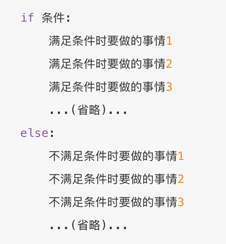

# 2.初始Python

1989年，为了**打发**圣诞节假期，Gudio van Rossum吉多· 范罗苏姆（龟叔）决心开发一个新的解释程序（Python雏形）

1991年，第一个Python解释器诞生

Python这个名字，来自龟叔所挚爱的电视剧Monty Python's Flying Circus


Python直译过来的意思是蟒蛇的意思，所以python语言的logo也就由两条小蟒蛇组合而成。


**为什么选择** **Python**

**简单**

**易学**

**开发效率高**


**适用面广泛**

| **人群/岗位**         | **用Python做什么**                                           |
| --------------------- | ------------------------------------------------------------ |
| IT从业者              | 自动化脚本（运维开发、测试开发等）                           |
| 普通白领              | 自动化办公                                                   |
| 后端开发              | WEB应用程序                                                  |
| 科学家                | 基于Python完成数据计算（生物、化学、物理）                   |
| **人工智能/机器学习** | **基于Python开发AI程序**                                     |
| **大数据开发**        | **基于** **Python**完成大数据任务开发（**Spark**、**Flink**） |
| **学生**              | **计算机二级考试**  **小学六年级Python课程**                 |

# 3.什么是编程语言

语言：进行沟通交流的表达方式

计算机只认识二进制0和1


**为什么不直接把中文翻译成二进制呢？**

自然语言远比编程语言复杂

编程语言语法”死板”

“翻译官”更容易翻译

# 4.Python环境安装（Windows）

想要使用Python语言编写程序，我们必须下载Python安装包并配置Python环境，

Python目前最新版本是：3.10.4（发布于2022年3月24日）

本次课程就基于当前最新版本进行学习


下载最新版Python

https://www.python.org


安装最新稳定版本


将页面拖到最底下，点击安装


## 安装流程

点击自定义安装


进入到可选的属性，默认都是全选的，点击下一步


配置Python的安装路径，建议单独创建一个文件夹存放Python


关闭路径长度的限制


**验证是否安装成功**

在命令提示符程序内，输入：python 并回车，出现python版本说明安装成功


# 7.第一个Python程序

向世界说你好，应该是全世界，所有程序员入门编程语言时，都会选择的第一个程序。

让我们也延续这一份来自程序员之间的浪漫，学习如何使用Python，向世界说你好。

我们的Python代码非常简单，如下：

~~~python
print("Hello World!!!")
~~~

含义：向屏幕上输出（显示），Hello World!!!

**注意**：输入的双引号和括号，请使用**英文符号**哦

打开CMD（命令提示符）程序，输入Python并回车

然后，在里面输入代码回车即可立即执行


# 9.常见问题解答

**命令提示符** 程序

使用快捷键：win + r

打开运行框，输入cmd后回车即可打开命令提示符程序


**2.命令提示符内，输入python出现**：'python' 不是内部或外部命令，也不是可运行的程序或批处理文件。

安装python的时候，没有勾选：add python 3.10 to PATH的选项


卸载Python，重新安装python，勾选这个选项。

然后重新打开命令提示符程序，即可


3.命令提示符内，出现：无法初始化设备 PRN


这是因为没有进入到python解释器环境内执行代码。

应该在命令提示符内：


4.执行出现：SyntaxError: invalid character '“' (U+201C)

这是因为，代码中的符号是中文符号。

请检查代码中的：

- 双引号

- 小括号

这两个符号，应该是英文符号

# 10.Python解释器

首先，一个基本原理是：

**计算机只认识二进制，即：0和1**

其实很简单，计算机是不会认识Python代码的。但是Python有解释器程序，如下图


安装Python环境，本质上，就是在电脑中，安装：

Python解释器程序

代码，随时可以写，但能不能运行，就要看电脑里面有没有解释器程序了。

Python解释器，是一个计算机程序，用来翻译Python代码，并提交给计算机执行。

在解释器环境内可以一行行的执行我们输入的代码

也可以使用解释器程序，去执行”.py”代码文件


所以，它的功能很简单，就2点：

1. 翻译代码

2. 提交给计算机运行

解释器存放在：<Python安装目录>/**python.exe**

**我们在CMD（命令提示符）程序内，执行的python，就是上图的python.exe程序哦**


**思考一下：**

**在python解释器程序内，我们发现，写完一行代码并回车后，会直接运行他。**

我们可以将代码，写入一个以”.py”结尾的文件中，使用python命令去运行它。

****

如，在Windows系统的D盘，我们新建一个名为：test.py的文件，并通过记事本程序打开它，输入如下内容：


在“命令提示符”程序内，使用python命令，运行它，如图：

**退出"命令提示符"程序：exit()**

“.py”文件是：python语言的代码文件，里面记录了python的代码

# 11.PyCharm开发工具的安装和基础使用

Python程序的开发有许多种方式，一般我们常见的有：

- Python解释器环境内，执行单行代码

- 使用Python解释器程序，执行Python代码文件

- 使用第三方IDE（集成开发工具），如PyCharm软件，开发Python程序

最常用的就是使用PyCharm软件进行开发

PyCharm集成开发工具（IDE），是当下全球Python开发者，使用**最频繁的工具软件**。

绝大多数的Python程序，都是在PyCharm工具内完成的开发。

本次课程全程基于PyCharm软件工具，来讲解Python。


首先，我们先下载并安装它：

打开网站：https://www.jetbrains.com

该网站自带中文


在开发者工具里找到PyCharm


专业版和社区版


安装步骤：


找到安装好的Python，打开

创建一个工程，我们来尝试写一写代码


指定工程路径以及选择Python解释器

配置Python解释器：

点击第三个选项，选择一个系统内置的解释器


工程创建完成：


创建一个Python代码文件 ，名称test.py


这里不带后缀py也可以，创建完成后它会自动加上后缀


填写如下内容


在空白处右键，然后选择运行：


# 12.PyCharm的基础使用

**修改主题**

默认是黑色主题，我们可以在PyCharm的右上角，点击“齿轮”


然后点击：”theme”，选择主题：


选择想要的主题即可：


**修改默认字体和大小**

打开设置：


**通过快捷键快速设置字体大小**

打开设置：


添加鼠标快捷键：


按ctrl + 鼠标滚轮上


同样，输入decre来设置减小字体的快捷键


**汉化软件**

打开插件功能：


翻译软件：


安装成功后：


**常用快捷键**

• ctrl + alt + s : 打开软件设置

• ctrl + d ：复制当前行代码

• shift + alt + 上\下 ： 将当前行代码上移或下移

• crtl + shift + f10 : 运行当前代码文件

• shift + f6 ：重命名文件

• ctrl + a : 全选

• ctrl + c\v\x : 复制、粘贴、剪切

• ctrl + f : 搜索

# 13.字面量

字面量：在代码中，被写下来的固定的值，称之为字面量

Python中常用的有6种值（数据）的类型

| 类型                                                         | 描述                                                         | 说明                                             |
| ------------------------------------------------------------ | ------------------------------------------------------------ | ------------------------------------------------ |
| 数字（Number）                                               | 支持  •整数（int）  •浮点数（float）  •复数（complex）  •布尔（bool） | 整数（int），如：10、-10                         |
| 浮点数（float），如：13.14、-13.14                           |                                                              |                                                  |
| 复数（complex），如：4+3j，以j结尾表示复数                   |                                                              |                                                  |
| 布尔（bool）表达现实生活中的逻辑，即真和假，True表示真，False表示假。  True本质上是一个数字记作1，False记作0 |                                                              |                                                  |
| 字符串（String）                                             | 描述文本的一种数据类型                                       | 字符串（string）由任意数量的字符组成             |
| 列表（List）                                                 | 有序的可变序列                                               | Python中使用最频繁的数据类型，可有序记录一堆数据 |
| 元组（Tuple）                                                | 有序的不可变序列                                             | 可有序记录一堆不可变的Python数据集合             |
| 集合（Set）                                                  | 无序不重复集合                                               | 可无序记录一堆不重复的Python数据集合             |
| 字典（Dictionary）                                           | 无序Key-Value集合                                            | 可无序记录一堆Key-Value型的Python数据集合        |

字符串（string），又称文本，是由任意数量的字符如中文、英文、各类符号、数字等组成。所以叫做字符的串

Python中，字符串需要用双引号（"）包围起来

被引号包围起来的，都是字符串


# 14.注释

注释：在程序代码中对程序代码进行解释说明的文字。

作用：注释不是程序，**不能被执行**，只是对程序代码进行解释说明，让别人可以看懂程序代码的作用，能够大大增强程序的可读性。

**注释的分类**

- 单行注释：以 #开头，#右边 的所有文字当作说明，而不是真正要执行的程序，起辅助说明作用

  > **注意，#号和注释内容一般建议以一个空格隔开**
  >
  > 这个是Python规范的要求。规范是Python官方建议的要求，不强制，不遵守也不影响程序执行。
  >
  > 但官方和大厂的代码都会遵守规范，所以遵守规范也会让我们的代码更高级。
  >
  > 不遵守规则：会出现问题
  >
  > **不遵守规范：****不太高级**

  

- 多行注释： 以 一对三个双引号 引起来 ("""注释内容""")来解释说明一段代码的作用使用方法

  

  多行注释一般用于对Python文件进行解释，或者对类或方法进行解释

  而对文件进行解释，一般会写到最上面的位置

# 15.变量

变量：**在程序运行时**，能储存计算结果或能表示值的抽象概念。

简单的说，变量就是在程序运行时，记录数据用的

**变量的定义格式**


变量就像盒子，可以存放内容。变量的特征就是，**变量存储的数据，是可以发生改变的。**


在python中，第二种写法是不被允许的。

print可以输出非常多份的数据，每分数据可以通过逗号隔开。

~~~python
# print(内容1, 内容2, ......, 内容N)
money = 50
print("钱包还有：", money)
print("钱包还有：" + money)
~~~


Python中如何做减法？

使用符号 - 即可完成减法运算

拓展：加（+）、减（-）、乘（*）、除（/）

# 16.数据类型

目前在入门阶段，我们主要接触如下三类数据类型：

| 类型       | 描述             | 说明                              |
| ---------- | ---------------- | --------------------------------- |
| **string** | 字符串类型       | 用引号引起来的数据都是字符串      |
| **int**    | 整型（有符号）   | 数字类型，存放整数 如 -1,10, 0 等 |
| **float**  | 浮点型（有符号） | 数字类型，存放小数 如 -3.14, 6.66 |

string、int、float这三个英文单词，就是类型的标准名称。

我们可以通过 `type()` 语句来得到数据的类型：

语法：type(被查看类型的数据)

1. 在print语句中，直接输出类型信息：

   str是string的缩写

   

2. 用变量存储type()的结果（返回值）：

   

查看的都是<字面量>的类型，还能查看变量中存储的数据类型


我们通过type(变量)可以输出类型，这是查看变量的类型还是数据的类型？

查看的是：变量存储的数据的类型。因为，变量无类型，但是它存储的数据有。


我们可能会说：字符串变量

但要知道，不是变量是字符串，而是它存储了：字符串

---

# 17.数据类型转换

**为什么要转换类型**

数据类型之间，在特定的场景下，是可以相互转换的，如字符串转数字、数字转字符串等

那么，我们为什么要转换它们呢？

数据类型转换，将会是我们以后经常使用的功能。

如：

- 从文件中读取的数字，默认是字符串，我们需要转换成数字类型

- 后续学习的input()语句，默认结果是字符串，若需要数字也需要转换

- 将数字转换成字符串用以写出到外部系统

- 等等

用途很多，那么让我们来学习一下如何转换吧。

| 语句(函数) | 说明                   |
| ---------- | ---------------------- |
| int(x)     | 将x转换为一个整数      |
| float(x)   | 将x转换为一个浮点数    |
| str(x)     | 将对象  x 转换为字符串 |

同前面学习的`type()`语句一样，这三个语句，都是带有结果的（返回值），我们可以用print直接输出，或用变量存储结果值


类型转换不是万能的，毕竟强扭的瓜不会甜，我们需要注意：

1. 任何类型，都可以通过str()，转换成字符串
2. 字符串内必须只有数字，才可以将字符串转换为数字


~~~python
# 浮点数转整数，会丢失精度，也就是小数部分
int_num = int(11.645)
print(type(int_num), int_num) # 11
~~~

---

# 19.标识符

**什么是标识符**

在Python程序中，我们可以给很多东西起名字，比如：

- 变量的名字

- 方法的名字

- 类的名字,等等

这些名字，我们把它统一的称之为标识符，用来做内容的标识。

所以，标识符：是用户在编程的时候所使用的一系列名字，用于给变量、类、方法等命名。

Python中，标识符命名的规则主要有3类：

- **内容限定**

- **大小写敏感**

- **不可使用关键字**

**内容限定**

标识符命名中，只允许出现这四类元素，其余任何内容都不被允许。

- 英文

- 中文

- 数字

- 下划线（_）

注意：

1. 不推荐使用中文

   > 尽管Python它支持以中文作为标识符的命名，但是目前支持的还不太完善，我们使用中文的话可能会有一些隐藏的问题，其次在行业中，大多数的程序员都会使用英文来去做标识符的命名，而不会使用中文。

2. 数字不可以开头


**大小写敏感**

以定义变量为例：

Andy = “安迪1”

andy = “安迪2”

字母a的大写和小写，是完全能够区分的。


**不可使用关键字**

Python中有一系列单词，称之为关键字。

关键字在Python中都有特定用途，我们不可以使用它们作为标识符。

关键字同样大小写敏感。


学完了标识符（变量、类、方法）的命名**规则**后，我们在来学习标识符的命名**规范**。

变量名，类名，方法名。不同的标识符，有不同的规范。


我们目前只接触到了：变量。所以，目前学习：变量的命名规范。

- 见名知意

  明了：尽量做到，看到名字，就知道是什么意思

  简洁：尽量在确保“明了”的前提下，减少名字的长度

- 下划线命名法

  多个单词组合变量名，要使用下划线做分隔。

- 英文字母全小写

  命名变量中的英文字母，应全部小写

---

# 20.运算符

| 运算符 | 描述   | 实例                                                         |
| ------ | ------ | ------------------------------------------------------------ |
| +      | 加     | 两个对象相加  a + b 输出结果  30                             |
| -      | 减     | 得到负数或是一个数减去另一个数  a - b 输出结果  -10          |
| *      | 乘     | 两个数相乘或是返回一个被重复若干次的字符串  a * b 输出结果  200 |
| /      | 除     | b /  a 输出结果 2                                            |
| //     | 取整除 | 返回商的整数部分  9//2 输出结果  4 , 9.0//2.0 输出结果  4.0  |
| %      | 取余   | 返回除法的余数  b % a 输出结果  0                            |
| **     | 指数   | a**b  为10的20次方，  输出结果 100000000000000000000         |

加减乘除和求平方，我们在前面已经使用过啦。

现在在带上：整除以及求余数，一起试一试吧。


**赋值运算符**

| **运算符** | **描述**   | **实例**                                                     |
| ---------- | ---------- | ------------------------------------------------------------ |
| =          | 赋值运算符 | 把 =  号右边的结果 赋给 左边的变量，如 num  = 1 + 2 * 3，结果num的值为7 |

**复合赋值运算符**

| **运算符** | **描述**         | **实例**                    |
| ---------- | ---------------- | --------------------------- |
| +=         | 加法赋值运算符   | c  += a 等效于 c =  c + a   |
| -=         | 减法赋值运算符   | c  -= a 等效于 c =  c - a   |
| *=         | 乘法赋值运算符   | c  *= a 等效于 c =  c * a   |
| /=         | 除法赋值运算符   | c  /= a 等效于 c =  c / a   |
| %=         | 取模赋值运算符   | c  %= a 等效于 c =  c % a   |
| **=        | 幂赋值运算符     | c  **= a 等效于 c =  c ** a |
| //=        | 取整除赋值运算符 | c  //= a 等效于 c =  c // a |

---

# 21.字符串的三种定义方式

字符串有3种不同的定义方式：

- 双引号定义法："字符串"（最常用的写法）

- 单引号定义法：'字符串'

- 三引号定义法："""字符串"""

三引号定义法，表示在一堆三个双引号的范围内，均是字符串，如下：


三引号定义法，和多行注释的写法一样，同样支持换行操作。表示在一堆三个双引号的范围内，均是字符串。要注意的是，包含范围是：**从三个引号开始，到下一个三个引号结束**

- 使用变量接收它，它就是字符串
- 不使用变量接收它，就可以作为多行注释使用。


**思考：如果我想要定义的字符串本身，是包含：单引号、双引号自身呢？如何写？**

- 单引号定义法，可以内含双引号
- 双引号定义法，可以内含单引号
- 可以使用转移字符（反斜杠）（\）来将引号解除效用，变成普通字符串

---

# 22.字符串拼接

如果我们有两个字符串（文本）字面量，可以将其拼接成一个字符串，通过+号即可完成，如：

~~~python
print("学IT来黑马" + "月薪过万")
~~~

输出结果：


不过一般，单纯的2个字符串字面量进行拼接显得很呆，一般，`字面量和变量` 或 `变量和变量之间会使用拼接`，如：


既然可以和字符串变量完成拼接，那么，是否可以和其它变量类型如数字类型完成拼接呢？

**字符串无法和非字符串变量进行拼接**，这个时候会报类型错误。因为类型不一致，无法接上。


---

# 23.字符串格式化

我们会发现，这个拼接字符串也不好用啊

1. 变量过多，拼接起来实在是太麻烦了
2. 字符串无法和数字或其它类型完成拼接。


所以，有没有其它方式，即方便又支持拼接其它类型呢？这个方式，就是字符串的格式化。

我们可以通过如下语法，完成字符串和变量的快速拼接。这种方式的拼接我们把它叫做：占位式的拼接

```python
name = "黑马程序员"
message = "学IT来：%s" % (name)
print(message)
```


其中的，%s 

- % 表示：我要占位

- s  表示：将变量变成字符串放入占位的地方

第2个 `%` 代表补全变量

所以，综合起来的意思就是：我先占个位置，等一会有个变量过来，我把它变成字符串放到占位的位置。


那数字类型呢？可以不可以占位？那必须可以，我们来尝试如下代码，数字也能用%s占位，这里是将数字 转换成了 字符串，也就是数字57，变成了字符串"57"被放入占位的地方。

```python
# 通过占位的形式，完成数字和字符串的拼接
class_num = 57 # class_num表示班级的号码
avg_salary = 16781
message = "Python大数据学科，北京%s期，毕业平均工资：%s" % (class_num, avg_salary)
print(message)
```


PS：多个变量占位，变量要用括号括起来，使用逗号分隔，并按照占位的顺序填入。


数字类型，也太没有地位了吧，竟然要被转成字符串拼接。有没有体面一点的方式，让数字以其原本的面貌拼接进去呢？

Python中，其实支持非常多的数据类型占位，最常用的是如下三类。

| 格式符号 | 转化                             |
| -------- | -------------------------------- |
| %s       | 将内容转换成字符串，放入占位位置 |
| %d       | 将内容转换成整数，放入占位位置   |
| %f       | 将内容转换成浮点型，放入占位位置 |

如下代码，完成字符串、整数、浮点数，三种不同类型变量的占位。

```python
name = "传智播客"
set_up_year = 2006
stock_price = 19.99
message = ("我是：%s，我成立于：%d，我今天的股价是：%f") % (name, set_up_year, stock_price)
print(message)
```


---

# 24.字符串格式化的精度控制

观察我们刚刚写的代码，19.99变成了19.990000了，这就是因为我们没有对它做精度控制。

我们可以使用辅助符号"m.n"来控制数据的宽度和精度

- m，控制宽度，要求是数字（很少使用）,**设置的宽度小于数字自身，不生效**

- .n，控制小数点精度，要求是数字，**会进行小数的四舍五入**，数据会失真

示例：

- %5d：表示将整数的宽度控制在5位，如数字11，被设置为5d，就会变成：[空格] [空格] [空格]11，用三个空格补足宽度。

- %5.2f：表示将宽度控制为5，将小数点精度设置为2

小数点和小数部分也算入宽度计算。如，对11.345设置了%7.2f 后，结果是：[空格] [空格]11.35。2个空格补足宽度，小数部分限制2位精度后，四舍五入为 .35

- %.2f：表示不限制宽度，只设置小数点精度为2，如11.345设置%.2f后，结果是11.35


---

# 25.字符串格式化的方式2

目前通过%符号占位已经很方便了，还能进行精度控制。可是追求效率和优雅的Python，是否有更加优雅的方式解决问题呢？

通过语法：f"内容{变量}"的格式来快速格式化（在字符串的前面加上 f（format格式化的首字母） 作为标记，标记完之后，可以在内容中通过{ }进行占位，然后在大括号的内部填入变量就可以完成快速格式化了。看如下代码


PS：这种写法不做精度控制，也不理会类型，适用于快速格式化字符串，所以这种方式适合对精度没有要求的时候快速使用呢。

---

# 26.对表达式进行格式化

刚刚的演示，都是基于变量的。可是，我想更加优雅些，少写点代码，直接对“表达式”进行格式化是否可行呢？那么，我们先了解一下什么是表达式。

表达式：一条具有**明确执行结果**的**代码语句**，如：

1 + 1、5 * 2，就是表达式，因为有具体的结果，结果是一个数字，又或者，常见的变量定义：name = “张三” （这个也是有具体的结果，具体的结果赋值给了具体的变量）， age = 11 + 11。

等号右侧的都是表达式呢，因为它们有具体的结果，结果赋值给了等号左侧的变量。

那么，对于字符串格式化，能否直接格式化一个表达式呢？可以，上代码，在无需使用变量进行数据存储的时候，可以直接格式化表达式，简化代码哦。


---

# 27.字符串格式化练习题讲解

定义如下变量：

- name，公司名
- stock_price，当前股价
- stock_code，股票代码
- stock_price_daily_growth_factor，股票每日增长系数，浮点数类型，比如1.2
- growth_days，增长天数

计算，经过growth_days天的增长后，股价达到了多少钱

使用字符串格式化进行输出，如果是浮点数，要求小数点精度2位数。示例输出：


红色框框都是变量，要使用格式化的方式拼接进去

提示，可以使用： 当前股价 ***** 增长系数 ***\*** 增长天数， 用来计算最终股价哦。如，股价19.99 * 系数1.2 ** 7天 = 71.62778419199998，小数点现在精度2位后结果：71.63

股票代码需要使用字符串定义，如果是数字的话，这种写法是不符合规定的，数字不能直接以0开头

~~~python
# 定义需要的变量
name = "传智播客"
stock_price = 19.99
stock_code = "003032"
# 股票 价格 每日 增长 因子
stock_price_daily_growth_factor = 1.2
growth_days = 7

finally_stock_price = stock_price * stock_price_daily_growth_factor ** growth_days

print(f"公司：{name}，股票代码：{stock_code}，当前股价：{stock_price}")
print("每日增长系数: %.1f，经过%d天的增长后，股价达到了：%.2f" % (stock_price_daily_growth_factor, growth_days, finally_stock_price))
~~~

---

# 28.数据输入（input语句）

我们前面学习过print语句（函数），可以完成将内容（字面量、变量等）输出到屏幕上。在Python中，与之对应的还有一个input语句，用来获取键盘输入。

- 数据输出：print

- 数据输入：input

使用上也非常简单：

- 使用input()语句可以从键盘获取输入

- 使用一个变量接收（存储）input语句获取的键盘输入数据即可
- = 是标准的赋值运算符，把右边的结果赋予左边的变量。

在控制台中输入的内容，本质上来说被input语句接收了，它接受的内容又赋值给了name这个变量。


在前面的代码中，输出 “请告诉我你是谁？” 的print语句其实是多余的


input()语句其实是可以在要求使用者输入内容前，输出提示内容的哦，如图，在input的括号内直接填入提示内容即可。这个功能等用于直接在它前面输出一个print。


我们刚刚试验的都是输入了字符串类型的数据。那么如果我们输入数字类型或其它类型，结果会如何？

那么，通过前面学习过**type()**语句来验证一下输入内容的数据类型吧。


可以看到，无论键盘输入何种类型的数据，**最终的结果都是：字符串类型的数据**。如果需要得到其他类型，请自行进行转换。

---

# 29.布尔类型和比较运算符

**布尔类型**

进行判断，只有2个结果：是 / 否。程序中使用**布尔类型**描述是或否。布尔类型是数字中的小类。


**使用：布尔类型**

Python中常用的有**6**种值（数据）的类型

| 类型               | 描述                                                         | 说明                                                         |
| ------------------ | ------------------------------------------------------------ | ------------------------------------------------------------ |
| 数字（Number）     | 支持  •整数（int）  •浮点数（float）  •复数（complex）  •布尔（bool） | 整数（int），如：10、-10                                     |
|                    |                                                              | 浮点数（float），如：13.14、-13.14                           |
|                    |                                                              | 复数（complex），如：4+3j，以j结尾表示复数                   |
|                    |                                                              | 布尔（bool）表达现实生活中的逻辑，即真和假，True表示真  False表示假。  True本质上是一个数字记作1，False记作0。<br />所以它们被标记为数字类型。 |
| 字符串（String）   | 描述文本的一种数据类型                                       | 字符串（string）由任意数量的字符组成                         |
| 列表（List）       | 有序的可变序列                                               | Python中使用最频繁的数据类型，可有序记录一堆数据             |
| 元组（Tuple）      | 有序的不可变序列                                             | 可有序记录一堆不可变的Python数据集合                         |
| 集合（Set）        | 无序不重复集合                                               | 可无序记录一堆不重复的Python数据集合                         |
| 字典（Dictionary） | 无序Key-Value集合                                            | 可无序记录一堆Key-Value型的Python数据集合                    |

布尔类型的字面量（注意它们的首字母都是大写的）：

- True 表示真（是、肯定）

- False 表示假 （否、否定）

定义变量存储布尔类型数据：

~~~bash
变量名称 = 布尔类型字面量
~~~

布尔类型不仅可以自行定义，同时也可以通过计算的来。

也就是使用比较运算符进行比较运算得到布尔类型的结果。下面的 > 和 == 都是比较运算符。


## 比较运算符

| **运算符** | **描述**                                                     | **示例**                         |
| ---------- | ------------------------------------------------------------ | -------------------------------- |
| ==         | 判断内容是否相等，满足为True，不满足为False                  | 如a=3,b=3，则(a  == b)  为  True |
| !=         | 判断内容是否不相等，满足为True，不满足为False                | 如a=1,b=3，则(a  != b) 为  True  |
| >          | 判断运算符左侧内容是否大于右侧  满足为True，不满足为False    | 如a=7,b=3，则(a  > b)  为 True   |
| <          | 判断运算符左侧内容是否小于右侧  满足为True，不满足为False    | 如a=3,b=7，则(a  < b)  为 True   |
| >=         | 判断运算符左侧内容是否大于等于右侧  满足为True，不满足为False | 如a=3,b=3，则(a  >= b) 为  True  |
| <=         | 判断运算符左侧内容是否小于等于右侧  满足为True，不满足为False | 如a=3,b=3，则(a  <= b) 为  True  |

~~~python
"""
演示布尔类型的定义
以及比较运算符的应用
"""
# 定义变量存储布尔类型的数据
bool_1 = True
bool_2 = False
print(f"bool_1变量的内容是：{bool_1}, 类型是：{type(bool_1)}") # bool_1变量的内容是：True，类型是：<class 'bool'>
print(f"bool_2变量的内容是：{bool_2}, 类型是：{type(bool_2)}") # bool_2变量的内容是：False，类型是：<class 'bool'>

# 比较运算符的使用
# == , !=, >, <, >=, <=
# 演示进行内容的相等比较
num1 = 10
num2 = 10
print(f"10 == 10的结果是：{num1 == num2}")

num1 = 10 # 为num1 和 num2 重新赋值
num2 = 15
print(f"10 != 15的结果是：{num1 != num2}")

name1 = "itcast"
name2 = "itheima"
print(f"itcast == itheima 结果是：{name1 == name2}")

# 演示大于小于，大于等于小于等于的比较运算
num1 = 10
num2 = 5
print(f"10 > 5结果是：{num1 > num2}")
print(f"10 < 5的结果是：{num1 < num2}")

num1 = 10
num2 = 11
print(f"10 >= 11的结果是：{num1 >= num2}")
print(f"10 <= 11的结果是：{num1 <= num2}")
~~~

---

# 30.if语句的基本格式

语法：1）不要忘记冒号	2）`条件成立时，要做的事情` 的前面是有4个空格做了缩进，python是通过空格缩进来判断它所归属的。


~~~python
# 定义变量
age = 30
# 进行判断，age >= 18 通过比较运算符得到的结果是一个布尔类型的
if age >= 18:
    print("我已经成年了")
~~~

同样，if条件成立之后，我们可以不仅仅只写一条代码，我们可以写任意多条代码，但一定要注意，需要使用4个空格做缩进确定代码属于哪个代码块，最后一个print打印语句就不受 if 的约束。

~~~python
age = 18
if age >= 18:
    print(f"我已经{age}岁了")
    print("即将步入大学")
print("时间过的真快")
~~~


**if语句的注意点**

- 判断语句的结果，必须是布尔类型True或False，True会执行 if 内的代码语句，False则不会执行。
- 不要忘记判断条件后的：引号
- 归属于if语句的代码块，需在前方填充4个空格缩进


---

# 31.案例 - 成年人判断

结合前面学习的input输入语句，完成如下案例：

1. 通过input语句，获取键盘输入，为变量age赋值。（注意转换成数字类型）

2. 通过if判断是否是成年人，满足条件则输出提示信息，如下：


提示：您已成年，需要补票的信息输出，来自 if 判断

~~~python
# 获取键盘输入
age = int(input("请输入你的年龄："))

# 通过if判断是否是成年人
if age >= 18:
    print("您已成年，游玩需要买票，10元.")

print("祝您游玩愉快")
~~~

---

# 32.if - else组合判断语句

if满足条件会执行相应的代码语句，如果不满足呢？

有没有不满足的情况下，可供执行的代码呢？**if else** **语句可以实现**

语法：



代码示例：

```python
# 这里注意input得到的永远是字符串类型的数据，这里需要强转为int
age = int(input("请输入你的年龄"))
if age >= 18:
    print("您已成年，游玩需补票10元！")
else:
    print("您未成年，可以免费游玩！")
```


注意：

1. if else 语句，其中if和其代码块，条件满足时执行；else搭配if的判断条件，当不满足的时候执行
2. if else语句的注意事项：
   - else不需要判断条件，当if的条件不满足时，else执行
   - else的代码块，同样要4个空格作为缩进


---

# 34.if - elif -else组合使用的语法

某些场景下，判断条件不止一个，可能有多个。这种需求能用Python实现吗？**if** **elif** **else** **语句可以实现**

语法：


代码示例


----


## if elif else语句 注意点

elif 语句可以写多个。


1、判断是互斥且有顺序的。

- 满足1（如图编号）将不会理会2和3

- 满足2，将不会理会3

- 1、2、3均不满足，进入else

- else也可以省略不写，效果等同3个独立的if判断


2、空格缩进同样不可省略


3、可以如下图，将input输入语句直接写入判断条件中。节省代码量，并且这个时候它不会让你同时再输入三个变量的值了，而是会让你挨个输入，如果有个条件已经满足了，就不会让你输入下一个变量了。


---

# 35.案例：猜猜心理数字

1. 定义一个变量，数字类型，内容随意。

2. 基于input语句输入猜想的数字，通过if和多次elif的组合，判断猜想数字是否和心里数字一致。

~~~python
# 定义一个变量数字
num = 5

# 通过键盘输入获取猜想的数字，通过多次if 和 elif的组合进行猜想比较
if int(input("请猜一个数字：")) == num:
    print("恭喜第一次就猜对了呢")
elif int(input("猜错了，再猜一次：")) == num:
    print("猜对了")
elif int(input("猜错了，再猜一次：")) == num:
    print("恭喜，最后一次机会，你猜对了")
else:
    print("Sorry 猜错了")
~~~


----

# 36.判断语句的嵌套

有很多场景，不仅仅是多个并列条件，还会有满足前置条件才会二次判断的多层判断需求。**对这种需求，嵌套判断语句可以实现**

许多逻辑的判断，是嵌套的，多层次的。对于这种需求，我们可以：自由组合 if elif else，完成特定需求的要求


基础语法格式如下：


如上图，第二个if，属于第一个if内，只有第一个if满足条件，才会执行第二个if

嵌套的关键点，在于：空格缩进，通过空格缩进，来决定语句之间的：层次关系


**简单嵌套**

如图，判断有2层，当外层if满足条件（图中编号1）时，才会执行内层if判断（图中编号2）；当外层if（编号1）不满足，直接执行外层esle。


**注意事项**

1. 嵌套判断语句可以用于多条件、多层次的逻辑判断

2. 嵌套判断语句可以根据需求，自由组合if elif else来构建多层次判断

3. 嵌套判断语句，一定要注意空格缩进，Python通过空格缩进来决定层次关系


---

# 37.判断语句综合案例

案例要求: 

1. 数字随机产生，范围1-10

2. 有3次机会猜测数字，通过3层嵌套判断实现

3. 每次猜不中，会提示大了或小了

提示，通过如下代码，可以定义一个变量num，变量内存储随机数字。


代码示例

"""
演示判断语句的实战案例：终极猜数字
"""

# 1. 构建一个随机的数字变量
import random
num = random.randint(1, 10)

guess_num = int(input("输入你要猜测的数字："))

# 2. 通过if判断语句进行数字的猜测
if guess_num == num:
    print("恭喜，第一次就猜中了")
else:
    if guess_num > num:
        print("你猜测的数字大了")
    else:
        print("你猜测的数字小了")

```python
guess_num = int(input("再次输入你要猜测的数字："))

if guess_num == num:
    print("恭喜，第二次猜中了")
else:
    if guess_num > num:
        print("你猜测的数字大了")
    else:
        print("你猜测的数字小了")

    guess_num = int(input("第三次输入你要猜测的数字："))

    if guess_num == num:
        print("第三次猜中了")
    else:
        print("三次机会用完了，没有猜中。")
```


