# 基础篇Redis

# 1.redis课程介绍导学

## 一、理想课程

小伙伴们理想的课程一定是能够通过讲解的方式，得到如下这些启发，我们的课程会从基础到精通，从redis小白，到redis大牛，还在等什么，这套课程一定就是你最适合你的课程~


---

# 2.Redis简单介绍

redis是一个键值型的数据库，简单来讲：在redis内存的数据都是键值对（key-value）。

例如用户 `id`、`name`、`age` 将它一个个存，就形成键值对了，只不过基于这样的方式存储，数据显的比较松散，因为这本质是一个用户，我们却将它打散了，因此多数情况下我们并不会直接拆分的去存，而是**将一个用户的多个字段，组装成一个JSON字符串作为value存储**，此时的key就是用户的 `id`，此时它也是一个 `key-value` 接口，只不过这个value变成了一个更长，稍微复杂一点的JSON字符串，但依然是字符串。

当然这里的值除了可以是字符串，还可以是一些其他的复杂的结构，例如有序集合、无序集合、hash表。


因此redis结构是非常丰富的，可以满足我们各种各样的一些需求。

从上面案例可以看出redis这样的一个数据库结构与传统的数据库有比较大的差异，它没有表，也没有约束，存的都是键值对，像这样的库我们有一种称呼，它是一种键值型的**NoSql数据库**。

那么什么是NoSql，它和传统的MySQL传统的关系型数据库有什么差别和联系呢？具体该如何操作这样的库呢？

所以今天我们就以redis这样的NoSql数据库为例去学习一下这一类库。

通过以下三部分的学习，一定能了解NoSql数据库与传统数据库的差别和联系，并且能够使用命令和Java语言客户端的方式去操作redis里面常见的数据结构，实现各种数据的增删改查，也就是能够具备redis日常开发的基本能力了。


----

# 初始Redis

# 3.认识NoSQL

## 一、引入

NoSQL比较陌生，但是与此相对的SQL我们就比较熟悉了，SQL我们将它称之为关系型数据库。

SQL全称：**Structured Query Language**。

**NoSql**可以翻译做Not Only Sql（不仅仅是SQL），或者是No Sql（非Sql的）数据库。不管是哪种翻译它所表达的意思都是：NoSQL相对于传统关系型数据库而言，有很大差异的一种特殊的数据库，因此也称之为**非关系型数据库**。当然也有联系，它们毕竟都属于数据库，数据库最终的目的一定是数据的增删改查，无非是在数据存储的方式上有一些差异，接下来就来对比一下两者在这方面的差异。


---

## 二、结构差异

### 1）SQL

两者的第一个差异体现在 `字母S` 上，`S` 是 `structured` 的缩写，代表的是结构化，存入关系型数据库的数据，都是结构化的数据，即：这些数据都有固定的一些格式要求，这些要求就是我们以前所学的表以及表的约束。

并且表的结构一般是不建议去修改的，最好在项目设计之初就将它定义好，因为以后一旦数据插入的较多，此时修改表中的某个字段，可能带来的影响是非常巨大的，可能会导致这张表被锁很长一段时间不可用，而且因为表跟业务有关联，因此将来表变了，业务有可能也要跟着变，这样带来的影响太大了，所以这是结构化数据带来的一个问题。


---

### 2）NoSQL

与此相对的NoSQL就是一种非结构化数据，它对于数据的结构并没有非常严格的约束，也不是完全没有约束，这个取决于NoSQL的类型，常见NoSQL类型有四种。

#### 第一种：常见的redis这种键值型的

Key是可以自定义的，叫 `id`、`name`、`age` 都可以，这样就相当于将 SQL型数据库中一行数据全部都存下来了。

但是这么存一般不太建议这样做，我们也可以将 `key` 定义为用户的id，值定义为JSON字符串，这种键值型对Key的约束没那么强。

对Value类型同样也可以自定义，它有五种常见的类型，约束相对来讲就会小很多。


---

#### 第二种：文档型

所谓文档型：SQL中的一条数据就对应一个文档，文档存储是JSON风格的。

它与SQL数据库的差异：首先字段是可以任意的，第一条插入 `id name`，第二条完全可以插入别的 `id username` 也是没问题，这样它的字段约束就非常的松散。


---

#### 第三种：图类型的数据库

图类型的数据库：即存储这个数据库的每一个数据都可以看成一个节点。

例如我存进去了一个人的信息，那它就是一个节点。

为什么是节点呢？因为人与人之间会有练习，例如张三是李四的老师，他们两个就是师生关系等。

每个数据都是一个节点，节点与节点间有联系，这种就叫做图。


当然这种用的比较少，因为我们一般不做一些社交的app。

---

### 3）总结

以上是三种常见的数据库，不管是哪种，它们的数据结构其实都没有严格的要求，相对来讲比较松散，并且将来去修改数据结构也是可以的，例如一条数据增加字段和减少，影响都是比较小的。

----

## 三、关联和非关联

当然除了数据有结构上的要求以外，关系型数据库之所以叫关系，那就是数据与数据之间往往是有关联的。

### 1）SQL

例如下图，有 `user表`、`item商品表`，它们两个本身是没有关系的，但如果来了张订单表，订单表就需要记录是谁下了单（用户id），还要记录下单买了什么商品（商品id），这个时候关系就建立起来了。

`order表` 里面记录了`用户的id`，此时`用户id`就可以理解成是一个外键，它关联到了用户表里面的id。

`商品id` 对应到的就是商品表中的 `id`，也是一个外键，关联了 `商品表` 中的数据。

这样就知道了：`张三` 买了 `荣耀6` 商品。

此时表和表之间的关系就通过外键建立起来了，这种外键关系一旦建立，假设将来要删除一个用户，或者删除一个商品，它就不允许你这么做，因为它会觉得这个商品在其他表中有关联，所以数据库就会去维护这些关系。

并且这种关联有一个好处：节省数据存储空间，订单中关联了用户，此时并不是将用户信息完整的保存在这里，而是只关联一个id就行了。


---

### 2）NoSQL

而非关系型数据库不存在关联关系，要维护关系要么靠代码中的业务逻辑，要么靠数据之间的耦合：

```json
{
    id: 1,
    name: "张三",
    orders: [
        {
            id: 1,
            item: {
                id: 10, title: "荣耀6", price: 4999
            }
        },
        {
            id: 2,
            item: {
                id: 20, title: "小米11", price: 3999
            }
        }
    ]
}
```

此处要维护“张三”的订单与商品“荣耀6”和“小米11”的关系，通过JSON嵌套的方式将这两个商品保存在张三的订单文档中。

并且这样存储数据有一个缺点：重复。张三买了荣耀6，李四也可以买，这样文档就需要存储多份了。

有人问：为什么你不像刚刚那样，记录的商品信息也只记录一个 `id`，然后单独再来存一个文档用来存储商品，这样它俩不就有关系了。

这样做也行，但是**这个关系就需要靠程序员通过业务逻辑来维护**了，因为数据库本身不会帮你维护表和表之间的关联。

---

## 四、查询差异

**传统关系型数据库会基于Sql语句做查询，语法有统一标准。**

**语法固定的好处**：只要是关系型数据库，都能使用相同的语句进行查询，不管你是MySQL数据库、Oracle数据库、还是其他的数据库，**都可以使用相同的语句进行查询**。


---

相对应的NoSQL库它的查询是非SQL，也就是说没有这样的固定的语法，格式不统一。而不同的非关系数据库查询语法差异极大，五花八门各种各样，例如下图三种NoSQL库：

- `redis`：根据键值对查询
- `MongoDB`：看起来调用了一个函数，`db` 代表数据库，`users` 代表表，`find()` 代表找，即找id为1的用户
- `elasticsearch`：变成了一种Restful的请求，`users` 代表库，`1` 代表 `id` 为1


这种方式调用的优点：redis调用直接用一个命令就行了，非常的简单。

`MongoDB` 是基于一种函数形式的调用，这种对程序员来讲相对比较熟悉。

因此它们这些风格使用起来相对简单，没有复杂的语法需要去学习。但是缺点就是不统一，每一个不同的库要学不同的语法。

---

## 五、事务差别

传统关系型数据库能满足事务ACID的原则。

而非关系型数据库往往不支持事务，或者不能严格保证ACID的特性，因此我们将它称之为BASE，即基本的一种满足。

对于BASE理论大家有兴趣也可以自己研究一下。

----

## 总结

除了上述四点以外，在存储方式.扩展性.查询性能上关系型与非关系型也都有着显著差异，总结如下：

- 存储方式
  - 关系型数据库基于磁盘进行存储，会有大量的磁盘IO，对性能有一定影响
  - 非关系型数据库，他们的操作更多的是依赖于内存来操作，内存的读写速度会非常快，性能自然会好一些

* 扩展性
  * 关系型数据库集群模式一般是主从，主从数据一致，起到数据备份的作用，称为垂直扩展。
  * 非关系型数据库可以将数据拆分，存储在不同机器上，可以保存海量数据，解决内存大小有限的问题。称为水平扩展。
  * 关系型数据库因为表之间存在关联关系，如果做水平扩展会给数据查询带来很多麻烦

**垂直方式**：关系型数据库在设计数据库之初，可能就没有考虑到这种分布式的需求，所以当我们去存储数据到关系型数据库的时候，它都是存储在本机，影响它性能就是本机这台机器的服务器的性能，你只能提升这个机器的性能，从而来提升它的能力。虽然MySQL是支持主从的，但是主从仅仅是提升了机器的数量、读写的性能，但是并不能提升数据存储的量，因为主和从存储数据是一样的，数据存储的总量没有变，只不过是做了备份而已。

**水平方式**：与此对应的NoSQL数据库，无论是redis也好，还是elasticsearch，它在设计之初就已经考虑到了数据拆分的一个需求，因为它们在插入数据的时候，往往会基于数据的id，或者是一个唯一的标识去做哈希运算，根据哈希运算的结果去判断这个数据到底应该存储在哪个不同的节点上，从而实现数据的拆分，天然的就支持这种水平的扩展。因此NoSQL库在扩展的时候是非常轻松的就能实现了。

虽然MySQL不支持扩展，但是也可以基于第三方的组件去实现数据库的分库，但是一旦引入了第三方的组件，肯定会对性能造成一定影响，并且在开发的时候需要考虑都的问题需要更多，复杂度就增加了。不想redis等NoSQL，它们天然的支持，对开发难度、性能都不会有特别大的影响，所以会更好一点。

两种库一般结合使用，各有各的优点，因此在实际开发中需要根据自己的需求去选择。


----

# 4.认识Redis

Redis诞生于2009年全称是 **Re**mote  **D**ictionary **S**erver （远程词典服务器），是一个基于内存的键值型NoSQL数据库。

为什么是词典服务呢？之前也介绍过，redis是一个键值型的数据库，我们根据Key找value，这不就跟词典很像。

下图就是开发redis的作者，它的名字比较长，也比较绕口，因此在网络上也被成为 `ANTIREZ` 这个名字。

最早的时候他跟他的小伙伴一起开发了一个网站，这个网站刚开始用户量还比较少，所以基于MySQL也能满足他的需求。

但是后来随着用户量的增长，有时候并发高的时候，MySQL根本就承担不住了，此时它就希望有这么一个库：吞吐能力很强，并发能力很高，并且还有一些特殊的业务需求需要去满足，于是基于这个目的他就开发了redis。


redis服务器开发出来后，具有了一些**特征**：

- 键值（key-value）型，操作起来简单。value支持多种不同数据结构（字符串、集合等），功能丰富

- 单线程，因此线程是安全的，每个命令具备原子性，安全的，不会出现一个命令执行了一半，其他命令就突然插进来的情况

  > Redis6.0的多线程仅仅是在网络请求的处理上，而核心命令的执行依旧是单线程的。
  
- 低延迟，速度快

  它明明是一个单线程，性能却这么好呢？

  1. 基于内存，内存的读写速度相对于磁盘来讲非常的高，高出了很多很多倍。
  2. 它尽管单线程，但是它却基于了 `IO多路复用` 的方式，大大的提高了整个服务的吞吐能力
  3. 良好的编码。redis是基于C语言编写的，并且开源在网络上，那么这个redis整体编码，无论从编码的风格上、还是从代码的习惯上来讲，可以说得到了业界的公认好评。

  因此基于这三个原因，redis尽管单线程，但是性能却非常优异。

  最重要的是内存！因为无论是IO多路复用，还是编码也好，这样的一些功能MySQL也能满足。

- 支持数据持久化，内存查询性能是高，但是它存在数据不安全的情况，即一旦断电，内存数据就消失了，所以为了解决这个问题，redis的作者就给它加了持久化的功能，它会定期将数据从内存持久化到词频，从而确保数据的安全性

- 支持主从集群.分片集群（把数据拆分）

  主从集群MySQL也有，指的是：从节点可以去备份主节点的数据，也是一种安全性的考虑，这样依赖一旦有节点宕机，数据在其他从节点上也能找到。同时主从可以做读写分离，从而大大的提高了查询读写的效率。

  分片集群：做数据的拆分，即将数据拆成n份存到不同结点上去，这样一来我用很多台机器一起来存，存储的上限就提高了，即水平的一种扩展。

- 支持多语言客户端。Java、python、C等各种各样的语言基本上都能操作reids。

功能丰富、性能还好、还支持数据持久化、安全，还能做各种集群，轻易的去做水平扩展，并且任何语言都能用，所以它不火谁火？

## 

---

# 5.安装Redis

大多数企业都是基于Linux服务器来部署项目，而且Redis官方也没有提供Windows版本的安装包，因此你在网上找的Windows的redis都不是由redis官方提供的，而是由微软自己编译出来的。因此课程中我们会基于Linux系统来安装Redis.

此处选择的Linux版本为CentOS 7

---

## 一、官网安装

Redis的官方网站地址：https://redis.io/


点进来后会发现它有三个下载的版本

- `Redis Enterprise Software (Redis ES)`：**Redis Enterprise Software** 是一个为企业设计的 Redis 版本，提供了额外的合规性、可靠性和可扩展性功能。
- `Redis OSS (Redis Open Source Software)`：**Redis OSS** 是 Redis 的开源版本，是一个高性能的内存数据存储，被广泛用于缓存、会话管理、消息代理等场景。这个也是我们待会会下载的版本。
- `Redis Stack`：**Redis Stack** 是 Redis 的扩展，包含了 Redis OSS 的所有功能，并增加了一些额外的模块，提供更多的数据结构和处理能力。
- `Redis Insight`：**Redis Insight** 是一个图形化工具，用于可视化和优化 Redis 数据。


找到 `Redis OSS`，然后点击红框


选择安装在Linux系统上


虽然按照它的步骤来安装即可。


----

点击 `Commands`，即redis的相关命令


进来后，这里就包含了redis所有的命令，如果忘记了，就可以到官网查看帮助文档，每个命令是干什么的都有。


另外 `Clients` 是redis官方提供的一些各种语言的客户端。


---

## 二、CentOS安装Redis

### 1）安装Redis依赖

Redis是基于C语言编写的，因此首先需要安装Redis所需要的gcc依赖：

```sh
yum install -y gcc tcl
```

---

### 2）上传安装包并解压

然后将课前资料提供的Redis安装包上传到虚拟机的任意目录：


例如，我放到了/usr/local/src（这个目录一般就是来放一些安装文件的） 目录：


解压缩：

```sh
tar -xzf redis-6.2.6.tar.gz
```

解压后：


进入redis目录：

```sh
cd redis-6.2.6
```


运行编译命令：

> make：编译
>
> makeinstall：安装

```sh
make && make install
```

如果没有出错，应该就安装成功了。


默认的安装路径是在 `/usr/local/bin`目录下：


该目录以及默认配置到环境变量，因此可以在任意目录下运行这些命令。

- redis-cli：是redis提供的命令行客户端
- redis-server：是redis的服务端启动脚本
- redis-sentinel：是redis的哨兵启动脚本

---

## 三、启动

安装完成后，redis就已经加入到环境变量了，可以在任意目录下运行

redis的启动方式有很多种，例如：

- 默认启动
- 指定配置启动
- 开机自启

> cd -：回到刚才的目录

### 1）默认启动

安装完成后，在任意目录输入redis-server命令即可启动Redis：

```
redis-server
```

运行后就会弹出如下图的界面，这个就是redis的运行日志界面了，版本是6.2.6，端口是6379，进程ID，官方网站，logo


这种启动属于`前台启动`，会阻塞整个会话窗口，如果你想要和redis建立连接，那就需要重新打开一个窗口，创建建立连接，如果关闭当前窗口，那么redis也就被停止了。

因此这种方式是一种不友好的方式，窗口关闭或者按下 `CTRL + C` 则Redis停止。不推荐使用。

----

### 2）指定配置启动

#### ① 配置配置文件

如果要让Redis以`后台`方式启动，则必须修改Redis配置文件，并且指定配置文件启动。

配置文件就在我们之前解压的redis安装包下（`/usr/local/src/redis-6.2.6`），名字叫redis.conf：


修改配置文件前，最好先做一个备份，备份完，将来修改错了，还能有一个文件让你去恢复。

```
cp redis.conf redis.conf.bck
```


然后修改redis.conf文件中的一些配置：

```properties
# 监听的地址，默认是127.0.0.1，会导致只能在本地访问，从外面访问就会拒绝。修改为0.0.0.0则可以在任意IP访问，但是生产环境不要设置为0.0.0.0，还是默认
bind 0.0.0.0
# 守护进程，修改为yes后即可后台运行
daemonize yes 
# 密码，设置后访问Redis必须输入密码。如果任何人都能访问你的redis其实是有风险的，别人有可能会在你的电脑上执行一些脚本。
requirepass 123321
```

IP可能有多个地方，别看岔了，记得注释掉没有注释的


Redis的其它常见配置，可配可不配：

```properties
# 监听的端口，默认的就行了，除非被占用
port 6379
# 工作目录，默认是当前目录，也就是运行redis-server时的命令，日志、持久化等文件会保存在这个目录。
# 大白话：你在哪里启动redis，那么哪个目录就是你的工作目录
dir .
# 数据库数量，设置为1，代表只使用1个库，默认有16个库，编号0~15
# 这也是与MySQL不一样的地方，MySQL的库是可以随便创建的，但是redis的库是固定的，是提前创建好的，但是reids库的数量是可以控制的
databases 1 
# 设置redis能够使用的最大内存
maxmemory 512mb
# 日志文件，默认为空，不记录日志，可以指定日志文件名，它默认产生在上面的dir .
logfile "redis.log"
```

---

#### ② 启动Redis

```sh
# 进入redis安装目录 
cd /usr/local/src/redis-6.2.6
# 启动并指定配置文件
redis-server redis.conf
```

执行完命令后可以发现没有任何日志输出，因为它已经变成后台运行了

通过 `ps -ef | grep redis` 可以看见redis有没有成功运行


----

#### ③ 停止服务

方法一：直接杀死进程

~~~ts
kill -9 62214
~~~

方法二

```sh
# 利用redis-cli来执行 shutdown 命令，即可停止 Redis 服务，
# 因为之前配置了密码，因此需要通过 -u 来指定密码
redis-cli -u 123321 shutdown
```

---

### 3）开机自启

上面两种方式启动redis都比较麻烦，我们也可以通过配置来实现开机自启。

首先，新建一个系统服务文件：

```sh
vi /etc/systemd/system/redis.service
```

内容如下：

```service
[Unit]
Description=redis-server
After=network.target

[Service]
Type=forking
# 前面是安装位置，后面是配置文件的目录，此时它就会使用前面命令启动，然后指定后面的配置文件，复制粘贴时记得把我删掉！
ExecStart=/usr/local/bin/redis-server /usr/local/src/redis-6.2.6/redis.conf
PrivateTmp=true

[Install]
WantedBy=multi-user.target
```


然后重载系统服务：

```sh
systemctl daemon-reload
```

有了这个服务后，此时并没有开机自启，它只是被系统管理了，因此需要通过 `systemctl start redis` 来启动redis

现在，我们可以用下面这组命令来操作redis了：

```sh
# 启动
systemctl start redis
# 停止
systemctl stop redis
# 重启
systemctl restart redis
# 查看状态
systemctl status redis
# 让redis开机自启
systemctl enable redis
```

> sudo fuser -k 80/tcp 
>
> fuser命令列出了本地进程的进程号，那些本地进程使用file，参数指定的本地或远程文件。
>
> -k：杀死访问指定文件的所有进程；

通过 `ps -ef | grep redis` 看redis有没有成功运行，如下图，可以发现已经成功启动，启动的时候是使用 `redis-server` 命令启动的，监听的端口是 `6379`


---

## 四、卸载

首先，通过下面的命令查看redis服务是否在运行

~~~ts
[root@localhost ~]# ps aux|grep redis
root      2553  0.2  0.1  41964  1916 ?        Ssl  09:38   0:00 redis-server 127.0.0.1:6379
root      2565  0.0  0.0   6048   780 pts/0    S+   09:39   0:00 grep redis
[root@localhost ~]#
~~~

可以看到，在6379端口，有redis-server的监听

　　通过下面的命令停止redis服务器。

```
[root@localhost ~]# redis-cli shutdown
[root@localhost ~]# ps aux|grep redis
root      2575  0.0  0.0   6048   780 pts/0    S+   09:41   0:00 grep redis
[root@localhost ~]#
```

　　可以看到，已经停止了redis服务了。

　　需要注意的是，由于我的redis命令都安装到/usr/local/bin目录下面了，并且添加到环境变量PATH里面了，所以可以直接运行。

2、删除make的时候生成的几个redisXXX的文件

```
[root@localhost local]# ll /usr/local/bin
总用量 30908
-rwxr-xr-x. 1 root root 4985307 9月   2 21:13 redis-benchmark
-rwxr-xr-x. 1 root root 7185872 9月   2 21:13 redis-check-aof
-rwxr-xr-x. 1 root root 7185872 9月   2 21:13 redis-check-rdb
-rwxr-xr-x. 1 root root 5092475 9月   2 21:13 redis-cli
lrwxrwxrwx. 1 root root      12 9月   2 21:13 redis-sentinel -> redis-server
-rwxr-xr-x. 1 root root 7185872 9月   2 21:13 redis-server
[root@localhost local]# rm -f /usr/local/bin/redis*
[root@localhost local]# ll /usr/local/bin
总用量 0
[root@localhost local]#
```

3、顺便也删除掉解压后的文件目录和所以文件

```
[root@localhost local]# ll
总用量 40
drwxr-xr-x. 2 root root 4096 9月   3 09:43 bin
drwxr-xr-x. 2 root root 4096 9月  23 2011 etc
drwxr-xr-x. 2 root root 4096 9月  23 2011 games
drwxr-xr-x. 2 root root 4096 9月  23 2011 include
drwxr-xr-x. 2 root root 4096 9月  23 2011 lib
drwxr-xr-x. 2 root root 4096 9月  23 2011 libexec
drwxrwxr-x. 6 root root 4096 9月   2 21:11 redis
drwxr-xr-x. 2 root root 4096 9月  23 2011 sbin
drwxr-xr-x. 5 root root 4096 4月   1 04:48 share
drwxr-xr-x. 2 root root 4096 9月  23 2011 src
[root@localhost local]# rm -rf redis
[root@localhost local]# ll
总用量 36
drwxr-xr-x. 2 root root 4096 9月   3 09:43 bin
drwxr-xr-x. 2 root root 4096 9月  23 2011 etc
drwxr-xr-x. 2 root root 4096 9月  23 2011 games
drwxr-xr-x. 2 root root 4096 9月  23 2011 include
drwxr-xr-x. 2 root root 4096 9月  23 2011 lib
drwxr-xr-x. 2 root root 4096 9月  23 2011 libexec
drwxr-xr-x. 2 root root 4096 9月  23 2011 sbin
drwxr-xr-x. 5 root root 4096 4月   1 04:48 share
drwxr-xr-x. 2 root root 4096 9月  23 2011 src
[root@localhost local]#
```

这样，redis就卸载完成了。


----

# 6.Redis客户端

安装完成Redis，我们就可以操作Redis，实现数据的CRUD了。这需要用到Redis客户端，包括：

- 命令行客户端
- 图形化桌面客户端
- 编程客户端（即不同语言的客户端）

这里我们先来讲前两种，语言放最后。

---

## 一、Redis命令行客户端

`redis命令行客户端`在安装完redis后就已经安装好了，也就是 `redis-cli`

Redis安装完成后就自带了命令行客户端：`redis-cli`，使用方式如下：

```sh
redis-cli [options] [commonds]
```

其中常见的options如下，这些选项可以不指定，不指定就是默认，如果你指定了，它就会按照你指定的去连接。

- `-h 127.0.0.1`：指定要连接的redis节点的IP地址，默认是127.0.0.1，代表本机
- `-p 6379`：指定要连接的redis节点的端口，默认是6379（这也是redis的默认端口）
- `-a 123321`：指定redis的访问密码 

其中的commonds就是Redis的操作命令，例如：

- `ping`：与redis服务端做心跳测试，服务端正常会返回`pong`

但是一般情况下commonds我们都不用输入，因为我们希望的是先连上，如果不输入，连上后会进入一个持续的交互的控制台，这样比较方便。


但是由于通过 `-a` 指定密码会报警告，这是不安全的，我们可以先连上，然后通过 AUTH 指定用户名和密码，但由于我们没有用户名，所以直接写密码就可以

~~~redis
AUTH 123456
~~~

---

## 二、图形化桌面客户端

### 1）介绍

GitHub上的大神编写了Redis的图形化桌面客户端，地址：https://github.com/uglide/RedisDesktopManager

不过该仓库提供的是RedisDesktopManager的源码，并未提供windows安装包，如果你要使用它，你得自己去编译。

如果你不想编译，就可以订阅它的付费服务，它可以自动更新、下载、打包。

但是有一个人觉得这样太麻烦了，它也不不需要你掏钱，它会全自动帮你更新

在下面这个仓库可以找到安装包：https://github.com/lework/RedisDesktopManager-Windows/releases，这个地方可以找到免费版本，可以自行下载


---

### 2）安装

在课前资料中可以找到Redis的图形化桌面客户端：


解压缩后，运行安装程序即可安装：


此处略。

安装完成后，在安装目录下找到rdm.exe文件：


双击即可运行：


---

### 3）建立连接

PS：登不上的可以关闭防火墙

点击左上角的`连接到Redis服务器`按钮：

 

在弹出的窗口中填写Redis服务信息：

名字建议写系统 + 自己的IP地址，为了方便知道自己的IP地址是什么


点击确定后，在左侧菜单会出现这个链接：


点击即可建立连接了：


Redis默认有16个仓库，库的名字也是固定的，你只能配置库的数量，编号从0至15。  通过配置文件可以设置仓库数量，但是不超过16，并且不能自定义仓库名称。

如果是基于redis-cli连接Redis服务，可以通过select命令来选择数据库：

```sh
# 选择 0号库
select 0
```


----

# 8.Redis数据结构介绍

## 一、数据结构介绍

Redis是一个key-value的数据库，key一般是String类型，不过value的类型多种多样，这里只罗列了八种。

比较常见的就是前面的五种，我们也将这五种称之为 `基本数据类型。`

- `String`：一个普通字符串
- `Hash`：下图是用字符串的形式来描述，但本质其实是一个哈希表
- `List`：代表一个有序的集合，本质是一个链表
- `Set`：无序即可，并且是不能重复的
- `SortedSet`：可排序集合，不能重复

而后面的三种，`GEO` 是一个地理坐标，`BitMap`、`HyperLog` 都是一种特殊的按位进行存储的方式，它们往往用到一种特殊的数据统计，但是它底层本质就是字符串。这三种是在基本类型的基础上做了一些特殊的处理，用来是心爱特殊功能，所以我们称为特殊类型。


在redis中除了这八种类型以外，其实还有很多其他的类型用来实现其他的一些特殊功能，例如消息队列，这些在后面都会讲解。

那如此之多不同的数据类型，它们的操作肯定会有差异。

- 因此第一个问题就是：我该如何操作不同的数据类型？
- 第二个问题就是：这么多的数据类型，它们的功能肯定也不一样，那我该在什么时候去使用哪一种数据类型呢？

这其实就是`怎么用`和`什么时候用`的问题，按照学习规律，我们肯定先弄懂怎么用，只有我们把这些数据结构、数据类型弄懂了，知道怎么用了，接下来我们再去分析什么时候用。

我们先来学习前面的五种基本类型的操作，而redis提供的操作往往都是命令行，要学习命令行，肯定要去查看帮助文档。

---

## 二、帮助文档

### 1）官网

**贴心小建议：命令不要死记，学会查询就好啦**

Redis为了方便我们学习，将操作不同数据类型的命令也做了分组，在官网（ https://redis.io/commands ）可以查看到不同的命令：

`Filter by group`：根据组做一个分配和过滤


其中有一种就叫 `string`，意思就是：过滤string类型数据结构的命令，下面这些就是string类型的命令。


由此可见，在redis中所有的命令都是分组的，因此我们在学习的时候也是分组去学习。

---

### 2）命令行

当然我们也可以通过Help命令来帮助我们去查看命令。

`To get help about Redis commands type`：要获取有关 Redis 命令的帮助，请输入。

`@<group>`：@ + 组。

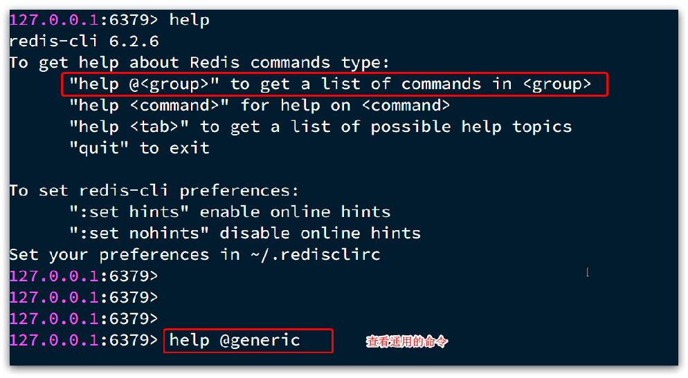

例如 `@generic`，`generic` 叫做通用的，即不分数据结构，所有的数据结构都可以通用的一些指令。

例如 `@string`，`string` 即string类型的，这里以 `string` 为例


但是官方上更详细一些，因此不管是在网站上，还是在命令行都能看见，建议大家在学习的时候不是死记硬背，而是参考参考文档学习，将来忘了也没关系，可以来查。

接下来就会按照顺序来学习每一组的命令。


---

# 9. Redis 通用命令

## 一、帮助文档

通用指令是对任何的数据类型都可以使用的一些命令，这些命令有哪些呢？我们可以去官方文档中查看，它都放在 `Generic` 这一组下了。


除了在官方文档中可以看见，我们也可以打开命令行：`@Generic`，可以发现出现了很多很多命令，及其使用方式也非常多。

如此多的命令不要去记，只要你会帮助文档，随时可以来查，没有必要去记忆。


虽然很多，但是真正常用的就几个：

- KEYS：查看符合模板的所有key
- DEL：删除一个指定的key
- EXISTS：判断key是否存在
- EXPIRE：给一个key设置有效期，有效期到期时该key会被自动删除
- TTL：查看一个KEY的剩余有效期

通过 `help [command](命令名称)` 可以查看一个命令的具体用法，例如：

`KEYS` 后面跟着 `pattern`，代表模板。

`Find all keys matching the given pattern`：查找与给定模式匹配的所有键。

这个模版有点像一种匹配的表达式，但是不是正则，而是redis内置的一种表达式，这种表达式一般是使用通配符，例如 `*`  代表所有。


或者去官方网站上找 `KEYS`，同样也能找到它的用法。


点进去后官方文档中还有示例


其中

- `*` 表示多个字符
- `?` 表示一个字符

其他的通配符可以到官网上看，这里就不再赘述。

这些都是在 `KEYS` 的官方文档中。


---

## 二、KEYS

按 `tab` 有自动补全功能，并且告诉你后面接 `pattern`


```sh
# *表示任意的，因此这里就匹配到了所有的key
127.0.0.1:6379> keys * 
1) "name"
2) "age"
127.0.0.1:6379>

# 查询以a开头的key
127.0.0.1:6379> keys a*
1) "age"
127.0.0.1:6379>
```

既然它这里支持通配符搜索，那它底层肯定有一种模糊查询的机制。

像这种模糊查询，效率肯定不高，事实上，当redis数据量达到一定规模时，例如数百万 / 上千万，甚至更多时，如果使用模糊匹配查询，往往会给服务器带来巨大的负担，也就是说它的搜索可能会搜很长时间。又因为redis是单线程的，在它搜索的这段时间内，它就无法执行其他的命令，等于整个redis服务都被阻塞了。

**贴心小提示：因此在生产环境下，不推荐使用keys 命令，因为这个命令在key过多的情况下，效率不高**

但如果你的redis是一个集群模式，有主有从，在从节点上执行这个命令，就是可以的，但是千万别在主节点做，因为会阻塞所有的请求。

----

## 三、DEL

DEL：删除 `一个 / 多个` 指定的Key，返回值是删除key的数量

```sh
127.0.0.1:6379> help del # 首先查询帮助文档
  # 参数就是要删除的Key，后面有个[]，意思是它可以接收多个key
  DEL key [key ...]
  summary: Delete a key # 删除一个Key
  since: 1.0.0
  group: generic

127.0.0.1:6379> del name #删除单个
(integer) 1  # 成功删除1个

127.0.0.1:6379> keys *
1) "age"

127.0.0.1:6379> MSET k1 v1 k2 v2 k3 v3 #批量添加数据
OK

127.0.0.1:6379> keys *
1) "k3"
2) "k2"
3) "k1"
4) "age"

127.0.0.1:6379> del k1 k2 k3 k4 # 我们的库中只有3个key，k4是不存在的，注意观察是否能删除
(integer) 3   # 此处返回的是成功删除的key，由于redis中只有k1,k2,k3 所以只成功删除3个，最终返回
127.0.0.1:6379>

127.0.0.1:6379> keys * #再查询全部的key
1) "age"	#只剩下一个了
127.0.0.1:6379>
```

----

## 三、EXISTS

EXISTS：判断key是否存在，存在返回1，不存在返回0

```sh
127.0.0.1:6379> help EXISTS # 首先查询帮助文档
  # 可以发现这个命令后面也可以跟一个或多个
  EXISTS key [key ...]
  summary: Determine if a key exists # 判断key是否存在
  since: 1.0.0
  group: generic

127.0.0.1:6379> exists age
(integer) 1

127.0.0.1:6379> exists name
(integer) 0
```

----

## 四、EXPIRE

**EXPIRE：给一个key设置有效期，有效期到期时该key会被自动删除单位是秒。**

为什么redis要有这样的一个命令呢？

因为redis是基于内存存储的，随着时间的增加，内存中存储的数据越来越多，总有一天内存可能会被占满，redis就为我们提供了这个功能，为key设置有效期。

例如我存了一个数进去，根据业务需求，例如是短信验证码，我们知道，验证码一般存在时间就是五分钟，此时我就可以设置五分钟有效期，到期以后自动删除，这样一来就可以节省redis的内存空间，因此EXPIRE也是非常常用的。

跟它合作使用的另外一个命令叫 **`ttl`，它是查看一个 Key的剩余有效期**。

```sh
127.0.0.1:6379> help EXPIRE
  # 命令后面跟上两个参数，key：给谁设置有效期，seconds：设置多长时间，单位是秒
  EXPIRE key seconds
  # 设置Key的存活时间，time to live即存活时间，简称为ttl
  summary: Set a key's time to live in seconds 
  since: 1.0.0
  group: generic

127.0.0.1:6379> expire age 10 # 为age设置10秒有效期
(integer) 1

127.0.0.1:6379> ttl age # 查看age的剩余有效期
(integer) 8 # 还剩8秒

127.0.0.1:6379> ttl age
(integer) 6 # 还剩6秒

127.0.0.1:6379> ttl age
(integer) -2  # 当这个key查询出来就是-2，表示这个key已经被移除了

127.0.0.1:6379> keys *
(empty list or set)

127.0.0.1:6379> set age 10 # 如果没有设置过期时间
OK

127.0.0.1:6379> ttl age
(integer) -1  # 此时ttl的返回值就是-1，代表永久有效，但建议在给redis存入数据时，最好都设置一个有效期
```

---

## 五、总结


----

# 10.Redis命令-String命令

## 一、介绍

String类型，也就是字符串类型，是Redis中最简单的存储类型。

其value是字符串，虽然都是字符串，不过根据字符串的格式不同，又可以分为3类：

* string：普通字符串
* int：整数类型，可以做自增、自减操作
* float：浮点类型，可以做自增、自减操作


不管是哪种格式，都属于字符串，因此底层都是**字节数组**形式存储，只不过为了节省空间，**数值类型的字符串在编码的时候会不同**。

**数值类型会直接把数字直接转化为二进制的形式去存储，这样一来，一个字节就可以即表示一个很大的数字了，可以更节省空间**

字符串只能把字符转成字节码然后再去存储，相对来说占用内存更多一点。

甚至你可以把一张图片编译成字节存到string类型中，但是字符串类型的最大空间不能超过512m，因此一般情况下也不会向一个key存储太多数据，因此一般也不会存图片，最多存图片的地址。

String的常见命令有：

增改查如下，删除是通用命令里面的。

* SET：添加或者修改已经存在的一个String类型的键值对，如果key不存在则是新增，如果存在则是修改

* GET：根据key获取String类型的value

* MSET：批量添加多个String类型的键值对

* MGET：根据多个key获取多个String类型的value

除了基本的存取以外，既然redis在存储数值类型的编码不同，因此对于数值类型就有一些特殊功能了。

* INCR：让一个整型的key自增1

* INCRBY:让一个整型的key自增并指定步长，例如：incrby num 2 让num值自增2
  把值变成负数就是自减，eg：incrby age -1

* DECR：自减1，但使用时一般都是使用INCR

* INCRBYFLOAT：让一个浮点类型的数字自增并指定步长，但是浮点数没有默认增长，必须指定增长的步长

以下两个是组合命令

* SETNX：添加一个String类型的键值对，前提是这个key不存在，否则不执行

  `setnx name lisi` 等价于 `set name lisi nx`

* SETEX：添加一个String类型的键值对，并且指定有效期

  `setex name 10 jack` 等价于：`set name jack ex 10`，ex就是expire

**贴心小提示**：以上命令除了INCRBYFLOAT 都是常用命令

----

## 二、代码实现

### SET 和GET

```java
127.0.0.1:6379> set name Rose  //原来不存在
OK

127.0.0.1:6379> get name 
"Rose"

127.0.0.1:6379> set name Jack //原来存在，就是修改
OK

127.0.0.1:6379> get name
"Jack"
```

----

### MSET和MGET

```sh
127.0.0.1:6379> MSET k1 v1 k2 v2 k3 v3
OK

127.0.0.1:6379> MGET name age k1 k2 k3
# 返回值是多个值形成的数组，redis中数组就会以下面的形式进行返回
1) "Jack" //之前存在的name
2) "10"   //之前存在的age
3) "v1"
4) "v2"
5) "v3"
```

---

### INCR和INCRBY和DECY

```sh
127.0.0.1:6379> get age 
"10" # 这个10就是一个普通字符串，但是它是一个数值类型的，因此底层编码就是数字

127.0.0.1:6379> incr age # 增加1
(integer) 11
    
127.0.0.1:6379> get age # 获得age
"11"

127.0.0.1:6379> incrby age 2 # 一次增加2
(integer) 13 # 返回目前的age的值
    
127.0.0.1:6379> incrby age 2
(integer) 15
    
127.0.0.1:6379> incrby age -1 # 也可以增加负数，相当于减
(integer) 14
    
127.0.0.1:6379> incrby age -2 # 一次减少2个
(integer) 12
    
127.0.0.1:6379> DECR age # 相当于 incr 负数，但是一般在使用的时候一般都使用incr，只不过是给它正负而已
(integer) 11
    
127.0.0.1:6379> get age 
"11"

```

---

### INCRBYFLOAT

浮点数没有默认增长，必须指定增长的步长

~~~ts
127.0.0.1:6379> set score 10.1
OK
127.0.0.1:6379> INCRBYFLOAT score 0.5
"10.6"
127.0.0.1:6379> INCRBYFLOAT score 0.5
"11.1"
127.0.0.1:6379> INCRBYFLOAT score 0.5
~~~

---

### SETNX

SETNX是条组合命名，`set` 和 `nx`，`nx` 是参数，跟在 `set` 后面

我们在 `set` 的时候，其实后面可以跟很多很多参数，其中有一个参数就是 `nx`


因此 `setnx name lisi` 等价于 `set name lisi nx`

```sh
127.0.0.1:6379> help setnx

  SETNX key value
  summary: Set the value of a key, only if the key does not exist # 如果key不存在才添加添加，存在就不添加。因此这个才是真正的新增功能，它只有新增效果
  since: 1.0.0
  group: string

127.0.0.1:6379> set name Jack  # 设置名称
OK
127.0.0.1:6379> setnx name lisi # 由于name已经存在，所以lisi的操作失败
(integer) 0 # 返回值是0，表示没有数据改变
127.0.0.1:6379> get name 
"Jack" # 重新查看name的值，依然是Jack
127.0.0.1:6379> setnx name2 lisi
(integer) 1 # name2 不存在，所以操作成功
127.0.0.1:6379> get name2 
"lisi"
```

---

### SETEX

EX：代表有效期。

通用命令中有一个叫 `EXPIRE`，它的作用是设置一个key的有效期，通过 `ttl` 可以查看key的剩余有效期，但是 `EXPIRE` 是在key已经存在的情况下。

`SETEX` 就表示：添加一个key，并且设置有效期。

这也是条组合命名：`setex name 10 jack` 等价于：`set name jack ex 10`，ex就是expire

```sh
127.0.0.1:6379> setex name 10 jack
OK

127.0.0.1:6379> ttl name
(integer) 8

127.0.0.1:6379> ttl name
(integer) 7

127.0.0.1:6379> ttl name
(integer) 5
```


----

# 11. Redis命令-Key的层级结构

## 一、介绍

redis是键值型的数据库，因此它的键要求唯一，因此大多数情况下我们都会以数据的id来作为key，形成唯一标识。

但是这里就会存在一个问题了：Redis没有类似MySQL中的Table的概念，没有表，所有数据都是存在一起的，那么我们该如何区分不同类型的key呢？

例如，需要存储用户、商品信息到redis，有一个用户id是1，有一个商品id恰好也是1，此时如果使用id作为key，那就会冲突了，该怎么办？

此时我们可以通过给key添加前缀加以区分，不过这个前缀不是随便加的，有一定的规范：

Redis的key允许有多个单词形成层级结构，多个单词之间用 `':'（冒号）` 隔开，例如我们可以这样，这个格式并非固定，但是推荐大家这样写，除非你们公司有固定key的格式。


例如我们的项目名称叫 `heima`，有 `user` 和 `product` 两种不同类型的数据，我们可以这样定义key：

- user相关的key：**heima:user:1**（代表id为1的用户信息）

- product相关的key：**heima:product:1**

这样key就形成了一种层级关系，它们俩是一个项目的，只不过一个是 `user`，一个是 `product`。

现在key定义好了，那值是什么呢？我们知道用户也好，商品也好，在我们的项目中往往都是一个java类或者java对象，这样的对象该如何存储到值的位置呢？

上节将string类型的时候其实提到过，string是字符串，Java对象虽然不是字符串，但是它完全可以序列化成JSON的风格来存储。

例如一个User / Product对象，则可以将对象序列化为JSON字符串后存储：

| **KEY**         | **VALUE**                                 |
| --------------- | ----------------------------------------- |
| heima:user:1    | {"id":1, "name": "Jack", "age": 21}       |
| heima:product:1 | {"id":1, "name": "小米11", "price": 4999} |

---

## 二、代码实现

存入两个user，两个product。

PS：存入的时候JSON是一个字符串，需要加 `''`

~~~sh
127.0.0.1:6379> set heima:user:1 '{"id":1, "name":"Jack", "age": 21}'
OK
127.0.0.1:6379> set heima:user:2 '{"id":2, "name":"Rose", "age": 18}'
OK
127.0.0.1:6379> set heima:product:1 '{"id":1, "name":"小米11", "price": 4999}'
OK
127.0.0.1:6379> set heima:product:2 '{"id":2, "name":"荣耀6", "price": 2999}'
OK
~~~

然后通过 `keys *` 来查看我们刚刚存入的数据，但是从这里并不能看见有什么特殊之处


但是在可视化界面中，redis会以层级结构来进行存储，形成类似于这样的结构，更加方便Redis获取数据


这样就避免了id相同时的冲突，并且让我们的数据分离，看起来比较优雅。

不仅仅是string类型可以将key按照这种方式设定，以后我们学的其他的数据类型，它的key都可以用这种方式去做成层级的模式


---

# 12.Redis命令-Hash命令

## 一、介绍

之前我们一再强调，redis是键值型的数据库，它的值的类型多种多样，在string类型中，值就是普通字符串。

但在Hash类型（也叫散列），其value是一个无序字典（其实就是一个hash表），类似于Java中的HashMap结构。

也就是说redis本身是一个key-value，而哈希类型的value又是一个哈希表，即key-value结构。

由于String结构是将对象序列化为JSON字符串后存储，当需要修改对象某个字段时很不方便，要么删除整个字符串，要么删掉重来


而Hash结构的key跟string没什么差异，但是value又分成了两部分：`field`（也有人称为hashKey），`value`，此时我们就不需要再使用JSON字符串来表示一个用户了，它可以将对象中的每个字段独立存储，此时针对单个字段做CRUD，并不会影响到其他字段。


---

## 二、Hash类型的常见命令

这些命令可以对照着string类型进行学习，在它命令的基础上前面加上 `H` 就变成了Hash操作命令。

由于多了一个 `field`，因此增改查的时候都需要告明是哪个 `key`、哪个 `field`。


- HSET key field value：添加或者修改hash类型key的field的值

- HGET key field：获取一个hash类型key的field的值

- HMSET：批量添加多个hash类型key的field的值

- HMGET：批量获取多个hash类型key的field的值

- HGETALL：获取一个hash类型的key中的所有的field和value
- HKEYS：获取一个hash类型的key中的所有的field
- HVALS：获取一个hash类型的key中的所有的value
- HINCRBY:让一个hash类型key的字段值自增并指定步长
- HSETNX：添加一个hash类型的key的field值，前提是这个field不存在，否则不执行

---

## 三、代码实现

### HSET和HGET

存入到redis后，图形化界面如下，可以发现key里面存的value又是一个key-value结构，即hash结构


```sh
127.0.0.1:6379> HSET heima:user:3 name Lucy # 大key是 heima:user:3 小key是name，小value是Lucy
(integer) 1
127.0.0.1:6379> HSET heima:user:3 age 21 # 如果操作不存在的数据，则是新增
(integer) 1
# 修改某一个字段的值
127.0.0.1:6379> HSET heima:user:3 age 17 # 如果操作存在的数据，则是修改
(integer) 0
127.0.0.1:6379> HGET heima:user:3 name 
"Lucy"
127.0.0.1:6379> HGET heima:user:3 age
"17"
```

----

### HMSET和HMGET

```sh
127.0.0.1:6379> HMSET heima:user:4 name HanMeiMei
OK
127.0.0.1:6379> HMSET heima:user:4 name LiLei age 20 sex man # 存多组
OK
127.0.0.1:6379> HMGET heima:user:4 name age sex # 查多组
1) "LiLei"
2) "20"
3) "man"
```

---

### HGETALL

```sh
127.0.0.1:6379> HGETALL heima:user:4
# 返回格式是：一个key一个value
1) "name"
2) "LiLei"
3) "age"
4) "20"
5) "sex"
6) "man"
```

----

### HKEYS和HVALS

```java
127.0.0.1:6379> HKEYS heima:user:4
1) "name"
2) "age"
3) "sex"
127.0.0.1:6379> HVALS heima:user:4
1) "LiLei"
2) "20"
3) "man"
```

---

### HINCRBY

```sh
127.0.0.1:6379> HINCRBY heima:user:4 age 2
(integer) 22
127.0.0.1:6379> HINCRBY heima:user:4 age 2
(integer) 24
127.0.0.1:6379> HVALS heima:user:4
1) "LiLei"
2) "24"
3) "man"
127.0.0.1:6379> HINCRBY  heima:user:4 age -2 # 负数就是负增长
(integer) 22
```

---

### HSETNX

跟string类型的setnx一样，值不存在才执行，如果值已经存在，就不执行了。

```java
127.0.0.1:6379> HSETNX heima:user4 sex woman
(integer) 1
127.0.0.1:6379> HGETALL heima:user:3
1) "name"
2) "Lucy"
3) "age"
4) "17"
127.0.0.1:6379> HSETNX heima:user:3 sex woman
(integer) 1
127.0.0.1:6379> HGETALL heima:user:3
1) "name"
2) "Lucy"
3) "age"
4) "17"
5) "sex"
6) "woman"
```


---

# 13. Redis命令-List类型

## 一、介绍

与前面两种类似，不同数据类型的差异主要是在值的数据类型不同，`string类型` 的值就是普通字符串，`hash类型` 的值是一个哈希表，而这节我们要学习的 `List` 类型，它的值当然就是 `List集合` 了。

Redis中的List类型与Java中的LinkedList类似，可以看做是一个双向链表结构。双向链表最大的特点就是：既可以支持正向检索和也可以支持反向检索。

特征也与LinkedList类似：

* 有序（跟插入的顺序是有关系的）
* 元素可以重复（因为它不会去检查元素是否是一致的）
* 插入和删除快（所有的链表插入和删除速度都会比较快）
* 查询速度一般（相对于传统的数组来讲，稍微差一点，因为它只能通过逐个节点遍历的方式进行查询）

使用场景：用来保存一些对顺序有要求的数据，例如：朋友圈点赞列表，评论列表等。

---

## 二、List的常见命令

`L(left)` 可以看成队首，`R(right)` 可以看成队尾，它其实是将一个链表看成了是一个队列，有头有尾的结构。

- LPUSH key element ... ：向列表左侧插入一个或多个元素
- LPOP key：**移除并返回**列表左侧的第一个元素，没有则返回nil
- RPUSH key element ... ：向列表右侧插入一个或多个元素
- RPOP key：移除并返回列表右侧的第一个元素
- LRANGE key star end：返回一段角标范围内的所有元素（左闭右闭，下标从0开始）
- BLPOP和BRPOP：与LPOP和RPOP类似，但是 `LPOP和RPOP` 在没有元素的时候直接返回 `nil`。而 `B` 代表阻塞，在没有元素时等待指定时间，而不是直接返回nil


---

## 三、代码实现

### LPUSH和RPUSH

`LPUSH` 效果如图，因为不管你推几个元素，它都是按顺序推的，`1` 是第一个，`2` 是第二个，`3` 是第三个


```sh
127.0.0.1:6379> LPUSH users 1 2 3 # 可以插入多个元素，加入到左边
(integer) 3
```

`RPUSH` 效果如下图


~~~sh
127.0.0.1:6379> RPUSH users 4 5 6 # 加入到右边
(integer) 6
~~~

---

### LPOP和RPOP

LPOP key：**移除并返回**列表左侧的第一个元素，没有则返回nil

```sh
127.0.0.1:6379> LPOP users
"3"
127.0.0.1:6379> RPOP users
"6"
```

---

### LRANGE

PS：大家不要看前面的编号，角标是从0开始的


```sh
127.0.0.1:6379> LRANGE users 1 2
1) "1"
2) "4"
```

---

### BLPOP和BRPOP

`BLPOP和BRPOP` 需要传入等待多久的参数，否则报错，因为不可能无限等。单位是**秒**。

测试的时候开两个终端，一个终端用来等待数据，另一个终端用来传入数据，然后查看效果，并且下面还告诉你花了 `42.21s` 才拿到，这就是所谓的阻塞式获取。


----

## 四、思考

**如何利用List结构模拟一个栈?**

- 入口和出口在同一边

**如何利用List结构模拟一个队列?**

- 入口和出口在不同边

**如何利用List结构模拟一个阻塞队列?**

阻塞队列：首先是一个队列，然后再是阻塞

- 入口和出口在不同边

- 出队时采用BLPOP或BRPOP


---

# 14. Redis命令-Set命令

## 一、介绍

Redis的Set结构与Java中的HashSet类似，而HashSet底层其实是由HashMap来实现的，因此可以看做是一个value为null的HashMap。既然是HashMap，那底层肯定也是一个hash表，只不过这次我们不关心它的value了，而只关心它的key，此时它就变成了一个set了。

因此它具备与HashSet类似的特征：

* 无序（每一个元素都会使用hash算法来计算它插入的角标，因此数据的存储顺序和我们插入的顺序是无关的）
* 元素不可重复
* 查找快（根据哈希表做查找，时间复杂度是比较低的，因此速度是非常快的）

但是相比于Java中的HashSet，它多了一些功能

* 支持交集、并集、差集等功能。

这些功能它就可以非常方便的实现：好友列表、共同好友、关注等功能。因此在交友型的应用中使用还是非常广泛的。

---

## 二、Set类型的常见命令

### 1）对单个集合增删改查的操作

`参数key`：集合名称

`参数member`：插入进去的元素

`...`：省略号表示可以一次插入 / 移除多个

* SADD key member ... ：向set中添加一个或多个元素
* SREM key member ... : 移除set中的指定元素(remove)
* SCARD key： 返回set中元素的个数
* SISMEMBER key member：判断一个元素是否存在于set中(is menber)，有点像Java中的contains
* SMEMBERS：获取set中的所有元素

---

### 2）多个集合之间的交互操作

* SINTER key1 key2 ... ：求key1与key2两个集合的交集
* SDIFF key1 key2 ... ：求key1与key2的差集（key1有key2没有）
* SUNION key1 key2 ..：求key1和key2的并集（由于set不能重复，所以重复元素只会记录一次）

例如两个集合：s1和s2:


求交集：SINTER s1 s2

求s1与s2的不同：SDIFF s1 s2


----

## 三、代码实现

### 1）对单个集合增删改查的操作

```sh
127.0.0.1:6379> sadd s1 a b c # 向集合s1中添加a、b、c
(integer) 3
127.0.0.1:6379> smembers s1 # 获取集合中所有元素
1) "c"
2) "b"
3) "a"
127.0.0.1:6379> srem s1 a # 删除集合中的a元素
(integer) 1
    
127.0.0.1:6379> SISMEMBER s1 a # 判断集合中是否有a元素
(integer) 0 # 没有
    
127.0.0.1:6379> SISMEMBER s1 b # 判断集合中是否有b元素
(integer) 1 # 有
    
127.0.0.1:6379> SCARD s1
(integer) 2 # 集合数量仅剩两个元素
```

---

### 2）多个集合之间的交互操作

**案例**

* 将下列数据用Redis的Set集合来存储：
* 张三的好友有：李四、王五、赵六
* 李四的好友有：王五、麻子、二狗
* 利用Set的命令实现下列功能：
* 计算张三的好友有几人
* 计算张三和李四有哪些共同好友
* 查询哪些人是张三的好友却不是李四的好友
* 查询张三和李四的好友总共有哪些人
* 判断李四是否是张三的好友
* 判断张三是否是李四的好友
* 将李四从张三的好友列表中移除

```sh
127.0.0.1:6379> SADD zs lisi wangwu zhaoliu # 张三的好友有：李四、王五、赵六
(integer) 3
    
127.0.0.1:6379> SADD ls wangwu mazi ergou # 李四的好友有：王五、麻子、二狗
(integer) 3
    
127.0.0.1:6379> SCARD zs # 计算张三的好友有几人
(integer) 3
    
127.0.0.1:6379> SINTER zs ls # 计算张三和李四有哪些共同好友
1) "wangwu"
    
127.0.0.1:6379> SDIFF zs ls # 查询哪些人是张三的好友却不是李四的好友
1) "zhaoliu"
2) "lisi"
    
127.0.0.1:6379> SUNION zs ls # 查询张三和李四的好友总共有哪些人
1) "wangwu"
2) "zhaoliu"
3) "lisi"
4) "mazi"
5) "ergou"
    
127.0.0.1:6379> SISMEMBER zs lisi # 判断李四是否是张三的好友
(integer) 1
     
127.0.0.1:6379> SISMEMBER ls zhangsan # 判断张三是否是李四的好友
(integer) 0
    
127.0.0.1:6379> SREM zs lisi # 将李四从张三的好友列表中移除
(integer) 1
    
127.0.0.1:6379> SMEMBERS zs
1) "zhaoliu"
2) "wangwu"
```


---

# 15. Redis命令-SortedSet类型

## 一、介绍

`SortedSet` 从名字来看，首先它是一个 `set`，即集合。同时它是一个 `SortedSet`，也就是可排序的集合。

Redis的SortedSet是一个可排序的set集合，与Java中的TreeSet从功能上来讲有些类似，但底层数据结构却差别很大。TreeSet底层是红黑树来实现的，需要定义排序方法；而 `SortedSet` 底层排序是根据一个固定的 `score值` 来排序的。

即我们在 `SortedSet` 中存储元素时，需要带上一个 `score(得分)`，这样它就可以帮我们根据得分去排序了，底层的实现是一个跳表（SkipList）加 hash表。跳表是用来做排序的，hash表就是最基本的结构了，key是我们的元素，值是对应的score分数。

SortedSet具备下列特性：

- 可排序
- 元素不重复（毕竟是个set）
- 查询速度快（因为有哈希表，所以查询速度是比价快的；并且跳表可以完成排序的功能，也可以增加查询速度）

因为 `SortedSet` 具备这样的排序功能，并且查询效率也非常高，所以它经常被用来实现像排行榜这样的功能（例如top 1等）。

---

## 二、SortedSet的常见命令

这里命令比较多，但是有很多命令都是似曾相识的。

上节将 `SADD` 的时候，代表新增一个元素到集合中，但是 `SortedSet` 因为带有排名，每一个元素都要带分数。

- ZADD key score member：添加一个或多个元素到sorted set ，如果已经存在则更新其score值
- ZREM key member：删除sorted set中的一个指定元素
- ZSCORE key member : 获取sorted set中的指定元素的score值
- ZRANK key member：获取sorted set 中的指定元素的排名（排名是从0开始的）
- ZCARD key：获取sorted set中的所有元素个数
- ZCOUNT key min max：统计score值在给定范围内的所有元素的个数（根据分数值取范围，这里的最大值最小值是一个分数的范围）
- ZINCRBY key increment member：让sorted set中的指定元素自增，步长为指定的 `increment值`，如果传入负数，那就是减分
- ZRANGE key min max：按照score排序后，获取指定排名范围内的元素（根据名次取范围）
- ZRANGEBYSCORE key min max：按照score排序后，获取指定score范围内的元素（这里的最大值最小值就是分数）
- ZDIFF.ZINTER.ZUNION：求差集.交集.并集

**PS：count是差个数，range是差具体元素。range又分为range和rangeByScore，range是查排序后范围的元素，rangeByScore是查指定score范围内的元素。**

注意：所有的排名默认都是升序，如果要降序则在命令的Z后面添加REV（reverse反转）即可，例如：

- **升序**获取sorted set 中的指定元素的排名：ZRANK key member
- **降序**获取sorted set 中的指定元素的排名：ZREVRANK key memeber

我们可以通过 `help @sorted_set` 在命令行查看一下

`Determine the index of a member in a sorted set, with scores ordered from high to low`：确定排序集中成员的索引，分数从高到低排序，即降序。


---

## 三、代码实现

需求如下

~~~
将班级的下列学生得分存入Redis的SortedSet中：
Jack 85, Lucy 89, Rose 82, Tom 95, Jerry 78, Amy 92, Miles 76
并实现下列功能：
删除Tom同学
获取Amy同学的分数
获取Rose同学的排名
查询80分以下有几个学生
给Amy同学加2分
查出成绩前3名的同学
查出成绩80分以下的所有同学
~~~

使用 `ZADD` 添加元素的时候，可以看见是分数在前，元素在后，并且后面有 `...` ，表示可以添加多组数据。


集合名字为 `stus`，表示学生。

~~~sh
ZADD stus 85 Jack 89 Lucy 82 Rose 95 Tom 78 Jerry 92 Amy 76 Miles
~~~

打开图形化客户端来看看，可以发现添加成功。并且可以发现，图形化客户端默认展示的就是升序的，即已经自动排序了。


~~~sh
127.0.0.1:6379> ZREM stus Tom # 删除Tom同学
(integer) 1
127.0.0.1:6379> ZSCORE stus Amy # 获取Amy同学的分数
"92"
127.0.0.1:6379> ZRANK stus Rose # 获取Rose同学的排名（升序）
(integer) 2
127.0.0.1:6379> ZREVRANK stus Rose # 获取Rose同学的排名（降序）
(integer) 3
~~~

PS：返回的排名是从 `0` 开始的


~~~sh
127.0.0.1:6379> ZCOUNT stus 0 80 # 查询80分以下有几个学生
(integer) 2

127.0.0.1:6379> ZINCRBY stus 2 Amy # 给Amy同学加2分
"94"

127.0.0.1:6379> ZREVRANGE stus 0 2 # 查出成绩前3名的同学，ZRANGE是升序，这里应该使用ZREVRANGE降序
1) "Amy"
2) "Lucy"
3) "Jack"

127.0.0.1:6379> ZRANGEBYSCORE stus 0 80 # 查出成绩80分以下的所有同学
1) "Miles"
2) "Jerry"
~~~


----

# 15.Redis的Java客户端-Jedis

经过前面的学习，我们已经基本了解了redis常见的五种数据结构，以及每种结构的常见命令和基本用法，不过最终我们实现业务，还是要用编码的方式来实现。

在Redis官网中提供了各种语言的客户端供我们使用，地址：https://redis.io/docs/clients/


当然作为Java程序员，我们要关注的肯定是Java语言的客户端其中Java客户端也包含很多：


标记为❤的就是推荐使用的java客户端，包括：

- Jedis（java和redis组成的单词）和Lettuce：这两个主要是提供了Redis命令对应的API，方便我们操作Redis，而SpringDataRedis又对这两种做了抽象和封装，因此我们后期会直接以SpringDataRedis来学习。

  并且它以Redis命令作为方法名称，例如SET命令对应的方法就是set，GET命令对应的方法就叫get，MSET命令对应的方法就叫mset，因此学习成本低，简单实用。

  但是Jedis实例是线程不安全的，也就是说你创建一个线程实例，多线程并发运行的时候是有线程安全问题的，因此多线程使用时必须为每一个线程创建独立的Jedis连接，那么就必须使用连接池的方式来使用了。

- Lettuce是基于Netty实现的，Netty是高性能的网络编程框架，支持同步、异步和响应式编程方式，并且是线程安全的。支持Redis的哨兵模式、集群模式和管道模式。所以这种模式跟Spring的编程模式结合的比较好，并且响应式编程、异步编程的吞吐能力也高一点。因此spring官方默认兼容的就是Lettuce客户端。

- Redisson的特点不在于对redis的基本操作，而是在于它底层是一个基于Redis实现了一系列的工具，例如分布式、可伸缩的Java数据结构集合。包含了诸如Map、Queue、Lock、 Semaphore（信号量）、AtomicLong（原子整形）等这些类，这些类可以保证我们平常使用的时候做数据存储、线程控制都非常方便。

  但是这些东西它们都有一个特点：它们都是单机的，如果是在分布式环境下，它们往往就失去作用了。

- 而Redission就是基于Redis重新实现了这一系列的东西，以至于它们可以在分布式环境下同样能够使用。因此如果你有在分布式环境下使用的需求，就不需要重新造轮子了，而是直接使用Redission。

  Redisson：是在Redis基础上实现了分布式的可伸缩的java数据结构，例如Map.Queue等，而且支持跨进程的同步机制：Lock.Semaphore等待，比较适合用来实现特殊的功能需求。

- Spring Data Redis：兼容了jedis和lettuce

一般作为普通Redis来实现业务逻辑，用Jedis、Lettuce这两种会相对来讲比较方便一些，因此这两种应该都掌握。

但是spring最擅长的就是整合，因此后面会学习 `Spring Data Redis`，它底层可以兼容 `Jedis` 和 `lettuce`，即既可以用 `Jedis` 实现，也可以用 `lettuce` 实现，未来学完了它，就等于这两个客户端都会了。

但是有些企业还是喜欢使用旧的Jedis，因为它的命令就是方法名，学习成本低，因此我们会把Jedis的原生API也会讲一下，然后再学习Spring Data Redis。


---

# 16.Jedis快速入门

Jedis使用起来非常简单，官网地址： https://github.com/redis/jedis，官网给出了一个快速入门的demo，这里就先来演示一下这个demo。

## 一、步骤

### 0）创建工程


---

### 1）引入依赖

官网上是可以直接找到这个依赖的


```xml
<!--jedis-->
<dependency>
    <groupId>redis.clients</groupId>
    <artifactId>jedis</artifactId>
    <version>3.7.0</version>
</dependency>
<!--单元测试-->
<dependency>
    <groupId>org.junit.jupiter</groupId>
    <artifactId>junit-jupiter</artifactId>
    <version>5.7.0</version>
    <scope>test</scope>
</dependency>
```

---

### 2）建立连接

新建一个单元测试类，内容如下：

```java
private Jedis jedis;

@BeforeEach
void setUp() {
    // 1.建立连接，需要传入IP地址和端口号，相当于 -h 和 -p
    jedis = new Jedis("192.168.150.101", 6379);
    // 2.设置密码
    jedis.auth("123321");
    // 3.选择库，不选择的话默认就是0号库
    jedis.select(0);
}
```

---

### 3）释放资源

```java
@AfterEach
void tearDown() {
    // 做一个健壮性的判断，因为如果在上面建立连接的时候就抛异常了，直接走到释放资源的代码了，就会有风险
    if (jedis != null) {
        jedis.close();
    }
}
```

---

## 4）测试

```java
@Test
void testString() {
    // 存入数据。之前说过，Jedis里面的方法名就是redis里面的命令名称
    String result = jedis.set("name", "虎哥");
    System.out.println("result = " + result); // result = OK
    // 获取数据
    String name = jedis.get("name");
    System.out.println("name = " + name); // name = 虎哥
}
```

上面报错是因为没有相关日志的依赖，不用管，主要看下面的结果。


---

`hset` 就是传入一个键值对


`hmset` 可以批量插入，在Java中传入的是一个Map集合


~~~java
@Test
void testHash() {
    // 插入hash数据
    jedis.hset("user:1", "name", "Jack");
    jedis.hset("user:1", "age", "21"); // 其value是字符串，虽然都是字符串，不过根据字符串的格式不同，又可以分为3类，因此它本质还是字符串，所以这里传字符串的21

    // 获取
    // 在命令行中hgetAll得到的是key-value形参的数组，但是这里为了方便，它帮我们组成了一个Map，因为getAll就是得到所有的键值对
    Map<String, String> map = jedis.hgetAll("user:1");
    System.out.println(map); // {name=Jack, age=21}
}
~~~

来到图形化界面看一眼，发现都是正确插入了的


其他的命令就不演示了，因为方法名和命令是一样的。

---

## 二、总结

Jedis使用的基本步骤：

1.引入依赖

2.创建Jedis对象，建立连接

3.使用Jedis，方法名与Redis命令一致

4.释放资源


---

# 17. Jedis连接池

Jedis本身是线程不安全的，如果在多线程的环境下并发的去访问，大家都来使用Jedis的话，是有可能出现线程安全问题的，因此在并发的环境下Jedis一定要给每一个线程创建独立的Jedis对象，此时最好的方案是使用线程池，因为频繁的创建和销毁连接会有性能损耗，因此我们推荐大家使用Jedis连接池代替Jedis的直连方式。

Jedis官方也基于 `apache的 commons pool` 来实现了连接池。

有关池化思想，并不仅仅是这里会使用，很多地方都有，比如说我们的数据库连接池，比如我们tomcat中的线程池，这些都是池化思想的体现。

---

## 一、创建Jedis的连接池

其实连接池的使用并不复杂，这里定义了一个工具类 `JedisConnectionFacotry`，工具类中有一个静态变量 `jedisPool`，这个 `pool对象` 是通过静态代码块来初始化的

```java
public class JedisConnectionFactory {

     //JedisPool就是官方提供的Jedis对象
     private static final JedisPool jedisPool;

     static {
         //配置连接池
         JedisPoolConfig poolConfig = new JedisPoolConfig();
         //配置最大连接数
         poolConfig.setMaxTotal(8);
         //最大空闲链接，即便没有人来访问池子，池子里也可以预备8个连接，这样的话有人来了就可以直接用，不用临时创建
         poolConfig.setMaxIdle(8);
         //最小空闲连接。但是这些连接一直放那里也不太好，因此这些连接放置一段时间后如果没有人用，就会被清理，直到它为0为止
         poolConfig.setMinIdle(0);
         //等待连接时长：当连接池中没有连接可用的时候，要不要等待？等多长时间？默认值为-1，即一直等，直到有新的空闲连接为止，过了1000毫秒，还没连接，就会报错
         poolConfig.setMaxWaitMillis(1000);
         //创建连接池对象，第一个参数是它的连接池config对象，config显然是做配置的；然后是IP地址，端口号，超时时间，密码。
         // 也就是说JedisPool传入的都是一些连接的参数，而前面config对象中传的是池的一些参数。
         jedisPool = new JedisPool(poolConfig,
                 "192.168.150.101",6379,
                                   // timeout：连接和读取操作的超时时间，以毫秒为单位。
                                   1000,"123321");
     }

    //提供静态方法，方便我们去获取jedis对象，每次都是从池子中获取，用完了就会还回去，这样就避免了频繁的创建和销毁这些对象了
     public static Jedis getJedis(){
          return jedisPool.getResource();
     }
}
```

**代码说明：**

- 1） JedisConnectionFacotry：工厂设计模式是实际开发中非常常用的一种设计模式，我们可以使用工厂，去降低代的耦合，比如Spring中的Bean的创建，就用到了工厂设计模式

- 2）静态代码块：随着类的加载而加载，确保只能执行一次，我们在加载当前工厂类的时候，就可以执行static的操作完成对 连接池的初始化

- 3）最后提供返回连接池中连接的方法.

---

## 二、改造原始代码

**代码说明:**

1.在我们完成了使用工厂设计模式来完成代码的编写之后，我们在获得连接时，就可以通过工厂来获得。

，而不用直接去new对象，降低耦合，并且使用的还是连接池对象。

2.当我们使用了连接池后，当我们关闭连接其实并不是关闭，而是将Jedis还回连接池的。

```java
@BeforeEach
void setUp(){
    //建立连接
    /*jedis = new Jedis("127.0.0.1",6379);*/
    jedis = JedisConnectionFacotry.getJedis();
    //选择库
    jedis.select(0);
}

@AfterEach
void tearDown() {
    if (jedis != null) {
        //这个操作的意思是归还，还到池子里去，而不是把它销毁
        jedis.close();
    }
}
```

底层 `close()` 源码如下

~~~java
@Override
public void close() {
    // 检查连接池是否为 null
    if (dataSource != null) {
        // 临时保存dataSource并将其置为null，为了避免了重复关闭同一个资源。
        JedisPoolAbstract pool = this.dataSource;
        this.dataSource = null;
        // 检查连接是否破损并相应地归还连接
        if (isBroken()) {
            // 如果连接破损，则调用pool.returnBrokenResource(this)方法将破损的连接归还到连接池，以便池能够处理它（通常是销毁这个连接）
            pool.returnBrokenResource(this);
        } else {
            // 如果连接没有破损，则调用pool.returnResource(this)将正常的连接归还到连接池，以便可以被复用。
            pool.returnResource(this);
        }
    } else {
        // 如果当前实例的dataSource为null，说明该连接不是从连接池中获取的，调用父类的close方法
        super.close();
    }
}
~~~


---

# 18.Redis的Java客户端-SpringDataRedis

SpringData是Spring中数据操作的模块，包含是spring对各种数据库操作的集成，其中对Redis的集成模块就叫做SpringDataRedis，官网地址：https://spring.io/projects/spring-data-redis。

打开官网，可以发现在 `SpringData` 下就有各种各样的操作，这些常见的数据库操作全部都属于 `SpringData` 这个模块，`Spring Data Redis` 就是其中之一，它里面封装的当然就是对redis的各种各样的操作。


可以发现它的版本也已经迭代版本非常多了。

- **Branch**：表示 Spring Data Redis 的分支版本，例如 3.2.x、3.1.x 等。
- **Initial Release**：表示该分支版本的初始发布日期。
- **End of Support**：表示该分支版本的支持结束日期，即社区或开源支持的结束日期。
- **End Commercial Support ***：表示该分支版本的商业支持结束日期，通常是由提供商业支持服务的公司（例如 Pivotal 或 VMware）提供的。星号（*）可能表示有额外的注释或条件，具体解释可能会在页面底部或者文档的其他部分提供。

但是整体使用上差异并不是很大。


那它具备什么特征呢？首先spring重来不会重复去造轮子，它都是集成，因此它其实是对其他redis客户端的整合（spring不能说抄袭）。

* 提供了对不同Redis客户端的整合（Lettuce和Jedis），并且要整合，就应该提供一套统一的标准
* 提供了RedisTemplate统一API来操作Redis，底层的实现就是由Lettuce和Jedis来实现的

在封装的基础上，它还做了很多很多的支持

* 支持Redis的发布订阅模型

* 支持Redis哨兵和Redis集群

* 支持基于Lettuce的响应式编程（可以结合Spring的WebFlux）

* 支持基于JDK、JSON、字符串、Spring对象的数据序列化及反序列化

  - 序列化：将JDK、JSON、字符串、Spring对象这些变成字符串或字节。
  - 反序列化：将redis中读到的字节再变成Java中的对象 / 字符串。

  对比：在上节Jedis代码中，`set()方法` 中 key 和 value 类型都是字符串类型，要么是字节数组（之前讲过，Redis底层编码都是字节数组，无非就是编码格式不一样）。但假设我现在有一个Java对象需要存储，此时它就做不到了，除非你手动给它做序列化，变成字符串或字节。

* 支持基于Redis的JDKCollection实现

  JDKCollection：JDK中各种各样的结合，它基于redis重新实现了一下这些集合（队列、链表等）。

  为什么要重新实现呢？因为基于redis的实现是分布式的，即跨系统的。

SpringDataRedis中提供了RedisTemplate工具类，其中封装了各种对Redis的API。

Jedis中方法名就是命令名称，redis中有上百个命令，那么Jedis类中就封装了上百个方法，它的好处是学习成本低，但是类相对来讲就比较臃肿了，里面东西特别多。

但是这些API的封装是有规律的，它跟Jedis不同。我们知道，Redis官方也对Redis命令做了分组，例如有通用命令、有专门操作字符串的命令、专门操作hash的命令...... 

而我们的RedisTemplate它也做了这些事，它的内部提供了一系列的API，它也将不同数据类型的API封装到了不同的类型中，这些API的名字都叫做opsFor，它的返回值都是Operations对象，这些对象中就封装了各种操作：

RedisTemplate 本身封装的就是一些通用的命令。


---

# 19.RedisTemplate快速入门

这里会基于SpringBoot使用，因为SpringBoot已经默认整合了SpringDataRedis，并且做了自动装配，我们使用起来会及其的方便

## 一、导入pom坐标

引入依赖

``` xml
<!--redis依赖-->
<dependency>
    <groupId>org.springframework.boot</groupId>
    <artifactId>spring-boot-starter-data-redis</artifactId>
</dependency>
<!--连接池common-pool，因为不管是Jedis也好，还是Lettuce，底层都会基于commons-pool来实现连接池效果-->
<dependency>
    <groupId>org.apache.commons</groupId>
    <artifactId>commons-pool2</artifactId>
</dependency>
```

完整pom文件如下

```xml
<?xml version="1.0" encoding="UTF-8"?>
<project xmlns="http://maven.apache.org/POM/4.0.0" xmlns:xsi="http://www.w3.org/2001/XMLSchema-instance"
         xsi:schemaLocation="http://maven.apache.org/POM/4.0.0 https://maven.apache.org/xsd/maven-4.0.0.xsd">
    <modelVersion>4.0.0</modelVersion>
    <parent>
        <groupId>org.springframework.boot</groupId>
        <artifactId>spring-boot-starter-parent</artifactId>
        <version>2.5.7</version>
        <relativePath/> <!-- lookup parent from repository -->
    </parent>
    <groupId>com.heima</groupId>
    <artifactId>redis-demo</artifactId>
    <version>0.0.1-SNAPSHOT</version>
    <name>redis-demo</name>
    <description>Demo project for Spring Boot</description>
    <properties>
        <java.version>1.8</java.version>
    </properties>
    <dependencies>
        <!--redis依赖-->
        <dependency>
            <groupId>org.springframework.boot</groupId>
            <artifactId>spring-boot-starter-data-redis</artifactId>
        </dependency>
        <!--连接池common-pool，不管是Jedis也好，还是Lettuce，底层都会1基于commons-pool来实现连接池效果-->
        <dependency>
            <groupId>org.apache.commons</groupId>
            <artifactId>commons-pool2</artifactId>
        </dependency>
        <!--Jackson依赖-->
        <dependency>
            <groupId>com.fasterxml.jackson.core</groupId>
            <artifactId>jackson-databind</artifactId>
        </dependency>
        <dependency>
            <groupId>org.projectlombok</groupId>
            <artifactId>lombok</artifactId>
            <optional>true</optional>
        </dependency>
        <dependency>
            <groupId>org.springframework.boot</groupId>
            <artifactId>spring-boot-starter-test</artifactId>
            <scope>test</scope>
        </dependency>
    </dependencies>

    <build>
        <plugins>
            <plugin>
                <groupId>org.springframework.boot</groupId>
                <artifactId>spring-boot-maven-plugin</artifactId>
                <configuration>
                    <excludes>
                        <exclude>
                            <groupId>org.projectlombok</groupId>
                            <artifactId>lombok</artifactId>
                        </exclude>
                    </excludes>
                </configuration>
            </plugin>
        </plugins>
    </build>

</project>
```

----

## 二、配置文件

SpringBoot自动装配的好处就是：我们不用再写编码，上节课Jedis连接池代码其实还是有些复杂的，但是现在我们都不用管了，我们唯一要做的就是在yml文件中配置。

如果你不记得了，没关系，直接 `spring.redis`，所有的提示都会出现


如果你要选择数据库，这里也是可以选的，默认就是 `0号库`


配置连接池的时候有两套，一套Jedis连接池，另一套是Lettuce连接处，其实这里就是在选择你到底用的是哪种实现，如果你使用的是Jedis实现，那么还需要在pom文件中额外引入Jedis相关依赖，因为spring默认使用的是Lettuce。


我们来看下maven，这里可以选择式Jedis连接池还是lettuce连接池，但如果使用jedis连接池的话还需要去配置jedis的相关依赖，因为spring默认使用的是lettuce。


因此这里的pool就选择Lettuce，虽然Lettuce pool都是有默认值的，但是一定要手动去配置lettucepool，连接池才会生效，否则它是不会生效的


```yaml
spring:
  redis:
    host: 192.168.150.101
    port: 6379
    password: 123321
    lettuce:
      pool:
        max-active: 8  #最大连接
        max-idle: 8   #最大空闲连接
        min-idle: 0   #最小空闲连接
        max-wait: 100ms #连接等待时间
```

----

## 三、测试代码

依赖引好了，代码也配好了，直接 `@Autowired`，自动装配，直接类都不用我们创建了，拿来用就行了。

`opsForValue()` 的返回值是 `ValueOperations`，即跟字符串有关的操作。


调用 `set()方法`，可以发现这里的 key-value 并没有要求你传字符串，也就是说你传字符串也要，传object也好它都可以接受，因为我们讲过它底层有一个自动的序列化机制，帮你去处理这件事情，这个功能还是非常强大的。

因此RedisTemplate可以接收任意Object作为值写入Redis：


```java
@SpringBootTest
class RedisDemoApplicationTests {

    @Autowired
    private RedisTemplate<String, Object> redisTemplate;

    @Test
    void testString() {
        // 写入一条String数据
        redisTemplate.opsForValue().set("name", "虎哥");
        // 获取string数据
        Object name = redisTemplate.opsForValue().get("name");
        System.out.println("name = " + name);
    }
}
```

运行代码，可以发现成功了


---

## 四、总结

**贴心小提示：SpringDataJpa使用起来非常简单，记住如下几个步骤即可**

SpringDataRedis的使用步骤：

* 引入spring-boot-starter-data-redis依赖
* 在application.yml配置Redis信息
* 注入RedisTemplate


---

# 20 .数据序列化器

## 一、引出问题

如下图，可以很明显发现遇见了问题，我写进去的明明是虎哥，而取出来的却是Rose呢？


通过 `keys *` 来查看一下，可以发现有一个叫 `name` 的key，还有一个叫 `"\xac\xed\x00\x05t\x00\x04name"` 的key，这个key最后有一个name。


我们来查询，发现得到了下面这串东西，可以发现看不懂。

那我告诉你这就是虎哥，虎哥怎么变成这样了？


它被剁碎了，这就要说到序列化了。

---

## 二、默认JDK序列化器 + 源码查看

可以看见，`RedisTemplate` 的key接收的并不是字符串，而是Object，这个是我们之前讲过的 `Spring Data` 的一个特殊功能，它可以接收任何类型的对象，然后帮我们转成redis可以处理的字节，因此我们存进去的 `"name"` 和 `"虎哥"` 都被当成Java对象了，而RedisTemplate底层默认对这些对象的处理方式就是利用JDK的序列化工具 `ObjectOutputStream`，我们可以来看看 `RedisTemplate` 的原码。

在它里面有四个东西：`keySerializer`：key的序列化器；`valueSerializer`：value的序列化器；`hashKeySerializer、hashValueSerializer`：对哈希里面的字段的键值序列化器。

由此可见，我们利用 `RedisTemplate` 存入的一切数据，最终都会利用这四个东西做序列化和反序列化。


这四个东西现在都是null，那么谁给它做初始化的呢？

往下滑，在 `afterPropertiesSet()方法` 中会给它创建一个默认的序列化器，而默认的序列化器就是JDK的序列化器。

在你没有给这几个值进行自定义的情况下，它就会走这个默认的JDK序列化器。


你可以在这一行打上一个断点，然后debug运行一下，跟进 `set()方法`


传进来的key-value会被 `rawValue()` 装饰（raw），跟进 `rawValue()方法`


跟进来后往下走，它会尝试获取 `valueSerializer`，即我们刚刚看见的值序列化器，我们跟入 `serialize(value)方法`


此时发现，直接进入到了JDK的 `Serialization`，就是我们刚刚看见的默认的JDK序列化工具。

JDK的底层序列化用的是 `ObjectOutputStream`。往下，跟进`convert()方法`


继续跟进 `serializeToByteArray(source)`


`serializeToByteArray(source)`：字节缓冲。继续跟进 `serialize()`


此时看见了，底层就是使用 `ObjectOutputStream` 来写对象的，这个流的作用就是将Java对象转成字节，转成字节后再写入redis后就变成了 `\xac\xed\x00\x05t\x00\x06\xe8\x99\x8e\xe5\x93\xa5`，这就是默认的JDK序列化方式。


---

## 三、解决问题

这种方式的第一个问题就是：可读性差，如果我不说，你知道这是虎哥吗？

而且还会出现一些Bug，我在代码中是 `set name`，我以为我把 `name` 改了，结果 `name` 没改，而是 `set` 一个新的东西进去了。

并且内存占用空间也大，我明明就是一个 `name`，结果序列化后这么长。


因此我们希望的是：我写的是什么，你就存什么，所见即所得多好。此时就必须去改变RedisTemplate的序列化方式了。

选中 `RedisSerializer`，<kbd>ctrl + H</kbd> 可以查看它具体有哪些实现.

`JdkSerializationRedisSerializer` 我们刚刚已经看过了，它是最不好用的一种方式。

除了它以外，还有两个是我们可以使用的：`StringRedisSerializer`，它是专门用来处理字符串的，因为我们知道字符串想要转字节写入redis，只需要简单的 `getBytes()` 就行了，没必要利用JDK去转化，因此 `StringRedisSerializer` 做的事情就是 `getBytes()`，只不过底层编码你可以控制是 `UTF-8` 还是别的。

使用场景：当key和hashKey都是字符串的情况可以用它，一般情况下key都是字符串，只有值可能是对象，因此 `key` 的序列化器就可以用它。

如果value有可能是对象，建议使用 `GenericJackson2JsonRedisSerialzer`，也就是转JSON字符串的这样的序列化工具。


---

## 四、代码实现

引入 `Jackson依赖`。这个Jackson依赖我们平常在开发的时候是不需要自己引的，因为平时开发的时候使用的是SpringMVC，而SpringMVC中就会自带 `jackson-databind` 依赖。

~~~xml
<!--Jackson依赖-->
<dependency>
    <groupId>com.fasterxml.jackson.core</groupId>
    <artifactId>jackson-databind</artifactId>
</dependency>
~~~

修改序列化器代码如下：

`RedisSerializer.string()` 返回值确实就是 `StringRedisSerializer` 的常量，然后编码格式是UTF-8，这样写就方便一些，不需要我们自己去 `new` 了。


```java
@Configuration
public class RedisConfig {

    // 这里定义了一个Bean叫RedisTemplate，然后定义了一个泛型，key是String，值为Object，也就是默认key永远都是String
    @Bean
    public RedisTemplate<String, Object> redisTemplate(RedisConnectionFactory connectionFactory){
        // 创建RedisTemplate对象
        RedisTemplate<String, Object> template = new RedisTemplate<>();
        // redis的构建需要连接工厂，连接工厂不需要我们创建，因为SpringBoot会帮我们自动创建，我们只需要注入进来即可
        template.setConnectionFactory(connectionFactory);
        // 创建JSON序列化工具
        GenericJackson2JsonRedisSerializer jsonRedisSerializer = 
            							new GenericJackson2JsonRedisSerializer();
        // 设置Key的序列化，使用String类型的序列化工具
        template.setKeySerializer(RedisSerializer.string());
        template.setHashKeySerializer(RedisSerializer.string());
        // 设置Value的序列化，使用JSON类型的序列化工具
        template.setValueSerializer(jsonRedisSerializer);
        template.setHashValueSerializer(jsonRedisSerializer);
        // 返回
        return template;
    }
}
```

修改测试代码，给注入进来的 `RedisTemplate` 加一个泛型，告诉它key的值一定是一个字符串，值是Object类型。

~~~java
@SpringBootTest(classes = Main.class)
public class RedisDemoApplicationTests {
    @Autowired
    private RedisTemplate<String, Object> redisTemplate;

    @Test
    void testString() {
        // 写入一条String数据
        redisTemplate.opsForValue().set("name", "虎哥");
        // 获取string数据
        Object name = redisTemplate.opsForValue().get("name");
        System.out.println("name = " + name);
    }
}
~~~

---

## 五、测试

执行测试代码

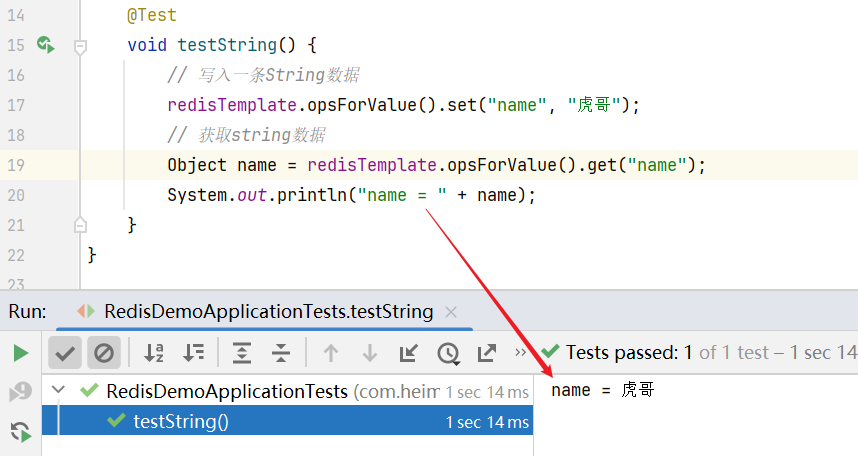

可以发现执行成功，点开 `name`，发现已经成功写入 `"虎哥"` 了。


----

接下来验证一下，如果我写了一个对象，那它能不能也去帮我做序列化呢？

**新建实体类**

~~~java
package com.itheima.redis.pojo;
import lombok.AllArgsConstructor;
import lombok.Data;
import lombok.NoArgsConstructor;

@Data
@NoArgsConstructor
@AllArgsConstructor
public class User {
    private String name;
    private Integer age;
}
~~~

新写一个单元测试，这次保存一个对象到redis中。

~~~java
@Test
void testSavaUser() {
    // 写入数据
    redisTemplate.opsForValue().set("user:100", new User("虎哥", 21));
    // 获取数据，返回的是一个Object，因为它不知道我们取出来的是什么类型的对象，但是由于我们自己知道，因此完全可以做一个强转
    User user = (User) redisTemplate.opsForValue().get("user:100");
    System.out.println("user = " + user);
}
~~~

运行单元测试，可以发现成功打印出了用户的信息，那就表示强转没有问题


接下来看一下图形化客户端，可以发现已经存入了一个User对象了，而且是JSON风格的，说明它自动化的将对象转为了JSON存入到了里面。并且最神奇的是，当我们去获取结果的时候，它还能自动的帮我们反序列化成了对象，它是怎么做到这个反序列化的呢？

如下图，事实上在写入JSON的同时，还帮我们写出了一个class的属性，对应的就是User类的字节码名称，就是因为有这样的一条属性，所以它在反序列化的时候才能够读取到我们对应的字节码，即类的名称，然后再帮我们反序列化为对应的User写进来。


也就是说将来我们存储任何数据，不管是Java对象也好还是普通对象也好，都不用担心了，全部都交给了自动化的序列化工具去处理，我们要做的就是在 `Config类` 中定义好key和value的序列化工具就行了。


----

# 22. StringRedisTemplate

## 一、引出问题

在上节我们已经学习了自定义 `RedisSerializer` 来实现全自动JSON的序列化和反序列化，这样依赖当我们向Redis中写入一个Java对象的时候就方便很多。

尽管JSON的序列化方式可以满足我们的需求，但依然存在一些问题，如图：


为了在反序列化时知道对象的类型，JSON序列化器会将类的class类型写入json结果中，并且这个字节码本身甚至比我数据类型还要长，存入Redis就会带来额外的内存开销。

但是也不能不写这个东西，序列化还好说，直接将对象转为字符串写就行了，但是反序列化的时候它怎么知道你这个JSON字符串要转成哪个类型的对象呢？因此这个东西是实现自动序列化必不可少的。

---

## 二、解决问题

因此如果你想减少内存的消耗，就不能使用JSON的序列化器来自动处理value，而是**统一使用String序列化器，要求只能存储String类型的key和value**。当需要存储Java对象时，手动完成对象的序列化和反序列化。

如下图，有一个 `User类` 的对象需要往redis中存，此时可以手动序列化，我们手动在序列化的时候，就不需要将字节码写进去了，直接写类本身的属性就行了，然后再调用 `set()方法` 写入redis。

当我们要读取数据的时候，读出来的就是一个JSON字符串，它里面没有字节码，没有字节码就没有人帮你自动处理，此时就需要手动来处理，因为程序员自己知道我取出来的是哪个类型，此时就可以转为对应的类型了。

相当于是代码复杂了，加了两个手动处理的动作，但是就解决了刚刚内存占用的问题。

不过还有一点要注意的就是：既然说了要统一使用string的序列化器，也就是说之前的RedisTemplate需要统一的定义成用StringSerializer才行，因此需要重新定义RedisTemplate。


这里告诉大家一个好消息，不需要你重新定义，因为SpringDataRedis就提供了RedisTemplate的子类：StringRedisTemplate，它的key和value的序列化方式默认就是String方式。

省去了我们自定义RedisTemplate的序列化方式的步骤，而是直接使用StringRedisTemplate。

---

## 三、代码实现

```java
@SpringBootTest
class RedisStringTests {

    @Autowired
    private StringRedisTemplate stringRedisTemplate;

    // 存字符串
    @Test
    void testString() {
        // 写入一条String数据
        stringRedisTemplate.opsForValue().set("name", "虎哥");
        // 获取string数据
        Object name = stringRedisTemplate.opsForValue().get("name");
        System.out.println("name = " + name);
    }

    // ObjectMapper是SpringMVC中默认使用的JSON处理工具，因此这里就用它了，跟以前接触的fastjson是一样的，它的作用就是将对象转成JSON，这里当然也可以使用fastjson
    private static final ObjectMapper mapper = new ObjectMapper();

    // 存对象
    @Test
    void testSaveUser() throws JsonProcessingException {
        // 创建对象
        User user = new User("虎哥", 21);
        // 手动序列化，这里可能会有异常，碰见异常直接往外面抛即可
        String json = mapper.writeValueAsString(user);
        // 写入数据
        stringRedisTemplate.opsForValue().set("user:200", json);

        // 获取数据的时候默认就是字符串
        String jsonUser = stringRedisTemplate.opsForValue().get("user:200");
        // 手动反序列化
        User user1 = mapper.readValue(jsonUser, User.class);
        System.out.println("user1 = " + user1);
    }
}
```

此时我们再来看一看存储的数据，小伙伴们就会发现那个class数据已经不在了，节约了我们的空间~


----

## 四、总结

RedisTemplate的两种序列化实践方案：

* 方案一：
  * 自定义RedisTemplate
  * 修改RedisTemplate的序列化器为GenericJackson2JsonRedisSerializer
  * 弊端：会占用额外空间，用来记录class字段
  
* 方案二：
  * 使用StringRedisTemplate
  * 写入Redis时，手动把对象序列化为JSON
  * 读取Redis时，手动把读取到的JSON反序列化为对象


---


# 23. Hash结构操作

在基础篇的最后，咱们对Hash结构操作一下，收一个小尾巴。

`opsForValue()` 拿到的是对字符串的操作，`opsForHash()` 拿到的就是跟哈希有关的操作。

PS：在spring中并不是以命令作为方法名，方法名类似于Java的HashMap的方法名。

hashKey和value就是对应字段和字段值，事实上value中可能会有多个字段，一个 `put()` 只能存一个字段，如果有多个字段，`put()` 就需要执行多次，这样其实就不太好了，等于你是与服务器做多次交互。

因此推荐大家的方案是使用 `putAll()`， `putAll()` 相当于 `hmset`，里面可以存好几个键值对。


```java
@SpringBootTest
class RedisStringTests {
    @Autowired
    private StringRedisTemplate stringRedisTemplate;

    @Test
    void testHash() {
        stringRedisTemplate.opsForHash().put("user:400", "name", "虎哥");
        stringRedisTemplate.opsForHash().put("user:400", "age", "21");

        // 取一个字段是get方法，取好多字段是entries方法，Java是entrySet方法，也是类似的。
        // values方法就是获取里面的值
        Map<Object, Object> entries = stringRedisTemplate.opsForHash().entries("user:400");
        System.out.println("entries = " + entries);
    }
}
```

运行代码，可以发现插入成功


---

# 实战篇Redis

# 24.开篇导读

亲爱的小伙伴们大家好，马上咱们就开始实战篇的内容了，相信通过本章的学习，小伙伴们就能理解各种redis的使用啦，接下来咱们来一起看看实战篇我们要学习一些什么样的内容

* 短信登录

这一块我们会使用redis共享session来实现

* 商户查询缓存

通过本章节，我们会理解缓存击穿，缓存穿透，缓存雪崩等问题，让小伙伴的对于这些概念的理解不仅仅是停留在概念上，更是能在代码中看到对应的内容

* 优惠卷秒杀

通过本章节，我们可以学会Redis的计数器功能， 结合Lua完成高性能的redis操作，同时学会Redis分布式锁的原理，包括Redis的三种消息队列

* 附近的商户

我们利用Redis的GEOHash来完成对于地理坐标的操作

* UV统计

主要是使用Redis来完成统计功能

* 用户签到

使用Redis的BitMap数据统计功能

* 好友关注

基于Set集合的关注、取消关注，共同关注等等功能，这一块知识咱们之前就讲过，这次我们在项目中来使用一下

* 打人探店

基于List来完成点赞列表的操作，同时基于SortedSet来完成点赞的排行榜功能

以上这些内容咱们统统都会给小伙伴们讲解清楚，让大家充分理解如何使用Redis


---

# -----------------------------------

# 短信登录

# 25.导入黑马点评项目

## 一、导入SQL


---

## 二、有关当前模型

这里并不会采用微服务架构，因为我们的核心是学习redis用法，我们不想将Java代码搞的太复杂，影响大家的注意力和学习效果。

在这我们就是一个单体的项目，尽管是单体项目，但是采用的结构是前后端分离的模式，也就是说我们会把前端与后端分别去部署，后端将来肯定是部署在tomcat的，起那段部署在Nginx上。

手机或者app端发起请求，请求我们的nginx服务器，得到静态资源，然后页面再向服务端发送请求，查询数据，这些数据可能来自MySQL集群，也有可能来自Redis集群，然后再把查询到的数据返回给前端，前端完成渲染即可。

不过尽管我们是一个单体式的项目，将来还是要考虑到整个项目的并发能力的，因此我们的项目一定要具备水平扩展的能力，即：我们的项目部署在tomcat上后，将来如果单台tomcat扛不住压力，我们还可以做一个水平的扩展，形成一个负载均衡的集群，在多台tomcat上都来部署我们的代码，一旦部署成集群后，将来就会存在一些集群间的数据共享一些问题了，这些问题都会在后续给大家讲解解决方案。

nginx基于七层模型走的事HTTP协议，可以实现基于Lua直接绕开tomcat访问redis，也可以作为静态资源服务器，轻松扛下上万并发， 负载均衡到下游tomcat服务器，打散流量，我们都知道一台4核8G的tomcat，在优化和处理简单业务的加持下，大不了就处理1000左右的并发， 经过nginx的负载均衡分流后，利用集群支撑起整个项目，同时nginx在部署了前端项目后，更是可以做到动静分离，进一步降低tomcat服务的压力，这些功能都得靠nginx起作用，所以nginx是整个项目中重要的一环。

在tomcat支撑起并发流量后，我们如果让tomcat直接去访问Mysql，根据经验Mysql企业级服务器只要上点并发，一般是16或32 核心cpu，32 或64G内存，像企业级mysql加上固态硬盘能够支撑的并发，大概就是4000起~7000左右，上万并发， 瞬间就会让Mysql服务器的cpu，硬盘全部打满，容易崩溃，所以我们在高并发场景下，会选择使用mysql集群，同时为了进一步降低Mysql的压力，同时增加访问的性能，我们也会加入Redis，同时使用Redis集群使得Redis对外提供更好的服务。

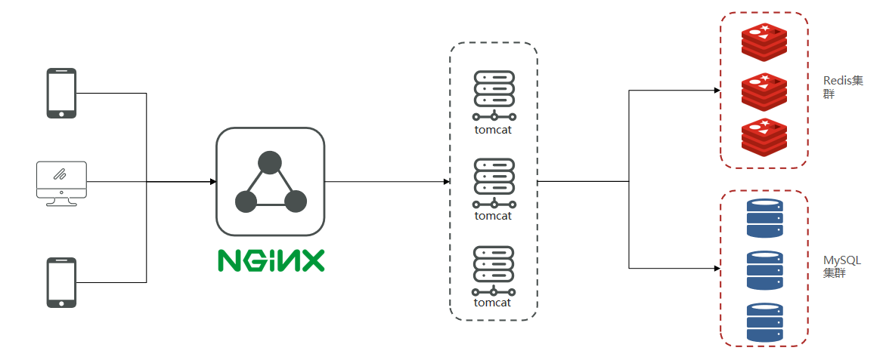

---

## 三、导入后端项目

在资料中提供了一个项目源码：


---

## 四、导入前端工程


----

## 五、运行前端项目


-----

# 26.基于Session实现登录流程

短信登录必然包括短信的发送，然后就是基于短信验证码的登录，最后是对登录状态的校验

**发送验证码：**

用户在提交手机号后，会校验手机号是否合法，如果不合法，则要求用户重新输入手机号

如果手机号合法，后台此时生成对应的验证码，同时将验证码进行保存，然后再通过短信的方式将验证码发送给用户

**短信验证码登录、注册：**

用户将验证码和手机号进行输入，后台从session中拿到当前验证码，然后和用户输入的验证码进行校验，如果不一致，则无法通过校验，如果一致，则后台根据手机号查询用户，如果用户不存在，则为用户创建账号信息，保存到数据库，无论是否存在，都会将用户信息保存到session中，方便后续获得当前登录信息

**校验登录状态:**

用户登录成功后，它在请求一些关键业务的时候时候，都需要校验登录的状态，从cookie中携带者JsessionId到后台，后台通过JsessionId从session中拿到用户信息，如果没有session信息，则进行拦截，如果有session信息，则将用户信息保存到threadLocal中，并且放行

threadLocal就是一个线程域对象，在我们的业务中，每一个请求到达服务，它都是一个独立的线程，如果我们没有使用threadLocal，而是直接将用户保存到一个本地变量，那就可能出现多线程并发修改的安全问题，而threadLocal会将数据保存到每一个线程的内部，在线程内部创建一个Map保存，这样一来每个线程都有自己独立的存储空间，相互之间没有干扰。


---

# 27.实现发送短信验证码功能

## 一、页面流程

进入个人页面的时候必须先登录，因此当你点击按钮的这一刻，它就会跳转到登录页面了，在登陆的时候需要先输入手机号，然后发送验证码，点击 `发送验证码` 的时候，一个请求就会发送到服务端了，而服务端要处理的就是这个请求。


请求路径：`http://localhost:8080/api/user/code?phone=15342542256`，api是用来标识发向tomcat服务的请求，我们不用管，它会自动过滤掉，因此真正的请求路径应该是 `/user/code`，后面的参数就是 `phone`，拿到手机号我们就可以向这个手机号发验证码了。

----

## 二、代码实现

**UserController.java**

~~~java
/**
* 发送手机验证码
*/
@PostMapping("code")
public Result sendCode(@RequestParam("phone") String phone, HttpSession session) {
    return userService.sendCode(phone, session);
}
~~~

发送验证码，功能全部放到Service中做

**UserServiceImpl.java**

```java
@Override
public Result sendCode(String phone, HttpSession session) {
    // 1.校验手机号，RegexUtils是我们自己定义的正则工具类
    if (RegexUtils.isPhoneInvalid(phone)) {
        // 2.如果不符合，返回错误信息
        return Result.fail("手机号格式错误！");
    }
    // 3.符合，使用hutool工具类生成验证码
    String code = RandomUtil.randomNumbers(6); // 获得一个只包含6位数字的字符串

    // 4.保存验证码到 session
    session.setAttribute("code",code);
    // 5.发送验证码，这里先不做，因为发送验证码需要去调用第三方的平台，实现起来稍微会有些复杂，并不是我们的讲解的重点，因此这里就使用日志来记录一下，一般发送验证码在公司中都会有一个独立的服务去做，你直接调用那个服务就行了
    log.debug("发送短信验证码成功，验证码：{}", code); // @Slf4j
    // 返回ok
    return Result.ok();
}
```

重启服务测试，可以发现发送成功


---

# 28.实现短信验证码登录和注册功能

## 一、页面流程


---

## 二、代码实现

实体类

~~~java
@Data
public class LoginFormDTO {
    private String phone;
    private String code;
    private String password; // 既支持使用手机号登录，又支持使用密码登录
}
~~~

**UserController.java**

~~~java
/**
 * 登录功能
 * @param loginForm 登录参数，包含手机号、验证码；或者手机号、密码
 */
@PostMapping("/login")
// 由于这里使用了RequestBody，使用的是JSON风格，因此后台接收就必须使用这个注解
public Result login(@RequestBody LoginFormDTO loginForm, HttpSession session){
    // 实现登录功能
    return userService.login(loginForm, session);
}
~~~

**UserService.java**

登录，这里登录其实是分为两部分的，因为如果用户输入的手机号不存在，就会立即给它创建一个手机号，这样用户就不用有繁琐的注册流程了。

技巧：校验一般都是反向校验，这样可以避免if嵌套越来越深。

```java
@Override
public Result login(LoginFormDTO loginForm, HttpSession session) {
    // 1.校验手机号，虽然手机号在发送验证码的请求中已经校验过一次了，但由于这是两个不同的请求，每一个请求都需要做独立的校验。
    // 万一发短信的时候它填一个正确的，后来点登录按钮的时候它又填个错误的也有可能。
    String phone = loginForm.getPhone();
    if (RegexUtils.isPhoneInvalid(phone)) {
        // 2.如果不符合，返回错误信息
        return Result.fail("手机号格式错误！");
    }
    // 3.校验验证码
    // PS：像"code"这种字符串常量应该定义成一个常量值放到一个专门的地方去，这里为了方便就这样写了
    // 由于是从session中取到的，因此取名为cacheCode，代表是缓存起来的。
    Object cacheCode = session.getAttribute("code");
    String code = loginForm.getCode(); // 这个code才是前端传递过来的code
    if(cacheCode == null || !cacheCode.toString().equals(code)){
        //3.不一致，报错
        return Result.fail("验证码错误");
    }
    //一致，根据手机号查询用户，因为手机号是唯一的，并且数据库表中也限定了手机号是UNIQUE
    // select * from tb_user where phone = ?
    // query()是mybatis-plus提供的，它可以帮我们实现单表增删改查，它是知道我们的表叫tb_user的，因为实体类中有注解，紧接着eq("phone", phone)就是写where条件，如果查多个就使用list，它的返回值是一个集合，但如果查一个就用one()，它的返回值就是User
    User user = query().eq("phone", phone).one();

    //5.判断用户是否存在
    if(user == null){
        //不存在，则创建
        user =  createUserWithPhone(phone);
    }
    //7.保存用户信息到session中
    session.setAttribute("user",user);

    return Result.ok();
}

private User createUserWithPhone(String phone) {
    // 创建用户
    User user = new User();
    user.setPhone(phone);
    // 这里用户名就随机生成，由于工具类随机生成的字符串会看起来很混乱，因此加一个前缀，这样用户名会看起来更统一一些
    // 这个前缀最好也定义成常量，在我们在自己定义的常量类SystemConstants中有一个USER_NICK_NAME_PREFIX，它的值就是user_，即前缀
    // 像京东那些，如果你第一次使用手机号登录，它都会给你生成一个有规律的用户名称
    user.setNickName(SystemConstants.USER_NICK_NAME_PREFIX + RandomUtil.randomString(10));
    // 调用MybatisPlus的save方法保存用户到数据库
    save(user);
    // 返回已经创建的用户
    return user;
}
```

在登录的时候是不需要返回登录凭证的，因为这里是基于session登录，session的原理就是cookie，每一个session都会有一个唯一的sessionId，你访问tomcat的时候，这个sessionId就已经自动的写到你的cookie中了，以后请求就会带着这个sessionId，带着这个sessionId过来我们就能找到session，找到session就能找到这个用户了。


---

# 29.实现登录拦截功能

## 一、分析问题

上节我们已经实现了基于短信验证码做登录的功能，不过可惜的是在页面上它依然认为我们没有做登录，其实就是因为登录校验的功能我们还没有做，这节我们就来做一个登录验证。

事实上登录验证就是一个这样的一个请求 `/user/me`，它就是用来查询当前登录的用户信息，如果你能给它返回，那这个登录校验就算成功了。流程之前我们也分析过，用户请求都会带上cookie，因为登录凭证其实就是session的Id，就在Cookie中。

Cookie带着JSESSIONID到达服务端，服务端只需要基于sessionId得到session，再从session中取出用户，判断一下这个用户是否存在，如果存在说明登录成功，将用户返回给前端即可。


听起来很简单，但事实上这么做有些问题：在黑马点评的项目中有很多很多的controller，其中我们讲到的 `/user/me` 登录校验，它是 `UserController` 中的，前端向 `UserController` 发请求，你在UserController的对应业务中，编写右图一堆的业务逻辑：获取SessionId、获取session、获取用户、判断等等，但是后续随着业务的开发，越来越多的业务都需要去校验用户的登录，难道说在每一个controller里都来写这一堆的业务逻辑吗？太麻烦了。

在SpringMVC中有一个东西可以在所有的controller执行之前去做，即拦截器。有了拦截器后，用户的请求就不会直接访问到controller了，都必须先经过拦截器，再由拦截器判断该不该放行让你到达controller。

有了它后，我们可以将用户校验的登录流程都扔到拦截器中做，这样一来所有的controller都可以不用写这种校验了。

但是这里还存在一个问题：拦截器确实可以帮我们实现对用户的校验，但是校验完后，在后续的业务中却拿不到用户信息，因为只有在拦截器中根据session可以拿到用户信息。因此我们需要有一种方案需要将拦截器中拦截得到的用户信息传递到controller中去，而且在传递的过程中要注意线程的安全问题，此时就需要使用 `ThreadLocal` 来解决。


**温馨小贴士：tomcat的运行原理**

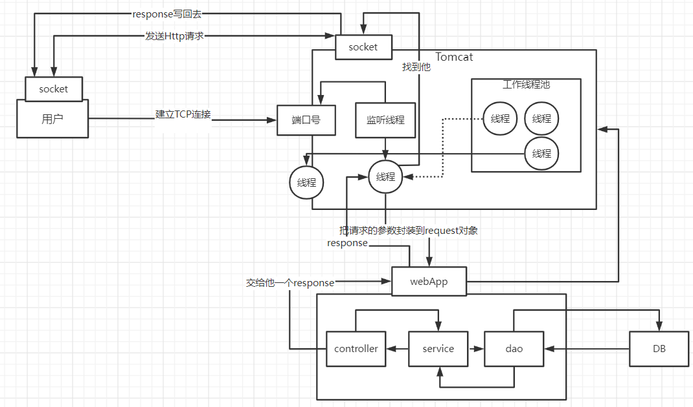

当用户发起请求时，会访问我们像tomcat注册的端口，任何程序想要运行，都需要有一个线程对当前端口号进行监听，tomcat也不例外，当监听线程知道用户想要和tomcat连接连接时，那会由监听线程创建socket连接，socket都是成对出现的，用户通过socket像互相传递数据，当tomcat端的socket接受到数据后，此时监听线程会从tomcat的线程池中取出一个线程执行用户请求，在我们的服务部署到tomcat后，线程会找到用户想要访问的工程，然后用这个线程转发到工程中的controller，service，dao中，并且访问对应的DB，在用户执行完请求后，再统一返回，再找到tomcat端的socket，再将数据写回到用户端的socket，完成请求和响应

通过以上讲解，我们可以得知 每个用户其实对应都是去找tomcat线程池中的一个线程来完成工作的， 使用完成后再进行回收，既然每个请求都是独立的，所以在每个用户去访问我们的工程时，我们可以使用threadlocal来做到线程隔离，每个线程操作自己的一份数据。

总结：ThreadLocal是一个线程的对象，每一个进入Tomcat的请求都是一个独立的线程，将来ThreadLocal会在线程内为你开辟一个内存的空间去保存对应的用户，这样一来每个线程相互不干扰，因此不同用户访问同一个controller，都会有独立的线程，大家都有自己的用户信息互不干扰。因此我们会通过这个方式来实现整个校验流程。

**温馨小贴士：关于threadlocal**

如果小伙伴们看过threadLocal的源码，你会发现在threadLocal中，无论是他的put方法和他的get方法， 都是先从获得当前用户的线程，然后从线程中取出线程的成员变量map，只要线程不一样，map就不一样，所以可以通过这种方式来做到线程隔离。

----

## 二、代码实现

### 1）拦截器代码

preHandle方法：目标资源方法（controller里的）执行前执行。 返回true：放行    返回false：不放行

postHandle方法：目标资源方法执行后执行

afterCompletion方法：视图渲染完毕后执行，最后执行

这里要实现 `preHandle`、`afterCompletion`，因为在进入controller之前肯定要做登录校验，用户业务执行完毕，还需要去销毁用户信息，避免内存泄漏。

并且ThreadLocal不需要大家写了，在Utils中定义了UserHolder类，ThreadLocal的泛型是User，也就是说只能存储User。

**UserHolder.java**

~~~java
package com.hmdp.utils;
import com.hmdp.dto.UserDTO;
import com.hmdp.entity.User;

public class UserHolder {
    private static final ThreadLocal<User> tl = new ThreadLocal<>();

    public static void saveUser(User user){
        tl.set(user);
    }

    public static User getUser(){
        return tl.get();
    }

    public static void removeUser(){
        tl.remove();
    }
}
~~~

---

### 2）自定义拦截器

1. 实现HandlerInterceptor接口，并重写其所有方法

> 这三个方法都有默认实现，根据需要重写
>
> 快捷键：ctrl + O

2. 定义好后加上@Component，需要交给IOC容器管理

```Java
public class LoginInterceptor implements HandlerInterceptor {
    @Override
    public boolean preHandle(HttpServletRequest request, HttpServletResponse response, Object handler) throws Exception {
        //1.获取session
        HttpSession session = request.getSession();
        //2.获取session中的用户
        Object user = session.getAttribute("user");
        //3.判断用户是否存在
        if(user == null){
            //4.不存在，拦截，返回401状态码
            response.setStatus(401);
            return false;
        }
        //5.存在，保存用户信息到Threadlocal
        // 由于前面获取到的是Object类型，因此这里需要强转
        UserHolder.saveUser((User)user);
        //6.放行
        return true;
    }
}

@Override
public void afterCompletion(HttpServletRequest request, HttpServletResponse response, Object handler, Exception ex) throws Exception {
    UserHolder.removeUser();
}
```

---

### 3）注册配置拦截器

1. 实现WebMvcConfigurer接口
2. 加上@Configuration来表示当前就是spring当中的配置类
3. 重写addInterceptors方法，在里面指定并注册拦截器，并且指定拦截器的拦截路径

```java
package com.hmdp.config;

import com.hmdp.utils.LoginInterceptor;
import org.springframework.context.annotation.Configuration;
import org.springframework.data.redis.core.StringRedisTemplate;
import org.springframework.web.servlet.config.annotation.InterceptorRegistry;
import org.springframework.web.servlet.config.annotation.WebMvcConfigurer;

import javax.annotation.Resource;

@Configuration
public class MvcConfig implements WebMvcConfigurer {
    @Resource
    private StringRedisTemplate stringRedisTemplate;

    @Override
    public void addInterceptors(InterceptorRegistry registry) {
        // 登录拦截器
        registry.addInterceptor(new LoginInterceptor())
            .excludePathPatterns(
            "/shop/**",
            "/voucher/**", // 优惠券信息
            "/shop-type/**", // 店铺类型
            "/upload/**", // 这里栏，但为了测试这里就不栏了
            "/blog/hot", // 查热点博客，跟登录用户无关
            "/user/code",
            "/user/login"
        );
    }
}
```


---

# 30.隐藏用户敏感信息

## 一、引出问题

上节我们实现了登录校验的功能，但还是有一些小问题，登录校验的功能返回的信息有点多，但其实我们做登录用户的时候，其实只要返回用户的id、名称、头像等信息就够了，像时间、密码、电话这些敏感信息就没必要返回，因此这是有泄漏风险的。


返回这么多信息的原因是我们返回的是User对象


那么UserHolder信息又从哪来？就是我们当时做的拦截器，从session中取出来后二话不说就扔进UserHolder中了，也就是说从session中取出来的就是完整的信息。

session是tomcat的内存空间，你在这里面存的信息越多，对整个服务来讲压力也就越大，因此这里面存那么多不相关 / 不重要的信息没必要。


那么是谁存到session中的呢？是我们在做登录业务的时候，查询或者创建出来的对象二话不说直接就扔到session中了。

因此，从一开始我们存入session的就不应该是完整的信息，而是部分信息。这其实就是一个存储力度的问题，存储的越完整，使用起来肯定更方便，但是带来的问题就是内存压力过大，还有一些敏感信息也返回给前端了。


因此需要改正，那么怎么改正呢？

----

## 二、解决办法

采用的核心思路就是书写一个UserDto对象，这个UserDto对象就没有敏感信息了，我们在返回前，将有用户敏感信息的User对象转化成没有敏感信息的UserDto对象，那么就能够避免这个尴尬的问题了

**UserDTO.java**

~~~java
package com.hmdp.dto;

import lombok.Data;

@Data
public class UserDTO {
    private Long id;
    private String nickName;
    private String icon;
}
~~~

---

**在登录方法处修改**

那么怎么转成UserDto呢？笨方法就是一个手动new一个Dto，然后手动存进去就行了。但是在这我们有一个工具类 `BeanUtil`，这个也是hutool里面的工具类，它里面有一个方法叫 `copyProperties`，意思就是拷贝属性，第一个参数是数据源，第二个参数是目标，目标可以给一个具体的对象，也可以给class字节码。这个方法就会自动的帮我们把User中所有的属性拷贝到UserDto中，而且要给你创建出对象，因此这个方法的返回值就是UserDto。

PS：区分于spring提供的BeanUtils

```java
//7.保存用户信息到session中
session.setAttribute("user", BeanUtil.copyProperties(user,UserDTO.class));
```

---

**在拦截器处：**

```java
//5.存在，保存用户信息到Threadlocal
UserHolder.saveUser((UserDTO) user);
```

---

**在UserHolder处：将user对象换成UserDTO**

```java
public class UserHolder {
    private static final ThreadLocal<UserDTO> tl = new ThreadLocal<>();

    public static void saveUser(UserDTO user){
        tl.set(user);
    }

    public static UserDTO getUser(){
        return tl.get();
    }

    public static void removeUser(){
        tl.remove();
    }
}
```

然后在用到 `getUser()` 的地方就需要全部修改了，选中方法，然后 <kbd>alt + F7</kbd> 可以看见方法在哪些地方用到了。

用到了 `getUser()` 方法的地方都需要修改。


---

## 三、测试

重启项目，然后重新登陆，查看用户信息，可以发现只剩下三个字段了。


----

# 31.session共享问题

**session共享问题**：多台Tomcat并不共享session存储空间，当请求切换到不同tomcat服务时导致数据丢失的问题。

**核心思路分析：**

虽然我们的项目是一个单体式的项目，但是我们的tomcat将来为了应对并发，肯定还是要水平扩展，部署多个，形成多个负载均衡的集群，一旦形成负载均衡的集群，这个时候当请求进入nginx，此时它会做一个负载均衡，在多态nginx间做一个轮询。

每个tomcat中都有一份属于自己的session,假设用户第一次访问第一台tomcat，并且把自己的信息存放到第一台服务器的session中，但是第二次这个用户访问到了第二台tomcat，那么在第二台服务器上，肯定没有第一台服务器存放的session，所以此时 整个登录拦截功能就会出现问题，我们能如何解决这个问题呢？早期的方案是session拷贝，就是说虽然每个tomcat上都有不同的session，但是每当任意一台服务器的session修改时，都会同步给其他的Tomcat服务器的session，这样的话，就可以实现session的共享了

但是这种方案具有两个大问题

1、每台服务器中都有完整的一份session数据，服务器压力过大。

2、session拷贝数据时，是需要时间的，可能会出现延迟，如果在延迟之内有人来访问，依然会有数据不一致的情况

因此这种方案推出以后，并没有得到广泛的使用和认可，这种方案就pass了。此时我们就必须找出一种能替代session的东西，而且这个能替代session的东西，它必须满足一下三个特点

- **数据共享**。这是最重要的，就是因为数据不共享才导致了刚刚带来的问题）

- **内存存储**。因为redis是基于内存的，因此读写效率比较高，像这种登录校验之类的，它的访问频率是非常高的，如果你的读写性能比较差，是难以满足高并发的需求。

- **key、value结构**

所以咱们后来采用的方案都是基于redis来完成，因为redis首先是在tomcat以外的存储方案，因此任何一台tomcat都能访问到redis，因此就能实现数据共享了。而且redis性能非常强，读写性能延迟基本上是在微妙级别的，非常的快。并且也是key-value。可以发现redis正好就满足上面的要求。因此我们把session换成redis，就可以避免session共享的问题了


----

# 32.Redis代替session的业务流程（设计key的结构）

Redis代替session，这个替代不是简单的说你将数据存入redis就行了，在业务流程上会有比较多的一些变化，这节就一起来分析一下基于redis代替session之后业务上有哪些变化。

## 一、发送短信验证码

先来看发送短信验证码，整体来讲这个流程没什么大的变化，但是在保存的时候，以前是保存在session，现在就是保存到redis中了。


但是这里有一个问题，redis是一个键值型的数据结构，但是它的value类型有很多种，那么到底使用哪种结构呢？

所以我们可以使用String结构，就是一个简单的key，value键值对的方式，但是关于key的处理，session他是每个用户都有自己的session，但是redis的key是共享的，如果每个session发生的请求存储的key都为code，就会覆盖，因此咱们就不能使用code了。

既然手机号是唯一的，如果我们采用phone不就好了吗？是这样的，用户在提交的时候刚好也是提交手机号和验证码，这也为我们的存储带来了方便。

---

## 二、登录

但是在登录的时候，保存进redis的是一个用户的对象，那value应该使用哪种数据类型来存储呢？


先来回顾一下两种常用的数据结构：如果存入的数据比较简单，我们可以考虑使用String。但如果一些复杂的数据类型，如String，那么可以考虑使用哈希。

如下图，如果使用String，同学们注意他的value，会额外占用一点空间，将Java对象序列化为JSON字符串然后进行保存。如果使用哈希，则他的value中只会存储他数据本身，**占据的空间更小**，并且针对单个字段做CRUD**更加灵活**。

如果不是特别在意内存，其实使用String就可以啦。但是如果我们从优化的角度考虑，其实推荐大家使用哈希这种方式。

在这个案例中，我们会选择哈希结构来保存用户信息。


接下来就是考虑用什么key进行存储了，key的存储应该满足以下几个条件

**1、key要具有唯一性**

**2、key要方便携带**

手机号这个的数据来存储当然是可以的，但是如果把这样的敏感数据存储到redis中并且从页面中带过来毕竟不太合适，所以我们在后台生成一个随机串token（例如UUID），然后让前端带来这个token就能完成我们的整体逻辑了。

----

## 三、整体访问流程

当注册完成后，用户去登录会去校验用户提交的手机号和验证码，是否一致，如果一致，则根据手机号查询用户信息，不存在则新建，最后将用户数据保存到redis，并且生成token作为redis的key，当我们校验用户是否登录时，会去携带着token进行访问，从redis中取出token对应的value，判断是否存在这个数据，如果没有则拦截，如果存在则将其保存到threadLocal中，并且放行。

但是问题来了，这个token，tomcat并不会帮我们自动写到浏览器上，因此我们只能手动将token返回给客户端，然后客户端把这个信息保存下来，以后每次请求它都能携带这个token了，服务器看到它拿到的这个token后，就可以基于token从redis获取用户信息了。

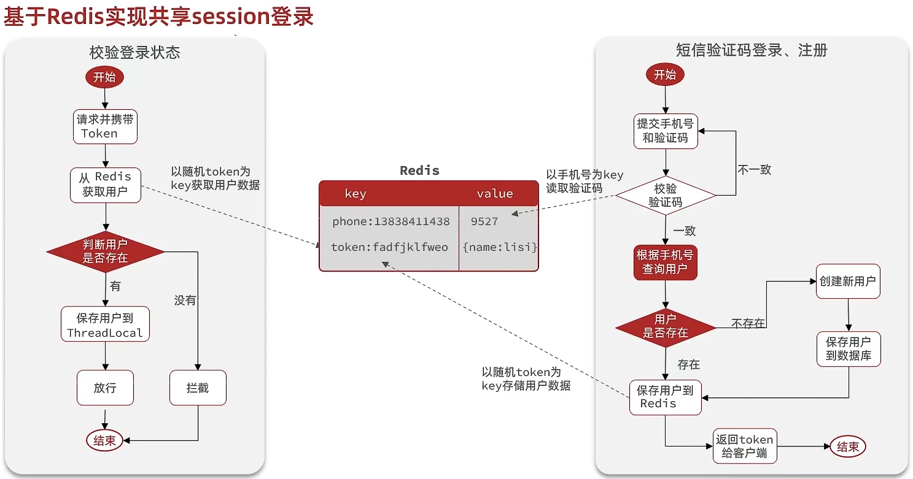

---

## 四、扩展

前端每次请求都需要携带token到服务器，那它是怎么做到这一点的呢？我们一起来看一下前端的代码。

前端会将token保存到sessionStorage，sessionStorage是浏览器的一种存储方式。


`axios.interceptors.response.use` 是axios的请求拦截器，它会在每次请求的时候都执行这段逻辑。

这里是将token放入到请求头中，这个请求头的名字叫 `authorization`，这样就可以确保以后，凡是有axios发起的这种请求，也就是所有的AJAX请求，都会携带 `authorization` 头，将来在服务端就可以获取 `authorization` 请求头，从而拿到token，从而去实现对于登录功能的验证了。


因此登录凭证其实是保存在前端浏览器的。


---

# 33.基于Redis实现短信登录

发送短信验证码的流程中，只有一个地方发生了变化，就是保存验证码的时候，不再是保存到session，而是保存到redis。

而且保存到redis时，key不再是code了，而是以手机号为key。

## RedisConstants.java

PS：阅读的时候这个类先不用管，先看下面代码

~~~java
public class RedisConstants {
    public static final String LOGIN_CODE_KEY = "login:code:";
    public static final Long LOGIN_CODE_TTL = 2L; // 有效期
    public static final String LOGIN_USER_KEY = "login:token:";
    public static final Long LOGIN_USER_TTL = 30L;
}
~~~

----

## UserServiceImpl.java

### 短信登录

~~~java
@Resource
private StringRedisTemplate stringRedisTemplate;

@Override
public Result sendCode(String phone, HttpSession session) {
    // 1.校验手机号
    if (RegexUtils.isPhoneInvalid(phone)) {
        // 2.如果不符合，返回错误信息
        return Result.fail("手机号格式错误！");
    }
    // 3.符合，生成验证码
    String code = RandomUtil.randomNumbers(6);

    // 4.保存验证码到redis
    // 4.1 跟之前保存到session的代码差不多，不过要注意的是，这个key需要加一个业务前缀，形成层次。因为之前也分析过了，redis是大家都来存的一个空间，如果大家都直接将手机号作为key，很有可能其他业务也是这么做的，就产生冲突了
    // 这里是做login业务，然后这个业务是做code验证的
    // 4.2 这里的key最好设置一个有效期，例如：验证码五分钟内有效。如果有人没事干，一直在这里狂点，redis中就存了无数条数据，而且还不删除，终有一天redis就会被占满。因此为了避免这样的问题发生，我们存入redis的key一定要设置一个有效期
    // set方法参数列表中就可以传入有效期，ctrl + p可以查看参数。第一种方式：时间(long) + 单位(TimeUnit)；第二种方式：Duration
    // 这里就设置为2分钟。这个有点类似于redis中的 set key value ex

    // 4.3 但是需要注意的是：login:code 和 2 尽量都给它定义为常量。这样写看起来有点漏，万一取的时候key写错了怎么办。
    // stringRedisTemplate.opsForValue().set("login:code:" + phone, code, 2, TimeUnit.MINUTES);
    // 因此我们就可以将常量定义在在utils.RedisConstants
    stringRedisTemplate.opsForValue().set(LOGIN_CODE_KEY + phone, code, LOGIN_CODE_TTL, TimeUnit.MINUTES);
    log.debug("发送短信验证码成功，验证码：{}", code);

    return Result.ok();
}
~~~

---

### 登录注册

PS：存储value的时候

`opsForValue()` 拿到的是对字符串的操作，`opsForHash()` 拿到的就是跟哈希有关的操作。

PS：在spring中并不是以命令作为方法名，方法名类似于Java的HashMap的方法名。

hashKey和value就是对应字段和字段值，事实上value中可能会有多个字段，一个 `put()` 只能存一个字段，如果有多个字段，`put()` 就需要执行多次，这样其实就不太好了，等于你是与服务器做多次交互。

因此推荐大家的方案是使用 `putAll()`， `putAll()` 相当于 `hmset`，里面可以存好几个键值对，上面的 `UserDTO` 中有多个属性，就可以一次性的将属性全部存进去了。


```java
@Override
public Result login(LoginFormDTO loginForm, HttpSession session) {
    // 1.校验手机号
    String phone = loginForm.getPhone();
    if (RegexUtils.isPhoneInvalid(phone)) {
        // 2.如果不符合，返回错误信息
        return Result.fail("手机号格式错误！");
    }
    // 3.从redis获取验证码并校验
    String cacheCode = stringRedisTemplate.opsForValue().get(LOGIN_CODE_KEY + phone);
    String code = loginForm.getCode();
    if (cacheCode == null || !cacheCode.equals(code)) {
        // 不一致，报错
        return Result.fail("验证码错误");
    }

    // 4.一致，根据手机号查询用户 select * from tb_user where phone = ?
    User user = query().eq("phone", phone).one();

    // 5.判断用户是否存在
    if (user == null) {
        // 6.不存在，创建新用户并保存
        user = createUserWithPhone(phone);
    }

    // 7.保存用户信息到 redis中
    // 7.1.随机生成token，这里使用的是UUID，作为登录令牌
    // UUID有两：一个Java自带的，一个Hutool提供的。toString()有两个重载方法，toString(true)表示不带下划线，参数名叫isSimple。如果是toString()，那就是带下划线。
    String token = UUID.randomUUID().toString(true);
    // 7.2.以token为key，将User对象转为HashMap存储
    UserDTO userDTO = BeanUtil.copyProperties(user, UserDTO.class);
    // 使用BeanUtil（hutool提供的），它里面有个方法叫beanToMap，它的作用就是将一个bean转为Map
    // 随着时间增长，用户会越来越多
    Map<String, Object> userMap = BeanUtil.beanToMap(userDTO, new HashMap<>(),
            CopyOptions.create()
                    .setIgnoreNullValue(true)
                    .setFieldValueEditor((fieldName, fieldValue) -> fieldValue.toString()));
    // 7.3.存储
    // token最好也加一个前缀
    String tokenKey = LOGIN_USER_KEY + token;
    stringRedisTemplate.opsForHash().putAll(tokenKey, userMap);
    // 7.4.设置token有效期，那这个有效期设置多久呢？可以参考session，以前基于session登录，有效期是30分钟，因此我们也可以给token设置30分钟的有效期，但是这里和string类型的set方法不一样，不能存的时候同时设置有效期，只能先存，然后再来设置有效期
    stringRedisTemplate.expire(tokenKey, LOGIN_USER_TTL, TimeUnit.MINUTES);

    // 8.返回token
    return Result.ok(token);
}
```

但是session登录不是到了30分钟就结束了，只要你不停的访问，有效期就一直是30分钟，只有你超过30分钟不访问我，我才会将登录状态剔除。但是我们这个有效期是只要过了30分钟，redis就会把你剔除。那我们该如何解决这个问题呢？

----

## 解决状态登录刷新问题

我们所有的请求进来后都需要经过拦截器拦截校验，只要经过了校验，第一：证明它是登录的用户；第二：它在活跃着（在访问）。

既然满足了这两个条件，就可以去更新一下redis的有效期。这样redis的token就不会过期了。

只有当用户什么都不干，它就不会触发拦截器，那么这种情况下超过了30分钟，这个key才会被剔除。

### 一、初始方案思路总结

在这个方案中，他确实可以使用对应路径的拦截，同时刷新登录token令牌的存活时间，但是现在这个拦截器他只是拦截需要被拦截的路径，假设当前用户访问了一些不需要拦截的路径，那么这个拦截器就不会生效，所以此时令牌刷新的动作实际上就不会执行，所以这个方案他是存在问题的


---

###  二、优化方案

既然之前的拦截器无法对不需要拦截的路径生效，那么我们可以添加一个拦截器，在第一个拦截器中拦截所有的路径，把第二个拦截器做的事情放入到第一个拦截器中，同时刷新令牌，因为第一个拦截器有了threadLocal的数据，所以此时第二个拦截器只需要判断拦截器中的user对象是否存在即可，完成整体刷新功能。


---

### 三、代码 

**RefreshTokenInterceptor**

```java
public class RefreshTokenInterceptor implements HandlerInterceptor {
    private StringRedisTemplate stringRedisTemplate;
    // 这里只能使用构造函数，因为这个类的对象是我们手动new出来的，而不是通过Component一些注解构建的，即不是spring创建的，此时是没有人帮你自动做依赖注入的，因此不能再使用@Autowired或者@Resource之类的注解。
    // 那么我们使用构造函数注入，谁来帮我们注入？那就看是谁使用了RefreshTokenInterceptor，即在MvcConfig拦截器中用到它了。在MvcConfig类上加了@Configuration，代表这个类将来是spring帮我们注入的，那么由spring来构建这个类的对象，它可以直接做依赖注入。
    public RefreshTokenInterceptor(StringRedisTemplate stringRedisTemplate) {
        this.stringRedisTemplate = stringRedisTemplate;
    }

    @Override
    public boolean preHandle(HttpServletRequest request, HttpServletResponse response, Object handler) throws Exception {
        // 1.获取请求头中的token
        String token = request.getHeader("authorization");
        // 使用hutool中的StrUtil类
        if (StrUtil.isBlank(token)) {
            return true;
        }
        // 2.基于TOKEN获取redis中的用户
        String key = LOGIN_USER_KEY + token;
        // 注意取的时候不能用get方法，因为get方法只能取哈希中的一个键值。但我们现在想取的是哈希中所有的键值对，此时就应该使用entries()，它的返回值就是一个Map，一个key中整个哈希键值都会返回。
        Map<Object, Object> userMap = stringRedisTemplate.opsForHash().entries(key);
        // 3.判断用户是否存在
        if (userMap.isEmpty()) {
            return true;
        }
        // 5.将查询到的hash数据转为UserDTO，由于存进去的时候是一个Map，因此取出来的时候肯定也是一个Map。存进去的时候使用的是BeanUtil，因此取出来的时候应该也使用BeanUtil。
        // 第三个参数：isIgnoreError，你要不要忽略转换中的错误。那肯定不忽略，因此写false
        UserDTO userDTO = BeanUtil.fillBeanWithMap(userMap, new UserDTO(), false);
        // 6.存在，保存用户信息到 ThreadLocal
        UserHolder.saveUser(userDTO);
        // 7.刷新token有效期
        stringRedisTemplate.expire(key, LOGIN_USER_TTL, TimeUnit.MINUTES);
        // 8.放行
        return true;
    }

    @Override
    public void afterCompletion(HttpServletRequest request, HttpServletResponse response, Object handler, Exception ex) throws Exception {
        // 移除用户
        UserHolder.removeUser();
    }
}
	
```

---

**LoginInterceptor**

```java
public class LoginInterceptor implements HandlerInterceptor {
    @Override
    public boolean preHandle(HttpServletRequest request, HttpServletResponse response, Object handler) throws Exception {
        // 1.判断是否需要拦截（依据：ThreadLocal中是否有用户）
        if (UserHolder.getUser() == null) {
            // 没有用户，需要拦截，设置状态码
            response.setStatus(401);
            // 拦截
            return false;
        }
        // 有用户，则放行
        return true;
    }
}
```

---

**MvcConfig.java**

PS：我们希望 `RefreshTokenInterceptor拦截器` 先执行，因为只有它先执行了，拿到了用户保存到了ThreadLocal，那么 `LoginInterceptor拦截器` 才能做拦截的判断，那么控制拦截器的顺序呢？

在添加拦截器的时候我们可以跟进去看一眼


这个拦截器其实会被注册为 `InterceptorRegistration`


继续跟进，这个注册器中有一个order，就是拦截器的执行顺序。默认情况下所有拦截器的执行顺序都是零，都是0的情况下就是按照添加顺序执行，因此简单来说我们只需要先添加 `RefreshTokenInterceptor拦截器`，但是如果想控制的严谨一些，就可以使用 `order()` 进行修改执行顺序，数字越小先执行。

~~~java
package com.hmdp.config;

import com.hmdp.utils.LoginInterceptor;
import com.hmdp.utils.RefreshTokenInterceptor;
import org.springframework.context.annotation.Configuration;
import org.springframework.data.redis.core.StringRedisTemplate;
import org.springframework.web.servlet.config.annotation.InterceptorRegistry;
import org.springframework.web.servlet.config.annotation.WebMvcConfigurer;

import javax.annotation.Resource;

@Configuration
public class MvcConfig implements WebMvcConfigurer {

    @Resource
    private StringRedisTemplate stringRedisTemplate;

    @Override
    public void addInterceptors(InterceptorRegistry registry) {
        // 登录拦截器
        registry.addInterceptor(new LoginInterceptor())
                .excludePathPatterns(
                        "/shop/**",
                        "/voucher/**",
                        "/shop-type/**",
                        "/upload/**",
                        "/blog/hot",
                        "/user/code",
                        "/user/login"
                ).order(1);
        // token刷新的拦截器
        registry.addInterceptor(new RefreshTokenInterceptor(stringRedisTemplate)).addPathPatterns("/**").order(0);
    }
}
~~~

重启服务器进行测试


回到redis图形化界面中查看，可以发现存储成功


---

### 四、可能遇到的错误


回到代码区查看报错：`class java.lang.Long cannot be cast to class java.lang.String` 不能将Long转化为String。

UserMap来自UserDTO，UserDTO中只有id是Long，也就是说Long类型的id无法存储到redis中去，因此报错。往下看，这个错是StringRedisSerializer中报的错误。


那为什么会有这样的错误呢？我们使用的RedisTemplate是StringRedisTemplate，StringRedisTemplate要求你的key和value都是String。


而我们把数据转成Map的时候，那个字段id是Long类型，因此就出现这个问题。

因此存储到哈希结构中的Map的key和value都应该要为String结构。

~~~java
Map<String, Object> userMap = BeanUtil.beanToMap(userDTO);
~~~

有两种解决办法：

- 不用工具类了，我们直接自己new一个Map，然后将对象里面的字段名作为key，值作为value，value不为字符串的需要改为字符串。
- 还是用这个工具，这个工具是可以自定义的，默认情况下你的值是什么数据类型，这里就用什么数据类型。但它也允许你做自定义，`copyOptions` 参数。

做法：首先传对象，再传一个Map，这里直接new一个空的HashMap，`copyOptions`就是数据拷贝时的一个选项。


通过 `CopyOptions.create()` 就创建出来了一个 `CopyOptions`，但是这个地方创建出来的是默认的，但我们要自定义，它后面允许你有各种各样的set。


例如：

`setIgnoreNullValue` —— 忽略一些空的值；

`setFieldValueEditor` —— 对字段值的一个修改器，它允许你修改字段值，参数需要传入一个函数：`BiFunction`，这个函数有两个参数：字段名和字段值，返回值是你修改后的字段值


完整代码

~~~java
Map<String, Object> userMap = BeanUtil.beanToMap(userDTO, new HashMap<>(),
                CopyOptions.create()
                        .setIgnoreNullValue(true)
                        .setFieldValueEditor((fieldName, fieldValue) -> fieldValue.toString()));
~~~

因此，当我们碰到一个错误的时候不要着急，而是自己分析，产生问题的原因在哪。

此时重启代码，然后登陆，可以发现登陆成功。


回到redis客户端，可以发现也存储成功，存储用户的时候就是用哈希进行存储的。

并且右上角也能看见有效期的时间。

我们也可以重新请求，看看有效期会不会刷新。


查看 `/user/me` 请求头，会发现携带了 `Authorization`，这样一来后台才能验证我们是否登录。

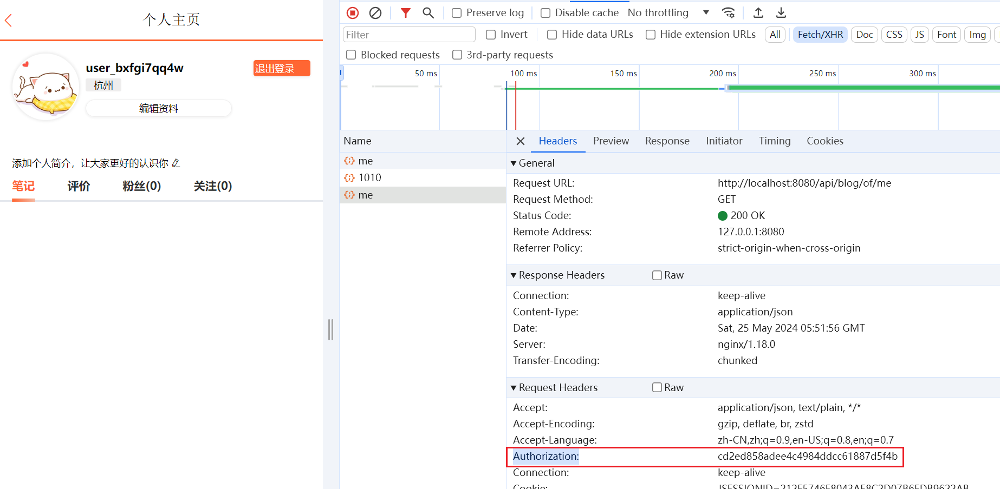

此时这个登录流程完全按照我们所期待的方式运行了。

---

## 总结

Redis代替session需要考虑的问题：

- 选择合适的数据结构

- 选择合适的key

- 选择合适的存储粒度。

  我们在存储的时候并没有存完整的用户信息，而是将敏感信息去掉了，并且还节约了内存空间。


----

# ------------------------

# 商户查询缓存

# 35.什么是缓存?

## 一、什么是缓存?

**缓存**就是数据交换的缓冲区（称作 `Cache [ kæʃ ]` ），是存贮数据的临时地方，一般**读写性能较高**。

重点：读写性能高，这也是缓冲被用作数据交换的缓冲区的原因。

比较典型的例子就是计算机，在计算机中典型的构造就是CPU、内存、硬盘。

CPU的运算能力发展到现在已经非常非常厉害了，这种运算能力已经远远的超过了内存和磁盘的读写数据的能力，但是CPU做的任何的运算都需要先从内存 / 磁盘中读到数据放到自己的寄存器才能做运算。

正是因为这种数据读写的能力远远低于CPU的运算能力，因此计算机性能就收到了一个限制，因此为了解决这个问题，人们就在CPU的内部添加了一个缓冲。CPU会把经常需要读写的一些数据放到CPU缓冲中去，当我们做告诉运算的时候，就不必要每次等半天，从内存和磁盘里把数据度过来再运算了，而是直接从缓冲中拿到一个数据进行一个运算，这样依赖就可以充分的让CPU的运算能力得到提升。

因此衡量一个CPU是否强大的一项标准就是CPU的缓存的大小，缓存越大，能缓存的数据自然也越多，那么处理起来的性能也就越好。

同样的，在我们Web应用开发的过程中也是离不开缓存的。

**浏览器缓存**：主要是存在于浏览器端的缓存，例如页面的静态资源（CSS、JS、图片），这些东西一般都是不变的，浏览器就可以把它缓存在本地，这样一来就无需每次访问都要去加载这些数据了，就可以大大的降低网络的这种延迟，提高页面的响应速度。

**应用层缓存：**浏览器中未命中的一些数据，就会到tomcat，也就是我们所编写的那些Java应用。而在Java应用中还可以添加 `应用层缓存`，比如之前提到的map，或者是使用redis作为缓存，它读写速度非常快，因此用它来作为应用层缓冲再合适不过了。

**数据库缓存：**当redis缓冲未命中的情况下，请求依然还会落到我们的数据库，在数据库中有一片空间是 `buffer pool`，增改查数据都会先加载到mysql的缓存中。

例如MySQL数据库是一个聚簇索引，它会给id创建索引，这些索引数据我们就可以把它缓存起来，这样一来当我们根据索引进行查询的时候，就可以在内存里快速检索得到结果，而不用每次都要去读写磁盘，效率也会大大提升。

当然最终数据查找还是要落到磁盘。做一些复杂的排序、表关联还会用到CPU去做运算。因此自然就会使用到CPU的L1，L2，L3级的多级缓存，甚至磁盘，它也可以去建立读写缓存。

所以在整个Web开发的每一个阶段，都可以去添加缓存，因此缓存的应用场景是非常丰富的。

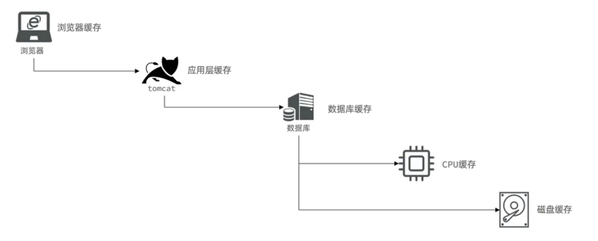

但是缓存也不能乱用，任何东西都是一个双刃剑，有得必有失，当你引入缓冲后，它给你带来好处的同时也有会有一些成本，这一点我们就基于Web应用开发来分析一下，在Web应用中带来的一些作用和它的一个成本。

---

##  二、为什么要使用缓存

**降低后端负载**：请求进入tomcat后，以前我们是需要先去查数据库，而数据库本身是要做数据的磁盘读写，所以相对来讲效率是比较低的，导致我们整个业务的延迟也会比较高，特别是一些复杂的业务SQL，那么查询起来就更慢了，因此给数据库往往会带来一个比较大的压力，这个时候如果有了缓存，请求进入tomcat后，直接在缓存里查到数据返回给前端，不用去查数据库，这对于后端来讲压力就会大大降低了。

**提高读写效率，降低反应时间**：如果我们使用了缓冲，像redis读写延迟往往是在微妙级别的，这个显示时间大大缩短，读写效率大大提高，此时我们就能应对更高的并发请求了，因此在一些用户量比较大、并发比较高的情况下，使用缓存就能够去解决这些高并发问题了。

但是缓存也会增加代码复杂度和运营的成本：

**数据一致性成本**：数据本来是保存在数据库的，现在你把它缓存了一份放到内存中，例如redis，那用户查询的时候就会优先查询redis，这样一来减轻了数据库压力。但是如果数据库的数据发生了变化，而redis中的数据还是旧的数据，那么用户读取到的也就是旧的数据，此时两者就产生了不一致。如果是一些比较重要的数据，产生不一致甚至可能会带来一些比价严重的问题，所以这就是数据的一致性成本。

为了解决这个一致性问题，它就给我们的代码维护带来了极大的成本，因为解决的过程中需要有非常复杂的一些业务编码，而且在缓存一致性处理过程中，还会出现缓冲穿透、击穿等问题，这些问题又需要解决，于是代码复杂度也就越来越高。

**运维成本**：为了避免缓存雪崩这样的问题，还有保证缓存的高可用，缓存往往会需要搭建成集群模式，而缓存集群的这样的部署、维护就会有额外的人力上的一些成本。还有这些集群部署的过程中，还有一些硬件的成本。

由此可见，任何东西都是双刃剑，有得必有失。因此一个企业在开发过程中需要去选择使用缓存后带来的好处，能不能去弥补它所带来的一些成本，如果不能，那么我觉得不用也罢，特别是一些中小型的企业，刚刚起步，用户量也不大，这时候你不用缓冲其实也能应对日常的用户请求，那就没必要去做这件事情了。


**前言**:**什么是缓存?**

就像自行车,越野车的避震器

举个例子:越野车,山地自行车,都拥有"避震器",**防止**车体加速后因惯性,在酷似"U"字母的地形上飞跃,硬着陆导致的**损害**,像个弹簧一样;

同样,实际开发中,系统也需要"避震器",防止过高的数据访问猛冲系统,导致其操作线程无法及时处理信息而瘫痪;

这在实际开发中对企业讲,对产品口碑,用户评价都是致命的;所以企业非常重视缓存技术;

**缓存(**Cache)，就是数据交换的**缓冲区**，俗称的缓存就是**缓冲区内的数据**,一般从数据库中获取,存储于本地代码(例如:

```java
例1:Static final ConcurrentHashMap<K,V> map = new ConcurrentHashMap<>(); 本地用于高并发

例2:static final Cache<K,V> USER_CACHE = CacheBuilder.newBuilder().build(); 用于redis等缓存

例3:Static final Map<K,V> map =  new HashMap(); 本地缓存
```

由于其被**Static**修饰,所以随着类的加载而被加载到**内存之中**,作为本地缓存,由于其又被**final**修饰,所以其引用(例3:map)和对象(例3:new HashMap())之间的关系是固定的,不能改变,因此不用担心赋值(=)导致缓存失效;


#### 2.1.2 如何使用缓存

实际开发中,会构筑多级缓存来使系统运行速度进一步提升,例如:本地缓存与redis中的缓存并发使用


---

# 36.添加商户缓存

## 一、业务流程

在我们查询商户信息时，我们是直接操作从数据库中去进行查询的，大致逻辑是这样，直接查询数据库那肯定慢咯，所以我们需要增加缓存

```java
@GetMapping("/{id}")
public Result queryShopById(@PathVariable("id") Long id) {
    return Result.ok(shopService.getById(id));
}
```

而这个 `getById(id)` 的方法，是由 `IService接口` 提供的， `IService接口` 是Mybatis-Plus给我们提供的这样的一个接口，它里面拿到Mapper后直接调用了 `select()方法`，等于是直接走了数据库。


因此我们现在要做的事情就是给这个业务加redis缓存。

要想知道缓存怎么做，首先需要知道缓存工作的模型。

---

## 二、缓存模型和思路

没有添加缓存的时候，客户端向服务器发起的请求都会直接打到数据库，而数据库查询到数据后再返回到缓存。


添加缓冲就等于在客户端与数据库之间添加了一个中间层，例如添加redis缓存。

这样客户端请求就会优先到达我们的缓存，即redis，如果缓存数据存在，则直接从缓存中返回，如果缓存数据不存在，再查询数据库，然后将数据存入redis，这样将来随着用户请求的数据越来越多，redis中缓存的数据是不是也会越来越多，那么redis的命中率也就会越来越高，这样就形成了一个良性的工作模型了。

那么查询商户的功能参考这个模型，需要做出怎么样的修改呢？如左图


---

## 三、代码实现

这个业务肯定不能在controller中写，因为业务流程相对来讲比较多。

**ShopController.java**

~~~java
/**
* 根据id查询商铺信息
* @param id 商铺id
* @return 商铺详情数据
*/
@GetMapping("/{id}")
public Result queryShopById(@PathVariable("id") Long id) {
    return shopService.queryById(id);
}
~~~

**IShopService.java**

~~~java
Result queryById(Long id);
~~~

**RedisConstants.java**

设定存储店铺的key

~~~java
public static final String CACHE_SHOP_KEY = "cache:shop:";
~~~

**ShopServiceImpl.java**

代码思路：如果缓存有，则直接返回，如果缓存不存在，则查询数据库，然后存入redis。

~~~java
@Service
public class ShopServiceImpl extends ServiceImpl<ShopMapper, Shop> implements IShopService {
    @Autowired
    private StringRedisTemplate stringRedisTemplate;

    @Override
    public Result queryById(Long id) {
        // 1.从redis查询商铺缓存，查询的时候需要选择一个数据结构，应该选哈希还是string呢？这里存的商铺肯定是一个对象，存储一个对象很多同学会说选哈希。
        // 没错，选哈希完全可以，因为之前演示的时候都是用哈希来演示，这里就用string来演示。
        // 店铺key的选择要确保唯一，现在传店铺，每一个店铺都要有一个唯一的key，店铺的id就是唯一的，因此在这里直接使用id作为key。当然我们需要一个前缀
        String key = RedisConstants.CACHE_SHOP_KEY + id;
        String shopJson = stringRedisTemplate.opsForValue().get(key);
        // 2.判断是否存在
        if (StrUtil.isNotBlank(shopJson)) {
            // 3.存在，直接返回
            Shop shop = JSONUtil.toBean(shopJson, Shop.class);
            return Result.ok(shop);
        }
        // 4.不存在，根据id查询数据库
        Shop shop = getById(id);
        // 5.查询数据库不存在，直接返回错误
        if (shop == null) {
            return Result.fail("店铺不存在！");
        }
        // 6.存在，写入redis
        stringRedisTemplate.opsForValue().set(key, JSONUtil.toJsonStr(shop));
        // 7.返回
        return Result.ok(shop);
    }
}
~~~

---

## 四、代码测试

重启服务，重新查询店铺，可以发现查询成功，第一次查询耗时 `551ms`


再来看一下redis，可以发现缓存也添加成功


此时再来重新查询（刷新一下浏览器），可以发现这次耗时只需要 `257ms`


清除控制台信息，然后再次查询，发现已经没有查询店铺的sql了，下面的sql是查询voucher(优惠券)的。

由此可见我们缓存确实生效了。


----

# 38.缓存更新策略

## 一、缓存更新策略

缓存更新是redis为了节约内存而设计出来的一个东西，主要是因为内存数据宝贵，当我们向redis插入太多数据，此时就可能会导致缓存中的数据过多，并且由于缓存会造成数据不一致的情况，所以redis会对部分数据进行更新，或者把他叫为淘汰更合适。

在企业中常见的缓存更新策略主要有三种。

**内存淘汰**：redis自动进行，当redis内存达到咱们设定的max-memery的时候，会自动触发淘汰机制，淘汰掉一些不重要的数据(可以自己设置策略方式)，这种机制默认就是开启的，不用我们管。

在一定程度上也是可以保证数据的一致性，当内存不足时，它把一部分数据给淘汰了，拿着一部分数据在redis中就没有了，这个时候如果用户来查询这部分数据，按照我们以前写的业务逻辑，如果没命中就会去查询数据库，然后把数据库写入缓存，此时就一支了。

但是这种一致性首先不是我们能控制的，淘汰的时候它淘汰的是哪一部分数据？什么时候淘汰？我们都不知道，很有可能这些数据很长一段时间都不会被淘汰，因为内存都一直很充足。那这样一来这些不被淘汰的数据，每次来查询查到的就是旧的，此时就无法保证数据的一致性，因此这种机制的一致性是比较差的。不过好处是维护成本为无。

---

**超时剔除：**当我们给redis设置了过期时间ttl之后，redis会将超时的数据进行删除，数据一旦删除，下次用户来查未命中就会更新缓存了，从而确保一致性。它的一致性的强弱其实取决于你设置时间的长短，如果你的时间设置的短一点，例如30分钟，这样一来更新实际还是不错的。如果你设置时间长一点，例如一天，那么它的更新频率相对就会低一点，因此这个是我们可以控制的。

但是它也不是完全的一致，例如设置30分钟，如果在这30分钟内数据库发生了变化，那此时redis数据与数据库数据还是不一致的，因此它不是一种强的一致，因此一致性比较一般，但是肯定好于内存淘汰机制。

从维护成本来考虑，其实这种维护成本也不是很高，比较低，因为你只需要在原来设置缓存的那个逻辑上添加一个过期时间即可。

---

**主动更新：**简单来讲就是我们自己编写业务逻辑，每当我们修改数据库时，我们就将缓存也给它改了，这样一来就能确保两者一致了，这种它的一致性相对来讲是比较好的。注意是好，而不是完全一致，因为没有任何人能确保你的程序一定是健康运行的，总会有些意外。

但是它的成本相对来讲就比较高了，因为需要自己编码。


那么我们该如何选择呢？其实这个就是看业务场景了。

- 低一致性（长久不发生变化）需求：使用内存淘汰机制。例如店铺类型（美食、奶茶等），它也有可能变化，但变化的可能性极低，这个我们就可以完全采用默认的内存淘汰机制，你实在不放行，那就加一个超时时间就行了。
- 高一致性需求：主动更新，并以超时剔除作为兜底方案，万一主动更新失败了，将来超时的时候还可以将它剔除，也能保证一致性。例如店铺详情查询的缓存、优惠券缓存。

----

## 二、数据库缓存不一致解决方案

刚刚说过，主动更新是最复杂的，那它到底复杂在哪里呢？

它的业务实现目前企业中有三种模式。

**Cache Aside Pattern 人工编码方式**：缓存调用者在更新完数据库后，将缓存也给更新了，也称之为双写方案。这个对于调用者来讲有些复杂，但是你是可以人为去控制它的。

**Read/Write Through Pattern** : 将缓存与数据库整合为一个服务，这个服务你不用管它底层到底用的是什么，对外来讲它就是一个透明的服务，这个服务因为内部同时处理了缓存数据库，所以它是可以保证两者的处理，同时成功和失败的，因此它可以来维护两者的一致性。

所以由它来维护两者的一个一致性，我们作为调用者来讲，假设我们今天要新增一个数据了，它可以保证缓存里有，数据库里也有，别的你就不用管了，你直接调即可，调用者无需关心一致性的问题，这样一来我们作为调用者就非常简单了。

但是它最大的问题就是：你想维护一个这样的服务是比较复杂的，并且市场上你想找到一个现成的这样的服务，可能也不太好找，因此你要开发起来成本还是挺高的。

**Write Behind Caching Pattern 写回** ：这种方式和方案二有类似之处，它们的作用都是为了简化调用者的开发，调用者无需关心一致性。区别在于：方案二是由服务来控制的，我们调用者不知道自己到底是操作的缓存还是数据库；而作为方案三来讲，我们调用者明确的知道我只操作缓存，不关心数据库，并且也不需要处理数据库，也不需要处理一致性，我增删改查全部在缓存里做。

此时缓存中就是最新的数据，而数据库中的就是旧的数据。

那么此时谁来保证一致性？有一个独立的线程，它会帮我们异步将缓存数据持久化到数据库，保证最终一致。并且这个写是异步的，它会隔一段时间就写入一次，这样有什么好处呢？

比方说我们在缓存中做了十次写操作，而在这十次结束后，刚好轮到了我们异步更新的操作，那么它会将这十个操作合并成一次写操作，往数据库写，做一个批量处理，这样就可以将多次往数据库中写合并成一次写了，此时它的效率也就得到了提升。

还有一种情况：在它的两侧异步更新之间，如果我们对缓存中的某一个key做了n次更新，事实上只有最后一次更新有效，那么我们在做异步更新的时候，我们只需要将最后一次的结果写入数据库就行了，这就是异步机制的好处，效率比较高。

那它最大的问题是什么呢？

第一：你要维护这样的异步的一个任务是比较复杂的，你需要实时监控缓存中的数据的变更。

第二：这里的一致性是难以保证的，我们先做的缓存，然后异步更新，如果我缓存已经执行了上百次操作了，这个时候还没有触发异步更新，那么在这一段时间内，我们的缓存数据和数据库完全是不一致。

第三：而且此时缓存如果出现了宕机，缓存大多数是内存存储，一旦宕机就会导致数据丢失，这个时候就等于这段数据就完全丢失了。

因此它的一致性和可靠性都会存在一定问题。


----

## 三、数据库和缓存不一致采用什么方案

综上所述，方案一虽然需要调用者自己编码，但是相对来讲可控性更高一点，因此一般情况下在企业中用的最多的就是这个方案 Cache Aside。由于这种方案需要调用者自己编码，因此在编码的过程中我们还是要去考虑三个问题

* **删除缓存还是更新缓存？**因为我们需要在更新数据库的同时去更新缓存，这里就有两种
  
  * 更新缓存（数据库做什么样的更新，缓存也就做什么样的更新）：每次更新数据库都更新缓存，如果我对数据库做了上百次操作，那么我就需要对缓存也做上百次操作，但是在这上百次操作的过程中，没有任何一个人来做查询，也就是写多读少，那么此时对缓存的无效写操作较多
  * 删除缓存（对数据库做了更新，但是我不更新缓存，而是直接删缓存）：更新数据库时让缓存失效，假设我更新了一百次，只删一次就够了，而在这一百次之间，如果没有任何人来访问，那么我也不会去更新缓存，有人来访问时再更新缓存，这样就等于是一种延迟的加载模式，因此这种方案写的频率会更低，有效更新会更多。
  
  因此我们一般会选择删除缓存的方案。
  
* **如何保证缓存与数据库的操作的同时成功或失败？**也就是保证两个操作的原子性。
  
  假设我更新数据库的时候，删缓存失败了，这不就没有意义了，因此你需要同时保证它同时成功和失败，那怎么保证同时删除成功和失败呢？
  
  * 如果是单体系统，例如现在的案例，因为单体系统缓存与数据库是在一个项目中，甚至是在一个方法里，因此可以将缓存与数据库操作放在一个事务，利用事务本身的特性，就能保证同时成功和失败了。
  * 分布式系统，此时缓存和数据库很有可能是两个不同的服务，那你怎么保证这两个东西的一致性？这个就不得不用到类似TCC等分布式事务方案

如果此时我们能保证这种原子性了，那是不是就意味着我们这个更新就一定能成功，但还不是。

最后我们还需要考虑线程安全的问题，是有缓存操作、数据库操作两个操作，此时在多线程并发的情况下，这两个操作之间可能会有多个线程同时你执行、我执行这样来回穿插，这样谁先操作、谁后操作就会带来线程不安全的问题。

* **那我们应该先操作缓存还是先操作数据库？**
  
  这个其实不太好说，其实两个都可以
  
  * 先删除缓存，再操作数据库
  * 先操作数据库，再删除缓存

具体选哪个，我们需要对比之后再来看。

---

### 1）先删除缓存，再操作数据库

缓存和数据库中的数字分别代表它们现在存储的值，最开始值都为10。然后有两个线程并发的来执行，我们知道线程的执行往往是无法控制的，CPU在这两个线程间做切换，你也不知道会先执行谁。这时候假设线程一要更新数据，因此此时要更新缓存那么就需要先删缓存再更新数据，将数据库更新成20，到这缓存操作其实就结束了，结束后此时不管是谁，任意一个人来查询都会出现一个情况：缓存未命中，缓存未命中就会查询数据库，此时数据库值为20，所以此时它得到的就是20，得到20后它就将数据写到缓存，此时缓存中的值也变成20了，此时两者就一致了，这是正常的情况。


---

接下来讨论一下异常的情况，假设缓存和数据库现在存储的都是10，所谓异常情况指的就是：在线程执行的过程中，另外一个线程它也进来执行了，因为我们没有加锁，所以它们是可以并行执行的，此时就会遇到左图线程不安全的问题：由于更新的业务比较复杂，此时线程2趁虚而入了，它要去查询，此时线程1已经将缓存删了，因此缓存显然是未命中的，此时它就会去查数据库。又因为它是趁虚而入的，此时数据库还没有完全更新，它依然是旧的值，所以它查到的就是这个旧的值。它查到旧的值10，然后将10写入缓存，当它写入缓存的时候，写的就是这个旧的值。之后线程1终于执行更新的操作了，执行这个更新操作的时候把值改成20。此时数据库数据就与缓存数据产生了不一致的情况，这就是线程安全问题产生的原因。

这种线程安全问题发生的概率还是挺高的，为什么呢？因为你是删缓存，然后更新数据库。删缓存很快，但是更新数据库很慢，你首先要组织数据，然后去更新，而且这是写操作。而线程2是查询缓存，然后直接写缓存，写缓存因为写的是redis，因此写操作往往是非常快的，微妙级别的，因此它跟写数据库相比，肯定是写缓存快。


---

### 2）先操作数据库，再删除缓存

缓存中的数据和数据库中的数据初始值同样还是10，目的是为了更新值为20。

同样先来看正常情况，假设线程2它去完成更新，它要完成更新是需要先操作数据库再缓存，如下图。


但是它肯定也会出现两个线程穿插的情况，由于是先更新数据库，然后再删除缓存，因此就算线程1先来查询缓存，此时它查的就是缓存中的数据，没什么好说的。

这里我们假设一种特殊的情况，恰好缓存失效了。失效了以后，此时一定未命中，未命中就需要去查询数据库了，数据库现在是10，查到10后，因为未命中，此时就需要将数据写入缓存，但是正在此时另外一个线程2进来，线程2更新数据库，数据库值为20，然后删缓存，虽然缓存已经失效了，因此这个删等于没删。紧接着线程2结束了，此时线程1开始写缓存，此时一写缓存不得了，因为之前查的是旧数据，此时线程2更新了线程1也不知道，因为它此时已经查完了数据库，此时写入缓存的就是旧数据10，两者出现数据不一致。

这种情况发生有两个条件：1、有两个线程并行执行；2、线程1来查询的时候，恰好缓存失效了，恰好失效的同时，它查完了数据库要去写缓存，查缓存和写缓存往往是微妙级别的，就在这个微妙的范围内，突然来了一个线程，它先去更新数据库，更新数据库往往是比较慢的，更新完后又去删缓存。

由此可见，这种情况出现的可能性显然不高。


---

### 3）总结

这三种都有可能出现线程不安全的问题，但是方案二相对来讲出现的可能性更低。

就算方案二的特殊情况真的发生了，我们将来加上一个超时时间就行了，万一写了旧数据也没关系，过一段时间就会清除。

因此从线程安全的概率角度来分析，最终胜出的就是方案二：**先操作数据库，再删除缓存**。


---

## 四、总结

缓存更新策略有三种：**内存淘汰**、**超时剔除**、**主动更新**，具体如何选择，需要看业务需求：

1、低一致性需求：使用Redis自带的内存淘汰机制，最多加一个超时更新

2、高一致性需求：主动更新，并以超时剔除作为兜底方案，这样才能在发生意外的时候保证数据的恢复。

主动更新又有三种：`Cache Aside`、`Read/Write Through`、`写回`，但是后两种实现起来相对来讲比较复杂，而且也找不到比较好的第三方组件，因此一般情况下，企业里选择的都是 `Cache Aside`这猴子那个方案。

而 `Cache Aside` 又有好多问题要考虑。通过三个问题的讨论，最终的缓存的最佳实践的方案就确定下来了：

（所谓最佳实践，就是使用过程中总结的经验，最好的一种使用方式）

- 读操作：
  - 缓存命中则直接返回
  - 缓存未命中则查询数据库，并写入缓存，设定超时时间，作为兜底方案
- 写操作：
  - 先写数据库，然后再删除缓存，这种发生线程安全问题的可能性最低
  - 要确保数据库与缓存操作的原子性


---

# 39.实现商铺和缓存与数据库双写一致

在上节我们已经分析了缓存更新策略的最佳实践，因此这节课我们就动手来试试，**给查询商铺的缓存添加超时剔除和主动更新的策略**。

修改ShopController中的业务逻辑，满足下面的需求，需求分为两步，也就是我们查询和更新时要干的事：

① 根据id查询店铺时，如果缓存未命中，则查询数据库，将数据库结果写入缓存，并设置超时时间，这样将来就可以做到超时剔除了

② 根据id修改店铺时，先修改数据库，再删除缓存

---

## 一、查询

### RedisConstants.java

~~~java
public static final Long CACHE_SHOP_TTL = 30L;
~~~

---

### ShopServiceImpl.java

~~~java
@Service
public class ShopServiceImpl extends ServiceImpl<ShopMapper, Shop> implements IShopService {
    @Autowired
    private StringRedisTemplate stringRedisTemplate;

    @Override
    public Result queryById(Long id) {
        String key = RedisConstants.CACHE_SHOP_KEY + id;
        String shopJson = stringRedisTemplate.opsForValue().get(key);
        // 2.判断是否存在
        if (StrUtil.isNotBlank(shopJson)) {
            // 3.存在，直接返回
            Shop shop = JSONUtil.toBean(shopJson, Shop.class);
            return Result.ok(shop);
        }
        // 4.不存在，根据id查询数据库
        Shop shop = getById(id);
        // 5.查询数据库不存在，直接返回错误
        if (shop == null) {
            return Result.fail("店铺不存在！");
        }
        // 6.存在，写入redis
        //\\\\\\\\\\\\\\\\\\\\\\\\\\\\\\\\\\\\\\\\\\\\\\\\\
        stringRedisTemplate.opsForValue().set(key, JSONUtil.toJsonStr(shop), CACHE_SHOP_TTL, TimeUnit.MINUTES);
        //\\\\\\\\\\\\\\\\\\\\\\\\\\\\\\\\\\\\\\\\\\\\\\\\\\
        // 7.返回
        return Result.ok(shop);
    }
}
~~~

---

## 二、更新

### ShopController.java

之前的更新是直接使用Mybatis-Plus的 `updateById()`，因此没有我们什么业务，现在我们要将它改一下。


我们会在service层添加缓存逻辑

~~~java
/**
 * 更新商铺信息
 * @param shop 商铺数据
 * @return 无
 */
@PutMapping
public Result updateShop(@RequestBody Shop shop) {
    // 写入数据库
    return shopService.update(shop);
}
~~~

---

### IShopService.java


~~~java
Result update(Shop shop);
~~~

---

### ShopServiceImpl.java

更新我们分析过，第一步就是更新数据库，第二步就是删除缓存，最后返回结果即可。

其中删除的key就是之前存储时用到的key


~~~java
// 将来删除缓存的时候如果抛异常，那么更新数据库的也应该回滚，因此整个方法应该有一个统一的事物
@Transactional
@Override
public Result update(Shop shop) {
    Long id = shop.getId();
    if (id == null) {
        return Result.fail("店铺id不能为空");
    }
    // 1.更新数据库
    updateById(shop);
    // 2.删除缓存
    stringRedisTemplate.delete(RedisConstants.CACHE_SHOP_KEY + id);

    return Result.ok();
}
~~~

此时我们就实现了缓存的同步更新，因为我们现在是一个单体项目，因此数据库操作和缓存操作都在一个方法里，可以通过事物去控制他们的原子性。

但如果你是一个分布式系统，那么这块可能就麻烦一点了，有可能你删除完数据库，删除缓存这块的动作可能不是由你来做的，而是另外一个系统，有可能是通过MQ去异步的通知对方，然后对方去完成这个缓存的处理。当然如果你想要保证两边的这样的一个一致性，就必须借助于我们之前给大家讲的TCC这样的方案才能保证这种一致性。

----

## 三、测试

重启服务，**清除控制台数据**，然后到前端页面随便查询一个店铺，查询的时候记得清除之前查询店铺时留下的缓存


此时redis中已经没有数据了，我们重新访问店铺，刷新，此时第一次访问，因为缓存未命中，因此是会到数据库中查询店铺信息的


接下来验证写入redis有没有加过期时间，TTL：1645S，证明它已经有过期时间了。

证明定时清理这块已经触发了。


接下来就是测试更新，看看更新后缓冲是否也会跟着去更新。

因为更新的动作一般是由管理端去做的，现在我们浏览器看到的页面是面向用户的端，而不是商家的后台管理，因此我们并没有像面向客户的端的页面操作，此时我们只能借助于像Postman这样的工具去实现。

将`103茶餐厅`改为了`102茶餐厅`可以发现请求成功


回到控制台来查看结果，可以发现更新操作确实是执行了


执行了后我们去数据库中做一个校验：可以发现名字确实变成`102茶餐厅`了。


回到redis刷新查看，可以发现原来的缓存已经删掉了。我们当初的策略就是更新的时候移除缓存，因此此时如果有用户在浏览器中再次刷新，它看到的一定是 `102茶餐厅`


并且此时应该会重建缓存，值应该也为 `102茶餐厅`，所以我们现在已经实现了数据库


因此现在我们已经实现了数据库与缓存的数据同步了，每当数据库发生更新，缓存会移除，这样一来用户查询就能查到最新的数据了。


---

# 40.缓存穿透问题的解决思路

缓存穿透 ：缓存穿透是指客户端请求的数据在缓存中和数据库中都不存在，既然都不存在，那它永远都不可能建立缓存，因此只要有人去请求，它一定会到达数据库。

例如根据id查询店铺，查询缓存和数据库中数据都不存在，也就是说用户传过来的就是一个根本不存在的id。当我们客户端访问不存在的数据时，先请求redis，但是此时redis中没有数据，此时会访问到数据库，但是数据库中也没有数据，这个数据穿透了缓存，直击数据库，我们都知道数据库能够承载的并发不如redis这么高，如果大量的请求同时过来访问这种不存在的数据，这些请求就都会访问到数据库，如果是一个不怀好意的人，它整了无数的线程，并发的向这个不存在的数据发起请求，这样所有的请求都会到达数据库，很有可能就将我们的数据库搞垮，这就是缓存穿透带来的危害了。


常见的解决方案有两种：

* **缓存空对象**。这是一种简单暴力的处理方法。
  
  思路：你来请求我，redis中没有，然后去数据库中查也没有，为了让你不再请求我了，我就把这个空的值缓存到redis中。也就是说你请求的时候传了个id，这个id是根本没有的，我也给你缓存起来，这样下次你再来的时候，redis就命中了，尽管命中是个null，至少也是命中了，这样就不会请求我们的数据库了，是不是简单粗暴的一个思路。
  
  
  
  * 优点：实现简单，维护方便
  
  * 缺点：
    * 额外的内存消耗。不存在的id都缓存起来了，这样会导致redis中缓存了很多很多垃圾。不过针对这个问题其实也能解决：缓存null的时候加一个比较短的ttl，五分钟甚至两分钟，在这两分钟内缓存是有效的，当有恶意的用户来请求的时候，也会起到一定的保护作用，同时它的有效期也不长，因此这些垃圾数据过段时间就会清除。
    
    * 可能造成短期的不一致。
    
      例如用户请求一个id，这个id刚好不存在，我们给它设置为null，但就在此时，我们真的给这个id插入了一条店铺的数据，这个时候等于数据库中已经有了，但我们却缓存了一个null，此时用户来查查到的是null，而实际上是存在的，此时就出现不一致了，只有当ttl过期后，用户才能查到最新的这样一个数据。
    
      针对这个问题其实我们只需要去控制ttl的时间，在一定程度上其实是可以缓解的，不一致的时期只要足够短，其实也是可以接受的。
    
      当然如果你实在无法接受这个不一致，你也可以这么做：当我们新增一条数据的时候，我们主动将这条数据插入缓存中，覆盖之前的null。
  
* **布隆过滤**
  
  布隆过滤准确来讲是一种算法，它的做法是在客户端与redis之间又加入了一层这样的拦截器，叫做 `布隆过滤器`，当用户请求来了后，不是上来就查redis，而是先去找布隆过滤，问一问这个数是存在还是不存在，如果这个数据不存在，会直接拒绝，就不给你机会往下走了。如果布隆过滤器告诉你存在，此时它才会去redis中查询，去redis查询后，剩下的逻辑就跟以前一样了。
  
  如果redis中有，直接返回；如果redis没有，就查询数据库，数据库有就缓存到redis，并且将数据返回。
  
  
  
  那布隆过滤器它怎么知道我这个数据有还是没有呢？难道布隆过滤器里存储了数据库中所有的数据吗？并不是的，如果是这样，我们就多余存储了很多数据了。布隆过滤器的原理，你可以简单理解为是一个byte数组，里面存的就是二进制位。当我们去判断数据库中的数据是否存在的时候，并不是真的把数据存储到布隆过滤器，而是将这些数据基于某一种哈希算法，计算出哈希值，然后再将这些哈希值转化为二进制位，保存到布隆过滤器中。然后我们去判断数据是否存在的时候，其实就是判断对应的位置是0还是1，以此来去判断数据是否存在，这种存在与否是一种概率上的统计，它并不是真的百分之百的准确，因此当你问布隆过滤器是否存在，它说不存在的时候，那就是真的不存在，但是当它告诉你存在的时候，其实不一定就是存在的，因为只要有哈希思想，就可能存在哈希冲突。
  
  因此如果我现在来请求布隆过滤器，它告诉我说这个数据存在，放行了，然后我去redis查询没发现，然后去数据库查询，又没发现，就又一次出现穿透了，因此还是有一定穿透风险的。
  
  * 优点：内存占用较少，不用像之前那样缓存大量空数据，它只是用一个二进制位的形式保存数据，所以它的空间占用非常小。
  * 缺点：
    * 实现复杂。如果你想自己实现布隆过滤器，其实还是挺麻烦的，好在redis中其实提供了Bitmap (位图)，是它自带的一种不能过滤的实现，可以帮助我们简化开发。
    * 存在误判可能


因此在我们开发过程中会选择方案一：缓存空对象。


---

# 41.编码解决商品查询的缓存穿透问题

## 一、核心思路

在原来的逻辑中，我们如果发现这个数据在mysql中不存在，直接就返回404了，这样是会存在缓存穿透问题的

现在的逻辑中：如果这个数据不存在，我们不会返回404 ，还是会把空的数据写入到Redis中，并且将value设置为空，当再次发起查询时，就会命中缓存。但是并不是到这就结束了，既然将空值写到redis了，就会导致我们从redis中命中时，命中的就不一定是商铺信息了，还有可能是空值，因此命中后还需要对结果做判断。

判断这个value是否是null，如果是null，则是之前写入的数据，证明是缓存穿透数据，直接返回null即可；如果不是，则直接返回商品信息。


---

## 二、代码实现

### RedisConstants.java

设置空值的有效期

~~~java
public static final Long CACHE_NULL_TTL = 2L;
~~~

----

### ShopServiceImpl.java

~~~java
@Override
public Result queryById(Long id) {
    // 1.从redis查询商铺缓存，查询的时候需要选择一个数据结构，应该选哈希还是string呢？这里存的商铺肯定是一个对象，存储一个对象很多同学会说选哈希。
    // 没错，选哈希完全可以，因为之前演示的时候都是用哈希来演示，这里就用string来演示。
    // 店铺key的选择要确保唯一，现在传店铺，每一个店铺都要有一个唯一的key，店铺的id就是唯一的，因此在这里直接使用id作为key。当然我们需要一个前缀
    String key = RedisConstants.CACHE_SHOP_KEY + id;
    String shopJson = stringRedisTemplate.opsForValue().get(key);
    // 2.判断是否存在
    if (StrUtil.isNotBlank(shopJson)) {
        // 3.存在，直接返回
        Shop shop = JSONUtil.toBean(shopJson, Shop.class);
        return Result.ok(shop);
    }
    // 4.不存在，根据id查询数据库
    Shop shop = getById(id);
    // 5.查询数据库不存在，直接返回错误
    if (shop == null) {
        //\\\\\\\\\\\\\\\\\\\\\\\\\\\\\\\\\\\\\\\\\\\\\\\\\\\
        // 将空值写入redis，并且有效期不能像真实数据那么长(30分钟)
        stringRedisTemplate.opsForValue().set(key, "", CACHE_NULL_TTL, TimeUnit.MINUTES);
        //返回错误信息
        return Result.fail("店铺不存在！");
        //\\\\\\\\\\\\\\\\\\\\\\\\\\\\\\\\\\\\\\\\\\\\\\\\\\\\
    }
    // 6.存在，写入redis
    stringRedisTemplate.opsForValue().set(key, JSONUtil.toJsonStr(shop), CACHE_SHOP_TTL, TimeUnit.MINUTES);
    // 7.返回
    return Result.ok(shop);
}
~~~

这样一来，下次来查询的时候，如果还是查询这个空值，那么它其实就能够命中了，但是这个命中的不是店铺数据，而是字符串。

我们通过 `StrUtil.is` 判断的时候，只有字符串中真正有数据的时候才是true，剩下的 `null、""、"\t\n(换行)"`，都属于false。

也就意味着只有在有商铺数据的情况下它才是true，`""` 也是false。


再往下，它就直接去查数据库了，那肯定不行，我们还需要再判断一下是否是空值。命中的如果是空值，那么我们还需要返回一个结果，而不能是直接查数据库。

完整代码如下，命中空值返回错误，命中数据就返回数据，什么都没命中null，就去查询数据库，这样就可以解决缓存穿透的一个问题了。

~~~java
@Override
public Result queryById(Long id) {
    // 1.从redis查询商铺缓存，查询的时候需要选择一个数据结构，应该选哈希还是string呢？这里存的商铺肯定是一个对象，存储一个对象很多同学会说选哈希。
    // 没错，选哈希完全可以，因为之前演示的时候都是用哈希来演示，这里就用string来演示。
    // 店铺key的选择要确保唯一，现在传店铺，每一个店铺都要有一个唯一的key，店铺的id就是唯一的，因此在这里直接使用id作为key。当然我们需要一个前缀
    String key = RedisConstants.CACHE_SHOP_KEY + id;
    String shopJson = stringRedisTemplate.opsForValue().get(key);
    // 2.判断是否存在
    if (StrUtil.isNotBlank(shopJson)) {
        // 3.存在，直接返回
        Shop shop = JSONUtil.toBean(shopJson, Shop.class);
        return Result.ok(shop);
    }
    //\\\\\\\\\\\\\\\\\\\\\\\\\\\\\\\\\\\\\\\\\\\\\\\\\\\
    // 判断命中的是否是空值
    if (shopJson != null) {
        // 返回一个错误信息
        return Result.fail("店铺信息不存在！")
    }
    //\\\\\\\\\\\\\\\\\\\\\\\\\\\\\\\\\\\\\\\\\\\\\\\\\\\

    // 4.不存在，根据id查询数据库
    Shop shop = getById(id);
    // 5.查询数据库不存在，直接返回错误
    if (shop == null) {
        //\\\\\\\\\\\\\\\\\\\\\\\\\\\\\\\\\\\\\\\\\\\\\\\\\\\
        // 将空值写入redis，并且有效期不能像真实数据那么长(30分钟)
        stringRedisTemplate.opsForValue().set(key, "", CACHE_NULL_TTL, TimeUnit.MINUTES);
        //返回错误信息
        return Result.fail("店铺不存在！");
        //\\\\\\\\\\\\\\\\\\\\\\\\\\\\\\\\\\\\\\\\\\\\\\\\\\\\
    }
    // 6.存在，写入redis
    stringRedisTemplate.opsForValue().set(key, JSONUtil.toJsonStr(shop), CACHE_SHOP_TTL, TimeUnit.MINUTES);
    // 7.返回
    return Result.ok(shop);
}
~~~

---

## 三、代码实现

重启代码，当我们查询一个命中的数据，那肯定是没问题的


那我们现在查询一个不存在的数据试一试，例如 `0`，返回店铺不存在


返回控制台，可以发现有一个查询店铺的SQL语句的


清空控制台，打开浏览器，再查询一次，再来查看控制台，可以发现没有查询，也就说明我们的请求根本没有到达数据库，也就是没有请求压力，这就是因为我们建立了空值在redis中。


打开redis，可以发现redis中已经存储了两个了，其中 `0` 就是空，此时就解决了缓存穿透的问题了。


---

## 四、总结

**缓存穿透产生的原因是什么？**

* 用户请求的数据在缓存中和数据库中都不存在，这样的请求一定会到达我们的数据库。如果不断发起这样的请求，就会给数据库带来巨大压力

**缓存穿透的解决方案有哪些？**

* 缓存null值（我们采用的方式）
* 布隆过滤（采用一种哈希算法）

上面两种是我们之前提到过的，但是缓存穿透任然不仅仅靠这两种解决，这两种其实属于一种被动的方案：人家已经来穿透你，然后你想办法去弥补。事实上我们也可以主动采取一些措施去解决缓存穿透。

* 增强id的复杂度，避免被猜测id规律，这样一来它就不太容易输入一些自己编的id了。
* 当你id有复杂度，有一定的规律，就可以加强基础的这种参数格式的校验了
* 加强用户权限校验，一些业务并不是任何人都能去访问我，例如有些功能需要先登录，登录后我们还可以对用户做限流，这样的用户访问我们的时候它有一个什么样频率的限制
* 做好热点参数的限流，例如商品访问很多、空值等也可以做限流（SpringCloud的里面的）


----

# 42.缓存雪崩问题及解决思路

缓存雪崩是指在同一时段大量的缓存key同时失效（例如过期）或者Redis服务宕机，导致大量请求到达数据库，带来巨大压力。


解决方案：

* **key同时失效**，说明它们的ttl一起到期了，为了避免它们ttl同时到期，我们**可以给不同的Key的TTL添加随机值**

  我们平时在做缓存的时候，有时候为了做缓存的预热，我们可能提前把数据库中的数据给它导入到我们的缓存中，即批量导入。

  在批量导入的过程中，因为是同一时刻导入的，它们的ttl设置是一样的值，很有可能将来时间一到，所有的都一起过期了，那么就会出现雪崩。为了解决这个问题，我们可以给ttl的后面跟上一个随机数。

  例如我们的时间是30分钟有效期，然后我们再在后面跟上一个随机的`1~5`的随机数，此时它的有效期就会在`30~35`之间有一个波动，当然你也可以扩大这个随机数，这样的话就可以让这些key过期的时间分散在一个时间段内，而不是一起失效。

上面是随机数失效的解决方法，这种还好，添加一个随机数，谁都会做。但redis宕机导致的问题才是最严重的，基于这个问题我们该如何解决呢？首先我们可能要尽可能避免redis宕机，即提高redis的高可用性，要想提高redis的高可用性，我们就必须借助于redis的这种集群、哨兵机制，redis哨兵可以实现服务的监控。

例如我们可以先搭建redis集群形成主从，如果有主宕机，哨兵此时可以自动从 从机中选出一个来替代原来的主，这样就可以确保reids能够一直正常的对外提供服务，而且我们的主从还可以实现数据的同步，如果主宕机了，从上面还会有数据，也不会导致数据的丢失，所以这样就可以在很大程度上保证redis的高可用性，这就是我们解决宕机导致的一种思路，即集群。

* **利用Redis集群提高服务的可用性**

第三个，我们还可以

* **给缓存业务添加降级限流策略**。

  例如出现了人们无法抗拒的，超级严重的事故，导致整个服务器挂了，整个机房挂了，结果整个redis集群都完蛋了，此时就可以给服务添加一些降级、限流的策略了，即提前做好一些容错处理，当我们发现redis出现故障时，我们应该及时的去做服务降级（快速失败，拒绝服务，而不是将请求加到数据库中去），牺牲部分服务，保护数据库健康。（也是SpringCloud中的）

第四个，我们还可以

* **给业务添加多级缓存，保证业务安全**。

所谓多级缓存：之前讲过，缓存的使用场景是多种多样的，不仅仅是说可以在应用层添加，请求从浏览器发出，浏览器是可以添加缓存的，但是浏览器的缓存一般缓存的是静态的数据，而对于需要从数据库中查询的动态数据是无法做缓存的，对于这部分我们还可以在反向代理服务器Nginx层面做缓存，Nginx缓存未命中，再去找我们的redis，redis未命中，到达我们的JVM，我们还可以在JVM内部建立本地缓存，最后是数据库，即在多个层面建立缓存，这样redis这一环崩了，还有很多别的缓存可以去弥补。（也是SpringCloud中的）


----

# 43.缓存击穿问题及解决思路

## 一、介绍

如果缓存雪崩是无数key同时过期而引发的问题，那么缓存击穿就是部分key过期而导致的严重后果。

那为什么部分key过期也会导致严重的后果？这是因为这部分key不是普通的key。

缓存击穿问题也叫热点Key问题，就是一个**被高并发访问**并且**缓存重建业务较复杂**的key突然失效了，无数的请求访问会在瞬间给数据库带来巨大的冲击。

高并发访问：这个Key访问的非常多，可能是在做活动的某一件商品的缓存，同一时刻可能会有无数的请求来访问这一个key。

缓存重建：缓存在redis中存着，它到了一定的时间就会被清除，缓存就会失效，失效了以后我们就需要重新从数据库中查询写入redis。

我们在时间开发中从数据库中查询，并且构建这个数据，并不一定是查到什么就往redis中存，有的时候有些业务比较复杂的，我们需要从多个数据库的表中进行查询，甚至要去做各种各样的表关联的运算等，这样一来一个业务的耗时可能会比较长，达到几十毫秒、上百毫秒，这样一来在这么长的时间段内，我们的redis里等于一直都没有缓存，那么在这一段时间内的无数请求来都无法命中了，都可以访问数据库了，这里用一个图来表示会更加清晰。

假设现在有无数的线程来访问我们的热点key了，这个key突然就失效了（到期了），假设线程1在查询缓存那就是未命中，如果未命中本来应该去查询数据库，然后把这个数据重新加载到缓存的，但是由于它的业务比较复杂，耗时比较长，直到线程1任务完成前，缓存中的数据都是空的。但是假设在线程1没有走完的时候，后续的线程2，线程3，线程4同时过来访问当前这个方法， 那么这些线程都不能从缓存中查询到数据，那么他们就会同一时刻来访问查询缓存，都没查到，接着同一时间去访问数据库，同时的去执行数据库代码，对数据库访问压力过大。因为key的重建时间比较长，再加上它又是一个热点key，访问的并发高，那么在这么长的一段时间内，就会有无数的请求涌进来，全部打到数据库上，可能就会将数据库整垮。


---

## 二、解决方案

针对缓存击穿，在企业中常见的解决方案有两种：

* 互斥锁
* 逻辑过期

### 1）解决方案一：使用锁来解决

互斥锁相对来讲比较好理解，你现在不是有无数的请求都进来尝试进行重建，那我利用锁的方式让你不要都来重建，只要有一个人来创建就行了。

假设现在线程1过来访问，他查询缓存没有命中，此时它就会做缓存的重建。但是我们刚刚讲了，为了避免无数线程都来重建，我们要求它加速，也就是说它发现未命中后，它想要做重建，它就必须先获取锁，只有获取锁成功的人，才可以去重建缓存，重建完成，然后将数据写入缓存，紧接着它就可以释放锁了。

但如果在线程1写入缓存之前，假设现在线程2过来查询，此时依然是未命中的，线程2就也要去获取锁，但是由于线程1现在没释放，因此线程2并没有获得到锁，那么线程2就会重试再次获取，但是我们也不能无限重试，因此一般的做法是让它休眠一会再去重试，重试就是重新查询有没有命中，如果命中了，那么线程2就不需要再获取了，但是只有在线程1写入缓存后，才能查询命中，否则一定是未命中，未命中，它又会去重建，发现锁依然未释放，然后它又休眠，这个过程一直循环。

直到线程1把锁释放后，线程2再重试，此时查询就能命中了，此时线程2也就结束了。

因此如果现在有无数多的请求都并发的来执行这一堆的业务，显然，因为加了锁，只会有一个线程来完成重建，其他的都是阻塞、等待、重试，一直卡在这里绕圈圈，这就是互斥锁的解决方案了，简单粗暴。


但是这或者你方案有一个最大的问题：互相等待。现在同时有1000个线程过来了，但是只有一个线程在做构建，其他线程都在等待，那如果说这个构建的时间比较久，达到了200ms，甚至更久，那么在这段时间内，涌入的所有线程都只能做等待，此时它的性能就会比较差一点。

所以有了第二种解决方案：逻辑过期

----

### 2）解决方案二、逻辑过期方案

逻辑过期：顾名思义，不是真的过期了，我们可以认为是永不过期，也就是说当我们在去向redis存储数据的时候，我们不给他设置ttl了。

之前产生问题的原因不就是因为设置了ttl缓存突然间失效了吗？因为失效了，所以要重建，所以就出现问题了。既然如此，我就不给你设置ttl了，但是不设置我怎么知道这个缓存是不是过期了呢？所以是逻辑过期，也就是我们在存储一个数据的时候，在value中加一个字段：expire，即过期时间。注意这里的过期时间并不是ttl，而是我们在添加缓存的时候在当前时间的基础上加上一个过期时间，得到的时间然后再存储进去，也就是逻辑上去维护了这样的一个时间。


既然这个key没有ttl，没有过期时间，那就意味着这个key一旦存储到redis中，它就会永不过期，再加上我们配上了合适的一些内存淘汰策略的haul，理论上讲你可以认为：只要key写到redis，你们以后永远都能查到，不会出现未命中的情况。

像这样的一些热点Key往往是在做活动的时候我们添加进去的。我们在做活动的同时直接在redis中添加上逻辑过期时间，活动结束，再把它移除就ok了。因此任何的线程来去查询这样的热点商品的时候，理论上讲都是可以命中的，它唯一需要判断的就是它逻辑上有没有过期。

如果逻辑上已经过期了，那可能说明这个key已经是一些旧的数据，需要更新，接下来我们还是需要去重建这个缓存。

但是这个重建，为了避免有多个线程都来重建，它也要去获取锁。那这里获取锁不就和前面一样的了吗？不也要等待吗？不就是因为要获取锁然后大家互相等待而导致性能下降吗？你这里怎么又获取锁？

所以为了获取锁后等待时间过长，那它拿到锁以后，就会做一件事情：它不是自己选择构建，而是开启一个独立的新的线程，由这个线程去做查询数据、缓存重建、写入缓存，当然它写入缓存后要重置这个逻辑时间，这些都做完后，它就会去释放锁。那也就是说这一堆耗时比较久的任务不再是线程1自己做了，而是交给另外一个线程做了。

而在当线程2写入缓存之前，等于缓存中都是旧的数据，这时候线程1就不用重建数据了，而是直接返回旧的数据就行了，只不过就是数据旧了一点，但是也是能用的。

这个时候如果来了一个新的线程，它也来执行的时候，因为是在释放锁之上，因此此时缓存还是旧的，它查询的时候发现也过期了，发现过期了就要去获取互斥锁，但它一定会获取失败，因为锁未释放。线程获取锁失败后，不会像之前一样等待、重试了，而是跟线程1一样，它知道已经有人帮我去更新了，所以也是将查到的旧数据进行返回。（图中的线程3）

直到线程2（复杂缓存重建的这个线程）执行完，如果有一个线程在这个时间点去读取，那么拿到的就是最新的数据了，此时它就可以返回这个新数据了。（图中的线程4）

这种方案巧妙在于，异步的构建缓存，缺点在于在构建完缓存之前，返回的都是脏数据。


---

### 3）两种方案进行对比

**互斥锁方案：**由于当一个线程来读取缓存的时候，如果发现未命中，它会尝试去更新，但当它发现有人已经拿到锁了，正在更新了，它接下来并不是直接返回旧数据，而是等缓存中有了数据为止，这个数据缓存中数据一定是最新的数据，所以只要他拿到了数据，那么就一定拿到的是最新的，所以它可以保证数据库与缓存之间的数据一致。

且实现简单，因为仅仅只需要加一把锁而已，也没其他的事情需要操心，所以没有额外的内存消耗。

缺点在于有锁就有死锁问题的发生，假设在业务中我有对多个缓存的查询需求，而在同样另外一个业务中也有，这个时候你拿到了一把锁，当你要获取另外一个缓存的锁的时候，结果发现是在其他业务里面，于是就会产生这种互相等待的死锁情况。

并且只能串行执行性能肯定受到影响，如果缓存重建的时间耗时比较长，达到了几百毫秒甚至更久，那么在这一段时间内如果有数千个线程都来了，这些线程只能干一件事：就是等待，那么性能肯定会受到影响。

---

**逻辑过期方案：** 线程读取过程中不需要等待，性能好，有一个额外的线程持有锁去进行重构数据，但是在重构数据完成前，其他的线程只能返回之前的数据，且实现起来麻烦


经过对比我们也发现了，其实这两种方案，其实都是在解决缓存重建的这一段时间内产生的并发问题，而互斥锁的解决方案其实就是在缓存重建的这一段时间内，让这些并发的线程串行执行或者互相等待，从而确保安全。这种方案确保了数据的一致性，但是却牺牲了服务的折后转给你可用性，它的性能是有很大下降的。而且在阻塞过程中可能甚至于不可用。

而逻辑过期这种方案它是在缓存重建的这段时间内保证了可用性，大家来了都能访问，只不过我访问得到的可能是旧数据，于数据库不一致，所以牺牲了一致性。

也就是说这两个一个是选择了一致性、一个是选择了可用性，这两个也是分布式系统中经常面临的问题：CAP定理，在一致性和可用性之间做出一个抉择。这两个方案没有说孰优孰略，它就是根据需求，看你更看重一致性，还是更看重可用性，从而去选择不同的方案。


---

# 44.利用互斥锁解决缓存击穿问题

## 一、核心思路

**需求：修改根据id查询商铺的业务，基于互斥锁方式来解决缓存击穿问题**

核心思路：相较于原来从缓存中查询不到数据后直接查询数据库而言，现在的方案是 进行查询之后，如果从缓存没有查询到数据，则进行互斥锁的获取，获取互斥锁后，判断是否获得到了锁，如果没有获得到，则休眠，过一会再进行尝试，直到获取到锁为止，才能进行查询

如果获取到了锁的线程，再去进行查询，查询后将数据写入redis，再释放锁，返回数据，利用互斥锁就能保证只有一个线程去执行操作数据库的逻辑，防止缓存击穿


要注意的是，这个锁并不是我们平常使用的锁，我们平时使用的都是 `synchronized` 或者 `lock锁`，这两种，拿到锁了就执行，没拿到锁就需要一直等待。而我们当前这块，拿到锁和不拿到锁的执行逻辑是需要我们自己自定义的，因此我们不能使用之前的锁方式了，而是采用自定义的锁。我们我们应该使用什么方式来使用自定义的互斥锁呢？

互斥锁：多个线程并行执行的过程中，只能有一个成功，其他人失败。大家思考一下，在我们以前所学的知识里，有没有什么东西能够达成这样的一个效果？

在我们以前学习redis的string数据类型的时候，它里面就有一个命令跟这个效果是非常接近的。

---

## 二、操作锁

### 1）获取锁的原理

这个命令就是 `setnx`，我们先通过帮助文档来查看一下这个命令的官方解释：`Set the value of a key, only if the key does not exist`，如果key不存在才添加添加，存在就不添加。


那它为什么可以做到互斥呢？我们来演示一下：我们使用 `setnx`，要设置的key叫 `lock`，代表是一把锁。现在有一个人，假设叫 `1`，它要来获取这把锁，可以看见这个时候返回值是 `1`，这个返回值就代表是成功。


这个时候又有一个人，还想来 `setnx`，来改一下这个值，会发现返回值是 `0`，此时lock的值并没有发生改变，依然是原来的值，这就告诉我们 `setnx` 其实是在key不存在的时候才能往里面写，key如果已经存在了，是无法写的。如果现在并发的有数百上千的线程一起来执行 `setnx`，那么此时只有第一个人才能成功，它成功写入了以后，其它线程再来执行 `setnx` 得到的一定是一个 `0`，也就是失败的结果，是不是就类似于我们讲的 `互斥`：只有成功，其他人都失败了，这就是我们自己设计锁的一个方案。


实际上这也是我们后期要讲到的 `分布式锁` 的一个基本原理。当然真正的分布式锁会比这个要复杂很多，后续会详细介绍，这里先简单使用一下。

---

### 2）释放锁的原理

获取锁的原理我们明白了，那释放锁其实非常简单，我们直接将锁删掉不就好了吗？

删掉后，再有其他人来执行这个 `setnx操作` 的时候就能成功了。


---

### 3）意外情况

当然这里会有一种意外的情况：我们 `setnx` 给它设置了一把锁，设置完了后，因为某种原因你这个程序出问题了，最后迟迟的没有人去执行删除或者释放的动作，那么将来很有可能这把锁永远都不会释放了。**因此我们在利用 `setnx` 设置锁的时候，往往会给它加一个有效期作为兜底，避免锁永远都不会释放，产生死锁**。例如设置有效期为10秒钟，一般我们的业务都执行在一秒钟以内，那么在业务执行的过程中，如果正常释放，没什么好说的；但是万一因为某种异常导致我的服务出现故障了，它永远不释放了，那也没关系，将阿里十秒钟一到，锁还会自动释放。

这里简单讲解了互斥锁的实现思路，但是跟真正的互斥锁还是会有一定的差距，不过这里我们先暂时这么去做。

----

## 三、锁代码实现

接下来会根据流程图来写业务。但是在真正写业务先写两个方法，代表获取锁和释放锁，这样我们使用起来就比较方便了。

核心思路就是利用redis的setnx方法来表示获取锁，该方法含义是redis中如果没有这个key，则插入成功，返回1。但是在spring中它帮我们转为了Boolean，因此在stringRedisTemplate中返回true，  如果有这个key则插入失败，则返回0，在stringRedisTemplate返回false，我们可以通过true，或者是false，来表示是否有线程成功插入key，成功插入的key的线程我们认为他就是获得到锁的线程。

### ShopServiceImpl.java

```java
// tryLock：尝试获取锁。锁就是redis中的一个key，所以key由使用者传给我们，我们就不在这写死了
private boolean tryLock(String key) {
    // 执行setnx，ctrl + p查看参数，可以发现它在存的时候是可以同时设置有效期的
    // 有效期的时长跟你的业务有关，一般正常你的业务执行时间是多少，你这个锁的有效期就比它长一点，长个10倍20倍(避免异常情况)，例如这里就设置为10秒钟
    Boolean flag = stringRedisTemplate.opsForValue().setIfAbsent(key, "1", 10, TimeUnit.SECONDS);
    // 这里不要直接将flag返回，因为直接返回它是会做拆箱的，在拆箱的过程中是有可能出现空指针的，因此这里建议大家使用一个工具类BooleanUtil，是hutool包中的，它可以帮你做一个判断（isTrue、isFalse方法），返回的是一个基本数据类型；或者它也可以直接帮你拆箱（isBollean方法）
    return BooleanUtil.isTrue(flag);
}

// unlock：释放锁
private void unlock(String key) {
    // 之前分析过了，方法锁就是将锁删掉
    stringRedisTemplate.delete(key);
}
```

----

## 三、业务逻辑前置操作

现在这个代码是我们之前写的缓存穿透的一个解决方案，这段逻辑我们先将它封装起来，不要删除。

<kbd>ctrl + alt + M</kbd> 写成 `queryWithPassThrough`，`PassThrough`：穿透，方法返回值是店铺信息，参数是id。

PS：抽取成方法后，返回的是null或者数据本身。

封装方法后，代码也不会丢失，以后也方便自己参考。并且以后如果要实现缓存穿透，那么只需要调用 `queryWithPassThrough函数`，也很方便。


---

## 四、缓存击穿代码实现

接下来就是写用互斥锁解决缓存击穿。

缓存击穿会在缓存穿透的基础上写，因此这两段逻辑可能会非常像。

将 `queryWithPassThrough` 方法复制，然后改名为 `queryWithMutex`，`Mutex`：互斥锁。最后根据流程图编写业务代码即可。


### ShopServiceImpl.java

~~~java
public Result queryById(Long id) {
    // 缓存穿透
    // Shop shop = queryWithPassThrough(id);

    // 互斥锁解决缓存击穿
    Shop shop = queryWithMutex(id);
    return Result.ok(shop);
}
~~~

```java
public Shop queryWithMutex(Long id)  {
    String key = CACHE_SHOP_KEY + id;
    // 1、从redis中查询商铺缓存
    String shopJson = stringRedisTemplate.opsForValue().get(key);
    // 2、判断是否存在
    if (StrUtil.isNotBlank(shopJson)) {
        // 存在,直接返回
        return JSONUtil.toBean(shopJson, Shop.class);
    }
    //判断命中的值是否是空值
    if (shopJson != null) {
        //返回一个错误信息
        return null;
    }
    // 4.实现缓存重构，缓存重建业务比较复杂，不是一步两步就能搞定的
    // 4.1 获取互斥锁，是一个key
    String lockKey = "lock:shop:" + id;
    Shop shop = null;
    try {
        boolean isLock = tryLock(lockKey);
        // 4.2 判断否获取成功
        if(!isLock){
            // 4.3 失败，则休眠并重试
            // 休眠不要花费太长时间，这里可以先休眠50毫秒试一试，这个方法有异常，最后解决它
            Thread.sleep(50);
            // 重试就是递归即可
            return queryWithMutex(id);
        }
        // PS：获取锁成功应该再次检测redis缓存是否存在，做DoubleCheck。如果存在则无需重建缓存。但是这里先不检查了。
        // 4.4 成功，根据id查询数据库
        shop = getById(id);
        // 5.不存在，返回错误 // 这个是解决缓存穿透的
        if(shop == null){
            //将空值写入redis
            stringRedisTemplate.opsForValue().set(key,"",CACHE_NULL_TTL,TimeUnit.MINUTES);
            //返回错误信息
            return null;
        }
        // 6.写入redis
        stringRedisTemplate.opsForValue().set(key,JSONUtil.toJsonStr(shop),CACHE_NULL_TTL,TimeUnit.MINUTES);
        // 最后ctrl + T用try-catch-finally将代码包起来
    } catch (Exception e){
        // 这里异常我们就不去做处理了，因为sleep是打断的异常，直接往外抛即可
        throw new RuntimeException(e);
    }
    finally {
        // 7.释放互斥锁，因为抛异常的情况下，也是需要执行unlock的，因此需要放到unlock
        unlock(lockKey);
    }
    // 返回
    return shop;
}
```

我们定义的方法返回值有可能为null，这样导致前端接受到的数据也有可能为 `null`，因此如果你想返回的友好一点，你其实可以对shop的结果做一个判断，如果它是null的情况下，就返回一个 `fail`，即表示失败。

~~~java
@Override
public Result queryById(Long id) {
    // 缓存穿透
    // Shop shop = queryWithPassThrough(id);

    // 互斥锁解决缓存击穿
    Shop shop = queryWithMutex(id);
    if (shop == null) {
        return Result.fail("店铺不存在！");
    }
    return Result.ok(shop);
}
~~~

这样我们的功能基本上完成了，接下来就可以做测试了。

---

## 五、测试

不过在测试的时候大家需要注意：当时我们在讨论的时候，热点Key需要满足两个条件：1、高并发；2、缓存重建的时间比较久。

重建的时间越久，发生线程并发安全的可能性就越高。

而我们现在重建其实一下子就结束了，因为我们查询数据库是在本地，速度非常快，因此我们为了让它更容易的发生并发的冲突，在查询完数据库后休眠一下，这里就休眠200ms，模拟重建的延迟。

这样一来你重建的延迟越高，在这200毫秒内出现的线程就越多，如此之多的线程大家都来执行，很有可能就会出现安全问题了，此时就可以来检验所可不可靠的实践了。


重启服务器做测试。清除redis中id为1的缓存。


清除控制台，接下来再访问，它就会去重建缓存了，重建缓存的时候如果是在高并发的情况下是有可能出现问题的，我们就来检验一下这个锁到底安不安全。

那我们该如何来模拟这种高并发的场景呢？这里就要用到一个开发的工具了：`jemeter`。

`jemeter` 是用来做一些并发测试 / 压力测试的。或者也可以使用 `Apifox的自动化测试`，这里就使用前者了，这里定义了1000个线程，然后时间是5s，基本上QPS(Query Per Second每秒查询率)能达到200的，现在就做一个测试，看一看它能不能在高并发的情况下保证安全。


请求路径设置如下。

接下来就来试一下，直接发起请求


可以发现很快，这1000个线程在5s内就已经执行完毕了，这一块执行的结果都是成功的，也就证明数据也都查到了


QBS基本上也能做到每秒200


接下来回到IDEA看一下日志，可以发现对数据库的查询其实只触发了一次，证明在高并发的场景下，我们并没有出现所有的请求都打到数据库的情况，而是只有一个人进来了，说明我们这块基于互斥锁的解决方案已经成功了。


---

#  45.利用逻辑过期解决缓存击穿问题

**需求：修改根据id查询商铺的业务，基于逻辑过期方式来解决缓存击穿问题**

## 一、核心逻辑

顾名思义，逻辑过期不是真正的过期，它要求我们在存储数据到redis的时候，额外的要添加一个过期时间的字段，这个key本身是不用去设置ttl的，所以它的过期时间不是由redis控制的，而是由我们程序员自己去判断它是否过期，这样我们的业务上就会复杂很多，因此我们先来看一下整个业务流程上有什么变化。

思路分析：当用户提交id到服务端，我们拿着id肯定要去reids中查询缓存的，理论上讲这个是不会出现未命中的情况，首先我们的key是不会过期的，因此我们可以认为，一旦这个key添加到了缓存里面，它应该会是永久存在的，除非活动结束，然后我们再删除。像这种热点key往往是一些参加活动的一些商品，我们会提前给它们加入缓存，在那个时候就会给它设置一下逻辑时间。

因此理论上将这些热点Key都会提前添加好，并且一直存在，直到活动结束，因此我们去查询的时候，其实可以不用再去判断它有没有命中，如果说你真的查到这个缓存不存在，那只能说明一个问题，即这个商品它不在活动当中，不属于一个热点key。

但是在这为了健壮性考虑，还是判断一下它有没有命中，真的未命中我们也不需要去做一些击穿、穿透这样的一些解决方案，我们直接给它返回空即可。

我们的核心逻辑其实就是默认它命中了，在命中的情况下，我们需要判断的是它有没有过期，也就是它的逻辑过期时间，这个结果有两种：过期和不过期。如果没有过期，则直接返回redis中的数据，如果过期，那就说明它需要重新加载，去做缓存处理。但是我们不是说任何人来了都可以去重建，因此这里需要有一个争抢，即它需要先尝试去获取互斥锁，然后判断获取是否成功，如果获取失败，说明在你之前有人去获取数据库数据，那这个更新我们就不用管了，直接返回旧的即可。而获取锁成功的人，就需要执行缓存重建，但是也不是自己去执行，而是开启一个独立的线程，由这个线程去执行缓存重建，它自己也是返回旧的数据先用着。


----

## 二、设置逻辑过期时间

那怎么样才能设置逻辑过期时间呢？我们现在写入redis中的其实是店铺的信息(shop)


但是这个shop里面本身是没有一个逻辑过期的字段的，所以现在我们要添加逻辑过期时间，我们该怎么办？


有同学会说了：直接在Shop实体类中加一个逻辑过期时间不就行了？但是这种方案其实不够友好，因为你对原来的代码和业务逻辑做了修改，这样其实是不太推荐的。

### 步骤一

我们直接新建一个实体类，在里面定义逻辑过期时间的变量。

如果Shop实体类想要具备这个逻辑过期时间的变量

方案一：让Shop继承它；但是这种方案它还是要去修改源代码，因此还是有一定的侵入性。

方案二：在 `RedisData` 中添加一个Object属性，也就是 `RedisData` 它自己带有过期时间，并且它里面带有数据，这个数据就是你想存进redis的数据，例如Shop、或者其他的数据，因此它是一个万能的存储对象。这种方案就完全不用对原来的实体类做任何修改

```java
package com.hmdp.utils;

@Data
public class RedisData {
    // 设置的逻辑过期时间
    private LocalDateTime expireTime;
    private Object data;
}
```

这里就选择方案二了，因为这种稍微复杂一些，继承就简单一些了。

---

### 步骤二

之前说过，像这种热点数据，我们是需要提前将缓存导入进去的，那么在实际开发中你可能会有一个后台管理系统，你可以把某一些热点提前在后台添加到缓存中，但由于我们现在没有一个后台管理的系统，因此我们这会基于一个单元测试的方式来把我们的店铺数据加入到缓存中，等于是提前做一个缓存的预热

**ShopServiceImpl**

在 新增此方法，

```java
// saveShop2Redis：将shop添加到redis中
public void saveShop2Redis(Long id, Long expireSeconds) {
    // 1.查询店铺数据
    Shop shop = getById(id);
    // 2.封装逻辑过期时间
    RedisData redisData = new RedisData();
    redisData.setData(shop);
    // 过期时间由参数传进来
    redisData.setExpireTime(LocalDateTime.now().plusSeconds(expireSeconds));
    // 3.写入Redis
    stringRedisTemplate.opsForValue().set(CACHE_SHOP_KEY + id, JSONUtil.toJsonStr(redisData));
}
```

此时我们就封装好了存储店铺逻辑过期时间的函数了，需要注意的是，我们在向redis中set数据的时候，并没有设置ttl的过期时间，这样的话这个key就可以认为是永久有效了，它真正的过期时间就是由我们控制的逻辑过期时间了。

接下来通过单元测试来测一下，看是不是真的能将输入写入redis中。

---

## 三、缓存预热

然后利用单元测试进行缓存预热

```java
@Test
void testSaveShop() {
    shopService.saveShop2Redis(1L, 10L);
}
```

运行单元测试，可以发现它绿了，证明方法应该是执行成功了


接下来打开redis客户端看一下，可以发现确实是已经将数据存入了，而且数据格式其实是一个大的对象，里面有两个属性，一个是 `data`，一个是 `expireTime`，`data` 就是店铺信息，`expireTime` 就是过期时间，完全符合我们的预期。


这样我们就实现了向redis中写入一个店铺数据，并且设置逻辑过期时间。

数据预热完成了，下面我们就真正去解决缓存击穿的问题了。

---

## 四、解决缓存击穿问题

代码和缓存穿透还是有很多一样的代码，因此复制 `queryWithPassThrough(缓存穿透的代码)`，然后将方法名改为 `queryWithLogicalExpire`(逻辑过期)

**RedisConstants.java**

~~~java
public static final String LOCK_SHOP_KEY = "lock:shop:";  // 店铺获取的锁(key)的前缀
public static final Long LOCK_SHOP_TTL = 10L; // 锁的过期时间
~~~

----

**ShopServiceImpl**

```java
@Override
public Result queryById(Long id) {
    // 缓存穿透
    // Shop shop = queryWithPassThrough(id);

    // 互斥锁解决缓存击穿
    // Shop shop = queryWithMutex(id);

    // 逻辑过期解决缓存击穿
    Shop shop = queryWithLogicalExpire(id);
    if (shop == null) {
        return Result.fail("店铺不存在！");
    }
    return Result.ok(shop);
}

private static final ExecutorService CACHE_REBUILD_EXECUTOR = Executors.newFixedThreadPool(10);
public Shop queryWithLogicalExpire( Long id ) {
    String key = CACHE_SHOP_KEY + id;
    // 1.从redis查询商铺缓存
    String json = stringRedisTemplate.opsForValue().get(key);
    // 2.判断是否命中
    if (StrUtil.isBlank(json)) {
        // 3.未命中，直接返回null
        return null;
    }
    // 4.命中，需要先把json反序列化为对象
    RedisData redisData = JSONUtil.toBean(json, RedisData.class);
    // redisData.getData()返回的是Object类型，因为RedisData中的data类型是Object，所以使用JSON工具在做反序列化的时候，它并不知道你的类型是不是店铺Shop。此时redisData.getData()的返回值的本质其实是JSONObject，因此这里可以直接强转
    JSONObject data = (JSONObject) redisData.getData();
    // 当拿到JSONObject类型后，依旧使用JSON工具类，toBean除了可以接收JSON字符串以外，还可以接收JSONObject，然后告诉它我的实际类型是店铺，此时它就能返回给你一个店铺结果了
    Shop shop = JSONUtil.toBean(data, Shop.class);
    // 当然上面两步有点多余，完全可以放一步，但这里为了方便理解，依旧分为两步
    // Shop shop = JSONUtil.toBean((JSONObject) redisData.getData(), Shop.class);
    LocalDateTime expireTime = redisData.getExpireTime();
    // 5.判断是否过期：过期时间是不是在当前时间之后？
    if(expireTime.isAfter(LocalDateTime.now())) {
        // 5.1.未过期，直接返回店铺信息
        return shop;
    }
    // 5.2.已过期，需要缓存重建
    // 6.缓存重建
    // 6.1.获取互斥锁
    String lockKey = LOCK_SHOP_KEY + id;
    boolean isLock = tryLock(lockKey);
    // 6.2.判断是否获取锁成功
    if (isLock){
        // 获取锁成功应该再次检测redis缓冲是否过期，做DoubleCheck。如果存在则无需重建缓存。
        // 6.3 成功，开启独立线程实现缓存重建。建议：使用线程池，不要自己去写一个线程，那一定话性能不太好，经常的创建和销毁。
        // 提交任务，这个任务我们可以写成一个Lambda表达式的形式
        CACHE_REBUILD_EXECUTOR.submit(()->{
            try {
                // 重建缓存，直接调用之前封装好的方法即可。
                // 这里过期时间准确来讲应该设置为30分钟，但是我们为了等一会测试，就先设置成20秒，我们期待的是缓存到底了，然后看看它会不会触发缓存重建的线程安全问题，因此设置短一点，方便我们观察效果
                this.saveShop2Redis(id, 20L);
            } catch (Exception e){
                throw new RuntimeException(e);
            } finally {
                // 重建缓存一定要释放锁，并且释放锁的动作最好写到finally中
                unlock(lockKey);
            }
        });
    }
    // 6.4.返回过期的商铺信息
    return shop;
}
```

重建缓存为了让它有延迟，我们可以在这里给它休眠一下，这里设置延迟为200ms，延迟越长，将来越容易出现这种线程安全问题。


---

## 五、测试

由于我们在单元测试的时候已经向redis中插入了一条数据了，并且这条数据当时设置的过期时间也比较短，大概是10秒钟的样子，因此理论上这些数据应该早就过期了，但是它依然还在这里，这就是逻辑过期。


因此代码我们发送请求，一判断发现以过期，就需要做缓存的重建了。

我们现在要测试的是：在高并发的情况下

第一：它会不会出现大家一起都来做重建的情况，即并发的安全问题；

第二：一致性的问题，也就是在缓存重建完成之前，那么我们查询到的是不是旧的数据；

为了测试缓存的一致性，现在先去将数据库改一下：将 `102茶餐厅` 改为 `103茶餐厅`


现在数据库就跟缓存中的不一致了。

接下来使用 `JMeter` 测试，在测试的时候我们就不要使用1000个线程了，太多了，等会它结果中写不下，就会将前面的结果覆盖掉。

因此这里整100个就行了，然后100个让它在1s中执行完，这样QPS也是在1秒100个左右，也非常高了。


清空IDEA控制台，然后执行，

可以看见很快就结束了，可以看见一开始查到的是 `102茶餐厅`，即旧的。


那么多长时间才能查询到新数据呢？我们当初设置的缓存重建睡眠时间是200ms，因此应该是从第一次请求开始，就会触发缓存重建，然后过200ms，此时查到的数据就是103了


因此它会有一段时间的不一致，后面就一直了，那么我们到底执行了多少次重建呢？打开IDEA。

可以发现它只执行了一条SQL语句，所以可以证明我们的并发是安全的，只会有一次重建。但是数据的一致性会存在一定的问题


这样我们就实现了基于逻辑过期的方式解决我们的缓存击穿问题了，实现起来相对来将比较复杂一点。


---

# 46.封装Redis工具类

## 一、核心逻辑

经过前面几节的学习，我们已经解决了缓存使用过程中的各种各样的一些问题，但是我们发现无论是解决缓存穿透还是解决缓存击穿，她们的代码逻辑都是挺复杂的，如果说我们每次开发的时候都要去写这些逻辑，其实开发的成本还是挺高的，所以将来我们一定会将这些解决方案封装成工具。不过在封装的时候，其实还会碰到不少的问题需要去解决，所以在这就给大家演示一下这个工具封装的时候它有一些什么使用技巧。

在这里我们并不是封装一个完整的工具类，为什么只是以几个方法为例去演示一下中间可能存在的问题，以及解决的思路。

需求：基于StringRedisTemplate封装一个缓存工具类，满足下列需求

* 方法1：将任意Java对象序列化为json并存储在string类型的key中，并且可以设置TTL过期时间

  也就是说人家存的时候你不能要求别人穿字符串，而且别人存任意数据类型的都可以，此时这个序列化的动作就交给工具类去做了，做一个简化

* 方法2：将任意Java对象序列化为json并存储在string类型的key中，并且可以设置逻辑过期时间，用于处理缓存击穿问题

* 方法3：根据指定的key查询缓存，并反序列化为指定类型，利用缓存空值的方式解决缓存穿透问题

  因为你封装的这个工具类，它并不知道使用者要操作的数据是什么类型，因此这个方法在使用的时候需要指定类型，然后才能做反序列化

* 方法4：根据指定的key查询缓存，并反序列化为指定类型，需要利用逻辑过期解决缓存击穿问题

这四个方法你可以认为这个方法是两两配对的，方法一和方法三对应起来，即对应一些常见的、普通的缓存，可以解决缓存穿透、设置TTL过期。

而方法二和方法四结合起来是针对热点Key解决击穿的问题。

---

## 二、将逻辑进行封装

### 1）封装缓存穿透

```java
@Slf4j // 在工具类中做日志记录
@Component // 由spring管理
public class CacheClient {
    // 可以由构造函数注入，也可以使用@AutoWired注解
    private final StringRedisTemplate stringRedisTemplate;

    private static final ExecutorService CACHE_REBUILD_EXECUTOR = Executors.newFixedThreadPool(10);

    public CacheClient(StringRedisTemplate stringRedisTemplate) {
        this.stringRedisTemplate = stringRedisTemplate;
    }

    // 由于是任意Java对象，因此这里的value的类型应该为Object。这里过期时间可以跟spring的玩法一致
    public void set(String key, Object value, Long time, TimeUnit unit) {
        stringRedisTemplate.opsForValue().set(key, JSONUtil.toJsonStr(value), time, unit);
    }

    // 设置逻辑过期，因此参数列表应该都是完全一样的，区别就是逻辑不一样
    public void setWithLogicalExpire(String key, Object value, Long time, TimeUnit unit) {
        // 设置逻辑过期
        RedisData redisData = new RedisData();
        redisData.setData(value);
        redisData.setExpireTime(LocalDateTime.now().plusSeconds(unit.toSeconds(time)));
        // 写入Redis
        stringRedisTemplate.opsForValue().set(key, JSONUtil.toJsonStr(redisData));
    }

    // 查询缓存穿透和缓存击穿的代码直接将之前写的拷贝过来即可
    // 但是由于这里我们定义的是工具类，因此返回的应该是任意的类型，此时就可以使用泛型：R
    // 而R真实的类型就可以通过Class<R> type来确定，这叫泛型的推断
    // 还需要传入id：用来根据id查数据库
    // 要想从redis中查，还需要有一个key的前缀keyPrefix
    // 并且用户的ID不一定是Long类型。现在我们的店铺是Long，但是将来别人传的就不一定是Long了，因此这里不能写死，既然ID类型不确定，那就也需要使用泛型ID
    public <R, ID> R queryWithPassThrough(
            String keyPrefix, ID id, Class<R> type, Function<ID, R> dbFallback, Long time, TimeUnit unit){
        String key = keyPrefix + id;
        // 1.从redis查询，查询到的结果是一个JSON，这里不要再当成以前的店铺了
        String json = stringRedisTemplate.opsForValue().get(key);
        // 2.判断是否存在
        if (StrUtil.isNotBlank(json)) {
            // 3.存在，直接返回，返回的也应该是R的类型
            return JSONUtil.toBean(json, type);
        }
        // 判断命中的是否是空值
        if (json != null) {
            // 返回一个错误信息
            return null;
        }

        // 4.不存在，根据id查询数据库。
        // 但是查询的方法并不能确定，查询Shop有Shop的查询方法；查User有User的查询方法，这样往Redis中存的数据不一样，那么查的数据也就不一样，因此这里根本不可能知道调用的是什么方法
        // 这段逻辑我们不知道的，就可以交给调用者，调用我们的人它肯定知道数据库要怎么做，因此我们要求它将这段数据库查询的逻辑传递给我们即可，数据库查询的逻辑不就是一个函数吗，函数式编程就可以传递这个函数
        // 传进来的函数应该有什么特点呢？首先有参数id，其次你有返回值R，因此你是一个有参有返回值的函数，有参有返回值的函数在Java中叫什么？叫Function
        // 在这个方法的参数列表中加上Function<ID, R> dbFallback，Function有两个泛型，一个是参数的类型，另一个是返回值的类型，这里取名为dbFallback，也就是数据库降级的逻辑：即我先去查redis，redis失败了我才走查数据库，即一个后备的逻辑
        // 定义好函数参数后，将来就有别人传递给我逻辑就行了，这里直接使用apply调用方法即可。这里我们可以点进apply方法看看
        R r = dbFallback.apply(id);
        // 5.不存在，返回错误
        if (r == null) {
            // 将空值写入redis
            stringRedisTemplate.opsForValue().set(key, "", CACHE_NULL_TTL, TimeUnit.MINUTES);
            // 返回错误信息
            return null;
        }
        // 6.存在，写入redis，这里的缓存时间也应该由别人传进来，不能写死，于是又要加上两个参数Long time, TimeUnit unit
        // 存入的时候直接调用我们刚刚写好的set方法即可
        this.set(key, r, time, unit);
        return r;
    }
}
```

----

### 2）解决缓存击穿

**CacheClient.java**

参数一定是用到了再添加，不是一上来就写这么多

~~~java
public <R, ID> R queryWithLogicalExpire(
    String keyPrefix, ID id, Class<R> type, Function<ID, R> dbFallback, Long time, TimeUnit unit) {
    String key = keyPrefix + id;
    // 1.从redis查询商铺缓存
    String json = stringRedisTemplate.opsForValue().get(key);
    // 2.判断是否存在
    if (StrUtil.isBlank(json)) {
        // 3.存在，直接返回
        return null;
    }
    // 4.命中，需要先把json反序列化为对象
    RedisData redisData = JSONUtil.toBean(json, RedisData.class);
    R r = JSONUtil.toBean((JSONObject) redisData.getData(), type);
    LocalDateTime expireTime = redisData.getExpireTime();
    // 5.判断是否过期
    if(expireTime.isAfter(LocalDateTime.now())) {
        // 5.1.未过期，直接返回店铺信息
        return r;
    }
    // 5.2.已过期，需要缓存重建
    // 6.缓存重建
    // 6.1.获取互斥锁
    String lockKey = LOCK_SHOP_KEY + id;
    boolean isLock = tryLock(lockKey);
    // 6.2.判断是否获取锁成功
    if (isLock){
        // 6.3.成功，开启独立线程，实现缓存重建
        CACHE_REBUILD_EXECUTOR.submit(() -> {
            try {
                // 查询数据库
                R newR = dbFallback.apply(id);
                // 重建缓存
                this.setWithLogicalExpire(key, newR, time, unit);
            } catch (Exception e) {
                throw new RuntimeException(e);
            }finally {
                // 释放锁
                unlock(lockKey);
            }
        });
    }
    // 6.4.返回过期的商铺信息
    return r;
}

public <R, ID> R queryWithMutex(
    String keyPrefix, ID id, Class<R> type, Function<ID, R> dbFallback, Long time, TimeUnit unit) {
    String key = keyPrefix + id;
    // 1.从redis查询商铺缓存
    String shopJson = stringRedisTemplate.opsForValue().get(key);
    // 2.判断是否存在
    if (StrUtil.isNotBlank(shopJson)) {
        // 3.存在，直接返回
        return JSONUtil.toBean(shopJson, type);
    }
    // 判断命中的是否是空值
    if (shopJson != null) {
        // 返回一个错误信息
        return null;
    }

    // 4.实现缓存重建
    // 4.1.获取互斥锁
    String lockKey = LOCK_SHOP_KEY + id;
    R r = null;
    try {
        boolean isLock = tryLock(lockKey);
        // 4.2.判断是否获取成功
        if (!isLock) {
            // 4.3.获取锁失败，休眠并重试
            Thread.sleep(50);
            return queryWithMutex(keyPrefix, id, type, dbFallback, time, unit);
        }
        // 4.4.获取锁成功，根据id查询数据库
        r = dbFallback.apply(id);
        // 5.不存在，返回错误
        if (r == null) {
            // 将空值写入redis
            stringRedisTemplate.opsForValue().set(key, "", CACHE_NULL_TTL, TimeUnit.MINUTES);
            // 返回错误信息
            return null;
        }
        // 6.存在，写入redis
        this.set(key, r, time, unit);
    } catch (InterruptedException e) {
        throw new RuntimeException(e);
    }finally {
        // 7.释放锁
        unlock(lockKey);
    }
    // 8.返回
    return r;
}

private boolean tryLock(String key) {
    Boolean flag = stringRedisTemplate.opsForValue().setIfAbsent(key, "1", 10, TimeUnit.SECONDS);
    return BooleanUtil.isTrue(flag);
}

private void unlock(String key) {
    stringRedisTemplate.delete(key);
}
~~~

----

### 3）修改原来的代码

#### ShopServiceImpl.java

此时在ShopServiceImpl 中，我们就不用自己写逻辑了，只需要使用我们刚刚写好的工具类里面的方法了

```java
@Resource // 注入
private CacheClient cacheClient;

@Override
public Result queryById(Long id) {
    // 解决缓存穿透
    // this::getById：传入的应该是一个查询数据库的函数，并且这个函数的参数，id是Long类型的，返回值是你要查询的结果，这里即Shop，如果用Lambda表达式可以写成这样：id2 -> getById(id2)，但是像这样的Lambda表达式是可以简写的：this::getById
    // 也就是说我们以后在做缓存穿透的时候，这一行代码就搞定了，因为我们已经有工具类了，而且以后任意的对象都能使用这个工具类
    Shop shop = cacheClient
        .queryWithPassThrough(CACHE_SHOP_KEY, id, Shop.class, this::getById, CACHE_SHOP_TTL, TimeUnit.MINUTES);

    // 互斥锁解决缓存击穿
    // Shop shop = cacheClient
    //         .queryWithMutex(CACHE_SHOP_KEY, id, Shop.class, this::getById, CACHE_SHOP_TTL, TimeUnit.MINUTES);

    // 逻辑过期解决缓存击穿，为了测试缓存击穿，时间就设置为20s。但是要注意测试逻辑过期需要先通过单元测试进行缓存预热
    // Shop shop = cacheClient
    //         .queryWithLogicalExpire(CACHE_SHOP_KEY, id, Shop.class, this::getById, 20L, TimeUnit.SECONDS);

    if (shop == null) {
        return Result.fail("店铺不存在！");
    }
    // 7.返回
    return Result.ok(shop);
}
```

---

#### HmDianPingApplicationTests.java

~~~java
@Resource
private CacheClient cacheClient;

@Test
void testSaveShop() throws InterruptedException {
    Shop shop = shopService.getById(1L);
    // 过期时间设置为10s，这样很方便我们测试缓存重建
    cacheClient.setWithLogicalExpire(CACHE_SHOP_KEY + 1L, shop, 10L, TimeUnit.MINUTES);
}
~~~

测试的话跟之前是一样的。


----

# 47.缓存总结

----

# ---------------------------

# 优惠卷秒杀

聊电商一定离不来秒杀，而redis在秒杀中扮演了非常重要的角色

---

# 48.全局唯一ID

## 一、引入

每个店铺都可以发布优惠券：


当用户抢购时，就会生成订单并保存到`tb_voucher(优惠券)_order(订单)`这张表中，先到数据库中看一看，可以发现id并没有设置为自增长


订单表id如果使用数据库自增长就存在一些问题：

* id的规律性太明显，订单编号id将来会发送给用户的，因为用户在 `我的订单` 中可以看见每个详细的订单编号，因此这个id会暴露给用户，但如果你id规律性太明显了，那么用户就可以根据id去猜测到一些信息。

  例如今天下单查看订单id为10，第二天同一时刻下单的id竟然是100，此时我就知道了在昨天的一天内你们商场总共才下了90单，此时就暴露信息给用户了。

* 受单表数据量的限制

  订单的特点就是：数据量比较大，因为用户只要在产生购买的行为，就会不停的产生新的订单，你想想看，如果网站达到一定规模，用户量达到了数百万，这时候每天都能产生数十万数百万的订单，这时候一年下来可能会达到数千万订单，此时单张表就不能保存如此多的数据了，如果无法保存，你就需要将它分到多张表，那如果每张表都出现自增长会出现什么问题？你要知道MySQL自增长每张表都是计算自己的自增长，大家都从1开始增，如果多张表，这个自增的id一定会出现重复，而我们订单id还有个特点就是不应该重复，因为从业务的角度考虑，将来我们一些售后的服务，用户往往会拿着订单去售后，如果id重复，那就会出现问题。

  因此这就是我们订单的两个特点

  - 数据量大
  - 订单id需要唯一性

  但是当我们将表做了拆分，出现分布式这种存储时，那么它就会违背唯一性，此时就必然要用到我们今天全局ID生成器了

场景分析：如果我们的id具有太明显的规则，用户或者说商业对手很容易猜测出来我们的一些敏感信息，比如商城在一天时间内，卖出了多少单，这明显不合适。

场景分析二：随着我们商城规模越来越大，mysql的单表的容量不宜超过500W，数据量过大之后，我们要进行拆库拆表，但拆分表了之后，他们从逻辑上讲他们是同一张表，所以他们的id是不能一样的， 于是乎我们需要保证id的唯一性。

**全局ID生成器**，是一种在分布式系统下用来生成全局唯一ID的工具，一般要满足下列特性：

全局：在同一个业务下，不管你这个分布式系统将来有多少个服务、多少个节点，业务下又分成了多少个不同的表，最终只要你用这个ID生成器，得到的ID一定是当前业务内唯一的，不会出现冲突。

当然不同业务，你即便冲突了，也没啥关系。

全局唯一ID经常是用在分布式系统下的，所以也被称为分布式唯一ID。

虽然我们是一个单体项目，但因为我们数据量可能也会很大，因此用到它也是没问题的。

---

## 二、全局唯一ID需要满足的特性

这个全局唯一ID需要满足的特性有以下五个

- 唯一性：很多很多业务必须要求你唯一，例如订单id冲突，将来就会产生冲突
- 高可用：你作为一个ID的生成器，你必须确保任何时候来找你，你都能给我生成一个正确的ID，不能说我来找你，然后你挂了
- 高性能：你不仅仅能正常的生成ID，还能保证生成ID的速度足够快，你不能说你生成一个ID要几秒钟，这样一来就会导致别的业务被你拖慢了，整体性能下降了
- 递增性：因为我们这个ID是用来替代数据库自增ID的，虽然我们不能保证像数据库那样1234挨着自增长，但是一定要确保整体的逐渐变大的特点，因为这样有利于数据库创建索引，提高查询时的速度
- 安全性：数据库的自增是1234这样简单的自增，这种自增确实比较简单比较快捷，但是它会存在安全问题，即容易让用户猜测到一些信息。


---

## 三、那我们能不能利用redis去满足这五个特性呢？

之前提到过，redis的string数据结构里面是有一种自增特性的(`incr命令`)，这个命令首先它可以确保唯一，因为redis是独立于数据库之外的，不管你数据库有几张表，或者说你有几个不同的数据库，但是redis只有一个，此时当所有人都来访问redis的时候，它的自增一定是唯一的，不会存在多个自增的情况，因此唯一性一定能保证好。

高可用：redis将来会去讲集群方案、主从方案、哨兵方案，这些方案可以确保它的高可用。

高性能：更不用提了，redis就是以性能著称的，它比数据库的性能好太多太多了。

递增：redis也是采用自增方案的

安全性：如果redis递增方案采用的是和数据库一样，此时它就不存在安全性了，因为太容易猜测规律了。所以我们在利用redis的 `incr` 实现全局唯一id时，我们不能直接把redis的自增数值来当做id。

为了增加ID的安全性，我们可以不直接使用Redis自增的数值，而是拼接一些其它信息：

为了提高数据库的性能，我们这个id会采用数值类型，说直白点就是Java中的Long，然后直接插入数据库，因为数值类型在数据库中占用空间更小，建立索引更方便，速度更快。

因此这里采用的是Long型，因此它占用的是八个字节，也就是64个比特位


符号位：1bit，永远为0，为整数

时间戳：31bit，这个时间戳为什么是31位呢？因为将来我们会以秒为单位，我们会定义一个初始的时间，例如从2000年1月1日开始，然后我会计算从下单这一刻开始，与定义的初始时间的时间差是多少秒，然后记录下来。

31位大概是21亿多，算下来的秒数大概可以使用69年，这个时间戳就是用来增加id复杂性的。

但如果一秒钟下了多个单，那这个时间戳不就重复了，没关系时间戳冲突的情况下，我们后续的这一部分32位序列号，它里面就是redis中自增长的值了。

序列号：32bit，秒内的计数器，支持每秒产生2^32个不同ID

当然redis不是全局唯一id的唯一实现方案，还有其他方案，这里我们就是讲解基于redis的方案。


---

# 49.Redis实现全局唯一Id

## 一、代码实现

```java
package com.hmdp.utils;
@Component // 定义成spring中的一个bean，方便我们后续使用
public class RedisIdWorker {
    /**
     * 开始时间戳，这个是使用main方法测试出来的
      	LocalDateTime now = LocalDateTime.of(2022, 1, 1, 0, 0 ,0);
        long second = now.toEpochSecond(ZoneOffset.UTC);
        System.out.println("second = " + second);
     */
    private static final long BEGIN_TIMESTAMP = 1640995200L;
    /**
     * 序列号的位数
     */
    private static final int COUNT_BITS = 32;

    private StringRedisTemplate stringRedisTemplate;

    public RedisIdWorker(StringRedisTemplate stringRedisTemplate) {
        this.stringRedisTemplate = stringRedisTemplate;
    }

    // 方法的返回值是Long，因为按照之前的策略，我们最终的id是一个64位的数字就是对应了Java的Long
    // 参数keyPrefix：生成策略是基于redis的自增长，redis的自增肯定是需要有一个key，然后值不断自增。不同的业务肯定有不同的key，大家不能都去用同一个自增长，因此这里需要有前缀去区分不同的业务，例如订单业务可以传order过来
    public long nextId(String keyPrefix) {
        // 1.生成时间戳，时间戳是一个31位的数字，单位是秒，它的值需要有一个基础的日期作为开始时间，时间戳的值就是用基础时间减去当前时间得到的秒数
        LocalDateTime now = LocalDateTime.now();
        long nowSecond = now.toEpochSecond(ZoneOffset.UTC);
        long timestamp = nowSecond - BEGIN_TIMESTAMP;

        // 2.生成序列号
        // 2.1.获取当前日期，精确到天yyyyMMdd。这里用冒号分开，因为在redis中如果你的key用冒号分隔，这样在redis中就是分层级的
        // 当我要统计某天、某月、某年的订单量的时候，就可以很方便的利用前缀统计，例如统计一个月就可以使用yyyy:MM作为前缀
        String date = now.format(DateTimeFormatter.ofPattern("yyyy:MM:dd"));
        // 2.2.自增长
        // icr表示自增长，然后拼上业务(keyPrefix)，但是到这key还不能结束。
        // 假设keyPrefix传进来的是order，就意味着整个订单业务它永远采用的是一个key来做自增长。也就是说不管你这个业务是经历了1年、2年，那么永远都是同一个key，但随着我们的业务逐渐发展，订单越来越多，那么自增的值也会越来越大。而redis单个key的自增长对应的数值是有一个上限的，2的64次方。虽然这个值已经非常非常大了，但是它也是有一个上限的，万一超过了这个上限怎么办？
        // 而且你不要忘了，我们的key的策略里面，真正用来记录序列号的只有32个比特位，而reids是64比特位，超过64位很难，但是超过32位还是有可能的
        // 所以尽管是同一个业务，也不能使用同一个key，否则就很有可能会超过上限。办法：在业务前缀的后面，拼上一个时间戳，这个时间戳精确到天。这样的好处是将来如果想统计这一天一共下了多少单，那么直接看key的日期对应的值就行了，因此它还有一个统计效果
        // PS：这里可能会报黄，说你这里拆箱可能会有空指针。但实际上这个方法并不会导致空指针，因为如果这个key不存在，它就会自动取给你创建一个key，并且从0开始，第一次自增长之后就是1了，所以你根本不用管这个警告
        long count = stringRedisTemplate.opsForValue().increment("icr:" + keyPrefix + ":" + date);

        // 3.拼接并返回，这个移动的位数COUNT_BITS最好别写死，定义为一个变量，因为现在是移动32位，但万一以后算法有变。因此可以定义为常量COUNT_BITS
        return timestamp << COUNT_BITS | count;
    }
}
```

---

## 二、测试

知识小贴士：关于countdownlatch

countdownlatch名为信号枪：主要的作用是同步协调在多线程的等待于唤醒问题

我们如果没有CountDownLatch ，那么由于程序是异步的，当异步程序没有执行完时，主线程就已经执行完了，然后我们期望的是分线程全部走完之后，主线程再走，所以我们此时需要使用到CountDownLatch

CountDownLatch 中有两个最重要的方法

1、countDown

2、await

await 方法 是阻塞方法，我们担心分线程没有执行完时，main线程就先执行，所以使用await可以让main线程阻塞，那么什么时候main线程不再阻塞呢？当CountDownLatch  内部维护的 变量变为0时，就不再阻塞，直接放行，那么什么时候CountDownLatch   维护的变量变为0 呢，我们只需要调用一次countDown ，内部变量就减少1，我们让分线程和变量绑定， 执行完一个分线程就减少一个变量，当分线程全部走完，CountDownLatch 维护的变量就是0，此时await就不再阻塞，统计出来的时间也就是所有分线程执行完后的时间。

由于这里我们需要测试一下并发情况下它生成id的性能，因此这里会准备一个线程池

```java
@Resource
private RedisIdWorker redisIdWorker;

@Test
void testIdWorker() throws InterruptedException {
    CountDownLatch latch = new CountDownLatch(300);

    // 任务
    Runnable task = () -> {
        for (int i = 0; i < 100; i++) {
            long id = redisIdWorker.nextId("order");
            System.out.println("id = " + id);
        }
        latch.countDown();
    };
    long begin = System.currentTimeMillis();
    for (int i = 0; i < 300; i++) {
        es.submit(task); // 提交300次，每个任务生成100个自增长id，因此一共3000个
    }
    latch.await();
    long end = System.currentTimeMillis(); // 由于线程池是异步的，因此这里计时其实是没有意义的，因此这里会借助于CountDownLatch
    System.out.println("time = " + (end - begin));
}
```

执行单元测试，可以看见成功生成了，并且查看前缀只有一个，也就是说大概只花费了一秒钟左右。

这里之所以显示三秒应该是是因为还有打印、计算还有其他时间的花费。


生成了多少个id呢？到redis中看看，可以发现生成了30000个id


---

## 三、总结

全局唯一ID生成策略：

- UUID

  这个直接利用JDK自带的工具类UUID工具类就能生成了。这种生成策略生成的其实是16进制的一长串的数值，因为这一长串是十六进制，因此它返回的结果其实是字符串结构，并且也不是单调递增的一种特性。因此虽然可以做唯一ID，但是并不够友好，没有满足之前我们所说的哪些特性，因此这种用的比较少。

- Redis自增

  这种方法相对来讲各种特性都能满足，而且整体是单调递增的，数值的长度也不大，总共也不超过long，而且它是一个数字类型它存储的数据库里占用的空间相对来讲也比较小，比较有好一些

- snowflake算法

  雪花算法，这种算法也是世界知名的全局唯一id的生成策略，它也是采用的是一种long类型的64位的数字。原理跟我们今天学的redis自增的原理是有点接近的，只不过它的自增采用的是当前机器的自增，内部维护的，因此它需要维护一个机器ID，因为我们用的是redis，不管你是任何的分布式系统，它都是用redis作为字段，所以它并不需要维护机器id，相对来将redis自增更简单一点。

  雪花算法也是一个非常不错的算法，它不依赖redis，所以它的性能来讲理论上会比redis更好一点，但它也有缺点，就是对时钟依赖比较高，如果时间不准确，可能会出现异常问题。

- 数据库自增

  这里并不是说在新增订单表的时候将用户的id设置为自增，而是单独整张表，这张表单独来做自增，这样一来你订单表不管是十张表还是八张表，它们的ID其实不是自动的，而是从专门用来做自动的那张表中获取，等于是这N张表用的是同一个表的自动ID，这样的话就可以实现唯一的效果了。原理跟redis自增很像，但是从性能上考虑，数据库自增肯定不如redis自增性能好。

  因此企业中使用数据库自增的时候往往会采取一些方案：例如批量获取id，然后在内存中缓存起来，这样可以一定程度上提高他的性能。

后面三种方案企业都有应用，大家可以百度一下，研究一下不同点。

Redis自增ID策略：

每天一个key，方便统计订单量，并且它还可以限定key的值不会让它太大，以至于让它超出存储的上限。

ID构造是 时间戳 + 计数器


----

# 50.添加优惠卷

每个店铺都可以发布优惠券，分为平价券和特价券。平价券可以任意购买，而特价券需要秒杀抢购：


这两张表对应的数据库表如下

tb_voucher：优惠券的基本信息，优惠金额、使用规则等
tb_seckill_voucher：优惠券的库存、开始抢购时间，结束抢购时间。特价优惠券才需要填写这些信息

平价卷由于优惠力度并不是很大，所以是可以任意领取

而代金券由于优惠力度大，所以像第二种卷，就得限制数量，从表结构上也能看出，特价卷除了具有优惠卷的基本信息以外，还具有库存，抢购时间，结束时间等等字段


**新增普通卷代码：  **VoucherController

```java
@PostMapping
public Result addVoucher(@RequestBody Voucher voucher) {
    voucherService.save(voucher);
    return Result.ok(voucher.getId());
}
```

**新增秒杀卷代码：**

**VoucherController**

```java
@PostMapping("seckill")
public Result addSeckillVoucher(@RequestBody Voucher voucher) {
    voucherService.addSeckillVoucher(voucher);
    return Result.ok(voucher.getId());
}
```

**VoucherServiceImpl**

```java
@Override
@Transactional
public void addSeckillVoucher(Voucher voucher) {
    // 保存优惠券
    save(voucher);
    // 保存秒杀信息
    SeckillVoucher seckillVoucher = new SeckillVoucher();
    seckillVoucher.setVoucherId(voucher.getId());
    seckillVoucher.setStock(voucher.getStock());
    seckillVoucher.setBeginTime(voucher.getBeginTime());
    seckillVoucher.setEndTime(voucher.getEndTime());
    seckillVoucherService.save(seckillVoucher);
    // 保存秒杀库存到Redis中
    stringRedisTemplate.opsForValue().set(SECKILL_STOCK_KEY + voucher.getId(), voucher.getStock().toString());
}
```

接下来使用Postman添加秒杀券

~~~java
{
    "id": 1,
    "shopId": 1,
    "title": "100元代金券",
    "subTitle": "周一至周日均可使用",
    "rules": "全场通用\\n无需预约\\n可无限叠加\\不兑现、不找零\\n仅限堂食",
    "payValue": 8000,
    "actualValue": 10000, // 80抵100的优惠券，单位是分
    "type": 1,
    "stock": 100,
    "beginTime": "2024-01-26T10:07:17",
    "endTime": "2025-01-26T10:07:17"
}
~~~


回到数据库中查看优惠券


---

# 51.实现秒杀下单

下单核心思路：当我们点击抢购时，会触发右侧的请求，我们只需要编写对应的controller即可

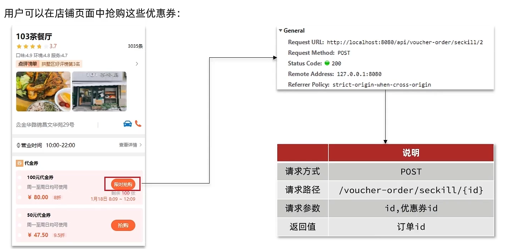

秒杀下单应该思考的内容：

下单时需要判断两点：

* 秒杀是否开始或结束，如果尚未开始或已经结束则无法下单
* 库存是否充足，不足则无法下单

下单核心逻辑分析：

当用户开始进行下单，我们应当根据ID去查询优惠卷信息，查询到优惠卷信息，判断是否满足秒杀条件

比如时间是否充足，如果时间充足，则进一步判断库存是否足够，如果两者都满足，则扣减库存，创建订单，然后返回订单id，如果有一个条件不满足则直接结束。


**VoucherOrderController.java**

~~~java
@Resource
private IVoucherOrderService voucherOrderService;

@PostMapping("seckill/{id}")
public Result seckillVoucher(@PathVariable("id") Long voucherId) {
    return voucherOrderService.seckillVoucher(voucherId);
}
~~~

---

**IVoucherOrderService.java**

~~~java
public interface IVoucherOrderService extends IService<VoucherOrder> {
    Result seckillVoucher(Long voucherId);
}
~~~

---

**VoucherOrderServiceImpl**

```java
@Resource
private ISeckillVoucherService seckillVoucherService;
@Resource
private RedisIdWorker redisIdWorker;

@Override
@Transactional
public Result seckillVoucher(Long voucherId) {
    // 1.查询优惠券
    SeckillVoucher voucher = seckillVoucherService.getById(voucherId);
    // 2.判断秒杀是否开始
    if (voucher.getBeginTime().isAfter(LocalDateTime.now())) {
        // 尚未开始
        return Result.fail("秒杀尚未开始！");
    }
    // 3.判断秒杀是否已经结束
    if (voucher.getEndTime().isBefore(LocalDateTime.now())) {
        // 尚未开始
        return Result.fail("秒杀已经结束！");
    }
    // 4.判断库存是否充足
    if (voucher.getStock() < 1) {
        // 库存不足
        return Result.fail("库存不足！");
    }
    //5，扣减库存
    boolean success = seckillVoucherService.update()
        .setSql("stock = stock -1")
        .eq("voucher_id", voucherId).update();
    if (!success) {
        //扣减库存
        return Result.fail("库存不足！");
    }
    //6.创建订单
    VoucherOrder voucherOrder = new VoucherOrder();
    // 6.1.订单id
    long orderId = redisIdWorker.nextId("order");
    voucherOrder.setId(orderId);
    // 6.2.用户id
    Long userId = UserHolder.getUser().getId();
    voucherOrder.setUserId(userId);
    // 6.3.代金券id
    voucherOrder.setVoucherId(voucherId);
    save(voucherOrder);

    return Result.ok(orderId);
}
```


----

# 52.库存超卖问题分析

## 一、分析问题

刚刚秒杀优惠券购买测试的时候是我们自己在页面上点击进行测试的，这跟真实的秒杀场景还是有很大差异的，因为真实的秒杀场景下肯定有无数的用户一起来抢购，一起来点购这个按钮，因此一瞬间的并发量可能会达到每秒数百甚至上千、上万的并发，那我们这个结构还能不能工作呢？

要想模拟这种高并发的场景，肯定要用到JeMter


数据库总量是100


将订单也清0


接下来我们有100个券，我们希望的是只卖出100个，理论上来讲只生成100个订单。

启动JeMeter，结果肯定有些成功有些失败


查看报告 `49.25%` 的异常率，跟我们预期有出入，我们的预期应该是一般失败


回到数据库中查看，可以看见订单生成数量是 `102`


并且库存变为了 `-2`


由此可见票出现了超卖，我们只能卖一百件，现在却卖出了 `102件`，如果这件卖出的商品很贵重，这样可能会给商家带来巨大的损失。

那么我们为什么会出现这个问题呢？

有关超卖问题分析：在我们原有代码中是这么写的

```java
if (voucher.getStock() < 1) {
    // 库存不足
    return Result.fail("库存不足！");
}
//5，扣减库存
boolean success = seckillVoucherService.update()
    .setSql("stock= stock -1")
    .eq("voucher_id", voucherId).update();
if (!success) {
    //扣减库存
    return Result.fail("库存不足！");
}
```

正常情况下一个如下图，一个执行完再执行另一个


但是高并发的场景下，你就没办法控制线程的顺序了，假设线程1过来查询库存，判断出来库存大于1，正准备去扣减库存，但是还没有来得及去扣减，此时线程2过来，线程2也去查询库存，发现这个数量一定也大于1，那么这两个线程都会去扣减库存，最终多个线程相当于一起去扣减库存，此时就会出现库存的超卖问题。


---

## 二、解决办法

超卖问题是典型的多线程安全问题，针对这一问题的常见解决方案就是加锁：而对于加锁，我们通常有两种解决方案：见下图：

悲观锁和乐观锁并不是真正的锁，它只是锁设计的理念


**悲观锁：**

如果我们多个线程是串行执行的，就不会出现安全问题了。所以这就是悲观锁的实现思想，既然多线程并发有安全问题，那你就不要并发执行了。正因为如此，悲观锁的性能就不是很好，因为你不管有多少线程，都只能一个一个的去执行，因此高并发的场景下悲观锁并不是很适合。

 JDK中提供的syn，和lock、数据库中的互斥的锁，都是悲观锁的代表，同时，悲观锁中又可以再细分为公平锁，非公平锁，可重入锁，等等。

**乐观锁：**

因为乐观锁折后转给你方案它不用加锁，而是在执行时才做一个判断，因此它的性能要比悲观锁好很多。

但是它的关键点在于：我怎么知道在我更新的时候别人有没有来做修改？因此这个判断成为了关键，这也是我们接下来要研究的。

悲观锁比较简单，相信大家都会，这里就不演示了，这里就演示乐观锁

----

## 三、乐观锁

判断是否有人进行修改，常见的方式有两种

### 实现方式一：版本号法

这种方案是应用最广泛的，也是最普遍的。

乐观锁：会有一个版本号，每次操作数据会对版本号+1，再提交回数据时，会去校验是否比之前的版本大1 ，如果大1 ，则进行操作成功，这套机制的核心逻辑在于，如果在操作过程中，版本号只比原来大1 ，那么就意味着操作过程中没有人对他进行过修改，他的操作就是安全的，如果不大1，则数据被修改过。

有了版本号后，线程1在做查询的时候，就不仅仅是查库存了，它还要将版本号也查出来，此时线程1查到的库存和版本号是 `1`，紧接着，它本来要进行扣减了，但是此时另外一个线程插入进来了，此时就出现并发的问题了，此时线程二也去查询，同样也是查询stock和version，查到的也是1。紧接着又切到了线程1，线程1要去扣减库存，判断库存是否大于0，此时就要去扣减。

以前是直接扣减就完了，但是现在不行，版本号每次修改的时候都要加1，因此它在修改库存的时候不仅仅要修改库存，还需要修改版本号，因此在修改时，乐观锁的方案是：修改前先判断一下，之前查询到的数据是否被修改过，这里就是判断版本是否被修改过， `where version = 1`，因为之前查询出来的version是1，如果执行这个条件时version依然等于1，说明跟我们之前查询到的一样，说明在我执行修改之前，是没有人修改过这个数据的，既然没有人修改过，我就可以放心大胆的去减了。

那么第一个线程在操作后，数据库中的version变成了2，但是他自己满足version=1 ，所以没有问题，此时线程2执行，线程2 最后也需要加上条件version =1 ，但是现在由于线程1已经操作过了，所以线程2，操作时就不满足version=1 的条件了，所以线程2无法执行成功


---

### 实现方式二：CAS

在实现方式一的基础上做了简化，版本号法其实是用版本来表示版本是否变化，其次在更新的时候每次除了数据以外，版本也要跟着更新，既然每次更新都要更新版本，如果我查到的版本跟我更新时的版本一致，证明就没有人更新。但是大家看一下我们当前的业务，我们每一次业务，其实在查询版本的时候库存也都跟着查出来了，更新的时候库存也要更新，可以发现库存跟版本所做的事是一样的，既然如此为什么不使用库存代替版本？我在查询的时候将库存查出来，然后我在更新的时候当前的这个库存跟之前查到的库存是不是一样的，如果一样，不就同样可以证明没有人修改过吗？

用数据本身有没有变化来判断线程是否安全，这种方案就称之为cas(compare and set)，先比较然后修改。

核心思路和上面差不多


下面是补充，老师没讲的。

利用cas进行无锁化机制加锁，var5 是操作前读取的内存值，while中的var1+var2 是预估值，如果预估值 == 内存值，则代表中间没有被人修改过，此时就将新值去替换 内存值

其中do while 是为了在操作失败时，再次进行自旋操作，即把之前的逻辑再操作一次。

```java
int var5;
do {
    var5 = this.getIntVolatile(var1, var2);
} while(!this.compareAndSwapInt(var1, var2, var5, var5 + var4));

return var5;
```


----

# 53.乐观锁解决超卖问题

## 修改代码方案一

VoucherOrderServiceImpl 在扣减库存时，改为：

```java
boolean success = seckillVoucherService.update()
            .setSql("stock= stock -1") //set stock = stock -1
            .eq("voucher_id", voucherId).eq("stock", voucher.getStock()).update(); //where id = ？and stock = ? 
```

以上逻辑的核心含义是：只要我扣减库存时的库存和之前我查询到的库存是一样的，就意味着没有人在中间修改过库存，那么此时就是安全的，但是以上这种方式通过测试发现会有很多失败的情况，失败的原因就跟乐观锁的缺点有关了：在使用乐观锁过程中假设100个线程同时都拿到了100的库存，然后大家一起去进行扣减，但是100个人中只有1个人能扣减成功，其他的人在处理时，他们在扣减时，库存已经被修改过了，所以此时其他线程都会失败。

但是从业务角度来分析，这99个人完全可以成功，那为什么失败了？因为乐观锁太小心了，它觉得只要有人改了就有安全问题，其实没有。这里是产生了并发修改，但是没有业务上的安全问题，因为对于库存来讲，只要大于0。

---

## 修改代码方案二

之前的方式要修改前后都保持一致，但是这样我们分析过，成功的概率太低，所以我们的乐观锁需要变一下，改成 `stock大于0` 即可

```java
boolean success = seckillVoucherService.update()
                .setSql("stock = stock - 1")
                .eq("voucher_id", voucherId).gt("stock", 0) //where id = ? and stock > 0
                .update();
```

---

## 测试

重启程序，修改数据库，库存改为100，同时清除订单


最后执行JeMeter的200条线程，异常情况为 `50%`，并且查看数据库，库存没有超卖，而且订单也恰好是100个


----

## 总结

超卖这样的线程安全问题，解决方案有哪些？

1.悲观锁：添加同步锁，让线程串行执行

- 优点：简单粗暴

- 缺点：性能一般

2.乐观锁：不加锁，在更新时判断是否有其它线程在修改

- 优点：性能好

- 缺点：存在成功率低的问题

有些业务中不是库存，它只能通过数据有没有变化来去判断是否安全，这种情况下想要提高成功率，我们还可以采用分批加锁的方案，即分段锁，即我可以将数据的资源分成几份，例如库存总共是100，我可以将100库存分到十张表中，每张表中库存量是10，然后抢的时候就可以去多张表中分别抢，这样一来成功率相当于提高了十倍。

这种分段锁的方案相当于每次锁定的资源少，不再是将100个资源全锁定了。这种思想在HashMap中其实有用到，它就可以解决成功低的问题。

虽然我们最终选择了乐观锁，但并不是说乐观锁就是完美的了，它毕竟还要去访问数据库，对数据库的压力还是非常大的，因此在真正的秒杀场景下，特别是像淘宝、京东这样的高并发的场景，仅仅使用乐观锁还是不够的，所以我们接下来继续要去对秒杀的这种方案进行优化，进一步的提高它的性能。

---

## 知识小扩展

针对cas中的自旋压力过大，我们可以使用Longaddr这个类去解决

Java8 提供的一个对AtomicLong改进后的一个类，LongAdder

大量线程并发更新一个原子性的时候，天然的问题就是自旋，会导致并发性问题，当然这也比我们直接使用syn来的好

所以利用这么一个类，LongAdder来进行优化

如果获取某个值，则会对cell和base的值进行递增，最后返回一个完整的值


---

# 54.优惠券秒杀  ——  一人一单

## 一、业务分析

需求：修改秒杀业务，要求同一个优惠券，一个用户只能下一单。

为什么要有这样的需求呢？思考一下，像这种秒杀券(特有券)，它的优惠力度非常大，商家可能会赔本，那这种券的目的是什么？它的目的只有一个，就是利用这样的券吸引更多的用户来我们店中体验，体验了后如果口碑好，那就可以传播出去，吸引更多的用户来。

**现在的问题在于：**

优惠卷是为了引流，但是目前的情况是，一个人可以无限制的抢这个优惠卷，所以我们应当增加一层逻辑，让一个用户只能下一个单，而不是让一个用户下多个单

具体操作逻辑如下：比如时间是否充足，如果时间充足，则进一步判断库存是否足够，然后再根据优惠卷id和用户id查询是否已经下过这个订单，如果下过这个订单，则不再下单，否则进行下单


VoucherOrderServiceImpl  

**初步代码：增加一人一单逻辑**

```java
@Override
@Transactional
public Result seckillVoucher(Long voucherId) {
    // 1.查询优惠券
    SeckillVoucher voucher = seckillVoucherService.getById(voucherId);
    // 2.判断秒杀是否开始
    if (voucher.getBeginTime().isAfter(LocalDateTime.now())) {
        // 尚未开始
        return Result.fail("秒杀尚未开始！");
    }
    // 3.判断秒杀是否已经结束
    if (voucher.getEndTime().isBefore(LocalDateTime.now())) {
        // 尚未开始
        return Result.fail("秒杀已经结束！");
    }
    // 4.判断库存是否充足
    if (voucher.getStock() < 1) {
        // 库存不足
        return Result.fail("库存不足！");
    }
    // 5.一人一单逻辑
    // 5.1.用户id
    Long userId = UserHolder.getUser().getId();
    // 这里不需要查具体数据了，只需要查count值
    int count = query().eq("user_id", userId).eq("voucher_id", voucherId).count();
    // 5.2.判断是否存在
    if (count > 0) {
        // 用户已经购买过了
        return Result.fail("用户已经购买过一次！");
    }

    //6，扣减库存
    boolean success = seckillVoucherService.update()
            .setSql("stock= stock -1")
            .eq("voucher_id", voucherId).update();
    if (!success) {
        //扣减库存
        return Result.fail("库存不足！");
    }
    //7.创建订单
    VoucherOrder voucherOrder = new VoucherOrder();
    // 7.1.订单id
    long orderId = redisIdWorker.nextId("order");
    voucherOrder.setId(orderId);

    voucherOrder.setUserId(userId);
    // 7.3.代金券id
    voucherOrder.setVoucherId(voucherId);
    save(voucherOrder);

    return Result.ok(orderId);
}
```

**存在问题：**现在的问题还是和之前一样，并发过来，查询数据库，都不存在订单，所以我们还是需要加锁，否则一个用户还是有可能会下多个单。但是乐观锁比较适合更新数据，因为可以判断某个字段是否修改。而现在是插入数据，没法判断某个字段是否修改，所以我们需要使用悲观锁操作

其中我们应该给 `判断订单` 到 `新增订单` 这整段加上悲观锁

---

## 二、代码实现

### 1）优化一


因此可以 <kbd>ctrl + alt + M</kbd> 将其封装成一个函数


由于我们是要在 `createVoucherOrder` 整个方法上都需要加上锁，直接使用同步方法就行了，此时的同步锁就是 `this`，即当前对象，因此肯定是线程安全的，因为当前对象肯定是唯一的。

另外我们事务的范围其实是更新数据库的服务，也就是做减库的操作和创建订单的操作，而不是整个方法，因为前面是查询，不用加事务，所以 `seckillVoucher方法` 上的事物也去掉，而是给下面的方法加上事务


---

### 2）优化二

但是需要注意的是，不建议将 `synchronized` 直接加在方法上，因为你加在方法上锁的范围就变成了整个方法，而且锁的对象是this，也就意味着不管是任何一个用户来了，都要加这个锁，而且大家是同一把锁，也就意味着整个方法就是串行执行了，性能就很差了。

但是大家思考下：所谓的一人一单，我们是同一个用户来了，我们才去判断他的并发安全问题。但如果不是同一个用户，一个张三、一个李四，就不需要加同一把锁了，各做各的就行了。

因此我认为这个地方加的锁不应该是这个 `service`，即 `this`，而是当前用户。

我们可以以用户 `id` 加锁，这样的话我们就可以将锁的范围缩小了，也就是说同一个用户加一把锁，不同用户加不同锁。

专业一点说：但是这样添加锁，锁的粒度太粗了，在使用锁过程中，控制 **锁粒度** 是一个非常重要的事情，因为如果锁的粒度太大，会导致每个线程进来都会锁住，所以我们需要去控制锁的粒度，以下这段代码需要修改为：
`intern()` 这个方法是从常量池中拿到数据，如果我们直接使用userId.toString() 他拿到的对象实际上是不同的对象，new出来的对象，我们使用锁必须保证锁必须是同一把，所以我们需要使用intern()方法

```java
@Transactional
public  Result createVoucherOrder(Long voucherId) {
	Long userId = UserHolder.getUser().getId();
	synchronized(userId.toString()){
         // 5.1.查询订单
        int count = query().eq("user_id", userId).eq("voucher_id", voucherId).count();
        // 5.2.判断是否存在
        if (count > 0) {
            // 用户已经购买过了
            return Result.fail("用户已经购买过一次！");
        }

        // 6.扣减库存
        boolean success = seckillVoucherService.update()
                .setSql("stock = stock - 1") // set stock = stock - 1
                .eq("voucher_id", voucherId).gt("stock", 0) // where id = ? and stock > 0
                .update();
        if (!success) {
            // 扣减失败
            return Result.fail("库存不足！");
        }

        // 7.创建订单
        VoucherOrder voucherOrder = new VoucherOrder();
        // 7.1.订单id
        long orderId = redisIdWorker.nextId("order");
        voucherOrder.setId(orderId);
        // 7.2.用户id
        voucherOrder.setUserId(userId);
        // 7.3.代金券id
        voucherOrder.setVoucherId(voucherId);
        save(voucherOrder);

        // 7.返回订单id
        return Result.ok(orderId);
    }
}
```

但是这里还要跟大家强调一点：`userId.toString()` 我们期望的是id值一样的作为一把锁，但你要知道，每一个请求来这个id对象都是一个全新的id对象，因此这个对象变了锁就变了，但是我们要求的是值一样，所以在这里用了 `toString()`，但是 `toString()` 就能保证它是按照值来加锁的吗？

我们看一下toString底层，可以发现在底层调用的是long的一个静态的特征函数，在它的内部其实是 `new` 了一个字符串。


那也就是说，我们刚才的代码中，每调一次 `toString()` 也是一个全新的字符串对象，也就是说你这个锁的对象还是在变，哪怕你id是一样的，它每次也是new，因此还是一个全新的对象。

此时就需要调用字符串的 `intern()` 方法，这个方法的作用是返回字符串的规范表示，即去字符串常量池中寻找跟你值一样的那个字符串的地址返回给你，即你的值给你。

因此无论你这里new了多少个字符串，只要你的值是一样的，那最终的返回结果也就是一样的，这样就可以确保：当用户id一样时，锁就一样。


而不同用户就不会被锁定，此时我们整体的锁定范围变小了，性能就会得到很大的提升了。

---

### 3）优化三

但是以上代码还是存在问题，问题的原因在于当前方法被spring的事务控制，如果你在方法内部加锁，可能会导致当前方法事务还没有提交，但是锁已经释放也会导致问题，因此当方法结束后，锁其实就已经释放了，锁释放了就意味着其他线程可以进来了，而此时因为事务尚未提交，如果有其他线程进来去查询订单的话，那我们刚刚新增的这个订单还没有写入数据库，因为你还没提交事务，因此这个线程查询的时候依然不存在，就有可能出现并发安全问题。

因此我们这个锁锁定的范围有点小

所以我们选择将当前方法整体包裹起来，确保事务不会出现问题：如下：

在seckillVoucher 方法中，添加以下逻辑，这样就能保证事务的特性，同时也控制了锁的粒度


此时等 `createVoucherOrder函数` 执行完，就说明一定是写入数据库了，因为事务已经提交了，等我这块事务提交完，再来释放锁，也就是说锁所释放的这一刻，就可以确保数据库中是有订单了，此时再有其他线程来，你再去完成这个业务的时候，去查询订单的时候，订单肯定存在了，就不会重复下单了。

----

### 4）优化四

但是以上做法依然有问题，因为你调用的方法，其实是this.的方式调用的，`this` 拿到的事当前的 `VoucherOrderServiceImpl对象`，而不是它的代理对象。


事务想要生效，其实是因为spring对当前这个类做了动态代理，拿到了它的代理对象，用它来做的事务处理。而这里的 `this` 其实是非代理对象，也就是目标对象，因此它是没有事务功能的，这就是spring事务失效的几种可能性之一，这就是一种可能性。

所以这个地方，我们需要获得原始的事务对象， 来操作事务，借助API：`AopContext`，它里面的 `currentProxy()方法` 就可以拿到当前对象的代理对象了

~~~java
Object proxy = AopContext.currentProxy();
~~~

这个对象是 `VoucherOrderService` 的代理对象，因此使用 `VoucherOrderService` 来接收就行了，然后做个强转。

它返回的时候是Object，但我们知道肯定是 `VoucherOrderService`。

~~~java
IVoucherOrderService proxy = (IVoucherOrderService) AopContext.currentProxy();
~~~

最后上使用代理对象来调用 `createVoucherOrder方法`，而不是使用this，这样的话就会被spring进行管理了，因为这个代理对象是由spring创建的，它是带有事务的函数，这个不存在的原因是因为 `VoucherOrderService` 接口中是不存在这个函数的，因此我们也将这个函数在 `VoucherOrderService` 中创建一下。


现在事务就能够生效了


当然你要这么去做还需要做两件事：

1、添加一个依赖，因为这么做后底层会使用aspectj的依赖，是一种动态代理的模式

~~~xml
<dependency>
    <groupId>org.aspectj</groupId>
    <artifactId>aspectjweaver</artifactId>
</dependency>
~~~

2、在启动类上添加 `@` 注解，去暴露这个代理对象

可以发现这个值默认是false，默认是不暴露的，这个值需要将它改为true就能暴露


一旦暴露后，在 `VoucherOrderServiceImpl` 实现类中就可以拿到这个代理对象了


此时我们就能确保这个事务生效了，并且是先去获取锁，最后才创建事务，事务提交后才会释放锁，这样才会避免我们刚才说的因为事务没提交就释放锁的这种安全问题。

此时重新使用JeMeter测试即可，然后查看数据库，发现库存确实是只减少了一个，而且一人一单的问题。


这样我们就解决了一人一单的问题，解决方案同样是加锁，这次我们使用的是悲观锁。只不过我们这次采用了一种特殊的锁对象，即用户ID，减少了锁定资源的范围，从而一定程度上提高了它的性能。


----

# 55.集群环境下的并发问题

通过加锁可以解决在单机情况下的一人一单安全问题，但是在集群模式下就不行了。

1、我们将服务启动两份，端口分别为8081和8082：


2、然后修改nginx的conf目录下的nginx.conf文件，配置反向代理和负载均衡：


**具体操作(略)**

**有关锁失效原因分析**

由于现在我们部署了多个tomcat，每个tomcat都有一个属于自己的jvm，那么假设在服务器A的tomcat内部，有两个线程，这两个线程由于使用的是同一份代码，那么他们的锁对象是同一个，是可以实现互斥的，但是如果现在是服务器B的tomcat内部，又有两个线程，但是他们的锁对象写的虽然和服务器A一样，但是锁对象却不是同一个，所以线程3和线程4可以实现互斥，但是却无法和线程1和线程2实现互斥，这就是 集群环境下，syn锁失效的原因，在这种情况下，我们就需要使用分布式锁来解决这个问题。


## 4、分布式锁

### 4.1 、基本原理和实现方式对比

分布式锁：满足分布式系统或集群模式下多进程可见并且互斥的锁。

分布式锁的核心思想就是让大家都使用同一把锁，只要大家使用的是同一把锁，那么我们就能锁住线程，不让线程进行，让程序串行执行，这就是分布式锁的核心思路

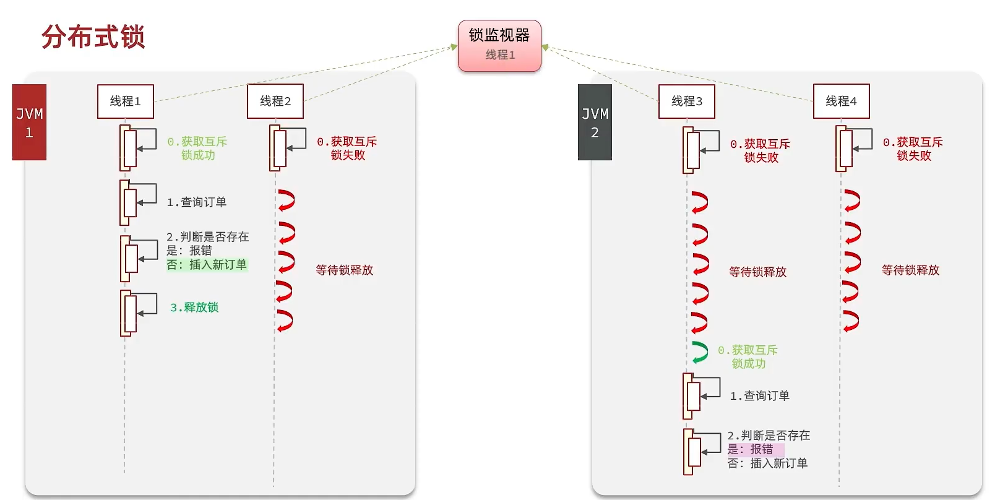

那么分布式锁他应该满足一些什么样的条件呢？

可见性：多个线程都能看到相同的结果，注意：这个地方说的可见性并不是并发编程中指的内存可见性，只是说多个进程之间都能感知到变化的意思

互斥：互斥是分布式锁的最基本的条件，使得程序串行执行

高可用：程序不易崩溃，时时刻刻都保证较高的可用性

高性能：由于加锁本身就让性能降低，所有对于分布式锁本身需要他就较高的加锁性能和释放锁性能

安全性：安全也是程序中必不可少的一环


常见的分布式锁有三种

Mysql：mysql本身就带有锁机制，但是由于mysql性能本身一般，所以采用分布式锁的情况下，其实使用mysql作为分布式锁比较少见

Redis：redis作为分布式锁是非常常见的一种使用方式，现在企业级开发中基本都使用redis或者zookeeper作为分布式锁，利用setnx这个方法，如果插入key成功，则表示获得到了锁，如果有人插入成功，其他人插入失败则表示无法获得到锁，利用这套逻辑来实现分布式锁

Zookeeper：zookeeper也是企业级开发中较好的一个实现分布式锁的方案，由于本套视频并不讲解zookeeper的原理和分布式锁的实现，所以不过多阐述

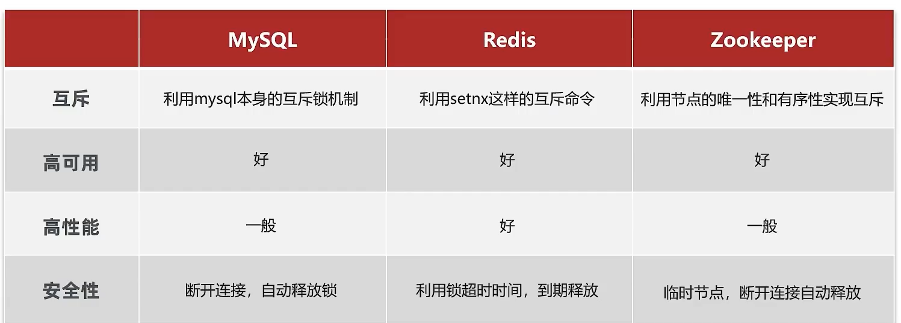

### 4.2 、Redis分布式锁的实现核心思路

实现分布式锁时需要实现的两个基本方法：

* 获取锁：

  * 互斥：确保只能有一个线程获取锁
  * 非阻塞：尝试一次，成功返回true，失败返回false

* 释放锁：

  * 手动释放
  * 超时释放：获取锁时添加一个超时时间

  

核心思路：

我们利用redis 的setNx 方法，当有多个线程进入时，我们就利用该方法，第一个线程进入时，redis 中就有这个key 了，返回了1，如果结果是1，则表示他抢到了锁，那么他去执行业务，然后再删除锁，退出锁逻辑，没有抢到锁的哥们，等待一定时间后重试即可

 

### 4.3 实现分布式锁版本一

* 加锁逻辑

**锁的基本接口**


**SimpleRedisLock**

利用setnx方法进行加锁，同时增加过期时间，防止死锁，此方法可以保证加锁和增加过期时间具有原子性

```java
private static final String KEY_PREFIX="lock:"
@Override
public boolean tryLock(long timeoutSec) {
    // 获取线程标示
    String threadId = Thread.currentThread().getId()
    // 获取锁
    Boolean success = stringRedisTemplate.opsForValue()
            .setIfAbsent(KEY_PREFIX + name, threadId + "", timeoutSec, TimeUnit.SECONDS);
    return Boolean.TRUE.equals(success);
}
```

* 释放锁逻辑

SimpleRedisLock

释放锁，防止删除别人的锁

```java
public void unlock() {
    //通过del删除锁
    stringRedisTemplate.delete(KEY_PREFIX + name);
}
```

* 修改业务代码

```java
  @Override
    public Result seckillVoucher(Long voucherId) {
        // 1.查询优惠券
        SeckillVoucher voucher = seckillVoucherService.getById(voucherId);
        // 2.判断秒杀是否开始
        if (voucher.getBeginTime().isAfter(LocalDateTime.now())) {
            // 尚未开始
            return Result.fail("秒杀尚未开始！");
        }
        // 3.判断秒杀是否已经结束
        if (voucher.getEndTime().isBefore(LocalDateTime.now())) {
            // 尚未开始
            return Result.fail("秒杀已经结束！");
        }
        // 4.判断库存是否充足
        if (voucher.getStock() < 1) {
            // 库存不足
            return Result.fail("库存不足！");
        }
        Long userId = UserHolder.getUser().getId();
        //创建锁对象(新增代码)
        SimpleRedisLock lock = new SimpleRedisLock("order:" + userId, stringRedisTemplate);
        //获取锁对象
        boolean isLock = lock.tryLock(1200);
		//加锁失败
        if (!isLock) {
            return Result.fail("不允许重复下单");
        }
        try {
            //获取代理对象(事务)
            IVoucherOrderService proxy = (IVoucherOrderService) AopContext.currentProxy();
            return proxy.createVoucherOrder(voucherId);
        } finally {
            //释放锁
            lock.unlock();
        }
    }
```

### 4.4 Redis分布式锁误删情况说明

逻辑说明：

持有锁的线程在锁的内部出现了阻塞，导致他的锁自动释放，这时其他线程，线程2来尝试获得锁，就拿到了这把锁，然后线程2在持有锁执行过程中，线程1反应过来，继续执行，而线程1执行过程中，走到了删除锁逻辑，此时就会把本应该属于线程2的锁进行删除，这就是误删别人锁的情况说明

解决方案：解决方案就是在每个线程释放锁的时候，去判断一下当前这把锁是否属于自己，如果属于自己，则不进行锁的删除，假设还是上边的情况，线程1卡顿，锁自动释放，线程2进入到锁的内部执行逻辑，此时线程1反应过来，然后删除锁，但是线程1，一看当前这把锁不是属于自己，于是不进行删除锁逻辑，当线程2走到删除锁逻辑时，如果没有卡过自动释放锁的时间点，则判断当前这把锁是属于自己的，于是删除这把锁。


### 4.5 解决Redis分布式锁误删问题

需求：修改之前的分布式锁实现，满足：在获取锁时存入线程标示（可以用UUID表示）
在释放锁时先获取锁中的线程标示，判断是否与当前线程标示一致

* 如果一致则释放锁
* 如果不一致则不释放锁

核心逻辑：在存入锁时，放入自己线程的标识，在删除锁时，判断当前这把锁的标识是不是自己存入的，如果是，则进行删除，如果不是，则不进行删除。


具体代码如下：加锁

```java
private static final String ID_PREFIX = UUID.randomUUID().toString(true) + "-";
@Override
public boolean tryLock(long timeoutSec) {
   // 获取线程标示
   String threadId = ID_PREFIX + Thread.currentThread().getId();
   // 获取锁
   Boolean success = stringRedisTemplate.opsForValue()
                .setIfAbsent(KEY_PREFIX + name, threadId, timeoutSec, TimeUnit.SECONDS);
   return Boolean.TRUE.equals(success);
}
```

释放锁

```java
public void unlock() {
    // 获取线程标示
    String threadId = ID_PREFIX + Thread.currentThread().getId();
    // 获取锁中的标示
    String id = stringRedisTemplate.opsForValue().get(KEY_PREFIX + name);
    // 判断标示是否一致
    if(threadId.equals(id)) {
        // 释放锁
        stringRedisTemplate.delete(KEY_PREFIX + name);
    }
}
```

**有关代码实操说明：**

在我们修改完此处代码后，我们重启工程，然后启动两个线程，第一个线程持有锁后，手动释放锁，第二个线程 此时进入到锁内部，再放行第一个线程，此时第一个线程由于锁的value值并非是自己，所以不能释放锁，也就无法删除别人的锁，此时第二个线程能够正确释放锁，通过这个案例初步说明我们解决了锁误删的问题。

### 4.6 分布式锁的原子性问题

更为极端的误删逻辑说明：

线程1现在持有锁之后，在执行业务逻辑过程中，他正准备删除锁，而且已经走到了条件判断的过程中，比如他已经拿到了当前这把锁确实是属于他自己的，正准备删除锁，但是此时他的锁到期了，那么此时线程2进来，但是线程1他会接着往后执行，当他卡顿结束后，他直接就会执行删除锁那行代码，相当于条件判断并没有起到作用，这就是删锁时的原子性问题，之所以有这个问题，是因为线程1的拿锁，比锁，删锁，实际上并不是原子性的，我们要防止刚才的情况发生，


### 4.7 Lua脚本解决多条命令原子性问题

Redis提供了Lua脚本功能，在一个脚本中编写多条Redis命令，确保多条命令执行时的原子性。Lua是一种编程语言，它的基本语法大家可以参考网站：https://www.runoob.com/lua/lua-tutorial.html，这里重点介绍Redis提供的调用函数，我们可以使用lua去操作redis，又能保证他的原子性，这样就可以实现拿锁比锁删锁是一个原子性动作了，作为Java程序员这一块并不作一个简单要求，并不需要大家过于精通，只需要知道他有什么作用即可。

这里重点介绍Redis提供的调用函数，语法如下：

```lua
redis.call('命令名称', 'key', '其它参数', ...)
```

例如，我们要执行set name jack，则脚本是这样：

```lua
# 执行 set name jack
redis.call('set', 'name', 'jack')
```

例如，我们要先执行set name Rose，再执行get name，则脚本如下：

```lua
# 先执行 set name jack
redis.call('set', 'name', 'Rose')
# 再执行 get name
local name = redis.call('get', 'name')
# 返回
return name
```

写好脚本以后，需要用Redis命令来调用脚本，调用脚本的常见命令如下：


例如，我们要执行 redis.call('set', 'name', 'jack') 这个脚本，语法如下：

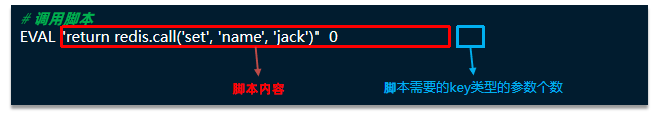

如果脚本中的key、value不想写死，可以作为参数传递。key类型参数会放入KEYS数组，其它参数会放入ARGV数组，在脚本中可以从KEYS和ARGV数组获取这些参数：


接下来我们来回一下我们释放锁的逻辑：

释放锁的业务流程是这样的

​	1、获取锁中的线程标示

​	2、判断是否与指定的标示（当前线程标示）一致

​	3、如果一致则释放锁（删除）

​	4、如果不一致则什么都不做

如果用Lua脚本来表示则是这样的：

最终我们操作redis的拿锁比锁删锁的lua脚本就会变成这样

```lua
-- 这里的 KEYS[1] 就是锁的key，这里的ARGV[1] 就是当前线程标示
-- 获取锁中的标示，判断是否与当前线程标示一致
if (redis.call('GET', KEYS[1]) == ARGV[1]) then
  -- 一致，则删除锁
  return redis.call('DEL', KEYS[1])
end
-- 不一致，则直接返回
return 0
```


### 4.8 利用Java代码调用Lua脚本改造分布式锁

lua脚本本身并不需要大家花费太多时间去研究，只需要知道如何调用，大致是什么意思即可，所以在笔记中并不会详细的去解释这些lua表达式的含义。

我们的RedisTemplate中，可以利用execute方法去执行lua脚本，参数对应关系就如下图股


**Java代码**

```java
private static final DefaultRedisScript<Long> UNLOCK_SCRIPT;
    static {
        UNLOCK_SCRIPT = new DefaultRedisScript<>();
        UNLOCK_SCRIPT.setLocation(new ClassPathResource("unlock.lua"));
        UNLOCK_SCRIPT.setResultType(Long.class);
    }

public void unlock() {
    // 调用lua脚本
    stringRedisTemplate.execute(
            UNLOCK_SCRIPT,
            Collections.singletonList(KEY_PREFIX + name),
            ID_PREFIX + Thread.currentThread().getId());
}
经过以上代码改造后，我们就能够实现 拿锁比锁删锁的原子性动作了~
```

小总结：

基于Redis的分布式锁实现思路：

* 利用set nx ex获取锁，并设置过期时间，保存线程标示
* 释放锁时先判断线程标示是否与自己一致，一致则删除锁
  * 特性：
    * 利用set nx满足互斥性
    * 利用set ex保证故障时锁依然能释放，避免死锁，提高安全性
    * 利用Redis集群保证高可用和高并发特性

笔者总结：我们一路走来，利用添加过期时间，防止死锁问题的发生，但是有了过期时间之后，可能出现误删别人锁的问题，这个问题我们开始是利用删之前 通过拿锁，比锁，删锁这个逻辑来解决的，也就是删之前判断一下当前这把锁是否是属于自己的，但是现在还有原子性问题，也就是我们没法保证拿锁比锁删锁是一个原子性的动作，最后通过lua表达式来解决这个问题

但是目前还剩下一个问题锁不住，什么是锁不住呢，你想一想，如果当过期时间到了之后，我们可以给他续期一下，比如续个30s，就好像是网吧上网， 网费到了之后，然后说，来，网管，再给我来10块的，是不是后边的问题都不会发生了，那么续期问题怎么解决呢，可以依赖于我们接下来要学习redission啦

**测试逻辑：**

第一个线程进来，得到了锁，手动删除锁，模拟锁超时了，其他线程会执行lua来抢锁，当第一天线程利用lua删除锁时，lua能保证他不能删除他的锁，第二个线程删除锁时，利用lua同样可以保证不会删除别人的锁，同时还能保证原子性。

## 5、分布式锁-redission

### 5.1 分布式锁-redission功能介绍

基于setnx实现的分布式锁存在下面的问题：

**重入问题**：重入问题是指 获得锁的线程可以再次进入到相同的锁的代码块中，可重入锁的意义在于防止死锁，比如HashTable这样的代码中，他的方法都是使用synchronized修饰的，假如他在一个方法内，调用另一个方法，那么此时如果是不可重入的，不就死锁了吗？所以可重入锁他的主要意义是防止死锁，我们的synchronized和Lock锁都是可重入的。

**不可重试**：是指目前的分布式只能尝试一次，我们认为合理的情况是：当线程在获得锁失败后，他应该能再次尝试获得锁。

**超时释放：**我们在加锁时增加了过期时间，这样的我们可以防止死锁，但是如果卡顿的时间超长，虽然我们采用了lua表达式防止删锁的时候，误删别人的锁，但是毕竟没有锁住，有安全隐患

**主从一致性：** 如果Redis提供了主从集群，当我们向集群写数据时，主机需要异步的将数据同步给从机，而万一在同步过去之前，主机宕机了，就会出现死锁问题。


那么什么是Redission呢

Redisson是一个在Redis的基础上实现的Java驻内存数据网格（In-Memory Data Grid）。它不仅提供了一系列的分布式的Java常用对象，还提供了许多分布式服务，其中就包含了各种分布式锁的实现。

Redission提供了分布式锁的多种多样的功能


### 5.2 分布式锁-Redission快速入门

引入依赖：

```java
<dependency>
	<groupId>org.redisson</groupId>
	<artifactId>redisson</artifactId>
	<version>3.13.6</version>
</dependency>
```

配置Redisson客户端：

```java
@Configuration
public class RedissonConfig {

    @Bean
    public RedissonClient redissonClient(){
        // 配置
        Config config = new Config();
        config.useSingleServer().setAddress("redis://192.168.150.101:6379")
            .setPassword("123321");
        // 创建RedissonClient对象
        return Redisson.create(config);
    }
}

```

如何使用Redission的分布式锁

```java
@Resource
private RedissionClient redissonClient;

@Test
void testRedisson() throws Exception{
    //获取锁(可重入)，指定锁的名称
    RLock lock = redissonClient.getLock("anyLock");
    //尝试获取锁，参数分别是：获取锁的最大等待时间(期间会重试)，锁自动释放时间，时间单位
    boolean isLock = lock.tryLock(1,10,TimeUnit.SECONDS);
    //判断获取锁成功
    if(isLock){
        try{
            System.out.println("执行业务");          
        }finally{
            //释放锁
            lock.unlock();
        }
        
    }
    
    
    
}
```

在 VoucherOrderServiceImpl

注入RedissonClient

```java
@Resource
private RedissonClient redissonClient;

@Override
public Result seckillVoucher(Long voucherId) {
        // 1.查询优惠券
        SeckillVoucher voucher = seckillVoucherService.getById(voucherId);
        // 2.判断秒杀是否开始
        if (voucher.getBeginTime().isAfter(LocalDateTime.now())) {
            // 尚未开始
            return Result.fail("秒杀尚未开始！");
        }
        // 3.判断秒杀是否已经结束
        if (voucher.getEndTime().isBefore(LocalDateTime.now())) {
            // 尚未开始
            return Result.fail("秒杀已经结束！");
        }
        // 4.判断库存是否充足
        if (voucher.getStock() < 1) {
            // 库存不足
            return Result.fail("库存不足！");
        }
        Long userId = UserHolder.getUser().getId();
        //创建锁对象 这个代码不用了，因为我们现在要使用分布式锁
        //SimpleRedisLock lock = new SimpleRedisLock("order:" + userId, stringRedisTemplate);
        RLock lock = redissonClient.getLock("lock:order:" + userId);
        //获取锁对象
        boolean isLock = lock.tryLock();
       
		//加锁失败
        if (!isLock) {
            return Result.fail("不允许重复下单");
        }
        try {
            //获取代理对象(事务)
            IVoucherOrderService proxy = (IVoucherOrderService) AopContext.currentProxy();
            return proxy.createVoucherOrder(voucherId);
        } finally {
            //释放锁
            lock.unlock();
        }
 }
```

### 5.3 分布式锁-redission可重入锁原理

在Lock锁中，他是借助于底层的一个voaltile的一个state变量来记录重入的状态的，比如当前没有人持有这把锁，那么state=0，假如有人持有这把锁，那么state=1，如果持有这把锁的人再次持有这把锁，那么state就会+1 ，如果是对于synchronized而言，他在c语言代码中会有一个count，原理和state类似，也是重入一次就加一，释放一次就-1 ，直到减少成0 时，表示当前这把锁没有被人持有。  

在redission中，我们的也支持支持可重入锁

在分布式锁中，他采用hash结构用来存储锁，其中大key表示表示这把锁是否存在，用小key表示当前这把锁被哪个线程持有，所以接下来我们一起分析一下当前的这个lua表达式

这个地方一共有3个参数

**KEYS[1] ： 锁名称**

**ARGV[1]：  锁失效时间**

**ARGV[2]：  id + ":" + threadId; 锁的小key**

exists: 判断数据是否存在  name：是lock是否存在,如果==0，就表示当前这把锁不存在

redis.call('hset', KEYS[1], ARGV[2], 1);此时他就开始往redis里边去写数据 ，写成一个hash结构

Lock{

​    id + **":"** + threadId :  1

}

如果当前这把锁存在，则第一个条件不满足，再判断

redis.call('hexists', KEYS[1], ARGV[2]) == 1

此时需要通过大key+小key判断当前这把锁是否是属于自己的，如果是自己的，则进行

redis.call('hincrby', KEYS[1], ARGV[2], 1)

将当前这个锁的value进行+1 ，redis.call('pexpire', KEYS[1], ARGV[1]); 然后再对其设置过期时间，如果以上两个条件都不满足，则表示当前这把锁抢锁失败，最后返回pttl，即为当前这把锁的失效时间

如果小伙帮们看了前边的源码， 你会发现他会去判断当前这个方法的返回值是否为null，如果是null，则对应则前两个if对应的条件，退出抢锁逻辑，如果返回的不是null，即走了第三个分支，在源码处会进行while(true)的自旋抢锁。

```lua
"if (redis.call('exists', KEYS[1]) == 0) then " +
                  "redis.call('hset', KEYS[1], ARGV[2], 1); " +
                  "redis.call('pexpire', KEYS[1], ARGV[1]); " +
                  "return nil; " +
              "end; " +
              "if (redis.call('hexists', KEYS[1], ARGV[2]) == 1) then " +
                  "redis.call('hincrby', KEYS[1], ARGV[2], 1); " +
                  "redis.call('pexpire', KEYS[1], ARGV[1]); " +
                  "return nil; " +
              "end; " +
              "return redis.call('pttl', KEYS[1]);"
```


### 5.4 分布式锁-redission锁重试和WatchDog机制

**说明**：由于课程中已经说明了有关tryLock的源码解析以及其看门狗原理，所以笔者在这里给大家分析lock()方法的源码解析，希望大家在学习过程中，能够掌握更多的知识

抢锁过程中，获得当前线程，通过tryAcquire进行抢锁，该抢锁逻辑和之前逻辑相同

1、先判断当前这把锁是否存在，如果不存在，插入一把锁，返回null

2、判断当前这把锁是否是属于当前线程，如果是，则返回null

所以如果返回是null，则代表着当前这哥们已经抢锁完毕，或者可重入完毕，但是如果以上两个条件都不满足，则进入到第三个条件，返回的是锁的失效时间，同学们可以自行往下翻一点点，你能发现有个while( true) 再次进行tryAcquire进行抢锁

```java
long threadId = Thread.currentThread().getId();
Long ttl = tryAcquire(-1, leaseTime, unit, threadId);
// lock acquired
if (ttl == null) {
    return;
}
```

接下来会有一个条件分支，因为lock方法有重载方法，一个是带参数，一个是不带参数，如果带带参数传入的值是-1，如果传入参数，则leaseTime是他本身，所以如果传入了参数，此时leaseTime != -1 则会进去抢锁，抢锁的逻辑就是之前说的那三个逻辑

```java
if (leaseTime != -1) {
    return tryLockInnerAsync(waitTime, leaseTime, unit, threadId, RedisCommands.EVAL_LONG);
}
```

如果是没有传入时间，则此时也会进行抢锁， 而且抢锁时间是默认看门狗时间 commandExecutor.getConnectionManager().getCfg().getLockWatchdogTimeout()

ttlRemainingFuture.onComplete((ttlRemaining, e) 这句话相当于对以上抢锁进行了监听，也就是说当上边抢锁完毕后，此方法会被调用，具体调用的逻辑就是去后台开启一个线程，进行续约逻辑，也就是看门狗线程

```java
RFuture<Long> ttlRemainingFuture = tryLockInnerAsync(waitTime,
                                        commandExecutor.getConnectionManager().getCfg().getLockWatchdogTimeout(),
                                        TimeUnit.MILLISECONDS, threadId, RedisCommands.EVAL_LONG);
ttlRemainingFuture.onComplete((ttlRemaining, e) -> {
    if (e != null) {
        return;
    }

    // lock acquired
    if (ttlRemaining == null) {
        scheduleExpirationRenewal(threadId);
    }
});
return ttlRemainingFuture;
```

此逻辑就是续约逻辑，注意看commandExecutor.getConnectionManager().newTimeout（） 此方法

Method(  **new** TimerTask() {},参数2 ，参数3  )

指的是：通过参数2，参数3 去描述什么时候去做参数1的事情，现在的情况是：10s之后去做参数一的事情

因为锁的失效时间是30s，当10s之后，此时这个timeTask 就触发了，他就去进行续约，把当前这把锁续约成30s，如果操作成功，那么此时就会递归调用自己，再重新设置一个timeTask()，于是再过10s后又再设置一个timerTask，完成不停的续约

那么大家可以想一想，假设我们的线程出现了宕机他还会续约吗？当然不会，因为没有人再去调用renewExpiration这个方法，所以等到时间之后自然就释放了。

```java
private void renewExpiration() {
    ExpirationEntry ee = EXPIRATION_RENEWAL_MAP.get(getEntryName());
    if (ee == null) {
        return;
    }
    
    Timeout task = commandExecutor.getConnectionManager().newTimeout(new TimerTask() {
        @Override
        public void run(Timeout timeout) throws Exception {
            ExpirationEntry ent = EXPIRATION_RENEWAL_MAP.get(getEntryName());
            if (ent == null) {
                return;
            }
            Long threadId = ent.getFirstThreadId();
            if (threadId == null) {
                return;
            }
            
            RFuture<Boolean> future = renewExpirationAsync(threadId);
            future.onComplete((res, e) -> {
                if (e != null) {
                    log.error("Can't update lock " + getName() + " expiration", e);
                    return;
                }
                
                if (res) {
                    // reschedule itself
                    renewExpiration();
                }
            });
        }
    }, internalLockLeaseTime / 3, TimeUnit.MILLISECONDS);
    
    ee.setTimeout(task);
}
```

### 5.5 分布式锁-redission锁的MutiLock原理

为了提高redis的可用性，我们会搭建集群或者主从，现在以主从为例

此时我们去写命令，写在主机上， 主机会将数据同步给从机，但是假设在主机还没有来得及把数据写入到从机去的时候，此时主机宕机，哨兵会发现主机宕机，并且选举一个slave变成master，而此时新的master中实际上并没有锁信息，此时锁信息就已经丢掉了。


为了解决这个问题，redission提出来了MutiLock锁，使用这把锁咱们就不使用主从了，每个节点的地位都是一样的， 这把锁加锁的逻辑需要写入到每一个主丛节点上，只有所有的服务器都写入成功，此时才是加锁成功，假设现在某个节点挂了，那么他去获得锁的时候，只要有一个节点拿不到，都不能算是加锁成功，就保证了加锁的可靠性。


那么MutiLock 加锁原理是什么呢？笔者画了一幅图来说明

当我们去设置了多个锁时，redission会将多个锁添加到一个集合中，然后用while循环去不停去尝试拿锁，但是会有一个总共的加锁时间，这个时间是用需要加锁的个数 * 1500ms ，假设有3个锁，那么时间就是4500ms，假设在这4500ms内，所有的锁都加锁成功， 那么此时才算是加锁成功，如果在4500ms有线程加锁失败，则会再次去进行重试.


## 6、秒杀优化

### 6.1 秒杀优化-异步秒杀思路

我们来回顾一下下单流程

当用户发起请求，此时会请求nginx，nginx会访问到tomcat，而tomcat中的程序，会进行串行操作，分成如下几个步骤

1、查询优惠卷

2、判断秒杀库存是否足够

3、查询订单

4、校验是否是一人一单

5、扣减库存

6、创建订单

在这六步操作中，又有很多操作是要去操作数据库的，而且还是一个线程串行执行， 这样就会导致我们的程序执行的很慢，所以我们需要异步程序执行，那么如何加速呢？

在这里笔者想给大家分享一下课程内没有的思路，看看有没有小伙伴这么想，比如，我们可以不可以使用异步编排来做，或者说我开启N多线程，N多个线程，一个线程执行查询优惠卷，一个执行判断扣减库存，一个去创建订单等等，然后再统一做返回，这种做法和课程中有哪种好呢？答案是课程中的好，因为如果你采用我刚说的方式，如果访问的人很多，那么线程池中的线程可能一下子就被消耗完了，而且你使用上述方案，最大的特点在于，你觉得时效性会非常重要，但是你想想是吗？并不是，比如我只要确定他能做这件事，然后我后边慢慢做就可以了，我并不需要他一口气做完这件事，所以我们应当采用的是课程中，类似消息队列的方式来完成我们的需求，而不是使用线程池或者是异步编排的方式来完成这个需求

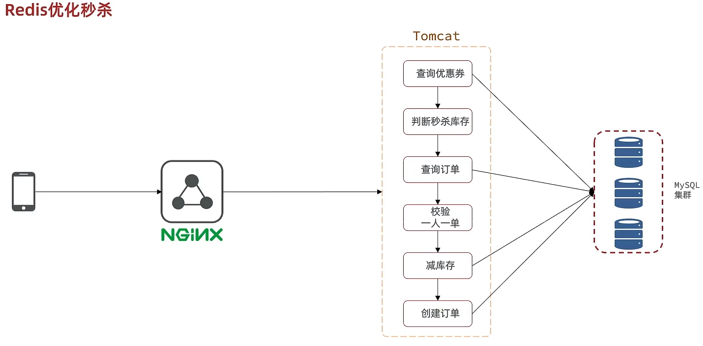


优化方案：我们将耗时比较短的逻辑判断放入到redis中，比如是否库存足够，比如是否一人一单，这样的操作，只要这种逻辑可以完成，就意味着我们是一定可以下单完成的，我们只需要进行快速的逻辑判断，根本就不用等下单逻辑走完，我们直接给用户返回成功， 再在后台开一个线程，后台线程慢慢的去执行queue里边的消息，这样程序不就超级快了吗？而且也不用担心线程池消耗殆尽的问题，因为这里我们的程序中并没有手动使用任何线程池，当然这里边有两个难点

第一个难点是我们怎么在redis中去快速校验一人一单，还有库存判断

第二个难点是由于我们校验和tomct下单是两个线程，那么我们如何知道到底哪个单他最后是否成功，或者是下单完成，为了完成这件事我们在redis操作完之后，我们会将一些信息返回给前端，同时也会把这些信息丢到异步queue中去，后续操作中，可以通过这个id来查询我们tomcat中的下单逻辑是否完成了。


我们现在来看看整体思路：当用户下单之后，判断库存是否充足只需要导redis中去根据key找对应的value是否大于0即可，如果不充足，则直接结束，如果充足，继续在redis中判断用户是否可以下单，如果set集合中没有这条数据，说明他可以下单，如果set集合中没有这条记录，则将userId和优惠卷存入到redis中，并且返回0，整个过程需要保证是原子性的，我们可以使用lua来操作

当以上判断逻辑走完之后，我们可以判断当前redis中返回的结果是否是0 ，如果是0，则表示可以下单，则将之前说的信息存入到到queue中去，然后返回，然后再来个线程异步的下单，前端可以通过返回的订单id来判断是否下单成功。


### 6.2 秒杀优化-Redis完成秒杀资格判断

需求：

* 新增秒杀优惠券的同时，将优惠券信息保存到Redis中

* 基于Lua脚本，判断秒杀库存、一人一单，决定用户是否抢购成功

* 如果抢购成功，将优惠券id和用户id封装后存入阻塞队列

* 开启线程任务，不断从阻塞队列中获取信息，实现异步下单功能

  

VoucherServiceImpl

```java
@Override
@Transactional
public void addSeckillVoucher(Voucher voucher) {
    // 保存优惠券
    save(voucher);
    // 保存秒杀信息
    SeckillVoucher seckillVoucher = new SeckillVoucher();
    seckillVoucher.setVoucherId(voucher.getId());
    seckillVoucher.setStock(voucher.getStock());
    seckillVoucher.setBeginTime(voucher.getBeginTime());
    seckillVoucher.setEndTime(voucher.getEndTime());
    seckillVoucherService.save(seckillVoucher);
    // 保存秒杀库存到Redis中
    //SECKILL_STOCK_KEY 这个变量定义在RedisConstans中
    //private static final String SECKILL_STOCK_KEY ="seckill:stock:"
    stringRedisTemplate.opsForValue().set(SECKILL_STOCK_KEY + voucher.getId(), voucher.getStock().toString());
}
```

完整lua表达式

```lua
-- 1.参数列表
-- 1.1.优惠券id
local voucherId = ARGV[1]
-- 1.2.用户id
local userId = ARGV[2]
-- 1.3.订单id
local orderId = ARGV[3]

-- 2.数据key
-- 2.1.库存key
local stockKey = 'seckill:stock:' .. voucherId
-- 2.2.订单key
local orderKey = 'seckill:order:' .. voucherId

-- 3.脚本业务
-- 3.1.判断库存是否充足 get stockKey
if(tonumber(redis.call('get', stockKey)) <= 0) then
    -- 3.2.库存不足，返回1
    return 1
end
-- 3.2.判断用户是否下单 SISMEMBER orderKey userId
if(redis.call('sismember', orderKey, userId) == 1) then
    -- 3.3.存在，说明是重复下单，返回2
    return 2
end
-- 3.4.扣库存 incrby stockKey -1
redis.call('incrby', stockKey, -1)
-- 3.5.下单（保存用户）sadd orderKey userId
redis.call('sadd', orderKey, userId)
-- 3.6.发送消息到队列中， XADD stream.orders * k1 v1 k2 v2 ...
redis.call('xadd', 'stream.orders', '*', 'userId', userId, 'voucherId', voucherId, 'id', orderId)
return 0
```

当以上lua表达式执行完毕后，剩下的就是根据步骤3,4来执行我们接下来的任务了

VoucherOrderServiceImpl

```java
@Override
public Result seckillVoucher(Long voucherId) {
    //获取用户
    Long userId = UserHolder.getUser().getId();
    long orderId = redisIdWorker.nextId("order");
    // 1.执行lua脚本
    Long result = stringRedisTemplate.execute(
            SECKILL_SCRIPT,
            Collections.emptyList(),
            voucherId.toString(), userId.toString(), String.valueOf(orderId)
    );
    int r = result.intValue();
    // 2.判断结果是否为0
    if (r != 0) {
        // 2.1.不为0 ，代表没有购买资格
        return Result.fail(r == 1 ? "库存不足" : "不能重复下单");
    }
    //TODO 保存阻塞队列
    // 3.返回订单id
    return Result.ok(orderId);
}
```

### 6.3 秒杀优化-基于阻塞队列实现秒杀优化

VoucherOrderServiceImpl

修改下单动作，现在我们去下单时，是通过lua表达式去原子执行判断逻辑，如果判断我出来不为0 ，则要么是库存不足，要么是重复下单，返回错误信息，如果是0，则把下单的逻辑保存到队列中去，然后异步执行

```java
//异步处理线程池
private static final ExecutorService SECKILL_ORDER_EXECUTOR = Executors.newSingleThreadExecutor();

//在类初始化之后执行，因为当这个类初始化好了之后，随时都是有可能要执行的
@PostConstruct
private void init() {
   SECKILL_ORDER_EXECUTOR.submit(new VoucherOrderHandler());
}
// 用于线程池处理的任务
// 当初始化完毕后，就会去从对列中去拿信息
 private class VoucherOrderHandler implements Runnable{

        @Override
        public void run() {
            while (true){
                try {
                    // 1.获取队列中的订单信息
                    VoucherOrder voucherOrder = orderTasks.take();
                    // 2.创建订单
                    handleVoucherOrder(voucherOrder);
                } catch (Exception e) {
                    log.error("处理订单异常", e);
                }
          	 }
        }
     
       private void handleVoucherOrder(VoucherOrder voucherOrder) {
            //1.获取用户
            Long userId = voucherOrder.getUserId();
            // 2.创建锁对象
            RLock redisLock = redissonClient.getLock("lock:order:" + userId);
            // 3.尝试获取锁
            boolean isLock = redisLock.lock();
            // 4.判断是否获得锁成功
            if (!isLock) {
                // 获取锁失败，直接返回失败或者重试
                log.error("不允许重复下单！");
                return;
            }
            try {
				//注意：由于是spring的事务是放在threadLocal中，此时的是多线程，事务会失效
                proxy.createVoucherOrder(voucherOrder);
            } finally {
                // 释放锁
                redisLock.unlock();
            }
    }
     //a
	private BlockingQueue<VoucherOrder> orderTasks =new  ArrayBlockingQueue<>(1024 * 1024);

    @Override
    public Result seckillVoucher(Long voucherId) {
        Long userId = UserHolder.getUser().getId();
        long orderId = redisIdWorker.nextId("order");
        // 1.执行lua脚本
        Long result = stringRedisTemplate.execute(
                SECKILL_SCRIPT,
                Collections.emptyList(),
                voucherId.toString(), userId.toString(), String.valueOf(orderId)
        );
        int r = result.intValue();
        // 2.判断结果是否为0
        if (r != 0) {
            // 2.1.不为0 ，代表没有购买资格
            return Result.fail(r == 1 ? "库存不足" : "不能重复下单");
        }
        VoucherOrder voucherOrder = new VoucherOrder();
        // 2.3.订单id
        long orderId = redisIdWorker.nextId("order");
        voucherOrder.setId(orderId);
        // 2.4.用户id
        voucherOrder.setUserId(userId);
        // 2.5.代金券id
        voucherOrder.setVoucherId(voucherId);
        // 2.6.放入阻塞队列
        orderTasks.add(voucherOrder);
        //3.获取代理对象
         proxy = (IVoucherOrderService)AopContext.currentProxy();
        //4.返回订单id
        return Result.ok(orderId);
    }
     
      @Transactional
    public  void createVoucherOrder(VoucherOrder voucherOrder) {
        Long userId = voucherOrder.getUserId();
        // 5.1.查询订单
        int count = query().eq("user_id", userId).eq("voucher_id", voucherOrder.getVoucherId()).count();
        // 5.2.判断是否存在
        if (count > 0) {
            // 用户已经购买过了
           log.error("用户已经购买过了");
           return ;
        }

        // 6.扣减库存
        boolean success = seckillVoucherService.update()
                .setSql("stock = stock - 1") // set stock = stock - 1
                .eq("voucher_id", voucherOrder.getVoucherId()).gt("stock", 0) // where id = ? and stock > 0
                .update();
        if (!success) {
            // 扣减失败
            log.error("库存不足");
            return ;
        }
        save(voucherOrder);
 
    }

```

**小总结：**

秒杀业务的优化思路是什么？

* 先利用Redis完成库存余量、一人一单判断，完成抢单业务
* 再将下单业务放入阻塞队列，利用独立线程异步下单
* 基于阻塞队列的异步秒杀存在哪些问题？
  * 内存限制问题
  * 数据安全问题


## 7、Redis消息队列

### 7.1 Redis消息队列-认识消息队列

什么是消息队列：字面意思就是存放消息的队列。最简单的消息队列模型包括3个角色：

* 消息队列：存储和管理消息，也被称为消息代理（Message Broker）
* 生产者：发送消息到消息队列
* 消费者：从消息队列获取消息并处理消息


使用队列的好处在于 **解耦：**所谓解耦，举一个生活中的例子就是：快递员(生产者)把快递放到快递柜里边(Message Queue)去，我们(消费者)从快递柜里边去拿东西，这就是一个异步，如果耦合，那么这个快递员相当于直接把快递交给你，这事固然好，但是万一你不在家，那么快递员就会一直等你，这就浪费了快递员的时间，所以这种思想在我们日常开发中，是非常有必要的。

这种场景在我们秒杀中就变成了：我们下单之后，利用redis去进行校验下单条件，再通过队列把消息发送出去，然后再启动一个线程去消费这个消息，完成解耦，同时也加快我们的响应速度。

这里我们可以使用一些现成的mq，比如kafka，rabbitmq等等，但是呢，如果没有安装mq，我们也可以直接使用redis提供的mq方案，降低我们的部署和学习成本。


### 7.2 Redis消息队列-基于List实现消息队列

**基于List结构模拟消息队列**

消息队列（Message Queue），字面意思就是存放消息的队列。而Redis的list数据结构是一个双向链表，很容易模拟出队列效果。

队列是入口和出口不在一边，因此我们可以利用：LPUSH 结合 RPOP、或者 RPUSH 结合 LPOP来实现。
不过要注意的是，当队列中没有消息时RPOP或LPOP操作会返回null，并不像JVM的阻塞队列那样会阻塞并等待消息。因此这里应该使用BRPOP或者BLPOP来实现阻塞效果。


基于List的消息队列有哪些优缺点？
优点：

* 利用Redis存储，不受限于JVM内存上限
* 基于Redis的持久化机制，数据安全性有保证
* 可以满足消息有序性

缺点：

* 无法避免消息丢失
* 只支持单消费者


### 7.3 Redis消息队列-基于PubSub的消息队列

PubSub（发布订阅）是Redis2.0版本引入的消息传递模型。顾名思义，消费者可以订阅一个或多个channel，生产者向对应channel发送消息后，所有订阅者都能收到相关消息。

 SUBSCRIBE channel [channel] ：订阅一个或多个频道
 PUBLISH channel msg ：向一个频道发送消息
 PSUBSCRIBE pattern[pattern] ：订阅与pattern格式匹配的所有频道


基于PubSub的消息队列有哪些优缺点？
优点：

* 采用发布订阅模型，支持多生产、多消费

缺点：

* 不支持数据持久化
* 无法避免消息丢失
* 消息堆积有上限，超出时数据丢失


### 7.4 Redis消息队列-基于Stream的消息队列

Stream 是 Redis 5.0 引入的一种新数据类型，可以实现一个功能非常完善的消息队列。

发送消息的命令：


例如：


读取消息的方式之一：XREAD


例如，使用XREAD读取第一个消息：


XREAD阻塞方式，读取最新的消息：


在业务开发中，我们可以循环的调用XREAD阻塞方式来查询最新消息，从而实现持续监听队列的效果，伪代码如下


注意：当我们指定起始ID为$时，代表读取最新的消息，如果我们处理一条消息的过程中，又有超过1条以上的消息到达队列，则下次获取时也只能获取到最新的一条，会出现漏读消息的问题

STREAM类型消息队列的XREAD命令特点：

* 消息可回溯
* 一个消息可以被多个消费者读取
* 可以阻塞读取
* 有消息漏读的风险


### 7.5 Redis消息队列-基于Stream的消息队列-消费者组

消费者组（Consumer Group）：将多个消费者划分到一个组中，监听同一个队列。具备下列特点：


创建消费者组：

key：队列名称
groupName：消费者组名称
ID：起始ID标示，$代表队列中最后一个消息，0则代表队列中第一个消息
MKSTREAM：队列不存在时自动创建队列
其它常见命令：

 **删除指定的消费者组**

```java
XGROUP DESTORY key groupName
```

 **给指定的消费者组添加消费者**

```java
XGROUP CREATECONSUMER key groupname consumername
```

 **删除消费者组中的指定消费者**

```java
XGROUP DELCONSUMER key groupname consumername
```

从消费者组读取消息：

```java
XREADGROUP GROUP group consumer [COUNT count] [BLOCK milliseconds] [NOACK] STREAMS key [key ...] ID [ID ...]
```

* group：消费组名称
* consumer：消费者名称，如果消费者不存在，会自动创建一个消费者
* count：本次查询的最大数量
* BLOCK milliseconds：当没有消息时最长等待时间
* NOACK：无需手动ACK，获取到消息后自动确认
* STREAMS key：指定队列名称
* ID：获取消息的起始ID：

">"：从下一个未消费的消息开始
其它：根据指定id从pending-list中获取已消费但未确认的消息，例如0，是从pending-list中的第一个消息开始

消费者监听消息的基本思路：

STREAM类型消息队列的XREADGROUP命令特点：

* 消息可回溯
* 可以多消费者争抢消息，加快消费速度
* 可以阻塞读取
* 没有消息漏读的风险
* 有消息确认机制，保证消息至少被消费一次

最后我们来个小对比


### 7.6 基于Redis的Stream结构作为消息队列，实现异步秒杀下单

需求：

* 创建一个Stream类型的消息队列，名为stream.orders
* 修改之前的秒杀下单Lua脚本，在认定有抢购资格后，直接向stream.orders中添加消息，内容包含voucherId、userId、orderId
* 项目启动时，开启一个线程任务，尝试获取stream.orders中的消息，完成下单\

修改lua表达式,新增3.6 


VoucherOrderServiceImpl

```java
private class VoucherOrderHandler implements Runnable {

    @Override
    public void run() {
        while (true) {
            try {
                // 1.获取消息队列中的订单信息 XREADGROUP GROUP g1 c1 COUNT 1 BLOCK 2000 STREAMS s1 >
                List<MapRecord<String, Object, Object>> list = stringRedisTemplate.opsForStream().read(
                    Consumer.from("g1", "c1"),
                    StreamReadOptions.empty().count(1).block(Duration.ofSeconds(2)),
                    StreamOffset.create("stream.orders", ReadOffset.lastConsumed())
                );
                // 2.判断订单信息是否为空
                if (list == null || list.isEmpty()) {
                    // 如果为null，说明没有消息，继续下一次循环
                    continue;
                }
                // 解析数据
                MapRecord<String, Object, Object> record = list.get(0);
                Map<Object, Object> value = record.getValue();
                VoucherOrder voucherOrder = BeanUtil.fillBeanWithMap(value, new VoucherOrder(), true);
                // 3.创建订单
                createVoucherOrder(voucherOrder);
                // 4.确认消息 XACK
                stringRedisTemplate.opsForStream().acknowledge("s1", "g1", record.getId());
            } catch (Exception e) {
                log.error("处理订单异常", e);
                //处理异常消息
                handlePendingList();
            }
        }
    }

    private void handlePendingList() {
        while (true) {
            try {
                // 1.获取pending-list中的订单信息 XREADGROUP GROUP g1 c1 COUNT 1 BLOCK 2000 STREAMS s1 0
                List<MapRecord<String, Object, Object>> list = stringRedisTemplate.opsForStream().read(
                    Consumer.from("g1", "c1"),
                    StreamReadOptions.empty().count(1),
                    StreamOffset.create("stream.orders", ReadOffset.from("0"))
                );
                // 2.判断订单信息是否为空
                if (list == null || list.isEmpty()) {
                    // 如果为null，说明没有异常消息，结束循环
                    break;
                }
                // 解析数据
                MapRecord<String, Object, Object> record = list.get(0);
                Map<Object, Object> value = record.getValue();
                VoucherOrder voucherOrder = BeanUtil.fillBeanWithMap(value, new VoucherOrder(), true);
                // 3.创建订单
                createVoucherOrder(voucherOrder);
                // 4.确认消息 XACK
                stringRedisTemplate.opsForStream().acknowledge("s1", "g1", record.getId());
            } catch (Exception e) {
                log.error("处理pendding订单异常", e);
                try{
                    Thread.sleep(20);
                }catch(Exception e){
                    e.printStackTrace();
                }
            }
        }
    }
}

```

## 8、达人探店

### 8.1、达人探店-发布探店笔记

发布探店笔记

探店笔记类似点评网站的评价，往往是图文结合。对应的表有两个：
tb_blog：探店笔记表，包含笔记中的标题、文字、图片等
tb_blog_comments：其他用户对探店笔记的评价

**具体发布流程**


上传接口

```java
@Slf4j
@RestController
@RequestMapping("upload")
public class UploadController {

    @PostMapping("blog")
    public Result uploadImage(@RequestParam("file") MultipartFile image) {
        try {
            // 获取原始文件名称
            String originalFilename = image.getOriginalFilename();
            // 生成新文件名
            String fileName = createNewFileName(originalFilename);
            // 保存文件
            image.transferTo(new File(SystemConstants.IMAGE_UPLOAD_DIR, fileName));
            // 返回结果
            log.debug("文件上传成功，{}", fileName);
            return Result.ok(fileName);
        } catch (IOException e) {
            throw new RuntimeException("文件上传失败", e);
        }
    }

}
```

注意：同学们在操作时，需要修改SystemConstants.IMAGE_UPLOAD_DIR 自己图片所在的地址，在实际开发中图片一般会放在nginx上或者是云存储上。

BlogController

```java
@RestController
@RequestMapping("/blog")
public class BlogController {

    @Resource
    private IBlogService blogService;

    @PostMapping
    public Result saveBlog(@RequestBody Blog blog) {
        //获取登录用户
        UserDTO user = UserHolder.getUser();
        blog.setUpdateTime(user.getId());
        //保存探店博文
        blogService.saveBlog(blog);
        //返回id
        return Result.ok(blog.getId());
    }
}
```

### 8.2 达人探店-查看探店笔记

实现查看发布探店笔记的接口

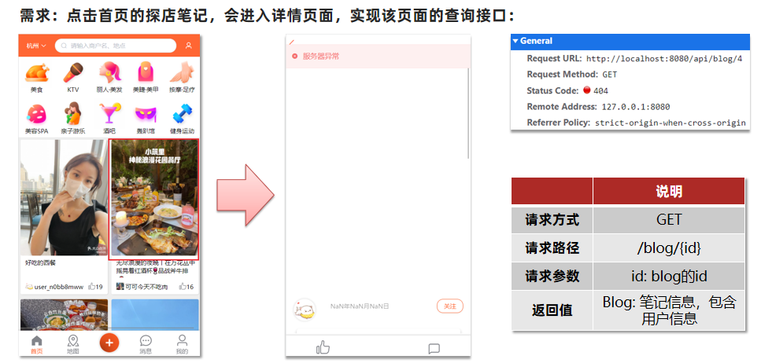

实现代码：

BlogServiceImpl

```java
@Override
public Result queryBlogById(Long id) {
    // 1.查询blog
    Blog blog = getById(id);
    if (blog == null) {
        return Result.fail("笔记不存在！");
    }
    // 2.查询blog有关的用户
    queryBlogUser(blog);
  
    return Result.ok(blog);
}
```

### 8.3 达人探店-点赞功能

初始代码

```java
@GetMapping("/likes/{id}")
public Result queryBlogLikes(@PathVariable("id") Long id) {
    //修改点赞数量
    blogService.update().setSql("liked = liked +1 ").eq("id",id).update();
    return Result.ok();
}
```

问题分析：这种方式会导致一个用户无限点赞，明显是不合理的

造成这个问题的原因是，我们现在的逻辑，发起请求只是给数据库+1，所以才会出现这个问题


完善点赞功能

需求：

* 同一个用户只能点赞一次，再次点击则取消点赞
* 如果当前用户已经点赞，则点赞按钮高亮显示（前端已实现，判断字段Blog类的isLike属性）

实现步骤：

* 给Blog类中添加一个isLike字段，标示是否被当前用户点赞
* 修改点赞功能，利用Redis的set集合判断是否点赞过，未点赞过则点赞数+1，已点赞过则点赞数-1
* 修改根据id查询Blog的业务，判断当前登录用户是否点赞过，赋值给isLike字段
* 修改分页查询Blog业务，判断当前登录用户是否点赞过，赋值给isLike字段

为什么采用set集合：

因为我们的数据是不能重复的，当用户操作过之后，无论他怎么操作，都是

具体步骤：

1、在Blog 添加一个字段

```java
@TableField(exist = false)
private Boolean isLike;
```

2、修改代码

```java
 @Override
    public Result likeBlog(Long id){
        // 1.获取登录用户
        Long userId = UserHolder.getUser().getId();
        // 2.判断当前登录用户是否已经点赞
        String key = BLOG_LIKED_KEY + id;
        Boolean isMember = stringRedisTemplate.opsForSet().isMember(key, userId.toString());
        if(BooleanUtil.isFalse(isMember)){
             //3.如果未点赞，可以点赞
            //3.1 数据库点赞数+1
            boolean isSuccess = update().setSql("liked = liked + 1").eq("id", id).update();
            //3.2 保存用户到Redis的set集合
            if(isSuccess){
                stringRedisTemplate.opsForSet().add(key,userId.toString());
            }
        }else{
             //4.如果已点赞，取消点赞
            //4.1 数据库点赞数-1
            boolean isSuccess = update().setSql("liked = liked - 1").eq("id", id).update();
            //4.2 把用户从Redis的set集合移除
            if(isSuccess){
                stringRedisTemplate.opsForSet().remove(key,userId.toString());
            }
        }
```

### 8.4 达人探店-点赞排行榜

在探店笔记的详情页面，应该把给该笔记点赞的人显示出来，比如最早点赞的TOP5，形成点赞排行榜：

之前的点赞是放到set集合，但是set集合是不能排序的，所以这个时候，咱们可以采用一个可以排序的set集合，就是咱们的sortedSet


我们接下来来对比一下这些集合的区别是什么

所有点赞的人，需要是唯一的，所以我们应当使用set或者是sortedSet

其次我们需要排序，就可以直接锁定使用sortedSet啦


修改代码

BlogServiceImpl

点赞逻辑代码

```java
   @Override
    public Result likeBlog(Long id) {
        // 1.获取登录用户
        Long userId = UserHolder.getUser().getId();
        // 2.判断当前登录用户是否已经点赞
        String key = BLOG_LIKED_KEY + id;
        Double score = stringRedisTemplate.opsForZSet().score(key, userId.toString());
        if (score == null) {
            // 3.如果未点赞，可以点赞
            // 3.1.数据库点赞数 + 1
            boolean isSuccess = update().setSql("liked = liked + 1").eq("id", id).update();
            // 3.2.保存用户到Redis的set集合  zadd key value score
            if (isSuccess) {
                stringRedisTemplate.opsForZSet().add(key, userId.toString(), System.currentTimeMillis());
            }
        } else {
            // 4.如果已点赞，取消点赞
            // 4.1.数据库点赞数 -1
            boolean isSuccess = update().setSql("liked = liked - 1").eq("id", id).update();
            // 4.2.把用户从Redis的set集合移除
            if (isSuccess) {
                stringRedisTemplate.opsForZSet().remove(key, userId.toString());
            }
        }
        return Result.ok();
    }


    private void isBlogLiked(Blog blog) {
        // 1.获取登录用户
        UserDTO user = UserHolder.getUser();
        if (user == null) {
            // 用户未登录，无需查询是否点赞
            return;
        }
        Long userId = user.getId();
        // 2.判断当前登录用户是否已经点赞
        String key = "blog:liked:" + blog.getId();
        Double score = stringRedisTemplate.opsForZSet().score(key, userId.toString());
        blog.setIsLike(score != null);
    }
```

点赞列表查询列表

BlogController

```java
@GetMapping("/likes/{id}")
public Result queryBlogLikes(@PathVariable("id") Long id) {

    return blogService.queryBlogLikes(id);
}
```

BlogService

```java
@Override
public Result queryBlogLikes(Long id) {
    String key = BLOG_LIKED_KEY + id;
    // 1.查询top5的点赞用户 zrange key 0 4
    Set<String> top5 = stringRedisTemplate.opsForZSet().range(key, 0, 4);
    if (top5 == null || top5.isEmpty()) {
        return Result.ok(Collections.emptyList());
    }
    // 2.解析出其中的用户id
    List<Long> ids = top5.stream().map(Long::valueOf).collect(Collectors.toList());
    String idStr = StrUtil.join(",", ids);
    // 3.根据用户id查询用户 WHERE id IN ( 5 , 1 ) ORDER BY FIELD(id, 5, 1)
    List<UserDTO> userDTOS = userService.query()
            .in("id", ids).last("ORDER BY FIELD(id," + idStr + ")").list()
            .stream()
            .map(user -> BeanUtil.copyProperties(user, UserDTO.class))
            .collect(Collectors.toList());
    // 4.返回
    return Result.ok(userDTOS);
}
```

## 9、好友关注

### 9.1 好友关注-关注和取消关注

针对用户的操作：可以对用户进行关注和取消关注功能。


实现思路：

需求：基于该表数据结构，实现两个接口：

* 关注和取关接口
* 判断是否关注的接口

关注是User之间的关系，是博主与粉丝的关系，数据库中有一张tb_follow表来标示：


注意: 这里需要把主键修改为自增长，简化开发。

FollowController

```java
//关注
@PutMapping("/{id}/{isFollow}")
public Result follow(@PathVariable("id") Long followUserId, @PathVariable("isFollow") Boolean isFollow) {
    return followService.follow(followUserId, isFollow);
}
//取消关注
@GetMapping("/or/not/{id}")
public Result isFollow(@PathVariable("id") Long followUserId) {
      return followService.isFollow(followUserId);
}
```

FollowService

```java
取消关注service
@Override
public Result isFollow(Long followUserId) {
        // 1.获取登录用户
        Long userId = UserHolder.getUser().getId();
        // 2.查询是否关注 select count(*) from tb_follow where user_id = ? and follow_user_id = ?
        Integer count = query().eq("user_id", userId).eq("follow_user_id", followUserId).count();
        // 3.判断
        return Result.ok(count > 0);
    }

 关注service
 @Override
    public Result follow(Long followUserId, Boolean isFollow) {
        // 1.获取登录用户
        Long userId = UserHolder.getUser().getId();
        String key = "follows:" + userId;
        // 1.判断到底是关注还是取关
        if (isFollow) {
            // 2.关注，新增数据
            Follow follow = new Follow();
            follow.setUserId(userId);
            follow.setFollowUserId(followUserId);
            boolean isSuccess = save(follow);

        } else {
            // 3.取关，删除 delete from tb_follow where user_id = ? and follow_user_id = ?
            remove(new QueryWrapper<Follow>()
                    .eq("user_id", userId).eq("follow_user_id", followUserId));

        }
        return Result.ok();
    }
```

### 9.2 好友关注-共同关注

想要去看共同关注的好友，需要首先进入到这个页面，这个页面会发起两个请求

1、去查询用户的详情

2、去查询用户的笔记

以上两个功能和共同关注没有什么关系，大家可以自行将笔记中的代码拷贝到idea中就可以实现这两个功能了，我们的重点在于共同关注功能。


```java
// UserController 根据id查询用户
@GetMapping("/{id}")
public Result queryUserById(@PathVariable("id") Long userId){
	// 查询详情
	User user = userService.getById(userId);
	if (user == null) {
		return Result.ok();
	}
	UserDTO userDTO = BeanUtil.copyProperties(user, UserDTO.class);
	// 返回
	return Result.ok(userDTO);
}

// BlogController  根据id查询博主的探店笔记
@GetMapping("/of/user")
public Result queryBlogByUserId(
		@RequestParam(value = "current", defaultValue = "1") Integer current,
		@RequestParam("id") Long id) {
	// 根据用户查询
	Page<Blog> page = blogService.query()
			.eq("user_id", id).page(new Page<>(current, SystemConstants.MAX_PAGE_SIZE));
	// 获取当前页数据
	List<Blog> records = page.getRecords();
	return Result.ok(records);
}
```

接下来我们来看看共同关注如何实现：

需求：利用Redis中恰当的数据结构，实现共同关注功能。在博主个人页面展示出当前用户与博主的共同关注呢。

当然是使用我们之前学习过的set集合咯，在set集合中，有交集并集补集的api，我们可以把两人的关注的人分别放入到一个set集合中，然后再通过api去查看这两个set集合中的交集数据。


我们先来改造当前的关注列表

改造原因是因为我们需要在用户关注了某位用户后，需要将数据放入到set集合中，方便后续进行共同关注，同时当取消关注时，也需要从set集合中进行删除

FollowServiceImpl

```java
@Override
public Result follow(Long followUserId, Boolean isFollow) {
    // 1.获取登录用户
    Long userId = UserHolder.getUser().getId();
    String key = "follows:" + userId;
    // 1.判断到底是关注还是取关
    if (isFollow) {
        // 2.关注，新增数据
        Follow follow = new Follow();
        follow.setUserId(userId);
        follow.setFollowUserId(followUserId);
        boolean isSuccess = save(follow);
        if (isSuccess) {
            // 把关注用户的id，放入redis的set集合 sadd userId followerUserId
            stringRedisTemplate.opsForSet().add(key, followUserId.toString());
        }
    } else {
        // 3.取关，删除 delete from tb_follow where user_id = ? and follow_user_id = ?
        boolean isSuccess = remove(new QueryWrapper<Follow>()
                .eq("user_id", userId).eq("follow_user_id", followUserId));
        if (isSuccess) {
            // 把关注用户的id从Redis集合中移除
            stringRedisTemplate.opsForSet().remove(key, followUserId.toString());
        }
    }
    return Result.ok();
}
```

**具体的关注代码：**

FollowServiceImpl

```java
@Override
public Result followCommons(Long id) {
    // 1.获取当前用户
    Long userId = UserHolder.getUser().getId();
    String key = "follows:" + userId;
    // 2.求交集
    String key2 = "follows:" + id;
    Set<String> intersect = stringRedisTemplate.opsForSet().intersect(key, key2);
    if (intersect == null || intersect.isEmpty()) {
        // 无交集
        return Result.ok(Collections.emptyList());
    }
    // 3.解析id集合
    List<Long> ids = intersect.stream().map(Long::valueOf).collect(Collectors.toList());
    // 4.查询用户
    List<UserDTO> users = userService.listByIds(ids)
            .stream()
            .map(user -> BeanUtil.copyProperties(user, UserDTO.class))
            .collect(Collectors.toList());
    return Result.ok(users);
}
```

### 9.3 好友关注-Feed流实现方案

当我们关注了用户后，这个用户发了动态，那么我们应该把这些数据推送给用户，这个需求，其实我们又把他叫做Feed流，关注推送也叫做Feed流，直译为投喂。为用户持续的提供“沉浸式”的体验，通过无限下拉刷新获取新的信息。

对于传统的模式的内容解锁：我们是需要用户去通过搜索引擎或者是其他的方式去解锁想要看的内容


对于新型的Feed流的的效果：不需要我们用户再去推送信息，而是系统分析用户到底想要什么，然后直接把内容推送给用户，从而使用户能够更加的节约时间，不用主动去寻找。


Feed流的实现有两种模式：

Feed流产品有两种常见模式：
Timeline：不做内容筛选，简单的按照内容发布时间排序，常用于好友或关注。例如朋友圈

* 优点：信息全面，不会有缺失。并且实现也相对简单
* 缺点：信息噪音较多，用户不一定感兴趣，内容获取效率低

智能排序：利用智能算法屏蔽掉违规的、用户不感兴趣的内容。推送用户感兴趣信息来吸引用户

* 优点：投喂用户感兴趣信息，用户粘度很高，容易沉迷
* 缺点：如果算法不精准，可能起到反作用
  本例中的个人页面，是基于关注的好友来做Feed流，因此采用Timeline的模式。该模式的实现方案有三种：

我们本次针对好友的操作，采用的就是Timeline的方式，只需要拿到我们关注用户的信息，然后按照时间排序即可

，因此采用Timeline的模式。该模式的实现方案有三种：

* 拉模式
* 推模式
* 推拉结合

**拉模式**：也叫做读扩散

该模式的核心含义就是：当张三和李四和王五发了消息后，都会保存在自己的邮箱中，假设赵六要读取信息，那么他会从读取他自己的收件箱，此时系统会从他关注的人群中，把他关注人的信息全部都进行拉取，然后在进行排序

优点：比较节约空间，因为赵六在读信息时，并没有重复读取，而且读取完之后可以把他的收件箱进行清楚。

缺点：比较延迟，当用户读取数据时才去关注的人里边去读取数据，假设用户关注了大量的用户，那么此时就会拉取海量的内容，对服务器压力巨大。


**推模式**：也叫做写扩散。

推模式是没有写邮箱的，当张三写了一个内容，此时会主动的把张三写的内容发送到他的粉丝收件箱中去，假设此时李四再来读取，就不用再去临时拉取了

优点：时效快，不用临时拉取

缺点：内存压力大，假设一个大V写信息，很多人关注他， 就会写很多分数据到粉丝那边去


**推拉结合模式**：也叫做读写混合，兼具推和拉两种模式的优点。

推拉模式是一个折中的方案，站在发件人这一段，如果是个普通的人，那么我们采用写扩散的方式，直接把数据写入到他的粉丝中去，因为普通的人他的粉丝关注量比较小，所以这样做没有压力，如果是大V，那么他是直接将数据先写入到一份到发件箱里边去，然后再直接写一份到活跃粉丝收件箱里边去，现在站在收件人这端来看，如果是活跃粉丝，那么大V和普通的人发的都会直接写入到自己收件箱里边来，而如果是普通的粉丝，由于他们上线不是很频繁，所以等他们上线时，再从发件箱里边去拉信息。


### 9.4 好友关注-推送到粉丝收件箱

需求：

* 修改新增探店笔记的业务，在保存blog到数据库的同时，推送到粉丝的收件箱
* 收件箱满足可以根据时间戳排序，必须用Redis的数据结构实现
* 查询收件箱数据时，可以实现分页查询

Feed流中的数据会不断更新，所以数据的角标也在变化，因此不能采用传统的分页模式。

传统了分页在feed流是不适用的，因为我们的数据会随时发生变化

假设在t1 时刻，我们去读取第一页，此时page = 1 ，size = 5 ，那么我们拿到的就是10~6 这几条记录，假设现在t2时候又发布了一条记录，此时t3 时刻，我们来读取第二页，读取第二页传入的参数是page=2 ，size=5 ，那么此时读取到的第二页实际上是从6 开始，然后是6~2 ，那么我们就读取到了重复的数据，所以feed流的分页，不能采用原始方案来做。


Feed流的滚动分页

我们需要记录每次操作的最后一条，然后从这个位置开始去读取数据

举个例子：我们从t1时刻开始，拿第一页数据，拿到了10~6，然后记录下当前最后一次拿取的记录，就是6，t2时刻发布了新的记录，此时这个11放到最顶上，但是不会影响我们之前记录的6，此时t3时刻来拿第二页，第二页这个时候拿数据，还是从6后一点的5去拿，就拿到了5-1的记录。我们这个地方可以采用sortedSet来做，可以进行范围查询，并且还可以记录当前获取数据时间戳最小值，就可以实现滚动分页了


核心的意思：就是我们在保存完探店笔记后，获得到当前笔记的粉丝，然后把数据推送到粉丝的redis中去。

```java
@Override
public Result saveBlog(Blog blog) {
    // 1.获取登录用户
    UserDTO user = UserHolder.getUser();
    blog.setUserId(user.getId());
    // 2.保存探店笔记
    boolean isSuccess = save(blog);
    if(!isSuccess){
        return Result.fail("新增笔记失败!");
    }
    // 3.查询笔记作者的所有粉丝 select * from tb_follow where follow_user_id = ?
    List<Follow> follows = followService.query().eq("follow_user_id", user.getId()).list();
    // 4.推送笔记id给所有粉丝
    for (Follow follow : follows) {
        // 4.1.获取粉丝id
        Long userId = follow.getUserId();
        // 4.2.推送
        String key = FEED_KEY + userId;
        stringRedisTemplate.opsForZSet().add(key, blog.getId().toString(), System.currentTimeMillis());
    }
    // 5.返回id
    return Result.ok(blog.getId());
}
```

### 9.5好友关注-实现分页查询收邮箱

需求：在个人主页的“关注”卡片中，查询并展示推送的Blog信息：

具体操作如下：

1、每次查询完成后，我们要分析出查询出数据的最小时间戳，这个值会作为下一次查询的条件

2、我们需要找到与上一次查询相同的查询个数作为偏移量，下次查询时，跳过这些查询过的数据，拿到我们需要的数据

综上：我们的请求参数中就需要携带 lastId：上一次查询的最小时间戳 和偏移量这两个参数。

这两个参数第一次会由前端来指定，以后的查询就根据后台结果作为条件，再次传递到后台。


一、定义出来具体的返回值实体类

```java
@Data
public class ScrollResult {
    private List<?> list;
    private Long minTime;
    private Integer offset;
}
```

BlogController

注意：RequestParam 表示接受url地址栏传参的注解，当方法上参数的名称和url地址栏不相同时，可以通过RequestParam 来进行指定

```java
@GetMapping("/of/follow")
public Result queryBlogOfFollow(
    @RequestParam("lastId") Long max, @RequestParam(value = "offset", defaultValue = "0") Integer offset){
    return blogService.queryBlogOfFollow(max, offset);
}
```

BlogServiceImpl

```java
@Override
public Result queryBlogOfFollow(Long max, Integer offset) {
    // 1.获取当前用户
    Long userId = UserHolder.getUser().getId();
    // 2.查询收件箱 ZREVRANGEBYSCORE key Max Min LIMIT offset count
    String key = FEED_KEY + userId;
    Set<ZSetOperations.TypedTuple<String>> typedTuples = stringRedisTemplate.opsForZSet()
        .reverseRangeByScoreWithScores(key, 0, max, offset, 2);
    // 3.非空判断
    if (typedTuples == null || typedTuples.isEmpty()) {
        return Result.ok();
    }
    // 4.解析数据：blogId、minTime（时间戳）、offset
    List<Long> ids = new ArrayList<>(typedTuples.size());
    long minTime = 0; // 2
    int os = 1; // 2
    for (ZSetOperations.TypedTuple<String> tuple : typedTuples) { // 5 4 4 2 2
        // 4.1.获取id
        ids.add(Long.valueOf(tuple.getValue()));
        // 4.2.获取分数(时间戳）
        long time = tuple.getScore().longValue();
        if(time == minTime){
            os++;
        }else{
            minTime = time;
            os = 1;
        }
    }
	os = minTime == max ? os : os + offset;
    // 5.根据id查询blog
    String idStr = StrUtil.join(",", ids);
    List<Blog> blogs = query().in("id", ids).last("ORDER BY FIELD(id," + idStr + ")").list();

    for (Blog blog : blogs) {
        // 5.1.查询blog有关的用户
        queryBlogUser(blog);
        // 5.2.查询blog是否被点赞
        isBlogLiked(blog);
    }

    // 6.封装并返回
    ScrollResult r = new ScrollResult();
    r.setList(blogs);
    r.setOffset(os);
    r.setMinTime(minTime);

    return Result.ok(r);
}
```

## 10、附近商户

### 10.1、附近商户-GEO数据结构的基本用法

GEO就是Geolocation的简写形式，代表地理坐标。Redis在3.2版本中加入了对GEO的支持，允许存储地理坐标信息，帮助我们根据经纬度来检索数据。常见的命令有：

* GEOADD：添加一个地理空间信息，包含：经度（longitude）、纬度（latitude）、值（member）
* GEODIST：计算指定的两个点之间的距离并返回
* GEOHASH：将指定member的坐标转为hash字符串形式并返回
* GEOPOS：返回指定member的坐标
* GEORADIUS：指定圆心、半径，找到该圆内包含的所有member，并按照与圆心之间的距离排序后返回。6.以后已废弃
* GEOSEARCH：在指定范围内搜索member，并按照与指定点之间的距离排序后返回。范围可以是圆形或矩形。6.2.新功能
* GEOSEARCHSTORE：与GEOSEARCH功能一致，不过可以把结果存储到一个指定的key。 6.2.新功能

### 10.2、 附近商户-导入店铺数据到GEO

具体场景说明：


当我们点击美食之后，会出现一系列的商家，商家中可以按照多种排序方式，我们此时关注的是距离，这个地方就需要使用到我们的GEO，向后台传入当前app收集的地址(我们此处是写死的) ，以当前坐标作为圆心，同时绑定相同的店家类型type，以及分页信息，把这几个条件传入后台，后台查询出对应的数据再返回。


我们要做的事情是：将数据库表中的数据导入到redis中去，redis中的GEO，GEO在redis中就一个menber和一个经纬度，我们把x和y轴传入到redis做的经纬度位置去，但我们不能把所有的数据都放入到menber中去，毕竟作为redis是一个内存级数据库，如果存海量数据，redis还是力不从心，所以我们在这个地方存储他的id即可。

但是这个时候还有一个问题，就是在redis中并没有存储type，所以我们无法根据type来对数据进行筛选，所以我们可以按照商户类型做分组，类型相同的商户作为同一组，以typeId为key存入同一个GEO集合中即可

代码

HmDianPingApplicationTests

```java
@Test
void loadShopData() {
    // 1.查询店铺信息
    List<Shop> list = shopService.list();
    // 2.把店铺分组，按照typeId分组，typeId一致的放到一个集合
    Map<Long, List<Shop>> map = list.stream().collect(Collectors.groupingBy(Shop::getTypeId));
    // 3.分批完成写入Redis
    for (Map.Entry<Long, List<Shop>> entry : map.entrySet()) {
        // 3.1.获取类型id
        Long typeId = entry.getKey();
        String key = SHOP_GEO_KEY + typeId;
        // 3.2.获取同类型的店铺的集合
        List<Shop> value = entry.getValue();
        List<RedisGeoCommands.GeoLocation<String>> locations = new ArrayList<>(value.size());
        // 3.3.写入redis GEOADD key 经度 纬度 member
        for (Shop shop : value) {
            // stringRedisTemplate.opsForGeo().add(key, new Point(shop.getX(), shop.getY()), shop.getId().toString());
            locations.add(new RedisGeoCommands.GeoLocation<>(
                    shop.getId().toString(),
                    new Point(shop.getX(), shop.getY())
            ));
        }
        stringRedisTemplate.opsForGeo().add(key, locations);
    }
}
```

### 10.3 附近商户-实现附近商户功能

SpringDataRedis的2.3.9版本并不支持Redis 6.2提供的GEOSEARCH命令，因此我们需要提示其版本，修改自己的POM

第一步：导入pom

```java
<dependency>
    <groupId>org.springframework.boot</groupId>
    <artifactId>spring-boot-starter-data-redis</artifactId>
    <exclusions>
        <exclusion>
            <artifactId>spring-data-redis</artifactId>
            <groupId>org.springframework.data</groupId>
        </exclusion>
        <exclusion>
            <artifactId>lettuce-core</artifactId>
            <groupId>io.lettuce</groupId>
        </exclusion>
    </exclusions>
</dependency>
<dependency>
    <groupId>org.springframework.data</groupId>
    <artifactId>spring-data-redis</artifactId>
    <version>2.6.2</version>
</dependency>
<dependency>
    <groupId>io.lettuce</groupId>
    <artifactId>lettuce-core</artifactId>
    <version>6.1.6.RELEASE</version>
</dependency>
```

第二步：

ShopController

```java
@GetMapping("/of/type")
public Result queryShopByType(
        @RequestParam("typeId") Integer typeId,
        @RequestParam(value = "current", defaultValue = "1") Integer current,
        @RequestParam(value = "x", required = false) Double x,
        @RequestParam(value = "y", required = false) Double y
) {
   return shopService.queryShopByType(typeId, current, x, y);
}
```

ShopServiceImpl

```java
@Override
    public Result queryShopByType(Integer typeId, Integer current, Double x, Double y) {
        // 1.判断是否需要根据坐标查询
        if (x == null || y == null) {
            // 不需要坐标查询，按数据库查询
            Page<Shop> page = query()
                    .eq("type_id", typeId)
                    .page(new Page<>(current, SystemConstants.DEFAULT_PAGE_SIZE));
            // 返回数据
            return Result.ok(page.getRecords());
        }

        // 2.计算分页参数
        int from = (current - 1) * SystemConstants.DEFAULT_PAGE_SIZE;
        int end = current * SystemConstants.DEFAULT_PAGE_SIZE;

        // 3.查询redis、按照距离排序、分页。结果：shopId、distance
        String key = SHOP_GEO_KEY + typeId;
        GeoResults<RedisGeoCommands.GeoLocation<String>> results = stringRedisTemplate.opsForGeo() // GEOSEARCH key BYLONLAT x y BYRADIUS 10 WITHDISTANCE
                .search(
                        key,
                        GeoReference.fromCoordinate(x, y),
                        new Distance(5000),
                        RedisGeoCommands.GeoSearchCommandArgs.newGeoSearchArgs().includeDistance().limit(end)
                );
        // 4.解析出id
        if (results == null) {
            return Result.ok(Collections.emptyList());
        }
        List<GeoResult<RedisGeoCommands.GeoLocation<String>>> list = results.getContent();
        if (list.size() <= from) {
            // 没有下一页了，结束
            return Result.ok(Collections.emptyList());
        }
        // 4.1.截取 from ~ end的部分
        List<Long> ids = new ArrayList<>(list.size());
        Map<String, Distance> distanceMap = new HashMap<>(list.size());
        list.stream().skip(from).forEach(result -> {
            // 4.2.获取店铺id
            String shopIdStr = result.getContent().getName();
            ids.add(Long.valueOf(shopIdStr));
            // 4.3.获取距离
            Distance distance = result.getDistance();
            distanceMap.put(shopIdStr, distance);
        });
        // 5.根据id查询Shop
        String idStr = StrUtil.join(",", ids);
        List<Shop> shops = query().in("id", ids).last("ORDER BY FIELD(id," + idStr + ")").list();
        for (Shop shop : shops) {
            shop.setDistance(distanceMap.get(shop.getId().toString()).getValue());
        }
        // 6.返回
        return Result.ok(shops);
    }
```


## 11、用户签到

#### 11.1、用户签到-BitMap功能演示

我们针对签到功能完全可以通过mysql来完成，比如说以下这张表


用户一次签到，就是一条记录，假如有1000万用户，平均每人每年签到次数为10次，则这张表一年的数据量为 1亿条

每签到一次需要使用（8 + 8 + 1 + 1 + 3 + 1）共22 字节的内存，一个月则最多需要600多字节

我们如何能够简化一点呢？其实可以考虑小时候一个挺常见的方案，就是小时候，咱们准备一张小小的卡片，你只要签到就打上一个勾，我最后判断你是否签到，其实只需要到小卡片上看一看就知道了

我们可以采用类似这样的方案来实现我们的签到需求。

我们按月来统计用户签到信息，签到记录为1，未签到则记录为0.

把每一个bit位对应当月的每一天，形成了映射关系。用0和1标示业务状态，这种思路就称为位图（BitMap）。这样我们就用极小的空间，来实现了大量数据的表示

Redis中是利用string类型数据结构实现BitMap，因此最大上限是512M，转换为bit则是 2^32个bit位。


BitMap的操作命令有：

* SETBIT：向指定位置（offset）存入一个0或1
* GETBIT ：获取指定位置（offset）的bit值
* BITCOUNT ：统计BitMap中值为1的bit位的数量
* BITFIELD ：操作（查询、修改、自增）BitMap中bit数组中的指定位置（offset）的值
* BITFIELD_RO ：获取BitMap中bit数组，并以十进制形式返回
* BITOP ：将多个BitMap的结果做位运算（与 、或、异或）
* BITPOS ：查找bit数组中指定范围内第一个0或1出现的位置

#### 11.2 、用户签到-实现签到功能

需求：实现签到接口，将当前用户当天签到信息保存到Redis中

思路：我们可以把年和月作为bitMap的key，然后保存到一个bitMap中，每次签到就到对应的位上把数字从0变成1，只要对应是1，就表明说明这一天已经签到了，反之则没有签到。

我们通过接口文档发现，此接口并没有传递任何的参数，没有参数怎么确实是哪一天签到呢？这个很容易，可以通过后台代码直接获取即可，然后到对应的地址上去修改bitMap。


**代码**

UserController

```java
 @PostMapping("/sign")
 public Result sign(){
    return userService.sign();
 }
```

UserServiceImpl

```java
@Override
public Result sign() {
    // 1.获取当前登录用户
    Long userId = UserHolder.getUser().getId();
    // 2.获取日期
    LocalDateTime now = LocalDateTime.now();
    // 3.拼接key
    String keySuffix = now.format(DateTimeFormatter.ofPattern(":yyyyMM"));
    String key = USER_SIGN_KEY + userId + keySuffix;
    // 4.获取今天是本月的第几天
    int dayOfMonth = now.getDayOfMonth();
    // 5.写入Redis SETBIT key offset 1
    stringRedisTemplate.opsForValue().setBit(key, dayOfMonth - 1, true);
    return Result.ok();
}
```

#### 11.3 用户签到-签到统计

**问题1：**什么叫做连续签到天数？
从最后一次签到开始向前统计，直到遇到第一次未签到为止，计算总的签到次数，就是连续签到天数。


Java逻辑代码：获得当前这个月的最后一次签到数据，定义一个计数器，然后不停的向前统计，直到获得第一个非0的数字即可，每得到一个非0的数字计数器+1，直到遍历完所有的数据，就可以获得当前月的签到总天数了

**问题2：**如何得到本月到今天为止的所有签到数据？

  BITFIELD key GET u[dayOfMonth] 0

假设今天是10号，那么我们就可以从当前月的第一天开始，获得到当前这一天的位数，是10号，那么就是10位，去拿这段时间的数据，就能拿到所有的数据了，那么这10天里边签到了多少次呢？统计有多少个1即可。

**问题3：如何从后向前遍历每个bit位？**

注意：bitMap返回的数据是10进制，哪假如说返回一个数字8，那么我哪儿知道到底哪些是0，哪些是1呢？我们只需要让得到的10进制数字和1做与运算就可以了，因为1只有遇见1 才是1，其他数字都是0 ，我们把签到结果和1进行与操作，每与一次，就把签到结果向右移动一位，依次内推，我们就能完成逐个遍历的效果了。

需求：实现下面接口，统计当前用户截止当前时间在本月的连续签到天数

有用户有时间我们就可以组织出对应的key，此时就能找到这个用户截止这天的所有签到记录，再根据这套算法，就能统计出来他连续签到的次数了


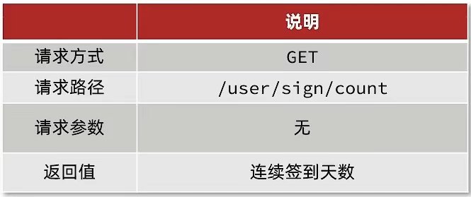

代码

**UserController**

```java
@GetMapping("/sign/count")
public Result signCount(){
    return userService.signCount();
}
```

**UserServiceImpl**

```java
@Override
public Result signCount() {
    // 1.获取当前登录用户
    Long userId = UserHolder.getUser().getId();
    // 2.获取日期
    LocalDateTime now = LocalDateTime.now();
    // 3.拼接key
    String keySuffix = now.format(DateTimeFormatter.ofPattern(":yyyyMM"));
    String key = USER_SIGN_KEY + userId + keySuffix;
    // 4.获取今天是本月的第几天
    int dayOfMonth = now.getDayOfMonth();
    // 5.获取本月截止今天为止的所有的签到记录，返回的是一个十进制的数字 BITFIELD sign:5:202203 GET u14 0
    List<Long> result = stringRedisTemplate.opsForValue().bitField(
            key,
            BitFieldSubCommands.create()
                    .get(BitFieldSubCommands.BitFieldType.unsigned(dayOfMonth)).valueAt(0)
    );
    if (result == null || result.isEmpty()) {
        // 没有任何签到结果
        return Result.ok(0);
    }
    Long num = result.get(0);
    if (num == null || num == 0) {
        return Result.ok(0);
    }
    // 6.循环遍历
    int count = 0;
    while (true) {
        // 6.1.让这个数字与1做与运算，得到数字的最后一个bit位  // 判断这个bit位是否为0
        if ((num & 1) == 0) {
            // 如果为0，说明未签到，结束
            break;
        }else {
            // 如果不为0，说明已签到，计数器+1
            count++;
        }
        // 把数字右移一位，抛弃最后一个bit位，继续下一个bit位
        num >>>= 1;
    }
    return Result.ok(count);
}
```

#### 11.4 额外加餐-关于使用bitmap来解决缓存穿透的方案

回顾**缓存穿透**：

发起了一个数据库不存在的，redis里边也不存在的数据，通常你可以把他看成一个攻击

解决方案：

* 判断id<0

* 如果数据库是空，那么就可以直接往redis里边把这个空数据缓存起来

第一种解决方案：遇到的问题是如果用户访问的是id不存在的数据，则此时就无法生效

第二种解决方案：遇到的问题是：如果是不同的id那就可以防止下次过来直击数据

所以我们如何解决呢？

我们可以将数据库的数据，所对应的id写入到一个list集合中，当用户过来访问的时候，我们直接去判断list中是否包含当前的要查询的数据，如果说用户要查询的id数据并不在list集合中，则直接返回，如果list中包含对应查询的id数据，则说明不是一次缓存穿透数据，则直接放行。


现在的问题是这个主键其实并没有那么短，而是很长的一个 主键

哪怕你单独去提取这个主键，但是在11年左右，淘宝的商品总量就已经超过10亿个

所以如果采用以上方案，这个list也会很大，所以我们可以使用bitmap来减少list的存储空间

我们可以把list数据抽象成一个非常大的bitmap，我们不再使用list，而是将db中的id数据利用哈希思想，比如：

id % bitmap.size  = 算出当前这个id对应应该落在bitmap的哪个索引上，然后将这个值从0变成1，然后当用户来查询数据时，此时已经没有了list，让用户用他查询的id去用相同的哈希算法， 算出来当前这个id应当落在bitmap的哪一位，然后判断这一位是0，还是1，如果是0则表明这一位上的数据一定不存在，  采用这种方式来处理，需要重点考虑一个事情，就是误差率，所谓的误差率就是指当发生哈希冲突的时候，产生的误差。


## 12、UV统计

### 12.1 、UV统计-HyperLogLog

首先我们搞懂两个概念：

* UV：全称Unique Visitor，也叫独立访客量，是指通过互联网访问、浏览这个网页的自然人。1天内同一个用户多次访问该网站，只记录1次。
* PV：全称Page View，也叫页面访问量或点击量，用户每访问网站的一个页面，记录1次PV，用户多次打开页面，则记录多次PV。往往用来衡量网站的流量。

通常来说UV会比PV大很多，所以衡量同一个网站的访问量，我们需要综合考虑很多因素，所以我们只是单纯的把这两个值作为一个参考值

UV统计在服务端做会比较麻烦，因为要判断该用户是否已经统计过了，需要将统计过的用户信息保存。但是如果每个访问的用户都保存到Redis中，数据量会非常恐怖，那怎么处理呢？

Hyperloglog(HLL)是从Loglog算法派生的概率算法，用于确定非常大的集合的基数，而不需要存储其所有值。相关算法原理大家可以参考：https://juejin.cn/post/6844903785744056333#heading-0
Redis中的HLL是基于string结构实现的，单个HLL的内存**永远小于16kb**，**内存占用低**的令人发指！作为代价，其测量结果是概率性的，**有小于0.81％的误差**。不过对于UV统计来说，这完全可以忽略。


### 12.2 UV统计-测试百万数据的统计

测试思路：我们直接利用单元测试，向HyperLogLog中添加100万条数据，看看内存占用和统计效果如何


经过测试：我们会发生他的误差是在允许范围内，并且内存占用极小