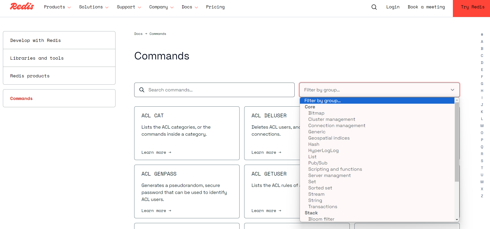
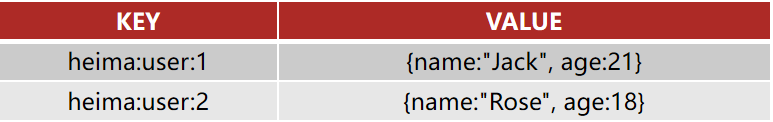
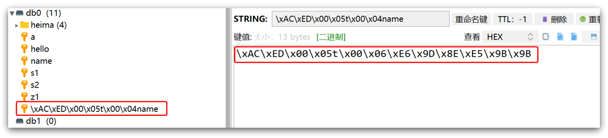

# 基础篇Redis

# 1.redis课程介绍导学

## 一、理想课程

小伙伴们理想的课程一定是能够通过讲解的方式，得到如下这些启发，我们的课程会从基础到精通，从redis小白，到redis大牛，还在等什么，这套课程一定就是你最适合你的课程~


---

# 2.Redis简单介绍

redis是一个键值型的数据库，简单来讲：在redis内存的数据都是键值对（key-value）。

例如用户 `id`、`name`、`age` 将它一个个存，就形成键值对了，只不过基于这样的方式存储，数据显的比较松散，因为这本质是一个用户，我们却将它打散了，因此多数情况下我们并不会直接拆分的去存，而是**将一个用户的多个字段，组装成一个JSON字符串作为value存储**，此时的key就是用户的 `id`，此时它也是一个 `key-value` 接口，只不过这个value变成了一个更长，稍微复杂一点的JSON字符串，但依然是字符串。

当然这里的值除了可以是字符串，还可以是一些其他的复杂的结构，例如有序集合、无序集合、hash表。


因此redis结构是非常丰富的，可以满足我们各种各样的一些需求。

从上面案例可以看出redis这样的一个数据库结构与传统的数据库有比较大的差异，它没有表，也没有约束，存的都是键值对，像这样的库我们有一种称呼，它是一种键值型的**NoSql数据库**。

那么什么是NoSql，它和传统的MySQL传统的关系型数据库有什么差别和联系呢？具体该如何操作这样的库呢？

所以今天我们就以redis这样的NoSql数据库为例去学习一下这一类库。

通过以下三部分的学习，一定能了解NoSql数据库与传统数据库的差别和联系，并且能够使用命令和Java语言客户端的方式去操作redis里面常见的数据结构，实现各种数据的增删改查，也就是能够具备redis日常开发的基本能力了。


----

# 初始Redis

# 3.认识NoSQL

## 一、引入

NoSQL比较陌生，但是与此相对的SQL我们就比较熟悉了，SQL我们将它称之为关系型数据库。

SQL全称：**Structured Query Language**。

**NoSql**可以翻译做Not Only Sql（不仅仅是SQL），或者是No Sql（非Sql的）数据库。不管是哪种翻译它所表达的意思都是：NoSQL相对于传统关系型数据库而言，有很大差异的一种特殊的数据库，因此也称之为**非关系型数据库**。当然也有联系，它们毕竟都属于数据库，数据库最终的目的一定是数据的增删改查，无非是在数据存储的方式上有一些差异，接下来就来对比一下两者在这方面的差异。


---

## 二、结构差异

### 1）SQL

两者的第一个差异体现在 `字母S` 上，`S` 是 `structured` 的缩写，代表的是结构化，存入关系型数据库的数据，都是结构化的数据，即：这些数据都有固定的一些格式要求，这些要求就是我们以前所学的表以及表的约束。

并且表的结构一般是不建议去修改的，最好在项目设计之初就将它定义好，因为以后一旦数据插入的较多，此时修改表中的某个字段，可能带来的影响是非常巨大的，可能会导致这张表被锁很长一段时间不可用，而且因为表跟业务有关联，因此将来表变了，业务有可能也要跟着变，这样带来的影响太大了，所以这是结构化数据带来的一个问题。


---

### 2）NoSQL

与此相对的NoSQL就是一种非结构化数据，它对于数据的结构并没有非常严格的约束，也不是完全没有约束，这个取决于NoSQL的类型，常见NoSQL类型有四种。

#### 第一种：常见的redis这种键值型的

Key是可以自定义的，叫 `id`、`name`、`age` 都可以，这样就相当于将 SQL型数据库中一行数据全部都存下来了。

但是这么存一般不太建议这样做，我们也可以将 `key` 定义为用户的id，值定义为JSON字符串，这种键值型对Key的约束没那么强。

对Value类型同样也可以自定义，它有五种常见的类型，约束相对来讲就会小很多。


---

#### 第二种：文档型

所谓文档型：SQL中的一条数据就对应一个文档，文档存储是JSON风格的。

它与SQL数据库的差异：首先字段是可以任意的，第一条插入 `id name`，第二条完全可以插入别的 `id username` 也是没问题，这样它的字段约束就非常的松散。


---

#### 第三种：图类型的数据库

图类型的数据库：即存储这个数据库的每一个数据都可以看成一个节点。

例如我存进去了一个人的信息，那它就是一个节点。

为什么是节点呢？因为人与人之间会有练习，例如张三是李四的老师，他们两个就是师生关系等。

每个数据都是一个节点，节点与节点间有联系，这种就叫做图。


当然这种用的比较少，因为我们一般不做一些社交的app。

---

### 3）总结

以上是三种常见的数据库，不管是哪种，它们的数据结构其实都没有严格的要求，相对来讲比较松散，并且将来去修改数据结构也是可以的，例如一条数据增加字段和减少，影响都是比较小的。

----

## 三、关联和非关联

当然除了数据有结构上的要求以外，关系型数据库之所以叫关系，那就是数据与数据之间往往是有关联的。

### 1）SQL

例如下图，有 `user表`、`item商品表`，它们两个本身是没有关系的，但如果来了张订单表，订单表就需要记录是谁下了单（用户id），还要记录下单买了什么商品（商品id），这个时候关系就建立起来了。

`order表` 里面记录了`用户的id`，此时`用户id`就可以理解成是一个外键，它关联到了用户表里面的id。

`商品id` 对应到的就是商品表中的 `id`，也是一个外键，关联了 `商品表` 中的数据。

这样就知道了：`张三` 买了 `荣耀6` 商品。

此时表和表之间的关系就通过外键建立起来了，这种外键关系一旦建立，假设将来要删除一个用户，或者删除一个商品，它就不允许你这么做，因为它会觉得这个商品在其他表中有关联，所以数据库就会去维护这些关系。

并且这种关联有一个好处：节省数据存储空间，订单中关联了用户，此时并不是将用户信息完整的保存在这里，而是只关联一个id就行了。


---

### 2）NoSQL

而非关系型数据库不存在关联关系，要维护关系要么靠代码中的业务逻辑，要么靠数据之间的耦合：

```json
{
    id: 1,
    name: "张三",
    orders: [
        {
            id: 1,
            item: {
                id: 10, title: "荣耀6", price: 4999
            }
        },
        {
            id: 2,
            item: {
                id: 20, title: "小米11", price: 3999
            }
        }
    ]
}
```

此处要维护“张三”的订单与商品“荣耀6”和“小米11”的关系，通过JSON嵌套的方式将这两个商品保存在张三的订单文档中。

并且这样存储数据有一个缺点：重复。张三买了荣耀6，李四也可以买，这样文档就需要存储多份了。

有人问：为什么你不像刚刚那样，记录的商品信息也只记录一个 `id`，然后单独再来存一个文档用来存储商品，这样它俩不就有关系了。

这样做也行，但是**这个关系就需要靠程序员通过业务逻辑来维护**了，因为数据库本身不会帮你维护表和表之间的关联。

---

## 四、查询差异

**传统关系型数据库会基于Sql语句做查询，语法有统一标准。**

**语法固定的好处**：只要是关系型数据库，都能使用相同的语句进行查询，不管你是MySQL数据库、Oracle数据库、还是其他的数据库，**都可以使用相同的语句进行查询**。


---

相对应的NoSQL库它的查询是非SQL，也就是说没有这样的固定的语法，格式不统一。而不同的非关系数据库查询语法差异极大，五花八门各种各样，例如下图三种NoSQL库：

- `redis`：根据键值对查询
- `MongoDB`：看起来调用了一个函数，`db` 代表数据库，`users` 代表表，`find()` 代表找，即找id为1的用户
- `elasticsearch`：变成了一种Restful的请求，`users` 代表库，`1` 代表 `id` 为1


这种方式调用的优点：redis调用直接用一个命令就行了，非常的简单。

`MongoDB` 是基于一种函数形式的调用，这种对程序员来讲相对比较熟悉。

因此它们这些风格使用起来相对简单，没有复杂的语法需要去学习。但是缺点就是不统一，每一个不同的库要学不同的语法。

---

## 五、事务差别

传统关系型数据库能满足事务ACID的原则。

而非关系型数据库往往不支持事务，或者不能严格保证ACID的特性，因此我们将它称之为BASE，即基本的一种满足。

对于BASE理论大家有兴趣也可以自己研究一下。

----

## 总结

除了上述四点以外，在存储方式.扩展性.查询性能上关系型与非关系型也都有着显著差异，总结如下：

- 存储方式
  - 关系型数据库基于磁盘进行存储，会有大量的磁盘IO，对性能有一定影响
  - 非关系型数据库，他们的操作更多的是依赖于内存来操作，内存的读写速度会非常快，性能自然会好一些

* 扩展性
  * 关系型数据库集群模式一般是主从，主从数据一致，起到数据备份的作用，称为垂直扩展。
  * 非关系型数据库可以将数据拆分，存储在不同机器上，可以保存海量数据，解决内存大小有限的问题。称为水平扩展。
  * 关系型数据库因为表之间存在关联关系，如果做水平扩展会给数据查询带来很多麻烦

**垂直方式**：关系型数据库在设计数据库之初，可能就没有考虑到这种分布式的需求，所以当我们去存储数据到关系型数据库的时候，它都是存储在本机，影响它性能就是本机这台机器的服务器的性能，你只能提升这个机器的性能，从而来提升它的能力。虽然MySQL是支持主从的，但是主从仅仅是提升了机器的数量、读写的性能，但是并不能提升数据存储的量，因为主和从存储数据是一样的，数据存储的总量没有变，只不过是做了备份而已。

**水平方式**：与此对应的NoSQL数据库，无论是redis也好，还是elasticsearch，它在设计之初就已经考虑到了数据拆分的一个需求，因为它们在插入数据的时候，往往会基于数据的id，或者是一个唯一的标识去做哈希运算，根据哈希运算的结果去判断这个数据到底应该存储在哪个不同的节点上，从而实现数据的拆分，天然的就支持这种水平的扩展。因此NoSQL库在扩展的时候是非常轻松的就能实现了。

虽然MySQL不支持扩展，但是也可以基于第三方的组件去实现数据库的分库，但是一旦引入了第三方的组件，肯定会对性能造成一定影响，并且在开发的时候需要考虑都的问题需要更多，复杂度就增加了。不想redis等NoSQL，它们天然的支持，对开发难度、性能都不会有特别大的影响，所以会更好一点。

两种库一般结合使用，各有各的优点，因此在实际开发中需要根据自己的需求去选择。


----

# 4.认识Redis

Redis诞生于2009年全称是 **Re**mote  **D**ictionary **S**erver （远程词典服务器），是一个基于内存的键值型NoSQL数据库。

为什么是词典服务呢？之前也介绍过，redis是一个键值型的数据库，我们根据Key找value，这不就跟词典很像。

下图就是开发redis的作者，它的名字比较长，也比较绕口，因此在网络上也被成为 `ANTIREZ` 这个名字。

最早的时候他跟他的小伙伴一起开发了一个网站，这个网站刚开始用户量还比较少，所以基于MySQL也能满足他的需求。

但是后来随着用户量的增长，有时候并发高的时候，MySQL根本就承担不住了，此时它就希望有这么一个库：吞吐能力很强，并发能力很高，并且还有一些特殊的业务需求需要去满足，于是基于这个目的他就开发了redis。


redis服务器开发出来后，具有了一些**特征**：

- 键值（key-value）型，操作起来简单。value支持多种不同数据结构（字符串、集合等），功能丰富

- 单线程，因此线程是安全的，每个命令具备原子性，安全的，不会出现一个命令执行了一半，其他命令就突然插进来的情况

  > Redis6.0的多线程仅仅是在网络请求的处理上，而核心命令的执行依旧是单线程的。
  
- 低延迟，速度快

  它明明是一个单线程，性能却这么好呢？

  1. 基于内存，内存的读写速度相对于磁盘来讲非常的高，高出了很多很多倍。
  2. 它尽管单线程，但是它却基于了 `IO多路复用` 的方式，大大的提高了整个服务的吞吐能力
  3. 良好的编码。redis是基于C语言编写的，并且开源在网络上，那么这个redis整体编码，无论从编码的风格上、还是从代码的习惯上来讲，可以说得到了业界的公认好评。

  因此基于这三个原因，redis尽管单线程，但是性能却非常优异。

  最重要的是内存！因为无论是IO多路复用，还是编码也好，这样的一些功能MySQL也能满足。

- 支持数据持久化，内存查询性能是高，但是它存在数据不安全的情况，即一旦断电，内存数据就消失了，所以为了解决这个问题，redis的作者就给它加了持久化的功能，它会定期将数据从内存持久化到词频，从而确保数据的安全性

- 支持主从集群.分片集群（把数据拆分）

  主从集群MySQL也有，指的是：从节点可以去备份主节点的数据，也是一种安全性的考虑，这样依赖一旦有节点宕机，数据在其他从节点上也能找到。同时主从可以做读写分离，从而大大的提高了查询读写的效率。

  分片集群：做数据的拆分，即将数据拆成n份存到不同结点上去，这样一来我用很多台机器一起来存，存储的上限就提高了，即水平的一种扩展。

- 支持多语言客户端。Java、python、C等各种各样的语言基本上都能操作reids。

功能丰富、性能还好、还支持数据持久化、安全，还能做各种集群，轻易的去做水平扩展，并且任何语言都能用，所以它不火谁火？

## 

---

# 5.安装Redis

大多数企业都是基于Linux服务器来部署项目，而且Redis官方也没有提供Windows版本的安装包，因此你在网上找的Windows的redis都不是由redis官方提供的，而是由微软自己编译出来的。因此课程中我们会基于Linux系统来安装Redis.

此处选择的Linux版本为CentOS 7

---

## 一、官网安装

Redis的官方网站地址：https://redis.io/


点进来后会发现它有三个下载的版本

- `Redis Enterprise Software (Redis ES)`：**Redis Enterprise Software** 是一个为企业设计的 Redis 版本，提供了额外的合规性、可靠性和可扩展性功能。
- `Redis OSS (Redis Open Source Software)`：**Redis OSS** 是 Redis 的开源版本，是一个高性能的内存数据存储，被广泛用于缓存、会话管理、消息代理等场景。这个也是我们待会会下载的版本。
- `Redis Stack`：**Redis Stack** 是 Redis 的扩展，包含了 Redis OSS 的所有功能，并增加了一些额外的模块，提供更多的数据结构和处理能力。
- `Redis Insight`：**Redis Insight** 是一个图形化工具，用于可视化和优化 Redis 数据。


找到 `Redis OSS`，然后点击红框


选择安装在Linux系统上


虽然按照它的步骤来安装即可。


----

点击 `Commands`，即redis的相关命令


进来后，这里就包含了redis所有的命令，如果忘记了，就可以到官网查看帮助文档，每个命令是干什么的都有。



另外 `Clients` 是redis官方提供的一些各种语言的客户端。


---

## 二、CentOS安装Redis

### 1）安装Redis依赖

Redis是基于C语言编写的，因此首先需要安装Redis所需要的gcc依赖：

```sh
yum install -y gcc tcl
```

---

### 2）上传安装包并解压

然后将课前资料提供的Redis安装包上传到虚拟机的任意目录：


例如，我放到了/usr/local/src（这个目录一般就是来放一些安装文件的） 目录：


解压缩：

```sh
tar -xzf redis-6.2.6.tar.gz
```

解压后：


进入redis目录：

```sh
cd redis-6.2.6
```


运行编译命令：

> make：编译
>
> makeinstall：安装

```sh
make && make install
```

如果没有出错，应该就安装成功了。


默认的安装路径是在 `/usr/local/bin`目录下：


该目录以及默认配置到环境变量，因此可以在任意目录下运行这些命令。

- redis-cli：是redis提供的命令行客户端
- redis-server：是redis的服务端启动脚本
- redis-sentinel：是redis的哨兵启动脚本

---

## 三、启动

安装完成后，redis就已经加入到环境变量了，可以在任意目录下运行

redis的启动方式有很多种，例如：

- 默认启动
- 指定配置启动
- 开机自启

> cd -：回到刚才的目录

### 1）默认启动

安装完成后，在任意目录输入redis-server命令即可启动Redis：

```
redis-server
```

运行后就会弹出如下图的界面，这个就是redis的运行日志界面了，版本是6.2.6，端口是6379，进程ID，官方网站，logo


这种启动属于`前台启动`，会阻塞整个会话窗口，如果你想要和redis建立连接，那就需要重新打开一个窗口，创建建立连接，如果关闭当前窗口，那么redis也就被停止了。

因此这种方式是一种不友好的方式，窗口关闭或者按下 `CTRL + C` 则Redis停止。不推荐使用。

----

### 2）指定配置启动

#### ① 配置配置文件

如果要让Redis以`后台`方式启动，则必须修改Redis配置文件，并且指定配置文件启动。

配置文件就在我们之前解压的redis安装包下（`/usr/local/src/redis-6.2.6`），名字叫redis.conf：


修改配置文件前，最好先做一个备份，备份完，将来修改错了，还能有一个文件让你去恢复。

```
cp redis.conf redis.conf.bck
```


然后修改redis.conf文件中的一些配置：

```properties
# 监听的地址，默认是127.0.0.1，会导致只能在本地访问，从外面访问就会拒绝。修改为0.0.0.0则可以在任意IP访问，但是生产环境不要设置为0.0.0.0，还是默认
bind 0.0.0.0
# 守护进程，修改为yes后即可后台运行
daemonize yes 
# 密码，设置后访问Redis必须输入密码。如果任何人都能访问你的redis其实是有风险的，别人有可能会在你的电脑上执行一些脚本。
requirepass 123321
```

IP可能有多个地方，别看岔了，记得注释掉没有注释的


Redis的其它常见配置，可配可不配：

```properties
# 监听的端口，默认的就行了，除非被占用
port 6379
# 工作目录，默认是当前目录，也就是运行redis-server时的命令，日志、持久化等文件会保存在这个目录。
# 大白话：你在哪里启动redis，那么哪个目录就是你的工作目录
dir .
# 数据库数量，设置为1，代表只使用1个库，默认有16个库，编号0~15
# 这也是与MySQL不一样的地方，MySQL的库是可以随便创建的，但是redis的库是固定的，是提前创建好的，但是reids库的数量是可以控制的
databases 1 
# 设置redis能够使用的最大内存
maxmemory 512mb
# 日志文件，默认为空，不记录日志，可以指定日志文件名，它默认产生在上面的dir .
logfile "redis.log"
```

---

#### ② 启动Redis

```sh
# 进入redis安装目录 
cd /usr/local/src/redis-6.2.6
# 启动并指定配置文件
redis-server redis.conf
```

执行完命令后可以发现没有任何日志输出，因为它已经变成后台运行了

通过 `ps -ef | grep redis` 可以看见redis有没有成功运行


----

#### ③ 停止服务

方法一：直接杀死进程

~~~ts
kill -9 62214
~~~

方法二

```sh
# 利用redis-cli来执行 shutdown 命令，即可停止 Redis 服务，
# 因为之前配置了密码，因此需要通过 -u 来指定密码
redis-cli -u 123321 shutdown
```

---

### 3）开机自启

上面两种方式启动redis都比较麻烦，我们也可以通过配置来实现开机自启。

首先，新建一个系统服务文件：

```sh
vi /etc/systemd/system/redis.service
```

内容如下：

```service
[Unit]
Description=redis-server
After=network.target

[Service]
Type=forking
# 前面是安装位置，后面是配置文件的目录，此时它就会使用前面命令启动，然后指定后面的配置文件，复制粘贴时记得把我删掉！
ExecStart=/usr/local/bin/redis-server /usr/local/src/redis-6.2.6/redis.conf
PrivateTmp=true

[Install]
WantedBy=multi-user.target
```


然后重载系统服务：

```sh
systemctl daemon-reload
```

有了这个服务后，此时并没有开机自启，它只是被系统管理了，因此需要通过 `systemctl start redis` 来启动redis

现在，我们可以用下面这组命令来操作redis了：

```sh
# 启动
systemctl start redis
# 停止
systemctl stop redis
# 重启
systemctl restart redis
# 查看状态
systemctl status redis
# 让redis开机自启
systemctl enable redis
```

> sudo fuser -k 80/tcp 
>
> fuser命令列出了本地进程的进程号，那些本地进程使用file，参数指定的本地或远程文件。
>
> -k：杀死访问指定文件的所有进程；

通过 `ps -ef | grep redis` 看redis有没有成功运行，如下图，可以发现已经成功启动，启动的时候是使用 `redis-server` 命令启动的，监听的端口是 `6379`


---

## 四、卸载

首先，通过下面的命令查看redis服务是否在运行

~~~ts
[root@localhost ~]# ps aux|grep redis
root      2553  0.2  0.1  41964  1916 ?        Ssl  09:38   0:00 redis-server 127.0.0.1:6379
root      2565  0.0  0.0   6048   780 pts/0    S+   09:39   0:00 grep redis
[root@localhost ~]#
~~~

可以看到，在6379端口，有redis-server的监听

　　通过下面的命令停止redis服务器。

```
[root@localhost ~]# redis-cli shutdown
[root@localhost ~]# ps aux|grep redis
root      2575  0.0  0.0   6048   780 pts/0    S+   09:41   0:00 grep redis
[root@localhost ~]#
```

　　可以看到，已经停止了redis服务了。

　　需要注意的是，由于我的redis命令都安装到/usr/local/bin目录下面了，并且添加到环境变量PATH里面了，所以可以直接运行。

2、删除make的时候生成的几个redisXXX的文件

```
[root@localhost local]# ll /usr/local/bin
总用量 30908
-rwxr-xr-x. 1 root root 4985307 9月   2 21:13 redis-benchmark
-rwxr-xr-x. 1 root root 7185872 9月   2 21:13 redis-check-aof
-rwxr-xr-x. 1 root root 7185872 9月   2 21:13 redis-check-rdb
-rwxr-xr-x. 1 root root 5092475 9月   2 21:13 redis-cli
lrwxrwxrwx. 1 root root      12 9月   2 21:13 redis-sentinel -> redis-server
-rwxr-xr-x. 1 root root 7185872 9月   2 21:13 redis-server
[root@localhost local]# rm -f /usr/local/bin/redis*
[root@localhost local]# ll /usr/local/bin
总用量 0
[root@localhost local]#
```

3、顺便也删除掉解压后的文件目录和所以文件

```
[root@localhost local]# ll
总用量 40
drwxr-xr-x. 2 root root 4096 9月   3 09:43 bin
drwxr-xr-x. 2 root root 4096 9月  23 2011 etc
drwxr-xr-x. 2 root root 4096 9月  23 2011 games
drwxr-xr-x. 2 root root 4096 9月  23 2011 include
drwxr-xr-x. 2 root root 4096 9月  23 2011 lib
drwxr-xr-x. 2 root root 4096 9月  23 2011 libexec
drwxrwxr-x. 6 root root 4096 9月   2 21:11 redis
drwxr-xr-x. 2 root root 4096 9月  23 2011 sbin
drwxr-xr-x. 5 root root 4096 4月   1 04:48 share
drwxr-xr-x. 2 root root 4096 9月  23 2011 src
[root@localhost local]# rm -rf redis
[root@localhost local]# ll
总用量 36
drwxr-xr-x. 2 root root 4096 9月   3 09:43 bin
drwxr-xr-x. 2 root root 4096 9月  23 2011 etc
drwxr-xr-x. 2 root root 4096 9月  23 2011 games
drwxr-xr-x. 2 root root 4096 9月  23 2011 include
drwxr-xr-x. 2 root root 4096 9月  23 2011 lib
drwxr-xr-x. 2 root root 4096 9月  23 2011 libexec
drwxr-xr-x. 2 root root 4096 9月  23 2011 sbin
drwxr-xr-x. 5 root root 4096 4月   1 04:48 share
drwxr-xr-x. 2 root root 4096 9月  23 2011 src
[root@localhost local]#
```

这样，redis就卸载完成了。


----

# 6.Redis客户端

安装完成Redis，我们就可以操作Redis，实现数据的CRUD了。这需要用到Redis客户端，包括：

- 命令行客户端
- 图形化桌面客户端
- 编程客户端（即不同语言的客户端）

这里我们先来讲前两种，语言放最后。

---

## 一、Redis命令行客户端

`redis命令行客户端`在安装完redis后就已经安装好了，也就是 `redis-cli`

Redis安装完成后就自带了命令行客户端：`redis-cli`，使用方式如下：

```sh
redis-cli [options] [commonds]
```

其中常见的options如下，这些选项可以不指定，不指定就是默认，如果你指定了，它就会按照你指定的去连接。

- `-h 127.0.0.1`：指定要连接的redis节点的IP地址，默认是127.0.0.1，代表本机
- `-p 6379`：指定要连接的redis节点的端口，默认是6379（这也是redis的默认端口）
- `-a 123321`：指定redis的访问密码 

其中的commonds就是Redis的操作命令，例如：

- `ping`：与redis服务端做心跳测试，服务端正常会返回`pong`

但是一般情况下commonds我们都不用输入，因为我们希望的是先连上，如果不输入，连上后会进入一个持续的交互的控制台，这样比较方便。


但是由于通过 `-a` 指定密码会报警告，这是不安全的，我们可以先连上，然后通过 AUTH 指定用户名和密码，但由于我们没有用户名，所以直接写密码就可以

~~~redis
AUTH 123456
~~~

---

## 二、图形化桌面客户端

### 1）介绍

GitHub上的大神编写了Redis的图形化桌面客户端，地址：https://github.com/uglide/RedisDesktopManager

不过该仓库提供的是RedisDesktopManager的源码，并未提供windows安装包，如果你要使用它，你得自己去编译。

如果你不想编译，就可以订阅它的付费服务，它可以自动更新、下载、打包。

但是有一个人觉得这样太麻烦了，它也不不需要你掏钱，它会全自动帮你更新

在下面这个仓库可以找到安装包：https://github.com/lework/RedisDesktopManager-Windows/releases，这个地方可以找到免费版本，可以自行下载


---

### 2）安装

在课前资料中可以找到Redis的图形化桌面客户端：


解压缩后，运行安装程序即可安装：


此处略。

安装完成后，在安装目录下找到rdm.exe文件：


双击即可运行：


---

### 3）建立连接

PS：登不上的可以关闭防火墙

点击左上角的`连接到Redis服务器`按钮：

 

在弹出的窗口中填写Redis服务信息：

名字建议写系统 + 自己的IP地址，为了方便知道自己的IP地址是什么


点击确定后，在左侧菜单会出现这个链接：


点击即可建立连接了：


Redis默认有16个仓库，库的名字也是固定的，你只能配置库的数量，编号从0至15。  通过配置文件可以设置仓库数量，但是不超过16，并且不能自定义仓库名称。

如果是基于redis-cli连接Redis服务，可以通过select命令来选择数据库：

```sh
# 选择 0号库
select 0
```


----

# 8.Redis数据结构介绍

## 一、数据结构介绍

Redis是一个key-value的数据库，key一般是String类型，不过value的类型多种多样，这里只罗列了八种。

比较常见的就是前面的五种，我们也将这五种称之为 `基本数据类型。`

- `String`：一个普通字符串
- `Hash`：下图是用字符串的形式来描述，但本质其实是一个哈希表
- `List`：代表一个有序的集合，本质是一个链表
- `Set`：无序即可，并且是不能重复的
- `SortedSet`：可排序集合，不能重复

而后面的三种，`GEO` 是一个地理坐标，`BitMap`、`HyperLog` 都是一种特殊的按位进行存储的方式，它们往往用到一种特殊的数据统计，但是它底层本质就是字符串。这三种是在基本类型的基础上做了一些特殊的处理，用来是心爱特殊功能，所以我们称为特殊类型。


在redis中除了这八种类型以外，其实还有很多其他的类型用来实现其他的一些特殊功能，例如消息队列，这些在后面都会讲解。

那如此之多不同的数据类型，它们的操作肯定会有差异。

- 因此第一个问题就是：我该如何操作不同的数据类型？
- 第二个问题就是：这么多的数据类型，它们的功能肯定也不一样，那我该在什么时候去使用哪一种数据类型呢？

这其实就是`怎么用`和`什么时候用`的问题，按照学习规律，我们肯定先弄懂怎么用，只有我们把这些数据结构、数据类型弄懂了，知道怎么用了，接下来我们再去分析什么时候用。

我们先来学习前面的五种基本类型的操作，而redis提供的操作往往都是命令行，要学习命令行，肯定要去查看帮助文档。

---

## 二、帮助文档

### 1）官网

**贴心小建议：命令不要死记，学会查询就好啦**

Redis为了方便我们学习，将操作不同数据类型的命令也做了分组，在官网（ https://redis.io/commands ）可以查看到不同的命令：

`Filter by group`：根据组做一个分配和过滤


其中有一种就叫 `string`，意思就是：过滤string类型数据结构的命令，下面这些就是string类型的命令。


由此可见，在redis中所有的命令都是分组的，因此我们在学习的时候也是分组去学习。

---

### 2）命令行

当然我们也可以通过Help命令来帮助我们去查看命令。

`To get help about Redis commands type`：要获取有关 Redis 命令的帮助，请输入。

`@<group>`：@ + 组。


例如 `@generic`，`generic` 叫做通用的，即不分数据结构，所有的数据结构都可以通用的一些指令。

例如 `@string`，`string` 即string类型的，这里以 `string` 为例


但是官方上更详细一些，因此不管是在网站上，还是在命令行都能看见，建议大家在学习的时候不是死记硬背，而是参考参考文档学习，将来忘了也没关系，可以来查。

接下来就会按照顺序来学习每一组的命令。


---

# 9. Redis 通用命令

## 一、帮助文档

通用指令是对任何的数据类型都可以使用的一些命令，这些命令有哪些呢？我们可以去官方文档中查看，它都放在 `Generic` 这一组下了。


除了在官方文档中可以看见，我们也可以打开命令行：`@Generic`，可以发现出现了很多很多命令，及其使用方式也非常多。

如此多的命令不要去记，只要你会帮助文档，随时可以来查，没有必要去记忆。


虽然很多，但是真正常用的就几个：

- KEYS：查看符合模板的所有key
- DEL：删除一个指定的key
- EXISTS：判断key是否存在
- EXPIRE：给一个key设置有效期，有效期到期时该key会被自动删除
- TTL：查看一个KEY的剩余有效期

通过 `help [command](命令名称)` 可以查看一个命令的具体用法，例如：

`KEYS` 后面跟着 `pattern`，代表模板。

`Find all keys matching the given pattern`：查找与给定模式匹配的所有键。

这个模版有点像一种匹配的表达式，但是不是正则，而是redis内置的一种表达式，这种表达式一般是使用通配符，例如 `*`  代表所有。


或者去官方网站上找 `KEYS`，同样也能找到它的用法。


点进去后官方文档中还有示例


其中

- `*` 表示多个字符
- `?` 表示一个字符

其他的通配符可以到官网上看，这里就不再赘述。

这些都是在 `KEYS` 的官方文档中。


---

## 二、KEYS

按 `tab` 有自动补全功能，并且告诉你后面接 `pattern`


```sh
# *表示任意的，因此这里就匹配到了所有的key
127.0.0.1:6379> keys * 
1) "name"
2) "age"
127.0.0.1:6379>

# 查询以a开头的key
127.0.0.1:6379> keys a*
1) "age"
127.0.0.1:6379>
```

既然它这里支持通配符搜索，那它底层肯定有一种模糊查询的机制。

像这种模糊查询，效率肯定不高，事实上，当redis数据量达到一定规模时，例如数百万 / 上千万，甚至更多时，如果使用模糊匹配查询，往往会给服务器带来巨大的负担，也就是说它的搜索可能会搜很长时间。又因为redis是单线程的，在它搜索的这段时间内，它就无法执行其他的命令，等于整个redis服务都被阻塞了。

**贴心小提示：因此在生产环境下，不推荐使用keys 命令，因为这个命令在key过多的情况下，效率不高**

但如果你的redis是一个集群模式，有主有从，在从节点上执行这个命令，就是可以的，但是千万别在主节点做，因为会阻塞所有的请求。

----

## 三、DEL

DEL：删除 `一个 / 多个` 指定的Key，返回值是删除key的数量

```sh
127.0.0.1:6379> help del # 首先查询帮助文档
  # 参数就是要删除的Key，后面有个[]，意思是它可以接收多个key
  DEL key [key ...]
  summary: Delete a key # 删除一个Key
  since: 1.0.0
  group: generic

127.0.0.1:6379> del name #删除单个
(integer) 1  # 成功删除1个

127.0.0.1:6379> keys *
1) "age"

127.0.0.1:6379> MSET k1 v1 k2 v2 k3 v3 #批量添加数据
OK

127.0.0.1:6379> keys *
1) "k3"
2) "k2"
3) "k1"
4) "age"

127.0.0.1:6379> del k1 k2 k3 k4 # 我们的库中只有3个key，k4是不存在的，注意观察是否能删除
(integer) 3   # 此处返回的是成功删除的key，由于redis中只有k1,k2,k3 所以只成功删除3个，最终返回
127.0.0.1:6379>

127.0.0.1:6379> keys * #再查询全部的key
1) "age"	#只剩下一个了
127.0.0.1:6379>
```

----

## 三、EXISTS

EXISTS：判断key是否存在，存在返回1，不存在返回0

```sh
127.0.0.1:6379> help EXISTS # 首先查询帮助文档
  # 可以发现这个命令后面也可以跟一个或多个
  EXISTS key [key ...]
  summary: Determine if a key exists # 判断key是否存在
  since: 1.0.0
  group: generic

127.0.0.1:6379> exists age
(integer) 1

127.0.0.1:6379> exists name
(integer) 0
```

----

## 四、EXPIRE

**EXPIRE：给一个key设置有效期，有效期到期时该key会被自动删除单位是秒。**

为什么redis要有这样的一个命令呢？

因为redis是基于内存存储的，随着时间的增加，内存中存储的数据越来越多，总有一天内存可能会被占满，redis就为我们提供了这个功能，为key设置有效期。

例如我存了一个数进去，根据业务需求，例如是短信验证码，我们知道，验证码一般存在时间就是五分钟，此时我就可以设置五分钟有效期，到期以后自动删除，这样一来就可以节省redis的内存空间，因此EXPIRE也是非常常用的。

跟它合作使用的另外一个命令叫 **`ttl`，它是查看一个 Key的剩余有效期**。

```sh
127.0.0.1:6379> help EXPIRE
  # 命令后面跟上两个参数，key：给谁设置有效期，seconds：设置多长时间，单位是秒
  EXPIRE key seconds
  # 设置Key的存活时间，time to live即存活时间，简称为ttl
  summary: Set a key's time to live in seconds 
  since: 1.0.0
  group: generic

127.0.0.1:6379> expire age 10 # 为age设置10秒有效期
(integer) 1

127.0.0.1:6379> ttl age # 查看age的剩余有效期
(integer) 8 # 还剩8秒

127.0.0.1:6379> ttl age
(integer) 6 # 还剩6秒

127.0.0.1:6379> ttl age
(integer) -2  # 当这个key查询出来就是-2，表示这个key已经被移除了

127.0.0.1:6379> keys *
(empty list or set)

127.0.0.1:6379> set age 10 # 如果没有设置过期时间
OK

127.0.0.1:6379> ttl age
(integer) -1  # 此时ttl的返回值就是-1，代表永久有效，但建议在给redis存入数据时，最好都设置一个有效期
```

---

## 五、总结


----

## .Redis命令-String命令

String类型，也就是字符串类型，是Redis中最简单的存储类型。

其value是字符串，不过根据字符串的格式不同，又可以分为3类：

* string：普通字符串
* int：整数类型，可以做自增.自减操作
* float：浮点类型，可以做自增.自减操作

不管是哪种格式，底层都是**字节数组**形式存储，只不过是编码方式不同。字符串类型的最大空间不能超过512m.

它会直接把数字直接转化为二进制的形式去存储，这样一来，一个字节就可以即表示一个很大的数字了，可以更节省空间

字符串只能把字符转成字节码然后再去存储，相对来说占用内存更多一点

> 甚至你可以把一张图片编译成字节存到String类型中


String的常见命令有：

* SET：添加或者修改已经存在的一个String类型的键值对

* GET：根据key获取String类型的value

* MSET：批量添加多个String类型的键值对

* MGET：根据多个key获取多个String类型的value

  返回值以数组的形式返回
  

* INCR：让一个整型的key自增1

* INCRBY:让一个整型的key自增并指定步长，例如：incrby num 2 让num值自增2
  把值变成负数就是自减，eg：incrby age -1

* DECR：自减1，但使用时一般都是使用INCR

* INCRBYFLOAT：让一个浮点类型的数字自增并指定步长

* SETNX：添加一个String类型的键值对，前提是这个key不存在，否则不执行

  > SETNX是条组合命名，set和nx，nx是参数，跟在set后面
  >
  > setnx name lisi等价于set name lisi nx

* SETEX：添加一个String类型的键值对，并且指定有效期

  > 这也是条组合命名：setex name 10 jack 等价于：set name jack ex 10，ex就是expire

**贴心小提示**：以上命令除了INCRBYFLOAT 都是常用命令

* SET 和GET: 如果key不存在则是新增，如果存在则是修改

```java
127.0.0.1:6379> set name Rose  //原来不存在
OK

127.0.0.1:6379> get name 
"Rose"

127.0.0.1:6379> set name Jack //原来存在，就是修改
OK

127.0.0.1:6379> get name
"Jack"
```

* MSET和MGET

```java
127.0.0.1:6379> MSET k1 v1 k2 v2 k3 v3
OK

127.0.0.1:6379> MGET name age k1 k2 k3
1) "Jack" //之前存在的name
2) "10"   //之前存在的age
3) "v1"
4) "v2"
5) "v3"
```

* INCR和INCRBY和DECY

```java
127.0.0.1:6379> get age 
"10"

127.0.0.1:6379> incr age //增加1
(integer) 11
    
127.0.0.1:6379> get age //获得age
"11"

127.0.0.1:6379> incrby age 2 //一次增加2
(integer) 13 //返回目前的age的值
    
127.0.0.1:6379> incrby age 2
(integer) 15
    
127.0.0.1:6379> incrby age -1 //也可以增加负数，相当于减
(integer) 14
    
127.0.0.1:6379> incrby age -2 //一次减少2个
(integer) 12
    
127.0.0.1:6379> DECR age //相当于 incr 负数，减少正常用法
(integer) 11
    
127.0.0.1:6379> get age 
"11"

```

* SETNX

```java
127.0.0.1:6379> help setnx

  SETNX key value
  summary: Set the value of a key, only if the key does not exist
  since: 1.0.0
  group: string

127.0.0.1:6379> set name Jack  //设置名称
OK
127.0.0.1:6379> setnx name lisi //由于name已经存在，所以lisi的操作失败
(integer) 0
127.0.0.1:6379> get name 
"Jack"
127.0.0.1:6379> setnx name2 lisi //name2 不存在，所以操作成功
(integer) 1
127.0.0.1:6379> get name2 
"lisi"
```

* SETEX

```sh
127.0.0.1:6379> setex name 10 jack
OK

127.0.0.1:6379> ttl name
(integer) 8

127.0.0.1:6379> ttl name
(integer) 7

127.0.0.1:6379> ttl name
(integer) 5
```


## 11. Redis命令-Key的层级结构

Redis没有类似MySQL中的Table的概念，我们该如何区分不同类型的key呢？

例如，需要存储用户.商品信息到redis，有一个用户id是1，有一个商品id恰好也是1，此时如果使用id作为key，那就会冲突了，该怎么办？

我们可以通过给key添加前缀加以区分，不过这个前缀不是随便加的，有一定的规范：

Redis的key允许有多个单词形成层级结构，多个单词之间用':'（冒号）隔开，格式如下：


这个格式并非固定，也可以根据自己的需求来删除或添加词条。

例如我们的项目名称叫 heima，有user和product两种不同类型的数据，我们可以这样定义key：

- user相关的key：**heima:user:1**（代表id为1的用户信息）

- product相关的key：**heima:product:1**

如果Value是一个Java对象，例如一个User对象，则可以将对象序列化为JSON字符串后存储：

| **KEY**         | **VALUE**                                 |
| --------------- | ----------------------------------------- |
| heima:user:1    | {"id":1, "name": "Jack", "age": 21}       |
| heima:product:1 | {"id":1, "name": "小米11", "price": 4999} |

一旦我们向redis采用这样的方式存储，那么在可视化界面中，redis会以层级结构来进行存储，形成类似于这样的结构，更加方便Redis获取数据


## 12. Redis命令-Hash命令

Hash类型，也叫散列，其value是一个无序字典，类似于Java中的HashMap结构。

String结构是将对象序列化为JSON字符串后存储，当需要修改对象某个字段时很不方便：



Hash结构可以将对象中的每个字段独立存储，可以针对单个字段做CRUD：


**Hash类型的常见命令**

- HSET key field value：添加或者修改hash类型key的field的值

- HGET key field：获取一个hash类型key的field的值

- HMSET：批量添加多个hash类型key的field的值

- HMGET：批量获取多个hash类型key的field的值

- HGETALL：获取一个hash类型的key中的所有的field和value
- HKEYS：获取一个hash类型的key中的所有的field
- HINCRBY:让一个hash类型key的字段值自增并指定步长
- HSETNX：添加一个hash类型的key的field值，前提是这个field不存在，否则不执行

**贴心小提示**：哈希结构也是我们以后实际开发中常用的命令哟

* HSET和HGET

```java
127.0.0.1:6379> HSET heima:user:3 name Lucy//大key是 heima:user:3 小key是name，小value是Lucy
(integer) 1
127.0.0.1:6379> HSET heima:user:3 age 21// 如果操作不存在的数据，则是新增
(integer) 1
127.0.0.1:6379> HSET heima:user:3 age 17 //如果操作存在的数据，则是修改
(integer) 0
127.0.0.1:6379> HGET heima:user:3 name 
"Lucy"
127.0.0.1:6379> HGET heima:user:3 age
"17"
```

* HMSET和HMGET

```java
127.0.0.1:6379> HMSET heima:user:4 name HanMeiMei
OK
127.0.0.1:6379> HMSET heima:user:4 name LiLei age 20 sex man
OK
127.0.0.1:6379> HMGET heima:user:4 name age sex
1) "LiLei"
2) "20"
3) "man"
```

* HGETALL

```java
127.0.0.1:6379> HGETALL heima:user:4
1) "name"
2) "LiLei"
3) "age"
4) "20"
5) "sex"
6) "man"
```

* HKEYS和HVALS

```java
127.0.0.1:6379> HKEYS heima:user:4
1) "name"
2) "age"
3) "sex"
127.0.0.1:6379> HVALS heima:user:4
1) "LiLei"
2) "20"
3) "man"
```

* HINCRBY

```java
127.0.0.1:6379> HINCRBY  heima:user:4 age 2
(integer) 22
127.0.0.1:6379> HVALS heima:user:4
1) "LiLei"
2) "22"
3) "man"
127.0.0.1:6379> HINCRBY  heima:user:4 age -2
(integer) 20
```

* HSETNX

```java
127.0.0.1:6379> HSETNX heima:user4 sex woman
(integer) 1
127.0.0.1:6379> HGETALL heima:user:3
1) "name"
2) "Lucy"
3) "age"
4) "17"
127.0.0.1:6379> HSETNX heima:user:3 sex woman
(integer) 1
127.0.0.1:6379> HGETALL heima:user:3
1) "name"
2) "Lucy"
3) "age"
4) "17"
5) "sex"
6) "woman"
```

## 13. Redis命令-List命令

Redis中的List类型与Java中的LinkedList类似，可以看做是一个双向链表结构。既可以支持正向检索和也可以支持反向检索。

特征也与LinkedList类似：

* 有序
* 元素可以重复
* 插入和删除快
* 查询速度一般

常用来存储一个有序数据，例如：朋友圈点赞列表，评论列表等。

**List的常见命令有：**

> L可以看成队首，R可以看成队尾

- LPUSH key element ... ：向列表左侧插入一个或多个元素
- LPOP key：移除并返回列表左侧的第一个元素，没有则返回nil
- RPUSH key element ... ：向列表右侧插入一个或多个元素
- RPOP key：移除并返回列表右侧的第一个元素
- LRANGE key star end：返回一段角标范围内的所有元素（左闭右闭，下标从0开始）
- BLPOP和BRPOP：与LPOP和RPOP类似，只不过在没有元素时等待指定时间，而不是直接返回nil（block阻塞）


* LPUSH和RPUSH

```java
127.0.0.1:6379> LPUSH users 1 2 3 # 可以插入多个元素，加入到左边
(integer) 3
127.0.0.1:6379> RPUSH users 4 5 6 # 加入到右边
(integer) 6
```

* LPOP和RPOP

```java
127.0.0.1:6379> LPOP users
"3"
127.0.0.1:6379> RPOP users
"6"
```

* LRANGE

```java
127.0.0.1:6379> LRANGE users 1 2
1) "1"
2) "4"
```

> 如何利用List结构模拟一个阻塞队列?
>
> •入口和出口在不同边
>
> •出队时采用BLPOP或BRPOP

## 14. Redis命令-Set命令

Redis的Set结构与Java中的HashSet类似，可以看做是一个value为null的HashMap。因为也是一个hash表，因此具备与HashSet类似的特征：

* 无序
* 元素不可重复
* 查找快
* 支持交集.并集.差集等功能

**Set类型的常见命令**

* SADD key member ... ：向set中添加一个或多个元素
* SREM key member ... : 移除set中的指定元素(remove)
* SCARD key： 返回set中元素的个数
* SISMEMBER key member：判断一个元素是否存在于set中(is menber)
* SMEMBERS：获取set中的所有元素
* SINTER key1 key2 ... ：求key1与key2的交集
* SDIFF key1 key2 ... ：求key1与key2的差集（key1有key2没有）
* SUNION key1 key2 ..：求key1和key2的并集（由于set不能重复，所以重复元素只会记录一次）


例如两个集合：s1和s2:


求交集：SINTER s1 s2

求s1与s2的不同：SDIFF s1 s2


**具体命令**

```java
127.0.0.1:6379> sadd s1 a b c
(integer) 3
127.0.0.1:6379> smembers s1
1) "c"
2) "b"
3) "a"
127.0.0.1:6379> srem s1 a
(integer) 1
    
127.0.0.1:6379> SISMEMBER s1 a
(integer) 0
    
127.0.0.1:6379> SISMEMBER s1 b
(integer) 1
    
127.0.0.1:6379> SCARD s1
(integer) 2
```

**案例**

* 将下列数据用Redis的Set集合来存储：
* 张三的好友有：李四.王五.赵六
* 李四的好友有：王五.麻子.二狗
* 利用Set的命令实现下列功能：
* 计算张三的好友有几人
* 计算张三和李四有哪些共同好友
* 查询哪些人是张三的好友却不是李四的好友
* 查询张三和李四的好友总共有哪些人
* 判断李四是否是张三的好友
* 判断张三是否是李四的好友
* 将李四从张三的好友列表中移除

```java
127.0.0.1:6379> SADD zs lisi wangwu zhaoliu
(integer) 3
    
127.0.0.1:6379> SADD ls wangwu mazi ergou
(integer) 3
    
127.0.0.1:6379> SCARD zs
(integer) 3
    
127.0.0.1:6379> SINTER zs ls
1) "wangwu"
    
127.0.0.1:6379> SDIFF zs ls
1) "zhaoliu"
2) "lisi"
    
127.0.0.1:6379> SUNION zs ls
1) "wangwu"
2) "zhaoliu"
3) "lisi"
4) "mazi"
5) "ergou"
    
127.0.0.1:6379> SISMEMBER zs lisi
(integer) 1
    
127.0.0.1:6379> SISMEMBER ls zhangsan
(integer) 0
    
127.0.0.1:6379> SREM zs lisi
(integer) 1
    
127.0.0.1:6379> SMEMBERS zs
1) "zhaoliu"
2) "wangwu"
```

## 15. Redis命令-SortedSet类型

Redis的SortedSet是一个可排序的set集合，与Java中的TreeSet有些类似，但底层数据结构却差别很大。SortedSet中的每一个元素都带有一个score属性，可以基于score属性对元素排序，底层的实现是一个跳表（SkipList）加 hash表。

> 跳表是用来做排序的，hash表就是最基本的结构了

SortedSet具备下列特性：

- 可排序
- 元素不重复（毕竟是个set）
- 查询速度快（跳表也可以增加排序速度）

因为SortedSet的可排序特性，经常被用来实现排行榜这样的功能。


SortedSet的常见命令有：

- ZADD key score member：添加一个或多个元素到sorted set ，如果已经存在则更新其score值
- ZREM key member：删除sorted set中的一个指定元素
- ZSCORE key member : 获取sorted set中的指定元素的score值
- ZRANK key member：获取sorted set 中的指定元素的排名（排名是从0开始的）
- ZCARD key：获取sorted set中的元素个数
- ZCOUNT key min max：统计score值在给定范围内的所有元素的个数（这里的最大值最小值是一个分数的范围）
- ZINCRBY key increment member：让sorted set中的指定元素自增，步长为指定的increment值
- ZRANGE key min max：按照score排序后，获取指定排名范围内的元素（这里的最大值最小值是一个排名的范围！）
- ZRANGEBYSCORE key min max：按照score排序后，获取指定score范围内的元素（这里的最大值最小值就是分数）
- ZDIFF.ZINTER.ZUNION：求差集.交集.并集

注意：所有的排名默认都是升序，如果要降序则在命令的Z后面添加REV（reverse反转）即可，例如：

- **升序**获取sorted set 中的指定元素的排名：ZRANK key member
- **降序**获取sorted set 中的指定元素的排名：ZREVRANK key memeber

## 15.

## 5.Redis的Java客户端-Jedis

在Redis官网中提供了各种语言的客户端，地址：https://redis.io/docs/clients/


其中Java客户端也包含很多：


标记为❤的就是推荐使用的java客户端，包括：

- Jedis（java和redis组成的单词）和Lettuce：这两个主要是提供了Redis命令对应的API，方便我们操作Redis，而SpringDataRedis又对这两种做了抽象和封装，因此我们后期会直接以SpringDataRedis来学习。
- 以Redis命令作为方法名称，学习成本低，简单实用。但是Jedis实例是线程不安全的，多线程环境下需要基于连接池来使用
- Lettuce是基于Netty实现的，支持同步、异步和响应式编程方式，并且是线程安全的。支持Redis的哨兵模式、集群模式和管道模式。
- Redisson是一个基于Redis实现的分布式、可伸缩的Java数据结构集合。包含了诸如Map、Queue、Lock、 Semaphore、AtomicLong等强大功能
- Redisson：是在Redis基础上实现了分布式的可伸缩的java数据结构，例如Map.Queue等，而且支持跨进程的同步机制：Lock.Semaphore等待，比较适合用来实现特殊的功能需求。
- Spring Data Redis：兼容了jedis和lettuce


## 16.Jedis快速入门

**入门案例详细步骤**

案例分析：

0）创建工程：


1）引入依赖：

```xml
<!--jedis-->
<dependency>
    <groupId>redis.clients</groupId>
    <artifactId>jedis</artifactId>
    <version>3.7.0</version>
</dependency>
<!--单元测试-->
<dependency>
    <groupId>org.junit.jupiter</groupId>
    <artifactId>junit-jupiter</artifactId>
    <version>5.7.0</version>
    <scope>test</scope>
</dependency>
```


2）建立连接

新建一个单元测试类，内容如下：

```java
private Jedis jedis;

@BeforeEach
void setUp() {
    // 1.建立连接
    // jedis = new Jedis("192.168.150.101", 6379);
    jedis = JedisConnectionFactory.getJedis();
    // 2.设置密码
    jedis.auth("123321");
    // 3.选择库
    jedis.select(0);
}
```


3）测试：

```java
@Test
void testString() {
    // 存入数据
    String result = jedis.set("name", "虎哥");
    System.out.println("result = " + result);
    // 获取数据
    String name = jedis.get("name");
    System.out.println("name = " + name);
}

@Test
void testHash() {
    // 插入hash数据
    jedis.hset("user:1", "name", "Jack");
    jedis.hset("user:1", "age", "21");

    // 获取
    Map<String, String> map = jedis.hgetAll("user:1");
    System.out.println(map);
}
```


4）释放资源

```java
@AfterEach
void tearDown() {
    if (jedis != null) {
        jedis.close();
    }
}
```


## 17. Jedis连接池

Jedis本身是线程不安全的，并且频繁的创建和销毁连接会有性能损耗，因此我们推荐大家使用Jedis连接池代替Jedis的直连方式

有关池化思想，并不仅仅是这里会使用，很多地方都有，比如说我们的数据库连接池，比如我们tomcat中的线程池，这些都是池化思想的体现。


#### 5.2.1.创建Jedis的连接池

- 

```java
public class JedisConnectionFacotry {

    //JedisPool就是官方提供的Jedis对象
     private static final JedisPool jedisPool;

     static {
         //配置连接池
         JedisPoolConfig poolConfig = new JedisPoolConfig();
         //配置最大连接数
         poolConfig.setMaxTotal(8);
         //最大空闲链接，即便没有人来访问池子，池子里也可以预备8个连接，这样的话有人来了就可以直接用，不用临时创建
         poolConfig.setMaxIdle(8);
         //最小空闲连接，如果没有人用，就会被清理，知道它为0为止
         poolConfig.setMinIdle(0);
         //等待连接时长：没有人用的话等待多久，默认值为-1，即一直等，直到有新的空闲连接为止，过了1000毫秒，就会报错
         poolConfig.setMaxWaitMillis(1000);
         //创建连接池对象，第一个参数是它的连接池，IP地址，端口号，超时时间，密码
         jedisPool = new JedisPool(poolConfig,
                 "192.168.150.101",6379,1000,"123321");
     }

    //提供静态方法，方便我们去获取jedis对象
     public static Jedis getJedis(){
          return jedisPool.getResource();
     }
}
```

**代码说明：**

- 1） JedisConnectionFacotry：工厂设计模式是实际开发中非常常用的一种设计模式，我们可以使用工厂，去降低代的耦合，比如Spring中的Bean的创建，就用到了工厂设计模式

- 2）静态代码块：随着类的加载而加载，确保只能执行一次，我们在加载当前工厂类的时候，就可以执行static的操作完成对 连接池的初始化

- 3）最后提供返回连接池中连接的方法.


#### 5.2.2.改造原始代码

**代码说明:**

1.在我们完成了使用工厂设计模式来完成代码的编写之后，我们在获得连接时，就可以通过工厂来获得。

，而不用直接去new对象，降低耦合，并且使用的还是连接池对象。

2.当我们使用了连接池后，当我们关闭连接其实并不是关闭，而是将Jedis还回连接池的。

```java
    @BeforeEach
    void setUp(){
        //建立连接
        /*jedis = new Jedis("127.0.0.1",6379);*/
        jedis = JedisConnectionFacotry.getJedis();
         //选择库
        jedis.select(0);
    }

   @AfterEach
    void tearDown() {
        if (jedis != null) {
            //此时它的底层代码就是：pool.returnResource(this);
            //这个操作的意思是归还，还到池子里去，而不是把它销毁
            jedis.close();
        }
    }
```


## 18.Redis的Java客户端-SpringDataRedis

SpringData是Spring中数据操作的模块，包含是spring对各种数据库的集成，其中对Redis的集成模块就叫做SpringDataRedis，官网地址：https://spring.io/projects/spring-data-redis

* 提供了对不同Redis客户端的整合（Lettuce和Jedis）
* 提供了RedisTemplate统一API来操作Redis
* 支持Redis的发布订阅模型
* 支持Redis哨兵和Redis集群
* 支持基于Lettuce的响应式编程
* 支持基于JDK.JSON.字符串.Spring对象的数据序列化及反序列化
* 支持基于Redis的JDKCollection实现

SpringDataRedis中提供了RedisTemplate工具类（Redis官方也对Redis命令做了分组），其中封装了各种对Redis的操作。并且将不同数据类型的操作API封装到了不同的类型中，这些API的名字都叫做opsFor，它的返回值都是Operations对象：


## 19.快速入门

SpringBoot已经提供了对SpringDataRedis的支持，使用非常简单：

因为SpringBoot默认整合了SpringDataRedis，并且做了自动装配

#### 6.1.1.导入pom坐标

引入依赖

``` xml
<!--redis依赖-->
<dependency>
    <groupId>org.springframework.boot</groupId>
    <artifactId>spring-boot-starter-data-redis</artifactId>
</dependency>
<!--连接池common-pool，不管是Jedis也好，还是Lettuce，底层都会1基于commons-pool来实现连接池效果-->
<dependency>
    <groupId>org.apache.commons</groupId>
    <artifactId>commons-pool2</artifactId>
</dependency>
<!--Jackson依赖-->
<dependency>
    <groupId>com.fasterxml.jackson.core</groupId>
    <artifactId>jackson-databind</artifactId>
</dependency>
```


```xml
<?xml version="1.0" encoding="UTF-8"?>
<project xmlns="http://maven.apache.org/POM/4.0.0" xmlns:xsi="http://www.w3.org/2001/XMLSchema-instance"
         xsi:schemaLocation="http://maven.apache.org/POM/4.0.0 https://maven.apache.org/xsd/maven-4.0.0.xsd">
    <modelVersion>4.0.0</modelVersion>
    <parent>
        <groupId>org.springframework.boot</groupId>
        <artifactId>spring-boot-starter-parent</artifactId>
        <version>2.5.7</version>
        <relativePath/> <!-- lookup parent from repository -->
    </parent>
    <groupId>com.heima</groupId>
    <artifactId>redis-demo</artifactId>
    <version>0.0.1-SNAPSHOT</version>
    <name>redis-demo</name>
    <description>Demo project for Spring Boot</description>
    <properties>
        <java.version>1.8</java.version>
    </properties>
    <dependencies>
        <!--redis依赖-->
        <dependency>
            <groupId>org.springframework.boot</groupId>
            <artifactId>spring-boot-starter-data-redis</artifactId>
        </dependency>
        <!--连接池common-pool，不管是Jedis也好，还是Lettuce，底层都会1基于commons-pool来实现连接池效果-->
        <dependency>
            <groupId>org.apache.commons</groupId>
            <artifactId>commons-pool2</artifactId>
        </dependency>
        <!--Jackson依赖-->
        <dependency>
            <groupId>com.fasterxml.jackson.core</groupId>
            <artifactId>jackson-databind</artifactId>
        </dependency>
        <dependency>
            <groupId>org.projectlombok</groupId>
            <artifactId>lombok</artifactId>
            <optional>true</optional>
        </dependency>
        <dependency>
            <groupId>org.springframework.boot</groupId>
            <artifactId>spring-boot-starter-test</artifactId>
            <scope>test</scope>
        </dependency>
    </dependencies>

    <build>
        <plugins>
            <plugin>
                <groupId>org.springframework.boot</groupId>
                <artifactId>spring-boot-maven-plugin</artifactId>
                <configuration>
                    <excludes>
                        <exclude>
                            <groupId>org.projectlombok</groupId>
                            <artifactId>lombok</artifactId>
                        </exclude>
                    </excludes>
                </configuration>
            </plugin>
        </plugins>
    </build>

</project>
```

#### 6.1.2 .配置文件

> 这里可以选择式Jedis连接池还是lettuce连接池，但如果使用jedis连接池的话还需要去配置jedis的相关依赖，因为spring默认使用的是lettuce
>
> 
>
> 但是一定要手动去配置lettucepool才会生效，否则它是不会生效的

```yaml
spring:
  redis:
    host: 192.168.150.101
    port: 6379
    password: 123321
    lettuce:
      pool:
        max-active: 8  #最大连接
        max-idle: 8   #最大空闲连接
        min-idle: 0   #最小空闲连接
        max-wait: 100ms #连接等待时间
```

#### 6.1.3.测试代码

```java
@SpringBootTest
class RedisDemoApplicationTests {

    @Autowired
    private RedisTemplate<String, Object> redisTemplate;

    @Test
    void testString() {
        // 写入一条String数据
        redisTemplate.opsForValue().set("name", "虎哥");
        // 获取string数据
        Object name = redisTemplate.opsForValue().get("name");
        System.out.println("name = " + name);
    }
}
```

**贴心小提示：SpringDataJpa使用起来非常简单，记住如下几个步骤即可**

SpringDataRedis的使用步骤：

* 引入spring-boot-starter-data-redis依赖
* 在application.yml配置Redis信息
* 注入RedisTemplate


## 20 .数据序列化器

RedisTemplate可以接收任意Object作为值写入Redis：


只不过写入前会把Object序列化为字节形式，默认是采用JDK序列化，得到的结果是这样的：



> 我们储存的一切东西都会通过以下的进行序列化


如果没有给上面的值进行定义的话，它会给它创建一个默认的序列化器：


缺点：

- 可读性差
- 内存占用较大

我们可以自定义RedisTemplate的序列化方式

> 1. Jdk是最不好用的一种方式
> 2. StringRedisSerializer：专门用来处理字符串的，可以控制底层编码，如utf-8
>    当key和hashKey都是字符串的情况可以用它
> 3. 如果value有可能是对象，建议使用GenericJackson2JsonRedisSerialzer


代码如下：

```java
@Configuration
public class RedisConfig {

    @Bean
    public RedisTemplate<String, Object> redisTemplate(RedisConnectionFactory connectionFactory){
        // 创建RedisTemplate对象
        RedisTemplate<String, Object> template = new RedisTemplate<>();
        // 设置连接工厂
        template.setConnectionFactory(connectionFactory);
        // 创建JSON序列化工具
        GenericJackson2JsonRedisSerializer jsonRedisSerializer = 
            							new GenericJackson2JsonRedisSerializer();
        // 设置Key的序列化
        template.setKeySerializer(RedisSerializer.string());
        template.setHashKeySerializer(RedisSerializer.string());
        // 设置Value的序列化
        template.setValueSerializer(jsonRedisSerializer);
        template.setHashValueSerializer(jsonRedisSerializer);
        // 返回
        return template;
    }
}
```


这里采用了JSON序列化来代替默认的JDK序列化方式。最终结果如图：


整体可读性有了很大提升，并且能将Java对象自动的序列化为JSON字符串，并且查询时能自动把JSON反序列化为Java对象。不过，其中记录了序列化时对应的class名称，目的是为了查询时实现自动反序列化。这会带来额外的内存开销。


## 22. StringRedisTemplate

尽管JSON的序列化方式可以满足我们的需求，但依然存在一些问题，如图：


为了在反序列化时知道对象的类型，JSON序列化器会将类的class类型写入json结果中，存入Redis，会带来额外的内存开销。

为了减少内存的消耗，我们可以采用手动序列化的方式，换句话说，就是不借助默认的序列化器，而是我们自己来控制序列化的动作，同时，我们只采用String的序列化器，这样，在存储value时，我们就不需要在内存中就不用多存储数据，从而节约我们的内存空间


这种用法比较普遍，因此SpringDataRedis就提供了RedisTemplate的子类：StringRedisTemplate，它的key和value的序列化方式默认就是String方式。


省去了我们自定义RedisTemplate的序列化方式的步骤，而是直接使用：

```java
@SpringBootTest
class RedisStringTests {

    @Autowired
    private StringRedisTemplate stringRedisTemplate;

    @Test
    void testString() {
        // 写入一条String数据
        stringRedisTemplate.opsForValue().set("verify:phone:13600527634", "124143");
        // 获取string数据
        Object name = stringRedisTemplate.opsForValue().get("name");
        System.out.println("name = " + name);
    }

    //ObjectMapper是SpringMVC里默认使用的json处理工具
    private static final ObjectMapper mapper = new ObjectMapper();

    @Test
    void testSaveUser() throws JsonProcessingException {
        // 创建对象
        User user = new User("虎哥", 21);
        // 手动序列化，这里可能会有异常，碰见异常直接往外面抛即可
        String json = mapper.writeValueAsString(user);
        // 写入数据
        stringRedisTemplate.opsForValue().set("user:200", json);

        // 获取数据
        String jsonUser = stringRedisTemplate.opsForValue().get("user:200");
        // 手动反序列化
        User user1 = mapper.readValue(jsonUser, User.class);
        System.out.println("user1 = " + user1);
    }

}
```

此时我们再来看一看存储的数据，小伙伴们就会发现那个class数据已经不在了，节约了我们的空间~


最后小总结：

RedisTemplate的两种序列化实践方案：

* 方案一：
  * 自定义RedisTemplate
  * 修改RedisTemplate的序列化器为GenericJackson2JsonRedisSerializer

* 方案二：
  * 使用StringRedisTemplate
  * 写入Redis时，手动把对象序列化为JSON
  * 读取Redis时，手动把读取到的JSON反序列化为对象


## 23. Hash结构操作

在基础篇的最后，咱们对Hash结构操作一下，收一个小尾巴，这个代码咱们就不再解释啦

马上就开始新的篇章~~~进入到我们的Redis实战篇

```java
@SpringBootTest
class RedisStringTests {

    @Autowired
    private StringRedisTemplate stringRedisTemplate;


    @Test
    void testHash() {
        stringRedisTemplate.opsForHash().put("user:400", "name", "虎哥");
        stringRedisTemplate.opsForHash().put("user:400", "age", "21");

        Map<Object, Object> entries = stringRedisTemplate.opsForHash().entries("user:400");
        System.out.println("entries = " + entries);
    }
}
```