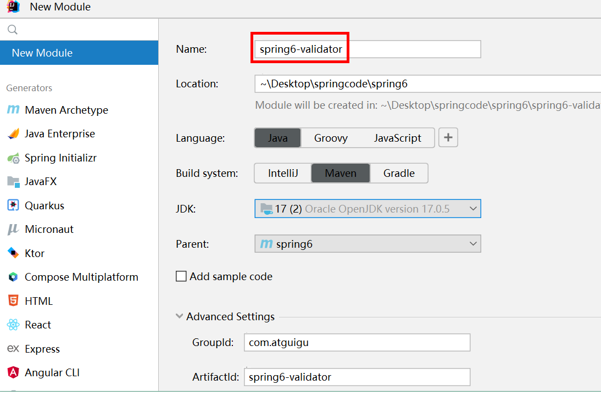
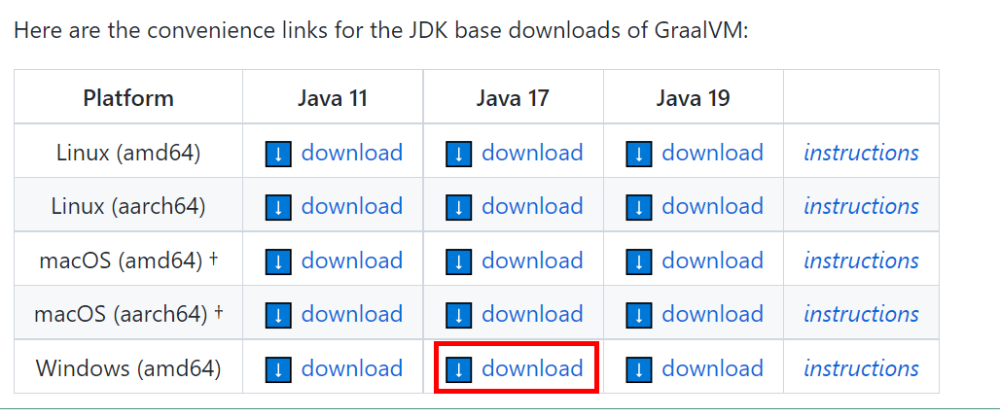
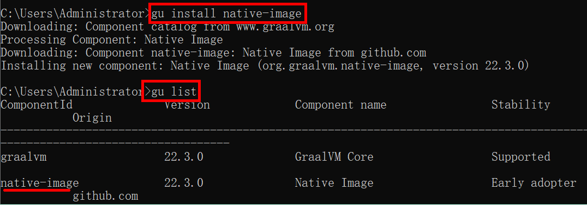
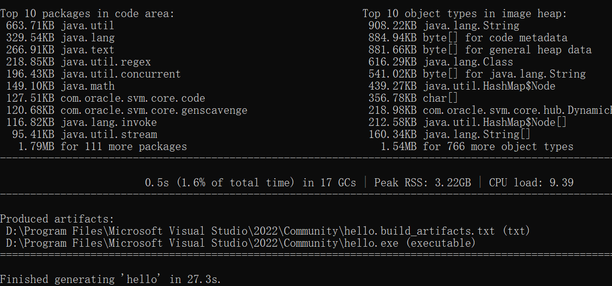

# Spring6

## 2.Spring是什么?


- Spring 是一款主流的 Java EE 轻量级开源框架 ，Spring 由“Spring 之父”Rod Johnson 提出并创立，**其目的是用于简化 Java 企业级应用的开发难度和开发周期**。Spring的用途不仅限于服务器端的开发。从简单性、可测试性和松耦合的角度而言，任何Java应用都可以从Spring中受益。Spring 框架除了自己提供功能外，还提供整合其他技术和框架的能力。

  > 1. 框架可以理解为：是一个程序的半成品，它帮我们实现了一部分功能
  > 2. 开源：开放源代码
  > 3. 轻量级：
  >    - 它的体积很小
  >    - 不需要依赖于其他的组件就能进行使用

- Spring 自诞生以来备受青睐，一直被广大开发人员作为 Java 企业级应用程序开发的首选。时至今日，Spring 俨然成为了 Java EE 代名词，成为了构建 Java EE 应用的事实标准。

- 自 2004 年 4 月，Spring 1.0 版本正式发布以来，Spring 已经步入到了第 6 个大版本，也就是 Spring 6。本课程采用Spring当前最新发布的正式版本**6.0.2**。


## 3.Spring的划分方式 - 狭义和广义

- 在不同的语境中，Spring 所代表的含义是不同的。下面我们就分别从“广义”和“狭义”两个角度，对 Spring 进行介绍。

1. **广义的 Spring：Spring 技术栈**

   广义上的 Spring 泛指以 Spring Framework 为核心的 Spring 技术栈。
   经过十多年的发展，Spring 已经不再是一个单纯的应用框架，而是逐渐发展成为一个由多个不同子项目（模块）组成的成熟技术，例如 Spring Framework、Spring MVC、SpringBoot、Spring Cloud、Spring Data、Spring Security 等，其中 **Spring Framework** 是其他子项目的基础。

   这些子项目涵盖了从企业级应用开发到云计算等各方面的内容，能够帮助开发人员解决软件发展过程中不断产生的各种实际问题，给开发人员带来了更好的开发体验。

2. **狭义的 Spring：Spring Framework**（一般都是狭义划分）

   狭义的 Spring 特指 Spring Framework，通常我们将它称为 Spring 框架。

   Spring 框架是一个分层的、面向切面的 Java 应用程序的一站式轻量级解决方案，它是 Spring 技术栈的核心和基础，是为了解决企业级应用开发的复杂性而创建的。

   Spring 有两个最核心模块： IoC 和 AOP。

   **IoC**：Inverse of Control 的简写，译为“控制反转”，指把创建对象过程交给 Spring 进行管理。

   **AOP**：（很少改变源代码，可以增加一个功能）
   Aspect Oriented Programming 的简写，译为“面向切面编程”。AOP 用来封装多个类的公共行为，将那些与业务无关，却为业务模块所共同调用的逻辑封装起来，减少系统的重复代码，降低模块间的耦合度。另外，AOP 还解决一些系统层面上的问题，比如日志、事务、权限等。

## 4.SpringFramework特点

- 非侵入式：使用 Spring Framework 开发应用程序时，Spring 对应用程序本身的结构影响非常小。对领域模型可以做到**零污染**；对功能性组件也**只需要使用几个简单的注解进行标记**，完全不会破坏原有结构，反而能将组件结构进一步简化。这就使得基于 Spring Framework 开发应用程序时结构清晰、简洁优雅。
- 控制反转：IoC——Inversion of Control，翻转资源获取方向。把自己创建资源、向环境索取资源变成环境将资源准备好，我们享受资源注入。
- 面向切面编程：AOP——Aspect Oriented Programming，在不修改源代码的基础上增强代码功能。
- 容器：Spring IoC 是一个容器，因为它包含并且管理组件对象的生命周期（从创建到销毁的过程）。组件享受到了容器化的管理，替程序员屏蔽了组件创建过程中的大量细节，极大的降低了使用门槛，大幅度提高了开发效率。
- 组件化：Spring 实现了使用简单的组件配置组合成一个复杂的应用。在 Spring 中可以使用 XML 和 Java 注解组合这些对象。这使得我们可以基于一个个功能明确、边界清晰的组件有条不紊的搭建超大型复杂应用系统。
- 一站式：在 IoC 和 AOP 的基础上可以整合各种企业应用的开源框架和优秀的第三方类库。而且 Spring 旗下的项目已经覆盖了广泛领域，很多方面的功能性需求可以在 Spring Framework 的基础上全部使用 Spring 来实现。


## 5.Spring模块组成和版本要求

官网地址：https://spring.io/


上图中包含了 Spring 框架的所有模块，这些模块可以满足一切企业级应用开发的需求，在开发过程中可以根据需求有选择性地使用所需要的模块。下面分别对这些模块的作用进行简单介绍。

**①Spring Core（核心容器）**

spring core提供了IOC,DI,Bean配置装载创建的核心实现。核心概念： Beans、BeanFactory、BeanDefinitions、ApplicationContext。

- spring-core ：IOC和DI的基本实现

- spring-beans：BeanFactory和Bean的装配管理(BeanFactory)
- spring-context：Spring context上下文，即IOC容器(AppliactionContext)
- spring-expression：spring表达式语言

**②Spring AOP**

- spring-aop：面向切面编程的应用模块，整合ASM，CGLib，JDK Proxy
- spring-aspects：集成AspectJ，AOP应用框架
- spring-instrument：动态Class Loading模块

**③Spring Data Access**

- spring-jdbc：spring对JDBC的封装，用于简化jdbc操作
- spring-orm：java对象与数据库数据的映射框架
- spring-oxm：对象与xml文件的映射框架
- spring-jms： Spring对Java Message Service(java消息服务)的封装，用于服务之间相互通信
- spring-tx：spring jdbc事务管理

**④Spring Web**

- spring-web：最基础的web支持，建立于spring-context之上，通过servlet或listener来初始化IOC容器
- spring-webmvc：实现web mvc
- spring-websocket：与前端的全双工通信协议
- spring-webflux：Spring 5.0提供的，用于取代传统java servlet，非阻塞式Reactive Web框架，异步，非阻塞，事件驱动的服务

**⑤Spring Message**

- Spring-messaging：spring 4.0提供的，为Spring集成一些基础的报文传送服务

**⑥Spring test**

- spring-test：集成测试支持，主要是对junit的封装

#### 1.5.1、版本要求

**（1）Spring6要求JDK最低版本是JDK17**

)

#### 1.5.2、本课程软件版本

（1）IDEA开发工具：2022.1.2

（2）JDK：Java17**（Spring6要求JDK最低版本是Java17）**

（3）Spring：6.0.2

## 7.入门案例实现步骤

### 环境要求

- JDK：Java17+**（Spring6要求JDK最低版本是Java17）**

- Maven：3.6+

- Spring：6.0.2

**构建父模块spring6**
在idea中，依次单击 File -> New -> Project -> New Project


点击“Create”


父工程不需要写代码，所以删除src目录

###### 构建子模块spring6-first


点击 Create 完成


###### 引入依赖

https://spring.io/projects/spring-framework#learn

```xml
<dependencies>
    <!--spring context依赖-->
    <!--当你引入Spring Context依赖之后，表示将Spring的基础依赖引入了-->
    <dependency>
        <groupId>org.springframework</groupId>
        <artifactId>spring-context</artifactId>
        <version>6.0.2</version>
    </dependency>

    <!--junit5测试-->
    <dependency>
        <groupId>org.junit.jupiter</groupId>
        <artifactId>junit-jupiter-api</artifactId>
        <version>5.3.1</version>
    </dependency>
</dependencies>
```

###### 查看依赖


###### 创建java类

```java
package com.atguigu.spring6;

public class User {
    public void add() {
        System.out.println("add...");
    }
}
```

###### 创建配置文件

在resources目录创建一个 Spring 配置文件 beans.xml（配置文件名称可随意命名，如：bean.xm）


```xml
<?xml version="1.0" encoding="UTF-8"?>
<beans xmlns="http://www.springframework.org/schema/beans"
       xmlns:xsi="http://www.w3.org/2001/XMLSchema-instance"
    <!-- 这是它的一个约束，规定这里面能写什么标签，标签中能写什么属性 -->
       xsi:schemaLocation="http://www.springframework.org/schema/beans http://www.springframework.org/schema/beans/spring-beans.xsd">

    <!-- 完成User对象创建
		配置User所对应的bean，即将User的对象交给Spring的IOC容器管理
        通过bean标签配置IOC容器所管理的bean
            id属性：唯一标识，这个名字可以随便起，但一般都是用类的首字母小写起名
            class属性：要创建对象所在类的全类名（包名称＋类名称)
    -->
    <bean id="user" class="com.atguigu.spring6.User"></bean>
</beans>
```

###### 创建测试类测试

```java
package com.atguigu.spring6;

import org.junit.jupiter.api.Test;
import org.springframework.context.ApplicationContext;
import org.springframework.context.support.ClassPathXmlApplicationContext;

public class TestUser {
    @Test
    public void testUserObject() {
        //加载spring配置文件，对象创建
        //在spring中，给我们封装了一个接口，叫：ApplicationContext 应用的上下文
        //然后用它new个ClassPathXmlApplicationContext对象，类路径下的xml文件，加上文件名称
        //此时就会进行对象的创建，按照配置完成
        ApplicationContext context = new ClassPathXmlApplicationContext("bean.xml");//如果是在类路径下的话，直接写文件名即可。

        //获取创建的对象，context中有个方法，叫：getBean，在里面加上id的属性值
        //这里创建之后，默认是Object对象，这里给它强转为了User对象
        User user = (User)context.getBean("user");
        //为了测试方便，这里对User进行了一个输出
        System.out.println("1" + user);//输出的是对象的地址

        //使用对象调用方法进行测试
        System.out.print("2:");
        user.add();
    }
}
```

## 08.入门案例程序分析

**1.底层是怎么创建对象的，是通过反射机制调用无参数构造方法吗？**
修改User类：

```java
package com.atguigu.spring6;

public class User {
    public User() {
        System.out.println("无参数构造方法执行");
    }

    public void add() {
        System.out.println("add...");
    }
}
```

测试得知：**创建对象时确实调用了无参数构造方法。**

**2.Spring是如何创建对象的呢？原理是什么？**

> 1. 加载bean.xml配置文件
>
> 2. 对xml文件进行解析操作
>
> 3. 获取xml文件bean标签属性值：id属性值和class属性值
>
> 4. 使用反射根据类全路径创建对象
>
>    ```java
>    @Test
>        public void testUserObject1() throws ClassNotFoundException, NoSuchMethodException, InvocationTargetException, InstantiationException, IllegalAccessException {
>            //获取Class对象
>            Class clazz = Class.forName("com.atguigu.spring6.User");
>           1. Constructor constructor = clazz.getDeclaredConstructor(String.class);
>            constructor.setAccessible(true);
>            User user = (User)constructor.newInstance("就解决");
>    
>           2. User user = (User)clazz.getConstructor(String.class).newInstance("dfaj");
>            System.out.println(user);
>        }
>    ```
>

**3. 把创建好的对象存储到一个什么样的数据结构当中了呢？**

bean对象最终存储在spring容器中，在spring源码底层就是一个map集合，存储bean的map在**DefaultListableBeanFactory**类中：

> 1. `DefaultListableBeanFactory`里有属性：
>
>    ```java
>    private final Map<String, BeanDefinition> beanDefinitionMap = new ConcurrentHashMap<>(256);
>    ```
>
>    创建完后，把对象放到了Map集合中
>
>    - key（String）：唯一标识
>    - value（BeanDefinition）：类的定义（描述信息）
>
> 2. Spring容器加载到Bean类时 , 会把这个类的描述信息, 以包名加类名的方式存到beanDefinitionMap 中,
>    Map<String,BeanDefinition> , 其中 String是Key , 默认是类名首字母小写 , BeanDefinition , 存的是类的定义(描述信息) , 我们通常叫BeanDefinition接口为 : bean的定义对象。

## 09.启用Log4j2日志框架

在项目开发中，日志十分的重要，不管是记录运行情况还是定位线上问题，都离不开对日志的分析。日志记录了系统行为的时间、地点、状态等相关信息，能够帮助我们了解并监控系统状态，在发生错误或者接近某种危险状态时能够及时提醒我们处理，同时在系统产生问题时，能够帮助我们快速的定位、诊断并解决问题。

**Apache Log4j2**是一个开源的日志记录组件，使用非常的广泛。在工程中以易用方便代替了 System.out 等打印语句，它是JAVA下最流行的日志输入工具。 

**Log4j2主要由几个重要的组件构成：**

**（1）日志信息的优先级**，日志信息的优先级从高到低有**TRACE < DEBUG < INFO < WARN < ERROR < FATAL**
                TRACE：追踪，是最低的日志级别，相当于追踪程序的执行
                DEBUG：调试，一般在开发中，都将其设置为最低的日志级别
                INFO：信息，输出重要的信息，使用较多
                WARN：警告，输出警告的信息
                ERROR：错误，输出错误信息
                FATAL：严重错误

这些级别分别用来指定这条日志信息的重要程度；级别高的会自动屏蔽级别低的日志，也就是说，设置了WARN的日志，则INFO、DEBUG的日志级别的日志不会显示，但级别比它高的依旧会显示

**（2）日志信息的输出目的地**，日志信息的输出目的地指定了日志将打印到**控制台**还是**文件中**；

**（3）日志信息的输出格式**，而输出格式则控制了日志信息的显示内容。

## 10.整合Log4j2日志框架（下）

1. 引入Log4j2依赖

   ```xml
   <!--log4j2的依赖-->
   <dependency>
       <groupId>org.apache.logging.log4j</groupId>
       <artifactId>log4j-core</artifactId>
       <version>2.19.0</version>
   </dependency>
   <dependency>
       <groupId>org.apache.logging.log4j</groupId>
       <artifactId>log4j-slf4j2-impl</artifactId>
       <version>2.19.0</version>
   </dependency>
   ```

2. 加入日志配置文件

   在类的根路径下提供log4j2.xml配置文件（文件名固定为：log4j2.xml，文件必须放到类根路径下。这里建在Resources路径下创建）

   ```xml
   <?xml version="1.0" encoding="UTF-8"?>
   <configuration>//根标签
       <loggers>
           <!--
               level指定日志级别，从低到高的优先级：
                   TRACE < DEBUG < INFO < WARN < ERROR < FATAL
                   trace：追踪，是最低的日志级别，相当于追踪程序的执行
                   debug：调试，一般在开发中，都将其设置为最低的日志级别
                   info：信息，输出重要的信息，使用较多
                   warn：警告，输出警告的信息
                   error：错误，输出错误信息
                   fatal：严重错误
           -->
           <root level="DEBUG">//当前日志的级别
               //输出的相关信息
               //ref：引入，引用
               <appender-ref ref="spring6log"/>//对应到底下appenders标签里面查看
               <appender-ref ref="RollingFile"/>
               <appender-ref ref="log"/>
           </root>
       </loggers>
   
       <appenders>//输出的目的地和格式
           <!--输出日志信息到控制台-->
           <console name="spring6log" target="SYSTEM_OUT">//在控制台进行输出
               <!--控制日志输出的格式-->
               <PatternLayout pattern="%d{yyyy-MM-dd HH:mm:ss SSS} [%t] %-3level %logger{1024} - %msg%n"/>
           </console>
   
           <!--文件会打印出所有信息，这个log每次运行程序会自动清空，由append属性决定，适合临时测试用-->
           <File name="log" fileName="D:/develop/spring6_log/test.log" append="false">//表示在文件中输出，这里要注意输出的位置,spring6_log/test.log会自动给我们创建，但盘符要写对
               <PatternLayout pattern="%d{HH:mm:ss.SSS} %-5level %class{36} %L %M - %msg%xEx%n"/>//格式
           </File>
   
           <!-- 这个会打印出所有的信息，
               每次大小超过size，
               则这size大小的日志会自动存入按年份-月份建立的文件夹下面并进行压缩，
               作为存档-->
           <RollingFile name="RollingFile" fileName="d:/spring6_log/app.log"
                        filePattern="log/$${date:yyyy-MM}/app-%d{MM-dd-yyyy}-%i.log.gz">
               <PatternLayout pattern="%d{yyyy-MM-dd 'at' HH:mm:ss z} %-5level %class{36} %L %M - %msg%xEx%n"/>
               <SizeBasedTriggeringPolicy size="50MB"/>
               <!-- DefaultRolloverStrategy属性如不设置，
               则默认为最多同一文件夹下7个文件，这里设置了20 -->
               <DefaultRolloverStrategy max="20"/>
           </RollingFile>
       </appenders>
</configuration>
   ```
   
   无笔记的：
   
   ```xml
   <?xml version="1.0" encoding="UTF-8"?>
   <configuration>
       <loggers>
           <!--
               level指定日志级别，从低到高的优先级：
                   TRACE < DEBUG < INFO < WARN < ERROR < FATAL
                   trace：追踪，是最低的日志级别，相当于追踪程序的执行
                   debug：调试，一般在开发中，都将其设置为最低的日志级别
                   info：信息，输出重要的信息，使用较多
                   warn：警告，输出警告的信息
                   error：错误，输出错误信息
                   fatal：严重错误
           -->
           <root level="DEBUG">
               <appender-ref ref="spring6log"/>
               <appender-ref ref="RollingFile"/>
               <appender-ref ref="log"/>
           </root>
       </loggers>
   
       <appenders>
           <!--输出日志信息到控制台-->
           <console name="spring6log" target="SYSTEM_OUT">
               <!--控制日志输出的格式-->
               <PatternLayout pattern="%d{yyyy-MM-dd HH:mm:ss SSS} [%t] %-3level %logger{1024} - %msg%n"/>
           </console>
   
           <!--文件会打印出所有信息，这个log每次运行程序会自动清空，由append属性决定，适合临时测试用-->
           <File name="log" fileName="d:/spring6_log/test.log" append="false">
               <PatternLayout pattern="%d{HH:mm:ss.SSS} %-5level %class{36} %L %M - %msg%xEx%n"/>
           </File>
   
           <!-- 这个会打印出所有的信息，
               每次大小超过size，
               则这size大小的日志会自动存入按年份-月份建立的文件夹下面并进行压缩，
               作为存档-->
           <RollingFile name="RollingFile" fileName="d:/spring6_log/app.log"
                        filePattern="log/$${date:yyyy-MM}/app-%d{MM-dd-yyyy}-%i.log.gz">
               <PatternLayout pattern="%d{yyyy-MM-dd 'at' HH:mm:ss z} %-5level %class{36} %L %M - %msg%xEx%n"/>
               <SizeBasedTriggeringPolicy size="50MB"/>
               <!-- DefaultRolloverStrategy属性如不设置，
               则默认为最多同一文件夹下7个文件，这里设置了20 -->
               <DefaultRolloverStrategy max="20"/>
           </RollingFile>
       </appenders>
   </configuration>
   ```
   
   测试 - 运行原测试程序
   
   
   
   运行原测试程序，多了spring打印日志
   
3. ### 使用日志

   1.创建Logger对象

   ```java
   private Logger logger = LoggerFactory.getLogger(TestUser.class);
   ```

   注意不要导错包了！
   

   2. 在Test类中调用其方法

      ```java
      //手动写日志
      logger.info("### 执行调用成功了...");
      ```

## 11.容器：IoC-概述（上)

IoC 是 Inversion of Control 的简写，译为“控制反转”，它不是一门技术，而是一种设计思想，是一个重要的面向对象编程法则，能够指导我们如何设计出松耦合、更优良的程序。

Spring 通过 **IoC 容器**来**管理所有 Java 对象的实例化和初始化，控制对象与对象之间的依赖关系**（eg：A对象要依赖B对象，那A里面应该实例化一个B对象，但这里会交给Spring进行管理！）。我们将由 IoC 容器管理的 Java 对象称为 Spring **Bean**（只是为了和Java中的对象做一个名字上的区别），它与使用关键字 new 创建的 Java 对象没有任何区别。

对象的创建和销毁的过程，都是经过容器进行管理的

- 其中所使用的结构是：map集合
  因为map的特点是：key-value，放和取都很简单。

- 控制反转（IoC）
  - 控制反转是一种思想。
  - 控制反转是为了降低程序耦合度，提高程序扩展力。
  - 控制反转，反转的是什么？

  - - 将对象的创建权利交出去，交给第三方容器负责。
    - 将对象和对象之间关系的维护权交出去，交给第三方容器负责。

  - 控制反转这种思想如何实现呢？

  - - DI（Dependency Injection）：依赖注入

## 12.容器：IoC-概述（中)

#### IoC基本过程：

首先明确：IoC容器里，存放的是一个bean对象，而它所使用的的结构是map集合

1. xml配置文件：配置类的描述信息，另一种方式是：基于注解管理的bean
   Bean定义信息：BeanDefinition（在配置文件中配置好，我想要什么样的对象，把这个信息交给IoC，告诉IoC我想要什么样的对象，由IoC给我创建、返回）。
2. 把Bean的定义信息加载+读取到IoC容器里
   用到一个抽象（接口）：BeanDefinitionReader，接口中有不同的实现类，根据不同方式进行读取和加载。
3. Bean进行实例化 ( 这里可以对类的定义信息进行修改 )
   有很多种方式：1. new 2. 工厂（建个工厂，返回这个对象） 3. 反射
   Spring中有个工厂，叫：BeanFactory工厂+反射
4. 对象初始化
5. 得到最终可以使用的对象
   使用方法：`context.getBean("User");`

## 13.容器：IoC-概述（下)

#### 依赖注入

DI（Dependency Injection）：依赖注入，依赖注入实现了控制反转的思想。

**依赖注入：**

- **指Spring创建对象的过程中，将对象依赖属性通过配置进行注入**

依赖注入常见的实现方式包括两种：

- 第一种：set注入
- 第二种：构造注入

所以结论是：IOC 就是一种控制反转的思想， 而 DI 是对IoC的一种具体实现。

**Bean管理说的是：Bean对象的创建，以及Bean对象中属性的赋值（或者叫做Bean对象之间关系的维护）。**

### IoC容器在Spring的实现

Spring 的 IoC 容器就是 IoC思想的一个落地的产品实现。IoC容器中管理的组件也叫做 bean。在创建 bean 之前，首先需要创建IoC 容器。Spring 提供了IoC 容器的两种实现方式：

**①BeanFactory**

这是 IoC 容器的基本实现，是 Spring 内部使用的接口。面向 Spring 本身，不提供给开发人员使用。

**②ApplicationContext**（BeanFactory的子接口）

BeanFactory 的子接口，提供了更多高级特性。面向 Spring 的使用者，几乎所有场合都使用 ApplicationContext 而不是底层的 BeanFactory。

**③ApplicationContext的主要实现类**


| 类型名                          | 简介                                                         |
| ------------------------------- | ------------------------------------------------------------ |
| ClassPathXmlApplicationContext  | 通过读取类路径下的 XML 格式的配置文件创建 IOC 容器对象       |
| FileSystemXmlApplicationContext | 通过文件系统路径读取 XML 格式的配置文件创建 IOC 容器对象     |
| ConfigurableApplicationContext  | ApplicationContext 的子接口，包含一些扩展方法 refresh() 和 close() ，让 ApplicationContext 具有启动、关闭和刷新上下文的能力。 |
| WebApplicationContext           | 专门为 Web 应用准备，基于 Web 环境创建 IOC 容器对象，并将对象引入存入 ServletContext 域中。 |

## 14.IoC - 基于XML管理Bean-环境搭建

## 15.IoC - 基于XML管理Bean-获取Bean（上）

##### ①方式一：根据id获取

由于 id 属性指定了 bean 的唯一标识，所以根据 bean 标签的 id 属性可以精确获取到一个组件对象。上个实验中我们使用的就是这种方式。

##### ②方式二：根据类型获取

##### ③方式三：根据id和类型

```java
package com.atguigu.iocxml;

import org.slf4j.Logger;
import org.slf4j.LoggerFactory;
import org.springframework.context.ApplicationContext;
import org.springframework.context.support.ClassPathXmlApplicationContext;

public class TestUser {
    public static void main(String[] args) {
        ApplicationContext context = new ClassPathXmlApplicationContext("bean.xml");
        Logger logger = LoggerFactory.getLogger(TestUser.class);

        //1 根据id获取bean
        User user1 = (User)context.getBean("user");
        System.out.println("1 根据id获取bean" + user1);

        //2 根据类型获取bean
        User user2 = context.getBean(User.class);
        System.out.println("2 根据类型获取bean" + user2);

        //3 根据id和类型
        User user3 = context.getBean("user", User.class);
        System.out.println("3 根据id和类型" + user3);
    }
}
```

##### ④注意的地方

当根据类型获取bean时，要求IOC容器中指定类型的bean有且只能有一个对象（这里的对象指的是同一个路径）

当IOC容器中一共配置了两个：

```xml
<bean id="user" class="com.atguigu.spring6.bean.User"></bean>
<bean id="user1" class="com.atguigu.spring6.bean.user"></bean>
```

根据类型获取时会抛出异常：
更改方式：要么根据id属性值，要么根据id属性值＋类型获取

> org.springframework.beans.factory.NoUniqueBeanDefinitionException: No qualifying bean of type 'com.atguigu.spring6.bean.HelloWorld' available: expected single matching bean but found 2: user,user1

##### ⑤扩展知识

如果组件类实现了接口，根据接口类型可以获取 bean 吗？

> 可以，前提是bean唯一，证明代码如下：

UserDaoImpl.java:

```java
package com.atguigu.bean;

public class UserDaoImpl implements UserDao{
    @Override
    public void run() {
        System.out.println("run.....");
    }
}
```

UserDao.java接口：

```java
package com.atguigu.bean;

public interface UserDao {
    public void run();
}
```

TestUserDao.java:

```java
package com.atguigu.bean;

import org.springframework.context.ApplicationContext;
import org.springframework.context.support.ClassPathXmlApplicationContext;

public class TestUserDao {
    public static void main(String[] args) {
        ApplicationContext context = new ClassPathXmlApplicationContext("bean.xml");

        //根据类型获取接口对应的bean
//        UserDaoImpl userDao = context.getBean(UserDaoImpl.class);
        //注意，这里不要写实现类，因为我们的目的就是为了看看接口是否能找到对应的实现类对象
        UserDao userDao = context.getBean(UserDao.class);
        System.out.println(userDao);
        userDao.run();
    }
}
```

如果一个接口有多个实现类，这些实现类都配置了 bean，根据接口类型可以获取 bean 吗？

> 不行，因为bean不唯一

**结论**

根据类型来获取bean时，在满足bean唯一性的前提下，其实只是看：『对象 **instanceof** 指定的类型』的返回结果，只要返回的是true就可以认定为和类型匹配，能够获取到。

java中，instanceof运算符用于判断前面的对象是否是后面的类，或其子类、实现类的实例。如果是返回true，否则返回false。也就是说：用instanceof关键字做判断时， instanceof 操作符的左右操作必须有继承或实现关系

## 18.IoC-基于XML管理Bean-依赖注入-setter注入（上）

普通的两种原生方式：

```java
public static void main(String[] args) {
        //通过set方法注入
        Book book = new Book();
        book.setBname("java");
        book.setAuthor("尚硅谷");

        //通过构造器注入
        Book book1 = new Book("C++", "尚硅谷");
    }
```

## 18.IoC-基于XML管理Bean-依赖注入-setter注入（下）

步骤：

1. 创建类，定义属性，生成属性set方法

   > 其实只要set就可以了，但是为了操作方便，get方法也会一起生成。 

   `Book类：`

   ```java
   package com.atguigu.di;
   
   public class Book {
       private String bname;//图书的名称
       private String author;
   
       public Book() {
           System.out.println("无参构造器执行了。。");
       }
   
       public Book(String bname, String author) {
           this.bname = bname;
           this.author = author;
       }
   
       //生成set方法
       public String getBname() {
           return bname;
       }
   
       public void setBname(String bname) {
           this.bname = bname;
       }
   
       public String getAuthor() {
           return author;
       }
   
       public void setAuthor(String author) {
           this.author = author;
       }
   
       @Override
       public String toString() {
           return "Book{" +
                   "bname='" + bname + '\'' +
                   ", author='" + author + '\'' +
                   '}';
       }
   }
   ```

   `测试类：`

   ```java
   package com.atguigu.di;
   
   import org.junit.jupiter.api.Test;
   import org.springframework.context.ApplicationContext;
   import org.springframework.context.support.ClassPathXmlApplicationContext;
   
   public class TestBook {
       @Test
       public void testStter() {
           ApplicationContext context = new ClassPathXmlApplicationContext("bean-di.xml");
           Book book = context.getBean("book", Book.class);
           System.out.println(book);
       }
   }
   ```

   

2. 在spring配置文件配置
   这里为了方便，重新创建了一个xml文件

   ```xml
   <?xml version="1.0" encoding="UTF-8"?>
   <beans xmlns="http://www.springframework.org/schema/beans"
          xmlns:xsi="http://www.w3.org/2001/XMLSchema-instance"
          xsi:schemaLocation="http://www.springframework.org/schema/beans http://www.springframework.org/schema/beans/spring-beans.xsd">
   
       <!-- 1 set方法注入 -->
       <bean id="book" class="com.atguigu.di.Book">
           <!-- PS：name的属性值是根据set函数后面的，setBname，首字母改成小写得到的-->
           <!-- property就相当于调用set方法设置值 -->
           <!-- 这里只是做一个最基本的注入，后面还会有其他类型：数组、集合等 -->
           <property name="bname" value="前端开发"></property>
           <property name="author" value="尚硅谷"></property>
       </bean>
   </beans>
   ```

## 20.IoC-基于XML管理Bean-依赖注入-构造器注入

步骤：

1. 创建类，定义属性，生成有参构造方法

2. 进行配置

   ```xml
   <?xml version="1.0" encoding="UTF-8"?>
   <beans xmlns="http://www.springframework.org/schema/beans"
          xmlns:xsi="http://www.w3.org/2001/XMLSchema-instance"
          xsi:schemaLocation="http://www.springframework.org/schema/beans http://www.springframework.org/schema/beans/spring-beans.xsd">
       <!-- 2 构造器注入 -->
       <bean id="bookCon" class="com.atguigu.di.Book">
           <constructor-arg name="bname" value="java开发"></constructor-arg>
           <constructor-arg name="author" value="尚硅谷"></constructor-arg>
           <!-- 1：表示第一个参数，2表示第二个参数，但是这样写容易写乱，不推荐 -->
           <constructor-arg index="1" value=""></constructor-arg>
       </bean>
   </beans>
   ```

   测试类：

   ```java
   @Test
       public void testConstructor() {
           //PS：如果通过Setter注入的配置没有注释掉，则这里会多一个：无参构造器执行了。。
           //原因是加载配置文件的时候，会一起加载创建
           ApplicationContext context = new ClassPathXmlApplicationContext("bean-di.xml");
           Book book = context.getBean("bookCon", Book.class);
           System.out.println(book);
       }
   ```

## 21.IoC-基于XML管理Bean-依赖注入-特殊值处理

##### ①字面量赋值

> 什么是字面量？
>
> int a = 10;
>
> 声明一个变量a，初始化为10，此时a就不代表字母a了，而是作为一个变量的名字。当我们引用a的时候，我们实际上拿到的值是10，此时的10就叫做字面量。
>
> 而如果a是带引号的：'a'，那么它现在不是一个变量，它就是代表a这个字母本身，这就是字面量。所以字面量没有引申含义，就是我们看到的这个数据本身。

```xml
<!-- 使用value属性给bean的属性赋值时，Spring会把value属性的值看做字面量 -->
<property name="name" value="张三"/>
```

##### ②null值

```xml
<property name="name">
    <!-- 标签内结束 -->
    <null />
    
    <!-- 两个标签结束 -->
    <null></null>
</property>
```

> 注意：
>
> ```xml
> <property name="name" value="null"></property>
> ```
>
> 以上写法，会把null当成一个字符串！

##### ③xml实体 - 转义

```xml
<!-- 小于号在XML文档中用来定义标签的开始，不能随便使用 -->
<!-- eg:<property name="expression" value="<>"/> 此时就会报错！！！ -->
<!-- 解决方案一：使用XML实体来代替 -->
<!-- &lt; 代表小于
	 &gt; 代表大于 -->
<property name="expression" value="a &lt; b"/>
```

##### ④CDATA节 /CDATE区

```xml
<property name="expression">
    <!-- 解决方案二：使用CDATA节 -->
    <!-- CDATA中的C代表Character，是文本、字符的含义，CDATA就表示纯文本数据 -->
    <!-- XML解析器看到CDATA节就知道这里是纯文本，就不会当作XML标签或属性来解析 -->
    <!-- 所以CDATA节中写什么符号都随意 -->
    <value><![CDATA[a < b]]></value>
</property>
```

## 22.IoC-基于XML管理Bean-依赖注入-特殊类型属性 - 准备

部门类：

```java
package com.atguigu.ditest;
//部门类
public class Dept {
    private String dname;

    public void info() {
        System.out.println("部门名称：" + dname);
    }
}
```

员工类：

```java
package com.atguigu.ditest;
//员工类
public class emp {
    //对象类型属性：员工属于某个部门
    private Dept dept;//把部门作为对象类型属性配给它

    private String ename;
    private Integer age;

    public void work() {
        System.out.println(ename + "emp work..." + age);
        dept.info();
    }
}
```

## 23.IoC-基于XML管理Bean-依赖注入-对象类型属性（上）-  外部bean

这里为了方便，重新创了一个xml配置文件：`bean-di.xml`

1. 引用外部bean

   配置xml文件：

   ```xml
   <?xml version="1.0" encoding="UTF-8"?>
   <beans xmlns="http://www.springframework.org/schema/beans"
          xmlns:xsi="http://www.w3.org/2001/XMLSchema-instance"
          xsi:schemaLocation="http://www.springframework.org/schema/beans http://www.springframework.org/schema/beans/spring-beans.xsd">
   
       <!--
       第一种方式：引入外部bean
           1 创建两个类对象：dept 和 emp
           2 在emp的bean标签里，使用property引入dept的bean
        -->
       <bean id="dept" class="com.atguigu.ditest.Dept">
           <property name="dname" value="安保部"></property>
       </bean>
   
       <bean id="emp" class="com.atguigu.ditest.Emp">
           <!-- 普通属性注入 -->
           <property name="ename" value="lucy"></property>
           <property name="age" value="50"></property>
   
           <!--
           注入对象类型属性
               private Dept dept;
               name后面记得跟set方法后面的名字保持一致！
   
               在emp的bean标签里面，引入部门dept的bean对象；
               ref表示引用/引入，表示引用外部been
               里面的属性值添加的就是dept这个对象的id，要跟been的id值保持一致！
            -->
           <property name="dept" ref="dept"></property>
       </bean>
   </beans>
   ```

   创建测试方法：

   ```java
   package com.atguigu.ditest;
   
   import org.springframework.context.ApplicationContext;
   import org.springframework.context.support.ClassPathXmlApplicationContext;
   
   public class TestEmp {
       public static void main(String[] args) {
           //加载配置文件
           ApplicationContext context = new ClassPathXmlApplicationContext("bean-ditest.xml");
   
           //员工对象
           Emp emp = context.getBean("emp", Emp.class);
           emp.work();
       }
   }
   ```

## 24.IoC-基于XML管理Bean-依赖注入-对象类型属性（中）-  内部bean

```xml
<!-- 第二种方式 内部bean注入 -->
<bean id="emp2" class="com.atguigu.ditest.Emp">
    <property name="ename" value="merry"></property>
    <property name="age" value="10"></property>
    <property name="dept">
        <!-- 在一个bean中再声明一个bean就是内部bean -->
        <!-- 内部bean只能用于给属性赋值，不能在外部通过IOC容器获取，因此可以省略id属性 -->
        <bean id="dept2" class="com.atguigu.ditest.Dept">
            <property name="dname" value="财务部"></property>
        </bean>
    </property>
</bean>
```

## 25.IoC-基于XML管理Bean-依赖注入-对象类型属性（下）- 级联属赋值

```xml
<!-- 第三种方式 级联赋值 -->
    <bean id="dept3" class="com.atguigu.ditest.Dept">
        <property name="dname" value="技术研发部"></property>
    </bean>

    <bean id="emp3" class="com.atguigu.ditest.Emp">
        <property name="ename" value="tom"></property>
        <property name="age" value="35"></property>
        <!-- 这里千万不能写value，因为这里会直接把value里面的属性值当成字符串，字符串和对象类型不匹配就会报异常 -->
        <property name="dept" ref="dept3"></property>
        <property name="dept.dname" value="销售部"></property>
    </bean>
```

## 26.IoC-基于XML管理Bean-依赖注入-为数组类型属性赋值

```xml
<!-- 注入数组类型属性 -->
<bean name="dept" class="com.atguigu.ditest.Dept">
    <property name="dname" value="技术部"></property>
</bean>

<bean name="emp" class="com.atguigu.ditest.Emp">
    <property name="ename" value="lucy"></property>
    <property name="age" value="20"></property>
    <!-- 对象类型属性 -->
    <property name="dept" ref="dept"></property>
    <!--数组类型属性 -->
    <property name="loves">
        <array>
            <value>吃饭</value>
            <value>睡觉</value>
            <value>敲代码</value>
        </array>
    </property>
</bean>
```

> PS:work中新增行：
>
> ```java
> System.out.println(Arrays.toString(loves));
> ```
>
> 如果要输出数组，千万不能直接在println里面直接写loves，因为这样输出的话就是数组的地址！

## 27.IoC-基于XML管理Bean-依赖注入-List类型属性注入

准备工作：

```java
private List<Emp> empList;//在部门类里新建属性

    public void info() {
        System.out.println("部门名称：" + dname);
        for (Emp emp : empList) {//在info方法内，新建empList遍历
            System.out.println(emp.getEname());
        }
    }
```

配置文件：

```xml
<bean name="empone" class="com.atguigu.ditest.Emp">
        <property name="ename" value="lucy"></property>
        <property name="age" value="10"></property>
    </bean>

    <bean name="emptwo" class="com.atguigu.ditest.Emp">
        <property name="ename" value="lucy"></property>
        <property name="age" value="10"></property>
    </bean>
    <bean name="dept" class="com.atguigu.ditest.Dept">
        <property name="dname" value="技术部"></property>
        <property name="empList">
            <list>
                <!-- 如果List里面传的是String或者int，是个什么值，就写value -->
<!--                <value></value>-->
                <!-- 但如果是对象类型的，就需要通过ref进行引入 -->
                <ref bean="empone"></ref>
                <ref bean="emptwo"></ref>
            </list>
        </property>
    </bean>
```

修改测试类：

```java
//加载配置文件
        ApplicationContext context = new ClassPathXmlApplicationContext("dilist.xml");

        //对象
        Dept dept = context.getBean("dept", Dept.class);
        dept.info();
```

## 28.IoC-基于XML管理Bean-依赖注入-Map类型属性注入

###### 准备工作：

​	Student类：

```java
package com.atguigu.dimap;

import java.util.Map;

public class Student {
    private Map<String, Teacher> teacherMap;//一个学生对应很多老师
    private  String sid;
    private String sname;

    public Student() {

    }

    public void run() {
        System.out.println("学生编号：" + sid + "学生名称：" + sname);
        System.out.println(teacherMap);//为了方便后面的输出，这里面有Teacher的对象，所以需要重写Teacher的toString方法
    }

    public Student(Map<String, Teacher> teacherMap, String sid, String sname) {
        this.teacherMap = teacherMap;
        this.sid = sid;
        this.sname = sname;
    }

    public Map<String, Teacher> getTeacherMap() {
        return teacherMap;
    }

    public void setTeacherMap(Map<String, Teacher> teacherMap) {
        this.teacherMap = teacherMap;
    }

    public String getSid() {
        return sid;
    }

    public void setSid(String sid) {
        this.sid = sid;
    }

    public String getSname() {
        return sname;
    }

    public void setSname(String sname) {
        this.sname = sname;
    }

    public Student(String sid, String sname) {
        this.sid = sid;
        this.sname = sname;
    }
}
```

Teacher类：

```java
package com.atguigu.dimap;

public class Teacher {
    private String teacherId;
    private String taacherName;

    public Teacher() {

    }

    public String getTeacherId() {
        return teacherId;
    }


    public void setTeacherId(String teacherId) {
        this.teacherId = teacherId;
    }

    public String getTaacherName() {
        return taacherName;
    }

    public void setTaacherName(String taacherName) {
        this.taacherName = taacherName;
    }

    public Teacher(String teacherId, String taacherName) {
        this.teacherId = teacherId;
        this.taacherName = taacherName;
    }

    @Override
    public String toString() {
        return "Teacher{" +
                "teacherId='" + teacherId + '\'' +
                ", taacherName='" + taacherName + '\'' +
                '}';
    }
}
```


###### 配置xml：

```xml
<?xml version="1.0" encoding="UTF-8"?>
<beans xmlns="http://www.springframework.org/schema/beans"
       xmlns:xsi="http://www.w3.org/2001/XMLSchema-instance"
       xsi:schemaLocation="http://www.springframework.org/schema/beans http://www.springframework.org/schema/beans/spring-beans.xsd">

    <!-- 步骤
        1 创建两个对象
        2 注入两个普通类型属性
        3 在学生bean注入map集合类型属性
    -->
    <bean name="teacherOne" class="com.atguigu.dimap.Teacher">
        <property name="teacherId" value="100"></property>
        <property name="taacherName" value="西门讲师"></property>
    </bean>

    <bean name="teacherTwo" class="com.atguigu.dimap.Teacher">
        <property name="teacherId" value="200"></property>
        <property name="taacherName" value="上官讲师"></property>
    </bean>

    <bean name="student" class="com.atguigu.dimap.Student">
        <property name="sid" value="2000"></property>
        <property name="sname" value="张三"></property>
        <property name="teacherMap">
            <map>
                <!--注意避免我这种自作聪明的写法...
<entry key="sname" value-ref="teacherOne"></entry>
                <entry key="sname" value-ref="teacherTwo"></entry>-->
                <entry>
                    <key>
                        <value>10010</value>
                    </key>
<!--                    如果这里是普通值的话，直接使用value标签即可，但如果是对象，需要使用ref进行对象引入-->
                    <ref bean="teacherOne"></ref>
                </entry>

                <entry>
                    <key>
                        <value>10020</value>
                    </key>
                    <ref bean="teacherTwo"></ref>
                </entry>
            </map>
        </property>
    </bean>
</beans>
```

## 29.IoC-基于XML管理Bean-依赖注入-引入Bean集合

配置文件：

```xml
<?xml version="1.0" encoding="UTF-8"?>
<beans xmlns="http://www.springframework.org/schema/beans"
       xmlns:xsi="http://www.w3.org/2001/XMLSchema-instance"
       xmlns:util="http://www.springframework.org/schema/util"
       xsi:schemaLocation="http://www.springframework.org/schema/util
       http://www.springframework.org/schema/util/spring-util.xsd
       http://www.springframework.org/schema/beans
       http://www.springframework.org/schema/beans/spring-beans.xsd">

    <!--  步骤
        1 创建三个对象
        2 注入普通类型属性
        3 使用util:类型 定义（注意这里需要加入：（即将所有的beans改为util）
xmlns:util="http://www.springframework.org/schema/util"

http://www.springframework.org/schema/util
       http://www.springframework.org/schema/util/spring-util.xsd
        4 在学生bean引入 util:类型 定义bean，完成list、map类型属性注入
     -->
    <bean name="lessonOne" class="com.atguigu.dimap.Lesson">
        <property name="lessonName" value="java开发"></property>
    </bean>

    <bean name="lessonTwo" class="com.atguigu.dimap.Lesson">
        <property name="lessonName" value="前端开发"></property>
    </bean>

    <bean name="teacherOne" class="com.atguigu.dimap.Teacher">
        <property name="teacherId" value="100"></property>
        <property name="taacherName" value="西门讲师"></property>
    </bean>

    <bean name="teacherTwo" class="com.atguigu.dimap.Teacher">
        <property name="teacherId" value="200"></property>
        <property name="taacherName" value="欧阳讲师"></property>
    </bean>

    <bean name="student" class="com.atguigu.dimap.Student">
        <property name="sid" value="10000"></property>
        <property name="sname" value="lucy"></property>
        <!-- 注入list、map属性类型 -->
        <property name="lessonList" ref="lessonList"></property>
        <property name="teacherMap" ref="lessonMap"></property>
    </bean>

<!--    表示lessonList里面的属性，用到util:list里面进行定义-->
    <util:list id="lessonList">
        <ref bean="lessonOne"></ref>
        <ref bean="lessonTwo"></ref>
    </util:list>

    <util:map id="lessonMap">
        <entry>
            <key>
                <value>10010</value>
            </key>
            <ref bean="teacherOne"></ref>
        </entry>
        <entry>
            <key>
                <value>10086</value>
            </key>
            <ref bean="teacherTwo"></ref>
        </entry>
    </util:map>

</beans>
```

## 30.IoC-基于XML管理Bean-依赖注入-p命名空间

```xml
<?xml version="1.0" encoding="UTF-8"?>
<beans xmlns="http://www.springframework.org/schema/beans"
       xmlns:xsi="http://www.w3.org/2001/XMLSchema-instance"
       xmlns:util="http://www.springframework.org/schema/util"
       <!-- 可以理解为：为了防止属性名冲突，多加的一部分，后面的地址也要改为p -->
<!-- 注意，添加的部分是直接添加在"里面！ -->
       xmlns:p="http://www.springframework.org/schema/p"
       xsi:schemaLocation="http://www.springframework.org/schema/util
       http://www.springframework.org/schema/util/spring-util.xsd
       http://www.springframework.org/schema/beans
       http://www.springframework.org/schema/beans/spring-beans.xsd">
```

1. 首先需要在beans中添加属性：

   ```xml
   xmlns:p="http://www.springframework.org/schema/p"
   ```

2. p命名空间注入属性：

   ```xml
   <!--p命名空间注入-->
       <bean  id="studentp" class="com.atguigu.dimap.Student"
       p:sid="100" p:sname="mary" p:lessonList-ref="lessonList" p:teacherMap-ref="lessonMap">
       </bean>
   ```

31.引入外部属性文件

把一些特殊的固定值，放到一个外部文件中，在spring的配置文件中进行引入，这样的好处是我们进行修改，只需要改外部文件，而spring里面就不需要再修改了。

**①加入数据库相关依赖**

```xml
 <!-- MySQL驱动 -->
<dependency>
    <groupId>mysql</groupId>
    <artifactId>mysql-connector-java</artifactId>
    <version>8.0.30</version>
</dependency>

<!-- 数据源 -->
<dependency>
    <groupId>com.alibaba</groupId>
    <artifactId>druid</artifactId>
    <version>1.2.15</version>
</dependency>
```

**②创建外部属性文件**	
properties格式，定义数据信息：用户名，密码，地址等


```properties
jdbc.user=root
jdbc.password=atguigu
jdbc.url=jdbc:mysql://localhost:3306/itcast?serverTimezone=UTC
jdbc.driver=com.mysql.cj.jdbc.Driver
```

> PS:
> 配置连接数据库驱动的时区参数serverTimezone
>
> 下UTC和GMT：
>
> UTC代表的是全球标准时间，是以原子时计时，更加精准，适应现代社会的精确计时。
> GMT格林威治标准时间，是指位于伦敦郊区的皇家格林尼治天文台的标准时间。
> 但是我们使用的时间是北京时区也就是东八区，领先UTC和GMT八个小时。
> 一般视为无差别，即：北京时间=UTC+8=GMT+8。

**③引入属性文件**
引入context 名称空间

**④配置bean**
最终使用表达式完成注入

```xml
<?xml version="1.0" encoding="UTF-8"?>
<beans xmlns="http://www.springframework.org/schema/beans"
       xmlns:xsi="http://www.w3.org/2001/XMLSchema-instance"
       xmlns:context="http://www.springframework.org/schema/context"
       xsi:schemaLocation="http://www.springframework.org/schema/context
       http://www.springframework.org/schema/context/spring-context.xsd
       http://www.springframework.org/schema/beans
       http://www.springframework.org/schema/beans/spring-beans.xsd">

    <!--引入外部属性文件，即刚刚的jdbc.properties-->
    <context:property-placeholder location="classpath:jdbc.properties"></context:property-placeholder>

    <!-- 完成数据库信息注入，用表达式${}将其value得到 -->
    <bean id="druidDataSource"  class="com.alibaba.druid.pool.DruidDataSource">
        <property name="url" value="${jdbc.url"></property>
        <property name="username" value="${jdbc.user"></property>
        <property name="password" value="${jdbc.password"></property>
        <property name="driverClassName" value="${jdbc.driver"></property>
     </bean>
</beans>
```

TestJdbc类代码实现：

```java
package com.atguigu.jdbc;

import com.alibaba.druid.pool.DruidDataSource;
import org.junit.jupiter.api.Test;
import org.springframework.context.ApplicationContext;
import org.springframework.context.support.ClassPathXmlApplicationContext;

public class TestJdbc {
    @Test
    public void demo1() {
        DruidDataSource dataSource = new DruidDataSource();
        dataSource.setUrl("jdbc:mysql://localhost:3306/spring?serverTimezone=UTC");
        dataSource.setUsername("root");
        dataSource.setPassword("123456");
        dataSource.setDriverClassName("com.mysql.cj.jdbc.Driver");
    }

    @Test
    public void demo2() {
        ApplicationContext context = new ClassPathXmlApplicationContext("bean-jdbc.xml");
        DruidDataSource druidDataSource = context.getBean("druidDataSource", DruidDataSource.class);
        System.out.println(druidDataSource.getUrl());
    }
}
```

## 32.IoC-基于XML管理Bean-依赖注入-Bean的作用域

**①概念**

在Spring中可以通过配置bean标签的scope属性来指定bean的作用域范围，各取值含义参加下表：

| 取值              | 含义                                    | 创建对象的时机  |
| ----------------- | --------------------------------------- | --------------- |
| singleton（默认） | 在IOC容器中，这个bean的对象始终为单实例 | IOC容器初始化时 |
| prototype         | 这个bean在IOC容器中有多个实例           | 获取bean时      |

如果是在WebApplicationContext环境下还会有另外几个作用域（但不常用）：

| 取值    | 含义                 |
| ------- | -------------------- |
| request | 在一个请求范围内有效 |
| session | 在一个会话范围内有效 |

**②创建类Order**

**③配置bean**

```xml
<?xml version="1.0" encoding="UTF-8"?>
<beans xmlns="http://www.springframework.org/schema/beans"
       xmlns:xsi="http://www.w3.org/2001/XMLSchema-instance"
       xsi:schemaLocation="http://www.springframework.org/schema/beans http://www.springframework.org/schema/beans/spring-beans.xsd">

<!--    通过scope属性配置单实例还是多实例，但如果scope不写，就默认是单实例-->
    <bean id="orders" class="com.atguigu.scope.Orders"
          scope="singleton"></bean>
</beans>
```

**④测试**

```java
package com.atguigu.scope;

import org.springframework.context.ApplicationContext;
import org.springframework.context.support.ClassPathXmlApplicationContext;

public class TestOrders {
    public static void main(String[] args) {
        //注意日志中的信息：Creating shared instance of singleton bean 'orders'
        ApplicationContext context = new ClassPathXmlApplicationContext("bean-scope.xml");
        Orders orders = context.getBean("orders", Orders.class);
        System.out.println(orders);

        //再创建一个对象时，会发现是同一个对象。
        //但如果将singleton改为prototype，则创建的两个是不同的对象，并且在日志信息中没有创建的部分，因为
        Orders orders1 = context.getBean("orders", Orders.class);
        System.out.println(orders1);
    }
}
```

## 33.IoC-基于XML管理Bean-依赖注入-bean生命周期（上）

bean对象从创建到销毁的过程

**①具体的生命周期过程**

1. bean对象创建（调用无参构造器）
2. 给bean对象设置属性
3. bean的后置处理器（初始化之前，执行的是后置处理器的一个方法）
4. bean对象初始化（需在配置bean时指定初始化方法）
5. bean的后置处理器（初始化之后，执行的是后置处理器的另一个方法）
6. bean对象创建完成，可以使用
7. bean对象销毁（需在配置bean时指定销毁方法）
8. IOC容器关闭

**②类User**

```java
package com.atguigu.life;

public class User {
    private String name;

    public User() {
        System.out.println("1 bean对象创建，调用无参数构造");
    }

    public void setName(String name) {
        System.out.println("2 给bean对象设置属性词");
        this.name = name;
    }

    //初始化的方法
    public void initMethod() {
        System.out.println("4 bean对象初始化，调用指定的参数");
    }

    //销毁的方法
    public void destroyMethod()  {
        System.out.println("7 bean对象销毁，调用指定的销毁方法");
    }

    public User(String name) {
        this.name = name;
    }

    public String getName() {
        return name;
    }

}
```

> 注意其中的initMethod()和destroyMethod()，可以通过配置bean指定为初始化和销毁的方法

**③配置bean**

```xml
<!-- 使用init-method属性指定初始化方法 -->
<!-- 使用destroy-method属性指定销毁方法 -->
<!--    注意，init-method和destroy-method只加方法名字-->
<bean id="user" class="com.atguigu.life.User" scope="singleton" init-method="initMethod" destroy-method="destroyMethod">
     <property name="name" value="lucy"></property>
</bean>
```

**④测试**

```java
public class TestUser {
    public static void main(String[] args) {
        //加载配置文件
//        ApplicationContext context = new ClassPathXmlApplicationContext("bean-life.xml");
        //注意这里应该使用实现类的对象进行new，而不是用接口，因为接口没有这个方法
        ClassPathXmlApplicationContext context = new ClassPathXmlApplicationContext("bean-life.xml");

        User user = context.getBean("user", User.class);
        System.out.println("6 bean对象创建完成，可以使用了");
        System.out.println(user);
        context.close();
    }
}
```

## 34.IoC-基于XML管理Bean-依赖注入-bean生命周期（下）- bean的后置处理器

bean的后置处理器会在生命周期的初始化前后添加额外的操作，需要实现BeanPostProcessor接口，且配置到IOC容器中，需要注意的是，**bean后置处理器不是单独针对某一个bean生效，而是针对IOC容器中所有bean都会执行**

创建bean的后置处理器：

```java
package com.atguigu.life;

import org.springframework.beans.BeansException;
import org.springframework.beans.factory.config.BeanPostProcessor;

public class MyBeanPost implements BeanPostProcessor {
    @Override
    public Object postProcessBeforeInitialization(Object bean, String beanName) throws BeansException {
        System.out.println("3 bean后置处理器，初始化之前执行");
        System.out.println(beanName + "::" + bean);
        return bean;
    }

    @Override
    public Object postProcessAfterInitialization(Object bean, String beanName) throws BeansException {
        System.out.println("5 bean后置处理器，初始化之后执行");
        System.out.println(beanName + "::" + bean);
        return bean;
    }
}
```

在IOC容器中配置后置处理器：

```xml
<!-- bean的后置处理器要放入IOC容器才能生效 -->
<bean id="myBeanPost" class="com.atguigu.life.MyBeanPost"/>
```

## 35.IoC-基于XML管理Bean-依赖注入-FactoryBean

**①简介**

FactoryBean是Spring提供的一种整合第三方框架的常用机制。和普通的bean不同，配置一个FactoryBean类型的bean，在获取bean的时候得到的并不是class属性中配置的这个类的对象，而是getObject()方法的返回值。通过这种机制，Spring可以帮我们把复杂组件创建的详细过程和繁琐细节都屏蔽起来，只把最简洁的使用界面展示给我们。

并且经常整合第三方框架，比如将来我们整合Mybatis时，Spring就是通过FactoryBean机制来帮我们创建SqlSessionFactory对象的。

**②创建类MyFactoryBean**

```java
package com.atguigu.factorybean;

import org.springframework.beans.factory.FactoryBean;

/**
* 配置FactoryBean，需要继承FactoryBean这个类，并且实现其中的两个方法
*/
public class MyFactoryBean implements FactoryBean<User> {
    /**
     * 这里配置了MyFactoryBean，但是创建的并不是这个对象，而是这里的getObject方法返回的这个对象
     */
    @Override
    public User getObject() throws Exception {
        return new User();
    }

    @Override
    public Class<?> getObjectType() {
        return User.class;
    }
}
```

③配置bean

```xml
<bean id="user" class="com.atguigu.factorybean.MyFactoryBean"></bean>
```

④测试

```java
package com.atguigu.factorybean;

import org.springframework.context.ApplicationContext;
import org.springframework.context.support.ClassPathXmlApplicationContext;

public class TestUser {
    public static void main(String[] args) {
        ApplicationContext context = new ClassPathXmlApplicationContext("bean-factorybean.xml");

//        User user = (User)context.getBean("user", MyFactoryBean.class);这种方式报错，后面不能加类型
        User user = (User)context.getBean("user");
        System.out.println();
    }
}
```

## 36.IoC-基于XML管理Bean-依赖注入-自动装配（准备）

> 自动装配：
>
> 根据指定的策略，在IOC容器中匹配某一个bean，自动为指定的bean中所依赖的类类型或接口类型属性赋值

**①场景模拟**

1. 先创建三个包：controller、service、dao
2. 在service中创建一个UserService接口
3. 再创建一个UserService的实现类：UserServiceImpl
4. 在dao中创建一个UserDao接口
5. 再创建一个UserDao的实现类：UserDaoImpl

为了测试方便，我们在里面分别加方法

1. 在UserDao里面添加：addUserDao方法
2. 在UserService里面添加：addUserService方法
3. 在UserController里添加：addUser方法

原生方式：

> Controller要调Service：
> 在UserController里面创建UserService对象
>
> Service中要调用Dao：
> 在UserService中创建UserDao对象

创建类UserController

```java
package com.atguigu.auto.controller;

import com.atguigu.auto.service.UserService;
import com.atguigu.auto.service.UserServiceImpl;

public class UserController {
    public void addUser() {
        System.out.println("controller方法执行了");
        /*
        //原生写法
        //用接口new它的实现类
        UserService userService = new UserServiceImpl();

        //创建对象后，调用service里面的方法
        userService.addUserService();
        */
    }
}
```

创建接口UserService

```java
package com.atguigu.auto.service;

public interface UserService {
    public void addUserService();
}
```

创建类UserServiceImpl实现接口UserService

```java
package com.atguigu.auto.service;

import com.atguigu.auto.dao.UserDao;
import com.atguigu.auto.dao.UserDaoImpl;

public class UserServiceImpl implements UserService{
    @Override
    public void addUserService() {
        System.out.println("userService方法执行了。。。");
        /*
        //原生写法
        UserDao userDao = new UserDaoImpl();
        userDao.addUserDao();
        */
    }
}
```

创建接口UserDao

```java
package com.atguigu.auto.dao;

public interface UserDao {
    public void addUserDao();
}
```

创建类UserDaoImpl实现接口UserDao

```java
package com.atguigu.auto.dao;

public class UserDaoImpl implements UserDao{

    @Override
    public void addUserDao() {
        System.out.println("usrDao方法执行了。。。");
    }
}
```

## 37.IoC-基于XML管理Bean-依赖注入-自动装配（实现）

明确目的：controller调用service层，service调用dao层

1. 因为它本身用的还是set方法注入，所以现在Controller里面定义Service类型的属性。
   定义之后，生成service属性的set方法。
2. 在service里面定义Dao类型的属性。
   并且生成Dao类型属性的set方法

**②配置bean**

> 使用bean标签的autowire属性设置自动装配效果
>
> 自动装配方式：byType
>
> byType：根据类型匹配IOC容器中的某个兼容类型的bean，为属性自动赋值
>
> 若在IOC中，没有任何一个兼容类型的bean能够为属性赋值，则该属性不装配，即值为默认值null
>
> 若在IOC中，有多个兼容类型的bean能够为属性赋值，则抛出异常NoUniqueBeanDefinitionException

```xml
<?xml version="1.0" encoding="UTF-8"?>
<beans xmlns="http://www.springframework.org/schema/beans"
       xmlns:xsi="http://www.w3.org/2001/XMLSchema-instance"
       xsi:schemaLocation="http://www.springframework.org/schema/beans http://www.springframework.org/schema/beans/spring-beans.xsd">

    <!--
    首先创建controller、service、dao三个对象
    这里注意，创建的都是它们的实现类的对象
    -->
    <!--
    <bean id="userController" class="com.atguigu.auto.controller.UserController">
        原生方式注入：通过ref进行外部bean注入，但现在我们要使用的是自动装配进行实现
        <property name="userService" ref="userService"></property>
    </bean>
    -->

    <!--bean标签中有个属性叫：autowired
    里面有两个值：byName、byType（根据名字还是类型注入）-->
    <bean id="userController" class="com.atguigu.auto.controller.UserController" autowire="byType"></bean>

<!--    service里注入dao也根据类型注入-->
    <bean id="userService" class="com.atguigu.auto.service.UserServiceImpl" autowire="byType"></bean>
    <bean id="userDao" class="com.atguigu.auto.dao.UserDaoImpl"></bean>
</beans>
```

> 自动装配方式：byName
>
> byName：将自动装配的属性的属性名，作为bean的id在IOC容器中匹配相对应的bean进行赋值

```xml
<bean id="userController" class="com.atguigu.spring6.autowire.controller.UserController" autowire="byName"></bean>

<bean id="userService" class="com.atguigu.spring6.autowire.service.impl.UserServiceImpl" autowire="byName"></bean>
<bean id="userServiceImpl" class="com.atguigu.spring6.autowire.service.impl.UserServiceImpl" autowire="byName"></bean>

<bean id="userDao" class="com.atguigu.spring6.autowire.dao.impl.UserDaoImpl"></bean>
<bean id="userDaoImpl" class="com.atguigu.spring6.autowire.dao.impl.UserDaoImpl"></bean>
```

③测试

```java
package com.atguigu.auto;

import com.atguigu.auto.controller.UserController;
import org.springframework.context.ApplicationContext;
import org.springframework.context.support.ClassPathXmlApplicationContext;

public class TestUser {
    public static void main(String[] args) {
        ApplicationContext context = new ClassPathXmlApplicationContext("bean-auto.xml");

        //这里只需要创建Controller对象userController，然后调用userController的方法即可。因为userController里调用了service，service中又调用了dao
        UserController userController = context.getBean("userController", UserController.class);
        userController.addUser();
    }
}
```

此时会输出：

```java
controller方法执行了
userService方法执行了。。。
usrDao方法执行了。。。
```

说明根据类型进行自动装配就实现出来了

## 38.基于注解管理Bean（☆）

从 Java 5 开始，Java 增加了对注解（Annotation）的支持，它是代码中的一种特殊标记，可以在编译、类加载和运行时被读取，执行相应的处理。开发人员可以通过注解在不改变原有代码和逻辑的情况下，在源代码中嵌入补充信息。

> 1. 注解的格式是固定的：
>    @注解名称(属性1=属性值...)
> 2. 注解可以在类、属性、方法上有

Spring 从 2.5 版本开始提供了对注解技术的全面支持，我们可以使用注解来实现自动装配，简化 Spring 的 XML 配置。

Spring 通过注解实现自动装配的步骤如下：

1. 引入依赖
   `如果是子模块的话，在父工程里引入了，就不需要再引入了。`
2. 开启组件扫描
3. 使用注解定义 Bean
4. 依赖注入

**①搭建模块**

搭建方式如：spring6-ioc-anootation

**②引入配置文件**

引入spring-ioc-xml模块日志log4j2.xml

**③添加依赖**

```xml
<dependencies>
    <!--spring context依赖-->
    <!--当你引入Spring Context依赖之后，表示将Spring的基础依赖引入了-->
    <dependency>
        <groupId>org.springframework</groupId>
        <artifactId>spring-context</artifactId>
        <version>6.0.3</version>
    </dependency>

    <!--junit5测试-->
    <dependency>
        <groupId>org.junit.jupiter</groupId>
        <artifactId>junit-jupiter-api</artifactId>
    </dependency>

    <!--log4j2的依赖-->
    <dependency>
        <groupId>org.apache.logging.log4j</groupId>
        <artifactId>log4j-core</artifactId>
        <version>2.19.0</version>
    </dependency>
    <dependency>
        <groupId>org.apache.logging.log4j</groupId>
        <artifactId>log4j-slf4j2-impl</artifactId>
        <version>2.19.0</version>
    </dependency>
</dependencies>
```

#### 3.3.2、开启组件扫描

Spring 默认不使用注解装配 Bean，因此我们需要在 Spring 的 XML 配置中，通过 <context:component-scan> 元素开启 Spring Beans的自动扫描功能。开启此功能后，Spring 会自动从扫描指定的包（base-package 属性设置）及其子包下的所有类，如果类上使用了 @Component 注解，就将该类装配到容器中。

Spring 默认不使用注解装配 Bean，因此我们需要在 Spring 的 XML 配置中，通过 <context:component-scan> 元素开启 Spring Beans的自动扫描功能。开启此功能后，Spring 会自动从扫描指定的包（base-package 属性设置）及其子包下的所有类，如果类上使用了 @Component 注解，就将该类装配到容器中。

```xml
<?xml version="1.0" encoding="UTF-8"?>
<beans xmlns="http://www.springframework.org/schema/beans"
       xmlns:context="http://www.springframework.org/schema/context"
       xmlns:xsi="http://www.w3.org/2001/XMLSchema-instance"
       xsi:schemaLocation="http://www.springframework.org/schema/context
       http://www.springframework.org/schema/context/spring-context.xsd
       http://www.springframework.org/schema/beans
       http://www.springframework.org/schema/beans/spring-beans.xsd">
<!-- 1   首先，加入context命名空间-->

<!-- 2
开启组件扫描，让spring能用注解的方式完成bean管理，包括创建对象，包括注入属性
component-scan：组件扫描
base-package：指定你需要扫描哪个包里面的相关的注解
开启此功能后，Spring 会自动从扫描指定的包（base-package 属性设置）及其子包下的所有类
-->
    <context:component-scan base-package="com.atguigu"></context:component-scan>

    <!--原生做法：
    <bean id="user" class=""></bean>
    但是现在不需要这么做，用注解就能做到-->
</beans>
```

注意：在使用 <context:component-scan> 元素开启自动扫描功能前，首先需要在 XML 配置的一级标签 <beans> 中添加 context 相关的约束。

**情况一：最基本的扫描方式**

```xml
<context:component-scan base-package="com.atguigu">
</context:component-scan>
```

**情况二：指定要排除的组件**

```xml
<context:component-scan base-package="com.atguigu">
        <!-- context:exclude-filter(排除过滤)标签：指定排除规则 -->
        <!-- 
             type：设置排除或包含的依据
            type="annotation"，根据注解排除，expression中设置要排除的注解的全类名
            type="assignable"，根据类型排除，expression中设置要排除的类型的全类名
        -->
        <context:exclude-filter type="annotation" expression="org.springframework.stereotype.Controller"/>
        <!--<context:exclude-filter type="assignable" expression="com.atguigu.spring6.controller.UserController"/>-->
    </context:component-scan>
```

**情况三：仅扫描指定组件**

```xml
<context:component-scan base-package="com.atguigu" use-default-filters="false">
    <!-- context:include-filter标签：指定在原有扫描规则的基础上追加的规则 -->
    <!-- use-default-filters属性：取值false表示关闭默认扫描规则 -->
    <!-- 此时必须设置use-default-filters="false"，因为默认规则即扫描指定包下所有类 -->
    <!-- 
 		type：设置排除或包含的依据
		type="annotation"，根据注解排除，expression中设置要排除的注解的全类名
		type="assignable"，根据类型排除，expression中设置要排除的类型的全类名
	-->
    <context:include-filter type="annotation" expression="org.springframework.stereotype.Controller"/>
	<!--<context:include-filter type="assignable" expression="com.atguigu.spring6.controller.UserController"/>-->
</context:component-scan>
```

##### 使用注解定义Bean

Spring 提供了以下多个注解，这些注解可以直接标注在 Java 类上，将它们定义成 Spring Bean。

| 注解        | 说明                                                         |
| ----------- | ------------------------------------------------------------ |
| @Component  | 该注解用于描述 Spring 中的 Bean，它是一个泛化的概念，仅仅表示容器中的一个组件（Bean），并且可以作用在应用的任何层次，例如 Service 层、Dao 层等。  使用时只需将该注解标注在相应类上即可。 |
| @Repository | 该注解用于将数据访问层（**Dao 层**）的类标识为 Spring 中的 Bean，其功能与 @Component 相同。 |
| @Service    | 该注解通常作用在业务层（**Service 层**），用于将业务层的类标识为 Spring 中的 Bean，其功能与 @Component 相同。 |
| @Controller | 该注解通常作用在**控制层**（如SpringMVC 的 Controller），用于将控制层的类标识为 Spring 中的 Bean，其功能与 @Component 相同。 |

User类代码：

```java
package com.atguigu.spring6.bean;

import org.slf4j.Logger;
import org.slf4j.LoggerFactory;
import org.springframework.stereotype.Component;
import org.springframework.stereotype.Controller;
import org.springframework.stereotype.Repository;
import org.springframework.stereotype.Service;

//Component类中有个属性：value，指定它的名字
//类似于配置文件这么写：<bean id="user" class=""></bean>
//但其实value可以不写，如果不写的话就是类名的首字母小写
//@Component(value = "user")
//@Repository
//@Service
@Controller//以上几个都能完成对象的创建，可以指定名字，如果不指定，默认就是类名的首字母小写，但我们习惯性的按每一层就用对应的注解
public class User {
}
```

TestUser测试类代码：

```java
package com.atguigu.spring6.bean;

import org.slf4j.Logger;
import org.slf4j.LoggerFactory;
import org.springframework.context.ApplicationContext;
import org.springframework.context.support.ClassPathXmlApplicationContext;

public class TestUser {
    public static void main(String[] args) {
        ApplicationContext context = new ClassPathXmlApplicationContext("bean.xml");
//        User user = context.getBean(User.class);
        //或者根据id的值取也可以，因为value是有默认值的（即类名的首字母小写）
        User user = context.getBean("user", User.class);
        System.out.println(user);
    }
}
```

## 39.IoC-基于注解管理Bean-@Autowired注入（上）-  属性注入

单独使用@Autowired注解，**默认根据类型装配**。【默认是byType】

查看源码：

```java
package org.springframework.beans.factory.annotation;

import java.lang.annotation.Documented;
import java.lang.annotation.ElementType;
import java.lang.annotation.Retention;
import java.lang.annotation.RetentionPolicy;
import java.lang.annotation.Target;

//以下的几个注解可以理解为它叫元注解，规定了底下这个注解它里面的细节部分
//表明这个注解可以用到什么地方
@Target({ElementType.CONSTRUCTOR/**构造方法*/, 
         ElementType.METHOD/**普通方法*/, 
         ElementType.PARAMETER/**参数上*/, 
         ElementType.FIELD/**属性上*/, 
         ElementType.ANNOTATION_TYPE/**用在注解类型上*/})
@Retention(RetentionPolicy.RUNTIME)
@Documented
public @interface Autowired {
    //表示，你注入的这个对象，要求这个值必须要存在，注入的这个值如果不存在，它里面就会报错
    boolean required() default true;
}
```

源码中有两处需要注意：

- 第一处：该注解可以标注在哪里？

- - 构造方法上
  - 方法上
  - 形参上
  - 属性上
  - 注解上

- 第二处：该注解有一个required属性，默认值是true，表示在注入的时候要求被注入的Bean必须是存在的，如果不存在则报错。如果required属性设置为false，表示注入的Bean存在或者不存在都没关系，存在的话就注入，不存在的话，也不报错。

目的：Controller中注入Service，Service注入Dao，最终完成它的调用过程

##### ①场景一：属性注入

1. 创建bean的对象，包括controller、service、dao
2. 定义相关属性，在属性上添加注解

创建UserController类

```java
package com.atguigu.spring6.autowired.controller;

import com.atguigu.spring6.autowired.service.UserService;
import org.springframework.beans.factory.annotation.Autowired;
import org.springframework.stereotype.Controller;

@Controller
public class UserController {
    //注入Service
    //其实还是通过之前的set方法进行注入，首先，需要在controller中加上一个属性
    //这里不需要加上set方法，只需要在上面加上一个注解：@Autowired
    //第一种方式：属性注入
    @Autowired //根据类型找到对应的对象，完成注入
    private UserService userService;
    
    public void add() {
        System.out.println("controller....");
        userService.add();
    }
}
```

创建UserService接口

```java
package com.atguigu.spring6.autowired.service;

public interface UserService {
    public void add();
}
```

创建UserServiceImpl实现类

```java
package com.atguigu.spring6.autowired.service;

import com.atguigu.spring6.autowired.dao.UserDao;
import com.atguigu.spring6.autowired.dao.UserDaoImpl;
import org.springframework.beans.factory.annotation.Autowired;
import org.springframework.stereotype.Controller;
import org.springframework.stereotype.Service;

@Service
public class UserServiceImpl implements UserService{
    //注入Dao
    @Autowired //根据类型找到对应的对象，完成注入
    private UserDao userDao;

    @Override
    public void add() {
        System.out.println("service.....");
        userDao.add();
    }
}
```

创建UserDao接口

```java
package com.atguigu.spring6.autowired.dao;

public interface UserDao {
    public void add();
}
```

创建UserDaoImpl实现

```java
package com.atguigu.spring6.autowired.dao;

import com.atguigu.spring6.autowired.service.UserService;
import org.springframework.stereotype.Repository;

@Repository
public class UserDaoImpl implements UserDao {
    @Override
    public void add() {
        System.out.println("dao...........");
    }
}
```

测试类TestUserController

```java
package com.atguigu.spring6.autowired;

import com.atguigu.spring6.autowired.controller.UserController;
import org.springframework.context.ApplicationContext;
import org.springframework.context.support.ClassPathXmlApplicationContext;

public class TestUserController {
    public static void main(String[] args) {
        ApplicationContext context = new ClassPathXmlApplicationContext("bean.xml");
        UserController userController = context.getBean(UserController.class);
        userController.add();
    }
}
```

测试结果：


以上构造方法和setter方法都没有提供，经过测试，仍然可以注入成功。

## 40.IoC-基于注解管理Bean-@Autowired注入（中）-  set注入

##### ②场景二：set注入

修改UserController类

```java
package com.atguigu.spring6.autowired.controller;

import com.atguigu.spring6.autowired.service.UserService;
import org.springframework.beans.factory.annotation.Autowired;
import org.springframework.stereotype.Controller;

@Controller
public class UserController {
    //第二种方式 set方法注入
    //第一步：创建属性
    private UserService userService;

    //第二步：建立set方法，并加上注解：@Autowired
    @Autowired
    public void setUserService(UserService userService) {
        this.userService = userService;
    }

    public void add() {
        System.out.println("controller....");
        userService.add();
    }
}
```

修改UserServiceImpl类

```java
package com.atguigu.spring6.autowired.service;

import com.atguigu.spring6.autowired.dao.UserDao;
import com.atguigu.spring6.autowired.dao.UserDaoImpl;
import org.springframework.beans.factory.annotation.Autowired;
import org.springframework.stereotype.Controller;
import org.springframework.stereotype.Service;

@Service
public class UserServiceImpl implements UserService{
    //与controller方法中同理
    private UserDao userDao;

    @Autowired
    public void setUserDao(UserDao userDao) {
        this.userDao = userDao;
    }

    @Override
    public void add() {
        System.out.println("service.....");
        userDao.add();
    }
}
```

测试：成功调用

##### ③场景三：构造方法注入

修改UserController类

```java
package com.atguigu.spring6.autowired.controller;

import com.atguigu.spring6.autowired.service.UserService;
import org.springframework.beans.factory.annotation.Autowired;
import org.springframework.stereotype.Controller;

@Controller
public class UserController {
    //第三种方式 构造方法注入
    //第一步，还是定义属性
    private UserService userService;

    //第二步，生成当前类的构造方法，并在构造方法上加入@Autowired注解
    @Autowired
    public UserController(UserService userService) {
        this.userService = userService;
    }

    public void add() {
        System.out.println("controller....");
        userService.add();
    }
}
```

修改UserServiceImpl类

```java
package com.atguigu.spring6.autowired.service;

import com.atguigu.spring6.autowired.dao.UserDao;
import com.atguigu.spring6.autowired.dao.UserDaoImpl;
import org.springframework.beans.factory.annotation.Autowired;
import org.springframework.stereotype.Controller;
import org.springframework.stereotype.Service;

@Service
public class UserServiceImpl implements UserService{
    //与controller方法中同理
    private UserDao userDao;

    @Autowired
    public UserServiceImpl(UserDao userDao) {
        this.userDao = userDao;
    }

    @Override
    public void add() {
        System.out.println("service.....");
        userDao.add();
    }
}
```

测试：成功调用

##### ④场景四：形参上注入

修改UserController类

```java
package com.atguigu.spring6.autowired.controller;

import com.atguigu.spring6.autowired.service.UserService;
import org.springframework.beans.factory.annotation.Autowired;
import org.springframework.stereotype.Controller;

@Controller
public class UserController {
    //第四种方式 形参上注入注入
    //第一步，还是定义属性
    private UserService userService;

    //第二步，生成当前类的构造方法，并在构造方法的形参上加入@Autowired注解
    public UserController(@Autowired UserService userService) {
        this.userService = userService;
    }

    public void add() {
        System.out.println("controller....");
        userService.add();
    }
}
```

修改UserServiceImpl类

```java
package com.atguigu.spring6.autowired.service;

import com.atguigu.spring6.autowired.dao.UserDao;
import com.atguigu.spring6.autowired.dao.UserDaoImpl;
import org.springframework.beans.factory.annotation.Autowired;
import org.springframework.stereotype.Controller;
import org.springframework.stereotype.Service;

@Service
public class UserServiceImpl implements UserService{
    //与controller方法中同理
    private UserDao userDao;

    public UserServiceImpl(@Autowired UserDao userDao) {
        this.userDao = userDao;
    }

    @Override
    public void add() {
        System.out.println("service.....");
        userDao.add();
    }
}
```

测试：成功调用

## 41.IoC-基于注解管理Bean-@Autowired注入（中）-  使用两个注解，根据名称进行注入

##### ⑤场景五：如果类中只有一个构造函数，那这个注解可以省略

> PS：！！！整个类都只能有一个构造函数，其中包括无参构造！！！

修改UserController类

```java
package com.atguigu.spring6.autowired.controller;

import com.atguigu.spring6.autowired.service.UserService;
import org.springframework.beans.factory.annotation.Autowired;
import org.springframework.stereotype.Controller;

@Controller
public class UserController {
    //第五种方式 只有一个有参数构造，可以不加注解
    //第一步，还是定义属性
    private UserService userService;

    //第二步，生成当前类的构造方法，此时不加注解

    public UserController() {
    }

    public UserController(UserService userService) {
        this.userService = userService;
    }

    public void add() {
        System.out.println("controller....");
        userService.add();
    }
}
```

修改UserServiceImpl类

```java
package com.atguigu.spring6.autowired.service;

import com.atguigu.spring6.autowired.dao.UserDao;
import com.atguigu.spring6.autowired.dao.UserDaoImpl;
import org.springframework.beans.factory.annotation.Autowired;
import org.springframework.stereotype.Controller;
import org.springframework.stereotype.Service;

@Service
public class UserServiceImpl implements UserService{
    //与controller方法中同理
    private UserDao userDao;

    public UserServiceImpl(UserDao userDao) {
        this.userDao = userDao;
    }

    @Override
    public void add() {
        System.out.println("service.....");
        userDao.add();
    }
}
```

测试：成功调用

**当有参数的构造方法只有一个时，@Autowired注解可以省略。**

说明：有多个构造方法时呢？大家可以测试（再添加一个无参构造函数），测试报错

##### ⑥场景六：@Autowired注解和@Qualifier注解联合

之前有说道，Autowired是根据类型自动匹配的，而加上@Qualifier，它还能根据名称进行匹配。

添加dao层实现

```java
package com.atguigu.spring6.autowired.dao;

import org.springframework.stereotype.Repository;

//一个Dao接口可以有多个实现类，此时再创建一个Dao实现类进行演示，并且对这个类的对象进行一个创建，即加上@Repository注释
@Repository
public class UserRedisDaoImpl implements UserDao{
    @Override
    public void add() {
        System.out.println("dao redis.....");
    }
}
```

运行测试类，此时就会报错：

```cmd
Caused by: org.springframework.beans.factory.NoUniqueBeanDefinitionException: No qualifying bean of type 'com.atguigu.spring6.autowired.dao.UserDao' available: expected single matching bean but found 2: userDaoImpl,userRedisDaoImpl
```

测试：测试异常

错误信息中说：不能装配，UserDao这个Bean的数量等于2

怎么解决这个问题呢？**当然要byName，根据名称进行装配了。

原因是因为Service中是根据@Autowired，默认类型注入，但是UserDao里面有两个实现类，所以它就报错了。这个时候我们就不能根据类型注入了，我们只能根据名称注入，找到你需要的具体的那个实现类对象。

修改UserServiceImpl类

```java
package com.atguigu.spring6.autowired.service;

import com.atguigu.spring6.autowired.dao.UserDao;
import com.atguigu.spring6.autowired.dao.UserDaoImpl;
import org.springframework.beans.factory.annotation.Autowired;
import org.springframework.beans.factory.annotation.Qualifier;
import org.springframework.stereotype.Controller;
import org.springframework.stereotype.Service;

@Service
public class UserServiceImpl implements UserService{
    //第六种方式：使用两个注解，根据名称进行注入
    @Autowired
    @Qualifier(value = "userRedisDaoImpl") //value中添加要根据的名称进行注入，因为它默认名称就是userRedisDaoImpl，所以这里直接写userRedisDaoImpl即可
    private UserDao userDao;

    @Override
    public void add() {
        System.out.println("service.....");
        userDao.add();
    }
}
```

**总结**

- @Autowired注解可以出现在：属性上、构造方法上、构造方法的参数上、setter方法上。
- 当带参数的构造方法只有一个，@Autowired注解可以省略。（）
- @Autowired注解默认根据类型注入。如果要根据名称注入的话，需要配合@Qualifier注解一起使用。

## 42.IoC-基于注解管理Bean-@Resource注入

@Resource注解也可以完成属性注入。那它和@Autowired注解有什么区别？

- @Resource注解是JDK扩展包（即JDK中的一部分）中的，也就是说属于JDK的一部分。所以该注解是标准注解，更加具有通用性。(JSR-250标准中制定的注解类型。JSR是Java规范提案。)
- @Autowired注解是Spring框架自己的，自带的一个注解。
- **@Resource注解默认根据名称装配byName，未指定name时，使用属性名作为name。通过name找不到的话会自动启动通过类型byType装配。**
- **@Autowired注解默认根据类型装配byType，如果想根据名称装配，需要配合@Qualifier注解一起用。**
- @Resource注解用在属性上、setter方法上。
- @Autowired注解用在属性上、setter方法上、构造方法上、构造方法参数上。

@Resource注解属于JDK扩展包，所以不在JDK当中，需要额外引入以下依赖：【**如果是JDK8的话不需要额外引入依赖。高于JDK11或低于JDK8需要引入以下依赖。**】

```xml
<dependency>
    <groupId>jakarta.annotation</groupId>
    <artifactId>jakarta.annotation-api</artifactId>
    <version>2.1.1</version>
</dependency>
```

源码：

```java
package jakarta.annotation;

import java.lang.annotation.ElementType;
import java.lang.annotation.Repeatable;
import java.lang.annotation.Retention;
import java.lang.annotation.RetentionPolicy;
import java.lang.annotation.Target;

@Target({ElementType.TYPE, ElementType.FIELD, ElementType.METHOD})
@Retention(RetentionPolicy.RUNTIME)
@Repeatable(Resources.class)
public @interface Resource {
    String name() default "";

    String lookup() default "";

    Class<?> type() default Object.class;

    Resource.AuthenticationType authenticationType() default Resource.AuthenticationType.CONTAINER;

    boolean shareable() default true;

    String mappedName() default "";

    String description() default "";

    public static enum AuthenticationType {
        CONTAINER,
        APPLICATION;

        private AuthenticationType() {
        }
    }
}
```

##### ①场景一：根据name注入、name未知注入

> 这里要注意的就是，@Resource里面的名字，必须和对象的名字保持一致

修改UserController类

```java
package com.atguigu.spring6.resource.controller;

import com.atguigu.spring6.resource.service.UserService;
import jakarta.annotation.Resource;
import org.springframework.stereotype.Controller;

@Controller
public class UserController {
    //根据名称进行注入
    //@Resource注解默认根据名称装配byName，未指定name时，使用属性名作为name。通过name找不到的话会自动启动通过类型byType装配。
    @Resource(name = "myUserService")//PS：属性中value可以少，但name一定不能少
    private UserService userService;

    public void add() {
        System.out.println("controller....");
        userService.add();
    }
}
```

修改UserServiceImpl类

```java
package com.atguigu.spring6.resource.service;

import com.atguigu.spring6.resource.dao.UserDao;
import jakarta.annotation.Resource;
import org.springframework.beans.factory.annotation.Autowired;
import org.springframework.beans.factory.annotation.Qualifier;
import org.springframework.stereotype.Service;

@Service("myUserService")//PS：一个注解里，属性名字是value，则value名可以不写，但如果是其他的属性名，还是要写上
public class UserServiceImpl implements UserService {
    //不指定名称，根据属性名称进行注入
    @Resource
    private UserDao myUserDao;

    @Override
    public void add() {
        System.out.println("service.....");
    }
}
```

修改UserDaoImpl类

```java
package com.atguigu.spring6.resource.dao;

import org.springframework.stereotype.Repository;

@Repository("myUserDao")
public class UserDaoImpl implements UserDao {
    @Override
    public void add() {
        System.out.println("dao...........");
    }
}
```

> PS：如果这里的controller、service、dao是从上一层复制下来的，会报一个错：
>
> ```cmd
> Caused by: org.springframework.context.annotation.ConflictingBeanDefinitionException: Annotation-specified bean name 'userController' for bean class [com.atguigu.spring6.resource.controller.UserController] conflicts with existing, non-compatible bean definition of same name and class [com.atguigu.spring6.autowired.controller.UserController]
> ```
>
> 原因是`'userController'`在`resource`和`autowired`包下都找到了
>
> 解决方式：
>
> 1. 修改名字（但不方便，因为要改很多地方）
>
> 2. 直接修改创建对象的注解的名字：
>
>    ```java
>    @Controller("myUserController")
>    @Service("myUserService")
>    @Repository("myUserDao")
>    ```

测试通过

当@Resource注解使用时没有指定name的时候，还是根据name进行查找，这个name是属性名。

##### ②场景三 其他情况

修改UserController类

```java
package com.atguigu.spring6.resource.controller;

import com.atguigu.spring6.resource.service.UserService;
import jakarta.annotation.Resource;
import org.springframework.stereotype.Controller;

@Controller("myUserController")
public class UserController {
    //根据类型进行匹配
    //注意，@Resource后面并没有加名字，而且属性名和对象名也不一样，此时它会根据类型进行注入
    @Resource
    private UserService userService;

    public void add() {
        System.out.println("controller....");
        userService.add();
    }
}
```

修改UserServiceImpl类

```java
package com.atguigu.spring6.resource.service;

import com.atguigu.spring6.resource.dao.UserDao;
import jakarta.annotation.Resource;
import org.springframework.beans.factory.annotation.Autowired;
import org.springframework.beans.factory.annotation.Qualifier;
import org.springframework.stereotype.Service;

@Service("myUserService")
public class UserServiceImpl implements UserService {
    //根据类型进行匹配
    @Resource
    private UserDao userDao;

    @Override
    public void add() {
        System.out.println("service.....");
        userDao.add();
    }
}
```

修改UserDaoImpl类

```java
package com.atguigu.spring6.resource.dao;

import org.springframework.stereotype.Repository;

@Repository("myUserDao")
public class UserDaoImpl implements UserDao {
    @Override
    public void add() {
        System.out.println("dao...........");
    }
}
```

根据异常信息得知：显然当通过name找不到的时候，自然会启动byType进行注入，以上的错误是因为UserDao接口下有两个实现类导致的。所以根据类型注入就会报错。

@Resource的set注入可以自行测试

**总结：**

@Resource注解：默认byName注入，没有指定name时把属性名当做name，根据name找不到时，才会byType注入。byType注入时，某种类型的Bean只能有一个

## 43.IoC-基于注解管理Bean-Spring全注解开发

全注解开发就是不再使用spring配置文件了，写一个配置类来代替配置文件。

SpringConfig类：

```java
package com.atguigu.spring6.config;

import org.springframework.context.annotation.ComponentScan;
import org.springframework.context.annotation.Configuration;

@Configuration //1.在类上添加：@Configuration，表名它是一个配置类
//2.把bean中的配置直接放到配置类中（开启组件扫描）：通过@ComponentScan，里面写它要扫描哪个类
//此时就已经用配置类完全替代了配置文件
@ComponentScan("com.atguigu")
public class SpringConfig {
}
```

测试类：

```java
package com.atguigu.spring6.config;

import com.atguigu.spring6.resource.controller.UserController;
import org.springframework.context.ApplicationContext;
import org.springframework.context.annotation.AnnotationConfigApplicationContext;
import org.springframework.context.support.ClassPathXmlApplicationContext;

public class TestUserControllerAnno {
    public static void main(String[] args) {
        //加载配置类
        ApplicationContext context = new AnnotationConfigApplicationContext(SpringConfig.class);
        UserController userController = context.getBean(UserController.class);
        userController.add();
    }
}
```

## 44、45、46原理-手写IoC-回顾Java反射

`Java`反射机制是在运行状态中，对于任意一个类，都能够知道这个类的所有属性和方法；对于任意一个对象，都能够调用它的任意方法和属性；这种动态获取信息以及动态调用对象方法的功能称为`Java`语言的反射机制。简单来说，反射机制指的是程序在运行时能够获取自身的信息。

要想解剖一个类，必须先要**获取到该类的Class对象**（即字节码文件）。而剖析一个类或用反射解决具体的问题就是使用相关API**（1）java.lang.Class（2）java.lang.reflect**，所以，**Class对象是反射的根源**。

代码略。

## 47.原理-手写IoC-实现步骤分析

> 步骤：
>
> 1. 创建子模块
>
> 2. 创建测试类 service dao
>
> 3. 创建两个注解
>
>    	1. bean 创建对象
>    	2. Di 属性注入
>
> 4. 创建bean容器接口 ApplicationContext
>    在里面定义方法（用的是工厂模式），返回对象
>
> 5. 实现bean容器接口
>
>    1. 返回对象
>    2. 根据包规则而加载bean（设置包的扫描规则）
>
>    * 比如包com.atguigu
>      扫描com.atguigu这个包，和他的子包里面所有类，看类上面是否有@Bean注解，如果有，就把这个类通过反射实例化。

## 48.原理-手写IoC-实现Bean创建（上）

**①搭建子模块**

搭建模块：guigu-spring，搭建方式如其他spring子模块

**②准备测试需要的bean**

添加依赖

```xml
<dependencies>
    <!--junit5测试-->
    <dependency>
        <groupId>org.junit.jupiter</groupId>
        <artifactId>junit-jupiter-api</artifactId>
        <version>5.3.1</version>
    </dependency>
</dependencies>
```

创建UserDao接口

```java
package com.atguigu.dao;

public interface UserDao {
}
```

创建UserDaoImpl实现

```java
package com.atguigu.dao.imp;

import com.atguigu.dao.UserDao;

public class UserDaoImpl implements UserDao {
}
```

创建UserService接口

```java
package com.atguigu.service;

public interface UserService {
}
```

创建UserServiceImpl实现类

```java
package com.atguigu.service.impl;

import com.atguigu.service.UserService;

public class UserServiceImpl implements UserService {
}
```

**③定义注解**

我们通过注解的形式加载bean与实现依赖注入

> PS：创建注解后，需要指定注解应用的范围（即在什么时候生效)，使用：@Target，@Retention
>
> 1. ElementType.TYPE
>    作用在类、接口上
> 2. ElementType.FIELD
>    作用在属性上
> 3. RetentionPolicy.RUNTIME
>    表示它在运行时生效

bean注解

```java
package com.atguigu.spring.core.annotation;

import java.lang.annotation.ElementType;
import java.lang.annotation.Retention;
import java.lang.annotation.RetentionPolicy;
import java.lang.annotation.Target;

@Target(ElementType.TYPE)
@Retention(RetentionPolicy.RUNTIME)
public @interface Bean {
}
```

依赖注入注解

```java
package com.atguigu.spring.core.annotation;

import java.lang.annotation.ElementType;
import java.lang.annotation.Retention;
import java.lang.annotation.RetentionPolicy;
import java.lang.annotation.Target;

@Target({ElementType.FIELD})
@Retention(RetentionPolicy.RUNTIME)
public @interface Di {
}
```

说明：上面两个注解可以随意取名

**④定义bean容器接口**

```java
package com.atguigu.spring.core;

public interface ApplicationContext {

    Object getBean(Class clazz);
}
```

**⑤编写注解bean容器接口实现**

AnnotationApplicationContext基于注解扫描bean

```java
package com.atguigu.spring.core;

import java.util.HashMap;

public class AnnotationApplicationContext implements ApplicationContext {

    //存储bean的容器
    private HashMap<Class, Object> beanFactory = new HashMap<>();

    @Override
    public Object getBean(Class clazz) {
        return beanFactory.get(clazz);
    }

    /**
     * 根据包扫描加载bean
     * @param basePackage
     */
    public AnnotationApplicationContext(String basePackage) {
        
    }
}
```

**⑥编写扫描bean逻辑**

我们通过构造方法传入包的base路径，扫描被@Bean注解的java对象，完整代码如下：

```java
package com.atguigu.bean;

import com.atguigu.anno.Bean;
import com.atguigu.anno.Di;

import java.io.File;
import java.io.IOException;
import java.lang.annotation.Annotation;
import java.lang.reflect.Field;
import java.net.URL;
import java.net.URLDecoder;
import java.util.Enumeration;
import java.util.HashMap;
import java.util.Map;

public class AnnotaionApplicationContext implements ApplicationContext{
    //创建map集合，放bean对象
    private Map<Class, Object> beanFactory = new HashMap<>();
    private static String rootPath;

    //返回对象
    @Override
    public Object getBean(Class clazz) {
        return beanFactory.get(clazz);
    }

    //创建有参数构造，传递包路径，设置包扫描规则
    //当前包及其子包，哪个类有@Bean注解，就把这个类通过反射实例化
    //String basePackage 包路径
    public AnnotaionApplicationContext(String basePackage) {
    //为了测试方便，这里先将方法改个名字
//    public static void pathdemo1(String basePackage) {
        //需要找到 com.atguigu 包所在的路径，在Java项目中的包，就是一文件夹
        //所以我们只需要找到这个包所在的绝对路径即可，找到绝对路径之后，看一下这个文件夹里面是否有子文件夹，以及里面是否含有文件，然后依次进行递归，最终找到类上面是否有注解即可
        //1 将'.'替换成'\'
        //PS:'.'有转义，需要进行转义，'\'也有转义！至于为什么'\'需要四条反斜杠，这个跟正则表达式有关
        String packagePath = basePackage.replaceAll("\\.", "\\\\");

        //2 获取包绝对路径，PS：这里得到的路径并不是src底下的路径，而是最终编译之后的路径，即target里面的classes里面的路径
        //通过当前的这个线程，叫Thread.currentThread()
        //里面有个方法getContextClassLoader()，通过它来得到类加载器
        //再里面有个方法，叫：getResources()，然后在里面传入packagePath，得到的就是绝对路径
        //注意返回的是一个枚举对象
        //有异常try-catch即可
        try {
            Enumeration urls = Thread.currentThread().getContextClassLoader().getResources(packagePath);
            //然后从里面把路径给它取到，因为它是个枚举对象，使用while枚举
            //使用urls.hasMoreElements()得到里面的具体值
            //用nextElement()方法，得到的是url，是它的绝对路径
            //得到之后，会有个小问题：\它会做一个url编码，这里还需要做一个转码的实现
            //用：URLDcoder.decode(url.getFile(0), "utf-8");//参数二表示的是得到的编码方式
            while (urls.hasMoreElements()) {
                URL url = (URL)urls.nextElement();
                String filePath = URLDecoder.decode(url.getFile(), "utf-8");//此时得到的就是一个完整的绝对路径
//                System.out.println(filePath);

                //上述得到的完整路径是：/E:/develop/Spring6/atguigu-spring/target/classes/com\atguigu，但是实际上用到的是com\atguigu，如果每次使用都需要截取，就会很麻烦
                //所以此时需要提前截取，做法：在外面定义一个成员的静态的变量：private static String rootPath;
                //不写也可以，但是写了操作更方便
                //获取包前面路径部分，字符串截取（前闭后开！）
                rootPath = filePath.substring(0, filePath.length() - packagePath.length());

                //通过这个路径，进行包的扫描
                loadBean(new File(filePath));
            }
        } catch (Exception e) {
            throw new RuntimeException(e);
        }

        //属性注入
        loadDi();
    }


    //包扫描过程，让bean进行实例化

    private void loadBean(File file) throws Exception {
        //1 判断当前是否文件夹
        if (file.isDirectory()) {//isDirectory方法：如果是文件夹，返回true

            //2  获取文件夹里面所有内容
            File[] childrenFiles = file.listFiles();//listFiles()方法：得到里面所有的内容，包括里面的文件和文件夹

            //3 判断文件夹里面为空，直接返回
            if (childrenFiles == null || childrenFiles.length == 0) {
                return;
            }

            //4 如果文件夹里面不为空，遍历文件夹所有内容//因为文件夹里面肯定是一个数组的形式
            for (File child : childrenFiles) {
                //4.1 遍历得到每个File对象，继续判断，如果还是文件夹，递归
                if (child.isDirectory()) {
                    loadBean(child);
                } else {//4.2 遍历得到File对象，不是文件夹，是文件，
                    //4.3 得到包路径 + 类名称部分-字符串截取
                    //public String substring(int beginIndex)：返回一个字符串，该字符串是此字符串的子字符串。子字符串以指定索引处的字符开头，并延伸到此字符串的末尾。包括beginIndex
                    String pathWithClass = child.getAbsolutePath().substring(rootPath.length() - 1);

                    //4.4 判断当前文件类型是否.class
                    if (pathWithClass.contains(".class")) {
                        //4.5 如果是.class类型，把路径\替换成.
                        //然后把.class去掉，变成com.atguigu.com.atguifu.service.UserServiceImpl
                        String allName = pathWithClass.replaceAll("\\\\", "\\.")
                                .replace(".class", "");

                        //4.6 判断类上面是否有注解 @Bean，如果有，就实例化
                        //4.6.1 获取类的class对象
                        Class clazz = Class.forName(allName);//这里把异常抛出，然后调用它方法的进行了try-catch处理

                        //4.6.2 判断不是接口，
                        if (!clazz.isInterface()) {
                            //4.6.3 判断类上面是否有注解 @Bean
//                            Annotation annotation = clazz.getAnnotation(Bean.class);
                            //强转为Bean
                            Bean annotation = (Bean)clazz.getAnnotation(Bean.class);
                            if(annotation != null) {//不等于null，就代表上面有这个注解
                                //4.6.4 既然有这个注解，就把这个bean对象进行实例化
                                Object instance = clazz.getConstructor().newInstance();
                                //4.7 把对象实例化之后，放到map集合beanFactory
                                //判断当前类是否有接口，如果这个类有接口，让接口作为class key，没有接口，自己class作为key
//                                if (clazz.isInterface()) {
                                if (clazz.getInterfaces().length > 0) {//这里还是不能像上面那么写
//                                    beanFactory.put(clazz.getInterfaces().getClass(), instance);
                                    //方法getInterface()：返回的是此类直接实现的接口数组
                                    beanFactory.put(clazz.getInterfaces()[0], instance);//这里面是个数组
                                } else {
//                                beanFactory.put(instance.getClass(), instance);
                                    beanFactory.put(clazz, instance);//就是clazz
                                }
                            }
                        }
                    }
                }
            }
        }

    }
    /*public static void main(String[] args) {
        pathdemo1("com.atguigu");
    }*/


    /*public static void main(String[] args) {
    //导的是当前包的 ApplicationContext
        ApplicationContext context = new AnnotaionApplicationContext("com.atguigu");
        context.getBean();
    }*/
}
```


**⑦java类标识Bean注解**

```java
@Bean
public class UserServiceImpl implements UserService
```

```java
@Bean
public class UserDaoImpl implements UserDao 
```

**⑧测试Bean加载**

```java
package com.atguigu;

import com.atguigu.bean.AnnotaionApplicationContext;
import com.atguigu.bean.ApplicationContext;
import com.atguigu.service.UserService;

public class TestUser {
    public static void main(String[] args) {
        ApplicationContext context = new AnnotaionApplicationContext("com.atguigu");
        UserService userService = (UserService) context.getBean(UserService.class);
        System.out.println(userService);
        userService.add();
    }
}
```

控制台打印测试

**⑨依赖注入**

只要userDao.print();调用成功，说明就注入成功

```java
package com.atguigu.spring.test.service.impl;

import com.atguigu.spring.core.annotation.Bean;
import com.atguigu.spring.core.annotation.Di;
import com.atguigu.spring.dao.UserDao;
import com.atguigu.spring.service.UserService;

@Bean
public class UserServiceImpl implements UserService {

    @Di
    private UserDao userDao;

    @Override
    public void out() {
        userDao.print();
        System.out.println("Service层执行结束");
    }
}
```

执行第八步：报错了，说明当前userDao是个空对象

**⑩依赖注入实现**

```java
//属性注入
    private void loadDi() {
        //实例化对象在beanFactory的map集合里面
        //1 遍历beanFactory的map集合
        for (Map.Entry entry : beanFactory.entrySet()) {
            //2 获取map集合每个对象（value），每个对象属性都获取到
            Object obj = entry.getValue();

            //3 遍历得到每个对象属性数组，得到每个属性
            Class clazz = obj.getClass();
            Field[] declaredFields = clazz.getDeclaredFields();
            for (Field field : declaredFields) {
                //如果是私有属性，需要设置可以设置值
                field.setAccessible(true);
                //4 判断属性上面是否有@Di
//                Di annotation = (Di)clazz.getAnnotation(Di.class);
                Di annotation = (Di)field.getAnnotation(Di.class);
                if (annotation != null) {
                    //5 如果有@Di注解，把对象进行设置（注入）
//                    obj = new Object();
//                    field.set(obj, beanFactory.get(field.getClass()));
                    try {
                        //field.getType())：得到属性的类型
                        field.set(obj, beanFactory.get(field.getType()));
                    } catch (IllegalAccessException e) {
                        throw new RuntimeException(e);
                    }
                }
            }

        }
    }
```


## 52.面向切面：AOP-场景模拟

### 场景模拟

**搭建子模块：spring6-aop**

#### 声明接口

声明计算器接口Calculator，包含加减乘除的抽象方法

```java
package com.atguigu.spring6.aop.example;

public interface Calculator {
    int add(int i, int j);

    int sub(int i, int j);

    int mul(int i, int j);

    int div(int i, int j);
}
```

#### 创建实现类


```java
package com.atguigu.spring6.aop.example;

//最基本的实现类
public class CalculatorImpl implements Calculator{
    @Override
    public int add(int i, int j) {

        int result = i + j;

        System.out.println("方法内部 result = " + result);

        return result;
    }

    @Override
    public int sub(int i, int j) {

        int result = i - j;

        System.out.println("方法内部 result = " + result);

        return result;
    }

    @Override
    public int mul(int i, int j) {

        int result = i * j;

        System.out.println("方法内部 result = " + result);

        return result;
    }

    @Override
    public int div(int i, int j) {

        int result = i / j;

        System.out.println("方法内部 result = " + result);

        return result;
    }
}
```

#### 创建带日志功能的实现类


```java
package com.atguigu.spring6.aop.example;

import com.atguigu.spring6.aop.example.Calculator;

public class CalculatorLogImpl implements Calculator {

    @Override
    public int add(int i, int j) {

        System.out.println("[日志] add 方法开始了，参数是：" + i + "," + j);

        int result = i + j;

        System.out.println("方法内部 result = " + result);

        System.out.println("[日志] add 方法结束了，结果是：" + result);

        return result;
    }

    @Override
    public int sub(int i, int j) {

        System.out.println("[日志] sub 方法开始了，参数是：" + i + "," + j);

        int result = i - j;

        System.out.println("方法内部 result = " + result);

        System.out.println("[日志] sub 方法结束了，结果是：" + result);

        return result;
    }

    @Override
    public int mul(int i, int j) {

        System.out.println("[日志] mul 方法开始了，参数是：" + i + "," + j);

        int result = i * j;

        System.out.println("方法内部 result = " + result);

        System.out.println("[日志] mul 方法结束了，结果是：" + result);

        return result;
    }

    @Override
    public int div(int i, int j) {

        System.out.println("[日志] div 方法开始了，参数是：" + i + "," + j);

        int result = i / j;

        System.out.println("方法内部 result = " + result);

        System.out.println("[日志] div 方法结束了，结果是：" + result);

        return result;
    }
}
```

#### 提出问题

**①现有代码缺陷**

针对带日志功能的实现类，我们发现有如下缺陷：

- 对核心业务功能有干扰，导致程序员在开发核心业务功能时分散了精力
- 附加功能分散在各个业务功能方法中，不利于统一维护

**②解决思路**

解决这两个问题，核心就是：解耦。我们需要把附加功能从业务功能代码中抽取出来。

**③困难**

解决问题的困难：要抽取的代码在方法内部，靠以前把子类中的重复代码抽取到父类的方式没法解决。所以需要引入新的技术。

## 53.面向切面：AOP-代理模式（静态代理）

#### 概念

**①介绍**

二十三种设计模式中的一种，属于结构型模式。它的作用就是通过提供一个代理类，让我们在调用目标方法的时候，不再是直接对目标方法进行调用，而是通过代理类**间接**调用。让不属于目标方法核心逻辑的代码从目标方法中剥离出来——**解耦**。调用目标方法时先调用代理对象的方法，减少对目标方法的调用和打扰，同时让附加功能能够集中在一起也有利于统一维护。


使用代理后：


**②生活中的代理**

- 广告商找大明星拍广告需要经过经纪人
- 合作伙伴找大老板谈合作要约见面时间需要经过秘书
- 房产中介是买卖双方的代理

**③相关术语**

- 代理：将非核心逻辑剥离出来以后，封装这些非核心逻辑的类、对象、方法。
- 目标：被代理“套用”了非核心逻辑代码的类、对象、方法。


#### 静态代理

创建静态代理类：

```java
package com.atguigu.spring6.aop.example;

public class CalculatorStaticProxy implements Calculator{
    //被代理目标对象传递过来
    private Calculator calculator;
    public CalculatorStaticProxy(Calculator calculator) {
        this.calculator = calculator;
    }

    @Override
    public int add(int i, int j) {
        //输出日志
        System.out.println("[日志] add 方法开始了，参数是：" + i + "," + j);

        // 通过目标对象来实现核心业务逻辑
        int addResult = calculator.add(i, j);

        System.out.println("[日志] add 方法结束了，结果是：" + addResult);
        return addResult;
    }
}
```

> 静态代理确实实现了解耦，但是由于代码都写死了，完全不具备任何的灵活性。就拿日志功能来说，将来其他地方也需要附加日志，那还得再声明更多个静态代理类，那就产生了大量重复的代码，日志功能还是分散的，没有统一管理。
>
> 提出进一步的需求：将日志功能集中到一个代理类中，将来有任何日志需求，都通过这一个代理类来实现。这就需要使用动态代理技术了。

## 54动态代理（AOP的底层用到的就是动态代理）


生产代理对象的工厂类：

```java
package com.atguigu.spring6.aop.example;

import java.lang.reflect.InvocationHandler;
import java.lang.reflect.Method;
import java.lang.reflect.Proxy;
import java.util.Arrays;

//以下为自写
/*public class ProxyFactory {
    public Calculator createProxy(Calculator calculator) {
        Calculator calculator1 = (Calculator) Proxy.newProxyInstance(
                ProxyFactory.class.getClassLoader(),
                new Class[]{Calculator.class},
                new InvocationHandler() {
                    @Override
                    public Object invoke(Object proxy, Method method, Object[] args) throws Throwable {
                        String name = method.getName();
                        int result = 0;
                        if ("add".equals(name)) {
                            System.out.println("[日志] add 方法开始了，参数是：" + args[0] + "," + args[1]);
                            result = (int) method.invoke(calculator, args);
                            System.out.println("[日志] add 方法结束了，结果是：" + result);
                        }
                        return result;
                    }
                }
        );
        return calculator1;
    }
}*/

//跟着老师写
public class ProxyFactory {
    //目标对象，因为要写成通用，所以类型直接写Object
    private Object target;
    public ProxyFactory(Object target) {
        this.target = target;
    }

    //返回代理对象
    public Object getProxy() {
        /**
         * Proxy.newProxyInstance()方法有三个参数
         * public static Object newProxyInstance(ClassLoader loader, Class<?>[] insterface, InvocationHandler h)
         * 1 ClassLoader loader：加载动态生成代理类的类加载器
         * 2 Class<?>[] insterface：目标对象实现的所有接口的class类型数组
         * 3 InvocationHandler h：可以理解为设置代理对象，实现目标对象方法的过程
         */
        //1 ClassLoader loader：加载动态生成代理类的类加载器
        ClassLoader classLoader = ProxyFactory.class.getClassLoader();
        //2 Class<?>[] insterface：目标对象实现的所有接口的class类型数组
        Class<?>[] interfaces = target.getClass().getInterfaces();
        //3 InvocationHandler h：可以理解为设置代理对象，实现目标对象方法的过程
        InvocationHandler invocationHandler = new InvocationHandler() {
            /**
             * 第一个参数：代理对象
             * 第二个参数：需要重写目标对象的方法
             * 第三个参数：method方法里面的参数
             */
            @Override
            public Object invoke(Object proxy, Method method, Object[] args) throws Throwable {
                //调用目标的方法
                Object result = method.invoke(target, args);
                System.out.println("[动态代理][日志] " + method.getName() + "，参数：" + Arrays.toString(args));
                System.out.println("[动态代理][日志] " + method.getName() + "，结果：" + result);
                return result;
            }
        };
        return Proxy.newProxyInstance(classLoader, interfaces, invocationHandler);
    }
}
```

测试

```java
package com.atguigu.spring6.aop.example;

public class TestCalculator {
    public static void main(String[] args) {
        Calculator proxy = (Calculator) new ProxyFactory(new CalculatorImpl()).getProxy();
        proxy.sub(1, 2);
    }
}
```

## 55.面向切面：AOP-AOP概念和术语

#### 概述

AOP（Aspect Oriented Programming）是一种设计思想，是软件设计领域中的面向切面编程，它是面向对象编程的一种补充和完善，它以通过**预编译方式**和运行期**动态代理方式**实现，**在不修改源代码的情况下，给程序动态统一添加额外功能的一种技术**。利用AOP可以对业务逻辑的各个部分进行隔离，从而使得业务逻辑各部分之间的耦合度降低，提高程序的可重用性，同时提高了开发的效率。

#### 相关术语

##### ①横切关注点

分散在每个各个模块中解决同一样的问题，如用户验证、日志管理、事务处理、数据缓存都属于横切关注点。

从每个方法中抽取出来的同一类非核心业务。在同一个项目中，我们可以使用多个横切关注点对相关方法进行多个不同方面的增强。

这个概念不是语法层面的，而是根据附加功能的逻辑上的需要：有十个附加功能，就有十个横切关注点。


##### ②通知（增强）

**增强，通俗说，就是你想要增强的功能，比如 安全，事务，日志等。**

- 每一个横切关注点上要做的事情都需要写一个方法来实现，这样的方法就叫通知方法。

  - 前置通知：在被代理的目标方法**前**执行
  - 返回通知：在被代理的目标方法**成功结束**后执行（**寿终正寝**）
  - 异常通知：在被代理的目标方法**异常结束**后执行（**死于非命**）
  - 后置通知：在被代理的目标方法**最终结束**后执行（**盖棺定论**）
    后置在**返回通知**之后执行
  - 环绕通知：使用try...catch...finally结构围绕**整个**被代理的目标方法，包括上面四种通知对应的所有位置


##### ③切面

封装通知方法的类。


##### ④目标

被代理的目标对象。

##### ⑤代理

向目标对象应用通知之后创建的代理对象。

##### ⑥连接点

这也是一个纯逻辑概念，不是语法定义的。

把方法排成一排，每一个横切位置看成x轴方向，把方法从上到下执行的顺序看成y轴，x轴和y轴的交叉点就是连接点。**通俗说，就是spring允许你使用通知的地方**


##### ⑦切入点

定位连接点的方式。

每个类的方法中都包含多个连接点，所以连接点是类中客观存在的事物（从逻辑上来说）。

如果把连接点看作数据库中的记录，那么切入点就是查询记录的 SQL 语句。

**Spring 的 AOP 技术可以通过切入点定位到特定的连接点。通俗说，要实际去增强的方法**

切点通过 org.springframework.aop.Pointcut 接口进行描述，它使用类和方法作为连接点的查询条件。

#### 5.3.3、作用

- 简化代码：把方法中固定位置的重复的代码**抽取**出来，让被抽取的方法更专注于自己的核心功能，提高内聚性。

- 代码增强：把特定的功能封装到切面类中，看哪里有需要，就往上套，被**套用**了切面逻辑的方法就被切面给增强了。

## 56.面向切面：AOP-基于注解的AOP-步骤分析

> 动态代理分类：JDK动态代理和cglib动态代理
>
> 1. 有接口时，使用的是JDK动态代理，生成接口实现类代理对象
>    代理对象和目标对象实现同样的接口
> 2. 没有接口，使用cglib动态代理，生成子类代理对象
>    通过继承被代理的目标类

#### 技术说明


- 动态代理分为JDK动态代理和cglib动态代理

- 当目标类有接口的情况使用JDK动态代理和cglib动态代理，没有接口时只能使用cglib动态代理

- JDK动态代理动态生成的代理类会在com.sun.proxy包下，类名为$proxy1，和目标类实现相同的接口

- cglib动态代理动态生成的代理类会和目标在在相同的包下，会继承目标类

- 动态代理（InvocationHandler）：JDK原生的实现方式，需要被代理的目标类必须实现接口。因为这个技术要求**代理对象和目标对象实现同样的接口**（兄弟两个拜把子模式）。

- cglib：通过**继承被代理的目标类**（认干爹模式）实现代理，所以不需要目标类实现接口。

- AspectJ：是AOP思想的一种实现。本质上是静态代理，**将代理逻辑“织入”被代理的目标类编译得到的字节码文件**，所以最终效果是动态的。weaver就是织入器。Spring只是借用了AspectJ中的注解。

  > AspectJ可以理解为是AOP的一个框架，但不是spring的一部分
  >
  > Spring借助AspectJ中的注解，来实现了很多AOP的功能。

#### 5.4.2、准备工作

> 步骤：
>
> 1. 引入aop和aspects依赖
> 2. 创建目标资源：创建一个接口，包括里面的实现类
> 3. 创建切面类：设置切入点和通知类型

57.面向切面：AOP-基于注解的AOP-前置通知

**①添加依赖**

在IOC所需依赖基础上再加入下面依赖即可：

53.面向切面：AOP-代理模式（静态代理）

在IOC所需依赖基础上再加入下面依赖即可：

```xml
<!--spring aop依赖-->
<dependency>
    <groupId>org.springframework</groupId>
    <artifactId>spring-aop</artifactId>
    <version>6.0.2</version>
</dependency>
<!--spring aspects依赖-->
<dependency>
    <groupId>org.springframework</groupId>
    <artifactId>spring-aspects</artifactId>
    <version>6.0.2</version>
</dependency>
```

**②准备被代理的目标资源**

接口：

```java
public interface Calculator {
    
    int add(int i, int j);
    
    int sub(int i, int j);
    
    int mul(int i, int j);
    
    int div(int i, int j);
    
}
```

实现类：

```java
@Component
public class CalculatorImpl implements Calculator {
    
    @Override
    public int add(int i, int j) {
    
        int result = i + j;
    
        System.out.println("方法内部 result = " + result);
    
        return result;
    }
    
    @Override
    public int sub(int i, int j) {
    
        int result = i - j;
    
        System.out.println("方法内部 result = " + result);
    
        return result;
    }
    
    @Override
    public int mul(int i, int j) {
    
        int result = i * j;
    
        System.out.println("方法内部 result = " + result);
    
        return result;
    }
    
    @Override
    public int div(int i, int j) {
    
        int result = i / j;
    
        System.out.println("方法内部 result = " + result);
    
        return result;
    }
}
```


#### 5.4.3、创建切面类并配置

```java
package com.atguigu.spring6.aop.annoaop;

import org.aspectj.lang.annotation.Aspect;
import org.springframework.stereotype.Component;

//切面类
@Aspect //表示这个类是一个切面类
@Component//表示把这个类交给Spring管理，保证这个切面类能够放入IOC容器
public class LogAspect {
}
```

> 创建完这个类后，需要建一个spring的配置文件，在spring的配置文件夹中做一些相关配置：包的扫描规则，已经配置AspectJ的自动代理

在Spring的配置文件中配置：

```xml
<?xml version="1.0" encoding="UTF-8"?>
<beans xmlns="http://www.springframework.org/schema/beans"
       xmlns:xsi="http://www.w3.org/2001/XMLSchema-instance"
       xmlns:context="http://www.springframework.org/schema/context"
       xmlns:aop="http://www.springframework.org/schema/aop"
       xsi:schemaLocation="http://www.springframework.org/schema/aop
       http://www.springframework.org/schema/aop/spring-aop.xsd
       http://www.springframework.org/schema/context
       http://www.springframework.org/schema/context/spring-context.xsd
       http://www.springframework.org/schema/beans
       http://www.springframework.org/schema/beans/spring-beans.xsd">

    <!--
        基于注解的AOP的实现：
        1、将目标对象和切面交给IOC容器管理（注解+扫描）
        2、开启AspectJ的自动代理，为目标对象自动生成代理
        3、将切面类通过注解@Aspect标识
    -->

    <!-- 1 开启组件扫描-->
    <context:component-scan base-package="com.atguigu.spring6.aop.annoaop"></context:component-scan>
    <!--
    2 开启AspectJ的自动代理功能，为目标对象自动生成代理对象
    说的通俗一点：就是让spring认识@Aspect注解，知道它是一个切面类
    -->
    <aop:aspectj-autoproxy></aop:aspectj-autoproxy>
</beans>
```

然后再回到切面类中，设置切入点和通知的类型

#### 切入点表达式语法

**①作用**


**②语法细节**

- 用*号代替“权限修饰符”和“返回值”部分表示“权限修饰符”和“返回值”不限
- 在包名的部分，一个“*”号只能代表包的层次结构中的一层，表示这一层是任意的。
  - 例如：*.Hello匹配com.Hello，不匹配com.atguigu.Hello
- 在包名的部分，使用“*..”表示包名任意、包的层次深度任意
- 在类名的部分，类名部分整体用*号代替，表示类名任意
- 在类名的部分，可以使用*号代替类名的一部分
  - 例如：*Service匹配所有名称以Service结尾的类或接口

- 在方法名部分，可以使用*号表示方法名任意
- 在方法名部分，可以使用*号代替方法名的一部分
  - 例如：*Operation匹配所有方法名以Operation结尾的方法

- 在方法参数列表部分，使用(..)表示参数列表任意
- 在方法参数列表部分，使用(int,..)表示参数列表以一个int类型的参数开头
- 在方法参数列表部分，基本数据类型和对应的包装类型是不一样的
  - 切入点表达式中使用 int 和实际方法中 Integer 是不匹配的
- 在方法返回值部分，如果想要明确指定一个返回值类型，那么必须同时写明权限修饰符
  - 例如：execution(public int *..*Service.*(.., int))	正确
    例如：execution(* int *..*Service.*(.., int))	错误


#### 获取通知的相关信息

**①获取连接点信息**

获取连接点信息可以在通知方法的参数位置设置JoinPoint类型的形参

```java
@Before("execution(public int com.atguigu.aop.annotation.CalculatorImpl.*(..))")
public void beforeMethod(JoinPoint joinPoint){
    //获取连接点的签名信息
    String methodName = joinPoint.getSignature().getName();
    //获取目标方法到的实参信息
    String args = Arrays.toString(joinPoint.getArgs());
    System.out.println("Logger-->前置通知，方法名："+methodName+"，参数："+args);
}
```

**②获取目标方法的返回值**

@AfterReturning中的属性returning，用来将通知方法的某个形参，接收目标方法的返回值

```java
@AfterReturning(value = "execution(* com.atguigu.aop.annotation.CalculatorImpl.*(..))", returning = "result")
public void afterReturningMethod(JoinPoint joinPoint, Object result){
    String methodName = joinPoint.getSignature().getName();
    System.out.println("Logger-->返回通知，方法名："+methodName+"，结果："+result);
}
```

**③获取目标方法的异常**

@AfterThrowing中的属性throwing，用来将通知方法的某个形参，接收目标方法的异常

```java
@AfterThrowing(value = "execution(* com.atguigu.aop.annotation.CalculatorImpl.*(..))", throwing = "ex")
public void afterThrowingMethod(JoinPoint joinPoint, Throwable ex){
    String methodName = joinPoint.getSignature().getName();
    System.out.println("Logger-->异常通知，方法名："+methodName+"，异常："+ex);
}
```


#### 5.4.8、环绕通知

```java
@Around("execution(* com.atguigu.aop.annotation.CalculatorImpl.*(..))")
public Object aroundMethod(ProceedingJoinPoint joinPoint){
    String methodName = joinPoint.getSignature().getName();
    String args = Arrays.toString(joinPoint.getArgs());
    Object result = null;
    try {
        System.out.println("环绕通知-->目标对象方法执行之前");
        //目标方法的执行，目标方法的返回值一定要返回给外界调用者
        result = joinPoint.proceed();
        System.out.println("环绕通知-->目标对象方法返回值之后");
    } catch (Throwable throwable) {
        throwable.printStackTrace();
        System.out.println("环绕通知-->目标对象方法出现异常时");
    } finally {
        System.out.println("环绕通知-->目标对象方法执行完毕");
    }
    return result;
}
```

完整切面类：

```java
package com.atguigu.spring6.aop.annoaop;

import org.aspectj.lang.JoinPoint;
import org.aspectj.lang.ProceedingJoinPoint;
import org.aspectj.lang.annotation.*;
import org.springframework.stereotype.Component;

import java.util.Arrays;

//切面类
@Aspect //表示这个类是一个切面类
@Component//表示把这个类交给Spring管理，保证这个切面类能够放入IOC容器
public class LogAspect {
    //设置切入点和通知类型
    //通知类型：
    //每种通知类型我们都需要添加一个方法，每种方法上面都要添加一个注解，让这个注解表示你的这个通知类型
    //前置 @Before()，如果里面什么都不写，会报错。
    //这里面有个属性value，里面设置的是切入点表达式，即你要对哪个方法做这个前置通知
    //@Before(value = "execution(* com.atguigu.spring6.aop.annoaop.CalculatorImpl.*(..))//public和int一起写成一个*号，表示任意的访问修饰符和任意的返回类型
    //@Before(value = "execution(* com.atguigu.spring6.aop.annoaop.*.*(..))//CalculatorImpl写成*：表示annoaop中所有类
    @Before(value = "execution(public int com.atguigu.spring6.aop.annoaop.CalculatorImpl.*(..))")
    public void beforeMethod(JoinPoint joinPoint) {
        String methodName = joinPoint.getSignature().getName();
        Object[] args = joinPoint.getArgs();
        //Arrays.toString(args)：将数组用列表的形式打印出来，得到的是一个字符串
        String argString = Arrays.toString(args);
        System.out.println("Logger-->前置通知，方法名：" + methodName + "，参数" + Arrays.toString(args));
    }
    //后置 @After()
    @After(value = "execution(* com.atguigu.spring6.aop.annoaop.CalculatorImpl.*(..))")
    //在做通知的方法里面，有一个JoinPoint类型的参数（即切入点）。
    //通过这个参数，能获取到你通知中相关的信息，比如方法名和方法参数
    public void afterMethod(JoinPoint joinPoint) {
        String methodName = joinPoint.getSignature().getName();
        Object[] args = joinPoint.getArgs();
        System.out.println("Logger-->后置通知，方法名：" + methodName + "，参数" + Arrays.toString(args));
    }

    //返回 @AfterReturning
    //返回通知可以得到目标方法的返回值。
    //注解@AfterReturning里有个属性：returning，然后给你返回的参数取个名字，比如说：result，这个名字可以随便取，但必须和参数的名字一致
    //然后在afterReturningMethod方法的形参列表中加上返回的参数
    @AfterReturning(value = "execution(* com.atguigu.spring6.aop.annoaop.CalculatorImpl.*(..))", returning = "result")
    public void afterReturningMethod(JoinPoint joinPoint, Object result) {
        String methodName = joinPoint.getSignature().getName();
        Object[] args = joinPoint.getArgs();
        System.out.println("Logger-->返回通知，方法名：" + methodName + "，参数" + Arrays.toString(args) + ", 返回结果：" + result);
    }

    //异常 @AfterThrowing
    //目标方法出现异常，这个通知执行，并且可以获取到1目标方法异常信息，通过属性throwing来获取，此时获取的方法与AfterReturning一致
    //出现异常后，后置通知会执行，但是返回通知不会执行，可以将后置通知，理解为try-catch-finally中的finally
    @AfterThrowing(value = "execution(* com.atguigu.spring6.aop.annoaop.CalculatorImpl.*(..))", throwing = "ex")
    //Throwable类是Java语言中所有错误和异常的超类
    public void afterThrowingMethode(JoinPoint joinPoint, Throwable ex) {
        String methodName = joinPoint.getSignature().getName();
        Object[] args = joinPoint.getArgs();
        System.out.println("Logger-->异常通知，方法名：" + methodName + "，参数" + Arrays.toString(args) + "异常信息" + ex);
    }

    //环绕 @Around()
    //环绕：简单理解为：在之前之后都会执行
    @Around(value = "execution(* com.atguigu.spring6.aop.annoaop.CalculatorImpl.*(..))")
    //这里有一个比JoinPoint更增强的一个类：ProceedJoinPoint，它继承了JoinPoint，有着比父类中更强大的方法，它能够让我们的目标方法执行
    //PS:如果目标方法有返回值，则环绕通知的返回类型应该与目标方法的返回类型一致，否则会报错：
    //org.springframework.aop.AopInvocationException: Null return value from advice does not match primitive return type for: public abstract int com.atguigu.spring6.aop.annoaop.Calculator.add(int,int)
    public Object aroundMethode(ProceedingJoinPoint joinPoint) {
        String methodName = joinPoint.getSignature().getName();
        Object[] args = joinPoint.getArgs();
        String argString = Arrays.toString(args);
        Object result = null;
        try {
            System.out.println("环绕通知 == 目标方法之前执行");//相当于前置通知

            //调用目标方法
            //result为了执行方便，在外面做个定义
            result = joinPoint.proceed();

            System.out.println("环绕通知 == 目标方法返回值之后执行" + "返回值为："/* + result*/);//相当于返回通知
        } catch (Throwable throwable) {
            //打印异常信息：throwable.printStackTrace();
            throwable.printStackTrace();
            System.out.println("环绕通知 == 目标方法出现异常执行");//相同于异常通知
        } finally {
            System.out.println("环绕通知 == 目标方法执行完毕执行");//相当于后置通知
        }
        return result;
    }
}
```

执行测试：

```java
package com.atguigu.spring6.aop.annoaop;

import org.junit.Test;
import org.springframework.context.ApplicationContext;
import org.springframework.context.support.ClassPathXmlApplicationContext;

public class TestAop {
    @Test
    public void testAdd() {
        ApplicationContext context = new ClassPathXmlApplicationContext("bean.xml");
        Calculator bean = context.getBean(Calculator.class);
        bean.add(1, 2);
    }
}
```

执行结果：


#### 各种通知

- 前置通知：使用@Before注解标识，在被代理的目标方法**前**执行
- 返回通知：使用@AfterReturning注解标识，在被代理的目标方法**成功结束**后执行（**寿终正寝**）
- 异常通知：使用@AfterThrowing注解标识，在被代理的目标方法**异常结束**后执行（**死于非命**）
- 后置通知：使用@After注解标识，在被代理的目标方法**最终结束**后执行（**盖棺定论**）
- 环绕通知：使用@Around注解标识，使用try...catch...finally结构围绕**整个**被代理的目标方法，包括上面四种通知对应的所有位置

> 各种通知的执行顺序：
>
> - Spring版本5.3.x以前：
>   - 前置通知
>   - 目标操作
>   - 后置通知
>   - 返回通知或异常通知
> - Spring版本5.3.x以后：
>   - 前置通知
>   - 目标操作
>   - 返回通知或异常通知
>   - 后置通知


#### 重用切入点表达式

**①声明**

```java
@Pointcut("execution(* com.atguigu.aop.annotation.*.*(..))")
public void pointCut(){}
```

**②在同一个切面中使用**

```java
@Before("pointCut()")
public void beforeMethod(JoinPoint joinPoint){
    String methodName = joinPoint.getSignature().getName();
    String args = Arrays.toString(joinPoint.getArgs());
    System.out.println("Logger-->前置通知，方法名："+methodName+"，参数："+args);
}
```

**③在不同切面中使用**

```java
@Before("com.atguigu.aop.CommonPointCut.pointCut()")
public void beforeMethod(JoinPoint joinPoint){
    String methodName = joinPoint.getSignature().getName();
    String args = Arrays.toString(joinPoint.getArgs());
    System.out.println("Logger-->前置通知，方法名："+methodName+"，参数："+args);
}
```

总结：

```java
	//重用切入点表达式
    //首先写一个方法，然后再在方法上加一个注解：@Pointcut，里面有个属性value，里面放的就是切入点表达式
    //之后我们要用切入点表达式的时候，直接调用这个方法即可，而不用每次都写一次表达式
    //使用：
    //1.在同一个切面； @After(value = "Pointcut()")//将里面的切入点表达式换成方法的名称即可
    //2.在不同的切面：需要加上包的路径 @After(value = "com.atguigu.spring6.aop.annoaop.LogAspect.Pointcut()")//将里面的切入点表达式换成方法的全路径即可
    @Pointcut(value = "execution(* com.atguigu.spring6.aop.annoaop.CalculatorImpl.*(..))")
    public void pointcut() {}
```


#### 5.4.9、切面的优先级

相同目标方法上同时存在多个切面时，切面的优先级控制切面的**内外嵌套**顺序。

- 优先级高的切面：外面
- 优先级低的切面：里面

使用@Order注解可以控制切面的优先级：

- @Order(较小的数)：优先级高
- @Order(较大的数)：优先级低


### 5.5、基于XML的AOP

#### 5.5.1、准备工作

参考基于注解的AOP环境

#### 5.5.2、实现

```xml
<context:component-scan base-package="com.atguigu.aop.xml"></context:component-scan>

<aop:config>
    <!--配置切面类-->
    <aop:aspect ref="loggerAspect">
        <aop:pointcut id="pointCut" 
                   expression="execution(* com.atguigu.aop.xml.CalculatorImpl.*(..))"/>
        <aop:before method="beforeMethod" pointcut-ref="pointCut"></aop:before>
        <aop:after method="afterMethod" pointcut-ref="pointCut"></aop:after>
        <aop:after-returning method="afterReturningMethod" returning="result" pointcut-ref="pointCut"></aop:after-returning>
        <aop:after-throwing method="afterThrowingMethod" throwing="ex" pointcut-ref="pointCut"></aop:after-throwing>
        <aop:around method="aroundMethod" pointcut-ref="pointCut"></aop:around>
    </aop:aspect>
</aop:config>
```

## 60.面向切面：AOP-基于XML的AOP-五种通知类型

#### 准备工作

参考基于注解的AOP环境

#### 实现

```xml
<?xml version="1.0" encoding="UTF-8"?>
<beans xmlns="http://www.springframework.org/schema/beans"
       xmlns:xsi="http://www.w3.org/2001/XMLSchema-instance"
       xmlns:context="http://www.springframework.org/schema/context"
       xmlns:aop="http://www.springframework.org/schema/aop"
       xsi:schemaLocation="http://www.springframework.org/schema/context
       http://www.springframework.org/schema/context/spring-context.xsd
       http://www.springframework.org/schema/aop
       http://www.springframework.org/schema/aop/spring-aop.xsd
       http://www.springframework.org/schema/beans
       http://www.springframework.org/schema/beans/spring-beans.xsd">

<!--    开启组件扫描-->
    <context:component-scan base-package="com.atguigu.spring6.aop.xmlaop"></context:component-scan>

<!--    配置aop五种通知类型-->
    <aop:config>
<!--        配置切面类-->
        <aop:aspect ref="logAspect">
<!--            配置切入点，通过表达式配置要对哪些方法进行增强
                id：给这个切入点起个名字
                expression：切入点表达式
-->
            <aop:pointcut id="pointcut" expression="execution(* com.atguigu.spring6.aop.xmlaop.CalculatorImpl.*(..))"></aop:pointcut>
<!--            配置五种通知类型-->
            <!--        前置通知
                    设置完method属性后，还需要指定我所使用的是哪个切入点
                    因为需要知道对哪个方法进行增强，这里直接使用上面的id
            -->
            <aop:before method="beforeMethod" pointcut-ref="pointcut"></aop:before>

            <!--        后置通知-->
            <aop:after method="afterMethod" pointcut-ref="pointcut"></aop:after>

            <!--        返回通知
                        PS：这里需要获取目标方法的返回值，通过属性returning来获取，里面填的是参数的名字
                        这里的名字必须要和返回通知方法中参数保持一致，代表目标方法的返回值
            -->
            <aop:after-returning method="afterReturningMethod" pointcut-ref="pointcut" returning="result"></aop:after-returning>

            <!--异常通知
            throwing：表示目标方法的异常信息
            -->
            <aop:after-throwing method="afterThrowingMethode" pointcut-ref="pointcut" throwing="ex"></aop:after-throwing>

            <!--        环绕通知-->
            <aop:around method="aroundMethode" pointcut-ref="pointcut"></aop:around>
        </aop:aspect>
    </aop:config>
</beans>
```

## 61.Junit-Spring整合JUnit5和JUnit4

在之前的测试方法中，几乎都能看到以下的两行代码：

```java
ApplicationContext context = new ClassPathXmlApplicationContext("xxx.xml");
Xxxx xxx = context.getBean(Xxxx.class);
```

这两行代码的作用是创建Spring容器，最终获取到对象，但是每次测试都需要重复编写。针对上述问题，我们需要的是程序能自动帮我们创建容器。我们都知道JUnit无法知晓我们是否使用了 Spring 框架，更不用说帮我们创建 Spring 容器了。Spring提供了一个运行器，可以读取配置文件（或注解）来创建容器。我们只需要告诉它配置文件位置就可以了。这样一来，我们通过Spring整合JUnit可以使程序创建spring容器了

### 6.1、整合JUnit5

#### 6.1.1、搭建子模块

搭建spring-junit模块

#### 6.1.2、引入依赖

```xml
<dependencies>
    <!--junit5测试-->
    <dependency>
        <groupId>org.junit.jupiter</groupId>
        <artifactId>junit-jupiter-api</artifactId>
        <version>5.9.0</version>
    </dependency>
    
    <!-- spring 整合junit相关依赖-->
        <dependency>
            <groupId>org.springframework</groupId>
            <artifactId>spring-test</artifactId>
            <version>6.0.2</version>
        </dependency>
</dependencies>
```

#### 6.1.3、添加配置文件

beans.xml

```xml
<?xml version="1.0" encoding="UTF-8"?>
<beans xmlns="http://www.springframework.org/schema/beans"
       xmlns:xsi="http://www.w3.org/2001/XMLSchema-instance"
       xmlns:context="http://www.springframework.org/schema/context"
       xmlns:aop="http://www.springframework.org/schema/aop"
       xsi:schemaLocation="http://www.springframework.org/schema/context
       http://www.springframework.org/schema/context/spring-context.xsd
       http://www.springframework.org/schema/aop
       http://www.springframework.org/schema/aop/spring-aop.xsd
       http://www.springframework.org/schema/beans
       http://www.springframework.org/schema/beans/spring-beans.xsd">

    <context:component-scan base-package="atguigu.spring6.junit"></context:component-scan>
</beans>
```

copy日志文件：log4j2.xml

#### 6.1.4、添加java类

```java
package atguigu.spring6.junit.junit5;

import org.springframework.stereotype.Component;

@Component
public class User {
    public void run() {
        System.out.println("user....");
    }
}
```

#### 6.1.5、测试

```java
package atguigu.spring6.junit.junit5;

//这里注意包别导错，是junit5里面的！！！！
import org.junit.jupiter.api.Test;
import org.springframework.beans.factory.annotation.Autowired;
import org.springframework.test.context.TestConstructor;
import org.springframework.test.context.junit.jupiter.SpringJUnitConfig;
//spring中有这么一个部分：需要告诉它配置文件的位置，它就可以根据配置文件创建容器然后创建对象，包括能把对象直接引入进来
//这里有注解：@SpringJUnitConfig，里面有个属性：locations，指定配置文件的位置
//classpath：类路径下的bean.xml文件
//然后它就会创建容器，包括里面有我们的对象
@SpringJUnitConfig(locations = "classpath:bean.xml")
public class SpringTestJunit5 {
    //然后注入对象：
    @Autowired
    private User user;

    //测试方法
    @Test
    public void testUser() {
        System.out.println(user);
        user.run();
    }
}
```

法2：

```java
//法2：使用两个注解
@ExtendWith(SpringExtension.class)
@ContextConfiguration("classpath:bean.xml")
public class SpringTestJunit5 {
    @Autowired
    private User user;

    @Test
    public void testUser() {
        System.out.println(user);
        user.run();
    }
}
```

但更喜欢使用第一种方式，因为第一种方式更简单

### 6.2、整合JUnit4

JUnit4在公司也会经常用到，在此也学习一下

#### 6.2.1、添加依赖

```xml
<!-- junit测试 -->
<dependency>
    <groupId>junit</groupId>
    <artifactId>junit</artifactId>
    <version>4.13.2</version>
</dependency>
```

#### 6.2.2、测试

```java
package atguigu.spring6.junit.junit4;

import atguigu.spring6.junit.junit5.SpringTestJunit5;
import atguigu.spring6.junit.junit5.User;
import org.junit.Test;
import org.junit.runner.RunWith;
import org.springframework.beans.factory.annotation.Autowired;
import org.springframework.test.context.ContextConfiguration;
import org.springframework.test.context.junit4.SpringJUnit4ClassRunner;

@RunWith(SpringJUnit4ClassRunner.class)
@ContextConfiguration("classpath:bean.xml")
public class SpringTestJunit4 {
    @Autowired
    private User user;

    @Test
    public void testUser4() {
        System.out.println(user);
        user.run();
    }
}
```

**这里注意！！！**


## 62.事务-JdbcTemplate-概述和准备

## 7、事务

### 7.1、JdbcTemplate

#### 7.1.1、简介


Spring 框架对 JDBC 进行封装，使用 JdbcTemplate 方便实现对数据库操作

#### 7.1.2、准备工作

**①搭建子模块**

搭建子模块：spring-jdbc-tx

**②加入依赖**

```xml
<dependencies>
    <!--spring jdbc  Spring 持久化层支持jar包-->
    <dependency>
        <groupId>org.springframework</groupId>
        <artifactId>spring-jdbc</artifactId>
        <version>6.0.2</version>
    </dependency>
    <!-- MySQL驱动 -->
    <dependency>
        <groupId>mysql</groupId>
        <artifactId>mysql-connector-java</artifactId>
        <version>8.0.30</version>
    </dependency>
    <!-- 数据源 -->
    <dependency>
        <groupId>com.alibaba</groupId>
        <artifactId>druid</artifactId>
        <version>1.2.15</version>
    </dependency>
</dependencies>
```

**③创建jdbc.properties**

```properties
jdbc.user=root
jdbc.password=root
jdbc.url=jdbc:mysql://localhost:3306/spring?characterEncoding=utf8&useSSL=false
jdbc.driver=com.mysql.cj.jdbc.Driver
```

**④配置Spring的配置文件**

beans.xml

```xml
<?xml version="1.0" encoding="UTF-8"?>
<beans xmlns="http://www.springframework.org/schema/beans"
       xmlns:xsi="http://www.w3.org/2001/XMLSchema-instance"
       xmlns:context="http://www.springframework.org/schema/context"
       xsi:schemaLocation="http://www.springframework.org/schema/beans
       http://www.springframework.org/schema/beans/spring-beans.xsd
       http://www.springframework.org/schema/context
       http://www.springframework.org/schema/context/spring-context.xsd">

<!--引入外部属性文件
     property-placeholder，通过里面的location属性指定资源文件的位置
-->
    <context:property-placeholder location="classpath:jdbc.properties"></context:property-placeholder>

<!--    创建数据源对象-->
    <bean id="druidDataSource" class="com.alibaba.druid.pool.DruidDataSource">
        <property name="username" value="${jdbc.user}"></property>
        <property name="url" value="${jdbc.url}"></property>
        <property name="password" value="${jdbc.password}"></property>
        <property name="driverClassName" value="${jdbc.driver}"></property>
    </bean>

<!--    创建jdbcTemplate对象-->
    <bean id="jdbcTemplate" class="org.springframework.jdbc.core.JdbcTemplate">
        <!-- 注入数据源 -->
        <property name="dataSource" ref="druidDataSource"></property>
    </bean>
</beans>
```

**⑤准备数据库与测试表**

```java
CREATE DATABASE `spring`;

use `spring`;

CREATE TABLE `t_emp` (
  `id` int(11) NOT NULL AUTO_INCREMENT,
  `name` varchar(20) DEFAULT NULL COMMENT '姓名',
  `age` int(11) DEFAULT NULL COMMENT '年龄',
  `sex` varchar(2) DEFAULT NULL COMMENT '性别',
  PRIMARY KEY (`id`)
) ENGINE=InnoDB DEFAULT CHARSET=utf8mb4;
```

## 63.事务-JdbcTemplate-实现CRUD操作

#### 7.1.3、实现CURD

##### ①装配 JdbcTemplate

**创建测试类，整合JUnit，注入JdbcTemplate**

```java
package com.atguigu.spring6;

import org.springframework.beans.factory.annotation.Autowired;
import org.springframework.jdbc.core.JdbcTemplate;
import org.springframework.test.context.junit.jupiter.SpringJUnitConfig;

@SpringJUnitConfig(locations = "classpath:beans.xml")
public class JDBCTemplateTest {

    @Autowired
    private JdbcTemplate jdbcTemplate;
    
}
```

##### ②测试增删改功能


插入：

```java
package com.atguigu.spring6.jdbc;

import com.alibaba.druid.pool.DruidDataSource;
import org.junit.jupiter.api.Test;
import org.springframework.beans.factory.annotation.Autowired;
import org.springframework.jdbc.core.JdbcTemplate;
import org.springframework.test.context.junit.jupiter.SpringJUnitConfig;

import javax.sql.DataSource;
import java.sql.Connection;
import java.sql.PreparedStatement;
import java.sql.SQLException;

@SpringJUnitConfig(locations = "classpath:beans.xml")
public class JdbcTemplateTest {
    @Autowired
    private JdbcTemplate jdbcTemplate;

    //自己乱写。。。
    /*
    @Test
    public void testUpdate() {
        String sql = "insert into spring(name, age, sex) values(1, 2, '男')";
        int row = jdbcTemplate.update(sql);
        if (row > 0) {
            System.out.println("添加成功");
        } else {
            System.out.println("添加失败");
        }
        jdbcTemplate.
    }*/

    //依旧自写。。。耍小聪明
    /*@Test
    public void testUpdate() throws Exception {
        //1 添加操作
        //第一步 编写sql语句
//        String sql = "insert into spring(name, age, sex) values(1, 2, '男')";
        //使用的是预编译方式
        String sql = "insert into spring(name, age, sex) values(?, ?, ?)";
        DataSource dataSource = jdbcTemplate.getDataSource();
        Connection connection = dataSource.getConnection();
        PreparedStatement preparedStatement = connection.prepareStatement(sql);
        preparedStatement.setObject(1, "tom");
        preparedStatement.setObject(2, 1);
        preparedStatement.setObject(3, '男');

        int row = preparedStatement.executeUpdate();

        if (row > 0) {
            System.out.println("添加成功");
        } else {
            System.out.println("添加失败");
        }

        preparedStatement.close();
    }*/

    //依旧自写。。。耍小聪明
    //注意注意注意test的包别导错了！！！
    @Test
    public void testUpdate() throws Exception {
        //1 添加操作
        //第一步 编写sql语句
//        String sql = "insert into spring(name, age, sex) values(1, 2, '男')";
        //使用的是预编译方式
        String sql = "insert into t_emp (name, age, sex) values(?, ?, ?);";
        //第二步 调用jdbcTemplate的方法，传入相关参数
        int rows = jdbcTemplate.update(sql, "tom", 1, "未知");//返回的是影响的行数
        System.out.println(rows);

        //写法2：
        Object[] params = {"tom", 1, "未知"};
        int rows2 = jdbcTemplate.update(sql, params);

        if (rows > 0) {
            System.out.println("添加成功");
        } else {
            System.out.println("添加失败");
        }
    }
}
```

更新：

```java
String sql = "update t_emp set name = ?, age = ?, sex = ? where id = ?;";
        int rows = jdbcTemplate.update(sql, "Ally", 10, "男", 1);
```

删除：

```java
String sql = "delete from t_emp where age = ?;";
        int rows = jdbcTemplate.update(sql, 1);
```


##### ③查询数据返回对象

使用的方法：


>RowMapper<T> rowMapper：
>它本身是一个接口，用于数据封装。
>这里可以选择自己封装，或者使用实现类进行封装。

RowMapper源码：

```java
//
// Source code recreated from a .class file by IntelliJ IDEA
// (powered by FernFlower decompiler)
//

package org.springframework.jdbc.core;

import java.sql.ResultSet;
import java.sql.SQLException;
import org.springframework.lang.Nullable;

@FunctionalInterface
public interface RowMapper<T> {
    @Nullable
    /**
    * rowNum：选择处于第几行
    * rs：返回的结果集
    */
    T mapRow(ResultSet rs, int rowNum) throws SQLException;
}
```

> 它里面有很多实现类，但我们待会使用的是：BeanPropertyRowMapper，通过它能返回对象，返回集合

```java
public class Emp {

    private Integer id;
    private String name;
    private Integer age;
    private String sex;

    //生成get和set方法
    //......

    @Override
    public String toString() {
        return "Emp{" +
                "id=" + id +
                ", name='" + name + '\'' +
                ", age=" + age +
                ", sex='" + sex + '\'' +
                '}';
    }
}
```

手动封装：

```java
@SpringJUnitConfig(locations = "classpath:beans.xml")
public class JdbcTemplateTest {
    @Autowired
    private JdbcTemplate jdbcTemplate;

    //查询返回对象
    @Test
    public void testSelectObject() {
        String sql = "select * from t_emp where id = ?;";
        //法1：手动封装，Java8的写法
        Emp empResult = jdbcTemplate.queryForObject(sql,
                (rs, rowNum) -> {
                    Emp emp = new Emp();
                    emp.setName(rs.getString("name"));
                    emp.setAge(rs.getInt("age"));
                    emp.setSex(rs.getString("sex"));
                    emp.setId(rs.getInt("id"));
                return emp;
                }, 1);

        System.out.println(empResult);
    }
}
```

自动封装：

> 在RowMap接口中，给我们提供了一个实现类，这个实现类叫：BeanPropertyRowMaper，通过它可以帮助我们进行封装。

```java
@SpringJUnitConfig(locations = "classpath:beans.xml")
public class JdbcTemplateTest {
    @Autowired
    private JdbcTemplate jdbcTemplate;

    //查询返回对象
    @Test
    public void testSelectObject() {
        //写法2：
        String sql = "select * from t_emp where id=?;";
        /*BeanPropertyRowMapper beanPropertyRowMapper = new BeanPropertyRowMapper();
        beanPropertyRowMapper.
        jdbcTemplate.queryForObject(sql, BeanPropertyRowMapper)*/

        //直接在里面new个对象，然后在里面加上返回的这个对象类型的class，它底层和我们刚刚手动封装是一样的
        //new BeanPropertyRowMapper<>(Emp.class)
        Emp emp = jdbcTemplate.queryForObject(sql, new BeanPropertyRowMapper<>(Emp.class), 1);
        System.out.println(emp);
    }
}
```

##### ④查询数据返回list集合

```java
@SpringJUnitConfig(locations = "classpath:beans.xml")
public class JdbcTemplateTest {
    @Autowired
    private JdbcTemplate jdbcTemplate;

    //查询返回list集合
    @Test
    public void testSelectList() {
        String sql = "select * from t_emp where id=?;";
//        List<Map<String, Object>> maps = jdbcTemplate.queryForList(sql, new BeanPropertyRowMapper<>(Emp.class), 1);
        //不是queryForList方法，别耍小聪明
        List<Emp> list = jdbcTemplate.query(sql, new BeanPropertyRowMapper<>(Emp.class), 1);
        for (Emp emp : list) {
            System.out.println(emp);
        }
    }
}
```

##### ⑤查询返回单个的值

```java
//查询返回单个值
//查询返回的记录的条数
@Test
public void testSelectValue() {
    String sql = "select count(*) from t_emp where id=?;";
    //第二个参数是你返回类型的class
    Integer count = jdbcTemplate.queryForObject(sql, Integer.class, 1);
    System.out.println(count);
}
```

## 65.事务-基于注解的声明式事务-搭建案例环境

### 7.2、声明式事务概念

#### 7.2.1、事务基本概念

##### ①什么是事务

数据库事务( transaction)是访问并可能操作各种数据项的一个数据库操作序列，这些操作要么全部执行,要么全部不执行，是一个不可分割的工作单位。事务由事务开始与事务结束之间执行的全部数据库操作组成。

##### ②事务的特性

**A：原子性(Atomicity)**

一个事务(transaction)中的所有操作，要么全部完成，要么全部不完成，不会结束在中间某个环节。事务在执行过程中发生错误，会被回滚（Rollback）到事务开始前的状态，就像这个事务从来没有执行过一样。

**C：一致性(Consistency)**

事务的一致性指的是在一个事务执行之前和执行之后数据库都必须处于一致性状态。

如果事务成功地完成，那么系统中所有变化将正确地应用，系统处于有效状态。

如果在事务中出现错误，那么系统中的所有变化将自动地回滚，系统返回到原始状态。

**I：隔离性(Isolation)**

指的是在并发环境中，当不同的事务同时操纵相同的数据时，每个事务都有各自的完整数据空间。由并发事务所做的修改必须与任何其他并发事务所做的修改隔离。事务查看数据更新时，数据所处的状态要么是另一事务修改它之前的状态，要么是另一事务修改它之后的状态，事务不会查看到中间状态的数据。

**D：持久性(Durability)**

指的是只要事务成功结束，它对数据库所做的更新就必须保存下来。即使发生系统崩溃，重新启动数据库系统后，数据库还能恢复到事务成功结束时的状态。


#### 7.2.2、编程式事务（不方便）

事务功能的相关操作全部通过自己编写代码来实现：

```java
Connection conn = ...;
    
try {
    
    // 开启事务：关闭事务的自动提交
    conn.setAutoCommit(false);
    
    // 核心操作
    
    // 提交事务
    conn.commit();
    
}catch(Exception e){
    
    // 回滚事务
    conn.rollBack();
    
}finally{
    
    // 释放数据库连接
    conn.close();
    
}
```

编程式的实现方式存在缺陷：

- 细节没有被屏蔽：具体操作过程中，所有细节都需要程序员自己来完成，比较繁琐。
- 代码复用性不高：如果没有有效抽取出来，每次实现功能都需要自己编写代码，代码就没有得到复用。

#### 7.2.3、声明式事务

既然事务控制的代码有规律可循，代码的结构基本是确定的，所以框架就可以将固定模式的代码抽取出来，进行相关的封装。

封装起来后，我们只需要在配置文件中进行简单的配置即可完成操作。

- 好处1：提高开发效率
- 好处2：消除了冗余的代码
- 好处3：框架会综合考虑相关领域中在实际开发环境下有可能遇到的各种问题，进行了健壮性、性能等各个方面的优化

所以，我们可以总结下面两个概念：

- **编程式**：**自己写代码**实现功能
- **声明式**：通过**配置**让**框架**实现功能


### 7.3、基于注解的声明式事务

#### 7.3.1、准备工作

**①添加配置**

在beans.xml添加配置

```xml
<!--扫描组件-->
<context:component-scan base-package="com.atguigu.spring6"></context:component-scan>
```

**②创建表**

```sql
CREATE TABLE `t_book` (
  `book_id` int(11) NOT NULL AUTO_INCREMENT COMMENT '主键',
  `book_name` varchar(20) DEFAULT NULL COMMENT '图书名称',
  `price` int(11) DEFAULT NULL COMMENT '价格',
  `stock` int(10) unsigned DEFAULT NULL COMMENT '库存（无符号）',
  PRIMARY KEY (`book_id`)
) ENGINE=InnoDB AUTO_INCREMENT=3 DEFAULT CHARSET=utf8;
insert  into `t_book`(`book_id`,`book_name`,`price`,`stock`) values (1,'斗破苍穹',80,100),(2,'斗罗大陆',50,100);
CREATE TABLE `t_user` (
  `user_id` int(11) NOT NULL AUTO_INCREMENT COMMENT '主键',
  `username` varchar(20) DEFAULT NULL COMMENT '用户名',
  `balance` int(10) unsigned DEFAULT NULL COMMENT '余额（无符号）',
  PRIMARY KEY (`user_id`)
) ENGINE=InnoDB AUTO_INCREMENT=2 DEFAULT CHARSET=utf8;
insert  into `t_user`(`user_id`,`username`,`balance`) values (1,'admin',50);
```

## 65.事务-基于注解的声明式事务-案例功能实现

**③创建组件**

创建BookController：

```java
package com.atguigu.spring6.controller;

@Controller
public class BookController {
    @Autowired
    private BookService bookService;

    //买书的方法：传递图书id和用户id
    public void buyBook(Integer bookId, Integer userId) {
        //调用service方法
        bookService.buyBook(bookId, userId);
    }
}
```

创建接口BookService：

```java
package com.atguigu.spring6.service;
public interface BookService {
    void buyBook(Integer bookId, Integer userId);
}
```

创建实现类BookServiceImpl：

```java
package com.atguigu.spring6.service.impl;
@Service
public class BookServiceImpl implements BookService {

    @Autowired
    private BookDao bookDao;

    @Override
    public void buyBook(Integer bookId, Integer userId) {
        //查询图书的价格
        Integer price = bookDao.getPriceByBookId(bookId);
        //更新图书的库存
        bookDao.updateStock(bookId);
        //更新用户的余额
        bookDao.updateBalance(userId, price);
    }
}
```

创建接口BookDao：

```java
package com.atguigu.spring6.dao;
public interface BookDao {
    Integer getPriceByBookId(Integer bookId);

    void updateStock(Integer bookId);

    void updateBalance(Integer userId, Integer price);
}
```

创建实现类BookDaoImpl：

```java
package com.atguigu.spring6.tx.dao;

import org.springframework.beans.factory.annotation.Autowired;
import org.springframework.dao.DataAccessException;
import org.springframework.jdbc.core.BeanPropertyRowMapper;
import org.springframework.jdbc.core.JdbcTemplate;
import org.springframework.stereotype.Repository;

/**
 * 数据访问层：真正操作数据库的
 */
@Repository
public class BookDaoImpl implements BookDao{
    @Autowired
    private JdbcTemplate jdbcTemplate;

    //根据图书id查询图书价格
    @Override
    public Integer getBookPriceByBookId(Integer bookId) {
        String sql = "select price from t_book where ? = book_id;";
        Integer price = jdbcTemplate.queryForObject(sql, Integer.class, bookId);
        return price;
    }

    //更新图书表库存量 -1
    @Override
    public void updateStock(Integer bookId) {
        /*String sql = "update t_book set stock = ?;";
        String sql2 = "select stock from t_book where id = ?;";
        Integer stock = jdbcTemplate.queryForObject(sql, Integer.class, bookId);
        try {
            jdbcTemplate.update(sql, stock - 1);
        } catch (Exception e) {
            System.out.println("stock不能为负数");;
        }*/
        String sql = "update t_book set stock = stock - 1 where book_id = ?;";
        jdbcTemplate.update(sql, bookId);
    }

    //更新用户表用余额 -图书价格
    @Override
    public void updateUserBalance(Integer userId, Integer price) {
        /*String sql1 = "select balance from t_user where id = ?;";
        String sql2 = "update t_user set balance = ?;";

        Integer balance = jdbcTemplate.queryForObject(sql1, Integer.class, userId);
        jdbcTemplate.update(sql2, balance - price);*/

        String sql = "update t_user set balance = balance - ? where user_id = ?;";
        jdbcTemplate.update(sql, price, userId);
    }
}
```


#### 7.3.2、测试无事务情况

**①创建测试类**

```java
package com.atguigu.spring6.tx;

import com.atguigu.spring6.tx.controller.BookController;
import com.atguigu.spring6.tx.service.BookService;
import org.junit.Test;
import org.springframework.beans.factory.annotation.Autowired;
import org.springframework.context.ApplicationContext;
import org.springframework.context.support.ClassPathXmlApplicationContext;
import org.springframework.stereotype.Component;
import org.springframework.test.context.junit.jupiter.SpringJUnitConfig;

/**留个疑问*/
/*@Component
public class BookTest {
    @Autowired
    private BookController bookController;
    public static void main(String[] args) {
        *//*ApplicationContext context = new ClassPathXmlApplicationContext("beans.xml");
        BookController bookController = context.getBean(BookController.class);*//*
//        bookController.buyBook(1, 1);
    }
    @Test
    public void test1() {
        bookController.buyBook(1, 1);
    }
}*/

//先按照老师的这么写吧
@SpringJUnitConfig(locations = "classpath:beans.xml")
public class BookTest {
    @Autowired
    private BookController bookController;

    @Test
    public void testBuyBook() {
        bookController.buyBook(1, 1);
    }
}
```

**②模拟场景**

用户购买图书，先查询图书的价格，再更新图书的库存和用户的余额

假设用户id为1的用户，购买id为1的图书

用户余额为50，而图书价格为80

购买图书之后，用户的余额为-30，数据库中余额字段设置了无符号，因此无法将-30插入到余额字段

此时执行sql语句会抛出SQLException

**③观察结果**

因为没有添加事务，图书的库存更新了，但是用户的余额没有更新

显然这样的结果是错误的，购买图书是一个完整的功能，更新库存和更新余额要么都成功要么都失败

## 67.事务-基于注解的声明式事务-案例添加事务

#### 7.3.3、加入事务

##### ①添加事务配置

在spring配置文件中引入tx命名空间

```xml
<?xml version="1.0" encoding="UTF-8"?>
<beans xmlns="http://www.springframework.org/schema/beans"
       xmlns:xsi="http://www.w3.org/2001/XMLSchema-instance"
       xmlns:context="http://www.springframework.org/schema/context"
       xmlns:tx="http://www.springframework.org/schema/tx"
       xsi:schemaLocation="http://www.springframework.org/schema/beans
       http://www.springframework.org/schema/beans/spring-beans.xsd
       http://www.springframework.org/schema/context
       http://www.springframework.org/schema/context/spring-context.xsd
       http://www.springframework.org/schema/tx
       http://www.springframework.org/schema/tx/spring-tx.xsd">
```

在Spring的配置文件中添加配置：

```xml
<?xml version="1.0" encoding="UTF-8"?>
<beans xmlns="http://www.springframework.org/schema/beans"
       xmlns:xsi="http://www.w3.org/2001/XMLSchema-instance"
       xmlns:context="http://www.springframework.org/schema/context"
       xmlns:tx="http://www.springframework.org/schema/tx"
       xsi:schemaLocation="http://www.springframework.org/schema/tx
       http://www.springframework.org/schema/tx/spring-tx.xsd
       http://www.springframework.org/schema/beans
       http://www.springframework.org/schema/beans/spring-beans.xsd
       http://www.springframework.org/schema/context
       http://www.springframework.org/schema/context/spring-context.xsd">
<!--    组件扫描-->
    <context:component-scan base-package="com.atguigu.spring6.tx"></context:component-scan>

<!--引入外部属性文件
     property-placeholder，通过里面的location属性指定资源文件的位置
-->
    <context:property-placeholder location="classpath:jdbc.properties"></context:property-placeholder>

<!--    创建数据源对象-->
    <bean id="druidDataSource" class="com.alibaba.druid.pool.DruidDataSource">
        <property name="username" value="${jdbc.user}"></property>
        <property name="url" value="${jdbc.url}"></property>
        <property name="password" value="${jdbc.password}"></property>
        <property name="driverClassName" value="${jdbc.driver}"></property>
    </bean>

<!--    创建jdbcTemplate对象-->
    <bean id="jdbcTemplate" class="org.springframework.jdbc.core.JdbcTemplate">
        <!-- 注入数据源 -->
        <property name="dataSource" ref="druidDataSource"></property>
    </bean>

<!--    事务管理器：指定对哪个数据源进行事务操作-->
    <bean id="transactionManager" class="org.springframework.jdbc.datasource.DataSourceTransactionManager">
        <property name="dataSource" ref="druidDataSource"></property>
    </bean>

    <!--
        开启事务的注解驱动
        通过注解@Transactional所标识的方法或标识的类中所有的方法，都会被事务管理器管理事务
    -->
    <!-- transaction-manager属性的默认值是transactionManager，如果事务管理器bean的id正好就是这个默认值，则可以省略这个属性 -->
    <tx:annotation-driven transaction-manager="transactionManager" />
</beans>
```

##### ②添加事务注解

因为service层表示业务逻辑层，一个方法表示一个完成的功能，因此处理事务一般在service层处理

**在BookServiceImpl的buybook()添加注解@Transactional**

##### ③观察结果

由于使用了Spring的声明式事务，更新库存和更新余额都没有执行


#### 7.3.4、@Transactional注解标识的位置

@Transactional标识在方法上，则只会影响该方法

@Transactional标识的类上，则会影响类中所有的方法

## 68.事务-基于注解的声明式事务-事务相关属性（上）

总结：

```java
/**
 * Transactional属性：
 * readOnly()：表示只读，如果设置为true，则只能做查询操作，而不能做其它操作
 * timeout()：默认值为-1，即：永不超时。但假如改为3（单位为秒）：当三秒还没完成操作，就会超时，抛出异常，然后进行回滚
 *
 * 回滚策略：
 * rollbackFor()：可以设置，哪些异常进行回滚，哪些不进行回滚
 * rollbackForClassName()：通过类的全路径进行设置
 * noRollbackForClassName()：通过class设置
 *
 * isolation()：事务的隔离级别
 * progagation()：表示事务的传播行为，事务之间调用，事务如何使用
 */
```

#### 7.3.5、事务属性：只读

**①介绍**

对一个查询操作来说，如果我们把它设置成只读，就能够明确告诉数据库，这个操作不涉及写操作。这样数据库就能够针对查询操作来进行优化。

**②使用方式**

```java
@Transactional(readOnly = true)
public void buyBook(Integer bookId, Integer userId) {
    //查询图书的价格
    Integer price = bookDao.getPriceByBookId(bookId);
    //更新图书的库存
    bookDao.updateStock(bookId);
    //更新用户的余额
    bookDao.updateBalance(userId, price);
    //System.out.println(1/0);
}
```

**③注意**

对增删改操作设置只读会抛出下面异常：

Caused by: java.sql.SQLException: Connection is read-only. Queries leading to data modification are not allowed


#### 7.3.6、事务属性：超时

**①介绍**

事务在执行过程中，有可能因为遇到某些问题，导致程序卡住，从而长时间占用数据库资源。而长时间占用资源，大概率是因为程序运行出现了问题（可能是Java程序或MySQL数据库或网络连接等等）。此时这个很可能出问题的程序应该被回滚，撤销它已做的操作，事务结束，把资源让出来，让其他正常程序可以执行。

概括来说就是一句话：超时回滚，释放资源。

**②使用方式**

```java
//超时时间单位秒
@Transactional(timeout = 3)
public void buyBook(Integer bookId, Integer userId) {
    //TODO 模拟超时效果
    try {
        //让它sleep五秒
        TimeUnit.SECONDS.sleep(5);
    } catch (InterruptedException e) {
        e.printStackTrace();
    }
    //查询图书的价格
    Integer price = bookDao.getPriceByBookId(bookId);
    //更新图书的库存
    bookDao.updateStock(bookId);
    //更新用户的余额
    bookDao.updateBalance(userId, price);
    //System.out.println(1/0);
}
```

**③观察结果**

执行过程中抛出异常：

org.springframework.transaction.**TransactionTimedOutException**: Transaction timed out: deadline was Fri Jun 04 16:25:39 CST 2022


#### 7.3.7、事务属性：回滚策略

**①介绍**

声明式事务默认只针对运行时异常回滚，编译时异常不回滚。

可以通过@Transactional中相关属性设置回滚策略

- rollbackFor属性：需要设置一个Class类型的对象
  异常名.class
- rollbackForClassName属性：需要设置一个字符串类型的全类名

- noRollbackFor属性：需要设置一个Class类型的对象
- rollbackFor属性：需要设置一个字符串类型的全类名

**②使用方式**

```java
@Transactional(noRollbackFor = ArithmeticException.class)
//@Transactional(noRollbackForClassName = "java.lang.ArithmeticException")
public void buyBook(Integer bookId, Integer userId) {
    //查询图书的价格
    Integer price = bookDao.getPriceByBookId(bookId);
    //更新图书的库存
    bookDao.updateStock(bookId);
    //更新用户的余额
    bookDao.updateBalance(userId, price);
    System.out.println(1/0);
}
```

**③观察结果**

虽然购买图书功能中出现了数学运算异常（ArithmeticException），但是我们设置的回滚策略是，当出现ArithmeticException不发生回滚，因此购买图书的操作正常执行


#### 7.3.8、事务属性：隔离级别

**①介绍**

数据库系统必须具有隔离并发运行各个事务的能力，使它们不会相互影响，避免各种并发问题。一个事务与其他事务隔离的程度称为隔离级别。SQL标准中规定了多种事务隔离级别，不同隔离级别对应不同的干扰程度，隔离级别越高，数据一致性就越好，但并发性越弱。

隔离级别一共有四种：

- 读未提交：READ UNCOMMITTED

  允许Transaction01读取Transaction02未提交的修改。

- 读已提交：READ COMMITTED、

  要求Transaction01只能读取Transaction02已提交的修改。

- 可重复读：REPEATABLE READ

  确保Transaction01可以多次从一个字段中读取到相同的值，即Transaction01执行期间禁止其它事务对这个字段进行更新。

- 串行化：SERIALIZABLE

  确保Transaction01可以多次从一个表中读取到相同的行，在Transaction01执行期间，禁止其它事务对这个表进行添加、更新、删除操作。可以避免任何并发问题，但性能十分低下。

各个隔离级别解决并发问题的能力见下表：

| 隔离级别         | 脏读 | 不可重复读 | 幻读 |
| ---------------- | ---- | ---------- | ---- |
| READ UNCOMMITTED | 有   | 有         | 有   |
| READ COMMITTED   | 无   | 有         | 有   |
| REPEATABLE READ  | 无   | 无         | 有   |
| SERIALIZABLE     | 无   | 无         | 无   |

各种数据库产品对事务隔离级别的支持程度：

| 隔离级别               | Oracle  | MySQL   |
| ---------------------- | ------- | ------- |
| READ UNCOMMITTED       | ×       | √       |
| READ COMMITTED         | √(默认) | √       |
| REPEATABLE READ        | ×       | √(默认) |
| SERIALIZABLE(效率最低) | √       | √       |

**②使用方式**

```java
@Transactional(isolation = Isolation.DEFAULT)//使用数据库默认的隔离级别
@Transactional(isolation = Isolation.READ_UNCOMMITTED)//读未提交
@Transactional(isolation = Isolation.READ_COMMITTED)//读已提交
@Transactional(isolation = Isolation.REPEATABLE_READ)//可重复读
@Transactional(isolation = Isolation.SERIALIZABLE)//串行化
```


#### 7.3.9、事务属性：传播行为

**①介绍**

什么是事务的传播行为？

在service类中有a()方法和b()方法，a()方法上有事务，b()方法上也有事务，当a()方法执行过程中调用了b()方法，事务是如何传递的？合并到一个事务里？还是开启一个新的事务？这就是事务传播行为。

一共有七种传播行为：

最常用的为：**REQUIRED**、**REQUIRES_NEW**

- **REQUIRED**：支持当前事务，如果不存在就新建一个(默认)**【没有就新建，有就加入】**
- SUPPORTS：支持当前事务，如果当前没有事务，就以非事务方式执行**【有就加入，没有就不管了】**
- MANDATORY：必须运行在一个事务中，如果当前没有事务正在发生，将抛出一个异常**【有就加入，没有就抛异常】**
- **REQUIRES_NEW**：开启一个新的事务，如果一个事务已经存在，则将这个存在的事务挂起**【不管有没有，直接开启一个新事务，开启的新事务和之前的事务不存在嵌套关系，之前事务被挂起】**
- NOT_SUPPORTED：以非事务方式运行，如果有事务存在，挂起当前事务**【不支持事务，存在就挂起】**
- NEVER：以非事务方式运行，如果有事务存在，抛出异常**【不支持事务，存在就抛异常】**
- NESTED：如果当前正有一个事务在进行中，则该方法应当运行在一个嵌套式事务中。被嵌套的事务可以独立于外层事务进行提交或回滚。如果外层事务不存在，行为就像REQUIRED一样。**【有事务的话，就在这个事务里再嵌套一个完全独立的事务，嵌套的事务可以独立的提交和回滚。没有事务就和REQUIRED一样。】**

**②测试**

创建接口CheckoutService：

```java
package com.atguigu.spring6.service;

public interface CheckoutService {
    void checkout(Integer[] bookIds, Integer userId);
}
```

创建实现类CheckoutServiceImpl：

```java
package com.atguigu.spring6.service.impl;

@Service
public class CheckoutServiceImpl implements CheckoutService {

    @Autowired
    private BookService bookService;

    @Override
    @Transactional
    //一次购买多本图书
    public void checkout(Integer[] bookIds, Integer userId) {
        for (Integer bookId : bookIds) {
            bookService.buyBook(bookId, userId);
        }
    }
}
```

在BookController中添加方法：

```java
@Autowired
private CheckoutService checkoutService;

public void checkout(Integer[] bookIds, Integer userId){
    checkoutService.checkout(bookIds, userId);
}
```

在数据库中将用户的余额修改为100元

**③观察结果**

可以通过@Transactional中的propagation属性设置事务传播行为

修改BookServiceImpl中buyBook()上，注解@Transactional的propagation属性

@Transactional(propagation = Propagation.REQUIRED)，默认情况，表示如果当前线程上有已经开启的事务可用，那么就在这个事务中运行。经过观察，购买图书的方法buyBook()在checkout()中被调用，checkout()上有事务注解，因此在此事务中执行。所购买的两本图书的价格为80和50，而用户的余额为100，因此在购买第二本图书时余额不足失败，导致整个checkout()回滚，即只要有一本书买不了，就都买不了

@Transactional(propagation = Propagation.REQUIRES_NEW)，表示不管当前线程上是否有已经开启的事务，都要开启新事务。同样的场景，每次购买图书都是在buyBook()的事务中执行，因此第一本图书购买成功，事务结束，第二本图书购买失败，只在第二次的buyBook()中回滚，购买第一本图书不受影响，即能买几本就买几本。即：第一个事务和第二个事务不存在嵌套关系，之前的事务会被挂起。！

## 70.事务-基于注解的声明式事务-全注解配置事务

#### 7.3.10、全注解配置事务

**①添加配置类**

```java
package com.atguigu.spring6.tx.config;

import com.alibaba.druid.pool.DruidDataSource;
import org.springframework.beans.factory.annotation.Autowired;
import org.springframework.context.annotation.Bean;
import org.springframework.context.annotation.ComponentScan;
import org.springframework.context.annotation.Configuration;
import org.springframework.jdbc.core.JdbcTemplate;
import org.springframework.jdbc.datasource.DataSourceTransactionManager;
import org.springframework.transaction.annotation.EnableTransactionManagement;

import javax.sql.DataSource;

@Configuration  //表名这个类是一个配置类
@ComponentScan("com.atguigu.spring6.tx")
//配置：<tx:annotation-driven transaction-manager="transactionManager" />
@EnableTransactionManagement //开启事务管理
public class SpringConfig {
//    @Autowired
    @Bean
    public DataSource getDataSource() {
        DruidDataSource dataSource = new DruidDataSource();
        /*dataSource.setName("${jdbc.name}");
        dataSource.setDriverClassName("${jdbc")*/
        dataSource.setDriverClassName("com.mysql.cj.jdbc.Driver");
        dataSource.setUsername("root");//这里额外要注意，设置用户名的方法不是setName！
        dataSource.setPassword("2486482");
        dataSource.setUrl("jdbc:mysql://localhost:3306/spring?useSSL=false");
        return dataSource;
    }

    @Bean(name = "jdbcTemplate")
    //此时可能会报错，因为配置文件里也有一个DataSource，但我们在上面又创建了一个，它就不知道注入哪个，所以此时应该先把配置文件给注释掉
    public JdbcTemplate getJdbcTemplate(DataSource dataSource) {
        JdbcTemplate jdbcTemplate = new JdbcTemplate();
        jdbcTemplate.setDataSource(dataSource);
        return jdbcTemplate;
    }

    @Bean
    public DataSourceTransactionManager getDataSourceTransactionManager(DataSource dataSource) {
        DataSourceTransactionManager dataSourceTransactionManager = new DataSourceTransactionManager();
        dataSourceTransactionManager.setDataSource(dataSource);
        return dataSourceTransactionManager;
    }
}
```

**②测试**

```java
package com.atguigu.spring6.tx.service;

import com.atguigu.spring6.tx.config.SpringConfig;
import com.atguigu.spring6.tx.controller.BookController;
import com.beust.ah.A;
import org.junit.jupiter.api.Test;
import org.springframework.context.ApplicationContext;
import org.springframework.context.annotation.AnnotationConfigApplicationContext;

public class TestAnno {
    @Test
    public void testTxAllAnnotation() {
        ApplicationContext context = new AnnotationConfigApplicationContext(SpringConfig.class);
        BookController accountService = context.getBean("bookController", BookController.class);
        Integer[] bookIds = {1, 2};
        accountService.checkout(bookIds, 1);
    }
}
```

## 71.事务-基于XML的声明式事务-具体时间

### 7.4、基于XML的声明式事务

#### 7.3.1、场景模拟

参考基于注解的声明式事务

#### 7.3.2、修改Spring配置文件

> 1. 开启组件扫描
> 2. 创建数据源
> 3. 创建JdbcTemplate，注入数据源
> 4. 创建事务管理器，注入数据源
>
> 由于我们使用的是配置文件进行实现，那么我们xml文件里面就不需要配置`<tx:annotation-driven transaction-manager="transactionManager" />`，因为这个是基于注解实现
>
> 5. 配置事务通知，设置事务相关属性
> 6. 配置切入点表达式，把事务通知添加到方法上

将Spring配置文件中去掉tx:annotation-driven 标签，并添加配置：

# //我的：这里报错了，不知道为什么报错，真的找了好久错误啊，还是没有找到解决办法

```xml
<?xml version="1.0" encoding="UTF-8"?>
<beans xmlns="http://www.springframework.org/schema/beans"
       xmlns:xsi="http://www.w3.org/2001/XMLSchema-instance"
       xmlns:context="http://www.springframework.org/schema/context"
       xmlns:tx="http://www.springframework.org/schema/tx"
       xmlns:aop="http://www.springframework.org/schema/aop"
       xsi:schemaLocation="http://www.springframework.org/schema/tx
       http://www.springframework.org/schema/tx/spring-tx.xsd
       http://www.springframework.org/schema/beans
       http://www.springframework.org/schema/beans/spring-beans.xsd
       http://www.springframework.org/schema/context
       http://www.springframework.org/schema/context/spring-context.xsd
       http://www.springframework.org/schema/aop
       https://www.springframework.org/schema/aop/spring-aop.xsd">
<!--    开启组件扫描-->
    <context:component-scan base-package="com.atguigu.spring6.xmltx"></context:component-scan>

<!--    数据库连接池对象/数据源对象-->
    <bean id="druidDataSource" class="com.alibaba.druid.pool.DruidDataSource">
        <property name="username" value="${jdbc.user}"></property>
        <property name="url" value="${jdbc.url}"></property>
        <property name="password" value="${jdbc.password}"></property>
        <property name="driverClassName" value="${jdbc.driver}"></property>
    </bean>

<!--    JdbcTemplate对象-->
    <bean id="jdbcTemplate" class="org.springframework.jdbc.datasource.DataSourceTransactionManager">
        <property name="dataSource" ref="druidDataSource"></property>
    </bean>

<!--    事务管理器-->
    <bean id="transactionManager" class="org.springframework.jdbc.support.JdbcTransactionManager">
        <property name="dataSource" ref="druidDataSource"></property>
    </bean>

<!--    配置事务增强（通知），设置事务的相关属性
        tx:advice 表示配置增强（通知）
        id：给它起个名字（随便起）
-->
    <tx:advice id="txAdvice" transaction-manager="transactionManager">
        <tx:attributes>
<!--            设置方法的规则，即哪个规则的方法添加事务，并且添加相关的属性
                eg:get* 表示以get开头的方法做操作
                后面还有很多属性
                这里有个细节，上面的transactionManager和下面的false都是灰色，就表示默认不写的话，就是它
-->
            <tx:method name="get*" read-only="true"/>
            <tx:method name="update*" read-only="false" propagation="REQUIRED"></tx:method>
            <tx:method name="buy*" read-only="false" propagation="REQUIRED"></tx:method>
        </tx:attributes>
    </tx:advice>

<!--    配置切入点和通知使用的方法-->
    <aop:config>
<!--        设置切入点表达式-->
        <aop:pointcut id="pt" expression="execution(* com.atguigu.spring6.xmltx.service.*.*(..))"/>
<!--        把通知用在具体方法上
            advice-ref：表示我的通知，然后加上通知的id
            pointcut-ref：加入切入点表达式id名字
-->
        <aop:advisor advice-ref="txAdvice" pointcut-ref="pt"></aop:advisor>
    </aop:config>
</beans>
```


```xml
<aop:config>
    <!-- 配置事务通知和切入点表达式 -->
    <aop:advisor advice-ref="txAdvice" pointcut="execution(* com.atguigu.spring.tx.xml.service.impl.*.*(..))"></aop:advisor>
</aop:config>
<!-- tx:advice标签：配置事务通知 -->
<!-- id属性：给事务通知标签设置唯一标识，便于引用 -->
<!-- transaction-manager属性：关联事务管理器 -->
<tx:advice id="txAdvice" transaction-manager="transactionManager">
    <tx:attributes>
        <!-- tx:method标签：配置具体的事务方法 -->
        <!-- name属性：指定方法名，可以使用星号代表多个字符 -->
        <tx:method name="get*" read-only="true"/>
        <tx:method name="query*" read-only="true"/>
        <tx:method name="find*" read-only="true"/>
    
        <!-- read-only属性：设置只读属性 -->
        <!-- rollback-for属性：设置回滚的异常 -->
        <!-- no-rollback-for属性：设置不回滚的异常 -->
        <!-- isolation属性：设置事务的隔离级别 -->
        <!-- timeout属性：设置事务的超时属性 -->
        <!-- propagation属性：设置事务的传播行为 -->
        <tx:method name="save*" read-only="false" rollback-for="java.lang.Exception" propagation="REQUIRES_NEW"/>
        <tx:method name="update*" read-only="false" rollback-for="java.lang.Exception" propagation="REQUIRES_NEW"/>
        <tx:method name="delete*" read-only="false" rollback-for="java.lang.Exception" propagation="REQUIRES_NEW"/>
    </tx:attributes>
</tx:advice>
```

> 注意：基于xml实现的声明式事务，必须引入aspectJ的依赖
>
> ```xml
> <dependency>
>   <groupId>org.springframework</groupId>
>   <artifactId>spring-aspects</artifactId>
>   <version>6.0.2</version>
> </dependency>
> ```

## 72.资源操作：Resources-Resource接口和实现类（上）

## 8、资源操作：Resources

### 8.1、Spring Resources概述


Java的标准java.net.URL类和各种URL前缀的标准处理程序无法满足所有对low-level资源的访问，比如：没有标准化的 URL 实现可用于访问需要从类路径或相对于 ServletContext 获取的资源。并且缺少某些Spring所需要的功能，例如检测某资源是否存在等。**而Spring的Resource声明了访问low-level资源的能力。**


### 8.2、Resource接口

Spring 的 Resource 接口位于 org.springframework.core.io 中。 旨在成为一个更强大的接口，用于抽象**对低级资源的访问**。以下显示了Resource接口定义的方法

```java
public interface Resource extends InputStreamSource {

    boolean exists();//判断是否存在

    boolean isReadable();

    boolean isOpen();

    boolean isFile();//是否是文件

    URL getURL() throws IOException;

    URI getURI() throws IOException;

    File getFile() throws IOException;//得到文件

    ReadableByteChannel readableChannel() throws IOException;

    long contentLength() throws IOException;

    long lastModified() throws IOException;

    Resource createRelative(String relativePath) throws IOException;

    String getFilename();//得到文件名

    String getDescription();//得到描述
}
```

Resource接口继承了InputStreamSource接口，提供了很多InputStreamSource所没有的方法。InputStreamSource接口，只有一个方法：

```java
public interface InputStreamSource {

    InputStream getInputStream() throws IOException;

}
```

**其中一些重要的方法：**

getInputStream(): 找到并打开资源，返回一个InputStream以从资源中读取。预计每次调用都会返回一个新的InputStream()，调用者有责任关闭每个流
exists(): 返回一个布尔值，表明某个资源是否以物理形式存在
isOpen: 返回一个布尔值，指示此资源是否具有开放流的句柄。如果为true，InputStream就不能够多次读取，只能够读取一次并且及时关闭以避免内存泄漏。对于所有常规资源实现，返回false，但是InputStreamResource除外。
getDescription(): 返回资源的描述，用来输出错误的日志。这通常是完全限定的文件名或资源的实际URL。

**其他方法：**

isReadable(): 表明资源的目录读取是否通过getInputStream()进行读取。
isFile(): 表明这个资源是否代表了一个文件系统的文件。
getURL(): 返回一个URL句柄，如果资源不能够被解析为URL，将抛出IOException
getURI(): 返回一个资源的URI句柄
getFile(): 返回某个文件，如果资源不能够被解析称为绝对路径，将会抛出FileNotFoundException
lastModified(): 资源最后一次修改的时间戳
createRelative(): 创建此资源的相关资源
getFilename(): 资源的文件名是什么 例如：最后一部分的文件名 myfile.txt


### 8.3、Resource的实现类

Resource 接口是 Spring 资源访问策略的抽象，它本身并不提供任何资源访问实现，具体的资源访问由该接口的实现类完成——每个实现类代表一种资源访问策略。Resource一般包括这些实现类：UrlResource、ClassPathResource、FileSystemResource、ServletContextResource、InputStreamResource、ByteArrayResource

#### 8.3.1、UrlResource访问网络资源

Resource的一个实现类，用来访问网络资源，它支持URL的绝对路径。

http:------该前缀用于访问基于HTTP协议的网络资源。

ftp:------该前缀用于访问基于FTP协议的网络资源

file: ------该前缀用于从文件系统中读取资源

**实验：访问基于HTTP协议的网络资源**

**创建一个maven子模块spring6-resources，配置Spring依赖（参考前面）**


```java
package com.atguigu.spring6.resource;

import org.springframework.core.io.UrlResource;

import java.net.MalformedURLException;

//演示UrlResource访问网络资源
public class UrlResourceDemo {
    public static void main(String[] args) {
        //http前缀
        loadUrlResource("http://www.baidu.com");

        //file前缀
        //这个文件有个特点：需要放到项目的根路径下，即Spring6下
        //或者可以写绝对路径，即带盘符的路径·
        loadUrlResource("file:atguigu.txt");
    }

    //访问前缀http、file
    public static void loadUrlResource(String path) {
        //1.创建Resource接口实现类的对象
        //目前用的对象是：UrlResource
        try {
            UrlResource url = new UrlResource(path);

            //2.调用方法进行访问，得到它的资源，把它的方法进行调用，获取它的资源。即：获取资源信息
            System.out.println(url.getFilename());
            System.out.println(url.getURL());
            System.out.println(url.getDescription());

            System.out.println(url.getInputStream().read());
        } catch (Exception e) {
            throw new RuntimeException(e);
        }

    }
}
```


**实验二：在项目根路径下创建文件，从文件系统中读取资源**

方法不变，修改调用传递路径

```java
public static void main(String[] args) {
    //1 访问网络资源
	//loadAndReadUrlResource("http://www.atguigu.com");
    
    //2 访问文件系统资源
    loadAndReadUrlResource("file:atguigu.txt");
}
```


#### 8.3.2、ClassPathResource 访问类路径下资源

ClassPathResource 用来访问类加载路径下的资源，相对于其他的 Resource 实现类，其主要优势是方便访问类加载路径里的资源，尤其对于 Web 应用，ClassPathResource 可自动搜索位于 classes（**在resources中编译了的文件，会出现在target里的**） 下的资源文件，无须使用绝对路径访问。

**实验：在类路径下创建文件atguigu.txt，使用ClassPathResource 访问**


```java
package com.atguigu.spring6.resource;

import org.springframework.core.io.ClassPathResource;

import java.io.IOException;
import java.io.InputStream;

//访问类路径下的资源
public class ClassPathResourceDemo {
    public static void loadClasspathResource(String path) {
        //创建对象
        ClassPathResource  resource = new ClassPathResource(path);

        System.out.println(resource.getFilename());
        System.out.println(resource.getDescription());
        //获取文件内容，通过流的功能
        try {
            InputStream in = resource.getInputStream();
            byte[] b = new byte[1024];
            while (in.read(b) != -1) {
                System.out.println(new String(b));
            }
        } catch (IOException e) {
            throw new RuntimeException(e);
        }
    }

    public static void main(String[] args) {
        loadClasspathResource("atguigu.txt");
    }
}
```

ClassPathResource实例可使用ClassPathResource构造器显式地创建，但更多的时候它都是隐式地创建的。当执行Spring的某个方法时，该方法接受一个代表资源路径的字符串参数，当Spring识别该字符串参数中包含classpath:前缀后，系统会自动创建ClassPathResource对象。

73.资源操作：Resources-Resource接口和实现类（下）

#### 8.3.3、FileSystemResource 访问文件系统资源

Spring 提供的 FileSystemResource 类用于访问文件系统资源，使用 FileSystemResource 来访问文件系统资源并没有太大的优势，因为 Java 提供的 File 类也可用于访问文件系统资源。

**实验：使用FileSystemResource 访问文件系统资源**

```java
package com.atguigu.spring6.resources;

import org.springframework.core.io.FileSystemResource;

import java.io.InputStream;

public class FileSystemResourceDemo {

    public static void loadAndReadUrlResource(String path) throws Exception{
        //相对路径
        FileSystemResource resource = new FileSystemResource("atguigu.txt");
        //绝对路径
        //FileSystemResource resource = new FileSystemResource("C:\\atguigu.txt");
        // 获取文件名
        System.out.println("resource.getFileName = " + resource.getFilename());
        // 获取文件描述
        System.out.println("resource.getDescription = "+ resource.getDescription());
        //获取文件内容
        InputStream in = resource.getInputStream();
        byte[] b = new byte[1024];
        while(in.read(b)!=-1) {
            System.out.println(new String(b));
        }
    }

    public static void main(String[] args) throws Exception {
        loadAndReadUrlResource("atguigu.txt");
    }
}
```

FileSystemResource实例可使用FileSystemResource构造器显示地创建，但更多的时候它都是隐式创建。执行Spring的某个方法时，该方法接受一个代表资源路径的字符串参数，当Spring识别该字符串参数中包含file:前缀后，系统将会自动创建FileSystemResource对象。


#### 8.3.4、ServletContextResource

这是ServletContext资源的Resource实现，它解释相关**Web**应用程序根目录中的相对路径。它始终支持流(stream)访问和URL访问，但只有在扩展Web应用程序存档且资源实际位于文件系统上时才允许java.io.File访问。无论它是在文件系统上扩展还是直接从JAR或其他地方（如数据库）访问，实际上都依赖于Servlet容器。


#### 8.3.5、InputStreamResource

InputStreamResource 是给定的**输入流**(InputStream)的Resource实现。它的使用场景在没有特定的资源实现的时候使用(感觉和@Component 的适用场景很相似)。与其他Resource实现相比，这是已打开资源的描述符。 因此，它的isOpen()方法返回true。如果需要将资源描述符保留在某处或者需要多次读取流，请不要使用它。


#### 8.3.6、ByteArrayResource

**字节数组**的Resource实现类。通过给定的数组创建了一个ByteArrayInputStream。它对于从任何给定的字节数组加载内容非常有用，而无需求助于单次使用的InputStreamResource。


### 8.4、Resource类图

上述Resource实现类与Resource顶级接口之间的关系可以用下面的UML关系模型来表示


## 74.Resources-ResourceLoader接口

### 8.5、ResourceLoader 接口

#### 8.5.1、ResourceLoader 概述

Spring 提供如下两个标志性接口：

**（1）ResourceLoader ：** 该接口实现类的实例可以获得一个Resource实例（即得到Resource对象）。

**（2） ResourceLoaderAware ：** 该接口实现类的实例将获得一个ResourceLoader的引用。

在ResourceLoader接口里有如下方法：

（1）**Resource getResource（String location）** ： 该接口仅有这个方法，用于返回一个Resource实例。ApplicationContext实现类都实现ResourceLoader接口，因此ApplicationContext可直接获取Resource实例。


#### 8.5.2、使用演示

**实验一：ClassPathXmlApplicationContext获取Resource实例**

```java
package com.atguigu.spring6.resouceloader;

import org.springframework.context.ApplicationContext;
import org.springframework.context.support.ClassPathXmlApplicationContext;
import org.springframework.core.io.Resource;

public class Demo1 {

    public static void main(String[] args) {
        ApplicationContext ctx = new ClassPathXmlApplicationContext();
//        通过ApplicationContext访问资源
//        ApplicationContext实例获取Resource实例时，
//        默认采用与ApplicationContext相同的资源访问策略
        Resource res = ctx.getResource("atguigu.txt");
        System.out.println(res.getFilename());
    }
}
```


**实验二：FileSystemApplicationContext获取Resource实例**

```java
package com.atguigu.spring6.resouceloader;

import org.springframework.context.ApplicationContext;
import org.springframework.context.support.FileSystemXmlApplicationContext;
import org.springframework.core.io.Resource;

public class Demo2 {

    public static void main(String[] args) {
        ApplicationContext ctx = new FileSystemXmlApplicationContext();
        Resource res = ctx.getResource("atguigu.txt");
        System.out.println(res.getFilename());
    }
}
```


#### 8.5.3、ResourceLoader 总结

Spring将采用和**ApplicationContext相同的策略**来访问资源。也就是说，如果ApplicationContext是FileSystemXmlApplicationContext，res就是FileSystemResource实例；
如果ApplicationContext是ClassPathXmlApplicationContext，res就是ClassPathResource实例

当Spring应用需要进行资源访问时，实际上并不需要直接使用Resource实现类，而是调用ResourceLoader实例的getResource()方法来获得资源，ReosurceLoader将会负责选择Reosurce实现类，也就是确定具体的资源访问策略，从而将应用程序和具体的资源访问策略分离开来

另外，使用ApplicationContext访问资源时，可通过不同前缀指定强制使用指定的ClassPathResource、FileSystemResource等实现类

```java
Resource res = ctx.getResource("calsspath:bean.xml");
Resrouce res = ctx.getResource("file:bean.xml");
Resource res = ctx.getResource("http://localhost:8080/beans.xml");
```


### 8.6、ResourceLoaderAware 接口

ResourceLoaderAware接口实现类的实例将获得一个ResourceLoader的引用，ResourceLoaderAware接口也提供了一个setResourceLoader()方法，该方法将由Spring容器负责调用，Spring容器会将一个ResourceLoader对象作为该方法的参数传入。

如果把实现ResourceLoaderAware接口的Bean类部署在Spring容器中，Spring容器会将自身当成ResourceLoader作为setResourceLoader()方法的参数传入。由于ApplicationContext的实现类都实现了ResourceLoader接口，Spring容器自身完全可作为ResorceLoader使用。

**实验：演示ResourceLoaderAware使用**

**第一步 创建类，实现ResourceLoaderAware接口**

```java
package com.atguigu.spring6.resouceloader;

import org.springframework.context.ResourceLoaderAware;
import org.springframework.core.io.ResourceLoader;

public class TestBean implements ResourceLoaderAware {

    private ResourceLoader resourceLoader;

    //实现ResourceLoaderAware接口必须实现的方法
	//如果把该Bean部署在Spring容器中，该方法将会有Spring容器负责调用。
	//SPring容器调用该方法时，Spring会将自身作为参数传给该方法。
    public void setResourceLoader(ResourceLoader resourceLoader) {
        this.resourceLoader = resourceLoader;
    }

    //返回ResourceLoader对象的应用
    public ResourceLoader getResourceLoader(){
        return this.resourceLoader;
    }

}
```

**第二步 创建bean.xml文件，配置TestBean**

```xml
<?xml version="1.0" encoding="UTF-8"?>
<beans xmlns="http://www.springframework.org/schema/beans"
       xmlns:xsi="http://www.w3.org/2001/XMLSchema-instance"
       xsi:schemaLocation="http://www.springframework.org/schema/beans http://www.springframework.org/schema/beans/spring-beans.xsd">

    <bean id="testBean" class="com.atguigu.spring6.resouceloader.TestBean"></bean>
</beans>
```

**第三步 测试**

```java
package com.atguigu.spring6.resouceloader;

import org.springframework.context.ApplicationContext;
import org.springframework.context.support.ClassPathXmlApplicationContext;
import org.springframework.core.io.Resource;
import org.springframework.core.io.ResourceLoader;

public class Demo3 {

    public static void main(String[] args) {
        //Spring容器会将一个ResourceLoader对象作为该方法的参数传入
        ApplicationContext ctx = new ClassPathXmlApplicationContext("bean.xml");
        TestBean testBean = ctx.getBean("testBean",TestBean.class);
        //获取ResourceLoader对象
        ResourceLoader resourceLoader = testBean.getResourceLoader();
        System.out.println("Spring容器将自身注入到ResourceLoaderAware Bean 中 ？ ：" + (resourceLoader == ctx));
        //加载其他资源
        Resource resource = resourceLoader.getResource("atguigu.txt");
        System.out.println(resource.getFilename());
        System.out.println(resource.getDescription());
    }
}
```


### 8.7、使用Resource 作为属性

前面介绍了 Spring 提供的资源访问策略，但这些依赖访问策略要么需要使用 Resource 实现类，要么需要使用 ApplicationContext 来获取资源。实际上，当应用程序中的 Bean 实例需要访问资源时，Spring 有更好的解决方法：直接利用依赖注入。从这个意义上来看，Spring 框架不仅充分利用了策略模式来简化资源访问，而且还将策略模式和 IoC 进行充分地结合，最大程度地简化了 Spring 资源访问。

归纳起来，**如果 Bean 实例需要访问资源，有如下两种解决方案：**

- **代码中获取 Resource 实例。**
- **使用依赖注入。**

对于第一种方式，当程序获取 Resource 实例时，总需要提供 Resource 所在的位置，不管通过 FileSystemResource 创建实例，还是通过 ClassPathResource 创建实例，或者通过 ApplicationContext 的 getResource() 方法获取实例，都需要提供资源位置。这意味着：资源所在的物理位置将被耦合到代码中，如果资源位置发生改变，则必须改写程序。因此，通常建议采用第二种方法，让 Spring 为 Bean 实例**依赖注入**资源。

**实验：让Spring为Bean实例依赖注入资源**

**第一步 创建依赖注入类，定义属性和方法**

```java
package com.atguigu.spring6.resouceloader;

import org.springframework.core.io.Resource;

public class ResourceBean {
    
    private Resource res;
    
    public void setRes(Resource res) {
        this.res = res;
    }
    public Resource getRes() {
        return res;
    }
    
    public void parse(){
        System.out.println(res.getFilename());
        System.out.println(res.getDescription());
    }
}
```

**第二步 创建spring配置文件，配置依赖注入**

```xml
<?xml version="1.0" encoding="UTF-8"?>
<beans xmlns="http://www.springframework.org/schema/beans"
       xmlns:xsi="http://www.w3.org/2001/XMLSchema-instance"
       xsi:schemaLocation="http://www.springframework.org/schema/beans http://www.springframework.org/schema/beans/spring-beans.xsd">

    <bean id="resourceBean" class="com.atguigu.spring6.resouceloader.ResourceBean" >
      <!-- 可以使用file:、http:、ftp:等前缀强制Spring采用对应的资源访问策略 -->
      <!-- 如果不采用任何前缀，则Spring将采用与该ApplicationContext相同的资源访问策略来访问资源 -->
        <property name="res" value="classpath:atguigu.txt"/>
    </bean>
</beans>
```

**第三步 测试**

```java
package com.atguigu.spring6.resouceloader;

import org.springframework.context.ApplicationContext;
import org.springframework.context.support.ClassPathXmlApplicationContext;

public class Demo4 {

    public static void main(String[] args) {
        ApplicationContext ctx =
                new ClassPathXmlApplicationContext("bean.xml");
        ResourceBean resourceBean = ctx.getBean("resourceBean",ResourceBean.class);
        resourceBean.parse();
    }
}
```


### 8.8、应用程序上下文和资源路径

#### 8.8.1、概述

不管以怎样的方式创建ApplicationContext实例，都需要为ApplicationContext指定配置文件，Spring允许使用一份或多分XML配置文件。当程序创建ApplicationContext实例时，通常也是以Resource的方式来访问配置文件的，所以ApplicationContext完全支持ClassPathResource、FileSystemResource、ServletContextResource等资源访问方式。

**ApplicationContext确定资源访问策略通常有两种方法：**

**（1）使用ApplicationContext实现类指定访问策略。**

**（2）使用前缀指定访问策略。**


#### 8.8.2、ApplicationContext实现类指定访问策略

创建ApplicationContext对象时，通常可以使用如下实现类：

（1） ClassPathXMLApplicationContext : 对应使用ClassPathResource进行资源访问。

（2）FileSystemXmlApplicationContext ： 对应使用FileSystemResource进行资源访问。

（3）XmlWebApplicationContext ： 对应使用ServletContextResource进行资源访问。

当使用ApplicationContext的不同实现类时，就意味着Spring使用响应的资源访问策略。

效果前面已经演示


#### 8.8.3、使用前缀指定访问策略

**实验一：classpath前缀使用**

```java
package com.atguigu.spring6.context;

import org.springframework.context.ApplicationContext;
import org.springframework.context.support.FileSystemXmlApplicationContext;
import org.springframework.core.io.Resource;

public class Demo1 {

    public static void main(String[] args) {
        /*
         * 通过搜索文件系统路径下的xml文件创建ApplicationContext，
         * 但通过指定classpath:前缀强制搜索类加载路径
         * classpath:bean.xml
         * */
        ApplicationContext ctx =
                new ClassPathXmlApplicationContext("classpath:bean.xml");
        System.out.println(ctx);
        Resource resource = ctx.getResource("atguigu.txt");
        System.out.println(resource.getFilename());
        System.out.println(resource.getDescription());
    }
}
```


**实验二：classpath通配符使用**

classpath * :前缀提供了加载多个XML配置文件的能力，当使用classpath*:前缀来指定XML配置文件时，系统将搜索类加载路径，找到所有与文件名匹配的文件，分别加载文件中的配置定义，最后合并成一个ApplicationContext。

```java
ApplicationContext ctx = new ClassPathXmlApplicationContext("classpath*:bean.xml");
System.out.println(ctx);
```

当使用classpath * :前缀时，Spring将会搜索类加载路径下所有满足该规则的配置文件。（可能有多个文件）

如果不是采用classpath * :前缀，而是改为使用classpath:前缀，Spring则只加载第一个符合条件的XML文件

**注意 ：** 

classpath * : 前缀仅对ApplicationContext有效。实际情况是，创建ApplicationContext时，分别访问多个配置文件(通过ClassLoader的getResource方法实现)。因此，classpath * :前缀不可用于Resource。


**使用三：通配符其他使用**

一次性加载多个配置文件的方式：指定配置文件时使用通配符

```java
ApplicationContext ctx = new ClassPathXmlApplicationContext("classpath:bean*.xml");
```

Spring允许将classpath*:前缀和通配符结合使用：

> bean*.xml以bean为开口的文件

```java
ApplicationContext ctx = new ClassPathXmlApplicationContext("classpath*:bean*.xml");
```


## 9、国际化：i18n


### 9.1、i18n概述

国际化也称作i18n，其来源是英文单词 internationalization的首末字符i和n，18为中间的字符数。由于软件发行可能面向多个国家，对于不同国家的用户，软件显示不同语言的过程就是国际化。通常来讲，软件中的国际化是通过配置文件来实现的，假设要支撑两种语言，那么就需要两个版本的配置文件。


### 9.2、Java国际化

（1）Java自身是支持国际化的，java.util.Locale用于指定当前用户所属的语言环境等信息，java.util.ResourceBundle用于查找绑定对应的资源文件。Locale包含了language信息和country信息，Locale创建默认locale对象时使用的静态方法：

```java
    /**
     * This method must be called only for creating the Locale.*
     * constants due to making shortcuts.
     */
    private static Locale createConstant(String lang, String country) {
        BaseLocale base = BaseLocale.createInstance(lang, country);
        return getInstance(base, null);
    }
```

（2）配置文件命名规则：
 **basename_language_country.properties**
 必须遵循以上的命名规则，java才会识别。其中，basename是必须的，语言和国家是可选的。这里存在一个优先级概念，如果同时提供了messages.properties和messages_zh_CN.propertes两个配置文件，如果提供的locale符合en_CN，那么优先查找messages_en_CN.propertes配置文件，如果没查找到，再查找messages.properties配置文件。最后，提示下，所有的配置文件必须放在classpath中，一般放在resources目录下

**（3）实验：演示Java国际化**

**第一步 创建子模块spring6-i18n，引入spring依赖**


**第二步 在resource目录下创建两个配置文件：messages_zh_CN.propertes和messages_en_GB.propertes**


**第三步 测试**

```java
package com.atguigu.spring6.javai18n;

import java.nio.charset.StandardCharsets;
import java.util.Locale;
import java.util.ResourceBundle;

public class Demo1 {

    public static void main(String[] args) {
        System.out.println(ResourceBundle.getBundle("messages",
                new Locale("en","GB")).getString("test"));

        System.out.println(ResourceBundle.getBundle("messages",
                new Locale("zh","CN")).getString("test"));
    }
}
```


### 9.3、Spring6国际化

#### 9.3.1、MessageSource接口

spring中国际化是通过MessageSource这个接口来支持的

**常见实现类**

**ResourceBundleMessageSource**

这个是基于Java的ResourceBundle基础类实现，允许仅通过资源名加载国际化资源

**ReloadableResourceBundleMessageSource**

这个功能和第一个类的功能类似，多了定时刷新功能，允许在不重启系统的情况下，更新资源的信息

**StaticMessageSource**

它允许通过编程的方式提供国际化信息，一会我们可以通过这个来实现db中存储国际化信息的功能。


#### 9.3.2、使用Spring6国际化

**第一步 创建资源文件**

**国际化文件命名格式：基本名称 _ 语言 _ 国家.properties**

**{0},{1}这样内容，就是动态参数**


**（1）创建atguigu_en_US.properties**

```properties
www.atguigu.com=welcome {0},时间:{1}
```

**（2）创建atguigu_zh_CN.properties**

```properties
www.atguigu.com=欢迎 {0},时间:{1}
```


**第二步 创建spring配置文件，配置MessageSource**

```xml
<?xml version="1.0" encoding="UTF-8"?>
<beans xmlns="http://www.springframework.org/schema/beans"
       xmlns:xsi="http://www.w3.org/2001/XMLSchema-instance"
       xsi:schemaLocation="http://www.springframework.org/schema/beans http://www.springframework.org/schema/beans/spring-beans.xsd">

    <bean id="messageSource" class="org.springframework.context.support.ResourceBundleMessageSource">
<!--        注入基本名字-->
        <property name="basenames">
            <list>
<!--                里面添加的是基本名字-->
                <value>atguigu</value>
            </list>
        </property>
<!--        表示它的编码方式-->
        <property name="defaultEncoding">
            <value>utf-8</value>
        </property>
    </bean>
</beans>
```


**第三步 创建测试类**

```java
package com.atguigu.spring6.javai18n;

import org.springframework.context.ApplicationContext;
import org.springframework.context.annotation.AnnotationConfigApplicationContext;
import org.springframework.context.support.ClassPathXmlApplicationContext;
import java.util.Date;
import java.util.Locale;

public class Demo2 {

    public static void main(String[] args) {
        
        ApplicationContext context = new ClassPathXmlApplicationContext("beans.xml");
        
        //传递动态参数，使用数组形式对应{0} {1}顺序
        Object[] objs = new Object[]{"atguigu",new Date().toString()};

        //www.atguigu.com为资源文件的key值,
        //objs为资源文件value值所需要的参数,Local.CHINA为国际化为语言
        String str=context.getMessage("www.atguigu.com", objs, Locale.CHINA);
        System.out.println(str);
    }
}
```


## 10、数据校验：Validation


### 10.1、Spring Validation概述


在开发中，我们经常遇到参数校验的需求，比如用户注册的时候，要校验用户名不能为空、用户名长度不超过20个字符、手机号是合法的手机号格式等等。如果使用普通方式，我们会把校验的代码和真正的业务处理逻辑耦合在一起，而且如果未来要新增一种校验逻辑也需要在修改多个地方。而spring validation允许通过注解的方式来定义对象校验规则，把校验和业务逻辑分离开，让代码编写更加方便。Spring Validation其实就是对Hibernate Validator进一步的封装，方便在Spring中使用。

在Spring中有多种校验的方式

**第一种是通过实现org.springframework.validation.Validator接口，然后在代码中调用这个类**

**第二种是按照Bean Validation方式来进行校验，即通过注解的方式。**

**第三种是基于方法实现校验**

**除此之外，还可以实现自定义校验**


### 10.2、实验一：通过Validator接口实现

**第一步 创建子模块 spring6-validator**




**第二步 引入相关依赖**

> 因为我们现在用的spring-validation它本身是对hibernate做了一个封装，所以需要引入相关依赖

```xml
<dependencies>
    <dependency>
        <groupId>org.hibernate.validator</groupId>
        <artifactId>hibernate-validator</artifactId>
        <version>7.0.5.Final</version>
    </dependency>

    <dependency>
        <groupId>org.glassfish</groupId>
        <artifactId>jakarta.el</artifactId>
        <version>4.0.1</version>
    </dependency>
</dependencies>
```


**第三步 创建实体类，定义属性和set、get方法**

```java
package com.atguigu.spring6.validation.method1;

public class Person {
    private String name;
    private int age;

    public String getName() {
        return name;
    }
    public void setName(String name) {
        this.name = name;
    }
    public int getAge() {
        return age;
    }
    public void setAge(int age) {
        this.age = age;
    }
}
```


**第四步 创建类实现Validator接口，实现接口方法指定校验规则**

```java
package com.atguigu.spring6.validator.one;

import org.springframework.validation.Errors;
import org.springframework.validation.ValidationUtils;
import org.springframework.validation.Validator;
//注意这里实现的是spring里面的接口，不要导错包了
public class PersonValidator implements Validator {
    @Override
    public boolean supports(Class<?> clazz) {
        return Person.class.equals(clazz);
    }

    //校验规则
    @Override
    public void validate(Object target, Errors errors) {
        //name不能为空
        //参数一：errors，为空就会报错
        //参数二：加上属性名称，即对哪个属性进行校验
        //参数三：errorCode：错误状态码，这个可以随便写
        //参数四：如果为空，就会有个默认的提示信息
        ValidationUtils.rejectIfEmpty(errors, "name", "name.empty", "name is null");

        //age不能小于0，不能大于200
        //为了方便，将target对象强转为Person
        Person p = (Person) target;
        if (p.getAge() < 0) {
            errors.rejectValue("age", "age.value.error", "age < 0");
        } else if (p.getAge() > 200) {
            errors.rejectValue("age", "age.value.error.old", "age > 200");
        }

    }
}
```

上面定义的类，其实就是实现接口中对应的方法，

supports方法用来表示此校验用在哪个类型上，

validate是设置校验逻辑的地点，其中ValidationUtils，是Spring封装的校验工具类，帮助快速实现校验。


**第五步 使用上述Validator进行测试**

```java
package com.atguigu.spring6.validator.one;

import org.springframework.validation.BindingResult;
import org.springframework.validation.DataBinder;

//校验测试
public class TestPerson {
    public static void main(String[] args) {
        //创建person对象
        Person person = new Person();
        person.setName("lucy");
        person.setAge(250);

        //创建person对应，databinder数据绑定
        DataBinder binder = new DataBinder(person);

        //设置校验器
        binder.setValidator(new PersonValidator());

        //调用方法执行校验
        binder.validate();

        //输出校验结果
        BindingResult result = binder.getBindingResult();
        System.out.println(result.getAllErrors());
    }
}
```

## 81.数据校验：Validation-bean Validation注解实现

### 10.3、实验二：Bean Validation注解实现

使用Bean Validation校验方式，就是如何将Bean Validation需要使用的javax.validation.ValidatorFactory 和javax.validation.Validator注入到容器中。spring默认有一个实现类LocalValidatorFactoryBean，它实现了上面Bean Validation中的接口，并且也实现了org.springframework.validation.Validator接口。

**第一步 创建配置类，配置LocalValidatorFactoryBean**

```java
@Configuration
@ComponentScan("com.atguigu.spring6.validation.method2")
public class ValidationConfig {

    @Bean
    public LocalValidatorFactoryBean validator() {
        return new LocalValidatorFactoryBean();
    }
}
```


**第二步 创建实体类，定义属性，生成get或set方法。使用注解定义校验规则**

```java
package com.atguigu.spring6.validation.method2;

import jakarta.validation.constraints.Max;
import jakarta.validation.constraints.Min;
import jakarta.validation.constraints.NotNull;

public class User {

    @NotNull
    private String name;

    @Min(0)
    @Max(120)
    private int age;

    public String getName() {
        return name;
    }
    public void setName(String name) {
        this.name = name;
    }
    public int getAge() {
        return age;
    }
    public void setAge(int age) {
        this.age = age;
    }
}
```

**常用注解说明**
@NotNull	限制必须不为null
@NotEmpty	只作用于字符串类型，字符串不为空，并且长度不为0
@NotBlank	只作用于字符串类型，字符串不为空，并且trim()后不为空串
@DecimalMax(value)	限制必须为一个不大于指定值的数字
@DecimalMin(value)	限制必须为一个不小于指定值的数字
@Max(value)	限制必须为一个不大于指定值的数字
@Min(value)	限制必须为一个不小于指定值的数字
@Pattern(value)	限制必须符合指定的正则表达式
@Size(max,min)	限制字符长度必须在min到max之间
@Email	验证注解的元素值是Email，也可以通过正则表达式和flag指定自定义的email格式


**第三步 使用两种不同的校验器实现**

**（1）使用jakarta.validation.Validator校验**（原生的校验器）

```java
package com.atguigu.spring6.validator.two;

import jakarta.validation.ConstraintViolation;
import jakarta.validation.Validator;
import org.springframework.beans.factory.annotation.Autowired;
import org.springframework.stereotype.Service;

import java.util.Set;

@Service
public class MyValidation1 {
    @Autowired
    private Validator validator;

    public boolean validatorByUserOne(User user) {
        Set<ConstraintViolation<User>> validate = validator.validate(user);
        return validate.isEmpty();
    }
}
```

**（2）使用org.springframework.validation.Validator校验**

```java
package com.atguigu.spring6.validator.two;

import org.springframework.beans.factory.annotation.Autowired;
import org.springframework.stereotype.Service;
import org.springframework.validation.BindException;
import org.springframework.validation.ObjectError;
import org.springframework.validation.Validator;

import java.util.List;

@Service
public class MyValidation2 {
    @Autowired
    private Validator validator;
    public boolean validatorByUserTwo(User user) {
        BindException bindException = new BindException(user, user.getName());
        validator.validate(user, bindException);
        List<ObjectError> allErrors = bindException.getAllErrors();
        System.out.println(allErrors);
        return bindException.hasErrors();//是否有错误信息
    }
}
```


**第四步 测试**

```java
package com.atguigu.spring6.validator.two;

import org.junit.Test;
import org.springframework.context.ApplicationContext;
import org.springframework.context.annotation.AnnotationConfigApplicationContext;

public class TestUser {
    @Test
    public void testValidationOne() {
        ApplicationContext context = new AnnotationConfigApplicationContext(ValidationConfig.class);
        MyValidation1 validation1 = context.getBean(MyValidation1.class);
        User user = new User();
        user.setName("lucy");
        user.setAge(20);
        boolean message = validation1.validatorByUserOne(user);
        System.out.println(message);
    }

    @Test
    public void testValidationTwo() {
        ApplicationContext context = new AnnotationConfigApplicationContext(ValidationConfig.class);
        MyValidation2 validation2 = context.getBean(MyValidation2.class);
        User user = new User();
        user.setName("lucy");
        user.setAge(130);
        boolean message = validation2.validatorByUserTwo(user);
        System.out.println(message);//输出false表示没有错误信息
    }
}
```

## 82.Validation-基于方法实现校验

### 10.4、实验三：基于方法实现校验

**第一步 创建配置类，配置MethodValidationPostProcessor**

```java
package com.atguigu.spring6.validator.three;

import org.springframework.context.annotation.Bean;
import org.springframework.context.annotation.ComponentScan;
import org.springframework.context.annotation.Configuration;
import org.springframework.validation.beanvalidation.MethodValidationPostProcessor;

@Configuration
@ComponentScan("com.atguigu.spring6.validator.three")
public class ValidationConfig {
    @Bean
    public MethodValidationPostProcessor validationPostProcessor() {
        return new MethodValidationPostProcessor();
    }
}
```

**第二步 创建实体类，使用注解设置校验规则**

```java
package com.atguigu.spring6.validator.three;

import jakarta.validation.constraints.*;

public class User {

    @NotNull
    private String name;

    @Min(0)
    @Max(120)
    private int age;

    //正则表达式
    @Pattern(regexp = "^1(3|4|5|7|8)\\d{9}$",message = "手机号码格式错误")
    @NotBlank(message = "手机号码不能为空")
    private String phone;

    public String getName() {
        return name;
    }
    public void setName(String name) {
        this.name = name;
    }
    public int getAge() {
        return age;
    }
    public void setAge(int age) {
        this.age = age;
    }
    public String getPhone() {
        return phone;
    }
    public void setPhone(String phone) {
        this.phone = phone;
    }
}
```

**第三步 定义Service类，通过注解操作对象**

```java
package com.atguigu.spring6.validator.three;

import jakarta.validation.Valid;
import jakarta.validation.constraints.NotNull;
import org.springframework.stereotype.Service;
import org.springframework.validation.annotation.Validated;

@Service
@Validated//它表示我们基于方法做这个校验
public class MyService {
    public String testMethod(@NotNull @Valid User user) {
        return user.toString();
    }
}
```

**第四步 测试**

```java
package com.atguigu.spring6.validator.three;

import org.springframework.context.ApplicationContext;
import org.springframework.context.annotation.AnnotationConfigApplicationContext;

public class TestUser {
    public static void main(String[] args) {
        ApplicationContext context = new AnnotationConfigApplicationContext(ValidationConfig.class);
        MyService service = context.getBean(MyService.class);
        User user = new User();
        user.setName("user");
        user.setPhone("132");
        service.testMethod(user);
    }
}
```


### 10.5、实验四：实现自定义校验

**第一步 自定义校验注解**

```java
package com.atguigu.spring6.validation.method4;

import jakarta.validation.Constraint;
import jakarta.validation.Payload;
import java.lang.annotation.*;

@Target({ElementType.METHOD, ElementType.FIELD, ElementType.ANNOTATION_TYPE, ElementType.CONSTRUCTOR, ElementType.PARAMETER})
@Retention(RetentionPolicy.RUNTIME)
@Documented
@Constraint(validatedBy = {CannotBlankValidator.class})
public @interface CannotBlank {
    //默认错误消息
    String message() default "不能包含空格";

    //分组
    Class<?>[] groups() default {};

    //负载
    Class<? extends Payload>[] payload() default {};

    //指定多个时使用
    @Target({ElementType.METHOD, ElementType.FIELD, ElementType.ANNOTATION_TYPE, ElementType.CONSTRUCTOR, ElementType.PARAMETER, ElementType.TYPE_USE})
    @Retention(RetentionPolicy.RUNTIME)
    @Documented
    @interface List {
        CannotBlank[] value();
    }
}
```

**第二步 编写真正的校验类**

```java
package com.atguigu.spring6.validation.method4;

import jakarta.validation.ConstraintValidator;
import jakarta.validation.ConstraintValidatorContext;

public class CannotBlankValidator implements ConstraintValidator<CannotBlank, String> {

        @Override
        public void initialize(CannotBlank constraintAnnotation) {
        }

        @Override
        public boolean isValid(String value, ConstraintValidatorContext context) {
                //null时不进行校验
                if (value != null && value.contains(" ")) {
                        //获取默认提示信息
                        String defaultConstraintMessageTemplate = context.getDefaultConstraintMessageTemplate();
                        System.out.println("default message :" + defaultConstraintMessageTemplate);
                        //禁用默认提示信息
                        context.disableDefaultConstraintViolation();
                        //设置提示语
                        context.buildConstraintViolationWithTemplate("can not contains blank").addConstraintViolation();
                        return false;
                }
                return true;
        }
}
```


## 11、提前编译：AOT：一种编译方式


### 11.1、AOT概述

#### 11.1.1、JIT与AOT的区别

JIT和AOT 这个名词是指两种不同的编译方式，这两种编译方式的主要区别在于是否在“运行时”进行编译

**（1）JIT， Just-in-time,动态(即时)编译，边运行边编译；**

在程序运行时，根据算法计算出热点代码，然后进行 JIT 实时编译，这种方式吞吐量高，有运行时性能加成，可以跑得更快，并可以做到动态生成代码等，但是相对启动速度较慢，并需要一定时间和调用频率才能触发 JIT 的分层机制。JIT 缺点就是编译需要占用运行时资源，会导致进程卡顿。

**（2）AOT，Ahead Of Time，指运行前编译，预先编译。**

AOT 编译能直接将源代码转化为机器码，内存占用低，启动速度快，可以无需 runtime 运行，直接将 runtime 静态链接至最终的程序中，但是无运行时性能加成，不能根据程序运行情况做进一步的优化，AOT 缺点就是在程序运行前编译会使程序安装的时间增加。                                                           

**简单来讲：**JIT即时编译指的是在程序的运行过程中，将字节码转换为可在硬件上直接运行的机器码，并部署至托管环境中的过程。而 AOT 编译指的则是，在程序运行之前，便将字节码转换为机器码的过程。

```
.java -> .class -> (使用jaotc编译工具) -> .so（程序函数库,即编译好的可以供其他程序使用的代码和数据）
```


**（3）AOT的优点**

**简单来讲，**Java 虚拟机加载已经预编译成二进制库，可以直接执行。不必等待及时编译器的预热，减少 Java 应用给人带来“第一次运行慢” 的不良体验。

在程序运行前编译，可以避免在运行时的编译性能消耗和内存消耗
可以在程序运行初期就达到最高性能，程序启动速度快
运行产物只有机器码，打包体积小

**AOT的缺点**

由于是静态提前编译，不能根据硬件情况或程序运行情况择优选择机器指令序列，理论峰值性能不如JIT
没有动态能力，同一份产物不能跨平台运行

第一种即时编译 (JIT) 是默认模式，Java Hotspot 虚拟机使用它在运行时将字节码转换为机器码。后者提前编译 (AOT)由新颖的 GraalVM 编译器支持，并允许在构建时将字节码直接静态编译为机器码。

现在正处于云原生，降本增效的时代，Java 相比于 Go、Rust 等其他编程语言非常大的弊端就是启动编译和启动进程非常慢，这对于根据实时计算资源，弹性扩缩容的云原生技术相冲突，Spring6 借助 AOT 技术在运行时内存占用低，启动速度快，逐渐的来满足 Java 在云原生时代的需求，对于大规模使用 Java 应用的商业公司可以考虑尽早调研使用 JDK17，通过云原生技术为公司实现降本增效。


#### 11.1.2、Graalvm（其实也是一种JVM，只是它支持AOT的方式

Spring6 支持的 AOT 技术（提前编译），这个 GraalVM  就是底层的支持，Spring 也对 GraalVM 本机映像提供了一流的支持。GraalVM 是一种高性能 JDK，旨在加速用 Java 和其他 JVM 语言编写的应用程序的执行，同时还为 JavaScript、Python 和许多其他流行语言提供运行时。 GraalVM 提供两种运行 Java 应用程序的方法：在 HotSpot JVM 上使用 Graal 即时 (JIT) 编译器或作为提前 (AOT) 编译的本机可执行文件。 GraalVM 的多语言能力使得在单个应用程序中混合多种编程语言成为可能，同时消除了外语调用成本。GraalVM 向 HotSpot Java 虚拟机添加了一个用 Java 编写的高级即时 (JIT) 优化编译器。

理解为：Graalvm就是对AOT支持的新型的编辑器，它也能实现之前jvm中内容即时编译，另外也能做到AOT的提前编译，编译成可以提前运行的机器码。

GraalVM 具有以下特性：

（1）一种高级优化编译器，它生成更快、更精简的代码，需要更少的计算资源

（2）AOT 本机图像编译提前将 Java 应用程序编译为本机二进制文件，立即启动，无需预热即可实现最高性能

（3）Polyglot 编程在单个应用程序中利用流行语言的最佳功能和库，无需额外开销

（4）高级工具在 Java 和多种语言中调试、监视、分析和优化资源消耗

总的来说对云原生的要求不算高短期内可以继续使用 2.7.X 的版本和 JDK8，不过 Spring 官方已经对 Spring6 进行了正式版发布。

## 85.提前编译：AOT-Native Image构建（安装GraalVM编辑器）

#### 11.1.3、Native Image（本地镜像）

目前业界除了这种在JVM中进行AOT的方案，还有另外一种实现Java AOT的思路，那就是直接摒弃JVM，和C/C++一样通过编译器直接将代码编译成机器代码，然后运行。这无疑是一种直接颠覆Java语言设计的思路，那就是GraalVM Native Image。它通过C语言实现了一个超微缩的运行时组件 —— Substrate VM，基本实现了JVM的各种特性，但足够轻量、可以被轻松内嵌，这就让Java语言和工程摆脱JVM的限制，能够真正意义上实现和C/C++一样的AOT编译。这一方案在经过长时间的优化和积累后，已经拥有非常不错的效果，基本上成为Oracle官方首推的Java AOT解决方案。
Native Image 是一项创新技术，可将 Java 代码编译成独立的本机可执行文件或本机共享库。在构建本机可执行文件期间处理的 Java 字节码包括所有应用程序类、依赖项、第三方依赖库和任何所需的 JDK 类。生成的自包含本机可执行文件特定于不需要 JVM 的每个单独的操作系统和机器体系结构。


### 11.2、演示Native Image构建过程

#### 11.2.1、GraalVM安装

##### （1）下载GraalVM

进入官网下载：https://www.graalvm.org/downloads/




##### （2）配置环境变量

**添加GRAALVM_HOME**


**把JAVA_HOME修改为graalvm的位置**


**把Path修改位graalvm的bin位置**


**使用命令查看是否安装成功**


##### （3）安装native-image插件

**使用命令 gu install native-image下载安装**

使用gu list查看是否安装成功




#### 11.2.2、安装C++的编译环境

##### （1）下载Visual Studio安装软件

https://visualstudio.microsoft.com/zh-hans/downloads/


##### （2）安装Visual Studio


##### （3）添加Visual Studio环境变量

配置INCLUDE、LIB和Path


##### （4）打开工具，在工具中操作


#### 11.2.3、编写代码，构建Native Image

##### （1）编写Java代码

```java
public class Hello {
    public static void main(String[] args) {
        System.out.println("hello world");
    }
}
```

##### （2）复制文件到目录，执行编译


##### （3）Native Image 进行构建




##### （4）查看构建的文件


##### （5）执行构建的文件


可以看到这个Hello最终打包产出的二进制文件大小为11M，这是包含了SVM和JDK各种库后的大小，虽然相比C/C++的二进制文件来说体积偏大，但是对比完整JVM来说，可以说是已经是非常小了。

相比于使用JVM运行，Native Image的速度要快上不少，cpu占用也更低一些，从官方提供的各类实验数据也可以看出Native Image对于启动速度和内存占用带来的提升是非常显著的：


