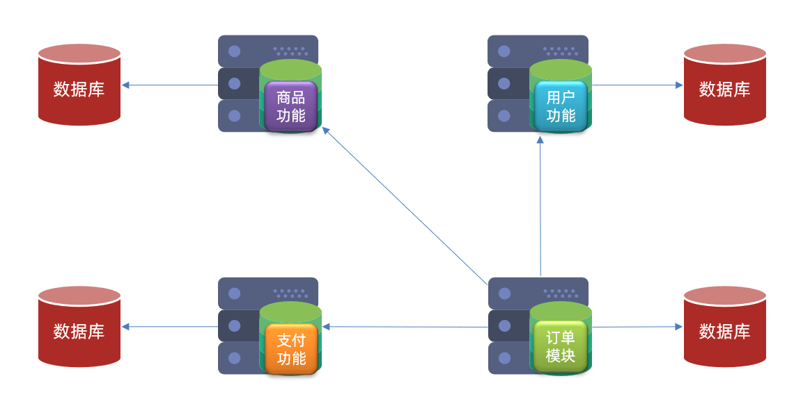
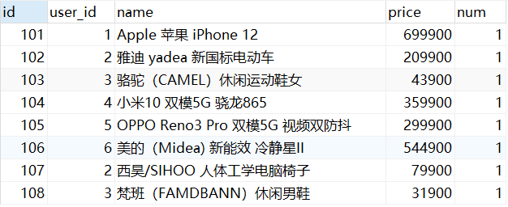
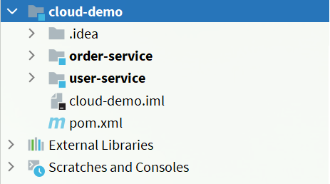
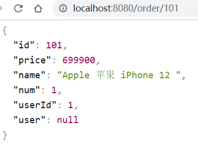
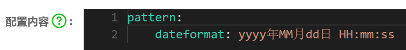
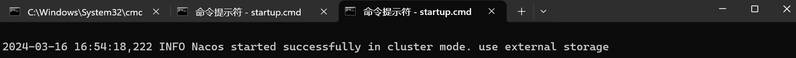
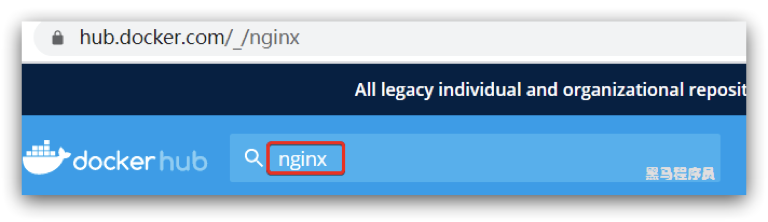
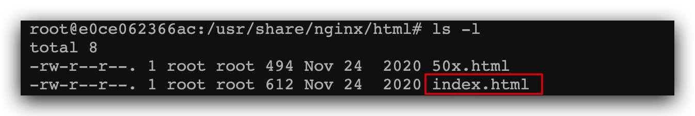

1.微服务技术栈导学1

微服务技术并不是SpringCloud技术，它是分布式架构的一种，所谓分布式架构就是要把服务做拆分，拆分的过程中会产生各种各样的问题需要去解决，SpringClout仅仅是解决了服务拆分时的服务治理问题，至于其他一些分布式的复杂的一些问题，并没有给出解决方案。

所以一个完整的微服务技术要包含不仅仅是SpringCloud。


**拆分**

传统的单体架构，所有的业务功能全部写在一起，随着业务越来越复杂，代码也变得耦合的更多，将来想要升级维护就会很困难。

微服务在做拆分的时候，根据功能业务模块，把一个单体项目，拆分成许多个独立的项目。每个项目完成一部分业务功能，将来独立开发和部署，我们把这一个独立的项目称为一个服务。一个大型的互联网项目往往会包含数百甚至上千的服务，最终形成一个服务集群。

而一个业务往往就需要由多个服务共同来完成，比如一个请求来了，它可能先去调用服务A，接着服务A又去调了服务B，然后又调了服务C，随着业务越来越复杂，这些服务之间的调用关系就会越来越复杂，这么复杂的调用关系，想靠人去记录和维护，这是不可能能。

所以在微服务里有个组件，叫做注册中心，它可以去记录微服务中的每一个服务的IP端口，以及它能干什么事这些信息。当有一个服务需要调用另一个服务的时候，它不需要去记录对方的IP，只要去找注册中心就行了，然后从它那拉取对应的服务信息。

同时，随时服务越来越多，每个服务都有自己的配置文件，将来如果要更改配置，当然也不能逐一去更改，这太麻烦了。所以在微服务里还有一个叫配置中心，它可以去统一的管理整个服务群里成千上白的配置，如果以后你有一些配置需要变更，只需要去找到配置中心就可以了，它回去通知相关的微服务，实现配置的热更新。


当我们的微服务运行起来以后，用户就可以来访问我们，这个时候还需要一个网关组件，因为你这里有这么多的微服务，用户怎么知道该访问哪一个呢，而且也不是说随便什么人都可以来访问我们的服务。所以服务网关一方面是对用户身份做校验，另一方面可以把用户的请求路由到具体的服务，当然在路由的过程中也可以去做一些负载均衡。


这时候，服务接收到你的请求去处理业务，该访问数据库的时候就去访问数据库，之后再把查询到的数据返回给用户就ok了。这里画的是一个，但将来的数据库肯定是集群，不过集群再庞大，也不可能有用户多。所以数据库将来肯定无法抗住这种高的并发，因此我们还会加入缓存，将数据库数据放入到内存中，内存查询效率肯定比数据库要快很多，而且这种缓存还不能是单体缓存，为了应对高并发，还要做成这种分布式的缓存，也是一个集群。用户请求先到缓存，缓存未命中，再去查询数据库。


以后我们的业务中还会有一些复杂的搜索功能，简单查询可以做缓存，而一些海量数据的复杂的搜索统计和分析，缓存也做不了。那这个时候我们还需要用到分布式搜索功能，数据库将来主要的职责，其实就是做一种数据的写操作，还有一些事务类型的，对数据安全要求较高的一些数据存储。


最后，在微服务里面还需要一种异步通信的消息队列组件。其实对于微服务里面，它的业务往往会跨越多个服务，整个业务的服务调用链路就很长，调用时长就会等于每个服务的执行时长之和，其实性能是有一定的下降。而异步通信的意思就是，请求来了，调用了服务A，服务A此时不是调用服务B和C，而是通知，发一条消息，让B和C干活，当B和C干完后，服务A也干完了。

所以异步通信可以大大提高我们服务的并发，在一些秒杀这样的高并发场景下就可以去利用了。


但是我们如此庞大的一个项目，如果其中出现了什么问题，不好排查，所以在微服务的运行过程中，我们还会引入两个新的组件，来解决这种服务的异常定位。

1. 分布式日志服务

   它可以去统计整个集群中成千上白的服务它们的运行日志，统一的去做一个存储、统计、分析。将来出现问题，就比较好定位了。

2. 系统的监控和链路追踪

   它可以去实时监控我们整个群中每一个结点的运行状态，CPU的负载，内存的占用等等情况，一旦出现任何的问题，直接可以定位到具体的某一个方法，战线信息，name你就能够很快速的定位到异常的所在了。


如此庞大复杂的一个微服务集群，将来很有可能能达到成百上千甚至上万的服务，这个时候我们部署该怎么办呢，如果还是靠以前人工去部署，很不现实，所以将来这些微服务集群，将来就需要去做一些自动化的部署，我们就会利用Jenkins这样的工具，它可以帮助你对这些微服务项目进行自动化的编译，而基于docker再去做一些打包，形成镜像，然后再基于K8S或者是rancher这样的技术，去实现自动化的部署，这一套我们就称之为叫：持续集成。

结合微服务的这些技术，再加上持续集成，这才是完整的微服务技术栈。


---

# 2.微服务技术栈导学2

微服务治理也就是SpringCloud这个框架所包含的一些技术。


---

# 3.Day1课程介绍

---

# 4.服务架构演变

微服务

随着互联网行业的发展，对服务的要求也越来越高，服务架构也从单体架构逐渐演变为现在流行的微服务架构。这些架构之间有怎样的差别呢？


## 单体架构

到目前为止，我们所接触的项目，都是单体架构。

**单体架构**：将业务的所有功能集中在一个项目中开发，打成一个包部署。

> 我们把一个项目称为一个服务


单体架构的优缺点如下：

**优点：**

- 架构简单

- 部署成本低

  使用tomcat，将项目打成包往上一放，一部署，用户就能访问了。用户多了，再加两台机器，形成负载均衡的集群。

这样的架构比较适合于面临企业内部使用的一些简单项目。

**缺点：**

- 耦合度高（维护困难、升级困难）

  代码量多的时候，光编译打包可能就得花上十几分钟。而且因为模块太多，在开发的过程中你中有我，我中有你，它们之间的边界也越来越模糊，将来改一个地方的代码，很有可能导致其他几个模块的代码都跟着受到影响，这个时候你还敢乱动代码吗？


## 分布式架构

> 微服务就是分布式架构其中一种，但是它设计的好一些，是一种最佳实践

**分布式架构**：根据业务功能对系统做拆分，每个业务功能模块作为独立项目开发，称为一个服务。


分布式架构的优缺点：

**优点：**

- 降低服务耦合
- 有利于服务升级和拓展

**缺点：**

- 服务调用关系错综复杂


分布式架构虽然降低了服务耦合，但是服务拆分时也有很多问题需要思考：

- 服务拆分粒度如何？

  怎么拆，哪几个项目作为独立的模块，哪些业务在一起呢

- 服务集群地址如何维护？

- 服务之间如何实现远程调用？

- 服务健康状态如何感知？

  我怎么知道哪些服务是不是好的

人们需要制定一套行之有效的标准来约束分布式架构。现在最流行的方案就是微服务了。


## 微服务

微服务是一种经过良好架构设计的**分布式**架构方案，微服务的架构特征：

- 单一职责：微服务拆分粒度更小，每一个服务都对应唯一的业务能力，做到单一职责，避免重复业务开发

  好处：每个服务业务更少了，它影响的范围更小了

  当没有办法掉跨服务的代码了，此时就会出现面向服务

- 面向服务：微服务对外暴露业务接口

- 自治：团队独立、技术独立、数据独立、部署独立

  对于微服务来讲，并不是按照职责划分（前端、后端、测试），而是按照微服务来划分，比如 会员服务 这个微服务，安排5个人，里面有前端、后端、测试、运维。

  为什么是小团队开发呢？因为团队越小，沟通起来越方便，将来我服务有什么问题需要迭代升级，给这个团队一通知，这五个人就可以快速开个会讨论一下了。然后立即完成服务的改造、升级、测试。所以它比较符合敏捷开发的这种思路和思想。技术独立，独立团队各自开发，就可以去使用自己比较擅长的技术，甚至可以基于业务去选择，因为大家都互不影响。

  数据独立：每一个微服务还能够有自己独立的数据库，有自己独立的数据。将来就实现了一种数据的解耦。

  部署独立：将来在部署的时候可以独立部署，用户在访问的时候，可以基于自己的需求去访问任意的业务服务，当然得有一个统一的入口，这个入口一般叫网关。

- 隔离性强：服务调用做好隔离、容错、降级，避免出现级联问题

  服务虽然独立了，但它们之间会有相互调用，暴露一个接口，供别的服务来调，那如果我调了，但你挂了，岂不是会对我产生影响。所以为了避免这种影响，服务要做好隔离，提前做好一些容错措施，接下来避免服务出现宕（dang）机，导致其他的服务也出现宕机。


微服务的上述特性其实是在给分布式架构制定一个标准，进一步降低服务之间的耦合度，提供服务的独立性和灵活性。做到高内聚，低耦合。降低一个服务所能产生影响的范围，避免整个集群的故障。

因此，可以认为**微服务**是一种经过良好架构设计的**分布式架构方案** 。

但方案该怎么落地？选用什么样的技术栈？全球的互联网公司都在积极尝试自己的微服务落地方案。

其中在Java领域最引人注目的就是SpringCloud提供的方案了。


## 总结

单体架构特点？

- 简单方便，高度耦合，扩展性差，适合小型项目。例如：学生管理系统

分布式架构特点？

- 松耦合，扩展性好，但架构复杂，难度大。适合大型互联网项目，例如：京东、淘宝

微服务：一种良好的分布式架构方案

- 优点：拆分粒度更小、服务更独立、耦合度更低

- 缺点：架构非常复杂，运维、监控、部署难度提高

----

# 5.微服务技术对比

微服务这种方案需要技术框架来落地，全球的互联网公司都在积极尝试自己的微服务落地技术。在国内最知名的就是SpringCloud和阿里巴巴的Dubbo。但不管是这两种的哪一种，他们所包含的组件和实现的功能基本上都是一致的。

首先，它们都需要去做微服务的拆分，形成微服务集群。而集群中的每一个服务都要遵循单一职责的原则，并且要面向服务，对外暴露接口，这样服务之间就可以做一些相应的调用了。只不过不同技术在实现这些接口的时候可能会有差异。但不管是那种技术，服务之间的关系错综复杂，一定需要我们去维护，所以在微服务流都会有一个注册中心，它可以去维护微服务里面每个结点的信息，并且去监控这些节点的状态。将来如果需要有些配置要修改，手动修改会十分麻烦，所以在微服务里面还会有一个配置中心，可以统一的去管理整个微服务群的配置，如果将来有变更，我们也可以利用通知的方式去让对应的服务监控到配置的变化，从而实现配置的热更新。

如此之多的微服务，用户怎么知道访问哪一个。所以微服务群往往还需要有一个统一的网关作为入口，用户可以去访问它，然后由网关再把请求路由到我们的微服务群，在路由过程中还可以去做负载均衡。

并且路由的时候，或者服务之间调用的过程中，我们还需要做好服务的容错处理，避免因为服务故障，导致宕机。

还要做好服务保护，隔离降级等等这些措施。


**微服务技术对比**

Dubbo技术早在2012年左右就已经开源出来，是阿里巴巴开源的。但那个时候微服务技术可能听都没听过。所以Dubbo并不是一个严格意义上的微服务技术。在那个时候它的核心就是服务的远程调用以及注册发现。所以在Dubbo里面注册体系并不完整。而且注册中心也不是Dubbo里面自己去实现的，而是依赖于redis、zookeeper还有一些其他的框架来做的。但这些并不是专业的注册中心，像redis做缓存的，zookeeper是用来做集群管理的。所以并不具备完善的注册中心功能。而服务的这种远程调用才是Dubbo的核心，当时，Dubbo专门基于这种ttp的协议订了一套标准，也就是Ddubbo协议。所以遵循Dubbo这种远程调用，你必须得定义Dubbo这种标准的接口。它要求你必须要用java实现，必须要实现JDK里面的serialize接口等等一系列要求。而配置中心、服务网关Dubbo并没有实现，至于服务监控和保护，Dubbo里只提供了一个最基本的dubbo-admin功能，只是来统计一下服务调用时的一个响应时间等等，功能非常单一。所以这个时候实现了这个服务的这种治理其实是非常不完善的。

而大概到了2015年一直到2017年，可以说是微服务技术井喷的时候。各种各样微服务技术层次不穷，但是一直没有一个一统江湖的。直到SpringCloud出来了。SpringCloud并不是发明了什么东西，而是整合，它把全球各公司的开源的微服务技术都整合起来了。然后形成了一套完整的微服务技术体系。它的功能是非常完善的：首先有完善的注册中心，里面包含Eureka、Consul这种专业的注册中心。而服务调用它并没有去整一种全新的协议和标准，那样会带来一些学习成本，所以它用的直接就是基于http协议的标准，我们以前编写的那些controller、RESTFul接口，都是属于http协议的。这个时候，只要遵循了RestFul，任何能够发http请求的都能调用它。所以这种学习成本很低。只不过它帮你封装了一个客户端：Feign，帮你发http的请求。当然你不用它也没问题，只要你遵循了RESTFul就行了。然后SpringCloud还提供了专业的配置中心：SpringCloudConfig，如果再结合SpringCloudBus，你就能实现这种配置变更时的自动通知、热更新，非常强大。另外，SpringCloud还提供了SpringCloudGateway、Zuul两个不同的网关，在目前比较流行的就是Gateway网关了，因为它里面给予了最新的这种响应式编程，吞吐能力非常强。还有服务的保护，Hystrix是一个非常强大的服务保护技术，当前它里面也带有一些监控功能，但核心是保护，主要就是实现了服务的隔离、熔断等等一些相关技术，功能也是十分的强大。

所以在Dubbo来看，它其实跟SpringCloud还是存在比较大的一些差距的，不是一个完善的技术栈。所以阿里巴巴也认识到了这一点，因此在近几年，其实也是在不断地去奋起直追，想办法追赶SpringCloud的脚步，它逐渐的实现了自己的注册中心、配置中心、服务监控等等组件，形成一套技术栈，起了个名字叫：SpringCloudAlibaba。它以SpringCloud开头说明这个组件首先是SpringCloud中的一部分。它实现了SpringCloud的这些标准接口，所以你会发现，SpringCloudAlibaba里面的很多技术组件用起来跟SpringCloud没什么差别，因为它们实现了统一的接口规范。Nacos注册中心强大之处在于：它既支持Dubbo这种调用，又支持Feign这种调用。因为SpringCloudAlibaba它同时兼容这两种架构（Dubbo和SpringCloud采用的协议不同，将来提供的接口标准不同，将来项目架构的方案就会不一样）。所以在国内，这套技术越来越火热了，后续也会基于这个来作为学习的重点。


企业需求：

`SpringCloud + Feign` 和 `SpringCloudAlibaba`这两种其是可以看成同一种，因为接口风格是一样的，调用方试也一样，至于技术栈的不同，SpringCloudAlibaba兼容SpringCloud，而且实现了相同的接口，使用起来其实几乎没有差别。

Dubbo原始模式升级到SpringCloudAlibaba，代码不用动，要变的仅仅是一些外部的组件（注册中心、配置中心等等），所以用起来非常的方便。


---

# 6.认知微服务-SpringCloud

SpringCloud是目前国内使用最广泛的微服务框架。官网地址：https://spring.io/projects/spring-cloud。

在左侧有SpringCloud各种各样的组件。其中就包含了SpringCloudAlibaba。所以SpringCloudAlibaba里面的整个体系也都是SpringCloud的一部分。


SpringCloud集成了各种微服务功能组件，并基于SpringBoot实现了这些组件的自动装配，从而提供了良好的开箱即用体验。

其中常见的组件包括：


这些功能其实大多数都是从其他公司开源的组件整合进来的。为什么要用spring整合的而不是用官方原生的呢？

这是因为SpringCloud里面有一个非常重要的东西：SpringBoot，并且基于SpringBoot做了自动装配。而我们只需要拿过来就能使用，而无需复杂的配置，用起来非常舒服。

另外，SpringCloud底层是依赖于SpringBoot的，并且有版本的兼容关系，如下，每一个SpringCloud版本都有一个对应的SpringBoot版本：


如果版本不兼容，就会导致报错，或者启动不了。

我们课堂学习的版本是 Hoxton.SR10，因此对应的SpringBoot版本是2.3.x版本。

> Hoxton.SR10 是 Spring Cloud 的一个版本标识。Spring Cloud 是一套基于 Java 实现的微服务解决方案，它为开发者提供了在分布式系统（如微服务架构）中快速构建一些常见模式的服务治理工具。其中，Hoxton 是 Spring Cloud 的一个大版本系列名称，而 .SR10 表示它是 Hoxton 系列的第10个 Service Release（修正版或更新版）。
>
> 在软件开发中，Service Release 通常是针对前一个正式版发布之后收集到的问题和需求进行修复与改进的一个版本，相比于主要版本更新，它更注重于对现有功能的稳定性和错误修复。对应 Spring Boot 版本，Hoxton.SR10 这个版本的 Spring Cloud 一般推荐搭配 Spring Boot 2.3.x 版本来使用。
>
> Starting with SR5：从 SR5 开始，SR5用的是2.2，SR5以上，用的是2.3

----

# 7.服务拆分-案例demo

**服务拆分和远程调用**

任何分布式架构都离不开服务的拆分，微服务也是一样。


## 服务拆分原则

需求：查询订单，并且同时把订单关联的用户信息、商品信息都给他查出来。

以前的开发模式：肯定是写一个方法去查订单，订单查询的过程中得到了用户id，我再去数据库里把用户查出来；得到商品id再去数据库里把商品查出来。那么这些功能全部写到了订单的模块里，这种做法是完全违背了微服务原则的。微服务拆分的目的就是单一职责，一个服务只做与自己相关的事，订单模块当然是做订单业务，为什么要做用户查询和商品查询呢。


这里我总结了微服务拆分时的几个原则：

- 微服务需要根据业务模块拆分，做到单一职责，不要重复开发相同业务

  每个微服务都不能去开发重复的业务，如果在微服务拆分的过程中，出现了重复业务，这就证明我们某些地方做的有问题。

- 微服务数据独立，不要访问其它微服务的数据库

  直接从根源上杜绝这种耦合性的业务。

- 微服务可以将自己的业务暴露为接口，供其它微服务调用




## 服务拆分demo

以课前资料中的微服务cloud-demo为例，其结构如下：


可以看见已经拆分成了两个微服务。从业务角度可以看见，它们的业务是解除了耦合的。

cloud-demo：父工程，管理依赖


- order-service：订单微服务，负责订单相关业务
- user-service：用户微服务，负责用户相关业务

要求：

- 订单微服务和用户微服务都必须有各自的数据库，相互独立
- 订单服务和用户服务都对外暴露Restful的接口
- 订单服务如果需要查询用户信息，只能调用用户服务的Restful接口，不能查询用户数据库


**导入Sql语句**

首先，将课前资料提供的`cloud-order.sql`和`cloud-user.sql`导入到mysql中：

> 将来在做实际业务生产的时候一定会把它们部署到不同的数据库里，不过现在我们是自己做测试，准备两个不同的database去存储这些表。

提前准备好两个不同的database来模拟两个不同的数据库


cloud-user表中初始数据如下：


cloud-order表中初始数据如下：




cloud-order表中持有cloud-user表中的id字段。


**导入demo工程**

用IDEA导入课前**资料**提供的Demo：


项目结构如下：



导入后，会在IDEA右下角出现弹窗，点击使用服务


会出现这样的菜单：


配置下项目使用的JDK：


使用shift选中需要启动的微服务，然后点击调式将项目启动起来


然后通过访问接口获取到数据库信息


---

# 8.服务拆分-服务远程调用

**实现远程调用案例**

在order-service服务中，有一个根据id查询订单的接口：


根据id查询订单，返回值是Order对象，如图：



其中的user为null


在user-service中有一个根据id查询用户的接口：


查询的结果如图：


**案例需求**

修改order-service中的根据id查询订单业务，要求在查询订单的同时，根据订单中包含的userId查询出用户信息，一起返回。

从订单模块向用户模块发起远程调用，然后把查到结果做一个组合。


因此，我们需要在order-service中 向user-service发起一个http的请求，调用http://localhost:8081/user/{userId}这个接口。

所以问题就变成了：如何在Java代码中发送HTTP请求。


大概的步骤是这样的：

- 注册一个RestTemplate的实例到Spring容器

- 修改order-service服务中的OrderService类中的queryOrderById方法，根据Order对象中的userId查询User

  ```java
  
  ```

- 将查询的User填充到Order对象，一起返回


## 注册RestTemplate

Spring提供了一个工具：RestTemplate，这个工具就是Spring提供给我们来发各种各样的HTTP请求的。

> http请求做远程调用是与语言无关的调用，只要知道对方的ip、端口、接口路径、请求参数即可。

如下，是通过一种Bean的方式把RestTemplate注册为Spring的一个对象，将来可以在任何地方注入这个对象来用了

由于Bean的注入只能放到配置类里，而SpringBoot的启动类本身也是配置类，所以完全可以在启动类里去写Bean的注入。

首先，我们在order-service服务中的OrderApplication启动类中，注册RestTemplate实例：

```java
@MapperScan("cn.itcast.order.mapper")
@SpringBootApplication
public class OrderApplication {

    public static void main(String[] args) {
        SpringApplication.run(OrderApplication.class, args);
    }

    /**
     * 创建RestTemplate并注入Spring容器
     * @return
     */
    @Bean
    public RestTemplate restTemplate () {
        return new RestTemplate();
    }
}
```


## 实现远程调用

修改order-service服务中的cn.itcast.order.service包下的OrderService类中的queryOrderById方法：

~~~java
public Order queryOrderById(Long orderId) {
    // 1.查询订单
    Order order = orderMapper.findById(orderId);
    // 2.利用RestTemplate发起http请求，查询用户
    // 参数1：URL路径，这个和浏览器里的路径是完全一样的
    // 2.1 url路径
    String url = "http://localhost:8081/user/" + order.getUserId();
    // 2.2 发送http请求：实现远程调用
    // 得到的结果是一个JSON风格，但我们想要的是user对象，但是RestTemplate非常的智能
    // getForObject：发送get方式的请求
    // 参数2：responseType 返回值类型。例如这里填User.class，它会自动帮你反序列化成User类型
    User user = restTemplate.getForObject(url, User.class);
    // 封装user到Order
    order.setUser(user);
    // 4.返回
    return order;
}
~~~


## 查询结果


---

# 9.Kureka-提供者与消费者

在服务调用关系中，会有两个不同的角色：

**服务提供者**：一次业务中，被其它微服务调用的服务。（提供接口给其它微服务）

**服务消费者**：一次业务中，调用其它微服务的服务。（调用其它微服务提供的接口）


但是，服务提供者与服务消费者的角色并不是绝对的，而是相对于业务而言。

如果服务A调用了服务B，而服务B又调用了服务C，服务B的角色是什么？

>  提供者与消费者角色其实是**相对**的

- 对于A调用B的业务而言：A是服务消费者，B是服务提供者
- 对于B调用C的业务而言：B是服务消费者，C是服务提供者

**因此，服务B既可以是服务提供者，也可以是服务消费者。**

---

# 10.Ereka-eureka原理分析

## Eureka注册中心

在之前的案例中，我们有一个订单服务和一个用户服务，订单服务需要远程调用我们的用户服务。它采用的方式是发起一次http请求。我们是将UserService服务的ip和端口硬编码在代码当中的。

这样的一种写法，它其实是有一定问题的：在公司里开发的时候，我们会有开发环境、测试环境、生产环境等等，每一次环境的变更，可能服务的地址也会发生变化。而且为了应付更多的并发，User服务可能会部署成多实例，形成一个集群，那这个时候，硬编码该写谁的地址呢。

假如我们的服务提供者user-service部署了多个实例，如图：


大家思考几个问题：

- order-service在发起远程调用的时候，该如何得知user-service实例的ip地址和端口？
- 有多个user-service实例地址，order-service调用时该如何选择？
- order-service如何得知某个user-service实例是否依然健康，是不是已经宕机？


## Eureka的结构和作用

这些问题都需要利用SpringCloud中的注册中心来解决，其中最广为人知的注册中心就是Eureka，其结构如下，起到的作用就是：记录和管理微服务。

user-service（服务提供者）和order-service（服务消费者）。不管是消费者还是提供者，都是微服务，所以统称为Eureka的客户端。

只要是Eureka的客户端，在启动的时候都会把自己的信息注册给Eureka。Eureka会把你的名字记录下来（user-service名称、ip端口）。

这样order-service直接去找Eureka要user-service，然后Eureka就会返回给你地址信息。

然后再利用负载均衡从三个user-service中挑一个，向挑好的发请求，并且挑好的这个不可能是挂的，因为服务每隔30秒钟都会向Eureka发一次心跳，来确认一下自己的状态。如果有一天它不跳了，就会把它从列表中剃掉。


回答之前的各个问题。

**问题1：消费者该如何获取服务提供者具体信息？**

获取地址信息的流程如下：

- user-service服务实例启动后，将自己的信息注册到eureka-server（Eureka服务端）。这个叫服务注册。
- eureka-server保存服务名称到服务实例地址列表的映射关系
- order-service根据服务名称，拉取实例地址列表。这个叫服务发现或服务拉取。


**问题2：如果有多个服务提供者，消费者该如何选择？**

- order-service从实例列表中利用负载均衡算法选中一个实例地址
- 向该实例地址发起远程调用


**问题3：消费者如何感知服务提供者健康状态？**

- user-service会每隔一段时间（默认30秒）向eureka-server发起请求，报告自己状态，称为心跳
- 当超过一定时间没有发送心跳时，eureka-server会认为微服务实例故障，将该实例从服务列表中剔除
- order-service拉取服务时，就能将故障实例排除了


**在Eureka架构中，微服务角色有两类**

EurekaServer：服务端，注册中心

- 记录服务信息

- 心跳监控

EurekaClient：客户端

- Provider：服务提供者，例如案例中的 user-service

  注册自己的信息到EurekaServer

  每隔30秒向EurekaServer发送心跳

- consumer：服务消费者，例如案例中的 order-service

  根据服务名称从EurekaServer拉取服务列表

  基于服务列表做负载均衡，选中一个微服务后发起远程调用

> 注意：一个微服务，既可以是服务提供者，又可以是服务消费者，因此eureka将服务注册、服务发现等功能统一封装到了eureka-client端。

---

# 11.搭建eureka-server(Eureka注册中心)

1. 创建eureka-server服务
2. 引入eureka-server依赖
3. 在启动类上加@EnableEurekaServer注解
4. 在application.yml中配置eureka地址

首先大家注册中心服务端：eureka-server，这必须是一个独立的微服务

**创建eureka-server服务**

在cloud-demo父工程下，创建一个子模块：


填写模块信息：


**引入eureka依赖**

引入SpringCloud为eureka提供的starter依赖

> 依赖的结尾是：eureka-server，说明它是eureka的服务端依赖，中间的starter，是SpringBoot里面的自动装配，也就是说在这个依赖里面已经把eureka所有的配置都已经做好了，也就是说我们可以做到0配置就能拿来用了。

这里在引入依赖的时候并没有指定版本信息，原因是因为在父工程中，已经把依赖的版本都管理好了。

点进父工程的SpringCloud组件库，这里面有大量的SpringCloud的组件及其版本信息。所以在我们引入SpringCloud组件的时候，我们无需指定任何版本信息。


```xml
<!-- eureka服务端 -->
<dependency>
    <groupId>org.springframework.cloud</groupId>
    <artifactId>spring-cloud-starter-netflix-eureka-server</artifactId>
</dependency>
```


**编写启动类**

给eureka-server服务编写一个启动类，一定要添加一个@EnableEurekaServer注解，开启eureka的注册中心功能


```java
package cn.itcast.eureka;

import org.springframework.boot.SpringApplication;
import org.springframework.boot.autoconfigure.SpringBootApplication;
import org.springframework.cloud.netflix.eureka.server.EnableEurekaServer;

@SpringBootApplication
@EnableEurekaServer
public class EurekaApplication {
    public static void main(String[] args) {
        SpringApplication.run(EurekaApplication.class, args);
    }
}
```


**编写配置文件**

编写一个application.yml文件，内容如下：

> 需要配置euraka的地址信息是因为euraka也是一个服务，会将自己也注册到euraka上
>
> 这是为了euraka集群之间通讯用的，比如说之后启动了三个euraka，三个euraka之间就会相互做注册，这样她们就能做数据交流了，所以这里配的应该是Eureka集群的地址。如果有多个，则以逗号隔开，但由于这里是单机，所以这里配的是自己。

这里的服务名称和服务地址其实是在做服务注册。

```yaml
server:
  port: 10086 # 服务端口，端口可以随便起名字
spring:
  application:
    name: eurekaserver # 配置服务名称，服务名称其实就是微服务的名称。之前将每个服务注册的时候都要带上名称，这个就是微服务的名称。eureka自己也是个微服务，所以它也需要一个名字。
eureka:
  client:
    service-url:
      defaultZone: http://127.0.0.1:10086/eureka # 配置euraka的地址信息
```


**启动服务**

> ctrl+shift+10：运行启动类
>
> IDEA中直接点解服务旁边的端口也可以直接进行访问

启动微服务，然后在浏览器访问：http://127.0.0.1:10086

看到下面结果应该是成功了，这个是Eureka的管理界面


最下面显示的是通用信息


中间是最关键的：Instances currently registered with Eurek a —>  注册到Eureka的实例（一个服务每部署一个，就叫一个实例，如果在线上部署10个，那就是10个实例）

刚刚说Eureka会注册到自己身上，下面 **EUREKASERVER** 就是我们配的Eureka的服务名称，后面就是ip和端口。

UP代表正常状态，DOWN代表挂掉了。后面显示不像IP的原因是，这里是windows，后面显示的是计算机名，理论上讲，这里应该显示ip，这里理论上讲可以理解成：localhost（即自己电脑的名称）


---

# 12.Eureka-服务注册

1. 引入eureka-client依赖
2. 在application.yml中配置eureka地址

下面，我们将user-service注册到eureka-server中去。

> 除了依赖不一样（Eureka是Eureka的服务端，而这里是Eureka的Client端），配置跟刚才在Eureka中的配置是一样的。因为Eureka启动时会把自己注册到Eureka，所以它也需要配服务名称和Eureka地址，而我们认为 `配服务名称和Eureka地址` 其实是服务注册的配置，只要配了它，就可以做注册。
>
> 无论是消费者还是提供者，引入eureka-client依赖，知道eureka地址后，都可以完成服务注册

**1）引入依赖**

在user-service的pom文件中，引入下面的eureka-client依赖：

```xml
<!-- eureka客户端依赖 -->
<dependency>
    <groupId>org.springframework.cloud</groupId>
    <artifactId>spring-cloud-starter-netflix-eureka-client</artifactId>
</dependency>
```


**2）配置文件**

在user-service中，修改application.yml文件，添加服务名称、eureka地址：

> 凡是引地址，就是在Eureka注册

```yaml
spring:
  application:
    name: userservice # user服务的服务名称
eureka:
  client:
    service-url:
      defaultZone: http://127.0.0.1:10086/eureka # 配置euraka的地址信息
```


**orderservice也一样**

**1）引入依赖**

之前说过，服务发现、服务注册统一都封装在eureka-client依赖，因此这一步与服务注册时一致。

在order-service的pom文件中，引入下面的eureka-client依赖：

```xml
<!-- eureka客户端依赖 -->
<dependency>
    <groupId>org.springframework.cloud</groupId>
    <artifactId>spring-cloud-starter-netflix-eureka-client</artifactId>
</dependency>
```


**2）配置文件**

服务发现也需要知道eureka地址，因此第二步与服务注册一致，都是配置eureka信息：

在order-service中，修改application.yml文件，添加服务名称、eureka地址：

```yaml
spring:
  application:
    name: orderservice # order服务的服务名称
eureka:
  client:
    service-url:
      defaultZone: http://127.0.0.1:10086/eureka # 配置euraka的地址信息
```


回到浏览器查看结果：eureka、userservice、orderservice全部都注册上来了，这就是服务列表


---

## 启动多个user-service实例

为了演示一个服务有多个实例的场景，我们添加一个SpringBoot的启动配置，再启动一个user-service。

首先，复制原来的user-service启动配置：


然后，在弹出的窗口中，填写信息，由于将一个服务启动两次会有端口冲突，所以这里需要配置一个 `-Dserver.prot` 去避免端口冲突。

> -D代表参数，server.port就是我们在yml文件中配的方式，这里配置的端口就是用来覆盖yml文件里的端口的。


现在，SpringBoot窗口会出现两个user-service启动配置：


不过，第一个是8081端口，第二个是8082端口。

启动两个user-service实例：


查看eureka-server管理页面，发现已经注册了两个实例，UP(2)，后面跟着的是注册的实例列表


---

# 13.Eureka-服务发现和拉取

1. 引入eureka-client依赖
2. 在application.yml中配置eureka地址（注册到Eureka中去）
3. 给RestTemplate添加@LoadBalanced注解
4. 用服务提供者的服务名称远程调用

下面，我们将order-service的逻辑修改：向eureka-server拉取user-service的两个实例信息，实现服务发现、负载均衡。

不过这些动作不用我们去做，只需要添加一些注解即可。

**1）拉取服务**

修改order-service服务中的cn.itcast.order.service包下的OrderService类中的queryOrderById方法。修改访问的url路径，用服务名代替ip、端口。

> 在eureka中服务名代指的就是后面的ip端口，如果怕写错，就去userservice的yml文件里复制


**2）负载均衡**

在order-service的OrderApplication中，给RestTemplate这个Bean添加一个@LoadBalanced注解（LoadBalanced：负载均衡）


spring会自动帮助我们从eureka-server端，根据userservice这个服务名称，获取实例列表，而后完成负载均衡。


验证：将两个userservice服务的日志清空，然后访问orderservice，查看到底访问的是哪个userservice。

访问101-104的order数据，可以发现已经实现了负载均衡。我们根本不用关心服务的地址，我们只需要将服务名称往这一放就行了，剩下的事情交给Eureka的客户端工具去做就可以了。


---

# 14.Ribbon-负载均衡原理

上一节中，我们添加了@LoadBalanced注解，即可实现负载均衡功能，这是什么原理呢？

SpringCloud底层其实是利用了一个名为Ribbon的组件，来实现负载均衡功能的。


那么我们发出的请求明明是http://userservice/user/1，怎么变成了http://localhost:8081的呢？


## 源码跟踪

为什么我们只输入了service名称就可以访问了呢？之前还要获取ip和端口。

显然有人帮我们根据service名称，获取到了服务实例的ip和端口。它就是`LoadBalancerInterceptor`，这个类会在对RestTemplate的请求进行拦截（这是因为在RestTemplate上加了一个@loadBalanced，这个注解也就是一个标记，标记RestTemplate发送的请求，要被Ribbon中的拦截器`LoadBalancerInterceptor`给拦截和处理），然后从Eureka根据服务id获取服务列表，随后利用负载均衡算法得到真实的服务地址信息，替换服务id。

我们进行源码跟踪：

**1）LoadBalancerIntercepor**

LoadBalancerIntercepor 实现了 ClientHttpRequestInterceptor


**2）ClientHttpRequestInterceptor**

ClientHttpRequestInterceptor：客户端 Http 请求拦截器

它会去拦截由http客户端发起的http请求，而我们的RestTemplate正是发http请求的客户端！所以就会被ClientHttpRequestInterceptor接口所拦截。

```java
/**
 * Intercepts client-side HTTP requests. 
 */
@FunctionalInterface
public interface ClientHttpRequestInterceptor {
    
    ClientHttpResponse intercept(HttpRequest request, byte[] body, ClientHttpRequestExecution execution)
          throws IOException;

}
```


**3）回到ClientHttpRequestInterceptor的实现类LoadBalancerIntercepor**

这个拦截器既然实现了ClientHttpRequestInterceptor接口，就一定会实现intercept方法

此时就可以在这个方法打个断点，由RestTemplate发的请求一定会被这个方法拦截，此时就可以去浏览器发起一个

可以发现它直接跳到了断点这，说明这个请求确实被拦截了。


执行步骤：

```java
@Override
public ClientHttpResponse intercept(final HttpRequest request, final byte[] body,
                                    final ClientHttpRequestExecution execution) throws IOException {
    final URI originalUri = request.getURI(); // 获取请求地址：http://userservice/user/1
    String serviceName = originalUri.getHost(); // getHost：获取服务名称， // userservice
    Assert.state(serviceName != null,
                 "Request URI does not contain a valid hostname: " + originalUri);
    return this.loadBalancer.execute(serviceName, // 拉取：将服务名称交给了loadBalancer去执行，将鼠标放上去，它是一个名为RibbonLoadBalancerClient（Ribbon的负载均衡客户端）这样的一个对象，execute：执行
                                     this.requestFactory.createRequest(request, body, execution));
}
```

可以看到这里的intercept方法，拦截了用户的HttpRequest请求，然后做了几件事：

- `request.getURI()`：获取请求uri，本例中就是 http://user-service/user/8
- `originalUri.getHost()`：获取uri路径的主机名，其实就是服务id，`user-service`
- `this.loadBalancer.execute()`：处理服务id，和用户请求。

这里的`this.loadBalancer`是`LoadBalancerClient`类型，我们继续跟入execute方法。


**2）LoadBalancerClient**

```java
@Override
public <T> T execute(String serviceId, LoadBalancerRequest<T> request)
       throws IOException {
    return execute(serviceId, request, null);
}
```

继续跟入execute方法：

```java
// service名称在这里被称为 serviceId，它会交给getLoadBalancer函数去处理
public <T> T execute(String serviceId, LoadBalancerRequest<T> request, Object hint)
       throws IOException {
    ILoadBalancer loadBalancer = getLoadBalancer(serviceId);
    // 拉取服务列表：执行上一步完成后得到了一个ILoadBalancer对象，监视loadBalancer对象，里面1有个allServerList属性，这个属性里的值就是服务列表！
    Server server = getServer(loadBalancer, hint);
    if (server == null) {
       throw new IllegalStateException("No instances available for " + serviceId);
    }
    RibbonServer ribbonServer = new RibbonServer(serviceId, server,
          isSecure(server, serviceId),
          serverIntrospector(serviceId).getMetadata(server));

    return execute(serviceId, ribbonServer, request);
}
```


代码是这样的：

- getLoadBalancer(serviceId)：根据服务id获取ILoadBalancer，而ILoadBalancer会拿着服务id去eureka中获取服务列表并保存起来。
- getServer(loadBalancer)：利用内置的负载均衡算法，从服务列表中选择一个。本例中，可以看到获取了8082端口的服务


放行后，再次访问并跟踪，发现获取的是8081：

 

果然实现了负载均衡。


**3）负载均衡策略IRule**

在刚才的代码中，可以看到获取服务使通过一个`getServer`方法来做负载均衡:

 

我们继续跟入：


继续跟踪源码chooseServer方法，发现这么一段代码：

 

我们看看这个rule是谁：

 

IRule是一个接口，那一定会有实现类，通过ctrl + h查看它的实现类


这里的rule默认值是一个`RoundRobinRule`，看类的介绍：

 

这不就是轮询的意思嘛。

继续往下走，就会发现已经获取到了真实的ip地址和端口号，用这个真实的ip地址和端口号来替代原来的服务名称，去发起真实请求。


到这里，整个负载均衡的流程我们就清楚了。


## 总结

SpringCloudRibbon的底层采用了一个拦截器，拦截了RestTemplate发出的请求，对地址做了修改。用一幅图来总结一下：


基本流程如下：

- 拦截我们的RestTemplate请求http://userservice/user/1
- RibbonLoadBalancerClient会从请求url中获取服务名称，也就是user-service
- DynamicServerListLoadBalancer根据user-service到eureka拉取服务列表
- eureka返回列表，localhost:8081、localhost:8082
- IRule利用内置负载均衡规则，从列表中选择一个，例如localhost:8081
- RibbonLoadBalancerClient修改请求地址，用localhost:8081替代userservice，得到http://localhost:8081/user/1，发起真实请求

---

# 15.负载均衡策略

负载均衡的规则都定义在IRule接口中，而IRule有很多不同的实现类：


IRule常见的规则

| **内置负载均衡规则类**    | **规则描述**                                                 |
| ------------------------- | ------------------------------------------------------------ |
| RoundRobinRule            | 简单轮询服务列表来选择服务器。它是Ribbon默认的负载均衡规则。 |
| AvailabilityFilteringRule | 对以下两种服务器进行忽略：   （1）在默认情况下，这台服务器如果3次连接失败，这台服务器就会被设置为“短路”状态。短路状态将持续30秒，如果再次连接失败，短路的持续时间就会几何级地增加。  （2）并发数过高的服务器。如果一个服务器的并发连接数过高，配置了AvailabilityFilteringRule规则的客户端也会将其忽略。并发连接数的上限，可以由客户端的<clientName>.<clientConfigNameSpace>.ActiveConnectionsLimit属性进行配置。 |
| WeightedResponseTimeRule  | 为每一个服务器赋予一个权重值。服务器响应时间越长，这个服务器的权重就越小。这个规则会随机选择服务器，这个权重值会影响服务器的选择。 |
| **ZoneAvoidanceRule**     | 以区域可用的服务器为基础进行服务器的选择。使用Zone对服务器进行分类，这个Zone可以理解为一个机房、一个机架等。而后再对Zone内的多个服务做轮询。 |
| BestAvailableRule         | 忽略那些短路的服务器，并选择并发数较低的服务器。             |
| RandomRule                | 随机选择一个可用的服务器。                                   |
| RetryRule                 | 重试机制的选择逻辑                                           |

默认的实现就是ZoneAvoidanceRule，是一种轮询方案，一般情况下，走默认就可以了。

> 以区域可用的服务器为基础进行服务器的选择。但是在我们平时使用的过程中，是没有Zone的概念的，所以它其实就是轮询。


## 自定义负载均衡策略

通过定义IRule实现可以修改负载均衡规则，有两种方式：

1. 代码方式：在order-service中的OrderApplication类中，定义一个新的IRule：（针对全局，在orderservice里，不管是调用哪一个微服务，使用的都是随机）

```java
@Bean
public IRule randomRule(){
    return new RandomRule(); // 总得类型是IRule，但实现的时候可以是任何一种实现，这里选择的是随机，则这里就会让负载均衡的规则从轮询变成随机
}
```


2. 配置文件方式：在order-service的application.yml文件中，添加新的配置也可以修改规则：（针对某个微服务而言）

```yaml
userservice: # 给某个微服务配置负载均衡规则，这里是userservice服务
  ribbon:
    NFLoadBalancerRuleClassName: com.netflix.loadbalancer.RandomRule # 负载均衡规则 ，这里注意#前面有个空格
```

> **注意**，一般用默认的负载均衡规则，不做修改。

---

# 16.饥饿加载

Ribbon默认是采用懒加载，即第一次访问时才会去创建LoadBalanceClient，请求时间会很长。

如下图，第一次请求达到了538ms。


**查看OrderService控制台输出的日志**

在三秒将服务运行成功了


当我们第一次访问时，打印了成吨的日志信息。并且这里会有一次userservice的初始化

> "C.netflix.loadbalancer.BaseLoadBalancer日志消息：针对服务'userservice'创建了一个名为'userservice'的动态服务器列表负载均衡器实例，当前尚未配置任何服务器列表，区域及服务器状态统计均为空，且ServerList属性为null。"
>
> 这段日志表明，在Netflix Ribbon框架中，用于服务'userservice'的负载均衡器已经被实例化，但此时还没有获取到任何可供负载均衡选择的服务器列表。

~~~apl
c.netflix.loadbalancer.BaseLoadBalancer  : Client: userservice instantiated a LoadBalancer: DynamicServerListLoadBalancer:{NFLoadBalancer:name=userservice,current list of Servers=[],Load balancer stats=Zone stats: {},Server stats: []}ServerList:null
~~~

所以此时它会做一次拉取服务，拉取服务中就会去创建DynamicServerListLoadBalancer，于是就会消耗很长的时间。这就是所谓的懒加载。不过第一次加载完后后面就不要再加载了，因为服务列表会一直被缓存在我们的内存中，以后要想用的话就可以直接用了。

> 2023年3月14日下午3点21分46秒（格式：时:分:秒），在应用程序的执行线程[nio-8080-exec-1]上记录了以下INFO级别日志：针对客户端'userservice'的DynamicServerListLoadBalancer已完成初始化。当前配置如下：DynamicServerListLoadBalancer名称为'userservice'，当前服务器列表包含了[LAPTOP-VVQ62A0L:8082, LAPTOP-VVQ62A0L:8081]这两个地址。负载均衡器统计信息显示，区域内统计指标如下：
>
> - 区域名称：defaultzone，其中包含的实例数量为2个，当前活跃连接数为0，熔断器触发次数为0，平均每台服务器的活跃连接数为0.0。
>
> 针对各服务器的具体统计数据显示：
>
> - 服务器LAPTOP-VVQ62A0L:8082位于defaultZone区域，总计请求数量为0，连续连接失败次数为0，最近一次完全断开连接（即总断网秒数）为0秒，该服务器首次成功建立连接和最近一次成功建立连接的时间均为1970年1月1日早上8点（CST时区），当前活跃连接数为0；
> - 在过去的1000毫秒内，失败请求的总数为0次，平均响应时间为0.0秒，90%分位点响应时间为0.0秒，95%分位点响应时间为0.0秒，最小响应时间为0.0秒，最大响应时间为0.0秒，标准差响应时间为0.0秒。

~~~apl
03-14 15:21:46:801  INFO 52564 --- [nio-8080-exec-1] c.n.l.DynamicServerListLoadBalancer      : DynamicServerListLoadBalancer for client userservice initialized: DynamicServerListLoadBalancer:{NFLoadBalancer:name=userservice,current list of Servers=[LAPTOP-VVQ62A0L:8082, LAPTOP-VVQ62A0L:8081],Load balancer stats=Zone stats: {defaultzone=[Zone:defaultzone;	Instance count:2;	Active connections count: 0;	Circuit breaker tripped count: 0;	Active connections per server: 0.0;]
},Server stats: [[Server:LAPTOP-VVQ62A0L:8082;	Zone:defaultZone;	Total Requests:0;	Successive connection failure:0;	Total blackout seconds:0;	Last connection made:Thu Jan 01 08:00:00 CST 1970;	First connection made: Thu Jan 01 08:00:00 CST 1970;	Active Connections:0;	total failure count in last (1000) msecs:0;	average resp time:0.0;	90 percentile resp time:0.0;	95 percentile resp time:0.0;	min resp time:0.0;	max resp time:0.0;	stddev resp time:0.0]
~~~


而饥饿加载（饥不择食，饿的不行了，看见什么都往上啃）则会在项目启动时创建，降低第一次访问的耗时，通过下面配置开启饥饿加载：

```yaml
userservice:
  ribbon:
    NFLoadBalancerRuleClassName: com.netflix.loadbalancer.RandomRule # 负载均衡规则

# 注意和配置负载均衡规则的userservice在同一缩进，不要和配置负载均衡规则混到一起了
ribbon:
  eager-load:
    enabled: true # 开启饥饿加载
    clients: userservice # 指定饥饿加载的服务名称
```

这里的clients是一个集合，是一个List，所以在配置clients的时候有两种配法。


- 只有一个的时候，直接写服务名称就行了

  ```yml
  clients: userservice
  ```

- 如果想要指定多个服务做姐加载

  ```yml
  clients: 
    - userservice
    - xxservice
  ```

配置好之后，重启OrderApplication，查看控制台，可以发现服务启动起来之后随着tomcat的启动立马完成了服务的加载

> 

~~~apl
03-14 15:53:43:509  INFO 36092 --- [           main] c.n.l.DynamicServerListLoadBalancer      : DynamicServerListLoadBalancer for client userservice initialized: DynamicServerListLoadBalancer:{NFLoadBalancer:name=userservice,current list of Servers=[LAPTOP-VVQ62A0L:8082, LAPTOP-VVQ62A0L:8081],Load balancer stats=Zone stats: {defaultzone=[Zone:defaultzone;	Instance count:2;	Active connections count: 0;	Circuit breaker tripped count: 0;	Active connections per server: 0.0;]
},Server stats: [[Server:LAPTOP-VVQ62A0L:8082;	Zone:defaultZone;	Total Requests:0;	Successive connection failure:0;	Total blackout seconds:0;	Last connection made:Thu Jan 01 08:00:00 CST 1970;	First connection made: Thu Jan 01 08:00:00 CST 1970;	Active Connections:0;	total failure count in last (1000) msecs:0;	average resp time:0.0;	90 percentile resp time:0.0;	95 percentile resp time:0.0;	min resp time:0.0;	max resp time:0.0;	stddev resp time:0.0]
, [Server:LAPTOP-VVQ62A0L:8081;	Zone:defaultZone;	Total Requests:0;	Successive connection failure:0;	Total blackout seconds:0;	Last connection made:Thu Jan 01 08:00:00 CST 1970;	First connection made: Thu Jan 01 08:00:00 CST 1970;	Active Connections:0;	total failure count in last (1000) msecs:0;	average resp time:0.0;	90 percentile resp time:0.0;	95 percentile resp time:0.0;	min resp time:0.0;	max resp time:0.0;	stddev resp time:0.0]
]}ServerList:org.springframework.cloud.netflix.ribbon.eureka.DomainExtractingServerList@5c72e534
~~~

再次去访问浏览器，可以发现这次的访问时间缩减了一半。

> 虽然还是要300多ms，这是因为服务启动时还需要做一些别的事情。比如初始化DispatcherServlet，它也是在第一次被访问时加载的。
>
> 


----

# -------------------------------------

# Nacos注册中心

国内公司一般都推崇阿里巴巴的技术，比如注册中心，SpringCloudAlibaba也推出了一个名为Nacos的注册中心，现在是SpringCloud中的一个组件了。

**Service registration and discovery**：服务的注册和发现。

**Distributed Configuration**：分布式配置

所以Nacos相对于Eureka来讲，它的功能更加的丰富。


# 17.认识和安装Nacos

Eureka已经停止维护了。


[Nacos](https://nacos.io/)是阿里巴巴的产品，现在是[SpringCloud](https://spring.io/projects/spring-cloud)中的一个组件。相比[Eureka](https://github.com/Netflix/eureka)功能更加丰富，在国内受欢迎程度较高。


## Windows安装

开发阶段采用单机安装即可。

**下载安装包**

首先进入Nacos官网，然后点击下图红款部分，


在Nacos的GitHub页面，提供有下载链接，可以下载编译好的Nacos服务端或者源代码：

GitHub主页：https://github.com/alibaba/nacos

GitHub的Release下载页：https://github.com/alibaba/nacos/releases

如图：

Releases是Github项目的**发布页面**，在这里可以直接下载最新版本及迭代版本的安装包。


然后点击Tag（标签），它的各种版本在这里都会显示出来了。


选择需要下载的版本，然后滑到最底下，就会出现相应的下载链接。


本课程采用1.4.1.版本的Nacos，课前资料已经准备了安装包：


windows版本使用`nacos-server-1.4.1.zip`包即可。


**解压**

将这个包解压到任意非中文目录下，如图：


目录说明：

- bin：启动脚本
- conf：配置文件，Nacos的默认端口是8848，成功人士的标配哈哈哈
- target：里面是一个jar包，Nacos也是基于java语言去实现的。


## 端口配置

Nacos的默认端口是8848，如果你电脑上的其它进程占用了8848端口，请先尝试关闭该进程。

**如果无法关闭占用8848端口的进程**，也可以进入nacos的conf目录，修改配置文件中的端口：


修改其中的内容：


## 启动

启动非常简单，进入bin目录，结构如下：


然后执行命令即可：

- windows命令：

  > -m：模式（model）
  >
  > standalone：单机启动，其实还有集群启动

  ```cmd
  startup.cmd -m standalone
  ```


执行后的效果如图：


## 访问

在浏览器输入地址：http://127.0.0.1:8848/nacos即可：


默认的账号和密码都是nacos：


---

# 18.服务注册到nacos- 快速入门

Nacos是SpringCloudAlibaba的组件，而SpringCloudAlibaba也遵循SpringCloud中定义的服务注册、服务发现规范。因此使用Nacos和使用Eureka对于微服务来说，并没有太大区别。

在SpringCloud中又分成了很多模块，其中有一个非常重要的模块：Commons（通用），在它里面主要是定义接口规范的。

比如它里面就定义了DiscoveryClient（服务发现），ServiceRegistry（服务注册）的接口。无论是Eureka还是Nacos，它只要是做服务注册发现，都会遵循这些接口。那么我们在使用Nacos或Eureka时，我们的服务者消费者和提供者的代码不用做什么变化。

变化的东西有：

1. 依赖的改变
2. 服务地址不同（以前配的是Eureka地址，现在改成配Nacos地址）


**1）引入依赖**

父工程

在cloud-demo父工程的pom文件中的`<dependencyManagement>`中引入SpringCloudAlibaba的依赖：

> 由于SpringCloudAlibaba比较特殊，它是后来才加入的，虽然父工程中已经有spring-cloud-dependencies的依赖了，但是SpringCloudAlibaba并没有在这里面，它需要将SpringCloudAlibaba的管理依赖单独引进来，以后它有关的所有版本就不用操心了。

```xml
<dependency>
    <groupId>com.alibaba.cloud</groupId>
    <artifactId>spring-cloud-alibaba-dependencies</artifactId>
    <version>2.2.5.RELEASE</version>
    <type>pom</type>
    <scope>import</scope>
</dependency>
```


客户端

注释掉order-service和user-service中原有的eureka依赖。

然后在user-service和order-service中的pom文件中引入nacos-discovery（服务注册发现）依赖，也是一个启动器（starter），它会把我们所有的功能自动装配。：

```xml
<!-- nacos客户端依赖包 -->
<dependency>
    <groupId>com.alibaba.cloud</groupId>
    <artifactId>spring-cloud-starter-alibaba-nacos-discovery</artifactId>
</dependency>

```


**2）配置nacos地址**

nacos的配置属于Spring的配置。

注释掉eureka的地址，然后在user-service和order-service的application.yml中添加nacos地址：

> 默认值就是localhost:8848，所以其实不配，也能找到。不过还是建议配，因为以后nacos地址可能会发生改变。
>
> 

```yaml
spring:
  cloud:
    nacos:
      server-addr: localhost:8848
```


**3）重启**

重启微服务后，登录nacos管理页面，点击左侧的服务列表，可以看到微服务信息：


点到服务详情里，还有更详细的实例信息（IP地址、端口号）


---

# 19.服务分级存储模型

> 它只是在我们之前的分级之上多了一级：集群，之前是服务下面就是实例

服务的概念：提供用户功能的user-service，提供订单查询的order-service

一个**服务**可以有多个**实例**，例如我们的user-service，可以有:

- 127.0.0.1:8081
- 127.0.0.1:8082
- 127.0.0.1:8083

随着业务规模越来越扩大，假设将所有实例都部署在一个机房，如果机房出现了问题，那整个服务不就完了。

所以，为了解决这些问题，我们会将一个服务的多个实例部署到多个机房。

这些实例分布于全国各地的不同机房，这种措施叫 容灾 例如：

- 127.0.0.1:8081，在上海机房
- 127.0.0.1:8082，在上海机房
- 127.0.0.1:8083，在杭州机房

Nacos服务分级存储模型就是引入了一个机房（地域）的概念。Nacos就将同一机房内的多个实例 称为为一个**集群**。

例如杭州的user-service实例就称作杭州的user-service集群，北京的user-service实例就称为北京的user-service集群

也就是说，user-service是服务，一个服务可以包含多个集群，如杭州、上海，每个集群下可以有多个实例，形成分级模型，如图：


微服务互相访问时，应该尽可能访问同集群实例，因为本地访问速度更快。当本集群内不可用时，才访问其它集群。例如：


杭州机房内的order-service应该优先访问同机房的user-service。

Nacos引入集群这个概念，其实就是为了防止出现跨集群调用。

点进orderservice服务，可以发现它的集群为：DEFAULT，也就是没有集群。


## 给user-service配置集群

需求：将userservice1、userservice2放到杭州集群，userApplication3放到上海集群，来模拟一下这种跨集群部署的这种方式。

修改user-service的application.yml文件，添加集群配置：

```yaml
spring:
  cloud:
    nacos:
      server-addr: localhost:8848
      discovery:
        cluster-name: HZ # 集群名称，这里HZ代指杭州
```

重启两个user-service实例后，我们可以在nacos控制台看到下面结果：


我们再次复制一个user-service启动配置，添加属性：

```sh
-Dserver.port=8083 -Dspring.cloud.nacos.discovery.cluster-name=SH
```

配置如图所示：


启动UserApplication3后再次查看nacos控制台：


---

# 20.Nacos-NacosRule负载均衡

**同集群优先的负载均衡**

1）给order-service配置集群信息

修改order-service的application.yml文件，添加集群配置：

```sh
spring:
  cloud:
    nacos:
      server-addr: localhost:8848
      discovery:
        cluster-name: HZ # 集群名称
```

使用Nacos界面查看orderservice处于的集群，可以发现orderservice也在杭州集群了。


需求：orderservice在调用的时候优先选择8081、8082（都在HZ集群的userservice）

默认的`ZoneAvoidanceRule`并不能实现根据同集群优先来实现负载均衡。

因此Nacos中提供了一个`NacosRule`的实现，可以优先从同集群中挑选实例。

而服务在选择实例时，规则都是由负载均衡的规则来决定的，也就是我们的IRule。而我们现在没有进行配置，默认的IRule就是轮询。

因此，要想实现优先统计群访问，就必须去修改负载均衡。

2）修改负载均衡规则

修改order-service的application.yml文件，修改负载均衡规则：

> 优先选择本地集群，在本地集群内的多个服务中再采用随机的方式进行负载均衡。  
>
> 但是如果本地没有，才会采用跨集群访问，但是它会有一个警告。这时运维人员看见这个警告就知道发生什么问题了，此时就可以重新启动挂掉的服务。

```yaml
userservice:
  ribbon:
    NFLoadBalancerRuleClassName: com.alibaba.cloud.nacos.ribbon.NacosRule # 负载均衡规则 
```

验证：访问http://localhost:8080/order/101 - 5，可以发现userApplication3一个都没有，而UserApplication和UserApplication2都是均匀访问的。这也就证明了Nacos确实具备了优先选择本地集群。

在优先选择本地集群的情况下，8081和8082采用的负载均衡规则是：在本地集群中的多个服务，它再采用随机方式进行负载均衡。

当8081和8082停掉后，Order服务就会去访问UserApplication3。此时去看orderservice的控制台日志，报出了一条警告：

简而言之，应用程序尝试调用一个名为`userservice`的服务实例，该实例属于`SH`集群，并且其地址是`192.168.8.37:8083`。这个实例是通过Spring Cloud注册到Nacos的，并且在日志记录的时间点上，进行了非本集群内（HZ集群之外）的服务访问。在分布式系统中，跨集群调用可能对性能和稳定性产生一定影响，因此通常需要关注并合理配置服务调用策略。

~~~apl
03-14 21:15:56:508  WARN 29548 --- [nio-8080-exec-9] c.alibaba.cloud.nacos.ribbon.NacosRule   : A cross-cluster call occurs，name = userservice, clusterName = HZ, instance = [Instance{instanceId='192.168.8.37#8083#SH#DEFAULT_GROUP@@userservice', ip='192.168.8.37', port=8083, weight=1.0, healthy=true, enabled=true, ephemeral=true, clusterName='SH', serviceName='DEFAULT_GROUP@@userservice', metadata={preserved.register.source=SPRING_CLOUD}}]
~~~

运维人员看见这样的警告，他们就会知道出现了什么问题，他们就会重新去启动挂掉的服务。

---

# 21.服务实例的权重配置

实际部署中会出现这样的场景：

服务器设备性能有差异，部分实例所在机器性能较好，另一些较差，我们希望性能好的机器承担更多的用户请求。

但默认情况下NacosRule是同集群内随机挑选，不会考虑机器的性能问题。

因此，Nacos提供了权重配置来控制访问频率，权重越大则访问频率越高。此时我们就可以把性能好的机器性能设的大一些，性能差的机器权重设的小一些


在nacos控制台，找到user-service的实例列表，点击编辑，即可修改权重：


在弹出的编辑窗口，修改权重：

> 权重值一般配0-1之间。
>
> **注意**：如果权重修改为0，则该实例永远不会被访问
>
> 应用场景：一个服务，如果想要对它做一个版本的升级，就需要重启服务，但如果有用户在访问，就不能随便重启服务。往往版本升级都是找一个晚上，等用户都下线了，偷偷把服务停机，然后去做版本的升级。
>
> 但是现在有了权重，先将8081服务调成0，渐渐8081不承担用户请求了，这时候对它做停机，用户就没有感知，此时再去做版本的升级，升级完成后，就给它重启，然后将它的权重调到0.1，放出少数用户进来测试，如果没什么问题，再逐渐扩大比例依次升级，此时就可以做到平滑升级。


---

# 22.环境隔离

Nacos首先是一个注册中心，但是它还是一个数据中心。

所以在Nacos里，它为了去做数据和服务的管理，就会有一个环境隔离的概念。

服务划分、实例划分都是基于业务/地域去做的划分，实际上我们也会有开发环境、生产环境、测试环境的变化。所以我们会基于这种环境变化去做隔离，namespace就是用来做这件事情的。

Nacos提供了namespace（命名空间）来实现环境隔离功能。

- nacos中可以有多个namespace

- namespace下可以有group（组）

  > group：分组，将一些业务相关度比较高的服务放到一个组，假设订单和支付业务相关度就比较高，那可以把它们放到一个group里面去。

- 组里又可以有service（服务）、数据等

- 服务再往下就有集群

- 集群再往下就是实例

所以环境隔离实际上就是在对服务做隔离，不同namespace之间相互隔离，例如不同namespace的服务互相不可见。每个namespace都有唯一id。

数据同样也可以基于namespace做隔离。

在设计的时候，并不是必须要用group/namespace。


## namespace的使用

在Nacos的控制台中，查看目前所有的服务，这些服务里都没有namespace的概念，但是有group。

group一般情况下都不会去配它，所以它一般都属于在default group里面。


**1）创建namespace**

默认情况下，所有service、data、group都在同一个namespace，名为public


我们可以点击页面新增按钮，添加一个namespace：


然后，填写表单，命名空间ID不填就会使用UUID自动生成：


就能在页面看到一个新的namespace：


回到服务列表，发现这里已经出现两个命名空间了。


**2）给微服务配置namespace**

给微服务配置namespace只能通过修改配置来实现。

例如，修改order-service的application.yml文件，填写的不是命名空间的名称，而是id

```yaml
spring:
  cloud:
    nacos:
      server-addr: localhost:8848
      discovery:
        cluster-name: HZ
        namespace: 492a7d5d-237b-46a1-a99a-fa8e98e4b0f9 # dev 环境
```

重启order-service后，访问控制台，可以看到下面的结果：


此时访问order-service，因为namespace不同，会导致找不到userservice，控制台会报错：


---

# 23.Nacos与Eureka的区别

不管是什么样的注册中心，我们服务提供者在启动时，都会把自己的信息提交给注册中心，而注册中心就会把这些信息保留下来。

当我们的消费者需要消费时，它就可以找注册中心去要这个信息了，这个称为服务的拉取 / 服务发现。而这个拉取动作并不是每次都要做的，如果每次发请求都需要做一次拉取，那么对Eureka来讲，压力太大了。所以作为消费者，它会将拉取到的服务信息信息缓存到服务列表中。这样一来，我拉取一次，接下来一段时间我就不用去拉取了，而是直接使用缓存里面的列表。之前看见的DynamicServerListLoadBalancer，它里面就是专门用来缓存错误信息的。这个列表会每隔30s去拉取一次，进行一次更新。

消费者拿到服务列表后，再去负载均衡，挑选一个发送远程调用就可以了。

---

**Nacos和Eureka整体结构类似，服务注册、服务拉取、心跳等待，但是也存在一些差异，下面从提供者和消费者两种角度分别来述说**

**1）提供者**

服务提供者的健康监测，nacos会把服务提供者划分成：临时实例和非临时实例。如下图，默认值就是true。


Nacos的服务实例分为两种类型：

- 临时实例：提供者每隔一段时间发一个请求到nacos（nacos频率快一些，eureka频率慢一些）。如果实例宕机超过一定时间，会从服务列表剔除，默认的类型。

- 非临时实例：提供者不会每隔一段时间发送心跳，而是由nacos主动来询问你是否活着。如果实例宕机，不会从服务列表剔除，它会等待实例恢复健康，也可以叫永久实例。

配置一个服务实例为永久实例：

```yaml
spring:
  cloud:
    nacos:
      discovery:
        ephemeral: false # 设置为非临时实例
```


**2）消费者**

eureka采用的是定时拉取（pull），每隔30s拉取一次，如果在30s内有服务提供者挂了，消费者并不知道，它直接去消费就会出问题了。

而nacos会做一个消息推送，采用的是pull + push两者结合，每隔一段时间去更新，如果nacos发现有服务挂了，它会立即发一条消息推送给消费者，告诉你服务宕机了，服务列表更新更及时。


---

验证：

在orderservice的application.yml文件中进行配置

默认值为true，我们将其改为false


```yaml
spring:
  cloud:
    nacos:
      discovery:
        ephemeral: false # 设置为非临时实例
```

然后将orderservice停到，回到nacos控制台，观察orderservice服务状态。检测需要一定时间，它是周期性的，检测成功之后，它就变红了，并且重新刷新，会发现它直接将orderservice剔除了，这就是临时实例。


重新启动orderservice，这次观察的就是非临时实例的变化。

回到nacos控制台，查看orderservice状态，为非临时实例


将orderservice停掉，再次回到控制台，可以发现它立马变红，由此可见，主动询问更敏感，瞬间就发现服务有问题了


多等一会它也并不会被剔除，等着你把它重启起来。除非你手动把它删除了，否则它永远都在。

再次重启orderservice，nacos检测到它活过来后，又会把它标记为健康。注意刷新。


## 总结

Nacos与eureka的共同点
- 都支持服务注册和服务拉取
- 都支持服务提供者心跳方式做健康检测

Nacos与Eureka的区别
- Nacos支持服务端主动检测提供者状态：临时实例采用心跳模式，非临时实例采用主动检测模式

- 临时实例心跳不正常会被剔除，非临时实例则不会被剔除

  > 主动检测压力比较大，推荐使用临时实例

- Nacos支持服务列表变更的消息推送模式，服务列表更新更及时

- Nacos集群默认采用AP方式（会强调整个数据 / 服务的可用性），当集群中存在非临时实例时，采用CP模式（因为非临时实例数据就会变得很重要，CP模式会强调数据的可靠性和一致性）；Eureka采用AP方式，但Eureka不支持切换。

---

# 25.Nacos实现配置管理

Nacos除了可以做注册中心，同样可以做配置管理来使用。

昨天的课程中，我们搭建了两个微服务，每个微服务都需要进行数据库查询。并且服务之间还需要相互调用。我们的做法是：让服务注册到注册中心，消费者就可以从注册中心中完成服务的发现，实现服务获取和负载均衡，完成远程调用。

随着微服务越来越多，可能会达到数十上百上千台服务器的情况。如果有一个配置文件需要做一个修改，而这个配置文件可能跟数十个微服务都有关系。这个时候我是不是得逐个微服务都去调整这些配置，很麻烦。并且调整完配置后，这些关联的配置的服务是不是都得重启。那么在生产环境下，一个服务的重启带来的影响还是挺大的。所以需求就是：这些配置文件能够实现一个统一的配置管理，并且改动完后，这些服务不用做重启，这些配置立马能够生效，这个就叫做配置的热更新。

为了实现需求，就需要一个 配置管理服务，这个服务的作用就是：记录微服务一些核心的配置，微服务启动的时候就可以读取它上面的配置，再和本地的配置结合，作为完整的配置去使用。将来，这几个核心的配置如果需要发生一些修改，我们不用逐个服务改动，而是找到这个配置管理的服务，在它上面把需要变化的配置给它改一改。

而配置管理服务非常的智能，它发现改动之后，它会立即去通知微服务，微服务就会去读取配置的读取。并且后续也会完成配置的热更新，也就是配置不用重启，自动生效。


由于我们用的是nacos的配置管理，所以不管是注册中心也好，还是配置管理服务也好，同时都是由nacos去实现的。

Nacos一方面可以将配置集中管理，另一方可以在配置变更时，及时通知微服务，实现配置的热更新。

如果公司里有钱，整了两套nacos集群，一套做注册发现，一套用来做配置管理也是可以的。


---

## 在nacos中添加配置文件

如何在nacos中管理配置呢？


然后在弹出的表单中，填写配置信息：

Data ID其实就是配置文件的名称，但是这个名称不能像IDEA里面都叫application.yml，叫这个的话就有问题了，将来所有的服务都来找nacos管理，都叫这个名字那不就冲突了吗。所以我们的Data ID必须得唯一冲突。而微服务的名称刚好是不能冲突的，所以ID的命名方式一般是：[服务名称]-[profile].[后缀名]，profile就是当前项目的运行环境。后缀名一般我们写yml，但yml是它的简称，它的全称是yaml。nacos支持yaml和Properties这两种常用格式。但我们这里肯定选择yaml。由于下方配置格式是YAML，所以Data ID的地方也建议写yaml。

描述：介绍介绍这个配置文件是干什么的。

注意：项目的核心配置，并不是把application.yml中所有配置信息都挪过来，而是有需要热更新的配置 / 开关类型的配置 / 模板类型的（eg：给true，按照A业务逻辑处理，给false，按照B业务逻辑处理）才有放到nacos管理的必要。基本不会变更的一些配置还是保存在微服务本地比较好。


此时就已经得到这个配置了。


---

# 26.微服务配置拉取

没有nacos时，服务获取配置的步骤：


微服务要拉取nacos中管理的配置，并且与本地的application.yml配置合并，才能完成项目启动。

但如果尚未读取application.yml，又如何得知nacos地址呢？

因此spring引入了一种新的配置文件：bootstrap.yaml文件，它的优先会比application.yml高很多会在application.yml之前被读取，流程如下：


因此，与nacos地址有关的所有信息都应该放到bootstrap.yml当中


1）引入nacos-config依赖

首先，在user-service服务中，引入nacos-config的客户端依赖，也就是配置管理依赖，以前引入的是 nacos-discovery ，服务注册发现

```xml
<!--nacos配置管理依赖-->
<dependency>
    <groupId>com.alibaba.cloud</groupId>
    <artifactId>spring-cloud-starter-alibaba-nacos-config</artifactId>
</dependency>
```


2）新建 bootstrap.yaml（引导文件）

然后，在user-service的resource目录下新建一个bootstrap.yaml / bootstrap.yml（两种后缀名都可以，但是文件名一定要是bootstrap，建好后可以发现文件名上带有云图标，表示这是特殊的文件）文件，内容如下。服务名称 + 开发环境 + 后缀名，三者结合就是刚刚在nacos控制台配的Data ID，所以这三个配置的目的是为了知道是哪个文件。配置Nacos地址的目的是：知道去哪读配置。


```yaml
spring:
  application:
    name: userservice # 服务名称
  profiles:
    active: dev #开发环境，这里是dev 
  cloud:
    nacos:
      server-addr: localhost:8848 # Nacos地址
      config:
        file-extension: yaml # 文件后缀名
```

在bootstrap.yml文件配置完上述配置后，user-service的resource目录下的application.yml中与bootstrap.yml配置文件中冲突的配置项就可以删掉了。例如Nacos的服务地址。

这里会根据spring.cloud.nacos.server-addr获取nacos地址，再根据

`${spring.application.name}-${spring.profiles.active}.${spring.cloud.nacos.config.file-extension}`作为文件id，来读取配置。

本例中，就是去读取`userservice-dev.yaml`：


3）读取nacos配置

在user-service中的UserController中添加业务逻辑，读取pattern.dateformat配置：


完整代码：

```java
@Slf4j
@RestController
@RequestMapping("/user")
public class UserController {

    @Autowired
    private UserService userService;

    @Value("${pattern.dateformat}")
    private String dateformat;
    
    @GetMapping("now")
    public String now(){
        return LocalDateTime.now().format(DateTimeFormatter.ofPattern(dateformat));
    }
    // ...略
}
```

分别在8081、8082进行访问，可以看到效果，说明8081、8082都从Nacos控制台中得到了配置。


---

# 27.配置热更新

我们最终的目的，是修改nacos中的配置后，微服务中无需重启即可让配置生效，也就是**配置热更新**。


要实现配置热更新，可以使用两种方式：

**方式一**

在@Value注入的变量所在类上添加注解@RefreshScope，也就是我们刚才所写的controller


**方式二**

> 由于有不同的将配置文件里属性注入的方式，所以不同的属性注入方式也会有不同的刷新方式

使用@ConfigurationProperties注解代替@Value注解，通过这个注解可以完成配置的自动加载，不需要结合@RefreshScope，它自动实现刷新，因此这种方式更推荐。

在user-service服务中，添加一个config类，读取patterrn.dateformat属性：

```java
package cn.itcast.user.config;

@Component
@Data
@ConfigurationProperties(prefix = "pattern")
public class PatternProperties {
    private String dateformat;
}
```

在UserController中使用这个类代替@Value：


完整代码：

```java
package cn.itcast.user.web;

@Slf4j
@RestController
@RequestMapping("/user")
public class UserController {

    @Autowired
    private UserService userService;

    @Autowired
    private PatternProperties patternProperties;

    @GetMapping("now")
    public String now(){
        return LocalDateTime.now().format(DateTimeFormatter.ofPattern(patternProperties.getDateformat()));
    }

    // 略
}
```


使用上面任意一种方法对user-service修改后，重启user-service服务。

然后在Nacos控制台中对userservice-dev.yaml文件夹中的配置内容进行编辑




修改之后，userservice中的控制台中会有大量的日志，这些日志是因为Nacos配置发生修改，对微服务进行通知。

此时不用重启服务，直接刷新浏览器，可以发现配置已经生效


---

# 28.配置共享

使用环境：有一个属性，它开发、生产、测试等环境下的值是一样的，这样的配置，如果在每个配置文件里都去写，是不是有点浪费；并且将来要改动，还得去每个配置文件中都去改，这样显然是不合适的。


其实微服务启动时，会去nacos读取多个配置文件，例如：

- `[spring.application.name]-[spring.profiles.active].yaml`，例如：userservice-dev.yaml
- `[spring.application.name].yaml`，例如：userservice.yaml

环境变化时，第一个配置文件会被改变，而`[spring.application.name].yaml`不包含环境，显然跟环境没有关系，因此可以被多个环境共享。


**下面我们通过案例来测试配置共享**

**1）添加一个环境共享配置**

我们在nacos中添加一个userservice.yaml文件：


**2）在user-service中读取共享配置**

在user-service服务中，修改PatternProperties类，读取新添加的属性：


在user-service服务中，修改UserController，添加一个方法，Spring-MVC会把它转成JSON返回给页面：


**3）运行两个UserApplication，使用不同的profile**

修改UserApplication2这个启动项，改变其profile值：


有效配置文件里的 开发环境 会覆盖掉bootstrap.yml文件中配置的 开发环境


这样，UserApplication(8081)使用的profile是dev，UserApplication2(8082)使用的profile是test。

启动UserApplication和UserApplication2

访问 `localhost:8081/user/prop` 和 `localhost:8082/user/prop`，可以看出来，不管是dev，还是test环境，都读取到了envSharedValue这个属性的值。。


在IDEA的控制台中任然可以看见

8081中：


8082中：


## 4）配置共享的优先级

当nacos、服务本地同时出现相同属性时，优先级有高低之分：

服务名-profile.yaml > 服务名称.yaml（配置共享） > 本地配置

本地和远端来比，远端更高。当前环境 比 共享的高。


---

# 29.Nacos集群搭建

Nacos生产环境下一定要部署为集群状态。


## 1）集群结构图

官方给出的Nacos集群图：


其中包含3个nacos节点，然后一个负载均衡器代理3个Nacos。这里负载均衡器可以使用nginx（Nginx可以做到反向代理和负载均衡）。

我们计划的集群结构：

首先要实现数据共享：整一个MySQL集群，让多个Nacos都来访问这个集群，在里面完成数据的读写。


虽然我们需要按照图上的来做，但是条件有限，只有一台电脑。做法：在这一台电脑上去部署三个Nacos结点（IP是一样的，不一样的是端口，避免冲突），MySQL理论上是集群，我们也先弄个单点。

三个nacos节点的地址：

| 节点   | ip            | port |
| ------ | ------------- | ---- |
| nacos1 | 192.168.150.1 | 8845 |
| nacos2 | 192.168.150.1 | 8846 |
| nacos3 | 192.168.150.1 | 8847 |


---


## 2）搭建集群

搭建集群的基本步骤：

- 搭建数据库，初始化数据库表结构

  这个结构Nacos官网已经提供给我们了

- 下载nacos安装包

- 配置nacos集群

  这个配置和传统配置没有差别

- 启动nacos集群

- nginx反向代理


### 搭建MySQL集群并初始化数据库

Nacos默认数据存储在内嵌数据库Derby中，不属于生产可用的数据库。

官方推荐的最佳实践是使用带有主从的高可用数据库集群，主从模式的高可用数据库可以参考**传智教育**的后续高手课程。

这里我们以单点的数据库为例来讲解。

首先新建一个数据库，命名为nacos，而后导入下面的SQL：

```sql
create database nacos;
use nacos;

CREATE TABLE `config_info` (
  `id` bigint(20) NOT NULL AUTO_INCREMENT COMMENT 'id',
  `data_id` varchar(255) NOT NULL COMMENT 'data_id',
  `group_id` varchar(255) DEFAULT NULL,
  `content` longtext NOT NULL COMMENT 'content',
  `md5` varchar(32) DEFAULT NULL COMMENT 'md5',
  `gmt_create` datetime NOT NULL DEFAULT CURRENT_TIMESTAMP COMMENT '创建时间',
  `gmt_modified` datetime NOT NULL DEFAULT CURRENT_TIMESTAMP COMMENT '修改时间',
  `src_user` text COMMENT 'source user',
  `src_ip` varchar(50) DEFAULT NULL COMMENT 'source ip',
  `app_name` varchar(128) DEFAULT NULL,
  `tenant_id` varchar(128) DEFAULT '' COMMENT '租户字段',
  `c_desc` varchar(256) DEFAULT NULL,
  `c_use` varchar(64) DEFAULT NULL,
  `effect` varchar(64) DEFAULT NULL,
  `type` varchar(64) DEFAULT NULL,
  `c_schema` text,
  PRIMARY KEY (`id`),
  UNIQUE KEY `uk_configinfo_datagrouptenant` (`data_id`,`group_id`,`tenant_id`)
) ENGINE=InnoDB DEFAULT CHARSET=utf8 COLLATE=utf8_bin COMMENT='config_info';

/******************************************/
/*   数据库全名 = nacos_config   */
/*   表名称 = config_info_aggr   */
/******************************************/
CREATE TABLE `config_info_aggr` (
  `id` bigint(20) NOT NULL AUTO_INCREMENT COMMENT 'id',
  `data_id` varchar(255) NOT NULL COMMENT 'data_id',
  `group_id` varchar(255) NOT NULL COMMENT 'group_id',
  `datum_id` varchar(255) NOT NULL COMMENT 'datum_id',
  `content` longtext NOT NULL COMMENT '内容',
  `gmt_modified` datetime NOT NULL COMMENT '修改时间',
  `app_name` varchar(128) DEFAULT NULL,
  `tenant_id` varchar(128) DEFAULT '' COMMENT '租户字段',
  PRIMARY KEY (`id`),
  UNIQUE KEY `uk_configinfoaggr_datagrouptenantdatum` (`data_id`,`group_id`,`tenant_id`,`datum_id`)
) ENGINE=InnoDB DEFAULT CHARSET=utf8 COLLATE=utf8_bin COMMENT='增加租户字段';


/******************************************/
/*   数据库全名 = nacos_config   */
/*   表名称 = config_info_beta   */
/******************************************/
CREATE TABLE `config_info_beta` (
  `id` bigint(20) NOT NULL AUTO_INCREMENT COMMENT 'id',
  `data_id` varchar(255) NOT NULL COMMENT 'data_id',
  `group_id` varchar(128) NOT NULL COMMENT 'group_id',
  `app_name` varchar(128) DEFAULT NULL COMMENT 'app_name',
  `content` longtext NOT NULL COMMENT 'content',
  `beta_ips` varchar(1024) DEFAULT NULL COMMENT 'betaIps',
  `md5` varchar(32) DEFAULT NULL COMMENT 'md5',
  `gmt_create` datetime NOT NULL DEFAULT CURRENT_TIMESTAMP COMMENT '创建时间',
  `gmt_modified` datetime NOT NULL DEFAULT CURRENT_TIMESTAMP COMMENT '修改时间',
  `src_user` text COMMENT 'source user',
  `src_ip` varchar(50) DEFAULT NULL COMMENT 'source ip',
  `tenant_id` varchar(128) DEFAULT '' COMMENT '租户字段',
  PRIMARY KEY (`id`),
  UNIQUE KEY `uk_configinfobeta_datagrouptenant` (`data_id`,`group_id`,`tenant_id`)
) ENGINE=InnoDB DEFAULT CHARSET=utf8 COLLATE=utf8_bin COMMENT='config_info_beta';

/******************************************/
/*   数据库全名 = nacos_config   */
/*   表名称 = config_info_tag   */
/******************************************/
CREATE TABLE `config_info_tag` (
  `id` bigint(20) NOT NULL AUTO_INCREMENT COMMENT 'id',
  `data_id` varchar(255) NOT NULL COMMENT 'data_id',
  `group_id` varchar(128) NOT NULL COMMENT 'group_id',
  `tenant_id` varchar(128) DEFAULT '' COMMENT 'tenant_id',
  `tag_id` varchar(128) NOT NULL COMMENT 'tag_id',
  `app_name` varchar(128) DEFAULT NULL COMMENT 'app_name',
  `content` longtext NOT NULL COMMENT 'content',
  `md5` varchar(32) DEFAULT NULL COMMENT 'md5',
  `gmt_create` datetime NOT NULL DEFAULT CURRENT_TIMESTAMP COMMENT '创建时间',
  `gmt_modified` datetime NOT NULL DEFAULT CURRENT_TIMESTAMP COMMENT '修改时间',
  `src_user` text COMMENT 'source user',
  `src_ip` varchar(50) DEFAULT NULL COMMENT 'source ip',
  PRIMARY KEY (`id`),
  UNIQUE KEY `uk_configinfotag_datagrouptenanttag` (`data_id`,`group_id`,`tenant_id`,`tag_id`)
) ENGINE=InnoDB DEFAULT CHARSET=utf8 COLLATE=utf8_bin COMMENT='config_info_tag';

/******************************************/
/*   数据库全名 = nacos_config   */
/*   表名称 = config_tags_relation   */
/******************************************/
CREATE TABLE `config_tags_relation` (
  `id` bigint(20) NOT NULL COMMENT 'id',
  `tag_name` varchar(128) NOT NULL COMMENT 'tag_name',
  `tag_type` varchar(64) DEFAULT NULL COMMENT 'tag_type',
  `data_id` varchar(255) NOT NULL COMMENT 'data_id',
  `group_id` varchar(128) NOT NULL COMMENT 'group_id',
  `tenant_id` varchar(128) DEFAULT '' COMMENT 'tenant_id',
  `nid` bigint(20) NOT NULL AUTO_INCREMENT,
  PRIMARY KEY (`nid`),
  UNIQUE KEY `uk_configtagrelation_configidtag` (`id`,`tag_name`,`tag_type`),
  KEY `idx_tenant_id` (`tenant_id`)
) ENGINE=InnoDB DEFAULT CHARSET=utf8 COLLATE=utf8_bin COMMENT='config_tag_relation';

/******************************************/
/*   数据库全名 = nacos_config   */
/*   表名称 = group_capacity   */
/******************************************/
CREATE TABLE `group_capacity` (
  `id` bigint(20) unsigned NOT NULL AUTO_INCREMENT COMMENT '主键ID',
  `group_id` varchar(128) NOT NULL DEFAULT '' COMMENT 'Group ID，空字符表示整个集群',
  `quota` int(10) unsigned NOT NULL DEFAULT '0' COMMENT '配额，0表示使用默认值',
  `usage` int(10) unsigned NOT NULL DEFAULT '0' COMMENT '使用量',
  `max_size` int(10) unsigned NOT NULL DEFAULT '0' COMMENT '单个配置大小上限，单位为字节，0表示使用默认值',
  `max_aggr_count` int(10) unsigned NOT NULL DEFAULT '0' COMMENT '聚合子配置最大个数，，0表示使用默认值',
  `max_aggr_size` int(10) unsigned NOT NULL DEFAULT '0' COMMENT '单个聚合数据的子配置大小上限，单位为字节，0表示使用默认值',
  `max_history_count` int(10) unsigned NOT NULL DEFAULT '0' COMMENT '最大变更历史数量',
  `gmt_create` datetime NOT NULL DEFAULT CURRENT_TIMESTAMP COMMENT '创建时间',
  `gmt_modified` datetime NOT NULL DEFAULT CURRENT_TIMESTAMP COMMENT '修改时间',
  PRIMARY KEY (`id`),
  UNIQUE KEY `uk_group_id` (`group_id`)
) ENGINE=InnoDB DEFAULT CHARSET=utf8 COLLATE=utf8_bin COMMENT='集群、各Group容量信息表';

/******************************************/
/*   数据库全名 = nacos_config   */
/*   表名称 = his_config_info   */
/******************************************/
CREATE TABLE `his_config_info` (
  `id` bigint(64) unsigned NOT NULL,
  `nid` bigint(20) unsigned NOT NULL AUTO_INCREMENT,
  `data_id` varchar(255) NOT NULL,
  `group_id` varchar(128) NOT NULL,
  `app_name` varchar(128) DEFAULT NULL COMMENT 'app_name',
  `content` longtext NOT NULL,
  `md5` varchar(32) DEFAULT NULL,
  `gmt_create` datetime NOT NULL DEFAULT CURRENT_TIMESTAMP,
  `gmt_modified` datetime NOT NULL DEFAULT CURRENT_TIMESTAMP,
  `src_user` text,
  `src_ip` varchar(50) DEFAULT NULL,
  `op_type` char(10) DEFAULT NULL,
  `tenant_id` varchar(128) DEFAULT '' COMMENT '租户字段',
  PRIMARY KEY (`nid`),
  KEY `idx_gmt_create` (`gmt_create`),
  KEY `idx_gmt_modified` (`gmt_modified`),
  KEY `idx_did` (`data_id`)
) ENGINE=InnoDB DEFAULT CHARSET=utf8 COLLATE=utf8_bin COMMENT='多租户改造';


/******************************************/
/*   数据库全名 = nacos_config   */
/*   表名称 = tenant_capacity   */
/******************************************/
CREATE TABLE `tenant_capacity` (
  `id` bigint(20) unsigned NOT NULL AUTO_INCREMENT COMMENT '主键ID',
  `tenant_id` varchar(128) NOT NULL DEFAULT '' COMMENT 'Tenant ID',
  `quota` int(10) unsigned NOT NULL DEFAULT '0' COMMENT '配额，0表示使用默认值',
  `usage` int(10) unsigned NOT NULL DEFAULT '0' COMMENT '使用量',
  `max_size` int(10) unsigned NOT NULL DEFAULT '0' COMMENT '单个配置大小上限，单位为字节，0表示使用默认值',
  `max_aggr_count` int(10) unsigned NOT NULL DEFAULT '0' COMMENT '聚合子配置最大个数',
  `max_aggr_size` int(10) unsigned NOT NULL DEFAULT '0' COMMENT '单个聚合数据的子配置大小上限，单位为字节，0表示使用默认值',
  `max_history_count` int(10) unsigned NOT NULL DEFAULT '0' COMMENT '最大变更历史数量',
  `gmt_create` datetime NOT NULL DEFAULT CURRENT_TIMESTAMP COMMENT '创建时间',
  `gmt_modified` datetime NOT NULL DEFAULT CURRENT_TIMESTAMP COMMENT '修改时间',
  PRIMARY KEY (`id`),
  UNIQUE KEY `uk_tenant_id` (`tenant_id`)
) ENGINE=InnoDB DEFAULT CHARSET=utf8 COLLATE=utf8_bin COMMENT='租户容量信息表';


CREATE TABLE `tenant_info` (
  `id` bigint(20) NOT NULL AUTO_INCREMENT COMMENT 'id',
  `kp` varchar(128) NOT NULL COMMENT 'kp',
  `tenant_id` varchar(128) default '' COMMENT 'tenant_id',
  `tenant_name` varchar(128) default '' COMMENT 'tenant_name',
  `tenant_desc` varchar(256) DEFAULT NULL COMMENT 'tenant_desc',
  `create_source` varchar(32) DEFAULT NULL COMMENT 'create_source',
  `gmt_create` bigint(20) NOT NULL COMMENT '创建时间',
  `gmt_modified` bigint(20) NOT NULL COMMENT '修改时间',
  PRIMARY KEY (`id`),
  UNIQUE KEY `uk_tenant_info_kptenantid` (`kp`,`tenant_id`),
  KEY `idx_tenant_id` (`tenant_id`)
) ENGINE=InnoDB DEFAULT CHARSET=utf8 COLLATE=utf8_bin COMMENT='tenant_info';

CREATE TABLE `users` (
	`username` varchar(50) NOT NULL PRIMARY KEY,
	`password` varchar(500) NOT NULL,
	`enabled` boolean NOT NULL
);

CREATE TABLE `roles` (
	`username` varchar(50) NOT NULL,
	`role` varchar(50) NOT NULL,
	UNIQUE INDEX `idx_user_role` (`username` ASC, `role` ASC) USING BTREE
);

CREATE TABLE `permissions` (
    `role` varchar(50) NOT NULL,
    `resource` varchar(255) NOT NULL,
    `action` varchar(8) NOT NULL,
    UNIQUE INDEX `uk_role_permission` (`role`,`resource`,`action`) USING BTREE
);

INSERT INTO users (username, password, enabled) VALUES ('nacos', '$2a$10$EuWPZHzz32dJN7jexM34MOeYirDdFAZm2kuWj7VEOJhhZkDrxfvUu', TRUE);

INSERT INTO roles (username, role) VALUES ('nacos', 'ROLE_ADMIN');
```


### 下载nacos

nacos在GitHub上有下载地址：https://github.com/alibaba/nacos/tags，可以选择任意版本下载。

本例中才用1.4.1版本：


### 配置Nacos（节点信息）、数据库配置

集群配置就有点复杂了，所以我们还是按以前那种配置来配了

首先将包解压到任意非中文目录下

进入nacos的conf目录，修改配置文件cluster.conf.example，重命名为cluster.conf：


然后添加内容，也就是配置集群中每一个结点的信息：

> 由于这里是在本机，所以IP地址都是本机的IP地址。但如果是在真实生产环境下，就应该填写真实的IP地址和端口号。

```
127.0.0.1:8845
127.0.0.1.8846
127.0.0.1.8847
```


然后修改application.properties文件，添加数据库配置（第33行左右，将数据库源的注释全部去掉，这样是为了告诉Nacos我们使用的是mysql集群而不是其他集群）


```properties
spring.datasource.platform=mysql

db.num=1 # 这个是问数据库的数量，即：你的集群中有几台MySQL，我们这里是有1台

db.url.0=jdbc:mysql://127.0.0.1:3306/nacos?characterEncoding=utf8&connectTimeout=1000&socketTimeout=3000&autoReconnect=true&useUnicode=true&useSSL=false&serverTimezone=UTC
db.user.0=root
db.password.0=123
```


### 启动

将nacos文件夹复制三份，分别命名为：nacos1、nacos2、nacos3

 

然后分别修改三个文件夹中的application.properties，

nacos1:

```properties
server.port=8845
```

nacos2:

```properties
server.port=8846
```

nacos3:

```properties
server.port=8847
```


然后分别启动三个nacos节点，分别进入三个nacos目录的bin目录下，分别执行以下这条命令：

> 这个启动的命令略有变化，不再需要加 -m 参数了，因为我们这里是集群启动，默认就是集群启动，直接回车就可以了

```
startup.cmd
```

启动成功后，查看终端，显示：Nacos在集群模式下启动成功





### nginx反向代理

找到课前资料提供的nginx安装包： 

 

解压到任意非中文目录下：

 

修改conf/nginx.conf文件，配置如下：

> 配置一个upstream的集群，集群里有三个端口号，即三个nacos，这时nginx就会去对接三个地址做负载均衡
>
> 第二个是反向代理的配置，监听80端口localhost，意思是以后在访问的时候不用加8848，直接80就行了
>
> 第三个/nacos是nacos的默认路径，意思是只要访问到这个路径，就可以代理到上面的集群去

将这一整段复制，将它粘贴到http内部，随便哪个地方都可以


```nginx
upstream nacos-cluster {
    server 127.0.0.1:8845;
	server 127.0.0.1:8846;
	server 127.0.0.1:8847;
}

server {
    listen       80;
    server_name  localhost;

    location /nacos {
        proxy_pass http://nacos-cluster;
    }
}
```

然后我们去打开nginx


而后在浏览器访问：http://localhost/nacos即可。

看似页面只有一个，但是它会在3个nacos之间负载均衡。


修改代码中application.yml文件配置如下，将Nacos地址端口号变成80：

```yaml
spring:
  cloud:
    nacos:
      server-addr: localhost:80 # Nacos地址
```

测试：新建一个配置


可以发现配置已经加进来了


这个时候打开数据库，这个配置是已经存在数据库里面了，说明已经完成持久化了


这个时候Nacos集群其实就已经搭建成功了，一旦搭建好，玩法和以前没什么区别。

----

## 3）优化

- 实际部署时，需要给做反向代理的nginx服务器设置一个域名，这样后续如果有服务器迁移nacos的客户端也无需更改配置.

- Nacos的各个节点应该部署到多个不同服务器，做好容灾和隔离

----

# 30.Feign远程调用

先来看我们以前利用RestTemplate发起远程调用的代码，这个请求是通过URL地址指明要访问的服务名称、请求路径和请求的参数信息，请求方式和返回值类型。

然后由RestTemplate帮我们向指定地址发送请求，再把结果转为指定类型。


这段代码已经是在Ribbon的基础上做了优化的。但依然存在下面的问题：

- 代码可读性差。并且以前都是写方法，而这里突然冒出来一次URL，编程体验不统一

- 参数复杂URL难以维护


Feign是一个声明式的http客户端，官方地址：https://github.com/OpenFeign/feign

> 声明式这个词在学习事务的时候就已经接触过这个概念了，早期是我们手动自己去开启事务、提交事务。后来有了Spring，Spring的声明式事务，只需要你在配置文件里简单的告诉Spring：我要对谁加事务，就不需要你管了。
>
> 声明式的http客户端：你把你要发的http请求的信息写出来，剩下的你别管了，由Feign来帮你做。

其作用就是帮助我们优雅的实现http请求的发送，解决上面提到的问题。


## Feign的使用步骤

Fegin的使用步骤如下：

**1）引入依赖**

我们在order-service服务的pom文件中引入feign的依赖：

> 这个依赖看名字就知道了，starter，属于自动装配，里面的各种配置都由spring帮我们做好了。

```xml
<dependency>
    <groupId>org.springframework.cloud</groupId>
    <artifactId>spring-cloud-starter-openfeign</artifactId>
</dependency>
```


**2）添加注解**

在order-service的启动类添加注解开启Feign的功能：


**3）声明一个远程调用**

在order-service中新建一个接口，内容如下，定义了一个接口叫：UserClient，这个接口里面将来封装的就是所有对UserService发起的远程调用，因此在这个接口上面加了一个注解@FeignClient（Feign的客户端），并且指明了服务的名称，因为将来发送http请求的时候需要知道服务名称。

再往下，Feign为了减少大家的学习成本，采用了Spring-MVC来声明请求的方式、请求路径、请求参数、返回值类型。

```java
package cn.itcast.order.client;

@FeignClient("userservice")
public interface UserClient {
    @GetMapping("/user/{id}")
    User findById(@PathVariable("id") Long id);
}
```

这个客户端主要是基于SpringMVC的注解来声明远程调用的信息，比如：

- 服务名称：userservice
- 请求方式：GET
- 请求路径：/user/{id}
- 请求参数：Long id
- 返回值类型：User

这样，Feign就可以帮助我们发送http请求，无需自己使用RestTemplate来发送了。


**4）测试**

修改order-service中的OrderService类中的queryOrderById方法，使用Feign客户端代替RestTemplate：


是不是看起来优雅多了。

再次访问`localhost:8080/101 - 105`，同时发现Feign还实现了负载均衡，这是因为Feign的内部还继承了负载均衡的功能。

使用Maven Helper插件，点击Feign依赖，然后点击下方的Dependency Analyzer（依赖关系分析器）


然后点击Feign的核心依赖，可以看见它带上了Ribbon，所以Fegin已经集成了Ribbon，自动实现了负载均衡，根本不用我们去操心了。


## 5）总结

使用Feign的步骤：

① 引入依赖

② 添加@EnableFeignClients注解

③ 编写FeignClient接口，没有新的方式，全都是SpringMVC的注解

④ 使用FeignClient中定义的方法代替RestTemplate

---

# 31.自定义配置

SpringBoot虽然帮我们实现了自动装配，但是允许我们覆盖默认配置的。

Feign支持我们覆盖5个不同的配置，如下表所示：

feign.Logger.Level：

> 如果是要调试错误的时候，可以用FULL，但如果是平常情况下建议用BASIC或者NONE，因为记录日志还是会消耗一定性能的。

- NONE：没有任何日志，默认就是NONE
- BASIC：当你发起一次http请求时，我会帮你记录请求什么时候发的、什么时候结束的、耗时多久....这些基本信息
- HEADERS：见名识义，除了记录请求基本信息以外，还会带上请求头和响应头信息
- FULL：除了记录基本信息、头信息外，还会记录请求体信息和响应体信息

feign.codec.Decoder：响应结果解析器。当Feign发起远程调用时，比如说Feign查到了一个用户，其实默认拿到的是一个JSON，但是最终我们想要把它转成User对象，就是这个Decoder来转。将查询到的数据转变成Java对象。

feign.codec.Encoder：发请求时，我们传递的参数可以是各种格式，真正发请求时，需要把这些格式转变为Request请求体，这个动作就是由Encoder去完成的。做一个请求参数编码。

feign. Contract：契约。用来规定Feign中支持哪种注解，默认情况下Spring帮我们实现了让它支持SpringMVC注解，这也是我们最熟悉的注解，所以这个我们一般不用去动它。

feign. Retryer：失败重试。默认情况下Feign里面是没有做失败重试的，它是一个不重试机制。不过尽管Feign自己不会做重试，但Feign底层是依赖于Ribbon的，Ribbon它底层是有重试机制的，所以Feign就等于也有了失败重试了。

失败重试：第一次访问8081，有可能网络问题导致查询异常，等待超过一定时间后，ribbon就不会等了，它此时ribbon就会去重试，试8082，直到拿到结果，如果全都不行，那就失败了。它是一种防范措施，避免因网络波动导致查询结果失败。

| 类型                   | 作用             | 说明                                                   |
| ---------------------- | ---------------- | ------------------------------------------------------ |
| **feign.Logger.Level** | 修改日志级别     | 包含四种不同的级别：NONE、BASIC、HEADERS、FULL         |
| feign.codec.Decoder    | 响应结果的解析器 | http远程调用的结果做解析，例如解析json字符串为java对象 |
| feign.codec.Encoder    | 请求参数编码     | 将请求参数编码，便于通过http请求发送                   |
| feign. Contract        | 支持的注解格式   | 默认是SpringMVC的注解                                  |
| feign. Retryer         | 失败重试机制     | 请求失败的重试机制，默认是没有，不过会使用Ribbon的重试 |

一般情况下，默认值就能满足我们使用，如果要自定义时，只需要创建自定义的@Bean覆盖默认Bean即可。


但一般情况下我们最多就是改改日志，其他的也就不用去改了。下面以日志为例来演示如何自定义配置。

## 修改日志级别

**1）配置文件方式**

基于配置文件修改feign的日志级别可以针对单个服务：

```yaml
feign:  
  client: # Feign的客户端配置
    config: 
      userservice: # 针对某个微服务的配置
        loggerLevel: FULL #  日志级别 
```

也可以针对所有服务：

```yaml
feign:  
  client:
    config: 
      default: # 这里用default就是全局配置，如果是写服务名称，则是针对某个微服务的配置
        loggerLevel: FULL #  日志级别 
```


而日志的级别分为四种：

- NONE：不记录任何日志信息，这是默认值。
- BASIC：仅记录请求的方法，URL以及响应状态码和执行时间
- HEADERS：在BASIC的基础上，额外记录了请求和响应的头信息
- FULL：记录所有请求和响应的明细，包括头信息、请求体、元数据。


**2）Java代码方式**

也可以基于Java代码来修改日志级别，先声明一个类，这个类起个名字，比如叫：DefaultFeignConfiguration。然后声明一个Bean，Bean里面叫Logger.Level（日志级别）的对象：

> 注意，Logger.Level是Feign下面的包

```java
package cn.itcast.order.config;

public class DefaultFeignConfiguration  {
    @Bean
    public Logger.Level feignLogLevel(){
        return Logger.Level.BASIC; // 日志级别为BASIC
    }
}
```


上面的类没有加注解，所以不会生效。如果要**全局生效**，将其放到启动类的@EnableFeignClients这个注解中：

```java
@EnableFeignClients(defaultConfiguration = DefaultFeignConfiguration.class) 
```


如果是**局部生效**，则把它放到对应的@FeignClient这个注解中：

```java
@FeignClient(value = "userservice", configuration = DefaultFeignConfiguration.class) 
```

---

# 32.Feign使用优化

Feign底层发起http请求，依赖于其它的框架。其底层客户端实现包括：

> Feign是一个声明式客户端，它只是帮助我们把我们的声明变成HTTP请求，发HTTP请求的时候还是会用到别的客户端。默认采用的是URLConnection，这个是JDK自带的一种，它的实现性能是不太好的，并且它也不支持连接池，有了连接池之后可以减少创建和销毁的性能损耗，连接创建每次都需要三次握手，断开都需要四次挥手，还是比较浪费性能浪费资源的。所以我们还是希望减少这些操作，解决办法就是使用连接池。

- URLConnection：默认实现，不支持连接池

- Apache HttpClient ：支持连接池

- OKHttp：支持连接池


对Feign做性能优化，最重要的一点就是底层实现的改变。因此优化Feign的性能主要包括：

①使用连接池代替默认的URLConnection

②日志级别，最好用basic或none，因为不开性能会提升很多


这里我们用Apache的HttpClient来演示。因为这是Spring底层默认实现的方案。

1）引入依赖

在order-service的pom文件中引入Apache的HttpClient依赖：

> 这个依赖已经被Spring管理起来了，所以我们不需要管版本，只需要引就行了。

```xml
<!--httpClient的依赖 -->
<dependency>
    <groupId>io.github.openfeign</groupId>
    <artifactId>feign-httpclient</artifactId>
</dependency>
```


2）配置连接池

在order-service的application.yml中添加配置：

> 每个路径的最大连接数：例如查用户请求，我最多给你分配多少个连接数。
>
> 最大的连接数 和 每个路径的最大连接数 都需要测试出来，找到性能最优的配置。
>
> 这个默认值就是true，但是它缺少依赖就不会去实现，所以我们这里可以显示的给它写一下
>
> 
>
> 如果是开启OKHttp：
>
> 

```yaml
feign:
  client:
    config:
      default: # default全局的配置
        loggerLevel: BASIC # 日志级别，BASIC就是基本的请求和响应信息
  httpclient:
    enabled: true # 开启feign对HttpClient的支持
    max-connections: 200 # 最大的连接数
    max-connections-per-route: 50 # 每个路径的最大连接数
```


接下来，在FeignClientFactoryBean中的loadBalance方法中打断点：


Debug方式启动order-service服务，可以看到这里的client，底层就是Apache HttpClient：


---

# 33.最佳实践

所谓最近实践，就是使用过程中总结的经验，最好的一种使用方式。

feign客户端：这个代码其实就是来用一些注解来声明远程调用所需要的信息（请求的方式、路径、参数、返回值类型）

目的：让消费者基于这些信息去发送http的请求

观察可以发现，Feign的客户端与服务提供者的controller代码非常相似，这个一样是一个巧合，而是必须一样：

```java
@FeignClient("userservice")
public interface UserClient {
    @GetMapping("/user/{id}")
    User findById(@PathVariable Long id);
}
```

UserController：

```java
@GetMapping("/{id}")
public User queryById(@PathVariable("id") Long id) {
    return userService.queryById(id);
}
```

有没有一种办法简化这种重复的代码编写呢？


## **1）继承方式**

**给消费者的FeignClient和提供者的controller定义统一的父接口作为标准。**

一样的代码可以通过继承来共享：

1）定义一个API接口（等同于一种规范，约束了你们两个应该怎么样），利用定义方法，并基于SpringMVC注解做声明。

2）Feign客户端和Controller都集成改接口


优点：

- 简单
- 实现了代码共享

缺点：

Spring官方给出的说明：在服务器（提供者就是服务端）和客户端（消费者就是客户端）之间共享接口通常不推荐。它引入了紧耦合，并且实际上也不适用于Spring MVC的当前形式（方法参数映射不是继承的），这是因为SpringMVC在声明的时候，除了要声明GetMapping以外，后面还需要参数声明。


- 服务提供方、服务消费方紧耦合

- 参数列表中的注解映射并不会继承，因此Controller中必须再次声明方法、参数列表、注解

虽然它有缺点，但是它遵循了面向契约编程的这种思想，所以在企业用的还是比较多的。


## 2）抽取方式

将Feign的Client抽取为独立模块，并且把接口有关的POJO、默认的Feign配置都放到这个模块中，提供给所有消费者使用。

例如，将UserClient、User、Feign的默认配置都抽取到一个feign-api包中，所有微服务引用该依赖包，即可直接使用。

缺点：不能选择性引入方法，产生了多余


---

# 34.实现基于抽取的最佳实践

**1）抽取**

首先创建一个module，命名为feign-api：


项目结构：


在feign-api中然后引入feign的starter依赖

```xml
<dependency>
    <groupId>org.springframework.cloud</groupId>
    <artifactId>spring-cloud-starter-openfeign</artifactId>
</dependency>
```


然后，order-service中编写的UserClient、User（pojo）、DefaultFeignConfiguration都复制到feign-api项目中

新建cn.itcast.feign包，由于没有业务，名字跟项目有关就可以了。


**2）在order-service中使用feign-api**

首先，删除order-service中的UserClient、User、DefaultFeignConfiguration等类或接口。

在order-service的pom文件中中引入feign-api的依赖：

```xml
<!-- 引入feign的api -->
<dependency>
    <groupId>cn.itcast.demo</groupId>
    <artifactId>feign-api</artifactId>
    <version>1.0</version>
</dependency>
```

然后修改order-service中的所有与上述三个组件有关的导包部分，改成导入feign-api中的包


**3）重启测试**

重启后，发现服务报错了：


这是因为UserClient现在在cn.itcast.feign.clients包下，orderservice默认扫描的包默认是启动类所在的包（cn.itcast.order.clients），

而order-service的@EnableFeignClients注解是在cn.itcast.order包下，不在同一个包，无法扫描到UserClient。


**4）解决扫描包问题**

方式一：

指定Feign应该扫描的包（批量添加）：

```java
@EnableFeignClients(basePackages = "cn.itcast.feign.clients")
```


方式二：

指定需要加载的Client接口，写的是FeignClient字节码（精准定位），更推荐这种，用哪个就引入哪个：

```java
// @EnableFeignClients(clients = {UserClient.class}) {}里面写的是数组
// 如果只有一个的话就可以直接写，不用写数组了
@EnableFeignClients(clients = UserClient.class)
```


----

# 35.网关作用介绍

当我们有很多个不同的服务，每个服务都需要去访问数据库完成自己的业务，并且微服务都可以到Nacos中完成服务的注册，配置的管理。这个时候当我们微服务内部有相互调用关系时，我们就可以利用Feign这个组件去做了。而但当外部有用户需要访问我们的时候，我们让它直接发请求到微服务就行了。但这里存在一个问题，我们的微服务直接摆在那里，允许任何人发请求来访问，是不是有点不太安全。有很多业务都不是对外公开的，只有公司内部的工作人员、管理人员才能去访问的。此时就需要对用户的身份进行认证，这个就是由网关来完成的。一旦身份认证通过，就需要放行，到微服务里面去了。


**权限控制**：网关作为微服务入口，需要校验用户是是否有请求资格，如果没有则进行拦截。

**路由**：一切请求都必须先经过gateway，但网关不处理业务，而是根据某种规则，把请求转发到某个微服务，这个过程叫做路由。

**负载均衡**：当然路由的目标服务有多个实例时，还需要做负载均衡。

**限流**：当请求流量过高时，在网关中按照下流的微服务能够接受的速度来放行请求，避免服务压力过大，这是对微服务的一种保护措施。


在SpringCloud中网关的实现包括两种：

- SpringCloudGateway

  Spring Cloud Gateway 是 Spring Cloud 的一个全新项目，该项目是基于 Spring 5.0，Spring Boot 2.0 和 Project Reactor 等响应式编程和事件流技术开发的网关，它旨在为微服务架构提供一种简单有效的统一的 API 路由管理方式。

- SpringCloudZuul

Zuul是基于Servlet的实现，属于阻塞式编程。而SpringCloudGateway则是基于Spring5中提供的WebFlux，属于响应式编程（非阻塞试）的实现，具备更好的性能，所以通常来讲都会选SpringCloudGateway。

---

# 36.gateway快速入门

网关是一个独立的服务，因此搭建网关要做的第一件事情就是去创建一个全新的module作为独立的服务。

下面，我们就演示下网关的基本路由功能。基本步骤如下：

1. 创建SpringBoot工程gateway，引入网关依赖
2. 编写启动类
3. 编写基础配置和路由规则
4. 启动网关服务进行测试


**1）创建gateway服务，引入依赖**

创建服务：


引入依赖：引入网关starter依赖（也就是自动装配，这里面会为我们提供网关的各种各样的功能）和 Nacos的服务发现依赖（因为网关本身也是个微服务，它也需要把自己注册到Nacos，或者从Nacos拉取服务，所以必须要有服务注册发现的依赖）

```xml
<!--网关-->
<dependency>
    <groupId>org.springframework.cloud</groupId>
    <artifactId>spring-cloud-starter-gateway</artifactId>
</dependency>
<!--nacos服务发现依赖-->
<dependency>
    <groupId>com.alibaba.cloud</groupId>
    <artifactId>spring-cloud-starter-alibaba-nacos-discovery</artifactId>
</dependency>
```


**2）编写启动类**

```java
package cn.itcast.gateway;

import org.springframework.boot.SpringApplication;
import org.springframework.boot.autoconfigure.SpringBootApplication;

@SpringBootApplication
public class GatewayApplication {

	public static void main(String[] args) {
		SpringApplication.run(GatewayApplication.class, args);
	}
}
```


**3）编写基础配置和路由规则**

创建application.yml文件，内容如下：

> 网关端口、服务名称、nacos地址 这些配置其实是让我们的网关能够联系上Nacos，实现服务注册和发现。
>
> 路由配置包括：
>
> 1. 路由id：路由的唯一标示
>
> 2. 路由目标（uri）：路由的目标地址，http代表固定地址，lb代表根据服务名负载均衡
>
> 3. 路由断言（predicates）：判断路由的规则，判断一个请求是否符合要求
>
> 4. 路由过滤器（filters）：对请求或响应做处理
>

```yaml
server:
  port: 10010 # 网关端口
spring:
  application:
    name: gateway # 服务名称
  cloud:
    nacos:
      server-addr: localhost:8848 # nacos地址
    gateway:
      routes: # 网关路由配置，有多个路由规则，这里是数组，可以配很多
        - id: user-service # 路由id，每一个路由规则都应该有自己的id，确保它唯一，不重复。自定义，只要唯一即可
          # uri: http://127.0.0.1:8081 # 路由的目标地址 http就是固定地址，即向一个具体的http或者端口进行路由，即直接把路由地址写死，将来全往这个地址发，这个不推荐
          uri: lb://userservice # 路由的目标地址 lb（LoadBalance）就是负载均衡，后面跟服务名称。所以这个的意思就是：从Nacos中找到服务列表，然后去做负载均衡，实现请求路由。我要把请求路由到userservice（用户服务）
          predicates: # 路由断言（断言是编程术语，表示为一些布尔表达），也就是判断请求是否符合路由规则的条件，如果符合规则，那就让它代理到userservice中去；如果不符合，就会出现404
            - Path=/user/** # 路径断言，判断路径是否是以/user开头，如果是则符合
        - id: order-service
          uri: lb://orderservice
          predicates:
            - Path=/order/**
```

我们将符合`Path` 规则的一切请求，都代理到 `uri`参数指定的地址。

本例中，我们将 `/user/**`开头的请求，代理到`lb://userservice`，lb是负载均衡，根据服务名拉取服务列表，实现负载均衡。


**4）重启测试**

注意的是，我们的网关是不处理任何业务逻辑的，但是却能查到业务信息，其实这就是把请求从网关路由到了微服务。

重启网关，访问http://localhost:10010/user/1时，符合`/user/**`规则，请求转发到uri：http://userservice/user/1，得到了结果：


访问order效果也是一样的。


**5）网关路由的流程图**

整个访问的流程如下：


接下来，就重点来学习路由断言和路由过滤器的详细知识

---

# 37.断言工厂

断言是一种判断的规则，我们在配置文件中写的断言的规则其实只是一串简单的字符串，那个字符串将来需要被一个东西去解析，然后转变成真正的判断条件，谁去做的？就是断言工厂（Predicate Factory）。

我们在配置文件中写的断言规则只是字符串，这些字符串会被Predicate Factory读取并处理，转变为路由判断的条件。所以断言工厂的作用就是读取用户定义的断言规则，然后把它解析成对应的判断条件，并且对用户请求做出判断。

例如Path=/user/**是按照路径匹配，这个规则是由`org.springframework.cloud.gateway.handler.predicate.PathRoutePredicateFactory`类来读取和处理的，像这样的断言工厂在SpringCloudGateway还有十几个，每一个都有自己判断的规则和条件。

其中我们用的就是Path，它就是安装路径去匹配，多个路径用，分隔，多个路径规则只要有一个符合，那都算是符合的。第一个带路径占位符，意思是还能获取路径中的参数信息，但是大多数情况洗我们并不需要获取路径中的参数信息，我们只需要写/**就可以了。

RemoteAddr：对请求者的ip地址做限制的。以前玩游戏的时候肯定碰到过这种情况：韩服可能会禁止中国大陆的ip访问。

每一个路由都会逐一匹配，并且predicates取的是&&，都要符合才行。

我们只需要掌握Path这种路由工程就可以了。

下面表格的实例在Spring的官方网站里都有：[Spring Cloud Gateway](https://docs.spring.io/spring-cloud-gateway/docs/current/reference/html/#gateway-request-predicates-factories)，直接将官网的示例复制粘贴到配置文件中，然后按自己的需求修改即可。


| **名称**   | **说明**                       | **示例**                                                     |
| ---------- | ------------------------------ | ------------------------------------------------------------ |
| After      | 是某个时间点后的请求           | -  After=2037-01-20T17:42:47.789-07:00[Asia/Shanghai]（后面的时区是亚洲/上海） |
| Before     | 是某个时间点之前的请求         | -  Before=2031-04-13T15:14:47.433+08:00[Asia/Shanghai]       |
| Between    | 是某两个时间点之前的请求       | -  Between=2037-01-20T17:42:47.789-07:00[America/Denver],  2037-01-21T17:42:47.789-07:00[America/Denver] |
| Cookie     | 请求必须包含某些cookie         | - Cookie=chocolate, ch.p                                     |
| Header     | 请求必须包含某些header         | - Header=X-Request-Id, \d+                                   |
| Host       | 请求必须是访问某个host（域名） | -  Host=**.somehost.org,**.anotherhost.org                   |
| Method     | 请求方式必须是指定方式         | - Method=GET,POST                                            |
| Path       | 请求路径必须符合指定规则       | - Path=/red/{segment},/blue/**                               |
| Query      | 请求参数必须包含指定参数       | - Query=name, Jack或者-  Query=name                          |
| RemoteAddr | 请求者的ip必须是指定范围       | - RemoteAddr=192.168.1.1/24                                  |
| Weight     | 权重处理                       |                                                              |

---

# 38.过滤器工厂

GatewayFilter是网关中提供的一种过滤器，可以对进入网关的请求和微服务返回的响应做处理：

路由之后并不是可以立即向微服务发送请求，因为在网关里面我们还可以给路由配置各种各样的过滤器，这个过滤器会形成一个过滤器链，你的请求一定要经过这些过滤器链，然后才能到达微服务，这个时候我们的过滤器就可以对进入网关的请求做各种处理。例如：对请求体、参数做处理。

当请求给了微服务后，微服务处理完返回一个结果，这个结果肯定是先到达网关，网关同样会经过过滤器来逐层处理这个响应结果，最终才会返回给用户。在这个过程中，过滤器可以对响应做一些：将响应体拿出来看一看处理等。


**路由过滤器的种类**

查询官网：[Spring Cloud Gateway](https://docs.spring.io/spring-cloud-gateway/docs/current/reference/html/#gatewayfilter-factories)


Spring提供了31种不同的路由过滤器工厂，这么多过滤器我们不可能一个一个去学，其实我们只需要知道有这么多过滤器，将来有需求的时候再来看就行了，并且可以通过过滤器的名字来简单做一个推测，并且在官网随意点击一个过滤器，它都是由详尽的语法说明的。

如下图红框里的翻译来就是：这个配置的作用就是给下游（从我们的网关到微服务，微服务就是在下游）的请求添加一个X-Request-red头。注意 `AddRequestHeader=X-Request-red, blue` 中的逗号，是key value，并不是and的意思


例如：

| **名称**             | **说明**                     |
| -------------------- | ---------------------------- |
| AddRequestHeader     | 给当前请求添加一个请求头     |
| RemoveRequestHeader  | 移除请求中的一个请求头       |
| AddResponseHeader    | 给响应结果中添加一个响应头   |
| RemoveResponseHeader | 从响应结果中移除有一个响应头 |
| RequestRateLimiter   | 限制请求的流量               |


下面我们以 AddRequestHeader（请求头过滤器） 为例来讲解。

**需求**：给所有进入userservice的请求添加一个请求头：Truth=itcast is freaking awesome!

## 1)针对部分路由的过滤器

只需要修改gateway服务的application.yml文件，添加路由过滤即可，配置在路由下的过滤器只对当前路由的请求生效：

```yaml
spring:
  cloud:
    gateway:
      routes:
      - id: user-service 
        uri: lb://userservice 
        predicates: 
        - Path=/user/** 
        filters: # 过滤器
        - AddRequestHeader=Truth, Itcast is freaking awesome! # 添加请求头
```

当前过滤器写在userservice路由下，因此仅仅对访问userservice的请求有效。

验证，在随意请求方法上添加`@RequestHeader("Truth", required = false) String truth`


## 2）默认过滤器：针对所有路由的过滤器

**默认过滤器**：如果要对所有的路由都生效，则可以将过滤器工厂写到defaultFilters下。格式如下：

```yaml
spring:
  cloud:
    gateway:
      routes:
      - id: user-service 
        uri: lb://userservice 
        predicates: 
        - Path=/user/**
#       filters: # 过滤器
#       - AddRequestHeader=Truth, Itcast is freaking awesome! # 添加请求头
      default-filters: # 默认过滤项
      - AddRequestHeader=Truth, Itcast is freaking awesome! 
```

---

# 39.全局过滤器（GlobalFilter）

上一节学习的过滤器，网关提供了31种，但每一种过滤器的作用都是固定的。如果我们希望拦截请求，做自己的业务逻辑则没办法实现。

**全局过滤器的作用**：也是处理一切进入网关的请求和微服务响应，与GatewayFilter的作用一样。区别在于GatewayFilter通过配置定义，处理逻辑是固定的，是无法控制的，是由Spring写死的，而我们有些业务比较复杂，比如：你这个请求进来了，我想知道这个请求是谁发起的，身份是什么，有没有权限访问我。而GlobalFilter的逻辑需要自己写代码实现。

定义方式是实现GlobalFilter接口，这个接口中只有一个方法：filter，顾名思义：过滤。

```java
public interface GlobalFilter {
    /**
     *  处理当前请求，有必要的话通过{@link GatewayFilterChain}将请求交给下一个过滤器处理
     *
     * @param exchange 请求上下文，这个上下文指的是：请求进入网关开始，一直到结束为止，整个流程中都可以共享exchange对象。里面可以获取Request、Response等信息，甚至我们可以往里面存东西。作用：让我们编写整个过滤器的业务逻辑的，你需要的信息参数里都有。
     * @param chain：过滤器链，这个链上除了你这个过滤器外还有别的过滤器，它的作用就是放行，你调用这个过滤器链，让它往后走，这里逻辑处理完了，交给别人处理了，用来把请求委托给下一个过滤器
     * @return {@code Mono<Void>} 返回标示当前过滤器业务结束，Mono是WebFl
     */
    Mono<Void> filter(ServerWebExchange exchange, GatewayFilterChain chain);
}
```

在filter中编写自定义逻辑，可以实现下列功能：

- 登录状态判断
- 权限校验
- 请求限流等


## 自定义全局过滤器

需求：定义全局过滤器，拦截请求，判断请求的参数是否满足下面条件：

- 参数中是否有authorization，

- authorization参数值是否为admin

如果同时满足则放行，否则拦截


实现：

在gateway中定义一个过滤器：

1. 实现 GlobalFilter 接口，并且实现里面的filter方法

2. 添加@Component注解，将该过滤器放到Spring容器中

3. 记住过滤器一定要有顺序！

   @Order(-1)除了通过注解指定，还可以通过接口指定，实现接口：Ordered，此时就需要去实现value方法，此时直接返回-1即可！

   ~~~java
   @Component // 6.定义component组件，将它放到spring容器中作为一个bean
   public class AuthorizeFilter implements GlobalFilter, Order {
       @Override
       public int value() { 
           return -1; // 和在注解里写的是一样的
       }
   
       @Override
       public Class<? extends Annotation> annotationType() {
           return null;
       }
   }
   ~~~

4. 编写处理逻辑


**完整示例代码**

```java
package cn.itcast.gateway.filters;

@Order(-1) // 顺序注解，里面需要给一个int值。默认值为21亿4千7百48万。这个值越小，优先级越高，所以默认值其实是优先级最低的
@Component // 6.定义component组件，将它放到spring容器中作为一个bean
public class AuthorizeFilter implements GlobalFilter {
    @Override
    // 网关里采用的几乎都是基于webflux的响应式api，没有以前所熟悉的server api了。
    public Mono<Void> filter(ServerWebExchange exchange, GatewayFilterChain chain) {
        // 1.通过上下文获取请求参数，exchange.getRequest()：这里获取的request对象并不是servlet里的request
        ServerHttpRequest request = exchange.getRequest();
        // params的类型是一个Map，而且这个Map还有些特殊，当然它还是key，value结构。key就是我们的参数名称，值就是对应的值
        MultiValueMap<String, String> params = request.getQueryParams();
        // 2.获取authorization参数，取的时候有两个方法，我们一般会选择getFirst，取的时候选第一个匹配的
        String auth = params.getFirst("authorization");
        // 3.判断参数值是否等于 admin
        if ("admin".equals(auth)) {
            // 4.等于 =》 放行，当你调用filter那一刻，其实它是从一个过滤器链里找到下一个过滤器的filter方法，就等于放行了，而它的返回值就是Mono，直接return即可
            return chain.filter(exchange);
        }
        // 5.不等于 =》 拦截，然后结束处理，但这样拦截的用户体验不好，所以需要给用户一个提示：设置状态码
        // 5.1 设置状态码，401代表的是未登录
        exchange.getResponse().setStatusCode(HttpStatus.UNAUTHORIZED);
        return exchange.getResponse().setComplete();
    }
}
```

---

# 40.过滤器执行顺序

总结：

1. order值越小，优先级越高
2. 当order值一样时，顺序是defaultFilter最先，然后是局部的路由过滤器，最后是全局过滤器

请求进入网关会碰到三类过滤器：当前路由的过滤器、DefaultFilter、GlobalFilter

请求路由**后**（这三个过滤器只有在路由确认之后才知道有哪些过滤器生效，因为不同路由有不同过滤器），会将当前路由过滤器和DefaultFilter、GlobalFilter，合并到一个过滤器链（也就是一个List集合）中，排序后依次执行每个过滤器：


局部的配置路由器和全局的配置路由器，它俩的配法完全一样！区别就是一个放在路由内，一个放在默认的过滤器中。因此，从Java底层来看，他俩的本质是一样的，只不过作用范围不一样。


它俩的本质都是：AddRequestHeaderGatewayFilterFactory

这个过滤器的工厂它就会去读取配置文件，生成真正的过滤器，生成的过滤器就叫做GatewayFilter。所以我们认为路由过滤器和default过滤器是同一类，都叫GatewayFilter。


但是全局过滤器叫GlobalFilter。在网关里有这么一个东西：FilteringWebHandler里面有个内部类：GatewayFilterAdapter（过滤器适配器），在这个适配器内，它实现了GatewayFilter接口而它的内部又接收了一个：globalFilter。所以，如果我给它传一个globalFilter，它就等于把globalFilter做了一个适配，变成了GatewayFilter去用，也就是说在网关中，所有的globalFilter都可以被适配成GatewayFilter去用。


所以从这个角度来说，网关中所有的过滤器最终都是GatewayFilter类型。

那既然是同一个类型，它们就可以扔到同一个集合中去做排序了。

排序的规则是什么呢？

- 每一个过滤器都必须指定一个int类型的order值，**order值越小，优先级越高，执行顺序越靠前**。

- GlobalFilter通过实现Ordered接口，或者添加@Order注解来指定order值，由我们自己指定

- 路由过滤器和defaultFilter的order由Spring指定，默认是按照声明顺序从1递增。

  ~~~yml
  default-filters:
  - AddRequestHeader=Truth, itcast is freaking awesome! # order为1
  - A×××Header=Truth, itcast is freaking awesome! # order为2
  ~~~

- 但由于GlobalFilter（自己将order值调为1）、路由过滤器和defaultFilter是分开计数的，当过滤器的order值一样时，会按照 defaultFilter > 路由过滤器 > GlobalFilter的顺序执行。

详细内容，可以查看源码：

`org.springframework.cloud.gateway.route.RouteDefinitionRouteLocator#getFilters()`方法就是用来加载路由过滤器和default过滤器的，并且给它们从1递增order值。先加载defaultFilters，然后再加载某个route的filters，然后合并。

`org.springframework.cloud.gateway.handler.FilteringWebHandler#handle()`方法会加载全局过滤器，并且给它做了个适配，把它变成GatewayFilter。最后与前面的过滤器合并后根据order排序，组织过滤器链。

---

# 41.网关的cors跨域配置

在微服务中，所有请求都要先结果网关，再到微服务，也就是说，跨域请求不需要在每个微服务里都去处理，仅仅在网关处理就可以了。但是网关又跟我们以前的实现又不一样，网关是基于webflux实现的，没有servlet情况下的api，因此，我们以前所学的哪些解决跨域方案不一定能够适用。

跨域：域名不一致就是跨域，主要包括：

- 域名不同： www.taobao.com 和 www.taobao.org（一级域名不同） 和 www.jd.com（二级域名不同） 和 miaosha.jd.com（三级域名不同

- 域名相同，端口不同：localhost:8080和localhost8081

跨域问题：**浏览器禁止**请求的发起者与服务端发生跨域**ajax请求**，请求被浏览器拦截的问题，即跨域只存在于客户端与服务端之间。

解决方案：CORS，这个以前应该学习过，这里不再赘述了。不知道的小伙伴可以查看https://www.ruanyifeng.com/blog/2016/04/cors.html


**模拟跨域问题**

找到课前资料的页面文件：


放入tomcat或者nginx这样的web服务器中，启动并访问。

VSCode话下载 `Live Server (Five Server)` 插件


然后右击鼠标，选择`Open with Five Server`


此时就会发现服务启动成功


可以在浏览器控制台看到下面的错误：


从localhost:8090访问localhost:10010，端口不同，显然是跨域的请求。


## 解决跨域问题

AJAX采用的是Cors方案，Cors是浏览器去问服务器：你让不让它跨域，它有一次询问，这个询问请求方式是option默认情况下这种请求是会被网关拦截的。`add-to-simple-url-handler-mapping: true` 配置就是不拦截option请求，这样Cors的询问请求就会正常发出。

但如果每一次发请求都去询问服务器，那对服务器的压力就会很大，跨域的Cors解决方案性能就会有损耗。因此为了减少这种损耗方案，跨域给跨域请求设置一个`maxAge`（有效期）值，有效期范围内，浏览器不再发起询问，而是直接放行，提高性能。

在gateway服务的application.yml文件中，添加下面的配置，一下配置直接复制粘贴即可：

```yaml
spring:
  cloud:
    gateway:
      # 。。。
      globalcors: # 全局的跨域处理
        add-to-simple-url-handler-mapping: true # 解决options请求被拦截问题
        corsConfigurations:
          '[/**]': # /**表示拦截一切请求，凡是进入网关的请求都做跨域处理
            allowedOrigins: # 允许哪些网站的跨域请求 
              - "http://localhost:8090"
            allowedMethods: # 允许的跨域ajax的请求方式
              - "GET"
              - "POST"
              - "DELETE"
              - "PUT"
              - "OPTIONS"
            allowedHeaders: "*" # 允许在请求中携带的头信息，*代表一切请求头
            allowCredentials: true # 是否允许携带cookie，因为cookie里都是敏感信息
            maxAge: 360000 # 这次跨域检测的有效期
```

然后重启网关，然后再次打开浏览器做一个刷新，可以发现能够成功访问出用户信息了。


---

# --------------------------------------

# Docker实用篇

# 43.初始Docker

Docker是一个快速交付应用、运行应用的技术，具备下列优势：

- 可以将程序及其依赖、运行环境一起打包为一个镜像，可以迁移到任意Linux操作系统
- 运行时利用沙箱机制形成隔离容器，各个应用互不干扰
- 启动、移除都可以通过一行命令完成，方便快捷


微服务虽然具备各种各样的优势，但服务的拆分通用给部署带来了很大的麻烦。

大型项目组件较多，运行环境较为复杂，部署时会碰到一些问题：

- 分布式系统中，依赖的组件非常多，依赖关系复杂，容易出现兼容性问题。

  例如：NodeJS、redis、MySQL、MQ等，所有的这些应用将来都需要部署到服务器上，而大多数的服务器都会采用Linux操作系统，应用在安装到Linux操作系统前要做一些准备，因为这些应用都会有自己需要的依赖和函数库。不同组件之间部署时依赖和函数库往往会产生一些冲突，有可能同一个依赖，但是版本不同，如此复杂的依赖关系很容易就产生兼容。

  

- 在数百上千台服务中重复部署，开发、测试、生产环境有差异，会遇到各种问题

  而且你费了很大的劲，终于把这些问题解决了，你会发现这只是开始，你搞定了开发环境，还有测试环境、生产环境.....，最可怕的是，这些环境的Linux操作系统还有可能不同。

所以在以前开发效率非常的低。


## Docker解决依赖兼容问题

而Docker确巧妙的解决了这些问题，Docker是如何实现的呢？

Docker为了解决依赖的兼容问题的，采用了两个手段：

- 将应用的Libs（函数库）、Deps（依赖）、配置与应用一起打包，形成可移植镜像
- 将每个应用放到一个隔离**容器**去运行，使用沙箱机制，相互**隔离**


这样打包好的应用包中，既包含应用本身，也保护应用所需要的Libs、Deps，无需再操作系统上安装这些，自然就不存在不同应用之间的兼容问题了。


但是这样的解决方案是限于一种操作系统，比如说你打包，肯定会基于某种操作系统去打包，例如Ubuntu版本的操作系统，那它的依赖和函数库肯定也是Ubuntu版本的，如果把这个打包好的程序扔到CentOS上，肯定不能运行。并且开发、测试等环境会存在差异，操作系统版本也会有差异，怎么解决这些问题呢？

---

## Docker解决操作系统环境差异

要解决不同操作系统环境差异问题，必须先了解操作系统结构。以一个Ubuntu操作系统为例，结构如下。

其实所有的Linux操作系统都可以分成两层，一层是大家共享的内核，不管是Ubuntu还是CentOS，它们的内核都是Linux，而区别是上层的系统应用不同。

- 计算机硬件：例如CPU、内存、磁盘等

- 系统内核：所有Linux发行版的内核都是Linux，例如CentOS、Ubuntu、Fedora等。内核可以与计算机硬件交互，对外提供**内核指令**，用于操作计算机硬件。

  例如：调用CPU、读内存....而内核会把这些事情变成一个个指令，你调用这些指定，就可以操作计算机电脑，可惜的是，这些指令大多数比较简陋，如果要基于这些指令去开发应用，那可太麻烦了。所以说我们就有了系统应用。

- 系统应用：操作系统本身提供的应用、函数库。这些函数库是对内核指令的封装，形成函数，许多的函数变成了函数库，程序员使用这些函数库开发。

应用于计算机交互的流程如下：

1）应用调用操作系统应用（函数库），实现各种功能

2）系统函数库调用内核指令

3）内核指令调用计算机硬件


Ubuntu和CentOSpringBoot都是基于Linux内核，无非是系统应用不同，提供的函数库有差异：


此时，如果将一个Ubuntu版本的MySQL应用安装到CentOS系统，MySQL在调用Ubuntu函数库时，会发现找不到或者不匹配，就会报错了，这就是我们应用不能跨系统运行的原因。


针对这样的问题，Docker如何解决不同系统环境的问题？

- 既然每个应用都依赖于系统函数库，Docker将用户程序与所需要调用的系统(比如Ubuntu)函数库一起打包
- Docker运行到不同操作系统时，直接基于打包的函数库，借助于操作系统的Linux内核来运行。应用调用操作系统应用（函数库），系统函数库调用内核指令，内核指令调用计算机硬件，就不需要去管系统是什么了，因为它自己就有。

由此可见，Docker镜像中包含完整运行环境，包括系统函数库，仅依赖系统的Linux内核，而不是上面的不同的系统应用。因此可以在任意Linux操作系统上运行

如图：


---

# 44.Docker和虚拟机的区别

Docker可以让一个应用在任何操作系统中非常方便的运行。而以前我们接触的虚拟机，也能在一个操作系统中，运行另外一个操作系统，保护系统中的任何应用。两者有什么差异呢？

**Doker的实现原理**：Docker把应用及其所需要的依赖、函数库、甚至操作系统函数库也一起打包，那这样一来，应用直接运行时，可以直接调用本地函数库，然后与Linux内核进行交互，这样它就不再关心操作系统是什么系统了，于是就能实现跨系统的一种运行了。

**虚拟机**（virtual machine）用到了一种名为Hypervisor的技术，这种技术可以在操作系统中**模拟**一个计算机的各种各样的硬件设备（比如CPU、内存等等），然后在这个模拟出的计算机上运行另一个操作系统，比如在 Windows 系统里面运行 Ubuntu 系统，这样就可以运行任意的Ubuntu应用了。既然操作系统都能重新安装，那我们就可以在它上边去安装任意适合的依赖、函数库、以及应用，这样也实现了跨系统的应用部署。


对比来看：

我们的虚拟机它是在一个系统里装了另外的一个系统，所以当应用执行时它会以为自己在一台真实的电脑上，因此它回去调用这个内置的操作系统，然后它再与Hypervisor进行交互，然后再把信息传递给了我们的web操作系统，web操作系统再去调用计算机硬件，于是我们的应用执行就完成了，此时它结果了层层的传递，所以它的性能相对来讲是比较差一点的。

**Docker**应用在执行时，是直接调用操作系统内核的，所以它的执行性能要比虚拟机的执行性能要好很多。并且Docker仅仅是封装应用程序执行需要的一些简单的函数库和依赖，并没有模拟完整的操作系统，所以体积往往比较小，最小的一个docker容器可能只有几MB，而大一点就是几十MB，几百MB。

并且虚拟机启动的时候需要启动虚拟的计算机的操作系统，等于把这个计算机重启了一遍，然后再去启动虚拟操作系统上面的应用。

而Docker就是直接在操作系统上把一个进程启动起来了，所以它的启动速度也是非常的快。

Docker和虚拟机的差异：

- docker是一个系统进程，因为它是直接与操作系统内核做交互；虚拟机是在操作系统中的操作系统

- docker体积小、启动速度快、性能好；虚拟机体积大、启动速度慢、性能一般

因此，现在企业做服务部署，基本上都会去选择用docker，而不会选择用虚拟机。


---

# 45.Docker架构

## 镜像和容器

了解Docker架构前，需要先知道Docker中几个重要的概念：

1）**镜像（Image）**：Docker将应用程序及其所需的依赖、函数库、环境、配置等文件打包在一起，称为镜像。比如之前讲过的MySQL镜像，它里面就有各种各样所需要的依赖，这些东西最终落地到硬盘，其实就是硬盘中的文件，例如MySQL写数据的data目录文件，还有logs日志文件，bin里的可执行文件，还有就是MySQL所需要的各种各样的函数库了。**所以也就是说，镜像就是硬盘中的文件。** 

一切应用最终都是代码组成，都是硬盘中的一个个的字节形成的**文件**。只有运行时，才会加载到内存，形成进程。

镜像 就是把一个应用在硬盘上的文件、及其运行环境、部分系统函数库文件一起打包形成的文件包。这个文件包是只读的。

而容器就是将这些文件中编写的程序、函数加载到内存中允许，形成进程，只不过要隔离起来。因此一个镜像可以启动多次，形成多个容器进程。

例如你下载了一个QQ，如果我们将QQ在磁盘上的运行**文件**及其运行的操作系统依赖打包，形成QQ镜像。然后你可以启动多次，双开、甚至三开QQ，跟多个妹子聊天。

---

2）**容器（Container）**：镜像中的应用程序运行后形成的进程就是**容器**，只是Docker会给容器进程做隔离，对外不可见。

可以理解成：MySQL的应用给它跑起来，形成的进程就是容器，只不过在Docker里面，容器还需要做隔离。容器可以看做下图里面的小盒子，这个盒子里面将来会利用Linux手段给它形成隔离空间，里面会有自己的独立的cpu资源、内存资源甚至于还有独立的文件系统。那一次在这个容器内运行的这个进程，它就会以为自己是这台计算机上唯一的进程了，从而起到一种隔离的效果。将来我们MySQL镜像不管是启动成一个容器还是启动成多个容器，它们之间都是相互隔离的。

那么当容器运行中，必然会出现数据读写操作。比如MySQL将来需要存数据，这些盒子能不能把自己的数据写到镜像的data目录里面呢，显然不能，因为如果它们这么做了，不就等于对镜像产生了污染吗，所以镜像都是只读的。


**容器** 在运行的过程中，不能往镜像里写东西，可以基于镜像去创建容器，而容器可以从里面去读数据，但是不能写。很简单，将镜像中的文件拷贝一份到自己的独立文件系统当中，而在写数据的时候写到自己的容器里面，并不会对别人的容器产生影响，也不会对镜像产生影响。只有这样，我们的镜像才可以放心大胆的交给别人去使用，因为镜像不会被干扰，也不会被影响。


---

## DockerHub

开源应用程序非常多，打包这些应用往往是重复的劳动。为了避免这些重复劳动，人们就会将自己打包的应用镜像，例如Redis、MySQL镜像放到网络上，共享使用，就像GitHub的代码共享一样，GitHub是做代码托管的，而DockerHub是做镜像托管的。

- DockerHub：DockerHub是一个官方的Docker镜像的托管平台。这样的平台称为Docker Registry（镜像服务器）。

  程序员可以利用我们的Docker提供的一些命令去完成镜像的构建：MySQL、Redis等各种各样的镜像，然后把这些镜像上传到DockerHub这样的服务器上面去。当然Docker官方也写了很多很多优良的镜像，把它都放到了DockerHub这样的服务器上。

- 国内也有类似于DockerHub 的公开服务，比如 [网易云镜像服务](https://c.163yun.com/hub)、[阿里云镜像库](https://cr.console.aliyun.com/)等。

  但是如果你觉得这些服务器在外网公开太危险，公司内部的东西不想公开，我们将来也可以搭建私有云服务器，这些都叫Dcker Registry。

我们一方面可以将自己的镜像共享到DockerHub，另一方面也可以从DockerHub拉取镜像：


---

## Docker架构

我们要使用Docker来操作镜像、容器，就必须要安装Docker。

Docker是一个CS架构的程序，由两部分组成：

- S：服务端(server)：Docker守护进程，负责接收处理Docker指令，管理镜像、容器等

- C：客户端(client)：通过命令或RestAPI向Docker服务端发送指令，或者发送restAPI的请求。可以在本地（使用命令）或远程（RestAPI）向服务端发送指令。


例如使用`docker build`的命令，这个命令到达DockerServer以后，会被Docker的守护进程Docker deamon接收和处理，它会利用你提供的这些数据给它构建成一个镜像。

除了这种构建镜像的方式以外，我们还可以去Docker Registry拉取镜像，以外Docker Registry里会有Docker官方提供的各种优质镜像，拉取的时候可以通过 `docker pull` 的命令， `docker pull` 也会把请求发送到DockerServer端，而docker daemon守护进程就回去registry里拉取指定的镜像了。然后就会通过 `docker run` 指令运行镜像创建容器，然后守护进程就会帮助我们完成容器的创建，然后部署就完成了。

但一般情况下，nginx、MySQL、redis等等这样的一些应用，建议大家直接使用官方的镜像就可以了，没必要自己构建。只有一些自己的微服务，或者需要去做一些深度定制才需要构建。所以我们一般使用Docker，主要就是想DockerServer发命令，想办法得到镜像，然后再把镜像创建成容器运行，然后完成部署就行了。


## 小结

镜像：

- 将应用程序及其依赖、环境、配置打包在一起

容器：

- 镜像运行起来就是容器，一个镜像可以运行多个容器，将来形成集群。只不过容器需要形成隔离空间，里面有自己独立的cpu、内存、文件系统，避免容器去修改镜像、污染镜像。

Docker结构：

- 服务端：接收命令或远程请求，操作镜像或容器

- 客户端：发送命令或者请求到Docker服务端

DockerHub：

- 一个镜像托管的服务器，类似的还有阿里云镜像服务，统称为DockerRegistry

----

# 46.CentOS安装Docker

Docker可以安装在各种系统上。企业部署一般都是采用Linux操作系统，而其中又数CentOS发行版占比最多，因此我们在CentOS下安装Docker。

Docker 分为 CE 和 EE 两大版本。CE 即社区版（免费，支持周期 7 个月），EE 即企业版，强调安全，付费使用，支持周期 24 个月。

Docker CE 分为 `stable` `test` 和 `nightly` 三个更新频道。

官方网站上有各种环境下的 [安装指南](https://docs.docker.com/install/)，这里主要介绍 Docker CE 在 CentOS上的安装。


Docker CE 支持 64 位版本 CentOS 7，并且要求内核（Core）版本不低于 3.10， CentOS 7 满足最低内核的要求，所以我们在CentOS 7安装Docker。


## 1）卸载（可选）

如果之前安装过旧版本的Docker，可以使用下面命令卸载：

> `\` 代表命令的拼接，即：一行写不下，太长了，这样写可读性更强

```
yum remove docker \
                  docker-client \
                  docker-client-latest \
                  docker-common \
                  docker-latest \
                  docker-latest-logrotate \
                  docker-logrotate \
                  docker-selinux \
                  docker-engine-selinux \
                  docker-engine \
                  docker-ce
```


## 2）安装docker

首先需要大家虚拟机联网，安装yum工具，安装docker之前需要先安装yum-utils这个工具

```sh
yum install -y yum-utils \
           device-mapper-persistent-data \
           lvm2 --skip-broken
```


然后更新本地镜像源，yum安装是在线联网下载，这个下载如果安装docker，默认是去国外的网站，速度比较慢，所以这里通过yum工具去配置了安装的仓库在阿里云仓库，这样我们将来去安装的时候速度就会快很多了。

```shell
# 设置docker镜像源
yum-config-manager \
    --add-repo \
    https://mirrors.aliyun.com/docker-ce/linux/centos/docker-ce.repo
    
sed -i 's/download.docker.com/mirrors.aliyun.com\/docker-ce/g' /etc/yum.repos.d/docker-ce.repo

yum makecache fast
```


然后输入命令：

```shell
yum install -y docker-ce
```

docker-ce为社区免费版本。-y的意思就是按照的过程中不要问。稍等片刻，docker即可安装成功。


## 3）启动docker

Docker应用需要用到各种端口，逐一去修改防火墙设置。非常麻烦，因此建议大家直接关闭防火墙！

启动docker前，一定要关闭防火墙后！！

启动docker前，一定要关闭防火墙后！！

启动docker前，一定要关闭防火墙后！！


```sh
# 关闭
systemctl stop firewalld
# 禁止开机启动防火墙
systemctl disable firewalld
```


通过命令启动docker：

```sh
systemctl start docker  # 启动docker服务

systemctl stop docker  # 停止docker服务

systemctl restart docker  # 重启docker服务
```

查看:

```sh
systemctl status docker
```

然后输入命令，可以查看docker版本：

```
docker -v
```

如图：

 


## 4）配置镜像加速

docker官方镜像仓库网速较差，我们需要设置国内镜像服务。将来我们需要利用Docker去DockerHub这样的网站去下载镜像，这些镜像在国外的网站下载的速度很慢，所以建议大家配到国内的镜像服务器，这样下载的速度就会变得很快，首推阿里云。

参考阿里云的镜像加速文档：https://cr.console.aliyun.com/cn-hangzhou/instances/mirrors

~~~bash
# 新建文件夹
sudo mkdir -p /etc/docker
# 新建 daemon.json 这样的一个文件，然后把下面一堆的内容给它输出到这个文件里去
sudo tee /etc/docker/daemon.json <<-'EOF'
{
  "registry-mirrors": ["https://3e9vxxm6.mirror.aliyuncs.com"]
}
EOF
sudo systemctl daemon-reload
sudo systemctl restart docker
~~~

----

# 2.CentOS7安装DockerCompose


## 2.1.下载

Linux下需要通过命令下载：

```sh
# 安装
curl -L https://github.com/docker/compose/releases/download/1.23.1/docker-compose-`uname -s`-`uname -m` > /usr/local/bin/docker-compose
```

如果下载速度较慢，或者下载失败，可以使用课前资料提供的docker-compose文件：


上传到`/usr/local/bin/`目录也可以。


## 2.2.修改文件权限

修改文件权限：

```sh
# 修改权限
chmod +x /usr/local/bin/docker-compose
```


## 2.3.Base自动补全命令：

```sh
# 补全命令
curl -L https://raw.githubusercontent.com/docker/compose/1.29.1/contrib/completion/bash/docker-compose > /etc/bash_completion.d/docker-compose
```

如果这里出现错误，需要修改自己的hosts文件：

```sh
echo "199.232.68.133 raw.githubusercontent.com" >> /etc/hosts
```


# 3.Docker镜像仓库

搭建镜像仓库可以基于Docker官方提供的DockerRegistry来实现。

官网地址：https://hub.docker.com/_/registry


## 3.1.简化版镜像仓库

Docker官方的Docker Registry是一个基础版本的Docker镜像仓库，具备仓库管理的完整功能，但是没有图形化界面。

搭建方式比较简单，命令如下：

```sh
docker run -d \
    --restart=always \
    --name registry	\
    -p 5000:5000 \
    -v registry-data:/var/lib/registry \
    registry
```


命令中挂载了一个数据卷registry-data到容器内的/var/lib/registry 目录，这是私有镜像库存放数据的目录。

访问http://YourIp:5000/v2/_catalog 可以查看当前私有镜像服务中包含的镜像


## 3.2.带有图形化界面版本

使用DockerCompose部署带有图象界面的DockerRegistry，命令如下：

```yaml
version: '3.0'
services:
  registry:
    image: registry
    volumes:
      - ./registry-data:/var/lib/registry
  ui:
    image: joxit/docker-registry-ui:static
    ports:
      - 8080:80
    environment:
      - REGISTRY_TITLE=传智教育私有仓库
      - REGISTRY_URL=http://registry:5000
    depends_on:
      - registry
```


## 3.3.配置Docker信任地址

我们的私服采用的是http协议，默认不被Docker信任，所以需要做一个配置：

```sh
# 打开要修改的文件
vi /etc/docker/daemon.json
# 添加内容：
"insecure-registries":["http://192.168.150.101:8080"]
# 重加载
systemctl daemon-reload
# 重启docker
systemctl restart docker
```


# 2.Docker的基本操作

## 2.1.镜像操作


### 2.1.1.镜像名称

首先来看下镜像的名称组成：

- 镜名称一般分两部分组成：[repository]:[tag]。
- 在没有指定tag时，默认是latest，代表最新版本的镜像

如图：


这里的mysql就是repository，5.7就是tag，合一起就是镜像名称，代表5.7版本的MySQL镜像。


### 2.1.2.镜像命令

常见的镜像操作命令如图：

> images：镜像


### 2.1.3.案例1-拉取、查看镜像

需求：从DockerHub中拉取一个nginx镜像并查看

1）首先去镜像仓库搜索nginx镜像，比如[DockerHub](https://hub.docker.com/):



2）根据查看到的镜像名称，拉取自己需要的镜像，通过命令：docker pull nginx


3）通过命令：docker images 查看拉取到的镜像


### 2.1.4.案例2-保存、导入镜像

需求：利用docker save将nginx镜像导出磁盘，然后再通过load加载回来

1）利用docker xx --help命令查看docker save和docker load的语法

例如，查看save命令用法，可以输入命令：

```sh
docker save --help
```

结果：


命令格式：

```shell
docker save -o [保存的目标文件名称] [镜像名称]
```


2）使用docker save导出镜像到磁盘 

运行命令：

```sh
docker save -o nginx.tar nginx:latest
```

结果如图：


3）使用docker load加载镜像

先删除本地的nginx镜像：（remove images）

```sh
docker rmi nginx:latest
```


然后运行命令，加载本地文件：

```sh
docker load -i nginx.tar
```

结果：


### 2.1.5.练习

需求：去DockerHub搜索并拉取一个Redis镜像

目标：

1）去DockerHub搜索Redis镜像

2）查看Redis镜像的名称和版本

3）利用docker pull命令拉取镜像

4）利用docker save命令将 redis:latest打包为一个redis.tar包

5）利用docker rmi 删除本地的redis:latest

6）利用docker load 重新加载 redis.tar文件


## 08.2.2.容器操作

### 2.2.1.容器相关命令

容器操作的命令如图：


容器保护三个状态：

- 运行：进程正常运行
- 暂停：进程暂停，CPU不再运行，并不释放内存
- 停止：进程终止，回收进程占用的内存、CPU等资源


其中：

- docker run：创建并运行一个容器，处于运行状态
- docker pause：让一个运行的容器暂停
- docker unpause：让一个容器从暂停状态恢复运行
- docker stop：停止一个运行的容器
- docker start：让一个停止的容器再次运行
- docker rm：删除一个容器（-f：强制删除）
- docker ps：查看状态（默认只展现运行中的容器，除非加上-a）
- docker logs 容器名：


### 2.2.2.案例-创建并运行一个容器

创建并运行nginx容器的命令：

```sh
docker run --name containerName -p 80:80 -d nginx
```

命令解读：

- docker run ：创建并运行一个容器
- --name : 给容器起一个名字，比如叫做mn
- -p ：将宿主机端口与容器端口映射，冒号左侧是宿主机端口，右侧是容器端口
- -d：后台运行容器
- nginx：镜像名称，例如nginx


这里的`-p`参数，是将容器端口映射到宿主机端口。

默认情况下，容器是隔离环境，我们直接访问宿主机的80端口，肯定访问不到容器中的nginx。

现在，将容器的80与宿主机的80关联起来，当我们访问宿主机的80端口时，就会被映射到容器的80，这样就能访问到nginx了：


这里没有加版本，那就默认latest


容器一旦被创建，它就一定会有一个唯一id形成，id与容器名都是全局唯一的，起着标识作用


## 10.2.2.3.案例-进入容器，修改文件

**需求**：进入Nginx容器，修改HTML文件内容，添加“传智教育欢迎您”

**提示**：进入容器要用到docker exec命令。


**步骤**：

1）进入容器。进入我们刚刚创建的nginx容器的命令为：

```sh
docker exec -it mn bash
```

命令解读：

- docker exec ：进入容器内部，执行一个命令
- -it : 给当前进入的容器创建一个标准输入、输出终端，允许我们与容器交互
- mn ：要进入的容器的名称
- bash：进入容器后执行的命令，bash是一个linux终端交互命令


容器的内部会有自己的一套文件系统，看起来跟Linux的文件目录一样，但其实它是一个阉割版的，这里只有nginx它自己需要的cd /usr/


2）进入nginx的HTML所在目录 /usr/share/nginx/html

容器内部会模拟一个独立的Linux文件系统，看起来如同一个linux服务器一样：


nginx的环境、配置、运行文件全部都在这个文件系统中，包括我们要修改的html文件。

查看DockerHub网站中的nginx页面，可以知道nginx的html目录位置在`/usr/share/nginx/html`

我们执行命令，进入该目录：

```sh
cd /usr/share/nginx/html
```

 查看目录下文件：




3）修改index.html的内容

容器内没有vi命令，无法直接修改，我们用下面的命令来修改：

第二条修改是为了让它支持中文

```sh
sed -i -e 's#Welcome to nginx#传智教育欢迎您#g' -e 's#<head>#<head><meta charset="utf-8">#g' index.html
```


在浏览器访问自己的虚拟机地址，例如我的是：http://192.168.150.101，即可看到结果：


### 2.2.4.小结


docker run命令的常见参数有哪些？

- --name：指定容器名称
- -p：指定端口映射
- -d：让容器后台运行

查看容器日志的命令：

- docker logs
- 添加 -f 参数可以持续查看日志

查看容器状态：

- docker ps
- docker ps -a 查看所有容器，包括已经停止的


## 12.2.3.数据卷（容器数据管理）

在之前的nginx案例中，修改nginx的html页面时，需要进入nginx内部。并且因为没有编辑器，修改文件也很麻烦。

这就是因为容器与数据（容器内文件）耦合带来的后果。


要解决这个问题，必须将数据与容器解耦，这就要用到数据卷了。


### 2.3.1.什么是数据卷

**数据卷（volume）**是一个虚拟目录，指向宿主机文件系统中的某个目录。


一旦完成数据卷挂载，对容器的一切操作都会作用在数据卷对应的宿主机目录了。

这样，我们操作宿主机的/var/lib/docker/volumes/html目录，就等于操作容器内的/usr/share/nginx/html目录了


### 2.3.2.数据集操作命令

> 数据卷操作是一个二级命令

数据卷操作的基本语法如下：

```sh
docker volume [COMMAND]
```

docker volume命令是数据卷操作，根据命令后跟随的command来确定下一步的操作：

- create 创建一个volume
- inspect 显示一个或多个volume的信息
- ls 列出所有的volume
- prune 删除未使用的volume
- rm 删除一个或多个指定的volume

> 通过volume --help查看帮助文档

### 2.3.3.创建和查看数据卷

**需求**：创建一个数据卷，并查看数据卷在宿主机的目录位置

① 创建数据卷

```sh
docker volume create html
```


② 查看所有数据

```sh
docker volume ls
```

结果：


③ 查看数据卷详细信息卷

```sh
docker volume inspect html
```

结果：


可以看到，我们创建的html这个数据卷关联的宿主机目录为`/var/lib/docker/volumes/html/_data`目录。


**小结**：

数据卷的作用：

- 将容器与数据分离，解耦合，方便操作容器内数据，保证数据安全

数据卷操作：

- docker volume create：创建数据卷
- docker volume ls：查看所有数据卷
- docker volume inspect：查看数据卷详细信息，包括关联的宿主机目录位置
- docker volume rm：删除指定数据卷
- docker volume prune：删除所有未使用的数据卷


### 2.3.4.挂载数据卷

我们在创建容器时，可以通过 -v 参数来挂载一个数据卷到某个容器内目录，命令格式如下：

```sh
docker run \
  --name mn \
  -v html:/root/html \
  -p 8080:80
  nginx \
```

这里的-v就是挂载数据卷的命令：

- `-v html:/root/htm` ：把html数据卷挂载到容器内的/root/html这个目录中


## 13.2.3.5.案例-给nginx挂载数据卷

**需求**：创建一个nginx容器，修改容器内的html目录内的index.html内容

> 数据卷挂载方式：
>
> •-v volumeName: /targetContainerPath
>
> •如果容器运行时volume不存在，会自动被创建出来

**分析**：上个案例中，我们进入nginx容器内部，已经知道nginx的html目录所在位置/usr/share/nginx/html ，我们需要把这个目录挂载到html这个数据卷上，方便操作其中的内容。

**提示**：运行容器时使用 -v 参数挂载数据卷

步骤：

① 创建容器并挂载数据卷到容器内的HTML目录

```sh
docker run --name mn -v html:/usr/share/nginx/html -p 80:80 -d nginx

docker run \
  --name mn \
  -v html:/root/html \
  -p 8080:80
  nginx \
```

> docker run ：就是创建并运行容器
>
> -- name mn ：给容器起个名字叫mn
>
> -v html:/root/htm ：把html数据卷挂载到容器内的/root/html这个目录中
>
> -p 8080:80 ：把宿主机的8080端口映射到容器内的80端口
>
> nginx ：镜像名称

② 进入html数据卷所在位置，并修改HTML内容

```sh
# 查看html数据卷的位置
docker volume inspect html
# 进入该目录
cd /var/lib/docker/volumes/html/_data
# 修改文件
vi index.html
```

> 在做数据卷挂载时，这个数据券不存在，docker会自动创建券


### 2.3.6.案例-给MySQL挂载本地目录

容器不仅仅可以挂载数据卷，也可以直接挂载到宿主机目录上。关联关系如下：

- 带数据卷模式：宿主机目录 --> 数据卷 ---> 容器内目录
- 直接挂载模式：宿主机目录 ---> 容器内目录

如图：


**语法**：

目录挂载与数据卷挂载的语法是类似的：

- -v [宿主机目录]:[容器内目录]
- -v [宿主机文件]:[容器内文件]（此时宿主机里的内容会直接覆盖容器内的内容）


**需求**：创建并运行一个MySQL容器，将宿主机目录直接挂载到容器


实现思路如下：

1）在将课前资料中的mysql.tar文件上传到虚拟机，通过load命令加载为镜像

2）创建目录/tmp/mysql/data

3）创建目录/tmp/mysql/conf，将课前资料提供的hmy.cnf文件上传到/tmp/mysql/conf

4）去DockerHub查阅资料，创建并运行MySQL容器，要求：

① 挂载/tmp/mysql/data到mysql容器内数据存储目录

② 挂载/tmp/mysql/conf/hmy.cnf到mysql容器的配置文件

③ 设置MySQL密码


### 2.3.7.小结

docker run的命令中通过 -v 参数挂载文件或目录到容器中：

- -v volume名称:容器内目录
- -v 宿主机文件:容器内文
- -v 宿主机目录:容器内目录

数据卷挂载与目录直接挂载的

- 数据卷挂载耦合度低，由docker来管理目录，但是目录较深，不好找
- 目录挂载耦合度高，需要我们自己管理目录，不过目录容易寻找查看

``` sh
docker run \
--namemysql \
-eMYSQLROOT SSWORD=123 \
-p 3306:3306 \
-v /tmp/mysql/conf/hmy.cnf:/etc/mysql/conf.d/hmy.cnf- \ 
-v /tmp/mysql/data:/var/lib/mysql \
-d \
mysq1:5.7.25
```


# 15.3.Dockerfile自定义镜像

常见的镜像在DockerHub就能找到，但是我们自己写的项目就必须自己构建镜像了。

而要自定义镜像，就必须先了解镜像的结构才行。

## 3.1.镜像结构

镜像是将应用程序及其需要的系统函数库、环境、配置、依赖打包而成。

我们以MySQL为例，来看看镜像的组成结构：


简单来说，镜像就是在系统函数库、运行环境基础上，添加应用程序文件、配置文件、依赖文件等组合，然后编写好启动脚本打包在一起形成的文件。


我们要构建镜像，其实就是实现上述打包的过程。


## 3.2.Dockerfile语法

构建自定义的镜像时，并不需要一个个文件去拷贝，打包。

我们只需要告诉Docker，我们的镜像的组成，需要哪些BaseImage、需要拷贝什么文件、需要安装什么依赖、启动脚本是什么，将来Docker会帮助我们构建镜像。


而描述上述信息的文件就是Dockerfile文件。


**Dockerfile**就是一个文本文件，其中包含一个个的**指令(Instruction)**，用指令来说明要执行什么操作来构建镜像。每一个指令都会形成一层Layer。


更新详细语法说明，请参考官网文档： https://docs.docker.com/engine/reference/builder


## 3.3.构建Java项目


### 3.3.1.基于Ubuntu构建Java项目

需求：基于Ubuntu镜像构建一个新镜像，运行一个java项目

- 步骤1：新建一个空文件夹docker-demo

  

- 步骤2：拷贝课前资料中的docker-demo.jar文件到docker-demo这个目录

  

- 步骤3：拷贝课前资料中的jdk8.tar.gz文件到docker-demo这个目录

  

- 步骤4：拷贝课前资料提供的Dockerfile到docker-demo这个目录

  

  其中的内容如下：

  ```dockerfile
  # 指定基础镜像
  FROM ubuntu:16.04
  # 配置环境变量，JDK的安装目录
  ENV JAVA_DIR=/usr/local
  
  # 拷贝jdk和java项目的包
  COPY ./jdk8.tar.gz $JAVA_DIR/
  COPY ./docker-demo.jar /tmp/app.jar
  
  # 安装JDK
  RUN cd $JAVA_DIR \
   && tar -xf ./jdk8.tar.gz \
   && mv ./jdk1.8.0_144 ./java8
  
  # 配置环境变量
  ENV JAVA_HOME=$JAVA_DIR/java8
  ENV PATH=$PATH:$JAVA_HOME/bin
  
  # 暴露端口
  EXPOSE 8090
  # 入口，java项目的启动命令
  ENTRYPOINT java -jar /tmp/app.jar
  ```

  

- 步骤5：进入docker-demo

  将准备好的docker-demo上传到虚拟机任意目录，然后进入docker-demo目录下

- 步骤6：运行命令：

- > -t：tag
>
  > .代表dockerFile所在的目录

  ```sh
docker build -t javaweb:1.0 .
  ```

  

最后访问 http://192.168.150.101:8090/hello/count，其中的ip改成你的虚拟机ip

> 运行容器

```sh
docker run --name web -p 8090:8090 -d javaweb:1.0
```


### 3.3.2.基于java8构建Java项目

虽然我们可以基于Ubuntu基础镜像，添加任意自己需要的安装包，构建镜像，但是却比较麻烦。所以大多数情况下，我们都可以在一些安装了部分软件的基础镜像上做改造。

例如，构建java项目的镜像，可以在已经准备了JDK的基础镜像基础上构建。


需求：基于java:8-alpine镜像，将一个Java项目构建为镜像

实现思路如下：

- ① 新建一个空的目录，然后在目录中新建一个文件，命名为Dockerfile

- ② 拷贝课前资料提供的docker-demo.jar到这个目录中

- ③ 编写Dockerfile文件：

  - a ）基于java:8-alpine作为基础镜像

  - b ）将app.jar拷贝到镜像中

  - c ）暴露端口

  - d ）编写入口ENTRYPOINT

    内容如下：

    ```dockerfile
    FROM java:8-alpine
    COPY ./app.jar /tmp/app.jar
    EXPOSE 8090
    ENTRYPOINT java -jar /tmp/app.jar
    ```

    

- ④ 使用docker build命令构建镜像

- ⑤ 使用docker run创建容器并运行


## 3.4.小结

小结：

1. Dockerfile的本质是一个文件，通过指令描述镜像的构建过程

2. Dockerfile的第一行必须是FROM，从一个基础镜像来构建

3. 基础镜像可以是基本操作系统，如Ubuntu。也可以是其他人制作好的镜像，例如：java:8-alpine


# 4.Docker-Compose

Docker Compose可以基于Compose文件帮我们快速的部署分布式应用，而无需手动一个个创建和运行容器！


## 4.1.初识DockerCompose

Compose文件是一个文本文件，通过指令定义集群中的每个容器如何运行。格式如下：

```json
version: "3.8"
 services:
  mysql:
    image: mysql:5.7.25
    environment:
     MYSQL_ROOT_PASSWORD: 123 
    volumes:
     - "/tmp/mysql/data:/var/lib/mysql"
     - "/tmp/mysql/conf/hmy.cnf:/etc/mysql/conf.d/hmy.cnf"
  web:
    build: .
    ports:
     - "8090:8090"

```

上面的Compose文件就描述一个项目，其中包含两个容器：

- mysql：一个基于`mysql:5.7.25`镜像构建的容器，并且挂载了两个目录
- web：一个基于`docker build`临时构建的镜像容器，映射端口时8090


DockerCompose的详细语法参考官网：https://docs.docker.com/compose/compose-file/


其实DockerCompose文件可以看做是将多个docker run命令写到一个文件，只是语法稍有差异。


## 4.2.安装DockerCompose

参考课前资料


## 4.3.部署微服务集群

**需求**：将之前学习的cloud-demo微服务集群利用DockerCompose部署


**实现思路**：

① 查看课前资料提供的cloud-demo文件夹，里面已经编写好了docker-compose文件

② 修改自己的cloud-demo项目，将数据库、nacos地址都命名为docker-compose中的服务名

③ 使用maven打包工具，将项目中的每个微服务都打包为app.jar

④ 将打包好的app.jar拷贝到cloud-demo中的每一个对应的子目录中

⑤ 将cloud-demo上传至虚拟机，利用 docker-compose up -d 来部署


### 4.3.1.compose文件

查看课前资料提供的cloud-demo文件夹，里面已经编写好了docker-compose文件，而且每个微服务都准备了一个独立的目录：


内容如下：

```yaml
version: "3.2"

services:
  nacos:
    image: nacos/nacos-server
    environment:
      MODE: standalone
    ports:
      - "8848:8848"
  mysql:
    image: mysql:5.7.25
    environment:
      MYSQL_ROOT_PASSWORD: 123
    volumes:
      - "$PWD/mysql/data:/var/lib/mysql"
      - "$PWD/mysql/conf:/etc/mysql/conf.d/"
  userservice:
    build: ./user-service
  orderservice:
    build: ./order-service
  gateway:
    build: ./gateway
    ports:
      - "10010:10010"
```

可以看到，其中包含5个service服务：

- `nacos`：作为注册中心和配置中心
  - `image: nacos/nacos-server`： 基于nacos/nacos-server镜像构建
  - `environment`：环境变量
    - `MODE: standalone`：单点模式启动
  - `ports`：端口映射，这里暴露了8848端口
- `mysql`：数据库
  - `image: mysql:5.7.25`：镜像版本是mysql:5.7.25
  - `environment`：环境变量
    - `MYSQL_ROOT_PASSWORD: 123`：设置数据库root账户的密码为123
  - `volumes`：数据卷挂载，这里挂载了mysql的data、conf目录，其中有我提前准备好的数据
- `userservice`、`orderservice`、`gateway`：都是基于Dockerfile临时构建的


查看mysql目录，可以看到其中已经准备好了cloud_order、cloud_user表：


查看微服务目录，可以看到都包含Dockerfile文件：


内容如下：

```dockerfile
FROM java:8-alpine
COPY ./app.jar /tmp/app.jar
ENTRYPOINT java -jar /tmp/app.jar
```


### 4.3.2.修改微服务配置

因为微服务将来要部署为docker容器，而容器之间互联不是通过IP地址，而是通过容器名。这里我们将order-service、user-service、gateway服务的mysql、nacos地址都修改为基于容器名的访问。

如下所示：

```yaml
spring:
  datasource:
    url: jdbc:mysql://mysql:3306/cloud_order?useSSL=false
    username: root
    password: 123
    driver-class-name: com.mysql.jdbc.Driver
  application:
    name: orderservice
  cloud:
    nacos:
      server-addr: nacos:8848 # nacos服务地址
```


### 4.3.3.打包

接下来需要将我们的每个微服务都打包。因为之前查看到Dockerfile中的jar包名称都是app.jar，因此我们的每个微服务都需要用这个名称。

可以通过修改pom.xml中的打包名称来实现，每个微服务都需要修改：

```xml
<build>
  <!-- 服务打包的最终名称 -->
  <finalName>app</finalName>
  <plugins>
    <plugin>
      <groupId>org.springframework.boot</groupId>
      <artifactId>spring-boot-maven-plugin</artifactId>
    </plugin>
  </plugins>
</build>
```

打包后：


### 4.3.4.拷贝jar包到部署目录

编译打包好的app.jar文件，需要放到Dockerfile的同级目录中。注意：每个微服务的app.jar放到与服务名称对应的目录，别搞错了。

user-service：


order-service：


gateway：


### 4.3.5.部署

最后，我们需要将文件整个cloud-demo文件夹上传到虚拟机中，理由DockerCompose部署。

上传到任意目录：


部署：

进入cloud-demo目录，然后运行下面的命令：

```sh
docker-compose up -d
```


# 5.Docker镜像仓库 


## 5.1.搭建私有镜像仓库

参考课前资料《CentOS7安装Docker.md》


## 5.2.推送、拉取镜像

推送镜像到私有镜像服务必须先tag，步骤如下：

① 重新tag本地镜像，名称前缀为私有仓库的地址：192.168.150.101:8080/

 ```sh
docker tag nginx:latest 192.168.150.101:8080/nginx:1.0 
 ```


② 推送镜像

```sh
docker push 192.168.150.101:8080/nginx:1.0 
```


③ 拉取镜像

```sh
docker pull 192.168.150.101:8080/nginx:1.0 
```


# RabbitMQ


# 1.初识MQ

## 1.1.同步和异步通讯

微服务间通讯有同步和异步两种方式：

同步通讯：就像打电话，需要实时响应。

异步通讯：就像发邮件，不需要马上回复。


两种方式各有优劣，打电话可以立即得到响应，但是你却不能跟多个人同时通话。发送邮件可以同时与多个人收发邮件，但是往往响应会有延迟。


### 1.1.1.同步通讯

我们之前学习的Feign调用就属于同步方式，虽然调用可以实时得到结果，但存在下面的问题：


总结：

同步调用的优点：

- 时效性较强，可以立即得到结果

同步调用的问题：

- 耦合度高
- 性能和吞吐能力下降
- 有额外的资源消耗
- 有级联失败问题


## 03.1.1.2.异步通讯

异步调用则可以避免上述问题：


我们以购买商品为例，用户支付后需要调用订单服务完成订单状态修改，调用物流服务，从仓库分配响应的库存并准备发货。

在事件模式中，支付服务是事件发布者（publisher），在支付完成后只需要发布一个支付成功的事件（event），事件中带上订单id。

订单服务和物流服务是事件订阅者（Consumer），订阅支付成功的事件，监听到事件后完成自己业务即可。


为了解除事件发布者与订阅者之间的耦合，两者并不是直接通信，而是有一个中间人（Broker）。发布者发布事件到Broker，不关心谁来订阅事件。订阅者从Broker订阅事件，不关心谁发来的消息。


Broker 是一个像数据总线一样的东西，所有的服务要接收数据和发送数据都发到这个总线上，这个总线就像协议一样，让服务间的通讯变得标准和可控。


好处：

- 吞吐量提升：无需等待订阅者处理完成，响应更快速

- 故障隔离：服务没有直接调用，不存在级联失败问题
- 调用间没有阻塞，不会造成无效的资源占用
- 耦合度极低，每个服务都可以灵活插拔，可替换
- 流量削峰：不管发布事件的流量波动多大，都由Broker接收，订阅者可以按照自己的速度去处理事件


缺点：

- 架构复杂了，业务没有明显的流程线，不好管理
- 需要依赖于Broker的可靠、安全、性能


好在现在开源软件或云平台上 Broker 的软件是非常成熟的，比较常见的一种就是我们今天要学习的MQ技术。


## 04.1.2.技术对比：

MQ，中文是消息队列（MessageQueue），字面来看就是存放消息的队列。也就是事件驱动架构中的Broker。

比较常见的MQ实现：

- ActiveMQ
- RabbitMQ
- RocketMQ
- Kafka


几种常见MQ的对比：

|            | **RabbitMQ**                            | **ActiveMQ**                   | **RocketMQ** | **Kafka**  |
| ---------- | --------------------------------------- | ------------------------------ | ------------ | ---------- |
| 公司/社区  | Rabbit                                  | Apache                         | 阿里         | Apache     |
| 开发语言   | Erlang                                  | Java                           | Java         | Scala&Java |
| 协议支持   | AMQP（跨语言跨平台），XMPP，SMTP，STOMP | OpenWire,STOMP，REST,XMPP,AMQP | 自定义协议   | 自定义协议 |
| 可用性     | 高                                      | 一般                           | 高           | 高         |
| 单机吞吐量 | 一般                                    | 差                             | 高           | 非常高     |
| 消息延迟   | 微秒级                                  | 毫秒级                         | 毫秒级       | 毫秒以内   |
| 消息可靠性 | 高                                      | 一般                           | 高           | 一般       |

追求可用性：Kafka、 RocketMQ 、RabbitMQ

追求可靠性：RabbitMQ、RocketMQ

追求吞吐能力：RocketMQ、Kafka

追求消息低延迟：RabbitMQ、Kafka


# 2.快速入门

## 2.1.安装RabbitMQ

安装RabbitMQ，参考课前资料：


MQ的基本结构：


RabbitMQ中的一些角色：

- channel：操作MQ的工具
- publisher：生产者
- consumer：消费者
- exchange个：交换机，负责消息路由
- queue：队列，存储消息
- virtualHost：虚拟主机，隔离不同租户的exchange、queue、消息的隔离


## 2.2.RabbitMQ消息模型

RabbitMQ官方提供了5个不同的Demo示例，对应了不同的消息模型：


## 2.3.导入Demo工程

课前资料提供了一个Demo工程，mq-demo:


导入后可以看到结构如下：


包括三部分：

- mq-demo：父工程，管理项目依赖
- publisher：消息的发送者
- consumer：消息的消费者


## 2.4.入门案例

简单队列模式的模型图：

 

官方的HelloWorld是基于最基础的消息队列模型来实现的，只包括三个角色：

- publisher：消息发布者，将消息发送到队列queue
- queue：消息队列，负责接受并缓存消息
- consumer：订阅队列，处理队列中的消息


### 2.4.1.publisher实现

思路：

- 建立连接
- 创建Channel
- 声明队列
- 发送消息
- 关闭连接和channel


代码实现：

```java
package cn.itcast.mq.helloworld;

import com.rabbitmq.client.Channel;
import com.rabbitmq.client.Connection;
import com.rabbitmq.client.ConnectionFactory;
import org.junit.Test;

import java.io.IOException;
import java.util.concurrent.TimeoutException;

public class PublisherTest {
    @Test
    public void testSendMessage() throws IOException, TimeoutException {
        // 1.建立连接
        ConnectionFactory factory = new ConnectionFactory();
        // 1.1.设置连接参数，分别是：主机名、端口号、vhost、用户名、密码
        factory.setHost("192.168.150.101");
        factory.setPort(5672);
        factory.setVirtualHost("/");
        factory.setUsername("itcast");
        factory.setPassword("123321");
        // 1.2.建立连接
        Connection connection = factory.newConnection();

        // 2.创建通道Channel
        Channel channel = connection.createChannel();

        // 3.创建队列
        String queueName = "simple.queue";
        channel.queueDeclare(queueName, false, false, false, null);

        // 4.发送消息
        String message = "hello, rabbitmq!";
        channel.basicPublish("", queueName, null, message.getBytes());
        System.out.println("发送消息成功：【" + message + "】");

        // 5.关闭通道和连接
        channel.close();
        connection.close();

    }
}
```


### 2.4.2.consumer实现

代码思路：

- 建立连接
- 创建Channel
- 声明队列
- 订阅消息


代码实现：

```java
package cn.itcast.mq.helloworld;

import com.rabbitmq.client.*;

import java.io.IOException;
import java.util.concurrent.TimeoutException;

public class ConsumerTest {

    public static void main(String[] args) throws IOException, TimeoutException {
        // 1.建立连接
        ConnectionFactory factory = new ConnectionFactory();
        // 1.1.设置连接参数，分别是：主机名、端口号、vhost、用户名、密码
        factory.setHost("192.168.150.101");
        factory.setPort(5672);
        factory.setVirtualHost("/");
        factory.setUsername("itcast");
        factory.setPassword("123321");
        // 1.2.建立连接
        Connection connection = factory.newConnection();

        // 2.创建通道Channel
        Channel channel = connection.createChannel();

        // 3.创建队列
        String queueName = "simple.queue";
        channel.queueDeclare(queueName, false, false, false, null);

        // 4.订阅消息
        channel.basicConsume(queueName, true, new DefaultConsumer(channel){
            @Override
            public void handleDelivery(String consumerTag, Envelope envelope,
                                       AMQP.BasicProperties properties, byte[] body) throws IOException {
                // 5.处理消息
                String message = new String(body);
                System.out.println("接收到消息：【" + message + "】");
            }
        });
        System.out.println("等待接收消息。。。。");
    }
}
```


## 2.5.总结

基本消息队列的消息发送流程：

1. 建立connection

2. 创建channel

3. 利用channel声明队列

4. 利用channel向队列发送消息

基本消息队列的消息接收流程：

1. 建立connection

2. 创建channel

3. 利用channel声明队列

4. 定义consumer的消费行为handleDelivery()

5. 利用channel将消费者与队列绑定


# 3.SpringAMQP

SpringAMQP是基于RabbitMQ封装的一套模板，并且还利用SpringBoot对其实现了自动装配，使用起来非常方便。

SpringAmqp的官方地址：https://spring.io/projects/spring-amqp


SpringAMQP提供了三个功能：

- 自动声明队列、交换机及其绑定关系
- 基于注解的监听器模式，异步接收消息
- 封装了RabbitTemplate工具，用于发送消息 


## 3.1.Basic Queue 简单队列模型

在父工程mq-demo中引入依赖

```xml
<!--AMQP依赖，包含RabbitMQ-->
<dependency>
    <groupId>org.springframework.boot</groupId>
    <artifactId>spring-boot-starter-amqp</artifactId>
</dependency>
```


### 3.1.1.消息发送

首先配置MQ地址，在publisher服务的application.yml中添加配置：

```yaml
spring:
  rabbitmq:
    host: 192.168.150.101 # 主机名
    port: 5672 # 端口
    virtual-host: / # 虚拟主机
    username: itcast # 用户名
    password: 123321 # 密码
```


然后在publisher服务中编写测试类SpringAmqpTest，并利用RabbitTemplate实现消息发送：

```java
package cn.itcast.mq.spring;

import org.junit.Test;
import org.junit.runner.RunWith;
import org.springframework.amqp.rabbit.core.RabbitTemplate;
import org.springframework.beans.factory.annotation.Autowired;
import org.springframework.boot.test.context.SpringBootTest;
import org.springframework.test.context.junit4.SpringRunner;

@RunWith(SpringRunner.class)
@SpringBootTest
public class SpringAmqpTest {

    @Autowired
    private RabbitTemplate rabbitTemplate;

    @Test
    public void testSimpleQueue() {
        // 队列名称
        String queueName = "simple.queue";
        // 消息
        String message = "hello, spring amqp!";
        // 发送消息
        rabbitTemplate.convertAndSend(queueName, message);
    }
}
```


### 3.1.2.消息接收

首先配置MQ地址，在consumer服务的application.yml中添加配置：

```yaml
spring:
  rabbitmq:
    host: 192.168.150.101 # 主机名
    port: 5672 # 端口
    virtual-host: / # 虚拟主机
    username: itcast # 用户名
    password: 123321 # 密码
```


然后在consumer服务的`cn.itcast.mq.listener`包中新建一个类SpringRabbitListener，代码如下：

```java
package cn.itcast.mq.listener;

import org.springframework.amqp.rabbit.annotation.RabbitListener;
import org.springframework.stereotype.Component;

@Component
public class SpringRabbitListener {

    @RabbitListener(queues = "simple.queue")
    public void listenSimpleQueueMessage(String msg) throws InterruptedException {
        System.out.println("spring 消费者接收到消息：【" + msg + "】");
    }
}
```


### 3.1.3.测试

启动consumer服务，然后在publisher服务中运行测试代码，发送MQ消息


## 3.2.WorkQueue

Work queues，也被称为（Task queues），任务模型。简单来说就是**让多个消费者绑定到一个队列，共同消费队列中的消息**。


当消息处理比较耗时的时候，可能生产消息的速度会远远大于消息的消费速度。长此以往，消息就会堆积越来越多，无法及时处理。

此时就可以使用work 模型，多个消费者共同处理消息处理，速度就能大大提高了。


### 3.2.1.消息发送

这次我们循环发送，模拟大量消息堆积现象。

在publisher服务中的SpringAmqpTest类中添加一个测试方法：

```java
/**
     * workQueue
     * 向队列中不停发送消息，模拟消息堆积。
     */
@Test
public void testWorkQueue() throws InterruptedException {
    // 队列名称
    String queueName = "simple.queue";
    // 消息
    String message = "hello, message_";
    for (int i = 0; i < 50; i++) {
        // 发送消息
        rabbitTemplate.convertAndSend(queueName, message + i);
        Thread.sleep(20);
    }
}
```


### 3.2.2.消息接收

要模拟多个消费者绑定同一个队列，我们在consumer服务的SpringRabbitListener中添加2个新的方法：

```java
@RabbitListener(queues = "simple.queue")
public void listenWorkQueue1(String msg) throws InterruptedException {
    System.out.println("消费者1接收到消息：【" + msg + "】" + LocalTime.now());
    Thread.sleep(20);
}

@RabbitListener(queues = "simple.queue")
public void listenWorkQueue2(String msg) throws InterruptedException {
    System.err.println("消费者2........接收到消息：【" + msg + "】" + LocalTime.now());
    Thread.sleep(200);
}
```

注意到这个消费者sleep了1000秒，模拟任务耗时。


### 3.2.3.测试

启动ConsumerApplication后，在执行publisher服务中刚刚编写的发送测试方法testWorkQueue。

可以看到消费者1很快完成了自己的25条消息。消费者2却在缓慢的处理自己的25条消息。


也就是说消息是平均分配给每个消费者，并没有考虑到消费者的处理能力。这样显然是有问题的。


### 3.2.4.能者多劳

> 默认值是无限大

在spring中有一个简单的配置，可以解决这个问题。我们修改consumer服务的application.yml文件，添加配置：

```yaml
spring:
  rabbitmq:
    listener:
      simple:
        prefetch: 1 # 每次只能获取一条消息，处理完成才能获取下一个消息
```


### 3.2.5.总结

Work模型的使用：

- 多个消费者绑定到一个队列，同一条消息只会被一个消费者处理
- 通过设置prefetch来控制消费者预取的消息数量


## 12.3.3.发布/订阅

发布订阅的模型如图：


可以看到，在订阅模型中，多了一个exchange角色，而且过程略有变化：

- Publisher：生产者，也就是要发送消息的程序，但是不再发送到队列中，而是发给X（交换机）
- Exchange：交换机，图中的X。一方面，接收生产者发送的消息。另一方面，知道如何处理消息，例如递交给某个特别队列、递交给所有队列、或是将消息丢弃。到底如何操作，取决于Exchange的类型。Exchange有以下3种类型：
  - Fanout：广播，将消息交给所有绑定到交换机的队列
  - Direct：定向，把消息交给符合指定routing key 的队列
  - Topic：通配符，把消息交给符合routing pattern（路由模式） 的队列
- Consumer：消费者，与以前一样，订阅队列，没有变化
- Queue：消息队列也与以前一样，接收消息、缓存消息。


**Exchange（交换机）只负责转发消息，不具备存储消息的能力**，因此如果没有任何队列与Exchange绑定，或者没有符合路由规则的队列，那么消息会丢失！


## 3.4.Fanout

Fanout，英文翻译是扇出，我觉得在MQ中叫广播更合适。


在广播模式下，消息发送流程是这样的：

- 1）  可以有多个队列
- 2）  每个队列都要绑定到Exchange（交换机）
- 3）  生产者发送的消息，只能发送到交换机，交换机来决定要发给哪个队列，生产者无法决定
- 4）  交换机把消息发送给绑定过的所有队列
- 5）  订阅队列的消费者都能拿到消息


我们的计划是这样的：

- 创建一个交换机 itcast.fanout，类型是Fanout
- 创建两个队列fanout.queue1和fanout.queue2，绑定到交换机itcast.fanout


### 3.4.1.声明队列和交换机

Spring提供了一个接口Exchange，来表示所有不同类型的交换机：


在consumer中创建一个类，声明队列和交换机：

```java
package cn.itcast.mq.config;

import org.springframework.amqp.core.Binding;
import org.springframework.amqp.core.BindingBuilder;
import org.springframework.amqp.core.FanoutExchange;
import org.springframework.amqp.core.Queue;
import org.springframework.context.annotation.Bean;
import org.springframework.context.annotation.Configuration;

@Configuration
public class FanoutConfig {
    /**
     * 声明交换机
     * @return Fanout类型交换机
     */
    @Bean
    public FanoutExchange fanoutExchange(){
        return new FanoutExchange("itcast.fanout");
    }

    /**
     * 第1个队列
     */
    @Bean
    public Queue fanoutQueue1(){
        return new Queue("fanout.queue1");
    }

    /**
     * 绑定队列和交换机
     */
    @Bean
    public Binding bindingQueue1(Queue fanoutQueue1, FanoutExchange fanoutExchange){
        return BindingBuilder.bind(fanoutQueue1).to(fanoutExchange);
    }

    /**
     * 第2个队列
     */
    @Bean
    public Queue fanoutQueue2(){
        return new Queue("fanout.queue2");
    }

    /**
     * 绑定队列和交换机
     */
    @Bean
    public Binding bindingQueue2(Queue fanoutQueue2, FanoutExchange fanoutExchange){
        return BindingBuilder.bind(fanoutQueue2).to(fanoutExchange);
    }
}
```


### 3.4.2.消息发送

在publisher服务的SpringAmqpTest类中添加测试方法：

```java
@Test
public void testFanoutExchange() {
    // 队列名称
    String exchangeName = "itcast.fanout";
    // 消息
    String message = "hello, everyone!";
    rabbitTemplate.convertAndSend(exchangeName, "", message);
}
```


### 3.4.3.消息接收

在consumer服务的SpringRabbitListener中添加两个方法，作为消费者：

```java
@RabbitListener(queues = "fanout.queue1")
public void listenFanoutQueue1(String msg) {
    System.out.println("消费者1接收到Fanout消息：【" + msg + "】");
}

@RabbitListener(queues = "fanout.queue2")
public void listenFanoutQueue2(String msg) {
    System.out.println("消费者2接收到Fanout消息：【" + msg + "】");
}
```


### 3.4.4.总结


交换机的作用是什么？

- 接收publisher发送的消息
- 将消息按照规则路由到与之绑定的队列
- 不能缓存消息，路由失败，消息丢失
- FanoutExchange的会将消息路由到每个绑定的队列

声明队列、交换机、绑定关系的Bean是什么？

- Queue
- FanoutExchange
- Binding


## 14.3.5.Direct

在Fanout模式中，一条消息，会被所有订阅的队列都消费。但是，在某些场景下，我们希望不同的消息被不同的队列消费。这时就要用到Direct类型的Exchange。


 在Direct模型下：

- 队列与交换机的绑定，不能是任意绑定了，而是要指定一个`RoutingKey`（路由key）
- 消息的发送方在 向 Exchange发送消息时，也必须指定消息的 `RoutingKey`。
- Exchange不再把消息交给每一个绑定的队列，而是根据消息的`Routing Key`进行判断，只有队列的`Routingkey`与消息的 `Routing key`完全一致，才会接收到消息


**案例需求如下**：

1. 利用@RabbitListener声明Exchange、Queue、RoutingKey

2. 在consumer服务中，编写两个消费者方法，分别监听direct.queue1和direct.queue2

3. 在publisher中编写测试方法，向itcast. direct发送消息


### 3.5.1.基于注解声明队列和交换机

基于@Bean的方式声明队列和交换机比较麻烦，Spring还提供了基于注解方式来声明。

在consumer的SpringRabbitListener中添加两个消费者，同时基于注解来声明队列和交换机：

```java
@RabbitListener(bindings = @QueueBinding(
    value = @Queue(name = "direct.queue1"),
    exchange = @Exchange(name = "itcast.direct", type = ExchangeTypes.DIRECT),
    key = {"red", "blue"}
))
public void listenDirectQueue1(String msg){
    System.out.println("消费者接收到direct.queue1的消息：【" + msg + "】");
}

@RabbitListener(bindings = @QueueBinding(
    value = @Queue(name = "direct.queue2"),
    exchange = @Exchange(name = "itcast.direct", type = ExchangeTypes.DIRECT),
    key = {"red", "yellow"}
))
public void listenDirectQueue2(String msg){
    System.out.println("消费者接收到direct.queue2的消息：【" + msg + "】");
}
```


### 3.5.2.消息发送

在publisher服务的SpringAmqpTest类中添加测试方法：

```java
@Test
public void testSendDirectExchange() {
    // 交换机名称
    String exchangeName = "itcast.direct";
    // 消息
    String message = "红色警报！日本乱排核废水，导致海洋生物变异，惊现哥斯拉！";
    // 发送消息
    rabbitTemplate.convertAndSend(exchangeName, "red", message);
}
```


### 3.5.3.总结

描述下Direct交换机与Fanout交换机的差异？

- Fanout交换机将消息路由给每一个与之绑定的队列
- Direct交换机根据RoutingKey判断路由给哪个队列
- 如果多个队列具有相同的RoutingKey，则与Fanout功能类似

基于@RabbitListener注解声明队列和交换机有哪些常见注解？

- @Queue
- @Exchange


## 15.3.6.Topic


## 3.6.1.说明

`Topic`类型的`Exchange`与`Direct`相比，都是可以根据`RoutingKey`把消息路由到不同的队列。只不过`Topic`类型`Exchange`可以让队列在绑定`Routing key` 的时候使用通配符！


`Routingkey` 一般都是有一个或多个单词组成，多个单词之间以”.”分割，例如： `item.insert`

 通配符规则：

`#`：匹配一个或多个词

`*`：匹配不多不少恰好1个词


举例：

`item.#`：能够匹配`item.spu.insert` 或者 `item.spu`

`item.*`：只能匹配`item.spu`

​     

图示：

 

解释：

- Queue1：绑定的是`china.#` ，因此凡是以 `china.`开头的`routing key` 都会被匹配到。包括china.news和china.weather
- Queue2：绑定的是`#.news` ，因此凡是以 `.news`结尾的 `routing key` 都会被匹配。包括china.news和japan.news


案例需求：

实现思路如下：

1. 并利用@RabbitListener声明Exchange、Queue、RoutingKey

2. 在consumer服务中，编写两个消费者方法，分别监听topic.queue1和topic.queue2

3. 在publisher中编写测试方法，向itcast. topic发送消息


### 3.6.2.消息发送

在publisher服务的SpringAmqpTest类中添加测试方法：

```java
/**
     * topicExchange
     */
@Test
public void testSendTopicExchange() {
    // 交换机名称
    String exchangeName = "itcast.topic";
    // 消息
    String message = "喜报！孙悟空大战哥斯拉，胜!";
    // 发送消息
    rabbitTemplate.convertAndSend(exchangeName, "china.news", message);
}
```


### 3.6.3.消息接收

在consumer服务的SpringRabbitListener中添加方法：

```java
@RabbitListener(bindings = @QueueBinding(
    value = @Queue(name = "topic.queue1"),
    exchange = @Exchange(name = "itcast.topic", type = ExchangeTypes.TOPIC),
    key = "china.#"
))
public void listenTopicQueue1(String msg){
    System.out.println("消费者接收到topic.queue1的消息：【" + msg + "】");
}

@RabbitListener(bindings = @QueueBinding(
    value = @Queue(name = "topic.queue2"),
    exchange = @Exchange(name = "itcast.topic", type = ExchangeTypes.TOPIC),
    key = "#.news"
))
public void listenTopicQueue2(String msg){
    System.out.println("消费者接收到topic.queue2的消息：【" + msg + "】");
}
```


### 3.6.4.总结

描述下Direct交换机与Topic交换机的差异？

- Topic交换机接收的消息RoutingKey必须是多个单词，以 `**.**` 分割
- Topic交换机与队列绑定时的bindingKey可以指定通配符
- `#`：代表0个或多个词
- `*`：代表1个词


## 16.3.7.消息转换器

之前说过，Spring会把你发送的消息序列化为字节发送给MQ，接收消息的时候，还会把字节反序列化为Java对象。


只不过，默认情况下Spring采用的序列化方式是JDK序列化。众所周知，JDK序列化存在下列问题：

- 数据体积过大
- 有安全漏洞
- 可读性差

我们来测试一下。


### 3.7.1.测试默认转换器


我们修改消息发送的代码，发送一个Map对象：

```java
@Test
public void testSendMap() throws InterruptedException {
    // 准备消息
    Map<String,Object> msg = new HashMap<>();
    msg.put("name", "Jack");
    msg.put("age", 21);
    // 发送消息
    rabbitTemplate.convertAndSend("simple.queue","", msg);
}
```


停止consumer服务


发送消息后查看控制台：


### 3.7.2.配置JSON转换器

显然，JDK序列化方式并不合适。我们希望消息体的体积更小、可读性更高，因此可以使用JSON方式来做序列化和反序列化。

在publisher和consumer两个服务中都引入依赖：

```xml
<dependency>
    <groupId>com.fasterxml.jackson.dataformat</groupId>
    <artifactId>jackson-dataformat-xml</artifactId>
    <versio n>2.9.10</version>
</dependency>
```

配置消息转换器。

在启动类中添加一个Bean即可：

```java
@Bean
public MessageConverter jsonMessageConverter(){
    return new Jackson2JsonMessageConverter();
}
```


