1.微服务技术栈导学1

微服务技术并不是SpringCloud技术，它是分布式架构的一种，所谓分布式架构就是要把服务做拆分，拆分的过程中会产生各种各样的问题需要去解决，SpringClout仅仅是解决了服务拆分时的服务治理问题，至于其他一些分布式的复杂的一些问题，并没有给出解决方案。

所以一个完整的微服务技术要包含不仅仅是SpringCloud。


**拆分**

传统的单体架构，所有的业务功能全部写在一起，随着业务越来越复杂，代码也变得耦合的更多，将来想要升级维护就会很困难。

微服务在做拆分的时候，根据功能业务模块，把一个单体项目，拆分成许多个独立的项目。每个项目完成一部分业务功能，将来独立开发和部署，我们把这一个独立的项目称为一个服务。一个大型的互联网项目往往会包含数百甚至上千的服务，最终形成一个服务集群。

而一个业务往往就需要由多个服务共同来完成，比如一个请求来了，它可能先去调用服务A，接着服务A又去调了服务B，然后又调了服务C，随着业务越来越复杂，这些服务之间的调用关系就会越来越复杂，这么复杂的调用关系，想靠人去记录和维护，这是不可能能。

所以在微服务里有个组件，叫做注册中心，它可以去记录微服务中的每一个服务的IP端口，以及它能干什么事这些信息。当有一个服务需要调用另一个服务的时候，它不需要去记录对方的IP，只要去找注册中心就行了，然后从它那拉取对应的服务信息。

同时，随时服务越来越多，每个服务都有自己的配置文件，将来如果要更改配置，当然也不能逐一去更改，这太麻烦了。所以在微服务里还有一个叫配置中心，它可以去统一的管理整个服务群里成千上白的配置，如果以后你有一些配置需要变更，只需要去找到配置中心就可以了，它回去通知相关的微服务，实现配置的热更新。


当我们的微服务运行起来以后，用户就可以来访问我们，这个时候还需要一个网关组件，因为你这里有这么多的微服务，用户怎么知道该访问哪一个呢，而且也不是说随便什么人都可以来访问我们的服务。所以服务网关一方面是对用户身份做校验，另一方面可以把用户的请求路由到具体的服务，当然在路由的过程中也可以去做一些负载均衡。


这时候，服务接收到你的请求去处理业务，该访问数据库的时候就去访问数据库，之后再把查询到的数据返回给用户就ok了。这里画的是一个，但将来的数据库肯定是集群，不过集群再庞大，也不可能有用户多。所以数据库将来肯定无法抗住这种高的并发，因此我们还会加入缓存，将数据库数据放入到内存中，内存查询效率肯定比数据库要快很多，而且这种缓存还不能是单体缓存，为了应对高并发，还要做成这种分布式的缓存，也是一个集群。用户请求先到缓存，缓存未命中，再去查询数据库。


以后我们的业务中还会有一些复杂的搜索功能，简单查询可以做缓存，而一些海量数据的复杂的搜索统计和分析，缓存也做不了。那这个时候我们还需要用到分布式搜索功能，数据库将来主要的职责，其实就是做一种数据的写操作，还有一些事务类型的，对数据安全要求较高的一些数据存储。


最后，在微服务里面还需要一种异步通信的消息队列组件。其实对于微服务里面，它的业务往往会跨越多个服务，整个业务的服务调用链路就很长，调用时长就会等于每个服务的执行时长之和，其实性能是有一定的下降。而异步通信的意思就是，请求来了，调用了服务A，服务A此时不是调用服务B和C，而是通知，发一条消息，让B和C干活，当B和C干完后，服务A也干完了。

所以异步通信可以大大提高我们服务的并发，在一些秒杀这样的高并发场景下就可以去利用了。


但是我们如此庞大的一个项目，如果其中出现了什么问题，不好排查，所以在微服务的运行过程中，我们还会引入两个新的组件，来解决这种服务的异常定位。

1. 分布式日志服务

   它可以去统计整个集群中成千上白的服务它们的运行日志，统一的去做一个存储、统计、分析。将来出现问题，就比较好定位了。

2. 系统的监控和链路追踪

   它可以去实时监控我们整个群中每一个结点的运行状态，CPU的负载，内存的占用等等情况，一旦出现任何的问题，直接可以定位到具体的某一个方法，战线信息，name你就能够很快速的定位到异常的所在了。


如此庞大复杂的一个微服务集群，将来很有可能能达到成百上千甚至上万的服务，这个时候我们部署该怎么办呢，如果还是靠以前人工去部署，很不现实，所以将来这些微服务集群，将来就需要去做一些自动化的部署，我们就会利用Jenkins这样的工具，它可以帮助你对这些微服务项目进行自动化的编译，而基于docker再去做一些打包，形成镜像，然后再基于K8S或者是rancher这样的技术，去实现自动化的部署，这一套我们就称之为叫：持续集成。

结合微服务的这些技术，再加上持续集成，这才是完整的微服务技术栈。


---

# 2.微服务技术栈导学2

微服务治理也就是SpringCloud这个框架所包含的一些技术。


---

# 3.Day1课程介绍

---

# 4.服务架构演变

微服务

随着互联网行业的发展，对服务的要求也越来越高，服务架构也从单体架构逐渐演变为现在流行的微服务架构。这些架构之间有怎样的差别呢？


## 单体架构

到目前为止，我们所接触的项目，都是单体架构。

**单体架构**：将业务的所有功能集中在一个项目中开发，打成一个包部署。

> 我们把一个项目称为一个服务


单体架构的优缺点如下：

**优点：**

- 架构简单

- 部署成本低

  使用tomcat，将项目打成包往上一放，一部署，用户就能访问了。用户多了，再加两台机器，形成负载均衡的集群。

这样的架构比较适合于面临企业内部使用的一些简单项目。

**缺点：**

- 耦合度高（维护困难、升级困难）

  代码量多的时候，光编译打包可能就得花上十几分钟。而且因为模块太多，在开发的过程中你中有我，我中有你，它们之间的边界也越来越模糊，将来改一个地方的代码，很有可能导致其他几个模块的代码都跟着受到影响，这个时候你还敢乱动代码吗？


## 分布式架构

> 微服务就是分布式架构其中一种，但是它设计的好一些，是一种最佳实践

**分布式架构**：根据业务功能对系统做拆分，每个业务功能模块作为独立项目开发，称为一个服务。


分布式架构的优缺点：

**优点：**

- 降低服务耦合
- 有利于服务升级和拓展

**缺点：**

- 服务调用关系错综复杂


分布式架构虽然降低了服务耦合，但是服务拆分时也有很多问题需要思考：

- 服务拆分粒度如何？

  怎么拆，哪几个项目作为独立的模块，哪些业务在一起呢

- 服务集群地址如何维护？

- 服务之间如何实现远程调用？

- 服务健康状态如何感知？

  我怎么知道哪些服务是不是好的

人们需要制定一套行之有效的标准来约束分布式架构。现在最流行的方案就是微服务了。


## 微服务

微服务是一种经过良好架构设计的**分布式**架构方案，微服务的架构特征：

- 单一职责：微服务拆分粒度更小，每一个服务都对应唯一的业务能力，做到单一职责，避免重复业务开发

  好处：每个服务业务更少了，它影响的范围更小了

  当没有办法掉跨服务的代码了，此时就会出现面向服务

- 面向服务：微服务对外暴露业务接口

- 自治：团队独立、技术独立、数据独立、部署独立

  对于微服务来讲，并不是按照职责划分（前端、后端、测试），而是按照微服务来划分，比如 会员服务 这个微服务，安排5个人，里面有前端、后端、测试、运维。

  为什么是小团队开发呢？因为团队越小，沟通起来越方便，将来我服务有什么问题需要迭代升级，给这个团队一通知，这五个人就可以快速开个会讨论一下了。然后立即完成服务的改造、升级、测试。所以它比较符合敏捷开发的这种思路和思想。技术独立，独立团队各自开发，就可以去使用自己比较擅长的技术，甚至可以基于业务去选择，因为大家都互不影响。

  数据独立：每一个微服务还能够有自己独立的数据库，有自己独立的数据。将来就实现了一种数据的解耦。

  部署独立：将来在部署的时候可以独立部署，用户在访问的时候，可以基于自己的需求去访问任意的业务服务，当然得有一个统一的入口，这个入口一般叫网关。

- 隔离性强：服务调用做好隔离、容错、降级，避免出现级联问题

  服务虽然独立了，但它们之间会有相互调用，暴露一个接口，供别的服务来调，那如果我调了，但你挂了，岂不是会对我产生影响。所以为了避免这种影响，服务要做好隔离，提前做好一些容错措施，接下来避免服务出现宕（dang）机，导致其他的服务也出现宕机。


微服务的上述特性其实是在给分布式架构制定一个标准，进一步降低服务之间的耦合度，提供服务的独立性和灵活性。做到高内聚，低耦合。降低一个服务所能产生影响的范围，避免整个集群的故障。

因此，可以认为**微服务**是一种经过良好架构设计的**分布式架构方案** 。

但方案该怎么落地？选用什么样的技术栈？全球的互联网公司都在积极尝试自己的微服务落地方案。

其中在Java领域最引人注目的就是SpringCloud提供的方案了。


## 总结

单体架构特点？

- 简单方便，高度耦合，扩展性差，适合小型项目。例如：学生管理系统

分布式架构特点？

- 松耦合，扩展性好，但架构复杂，难度大。适合大型互联网项目，例如：京东、淘宝

微服务：一种良好的分布式架构方案

- 优点：拆分粒度更小、服务更独立、耦合度更低

- 缺点：架构非常复杂，运维、监控、部署难度提高

----

# 5.微服务技术对比

微服务这种方案需要技术框架来落地，全球的互联网公司都在积极尝试自己的微服务落地技术。在国内最知名的就是SpringCloud和阿里巴巴的Dubbo。但不管是这两种的哪一种，他们所包含的组件和实现的功能基本上都是一致的。

首先，它们都需要去做微服务的拆分，形成微服务集群。而集群中的每一个服务都要遵循单一职责的原则，并且要面向服务，对外暴露接口，这样服务之间就可以做一些相应的调用了。只不过不同技术在实现这些接口的时候可能会有差异。但不管是那种技术，服务之间的关系错综复杂，一定需要我们去维护，所以在微服务流都会有一个注册中心，它可以去维护微服务里面每个结点的信息，并且去监控这些节点的状态。将来如果需要有些配置要修改，手动修改会十分麻烦，所以在微服务里面还会有一个配置中心，可以统一的去管理整个微服务群的配置，如果将来有变更，我们也可以利用通知的方式去让对应的服务监控到配置的变化，从而实现配置的热更新。

如此之多的微服务，用户怎么知道访问哪一个。所以微服务群往往还需要有一个统一的网关作为入口，用户可以去访问它，然后由网关再把请求路由到我们的微服务群，在路由过程中还可以去做负载均衡。

并且路由的时候，或者服务之间调用的过程中，我们还需要做好服务的容错处理，避免因为服务故障，导致宕机。

还要做好服务保护，隔离降级等等这些措施。


**微服务技术对比**

Dubbo技术早在2012年左右就已经开源出来，是阿里巴巴开源的。但那个时候微服务技术可能听都没听过。所以Dubbo并不是一个严格意义上的微服务技术。在那个时候它的核心就是服务的远程调用以及注册发现。所以在Dubbo里面注册体系并不完整。而且注册中心也不是Dubbo里面自己去实现的，而是依赖于redis、zookeeper还有一些其他的框架来做的。但这些并不是专业的注册中心，像redis做缓存的，zookeeper是用来做集群管理的。所以并不具备完善的注册中心功能。而服务的这种远程调用才是Dubbo的核心，当时，Dubbo专门基于这种ttp的协议订了一套标准，也就是Ddubbo协议。所以遵循Dubbo这种远程调用，你必须得定义Dubbo这种标准的接口。它要求你必须要用java实现，必须要实现JDK里面的serialize接口等等一系列要求。而配置中心、服务网关Dubbo并没有实现，至于服务监控和保护，Dubbo里只提供了一个最基本的dubbo-admin功能，只是来统计一下服务调用时的一个响应时间等等，功能非常单一。所以这个时候实现了这个服务的这种治理其实是非常不完善的。

而大概到了2015年一直到2017年，可以说是微服务技术井喷的时候。各种各样微服务技术层次不穷，但是一直没有一个一统江湖的。直到SpringCloud出来了。SpringCloud并不是发明了什么东西，而是整合，它把全球各公司的开源的微服务技术都整合起来了。然后形成了一套完整的微服务技术体系。它的功能是非常完善的：首先有完善的注册中心，里面包含Eureka、Consul这种专业的注册中心。而服务调用它并没有去整一种全新的协议和标准，那样会带来一些学习成本，所以它用的直接就是基于http协议的标准，我们以前编写的那些controller、RESTFul接口，都是属于http协议的。这个时候，只要遵循了RestFul，任何能够发http请求的都能调用它。所以这种学习成本很低。只不过它帮你封装了一个客户端：Feign，帮你发http的请求。当然你不用它也没问题，只要你遵循了RESTFul就行了。然后SpringCloud还提供了专业的配置中心：SpringCloudConfig，如果再结合SpringCloudBus，你就能实现这种配置变更时的自动通知、热更新，非常强大。另外，SpringCloud还提供了SpringCloudGateway、Zuul两个不同的网关，在目前比较流行的就是Gateway网关了，因为它里面给予了最新的这种响应式编程，吞吐能力非常强。还有服务的保护，Hystrix是一个非常强大的服务保护技术，当前它里面也带有一些监控功能，但核心是保护，主要就是实现了服务的隔离、熔断等等一些相关技术，功能也是十分的强大。

所以在Dubbo来看，它其实跟SpringCloud还是存在比较大的一些差距的，不是一个完善的技术栈。所以阿里巴巴也认识到了这一点，因此在近几年，其实也是在不断地去奋起直追，想办法追赶SpringCloud的脚步，它逐渐的实现了自己的注册中心、配置中心、服务监控等等组件，形成一套技术栈，起了个名字叫：SpringCloudAlibaba。它以SpringCloud开头说明这个组件首先是SpringCloud中的一部分。它实现了SpringCloud的这些标准接口，所以你会发现，SpringCloudAlibaba里面的很多技术组件用起来跟SpringCloud没什么差别，因为它们实现了统一的接口规范。Nacos注册中心强大之处在于：它既支持Dubbo这种调用，又支持Feign这种调用。因为SpringCloudAlibaba它同时兼容这两种架构（Dubbo和SpringCloud采用的协议不同，将来提供的接口标准不同，将来项目架构的方案就会不一样）。所以在国内，这套技术越来越火热了，后续也会基于这个来作为学习的重点。


企业需求：

`SpringCloud + Feign` 和 `SpringCloudAlibaba`这两种其是可以看成同一种，因为接口风格是一样的，调用方试也一样，至于技术栈的不同，SpringCloudAlibaba兼容SpringCloud，而且实现了相同的接口，使用起来其实几乎没有差别。

Dubbo原始模式升级到SpringCloudAlibaba，代码不用动，要变的仅仅是一些外部的组件（注册中心、配置中心等等），所以用起来非常的方便。


---

# 6.认知微服务-SpringCloud

SpringCloud是目前国内使用最广泛的微服务框架。官网地址：https://spring.io/projects/spring-cloud。

在左侧有SpringCloud各种各样的组件。其中就包含了SpringCloudAlibaba。所以SpringCloudAlibaba里面的整个体系也都是SpringCloud的一部分。


SpringCloud集成了各种微服务功能组件，并基于SpringBoot实现了这些组件的自动装配，从而提供了良好的开箱即用体验。

其中常见的组件包括：


这些功能其实大多数都是从其他公司开源的组件整合进来的。为什么要用spring整合的而不是用官方原生的呢？

这是因为SpringCloud里面有一个非常重要的东西：SpringBoot，并且基于SpringBoot做了自动装配。而我们只需要拿过来就能使用，而无需复杂的配置，用起来非常舒服。

另外，SpringCloud底层是依赖于SpringBoot的，并且有版本的兼容关系，如下，每一个SpringCloud版本都有一个对应的SpringBoot版本：


如果版本不兼容，就会导致报错，或者启动不了。

我们课堂学习的版本是 Hoxton.SR10，因此对应的SpringBoot版本是2.3.x版本。

> Hoxton.SR10 是 Spring Cloud 的一个版本标识。Spring Cloud 是一套基于 Java 实现的微服务解决方案，它为开发者提供了在分布式系统（如微服务架构）中快速构建一些常见模式的服务治理工具。其中，Hoxton 是 Spring Cloud 的一个大版本系列名称，而 .SR10 表示它是 Hoxton 系列的第10个 Service Release（修正版或更新版）。
>
> 在软件开发中，Service Release 通常是针对前一个正式版发布之后收集到的问题和需求进行修复与改进的一个版本，相比于主要版本更新，它更注重于对现有功能的稳定性和错误修复。对应 Spring Boot 版本，Hoxton.SR10 这个版本的 Spring Cloud 一般推荐搭配 Spring Boot 2.3.x 版本来使用。
>
> Starting with SR5：从 SR5 开始，SR5用的是2.2，SR5以上，用的是2.3

----

# 7.服务拆分-案例demo

**服务拆分和远程调用**

任何分布式架构都离不开服务的拆分，微服务也是一样。


## 服务拆分原则

需求：查询订单，并且同时把订单关联的用户信息、商品信息都给他查出来。

以前的开发模式：肯定是写一个方法去查订单，订单查询的过程中得到了用户id，我再去数据库里把用户查出来；得到商品id再去数据库里把商品查出来。那么这些功能全部写到了订单的模块里，这种做法是完全违背了微服务原则的。微服务拆分的目的就是单一职责，一个服务只做与自己相关的事，订单模块当然是做订单业务，为什么要做用户查询和商品查询呢。


这里我总结了微服务拆分时的几个原则：

- 微服务需要根据业务模块拆分，做到单一职责，不要重复开发相同业务

  每个微服务都不能去开发重复的业务，如果在微服务拆分的过程中，出现了重复业务，这就证明我们某些地方做的有问题。

- 微服务数据独立，不要访问其它微服务的数据库

  直接从根源上杜绝这种耦合性的业务。

- 微服务可以将自己的业务暴露为接口，供其它微服务调用


## 服务拆分demo

以课前资料中的微服务cloud-demo为例，其结构如下：


可以看见已经拆分成了两个微服务。从业务角度可以看见，它们的业务是解除了耦合的。

cloud-demo：父工程，管理依赖


- order-service：订单微服务，负责订单相关业务
- user-service：用户微服务，负责用户相关业务

要求：

- 订单微服务和用户微服务都必须有各自的数据库，相互独立
- 订单服务和用户服务都对外暴露Restful的接口
- 订单服务如果需要查询用户信息，只能调用用户服务的Restful接口，不能查询用户数据库


**导入Sql语句**

首先，将课前资料提供的`cloud-order.sql`和`cloud-user.sql`导入到mysql中：

> 将来在做实际业务生产的时候一定会把它们部署到不同的数据库里，不过现在我们是自己做测试，准备两个不同的database去存储这些表。

提前准备好两个不同的database来模拟两个不同的数据库


cloud-user表中初始数据如下：


cloud-order表中初始数据如下：


cloud-order表中持有cloud-user表中的id字段。


**导入demo工程**

用IDEA导入课前**资料**提供的Demo：


项目结构如下：


导入后，会在IDEA右下角出现弹窗，点击使用服务


会出现这样的菜单：


配置下项目使用的JDK：


使用shift选中需要启动的微服务，然后点击调式将项目启动起来


然后通过访问接口获取到数据库信息


---

# 8.服务拆分-服务远程调用

**实现远程调用案例**

在order-service服务中，有一个根据id查询订单的接口：


根据id查询订单，返回值是Order对象，如图：


其中的user为null


在user-service中有一个根据id查询用户的接口：


查询的结果如图：


**案例需求**

修改order-service中的根据id查询订单业务，要求在查询订单的同时，根据订单中包含的userId查询出用户信息，一起返回。

从订单模块向用户模块发起远程调用，然后把查到结果做一个组合。


因此，我们需要在order-service中 向user-service发起一个http的请求，调用http://localhost:8081/user/{userId}这个接口。

所以问题就变成了：如何在Java代码中发送HTTP请求。


大概的步骤是这样的：

- 注册一个RestTemplate的实例到Spring容器

- 修改order-service服务中的OrderService类中的queryOrderById方法，根据Order对象中的userId查询User

  ```java
  
  ```

- 将查询的User填充到Order对象，一起返回


## 注册RestTemplate

Spring提供了一个工具：RestTemplate，这个工具就是Spring提供给我们来发各种各样的HTTP请求的。

> http请求做远程调用是与语言无关的调用，只要知道对方的ip、端口、接口路径、请求参数即可。

如下，是通过一种Bean的方式把RestTemplate注册为Spring的一个对象，将来可以在任何地方注入这个对象来用了

由于Bean的注入只能放到配置类里，而SpringBoot的启动类本身也是配置类，所以完全可以在启动类里去写Bean的注入。

首先，我们在order-service服务中的OrderApplication启动类中，注册RestTemplate实例：

```java
@MapperScan("cn.itcast.order.mapper")
@SpringBootApplication
public class OrderApplication {

    public static void main(String[] args) {
        SpringApplication.run(OrderApplication.class, args);
    }

    /**
     * 创建RestTemplate并注入Spring容器
     * @return
     */
    @Bean
    public RestTemplate restTemplate () {
        return new RestTemplate();
    }
}
```


## 实现远程调用

修改order-service服务中的cn.itcast.order.service包下的OrderService类中的queryOrderById方法：

~~~java
public Order queryOrderById(Long orderId) {
    // 1.查询订单
    Order order = orderMapper.findById(orderId);
    // 2.利用RestTemplate发起http请求，查询用户
    // 参数1：URL路径，这个和浏览器里的路径是完全一样的
    // 2.1 url路径
    String url = "http://localhost:8081/user/" + order.getUserId();
    // 2.2 发送http请求：实现远程调用
    // 得到的结果是一个JSON风格，但我们想要的是user对象，但是RestTemplate非常的智能
    // getForObject：发送get方式的请求
    // 参数2：responseType 返回值类型。例如这里填User.class，它会自动帮你反序列化成User类型
    User user = restTemplate.getForObject(url, User.class);
    // 封装user到Order
    order.setUser(user);
    // 4.返回
    return order;
}
~~~


## 查询结果

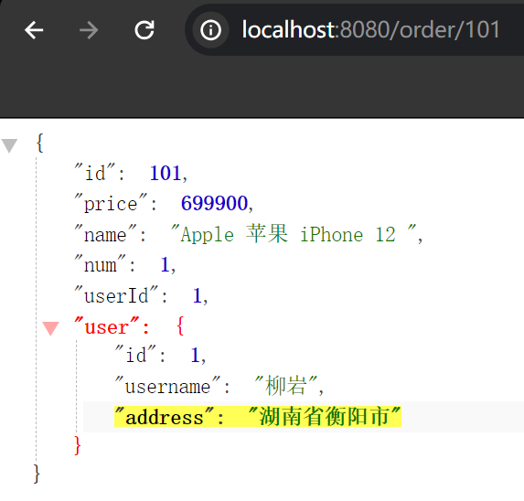

---

# 9.Kureka-提供者与消费者

在服务调用关系中，会有两个不同的角色：

**服务提供者**：一次业务中，被其它微服务调用的服务。（提供接口给其它微服务）

**服务消费者**：一次业务中，调用其它微服务的服务。（调用其它微服务提供的接口）


但是，服务提供者与服务消费者的角色并不是绝对的，而是相对于业务而言。

如果服务A调用了服务B，而服务B又调用了服务C，服务B的角色是什么？

>  提供者与消费者角色其实是**相对**的

- 对于A调用B的业务而言：A是服务消费者，B是服务提供者
- 对于B调用C的业务而言：B是服务消费者，C是服务提供者

**因此，服务B既可以是服务提供者，也可以是服务消费者。**

---

# 10.Ereka-eureka原理分析

## Eureka注册中心

在之前的案例中，我们有一个订单服务和一个用户服务，订单服务需要远程调用我们的用户服务。它采用的方式是发起一次http请求。我们是将UserService服务的ip和端口硬编码在代码当中的。

这样的一种写法，它其实是有一定问题的：在公司里开发的时候，我们会有开发环境、测试环境、生产环境等等，每一次环境的变更，可能服务的地址也会发生变化。而且为了应付更多的并发，User服务可能会部署成多实例，形成一个集群，那这个时候，硬编码该写谁的地址呢。

假如我们的服务提供者user-service部署了多个实例，如图：


大家思考几个问题：

- order-service在发起远程调用的时候，该如何得知user-service实例的ip地址和端口？
- 有多个user-service实例地址，order-service调用时该如何选择？
- order-service如何得知某个user-service实例是否依然健康，是不是已经宕机？


## Eureka的结构和作用

这些问题都需要利用SpringCloud中的注册中心来解决，其中最广为人知的注册中心就是Eureka，其结构如下，起到的作用就是：记录和管理微服务。

user-service（服务提供者）和order-service（服务消费者）。不管是消费者还是提供者，都是微服务，所以统称为Eureka的客户端。

只要是Eureka的客户端，在启动的时候都会把自己的信息注册给Eureka。Eureka会把你的名字记录下来（user-service名称、ip端口）。

这样order-service直接去找Eureka要user-service，然后Eureka就会返回给你地址信息。

然后再利用负载均衡从三个user-service中挑一个，向挑好的发请求，并且挑好的这个不可能是挂的，因为服务每隔30秒钟都会向Eureka发一次心跳，来确认一下自己的状态。如果有一天它不跳了，就会把它从列表中剃掉。


回答之前的各个问题。

**问题1：消费者该如何获取服务提供者具体信息？**

获取地址信息的流程如下：

- user-service服务实例启动后，将自己的信息注册到eureka-server（Eureka服务端）。这个叫服务注册。
- eureka-server保存服务名称到服务实例地址列表的映射关系
- order-service根据服务名称，拉取实例地址列表。这个叫服务发现或服务拉取。


**问题2：如果有多个服务提供者，消费者该如何选择？**

- order-service从实例列表中利用负载均衡算法选中一个实例地址
- 向该实例地址发起远程调用


**问题3：消费者如何感知服务提供者健康状态？**

- user-service会每隔一段时间（默认30秒）向eureka-server发起请求，报告自己状态，称为心跳
- 当超过一定时间没有发送心跳时，eureka-server会认为微服务实例故障，将该实例从服务列表中剔除
- order-service拉取服务时，就能将故障实例排除了


**在Eureka架构中，微服务角色有两类**

EurekaServer：服务端，注册中心

- 记录服务信息

- 心跳监控

EurekaClient：客户端

- Provider：服务提供者，例如案例中的 user-service

  注册自己的信息到EurekaServer

  每隔30秒向EurekaServer发送心跳

- consumer：服务消费者，例如案例中的 order-service

  根据服务名称从EurekaServer拉取服务列表

  基于服务列表做负载均衡，选中一个微服务后发起远程调用

> 注意：一个微服务，既可以是服务提供者，又可以是服务消费者，因此eureka将服务注册、服务发现等功能统一封装到了eureka-client端。

---

# 11.搭建eureka-server(Eureka注册中心)

1. 创建eureka-server服务
2. 引入eureka-server依赖
3. 在启动类上加@EnableEurekaServer注解
4. 在application.yml中配置eureka地址

首先大家注册中心服务端：eureka-server，这必须是一个独立的微服务

**创建eureka-server服务**

在cloud-demo父工程下，创建一个子模块：

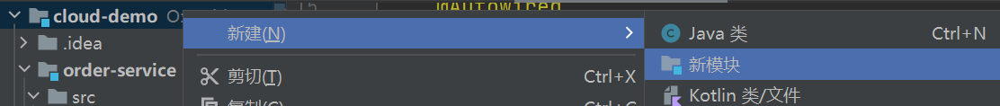

填写模块信息：


**引入eureka依赖**

引入SpringCloud为eureka提供的starter依赖

> 依赖的结尾是：eureka-server，说明它是eureka的服务端依赖，中间的starter，是SpringBoot里面的自动装配，也就是说在这个依赖里面已经把eureka所有的配置都已经做好了，也就是说我们可以做到0配置就能拿来用了。

这里在引入依赖的时候并没有指定版本信息，原因是因为在父工程中，已经把依赖的版本都管理好了。

点进父工程的SpringCloud组件库，这里面有大量的SpringCloud的组件及其版本信息。所以在我们引入SpringCloud组件的时候，我们无需指定任何版本信息。


```xml
<!-- eureka服务端 -->
<dependency>
    <groupId>org.springframework.cloud</groupId>
    <artifactId>spring-cloud-starter-netflix-eureka-server</artifactId>
</dependency>
```


**编写启动类**

给eureka-server服务编写一个启动类，一定要添加一个@EnableEurekaServer注解，开启eureka的注册中心功能


```java
package cn.itcast.eureka;

import org.springframework.boot.SpringApplication;
import org.springframework.boot.autoconfigure.SpringBootApplication;
import org.springframework.cloud.netflix.eureka.server.EnableEurekaServer;

@SpringBootApplication
@EnableEurekaServer
public class EurekaApplication {
    public static void main(String[] args) {
        SpringApplication.run(EurekaApplication.class, args);
    }
}
```


**编写配置文件**

编写一个application.yml文件，内容如下：

> 需要配置euraka的地址信息是因为euraka也是一个服务，会将自己也注册到euraka上
>
> 这是为了euraka集群之间通讯用的，比如说之后启动了三个euraka，三个euraka之间就会相互做注册，这样她们就能做数据交流了，所以这里配的应该是Eureka集群的地址。如果有多个，则以逗号隔开，但由于这里是单机，所以这里配的是自己。

这里的服务名称和服务地址其实是在做服务注册。

```yaml
server:
  port: 10086 # 服务端口，端口可以随便起名字
spring:
  application:
    name: eurekaserver # 配置服务名称，服务名称其实就是微服务的名称。之前将每个服务注册的时候都要带上名称，这个就是微服务的名称。eureka自己也是个微服务，所以它也需要一个名字。
eureka:
  client:
    service-url:
      defaultZone: http://127.0.0.1:10086/eureka # 配置euraka的地址信息
```


**启动服务**

> ctrl+shift+10：运行启动类
>
> IDEA中直接点解服务旁边的端口也可以直接进行访问

启动微服务，然后在浏览器访问：http://127.0.0.1:10086

看到下面结果应该是成功了，这个是Eureka的管理界面


最下面显示的是通用信息


中间是最关键的：Instances currently registered with Eurek a —>  注册到Eureka的实例（一个服务每部署一个，就叫一个实例，如果在线上部署10个，那就是10个实例）

刚刚说Eureka会注册到自己身上，下面 **EUREKASERVER** 就是我们配的Eureka的服务名称，后面就是ip和端口。

UP代表正常状态，DOWN代表挂掉了。后面显示不像IP的原因是，这里是windows，后面显示的是计算机名，理论上讲，这里应该显示ip，这里理论上讲可以理解成：localhost（即自己电脑的名称）


---

# 12.Eureka-服务注册

1. 引入eureka-client依赖
2. 在application.yml中配置eureka地址

下面，我们将user-service注册到eureka-server中去。

> 除了依赖不一样（Eureka是Eureka的服务端，而这里是Eureka的Client端），配置跟刚才在Eureka中的配置是一样的。因为Eureka启动时会把自己注册到Eureka，所以它也需要配服务名称和Eureka地址，而我们认为 `配服务名称和Eureka地址` 其实是服务注册的配置，只要配了它，就可以做注册。
>
> 无论是消费者还是提供者，引入eureka-client依赖，知道eureka地址后，都可以完成服务注册

**1）引入依赖**

在user-service的pom文件中，引入下面的eureka-client依赖：

```xml
<!-- eureka客户端依赖 -->
<dependency>
    <groupId>org.springframework.cloud</groupId>
    <artifactId>spring-cloud-starter-netflix-eureka-client</artifactId>
</dependency>
```


**2）配置文件**

在user-service中，修改application.yml文件，添加服务名称、eureka地址：

> 凡是引地址，就是在Eureka注册

```yaml
spring:
  application:
    name: userservice # user服务的服务名称
eureka:
  client:
    service-url:
      defaultZone: http://127.0.0.1:10086/eureka # 配置euraka的地址信息
```


**orderservice也一样**

**1）引入依赖**

之前说过，服务发现、服务注册统一都封装在eureka-client依赖，因此这一步与服务注册时一致。

在order-service的pom文件中，引入下面的eureka-client依赖：

```xml
<!-- eureka客户端依赖 -->
<dependency>
    <groupId>org.springframework.cloud</groupId>
    <artifactId>spring-cloud-starter-netflix-eureka-client</artifactId>
</dependency>
```


**2）配置文件**

服务发现也需要知道eureka地址，因此第二步与服务注册一致，都是配置eureka信息：

在order-service中，修改application.yml文件，添加服务名称、eureka地址：

```yaml
spring:
  application:
    name: orderservice # order服务的服务名称
eureka:
  client:
    service-url:
      defaultZone: http://127.0.0.1:10086/eureka # 配置euraka的地址信息
```


回到浏览器查看结果：eureka、userservice、orderservice全部都注册上来了，这就是服务列表


---

## 启动多个user-service实例

为了演示一个服务有多个实例的场景，我们添加一个SpringBoot的启动配置，再启动一个user-service。

首先，复制原来的user-service启动配置：


然后，在弹出的窗口中，填写信息，由于将一个服务启动两次会有端口冲突，所以这里需要配置一个 `-Dserver.prot` 去避免端口冲突。

> -D代表参数，server.port就是我们在yml文件中配的方式，这里配置的端口就是用来覆盖yml文件里的端口的。


现在，SpringBoot窗口会出现两个user-service启动配置：


不过，第一个是8081端口，第二个是8082端口。

启动两个user-service实例：


查看eureka-server管理页面，发现已经注册了两个实例，UP(2)，后面跟着的是注册的实例列表


---

# 13.Eureka-服务发现和拉取

1. 引入eureka-client依赖
2. 在application.yml中配置eureka地址（注册到Eureka中去）
3. 给RestTemplate添加@LoadBalanced注解
4. 用服务提供者的服务名称远程调用

下面，我们将order-service的逻辑修改：向eureka-server拉取user-service的两个实例信息，实现服务发现、负载均衡。

不过这些动作不用我们去做，只需要添加一些注解即可。

**1）拉取服务**

修改order-service服务中的cn.itcast.order.service包下的OrderService类中的queryOrderById方法。修改访问的url路径，用服务名代替ip、端口。

> 在eureka中服务名代指的就是后面的ip端口，如果怕写错，就去userservice的yml文件里复制


**2）负载均衡**

在order-service的OrderApplication中，给RestTemplate这个Bean添加一个@LoadBalanced注解（LoadBalanced：负载均衡）


spring会自动帮助我们从eureka-server端，根据userservice这个服务名称，获取实例列表，而后完成负载均衡。


验证：将两个userservice服务的日志清空，然后访问orderservice，查看到底访问的是哪个userservice。

访问101-104的order数据，可以发现已经实现了负载均衡。我们根本不用关心服务的地址，我们只需要将服务名称往这一放就行了，剩下的事情交给Eureka的客户端工具去做就可以了。


---

# 14.Ribbon-负载均衡原理

上一节中，我们添加了@LoadBalanced注解，即可实现负载均衡功能，这是什么原理呢？

SpringCloud底层其实是利用了一个名为Ribbon的组件，来实现负载均衡功能的。


那么我们发出的请求明明是http://userservice/user/1，怎么变成了http://localhost:8081的呢？


## 源码跟踪

为什么我们只输入了service名称就可以访问了呢？之前还要获取ip和端口。

显然有人帮我们根据service名称，获取到了服务实例的ip和端口。它就是`LoadBalancerInterceptor`，这个类会在对RestTemplate的请求进行拦截（这是因为在RestTemplate上加了一个@loadBalanced，这个注解也就是一个标记，标记RestTemplate发送的请求，要被Ribbon中的拦截器`LoadBalancerInterceptor`给拦截和处理），然后从Eureka根据服务id获取服务列表，随后利用负载均衡算法得到真实的服务地址信息，替换服务id。

我们进行源码跟踪：

**1）LoadBalancerIntercepor**

LoadBalancerIntercepor 实现了 ClientHttpRequestInterceptor


**2）ClientHttpRequestInterceptor**

ClientHttpRequestInterceptor：客户端 Http 请求拦截器

它会去拦截由http客户端发起的http请求，而我们的RestTemplate正是发http请求的客户端！所以就会被ClientHttpRequestInterceptor接口所拦截。

```java
/**
 * Intercepts client-side HTTP requests. 
 */
@FunctionalInterface
public interface ClientHttpRequestInterceptor {
    
    ClientHttpResponse intercept(HttpRequest request, byte[] body, ClientHttpRequestExecution execution)
          throws IOException;

}
```


**3）回到ClientHttpRequestInterceptor的实现类LoadBalancerIntercepor**

这个拦截器既然实现了ClientHttpRequestInterceptor接口，就一定会实现intercept方法

此时就可以在这个方法打个断点，由RestTemplate发的请求一定会被这个方法拦截，此时就可以去浏览器发起一个

可以发现它直接跳到了断点这，说明这个请求确实被拦截了。


执行步骤：

```java
@Override
public ClientHttpResponse intercept(final HttpRequest request, final byte[] body,
                                    final ClientHttpRequestExecution execution) throws IOException {
    final URI originalUri = request.getURI(); // 获取请求地址：http://userservice/user/1
    String serviceName = originalUri.getHost(); // getHost：获取服务名称， // userservice
    Assert.state(serviceName != null,
                 "Request URI does not contain a valid hostname: " + originalUri);
    return this.loadBalancer.execute(serviceName, // 拉取：将服务名称交给了loadBalancer去执行，将鼠标放上去，它是一个名为RibbonLoadBalancerClient（Ribbon的负载均衡客户端）这样的一个对象，execute：执行
                                     this.requestFactory.createRequest(request, body, execution));
}
```

可以看到这里的intercept方法，拦截了用户的HttpRequest请求，然后做了几件事：

- `request.getURI()`：获取请求uri，本例中就是 http://user-service/user/8
- `originalUri.getHost()`：获取uri路径的主机名，其实就是服务id，`user-service`
- `this.loadBalancer.execute()`：处理服务id，和用户请求。

这里的`this.loadBalancer`是`LoadBalancerClient`类型，我们继续跟入execute方法。


**2）LoadBalancerClient**

```java
@Override
public <T> T execute(String serviceId, LoadBalancerRequest<T> request)
       throws IOException {
    return execute(serviceId, request, null);
}
```

继续跟入execute方法：

```java
// service名称在这里被称为 serviceId，它会交给getLoadBalancer函数去处理
public <T> T execute(String serviceId, LoadBalancerRequest<T> request, Object hint)
       throws IOException {
    ILoadBalancer loadBalancer = getLoadBalancer(serviceId);
    // 拉取服务列表：执行上一步完成后得到了一个ILoadBalancer对象，监视loadBalancer对象，里面1有个allServerList属性，这个属性里的值就是服务列表！
    Server server = getServer(loadBalancer, hint);
    if (server == null) {
       throw new IllegalStateException("No instances available for " + serviceId);
    }
    RibbonServer ribbonServer = new RibbonServer(serviceId, server,
          isSecure(server, serviceId),
          serverIntrospector(serviceId).getMetadata(server));

    return execute(serviceId, ribbonServer, request);
}
```


代码是这样的：

- getLoadBalancer(serviceId)：根据服务id获取ILoadBalancer，而ILoadBalancer会拿着服务id去eureka中获取服务列表并保存起来。
- getServer(loadBalancer)：利用内置的负载均衡算法，从服务列表中选择一个。本例中，可以看到获取了8082端口的服务


放行后，再次访问并跟踪，发现获取的是8081：

 

果然实现了负载均衡。


**3）负载均衡策略IRule**

在刚才的代码中，可以看到获取服务使通过一个`getServer`方法来做负载均衡:

 

我们继续跟入：


继续跟踪源码chooseServer方法，发现这么一段代码：

 

我们看看这个rule是谁：

 

IRule是一个接口，那一定会有实现类，通过ctrl + h查看它的实现类


这里的rule默认值是一个`RoundRobinRule`，看类的介绍：

 

这不就是轮询的意思嘛。

继续往下走，就会发现已经获取到了真实的ip地址和端口号，用这个真实的ip地址和端口号来替代原来的服务名称，去发起真实请求。


到这里，整个负载均衡的流程我们就清楚了。


## 总结

SpringCloudRibbon的底层采用了一个拦截器，拦截了RestTemplate发出的请求，对地址做了修改。用一幅图来总结一下：


基本流程如下：

- 拦截我们的RestTemplate请求http://userservice/user/1
- RibbonLoadBalancerClient会从请求url中获取服务名称，也就是user-service
- DynamicServerListLoadBalancer根据user-service到eureka拉取服务列表
- eureka返回列表，localhost:8081、localhost:8082
- IRule利用内置负载均衡规则，从列表中选择一个，例如localhost:8081
- RibbonLoadBalancerClient修改请求地址，用localhost:8081替代userservice，得到http://localhost:8081/user/1，发起真实请求

---

# 15.负载均衡策略

负载均衡的规则都定义在IRule接口中，而IRule有很多不同的实现类：


IRule常见的规则

| **内置负载均衡规则类**    | **规则描述**                                                 |
| ------------------------- | ------------------------------------------------------------ |
| RoundRobinRule            | 简单轮询服务列表来选择服务器。它是Ribbon默认的负载均衡规则。 |
| AvailabilityFilteringRule | 对以下两种服务器进行忽略：   （1）在默认情况下，这台服务器如果3次连接失败，这台服务器就会被设置为“短路”状态。短路状态将持续30秒，如果再次连接失败，短路的持续时间就会几何级地增加。  （2）并发数过高的服务器。如果一个服务器的并发连接数过高，配置了AvailabilityFilteringRule规则的客户端也会将其忽略。并发连接数的上限，可以由客户端的<clientName>.<clientConfigNameSpace>.ActiveConnectionsLimit属性进行配置。 |
| WeightedResponseTimeRule  | 为每一个服务器赋予一个权重值。服务器响应时间越长，这个服务器的权重就越小。这个规则会随机选择服务器，这个权重值会影响服务器的选择。 |
| **ZoneAvoidanceRule**     | 以区域可用的服务器为基础进行服务器的选择。使用Zone对服务器进行分类，这个Zone可以理解为一个机房、一个机架等。而后再对Zone内的多个服务做轮询。 |
| BestAvailableRule         | 忽略那些短路的服务器，并选择并发数较低的服务器。             |
| RandomRule                | 随机选择一个可用的服务器。                                   |
| RetryRule                 | 重试机制的选择逻辑                                           |

默认的实现就是ZoneAvoidanceRule，是一种轮询方案，一般情况下，走默认就可以了。

> 以区域可用的服务器为基础进行服务器的选择。但是在我们平时使用的过程中，是没有Zone的概念的，所以它其实就是轮询。


## 自定义负载均衡策略

通过定义IRule实现可以修改负载均衡规则，有两种方式：

1. 代码方式：在order-service中的OrderApplication类中，定义一个新的IRule：（针对全局，在orderservice里，不管是调用哪一个微服务，使用的都是随机）

```java
@Bean
public IRule randomRule(){
    return new RandomRule(); // 总得类型是IRule，但实现的时候可以是任何一种实现，这里选择的是随机，则这里就会让负载均衡的规则从轮询变成随机
}
```


2. 配置文件方式：在order-service的application.yml文件中，添加新的配置也可以修改规则：（针对某个微服务而言）

```yaml
userservice: # 给某个微服务配置负载均衡规则，这里是userservice服务
  ribbon:
    NFLoadBalancerRuleClassName: com.netflix.loadbalancer.RandomRule # 负载均衡规则 ，这里注意#前面有个空格
```

> **注意**，一般用默认的负载均衡规则，不做修改。

---

# 16.饥饿加载

Ribbon默认是采用懒加载，即第一次访问时才会去创建LoadBalanceClient，请求时间会很长。

如下图，第一次请求达到了538ms。


**查看OrderService控制台输出的日志**

在三秒将服务运行成功了


当我们第一次访问时，打印了成吨的日志信息。并且这里会有一次userservice的初始化

> "C.netflix.loadbalancer.BaseLoadBalancer日志消息：针对服务'userservice'创建了一个名为'userservice'的动态服务器列表负载均衡器实例，当前尚未配置任何服务器列表，区域及服务器状态统计均为空，且ServerList属性为null。"
>
> 这段日志表明，在Netflix Ribbon框架中，用于服务'userservice'的负载均衡器已经被实例化，但此时还没有获取到任何可供负载均衡选择的服务器列表。

~~~apl
c.netflix.loadbalancer.BaseLoadBalancer  : Client: userservice instantiated a LoadBalancer: DynamicServerListLoadBalancer:{NFLoadBalancer:name=userservice,current list of Servers=[],Load balancer stats=Zone stats: {},Server stats: []}ServerList:null
~~~

所以此时它会做一次拉取服务，拉取服务中就会去创建DynamicServerListLoadBalancer，于是就会消耗很长的时间。这就是所谓的懒加载。不过第一次加载完后后面就不要再加载了，因为服务列表会一直被缓存在我们的内存中，以后要想用的话就可以直接用了。

> 2023年3月14日下午3点21分46秒（格式：时:分:秒），在应用程序的执行线程[nio-8080-exec-1]上记录了以下INFO级别日志：针对客户端'userservice'的DynamicServerListLoadBalancer已完成初始化。当前配置如下：DynamicServerListLoadBalancer名称为'userservice'，当前服务器列表包含了[LAPTOP-VVQ62A0L:8082, LAPTOP-VVQ62A0L:8081]这两个地址。负载均衡器统计信息显示，区域内统计指标如下：
>
> - 区域名称：defaultzone，其中包含的实例数量为2个，当前活跃连接数为0，熔断器触发次数为0，平均每台服务器的活跃连接数为0.0。
>
> 针对各服务器的具体统计数据显示：
>
> - 服务器LAPTOP-VVQ62A0L:8082位于defaultZone区域，总计请求数量为0，连续连接失败次数为0，最近一次完全断开连接（即总断网秒数）为0秒，该服务器首次成功建立连接和最近一次成功建立连接的时间均为1970年1月1日早上8点（CST时区），当前活跃连接数为0；
> - 在过去的1000毫秒内，失败请求的总数为0次，平均响应时间为0.0秒，90%分位点响应时间为0.0秒，95%分位点响应时间为0.0秒，最小响应时间为0.0秒，最大响应时间为0.0秒，标准差响应时间为0.0秒。

~~~apl
03-14 15:21:46:801  INFO 52564 --- [nio-8080-exec-1] c.n.l.DynamicServerListLoadBalancer      : DynamicServerListLoadBalancer for client userservice initialized: DynamicServerListLoadBalancer:{NFLoadBalancer:name=userservice,current list of Servers=[LAPTOP-VVQ62A0L:8082, LAPTOP-VVQ62A0L:8081],Load balancer stats=Zone stats: {defaultzone=[Zone:defaultzone;	Instance count:2;	Active connections count: 0;	Circuit breaker tripped count: 0;	Active connections per server: 0.0;]
},Server stats: [[Server:LAPTOP-VVQ62A0L:8082;	Zone:defaultZone;	Total Requests:0;	Successive connection failure:0;	Total blackout seconds:0;	Last connection made:Thu Jan 01 08:00:00 CST 1970;	First connection made: Thu Jan 01 08:00:00 CST 1970;	Active Connections:0;	total failure count in last (1000) msecs:0;	average resp time:0.0;	90 percentile resp time:0.0;	95 percentile resp time:0.0;	min resp time:0.0;	max resp time:0.0;	stddev resp time:0.0]
~~~


而饥饿加载（饥不择食，饿的不行了，看见什么都往上啃）则会在项目启动时创建，降低第一次访问的耗时，通过下面配置开启饥饿加载：

```yaml
userservice:
  ribbon:
    NFLoadBalancerRuleClassName: com.netflix.loadbalancer.RandomRule # 负载均衡规则

# 注意和配置负载均衡规则的userservice在同一缩进，不要和配置负载均衡规则混到一起了
ribbon:
  eager-load:
    enabled: true # 开启饥饿加载
    clients: userservice # 指定饥饿加载的服务名称
```

这里的clients是一个集合，是一个List，所以在配置clients的时候有两种配法。


- 只有一个的时候，直接写服务名称就行了

  ```yml
  clients: userservice
  ```

- 如果想要指定多个服务做姐加载

  ```yml
  clients: 
    - userservice
    - xxservice
  ```

配置好之后，重启OrderApplication，查看控制台，可以发现服务启动起来之后随着tomcat的启动立马完成了服务的加载

> 

~~~apl
03-14 15:53:43:509  INFO 36092 --- [           main] c.n.l.DynamicServerListLoadBalancer      : DynamicServerListLoadBalancer for client userservice initialized: DynamicServerListLoadBalancer:{NFLoadBalancer:name=userservice,current list of Servers=[LAPTOP-VVQ62A0L:8082, LAPTOP-VVQ62A0L:8081],Load balancer stats=Zone stats: {defaultzone=[Zone:defaultzone;	Instance count:2;	Active connections count: 0;	Circuit breaker tripped count: 0;	Active connections per server: 0.0;]
},Server stats: [[Server:LAPTOP-VVQ62A0L:8082;	Zone:defaultZone;	Total Requests:0;	Successive connection failure:0;	Total blackout seconds:0;	Last connection made:Thu Jan 01 08:00:00 CST 1970;	First connection made: Thu Jan 01 08:00:00 CST 1970;	Active Connections:0;	total failure count in last (1000) msecs:0;	average resp time:0.0;	90 percentile resp time:0.0;	95 percentile resp time:0.0;	min resp time:0.0;	max resp time:0.0;	stddev resp time:0.0]
, [Server:LAPTOP-VVQ62A0L:8081;	Zone:defaultZone;	Total Requests:0;	Successive connection failure:0;	Total blackout seconds:0;	Last connection made:Thu Jan 01 08:00:00 CST 1970;	First connection made: Thu Jan 01 08:00:00 CST 1970;	Active Connections:0;	total failure count in last (1000) msecs:0;	average resp time:0.0;	90 percentile resp time:0.0;	95 percentile resp time:0.0;	min resp time:0.0;	max resp time:0.0;	stddev resp time:0.0]
]}ServerList:org.springframework.cloud.netflix.ribbon.eureka.DomainExtractingServerList@5c72e534
~~~

再次去访问浏览器，可以发现这次的访问时间缩减了一半。

> 虽然还是要300多ms，这是因为服务启动时还需要做一些别的事情。比如初始化DispatcherServlet，它也是在第一次被访问时加载的。
>
> 


----

# -------------------------------------

# Nacos注册中心

国内公司一般都推崇阿里巴巴的技术，比如注册中心，SpringCloudAlibaba也推出了一个名为Nacos的注册中心，现在是SpringCloud中的一个组件了。

**Service registration and discovery**：服务的注册和发现。

**Distributed Configuration**：分布式配置

所以Nacos相对于Eureka来讲，它的功能更加的丰富。


# 17.认识和安装Nacos

Eureka已经停止维护了。


[Nacos](https://nacos.io/)是阿里巴巴的产品，现在是[SpringCloud](https://spring.io/projects/spring-cloud)中的一个组件。相比[Eureka](https://github.com/Netflix/eureka)功能更加丰富，在国内受欢迎程度较高。


## Windows安装

开发阶段采用单机安装即可。

**下载安装包**

首先进入Nacos官网，然后点击下图红款部分，


在Nacos的GitHub页面，提供有下载链接，可以下载编译好的Nacos服务端或者源代码：

GitHub主页：https://github.com/alibaba/nacos

GitHub的Release下载页：https://github.com/alibaba/nacos/releases

如图：

Releases是Github项目的**发布页面**，在这里可以直接下载最新版本及迭代版本的安装包。


然后点击Tag（标签），它的各种版本在这里都会显示出来了。


选择需要下载的版本，然后滑到最底下，就会出现相应的下载链接。


本课程采用1.4.1.版本的Nacos，课前资料已经准备了安装包：


windows版本使用`nacos-server-1.4.1.zip`包即可。


**解压**

将这个包解压到任意非中文目录下，如图：


目录说明：

- bin：启动脚本
- conf：配置文件，Nacos的默认端口是8848，成功人士的标配哈哈哈
- target：里面是一个jar包，Nacos也是基于java语言去实现的。


## 端口配置

Nacos的默认端口是8848，如果你电脑上的其它进程占用了8848端口，请先尝试关闭该进程。

**如果无法关闭占用8848端口的进程**，也可以进入nacos的conf目录，修改配置文件中的端口：


修改其中的内容：


## 启动

启动非常简单，进入bin目录，结构如下：


然后执行命令即可：

- windows命令：

  > -m：模式（model）
  >
  > standalone：单机启动，其实还有集群启动

  ```cmd
  startup.cmd -m standalone
  ```


执行后的效果如图：


## 访问

在浏览器输入地址：http://127.0.0.1:8848/nacos即可：


默认的账号和密码都是nacos：


---

# 18.服务注册到nacos- 快速入门

Nacos是SpringCloudAlibaba的组件，而SpringCloudAlibaba也遵循SpringCloud中定义的服务注册、服务发现规范。因此使用Nacos和使用Eureka对于微服务来说，并没有太大区别。

在SpringCloud中又分成了很多模块，其中有一个非常重要的模块：Commons（通用），在它里面主要是定义接口规范的。

比如它里面就定义了DiscoveryClient（服务发现），ServiceRegistry（服务注册）的接口。无论是Eureka还是Nacos，它只要是做服务注册发现，都会遵循这些接口。那么我们在使用Nacos或Eureka时，我们的服务者消费者和提供者的代码不用做什么变化。

变化的东西有：

1. 依赖的改变
2. 服务地址不同（以前配的是Eureka地址，现在改成配Nacos地址）


**1）引入依赖**

父工程

在cloud-demo父工程的pom文件中的`<dependencyManagement>`中引入SpringCloudAlibaba的依赖：

> 由于SpringCloudAlibaba比较特殊，它是后来才加入的，虽然父工程中已经有spring-cloud-dependencies的依赖了，但是SpringCloudAlibaba并没有在这里面，它需要将SpringCloudAlibaba的管理依赖单独引进来，以后它有关的所有版本就不用操心了。

```xml
<dependency>
    <groupId>com.alibaba.cloud</groupId>
    <artifactId>spring-cloud-alibaba-dependencies</artifactId>
    <version>2.2.5.RELEASE</version>
    <type>pom</type>
    <scope>import</scope>
</dependency>
```


客户端

注释掉order-service和user-service中原有的eureka依赖。

然后在user-service和order-service中的pom文件中引入nacos-discovery（服务注册发现）依赖，也是一个启动器（starter），它会把我们所有的功能自动装配。：

```xml
<!-- nacos客户端依赖包 -->
<dependency>
    <groupId>com.alibaba.cloud</groupId>
    <artifactId>spring-cloud-starter-alibaba-nacos-discovery</artifactId>
</dependency>

```


**2）配置nacos地址**

nacos的配置属于Spring的配置。

注释掉eureka的地址，然后在user-service和order-service的application.yml中添加nacos地址：

> 默认值就是localhost:8848，所以其实不配，也能找到。不过还是建议配，因为以后nacos地址可能会发生改变。
>
> 

```yaml
spring:
  cloud:
    nacos:
      server-addr: localhost:8848
```


**3）重启**

重启微服务后，登录nacos管理页面，点击左侧的服务列表，可以看到微服务信息：


点到服务详情里，还有更详细的实例信息（IP地址、端口号）


---

# 19.服务分级存储模型

> 它只是在我们之前的分级之上多了一级：集群，之前是服务下面就是实例

服务的概念：提供用户功能的user-service，提供订单查询的order-service

一个**服务**可以有多个**实例**，例如我们的user-service，可以有:

- 127.0.0.1:8081
- 127.0.0.1:8082
- 127.0.0.1:8083

随着业务规模越来越扩大，假设将所有实例都部署在一个机房，如果机房出现了问题，那整个服务不就完了。

所以，为了解决这些问题，我们会将一个服务的多个实例部署到多个机房。

这些实例分布于全国各地的不同机房，这种措施叫 容灾 例如：

- 127.0.0.1:8081，在上海机房
- 127.0.0.1:8082，在上海机房
- 127.0.0.1:8083，在杭州机房

Nacos服务分级存储模型就是引入了一个机房（地域）的概念。Nacos就将同一机房内的多个实例 称为为一个**集群**。

例如杭州的user-service实例就称作杭州的user-service集群，北京的user-service实例就称为北京的user-service集群

也就是说，user-service是服务，一个服务可以包含多个集群，如杭州、上海，每个集群下可以有多个实例，形成分级模型，如图：


微服务互相访问时，应该尽可能访问同集群实例，因为本地访问速度更快。当本集群内不可用时，才访问其它集群。例如：


杭州机房内的order-service应该优先访问同机房的user-service。

Nacos引入集群这个概念，其实就是为了防止出现跨集群调用。

点进orderservice服务，可以发现它的集群为：DEFAULT，也就是没有集群。


## 给user-service配置集群

需求：将userservice1、userservice2放到杭州集群，userApplication3放到上海集群，来模拟一下这种跨集群部署的这种方式。

修改user-service的application.yml文件，添加集群配置：

```yaml
spring:
  cloud:
    nacos:
      server-addr: localhost:8848
      discovery:
        cluster-name: HZ # 集群名称，这里HZ代指杭州
```

重启两个user-service实例后，我们可以在nacos控制台看到下面结果：


我们再次复制一个user-service启动配置，添加属性：

```sh
-Dserver.port=8083 -Dspring.cloud.nacos.discovery.cluster-name=SH
```

配置如图所示：


启动UserApplication3后再次查看nacos控制台：


---

# 20.Nacos-NacosRule负载均衡

**同集群优先的负载均衡**

1）给order-service配置集群信息

修改order-service的application.yml文件，添加集群配置：

```sh
spring:
  cloud:
    nacos:
      server-addr: localhost:8848
      discovery:
        cluster-name: HZ # 集群名称
```

使用Nacos界面查看orderservice处于的集群，可以发现orderservice也在杭州集群了。


需求：orderservice在调用的时候优先选择8081、8082（都在HZ集群的userservice）

默认的`ZoneAvoidanceRule`并不能实现根据同集群优先来实现负载均衡。

因此Nacos中提供了一个`NacosRule`的实现，可以优先从同集群中挑选实例。

而服务在选择实例时，规则都是由负载均衡的规则来决定的，也就是我们的IRule。而我们现在没有进行配置，默认的IRule就是轮询。

因此，要想实现优先统计群访问，就必须去修改负载均衡。

2）修改负载均衡规则

修改order-service的application.yml文件，修改负载均衡规则：

> 优先选择本地集群，在本地集群内的多个服务中再采用随机的方式进行负载均衡。  
>
> 但是如果本地没有，才会采用跨集群访问，但是它会有一个警告。这时运维人员看见这个警告就知道发生什么问题了，此时就可以重新启动挂掉的服务。

```yaml
userservice:
  ribbon:
    NFLoadBalancerRuleClassName: com.alibaba.cloud.nacos.ribbon.NacosRule # 负载均衡规则 
```

验证：访问http://localhost:8080/order/101 - 5，可以发现userApplication3一个都没有，而UserApplication和UserApplication2都是均匀访问的。这也就证明了Nacos确实具备了优先选择本地集群。

在优先选择本地集群的情况下，8081和8082采用的负载均衡规则是：在本地集群中的多个服务，它再采用随机方式进行负载均衡。

当8081和8082停掉后，Order服务就会去访问UserApplication3。此时去看orderservice的控制台日志，报出了一条警告：

简而言之，应用程序尝试调用一个名为`userservice`的服务实例，该实例属于`SH`集群，并且其地址是`192.168.8.37:8083`。这个实例是通过Spring Cloud注册到Nacos的，并且在日志记录的时间点上，进行了非本集群内（HZ集群之外）的服务访问。在分布式系统中，跨集群调用可能对性能和稳定性产生一定影响，因此通常需要关注并合理配置服务调用策略。

~~~apl
03-14 21:15:56:508  WARN 29548 --- [nio-8080-exec-9] c.alibaba.cloud.nacos.ribbon.NacosRule   : A cross-cluster call occurs，name = userservice, clusterName = HZ, instance = [Instance{instanceId='192.168.8.37#8083#SH#DEFAULT_GROUP@@userservice', ip='192.168.8.37', port=8083, weight=1.0, healthy=true, enabled=true, ephemeral=true, clusterName='SH', serviceName='DEFAULT_GROUP@@userservice', metadata={preserved.register.source=SPRING_CLOUD}}]
~~~

运维人员看见这样的警告，他们就会知道出现了什么问题，他们就会重新去启动挂掉的服务。

---

# 21.服务实例的权重配置

实际部署中会出现这样的场景：

服务器设备性能有差异，部分实例所在机器性能较好，另一些较差，我们希望性能好的机器承担更多的用户请求。

但默认情况下NacosRule是同集群内随机挑选，不会考虑机器的性能问题。

因此，Nacos提供了权重配置来控制访问频率，权重越大则访问频率越高。此时我们就可以把性能好的机器性能设的大一些，性能差的机器权重设的小一些


在nacos控制台，找到user-service的实例列表，点击编辑，即可修改权重：


在弹出的编辑窗口，修改权重：

> 权重值一般配0-1之间。
>
> **注意**：如果权重修改为0，则该实例永远不会被访问
>
> 应用场景：一个服务，如果想要对它做一个版本的升级，就需要重启服务，但如果有用户在访问，就不能随便重启服务。往往版本升级都是找一个晚上，等用户都下线了，偷偷把服务停机，然后去做版本的升级。
>
> 但是现在有了权重，先将8081服务调成0，渐渐8081不承担用户请求了，这时候对它做停机，用户就没有感知，此时再去做版本的升级，升级完成后，就给它重启，然后将它的权重调到0.1，放出少数用户进来测试，如果没什么问题，再逐渐扩大比例依次升级，此时就可以做到平滑升级。


---

# 22.环境隔离

Nacos首先是一个注册中心，但是它还是一个数据中心。

所以在Nacos里，它为了去做数据和服务的管理，就会有一个环境隔离的概念。

服务划分、实例划分都是基于业务/地域去做的划分，实际上我们也会有开发环境、生产环境、测试环境的变化。所以我们会基于这种环境变化去做隔离，namespace就是用来做这件事情的。

Nacos提供了namespace（命名空间）来实现环境隔离功能。

- nacos中可以有多个namespace

- namespace下可以有group（组）

  > group：分组，将一些业务相关度比较高的服务放到一个组，假设订单和支付业务相关度就比较高，那可以把它们放到一个group里面去。

- 组里又可以有service（服务）、数据等

- 服务再往下就有集群

- 集群再往下就是实例

所以环境隔离实际上就是在对服务做隔离，不同namespace之间相互隔离，例如不同namespace的服务互相不可见。每个namespace都有唯一id。

数据同样也可以基于namespace做隔离。

在设计的时候，并不是必须要用group/namespace。


## namespace的使用

在Nacos的控制台中，查看目前所有的服务，这些服务里都没有namespace的概念，但是有group。

group一般情况下都不会去配它，所以它一般都属于在default group里面。


**1）创建namespace**

默认情况下，所有service、data、group都在同一个namespace，名为public


我们可以点击页面新增按钮，添加一个namespace：


然后，填写表单，命名空间ID不填就会使用UUID自动生成：


就能在页面看到一个新的namespace：


回到服务列表，发现这里已经出现两个命名空间了。


**2）给微服务配置namespace**

给微服务配置namespace只能通过修改配置来实现。

例如，修改order-service的application.yml文件，填写的不是命名空间的名称，而是id

```yaml
spring:
  cloud:
    nacos:
      server-addr: localhost:8848
      discovery:
        cluster-name: HZ
        namespace: 492a7d5d-237b-46a1-a99a-fa8e98e4b0f9 # dev 环境
```

重启order-service后，访问控制台，可以看到下面的结果：


此时访问order-service，因为namespace不同，会导致找不到userservice，控制台会报错：

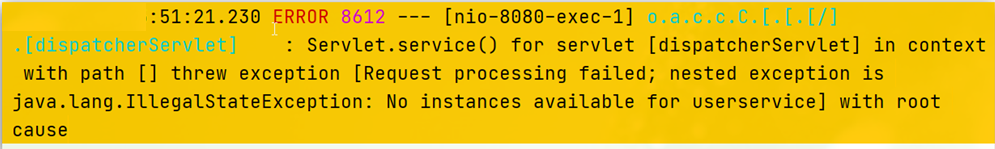

---

# 23.Nacos与Eureka的区别

不管是什么样的注册中心，我们服务提供者在启动时，都会把自己的信息提交给注册中心，而注册中心就会把这些信息保留下来。

当我们的消费者需要消费时，它就可以找注册中心去要这个信息了，这个称为服务的拉取 / 服务发现。而这个拉取动作并不是每次都要做的，如果每次发请求都需要做一次拉取，那么对Eureka来讲，压力太大了。所以作为消费者，它会将拉取到的服务信息信息缓存到服务列表中。这样一来，我拉取一次，接下来一段时间我就不用去拉取了，而是直接使用缓存里面的列表。之前看见的DynamicServerListLoadBalancer，它里面就是专门用来缓存错误信息的。这个列表会每隔30s去拉取一次，进行一次更新。

消费者拿到服务列表后，再去负载均衡，挑选一个发送远程调用就可以了。

---

**Nacos和Eureka整体结构类似，服务注册、服务拉取、心跳等待，但是也存在一些差异，下面从提供者和消费者两种角度分别来述说**

**1）提供者**

服务提供者的健康监测，nacos会把服务提供者划分成：临时实例和非临时实例。如下图，默认值就是true。


Nacos的服务实例分为两种类型：

- 临时实例：提供者每隔一段时间发一个请求到nacos（nacos频率快一些，eureka频率慢一些）。如果实例宕机超过一定时间，会从服务列表剔除，默认的类型。

- 非临时实例：提供者不会每隔一段时间发送心跳，而是由nacos主动来询问你是否活着。如果实例宕机，不会从服务列表剔除，它会等待实例恢复健康，也可以叫永久实例。

配置一个服务实例为永久实例：

```yaml
spring:
  cloud:
    nacos:
      discovery:
        ephemeral: false # 设置为非临时实例
```


**2）消费者**

eureka采用的是定时拉取（pull），每隔30s拉取一次，如果在30s内有服务提供者挂了，消费者并不知道，它直接去消费就会出问题了。

而nacos会做一个消息推送，采用的是pull + push两者结合，每隔一段时间去更新，如果nacos发现有服务挂了，它会立即发一条消息推送给消费者，告诉你服务宕机了，服务列表更新更及时。


---

验证：

在orderservice的application.yml文件中进行配置

默认值为true，我们将其改为false


```yaml
spring:
  cloud:
    nacos:
      discovery:
        ephemeral: false # 设置为非临时实例
```

然后将orderservice停到，回到nacos控制台，观察orderservice服务状态。检测需要一定时间，它是周期性的，检测成功之后，它就变红了，并且重新刷新，会发现它直接将orderservice剔除了，这就是临时实例。


重新启动orderservice，这次观察的就是非临时实例的变化。

回到nacos控制台，查看orderservice状态，为非临时实例

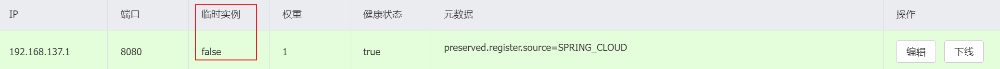

将orderservice停掉，再次回到控制台，可以发现它立马变红，由此可见，主动询问更敏感，瞬间就发现服务有问题了


多等一会它也并不会被剔除，等着你把它重启起来。除非你手动把它删除了，否则它永远都在。

再次重启orderservice，nacos检测到它活过来后，又会把它标记为健康。注意刷新。


## 总结

Nacos与eureka的共同点
- 都支持服务注册和服务拉取
- 都支持服务提供者心跳方式做健康检测

Nacos与Eureka的区别
- Nacos支持服务端主动检测提供者状态：临时实例采用心跳模式，非临时实例采用主动检测模式

- 临时实例心跳不正常会被剔除，非临时实例则不会被剔除

  > 主动检测压力比较大，推荐使用临时实例

- Nacos支持服务列表变更的消息推送模式，服务列表更新更及时

- Nacos集群默认采用AP方式（会强调整个数据 / 服务的可用性），当集群中存在非临时实例时，采用CP模式（因为非临时实例数据就会变得很重要，CP模式会强调数据的可靠性和一致性）；Eureka采用AP方式，但Eureka不支持切换。

---

# 25.Nacos实现配置管理

Nacos除了可以做注册中心，同样可以做配置管理来使用。

昨天的课程中，我们搭建了两个微服务，每个微服务都需要进行数据库查询。并且服务之间还需要相互调用。我们的做法是：让服务注册到注册中心，消费者就可以从注册中心中完成服务的发现，实现服务获取和负载均衡，完成远程调用。

随着微服务越来越多，可能会达到数十上百上千台服务器的情况。如果有一个配置文件需要做一个修改，而这个配置文件可能跟数十个微服务都有关系。这个时候我是不是得逐个微服务都去调整这些配置，很麻烦。并且调整完配置后，这些关联的配置的服务是不是都得重启。那么在生产环境下，一个服务的重启带来的影响还是挺大的。所以需求就是：这些配置文件能够实现一个统一的配置管理，并且改动完后，这些服务不用做重启，这些配置立马能够生效，这个就叫做配置的热更新。

为了实现需求，就需要一个 配置管理服务，这个服务的作用就是：记录微服务一些核心的配置，微服务启动的时候就可以读取它上面的配置，再和本地的配置结合，作为完整的配置去使用。将来，这几个核心的配置如果需要发生一些修改，我们不用逐个服务改动，而是找到这个配置管理的服务，在它上面把需要变化的配置给它改一改。

而配置管理服务非常的智能，它发现改动之后，它会立即去通知微服务，微服务就会去读取配置的读取。并且后续也会完成配置的热更新，也就是配置不用重启，自动生效。


由于我们用的是nacos的配置管理，所以不管是注册中心也好，还是配置管理服务也好，同时都是由nacos去实现的。

Nacos一方面可以将配置集中管理，另一方可以在配置变更时，及时通知微服务，实现配置的热更新。

如果公司里有钱，整了两套nacos集群，一套做注册发现，一套用来做配置管理也是可以的。


---


## 在nacos中添加配置文件

如何在nacos中管理配置呢？


然后在弹出的表单中，填写配置信息：

Data ID其实就是配置文件的名称，但是这个名称不能像IDEA里面都叫application.yml，叫这个的话就有问题了，将来所有的服务都来找nacos管理，都叫这个名字那不就冲突了吗。所以我们的Data ID必须得唯一冲突。而微服务的名称刚好是不能冲突的，所以ID的命名方式一般是：[服务名称]-[profile].[后缀名]，profile就是当前项目的运行环境。后缀名一般我们写yml，但yml是它的简称，它的全称是yaml。nacos支持yaml和Properties这两种常用格式。但我们这里肯定选择yaml。由于下方配置格式是YAML，所以Data ID的地方也建议写yaml。

描述：介绍介绍这个配置文件是干什么的。

注意：项目的核心配置，并不是把application.yml中所有配置信息都挪过来，而是有需要热更新的配置 / 开关类型的配置 / 模板类型的（eg：给true，按照A业务逻辑处理，给false，按照B业务逻辑处理）才有放到nacos管理的必要。基本不会变更的一些配置还是保存在微服务本地比较好。


此时就已经得到这个配置了。


---

# 26.微服务配置拉取

没有nacos时，服务获取配置的步骤：


微服务要拉取nacos中管理的配置，并且与本地的application.yml配置合并，才能完成项目启动。

但如果尚未读取application.yml，又如何得知nacos地址呢？

因此spring引入了一种新的配置文件：bootstrap.yaml文件，它的优先会比application.yml高很多会在application.yml之前被读取，流程如下：


因此，与nacos地址有关的所有信息都应该放到bootstrap.yml当中


1）引入nacos-config依赖

首先，在user-service服务中，引入nacos-config的客户端依赖，也就是配置管理依赖，以前引入的是 nacos-discovery ，服务注册发现

```xml
<!--nacos配置管理依赖-->
<dependency>
    <groupId>com.alibaba.cloud</groupId>
    <artifactId>spring-cloud-starter-alibaba-nacos-config</artifactId>
</dependency>
```


2）新建 bootstrap.yaml（引导文件）

然后，在user-service的resource目录下新建一个bootstrap.yaml / bootstrap.yml（两种后缀名都可以，但是文件名一定要是bootstrap，建好后可以发现文件名上带有云图标，表示这是特殊的文件）文件，内容如下。服务名称 + 开发环境 + 后缀名，三者结合就是刚刚在nacos控制台配的Data ID，所以这三个配置的目的是为了知道是哪个文件。配置Nacos地址的目的是：知道去哪读配置。


```yaml
spring:
  application:
    name: userservice # 服务名称
  profiles:
    active: dev #开发环境，这里是dev 
  cloud:
    nacos:
      server-addr: localhost:8848 # Nacos地址
      config:
        file-extension: yaml # 文件后缀名
```

在bootstrap.yml文件配置完上述配置后，user-service的resource目录下的application.yml中与bootstrap.yml配置文件中冲突的配置项就可以删掉了。例如Nacos的服务地址。

这里会根据spring.cloud.nacos.server-addr获取nacos地址，再根据

`${spring.application.name}-${spring.profiles.active}.${spring.cloud.nacos.config.file-extension}`作为文件id，来读取配置。

本例中，就是去读取`userservice-dev.yaml`：


3）读取nacos配置

在user-service中的UserController中添加业务逻辑，读取pattern.dateformat配置：


完整代码：

```java
@Slf4j
@RestController
@RequestMapping("/user")
public class UserController {

    @Autowired
    private UserService userService;

    @Value("${pattern.dateformat}")
    private String dateformat;
    
    @GetMapping("now")
    public String now(){
        return LocalDateTime.now().format(DateTimeFormatter.ofPattern(dateformat));
    }
    // ...略
}
```

分别在8081、8082进行访问，可以看到效果，说明8081、8082都从Nacos控制台中得到了配置。


---

# 27.配置热更新

我们最终的目的，是修改nacos中的配置后，微服务中无需重启即可让配置生效，也就是**配置热更新**。


要实现配置热更新，可以使用两种方式：

**方式一**

在@Value注入的变量所在类上添加注解@RefreshScope，也就是我们刚才所写的controller


**方式二**

> 由于有不同的将配置文件里属性注入的方式，所以不同的属性注入方式也会有不同的刷新方式

使用@ConfigurationProperties注解代替@Value注解，通过这个注解可以完成配置的自动加载，不需要结合@RefreshScope，它自动实现刷新，因此这种方式更推荐。

在user-service服务中，添加一个config类，读取patterrn.dateformat属性：

```java
package cn.itcast.user.config;

@Component
@Data
@ConfigurationProperties(prefix = "pattern")
public class PatternProperties {
    private String dateformat;
}
```

在UserController中使用这个类代替@Value：


完整代码：

```java
package cn.itcast.user.web;

@Slf4j
@RestController
@RequestMapping("/user")
public class UserController {

    @Autowired
    private UserService userService;

    @Autowired
    private PatternProperties patternProperties;

    @GetMapping("now")
    public String now(){
        return LocalDateTime.now().format(DateTimeFormatter.ofPattern(patternProperties.getDateformat()));
    }

    // 略
}
```


使用上面任意一种方法对user-service修改后，重启user-service服务。

然后在Nacos控制台中对userservice-dev.yaml文件夹中的配置内容进行编辑


修改之后，userservice中的控制台中会有大量的日志，这些日志是因为Nacos配置发生修改，对微服务进行通知。

此时不用重启服务，直接刷新浏览器，可以发现配置已经生效


---

# 28.配置共享

使用环境：有一个属性，它开发、生产、测试等环境下的值是一样的，这样的配置，如果在每个配置文件里都去写，是不是有点浪费；并且将来要改动，还得去每个配置文件中都去改，这样显然是不合适的。


其实微服务启动时，会去nacos读取多个配置文件，例如：

- `[spring.application.name]-[spring.profiles.active].yaml`，例如：userservice-dev.yaml
- `[spring.application.name].yaml`，例如：userservice.yaml

环境变化时，第一个配置文件会被改变，而`[spring.application.name].yaml`不包含环境，显然跟环境没有关系，因此可以被多个环境共享。


**下面我们通过案例来测试配置共享**

**1）添加一个环境共享配置**

我们在nacos中添加一个userservice.yaml文件：


**2）在user-service中读取共享配置**

在user-service服务中，修改PatternProperties类，读取新添加的属性：


在user-service服务中，修改UserController，添加一个方法，Spring-MVC会把它转成JSON返回给页面：


**3）运行两个UserApplication，使用不同的profile**

修改UserApplication2这个启动项，改变其profile值：


有效配置文件里的 开发环境 会覆盖掉bootstrap.yml文件中配置的 开发环境


这样，UserApplication(8081)使用的profile是dev，UserApplication2(8082)使用的profile是test。

启动UserApplication和UserApplication2

访问 `localhost:8081/user/prop` 和 `localhost:8082/user/prop`，可以看出来，不管是dev，还是test环境，都读取到了envSharedValue这个属性的值。。


在IDEA的控制台中任然可以看见

8081中：


8082中：


## 4）配置共享的优先级

当nacos、服务本地同时出现相同属性时，优先级有高低之分：

服务名-profile.yaml > 服务名称.yaml（配置共享） > 本地配置

本地和远端来比，远端更高。当前环境 比 共享的高。


---

# 29.Nacos集群搭建

Nacos生产环境下一定要部署为集群状态。


## 1）集群结构图

官方给出的Nacos集群图：


其中包含3个nacos节点，然后一个负载均衡器代理3个Nacos。这里负载均衡器可以使用nginx（Nginx可以做到反向代理和负载均衡）。

我们计划的集群结构：

首先要实现数据共享：整一个MySQL集群，让多个Nacos都来访问这个集群，在里面完成数据的读写。


虽然我们需要按照图上的来做，但是条件有限，只有一台电脑。做法：在这一台电脑上去部署三个Nacos结点（IP是一样的，不一样的是端口，避免冲突），MySQL理论上是集群，我们也先弄个单点。

三个nacos节点的地址：

| 节点   | ip            | port |
| ------ | ------------- | ---- |
| nacos1 | 192.168.150.1 | 8845 |
| nacos2 | 192.168.150.1 | 8846 |
| nacos3 | 192.168.150.1 | 8847 |


---


## 2）搭建集群

搭建集群的基本步骤：

- 搭建数据库，初始化数据库表结构

  这个结构Nacos官网已经提供给我们了

- 下载nacos安装包

- 配置nacos集群

  这个配置和传统配置没有差别

- 启动nacos集群

- nginx反向代理


### 搭建MySQL集群并初始化数据库

Nacos默认数据存储在内嵌数据库Derby中，不属于生产可用的数据库。

官方推荐的最佳实践是使用带有主从的高可用数据库集群，主从模式的高可用数据库可以参考**传智教育**的后续高手课程。

这里我们以单点的数据库为例来讲解。

首先新建一个数据库，命名为nacos，而后导入下面的SQL：

```sql
create database nacos;
use nacos;

CREATE TABLE `config_info` (
  `id` bigint(20) NOT NULL AUTO_INCREMENT COMMENT 'id',
  `data_id` varchar(255) NOT NULL COMMENT 'data_id',
  `group_id` varchar(255) DEFAULT NULL,
  `content` longtext NOT NULL COMMENT 'content',
  `md5` varchar(32) DEFAULT NULL COMMENT 'md5',
  `gmt_create` datetime NOT NULL DEFAULT CURRENT_TIMESTAMP COMMENT '创建时间',
  `gmt_modified` datetime NOT NULL DEFAULT CURRENT_TIMESTAMP COMMENT '修改时间',
  `src_user` text COMMENT 'source user',
  `src_ip` varchar(50) DEFAULT NULL COMMENT 'source ip',
  `app_name` varchar(128) DEFAULT NULL,
  `tenant_id` varchar(128) DEFAULT '' COMMENT '租户字段',
  `c_desc` varchar(256) DEFAULT NULL,
  `c_use` varchar(64) DEFAULT NULL,
  `effect` varchar(64) DEFAULT NULL,
  `type` varchar(64) DEFAULT NULL,
  `c_schema` text,
  PRIMARY KEY (`id`),
  UNIQUE KEY `uk_configinfo_datagrouptenant` (`data_id`,`group_id`,`tenant_id`)
) ENGINE=InnoDB DEFAULT CHARSET=utf8 COLLATE=utf8_bin COMMENT='config_info';

/******************************************/
/*   数据库全名 = nacos_config   */
/*   表名称 = config_info_aggr   */
/******************************************/
CREATE TABLE `config_info_aggr` (
  `id` bigint(20) NOT NULL AUTO_INCREMENT COMMENT 'id',
  `data_id` varchar(255) NOT NULL COMMENT 'data_id',
  `group_id` varchar(255) NOT NULL COMMENT 'group_id',
  `datum_id` varchar(255) NOT NULL COMMENT 'datum_id',
  `content` longtext NOT NULL COMMENT '内容',
  `gmt_modified` datetime NOT NULL COMMENT '修改时间',
  `app_name` varchar(128) DEFAULT NULL,
  `tenant_id` varchar(128) DEFAULT '' COMMENT '租户字段',
  PRIMARY KEY (`id`),
  UNIQUE KEY `uk_configinfoaggr_datagrouptenantdatum` (`data_id`,`group_id`,`tenant_id`,`datum_id`)
) ENGINE=InnoDB DEFAULT CHARSET=utf8 COLLATE=utf8_bin COMMENT='增加租户字段';


/******************************************/
/*   数据库全名 = nacos_config   */
/*   表名称 = config_info_beta   */
/******************************************/
CREATE TABLE `config_info_beta` (
  `id` bigint(20) NOT NULL AUTO_INCREMENT COMMENT 'id',
  `data_id` varchar(255) NOT NULL COMMENT 'data_id',
  `group_id` varchar(128) NOT NULL COMMENT 'group_id',
  `app_name` varchar(128) DEFAULT NULL COMMENT 'app_name',
  `content` longtext NOT NULL COMMENT 'content',
  `beta_ips` varchar(1024) DEFAULT NULL COMMENT 'betaIps',
  `md5` varchar(32) DEFAULT NULL COMMENT 'md5',
  `gmt_create` datetime NOT NULL DEFAULT CURRENT_TIMESTAMP COMMENT '创建时间',
  `gmt_modified` datetime NOT NULL DEFAULT CURRENT_TIMESTAMP COMMENT '修改时间',
  `src_user` text COMMENT 'source user',
  `src_ip` varchar(50) DEFAULT NULL COMMENT 'source ip',
  `tenant_id` varchar(128) DEFAULT '' COMMENT '租户字段',
  PRIMARY KEY (`id`),
  UNIQUE KEY `uk_configinfobeta_datagrouptenant` (`data_id`,`group_id`,`tenant_id`)
) ENGINE=InnoDB DEFAULT CHARSET=utf8 COLLATE=utf8_bin COMMENT='config_info_beta';

/******************************************/
/*   数据库全名 = nacos_config   */
/*   表名称 = config_info_tag   */
/******************************************/
CREATE TABLE `config_info_tag` (
  `id` bigint(20) NOT NULL AUTO_INCREMENT COMMENT 'id',
  `data_id` varchar(255) NOT NULL COMMENT 'data_id',
  `group_id` varchar(128) NOT NULL COMMENT 'group_id',
  `tenant_id` varchar(128) DEFAULT '' COMMENT 'tenant_id',
  `tag_id` varchar(128) NOT NULL COMMENT 'tag_id',
  `app_name` varchar(128) DEFAULT NULL COMMENT 'app_name',
  `content` longtext NOT NULL COMMENT 'content',
  `md5` varchar(32) DEFAULT NULL COMMENT 'md5',
  `gmt_create` datetime NOT NULL DEFAULT CURRENT_TIMESTAMP COMMENT '创建时间',
  `gmt_modified` datetime NOT NULL DEFAULT CURRENT_TIMESTAMP COMMENT '修改时间',
  `src_user` text COMMENT 'source user',
  `src_ip` varchar(50) DEFAULT NULL COMMENT 'source ip',
  PRIMARY KEY (`id`),
  UNIQUE KEY `uk_configinfotag_datagrouptenanttag` (`data_id`,`group_id`,`tenant_id`,`tag_id`)
) ENGINE=InnoDB DEFAULT CHARSET=utf8 COLLATE=utf8_bin COMMENT='config_info_tag';

/******************************************/
/*   数据库全名 = nacos_config   */
/*   表名称 = config_tags_relation   */
/******************************************/
CREATE TABLE `config_tags_relation` (
  `id` bigint(20) NOT NULL COMMENT 'id',
  `tag_name` varchar(128) NOT NULL COMMENT 'tag_name',
  `tag_type` varchar(64) DEFAULT NULL COMMENT 'tag_type',
  `data_id` varchar(255) NOT NULL COMMENT 'data_id',
  `group_id` varchar(128) NOT NULL COMMENT 'group_id',
  `tenant_id` varchar(128) DEFAULT '' COMMENT 'tenant_id',
  `nid` bigint(20) NOT NULL AUTO_INCREMENT,
  PRIMARY KEY (`nid`),
  UNIQUE KEY `uk_configtagrelation_configidtag` (`id`,`tag_name`,`tag_type`),
  KEY `idx_tenant_id` (`tenant_id`)
) ENGINE=InnoDB DEFAULT CHARSET=utf8 COLLATE=utf8_bin COMMENT='config_tag_relation';

/******************************************/
/*   数据库全名 = nacos_config   */
/*   表名称 = group_capacity   */
/******************************************/
CREATE TABLE `group_capacity` (
  `id` bigint(20) unsigned NOT NULL AUTO_INCREMENT COMMENT '主键ID',
  `group_id` varchar(128) NOT NULL DEFAULT '' COMMENT 'Group ID，空字符表示整个集群',
  `quota` int(10) unsigned NOT NULL DEFAULT '0' COMMENT '配额，0表示使用默认值',
  `usage` int(10) unsigned NOT NULL DEFAULT '0' COMMENT '使用量',
  `max_size` int(10) unsigned NOT NULL DEFAULT '0' COMMENT '单个配置大小上限，单位为字节，0表示使用默认值',
  `max_aggr_count` int(10) unsigned NOT NULL DEFAULT '0' COMMENT '聚合子配置最大个数，，0表示使用默认值',
  `max_aggr_size` int(10) unsigned NOT NULL DEFAULT '0' COMMENT '单个聚合数据的子配置大小上限，单位为字节，0表示使用默认值',
  `max_history_count` int(10) unsigned NOT NULL DEFAULT '0' COMMENT '最大变更历史数量',
  `gmt_create` datetime NOT NULL DEFAULT CURRENT_TIMESTAMP COMMENT '创建时间',
  `gmt_modified` datetime NOT NULL DEFAULT CURRENT_TIMESTAMP COMMENT '修改时间',
  PRIMARY KEY (`id`),
  UNIQUE KEY `uk_group_id` (`group_id`)
) ENGINE=InnoDB DEFAULT CHARSET=utf8 COLLATE=utf8_bin COMMENT='集群、各Group容量信息表';

/******************************************/
/*   数据库全名 = nacos_config   */
/*   表名称 = his_config_info   */
/******************************************/
CREATE TABLE `his_config_info` (
  `id` bigint(64) unsigned NOT NULL,
  `nid` bigint(20) unsigned NOT NULL AUTO_INCREMENT,
  `data_id` varchar(255) NOT NULL,
  `group_id` varchar(128) NOT NULL,
  `app_name` varchar(128) DEFAULT NULL COMMENT 'app_name',
  `content` longtext NOT NULL,
  `md5` varchar(32) DEFAULT NULL,
  `gmt_create` datetime NOT NULL DEFAULT CURRENT_TIMESTAMP,
  `gmt_modified` datetime NOT NULL DEFAULT CURRENT_TIMESTAMP,
  `src_user` text,
  `src_ip` varchar(50) DEFAULT NULL,
  `op_type` char(10) DEFAULT NULL,
  `tenant_id` varchar(128) DEFAULT '' COMMENT '租户字段',
  PRIMARY KEY (`nid`),
  KEY `idx_gmt_create` (`gmt_create`),
  KEY `idx_gmt_modified` (`gmt_modified`),
  KEY `idx_did` (`data_id`)
) ENGINE=InnoDB DEFAULT CHARSET=utf8 COLLATE=utf8_bin COMMENT='多租户改造';


/******************************************/
/*   数据库全名 = nacos_config   */
/*   表名称 = tenant_capacity   */
/******************************************/
CREATE TABLE `tenant_capacity` (
  `id` bigint(20) unsigned NOT NULL AUTO_INCREMENT COMMENT '主键ID',
  `tenant_id` varchar(128) NOT NULL DEFAULT '' COMMENT 'Tenant ID',
  `quota` int(10) unsigned NOT NULL DEFAULT '0' COMMENT '配额，0表示使用默认值',
  `usage` int(10) unsigned NOT NULL DEFAULT '0' COMMENT '使用量',
  `max_size` int(10) unsigned NOT NULL DEFAULT '0' COMMENT '单个配置大小上限，单位为字节，0表示使用默认值',
  `max_aggr_count` int(10) unsigned NOT NULL DEFAULT '0' COMMENT '聚合子配置最大个数',
  `max_aggr_size` int(10) unsigned NOT NULL DEFAULT '0' COMMENT '单个聚合数据的子配置大小上限，单位为字节，0表示使用默认值',
  `max_history_count` int(10) unsigned NOT NULL DEFAULT '0' COMMENT '最大变更历史数量',
  `gmt_create` datetime NOT NULL DEFAULT CURRENT_TIMESTAMP COMMENT '创建时间',
  `gmt_modified` datetime NOT NULL DEFAULT CURRENT_TIMESTAMP COMMENT '修改时间',
  PRIMARY KEY (`id`),
  UNIQUE KEY `uk_tenant_id` (`tenant_id`)
) ENGINE=InnoDB DEFAULT CHARSET=utf8 COLLATE=utf8_bin COMMENT='租户容量信息表';


CREATE TABLE `tenant_info` (
  `id` bigint(20) NOT NULL AUTO_INCREMENT COMMENT 'id',
  `kp` varchar(128) NOT NULL COMMENT 'kp',
  `tenant_id` varchar(128) default '' COMMENT 'tenant_id',
  `tenant_name` varchar(128) default '' COMMENT 'tenant_name',
  `tenant_desc` varchar(256) DEFAULT NULL COMMENT 'tenant_desc',
  `create_source` varchar(32) DEFAULT NULL COMMENT 'create_source',
  `gmt_create` bigint(20) NOT NULL COMMENT '创建时间',
  `gmt_modified` bigint(20) NOT NULL COMMENT '修改时间',
  PRIMARY KEY (`id`),
  UNIQUE KEY `uk_tenant_info_kptenantid` (`kp`,`tenant_id`),
  KEY `idx_tenant_id` (`tenant_id`)
) ENGINE=InnoDB DEFAULT CHARSET=utf8 COLLATE=utf8_bin COMMENT='tenant_info';

CREATE TABLE `users` (
	`username` varchar(50) NOT NULL PRIMARY KEY,
	`password` varchar(500) NOT NULL,
	`enabled` boolean NOT NULL
);

CREATE TABLE `roles` (
	`username` varchar(50) NOT NULL,
	`role` varchar(50) NOT NULL,
	UNIQUE INDEX `idx_user_role` (`username` ASC, `role` ASC) USING BTREE
);

CREATE TABLE `permissions` (
    `role` varchar(50) NOT NULL,
    `resource` varchar(255) NOT NULL,
    `action` varchar(8) NOT NULL,
    UNIQUE INDEX `uk_role_permission` (`role`,`resource`,`action`) USING BTREE
);

INSERT INTO users (username, password, enabled) VALUES ('nacos', '$2a$10$EuWPZHzz32dJN7jexM34MOeYirDdFAZm2kuWj7VEOJhhZkDrxfvUu', TRUE);

INSERT INTO roles (username, role) VALUES ('nacos', 'ROLE_ADMIN');
```


### 下载nacos

nacos在GitHub上有下载地址：https://github.com/alibaba/nacos/tags，可以选择任意版本下载。

本例中才用1.4.1版本：


### 配置Nacos（节点信息）、数据库配置

集群配置就有点复杂了，所以我们还是按以前那种配置来配了

首先将包解压到任意非中文目录下

进入nacos的conf目录，修改配置文件cluster.conf.example，重命名为cluster.conf：


然后添加内容，也就是配置集群中每一个结点的信息：

> 由于这里是在本机，所以IP地址都是本机的IP地址。但如果是在真实生产环境下，就应该填写真实的IP地址和端口号。

```
127.0.0.1:8845
127.0.0.1.8846
127.0.0.1.8847
```


然后修改application.properties文件，添加数据库配置（第33行左右，将数据库源的注释全部去掉，这样是为了告诉Nacos我们使用的是mysql集群而不是其他集群）


```properties
spring.datasource.platform=mysql

db.num=1 # 这个是问数据库的数量，即：你的集群中有几台MySQL，我们这里是有1台

db.url.0=jdbc:mysql://127.0.0.1:3306/nacos?characterEncoding=utf8&connectTimeout=1000&socketTimeout=3000&autoReconnect=true&useUnicode=true&useSSL=false&serverTimezone=UTC
db.user.0=root
db.password.0=123
```


### 启动

将nacos文件夹复制三份，分别命名为：nacos1、nacos2、nacos3

 

然后分别修改三个文件夹中的application.properties，

nacos1:

```properties
server.port=8845
```

nacos2:

```properties
server.port=8846
```

nacos3:

```properties
server.port=8847
```


然后分别启动三个nacos节点，分别进入三个nacos目录的bin目录下，分别执行以下这条命令：

> 这个启动的命令略有变化，不再需要加 -m 参数了，因为我们这里是集群启动，默认就是集群启动，直接回车就可以了

```
startup.cmd
```

启动成功后，查看终端，显示：Nacos在集群模式下启动成功


### nginx反向代理

找到课前资料提供的nginx安装包： 

 

解压到任意非中文目录下：

 

修改conf/nginx.conf文件，配置如下：

> 配置一个upstream的集群，集群里有三个端口号，即三个nacos，这时nginx就会去对接三个地址做负载均衡
>
> 第二个是反向代理的配置，监听80端口localhost，意思是以后在访问的时候不用加8848，直接80就行了
>
> 第三个/nacos是nacos的默认路径，意思是只要访问到这个路径，就可以代理到上面的集群去

将这一整段复制，将它粘贴到http内部，随便哪个地方都可以


```nginx
upstream nacos-cluster {
    server 127.0.0.1:8845;
	server 127.0.0.1:8846;
	server 127.0.0.1:8847;
}

server {
    listen       80;
    server_name  localhost;

    location /nacos {
        proxy_pass http://nacos-cluster;
    }
}
```

然后我们去打开nginx


而后在浏览器访问：http://localhost/nacos即可。

看似页面只有一个，但是它会在3个nacos之间负载均衡。


修改代码中application.yml文件配置如下，将Nacos地址端口号变成80：

```yaml
spring:
  cloud:
    nacos:
      server-addr: localhost:80 # Nacos地址
```

测试：新建一个配置


可以发现配置已经加进来了


这个时候打开数据库，这个配置是已经存在数据库里面了，说明已经完成持久化了


这个时候Nacos集群其实就已经搭建成功了，一旦搭建好，玩法和以前没什么区别。

----

## 3）优化

- 实际部署时，需要给做反向代理的nginx服务器设置一个域名，这样后续如果有服务器迁移nacos的客户端也无需更改配置.

- Nacos的各个节点应该部署到多个不同服务器，做好容灾和隔离

----

# 30.Feign远程调用

先来看我们以前利用RestTemplate发起远程调用的代码，这个请求是通过URL地址指明要访问的服务名称、请求路径和请求的参数信息，请求方式和返回值类型。

然后由RestTemplate帮我们向指定地址发送请求，再把结果转为指定类型。


这段代码已经是在Ribbon的基础上做了优化的。但依然存在下面的问题：

- 代码可读性差。并且以前都是写方法，而这里突然冒出来一次URL，编程体验不统一

- 参数复杂URL难以维护


Feign是一个声明式的http客户端，官方地址：https://github.com/OpenFeign/feign

> 声明式这个词在学习事务的时候就已经接触过这个概念了，早期是我们手动自己去开启事务、提交事务。后来有了Spring，Spring的声明式事务，只需要你在配置文件里简单的告诉Spring：我要对谁加事务，就不需要你管了。
>
> 声明式的http客户端：你把你要发的http请求的信息写出来，剩下的你别管了，由Feign来帮你做。

其作用就是帮助我们优雅的实现http请求的发送，解决上面提到的问题。


## Feign的使用步骤

Fegin的使用步骤如下：

**1）引入依赖**

我们在order-service服务的pom文件中引入feign的依赖：

> 这个依赖看名字就知道了，starter，属于自动装配，里面的各种配置都由spring帮我们做好了。

```xml
<dependency>
    <groupId>org.springframework.cloud</groupId>
    <artifactId>spring-cloud-starter-openfeign</artifactId>
</dependency>
```


**2）添加注解**

在order-service的启动类添加注解开启Feign的功能：


**3）声明一个远程调用**

在order-service中新建一个接口，内容如下，定义了一个接口叫：UserClient，这个接口里面将来封装的就是所有对UserService发起的远程调用，因此在这个接口上面加了一个注解@FeignClient（Feign的客户端），并且指明了服务的名称，因为将来发送http请求的时候需要知道服务名称。

再往下，Feign为了减少大家的学习成本，采用了Spring-MVC来声明请求的方式、请求路径、请求参数、返回值类型。

```java
package cn.itcast.order.client;

@FeignClient("userservice")
public interface UserClient {
    @GetMapping("/user/{id}")
    User findById(@PathVariable("id") Long id);
}
```

这个客户端主要是基于SpringMVC的注解来声明远程调用的信息，比如：

- 服务名称：userservice
- 请求方式：GET
- 请求路径：/user/{id}
- 请求参数：Long id
- 返回值类型：User

这样，Feign就可以帮助我们发送http请求，无需自己使用RestTemplate来发送了。


**4）测试**

修改order-service中的OrderService类中的queryOrderById方法，使用Feign客户端代替RestTemplate：


是不是看起来优雅多了。

再次访问`localhost:8080/101 - 105`，同时发现Feign还实现了负载均衡，这是因为Feign的内部还继承了负载均衡的功能。

使用Maven Helper插件，点击Feign依赖，然后点击下方的Dependency Analyzer（依赖关系分析器）


然后点击Feign的核心依赖，可以看见它带上了Ribbon，所以Fegin已经集成了Ribbon，自动实现了负载均衡，根本不用我们去操心了。


## 5）总结

使用Feign的步骤：

① 引入依赖

② 添加@EnableFeignClients注解

③ 编写FeignClient接口，没有新的方式，全都是SpringMVC的注解

④ 使用FeignClient中定义的方法代替RestTemplate

---

# 31.自定义配置

SpringBoot虽然帮我们实现了自动装配，但是允许我们覆盖默认配置的。

Feign支持我们覆盖5个不同的配置，如下表所示：

feign.Logger.Level：

> 如果是要调试错误的时候，可以用FULL，但如果是平常情况下建议用BASIC或者NONE，因为记录日志还是会消耗一定性能的。

- NONE：没有任何日志，默认就是NONE
- BASIC：当你发起一次http请求时，我会帮你记录请求什么时候发的、什么时候结束的、耗时多久....这些基本信息
- HEADERS：见名识义，除了记录请求基本信息以外，还会带上请求头和响应头信息
- FULL：除了记录基本信息、头信息外，还会记录请求体信息和响应体信息

feign.codec.Decoder：响应结果解析器。当Feign发起远程调用时，比如说Feign查到了一个用户，其实默认拿到的是一个JSON，但是最终我们想要把它转成User对象，就是这个Decoder来转。将查询到的数据转变成Java对象。

feign.codec.Encoder：发请求时，我们传递的参数可以是各种格式，真正发请求时，需要把这些格式转变为Request请求体，这个动作就是由Encoder去完成的。做一个请求参数编码。

feign. Contract：契约。用来规定Feign中支持哪种注解，默认情况下Spring帮我们实现了让它支持SpringMVC注解，这也是我们最熟悉的注解，所以这个我们一般不用去动它。

feign. Retryer：失败重试。默认情况下Feign里面是没有做失败重试的，它是一个不重试机制。不过尽管Feign自己不会做重试，但Feign底层是依赖于Ribbon的，Ribbon它底层是有重试机制的，所以Feign就等于也有了失败重试了。

失败重试：第一次访问8081，有可能网络问题导致查询异常，等待超过一定时间后，ribbon就不会等了，它此时ribbon就会去重试，试8082，直到拿到结果，如果全都不行，那就失败了。它是一种防范措施，避免因网络波动导致查询结果失败。

| 类型                   | 作用             | 说明                                                   |
| ---------------------- | ---------------- | ------------------------------------------------------ |
| **feign.Logger.Level** | 修改日志级别     | 包含四种不同的级别：NONE、BASIC、HEADERS、FULL         |
| feign.codec.Decoder    | 响应结果的解析器 | http远程调用的结果做解析，例如解析json字符串为java对象 |
| feign.codec.Encoder    | 请求参数编码     | 将请求参数编码，便于通过http请求发送                   |
| feign. Contract        | 支持的注解格式   | 默认是SpringMVC的注解                                  |
| feign. Retryer         | 失败重试机制     | 请求失败的重试机制，默认是没有，不过会使用Ribbon的重试 |

一般情况下，默认值就能满足我们使用，如果要自定义时，只需要创建自定义的@Bean覆盖默认Bean即可。


但一般情况下我们最多就是改改日志，其他的也就不用去改了。下面以日志为例来演示如何自定义配置。

## 修改日志级别

**1）配置文件方式**

基于配置文件修改feign的日志级别可以针对单个服务：

```yaml
feign:  
  client: # Feign的客户端配置
    config: 
      userservice: # 针对某个微服务的配置
        loggerLevel: FULL #  日志级别 
```

也可以针对所有服务：

```yaml
feign:  
  client:
    config: 
      default: # 这里用default就是全局配置，如果是写服务名称，则是针对某个微服务的配置
        loggerLevel: FULL #  日志级别 
```


而日志的级别分为四种：

- NONE：不记录任何日志信息，这是默认值。
- BASIC：仅记录请求的方法，URL以及响应状态码和执行时间
- HEADERS：在BASIC的基础上，额外记录了请求和响应的头信息
- FULL：记录所有请求和响应的明细，包括头信息、请求体、元数据。


**2）Java代码方式**

也可以基于Java代码来修改日志级别，先声明一个类，这个类起个名字，比如叫：DefaultFeignConfiguration。然后声明一个Bean，Bean里面叫Logger.Level（日志级别）的对象：

> 注意，Logger.Level是Feign下面的包

```java
package cn.itcast.order.config;

public class DefaultFeignConfiguration  {
    @Bean
    public Logger.Level feignLogLevel(){
        return Logger.Level.BASIC; // 日志级别为BASIC
    }
}
```


上面的类没有加注解，所以不会生效。如果要**全局生效**，将其放到启动类的@EnableFeignClients这个注解中：

```java
@EnableFeignClients(defaultConfiguration = DefaultFeignConfiguration.class) 
```


如果是**局部生效**，则把它放到对应的@FeignClient这个注解中：

```java
@FeignClient(value = "userservice", configuration = DefaultFeignConfiguration.class) 
```

---

# 32.Feign使用优化

Feign底层发起http请求，依赖于其它的框架。其底层客户端实现包括：

> Feign是一个声明式客户端，它只是帮助我们把我们的声明变成HTTP请求，发HTTP请求的时候还是会用到别的客户端。默认采用的是URLConnection，这个是JDK自带的一种，它的实现性能是不太好的，并且它也不支持连接池，有了连接池之后可以减少创建和销毁的性能损耗，连接创建每次都需要三次握手，断开都需要四次挥手，还是比较浪费性能浪费资源的。所以我们还是希望减少这些操作，解决办法就是使用连接池。

- URLConnection：默认实现，不支持连接池

- Apache HttpClient ：支持连接池

- OKHttp：支持连接池


对Feign做性能优化，最重要的一点就是底层实现的改变。因此优化Feign的性能主要包括：

①使用连接池代替默认的URLConnection

②日志级别，最好用basic或none，因为不开性能会提升很多


这里我们用Apache的HttpClient来演示。因为这是Spring底层默认实现的方案。

1）引入依赖

在order-service的pom文件中引入Apache的HttpClient依赖：

> 这个依赖已经被Spring管理起来了，所以我们不需要管版本，只需要引就行了。

```xml
<!--httpClient的依赖 -->
<dependency>
    <groupId>io.github.openfeign</groupId>
    <artifactId>feign-httpclient</artifactId>
</dependency>
```


2）配置连接池

在order-service的application.yml中添加配置：

> 每个路径的最大连接数：例如查用户请求，我最多给你分配多少个连接数。
>
> 最大的连接数 和 每个路径的最大连接数 都需要测试出来，找到性能最优的配置。
>
> 这个默认值就是true，但是它缺少依赖就不会去实现，所以我们这里可以显示的给它写一下
>
> 
>
> 如果是开启OKHttp：
>
> 

```yaml
feign:
  client:
    config:
      default: # default全局的配置
        loggerLevel: BASIC # 日志级别，BASIC就是基本的请求和响应信息
  httpclient:
    enabled: true # 开启feign对HttpClient的支持
    max-connections: 200 # 最大的连接数
    max-connections-per-route: 50 # 每个路径的最大连接数
```


接下来，在FeignClientFactoryBean中的loadBalance方法中打断点：


Debug方式启动order-service服务，可以看到这里的client，底层就是Apache HttpClient：


---

# 33.最佳实践

所谓最近实践，就是使用过程中总结的经验，最好的一种使用方式。

feign客户端：这个代码其实就是来用一些注解来声明远程调用所需要的信息（请求的方式、路径、参数、返回值类型）

目的：让消费者基于这些信息去发送http的请求

观察可以发现，Feign的客户端与服务提供者的controller代码非常相似，这个一样并不是一个巧合，而是必须一样：

```java
@FeignClient("userservice")
public interface UserClient {
    @GetMapping("/user/{id}")
    User findById(@PathVariable Long id);
}
```

UserController：

```java
@GetMapping("/{id}")
public User queryById(@PathVariable("id") Long id) {
    return userService.queryById(id);
}
```

有没有一种办法简化这种重复的代码编写呢？


## **1）继承方式**

**给消费者的FeignClient和提供者的controller定义统一的父接口作为标准。**

一样的代码可以通过继承来共享：

1）定义一个API接口（等同于一种规范，约束了你们两个应该怎么样），利用定义方法，并基于SpringMVC注解做声明。

2）Feign客户端和Controller都集成改接口


优点：

- 简单
- 实现了代码共享

缺点：

Spring官方给出的说明：在服务器（提供者就是服务端）和客户端（消费者就是客户端）之间共享接口通常不推荐。它引入了紧耦合，并且实际上也不适用于Spring MVC的当前形式（方法参数映射不是继承的），这是因为SpringMVC在声明的时候，除了要声明GetMapping以外，后面还需要参数声明。


- 服务提供方、服务消费方紧耦合

- 参数列表中的注解映射并不会继承，因此Controller中必须再次声明方法、参数列表、注解

虽然它有缺点，但是它遵循了面向契约编程的这种思想，所以在企业用的还是比较多的。


## 2）抽取方式

将Feign的Client抽取为独立模块，并且把接口有关的POJO、默认的Feign配置都放到这个模块中，提供给所有消费者使用。

例如，将UserClient、User、Feign的默认配置都抽取到一个feign-api包中，所有微服务引用该依赖包，即可直接使用。

缺点：不能选择性引入方法，产生了多余


---

# 34.实现基于抽取的最佳实践

**1）抽取**

首先创建一个module，命名为feign-api：


项目结构：


在feign-api中然后引入feign的starter依赖

```xml
<dependency>
    <groupId>org.springframework.cloud</groupId>
    <artifactId>spring-cloud-starter-openfeign</artifactId>
</dependency>
```


然后，order-service中编写的UserClient、User（pojo）、DefaultFeignConfiguration都复制到feign-api项目中

新建cn.itcast.feign包，由于没有业务，名字跟项目有关就可以了。


**2）在order-service中使用feign-api**

首先，删除order-service中的UserClient、User、DefaultFeignConfiguration等类或接口。

在order-service的pom文件中中引入feign-api的依赖：

```xml
<!-- 引入feign的api -->
<dependency>
    <groupId>cn.itcast.demo</groupId>
    <artifactId>feign-api</artifactId>
    <version>1.0</version>
</dependency>
```

然后修改order-service中的所有与上述三个组件有关的导包部分，改成导入feign-api中的包


**3）重启测试**

重启后，发现服务报错了：


这是因为UserClient现在在cn.itcast.feign.clients包下，orderservice默认扫描的包默认是启动类所在的包（cn.itcast.order.clients），

而order-service的@EnableFeignClients注解是在cn.itcast.order包下，不在同一个包，无法扫描到UserClient。


**4）解决扫描包问题**

方式一：

指定Feign应该扫描的包（批量添加）：

```java
@EnableFeignClients(basePackages = "cn.itcast.feign.clients")
```


方式二：

指定需要加载的Client接口，写的是FeignClient字节码（精准定位），更推荐这种，用哪个就引入哪个：

```java
// @EnableFeignClients(clients = {UserClient.class}) {}里面写的是数组
// 如果只有一个的话就可以直接写，不用写数组了
@EnableFeignClients(clients = UserClient.class)
```


----

# 35.网关作用介绍

当我们有很多个不同的服务，每个服务都需要去访问数据库完成自己的业务，并且微服务都可以到Nacos中完成服务的注册，配置的管理。这个时候当我们微服务内部有相互调用关系时，我们就可以利用Feign这个组件去做了。而但当外部有用户需要访问我们的时候，我们让它直接发请求到微服务就行了。但这里存在一个问题，我们的微服务直接摆在那里，允许任何人发请求来访问，是不是有点不太安全。有很多业务都不是对外公开的，只有公司内部的工作人员、管理人员才能去访问的。此时就需要对用户的身份进行认证，这个就是由网关来完成的。一旦身份认证通过，就需要放行，到微服务里面去了。


**权限控制**：网关作为微服务入口，需要校验用户是是否有请求资格，如果没有则进行拦截。

**路由**：一切请求都必须先经过gateway，但网关不处理业务，而是根据某种规则，把请求转发到某个微服务，这个过程叫做路由。

**负载均衡**：当然路由的目标服务有多个实例时，还需要做负载均衡。

**限流**：当请求流量过高时，在网关中按照下流的微服务能够接受的速度来放行请求，避免服务压力过大，这是对微服务的一种保护措施。


在SpringCloud中网关的实现包括两种：

- SpringCloudGateway

  Spring Cloud Gateway 是 Spring Cloud 的一个全新项目，该项目是基于 Spring 5.0，Spring Boot 2.0 和 Project Reactor 等响应式编程和事件流技术开发的网关，它旨在为微服务架构提供一种简单有效的统一的 API 路由管理方式。

- SpringCloudZuul

Zuul是基于Servlet的实现，属于阻塞式编程。而SpringCloudGateway则是基于Spring5中提供的WebFlux，属于响应式编程（非阻塞试）的实现，具备更好的性能，所以通常来讲都会选SpringCloudGateway。

---

# 36.gateway快速入门

网关是一个独立的服务，因此搭建网关要做的第一件事情就是去创建一个全新的module作为独立的服务。

下面，我们就演示下网关的基本路由功能。基本步骤如下：

1. 创建SpringBoot工程gateway，引入网关依赖
2. 编写启动类
3. 编写基础配置和路由规则
4. 启动网关服务进行测试


**1）创建gateway服务，引入依赖**

创建服务：


引入依赖：引入网关starter依赖（也就是自动装配，这里面会为我们提供网关的各种各样的功能）和 Nacos的服务发现依赖（因为网关本身也是个微服务，它也需要把自己注册到Nacos，或者从Nacos拉取服务，所以必须要有服务注册发现的依赖）

```xml
<!--网关-->
<dependency>
    <groupId>org.springframework.cloud</groupId>
    <artifactId>spring-cloud-starter-gateway</artifactId>
</dependency>
<!--nacos服务发现依赖-->
<dependency>
    <groupId>com.alibaba.cloud</groupId>
    <artifactId>spring-cloud-starter-alibaba-nacos-discovery</artifactId>
</dependency>
```


**2）编写启动类**

```java
package cn.itcast.gateway;

import org.springframework.boot.SpringApplication;
import org.springframework.boot.autoconfigure.SpringBootApplication;

@SpringBootApplication
public class GatewayApplication {

	public static void main(String[] args) {
		SpringApplication.run(GatewayApplication.class, args);
	}
}
```


**3）编写基础配置和路由规则**

创建application.yml文件，内容如下：

> 网关端口、服务名称、nacos地址 这些配置其实是让我们的网关能够联系上Nacos，实现服务注册和发现。
>
> 路由配置包括：
>
> 1. 路由id：路由的唯一标示
>
> 2. 路由目标（uri）：路由的目标地址，http代表固定地址，lb代表根据服务名负载均衡
>
> 3. 路由断言（predicates）：判断路由的规则，判断一个请求是否符合要求
>
> 4. 路由过滤器（filters）：对请求或响应做处理
>

```yaml
server:
  port: 10010 # 网关端口
spring:
  application:
    name: gateway # 服务名称
  cloud:
    nacos:
      server-addr: localhost:8848 # nacos地址
    gateway:
      routes: # 网关路由配置，有多个路由规则，这里是数组，可以配很多
        - id: user-service # 路由id，每一个路由规则都应该有自己的id，确保它唯一，不重复。自定义，只要唯一即可
          # uri: http://127.0.0.1:8081 # 路由的目标地址 http就是固定地址，即向一个具体的http或者端口进行路由，即直接把路由地址写死，将来全往这个地址发，这个不推荐
          uri: lb://userservice # 路由的目标地址 lb（LoadBalance）就是负载均衡，后面跟服务名称。所以这个的意思就是：从Nacos中找到服务列表，然后去做负载均衡，实现请求路由。我要把请求路由到userservice（用户服务）
          predicates: # 路由断言（断言是编程术语，表示为一些布尔表达），也就是判断请求是否符合路由规则的条件，如果符合规则，那就让它代理到userservice中去；如果不符合，就会出现404
            - Path=/user/** # 路径断言，判断路径是否是以/user开头，如果是则符合
        - id: order-service
          uri: lb://orderservice
          predicates:
            - Path=/order/**
```

我们将符合`Path` 规则的一切请求，都代理到 `uri`参数指定的地址。

本例中，我们将 `/user/**`开头的请求，代理到`lb://userservice`，lb是负载均衡，根据服务名拉取服务列表，实现负载均衡。


**4）重启测试**

注意的是，我们的网关是不处理任何业务逻辑的，但是却能查到业务信息，其实这就是把请求从网关路由到了微服务。

重启网关，访问http://localhost:10010/user/1时，符合`/user/**`规则，请求转发到uri：http://userservice/user/1，得到了结果：


访问order效果也是一样的。


**5）网关路由的流程图**

整个访问的流程如下：


接下来，就重点来学习路由断言和路由过滤器的详细知识

---

# 37.断言工厂

断言是一种判断的规则，我们在配置文件中写的断言的规则其实只是一串简单的字符串，那个字符串将来需要被一个东西去解析，然后转变成真正的判断条件，谁去做的？就是断言工厂（Predicate Factory）。

我们在配置文件中写的断言规则只是字符串，这些字符串会被Predicate Factory读取并处理，转变为路由判断的条件。所以断言工厂的作用就是读取用户定义的断言规则，然后把它解析成对应的判断条件，并且对用户请求做出判断。

例如Path=/user/**是按照路径匹配，这个规则是由`org.springframework.cloud.gateway.handler.predicate.PathRoutePredicateFactory`类来读取和处理的，像这样的断言工厂在SpringCloudGateway还有十几个，每一个都有自己判断的规则和条件。

其中我们用的就是Path，它就是安装路径去匹配，多个路径用，分隔，多个路径规则只要有一个符合，那都算是符合的。第一个带路径占位符，意思是还能获取路径中的参数信息，但是大多数情况洗我们并不需要获取路径中的参数信息，我们只需要写/**就可以了。

RemoteAddr：对请求者的ip地址做限制的。以前玩游戏的时候肯定碰到过这种情况：韩服可能会禁止中国大陆的ip访问。

每一个路由都会逐一匹配，并且predicates取的是&&，都要符合才行。

我们只需要掌握Path这种路由工程就可以了。

下面表格的实例在Spring的官方网站里都有：[Spring Cloud Gateway](https://docs.spring.io/spring-cloud-gateway/docs/current/reference/html/#gateway-request-predicates-factories)，直接将官网的示例复制粘贴到配置文件中，然后按自己的需求修改即可。


| **名称**   | **说明**                       | **示例**                                                     |
| ---------- | ------------------------------ | ------------------------------------------------------------ |
| After      | 是某个时间点后的请求           | -  After=2037-01-20T17:42:47.789-07:00[Asia/Shanghai]（后面的时区是亚洲/上海） |
| Before     | 是某个时间点之前的请求         | -  Before=2031-04-13T15:14:47.433+08:00[Asia/Shanghai]       |
| Between    | 是某两个时间点之前的请求       | -  Between=2037-01-20T17:42:47.789-07:00[America/Denver],  2037-01-21T17:42:47.789-07:00[America/Denver] |
| Cookie     | 请求必须包含某些cookie         | - Cookie=chocolate, ch.p                                     |
| Header     | 请求必须包含某些header         | - Header=X-Request-Id, \d+                                   |
| Host       | 请求必须是访问某个host（域名） | -  Host=**.somehost.org,**.anotherhost.org                   |
| Method     | 请求方式必须是指定方式         | - Method=GET,POST                                            |
| Path       | 请求路径必须符合指定规则       | - Path=/red/{segment},/blue/**                               |
| Query      | 请求参数必须包含指定参数       | - Query=name, Jack或者-  Query=name                          |
| RemoteAddr | 请求者的ip必须是指定范围       | - RemoteAddr=192.168.1.1/24                                  |
| Weight     | 权重处理                       |                                                              |

---

# 38.过滤器工厂

GatewayFilter是网关中提供的一种过滤器，可以对进入网关的请求和微服务返回的响应做处理：

路由之后并不是可以立即向微服务发送请求，因为在网关里面我们还可以给路由配置各种各样的过滤器，这个过滤器会形成一个过滤器链，你的请求一定要经过这些过滤器链，然后才能到达微服务，这个时候我们的过滤器就可以对进入网关的请求做各种处理。例如：对请求体、参数做处理。

当请求给了微服务后，微服务处理完返回一个结果，这个结果肯定是先到达网关，网关同样会经过过滤器来逐层处理这个响应结果，最终才会返回给用户。在这个过程中，过滤器可以对响应做一些：将响应体拿出来看一看处理等。


**路由过滤器的种类**

查询官网：[Spring Cloud Gateway](https://docs.spring.io/spring-cloud-gateway/docs/current/reference/html/#gatewayfilter-factories)


Spring提供了31种不同的路由过滤器工厂，这么多过滤器我们不可能一个一个去学，其实我们只需要知道有这么多过滤器，将来有需求的时候再来看就行了，并且可以通过过滤器的名字来简单做一个推测，并且在官网随意点击一个过滤器，它都是由详尽的语法说明的。

如下图红框里的翻译来就是：这个配置的作用就是给下游（从我们的网关到微服务，微服务就是在下游）的请求添加一个X-Request-red头。注意 `AddRequestHeader=X-Request-red, blue` 中的逗号，是key value，并不是and的意思


例如：

| **名称**             | **说明**                     |
| -------------------- | ---------------------------- |
| AddRequestHeader     | 给当前请求添加一个请求头     |
| RemoveRequestHeader  | 移除请求中的一个请求头       |
| AddResponseHeader    | 给响应结果中添加一个响应头   |
| RemoveResponseHeader | 从响应结果中移除有一个响应头 |
| RequestRateLimiter   | 限制请求的流量               |


下面我们以 AddRequestHeader（请求头过滤器） 为例来讲解。

**需求**：给所有进入userservice的请求添加一个请求头：Truth=itcast is freaking awesome!

## 1)针对部分路由的过滤器

只需要修改gateway服务的application.yml文件，添加路由过滤即可，配置在路由下的过滤器只对当前路由的请求生效：

```yaml
spring:
  cloud:
    gateway:
      routes:
      - id: user-service 
        uri: lb://userservice 
        predicates: 
        - Path=/user/** 
        filters: # 过滤器
        - AddRequestHeader=Truth, Itcast is freaking awesome! # 添加请求头
```

当前过滤器写在userservice路由下，因此仅仅对访问userservice的请求有效。

验证，在随意请求方法上添加`@RequestHeader("Truth", required = false) String truth`


## 2）默认过滤器：针对所有路由的过滤器

**默认过滤器**：如果要对所有的路由都生效，则可以将过滤器工厂写到defaultFilters下。格式如下：

```yaml
spring:
  cloud:
    gateway:
      routes:
      - id: user-service 
        uri: lb://userservice 
        predicates: 
        - Path=/user/**
#       filters: # 过滤器
#       - AddRequestHeader=Truth, Itcast is freaking awesome! # 添加请求头
      default-filters: # 默认过滤项
      - AddRequestHeader=Truth, Itcast is freaking awesome! 
```

---

# 39.全局过滤器（GlobalFilter）

上一节学习的过滤器，网关提供了31种，但每一种过滤器的作用都是固定的。如果我们希望拦截请求，做自己的业务逻辑则没办法实现。

**全局过滤器的作用**：也是处理一切进入网关的请求和微服务响应，与GatewayFilter的作用一样。区别在于GatewayFilter通过配置定义，处理逻辑是固定的，是无法控制的，是由Spring写死的，而我们有些业务比较复杂，比如：你这个请求进来了，我想知道这个请求是谁发起的，身份是什么，有没有权限访问我。而GlobalFilter的逻辑需要自己写代码实现。

定义方式是实现GlobalFilter接口，这个接口中只有一个方法：filter，顾名思义：过滤。

```java
public interface GlobalFilter {
    /**
     *  处理当前请求，有必要的话通过{@link GatewayFilterChain}将请求交给下一个过滤器处理
     *
     * @param exchange 请求上下文，这个上下文指的是：请求进入网关开始，一直到结束为止，整个流程中都可以共享exchange对象。里面可以获取Request、Response等信息，甚至我们可以往里面存东西。作用：让我们编写整个过滤器的业务逻辑的，你需要的信息参数里都有。
     * @param chain：过滤器链，这个链上除了你这个过滤器外还有别的过滤器，它的作用就是放行，你调用这个过滤器链，让它往后走，这里逻辑处理完了，交给别人处理了，用来把请求委托给下一个过滤器
     * @return {@code Mono<Void>} 返回标示当前过滤器业务结束，Mono是WebFl
     */
    Mono<Void> filter(ServerWebExchange exchange, GatewayFilterChain chain);
}
```

在filter中编写自定义逻辑，可以实现下列功能：

- 登录状态判断
- 权限校验
- 请求限流等


## 自定义全局过滤器

需求：定义全局过滤器，拦截请求，判断请求的参数是否满足下面条件：

- 参数中是否有authorization，

- authorization参数值是否为admin

如果同时满足则放行，否则拦截


实现：

在gateway中定义一个过滤器：

1. 实现 GlobalFilter 接口，并且实现里面的filter方法

2. 添加@Component注解，将该过滤器放到Spring容器中

3. 记住过滤器一定要有顺序！

   @Order(-1)除了通过注解指定，还可以通过接口指定，实现接口：Ordered，此时就需要去实现value方法，此时直接返回-1即可！

   ~~~java
   @Component // 6.定义component组件，将它放到spring容器中作为一个bean
   public class AuthorizeFilter implements GlobalFilter, Order {
       @Override
       public int value() { 
           return -1; // 和在注解里写的是一样的
       }
   
       @Override
       public Class<? extends Annotation> annotationType() {
           return null;
       }
   }
   ~~~

4. 编写处理逻辑


**完整示例代码**

```java
package cn.itcast.gateway.filters;

@Order(-1) // 顺序注解，里面需要给一个int值。默认值为21亿4千7百48万。这个值越小，优先级越高，所以默认值其实是优先级最低的
@Component // 6.定义component组件，将它放到spring容器中作为一个bean
public class AuthorizeFilter implements GlobalFilter {
    @Override
    // 网关里采用的几乎都是基于webflux的响应式api，没有以前所熟悉的server api了。
    public Mono<Void> filter(ServerWebExchange exchange, GatewayFilterChain chain) {
        // 1.通过上下文获取请求参数，exchange.getRequest()：这里获取的request对象并不是servlet里的request
        ServerHttpRequest request = exchange.getRequest();
        // params的类型是一个Map，而且这个Map还有些特殊，当然它还是key，value结构。key就是我们的参数名称，值就是对应的值
        MultiValueMap<String, String> params = request.getQueryParams();
        // 2.获取authorization参数，取的时候有两个方法，我们一般会选择getFirst，取的时候选第一个匹配的
        String auth = params.getFirst("authorization");
        // 3.判断参数值是否等于 admin
        if ("admin".equals(auth)) {
            // 4.等于 =》 放行，当你调用filter那一刻，其实它是从一个过滤器链里找到下一个过滤器的filter方法，就等于放行了，而它的返回值就是Mono，直接return即可
            return chain.filter(exchange);
        }
        // 5.不等于 =》 拦截，然后结束处理，但这样拦截的用户体验不好，所以需要给用户一个提示：设置状态码
        // 5.1 设置状态码，401代表的是未登录
        exchange.getResponse().setStatusCode(HttpStatus.UNAUTHORIZED);
        return exchange.getResponse().setComplete();
    }
}
```

---

# 40.过滤器执行顺序

总结：

1. order值越小，优先级越高
2. 当order值一样时，顺序是defaultFilter最先，然后是局部的路由过滤器，最后是全局过滤器

请求进入网关会碰到三类过滤器：当前路由的过滤器、DefaultFilter、GlobalFilter

请求路由**后**（这三个过滤器只有在路由确认之后才知道有哪些过滤器生效，因为不同路由有不同过滤器），会将当前路由过滤器和DefaultFilter、GlobalFilter，合并到一个过滤器链（也就是一个List集合）中，排序后依次执行每个过滤器：


局部的配置路由器和全局的配置路由器，它俩的配法完全一样！区别就是一个放在路由内，一个放在默认的过滤器中。因此，从Java底层来看，他俩的本质是一样的，只不过作用范围不一样。


它俩的本质都是：AddRequestHeaderGatewayFilterFactory

这个过滤器的工厂它就会去读取配置文件，生成真正的过滤器，生成的过滤器就叫做GatewayFilter。所以我们认为路由过滤器和default过滤器是同一类，都叫GatewayFilter。


但是全局过滤器叫GlobalFilter。在网关里有这么一个东西：FilteringWebHandler里面有个内部类：GatewayFilterAdapter（过滤器适配器），在这个适配器内，它实现了GatewayFilter接口而它的内部又接收了一个：globalFilter。所以，如果我给它传一个globalFilter，它就等于把globalFilter做了一个适配，变成了GatewayFilter去用，也就是说在网关中，所有的globalFilter都可以被适配成GatewayFilter去用。


所以从这个角度来说，网关中所有的过滤器最终都是GatewayFilter类型。

那既然是同一个类型，它们就可以扔到同一个集合中去做排序了。

排序的规则是什么呢？

- 每一个过滤器都必须指定一个int类型的order值，**order值越小，优先级越高，执行顺序越靠前**。

- GlobalFilter通过实现Ordered接口，或者添加@Order注解来指定order值，由我们自己指定

- 路由过滤器和defaultFilter的order由Spring指定，默认是按照声明顺序从1递增。

  ~~~yml
  default-filters:
  - AddRequestHeader=Truth, itcast is freaking awesome! # order为1
  - A×××Header=Truth, itcast is freaking awesome! # order为2
  ~~~

- 但由于GlobalFilter（自己将order值调为1）、路由过滤器和defaultFilter是分开计数的，当过滤器的order值一样时，会按照 defaultFilter > 路由过滤器 > GlobalFilter的顺序执行。

详细内容，可以查看源码：

`org.springframework.cloud.gateway.route.RouteDefinitionRouteLocator#getFilters()`方法就是用来加载路由过滤器和default过滤器的，并且给它们从1递增order值。先加载defaultFilters，然后再加载某个route的filters，然后合并。

`org.springframework.cloud.gateway.handler.FilteringWebHandler#handle()`方法会加载全局过滤器，并且给它做了个适配，把它变成GatewayFilter。最后与前面的过滤器合并后根据order排序，组织过滤器链。

---

# 41.网关的cors跨域配置

在微服务中，所有请求都要先结果网关，再到微服务，也就是说，跨域请求不需要在每个微服务里都去处理，仅仅在网关处理就可以了。但是网关又跟我们以前的实现又不一样，网关是基于webflux实现的，没有servlet情况下的api，因此，我们以前所学的哪些解决跨域方案不一定能够适用。

跨域：域名不一致就是跨域，主要包括：

- 域名不同： www.taobao.com 和 www.taobao.org（一级域名不同） 和 www.jd.com（二级域名不同） 和 miaosha.jd.com（三级域名不同

- 域名相同，端口不同：localhost:8080和localhost8081

跨域问题：**浏览器禁止**请求的发起者与服务端发生跨域**ajax请求**，请求被浏览器拦截的问题，即跨域只存在于客户端与服务端之间。

解决方案：CORS，这个以前应该学习过，这里不再赘述了。不知道的小伙伴可以查看https://www.ruanyifeng.com/blog/2016/04/cors.html


**模拟跨域问题**

找到课前资料的页面文件：


放入tomcat或者nginx这样的web服务器中，启动并访问。

VSCode话下载 `Live Server (Five Server)` 插件


然后右击鼠标，选择`Open with Five Server`


此时就会发现服务启动成功


可以在浏览器控制台看到下面的错误：


从localhost:8090访问localhost:10010，端口不同，显然是跨域的请求。


## 解决跨域问题

AJAX采用的是Cors方案，Cors是浏览器去问服务器：你让不让它跨域，它有一次询问，这个询问请求方式是option默认情况下这种请求是会被网关拦截的。`add-to-simple-url-handler-mapping: true` 配置就是不拦截option请求，这样Cors的询问请求就会正常发出。

但如果每一次发请求都去询问服务器，那对服务器的压力就会很大，跨域的Cors解决方案性能就会有损耗。因此为了减少这种损耗方案，跨域给跨域请求设置一个`maxAge`（有效期）值，有效期范围内，浏览器不再发起询问，而是直接放行，提高性能。

在gateway服务的application.yml文件中，添加下面的配置，一下配置直接复制粘贴即可：

```yaml
spring:
  cloud:
    gateway:
      # 。。。
      globalcors: # 全局的跨域处理
        add-to-simple-url-handler-mapping: true # 解决options请求被拦截问题
        corsConfigurations:
          '[/**]': # /**表示拦截一切请求，凡是进入网关的请求都做跨域处理
            allowedOrigins: # 允许哪些网站的跨域请求 
              - "http://localhost:8090"
            allowedMethods: # 允许的跨域ajax的请求方式
              - "GET"
              - "POST"
              - "DELETE"
              - "PUT"
              - "OPTIONS"
            allowedHeaders: "*" # 允许在请求中携带的头信息，*代表一切请求头
            allowCredentials: true # 是否允许携带cookie，因为cookie里都是敏感信息
            maxAge: 360000 # 这次跨域检测的有效期
```

然后重启网关，然后再次打开浏览器做一个刷新，可以发现能够成功访问出用户信息了。


---

# --------------------------------------

# Docker实用篇

# 43.初始Docker

Docker是一个快速交付应用、运行应用的技术，具备下列优势：

- 可以将程序及其依赖、运行环境一起打包为一个镜像，可以迁移到任意Linux操作系统
- 运行时利用沙箱机制形成隔离容器，各个应用互不干扰
- 启动、移除都可以通过一行命令完成，方便快捷


微服务虽然具备各种各样的优势，但服务的拆分通用给部署带来了很大的麻烦。

大型项目组件较多，运行环境较为复杂，部署时会碰到一些问题：

- 分布式系统中，依赖的组件非常多，依赖关系复杂，容易出现兼容性问题。

  例如：NodeJS、redis、MySQL、MQ等，所有的这些应用将来都需要部署到服务器上，而大多数的服务器都会采用Linux操作系统，应用在安装到Linux操作系统前要做一些准备，因为这些应用都会有自己需要的依赖和函数库。不同组件之间部署时依赖和函数库往往会产生一些冲突，有可能同一个依赖，但是版本不同，如此复杂的依赖关系很容易就产生兼容。

  

- 在数百上千台服务中重复部署，开发、测试、生产环境有差异，会遇到各种问题

  而且你费了很大的劲，终于把这些问题解决了，你会发现这只是开始，你搞定了开发环境，还有测试环境、生产环境.....，最可怕的是，这些环境的Linux操作系统还有可能不同。

所以在以前开发效率非常的低。


## Docker解决依赖兼容问题

而Docker确巧妙的解决了这些问题，Docker是如何实现的呢？

Docker为了解决依赖的兼容问题的，采用了两个手段：

- 将应用的Libs（函数库）、Deps（依赖）、配置与应用一起打包，形成可移植镜像
- 将每个应用放到一个隔离**容器**去运行，使用沙箱机制，相互**隔离**


这样打包好的应用包中，既包含应用本身，也保护应用所需要的Libs、Deps，无需再操作系统上安装这些，自然就不存在不同应用之间的兼容问题了。


但是这样的解决方案是限于一种操作系统，比如说你打包，肯定会基于某种操作系统去打包，例如Ubuntu版本的操作系统，那它的依赖和函数库肯定也是Ubuntu版本的，如果把这个打包好的程序扔到CentOS上，肯定不能运行。并且开发、测试等环境会存在差异，操作系统版本也会有差异，怎么解决这些问题呢？

---

## Docker解决操作系统环境差异

要解决不同操作系统环境差异问题，必须先了解操作系统结构。以一个Ubuntu操作系统为例，结构如下。

其实所有的Linux操作系统都可以分成两层，一层是大家共享的内核，不管是Ubuntu还是CentOS，它们的内核都是Linux，而区别是上层的系统应用不同。

- 计算机硬件：例如CPU、内存、磁盘等

- 系统内核：所有Linux发行版的内核都是Linux，例如CentOS、Ubuntu、Fedora等。内核可以与计算机硬件交互，对外提供**内核指令**，用于操作计算机硬件。

  例如：调用CPU、读内存....而内核会把这些事情变成一个个指令，你调用这些指定，就可以操作计算机电脑，可惜的是，这些指令大多数比较简陋，如果要基于这些指令去开发应用，那可太麻烦了。所以说我们就有了系统应用。

- 系统应用：操作系统本身提供的应用、函数库。这些函数库是对内核指令的封装，形成函数，许多的函数变成了函数库，程序员使用这些函数库开发。

应用于计算机交互的流程如下：

1）应用调用操作系统应用（函数库），实现各种功能

2）系统函数库调用内核指令

3）内核指令调用计算机硬件


Ubuntu和CentOSpringBoot都是基于Linux内核，无非是系统应用不同，提供的函数库有差异：


此时，如果将一个Ubuntu版本的MySQL应用安装到CentOS系统，MySQL在调用Ubuntu函数库时，会发现找不到或者不匹配，就会报错了，这就是我们应用不能跨系统运行的原因。


针对这样的问题，Docker如何解决不同系统环境的问题？

- 既然每个应用都依赖于系统函数库，Docker将用户程序与所需要调用的系统(比如Ubuntu)函数库一起打包
- Docker运行到不同操作系统时，直接基于打包的函数库，借助于操作系统的Linux内核来运行。应用调用操作系统应用（函数库），系统函数库调用内核指令，内核指令调用计算机硬件，就不需要去管系统是什么了，因为它自己就有。

由此可见，Docker镜像中包含完整运行环境，包括系统函数库，仅依赖系统的Linux内核，而不是上面的不同的系统应用。因此可以在任意Linux操作系统上运行

如图：


---

# 44.Docker和虚拟机的区别

Docker可以让一个应用在任何操作系统中非常方便的运行。而以前我们接触的虚拟机，也能在一个操作系统中，运行另外一个操作系统，保护系统中的任何应用。两者有什么差异呢？

**Doker的实现原理**：Docker把应用及其所需要的依赖、函数库、甚至操作系统函数库也一起打包，那这样一来，应用直接运行时，可以直接调用本地函数库，然后与Linux内核进行交互，这样它就不再关心操作系统是什么系统了，于是就能实现跨系统的一种运行了。

**虚拟机**（virtual machine）用到了一种名为Hypervisor的技术，这种技术可以在操作系统中**模拟**一个计算机的各种各样的硬件设备（比如CPU、内存等等），然后在这个模拟出的计算机上运行另一个操作系统，比如在 Windows 系统里面运行 Ubuntu 系统，这样就可以运行任意的Ubuntu应用了。既然操作系统都能重新安装，那我们就可以在它上边去安装任意适合的依赖、函数库、以及应用，这样也实现了跨系统的应用部署。


对比来看：

我们的虚拟机它是在一个系统里装了另外的一个系统，所以当应用执行时它会以为自己在一台真实的电脑上，因此它回去调用这个内置的操作系统，然后它再与Hypervisor进行交互，然后再把信息传递给了我们的web操作系统，web操作系统再去调用计算机硬件，于是我们的应用执行就完成了，此时它结果了层层的传递，所以它的性能相对来讲是比较差一点的。

**Docker**应用在执行时，是直接调用操作系统内核的，所以它的执行性能要比虚拟机的执行性能要好很多。并且Docker仅仅是封装应用程序执行需要的一些简单的函数库和依赖，并没有模拟完整的操作系统，所以体积往往比较小，最小的一个docker容器可能只有几MB，而大一点就是几十MB，几百MB。

并且虚拟机启动的时候需要启动虚拟的计算机的操作系统，等于把这个计算机重启了一遍，然后再去启动虚拟操作系统上面的应用。

而Docker就是直接在操作系统上把一个进程启动起来了，所以它的启动速度也是非常的快。

Docker和虚拟机的差异：

- docker是一个系统进程，因为它是直接与操作系统内核做交互；虚拟机是在操作系统中的操作系统

- docker体积小、启动速度快、性能好；虚拟机体积大、启动速度慢、性能一般

因此，现在企业做服务部署，基本上都会去选择用docker，而不会选择用虚拟机。


---

# 45.Docker架构

## 镜像和容器

了解Docker架构前，需要先知道Docker中几个重要的概念：

1）**镜像（Image）**：Docker将应用程序及其所需的依赖、函数库、环境、配置等文件打包在一起，称为镜像。比如之前讲过的MySQL镜像，它里面就有各种各样所需要的依赖，这些东西最终落地到硬盘，其实就是硬盘中的文件，例如MySQL写数据的data目录文件，还有logs日志文件，bin里的可执行文件，还有就是MySQL所需要的各种各样的函数库了。**所以也就是说，镜像就是硬盘中的文件。** 

一切应用最终都是代码组成，都是硬盘中的一个个的字节形成的**文件**。只有运行时，才会加载到内存，形成进程。

镜像 就是把一个应用在硬盘上的文件、及其运行环境、部分系统函数库文件一起打包形成的文件包。这个文件包是只读的。

而容器就是将这些文件中编写的程序、函数加载到内存中允许，形成进程，只不过要隔离起来。因此一个镜像可以启动多次，形成多个容器进程。

例如你下载了一个QQ，如果我们将QQ在磁盘上的运行**文件**及其运行的操作系统依赖打包，形成QQ镜像。然后你可以启动多次，双开、甚至三开QQ，跟多个妹子聊天。

---

2）**容器（Container）**：镜像中的应用程序运行后形成的进程就是**容器**，只是Docker会给容器进程做隔离，对外不可见。

可以理解成：MySQL的应用给它跑起来，形成的进程就是容器，只不过在Docker里面，容器还需要做隔离。容器可以看做下图里面的小盒子，这个盒子里面将来会利用Linux手段给它形成隔离空间，里面会有自己的独立的cpu资源、内存资源甚至于还有独立的文件系统。那一次在这个容器内运行的这个进程，它就会以为自己是这台计算机上唯一的进程了，从而起到一种隔离的效果。将来我们MySQL镜像不管是启动成一个容器还是启动成多个容器，它们之间都是相互隔离的。

那么当容器运行中，必然会出现数据读写操作。比如MySQL将来需要存数据，这些盒子能不能把自己的数据写到镜像的data目录里面呢，显然不能，因为如果它们这么做了，不就等于对镜像产生了污染吗，所以镜像都是只读的。


**容器** 在运行的过程中，不能往镜像里写东西，可以基于镜像去创建容器，而容器可以从里面去读数据，但是不能写。很简单，将镜像中的文件拷贝一份到自己的独立文件系统当中，而在写数据的时候写到自己的容器里面，并不会对别人的容器产生影响，也不会对镜像产生影响。只有这样，我们的镜像才可以放心大胆的交给别人去使用，因为镜像不会被干扰，也不会被影响。


---

## DockerHub

开源应用程序非常多，打包这些应用往往是重复的劳动。为了避免这些重复劳动，人们就会将自己打包的应用镜像，例如Redis、MySQL镜像放到网络上，共享使用，就像GitHub的代码共享一样，GitHub是做代码托管的，而DockerHub是做镜像托管的。

- DockerHub：DockerHub是一个官方的Docker镜像的托管平台。这样的平台称为Docker Registry（镜像服务器）。

  程序员可以利用我们的Docker提供的一些命令去完成镜像的构建：MySQL、Redis等各种各样的镜像，然后把这些镜像上传到DockerHub这样的服务器上面去。当然Docker官方也写了很多很多优良的镜像，把它都放到了DockerHub这样的服务器上。

- 国内也有类似于DockerHub 的公开服务，比如 [网易云镜像服务](https://c.163yun.com/hub)、[阿里云镜像库](https://cr.console.aliyun.com/)等。

  但是如果你觉得这些服务器在外网公开太危险，公司内部的东西不想公开，我们将来也可以搭建私有云服务器，这些都叫Dcker Registry。

我们一方面可以将自己的镜像共享到DockerHub，另一方面也可以从DockerHub拉取镜像：


---

## Docker架构

我们要使用Docker来操作镜像、容器，就必须要安装Docker。

Docker是一个CS架构的程序，由两部分组成：

- S：服务端(server)：Docker守护进程，负责接收处理Docker指令，管理镜像、容器等

- C：客户端(client)：通过命令或RestAPI向Docker服务端发送指令，或者发送restAPI的请求。可以在本地（使用命令）或远程（RestAPI）向服务端发送指令。


例如使用`docker build`的命令，这个命令到达DockerServer以后，会被Docker的守护进程Docker deamon接收和处理，它会利用你提供的这些数据给它构建成一个镜像。

除了这种构建镜像的方式以外，我们还可以去Docker Registry拉取镜像，以外Docker Registry里会有Docker官方提供的各种优质镜像，拉取的时候可以通过 `docker pull` 的命令， `docker pull` 也会把请求发送到DockerServer端，而docker daemon守护进程就回去registry里拉取指定的镜像了。然后就会通过 `docker run` 指令运行镜像创建容器，然后守护进程就会帮助我们完成容器的创建，然后部署就完成了。

但一般情况下，nginx、MySQL、redis等等这样的一些应用，建议大家直接使用官方的镜像就可以了，没必要自己构建。只有一些自己的微服务，或者需要去做一些深度定制才需要构建。所以我们一般使用Docker，主要就是想DockerServer发命令，想办法得到镜像，然后再把镜像创建成容器运行，然后完成部署就行了。


## 小结

镜像：

- 将应用程序及其依赖、环境、配置打包在一起

容器：

- 镜像运行起来就是容器，一个镜像可以运行多个容器，将来形成集群。只不过容器需要形成隔离空间，里面有自己独立的cpu、内存、文件系统，避免容器去修改镜像、污染镜像。

Docker结构：

- 服务端：接收命令或远程请求，操作镜像或容器

- 客户端：发送命令或者请求到Docker服务端

DockerHub：

- 一个镜像托管的服务器，类似的还有阿里云镜像服务，统称为DockerRegistry

----

# 46.CentOS安装Docker

Docker可以安装在各种系统上。企业部署一般都是采用Linux操作系统，而其中又数CentOS发行版占比最多，因此我们在CentOS下安装Docker。

Docker 分为 CE 和 EE 两大版本。CE 即社区版（免费，支持周期 7 个月），EE 即企业版，强调安全，付费使用，支持周期 24 个月。

Docker CE 分为 `stable` `test` 和 `nightly` 三个更新频道。

官方网站上有各种环境下的 [安装指南](https://docs.docker.com/install/)，这里主要介绍 Docker CE 在 CentOS上的安装。


Docker CE 支持 64 位版本 CentOS 7，并且要求内核（Core）版本不低于 3.10， CentOS 7 满足最低内核的要求，所以我们在CentOS 7安装Docker。


## 1）卸载（可选）

如果之前安装过旧版本的Docker，可以使用下面命令卸载：

> `\` 代表命令的拼接，即：一行写不下，太长了，这样写可读性更强

```
yum remove docker \
                  docker-client \
                  docker-client-latest \
                  docker-common \
                  docker-latest \
                  docker-latest-logrotate \
                  docker-logrotate \
                  docker-selinux \
                  docker-engine-selinux \
                  docker-engine \
                  docker-ce
```


## 2）安装docker

首先需要大家虚拟机联网，安装yum工具，安装docker之前需要先安装yum-utils这个工具

```sh
yum install -y yum-utils \
           device-mapper-persistent-data \
           lvm2 --skip-broken
```


然后更新本地镜像源，yum安装是在线联网下载，这个下载如果安装docker，默认是去国外的网站，速度比较慢，所以这里通过yum工具去配置了安装的仓库在阿里云仓库，这样我们将来去安装的时候速度就会快很多了。

```shell
# 设置docker镜像源
yum-config-manager \
    --add-repo \
    https://mirrors.aliyun.com/docker-ce/linux/centos/docker-ce.repo
    
sed -i 's/download.docker.com/mirrors.aliyun.com\/docker-ce/g' /etc/yum.repos.d/docker-ce.repo

yum makecache fast
```


然后输入命令：

```shell
yum install -y docker-ce
```

docker-ce为社区免费版本。-y的意思就是按照的过程中不要问。稍等片刻，docker即可安装成功。


## 3）启动docker

Docker应用需要用到各种端口，逐一去修改防火墙设置。非常麻烦，因此建议大家直接关闭防火墙！

启动docker前，一定要关闭防火墙后！！

启动docker前，一定要关闭防火墙后！！

启动docker前，一定要关闭防火墙后！！

```sh
# 关闭
systemctl stop firewalld
# 禁止开机启动防火墙
systemctl disable firewalld
```


通过命令启动docker：

```sh
systemctl start docker  # 启动docker服务

systemctl stop docker  # 停止docker服务

systemctl restart docker  # 重启docker服务
```

查看:

```sh
systemctl status docker
```

然后输入命令，可以查看docker版本：

```
docker -v
```

如图：

 


## 4）配置镜像加速

docker官方镜像仓库网速较差，我们需要设置国内镜像服务。将来我们需要利用Docker去DockerHub这样的网站去下载镜像，这些镜像在国外的网站下载的速度很慢，所以建议大家配到国内的镜像服务器，这样下载的速度就会变得很快，首推阿里云。

参考阿里云的镜像加速文档：https://cr.console.aliyun.com/cn-hangzhou/instances/mirrors

~~~bash
# 新建文件夹
sudo mkdir -p /etc/docker
# 新建 daemon.json 这样的一个文件，然后把下面一堆的内容给它输出到这个文件里去
sudo tee /etc/docker/daemon.json <<-'EOF'
{
  "registry-mirrors": ["https://3e9vxxm6.mirror.aliyuncs.com"]
}
EOF
sudo systemctl daemon-reload
sudo systemctl restart docker
~~~


---

# Docker的基本操作

# 47.镜像操作


**1）镜像名称**

首先来看下镜像的名称组成：

- 镜名称一般分两部分组成：[repository]:[tag]。

  tag一般是指版本。

- 在没有指定tag时，默认是latest，代表最新版本的镜像

如图：


这里的mysql就是repository，5.7就是tag，合一起就是镜像名称，代表5.7版本的MySQL镜像。因此 mysql:5.7 和 mysql:5.6 是两个不同的版本。


## 镜像命令

获取镜像一般有两种做法：

- 从本地获取，你会需要一个名为Dockerfile的文件，然后使用 `docker build` 命令把它构建成一个镜像，这一部分后期会去专门学习。
- 除了从本地构建镜像以外，大多数情况下会使用 `docker pull` 命令从 Docker Registry 服务器里去拉取镜像。 `docker pull` 命令和从私服拉，也可以从公共的Docker Registry服务拉，例如DockerHub。

使用 `docker images` 命令查看镜像。

使用 `docker rmi` 删除镜像。rmi（remove images），后面跟上 镜像名称 或者 镜像id

将镜像分享给别人也有两种方式：

- 将镜像推送到镜像服务器中，例如公司的私服，这种方式需要用到 `docker push` 命令。
- 将镜像用U盘拷给同事，使用 `docker save` 命令将镜像保存成一个压缩包，此时同事就可以拿着U盘来拷这个压缩包了。拷过去后，使用 `docker load` 命令将压缩包加载为镜像。

查看帮助文档：`docker --help`，此时会出现关于docker的所有命令。

如果我想知道 `docker images` 命令是做什么的，就可以使用：`docker images --help`， 它的作用就是：列出所有的镜像，并且还有各种各样的参数，每个参数什么含义这里都有说明。


常见的镜像操作命令如图：

> images：镜像


## 案例1-拉取、查看镜像

需求：从DockerHub中拉取一个nginx镜像并查看

1）首先去镜像仓库搜索nginx镜像，比如[DockerHub](https://hub.docker.com/):


在它的上面有一个标识：Official Image。证明它是官方的正版镜像，所以我们就使用它。


点进去后，可以看见它有很多不同的版本，如果不指定版本的时候，它就是默认最新版（latest）


在网页的最右侧，浏览器给出了示例的命令，`docker pull nginx`就是在拉取nginx的镜像，但它没有指定版本，所以默认就是最新版本


2）根据查看到的镜像名称，拉取自己需要的镜像，通过命令：docker pull nginx，这个拉取速度会比较慢


3）通过命令：docker images 查看拉取到的镜像，后面可以跟参数也可以不跟。每一个镜像都会有一个自己的唯一id。创建时间是3周前，大小只有133M


## 案例2-保存、导入镜像

需求：利用docker save将nginx镜像导出磁盘，变成一个压缩包，然后再通过load加载回来

1）利用docker xx --help命令查看docker save和docker load的语法

例如，查看save命令用法，可以输入命令：

```sh
docker save --help
```

结果：保存一个或多个镜像到tar文件当中（也就是一个压缩文件当中）。Usage后面给出的是命令的示例，IMAGE：你要输出的是哪个镜像，写的是镜像的名字。Options：选项。

-o：输出，写入到一个指定的文件当中，如果文件不存在，将来它会自动创建


命令格式：

> 镜像名由两部分组成：repository:tag

```shell
docker save -o [保存的目标文件名称] [镜像名称]
```


2）使用docker save导出镜像到磁盘 

运行命令：

```sh
docker save -o nginx.tar nginx:latest
```

结果如图：


3）导入：使用docker load加载镜像

先删除本地的nginx镜像：（remove images）

```sh
docker rmi nginx:latest
```

然后通过 `docker images` 查看nginx:latest 这个镜像是否还存在


然后运行命令，加载本地文件：

```sh
docker load -i nginx.tar
```

-i：你要读哪个文件，从 tar 存档文件读取，而不是从 STDIN 读取

-q：quiet（安静的，即不打印日志）


结果：


然后再通过 `docker images` 查看nginx:latest 这个镜像是否加载回来。

---

# 48.镜像命令练习

需求：去DockerHub搜索并拉取一个Redis镜像

目标：

1）去DockerHub搜索Redis镜像

2）查看Redis镜像的名称和版本

3）利用docker pull命令拉取镜像

4）利用docker save命令将 redis:latest打包为一个redis.tar包

5）利用docker rmi 删除本地的redis:latest

6）利用docker load 重新加载 redis.tar文件

---

# 49.容器操作

创建容器比较常见的目录就是：`docker run` ，这个命令不仅仅可以帮助我们创建一个容器，而且还可以让这个容器处于运行状态。

容器除了运行状态，还会有暂停、停止这两个状态。

容器保护三个状态：

- 运行：进程正常运行
- 暂停：进程暂停，CPU不再运行，并不释放内存
- 停止：进程终止，回收进程占用的内存、CPU等资源

`docker pause` 可以让容器从运行进入暂停。

`docker unpause` 可以让容器从暂停恢复运行。

`docker stop` 可以让容器从运行变成停止。

`docker start` 可以让容器从停止恢复运行。

停止和暂停差别主要在于 操作系统的处理方式。

如果容器进入暂停状态，操作系统会将容器内的进程挂起，容器关联的内存暂存起来，cpu不再执行这个进程。当你把它恢复时，内存空间恢复，容器接着被运行。

停止的话 会直接将进程杀死，容器所占的内存回收，保留下来的仅剩容器的文件系统了，也就是那些静态的东西。因此，一旦停止，你是没办法恢复的，因为进程已经被杀死了，我们能做的，就是使用 `docker start` 重新生一个，此时它就会创建一个全新的进程。

使用 `docker ps` 查看容器所有的容器及状态。`docker ps` 默认只能查看运行中的容器。使用-a参数查看所有容器。但是在容器里修改文件是不推荐的。1）不方便 2）在容器里做的修改其实是没有记录的


使用 `docker logs` 查看容器运行日志。可以看见运行过程中产生的细节。添加 -f 参数可以持续查看日志。

如果不满足从表面观察容器，想要深入内部了解，可以使用 `docker exec` 进入容器执行命令。使用 `exit` 退出容器。

使用 `docker rm` 删除指定容器。它不仅仅是把进程干掉，内存回收，包括硬盘上的文件系统彻底删除。但是在运行中的容器它是不能删除的。查看帮助文档，-f 强制删除运行中的容器。

容器操作的命令如图：


其中：

- docker run：创建并运行一个容器，处于运行状态
- docker pause：让一个运行的容器暂停
- docker unpause：让一个容器从暂停状态恢复运行
- docker stop 容器名称：停止一个运行的容器
- docker start：让一个停止的容器再次运行
- docker rm：删除一个容器（-f：强制删除）
- docker ps：查看状态（默认只展现运行中的容器，除非加上-a）。-a参数： 查看所有容器，包括已经停止的
- docker logs 容器名

---

# 50.案例-创建并运行一个容器

创建并运行nginx容器的命令，由于运行命令比较复杂，所以并没有去查看帮助文档，而是去DockerHub上查看运行命令，nginx最简单的方式一般就是下面红框的方式了。


```sh
docker run --name containerName -p 80:80 -d nginx
```

命令解读：我基于最新版本的nginx创建一个容器，然后给它起个名字，做一个端口的映射，让它保持后台端口的持续运行

- docker run ：创建并运行一个容器

- --name : 给容器起一个名字，比如叫做mn（mynginx）

- -p ：将宿主机端口与容器端口映射，冒号左侧是宿主机端口，右侧是容器端口

  冒号左侧：宿主机端口，右侧：容器内端口。宿主机端口是可以任意编写的，只要没被占用，容器内端口往往取决于这个应用程序本身，nginx一般接近的都是80.

- -d：后台运行容器，不加-d就是前台运行，如果点击关闭，就会写换到后台。

- nginx：镜像名称，例如nginx，没有写tag，就代表最新版本的意思。

- -e：设置环境变量


这里的`-p`参数，是将容器端口映射到宿主机端口。

默认情况下，容器是隔离环境，我们直接访问宿主机的80端口，肯定访问不到容器中的nginx。所以此时就需要做一个端口映射。

现在，将容器的80与宿主机的80关联起来，当我们访问宿主机的80端口时，就会被映射到容器的80，这样就等同于是nginx处理的这个请求，目的是对外暴露一个小窗口，透过它来访问，所以，如果用户想要访问nginx容器，只需要去访问CentOS服务器。


这里没有加版本，那就默认latest


容器一旦被创建，它就一定会有一个唯一id形成，id与容器名都是全局唯一的，起着标识作用，方便我们去分别不同的容器。

使用 `docker ps` 查看容器是否处于运行状态。

容器id太长了，只写了一部分。IMAGE：镜像。COMMAND：容器内部运行的命令。CREATED：容器创建的时间。STATUS：状态，这里显示UP，表示运行的状态，大约一分钟前运行。PORTS：宿主机的88和容器内的80进行了一个映射，名称叫mynginx


访问nginx，如果想要访问容器，就应该访问容器所在的服务器。


当我们访问nginx后，就会有些日志产生，使用 `docker logs` 查看日志，需要容器名这个参数


~~~bash
docker logs mynginx
~~~

如下图：发送了一次get请求，请求地址是：首页/ 状态码是200。


通过帮助文档查看能否持续监控日志：

-f参数：跟踪日志输出，ctrl + C：停止日志跟踪


---

# 51.案例-进入容器，修改文件

**需求**：进入Nginx容器，修改HTML文件内容，添加“传智教育欢迎您”

**提示**：进入容器要用到 `docker exec` 命令。


**步骤**：

1）进入容器。进入我们刚刚创建的nginx容器的命令为：

```sh
docker exec -it mn bash
```

命令解读：

- docker exec ：进入容器内部，执行一个命令
- -it : 给当前进入的容器创建一个标准输入、输出终端（利用键盘的一种录入 / 控制台的一种输入，实现一种交互），允许我们与容器交互
- mn ：要进入的容器的名称
- bash：进入容器后执行的命令模式，bash是一个linux终端交互命令


通过上面的命令，一旦进入容器内部，就可以修改文件了。容器的内部会有自己的一套文件系统，看起来跟Linux的文件目录一样，但其实它是一个阉割版的，这里只有nginx它自己需要的。


2）进入nginx的HTML所在目录 /usr/share/nginx/html

容器内部会模拟一个独立的Linux文件系统，看起来如同一个linux服务器一样：


nginx的环境、配置、运行文件全部都在这个文件系统中，包括我们要修改的html文件。

查看DockerHub网站中的nginx页面，可以知道nginx的html目录位置在`/usr/share/nginx/html`


我们执行命令，进入该目录：

```sh
cd /usr/share/nginx/html
```

 查看目录下文件：


index.html就是我们需要修改的首页


3）修改index.html的内容

容器内没有vi命令，无法直接修改。这是因为镜像封装时只是应用程序所需要的必备的函数库和一些目录。

我们用下面的命令来修改：

sed命令是用于替换。第二条修改是为了让它支持中文

```sh
sed -i -e 's#Welcome to nginx#传智教育欢迎您#g' -e 's#<head>#<head><meta charset="utf-8">#g' index.html
```


在浏览器访问自己的虚拟机地址，例如我的是：http://192.168.150.101，即可看到结果：

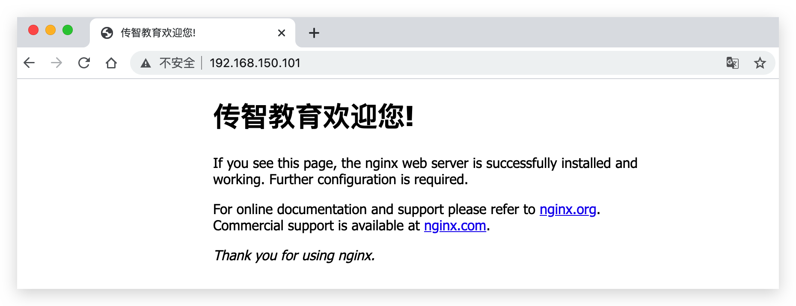

使用 `exit` 退出容器

使用 `docker stop 容器名称` 停掉该容器。然后再使用 `docker ps` 查看运行中的容器。 `docker ps` 默认只能查看运行中的容器。使用-a参数查看所有容器。


使用 `docker start 容器名称` 重新启动容器。

使用 `docker rm 容器名称` 删除该容器。此时会报错：不能删除运行中的容器


方法一：需要先停止，然后再删除。

方法二：查看帮助文档，-f 强制删除运行中的容器


此时发现，已经完全删除。


---

# 52.容器命令练习 - 运行redis容器

需求：创建并运行一个redis容器，并且支持数据持久化。进入redis容器并执行redis-cli客户端命令，存入num=666

1）查询官网，找到运行redis容器的并支持持久化的命令


需要注意的是，官网上的并没有配端口，建议配上端口

~~~bash
docker run --name some-redis -d redis redis-server --save 60 1 --loglevel warning
~~~

进入redis容器，这里命令可以用bash命令，也可以直接用redis的客户端命令

~~~bash
docker exec -it mr bash # 退出时需要退两次才能退到宿主机
docker exec -it mr redis-cli # 退一次就能退到宿主机了
~~~

连接redis

~~~bash
redis-cli
~~~

存数据

~~~bash
set num 666
~~~

查数据

~~~bash
get num
~~~

使用 exit 退出redis客户端

~~~bash
exit
~~~

---

# 53.数据卷（容器数据管理）

在之前的nginx案例中，修改nginx的html页面时，需要进入nginx内部。并且因为没有编辑器，修改文件也很麻烦。

这就是因为容器与数据（容器内文件）耦合带来的后果。

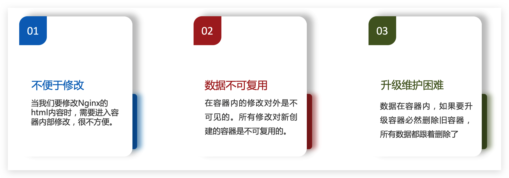

要解决这个问题，必须将数据与容器解耦，这就要用到数据卷了。


**什么是数据卷**

**数据卷（volume）**是一个虚拟目录，指向宿主机文件系统中的某个真实目录。假设这里有个docker的主机，在这个主机上就会由docker去管理很多数据卷，所有的数据卷一定会指向宿主机文件系统中的一个目录 `/var/lib/docker/volumes`。

**作用：将容器与数据分离，解耦合，提高数据的复用性，方便操作容器内数据，保证数据安全**

比如说我现在利用docker创建了一个新的数据券，这个数据券的名字叫：html，那么docker一定会在这个指定的宿主机文件系统下创建出html目录。当再次创建一个新的数据券时，它同样会在volumes（卷）目录下再创建一个真实目录，每一个数据卷都会跟一个真实的目录进行映射。所以可以认为：数据券它是一个虚拟的，而指向的是硬盘上的真实的文件夹。

当我们的Container（容器）在创建之后，它就可以使用数据卷。比方说，我们现在有一个nginx容器，nginx的html目录是在 `/usr/share/nginx/html` ，这是容器内的目录，将来如果我们放任不管nginx所有html文件、静态文件都会创建到这个目录下，所有配置都会放到 `/etc/nginx/conf` 目录下，这时就是数据与容器耦合了。

现在我们可以让nginx的内部目录与数据卷进行关联，当它与数据卷进行关联时，它的本质是在跟宿主机文件系统上的目录进行关联。这个时候，docker就会去管理这个容器了。比如说我在这个nginx容器的html目录里写了点东西，这些东西会立即写到宿主机的文件系统里。而反过来，如果说我在宿主机文件系统里，对html文件夹里面的某一个文件进行了修改，这个修改也会立即反映到容器内的这样一个目录里面去。这就可以说，宿主机文件系统和Container通过html数据卷建立起了联系。


一旦完成数据卷挂载，对容器的一切操作都会作用在数据卷对应的宿主机目录了。

这样，我们操作宿主机的/var/lib/docker/volumes/html目录，就等于操作容器内的/usr/share/nginx/html目录了

那么我们之前的问题由此就解决了

1. 修改不方便：现在对宿主机文件系统的html目录下的任意修改，一定会反映到跟这个对应数据卷关联的容器内部，再也不需要进入容器内部修改了。
2. 数据共享：只需要让第二个nginx容器的config目录也来挂载config数据卷，也就是说两个容器可以挂在同一个卷上，也就是说，原来在conf做的一切修改，在新的容器里也能看见。
3. 数据安全 / 删除：删除没关系，因为容器删了，但是数据卷不会跟着删，数据卷是挂载在容器的目录上，将来来了新版本的容器，只需要接着挂载到这个数据卷上，这样就可以共享以前旧的数据了。


---


## 数据集操作命令

数据卷操作是一个二级命令，第一级是 `docker volume` ，接下来才是真正的命令

数据卷操作的基本语法如下：

```sh
docker volume [COMMAND]
```

docker volume命令是数据卷操作，根据命令后跟随的command来确定下一步的操作：

- create：创建一个volume
- inspect（其中volume可以省略）：查看数据卷详细信息，包括关联的宿主机目录位置
- ls：列出所有的volume
- prune：删除未使用的volume
- rm：删除一个或多个指定的volume


## 案例：创建和查看数据卷

**需求**：创建一个数据卷，并查看数据卷在宿主机的目录位置

首先通过 `docker volume --help` 来查看帮助文档

① 创建数据卷

```sh
docker volume create html
```


② 查看所有数据

```sh
docker volume ls
```

结果：


③ 查看数据卷详细信息卷

```sh
docker volume inspect html
```

特别需要关注的就是它的挂载点：我们创建的 html 这个数据卷关联的宿主机目录为`/var/lib/docker/volumes/html/_data` ，


---

# 54.挂载数据卷

我们在创建容器时，可以通过 -v 参数来挂载一个数据卷到某个容器内目录，命令格式如下：

```sh
docker run \
  --name mn \
  -v html:/root/html \
  -p 8080:80
  nginx \
```

这里的-v就是挂载数据卷的命令：

- `docker run`：创建容器

- `--name`：给容器取名字

- `-p`：端口映射

- `nginx`：镜像名称

- `-v html:/root/html` ：前半部分是数据卷，后半部分是容器内的目录。把`html`数据卷挂载到容器内的`/root/html`这个目录中。

  在做数据卷挂载时，这个数据卷不存在的话，docker会自动创建卷，所以大多数情况下我们没必要自己去刻意的创建数据卷，都可以由docker自动完成。


## 案例-给nginx挂载数据卷

**需求**：创建一个nginx容器，修改容器内的html目录内的index.html内容

**分析**：上个案例中，我们进入nginx容器内部，已经知道nginx的html目录所在位置/usr/share/nginx/html ，我们需要把这个目录挂载到html这个数据卷上，方便操作其中的内容。

**提示**：运行容器时使用 -v 参数挂载数据卷

步骤：

① 创建容器并挂载数据卷到容器内的HTML目录

> docker run ：就是创建并运行容器
>
> -- name mn ：给容器起个名字叫mn
>
> -v html:/root/htm ：把html数据卷挂载到容器内的/root/html这个目录中
>
> -p 8080:80 ：把宿主机的80端口映射到容器内的80端口
>
> nginx ：镜像名称

```sh
docker run --name mn -v html:/usr/share/nginx/html -p 80:80 -d nginx

docker run \
  --name mn \
  -v html:/root/html \
  -p 8080:80
  nginx \
```


② 进入html数据卷所在位置，并修改HTML内容

> 在做数据卷挂载时，这个数据卷不存在的话，docker会自动创建卷，所以大多数情况下我们没必要自己去刻意的创建数据卷，都可以由docker自动完成。

```sh
# 查看html数据卷的位置
docker volume inspect html
# 进入该目录
cd /var/lib/docker/volumes/html/_data
```


③ 使用高级的文本编辑器来编写 `index.html` 文件


如果标题有中文的话，需要在head标签中加上编码格式。


重新访问页面，可以发现修改成功！


---

# 55.案例-给MySQL挂载本地目录

容器不仅仅可以挂载数据卷，也可以直接挂载到宿主机目录上。关联关系如下：

- 带数据卷模式：宿主机目录 --> 数据卷 ---> 容器内目录
- 直接挂载模式：宿主机目录 ---> 容器内目录

数据卷挂载方式对比：

当我们使用数据卷时

- 优点：数据卷挂载耦合度低，由docker来管理目录

  docker会全自动帮我们创建数据卷对应的目录，这样数据卷就指向了这个目录。而docker挂载时，只需要挂载到卷上就可以了，它不需要关心你这个目录在哪里，这种方式就相当于全部交给docker去处理了，我们不用去操心。

- 劣势：目录较深，不好找。

  这个目录不是我们创建的，目录结构也比较深，找比较麻烦。

当我们使用目录挂载时：

- 优点：目录容易寻找查看。

  我知道我创建的目录在哪，将来也没有人帮我做代理，我直接挂上去就行了，因此将来我想要快速的定位到这个文件，一目了然就知道了。

- 劣势：目录挂载耦合度高，需要我们自己管理目录，并且创建的时候麻烦。


**语法**：

目录挂载与数据卷挂载的语法是类似的：

- -v [宿主机目录]:[容器内目录]
- -v [宿主机文件]:[容器内文件]（此时宿主机里的内容会直接覆盖容器内的内容）


**需求**：创建并运行一个MySQL容器，将宿主机目录直接挂载到容器

实现思路如下：

1）在将课前资料中的mysql.tar文件上传到虚拟机，通过load命令加载为镜像

> 因为mysql镜像相对来讲比较大，如果自己去下载，耗时比较久

2）创建目录/tmp/mysql/data

3）创建目录/tmp/mysql/conf，将课前资料提供的hmy.cnf文件上传到/tmp/mysql/conf

> 因为将来我们要做目录挂载，而数据库里面值得挂载的就这么两个东西：1）数据储存	2）配置文件，用我们的配置文件覆盖容器内的配置文件

4）去DockerHub查阅运行命令，创建并运行MySQL容器，要求：

① 挂载/tmp/mysql/data到mysql容器内数据存储目录

② 挂载/tmp/mysql/conf/hmy.cnf到mysql容器的配置文件

③ 设置MySQL密码


数据存储目录和容器的配置文件都可以到官方文档中找到，这个配置文件不建议大家去覆盖它，因为它里面有很多东西，我们写的只是简化的配置，由此我们不覆盖它，以 `.d` 结尾的是一个目录（directory）的意思，这个的意思就是：在 `my.cnf` 配置文件里，它包含了这两个目录，因此放到这两个目录里的一切文件最后都会被加载到my.cnf一起去，作为合并配置。所以官方配置我们不管，我们只需要将我们的配置传进来做个合并就行了。所以我们不是放到 `/etc/mysq/my.cnf` 下，而是放到 `/etc/mysql/conf.d` 目录下。


数据存储的文件在：


``` sh
docker run \
--namemysql \
-e MYSQL_ROOT_PASSWORD=my-secret-pw \ # 环境变量，MYSQL_ROOT的密码，这个环境变量可以让我们直接搞定密码
-p 3306:3306 \
-v /tmp/mysql/conf/hmy.cnf:/etc/mysql/conf.d/hmy.cnf- \ 
-v /tmp/mysql/data:/var/lib/mysql \
-d \
mysq1:5.7.25
```

此时容器就成功被创建出来了，并且查看data目录，刷新后可以看见，所有mysql数据都记录到data目录下了。


测试这个mysql是否真的ok：打开mysql的客户端，尝试建立连接。


---

# -----------------------------------------

# Dockerfile自定义镜像

常见的镜像在DockerHub就能找到，但是我们自己写的项目就必须自己构建镜像了。而要自定义镜像，就必须先了解镜像的结构才行。


# 56.镜像结构

镜像是分层结构，每一层称之为一个Layer。

- BaseImage层：包含基本的系统函数库、环境变量、文件系统

- Entrypoint：入口，是镜像中应用启动的命令

- 其他：在BaseImage基础上添加依赖、安装程序、完成整个应用的安装和配置。

  这一步里面的具体操作我们就不能确定了，因为镜像在构建的时候它中间要做哪些动作，我们不知道，但是我们可以知道的是：每做一次操作一定会产生新的一层。

镜像是将应用程序及其需要的系统函数库、环境、配置、依赖打包而成。这些只是镜像的组成，结构还需要看这些组成怎么样去组合。并且这些组成当然有相互的依赖关系或者顺序，如果没有最底层的系统函数库，底层的文件系统怎么完成环境的配置？如果没有环境变量，怎么去做依赖的安装？没有依赖的的安装怎么去完成应用的安装？没有应用的安装，那怎么样去做应用的配置呢？可见，镜像不仅仅是把这一堆东西揉在一起，并且还需要安装一定的顺序去分层构建。

我们以MySQL为例，来看看镜像的组成结构，这个是模拟的mysql镜像，它不是很完整，但足以说明问题了。

这里就分成了n层，它就是按照我们刚刚所分析的依赖顺序来去分层的。要想构建一个镜像，最底层一定是它所依赖的系统函数库，在这里就用了一个Ubuntu的操作系统，当让不是完整的系统，只是mysql依赖的部分系统函数库和部分文件，它就像这栋大楼的地基一样，只有先将它搞定，我们才能继续向上，所以这一层我们一般称为：BaseImage（基础镜像层）。

在此基础上我可以给MySQL这个应用配置环境变量，搞定环境变量后，我们还需要搞定它所依赖的其他东西。把这些都搞定了那我就可以开始安装MySQL了。我就把MySQL的安装包给它拷进来，然后在此基础上我就去rpm安装MySQL，安装完MySQL后，还需要配置MySQL的配置文件等等。等所有的安装步骤全部做完，这个楼就盖的差不多了，还差个入口（Entrypoint）。你把这一堆文件打了个包，将来别人需要启动里面的应用，你得给它一个入口，也就是启动的脚本。所以任何的镜像一定有这么一层。此时我们的镜像就构建完成了。

那么我们在这个过程中从基础开始完成了环境变量的配置，依赖的安装，应用的安装等等，这每一次操作都会产生新的一层，这个东西称之为layer（层）。

逐层构建的好处：方便升级，可以提高复用性，节省时间。


简单来说，镜像就是在系统函数库、运行环境基础上，添加应用程序文件、配置文件、依赖文件等组合，然后编写好启动脚本打包在一起形成的文件。

我们要构建镜像，其实就是实现上述打包的过程。

---

# 57.Dockerfile语法

构建自定义的镜像时，并不需要一个个文件去拷贝，打包。我们只需要告诉Docker，我们的镜像的组成，需要哪些BaseImage、需要拷贝什么文件、需要安装什么依赖、启动脚本是什么，将来Docker会帮助我们构建镜像。

而描述上述信息的文件就是**Dockerfile**文件。Dockerfile就是一个文本文件，里面有很多指令(Instruction)，这些指令就是来描述你这个镜像内部是如何构建的，它可以当做是镜像构建的说明书，将来docker会按照里面的指令去构建好我们的镜像，每一个指令都会形成一层Layer。

Dockerfile的第一行必须是FROM，从一个基础镜像来构建，这个基础镜像可以是从0开始的基础系统，这样来做的话就比较麻烦，还可以是别人做好的镜像，这样可以直接共享前面几层，只需要做后面的就行了。

- FROM centos:6  	就是基于centos6来完成构建

- ENV     环境变量一旦配置好后，大家都可以使用环境变量中配置好的东西

- COPY   本地有一个java的项目包，将来我们要拷到镜像里面去，就可以用COPY的命令了

- RUN     运行，特指执行Linux的shell命令，一般是安装命令

- EXPOSE   指暴露端口，但这个不是真正的暴露端口。之前我们在创建容器时要加 `-p` 参数，那个才是指定宿主机和容器的映射端口。这里只是指定容器内我监听的是什么端口，它是给镜像的使用者看的，假如使用的是 `EXPOSE 8080` ，那么 `-p` 参数冒号后面那一部分就必须写 8080 了。

  这个加 和 不加其实都可以，加了的话，镜像使用者一下就明白了。

- ENTRYPOINT    启动命令。镜像一定要有一个启动的脚本，一个java项目启动的命令就非常的简单：`java -jar xx.jar`

| **指令**           | **说明**                                     | **示例**                    |
| ------------------ | -------------------------------------------- | --------------------------- |
| FROM               | 指定基础镜像                                 | FROM centos:6               |
| ENV（environment） | 设置环境变量，可在后面指令使用               | ENV key value               |
| COPY               | 拷贝本地文件到镜像的指定目录                 | COPY ./mysql-5.7.rpm /tmp   |
| RUN                | 执行Linux的shell命令，一般是安装过程的命令   | RUN yum install gcc         |
| EXPOSE             | 指定容器运行时监听的端口，是给镜像使用者看的 | EXPOSE 8080                 |
| ENTRYPOINT         | 镜像中应用的启动命令，容器运行时调用         | ENTRYPOINT java -jar xx.jar |

更新详细语法说明，请参考官网文档： https://docs.docker.com/engine/reference/builder

---


## 案例：基于Ubuntu构建Java项目

需求：基于Ubuntu镜像构建一个新镜像，运行一个java项目

- 步骤1：新建一个空文件夹docker-demo，这个文件时用来放我们构建镜像所需要的各种材料的。

  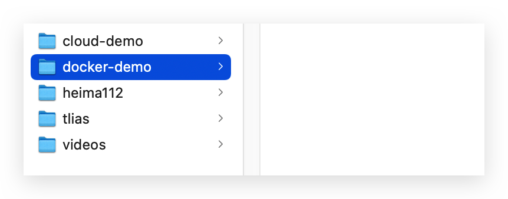

- 步骤2：拷贝课前资料中的docker-demo.jar（java项目）文件到docker-demo这个目录

  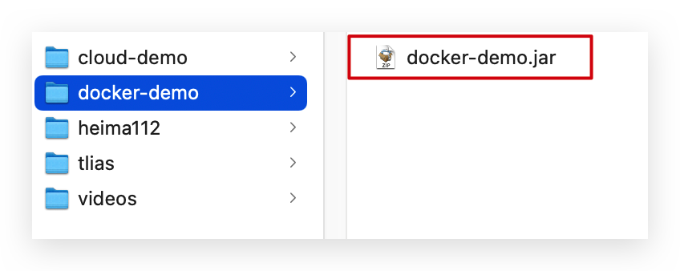

- 步骤3：拷贝课前资料中的jdk8.tar.gz文件到docker-demo这个目录

  

- 步骤4：拷贝课前资料提供的Dockerfile（构建的说明书）到docker-demo这个目录

  

  其中的内容如下，所使用的基础镜像是干干净净的一个基础镜像，上面啥都没有，但是java项目运行必须基于jdk，所以在这个构建过程中它主要就是在安装JDK。

  ```dockerfile
  # 指定基础镜像
  FROM ubuntu:16.04
  # 配置环境变量，JDK的安装目录
  ENV JAVA_DIR=/usr/local
  
  # 拷贝jdk和java项目的包
  COPY ./jdk8.tar.gz $JAVA_DIR/ # 将jdk拷贝到 $JAVA_DIR 下
  COPY ./docker-demo.jar /tmp/app.jar # 将java项目拷贝到 tmp 目录下，并重命名为app.jar
  
  # 安装JDK
  RUN cd $JAVA_DIR \ # 首先进入$JAVA_DIR目录
   && tar -xf ./jdk8.tar.gz \ # 解压缩
   && mv ./jdk1.8.0_144 ./java8 # 重命名
  
  # 配置环境变量
  ENV JAVA_HOME=$JAVA_DIR/java8
  ENV PATH=$PATH:$JAVA_HOME/bin
  
  # 暴露端口
  EXPOSE 8090
  # 入口，java项目的启动命令
  ENTRYPOINT java -jar /tmp/app.jar
  ```

- 步骤5：运行命令。

  `-t：tag`：镜像要有名称，名称由repository和tag组成，名称可以随便起，这里取名为：javaweb
  
  `.` 代表dockerFile所在的目录，build（构建）的时候需要知道dockerFile在哪里
  ```sh
  docker build -t javaweb:1.0 .
  ```

  并且拷贝的指令是从当前目录去拷，拷到指定位置，所以一定要复制到当前目录


查看镜像是否构建好

~~~bash
docker images
~~~


创建容器

~~~bash
docker run --name web -p 8090:8090 -d javaweb:1.0
~~~

最后访问 http://192.168.150.101:8090/hello/count，其中的ip改成你的虚拟机ip


---


## 基于java8构建Java项目

虽然我们可以基于Ubuntu基础镜像，添加任意自己需要的安装包，构建镜像，但是却比较麻烦。所以大多数情况下，我们都可以在一些安装了部分软件的基础镜像上做改造。例如，构建java项目的镜像，可以在已经准备了JDK的基础镜像基础上构建。


需求：基于java:8-alpine镜像，将一个Java项目构建为镜像

> java:8-alpine是一个体积非常小的jdk的镜像，这个镜像已经帮我们把上面安装jdk的步骤做完了。

实现思路如下：

- ① 新建一个空的目录，然后在目录中新建一个文件，命名为Dockerfile

- ② 拷贝课前资料提供的docker-demo.jar到这个目录中

- ③ 编写Dockerfile文件：

  - a ）基于java:8-alpine作为基础镜像

  - b ）将app.jar拷贝到镜像中

  - c ）暴露端口

  - d ）编写入口ENTRYPOINT

    内容如下：

    ```dockerfile
    FROM java:8-alpine
    COPY ./app.jar /tmp/app.jar
    EXPOSE 8090
    ENTRYPOINT java -jar /tmp/app.jar
    ```

    

- ④ 使用docker build命令构建镜像

  ```sh
  docker build -t javaweb:1.0 .
  ```


- ⑤ 使用docker run创建容器并运行


## 小结

1. Dockerfile的本质是一个文件，通过指令描述镜像的构建过程

2. Dockerfile的第一行必须是FROM，从一个基础镜像来构建

3. 基础镜像可以是基本操作系统，如Ubuntu。也可以是其他人制作好的镜像，例如：java:8-alpine


---

# 58.Docker-Compose

作用：帮我们快速部署分布式应用，无需一个个微服务去构建镜像和部署。

在前面几章，我们已经实现了用Docker来部署像Redis、MySQL这样的中间件，还有利用Dockerfile实现微服务的自定义镜像构建、docker部署，但是所有的这些部署都是我们手动一个个去完成的，但是在实际生产环境中，微服务的数量非常多，这么多微服务我们都一个个去构建，肯定受不了，所以我们一定要有一种集群部署的手段，那么这就是我们这一章要学习的Docker Compose。

Docker Compose可以基于Compose文件帮我们快速的部署分布式应用，它就是一个分布式应用部署的一个帮手，无需手动一个个创建和运行容器！下面这只章鱼手上拿的是容器，它在帮我们部署容器。


但是它来做集群部署，是要基于Compose文件才行的。

Compose文件是一个文本文件，通过**指令**定义集群中的每个容器如何运行。以前我们是通过 `docker run` 命令来运行每个容器，而现在是通过Compose文件来定义集群中的n个容器如何运行，那么我们就可以认为Compose文件就是n个docker run命令的集合，但事实上确实是如此，只不过它不是直接用run，它把run当中的东西利用另外的一种语法，也就是指令来代替。

以前的 `docker run` 指令。

~~~bash
docker run \
--namemysql \
-e MYSQL_ROOT_PASSWORD=my-secret-pw \ # 环境变量，MYSQL_ROOT的密码，这个环境变量可以让我们直接搞定密码
-p 3306:3306 \
-v /tmp/mysql/conf/hmy.cnf:/etc/mysql/conf.d/hmy.cnf- \ 
-v /tmp/mysql/data:/var/lib/mysql \
-d \
mysq1:5.7.25
~~~

~~~bash
docker build -t javaweb:1.0 .
~~~

Compose文本文件格式如下，整体是一个yml格式。这里没配端口的原因是，这里是微服务集群部署，MySQL仅仅是供给给集群内的服务用的，端口就不需要暴露了。这里也不需要 `/d` ，默认就是 `\d`。对比一下 `docker run` 命令：将所有参数都转变为了docker中的指令了。

```yml
# 语法的版本，Compose文件来讲当前有三个大的版本：1.x、2.x、3.x，这里我们选择3.8是它的最新版本，不同版本的语法还是有些差异的。
version: "3.8"
 # 往下就是具体的微服务定义了，这里有两个二级配置，即两个微服务配置
 # 第一种部署的方式：基于镜像直接部署
 services:
  mysql: # 容器名
    image: mysql:5.7.25 
    environment: # 配置环境变量
     MYSQL_ROOT_PASSWORD: 123 
    volumes: # 数据卷配置
     - "/tmp/mysql/data:/var/lib/mysql"
     - "/tmp/mysql/conf/hmy.cnf:/etc/mysql/conf.d/hmy.cnf"
  # 第二种部署的方式：没有指定镜像，使用build（构建），build后面的小点就是指从当前目录来构建镜像，这种命令将docker build和docker run都包含进来了，这种就是临时构建镜像并且运行
  web: # 指定容器的名称
    build: .
    # 构建完就可以开始创建容器了
    ports: # 端口
     - "8090:8090"
```

上面的Compose文件就描述一个项目，其中包含两个容器：

- mysql：一个基于`mysql:5.7.25`镜像构建的容器，并且挂载了两个目录
- web：一个基于`docker build`临时构建的镜像容器，映射端口时8090

DockerCompose的详细语法参考官网：https://docs.docker.com/compose/compose-file/


---


## CentOS7安装DockerCompose

**1)下载**

Linux下需要通过命令下载有两种方式：

```sh
# 在GitHub慢慢下，但是速度特别的慢，不建议大家这么做
curl -L https://github.com/docker/compose/releases/download/1.23.1/docker-compose-`uname -s`-`uname -m` > /usr/local/bin/docker-compose
```

第二种方式：使用课前资料提供的docker-compose文件上传到`/usr/local/bin/`目录也可以。


**2）修改文件权限**

修改文件权限：

```sh
# 修改权限
chmod +x /usr/local/bin/docker-compose
```


**3）配置Base自动补全命令**

一旦配了自动补全，将来我们再去用DockerCompose时它会有提示，比较方便

```sh
# 补全命令
curl -L https://raw.githubusercontent.com/docker/compose/1.29.1/contrib/completion/bash/docker-compose > /etc/bash_completion.d/docker-compose
```

如果这里出现错误，这是因为这个域名是无法访问的，没法解析，需要修改自己的hosts文件：

```sh
echo "199.232.68.133 raw.githubusercontent.com" >> /etc/hosts
```


---

# 59.部署微服务集群

**需求**：将之前学习的cloud-demo微服务集群利用DockerCompose部署

**实现思路**：

① 查看课前资料提供的cloud-demo文件夹，里面已经编写好了docker-compose文件

② 修改自己的cloud-demo项目，将数据库、nacos地址都命名为docker-compose中的服务名

③ 使用maven打包工具，将项目中的每个微服务都打包为app.jar

④ 将打包好的app.jar拷贝到cloud-demo中的每一个对应的子目录中

⑤ 将cloud-demo上传至虚拟机，利用 docker-compose up -d 来部署


## 1）详细阅读课前资料提供的cloud-demo文件夹

查看课前资料提供的cloud-demo文件夹，里面已经编写好了docker-compose文件，而且每个微服务都准备了一个独立的目录：


查看微服务目录，可以看到都包含Dockerfile文件：


首先：gateway里面只有一个Dockerfile，并且它里面的内容非常简单，其中有一步，我们需要拷贝jar包进去，但是现在我们目录里是没有的，所以将来我们应该把网关的jar包放到这个文件中。

~~~dockerfile
FROM java:8-alpine
COPY ./app.jar /tmp/app.jar
ENTRYPOINT java -jar /tmp/app.jar
~~~

而user-service和order-service文件夹里同理。当我们将每个微服务的jar包都打好，然后扔进去，将来DockerCompose就会帮助我们自动的去构建这三个微服务的镜像了。

而这三个微服务依赖于MySQL，所以在这我们准备了一个MySQL的包，里面存放着conf配置和data，data里面存放着数据库表，将来我们只需要让MySQL容器挂载到这两个上面去，那么数据也好，配置也好，也都有了。查看mysql目录，可以看到其中已经准备好了cloud_order、cloud_user表：


最后就是docker-compose.yml文件了，打开看一眼。可以看到，其中包含5个service服务：

`nacos`：作为注册中心和配置中心

- `image: nacos/nacos-server`： 基于nacos/nacos-server镜像构建
- `environment`：环境变量
  - `MODE: standalone`：单点模式启动
- `ports`：端口映射，这里暴露了8848端口

`mysql`：数据库

- `image: mysql:5.7.25`：镜像版本是mysql:5.7.25
- `environment`：环境变量
  - `MYSQL_ROOT_PASSWORD: 123`：设置数据库root账户的密码为123
- `volumes`：数据卷挂载，这里挂载了mysql的data、conf目录，其中有我提前准备好的数据

`userservice`、`orderservice`、`gateway`：都是基于Dockerfile临时构建的

~~~yml
version: "3.2"

services:
  # 第一个是nacos服务，因为所有的服务都需要注册到nacos上面，所以nacos放在第一个
  nacos:
    image: nacos/nacos-server # nacos镜像是 nacos-server 
    environment: # 环境变量名字叫 MODE，值为 standalone，这个就是我们以前单机运行的 -m 参数
      MODE: standalone
    ports: # 端口
      - "8848:8848"
  mysql: # mysql端口我们并没有对外暴露，这是因为mysql仅仅是对内进行访问的，所以不需要暴露
    image: mysql:5.7.25 # 镜像名称
    environment:
      MYSQL_ROOT_PASSWORD: 123 # 密码
    volumes: # 数据卷挂载，$PWD是执行PWD命令，去得到当前地址(即相对于compose当前，只要在这执行就一定会找到mysql、conf.d)
      - "$PWD/mysql/data:/var/lib/mysql"
      - "$PWD/mysql/conf:/etc/mysql/conf.d/"
  userservice: # 微服务端口不应该暴露在外界，因为网关才是整个微服务的入口，它要再这里面去做一些身份认证、权限校验之类的，如果把这两暴露出去了，那任何人都能访问，那就很危险了
    build: ./user-service
  orderservice:
    build: ./order-service
  gateway:
    build: ./gateway # 基于Dockerfile完成构建，这个Dockerfile目录在当前目录的gateway目录下
    ports:
      - "10010:10010"
~~~

将来DockerCompose一旦执行，它就会去启动Nacos、mysql，然后基于user-service、order-service和网关里面的Dockerfile完成镜像构建和自动的部署，这样我们就能实现一次性把整个集群都给部署好了，如果将来有更多的微服务就继续往下写，有几个就写几个，将来它都能帮助我们去完成部署。

---

## 2）修改微服务配置

修改自己的cloud-demo项目，将数据库、nacos地址都命名为docker-compose中的服务名，并且数据库的密码记得跟上面的一样

因为以前项目都是写localhost，都是在本地，但现在是集群部署了，微服务将来要部署为docker容器，而这些容器不一定是在同一个机器，而我们并不知道对方的地址，容器之间互联不是通过IP地址，而是通过容器名互相访问。这里我们将order-service、user-service、gateway服务的mysql、nacos地址都修改为基于容器名的访问。

首先进入IDEA，从user-service开始，找到它的yml文件，包含bootstrap.yml 和 application.yml

user-service / bootstrap.yml

~~~yml
erver-addr: nacos:8848 # Nacos地址
~~~

user-service / application.yml

~~~yml
url: jdbc:mysql://mysql:3306/cloud_user?useSSL=false
~~~

order-service / application.yml 中也是将mysql 和 nacos地址修改为服务名

网关中只需要修改nacos地址即可。


## 3）打包

接下来需要将我们的每个微服务都打包成 `app.jar`。这因为之前查看到Dockerfile中的jar包名称都是app.jar，因此我们的每个微服务都需要用这个名称。

可以通过修改pom.xml中的打包名称来实现，每个微服务都需要修改：

```xml
<!-- 这个build就是在做项目打包 -->
<build>
  <!-- 服务打包的最终名称 -->
  <finalName>app</finalName>
  <plugins>
    <plugin>
      <groupId>org.springframework.boot</groupId>
      <artifactId>spring-boot-maven-plugin</artifactId>
    </plugin>
  </plugins>
</build>
```

都叫app并不会冲突，因为它们各自都有各自的target文件夹。

打包时候先clean一下，然后再打包。打包后：


## 4）拷贝jar包到部署目录

编译打包好的app.jar文件，需要放到Dockerfile的同级目录中。注意：每个微服务的app.jar放到与服务名称对应的目录，别搞错了。

user-service：


order-service：


gateway：


## 5）部署

最后，我们需要将文件整个cloud-demo文件夹上传到虚拟机中，理由DockerCompose部署。

上传到任意目录：


部署：

进入cloud-demo目录，查看帮助文档可以看见，up的意思是创建并运行容器


如果需要停止，可以使用 stop / down，down不仅会停掉，还会删掉。

~~~bash
docker-compose down
~~~

如果想要重启，可以使用 restart，如果需要查看日志，可以使用logs。这些命令跟单个docker运行命令都非常相似。

然后运行下面的命令， `-d`参数代表后台运行：

```sh
docker-compose up -d
```

使用 `docker ps` 查看创建的多个容器

使用 `docker-compose logs -f` 查看日志，可以看见我们的服务跑起来了，此时会报 `nacos连接失败` 错误，这是因为通过查看日志可以发现，显示userservice启动，然后才是nacos启动，nacos启动的太慢了，到下面才成功。userservice、orderservice启动的过程中都会去尝试注册，但此时nacos还没启动成功，于是就失败了，这是SpringCloudAlibaba写的代码上的一个问题，代码有Bug，并且当它失败的时候它也不重试。


所以在生产部署的时候，Nacos最好先部署，然后再去部署微服务，其他微服务可以一键部署。这里我们就简单一点，直接把所有的微服务给它重启一下，包括getway、userservice、orderservice

~~~bash
docker-compose restart gateway userservice orderservice
~~~

此时访问浏览器 `192.168.150.101:/user/2?authorization=admin`查询是否可以访问成功

---

# 60.Docker镜像仓库

在前面几节课中我们解除了各种各样的镜像，有一些是别人制作好的，如：redis、mysql，还有一些是我们基于微服务去构建的镜像，这些镜像一定有一个统一的地方去做保存和管理，管理镜像的地方就称之为镜像仓库。

搭建镜像仓库可以基于Docker官方提供的DockerRegistry来实现，但这个是一个公共的镜像仓库，这一章中，会带大家去了解一下私有镜像仓库怎么搭建，和怎么样在私有镜像仓库中完成镜像的管理。

镜像仓库（ 镜像仓库本来叫：Docker Registry ，即注册中心，就是将我们的镜像注册到服务上去，但是我觉得翻译成镜像仓库更顺口一些）有公共的和私有的两种形式：

- 公共仓库：例如Docker官方的 [Docker Hub](https://hub.docker.com/)，国内也有一些云服务商提供类似于 Docker Hub 的公开服务，比如 [网易云镜像服务](https://c.163.com/hub)、[DaoCloud](https://hub.daocloud.io/)[ ](https://hub.daocloud.io/)[镜像服务](https://hub.daocloud.io/)、[阿里云镜像服务](https://cr.console.aliyun.com/)等。

- 除了使用公开仓库外，用户还可以在本地搭建私有 Docker Registry。企业自己的镜像最好是采用私有Docker Registry来实现。


docker的镜像仓库是基于官方提供的 `DockerRegistry` 镜像来实现的，它的搭建有两种办法，第一种是简化版，虽然是简化版，但是它却具备了仓库管理的完整功能，只不过是缺少了图形化界面而已，所以它用起来不是很方便。

官网地址：https://hub.docker.com/_/registry


## 1）简化版镜像仓库

Docker官方的Docker Registry是一个基础版本的Docker镜像仓库，具备仓库管理的完整功能，但是没有图形化界面。

搭建方式比较简单，起了个名字，给了个端口，然后配了一下数据卷挂载，注意看端口是5000，说明DockerRegistry默认占用的是5000端口。命令如下：

```sh
docker run -d \
    --restart=always \
    --name registry	\
    -p 5000:5000 \
    -v registry-data:/var/lib/registry \
    registry
```


命令中挂载了一个数据卷registry-data到容器内的/var/lib/registry 目录，这是私有镜像库存放数据的目录。

访问http://YourIp:5000/v2/_catalog 可以查看当前私有镜像服务中包含的镜像


## 2）带有图形化界面版本

图形化界面并不是docker官方提供的，它是由一个第三方的个人在官方registry的基础上去开发的，所以说它是额外的一个服务。因此这里是使用DockerCompose部署带有图象界面的DockerRegistry，将两者组合部署，命令如下：

```yaml
version: '3.0'
services:
  registry:
    image: registry
    volumes:
      - ./registry-data:/var/lib/registry
  ui: # 图形化界面
    image: joxit/docker-registry-ui:static
    ports:
      - 8080:80 # 端口是8080
    environment:
      - REGISTRY_TITLE=传智教育私有仓库 # 将来服务部署起来后的标题
      - REGISTRY_URL=http://registry:5000 # 配置registry服务的地址，使用服务名互相访问，这个5000端口只是它们两者内部的访问端口，我们是无法使用的，因为它没有暴露，我们将来只能访问 8080
    depends_on: # 依赖于registry，将来我们到DockerCompose部署的时候，就会先启动registry，再启动ui
      - registry
```


## 3）配置Docker信任地址

在执行DockerCompose之前，需要先配置Docker的信任地址。

我们的私服采用的是http协议，默认不被Docker信任，所以需要做一个配置：

```sh
# 打开要修改的文件，这个文件里就是用来记录各种各样的信息的，其中以前的时候我们就配了阿里云的地址
vi /etc/docker/daemon.json
# 添加内容，insecure-registries：不安全的注册中心，因为它采用的是http，不被信任，端口是8080，地址是自己的ip
"insecure-registries":["http://192.168.150.101:8080"]
# 重加载
systemctl daemon-reload
# 重启docker
systemctl restart docker
```

配置之间注意一定要有一个逗号分隔！


## 4）执行DockerCompose

将上述DockerCompose命令拷一下，DockerCompose命令其实要放到DockerCompose文件，所以我们需要先新建一个DockerCompose文件，建议不要随便放，而是建一个文件夹，我这里在 `tmp` 目录下建一个文件夹叫registry-ui（代表是Docker镜像仓库的一个ui界面）。

~~~bash
mkdir registry-ui
~~~

进入到 `registry-ui` 文件夹中

~~~bash
cd registry-ui
~~~

新建一个 `docker-compose.yml` 文件

~~~bash
touch docker-compose.yml
~~~

然后使用高级文本编辑工具编辑

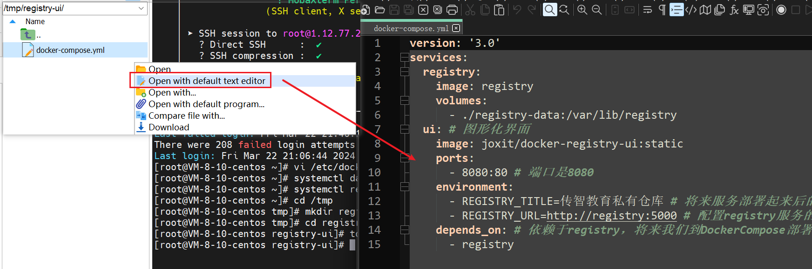

执行docker-compose.yml文件，如果里面镜像没有下载过，是需要花不少时间去下载的。

~~~bash
docker-compose up -d
~~~

此时访问 `192.168.150.101:8080` ，即可访问到图形化界面。但是下面显示 0 images，也就是说现在目前没有任何的镜像。


## 5）推送、拉取镜像

推送镜像到私有镜像服务 必须先tag（重命名），并且以仓库地址为前缀！步骤如下：

① 重新tag本地镜像（即给镜像重新起名字）

`nginx:latest` 是原始的名字，后面跟着的 `192.168.150.101:8080/nginx:1.0`  是要重新生成的名字。名称前缀为私有仓库的地址：192.168.150.101:8080/，然后才是镜像名，最后才是这个tag。利用 `docker tag` 命令可以重命名镜像名。后面的镜像名和版本可以随便取。

 ```sh
docker tag nginx:latest 192.168.150.101:8080/nginx:1.0 
 ```

重命名后重新查看镜像，可以发现，这两id是一样的，说明它们两其实是同一个镜像，只不过把 `nginx:latest` 重命名为一个新的而已，但它们的本质其实是一样的。


② 推送镜像

```sh
docker push 192.168.150.101:8080/nginx:1.0 
```


③ 拉取镜像

可以直接点击Tag下面的复制图标，它就会直接帮你复制命令


在拉取镜像前先将原有的镜像干掉

~~~bash
docker rmi 192.168.150.101:8080/nginx:1.0 
~~~

建议将nginx也删掉

~~~bash
docker rmi nginx:latest
~~~

根据复制的命令拉取镜像

```sh
docker pull 192.168.150.101:8080/nginx:1.0 
```


---

# --------------------------

# RabbitMQ


**同步和异步通讯**

微服务间通讯有同步和异步两种方式：

同步通讯：就像打电话，需要实时响应。

异步通讯：就像发邮件，不需要马上回复。


两种方式各有优劣，打电话可以立即得到响应，但是你却不能跟多个人同时通话。发送邮件可以同时与多个人收发邮件，但是往往响应会有延迟。


# 62.同步通讯

我们之前学习的Feign调用就属于同步方式，虽然调用可以实时得到结果。

例如：我们要做一个购买商品支付的业务，用户支付调用我们的支付服务，支付成功以后，需要调用我们的订单业务（修改订单状态），然后还需要调用仓储服务，因为需要给用户发货等等，这就是我们购物时的一个基本场景。在这个过程中，支付服务调用订单服务也好，调用仓储服务也好，它都需要等待对方的一个响应，所以这种调用它是一种实时调用，也就是同步调用。


但存在下面的问题：


同步调用的优点：

- 时效性较强，可以立即得到结果

同步调用的问题：

- 耦合度高
- 性能和吞吐能力下降
- 有额外的资源消耗
- 有级联失败问题


---

# 63.异步通讯

异步调用最常见实现的就是事件驱动模式。用户在调用时肯定会调用支付服务，支付服务在完成支付以后，就需要订单服务、仓储服务、短信服务各自完成自己的业务。

但是现在是事件驱动模式，就不能由只服务福来调用这三个服务了。所以引入了一个东西：Broker，Broker就是事件代理者。在我们这个业务当中，一旦有人支付成功，那就是一个事件，那么这个事件将来就自然交给了我们的Broker去管理。那么订单服务、仓储服务、短信服务就会去找Broker，如果有人支付，你得通知我一下，这个就叫做事件订阅，一旦完成订阅，将来支付服务发现有人支付成功，发布一个事件出去：有人支付了，订单是1001，那Broker就会拿起大喇叭通知这三个哥们，订单服务一接收，就回去更新订单状态，仓储服务就会去完成库存扣减发货，而我们的短信服务自然就会去完成短信的发送了。

在这整个过程中，支付服务完成事件发布以后就立即结束了自己的业务可以去返回给用户了，它并不需要等待订单服务、仓储服务、短信服务完成业务。这种方式就是异步的方式。

在事件模式中，支付服务是事件发布者（publisher），在支付完成后只需要发布一个支付成功的事件（event），事件中带上订单id。

订单服务和物流服务是事件订阅者（Consumer），订阅支付成功的事件，监听到事件后完成自己业务即可。


**优势一：解耦**

假如产品经理需要让你加一个 积分业务的 需求，以前我们就需要更改支付服务的代码。但是现在不用了，因为支付服务不负责调用这些服务，而是只发一个事件到broker就可以了，至于谁收事件，跟我都没有关系，所以一旦有新的业务出现，你要干的事情就是去订阅broker事件就行了。

并且将来有一天产品经理说天天发短信成本有点高，需要停止短信服务，以前还需要删代码，但现在只需要让短信服务取消订阅事件，将来通知通知不到你，短信就不会发送了。

为了解除事件发布者与订阅者之间的耦合，两者并不是直接通信，而是有一个中间人（Broker）。发布者发布事件到Broker，不关心谁来订阅事件。订阅者从Broker订阅事件，不关心谁发来的消息。

Broker 是一个像数据总线一样的东西，所有的服务要接收数据和发送数据都发到这个总线上，这个总线就像协议一样，让服务间的通讯变得标准和可控。


**优势二：吞吐量的提高**

以前支付服务是要来调用订单服务、仓储服务和短信服务，每个服务都有一定的耗时，因此总耗时就是四个服务的耗时之和。但是现在不一样了，订单服务调用支付服务，支付服务来向Broker发送事件，这个时候支付服务就可以立即结束在，告诉用户支付成功了，后面的订单、仓库、短信和支付服务本身是没什么关系的，这个就由我们的Broker去通知它们完成了。现在的耗时就是支付50 + 发布事件的10ms，总耗时50ms，耗时缩短了，性能就得到了提升，吞吐量就高了。


**优势三：没有强依赖关系**

以前级联失败问题也不存在了。假如仓储服务挂了，但是和支付服务没关系，支付服务发完事件到Broker就结束了，又不调用仓储服务，大不了重启一下就好了。所以就不会出现因为仓储服务挂了，而导致支付服务也挂。

既然没有强的依赖关系，我不调用你了，我也不等待你了，所以之前讲的资源浪费的问题也都解决了。


异步调用除了我们刚刚讲的能够解决同步调用的问题以外，它还有一些自己的优势

- 流量削峰：不管发布事件的流量波动多大，都由Broker接收，订阅者可以按照自己的速度（能力）去处理事件，这样可以起到对微服务的保护作用。

  假设我们现在只有极少数的用户，比如说就一个，它来支付，消息过来了以后，我们的订单服务、仓储服务和短信服务可以非常快速的去完成处理。但是随着你的业务量增加，用户越来越多，于是就有更多的请求过来了，假如说一瞬间来了三个，假设订单服务、仓储服务、短信服务每一时刻只能处理一个，一下来三，我就处理不了了，此时Broker就可以起到缓冲的作用，就像是洪水来了，有个大坝拦住了。这三个业务每次只能处理一个，那我就先取一个，处理完了，再来处理下一个，那此时订单服务、仓储服务、短信服务处理业务的速度，一直都是按照自己的能力来。这样一来，我们的压力都由Broker来扛着了。此时一个高并发就会被砍平了，就会变成低并发了。这时候微服务就起到了一个保护的作用，这个就叫做流量削峰。特别是类似于在秒杀这种高并发的环境下，我们就可以用这种技术去实现。

  

- 耦合度极低，每个服务都可以灵活插拔，可替换

  因为异步通信不需要去调用对方了，而是通过事件，所以几乎没有耦合了。

- 吞吐量提升：由于不存在，所以也无需等待订阅者处理完成，响应更快速

- 故障隔离：服务没有直接调用，不存在级联失败问题

- 调用间没有阻塞，不会造成无效的资源占用


缺点：

- 在整个异步通信的过程中，整个都需要依赖于Broker的可靠、安全、性能，如果Broker挂了，那么整个微服务就完蛋了，而且流量削峰的过程中，高并发的流量来了以后，你用Broker去缓存这些事件，微服务慢慢去取，那如果说这个Broker它的并发能力不行，它扛不住前面那么高的流量。

- 一旦引入异步通信，服务间的调用不再像以前那样清晰明了了。发了一个事件，由谁去处理这个事件我并不知道。

  这种调用链的关系不清晰，导致将来一旦出了问题，不好排查。架构复杂了，业务没有明显的流程线，不好管理。


事实上，大多数情况下都会去使用同步，因为大多数情况下我们对于并发并没有很高的要求，相反我们对时效性要求较高，因为我希望我去调用你，查询了一个信息，而这个信息我立马又要在下边的业务中用到，此时就必须要用同步调用。而异步调用是，我通知你去干一件事，但是你干完你又不会去告诉我，我也不知道你什么时候干完，所以没有办法去等待它的结果。

而如果说你不需要对方的结果，你只是让它去干一件事，并且你对于吞吐量的要求、并发的要求较高，你还希望解除服务间的这种耦合关系，那么此时就应该使用异步通信，这样的场景相对来讲少一些。

好在现在开源软件或云平台上 Broker 的软件是非常成熟的，比较常见的一种就是我们今天要学习的MQ技术。


----

# 64.MQ技术对比

刚刚学习了异步通信的事件驱动架构，我们知道在这个架构当中，最重要的东西就是Broker了，因为Broker需要来做事件的管理。因此Broke的可用性、稳定性、并发能力就成为了事件驱动架构中最重要的一个问题了。好在我们的前辈经过不断地探索也给出了一些解决方案，其实MQ就是一种常见的解决方案了。

MQ，中文是消息队列（MessageQueue），字面来看就是存放消息的队列。也就是事件驱动架构中的Broker。

消息也就是我们之前讲的事件。比如说有人支付成功了，这个就是一个事件，放在消息队列里就叫消息了。将来这样的消息就会存放到消息队列，被消息队列管理，我们的消费者就可以来订阅这些消息，消息队列就可以把这些消息发送给所有的订阅者，所以它起到的作用和Broker的作用完全一样，所以它就是Broker。

比较常见的MQ实现：

- ActiveMQ
- RabbitMQ
- RocketMQ
- Kafka


几种常见MQ的对比：

**RocketMQ**现在也交给Apache基金会了，但是主要开发和维护人员还是阿里巴巴的员工。

RabbitMQ的使用在全球范围内，RabbitMQ占比一直都是前三。

Scala是基于JVM的，并且它也可以调用javaAPI，所以我们也可以认为Kafka也是使用java。

从开发语言来讲后三种更贴合于java程序员，将来想去做一些深度的定制也好，还是去查看源码也好，都可以很方便的做到。但是没有几个公司需要在这种开源中间件的基础上再去做进一步的自定义开发。所以对于大多数企业来讲，用哪个都无所谓。

支持的协议越多，将来能干的事情也就越多，并且有一些协议，如：AMQP，它是跨平台跨平台的，也就意味着使用RabbitMQ可以实现在各种不同语言之间的信息的交互，因此它所支持的客户端种类也会比较多。

单机吞吐量：也就是并发能力；消息延迟：消息从发送到收到，中间会有多少延迟。

消息的可靠性：将来消息不能丢失。

从可用性来讲，RabbitMQ、RocketMQ、Kafka是比较高的，因为它们是支持主从集群的。

从吞吐量来讲，就是RocketMQ和Kafka了，最好的是Kafka，据有人测试，单机的并发能力可以达到百万。一般衡量MQ的吞吐量是按它每秒能发送的数据大小来去分析的。比如说Kafka每秒能做到几百兆的消息发送，这就是非常高的了，因为消息的体积也不大。而RabbitMQ一般每秒钟就是在几十兆的样子，所以还是有一定的差距的。RocketMQ也是每秒要在100M左右。所以以下四种的吞吐能力基本上都能满足企业的需求，只不过Kafka更变态一点，所以如果你是追求极致的这种吞吐能力，那么就可以选择Kafka。但是一般企业每秒几十兆够用了。所以RabbitMQ和RocketMQ就足以满足我们的需求了。

但是高的吞吐量其实是有一定牺牲的：1、消息的延迟	2、可靠性，Kafka就容易出现消息丢失的情况。

|            | **RabbitMQ**            | **ActiveMQ**                   | **RocketMQ** | **Kafka**  |
| ---------- | ----------------------- | ------------------------------ | ------------ | ---------- |
| 公司/社区  | Rabbit                  | Apache                         | 阿里         | Apache     |
| 开发语言   | Erlang                  | Java                           | Java         | Scala&Java |
| 协议支持   | AMQP，XMPP，SMTP，STOMP | OpenWire,STOMP，REST,XMPP,AMQP | 自定义协议   | 自定义协议 |
| 可用性     | 高                      | 一般                           | 高           | 高         |
| 单机吞吐量 | 一般                    | 差                             | 高           | 非常高     |
| 消息延迟   | 微秒级                  | 毫秒级                         | 毫秒级       | 毫秒以内   |
| 消息可靠性 | 高                      | 一般                           | 高           | 一般       |

追求可用性：Kafka、 RocketMQ 、RabbitMQ

追求可靠性：RabbitMQ、RocketMQ

追求吞吐能力：RocketMQ、Kafka

追求消息低延迟：RabbitMQ、Kafka

综上所述，每种方案都会有一定的优点和缺点，但是在国内来讲，用的比较多的就是RabbitMQ、RocketMQ、Kafka。

因为Kafka的吞吐能力见长，稳定性较差，可靠性较低，所以更适合用于那种海量数据的这种传输，但是对于数据安全要求不高的，比如说日志数据的传输。

而RabbitMQ、RocketMQ稳定性更强、可靠性更高、吞吐量也不是特别差，所以更适用于对稳定性要求较高的，比如说业务之间的这种通信。

我们在这里会选择使用RabbitMQ，因为作为中小型企业来讲，你也没有对MQ做深度定制这样的需求，更强调的是这种稳定性和社区的活跃性，选择RabbitMQ是没问题的。但如果你是大型的企业，需要做更深度的定制，就可以选择RocketMQ，基于Java语言可以去做自定义的开发。


---

# 65.RabbitMQ的安装和介绍

RabbitMQ是基于Erlang语言开发的开源消息通信中间件。Erlang语言是一个面向并发的编程语言，天生就是为了分布式系统来设计的。而RabbitMQ基于它来完成自然就具备了这些特征，因此它的性能、吞吐量相对来讲还是很不错的。但RabbitMQ最擅长的其实是消息的可靠性、稳定性、整个系统的这种高可用。

官网地址：[RabbitMQ](https://v3-12.rabbitmq.com/documentation.html)


## 1）单机部署

我们在Centos7虚拟机中使用Docker来安装。因为这种方式是最简单最方便的。

**1、下载镜像**

方式一：在线拉取

``` sh
docker pull rabbitmq:3-management
```


方式二：从本地加载

在课前资料已经提供了镜像包：

 

上传到虚拟机的 `/tmp` 目录并进入 `/tmp` 目录后

~~~bash
cd /tmp
~~~

使用命令加载镜像即可

```sh
docker load -i mq.tar
```


**2、安装MQ**

执行下面的命令来运行MQ容器，环境变量配置了用户名和密码，将来我们要访问MQ或者是登录它的管理平台，都需要用到这个账号和密码。`--hostname` 是配置主机名，不配也没问题，但是将来如果要做集群部署就需要配置这个。

`-p` 是端口映射，这里开放了两个端口，15672：这个是RabbitMQ的管理平台的端口，它会给我们同一个ui界面，我们去管理起来就非常方便了。5672：将来做消息通信的一个端口，将来发消息、收消息都要通过这个端口去建立连接。

`-d` 是后台运行。

最后是镜像的名称

```sh
docker run \
 -e RABBITMQ_DEFAULT_USER=itcast \
 -e RABBITMQ_DEFAULT_PASS=123321 \
 --name mq \
 --hostname mq1 \
 -p 15672:15672 \
 -p 5672:5672 \
 -d \
 rabbitmq:3-management
```

然后使用 `192.167.150.101:15672` 在浏览器进行访问。输入用户名和密码后就可以来到管理界面了。


RabbitMQ中的一些角色：

- channel：操作MQ的工具

  做消息发送、接收都需要用到channel

- publisher：生产者

- consumer：消费者

- exchange：交换机，负责消息路由

  将来消息发送给它，它再路由给队列

- queue：队列，存储消息

- virtualHost：虚拟主机，隔离不同租户的exchange、queue的逻辑分组，消息的隔离，不同的用户可以访问不同的虚拟主机。

**界面一：Overview（总览）**

这个界面主要就是MQ结点的一些详细信息，由于我们是单结点运行没有集群，所以结点中只有一个，后面是它硬件的信息。


**界面二：connection（连接）**

将来无论是消息的发布者还是消息的消费者，都应该跟我们的MQ建立连接。


**界面三：channels（通道）**

将来我们建立连接以后，一定要建立一个channel通道，然后生产者或者消费者才能基于channel完成消息的发送或者接收。

所以你可以认为channel是MQ当中做消息发送也好，接收也好等等各种操作的一个具体的对象了，将来每一个连上的人都应该去创建一个或多个通道。


**界面四：Exchange（交换机）**

它是消息的路由器，就跟我们教室的路由器效果是类似的。


**界面五：Queues（队列）**

队列就是来做消息存储的。


**界面六：Admin（管理）**

在这个界面中我们可以去管理当前用户信息、创建用户。


但是当我新增一个用户后，它其实是没有任何访问权限的。这是因为这是虚拟主机（MQ当中的一种逻辑划分），将来我们会有很多个用户，itcast用户操作RabbitMQ，创建自己的队列、交换机等等，那么我们的lisi用户也来做这件事，那这两人在操作过程中就有可能产生冲突。为了避免这种问题的发生，我们就有一个叫：`virtual hosts（虚拟主机）`的概念，通过虚拟主机对不同的用户进行一个隔离，大家互相看不到对方的东西，这种就称之为多租户的处理，是一种隔离。


虚拟主机默认只有一个，那就是 `/` ，我们可以通过 `Virtual Hosts` 创建更多的虚拟主机。


创建好 `/itcast` 虚拟主机后，回到Users页面，可以看见itcast具有 / 和 /itcast的访问权限，而李四还是没有任何权限。


点击用户信息，就可以进入用户的设置界面，此时我们可以给它分配权限


此时返回Users界面，可以看见它已经有访问权了


然后我们还可以点击到交换机界面来看一眼，在这个界面中你会发现虚拟主机和 / 和 /itcast 它们所具备的信息是一样的，也就是说，这里面虽然名称是冲突的，但是因为虚拟主机不同，它们就被隔离开了。


一般情况下每一个用户应该由自己独享的虚拟主机。例如itcast就只让它具备 / 的访问权，而不具备 /itcast 的访问权，这样一来它们两个的业务就被隔离开了，互相就看不到对方的内容。这就是我们的多租户和虚拟主机的隔离。


## MQ的结构和概念

Publisher就是消息的发送者，consumer就是消息的消费者。Publisher将来会把消息发送到Exchange（交换机），交换机负责路由再把消息投递到Queue（队列），队列负责暂存消息，然后我们的消费者再从队列中获取消息，然后处理消息。

你会发现这里有一个叫 `VirtualHost`（虚拟主机） 的概念，将来我创建一个用户以后，它会有一个自己的虚拟主机，再创建新的用户，再有新的虚拟主机，各个虚拟主机之间是相互隔离的，看不到的，这样可以避免干扰，这个就是整体MQ的架构了。


---

# 66.消息队列模型介绍

首先打开RabbitMQ的官网地址：[RabbitMQ](https://v3-12.rabbitmq.com/documentation.html)

点开官方文档


文档里有个入门的入口，点进去


可以看见在这个入门当中，就给出了7个demo


这7个demo当中，其中跟消息发送和接收有关的主要就是前面的五个。这也是接下来带大家去学习的五个。这五个我们对它做了一个划分。对应了几种不同的用法，其中前两个我给它命名为基本消息队列和工作消息队列。这两种都有一个特征：它的消息发送和接收都是直接基于队列来完成的，而并没有出现我们之前在架构中讲到的交换机，不是一个完整的消息驱动的模型。可以看到下面两个图，p就是Publisher，c就是consumer，中间红色的就是队列了。

​	

- 基本消息队列（BasicQueue）

- 工作消息队列（WorkQueue）


最后三种起了个名字叫：发布订阅（Publish、Subscribe），又根据交换机类型不同分为三种。这三种的共同特征可以看见多了紫色这一块，这个就是交换机。

- Fanout Exchange：广播	

- Direct Exchange：路由      

- Topic Exchange：主题       


接下来通过一个案例来研究一下HelloWorld入门案例基本消息队列模型。

官方的HelloWorld是基于最基础的消息队列模型来实现的，只包括三个角色：

- publisher：消息发布者，将消息发送到队列queue

- queue：消息队列，负责接受并缓存消息

- consumer：消费者，订阅队列，处理队列中的消息

这里queue是RabbitMQ来管理的。而publisher、consumer则需要我们亲自编写代码来实现。


---

# 67.完成官方Demo中的hello world案例

做法不是让大家亲自去写代码，因为代码比较复杂，我们的做法是让大家导入课前资料中的demo工程，我们基于这个工程去做一个学习和讲解就可以了。


## 1）导入Demo工程

课前资料提供了一个Demo工程，mq-demo:


导入后可以看到结构如下：


它是一个聚合工程，包括三部分：

- mq-demo：父工程，管理项目依赖
- publisher：消息的发送者
- consumer：消息的消费者

其中test目录：单元测试。PublishTest中写好的消息发送的代码。ConsumerTest就是用来做消息接收的。


## 2）publisher实现

思路：

- 建立连接
- 创建Channel
- 声明队列
- 发送消息
- 关闭连接和channel

完整代码：

```java
package cn.itcast.mq.helloworld;

import com.rabbitmq.client.Channel;
import com.rabbitmq.client.Connection;
import com.rabbitmq.client.ConnectionFactory;
import org.junit.Test;

import java.io.IOException;
import java.util.concurrent.TimeoutException;

public class PublisherTest {
    @Test
    public void testSendMessage() throws IOException, TimeoutException {
        // 1.建立连接，ConnectionFactory：连接工厂，要向MQ发送消息，就需要建立连接，而建立连接就必须得用连接工厂了。
        ConnectionFactory factory = new ConnectionFactory();
        // 1.1.设置连接参数（MQ地址信息），分别是：主机名、端口号、vhost、用户名、密码
        factory.setHost("1.12.77.253");
        // MQ当中消息通信使用的是5672，ui管理台是15672
        factory.setPort(5672);
        // 每个用户都会有自己的虚拟主机，itcast就有/这个虚拟主机的访问权
        factory.setVirtualHost("/");
        // 设置用户名
        factory.setUsername("itcast");
        // 设置密码
        factory.setPassword("123321");
        // 1.2.连接工程准备好了，参数准备好了，接下来就是建立连接了
        // 这行代码一旦走完，回到控制台的Connection界面看一眼，可以发现已经有一个连接了
        Connection connection = factory.newConnection();

        // 2.创建通道Channel
        Channel channel = connection.createChannel();

        // 3.创建队列
        String queueName = "simple.queue"; // 声明队列的名称
        // queueDeclare：声明队列，第一个参数是队列名称，剩下的我们不需要管
        channel.queueDeclare(queueName, false, false, false, null);

        // 4.发送消息
        String message = "hello, rabbitmq!";
        // basicPublish：发布消息，往 queueName发（第二个参数），message.getBytes()将消息转成字节发送
        channel.basicPublish("", queueName, null, message.getBytes());
        System.out.println("发送消息成功：【" + message + "】");

        // 5.关闭通道和连接
        channel.close();
        connection.close();

    }
}
```


代码追踪：

```java
// 1.建立连接，ConnectionFactory：连接工厂，要向MQ发送消息，就需要建立连接，而建立连接就必须得用连接工厂了。
ConnectionFactory factory = new ConnectionFactory();
// 1.1.设置连接参数（MQ地址信息），分别是：主机名、端口号、vhost、用户名、密码
factory.setHost("1.12.77.253");
// MQ当中消息通信使用的是5672，ui管理台是15672
factory.setPort(5672);
// 每个用户都会有自己的虚拟主机，itcast就有/这个虚拟主机的访问权
factory.setVirtualHost("/");
// 设置用户名
factory.setUsername("itcast");
// 设置密码
factory.setPassword("123321");
// 1.2.连接工程准备好了，参数准备好了，接下来就是建立连接了
// 这行代码一旦走完，回到控制台的Connection界面看一眼，可以发现已经有一个连接了
Connection connection = factory.newConnection();
```


回到代码区域，往下走

```java
// 2.创建通道Channel
Channel channel = connection.createChannel();
```

通道一旦创建，回到浏览器控制台的Channels界面，可以看见出现了一个通道，状态是running


通道有了，将来就可以通过通道向队列当中去发送消息了。但是点击Queues界面，可以发现现在还没有队列。


所以接下来要做的事情就是创建队列

```java
// 3.创建队列
String queueName = "simple.queue"; // 声明队列的名称
// queueDeclare：声明队列，第一个参数是队列名称，剩下的我们不需要管
channel.queueDeclare(queueName, false, false, false, null);
```

回到浏览器看一眼，可以发现已经成功创建了一个队列了，名字叫 `simple.queue` ，虚拟主机是 `\`


有了队列，下一步生产者就可以向队列中发送消息了。

```java
// 4.发送消息
String message = "hello, rabbitmq!";
// basicPublish：发布消息，往 queueName发（第二个参数），message.getBytes()将消息转成字节发送
channel.basicPublish("", queueName, null, message.getBytes());
System.out.println("发送消息成功：【" + message + "】");
```

最后一步，关闭通道和连接，直接放行即可。

~~~java
// 5.关闭通道和连接
channel.close();
connection.close();
~~~

查看控制台，可以发现发送消息是成功的


此时我们再回到浏览器的控制台，可以发现我们刚刚创建的队列里面已经有一条消息了


点进去看看


在这里面就可以看见成功到队列里的消息


但是此时我们的发布者已经结束了，连接都断开了，也就是说我现在发完了，我的事就没了。发布者并不管谁收到了，这样就解除了耦合。

接下来就是Consumer（消费者）来接手


## 3）consumer实现

consumer的代码和生产者的代码非常的像

代码思路：

- 建立连接
- 创建Channel
- 声明队列
- 订阅消息


代码追踪：

```java
// 1.建立连接，创建ConnectionFactory（连接工厂）
ConnectionFactory factory = new ConnectionFactory();
// 1.1.设置连接参数，分别是：主机名、端口号、vhost、用户名、密码
factory.setHost("1.12.77.253");
factory.setPort(5672);
factory.setVirtualHost("/");
factory.setUsername("itcast");
factory.setPassword("123321");
// 1.2.建立连接
Connection connection = factory.newConnection();
```

建立连接后，此时再去浏览器上看：此时又有新连接出现了


建立连接完后创建通道

```java
// 2.创建通道Channel
Channel channel = connection.createChannel();
```

再往下又来声明队列了，但是Publisher不是已经生产过了吗？这是因为生产者和消费者它们启动的顺序是不确定的，万一消费者先启动呢，我想来找队列，结果不存在怎么办，所以为了避免这种问题的发生，他们俩各自都去声明。

```java
// 3.创建队列
String queueName = "simple.queue";
channel.queueDeclare(queueName, false, false, false, null);
```

当我再次执行创建队列代码的时候，查看控制台，可以发现它并没有再去创建一个队列，所以说代码重复执行没关系，它是一种保险措施，防止队列不存在。


继续往下走，consume：消费，这里需要传入一个匿名内部类对象，告诉这个方法拿到消息后需要做什么事情。

```java
// 4.订阅消息，DefaultConsumer：默认的消费者
channel.basicConsume(queueName, true, new DefaultConsumer(channel){
    @Override
    // handleDelivery：处理投递的消息，这个就像js里的回调函数一样，提前写好了处理消息的代码，拿到消息后我要干什么事，然后把这个处理的行为挂到队列上，将来队列里一旦有了消息，我这个函数就会被执行，所以这就是一种回调函数的机制，因此它其实就是异步的。生产者发消息不需要等待消费者，消费者处理消息也不需要去等待其他别的事情。
    // 并且可以看见最后一个参数是body（消息体），是从那边传过来的，也是使用字节数组接收的
    public void handleDelivery(String consumerTag, Envelope envelope,
                               AMQP.BasicProperties properties, byte[] body) throws IOException {
        // 5.处理消息，将字节转为字符串
        String message = new String(body);
        // 模拟输出
        System.out.println("接收到消息：【" + message + "】");
    }
});
System.out.println("等待接收消息。。。。");
```

绑定到了队列以后，消费者就可以去消费消息了，接下来就接着走。`等待接收消息。。。。` 要比 `接收到消息：【" + message + "】`先执行。执行上面这块代码仅仅是将消费者处理的回调函数与队列绑定了，但是消息并没有真正过来，此时逻辑继续往下执行，就继续打印了，等RabbitMQ把消息投递过来了，回调函数才会执行，所以这行代码不就在后面打印了。这就再次证明了我们这种异步的机制。

回到浏览器再看一眼，可以发现消息也没了，发完消息后，只要消费者一旦消费，消息会立即被删除，这是RabbitMQ的一个机制。


----

# ------------------------------------------

# 68.SpringAMQP基本介绍

在刚刚我们利用RabbitMQ官方的API实现了它的 `hello world` （简单队列模型），我们发现官方提供的API写起来非常的麻烦，甚至于都懒得写，直接基于写好的代码进行断点跟踪。因此接下来我们需要学习一种新的东西：SpringAMQP，它可以大大的简化消息发送和推送的API。

想要知道SpringAMQP，就需要先知道AMQP。

AMQP的全称是：`Advanced Message Queuing Protocol`（高级消息队列协议），所以它的落脚点是在协议，协议就是一种标准或者规范。它是应用程序之间传递业务消息的标准和规范，所以它就是消息队列的规范。这种规范它跟平台和语言无关，所以可以使用任何语言来发送或者接收了，所以它更符合微服务里对技术独立性的这样的需求。


RabbitMQ恰好就实现了AMQP协议。SpringAMQP显然是spring对AMQP这种协议的一种具体的实现。它在实现的时候还提供了一套API的规范，并且定义了一套模板来实现消息的发送和接收。回想以前学习Spring Redis，Spring也提供了一套模板，称之为RedisTemplate。

那这套API由谁来实现呢，所以SpringAMQP项目里就包含了两部分内容，一部分就是SpringAMQP，它是一层API的抽象和规范，再往下的具体实现是由spring-rabbit来实现的，所以底层封装的其实就是rabbit的客户端。

SpringAMQP是基于RabbitMQ封装的一套模板（Template），并且还利用SpringBoot对其实现了自动装配，使用起来非常方便。


SpringAmqp的官方地址：https://spring.io/projects/spring-amqp

官方网站中最关键的就是特征。

- 基于注解的监听器模式，异步接收消息

  监听消息，它提供了监听器容器，可以用异步的方式来处理消息，如果有消息来了，我就处理；如果没有消息，那就不管，继续干别的事。

- 封装了RabbitTemplate工具，用于发送消息 

  它还提供了一个Template，称之为RabbiTemplate，用这个Template就可以很轻松的完成消息的发送或者接收了，但是一般我们利用它做发送就可以了，接收有监听器容器去做。

- 自动声明队列、交换机及其绑定关系 - RabbitAdmin

  来实现自动化的队列声明、交换和绑定，这个意思就是说我们以前队列的创建都是手动创建的，有了这个东西后就能自动的创建队列，非常的舒服。


---

# 案例：利用SpringAMQP实现HelloWorld中的基础消息队列功能

# 69.利用SpringAMQP实现消息发送

流程：

1. 引依赖
2. 配MQ地址
3. 利用RebbitTemplate发消息


**1）在父工程mq-demo中引入SpringAMQP的依赖**

在父工程引入的原因是：等会不管是消息的发送还是消息的接收，都依赖于这个，所以当我们在父亲引入后，两个儿子也都有这个了。

这个依赖名叫 `spring-boot-starter-amqp`，一看就知道它是SpringBoot自动装配依赖，所以只要引入了这个功能，那么SpringAMQP的各种配置你就不用管了，对象也不用自己创建了，都有Spring替我们去操心。

```xml
<!--AMQP依赖，包含RabbitMQ-->
<dependency>
    <groupId>org.springframework.boot</groupId>
    <artifactId>spring-boot-starter-amqp</artifactId>
</dependency>
```


2）在publisher服务中新建一个测试类，编写测试方法向 `simple.queue` 发消息。

RabbitTemplate类似于RedisTemplate，都是Spring提供好的模板工具，拿这玩意发消息就可以了，非常的简单。往 `simple.queue` 这个队列发消息，这个队列就是我们之前在入门案例中用到过的。


首先配置MQ地址，在publisher服务的application.yml中添加配置，我们使用RabbitMQ官方API也是要去先建立连接，但是这里不需要自己管了，只需要告诉它地址，所以这里是由spring帮你去建立连接了，并且帮你创建channel等。你要做的事情就是用它的工具类发消息就行了。

```yaml
spring:
  rabbitmq:
    host: 192.168.150.101 # 主机名
    port: 5672 # 端口
    virtual-host: / # 虚拟主机
    username: itcast # 用户名
    password: 123321 # 密码
```


然后在publisher服务中编写测试类SpringAmqpTest，并利用RabbitTemplate（Spring提供的RabbitMQ模板工具）实现消息发送，用这个有工具类有一个方法：convertAndSend（转换并且发送），发送的时候你把队列名称告诉我，再把message消息告诉我，剩下的就不用管了，它直接帮你发。

由于这里是用单元测试来做的，将来肯定不是单元测试，而是在微服务里做业务，比如说有人支付成功了，然后我想发个消息，那只需要在支付之后的业务里加上这行发消息的代码就ok了。

```java
package cn.itcast.mq.spring;

import org.junit.Test;
import org.junit.runner.RunWith;
import org.springframework.amqp.rabbit.core.RabbitTemplate;
import org.springframework.beans.factory.annotation.Autowired;
import org.springframework.boot.test.context.SpringBootTest;
import org.springframework.test.context.junit4.SpringRunner;

// 加上这两个注解之后，就有了spring的运行环境了，想注入任何的对象就能成功的去注入了
@RunWith(SpringRunner.class)
@SpringBootTest
public class testSendMessage2SimpleQueue {

    @Autowired
    private RabbitTemplate rabbitTemplate;

    @Test
    public void testSimpleQueue() {
        // 队列名称
        String queueName = "simple.queue";
        // 消息
        String message = "hello, spring amqp!";
        // 发送消息
        rabbitTemplate.convertAndSend(queueName, message);
    }
}
```

运行该单元测试，再次打开浏览器查看，可以发现队列里已经有消息了！


---

# 70.利用SpringAMQP接收消息

步骤：

1. 引入AMQP的starter依赖
2. 配置RabbitMQ地址
3. 定义类，添加@Component注解
4. 添加@RabbitListener注解，指定队列名称
5. 类中声明方法，方法参数就是消息

注意：消息一旦消费就会从队列删除，RabbitMQ没有消息回溯功能


**1）第一步肯定是引依赖，但是这一步我们在父工程中做了，所以这一步可以省掉了。**

**2）在consumer服务中编写消费逻辑，绑定`simple.queue`这个队列，做一个消息的监听**

首先配置MQ地址，在consumer服务的application.yml中添加配置，因为不管是接收消息还是发送消息，都得知道消息在哪

```yaml
spring:
  rabbitmq:
    host: 192.168.150.101 # 主机名
    port: 5672 # 端口
    virtual-host: / # 虚拟主机
    username: itcast # 用户名
    password: 123321 # 密码
```


然后在consumer服务的`cn.itcast.mq.listener`包中新建一个类SpringRabbitListener，Spring已经帮我们跟MQ建立了连接，这些杂七杂八的事情我们就不用管了，我们唯一要操心的就是：我们要监听哪个队列，监听到这个队列了，我要干什么事，干什么事其实就是行为，行为直接封装到方法。但在Spring当中，我们只需要写一个类，然后定义一个方法，这个方法就是处理消息的行为，但是你要加注解告诉Spring，先加@Component把这个类声明为一个bean，此时spring就可以找到它了，然后再方法上加上 `@RabbitListener` 注解，这个注解是用来声明队列的名称的，加上这个注解后，这个方法就成为了消息处理的方法。将来一旦有这个队列的消息，就会立即投放到这个方法中去了，这个方法就能处理对应的消息了，看这个方法的参数，就是消息。也就是说spring会自动把消息投递给这个方法，然后参数里传给你，然后你就可以拿到这个消息为所欲为了。

```java
package cn.itcast.mq.listener;

import org.springframework.amqp.rabbit.annotation.RabbitListener;
import org.springframework.stereotype.Component;

@Component
public class SpringRabbitListener {

    // 参数：队列，这个队列可以指定多个也可以指定一个
    @RabbitListener(queues = "simple.queue")
    // 发送的消息是什么类型的这里就用什么类型接，将来都会有spring帮我们自动处理
    public void listenSimpleQueueMessage(String msg) throws InterruptedException {
        System.out.println("spring 消费者接收到消息：【" + msg + "】");
    }
}
```


**3）测试**

启动consumer服务，这个类是spring中的一个bean，将来接收消息是用spring来处理的，它投递给你你才能处理消息，所以现在必须要将整个spring运行起来。此时可以发现消息接收成功：


再去浏览器中看一眼，可以发现消息已经变成0条了，再一次证明了我们之前的结论：RabbitMQ阅后即焚，不可以重复消费。


然后在publisher服务中运行测试代码，发送MQ消息。


---

# 71.WorkQueue模型

Work queues，也被称为（Task queues），任务模型。简单来说就是**让多个消费者绑定到一个队列，共同消费队列中的消息**。

作用：提高消息的速度，避免消息的堆积。

我们知道，在RabbitMQ里，消息是阅后即焚，消息一旦给了消费者1，它看完了，消息就会立即被删除，消费者2并不会拿到消息，那如果我有50条消息，想想看，它不可能是每个消费者50条，而是他两各自处理一部分消息，加在一起是50条消息，所以它俩就具备了合作关系，共同处理。


当消息处理比较耗时的时候，可能生产消息的速度会远远大于消息的消费速度。长此以往，消息就会堆积越来越多，无法及时处理。并且队列在内存中是有一个存储上线的，当队列消息堆满时，当再有消息进来，就已经进不去了，如果进不去，消息就会丢弃，此时就出问题。此时就可以使用work 模型，多个消费者共同处理消息处理，速度就能大大提高了。

Work模型的使用：

- 多个消费者绑定到一个队列，同一条消息只会被一个消费者处理
- 通过设置prefetch来控制消费者预取的消息数量


## 案例：模拟WorkQueue，实现一个队列绑定多个消费者

基本思路如下：

1. 在publisher服务中定义测试方法，每秒产生50条消息，发送到simple.queue

2. 在consumer服务中定义两个消息监听者，都监听simple.queue队列

3. 消费者1每秒处理50条消息，消费者2每秒处理10条消息，加在一起每秒钟就能处理60条消息，已经超出了我们这个发送频率了。

   理论上将，我们应该能够在一秒内把这50条消息处理完。


**1）消息发送**

这次我们循环发送，模拟大量消息堆积现象。

在publisher服务中的SpringAmqpTest类中添加一个测试方法：

```java
package cn.itcast.mq.spring;

/**
 * workQueue
 * 向队列中不停发送消息，模拟消息堆积。
*/
@RunWith(SpringRunner.class)
@SpringBootTest
public class SpringAmqpTest {
    @Autowired
    private RabbitTemplate rabbitTemplate;
    
    @Test
    public void testSendMessage2WorkQueue() throws InterruptedException {
        // 队列名称
        String queueName = "simple.queue";
        // 消息
        String message = "hello, message__";
        for (int i = 0; i < 50; i++) {
            // 发送消息
            rabbitTemplate.convertAndSend(queueName, message + i);
            // 让消息不要发的那么快，休眠一下，让这50条在一秒钟内发完
            Thread.sleep(20);
        }
    }
}

```


**2）消息接收**

先将之前的SimpleQueue代码给注释掉。然后要模拟多个消费者绑定同一个队列，我们在consumer服务的SpringRabbitListener中添加2个新的方法：

```java
@RabbitListener(queues = "simple.queue")
public void listenWorkQueueMessage1(String msg) throws InterruptedException {
    System.out.println("消费者1接收到消息：【" + msg + "】" + LocalTime.now());
    // 为了演示它每秒处理的速度，也让它休眠一下，让它一秒钟能处理50条消息
    Thread.sleep(20);
}

@RabbitListener(queues = "simple.queue")
public void listenWorkQueueMessage2(String msg) throws InterruptedException {
    // 为了让它们看的更清晰，让他们两个消息打印的时候有点差别
    System.err.println("消费者2............接收到消息：【" + msg + "】" + LocalTime.now());
    // 让它休眠一下，让它一秒钟能处理5条消息
    Thread.sleep(200);
}
```

注意到这个消费者sleep了1000秒，模拟任务耗时。


**3）测试**

启动ConsumerApplication后，在执行publisher服务中刚刚编写的发送测试方法testWorkQueue。

可以看到消费者1很快完成了自己的25条消息（并且处理的是偶数条消息）。消费者2却在缓慢的处理自己的25条消息（并且处理的是奇数条消息）。


现在我们有两个消费者，消费者1每秒处理50条，速度非常快。消费者2每秒处理5条，处理的比较慢，现在它两一起消费，我们认为慢的少消费两条，快的多消费两条，能者多劳。而事实是消息平均分配给每个消费者，并没有考虑到消费者的处理能力，这是由于RabbitMQ内部的 `消息预取机制` 造成的。这样显然是有问题的。

所谓的消息预取就是指，当我们有大量的消息到达我们的队列时，队列会做一件事情：将消息进行投递，此时consumer1和consumer2的channel会提前先把消息拿过来，有几个consumer大家一起轮流拿消息，管它能不能处理，先拿过来再说，于是就造成了两个人平均分配消息。但是消费者1处理的快，很快就搞定了，消费者2处理的慢，它就花了很长时间才搞定，所以就导致总时间超出。

为了要解决这个问题，就不能让它直接拿一堆。


**4）能者多劳**

在spring中有一个简单的配置 —— prefetch（预取），它决定了预取的上线，默认值是无限。我们修改consumer服务的application.yml文件，添加配置：

```yaml
spring:
  rabbitmq:
    listener:
      simple:
        prefetch: 1 # 每次只能获取一条消息，处理完成才能获取下一个消息
```


**5）重启consumer，清空日志，重新调用PublisherTest发送50条消息，观察处理速度**

PS：如果是放在服务器上的RabbitMQ，可能会多几秒。。。


---

# 72.发布/订阅模型介绍

上面讲的SimpleQueue（简单队列）案例和WorkQueue（工作队列）案例，这两个案例有一个共同的特点：你所发出的消息，只可能被一个消费者消费，因为一旦被消费完，就会从队列中删除，而这样一个特点，就无法满足我们课程开始时提出的那个需求：当用户支付完成了，需要通知订单服务、仓储服务、短信服务，然后这三个服务各自去完成自己的业务，也就是说你发送的这条用户支付成功的消息要被三个消费者都收到，那就要用到这节课所学习的发布和订阅模型了，也就是发布消息、订阅消息。

发布订阅的模型如图。可以看到，在订阅模型中，多了一个exchange角色，而且过程略有变化：

- Publisher：生产者，也就是要发送消息的程序，但是不再发送到队列中，而是发给X（交换机）
- Exchange：交换机，图中的X。一方面，接收生产者发送的消息。另一方面，知道如何处理消息，例如递交给某个特别队列、递交给所有队列、或是将消息丢弃。到底如何操作，取决于Exchange的类型。Exchange有以下3种类型：
  - Fanout：广播，将消息交给所有绑定到交换机的队列
  - Direct：定向，把消息交给符合指定routing key 的队列
  - Topic：通配符，把消息交给符合routing pattern（路由模式） 的队列
- Consumer：消费者，与以前一样，订阅队列，没有变化
- Queue：消息队列也与以前一样，接收消息、缓存消息。


在这个模型中，它同样会有个publisher（发布者）、queue（队列）、consumer（消费者），消费者跟队列之间依然会去做一个绑定，它可以是两个消费者绑定一个队列，也可以是一个消费者绑定一个队列。这一点跟之前相比没什么变化。所以在发布 / 订阅模型中，我们不关心消费者这一块怎么去绑定，以前怎么做现在就怎么做，而我们关心的是消息怎么样从发布者这里到达队列。

消息发送时，以前是直接发到队列，现在不行了，现在需要先发送给交换机。交换机就相当于教室的路由器一样，所有的网线都连着路由器，老师发出的数据都会经过交换机然后到达你们的电脑上，我们才可以看见老师的屏幕，这其实也是一种数据的转发。

所以我们的Publisher把消息发给交换机，交换机把消息转发到队列中，因此消息发布者并不需要知道队列的存在，将来消息不管是投递给一个队列还是多个队列，都是由交换机来决定的。那如果我们这个消息真的转发给了多个队列，就实现了一个消息被多个消费者消费了。

至于交换机到底是发给一个还是多个，这个就是由交换机的类型来决定的，在RabbitMQ中，交换机的类型有很多，常见的就是这三种：

1. Fanout：广播
2. Direct：路由
3. Topic：话题

**Exchange（交换机）只负责转发消息，不具备存储消息的能力**，因此如果没有任何队列与Exchange绑定，或者没有符合路由规则的队列，那么消息会丢失！它并不会帮你存消息！


---

# 73.FanoutExchange

Fanout，英文翻译是扇出，我觉得在MQ中叫广播更合适。这种交换机它会把它之前接收到的每一个消息都路由给每一个跟其绑定的队列。

SpringAMQP就提供了一系列的API，可以帮助我们实现这件事。因此待会写代码的时候，除了像以前那样要做消息发送、消息接收，还需要利用SpringAMQP提供的API去声明两个队列和一个交换机，然后让它们绑定起来。


在广播模式下，消息发送流程是这样的：

- 1）  可以有多个队列
- 2）  每个队列都要绑定到Exchange（交换机）
- 3）  生产者发送的消息，只能发送到交换机，交换机来决定要发给哪个队列，生产者无法决定
- 4）  交换机把消息发送给绑定过的所有队列
- 5）  订阅队列的消费者都能拿到消息


## 案例：利用SpringAMQP演示FanoutExchange的使用

实现思路如下，这里交换机名字和队列名字可以随便写。

1. 在consumer服务中，利用SpringAMQP的API去 创建一个交换机 itcast.fanout，创建两个队列fanout.queue1和fanout.queue2，类型是Fanout，绑定到交换机itcast.fanout
2. 在consumer服务中，编写两个消费者方法，分别监听fanout.queue1和fanout.queue2
3. 在publisher中编写测试方法，向itcast.fanout（交换机）中发送消息


**1）声明队列和交换机**

队列的声明、交换机的声明、绑定关系，这一块SpringAMQP给我们提供了相关的API。

API有多个，首先是交换机的API。Spring提供了一个接口Exchange，它下面有三个子类，来表示所有不同类型的交换机：


声明队列、交换机、绑定关系的Bean分别是：

- 队列：Queue
- 交换机：Exchange的子类FanoutExchange
- 绑定关系：Binding

在consumer中创建一个类，这个类加上@Configuration，表示它是一个配置类，配置类中可以声明各种各样的Bean。声明队列和交换机：这里我们是通过声明Bean的方式来写的，将来spring读取到这些Bean以后，就会帮助我们向RabbitMQ去声明队列、交换机绑定关系。

```java
package cn.itcast.mq.config;

import org.springframework.amqp.core.Binding;
import org.springframework.amqp.core.BindingBuilder;
import org.springframework.amqp.core.FanoutExchange;
import org.springframework.amqp.core.Queue;
import org.springframework.context.annotation.Bean;
import org.springframework.context.annotation.Configuration;

@Configuration
public class FanoutConfig {
    /**
     * 声明交换机
     * @return Fanout类型交换机
     */
    @Bean
    public FanoutExchange fanoutExchange(){ // 方法的返回值就是交换机的类型
        return new FanoutExchange("itcast.fanout"); // 交换机在new的过程中起了个名字叫itcast.fanout
    }

    /**
     * 第1个队列
     */
    @Bean
    public Queue fanoutQueue1(){ // 队列类型是 Queue，注意是amqp.core包下的Queue，注意方法名称就是将来这个Bean的唯一id，所以这个名字千万不能冲突了
        return new Queue("fanout.queue1"); // 在new队列的时候给队列起个名字fanout.queue1
    }

    /**
     * 绑定队列和交换机
     */
    @Bean
    // 2. 将需要绑定的队列和交换机作为参数传递，参数的名字千万别写错了，它会按照类型和名称进行注入
    public Binding fanoutBanding1(Queue fanoutQueue1, FanoutExchange fanoutExchange){ // 1. 声明了一个Binding类型，这个类也是amqp.core下的类
        // 3. 然后在方法当中利用BindingBuilder.bind，将队列1和交换机绑定起来了。BindingBuilder是spring给我们提供的一个工厂，调用builder构建器。将fanoutQueue1队列绑定到fanoutExchange交换机。
        return BindingBuilder
            .bind(fanoutQueue1)
            .to(fanoutExchange);
    }

    /**
     * 第2个队列
     */
    @Bean
    public Queue fanoutQueue2(){
        return new Queue("fanout.queue2");
    }

    /**
     * 绑定队列和交换机
     */
    @Bean
    public Binding fanoutBanding2(Queue fanoutQueue2, FanoutExchange fanoutExchange){
        return BindingBuilder.bind(fanoutQueue2).to(fanoutExchange);
    }
}
```


**2）启动项目，检查它是否成功声明**

重启ConsumerApplication，然后打开浏览器访问RabbitMQ的控制台。

首先看交换机，已经出现了一个 `itcast.fanout` 的交换机


然后再来看一下队列


然后再回到交换机查看，可以发现 `fanout.queue1` 、`fanout.queue2` 已经和 `itcast.fanout` 给绑定上了


**3）消息接收**

消息接收跟之前的比较接近。在consumer服务的SpringRabbitListener中添加两个方法，作为消费者：

```java
@RabbitListener(queues = "fanout.queue1")
public void listenFanoutQueue1(String msg) {
    System.out.println("消费者1接收到Fanout消息：【" + msg + "】");
}

@RabbitListener(queues = "fanout.queue2")
public void listenFanoutQueue2(String msg) {
    System.out.println("消费者2接收到Fanout消息：【" + msg + "】");
}
```

然后重启ConsumerApplication


**4）消息发送**

在publisher服务的SpringAmqpTest类中添加测试方法，以前是直接发送到队列，现在是发送到交换机了。

```java
@Test
// testSendFanoutExchange：发送到交换机。
public void testSendFanoutExchange() {
    // 交换机名称
    String exchangeName = "itcast.fanout";
    // 消息
    String message = "hello，everyone！";
    // 参数1：交换机名称；参数2：routingkey，这个我们还没学过，先不管，先给个空；参数3：需要发送的消息
    rabbitTemplate.convertAndSend(exchangeName, "", message);
}
```

**5）调用testSendFanoutExchange测试方法**

查看控制台日志，可以发现queue1、queue2都收到了相同的消息，这样就实现了一次发送，多个消费者都能接收的情况了。


## 总结：交换机的作用

交换机的作用是什么？

- 接收publisher发送的消息
- 将消息按照规则路由到与之绑定的队列
- 不能缓存消息，如果将来路由没有成功，消息会丢失
- FanoutExchange的会将消息路由到每个绑定的队列


---

# 74.DirectExchange

在上节课已经学习了发布订阅的第一个交换机：FanoutExchange，这个交换机会把消息发给跟它绑定的所有队列。

这节课我们继续学习第二个交换机：DirectExchange，这个交换机 会将规则路由到指定的queue，这种方式被官方称之为：路由模式（routes）。

在Direct模型下，每一个queue都会与exchange设置一个 `bindingKey`，这个bindingKey就像约定的暗号一样，咱两只要约定好，将来就按照这个暗号去进行通信。因此这个暗号是可以随便指定的，这里queue1指定的是blue，queue2指定的是yellow。因此这两个队列就各自有自己的 `bindingKey` 了。

将来publisher在发布消息时，也要指定一个key，这个key叫 `routingKey`。比如说此时publisher发布了一条消息，制定了一个key叫：blue，那么这个时候交换机就会根据 `routingKey` 和 `bindingKey` 进行一个比对了。只有队列的`Routingkey`与消息的 `Routing key`完全一致，才会接收到消息。

既然queue能够绑定key，那我们也能绑定相同的key。我们第一个队列在跟交换机绑定的时候可以指定多个key，比如说我又绑定blue、又绑定red，queue2我也绑定yellow 和 red，此次它俩就具备了相同的bindingKey了，那这个时候如果publisher发送了一条消息，并且这条消息恰好是red，它就二话不说，直接给两边都发过去了，这个时候的效果跟fanoutExchange的效果是一样的，即广播，所以可以认为DirectExchange可以模拟FanoutExchange，它比FanoutExchange更加灵活一些，这种灵活性它是有代价的，你在指定队列和交换机绑定的时候，必须要指定key，而发消息的时候也需要指定key，所以这个千万别忘了，也不要把key搞错了，否则将来就乱套了。


总结来讲：

- 队列与交换机的绑定，不能是任意绑定了，而是要指定一个`RoutingKey`（路由key）
- 消息的发送方在 向 Exchange发送消息时，也必须指定消息的 `RoutingKey`。
- Exchange不再把消息交给每一个绑定的队列，而是根据消息的`Routing Key`进行判断，只有队列的`Routingkey`与消息的 `Routing key`完全一致，才会接收到消息


## 案例：利用SpringAMQP演示DirectExchange的使用

**案例需求如下**：

1. 利用@RabbitListener声明Exchange（交换机），它的名字叫 `itcast.direct`、声明两个Queue（队列），分别叫 `direct.queue1` 和 `direct.queue2`、，它们两个在绑定的时候所用的 `bindingKey` 就是我们刚刚讲到的，上面是 blue 、red，下面是yellow、red，这样它们有相同的key又有不同的key，就能演示出不同效果来了。

   但这里有一点不同，我们在声明交换机和队列的时候不会再像之前那样用Bean去声明了，因为用Bean去声明其实它有些复杂，想一下看，声明俩度低劣，再声明一个交换机，再声明两个绑定关系，绑定的时候我还需要指定key。这里面至少需要五个以上的Bean去声明，让人声明这个绑定key还会更复杂，所以在这个地方，用Bean方式声明还是太麻烦了，所以这里会讲一种新的方式：基于 `@RabbitListener` 注解来去声明。在之前我们写的所有的消费者当中，都有这个注解，也就是说在这个注解上还可以同时完成队列、交换机的声明，这个时候就不需要额外的再去创建Bean了，所以等一会绑定的方式会有变化，而剩下的消息发送和接收的代码就跟你以前一样没什么变化。

2. 在consumer服务中，编写两个消费者方法，分别监听direct.queue1和direct.queue2

3. 在publisher中编写测试方法，向itcast. direct发送消息


**1）基于注解声明队列和交换机、消息接收**

基于@Bean的方式声明队列和交换机比较麻烦，Spring还提供了基于注解方式来声明。

以前是声明一个叫Banding的类，现在不用了，有个属性就叫bandings，它的类型是 `QueueBinding[]`，这是一个注解类型 `@QueueBinding`。 即：队列绑定。快捷键 `ctrl + p` 查看注释所具有的属性。


bindings里面就可以声明Queue、exchange、key（这个key就是bindingKey）了，这几个都是注解类型。


这个key是字符串数组，所以有多个key直接写字符串数组即可。


交换机默认类型是 `direct`，如果一定要指定也可以，加上type属性即可，这个值可以直接写 `direct`，也可以根据枚举来写：`ExchangeTypes.DIRECT`


虽然代码很复杂，但是在写的时候每一步都是有提示的，可以先把 `@QueueBiding` 的属性先补齐，然后再填写name、type等属性。

在consumer的SpringRabbitListener中添加两个消费者，同时基于注解来声明队列和交换机。

```java
// 以前这里只需要加一个队列，但现在需要声明：1.队列 2.交换机 3.绑定的key
@RabbitListener(bindings = @QueueBinding(
    value = @Queue(name = "direct.queue1"),
    exchange = @Exchange(name = "itcast.direct", type = ExchangeTypes.DIRECT),
    key = {"red", "blue"}
))
public void listenDirectQueue1(String msg) {
    System.out.println("消费者接收到direct.queue1的消息：【" + msg + "】");
}

@RabbitListener(bindings = @QueueBinding(
    value = @Queue(name = "direct.queue2"),
    exchange = @Exchange(name = "itcast.direct", type = ExchangeTypes.DIRECT),
    key = {"red", "yellow"}
))
public void listenDirectQueue2(String msg) {
    System.out.println("消费者接收到direct.queue2的消息：【" + msg + "】");
}
```

写完后直接启动ConsumerApplication，在它重启的过程中我们就可以去浏览器看一下，查看它有没有正确的去声明。

在Exchanges界面可以看见多出了一个 `itcast.direct` 的交换机。


队列里也多了两个队列。


然后进入 `itcast.direct` 看一眼，此时可以看见queue1绑定了两个key，queue2也绑定了两个key，跟预期完全一致。


**2）消息发送**

在publisher服务的SpringAmqpTest类中添加测试方法：

一、绑定key给blue人收到

```java
@Test
public void testSendDirectExchange() {
    // 交换机名称
    String exchangeName = "itcast.direct";
    // 消息
    String message = "hello，blue！";
    // 参数1：交换机名称；参数2：routingkey；参数3：指定消息
    rabbitTemplate.convertAndSend(exchangeName, "blue", message);
}
```

执行测试方法后，赶紧去看一下consumer，查看控制台，可以发现queue1收到了消息

当我们将`RoutingKey`换成`yellow`

```java
@Test
public void testSendDirectExchange() {
    // 交换机名称
    String exchangeName = "itcast.direct";
    // 消息
    String message = "hello，red！";
    // 参数1：交换机名称；参数2：routingkey，这个我们还没学过，先不管，先给个空；参数3：指定消息
    rabbitTemplate.convertAndSend(exchangeName, "yellow", message);
}
```

执行测试方法，可以发现队列2收到了

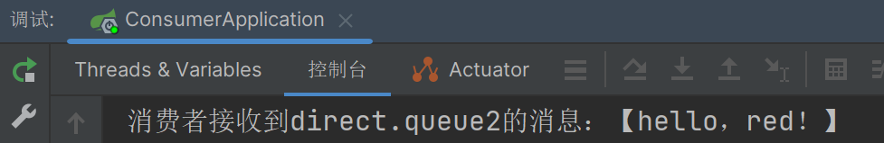

下面再发一个 `red` ，此时应该它俩都收到了。

```java
@Test
public void testSendDirectExchange() {
    // 交换机名称
    String exchangeName = "itcast.direct";
    // 消息
    String message = "红色警报！日本乱排核废水，导致海洋生物变异，惊现哥斯拉！";
    // 发送消息
    rabbitTemplate.convertAndSend(exchangeName, "red", message);
}
```

执行测试方法，可以发现队列1和队列2都收到了。


## 总结

描述下Direct交换机与Fanout交换机的差异？

- Fanout交换机将消息路由给每一个与之绑定的队列

- Fanout交换机采用的是基于Bean的方式声明队列、交换机、绑定。

  而Direct交换机绑定的方式采用的是注解的方式，使用的是 `@RabbitListener` 注解的bingdings的属性。

- Direct交换机根据RoutingKey判断路由给哪个队列

- 如果多个队列具有相同的RoutingKey，则与Fanout功能类似

基于@RabbitListener注解声明队列和交换机有哪些常见注解？

- @Queue
- @Exchange

将来写代码的时候只需要安装它的提示写就行了，或者直接CV大法改也行。


---

# 75.TopicExchange

`Topic`类型的`Exchange`与`Direct`相比，都是可以根据`RoutingKey`把消息路由到不同的队列。区别在于 `TopicExchange` 的  `Routing key` 必须是多个单词的列表，并且多个单词之间以 ”.” 分割，例如： `item.insert`。


举例：可以看见下面这种 `RoutingKey` 它是表示一种类、话题，所以这种交换机叫 `Topic` ，也就是话题类型的交换机。

~~~
china.news 代表有中国的新闻消息；
china.weather 代表中国的天气消息；
japan.news 则代表日本新闻
japan.weather 代表日本的天气消息；
~~~

这样的一个 `RoutingKey` 如果我要去订阅的话，比如说我想关心一下新闻，中国的也好，日本的也好，将来就需要绑定俩key：`china.news`、`jspan.news`，将来如果再来一个美国，有得加新的绑定key，此时key就会越写越多，所以这种方式其实就比较麻烦，所以我们的Topic支持一种通配符。当我们的队列与交换机绑定时，**`bindingKey`** 可以使用通配符

 通配符规则：

`#`：匹配一个或多个词，`item.#`：能够匹配`item.spu.insert` 或者 `item.spu`

`*`：匹配不多不少恰好1个词，`item.*`：只能匹配`item.spu`

如果用这种方式来表示我想要关心新闻，只需要写 `#.news`、`*.news`；但如果是想要关心中国的所有东西，就可以写`china.#`，那此时中国的新闻、天气等各种各样的信息就都能收到。 

这就是 `TopicExchange` 和 `DirectExchange` 的差别了，可以看出来 `TopicExchange` 相比于 `DirectExchange` 来讲没有大的变化，最主要就是用通配符来简化了这种绑定关系的书写，原理啊用多个key的，现在可以只用一个 `bindingKey` 来表示了

图示：


解释：

- Queue1：绑定的是`china.#` ，因此凡是以 `china.`开头的`routing key` 都会被匹配到。包括china.news和china.weather
- Queue2：绑定的是`#.news` ，因此凡是以 `.news`结尾的 `routing key` 都会被匹配。包括china.news和japan.news


## 案例：利用SpringAMQP演示TopicExchange的使用

实现思路如下：

1. 并利用@RabbitListener声明Exchange，名字叫 `itcast.topic`、声明两个Queue，分别叫 `topic.queue1`，`topic.queue2`、RoutingKey

2. 在consumer服务中，编写两个消费者方法，分别监听topic.queue1，`topic.queue1` 绑定的是 `china.#` 和topic.queue2，`topic.queue2` 绑定的是 `#.news`

3. 在publisher中编写测试方法，向itcast. topic发送消息


**1）声明队列和交换机、消息接收**

在consumer服务的SpringRabbitListener中添加方法：

```java
@RabbitListener(bindings = @QueueBinding(
    value = @Queue(name = "topic.queue1"),
    exchange = @Exchange(name = "itcast.topic", type = ExchangeTypes.TOPIC),
    key = "china.#"
))
public void listenTopicQueue1(String msg){
    System.out.println("消费者接收到topic.queue1的消息：【" + msg + "】");
}

@RabbitListener(bindings = @QueueBinding(
    value = @Queue(name = "topic.queue2"),
    exchange = @Exchange(name = "itcast.topic", type = ExchangeTypes.TOPIC),
    key = "#.news"
))
public void listenTopicQueue2(String msg){
    System.out.println("消费者接收到topic.queue2的消息：【" + msg + "】");
}
```

此时重启 ConsumerApplication，然后去浏览器看看，可以看见 `itcast.topic` 交换机已经声明好了。


两个队列也声明好了。


再来仔细看看交换机的绑定关系。


可以发现一切都和预期的一样，此时就可以测试消息的发送了。


**2）消息发送**

在publisher服务的SpringAmqpTest类中添加测试方法：

```java
/**
     * topicExchange
     */
@Test
public void testSendTopicExchange() {
    // 交换机名称
    String exchangeName = "itcast.topic";
    // 消息
    String message = "喜报！孙悟空大战哥斯拉，胜!";
    // 发送消息
    rabbitTemplate.convertAndSend(exchangeName, "china.news", message);
}
```

调用测试方法，可以看见两个都可以收到


将 `routingKey` 改为 `china.weather`，可以看见此时只有 `queue1` 收到

```java
@Test
public void testSendTopicExchange() {
    // 交换机名称
    String exchangeName = "itcast.topic";
    // 消息
    String message = "今天天气不错，我的心情好极了！";
    // 发送消息
    rabbitTemplate.convertAndSend(exchangeName, "china.weather", message);
}
```


## 总结

描述下Direct交换机与Topic交换机的差异？

- Topic交换机接收的消息RoutingKey必须是多个单词，以 `.` 分割
- Topic交换机与队列绑定时的bindingKey可以指定通配符

  `#`：代表0个或多个词

  `*`：代表1个词


----

# 76.消息转换器

其实消息转换器一直贯穿了整个课程案例，只不过大家没发现。大家有没有注意到，我们在使用 `RabbitTemplate` 这个工具的时候，它发消息的方法参数列表一直接收的都是Object类型。之前说过，Spring会把你发送的消息序列化为字节发送给MQ，接收消息的时候，还会把字节反序列化为Java对象。


这个说明什么，难道SpringAMQP允许我们发任意对象吗，我发一个java对象，map、list难道都行吗？接下来就动手试一下，如果试了真能成功，那不就好了吗？

发消息首先需要准备一个队列，然后往这个队列里面发，下面我们先来声明一个新的队列，不跟以前的冲突。声明队列有两种方式：1、在 `SpringRabbitListener` 类中基于注解的方式声明。2、在 config包下使用配置类基于声明Bean的方式声明，我们现在想看一看这个消息长什么样子，所以我们先不去声明 `@RabbitListener`，因为这样的话消息就直接被消费了，先来在config包下通过Bean来声明。

```java
@Configuration
public class fanoutExchange {
    @Bean
    public Queue objectQueue() {
        return new Queue("object.queue");
    }
}
```

然后重启 ConsumerApplication，这个队列应该就被声明出来了


有了队列，就可以开始向这个队列发消息了，在SpringAmqpTest测试类中发一个对象类型的消息。这个对象有点复杂，我们使用Map来声明，因为Map是我们常见的一种对象类型。

```java
@RunWith(SpringRunner.class)
@SpringBootTest
public class SpringAmqpTest {
    @Autowired
    private RabbitTemplate rabbitTemplate;
    
    @Test
    public void testSendObjectQueue() {
        Map<String, Object> msg = new HashMap<>();
        msg.put("name", "柳岩");
        msg.put("age", 21);
        rabbitTemplate.convertAndSend("object.queue", msg);
    }
}
```

然后运行上面这段测试代码，看看到底能不能够发送对象，接下来就是见证奇迹的时候。运行后可以发现，它是正常运行的，说明消息发送成功了。


从浏览器中查看队列里的消息：


可以看见，消息成功发送了，但是传过来的map里的值怎么变成一串看不懂的字符串了？

查看上面的 `content_type`（消息类型） 为：`x-java-serialized-object`，即java序列化，原来RabbitMQ只支持字节，我们最早原生API就是字节。而Spring允许我们发Object对象，那就说明它会将我们的对象做序列化，使用的是java（也就是jdk）的序列化，`Objcet output steam`，这种序列化它有一些缺点，第一是性能比较差，第二有安全漏洞——安全性有问题，容易出现注入的问题，第三：可读性差，数据体积过大 ——数据长度太长了，消息体越大，传输消息的速度也就越慢，而且还占用额外的内存空间。所以说我们非常不推荐大家使用这种默认的方式。那怎么办，spring已经将这种序列化的方式写死了，但我们可以去调整序列化。


Spring的对消息对象的处理是由 `org.springframework.amqp.support.converter.MessageConverter` 来处理的。而默认实现是SimpleMessageConverter，基于JDK的ObjectOutputStream完成序列化。

如果要修改只需要定义一个MessageConverter 类型的Bean即可。推荐用JSON方式序列化。步骤如下：


## 发送json

显然，JDK序列化方式并不合适。我们希望消息体的体积更小、可读性更高，因此可以使用JSON方式来做序列化和反序列化。

在publisher和consumer两个服务中都引入jackson的依赖，由于两个服务都需要用到，所以我们直接在父工程中引入jackson的核心依赖即可

```xml
<dependency>
    <groupId>com.fasterxml.jackson.core</groupId>
    <artifactId>jackson-databind</artifactId>
</dependency>
```

配置消息转换器。

在启动类中添加一个Bean即可，MessageConverter我们一旦声明就会将原来的MessageConverter覆盖掉，这个就是SpringBoot自动装配的原理。声明Bean要放到配置类中做，那我们直接放到PublisherApplication启动类里做，启动类也是配置类。注意MessageConverter是amqp包下的


```java
@Bean
public MessageConverter jsonMessageConverter(){
    // 使用Jackson工具来转json，这个是SpringMVC经常用到的消息转换工具
    return new Jackson2JsonMessageConverter();
}
```

配置完后，先将旧的消息清理掉，然后再刷新一下，可以发现消息已经被清理掉了，此时就可以发送新的消息了。


此时再次运行testSendObjectQueue测试方法，回到浏览器查看，可以发现数据已经是json序列化了。


## 接收json

我们在consumer服务引入Jackson依赖，因为消息发送也好，接收也好，发送的时候它是把对象序列化为字节，接收的时候需要将字节变成对象，这个过程中它们会用到相同的消息转换器。由于我们刚刚将依赖放入父工程中了，所以每个儿子都有

~~~xml
<dependency>
    <groupId>com.fasterxml.jackson.core</groupId>
    <artifactId>jackson-databind</artifactId>
</dependency>
~~~

我们在consumer服务定义MessageConverter：

~~~java
@Bean
public MessageConverter jsonMessageConverter(){
    return new Jackson2JsonMessageConverter();
}
~~~

然后定义一个消费者，监听object.queue队列并消费消息，那边发送的是map，这边接收也用map，所以基本上没什么太大的变化。

~~~java
@RabbitListener(queues = "object.queue")
public void listenObjectQueue(Map<String, Object> msg) {
    System.out.println("收到消息：【" + msg + "】");
}
~~~

重启 ConsumerApplication，可以发现成功接收到了消息，并且json已经变成map了


## 总结

SpringAMQP中消息的序列化和反序列化是怎么实现的？

- 利用MessageConverter实现的，默认是JDK的序列化

- 注意发送方与接收方必须使用相同的MessageConverter


---

# --------------------------

# 分布式搜索引擎

在前面几天的微服务学习过程中，曾经给大家提到过，随着业务的发展，数据量越来越庞大，传统的这种MySQL这种数据库就渐渐地难以满足我们复杂的业务需求了。在微服务架构下，一般都会用到一种分布式搜索的技术。今天就会带着大家去学习分布式搜索中最流行的一种elasticsearch它的一个基础用法

# 78.什么是elasticsearch

官网地址: https://www.elastic.co/cn/

## 一、elasticsearch的作用

ES是elasticsearch的缩写。

elasticsearch是一款非常强大的开源搜索引擎，具备非常多强大功能，可以帮助我们从海量数据中快速找到需要的内容

例如Github中搜索仓库，当你在搜索的时候，它不仅可以将相关仓库搜索出来，还能你所搜索的关键字它所相关的代码也给你展示出来。

并且将它高亮显示。


在电商网站搜索商品


在百度搜索答案


在打车软件搜索附近的车，每一辆车都是一个数据


----

## 二、ELK技术栈

除此以外，elasticsearch中还包含了好几个组件。

elasticsearch结合kibana、Logstash、Beats，他们合在一起称之为elastic stack（ELK）。被广泛应用在微服务的日志数据分析、实时监控等领域：

**日志数据分析**：项目在运行的过程中，会产生海量的日志信息，这些日志信息就是为了方便我们去定位系统所出现的问题。

例如现在系统报错了，怎么去找错呢？在线上运行的时候不可能打断点debug，一般都是采用这种日志分析的方式。

而elasticsearch可以将这个日志信息可视化给你展示出来，所以将来做日志分析的时候就非常方便了。


**实时监控**：项目运行的过程中，它的运行状态也是数据，它每一刻都会有运行状态，例如CPU情况、内存情况等等，这些信息也会被elasticsearch关联起来，将来以可视化的形式给你展示出来，你就能非常清晰的知道你整个项目的运行情况了。

整个ELK技术栈中，尽管它有很多组件，但核心就是elasticsearch，它负责存储、搜索、分析数据。

而 `Logstash、Beats` 主要是负责数据抓取的，例如日志数据就可以由它来抓取。

`kibana` 是一个数据可视化的组件，也就是说将来你搜索出来的数据展示，可以用它来展示形成报表。

那这种可视化的组件必须得用 `Kibana` 吗？像谷歌、百度、京东他们在展示结果的时候都有自己的网站自己去展示，因此这种可视化不不一定非得用 `Kibana` 做，完全可以自己实现。

数据抓取也一样，我们完全可以自己去写Java代码，自己做数据，然后往elasticsearch中写


所以 `kibana、Logstash、Beats` 它们都是可替换的组件，官方提供给你，你想用就用，不用也没关系，但是不可替换的就是elasticsearch。

----

## 三、elasticsearch和lucene

elasticsearch底层是基于**lucene技术**来实现的。

**Lucene**是一个Java语言的搜索引擎类库，是Apache公司的顶级项目，由DougCutting于1999年研发（它也是hadoop的作者）。官网地址：https://lucene.apache.org/ 。


那这个搜索引擎类库（类库简单来讲就是一个jar包），这个jar包具备一些优点。

- 易扩展：你可以基于它去做二次开发和定制，实现一些更高级的功能
- 高性能：这套API主要是实现了倒排索引这样的结构，这种结果查询起来性能非常的好

这是它的两大优点，同时也是它的缺点，因为它是一个类库，而且是Java语言的类库，也就是说只能用于Java开发，其他语言就没法用了。

缺点如下

- 只限于Java语言开发

- 它的API设计的相对复杂，学习曲线陡峭

- 它这套类库只考虑到如何去实现搜索，因此没有这种面对高并发的场景，也不支持使用集群扩展这种东西。

  因此如果你想实现这部分功能，就必须要进一步开发。

而我们的elasticsearch正是基于Lucene做的二次开发

**elasticsearch**的发展历史：

- 2004年Shay Banon基于Lucene开发了Compass

  据说这个软件是给它老婆做的，它老婆喜欢做饭，因此它就开发了这个，方便它老婆搜索食谱。由此可见，这个软件也没有考虑到企业这种高并发的环境，因此

- 2010年Shay Banon 重写了Compass，取名为Elasticsearch。

这次重写的过程中就考虑到了企业的需求了，所以它就能支持分布式了，而且elasticsearch这种分布式/集群的搭建非常的简单，天生就是支持集群的，所以可以应对这种海量数据和高并发的场景。

并且它对外暴露的是Restfu接口，这种接口是跟语言无关的，因此任何语言都能调用这个接口，使用场景就更广泛了，脱离了语言的限制。

正因为如此，elasticsearch在全球的下载量已经达到了两亿多，这家公司现在已经上市了，就叫elasticsearch，这哥们就是创始人，已经走上人生巅峰了。


elasticsearch在2010年的时候才真正问世，Lucene是在1999年，中间时隔十几年的时间，因此elasticsearch并不是一个唯一的搜索引擎技术，那为什么我们一定要用它呢？

-----

## 四、为什么不是其他搜索技术？

目前比较知名的搜索引擎技术排名：

1、Elasticsearch：开源的分布式搜索引擎

2、Splunk：商业项目，它是收费的，因此不在我们讨论范围内

3、Solr：Apache的开源搜索引擎


虽然在早期，Apache Solr是最主要的搜索引擎技术，但随着发展elasticsearch已经渐渐超越了Solr，独占鳌头：


因此我们现在学习主要就是学Elasticsearch，而不是其他搜索引擎产品。

----

## 五、总结

什么是elasticsearch？

- 一个开源的分布式搜索引擎，可以用来实现搜索、日志统计、分析、系统监控等功能
- 而且这个搜索引擎是一个分布式的搜索引擎，它能支持水平的扩展性跟集群

什么是elastic stack（ELK）？

- 是以elasticsearch为核心的技术栈，包括很多组件 beats、Logstash、kibana、elasticsearch

什么是Lucene？

- 是Apache的开源搜索引擎类库（即jar包），提供了搜索引擎的核心API
- Elasticsearch就是基于它来实现的，做了二次开发


-----

# 79.倒排索引

在上课我们介绍到Elasticsearch底层是基于Lucene来实现的，而Lucene中的核心技术就是倒排索引。

倒排索引的概念是基于MySQL这样的正向索引对比而得出的一个名称。

## 一、正向索引

那么什么是正向索引呢？例如给下表（tb_goods），数据库一般都会基于id去创建一个索引，然后形成一颗b+树，那么你根据id进行检索的速度就会非常快，这种方式的索引就是一个正向索引，但是如果我现在搜索的字段不是id，而是一个普通的标题字段。

标题字段内容比较长，你不会给它加索引，即便你给它加了索引，我现在想搜的不是精确的标题值，而是其中的一部分，例如包含手机的，此时就需要像右边这样写一个模糊匹配来做。

一旦你使用了这种模糊匹配，就算它有索引也不生效了，这种情况下没有索引，数据库是如何比较查询的呢？它就会采用逐条扫描的方式来判断每一行数据中是否包含手机。

流程如下：

1）用户搜索数据，条件是title符合`"%手机%"`

2）逐行获取数据，比如id为1的数据

3）判断数据中的title是否符合用户搜索条件

4）如果符合则放入结果集，不符合则丢弃。回到步骤1

逐行扫描，也就是全表扫描，随着数据量增加，其查询效率也会越来越低。当数据量达到数百万时，就是一场灾难。


这就是正向索引，它在做这种局部内容检索的时候，效率就比较差了

---

## 二、倒排索引

倒排索引在创建的时候，会形成一张新的表，这张表里面会有两个字段：`词条、文档id`

- 文档（`Document`）：它代表的就是数据，其中的每一条数据就是一个文档。

  例如商品表，那么每一个商品就是一个文档。

- 词条（`Term`）：对文档数据或用户搜索数据，利用某种算法分词，得到的具备含义的词语就是词条。例如：我是中国人，就可以分为：我、是、中国人、中国、国人这样的几个词条

**创建倒排索引**是对正向索引的一种特殊处理，流程如下：

- 将每一个文档的数据利用算法分词，得到一个个词条

- 创建表，每行数据包括词条、词条所在文档id、位置等信息

  词条可能会大量重复，但是我们不能重复记录，而是记录唯一的一个，如果有重复词条出现，在后面记录文档id即可，这样可以确保倒排索引中，词条字段是绝对不会出现重复的。

- 因为词条唯一性，可以给词条创建索引，例如hash表结构索引 / b+树，将来我们根据词条查询的速度就非常快了。

如图：


倒排索引的**搜索流程**如下（以搜索"华为手机"为例）：

1）用户输入条件`"华为手机"`进行搜索。

2）对用户输入内容**分词**，得到词条：`华为`、`手机`。

3）拿着词条在倒排索引中查找，可以得到包含词条的文档id：1、2、3。

4）拿着文档id到正向索引中查找具体文档。

如图：


虽然要先查询倒排索引，再查询倒排索引，但是无论是词条、还是文档id都建立了索引，查询速度非常快！无需全表扫描。

-----

## 三、正向和倒排

那么为什么一个叫做正向索引，一个叫做倒排索引呢？

- **正向索引**是最传统的，根据id索引的方式。但根据词条查询时，必须先逐条获取每个文档，然后判断文档中是否包含所需要的词条，是**根据文档找词条的过程**。

- 而**倒排索引**则相反，是先找到用户要搜索的词条，根据词条得到保护词条的文档的id，然后根据id获取文档。是**根据词条找文档的过程**。

是不是恰好反过来了？

那么两者方式的优缺点是什么呢？

**正向索引**：

- 优点：
  - 可以给多个字段创建索引
  - 根据索引字段搜索、排序速度非常快
- 缺点：
  - 根据非索引字段，或者索引字段中的部分词条查找时，只能全表扫描。

**倒排索引**：

- 优点：
  - 根据词条搜索、模糊搜索时，速度非常快
- 缺点：
  - 只能给词条创建索引，而不是字段
  - 无法根据字段做排序


----

# 80.ES与MySQL的概念对比

elasticsearch中有很多独有的概念，与mysql中略有差别，但也有相似之处。

## 一、文档和字段

elasticsearch是面向**文档（Document）**存储的，可以是数据库中的一条商品数据，一个订单信息。

ES的文档存储是JSON风格的，也就是说商品也好、订单也好，最终一定会序列化为JSON的格式。

文档数据会被序列化为json格式后存储在elasticsearch中：


这是ES与数据库存储比较大的差异：格式差异。

而Json文档中往往包含很多的**字段（Field）**，类似于数据库中的列。

----

## 二、索引和映射

ES中文档肯定不止一条，会有非常非常多的文档，这些文档的结构是有差异的。


**索引（Index）**，就是相同类型的文档的集合。即长一样的就放一起

例如：

- 所有商品的文档，可以组织在一起，称为商品的索引；
- 所有用户文档，就可以组织在一起，称为用户的索引；
- 所有订单的文档，可以组织在一起，称为订单的索引；


因此，我们可以把索引当做是数据库中的表，不同类型的放到不同索引库。

这些索引的差别就是文档结构不同，这种文档我们以前在数据库中交表结构，在ES中叫索引的映射。

数据库的表会有约束信息，用来定义表的结构、字段的名称、类型等信息。因此，索引库中就有**映射（mapping）**，是索引中文档的字段约束信息，类似表的结构约束。

因此ES的概念和数据库的概念是有这种对应的关系的。

-----

## 三、mysql与elasticsearch

MySQL的表对应到ES中就是索引，因为它俩都是数据的集合。

我们统一的把mysql与elasticsearch的概念做一下对比：

| **MySQL** | **Elasticsearch** | **说明**                                                     |
| --------- | ----------------- | ------------------------------------------------------------ |
| Table     | Index             | 索引(index)，就是文档的集合，类似数据库的表(table)           |
| Row       | Document          | 文档（Document），就是一条条的数据，类似数据库中的行（Row），文档都是JSON格式 |
| Column    | Field             | 字段（Field），就是JSON文档中的字段，类似数据库中的列（Column） |
| Schema    | Mapping           | Mapping（映射）是索引中文档的约束，例如字段类型约束。类似数据库的表结构（Schema） |
| SQL语句   | DSL语句           | DSL是elasticsearch提供的JSON风格的请求语句，用来操作elasticsearch，实现CRUD |

MySQL和ES在发送的时候的一个差别

在MySQL中，SQL写好了，通过Claction将东西发送出去，发送给MySQL，MySQL就能处理了。

**在ES中，写好了DSL后，需要通过HTTP请求发出去的，因为ES中对外暴露的是RestFul接口，这种接口的好处是跟语言无关，也就是说你任何的语言只要能发HTTP请求，都可以将你的DSL发给ES，ES就能处理了，此时ES就彻底脱离了语言的束缚了。**

是不是说，我们学习了elasticsearch就不再需要mysql了呢？

并不是如此，两者各自有自己的擅长之处：

- Mysql：擅长事务类型操作，事务中有ACID的原则，可以确保数据的安全和一致性

  但是ES没有事物的概念，所以无法保证事物的ACID

- Elasticsearch：擅长海量数据的搜索、分析、计算

例如下单、付款这样的业务，它对事物的要求很高，数据的安全性很高，就应该使用MySQL做数据储存。

但如果你现在做的是一个商品的搜索或者页面的搜索，这种搜索比较复杂，那肯定是使用ES做。

因此它们两个属于互补关系，而不是替代关系。

因此在企业中，往往是两者结合使用：

- 对安全性要求较高的写操作，使用mysql实现
- 对查询性能要求较高的搜索需求，使用elasticsearch实现
- 两者再基于某种方式，实现数据的同步，保证一致性

例如下图，用户做一个订单的查询（CRUD），它的CRUD操作访问到服务器后，服务器就可以做一个判断了。

如果你做的是增删改这样的写操作，如果是，就写到MySQL，这样数据就比较安全了。

但如果你做的是读操作，做查询的，肯定建议你去ES中做一个搜索，因为ES搜索功能强一些。

那也就意味着ES和MySQL中都得有数据，那怎么确保两个都有呢？

我们一般都是写在MySQL中的，但是MySQL将来会基于某种方式将数据同步给ES，将来的读/复杂搜索都从ES中读。


----

## 四、总结

文档：一条数据就是一个文档，es中是JSON格式

字段：Json文档中的字段

索引：同类型文档的集合

映射：索引中文档的约束，比如字段名称、类型

elasticsearch与数据库是一种互补关系

- 数据库负责事务类型操作
- elasticsearch负责海量数据的搜索、分析、计算

但是并不是以后我们所有数据都这么做，只有业务量比较大，搜索比较复杂的场景才需要实现两个库都去写；但是一些简答的查询（例如根据id查询），那么还是使用数据库没什么问题，因此需要在合适的场景下使用合适的技术。


----

# 81.安装elasticsearch

接下来就动手安装ES和它的组件kibana，安装kibana中提供了一个工具，可以让我们非常方便的去编写ES中的DSL语句，从而去操作ES。

## 一、创建网络

因为我们还需要部署kibana容器，因此需要让es和kibana容器互联。如果用docker-compose其实是可以一键互联的，但是我们在这会采用分别部署的方式，不用 `docker-compose`，因为将来大家有可能不需要kibana，有可能只需要ES。

接下来就需要手动的让他们互联了，这里先创建一个网络，然后让它们都加入到这个网络中就行了，网络名字可以随便起，这里就起 `es-net`。

通过这个命令就可以创建一个全新的网络，然后我们就可以去运行docker命令，然后去创建ES容器了。

```sh
docker network create es-net
```

----

## 二、加载镜像

这里我们采用elasticsearch的7.12.1版本的镜像，这个镜像体积非常大，接近1G。不建议大家自己pull。

课前资料提供了镜像的tar包：

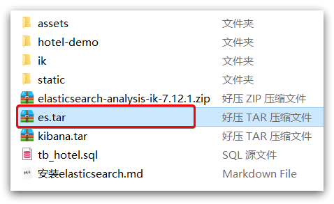

大家将其上传到虚拟机中，然后运行命令加载即可：

```sh
# 导入数据
docker load -i es.tar
```

同理还有`kibana`的tar包也需要这样做。

----

## 三、运行

运行docker命令，部署单点es：

 # -e：设置环境变量。环境变量有两个

```sh
docker run -d \
	--name es \
    -e "ES_JAVA_OPTS=-Xms512m -Xmx512m" \
    -e "discovery.type=single-node" \
    -v es-data:/usr/share/elasticsearch/data \
    -v es-plugins:/usr/share/elasticsearch/plugins \
    --privileged \
    --network es-net \
    -p 9200:9200 \
    -p 9300:9300 \
elasticsearch:7.12.1
```

命令解释：

- `-e "cluster.name=es-docker-cluster"`：设置集群名称
- `-e "http.host=0.0.0.0"`：监听的地址，可以外网访问
- `-e "ES_JAVA_OPTS=-Xms512m -Xmx512m"`：配置JVM堆内存大小，ES底层是基于Java实现的，这里配置堆内存其实就是将来ES运行时的大小了，它的默认值是1G，但1G有点大了，因此这里设置为了512，但是不能比512更小，否则会出现一些内存不足的问题，ES堆内存的消耗还是比较大的。
- `-e "discovery.type=single-node"`：配置运行模式，也就是我们的ES将来是单点运行，非集群模式
- `-v es-data:/usr/share/elasticsearch/data`：挂载逻辑卷，绑定es的数据目录
- `-v es-logs:/usr/share/elasticsearch/logs`：挂载逻辑卷，绑定es的日志目录
- `-v es-plugins:/usr/share/elasticsearch/plugins`：挂载逻辑卷，绑定es的插件目录
- `--privileged`：授予逻辑卷访问权
- `--network es-net` ：加入一个名为es-net的网络中
- `-p 9200:9200`：将来暴露的HTTP端口，就是将来用户访问的
- `-p 9300:9300`：将来ES容器各个节点之间互联的端口，这个端口我们现在用不到，不暴露也没关系
- `elasticsearch:7.12.1`：容器名称

----

## 四、测试

在浏览器中输入：http://192.168.150.101:9200 即可看到elasticsearch的响应结果：


---

# 82.部署kibana

kibana一定要和ES在同一个网络中，即我们刚刚所用的 `es-net`

kibana可以给我们提供一个elasticsearch的可视化界面，便于我们学习。

## 一、部署

运行docker命令，部署kibana

```sh
docker run -d \
--name kibana \
-e ELASTICSEARCH_HOSTS=http://es:9200 \
--network=es-net \
-p 5601:5601  \
kibana:7.12.1
```

- `--network es-net` ：加入一个名为es-net的网络中，与elasticsearch在同一个网络中

- `-e ELASTICSEARCH_HOSTS=http://es:9200"`：ELASTICSEARCH_HOSTS是设置elasticsearch的地址，`es:9200` 中的es就是上面创建elasticsearch容器的名称，因为kibana已经与elasticsearch在一个网络，因此可以用容器名直接访问elasticsearch，即互联

  因为kibana可以帮助我们去操作es，因此需要知道es的地址，`容器名 + 9200` 即 `es:9200`，kibana将来就能连上es了

- `--network=es-net`：也加入到 `es-net` 网络中

- `-p 5601:5601`：端口映射配置，因此kibana端口是5601

- `kibana:7.12.1`：容器名，kibana的版本一定要和ES的版本保持一致

kibana启动一般比较慢，需要多等待一会，可以通过命令：

```sh
docker logs -f kibana
```

查看运行日志，当查看到下面的日志，说明成功，端口是5601：


此时，在浏览器输入地址访问：http://192.168.150.101:5601，即可看到结果。

它会有两种使用方式，一种是自己开始玩，另一种是让他导入一些数据，这里我们选择自己玩。


点击左边的菜单，这里面牵扯到ES中的各种各样的管理，包括安全管理等等。

接下来带着大家用一下 `Dev Tools` 工具。


----

## 二、DevTools

这个就是我刚刚将的DSL控制台，它可以让我们非常方便的去发送DSL的请求。

kibana中提供了一个DevTools界面：

这一串JSON格式就是DSL语句了，第一个语句的含义就是查询所有的的数据。前面的GET表示我们发的是一个GET请求，`_search` 代表这里要做一次搜索，当我们点击 `开始的图标`，它就会将请求给发出去，发给ES。

那它怎么知道ES在哪呢？我们在刚刚创建kibana容器的时候指定了ES的地址，因此我们在这里只需要将DSL语句、启动方式、路径准备好，它就会帮你把DSL发给ES了，是不是很方便（前面不用再去指定ES地址和端口号了）。

本质：发送一个RestFul请求到ES中。

这个界面中可以编写DSL来操作elasticsearch。并且对DSL语句有提示。

我们刚刚访问的 `http://192.168.88.130:9200` ，这也是ES的一个RestFul的接口，只不过它的请求路径为空，请求参数是不需要参数。

我们可以在 `Dev Tolls` 中模拟这个请求


-----

# 83.安装IK分词器

## 一、引入

之前学习ES概念的时候，ES在创建倒排索引时，需要对文档内容进行分词，而且我们在搜索时，需要对用户输入的内容也去做分词。

分词就需要对中文/英文的语义进行分析，按照词语含义进行拆分，这种拆分其实是比较复杂的，需要有特殊的算法去支持。

ES中默认的分词规则对中文处理并不友好。

`GET 请求方式` 

`/_analyze 表示做分词分析` 

`{} 中是DSL语句，这个语句是JSON格式，里面包含两个字段` 

`analyzer 分词器，这里采用了standard标准分词器，这也是ES中的默认分词器` 

`text 代表文本，即要分词的数据内容`。

我们先来用 `"analyzer": "english"`，即按英语进行分词的方式，可以发现它在分词时，英语还是分的不错的，但是中文却是逐字分词。


它没有办法去理解中文含义按内容分，换其他分词器 `chinese` 等也一样，这就是ES中的分词器一个问题，包括默认分词器也是如此。


因此如果我们想要分词中文，就不能使用这种默认分词器了。

一般中文分词我们会使用 `IK分词器`，官网：https://github.com/medcl/elasticsearch-analysis-ik

可以看见，这个分词器是专门给ES来使用的

分词器内部有两种模式：`ik_smart`、`ik_max_word`。


---

## 二、在线安装ik插件（较慢）

```shell
# 进入容器内部
docker exec -it elasticsearch /bin/bash

# 在线下载并安装
./bin/elasticsearch-plugin  install https://github.com/medcl/elasticsearch-analysis-ik/releases/download/v7.12.1/elasticsearch-analysis-ik-7.12.1.zip

#退出
exit
#重启容器
docker restart elasticsearch
```

----

## 三、离线安装ik插件（推荐）

### 1）查看数据卷目录

安装插件需要知道elasticsearch的plugins目录位置，而我们用了数据卷挂载，因此需要查看elasticsearch的数据卷目录，通过下面命令查看:

```sh
docker volume inspect es-plugins
```

显示结果：

```json
[
    {
        "CreatedAt": "2022-05-06T10:06:34+08:00",
        "Driver": "local",
        "Labels": null,
        "Mountpoint": "/var/lib/docker/volumes/es-plugins/_data",
        "Name": "es-plugins",
        "Options": null,
        "Scope": "local"
    }
]
```

说明plugins目录被挂载到了：`/var/lib/docker/volumes/es-plugins/_data `这个目录中。


### 2）解压缩分词器安装包

下面我们需要把课前资料中的ik分词器解压缩，重命名为ik

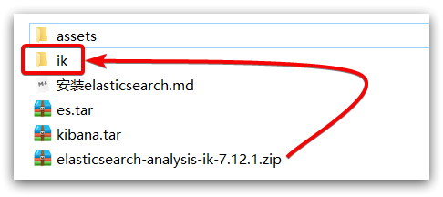

### 3）上传到es容器的插件数据卷中

也就是`/var/lib/docker/volumes/es-plugins/_data `：


###  4）重启容器

```shell
# 4、重启容器
docker restart es
```

```sh
# 查看es日志
docker logs -f es
```


### 5）测试：

IK分词器包含两种模式：

* `ik_smart`：最少切分，从字数最多开始，往字数越来越少去看，如果此时已经是一个词，就会直接停止，不会再去看更小是不是一个词，分词力度是比较粗的，词条比较少

结果如下，是按照含义分的


* `ik_max_word`：最细切分

~~~java
GET /_analyze
{
  "analyzer": "ik_max_word",
  "text": "黑马程序员学习java太棒了"
}
~~~

程序运行结果如下，可以发现`ik_max_word`分的词语更多，`程序` 是个词，`程序员` 也是个词


这种分词多和少带来的后果是什么呢？

`ik_max_word` 中 `程序员` 就被分出来了有三个词，那么用户在搜索的时候，只要搜索 `程序、程序员、员` 这三个词中的任意一个，都能搜到文档。

但是 `ik_smart` 分出来只有 `程序员` 一个词，当用户搜 `程序` 时，这篇文档就不会被搜到，搜到的概率比较低。

但是它的好处就是：分的词少了，占用的内存空间更少了，内存中就可以缓存更多的数据，查询效率更高一点。


----

# 84.扩展词词典

## 一、引入

大家可以思考一下IK分词器底层分词的原理到底是什么，它怎么知道这两字 / 这三个字合在一起就是一个词？

在它的底层一定会有一个字典，在这个字典里面一定会有各种各样的词语在里面就罗列好了。

当它分词的时候肯定是拿这些字去匹配，看词典里有没有，如果匹配到有，证明它是个词，那就把它分出来。

所以IK分词器也好，还是其他的中文分词器也好，都会依赖于一个字典去做分词。

但是它的字典不太可能包含全世界所有可能的词语，不说全世界，中国所有的词语也不一定能包含。

第一，写这个分词器的作者它不一定能够知道所有的词语；

第二，词语也是不断去变化的

随着互联网的发展，“造词运动”也越发的频繁。出现了很多新的词语，在原有的词汇列表中并不存在。比如：“奥力给”，“传智播客” 等。

还有一些，像 `的` 这种词语，是没有意义的，像这样的字我是不是可以把它给停掉，不要分词，因为你分词还要占用我内存。

还有一些敏感词汇，例如国家领导人的词汇、禁忌等，需要将它禁掉，那我们的分词器能不能实现这种字典的个性化设置呢？

其实是可以的。

---

## 二、扩展词词典

我们的词汇也需要不断的更新，IK分词器提供了扩展词汇的功能。

1）打开IK分词器config目录：


2）在IKAnalyzer.cfg.xml配置文件内容添加：

`ext_dict`：扩展字典的意思，这个是文件名，也就是扩展词需要去读这个文件。

这个文件需要在当前配置文件所在目录下。

```xml
<?xml version="1.0" encoding="UTF-8"?>
<!DOCTYPE properties SYSTEM "http://java.sun.com/dtd/properties.dtd">
<properties>
        <comment>IK Analyzer 扩展配置</comment>
        <!--用户可以在这里配置自己的扩展字典 *** 添加扩展词典-->
        <entry key="ext_dict">ext.dic</entry>
</properties>
```

3）新建一个 ext.dic，可以参考config目录下复制一个配置文件进行修改

> 注意当前文件的编码必须是 UTF-8 格式。
>
> 如果发现重启不生效，就去检查一下编码格式。

```properties
传智播客
奥力给
```

4）重启elasticsearch 

```sh
docker restart es

# 查看 日志
docker logs -f elasticsearch
```


日志中已经成功加载ext.dic配置文件

5）测试效果：

```json
GET /_analyze
{
  "analyzer": "ik_max_word",
  "text": "传智播客Java就业超过90%,奥力给！"
}
```

> 注意当前文件的编码必须是 UTF-8 格式，严禁使用Windows记事本编辑

----


## 三、停用词词典

在互联网项目中，在网络间传输的速度很快，所以很多语言是不允许在网络上传递的，如：关于宗教、政治等敏感词语，那么我们在搜索时也应该忽略当前词汇。

IK分词器也提供了强大的停用词功能，让我们在索引时就直接忽略当前的停用词汇表中的内容。

1）IKAnalyzer.cfg.xml配置文件内容添加：

```xml
<?xml version="1.0" encoding="UTF-8"?>
<!DOCTYPE properties SYSTEM "http://java.sun.com/dtd/properties.dtd">
<properties>
        <comment>IK Analyzer 扩展配置</comment>
        <!--用户可以在这里配置自己的扩展字典-->
        <entry key="ext_dict">ext.dic</entry>
         <!--用户可以在这里配置自己的扩展停止词字典  *** 添加停用词词典-->
        <entry key="ext_stopwords">stopword.dic</entry>
</properties>
```

3）在 stopword.dic 添加停用词

这个文件是现成的，直接打开即可。这个文件里面已经有了很多英文中的冠词、介词等无意义的词语，我们也可以将中文的一些无意义的词语加进去。

还有一些敏感词也可以加进去。

```properties
的
了
哦
啊
嘤嘤嘤
习大大
```

4）重启elasticsearch 

```sh
# 重启服务
docker restart elasticsearch
docker restart kibana

# 查看 日志
docker logs -f elasticsearch
```

日志中已经成功加载stopword.dic配置文件

5）测试效果：

```json
GET /_analyze
{
  "analyzer": "ik_max_word",
  "text": "传智播客Java就业率超过95%,习大大都点赞,奥力给！"
}
```


---

# 总结

分词器的作用是什么？

- 创建倒排索引时对文档分词
- 用户搜索时，对输入的内容分词

IK分词器有几种模式？

- ik_smart：智能切分，粗粒度
- ik_max_word：最细切分，细粒度

IK分词器如何拓展词条？如何停用词条？

- 利用config目录的IkAnalyzer.cfg.xml文件添加拓展词典和停用词典
- 在词典中添加拓展词条或者停用词条


----

# 部署es集群

部署es集群可以直接使用docker-compose来完成，不过要求你的Linux虚拟机至少有**4G**的内存空间

首先编写一个docker-compose文件，内容如下：

```sh
version: '2.2'
services:
  es01:
    image: docker.elastic.co/elasticsearch/elasticsearch:7.12.1
    container_name: es01
    environment:
      - node.name=es01
      - cluster.name=es-docker-cluster
      - discovery.seed_hosts=es02,es03
      - cluster.initial_master_nodes=es01,es02,es03
      - bootstrap.memory_lock=true
      - "ES_JAVA_OPTS=-Xms512m -Xmx512m"
    ulimits:
      memlock:
        soft: -1
        hard: -1
    volumes:
      - data01:/usr/share/elasticsearch/data
    ports:
      - 9200:9200
    networks:
      - elastic
  es02:
    image: docker.elastic.co/elasticsearch/elasticsearch:7.12.1
    container_name: es02
    environment:
      - node.name=es02
      - cluster.name=es-docker-cluster
      - discovery.seed_hosts=es01,es03
      - cluster.initial_master_nodes=es01,es02,es03
      - bootstrap.memory_lock=true
      - "ES_JAVA_OPTS=-Xms512m -Xmx512m"
    ulimits:
      memlock:
        soft: -1
        hard: -1
    volumes:
      - data02:/usr/share/elasticsearch/data
    networks:
      - elastic
  es03:
    image: docker.elastic.co/elasticsearch/elasticsearch:7.12.1
    container_name: es03
    environment:
      - node.name=es03
      - cluster.name=es-docker-cluster
      - discovery.seed_hosts=es01,es02
      - cluster.initial_master_nodes=es01,es02,es03
      - bootstrap.memory_lock=true
      - "ES_JAVA_OPTS=-Xms512m -Xmx512m"
    ulimits:
      memlock:
        soft: -1
        hard: -1
    volumes:
      - data03:/usr/share/elasticsearch/data
    networks:
      - elastic

volumes:
  data01:
    driver: local
  data02:
    driver: local
  data03:
    driver: local

networks:
  elastic:
    driver: bridge
```

Run `docker-compose` to bring up the cluster:

```sh
docker-compose up
```

----

# 索引库操作

索引库就类似数据库表，索引库中有很多文档（类似于数据库中一行一行的数据）。

我们知道，数据库一定要先创建表，才能去添加数据，ES里面也一样，必须先有索引库，才能往里面添加文档。

因此这一张先来学习索引库操作，下一章再去学习文档的操作。

要想去创建一个索引库，就像建表一样，建表语句中是要指定Scheme，即对字段的一些约束。

索引库同理，它在创建时，需要指定对应的mapping映射，这个东西是对文档的约束。

mapping映射就类似表的结构。

我们要向es中存储数据，必须先创建“库”和“表”。

------

# 85.mapping常见映射属性

mapping是对索引库中文档的约束，ES中的DSL语句是JSON风格的，因此接下来的学习都会以JSON为例给大家讲解。

当我们对JSON文档进行约束时，这些东西有哪些东西可以去约束呢？我们可以去看一下官方网站：[Mapping parameters | Elasticsearch Guide [8.13\] | Elastic](https://www.elastic.co/guide/en/elasticsearch/reference/current/mapping-params.html)

可以看见它的属性非常多，肯定不可能都去掌握。将来如果你对哪个有兴趣，点进来查看一下就行了。


常见的mapping属性包括：

---

## 一、数据类型约束

type：字段数据类型（因为你写文档，字段肯定都有对应的数据类型），我们的数据类型的约束主要是针对JSON里面的数据格式来看的。

观察JSON数据，它要么是数字、要么是布尔值、要么是字符串、要么是数组、要么是对象嵌套。

这些类型对应到ES中都有一个对应的类型去进行约束，常见的简单类型有：

- ES中将字符串又分成了两种：text（可分词的文本）、keyword（精确值，例如：品牌、国家、ip地址，这些是不能分词的）

- 数值：long、integer、short、byte、double、float

  看这些数据类型都跟Java的数据类型非常像，因为ES底层本身就是Java来实现的。

  在JSON中只分整数和小数，但是ES却把它分的更细了，它们所占用的空间是不一样的，将来可以根据自己的需求定义。

- 布尔：boolean

- 日期：date

- 对象：object，将来结合properties生成子字段

对象可以任意嵌套，对象嵌套后，这两个属于是对象的子属性 / 字字段，将来这两字也是可以参与搜索的。

~~~json
"name": {
    "firstName": "云",
    "lastName": "赵"
}
~~~

ES中是没有数组这种类型的，但是它允许你某个类型的字段有多个值。

也就是说，数组不管这个数组是什么类型，而是管数组中元素是什么类型，因此 `score` 就是小数类型

~~~java
"score": [99.1, 99.5, 98.9]
~~~

----

## 二、index

数据类型约束就说完了，但是ES中有一些特殊的约束，是数据库中所没有的：index

**index**：是否创建索引（字面意思，即要不要创建倒排索引），默认为true

将来会创建倒排索引，就可以参与搜索了；如果给了false，它就不会创建倒排索引，将来没有断开索引你就没有办法去搜索这个字段。

由于默认值是true，也就是说你在做字段映射时，如果你不去设置index，那默认所有的字段都会被创建倒排索引。将来每个字段都可以参与搜索。

但我们在实际开发中，并不是所有的字段都需要搜索。例如下面的json文档中的邮箱、商品的图片（它是一个URL地址，这玩意有搜索的意义吗？）

因此我们在创建字段映射的时候，一定要判断一下这个字段，到底参与还是不参与搜索，这个需要根据将来业务需求判断。

~~~java
{
    "age": 21,
    "weight": 52.1,
    "isMarried": false,
    "info": "黑马程序员Java讲师",
    "email": "zy@itcast.cn",
    "score": [99.1, 99.5, 98.9],
    "name": {
        "firstName": "云",
        "lastName": "赵"
    }
}
~~~

----

## 三、analyzer

analyzer：使用哪种分词器

分词器：就是对内容来做分词的，它用的比较少，因为在我们刚刚讲的所有数据类型中，只有一个类型需要分词，即text。

因此 `analyzer` 其实是结合 `text类型`。

它的值将来就是将来分词器的名称，例如 `ik_smart`、`ik_max_word`

----

## 四、properties

properties：该字段的子字段。

`properties` 只有在对象嵌套的时候会被用到，否则不需要。

例如 `name` 有两个子属性 `firstName`、`lastName`，将来就可以用properties来制定name的子属性。

此时的 `name` 就为 `object类型`

~~~java
{
    "name": {
        "firstName": "云",
        "lastName": "赵"
    }
}
~~~

---

## 五、案例

~~~java
{
    "age": 21,
    "weight": 52.1,
    "isMarried": false,
    "info": "黑马程序员Java讲师",
    "email": "zy@itcast.cn",
    "score": [99.1, 99.5, 98.9],
    "name": {
        "firstName": "云",
        "lastName": "赵"
    }
}
~~~

对应的每个字段映射（mapping）：

- age：类型为 integer；参与搜索，因此需要index为true；无需分词器
- weight：类型为float；参与搜索，因此需要index为true；无需分词器
- isMarried：类型为boolean；参与搜索，因此需要index为true；无需分词器
- info：类型为字符串，需要分词，因此是text；参与搜索，因此需要index为true；分词器可以用ik_smart
- email：类型为字符串，但是不需要分词，因此是keyword；不参与搜索，因此需要index为false；无需分词器
- score：虽然是数组，但是我们只看元素的类型，类型为float；参与搜索，因此需要index为true；无需分词器
- name：类型为object，需要定义多个子属性
  - name.firstName；类型为字符串，但是不需要分词，因此是keyword；参与搜索，因此需要index为true；无需分词器
  - name.lastName；类型为字符串，但是不需要分词，因此是keyword；参与搜索，因此需要index为true；无需分词器


---

# 86.创建索引库

这里我们统一使用Kibana编写DSL的方式来演示。

**在ES中，写好了DSL后，需要通过HTTP请求发出去的，因为ES中对外暴露的是RestFul接口，这种接口的好处是跟语言无关，也就是说你任何的语言只要能发HTTP请求，都可以将你的DSL发给ES，ES就能处理了，此时ES就彻底脱离了语言的束缚了。**

**基本语法**

第一行就是一个RestFul的请求

- 请求方式：PUT
- 请求路径：/索引库名，可以自定义
- 请求参数：mapping映射

下面的JSON风格就是DSL，在整个JSON里面第一个字段就是 `mappings` 的属性，代表映射；

映射中有 `properties` ，对应的就是字段，里面制定了三个字段，一个字段都有一些自己的信息。

需要注意的是第三个字段中还加了一个 `properties` ，代表的是子字段，这种就是对象嵌套的方式。

格式：

```json
PUT /索引库名称
{
  "mappings": {
    "properties": {
      "字段名":{
        "type": "text",
        "analyzer": "ik_smart"
      },
      "字段名2":{
        "type": "keyword",
        "index": "false"
      },
      "字段名3":{
        "properties": {
          "子字段": {
            "type": "keyword"
          }
        }
      },
      // ...略
    }
  }
}
```

**示例**

`properties` 中有三个字段，`info` 就是用户介绍，很长，因此它的类型是 `text`，是分词的，一旦使用 `text` 就必须指定分词器，否则它默认使用标准分词器，分出来的词是有问题的。这里就指定分词器是 `ik_smart`。一旦分了词，将来就需要参与搜索，因此 `index` 不用指定，默认为 `true` 即可。

`email` 没有分词的必要，因为它作为一个整体才有意义，因此它类型选择了 `keyword`，既然不是分词的类型，就不需要指定 `analyzer` 了。并且这个字段它还将 `index` 改为了 `false`。

最后一个 `name`，就是对象嵌套。由于 `firstName`、`lastName` 都是需要参与搜索的，因此 `index` 不用赋值。

```json
PUT /heima
{
    "mappings": {
        "properties": {
            "info":{
                "type": "text",
                "analyzer": "ik_smart"
            },
            "email":{
                "type": "keyword",
                "index": false
            },
            "name":{
                "type": "object",
                "properties": {
                    "firstName": {
                        "type": "keyword"
                    },
                    "lastName": {
                        "type": "keyword"
                    }
                }
            }
        }
    }
}
```

PS：复制粘贴过去的时候，空格的格式可能会有一些问题，需要删除然后手动打空格


PS：格式化，并且右上角可以看见发送请求的状态码


-----

# 87.索引库的CURD

## 一、查询索引库

它的语法非常的简单，因为它非常符合RestFul的语法

**基本语法**：

- 请求方式：GET

- 请求路径：/索引库名

- 请求参数：无

**格式**：

```
GET /索引库名
```

**示例**：

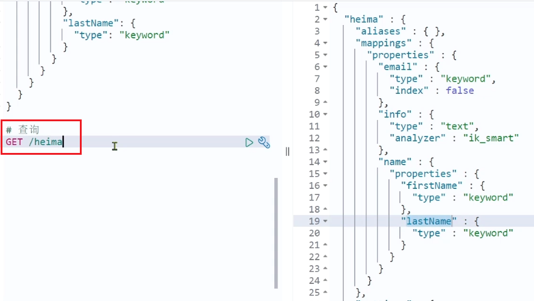

----

## 二、修改/添加索引库

在ES中索引库其实是不允许修改的，因为索引库创建完后，它的映射（mappings）都已经定义好了，ES会基于这些mapping去创建倒排索引。

倒排索引结构虽然不复杂，但是如果你要去修改一个字段的话（比如改变了分词器），就会导致原有的倒排索引会彻底失效，就需要重新创建倒排索引，这简直是灾难。因此索引库**一旦创建，无法修改mapping**。

这点和数据库不一样，数据库创建完后是可以修改的。但是理论上是可以修改，但是在生产的时候数据库我们也是禁止去修改的，因为修改对性能影响是非常大的，会导致整个数据库不可用。

因此从这点来讲，ES做的更彻底，根本不然你修改，就避免了上面灾难的发生。

虽然无法修改mapping中已有的字段，但是却允许添加新的字段到mapping中，因为不会对倒排索引产生影响。

**语法说明**：

索引库名后面要多加一个 `_mapping`，代表我现在要改的是索引库里面的映射。

```json
PUT /索引库名/_mapping
{
  "properties": {
    "新字段名":{
      "type": "integer"
    }
  }
}
```

**示例**：


PS：这里指定的字段名一定要是一个全新的字段名，不能跟以前的重复，否则它会认为你是在改一个已经存在的字段了，就会报错。

看下图：不能从 `integer` 改为 `long`


----

## 三、删除索引库

**语法：**

- 请求方式：DELETE

- 请求路径：/索引库名

- 请求参数：无

**格式：**

```
DELETE /索引库名
```

在kibana中测试：


----

## 四、总结

索引库操作有哪些？

- 创建索引库：PUT /索引库名
- 查询索引库：GET /索引库名
- 删除索引库：DELETE /索引库名
- 添加字段：PUT /索引库名/_mapping


---

# 88.文档操作

## 一、新增文档

**语法：**`_doc` 是固定的，其实就是告诉kibana我要新增的文档要到哪个里面去。后面加上文档id是什么，注意这个id不是写在文档内部的，而是写在路径的后面，这是RestFul的语法方式。

如果你不加 `文档id`，它就会认为你这个文档没有id，将来ES会给你随机生成一个，这显然不是我们希望看见的，因此一定要给它加上id。

下面的JSON风格的就是DSL了

```json
POST /索引库名/_doc/文档id
{
    "字段1": "值1",
    "字段2": "值2",
    "字段3": {
        "子属性1": "值3",
        "子属性2": "值4"
    },
    // ...
}
```

**示例：**

```json
POST /heima/_doc/1
{
    "info": "黑马程序员Java讲师",
    "email": "zy@itcast.cn",
    "name": {
        "firstName": "云",
        "lastName": "赵"
    }
}
```

**响应：**

`created`：插入成功


----

## 二、查询文档

根据restful风格，新增是post，查询应该是get，不过查询一般都需要条件，这里我们把文档id带上。

**语法：**

```json
GET /{索引库名称}/_doc/{id}
```

**通过kibana查看数据：**

```js
GET /heima/_doc/1
```

**查看结果：**


解读

~~~json
{ 
  "_index" : "heima", // 所在的索引库是heima
  "_type" : "_doc",
  "_id" : "1", // id为1
  "_version" : 1, // 版本为1。这里其实有一个版本控制，每做一次文档修改，版本就会+1
  "_seq_no" : 0,
  "_primary_term" : 1,
  "found" : true,
  "_source" : { // 插入的原始文档
    "info" : "黑马程序员Java讲师",
    "email" : "zy@itcast.cn",
    "name" : {
      "firstName" : "云",
      "lastName" : "赵"
    }
  }
}
~~~

---

## 三、删除文档

删除使用DELETE请求，同样，需要根据id进行删除：

**语法：**

```js
DELETE /{索引库名}/_doc/id值
```

**示例：**

```json
# 根据id删除数据
DELETE /heima/_doc/1
```

**结果：**


----

## 四、修改文档

修改有两种方式：

- 全量修改：会删除旧文档，添加新文档
- 增量修改：修改文档中的部分字段

### 1）全量修改

其本质是：

- 根据指定的id找到旧文档，然后删除文档
- 新增一个相同id的文档

等于是旧的文档全盘否定，再把新的添加进去，所以叫做 `全量修改`

**语法：**仔细观看，可以发现它跟我们的新增请求几乎是一样的，唯一的变化就是将 `POST` 变成了 `PUT`

```json
PUT /{索引库名}/_doc/文档id
{
    "字段1": "值1",
    "字段2": "值2",
    // ... 略
}
```

**示例：**

```json
PUT /heima/_doc/1
{
    "info": "黑马程序员高级Java讲师",
    "email": "zy@itcast.cn",
    "name": {
        "firstName": "云",
        "lastName": "赵"
    }
}
```


**注意**：如果根据id删除时，id不存在，第一步不执行，但是第二步的新增会执行，也就从修改变成了新增操作了。

因此这种方式我们认为它既能修改，又能新增。

例如下面，id为1的文档根本不存在，于是就变成了 `created(新增)`


----

### 2）增量修改

增量修改是只修改指定id匹配的文档中的某一个字段。

**语法：**

```json
POST /{索引库名}/_update/文档id
{
    "doc": {
         "字段名": "新的值",
    }
}
```

**示例：**

```json
POST /heima/_update/1
{
  "doc": {
    "email": "ZhaoYun@itcast.cn"
  }
}
```

----

## 五、总结

文档操作有哪些？

- 创建文档：POST /{索引库名}/_doc/文档id   { json文档 }
- 查询文档：GET /{索引库名}/_doc/文档id
- 删除文档：DELETE /{索引库名}/_doc/文档id
- 修改文档：
  - 全量修改：PUT /{索引库名}/_doc/文档id { json文档 }
  - 增量修改：POST /{索引库名}/_update/文档id { "doc": {字段}}


-----

# 90.RestAPI

## 一、引入

在前面，我们已经学习了如何利用DSL语句去操作ES，不管是索引库也好，还是文档也好，都能去做。

不过我们作为一个Java程序员，将来肯定要用Java代码去操作ES的，要想实现这些，就必须得利用ES官方提供的 `Rest Client` 来实现了。

ES官方提供了各种不同语言的客户端，用来操作ES。这些客户端的本质就是组装DSL语句，通过http请求发送给ES。官方文档地址：https://www.elastic.co/guide/en/elasticsearch/client/index.html

以前我们手写DSL，现在不用手写了，有客户端帮你弄了，你只需要将请求发给服务器就行了，是不是很方便。

其中的Java Rest Client又包括两种：

- Java Low Level Rest Client
- Java High Level Rest Client（基于Low Level做了进一步封装，用起来会更加的方便和快捷）

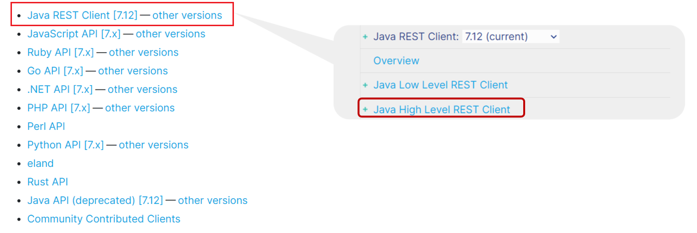

现在新的网页


我们学习的是Java HighLevel Rest Client客户端API

接下来我们会通过一个案例来学习 `JavaRestClient`

~~~java
利用JavaRestClient实现创建、删除索引库，判断索引库是否存在
    根据课前资料提供的酒店数据创建索引库，索引库名为hotel，mapping属性根据数据库结构定义。
    基本步骤如下：
    导入课前资料Demo
    分析数据结构，定义mapping属性
    初始化JavaRestClient
    利用JavaRestClient创建索引库
    利用JavaRestClient删除索引库
    利用JavaRestClient判断索引库是否存在
~~~

----

## 二、导入Demo工程

### 1）导入数据库

首先导入课前资料提供的数据库数据：

 

数据结构如下：

```sql
CREATE TABLE `tb_hotel` (
  `id` bigint(20) NOT NULL COMMENT '酒店id',
  `name` varchar(255) NOT NULL COMMENT '酒店名称；例：7天酒店',
  `address` varchar(255) NOT NULL COMMENT '酒店地址；例：航头路',
  `price` int(10) NOT NULL COMMENT '酒店价格；例：329',
  `score` int(2) NOT NULL COMMENT '酒店评分；例：45，就是4.5分',
  `brand` varchar(32) NOT NULL COMMENT '酒店品牌；例：如家',
  `city` varchar(32) NOT NULL COMMENT '所在城市；例：上海',
  `star_name` varchar(16) DEFAULT NULL COMMENT '酒店星级，从低到高分别是：1星到5星，1钻到5钻',
  `business` varchar(255) DEFAULT NULL COMMENT '商圈；例：虹桥',
  `latitude` varchar(32) NOT NULL COMMENT '纬度；例：31.2497',
  `longitude` varchar(32) NOT NULL COMMENT '经度；例：120.3925',
  `pic` varchar(255) DEFAULT NULL COMMENT '酒店图片；例:/img/1.jpg',
  PRIMARY KEY (`id`)
) ENGINE=InnoDB DEFAULT CHARSET=utf8mb4;
```

---

### 2）导入项目

然后导入课前资料提供的项目:

 

项目结构如图：


----

## 三、mapping映射分析

### 1）分析思路

创建索引库，最关键的是mapping映射，而mapping映射要考虑的信息包括：

- 字段名（基于表结构就明白了）
- 字段数据类型（也是基于原来的表结构转为对应的ES类型）
- 是否参与搜索
- 是否需要分词
- 如果分词，分词器是什么？

其中：

- 字段名、字段数据类型，可以参考数据表结构的名称和类型
- 是否参与搜索要分析业务来判断，例如图片地址，就无需参与搜索
- 是否分词呢要看内容，内容如果是一个整体就无需分词，反之则要分词
- 分词器，我们可以统一使用ik_max_word

我们先根据数据库表在浏览器中书写mapping映射，在写的时候对照着数据库表来写


----

### 2）一些特殊字段分析

PS：这里的 `id` 在数据库中是 `bigint类型` 的，对应着Java中的 `long`，但是我们不能写成 `long`。

我们来看之前，id明明是一个数字，但是在ES中却变成了一个字符串。

也就是说 `id字段` 比较特殊，它将来都是这种字符串类型。但又因为它是一个整体，不可分隔，因此将来不分词，因此选择字符串中的 `keyword类型`


因此这里 `id` 应该定义为字符串中的 `keyword` 类型，因为它不能分词

~~~json
"id": {
    "type": "keyword"
}
~~~

---

老师这里讲酒店不根据地址搜索，既然不搜索，类型为keyword，`index` 就要定义为 `false`。

~~~json
"address":{
    "type": "keyword",
    "index": false
}
~~~

----

价格当然要参与搜索，因为要进行排序，但是不需要分词。

~~~json
"price":{
    "type": "integer"
}
~~~

----

`starName`，这里不用 `_`，直接驼峰即可。

~~~json
"starName":{
    "type": "keyword"
},
~~~

----

location字段说明：地理坐标，里面包含精度、纬度

地理坐标说明：

ES中支持两种地理坐标数据类型：

- geo_point：由纬度（latitude）和经度（longitude）确定的一个点。例如："32.8752345, 120.2981576"（前面是维度，后面是精度，两个拼在一起形参一个字符串）。

  虽然它的值是一个字符串，但是它的类型叫 `geo_point`，而且这个是由数据库中的 `latitude` 和 `longitude` 两个字段拼一起组成的，因此它不是两个字段，而是一个字段。

  例如这里我给它起个名字叫 `location`

- geo_shape：有多个geo_point组成的复杂几何图形。例如一条直线，"LINESTRING (-77.03653 38.897676, -77.009051 38.889939)"

这里应该使用 `geo_point`，因为一个酒店在地球上就是一个点。

~~~json
"location":{
    "type": "geo_point"
}
~~~

-----

但是除此之外，还有一个小问题：当我们的 `name字段` 和 `brand字段` 等等，都需要参与搜索。

那么这些字段都要参与搜索，用户输入关键字的时候是有可能会根据多个字段进行搜索的，那么此时就要来想了，ES在搜索的时候是根据多个字段效率高，还是只根据一个字段搜索效率高？肯定是一个字段。

ES就给我们提供了一个功能可以解决这个问题。

字段拷贝可以使用copy_to属性将当前字段拷贝到指定字段。

例如上面我想要根据 `name、brand、businuess` 搜索，我就可以把这三个都拷贝到一个字段中去，这个字段名可以随便起，例如叫 `all`。

类型是 `text`，这样不管是 `name` 也好，还是 `brand` 也好，都可以通过 `copy_to属性` 拷贝进去。

也就是 `all` 这一个字段，就同时具备了 `name`、`brand` 等等，凡是你拷进去的，这些字段的值都有。

此时你就可以在一个字段里搜到多个字段的内容了。

而且这种拷贝它还做了优化，它并不是真的将文档拷贝进去，而只是基于它创建倒排索引，将来去查的时候你其实看不到这个字段，它好像不存在一样，但搜却可以根据它搜，非常的舒服。

~~~json
"all": {
    "type": "text",
    "analyzer": "ik_max_word"
},
"name":{
    "type": "text",
    "analyzer": "ik_max_word",
    "copy_to": "all"
},
"brand": {
    "type": "keyword",
    "copy_to": "all"
}
~~~

----

### 3）完整代码

```json
PUT /hotel
{
  "mappings": {
    "properties": {
      "id": {
        "type": "keyword"
      },
      "name":{
        "type": "text",
        "analyzer": "ik_max_word",
        "copy_to": "all"
      },
      "address":{
        "type": "keyword",
        "index": false
      },
      "price":{
        "type": "integer"
      },
      "score":{
        "type": "integer"
      },
      "brand":{
        "type": "keyword",
        "copy_to": "all"
      },
      "city":{
        "type": "keyword",
        "copy_to": "all"
      },
      "starName":{
        "type": "keyword"
      },
      "business":{
        "type": "keyword"
      },
      "location":{
        "type": "geo_point"
      },
      "pic":{
        "type": "keyword",
        "index": false
      },
      "all":{
        "type": "text",
        "analyzer": "ik_max_word"
      }
    }
  }
}
```


----

## 四、初始化RestClient

刚刚我们已经在浏览器中编写了酒店的mapping映射，做好了创建索引库的初步准备了。

最终我们创建索引库肯定还要用到ES的Java客户端 `Java Rest Client`。

在elasticsearch提供的API中，与elasticsearch一切交互都封装在一个名为RestHighLevelClient的类中，必须先完成这个对象的初始化，建立与elasticsearch的连接。

分为三步：

1）引入es的RestHighLevelClient依赖：

```xml
<dependency>
    <groupId>org.elasticsearch.client</groupId>
    <artifactId>elasticsearch-rest-high-level-client</artifactId>
</dependency>
```


2）因为SpringBoot默认的ES版本是7.6.2


由于它是定义在 `properties` 中，所以我们需要覆盖默认的ES版本也只需要找到我们自己的 `pom文件` 中的 `properties` 也来定义一个这样的值，然后将它改成7.12.1，这个版本一定要与服务端的版本保持一致。

PS：如果ES不是在SpringBoot环境下创建的，那么直接在引入依赖的时候就指定版本即可。

```xml
<properties>
    <java.version>1.8</java.version>
    <elasticsearch.version>7.12.1</elasticsearch.version>
</properties>
```


3）初始化RestHighLevelClient：

客户端的创建方式是通过 `new` 的方式，然后在参数中通过 `RestClient` 去完成构建，构建的时候需要指定ES的ip和端口。

这里我们通过一个单元测试去写这个功能

初始化的代码如下：

我们将它定义为成员变量，因为未来我们会在这里写很多很多的单元测试，如果在每一个单元测试中都去写这个对象的初始化，就很麻烦了，定义为成员变量就可以复用。

既然定义为了成员变量，就得提前完成初始化，因此可以使用单元测试中的BeforeEach注解，可以在一开始就完成对象的初始化


```java
@BeforeEach
void setUp() {
    this.client = new RestHighLevelClient(RestClient.builder(
        HttpHost.create("http://192.168.150.101:9200")
    ));

    // 如果将来是集群，那么还可以指定多个，这个参数是一个可变参数
    this.client = new RestHighLevelClient(RestClient.builder(
        HttpHost.create("http://192.168.150.101:9200"),
        HttpHost.create("http://192.168.150.101:9200"),
        HttpHost.create("http://192.168.150.101:9200")
    ));
}
```

客户端创建完了，还需要销毁，因此这里加一个AfterEach注解


```java
package cn.itcast.hotel;

import org.apache.http.HttpHost;
import org.elasticsearch.client.RestHighLevelClient;
import org.junit.jupiter.api.AfterEach;
import org.junit.jupiter.api.BeforeEach;
import org.junit.jupiter.api.Test;

import java.io.IOException;

public class HotelIndexTest {
    private RestHighLevelClient client;

    @BeforeEach
    void setUp() {
        this.client = new RestHighLevelClient(RestClient.builder(
                HttpHost.create("http://192.168.150.101:9200")
        ));
    }

    @AfterEach
    void tearDown() throws IOException {
        this.client.close();
    }
}
```

完整代码，这样写的好处是：以后我们写的所有的单元测试都会先运行它都会去先运行 `Before` 再运行 `After`，这样依赖Client就可以自动完成初始化了。

写一个单元测试测试一下


可以发现初始化成功。


----

## 五、创建索引库

### 1）介绍

创建索引库的API结合DSL语句更容易看懂。

第一部分：指定请求方式与请求路径，请求路径一般就是索引库名称

第二部分：JSON格式，它里面主要写的就是mapping映射。

第三部分：点击发送请求的按钮，然后索引库就能创建了。

即左边的三行代码跟左侧的DSL其实是类似的。

代码分为三步：

- 1）创建Request对象。因为是创建索引库的操作，因此Request是CreateIndexRequest。

- 2）添加请求参数，其实就是DSL的JSON参数部分。因为json字符串很长，这里是定义了静态字符串常量MAPPING_TEMPLATE，让代码看起来更加优雅。第二个参数指定数据类型是JSON。

- 3）发送请求，Java代码要做的事就是用Java代码来组织DSL，然后去发请求。其中 `indices()` 方法很重要，`indices` 就是 `index` 的复数形式，代表的就是索引库的索引操作。

  `clinet.indices()` 就能拿到我们ES对于索引库操作的所有方法，这里调用了 `creat()` 方法，创建索引库，第一个参数将 `request对象` 传进来；第二个参数传入 `RequestOptions.DEFAULT`，这个是请求的一些参数，一般是指控制请求体信息，大多数情况下我们都不用去控制，默认的就行了，所以这里用了 `RequestOptions.DEFAULT`，这样整个请求就发出了，索引库的创建也就完成了。

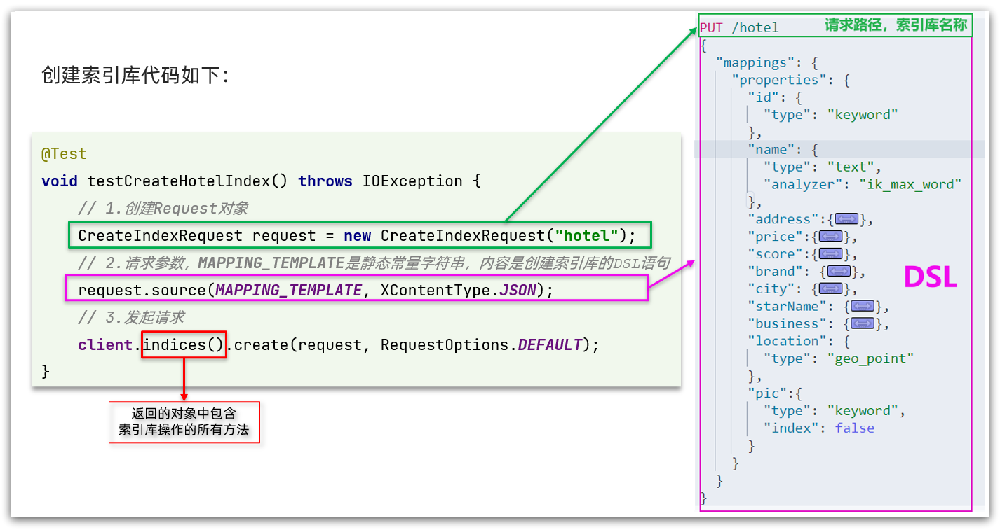

----

### 2）完整示例

在hotel-demo的cn.itcast.hotel.constants包下，创建一个类，定义mapping映射的JSON字符串常量：

```java
package cn.itcast.hotel.constants;

public class HotelConstants {
    public static final String MAPPING_TEMPLATE = "{\n" +
            "  \"mappings\": {\n" +
            "    \"properties\": {\n" +
            "      \"id\": {\n" +
            "        \"type\": \"keyword\"\n" +
            "      },\n" +
            "      \"name\":{\n" +
            "        \"type\": \"text\",\n" +
            "        \"analyzer\": \"ik_max_word\",\n" +
            "        \"copy_to\": \"all\"\n" +
            "      },\n" +
            "      \"address\":{\n" +
            "        \"type\": \"keyword\",\n" +
            "        \"index\": false\n" +
            "      },\n" +
            "      \"price\":{\n" +
            "        \"type\": \"integer\"\n" +
            "      },\n" +
            "      \"score\":{\n" +
            "        \"type\": \"integer\"\n" +
            "      },\n" +
            "      \"brand\":{\n" +
            "        \"type\": \"keyword\",\n" +
            "        \"copy_to\": \"all\"\n" +
            "      },\n" +
            "      \"city\":{\n" +
            "        \"type\": \"keyword\",\n" +
            "        \"copy_to\": \"all\"\n" +
            "      },\n" +
            "      \"starName\":{\n" +
            "        \"type\": \"keyword\"\n" +
            "      },\n" +
            "      \"business\":{\n" +
            "        \"type\": \"keyword\"\n" +
            "      },\n" +
            "      \"location\":{\n" +
            "        \"type\": \"geo_point\"\n" +
            "      },\n" +
            "      \"pic\":{\n" +
            "        \"type\": \"keyword\",\n" +
            "        \"index\": false\n" +
            "      },\n" +
            "      \"all\":{\n" +
            "        \"type\": \"text\",\n" +
            "        \"analyzer\": \"ik_max_word\"\n" +
            "      }\n" +
            "    }\n" +
            "  }\n" +
            "}";
}
```

在hotel-demo中的HotelIndexTest测试类中，编写单元测试，实现创建索引：

如果忘记了没关系，我们可以先去调用发请求的方法，然后根据参数想起要创建的东西

```java
@Test
void createHotelIndex() throws IOException {
    // 1.创建Request对象
    CreateIndexRequest request = new CreateIndexRequest("hotel");
    // 2.准备请求的参数：DSL语句
    request.source(MAPPING_TEMPLATE, XContentType.JSON);
    // 3.发送请求
    client.indices().create(request, RequestOptions.DEFAULT);
}
```

运行单元测试，此时我们就可以到浏览器中测试一下


可以发现查询成功，证明我们的索引库创建没有问题。


----

## 六、删除索引库

删除索引库的DSL语句非常简单：

```json
DELETE /hotel
```

与创建索引库相比：

- 请求方式从PUT变为DELTE
- 请求路径不变
- 无请求参数

所以代码的差异，注意体现在Request对象上。依然是三步走：

- 1）创建Request对象。这次是DeleteIndexRequest对象
- 2）准备参数。删除索引库是不需要参数的，因此这步不需要
- 3）发送请求。改用delete方法

在hotel-demo中的HotelIndexTest测试类中，编写单元测试，实现删除索引：

```java
@Test
void testDeleteHotelIndex() throws IOException {
    // 1.创建Request对象
    DeleteIndexRequest request = new DeleteIndexRequest("hotel");
    // 2.发送请求
    client.indices().delete(request, RequestOptions.DEFAULT);
}
```

---

## 七、判断索引库是否存在

判断索引库是否存在，本质就是查询，对应的DSL是：

```json
GET /hotel
```

因此与删除的Java代码流程是类似的。依然是三步走：

- 1）创建Request对象。这次是GetIndexRequest对象
- 2）准备参数。这里是无参
- 3）发送请求。改用exists方法

判断是否存在有返回值

```java
@Test
void testExistsHotelIndex() throws IOException {
    // 1.创建Request对象
    GetIndexRequest request = new GetIndexRequest("hotel");
    // 2.发送请求
    boolean exists = client.indices().exists(request, RequestOptions.DEFAULT);
    // 3.输出
    System.err.println(exists ? "索引库已经存在！" : "索引库不存在！");
}
```

-----

## 八、总结

将刚刚写的四个方法放在一起看，其实非常的有规律。

所有的操作索引库的API都是放在 `client.indices()` 的返回值中。

创建就用 `create`，删除就用 `delete`，判断就用 `exist`。

不同的操作对应的请求也不一样，创建是 `CreateIndexRequest()`，删除是 `DeleteIndexRequest()`，判断是 `GetIndexRequest()`。

JavaRestClient操作elasticsearch的流程基本类似。核心是client.indices()方法来获取索引库的操作对象。

索引库操作的基本步骤：

- 初始化RestHighLevelClient
- 创建XxxIndexRequest。XXX是Create、Get、Delete
- 准备DSL（ Create时需要，其它是无参）
- 发送请求。调用RestHighLevelClient#indices().xxx()方法，xxx是create、exists、delete


# 5.RestClient操作文档

为了与索引库操作分离，我们再次参加一个测试类，做两件事情：

- 初始化RestHighLevelClient
- 我们的酒店数据在数据库，需要利用IHotelService去查询，所以注入这个接口

```java
package cn.itcast.hotel;

import cn.itcast.hotel.pojo.Hotel;
import cn.itcast.hotel.service.IHotelService;
import org.junit.jupiter.api.AfterEach;
import org.junit.jupiter.api.BeforeEach;
import org.junit.jupiter.api.Test;
import org.springframework.beans.factory.annotation.Autowired;
import org.springframework.boot.test.context.SpringBootTest;

import java.io.IOException;
import java.util.List;

@SpringBootTest
public class HotelDocumentTest {
    @Autowired
    private IHotelService hotelService;

    private RestHighLevelClient client;

    @BeforeEach
    void setUp() {
        this.client = new RestHighLevelClient(RestClient.builder(
                HttpHost.create("http://192.168.150.101:9200")
        ));
    }

    @AfterEach
    void tearDown() throws IOException {
        this.client.close();
    }
}

```


## 5.1.新增文档

我们要将数据库的酒店数据查询出来，写入elasticsearch中。

### 5.1.1.索引库实体类

数据库查询后的结果是一个Hotel类型的对象。结构如下：

```java
@Data
@TableName("tb_hotel")
public class Hotel {
    @TableId(type = IdType.INPUT)
    private Long id;
    private String name;
    private String address;
    private Integer price;
    private Integer score;
    private String brand;
    private String city;
    private String starName;
    private String business;
    private String longitude;
    private String latitude;
    private String pic;
}
```

与我们的索引库结构存在差异：

- longitude和latitude需要合并为location

因此，我们需要定义一个新的类型，与索引库结构吻合：

```java
package cn.itcast.hotel.pojo;

import lombok.Data;
import lombok.NoArgsConstructor;

@Data
@NoArgsConstructor
public class HotelDoc {
    private Long id;
    private String name;
    private String address;
    private Integer price;
    private Integer score;
    private String brand;
    private String city;
    private String starName;
    private String business;
    private String location;
    private String pic;

    public HotelDoc(Hotel hotel) {
        this.id = hotel.getId();
        this.name = hotel.getName();
        this.address = hotel.getAddress();
        this.price = hotel.getPrice();
        this.score = hotel.getScore();
        this.brand = hotel.getBrand();
        this.city = hotel.getCity();
        this.starName = hotel.getStarName();
        this.business = hotel.getBusiness();
        this.location = hotel.getLatitude() + ", " + hotel.getLongitude();
        this.pic = hotel.getPic();
    }
}

```


### 5.1.2.语法说明

新增文档的DSL语句如下：

```json
POST /{索引库名}/_doc/1
{
    "name": "Jack",
    "age": 21
}
```

对应的java代码如图：


可以看到与创建索引库类似，同样是三步走：

- 1）创建Request对象
- 2）准备请求参数，也就是DSL中的JSON文档
- 3）发送请求

变化的地方在于，这里直接使用client.xxx()的API，不再需要client.indices()了。


### 5.1.3.完整代码

我们导入酒店数据，基本流程一致，但是需要考虑几点变化：

- 酒店数据来自于数据库，我们需要先查询出来，得到hotel对象
- hotel对象需要转为HotelDoc对象
- HotelDoc需要序列化为json格式

因此，代码整体步骤如下：

- 1）根据id查询酒店数据Hotel
- 2）将Hotel封装为HotelDoc
- 3）将HotelDoc序列化为JSON
- 4）创建IndexRequest，指定索引库名和id
- 5）准备请求参数，也就是JSON文档
- 6）发送请求

在hotel-demo的HotelDocumentTest测试类中，编写单元测试：

```java
@Test
void testAddDocument() throws IOException {
    // 1.根据id查询酒店数据
    Hotel hotel = hotelService.getById(61083L);
    // 2.转换为文档类型
    HotelDoc hotelDoc = new HotelDoc(hotel);
    // 3.将HotelDoc转json
    String json = JSON.toJSONString(hotelDoc);

    // 1.准备Request对象
    IndexRequest request = new IndexRequest("hotel").id(hotelDoc.getId().toString());
    // 2.准备Json文档
    request.source(json, XContentType.JSON);
    // 3.发送请求
    client.index(request, RequestOptions.DEFAULT);
}
```


## 5.2.查询文档

### 5.2.1.语法说明

查询的DSL语句如下：

```json
GET /hotel/_doc/{id}
```

非常简单，因此代码大概分两步：

- 准备Request对象
- 发送请求

不过查询的目的是得到结果，解析为HotelDoc，因此难点是结果的解析。完整代码如下：


可以看到，结果是一个JSON，其中文档放在一个`_source`属性中，因此解析就是拿到`_source`，反序列化为Java对象即可。

与之前类似，也是三步走：

- 1）准备Request对象。这次是查询，所以是GetRequest
- 2）发送请求，得到结果。因为是查询，这里调用client.get()方法
- 3）解析结果，就是对JSON做反序列化


### 5.2.2.完整代码

在hotel-demo的HotelDocumentTest测试类中，编写单元测试：

```java
@Test
void testGetDocumentById() throws IOException {
    // 1.准备Request
    GetRequest request = new GetRequest("hotel", "61082");
    // 2.发送请求，得到响应
    GetResponse response = client.get(request, RequestOptions.DEFAULT);
    // 3.解析响应结果
    String json = response.getSourceAsString();

    HotelDoc hotelDoc = JSON.parseObject(json, HotelDoc.class);
    System.out.println(hotelDoc);
}
```


## 5.3.删除文档

删除的DSL为是这样的：

```json
DELETE /hotel/_doc/{id}
```

与查询相比，仅仅是请求方式从DELETE变成GET，可以想象Java代码应该依然是三步走：

- 1）准备Request对象，因为是删除，这次是DeleteRequest对象。要指定索引库名和id
- 2）准备参数，无参
- 3）发送请求。因为是删除，所以是client.delete()方法


在hotel-demo的HotelDocumentTest测试类中，编写单元测试：

```java
@Test
void testDeleteDocument() throws IOException {
    // 1.准备Request
    DeleteRequest request = new DeleteRequest("hotel", "61083");
    // 2.发送请求
    client.delete(request, RequestOptions.DEFAULT);
}
```


## 5.4.修改文档

### 5.4.1.语法说明

修改我们讲过两种方式：

- 全量修改：本质是先根据id删除，再新增
- 增量修改：修改文档中的指定字段值


在RestClient的API中，全量修改与新增的API完全一致，判断依据是ID：

- 如果新增时，ID已经存在，则修改
- 如果新增时，ID不存在，则新增

这里不再赘述，我们主要关注增量修改。

代码示例如图：

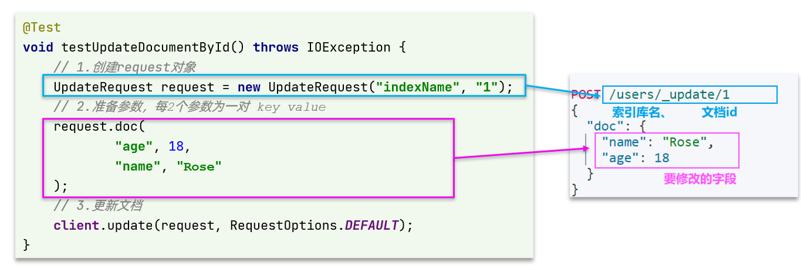

与之前类似，也是三步走：

- 1）准备Request对象。这次是修改，所以是UpdateRequest
- 2）准备参数。也就是JSON文档，里面包含要修改的字段
- 3）更新文档。这里调用client.update()方法


### 5.4.2.完整代码

在hotel-demo的HotelDocumentTest测试类中，编写单元测试：

```java
@Test
void testUpdateDocument() throws IOException {
    // 1.准备Request
    UpdateRequest request = new UpdateRequest("hotel", "61083");
    // 2.准备请求参数
    request.doc(
        "price", "952",
        "starName", "四钻"
    );
    // 3.发送请求
    client.update(request, RequestOptions.DEFAULT);
}
```


## 5.5.批量导入文档

案例需求：利用BulkRequest批量将数据库数据导入到索引库中。

步骤如下：

- 利用mybatis-plus查询酒店数据

- 将查询到的酒店数据（Hotel）转换为文档类型数据（HotelDoc）

- 利用JavaRestClient中的BulkRequest批处理，实现批量新增文档


### 5.5.1.语法说明

批量处理BulkRequest，其本质就是将多个普通的CRUD请求组合在一起发送。

其中提供了一个add方法，用来添加其他请求：


可以看到，能添加的请求包括：

- IndexRequest，也就是新增
- UpdateRequest，也就是修改
- DeleteRequest，也就是删除

因此Bulk中添加了多个IndexRequest，就是批量新增功能了。示例：


其实还是三步走：

- 1）创建Request对象。这里是BulkRequest
- 2）准备参数。批处理的参数，就是其它Request对象，这里就是多个IndexRequest
- 3）发起请求。这里是批处理，调用的方法为client.bulk()方法


我们在导入酒店数据时，将上述代码改造成for循环处理即可。

### 5.5.2.完整代码

在hotel-demo的HotelDocumentTest测试类中，编写单元测试：

```java
@Test
void testBulkRequest() throws IOException {
    // 批量查询酒店数据
    List<Hotel> hotels = hotelService.list();

    // 1.创建Request
    BulkRequest request = new BulkRequest();
    // 2.准备参数，添加多个新增的Request
    for (Hotel hotel : hotels) {
        // 2.1.转换为文档类型HotelDoc
        HotelDoc hotelDoc = new HotelDoc(hotel);
        // 2.2.创建新增文档的Request对象
        request.add(new IndexRequest("hotel")
                    .id(hotelDoc.getId().toString())
                    .source(JSON.toJSONString(hotelDoc), XContentType.JSON));
    }
    // 3.发送请求
    client.bulk(request, RequestOptions.DEFAULT);
}
```


## 5.6.小结

文档操作的基本步骤：

- 初始化RestHighLevelClient
- 创建XxxRequest。XXX是Index、Get、Update、Delete、Bulk
- 准备参数（Index、Update、Bulk时需要）
- 发送请求。调用RestHighLevelClient#.xxx()方法，xxx是index、get、update、delete、bulk
- 解析结果（Get时需要）


---

# 分布式搜索引擎02

在昨天的学习中，我们已经导入了大量数据到elasticsearch中，实现了elasticsearch的数据存储功能。但elasticsearch最擅长的还是搜索和数据分析。

所以今天，我们研究下elasticsearch的数据搜索功能。我们会分别使用**DSL**和**RestClient**实现搜索。


# 0.学习目标


# 1.DSL查询文档

elasticsearch的查询依然是基于JSON风格的DSL来实现的。

## 1.1.DSL查询分类

Elasticsearch提供了基于JSON的DSL（[Domain Specific Language](https://www.elastic.co/guide/en/elasticsearch/reference/current/query-dsl.html)）来定义查询。常见的查询类型包括：

- **查询所有**：查询出所有数据，一般测试用。例如：match_all

- **全文检索（full text）查询**：利用分词器对用户输入内容分词，然后去倒排索引库中匹配。例如：
  - match_query
  - multi_match_query
- **精确查询**：根据精确词条值查找数据，一般是查找keyword、数值、日期、boolean等类型字段。例如：
  - ids
  - range
  - term
- **地理（geo）查询**：根据经纬度查询。例如：
  - geo_distance
  - geo_bounding_box
- **复合（compound）查询**：复合查询可以将上述各种查询条件组合起来，合并查询条件。例如：
  - bool
  - function_score


查询的语法基本一致：

```json
GET /indexName/_search
{
  "query": {
    "查询类型": {
      "查询条件": "条件值"
    }
  }
}
```

我们以查询所有为例，其中：

- 查询类型为match_all
- 没有查询条件

```json
// 查询所有
GET /indexName/_search
{
  "query": {
    "match_all": {
    }
  }
}
```

其它查询无非就是**查询类型**、**查询条件**的变化。


## 1.2.全文检索查询


### 1.2.1.使用场景

全文检索查询的基本流程如下：

- 对用户搜索的内容做分词，得到词条
- 根据词条去倒排索引库中匹配，得到文档id
- 根据文档id找到文档，返回给用户

比较常用的场景包括：

- 商城的输入框搜索
- 百度输入框搜索

例如京东：


因为是拿着词条去匹配，因此参与搜索的字段也必须是可分词的text类型的字段。


### 1.2.2.基本语法

常见的全文检索查询包括：

- match查询：单字段查询
- multi_match查询：多字段查询，任意一个字段符合条件就算符合查询条件

match查询语法如下：

```json
GET /indexName/_search
{
  "query": {
    "match": {
      "FIELD": "TEXT"
    }
  }
}
```

mulit_match语法如下：

```json
GET /indexName/_search
{
  "query": {
    "multi_match": {
      "query": "TEXT",
      "fields": ["FIELD1", " FIELD12"]
    }
  }
}
```


### 1.2.3.示例

match查询示例：


multi_match查询示例：


可以看到，两种查询结果是一样的，为什么？

因为我们将brand、name、business值都利用copy_to复制到了all字段中。因此你根据三个字段搜索，和根据all字段搜索效果当然一样了。

但是，搜索字段越多，对查询性能影响越大，因此建议采用copy_to，然后单字段查询的方式。


### 1.2.4.总结

match和multi_match的区别是什么？

- match：根据一个字段查询
- multi_match：根据多个字段查询，参与查询字段越多，查询性能越差


## 1.3.精准查询

精确查询一般是查找keyword、数值、日期、boolean等类型字段。所以**不会**对搜索条件分词。常见的有：

- term：根据词条精确值查询
- range：根据值的范围查询


### 1.3.1.term查询

因为精确查询的字段搜是不分词的字段，因此查询的条件也必须是**不分词**的词条。查询时，用户输入的内容跟自动值完全匹配时才认为符合条件。如果用户输入的内容过多，反而搜索不到数据。


语法说明：

```json
// term查询
GET /indexName/_search
{
  "query": {
    "term": {
      "FIELD": {
        "value": "VALUE"
      }
    }
  }
}
```


示例：

当我搜索的是精确词条时，能正确查询出结果：


但是，当我搜索的内容不是词条，而是多个词语形成的短语时，反而搜索不到：


### 1.3.2.range查询

范围查询，一般应用在对数值类型做范围过滤的时候。比如做价格范围过滤。


基本语法：

```json
// range查询
GET /indexName/_search
{
  "query": {
    "range": {
      "FIELD": {
        "gte": 10, // 这里的gte代表大于等于，gt则代表大于
        "lte": 20 // lte代表小于等于，lt则代表小于
      }
    }
  }
}
```


示例：


### 1.3.3.总结

精确查询常见的有哪些？

- term查询：根据词条精确匹配，一般搜索keyword类型、数值类型、布尔类型、日期类型字段
- range查询：根据数值范围查询，可以是数值、日期的范围


## 1.4.地理坐标查询

所谓的地理坐标查询，其实就是根据经纬度查询，官方文档：https://www.elastic.co/guide/en/elasticsearch/reference/current/geo-queries.html

常见的使用场景包括：

- 携程：搜索我附近的酒店
- 滴滴：搜索我附近的出租车
- 微信：搜索我附近的人


附近的酒店：

 

附近的车：

 


### 1.4.1.矩形范围查询

矩形范围查询，也就是geo_bounding_box查询，查询坐标落在某个矩形范围的所有文档：


查询时，需要指定矩形的**左上**、**右下**两个点的坐标，然后画出一个矩形，落在该矩形内的都是符合条件的点。

语法如下：

```json
// geo_bounding_box查询
GET /indexName/_search
{
  "query": {
    "geo_bounding_box": {
      "FIELD": {
        "top_left": { // 左上点
          "lat": 31.1,
          "lon": 121.5
        },
        "bottom_right": { // 右下点
          "lat": 30.9,
          "lon": 121.7
        }
      }
    }
  }
}
```


这种并不符合“附近的人”这样的需求，所以我们就不做了。


### 1.4.2.附近查询

附近查询，也叫做距离查询（geo_distance）：查询到指定中心点小于某个距离值的所有文档。


换句话来说，在地图上找一个点作为圆心，以指定距离为半径，画一个圆，落在圆内的坐标都算符合条件：


语法说明：

```json
// geo_distance 查询
GET /indexName/_search
{
  "query": {
    "geo_distance": {
      "distance": "15km", // 半径
      "FIELD": "31.21,121.5" // 圆心
    }
  }
}
```


示例：

我们先搜索陆家嘴附近15km的酒店：


发现共有47家酒店。


然后把半径缩短到3公里：


可以发现，搜索到的酒店数量减少到了5家。


## 1.5.复合查询

复合（compound）查询：复合查询可以将其它简单查询组合起来，实现更复杂的搜索逻辑。常见的有两种：

- fuction score：算分函数查询，可以控制文档相关性算分，控制文档排名
- bool query：布尔查询，利用逻辑关系组合多个其它的查询，实现复杂搜索


### 1.5.1.相关性算分

当我们利用match查询时，文档结果会根据与搜索词条的关联度打分（_score），返回结果时按照分值降序排列。

例如，我们搜索 "虹桥如家"，结果如下：

```json
[
  {
    "_score" : 17.850193,
    "_source" : {
      "name" : "虹桥如家酒店真不错",
    }
  },
  {
    "_score" : 12.259849,
    "_source" : {
      "name" : "外滩如家酒店真不错",
    }
  },
  {
    "_score" : 11.91091,
    "_source" : {
      "name" : "迪士尼如家酒店真不错",
    }
  }
]
```


在elasticsearch中，早期使用的打分算法是TF-IDF算法，公式如下：


在后来的5.1版本升级中，elasticsearch将算法改进为BM25算法，公式如下：


TF-IDF算法有一各缺陷，就是词条频率越高，文档得分也会越高，单个词条对文档影响较大。而BM25则会让单个词条的算分有一个上限，曲线更加平滑：


小结：elasticsearch会根据词条和文档的相关度做打分，算法由两种：

- TF-IDF算法
- BM25算法，elasticsearch5.1版本后采用的算法


### 1.5.2.算分函数查询

根据相关度打分是比较合理的需求，但**合理的不一定是产品经理需要**的。

以百度为例，你搜索的结果中，并不是相关度越高排名越靠前，而是谁掏的钱多排名就越靠前。如图：


要想认为控制相关性算分，就需要利用elasticsearch中的function score 查询了。


#### 1）语法说明


function score 查询中包含四部分内容：

- **原始查询**条件：query部分，基于这个条件搜索文档，并且基于BM25算法给文档打分，**原始算分**（query score)
- **过滤条件**：filter部分，符合该条件的文档才会重新算分
- **算分函数**：符合filter条件的文档要根据这个函数做运算，得到的**函数算分**（function score），有四种函数
  - weight：函数结果是常量
  - field_value_factor：以文档中的某个字段值作为函数结果
  - random_score：以随机数作为函数结果
  - script_score：自定义算分函数算法
- **运算模式**：算分函数的结果、原始查询的相关性算分，两者之间的运算方式，包括：
  - multiply：相乘
  - replace：用function score替换query score
  - 其它，例如：sum、avg、max、min


function score的运行流程如下：

- 1）根据**原始条件**查询搜索文档，并且计算相关性算分，称为**原始算分**（query score）
- 2）根据**过滤条件**，过滤文档
- 3）符合**过滤条件**的文档，基于**算分函数**运算，得到**函数算分**（function score）
- 4）将**原始算分**（query score）和**函数算分**（function score）基于**运算模式**做运算，得到最终结果，作为相关性算分。


因此，其中的关键点是：

- 过滤条件：决定哪些文档的算分被修改
- 算分函数：决定函数算分的算法
- 运算模式：决定最终算分结果


#### 2）示例

需求：给“如家”这个品牌的酒店排名靠前一些

翻译一下这个需求，转换为之前说的四个要点：

- 原始条件：不确定，可以任意变化
- 过滤条件：brand = "如家"
- 算分函数：可以简单粗暴，直接给固定的算分结果，weight
- 运算模式：比如求和

因此最终的DSL语句如下：

```json
GET /hotel/_search
{
  "query": {
    "function_score": {
      "query": {  .... }, // 原始查询，可以是任意条件
      "functions": [ // 算分函数
        {
          "filter": { // 满足的条件，品牌必须是如家
            "term": {
              "brand": "如家"
            }
          },
          "weight": 2 // 算分权重为2
        }
      ],
      "boost_mode": "sum" // 加权模式，求和
    }
  }
}
```


测试，在未添加算分函数时，如家得分如下：

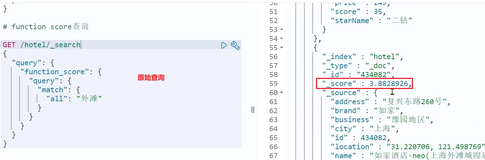

添加了算分函数后，如家得分就提升了：


#### 3）小结

function score query定义的三要素是什么？

- 过滤条件：哪些文档要加分
- 算分函数：如何计算function score
- 加权方式：function score 与 query score如何运算


### 1.5.3.布尔查询

布尔查询是一个或多个查询子句的组合，每一个子句就是一个**子查询**。子查询的组合方式有：

- must：必须匹配每个子查询，类似“与”
- should：选择性匹配子查询，类似“或”
- must_not：必须不匹配，**不参与算分**，类似“非”
- filter：必须匹配，**不参与算分**


比如在搜索酒店时，除了关键字搜索外，我们还可能根据品牌、价格、城市等字段做过滤：


每一个不同的字段，其查询的条件、方式都不一样，必须是多个不同的查询，而要组合这些查询，就必须用bool查询了。


需要注意的是，搜索时，参与**打分的字段越多，查询的性能也越差**。因此这种多条件查询时，建议这样做：

- 搜索框的关键字搜索，是全文检索查询，使用must查询，参与算分
- 其它过滤条件，采用filter查询。不参与算分


#### 1）语法示例：

```json
GET /hotel/_search
{
  "query": {
    "bool": {
      "must": [
        {"term": {"city": "上海" }}
      ],
      "should": [
        {"term": {"brand": "皇冠假日" }},
        {"term": {"brand": "华美达" }}
      ],
      "must_not": [
        { "range": { "price": { "lte": 500 } }}
      ],
      "filter": [
        { "range": {"score": { "gte": 45 } }}
      ]
    }
  }
}
```


#### 2）示例

需求：搜索名字包含“如家”，价格不高于400，在坐标31.21,121.5周围10km范围内的酒店。

分析：

- 名称搜索，属于全文检索查询，应该参与算分。放到must中
- 价格不高于400，用range查询，属于过滤条件，不参与算分。放到must_not中
- 周围10km范围内，用geo_distance查询，属于过滤条件，不参与算分。放到filter中


#### 3）小结

bool查询有几种逻辑关系？

- must：必须匹配的条件，可以理解为“与”
- should：选择性匹配的条件，可以理解为“或”
- must_not：必须不匹配的条件，不参与打分
- filter：必须匹配的条件，不参与打分


# 2.搜索结果处理

搜索的结果可以按照用户指定的方式去处理或展示。

## 2.1.排序

elasticsearch默认是根据相关度算分（_score）来排序，但是也支持自定义方式对搜索[结果排序](https://www.elastic.co/guide/en/elasticsearch/reference/current/sort-search-results.html)。可以排序字段类型有：keyword类型、数值类型、地理坐标类型、日期类型等。

### 2.1.1.普通字段排序

keyword、数值、日期类型排序的语法基本一致。

**语法**：

```json
GET /indexName/_search
{
  "query": {
    "match_all": {}
  },
  "sort": [
    {
      "FIELD": "desc"  // 排序字段、排序方式ASC、DESC
    }
  ]
}
```

排序条件是一个数组，也就是可以写多个排序条件。按照声明的顺序，当第一个条件相等时，再按照第二个条件排序，以此类推


**示例**：

需求描述：酒店数据按照用户评价（score)降序排序，评价相同的按照价格(price)升序排序


### 2.1.2.地理坐标排序

地理坐标排序略有不同。

**语法说明**：

```json
GET /indexName/_search
{
  "query": {
    "match_all": {}
  },
  "sort": [
    {
      "_geo_distance" : {
          "FIELD" : "纬度，经度", // 文档中geo_point类型的字段名、目标坐标点
          "order" : "asc", // 排序方式
          "unit" : "km" // 排序的距离单位
      }
    }
  ]
}
```

这个查询的含义是：

- 指定一个坐标，作为目标点
- 计算每一个文档中，指定字段（必须是geo_point类型）的坐标 到目标点的距离是多少
- 根据距离排序


**示例：**

需求描述：实现对酒店数据按照到你的位置坐标的距离升序排序

提示：获取你的位置的经纬度的方式：https://lbs.amap.com/demo/jsapi-v2/example/map/click-to-get-lnglat/


假设我的位置是：31.034661，121.612282，寻找我周围距离最近的酒店。


## 2.2.分页

elasticsearch 默认情况下只返回top10的数据。而如果要查询更多数据就需要修改分页参数了。elasticsearch中通过修改from、size参数来控制要返回的分页结果：

- from：从第几个文档开始
- size：总共查询几个文档

类似于mysql中的`limit ?, ?`

### 2.2.1.基本的分页

分页的基本语法如下：

```json
GET /hotel/_search
{
  "query": {
    "match_all": {}
  },
  "from": 0, // 分页开始的位置，默认为0
  "size": 10, // 期望获取的文档总数
  "sort": [
    {"price": "asc"}
  ]
}
```


### 2.2.2.深度分页问题

现在，我要查询990~1000的数据，查询逻辑要这么写：

```json
GET /hotel/_search
{
  "query": {
    "match_all": {}
  },
  "from": 990, // 分页开始的位置，默认为0
  "size": 10, // 期望获取的文档总数
  "sort": [
    {"price": "asc"}
  ]
}
```

这里是查询990开始的数据，也就是 第990~第1000条 数据。

不过，elasticsearch内部分页时，必须先查询 0~1000条，然后截取其中的990 ~ 1000的这10条：


查询TOP1000，如果es是单点模式，这并无太大影响。

但是elasticsearch将来一定是集群，例如我集群有5个节点，我要查询TOP1000的数据，并不是每个节点查询200条就可以了。

因为节点A的TOP200，在另一个节点可能排到10000名以外了。

因此要想获取整个集群的TOP1000，必须先查询出每个节点的TOP1000，汇总结果后，重新排名，重新截取TOP1000。

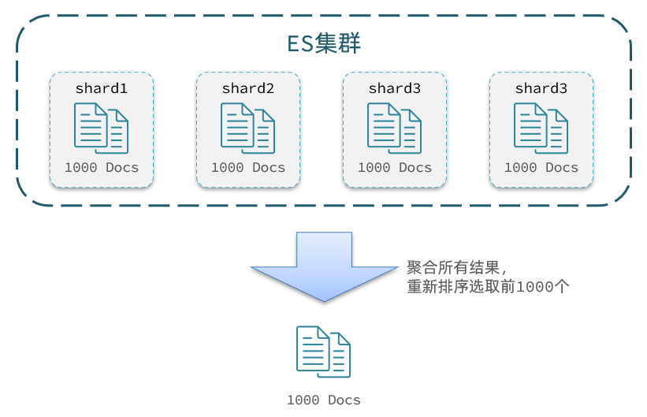


那如果我要查询9900~10000的数据呢？是不是要先查询TOP10000呢？那每个节点都要查询10000条？汇总到内存中？


当查询分页深度较大时，汇总数据过多，对内存和CPU会产生非常大的压力，因此elasticsearch会禁止from+ size 超过10000的请求。


针对深度分页，ES提供了两种解决方案，[官方文档](https://www.elastic.co/guide/en/elasticsearch/reference/current/paginate-search-results.html)：

- search after：分页时需要排序，原理是从上一次的排序值开始，查询下一页数据。官方推荐使用的方式。
- scroll：原理将排序后的文档id形成快照，保存在内存。官方已经不推荐使用。


### 2.2.3.小结

分页查询的常见实现方案以及优缺点：

- `from + size`：
  - 优点：支持随机翻页
  - 缺点：深度分页问题，默认查询上限（from + size）是10000
  - 场景：百度、京东、谷歌、淘宝这样的随机翻页搜索
- `after search`：
  - 优点：没有查询上限（单次查询的size不超过10000）
  - 缺点：只能向后逐页查询，不支持随机翻页
  - 场景：没有随机翻页需求的搜索，例如手机向下滚动翻页

- `scroll`：
  - 优点：没有查询上限（单次查询的size不超过10000）
  - 缺点：会有额外内存消耗，并且搜索结果是非实时的
  - 场景：海量数据的获取和迁移。从ES7.1开始不推荐，建议用 after search方案。


## 2.3.高亮

### 2.3.1.高亮原理

什么是高亮显示呢？

我们在百度，京东搜索时，关键字会变成红色，比较醒目，这叫高亮显示：


高亮显示的实现分为两步：

- 1）给文档中的所有关键字都添加一个标签，例如`<em>`标签
- 2）页面给`<em>`标签编写CSS样式


### 2.3.2.实现高亮

**高亮的语法**：

```json
GET /hotel/_search
{
  "query": {
    "match": {
      "FIELD": "TEXT" // 查询条件，高亮一定要使用全文检索查询
    }
  },
  "highlight": {
    "fields": { // 指定要高亮的字段
      "FIELD": {
        "pre_tags": "<em>",  // 用来标记高亮字段的前置标签
        "post_tags": "</em>" // 用来标记高亮字段的后置标签
      }
    }
  }
}
```


**注意：**

- 高亮是对关键字高亮，因此**搜索条件必须带有关键字**，而不能是范围这样的查询。
- 默认情况下，**高亮的字段，必须与搜索指定的字段一致**，否则无法高亮
- 如果要对非搜索字段高亮，则需要添加一个属性：required_field_match=false


**示例**：


## 2.4.总结

查询的DSL是一个大的JSON对象，包含下列属性：

- query：查询条件
- from和size：分页条件
- sort：排序条件
- highlight：高亮条件

示例：

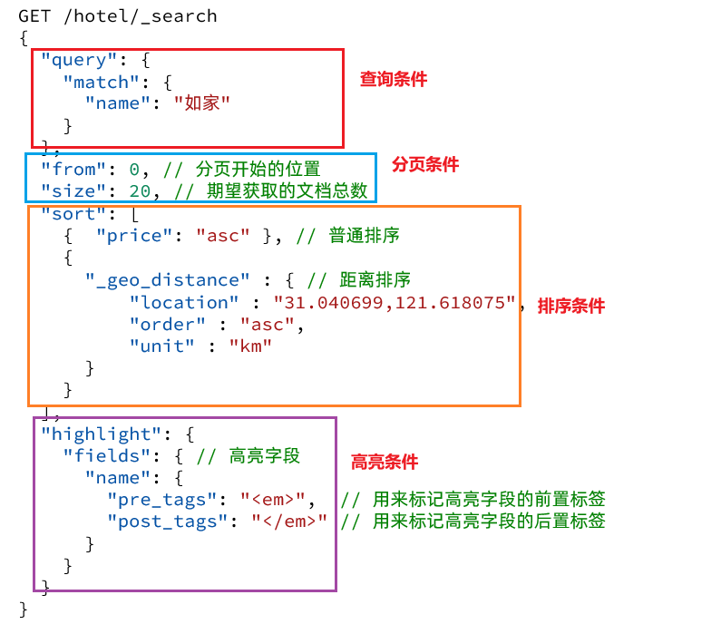


# 3.RestClient查询文档

文档的查询同样适用昨天学习的 RestHighLevelClient对象，基本步骤包括：

- 1）准备Request对象
- 2）准备请求参数
- 3）发起请求
- 4）解析响应


## 3.1.快速入门

我们以match_all查询为例

### 3.1.1.发起查询请求


代码解读：

- 第一步，创建`SearchRequest`对象，指定索引库名

- 第二步，利用`request.source()`构建DSL，DSL中可以包含查询、分页、排序、高亮等
  - `query()`：代表查询条件，利用`QueryBuilders.matchAllQuery()`构建一个match_all查询的DSL
- 第三步，利用client.search()发送请求，得到响应


这里关键的API有两个，一个是`request.source()`，其中包含了查询、排序、分页、高亮等所有功能：


另一个是`QueryBuilders`，其中包含match、term、function_score、bool等各种查询：


### 3.1.2.解析响应

响应结果的解析：

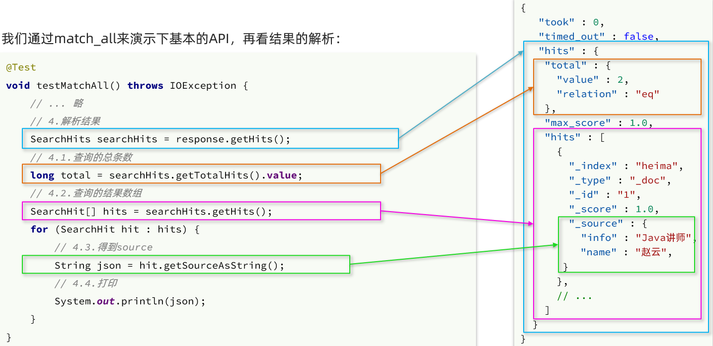


elasticsearch返回的结果是一个JSON字符串，结构包含：

- `hits`：命中的结果
  - `total`：总条数，其中的value是具体的总条数值
  - `max_score`：所有结果中得分最高的文档的相关性算分
  - `hits`：搜索结果的文档数组，其中的每个文档都是一个json对象
    - `_source`：文档中的原始数据，也是json对象

因此，我们解析响应结果，就是逐层解析JSON字符串，流程如下：

- `SearchHits`：通过response.getHits()获取，就是JSON中的最外层的hits，代表命中的结果
  - `SearchHits#getTotalHits().value`：获取总条数信息
  - `SearchHits#getHits()`：获取SearchHit数组，也就是文档数组
    - `SearchHit#getSourceAsString()`：获取文档结果中的_source，也就是原始的json文档数据


### 3.1.3.完整代码

完整代码如下：

```java
@Test
void testMatchAll() throws IOException {
    // 1.准备Request
    SearchRequest request = new SearchRequest("hotel");
    // 2.准备DSL
    request.source()
        .query(QueryBuilders.matchAllQuery());
    // 3.发送请求
    SearchResponse response = client.search(request, RequestOptions.DEFAULT);

    // 4.解析响应
    handleResponse(response);
}

private void handleResponse(SearchResponse response) {
    // 4.解析响应
    SearchHits searchHits = response.getHits();
    // 4.1.获取总条数
    long total = searchHits.getTotalHits().value;
    System.out.println("共搜索到" + total + "条数据");
    // 4.2.文档数组
    SearchHit[] hits = searchHits.getHits();
    // 4.3.遍历
    for (SearchHit hit : hits) {
        // 获取文档source
        String json = hit.getSourceAsString();
        // 反序列化
        HotelDoc hotelDoc = JSON.parseObject(json, HotelDoc.class);
        System.out.println("hotelDoc = " + hotelDoc);
    }
}
```


### 3.1.4.小结

查询的基本步骤是：

1. 创建SearchRequest对象

2. 准备Request.source()，也就是DSL。

   ① QueryBuilders来构建查询条件

   ② 传入Request.source() 的 query() 方法

3. 发送请求，得到结果

4. 解析结果（参考JSON结果，从外到内，逐层解析）


## 3.2.match查询

全文检索的match和multi_match查询与match_all的API基本一致。差别是查询条件，也就是query的部分。

 


因此，Java代码上的差异主要是request.source().query()中的参数了。同样是利用QueryBuilders提供的方法：

 

而结果解析代码则完全一致，可以抽取并共享。


完整代码如下：

```java
@Test
void testMatch() throws IOException {
    // 1.准备Request
    SearchRequest request = new SearchRequest("hotel");
    // 2.准备DSL
    request.source()
        .query(QueryBuilders.matchQuery("all", "如家"));
    // 3.发送请求
    SearchResponse response = client.search(request, RequestOptions.DEFAULT);
    // 4.解析响应
    handleResponse(response);

}
```


## 3.3.精确查询

精确查询主要是两者：

- term：词条精确匹配
- range：范围查询

与之前的查询相比，差异同样在查询条件，其它都一样。

查询条件构造的API如下：

 


## 3.4.布尔查询

布尔查询是用must、must_not、filter等方式组合其它查询，代码示例如下：


可以看到，API与其它查询的差别同样是在查询条件的构建，QueryBuilders，结果解析等其他代码完全不变。


完整代码如下：

```java
@Test
void testBool() throws IOException {
    // 1.准备Request
    SearchRequest request = new SearchRequest("hotel");
    // 2.准备DSL
    // 2.1.准备BooleanQuery
    BoolQueryBuilder boolQuery = QueryBuilders.boolQuery();
    // 2.2.添加term
    boolQuery.must(QueryBuilders.termQuery("city", "杭州"));
    // 2.3.添加range
    boolQuery.filter(QueryBuilders.rangeQuery("price").lte(250));

    request.source().query(boolQuery);
    // 3.发送请求
    SearchResponse response = client.search(request, RequestOptions.DEFAULT);
    // 4.解析响应
    handleResponse(response);

}
```


## 3.5.排序、分页

搜索结果的排序和分页是与query同级的参数，因此同样是使用request.source()来设置。

对应的API如下：


完整代码示例：

```java
@Test
void testPageAndSort() throws IOException {
    // 页码，每页大小
    int page = 1, size = 5;

    // 1.准备Request
    SearchRequest request = new SearchRequest("hotel");
    // 2.准备DSL
    // 2.1.query
    request.source().query(QueryBuilders.matchAllQuery());
    // 2.2.排序 sort
    request.source().sort("price", SortOrder.ASC);
    // 2.3.分页 from、size
    request.source().from((page - 1) * size).size(5);
    // 3.发送请求
    SearchResponse response = client.search(request, RequestOptions.DEFAULT);
    // 4.解析响应
    handleResponse(response);

}
```


## 3.6.高亮

高亮的代码与之前代码差异较大，有两点：

- 查询的DSL：其中除了查询条件，还需要添加高亮条件，同样是与query同级。
- 结果解析：结果除了要解析_source文档数据，还要解析高亮结果

### 3.6.1.高亮请求构建

高亮请求的构建API如下：


上述代码省略了查询条件部分，但是大家不要忘了：高亮查询必须使用全文检索查询，并且要有搜索关键字，将来才可以对关键字高亮。

完整代码如下：

```java
@Test
void testHighlight() throws IOException {
    // 1.准备Request
    SearchRequest request = new SearchRequest("hotel");
    // 2.准备DSL
    // 2.1.query
    request.source().query(QueryBuilders.matchQuery("all", "如家"));
    // 2.2.高亮
    request.source().highlighter(new HighlightBuilder().field("name").requireFieldMatch(false));
    // 3.发送请求
    SearchResponse response = client.search(request, RequestOptions.DEFAULT);
    // 4.解析响应
    handleResponse(response);

}
```


### 3.6.2.高亮结果解析

高亮的结果与查询的文档结果默认是分离的，并不在一起。

因此解析高亮的代码需要额外处理：


代码解读：

- 第一步：从结果中获取source。hit.getSourceAsString()，这部分是非高亮结果，json字符串。还需要反序列为HotelDoc对象
- 第二步：获取高亮结果。hit.getHighlightFields()，返回值是一个Map，key是高亮字段名称，值是HighlightField对象，代表高亮值
- 第三步：从map中根据高亮字段名称，获取高亮字段值对象HighlightField
- 第四步：从HighlightField中获取Fragments，并且转为字符串。这部分就是真正的高亮字符串了
- 第五步：用高亮的结果替换HotelDoc中的非高亮结果


完整代码如下：

```java
private void handleResponse(SearchResponse response) {
    // 4.解析响应
    SearchHits searchHits = response.getHits();
    // 4.1.获取总条数
    long total = searchHits.getTotalHits().value;
    System.out.println("共搜索到" + total + "条数据");
    // 4.2.文档数组
    SearchHit[] hits = searchHits.getHits();
    // 4.3.遍历
    for (SearchHit hit : hits) {
        // 获取文档source
        String json = hit.getSourceAsString();
        // 反序列化
        HotelDoc hotelDoc = JSON.parseObject(json, HotelDoc.class);
        // 获取高亮结果
        Map<String, HighlightField> highlightFields = hit.getHighlightFields();
        if (!CollectionUtils.isEmpty(highlightFields)) {
            // 根据字段名获取高亮结果
            HighlightField highlightField = highlightFields.get("name");
            if (highlightField != null) {
                // 获取高亮值
                String name = highlightField.getFragments()[0].string();
                // 覆盖非高亮结果
                hotelDoc.setName(name);
            }
        }
        System.out.println("hotelDoc = " + hotelDoc);
    }
}
```


# 4.黑马旅游案例

下面，我们通过黑马旅游的案例来实战演练下之前学习的知识。

我们实现四部分功能：

- 酒店搜索和分页
- 酒店结果过滤
- 我周边的酒店
- 酒店竞价排名


启动我们提供的hotel-demo项目，其默认端口是8089，访问http://localhost:8090，就能看到项目页面了：


## 4.1.酒店搜索和分页

案例需求：实现黑马旅游的酒店搜索功能，完成关键字搜索和分页

### 4.1.1.需求分析

在项目的首页，有一个大大的搜索框，还有分页按钮：


点击搜索按钮，可以看到浏览器控制台发出了请求：


请求参数如下：


由此可以知道，我们这个请求的信息如下：

- 请求方式：POST
- 请求路径：/hotel/list
- 请求参数：JSON对象，包含4个字段：
  - key：搜索关键字
  - page：页码
  - size：每页大小
  - sortBy：排序，目前暂不实现
- 返回值：分页查询，需要返回分页结果PageResult，包含两个属性：
  - `total`：总条数
  - `List<HotelDoc>`：当前页的数据


因此，我们实现业务的流程如下：

- 步骤一：定义实体类，接收请求参数的JSON对象
- 步骤二：编写controller，接收页面的请求
- 步骤三：编写业务实现，利用RestHighLevelClient实现搜索、分页


### 4.1.2.定义实体类

实体类有两个，一个是前端的请求参数实体，一个是服务端应该返回的响应结果实体。

1）请求参数

前端请求的json结构如下：

```json
{
    "key": "搜索关键字",
    "page": 1,
    "size": 3,
    "sortBy": "default"
}
```

因此，我们在`cn.itcast.hotel.pojo`包下定义一个实体类：

```java
package cn.itcast.hotel.pojo;

import lombok.Data;

@Data
public class RequestParams {
    private String key;
    private Integer page;
    private Integer size;
    private String sortBy;
}
```


2）返回值

分页查询，需要返回分页结果PageResult，包含两个属性：

- `total`：总条数
- `List<HotelDoc>`：当前页的数据

因此，我们在`cn.itcast.hotel.pojo`中定义返回结果：

```java
package cn.itcast.hotel.pojo;

import lombok.Data;

import java.util.List;

@Data
public class PageResult {
    private Long total;
    private List<HotelDoc> hotels;

    public PageResult() {
    }

    public PageResult(Long total, List<HotelDoc> hotels) {
        this.total = total;
        this.hotels = hotels;
    }
}
```


### 4.1.3.定义controller

定义一个HotelController，声明查询接口，满足下列要求：

- 请求方式：Post
- 请求路径：/hotel/list
- 请求参数：对象，类型为RequestParam
- 返回值：PageResult，包含两个属性
  - `Long total`：总条数
  - `List<HotelDoc> hotels`：酒店数据


因此，我们在`cn.itcast.hotel.web`中定义HotelController：

```java
@RestController
@RequestMapping("/hotel")
public class HotelController {

    @Autowired
    private IHotelService hotelService;
	// 搜索酒店数据
    @PostMapping("/list")
    public PageResult search(@RequestBody RequestParams params){
        return hotelService.search(params);
    }
}
```


### 4.1.4.实现搜索业务

我们在controller调用了IHotelService，并没有实现该方法，因此下面我们就在IHotelService中定义方法，并且去实现业务逻辑。

1）在`cn.itcast.hotel.service`中的`IHotelService`接口中定义一个方法：

```java
/**
 * 根据关键字搜索酒店信息
 * @param params 请求参数对象，包含用户输入的关键字 
 * @return 酒店文档列表
 */
PageResult search(RequestParams params);
```


2）实现搜索业务，肯定离不开RestHighLevelClient，我们需要把它注册到Spring中作为一个Bean。在`cn.itcast.hotel`中的`HotelDemoApplication`中声明这个Bean：

```java
@Bean
public RestHighLevelClient client(){
    return  new RestHighLevelClient(RestClient.builder(
        HttpHost.create("http://192.168.150.101:9200")
    ));
}
```


3）在`cn.itcast.hotel.service.impl`中的`HotelService`中实现search方法：

```java
@Override
public PageResult search(RequestParams params) {
    try {
        // 1.准备Request
        SearchRequest request = new SearchRequest("hotel");
        // 2.准备DSL
        // 2.1.query
        String key = params.getKey();
        if (key == null || "".equals(key)) {
            boolQuery.must(QueryBuilders.matchAllQuery());
        } else {
            boolQuery.must(QueryBuilders.matchQuery("all", key));
        }

        // 2.2.分页
        int page = params.getPage();
        int size = params.getSize();
        request.source().from((page - 1) * size).size(size);

        // 3.发送请求
        SearchResponse response = client.search(request, RequestOptions.DEFAULT);
        // 4.解析响应
        return handleResponse(response);
    } catch (IOException e) {
        throw new RuntimeException(e);
    }
}

// 结果解析
private PageResult handleResponse(SearchResponse response) {
    // 4.解析响应
    SearchHits searchHits = response.getHits();
    // 4.1.获取总条数
    long total = searchHits.getTotalHits().value;
    // 4.2.文档数组
    SearchHit[] hits = searchHits.getHits();
    // 4.3.遍历
    List<HotelDoc> hotels = new ArrayList<>();
    for (SearchHit hit : hits) {
        // 获取文档source
        String json = hit.getSourceAsString();
        // 反序列化
        HotelDoc hotelDoc = JSON.parseObject(json, HotelDoc.class);
		// 放入集合
        hotels.add(hotelDoc);
    }
    // 4.4.封装返回
    return new PageResult(total, hotels);
}
```


## 4.2.酒店结果过滤

需求：添加品牌、城市、星级、价格等过滤功能

### 4.2.1.需求分析

在页面搜索框下面，会有一些过滤项：


传递的参数如图：

 

包含的过滤条件有：

- brand：品牌值
- city：城市
- minPrice~maxPrice：价格范围
- starName：星级

我们需要做两件事情：

- 修改请求参数的对象RequestParams，接收上述参数
- 修改业务逻辑，在搜索条件之外，添加一些过滤条件


### 4.2.2.修改实体类

修改在`cn.itcast.hotel.pojo`包下的实体类RequestParams：

```java
@Data
public class RequestParams {
    private String key;
    private Integer page;
    private Integer size;
    private String sortBy;
    // 下面是新增的过滤条件参数
    private String city;
    private String brand;
    private String starName;
    private Integer minPrice;
    private Integer maxPrice;
}
```


### 4.2.3.修改搜索业务

在HotelService的search方法中，只有一个地方需要修改：requet.source().query( ... )其中的查询条件。

在之前的业务中，只有match查询，根据关键字搜索，现在要添加条件过滤，包括：

- 品牌过滤：是keyword类型，用term查询
- 星级过滤：是keyword类型，用term查询
- 价格过滤：是数值类型，用range查询
- 城市过滤：是keyword类型，用term查询

多个查询条件组合，肯定是boolean查询来组合：

- 关键字搜索放到must中，参与算分
- 其它过滤条件放到filter中，不参与算分


因为条件构建的逻辑比较复杂，这里先封装为一个函数：


buildBasicQuery的代码如下：

```java
private void buildBasicQuery(RequestParams params, SearchRequest request) {
    // 1.构建BooleanQuery
    BoolQueryBuilder boolQuery = QueryBuilders.boolQuery();
    // 2.关键字搜索
    String key = params.getKey();
    if (key == null || "".equals(key)) {
        boolQuery.must(QueryBuilders.matchAllQuery());
    } else {
        boolQuery.must(QueryBuilders.matchQuery("all", key));
    }
    // 3.城市条件
    if (params.getCity() != null && !params.getCity().equals("")) {
        boolQuery.filter(QueryBuilders.termQuery("city", params.getCity()));
    }
    // 4.品牌条件
    if (params.getBrand() != null && !params.getBrand().equals("")) {
        boolQuery.filter(QueryBuilders.termQuery("brand", params.getBrand()));
    }
    // 5.星级条件
    if (params.getStarName() != null && !params.getStarName().equals("")) {
        boolQuery.filter(QueryBuilders.termQuery("starName", params.getStarName()));
    }
	// 6.价格
    if (params.getMinPrice() != null && params.getMaxPrice() != null) {
        boolQuery.filter(QueryBuilders
                         .rangeQuery("price")
                         .gte(params.getMinPrice())
                         .lte(params.getMaxPrice())
                        );
    }
	// 7.放入source
    request.source().query(boolQuery);
}
```


## 4.3.我周边的酒店

需求：我附近的酒店

### 4.3.1.需求分析

在酒店列表页的右侧，有一个小地图，点击地图的定位按钮，地图会找到你所在的位置：

 

并且，在前端会发起查询请求，将你的坐标发送到服务端：

 


我们要做的事情就是基于这个location坐标，然后按照距离对周围酒店排序。实现思路如下：

- 修改RequestParams参数，接收location字段
- 修改search方法业务逻辑，如果location有值，添加根据geo_distance排序的功能


### 4.3.2.修改实体类

修改在`cn.itcast.hotel.pojo`包下的实体类RequestParams：

```java
package cn.itcast.hotel.pojo;

import lombok.Data;

@Data
public class RequestParams {
    private String key;
    private Integer page;
    private Integer size;
    private String sortBy;
    private String city;
    private String brand;
    private String starName;
    private Integer minPrice;
    private Integer maxPrice;
    // 我当前的地理坐标
    private String location;
}

```


### 4.3.3.距离排序API

我们以前学习过排序功能，包括两种：

- 普通字段排序
- 地理坐标排序

我们只讲了普通字段排序对应的java写法。地理坐标排序只学过DSL语法，如下：

```json
GET /indexName/_search
{
  "query": {
    "match_all": {}
  },
  "sort": [
    {
      "price": "asc"  
    },
    {
      "_geo_distance" : {
          "FIELD" : "纬度，经度",
          "order" : "asc",
          "unit" : "km"
      }
    }
  ]
}
```

对应的java代码示例：


### 4.3.4.添加距离排序

在`cn.itcast.hotel.service.impl`的`HotelService`的`search`方法中，添加一个排序功能：


完整代码：

```java
@Override
public PageResult search(RequestParams params) {
    try {
        // 1.准备Request
        SearchRequest request = new SearchRequest("hotel");
        // 2.准备DSL
        // 2.1.query
        buildBasicQuery(params, request);

        // 2.2.分页
        int page = params.getPage();
        int size = params.getSize();
        request.source().from((page - 1) * size).size(size);

        // 2.3.排序
        String location = params.getLocation();
        if (location != null && !location.equals("")) {
            request.source().sort(SortBuilders
                                  .geoDistanceSort("location", new GeoPoint(location))
                                  .order(SortOrder.ASC)
                                  .unit(DistanceUnit.KILOMETERS)
                                 );
        }

        // 3.发送请求
        SearchResponse response = client.search(request, RequestOptions.DEFAULT);
        // 4.解析响应
        return handleResponse(response);
    } catch (IOException e) {
        throw new RuntimeException(e);
    }
}
```


### 4.3.5.排序距离显示

重启服务后，测试我的酒店功能：


发现确实可以实现对我附近酒店的排序，不过并没有看到酒店到底距离我多远，这该怎么办？


排序完成后，页面还要获取我附近每个酒店的具体**距离**值，这个值在响应结果中是独立的：


因此，我们在结果解析阶段，除了解析source部分以外，还要得到sort部分，也就是排序的距离，然后放到响应结果中。

我们要做两件事：

- 修改HotelDoc，添加排序距离字段，用于页面显示
- 修改HotelService类中的handleResponse方法，添加对sort值的获取


1）修改HotelDoc类，添加距离字段

```java
package cn.itcast.hotel.pojo;

import lombok.Data;
import lombok.NoArgsConstructor;


@Data
@NoArgsConstructor
public class HotelDoc {
    private Long id;
    private String name;
    private String address;
    private Integer price;
    private Integer score;
    private String brand;
    private String city;
    private String starName;
    private String business;
    private String location;
    private String pic;
    // 排序时的 距离值
    private Object distance;

    public HotelDoc(Hotel hotel) {
        this.id = hotel.getId();
        this.name = hotel.getName();
        this.address = hotel.getAddress();
        this.price = hotel.getPrice();
        this.score = hotel.getScore();
        this.brand = hotel.getBrand();
        this.city = hotel.getCity();
        this.starName = hotel.getStarName();
        this.business = hotel.getBusiness();
        this.location = hotel.getLatitude() + ", " + hotel.getLongitude();
        this.pic = hotel.getPic();
    }
}

```


2）修改HotelService中的handleResponse方法


重启后测试，发现页面能成功显示距离了：


## 4.4.酒店竞价排名

需求：让指定的酒店在搜索结果中排名置顶

### 4.4.1.需求分析

要让指定酒店在搜索结果中排名置顶，效果如图：


页面会给指定的酒店添加**广告**标记。


那怎样才能让指定的酒店排名置顶呢？


我们之前学习过的function_score查询可以影响算分，算分高了，自然排名也就高了。而function_score包含3个要素：

- 过滤条件：哪些文档要加分
- 算分函数：如何计算function score
- 加权方式：function score 与 query score如何运算


这里的需求是：让**指定酒店**排名靠前。因此我们需要给这些酒店添加一个标记，这样在过滤条件中就可以**根据这个标记来判断，是否要提高算分**。

比如，我们给酒店添加一个字段：isAD，Boolean类型：

- true：是广告
- false：不是广告

这样function_score包含3个要素就很好确定了：

- 过滤条件：判断isAD 是否为true
- 算分函数：我们可以用最简单暴力的weight，固定加权值
- 加权方式：可以用默认的相乘，大大提高算分


因此，业务的实现步骤包括：

1. 给HotelDoc类添加isAD字段，Boolean类型

2. 挑选几个你喜欢的酒店，给它的文档数据添加isAD字段，值为true

3. 修改search方法，添加function score功能，给isAD值为true的酒店增加权重


### 4.4.2.修改HotelDoc实体

给`cn.itcast.hotel.pojo`包下的HotelDoc类添加isAD字段：


### 4.4.3.添加广告标记

接下来，我们挑几个酒店，添加isAD字段，设置为true：

```json
POST /hotel/_update/1902197537
{
    "doc": {
        "isAD": true
    }
}
POST /hotel/_update/2056126831
{
    "doc": {
        "isAD": true
    }
}
POST /hotel/_update/1989806195
{
    "doc": {
        "isAD": true
    }
}
POST /hotel/_update/2056105938
{
    "doc": {
        "isAD": true
    }
}
```


### 4.4.4.添加算分函数查询

接下来我们就要修改查询条件了。之前是用的boolean 查询，现在要改成function_socre查询。


function_score查询结构如下：


对应的JavaAPI如下：


我们可以将之前写的boolean查询作为**原始查询**条件放到query中，接下来就是添加**过滤条件**、**算分函数**、**加权模式**了。所以原来的代码依然可以沿用。


修改`cn.itcast.hotel.service.impl`包下的`HotelService`类中的`buildBasicQuery`方法，添加算分函数查询：

```java
private void buildBasicQuery(RequestParams params, SearchRequest request) {
    // 1.构建BooleanQuery
    BoolQueryBuilder boolQuery = QueryBuilders.boolQuery();
    // 关键字搜索
    String key = params.getKey();
    if (key == null || "".equals(key)) {
        boolQuery.must(QueryBuilders.matchAllQuery());
    } else {
        boolQuery.must(QueryBuilders.matchQuery("all", key));
    }
    // 城市条件
    if (params.getCity() != null && !params.getCity().equals("")) {
        boolQuery.filter(QueryBuilders.termQuery("city", params.getCity()));
    }
    // 品牌条件
    if (params.getBrand() != null && !params.getBrand().equals("")) {
        boolQuery.filter(QueryBuilders.termQuery("brand", params.getBrand()));
    }
    // 星级条件
    if (params.getStarName() != null && !params.getStarName().equals("")) {
        boolQuery.filter(QueryBuilders.termQuery("starName", params.getStarName()));
    }
    // 价格
    if (params.getMinPrice() != null && params.getMaxPrice() != null) {
        boolQuery.filter(QueryBuilders
                         .rangeQuery("price")
                         .gte(params.getMinPrice())
                         .lte(params.getMaxPrice())
                        );
    }

    // 2.算分控制
    FunctionScoreQueryBuilder functionScoreQuery =
        QueryBuilders.functionScoreQuery(
        // 原始查询，相关性算分的查询
        boolQuery,
        // function score的数组
        new FunctionScoreQueryBuilder.FilterFunctionBuilder[]{
            // 其中的一个function score 元素
            new FunctionScoreQueryBuilder.FilterFunctionBuilder(
                // 过滤条件
                QueryBuilders.termQuery("isAD", true),
                // 算分函数
                ScoreFunctionBuilders.weightFactorFunction(10)
            )
        });
    request.source().query(functionScoreQuery);
}
```


# 分布式搜索引擎03


# 0.学习目标


# 1.数据聚合

**[聚合（](https://www.elastic.co/guide/en/elasticsearch/reference/current/search-aggregations.html)[aggregations](https://www.elastic.co/guide/en/elasticsearch/reference/current/search-aggregations.html)[）](https://www.elastic.co/guide/en/elasticsearch/reference/current/search-aggregations.html)**可以让我们极其方便的实现对数据的统计、分析、运算。例如：

- 什么品牌的手机最受欢迎？
- 这些手机的平均价格、最高价格、最低价格？
- 这些手机每月的销售情况如何？

实现这些统计功能的比数据库的sql要方便的多，而且查询速度非常快，可以实现近实时搜索效果。

## 1.1.聚合的种类

聚合常见的有三类：

- **桶（Bucket）**聚合：用来对文档做分组
  - TermAggregation：按照文档字段值分组，例如按照品牌值分组、按照国家分组
  - Date Histogram：按照日期阶梯分组，例如一周为一组，或者一月为一组

- **度量（Metric）**聚合：用以计算一些值，比如：最大值、最小值、平均值等
  - Avg：求平均值
  - Max：求最大值
  - Min：求最小值
  - Stats：同时求max、min、avg、sum等
- **管道（pipeline）**聚合：其它聚合的结果为基础做聚合


> **注意：**参加聚合的字段必须是keyword、日期、数值、布尔类型


## 1.2.DSL实现聚合

现在，我们要统计所有数据中的酒店品牌有几种，其实就是按照品牌对数据分组。此时可以根据酒店品牌的名称做聚合，也就是Bucket聚合。

### 1.2.1.Bucket聚合语法

语法如下：

```json
GET /hotel/_search
{
  "size": 0,  // 设置size为0，结果中不包含文档，只包含聚合结果
  "aggs": { // 定义聚合
    "brandAgg": { //给聚合起个名字
      "terms": { // 聚合的类型，按照品牌值聚合，所以选择term
        "field": "brand", // 参与聚合的字段
        "size": 20 // 希望获取的聚合结果数量
      }
    }
  }
}
```

结果如图：


### 1.2.2.聚合结果排序

默认情况下，Bucket聚合会统计Bucket内的文档数量，记为_count，并且按照_count降序排序。

我们可以指定order属性，自定义聚合的排序方式：

```json
GET /hotel/_search
{
  "size": 0, 
  "aggs": {
    "brandAgg": {
      "terms": {
        "field": "brand",
        "order": {
          "_count": "asc" // 按照_count升序排列
        },
        "size": 20
      }
    }
  }
}
```


### 1.2.3.限定聚合范围

默认情况下，Bucket聚合是对索引库的所有文档做聚合，但真实场景下，用户会输入搜索条件，因此聚合必须是对搜索结果聚合。那么聚合必须添加限定条件。

我们可以限定要聚合的文档范围，只要添加query条件即可：

```json
GET /hotel/_search
{
  "query": {
    "range": {
      "price": {
        "lte": 200 // 只对200元以下的文档聚合
      }
    }
  }, 
  "size": 0, 
  "aggs": {
    "brandAgg": {
      "terms": {
        "field": "brand",
        "size": 20
      }
    }
  }
}
```


这次，聚合得到的品牌明显变少了：


### 1.2.4.Metric聚合语法

上节课，我们对酒店按照品牌分组，形成了一个个桶。现在我们需要对桶内的酒店做运算，获取每个品牌的用户评分的min、max、avg等值。

这就要用到Metric聚合了，例如stat聚合：就可以获取min、max、avg等结果。

语法如下：

```json
GET /hotel/_search
{
  "size": 0, 
  "aggs": {
    "brandAgg": { 
      "terms": { 
        "field": "brand", 
        "size": 20
      },
      "aggs": { // 是brands聚合的子聚合，也就是分组后对每组分别计算
        "score_stats": { // 聚合名称
          "stats": { // 聚合类型，这里stats可以计算min、max、avg等
            "field": "score" // 聚合字段，这里是score
          }
        }
      }
    }
  }
}
```


这次的score_stats聚合是在brandAgg的聚合内部嵌套的子聚合。因为我们需要在每个桶分别计算。


另外，我们还可以给聚合结果做个排序，例如按照每个桶的酒店平均分做排序：


### 1.2.5.小结

aggs代表聚合，与query同级，此时query的作用是？

- 限定聚合的的文档范围

聚合必须的三要素：

- 聚合名称
- 聚合类型
- 聚合字段

聚合可配置属性有：

- size：指定聚合结果数量
- order：指定聚合结果排序方式
- field：指定聚合字段


## 1.3.RestAPI实现聚合

### 1.3.1.API语法

聚合条件与query条件同级别，因此需要使用request.source()来指定聚合条件。

聚合条件的语法：

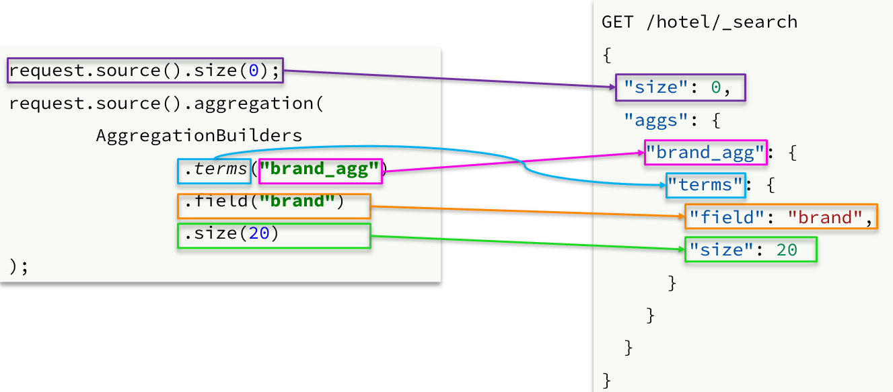


聚合的结果也与查询结果不同，API也比较特殊。不过同样是JSON逐层解析：


### 1.3.2.业务需求

需求：搜索页面的品牌、城市等信息不应该是在页面写死，而是通过聚合索引库中的酒店数据得来的：


分析：

目前，页面的城市列表、星级列表、品牌列表都是写死的，并不会随着搜索结果的变化而变化。但是用户搜索条件改变时，搜索结果会跟着变化。

例如：用户搜索“东方明珠”，那搜索的酒店肯定是在上海东方明珠附近，因此，城市只能是上海，此时城市列表中就不应该显示北京、深圳、杭州这些信息了。


也就是说，搜索结果中包含哪些城市，页面就应该列出哪些城市；搜索结果中包含哪些品牌，页面就应该列出哪些品牌。

如何得知搜索结果中包含哪些品牌？如何得知搜索结果中包含哪些城市？


使用聚合功能，利用Bucket聚合，对搜索结果中的文档基于品牌分组、基于城市分组，就能得知包含哪些品牌、哪些城市了。

因为是对搜索结果聚合，因此聚合是**限定范围的聚合**，也就是说聚合的限定条件跟搜索文档的条件一致。


查看浏览器可以发现，前端其实已经发出了这样的一个请求：


请求**参数与搜索文档的参数完全一致**。


返回值类型就是页面要展示的最终结果：


结果是一个Map结构：

- key是字符串，城市、星级、品牌、价格
- value是集合，例如多个城市的名称


### 1.3.3.业务实现

在`cn.itcast.hotel.web`包的`HotelController`中添加一个方法，遵循下面的要求：

- 请求方式：`POST`
- 请求路径：`/hotel/filters`
- 请求参数：`RequestParams`，与搜索文档的参数一致
- 返回值类型：`Map<String, List<String>>`

代码：

```java
    @PostMapping("filters")
    public Map<String, List<String>> getFilters(@RequestBody RequestParams params){
        return hotelService.getFilters(params);
    }
```


这里调用了IHotelService中的getFilters方法，尚未实现。

在`cn.itcast.hotel.service.IHotelService`中定义新方法：

```java
Map<String, List<String>> filters(RequestParams params);
```


在`cn.itcast.hotel.service.impl.HotelService`中实现该方法：

```java
@Override
public Map<String, List<String>> filters(RequestParams params) {
    try {
        // 1.准备Request
        SearchRequest request = new SearchRequest("hotel");
        // 2.准备DSL
        // 2.1.query
        buildBasicQuery(params, request);
        // 2.2.设置size
        request.source().size(0);
        // 2.3.聚合
        buildAggregation(request);
        // 3.发出请求
        SearchResponse response = client.search(request, RequestOptions.DEFAULT);
        // 4.解析结果
        Map<String, List<String>> result = new HashMap<>();
        Aggregations aggregations = response.getAggregations();
        // 4.1.根据品牌名称，获取品牌结果
        List<String> brandList = getAggByName(aggregations, "brandAgg");
        result.put("品牌", brandList);
        // 4.2.根据品牌名称，获取品牌结果
        List<String> cityList = getAggByName(aggregations, "cityAgg");
        result.put("城市", cityList);
        // 4.3.根据品牌名称，获取品牌结果
        List<String> starList = getAggByName(aggregations, "starAgg");
        result.put("星级", starList);

        return result;
    } catch (IOException e) {
        throw new RuntimeException(e);
    }
}

private void buildAggregation(SearchRequest request) {
    request.source().aggregation(AggregationBuilders
                                 .terms("brandAgg")
                                 .field("brand")
                                 .size(100)
                                );
    request.source().aggregation(AggregationBuilders
                                 .terms("cityAgg")
                                 .field("city")
                                 .size(100)
                                );
    request.source().aggregation(AggregationBuilders
                                 .terms("starAgg")
                                 .field("starName")
                                 .size(100)
                                );
}

private List<String> getAggByName(Aggregations aggregations, String aggName) {
    // 4.1.根据聚合名称获取聚合结果
    Terms brandTerms = aggregations.get(aggName);
    // 4.2.获取buckets
    List<? extends Terms.Bucket> buckets = brandTerms.getBuckets();
    // 4.3.遍历
    List<String> brandList = new ArrayList<>();
    for (Terms.Bucket bucket : buckets) {
        // 4.4.获取key
        String key = bucket.getKeyAsString();
        brandList.add(key);
    }
    return brandList;
}
```


# 2.自动补全

当用户在搜索框输入字符时，我们应该提示出与该字符有关的搜索项，如图：


这种根据用户输入的字母，提示完整词条的功能，就是自动补全了。


因为需要根据拼音字母来推断，因此要用到拼音分词功能。


## 2.1.拼音分词器


要实现根据字母做补全，就必须对文档按照拼音分词。在GitHub上恰好有elasticsearch的拼音分词插件。地址：https://github.com/medcl/elasticsearch-analysis-pinyin


课前资料中也提供了拼音分词器的安装包：

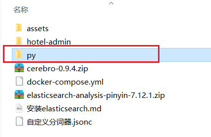 


安装方式与IK分词器一样，分三步：

​	①解压

​	②上传到虚拟机中，elasticsearch的plugin目录

​	③重启elasticsearch

​	④测试


详细安装步骤可以参考IK分词器的安装过程。


测试用法如下：

```json
POST /_analyze
{
  "text": "如家酒店还不错",
  "analyzer": "pinyin"
}
```

结果：

 


## 2.2.自定义分词器

默认的拼音分词器会将每个汉字单独分为拼音，而我们希望的是每个词条形成一组拼音，需要对拼音分词器做个性化定制，形成自定义分词器。


elasticsearch中分词器（analyzer）的组成包含三部分：

- character filters：在tokenizer之前对文本进行处理。例如删除字符、替换字符
- tokenizer：将文本按照一定的规则切割成词条（term）。例如keyword，就是不分词；还有ik_smart
- tokenizer filter：将tokenizer输出的词条做进一步处理。例如大小写转换、同义词处理、拼音处理等


文档分词时会依次由这三部分来处理文档：

   

声明自定义分词器的语法如下：

```json
PUT /test
{
  "settings": {
    "analysis": {
      "analyzer": { // 自定义分词器
        "my_analyzer": {  // 分词器名称
          "tokenizer": "ik_max_word",
          "filter": "py"
        }
      },
      "filter": { // 自定义tokenizer filter
        "py": { // 过滤器名称
          "type": "pinyin", // 过滤器类型，这里是pinyin
		  "keep_full_pinyin": false,
          "keep_joined_full_pinyin": true,
          "keep_original": true,
          "limit_first_letter_length": 16,
          "remove_duplicated_term": true,
          "none_chinese_pinyin_tokenize": false
        }
      }
    }
  },
  "mappings": {
    "properties": {
      "name": {
        "type": "text",
        "analyzer": "my_analyzer",
        "search_analyzer": "ik_smart"
      }
    }
  }
}
```


测试：


总结：

如何使用拼音分词器？

- ①下载pinyin分词器

- ②解压并放到elasticsearch的plugin目录

- ③重启即可

如何自定义分词器？

- ①创建索引库时，在settings中配置，可以包含三部分

- ②character filter

- ③tokenizer

- ④filter

拼音分词器注意事项？

- 为了避免搜索到同音字，搜索时不要使用拼音分词器


## 2.3.自动补全查询

elasticsearch提供了[Completion Suggester](https://www.elastic.co/guide/en/elasticsearch/reference/7.6/search-suggesters.html)查询来实现自动补全功能。这个查询会匹配以用户输入内容开头的词条并返回。为了提高补全查询的效率，对于文档中字段的类型有一些约束：

- 参与补全查询的字段必须是completion类型。

- 字段的内容一般是用来补全的多个词条形成的数组。

比如，一个这样的索引库：

```json
// 创建索引库
PUT test
{
  "mappings": {
    "properties": {
      "title":{
        "type": "completion"
      }
    }
  }
}
```

然后插入下面的数据：

```json
// 示例数据
POST test/_doc
{
  "title": ["Sony", "WH-1000XM3"]
}
POST test/_doc
{
  "title": ["SK-II", "PITERA"]
}
POST test/_doc
{
  "title": ["Nintendo", "switch"]
}
```


查询的DSL语句如下：

```json
// 自动补全查询
GET /test/_search
{
  "suggest": {
    "title_suggest": {
      "text": "s", // 关键字
      "completion": {
        "field": "title", // 补全查询的字段
        "skip_duplicates": true, // 跳过重复的
        "size": 10 // 获取前10条结果
      }
    }
  }
}
```


## 2.4.实现酒店搜索框自动补全

现在，我们的hotel索引库还没有设置拼音分词器，需要修改索引库中的配置。但是我们知道索引库是无法修改的，只能删除然后重新创建。

另外，我们需要添加一个字段，用来做自动补全，将brand、suggestion、city等都放进去，作为自动补全的提示。


因此，总结一下，我们需要做的事情包括：

1. 修改hotel索引库结构，设置自定义拼音分词器

2. 修改索引库的name、all字段，使用自定义分词器

3. 索引库添加一个新字段suggestion，类型为completion类型，使用自定义的分词器

4. 给HotelDoc类添加suggestion字段，内容包含brand、business

5. 重新导入数据到hotel库


### 2.4.1.修改酒店映射结构

代码如下：

```json
// 酒店数据索引库
PUT /hotel
{
  "settings": {
    "analysis": {
      "analyzer": {
        "text_anlyzer": {
          "tokenizer": "ik_max_word",
          "filter": "py"
        },
        "completion_analyzer": {
          "tokenizer": "keyword",
          "filter": "py"
        }
      },
      "filter": {
        "py": {
          "type": "pinyin",
          "keep_full_pinyin": false,
          "keep_joined_full_pinyin": true,
          "keep_original": true,
          "limit_first_letter_length": 16,
          "remove_duplicated_term": true,
          "none_chinese_pinyin_tokenize": false
        }
      }
    }
  },
  "mappings": {
    "properties": {
      "id":{
        "type": "keyword"
      },
      "name":{
        "type": "text",
        "analyzer": "text_anlyzer",
        "search_analyzer": "ik_smart",
        "copy_to": "all"
      },
      "address":{
        "type": "keyword",
        "index": false
      },
      "price":{
        "type": "integer"
      },
      "score":{
        "type": "integer"
      },
      "brand":{
        "type": "keyword",
        "copy_to": "all"
      },
      "city":{
        "type": "keyword"
      },
      "starName":{
        "type": "keyword"
      },
      "business":{
        "type": "keyword",
        "copy_to": "all"
      },
      "location":{
        "type": "geo_point"
      },
      "pic":{
        "type": "keyword",
        "index": false
      },
      "all":{
        "type": "text",
        "analyzer": "text_anlyzer",
        "search_analyzer": "ik_smart"
      },
      "suggestion":{
          "type": "completion",
          "analyzer": "completion_analyzer"
      }
    }
  }
}
```


### 2.4.2.修改HotelDoc实体

HotelDoc中要添加一个字段，用来做自动补全，内容可以是酒店品牌、城市、商圈等信息。按照自动补全字段的要求，最好是这些字段的数组。

因此我们在HotelDoc中添加一个suggestion字段，类型为`List<String>`，然后将brand、city、business等信息放到里面。

代码如下：

```java
package cn.itcast.hotel.pojo;

import lombok.Data;
import lombok.NoArgsConstructor;

import java.util.ArrayList;
import java.util.Arrays;
import java.util.Collections;
import java.util.List;

@Data
@NoArgsConstructor
public class HotelDoc {
    private Long id;
    private String name;
    private String address;
    private Integer price;
    private Integer score;
    private String brand;
    private String city;
    private String starName;
    private String business;
    private String location;
    private String pic;
    private Object distance;
    private Boolean isAD;
    private List<String> suggestion;

    public HotelDoc(Hotel hotel) {
        this.id = hotel.getId();
        this.name = hotel.getName();
        this.address = hotel.getAddress();
        this.price = hotel.getPrice();
        this.score = hotel.getScore();
        this.brand = hotel.getBrand();
        this.city = hotel.getCity();
        this.starName = hotel.getStarName();
        this.business = hotel.getBusiness();
        this.location = hotel.getLatitude() + ", " + hotel.getLongitude();
        this.pic = hotel.getPic();
        // 组装suggestion
        if(this.business.contains("/")){
            // business有多个值，需要切割
            String[] arr = this.business.split("/");
            // 添加元素
            this.suggestion = new ArrayList<>();
            this.suggestion.add(this.brand);
            Collections.addAll(this.suggestion, arr);
        }else {
            this.suggestion = Arrays.asList(this.brand, this.business);
        }
    }
}
```


### 2.4.3.重新导入

重新执行之前编写的导入数据功能，可以看到新的酒店数据中包含了suggestion：


### 2.4.4.自动补全查询的JavaAPI

之前我们学习了自动补全查询的DSL，而没有学习对应的JavaAPI，这里给出一个示例：


而自动补全的结果也比较特殊，解析的代码如下：


### 2.4.5.实现搜索框自动补全

查看前端页面，可以发现当我们在输入框键入时，前端会发起ajax请求：


返回值是补全词条的集合，类型为`List<String>`


1）在`cn.itcast.hotel.web`包下的`HotelController`中添加新接口，接收新的请求：

```java
@GetMapping("suggestion")
public List<String> getSuggestions(@RequestParam("key") String prefix) {
    return hotelService.getSuggestions(prefix);
}
```


2）在`cn.itcast.hotel.service`包下的`IhotelService`中添加方法：

```java
List<String> getSuggestions(String prefix);
```


3）在`cn.itcast.hotel.service.impl.HotelService`中实现该方法：

```java
@Override
public List<String> getSuggestions(String prefix) {
    try {
        // 1.准备Request
        SearchRequest request = new SearchRequest("hotel");
        // 2.准备DSL
        request.source().suggest(new SuggestBuilder().addSuggestion(
            "suggestions",
            SuggestBuilders.completionSuggestion("suggestion")
            .prefix(prefix)
            .skipDuplicates(true)
            .size(10)
        ));
        // 3.发起请求
        SearchResponse response = client.search(request, RequestOptions.DEFAULT);
        // 4.解析结果
        Suggest suggest = response.getSuggest();
        // 4.1.根据补全查询名称，获取补全结果
        CompletionSuggestion suggestions = suggest.getSuggestion("suggestions");
        // 4.2.获取options
        List<CompletionSuggestion.Entry.Option> options = suggestions.getOptions();
        // 4.3.遍历
        List<String> list = new ArrayList<>(options.size());
        for (CompletionSuggestion.Entry.Option option : options) {
            String text = option.getText().toString();
            list.add(text);
        }
        return list;
    } catch (IOException e) {
        throw new RuntimeException(e);
    }
}
```


# 3.数据同步

elasticsearch中的酒店数据来自于mysql数据库，因此mysql数据发生改变时，elasticsearch也必须跟着改变，这个就是elasticsearch与mysql之间的**数据同步**。


## 3.1.思路分析

常见的数据同步方案有三种：

- 同步调用
- 异步通知
- 监听binlog


### 3.1.1.同步调用

方案一：同步调用


基本步骤如下：

- hotel-demo对外提供接口，用来修改elasticsearch中的数据
- 酒店管理服务在完成数据库操作后，直接调用hotel-demo提供的接口，


### 3.1.2.异步通知

方案二：异步通知


流程如下：

- hotel-admin对mysql数据库数据完成增、删、改后，发送MQ消息
- hotel-demo监听MQ，接收到消息后完成elasticsearch数据修改


### 3.1.3.监听binlog

方案三：监听binlog


流程如下：

- 给mysql开启binlog功能
- mysql完成增、删、改操作都会记录在binlog中
- hotel-demo基于canal监听binlog变化，实时更新elasticsearch中的内容


### 3.1.4.选择

方式一：同步调用

- 优点：实现简单，粗暴
- 缺点：业务耦合度高

方式二：异步通知

- 优点：低耦合，实现难度一般
- 缺点：依赖mq的可靠性

方式三：监听binlog

- 优点：完全解除服务间耦合
- 缺点：开启binlog增加数据库负担、实现复杂度高


## 3.2.实现数据同步


### 3.2.1.思路

利用课前资料提供的hotel-admin项目作为酒店管理的微服务。当酒店数据发生增、删、改时，要求对elasticsearch中数据也要完成相同操作。

步骤：

- 导入课前资料提供的hotel-admin项目，启动并测试酒店数据的CRUD

- 声明exchange、queue、RoutingKey

- 在hotel-admin中的增、删、改业务中完成消息发送

- 在hotel-demo中完成消息监听，并更新elasticsearch中数据

- 启动并测试数据同步功能


### 3.2.2.导入demo

导入课前资料提供的hotel-admin项目：


运行后，访问 http://localhost:8099


其中包含了酒店的CRUD功能：

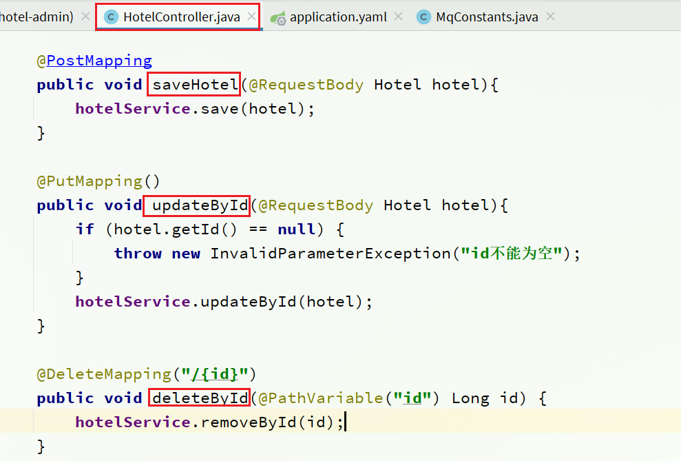


### 3.2.3.声明交换机、队列

MQ结构如图：


#### 1）引入依赖

在hotel-admin、hotel-demo中引入rabbitmq的依赖：

```xml
<!--amqp-->
<dependency>
    <groupId>org.springframework.boot</groupId>
    <artifactId>spring-boot-starter-amqp</artifactId>
</dependency>
```


#### 2）声明队列交换机名称

在hotel-admin和hotel-demo中的`cn.itcast.hotel.constatnts`包下新建一个类`MqConstants`：

```java
package cn.itcast.hotel.constatnts;

    public class MqConstants {
    /**
     * 交换机
     */
    public final static String HOTEL_EXCHANGE = "hotel.topic";
    /**
     * 监听新增和修改的队列
     */
    public final static String HOTEL_INSERT_QUEUE = "hotel.insert.queue";
    /**
     * 监听删除的队列
     */
    public final static String HOTEL_DELETE_QUEUE = "hotel.delete.queue";
    /**
     * 新增或修改的RoutingKey
     */
    public final static String HOTEL_INSERT_KEY = "hotel.insert";
    /**
     * 删除的RoutingKey
     */
    public final static String HOTEL_DELETE_KEY = "hotel.delete";
}
```


#### 3）声明队列交换机

在hotel-demo中，定义配置类，声明队列、交换机：

```java
package cn.itcast.hotel.config;

import cn.itcast.hotel.constants.MqConstants;
import org.springframework.amqp.core.Binding;
import org.springframework.amqp.core.BindingBuilder;
import org.springframework.amqp.core.Queue;
import org.springframework.amqp.core.TopicExchange;
import org.springframework.context.annotation.Bean;
import org.springframework.context.annotation.Configuration;

@Configuration
public class MqConfig {
    @Bean
    public TopicExchange topicExchange(){
        return new TopicExchange(MqConstants.HOTEL_EXCHANGE, true, false);
    }

    @Bean
    public Queue insertQueue(){
        return new Queue(MqConstants.HOTEL_INSERT_QUEUE, true);
    }

    @Bean
    public Queue deleteQueue(){
        return new Queue(MqConstants.HOTEL_DELETE_QUEUE, true);
    }

    @Bean
    public Binding insertQueueBinding(){
        return BindingBuilder.bind(insertQueue()).to(topicExchange()).with(MqConstants.HOTEL_INSERT_KEY);
    }

    @Bean
    public Binding deleteQueueBinding(){
        return BindingBuilder.bind(deleteQueue()).to(topicExchange()).with(MqConstants.HOTEL_DELETE_KEY);
    }
}
```


### 3.2.4.发送MQ消息

在hotel-admin中的增、删、改业务中分别发送MQ消息：


### 3.2.5.接收MQ消息

hotel-demo接收到MQ消息要做的事情包括：

- 新增消息：根据传递的hotel的id查询hotel信息，然后新增一条数据到索引库
- 删除消息：根据传递的hotel的id删除索引库中的一条数据


1）首先在hotel-demo的`cn.itcast.hotel.service`包下的`IHotelService`中新增新增、删除业务

```java
void deleteById(Long id);

void insertById(Long id);
```


2）给hotel-demo中的`cn.itcast.hotel.service.impl`包下的HotelService中实现业务：

```java
@Override
public void deleteById(Long id) {
    try {
        // 1.准备Request
        DeleteRequest request = new DeleteRequest("hotel", id.toString());
        // 2.发送请求
        client.delete(request, RequestOptions.DEFAULT);
    } catch (IOException e) {
        throw new RuntimeException(e);
    }
}

@Override
public void insertById(Long id) {
    try {
        // 0.根据id查询酒店数据
        Hotel hotel = getById(id);
        // 转换为文档类型
        HotelDoc hotelDoc = new HotelDoc(hotel);

        // 1.准备Request对象
        IndexRequest request = new IndexRequest("hotel").id(hotel.getId().toString());
        // 2.准备Json文档
        request.source(JSON.toJSONString(hotelDoc), XContentType.JSON);
        // 3.发送请求
        client.index(request, RequestOptions.DEFAULT);
    } catch (IOException e) {
        throw new RuntimeException(e);
    }
}
```


3）编写监听器

在hotel-demo中的`cn.itcast.hotel.mq`包新增一个类：

```java
package cn.itcast.hotel.mq;

import cn.itcast.hotel.constants.MqConstants;
import cn.itcast.hotel.service.IHotelService;
import org.springframework.amqp.rabbit.annotation.RabbitListener;
import org.springframework.beans.factory.annotation.Autowired;
import org.springframework.stereotype.Component;

@Component
public class HotelListener {

    @Autowired
    private IHotelService hotelService;

    /**
     * 监听酒店新增或修改的业务
     * @param id 酒店id
     */
    @RabbitListener(queues = MqConstants.HOTEL_INSERT_QUEUE)
    public void listenHotelInsertOrUpdate(Long id){
        hotelService.insertById(id);
    }

    /**
     * 监听酒店删除的业务
     * @param id 酒店id
     */
    @RabbitListener(queues = MqConstants.HOTEL_DELETE_QUEUE)
    public void listenHotelDelete(Long id){
        hotelService.deleteById(id);
    }
}
```


# 4.集群

单机的elasticsearch做数据存储，必然面临两个问题：海量数据存储问题、单点故障问题。

- 海量数据存储问题：将索引库从逻辑上拆分为N个分片（shard），存储到多个节点
- 单点故障问题：将分片数据在不同节点备份（replica ）

**ES集群相关概念**:

* 集群（cluster）：一组拥有共同的 cluster name 的 节点。

* <font color="red">节点（node)</font>   ：集群中的一个 Elasticearch 实例

* <font color="red">分片（shard）</font>：索引可以被拆分为不同的部分进行存储，称为分片。在集群环境下，一个索引的不同分片可以拆分到不同的节点中

  解决问题：数据量太大，单点存储量有限的问题。

  

  > 此处，我们把数据分成3片：shard0、shard1、shard2

* 主分片（Primary shard）：相对于副本分片的定义。

* 副本分片（Replica shard）每个主分片可以有一个或者多个副本，数据和主分片一样。

  ​	

数据备份可以保证高可用，但是每个分片备份一份，所需要的节点数量就会翻一倍，成本实在是太高了！

为了在高可用和成本间寻求平衡，我们可以这样做：

- 首先对数据分片，存储到不同节点
- 然后对每个分片进行备份，放到对方节点，完成互相备份

这样可以大大减少所需要的服务节点数量，如图，我们以3分片，每个分片备份一份为例：


现在，每个分片都有1个备份，存储在3个节点：

- node0：保存了分片0和1
- node1：保存了分片0和2
- node2：保存了分片1和2


## 4.1.搭建ES集群

参考课前资料的文档：

 

其中的第四章节：

 


## 4.2.集群脑裂问题


### 4.2.1.集群职责划分

elasticsearch中集群节点有不同的职责划分：


默认情况下，集群中的任何一个节点都同时具备上述四种角色。


但是真实的集群一定要将集群职责分离：

- master节点：对CPU要求高，但是内存要求第
- data节点：对CPU和内存要求都高
- coordinating节点：对网络带宽、CPU要求高

职责分离可以让我们根据不同节点的需求分配不同的硬件去部署。而且避免业务之间的互相干扰。

一个典型的es集群职责划分如图：


### 4.2.2.脑裂问题

脑裂是因为集群中的节点失联导致的。

例如一个集群中，主节点与其它节点失联：


此时，node2和node3认为node1宕机，就会重新选主：


当node3当选后，集群继续对外提供服务，node2和node3自成集群，node1自成集群，两个集群数据不同步，出现数据差异。

当网络恢复后，因为集群中有两个master节点，集群状态的不一致，出现脑裂的情况：


解决脑裂的方案是，要求选票超过 ( eligible节点数量 + 1 ）/ 2 才能当选为主，因此eligible节点数量最好是奇数。对应配置项是discovery.zen.minimum_master_nodes，在es7.0以后，已经成为默认配置，因此一般不会发生脑裂问题


例如：3个节点形成的集群，选票必须超过 （3 + 1） / 2 ，也就是2票。node3得到node2和node3的选票，当选为主。node1只有自己1票，没有当选。集群中依然只有1个主节点，没有出现脑裂。


### 4.2.3.小结

master eligible节点的作用是什么？

- 参与集群选主
- 主节点可以管理集群状态、管理分片信息、处理创建和删除索引库的请求

data节点的作用是什么？

- 数据的CRUD

coordinator节点的作用是什么？

- 路由请求到其它节点

- 合并查询到的结果，返回给用户


## 4.3.集群分布式存储

当新增文档时，应该保存到不同分片，保证数据均衡，那么coordinating node如何确定数据该存储到哪个分片呢？


### 4.3.1.分片存储测试

插入三条数据：

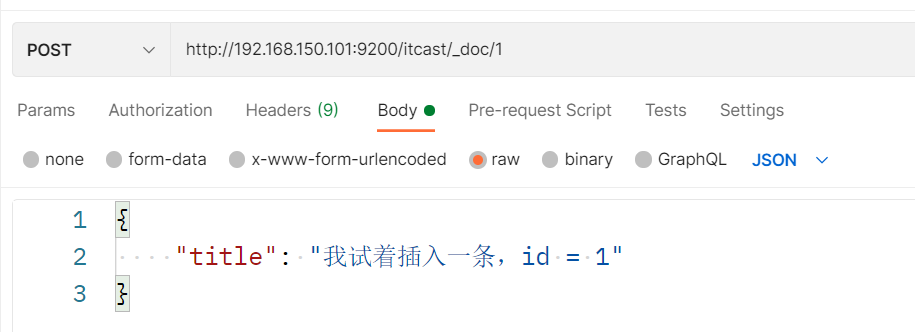


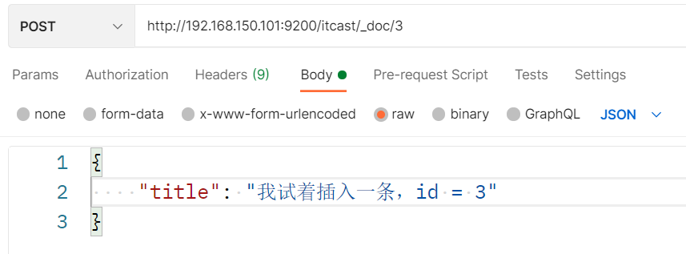


测试可以看到，三条数据分别在不同分片：


结果：


### 4.3.2.分片存储原理


elasticsearch会通过hash算法来计算文档应该存储到哪个分片：


说明：

- _routing默认是文档的id
- 算法与分片数量有关，因此索引库一旦创建，分片数量不能修改！


新增文档的流程如下：


解读：

- 1）新增一个id=1的文档
- 2）对id做hash运算，假如得到的是2，则应该存储到shard-2
- 3）shard-2的主分片在node3节点，将数据路由到node3
- 4）保存文档
- 5）同步给shard-2的副本replica-2，在node2节点
- 6）返回结果给coordinating-node节点


## 4.4.集群分布式查询

elasticsearch的查询分成两个阶段：

- scatter phase：分散阶段，coordinating node会把请求分发到每一个分片

- gather phase：聚集阶段，coordinating node汇总data node的搜索结果，并处理为最终结果集返回给用户


## 4.5.集群故障转移

集群的master节点会监控集群中的节点状态，如果发现有节点宕机，会立即将宕机节点的分片数据迁移到其它节点，确保数据安全，这个叫做故障转移。


1）例如一个集群结构如图：


现在，node1是主节点，其它两个节点是从节点。


2）突然，node1发生了故障：


宕机后的第一件事，需要重新选主，例如选中了node2：


node2成为主节点后，会检测集群监控状态，发现：shard-1、shard-0没有副本节点。因此需要将node1上的数据迁移到node2、node3：


