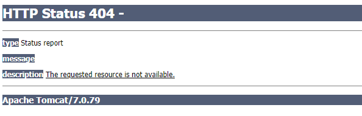

## 3.回顾MVC

被thymeleaf解析器解析的前提是它是thymeleafView

# 一、SpringMVC简介

### 1、什么是MVC

MVC是一种软件架构的思想，将软件按照模型、视图、控制器来划分

M：Model，模型层，指工程中的JavaBean（指的不是实体类，而是指当前工程里所有处理数据的这个类），作用是处理数据

JavaBean分为两类：

- 一类称为**实体类**Bean：专门存储业务数据的，如 Student、User 等
- 一类称为**业务处理** Bean：指 Service 或 Dao 对象，专门用于处理业务逻辑和数据访问。

V：View，视图层，指工程中的html或jsp等页面，作用是与用户进行交互，展示数据

C：Controller，控制层，指工程中的servlet，作用是接收请求和响应浏览器

MVC的工作流程：
用户通过视图层发送请求到服务器，在服务器中请求被Controller接收，Controller调用相应的Model层处理请求，处理完毕将结果返回到Controller，Controller再根据请求处理的结果找到相应的View视图，渲染数据后最终响应给浏览器

### 2、什么是SpringMVC

SpringMVC是Spring的一个后续产品，是Spring的一个子项目

SpringMVC 是 Spring 为表述层开发提供的一整套完备的解决方案。在表述层框架历经 Strust、WebWork、Strust2 等诸多产品的历代更迭之后，目前业界普遍选择了 SpringMVC 作为 Java EE 项目表述层开发的**首选方案**。

> 注：三层架构分为表述层（或表示层）、业务逻辑层、数据访问层，表述层表示前台页面和后台servlet

## 04.SpringMVC的特点

### 3、SpringMVC的特点

- **Spring 家族原生产品**，与 IOC 容器等基础设施无缝对接
- **基于原生的Servlet**，通过了功能强大的**前端控制器DispatcherServlet**，对请求和响应进行统一处理
- 表述层各细分领域需要解决的问题**全方位覆盖**，提供**全面解决方案**
- **代码清新简洁**，大幅度提升开发效率
- 内部组件化程度高，可插拔式组件**即插即用**，想要什么功能配置相应组件即可（即通过配置文件）
- **性能卓著**，尤其适合现代大型、超大型互联网项目要求

# 二、HelloWorld

### 1、开发环境

IDE：idea 2019.2

构建工具：maven3.5.4
构建：通过原材料去生成一个完整的工程的过程

服务器：tomcat7

Spring版本：5.3.1

### 2、创建maven工程

##### a>添加web模块

##### b>打包方式：war

##### c>引入依赖

```xml
<dependencies>
    <!-- SpringMVC -->
    <dependency>
        <groupId>org.springframework</groupId>
        <artifactId>spring-webmvc</artifactId>
        <version>5.3.1</version>
    </dependency>

    <!-- 日志 -->
    <dependency>
        <groupId>ch.qos.logback</groupId>
        <artifactId>logback-classic</artifactId>
        <version>1.2.3</version>
    </dependency>

    <!-- ServletAPI -->
    <dependency>
        <groupId>javax.servlet</groupId>
        <artifactId>javax.servlet-api</artifactId>
        <version>3.1.0</version>
        <scope>provided</scope>
    </dependency>

    <!-- Spring5和Thymeleaf整合包 -->
    <dependency>
        <groupId>org.thymeleaf</groupId>
        <artifactId>thymeleaf-spring5</artifactId>
        <version>3.0.12.RELEASE</version>
    </dependency>
</dependencies>
```

注：由于 Maven 的传递性，我们不必将所有需要的包全部配置依赖，而是配置最顶端的依赖，其他靠传递性导入。


## 8.默认方式配置web.xml

### 3、配置web.xml

注册SpringMVC的前端控制器DispatcherServlet

> 因为我们当前浏览器发送的请求统一要交给前端控制器来处理，而前端控制器是一个servlet，我们想要通过servlet来处理请求，就必须要在web.xml中进行注册。

##### a>默认配置方式（SpringMVC的配置文件位置默认，名称默认）

> servlet要处理请求，需要在web.xml中进行注册
> 注册是因为我们的浏览器不能直接访问到一个类，因此我们想要去访问到这个servlet，我们就必须要给它设置一个匹配路径，当我们所访问的路径符合我们所匹配到的路径时，这个时候当前的请求就会被我们的servlet所进行处理。

此配置作用下，SpringMVC的配置文件默认位于WEB-INF下，默认名称为\<servlet-name>-servlet.xml，例如，以下配置所对应SpringMVC的配置文件位于WEB-INF下，文件名为springMVC-servlet.xml

添加web模块：

1. 在main下面创建一个目录叫：webapp

2. 引入web.xml配置文件

   web.xml是放在WEB-INF下的，而WEB-INF是放在webapp下的所以需要补全
   E:\develop\springMVC\springMVC-demo2\src\main\webapp\WEB-INF\web.xml

   > 这里注意，一定要注意webapp目录前面有没有这个小圆点，如果没有的话，要么就是位置写错了，要么就是创建的时候idea出现了问题，此时咱们这个目录是没有作用的。如果是这种情况的话，点开项目结构->Modules->springMVC-demo1(当前项目)，然后点击Web模块，把下图的东西删掉，然后重新创建即可。

   

```xml
<?xml version="1.0" encoding="UTF-8"?>
<web-app xmlns="http://xmlns.jcp.org/xml/ns/javaee"
         xmlns:xsi="http://www.w3.org/2001/XMLSchema-instance"
         xsi:schemaLocation="http://xmlns.jcp.org/xml/ns/javaee http://xmlns.jcp.org/xml/ns/javaee/web-app_4_0.xsd"
         version="4.0">

<!--    配置SpringMVC的前端控制器，对浏览器发送的请求进行统一处理-->
    <servlet>
<!--        里面的servlet-name要和servlet-mapping的servlet保持一致，这样子servlet-name和servlet-mapping就是共同来注册一个servlet的
servlet-name我们一般都需要跟我们的servlet保持一致-->
        <servlet-name>SpringMVC</servlet-name>
<!--        servlet的一个全类名-->
        <servlet-class>org.springframework.web.servlet.DispatcherServlet</servlet-class>
    </servlet>

    <servlet-mapping>
        <servlet-name>SpringMVC</servlet-name>
<!--        一个请求要对应一个servlet，所以url-pattern写的一般都是固定的-->
<!--        由于是统一处理，但不能写成固定的，应该设置为：/：表示当前浏览器发送的所有请求，但是不包括.jsp为后缀的请求路径-->
        <!--
        设置springMVC的核心控制器所能处理的请求的请求路径
        /所匹配的请求可以是/login或.html或.js或.css方式的请求路径
        但是/不能匹配.jsp请求路径的请求

        为什么不让它匹配.jsp呢？
        虽然说我们现在已经不使用jsp了，但是如果.jsp的话，jsp的本质就是一个servlet，它是需要经过我们当前服务器中特殊的servlet、指定的servlet来进行处理
        如果现在所写的路径能够匹配.jsp，这个时候.jsp这个路径的请求也会被我们当前的SpringMVC来进行处理，此时就会被当做普通的请求处理，而不会去整合它相对应的jsp页面了。
        所以我们要写一个\，把.jsp的请求给排除掉，然后其他的请求我们都要交给前端控制器来进行处理。
        
        \*：代表所有请求，包括.jsp请求路径的请求
    -->
        <url-pattern>/</url-pattern>
    </servlet-mapping>
</web-app>
```

## 9.扩展方式配置web.xml

##### b>扩展配置方式(最优的方式)

我们要实现的功能很简单，就是要将我们当前的配置文件不要放在WEB-INF下，因为WEB-INF下我们只放页面，还有当前的html页面。所以我们现在就需要来自定义SpringMVC的位置和名称

如果我们不设置的话SpringMVC它的配置文件有默认的位置：在WEB-INF
有默认的名称：就是<servlet-name>标签的值 + -servlet.xml

可通过init-param标签设置SpringMVC配置文件的位置和名称，通过load-on-startup标签设置SpringMVC前端控制器DispatcherServlet的初始化时间

```xml
<?xml version="1.0" encoding="UTF-8"?>
<web-app xmlns="http://xmlns.jcp.org/xml/ns/javaee"
         xmlns:xsi="http://www.w3.org/2001/XMLSchema-instance"
         xsi:schemaLocation="http://xmlns.jcp.org/xml/ns/javaee http://xmlns.jcp.org/xml/ns/javaee/web-app_4_0.xsd"
         version="4.0">
    <servlet>
        <servlet-name>SpringMVC</servlet-name>
        <servlet-class>org.springframework.web.servlet.DispatcherServlet</servlet-class>
    <!-- 因为我们当前浏览器发送的请求统一要交给前端控制器来处理，而前端控制器是一个servlet，我们想要通过servlet来处理请求，就必须要在web.xml中进行注册。
我们在注册的时候通过init-param来配置SpringMVC配置文件的位置和名称。
然后通过<load-on-startup>将当前的控制器初始化时间提前到服务器启动时。
而我们的DispatcherServlet前端控制器它所能处理的请求路径是上下文路径下所有的请求路径-->
        <!--        自定义SpringMVC配置文件的位置和名称-->
        <!-- init-param标签：初始化参数，它是伴随着servlet的初始化来进行初始化
        它的功能就是配置SpringMVC配置文件的位置和名称，因为我们的功能固定，所以我们在这用的参数名也是固定的。

        我们所使用的参数名一定是由SpringMVC已经在它的servlet中DispatcherServlet前端控制器中已经定义好的，我们直接在这为它赋值，然后它就会有相对应的功能
        所以我们在这里使用的参数名叫做：contextConfigLocation，即上下文配置路径

        在设置param-value的时候需要设置两个值：一个是位置，一个是名称
        在这里一定要把classpath加上，因为对应的就是类路径，也就是咱们的java和resource，在classpath后面写上配置文件的名字
        -->
        <init-param>
            <!-- contextConfigLocation为固定值 -->
            <param-name>contextConfigLocation</param-name>
            <!-- 使用classpath:表示从类路径查找配置文件，例如maven工程中的src/main/resources -->
            <!-- 使设置完这一步之后，会报错，此时我们需要去resource下去创建Spring Config，这里和Sring中创建Config的方式是一模一样的，也就是SpringMVC它本身就是来基于咱们的Spring基础来实现的功能。 -->
            <param-value>classpath:springMVC.xml</param-value>
        </init-param>
        <!--servlet默认在第一次访问时初始化，而我们的前端控制器中封装了对所有请求的处理，所以在初始化的时候需要来执行很多内容
        如果我们把当前这众多初始化的内容全部都放在第一次访问时初始化，这就会严重影响第一次访问的速度
        所以此时就可以再加上一个标签：load-on-startup，将SpringMVC的前端控制器DispatcherServlet的初始化时间提前到服务器启动时-->
        <load-on-startup>1</load-on-startup>
    </servlet>
    <servlet-mapping>
        <servlet-name>SpringMVC</servlet-name>
        <!--
        设置springMVC的核心控制器所能处理的请求的请求路径
        /所匹配的请求可以是/login或.html或.js或.css方式的请求路径
        但是/不能匹配.jsp请求路径的请求
    -->
        <url-pattern>/</url-pattern>
    </servlet-mapping>
</web-app>
```

> 注：
>
> \<url-pattern>标签中使用/和/*的区别：
>
> /所匹配的请求可以是/login或.html或.js或.css方式的请求路径，但是/不能匹配.jsp请求路径的请求
>
> 因此就可以避免在访问jsp页面时，该请求被DispatcherServlet处理，从而找不到相应的页面
>
> /*则能够匹配所有请求，例如在使用过滤器时，若需要对所有请求进行过滤，就需要使用/\*的写法

### 4、创建请求控制器

由于前端控制器对浏览器发送的请求进行了统一的处理，但是具体的请求有不同的处理过程，因此需要创建处理具体请求的类，即请求控制器

请求控制器中每一个处理请求的方法成为控制器方法

因为SpringMVC的控制器由一个POJO（普通的Java类）担任，因此需要通过@Controller注解将其标识为一个控制层组件，交给Spring的IoC容器管理，此时SpringMVC才能够识别控制器的存在

```java
@Controller
public class HelloController {
    
}
```

### 5、创建springMVC的配置文件

```xml
<?xml version="1.0" encoding="UTF-8"?>
<beans xmlns="http://www.springframework.org/schema/beans"
       xmlns:xsi="http://www.w3.org/2001/XMLSchema-instance"
       xmlns:context="http://www.springframework.org/schema/context"
       xmlns:mvc="http://www.springframework.org/schema/mvc"
       xsi:schemaLocation="http://www.springframework.org/schema/mvc
       http://www.springframework.org/schema/mvc/spring-mvc.xsd
       http://www.springframework.org/schema/context
       http://www.springframework.org/schema/context/spring-context.xsd
       http://www.springframework.org/schema/beans
       http://www.springframework.org/schema/beans/spring-beans.xsd">

<!--    扫描组件-->
    <context:component-scan base-package="com.atguigu.mvc.controller"></context:component-scan>

    <!-- 配置Thymeleaf视图解析器
    这里配置的视图解析器就是ThymeleafViewResolver，它就是来解析我们当前的ThymeLeaf视图的
    -->
    <bean id="viewResolver" class="org.thymeleaf.spring5.view.ThymeleafViewResolver">
        <!-- order：来设置当前视图解析器的优先级
        从这个属性上来看，就知道我们的视图解析器是可以配置多个的。
        -->
        <property name="order" value="1"/>
<!--        解析视图所用的编码-->
        <property name="characterEncoding" value="UTF-8"/>
<!--        当前的一个模板-->
        <property name="templateEngine">
            <!--   注意看！这里是内部bean，为templateEngine整个属性赋值
            整个内部bean就是我们当前来解析当前视图层的一个策略
            -->
            <bean class="org.thymeleaf.spring5.SpringTemplateEngine">
                <property name="templateResolver">
                    <bean class="org.thymeleaf.spring5.templateresolver.SpringResourceTemplateResolver">
                        <!-- 视图前缀
                        Thymeleaf在设置视图解析时，必须要设置视图前缀和试图后缀
                        然后把我们当前的视图名称来加上前缀和后缀，最终就可以跳转到我们所指定的页面
                        -->
                        <property name="prefix" value="/WEB-INF/templates/"/>

                        <!-- 视图后缀 -->
                        <property name="suffix" value=".html"/>
<!--                        templateMode：我们所使用的模板的一个模型，我们所使用的是html5-->
                        <property name="templateMode" value="HTML5"/>
<!--                        characterEncoding：当前页面中的一个编码，这里用的是UTF-8-->
                        <property name="characterEncoding" value="UTF-8" />
                    </bean>
                </property>
            </bean>
        </property>
    </bean>
</beans>
```

```xml
<!-- 
   处理静态资源，例如html、js、css、jpg
  若只设置该标签，则只能访问静态资源，其他请求则无法访问
  此时必须设置<mvc:annotation-driven/>解决问题
 -->
<mvc:default-servlet-handler/>

<!-- 开启mvc注解驱动 -->
<mvc:annotation-driven>
    <mvc:message-converters>
        <!-- 处理响应中文内容乱码 -->
        <bean class="org.springframework.http.converter.StringHttpMessageConverter">
            <property name="defaultCharset" value="UTF-8" />
            <property name="supportedMediaTypes">
                <list>
                    <value>text/html</value>
                    <value>application/json</value>
                </list>
            </property>
        </bean>
    </mvc:message-converters>
</mvc:annotation-driven>
```

创建功能：

```html
<!DOCTYPE html>
<html lang="en" xmlns:th="http://www.thymeleaf.org"
<head>
    <meta charset="UTF-8">
    <title>首页</title>
</head>
<body>
<h1>首页</h1>
</body>
</html>
```

要想跳转到首页，在控制器中就需要去写一个控制器方法

### 6、测试HelloWorld

##### a>实现对首页的访问

在请求控制器中创建处理请求的方法

```java
// @RequestMapping注解：处理请求和控制器方法之间的映射关系
// @RequestMapping注解的value属性可以通过请求地址匹配请求，/表示的当前工程的上下文路径
// 即：localhost:8080/springMVC/
package com.atguigu.mvc.controller;

import org.springframework.stereotype.Controller;
import org.springframework.web.bind.annotation.RequestMapping;

/**
 * 创建完成之后，就是一个普通的类。但是SpringMVC并不认识它，就不会把它当前一个控制器。
 * 此时一定要将当前的控制器来作为SpringMVC中的一个组件，此时才是一个控制器。
 *
 * 加入IOC有两种方式：
 * 1.bean标签配置
 * 2.注解＋扫描（这里就用这种）
 *
 * @Component：将当前的类表示为一个普通组件
 * @Controller：将当前的类表示为控制层组件
 * @Service：将当前的类标识为业务层组件
 * @Repository：将当前的类标识为持久层组件
 *
 * 添加完注解还是不够，需要配置扫描。注意不是在pom.xml中配置，而是在SpringMVC的配置文件中配置！
 * 配置完成后，HelloController前面就会有一个图标，这个图标表示当前创建的这个类的对象已经交给了IOC容器管理。
 *
 * 然后还需要配置视图解析器，这个解析器负责我们的页面跳转
 */
@Controller
public class HelloController {
    //我们当前的访问路径是一个 '\'，\后面的访问路径是：/WEB-INF/templates/index.html
    //控制器里面的方法才是真正处理请求的方法，这里返回值必须是String，方法名则随便写，因为与方法名无关。它只和我们当前的请求路径和RequestMapping有关。但如果不知道写什么，那就和请求路径保持一致
    //返回值是视图名称，视图名称就决定了我们最终要跳转到的页面
    //因为我们当前的html是没有办法直接访问的，所以我们最终要跳转到的页面由视图名称决定，当我们返回的视图名称，就会被我们当前的视图解析器所进行解析

    public HelloController() {
    }

    //加上前缀和后缀就能访问到
    //当浏览器发送请求到我们的服务器，由我们的DispatcherServlet来收到请求之后，就会将我们的请求地址和控制器方法RequestMapping的value属性值进行匹配，如果能匹配成功，那我们当前的这个方法就是处理请求的方法
    @RequestMapping(value = "/")
    public String index() {
        //由于访问路径是：/WEB-INF/templates/index.html，去掉前缀和后缀后就变成了：index，所以此时只需要返回一个index即可
        //返回的字符串被称为视图名称
        return "index";
        /**但设置完这一步后，我们当前的方法也并不是处理请求的方法，一个控制器中/一个类中可以有很多种方法，这个方法就是来处理这个请求的方法，此时需要在方法上加上：@RequestMapping注解！即：请求映射
        * 这个注解的作用就是将我们当前的请求和控制器方法来创建映射关系，这就是说，如果我们在里面设置了一个value属性，而这个value属性等于"\"
        * 也就是说当我们浏览器发送的请求是一个"\"的时候，也就是我们上下文路径的时候，它就会来执行我们当前注解所表示的方法，而这个方法所返回的是视图名称，视图名称叫index
        * 被咱们的视图解析器解析，加上前缀后缀，就可以跳转到我们最终的页面，所以说RequestMapping这个注解是非常重要的！
        * 我们当前所使用的属性是value属性，但是它并不是只有value属性，咱们除了可以通过请求地址来匹配请求控制器方法之外，我们还可以通过请求方式、请求参数、请求报文等一些信息来进行匹配。
         *
         * 并且如果当前我们只为value这一个属性赋值，则我们当前的value属性可以省略不写。
         *
         * 此时我们先来配置一个tomcat，通过tomcat来访问我们当前的工程
        */
    }
}
```

##### b>通过超链接跳转到指定页面

在主页index.html中设置超链接

```html
<!DOCTYPE html>
<html lang="en" xmlns:th="http://www.thymeleaf.org"><!--这个是thymeleaf的一个命名空间，我们这个页面中如果要使用thymeleaf的语法，那这个东西肯定是少不了的-->
<!--此时可以直接将这个东西设置到html页面的模板中：设置->编辑器->文件和代码模板，设置模板即可-->

<!--如果想直接跳转到这个页面是不能直接跳的，因为WEB-INF下面的内容，通过浏览器是不能直接访问的，通过重定向也是不能直接访问的
此时只能通过转发来进行访问，就算此时把这个项目放到WEB.app下，咱们也不能直接访问！因为我们当前所使用的是thymeleaf，所以我们当前的页面中很有可能会存在thymeleaf的语法。
而thymeleaf的语法是需要被thymeleaf进行解析的，所以说我们当前必须要通过我们当前所配置的视图解析器，来解析我们当前的视图。
也就是说我们如果想往这跳的话，我们最终设置我们要跳转的页面，我们不需要把完整的路径写上，我们只需要来写一个idx即可，因为我们视图是需要被视图解析器所解析的。
而我们需要在所解析的视图前面加上前缀，在视图后面加上后缀，所以我们最终的一个视图就是我们的index。-->
<head>
    <meta charset="UTF-8">
    <title>首页</title>
</head>
<body>
<h1>首页</h1>
</body>
</html>
```

## 13.HelloWorld：访问指定页面

新增超链接功能

```html
<!DOCTYPE html>
<html lang="en" xmlns:th="http://www.thymeleaf.org">
<head>
    <meta charset="UTF-8">
    <title>首页</title>
</head>
<body>
<h1>首页</h1>
<!--这里我们要实现一个目标：访问目标页面。
但我们这里写的路径是不对的！以/开头的路径叫做绝对路径，而绝对路径又分为浏览器解析的和服务器解析的。
浏览器解析的：比如说超链接的绝对路径，这个时候的/表示的是从localhost:8080下访问。所以说少一个上下文路径

怎么处理？
咱们可以在这里用相对路径，但是相对路径不太好使，但如果就要用绝对路径，就需要把上下文路径加上。
这里的上下文路径就是我们在配置tomcat的时候Deployment下面有个Application context，就是上下文路径。所以说我们只要把它加上就可以了。
但是由于上下文路径是可以改的，那我们在这就不能写死。所以这里就可以来使用thymeleaf：
1.在html标签中，必须得有我们的thymeleaf的一个命名空间：xmlns:th="http://www.thymeleaf.org，有了之后我们就可以来使用thymeleaf的语法了
<a href="/target">访问目标页面target.html</a>
做法：加上th：此时就可以使用thymeleaf的语法了
语法：@{}，把路径放进去，这个时候当它检测到里面所使用的是绝对路径的时候，它就会自动去帮助我们去添加上下文路径-->
<a th:href="@{/target}">访问目标页面target.html</a>
</body>
</html>
```

新增target.html文件

```html
<!DOCTYPE html>
<html lang="en" xmlns:th="http://www.thymeleaf.org">
<head>
    <meta charset="UTF-8">
    <title>Title</title>
</head>
<body>
<!--当这个页面写完后，也是不能直接跳转的，此时需要在控制器中来处理我们的请求-->
HelloWorld
</body>
</html>
```

在请求控制器中创建处理请求的方法

```java
//处理步骤：先写方法，返回值是字符串,也就是视图名称，方法名随便取，但最好见名取义
    //然后还需要加上一个注解：@RequestMapping，然后当前注解的value属性值一定要和我们当前的请求地址保持一致，也就是我们的/target
    @RequestMapping("/target")
    public String toTarget() {
        return "target";
    }
```

### 7、总结

浏览器发送请求，若请求地址符合前端控制器的url-pattern（上述我们url-pattern写的是'/'，它除了.jsp匹配不了，其他的都是可以匹配的），该请求就会被前端控制器DispatcherServlet处理。前端控制器会读取SpringMVC的核心配置文件，通过扫描组件找到控制器，将请求地址和控制器中@RequestMapping（请求映射）注解的value属性值进行匹配（如果没有这个注解，就无法找到控制器方法的），若匹配成功，该注解所标识的控制器方法就是处理请求的方法。处理请求的方法需要返回一个字符串类型的视图名称，该视图名称会被视图解析器解析，加上前缀和后缀组成视图的路径，通过Thymeleaf对视图进行渲染，最终转发到视图所对应页面。

并且我们最终跳转路径的方式是：转发
刚才我们跳转到了我们指定的页面，但是我们地址栏中的地址并没有更改，并没有变成WEB-INF下面的target.html

## 15.搭建框架

## 16.控制器中有多个方法对应同一个请求的情况

# 三、@RequestMapping注解

### 1、@RequestMapping注解的功能

从注解名称上我们可以看到，@RequestMapping注解的作用就是将浏览器的请求请求和处理请求的控制器方法关联起来，建立映射关系。

SpringMVC 接收到指定的请求，就会来找到在映射关系中对应的控制器方法来处理这个请求。

此时重新创建一个Controller类，即有多个控制器，RequestMapping所处理的请求地址是一样的，请求路径是一样的，此时SpringMVC就不知道找谁处理，就会报错！！！

所以说我们一定要保证在我们所有的控制器里面RequestMapping所能够匹配到的请求地址是唯一的。
在我们的控制器里，RequestMapping相同的请求地址一定只能有一个RequestMapping能够映射！


### 2、@RequestMapping注解的位置


首先创建RequestMapping类：

```java
package com.atguigu.mvc.controller;

import org.springframework.stereotype.Controller;
import org.springframework.web.bind.annotation.RequestMapping;

@Controller
@RequestMapping("/hello")
public class RequestMappingController {

    //如果我们发送的请求想要和这个控制器进行处理，那我们的请求路径就需要和RequestMapping的value属性值一致
    @RequestMapping("/testRequestMapping")
    public String success() {
        return "success";
    }
}
```

创建success.html文件：

```html
<!DOCTYPE html>
<html lang="en" xmlns:th="http://www.thymeleaf.org">
<head>
    <meta charset="UTF-8">
    <title>Title</title>
</head>
<body>
success
</body>
</html>
```

在index.html中添加：

```html
<a th:href="@{testRequestMapping}">测试RequestMapping注解的位置</a><br>
```


> 浏览器会自动的把这个绝对路径解析为localhost:8080/

运行：

此时会发现报错！


> 这是因为如果这个类上有注解，而这个类上的方法也有这个注解，那我们就需要先访问到初始信息，才访问到具体信息。
>
> 所以说如果我们想要访问到succss请求映射，我们的路径就应该写成：@{/hello/testRequestMapping}
> 即加上我们类上设置的RequestMapping的value
>
> 这个用的很多。比如解决同一个Controller类中有多个RequestMapping。
> 还有用户和订单都有list访问，就可以在它们类中加上它所对应的路径。
>
> 所以说我们的RequestMapping注解加上类上，经常用于我们的不同模块的控制器来设置一个RequestMapping，来表示当前不同的模块。

@RequestMapping标识一个类：设置映射请求的请求路径的初始信息

@RequestMapping标识一个方法：设置映射请求请求路径的具体信息

```java
@Controller
@RequestMapping("/test")
public class RequestMappingController {

	//此时请求映射所映射的请求的请求路径为：/test/testRequestMapping
    @RequestMapping("/testRequestMapping")
    public String testRequestMapping(){
        return "success";
    }
}
```

## 17.@RequestMapping注解的value属性

### 3、@RequestMapping注解的value属性

> ctrl + F12可以查看当前类的属性

@RequestMapping注解的value属性通过请求的请求地址匹配请求映射

@RequestMapping注解的value属性是一个字符串类型的数组，表示该请求映射能够匹配多个请求地址所对应的请求

@RequestMapping注解的value属性**必须设置**，至少通过请求地址匹配请求映射
因为你向页面中发送一个请求，它最直观的方式就是一个请求路径

```html
<a th:href="@{/testRequestMapping}">测试@RequestMapping的value属性-->/testRequestMapping</a><br>
<a th:href="@{/test}">测试@RequestMapping的value属性-->/test</a><br>
```

```java
@RequestMapping(
        value = {"/testRequestMapping", "/test"}
)
public String testRequestMapping(){
    return "success";
}
```

## 19.@RequestMapping注解的method属性

### 4、@RequestMapping注解的method属性

@RequestMapping注解的method属性通过**请求的请求方式（get或post）**匹配请求映射

@RequestMapping注解的method属性是一个RequestMethod类型的数组，用且用枚举类型RequestMethod来表示我们的各种请求方式。该请求映射能够匹配多种请求方式的请求

由于value属性必须设置，则请求路径和请求方式都满足时，才能匹配成功。
若当前请求的请求地址满足请求映射的value属性，但是请求方式不满足method属性，则浏览器报错
405：Request method 'POST' not supported，即我们的请求方式不被支持

> 所以如果RequestMapping设置的属性越多，它所满足的条件就越多，它所匹配的请求就越精确

> method：规定用于发送表单数据的方式。GET、POST
>
> 1. get：在url后面拼接表单数据，用?进行拼接，后面就是请求参数名=请求参数值，即name=value。比如：`name=Tom&age=12`，url长度有限制，如果不指定，则get为默认值
> 2. post：在消息体（请求体）中传递的，参数大小无限制。所以get方式无请求体，只有post请求有请求体。
>              但是哪怕它把请求参数放在请求体中，它的格式还是name=value。
>              get相对来说不安全，post安全。
>              既然get不安全一些，那么get传输的速度就快一些，因为它是伴随着咱们的请求地址传过去的。
>              post传输的速度就较慢。
> 3. get传输的数据量传输的数据量有限，post传输的数据量就比较大.
> 4. 文件上传是不能使用get的。文件也不能拼接到地址栏中。
>    再说了，文件上传用的也是type=file，文件域。此时如果请求方式使用的是get，它拼接到地址栏的不是文件，而是文件名，此时文件根本上传不到服务器。
>    所以说在上传文件的时候只能用post，而且还需要再设置一个其他的属性。

我们下面写的两种超链接都是get请求

```html
<a th:href="@{/testRequestMapping}">测试RequestMapping注解的value属性--->/test</a><br>
<a th:href="@{/test}">测试RequestMapping注解的value属性--->GET</a><br>
<form th:action="@{/test}" method="post">
    <!-- submit按钮有默认的属性值：提交
    此时会发现，post请求也是可以匹配的，意思就是说，如果没有给method属性赋值，则任意的请求方式都是可以的
    -->
    <input type="submit" value="测试RequestMapping注解的method属性--->POST">
</form>
```

```java
@RequestMapping(
        value = {"/testRequestMapping", "/test"},
        method = {RequestMethod.GET, RequestMethod.POST}
)
public String testRequestMapping(){
    return "success";
}
```

看RequestMehod的源码，可知它是一个枚举类型。
method属性里面的值赋的就是这个枚举类型里面的值！


修改RequestMappingController类：

```java
@Controller
public class RequestMappingController {
    //这样的意思就是当前的请求地址可以是/testRequestMapping，/test。但是请求方式必须是GET
            @RequestMapping(value = {
                    "/testRequestMapping", "/test"
                    },
                    method = {RequestMethod.GET}
            )
    public String success() {
        return "success";
    }
}
```

再次部署，此时就会报错：请求方式Post不被允许

> 所以以后看见这个错，那就一定是我们当前的请求方式不是我们我们当前的请求映射所支持的方式


> 注：
>
> 1、method属性是个数组，意思就是说这一个请求可以来处理多种请求方式的请求，但是前提是value能够匹配成功。也是满足其中的任何一个就可以。
>      并且必须要有value！！！
>
> 2、对于处理指定请求方式的控制器方法，SpringMVC中提供了@RequestMapping的派生注解
>
> 处理get请求的映射-->@GetMapping
>
> 处理post请求的映射-->@PostMapping
>
> 处理put请求的映射-->@PutMapping
>
> 处理delete请求的映射-->@DeleteMapping

加上派生注解后，里面有个value属性：

```java
@GetMapping("/testGetMapping")
public String testGetMapping() {
            return "success";
}
```

> 3、常用的请求方式有get（查询），post（新增），put（修改），delete（删除）
>
> 保证相同的请求地址的情况下，咱们可以用不同的请求方式来表示不同的功能
>
> 测试：超链接发送的请求方式是固定的：GET请求。
> 那我们能够指定请求方式的就是form表单提交。因为在form表单中有个method属性，而这个属性表示的就是请求方式
>
> 

当form表单请求方式设置为put时：

```html
<form th:action="@{/testPut}" method="put">
    <input type="submit" value="测试form表单是否能够发送put或delete请求方式">
</form>
```

此时会报错：


> 但为什么这里提示的是当前的GET请求不被支持呢？
>
> 我们当前支持的请求映射是PUT，但是浏览器所提示信息是GET不被支持，那只能说它的请求地址匹配成功了，但是浏览器发送的请求是GET，但是请求映射要求的请求方式是PUT。
> 这里与：如果不设置method，则任意的请求方式都可以。区分开来！！！

> 并且我们刚刚写form表单method属性时，它所提示的信息也只有get和post。
>
> 但是目前浏览器只支持get和post，若在form表单提交时，为method设置了其他请求方式的字符串（put或delete），则按照默认的请求方式get处理

> 若要发送put和delete请求，则需要通过spring提供的过滤器HiddenHttpMethodFilter，在RESTful部分会讲到

## 22.@RequestMapping注解的params属性

### 5、@RequestMapping注解的params属性（了解）

@RequestMapping注解的params属性通过请求的请求参数匹配请求映射

@RequestMapping注解的params属性是一个字符串类型的数组，可以通过**四种表达式**设置请求参数和请求映射的匹配关系，并且必须同时满足！

1. "param"：要求请求映射所匹配的请求必须携带param请求参数
   不需要管它的值，但是必须要携带

   如果此时的请求地址没有携带param请求参数，就会报400错误：

   `Parameter conditions "username" not met for actual request parameters:`

   

```html
<!--拼接请求参数-->
<!--虽然添加?是可以的，但是如果使用 ? 进行链接，问号的地方会报错，但是是没有任何问题的
如果不想看见报错，可以使用另一种方式去写：加一个(username=admin),如果中间要加其他参数，就用逗号分隔开！
当thymeleaf进行解析后，就会自动转化成?进行传参的形式。
并且admin是个字符串，就必须要放到单引号里。
-->
<a th:href="@{/testParamsAndHeaders?username='admin'}">测试RequestMapping注解的params属性1</a>
<a th:href="@{/testParamsAndHeaders(username='admin', password=123456)}">测试RequestMapping注解的params属性2</a>
```

2. "!param"：要求请求映射所匹配的请求必须不能携带param请求参数

   此时会报错：`Parameter conditions "username!=admin" not met for actual request parameters: username={admin}, password={123456}]`

3. "param=value"：要求请求映射所匹配的请求必须携带param请求参数且param=value

4. "param!=value"：要求请求映射所匹配的请求必须携带param请求参数但是param!=value

```html
<a th:href="@{/test(username='admin',password=123456)">测试@RequestMapping的params属性-->/test</a><br>
```

```java
@RequestMapping(
        value = {"/testRequestMapping", "/test"}
        ,method = {RequestMethod.GET, RequestMethod.POST}
        ,params = {"username","password!=123456"}
)
public String testRequestMapping(){
    return "success";
}
```

> 注：
>
> 若当前请求满足@RequestMapping注解的value和method属性，但是不满足params属性，此时页面回报错400：Parameter conditions "username, password!=123456" not met for actual request parameters: username={admin}, password={123456}

设置多个param：

```java
@RequestMapping(value = "testParamsAndHeaders",
            //这样写就代表：必须要有username，并且密码为：123456
            params = {"username", "password=123456"})
    public String testParamsAndHeaders() {
                return "success";
    }
```

## 23.@RequestMapping注解的headers属性

> - 我们当前的浏览器和服务器之间的交互必须要按照http协议交互。也就是超文本传输协议。
>
> - 浏览器向服务器发送请求，需要以请求报文的方式发送请求。
>   而服务器向浏览器响应数据，要以响应报文的方式发送。
>   而我们的请求报文分为请求头和请求体，中间还有一个请求空行。
> - 请求头：第二行开始，格式：key：value，即键值对形式。
> - 目前的headers和params的用法是一模一样的，它的值也是一个字符串类型的数组，它也能通过一下的四种表达式来设置请求头信息和请求映射的匹配关系。

在浏览器里面查看请求报文：

1. 按F12
2. 然后选择network


3. 点击之后，就能看见响应体：

   

   因为我请求的是什么，服务器就应该要给我响应什么。

   那我请求的是success.html，那它就应该把success.html整个页面响应到浏览器。

   

   然后点击View Source，来查看咱们当前的原请求头信息

   

### 6、@RequestMapping注解的headers属性（了解）

@RequestMapping注解的headers属性通过请求的请求头信息匹配请求映射

@RequestMapping注解的headers属性是一个字符串类型的数组，可以通过四种表达式设置请求头信息和请求映射的匹配关系

"header"：要求请求映射所匹配的请求必须携带header请求头信息

"!header"：要求请求映射所匹配的请求必须不能携带header请求头信息

"header=value"：要求请求映射所匹配的请求必须携带header请求头信息且header=value

"header!=value"：要求请求映射所匹配的请求必须携带header请求头信息且header!=value

若当前请求满足@RequestMapping注解的value和method属性，但是不满足headers属性，此时页面显示404错误，即资源未找到

```java
@RequestMapping(value = "testParamsAndHeaders",
            //这样写就代表：必须要有username，并且密码为：123456
            params = {"username", "password=123456"},
            //双引号里面写的应该是刚刚的四种表达式
            //host：指的是当前ip的意思
            //这是我们请求当中的一个键值对，Host是键，Host冒号后面的是值
            //"Host:localhost:8081"     现在我们要求我们当前所匹配的请求，它的请求头中必须携带Host键，它的值必须为8081
            //所以此时值就要改了，中间不能写冒号了，我们想要写一个表达式，中间用=表示
            //如果请求头中携带了这个键值对，就能匹配到，如果没有携带，则不能匹配到。
            headers = {"Host=localhost:8081"}
    )
    public String testParamsAndHeaders() {
                return "success";
    }
```

> 此时`Host=localhost:8081`并不匹配，会报404！！
>
> value匹配不了报404
> method匹配不了报405，请求方式不被支持
> params匹配不成功，报400
> header匹配不成功报404

## 24.SpringMVC支持ant风格的路径（说的也是value属性）

### 7、SpringMVC支持ant风格的路径（可以认为是一个模糊匹配的功能）

？：表示任意的单个字符

创建方法：

```java
@RequestMapping("/a?a/testAnt")
    public String testAnt() {
                return "success";
    }
```

在`index.html`页面中插入：

```html
<a th:href="@{/a1a/testAnt}">测试@RequestMapping可以匹配ant风格的路径--->使用?</a><br>
```


> 不写，或者写成/都不行，因为/在路径里面表示路径的分隔符
>
> :好使
>
> ?：不好使，因为?后面拼接的是请求参数


*：表示任意的0个或多个字符

> 但是也不能写/


\**：表示任意的一层或多层目录

注意：在使用\**时，只能使用/**/xxx的方式，如果没有分开，则每一个*都会被当成一个单独的星来解析

> 这个也是支持一层目录都不加

## 25.SpringMVC支持路径中的占位符

### 8、SpringMVC支持路径中的占位符（重点）

原始方式：/deleteUser?id=1（通过?传参）

rest方式：/deleteUser/1
在restful里面，我们需要将我们当前所访问的这些资源，用请求路径表示出来

> 原始方式的写法：通过一个单词表示我们要访问的路径
> userSpringMVCToController
>
> rest方式就是：user/springMVC/to/controller
> 即通过我们当前的路径就能够来表示我当前的这个请求需要访问的资源是什么，它要如何来对资源进行操作
> 当然，这里仅通过请求地址是不行的，还要通过我们的请求方式。
>
> 如果rest方式还需要传输其他的参数：全部以路径的方式传输。
> 例如我们要删除的是id为1的用户信息：user/springMVC/to/controller1/admin

SpringMVC路径中的占位符常用于RESTful风格中，当请求路径中将某些数据通过路径的方式传输到服务器中，就可以在相应的@RequestMapping注解的value属性中通过占位符{xxx}表示传输的数据，在通过**@PathVariable**注解，将占位符所表示的数据赋值给控制器方法的形参

```html
<a th:href="@{/testPath/1/admin}">测试@RequestMapping可支持路径中的占位符</a><br>
```

```java
//{}就是路径中的占位符，来表示我们当前路径中的这个1，给它取个名字叫id
    //此时我们还需要把id获取到，获取方式：在形参列表中使用注解：@PathVariable，其中value属性必须写，这里为id，然后让它修饰我们当前的一个参数Integer id
    //即：它可以将我们当前占位符id所表示的值然后自动赋值给我们的形参id
    @RequestMapping("/testPath/{id}/{username}")
    public String testPath(@PathVariable("id")Integer id, @PathVariable("username")String username) {
        System.out.println("id：" + id);
                return "success";
    }
```

> 如果使用了占位符，但是又没有写请求参数，就会报404！
>
> 但如果只写了一个/，后面并没有跟上参数值，就相当于后面没有任何东西。此时，下面两种访问方式是一样的：
> `http://localhost:8080/springMVC/testPath`
> `http://localhost:8080/springMVC/testPath/`

## 26.回顾原生Servlet获取请求参数

# 四、SpringMVC获取请求参数

> SpringMapping是通过当前的请求映射来匹配浏览器发送过来的请求。
>
> 我们当前既然能够匹配到请求了，我们当前就需要在控制器方法中来处理当前的请求了。
>
> 处理请求的过程：
> 获取请求处理编码，获取请求参数。然后调用service处理业务逻辑，然后获得一个结果。
> 再根据这个结果响应到浏览器。

> 在我们的DispatcherServlet中它为我们封装了数据，但我们去调用我们的控制器方法时，就会根据我们当前控制器方法的参数然后来为当前的方法去注入这个参数。

### 1、通过ServletAPI获取

将HttpServletRequest作为控制器方法的形参，此时HttpServletRequest类型的参数表示封装了当前请求的请求报文的对象

```java
@RequestMapping("/testServletAPI")
    //如果DispatcherServlet检测到我们当前方法的形参是一个HttpServletRequest对象，它就可以将我们当前在DispatcherServlet里面所获得的表示当请求的Request对象赋值给HttpServletRequest request这个参数
    //也就是说形参中request是什么类型，那这个参数表示的就是当前请求
    public String testServletAPI(HttpServletRequest request) {
        String username = request.getParameter("username");
        String password = request.getParameter("password");
        System.out.println("username=" + username + ", password=" + password);
        return "success";
    }
```

> 但如果有多个同名的参数，那就只能获取第一个了，比如表单里面有个复选框，复选框的name都是一样的。
> 如果如果想要把所有的都获取到，那应该使用：RequestParameterValues，它的返回值是一个字符串类型的数组

> 如果所使用的是{}占位符的方式，由于参数是直接拼接在请求地址后面的，这样我们就没法知道哪个参数对应哪个参数名，而request.getParameter本身就是通过name来获取value的。所以使用占位符的方式，是没法通过request来获取请求参数的。

> 在使用springMVC的时候，能不用原生API就不用，因为我们当前要操作的这些数据，SpringMVC就已经帮助我们获取过了。而且它也会给我们提供一些非常简单的方式去获取。

## 27.通过控制器方法的形参获取请求参数

### 2、通过控制器方法的形参获取请求参数

在控制器方法的形参位置，设置和请求参数同名的形参，当浏览器发送请求，匹配到请求映射时，在DispatcherServlet中就会将请求参数赋值给相应的形参

```html
<a th:href="@{/testParam(username='admin',password=123456)}">测试获取请求参数-->/testParam</a><br>
```

```java
//只要能保证我们当前控制器方法的形参跟当前的请求参数名保持一致，它就能自动赋值
@RequestMapping("/testParam")
public String testParam(String username, String password){
    System.out.println("username:"+username+",password:"+password);
    return "success";
}
```

若有多个请求参数：

```html
<!--创建表单时，就不需要在action里面传输请求参数了，因为表单中是靠表单提交后，将表单的name和value进行拼接，拼接到服务器-->
<!--PS:这里请求方式是get，因为只有get才会将请求方式拼接在地址后面-->
<form th:action="@{/testParam}" method="get">
    用户名：<input type="text" name="username"><br>
    密码<input type="password" name="password"><br>
    爱好：<input type="checkbox" name="hobby" value="a">a<br>
    <label><input type="checkbox" name="hobby" value="b">b<br></label>
    <label><input type="checkbox" name="hobby" value="c">c<br></label>
    <label><input type="submit" value="测试使用控制器的形参获取请求参数"></label>
</form>
```

> - 但假如当前有多个重名的请求参数,如果使用的是request.getParameter，那就只能获得a这一个。
>
>   如果想要把所有的都获取到，就应该写成：request.getParameterValues方法，然后就可以获取一个字符串类型的数组，里面的结果就包含了a、b、c这三个的值。

> 而SpringMVC用的是一个字符串获取，或者一个字符串类型的数组。
>
> 若请求所传输的请求参数中有多个同名的请求参数，此时可以在控制器方法的形参中设置字符串数组或者字符串类型的形参接收此请求参数
>
> 若使用字符串类型的形参，此参数的值为每个数据中间使用逗号拼接的结果
>
> 若使用字符串数组类型的形参，此参数的数组中包含了每一个数据
>

```java
//但假如当前有多个重名的请求参数,如果使用的是request.getParameter，那就只能获得a这一个
    @RequestMapping("/testParam")
    public String testParam(String username, String password, String[] hobby) {
//        System.out.println("username=" + username + ", password=" + password + "，hobby：" + hobby);
        //如果想要输出：要么使用循环，要么使用数组中的一个工具类：Arrays.toString
        System.out.println("username=" + username + ", password=" + password + "，hobby：" + Arrays.toString(hobby));
        return "success";
    }
```

## 29@RequestParam注解请求参数和控制器方法的形参的映射关系

### 3、@RequestParam

如果控制器方法的形参名和请求参数名不一致，此时就需要通过@RequestParam来映射。
@RequestParam是将请求参数和控制器方法的形参创建映射关系。

源码：

```java
//@RequestParam注解一共有三个属性：
//value：指定为形参赋值的请求参数的参数名
@AliasFor("name")
    String value() default "";

@AliasFor("value")
String name() default "";//意思就是name和value是一样的

//required：设置是否必须传输此请求参数，默认值为true
//若设置为true时，则当前请求必须传输value所指定的请求参数，若没有传输该请求参数，且没有设置defaultValue属性，则页面报错400：Required String parameter 'xxx' is not present；若设置为false，则当前请求不是必须传输value所指定的请求参数，若没有传输，则注解所标识的形参的值为null
boolean required() default true;

//defaultValue：不管required属性值为true或false，当value所指定的请求参数没有传输或传输的值为""（空字符串）时，则使用默认值为形参赋值
String defaultValue() default "\n\t\t\n\t\t\n\ue000\ue001\ue002\n\t\t\t\t\n";
```

> 因此@RequestParam里面的属性value所对应的请求参数必须要传输。
>
> 如果要将required属性改为false：只需要在@RequestParam中添加上属性值：requied=false
> 此时如果传输了，则赋值，如果没有，则为默认值

```java
@RequestParam(value = "user_name", required=false) String username
```

---

当添加上defaultValue属性时：

```java
@RequestParam(value = "user_name", required=false, defaultValue = "hehe") String username
```

- 当我直接把username去掉时，hehe会直接赋给username

这种情况就是相当于传过来了一个空字符串，此时打开控制台，hehe也赋给了username


## 30.@RequestHeader注解处理请求头信息和控制器方法的形参的映射关系

> @RequestParam、@RequestHeader、@CookieValue这三个注解都有value、required、defaultValue这三个属性！

### 4、@RequestHeader

@RequestHeader是将请求头信息和控制器方法的形参创建映射关系

@RequestHeader注解一共有三个属性：value、required、defaultValue，用法同@RequestParam

```java
	    //由于请求头中也是键值对，这里就可以通过@RequestHeader来设置请求头中的键
        //此时就可以把我们指定的请求头信息和我们的形参进行绑定
        //它的作用中就是去请求头中找到Host，将它所找到的值赋值给我们的形参host
        //这个跟我们的RequestParam不一样，@RequestParam如果不加注解，它是有一个默认的映射的，但是请求头和形参之间是没有默认的映射的
         @RequestHeader("Host") String host
```

```java
//@RequestHeader的required属性默认值为true，value所对应的请求头信息就必须存在，如果不存在直接报错。
                            //defaultValue：如果当前请求头信息不存在，则使用默认值为形参赋值
                            @RequestHeader(value = "sayHaha", required = true, defaultValue = "hh"
```

31.@CookieValue注解处理cookie数据和控制器方法的形参的映射关系

### 5、@CookieValue

@CookieValue是将cookie数据和控制器方法的形参创建映射关系

@CookieValue注解一共有三个属性：value、required、defaultValue，用法同@RequestParam

```java
@RequestMapping("/testServletAPI")
    //如果DispatcherServlet检测到我们当前方法的形参是一个HttpServletRequest对象，它就可以将我们当前在DispatcherServlet里面所获得的表示当请求的Request对象赋值给HttpServletRequest request这个参数
    //也就是说形参中request是什么类型，那这个参数表示的就是当前请求
    public String testServletAPI(HttpServletRequest request) {
        HttpSession session = request.getSession();//此时就能直接创建一个键为JSESSIONID的cookie，但前提是我得访问这个方法
        String username = request.getParameter("username");
        String password = request.getParameter("password");
        System.out.println("username=" + username + ", password=" + password);
        return "success";
    }
```

> 会话技术的默认生命周期是：浏览器开启到浏览器关闭，即：如果浏览器不关闭，则我们的cookie将会一直存在。
>
> 我们第一次执行getSession方法时，会先检测请求报文中是否携带JSESSIONID的cookie，如果没有的话，就说明我们当前的这一次会话是第一次创建session对象，此时它就会创建一个httpSession对象，然后将session放在服务器所维护的map集合中，把JSESSIONID cookie的值，这就是这个随机序列，作为map集合的键，把Session对象，作为map的值进行存储。然后再把我们当前的cookie响应到浏览器。并且去创建一个cookie，这个cookie的键是固定的：JSESSIONID，它的值是一个随机序列，跟UUID很像。
>
> 所以，如果我们是第一次来访问getSession方法，则cookie会存在于响应报文中。
> 从此之后它会存在于我们的请求报文中。
>
> 因为cookie就是这样的一个工作原理，咱们的服务器创建，并且响应到浏览器之后，以后每一次浏览器向服务器发送请求都会携带cookie。

```java
//里面的value写的是哪一个cookie与形参进行绑定
@CookieValue("JSESSIONID") String JSESSIONID
//required：当前的请求报文中必须携带/不必须携带cookie
//defaultValue：如果没有携带这个cookie，则使用默认值
```

## 32.通过实体类型的形参获取请求参数

### 6、通过POJO获取请求参数

可以在控制器方法的形参位置设置一个实体类类型的形参，此时若浏览器传输的请求参数的参数名和实体类中的属性名一致，那么请求参数就会为此属性赋值

```html
<form th:action="@{/testpojo}" method="post">
    用户名：<input type="text" name="username"><br>
    密码：<input type="password" name="password"><br>
    性别：<input type="radio" name="sex" value="男">男<input type="radio" name="sex" value="女">女<br>
    年龄：<input type="text" name="age"><br>
    邮箱：<input type="text" name="email"><br>
    <input type="submit">
</form>
```

```java
@RequestMapping("/testBean")
    //如果这里多了一个User对象，则也会为这个参数赋值！但是没有什么意义
    public String testBean(User user, User userInfo) {
        System.out.println(user);
        return "success";
    }
//最终结果-->User{id=null, username='张三', password='123', age=23, sex='男', email='123@qq.com'}
```

## 33.通过CharacterEncodingFilter处理获取请求参数的乱码问题

PS：这里可能会出现一个乱码问题，是由于字符编码不一致导致的！
解决方案：

> 以前出现乱码时，是用：`request.setCharacterEncoding("UTF-8");`
>
> 现在的处理方案：
> 第一，我们现在并没有request对象；
> 第二，有也没有用，在我们设置请求对象的编码的时候，它有一个前提条件：在这之前如果已经获取了请求参数，则此时我们设置的编码是没有任何效果的！
>
> 如果在baseServlet里面已经对当前的Request设置了编码，我们在通过我们的baseServlet访问到具体处理请求方法的时候就不会再出现乱码问题了。
> 但如果在baseServlet里面没有设置编码，而我们在设置编码的这一行代码，任何我们把它放到具体处理请求的方法来设置，是没有任何效果的。

> 我们在获取请求参数的时候出现的乱码问题，其实有两种：一种是get请求的乱码，一种是post请求的乱码。
> 当我们把表单提交方式设置为get的时候，就不会出现乱码了。
> get请求的乱码是由tomcat造成的，要想解决get请求的乱码，需要去找到当前tomcat的配置文件(apache-tomcat-9.0.27\conf\server.xml)，叫做：`server.xml`
> 然后我们需要在改端口号的地方，去加上一个属性：URIEncoding="UTF-8"
> ` <Connector port="8080" URIEncoding="UTF-8" protocol="AJP/1.3" redirectPort="8443" />`“
> 所以说get请求的乱码是可以一次性解决的
>
> 而我们的request.setCharacterEncoding，这种情况是针对post请求的乱码问题。
>
> DispatcherServlet里面必定获取了请求参数，又因为如果已经获取了请求参数，则此时再使用request.setCharacterEncoding去设置编码就没有用了！而DispatcherServlet获取请求参数肯定在设置编码前。那应该怎么解决呢？
>
> 在DispatcherServlet获取请求参数之前设置编码。

> 想想：在服务器中学过三大组件：监听器，过滤器，servlet。
> 监听器最早，然后是过滤器，最后才是servlet。
>
> 但是我们的监听器它是监听的作用，监听servletConpast，就是来监听servletConpast的监听和销毁。这两方法都是只执行一次
>
> 而我们的过滤器，只要当前设置了过滤路径，只要请求地址满足过滤路径，则都会被过滤器过滤。
>
> 所以我们当前应该使用过滤器，通过过滤器来设置当前的编码。这个时候，每一次发送请求都需要通过过滤器的处理，处理完之后再交给DispatcherServlet处理。
>
> 当然这个过滤器咱们也可以不用写，因为SpringMVC已经为我们提供好了。
>
> 但如果想要让这个过滤器有作用，就需要在web.xml中进行注册。也就是配置。

点开`CharacterEncodingFilter`的源码：

```java
//@Nullable：可以为空
//所以说这个参数可以不设置，如果不设置，它用的就是默认的编码。
//那如果我们想要来自定义一个编码，那我们要操作的其实就是这个属性！
@Nullable
    private String encoding;
```


此时查看父类源码会发现，doFilter里执行的就是doFilterInternal方法


> 所以在CharacterEncodingFilter里面想要查看执行过滤的方法，我们看的也是它。
>
> 其实想要找，还有一个最简单的方法找到过滤的方法：看看这里面有没有FilterChain，即过滤器链。我们放行用的就是这个对象，所以过滤器里面执行过滤的方法必定有这个参数。

注意看，doFilterInternal里面有个getEncoding方法，但其实这个encoding就是刚刚有@Nullable注解的encoding。


> 这个encoding就需要通过在<filter>标签中通过<init-param>标签设置

```xml
<!--        设置encoding-->
<init-param>
    <!-- 这里的param-name名需要跟我们刚才的成员变量的名字保持一致
    我们在这里设置的成员编码，就是赋给当前成员变量encoding的值。
    -->
    <param-name>encoding</param-name>
    <param-value>UtF-8</param-value>
</init-param>
```


```xml
<init-param>
    <!-- 这里的param-name名需要跟我们刚才的成员变量的名字保持一致
    我们在这里设置的成员编码，就是赋给当前成员变量encoding的值。
    -->
    <param-name>encoding</param-name>
    <param-value>UtF-8</param-value>
</init-param>
```

**完整web.xml代码：**

```xml
<!-- 编码过滤器 -->
<!--PS：在servlet之前初始化，可不是因为写在servlet之前。而是因为在tomcat里面，它最早初始化的就是监听器，再往下就是Filter，再往下就是servlet
    也就是说，就算写在servlet之后，它也是优先于servlet初始化的。-->
    <filter>
        <filter-name>CharacterEncodingFilter</filter-name>
<!--        是web模块过滤器提供的！-->
        <filter-class>org.springframework.web.filter.CharacterEncodingFilter</filter-class>

        <!--        设置encoding-->
        <init-param>
            <!-- 这里的param-name名需要跟我们刚才的成员变量的名字保持一致
            我们在这里设置的成员编码，就是赋给当前成员变量encoding的值。
            -->
            <param-name>encoding</param-name>
            <param-value>UtF-8</param-value>
        </init-param>

		<!--  这里注意，每设置一个属性，都需要一个init-param标签
		这个是设置响应编码的，可加可不加，但是建议加上。
		因为我响应浏览器的方式，除了有转发、重定向还有resp.getWriter().write(jsonStr)
		-->
        <init-param>
            <param-name>forceResponseEncoding</param-name>
            <param-value>true</param-value>
        </init-param>
    </filter>
    <filter-mapping>
        <filter-name>CharacterEncodingFilter</filter-name>
        <!--这里设置我们需要对哪些请求进行处理。
        应该是所有请求！因为所有请求都有可能是post发送的！所以这里要写/*
        但是我们这样写也是没有效果的！-->
        <url-pattern>/*</url-pattern>
<!--        写完上面的也是没有作用的，因为此时并没有设置具体的编码，它并不知道我们要使用UTF-8，能处理中文的就两种：UTF-8、GBK-->
    </filter-mapping>
```


### 7、解决获取请求参数的乱码问题

解决获取请求参数的乱码问题，可以使用SpringMVC提供的编码过滤器CharacterEncodingFilter，但是必须在web.xml中进行注册

```xml
<!--配置springMVC的编码过滤器-->
<filter>
    <filter-name>CharacterEncodingFilter</filter-name>
    <filter-class>org.springframework.web.filter.CharacterEncodingFilter</filter-class>
    <init-param>
        <param-name>encoding</param-name>
        <param-value>UTF-8</param-value>
    </init-param>
    <init-param>
        <param-name>forceResponseEncoding</param-name>
        <param-value>true</param-value>
    </init-param>
</filter>
<filter-mapping>
    <filter-name>CharacterEncodingFilter</filter-name>
    <url-pattern>/*</url-pattern>
</filter-mapping>
```

> 注：
>
> SpringMVC中处理编码的过滤器一定要配置到其他过滤器之前，否则无效

## 34.回顾域对象

什么是域对象？

> 域对象主要用在web应用中，负责存储数据，通俗的讲就是这个对象本身可以存储一定范围内的所有数据，通过它就能获取和存储数据，
> 可以理解为万能的一个属性，只要调用它就可以获得这个范围（域）内的想要的数据，也可以修改删除数据，当然也可以给这个域添加数据


>  我们现在既然能够获取请求参数了，那我们的下一步处理请求的过程：将请求参数作为条件，去调用service处理业务逻辑，service去调用dao去访问数据库，然后将我们最终的结果返回给service，service再返回给控制层。
>
> 如果说我们有数据是往我们页面中发送的，我们就需要将这些数据在域对象中共享。
>
> 我们所学习的域对象一共有四种，但是我们没有学习JSP，所以说，就只有三种，还有一种域对象叫做：JSP的域对象：pageContext。
> 这个东西指的是JSP页面的范围。而我们现在不用JSP。所以我们是需要知道三种域对象即可
>
> request：一次请求
>
> session：一次会话，浏览器开启到浏览器关闭的过程，session的关闭跟服务器关闭没有关系，它只跟我们的浏览器是否关闭有关系。
> 因为session中有钝化（服务器关闭了，但是浏览器并没有关闭，说明整个会话仍然在继续，然后这个时候我们存储在session中的数据，然后就会经过序列化到磁盘上）和活化（但是如果我们的浏览器仍然没有关闭，但是我们的服务器重新开启了，这个时候它就会将我们钝化之后的内容重新读取到session中，这个就叫做活化）
>
> servletContext：其实我们经常叫它为Application（应用），它指的是整个应用的范围：从服务器开启到服务器关闭，这个对象从头到尾只创建一次。
> 这个就是我们能够在我们的域对象中共享数据，因为我们用的对象都是同一个，所以说才能共享数据。
>
> 一次请求，我们通过转发可以获取请求域中的数据，因为转发属于一次请求。

> 但为什么我们可以在会话中共享数据？
>
> 因为只要JSESSIONID的cookie存在，那我们的session创建的永远都是同一个。

## 35.搭建springMVC框架

Servlet的域对象：ServletContext（几乎不用，因为它的范围太大了）、request、session
JSP的域对象：pageContext

而我们在使用域对象的时候，不能选择太小，没有效果，但是太大它一定是有效果的，但是没有必要。

域对象范围不一样，则生命周期也不一样。

所以说在选择域对象的时候需要选择能实现功能的，最小的域对象。

## 35.通过servletAPI向request域共享对象

> 我们想要往域对象共享数据的话，就应该有相对应的对象。
>
> 就比如说我们得有request，才能往request中存储数据。
>
> 有session，才能往会话中存储数据。
>
> 有servletContext，才能向我们当前整个工程中共享数据。

创建ScopeController类，scope指的就是域

# 五、域对象共享数据

### 1、使用ServletAPI向request域对象共享数据

```java
//使用servletAPI向request域对象共享数据
    //所以我们现在还少一个request对象，在形参位置设置一个servletRequest
    @RequestMapping("/testRequestByServletAPI")
    public String testRequestByServletAPI(HttpServletRequest request) {
        //向域对象中共享数据的方法。每一个域对象中都有操作共享数据的三个方法。
        //1.getAttribute共享数据    2.getAttribute获取共享的数据   3.removeAttribute删除共享的数据
        //以下传的两个参数分别对应着共享数据的键和值
        request.setAttribute("testRequestScope", "hello,servletAPI");
        //return "success";是转发
        //通过/testRequestByServletAPI请求转发到了success.html
        //所以此时在success.html页面就可以获取域对象中的数据了
        return "success";
    }
```

然后再success.html中加上一个段落标签：

```html
<!--
${}是不能直接写在p标签中的，因为如果写在了p标签中，会直接当做p标签的文本来进行解析，但是jsp里面放到p就可以，因为jsp里是要使用了${}的都会被解析。
而html页面中只有th:后面所对应的属性中的内容才会被解析。
所以说我们想要被thymeleaf来解析的东西，我们就必须使用th:加上相对应的属性来操作。
th:text就是用thymeleaf来操作文本框。

如果访问请求域中的数据，直接写共享域中的数据
如果是共享到session中的数据，应该使用session.共享数据的键
如果获取的是servletContext中的数据，应该用的是：application.共享数据的键

报错没事，在eclipse就不报错，但是在idea中会报错，如果不想要报错，解决办法在下图，但此时thymeleaf就再也不会报错了
-->
<p th:text="${testRequestScope}"></p>
```

重新部署，最终结果：


让thymeleaf不报错的解决办法：


> 这是通过原生的servletAPI往域对象中共享数据。
>
> 但是SpringMVC中也有特殊的方式往域对象中共享数据。

## 36.

> ModelAndView是非常重要的！有两种功能
>
> model：模型，用来处理数据的，这里的model主要指的是向请求域对象中共享数据的作用。
>
> view：视图，指的是最终所设置的视图名称，经过视图解析器解析跳转到我们指定的页面的过程。
>
> 为什么说ModelAndView很重要呢？
> 因为这里列举的五种往request域对象中共享数据的方式，最终都会把数据包装成一个ModelAndView。

### 2、使用ModelAndView向request域对象共享数据

注意看addObject中的属性：attributeName和attributeValue（属性名和属性值），刚好就就是setAttribute里面的两个属性！

所以说这个方法就是往请求域中共享数据的


```java
@RequestMapping("/testModelAndView")
    /*PS：如果在控制器方法中使用了ModelAndView，那么这个方法的返回值必须是ModelAndView
    ModelAndView一共是两个功能：一个是模型一个是视图。
    那我们当前要把封装模型和视图的这个对象交给DispatcherServlet才能去解析这个对象
    如果返回值不为ModelAndView的话，SpringMVC并不知道有这个对象！

    Model：往请求域中共享数据
    View：视图功能。我们实现一个页面跳转，应该由控制器设置视图名称，然后视图名称由视图解析器解析之后，来找到最终的页面。
    所以说在我们的控制器里面，视图只需要设置一个视图名称即可。
     */
    public ModelAndView testModelAndView() {
        ModelAndView mav = new ModelAndView();
        //处理模型数据，即向请求域request共享数据
        mav.addObject("testRequestScope", "hello,ModelAndView");
        //设置视图名称
        //以前返回的字符串就是视图名称
        mav.setViewName("success");
        return mav;
    }
```

## 38.

> Model指的就是ModelAndView里的Model

### 3、使用Model向request域对象共享数据

```java
@RequestMapping("/testModel")
    public String testModel(Model model) {
        model.addAttribute("testRequestScope", "hello, mode");
        return "success";
    }
```

## 38.

> 上述往控制器键都是`testScope`，但是值不一样
>
> 这个map就是我们JDK里面所学习的map

### 4、使用map向request域对象共享数据

```java
@RequestMapping("/testMap")
    //需要保证Map中的键值与上面往域对象存储数据的键值一致
    public String testMap(Map<String, Object> map) {
        map.put("testRequestScope", "hello, map");
        return "success";
    }
```

## 39.

> 它使用的方法也是addAttribute，和Model很像

### 5、使用ModelMap向request域对象共享数据

```java
@RequestMapping("/testModelMap")
public String testModelMap(ModelMap modelMap){
    modelMap.addAttribute("testScope", "hello,ModelMap");
    return "success";
}
```

上述方法的超链接：

```html
<a th:href="@{/testModelAndView}">通过servletAPI向request域对象共享数据</a><br>
<a th:href="@{/testRequestByServletAPI}">通过ModelAndView向request域对象共享数据</a><br>
<a th:href="@{/testModel}">通过Model向request域对象共享数据</a><br>
<a th:href="@{/testMap}">通过Map向request域对象共享数据</a><br>
<a th:href="@{/testModelMap}">通过ModelMap向request域对象共享数据</a><br>
```


### 6、Model、ModelMap、Map的关系


> 查看当前这个类继承或实现结构，我们应该按ctrl+h

Model、ModelMap、Map类型的参数其实本质上都是 BindingAwareModelMap 类型的

```java
public interface Model{}
public class ModelMap extends LinkedHashMap<String, Object> {}
public class ExtendedModelMap extends ModelMap implements Model {}
public class BindingAwareModelMap extends ExtendedModelMap {}
```


> 由于 SpringMVC里面，从浏览器到服务器发送的请求都要被DispatcherServlet（前端控制器）进行处理
>
> 所以我们应该找到我们当前方法栈中来调用了DispatcherServlet中的某一个方法。


> F9：跳到下一个断点


## 42.

### 7、向session域共享数据

这种方式建议使用原生API，这种方式更简单一些。

```java
@RequestMapping("/testSession")
//这个session是HttpSession类型的
public String testSession(HttpSession session){
    session.setAttribute("testSessionScope", "hello,session");
    return "success";
}
```

超链接：

```html
<a th:href="@{/testSession}">通过servletAPI向session域对象共享数据</a><br>
```

success：

```html
<!--在thymeleaf里，是通过session.键来共享数据的-->
<p th:text="${session.testSessionScope}"></p>
```

### 8、向application域共享数据

> application指的就是servletContext，所以说我们只需要获取到servletContext对象即可。获取servletContext对象的方式有很多种：
>
> 1. JSP中，范围是整个JSP页面的一个域对象pageContext中获取
>
> 2. request、session都可以获取servletContext
>
> 3. 以前写servlet的时候，用init方法，是当前servlet的初始化方法。
>
>    这里面有个对象，叫做servletConfig对象，表示当前servlet的一个配置信息。它可以来获取当前servlet的友好名称，就是我们在注册是<servlet-name>值，还可以获取当前servlet的初始化参数，还可以获取servletContext对象。
>
> 由于我们之前在形参写了一个session对象，这时我们就可以通过session来获取servletContext。
>
> 这个叫Application的原因是servletContext代表的就是整个应用的范围

```java
@RequestMapping("/testApplication")
public String testApplication(HttpSession session){
	ServletContext application = session.getServletContext();
    application.setAttribute("testApplicationScope", "hello,application");
    return "success";
}
```

超链接：

```html
<a th:href="@{/testApplication}">通过servletAPI向application域对象共享数据</a><br>
```

success：

```html
<!--在thymeleaf里，是通过application.键来共享数据的-->
<p th:text="${application.testApplicationScope}"></p>
```

> pageContext太小了，application太大了，所以说除非是我们在当前的整个工程中要去共享的东西，才会放到application里。
>
> 一般情况下用的都是request和session。
>
> 列表、修改回显用、错误信息提示的都是request。因为这次错了只需要在这一次中保存信息，不需要把它记录在更大的域对象中。
>
> session一般用来保存用户的登录状态，session的最大不操作时间默认为30min，一般不改。

## 45.SpeingMVC视图：ThymeleafView

> 咱们已经做到可以像不同的域对象共享数据了，下面就需要来实现页面跳转。
> 跳转到指定页面就是我们响应到浏览器的信息。
>
> 就比如说转发和重定向，都会以一个页面响应到浏览器。

# 六、SpringMVC的视图

SpringMVC中的视图是View接口，对应的就是ModelAndView中的view。
视图的作用渲染数据，将模型Model中的数据展示给用户

SpringMVC视图的种类很多，默认有转发视图和重定向视图
转发视图叫：InternalResourceView
重定向视图叫：RedirectView

当工程引入jstl的依赖，转发视图会自动转换为JstlView

> JSP里为我们提供了一些标签，这个标签就相当于java代码的功能。

若使用的视图技术为Thymeleaf，在SpringMVC的配置文件中配置了Thymeleaf的视图解析器，由此视图解析器解析之后所得到的是ThymeleafView，但并不是所有的情况获取的都是ThymeleafView。

只有你的视图被Thymeleaf解析器解析后创建的才是ThymeleafView。即我们当前视图名称没有任何前缀的时候才会被thymeleaf的解析器解析。这个时候我们创建的才是ThymeleafView

### 1、ThymeleafView

当控制器方法中所设置的视图名称没有任何前缀时，此时的视图名称会被SpringMVC配置文件中所配置的视图解析器解析，视图名称拼接视图前缀和视图后缀所得到的最终路径，会通过**转发**的方式实现跳转

```java
@RequestMapping("/testHello")
public String testHello(){
    return "hello";
}
```

看源码步骤：

> 下图的mv是一个ModelAndView对象，handle最终执行的方法就是控制器方法


> process（执行）Dispatch（转发）Result（结果）
>
> Locale：和本地化相关的，而本地化指的就是当前的一个环境。本地化由两个部分组成：1.语言 2.国家
> eg：zh_CN

## 46.

> 其实我们访问的很多页面都是不满足thymeleaf视图解析器的。

### 2、转发视图

SpringMVC中默认的转发视图是InternalResourceView（网络资源视图）

SpringMVC中创建转发视图的情况：

当控制器方法中所设置的视图名称以"forward:"为前缀时，创建InternalResourceView视图，此时的视图名称不会被SpringMVC配置文件中所配置的视图解析器解析，而是会将前缀"forward:"去掉，剩余部分作为最终路径通过转发的方式实现跳转

例如"forward:/"，"forward:/employee"

```java
@RequestMapping("/testForward")
public String testForward(){
    return "forward:/testHello";
}
```


## 47.

> 在页面访问成功之后，都需要通过重定向来实现页面跳转

### 3、重定向视图

SpringMVC中默认的重定向视图是RedirectView

当控制器方法中所设置的视图名称以"redirect:"为前缀时，创建RedirectView视图，此时的视图名称不会被SpringMVC配置文件中所配置的视图解析器解析，而是会将前缀"redirect:"去掉，剩余部分作为最终路径通过重定向的方式实现跳转

例如"redirect:/"（重定向到我们的首页），"redirect:/employee"（重定向到/employee）

```java
@RequestMapping("/testRedirect")
public String testRedirect(){
    return "redirect:/testHello";
}
```


> 注：
>
> 重定向视图在解析时，会先将redirect:前缀去掉，然后会判断剩余部分是否以/开头，若是则会自动拼接上下文路径
>
> 转发和重定向的区别：
>
> 1. 转发只有一次请求浏览器请求，重定向有两次
> 2. 转发是服务器内部的跳转，所以它的地址栏还是第一次发送请求的地址。
>    而重定向是浏览器发送了两次请求，所以最终发送的地址是重定向的地址。
> 3. 转发可以获取请求域中的数据，而重定向不可以。
>    因为转发是一次请求，用的request对象是同一个。
>    而重定向发送了两次请求，两次请求就对应了两次request。
> 4. 转发能访问WEB-INF下的资源，但是重定向不可以，WEB-INF下的资源具有安全性、隐藏性，只能通过服务器内部来访问，不能通过浏览器来访问。
> 5. 转发不能跨域，而重定向可以跨域。
>    转发既然是发生在服务器内部的，那它只能访问服务器内部的资源。
>    而重定向是浏览器发送的两次请求，那我们通过浏览器可以访问任何资源。
>    比如说在我们的工程里面让它重定向到百度。

### 4、视图控制器view-controller

> 既然是视图控制器，那也是来实现请求地址和视图之间的一个映射关系

当控制器方法中，仅仅用来实现页面跳转，即只需要设置视图名称时，可以将处理器方法使用view-controller标签进行表示

```xml
<!--
	path：设置处理的请求地址，跟@RequestMapping里面是一样的
	view-name：设置请求地址所对应的视图名称
-->
<mvc:view-controller path="/" view-name="index"></mvc:view-controller>
```

> 注：
>
> 当SpringMVC中设置任何一个view-controller时，其他控制器中的请求映射将全部失效：报错404。此时需要在SpringMVC的核心配置文件中设置开启mvc注解驱动的标签：
>
> ```xml
> <!-- 开启MVC的注解驱动-->
> <!-- 这个标签功能很多-->
> <mvc:annotation-driven />
> ```

## 49.SpringMVC_SpringMVC的视图解析器：InternalResourceViewResolver

> 我们现在所使用的都是Thymeleaf视图解析器。
>
> 但我们之前用的都是JSP，那对于JSP，那SpringMVC该如何进行访问呢？

> tomcat启动成功之后，默认访问的是index.jsp
> 是在tomcat中web.xml中设置的。
>
> tomcat的web.xml是部署到tomcat中所有工程有效。
> 而当前工程的web.xml只针对当前工程有效。
> 但如果上述两者发生了冲突，则就近原则，当前工程为准。
>
> 在tomcat的web.xml中，配置了一个标签：<welcom-file-list>
> 这个标签就是我们当前的一个欢迎列表


springMVC配置文件：

```xml
<!--
配置视图解析器
在SpringMVC中，如果使用的是JSP的话，不设置任何前缀也是转发的效果
SpringMVC中有一个默认的转发视图：InternalResourceView
所以在这里配置一个InternalResourceViewResolver
把这个配置完之后就可以访问了
-->
<bean class="org.springframework.web.servlet.view.InternalResourceViewResolver">
    <property name="prefix" value="/WEB-INF/templates/"/>
    <property name="suffix" value=".jsp"/>
</bean>
```

index.jsp页面：

```jsp
<%--
  Created by IntelliJ IDEA.
  User: Epiphany
  Date: 2023/9/16
  Time: 20:11
  To change this template use File | Settings | File Templates.
--%>
<%--
    <%@是一个JSP指令，来设置当前页面中的一些信息
contentType：文本信息，是以文本存在的html。
charset：当前页面的编码
language：当前JSP所支持的语言
--%>
<%@ page contentType="text/html;charset=UTF-8" language="java" %>
<html>
<head>
    <title>Title</title>
</head>
<body>
<h1>首页</h1>
<%--这个不需要再用@{}来进行包装了，因为在jsp里面本身就有使用java代码来获取一些数据的方法
<a href="/success">success.jsp</a>//但这种是不好使的！因为这个路径是以/开头的，所以这个路径是个绝对路径，而超链接中的绝对路径是由浏览器解析的，所以它少一个上下文路径
并且还不能把上下文路径写死，所以这里要用动态获取的方式：${}，当前JSP界面的域对象：pageContext
在它里面有个属性叫：request，request中有个属性叫：contextPath。（这个contextPath就是request.getContextPath()，即获取上下文路径）
pageContext.request.contetPath 整体叫做el表达式，在el表达式中是通过属性的方式来访问的

当index.jsp更新后，浏览器可以直接刷新，因为在tomcat里面我们设置了：当它失去焦点更新类和资源，此时jsp是能自动更新的，但是改了类就需要重新部署
thymeleaf不行。thymeleaf改了内容就需要结果thymeleaf重新解析。

success还是需要经过视图解析器解析，加上前缀和后缀，是通过InternalResourceViewResolver来解析的，而这个解析器的视图是InternalResourceView

当然，我们在这个地方也可以使用前缀：forward: 和 redirect:，但是在这种情况下我们并不会去创建thymeleafView。只会创建两种视图：
1.转发视图：InternalResourceView
  当没有任何前缀和forward:为前缀时创建的是InternalResourceView

2.重定向视图：RedirectView
  当以redirect:开头时，创建的是RedirectView
--%>
<a href="${pageContext.request.contextPath}/success">success.jsp</a>
</body>
</html>
```

JspController类：

```java
@Controller
public class JspController {
    @RequestMapping("/success")
    public String success() {
        return "success";
    }
}
```

success.jsp

```jsp
<%@ page contentType="text/html;charset=UTF-8" language="java" %>
<html>
<head>
    <title>Title</title>
</head>
<body>
success
</body>
</html>
```

## 49.RESTful简介

> RESTful是一种软件架构的风格

# 七、RESTful

### 1、RESTful简介

REST：**Re**presentational **S**tate **T**ransfer，表现层资源状态转移。

表现层：前端的视图页面到控制层

##### a>资源

> 把web工程放到服务器上的过程叫做部署，当我们把这个工程部署到tomcat服务器上时，这个时候，我们当前工程的内容在服务器上都叫做资源，万物皆资源。但是这些资源的状态不一样。
>
> 资源的状态：指的就是当前资源的表现形式。例如HTML/XML/JSON/纯文本/图片/视频/音频等等。
>
> 虽然表现结果是不一样的，但是最终的目的是一样的。
> 我从浏览器发送请求，我所请求的资源是什么，你就要把资源给我。

资源是一种看待服务器的方式，即，将服务器看作是由很多离散的资源组成。每个资源是服务器上一个可命名的抽象概念。因为资源是一个抽象的概念，所以它不仅仅能代表服务器文件系统中的一个文件、数据库中的一张表等等具体的东西，可以将资源设计的要多抽象有多抽象，只要想象力允许而且客户端应用开发者能够理解。与面向对象设计类似，资源是以**名词**为核心来组织的，首先关注的是名词。一个资源可以由一个或多个URI来标识。URI既是资源的名称，也是资源在Web上的地址。对某个资源感兴趣的客户端应用，可以通过资源的URI与其进行交互。

##### b>资源的表述

资源的表述是一段对于资源在某个特定时刻的状态的描述。可以在客户端-服务器端之间转移（交换）。资源的表述可以有多种格式，例如HTML/XML/JSON/纯文本/图片/视频/音频等等。资源的表述格式可以通过协商机制来确定。请求-响应方向的表述通常使用不同的格式。

##### c>状态转移

> 浏览器发送请求到服务器，请求的是是什么，那服务器就要给我响应什么。这个时候就需要将服务器中的资源转移到当前的客户端。

状态转移说的是：在客户端和服务器端之间转移（transfer）代表资源状态的表述。通过转移和操作资源的表述，来间接实现操作资源的目的。

> 操作资源的表述：我们当前要操作什么资源，就是通过我们的请求的路径来表述的。

> 无非描述的就是浏览器跟服务器进行交互的状态，一种方式。
> 然后将我们当前所访问的这些内容由服务器转移到客户端，我们所访问的是什么，服务器就给我们什么。
>
> 访问资源的方式有很多种。
> 比如：获取一个用户信息。浏览器向服务器来发送请求，来请求资源的时候，我们用的都是一个url，叫做：统一资源定位符。
> 也就是我们的请求路径，而我们在请求路径中就表示了当前我要访问的资源是什么。
> 我们要获取用户信息：getUserById...
>
> > Internet上的每一个网页都具有一个唯一的名称标识，通常称之为URL（Uniform Resource Locator,统一资源定位器）。它是www的统一资源定位标志，简单地说URL就是web地址，俗称“网址”。
>
> 当我们把一些内容放到服务器之上后，那我们的某一事务对应的是同一个资源，不管是添加、删除用户信息，我们所操作的资源都是用户信息。
>
> 所以说当我们用了RESTful之后，既然我们操作的资源一样，那我们的请求路径就一样。
>
> 那我们的请求路径一样，那我们如何表示要去操作这些资源呢？
> 通过转移，浏览器发送请求路径去请求服务器中的资源，而我请求的是什么，浏览器就要给我们什么。

> 我们把工程部署到了tomcat上，部署之后都是资源。但是你把tomcat服务器打开之后，其实我们所看见的资源跟我们能够访问到的资源也是不一样的。
>
> 比如说我们能看见字节码文件。
> 但是浏览器在发送请求所访问的应该是当前类中的一个方法执行之后的一个结果。

## 51.

> RESTful风格就是不再以问号传参，而是全部以/拼接到地址中

### 2、RESTful的实现

具体说，就是 HTTP 协议里面，四个表示操作资源方式的动词：GET、POST、PUT、DELETE。

它们分别对应四种基本操作：GET 用来获取资源，POST 用来新建资源，PUT 用来更新资源，DELETE 用来删除资源。

REST 风格提倡 **URL 地址使用统一的风格设计**，从前到后各个单词使用**斜杠**分开，**不使用问号键值对方式**携带请求参数，而是将**要发送给服务器的数据作为 URL 地址的一部分**，以保证整体风格的一致性。

> 即：同一个请求路径但是不同的请求方式

| 操作     | 传统方式         | REST风格                |
| -------- | ---------------- | ----------------------- |
| 查询操作 | getUserById?id=1 | user/1-->get请求方式    |
| 保存操作 | saveUser         | user-->post请求方式     |
| 删除操作 | deleteUser?id=1  | user/1-->delete请求方式 |
| 更新操作 | updateUser       | user-->put请求方式      |

### 3、HiddenHttpMethodFilter

由于浏览器只支持发送get和post方式的请求，那么该如何发送put和delete请求呢？

SpringMVC 提供了 **HiddenHttpMethodFilter** 帮助我们**将 POST 请求转换为 DELETE 或 PUT 请求**

**HiddenHttpMethodFilter** 处理put和delete请求的条件：

a>当前请求的请求方式必须为post

b>当前请求必须传输请求参数_method

满足以上条件，**HiddenHttpMethodFilter** 过滤器就会将当前请求的请求方式转换为请求参数_method的值，因此请求参数\_method的值才是最终的请求方式

在web.xml中注册**HiddenHttpMethodFilter** 

```xml
<filter>
    <filter-name>HiddenHttpMethodFilter</filter-name>
    <filter-class>org.springframework.web.filter.HiddenHttpMethodFilter</filter-class>
</filter>
<filter-mapping>
    <filter-name>HiddenHttpMethodFilter</filter-name>
    <url-pattern>/*</url-pattern>
</filter-mapping>
```

> 注：
>
> 目前为止，SpringMVC中提供了两个过滤器：CharacterEncodingFilter和HiddenHttpMethodFilter
>
> 在web.xml中注册时，必须先注册CharacterEncodingFilter，再注册HiddenHttpMethodFilter
>
> 原因：
>
> - 在 CharacterEncodingFilter 中通过 request.setCharacterEncoding(encoding) 方法设置字符集的
>
> - request.setCharacterEncoding(encoding) 方法要求前面不能有任何获取请求参数的操作
>
> - 而 HiddenHttpMethodFilter 恰恰有一个获取请求方式的操作：
>
> - ```
>   String paramValue = request.getParameter(this.methodParam);
>   ```

## 52.模拟get和post请求

UserController类：

```java
package com.atguigu.mvc.controller;

import org.springframework.stereotype.Controller;
import org.springframework.web.bind.annotation.PathVariable;
import org.springframework.web.bind.annotation.RequestMapping;
import org.springframework.web.bind.annotation.RequestMethod;

@Controller
public class UserController {
    /**
     * 使用RESTful模拟用户资源的增删改查
     * 请求路径都叫/user
     * 一套增删改查有五个功能：还有一个靠id回显
     *
     * 查询：/user         GET     查询所有用户信息
     * 查询：/user/1       GET     根据用户id查询用户信息  //PS这个路径和上面的路径不一样！因为如果使用了占位符，则必须给参数传一个1
     * 添加：/user         POST     添加用户信息
     * 删除：/user/1       DELETE     删除用户信息（删除根据主键删除，因为主键唯一）
     * /user              PUT       修改用户信息
     */

    @RequestMapping(value = "/user", method = RequestMethod.GET)
    public String getAllUser () {
        System.out.println("查询所有用户信息");
        return "success";
    }

    @RequestMapping(value = "/user/{id}", method = RequestMethod.GET)
	//public String getUserById (@PathVariable("id") Integer id) {
    //这里不用写@PathVariable("id") Integer id
    public String getUserById () {
        System.out.println("根据用户id查询用户信息");
        return "success";
    }

    @RequestMapping(value = "/user", method = RequestMethod.POST)
//    public String getUserById (@PathVariable("id") Integer id) {
    public String insertUser (String username, String password) {//这里不用写@PathVariable("id") Integer id
        System.out.println("添加用户信息：" + username + "," + password);
        return "success";
    }
}
```

test_rest.html：

```html
<!DOCTYPE html>
<html lang="en" xmlns:th="http://www.thymeleaf.org">
<head>
    <meta charset="UTF-8">
    <title>Title</title>
</head>
<body>
<a th:href="@{/user}">查询所有用户信息</a><br>
<!--超链接的请求方式也是get-->

<!--传的参数方法1：
<a th:href="@{/user?id=1}">根据id查询用户信息</a><br>
但是对于我们RESTful的请求路径来说，需要把请求数据以斜线的方式拼接到请求地址中-->
<a th:href="@{/user/1}">根据id查询用户信息</a><br>
<form th:action="@{/user}" method="post">
    <input type="text" name="username"><br>
    <input type="password" name="password"><br>
    <input type="submit" value="添加"><br>
</form>
</body>
</html>
```

## 54.HiddenHttpMethodFilter处理PUT和DELETE请求方式

> springMVC为我们提供了一个过滤器：HiddenHttpMethodFilter
>
> 这一节讲了源码，反复听！

配置HiddenHttpMethodFilter过滤器：

```xml
<!-- 配置HiddenHttpMethodFilter（隐藏的Http的请求方式）-->
<filter>
    <filter-name>HiddenHttpMethodFilter</filter-name>
    <filter-class>org.springframework.web.filter.HiddenHttpMethodFilter</filter-class>
</filter>
<filter-mapping>
    <filter-name>HiddenHttpMethodFilter</filter-name>
    <url-pattern>/*</url-pattern>
</filter-mapping>
```

HiddenHttpMethodFilter中的doFilterInternal方法：

```java
//这里的request指的是当前进行拦截的请求和响应
protected void doFilterInternal(HttpServletRequest request, HttpServletResponse response, FilterChain filterChain) throws ServletException, IOException {
    HttpServletRequest requestToUse = request;
    //request.getMethod()：获取请求方式
    //因为后面是&&，所以只有当请求方式为post，才会执行里面的代码
    //request.getAttribute("javax.servlet.error.exception") == null不用管，这里当成恒成立就行了
    if ("POST".equals(request.getMethod()) && request.getAttribute("javax.servlet.error.exception") == null) {
        //获取当前请求的请求参数，获取的是"_method"请求参数里面的值
        String paramValue = request.getParameter(this.methodParam);
        //hasLength()：是否有长度，即是否为空
        if (StringUtils.hasLength(paramValue)) {
            //将"_method"的值转化为大写
            String method = paramValue.toUpperCase(Locale.ENGLISH);
            if (ALLOWED_METHODS.contains(method)) {
                //如果我们传过来的"_method"值是put、delete、patch，它就会通过HttpMethodRequestWrapper创建了一个新的请求对象
                requestToUse = new HttpMethodRequestWrapper(request, method);
            }
        }
    }
    //它在放行的时候把新创建的请求对象作为了原来所作为过滤拦截的对象进行了放行
    //所以我们之后的请求方式都是已经被替换掉了的请求方式
    filterChain.doFilter((ServletRequest)requestToUse, response);
}
```

点击methodParam：

```java
//这里的methodParam就是一个常量
public static final String DEFAULT_METHOD_PARAM = "_method";
private String methodParam = "_method";
```

点击ALLOWED_METHODS：

> ALLOWED_METHODS里面存放的就是`HttpMethod.PUT.name(), HttpMethod.DELETE.name(), HttpMethod.PATCH.name()`这三个数据！

```java
private static final List<String> ALLOWED_METHODS;
ALLOWED_METHODS = Collections.unmodifiableList(Arrays.asList(HttpMethod.PUT.name(), HttpMethod.DELETE.name(), HttpMethod.PATCH.name()));
```

> 所以我们想要发送put和delete请求必须满足两个条件：
>
> 1. 原本的请求方式必须为`POST`
> 2. 必须传过来一个请求参数叫：_method
>
> 所以我们最终的请求方式就是_method的值转化为大写的结果

## 55.模拟PUT和DELETE请求

模拟GET请求：

```html
<form th:action="@{/user}" method="post">
    <!-- 由于"_method"不需要用户自己输入，所以这里设置一个隐藏域
    _method大写的结果才是真正的请求方式。所以value里面写小写也是可以的
    -->
    <input type="hidden" name="_method" value="PUT"><br>
    用户名：<input type="text" name="username"><br>
    密码：<input type="password" name="password"><br>
    <input type="submit" value="修改"><br>
</form>
```

模拟DELETE请求：

> 如果将上述的表单中的hidden的值改为delete。但是一般的删除用的都是超链接。但是我们在这里用的是form表单。
>
> 虽然超链接是可以控制form表单的提交，如果超链接放在表单中，当我们点击超链接的时候，它默认的情况下不会让表单提交，但是跳转到超链接所指的页面。
>
> 我们只需要在超链接上去绑定一个点击事件。在点击事件里面先阻止超链接的默认行为（跳转），然后获得我们当前的某一个表单，然后这个表单里面不需要有任何数据，只需要把它的请求方式设置为POST，里面写个隐藏域：`name=_method, value=delete`，提交按钮不需要写，因为我们要做的就是通过超链接去控制表单的提交。
>
> 然后通过submit方法让表单提交，最后再取消超链接的默认行为即可。这里在写RESTful案例会展示。

## 56.CharacterEncodingFilter和HiddenHttpMethodFilter的配置顺序

> 如果有多个过滤器，则由<filter-mapping>决定，配置的越靠前，它就越先执行
>
> 此时添加中用户名写英文，会发现乱码。
>
> 这是因为CharacterEncodingFilter执行有个条件，在此之前不能获取任何的请求参数。
>
> 在HiddenHttpMethodFilter中获取过`_method`这个请求参数，所以在之后的过滤器里面再设置编码就不好使了。

> 在以后使用SpringMVC，web.xml里的东西几乎就固定了，两个过滤器一个servlet。
>
> 而这两个过滤器的配置顺序一定要先配置编码的过滤器！！！

# 八、RESTful案例

### 1、准备工作

和传统 CRUD 一样，实现对员工信息的增删改查。

- 搭建环境

- 准备实体类

  ```java
  package com.atguigu.mvc.bean;
  
  public class Employee {
  
     private Integer id;
     private String lastName;
  
     private String email;
     //1 male, 0 female
     private Integer gender;
     
     public Integer getId() {
        return id;
     }
  
     public void setId(Integer id) {
        this.id = id;
     }
  
     public String getLastName() {
        return lastName;
     }
  
     public void setLastName(String lastName) {
        this.lastName = lastName;
     }
  
     public String getEmail() {
        return email;
     }
  
     public void setEmail(String email) {
        this.email = email;
     }
  
     public Integer getGender() {
        return gender;
     }
  
     public void setGender(Integer gender) {
        this.gender = gender;
     }
  
     public Employee(Integer id, String lastName, String email, Integer gender) {
        super();
        this.id = id;
        this.lastName = lastName;
        this.email = email;
        this.gender = gender;
     }
  
     public Employee() {
     }
  }
  ```

- 准备dao模拟数据

  ```java
  package com.atguigu.mvc.dao;
  
  import java.util.Collection;
  import java.util.HashMap;
  import java.util.Map;
  
  import com.atguigu.mvc.bean.Employee;
  import org.springframework.stereotype.Repository;
  
  
  @Repository
  public class EmployeeDao {
  
     private static Map<Integer, Employee> employees = null;
     
     static{
        employees = new HashMap<Integer, Employee>();
  
        employees.put(1001, new Employee(1001, "E-AA", "aa@163.com", 1));
        employees.put(1002, new Employee(1002, "E-BB", "bb@163.com", 1));
        employees.put(1003, new Employee(1003, "E-CC", "cc@163.com", 0));
        employees.put(1004, new Employee(1004, "E-DD", "dd@163.com", 0));
        employees.put(1005, new Employee(1005, "E-EE", "ee@163.com", 1));
     }
     
     private static Integer initId = 1006;
     
     public void save(Employee employee){//修改功能，添加+修改
        if(employee.getId() == null){
           employee.setId(initId++);
        }
        employees.put(employee.getId(), employee);
     }
     
     public Collection<Employee> getAll(){
        return employees.values();
     }
     
     public Employee get(Integer id){
        return employees.get(id);
     }
     
     public void delete(Integer id){
        employees.remove(id);
     }
  }
  ```

### 2、功能清单

| 功能                | URL 地址    | 请求方式 |
| ------------------- | ----------- | -------- |
| 访问首页√           | /           | GET      |
| 查询全部数据√       | /employee   | GET      |
| 删除√               | /employee/2 | DELETE   |
| 跳转到添加数据页面√ | /toAdd      | GET      |
| 执行保存√           | /employee   | POST     |
| 跳转到更新数据页面√ | /employee/2 | GET      |
| 执行更新√           | /employee   | PUT      |

## 59.

### 3、具体功能：访问首页

##### a>配置view-controller

```xml
<mvc:view-controller path="/" view-name="index"/>
```

##### b>创建页面

```html
<!DOCTYPE html>
<html lang="en" xmlns:th="http://www.thymeleaf.org">
<head>
    <meta charset="UTF-8" >
    <title>Title</title>
</head>
<body>
<h1>首页</h1>
<a th:href="@{/employee}">访问员工信息</a>
</body>
</html>
```

## 60.

> 我们想要在页面中看到数据的话，首先要通过控制器的梳理，查询出来数据，将它放在域对象中，再跳转到页面。

##### 4、具体功能：查询所有员工数据

##### a>控制器方法

```java
@RequestMapping(value = "/employee", method = RequestMethod.GET)
public String getEmployeeList(Model model){
    Collection<Employee> employeeList = employeeDao.getAll();
    model.addAttribute("employeeList", employeeList);
    return "employee_list";
}
```

##### b>创建employee_list.html

```html
<!DOCTYPE html>
<html lang="en" xmlns:th="http://www.thymeleaf.org">
<head>
    <meta charset="UTF-8">
    <title>Employee Info</title>
</head>
<body>
<!--
cellspacing="0"：把边框的间距设置为0
text-align:center;把内容写到中间
-->
<table border="1" cellspacing="0" cellpadding="0" style="text-align:center;">
    <tr>
        <!-- colspan：合并列-->
        <th colspan="5">Employee Info</th>
    </tr>
    <tr>
        <th>id</th>
        <th>lastName</th>
        <th>email</th>
        <th>gender</th>
        <th>options</th>
    </tr>
    <!--<tr th:each="employee(代表集合中每个要遍历的数据) :
    ${employeeList}，因为我们的数据是在请求域中直接存放的，所以我们直接用${来访问即可}">    -->
    <tr th:each="employee : ${employeeList}">
        <!--这里千万不能在td标签里写，否则会直接当成文本解析
        如果我们现在要操作td中的文本内容，应该用的是th:text，这个时候属性才会被解析-->
        <td th:text="${employee.id}"></td>
        <td th:text="${employee.lastName}"></td>
        <td th:text="${employee.email}"></td>
        <td th:text="${employee.gender}"></td>
        <td>
            <a href="">delete</a>
            <a href="">update</a>
        </td>
    </tr>
</table>
</body>
</html>
```

### 5、具体功能：删除

**delete超链接：**

```html
<td>
<!--由于超链接是不能发送delete请求的，我们就需要通过超链接去控制一个表单的提交
而这个表单里面必须有method="post"，和请求参数："_method"
<a href="">delete</a>
首先，先来写删除功能的一个路径

删除肯定是根据id进行删除的，既然我们现在知道了路径，就需要把id传过去
-->
<!--这里是不能这么写的，如果这样写，则thymeleaf解析后，当前的${}是会被解析成对应的一个字符的，因为@{}里面会被当成路径来解析。
<a th:href="@{/employee/${employee.id}}">delete</a>-->

<!--<a th:href="@{/employee}+${employee.id}">delete</a>

如果用()的话，也是相当于?拼接
法2：也可以通过${}来进行解析，但是路径的话需要加上单引号（加上单引号的才会被当做路径解析），中间也是用+拼接。
因为像上述写法，加号放外面会报错-->
<a @click="deleteEmployee" th:href="@{'/employee/'+${employee.id}}">delete</a>
```

##### a>创建处理delete请求方式的表单

```html
<!-- 作用：通过超链接控制表单的提交，将post请求转换为delete请求 -->
<!--这个表单中action可以不写，因为我们在超链接中的路径已经写过了
所以我们只需要获取这个超链接所对应的href的路径，就可以直接将它赋值给表单的action
表单里不需要有submit按钮，因为这个表单的提交我们需要通过超链接来控制-->
<form id="deleteform" method="post">
    <!-- HiddenHttpMethodFilter要求：必须传输_method请求参数，并且值为最终的请求方式 -->
    <input type="hidden" name="_method" value="delete">
</form>
</body>
</html>
```

> 注意看，如果写成：`<a th:href="@{/employee/${employee.id}}">delete</a>`
> 此时会被解析成如下图，而`employee.id`并没有得到解析！因为@{}里面会被当成路径来解析。


##### b>删除超链接绑定点击事件

首先，在webapp底下创建一级目录：static（静态资源）
PS：千万不可以建立在WEB-INF下面，因为放在WEB-INF下的内容必须通过转发来访问

然后再在static底下创建一个目录：js

引入vue.js

```html
<script type="text/javascript" th:src="@{/static/js/vue.js}"></script>
```

删除超链接

```html
<a @click="deleteEmployee" th:href="@{'/employee/'+${employee.id}}">delete</a>
```

通过vue处理点击事件

```html
<script type="text/javascript" th:src="@{/static/js/vue.js}"></script>
<script type="text/javascript">
    var vue = new Vue({
        el:"#dataTable",
        methods:{
            deleteEmployee:function (event) {//event表示一个事件，这里表示的是点击事件
                //根据id来获取表单元素
                var deleteform = document.getElementById("deleteform");
                //注意观察，form表单并没有action，我们需要先给action赋值它才能提交
                //如果不设置action，则默认提交到当前页面
                //@click触发事件的href是什么，我们就需要让表单提交到哪
                //event.target表示触发事件的元素，也就是这个超链接，再.href，就可以获取当前触发事件的href属性
                //thymeleaf比vue先解析，th:href解析之后就是href属性
                deleteform.action = event.target.href;
                //提交表单
                deleteform.submit();

                // html标签是有默认行为的
                //比如超链接，就算绑定了有点击事件，它也会跳转页面
                //submit按钮会先执行事件，再提交表单
                //所以我们这里需要来取消1默认行为
                event.preventDefault();
            }
        }
    });
</script>
```

##### c>控制器方法

```java
@RequestMapping(value = "/employee/{id}", method = RequestMethod.DELETE)
    public String deleteEmployee(@PathVariable("id") Integer id) {
        employeeDao.delete(id);
        //这里应该使用转发而不是重定向
        //因为如果使用转发，则地址栏中还是会保留这个地址
        //因为删除成功后就和原来的页面没有关系了，此时我们就应该发送一个新的请求
        //这样写相当于是浏览器去访问它，相当于我们自己在地址栏输入了一个地址去访问它，这种方式默认的就是get请求
        return "redirect:/employee";
    }
```

> 但是！此时如果直接运行，就会报错：405`Request method 'GET' not supported`
>
> 它发送的还是get请求，这个就说明我们绑定的点击事件根本没有效果
>
> 此时可以点击控制台：vue.js找不到。
>
> 我们先来检查服务器有没有，看服务器是否有该文件就看target包里面，打完war包之后的。打开springMVC-rest-1.0-SNAPSHOT文件夹，此时会发现没有static文件。
>
> 原因是因为vue是后面才添加进来的。重新部署并不会重新打包，所以此时我们应该重新打包！
>
> 打包完之后，会报404错误。找不到vue.js
>
> 上述解决的是服务器没有的问题。

> 原因是我们在使用SpringMVC的时候，配置了一个核心：前端控制器（DispatcherServlet）。我们所设置的请求路径的请求映射是一个/，/表示所有请求。
>
> 所以我们当前来访问静态资源，vue.js是被SpringMVC的前端控制器来处理的。
>
> 但是静态资源是不能被SpringMVC处理的！有个默认的servlet叫：DefaultServlet。而这个才是处理静态资源的一个servlet。
>
> 此时我们应该找到SpringMVC的配合文件，然后在这里面添加一个标签：
>
> ```xml
> <!--开放对静态资源的方法
> 开启这个标签后，发起的请求请求如果DispatcherServlet处理不了，就会交给DefaultServlet来处理
> 
> 但是注意，这个标签需要和<mvc:annotation-driven />一起使用。否则当前所有的请求都会被默认的DefaultServlet处理。
> 如果加驱动而不加下面的，就是由DispatcherServlet来处理的
> -->
> <mvc:default-servlet-handler />
> ```

> 配置它之后，那它是怎么工作的呢？
>
> 首先静态资源在访问的时候会先被SpringMVC（也就是前端控制器）来进行处理。如果在控制器中找不到相对应的请求映射，它就会交给默认的Servlet来处理，如果默认的Servlet能够找到相对应的资源，我们就访问资源。如果找不到相对应的资源还是404。就会报以下错误：
> 即默认的servlet找不到！

> 它这里虽然写着是spring中的DefaultServletHttpReequestHandler类来处理的，但是默认的servlet并不属于spring中的内容！
>
> 而是我们当前调用默认的Servlet来处理静态资源，是由DefaultServletHttpReequestHandler这个类来处理的。
> 静态资源不是由DefaultServletHttpReequestHandler来处理的，而是由DefaultServletHttpReequestHandler调用默认的servlet来处理的。
>
> 所以说虽然报的错是spring中的错，但是最终来处理静态资源的类是Defaultservlet，而这个类只是起到了：调用默认的servlet的作用


> 但是如果没有日志功能的话，默认的servlet报错是不会在控制台输出的。只有SpringMVC才会在控制台输出

## 62.实现添加功能

### 6、具体功能：跳转到添加数据页

超链接：

```html
<th>options (<a th:href="@{/toAdd}">add</a>)</th>
```

##### a>配置view-controller

```xml
<mvc:view-controller path="/toAdd" view-name="employee_add"></mvc:view-controller>
```

##### b>创建employee_add.html

```html
<!DOCTYPE html>
<html lang="en" xmlns:th="http://www.thymeleaf.org">
<head>
    <meta charset="UTF-8">
    <title>Add Employee</title>
</head>
<body>

<!--不用设置id，因为id是自动递增的-->
<form th:action="@{/employee}" method="post">
    lastName:<input type="text" name="lastName"><br>
    email:<input type="text" name="email"><br>
    gender:<input type="radio" name="gender" value="1">male
    <input type="radio" name="gender" value="0">female<br>
    <input type="submit" value="add"><br>
</form>
</body>
</html>
```

Controller：

```java
@RequestMapping(value = "/employee", method = RequestMethod.POST)
public String addEmployee(Employee employee)  {
	employeeDao.save(employee);
	return "redirect:/employee";
}
```

## 63.实现回显功能

### 7、具体功能：执行保存

##### a>控制器方法

```java
@RequestMapping(value = "/employee", method = RequestMethod.POST)
public String addEmployee(Employee employee){
    employeeDao.save(employee);
    return "redirect:/employee";
}
```

### 8、具体功能：跳转到更新数据页面

##### a>修改超链接

```html
<!-- 修改页面的时候我们需要回显，我们需要访问一个请求地址，既要将我们要修改的员工信息查出来，放在请求域中，还要让他实现跳转到修改页面的功能。-->
<!-- 此时我们就不能使用view-controller了，因为我们不仅要实现页面跳转，还要根据id查询员工信息-->
<a th:href="@{'/employee/'+${employee.id}}">update</a>
```

##### b>控制器方法

```java
@RequestMapping(value ="/employee/{id}", method = RequestMethod.GET)
    public String getEmployeeById(@PathVariable("id") Integer id, Model model) {
        Employee employee = employeeDao.get(id);
        model.addAttribute("employee", employee);
        return "employee_update";
    }
```

##### c>创建employee_update.html

```html
<!DOCTYPE html>
<html lang="en" xmlns:th="http://www.thymeleaf.org">
<head>
    <meta charset="UTF-8">
    <title>update employee</title>
</head>
<body>
<!--不用设置id，因为id是自动递增的-->
<form th:action="@{/employee}" method="post">
    <input type="hidden" name="_method" value="PUT">
    <input th:type="hidden" name="id" th:value="${employee.id}">
    lastName:<input type="text" name="lastName" th:value="${employee.lastName}"><br>
    email:<input type="text" name="email" th:value="${employee.email}"><br>
    <!-- 它会用${employee.gender}的值与value进行比较，一直就会自动添加checked="checked"，此时它就会让单选框进行回显-->
    gender:<input type="radio" name="gender" value="1" th:field="${employee.gender}">male
    <input type="radio" name="gender" value="0" th:field="${employee.gender}">female<br>
    <input type="submit" value="update"><br>
</form>
</body>
</html>
```

### 9、具体功能：执行更新

##### a>控制器方法

```java
@RequestMapping(value = "/employee", method = RequestMethod.PUT)
public String updateEmployee(Employee employee){//接收当前传递过来的请求参数
    employeeDao.save(employee);
    return "redirect:/employee";
}
```

## 65.处理静态资源的过程

> 上面已经有讲到。

## 66.HttpMessageConverter简介

> Http：Http协议，里面包含了请求报文、响应报文
>
> Message：信息、消息
>
> Converter：转换
>
> HttpMessageConverter：报文信息转换器

# 八、HttpMessageConverter

> 请求报文：从浏览器发送到服务器，即我们的Request对象，将请求报文转换为Java对象
>
> 响应报文：服务器响应给浏览器，将Java对象转换为响应报文

HttpMessageConverter，报文信息转换器，将请求报文转换为Java对象，或将Java对象转换为响应报文

HttpMessageConverter提供了两个注解和两个类型：@RequestBody（请求体在请求报文中，这个作用是将请求报文中的请求体转化为java数据），@ResponseBody（将java对象转化为响应体），RequestEntity（可以接收整个请求报文，它既可以接收请求头，也可以接收请求体），ResponseEntity（这是一个类型，前面没有@！当我们设置一个ResponseEntity之后，就可以将这个对象转化为响应报文）

> @RequestBody、RequestEntity转化为java数据
>
> @ResponseBody、ResponseEntity将java数据转化为响应信息
>
> 操作请求比操作响应的要多，因为request对象啥都可以获取，请求体中就是请求参数
>
> 但是@ResponseBody就很方便。
> 以前操作响应体我们是通过：response.getWriter.by/print，把其中的内容作为响应体响应到浏览器。
> 但是当我们有了这个注解之后，我们将java数据转化为响应体非常的简单。
> 只要把这个注解标识在控制器方法中，那这个控制器方法的返回值就直接是响应报文的响应体。

## 67.

> 请求报文由三个组成：请求头、请求空行、请求体（只有post才有请求体，因为请求体里放的就是请求参数，但是get会拼接到请求地址后）
>
> get和post方式其实也就是存储数据的位置，传输数据的位置不一样，但是它传输数据的格式一样，都是`name=value&name=value`

### 1、@RequestBody

@RequestBody可以获取请求体，需要在控制器方法设置一个形参，使用@RequestBody进行标识，当前请求的请求体就会为当前注解所标识的形参赋值

```html
<form th:action="@{/testRequestBody}" method="post">
    用户名：<input type="text" name="username"><br>
    密码：<input type="password" name="password"><br>
    <input type="submit">
</form>
```

```java
@RequestMapping("/testRequestBody")
public String testRequestBody(@RequestBody String requestBody){//这个形参就表示当前请求的请求体，请求体肯定是个字符串
    System.out.println("requestBody:"+requestBody);
    return "success";
}
```

输出结果：

requestBody:username=admin&password=123456

## 68.

### 2、RequestEntity

RequestEntity封装请求报文的一种类型，需要在控制器方法的形参中设置该类型的形参，当前请求的请求报文就会赋值给该形参，可以通过getHeaders()获取请求头信息，通过getBody()获取请求体信息

```java
@RequestMapping("/testRequestEntity")
    public String testRequestEntity(RequestEntity<String> requestEntity) {
        //当前requestEntity表示整个请求报文的信息
        //这个请求头就是在浏览器中看见的请求，因为我们获取的是所有的请求头。所以它会把我们当前的请求头信息一次性输出
        System.out.println("请求头：" + requestEntity.getHeaders());//返回的是HttpHeaders对象，这里面还有一些其他的get方法也可以使用
        System.out.println("请求体：" + requestEntity.getBody());//我们现在是post表单
        return "success";
    }
```

表单：

```html
<form th:action="@{/testRequestEntity}" method="post">
    <input type="text" name="username">
    <input type="text" name="password">
    <input type="submit" value="测试RequestEntity">
</form>
```

输出结果：
requestHeader:[host:"localhost:8080", connection:"keep-alive", content-length:"27", cache-control:"max-age=0", sec-ch-ua:"" Not A;Brand";v="99", "Chromium";v="90", "Google Chrome";v="90"", sec-ch-ua-mobile:"?0", upgrade-insecure-requests:"1", origin:"http://localhost:8080", user-agent:"Mozilla/5.0 (Windows NT 10.0; Win64; x64) AppleWebKit/537.36 (KHTML, like Gecko) Chrome/90.0.4430.93 Safari/537.36"]
requestBody:username=admin&password=123

> 请求体中有一对键值对：`referer:"http://localhost:8080/springMVC/"`，来源页面
>
> 比如在实现分页的时候，假如在第5页实现了一个删除，如果我现在要删除之后再访问第5页，要么在删除的时候记录当前的页面，删除成功之后让它跳转到我们指定页码的页面。
>
> 有了referer后：从哪个页面发送的请求就能回到哪个页面

## 69.

> 在通过控制器来处理请求时，想要对浏览器进行响应，有两种方式：
>
> 1. 实现一个页面跳转，响应浏览器一个完整的页面，即转发和重定向
> 2. Response.getWriter。。。
>
> 原始的功能是使用Response往域对象共享对象实现的。

原生servlet方法：

```java
@RequestMapping("/testRespondse")
    //由于现在不需要实现页面跳转，要么返回null，要么返回参数为void
    public void testRespondse(HttpServletResponse response) throws IOException {
        //将print中的内容直接作为响应报文的响应体响应到浏览器
        //而响应体中是什么，我们在浏览器中看见的就是什么
        //为什么我们通过转发和重定向我们能看见一个页面：因为此时这个请求所对应的响应的响应体就是一个完整的页面
        //现在这里由于"hello,response"是响应体，则我们在浏览器能看见的就是"hello,response"
        response.getWriter().print("hello,response");
    }
```

> 但既然原生servlet能干的事情，那SpringMVC也一定有它自己的处理方式

## 70.

### 3、@ResponseBody

@ResponseBody用于标识一个控制器方法，可以将该方法的返回值直接作为响应报文的响应体响应到浏览器

```java
@RequestMapping("/testRespondseBody")
    @ResponseBody
    public String testRespondseBody() {
        //如果不加@ResponseBody注解，则这个返回的success会作为视图名称被解析
        //但如果加上了，则这个方法的返回值就是当前响应的响应体
        return "success";
    }
```

结果：浏览器页面显示success

## 71.

> 响应什么，浏览器就会显示什么，但如果我们响应回去的是一个对象。

创建User类：

```java
package com.atguigu.mvc.bean;

public class User {
    private Integer id;

    private String username;

    private String password;

    private Integer age;

    public User() {
    }

    public User(Integer id, String username, String password, Integer age) {
        this.id = id;
        this.username = username;
        this.password = password;
        this.age = age;
    }

    public Integer getId() {
        return id;
    }

    public void setId(Integer id) {
        this.id = id;
    }

    public String getUsername() {
        return username;
    }

    public void setUsername(String username) {
        this.username = username;
    }

    public String getPassword() {
        return password;
    }

    public void setPassword(String password) {
        this.password = password;
    }

    public Integer getAge() {
        return age;
    }

    public void setAge(Integer age) {
        this.age = age;
    }

}
```

控制器方法：

```java
@RequestMapping("/testRespondseUser")
    @ResponseBody
    public User testRespondseUser() {
        return new User(1001, "admin", "123456", 23);
    }
```

超链接：

```html
<a th:href="@{/testRespondseUser}">通过@ResponseBody响应浏览器User对象</a><br>
```

> 此时点击超链接，会发现会直接报错`org.springframework.http.converter.HttpMessageNotWritableException: No converter found for return value of type: class com.atguigu.mvc.bean.User`，原因是浏览器并不认识我们的java对象！
>
> 所以我们应该转化为json，json是一种数据交互格式

### 4、SpringMVC处理json

@ResponseBody处理json的步骤：

a>导入jackson的依赖

```xml
<dependency>
    <groupId>com.fasterxml.jackson.core</groupId>
    <artifactId>jackson-databind</artifactId>
    <version>2.12.1</version>
</dependency>
```

b>在SpringMVC的核心配置文件中开启mvc的注解驱动，此时在HandlerAdaptor中会自动装配一个消息转换器：MappingJackson2HttpMessageConverter，可以将响应到浏览器的Java对象转换为Json格式的字符串

> 这个标签在这里已经是遇见第三次了！
>
> 1. 处理view-controller
> 2. 处理静态资源
> 3. 处理java对象转化为json

```xml
<mvc:annotation-driven />
```

c>在处理器方法上使用@ResponseBody注解进行标识

d>将Java对象直接作为控制器方法的返回值返回，就会自动转换为Json格式的字符串，**而不是json对象！**

> 本身浏览器能接受服务器的就是字符串

```java
@RequestMapping("/testResponseUser")
@ResponseBody
public User testResponseUser(){
    return new User(1001,"admin","123456",23,"男");
}
```

浏览器的页面中展示的结果：

{"id":1001,"username":"admin","password":"123456","age":23,"sex":"男"}

> json有两种格式：一种{ }（json对象），一种[]（json数组）

## 71.回顾json

> json是javascript中的一种数据格式。它也是一种数据交互格式。
>
> xml也是一种数据交互格式，但是现在xml更多的用于配置文件，作为数据交互格式更多的是json。
>
> 因为它数据结构简单、解析起来比较简单、生成的数据量比较少。而xml是以标签存在的。

如果用xml来配置：

```xml
<!-- dom就是Document Object Model文档对象模型，它跟我们的html非常像。
html中是将整个html当成一个document对象。然后通过document对象来操作文档中的各个标签。
我们的xml也是把当前的整个xml当成一个document对象，先读根标签（所有的标签都写在这一个标签里面），再获取根标签中的子标签，再获取子标签中的子标签，一层一层的去解析。非常麻烦。

而json，JSON对象1：对象.键就能获取值。JSON数组：for循环就能获取里面的每个数据。-->
<user>
    <id>1001</id>
    <username></username>
    <password></password>
</user>
```

> 实体类、map转化为json是实体对象
>
> list转化为json是json数组，因为list结构跟数组结构是一样的。

## 72.

### 5、SpringMVC处理ajax

> 如果不是将java对象响应到浏览器，则不需要加json jar包的，只有将java对象响应到浏览器的时候，才需要加ajax jar包。

a>请求超链接：

```html
<div id="app">
	<a th:href="@{/testAjax}" @click="testAjax">testAjax</a><br>
</div>
```

b>通过vue和axios处理点击事件：

```html
<script type="text/javascript" th:src="@{/static/js/vue.js}"></script>
<script type="text/javascript" th:src="@{/static/js/axios.min.js}"></script>
<script type="text/javascript">
    var vue = new Vue({
        el:"#app",
        methods:{
            testAjax:function (event) {
                axios({
                    method:"post",
                    url:event.target.href,
                    params:{
                        username:"admin",
                        password:"123456"
                    }
                }).then(function (response) {
                    alert(response.data);
                });
                event.preventDefault();
            }
        }
    });
</script>
```

c>控制器方法：

```java
@RequestMapping("/testAjax")
@ResponseBody
public String testAjax(String username, String password){
    System.out.println("username:"+username+",password:"+password);
    return "hello,ajax";
}
```

## 74.

> 以后浏览器和服务器交互用的都是json

### 6、@RestController注解

@RestController注解是springMVC提供的一个复合注解，标识在**控制器的类**上，就相当于为类添加了@Controller注解，并且为其中的每个方法添加了@ResponseBody注解

## 75.

> ResponseEntity换句话说就是我们自定义的响应报文。

### 7、ResponseEntity

ResponseEntity用于控制器方法的返回值类型，该控制器方法的返回值就是响应到浏览器的响应报文

# 九、文件上传和下载

### 1、文件下载

创建FileUpAndDownController类

在static中创建一个img

> 文件下载在当前工程中：将服务器下载到客户端（浏览器端）
>
> 文件上传：从浏览器端上传到服务器端

下载的超链接：

```html
<a th:href="@{/testDown}">下载1.png</a>
```

使用ResponseEntity实现下载文件的功能

```java
@Controller
public class FileUpAndDownContrller {
    //首先实现一个下载功能
    @RequestMapping("/testDown")
    public ResponseEntity<byte[]> testResponseEntity(HttpSession session) throws IOException {
        //获取ServletContext对象
        //ServletContext表现的就是整个工程
        ServletContext servletContext = session.getServletContext();
        //获取服务器中文件的真实路径
        //servletContext.getRealPath()：来获取当前服务器的部署路径
        String realPath = servletContext.getRealPath("/static/img/1.png");
        System.out.println(realPath);
        //但如果下载的不是一个固定的文件，我们从浏览器发送到服务器的请求是一定要告诉服务器你要下载的文件是什么。
        //既然知道要下载的是什么，也能获取路径

        //文件复制：先读再写
        //创建输入流
        InputStream is = new FileInputStream(realPath);
        //创建字节数组
        //is.available()：来获取我们的输入流所对应的文件的所有字节数
        byte[] bytes = new byte[is.available()];
        //将流读到字节数组中，把当前输入流所对应的文件中所有的字节全部都读到这个数组中。
        is.read(bytes);

        //创建HttpHeaders对象设置响应头信息
        //MultiValueMap其实就是一个map集合。它是一个接口，不能直接创建对象，我们需要找它的实现类：HttpHeaders，即报文的头信息
        //不管是请求头还是响应头都是键值对
        MultiValueMap<String, String> headers = new HttpHeaders();
        //设置要下载方式以及下载文件的名字
        //里面的内容只有1.png可以改，其他的都不能改
        //设置当前的下载方式，比如：attachment：以附件的方式来下载(就是谷歌浏览器里面谁谁谁已下载完毕)
        //filename：默认的文件名
        //既然功能是固定的，则值也是固定的
        headers.add("Content-Disposition", "attachment;filename=1.png");
        //设置响应状态码
        HttpStatus statusCode = HttpStatus.OK;
        //创建ResponseEntity对象，bytes换句话说就是响应体，headers是响应头，响应报文里除前面两个外，还必须有响应状态码
        ResponseEntity<byte[]> responseEntity = new ResponseEntity<>(bytes, headers, statusCode);
        //关闭输入流
        is.close();
        return responseEntity;
    }
}
```


> maven里面部署到服务器的就是：
>
> E:\develop\springMVC\springMVC-demo4\target\springMVC-demo4-1.0-SNAPSHOT\static\img\1.png
>
> target里有的资源，在服务器里肯定能访问到

### 2、文件上传

文件上传要求form表单的请求方式必须为post，并且添加属性enctype="multipart/form-data"

SpringMVC中将上传的文件封装到MultipartFile对象中，通过此对象可以获取文件相关信息

上传步骤：

a>添加依赖：

```xml
<!-- https://mvnrepository.com/artifact/commons-fileupload/commons-fileupload -->
<dependency>
    <groupId>commons-fileupload</groupId>
    <artifactId>commons-fileupload</artifactId>
    <version>1.3.1</version>
</dependency>
```

表单：

```html
<!--
enctype的默认值是application/x-www-form-urlencoded，而它要实现上传功能就必须改为multipart/form-data
这个时候form表单就不再通过name=value&name=value传输到服务器，而是通过二进制的方式传输到服务器，这个时候才能接收到文件
-->
<form th:action="@{/testUp}" method="post" enctype="multipart/form-data">
    头像：<input type="file" name="photo"><br><!--此时会显示一个框，让你选择一个文件-->
    <input type="submit" value="上传">
</form>
```

b>在SpringMVC的配置文件中添加配置：

```xml
<!--必须通过文件解析器的解析才能将文件转换为MultipartFile对象-->
<bean id="multipartResolver" class="org.springframework.web.multipart.commons.CommonsMultipartResolver"></bean>
```

c>控制器方法：

```java
@RequestMapping("/testUp")
    //在这里我要获取form表单中的photo数据，则在形参列表肯定也有一个形参名叫photo，类型是
    //java中File表示文件，而SpringMVC中把上传了的文件封装到了MultipartFile中
    //MultipartFile把文件所包含的信息，以及要做的操作都封装好了
    //但是我们上传的文件是不能直接转化为MultipartFile对象的！
    //如果要转换，就必须在SpringMVC中去设置一个文件上传解析器
    //但是配了没找到
    //获取bean有两种方式：1.根据id获取      2.根据类型获取
    //但是SpringMVC是根据id获取的，并且id必须要叫multipartResolver
    public String testUp(MultipartFile photo, HttpSession session) throws IOException {
        //transfer:转移，photo.transferTo就是上传，里面的参数：上传到哪
//        photo.transferTo();
        /*System.out.println(photo.getName());//表单元素的name属性值获取的是photo
        System.out.println(photo.getOriginalFilename());//获取的是1.png*/

        String filename = photo.getOriginalFilename();
        //资源转移
        //由于我们现在没有文件服务器，只能传到tomcat中
        //我们现在就把它放到当前部署之后的photo目录下
        //既然我们要来获取服务器路径，就需要有session
        ServletContext servletContext = session.getServletContext();
        String photoPath = servletContext.getRealPath("photo");
        //由于这个路径可能不存在，可以写成动态的
        File file = new File(photoPath);
        //判断photoPath所对应路径是否存在
        if (!file.exists()) {
            //若不存在，则创建目录
            file.mkdir();
        }
        //最终的路径应该等于String finalPath = photoPath + 文件分隔符、路径分隔符，再加上最后我们所上传文件的名字
        //separator：分隔符
        String finalPath = photoPath + File.separator + filename;
        //由于设计io流问题，这里就需要处理异常
        photo.transferTo(new File(finalPath));
        return "success";
    }
```

## 78.解决文件的重命名问题

> 如果上传多个同名的文件，会发现文件都被覆盖了，但是覆盖的并不是文件而是
>
> 创建的输入流是有两个参数的：1.我们输出文件的位置  2.是否追加（默认是不追加，也就是覆盖）
>
> 所以说不是覆盖文件，而是覆盖掉了文件中的内容

> 此时我们就需要来设置一个永远不重复的文件名，eg：UUID

新增一步：

```java
//获取上传的文件的文件名
String filename = photo.getOriginalFilename();
//获取上传的文件的后缀名
//String suffixName = filename.substring(filename.lastIndexOf("."));
//如果不想要横线，只需要替换即可：
String suffixName = filename.substring(filename.lastIndexOf(".")).replaceAll("-", "");

//将UUID作为文件名
String uuid = UUID.randomUUID().toString();
//将uuid和后缀名拼接后的结果作为最终的文件名
filename = uuid + suffixName;
```

## 79.拦截器简介

> 1. 拦截器作用于控制器的前后
> 2. preHandle()：Handle：处理。在处理器方法之前执行
> 3. 查看源码


## 80.


# 十、拦截器

### 1、拦截器的配置

SpringMVC中的拦截器用于拦截控制器方法的执行

> 创建拦截器的两种方法：
>
> 1. 实现HandlerInterceptor
> 2. 继承HandlerInterceptorAdapter，
>    因为在它里面同样实现了HandlerInterceptor接口，
>    但是它已经过时了。

SpringMVC的拦截器必须在SpringMVC的配置文件中进行配置：

```xml
<bean class="com.atguigu.interceptor.FirstInterceptor"></bean>
<!-- ref：引用某一个对象-->
<ref bean="firstInterceptor"></ref>
<!-- 以上两种配置方式都是对DispatcherServlet所处理的所有的请求进行拦截 -->
<mvc:interceptor>
    <!-- 如果这里只写个/*，只表示访问上下文一层路径下面的目录 -->
    <mvc:mapping path="/*"/>
    <!-- 如果这里写/**，才表示可以访问所有路径 -->
    <mvc:mapping path="/**"/>
    <!-- 设置需要排除的路径 -->
    <mvc:exclude-mapping path="/testRequestEntity"/>
    <!-- 设置拦截器 -->
    <ref bean="firstInterceptor"></ref>
</mvc:interceptor>
<!-- 
	以上配置方式可以通过ref或bean标签设置拦截器，通过mvc:mapping设置需要拦截的请求，通过mvc:exclude-mapping设置需要排除的请求，即不需要拦截的请求
-->
```

TestController类：

```java
//因为后面要设置拦截器，所以这里需要将拦截器配置为spring的一个组件
@Controller
public class TestController {
//    @RequestMapping("/testInterceptor")
    @RequestMapping("/**/testInterceptor")//有了这个就可以来测试多个请求了
    public String testInterceptor() {
        return "success";
    }
}
```

FirstInterceptor类：

```java
package com.atguigu.mvc.interceptors;

import org.springframework.stereotype.Component;
import org.springframework.web.servlet.HandlerInterceptor;
import org.springframework.web.servlet.ModelAndView;
import org.springframework.web.servlet.handler.HandlerInterceptorAdapter;

import javax.servlet.http.HttpServletRequest;
import javax.servlet.http.HttpServletResponse;

@Component
public class FirstInterceptor implements HandlerInterceptor {
    @Override
    public boolean preHandle(HttpServletRequest request, HttpServletResponse response, Object handler) throws Exception {
        System.out.println("FirstInterceptor---->preHandle");
        return true;
    }

    @Override
    public void postHandle(HttpServletRequest request, HttpServletResponse response, Object handler, ModelAndView modelAndView) throws Exception {
        System.out.println("FirstInterceptor---->postHandle");
        HandlerInterceptor.super.postHandle(request, response, handler, modelAndView);
    }

    @Override
    public void afterCompletion(HttpServletRequest request, HttpServletResponse response, Object handler, Exception ex) throws Exception {
        System.out.println("FirstInterceptor---->afterCompletion");
        HandlerInterceptor.super.afterCompletion(request, response, handler, ex);
    }
}
```

## 82.

### 2、拦截器的三个抽象方法

SpringMVC中的拦截器有三个抽象方法：

preHandle：控制器方法执行之前执行preHandle()，其boolean类型的返回值表示是否拦截或放行，返回true为放行，即调用控制器方法；返回false表示拦截，即不调用控制器方法

postHandle：控制器方法执行之后执行postHandle()

afterComplation：处理完视图和模型数据，渲染视图完毕之后执行afterComplation()

### 3、多个拦截器的执行顺序

a>若每个拦截器的preHandle()都返回true

此时多个拦截器的执行顺序和拦截器在SpringMVC的配置文件的配置顺序有关：

preHandle()会按照配置的顺序执行，而postHandle()和afterComplation()会按照配置的反序执行

- PreHandler源码：

  

  

- PostHandler源码：

  

- AfterHandler源码：

  

  

## 83.preHandle()返回false时，拦截器各个方法的执行顺序

b>若某个拦截器的preHandle()返回了false

preHandle()返回false和它之前的拦截器的preHandle()都会执行，postHandle()都不执行，返回false的拦截器之前的拦截器的afterComplation()会执行


## 84.

# 十一、异常处理器

### 1、基于配置的异常处理

SpringMVC提供了一个处理控制器方法执行过程中所出现的异常的接口：HandlerExceptionResolver

HandlerExceptionResolver接口的实现类有：DefaultHandlerExceptionResolver和SimpleMappingExceptionResolver

> DefaultHandlerExceptionResolver：SpringMVC默认使用的异常处理器
> 也就是说我们平时遇到的异常SpringMVC都给我们处理过了

DefaultHandlerExceptionResolver源码：


> SimpleMappingExceptionResolver（简单的映射）：让我们自定义异常处理的
> 就比如说，如果我们当前的控制器方法在执行的的过程中，出现了某些异常，我们可以通过它指定一个视图进行跳转

## 85.基于配置的异常处理：

SpringMVC提供了自定义的异常处理器SimpleMappingExceptionResolver，使用方式：

```xml
<!--配置异常处理-->
    <bean class="org.springframework.web.servlet.handler.SimpleMappingExceptionResolver">
        <!--exceptionMappings是Properties类型的，而Properties继承了HashTable，是键值对的结构 -->
        <property name="exceptionMappings">
            <!--
        		properties的键表示处理器方法执行过程中出现的异常
        		properties的值表示若出现指定异常时，设置一个新的视图名称，跳转到指定页面
        	-->
            <!--Properties就是通过props标签来进行赋值的，而props里面可以设置prop
            -->
            <props>
                <!--exceptionAttribute属性设置一个属性名，将出现的异常信息在请求域中进行共享-->
                <!--
                其中的value属性设置的就是视图名称，它是遵循我们讲过的视图的规则的
                如果不设置任何前缀，那视图仍然是被thymeleafResolver解析
                如果设置前缀，就会创建相对的视图
                -->
                <prop key="java.lang.ArithmeticException">error</prop>
            </props>
        </property>
        <!--如果想要展示错误信息，可以再设置一个属性：exceptionAttribute
        设置这个属性后，我们就可以设置一个键，来存储里面的异常信息，默认存储到请求域
        value设置的就是存储到请求域中的异常信息的键
        -->
        <property name="exceptionAttribute" value="ex"></property>
    </bean>
```

### 2、基于注解的异常处理

```java
//@ControllerAdvice将当前类标识为异常处理的组件
//加上@ControllerAdvice后，对应的类前面也会有一个spring的图表，说明了这个注解包含了@Component的功能。
//查看源码发现，它被@Component注解给标识了。所以它是组件的一个扩展注解
@ControllerAdvice
public class ExceptionController {

    //@ExceptionHandler用于设置所标识方法处理的异常
    @ExceptionHandler(ArithmeticException.class)
    //ex表示当前请求处理中出现的异常对象
    public String handleArithmeticException(Exception ex, Model model){
        model.addAttribute("ex", ex);
        return "error";
    }

}
```

在error.html中获取异常信息：

```html
<!--在这里获取放在请求域中的异常信息-->
<p th:text="${ex}"></p>
```

## 87.、88.

# 十二、注解配置SpringMVC

使用配置类和注解代替web.xml和SpringMVC配置文件的功能

### 1、创建初始化类，代替web.xml

在Servlet3.0环境中，容器会在类路径中查找实现javax.servlet.ServletContainerInitializer接口的类，如果找到的话就用它来配置Servlet容器。
Spring提供了这个接口的实现，名为SpringServletContainerInitializer，这个类反过来又会查找实现WebApplicationInitializer的类并将配置的任务交给它们来完成。Spring3.2引入了一个便利的WebApplicationInitializer基础实现，名为AbstractAnnotationConfigDispatcherServletInitializer，当我们的类扩展了AbstractAnnotationConfigDispatcherServletInitializer并将其部署到Servlet3.0容器的时候，容器会自动发现它，并用它来配置Servlet上下文。

WebInit：

```java
package com.atguigu.mvc.config;

import org.springframework.web.filter.CharacterEncodingFilter;
import org.springframework.web.filter.HiddenHttpMethodFilter;
import org.springframework.web.servlet.HandlerInterceptor;
import org.springframework.web.servlet.support.AbstractAnnotationConfigDispatcherServletInitializer;
import javax.servlet.Filter;

//Web工程的初始化类，用来代替web.xml
public class WebInit extends AbstractAnnotationConfigDispatcherServletInitializer {
    @Override
    //来获取当前的一个跟配置，根配置指的就是spring的配置类
    protected Class<?>[] getRootConfigClasses() {
        //数组里放的就是配置类
        return new Class[] {SpringConfig.class};
    }

    @Override
    protected Filter[] getServletFilters() {
        CharacterEncodingFilter characterEncodingFilter = new CharacterEncodingFilter();
        characterEncodingFilter.setEncoding("UTF-8");
        characterEncodingFilter.setForceResponseEncoding(true);
        HiddenHttpMethodFilter hiddenHttpMethodFilter = new HiddenHttpMethodFilter();
        return new Filter[] {characterEncodingFilter, hiddenHttpMethodFilter};
    }

    @Override
    //设置springMVC的配置类
    protected Class<?>[] getServletConfigClasses() {
        return new Class[] {WebConfig.class};
    }

    @Override
    //获取当前DispatcherServlet的一个映射规则，即url-pattern
    protected String[] getServletMappings() {
        return new String[] {"/"};
    }
}
```

## 88.

### 2、创建SpringConfig配置类，代替spring的配置文件

```java
@Configuration
public class SpringConfig {
	//ssm整合之后，spring的配置信息写在此类中
}
```

### 3、创建WebConfig配置类，代替SpringMVC的配置文件

> 因为在web.xml配置视图解析器的时候，使用的就是配置bean的方法配置的，所以不需要实现接口。
>
> 但是配置default-servlet-handler等就必须让它实现WebMvcConfigurer接口，这个接口里提供了很多方法，来实现去配置组件的功能。


```java
@Configuration
//扫描组件
@ComponentScan("com.atguigu.mvc.controller")
//开启MVC注解驱动
@EnableWebMvc
public class WebConfig implements WebMvcConfigurer {

    //使用默认的servlet处理静态资源
    @Override
    public void configureDefaultServletHandling(DefaultServletHandlerConfigurer configurer) {
        //代表了我们当前默认的servlet可用
        configurer.enable();
    }

    //配置文件上传解析器
    @Bean
    public CommonsMultipartResolver multipartResolver(){
        return new CommonsMultipartResolver();
    }

    //配置拦截器
    @Override
    public void addInterceptors(InterceptorRegistry registry) {
        FirstInterceptor firstInterceptor = new FirstInterceptor();
        registry.addInterceptor(firstInterceptor).addPathPatterns("/**");
    }
    
    //配置视图控制
    
    /*@Override
    public void addViewControllers(ViewControllerRegistry registry) {
        registry.addViewController("/").setViewName("index");
    }*/
    
    //配置异常映射
    @Override
    public void configureHandlerExceptionResolvers(List<HandlerExceptionResolver> resolvers) {
        SimpleMappingExceptionResolver exceptionResolver = new SimpleMappingExceptionResolver();
        Properties prop = new Properties();
        //虽然说Properties继承了Hashtable，但是Properties最重要的功能是用来操作属性及Properties文件的。
        //而文件里存储的键和值都得是字符串，所以没有泛型。Properties在操作属性及文件的时候是不允许使用put和get方法的。
        //所以说就有了两个新的方法：getProperty() -> 来获得当前的键所对应的值的
        //setProperty -> 来为当前的Property设置键值对
        prop.setProperty("java.lang.ArithmeticException", "error");
        //设置异常映射
        exceptionResolver.setExceptionMappings(prop);
        //设置共享异常信息的键
        exceptionResolver.setExceptionAttribute("ex");
        resolvers.add(exceptionResolver);
    }

    //配置生成模板解析器
    @Bean
    public ITemplateResolver templateResolver() {
        WebApplicationContext webApplicationContext = ContextLoader.getCurrentWebApplicationContext();
        // ServletContextTemplateResolver需要一个ServletContext作为构造参数，可通过WebApplicationContext 的方法获得
        ServletContextTemplateResolver templateResolver = new ServletContextTemplateResolver(
                webApplicationContext.getServletContext());
        templateResolver.setPrefix("/WEB-INF/templates/");
        templateResolver.setSuffix(".html");
        templateResolver.setCharacterEncoding("UTF-8");
        templateResolver.setTemplateMode(TemplateMode.HTML);
        return templateResolver;
    }

    //生成模板引擎并为模板引擎注入模板解析器
    @Bean
    // ServletContextTemplateResolver需要一个ServletContext作为构造参数，可通过WebApplicationContext 的方法获得
    public SpringTemplateEngine templateEngine(ITemplateResolver templateResolver) {
        SpringTemplateEngine templateEngine = new SpringTemplateEngine();
        templateEngine.setTemplateResolver(templateResolver);
        return templateEngine;
    }

    //生成视图解析器并未解析器注入模板引擎
    @Bean
    public ViewResolver viewResolver(SpringTemplateEngine templateEngine) {
        ThymeleafViewResolver viewResolver = new ThymeleafViewResolver();
        viewResolver.setCharacterEncoding("UTF-8");
        viewResolver.setTemplateEngine(templateEngine);
        return viewResolver;
    }


}
```

### 4、测试功能

```java
@RequestMapping("/")
public String index(){
    return "index";
}
```

## 93.

# 十三、SpringMVC执行流程

### 1、SpringMVC常用组件

- DispatcherServlet：**前端控制器**，不需要工程师开发，由框架提供

作用：统一处理请求和响应，整个流程控制的中心，由它调用其它组件处理用户的请求

- HandlerMapping（将请求和控制器方法进行映射）：**处理器映射器**，不需要工程师开发，由框架提供

作用：根据请求的url、method等信息查找Handler（就是我们当前的控制器），即控制器方法

> 这里面的处理器指的就是控制器

- Handler：**处理器**，需要工程师开发

作用：在DispatcherServlet的控制下Handler对具体的用户请求进行处理

- HandlerAdapter（调用控制器方法）：**处理器适配器**，不需要工程师开发，由框架提供

作用：通过HandlerAdapter（处理器适配器）对处理器（控制器方法）进行执行

- ViewResolver：**视图解析器**，不需要工程师开发，由框架提供

作用：进行视图解析，得到相应的视图，例如：ThymeleafView、InternalResourceView、RedirectView

- View：**视图**

作用：将模型数据通过页面展示给用户

## 94.

### 2、DispatcherServlet初始化过程

DispatcherServlet 本质上是一个 Servlet，所以天然的遵循 Servlet 的生命周期。所以宏观上是 Servlet 生命周期来进行调度。


> 我们当前创建的IOC容器，如果是Java工程的话，就是ApplicationContext
>
> 如果是web工程环境，创建的就是WebApplicationContext

##### a>初始化WebApplicationContext

所在类：org.springframework.web.servlet.FrameworkServlet

```java
protected WebApplicationContext initWebApplicationContext() {
    WebApplicationContext rootContext =
        //通过工具类，来获取了WebApplicationContext
        WebApplicationContextUtils.getWebApplicationContext(getServletContext());
    WebApplicationContext wac = null;

    if (this.webApplicationContext != null) {
        // A context instance was injected at construction time -> use it
        wac = this.webApplicationContext;
        if (wac instanceof ConfigurableWebApplicationContext) {
            ConfigurableWebApplicationContext cwac = (ConfigurableWebApplicationContext) wac;
            if (!cwac.isActive()) {
                // The context has not yet been refreshed -> provide services such as
                // setting the parent context, setting the application context id, etc
                if (cwac.getParent() == null) {
                    // The context instance was injected without an explicit parent -> set
                    // the root application context (if any; may be null) as the parent
                    cwac.setParent(rootContext);
                }
                configureAndRefreshWebApplicationContext(cwac);
            }
        }
    }
    if (wac == null) {
        // No context instance was injected at construction time -> see if one
        // has been registered in the servlet context. If one exists, it is assumed
        // that the parent context (if any) has already been set and that the
        // user has performed any initialization such as setting the context id
        wac = findWebApplicationContext();
    }
    if (wac == null) {
        // No context instance is defined for this servlet -> create a local one
        // 创建WebApplicationContext
        wac = createWebApplicationContext(rootContext);
    }

    if (!this.refreshEventReceived) {
        // Either the context is not a ConfigurableApplicationContext with refresh
        // support or the context injected at construction time had already been
        // refreshed -> trigger initial onRefresh manually here.
        synchronized (this.onRefreshMonitor) {//on（当...时）Refresh（刷新）Monitor：触发刷新事件
            // 刷新WebApplicationContext
            onRefresh(wac);
        }
    }

    if (this.publishContext) {
        // Publish the context as a servlet context attribute.
        // 将IOC容器在应用域共享
        //来获取一个ServletContext的属性名
        String attrName = getServletContextAttributeName();
        getServletContext().setAttribute(attrName, wac);
    }

    return wac;
}
```

##### b>创建WebApplicationContext

所在类：org.springframework.web.servlet.FrameworkServlet

```java
protected WebApplicationContext createWebApplicationContext(@Nullable ApplicationContext parent) {
    Class<?> contextClass = getContextClass();
    if (!ConfigurableWebApplicationContext.class.isAssignableFrom(contextClass)) {
        throw new ApplicationContextException(
            "Fatal initialization error in servlet with name '" + getServletName() +
            "': custom WebApplicationContext class [" + contextClass.getName() +
            "] is not of type ConfigurableWebApplicationContext");
    }
    // 通过反射创建 IOC 容器对象
    ConfigurableWebApplicationContext wac =
        (ConfigurableWebApplicationContext) BeanUtils.instantiateClass(contextClass);

    wac.setEnvironment(getEnvironment());
    // 设置父容器
    //spring和springMVC可以整合也可以不整合
    //但如果完整了整合，就会有两个ioc，一个spring的ioc，一个springMVC的ioc
    //其中springMVC的容器是子容器，而spring的ioc是父容器
    //这句话的意思就是将springMVC的父容器设置为spring
    wac.setParent(parent);
    String configLocation = getContextConfigLocation();
    if (configLocation != null) {
        wac.setConfigLocation(configLocation);
    }
    configureAndRefreshWebApplicationContext(wac);

    return wac;
}
```

##### c>DispatcherServlet初始化策略

FrameworkServlet创建WebApplicationContext后，刷新容器，调用onRefresh(wac)，此方法在DispatcherServlet中进行了重写，调用了initStrategies(context)方法，初始化策略，即初始化DispatcherServlet的各个组件

所在类：org.springframework.web.servlet.DispatcherServlet

```java
//以下的东西就是DispatcherServlet在进行初始化的时候进行加载的。所以要<load-on-startup>1</load-on-startup>
protected void initStrategies(ApplicationContext context) {
   initMultipartResolver(context);//初始化上传文件解析器
   initLocaleResolver(context);
   initThemeResolver(context);
   initHandlerMappings(context);//初始化处理器/映射器，通过它可以将请求跟控制器方法创建映射关系
   initHandlerAdapters(context);//初始化处理器适配器，来调用我们所对应的控制器方法
   initHandlerExceptionResolvers(context);//异常处理器
   initRequestToViewNameTranslator(context);//初始化视图解析器
   initViewResolvers(context);
   initFlashMapManager(context);
}
```

## 95.

### 3、DispatcherServlet调用组件处理请求

##### a>processRequest()

FrameworkServlet重写HttpServlet中的service()和doXxx()，这些方法中调用了processRequest(request, response)

所在类：org.springframework.web.servlet.FrameworkServlet

```java
protected final void processRequest(HttpServletRequest request, HttpServletResponse response)
    throws ServletException, IOException {

    long startTime = System.currentTimeMillis();
    Throwable failureCause = null;

    LocaleContext previousLocaleContext = LocaleContextHolder.getLocaleContext();
    LocaleContext localeContext = buildLocaleContext(request);

    RequestAttributes previousAttributes = RequestContextHolder.getRequestAttributes();
    ServletRequestAttributes requestAttributes = buildRequestAttributes(request, response, previousAttributes);

    WebAsyncManager asyncManager = WebAsyncUtils.getAsyncManager(request);
    asyncManager.registerCallableInterceptor(FrameworkServlet.class.getName(), new RequestBindingInterceptor());

    initContextHolders(request, localeContext, requestAttributes);

    try {
		// 执行服务，doService()是一个抽象方法，在DispatcherServlet中进行了重写
        doService(request, response);
    }
    catch (ServletException | IOException ex) {
        failureCause = ex;
        throw ex;
    }
    catch (Throwable ex) {
        failureCause = ex;
        throw new NestedServletException("Request processing failed", ex);
    }

    finally {
        resetContextHolders(request, previousLocaleContext, previousAttributes);
        if (requestAttributes != null) {
            requestAttributes.requestCompleted();
        }
        logResult(request, response, failureCause, asyncManager);
        publishRequestHandledEvent(request, response, startTime, failureCause);
    }
}
```

##### b>doService()

所在类：org.springframework.web.servlet.DispatcherServlet

```java
@Override
protected void doService(HttpServletRequest request, HttpServletResponse response) throws Exception {
    logRequest(request);

    // Keep a snapshot of the request attributes in case of an include,
    // to be able to restore the original attributes after the include.
    Map<String, Object> attributesSnapshot = null;
    if (WebUtils.isIncludeRequest(request)) {
        attributesSnapshot = new HashMap<>();
        Enumeration<?> attrNames = request.getAttributeNames();
        while (attrNames.hasMoreElements()) {
            String attrName = (String) attrNames.nextElement();
            if (this.cleanupAfterInclude || attrName.startsWith(DEFAULT_STRATEGIES_PREFIX)) {
                attributesSnapshot.put(attrName, request.getAttribute(attrName));
            }
        }
    }

    // Make framework objects available to handlers and view objects.
    request.setAttribute(WEB_APPLICATION_CONTEXT_ATTRIBUTE, getWebApplicationContext());
    request.setAttribute(LOCALE_RESOLVER_ATTRIBUTE, this.localeResolver);
    request.setAttribute(THEME_RESOLVER_ATTRIBUTE, this.themeResolver);
    request.setAttribute(THEME_SOURCE_ATTRIBUTE, getThemeSource());

    if (this.flashMapManager != null) {
        FlashMap inputFlashMap = this.flashMapManager.retrieveAndUpdate(request, response);
        if (inputFlashMap != null) {
            request.setAttribute(INPUT_FLASH_MAP_ATTRIBUTE, Collections.unmodifiableMap(inputFlashMap));
        }
        request.setAttribute(OUTPUT_FLASH_MAP_ATTRIBUTE, new FlashMap());
        request.setAttribute(FLASH_MAP_MANAGER_ATTRIBUTE, this.flashMapManager);
    }

    RequestPath requestPath = null;
    if (this.parseRequestPath && !ServletRequestPathUtils.hasParsedRequestPath(request)) {
        requestPath = ServletRequestPathUtils.parseAndCache(request);
    }

    try {
        // 处理请求和响应
        doDispatch(request, response);
    }
    finally {
        if (!WebAsyncUtils.getAsyncManager(request).isConcurrentHandlingStarted()) {
            // Restore the original attribute snapshot, in case of an include.
            if (attributesSnapshot != null) {
                restoreAttributesAfterInclude(request, attributesSnapshot);
            }
        }
        if (requestPath != null) {
            ServletRequestPathUtils.clearParsedRequestPath(request);
        }
    }
}
```

##### c>doDispatch()

所在类：org.springframework.web.servlet.DispatcherServlet

```java
protected void doDispatch(HttpServletRequest request, HttpServletResponse response) throws Exception {
    HttpServletRequest processedRequest = request;
    HandlerExecutionChain mappedHandler = null;
    boolean multipartRequestParsed = false;

    WebAsyncManager asyncManager = WebAsyncUtils.getAsyncManager(request);

    try {
        ModelAndView mv = null;
        Exception dispatchException = null;

        try {
            processedRequest = checkMultipart(request);
            multipartRequestParsed = (processedRequest != request);

            // Determine handler for the current request.
            /*
            	mappedHandler：调用链
                包含handler、interceptorList、interceptorIndex
            	handler：浏览器发送的请求所匹配的控制器方法
            	interceptorList：处理控制器方法的所有拦截器集合
            	interceptorIndex：拦截器索引，控制拦截器afterCompletion()的执行
            */
            mappedHandler = getHandler(processedRequest);
            if (mappedHandler == null) {
                noHandlerFound(processedRequest, response);
                return;
            }

            // Determine handler adapter for the current request.
           	// 通过控制器方法创建相应的处理器适配器，调用所对应的控制器方法
            HandlerAdapter ha = getHandlerAdapter(mappedHandler.getHandler());

            // Process last-modified header, if supported by the handler.
            String method = request.getMethod();
            boolean isGet = "GET".equals(method);
            if (isGet || "HEAD".equals(method)) {
                long lastModified = ha.getLastModified(request, mappedHandler.getHandler());
                if (new ServletWebRequest(request, response).checkNotModified(lastModified) && isGet) {
                    return;
                }
            }
			
            // 调用拦截器的preHandle()
            if (!mappedHandler.applyPreHandle(processedRequest, response)) {
                return;
            }

            // Actually invoke the handler.
            // 由处理器适配器调用具体的控制器方法，最终获得ModelAndView对象
            mv = ha.handle(processedRequest, response, mappedHandler.getHandler());

            if (asyncManager.isConcurrentHandlingStarted()) {
                return;
            }

            applyDefaultViewName(processedRequest, mv);
            // 调用拦截器的postHandle()
            mappedHandler.applyPostHandle(processedRequest, response, mv);
        }
        catch (Exception ex) {
            dispatchException = ex;
        }
        catch (Throwable err) {
            // As of 4.3, we're processing Errors thrown from handler methods as well,
            // making them available for @ExceptionHandler methods and other scenarios.
            dispatchException = new NestedServletException("Handler dispatch failed", err);
        }
        // 后续处理：处理模型数据和渲染视图
        processDispatchResult(processedRequest, response, mappedHandler, mv, dispatchException);
    }
    catch (Exception ex) {
        triggerAfterCompletion(processedRequest, response, mappedHandler, ex);
    }
    catch (Throwable err) {
        triggerAfterCompletion(processedRequest, response, mappedHandler,
                               new NestedServletException("Handler processing failed", err));
    }
    finally {
        if (asyncManager.isConcurrentHandlingStarted()) {
            // Instead of postHandle and afterCompletion
            if (mappedHandler != null) {
                mappedHandler.applyAfterConcurrentHandlingStarted(processedRequest, response);
            }
        }
        else {
            // Clean up any resources used by a multipart request.
            if (multipartRequestParsed) {
                cleanupMultipart(processedRequest);
            }
        }
    }
}
```

##### d>processDispatchResult()

```java
private void processDispatchResult(HttpServletRequest request, HttpServletResponse response,
                                   @Nullable HandlerExecutionChain mappedHandler, @Nullable ModelAndView mv,
                                   @Nullable Exception exception) throws Exception {

    boolean errorView = false;

    if (exception != null) {
        if (exception instanceof ModelAndViewDefiningException) {
            logger.debug("ModelAndViewDefiningException encountered", exception);
            mv = ((ModelAndViewDefiningException) exception).getModelAndView();
        }
        else {
            Object handler = (mappedHandler != null ? mappedHandler.getHandler() : null);
            mv = processHandlerException(request, response, handler, exception);
            errorView = (mv != null);
        }
    }

    // Did the handler return a view to render?
    if (mv != null && !mv.wasCleared()) {
        // 处理模型数据和渲染视图
        render(mv, request, response);
        if (errorView) {
            WebUtils.clearErrorRequestAttributes(request);
        }
    }
    else {
        if (logger.isTraceEnabled()) {
            logger.trace("No view rendering, null ModelAndView returned.");
        }
    }

    if (WebAsyncUtils.getAsyncManager(request).isConcurrentHandlingStarted()) {
        // Concurrent handling started during a forward
        return;
    }

    if (mappedHandler != null) {
        // Exception (if any) is already handled..
        // 调用拦截器的afterCompletion()
        mappedHandler.triggerAfterCompletion(request, response, null);
    }
}
```

### 4、SpringMVC的执行流程

1) 用户向服务器发送请求，请求被SpringMVC 前端控制器 DispatcherServlet捕获。

2) DispatcherServlet对请求URL进行解析，得到请求资源标识符（URI），判断请求URI对应的映射：

a) 不存在

i. 再判断是否配置了mvc:default-servlet-handler

ii. 如果没配置，则控制台报映射查找不到，客户端展示404错误




iii. 如果有配置，则访问目标资源（一般为静态资源，如：JS,CSS,HTML），找不到客户端也会展示404错误


b) 存在则执行下面的流程

3) 根据该URI，调用HandlerMapping获得该Handler配置的所有相关的对象（包括Handler对象以及Handler对象对应的拦截器），最后以HandlerExecutionChain执行链对象的形式返回。

4) DispatcherServlet 根据获得的Handler，选择一个合适的HandlerAdapter。

5) 如果成功获得HandlerAdapter，此时将开始执行拦截器的preHandler(…)方法【正向】

6) 提取Request中的模型数据，填充Handler入参，开始执行Handler（Controller)方法，处理请求。在填充Handler的入参过程中，根据你的配置，Spring将帮你做一些额外的工作：

a) HttpMessageConveter： 将请求消息（如Json、xml等数据）转换成一个对象，将对象转换为指定的响应信息

b) 数据转换：对请求消息进行数据转换。如String转换成Integer、Double等

c) 数据格式化：对请求消息进行数据格式化。 如将字符串转换成格式化数字或格式化日期等

d) 数据验证： 验证数据的有效性（长度、格式等），验证结果存储到BindingResult或Error中

7) Handler执行完成后，向DispatcherServlet 返回一个ModelAndView对象。

8) 此时将开始执行拦截器的postHandle(...)方法【逆向】。

9) 根据返回的ModelAndView（此时会判断是否存在异常：如果存在异常，则执行HandlerExceptionResolver进行异常处理）选择一个适合的ViewResolver进行视图解析，根据Model和View，来渲染视图。

10) 渲染视图完毕执行拦截器的afterCompletion(…)方法【逆向】。

11) 将渲染结果返回给客户端。