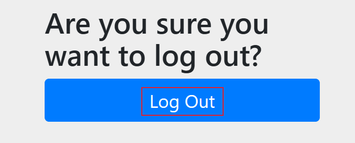
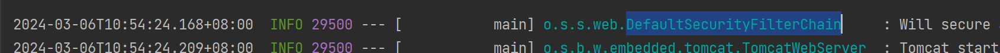
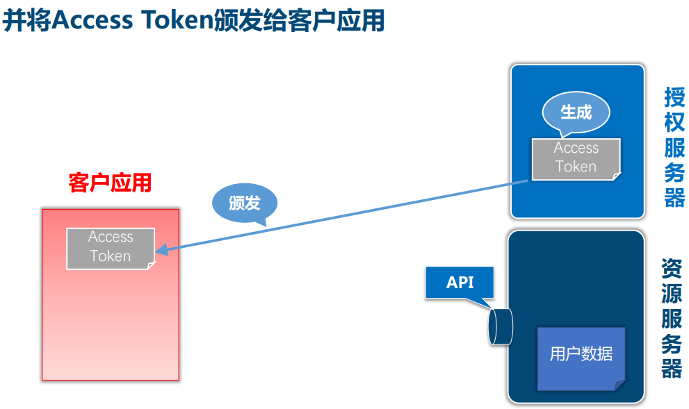
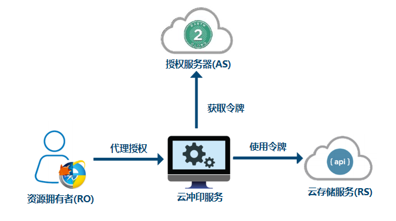
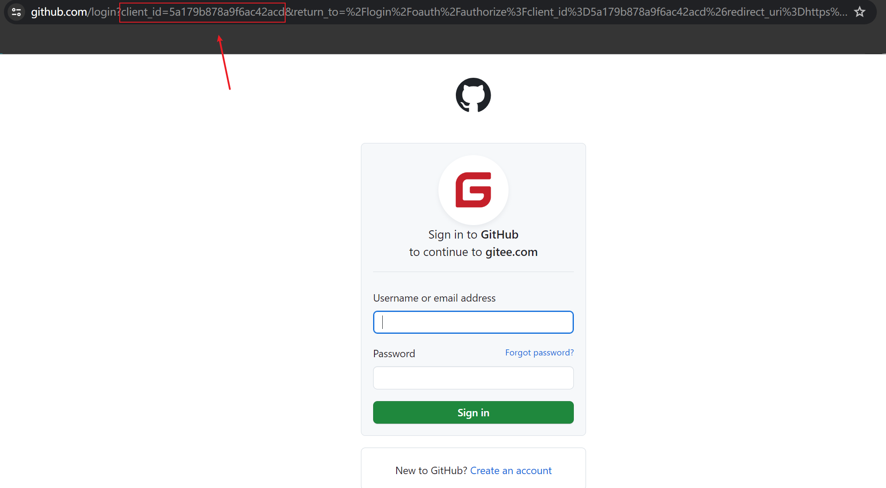
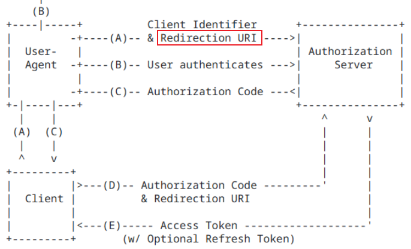

第一章 Spring Security快速入门

# 2.Spring Security基本功能

**官方文档：**

https://docs.spring.io/spring-security/reference/index.html


**功能：**

- 身份认证（authentication）
- 授权（authorization）
- 防御常见攻击（protection against common attacks）


**身份认证：**

- 身份认证是验证`谁正在访问系统资源`，判断用户是否为合法用户。认证用户的常见方式是要求用户输入用户名和密码。


**授权：**

- 用户进行身份认证后，系统会控制`谁能访问哪些资源`，这个过程叫做授权。用户无法访问没有权限的资源。


**防御常见攻击：**

- CSRF
- HTTP Headers
- HTTP Requests

# 3.实现最简单的身份验证

**1、身份认证（authentication）**

官方代码示例：[GitHub - spring-projects/spring-security-samples](https://github.com/spring-projects/spring-security-samples/tree/main)

在我们的课程中使用的是传统的SpringMVC


## 创建Spring Boot项目

项目名：security-demo

JDK：17

SpringBoot：3.2.0（依赖了Spring Security 6.2.0）

Dependencies：Spring Web、Spring Security、Thymeleaf


选择这三个依赖，点击创建


**2、创建IndexController**


```java
package com.atguigu.securitydemo.controller;

@Controller
public class IndexController {

    @GetMapping("/")
    public String index() {
        return "index";
    }
}
```


**3、创建index.html**

在路径resources/templates中创建index.html

```html
<html xmlns:th="https://www.thymeleaf.org">
<head>
  <title>Hello Security!</title>
</head>
<body>
<h1>Hello Security</h1>
<!--通过使用@{/logout}，Thymeleaf将自动处理生成正确的URL，以适应当前的上下文路径。
这样，无论应用程序部署在哪个上下文路径下，生成的URL都能正确地指向注销功能。-->
<a th:href="@{/logout}">Log Out</a>
<a href="/logout">Log Out2</a>
</body>
</html>
```


**4、启动项目测试Controller**

浏览器中访问：http://localhost:8080/

**浏览器自动跳转到登录页面：**http://localhost:8080/login

> SpringSecurity在刚开始运行的时候，它校验了我们的用户是否进行了身份认证，如果没有进行用户身份认证的话，默认情况下，会自动生成一个登录页，并且把我们的浏览器URL地址重定向到登录页。


输入用户名：user

输入密码：在控制台的启动日志中查找初始的默认密码


点击"Sign in"进行登录，浏览器就跳转到了index页面

此时可以点击 Log Out 退出




此时如果点击logout2也会有同样的效果


---

> 如果我们的应用程序发布在不同的应用程序下，那么thymeleaf这个标签会做自动的相对路径的处理，而普通的a标签不会

# 4.@{/logout}的作用

通过使用@{/logout}，Thymeleaf将自动处理生成正确的URL，以适应当前的上下文路径。这样，无论应用程序部署在哪个上下文路径下，生成的URL都能正确地指向注销功能。

例如：如果我们在配置文件中添加如下内容

```properties
# 将此应用程序部署在demo路径下
server.servlet.context-path=/demo
```

那么@{/logout}可以自动处理url为正确的相对路径

但是如果是普通的/logout，路径就会不正确


---

# 5.页面样式无法加载的问题

页面样式bootstrap.min.css是一个CDN地址，需要通过科学上网的方式访问


否则你的登录页会加载很久，并且看到的页面是这样的（登录按钮没有样式文件渲染，但是不影响登录功能的执行）


---

# 6.Spring Security默认做了什么

- 保护应用程序URL，一旦访问我们程序中任何一个地址的时候，都要进行省份认证。要求对应用程序的任何交互进行身份验证。
- 程序启动时生成一个默认用户“user”。
- 生成一个默认的随机密码，并将此密码记录在控制台上。
- 生成默认的登录表单和注销页面。
- 提供基于表单的登录和注销流程。
- 对于Web请求，没有进行身份认证的时候，SpringSecurity会重定向到登录页面；
- 对于服务请求，返回401未经授权。
- 处理跨站请求伪造（CSRF）攻击。
- 处理会话劫持攻击。
- 写入Strict-Transport-Security以确保HTTPS。
- 写入X-Content-Type-Options以处理嗅探攻击。
- 写入Cache Control头来保护经过身份验证的资源。
- 写入X-Frame-Options以处理点击劫持攻击。

---

# 7.Spring Security 的底层原理

**官方文档：**[Spring Security的底层原理](https://docs.spring.io/spring-security/reference/servlet/architecture.html)

Architecture：整个SpringSecurity的基础架构


Spring Security之所以默认帮助我们做了那么多事情，它的底层原理是传统的`Servlet过滤器`

请求由我们的客户端向后端服务器发起，经过层层过滤器的进行，最后它会到达Servlet。

我们刚刚写的index方法，底层就是servlet当中的具体的方法。因为我们的应用程序是SpringBoot程序，所以我们的应用程序是通过controller的方式来实现的servlet。

在正常情况下这些过滤器在应用程序启动的时候就要被注册在servlet容器里才能工作，但为了更灵活的在应用程序当中配置这些过滤器，其实我们的应用程序采用的是SpringBoot形式，而SpringBoot里的本质是spring、springMVC这些基础框架，也就意味着，其实在spring这种环境下，希望把这些Filter对象当做spring容器中的bean对象来管理。这些过滤器在添加、删除、启用和禁用的过程中就会更灵活。


### Filter

下图展示了处理一个Http请求时，过滤器和Servlet的工作流程：


因此我们可以在过滤器中对请求进行修改或增强。


### DelegatingFilterProxy

DelegatingFilterProxy（委托过滤器代理） 是 Spring Security 提供的一个 Filter 实现，可以在 Servlet 容器和 Spring 容器之间建立桥梁。通过使用 DelegatingFilterProxy，这样就可以将Servlet容器中的 Filter 实例放在 Spring 容器中管理。

filter先以bean对象的形式注册在spring容器中，DelegatingFilterProxy帮助我们在spring的环境中加载filter bean对象。但因为DelegatingFilterProxy本身也是个filter，它会被注册在servlet过滤器链（FilterChain）中。在Spring容器中注册的bean filter就可以在DelegatingFilterProxy调用，从而工作在整个Servlet中的FilterChain，也就是过滤器链中。整个过程就叫做委托。


### FilterChainProxy

复杂的业务中不可能只有一个过滤器。因此FilterChainProxy是Spring Security提供的一个特殊的Filter，它允许通过SecurityFilterChain将过滤器的工作委托给多个Bean Filter实例。

应用程序为了更灵活，DelegatingFilterProxy管理FilterChainProxy过滤器链代理的这个类，然后通过过滤器链代理再去调用SecurityFilterChain。FilterChainProxy又被DelegatingFilterProxy调用。DelegatingFilterProxy是真正注册在servlet容器中的。


### SecurityFilterChain

SecurityFilterChain 被 FilterChainProxy 使用，负责查找当前的请求需要执行的Security Filter列表。


### Multiple SecurityFilterChain

为了让应用程序更灵活。可以有多个SecurityFilterChain的配置，FilterChainProxy决定使用哪个SecurityFilterChain，用于处理更复杂的应用程序。如果请求的URL是/api/messages/，它首先匹配SecurityFilterChain0的模式/api/\*\*，因此只调用SecurityFilterChain 0，一直从SecurityFilterChain 0找到SecurityFilterChain n - 1。假设没有其他SecurityFilterChain实例匹配，那么将调用SecurityFilterChain n，它匹配的是/**，也就是所有客户端的请求。


---

# 3、程序的启动和运行

# 8.DefaultSecurityFilterChain

首先在源代码中找到这个类


可以发现这个类实现了SecurityFilterChain


默认情况下，SpringSecurity程序有一个默认的过滤器链，这一个默认的过滤器链里，有一系列默认的过滤器的集合

应用程序启动后，日志中有一行是和DefaultSecurityFilterChain相关的



然后把这一行完整的复制下来，放到一个记事本中

这就是spring应用程序默认加载的16个过滤器

~~~java
o.s.s.web.DefaultSecurityFilterChain     : Will secure any request with [
org.springframework.security.web.session.DisableEncodeUrlFilter@5d152bcd, org.springframework.security.web.context.request.async.WebAsyncManagerIntegrationFilter@43cb5f38, 
org.springframework.security.web.context.SecurityContextHolderFilter@4684240f, 
org.springframework.security.web.header.HeaderWriterFilter@115ca7de, 
org.springframework.web.filter.CorsFilter@6435fa1c, 
org.springframework.security.web.csrf.CsrfFilter@31f295b6, 
org.springframework.security.web.authentication.logout.LogoutFilter@478b0739, 
org.springframework.security.web.authentication.UsernamePasswordAuthenticationFilter@72bd2871, 
org.springframework.security.web.authentication.ui.DefaultLoginPageGeneratingFilter@2e4389ed, 
org.springframework.security.web.authentication.ui.DefaultLogoutPageGeneratingFilter@7944b8b4, 
org.springframework.security.web.authentication.www.BasicAuthenticationFilter@413bef78, 
org.springframework.security.web.savedrequest.RequestCacheAwareFilter@6975fb1c, 
org.springframework.security.web.servletapi.SecurityContextHolderAwareRequestFilter@553da911, 
org.springframework.security.web.authentication.AnonymousAuthenticationFilter@d7bbf12, 
org.springframework.security.web.access.ExceptionTranslationFilter@63f6bed1, 
org.springframework.security.web.access.intercept.AuthorizationFilter@25f61c2c
]
~~~


另一个方法：打开DefaultSecurityFilterChain这个类，然后在这个类中设置一个断点

这里有一个构造方法，构造方法里有一个filters（过滤器列表），这个过滤器列表是当前这个类的一个成员，这一行过滤器列表会被赋值。


向下执行一步，可以看见filters被赋值了。SecurityFilterChain接口的实现，加载了默认的16个Filter。

其中这些过滤器就有实现用户认证功能的，有实现授权功能的，还有实现系统的攻击防御功能的。


帮助我们校验用户名和密码是否正确的方式来决定是否给这个用户进行一个验证，从而让他登录到系统的主页面中


给我们展示一个Login配置登录页的过滤器


帮助我们展示一个登出页面的过滤器


帮助我们实现默认登出流程


---

# 9.SecurityProperties

默认情况下Spring Security将初始的用户名和密码存在了SecurityProperties类中。这个类中有一个静态内部类User，配置了默认的用户名（name = "user"）和密码（password = uuid）


我们也可以将用户名、密码配置在SpringBoot的配置文件中：在application.properties中配置自定义用户名和密码

```properties
spring.security.user.name=user
spring.security.user.password=123
```

---

# -----------------------------------

# 第二章 Spring Security自定义配置

# 10.基于内存的用户认证

### 创建自定义配置

实际开发的过程中，我们需要应用程序更加灵活，可以在SpringSecurity中创建自定义配置文件

**官方文档：**[Java自定义配置](https://docs.spring.io/spring-security/reference/servlet/configuration/java.html)

首先需要创建一个类，这个类的名字无所谓，但是两个注解一定要加上


**UserDetailsService**用来管理用户信息，**InMemoryUserDetailsManager**是UserDetailsService的一个实现，用来管理基于内存的用户信息。

创建一个java/com.atguigu/securitydemo.WebSecurityConfig类：

SpringBootWebSecurityConfiguration这个类就是在SpringBoot环境下，针对于SpringSecurity做的一个默认的配置了。

红框框起来的意思就是，整个应用程序当中，只要EnableWebSecurity这个类被加载到了应用程序的上下文当中，那么@EnableWebSecurity注解就会生效。


只要这个依赖被添加在了我们的项目中，那么这个类就在我们的应用程序中加载进来了


只要它加载进来，这个注解就有了


定义一个@Bean，类型是UserDetailsService，实现是InMemoryUserDetailsManager

> UserDetailsService本身并不是一个类，它是一个接口，这个接口下面有很多具体的实现（chtl + h）
>
> 先对InMemoryUserDetailsManager做一个测试，它的意思就是把我们的用户信息管理在SpringSecurity应用程序的内存中。
>
> 

```java
@Configuration // 标识这个类为配置类，这样spring应用程序一启动的时候，这个类的bean结点就会被初始在spring应用程序的上下文当中
@EnableWebSecurity // 如果我们想要在Security中做一个自定义配置的话，就需要在这个配置类上标识一个@EnableWebSecurity，目的是开启SpringSecurity的自定义配置，如果当前项目是SpringBoot项目，实际上@EnableWebSecurity是可以省略的，这是因为它含义autoconfigure这个jar包，基于SpringBoot第三方的所有的配置都会在autoconfig中被预先定义好。但如果单纯只是个spring项目的话，这个就必须添加上
public class WebSecurityConfig {

    @Bean
    public UserDetailsService userDetailsService() {
        // 创建基于内存的用户信息管理器 
        InMemoryUserDetailsManager manager = new InMemoryUserDetailsManager();
        
        // 使用manager对象管理UserDetails对象
        manager.createUser(
            // 创建一个UserDetails对象，用于管理用户名、用户密码、用户角色、用户权限等内容
            User.withDefaultPasswordEncoder()
                .username("huan")
                .password("password")
                .roles("USER")
                .build());
        // 最后把manager对象返回
        return manager;
    }
}
```

在createUser方法中，它会把创建出来的对象放到内存当中


此时应用程序中默认的UserDetailsService就被替换成了我们现在定义的UserDetailsService，在替换的同时，默认的用户名和密码也被替换成了我们现在定义的用户名和密码。

**测试：**使用用户名huan，密码password登录

此时properties中设置的用户名和密码已经不能生效了。

---

# 11.基于内存的用户认证源码分析

程序启动时：
- 创建`InMemoryUserDetailsManager`对象
- 创建`User`对象，封装用户名密码
- 使用InMemoryUserDetailsManager`将User存入内存`

校验用户时：
- SpringSecurity自动使用`InMemoryUserDetailsManager`的`loadUserByUsername`方法从`内存中`获取User对象

- 在`UsernamePasswordAuthenticationFilter`过滤器中的`attemptAuthentication`方法中将用户输入的用户名密码和从内存中获取到的用户信息进行比较，进行用户认证

  ~~~java
  @Override
  	public Authentication attemptAuthentication(HttpServletRequest request, HttpServletResponse response)
  			throws AuthenticationException {
  		if (this.postOnly && !request.getMethod().equals("POST")) { // 如果是post请求才往下走
  			throw new AuthenticationServiceException("Authentication method not supported: " + request.getMethod());
  		}
  		String username = obtainUsername(request); // 从请求中拿出用户名
  		username = (username != null) ? username.trim() : "";
  		String password = obtainPassword(request); // 从请求中拿出密码
  		password = (password != null) ? password : "";
  		UsernamePasswordAuthenticationToken authRequest = UsernamePasswordAuthenticationToken.unauthenticated(username,
  				password); // 将用户名和密码封装成一个UsernamePasswordAuthenticationToken对象
  		// Allow subclasses to set the "details" property
  		setDetails(request, authRequest);
          // authenticate方法就是校验你输入的用户名和密码是否符合内存中存储的用户名和密码
  		return this.getAuthenticationManager().authenticate(authRequest);
  	}
  ~~~

  在AbstractUserDetailsAuthenticationProvider类中的authenticate方法，它就获取到了前面用户输入的用户名和密码。

  AbstractAuthenticationToken 类 和 Authentication 类的关系是接口和实现的关系，Authentication有一个具体的抽象实现类：AbstractAuthenticationToken。而AbstractAuthenticationToken其实就是我们刚才看到的UsernamePasswordAuthenticationToken。

- ```java
  @Override
  public Authentication authenticate(Authentication authentication) throws AuthenticationException {
      Assert.isInstanceOf(UsernamePasswordAuthenticationToken.class, authentication,
            () -> this.messages.getMessage("AbstractUserDetailsAuthenticationProvider.onlySupports",
                  "Only UsernamePasswordAuthenticationToken is supported"));
      String username = determineUsername(authentication); // 从authentication获取到用户名
      boolean cacheWasUsed = true;
      UserDetails user = this.userCache.getUserFromCache(username);
      if (user == null) {
         cacheWasUsed = false;
         try {
            user = retrieveUser(username, (UsernamePasswordAuthenticationToken) authentication); // 通过用户名来到retrieveUser 方法中
         }
         catch (UsernameNotFoundException ex) {
            ...
         }
      }
  }
  ```

- 通过用户名来到retrieveUser 方法中

  ```java
  @Override
  protected final UserDetails retrieveUser(String username, UsernamePasswordAuthenticationToken authentication)
         throws AuthenticationException {
      prepareTimingAttackProtection();
      try {
          // 这里的UserDetailsService就是在用户文件中创建的UserDetailsService，所以获取到的实际的对象就是InMemoryUserDetailsManager对象
         UserDetails loadedUser = this.getUserDetailsService().loadUserByUsername(username);
         if (loadedUser == null) {
            throw new InternalAuthenticationServiceException(
                  "UserDetailsService returned null, which is an interface contract violation");
         }
         return loadedUser;
      }
      catch (UsernameNotFoundException ex) {
         mitigateAgainstTimingAttack(authentication);
         throw ex;
      }
      catch (InternalAuthenticationServiceException ex) {
         throw ex;
      }
      catch (Exception ex) {
         throw new InternalAuthenticationServiceException(ex.getMessage(), ex);
      }
  }
  ```

- ```java
  @Override
  public UserDetails loadUserByUsername(String username) throws UsernameNotFoundException {
      // 这个地方就是我们一开始存入到内存当中的用户信息，这里根据我们内存中输入的用户名username.toLowerCase()，从内存中看一看能不能获取到这个用户信息，如果能够获取到，就把这个用户信息返回回去
      UserDetails user = this.users.get(username.toLowerCase());
      if (user == null) {
         throw new UsernameNotFoundException(username);
      }
      // 将它组装成UserDetails对象，最后返回到应用程序当中
      return new User(user.getUsername(), user.getPassword(), user.isEnabled(), user.isAccountNonExpired(),
            user.isCredentialsNonExpired(), user.isAccountNonLocked(), user.getAuthorities());
  }
  ```

- 此时回到了retrieveUser 方法

  

- 接下来要做的是就是把用户输入的密码和内存中获取到的用户信息的密码进行验证，回到authenticate方法

  这里它将内存中的用户和用户输入的authentication对象传递到了additionalAuthenticationChecks方法中

  

- ```java
  @Override
  @SuppressWarnings("deprecation")
  protected void additionalAuthenticationChecks(UserDetails userDetails,
         UsernamePasswordAuthenticationToken authentication) throws AuthenticationException {
      // Credentials：用户凭证，这里即用户密码
      if (authentication.getCredentials() == null) { // 如果没有用户凭证就报错
         this.logger.debug("Failed to authenticate since no credentials provided");
         throw new BadCredentialsException(this.messages
            .getMessage("AbstractUserDetailsAuthenticationProvider.badCredentials", "Bad credentials"));
      }
      // 如果有用户凭证，就把这个用户凭证暴露出来，变成用户输入的密码
      String presentedPassword = authentication.getCredentials().toString();
      // 把用户输入的密码和内存中获取的密码进行比较，此时userDetails.getPassword()获取到的密码是加密后的密码
      // matches方法：先将用户输入的密码用同样的方式进行加密，加密后再和userDetails.getPassword()进行比较
      if (!this.passwordEncoder.matches(presentedPassword, userDetails.getPassword())) {
         this.logger.debug("Failed to authenticate since password does not match stored value");
         throw new BadCredentialsException(this.messages
            .getMessage("AbstractUserDetailsAuthenticationProvider.badCredentials", "Bad credentials"));
      }
  }
  ```

---

# 12.基于数据库的数据源

**SQL**

创建三个数据库表并插入测试数据

> 密码使用的是bcrypt加密方式

```sql
-- 创建数据库
CREATE DATABASE `security-demo`;
USE `security-demo`;

-- 创建用户表
CREATE TABLE `user`(
	`id` INT NOT NULL AUTO_INCREMENT PRIMARY KEY,
	`username` VARCHAR(50) DEFAULT NULL ,
	`password` VARCHAR(500) DEFAULT NULL,
	`enabled` BOOLEAN NOT NULL
);
-- 唯一索引
CREATE UNIQUE INDEX `user_username_uindex` ON `user`(`username`); 

-- 插入用户数据(密码是 "abc" )
INSERT INTO `user` (`username`, `password`, `enabled`) VALUES
('admin', '{bcrypt}$2a$10$GRLdNijSQMUvl/au9ofL.eDwmoohzzS7.rmNSJZ.0FxO/BTk76klW', TRUE),
('Helen', '{bcrypt}$2a$10$GRLdNijSQMUvl/au9ofL.eDwmoohzzS7.rmNSJZ.0FxO/BTk76klW', TRUE),
('Tom', '{bcrypt}$2a$10$GRLdNijSQMUvl/au9ofL.eDwmoohzzS7.rmNSJZ.0FxO/BTk76klW', TRUE);
```


**2.2、引入依赖**

```xml
<dependency>
    <groupId>mysql</groupId>
    <artifactId>mysql-connector-java</artifactId>
    <version>8.0.30</version>
</dependency>

<dependency>
    <groupId>com.baomidou</groupId>
    <artifactId>mybatis-plus-boot-starter</artifactId>
    <version>3.5.4.1</version>
    <!-- 先排除mybatis-plus和spring整合的一个类 -->
    <exclusions>
        <exclusion>
            <groupId>org.mybatis</groupId>
            <artifactId>mybatis-spring</artifactId>
        </exclusion>
    </exclusions>
</dependency>

<dependency>
    <groupId>org.mybatis</groupId>
    <artifactId>mybatis-spring</artifactId>
    <version>3.0.3</version>
</dependency>

<dependency>
    <groupId>org.projectlombok</groupId>
    <artifactId>lombok</artifactId>
</dependency>
```


**2.3、配置数据源**

```properties
#MySQL数据源
spring.datasource.driver-class-name=com.mysql.cj.jdbc.Driver
spring.datasource.url=jdbc:mysql://localhost:3306/security-demo?characterEncoding=utf-8&useSSL=false
spring.datasource.username=root
spring.datasource.password=1234
#SQL日志
mybatis-plus.configuration.log-impl=org.apache.ibatis.logging.stdout.StdOutImpl
```


**2.4、实体类**

```java
package com.atguigu.securitydemo.entity;

@Data
public class User {

    @TableId(value = "id", type = IdType.AUTO)
    private Integer id;

    private String username;

    private String password;

    private Boolean enabled;

}
```


**2.5、Mapper**

接口

```java
package com.atguigu.securitydemo.mapper;

@Mapper
public interface UserMapper extends BaseMapper<User> {
}
```


xml

resources/mapper/UserMapper.xml

```xml
<?xml version="1.0" encoding="UTF-8"?>
<!DOCTYPE mapper PUBLIC "-//mybatis.org//DTD Mapper 3.0//EN" "http://mybatis.org/dtd/mybatis-3-mapper.dtd">
<mapper namespace="com.atguigu.securitydemo.mapper.UserMapper">

</mapper>
```


**2.6、Service**

接口

```java
package com.atguigu.securitydemo.service;

public interface UserService extends IService<User> {
}
```

实现

```java
package com.atguigu.securitydemo.service.impl;

@Service
public class UserServiceImpl extends ServiceImpl<UserMapper, User> implements UserService {
}
```


**2.7、Controller**

```java
package com.atguigu.securitydemo.controller;

@RestController // 这样我们可以通过获取到json形式的数据来看看我们当前基于数据库的用户信息的管理的功能是否能够成功的对接到我们项目当中
@RequestMapping("/user")
public class UserController {

    @Resource
    public UserService userService;

    @GetMapping("/list")
    public List<User> getList(){
        return userService.list();
    }
}
```


**测试：**[localhost:8080/demo/user/list](http://localhost:8080/demo/user/list)

---

# 13.基于数据库的用户认证流程分析

程序启动时：

> 基于数据库的用户认证和基于内存的用户认证是相似的，基于内存是创建`InMemoryUserDetailsManager`对象，基于数据库就需要我们自己去实现这个类了，这里命名为：`DBUserDetailsManager`

- 创建`DBUserDetailsManager`类，实现接口 UserDetailsManager, UserDetailsPasswordService

  查看UserDetailsManager类结构，这里有个结构叫JdbcUserDetailsManager，这个类名是可以直接去实现基于数据库的用户认证，但是它是基于SpringTemplate持久层的，并不是基于Mybatis或者MyBatis-Plus的，所以如果持久层是Mybatis或者MyBatis-Plus的话，是无法使用JdbcUserDetailsManager，我们必须自己去实现一个这样类似的功能，让它

  

- 在应用程序中初始化这个类的对象

校验用户时：
- SpringSecurity自动使用`DBUserDetailsManager`的`loadUserByUsername`方法从`数据库中`获取User对象
- 在`UsernamePasswordAuthenticationFilter`过滤器中的`attemptAuthentication`方法中将用户输入的用户名密码和从数据库中获取到的用户信息进行比较，进行用户认证

---

# 14.基于数据库的用户认证流程实现

### 定义DBUserDetailsManager

```java
package com.atguigu.securitydemo.config;

public class DBUserDetailsManager implements UserDetailsManager, UserDetailsPasswordService {
    
    @Resource
    private UserMapper userMapper;

    /**
     * 从数据库中获取用户信息
     * @param username the username identifying the user whose data is required.
     * @return
     * @throws UsernameNotFoundException
     */
    @Override
    public UserDetails loadUserByUsername(String username) throws UsernameNotFoundException {

        QueryWrapper<User> queryWrapper = new QueryWrapper<>();
        queryWrapper.eq("username", username);
        User user = userMapper.selectOne(queryWrapper);
        if (user == null) {
            throw new UsernameNotFoundException(username);
        } else {
            Collection<GrantedAuthority> authorities = new ArrayList<>();
            return new org.springframework.security.core.userdetails.User(
                    user.getUsername(),
                    user.getPassword(),
                    user.getEnabled(),
                    true, //用户账号是否过期
                    true, //用户凭证是否过期
                    true, //用户是否未被锁定
                    authorities); //权限列表
        }
    }

    @Override
    public UserDetails updatePassword(UserDetails user, String newPassword) {
        return null;
    }

    @Override
    public void createUser(UserDetails user) {

    }

    @Override
    public void updateUser(UserDetails user) {

    }

    @Override
    public void deleteUser(String username) {

    }

    @Override
    public void changePassword(String oldPassword, String newPassword) {

    }

    @Override
    public boolean userExists(String username) {
        return false;
    }
}

```


**初始化UserDetailsService**

修改WebSecurityConfig中的userDetailsService方法如下

> 由于在应用程序中只需要一个用户信息管理器就行了，所以第一个用户信息管理器可以给它屏蔽掉。

```java
@Bean
public UserDetailsService userDetailsService() {
    // 创建基于数据库的用户信息管理器
    DBUserDetailsManager manager = new DBUserDetailsManager();
    // 如果是基于数据库的用户信息管理，创建对象的过程就不需要了，因为我们的用户信息事先已经存在数据库当中了，我们到时候去校验用户的时候，根据信息名取出来就行了。
    return manager;
}
```

由于只有UserDetailsService这一个对象是被创建在spring容器上下文中的，所以可以**或者直接在DBUserDetailsManager类上添加@Component注解**


**测试：**使用数据库中配置的用户名和密码进行登录

---

# 15.SpringSecurity的默认配置

SpringSecurity（WebSecurityConfig）配置文件中，如果没有添加任何配置的话，它是有一个默认的行为的


实际上我们添加了一个自定义配置，就是DBUserDetailsManager类上添加@Component注解，只不过我们没有添加到WebSecurityConfig配置文件当中

我们将默认行为在WebSecurityConfig中添加如下配置

```java
@Bean
// 针对HttpSecurity对象做一个具体的配置，然后根据这个配置形成一个过滤器链SecurityFilterChain
public SecurityFilterChain filterChain(HttpSecurity http) throws Exception {
    //authorizeRequests()：开启授权保护
    //anyRequest()：对所有请求开启授权保护
    //authenticated()：已认证请求会自动被授权
    http
        // 所以我们在应用程序当中，看到的过滤器链，里面具体的过滤器就是由这段配置来实现的
        // authorizeRequests组装的就是在进行用户认证一些具体的功能，开启授权保护
        // 如果我们的用户没有进行认证的话，应用程序就会开启授权保护，开启授权保护的过程中，如果用户没有进行认证，就会自动跳转到登录页，如果用户已经进行认证的话，就会被授权，用户被授权后，就能正常的进入到我们想要访问的页面当中去
        .authorizeRequests(authorize -> authorize
                           // 对所有请求开启授权保护
                           .anyRequest()
                           // 已认证的请求会被自动授权
                           .authenticated())
        // 自动使用表单数据，withDefaults()：生成默认的登录表单和默认的登出页面
        .formLogin(withDefaults())// 表单授权方式
        .httpBasic(withDefaults());// 基本授权方式

    return http.build();
}
```

注释掉`.formLogin(withDefaults())`之后，在没有提供基于html登录页的基础上，浏览器会自带一个用户名和密码的输入框，不同浏览器的用户名和密码的输入框的风格可能会略有不同。并且它也不能生成默认的登出页，没有登出页就登出不了。此时可以清空浏览器的历史记录。这是最原始登录方式，我们很少这样使用，所以也可以把它（`.httpBasic(withDefaults())`）屏蔽掉。

重新查看过滤器链，可以发现`.httpBasic(withDefaults());`的过滤器链已经没有了。

注释掉`.httpBasic(withDefaults());`后可以发现少了 生成默认的登录页，生成默认的登录页，默认登录登出的基本的流程 这几个过滤器


---

# 16.添加用户功能的实现

在`DBUserDetailsManager`中有createUser方法

**Controller**

UserController中添加方法

```java
@PostMapping("/add")
public void add(@RequestBody User user){
    userService.saveUserDetails(user);
}
```


**Service**

UserService接口中添加方法

```java
void saveUserDetails(User user);
```

UserServiceImpl实现中添加方法

```java
@Resource
private DBUserDetailsManager dbUserDetailsManager;

@Override
public void saveUserDetails(User user) {
    // 由于这里面已经有一个关于实体类User类的引入，如果这里不写具体的实现的话，它们两个就重名了，所以这里需要写具体的完整的类名，然后使用默认的密码加密方案withDefaultPasswordEncoder
    UserDetails userDetails = org.springframework.security.core.userdetails.User
            .withDefaultPasswordEncoder()
            .username(user.getUsername()) //自定义用户名
            .password(user.getPassword()) //自定义密码
            .build();
    dbUserDetailsManager.createUser(userDetails);
}
```


**修改配置**

DBUserDetailsManager中添加方法

```java
/**
 * 向数据库中插入新的用户信息
 * @param userDetails
 */
@Override
public void createUser(UserDetails userDetails) {

    User user = new User();
    user.setUsername(userDetails.getUsername());
    user.setPassword(userDetails.getPassword());
    user.setEnabled(true);
    userMapper.insert(user);
}
```

---

# 17.使用Swagger测试

pom中添加配置用于测试

```xml
<!--swagger测试-->
<dependency>
    <groupId>com.github.xiaoymin</groupId>
    <artifactId>knife4j-openapi3-jakarta-spring-boot-starter</artifactId>
    <version>4.4.0</version>
</dependency>
```


**Swagger测试地址：**http://localhost:8080/demo/doc.html

此时会报403错误（没有权限访问网站），这是因为SpringSecurity默认开启了对csrf攻击的防御。这要求请求参数中必须有一个隐藏的**_csrf**字段。


如果开启了csrf攻击的防御，那么针对所有的post请求在它的登录页面当中，都会自动生成一个隐藏的字段

~~~html
<input name="_csrf" type="hidden" value="mkU7biBhGoyGvNATNdWvljPHFRxYgHr3oZrd8q23Qk6PkAkQrnEKDRhRKbir3eIlA_ibplX1OH1rsRjawvm4w53WJnq5ojAm" />
~~~


它的值是由一个随机的字符串（这个随机数是通过前端程序自动生成的）生成提交给服务器，用来防止csrf攻击，默认情况下，SpringSecurity需要以Post请求的客户端页面，必须要提供_csrf这样的字段。如果这个字段不存在，后台的校验就会被判定为没有权限访问（503）。


### 关闭csrf攻击防御

在filterChain方法中添加如下代码，关闭csrf攻击防御，这样就不需要前端请求提供_csrf字段了

```java
//关闭csrf攻击防御
http.csrf((csrf) -> {
    csrf.disable();
});
```

重新启动程序，再次发送请求，由于后端也没给前端返回信息，所以swagger文档的结果应该为空。

验证是否成功：需要去数据库中查看，然后再在登录页面使用刚刚注册的用户登录。

当关闭掉csrf攻击防御后，它的登出功能点击后，就直接退出到了登录页中，没有提示了。

---

# 18.密码加密算法

**参考文档：**[Password Storage :: Spring Security](https://docs.spring.io/spring-security/reference/features/authentication/password-storage.html)


### 密码加密方式

**明文密码：**

最初，密码以明文形式存储在数据库中。但是恶意用户可能会通过SQL注入等手段获取到明文密码，或者程序员将数据库数据泄露的情况也可能发生。


**Hash算法：**

Spring Security的`PasswordEncoder`接口用于对密码进行`单向转换`，从而将密码安全地存储。对密码单向转换需要用到`哈希算法`，例如MD5、SHA-256、SHA-512等，哈希算法是单向的，`只能加密，不能解密`。

因此，`数据库中存储的是单向转换后的密码`，Spring Security在进行用户身份验证时需要将用户输入的密码进行单向转换，然后与数据库的密码进行比较。

因此，如果发生数据泄露，只有密码的单向哈希会被暴露。由于哈希是单向的，并且在给定哈希的情况下只能通过`暴力破解的方式猜测密码`。


**彩虹表：**

恶意用户创建称为`彩虹表`的查找表。

```
彩虹表就是一个庞大的、针对各种可能的字母组合预先生成的哈希值集合，有了它可以快速破解各类密码。越是复杂的密码，需要的彩虹表就越大，主流的彩虹表都是100G以上，目前主要的算法有LM, NTLM, MD5, SHA1, MYSQLSHA1, HALFLMCHALL, NTLMCHALL, ORACLE-SYSTEM, MD5-HALF。
```


**加盐密码：**

为了减轻彩虹表的效果，开发人员开始使用加盐密码。不再只使用密码作为哈希函数的输入，而是为每个用户的密码生成随机字节（称为盐）。盐和用户的密码将一起经过哈希函数运算，生成一个唯一的哈希。盐将以明文形式与用户的密码一起存储。然后，当用户尝试进行身份验证时，盐和用户输入的密码一起经过哈希函数运算，再与存储的密码进行比较。唯一的盐意味着彩虹表不再有效，因为对于每个盐和密码的组合，哈希都是不同的。


**自适应单向函数：**

随着硬件的不断发展，加盐哈希也不再安全。原因是，计算机可以每秒执行数十亿次哈希计算。这意味着我们可以轻松地破解每个密码。

现在，开发人员开始使用自适应单向函数来存储密码。使用自适应单向函数验证密码时，`故意占用资源（故意使用大量的CPU、内存或其他资源）`。自适应单向函数允许配置一个`“工作因子”`，随着硬件的改进而增加。我们建议将“工作因子”调整到系统中验证密码需要约一秒钟的时间。这种权衡是为了`让攻击者难以破解密码`。

自适应单向函数包括`bcrypt、PBKDF2、scrypt和argon2`。其中SpringSecurity默认使用的是bcrypt

---

# 19.PasswordEncoder

**BCryptPasswordEncoder**

使用广泛支持的bcrypt算法来对密码进行哈希。为了增加对密码破解的抵抗力，bcrypt故意设计得较慢。和其他自适应单向函数一样，应该调整其参数，使其在您的系统上验证一个密码大约需要1秒的时间。BCryptPasswordEncoder的默认实现使用强度10。建议您在自己的系统上调整和测试强度参数，以便验证密码时大约需要1秒的时间。


**Argon2PasswordEncoder**

使用Argon2算法对密码进行哈希处理。Argon2是密码哈希比赛的获胜者。为了防止在自定义硬件上进行密码破解，Argon2是一种故意缓慢的算法，需要大量内存。与其他自适应单向函数一样，它应该在您的系统上调整为大约1秒来验证一个密码。当前的Argon2PasswordEncoder实现需要使用BouncyCastle库。


**Pbkdf2PasswordEncoder**

使用PBKDF2算法对密码进行哈希处理。为了防止密码破解，PBKDF2是一种故意缓慢的算法。与其他自适应单向函数一样，它应该在您的系统上调整为大约1秒来验证一个密码。当需要FIPS认证时，这种算法是一个很好的选择。


**SCryptPasswordEncoder** 

使用scrypt算法对密码进行哈希处理。为了防止在自定义硬件上进行密码破解，scrypt是一种故意缓慢的算法，需要大量内存。与其他自适应单向函数一样，它应该在您的系统上调整为大约1秒来验证一个密码。


### 密码加密测试

在测试类中编写一个测试方法

```java
@Test
void testPassword() {

    // 工作因子，默认值是10，最小值是4，最大值是31，值越大运算速度越慢
    PasswordEncoder encoder = new BCryptPasswordEncoder(4);
    //明文："password"
    //密文：result，即使明文密码相同，每次生成的密文也不一致
    String result = encoder.encode("password");
    System.out.println(result);

    //密码校验，将原始密码和加盐加密后的密码进行匹配，在匹配的过程中，工作因子也会起作用，工作因子越大，匹配的时间也就会越长，因为匹配的过程中实际上也是重新生成密码的过程
    Assert.isTrue(encoder.matches("password", result), "密码不一致");
}
```

ctrl + alt + b查看实现该方法的类，选中 BCryptPasswordEncoder


生成密码的过程中，会先生成一个盐值


这个随机的盐值由 BCryPasswordEncoder的版本号、工作因子、随机数组成


BCryPasswordEncoder.java 最初的密码加上盐值，最后再通过hashpw方法生成最终的密码

~~~java
public String encode(CharSequence rawPassword) {
    if (rawPassword == null) {
        throw new IllegalArgumentException("rawPassword cannot be null");
    } else {
        String salt = this.getSalt();
        // 最初的密码加上盐值，最后再通过hashpw方法生成最终的密码
        return            BCrypt.hashpw(rawPassword.toString(), salt);
    }
}
~~~

运行 SecurityDemoApplicationTests 测试方法，但由于它其中会生成一个随机数，所以重新执行，得到的密码也不会是一样的


---

# 20.DelegatingPasswordEncoder

上面 SecurityDemoApplicationTests 测试类运行后得到的密码形式为：$2a$04$l7phORPmM8o4c5euxVKe/O1e1qX5fuNsJS0NNYve0z7p3WyPAOUSm

而表中存储的密码形式：`{bcrypt}`$2a$10$GRLdNijSQMUvl/au9ofL.eDwmoohzzS7.rmNSJZ.0FxO/BTk76klW，多了一个前缀


**分析表中存储的密码形式的前缀是怎么生成的**

在做用户插入的过程中，UserServiceImpl.java 中 使用的是withDefaultPasswordEncoder方法

~~~java
@Override
public void saveUserDetails(User user) {
    UserDetails userDetails = org.springframework.security.core.userdetails.User
        .withDefaultPasswordEncoder()
        .username(user.getUsername())
        .password(user.getPassword())
        .build();
    dbUserDetailsManager.createUser(userDetails);
}
~~~

PasswordEncoderFactories.java，这个方法中创建了 PasswordEncoder 对象

~~~java
@Deprecated
public static UserBuilder withDefaultPasswordEncoder() {
    logger.warn("User.withDefaultPasswordEncoder() is considered unsafe for production "
                + "and is only intended for sample applications.");
    PasswordEncoder encoder = PasswordEncoderFactories.createDelegatingPasswordEncoder();
    return builder().passwordEncoder(encoder::encode);
}
~~~

PasswordEncoder 对象里对所有的可能的密码加密算法做了一个处理，将所有可能的密码加密算法的前缀都放在了一个map集合的key中，前面就是密码加密算法，后面就是由这个密码加密算法所构成的加密器了。

PasswordEncoderFactories.java

~~~java
public final class PasswordEncoderFactories {
    private PasswordEncoderFactories() {
    }

    public static PasswordEncoder createDelegatingPasswordEncoder() {
        // 默认的密码加密算法就是 encodingId，也就是bcrypt
        String encodingId = "bcrypt";
        Map<String, PasswordEncoder> encoders = new HashMap();
        encoders.put(encodingId, new BCryptPasswordEncoder());
        encoders.put("ldap", new LdapShaPasswordEncoder());
        encoders.put("MD4", new Md4PasswordEncoder());
        encoders.put("MD5", new MessageDigestPasswordEncoder("MD5"));
        encoders.put("noop", NoOpPasswordEncoder.getInstance());
        encoders.put("pbkdf2", Pbkdf2PasswordEncoder.defaultsForSpringSecurity_v5_5());
        encoders.put("pbkdf2@SpringSecurity_v5_8", Pbkdf2PasswordEncoder.defaultsForSpringSecurity_v5_8());
        encoders.put("scrypt", SCryptPasswordEncoder.defaultsForSpringSecurity_v4_1());
        encoders.put("scrypt@SpringSecurity_v5_8", SCryptPasswordEncoder.defaultsForSpringSecurity_v5_8());
        encoders.put("SHA-1", new MessageDigestPasswordEncoder("SHA-1"));
        encoders.put("SHA-256", new MessageDigestPasswordEncoder("SHA-256"));
        encoders.put("sha256", new StandardPasswordEncoder());
        encoders.put("argon2", Argon2PasswordEncoder.defaultsForSpringSecurity_v5_2());
        encoders.put("argon2@SpringSecurity_v5_8", Argon2PasswordEncoder.defaultsForSpringSecurity_v5_8());
        // 然后把 encodingId, encoders 这两个参数传给DelegatingPasswordEncoder，这是一个代理密码加密器
        return new DelegatingPasswordEncoder(encodingId, encoders);
    }
}
~~~

然后把 encodingId, encoders 这两个参数传给DelegatingPasswordEncoder，这是一个代理密码加密器

传进去后，将 idForEncode 加上前缀和后缀

~~~java
// 
public DelegatingPasswordEncoder(String idForEncode, Map<String, PasswordEncoder> idToPasswordEncoder) {
    this(idForEncode, idToPasswordEncoder, "{", "}");
}
~~~

这个方法的大概意思是：如果没有指定密码加密算法，就会使用默认的密码加密算法（idForEncode），也就是bcrypt

~~~java
public DelegatingPasswordEncoder(String idForEncode, Map<String, PasswordEncoder> idToPasswordEncoder, String idPrefix, String idSuffix) {
    ...
}
~~~


**为什么要加上这个前缀？**

这个时候就需要找到在应用程序非常重要的一个类：DelegatingPasswordEncoder。

在这个类中有一个方法：matches方法，这个方法是在进行校验的时候做密码比对的一个方法。

此时通过应用程序来对这个方法进行调试。

通过如下源码可以知道：可以通过`{bcrypt}`前缀动态获取和密码的形式类型一致的PasswordEncoder对象

目的：方便随时做密码策略的升级，兼容数据库中的老版本密码策略生成的密码

> 换个角度来说，不同的用户可以有不同的密码生成策略，可以使用不同的密码加密算法。这也就是SpringSecurity中密码加密非常灵活的一个原因。


~~~java
// rawPassword：在客户端浏览器输入的密码，prefixEncodedPassword应用程序从数据库中获取来的密码，这两个密码将会进行比较
public boolean matches(CharSequence rawPassword, String prefixEncodedPassword) {
    if (rawPassword == null && prefixEncodedPassword == null) {
        return true;
    } else {
        // 通过extractId方法，将带有密码的前缀获取出来，id就为这个密码的前缀
        String id = this.extractId(prefixEncodedPassword);
        // 然后通过这个密码的前缀来生成 PasswordEncoder，所以这个前缀的作用就是生成不同的密码加密器
        // delegate就是bcrypt密码加密器了，接下来就会使用这个密码加密器来对应用程序密码进行一个校验
        PasswordEncoder delegate = (PasswordEncoder)this.idToPasswordEncoder.get(id);
        if (delegate == null) {
            return this.defaultPasswordEncoderForMatches.matches(rawPassword, prefixEncodedPassword);
        } else {
            // 首先将带前缀的密码把前缀去掉，变成 encodedPassword
            String encodedPassword = this.extractEncodedPassword(prefixEncodedPassword);
            // 然后再用delegate.matches把输入的密码和去掉前缀的密码进行一个比对。所以这个方法就是我们之前测试用例中写的encoder.matches方法
            return delegate.matches(rawPassword, encodedPassword);
        }
    }
}
~~~


---

# 21.自定义登录页面

**创建登录Controller**

```java
package com.atguigu.securitydemo.controller;

@Controller
public class LoginController {

    @GetMapping("/login")
    public String login() {
        return "login";
    }
}
```


**创建登录页面**

resources/templates/login.html

```html
<!DOCTYPE html>
<html xmlns:th="https://www.thymeleaf.org">
<head>
    <title>登录</title>
</head>
<body>
<h1>登录</h1>
<div th:if="${param.error}">
    错误的用户名和密码.</div>

<!--method必须为"post"-->
<!--th:action="@{/login}" ，
使用动态参数，表单中会自动生成_csrf隐藏字段，用于防止csrf攻击
login: 和登录页面保持一致即可，SpringSecurity自动进行登录认证-->
<form th:action="@{/login}" method="post">
    <div>
        <!--name必须为"username"-->
        <input type="text" name="username" placeholder="用户名"/>
    </div>
    <div>
        <!--name必须为"password"-->
        <input type="password" name="password" placeholder="密码"/>
    </div>
    <input type="submit" value="登录" />
</form>
</body>
</html>
```

重启应用程序，可以发现访问的仍是默认的login页面，这是因为默认情况下，应用程序在走到controller之前，它首先会经过一系列的过滤器，在过滤器当中，有我们之前默认的配置，默认的配置就对我们的应用程序做了默认的处理。如果应用程序没有进行授权，应用程序就会自动跳转到 /login 的地址中。如果 /login 地址作为请求发送到服务器端，服务器端默认的过滤器其实就已经对 /login 做了处理了，它处理的方式就是找默认的登录页。


**配置SecurityFilterChain**

为了跳转到我们的登录页，方式就是不使用默认配置，而是使用自定义配置

SecurityConfiguration：

```java
.formLogin( 
    // 然后通过lamda的形式创建一个默认的配置
    form -> {
    form // 明确了通过配置文件的形式定义登录页的位置，这样它就会去找我们自定义登录页的地址了。
        .loginPage("/login");
}); //使用表单授权方式
```

重新启动应用程序，此时会报：localhost重定向过多，这是因为应用程序自己定义了应用程序之后，前面的过滤器就不起作用了，通过层层过滤器之后走到了自定义login地址，自定义login地址会遵循着前面授权的保护机制，前面授权的保护机制就是：对所有请求开启授权保护，那针对我们的login页也不例外，所以login页也被授权保护了，这样的话，当我们访问了loginPage后，因为有授权保护，所以重定向到了login页，但login页又有授权保护，又重定向到了login，这样就形成了一个递归跳转，我们得到的这个错误信息就是重定向次数过多。

解决办法：针对loginPage做一个特殊的设置：permitAll

~~~java
.formLogin( 
    // 然后通过lamda的形式创建一个默认的配置
    form -> {
    form // 明确了通过配置文件的形式定义登录页的位置，这样它就会去找我们自定义登录页的地址了。
        .loginPage("/login").permitAll(); //登录页面无需授权即可访问当前页面
});
~~~

---

# 22.登录页的细节

登录页中用户名和密码的name属性值必须为username 和 password，这是因为在做用户校验的时候，过滤器里接受的必须是username和password。这个过滤器叫：UsernamePasswordAuthenticationFilter。

~~~html
<!--name必须为"username"-->
<input type="text" name="username" placeholder="用户名"/>
<!--name必须为"password"-->
<input type="password" name="password" placeholder="密码"/>
~~~

UsernamePasswordAuthenticationFilter 中有个方法： attemptAuthentication

~~~java
@Override
public Authentication attemptAuthentication(HttpServletRequest request, HttpServletResponse response)
    throws AuthenticationException {
    if (this.postOnly && !request.getMethod().equals("POST")) {
        throw new AuthenticationServiceException("Authentication method not supported: " + request.getMethod());
    }
    // 获取用户请求中的用户名
    String username = obtainUsername(request);
    username = (username != null) ? username.trim() : "";
    // 获取用户请求中的密码
    String password = obtainPassword(request);
    password = (password != null) ? password : "";
    UsernamePasswordAuthenticationToken authRequest = UsernamePasswordAuthenticationToken.unauthenticated(username,
                                                                                                          password);
    // Allow subclasses to set the "details" property
    setDetails(request, authRequest);
    return this.getAuthenticationManager().authenticate(authRequest);
}
~~~


~~~java
@Nullable
protected String obtainPassword(HttpServletRequest request) {
    return request.getParameter(this.passwordParameter); // passwordParameter
}
~~~

passwordParameter的值为：private String passwordParameter = SPRING_SECURITY_FORM_PASSWORD_KEY;

而SPRING_SECURITY_FORM_PASSWORD_KEY的值又为：

```java
public static final String SPRING_SECURITY_FORM_USERNAME_KEY = "username";
```

修改默认的名字

~~~java
.formLogin( 
    // 然后通过lamda的形式创建一个默认的配置
    form -> {
    form // 明确了通过配置文件的形式定义登录页的位置，这样它就会去找我们自定义登录页的地址了。
        .loginPage("/login").permitAll() //登录页面无需授权即可访问当前页面
        .usernameParameter("myUsername") //自定义表单用户名参数，默认是 username
        .passwordParameter("myPassword") //自定义表单密码参数，默认是 password
        ;
}); //使用表单授权方式
~~~

登录

~~~html
<!-- 从浏览器当中的字符串参数中，获取到error参数，如果这个参数存在，就会显示 错误的用户名和密码. 这样的一段提示信息 -->
<div th:if="${param.error}">
    错误的用户名和密码.</div>
~~~

配置文件中增加：.failureUrl("/login?error")

~~~java
.formLogin( 
    // 然后通过lamda的形式创建一个默认的配置
    form -> {
        form // 明确了通过配置文件的形式定义登录页的位置，这样它就会去找我们自定义登录页的地址了。
            .loginPage("/login").permitAll() //登录页面无需授权即可访问当前页面
            .usernameParameter("myUsername") //自定义表单用户名参数，默认是 username
            .passwordParameter("myPassword") //自定义表单密码参数，默认是 password
            .failureUrl("/login?error") //登录失败的返回地址
            ;
    }); //使用表单授权方式
~~~


并且在登录页中，使用到的是动态的login

~~~html
<form th:action="@{/login}" method="post">
~~~

这个动态的login一方面可以生成一个动态的地址，前面带demo


另一方面表单提交的地址也是/demo/login


这样的好处就是，无论应用程序发布在哪个路径它，它都能保证带发布路径的一个相对路径。

当开启csfr攻击防御时，页面源代码多了一个隐藏的字段，这样我的应用程序在登录的过程中就可以对csrf攻击进行防御了。


但如果将动态链接变为静态地址后，它也不会生成csrf隐藏的字段。


---

# -----------------------------------

# 第三章 前后端分离

# 23.用户认证流程

> 在前后端分离的项目中，前端向后端发起一个请求，后端需要给前端返回一个JSON数据，而不是直接在浏览器中跳转到登陆成功的页面，所以在用户认证流程中，就要知道怎么样在用户登陆成功或者失败后将json数据返回给前端程序，然后由前端程序根据返回的JSON数据做进一步的处理。

在SecurityFilterChain过滤器链中，其中有一个过滤器叫：UsernamePasswordAuthentication，这个过滤器是专门用来处理用户认证流程的一个类。

这个流程中，先接收用户输入的用户名和密码，然后用用这个用户名和密码生成一个UsernamePasswordAuthenticationToken对象，接下来把这个对象交给AuthenticationManager做用户认证工作。这个用户认证工作结束之后就会有两种结果：

- 失败
- 成功

用户认证成功之后就会做一系列的处理，最终达到AuthenticationSuccessHandler，这个类就是处理用户认证成功之后，如何返回信息的类。所以我们要返回JSON数据，替换成原来的客户端浏览器跳转的话，我们就需要重新去实现AuthenticationSuccessHandler里的抽象方法。

同样，如果用户认证失败的话，最终就会来到AuthenticationFailureHandler类中的一个失败处理方法。所以如果我们想要返回JSON数据的话，就需要重新AuthenticationFailureHandler类里的处理方法。

因此我们现在需要做的事情就是重写 AuthenticationSuccessHandler 和 AuthenticationFailureHandler类当中的关键的处理方法。

- 登录成功后调用：AuthenticationSuccessHandler
- 登录失败后调用：AuthenticationFailureHandler


---

# 24.用户认证成功的代码实现

**引入fastjson**

> 因为我们最终需要在这两个类中返回JSON数据给前端程序，所以我们需要有一个方便处理数据的工具。

```xml
<dependency>
    <groupId>com.alibaba.fastjson2</groupId>
    <artifactId>fastjson2</artifactId>
    <version>2.0.37</version>
</dependency>
```


**认证成功的响应**

**成功结果处理**

在配置包中写一个 AuthenticationSuccessHandler

```java
package com.atguigu.securitydemo.config;

public class MyAuthenticationSuccessHandler implements AuthenticationSuccessHandler {
    @Override
    public void onAuthenticationSuccess(HttpServletRequest request, HttpServletResponse response, Authentication authentication) throws IOException, ServletException {
        // 7.authentication的getPrincipal会获取到用户身份信息
        Object principal = authentication.getPrincipal();
        // 一般下面这两个信息不会返回到前端，即使是密文的方式返回到前端，也是不安全的。
//        // authentication的getCredentials会获取到用户的凭证信息，如果是通过密码的方式进行登录，则这里的凭证就是用户密码了
//        Object credentials = authentication.getCredentials();
//        // authentication的getAuthorities会获取到用户的权限信息
//        Collection<? extends GrantedAuthority> authorities = authentication.getAuthorities();

        // 由于这里专门讲解SpringSecurity，所以在项目当中对响应码的处理，这里就使用HashMap来简单的进行处理
        // 4.由于这里面我们什么样的类型的数据都可能会存储，所以泛型先不写了。
        HashMap result = new HashMap<>();
        // 5.首先按照传统的响应结果的解决方案给它设置一个统一的响应码，比如当它成功的时候设置响应码为0
        result.put("code", 0);
        result.put("message", "登陆成功");
        // 6.给前端返回登陆成功后的用户信息，authentication会存储我们的用户信息
        result.put("data", principal);

        //3.创建json结果，将结果对象转换成json字符串
        String json = JSON.toJSONString(result);

        // 返回json数据到前端
        // 1.写响应头
        response.setContentType("application/json;charset=UTF-8");
        // 2.写响应体，响应体也是个JSON数据，我们需要写一个json结果给前端，所以我们现在需要去创建json结果
        response.getWriter().println(json);
    }
}
```


**在配置类中配置**

SecurityFilterChain

```java
form.successHandler(new MyAuthenticationSuccessHandler()) //认证成功时的处理
```


重新启动应用程序，再登录，可以看见返回了一个json形式的字符串


---

# 25.用户认证失败的代码实现

**失败结果处理**

> 用户认证失败需要重写AuthenticationFailureHandler类，这个方法的重写和 onAuthenticationSuccess 差不多，直接复制过来然后进行修改即可。

```java
package com.atguigu.securitydemo.config;

public class MyAuthenticationFailureHandler implements AuthenticationFailureHandler {

    @Override
    public void onAuthenticationFailure(HttpServletRequest request, HttpServletResponse response, AuthenticationException exception) throws IOException, ServletException {

        //获取错误信息，getLocalizedMessage：获取本地信息，即翻译成中文的登录失败的信息
        String localizedMessage = exception.getLocalizedMessage();

        //创建结果对象
        HashMap result = new HashMap();
        result.put("code", -1);
        result.put("message", localizedMessage);

        //转换成json字符串
        String json = JSON.toJSONString(result);

        //返回响应
        response.setContentType("application/json;charset=UTF-8");
        response.getWriter().println(json);
    }
}
```


**配置配置类**

SecurityFilterChain

```java
form.failureHandler(new MyAuthenticationFailureHandler()) //认证失败时的处理
```

---

# 26.用户注销处理

> 希望注销的时候也能返回一个JSON的结果

首先关闭 csrf攻击

**注销结果处理**

> 注销所需要实现的接口是 LogoutSuccessHandler，这里面和 MyAuthenticationFailureHandler 差不多，直接复制即可

```java
package com.atguigu.securitydemo.config;

public class MyLogoutSuccessHandler implements LogoutSuccessHandler {

    @Override
    public void onLogoutSuccess(HttpServletRequest request, HttpServletResponse response, Authentication authentication) throws IOException, ServletException {

        //创建结果对象
        HashMap result = new HashMap();
        // 注销成功，响应码为0
        result.put("code", 0);
        result.put("message", "注销成功");

        //转换成json字符串
        String json = JSON.toJSONString(result);

        //返回响应
        response.setContentType("application/json;charset=UTF-8");
        response.getWriter().println(json);
    }
}
```


**配置配置文件**

SecurityFilterChain

```java
http.logout(logout -> {
    logout.logoutSuccessHandler(new MyLogoutSuccessHandler()); //注销成功时的处理
});
```


验证：访问 http://localhost:8080/demo/logout


**优化**

第一种配置方式：通过链式操作把所有的配置代码都写到一起

```java
public class WebSecurityConfig {

    @Bean
    public SecurityFilterChain filterChain(HttpSecurity http) throws Exception {
        http
                .authorizeHttpRequests(authorize -> authorize
                        .anyRequest().authenticated()
                )
                .formLogin( form -> {
                    form
                            .loginPage("/login").permitAll() //登录页面无需授权即可访问
                            .usernameParameter("username") //自定义表单用户名参数，默认是username
                            .passwordParameter("password") //自定义表单密码参数，默认是password
                            .failureUrl("/login?error") //登录失败的返回地址
                            .successHandler(new MyAuthenticationSuccessHandler()) // 认证成功时的处理
                            .failureHandler(new MyAuthenticationFailureHandler())
                    ;
                }).logout(logout -> {
                    logout.logoutSuccessHandler(new MyLogoutSuccessHandler());
                }); //使用表单授权方式;

        //关闭csrf攻击防御
        http.csrf((csrf) -> {
            csrf.disable();
        });
        return http.build();
    }
}
```

第二种方法：将每一部分的配置都隔离开

```java
public class WebSecurityConfig {

    @Bean
    public SecurityFilterChain filterChain(HttpSecurity http) throws Exception {
        // 专门的授权配置
        http
                .authorizeHttpRequests(authorize -> authorize
                        .anyRequest().authenticated()
                );

        // 专门的登录配置
        http.formLogin(form -> {
            form
                    .loginPage("/login").permitAll() //登录页面无需授权即可访问
                    .usernameParameter("username") //自定义表单用户名参数，默认是username
                    .passwordParameter("password") //自定义表单密码参数，默认是password
                    .failureUrl("/login?error") //登录失败的返回地址
                    .successHandler(new MyAuthenticationSuccessHandler()) // 认证成功时的处理
                    .failureHandler(new MyAuthenticationFailureHandler())
            ;
        });

        // 专门的登出配置
        http.logout(logout -> {
            logout.logoutSuccessHandler(new MyLogoutSuccessHandler()); // 注销成功时的处理
        }); //使用表单授权方式;

        //关闭csrf攻击防御
        http.csrf((csrf) -> {
            csrf.disable();
        });
        return http.build();
    }
}
```

---

# 27.请求未认证处理

当我们访问需要认证之后才能访问的接口时，比如说我们的主页面必须验证才能访问，如果没有验证的话，应用程序就会自动跳转到登录页，这个流程我们也希望系统能给一个json的结果。

在SpringSecurity中，它把这些关键的结点都进行了封装，我们只需要用固定的方式实现固定的接口就行了。然后把这些接口的对象配置在配置文件当中。


方法：**实现AuthenticationEntryPoint接口**

[Servlet Authentication Architecture :: Spring Security](https://docs.spring.io/spring-security/reference/servlet/authentication/architecture.html)

当访问一个需要认证之后才能访问的接口的时候，Spring Security会使用`AuthenticationEntryPoint`将用户请求跳转到登录页面，要求用户提供登录凭证。

这里我们也希望系统`返回json结果`，因此我们定义类`实现AuthenticationEntryPoint接口`，这里面和 MyLogoutSuccessHandler 差不多，直接复制即可

```java
package com.atguigu.securitydemo.config;

public class MyAuthenticationEntryPoint implements AuthenticationEntryPoint {
    @Override
    // commence：当应用程序视图访问一个页面，而这个页面是必须要经过用户登录才能够访问的页面的时候，应用程序就会自动被跳转到登录页面，自动被跳转到登录页面的这个行为会被我们当前所写的这个方法所覆盖，我们直接在这个方法中返回json的结果就可以了。
    public void commence(HttpServletRequest request, HttpServletResponse response, AuthenticationException authException) throws IOException, ServletException {

        // 获取错误信息，但由于 localizedMessage 并没有给我们中文的结果，所以我们就直接自己定义一下
        // String localizedMessage = authException.getLocalizedMessage();

        //创建结果对象
        HashMap result = new HashMap();
        result.put("code", -1); // 失败
        result.put("message", "需要登录");

        //转换成json字符串
        String json = JSON.toJSONString(result);

        //返回响应
        response.setContentType("application/json;charset=UTF-8");
        response.getWriter().println(json);
    }
}
```


**配置配置文件**

SecurityFilterChain

```java
//错误处理
http.exceptionHandling(exception  -> {
    exception.authenticationEntryPoint(new MyAuthenticationEntryPoint());// 请求未认证的处理
});
```

---

# 28.跨域

跨域全称是跨域资源共享(Cross-Origin Resources Sharing,CORS)，它是浏览器的保护机制，只允许网页请求统一域名下的服务，同一域名指=>协议、域名、端口号都要保持一致，如果有一项不同，那么就是跨域请求。在前后端分离的项目中，需要解决跨域的问题。

未来部署应用程序的时候，当前的这两台机器肯定是要部署在同一个局域网内的，所以我们就希望后端对前端服务器开启跨域访问权限。


在SpringSecurity中解决跨域很简单，在配置文件中添加如下配置即可

```java
//跨域
http.cors(withDefaults());
```

---

# -------------------------------------

# 第四章 身份认证

# 29.用户认证信息

**基本概念**

Authentication指的是用户认证信息，然后从Authentication中可以获取到principal，principal就是用户的身份信息，credentials就是用户的凭证（eg：用户的密码），authorities就是用户的权限


在handler中可以通过形参的Authentication获取到authentication对象，然后从authentication中可以获取到principal，credentials，authorities，那如果在controller的上下文环境中，那我们怎么获取这一系列的信息呢？

获取用户信息需要借助SecurityContext，而SecurityContext的获取要借助于SecurityContextHolder

在Spring Security框架中，SecurityContextHolder、SecurityContext、Authentication、Principal和Credential是一些与身份验证和授权相关的重要概念。它们之间的关系如下：

1. SecurityContextHolder：SecurityContextHolder 是 Spring Security 存储已认证用户详细信息的地方。
2. SecurityContext：SecurityContext 是从 SecurityContextHolder 获取的内容，包含当前已认证用户的 Authentication 信息。
3. Authentication：Authentication 表示用户的身份认证信息。它包含了用户的Principal、Credential和Authority信息。
4. Principal：表示用户的身份标识。它通常是一个表示用户的实体对象，例如用户名。Principal可以通过Authentication对象的getPrincipal()方法获取。
5. Credentials：表示用户的凭证信息，例如密码、证书或其他认证凭据。Credential可以通过Authentication对象的getCredentials()方法获取。
6. GrantedAuthority：表示用户被授予的权限

总结起来，SecurityContextHolder用于管理当前线程的安全上下文，存储已认证用户的详细信息，其中包含了SecurityContext对象，该对象包含了Authentication对象，后者表示用户的身份验证信息，包括Principal（用户的身份标识）和Credential（用户的凭证信息）。


**在Controller中获取用户信息**

> 一般是不会把密码返回给前台的，从authentication获取密码，可以做密码比对，可以做密码存储，但是获取的话是需要做脱敏处理的，所谓的脱敏就是不会吧敏感的信息返回给你。

IndexController：

```java
package com.atguigu.securitydemo.controller;

// @Controller
@RestController
public class IndexController {

    @GetMapping("/")
    public Map index(){

        System.out.println("index controller");

        // 这个context对象就是SecurityContext
        SecurityContext context = SecurityContextHolder.getContext();//存储认证对象的上下文
        Authentication authentication = context.getAuthentication();//认证对象
        String username = authentication.getName();// 获取用户名
        Object principal =authentication.getPrincipal();//身份
        Object credentials = authentication.getCredentials();//凭证(脱敏)
        Collection<? extends GrantedAuthority> authorities = authentication.getAuthorities();//权限

        System.out.println(username);
        System.out.println(principal);
        System.out.println(credentials);
        System.out.println(authorities);

        // 如果想要首页也支持前后端分离开发，将上面的@Controller改为@RestControll
        // 创建结果对象，将想要返给前端的内容组装到map集合中
        HashMap result = new HashMap();
        result.put("code", 0);
        result.put("data", username);

        return result;
    }
}
```

登录页面实际上是要由前端提供的，前端直接通过ajax的形式向我们后端login地址发送post请求就行了，后端会由过滤器自动接收这种形式的post请求。

principal里实际上是一个User类型的对象，User是UserDetailsUser


由于credentials做了脱敏处理，所以返回的是null


---

# 30.会话并发处理

> 会话并发处理会处理多个并发登录的账号

后登录的账号会使先登录的账号失效

**实现处理器接口**

实现接口SessionInformationExpiredStrategy

```java
package com.atguigu.securitydemo.config;

public class MySessionInformationExpiredStrategy implements SessionInformationExpiredStrategy {
    // onExpiredSessionDetected：当有些会话的session失效的时候我们怎么处理，这里的处理方法也和之前类似，最终也是返回JSON形式的数据，但有用户退出的话，会给前端返回这样的一个JSON结果
    @Override
    public void onExpiredSessionDetected(SessionInformationExpiredEvent event) throws IOException, ServletException {

        //创建结果对象
        HashMap result = new HashMap();
        result.put("code", -1);
        result.put("message", "该账号已从其他设备登录");

        //转换成json字符串
        String json = JSON.toJSONString(result);

        HttpServletResponse response = event.getResponse();
        //返回响应
        response.setContentType("application/json;charset=UTF-8");
        response.getWriter().println(json);
    }
}
```


**将该类配置在配置文件中**

SecurityFilterChain

```java
//会话管理
http.sessionManagement(session -> {
    session
        // maximumSessions：针对于同一个账号最多可以同时在几个客户端进行登录
        .maximumSessions(1)
        // 后面登录的账号会将先前登录的账号给挤掉，就会导致先前的账号超时退出，超时退出后就会调用刚刚我们在超时退出的接口方法中所实现的功能。
        .expiredSessionStrategy(new MySessionInformationExpiredStrategy());
});
```

重新启动应用程序，访问定一个登录的浏览器的主页面，进行测试：


---

# -------------------------------------

# 31.第五章 授权

授权管理的实现在SpringSecurity中非常灵活，可以帮助应用程序实现以下两种常见的授权需求：

- 用户-权限-资源：例如张三的权限是添加用户、查看用户列表，李四的权限是查看用户列表

  比如我们这个项目中，资源可以理解成UserController中的`/user`，`/add`这两个controller的地址就是 添加用户 权限 和 查看用户列表 权限所要访问的资源。

  对应前端服务器来说，资源指的是对应的前端的页面，或者是前端的某个按钮，如果你有这个权限的话，就可以看见添加用户的按钮，如果你没有权限的话，你就看不到添加用户的按钮。

- 用户-角色-权限-资源：例如 张三是角色是管理员、李四的角色是普通用户，管理员能做所有操作，普通用户只能查看信息


---

# 32.基于request的授权

# 用户-权限-资源

**需求：**

- 具有USER_LIST权限的用户可以访问/user/list接口
- 具有USER_ADD权限的用户可以访问/user/add接口


**配置权限**

> 基于request这样的一个授权策略是需要在SecurityFilterChain的配置文件中去配授权方案

SecurityFilterChain

```java
//开启授权保护
http.authorizeRequests(
    // 如果满足授权配置的话，就走授权的配置策略了，如果不满足 .anyRequest() 网上的授权策略的话，就对不满足的其他的请求开启授权保护
        authorize -> authorize
    			//具有USER_LIST权限的用户可以访问/user/list
    			// 将资源和权限的关系做了一个映射
    			// USER_LIST、USER_ADD 这两个权限字符串是我们自己定义的，一般情况下定义成一个语义比较强的，或者是比较好理解的。
                .requestMatchers("/user/list").hasAuthority("USER_LIST")
    			//具有USER_ADD权限的用户可以访问/user/add
    			.requestMatchers("/user/add").hasAuthority("USER_ADD")
                //对所有请求开启授权保护
                .anyRequest()
                //已认证的请求会被自动授权
                .authenticated()
        );
```


**授予权限**

> 给用户分配权限，正常情况下需要创建权限表或者是给这个用户分配权限字段。
>
> 用户表和权限表可以定义为一对多或者多对多的关系。
>
> 在我们这个课程当中，就直接在SpringSecurity中对权限进行硬编码，就不花费大量的精力在数据库的身上了。
>
> 所以我们打开专门处理用户信息的类：DBUserDetailsManager

DBUserDetailsManager中的loadUserByUsername方法，直接在这个已经获取出来的用户信息的权限进行一个硬编码的操作：

authorities.add()方法里应该是一个GrantedAuthority对象，而这个类型是一个接口类型，所以我们要对这个接口进行实现，然后再装进这个对象。比较简单的方式就是我们可以直接在这里面写一个匿名内部类的方式。

```java
Collection<GrantedAuthority> authorities = new ArrayList<>();
authorities.add(()->"USER_LIST");
authorities.add(()->"USER_ADD");

/* authorities.add(new GrantedAuthority() {
    @Override
    public String getAuthority() {
        return "USER_LIST";
    }
});

authorities.add(new GrantedAuthority() {
    @Override
    public String getAuthority() {
        return "USER_ADD";
    }
});*/

// 给当前登录的用户直接赋予USER_LIST和USER_ADD权限
authorities.add(() -> "USER_LIST");
authorities.add(() -> "USER_ADD");
```

测试：注销掉USER_LISt权限，此时访问user/list会报403（未授权）错


---

# 33.请求未授权的接口

> 如果用户没有对应的权限，就会报403错误，如果我们想让该错误也以JSON的形式返回，该如何实现呢？
>
> 

使用的是 SecurityFilterChain 中的 accessDeniedHandler 配置，所以我们在配置文件当中对这个配置进行处理

```java
//错误处理
http.exceptionHandling(exception  -> {
    exception.authenticationEntryPoint(new MyAuthenticationEntryPoint());//请求未认证的接口
    // accessDeniedHandler：当请求被拒绝的时候，即用户没有权限访问资源的时候，这里面需要一个 AccessDeniedHandler 接口，所以我们可以new一个AccessDeniedHandler类，然后去实现这个接口
    exception.accessDeniedHandler(new MyAccessDeniedHandler());
```

MyAccessDeniedHandler.java

```java
package com.atguigu.securitydemo.config;

public class MyAccessDeniedHandler implements AccessDeniedHandler {
    @Override
    public void handle(HttpServletRequest request, HttpServletResponse response, AccessDeniedException accessDeniedException) throws IOException, ServletException {
        //创建结果对象
        HashMap result = new HashMap();
        result.put("code", -1);
        result.put("message", "没有权限");

        //转换成json字符串
        String json = JSON.toJSONString(result);

        //返回响应
        response.setContentType("application/json;charset=UTF-8");
        response.getWriter().println(json);
    }
}
```


**更多的例子：**[Authorize HttpServletRequests :: Spring Security](https://docs.spring.io/spring-security/reference/servlet/authorization/authorize-http-requests.html)


**优化**

我们前面所有的配置，都可以使用匿名内部类

~~~java
// 错误处理
http.exceptionHandling(exception -> {
    exception.authenticationEntryPoint(new MyAuthenticationEntryPoint());
    exception.accessDeniedHandler(new AccessDeniedHandler() {
        @Override
        public void handle(HttpServletRequest request, HttpServletResponse response, AccessDeniedException accessDeniedException) throws IOException, ServletException {
            //创建结果对象
            HashMap result = new HashMap();
            result.put("code", -1);
            result.put("message", "没有权限");

            //转换成json字符串
            String json = JSON.toJSONString(result);

            //返回响应
            response.setContentType("application/json;charset=UTF-8");
            response.getWriter().println(json);
        }
    });
});
~~~

另外也可以在这个地方以lamda表达式的形式来写这个方法

~~~java
// 错误处理
http.exceptionHandling(exception -> {
    exception.authenticationEntryPoint(new MyAuthenticationEntryPoint());
    exception.accessDeniedHandler((request, response, accessDeniedException) -> {
        //创建结果对象
        HashMap result = new HashMap();
        result.put("code", -1);
        result.put("message", "没有权限");

        //转换成json字符串
        String json = JSON.toJSONString(result);

        //返回响应
        response.setContentType("application/json;charset=UTF-8");
        response.getWriter().println(json);
    });
});
~~~

重新启动应用程序，然后重新访问/user/list，此时就会出现JSON格式的数据了


---

# 34.用户-角色-资源

**需求：**角色为ADMIN的用户才可以访问/user/**路径下的资源

**配置角色**

SecurityFilterChain

```java
//开启授权保护
http.authorizeRequests(
        authorize -> authorize
                //具有管理员角色的用户可以访问/user/**
    		   // 后面的角色名字（ADMIN）是我们自己起的
                .requestMatchers("/user/**").hasRole("ADMIN")
                //对所有请求开启授权保护
                .anyRequest()
                //已认证的请求会被自动授权
                .authenticated()
);
```


**授予角色**

> 为用户分配角色可以在数据库中创建一个角色列，或者创建一个角色表，然后建立用户和角色之间的关系。
>
> 为了方便，这里也是在DBUserDetailsManager中对角色信息进行了硬编码的配置。
>
> 首先将之前创建的User屏蔽掉，因为通过 userdetails.User 构造函数没有办法添加角色
>
> ```java
> @Override
> public UserDetails loadUserByUsername(String username) throws UsernameNotFoundException {
>     QueryWrapper<User> queryWrapper = new QueryWrapper<>();
>     queryWrapper.eq("username", username);
>     User user = userMapper.selectOne(queryWrapper);
>     if (user == null) {
>         throw new UsernameNotFoundException(username);
>     } else {
>         //            Collection<GrantedAuthority> authorities = new ArrayList<>();
>         ////            authorities.add(() -> "USER_LIST");
>         //            authorities.add(() -> "USER_ADD");
>         //             return new org.springframework.security.core.userdetails.User(user.getUsername(), user.getPassword(), user.getEnabled(),
>         //                    true, //用户账号是否过期
>         //                    true, //用户凭证是否过期
>         //                    true, //用户是否未被锁定
>         //                    authorities);
> 
>     }
> }
> ```

User类里有一个方法：withUsername，这个方法会获取到UserBuilder对象，这个UserBuilder对象是User里的一个静态内部类，这个UserBuilder对象里面有个方法叫roles，通过这个方法可以为用户添加角色。


DBUserDetailsManager中的loadUserByUsername方法：

```java
return org.springframework.security.core.userdetails.User
    .withUsername(user.getUsername())
    .password(user.getPassword())
    .disabled(!user.getPassword()) // 注意，这里是 是否 禁用
    // 是否过期，这里注意User类中的是 credentialsNonExpired（是否不过期）
    .credentialsExpired(false)
    .accountLocked(false) // 用户是否被锁定
    .roles("ADMIN")
    .build();
```

重新启动应用程序进行测试：

~~~json
{
    "code": 0,
    "data": {
        "accountNonExpired": true,
        "accountNonLocked": true,
        "authorities": [
            {
                // 它的本质还是authority属性，所以它的本质其实也是授权
                "authority": "ROLE_ADMIN"
            }
        ],
        "credentialsNonExpired": true,
        "enabled": true,
        "username": "admin"
    },
    "message": "登陆成功"
}
~~~

这个角色信息还是会被赋值给这个属性的原因：我们在做角色分配的时候


实际上依然是把应用程序当中角色分配给了 authorities ，只不过是在这个角色前面加了一个ROLE前缀

```java
public UserBuilder roles(String... roles) {
    List<GrantedAuthority> authorities = new ArrayList<>(roles.length);
    for (String role : roles) {
       Assert.isTrue(!role.startsWith("ROLE_"),
             () -> role + " cannot start with ROLE_ (it is automatically added)");
       authorities.add(new SimpleGrantedAuthority("ROLE_" + role));
    }
    return authorities(authorities);
}
```

将用户角色改为普通的USRE用户重新启动：

```java
.roles("USRE")
```

此时就返回没有权限了，add也是同样


----

> 上面说的 用户-权限-资源 还是 用户-角色-权限-资源 ，这两个实现在SpringSecurity中的本质是一样的，它们实际上都是在用户的信息里给用户的属性添加上authorities属性。如果是授权字符串的话，它的值就会是授权字符串本身，eg：USER_LIST、USER_ADD。如果是角色字符串的话，它就会在角色字符串的前面加一个`ROLE_`前缀。

# 用户-角色-权限-资源

用户-角色-权限-资源实际上在我们应用程序开发的过程中最常见的一种处理应用系统用户授权的一种解决方案。这种解决方案我们通常管它叫RBAC。

# 35.授权-RBAC

RBAC（Role-Based Access Control，基于角色的访问控制，主要指的是在数据库中有一个角色表）是一种常用的数据库设计方案，用户和角色相关联，角色和权限相关联。而不是权限直接和用户相关联的。

> 之前无论是通过 用户-权限-资源 还是 用户-角色-资源 ，实际上权限最终都落到了授权字符串（authority）当中，所以我们的用户实际上是和权限相关联的。

以下是一个基本的RBAC数据库设计方案的示例：

1. 用户表（User table）：包含用户的基本信息，例如用户名、密码和其他身份验证信息。

| 列名     | 数据类型 | 描述         |
| -------- | -------- | ------------ |
| user_id  | int      | 用户ID       |
| username | varchar  | 用户名       |
| password | varchar  | 密码         |
| email    | varchar  | 电子邮件地址 |
| ...      | ...      | ...          |

2. 角色表（Role table）：存储所有可能的角色及其描述。

| 列名        | 数据类型 | 描述     |
| ----------- | -------- | -------- |
| role_id     | int      | 角色ID   |
| role_name   | varchar  | 角色名称 |
| description | varchar  | 角色描述 |
| ...         | ...      | ...      |

3. 权限表（Permission table）：定义系统中所有可能的权限。

| 列名            | 数据类型 | 描述     |
| --------------- | -------- | -------- |
| permission_id   | int      | 权限ID   |
| permission_name | varchar  | 权限名称 |
| description     | varchar  | 权限描述 |
| ...             | ...      | ...      |

4. 用户角色关联表（User-Role table）：将用户与角色关联起来。

| 列名         | 数据类型 | 描述           |
| ------------ | -------- | -------------- |
| user_role_id | int      | 用户角色关联ID |
| user_id      | int      | 用户ID         |
| role_id      | int      | 角色ID         |
| ...          | ...      | ...            |

5. 角色权限关联表（Role-Permission table）：将角色与权限关联起来。

| 列名               | 数据类型 | 描述           |
| ------------------ | -------- | -------------- |
| role_permission_id | int      | 角色权限关联ID |
| role_id            | int      | 角色ID         |
| permission_id      | int      | 权限ID         |
| ...                | ...      | ...            |

在这个设计方案中，用户可以被分配一个或多个角色，而每个角色又可以具有一个或多个权限。通过对用户角色关联和角色权限关联表进行操作，可以实现灵活的权限管理和访问控制。

当用户尝试访问系统资源时，系统可以根据用户的角色和权限决定是否允许访问。这样的设计方案使得权限管理更加简单和可维护，因为只需调整角色和权限的分配即可，而不需要针对每个用户进行单独的设置。

---

# 36.基于方法的授权

基于方法的授权：在controller层的方法当中，或者在service方法当中，我们会添加授权注解的方式对应用程序的访问进行授权。我们现在也是要在 DBUserDetailsManager类 中对我们用户添加一些权限或者是角色。


**开启方法授权**

在配置文件中添加如下注解

```java
@EnableMethodSecurity // 开启基于方法的授权
```

既然是基于方法的授权，所以在请求接收的过滤器中就不需要授权的配置了

```java
// .requestMatchers("/user/**").hasRole("ADMIN")
```


**给用户授予角色和权限**

DBUserDetailsManager中的loadUserByUsername方法：

```java
return org.springframework.security.core.userdetails.User
        .withUsername(user.getUsername())
        .password(user.getPassword())
        .roles("ADMIN")
        .build();
```

默认情况下，我们开启了基于方法的授权，应用程序当中的用户其实是对所有的方法都具有访问权限的。

此时就需要在controller层方法中，添加相关的注解。


**常用授权注解**

```java
// PreAuthorize：在执行方法之前，要检查用户有没有相应的权限
//用户必须有 ADMIN 角色 并且 用户名是 admin（and authentication.name == 'admim'） 才能访问此方法
@PreAuthorize("hasRole('ADMIN') and authentication.name == 'admim'")
@GetMapping("/list")
public List<User> getList(){
    return userService.list();
}
// 方法1：
//用户必须有 ADMIN 角色
// @PreAuthorize("hasRole('USER')")
// 方法2：
//用户必须有 USER_ADD 权限 才能访问此方法
@PreAuthorize("hasAuthority('USER_ADD')")
@PostMapping("/add")
public void add(@RequestBody User user){
    userService.saveUserDetails(user);
}
```

方法二给用户添加权限字符串

~~~java
return org.springframework.security.core.userdetails.User
        .withUsername(user.getUsername())
        .password(user.getPassword())
        // .roles("ADMIN") 
    	// 注意 authorities 必须要写成多参数的形式，而不能再写一行，否则后面的 authorities 会覆盖掉前面的 authorities，而且还会覆盖掉前面的roles，所以这两行不能同时使用
        .authorities("USER_ADD", "USER_UPDATE")
        .build();
~~~


**更多的例子：**[Method Security :: Spring Security](https://docs.spring.io/spring-security/reference/servlet/authorization/method-security.html)

---

# 第六章 OAuth2

# 37.OAuth2是什么

“Auth” 表示 “授权” Authorization

 “O” 是 Open 的简称，表示 “开放”

连在一起就表示 **“开放授权”**，OAuth2是一种开放授权协议。2表示它是第二个版本


**OAuth2最简向导：**[The Simplest Guide To OAuth 2.0](https://darutk.medium.com/the-simplest-guide-to-oauth-2-0-8c71bd9a15bb)

> 这是medium网站上的一篇文章，这篇文章的作者是一个日本人，他的名字叫：Takahiko Kawasaki（川崎高彦）。
>
> 它自己写了一个基于OAuth2.0的sass服务，即：OAuth2.0 as a service，并且做了一个公司，为了向投资人解释什么是OAuth2.0，它就写了这篇文章。
>
> 这篇文章基本上是以看图说话的方式对OAuth2的授权过程就行了一个具体的描述。
>
> 极客时间上架构师杨波的课程，对这片文章做了一个中文的翻译，并且把它做成了一个PPT的形式。

首先要有用户数据。


有一个资源服务器可以访问到这些用户数据。


首先要有个客户应用，它肯定是想要访问这些用户数据的。


这个时候在资源服务器上我们就要开发一个接口，这个接口通常情况下我们称为API。


客户应用可以通过调用API来访问用户数据。


这个时候来了一个恶意的用户。


恶意的用户也需要访问资源服务器上的用户数据。


并且资源服务器上没有一些关于认证校验这样的一个过程的话，恶意用户也可以访问到用户数据。


所以我们现在就需要有一种机制，来保护这个用户数据。也就是一种资源服务器上接口的访问安全机制。


业界实践是提前给用户应用颁发一个 `Access Token`，翻译过来叫做 `访问令牌`，它表示客户应用被授权了之后就可以访问这个用户数据了。


真正访问API接口的是：客户应用每次发的请求当中，都要携带Access Token（也就是访问令牌），一般情况下这个访问令牌可以在请求头当中携带。


资源服务器接收到用户发过来的请求后，首先，先从请求当中获取到访问令牌。


接下来对访问令牌进行校验。


如果校验成功之后它就会把用户数据返回给用户。


此时客户应用通过访问令牌的方式去调用资源服务器上的接口去访问用户数据了。


这个机制可以工作的前提是必须提前给客户应用颁发访问令牌。


此时我们就需要一个角色来颁发这个访问令牌。


这个角色就是授权服务器。


接下来来看一下客户应用和授权服务器之间的关系。


首先授权服务器会生成访问令牌


然后把这个访问令牌颁发给客户应用。


先来回顾一下刚刚涉及到的所有的角色。

一个是授权服务器，一个是客户应用，还有一个是资源服务器。


授权服务器是负责生成Access Token的。


授权服务器生成Access Token之后，它会把Access Token颁发给客户应用。



客户应用可以在发送请求当中携带Access Token去访问资源服务器上的接口。


资源服务器从请求中获取到Access Token。


并且对Access Token进行校验。


校验成功之后，它就可以把数据返回给客户应用了。


刚才的流程中第一步是授权服务器生成Access Token，其实在真实的流程中，在颁发Token前，要争取用户同意。用户就是资源的拥有者。


接下来看一下有用户参与的流程是什么样的。

首先客户应用先要向资源服务器发起一个请求：“我要访问用户在资源服务器上的资源了，所以给我颁发一个令牌”


授权服务器首先询问用户是否同意将权限授予客户应用。

此时用户会看见一个页面：“你是同意，还是不同意”


用户如果同意的话，它就会把这个反馈响应给授权服务器。


授权服务器就会生成一个令牌。


这个令牌就会颁发给客户应用。


整个的这个流程你会发现。


它是一个Access Token的请求和响应具体的流程。


有一个标准化阻止，它有一个文件叫：RFC 6749文件。

这个文件当中就描述了OAuth2的细节，这个标准化的请求和响应的细节，我们管他叫做OAuth2的授权框架，这个授权框架具体就定义在了RFC 6749文件当中。

---

# 38.OAuth2的角色总结

> 在前面OAuth2的最简向导中，它其中有四个角色。

OAuth 2协议包含以下角色：

1. 资源所有者（Resource Owner）：即用户，资源的拥有人，想要通过客户应用访问资源服务器上的资源。

2. 客户应用（Client）：通常是一个Web（H5程序）或者无线应用（例如手机上的APP，或者是微信小程序等等），它需要访问用户的受保护资源。

   > 这个客户应用想要访问用户在资源服务器上受保护的资源，这个客户应用和资源服务器的关系呢，它们可以是两个完全不同的应用程序系统，也可以是微服务中的两个具体的微服务。

3. 资源服务器（Resource Server）：存储受保护资源的服务器或定义了可以访问到资源的API，接收客户应用要访问的请求并验证客户端的访问令牌，以决定是否授权访问资源服务器上所管理的资源。

   > 受保护资源的数据有可能是存储在数据库当中的，所以资源服务器上就可以定义一些API去访问数据库当中的数据，所以这种也叫作资源服务器。
   >
   > 也就是说它本身并不存储资源，但是通过资源服务器可以访问到资源都叫资源服务器。

4. 授权服务器（Authorization Server）：负责验证资源所有者的身份并向客户端颁发访问令牌。

   > 这个资源所有者就是这个用户了，它负责验证它的身份，并且向客户端颁发访问令牌。
   >
   > 这个里面的客户端其实说的就是客户应用。
   >
   > 客户应用通过授权服务器颁发访问令牌之后，就可以使用这个令牌去访问资源服务器上的资源了。

所以这里面描述，整个其实就是一个代理授权的过程。

所谓的代理授权就是资源的拥有者，它自己是拥有访问资源服务器上的权限的，但是它现在要通过授权服务器将这个访问权限授权给客户应用。所以客户应用就作为资源拥有者的代理可以访问资源服务器上的资源了。


---

# 39.OAuth2的使用场景

## 开放系统间授权

### 社交登录

在传统的身份验证中，用户需要提供用户名和密码，还有很多网站登录时，允许使用第三方网站的身份，这称为"第三方登录"。所谓第三方登录，实质就是 OAuth 授权。用户想要登录 A 网站，A 网站让用户提供第三方网站的数据，证明自己的身份。获取第三方网站的身份数据，就需要 OAuth 授权。

> 比如微信登录，就需要用微信扫描二维码，然后在手机端确认了才登陆成功。
>
> 有授权确认这个步骤，之前讲到在OAuth2最简向导当中，有一个步骤就是：资源拥有者它要对授权服务器发过来的授权请求确认，确认了之后授权服务器才会生成令牌，没有确认的话授权服务器就不会生成令牌。


例如：在码云平台通过GitHub账号登录，码云就相当于客户应用，GitHub就相当于资源服务器

使用这些第三方账号来登录的方式，绝大部分使用的都是OAuth2的这种登录方式。


在码云平台通过GitHub账号登录，此时就会发现跳转到了Github的网站。

在Github网站中，它要求你先输入GitHub的网站名和密码。


这个其实和刚才的微信扫码登录，它是大同小异的，因为如果你能使用微信扫码登录的话，必须在你的手机端登录微信才可以。而现在是一个Web端的第三方程序，也就是GitHub。我们就需要现在浏览器中对GitHub进行用户登录。


登陆成功之后，GitHub就会弹出一个页面，这个页面就可以理解为：由GitHub的授权服务器给我们的用户展示的。

包括刚才的那个页面，我们也可以理解为：当我们的用户通过码云向GitHub发起登录请求时候，GitHub先校验当前用户在GitHub上是否登陆了，如果没有登录，就跳转到GitHub上的登录页面。


如果已经登录，就跳转到申请授权的页面。

此时它就会给用户展示一个这样的页面，让用户选择是否同意GitHub授予码云访问GitHub用户信息的权限。

然后接下来我们就点击 `Authorize oschina`，意思就是同意授权，如果点击cancel，就是不同意授权。


当我们点击同意授权后，GitHub就给码云颁发了令牌，码云使用给它颁发的令牌就去GitHub的资源服务器上获取GitHub的用户信息，就把GitHub的用户信息就获取过来了


### 开放API

例如云冲印服务的实现

在云服务器上存储了很多照片，这个时候我想把这些照片都冲印出来，传统的方式是：先把这些图片下载下来，然后再去冲印管，把这些照片冲印出来。

互联网时代，网上就有很多这种云冲印服务，我作为一个资源拥有者，也就是照片的拥有者，我想通过云冲印服务在线冲印照片。

其实云冲印服务就需要有访问到我的照片的权限。此时我们就可以在云冲印服务上点击一个按钮，这个按钮就是下载照片，这个下载照片实际上访问的是云存储服务的照片，并没有授权给云冲印服务访问。所以我就需要通过授权服务器给云冲印服务颁发一个令牌。

然后云冲印服务携带者这个令牌，就可以去访问云存储服务中我的照片了。




#### 现代微服务安全

提到现代服务安全不得不先说一下单块应用安全。

##### 单块应用安全

单体应用中应用程序安全的解决方案：

单块应用安全由于应用服务器通常情况下都是一个单体的，所有的应用程序都部署在一台服务器上，所以我们在登录的过程中，通过输入用户名和密码的方式，在服务器中，首先连接到数据库，校验用户名和密码是否正确。

如果用户名和密码正确，服务器就会存一个session，然后给客户端返回携带sessionId的cookie，这个cookie会存储在浏览器中，下一次登录的时候，浏览器会自动在请求中携带者cookie去访问后台的服务器，后台的服务器通过过滤器来判断当前cookie里的sessionId是啥，通过这个sessionId去拿到之前服务器session中存储的用户信息，如果能够获取出来的话，就说明这个用户是合法登录的，就可以通过业务代码去访问业务数据。如果没有获取出来的话，就说明这个用户是没有登录的，或者是用户过期的，这个时候就不能访问后台的业务资源了。


## 微服务安全

互联网系统中的应用都变成了微服务架构，不是之前的单块应用了。

所以现在面临两个问题：

1. 服务拆分的力度很小，每一个项目都会拆分成很多的微服务，微服务和微服务之间怎么进行认证和授权。
2. 前端的应用程序已经多种多样了，已经不是简单的基于浏览器的应用了。

手机上的app，微信公众号，微信小程序都是无线端的一些运用。

还有一些更底层的，没有前端界面的，通过服务器端单纯的以命令或命令行的方式来访问后端微服务的。这种我们称为服务端app。这种也可以对后台的应用程序发送远程的业务请求。

因此传统的方式，也就是单块应用的方式实现应用程序的安全就非常有局限性了，或者是说根本就没有办法实现了。而使用OAuth2就可以解决这些问题。


#### 企业内部应用认证授权

- SSO：Single Sign On 单点登录

- IAM：Identity and Access Management 身份识别与访问管理。除了做登录外，还会做访问管理。

---

# 40.OAuth2的四种授权模式

RFC6749：

[RFC 6749 - The OAuth 2.0 Authorization Framework (ietf.org)](https://datatracker.ietf.org/doc/html/rfc6749)

因为 RFC6749 这种当中授权起来，理解起来比较复杂，所以 阮一峰 对OAuth2的基本流程进行了解释，同时他使用了更简洁的方式去解释四种授权模式。

阮一峰：

[OAuth 2.0 的四种方式 - 阮一峰的网络日志 (ruanyifeng.com)](https://www.ruanyifeng.com/blog/2019/04/oauth-grant-types.html)


四种模式：

- 授权码（authorization-code）
- 隐藏式（implicit）
- 密码式（password）
- 客户端凭证（client credentials）


# 41.第一种方式：授权码

**授权码（authorization code），指的是第三方应用先申请一个授权码，然后再用该码获取令牌。**

所以之前我们说，客户应用向授权服务器申请令牌的过程是：客户应用向授权服务器申请令牌，授权服务器先询问用户，用户如果同意授权，授权服务器就会生成令牌，并且给客户应用返回这个令牌。

**但是在授权码模式中。**授权服务器先征求用户的同意，用户同意了之后，授权服务器先生成的并不是令牌，而是授权码。授权服务器把授权码生成之后返回给客户应用，客户应用就拿着这个授权码，向授权服务器再去生成令牌。这个访问令牌生成之后，最后再返回给客户应用。

这种方式是最常用，最复杂，也是最安全的，它适用于那些有后端的 Web 应用。授权码通过前端传送，令牌则是储存在后端，而且所有与资源服务器的通信都在后端完成。这样的前后端分离，可以避免令牌泄漏。


注册客户应用：客户应用如果想要访问资源服务器需要有凭证，需要在授权服务器上注册客户应用。注册后会**获取到一个ClientID和ClientSecrets**

eg：我们想要在码云上使用GitHub账号进行登录，码云的应用程序开发者，就需要先在GitHub开发者设置页面当中注册一个应用程序，这个应用程序就是为我们的码云注册的。在GitHub中注册完码云应用程序后，就会获取到两个参数：ClientId（应用程序ID）、ClientSecrets（应用程序访问秘钥）。

这个id和secret是专门在GitHub开发者控制台中给码云这个应用程序设置的。在后续开发人员编程的过程当中，需要向GitHub提交请求的时候，就需要携带这两个参数。

其他网站可能也想使用GitHub账号进行登录，这个时候其他网站也需要在GitHub开发者控制台上去注册他们各自的应用程序，并且每个网站都可以获取到自己的ClientID和ClientSecrets。

所以当GitHub接收到来自远程的接口调用的时候，它可以通过ClientID知道这个远程的接口调用来自哪一个第三方应用程序，并且通过ClientSecrets来校验这个第三方应用程序是否是一个合法的应用程序。

所以通过ClientID和ClientSecrets进一步保证了系统的安全性。


**接下来看一下授权码模式授权的具体流程：**


首先这有一个资源的拥有者，资源拥有者他想要访问的网站其实是码云这个网站。


下图这一部分的内容是真正部署在服务器上的内容。（码云服务器端）


而这一部分要通过浏览器来访问网站，所以User-Agent是浏览器，而Client指的是码云的应用程序，用户通过浏览器来访问应用程序。（GitHub授权页面）


在浏览器中，有一个按钮，这个按钮就是码云登录时的小图标。点一下这个小图标，就能进行GitHub的授权登录了。


接下来在浏览器中点击授权登录的图标之后，浏览器就会跳转到一个远程授权服务器的地址中，当然这个授权服务器的地址是GitHub服务器上的地址。这个地址中它会携带很多重要的参数，其中最重要的两个就是ClientID和ClientSecrets。

后面跟着的值就是码云在GitHub上注册的应用程序的ClientID。



return_to就是我们刚才看到的redirection URI，应用程序跳转到GitHub之后，用户在里面输入用户名和密码，并且授权同意登录之后，应用程序会跳转回码云页面，这个参数return_to就是跳转到码云应用程序的哪一个页面当中，当然这个是一个后端接口，我们管它叫做回调地址。



然后授权服务器就会生成一个授权码，并且根据这个回调地址（Redirection URI）携带者这个授权码将浏览器跳转到我们这个地址当中。

在码云服务器端可以接收浏览器所指向的这个地址，这样就可以从浏览器地址获取到Authorization Code（授权码），这样授权码就在码云应用程序中获取到了。

获取到之后，应用程序就会在后端中携带授权码再次向授权服务器发起请求，当然这一次也会携带Redirection URI，这个Redirection URI就是授权服务器给我们的客户应用返回最终的Access Token，也就是这个访问令牌之后，我们的应用程序将跳转到哪个页面中去，由这个Redirection URI决定。


所以在刚才的过程当中，客户应用携带上一部分返回过来的授权码，有一些应用程序还会携带ClientSecrets向授权服务器发送请求，授权服务器去校验ClientSecrets，ClientID，以及携带过来的授权码是否是正确的。如果都正确，它就会生成一个Access Token。有时候也会生成一个刷新Token，刷新Token是防止用户登录超时的，返回给我们的客户应用。

接下来客户应用拿到Access Token之后，就可以去访问受保护的资源了。在我们使用GitHub账号登录的场景下，受保护的资源就是GitHub登录要使用到的一些账号相关信息，eg：头像、昵称等返回到客户应用，客户应用根据实际需要使用GitHub中的登录信息进行登录操作就可以了。

返回Access Token之后的操作实际上和OAuth2就没有什么关系了。都是由客户应用自己去实现的，这个流程图描述的就是Access Token是如何生成的。像我们常见的第三方登录方式，几乎是用的都是授权码方式。

---

# 42.第二种方式：隐藏式

> 隐藏式其实就是当初我们在最简向导中的流程图。
>
> 客户应用向授权服务器生成令牌，授权服务器挣得客户同意后，直接生成令牌给客户应用。

**隐藏式（implicit），也叫简化模式，它比授权码模式稍微简单一点，它没有中间授权码步骤。有些 Web 应用是纯前端应用，没有后端。这时就不能用上面的方式了，必须将令牌储存在前端。**

RFC 6749 规定了这种方式，允许直接向前端颁发令牌。这种方式没有授权码这个中间步骤，所以称为隐藏式。这种方式把令牌直接传给前端，是很不安全的。因此，只能用于一些安全要求不高的场景，并且令牌的有效期必须非常短，通常就是会话期间（session）有效，浏览器关掉，令牌就失效了。

​								


下图就是客户应用，这个客户应用如何被资源拥有者，也就是用户访问到呢？


用户：


需要一个前端程序，假设前端客户端程序是浏览器，资源拥有者，也就是用户。通过浏览器访问前端服务器。通过这种方式我们的用户就访问到了应用程序。


假设我们的例子也是做一个第三方登录的功能，浏览器中也会有一个按钮，用户通过点击这个登录按钮去做社交登录。这个流程和前面的流程就是一致的了。这个时候浏览器会携带者ClientID和回调地址向授权服务器发送请求，授权服务器接到请求后它会询问当前的用户是否同意授权。这个时候，资源的拥有者，也就是用户，点击同意授权按钮后，授权服务器就会生成访问令牌，然后根据Redirection URI（回调地址），携带着访问令牌，将浏览器重定向到回调地址中。它携带的方式是：with Access Token in Fragment，Fragment：URL片段。


URL片段的意思就是，这部分的内容会放在#后面。

放在问号后面的叫做查询字符串，而放在#后面的叫URL片段，有的时候我们也把它叫做锚点。

```
https://a.com/callback#token=ACCESS_TOKEN
将访问令牌包含在URL锚点中的好处：锚点在HTTP请求中不会发送到服务器，也就是服务器其实是获取不到这个URL片段的，这样的话就防止了token在URL当中被传输的时候，被拦截，从而被所拦截的服务所获取，这样减少了泄漏令牌的风险。
```

此时我们的访问令牌就随着浏览器的重定向返回到了客户应用当中，但是放在Fragment里的访问令牌是不能直接通过前端程序获取的，所以这个时候我们还没有办法拿到这个访问令牌。

传统的做法是 浏览器会重定向到服务器地址中去获取脚本，拿到这个脚本之后，通过这个脚本去解析上面的Fragment当中的Access Token，实际上这个脚本就是对整个字符串做拆分。通过这个方式来获取，因为服务器端这个代码是无法获取到#后面的片段的，但是这个脚本可以把这个URL地址当做字符串来处理。然后就可以从字符串中解析出Access Token部分内容。这个时候我们从浏览器拿到的Access Token就可以被传递给前端服务了。前端服务拿到Access Token后，它又可以根据Access Token去资源服务器获取它拿到的资源了。

这种方式相对来说还是不安全的，所以这种方式只能针对于一些对安全性不高的场景，并且令牌的有效期必须非常短，通常是会话，只要浏览器关掉了，令牌就是失效，这样才能保证我们应用程序的安全。

大家对这种方式了解一下就可以了，因为对于我们后端程序员来说，不会遇到，也不会遇到这种方式。

---

# 43.第三种方式：密码式

密码式：用户通过客户应用来进行应用程序访问的时候，客户应用生气授权服务器上令牌的时候，它是携带者用户的用户名和密码的，也就是说在这种密码式的情况下，客户应用要通过浏览器给资源拥有者（也就是使用这个系统的用户）提供一个输入用户名和密码的页面，用户在这里面输入用户名和密码，客户应用会带着用户名和密码来访问授权服务器，授权服务器对用户名和密码进行校验，校验成功之后会把这个令牌返回。同时也有可能返回一个Refresh Token。

这里的用户名和密码是资源服务器的用户名和密码。

**密码式（Resource Owner Password Credentials）：如果你高度信任某个应用，RFC 6749 也允许用户把用户名和密码，直接告诉该应用。该应用就使用你的密码，申请令牌。**

这种方式需要用户给出自己的用户名/密码，显然风险很大，因此只适用于其他授权方式都无法采用的情况，而且必须是用户高度信任的应用。

所以这种密码式通常情况下都是公司内部的系统，客户应用和授权服务器两个系统之间，可信程度是非常高的。


在密码模式当中，应用程序会给用户显示一个输入用户名和密码的界面，用户通过输入用户名和密码，这个地方有可能是浏览器当中，也有可能通过命令，直接发送给我们客户端应用。

客户端应用收到用户名和密码之后，用户名和密码会被直接放松给服务器，授权服务器通过校验，用户名和密码是否正确。

OAuth2能解决的问题就是，不使用用户名和密码，也就是说在客户端应用中不直接使用未来的资源服务器中的用户名和密码，而是使用令牌来代替用户名和密码，这样的话资源服务器的用户名和密码就不会被暴露给客户端应用了。但是这种方式使用用户名和密码也有它的使用场景，这种密码式通常情况下都是公司内部的系统。因为应用程序不是第三方的，而是受控的。


---

# 44.第四种方式：凭证式

凭证式单纯的看和隐藏式是一模一样的，它和隐藏式的区别在：凭证式单纯是后端程序，也就是说它是机器对机器（eg：docker直接去服务端拉取镜像，可以通过客户端模式去获取一个访问令牌，然后它就可以直接去拉取镜像了，这里面docker client其实就是服务器）。通过后端服务去向服务器发请求，授权服务器就把生成的Access Token返回给客户应用。

而隐藏式：浏览器对机器。这种客户应用它没有后端，它单纯的只有前端，有一些我们在互联网上使用的程序，它是没有后端的。它只有前端服务器。此时它是通过浏览器向授权服务器发送请求，授权服务器就把生成的Access Token返回给前端浏览器。

**凭证式（client credentials）：也叫客户端模式，适用于没有前端的命令行应用，即在命令行下请求令牌。**

这种方式给出的令牌，是针对第三方应用的，而不是针对用户的，即有可能多个用户共享同一个令牌。

> 例如用Github账号登录码云。登录GitHub账号的时候是通过GitHub的网站进行登录的，很显然使用的是授权码的方式。这样你的用户名和密码就不会暴露给码云。


---

# 45.授权类型的选择


---

# 46.Spring中的OAuth2

**相关角色**

**回顾：**OAuth 2中的角色

1. 资源所有者（Resource Owner）：使用客户应用来访问资源服务器上资源的用户。
2. 客户应用（Client）
3. 资源服务器（Resource Server）
4. 授权服务器（Authorization Server）


**Spring中的实现**

[OAuth2 :: Spring Security](https://docs.spring.io/spring-security/reference/servlet/oauth2/index.html)


**Spring Security**

> Spring Security提供了实现客户应用、资源服务器的能力，也就是说我们能够在Spring Security找到相应的配置帮助我们开发客户应用、资源服务器

- 客户应用（OAuth2 Client）：OAuth2客户端功能中包含OAuth2 Login

  

- 资源服务器（OAuth2 Resource Server）

  

**Spring**

- 授权服务器（Spring Authorization Server）：它是在Spring Security之上的一个单独的项目。

  

  


**相关依赖**

```xml
<!-- 资源服务器 -->
<dependency>
	<groupId>org.springframework.boot</groupId>
	<artifactId>spring-boot-starter-oauth2-resource-server</artifactId>
</dependency>

<!-- 客户应用 -->
<dependency>
	<groupId>org.springframework.boot</groupId>
	<artifactId>spring-boot-starter-oauth2-client</artifactId>
</dependency>

<!-- 授权服务器 -->
<dependency>
    <groupId>org.springframework.boot</groupId>
    <artifactId>spring-boot-starter-oauth2-authorization-server</artifactId>
</dependency>
```

引入这些依赖后，还需要进行一些配置和一些简单的编程，通常情况下，在开发的过程中，客户端应用必须是一个独立的应用程序，而资源服务器和授权服务器根据实际情况，他们两个在一个应用程序中，或者也可以分成两个应用程序实现。


**授权登录的实现思路**

使用OAuth2 Login


## 3、GiuHub社交登录案例

### 3.1、创建应用

**注册客户应用：**

登录GitHub，在开发者设置中找到OAuth Apps，创建一个application，为客户应用创建访问GitHub的凭据：


填写应用信息：`默认的重定向URI模板为{baseUrl}/login/oauth2/code/{registrationId}`。registrationId是ClientRegistration的唯一标识符。


获取应用程序id，生成应用程序密钥：


### 3.2、创建测试项目

创建一个springboot项目oauth2-login-demo，创建时引入如下依赖


示例代码参考：[spring-security-samples/servlet/spring-boot/java/oauth2/login at 6.2.x · spring-projects/spring-security-samples (github.com)](https://github.com/spring-projects/spring-security-samples/tree/6.2.x/servlet/spring-boot/java/oauth2/login)


### 3.3、配置OAuth客户端属性

application.yml：

```properties
spring:
  security:
    oauth2:
      client:
        registration:
          github:
            client-id: 7807cc3bb1534abce9f2
            client-secret: 008dc141879134433f4db7f62b693c4a5361771b
#            redirectUri: http://localhost:8200/login/oauth2/code/github
```


### 3.4、创建Controller

```java
package com.atguigu.oauthdemo.controller;

@Controller
public class IndexController {

    @GetMapping("/")
    public String index(
            Model model,
            @RegisteredOAuth2AuthorizedClient OAuth2AuthorizedClient authorizedClient,
            @AuthenticationPrincipal OAuth2User oauth2User) {
        model.addAttribute("userName", oauth2User.getName());
        model.addAttribute("clientName", authorizedClient.getClientRegistration().getClientName());
        model.addAttribute("userAttributes", oauth2User.getAttributes());
        return "index";
    }
}
```


### 3.5、创建html页面

resources/templates/index.html

```html
<!DOCTYPE html>
<html xmlns="http://www.w3.org/1999/xhtml" xmlns:th="https://www.thymeleaf.org" xmlns:sec="https://www.thymeleaf.org/thymeleaf-extras-springsecurity5">
<head>
    <title>Spring Security - OAuth 2.0 Login</title>
    <meta charset="utf-8" />
</head>
<body>
<div style="float: right" th:fragment="logout" sec:authorize="isAuthenticated()">
    <div style="float:left">
        <span style="font-weight:bold">User: </span><span sec:authentication="name"></span>
    </div>
    <div style="float:none">&nbsp;</div>
    <div style="float:right">
        <form action="#" th:action="@{/logout}" method="post">
            <input type="submit" value="Logout" />
        </form>
    </div>
</div>
<h1>OAuth 2.0 Login with Spring Security</h1>
<div>
    You are successfully logged in <span style="font-weight:bold" th:text="${userName}"></span>
    via the OAuth 2.0 Client <span style="font-weight:bold" th:text="${clientName}"></span>
</div>
<div>&nbsp;</div>
<div>
    <span style="font-weight:bold">User Attributes:</span>
    <ul>
        <li th:each="userAttribute : ${userAttributes}">
            <span style="font-weight:bold" th:text="${userAttribute.key}"></span>: <span th:text="${userAttribute.value}"></span>
        </li>
    </ul>
</div>
</body>
</html>
```


### 3.6、启动应用程序

- 启动程序并访问localhost:8080。浏览器将被重定向到默认的自动生成的登录页面，该页面显示了一个用于GitHub登录的链接。
- 点击GitHub链接，浏览器将被重定向到GitHub进行身份验证。
- 使用GitHub账户凭据进行身份验证后，用户会看到授权页面，询问用户是否允许或拒绝客户应用访问GitHub上的用户数据。点击允许以授权OAuth客户端访问用户的基本个人资料信息。
- 此时，OAuth客户端访问GitHub的获取用户信息的接口获取基本个人资料信息，并建立一个已认证的会话。


## 4、案例分析

### 4.1、登录流程

1. **A 网站让用户跳转到 GitHub，并携带参数ClientID 以及 Redirection URI。**
2. GitHub 要求用户登录，然后询问用户"A 网站要求获取用户信息的权限，你是否同意？"
3. 用户同意，GitHub 就会重定向回 A 网站，同时发回一个授权码。
4. **A 网站使用授权码，向 GitHub 请求令牌。**
5. GitHub 返回令牌.
6. **A 网站使用令牌，向 GitHub 请求用户数据。**
7. GitHub返回用户数据
8. **A 网站使用 GitHub用户数据登录**


### 4.2、CommonOAuth2Provider

CommonOAuth2Provider是一个预定义的通用OAuth2Provider，为一些知名资源服务API提供商（如Google、GitHub、Facebook）预定义了一组默认的属性。

例如，**授权URI、令牌URI和用户信息URI**通常不经常变化。因此，提供默认值以减少所需的配置。

因此，当我们配置GitHub客户端时，只需要提供client-id和client-secret属性。

```java
GITHUB {
    public ClientRegistration.Builder getBuilder(String registrationId) {
        ClientRegistration.Builder builder = this.getBuilder(
        registrationId, 
        ClientAuthenticationMethod.CLIENT_SECRET_BASIC, 
        
        //授权回调地址(GitHub向客户应用发送回调请求，并携带授权码)   
		"{baseUrl}/{action}/oauth2/code/{registrationId}");
        builder.scope(new String[]{"read:user"});
        //授权页面
        builder.authorizationUri("https://github.com/login/oauth/authorize");
        //客户应用使用授权码，向 GitHub 请求令牌
        builder.tokenUri("https://github.com/login/oauth/access_token");
        //客户应用使用令牌向GitHub请求用户数据
        builder.userInfoUri("https://api.github.com/user");
        //username属性显示GitHub中获取的哪个属性的信息
        builder.userNameAttributeName("id");
        //登录页面超链接的文本
        builder.clientName("GitHub");
        return builder;
    }
},
```


