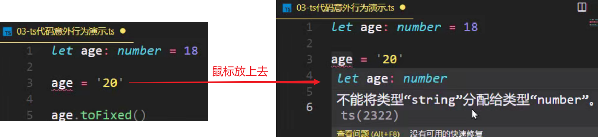

# 1.TypeScript是什么？

TypeScript（简称：TS）是 JavaScript 的超集（JS 有的 TS 都有）。

超集：如下图表示，JS有的TS都有。如果从开发的角度说，JS能实现的功能，TS也都能实现，而且TS在某些情况下要比JS做的更好一些。

既然TS是JS的超集，那TS比JS多了什么东西呢？其实从TS的名字就能看出来了。

TypeScript = Type + JavaScript（在 JS 基础之上，为 JS 添加了类型支持）。

例如下面代码，上面是用TS声明的变量，下面是用JS声明的变量。可以发现上下的对比可以发现，当我们在使用TS声明变量的时候，会在变量名称的后面添加一个 `: number`，这个就是在为 `变量age1` 指定一个明确的类型，`number` 就是 `数值类型`。

TypeScript 是微软开发的开源编程语言，可以在任何运行 JavaScript 的地方运行。

例如JS可以在 `浏览器、NodeJS` 中运行，TS同样也可以在这两个地方运行。

可以理解为：TS不会去改变JS自身的一些特性，它只是在 JS 基础之上，为 JS 添加了类型支持。

---

# 2.TypeScript 为什么要为 JS 添加类型支持？

背景：JS 的类型系统存在“先天缺陷”，JS 代码中绝大部分错误都是类型错误（Uncaught TypeError）。 

问题：增加了找 Bug、改 Bug 的时间，严重影响开发效率。

那TS是如何解决JS中遇到的问题呢？

从编程语言的动静来区分，TypeScript 属于静态类型的编程语言，JS 属于动态类型的编程语言。 

静态类型：编译期做类型检查； 

动态类型：执行期做类型检查。 代码编译和代码执行的顺序：1 编译 2 执行。

对于 JS 来说：它属于动态类型的编程语言，动态类型的编程语言是在执行期做类型检查的，即需要等到代码真正去执行的时候才能发现错误（晚）。

对于 TS 来说：它属于静态类型的编程语言，静态类型的编程语言是在编译期做类型检查的，在代码编译的时候（代码执行前）就可以发现错误（早）。

并且，配合 VSCode 等开发工具，TS 可以提前到在编写代码的同时就发现代码中的错误。

简单来说：当你在写代码时遇到了类型相关的错误，结合VSCode等开发工具，TS就可以里面给你提示，此时就不需要等到代码在浏览器中执行的时候再发现这个错误了，这样就减少了找 Bug、改 Bug 时间，从而提高开发效率。

---

# 3.TypeScript 相比 JS 的优势

**1、更早（写代码的同时）发现错误，`减少找 Bug、改 Bug 时间`，提升开发效率。**

**2、使用TS的时候，程序中任何位置的代码都有`代码提示`**（在我们写TS的时候，不管在哪个位置，在对象后面 `.` 一下，对象中所有的属性、方法都会给你列举出来；但是JS提示功能就不会这么高级），**随时随地的安全感，增强了开发体验。**

**3、强大的类型系统提升了代码的可维护性，使得重构代码更加容易。**

例如在开发应用的时候，我们经常会使用axios发送请求获取数据，然后将数据展示在页面中。但是随着时间的推移，接口中的数据有可能会发生修改，例如某个属性原来是字符串类型的，但是随着项目功能越来越多，String类型的数据已经不足以支持我们的功能了，此时就需要改成字符串数组类型的。

对于这样的功能在TS中是非常好实现的，只需要将原来的字符串类型改为字符串数组类型就行了，然后只要用到这个数据的地方，如果存在类型的问题，在VSCode中都会有红色波浪线标记出来，我们只需要根据提示修改红色波浪线的内容就行了。

但是如果在JS中，我们就需要手动去查找在程序中哪个地方用到了这个数据，然后你还要考虑这个地方怎样才是对的，怎样才是错的。

很明显，通过这样的一个对比，在使用TS的时候，程序的可维护性是更强的。

**4、支持最新的 ECMAScript 语法，优先体验最新的语法，让你走在前端技术的最前沿。**

详述上述优势的同时，因为TS给JS增加了类型系统，会不会导致我们在写TS代码的时候需要很高的编码成本呢？

实际上并不需要，因为TS中有一个叫做 `类型推断` 的1机制。

**5、TS 类型推断机制，不需要在代码中的每个地方都显示标注类型**

换句话说：TS可以自动根据当前代码，来我们推断出相应的类型，让你在享受优势的同时，尽量降低了使用成本。

**除此之外，Vue 3 源码使用 TS 重写、Angular 默认支持 TS、React 与 TS 完美配合，TypeScript 已成为大中型前端 项目的首先编程语言。**

----

# 4.安装编译 TS 的工具包

问题：为什么要安装编译 TS 的工具包？

回答：`Node.js` / `浏览器`，只认识 JS 代码，不认识 TS 代码。因此需要先将 TS 代码转化为 JS 代码，然后才能运行。

安装命令：`npm i -g typescript`。

typescript 包：用来编译 TS 代码的包，提供了 `tsc` 命令，这个命令实现了 `TS -> JS` 的转化。通过如下图片，可以很直观的看见这个流程。

验证是否安装成功：`tsc –v`（查看 typescript 的版本）。

----

# 5.编译并运行 TS 代码

步骤

**1、创建 `hello.ts` 文件（注意：TS 文件的后缀名为 `.ts`）**

**2、将 TS 编译为 JS：在终端中输入命令，`tsc hello.ts`（此时，在同级目录中会出现一个同名的 JS 文件）**

编译为JS后，可以发现代码几乎是一模一样的，只不过生成的JS代码中多了分号，但其分号是可写可不写的。

**3、执行 JS 代码：在终端中输入命令，`node hello.js`**

**说明：所有合法的 JS 代码都是 TS 代码，因此有 JS 基础只需要学习 TS 的类型即可。**

**注意：由 TS 编译生成的 JS 文件，代码中就没有明确类型信息了。**

如下实例，在TS中写的 `let age` 被tsc编译成了 `var` 的方式来声明了，并且在JS中没有TS中声明的 `number` 类型信息了。

但是为什么会有报错呢？鼠标放上去：无法重新声明块范围变量“age”。

报错原因：当我们同时打开两个文件，并且这两个文件中有同名变量的时候，TS就会给出这样的提示。

解决办法：将右侧的JS文件关掉，提示就没了。因此这个错误我们并不用操心，因为它并不是我们代码中的错误。

----

# 6.简化运行 TS 的步骤

问题描述：每次修改代码后，都要重复执行两个命令，才能运行 TS 代码，太繁琐。

简化方式：使用 `ts-node 包`，' 直接 ' `在 `Node.js` 中执行 TS 代码。

安装命令：`npm i -g ts-node`（`ts-node` 包提供了 `ts-node 命令`）。

使用方式：`ts-node hello.ts`

解释：其实 ts-node 命令是在内部偷偷的将 TS -> JS，然后，再运行 JS 代码。只不过不需要我们手动执行这两个步骤了而已。

PS：`ts-node命令` 并不会在`.ts` 同级目录下生成一个 `.js文件`，它仅仅是在内部转化为JS后立马运行。

----

# 7. TypeScript 类型系统的优势

TypeScript 是 JS 的超集，TS 提供了 JS 的所有功能，并且额外的增加了：类型系统。

- 所有的 JS 代码都是 TS 代码。
- JS 有类型（比如，number/string 等），但是 JS 不会检查变量的类型是否发生变化。而 TS 会检查。 

**TypeScript 类型系统的主要优势：可以显示标记出代码中的意外行为，可以更早的发现错误，从而降低了发生错误的可能性。**

例如下图，将字符串类型赋值给了一个数值类型，这就是一个 `意外行为`。

当JS代码中中途修改了count的类型，就报错了。

因此变量类型的变化经常会导致一些错误发生，因此在编码的时候我们应该尽量不要去修改变量的类型。

JS是无法帮助我们及时去发现这个错误的，只有当我们真正运行代码的时候才能发现这样的错误。

但是TS就会检查变量类型的变化的

当然这个错误不仅鼠标放上去可以看见，控制台中的 `问题` 也是可以看见这个错误，并且点击错误，VSCode是可以自动定位到出错的这一行。

---

# 8.类型注解

说明：代码中的 `: number` 就是类型注解。`:` 后面我们一般会加上一个空格。

作用：为变量添加类型约束。比如，上述代码中，约定变量 age 的类型为 number（数值类型）。

解释：**约定了什么类型，就只能给变量赋值该类型的值**，否则，就会报错。

---

# 9.常用基础类型概述

可以将 TS 中的常用基础类型细分为两类：1、JS 已有类型； 2、TS 新增类型。

所有合法的 JS 代码都是 TS 代码，在JS中有的类型，在TS中也都是可以使用的。

JS 已有类型

- 原始类型（基本数据类型）：`number/string/boolean/null/undefined/symbol`

  symbol是ES6中新增的类型，我们一般很少使用。

- 对象类型（引用数据类型）：总的来说JS中对象类型就是object，如果要细分，object中又包括 `数组、对象、函数` 等对象

TS 新增类型

- 联合类型、自定义类型（类型别名）、接口、元组、字面量类型、枚举、void、any 等

---

# 10.原始类型（基本数据类型）

原始类型：`number/string/boolean/null/undefined/symbol`

特点：简单。这些类型，完全按照 JS 中类型的名称来书写。

要注意的是类型名称都是小写的，因为在JS中类型也都是小写的。可以使用JS中的 `typeof` 运算符来获取变量的类型，此时获取的都是小写的。

~~~ts
let age: number = 18

let myName: string = '刘老师'

let isLoading: boolean = false

let a: null = null

let b: undefined = undefined

let s: symbol = Symbol()
~~~

----

# 11.数组类型

JS中对象类型统称为 `object`，包括数组、对象、函数等对象

对象类型，在 TS 中更加细化，每个具体的对象都有自己的类型语法。

这点实际上要比JS中更加合理，因为在JS中通过 `typeof运算符` 来判断 `数组、对象、函数` 等拿到的对象类型都是 `object`，因此需要一个特定的方式来区分它到底是一个数组还是一个对象，这其实是因为JS的历史原因造成的，而TS中就避免了一些这样不实用的情况。

数组类型的两种写法：（推荐使用 `number[]` 写法）

需求：数组中既有 number 类型，又有 string 类型，这个数组的类型应该如何写？

解释：`| （竖线）` 在 TS 中叫做**联合类型**（由两个或多个其他类型组成的类型，表示可以是这些类型中的任意一种）。

注意：这是 TS 中联合类型的语法，只有一根竖线，不要与 JS 中的或 `||` 混淆了。

PS：小括号不要忘记了。表示：`arr` 首先是数组，然后这个数组中能够出现 `number` 或` string` 类型的元素

如果将 `[]` 去掉，`arr` 的含义就变了，以下代码就表示 `arr` 既可以是一个 `number类型`，也可以是一个 `string类型的数组`

~~~java
let arr: number | string[] = [1, 3, 5, 'a', 'b']
~~~

---

# 13.类型别名

类型别名（自定义类型）：为任意类型起别名。

使用场景：当同一类型（复杂）被多次使用时，可以通过类型别名，给这个复杂类型起一个别名，从而达到简化该类型的使用。

~~~js
let arr: (number | string)[] = [1, 3, 5, 'a', 'b']
let arr1: (number | string)[] = [1, 'x', 2, 'y']

// 使用类型别名改造：
type CustomArray = (number | string)[]
let arr: CustomArray = [1, 3, 5, 'a', 'b']
let arr1: CustomArray = [1, 'x', 2, 'y']
~~~

解释：

1. 使用 `type 关键字` 来创建类型别名

2. 类型别名（比如，此处的 CustomArray），可以是任意合法的JS变量名称，变量名称最好见名知意

   这个变量你可以理解为这个类型的变量，因为这个变量中存储的是一个类型

3. 创建类型别名后，直接使用该类型别名作为变量的类型注解即可。

----

# 14. 函数类型 —— 单独指定参数、返回值的类型

函数的类型实际上指的是：函数参数和返回值的类型。

为函数指定类型的两种方式：

**① 函数声明的方式声明函数**

~~~ts
function add(num1: number, num2: number): number {
  return num1 + num2
}
~~~

PS：如果函数已经指定返回值类型是 `number`，但没有返回值，就会报错：声明类型既不是“undefined”、“void”也不是“any”的函数必须返回一个值。

 **② 函数表达式声明函数**

~~~ts
const add = (num1: number, num2: number): number => {
  return num1 + num2
}
~~~

---

# 15.函数类型 —— 同时指定参数、返回值的类型

如下代码是通过函数表达式的方式来创建的

解释：当函数作为表达式时，可以通过**类似箭头函数形式的语法**来为函数添加类型。

**注意：这种形式只适用于函数表达式。**

~~~ts
const add: (num1: number, num2: number) => number = (num1, num2) => {
  return num1 + num2
}
~~~

这个时候实际上是将这个函数作为了一个表达式赋值给了变量 `add`

这种情况下可以相当于给一个普通的变量一样为函数添加类型了，因此此时直接在变量的后面增加类型就行了，但又因为它是一个函数，因此类型也需要从形式上满足的函数的形式（即有参数，也有返回值）。

其中红框框起来的就是当前函数的类型了：num1是number类型，num2是number类型，箭头后面就是函数返回值的类型。

只要在前面指定了函数的类型，那么函数参数这里就自动的有类型了：此时将鼠标放到 `num1` 上，可以发现 `num1` 的类型自动就是 `number` 了。

----

# 16.void类型

