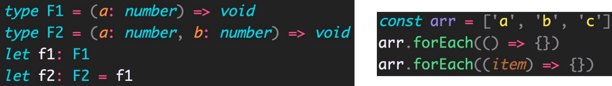
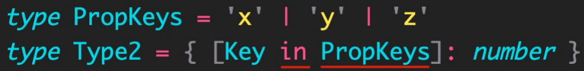

# 1.TypeScript是什么？

TypeScript（简称：TS）是 JavaScript 的超集（JS 有的 TS 都有）。

超集：如下图表示，JS有的TS都有。如果从开发的角度说，JS能实现的功能，TS也都能实现，而且TS在某些情况下要比JS做的更好一些。

既然TS是JS的超集，那TS比JS多了什么东西呢？其实从TS的名字就能看出来了。

TypeScript = Type + JavaScript（在 JS 基础之上，为 JS 添加了类型支持）。

例如下面代码，上面是用TS声明的变量，下面是用JS声明的变量。可以发现上下的对比可以发现，当我们在使用TS声明变量的时候，会在变量名称的后面添加一个 `: number`，这个就是在为 `变量age1` 指定一个明确的类型，`number` 就是 `数值类型`。

TypeScript 是微软开发的开源编程语言，可以在任何运行 JavaScript 的地方运行。

例如JS可以在 `浏览器、NodeJS` 中运行，TS同样也可以在这两个地方运行。

可以理解为：TS不会去改变JS自身的一些特性，它只是在 JS 基础之上，为 JS 添加了类型支持。

---

# 2.TypeScript 为什么要为 JS 添加类型支持？

背景：JS 的类型系统存在“先天缺陷”，JS 代码中绝大部分错误都是类型错误（Uncaught TypeError）。 

问题：增加了找 Bug、改 Bug 的时间，严重影响开发效率。

那TS是如何解决JS中遇到的问题呢？

从编程语言的动静来区分，TypeScript 属于静态类型的编程语言，JS 属于动态类型的编程语言。 

静态类型：编译期做类型检查； 

动态类型：执行期做类型检查。 代码编译和代码执行的顺序：1 编译 2 执行。

对于 JS 来说：它属于动态类型的编程语言，动态类型的编程语言是在执行期做类型检查的，即需要等到代码真正去执行的时候才能发现错误（晚）。

对于 TS 来说：它属于静态类型的编程语言，静态类型的编程语言是在编译期做类型检查的，在代码编译的时候（代码执行前）就可以发现错误（早）。

并且，配合 VSCode 等开发工具，TS 可以提前到在编写代码的同时就发现代码中的错误。

简单来说：当你在写代码时遇到了类型相关的错误，结合VSCode等开发工具，TS就可以里面给你提示，此时就不需要等到代码在浏览器中执行的时候再发现这个错误了，这样就减少了找 Bug、改 Bug 时间，从而提高开发效率。

---

# 3.TypeScript 相比 JS 的优势

**1、更早（写代码的同时）发现错误，`减少找 Bug、改 Bug 时间`，提升开发效率。**

**2、使用TS的时候，程序中任何位置的代码都有`代码提示`**（在我们写TS的时候，不管在哪个位置，在对象后面 `.` 一下，对象中所有的属性、方法都会给你列举出来；但是JS提示功能就不会这么高级），**随时随地的安全感，增强了开发体验。**

**3、强大的类型系统提升了代码的可维护性，使得重构代码更加容易。**

例如在开发应用的时候，我们经常会使用axios发送请求获取数据，然后将数据展示在页面中。但是随着时间的推移，接口中的数据有可能会发生修改，例如某个属性原来是字符串类型的，但是随着项目功能越来越多，String类型的数据已经不足以支持我们的功能了，此时就需要改成字符串数组类型的。

对于这样的功能在TS中是非常好实现的，只需要将原来的字符串类型改为字符串数组类型就行了，然后只要用到这个数据的地方，如果存在类型的问题，在VSCode中都会有红色波浪线标记出来，我们只需要根据提示修改红色波浪线的内容就行了。

但是如果在JS中，我们就需要手动去查找在程序中哪个地方用到了这个数据，然后你还要考虑这个地方怎样才是对的，怎样才是错的。

很明显，通过这样的一个对比，在使用TS的时候，程序的可维护性是更强的。

**4、支持最新的 ECMAScript 语法，优先体验最新的语法，让你走在前端技术的最前沿。**

详述上述优势的同时，因为TS给JS增加了类型系统，会不会导致我们在写TS代码的时候需要很高的编码成本呢？

实际上并不需要，因为TS中有一个叫做 `类型推论` 的机制，它可以让TS中的类型某些情况下是可以省略的。

**5、TS 类型推断机制，不需要在代码中的每个地方都显示标注类型**

换句话说：TS可以自动根据当前代码，来我们推断出相应的类型，让你在享受优势的同时，尽量降低了使用成本。

**除此之外，Vue 3 源码使用 TS 重写、Angular 默认支持 TS、React 与 TS 完美配合，TypeScript 已成为大中型前端 项目的首先编程语言。**

----

# 4.安装编译 TS 的工具包

问题：为什么要安装编译 TS 的工具包？

回答：`Node.js` / `浏览器`，只认识 JS 代码，不认识 TS 代码。因此需要先将 TS 代码转化为 JS 代码，然后才能运行。

安装命令：`npm i -g typescript`。

typescript 包：用来编译 TS 代码的包，提供了 `tsc` 命令，这个命令实现了 `TS -> JS` 的转化。通过如下图片，可以很直观的看见这个流程。

验证是否安装成功：`tsc –v`（查看 typescript 的版本）。

----

# 5.编译并运行 TS 代码

步骤

**1、创建 `hello.ts` 文件（注意：TS 文件的后缀名为 `.ts`）**

**2、将 TS 编译为 JS：在终端中输入命令，`tsc hello.ts`（此时，在同级目录中会出现一个同名的 JS 文件）**

编译为JS后，可以发现代码几乎是一模一样的，只不过生成的JS代码中多了分号，但其分号是可写可不写的。

**3、执行 JS 代码：在终端中输入命令，`node hello.js`**

**说明：所有合法的 JS 代码都是 TS 代码，因此有 JS 基础只需要学习 TS 的类型即可。**

**注意：由 TS 编译生成的 JS 文件，代码中就没有明确类型信息了。**

如下实例，在TS中写的 `let age` 被tsc编译成了 `var` 的方式来声明了，并且在JS中没有TS中声明的 `number` 类型信息了。

但是为什么会有报错呢？鼠标放上去：无法重新声明块范围变量“age”。

报错原因：当我们同时打开两个文件，并且这两个文件中有同名变量的时候，TS就会给出这样的提示。

解决办法：将右侧的JS文件关掉，提示就没了。因此这个错误我们并不用操心，因为它并不是我们代码中的错误。

----

# 6.简化运行 TS 的步骤

问题描述：每次修改代码后，都要重复执行两个命令，才能运行 TS 代码，太繁琐。

简化方式：使用 `ts-node 包`，' 直接 ' `在 `Node.js` 中执行 TS 代码。

安装命令：`npm i -g ts-node`（`ts-node` 包提供了 `ts-node 命令`）。

使用方式：`ts-node hello.ts`

解释：其实 ts-node 命令是在内部偷偷的将 TS -> JS，然后，再运行 JS 代码。只不过不需要我们手动执行这两个步骤了而已。

PS：`ts-node命令` 并不会在`.ts` 同级目录下生成一个 `.js文件`，它仅仅是在内部转化为JS后立马运行。

----

# 7. TypeScript 类型系统的优势

TypeScript 是 JS 的超集，TS 提供了 JS 的所有功能，并且额外的增加了：类型系统。

- 所有的 JS 代码都是 TS 代码。
- JS 有类型（比如，number/string 等），但是 JS 不会检查变量的类型是否发生变化。而 TS 会检查。 

**TypeScript 类型系统的主要优势：可以显示标记出代码中的意外行为，可以更早的发现错误，从而降低了发生错误的可能性。**

例如下图，将字符串类型赋值给了一个数值类型，这就是一个 `意外行为`。

当JS代码中中途修改了count的类型，就报错了。

因此变量类型的变化经常会导致一些错误发生，因此在编码的时候我们应该尽量不要去修改变量的类型。

JS是无法帮助我们及时去发现这个错误的，只有当我们真正运行代码的时候才能发现这样的错误。

但是TS就会检查变量类型的变化的

当然这个错误不仅鼠标放上去可以看见，控制台中的 `问题` 也是可以看见这个错误，并且点击错误，VSCode是可以自动定位到出错的这一行。

---

# 8.类型注解

说明：代码中的 `: number` 就是类型注解。`:` 后面我们一般会加上一个空格。

作用：为变量添加类型约束。比如，上述代码中，约定变量 age 的类型为 number（数值类型）。

解释：**约定了什么类型，就只能给变量赋值该类型的值**，否则，就会报错。

---

# 9.常用类型概述

可以将 TS 中的常用基础类型细分为两类：1、JS 已有类型； 2、TS 新增类型。

所有合法的 JS 代码都是 TS 代码，在JS中有的类型，在TS中也都是可以使用的。

JS 已有类型

- 原始类型（基本数据类型）：`number/string/boolean/null/undefined/symbol`

  symbol是ES6中新增的类型，我们一般很少使用。

- 对象类型（引用数据类型）：总的来说JS中对象类型就是object，如果要细分，object中又包括 `数组、对象、函数` 等对象

TS 新增类型

- 联合类型、自定义类型（类型别名）、接口、元组、字面量类型、枚举、void、any 等

PS：以下在指定类型的时候，是可以选择是否指定类型的.

---

# 10.原始类型（基本数据类型）

原始类型：`number/string/boolean/null/undefined/symbol`

特点：简单。这些类型，完全按照 JS 中类型的名称来书写。

要注意的是类型名称都是小写的，因为在JS中类型也都是小写的。可以使用JS中的 `typeof` 运算符来获取变量的类型，此时获取的都是小写的。

~~~ts
let age: number = 18

let myName: string = '刘老师'

let isLoading: boolean = false

let a: null = null

let b: undefined = undefined

let s: symbol = Symbol()
~~~

----

# 11.数组类型

JS中对象类型统称为 `object`，包括数组、对象、函数等对象

对象类型，在 TS 中更加细化，每个具体的对象都有自己的类型语法。

这点实际上要比JS中更加合理，因为在JS中通过 `typeof运算符` 来判断 `数组、对象、函数` 等拿到的对象类型都是 `object`，因此需要一个特定的方式来区分它到底是一个数组还是一个对象，这其实是因为JS的历史原因造成的，而TS中就避免了一些这样不实用的情况。

数组类型的两种写法：（推荐使用 `number[]` 写法）

需求：数组中既有 number 类型，又有 string 类型，这个数组的类型应该如何写？

解释：`| （竖线）` 在 TS 中叫做**联合类型**（由两个或多个其他类型组成的类型，表示可以是这些类型中的任意一种）。

注意：这是 TS 中联合类型的语法，只有一根竖线，不要与 JS 中的或 `||` 混淆了。

PS：小括号不要忘记了。表示：`arr` 首先是数组，然后这个数组中能够出现 `number` 或` string` 类型的元素

如果将 `[]` 去掉，`arr` 的含义就变了，以下代码就表示 `arr` 既可以是一个 `number类型`，也可以是一个 `string类型的数组`

~~~java
let arr: number | string[] = [1, 3, 5, 'a', 'b']
~~~

---

# 13.类型别名

类型别名（自定义类型）：为任意类型起别名。

使用场景：当同一类型（复杂）被多次使用时，可以通过类型别名，给这个复杂类型起一个别名，从而达到简化该类型的使用。

类型别名相当于在声明变量，因此变量名和类型之间使用 `=` 连接。

~~~js
let arr: (number | string)[] = [1, 3, 5, 'a', 'b']
let arr1: (number | string)[] = [1, 'x', 2, 'y']

// 使用类型别名改造：
type CustomArray = (number | string)[]
let arr: CustomArray = [1, 3, 5, 'a', 'b']
let arr1: CustomArray = [1, 'x', 2, 'y']
~~~

解释：

1. 使用 `type 关键字` 来创建类型别名

2. 类型别名（比如，此处的 CustomArray），可以是任意合法的JS变量名称，变量名称最好见名知意

   这个变量你可以理解为这个类型的变量，因为这个变量中存储的是一个类型

3. 创建类型别名后，直接使用该类型别名作为变量的类型注解即可。

----

# 14. 函数类型 —— 单独指定参数、返回值的类型

函数的类型实际上指的是：函数参数和返回值的类型。

为函数指定类型的两种方式：

**① 函数声明的方式声明函数**

~~~ts
function add(num1: number, num2: number): number {
  return num1 + num2
}
~~~

PS：如果函数已经指定返回值类型是 `number`，但没有返回值，就会报错：声明类型既不是“undefined”、“void”也不是“any”的函数必须返回一个值。

 **② 函数表达式声明函数**

~~~ts
const add = (num1: number, num2: number): number => {
  return num1 + num2
}
~~~

---

# 15.函数类型 —— 同时指定参数、返回值的类型

如下代码是通过函数表达式的方式来创建的

解释：当函数作为表达式时，可以通过**类似箭头函数形式的语法**来为函数添加类型。

**注意：这种形式只适用于函数表达式。**

~~~ts
const add: (num1: number, num2: number) => number = (num1, num2) => {
  return num1 + num2
}
~~~

这个时候实际上是将这个函数作为了一个表达式赋值给了变量 `add`

这种情况下可以相当于给一个普通的变量一样为函数添加类型了，因此此时直接在变量的后面增加类型就行了，但又因为它是一个函数，因此类型也需要从形式上满足的函数的形式（即有参数，也有返回值）。

其中红框框起来的就是当前函数的类型了：num1是number类型，num2是number类型，箭头后面就是函数返回值的类型。

只要在前面指定了函数的类型，那么函数参数这里就自动的有类型了：此时将鼠标放到 `num1` 上，可以发现 `num1` 的类型自动就是 `number` 了。

----

# 16.void类型

我们知道JS中的函数可以有返回值也可以没有返回值，如果一个函数没有返回值，那么，函数返回值类型为：void。

例如下面 `greet()` 函数，它就是打印了一个内容，并没有任何的返回值，因此函数返回值类型可以写成 `void`。

PS：`void` 是TS中新增的，并不是JS中具有的类型。

~~~ts
function greet(name: string): void {
  console.log('Hello', name)
}

greet('jack') // Hello jack
~~~

---

# 17.可选参数

使用函数实现某个功能时，参数可以传也可以不传。这种情况下，在给函数参数指定类型时，就用到可选参数了。

比如，数组的 slice 方法，它的参数是可选的，可以是 `slice()`， 也可以是 `slice(1)`， 还可以是 `slice(1, 3)`。

可选参数：在可传可不传的参数名称后面添加 `?（问号）`，此时就表示这个参数可传可不传。

~~~ts
function mySlice(start?: number, end?: number): void {
  console.log('起始索引：', start, '结束索引：', end)
}

mySlice()
mySlice(1)
mySlice(1, 3)
~~~

打印结果如下，如果没传参数，那么参数值为 `undefined`

**注意：可选参数只能出现在参数列表的最后，也就是说可选参数后面不能再出现必选参数。**

当可选参数后面还有必选参数时，就会报错

同样的，如果参数为 `必选参数`，那么就一定要传值，否则报错。

----

# 18.对象类型

## 一、语法

JS 中的对象是由属性和方法构成的，而 TS 中对象的类型就是在描述对象的结构（有什么类型的属性和方法）。

对象类型的写法：

~~~ts
let person: { name: string; age: number; sayHi(): void; greet(name: string): void } = {
  name: '刘老师',
  age: 18,
  sayHi() {},
  greet(name) {}
}
~~~

解释：从整体上来看，它的结构跟JS中对象特别的相似，但也有区别

1. 直接使用 `{}` 来描述对象结构。属性采用**属性名: 类型**的形式；方法采用**方法名(): 返回值**类型的形式。
2. 如果方法有参数，就在方法名后面的小括号中指定参数类型（比如：`greet(name: string): void`，这个写法跟函数类型参数的写法是一样的）
3. 在一行代码中指定对象的多个属性类型时，使用 ;（分号）来分隔

当最上面一行指定完类型后，下面每写一个属性，VSCode都会有自动提示（属性名和类型都有），这个提示就来自于上面我们自己写的

由于我们在最上面已经定义好了对象中每个属性的类型，那么在写属性的时候直接写即可，就没必要再去指定一次类型了。

---

## 二、细节

如果一行代码只指定一个属性类型（通过换行来分隔多个属性类型），可以去掉 `;（分号）`

方法的类型也可以使用箭头函数形式（比如：`{ sayHi: () => void }`）。

~~~ts
let person: {
  name: string
  age: number
  // sayHi(): void
  sayHi: () => void
  greet(name: string): void
} = {
  name: '刘老师',
  age: 18,
  sayHi() {},
  greet(name) {}
}
~~~

---

# 19.可选属性

对象的属性或方法，也可以是可选的，此时就用到可选属性了。

比如，我们在使用 `axios({ … })` 时，如果发送 GET 请求，method 属性就可以省略。

可选属性的语法与函数可选参数的语法一致，都使用 `?（问号）` 来表示。

~~~ts
function myAxios(config: { url: string; method?: string }) {}

myAxios({
  url: ''
})
~~~

----

# 20.接口

当一个对象类型被多次使用时，一般会使用接口（interface）来描述对象的类型，达到复用的目的。

解释：

1. 使用 interface 关键字来声明接口
2. 接口名称（比如，此处的 IPerson），可以是任意合法的变量名称，名字最好见名知意
3. 声明接口后，直接使用接口名称作为变量的类型
4. 因为每一行只有一个属性类型，因此，属性类型后没有 ;（分号）

~~~ts
// 接口：
interface IPerson {
  name: string
  age: number
  sayHi(): void
}

let person1: IPerson = {
  name: '刘老师',
  age: 18,
  sayHi() {}
}

let person2: IPerson = {
  name: 'jack',
  age: 16,
  sayHi() {}
}
~~~

----

# 21.interface（接口）和 type（类型别名）的对比

相同点：都可以给对象指定类型。

类型别名相当于在声明变量，因此变量名和类型之间使用 `=` 连接。

不同点：

- 接口，只能为对象指定类型。
- 类型别名，不仅可以为对象指定类型，实际上可以为任意类型指定别名。

----

# 22.接口的继承

如果两个接口之间有相同的属性或方法，可以将公共的属性或方法抽离出来，通过继承来实现复用。

比如，这两个接口都有 x、y 两个属性，重复写两次，可以，但很繁琐。

更好的方式：

解释：

1. 使用 `extends（继承）`关键字实现了接口 `Point3D` 继承 `Point2D`
2. 继承后，`Point3D` 就有了 `Point2D` 的所有属性和方法（此时，`Point3D` 同时有` x、y、z` 三个属性）

~~~ts
interface Point2D {
  x: number
  y: number
}
interface Point3D { x: number; y: number; z: number }

// 使用 继承 实现复用：
interface Point3D extends Point2D {
  z: number
}

let p3: Point3D = {
  x: 1,
  y: 0,
  z: 0
}
~~~

----

# 23.元组

场景：在地图中，使用经纬度坐标来标记位置信息。

可以使用数组来记录坐标，那么，该数组中只有两个元素，并且这两个元素都是数值类型。

使用 `number[]` 的缺点：不严谨，因为该类型的数组中可以出现任意多个数字，这样这个数组表示的意思就不明显了。如下，从索引为2的数开始，以及它后面的数都没有意义了，而且也不应该出现。

~~~ts
let position: number[] = [39, 114, 1, ,3, 4]
~~~

更好的方式：元组（Tuple）。

元组类型是另一种类型的数组，它确切地知道包含多少个元素，以及特定索引对应的类型。

解释：

1. 元组类型可以确切地标记出有多少个元素，以及每个元素的类型。

2. 该示例中，元素有两个元素，每个元素的类型都是 number。

   如果此时再添加第三个元素的时候，或者少写一个元素，代码都会报错。

----

# 24.类型推论

之前我们在讲TS相对于JS优势的时候，TS中的类型某些情况下是可以省略的，可以省略的原因就是TS中有一个 `类型推论` 的机制。

`类型推论` 也可以叫 `类型推断`。

在 TS 中，某些没有明确指出类型的地方，TS 的`类型推论机制`会自动的帮助我们提供类型。

换句话说：由于类型推论的存在，这些地方，类型注解可以省略不写！

触发 `类型推论机制` 的 2 种常见场景：1、声明变量并初始化时；2、决定函数返回值时。**因此这两种情况下 `类型注解` 都是可以省略不写的。**

除了这两种常见的场景外，还有一些其他的场景，在以后开发中如果遇到了，再来说。

---

## 一、声明变量并初始化

下图，我们在声明 `age变量` 的时候并没有明确为它指定类型，但是当你把鼠标放在 `age变量` 上的时候，会里面有一个提示，告诉你 `age变量` 的类型就是 `number类型`，这个类型就是TS `类型推论机制` 根据后面赋的值自动去推断出来的。

当我们省略了这个类型后，`类型保护的机制 / 类型检查的机制` 还是存在的，既然这样，那么当我们在声明变量，并且初始化值的时候，就可以直接省略掉变量名称后面的类型注解了，这样写起来会更加简洁一些。

PS：这仅限于我们在声明变量，并且初始化的时候，才会有 `类型推论` 这样的机制存在。

但当我们声明了一个变量 `a`，但是并没有给它初始化值，此时TS就没法推断这个变量的类型了，此时将来就可以给它赋值任意值了。

可以发现下面这样写，先将 `number类型` 的 `19` 赋值给 `a`，后面再赋值字符串给 `a`，并没有报错。

但实际上我们知道，这样修改变量的类型是不好的，因此声明变量但没有立即初始化值，此时，还是推荐大家手动添加类型注解。

这样类型机制又会起到一个检查，并且保护的作用了。

---

## 二、决定函数返回值时

决定函数返回值时，同样也是可以省略掉函数返回值类型的

推荐：**能省略类型注解的地方就省略**（~~偷懒~~，充分利用TS类型推论的能力，节约一定的时间，提升开发效率）。

技巧：如果不知道类型，可以通过鼠标放在变量名称上，利用 VSCode 的提示来查看类型。

例如 `log()` 的返回值是 `void`

----

PS：**函数参数的类型推荐大家是一定要写的**，因为只有这样，在我们调用函数时能起到一个类型检查的作用。否则就可以传任意类型的值。

如下图，第一个参数就失去了类型保护的作用了，这样就会导致代码中将来可能会出现一些意想不到的错误了。

只有指定参数类型后，对于这种意外情况，就会有相应的类型检查去提示相应的错误了

---

# 25.类型断言

## 一、引入

有时候我们开发人员会比 TS 更加明确一个值的类型，此时，可以使用**类型断言**来指定更具体的类型。

例如在我们的页面中有一个 `a标签`，目的是：获取到 `a标签`，然后获取/访问它的 `href属性`。

当我们拿到 `a标签` 对应的 `dom元素`，然后利用 `类型推论机制`，当我们将鼠标放在 `aLink变量` 上面的时候，它会自动给你提示出它的类型是 `HTMLElement`，这个值就是等到右边值的类型，右边值的类型就是 `getElementById()` 的返回值类型。

但是此时当我们想要通过 `aLink` 去访问 `href属性` 的时候会发现，是访问不到的，这是因为 `HTMLElement` 是一个比较宽泛的类型，该类型只包含所有标签公共的属性或方法，不包含 a  标签特有的 href 等属性。

因此，这个类型太宽泛（不具体），无法操作 href 等 a 标签特有的属性或方法。

解决方式：这种情况下就需要使用类型断言指定更加具体的类型。

或者说我们开发人员比 TS 更加明确的知道 `aLink` 对应的类型是一个 `a标签`，而不是一个更宽泛的 `HTML元素`。

----

## 二、语法

解释：

1. 使用 as 关键字实现类型断言。
2. 关键字 as 后面的类型是一个更加具体的类型（HTMLAnchorElement 是 HTMLElement 的子类型）。
3. 通过类型断言，aLink 的类型变得更加具体，这样就可以访问 a 标签特有的属性或方法了。

另一种语法，使用 `<>` 语法，这种语法形式不常用知道即可。但是这种方式不常用，并且在写React的时候，因为它跟JSX语法冲突，因此在写React的时候这种方式也是用不了的。

技巧：如果不知道 `a标签` 的类型是什么，可以在浏览器控制台，通过 console.dir() 打印 DOM 元素，在属性列表的最后面，即可看到该元素的类型。

`console.log($0)` 打印出来是标签，`console.dir($0)` 打印出来的是对象。

一直拖到最下面，可以就可以看见它的类型了。

---

# 26.字面量类型

## 一、什么是 `字面量类型`？

`字面量类型`：JS中任意一个字面值。

思考以下代码，两个变量的类型分别是什么？

通过 TS 类型推论机制，可以得到答案：

1. 变量 str1 的类型为：`string`
2. 变量 str2 的类型为：`'Hello TS'`

解释：

1. str1 是一个变量（let），它的值可以是任意字符串，所以类型为：string。
2. str2 是一个常量（const），它的值不能变化只能是 'Hello TS'，所以，它的类型为：'Hello TS'。

由于常量是不能再次被赋值的，因此常量的类型就是当前常量自身了。

由此可知，在TS中使用不同的方式声明变量，变量有可能会是不同类型的。

注意：此处的 'Hello TS'，就是一个**字面量类型**。也就是说**某个特定的字符串也可以作为 TS 中的类型**。

当我们手动为 `str2` 指定类型的时候，TS代码并没有给出任何错误，也就代表字符串确实可以作为类型出现。

~~~ts
const str2: 'Hello TS' = 'Hello TS'
~~~

除字符串外，任意的 JS 字面量（比如，对象、数字等）都可以作为类型使用，它们有一个统称的名字： `字面量类型`。

如下代码，即便是用 `let` 声明的变量 `age`，我将它的类型就设置为 `18`

~~~ts
let age: 18 = 18
~~~

此时 `变量age` 的值就只能是 `18` 了，如果改为 `19`，就会报错

----

## 二、使用场景

实际上，直接将一个字面量类型作为一个变量的类型来使用，这样的意义并不大。

`字面量类型` 更重要的使用场景是：用来**表示一组明确的可选值列表**。

比如，在贪吃蛇游戏中，游戏的方向的可选值只能是上、下、左、右中的任意一个。

如果我们使用 `string类型` 的话，它就可以是任意的字符串了，并不能进行固定的可选值，这样就不严谨了，此时就可以使用 `字面量类型` 了。

**`字面量类型` 一般需要配合 `联合类型` 使用，用来表示一组明确的可选值列表。**

并且在我们调用的时候，VSCode就会给出对应的提示，告诉你只能填写哪些值

~~~ts
changeDirection('left') // 调用函数
~~~

此时只要不是这四个固定值中的任意一个，都会报错

解释：参数 direction 的值只能是 `up/down/left/right` 中的任意一个。

优势：相比于 `string` 类型，使用字面量类型更加精确、严谨。

----

# 27.枚举类型

枚举的功能类似于 `字面量类型 + 联合类型` 组合的功能，也可以表示一组明确的可选值。

**枚举：定义一组命名常量。**它描述一个值，该值可以是这些命名常量中的一个。

枚举中的可选值也叫作 `命名常量`，也就是带有名字的一个常量。

解释：

1. 使用 enum 关键字定义枚举。
2. 约定枚举名称、枚举中的值以大写字母开头。
3. 在 `{}` 中就可以定义枚举的可选值，多个值之间通过 `,（逗号）` 分隔。
4. 定义好枚举后，直接使用枚举名称作为类型注解。

注意：形参 direction 的类型为枚举 Direction，那么，实参的值就应该是枚举 Direction 成员的任意一个。 

访问枚举成员：

解释：类似于 JS 中的对象，直接通过点 `.` 语法访问枚举的成员。

完整代码

~~~ts
enum Direction { // 这里通过换行的方式来声明枚举
  Up,
  Down,
  Left,
  Right
}

function changeDirection(direction: Direction) {}
changeDirection(Direction.Left) // 调用函数
~~~

---

# 28.枚举类型的值

问题：我们把枚举成员作为了函数的实参，既然能作为实参，那就表示这个枚举成员一定是有值的，它的值是什么呢？

此时就可以通过TS的 `类型推论机制` 来查看了：将鼠标移到 `Direction.Up` 上面，此时就可以看见枚举成员的值为 `0`，这也就说明 `枚举成员` 是真的有值的。

不仅可以将鼠标放在实参的地方，我们也可以将鼠标放在 `定义枚举时的命名常量` 上，也是可以看见它的值的，并且是有规律的：**默认为从 0 开始自增的数值。**

因为枚举成员默认的值是数值，因此我们也可以把枚举成员的值为数值的这样一些枚举成为：**数字枚举**。

但如果枚举成员中这些默认值不是我们想要的，此时我们是可以给枚举中的成员手动设置值。

如下图，将 `Up` 的值设为了 `10`，后面的值还是会保持自增长的行为。

我们也可以给任何一个命名常量都设置一个初始值。

~~~ts
enum Direction {
  Up = 2,
  Down = 4,
  Left = 8,
  Right = 16
}

function changeDirection(direction: Direction) {}
changeDirection(Direction.Up)
~~~

----

# 29.字符串枚举

字符串枚举：枚举成员的值是字符串。

注意：字符串枚举没有自增长行为，因此，字符串枚举的每个成员必须有初始值（只有数字才有自增长的行为），否则报错。

但是字符串不一定是大写字母，也可以改成小写，但是这个值具体是多少还是根据具体的需求来的。

~~~ts
enum Direction {
  Up = 'UP',
  Down = 'DOWN',
  Left = 'LEFT',
  Right = 'RIGHT'
}

function changeDirection(direction: Direction) {}
changeDirection(Direction.Up)
~~~

----

# 30.枚举的特点及原理

枚举是 TS 为数不多的非 JavaScript 类型级扩展（不仅仅是类型）的特性之一。

因为：其他类型仅仅被当做类型，而**枚举不仅用作类型，还提供值**（枚举成员都是有值的）。

也就是说，其他的类型会在编译为 JS 代码时自动移除。但是，**枚举类型会被编译为 JS 代码！**

我们详细来解释以下枚举类型被编译为JS代码后的意思：

1. 右边第一行是声明了一个变量 `Direction`，这个跟左边枚举的名称是相同的
2. `(function() {})` 中的内容是JS中的 `立即执行函数`
3. `Direction || (Direction = {})`：因为 `Direction` 在上面并没有指定什么，因此下面这块内容里面，如果 `Direction` 是 `undefined`，那么就给 `Direction` 赋默认值 `{}`，即一个对象
4. 赋值完成后，传入函数的就是一个空对象
5. `Direction["UP"]` 就是为对象动态的添加属性，添加 `UP属性`，值为字符串 `"UP"`，这个对应的就是左边枚举成员 `UP`，默认值为字符串 `UP`
6. 其他的同理
7. 最后这个函数执行完成后，`Direction` 就是一个对象了，这个对象中分别有 `UP`、`Down`、`Left`、`Right` 这四个属性

总结：枚举转为JS后，实际上就是转成了JS对象，原来枚举中的成员作为了对象的属性，枚举中的值作为了对象属性的值。

打印一下 `Direction`，可以发现它就是一个对象

说明：枚举与前面讲到的 `字面量类型+联合类型组合` 的功能类似，都用来表示一组明确的可选值列表。

一般情况下，**推荐使用 `字面量类型+联合类型组合` 的方式**，因为相比枚举，这种方式更加直观、简洁、高效。

解释一下为什么会更高效： `字面量类型+联合类型组合` 在编译成JS的时候就直接移除掉了，因为它仅仅是作为类型来使用的；而枚举会被编译成JS，所以带来了更高的开销。

----

# 31.any 类型

原则：**不推荐使用 any！**这会让 TypeScript 变为 “AnyScript”（会失去 TS 类型保护的优势）。

因为当值的类型为 any 时，可以对该值进行任意操作，并且不会有代码提示。

解释：以上操作都不会有任何类型错误提示，即使可能存在错误！这样就逃离了TS类型保护的范围了。（例如上面直接将obj对象当函数调用，还有将obj对象赋值给number类型的变量也不会报错。）

尽可能的避免使用 any 类型，除非**临时使用 any** 来“避免”书写很长、很复杂的类型！（即先将这个功能实现了，然后再将 `any` 替换成更加具体的类型就行了）

其他隐式具有 any 类型的情况：1、声明变量不提供类型也不提供默认值； 2、函数参数不加类型。

注意：因为不推荐使用 any，所以，这两种情况下都应该提供类型！

----

# 32.`typeof` 运算符

众所周知，JS 中提供了 typeof 操作符，用来在 JS 中获取数据的类型。

写在TS中同样可以运行。

实际上，T**S 也提供了 typeof 操作符**：可以在**类型上下文**中引用变量或属性的类型，从而实现类型查询的功能。

也就是说：如果是在普通JS代码的位置单纯的获取数据的类型，使用的就是JS中的 `typeof` ，因为TS是JS的超集。但如果是在**类型上下文**中引用变量或属性的类型，那么使用的就是TS中的 `typeof`。因此在不同环境中的 `typeof操作符` 具有不同的作用。

类型上下文：类型注解的位置，即参数名称的冒号后面。

**使用场景：根据已有变量的值，获取该值的类型，来简化类型书写。**

例如：我们在实现一个功能的时候，它是有默认值的，既然是有默认值，那在JS中必须得写这个默认值，写好默认值后，就可以直接使用 `typeof` 放在类型的位置，就可以拿到默认值的类型了，这样就可以来简化类型的书写了。

---

**示例**

可以通过typeof操作符简化类型的书写

这个 `typeof` 所属的环境就是上面提到的 `类型上下文`，因为我们知道 `参数冒号` 后面就是在写类型，此时 `typeof` 就可以来查询 `p` 在TS中的类型了， `p` 在TS中的类型其实就是 `{ x: number, y: number}`。

如下图，将鼠标放在变量 `p` 上就可以看见它的类型了

总结：

1. 使用 typeof 操作符来获取变量 p 的类型，结果与第一种（对象字面量形式的类型）相同。
2. typeof 出现在类型上下文（类型注解的位置，即参数名称的冒号后面）所处的环境就在类型上下文（区别于 JS 代码）。
3. 注意：typeof 只能用来查询变量或属性的类型，无法查询其他形式的类型（比如，函数调用的类型）。

如下代码，`typeof` 出现在冒号后面，它就是在 `类型上下文` 的环境中，此时它拿到的类型就是 `属性x` 的类型，即 `number`

~~~ts
let num: typeof p.x
~~~

下面代码，我们明确的知道 `add函数` 的返回值类型是 `number类型`，但是 `typeof` 不能查询函数调用这样形式的类型。

----

# 33.TypeScript高级类型概述

TS 中的高级类型有很多，重点学习以下高级类型：

1. **class 类**

   JS中已经有class了，而TS不仅为class增加了类型注解，实际上还提供了一些其他的新功能，例如：成员可见修饰符等

2. **类型兼容性**

   它不算是一种类型，实际上它是TS中类型之间的一种关系，偏原理性的一个知识点

3. **交叉类型**

   它的写法有点像之前讲到的联合类型

4. **泛型 和 keyof**

   泛型可以让函数、接口等更加的通用，因此这是一个非常重要的类型。

   在讲泛型的时候还会讲到TS中的一个运算符：keyof

5. **索引签名类型 和 索引查询类型**

6. **映射类型**

   通过映射类型可以通过一个已有类型，生成一个新类型

这些高级类型是建立在所有的基础类型之上的，它要比我们之前学的基础类型更难更复杂一些。

----

# 34.class的基本使用

## 一、创建class类和实例化

TypeScript 全面支持 ES2015 中引入的 class 关键字，并为其添加了类型注解和其他语法（比如，成员可见性修饰符等） 。

换句话说：TS增强了JS的 `class`

解释：

1. 根据 TS 中的类型推论，可以知道 Person 类的实例对象 p 的类型是 Person。
2. TS 中的 class，不仅提供了 class 的语法功能，也作为一种类型存在。

---

## 二、添加类实例的方式

有两种语法：

解释：

1. 声明成员 age，类型为 number（没有初始值，也没有默认值）。

2. 声明成员 gender，并设置初始值，此时它是有默认值的，此时可省略类型注解（TS 类型推论 为 string 类型）。

   推荐：**能省略类型注解的地方就省略**（~~偷懒~~，充分利用TS类型推论的能力，节约一定的时间，提升开发效率）。

~~~ts
class Person {
  age: number
  gender = '男'
  // gender: string = '男'
}

const p = new Person()
// 实例成员需要通过实例对象p访问到
p.age
p.gender
~~~

PS：如果不给成员指定类型，此时该成员上就会有三个点，鼠标放上去，就会给出对应的提示。但是我们并不推荐使用 `any`，因此需要给age指定类型。

----

## 三、构造函数

构造函数的作用：用来为类的实例属性设置一个初始值。

`this` 在类里面表示类的实例对象，因此实例对象访问的属性就是实例属性了，因此等号左边的 `this.age` 指的是上面创建的实例属性 `age`，这里用相同的红色的线标记出来。

等号右边的 `age和gender` 指的就是构造函数的参数了，同样的，用绿色的线标记出来。

解释：

1. 成员初始化（比如，age: number）后，才可以通过 this.age 来访问实例成员；

2. 需要为构造函数指定类型注解，否则会被隐式推断为 any；

3. 由于构造函数返回值就为新创建的对象，并且构造函数内部的 `return` 返回的值无效，因此不要手动去指定构造函数的返回值类型，否则报错。

   

~~~ts
class Person {
  age: number
  gender: string

  constructor(age: number, gender: string) {
    this.age = age
    this.gender = gender
  }
}

const p = new Person(18, '男')
console.log(p.age, p.gender) // 18 男
~~~

----

## 四、实例方法

实例方法跟实例属性一样，将来都是通过实例对象来访问的。

解释：方法的类型注解（参数和返回值）与函数用法相同。

~~~ts
class Point {
  x = 1
  y = 2

  scale(n: number) {
    this.x *= n
    this.y *= n
  }
}

const p = new Point()

p.scale(10) // 缩放10倍
console.log(p.x, p.y) // 10 20
~~~

---

# 37.class继承

TS中类继承的两种方式：1、extends（继承父类）；2、implements（实现接口）。

说明：JS 中只有 extends，而 implements 是 TS 提供的。

---

## 一、方式一：extends（继承父类）

~~~ts
class Animal {
  move() {
    console.log('走两步')
  }
}

class Dog extends Animal {
  name = '二哈'

  bark() {
    console.log('旺旺！')
  }
}

const d = new Dog()
d.move() // 走两步 
d.bark() // 旺旺！ 
console.log(d.name) // 二哈
~~~

解释：

1. 通过 **extends** 关键字实现继承。
2. 子类 Dog 继承父类 Animal，则 Dog 的实例对象 dog 就同时具有了父类 Animal 和 子类 Dog 的所有属性和方法。

----

## 二、方式二：implements（实现接口）

~~~ts
interface Singale {
  sing(): void
  name: string
}

class Person implements Singale {
  name = 'jack'

  sing() {
    console.log('你是我的小呀小苹果')
  }
}
~~~

解释：

1. 通过 **implements** 关键字让 class 实现接口。

2. Person 类实现接口 Singable 意味着，Person 类中必须提供 Singable 接口中指定的所有方法和属性，否则代码报错。

   `接口`就可以把它理解成是一种`规则`。

   

---

# 39.class类的可见性修饰符

类成员可见性：可以使用 TS 来控制 class 的方法或属性对于 class 外的代码是否可见。

可见性修饰符包括：1、public（公有的）； 2、protected（受保护的）； 3、private（私有的）。

----

## 一、public

public：表示公有的、公开的，公有成员可以被任何地方访问，并且public是默认可见性（即如果不加public，则它也是公开的）。

解释：

1. 在类属性或方法前面添加 public 关键字，来修饰该属性或方法是共有的。
2. 因为 public 是默认可见性，所以，可以直接省略。

----

## 二、protected

protected：表示受保护的，仅对其声明所在类和子类中可见，但实例对象是不能够访问的。

解释：

1. 在类属性或方法前面添加 protected 关键字，来修饰该属性或方法是受保护的。

2. 在子类的方法内部可以通过 this 来访问父类中受保护的成员，但是，它无论是对 `Animal` 的实例对象，还是对 `Dog` 的实例对象都是不可见的！

   如下图，使用 `Animal` 的实例对象调用 `move()`，报错。

   

---

## 三、private

private：表示私有的，只在当前类中可见，对**实例对象以及子类**也是不可见的。

解释：

1. 在类属性或方法前面添加 private 关键字，来修饰该属性或方法是私有的。
2. 私有的属性或方法只在当前类中可见，对子类和实例对象也都是不可见的！

----

## 四、readonly（只读修饰符）

除了可见性修饰符之外，还有一个常见修饰符就是：readonly（只读修饰符）。

readonly：表示只读，用来防止在**构造函数 和 设置默认值**之外对属性进行赋值。

解释：

1. **使用 readonly 关键字修饰该属性是只读的，注意只能`修饰属性不能修饰方法`。**

   如下图，修饰方法报错

   

2. **注意：属性 age 后面的类型注解（比如，此处的 number）如果不加，则 age 的类型为 18 （字面量类型）。**

   这个跟 `const(常量)` 修饰的变量是很相似的，由于常量是不能再次被赋值的，因此常量的类型就是当前常量自身了。

   同样的 `readonly` 是只读的，既然是只读，就不能再次去赋值了，因此当只读属性没有指定类型，但是有默认值的时候，属性age类型就是一个字面量类型。

   

   但如果此时再将构造方法中的 `number类型` 的 `age` 赋值给 `18类型` 的 `age`，就会报错。

   

   PS：如果没有指定类型也没有赋初始值，此时它是 `any类型`，这是不推荐的

   

   **因此只要是 readonly 来修饰的属性，不管有没有默认值，都必须手动提供明确的类型，否则根据类型推论，推论出来的类型可能不是我们想要的类型。**

3. **接口或者 `{}` 表示的对象类型，也可以使用 readonly。**作用也是用来表示当前属性是只读的。

   如下图是用在接口中

   

   如下图是用在普通对象类型中

   

---

# 43.类型兼容性的说明

## 一、引入

我们在写TS代码的时候其实经常会遇到类型兼容性，只不过我们没注意到而已。

如下代码，当我们在 `forEach()` 中传入回调函数的时候就发生了类型兼容性。

~~~ts
let arr = ['a', 'b', 'c']
arr.forEach(item => {})
~~~

其实就是这个回调函数发生了类型兼容性，当你将鼠标放在 `forEach()` 上，这里就会提示出方法的类型。

可以发现该方法应该有三个参数，但是我们传输的是有一个参数，此时只有一个参数的类型赋值给了具有三个参数的类型，但是代码为什么没有报错？

其实就是因为在这种情况下就发生了 `类型兼容性`。

`类型兼容性` 出现的原因跟JS的特性有关，因为在JS中调用 `forEach()` 函数的时候，经常会给回调函数只提供一个参数，并不需要指定所有参数，这种方式在JS中已经使用很长很长的时间了，因此TS在设计类型的时候，就考虑到了这一点了，这一点就是我们现在将的 `类型兼容性`。

当然我们不仅仅可以传入一个参数，也可以传入两个、三个参数

~~~ts
let arr = ['a', 'b', 'c']

arr.forEach(item => {})
arr.forEach((item, index) => {})
arr.forEach((item, index, array) => {})
~~~

---

## 二、类型兼容性的说明

两种类型系统：1、Structural Type System（结构化类型系统）； 2、Nominal Type System（标明类型系统）。

TS 采用的是结构化类型系统，也叫做 `duck typing（鸭子类型）`，类型检查关注的是值所具有的形状，而不去关注名字是否相同。

鸭子类型（鸭子辩型）：如果一个东西叫起来像鸭子、走路像鸭子、游泳也像鸭子，那么我们就说这个东西就是一个鸭子。

也就是说，在结构类型系统中，如果两个对象具有相同的形状，则认为它们属于同一类型。

解释：

1. Point 和 Point2D 是两个名称不同的类。
2. 变量 p 的类型被显示标注为 Point 类型，但是，它的值却是 Point2D 的实例，并且没有类型错误。
3. 因为 TS 是结构化类型系统，只检查 Point 和 Point2D 的结构是否相同（相同，都具有 x 和 y 两个属性，属性类型也相同）。
4. 但是，如果在 Nominal Type System 中（比如，C#、Java 等），它们是不同的类，类型无法兼容。

---

## 三、对象之间的类型兼容性

注意：在结构化类型系统中，如果两个对象具有相同的形状，则认为它们属于同一类型，这种说法并不准确。

更准确的说法：对于对象类型来说，y 的成员至少与 x 相同，则 x 兼容 y（**成员多的可以赋值给少的**）。

解释：

1. Point3D 的成员至少与 Point 相同，则 Point 兼容 Point3D。
2. 所以，成员多的 Point3D 可以赋值给成员少的 Point。

但如果少的 `Point` 赋值给多的 `Point3D` 就会报错

----

## 四、接口之间的兼容性

除了 class 之外，TS 中的其他类型也存在相互兼容的情况，包括：1 接口兼容性 2 函数兼容性 等。

我们先来看接口之间的兼容性。

接口之间的兼容性，类似于 class，**成员多的可以赋值给少的**。

并且，class 和 interface 之间也可以兼容。

---

## 五、函数之间的兼容性

### 1）参数个数

函数之间兼容性比较复杂，需要考虑：1、参数个数；2、参数类型 3 返回值类型。

先来讲 `参数个数`：参数多的兼容参数少的（或者说，**参数少的可以赋值给多的**）。

解释：

1. 参数少的可以赋值给参数多的，所以，f1 可以赋值给 f2。

2. 数组 forEach 方法的第一个参数是回调函数，该示例中类型为：(value: string, index: number, array: string[]) => void。

3.  JS 中省略用不到的函数参数实际上是很常见的，这样的使用方式，促成了 TS 中函数类型之间的兼容性。

   由此也可以看出，TS在设计这门语言的时候，也考虑到了JS中使用的习惯，因此如果不提 `类型兼容性` 的话，对于 `forEach()` 这样传入回调函数的用法来说，其实你是无感知的，这点对前端开发人员是相当友好的，当你从JS切换到TS的时候，是不会改变你的编码习惯的。

4. 并且因为回调函数是有类型的，所以，TS 会自动推导出参数 item、index、array 的类型。

---

### 2）参数类型

参数类型，相同位置的参数类型要相同（原始类型）或兼容（对象类型）。相同位置的参数类型要相同或兼容。

解释：函数类型 F2 兼容函数类型 F1，因为 F1 和 F2 的第一个参数类型相同。

---

但是当参数类型变成一个比较复杂的对象后，就会有些复杂了。

解释：

1. 注意，这样会感觉到很奇怪，如果按照对象来理解，不应该是成员多的赋值给成员少的吗？此处与前面讲到的接口兼容性冲突。

   但是由于我们现在考虑的是函数之间的兼容性，此时我们就不要从接口角度去考虑了。

2. 技巧：这里不要讲Point2D和Point3D看成是一个完整的对象，而是**将对象拆开，把每个属性看做一个个参数。**则（f2）相当于有两个参数，（f3）相当于有三个参数，那么参数少的（f2）可以赋值给参数多的（f3）。

---

### 3）返回值类型

返回值类型，只关注返回值类型本身即可：

解释：

1. 如果返回值类型是原始类型，此时两个函数类型要相同，比如，左侧类型 F5 和 F6。
2. 如果返回值类型是对象类型，此时就可以按照对象类型自身的规则来理解就行了：成员多的可以赋值给成员少的，比如，右侧类型 F7 和 F8。

----

# 49.交叉类型

交叉类型（&）：功能类似于接口继承（extends），**用于组合多个类型为一个类型（常用于对象类型）**。

假如我们想让一个类型中同时具备 `Person`、`Contact` 这两个接口中所有的属性和方法的话

**我们可以通过 `extends关键字` 来实现**

~~~ts
interface Point2D {
  x: number
  y: number
}

// 通过继承 Point3D 具有 x/y/z 三个属性
interface Point3D extends Point2D {
  z: number
}

let p3: Point3D = {
  x: 1,
  y: 2,
  z: 3
}
~~~

**也可以通过 `交叉类型` 来实现**

解释：使用交叉类型后，新的类型 PersonDetail 就**同时具备**了 Person 和 Contact 的所有属性类型（属性和方法）。

在写对象的时候是有代码提示的，并且还可以看见 `name` 是由 `Person` 来提供的，类型是 `string`。

`PersonDetail` 就相当于 `Person & Contact类型` 的别名了，因此将来将 `PersionDetail` 作为 `obj` 的变量类型时，`obj` 的属性就应该提供 `name、phone` 这两个类型了。

相当于：

---

# 50.交叉类型和接口之间的对比说明

相同点：都可以实现对象类型的组合。

不同点：两种方式实现类型组合时，**对于同名属性之间，如果有类型不兼容的问题，处理类型冲突的方式不同。**

如下，接口A和接口B中有同名属性 `fn`，但两个 `fn` 的参数类型不同。

说明：以上代码，接口继承会报错（出现了类型不兼容，但是接口继承并不会去处理类型不兼容）

交叉类型则没有错误，可以简单的将 `新类型C` 理解为：

验证：下面这样创建对象可以发现没有任何问题。

或者也可以直接用 `c` 调用里面的方法 `fn`，此时可以看见 `fn` 是两个类型的交叉类型了。

当然我们知道函数类型也是对象，因此跟我们直接讲过的 `交叉类型一般用于对象类型` 是不冲突的。

接下来调用，可以发现表现为 `1/2`

然后点 `下箭头` 看一下：

这也就是证明了，`value类型` 可以是 `number类型`，也可以是 `string类型` 的。

有一个专业名词来描述这种现象：函数（方法）的重载。

但是我们在写代码的时候，肯定会去避免命名冲突的这样一个情况。

在开发中，接口继承和交叉类型并不是替代关系，而是应该根据业务情况来考虑。

----

# 51.泛型的基本使用

泛型是TS中提供的一个功能强大的TS类型。

**泛型**是可以在**保证类型安全**前提下，让函数等与**多种类型一起工作**，从而**实现复用**，常用于：**函数**、**接口**、**class** 中。

在使用TS进行项目开发的时候会经常用到泛型的功能，例如TS中的数组，或者数组中的方法：forEach等都是通过泛型实现的。

除此之外，我们也会经常自己使用泛型，一般情况下常用于：**函数**、**接口**、**class** 中，从而让函数变成泛型函数、接口变成泛型接口，类变成泛型类，这样就可以从类型的角度增强它们的功能了。

## 一、引出问题

需求：创建一个 id 函数，传入什么数据就返回该数据本身（也就是说，参数和返回值类型相同）。

比如，id(10) 调用以上函数就会直接返回 10 本身。但是，该函数只接收数值类型，无法用于其他类型。

为了能让函数能够接受任意类型，可以将参数类型修改为 any。但是，这样就失去了 TS 的类型保护，类型不安全。

---

## 二、使用泛型

**泛型**在**保证类型安全**（不丢失类型信息）的同时，可以让**函数等与多种不同的类型一起工作**，灵活可**复用**。

泛型不仅在TS具有的高级的功能，实际上，在 C＃和 Java 等编程语言中，泛型都是用来实现可复用组件功能的主要工具之一。

创建泛型函数：

解释：

1. 语法：在函数名称的后面添加 **`<>`（尖括号）**，**尖括号中添加类型变量**，比如此处的 Type。
2. **类型变量** Type，**是一种特殊类型的变量**，**它专门处理类型而不是值。**
3. 该类型变量相当于一个类型容器，能够捕获用户提供的类型（具体是什么类型由用户调用该函数时指定）。
4. 因为 Type 是类型，因此可以将其作为函数参数和返回值的类型，表示参数和返回值具有相同的类型。
5. 类型变量 Type，可以是任意合法的变量名称。

---

## 三、调用泛型函数

解释：

1. 语法：在函数名称的后面添加 `<>`（尖括号），`尖括号中指定具体的类型`，比如，此处的 number。
2. 当传入类型 number 后，这个类型就会被函数声明时指定的类型变量 Type 捕获到。
3. 此时，Type 的类型就是 number，所以，函数 id 参数和返回值的类型也都是 number。

同样，如果传入类型 string，函数 id 参数和返回值的类型就都是 string。

这样，通过**泛型**就做到了让 id 函数与多种不同的类型一起工作，**实现了复用的同时保证了类型安全**。

---

## 四、简化调用泛型函数

解释：

1. 在调用泛型函数时，可以省略 `<类型>` 来简化泛型函数的调用。
2. 此时，TS 内部会采用一种叫做 `类型参数推断的机制`，来根据传入的实参自动推断出类型变量 Type 的类型。
3. 比如，传入实参 10，TS 会自动推断出变量 num 的类型 number，并作为 Type 的类型。

推荐使用这种简化的方式调用泛型函数，使代码更短，更易于阅读。

说明：当编译器无法推断类型或者推断的类型不准确时，就需要显式地传入类型参数。

----

但是这种写法就稍微有一些不一样了，鼠标放到 `id方法` 上，可以发现它帮我们推断出来的类型变成了一个 `字面量类型`

但是虽然TS推断出来的类型要比我们想的更精确一些，但是不管是字面量类型，还是我们想的字符串类型，对于这个功能来说是不影响的。但是如果你觉得她推断出来的字面量类型让你感觉不舒服的话，那么你就手动去传入这个更加具体的类型就行了。

----

## 五、泛型约束

通过上面的学习我们知道：**泛型**是可以在**保证类型安全**前提下，让函数等与**多种类型一起工作**，从而**实现复用**。

但是当我们实际去使用泛型的时候你就会发现，这个能够代表多个类型的类型变量，就变成了你的一个负担了。

泛型约束：默认情况下，泛型函数的类型变量 Type 可以代表多个类型，这导致无法访问任何属性。

比如，id('a') 调用函数时获取参数的长度：

解释：Type 可以代表任意类型，无法保证一定存在 length 属性，比如 number 类型就没有 length。

因此原来很强大的类型变量，现在却变成了我们写代码的负担了。

此时，就需要为泛型添加约束来收缩类型（缩窄类型取值范围）。

添加泛型约束收缩类型，主要有以下两种方式：1、指定更加具体的类型； 2、添加约束。

---

### 1）指定更加具体的类型

将函数类型修改为 `Type[]`（Type 类型的数组），因为只要是数组就一定存在 length 属性，因此就可以访问了。

又由于我们的函数作用是：接收什么返回什么，因此函数的返回值类型也需要改为 `Type[]`

---

### 2）添加约束

解释：

1. 创建描述约束的接口 ILength，该接口要求提供 length 属性。
2. 通过 extends 关键字使用该接口，为泛型（类型变量）添加约束。
3. 该约束表示：传入的类型必须具有 length 属性。

此时 `extends` 就不能理解为继承了，应该这样理解：Type应该满足ILength类型的要求，这里就是必须要有一个length属性，即传入的实参（比如，数组、字符串、对象）只要有 length 属性即可，这也符合前面讲到的接口的类型兼容性（**成员多的可以赋值给少的**）。

~~~ts
interface ILength {
  length: number
}

function id<Type extends ILength>(value: Type): Type {
  value.length
  return value
}

id(['a', 'c'])
id('abc')
id({ length: 10, name: 'jack' })

// 错误演示
id(123) // 报错：如下图
~~~

---

## 六、多个泛型变量的情况

### 1）总述

泛型的类型变量可以有多个，并且类型变量之间还可以约束（比如，第二个类型变量受第一个类型变量约束）。

比如，创建一个函数来获取对象中属性的值（获取的属性一定要是对象中存在的属性）：

`getProp(person, 'age')`：第一个参数传入对象，第二个参数传入你要获取的哪个属性，并且这个属性需要是第一个参数中存在的属性才行，此时第二个参数就收到了第一个参数的约束了。

解释：

1. 添加了第二个类型变量 Key，两个类型变量之间使用（`,`）逗号分隔。

2. **`keyof` 关键字**接收一个对象类型，**生成其键名称（可能是字符串或数字）的联合类型**，在这里就是 `'name' | 'age'`。

   有可能是数字，就是因为有数组、字符串这样的形式存在，而数组、字符串它的键就是数值类型的。（具体可以结合 `4）` 一起看）

3. 本示例中 `keyof Type` 可以直接看成 `keyof Person`，即 `Key` 实际上获取的是 `person` 对象所有键的联合类型，也就是：`'name' | 'age'`。

4. 类型变量 Key 受 Type 约束，可以理解为：Key 只能是 Type 所有键中的任意一个，或者说只能访问对象中存在的属性。

5. Key可以是任意合法的变量名称，由于这里是要获取值，因此就写 `Key`。

---

### 2）疑惑

PS：在调用的时候，会发现提示很奇怪，它告诉我们 `obj` 的类型是 `unknown`，`key` 的类型是 `never`，这里出现了两个我们不认识的类型。

原因很简单，就是因为你在调用函数的时候，并没有通过 `<>` 来明确的指定泛型的类型，因此此时它就不知道你要传入一个什么类型的数据了，因此第一个类型是 `unknown`，这也是TS中的类型，它表示不知道是什么类型。`never` 也是TS中的类型，表示 `不可能`。

因此我们不需要太去关注这个提示，直接写功能即可。

---

### 3）代码实现

~~~ts
function getProp<Type, Key extends keyof Type>(obj: Type, key: Key) {
  return obj[key]
}

getProp({ name: 'jack', age: 18 }, 'age')
getProp({ name: 'jack', age: 18 }, 'name')

// 补充：（了解）
getProp(18, 'toFixed')
getProp('abc', 'split')
getProp('abc', 1) // 此处 1 表示索引
getProp(['a'], 'length')
getProp(['a'], 1000)

console.log('object'[1]) // b

// 错误演示：
getProp({ name: 'jack', age: 18 }, 'name1')
~~~

---

### 4）扩展

由于我们并没有对 `Type` 进行约束，因此第一个参数不一定非得传入对象，传入数组、字符串、数值都行。

如下图，传入18，此时根据提示，`obj` 的类型是 `number`，`key` 可以是 `toString`、`toFixed` 等，这些内容就是 `number类型` 可以访问到的方法。

数值 `18` 本身是没有属性的，但是它所对应到的包装类型 `number` 就有属性了。

---

传入字符串也同理。

但是传入字符串的时候，不仅可以访问到它的属性和方法，还可以传入 `number类型`，这是为什么呢？

因为字符串就像数组一样，也可以通过索引的方式来访问，例如 `'object'[1]` 的结果为 `b`，因此在访问字符串的时候，第二个参数可以传入一个数值类型的索引

~~~ts
getProp('abc', 1)
~~~

---

访问数组的时候也同理，可以传入 `number类型` 代表索引，或者可以传入 `string[]数组` 中所有的属性和方法

PS：虽然可以访问数组、字符串这些类型的键，但是绝大多数情况下，就是用来访问对象中存在的键。

---

## 七、泛型接口

泛型接口：接口也可以配合泛型来使用，让接口配合多种类型来使用，以增加其灵活性，增强其复用性。

解释：

1. 在接口名称的后面添加 `<类型变量>`，那么，这个接口就变成了泛型接口。

2. 接口的类型变量，对接口中所有其他成员可见，也就是**接口中所有成员都可以使用类型变量**。

3. 使用泛型接口时，**需要显式指定**具体的**类型**（比如，此处的 IdFunc），否则报错。因为对于接口来说，是没有类型推断的功能的。

   

4. 此时，id 方法的参数和返回值类型都是 number；ids 方法的返回值类型是 number[]。

----

## 八、数组是泛型接口

实际上，JS 中的数组在 TS 中就是一个泛型接口。

如下图，将鼠标放到 `forEach()` 上面，此时就可以看见这个方法的完整类型了。

`Array<string>` 就是我们刚刚讲到的泛型的语法形式，`Array` 是接口的名称，`<string>` 是在指定类型，里面是 `string` 就是因为 `strs` 数组里面的元素就是 `string类型` 的。

并且 `第一个参数value` 和 `第二个参数array` 的类型也是根据数组元素类型自动推断出来的。

同理，如果数组中换成了 `number类型` 的数据，那么泛型中指定的也变成了 `number`。

解释：当我们在使用数组时，TS 会根据数组的元素类型，来自动知道当前数组接口中对应的相应的类型。

技巧：可以通过 Ctrl + 鼠标左键（Mac：option + 鼠标左键）来查看具体的类型信息。

此时它会自动定位到 `lib.es5.d.ts` 文件中，并且在这个文件里面就可以看见 `forEach()` 方法了，我看见的就是我们用到的数组forEach方法的类型了，在这个方法中可以看见 `value`、`array` 的类型都是 `T`。

那这个 `T` 是谁呢？此时我们就可以一直往上滚动。

可以发现，`Array<T>` 就是一个泛型接口，因此数组在TS中其实就是通过一个泛型接口来实现的。

总结：通过这个泛型接口，让数组的方法在用起来的时候变的非常的好用，因为它可以根据数组的类型来推断出相应的类型后，当我们使用数组的方法的时候就可以来拿到一个准确的类型，从而有利于我们去使用这样的一个数组

----

## 九、泛型类

### 1）引入

泛型类：TS中的class 也可以配合泛型来使用。

比如，React 的 `class 组件` 的基类 `Component` 在TS中就是泛型类，不同的组件有不同的 props（属性） 和 state（状态），因此 `React.Component` 这个泛型类里面有两个类型变量，分别为 `IProps` 和 `IState`。这时在TS中去使用 `class组件` 的时候，就应该为组件来指定当前你要用的组件有什么样的属性和状态。

例如在这个示例中，我们为组件指定了属性 `IProps接口`，该接口中有 `maxLength属性` ；状态 `IState接口`，该接口中有 `count属性`；

将来在这个组件中就可以使用 `maxLength属性` 以及 `count状态`。

解释：`React.Component` 泛型类两个类型变量，分别指定 props 和 state 类型。

由此可见，class也是可以配合泛型来使用的，因此接下来就要来学习一下如何创建一个泛型类，以及它基本的使用。

---

### 2）创建泛型类

跟创建泛型接口是类似的

解释：

1. 类似于泛型接口，在 class 名称后面添加 `<类型变量>`，这个类就变成了泛型类。
2. **指定的类型变量 `NumType` 也可以在类中所有的成员中进行使用。**
3. 此处的 add 方法，采用的是箭头函数形式的类型书写方式。

类似于泛型接口，在创建 class 实例时，在类名后面通过 <类型> 来指定明确的类型。

与泛型接口不同的是，在类后面指定泛型的时候，`<number>` 是可以省略。

如下，不传入泛型也是不会报错的，但是当你将鼠标放在 `GenericNumber` 上，它会提示你它是一个 `unknown(未知)` 类型，就是因为你没有传入泛型。

因此，虽然可以不传泛型，但是对于当前示例下，推荐明确指定 <类型>。因为 TS 无法推导出类型

~~~ts
const myNum = new GenericNumber<number>()
myNum.defaultValue = 10
~~~

但是当你类中的 `constructor` 有类型，此时TS可以根据传入的参数自动推导出类型

~~~ts
class GenericNumber<NumType> {
  defaultValue: NumType
  add: (x: NumType, y: NumType) => NumType
  constructor(value: NumType) {
    this.defaultValue = value
  }
}

const myNum = new GenericNumber(100)
myNum.defaultValue = 10
~~~

如果你分不清楚什么时候该加，什么时候不加，那就一直明确的指定类型就行了，这样记起来方便。

----

## 十、泛型工具类

泛型工具类型：TS 内置了一些常用的工具类型，来简化 TS 中的一些常见操作。

说明：它们都是基于泛型实现的（泛型适用于多种类型，更加通用），并且是内置的，可以直接在代码中使用。

这些工具类型有很多，主要学习以下几个：

1. `Partial<Type>`
2. `Readonly<Type>`
3. `Pick<Type>`
4. `Record<Type>`

---

## 十一、`Partial<Type>`

泛型工具类型 - **`Partial<Type>` 用来构造（创建）一个新类型，这个新类型可以将 Type 的所有属性设置为可选**。

如下示例，接口 `Props` 中的属性都没加 `?`，因此都是必选的。

解释：构造出来的新类型 PartialProps 结构和 Props 相同，但所有属性都变为可选的。

PS：它并不会改变这个类型本身，而是创建一个新的类型。

----

## 十二、`Readonly<Type>`

泛型工具类型 - **`Readonly<Type>` 用来构造一个类型，将 Type 的所有属性都设置为 readonly（只读）**。

解释：构造出来的新类型 ReadonlyProps 结构和 Props 相同，但所有属性都变为只读的。

当我们想重新给 id 属性赋值时，就会报错：无法分配到 "id" ，因为它是只读属性。

---

## 十三、`Pick<Type>`

泛型工具类型 - **`Pick<Type, Keys>` 从 Type 中选择一组属性来构造新类型**。

案例：我想要构建一个类型，它只有 `id` 和 `title` 这两个属性，而且 `Props` 中 `id` 和 `title` 是什么类型的，那么新的类型中 `id` 和 `title` 就是什么类型的，此时就可以来使用 `Pick<Type, Keys>` 了。

解释：

1. Pick 工具类型有两个类型变量：1、表示选择谁的属性； 2、表示选择哪几个属性。
2. 其中第二个类型变量，如果只选择一个则只传入该属性名即可。
3. 第二个类型变量传入的属性只能是第一个类型变量中存在的属性。
4. 构造出来的新类型 PickProps，只有 id 和 title 两个属性类型。

---

## 十四、`Record<Type>`

泛型工具类型 - `Record<Keys, Type>` 构造一个对象类型，属性键为 Keys，属性类型为 Type。

解释：

1. Record(记录的意思) 工具类型有两个类型变量：1、表示对象有哪些属性； 2、表示对象属性的类型（这些属性的类型都是相同的）。
2. 构建的新对象类型 `RecordObj` 表示：这个对象有三个属性分别为`a/b/c`，属性值的类型都是 `string[]`。
3. 最终创建出来的 `RecordObj` 类型就要求具有 `a/b/c` 三个属性，并且每个属性的类型必须都是字符串数组才行。

如果不用工具类实现，那么就需要手动指定类型，那就比较麻烦了。

~~~ts
type RecordObj = {
  a: string[]
  b: string[]
  c: string[]
}
~~~

----

# 63.索引签名类型

在TS中，绝大多数情况下，我们都可以在使用对象前就确定对象的结构，并为对象添加准确的类型。

但是实际开发中，某些情况下**无法确定对象中有哪些属性**（或者说对象中可以出现任意多个属性），此时，**就用到索引签名类型了**。

虽然这种情况在开发中不常见，但是确实有可能会遇到：在一个复杂的项目中，因为某些原因，我们需要使用用户去输入 / 用户选择的内容来作为对象的键，这种情况下对象中有什么样的键就不确定了。

解释：

1. 隐藏的前置知识：**JS 中对象（`{}`）的键是 `string` 类型的。**

   也就是说当我们在使用对象的时候，不管你给对象加什么样类型的键，最终一定会被转换成 `string类型`，然后再来作为对象的键。

   因此当 `key` 的类型为 `string` 时，，那么 `[key: string]` 就可以来接收任意类型的属性，`[key: string]: number` 表示后面任意的键都应该是 `number类型` 的，这样当我们在使用 `AnObject类型` 的时候，就可以为对象添加任意的属性了，只要保证值的类型为 `number` 就行了。

2. 使用 `[key: string](索引签名类型)` 来约束该接口中允许出现的属性名称。表示只要是 string 类型的属性名称，都可以出现在对象中。

3. 这样，对象 `obj` 中就可以出现任意多个属性（比如，`a、b` 等）。

4. **`key` 只是一个占位符**，用来指定一下这个键的类型是 `string类型` ，`key` 可以换成任意合法的变量名称。

---

在 JS 中数组是一类特殊的对象，特殊在**数组的键（索引）是数值类型**。

并且，数组也可以出现任意多个元素。所以，在数组对应的泛型接口中，也用到了索引签名类型。

因为数组的索引是数值，因此左边为 `number类型`，其中 `T` 就是当前泛型接口中定义的类型变量了。

我们也可以自己来模拟一下数组

~~~ts
interface MyArray<Type> {
  [index: number]: Type
}
let arr1: MyArray<number> = [1, 3, 5]
arr1[0] // 虽然我们自己定义的数组里面没有任何的方法，但是通过 [索引] 就可以去访问我们自己定义的数组里面的元素了。
~~~

解释：

1. MyArray 接口模拟原生的数组接口，并使用 `[n: number]` 来作为索引签名类型。
2. 该索引签名类型表示：只要是 number 类型的键（索引）都可以出现在数组中，或者说数组中可以有任意多个元素。
3. 同时也符合数组索引是 number 类型这一前提。

----

# 64.映射类型

**映射类型：基于旧类型创建新类型（一般创建的新类型就是对象类型）**，将旧类型中所有的属性映射成对象中的属性，通过映射类型的使用，可以减少类型的重复书写，从而提升开发效率。

之前讲到的 `泛型工具类`，内部都是通过映射类型来实现的，并且这些高级类型确实也提升了我们的开发效率。

比如，类型 `PropKeys联合类型` 有 `x/y/z` 任意一个属性，另一个类型 `Type1` 中也有 `x/y/z属性`，并且 `Type1` 中 `x/y/z` 的类型相同：

这样书写没错，但 `x/y/z` 重复书写了两次。像这种情况，就可以使用映射类型来进行简化。

映射类型：基于旧类型创建新类型（一般创建的新类型就是对象类型），这里就是基于 `PropKeys类型` 来生成 `Type2(对象类型)`。

解释：

1. 映射类型是基于索引签名类型的，所以，该语法类似于索引签名类型，也使用了 `[]`。
2. `Key in PropKeys` 表示 `Key` 可以是` PropKeys 联合类型` 中的任意一个，类似于 `forin(let k in obj)`，并且它们的类型都是 `number`。
3. 使用映射类型创建的新对象类型 Type2 和类型 Type1 结构完全相同。
4. 注意：**映射类型只能在类型别名中使用，不能在接口中使用。**

如下示例

~~~ts
type PropKeys = 'x' | 'y' | 'z' | 'a' | 'b'
// 方式一：传统方式
type Type1 = { x: number; y: number; z: number; a: number; b: number }

// 方式二：这种方式优势显然更明显：当propKeys联合属性越来越多时，此时Type2就会自动增加属性，但是Type1还需要手动加上新类型
type Type2 = { [Key in PropKeys]: number }
~~~

----

# 65.映射类型（keyof）

映射类型除了根据联合类型创建新类型外，还可以根据对象类型来创建：

解释：

1. **`keyof` 关键字**接收一个对象类型，**生成其键名称（可能是字符串或数字）的联合类型**。
2. 首先，先执行 `keyof Props` 获取到对象类型 Props 中所有键的联合类型即，`'a' | 'b' | 'c'`。
3. 然后，`Key in ...` 就表示 Key 可以是 Props 中所有的键名称中的任意一个。
4. `: number` 表示映射到 `Type3` 中的属性都是 `number类型`

---

# 66.分析泛型工具类型Partial的实现

实际上，前面讲到的泛型工具类型（比如，Partial）都是基于映射类型实现的。

比如，Partial 的实现：可以发现通过 `Partial` 创建的新类型就是一个对象类型。

解释：

1. `keyof T` 即 `keyof Props` 表示获取 `Props` 的所有键，也就是：`'a' | 'b' | 'c'`。

2. 在 `[]` 后面添加 `?`（问号），表示将这些属性变为**`可选`**的，以此来实现 Partial 的功能。

3. 冒号后面的 **`T[P]` 表示获取 T 中每个键对应的类型**。比如，如果是 'a' 则类型是 number；如果是 'b' 则类型是 string。

   `T[P]` 直接按照JS中来理解即可，`T[P]` 就是在获取 `T对象` 中的值，这里的值就是 `类型。`

4. 最终，新类型 `PartialProps` 和旧类型 `Props` 结构完全相同，只是让所有类型都变为可选了。

---

# 67.索引查询类型

## 一、基本使用

刚刚用到的 **`T[P]`** 语法，在 TS 中叫做**索引查询（访问）类型**。

作用：**用来查询属性的类型**。

解释：**`Props['a']`** 表示查询类型 Props 中属性 `'a'` 对应的类型 `number`。所以，`TypeA` 的类型为 `number`。

注意：**`[]` 中的属性必须存在于被查询类型中**，否则就会报错。

PS：如果作为值使用会直接报错

模拟 Partial 类型：

~~~ts
// 模拟 Partial 类型：
type MyPartial<T> = {
  [P in keyof T]?: T[P]
}

type PartialProps = MyPartial<Props>
~~~

----

## 二、同时查询多个

索引查询类型的其他使用方式：同时查询多个索引的类型

使用字符串字面量的联合类型，获取属性 a 和 b 对应的类型，结果为： `string | number`。

PS：类型的顺序可能和指定的顺序不一样，但是都是同一个意思

使用 keyof 操作符获取 Props 中所有键对应的类型，结果为： `string | number | boolean`。

但如果有两个类型一样的，拿到的就是 `'number' | 'number'`，这样就没啥意义了，因此如果有多个相同的，拿到的就是 `number` 本身，相当于是做了一个去重的功能。

---

# 69.类型声明文件

## 一、概述

今天几乎所有的 JavaScript 应用都会引入许多第三方库来完成任务需求。

这些第三方库不管是否是用 TS 编写的，最终都要编译成 JS 代码，才能发布给开发者使用。

我们知道是 TS 提供了类型，才有了代码提示和类型保护等机制。

但在项目开发中使用第三方库时（即JS形式），此时就没有类型以及代码提示这些机制了。

但是在开发的时候，它并不是这样的，你会发现它们几乎都有相应的 TS 类型，这些类型是怎么来的呢？就是我们现在要讲到的类型声明文件。

**类型声明文件：用来为已存在的 JS 库提供类型信息。**

因此即便这个库被编译成JS代码了，但是它只要有 `类型声明文件`，那么这个库就会有相应的类型，并且也能提高代码提示和类型保护等机制。这样在 TS 项目中使用这些库时，就像用 TS 一样，都会有代码提示、类型保护等机制了。

---

在代码中我们按照了一个 `axios包`，并且在代码中做了一个导入，因为所有的JS代码都是TS代码，因此在TS中也可以通过 `import` 来导入 `axios包`，并且在我们写代码的时候，都会有相应的提示。

并且还可以给出所有可以传入的请求方式了。

由此可见，我们在使用这个库的时候，是有很明确的类型提示的，但是我们在查看这个库的时候，可以发现这个库里面最终打包生成的是JS文件，并且库的源代码也都是JS文件，同样库的出口也都是JS文件。

那为啥不是TS文件的库也有代码提示呢？这就是因为类型声明文件来帮这个库提供了类型，并且在库里面有一个文件叫 `index.d.ts`，`.d.ts` 结尾的文件就是TS中的类型声明文件了。

打开之后你就会发现，这里面就有这个库中需要的所有类型了。

例如 `Method类型` 就是通过TS中的联合类型来实现的。

当然除了这种方式来查看我们下载好的包以外，也可以按照我们之前说的，直接将鼠标放在 `axios` 上，然后按 `ctrl键`，点击后，也可以定位到 `index.d.ts` 文件中。

因此 `axios` 这个库其实就是通过这样的**类型声明文件**来提供了TS中的类型。这样的话，即便是一个JS库，也可以有完整的类型提示了。

----

## 二、TS 的两种文件类型

TS 中有两种文件类型：1 .`ts 文件` 2 .`d.ts 文件`。

**`.ts` 文件**

1. **既包含类型信息又可执行代码**。
2. 可以被编译为 `.js` 文件，然后执行代码。
3. 用途：编写程序代码的地方。

**`.d.ts` 文件**

1. **只包含类型信息**的类型声明文件，不能包含可执行代码。
2. **不会生成 `.js` 文件**，仅用于**提供类型信息**。
3. 用途：为 JS 提供类型信息。

总结：`.ts` 是 `implementation`（代码实现文件）；`.d.ts` 是 `declaration`（类型声明文件）。

如果要为 JS 库提供类型信息，要使用 `.d.ts` 文件。

---

**index.ts**

既包含类型信息又可执行代码。如下图，可以发现没有任何报错。

**index.d.ts**

如果在 `.d.ts` 中出现了可执行代码实现，就会立马报错

----

## 三、类型声明文件的使用说明

在使用 TS 开发项目时，类型声明文件的使用包括以下两种方式：

1. 使用已有的类型声明文件
2. 创建自己的类型声明文件

学习顺序：先会用（别人的）再会写（自己的）。

---

### 1）使用已有的类型声明文件

使用已有的类型声明文件：1 内置类型声明文件 2 第三方库的类型声明文件。

#### ① 内置类型声明文件

内置类型声明文件：TS 为 JS 运行时可用的所有标准化内置 API（数组、日期、正则等） 都提供了声明文件。

比如，在使用数组时，数组所有方法都会有相应的代码提示以及类型信息：

实际上这都是 TS 提供的内置类型声明文件。

可以通过 <kbd>Ctrl + 鼠标左键</kbd> （Mac：option + 鼠标左键）来查看内置类型声明文件内容。

比如，查看 forEach 方法的类型声明，在 VSCode 中会自动跳转到 `lib.es5.d.ts` 类型声明文件中。

当然，像 `window、document` 等 `BOM、DOM API` 也都有相应的类型声明（`lib.dom.d.ts`）。

---

#### ② 第三方库的类型声明文件

第三方库的类型声明文件：目前，几乎所有常用的第三方库都有相应的类型声明文件。

第三方库的类型声明文件有两种存在形式：1、库自带类型声明文件； 2、由 DefinitelyTyped 提供。

##### 1】 库自带类型声明文件

比如，axios。

这种情况下，正常导入该库，**TS 就会自动加载库自己的类型声明文件**，以提供该库的类型声明。

---

那么TS是怎么知道要加载 `index.d.ts文件` 中的类型呢？

每个库/包都有一个 `package.json文件`，这个文件里面就指定了要加载哪个类型声明文件。

以 `axios库` 为例，`typings` 中就指定了要读取哪个目录下的文件：`./index.d.dts`，那不就是为什么刚刚看见的

----

##### 2】由 `DefinitelyTyped` 提供

`DefinitelyTyped` （https://github.com/DefinitelyTyped/DefinitelyTyped/）是一个GitHub仓库，**用来提供高质量 TypeScript 类型声明**。

这个库里面就包含了几乎所有你常用的第三方库类型声明文件这些类型声明文件都在 `types` 目录中，点进这个目录，可以发现有很多很多类型声明文件。

从这个里面找肯定太繁琐了

补充：TS 官方文档提供了一个页面，可以来查询 `@types/*` 库。

但是现在用不到了很少用这种方式了。

我们使用到的几乎所有的第三方的库都有对应的类型声明文件 / 包，可以通过 `npm/yarn` 来下载该仓库提供的 TS 类型声明包，这些包的名称格式为：`@types/*`。

比如，@types/react、@types/lodash 等。

说明：在实际项目开发时，如果你使用的第三方库没有自带的声明文件，VSCode 会给出明确的提示。

如下，在VSCode中多了三个点，将鼠标放在这三个点上面，它就会告诉你用什么样的方式去下载对应的类型声明文件。

一般都是存在 `@types/*` 声明文件的。

解释：当安装 `@types/*` 类型声明包后，TS 也会自动加载该类声明包，以提供该库的类型声明。

执行 `npm i --save-dev @types/lodash` 后，在 `node_modules` 中就会多一个目录，打开后可以发现里面就是各种各样的 `.d.ts`

安装完成后，当我们再去导入 `lodash` 的时候，刚刚的哪个提示就没有了。

TS会首先去查看类自身中有没有 `.d.ts`文件，如果没有再到 `@types` 包中查询有没有与包同名的目录，如果有的话，就会加载这里面的类型声明文件。

----

### 2）创建自己的类型声明文件

有两种情况需要创建自己的类型声明文件：1、项目内共享类型； 2、为已有 JS 文件提供类型声明。

#### ① 项目内共享类型

在项目中经常会遇到**多个 .ts 文件**中都用到同一个类型，此时推荐大家可以创建 `.d.ts` 文件提供该类型，实现类型共享。

操作步骤：

1. 创建 `index.d.ts` 类型声明文件。（文件名称可以随意写，但后缀需要是 `.d.ts`）
2. 在类型声明文件中创建需要共享的类型，并**使用 export 导出**（TS 中的类型也可以ES6中的模块化语法 `import/export` ）。
3. 在需要使用共享类型的 .ts 文件中，通过 import 导入即可（.d.ts 后缀导入时，直接省略）。

现在我们有两个ts文件，`a.ts` 和 `b.ts` 中都有一个 `Props类型`。

一种方式就是将类型写多次，这样的话将来要改也需要改多次，更好的方式就是我们自己手动创建一个类型声明文件，假设就叫 `index.d.ts`。

~~~ts
type Props = { x: number; y: number }

export { Props }
~~~

然后导入即可，但是导入的时候需要省略 `.d.ts`，否则会报错。

---

#### ② 为已有 JS 文件提供类型声明

##### 1】介绍

为已有 JS 文件提供类型声明又分为以下两种情况件：

1、在将 JS 项目迁移到 TS 项目时，为已有的 .js 文件提供类型声明，之后就可以正常的像使用TS一样来使用原来的JS文件了。

2、成为库作者，创建库给其他人使用。

注意：类型声明文件的编写与模块化方式相关，不同的模块化方式有不同的写法。但由于历史原因，JS 模块化的发展 经历过多种变化（AMD、CommonJS、UMD、ESModule 等），而 TS 支持各种模块化形式的类型声明。这就导致 ，类型声明文件相关内容又多又杂。

网址：https://www.typescriptlang.org/docs/handbook/declaration-files/introduction.html

网址中介绍了一些类型相关文件的内容

在看介绍的时候，它会明确的告诉你：你应该去看一下类型和模块，看模块的原因就是因为类型声明文件的书写跟JS中模块化方案是相关联的。

而模块化的内容跟着下图寻找，这里就有对JS中模块化方案的回顾了。

需要大家对这些模块化方案很熟悉了之后，然后在编写类型声明文件的时候才更加的容易一些。

这就是我们刚刚提到的 `类型声明文件的编写与模块化方式相关`。

演示：基于最新的 ESModule（import/export）（即最新的ES6模块化方案为例）来为已有 .js 文件，创建类型声明文件。

---

##### 2】演示

开发环境准备：使用 webpack 搭建，通过 ts-loader 处理 .ts 文件。

在有了 `ts-loader` 配置项后，它会有一个要求：项目的根目录中（即package.json所在的目录），必须有一个 `tsconfig.json`，也就是TS的配置文件，使用 `tsc --init` 就可以自动生成`tsconfig.json` 文件了。

建议看视频，有了这个项目后，就可以来使用ES6的模块化方案了。

说明：TS 项目中也可以使用 .js 文件。

说明：在导入 .js 文件时，TS 会自动加载与 .js 同名的 .d.ts 文件，以提供类型声明。

declare 关键字：用于类型声明，为其他地方（比如，.js 文件）已存在的变量声明类型，而不是创建一个新的变量。

1. 对于 type、interface 等这些明确就是 TS 类型的（只能在 TS 中使用的），可以省略 declare 关键字。
2. 对于 let、function 等具有双重含义（在 JS、TS 中都能用），应该使用 declare 关键字，明确指定此处用于类型声明。

----

