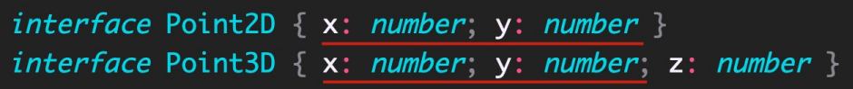

# 1.TypeScript是什么？

TypeScript（简称：TS）是 JavaScript 的超集（JS 有的 TS 都有）。

超集：如下图表示，JS有的TS都有。如果从开发的角度说，JS能实现的功能，TS也都能实现，而且TS在某些情况下要比JS做的更好一些。

既然TS是JS的超集，那TS比JS多了什么东西呢？其实从TS的名字就能看出来了。

TypeScript = Type + JavaScript（在 JS 基础之上，为 JS 添加了类型支持）。

例如下面代码，上面是用TS声明的变量，下面是用JS声明的变量。可以发现上下的对比可以发现，当我们在使用TS声明变量的时候，会在变量名称的后面添加一个 `: number`，这个就是在为 `变量age1` 指定一个明确的类型，`number` 就是 `数值类型`。

TypeScript 是微软开发的开源编程语言，可以在任何运行 JavaScript 的地方运行。

例如JS可以在 `浏览器、NodeJS` 中运行，TS同样也可以在这两个地方运行。

可以理解为：TS不会去改变JS自身的一些特性，它只是在 JS 基础之上，为 JS 添加了类型支持。

---

# 2.TypeScript 为什么要为 JS 添加类型支持？

背景：JS 的类型系统存在“先天缺陷”，JS 代码中绝大部分错误都是类型错误（Uncaught TypeError）。 

问题：增加了找 Bug、改 Bug 的时间，严重影响开发效率。

那TS是如何解决JS中遇到的问题呢？

从编程语言的动静来区分，TypeScript 属于静态类型的编程语言，JS 属于动态类型的编程语言。 

静态类型：编译期做类型检查； 

动态类型：执行期做类型检查。 代码编译和代码执行的顺序：1 编译 2 执行。

对于 JS 来说：它属于动态类型的编程语言，动态类型的编程语言是在执行期做类型检查的，即需要等到代码真正去执行的时候才能发现错误（晚）。

对于 TS 来说：它属于静态类型的编程语言，静态类型的编程语言是在编译期做类型检查的，在代码编译的时候（代码执行前）就可以发现错误（早）。

并且，配合 VSCode 等开发工具，TS 可以提前到在编写代码的同时就发现代码中的错误。

简单来说：当你在写代码时遇到了类型相关的错误，结合VSCode等开发工具，TS就可以里面给你提示，此时就不需要等到代码在浏览器中执行的时候再发现这个错误了，这样就减少了找 Bug、改 Bug 时间，从而提高开发效率。

---

# 3.TypeScript 相比 JS 的优势

**1、更早（写代码的同时）发现错误，`减少找 Bug、改 Bug 时间`，提升开发效率。**

**2、使用TS的时候，程序中任何位置的代码都有`代码提示`**（在我们写TS的时候，不管在哪个位置，在对象后面 `.` 一下，对象中所有的属性、方法都会给你列举出来；但是JS提示功能就不会这么高级），**随时随地的安全感，增强了开发体验。**

**3、强大的类型系统提升了代码的可维护性，使得重构代码更加容易。**

例如在开发应用的时候，我们经常会使用axios发送请求获取数据，然后将数据展示在页面中。但是随着时间的推移，接口中的数据有可能会发生修改，例如某个属性原来是字符串类型的，但是随着项目功能越来越多，String类型的数据已经不足以支持我们的功能了，此时就需要改成字符串数组类型的。

对于这样的功能在TS中是非常好实现的，只需要将原来的字符串类型改为字符串数组类型就行了，然后只要用到这个数据的地方，如果存在类型的问题，在VSCode中都会有红色波浪线标记出来，我们只需要根据提示修改红色波浪线的内容就行了。

但是如果在JS中，我们就需要手动去查找在程序中哪个地方用到了这个数据，然后你还要考虑这个地方怎样才是对的，怎样才是错的。

很明显，通过这样的一个对比，在使用TS的时候，程序的可维护性是更强的。

**4、支持最新的 ECMAScript 语法，优先体验最新的语法，让你走在前端技术的最前沿。**

详述上述优势的同时，因为TS给JS增加了类型系统，会不会导致我们在写TS代码的时候需要很高的编码成本呢？

实际上并不需要，因为TS中有一个叫做 `类型推论` 的机制，它可以让TS中的类型某些情况下是可以省略的。

**5、TS 类型推断机制，不需要在代码中的每个地方都显示标注类型**

换句话说：TS可以自动根据当前代码，来我们推断出相应的类型，让你在享受优势的同时，尽量降低了使用成本。

**除此之外，Vue 3 源码使用 TS 重写、Angular 默认支持 TS、React 与 TS 完美配合，TypeScript 已成为大中型前端 项目的首先编程语言。**

----

# 4.安装编译 TS 的工具包

问题：为什么要安装编译 TS 的工具包？

回答：`Node.js` / `浏览器`，只认识 JS 代码，不认识 TS 代码。因此需要先将 TS 代码转化为 JS 代码，然后才能运行。

安装命令：`npm i -g typescript`。

typescript 包：用来编译 TS 代码的包，提供了 `tsc` 命令，这个命令实现了 `TS -> JS` 的转化。通过如下图片，可以很直观的看见这个流程。

验证是否安装成功：`tsc –v`（查看 typescript 的版本）。

----

# 5.编译并运行 TS 代码

步骤

**1、创建 `hello.ts` 文件（注意：TS 文件的后缀名为 `.ts`）**

**2、将 TS 编译为 JS：在终端中输入命令，`tsc hello.ts`（此时，在同级目录中会出现一个同名的 JS 文件）**

编译为JS后，可以发现代码几乎是一模一样的，只不过生成的JS代码中多了分号，但其分号是可写可不写的。

**3、执行 JS 代码：在终端中输入命令，`node hello.js`**

**说明：所有合法的 JS 代码都是 TS 代码，因此有 JS 基础只需要学习 TS 的类型即可。**

**注意：由 TS 编译生成的 JS 文件，代码中就没有明确类型信息了。**

如下实例，在TS中写的 `let age` 被tsc编译成了 `var` 的方式来声明了，并且在JS中没有TS中声明的 `number` 类型信息了。

但是为什么会有报错呢？鼠标放上去：无法重新声明块范围变量“age”。

报错原因：当我们同时打开两个文件，并且这两个文件中有同名变量的时候，TS就会给出这样的提示。

解决办法：将右侧的JS文件关掉，提示就没了。因此这个错误我们并不用操心，因为它并不是我们代码中的错误。

----

# 6.简化运行 TS 的步骤

问题描述：每次修改代码后，都要重复执行两个命令，才能运行 TS 代码，太繁琐。

简化方式：使用 `ts-node 包`，' 直接 ' `在 `Node.js` 中执行 TS 代码。

安装命令：`npm i -g ts-node`（`ts-node` 包提供了 `ts-node 命令`）。

使用方式：`ts-node hello.ts`

解释：其实 ts-node 命令是在内部偷偷的将 TS -> JS，然后，再运行 JS 代码。只不过不需要我们手动执行这两个步骤了而已。

PS：`ts-node命令` 并不会在`.ts` 同级目录下生成一个 `.js文件`，它仅仅是在内部转化为JS后立马运行。

----

# 7. TypeScript 类型系统的优势

TypeScript 是 JS 的超集，TS 提供了 JS 的所有功能，并且额外的增加了：类型系统。

- 所有的 JS 代码都是 TS 代码。
- JS 有类型（比如，number/string 等），但是 JS 不会检查变量的类型是否发生变化。而 TS 会检查。 

**TypeScript 类型系统的主要优势：可以显示标记出代码中的意外行为，可以更早的发现错误，从而降低了发生错误的可能性。**

例如下图，将字符串类型赋值给了一个数值类型，这就是一个 `意外行为`。

当JS代码中中途修改了count的类型，就报错了。

因此变量类型的变化经常会导致一些错误发生，因此在编码的时候我们应该尽量不要去修改变量的类型。

JS是无法帮助我们及时去发现这个错误的，只有当我们真正运行代码的时候才能发现这样的错误。

但是TS就会检查变量类型的变化的

当然这个错误不仅鼠标放上去可以看见，控制台中的 `问题` 也是可以看见这个错误，并且点击错误，VSCode是可以自动定位到出错的这一行。

---

# 8.类型注解

说明：代码中的 `: number` 就是类型注解。`:` 后面我们一般会加上一个空格。

作用：为变量添加类型约束。比如，上述代码中，约定变量 age 的类型为 number（数值类型）。

解释：**约定了什么类型，就只能给变量赋值该类型的值**，否则，就会报错。

---

# 9.常用类型概述

可以将 TS 中的常用基础类型细分为两类：1、JS 已有类型； 2、TS 新增类型。

所有合法的 JS 代码都是 TS 代码，在JS中有的类型，在TS中也都是可以使用的。

JS 已有类型

- 原始类型（基本数据类型）：`number/string/boolean/null/undefined/symbol`

  symbol是ES6中新增的类型，我们一般很少使用。

- 对象类型（引用数据类型）：总的来说JS中对象类型就是object，如果要细分，object中又包括 `数组、对象、函数` 等对象

TS 新增类型

- 联合类型、自定义类型（类型别名）、接口、元组、字面量类型、枚举、void、any 等

PS：以下在指定类型的时候，是可以选择是否指定类型的.

---

# 10.原始类型（基本数据类型）

原始类型：`number/string/boolean/null/undefined/symbol`

特点：简单。这些类型，完全按照 JS 中类型的名称来书写。

要注意的是类型名称都是小写的，因为在JS中类型也都是小写的。可以使用JS中的 `typeof` 运算符来获取变量的类型，此时获取的都是小写的。

~~~ts
let age: number = 18

let myName: string = '刘老师'

let isLoading: boolean = false

let a: null = null

let b: undefined = undefined

let s: symbol = Symbol()
~~~

----

# 11.数组类型

JS中对象类型统称为 `object`，包括数组、对象、函数等对象

对象类型，在 TS 中更加细化，每个具体的对象都有自己的类型语法。

这点实际上要比JS中更加合理，因为在JS中通过 `typeof运算符` 来判断 `数组、对象、函数` 等拿到的对象类型都是 `object`，因此需要一个特定的方式来区分它到底是一个数组还是一个对象，这其实是因为JS的历史原因造成的，而TS中就避免了一些这样不实用的情况。

数组类型的两种写法：（推荐使用 `number[]` 写法）

需求：数组中既有 number 类型，又有 string 类型，这个数组的类型应该如何写？

解释：`| （竖线）` 在 TS 中叫做**联合类型**（由两个或多个其他类型组成的类型，表示可以是这些类型中的任意一种）。

注意：这是 TS 中联合类型的语法，只有一根竖线，不要与 JS 中的或 `||` 混淆了。

PS：小括号不要忘记了。表示：`arr` 首先是数组，然后这个数组中能够出现 `number` 或` string` 类型的元素

如果将 `[]` 去掉，`arr` 的含义就变了，以下代码就表示 `arr` 既可以是一个 `number类型`，也可以是一个 `string类型的数组`

~~~java
let arr: number | string[] = [1, 3, 5, 'a', 'b']
~~~

---

# 13.类型别名

类型别名（自定义类型）：为任意类型起别名。

使用场景：当同一类型（复杂）被多次使用时，可以通过类型别名，给这个复杂类型起一个别名，从而达到简化该类型的使用。

类型别名相当于在声明变量，因此变量名和类型之间使用 `=` 连接。

~~~js
let arr: (number | string)[] = [1, 3, 5, 'a', 'b']
let arr1: (number | string)[] = [1, 'x', 2, 'y']

// 使用类型别名改造：
type CustomArray = (number | string)[]
let arr: CustomArray = [1, 3, 5, 'a', 'b']
let arr1: CustomArray = [1, 'x', 2, 'y']
~~~

解释：

1. 使用 `type 关键字` 来创建类型别名

2. 类型别名（比如，此处的 CustomArray），可以是任意合法的JS变量名称，变量名称最好见名知意

   这个变量你可以理解为这个类型的变量，因为这个变量中存储的是一个类型

3. 创建类型别名后，直接使用该类型别名作为变量的类型注解即可。

----

# 14. 函数类型 —— 单独指定参数、返回值的类型

函数的类型实际上指的是：函数参数和返回值的类型。

为函数指定类型的两种方式：

**① 函数声明的方式声明函数**

~~~ts
function add(num1: number, num2: number): number {
  return num1 + num2
}
~~~

PS：如果函数已经指定返回值类型是 `number`，但没有返回值，就会报错：声明类型既不是“undefined”、“void”也不是“any”的函数必须返回一个值。

 **② 函数表达式声明函数**

~~~ts
const add = (num1: number, num2: number): number => {
  return num1 + num2
}
~~~

---

# 15.函数类型 —— 同时指定参数、返回值的类型

如下代码是通过函数表达式的方式来创建的

解释：当函数作为表达式时，可以通过**类似箭头函数形式的语法**来为函数添加类型。

**注意：这种形式只适用于函数表达式。**

~~~ts
const add: (num1: number, num2: number) => number = (num1, num2) => {
  return num1 + num2
}
~~~

这个时候实际上是将这个函数作为了一个表达式赋值给了变量 `add`

这种情况下可以相当于给一个普通的变量一样为函数添加类型了，因此此时直接在变量的后面增加类型就行了，但又因为它是一个函数，因此类型也需要从形式上满足的函数的形式（即有参数，也有返回值）。

其中红框框起来的就是当前函数的类型了：num1是number类型，num2是number类型，箭头后面就是函数返回值的类型。

只要在前面指定了函数的类型，那么函数参数这里就自动的有类型了：此时将鼠标放到 `num1` 上，可以发现 `num1` 的类型自动就是 `number` 了。

----

# 16.void类型

我们知道JS中的函数可以有返回值也可以没有返回值，如果一个函数没有返回值，那么，函数返回值类型为：void。

例如下面 `greet()` 函数，它就是打印了一个内容，并没有任何的返回值，因此函数返回值类型可以写成 `void`。

PS：`void` 是TS中新增的，并不是JS中具有的类型。

~~~ts
function greet(name: string): void {
  console.log('Hello', name)
}

greet('jack') // Hello jack
~~~

---

# 17.可选参数

使用函数实现某个功能时，参数可以传也可以不传。这种情况下，在给函数参数指定类型时，就用到可选参数了。

比如，数组的 slice 方法，它的参数是可选的，可以是 `slice()`， 也可以是 `slice(1)`， 还可以是 `slice(1, 3)`。

可选参数：在可传可不传的参数名称后面添加 `?（问号）`，此时就表示这个参数可传可不传。

~~~ts
function mySlice(start?: number, end?: number): void {
  console.log('起始索引：', start, '结束索引：', end)
}

mySlice()
mySlice(1)
mySlice(1, 3)
~~~

打印结果如下，如果没传参数，那么参数值为 `undefined`

**注意：可选参数只能出现在参数列表的最后，也就是说可选参数后面不能再出现必选参数。**

当可选参数后面还有必选参数时，就会报错

同样的，如果参数为 `必选参数`，那么就一定要传值，否则报错。

----

# 18.对象类型

## 一、语法

JS 中的对象是由属性和方法构成的，而 TS 中对象的类型就是在描述对象的结构（有什么类型的属性和方法）。

对象类型的写法：

~~~ts
let person: { name: string; age: number; sayHi(): void; greet(name: string): void } = {
  name: '刘老师',
  age: 18,
  sayHi() {},
  greet(name) {}
}
~~~

解释：从整体上来看，它的结构跟JS中对象特别的相似，但也有区别

1. 直接使用 `{}` 来描述对象结构。属性采用**属性名: 类型**的形式；方法采用**方法名(): 返回值**类型的形式。
2. 如果方法有参数，就在方法名后面的小括号中指定参数类型（比如：`greet(name: string): void`，这个写法跟函数类型参数的写法是一样的）
3. 在一行代码中指定对象的多个属性类型时，使用 ;（分号）来分隔

当最上面一行指定完类型后，下面每写一个属性，VSCode都会有自动提示（属性名和类型都有），这个提示就来自于上面我们自己写的

由于我们在最上面已经定义好了对象中每个属性的类型，那么在写属性的时候直接写即可，就没必要再去指定一次类型了。

---

## 二、细节

如果一行代码只指定一个属性类型（通过换行来分隔多个属性类型），可以去掉 `;（分号）`

方法的类型也可以使用箭头函数形式（比如：`{ sayHi: () => void }`）。

~~~ts
let person: {
  name: string
  age: number
  // sayHi(): void
  sayHi: () => void
  greet(name: string): void
} = {
  name: '刘老师',
  age: 18,
  sayHi() {},
  greet(name) {}
}
~~~

---

# 19.可选属性

对象的属性或方法，也可以是可选的，此时就用到可选属性了。

比如，我们在使用 `axios({ … })` 时，如果发送 GET 请求，method 属性就可以省略。

可选属性的语法与函数可选参数的语法一致，都使用 `?（问号）` 来表示。

~~~ts
function myAxios(config: { url: string; method?: string }) {}

myAxios({
  url: ''
})
~~~

----

# 20.接口

当一个对象类型被多次使用时，一般会使用接口（interface）来描述对象的类型，达到复用的目的。

解释：

1. 使用 interface 关键字来声明接口
2. 接口名称（比如，此处的 IPerson），可以是任意合法的变量名称，名字最好见名知意
3. 声明接口后，直接使用接口名称作为变量的类型
4. 因为每一行只有一个属性类型，因此，属性类型后没有 ;（分号）

~~~ts
// 接口：
interface IPerson {
  name: string
  age: number
  sayHi(): void
}

let person: IPerson = {
  name: '刘老师',
  age: 18,
  sayHi() {}
}

let person1: IPerson = {
  name: 'jack',
  age: 16,
  sayHi() {}
}
~~~

----

# 21.interface（接口）和 type（类型别名）的对比

相同点：都可以给对象指定类型。

类型别名相当于在声明变量，因此变量名和类型之间使用 `=` 连接。

不同点：

- 接口，只能为对象指定类型。
- 类型别名，不仅可以为对象指定类型，实际上可以为任意类型指定别名。

----

# 22.接口的继承

如果两个接口之间有相同的属性或方法，可以将公共的属性或方法抽离出来，通过继承来实现复用。

比如，这两个接口都有 x、y 两个属性，重复写两次，可以，但很繁琐。

更好的方式：

解释：

1. 使用 `extends（继承）`关键字实现了接口 `Point3D` 继承 `Point2D`
2. 继承后，`Point3D` 就有了 `Point2D` 的所有属性和方法（此时，`Point3D` 同时有` x、y、z` 三个属性）

~~~ts
interface Point2D {
  x: number
  y: number
}
interface Point3D { x: number; y: number; z: number }

// 使用 继承 实现复用：
interface Point3D extends Point2D {
  z: number
}

let p3: Point3D = {
  x: 1,
  y: 0,
  z: 0
}
~~~

----

# 23.元组

场景：在地图中，使用经纬度坐标来标记位置信息。

可以使用数组来记录坐标，那么，该数组中只有两个元素，并且这两个元素都是数值类型。

使用 `number[]` 的缺点：不严谨，因为该类型的数组中可以出现任意多个数字，这样这个数组表示的意思就不明显了。如下，从索引为2的数开始，以及它后面的数都没有意义了，而且也不应该出现。

~~~ts
let position: number[] = [39, 114, 1, ,3, 4]
~~~

更好的方式：元组（Tuple）。

元组类型是另一种类型的数组，它确切地知道包含多少个元素，以及特定索引对应的类型。

解释：

1. 元组类型可以确切地标记出有多少个元素，以及每个元素的类型。

2. 该示例中，元素有两个元素，每个元素的类型都是 number。

   如果此时再添加第三个元素的时候，或者少写一个元素，代码都会报错。

----

# 24.类型推论

之前我们在讲TS相对于JS优势的时候，TS中的类型某些情况下是可以省略的，可以省略的原因就是TS中有一个 `类型推论` 的机制。

`类型推论` 也可以叫 `类型推断`。

在 TS 中，某些没有明确指出类型的地方，TS 的`类型推论机制`会自动的帮助我们提供类型。

换句话说：由于类型推论的存在，这些地方，类型注解可以省略不写！

触发 `类型推论机制` 的 2 种常见场景：1、声明变量并初始化时；2、决定函数返回值时。**因此这两种情况下 `类型注解` 都是可以省略不写的。**

除了这两种常见的场景外，还有一些其他的场景，在以后开发中如果遇到了，再来说。

---

## 一、声明变量并初始化

下图，我们在声明 `age变量` 的时候并没有明确为它指定类型，但是当你把鼠标放在 `age变量` 上的时候，会里面有一个提示，告诉你 `age变量` 的类型就是 `number类型`，这个类型就是TS `类型推论机制` 根据后面赋的值自动去推断出来的。

当我们省略了这个类型后，`类型保护的机制 / 类型检查的机制` 还是存在的，既然这样，那么当我们在声明变量，并且初始化值的时候，就可以直接省略掉变量名称后面的类型注解了，这样写起来会更加简洁一些。

PS：这仅限于我们在声明变量，并且初始化的时候，才会有 `类型推论` 这样的机制存在。

但当我们声明了一个变量 `a`，但是并没有给它初始化值，此时TS就没法推断这个变量的类型了，此时将来就可以给它赋值任意值了。

可以发现下面这样写，先将 `number类型` 的 `19` 赋值给 `a`，后面再赋值字符串给 `a`，并没有报错。

但实际上我们知道，这样修改变量的类型是不好的，因此声明变量但没有立即初始化值，此时，还是推荐大家手动添加类型注解。

这样类型机制又会起到一个检查，并且保护的作用了。

---

## 二、决定函数返回值时

决定函数返回值时，同样也是可以省略掉函数返回值类型的

推荐：**能省略类型注解的地方就省略**（~~偷懒~~，充分利用TS类型推论的能力，节约一定的时间，提升开发效率）。

技巧：如果不知道类型，可以通过鼠标放在变量名称上，利用 VSCode 的提示来查看类型。

例如 `log()` 的返回值是 `void`

----

PS：**函数参数的类型推荐大家是一定要写的**，因为只有这样，在我们调用函数时能起到一个类型检查的作用。否则就可以传任意类型的值。

如下图，第一个参数就失去了类型保护的作用了，这样就会导致代码中将来可能会出现一些意想不到的错误了。

只有指定参数类型后，对于这种意外情况，就会有相应的类型检查去提示相应的错误了

---

# 25.类型断言

## 一、引入

有时候我们开发人员会比 TS 更加明确一个值的类型，此时，可以使用**类型断言**来指定更具体的类型。

例如在我们的页面中有一个 `a标签`，目的是：获取到 `a标签`，然后获取/访问它的 `href属性`。

当我们拿到 `a标签` 对应的 `dom元素`，然后利用 `类型推论机制`，当我们将鼠标放在 `aLink变量` 上面的时候，它会自动给你提示出它的类型是 `HTMLElement`，这个值就是等到右边值的类型，右边值的类型就是 `getElementById()` 的返回值类型。

但是此时当我们想要通过 `aLink` 去访问 `href属性` 的时候会发现，是访问不到的，这是因为 `HTMLElement` 是一个比较宽泛的类型，该类型只包含所有标签公共的属性或方法，不包含 a  标签特有的 href 等属性。

因此，这个类型太宽泛（不具体），无法操作 href 等 a 标签特有的属性或方法。

解决方式：这种情况下就需要使用类型断言指定更加具体的类型。

或者说我们开发人员比 TS 更加明确的知道 `aLink` 对应的类型是一个 `a标签`，而不是一个更宽泛的 `HTML元素`。

----

## 二、语法

解释：

1. 使用 as 关键字实现类型断言。
2. 关键字 as 后面的类型是一个更加具体的类型（HTMLAnchorElement 是 HTMLElement 的子类型）。
3. 通过类型断言，aLink 的类型变得更加具体，这样就可以访问 a 标签特有的属性或方法了。

另一种语法，使用 `<>` 语法，这种语法形式不常用知道即可。但是这种方式不常用，并且在写React的时候，因为它跟JSX语法冲突，因此在写React的时候这种方式也是用不了的。

技巧：如果不知道 `a标签` 的类型是什么，可以在浏览器控制台，通过 console.dir() 打印 DOM 元素，在属性列表的最后面，即可看到该元素的类型。

`console.log($0)` 打印出来是标签，`console.dir($0)` 打印出来的是对象。

一直拖到最下面，可以就可以看见它的类型了。

---

# 26.字面量类型

## 一、什么是 `字面量类型`？

`字面量类型`：JS中任意一个字面值。

思考以下代码，两个变量的类型分别是什么？

通过 TS 类型推论机制，可以得到答案：

1. 变量 str1 的类型为：`string`
2. 变量 str2 的类型为：`'Hello TS'`

解释：

1. str1 是一个变量（let），它的值可以是任意字符串，所以类型为：string。
2. str2 是一个常量（const），它的值不能变化只能是 'Hello TS'，所以，它的类型为：'Hello TS'。

由此可知，在TS中使用不同的方式声明变量，变量有可能会是不同类型的。

注意：此处的 'Hello TS'，就是一个**字面量类型**。也就是说**某个特定的字符串也可以作为 TS 中的类型**。

当我们手动为 `str2` 指定类型的时候，TS代码并没有给出任何错误，也就代表字符串确实可以作为类型出现。

~~~ts
const str2: 'Hello TS' = 'Hello TS'
~~~

除字符串外，任意的 JS 字面量（比如，对象、数字等）都可以作为类型使用，它们有一个统称的名字： `字面量类型`。

如下代码，即便是用 `let` 声明的变量 `age`，我将它的类型就设置为 `18`

~~~ts
let age: 18 = 18
~~~

此时 `变量age` 的值就只能是 `18` 了，如果改为 `19`，就会报错

----

## 二、使用场景

实际上，直接将一个字面量类型作为一个变量的类型来使用，这样的意义并不大。

`字面量类型` 更重要的使用场景是：用来**表示一组明确的可选值列表**。

比如，在贪吃蛇游戏中，游戏的方向的可选值只能是上、下、左、右中的任意一个。

如果我们使用 `string类型` 的话，它就可以是任意的字符串了，并不能进行固定的可选值，这样就不严谨了，此时就可以使用 `字面量类型` 了。

**`字面量类型` 一般需要配合 `联合类型` 使用，用来表示一组明确的可选值列表。**

并且在我们调用的时候，VSCode就会给出对应的提示，告诉你只能填写哪些值

~~~ts
changeDirection('left') // 调用函数
~~~

此时只要不是这四个固定值中的任意一个，都会报错

解释：参数 direction 的值只能是 `up/down/left/right` 中的任意一个。

优势：相比于 `string` 类型，使用字面量类型更加精确、严谨。

----

# 27.枚举类型

枚举的功能类似于 `字面量类型 + 联合类型` 组合的功能，也可以表示一组明确的可选值。

**枚举：定义一组命名常量。**它描述一个值，该值可以是这些命名常量中的一个。

枚举中的可选值也叫作 `命名常量`，也就是带有名字的一个常量。

解释：

1. 使用 enum 关键字定义枚举。
2. 约定枚举名称、枚举中的值以大写字母开头。
3. 在 `{}` 中就可以定义枚举的可选值，多个值之间通过 `,（逗号）` 分隔。
4. 定义好枚举后，直接使用枚举名称作为类型注解。

注意：形参 direction 的类型为枚举 Direction，那么，实参的值就应该是枚举 Direction 成员的任意一个。 

访问枚举成员：

解释：类似于 JS 中的对象，直接通过点 `.` 语法访问枚举的成员。

完整代码

~~~ts
enum Direction { // 这里通过换行的方式来声明枚举
  Up,
  Down,
  Left,
  Right
}

function changeDirection(direction: Direction) {}
changeDirection(Direction.Left) // 调用函数
~~~

---

# 28.枚举类型的值

问题：我们把枚举成员作为了函数的实参，既然能作为实参，那就表示这个枚举成员一定是有值的，它的值是什么呢？

此时就可以通过TS的 `类型推论机制` 来查看了：将鼠标移到 `Direction.Up` 上面，此时就可以看见枚举成员的值为 `0`，这也就说明 `枚举成员` 是真的有值的。

不仅可以将鼠标放在实参的地方，我们也可以将鼠标放在 `定义枚举时的命名常量` 上，也是可以看见它的值的，并且是有规律的：**默认为从 0 开始自增的数值。**

因为枚举成员默认的值是数值，因此我们也可以把枚举成员的值为数值的这样一些枚举成为：**数字枚举**。

但如果枚举成员中这些默认值不是我们想要的，此时我们是可以给枚举中的成员手动设置值。

如下图，将 `Up` 的值设为了 `10`，后面的值还是会保持自增长的行为。

我们也可以给任何一个命名常量都设置一个初始值。

~~~ts
enum Direction {
  Up = 2,
  Down = 4,
  Left = 8,
  Right = 16
}

function changeDirection(direction: Direction) {}
changeDirection(Direction.Up)
~~~

----

