给所有行加上注释


CSS中ctrl + k ，ctrl + 0：所有都折叠


ctrl + k，ctrl + z：所有都展开

ctrl+左右键：跳过一个单词

如果已经有JSON数据，可以直接粘贴到表收集到的对象中，此时可以实现快速填充。


---

# 3.什么是Vue

概念：Vue (读音 /vjuː/，类似于 view) 是一套 **构建用户界面 ** 的 **渐进式** **框架**

Vue2官网：<https://v2.cn.vuejs.org/>

**1.什么是构建用户界面**

**基于数据**渲染出用户可以看到的**界面**


---

**2.什么是渐进式**

所谓渐进式就是循序渐进，不一定非得把Vue中的所有API都学完才能开发Vue，可以学一点开发一点


---

**Vue的两种开发方式：**

1. Vue核心包开发

   场景：局部模块改造

2. Vue核心包&Vue插件&工程化

   场景：整站开发

---

**3.什么是框架**

所谓框架：就是一套完整的解决方案

优点：大大提升开发效率 (70%↑)

缺点：需要理解记忆规则 → 官网

**举个栗子**	

如果把一个完整的项目比喻为一个装修好的房子，那么框架就是一个毛坯房。

我们只需要在“毛坯房”的基础上，增加功能代码即可。

提到框架，不得不提一下库。

- 库，类似工具箱，是一堆方法的集合，比如 axios、lodash、echarts等
- 框架，是一套完整的解决方案，实现了大部分功能，我们只需要按照一定的规则去编码即可。

下图是 库 和 框架的对比。


框架的特点：有一套必须让开发者遵守的**规则**或者**约束**

咱们学框架就是学习的这些规则 [官网](https://v2.cn.vuejs.org/)


---

# 4.创建Vue实例

我们已经知道了Vue框架可以 基于数据帮助我们渲染出用户界面，那应该怎么做呢？


比如就上面这个数据，基于提供好的msg 怎么渲染后右侧可展示的数据呢？

**核心步骤（4步）：**

1. 准备容器（Vue所管理的范围）

2. 引包（开发版本包 / 生产版本包）（官网） — 开发版本/生产版本

   Vue2官网：`v2.cn.vuejs.org`

   Vue3官网：`cn.vuejs.org`

   > 找核心包：
   >
   > 
   >
   > 可以看见开发版本对应的提示更全一些。
   >
   > 所以在下载的时候一定要下载开发版本
   >
   > 生产版本的体积会小一些，这个是在我们上线的时候，vue.js的核心包就会用这个生产版本
   >
   > 
   >
   > 如果懒的下载，它还提供了在线的链接
   >
   > 同样的，上面是用来学习的开发版本，而下面对应的是生产版本
   >
   > 

3. 创建Vue实例  `new Vue()`

4. 指定配置项，渲染数据
   - el：指定挂载点，选择器指定控制的是哪个盒子

   - data提供数据


~~~html
<!DOCTYPE html>
<html lang="en">

<head>
  <meta charset="UTF-8">
  <meta http-equiv="X-UA-Compatible" content="IE=edge">
  <meta name="viewport" content="width=device-width, initial-scale=1.0">
  <title>Document</title>
</head>

<body>

  <!-- 
  创建Vue实例，初始化渲染
  1. 准备容器 (Vue所管理的范围)
  2. 引包 (开发版本包 / 生产版本包) 官网
  3. 创建实例
  4. 添加配置项 => 完成渲染
-->

  <!-- 不是Vue管理的范围 -->
  <div class="box2">
    box2 -- {{ count }}
  </div>
  <div class="box">
    box -- {{ msg }}
  </div>
  -----------------------------------------------------
  <!-- Vue所管理的范围 -->
  <div id="app">
    <!-- 这里将来会编写一些用于渲染的代码逻辑 -->
    <h1>{{ msg }}</h1>
    <a href="#">{{ count }}</a>
  </div>

  <!-- 引入的是开发版本包 - 包含完整的注释和警告 -->
  <script src="https://cdn.jsdelivr.net/npm/vue@2.7.14/dist/vue.js"></script>

  <script>
    // 一旦引入 VueJS核心包，在全局环境，就有了 Vue 构造函数
    const app = new Vue({
      // 通过 el 配置选择器，指定 Vue 管理的是哪个盒子
      el: '#app',
      // 通过 data 提供数据
      data: {
        msg: 'Hello 传智播客',
        count: 666
      }
    })
  </script>
</body>
</html>
~~~

可以发现没有被Vue所管理的模版语法是不会被Vue解析的


---

# 5.插值表达式 {{ }}

## 一、引入

插值表达式是一种Vue的模板语法

我们可以用插值表达式渲染出Vue提供的数据


作用：利用表达式进行插值，渲染到页面中

表达式：是可以被求值的代码，JS引擎会将其计算出一个结果

以下的情况都是表达式：

```js
money + 100
money - 100
money * 10
money / 10 
price >= 100 ? '真贵':'还行'
obj.name
arr[0]
fn()
obj.fn()
```

---

## 二、语法

插值表达式语法：{{ 表达式 }}

```js
<h3>{{title}}<h3>

<p>{{nickName.toUpperCase()}}</p>

<p>{{age >= 18 ? '成年':'未成年'}}</p>

<p>{{obj.name}}</p>

<p>{{fn()}}</p>
```

----

## 三、错误用法

```js
1.在插值表达式中使用的数据 必须在data中进行了提供
<p>{{hobby}}</p>  //如果在data中不存在 则会报错

2.支持的是表达式，而非语句，比如：if   for ...
<p>{{if}}</p>

3.不能在标签属性中使用 {{  }} 插值 (插值表达式只能标签中间使用)，所以插值是用来展示给用户看的文本
<p title="{{username}}">我是P标签</p>
```

---

## 四、代码示例

~~~html
<body>
    <!-- 
        插值表达式：Vue的一种模板语法
        作用：利用 表达式 进行插值渲染
        语法：{{ 表达式 }}

        注意点：
        1. 使用的数据要存在
        2. 支持的是表达式，不是语句  if  for
        3. 不能在标签属性中使用 {{ }}
    -->
    <div id="app">
        <p>{{ nickname }}</p>
        <!-- 将字符串转大写 -->
        <p>{{ nickname.toUpperCase() }}</p> 
        <p>{{ nickname + '你好' }}</p>
        <!-- 但凡是能求的结果的，都可以往这里面丢 -->
        <p>{{ age >= 18 ? '成年' : '未成年' }}</p>
        <!-- 对象也是可以的 -->
        <p>{{ friend.name }}</p>
        <p>{{ friend.desc }}</p>

        <!-- ----------------------- -->
        <!-- <p>{{ hobby }}</p> -->
        <!-- <p>{{ if }}</p> -->
        <!-- <p title="{{ nickname }}">我是p标签</p> -->
    </div>

    <script src="https://cdn.jsdelivr.net/npm/vue@2.7.14/dist/vue.js"></script>
    <script>

        const app = new Vue({
            el: '#app',
            data: {
                nickname: 'tony',
                age: 18,
                friend: {
                    name: 'jepson',
                    desc: '热爱学习 Vue'
                }
            }
        })
    </script>
</body>
~~~


---

# 6.响应式特性

响应式：简单理解就是数据改变，视图会自动更新。 

---

如何访问 和 修改 data中的数据（响应式演示）

**data中的数据, 最终会被添加到实例上**

> 例如这里，app身上就会拥有msg属性，修改msg的值，界面的值也会自动变化！
>
> 	

① 访问数据： `"实例.属性名"`

② 修改数据： `"实例.属性名"= "值"`

> 我们经常会听说Vue是数据驱动，只需要修改数据即可
>
> 其实底层还是Dom操作，只不过Vue把Dom操作封装起来了，而我们开发者只需要关心于数据就行了


聚焦于数据 → 数据驱动视图

使用 Vue 开发，关注业务的核心逻辑，根据业务修改数据即可


---

# 7.Vue开发者工具安装

1. 通过谷歌应用商店安装（国外网站）

2. 极简插件下载（推荐）：下载 → 解压 → 点击左上角的三个小点 → 开发者模式 → 拖拽安装 → 插件详情允许访问文件

   <https://chrome.zzzmh.cn/index>

安装步骤：


安装之后可以F12后看到多一个Vue的调试面板，我们也可以把Vue拖到最前面，这样找起来更方便

root表示我们所选染的根实例，根实例有了对应的我们这两个数据

下面我们就可以通过调试工具的方式去修改数据，进而看看视图是不是会自动更新

打开 Vue 运行的页面，调试工具中 Vue 栏，即可查看修改数据，进行调试


----

# 8.Vue中的常用指令

Vue 会根据不同的【指令】，针对标签实现不同的【功能】

**概念：**指令（Directives）是 Vue 提供的带有 **v- 前缀** 的 特殊 标签**属性**。

为啥要学：提高程序员操作 DOM 的效率。

vue 中的指令按照不同的用途可以分为如下 6 大类：

-  内容渲染指令（v-html、v-text）
-  条件渲染指令（v-show、v-if、v-else、v-else-if）
-  事件绑定指令（v-on）
-  属性绑定指令 （v-bind）
-  双向绑定指令（v-model）
-  列表渲染指令（v-for）

指令是 vue 开发中最基础、最常用、最简单的知识点。

语法：

~~~js
v-html = "表达式 " → 动态设置元素 innerHTML
~~~

示例代码：

~~~html
<body>
  <div id="app">
    <!-- 插值表达式并不能解析标签，而是会以存文本的方式展示到页面上 -->
    <div>{{ msg }}</div>
    <div v-html="msg"></div>
  </div>
  
  <script src="https://cdn.jsdelivr.net/npm/vue@2/dist/vue.js"></script>
  <script>

    const app = new Vue({
      el: '#app',
      data: {
        msg: `
          <h3>学前端~来黑马！</h3>
        `
      }
    })
  </script>
</body>
~~~

具体有哪些指令可以查询官网

学习 --> API


可以看见，总共14个指令，但这14个并不都是常用的，只用下述用红框框起来的这10个指令才是常用的


-----

# 内容渲染指令

内容渲染指令用来辅助开发者渲染 DOM 元素的文本内容。常用的内容渲染指令有如下2 个：

- v-text（类似innerText）
  - 使用语法：`<p v-text="uname">hello</p>`，意思是将 uame 值渲染到 p 标签中
  - 类似 innerText，使用该语法，会覆盖 p 标签原有内容


- v-html（类似 innerHTML）
  - 用语法：`<p v-html="intro">hello</p>`，意思是将 intro 值渲染到 p 标签中
  - 类似 innerHTML，使用该语法，会覆盖 p 标签原有内容
  - 类似 innerHTML，使用该语法，能够将HTML标签的样式呈现出来。

代码演示：

```js
 
  <div id="app">
    <h2>个人信息</h2>
	// 既然指令是vue提供的特殊的html属性，所以咱们写的时候就当成属性来用即可
    <p v-text="uname">姓名：</p> 
    <p v-html="intro">简介：</p>
  </div> 

<script>
        const app = new Vue({
            el:'#app',
            data:{
                uname:'张三',
                intro:'<h2>这是一个<strong>非常优秀</strong>的boy<h2>'
            }
        })
</script>
```


----

# 9.v-if / v-show条件渲染指令

条件判断指令，用来辅助开发者按需控制 DOM 的显示与隐藏。条件渲染指令有如下两个，分别是：

1. v-show

   1. 作用：  控制元素显示隐藏（简单的显示隐藏）

   2. 语法：  `v-show = "表达式"`   表达式值为 true 显示， false 隐藏

   3. 原理：  切换 `display:none` 控制显示隐藏

      

   4. 场景：频繁切换显示隐藏的场景

   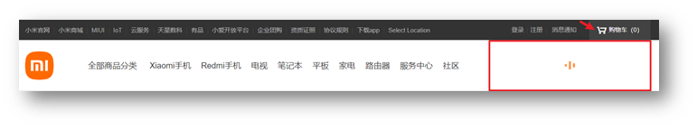

2. v-if

   1. 作用：  控制元素显示隐藏（条件渲染）
   2. 语法：  v-if= "表达式"          表达式值 true显示， false 隐藏
   3. 原理：  基于条件判断，是否创建 或 移除元素节点
   4. 场景：  要么显示，要么隐藏，不频繁切换的场景

   

   示例代码：

   ```html
   <body>
     <!-- 
       v-show底层原理：切换 css 的 display: none 来控制显示隐藏
       v-if  底层原理：根据 判断条件 控制元素的 创建 和 移除（条件渲染）
     -->
   
     <div id="app">
       <!-- 这里可以直接使用底下的flag变量 -->
       <div v-show="flag" class="box">我是v-show控制的盒子</div>
       <div v-if="flag" class="box">我是v-if控制的盒子</div>
     </div>
     
     <script src="https://cdn.jsdelivr.net/npm/vue@2/dist/vue.js"></script>
     <script>
       const app = new Vue({
         el: '#app',
         data: {
           flag: false
         }
       })
     </script>
   </body>
   ```


---

# 10.v-else 和 v-else-if

作用：辅助v-if进行判断渲染

语法：

~~~js
v-else
v-else-if="表达式"
~~~

PS：需要紧接着v-if使用

示例代码：

```html
<body>
  
  <div id="app">
    <p v-if="gender === 1">性别：♂ 男</p>
    <p v-else>性别：♀ 女</p>
    <hr>
    <p v-if="score >= 90">成绩评定A：奖励电脑一台</p>
    <p v-else-if="score >= 70">成绩评定B：奖励周末郊游</p>
    <p v-else-if="score >= 60">成绩评定C：奖励零食礼包</p>
    <p v-else>成绩评定D：惩罚一周不能玩手机</p>
  </div>
  
  <script src="https://cdn.jsdelivr.net/npm/vue@2/dist/vue.js"></script>
  <script>

    const app = new Vue({
      el: '#app',
      data: {
        gender: 2,
        score: 95
      }
    })
  </script>

</body>
```


----

# 11.v-on事件绑定指令

作用：` 注册事件 = 添加监听 + 提供处理逻辑`

使用Vue时，如需为DOM注册事件，及其的简单，语法如下：

~~~java
// 内联语句：就是一段可执行代码
// 内联语句是在模板中写代码，所以它是可以直接访问到里面的数据的，但如果像下面在methods里的函数里使用，是访问不到的！
<button v-on:事件名="内联语句">按钮</button>
<button v-on:事件名="methods中的函数名">按钮</button>
<button v-on:事件名="methods中的函数名(参数1，参数2)">按钮</button>
// `v-on:` 简写为 @
~~~


~~~html
<button v-on:事件名="内联语句">按钮</button>
~~~

内联语句

```js
<div id="app">
    <button @click="count--">-</button>
    <span>{{ count }}</span>
    <button v-on:click="count++">+</button>
  </div>
  <script src="https://cdn.jsdelivr.net/npm/vue@2/dist/vue.js"></script>
  <script>
    const app = new Vue({
      el: '#app',
      data: {
        count: 100
      }
    })
  </script>
```


---

# 12.`<button v-on:事件名="methods中的函数名">按钮</button>`

~~~html
<button v-on:事件名="methods中的函数名">按钮</button>
~~~

事件处理函数

注意：

- 事件处理函数应该写到一个跟data同级的配置项（methods）中
- methods中的函数内部的this都指向Vue实例

```html
<body>
  <div id="app">
    <button @click="fn">切换显示隐藏</button>
    <!-- data里的数据在模版代码中是可以直接使用的，但是在methods中的函数中，即js中，是不可以直接使用的! -->
    <h1 v-show="isShow">黑马程序员</h1>
  </div>
  <script src="https://cdn.jsdelivr.net/npm/vue@2/dist/vue.js"></script>
  <script>
    const app3 = new Vue({
      el: '#app',
      data: {
        isShow: true
      },
      methods: {
        fn () {
          // 但是这样写就有问题，一旦对象名变了，下面的带有app对象的都需要变！
          app.isShow = !app.isShow
            
          // console.log(app3 === this)
          // Vue中让提供的所有methods中的函数，this都指向当前实例
          this.isShow = !this.isShow
        }
      }
    })
  </script>
</body>
```


----

# 13.`<button v-on:事件名="methods中的函数名(参数1，参数2)">按钮</button>`

给事件处理函数传参，直接把函数名改写成函数调用，此时就可以给函数传递形参

- 如果不传递任何参数，则方法无需加小括号；methods方法中可以直接使用 e 当做事件对象


- 如果传递了参数，则实参 `$event` 表示事件对象，固定用法。

```html
<body>

  <div id="app">
    <div class="box">
      <h3>小黑自动售货机</h3>
      <button @click="buy(5)">可乐5元</button>
      <button @click="buy(10)">咖啡10元</button>
      <button @click="buy(8)">牛奶8元</button>
    </div>
    <p>银行卡余额：{{ money }}元</p>
  </div>

  <script src="https://cdn.jsdelivr.net/npm/vue@2/dist/vue.js"></script>
  <script>
    const app = new Vue({
      el: '#app',
      data: {
        money: 100
      },
      methods: {
        buy (price) {
          this.money -= price
        }
      }
    })
  </script>
</body>
```


---

# 14.v-bind属性绑定指令

**作用：**动态设置html的标签属性 比如：src、url、title

默认情况下是单向的

**语法**：

~~~html
v-bind:属性名="表达式"
~~~

**v-bind**:可以简写成 =>   **:**

比如，有一个图片，它的 `src` 属性值，是一个图片地址。这个地址在数据 data 中存储。

则可以这样设置属性值：

- ``
- ``   （v-bind可以省略）

```html
<body>
  <div id="app">
    <!-- v-bind:src   =>   :src -->
    
    
  </div>
  <script src="https://cdn.jsdelivr.net/npm/vue@2/dist/vue.js"></script>
  <script>
    const app = new Vue({
      el: '#app',
      data: {
        imgUrl: './imgs/10-02.png',
        msg: 'hello 波仔'
      }
    })

  </script>
</body>
```


---

# 15.小案例-波仔的学习之旅

需求：默认展示数组中的第一张图片，点击上一页下一页来回切换数组中的图片

实现思路：

1.数组存储图片路径 `['url1','url2','url3'，...]`

2.可以准备个下标index 去数组中取图片地址。

3.通过v-bind给src绑定当前的图片地址

4.点击上一页下一页只需要修改下标的值即可

5.当展示第一张的时候，上一页按钮应该隐藏。展示最后一张的时候，下一页按钮应该隐藏

```html
<body>
  <div id="app">
    <button v-show="index > 0" @click="index--">上一页</button>
    <div>
      
    </div>
    <button v-show="index < list.length - 1" @click="index++">下一页</button>
  </div>
  <script src="https://cdn.jsdelivr.net/npm/vue@2/dist/vue.js"></script>
  <script>
    const app = new Vue({
      el: '#app',
      data: {
        index: 0,
        list: [
          './imgs/11-00.gif',
          './imgs/11-01.gif',
          './imgs/11-02.gif',
          './imgs/11-03.gif',
          './imgs/11-04.png',
          './imgs/11-05.png',
        ]
      }
    })
  </script>
</body>
```


---

# 16.v-for列表渲染指令

Vue 提供了 v-for 列表渲染指令，用来辅助开发者 基于数据循环， 多次渲染整个元素。 --> 数据指的是：数组、对象、数字...

v-for 指令需要使用 `(item, index) in arr` 形式的特殊语法，其中：

- item 是数组中的每一项
- index 是每一项的索引，不需要可以省略
- arr 是被遍历的数组
- item作为对象是不能作为key的

示例代码

~~~html
<body>

  <div id="app">
    <h3>小黑水果店</h3>
    <ul>
      <li v-for="(item, index) in list">
        {{ item }} - {{ index }}
      </li>
    </ul>

    <ul>
      <!-- 不需要索引可以省略，并且只有一个参数的时候，这个括号都可以省略了 -->
      <li v-for="item in list">
        {{ item }}
      </li>
    </ul>
  </div>

  <script src="https://cdn.jsdelivr.net/npm/vue@2/dist/vue.js"></script>
  <script>
    const app = new Vue({
      el: '#app',
      data: {
        list: ['西瓜', '苹果', '鸭梨', '榴莲']
      }
    })
  </script>
</body>
~~~

---

此语法也可以遍历**对象和数字**

```js
//遍历对象
<div v-for="(value, key, index) in object">{{value}}</div>
value:对象中的值
key:对象中的键
index:遍历索引从0开始

//遍历数字
<p v-for="item in 10">{{item}}</p>
item从 1 开始，到 10 结束
```


----

# 17.小案例-小黑的书架

需求：

1. 根据左侧数据渲染出右侧列表（v-for）

2. 点击删除按钮时，应该把当前行从列表中删除（获取当前行的id，利用filter进行过滤）


PS：id和下标同时存在，则优先根据id来删除，因为id是唯一标识，它更加的稳定

完整代码：

```html
<body>
  <div id="app">
    <h3>小黑的书架</h3>
    <ul>
      <li v-for="(item, index) in booksList" :key="item.id">
        <span>{{ item.name }}</span>
        <span>{{ item.author }}</span>
        <!-- 注册点击事件 →  通过 id 进行删除数组中的 对应项 -->
        <button @click="del(item.id)">删除</button>
      </li>
    </ul>
  </div>
  <script src="https://cdn.jsdelivr.net/npm/vue@2/dist/vue.js"></script>
  <script>
    const app = new Vue({
      el: '#app',
      data: {
        booksList: [
          { id: 1, name: '《红楼梦》', author: '曹雪芹' },
          { id: 2, name: '《西游记》', author: '吴承恩' },
          { id: 3, name: '《水浒传》', author: '施耐庵' },
          { id: 4, name: '《三国演义》', author: '罗贯中' }
        ]
      },
      methods: {
        del (id) {
          // console.log('删除', id)
          // 通过 id 进行删除数组中的 对应项 → filter(不会改变原数组)
          // filter: 根据条件，保留满足条件的对应项，得到一个新数组。
          // console.log(this.booksList.filter(item => item.id !== id))
          this.booksList = this.booksList.filter(item => item.id !== id)
        }
      }
    })
  </script>
</body>
```


---

# 18.v-for中的key

## 一、引入问题

**语法：** key属性 = "唯一值"

**作用：**给列表项添加的**唯一标识**。便于Vue进行列表项的**正确排序复用**。

**为什么加key：**Vue 的默认行为会尝试原地修改元素（**就地复用**）

以`小黑的书架案例`为例，如果点击了第一个元素的删除按钮，我们就会认为第一本书就会从页面中移除

但是大家脑海中的效果是加了key的效果。

如下图，点击第一个带有背景色的li，删除后第一个li还在。由此可见这个li压根没动，动的是里面的文字内容。


----

## 二、分析问题

当我们加了key，可以理解为给列表的每个li都加了一个唯一标识，当我点击删除的时候确实数据中把这一项删了，但是由于我给每个key都加了一个唯一标识，所以当我发现数据中剩下这三项，此时它就可以非常精准的定位到页面中剩下的其实是下面这三个li是我需要的，而第一个li实际上不存在了。


如果没加key，官网有这么一句话：v-for的默认行为会尝试**原地修改元素**（就地复用）

如果不加key，就相当于把最后一个删除了，而其他的都是原地修改标签里的值。

实例代码：

```html
<ul>
  <li v-for="(item, index) in booksList" :key="item.id">
    <span>{{ item.name }}</span>
    <span>{{ item.author }}</span>
    <button @click="del(item.id)">删除</button>
  </li>
</ul>
```

注意：

1.  key 的值只能是字符串 或 数字类型
2. key 的值必须具有唯一性
3. 推荐使用  id 作为 key（唯一），不推荐使用 index 作为 key（会变化，不对应）


----

# 19.v-model双向绑定指令

所谓双向绑定就是：

1. 数据变化 → 视图自动更新
2. 视图变化 → 数据自动更新

**作用：** 给**表单元素**（input、radio、select）使用，双向绑定数据，可以快速 **获取** 或 **设置** 表单元素内容

**语法：**v-model="变量"

**需求：**使用双向绑定实现以下需求

1. 点击登录按钮获取表单中的内容
2. 点击重置按钮清空表单中的内容


示例代码

```html
<body>
  <div id="app">
    <!-- 
      v-model 可以让数据和视图，形成双向数据绑定
      (1) 数据变化，视图自动更新
      (2) 视图变化，数据自动更新
      可以快速[获取]或[设置]表单元素的内容
     -->
    账户：<input type="text" v-model="username"> <br><br>
    密码：<input type="password" v-model="password"> <br><br>
    <button @click="login">登录</button>
    <button @click="reset">重置</button>
  </div>
  <script src="https://cdn.jsdelivr.net/npm/vue@2/dist/vue.js"></script>
  <script>
    const app = new Vue({
      el: '#app',
      data: {
        username: '',
        password: ''
      },
      methods: {
        login () {
          // 拿数据直接拿都行，不用const password = ...
          console.log(this.username, this.password)
        },
        reset () {
          this.username = ''
          this.password = ''
        }
      }
    })
  </script>
</body>
```


---

# 20.综合案例-小黑记事本


**功能需求：**

1. 列表渲染

2. 删除功能

3. 添加功能

4. 底部统计 和 清空


完整代码

~~~html
<body>
  <!-- 主体区域 -->
  <section id="app">
    <!-- 输入框 -->
    <header class="header">
      <h1>小黑记事本</h1>
      <input v-model="todoName" placeholder="请输入任务" class="new-todo" />
      <button @click="add" class="add">添加任务</button>
    </header>
    <!-- 列表区域 -->
    <section class="main">
      <ul class="todo-list">
        <li class="todo" v-for="(item, index) in list" :key="item.id">
          <div class="view">
            <span class="index">{{ index + 1 }}.</span> <label>{{ item.name }}</label>
            <button @click="del(item.id)" class="destroy"></button>
          </div>
        </li>
      </ul>
    </section>
    <!-- 统计和清空 → 如果没有任务了，底部隐藏掉 → v-show -->
    <footer class="footer" v-show="list.length > 0">
      <!-- 统计 -->
      <span class="todo-count">合 计:<strong> {{ list.length }} </strong></span>
      <!-- 清空 -->
      <button @click="clear" class="clear-completed">
        清空任务
      </button>
    </footer>
  </section>

  <!-- 底部 -->
  <script src="https://cdn.jsdelivr.net/npm/vue/dist/vue.js"></script>
  <script>
    // 添加功能
    // 1. 通过 v-model 绑定 输入框 → 实时获取表单元素的内容
    // 2. 点击按钮，进行新增，往数组最前面加 unshift
    const app = new Vue({
      el: '#app',
      data: {
        todoName: '',
        list: [
          { id: 1, name: '跑步一公里' },
          { id: 2, name: '跳绳200个' },
          { id: 3, name: '游泳100米' },
        ]
      },
      methods: {
        del(id) {
          // console.log(id) => filter 保留所有不等于该 id 的项
          this.list = this.list.filter(item => item.id !== id)
        },
        add() {
          if (this.todoName.trim() === '') {
            alert('请输入任务名称')
            return
          }
          this.list.unshift({
            // id一般是后台动态生成的，但如果前端需要临时使用id，可以使用时间戳，保证它是唯一的
            id: +new Date(),
            name: this.todoName
          })
          this.todoName = ''
        },
        clear() {
          this.list = []
        }
      }
    })

  </script>
</body>
~~~


----

# -----------------------------------

# day02

# 24.指令修饰符

指令修饰符：就是通过“.”指明一些指令**后缀**，不同的**后缀**封装了不同的处理操作  —> 简化代码

## 一、按键修饰符

- 按键修饰符

  @keyup.enter  —>当点击enter键的时候才触发

- v-model修饰符

  v-model.trim  —>去除首尾空格

  v-model.number —>转数字

- 事件修饰符

  @事件名.stop —>阻止冒泡

  @事件名.prevent —>阻止默认行为

代码演示：

```html
<body>
  <div id="app">
    <h3>@keyup.enter  →  监听键盘回车事件</h3>
    <!-- -->
    <input @keyup.enter="fn" v-model="username" type="text">
  </div>
  <script src="https://cdn.jsdelivr.net/npm/vue@2/dist/vue.js"></script>
  <script>
    const app = new Vue({
      el: '#app',
      data: {
        username: ''
      },
      methods: {
        fn (e) {
          // if (e.key === 'Enter') {
          //   console.log('键盘回车的时候触发', this.username)
          // }

          console.log('键盘回车的时候触发', this.username)
        }
      }
    })
  </script>
</body>
```

----

## 二、v-model修饰符

- v-model.trim  —>去除首位空格

- v-model.number —>转数字

  > 如果遇到转不了数字的，如abc，它就会留在原地，此时需要自行判断，但如果是汉字，就会截取汉字之前的数字，无论怎么样它都不会产生NaN

~~~html
<body>
  <div id="app">
    <h3>v-model修饰符 .trim .number</h3>
    姓名：<input v-model.trim="username" type="text"><br>
    年纪：<input v-model.number="age" type="text"><br>
  <script src="./vue.js"></script>
  <script>
    const app = new Vue({
      el: '#app',
      data: {
        username: '',
        age: '',
      })
  </script>
</body>
~~~

---

## 三、事件修饰符

- @事件名.stop —> 阻止冒泡
- @事件名.prevent  —>阻止默认行为
- @事件名.stop.prevent —>可以连用 即阻止事件冒泡也阻止默认行为

```html
<body>
  <div id="app">
    <h3>@事件名.stop → 阻止冒泡</h3>
    <div @click="fatherFn" class="father">
      <div @click.stop="sonFn" class="son">儿子</div>
    </div>

    <h3>@事件名.prevent → 阻止默认行为</h3>
    <a @click.prevent href="http://www.baidu.com">阻止默认行为</a>
  </div>
  <script src="./vue.js"></script>
  <script>
    const app = new Vue({
      el: '#app',
      data: {
      },
      methods: {
        fatherFn() {
          alert('老父亲被点击了')
        },
        sonFn() {
          alert('儿子被点击了')
        }
      }
    })
  </script>
</body>
```


---

# 25.v-bind对样式控制的增强-操作class

为了方便开发者进行样式控制， Vue 扩展了 v-bind 的语法，可以针对 **class 类名** 和 **style 行内样式** 进行控制 。

## 一、语法

**语法**

```html
<div> :class = "对象/数组">这是一个div</div>
```

---

**对象语法**

当class动态绑定的是**对象**时，**键就是类名，值就是布尔值**，如果值是**true**，就有这个类，否则没有这个类

```html
<div class="box" :class="{ 类名1: 布尔值, 类名2: 布尔值 }"></div>
```

​    适用场景：一个类名，来回切换，eg：tab栏

---

**数组语法**

当class动态绑定的是**数组**时 → 数组中所有的类，都会添加到盒子上，本质就是一个 class 列表

```html
<div class="box" :class="[ 类名1, 类名2, 类名3 ]"></div>
```

   使用场景:批量添加或删除类

----

## 二、示例代码

```html
<body>

  <div id="app">
    <div class="box" :class="{ pink: true, big: true }">黑马程序员</div>
    <!-- 注意这里需要加引号 -->
    <div class="box" :class="['pink', 'big']">黑马程序员</div>
  </div>
  <script src="https://cdn.jsdelivr.net/npm/vue@2/dist/vue.js"></script>
  <script>
    const app = new Vue({
      el: '#app',
      data: {

      }
    })
  </script>
</body>
```


----

## 三、京东秒杀-tab栏切换导航高亮

**需求**：

​	当我们点击哪个tab页签时，哪个tab页签就高亮

**思路**：

1.基于数据，动态渲染tab（v-for）

2.准备一个下标 记录高亮的是哪一个 tab

3.基于下标动态切换class的类名

代码

```html
<body>
  <div id="app">
    <ul>
      <li v-for="(item, index) in list" :key="item.id" @click="activeIndex = index">
        <!-- 对于单个类我们一般使用的都是对象的写法 -->
        <a :class="{ active: index === activeIndex }" href="#">{{ item.name }}</a>
      </li>
    </ul>
  </div>
  <script src="https://cdn.jsdelivr.net/npm/vue@2/dist/vue.js"></script>
  <script>
    const app = new Vue({
      el: '#app',
      data: {
        activeIndex: 2, // 记录高亮
        list: [
          { id: 1, name: '京东秒杀' },
          { id: 2, name: '每日特价' },
          { id: 3, name: '品类秒杀' }
        ]
      }
    })
  </script>
</body>
```

---

## 四、v-bind对有样式控制的增强-操作style

**语法**

```html
<!-- 属性值需要是字符串，否则会被当成变量 -->
<div class="box" :style="{ CSS属性名1: CSS属性值, CSS属性名2: CSS属性值 }"></div>
<!-- 属性名和属性值相等时可以省略 -->
<div class="box" :style="{ CSS属性名1, CSS属性名2 }"></div>
```

强大的地方在于，它可以控制单个属性，而不是直接添加某个类

**代码示例**

```html
<body>
  <div id="app">
    <!-- 外层盒子底色 （黑色） -->
    <div class="progress">
      <!-- 内层盒子 - 进度（蓝色） -->
      <!-- 因为是JS对象，所以这里可以做一个拼接 -->
      <div class="inner" :style="{ width: percent + '%' }">
        <span>{{ percent }}%</span>
      </div>
    </div>
    <button @click="percent = 25">设置25%</button>
    <button @click="percent = 50">设置50%</button>
    <button @click="percent = 75">设置75%</button>
    <button @click="percent = 100">设置100%</button>
  </div>
  <script src="https://cdn.jsdelivr.net/npm/vue@2/dist/vue.js"></script>
  <script>
    const app = new Vue({
      el: '#app',
      data: {
        percent: 30
      }
    })
  </script>
</body>
```

---

## 五、进度条案例

```html
<style>
    .progress {
        height: 25px;
        width: 400px;
        border-radius: 15px;
        background-color: #272425;
        border: 3px solid #272425;
        box-sizing: border-box;
        margin-bottom: 30px;
    }
    .inner {
        width: 50%;
        height: 20px;
        border-radius: 10px;
        text-align: right;
        position: relative;
        background-color: #409eff;
        background-size: 20px 20px;
        box-sizing: border-box;
        transition: all 1s;
    }
    .inner span {
        position: absolute;
        right: -20px;
        bottom: -25px;
    }
</style>

<<div id="app">
<!-- 外层盒子底色 （黑色） -->
<div class="progress">
    <!-- 内层盒子 - 进度（蓝色） -->
    <div class="inner" :style="{ width: percent + '%' }">
        <span>{{ percent }}%</span>
    </div>
</div>
<button @click="percent = 25">设置25%</button>
<button @click="percent = 50">设置50%</button>
<button @click="percent = 75">设置75%</button>
<button @click="percent = 100">设置100%</button>
</div>

<script src="https://cdn.jsdelivr.net/npm/vue@2/dist/vue.js"></script>
<script>
    const app = new Vue({
        el: '#app',
        data: {

        }
    })
</script>
```


---

# 26.v-model在其他表单元素的使用

**讲解内容**：

常见的表单元素都可以用 v-model 绑定关联  →  快速 **获取** 或 **设置** 表单元素的值

它会根据  **控件类型** 自动选取  **正确的方法** 来更新元素

```js
输入框  input:text   ——> value
文本域  textarea	 ——> value
复选框  input:checkbox  ——> checked
单选框  input:radio   ——> checked
下拉菜单 select    ——> value
...
```

浏览器中 `$0` 表示你当前选中的元素

> select下拉框有些特殊，选中 `<select>` 标签
>
> 
>
> 然后使用$0.value，即可发现选择的这个option的value会实时同步给select的value
>
> 
>
> 并且还不仅可以获取，还可以修改，对应的选项框的内容也会跟着修改
>
> 


代码示例

```html
<body>
  <div id="app">
    <h3>小黑学习网</h3>

    姓名：
    <input type="text" v-model="username">
    <br><br>

    是否单身：
    <input type="checkbox" v-model="isSingle">
    <br><br>

    <!-- 
      前置理解：
        1. name:  给单选框加上 name 属性 可以分组 → 同一组互相会互斥
        2. value: 给单选框加上 value 属性，用于提交给后台的数据
           并且通常value用具体的标识，一般不会传字符串文本的，一般是男是1，女是2      结合 Vue 使用 → v-model
    -->
    性别:
    <input v-model="gender" type="radio" name="gender" value="1">男
    <input v-model="gender" type="radio" name="gender" value="2">女
    <br><br>

    <!-- 
      前置理解：
        1. option 需要设置 value 值，提交给后台
           option的value里面城市的编码一般是从后台获取的
        2. select 的 value 值，关联了选中的 option 的 value 值
      结合 Vue 使用 → v-model
    -->
    所在城市:
    <select v-model="cityId">
      <option value="101">北京</option>
      <option value="102">上海</option>
      <option value="103">成都</option>
      <option value="104">南京</option>
    </select>
    <br><br>

    <!-- 文本域和输入框是类似的 -->
    自我描述：
    <textarea v-model="desc"></textarea>

    <button>立即注册</button>
  </div>
  <script src="https://cdn.jsdelivr.net/npm/vue@2/dist/vue.js"></script>
  <script>
    const app = new Vue({
      el: '#app',
      data: {
        username: '',
        isSingle: false,
        // 标识女选中
        gender: "2",
        cityId: '102',
        desc: ""
      }
    })
  </script>
</body>
```


----

# 27.computed计算属性

**概念**

基于**现有的数据**，计算出来的**新属性**。 **依赖**的数据变化，**自动**重新计算。

> PS：计算属性本质上是一个属性，而不是函数


**语法**

1. 声明在 **computed 配置项**中，一个计算属性对应一个函数
2. 使用起来和普通属性一样使用  {{ 计算属性名}}  

计算属性 → 可以将一段 求值的代码 进行封装

代码示例

~~~html
<body>
  <div id="app">
    <h3>小黑的礼物清单</h3>
    <table>
      <tr>
        <th>名字</th>
        <th>数量</th>
      </tr>
      <tr v-for="(item, index) in list" :key="item.id">
        <td>{{ item.name }}</td>
        <td>{{ item.num }}个</td>
      </tr>
    </table>

    <!-- 目标：统计求和，求得礼物总数 -->
    <p>礼物总数：{{ totalCount }} 个</p>
  </div>
  <script src="https://cdn.jsdelivr.net/npm/vue@2/dist/vue.js"></script>
  <script>
    const app = new Vue({
      el: '#app',
      data: {
        // 现有的数据
        list: [
          { id: 1, name: '篮球', num: 1 },
          { id: 2, name: '玩具', num: 2 },
          { id: 3, name: '铅笔', num: 5 },
        ]
      },
      computed: {
        totalCount() {
          // 基于现有的数据，编写求值逻辑
          // 计算属性函数内部，可以直接通过 this 访问到 app 实例
          // console.log(this.list)

          // 需求：对 this.list 数组里面的 num 进行求和 → reduce
          let total = this.list.reduce((sum, item) => sum + item.num, 0)
          return total
        }
      }
    })
  </script>
</body>
~~~

**注意**

1. computed配置项和data配置项是**同级**的
2. computed中的计算属性**虽然是函数的写法**，但他**依然是个属性**
3. computed中的计算属性**不能**和data中的属性**同名**
4. 使用computed中的计算属性和使用data中的属性是一样的用法
5. computed中计算属性内部的**this**依然**指向的是Vue实例**


----

# 28.computed 计算属性 VS methods 方法

## 一、computed 计算属性

作用：封装了一段对于数据的处理，求得一个结果，而且还可以拿这个结果去缓存。

语法：

① 写在 computed 配置项中

② 作为属性，直接使用 → `this.计算属性`、`{{ 计算属性 }}`

优势：计算属性的优势

> 缓存特性（提升性能）：
>
> 计算属性会对计算出来的结果缓存，再次使用直接读取缓存，
>
> 依赖项变化了，会自动重新计算 → 并再次缓存

---

## 二、methods 方法

作用：给实例提供一个方法，调用以处理业务逻辑。

语法：

① 写在 methods 配置项中

② 作为方法，需要调用 → `this.方法名()`、 `{{ 方法名() }}`、 `@事件名="方法名"`

~~~html
<body>
  <div id="app">
    <h3>小黑的礼物清单🛒<span>{{ totalCountFn() }}</span></h3>
    <h3>小黑的礼物清单🛒<span>{{ totalCountFn() }}</span></h3>
    <h3>小黑的礼物清单🛒<span>{{ totalCountFn() }}</span></h3>
    <h3>小黑的礼物清单🛒<span>{{ totalCountFn() }}</span></h3>
    <table>
      <tr>
        <th>名字</th>
        <th>数量</th>
      </tr>
      <tr v-for="(item, index) in list" :key="item.id">
        <td>{{ item.name }}</td>
        <td>{{ item.num }}个</td>
      </tr>
    </table>

    <!-- 方法是需要调用的，记得加() -->
    <p>礼物总数：{{ totalCountFn() }} 个</p>
  </div>
  <script src="https://cdn.jsdelivr.net/npm/vue@2/dist/vue.js"></script>
  <script>
    const app = new Vue({
      el: '#app',
      data: {
        // 现有的数据
        list: [
          { id: 1, name: '篮球', num: 3 },
          { id: 2, name: '玩具', num: 2 },
          { id: 3, name: '铅笔', num: 5 },
        ]
      },

      // 方法更偏向于处理业务
      methods: {
        totalCountFn() {
          console.log('methods方法执行了') // 引用了多少次就打印多少次
          let total = this.list.reduce((sum, item) => sum + item.num, 0)
          return total
        }
      },

      // 计算属性更偏向于求得值
      computed: {
        // 计算属性：有缓存的，一旦计算出来结果，就会立刻缓存
        // 下一次读取 → 直接读缓存就行 → 性能特别高
        totalCount () {
          console.log('计算属性执行了') // 只打印一次
          let total = this.list.reduce((sum, item) => sum + item.num, 0)
          return total
        }
      }
    })
  </script>
</body>
~~~


----

# 29.计算属性的完整写法

计算属性默认的简写，只能读取访问，不能 "修改"。

如果要 "修改" → 需要写计算属性的完整写法（即写成对象）。


~~~html
<body>
  <div id="app">
    姓：<input type="text" v-model="firstName"> +
    名：<input type="text" v-model="lastName"> =
    <span>{{ fullName }}</span><br><br>

    <button @click="changeName">改名卡</button>
  </div>
  <script src="https://cdn.jsdelivr.net/npm/vue@2/dist/vue.js"></script>
  <script>
    const app = new Vue({
      el: '#app',
      data: {
        firstName: '刘',
        lastName: '备',
      },
      methods: {
        changeName() {
          this.fullName = '吕小布'
        }
      },
      computed: {
        // 简写 → 获取，没有配置设置的逻辑
        // fullName () {
        //   return this.firstName + this.lastName
        // }

        // 完整写法 → 获取 + 设置
        fullName: {
          // (1) 当fullName计算属性，被获取求值时，执行get（有缓存，优先读缓存）
          //     会将返回值作为，求值的结果
          get() {
            return this.firstName + this.lastName
          },
          // (2) 当fullName计算属性，被修改赋值时，执行set
          //     修改的值，传递给set方法的形参
          set(value) {
            // console.log(value.slice(0, 1))          
            // console.log(value.slice(1))         
            this.firstName = value.slice(0, 1)
            this.lastName = value.slice(1)
          }
        }
      }
    })
  </script>
</body>
~~~

# 30.成绩案例

## 一、功能描述


1.渲染功能

2.删除功能

3.添加功能

4.统计总分，求平均分

----

## 二、思路分析

1. 渲染功能  v-for  :key  v-bind:动态绑定class的样式（来回切换）

2. 删除功能 v-on绑定事件， 阻止a标签的默认行为

3. v-model的修饰符 .trim、 .number、  判断数据是否为空后 再添加、添加后清空文本框的数据（这两个也可以不加，不加的话就需要通过js去判断，所以加上这两个就是简化代码的）

   unshift 修改数组更新视图

4. 使用计算属性computed， reduce求和 和 平均分的值 

----

## 三、完整代码

~~~html
<body>
  <div id="app" class="score-case">
    <div class="table">
      <table>
        <thead>
          <tr>
            <th>编号</th>
            <th>科目</th>
            <th>成绩</th>
            <th>操作</th>
          </tr>
        </thead>

        <!-- 由于这两个tbody标签在页面中不能同时存在，必须销毁一个，所以使用v-if -->
        <tbody v-if="list.length > 0">
          <tr v-for="(item, index) in list" :key="item.id">
            <td>{{ index + 1 }}</td>
            <td>{{ item.subject }}</td>
            <!-- 需求：不及格的标红, < 60 分, 加上 red 类 -->
            <td :class="{ red: item.score < 60 }">{{ item.score }}</td>
            <!-- 这里既要注册事件，又阻止了它跳 -->
            <td><a @click.prevent="del(item.id)" href="http://www.baidu.com">删除</a></td>
          </tr>
        </tbody>

        <tbody v-else>
          <tr>
            <td colspan="5">
              <span class="none">暂无数据</span>
            </td>
          </tr>
        </tbody>

        <tfoot>
          <tr>
            <td colspan="5">
              <span>总分：{{ totalScore }}</span>
              <span style="margin-left: 50px">平均分：{{ averageScore }}</span>
            </td>
          </tr>
        </tfoot>
      </table>
    </div>
    <div class="form">
      <div class="form-item">
        <div class="label">科目：</div>
        <div class="input">
          <!-- 去掉首尾空格 -->
          <input type="text" placeholder="请输入科目" v-model.trim="subject" />
        </div>
      </div>
      <div class="form-item">
        <div class="label">分数：</div>
        <div class="input">
          <!-- 需要数字类型的，如果number没有转成功，则得到的是字符串 -->
          <input type="text" placeholder="请输入分数" v-model.number="score" />
        </div>
      </div>
      <div class="form-item">
        <div class="label"></div>
        <div class="input">
          <button @click="add" class="submit">添加</button>
        </div>
      </div>
    </div>
  </div>
  <script src="https://cdn.jsdelivr.net/npm/vue@2/dist/vue.js"></script>

  <script>
    const app = new Vue({
      el: '#app',
      data: {
        list: [
          { id: 1, subject: '语文', score: 62 },
          { id: 7, subject: '数学', score: 89 },
          { id: 12, subject: '英语', score: 70 },
        ],
        subject: '',
        score: ''
      },
      computed: {
        totalScore() {
          return this.list.reduce((sum, item) => sum + item.score, 0)
        },
        averageScore() {
          // 防止除 0 情况
          if (this.list.length === 0) {
            return 0
          }
          return (this.totalScore / this.list.length).toFixed(2)
        }
      },
      methods: {
        del(id) {
          // console.log(id)
          this.list = this.list.filter(item => item.id !== id)
        },
        add() {
          if (!this.subject) {
            alert('请输入科目')
            return
          }
          if (typeof this.score !== 'number') {
            alert('请输入正确的成绩')
            return
          }
          this.list.unshift({
            id: +new Date(),
            subject: this.subject,
            score: this.score
          })

          this.subject = ''
          this.score = ''
        }
      }
    })
  </script>
</body>
~~~


---

# 31.watch侦听器（监视器）

作用：**监视数据变化**，执行一些业务逻辑或异步操作

> 这里的业务逻辑指发送请求等


语法：

1. watch同样声明在跟data同级的配置项中

2. 简单写法： 简单类型数据直接监视

3. 完整写法：添加额外配置项

   ```js
   data: { 
     words: '苹果',
     obj: {
       words: '苹果'
     }
   },
   
   watch: {
     // 该方法会在数据变化时，触发执行
     // 方法名需要和被监视的属性名同名
     // 形参分别是变化后的新值，和之前的老值
     数据属性名 (newValue, oldValue) {
       一些业务逻辑 或 异步操作。 
     },
     // 对象里的子属性
     '对象.属性名' (newValue, oldValue) {
       一些业务逻辑 或 异步操作。 
     }
   }
   ```

---

**代码示例**

```html
<body>
  <div id="app">
    <!-- 条件选择框 -->
    <div class="query">
      <span>翻译成的语言：</span>
      <select>
        <option value="italy">意大利</option>
        <option value="english">英语</option>
        <option value="german">德语</option>
      </select>
    </div>

    <!-- 翻译框 -->
    <div class="box">
      <div class="input-wrap">
        <textarea v-model="obj.words"></textarea>
        <span><i>⌨️</i>文档翻译</span>
      </div>
      <div class="output-wrap">
        <div class="transbox">{{ result }}</div>
      </div>
    </div>
  </div>
  <script src="https://cdn.jsdelivr.net/npm/vue@2/dist/vue.js"></script>
  <script src="https://cdn.jsdelivr.net/npm/axios/dist/axios.min.js"></script>
  <script>
    // 接口地址：https://applet-base-api-t.itheima.net/api/translate
    // 请求方式：get
    // 请求参数：
    // （1）words：需要被翻译的文本（必传）
    // （2）lang： 需要被翻译成的语言（可选）默认值-意大利
    // -----------------------------------------------

    const app = new Vue({
      el: '#app',
      data: {
        // words: ''
        obj: {
          words: ''
        },
        result: '', // 翻译结果
        // 由于timer不需要具备任何的响应式特性，不需要跟页面渲染相关，它就没必要存到data里去，直接写this.timer就是直接挂到了当前实例上，也就是把app当成普通对象，往上面加属性，这样性能更高一些
        // timer: null // 延时器id
      },
      // 具体讲解：(1) watch语法 (2) 具体业务实现
      watch: {
        // 该方法会在数据变化时调用执行
        // newValue新值, oldValue老值（一般不用）
        // words (newValue) {
        //   console.log('变化了', newValue)
        // }

        'obj.words'(newValue) {
          // console.log('变化了', newValue)
          // 防抖: 延迟执行 → 干啥事先等一等，延迟一会，一段时间内没有再次触发，才执行
          clearTimeout(this.timer)
          this.timer = setTimeout(async () => {
            const res = await axios({
              url: 'https://applet-base-api-t.itheima.net/api/translate',
              params: {
                words: newValue
              }
            })
            this.result = res.data.data
            console.log(res.data.data)
          }, 300)
        }
      }
    })
  </script>
</body>
```


---

# 33.watch - 完整写法

完整写法 → 添加额外配置项

1. deep: true 对复杂类型深度监视
2.  immediate: true 初始化立刻执行一次handler方法

使用场景：一个结果需要通过多个条件来查询控制，这个时候通常会把这些查询条件丢到一个对象里，此时对象里的所有属性我们都需要监视

语法

~~~js
data: { 
  words: '苹果',
  obj: {
    words: '苹果'
  }
},

watch: {
  数据属性名: {
    deep:true,
    handler (newValue) {
      console.log(newValue)
    }
  }
}
~~~

完整代码

~~~html
<body>
  <div id="app">
    <!-- 条件选择框 -->
    <div class="query">
      <span>翻译成的语言：</span>
      <select v-model="obj.lang">
        <option value="italy">意大利</option>
        <option value="english">英语</option>
        <option value="german">德语</option>
      </select>
    </div>

    <!-- 翻译框 -->
    <div class="box">
      <div class="input-wrap">
        <textarea v-model="obj.words"></textarea>
        <span><i>⌨️</i>文档翻译</span>
      </div>
      <div class="output-wrap">
        <div class="transbox">{{ result }}</div>
      </div>
    </div>
  </div>
  <script src="https://cdn.jsdelivr.net/npm/vue@2/dist/vue.js"></script>
  <script src="https://cdn.jsdelivr.net/npm/axios/dist/axios.min.js"></script>
  <script>
    // 需求：输入内容，修改语言，都实时翻译

    // 接口地址：https://applet-base-api-t.itheima.net/api/translate
    // 请求方式：get
    // 请求参数：
    // （1）words：需要被翻译的文本（必传）
    // （2）lang： 需要被翻译成的语言（可选）默认值-意大利
    // -----------------------------------------------

    const app = new Vue({
      el: '#app',
      data: {
        obj: {
          words: '小黑',
          lang: 'italy'
        },
        result: '', // 翻译结果
      },
      watch: {
        obj: {
          deep: true, // 深度监视
          immediate: true, // 立刻执行，一进入页面handler就立刻执行一次，比如words有默认值，一进页面就需要立马翻译
          handler(newValue) {
            clearTimeout(this.timer)
            this.timer = setTimeout(async () => {
              const res = await axios({
                url: 'https://applet-base-api-t.itheima.net/api/translate',
                // 这里直接把这个新对象传进去即可
                params: newValue
              })
              this.result = res.data.data
              console.log(res.data.data)
            }, 300)
          }
        }


        // 'obj.words' (newValue) {
        //   clearTimeout(this.timer)
        //   this.timer = setTimeout(async () => {
        //     const res = await axios({
        //       url: 'https://applet-base-api-t.itheima.net/api/translate',
        //       params: {
        //         words: newValue
        //       }
        //     })
        //     this.result = res.data.data
        //     console.log(res.data.data)
        //   }, 300)
        // }
      }
    })
  </script>
</body>
~~~


---

# 34.水果购物车-基本渲染

在Vue中，如果想要实现全选反选功能，通常使用计算属性

完整代码

~~~html
<!DOCTYPE html>
<html lang="en">

<head>
  <meta charset="UTF-8" />
  <meta http-equiv="X-UA-Compatible" content="IE=edge" />
  <meta name="viewport" content="width=device-width, initial-scale=1.0" />
  <link rel="stylesheet" href="./css/inputnumber.css" />
  <link rel="stylesheet" href="./css/index.css" />
  <title>购物车</title>
</head>

<body>
  <div class="app-container" id="app">
    <!-- 顶部banner -->
    <div class="banner-box"></div>
    <!-- 面包屑 -->
    <div class="breadcrumb">
      <span>🏠</span>
      /
      <span>购物车</span>
    </div>
    <!-- 购物车主体 -->
    <div class="main" v-if="fruitList.length > 0">
      <div class="table">
        <!-- 头部 -->
        <div class="thead">
          <div class="tr">
            <div class="th">选中</div>
            <div class="th th-pic">图片</div>
            <div class="th">单价</div>
            <div class="th num-th">个数</div>
            <div class="th">小计</div>
            <div class="th">操作</div>
          </div>
        </div>
        <!-- 身体 -->
        <div class="tbody">
          <!-- 这个可以直接分开写，class和：class -->
          <div v-for="(item, index) in fruitList" :key="item.id" class="tr" :class="{ active: item.isChecked }">
            <div class="td"><input type="checkbox" v-model="item.isChecked" /></div>
            <div class="td"></div>
            <div class="td">{{ item.price }}</div>
            <div class="td">
              <div class="my-input-number">
                <button :disabled="item.num <= 1" class="decrease" @click="sub(item.id)"> - </button>
                <span class="my-input__inner">{{ item.num }}</span>
                <button class="increase" @click="add(item.id)"> + </button>
              </div>
            </div>
            <div class="td">{{ item.num * item.price }}</div>
            <div class="td"><button @click="del(item.id)">删除</button></div>
          </div>
        </div>
      </div>
      <!-- 底部 -->
      <div class="bottom">
        <!-- 全选 -->
        <label class="check-all">
          <input type="checkbox" v-model="isAll" />
          全选
        </label>
        <div class="right-box">
          <!-- 所有商品总价 -->
          <span class="price-box">总价&nbsp;&nbsp;:&nbsp;&nbsp;¥&nbsp;<span class="price">{{ totalPrice }}</span></span>
          <!-- 结算按钮 -->
          <button class="pay">结算( {{ totalCount }} )</button>
        </div>
      </div>
    </div>
    <!-- 空车 -->
    <div class="empty" v-else>🛒空空如也</div>
  </div>
  <script src="https://cdn.jsdelivr.net/npm/vue@2/dist/vue.js"></script>
  <script>
    const defaultArr = [
      {
        id: 1,
        icon: 'http://autumnfish.cn/static/火龙果.png',
        isChecked: true,
        num: 2,
        price: 6,
      },
      {
        id: 2,
        icon: 'http://autumnfish.cn/static/荔枝.png',
        isChecked: false,
        num: 7,
        price: 20,
      },
      {
        id: 3,
        icon: 'http://autumnfish.cn/static/榴莲.png',
        isChecked: false,
        num: 3,
        price: 40,
      },
      {
        id: 4,
        icon: 'http://autumnfish.cn/static/鸭梨.png',
        isChecked: true,
        num: 10,
        price: 3,
      },
      {
        id: 5,
        icon: 'http://autumnfish.cn/static/樱桃.png',
        isChecked: false,
        num: 20,
        price: 34,
      },
    ]
    const app = new Vue({
      el: '#app',
      data: {
        // 水果列表
        // 当这里全部删除时，存储的是null，null不能用于页面渲染，会报错
        fruitList: JSON.parse(localStorage.getItem('list')) || defaultArr,
      },
      computed: {
        // 默认计算属性：只能获取不能设置，要设置需要写完整写法，点击复选框按钮即被修改
        // isAll () {
        //   // 必须所有的小选框都选中，全选按钮才选中 → every
        //   return this.fruitList.every(item => item.isChecked)
        // }

        // 完整写法 = get + set
        isAll: {
          get() {
            return this.fruitList.every(item => item.isChecked)
          },
          set(value) {
            // 点击的时候就已经赋值给isAll了
            // this.isAll = value
            // 基于拿到的布尔值，要让所有的小选框 同步状态
            this.fruitList.forEach(item => item.isChecked = value)
          }
        },
        // 统计选中的总数 reduce
        totalCount() {
          return this.fruitList.reduce((sum, item) => {
            if (item.isChecked) {
              // 选中 → 需要累加
              return sum + item.num
            } else {
              // 没选中 → 不需要累加
              return sum
            }
          }, 0)
        },
        // 总计选中的总价 num * price
        totalPrice() {
          return this.fruitList.reduce((sum, item) => {
            if (item.isChecked) {
              return sum + item.num * item.price
            } else {
              return sum
            }
          }, 0)
        }
      },
      methods: {
        del(id) {
          this.fruitList = this.fruitList.filter(item => item.id !== id)
        },
        add(id) {
          // 1. 根据 id 找到数组中的对应项 → find
          const fruit = this.fruitList.find(item => item.id === id)
          // 2. 操作 num 数量
          fruit.num++
        },
        sub(id) {
          // 1. 根据 id 找到数组中的对应项 → find
          const fruit = this.fruitList.find(item => item.id === id)
          // 2. 操作 num 数量
          fruit.num--
        }
      },
      watch: {
        fruitList: {
          deep: true,
          handler(newValue) {
            // 需要将变化后的 newValue 存入本地 （转JSON）
            localStorage.setItem('list', JSON.stringify(newValue))
          }
        }
      }
    })
  </script>
</body>

</html>
~~~

业务技术点总结：

1. 渲染功能： v-if/v-else v-for :class
2. 删除功能: 点击传参 filter过滤覆盖原数组
3. 修改个数：点击传参 find找对象
4. 全选反选：计算属性computed 完整写法 get/set
5. 统计选中的总价和总数量: 计算属性computed reduce条件求和
6. 持久化到本地： watch监视，localStorage，JSON.stringify, JSON.parse


----

# ----------------------------------

# day03

# 36.Vue生命周期

Vue生命周期：就是一个Vue实例从**创建**（new一个Vue实例） 到 **销毁**（关闭网页） 的整个过程。

生命周期四个阶段：① 创建 ② 挂载 ③ 更新 ④ 销毁

1. 创建阶段：创建响应式数据

   > 通过data给当前的Vue实例提供的数据，默认的都是普通数据，Vue底层创建阶段的时候就会对data里的数据进行监听，把它转化成响应式的

2. 挂载阶段：渲染模板

3. 更新阶段：修改数据，更新视图

   > 在使用的时候一般都是在更新阶段
   >
   > 创建阶段和挂载阶段它只会执行一次，但是更新阶段会执行多次

4. 销毁阶段：销毁Vue实例

   > 关闭浏览器


**思考**

什么时候可以发送初始化渲染请求？（越早越好）

> 发请求，得到这些渲染的数据，赋值给响应式数据。所以必须要等响应式数据准备好了，才能往里面更新赋值，所以发请求是在创建阶段的最后。

什么时候可以开始操作dom？（至少dom得渲染出来）

> 最早也要等模板渲染完成，所以操作dom的阶段是在挂载阶段结束之后开始创建dom


----

# Vue生命周期函数（钩子函数）

Vue生命周期过程中，会**自动运行一些函数**，被称为【**生命周期钩子**】→  让开发者可以在【**特定阶段**】运行**自己的代码**

> 四个阶段一共提供了8个函数，每个阶段分别提供了两个。
>
> 准备响应式数据之前有一个，准备好响应式数据之后有一个。
>
> 模版渲染之前有一个，模版渲染之后有一个。
>
> ....
>
> 记忆：...之前，...之后
>
> beforeDestroy：当我们实例要销毁的时候，我们可以在beforeDestroy释放Vue以外的资源（清除定时器，延时器...），去提升性能，一般会配合后面的组件进行使用


钩子函数是函数，并且需要与data并列

由于关闭浏览器我们看不见销毁阶段，Vue官方提供了一个卸载的语法，卸载完成之后并不会将页面中的元素清掉，已经渲染完的还是存在的，但当再次修改的时候，跟Vue相关的都没用了

~~~js
app.$destroy // 卸载当前实例
~~~


```html
<body>
  <div id="app">
    <h3>{{ title }}</h3>
    <div>
      <button @click="count--">-</button>
      <span>{{ count }}</span>
      <button @click="count++">+</button>
    </div>
  </div>
  <script src="https://cdn.jsdelivr.net/npm/vue@2/dist/vue.js"></script>
  <script>
    const app = new Vue({
      el: '#app',
      data: {
        count: 100,
        title: '计数器'
      },
      // 1. 创建阶段（准备数据）
      beforeCreate() {
        console.log('beforeCreate 响应式数据准备好之前', this.count) // undefined
      },
      created() {
        console.log('created 响应式数据准备好之后', this.count) // 100
        // this.数据名 = 请求回来的数据
        // 可以开始发送初始化渲染的请求了
      },

      // 2. 挂载阶段（渲染模板）
      beforeMount() {
        console.log('beforeMount 模板渲染之前', document.querySelector('h3').innerHTML) // {{ title }}
      },
      mounted() {
        console.log('mounted 模板渲染之后', document.querySelector('h3').innerHTML) // 计数器
        // 可以开始操作dom了
      },

      // 3. 更新阶段(修改数据 → 更新视图)
      beforeUpdate() {
        console.log('beforeUpdate 数据修改了，视图还没更新', document.querySelector('span').innerHTML) // 100
      },
      updated() {
        console.log('updated 数据修改了，视图已经更新', document.querySelector('span').innerHTML) // 101
      },

      // 4. 卸载阶段
      beforeDestroy() {
        console.log('beforeDestroy, 卸载前')
        console.log('清除掉一些Vue以外的资源占用，定时器，延时器...')
      },
      destroyed() {
        console.log('destroyed，卸载后')
      }
    })
  </script>
</body>
```


----

# 37.生命周期钩子小案例

## 一、在created中发送数据

```html
<body>
  <div id="app">
    <ul>
      <li v-for="(item, index) in list" :key="item.id" class="news">
        <div class="left">
          <div class="title">{{ item.title }}</div>
          <div class="info">
            <span>{{ item.source }}</span>
            <span>{{ item.time }}</span>
          </div>
        </div>
        <div class="right">
          
        </div>
      </li>
    </ul>
  </div>
  <script src="https://cdn.jsdelivr.net/npm/vue@2/dist/vue.js"></script>
  <script src="https://cdn.jsdelivr.net/npm/axios/dist/axios.min.js"></script>
  <script>
    // 接口地址：http://hmajax.itheima.net/api/news
    // 请求方式：get
    const app = new Vue({
      el: '#app',
      data: {
        list: []
      },
      async created() {
        // 1. 发送请求获取数据
        const res = await axios.get('http://hmajax.itheima.net/api/news')
        // 2. 更新到 list 中，用于页面渲染 v-for
        this.list = res.data.data
      }
    })
  </script>
</body>
```

---

## 二、在mounted中获取焦点

这里注意，获取到的输入框和我们在html里面写的输入框是不一样的。这是因为在模版阶段带有v-model，而打印出来的是已经被Vue解析了的


```html
<body>
  <div class="container" id="app">
    <div class="search-container">
      
      <div class="search-box">
        <!-- 
        在这里直接写autofocus没有用，在Vue当中，整个DOM都属于模版部分，底下写了之后，会根据底下的数据动态渲染。
        所以这一部分的数据是会被替换的，就算在这里写了autofocus也没用，一旦它被替换之后，它的自动获取焦点也就没了
       -->
        <input autofocus type="text" v-model="words" id="inp">
        <button>搜索一下</button>
      </div>
    </div>
  </div>

  <script src="https://cdn.jsdelivr.net/npm/vue@2/dist/vue.js"></script>
  <script>
    const app = new Vue({
      el: '#app',
      data: {
        words: ''
      },
      // 核心思路：
      // 1. 等input框渲染出来 mounted 钩子
      // 2. 让input框获取焦点 inp.focus()
      mounted() {
        // 原生DOM的方法
        document.querySelector('#inp').focus()
      }
    })
  </script>
</body>
```


---

# 38.案例-小黑记账清单

## 一、分析

**需求图示**


**需求分析**

1. 基本渲染

2. 添加功能

3. 删除功能

4. 饼图渲染


**思路分析**

1.基本渲染  

- 立刻发送请求获取数据 created
- 拿到数据，存到data的响应式数据中
- 结合数据，进行渲染 v-for
- 消费统计  —> 计算属性

2.添加功能

- 收集表单数据 v-model，使用指令修饰符处理数据
- 给添加按钮注册点击事件，对输入的内容做非空判断，发送请求
- 请求成功后，对文本框内容进行清空
- 重新渲染列表

3.删除功能

- 注册点击事件，获取当前行的id
- 根据id发送删除请求
- 需要重新渲染

4.饼图渲染

- 初始化一个饼图 echarts.init(dom)    mounted钩子中渲染
- 根据数据试试更新饼图 echarts.setOptions({...})


---

## 二、echars用法

根据echars官方文档，echars的初始化需要等待dom准备好之后才能初始化，所以应该放在mounted钩子中


在入门案例里是柱状图，寻找饼图：


如果需要异步加载数据，需要更新谁，只需要重新调用setOption即可


完整代码

```html
<body>
  <div id="app">
    <div class="contain">
      <!-- 左侧列表 -->
      <div class="list-box">

        <!-- 添加资产 -->
        <form class="my-form">
          <input v-model.trim="name" type="text" class="form-control" placeholder="消费名称" />
          <input v-model.number="price" type="text" class="form-control" placeholder="消费价格" />
          <button @click="add" type="button" class="btn btn-primary">添加账单</button>
        </form>

        <table class="table table-hover">
          <thead>
            <tr>
              <th>编号</th>
              <th>消费名称</th>
              <th>消费价格</th>
              <th>操作</th>
            </tr>
          </thead>
          <tbody>
            <tr v-for="(item, index) in list" :key="item.id">
              <td>{{ index + 1 }}</td>
              <td>{{ item.name }}</td>
              <!-- 注意这里 item.price > 500 不需要加引号，否则会被当成字符串来看 -->
              <td :class="{ red: item.price > 500 }">{{ item.price.toFixed(2) }}</td>
              <td><a @click="del(item.id)" href="javascript:;">删除</a></td>
            </tr>
          </tbody>
          <tfoot>
            <tr>
              <td colspan="4">消费总计： {{ totalPrice.toFixed(2) }}</td>
            </tr>
          </tfoot>
        </table>
      </div>

      <!-- 右侧图表 -->
      <div class="echarts-box" id="main"></div>
    </div>
  </div>
  <script src="https://cdn.jsdelivr.net/npm/echarts@5.4.0/dist/echarts.min.js"></script>
  <script src="https://cdn.jsdelivr.net/npm/vue@2/dist/vue.js"></script>
  <script src="https://cdn.jsdelivr.net/npm/axios/dist/axios.min.js"></script>
  <script>
    /**
     * 接口文档地址：
     * https://www.apifox.cn/apidoc/shared-24459455-ebb1-4fdc-8df8-0aff8dc317a8/api-53371058
     * 
     * 功能需求：
     * 1. 基本渲染
     *    (1) 立刻发送请求获取数据 created
     *    (2) 拿到数据，存到data的响应式数据中
     *    (3) 结合数据，进行渲染 v-for
     *    (4) 消费统计 => 计算属性
     * 2. 添加功能
     *    (1) 收集表单数据 v-model
     *    (2) 给添加按钮注册点击事件，发送添加请求
     *    (3) 需要重新渲染
     * 3. 删除功能
     *    (1) 注册点击事件，传参传 id
     *    (2) 根据 id 发送删除请求
     *    (3) 需要重新渲染
     * 4. 饼图渲染
     *    (1) 初始化一个饼图 echarts.init(dom)  mounted钩子实现
     *    (2) 根据数据实时更新饼图 echarts.setOption({ ... })
     */
    const app = new Vue({
      el: '#app',
      data: {
        list: [],
        name: '',
        price: ''
      },
      computed: {
        totalPrice() {
          return this.list.reduce((sum, item) => sum + item.price, 0)
        }
      },
      created() {
        // const res = await axios.get('https://applet-base-api-t.itheima.net/bill', {
        //   params: {
        //     creator: '小黑'
        //   }
        // })
        // this.list = res.data.data

        this.getList()
      },
      mounted() {
        // 由于下面的getList需要使用到myChart,这里直接使用this挂载到实例上
        this.myChart = echarts.init(document.querySelector('#main'))
        this.myChart.setOption({
          // 大标题
          title: {
            // 标题文本
            text: '消费账单列表',
            // 子标题这里不需要
            subtext: 'Fake Data',
            // 控制居中
            left: 'center'
          },
          // 提示框
          tooltip: {
            trigger: 'item'
          },
          // 图例
          legend: {
            // 控制对齐方式，垂直对齐
            orient: 'vertical',
            // 在左边显示
            left: 'left'
          },
          // 数据项
          series: [
            {
              name: '消费账单',
              type: 'pie', // 指饼图
              radius: '50%', // 饼图的半径
              // 数据
              data: [
                // 由于这里需要动态设置,所以先给一个空数组
                // { value: 1048, name: '球鞋' },
                // { value: 735, name: '防晒霜' }
              ],
              emphasis: {
                itemStyle: {
                  // 这里都是加一些阴影效果
                  shadowBlur: 10,
                  shadowOffsetX: 0,
                  shadowColor: 'rgba(0, 0, 0, 0.5)'
                }
              }
            }
          ]
        })
      },

      methods: {
        async getList() {
          // get要传参,需要后面接一个对象,然后往对象写上对应的params
          const res = await axios.get('https://applet-base-api-t.itheima.net/bill', {
            params: {
              creator: '小黑'
            }
          })
          this.list = res.data.data

          // 更新图表的时候，需要覆盖哪个就写哪个
          this.myChart.setOption({
            // 数据项
            series: [
              {
                // data: [
                //   { value: 1048, name: '球鞋' },
                //   { value: 735, name: '防晒霜' }
                // ]
                data: this.list.map(item => ({ value: item.price, name: item.name }))
              }
            ]
          })
        },
        async add() {
          if (!this.name) {
            alert('请输入消费名称')
            return
          }
          if (typeof this.price !== 'number') {
            alert('请输入正确的消费价格')
            return
          }

          // 发送添加请求
          const res = await axios.post('https://applet-base-api-t.itheima.net/bill', {
            creator: '小黑',
            name: this.name,
            price: this.price
          })
          // 重新渲染一次
          this.getList()

          this.name = ''
          this.price = ''
        },
        async del(id) {
          // 根据 id 发送删除请求
          const res = await axios.delete(`https://applet-base-api-t.itheima.net/bill/${id}`)
          // 重新渲染
          this.getList()
        }
      }
    })
  </script>
</body>
```


----

# 40.工程化开发和脚手架

## 一、开发Vue的两种方式

- 核心包传统开发模式：基于 `html / css / js` 文件，直接引入核心包，开发 Vue。
- **工程化开发模式：基于构建工具（例如：webpack）的环境中开发Vue。**

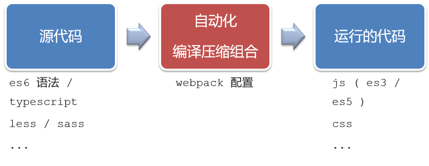

----


工程化开发模式优点：

   提高编码效率，比如使用JS新语法、Less/Sass、Typescript等通过webpack都可以编译成浏览器识别的ES3/ES5/CSS等

工程化开发模式问题：

- webpack配置**不简单**
- **雷同**的基础配置
- 缺乏**统一的标准**

为了解决以上问题，所以我们需要一个工具，生成标准化的配置

---

## 二、脚手架Vue CLI

**基本介绍**

   Vue CLI 是Vue官方提供的一个**全局命令工具**

   可以帮助我们**快速创建**一个开发Vue项目的**标准化基础架子**。【集成了webpack配置】

---

**好处**

1. 开箱即用，零配置

2. 内置babel等工具

   Vue CLI 内置了Babel，这是一个非常重要的特性。**Babel** 是一个广泛使用的JavaScript编译器，它的主要作用是将使用了ECMAScript新特性的代码转换为当前JavaScript环境（如较老的浏览器）可以理解和执行的代码。在Vue项目中，这意味着你可以在代码中自由使用最新的JavaScript语法（如ES6、ES7乃至ES8以上的特性），如箭头函数、async/await、解构赋值等，而不必担心浏览器兼容性问题。Babel会自动将这些代码转换为向后兼容的版本。

3. 标准化的webpack配置

----

## 三、使用步骤

1. 全局安装（只需安装一次即可） 

   ~~~sh
   yarn global add @vue/cli 或者 npm i @vue/cli -g
   ~~~

   `yarn` 是一个与 `npm` 类似的包管理器

   使用npm全局安装yarn

   ~~~cdm
   npm install --global yarn
   安装后，可以通过yarn --version检测是否安装成功
   ~~~

   

   

2. 查看vue/cli版本： `vue --version`

3. 创建项目架子：**vue create project-name**(项目名不能使用中文)

   > PS：在哪执行命令，就会在哪创建项目目录
   >
   > 输入指令后，会弹出三个选项，可以通过上下键选择
   >
   > 这里选择第二个，即：Vue2
   >
   > 

4. 启动项目：先cd进入到目录里，然后使用**yarn serve** 或者 **npm run serve**(命令不固定，找package.json)

   

   > 值得注意的是，启动项目的命令不固定
   >
   > 


----

# 41.项目目录介绍和运行流程

## 一、项目目录介绍


虽然脚手架中的文件有很多，目前咱们只需认识三个文件即可，这三个文件就决定了我们项目的运行

1. main.js  入口文件
2. App.vue  App根组件 
3. index.html 模板文件

> 我们以后在打开工程化项目的时候，养成一个习惯：直接把这个工程化的项目作为根目录直接在VSCode中打开，不要出现多个项目并行的情况，否则
>
> 1. 维护起来不是很好维护，光一个项目就有很多文件了
> 2. 有一些相关的配置项，比如语法的检测，也会不稳定
> 3. es检测可能会有问题
>
> 
>
> babel.config.js：跟babel有关的，进行语法降级的
>
> jsconfig.json是用来配js语法提示的，

----

## 二、`public/index.html`

~~~html
<body>
  <!-- 兼容：给不支持js的浏览器一个提示，提示你‘We're sorry’，即：这个项目没有JS是运行不了的 -->
  <noscript>
    <strong>We're sorry but <%= htmlWebpackPlugin.options.title %> doesn't work properly without JavaScript enabled.
        Please enable it to continue.</strong>
  </noscript>

  <!-- Vue所管理的容器：将来创建结构动态渲染这个容器 -->
  <div id="app">
    <!-- 
        工程化开发模式中：这里不再直接编写模板语法，通过 App.vue 提供结构渲染，而App.vue通常需要配合main.js里的render来创建
        即这里面不再放东西了，说白了这里就是个容器
      -->
  </div>

  <!-- built files will be auto injected -->
</body>
~~~

----

## 三、src/main.js

> 通常这里会写false，这个配置不写都可以


~~~js
// 文件核心作用：导入App.vue，基于App.vue创建结构渲染index.html
// 1. 导入 Vue 核心包
import Vue from 'vue'

// 2. 导入 App.vue 根组件，一般称它为根组件
import App from './App.vue'

// 提示：当前处于什么环境 (生产环境 / 开发环境)
Vue.config.productionTip = false

// 3. Vue实例化，提供render方法 → 基于App.vue创建结构渲染index.html
new Vue({
    // el: '#app', 作用：和$mount('选择器')作用一致，用于指定Vue所管理容器
    // render的简写: h => h(App),
    // 完整写法：
    render: (createElement) => {
        // 基于App创建元素结构，并且将创建完的元素结构return，这个结构就用于将来我们渲染index
        // 它直接将形参改写成了h，这样就简短很多
        return createElement(App)
    }
}).$mount('#app')
~~~

---

## 四、运行流程


----

# 42.组件化开发

## 一、介绍

组件化：一个页面可以拆分成一个个组件，每个组件有着自己独立的结构、样式、行为。

好处：便于维护，利于复用 → 提升开发效率。

组件分类：普通组件、根组件。

根组件：整个应用最上层的组件，包裹所有普通小组件。

比如：下面这个页面，可以把所有的代码都写在一个页面中，但是这样显得代码比较混乱，难易维护。咱们可以按模块进行组件划分


----

## 二、根组件 App.vue

**根组件介绍**

整个应用最上层的组件，包裹所有普通小组件

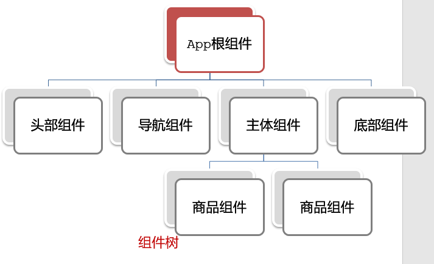


**组件是由三部分构成**

- 语法高亮插件


- 一个根组件App.vue，包含的三个部分

  - template：结构 （有且只能一个根元素）

    > 但是Vue3就没有（有且只能一个根元素）这个限制了

  - script:   js逻辑 

  - style： 样式 (可支持less，需要装包)

  > <vue可以帮助我们快速生成三部分
  >
  > 

- 让组件支持less

  （1） style标签，lang="less" 开启less功能 

  （2） 装包: yarn add less less-loader -D 或者npm i less less-loader -D


如果想要代码提示，需要写成：<t

在.vue里面写：class=，已经不会自动补全双引号了，我们需要直接使用自动提示功能

~~~vue
<template>
  <div class="App">
    <div class="box" @click="fn"></div>
  </div>
</template>

<script>
// 导出的是当前组件的配置项
// 里面可以提供 data(特殊) methods computed watch 生命周期八大钩子
export default {
  created() {
    console.log("我是created");
  },
  methods: {
    fn() {
      alert("你好");
    },
  },
};
</script>

<style lang="less">
/* 让style支持less
   1. 给style加上 lang="less"
   2. 安装依赖包 less less-loader
      yarn add less less-loader -D (开发依赖)
*/
.App {
  width: 400px;
  height: 400px;
  background-color: pink;
  .box {
    width: 100px;
    height: 100px;
    background-color: skyblue;
  }
}
</style>
~~~

# 43.普通组件的注册使用-局部注册

组件注册的两种方式

1. 局部注册：只能在注册的组件内使用

   ① 创建 .vue 文件 (三个组成部分)

   > 以.vue结尾的组件，一般也叫做 单文件组件，即一个组件就是组件里的全部内容

   ② 在使用的组件内导入并注册

2.  全局注册：所有组件内都能使用


**步骤**

1. 创建.vue文件（三个组成部分）
2. 在使用的组件内先导入再注册，最后使用

**使用方式**

当成html标签使用即可  <组件名></组件名>

**注意**

组件名规范 —> 大驼峰命名法， 如 HmHeader

**语法**

① 创建 .vue 文件 (三个组成部分)

创建是往components（注意是复数）目录里建


② 在使用的组件内导入并注册

```js
// 导入需要注册的组件
import 组件对象 from '.vue文件路径'
import HmHeader from './components/HmHeader'

export default {  // 局部注册
  components: {
   '组件名': 组件对象,
    // 前面是我们将来需要使用的名字，后面是导过来的变量名，一般情况下这两个会起同样的名字
    HmHeader:HmHeaer,
    HmHeader
  }
}
```


**练习**

需要备份一份src直接在空白的地方粘贴即可


在App组件中，完成以下练习。在App.vue中使用组件的方式完成下面布局


App.vue

~~~vue
<template>
  <!-- 这个类名最好是跟当前的组件名同名 -->
  <div class="App">
    <!-- 头部组件 -->
    <HmHeader></HmHeader>
    <!-- 主体组件 -->
    <HmMain></HmMain>
    <!-- 底部组件 -->
    <HmFooter></HmFooter>

    <!-- 如果 HmFooter + tab 出不来 → 需要配置 vscode
         设置中搜索 trigger on tab → 勾上
    -->
  </div>
</template>

<script>
import HmHeader from './components/HmHeader.vue'
import HmMain from './components/HmMain.vue'
import HmFooter from './components/HmFooter.vue'
export default {
  components: {
    // '组件名': 组件对象
    // 同名的时候是可以简写的
    HmHeader: HmHeader,
    HmMain,
    HmFooter
  }
}
</script>

<style>
.App {
  width: 600px;
  height: 700px;
  background-color: #87ceeb;
  margin: 0 auto;
  padding: 20px;
}
</style>
~~~

HmHeader.vue

```vue
<template>
  <!-- 在类名中，多个单词用 - 连接 -->
  <div class="hm-header">
    我是hm-header
  </div>
</template>

<script>
export default {

}
</script>

<style>
.hm-header {
  height: 100px;
  line-height: 100px;
  text-align: center;
  font-size: 30px;
  background-color: #8064a2;
  color: white;
}
</style>
```

HmMain.vue

```vue
<template>
  <div class="hm-main">
    我是hm-main
  </div>
</template>

<script>
export default {

}
</script>

<style>
.hm-main {
  height: 400px;
  line-height: 400px;
  text-align: center;
  font-size: 30px;
  background-color: #f79646;
  color: white;
  margin: 20px 0;
}
</style>
```

HmFooter.vue

```vue
<template>
  <div class="hm-footer">
    我是hm-footer
  </div>
</template>

<script>
export default {

}
</script>

<style>
.hm-footer {
  height: 100px;
  line-height: 100px;
  text-align: center;
  font-size: 30px;
  background-color: #4f81bd;
  color: white;
}
</style>
```

# 配置Tab

在设置里搜索

~~~
trigger on tab
~~~


此时这两个地方按tab都可以补全


# 44.普通组件的注册使用-全局注册

**步骤**

1. 创建.vue组件（三个组成部分）
2. **main.js**中进行全局注册

**使用方式**

当成HTML标签直接使用

> <组件名></组件名>

**注意**

组件名规范 —> 大驼峰命名法， 如 HmHeader

技巧：一般都用局部注册，如果发现确实是通用组件，再定义到全局。

**语法**

Vue.component('组件名', 组件对象)

例：

```js
// 导入需要全局注册的组件
import HmButton from './components/HmButton'
// 注意没有s，一次只能注册一个对应的组件
Vue.component('HmButton', HmButton)
```

**练习**

在以下3个局部组件中是展示一个通用按钮

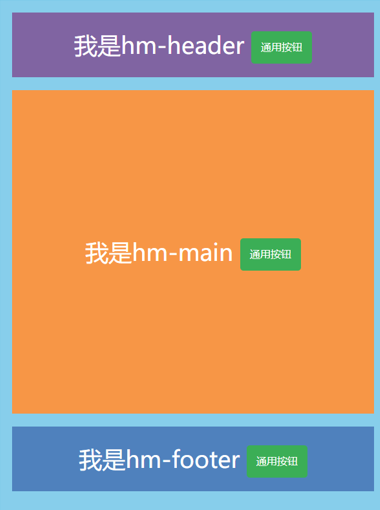

HmButton.vue

```vue
<template>
  <button class="hm-button">通用按钮</button>
</template>

<script>
export default {

}
</script>

<style>
.hm-button {
  height: 50px;
  line-height: 50px;
  padding: 0 20px;
  background-color: #3bae56;
  border-radius: 5px;
  color: white;
  border: none;
  vertical-align: middle;
  cursor: pointer;
}
</style>
```

main.js

~~~js
// 编写导入的代码，往代码的顶部编写(规范)
// 无论后面加不加.vue，在脚手架环境都支持
import HmButton from './components/HmButton'
Vue.config.productionTip = false

// 进行全局注册 → 在所有的组件范围内都能直接使用
// Vue.component(组件名，组件对象)
Vue.component('HmButton', HmButton)
~~~

# 45.小兔鲜首页 - 拆分模块组件 - 局部注册

小兔仙组件拆分示意图


开发思路

1. 分析页面，按模块拆分组件，搭架子  (局部或全局注册)

2. 根据设计图，编写组件 html 结构 css 样式 (已准备好)

3. 拆分封装通用小组件  (局部或全局注册)，一般这些小组件都会注册成全局的

   将来 → 通过 js 动态渲染，实现功能

看操作：

首先复制七个


然后复制组件名


利用滚轮全部替换


然后shift摁住，去到行末


再利用滚轮，选择全部，粘贴


导入的时候也同理，先改后面，这是因为前面不会动


然后再改前面


~~~html
<!-- 在脚手架里如果使用v-for而不加key是会报错的！ -->
<BaseGoodsItem v-for="item in 5" :key="item"></BaseGoodsItem>
~~~

# 48.scoped解决样式冲突

**默认情况**下写在组件中的样式会 **全局生效** →  因此很容易造成多个组件之间的样式冲突问题。

1. **全局样式**: 默认组件中的样式会作用到全局，任何一个组件中都会受到此样式的影响


2. **局部样式**: 可以给组件加上**scoped** 属性,可以**让样式只作用于当前组件**

代码示例

BaseOne.vue

```vue
<template>
  <div class="base-one">
    BaseOne
  </div>
</template>

<script>
export default {

}
</script>

<style scoped>
/* 
  1.style中的样式 默认是作用到全局的
  2.加上scoped可以让样式变成局部样式

  组件都应该有独立的样式，推荐加scoped（原理）
  -----------------------------------------------------
  scoped原理：
  1.给当前组件模板的所有元素，都会添加上一个自定义属性
  data-v-hash值
  data-v-5f6a9d56  用于区分开不通的组件
  2.css选择器后面，被自动处理，添加上了属性选择器
  div[data-v-5f6a9d56]
*/
div{
  border: 3px solid blue;
  margin: 30px;
}
</style>
```

BaseTwo.vue

```vue
<template>
  <div class="base-one">
    BaseTwo
  </div>
</template>

<script>
export default {

}
</script>

<style scoped>
 div{
  border: 3px solid red;
  margin: 30px;
 }
</style>
```

App.vue

```vue
<template>
  <div id="app">
    <BaseOne></BaseOne>
    <BaseTwo></BaseTwo>
  </div>
</template>

<script>
import BaseOne from './components/BaseOne'
import BaseTwo from './components/BaseTwo'
export default {
  name: 'App',
  components: {
    BaseOne,
    BaseTwo
  }
}
</script>
```


### scoped原理

1. 当前组件内标签都被添加**data-v-hash值** 的属性 
2. css选择器都被添加 [**data-v-hash值**] 的属性选择器

最终效果: **必须是当前组件的元素**, 才会有这个自定义属性, 才会被这个样式作用到 


# 49.data必须是一个函数

一个组件的 **data** 选项必须**是一个函数**。目的是为了：保证每个组件实例，维护**独立**的一份**数据**对象。

每次创建新的组件实例，都会新**执行一次data 函数**，得到一个新对象。


data不写成函数是会报错的


代码示例

BaseCount.vue

```vue
<template>
  <div class="base-count">
    <!-- 使用的时候直接使用就行了 --> 
    <button @click="count--">-</button>
    <span>{{ count }}</span>
    <button @click="count++">+</button>
  </div>
</template>

<script>
export default {
  // data() {
  //   console.log('函数执行了')
  //   return {
  //     count: 100,
  //   }
  // },
  data: function () {
    return {
      count: 100,
    }
  },
}
</script>

<style>
.base-count {
  margin: 20px;
}
</style>
```

App.vue

```vue
<template>
  <div class="app">
    <baseCount></baseCount>
    <baseCount></baseCount>
    <baseCount></baseCount>
  </div>
</template>

<script>
import baseCount from './components/BaseCount'
export default {
  components: {
    baseCount,
  },
}
</script>

<style>
</style>
```

# 50.组件通信

组件通信，就是指**组件与组件**之间的**数据传递**

- 组件的数据是独立的，无法直接访问其他组件的数据。
- 想使用其他组件的数据，就需要组件通信


**组件之间如何通信**


思考：

1. 组件之间有哪些关系？
2. 对应的组件通信方案有哪几类？


**组件关系分类**

1. 父子关系 （A与B）
2. 非父子关系 （B与C）


**通信解决方案**


### 父子通信流程

1. 父组件通过 **props** 将数据传递给子组件

   ① 父中给子添加自定义属性传值 ② 子props 接收 ③ 子组件使用

   > props用大白话将就是组件标签身上新增的一个一个自定义属性

2. 子组件利用 **$emit** 通知父组件修改更新

   ① 子$emit 发送消息 ②父中给子添加消息监听 ③ 父中实现处理函数


**父向子通信代码示例**

父组件通过**props**将数据传递给子组件

父组件App.vue

```vue
<template>
  <div class="app" style="border: 3px solid #000; margin: 10px">
    我是APP组件
    <!-- 1.给组件标签，添加属性方式 赋值 -->
    <!-- 如果title前面不加:，就表示写死了 -->
    <Son :title="myTitle"></Son>
  </div>
</template>

<script>
import Son from "./components/Son.vue"
export default {
  name: "App",
  components: {
    Son,
  },
  data() {
    return {
      myTitle: "学前端，就来黑马程序员",
    }
  },
}
</script>

<style>
</style>
```


子组件Son.vue

```vue
<template>
  <div class="son" style="border:3px solid #000;margin:10px">
    <!-- 3.直接使用props的值 -->  
    我是Son组件  {{ title }}
  </div>
</template>

<script>
export default {
  name: 'Son-Child',
  // 2.通过props来接受
  props: ['title']
}
</script>

<style>

</style>
```


父向子传值步骤

1. 给子组件以添加属性的方式传值
2. 子组件内部通过props接收
3. 模板中直接使用 props接收的值


**子向父通信代码示例**

子组件利用 **$emit** 通知父组件，进行修改更新


子向父传值步骤

1. $emit触发事件，给父组件发送消息通知
2. 父组件监听$emit触发的事件
3. 提供处理函数，在函数的形参中获取传过来的参数


Son.vue

~~~vue
<template>
  <div class="son" style="border: 3px solid #000; margin: 10px">
    我是Son组件 {{ title }}
    <button @click="changeFn">修改title</button>
  </div>
</template>

<script>
export default {
  name: 'Son-Child',
  props: ['title'],
  methods: {
    changeFn() {
      // 通过this.$emit() 向父组件发送通知
      // 如果不需要传参的话，第二个参数可以直接不写
      this.$emit('changTitle','传智教育')
    },
  },
}
</script>

<style>
</style>
~~~

App.vue

~~~vue
<template>
  <div class="app" style="border: 3px solid #000; margin: 10px">
    我是APP组件
    <!-- 2.父组件对子组件的消息进行监听 -->
    <Son :title="myTitle" @changTitle="handleChange"></Son>
  </div>
</template>

<script>
import Son from './components/Son.vue'
export default {
  name: 'App',
  data() {
    return {
      myTitle: '学前端，就来黑马程序员',
    }
  },
  components: {
    Son,
  },
  methods: {
    // 3.提供处理函数，提供逻辑
    handleChange(newTitle) {
      this.myTitle = newTitle
    },
  },
}
</script>

<style>
</style>
~~~

# 51.什么是props

**Props 定义**

组件上 注册的一些  自定义属性

**Props 作用**

向子组件传递数据

**特点**

1. 可以 传递 **任意数量** 的prop
2. 可以 传递 **任意类型** 的prop


**代码示例**

父组件App.vue

```vue
<template>
  <div class="app">
    <!-- 直接在组件上加上自定义属性，一行一个也方便查看 -->
    <UserInfo
      :username="username"
      :age="age"
      :isSingle="isSingle"
      :car="car"
      :hobby="hobby"
    ></UserInfo>
  </div>
</template>

<script>
import UserInfo from './components/UserInfo.vue'
export default {
  data() {
    return {
      username: '小帅',
      age: 28,
      isSingle: true,
      car: {
        brand: '宝马',
      },
      hobby: ['篮球', '足球', '羽毛球'],
    }
  },
  components: {
    UserInfo,
  },
}
</script>

<style>
</style>
```

子组件UserInfo.vue

```vue
<template>
  <div class="userinfo">
    <h3>我是个人信息组件</h3>
    <div>姓名：{{username}}</div>
    <div>年龄：{{age}}</div>
    <div>是否单身：{{ isSingle ? '是' : '否' }}</div>
    <div>座驾：{{car.brand}}</div>
    <div>兴趣爱好：{{hobby.join('、')}}</div>
  </div>
</template>

<script>
export default {
  props:['username','age','isSingle','car','hobby']
}
</script>

<style>
.userinfo {
  width: 300px;
  border: 3px solid #000;
  padding: 20px;
}
.userinfo > div {
  margin: 20px 10px;
}
</style>
```


## props校验

组件的props可以乱传吗

**作用**

为组件的 prop 指定**验证要求**，不符合要求，控制台就会有**错误提示**  → 帮助开发者，快速发现错误

**语法**

- **类型校验**
- 非空校验
- 默认值
- 自定义校验

类型校验：

> 把props改成对象的写法，然后在里面写上键和值就行了


**代码示例**

App.vue

```vue
<template>
  <div class="app">
    <BaseProgress :w="width"></BaseProgress>
  </div>
</template>

<script>
import BaseProgress from './components/BaseProgress.vue'
export default {
  data() {
    return {
      width: 30,
    }
  },
  components: {
    BaseProgress,
  },
}
</script>

<style>
</style>
```

BaseProgress.vue

```vue
<template>
  <div class="base-progress">
    <div class="inner" :style="{ width: w + '%' }">
      <span>{{ w }}%</span>
    </div>
  </div>
</template>

<script>
export default {
  // props: ['w']
  props: {
    w: Number, // Number Boolean
  },
}
</script>

<style scoped>
.base-progress {
  height: 26px;
  width: 400px;
  border-radius: 15px;
  background-color: #272425;
  border: 3px solid #272425;
  box-sizing: border-box;
  margin-bottom: 30px;
}
.inner {
  position: relative;
  background: #379bff;
  border-radius: 15px;
  height: 25px;
  box-sizing: border-box;
  left: -3px;
  top: -2px;
}
.inner span {
  position: absolute;
  right: 0;
  top: 26px;
}
</style>
```

此时如果w传的不是Number类型，就会报错


## props校验完整写法

**语法**

```js
props: {
  校验的属性名: {
	//写成一个对象的好处就是，它可以描述更详细的一些验证要求
    type: 类型,  // Number String Boolean ...，这个可以写成一个数组的形式 type: [类型1，类型2]
    required: true, // 是否必填
    default: 默认值, // 默认值
    // 对于对象类的，需要是个函数，在函数中的返回值就是它的默认值
    default: () => {
      return {}
    },
    
    // 如果上述验证都满足不了要求，就使用validator去进行自定义校验
    // return true：通过校验。return false：没有通过校验
    // value是获取prop传的值
    validator (value) { 
      // 自定义校验逻辑
      return 是否通过校验
    }
  },
  // 如果属性只需要设置type，也可以写成：
  校验的属性名: 类型
},
```

没有通过自定义校验报错：


**代码示例**

```vue
<template>
  <div class="base-progress">
    <div class="inner" :style="{ width: w + '%' }">
      <span>{{ w }}%</span>
    </div>
  </div>
</template>

<script>
export default {
  // 1.基础写法（类型校验）
  // props: {
  //   w: Number,
  // },

  // 2.完整写法（类型、默认值、非空、自定义校验）
  props: {
    w: {
      type: Number,
      required: true,
      default: 0,
      validator(val) {
        // console.log(val)
        if (val >= 100 || val <= 0) {
          console.error('传入的范围必须是0-100之间')
          return false
        } else {
          return true
        }
      },
    },
  },
}
</script>

<style scoped>
.base-progress {
  height: 26px;
  width: 400px;
  border-radius: 15px;
  background-color: #272425;
  border: 3px solid #272425;
  box-sizing: border-box;
  margin-bottom: 30px;
}
.inner {
  position: relative;
  background: #379bff;
  border-radius: 15px;
  height: 25px;
  box-sizing: border-box;
  left: -3px;
  top: -2px;
}
.inner span {
  position: absolute;
  right: 0;
  top: 26px;
}
</style>
```


**注意**

1.default和required一般不同时写（因为当时必填项时，肯定是有值的）

2.default后面如果是简单类型的值，可以直接写默认。如果是复杂类型的值，则需要以函数的形式return一个默认值


## props&data、单向数据流

**共同点**

都可以给组件提供数据

**区别**

- data 的数据是**自己**的  →   随便改  
- prop 的数据是**外部**的  →   不能直接改，要遵循 **单向数据流**


**单向数据流**

父级props 的数据更新，会向下流动，影响子组件。这个数据流动是单向的

在第3行和第5行报错


**代码示例**

App.vue

```vue
<template>
  <div class="app">
    <BaseCount></BaseCount>
  </div>
</template>

<script>
import BaseCount from './components/BaseCount.vue'
export default {
  components:{
    BaseCount
  },
  data(){
  },
}
</script>

<style>

</style>
```

BaseCount.vue

```vue
<template>
  <div class="base-count">
    <button @click="count--">-</button>
    <span>{{ count }}</span>
    <button @click="count++">+</button>
  </div>
</template>

<script>
export default {
  // 1.自己的数据随便修改  （谁的数据 谁负责）
   data () {
     return {
       count: 100,
     }
   },
  // 2.外部传过来的数据 不能随便修改
  // 以后关于prop的写法一律写对象，加一些要求会使组件更稳定一些
  //props: {
  //  count: {
  //    type: Number,
  //  }, 
  //}
}
</script>

<style>
.base-count {
  margin: 20px;
}
</style>
```


解决办法：在要修改的地方提供对应的函数

BaseCount.vue

~~~vue
<template>
  <div class="base-count">
    <button @click="handleSub">-</button>
    <span>{{ count }}</span>
    <button @click="handleAdd">+</button>
  </div>
</template>

<script>
export default {
  // 1.自己的数据随便修改  （谁的数据 谁负责）
  // data () {
  //   return {
  //     count: 100,
  //   }
  // },
  // 2.外部（prop）传过来的数据 不能随便修改
    
  // 单项数据流：父组件的prop更新，会会向下流动，影响子组件。这个数据流动是单向的
  props: {
    count: {
      type: Number,
    },
  },
  methods: {
    handleSub() {
      this.$emit('changeCount', this.count - 1)
    },
    handleAdd() {
      this.$emit('changeCount', this.count + 1)
    },
  },
}
</script>

<style>
.base-count {
  margin: 20px;
}
</style>
~~~

App.vue

~~~vue
<template>
  <div class="app">
    <BaseCount :count="count" @changeCount="handleChange"></BaseCount>
  </div>
</template>

<script>
import BaseCount from './components/BaseCount.vue'
export default {
  components:{
    BaseCount
  },
  data(){
    return {
      count:100
    }
  },
  methods:{
    handleChange(newVal){
      // console.log(newVal);
      this.count = newVal
    }
  }
}
</script>

<style>

</style>
~~~

# 52.小黑记事本

**需求说明**

- 拆分基础组件
- 渲染待办任务
- 添加任务
- 删除任务
- 底部合计 和 清空功能
- 持久化存储


**拆分基础组件**

咱们可以把小黑记事本原有的结构拆成三部分内容：头部（TodoHeader）、列表(TodoMain)、底部(TodoFooter)


**列表渲染**

思路分析：

1. 提供数据：提供在公共的父组件 App.vue
2. 通过父传子，将数据传递给TodoMain
3. 利用v-for进行渲染


**添加功能**

思路分析：

1. 收集表单数据  v-model
2. 监听时间 （回车+点击 都要进行添加）
3. 子传父，将任务名称传递给父组件App.vue
4. 父组件接受到数据后 进行添加 **unshift**(自己的数据自己负责)


**综合案例-删除功能**

思路分析：

1. 监听时间（监听删除的点击）携带id
2. 子传父，将删除的id传递给父组件App.vue
3. 进行删除 **filter**  (自己的数据自己负责)


**底部功能及持久化存储**

思路分析：

1. 底部合计：父组件传递list到底部组件  —>展示合计
2. 清空功能：监听事件 —> **子组件**通知父组件 —>父组件清空
3. 持久化存储：watch监听数据变化，持久化到本地

App.vue

~~~vue
<template>
  <!-- 主体区域 -->
  <section id="app">
    <TodoHeader @add="handleAdd"></TodoHeader>
    <TodoMain :list="list" @del="handelDel"></TodoMain>
    <TodoFooter :list="list" @clear="clear"></TodoFooter>
  </section>
</template>

<script>
import TodoHeader from "./components/TodoHeader.vue";
import TodoMain from "./components/TodoMain.vue";
import TodoFooter from "./components/TodoFooter.vue";

// 渲染功能：
// 1.提供数据： 提供在公共的父组件 App.vue（因为三个子组件都需要使用）
// 2.通过父传子，将数据传递给TodoMain
// 3.利用 v-for渲染

// 添加功能：
// 1.手机表单数据  v-model
// 2.监听事件（回车+点击都要添加）
// 3.子传父，讲任务名称传递给父组件 App.vue
// 4.进行添加 unshift（自己的数据自己负责）
// 5.清空文本框输入的内容
// 6.对输入的空数据 进行判断

// 删除功能
// 1.监听事件（监听删除的点击） 携带id
// 2.子传父，讲删除的id传递给父组件的App.vue
// 3.进行删除filter（自己的数据 自己负责）

// 底部合计：父传子  传list 渲染
// 清空功能：子传父  通知父组件 → 父组件进行更新
// 持久化存储：watch深度监视list的变化 -> 往本地存储 ->进入页面优先读取本地数据
export default {
  data() {
    return {
      list: JSON.parse(localStorage.getItem("list")) || [
        { id: 1, name: "打篮球" },
        { id: 2, name: "看电影" },
        { id: 3, name: "逛街" },
      ],
    };
  },
  components: {
    TodoHeader,
    TodoMain,
    TodoFooter,
  },
  watch: {
    list: {
      deep: true,
      handler(newVal) {
        localStorage.setItem("list", JSON.stringify(newVal));
      },
    },
  },
  methods: {
    handleAdd(todoName) {
      // console.log(todoName)
      this.list.unshift({
        id: +new Date(),
        name: todoName,
      });
    },
    handelDel(id) {
      // console.log(id);
      this.list = this.list.filter((item) => item.id !== id);
    },
    clear() {
      this.list = [];
    },
  },
};
</script>

<style>
</style>
~~~

TODOHead.vue

~~~vue
<template>
   <!-- 输入框 -->
  <header class="header">
    <h1>小黑记事本</h1>
    <input placeholder="请输入任务" class="new-todo" v-model="todoName" @keyup.enter="handleAdd"/>
    <button class="add" @click="handleAdd">添加任务</button>
  </header>
</template>

<script>
export default {
  data(){
    return {
      todoName:''
    }
  },
  methods:{
    handleAdd(){
      // console.log(this.todoName)
      this.$emit('add',this.todoName)
      this.todoName = ''
    }
  }
}
</script>

<style>

</style>
~~~

TODOMain.vue

~~~vue
<template>
  <!-- 列表区域 -->
  <section class="main">
    <ul class="todo-list">
      <li class="todo" v-for="(item, index) in list" :key="item.id">
        <div class="view">
          <span class="index">{{ index + 1 }}.</span>
          <label>{{ item.name }}</label>
          <button class="destroy" @click="handleDel(item.id)"></button>
        </div>
      </li>
    </ul>
  </section>
</template>

<script>
export default {
  props: {
    list: {
      type: Array,
    },
  },
  methods: {
    handleDel(id) {
      this.$emit('del', id)
    },
  },
}
</script>

<style>
</style>
~~~

TODOFooter.vue

~~~vue
<template>
  <!-- 统计和清空 -->
  <footer class="footer">
    <!-- 统计 -->
    <span class="todo-count"
      >合 计:<strong> {{ list.length }} </strong></span
    >
    <!-- 清空 -->
    <button class="clear-completed" @click="clear">清空任务</button>
  </footer>
</template>

<script>
export default {
  props: {
    list: {
      type: Array,
    },
  },
  methods: {
    clear() {
      // 如果不需要传参的话，第二个参数可以直接不写
      this.$emit("clear");
    },
  },
};
</script>

<style>
</style>
~~~

# 55.非父子通信-event bus 事件总线

作用：非父子组件之间，进行简易消息传递。(复杂场景→ Vuex)

**步骤**

1. 创建一个都能访问的事件总线 （空Vue实例） → utils/EventBus.js

   > 叫事件总线的原因是因为本质是它俩消息的接受和发送是利用了Vue的事件机制

   ```js
   import Vue from 'vue'
   const Bus = new Vue()
   export default Bus
   ```

2. A组件（接受方），监听Bus的 $on事件

   ```js
   created () {
       // B组件通过触发事件传递了参数（发布消息），进而在A组件由于监听了这个消息，进而就会执行回调
       Bus.$on('sendMsg', (msg) => {
           this.msg = msg
       })
   }
   ```

3. B组件（发送方），触发Bus的$emit事件

   ```js
   Bus.$emit('sendMsg', '这是一个消息')
   ```

   


**代码示例**

EventBus.js

```js
import Vue from 'vue'
const Bus = new Vue()
export default Bus
```

BaseA.vue(接受方)

```vue
<template>
  <div class="base-a">
    我是A组件（接受方）
    <p>{{msg}}</p>  
  </div>
</template>

<script>
import Bus from '../utils/EventBus'
export default {
  data() {
    return {
      msg: '',
    }
  },
  created() {
    Bus.$on('sendMsg', (msg) => {
      // console.log(msg)
      this.msg = msg
    })
  },
}
</script>

<style scoped>
.base-a {
  width: 200px;
  height: 200px;
  border: 3px solid #000;
  border-radius: 3px;
  margin: 10px;
}
</style>
```

BaseB.vue(发送方)

```vue
<template>
  <div class="base-b">
    <div>我是B组件（发布方）</div>
    <button @click="sendMsgFn">发送消息</button>
  </div>
</template>

<script>
import Bus from '../utils/EventBus'
export default {
  methods: {
    sendMsgFn() {
      Bus.$emit('sendMsg', '今天天气不错，适合旅游')
    },
  },
}
</script>

<style scoped>
.base-b {
  width: 200px;
  height: 200px;
  border: 3px solid #000;
  border-radius: 3px;
  margin: 10px;
}
</style>
```

App.vue

```vue
<template>
  <div class="app">
    <BaseA></BaseA>
    <BaseB></BaseB>
    <BaseC></BaseC>
  </div>
</template>

<script>
import BaseA from './components/BaseA.vue'
import BaseB from './components/BaseB.vue'
import BaseC from './components/BaseC.vue'
export default {
  components:{
    BaseA,
    BaseB,
    BaseC
  }
}
</script>

<style>

</style>
```

# 56.非父子通信-provide&inject

作用：跨层级共享数据

**场景**


**语法**

1. 父组件 provide提供数据

```js
export default {
  provide () {
    return {
       // 普通类型【非响应式】
       color: this.color, 
       // 复杂类型【响应式】
       userInfo: this.userInfo, 
    }
  }
}
```

2.子/孙组件 inject获取数据

```js
export default {
  inject: ['color','userInfo'],
  created () {
    console.log(this.color, this.userInfo)
  }
}
```

**注意**

- provide提供的简单类型的数据不是响应式的，复杂类型数据是响应式。（推荐提供复杂类型数据）
- 子/孙组件通过inject获取的数据，不能在自身组件内修改

App.vue

~~~vue
<template>
  <div class="app">
    我是APP组件
    <button @click="change">修改数据</button>
    <SonA></SonA>
    <SonB></SonB>
  </div>
</template>

<script>
import SonA from './components/SonA.vue'
import SonB from './components/SonB.vue'
export default {
  provide() {
    return {
      // 简单类型 是非响应式的
      color: this.color,
      // 复杂类型 是响应式的
      userInfo: this.userInfo,
    }
  },
  data() {
    return {
      color: 'pink', // 简单类型
      userInfo: { // 复杂类型
        name: 'zs',
        age: 18,
      },
    }
  },
  methods: {
    change() {
      this.color = 'red'
      this.userInfo.name = 'ls'
    },
  },
  components: {
    SonA,
    SonB,
  },
}
</script>

<style>
.app {
  border: 3px solid #000;
  border-radius: 6px;
  margin: 10px;
}
</style>
~~~

GrandSon.vue

~~~vue
<template>
  <div class="grandSon">
    我是GrandSon
    {{ color }} -{{ userInfo.name }} -{{ userInfo.age }}
  </div>
</template>

<script>
export default {
  inject: ['color', 'userInfo'],
}
</script>

<style>
.grandSon {
  border: 3px solid #000;
  border-radius: 6px;
  margin: 10px;
  height: 100px;
}
</style>
~~~

SonA.vue

~~~vue
<template>
  <div class="SonA">我是SonA组件
    <GrandSon></GrandSon>
  </div>
</template>

<script>
import GrandSon from '../components/GrandSon.vue'
export default {
  components:{
    GrandSon
  }
}
</script>

<style>
.SonA {
  border: 3px solid #000;
  border-radius: 6px;
  margin: 10px;
  height: 200px;
}
</style>
~~~

SonB.vue

~~~vue
<template>
  <div class="SonB">
    我是SonB组件
  </div>
</template>

<script>
export default {

}
</script>

<style>
.SonB {
  border: 3px solid #000;
  border-radius: 6px;
  margin: 10px;
  height: 200px;
}
</style>
~~~

# 57.v-model原理

**原理**

> v-model不仅可以用在表单上面，还可以用在组件上面完成组件通信

v-model本质上是一个语法糖。例如应用在输入框上，就是value属性 和 input事件 的合写。

不同的表单元素， v-model在底层的处理机制是不一样的。比如给checkbox使用v-model底层处理的是 checked属性和change事件。

**不过咱们只需要掌握应用在文本框上的原理即可**


**作用**

提供数据的双向绑定

- 数据变，视图跟着变 :value
- 视图变，数据跟着变 @input

> 语法糖：即一种语法的简写

**注意**：$event 用于在模板中，获取事件的形参

```vue
<template>
  <div id="app" >
    <input v-model="msg" type="text">

    // ① 数据变，视图跟着变 :value
    // ② 视图变，数据跟着变 @input
    <input :value="msg" @input="msg = $event.target.value" type="text">
  </div>
</template>

```


## 表单类组件封装

> 在工作中会使用到大量的表单内容，通常来说会把它封装成组件，比如说下拉组件，一旦涉及到组件，就会涉及到组件通信，而这些组件通信就可以使用v-model来简化


**需求目标**

实现子组件和父组件数据的双向绑定 （实现App.vue中的selectId和子组件选中的数据进行双向绑定）

① 父传子：数据 应该是父组件 props 传递 过来的，拆解 v-model 绑定数据

> 因为只有将数据绑定在父组件上，将来才能拿这个数据进行表单提交

> 由于v-model是双向绑定，所以它是不能直接和父组件的值绑定，而子组件是不能直接修改父组件的数据的，所以此时需要进行v-model的拆解，拆解成:value和@change

② 子传父：监听输入，子传父传值给父组件修改


**代码实例**

App.vue

```vue
<template>
  <div class="app">
    <BaseSelect
      :selectId="selectId"
      // 父组件直接使用$event获取形参
      @changeCity="selectId = $event"
    ></BaseSelect>
  </div>
</template>

<script>
import BaseSelect from './components/BaseSelect.vue'
export default {
  data() {
    return {
      selectId: '102',
    }
  },
  components: {
    BaseSelect,
  },
}
</script>

<style>
</style>
```

BaseSelect.vue

```vue
<template>
  <div>
    <select :value="selectId" @change="selectCity">
      <option value="101">北京</option>
      <option value="102">上海</option>
      <option value="103">武汉</option>
      <option value="104">广州</option>
      <option value="105">深圳</option>
    </select>
  </div>
</template>

<script>
export default {
  props: {
    selectId: String,
  },
  methods: {
    selectCity(e) {
      this.$emit('changeCity', e.target.value)
    },
  },
}
</script>

<style>
</style>
```


## v-model简化代码

**目标**

父组件通过v-model **简化代码**，实现子组件和父组件数据 **双向绑定**


v-model其实就是 :value和@input事件的简写

- 子组件：props通过value接收数据，事件触发 input
- 父组件：v-model直接绑定数据


子组件

```vue
<select :value="value" @change="handleChange">...</select>

<script>
props: {
  value: String
},
methods: {
  handleChange (e) {
	// 子传父必须触发固定的input事件
    this.$emit('input', e.target.value)
  }
}
</script>
```

父组件

```vue
<BaseSelect :value="selectId" @input="selectedId = $event"></BaseSelect>
<BaseSelect v-model="selectId"></BaseSelect>
```


# 58.sync修饰符

作用：可以实现 **子组件** 与 **父组件数据** 的 **双向绑定**，简化代码

简单理解：**子组件可以修改父组件传过来的props值**

特点：prop属性名，可以自定义，非固定为value

> 但是.sync没有v-model方便，所以当属性名确定为value，即表单元素的时候，就使用v-model

**场景 ** 封装弹框类的基础组件， visible属性 true显示 false隐藏


**本质** .sync修饰符 就是 **:属性名** 和 **@update:属性名** 合写


**语法**

父组件

```vue
// .sync写法
<BaseDialog :visible.sync="isShow" />
--------------------------------------
// 完整写法
<BaseDialog 
  :visible="isShow" 
  @update:visible="isShow = $event" 
/>
```

子组件

```vue
props: {
  visible: Boolean
},

this.$emit('update:visible', false)
```


**代码示例**

App.vue

```vue
<template>
  <div class="app">
    <button @click="openDialog">退出按钮</button>
    <!-- isShow.sync  => :isShow="isShow" @update:isShow="isShow=$event" -->
    <BaseDialog :isShow.sync="isShow"></BaseDialog>
  </div>
</template>

<script>
import BaseDialog from './components/BaseDialog.vue'
export default {
  data() {
    return {
      isShow: false,
    }
  },
  methods: {
    openDialog() {
      this.isShow = true
      // console.log(document.querySelectorAll('.box')); 
    },
  },
  components: {
    BaseDialog,
  },
}
</script>

<style>
</style>
```

BaseDialog.vue

```vue
<template>
  <div class="base-dialog-wrap" v-show="isShow">
    <div class="base-dialog">
      <div class="title">
        <h3>温馨提示：</h3>
        <button class="close" @click="closeDialog">x</button>
      </div>
      <div class="content">
        <p>你确认要退出本系统么？</p>
      </div>
      <div class="footer">
        <button>确认</button>
        <button>取消</button>
      </div>
    </div>
  </div>
</template>

<script>
export default {
  props: {
    isShow: Boolean,
  },
  methods:{
    closeDialog(){
      this.$emit('update:isShow',false)
    }
  }
}
</script>

<style scoped>
.base-dialog-wrap {
  width: 300px;
  height: 200px;
  box-shadow: 2px 2px 2px 2px #ccc;
  position: fixed;
  left: 50%;
  top: 50%;
  transform: translate(-50%, -50%);
  padding: 0 10px;
}
.base-dialog .title {
  display: flex;
  justify-content: space-between;
  align-items: center;
  border-bottom: 2px solid #000;
}
.base-dialog .content {
  margin-top: 38px;
}
.base-dialog .title .close {
  width: 20px;
  height: 20px;
  cursor: pointer;
  line-height: 10px;
}
.footer {
  display: flex;
  justify-content: flex-end;
  margin-top: 26px;
}
.footer button {
  width: 80px;
  height: 40px;
}
.footer button:nth-child(1) {
  margin-right: 10px;
  cursor: pointer;
}
</style>
```

# 59.获取 dom 元素 或 组件实例

作用：利用ref 和 $refs 可以用于 获取 dom 元素 或 组件实例

特点：查找范围 →  当前组件内(更精确稳定)

注意：之前只用document.querySelect('.box') 获取的是整个页面中的盒子，而ref 和 $refs 查找的范围是当前组件内


**获取 dom **

1.给要获取的盒子添加ref属性

```html
<div ref="chartRef">我是渲染图表的容器</div>
```

2.获取时通过 $refs获取  this.\$refs.chartRef 获取

```js
// 在DOM渲染完之后再获取DOM元素
mounted () {
  console.log(this.$refs.chartRef)
}
```


**获取 组件**

1.给要获取的盒子添加ref属性

```html
<BaseForm ref="baseForm"></BaseForm>
```

2.获取时通过 $refs获取  this.\$refs.xxx 获取目标组件， 就可以调用组件对象里面的方法

```js
this.$refs.baseForm.组件方法()
```


**代码示例**（获取组件元素）

App.vue

```vue
<template>
  <div class="app">
    <BaseChart></BaseChart>
  </div>
</template>

<script>
import BaseChart from './components/BaseChart.vue'
export default {
  components:{
    BaseChart
  }
}
</script>

<style>
</style>
```

BaseChart.vue

```vue
<template>
  <div class="base-chart-box" ref="mychart">子组件</div>
</template>

<script>
// yarn add echarts 或者 npm i echarts
import * as echarts from 'echarts'

export default {
  mounted() {
    // 基于准备好的dom，初始化echarts实例
    // var myChart = echarts.init(document.querySelect('.base-chart-box'))
    var myChart = echarts.init(document.querySelect(this.$refs.mychart))
    // 绘制图表
    myChart.setOption({
      title: {
        text: 'ECharts 入门示例',
      },
      tooltip: {},
      xAxis: {
        data: ['衬衫', '羊毛衫', '雪纺衫', '裤子', '高跟鞋', '袜子'],
      },
      yAxis: {},
      series: [
        {
          name: '销量',
          type: 'bar',
          data: [5, 20, 36, 10, 10, 20],
        },
      ],
    })
  },
}
</script>

<style scoped>
.base-chart-box {
  width: 400px;
  height: 300px;
  border: 3px solid #000;
  border-radius: 6px;
}
</style>
```


**代码实例**（获取表单元素）

App.vue

~~~vue
<template>
  <div class="app">
    <h4>父组件 -- <button @click="handleGet">获取组件实例</button></h4>
    <BaseForm ref="baseForm"></BaseForm>
  </div>
</template>

<script>
import BaseForm from './components/BaseForm.vue'
export default {
  components: {
    BaseForm,
  },
  methods: {
   handleGet () {
    this.$refs.baseForm.getFormData()
   }
  }
}
</script>

<style>
</style>
~~~

# 60.异步更新 & $nextTick

**需求**

编辑标题,  编辑框自动聚焦

1. 点击编辑，显示编辑框
2. 让编辑框，立刻获取焦点


**问题**

"显示之后"，立刻获取焦点是不能成功的！

原因：Vue 是异步更新DOM  (提升性能)

> 由于每更新一次就去执行更新，效率是非常低的，应该一起更新


**解决方案**

$nextTick：**等 DOM更新后**,才会触发执行此方法里的函数体

> 使用SetTimeout也可以，但是不精准

**语法:** this.$nextTick(函数体)

```js
this.$nextTick(() => {
  this.$refs.inp.focus()
})
```

**注意：**$nextTick 内的函数体 一定是**箭头函数**，这样才能让函数内部的this指向Vue实例


**代码实现**

```vue
<template>
  <div class="app">
    <div v-if="isShowEdit">
      <input type="text" v-model="editValue" ref="inp" />
      <button>确认</button>
    </div>
    <div v-else>
      <span>{{ title }}</span>
      <button @click="editFn">编辑</button>
    </div>
  </div>
</template>

<script>
export default {
  data() {
    return {
      title: "大标题",
      isShowEdit: false,
      editValue: "",
    };
  },
  methods: {
    editFn() {
      // 显示输入框
      this.isShowEdit = true;
      // 获取焦点
      // this.$refs.inp.focus()
      this.$nextTick(() => {
        this.$refs.inp.focus();
      });
    },
  },
};
</script> 
```

# day05

# 62.自定义指令

**指令介绍**

- 内置指令：**v-html、v-if、v-bind、v-on**... 这都是Vue给咱们内置的一些指令，可以直接使用

- 自定义指令：同时Vue也支持让开发者，自己注册一些指令。这些指令被称为**自定义指令**

  每个指令都有自己各自独立的功能


**自定义指令**

概念：自己定义的指令，可以**封装一些DOM操作**，扩展额外的功能

> 例如：
>
> 需求：当页面加载时，让元素获取焦点（**autofocus在safari浏览器有兼容性**）
>
> **解决方案** 使用操作dom的方式：dom元素.focus()，此时就没有兼容性了
>
> App.vue
>
> ```vue
> <div>
>     <h1>自定义指令</h1>
>     <input v-focus ref="inp" type="text">
> </div>
> 
> mounted () {
>     this.$ref.inp.focus()
> }
> ```
>
> 但由于如果跳到第二个页面，但是又需要同样的需求，这一整段代码又得写一遍，就很麻烦
>
> 此时就可以把这一段跟 dom 相关的内容封装到指令中


**自定义指令语法**

inserted:被绑定元素插入父节点时调用的钩子函数

el：使用指令的那个DOM元素

- 全局注册

  ```js
  //在main.js中
  Vue.directive('指令名', {
    // inserted 就是指令的生命周期钩子，它表示的是当前指令所绑定的元素被添加到页面里去的时候会自动调用
    // el 就可以拿到指令所绑定的元素
    "inserted" (el) {
      // 可以对 el 标签，扩展额外功能
      el.focus()
    }
  })
  ```

- 局部注册：只能在当前组件内使用

  ```js
  // 在Vue组件的配置项中
  directives: {
    指令名: {
      inserted (el) {
        // 可以对 el 标签，扩展额外功能
        el.focus()
      }
    }
  }
  ```

- 使用指令

  注意：在使用指令的时候，一定要**先注册**，**再使用**，否则会报错
  使用指令语法： v-指令名。如：

  ~~~html
  <input type="text" v-focus/>  
  ~~~

  **注册**指令时**不用**加**v-前缀**，但**使用时**一定要**加v-前缀**


**代码示例**

需求：当页面加载时，让元素获取焦点

main.js

~~~js
import Vue from 'vue'
import App from './App.vue'

Vue.config.productionTip = false

// 全局注册指令
Vue.directive('focus', {
  inserted (el) {
    el.focus()
  }
})

new Vue({
  render: h => h(App),
}).$mount('#app')

~~~

App.vue

~~~vue
<template>
  <div>
    <h1>自定义指令</h1>
    <input v-focus type="text" ref="inp">
  </div>
</template>

<script>
export default {
  // mounted () {
  //   this.$refs.inp.focus()
  // }
    
  // 2. 局部注册指令
  directives: {
    focus: {
      inserted (el) {
        el.focus()
      }
    }
  }
}
</script>

<style>

</style>
~~~


## 自定义指令-指令的值

**需求** 实现一个 color 指令 - 传入不同的颜色, 给标签设置文字颜色


**语法**

1.在绑定指令时，可以通过“等号”的形式为指令 绑定 具体的参数值

```html
<div v-color="color">我是内容</div>
```

2.通过 binding.value 可以拿到指令值，**指令值修改会 触发 update 函数**

```js
directives: {
  color: {
    // inserted 提供的是元素被添加到页面中时的逻辑
    inserted (el, binding) {
      el.style.color = binding.value
    },
    // update 指令的值修改的时候触发，提供值变化后，dom更新的逻辑
    update (el, binding) {
      el.style.color = binding.value
    }
  }
}
```


**代码示例**

> Vue是响应式的，数据变化的时候，视图也是需要更新的。
>
> 但是自定义指令是不会把数据自动更新到视图中，相关的逻辑需要我们自己提供

App.vue

```vue
<template>
  <div>
     <!--显示红色--> 
    <h2 v-color="color1">指令的值1测试</h2>
     <!--显示蓝色--> 
    <h2 v-color="color2">指令的值2测试</h2>
     <button>
        改变第一个h1的颜色
    </button>
  </div>
</template>

<script>
export default {
  data () {
    return {
      color1: 'red',
      color2: 'blue'
    }
  }
}
</script>

<style>

</style>
```

# 63.自定义指令-v-loading指令的封装

**场景**

实际开发过程中，发送请求需要时间，在请求的数据未回来时，页面会处于**空白状态**  =>  用户体验不好


**需求**

封装一个 v-loading 指令，实现加载中的效果


**分析**

1. 本质 loading效果就是一个蒙层，盖在了盒子上

2. 数据请求中，开启loading状态，添加蒙层

3. 数据请求完毕，关闭loading状态，移除蒙层


**实现**

1.准备一个 loading类，通过伪元素定位，设置宽高，实现蒙层

> 使用伪元素添加的好处就是添加和移除会方便一些，如果准备dom元素，则添加和移除需要把这个节点添加和移除。但如果是伪元素，只需要添加和移除类就行了。

2.开启关闭 loading状态（添加移除蒙层），本质只需要添加移除类即可

3.结合自定义指令的语法进行封装复用

```css
.loading:before {
  content: "";
  position: absolute;
  left: 0;
  top: 0;
  width: 100%;
  height: 100%;
  background: #fff url("./loading.gif") no-repeat center;
}
```


核心思路：

1. 准备类名 loading，通过伪元素提供遮罩层

2. 添加或移除类名，实现loading蒙层的添加移除

3. 利用指令语法，封装 v-loading 通用指令

   inserted 钩子中，binding.value 判断指令的值，设置默认状态

   update 钩子中，binding.value 判断指令的值，更新类名状态


**代码示例**

```html
<template>
  <div class="main">
    <div class="box" v-loading="isLoading">
      <ul>
        <li v-for="item in list" :key="item.id" class="news">
          <div class="left">
            <div class="title">{{ item.title }}</div>
            <div class="info">
              <span>{{ item.source }}</span>
              <span>{{ item.time }}</span>
            </div>
          </div>

          <div class="right">
            
          </div>
        </li>
      </ul>
    </div>
    <!-- 第二个盒子 -->
    <div class="box2" v-loading="isLoading2"></div>
  </div>
</template>

<script>
// 安装axios =>  yarn add axios
import axios from 'axios'

// 接口地址：http://hmajax.itheima.net/api/news
// 请求方式：get
export default {
  data () {
    return {
      list: [],
      isLoading: true,
      isLoading2: true
    }
  },
  async created () {
    // 1. 发送请求获取数据
    const res = await axios.get('http://hmajax.itheima.net/api/news')
    
    setTimeout(() => {
      // 2. 更新到 list 中，用于页面渲染 v-for
      this.list = res.data.data
      this.isLoading = false
    }, 2000)
  },
  directives: {
    loading: {
      inserted (el, binding) {
        // 应该需要根据isLoading的初始值关联起来
        // el.classList.add('loading')
        binding.value ? el.classList.add('loading') : el.classList.remove('loading')
      },
      update (el, binding) {
        binding.value ? el.classList.add('loading') : el.classList.remove('loading')
      }
    }
  }
}
</script>

<style>
.loading:before {
  content: '';
  position: absolute;
  left: 0;
  top: 0;
  width: 100%;
  height: 100%;
  background: #fff url('./loading.gif') no-repeat center;
}

.box2 {
  width: 400px;
  height: 400px;
  border: 2px solid #000;
  position: relative;
}


.box {
  width: 800px;
  min-height: 500px;
  border: 3px solid orange;
  border-radius: 5px;
  position: relative;
}
.news {
  display: flex;
  height: 120px;
  width: 600px;
  margin: 0 auto;
  padding: 20px 0;
  cursor: pointer;
}
.news .left {
  flex: 1;
  display: flex;
  flex-direction: column;
  justify-content: space-between;
  padding-right: 10px;
}
.news .left .title {
  font-size: 20px;
}
.news .left .info {
  color: #999999;
}
.news .left .info span {
  margin-right: 20px;
}
.news .right {
  width: 160px;
  height: 120px;
}
.news .right img {
  width: 100%;
  height: 100%;
  object-fit: cover;
}
</style>
```


# 64.插槽-默认插槽

**作用** 让组件内部的一些 **结构** 支持 **自定义**


**需求**

将需要多次显示的对话框,封装成一个组件


**问题**

组件的内容部分，**不希望写死**，希望能使用的时候**自定义**。怎么办


插槽的基本**语法**

1. 组件内需要定制的结构部分，改用**<slot></slot>**占位
2. 使用组件时, **<MyDialog></MyDialog>**标签内部, 传入结构替换slot
3. 给插槽传入内容时，可以传入**纯文本、html标签、组件**


**代码示例**

MyDialog.vue

```vue
<template>
  <div class="dialog">
    <div class="dialog-header">
      <h3>友情提示</h3>
      <span class="close">✖️</span>
    </div>

    <div class="dialog-content">
      <!-- 1. 在需要定制的位置，使用slot占位 -->
      <slot></slot>
    </div>
    <div class="dialog-footer">
      <button>取消</button>
      <button>确认</button>
    </div>
  </div>
</template>

<script>
export default {
  data () {
    return {

    }
  }
}
</script>

<style scoped>
* {
  margin: 0;
  padding: 0;
}
.dialog {
  width: 470px;
  height: 230px;
  padding: 0 25px;
  background-color: #ffffff;
  margin: 40px auto;
  border-radius: 5px;
}
.dialog-header {
  height: 70px;
  line-height: 70px;
  font-size: 20px;
  border-bottom: 1px solid #ccc;
  position: relative;
}
.dialog-header .close {
  position: absolute;
  right: 0px;
  top: 0px;
  cursor: pointer;
}
.dialog-content {
  height: 80px;
  font-size: 18px;
  padding: 15px 0;
}
.dialog-footer {
  display: flex;
  justify-content: flex-end;
}
.dialog-footer button {
  width: 65px;
  height: 35px;
  background-color: #ffffff;
  border: 1px solid #e1e3e9;
  cursor: pointer;
  outline: none;
  margin-left: 10px;
  border-radius: 3px;
}
.dialog-footer button:last-child {
  background-color: #007acc;
  color: #fff;
}
</style>

```

App.vue

```vue
<template>
  <div>
    <!-- 2. 在使用组件时，组件标签内填入内容 -->
    <MyDialog>
      <div>你确认要删除么</div>
    </MyDialog>

    <MyDialog>
      <p>你确认要退出么</p>
    </MyDialog>
  </div>
</template>

<script>
import MyDialog from './components/MyDialog.vue'
export default {
  data () {
    return {

    }
  },
  components: {
    MyDialog
  }
}
</script>

<style>
body {
  background-color: #b3b3b3;
}
</style>
```

# 66.插槽-后备内容（默认值）

**问题**

通过插槽完成了内容的定制，传什么显示什么, 但是如果不传，则是空白


能否给插槽设置 默认显示内容 呢？


**插槽的后备内容**

封装组件时，可以为预留的 `<slot>` 插槽提供后备内容（默认值）。


**语法**

在 <slot> 标签内，放置内容, 作为默认显示内容


**效果**

- 外部使用组件时，不传东西，则slot会显示后备内容 

  

- 外部使用组件时，传东西了，则slot整体会被换掉

  


**代码示例**

App.vue

```vue
<template>
  <div class="dialog">
    <div class="dialog-header">
      <h3>友情提示</h3>
      <span class="close">✖️</span>
    </div>

    <div class="dialog-content">
      <!-- 往slot标签内部，编写内容，可以作为后备内容(默认值) -->
      <slot>
        我是默认的文本内容
      </slot>
    </div>
    <div class="dialog-footer">
      <button>取消</button>
      <button>确认</button>
    </div>
  </div>
</template>
```

# 67.插槽-具名插槽

**需求**

一个组件内有多处结构，需要外部传入标签，进行定制 

上面的弹框中有**三处不同**，但是**默认插槽**只能**定制一个位置**，这时候怎么办呢?


**具名插槽语法**

- 多个slot使用name属性区分名字 

  

- template配合v-slot:名字来分发对应标签

  


**v-slot的简写**

v-slot写起来太长，vue给我们提供一个简单写法 **v-slot: —> #**


代码示例

App.vue

~~~vue
<template>
  <div>
    <MyDialog>
      <!-- 需要通过template标签包裹需要分发的结构，包成一个整体 -->
      <template v-slot:head>
        <div>我是大标题</div>
      </template>
      
      <template v-slot:content>
        <div>我是内容</div>
      </template>

      <template #footer>
        <button>取消</button>
        <button>确认</button>
      </template>
    </MyDialog>
  </div>
</template>
~~~

MyDialog.vue

~~~vue
<template>
  <div class="dialog">
    <div class="dialog-header">
      <!-- 一旦插槽起了名字，就是具名插槽，只支持定向分发 -->
      <slot name="head"></slot>
    </div>

    <div class="dialog-content">
      <slot name="content"></slot>
    </div>
    <div class="dialog-footer">
      <slot name="footer"></slot>
    </div>
  </div>
</template>
~~~

# 68.作用域插槽

**插槽分类**

- 默认插槽：组件内定制一处结构

- 具名插槽：组件内定制多处结构

  插槽只有两种，作用域插槽不属于插槽的一种分类。作用域插槽只是插槽的一个传参语法


**作用：** 定义slot 插槽的同时, 是可以**传值**的。给 **插槽** 上可以 **绑定数据**，将来 **使用组件时可以用**


**场景**

封装表格组件

1. 父传子，动态渲染表格内容
2. 利用默认插槽，定制操作列
3. 删除或查看都需要用到 当前项的 id，属于 组件内部的数据 通过 作用域插槽 传值绑定，进而使

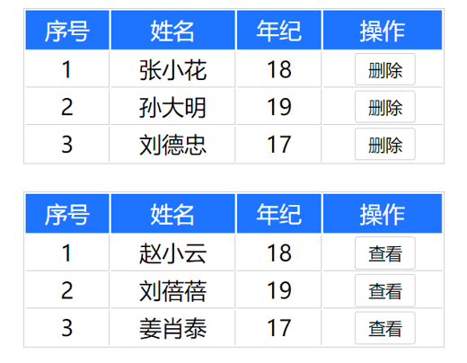


**使用步骤**

1. 给 slot 标签, 以 添加属性的方式传值

   ```vue
   <slot :id="item.id" msg="测试文本"></slot>
   ```

2. 所有添加的属性, 都会被收集到一个对象中

   ```vue
   { id: 3, msg: '测试文本' }
   ```

3. 在template中, 通过  ` #插槽名= "obj"` 接收，默认插槽名为 default

   ```vue
   <MyTable :list="list">
     <template #插槽名="obj">
       <button @click="del(obj.id)">删除</button>
     </template>
   </MyTable>
   ```


**代码示例**

MyTable.vue

```vue
<template>
  <table class="my-table">
    <thead>
      <tr>
        <th>序号</th>
        <th>姓名</th>
        <th>年纪</th>
        <th>操作</th>
      </tr>
    </thead>
    <tbody>
      <tr v-for="(item, index) in data" :key="item.id">
        <td>{{ index + 1 }}</td>
        <td>{{ item.name }}</td>
        <td>{{ item.age }}</td>
        <td>
          <!-- 1. 给slot标签，添加属性的方式传值 -->
          <slot :row="item" msg="测试文本"></slot>

          <!-- 2. 将所有的属性，添加到一个对象中 -->
          <!-- 
             {
               row: { id: 2, name: '孙大明', age: 19 },
               msg: '测试文本'
             }
           -->
        </td>
      </tr>
    </tbody>
  </table>
</template>

<script>
export default {
  props: {
    data: Array
  }
}
</script>

<style scoped>
.my-table {
  width: 450px;
  text-align: center;
  border: 1px solid #ccc;
  font-size: 24px;
  margin: 30px auto;
}
.my-table thead {
  background-color: #1f74ff;
  color: #fff;
}
.my-table thead th {
  font-weight: normal;
}
.my-table thead tr {
  line-height: 40px;
}
.my-table th,
.my-table td {
  border-bottom: 1px solid #ccc;
  border-right: 1px solid #ccc;
}
.my-table td:last-child {
  border-right: none;
}
.my-table tr:last-child td {
  border-bottom: none;
}
.my-table button {
  width: 65px;
  height: 35px;
  font-size: 18px;
  border: 1px solid #ccc;
  outline: none;
  border-radius: 3px;
  cursor: pointer;
  background-color: #ffffff;
  margin-left: 5px;
}
</style>
```

App.vue

```vue
<template>
  <div>
    <MyTable :data="list">
      <!-- 3. 通过template #插槽名="变量名" 接收 -->
      <template #default="obj">
        <button @click="del(obj.row.id)">
          删除
        </button>
      </template>
    </MyTable>
    
    <MyTable :data="list2">
      <template #default="{ row }">
        <button @click="show(row)">查看</button>
      </template>
    </MyTable>
  </div>
</template>

<script>
import MyTable from './components/MyTable.vue'
export default {
  data () {
    return {
      list: [
        { id: 1, name: '张小花', age: 18 },
        { id: 2, name: '孙大明', age: 19 },
        { id: 3, name: '刘德忠', age: 17 },
      ],
      list2: [
        { id: 1, name: '赵小云', age: 18 },
        { id: 2, name: '刘蓓蓓', age: 19 },
        { id: 3, name: '姜肖泰', age: 17 },
      ]
    }
  },
  methods: {
    del (id) {
      this.list = this.list.filter(item => item.id !== id)
    },
    show (row) {
      // console.log(row);
      alert(`姓名：${row.name}; 年纪：${row.age}`)
    }
  },
  components: {
    MyTable
  }
}
</script>
```

# 68.商品列表-MyTag组件抽离


**需求说明**

1. **my-tag 标签组件封装**

​    (1) 双击显示输入框，输入框获取焦点

​    (2) 失去焦点，隐藏输入框

​    (3) 回显标签信息

​    (4) 内容修改，回车 → 修改标签信息

2. **my-table 表格组件封装**

​    (1) 动态传递表格数据渲染

​    (2) 表头支持用户自定义

​    (3) 主体支持用户自定义


完整代码

App.vue

```vue
<template>
  <div class="table-case">
    <MyTable :data="goods">
      <template #head>
        <th>编号</th>
        <th>名称</th>
        <th>图片</th>
        <th width="100px">标签</th>
      </template>

      <!-- 直接解构 -->
      <template #body="{ item, index }">
        <td>{{ index + 1 }}</td>
        <td>{{ item.name }}</td>
        <td>
          
        </td>
        <td>
          <!-- 标签组件 -->
          <MyTag v-model="item.tag"></MyTag>
        </td>
      </template>
    </MyTable>
  </div>
</template>

<script>
// my-tag 标签组件的封装
// 1. 创建组件 - 初始化
// 2. 实现功能
//    (1) 双击显示，并且自动聚焦
//        v-if v-else @dblclick 操作 isEdit
//        自动聚焦：
//        1. $nextTick => $refs 获取到dom，进行focus获取焦点
//        2. 封装v-focus指令

//    (2) 失去焦点，隐藏输入框
//        @blur 操作 isEdit 即可

//    (3) 回显标签信息
//        回显的标签信息是父组件传递过来的
//        v-model实现功能 (简化代码)  v-model => :value 和 @input
//        组件内部通过props接收, :value设置给输入框

//    (4) 内容修改了，回车 => 修改标签信息
//        @keyup.enter, 触发事件 $emit('input', e.target.value)

// ---------------------------------------------------------------------

// my-table 表格组件的封装
// 1. 数据不能写死，动态传递表格渲染的数据  props
// 2. 结构不能写死 - 多处结构自定义 【具名插槽】
//    (1) 表头支持自定义
//    (2) 主体支持自定义

import MyTag from './components/MyTag.vue'
import MyTable from './components/MyTable.vue'
export default {
  name: 'TableCase',
  components: {
    MyTag,
    MyTable
  },
  data () {
    return {
      // 测试组件功能的临时数据
      tempText: '水杯',
      tempText2: '钢笔',
      goods: [
        { id: 101, picture: 'https://yanxuan-item.nosdn.127.net/f8c37ffa41ab1eb84bff499e1f6acfc7.jpg', name: '梨皮朱泥三绝清代小品壶经典款紫砂壶', tag: '茶具' },
        { id: 102, picture: 'https://yanxuan-item.nosdn.127.net/221317c85274a188174352474b859d7b.jpg', name: '全防水HABU旋钮牛皮户外徒步鞋山宁泰抗菌', tag: '男鞋' },
        { id: 103, picture: 'https://yanxuan-item.nosdn.127.net/cd4b840751ef4f7505c85004f0bebcb5.png', name: '毛茸茸小熊出没，儿童羊羔绒背心73-90cm', tag: '儿童服饰' },
        { id: 104, picture: 'https://yanxuan-item.nosdn.127.net/56eb25a38d7a630e76a608a9360eec6b.jpg', name: '基础百搭，儿童套头针织毛衣1-9岁', tag: '儿童服饰' },
      ]
    }
  }
}
</script>

<style lang="less" scoped>
.table-case {
  width: 1000px;
  margin: 50px auto;
  img {
    width: 100px;
    height: 100px;
    object-fit: contain;
    vertical-align: middle;
  }
}

</style>
```


MyTable.vue

```vue
<template>
  <table class="my-table">
    <thead>
      <tr>
        <slot name="head"></slot>
      </tr>
    </thead>
    <tbody>
      <tr v-for="(item, index) in data" :key="item.id">
        <slot name="body" :item="item" :index="index" ></slot>
      </tr>
    </tbody>
  </table>
</template>

<script>
export default {
  props: {
    data: {
      type: Array,
      required: true
    }
  }
};
</script>

<style lang="less" scoped>

.my-table {
  width: 100%;
  border-spacing: 0;
  img {
    width: 100px;
    height: 100px;
    object-fit: contain;
    vertical-align: middle;
  }
  th {
    background: #f5f5f5;
    border-bottom: 2px solid #069;
  }
  td {
    border-bottom: 1px dashed #ccc;
  }
  td,
  th {
    text-align: center;
    padding: 10px;
    transition: all .5s;
    &.red {
      color: red;
    }
  }
  .none {
    height: 100px;
    line-height: 100px;
    color: #999;
  }
}

</style>
```


MyTag.vue

```vue
<template>
  <div class="my-tag">
    <input
      v-if="isEdit"
      v-focus
      ref="inp"
      class="input"
      type="text"
      placeholder="输入标签"
      :value="value"
      @blur="isEdit = false"
      @keyup.enter="handleEnter"
    />
    <div 
      v-else
      @dblclick="handleClick"
      class="text">
      {{ value }}
    </div>
  </div>
</template>

<script>
export default {
  props: {
    value: String
  },
  data () {
    return {
      isEdit: false
    }
  },
  methods: {
    handleClick () {
      // 双击后，切换到显示状态 (Vue是异步dom更新)
      this.isEdit = true
      
      // 立刻获取焦点，这是因为切换到显示状态的时候，dom还没有更新
      //   this.$refs.inp.focus()

      // // 等dom更新完了，再获取焦点
      this.$nextTick(() => {
        // 立刻获取焦点
        this.$refs.inp.focus()
      })
    },
    handleEnter (e) {
      // 非空处理
      if (e.target.value.trim() === '') return alert('标签内容不能为空')

      // 回显是不能直接这样回显的。。。
      // this.$refs.inp.value = this.value
      // 子传父，将回车时，[输入框的内容] 提交给父组件更新
      // 由于父组件是v-model，触发事件，需要触发 input 事件
      this.$emit('input', e.target.value)
      // 提交完成，关闭输入状态
      this.isEdit = false
    }
  }
}
</script>

<style lang="less" scoped>
.my-tag {
  cursor: pointer;
  .input {
    appearance: none;
    outline: none;
    border: 1px solid #ccc;
    width: 100px;
    height: 40px;
    box-sizing: border-box;
    padding: 10px;
    color: #666;
    &::placeholder {
      color: #666;
    }
  }
}
</style>
```

# 71.单页应用程序介绍

> 通常基于Vue去开发一整个网站，开发出来的这整个网站应用，我们都会叫做单页应用程序

**概念** 单页应用程序：SPA【Single Page Application】是指所有的功能都在**一个html页面**上实现

> 我们可以将页面共用的部分封装成组件，底下要切换的也封装成组件，将来要切换的时候把底下像换零件一样一换就可以了


**具体示例**

单页应用网站： 网易云音乐  <https://music.163.com/>

多页应用网站：京东  https://jd.com/


**单页应用 VS 多页面应用**

> SEO：搜索引擎优化


单页应用类网站：系统类网站 / 内部网站 / 文档类网站 / 移动端站点

> 学习Vue一般开发的是单页应用类
>
> 这一类的网站不需要特别去考虑首屏加载、SEO，因为大部分情况都是我们自用的，更加侧重于开发效率高，体验好等等
>
> 移动端当然性能越高越好，移动端首屏加载慢的问题我们后面是有解决方法的，可以做到按需加载，就是一进页面就加载这个页面的内容，所以这个不是问题，我们更多的要关注的是性能高，并且用户体验要好

多页应用类网站：公司官网 / 电商类网站 

单页面应用优缺点：

优点：按需更新性能高，开发效率高，用户体验好

缺点：学习成本，首屏加载慢，不利于SEO


## 路由介绍

**思考**

单页面应用程序，之所以开发效率高，性能好，用户体验好

最大的原因就是：**页面按需更新**


比如当点击【发现音乐】和【关注】时，**只是更新下面部分内容**，对于头部是不更新的

要按需更新，首先就需要明确：**访问路径**和 **组件**的对应关系！

访问路径 和 组件的对应关系如何确定呢？ **路由**


**路由的介绍**

生活中的路由：设备和ip的映射关系

> 路由器为了识别对应的手机，会分配一个ip地址，将来消息发送过来了，路由器就可以帮你去联网，转发到网络当中，并且有消息回来之后，我也能通过ip地址，确定到这台机子，把消息返回

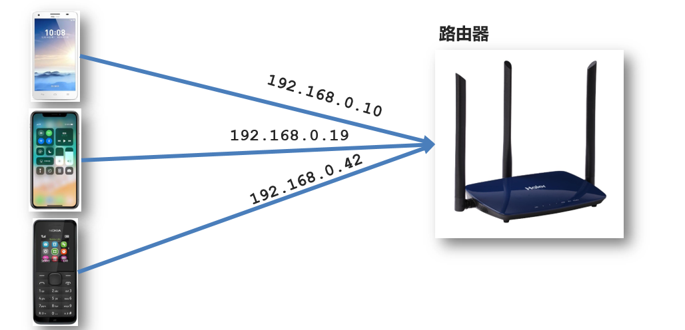

Vue中的路由：**路径和组件**的**映射**关系

> 所以路由就是一种映射关系
>
> 根据路由就能知道不同路径的，应该匹配渲染哪个组件


# 73.路由的基本使用

vue-router插件作用 **修改**地址栏路径时，**切换显示**匹配的**组件**


**说明** Vue 官方的一个路由插件，是一个第三方包

**官网** <https://v3.router.vuejs.org/zh/>


**VueRouter的使用（5+2）**

固定5个固定的步骤（不用死背，熟能生巧）

1. 下载 VueRouter 模块到当前工程，版本3.6.5

   > Vue2对应的是3.6.5版本，口诀：2 3 3（Vue2 VueRouter3.x Vuex3.x），3 4 4（Vue3，VueRouter4.x，Vuex4.x）

   ```bash
   yarn add vue-router@3.6.5
   ```

2. main.js中引入VueRouter

   ```js
   import VueRouter from 'vue-router'
   ```

3. 安装注册

   > 由于VueRouter是Vue的插件，所以在实际使用的时候，Vue相关的插件是需要安装注册之后再使用的，这个安装注册内部，它会帮你去进行一些组件的全局注册，说白了就是在进行插件的初始化

   ```js
   Vue.use(VueRouter)
   ```

4. 创建路由对象

   ```js
   const router = new VueRouter()
   ```

5. 注入，将路由对象注入到new Vue实例中，建立关联

   > 虽然在路由对象里面没有配任何的规则，但是当你注入的那一刻开始，就代表着这个Vue实例已经被我们的VueRouter接管了！

   ```js
   new Vue({
     render: h => h(App),
     router:router
   }).$mount('#app')
   
   ```


当我们配置完以上5步之后 就可以看到浏览器地址栏中的路由 变成了 /#/的形式。表示项目的路由已经被Vue-Router管理了


**代码示例**

main.js

```js
// 路由的使用步骤 5 + 2
// 5个基础步骤
// 1. 下载 v3.6.5
// yarn add vue-router@3.6.5
// 2. 引入
// 3. 安装注册 Vue.use(Vue插件)
// 4. 创建路由对象
// 5. 注入到new Vue中，建立关联


import VueRouter from 'vue-router'
Vue.use(VueRouter) // VueRouter插件初始化

const router = new VueRouter()

new Vue({
  render: h => h(App),
  // 简写：router
  router: router
}).$mount('#app')
```


### 两个核心步骤

> 这两个步骤就是不同的项目配置起来不一样的

1. 创建需要的组件 (views目录)，配置路由规则

   > 平时组件我们会放在components目录，但是在路由中，推荐放到views（视图）目录
   >
   > 如果需要往VueRouter中配规则，就需要往里面写个对象，并且对象中含有routes字段
   >
   > 数组中包含的每一个对象就是一个规则，path中使用的是地址栏的绝对路径，是没有.的

   

2. 配置导航，配置路由出口(路径匹配的组件显示的位置)

   App.vue

   ```vue
   <div class="footer_wrap">
     <a href="#/find">发现音乐</a>
     <a href="#/my">我的音乐</a>
     <a href="#/friend">朋友</a>
   </div>
   <div class="top">
     <!-- 插件所内置的一个组件 -->
     <router-view></router-view>
   </div>
   ```

组件名只有一个单词时会报错


解决办法：目的就是告诉Vue组件的名字是由多个单词组成的

~~~js
export default {
  name: "MyFriend",
};
~~~


完整代码

main.js

~~~js
import Vue from 'vue'
import App from './App.vue'

// 路由的使用步骤 5 + 2
// 5个基础步骤
// 1. 下载 v3.6.5
// 2. 引入
// 3. 安装注册 Vue.use(Vue插件)
// 4. 创建路由对象
// 5. 注入到new Vue中，建立关联

// 2个核心步骤
// 1. 建组件(views目录)，配规则
// 2. 准备导航链接，配置路由出口(匹配的组件展示的位置) 
import Find from './views/Find'
import My from './views/My'
import Friend from './views/Friend'
import VueRouter from 'vue-router'
Vue.use(VueRouter) // VueRouter插件初始化

const router = new VueRouter({
  // routes 路由规则们
  // route  一条路由规则 { path: 路径, component: 组件 }
  routes: [
    { path: '/find', component: Find },
    { path: '/my', component: My },
    { path: '/friend', component: Friend },
  ]
})

Vue.config.productionTip = false

new Vue({
  render: h => h(App),
  router
}).$mount('#app')
~~~


App.vue

~~~vue
<template>
  <div>
    <div class="footer_wrap">
      <a href="#/find">发现音乐</a>
      <a href="#/my">我的音乐</a>
      <a href="#/friend">朋友</a>
    </div>
    <div class="top">
      <!-- 路由出口 → 匹配的组件所展示的位置 -->
      <router-view></router-view>
    </div>
  </div>
</template>
~~~

# 74.组件的存放目录问题

注意： **.vue文件** 本质无区别


**组件分类**

 .vue文件分为2类，都是 **.vue文件（本质无区别）**

- 页面组件 （配置路由规则时使用的组件）
- 复用组件（多个组件中都使用到的组件）

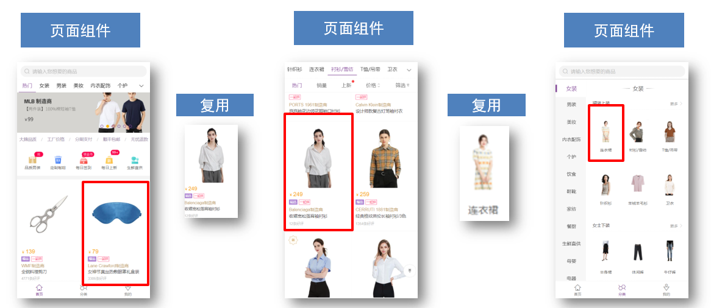


**存放目录**

分类开来的目的就是为了 **更易维护**

1. src/views文件夹

   页面组件 - 页面展示 - 配合路由用

2. src/components文件夹

   复用组件 - 展示数据 - 常用于复用

# 

# day06

# 75.路由的封装抽离

问题：所有的路由配置都在main.js中合适吗？

目标：将路由模块抽离出来。  好处：**拆分模块，利于维护**


路径简写：

**脚手架环境下** @指代src目录，可以用于快速引入组件


完整代码

router/index.js

~~~js
// 但是这里就遇到了一个麻烦，复制粘贴过来后，相对路径就需要改，如果层级比较深就更麻烦了，此时我们就可以使用绝对路径，在Vue中它允许你使用@标识符来代表绝对路径，@代表的是当前的src目录，将来直接基于 @ 指代src目录，从src目录出发找组件
// import Find from '../views/Find'
import Find from '@/views/Find'
import My from '@/views/My'
import Friend from '@/views/Friend'

// 注意别忘记导Vue，因为下面用到了
import Vue from 'vue'
import VueRouter from 'vue-router'
Vue.use(VueRouter) // VueRouter插件初始化

// 创建了一个路由对象
const router = new VueRouter({
  // routes 路由规则们
  // route  一条路由规则 { path: 路径, component: 组件 }
  routes: [
    { path: '/find', component: Find },
    { path: '/my', component: My },
    { path: '/friend', component: Friend },
  ]
})

// 进行导出
export default router
~~~

main.js

~~~js
import Vue from 'vue'
import App from './App.vue'
import router from './router/index'

Vue.config.productionTip = false

new Vue({
  render: h => h(App),
  router
}).$mount('#app')
~~~

# 76.声明式导航-导航链接

> 但凡说到声明式导航，都需要想到router-link

**需求** 实现导航高亮效果


如果使用a标签进行跳转的话，需要给当前跳转的导航加样式，同时要移除上一个a标签的样式，太麻烦！！！


**解决方案**

vue-router 提供了一个全局组件 router-link (取代 a 标签)（即导航式链接）

- **能跳转**，配置 to 属性指定路径(**必须**) 。本质还是 a 标签 ，**to 无需 #**
- **能高亮**，默认就会提供**高亮类名**，可以直接设置高亮样式

语法： <router-link to="path的值">发现音乐</router-link>

```vue
  <div>
    <div class="footer_wrap">
      <router-link to="/find">发现音乐</router-link>
      <router-link to="/my">我的音乐</router-link>
      <router-link to="/friend">朋友</router-link>
    </div>
    <div class="top">
      <!-- 路由出口 → 匹配的组件所展示的位置 -->
      <router-view></router-view>
    </div>
  </div>
```


**通过router-link自带的两个样式进行高亮**

使用router-link跳转后，我们发现。当前点击的链接默认加了两个class的值 `router-link-exact-active`和`router-link-active`

我们可以给任意一个class属性添加高亮样式即可实现功能


代码示例

~~~vue
<template>
  <div>
    <div class="footer_wrap">
      <router-link to="/find">发现音乐</router-link>
      <router-link to="/my">我的音乐</router-link>
      <router-link to="/friend">朋友</router-link>
    </div>
    <div class="top">
      <!-- 路由出口 → 匹配的组件所展示的位置 -->
      <router-view></router-view>
    </div>
  </div>
</template>

<style>
.footer_wrap a.router-link-active {
  background-color: purple;
}
</style>
~~~


## 声明式导航-两个类名

当我们使用<router-link></router-link>跳转时，自动给当前导航加了**两个类名**

> 单词长是为了防止和我们平时定义的类名重名

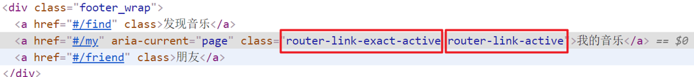


**router-link-active**

**模糊匹配（用的多）**

to="/my"  可以匹配 /my    /my/a    /my/b    ....  

只要是以/my开头的路径 都可以和 to="/my"匹配到

> eg：不仅要匹配/discover还要匹配/discover/toplist
>
> 


**router-link-exact-active**

**精确匹配**（exact）

to="/my" 仅可以匹配  /my


**代码示例**

~~~css
/* 
  router-link-active 模糊匹配(更多)
  to="/find"  =>  地址栏 /find   /find/one   /find/two  ...

  router-link-exact-active 精确匹配
  to="/find"  =>  地址栏 /find  
*/
.footer_wrap a.router-link-active {
  background-color: purple;
}
~~~

# 78.声明式导航-自定义类名（了解）

**问题**

router-link的**两个高亮类名 太长了**，我们希望能定制怎么办


**解决方案**

我们可以在创建路由对象时，额外配置两个配置项即可。 `linkActiveClass`和`linkExactActiveClass`

```js
const router = new VueRouter({
  routes: [...],
  linkActiveClass: "类名1",
  linkExactActiveClass: "类名2"
})
```


**代码演示**

```js
// 创建了一个路由对象
const router = new VueRouter({
  routes: [
    ...
  ], 
  linkActiveClass: 'active', // 配置模糊匹配的类名
  linkExactActiveClass: 'exact-active' // 配置精确匹配的类名
})
```


# 79.声明式导航-查询参数传参

**目标**

在跳转路由时，进行传参


比如：现在我们在搜索页点击了热门搜索链接，跳转到详情页，**需要把点击的内容带到详情页**，改怎么办呢？


**跳转传参**

我们可以通过两种方式，在跳转的时候把所需要的参数传到其他页面中

- 查询参数传参
- 动态路由传参


## 查询参数传参

- 如何传参？

  <router-link to="/path?参数名=值&参数名=值"></router-link>

- 如何接受参数

  固定用法：$route.query.参数名

  > $route：拿到当前路由的相关信息，且这个参数名
  >
  > 


**代码示例**

App.vue

```vue
<template>
  <div id="app">
    <div class="link">
      <router-link to="/home">首页</router-link>
      <router-link to="/search">搜索页</router-link>
    </div>

    <router-view></router-view>
  </div>
</template>

<script>
export default {};
</script>

<style scoped>
.link {
  height: 50px;
  line-height: 50px;
  background-color: #495150;
  display: flex;
  margin: -8px -8px 0 -8px;
  margin-bottom: 50px;
}
.link a {
  display: block;
  text-decoration: none;
  background-color: #ad2a26;
  width: 100px;
  text-align: center;
  margin-right: 5px;
  color: #fff;
  border-radius: 5px;
}
</style>
```

Home.vue

```vue
<template>
  <div class="home">
    <div class="logo-box"></div>
    <div class="search-box">
      <input type="text" />
      <button>搜索一下</button>
    </div>
    <div class="hot-link">
      热门搜索：
      <router-link to="/search?key=黑马程序员">黑马程序员</router-link>
      <router-link to="/search?key=前端培训">前端培训</router-link>
      <router-link to="/search?key=如何成为前端大牛">如何成为前端大牛</router-link
      >
    </div>
  </div>
</template>

<script>
export default {
  name: "FindMusic",
};
</script>

<style>
.logo-box {
  height: 150px;
  background: url("@/assets/logo.jpeg") no-repeat center;
}
.search-box {
  display: flex;
  justify-content: center;
}
.search-box input {
  width: 400px;
  height: 30px;
  line-height: 30px;
  border: 2px solid #c4c7ce;
  border-radius: 4px 0 0 4px;
  outline: none;
}
.search-box input:focus {
  border: 2px solid #ad2a26;
}
.search-box button {
  width: 100px;
  height: 36px;
  border: none;
  background-color: #ad2a26;
  color: #fff;
  position: relative;
  left: -2px;
  border-radius: 0 4px 4px 0;
}
.hot-link {
  width: 508px;
  height: 60px;
  line-height: 60px;
  margin: 0 auto;
}
.hot-link a {
  margin: 0 5px;
}
</style>
```

Search.vue

```vue
<template>
  <div class="search">
    <p>搜索关键字: {{ $route.query.key }} </p>
    <p>搜索结果: </p>
    <ul>
      <li>.............</li>
      <li>.............</li>
      <li>.............</li>
      <li>.............</li>
    </ul>
  </div>
</template>

<script>
export default {
  name: 'MyFriend',
  // 在created中发送请求
  created () {
    // 在created中，获取路由参数
    // 在模板中可以省略this，但是在created中需要写this
    // this.$route.query.参数名 获取
    console.log(this.$route.query.key);
  }
}
</script>

<style>
.search {
  width: 400px;
  height: 240px;
  padding: 0 20px;
  margin: 0 auto;
  border: 2px solid #c4c7ce;
  border-radius: 5px;
}
</style>
```

router/index.js

```js
import Home from '@/views/Home'
import Search from '@/views/Search'
import Vue from 'vue'
import VueRouter from 'vue-router'
Vue.use(VueRouter) // VueRouter插件初始化

// 创建了一个路由对象
const router = new VueRouter({
  routes: [
    { path: '/home', component: Home },
    { path: '/search', component: Search }
  ]
})

export default router
```

main.js

```
...
import router from './router/index'
...
new Vue({
  render: h => h(App),
  router
}).$mount('#app')
```


## 声明式导航-动态路由传参

**动态路由传参方式**

- 配置动态路由

  > 动态路由后面的参数可以随便起名，但要有语义

  ```js
  const router = new VueRouter({
    routes: [
      ...,
      { 
        // ps：冒号不能省略，如果省略就变成了写死的路由了，但是一旦加了冒号之后，这里代表的就是动态路由
        // 动态路由就表示它可以匹配多个路径，eg：/serch/heima，/serch/study 这两个都可以匹配到的
        path: '/search/:words', 
        component: Search 
      }
    ]
  })
  ```

- 配置导航链接

  to="/path/参数值"

- 对应页面组件**接受参数**

  $route.**params**.参数名

  > params后面的参数名要和动态路由配置的参数保持一致


**查询参数传参 VS 动态路由传参**

1. 查询参数传参  (比较适合传**多个参数**) 

   1. 跳转：to="/path?参数名=值&参数名2=值"
   2. 获取：$route.query.参数名

2. 动态路由传参 (**优雅简洁**，传单个参数比较方便)

   1. 配置动态路由：path: "/path/:参数名" 
   2. 跳转：to="/path/参数值"
   3. 获取：$route.params.参数名 

   注意：动态路由也可以传多个参数，但一般只传一个


**总结**

声明式导航跳转时, 有几种方式传值给路由页面？

- 查询参数传参（多个参数）
- 动态路由传参（一个参数，优雅简洁）


动态路由示例代码

index.js

~~~js
import Home from '@/views/Home'
import Search from '@/views/Search'
import Vue from 'vue'
import VueRouter from 'vue-router'
Vue.use(VueRouter) // VueRouter插件初始化

// 创建了一个路由对象
const router = new VueRouter({
  routes: [
    { path: '/home', component: Home },
    { path: '/search/:words', component: Search }
  ]
})

export default router
~~~

Search.vue

~~~vue
<template>
  <div class="search">
    <p>搜索关键字: {{ $route.params.words }} </p>
    <p>搜索结果: </p>
    <ul>
      <li>.............</li>
      <li>.............</li>
      <li>.............</li>
      <li>.............</li>
    </ul>
  </div>
</template>

<script>
export default {
  name: 'MyFriend',
  created () {
    // 在created中，获取路由参数
    // this.$route.query.参数名 获取查询参数
    // this.$route.params.参数名 获取动态路由参数
    console.log(this.$route.params.words);
  }
}
</script>

<style>
.search {
  width: 400px;
  height: 240px;
  padding: 0 20px;
  margin: 0 auto;
  border: 2px solid #c4c7ce;
  border-radius: 5px;
}
</style>
~~~


## 动态路由参数的可选符(了解)

**问题**

配了路由 path:"/search/:words"  为什么按下面步骤操作，会未匹配到组件，显示空白？

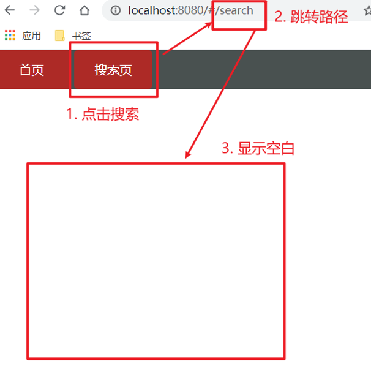


**原因**

/search/:words  表示，**必须要传参数**。如果不传参数，也希望匹配，可以加个可选符"？"

```js
const router = new VueRouter({
  routes: [
 	...
    { path: '/search/:words?', component: Search }
  ]
})
```

# 80.Vue路由-重定向

**问题**

网页打开时， url 默认是 / 路径，未匹配到组件时，会出现空白


**解决方案**

**重定向** → 匹配 / 后, 强制跳转 /home 路径


**语法**

```js
{ path: 匹配路径, redirect: 重定向到的路径 },
比如：
{ path:'/' ,redirect:'/home' }
```


**代码示例**

```
const router = new VueRouter({
  routes: [
    { path: '/', redirect: '/home'},
 	 ...
  ]
})
```


## Vue路由-404

**作用** 当路径找不到匹配时，给个提示页面


**位置**

404的路由，虽然配置在任何一个位置都可以，但一般都**配置在其他路由规则的最后面**


**语法**

path: "*"   (任意路径) – 前面都不匹配就命中最后这个

```js
import NotFind from '@/views/NotFind'

const router = new VueRouter({
  routes: [
    ...
    { path: '*', component: NotFind } //最后一个
  ]
})
```


**代码示例**

NotFound.vue

```vue
<template>
  <div>
    <h1>404 Not Found</h1>
  </div>
</template>

<script>
export default {

}
</script>

<style>

</style>
```

router/index.js

```js
...
import NotFound from '@/views/NotFound'
...

// 创建了一个路由对象
const router = new VueRouter({
  routes: [
     ...
    { path: '*', component: NotFound }
  ]
})

export default router
```


## Vue路由-模式设置

**问题**

路由的路径看起来不自然, 有#，能否切成真正路径形式?

- hash路由(默认)        例如:  http://localhost:8080/#/home

  > 底层基于a标签锚链接跳转去实现的

- history路由(常用)     例如: http://localhost:8080/home   (以后上线需要服务器端支持，开发环境webpack给规避掉了history模式的问题)

  > 这个是基于新增的 html-history API去实现的
  >
  > 这个需要服务端去配置一些规则，如果不配置就会出现一些空白的情况


**语法**

配置完之后，最终呈现的效果就是不带#的

```js
const router = new VueRouter({
    // 注意：一旦采用了 history 模式，地址栏就没有 #，需要后台配置访问规则
    mode: 'history',
    routes:[]
})
```

# 81.编程式导航-两种路由跳转方式

**问题**

点击按钮跳转如何实现？


**方案**

编程式导航：用JS代码来进行跳转

> 以前使用js是通过location.href来跳转的，但由于vue中使用的是路由，它有专门的跳转方式


两种**语法**：

- path 路径跳转 （简易方便）
- name 命名路由跳转 (适合 path 路径长的场景)

> 这两种方式都可以被称为编程式导航


**path路径跳转语法**

特点：简易方便

router指的是大的路由对象

```js
//简单写法
this.$router.push('路由路径')

//完整写法
this.$router.push({
  path: '路由路径'
})
```


**name命名路由跳转**

特点：适合 path 路径长的场景

语法：

- 路由规则，必须在main.js中配置name配置项

  ```js
  { name: '路由名', path: '/path/xxx', component: XXX },
  ```

- 通过name来进行跳转

  ```js
  //简单写法
  this.$router.push('/路径/参数值')
  //完整写法
  this.$router.push({
    name: '路由名'
  })
  ```


代码示例

main.js

~~~js
import Home from '@/views/Home'
import Search from '@/views/Search'
import NotFound from '@/views/NotFound'
import Vue from 'vue'
import VueRouter from 'vue-router'
Vue.use(VueRouter) // VueRouter插件初始化

// 创建了一个路由对象
const router = new VueRouter({
  // 注意：一旦采用了 history 模式，地址栏就没有 #，需要后台配置访问规则
  mode: 'history',
  routes: [
    { path: '/', redirect: '/home' },
    { path: '/home', component: Home },
    { name: 'search', path: '/search/:words?', component: Search },
    { path: '*', component: NotFound }
  ]
})

export default router
~~~


Home.vue

~~~vue
<template>
  <div class="home">
    <div class="logo-box"></div>
    <div class="search-box">
      <input type="text">
      <button @click="goSearch">搜索一下</button>
    </div>
    <div class="hot-link">
      热门搜索：
      <router-link to="/search/黑马程序员">黑马程序员</router-link>
      <router-link to="/search/前端培训">前端培训</router-link>
      <router-link to="/search/如何成为前端大牛">如何成为前端大牛</router-link>
    </div>
  </div>
</template>

<script>
export default {
  name: 'FindMusic',
  methods: {
    goSearch () {
      // 1. 通过路径的方式跳转
      // (1) this.$router.push('路由路径') [简写]
      his.$router.push('/search')

      // (2) this.$router.push({     [完整写法]
      //         path: '路由路径' 
      //     })
      this.$router.push({
      	path: '/search'
      })

      // 2. 通过命名路由的方式跳转 (需要给路由起名字) 适合长路径
      //    this.$router.push({
      //        name: '路由名'
      //    })
      this.$router.push({
        name: 'search'
      })
    }
  }
}
</script>

<style>
.logo-box {
  height: 150px;
  background: url('@/assets/logo.jpeg') no-repeat center;
}
.search-box {
  display: flex;
  justify-content: center;
}
.search-box input {
  width: 400px;
  height: 30px;
  line-height: 30px;
  border: 2px solid #c4c7ce;
  border-radius: 4px 0 0 4px;
  outline: none;
}
.search-box input:focus {
  border: 2px solid #ad2a26;
}
.search-box button {
  width: 100px;
  height: 36px;
  border: none;
  background-color: #ad2a26;
  color: #fff;
  position: relative;
  left: -2px;
  border-radius: 0 4px 4px 0;
}
.hot-link {
  width: 508px;
  height: 60px;
  line-height: 60px;
  margin: 0 auto;
}
.hot-link a {
  margin: 0 5px;
}
</style>
~~~


## 编程式导航-path路径跳转传参

**问题**

点击搜索按钮，跳转需要把文本框中输入的内容传到下一个页面如何实现？

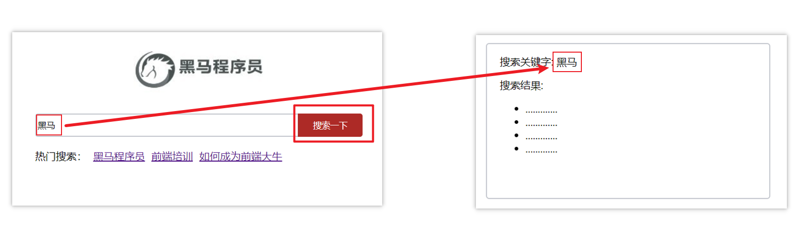


**两种传参方式**

1.查询参数 

2.动态路由传参


**传参**

两种跳转方式，对于两种传参方式都支持：

① path 路径跳转传参

② name 命名路由跳转传参


**path路径跳转传参（query传参）**

```js
// 简单写法
this.$router.push('/路径?参数名1=参数值1&参数2=参数值2')
// 完整写法（更适合传参）
this.$router.push({
  path: '/路径',
  query: {
    参数名1: '参数值1',
    参数名2: '参数值2'
  },
  replace: true // 不占用浏览器的历史记录
})
```

接受参数的方式依然是：$route.query.参数名


**path路径跳转传参（动态路由传参）**

> 首先修改路由:word

```js
//简单写法
this.$router.push('/路径/参数值')
//完整写法
this.$router.push({
  path: '/路径/参数值'
})
```

接受参数的方式依然是：$route.params.参数值

**注意：**path不能配合params使用


## 编程式导航-name命名路由传参

**name 命名路由跳转传参 (query传参)**

```js
this.$router.push({
  name: '路由名字',
  query: {
    参数名1: '参数值1',
    参数名2: '参数值2'
  }
})
```

通过this.$route.query.参数名


**name 命名路由跳转传参 (动态路由传参)**

```js
this.$router.push({
  name: '路由名字',
  params: {
    参数名: '参数值',
  }
})
```


### 编程式导航，如何跳转传参总结

路径长，使用name，路径多，使用动态路由传参

1.path路径跳转

- query传参

  ```js
  this.$router.push('/路径?参数名1=参数值1&参数2=参数值2')
  this.$router.push({
    path: '/路径',
    query: {
      参数名1: '参数值1',
      参数名2: '参数值2'
    }
  })
  ```

- 动态路由传参

  ```js
  this.$router.push('/路径/参数值')
  this.$router.push({
    path: '/路径/参数值'
  })
  ```

2.name命名路由跳转

- query传参

  ```js
  this.$router.push({
    name: '路由名字',
    query: {
      参数名1: '参数值1',
      参数名2: '参数值2'
    }
  })
  ```

- 动态路由传参 (需要配动态路由)

  ```js
  this.$router.push({
    name: '路由名字',
    params: {
      参数名: '参数值',
    }
  })
  ```


# 82.面经基础版-案例效果分析

**面经效果演示**

**功能分析**

- 通过演示效果发现，主要的功能页面有两个，一个是**列表页**，一个是**详情页**，并且在列表页点击时可以跳转到详情页
- 底部导航可以来回切换，并且切换时，只有上面的主题内容在动态渲染

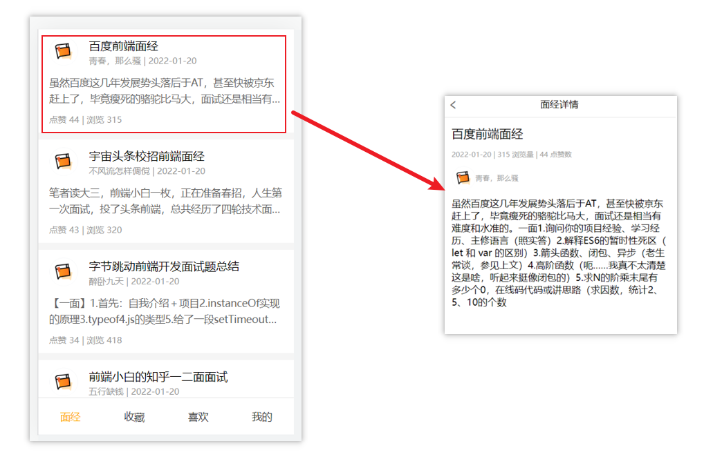


**实现思路分析：配置路由+功能实现**

1.配置路由

- 首页和面经详情页，两个一级路由
- 首页内嵌套4个可切换的页面（嵌套二级路由）

2.实现功能

- 首页请求渲染
- **跳转传参** 到 详情页，详情页动态渲染
- 组件缓存，性能优化


# 83.面经基础版-一级路由配置

1.把文档中准备的素材拷贝到项目中

2.针对router/index.js文件 进行一级路由配置

```js
...
import Layout from '@/views/Layout.vue'
import ArticleDetail from '@/views/ArticleDetail.vue'
...


const router = new VueRouter({
  routes: [
    {
      path: '/',
      component: Layout
    },
    {
      path: '/detail',
      component: ArticleDetail
    }
  ]
})
```


## 面经基础版-二级路由配置

二级路由也叫嵌套路由，当然也可以嵌套三级、四级...


**使用场景**

当在页面中点击链接跳转，只是部分内容切换时，我们可以使用嵌套路由


**语法**

- 在一级路由下，配置children属性即可
- 配置二级路由的出口


 1.在一级路由下，配置children属性

 **注意**:一级的路由path 需要加 `/`   二级路由的path不需要加 `/`

```js
const router = new VueRouter({
  routes: [
    {
      path: '/',
      component: Layout,
      // 跟routes一样，也是数组里面包对象的格式
      children:[
        //children中的配置项 跟一级路由中的配置项一模一样 
        // 这里跳转的路径不会加上根组件的路径
        {path:'xxxx',component:xxxx.vue},
        {path:'xxxx',component:xxxx.vue},
      ]
    }
  ]
})
```

技巧：二级路由应该配置到哪个一级路由下呢？

**这些二级路由对应的组件渲染到哪个一级路由下，children就配置到哪个路由下边**


2.配置二级路由的出口 <router-view></router-view>

**注意：** 配置了嵌套路由，一定配置对应的路由出口，否则不会渲染出对应的组件

Layout.vue

```vue
<template>
  <div class="h5-wrapper">
    <div class="content">
      <router-view></router-view>
    </div>
  ....
  </div>
</template>
```


**代码实现**

router/index.js

```js
...
import Article from '@/views/Article.vue'
import Collect from '@/views/Collect.vue'
import Like from '@/views/Like.vue'
import User from '@/views/User.vue'
...

const router = new VueRouter({
  routes: [
    {
      path: '/',
      component: Layout,
      redirect: '/article',
      children:[
        {
          path:'/article',
          component:Article
        },
        {
          path:'/collect',
          component:Collect
        },
        {
          path:'/like',
          component:Like
        },
        {
          path:'/user',
          component:User
        }
      ]
    },
    ....
  ]
})

```

Layout.vue

```vue
<template>
  <div class="h5-wrapper">
    <div class="content">
      <!-- 内容部分 -->
      <router-view></router-view>
    </div>
    <nav class="tabbar">
      <a href="#/article">面经</a>
      <a href="#/collect">收藏</a>
      <a href="#/like">喜欢</a>
      <a href="#/user">我的</a>
    </nav>
  </div>
</template>
```


## 面经基础版-二级导航高亮

**实现思路**

- 将a标签替换成 <router-link></router-link>组件，配置to属性，不用加 #
- 结合高亮类名实现高亮效果 (推荐模糊匹配：router-link-active)

**代码实现**

Layout.vue

```vue
....
    <nav class="tabbar">
      <router-link to="/article">面经</router-link>
      <router-link to="/collect">收藏</router-link>
      <router-link to="/like">喜欢</router-link>
      <router-link to="/user">我的</router-link>
    </nav>

<style>
   a.router-link-active {
      color: orange;
    }
</style>
```


# 84.面经基础版-首页请求渲染

**步骤分析**

1.安装axios 

2.看接口文档，确认请求方式，请求地址，请求参数

3.created中发送请求，获取数据，存储到data中

4.页面动态渲染


**代码实现**

1.安装axios

`yarn add axios `  `npm i axios`

2.接口文档

```vue
请求地址: https://mock.boxuegu.com/mock/3083/articles
请求方式: get
```

3.created中发送请求，获取数据，存储到data中

```js
 data() {
    return {
      articelList: [],
    }
  },
  async created() {
    const {  data: { result: { rows } }} = await axios.get('https://mock.boxuegu.com/mock/3083/articles')
    this.articelList = rows
  },
```

4.页面动态渲染

```vue
<template>
  <div class="article-page">
    <div class="article-item" v-for="item in articelList" :key="item.id">
      <div class="head">
        
        <div class="con">
          <p class="title">{{ item.stem }}</p>
          <p class="other">{{ item.creatorName }} | {{ item.createdAt }}</p>
        </div>
      </div>
      <div class="body">
        {{item.content}}
      </div>
      <div class="foot">点赞 {{item.likeCount}} | 浏览 {{item.views}}</div>
    </div>
  </div>
</template>
```


# 85.面经基础版-查询参数传参

**说明**

跳转详情页需要把当前点击的文章id传给详情页，获取数据

- 查询参数传参  this.$router.push('/detail?参数1=参数值&参数2=参数值') 
- 动态路由传参  先改造路由 在传参  this.$router.push('/detail/参数值')


**查询参数传参实现**

Article.vue

```vue
<template>
  <div class="article-page">
    <div class="article-item" 
      v-for="item in articelList" :key="item.id" 
      @click="$router.push(`/detail?id=${item.id}`)">
     ...
    </div>
  </div>
</template>
```

ArticleDetail.vue

```vue
  created(){
    console.log(this.$route.query.id)
  }
```


## 面经基础版-动态路由传参

**实现步骤**

- 改造路由
- 动态传参
- 在详情页获取参数


**代码实现**

改造路由

router/index.js

```js
...
  {
      path: '/detail/:id',
      component: ArticleDetail
  }
```

Article.vue

```vue
<div class="article-item" 
     v-for="item in articelList" :key="item.id" 
     @click="$router.push(`/detail/${item.id}`)">
       ....
 </div>
```

ArticleDetail.vue

```js
created(){
    console.log(this.$route.params.id)
}
```


### 额外优化功能点-点击回退跳转到上一页

ArticleDetail.vue

```vue
<template>
  <div class="article-detail-page">
    <nav class="nav"><span class="back" @click="$router.back()">&lt;</span> 面经详情</nav>
     ....
  </div>
</template>
```


# 86.面经基础版-详情页渲染

**实现步骤分析**

- 导入axios
- 查看接口文档
- 在created中发送请求
- 页面动态渲染


**代码实现**

接口文档

```js
 请求地址: https://mock.boxuegu.com/mock/3083/articles/:id
 请求方式: get
```


在created中发送请求

```js
 data() {
    return {
      articleDetail:{}
    }
  },
  async created() {
    const id = this.$route.params.id
    const {data:{result}} = await axios.get(
      `https://mock.boxuegu.com/mock/3083/articles/${id}`
    )
    this.articleDetail = result
  },
```


页面动态渲染

```vue
<template>
  <!-- v-if="article.id"：数据有才渲染 -->
  <div class="article-detail-page" v-if="article.id">
    <nav class="nav">
      <span class="back" @click="$router.back()">&lt;</span> 面经详情
    </nav>
    <header class="header">
      <h1>{{articleDetail.stem}}</h1>
      <p>{{articleDetail.createAt}} | {{articleDetail.views}} 浏览量 | {{articleDetail.likeCount}} 点赞数</p>
      <p>
        
        <span>{{articleDetail.creatorName}}</span>
      </p>
    </header>
    <main class="body">
      {{articleDetail.content}}
    </main>
  </div>
</template>

```


# 87.面经基础版-缓存组件

**问题**

从面经列表 点到 详情页，又点返回，数据重新加载了 →  **希望回到原来的位置**


**原因**

当路由被**跳转**后，原来所看到的组件就**被销毁**了（会执行组件内的beforeDestroy和destroyed生命周期钩子），**重新返回**后组件又被**重新创建**了（会执行组件内的beforeCreate,created,beforeMount,Mounted生命周期钩子），**所以数据被加载了**


**解决方案**

利用keep-alive把原来的组件给缓存下来


keep-alive 是 Vue 的内置组件，当它包裹动态组件时，**会缓存不活动的组件实例，而不是销毁**它们。

keep-alive 是一个抽象组件：它自身不会渲染成一个 DOM 元素，也不会出现在父组件中。

**优点：**

在组件切换过程中把切换出去的组件保留在内存中，防止重复渲染DOM，

减少加载时间及性能消耗，提高用户体验性。

App.vue

```vue
<template>
  <div class="h5-wrapper">
    <!-- 包裹了keep-alive 一级路由匹配的组件都会被缓存
		Layout组件 Detail组件，都会被缓存
	-->
    <keep-alive>
      <router-view></router-view>
    </keep-alive>
  </div>
</template>
```


**问题：**

缓存了所有被切换的组件


## keep-alive的三个属性

① include  ： 组件名数组，只有匹配的组件**会被缓存**

② exclude ： 组件名数组，任何匹配的组件都**不会被缓存**

> 一般使用include，exclude可能会导致性能问题，因为组件可能太多了，将来页面就卡死了，所以一般会配合max使用

③ max       ： 最多可以**缓存多少**组件实例


App.vue

~~~js
export default {
  // 这个才是组件名
  name: "LayoutPage",
};
~~~


```vue
<template>
  <div class="h5-wrapper">
    <keep-alive :include="[keepArr]">
      <router-view></router-view>
    </keep-alive>
  </div>
</template>

<script>
export default {
  name: "h5-wrapper",
  data () {
    return {
      keepArr: ['LayoutPage']
    }
  }
};
</script>
```


### 额外的两个生命周期钩子

**keep-alive的使用组件会触发两个生命周期函数**

**activated** 当组件被激活（使用）的时候触发 →  进入这个页面的时候触发

**deactivated** 当组件不被使用的时候触发      →  离开这个页面的时候触发

组件**缓存后**就**不会执行**组件的**created, mounted, destroyed** 等钩子了

> 但是组件第一次被触发的时候还是会执行的

所以其提供了**actived 和deactived**钩子，帮我们实现业务需求。

# 88.VueCli 自定义创建项目

1.安装脚手架 (已安装)

```
npm i @vue/cli -g
```

2.检测是否安装成功

~~~bash
vue -V 
~~~

3.创建项目

```
vue create hm-exp-mobile
```

+ 选项

```js
Vue CLI v5.0.8
? Please pick a preset:
  Default ([Vue 3] babel, eslint)
  Default ([Vue 2] babel, eslint)
> Manually select features     选自定义
```

+ 手动选择功能

  > 勾选上Router之后，它会默认帮你架起一整套Router的配置
  >
  > 空格就是选中


+ 选择vue的版本

```jsx
  3.x
> 2.x
```

+ 是否使用history模式


+ 选择css预处理


+ 选择eslint的风格 （eslint 代码规范的检验工具，检验代码是否符合规范）

+ 比如：const age = 18;   =>  报错！多加了分号！后面有工具，一保存，全部格式化成最规范的样子

  第三个为无分号规范（标准化），目前最流行的一个规范


+ 选择校验的时机 （直接回车）


+ 选择配置文件的生成方式 （直接回车）


- 是否保存预设，下次直接使用？  =>   不保存，输入 N


+ 等待安装，项目初始化完成


+ 启动项目

```
npm run serve
```

# 89.ESlint代码规范及手动修复

代码规范：一套写代码的约定规则。例如：赋值符号的左右是否需要空格？一句结束是否是要加;？... 

>  没有规矩不成方圆  

ESLint:是一个代码检查工具，用来检查你的代码是否符合指定的规则(你和你的团队可以自行约定一套规则)。在创建项目时，我们使用的是 [JavaScript Standard Style](https://standardjs.com/readme-zhcn.html) 代码风格的规则。


**JavaScript Standard Style 规范说明**

建议把：https://standardjs.com/rules-zhcn.html 看一遍，然后在写的时候,  遇到错误就查询解决。

下面是这份规则中的一小部分：

- *字符串使用单引号* – 需要转义的地方除外

  > 双引号也可以，但是单引号的阅读性更高一些

- *无分号* – [这](http://blog.izs.me/post/2353458699/an-open-letter-to-javascript-leaders-regarding)[没什么不好。](http://inimino.org/~inimino/blog/javascript_semicolons)[不骗你！](https://www.youtube.com/watch?v=gsfbh17Ax9I)

- *关键字后加空格* `if (condition) { ... }`

- *函数名后加空格* `function name (arg) { ... }`

- 坚持使用全等 `===` 摒弃 `==` 一但在需要检查 `null || undefined` 时可以使用 `obj == null`

  > 因为 `==` 会出现隐式类型转换，使代码不稳定

- ......


**代码规范错误**

如果你的代码不符合standard的要求，eslint会跳出来刀子嘴，豆腐心地提示你。

下面我们在main.js中随意做一些改动：false后面有分号，添加一些空行，空格。

```js
import Vue from 'vue'
import App from './App.vue'

import './styles/index.less'
import router from './router'
Vue.config.productionTip = false;


new Vue ( {
  render: h => h(App),
  router
}).$mount('#app')


```

按下保存代码之后：

你将会看在控制台中输出如下错误：

> 在main.js里第5行第33个字符这里出错了


> eslint 是来帮助你的。心态要好，有错，就改。


**手动修正**

根据错误提示来一项一项手动修正。

如果你不认识命令行中的语法报错是什么意思，你可以根据错误代码（func-call-spacing, space-in-parens,.....）去 ESLint 规则列表中查找其具体含义。

打开 [ESLint 规则表](https://zh-hans.eslint.org/docs/latest/rules/)，使用页面搜索（Ctrl + F）这个代码，查找对该规则的一个释义。


# 90.通过eslint插件来实现自动修正

> 1. eslint会自动高亮错误显示
> 2. 通过配置，eslint会自动帮助我们修复错误

+ 如何安装


+ 如何配置


> 因为格式化会和保存时修复错误冲突
>
> 这里注意，如果以前配置过保存时格式化，会与这次的冲突，所以需要把上面配置为true的删掉
>
> 

```js
// 当保存的时候，eslint自动帮我们修复错误
"editor.codeActionsOnSave": {
    "source.fixAll": true
},
// 保存代码，不自动格式化
"editor.formatOnSave": false
```

+ 注意：eslint的配置文件必须在根目录下，这个插件才能才能生效。打开项目必须以根目录打开，一次打开一个项目
+ 注意：使用了eslint校验之后，把vscode带的那些格式化工具全禁用了 Beatify

# 91.[Vuex](https://vuex.vuejs.org/zh/) 概述 

Vuex 是一个 Vue 的 状态管理工具，状态就是数据。

> 工具可以直接理解成插件

大白话：Vuex 是一个插件，可以帮我们管理 Vue 通用的数据 (多组件共享的数据)。例如：购物车数据   个人信息数


**使用场景**

- 某个状态 在 很多个组件 来使用 (个人信息)


- 多个组件 共同维护 一份数据 (购物车)

> 总结就是：多组件共享的数据都可以往vuex丢


**优势**

- 共同维护一份数据，**数据集中化管理**
- **响应式变化**
- 操作简洁 (vuex提供了一些辅助函数)


**注意**

官方原文：

- 不是所有的场景都适用于vuex，只有在必要的时候才使用vuex
- 使用了vuex之后，会附加更多的框架中的概念进来，增加了项目的复杂度  （数据的操作更便捷，数据的流动更清晰）

Vuex就像《近视眼镜》, 你自然会知道什么时候需要用它~

# 92.需求: 多组件共享数据

目标：基于脚手架创建项目，构建 vuex 多组件数据共享环境


效果是三个组件共享一份数据:

- 任意一个组件都可以修改数据
- 三个组件的数据是同步的


1.创建项目

```
vue create vuex-demo
```

> 由于现在是在学基础语法，为了目录的解决，先不勾上，但是以后做项目的时候，这两个都是需要勾选上的
>
> 

2.创建三个组件, 目录如下

```
|-components
|--Son1.vue
|--Son2.vue
|-App.vue
```

3.源代码如下

`App.vue`在入口组件中引入 Son1 和 Son2 这两个子组件

```html
<template>
  <div id="app">
    <h1>根组件</h1>
    <input type="text">
    <Son1></Son1>
    <hr>
    <Son2></Son2>
  </div>
</template>

<script>
import Son1 from './components/Son1.vue'
import Son2 from './components/Son2.vue'

export default {
  name: 'app',
  data: function () {
    return {

    }
  },
  components: {
    Son1,
    Son2
  }
}
</script>

<style>
#app {
  width: 600px;
  margin: 20px auto;
  border: 3px solid #ccc;
  border-radius: 3px;
  padding: 10px;
}
</style>

```

`main.js`

```js
import Vue from 'vue'
import App from './App.vue'

Vue.config.productionTip = false

new Vue({
  render: h => h(App)
}).$mount('#app')
```

`Son1.vue`

```html
<template>
  <div class="box">
    <h2>Son1 子组件</h2>
    从vuex中获取的值: <label></label>
    <br>
    <button>值 + 1</button>
  </div>
</template>

<script>
export default {
  name: 'Son1Com'
}
</script>

<style lang="css" scoped>
.box{
  border: 3px solid #ccc;
  width: 400px;
  padding: 10px;
  margin: 20px;
}
h2 {
  margin-top: 10px;
}
</style>

```

`Son2.vue`

```html
<template>
  <div class="box">
    <h2>Son2 子组件</h2>
    从vuex中获取的值:<label></label>
    <br />
    <button>值 - 1</button>
  </div>
</template>

<script>
export default {
  name: 'Son2Com'
}
</script>

<style lang="css" scoped>
.box {
  border: 3px solid #ccc;
  width: 400px;
  padding: 10px;
  margin: 20px;
}
h2 {
  margin-top: 10px;
}
</style>
```

# 93.vuex 的使用 - 创建仓库

> 通用的地方我们一般会称之为仓库


1.安装 vuex

安装vuex与vue-router类似，vuex是一个独立存在的插件，如果脚手架初始化没有选 vuex，就需要额外安装。

```bash
yarn add vuex@3 或者 npm i vuex@3
```

2.新建 `store/index.js` 专门存放 vuex

​	为了维护项目目录的整洁，在src目录下新建一个store目录其下放置一个index.js文件。 (和 `router/index.js` 类似)

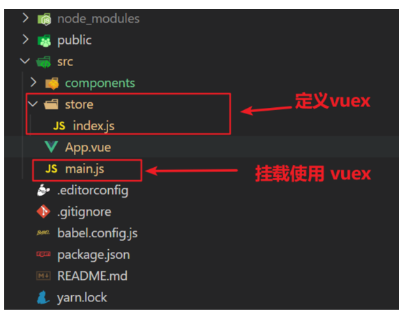

3.创建仓库 `store/index.js` 

```jsx
// 导入 vue
import Vue from 'vue'
// 导入 vuex
import Vuex from 'vuex'
// vuex也是vue的插件, 需要use一下, 进行插件的安装初始化
Vue.use(Vuex)

// 创建仓库 store
// 由于创建的不是Vuex，而是仓库，Vuex里面有一个创建仓库的语法：挂载Vuex这个对象身上的一个钩子方法：Store来初始化仓库
const store = new Vuex.Store()

// 导出仓库
export default store
```

4 在 main.js 中导入挂载到 Vue 实例上

```js
import Vue from 'vue'
import App from './App.vue'
import store from './store/index'

Vue.config.productionTip = false

new Vue({
  render: h => h(App),
  store
}).$mount('#app')
```

此刻起, 就成功创建了一个 **空仓库!!**

5.测试打印Vuex

App.vue

```js
created(){
  // 配置成功返回一个对象，没配成功返回undefined
  // 检验路由有没有配置成功
  console.log(this.$router)
  // 检验仓库有没有配置成功
  console.log(this.$store)
}
```

# 94.如何提供&访问vuex的数据

**提供数据**

State提供唯一的公共数据源，所有共享的数据都要统一放到Store中的State状态中存储。

打开项目中的store.js文件，在state对象中可以添加我们要共享的数据。

```jsx
// 创建仓库 store
const store = new Vuex.Store({
  // state 状态, 即数据, 类似于vue组件中的data,
  // 区别：
  // 1.data 是组件自己的数据, 
  // 2.state 中的数据整个vue项目的组件都能访问到
  state: {
    count: 101
  }
})
```


**访问Vuex中的数据**

问题: 如何在组件中获取count?

1. 通过$store直接访问  —>  {{  $store.state.count  }}
2. 通过辅助函数mapState 映射计算属性  —>  {{ count  }}


**通过$store访问的语法**

> 先找到仓库，再找到仓库里的state

```js
获取 store：
 1.Vue模板中获取 this.$store
 2.js文件中获取 import 导入 store

模板中：     {{ $store.state.xxx }}
组件逻辑中：  this.$store.state.xxx
JS模块中：   store.state.xxx
```


**代码示例**

1.模板中使用

组件中可以使用  **$store** 获取到vuex中的store对象实例，可通过**state**属性属性获取**count**， 如下

```vue
<h1>state的数据 - {{ $store.state.count }}</h1>
```

2.组件逻辑中使用

将state属性定义在计算属性中 https://vuex.vuejs.org/zh/guide/state.html

```vue
<h1>state的数据 - {{ count }}</h1>

<script>
// 把state中数据，定义在组件内的计算属性中
computed: {
    count () {
        return this.$store.state.count
    }
}
</script>
```

3. js文件中使用

```js
//main.js

import store from "@/store"

console.log(store.state.count)
```

每次都像这样一个个的提供计算属性, 太麻烦了,我们有没有简单的语法帮我们获取state中的值呢？


# 通过辅助函数  - mapState获取 state中的数据

由于上面获取数据的方式有点长，此时我们只需要将其封装到计算属性中，就可以通过属性名直接访问了


>mapState是辅助函数，帮助我们把store中的数据**自动**映射到 组件的计算属性中, 它属于一种方便的用法

用法 ：

 

1.第一步：导入mapState (mapState是vuex中的一个函数)

```js
import { mapState } from 'vuex'
```

2.第二步：采用**数组形式**引入state属性

```js
mapState(['count']) 
```

> 上面代码的最终得到的是 **类似于**，结果是得到一整个对象
>
> ~~~js
> console.log(mapState(['count', 'title']))
> ~~~
>
> 打印的这个对象，键就是属性名，值就是一个计算属性
>
> 

```js
// 这一整个对象肯定不能直接赋值给computed，这样导致这个对象就直接给computed占满了，但是我们后面还需要提供自己的计算属性
count () {
    return this.$store.state.count
}
```

3.第三步：利用**展开运算符**将导出的状态映射给计算属性

```js
  computed: {
    // 一旦丢在这里，就意味着下面还可以加其他的计算属性
    // count () {
    //    return this.$store.state.count
    // }
    ...mapState(['count'])
  }
```

```vue
 <div> state的数据：{{ count }}</div>
```


# 开启严格模式及Vuex的单项数据流

**目标**

明确 vuex 同样遵循单向数据流，组件中不能直接修改仓库的数据

> 这样数据的流向才会更加清晰，将来对数据的修改，都在仓库内部实现的，更易于维护


**直接在组件中修改Vuex中state的值**


Son1.vue

```js
button @click="handleAdd">值 + 1</button>


methods:{
	 handleAdd (n) {
      // 错误代码(vue默认不会监测，监测需要消耗性能)
       this.$store.state.count++
      // console.log(this.$store.state.count) 
    },
}
```


**开启严格模式**

> 在最终上线的时候是不需要开启严格模式的

通过 `strict: true` 可以开启严格模式,开启严格模式后，直接修改state中的值会报错

> **state数据的修改只能通过mutations，并且mutations必须是同步的**

~~~js
// 创建仓库
const store = new Vuex.Store({
  // 开启严格模式（有利于初学者，检测不规范的代码 => 上线时需要关闭，因为它是会消耗我们性能的）
  strict: true,
  // 通过 state 可以提供数据
  state: {
    strict: true,
    count: 100,
    title: '仓库大标题'
  }
})
~~~

# 95.mutations

**定义mutations**

> mutations是vuex中的对象，这个对象可以定义在当前store的配置项中

```js
const store = new Vuex.Store({
  state: {
    count: 0
  },
  // 定义mutations
  // mutations是一个对象，对象中存放修改state的方法
  mutations: {
    // 方法里参数 第一个参数是当前store的state属性
    // payload 载荷 运输参数 调用mutaiions的时候 可以传递参数 传递载荷
    addCount (state) {
      // 修改数据
      state.count += 1
    }
  },
})
```


**组件中提交 mutations**

```jsx
this.$store.commit('addCount') // 写的是mutations方法的名字
```

# 带参数的 mutations

**目标**

掌握 mutations 传参语法


**语法**

看下面这个案例，每次点击不同的按钮，加的值都不同，每次都要定义不同的mutations处理吗？


提交 mutation 是可以传递参数的  `this.$store.commit('xxx',  参数)`


**提供mutation函数（带参数 - 提交载荷payload）**

```js
mutations: {
  ...
  addCount (state, count) {
    state.count = count
  }
},
```


**提交mutation**

```jsx
handle ( ) {
  this.$store.commit('addCount', 10)
}
```

**小tips: 提交的参数只能是一个, 如果有多个参数要传, 可以传递一个对象**

```jsx
this.$store.commit('addCount', {
  count: 10
})
```


# 练习-mutations的减法功能


**步骤**


## **完整代码**

Son1.vue

~~~vue
<template>
  <div class="box">
    <h2>Son1 子组件</h2>
    从vuex中获取的值: <label>{{ $store.state.count }}</label>
    <br>
    <button @click="handleAdd(1)">值 + 1</button>
    <button @click="handleAdd(5)">值 + 5</button>
    <button @click="handleAdd(10)">值 + 10</button>
    <button @click="handleChange">一秒后修改成666</button>
    <button @click="changeFn">改标题</button>

    <hr>
    <!-- 计算属性getters -->
    <div>{{ $store.state.list }}</div>
    <div>{{ $store.getters.filterList }}</div>

    <hr>
    <!-- 测试访问模块中的state - 原生 -->
    <div>{{ $store.state.user.userInfo.name }}</div>
    <button @click="updateUser">更新个人信息</button>
    <button @click="updateUser2">一秒后更新信息</button>

    <div>{{ $store.state.setting.theme }}</div>
    <button @click="updateTheme">更新主题色</button>
    <hr>
    <!-- 测试访问模块中的getters - 原生 -->
    <div>{{ $store.getters['user/UpperCaseName'] }}</div>
  </div>
</template>

<script>
export default {
  name: 'Son1Com',
  created () {
    console.log(this.$store.getters)
  },
  methods: {
    updateUser () {
      // $store.commit('模块名/mutation名', 额外传参)
      this.$store.commit('user/setUser', {
        name: 'xiaowang',
        age: 25
      })
    },
    updateUser2 () {
      // 调用action dispatch
      this.$store.dispatch('user/setUserSecond', {
        name: 'xiaohong',
        age: 28
      })
    },
    updateTheme () {
      this.$store.commit('setting/setTheme', 'pink')
    },
    handleAdd (n) {
      // 错误代码(vue默认不会监测，监测需要成本)
      // this.$store.state.count++
      // console.log(this.$store.state.count)

      // 应该通过 mutation 核心概念，进行修改数据
      // 需要提交调用mutation
      // this.$store.commit('addCount')

      // console.log(n)
      // 调用带参数的mutation函数
      this.$store.commit('addCount', {
        count: n,
        msg: '哈哈'
      })
    },
    changeFn () {
      this.$store.commit('changeTitle', '传智教育')
    },
    handleChange () {
      // 调用action
      // this.$store.dispatch('action名字', 额外参数)
      this.$store.dispatch('changeCountAction', 666)
    }
  }
}
</script>

<style lang="css" scoped>
.box{
  border: 3px solid #ccc;
  width: 400px;
  padding: 10px;
  margin: 20px;
}
h2 {
  margin-top: 10px;
}
</style>
~~~

Son2.vue

~~~vue
<template>
  <div class="box">
    <h2>Son2 子组件</h2>
    从vuex中获取的值:<label>{{ count }}</label>
    <br />
    <button @click="subCount(1)">值 - 1</button>
    <button @click="subCount(5)">值 - 5</button>
    <button @click="subCount(10)">值 - 10</button>
    <button @click="changeCountAction(888)">1秒后改成888</button>
    <button @click="changeTitle('前端程序员')">改标题</button>
    <hr>
    <div>{{ filterList }}</div>
    <hr>
    <!-- 访问模块中的state -->
    <div>{{ user.userInfo.name }}</div>
    <div>{{ setting.theme }}</div>
    <hr>
    <!-- 访问模块中的state -->
    <div>user模块的数据：{{ userInfo }}</div>
    <button @click="setUser({ name: 'xiaoli', age: 80 })">更新个人信息</button>
    <button @click="setUserSecond({ name: 'xiaoli', age: 80 })">一秒后更新信息</button>

    <div>setting模块的数据：{{ theme }} - {{ desc }}</div>
    <button @click="setTheme('skyblue')">更新主题</button>
    <hr>
    <!-- 访问模块中的getters -->
    <div>{{ UpperCaseName }}</div>
  </div>
</template>

<script>
import { mapState, mapMutations, mapActions, mapGetters } from 'vuex'
export default {
  name: 'Son2Com',
  computed: {
    // mapState 和 mapGetters 都是映射属性
    ...mapState(['count', 'user', 'setting']),
    ...mapState('user', ['userInfo']),
    ...mapState('setting', ['theme', 'desc']),
    ...mapGetters(['filterList']),
    ...mapGetters('user', ['UpperCaseName'])
  },
  methods: {
    // mapMutations 和 mapActions 都是映射方法
    // 全局级别的映射
    ...mapMutations(['subCount', 'changeTitle']),
    ...mapActions(['changeCountAction']),

    // 分模块的映射
    ...mapMutations('setting', ['setTheme']),
    ...mapMutations('user', ['setUser']),
    ...mapActions('user', ['setUserSecond'])
    // handleSub (n) {
    //   this.subCount(n)
    // }
  }
}
</script>

<style lang="css" scoped>
.box {
  border: 3px solid #ccc;
  width: 400px;
  padding: 10px;
  margin: 20px;
}
h2 {
  margin-top: 10px;
}
</style>
~~~

App.vue

~~~vue
<template>
  <div id="app">
    <h1>
      根组件
      - {{ title }}
      - {{ count }}
    </h1>
    <input :value="count" @input="handleInput" type="text">
    <Son1></Son1>
    <hr>
    <Son2></Son2>
  </div>
</template>

<script>
import Son1 from './components/Son1.vue'
import Son2 from './components/Son2.vue'
import { mapState } from 'vuex'
// console.log(mapState(['count', 'title']))

export default {
  name: 'app',
  created () {
    // console.log(this.$router) // 没配
    console.log(this.$store.state.count)
  },
  computed: {
    ...mapState(['count', 'title'])
  },
  data: function () {
    return {

    }
  },
  methods: {
    handleInput (e) {
      // 1. 实时获取输入框的值
      const num = +e.target.value
      // 2. 提交mutation，调用mutation函数
      this.$store.commit('changeCount', num)
    }
  },
  components: {
    Son1,
    Son2
  }
}
</script>

<style>
#app {
  width: 600px;
  margin: 20px auto;
  border: 3px solid #ccc;
  border-radius: 3px;
  padding: 10px;
}
</style>
~~~

store/index.js

~~~js
import Vue from 'vue'
import App from './App.vue'
import store from '@/store/index'
console.log(store.state.count)

Vue.config.productionTip = false

new Vue({
  render: h => h(App),
  store
}).$mount('#app')
~~~


# 练习-Vuex中的值和组件中的input双向绑定

**目标**

实时输入，实时更新，巩固 mutations 传参语法

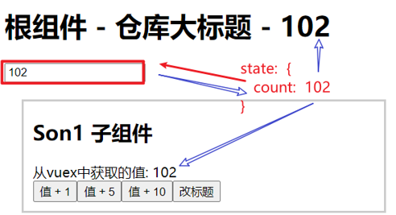

**实现步骤**


**代码示例**

App.vue

```vue
<input :value="count" @input="handleInput" type="text">

export default {
  methods: {
    handleInput (e) {
      // 1. 实时获取输入框的值
      const num = +e.target.value
      // 2. 提交mutation，调用mutation函数
      this.$store.commit('changeCount', num)
    }
  }
}
```

store/index.js

```js
mutations: { 
   changeCount (state, newCount) {
      state.count = newCount
   }
},
```

# 96.辅助函数- mapMutations

> mapMutations和mapState很像，它把位于mutations中的方法提取了出来，我们可以将它导入

```js
import  { mapMutations } from 'vuex'
methods: {
    ...mapMutations(['addCount'])
}
```

> 上面代码的含义是将mutations的方法导入了methods中，等价于

```js
methods: {
      // commit(方法名, 载荷参数)
      addCount (n) {
          this.$store.commit('addCount', n)
      }
 }
```

此时，就可以直接通过this.addCount调用了

```jsx
<button @click="addCount">值+1</button>

this.subCount(10)
```

但是请注意： Vuex中mutations中要求不能写异步代码，如果有异步的ajax请求，应该放置在actions中

# 97.actions

> state是存放数据的，mutations是同步更新数据 (便于监测数据的变化, 更新视图等, 方便于调试工具查看变化)，
>
> actions则负责进行异步操作

**说明：mutations必须是同步的（便于监测数据变化，记录调试）**

> PS：actions不能直接操作state，还是需要 commit mutations

**需求: 一秒钟之后, 要给一个数 去修改state**


**定义actions**

```js
mutations: {
  changeCount (state, newCount) {
    state.count = newCount
  }
}

actions: {
  // 形参：
  // context 上下文 (此处未分模块，可以当成store仓库)
  // context.commit('mutation名字', 额外参数)
  // 并且有且只能传递一个参数
  setAsyncCount (context, num) {
    // 一秒后, 给一个数, 去修改 num
    setTimeout(() => {
      context.commit('changeCount', num)
    }, 1000)
  }
},
```

**组件中通过dispatch调用** 

```js
setAsyncCount () {
  this.$store.dispatch('setAsyncCount', 666)
}
```


## 辅助函数 -mapActions

1.目标：掌握辅助函数 mapActions，映射方法

> mapActions 是把位于 actions中的方法提取了出来，映射到组件methods中

Son2.vue

```js
import { mapActions } from 'vuex'
methods: {
   ...mapActions(['changeCountAction'])
}

//mapActions映射的代码 本质上是以下代码的写法
//methods: {
//  changeCountAction (n) {
//    this.$store.dispatch('changeCountAction', n)
//  },
//}
```

直接通过 this.方法 就可以调用

```vue
<button @click="changeCountAction(200)">+异步</button>
```


# getters

> 除了state之外，有时我们还需要从state中**筛选出符合条件的一些数据**，这些数据是依赖state的，此时会用到getters
>
> getters就类似于属性中的计算属性
>
> 这个getter只有获取，如果需要设置修改，还是需要经过mutations
>
> getters里的数据也是响应式的

例如，state中定义了list，为1-10的数组，

```js
state: {
    list: [1, 2, 3, 4, 5, 6, 7, 8, 9, 10]
}
```

组件中，需要显示所有大于5的数据，正常的方式，是需要list在组件中进行再一步的处理，但是getters可以帮助我们实现它

**1.定义getters**

```js
  getters: {
    // 要求：
    // getters函数的第一个参数是 state
    // 必须要有返回值
     filterList:  state =>  state.list.filter(item => item > 5)
  }
```

**2.使用getters**

2.1原始方式-$store

```vue
<div>{{ $store.getters.filterList }}</div>
```

2.2辅助函数 - mapGetters

```js
computed: {
    // mapState 和 mapGetters都是映射属性，所以应该往computed里写
    ...mapGetters(['filterList'])
}
```

```vue
 <div>{{ filterList }}</div>
```

**使用小结**


# 98.核心概念 - module

**目标**

掌握核心概念 module 模块的创建

**问题**

由于使用**单一状态树**，应用的所有状态**会集中到一个比较大的对象**。当应用变得非常复杂时，store 对象就有可能变得相当臃肿。

这句话的意思是，如果把所有的状态都放在state中，当项目变得越来越大的时候，Vuex会变得越来越难以维护

由此，又有了Vuex的模块化


**模块定义** - 准备 state

> 新建store/modules文件夹

定义两个模块 **user** 和  **setting**

user中管理用户的信息状态  userInfo  `modules/user.js`

```jsx
const state = {
  userInfo: {
    name: 'zs',
    age: 18
  }
}

const mutations = {}

const actions = {}

const getters = {}

export default {
  state,
  mutations,
  actions,
  getters
}

```

setting中管理项目应用的  主题色 theme，描述 desc， `modules/setting.js`

```jsx
const state = {
  theme: 'dark', // 主题色
  desc: '描述真呀真不错'
}

const mutations = {}

const actions = {}

const getters = {}

export default {
  state,
  mutations,
  actions,
  getters
}
```

在`store/index.js`文件中的modules配置项中，注册这两个模块

```js
import user from './modules/user'
import setting from './modules/setting'

const store = new Vuex.Store({
    modules:{
        // user: user 同名可简写
        user,
        setting
    }
})
```

> 检验是否配置成功：通过vue的调试工具
>
> 

使用模块中的数据,  可以直接通过模块名访问 `$store.state.模块名.xxx`  =>  `$store.state.setting.desc`

也可以通过 mapState 映射

# 99.获取模块内的state数据

**目标：**

掌握模块中 state 的访问语法

尽管已经分模块了，但其实子模块的状态，还是会挂到根级别的 state 中，属性名就是模块名

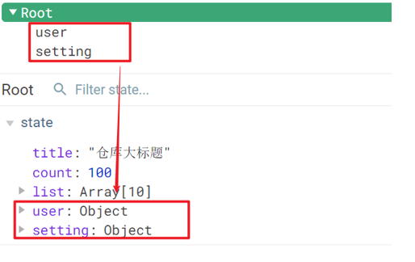


**使用模块中的数据**

1. 直接通过模块名访问 $store.state.模块名.xxx

2. 通过 mapState 映射：

   1. 默认根级别的映射  mapState([ 'xxx' ])     

   2. 子模块的映射 ：mapState('模块名', ['xxx'])  -  需要开启命名空间 **namespaced:true**

      > 注意namespaced后面有d！！！
      >
      > 配好之后，模块名后面可以看见namespace的标志
      >
      > 
      >
      > 但是它可能有缓存，可以ctrl+F5强制刷新一下

`modules/user.js`

```jsx
const state = {
  userInfo: {
    name: 'zs',
    age: 18
  },
  myMsg: '我的数据'
}

const mutations = {
  updateMsg (state, msg) {
    state.myMsg = msg
  }
}

const actions = {}

const getters = {}

export default {
  namespaced: true,
  state,
  mutations,
  actions,
  getters
}
```


**代码示例**

$store直接访问

```js
$store.state.user.userInfo.name
```

mapState辅助函数访问

```js
...mapState(['count', 'title']),
// 写多个是完全没关系的，只要是不重名，互相之间是不冲突的，只是在加多个计算属性而已
...mapState('user', ['userInfo']),
...mapState('setting', ['theme', 'desc']),
```

访问

~~~html
<!-- 访问模块中的state -->
<div>{{ user.userInfo.name }}</div>
<div>{{ setting.theme }}</div>
~~~


# 获取模块内的getters数据

**目标：**

掌握模块中 getters 的访问语


**语法：**

使用模块中 getters 中的数据： 

1. 直接通过模块名访问` $store.getters['模块名/xxx ']`

   > 这是由于getters中并不是简单的像state中一样存储的是对象，相当于存了一个'user/UpperCaseName'的属性
   >
   > 
   >
   > 访问的时候，由于属性名有特殊字符，它是不能直接通过.去访问的，而是需要通过中括号[ ' ' ]

2. 通过 mapGetters 映射      

   1. 默认根级别的映射  `mapGetters([ 'xxx' ]) `
   2. 子模块的映射  `mapGetters('模块名', ['xxx'])` -  需要开启命名空间


**代码示例**

`modules/user.js`

```js
const getters = {
  // 分模块后，state指代子模块的state
  UpperCaseName (state) {
    return state.userInfo.name.toUpperCase()
  }
}
```

Son1.vue 直接访问getters

```html
<!-- 测试访问模块中的getters - 原生 -->
<div>{{ $store.getters['user/UpperCaseName'] }}</div>
```

Son2.vue 通过命名空间访问

```js
computed:{
  ...mapGetters('user', ['UpperCaseName'])
}
```

# 获取模块内的mutations方法

**目标：**

掌握模块中 mutation 的调用语法

**注意：**

默认模块中的 mutation 和 actions 会被挂载到全局，**需要开启命名空间**，才会挂载到子模块。

**调用方式：**

1. 直接通过 store 调用   $store.commit('模块名/mutations名 ',  额外参数)
2. 通过 mapMutations 映射    
   1. 默认根级别的映射  mapMutations([ mutations名' ])     
   2. 子模块的映射 mapMutations('模块名', ['mutations名'])  -  需要开启命名空间

**代码示例**

`modules/user.js`

```js
const mutations = {
  setUser (state, newUserInfo) {
    state.userInfo = newUserInfo
  }
}
```

`modules/setting.js`

```js
const mutations = {
  setTheme (state, newTheme) {
    state.theme = newTheme
  }
}
```

Son1.vue

```vue
<button @click="updateUser">更新个人信息</button> 
<button @click="updateTheme">更新主题色</button>

<script>
export default {
  methods: {
    updateUser () {
      // $store.commit('模块名/mutation名', 额外传参)
      this.$store.commit('user/setUser', {
        name: 'xiaowang',
        age: 25
      })
    }, 
    updateTheme () {
      this.$store.commit('setting/setTheme', 'pink')
    }
  }
}
</script>
```


Son2.vue

```vue
<button @click="setUser({ name: 'xiaoli', age: 80 })">更新个人信息</button>
<button @click="setTheme('skyblue')">更新主题</button>

<script>
methods:{
// 分模块的映射
...mapMutations('setting', ['setTheme', '...']),
...mapMutations('user', ['setUser', '...']),
}
</script>
```

# 获取模块内的actions方法

**目标：**

掌握模块中 action 的调用语法 (同理 - 直接类比 mutation 即可)

**注意：**

默认模块中的 mutation 和 actions 会被挂载到全局，**需要开启命名空间**，才会挂载到子模块。

**调用语法：**

1. 直接通过 store 调用   $store.dispatch('模块名/xxx ',  额外参数)
2. 通过 mapActions 映射     
   1.  默认根级别的映射  mapActions([ 'xxx' ])     
   2.  子模块的映射 mapActions('模块名', ['xxx'])  -  需要开启命名空间

**代码实现**

需求：


`modules/user.js`

```js
const actions = {
  setUserSecond (context, newUserInfo) {
    // 将异步在action中进行封装
    setTimeout(() => {
      // 调用mutation   context上下文，默认提交的就是自己模块的action和mutation，基于当前的模块环境，指向不同的空间
      context.commit('setUser', newUserInfo)
    }, 1000)
  }
}
```

Son1.vue  直接通过store调用

```vue
<button @click="updateUser2">一秒后更新信息</button>

<script>
methods:{
    updateUser2 () {
      // 调用action dispatch
      this.$store.dispatch('user/setUserSecond', {
        name: 'xiaohong',
        age: 28
      })
    },
}
</script>
```

Son2.vue mapActions映射

```vue
<button @click="setUserSecond({ name: 'xiaoli', age: 80 })">一秒后更新信息</button>

<script>
methods:{
  ...mapActions('user', ['setUserSecond'])
}
</script>
```

# **Vuex模块化的使用小结**

**1.直接使用**

1. state --> $store.state.**模块名**.数据项名
2. getters --> $store.getters['**模块名**/属性名']
3. mutations --> $store.commit('**模块名**/方法名', 其他参数)
4. actions --> $store.dispatch('**模块名**/方法名', 其他参数)

**2.借助辅助方法使用**

1.import { mapXxxx, mapXxx } from 'vuex'

computed、methods: {

​     // **...mapState、...mapGetters放computed中；**

​    //  **...mapMutations、...mapActions放methods中；**

​    ...mapXxxx(**'模块名'**, ['数据项|方法']),

​    ...mapXxxx(**'模块名'**, { 新的名字: 原来的名字 }),

}

2.组件中直接使用 属性 `{{ age }}` 或 方法 `@click="updateAge(2)"`

# 100.购物车案例-构建项目

1. 脚手架新建项目 (注意：**勾选vuex**)      

   版本说明：

   vue2   vue-router3   vuex3               

   vue3  vue-router4  vuex4/pinia

```
vue create vue-cart-demo
```

> 需要勾选上vuex，由于这个项目只有一个页面，vuex可勾可不勾
>
> 

2. 将原本src内容清空，替换成教学资料的《vuex-cart-准备代码》


需求：

1. 发请求动态渲染购物车，数据存vuex （存cart模块， 将来还会有user模块，article模块...）
2. 数字框可以修改数据
3. 动态计算总价和总数量

# 101.构建vuex-cart模块

说明：既然明确数据要存 vuex，建议分模块存，购物车数据存 cart 模块，将来还会有 user 模块，article 模块...

1. 新建 `store/modules/cart.js`

2. 挂载到 vuex 仓库上 `store/cart.js`

```jsx
import Vue from 'vue'
import Vuex from 'vuex'
import cart from './modules/cart'

Vue.use(Vuex)

// 别忘了这里的new
export default new Vuex.Store({
  modules: {
    cart
  }
})

```


## 准备后端接口服务环境(了解)

1. 安装全局工具 json-server （全局工具仅需要安装一次）

   官网：[json-server](https://www.npmjs.com/package/json-server)

```
yarn global add json-server 或 npm i json-server  -g
```

2. 代码**根目录**新建一个 db 目录

   > 叫什么目录名字不重要，重要的是index.json文件

3. 将资料 index.json 移入 db 目录

   > 由于文件是json文件，属性名必须用双引号引起来
   >
   > ~~~json
   > {
   >   "cart": [
   >     {
   >       "id": 100001,
   >       "name": "低帮城市休闲户外鞋天然牛皮COOLMAX纤维",
   >       "price": 128,
   >       "count": 1,
   >       "thumb": "https://yanxuan-item.nosdn.127.net/3a56a913e687dc2279473e325ea770a9.jpg"
   >     }
   >   ]
   > }
   > ~~~

2. 进入 db 目录，执行命令，启动后端接口服务 (使用--watch 参数 可以实时监听 json 文件的修改)

```
json-server  --watch  index.json
```

# 102.请求动态渲染数据

**目标**

请求获取数据存入 vuex, 映射渲染

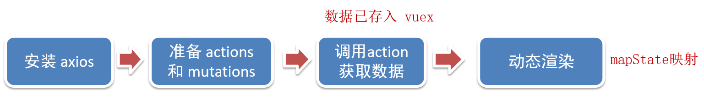

1. 安装 axios

```jsx
yarn add axios
```

2. 准备actions 和 mutations

3. `App.vue`页面中调用 action,  获取数据

验证数据是否存储成功


4. 动态渲染

`cart-item.vue`

# 103.修改数量

注意：前端 vuex 数据，后端数据库数据都要


1. 注册点击事件

2. 页面中dispatch action

3. 提供action函数

4. 提供mutation处理函数


## 底部总价展示

1. 提供getters

2. 动态渲染

# 完整代码

main.js

~~~js
import Vue from 'vue'
import App from './App.vue'
import store from './store'

Vue.config.productionTip = false

new Vue({
  store,
  render: h => h(App)
}).$mount('#app')
~~~

App.vue

~~~vue
<template>
  <div class="app-container">
    <!-- Header 区域 -->
    <cart-header></cart-header>

    <!-- 商品 Item 项组件 -->
    <cart-item v-for="item in list" :key="item.id" :item="item"></cart-item>

    <!-- Foote 区域 -->
    <cart-footer></cart-footer>
  </div>
</template>

<script>
import CartHeader from '@/components/cart-header.vue'
import CartFooter from '@/components/cart-footer.vue'
import CartItem from '@/components/cart-item.vue'

import { mapState } from 'vuex'

export default {
  name: 'App',
  created () {
    this.$store.dispatch('cart/getList')
  },
  computed: {
    ...mapState('cart', ['list'])
  },
  components: {
    CartHeader,
    CartFooter,
    CartItem
  }
}
</script>

<style lang="less" scoped>
.app-container {
  padding: 50px 0;
  font-size: 14px;
}
</style>
~~~

store/index.js

~~~js
import Vue from 'vue'
import Vuex from 'vuex'
import cart from './modules/cart'

Vue.use(Vuex)

export default new Vuex.Store({
  modules: {
    cart
  }
})
~~~

store/modules/cart.js

~~~js
import axios from 'axios'
export default {
  namespaced: true,
  // 这种语法是官方在分模块时推荐的一种语法，为的就是每个模块数据的独立性，推荐你写成一个函数，函数里面return即可
  state () {
    return {
      // 购物车数据 [{}, {}]
      list: []
    }
  },
  mutations: {
    updateList (state, newList) {
      state.list = newList
    },
    // obj: { id: xxx, newCount: xxx }
    updateCount (state, obj) {
      // 根据 id 找到对应的对象，更新count属性即可
      const goods = state.list.find(item => item.id === obj.id)
      goods.count = obj.newCount
    }
  },
  actions: {
    // 请求方式：get
    // 请求地址：http://localhost:3000/cart
    async getList (context) {
      const res = await axios.get('http://localhost:3000/cart')
      context.commit('updateList', res.data)
    },
    // 请求方式：patch
    // 请求地址：http://localhost:3000/cart/:id值  表示修改的是哪个对象
    // 请求参数：
    // {
    //   name: '新值',  【可选】
    //   price: '新值', 【可选】
    //   count: '新值', 【可选】
    //   thumb: '新值'  【可选】
    // }
    async updateCountAsync (context, obj) {
      // 将修改更新同步到后台服务器，在db/index.js里的数据也会一起更新
      await axios.patch(`http://localhost:3000/cart/${obj.id}`, {
        count: obj.newCount
      })
      // 将修改更新同步到 vuex
      context.commit('updateCount', {
        id: obj.id,
        newCount: obj.newCount
      })
    }
  },
  getters: {
    // 商品总数量 累加count
    total (state) {
      return state.list.reduce((sum, item) => sum + item.count, 0)
    },
    // 商品总价格 累加count * price
    totalPrice (state) {
      return state.list.reduce((sum, item) => sum + item.count * item.price, 0)
    }
  }
}
~~~

components/cart-item.vue

~~~vue
<template>
  <div class="goods-container">
    <!-- 左侧图片区域 -->
    <div class="left">
      
    </div>
    <!-- 右侧商品区域 -->
    <div class="right">
      <!-- 标题 -->
      <div class="title">{{ item.name }}</div>
      <div class="info">
        <!-- 单价 -->
        <span class="price">￥{{ item.price }}</span>
        <div class="btns">
          <!-- 按钮区域 -->
          <button class="btn btn-light" @click="btnClick(-1)">-</button>
          <span class="count">{{ item.count }}</span>
          <button class="btn btn-light" @click="btnClick(1)">+</button>
        </div>
      </div>
    </div>
  </div>
</template>

<script>
export default {
  name: 'CartItem',
  methods: {
    btnClick (step) {
      const newCount = this.item.count + step
      const id = this.item.id

      if (newCount < 1) return

      this.$store.dispatch('cart/updateCountAsync', {
        id,
        newCount
      })
    }
  },
  props: {
    item: {
      type: Object,
      required: true
    }
  }
}
</script>

<style lang="less" scoped>
.goods-container {
  display: flex;
  padding: 10px;
  + .goods-container {
    border-top: 1px solid #f8f8f8;
  }
  .left {
    .avatar {
      width: 100px;
      height: 100px;
    }
    margin-right: 10px;
  }
  .right {
    display: flex;
    flex-direction: column;
    justify-content: space-between;
    flex: 1;
    .title {
      font-weight: bold;
    }
    .info {
      display: flex;
      justify-content: space-between;
      align-items: center;
      .price {
        color: red;
        font-weight: bold;
      }
      .btns {
        .count {
          display: inline-block;
          width: 30px;
          text-align: center;
        }
      }
    }
  }
}

.custom-control-label::before,
.custom-control-label::after {
  top: 3.6rem;
}
</style>
~~~

component/cart-footer.vue

~~~vue
<template>
  <div class="footer-container">
    <!-- 中间的合计 -->
    <div>
      <span>共 {{ total }} 件商品，合计：</span>
      <span class="price">￥{{ totalPrice }}</span>
    </div>
    <!-- 右侧结算按钮 -->
    <button class="btn btn-success btn-settle">结算</button>
  </div>
</template>

<script>
import { mapGetters } from 'vuex'
export default {
  name: 'CartFooter',
  computed: {
    ...mapGetters('cart', ['total', 'totalPrice'])
  }
}
</script>

<style lang="less" scoped>
.footer-container {
  background-color: white;
  height: 50px;
  border-top: 1px solid #f8f8f8;
  display: flex;
  justify-content: flex-end;
  align-items: center;
  padding: 0 10px;
  position: fixed;
  bottom: 0;
  left: 0;
  width: 100%;
  z-index: 999;
}

.price {
  color: red;
  font-size: 13px;
  font-weight: bold;
  margin-right: 10px;
}

.btn-settle {
  height: 30px;
  min-width: 80px;
  margin-right: 20px;
  border-radius: 20px;
  background: #42b983;
  border: none;
  color: white;
}
</style>
~~~


# 智慧商城

步骤一般都是：

静态结构 => 封装接口 => 路由获取参数 => 获取数据 动态渲染

> 先封装接口再路由获取参数的原因是因为，只有先封装好了接口，才能知道我们需要哪些参数

接口文档：https://apifox.com/apidoc/shared-12ab6b18-adc2-444c-ad11-0e60f5693f66/doc-2221080

演示地址：http://cba.itlike.com/public/mweb/#/

**01. 项目功能演示**

**1.明确功能模块**

启动准备好的代码，演示移动端面经内容，明确功能模块


**2.项目收获**


# 106.项目创建目录初始化

**vue-cli 建项目** 

1.安装脚手架 (已安装)

```
npm i @vue/cli -g
```

2.创建项目

```
vue create hm-shopping
```

+ 选项

```js
Vue CLI v5.0.8
? Please pick a preset:
  Default ([Vue 3] babel, eslint)
  Default ([Vue 2] babel, eslint)
> Manually select features     选自定义
```

+ 手动选择功能


+ 选择vue的版本

```jsx
  3.x
> 2.x
```

+ 是否使用history模式


+ 选择css预处理


+ 选择eslint的风格 （eslint 代码规范的检验工具，检验代码是否符合规范）
+ 比如：const age = 18;   =>  报错！多加了分号！后面有工具，一保存，全部格式化成最规范的样子


+ 选择校验的时机 （直接回车）


+ 选择配置文件的生成方式 （直接回车）


- 是否保存预设，下次直接使用？  =>   不保存，输入 N


+ 等待安装，项目初始化完成


+ 启动项目

```
npm run serve
```


## 调整初始化目录结构

> 强烈建议大家严格按照老师的步骤进行调整，为了符合企业规范

为了更好的实现后面的操作，我们把整体的目录结构做一些调整。

目标:

1. 删除初始化的一些默认文件
2. 修改没删除的文件
3. 新增我们需要的目录结构

1.删除文件

- src/assets/logo.png
- src/components/HelloWorld.vue
- src/views/AboutView.vue
- src/views/HomeView.vue

2.修改文件

`main.js` 不需要修改

`router/index.js`

删除默认的路由配置

```js
import Vue from 'vue'
import VueRouter from 'vue-router'

Vue.use(VueRouter)

const routes = [
]

const router = new VueRouter({
  routes
})

export default router

```

`App.vue`

```html
<template>
  <div id="app">
    <router-view/>
  </div>
</template>
```

3.新增目录

- src/api 目录
  - 存储接口模块 (发送ajax请求接口的模块)
- src/utils 目录
  - 存储一些工具模块 (自己封装的方法)

目录效果如下:


# 107.vant组件库及Vue周边的其他组件库

> 组件库：第三方封装好了很多很多的组件，整合到一起就是一个组件库。
>
> vant2对应的是vue2
>
> vant3，4对应的是vue3
>
> https://vant-contrib.gitee.io/vant/v2/#/zh-CN/


比如日历组件、键盘组件、打分组件、下拉筛选组件等

组件库并不是唯一的，常用的组件库还有以下几种：

pc:  [element-ui](https://element.eleme.cn/#/zh-CN)（vue2）    [element-plus](https://element-plus.gitee.io/zh-CN/)（vue3）       [iview](https://iview.github.io/)      **[ant-design](https://antdv.com/components/overview-cn)**（阿里）

移动：[vant-ui](https://vant-contrib.gitee.io/vant/v2/#/zh-CN/)     [Mint UI](http://mint-ui.github.io/docs/#/zh-cn2) (饿了么)    [Cube UI](https://didi.github.io/cube-ui/#/zh-CN/) (滴滴)，但是后面两个更新效率没有vant高

常用的就是以下两个版本


# 全部导入和按需导入的区别

目标：明确 **全部导入** 和 **按需导入** 的区别


区别：

1.全部导入会引起项目打包后的体积变大，进而影响用户访问网站的性能

2.按需导入只会导入你使用的组件，进而节约了资源

> 对于移动端需要性能这么高的场景，更加推荐按需导入


## 全部导入

+ 安装vant-ui


```
yarn add vant@latest-v2
```

+ 在main.js中

直接复制粘贴


```js
import Vant from 'vant';
import 'vant/lib/index.css';
// 把vant中所有的组件都导入了
// 插件安装初始化：内部会将所有的vant组件进行导入注册
Vue.use(Vant)
```

- 即可使用

也是直接复制粘贴


```jsx
<van-button type="primary">主要按钮</van-button>
<van-button type="info">信息按钮</van-button>
```


vant-ui提供了很多的组件，全部导入，会导致项目打包变得很大。


## 按需导入

推荐自动按需引入，不推荐手动按需引入，因为手动按需引入还需要手动导入css样式


而且插件也说了，插件会自动将代码转化为方式二中的按需引入形式


+ 安装vant-ui

```
yarn add vant@latest-v2
```

+ 安装一个插件


> -D：把当前这个插件，安装为开发依赖，仅仅是在我们的开发过程当中使用的

```jsd
yarn add babel-plugin-import -D
```

+ 在`babel.config.js`中配置

我们使用的是最新的脚手架                                                                                                                                                                                                                                                                                                                                                                                                                                                                                                                                                                                                                                                                                                                                                                                                                                                                                                                                                                                                                                                                                                                                                                                                                                                                                                                                                                                                                                                                                                                                                                                                                                                                                                                                                                                                                                                                                                                                                                                                                                                                                                                                                                                                                               


```js
module.exports = {
  presets: [
    '@vue/cli-plugin-babel/preset'
  ],
  plugins: [
    ['import', {
      libraryName: 'vant',
      libraryDirectory: 'es',
      style: true
    }, 'vant']
  ]
}
```

+ 按需加载，在`main.js`

```js
import { Button, Icon } from 'vant'

Vue.use(Button)
Vue.use(Icon)
```

+ `app.vue`中进行测试

```js
<van-button type="primary">主要按钮</van-button>
<van-button type="info">信息按钮</van-button>
<van-button type="default">默认按钮</van-button>
<van-button type="warning">警告按钮</van-button>
<van-button type="danger">危险按钮</van-button>
```

+ 把引入组件的步骤抽离到单独的js文件中比如 `utils/vant-ui.js`

```js
import { Button, Icon } from 'vant'

Vue.use(Button)
Vue.use(Icon)
```

main.js中进行导入

```js
// 导入按需导入的配置文件
import '@/utils/vant-ui'
```

# 108.项目中的vw适配

这种关于浏览器的适配属于进阶用法


官方说明：https://vant-contrib.gitee.io/vant/v2/#/zh-CN/advanced-usage

```js
yarn add postcss-px-to-viewport@1.1.1 -D
```

+ 项目**根目录**， 新建postcss的配置文件`postcss.config.js`

```jsx
// postcss.config.js
module.exports = {
  plugins: {
    'postcss-px-to-viewport': {
      // vw适配的标准屏的宽度 iphoneX => 375
      // 设计图 750，调成1倍 => 适配375标准屏幕
      // 设计图 640，调成1倍 => 适配320标准屏幕
      viewportWidth: 375,
    },
  },
};
```

viewportWidth:设计稿的视口宽度

1. vant-ui中的组件就是按照375的视口宽度设计的
2. 恰好面经项目中的设计稿也是按照375的视口宽度设计的，所以此时 我们只需要配置375就可以了
3. 如果设计稿不是按照375而是按照750的宽度设计，[那此时这个值该怎么填呢？](https://zhuanlan.zhihu.com/p/366664788)

可以看见此时已经变成了vw适配


# 109.路由配置 - 一级路由

**但凡是单个页面，独立展示的，都是一级路由**

路由设计：

- 登录页
- 首页架子
  - 首页 - 二级
  - 分类页 - 二级
  - 购物车 - 二级
  - 我的 - 二级
- 搜索页
- 搜索列表页
- 商品详情页
- 结算支付页
- 我的订单页

> 由于每一个一级路由他会封装一些属于它自己模块的组件，所以推荐新建成一个文件夹
>
> 然后每个文件夹中新建一个核心文件：index.vue
>
> 

`router/index.js` 配置一级路由，新建对应的页面文件

```jsx
import Vue from 'vue'
import VueRouter from 'vue-router'
import Layout from '@/views/layout'
import Search from '@/views/search'
import SearchList from '@/views/search/list'
import ProDetail from '@/views/prodetail'
// 如果我们加载的是文件夹下的index根文件，只需要加载到文件夹就可以了，它会自动帮你去找到
import Login from '@/views/login'
import Pay from '@/views/pay'
import MyOrder from '@/views/myorder'

Vue.use(VueRouter)

const router = new VueRouter({
  routes: [
    {
      path: '/login',
      component: Login
    },
    {
      path: '/',
      component: Layout
    },
    {
      path: '/search',
      component: Search
    },
    {
      path: '/searchlist',
      component: SearchList
    },
    // 动态路由传参，确认将来是哪个商品，路由参数中携带id
    {
      path: '/prodetail/:id',
      component: ProDetail
    },
    {
      path: '/pay',
      component: Pay
    },
    {
      path: '/myorder',
      component: MyOrder
    }
  ]
})

export default router
```


# 路由配置-tabbar标签页

目标：阅读vant组件库文档，实现底部导航 tabbar


https://vant-contrib.gitee.io/vant/v2/#/zh-CN/tabbar

> NavBar是头部的，Tabbar是底部的


然后一保存，它就会自动帮你合并


`vant-ui.js` 引入组件

```jsx
import { Tabbar, TabbarItem } from 'vant'
Vue.use(Tabbar)
Vue.use(TabbarItem)
```

`layout.vue`

1. 复制官方代码

2. 修改显示文本及显示的图标

   > 修改图标：
   >
   > 
   >
   > 

3. 配置高亮颜色

```jsx
<template>
  <div>
    <!-- 二级路由出口 -->
    <van-tabbar active-color="#ee0a24" inactive-color="#000">
      <van-tabbar-item icon="wap-home-o">首页</van-tabbar-item>
      <van-tabbar-item icon="apps-o">分类页</van-tabbar-item>
      <van-tabbar-item icon="shopping-cart-o">购物车</van-tabbar-item>
      <van-tabbar-item icon="user-o">我的</van-tabbar-item>
    </van-tabbar>
  </div>
</template>
```

# 路由配置 - 二级路由

1. `router/index.js`配置二级路由

```jsx
import Vue from 'vue'
import VueRouter from 'vue-router'
import Layout from '@/views/layout'
import Search from '@/views/search'
import SearchList from '@/views/search/list'
import ProDetail from '@/views/prodetail'
import Login from '@/views/login'
import Pay from '@/views/pay'
import MyOrder from '@/views/myorder'

import Home from '@/views/layout/home'
import Category from '@/views/layout/category'
import Cart from '@/views/layout/cart'
import User from '@/views/layout/user'

Vue.use(VueRouter)

const router = new VueRouter({
  routes: [
    {
      path: '/login',
      component: Login
    },
    {
      path: '/',
      component: Layout,
      redirect: '/home',
      children: [
        {
          path: 'home',
          component: Home
        },
        {
          path: 'category',
          component: Category
        },
        {
          path: 'cart',
          component: Cart
        },
        {
          path: 'user',
          component: User
        }
      ]
    },
    {
      path: '/search',
      component: Search
    },
    {
      path: '/searchlist',
      component: SearchList
    },
    {
      path: '/prodetail/:id',
      component: ProDetail
    },
    {
      path: '/pay',
      component: Pay
    },
    {
      path: '/myorder',
      component: MyOrder
    }
  ]
})

export default router
```

2. 准备对应的组件文件
   - `layout/home.vue`
   - `layout/category.vue`
   - `layout/cart.vue`
   - `layout/user.vue`
3. `layout.vue` 配置路由出口,  配置 tabbar


```jsx
<template>
  <div>
    <router-view></router-view>
    <van-tabbar route active-color="#ee0a24" inactive-color="#000">
      <van-tabbar-item to="/home" icon="wap-home-o">首页</van-tabbar-item>
      <van-tabbar-item to="/category" icon="apps-o">分类页</van-tabbar-item>
      <van-tabbar-item to="/cart" icon="shopping-cart-o">购物车</van-tabbar-item>
      <van-tabbar-item to="/user" icon="user-o">我的</van-tabbar-item>
    </van-tabbar>
  </div>
</template>
```


# 110.登录页静态布局

**(1) 准备工作**

1. 在根目录新建  `styles/common.less` 重置默认样式

```jsx
// 重置默认样式
* {
  margin: 0;
  padding: 0;
  box-sizing: border-box;
}

// 文字溢出省略号
// 这个在后面文字布局的时候会用到
.text-ellipsis-2 {
  overflow: hidden;
  -webkit-line-clamp: 2;
  text-overflow: ellipsis;
  display: -webkit-box;
  -webkit-box-orient: vertical;
}
```

2. main.js 中导入应用

```jsx
import '@/styles/common.less'
```

3. 将准备好的一些图片素材拷贝到 assets 目录【备用】


**(2) 登录静态布局**


使用组件

- van-nav-bar

> 注意一定是先引入再使用
>
> 

`vant-ui.js` 注册

```jsx
import { NavBar } from 'vant'
Vue.use(NavBar)
```

`Login.vue` 使用

```jsx
<template>
  <div class="login">
    <van-nav-bar title="会员登录" left-arrow @click-left="$router.go(-1)" />
    <div class="container">
      <div class="title">
        <h3>手机号登录</h3>
        <p>未注册的手机号登录后将自动注册</p>
      </div>

      <div class="form">
        <div class="form-item">
          <input class="inp" maxlength="11" placeholder="请输入手机号码" type="text">
        </div>
        <div class="form-item">
          <input class="inp" maxlength="5" placeholder="请输入图形验证码" type="text">
          
        </div>
        <div class="form-item">
          <input class="inp" placeholder="请输入短信验证码" type="text">
          <button>获取验证码</button>
        </div>
      </div>

      <div class="login-btn">登录</div>
    </div>
  </div>
</template>

<script>
export default {
  // 这里记得加name，否则会报错，由于需要两个单词，一般会直接在后面加个index，架子首页
  name: 'LoginPage'
}
</script>

<style lang="less" scoped>
.container {
  padding: 49px 29px;

  .title {
    margin-bottom: 20px;
    h3 {
      font-size: 26px;
      font-weight: normal;
    }
    p {
      line-height: 40px;
      font-size: 14px;
      color: #b8b8b8;
    }
  }

  .form-item {
    border-bottom: 1px solid #f3f1f2;
    padding: 8px;
    margin-bottom: 14px;
    display: flex;
    align-items: center;
    .inp {
      display: block;
      border: none;
      outline: none;
      height: 32px;
      font-size: 14px;
      flex: 1;
    }
    img {
      width: 94px;
      height: 31px;
    }
    button {
      height: 31px;
      border: none;
      font-size: 13px;
      color: #cea26a;
      background-color: transparent;
      padding-right: 9px;
    }
  }

  .login-btn {
    width: 100%;
    height: 42px;
    margin-top: 39px;
    background: linear-gradient(90deg,#ecb53c,#ff9211);
    color: #fff;
    border-radius: 39px;
    box-shadow: 0 10px 20px 0 rgba(0,0,0,.1);
    letter-spacing: 2px;
    display: flex;
    justify-content: center;
    align-items: center;
  }
}
</style>
```

**添加通用样式**

`styles/common.less` 设置导航条，返回箭头颜色

使用调试工具找出箭头所对应的类名


```jsx
// 设置导航条 返回箭头 颜色
// 这里使用两个类来选中，相对来说权重会高一点
.van-nav-bar {
  .van-icon-arrow-left {
    color: #333;
  }
}
```

# request模块 - axios封装

接口文档：https://apifox.com/apidoc/shared-12ab6b18-adc2-444c-ad11-0e60f5693f66/doc-2221080

演示地址：http://cba.itlike.com/public/mweb/#/

基地址：http://cba.itlike.com/public/index.php?s=/api/


我们会使用 axios 来请求**后端接口**, 一般都会对 axios 进行**一些配置** (比如: 配置基础地址,请求响应拦截器等等)

一般项目开发中, 都会对 axios 进行基本的**二次封装**, 单独封装到一个模块中, 便于使用


**目标：将 axios 请求方法，封装到 request 模块**

1. 安装 axios

```
npm i axios
```

2. 新建 `utils/request.js` 封装 axios 模块

   利用 axios.create 创建一个自定义的 axios 来使用

   [Axios 实例](https://www.axios-http.cn/docs/instance)

> 创建实例的好处就是每个实例之间互不影响

```js
/* 封装axios用于发送请求 */
import axios from 'axios'

// 创建 axios 实例，将来对创建出来的实例，进行自定义配置
// 好处：不会污染原始的 axios 实例
const request = axios.create({
  baseURL: 'http://cba.itlike.com/public/index.php?s=/api/',
  timeout: 5000
})

// 添加请求拦截器
request.interceptors.request.use(function (config) {
  // 在发送请求之前做些什么
  return config
}, function (error) {
  // 对请求错误做些什么
  return Promise.reject(error)
})

// 添加响应拦截器
request.interceptors.response.use(function (response) {
  // 对响应数据做点什么
  return response.data
}, function (error) {
  // 对响应错误做点什么
  return Promise.reject(error)
})

export default request
```

3. 在login/index.vue中获取图形验证码，请求测试

```js
import request from '@/utils/request'
export default {
  name: 'LoginPage',
  async created () {
    const res = await request.get('/captcha/image')
    console.log(res)
  }
}
```

                                 

# 图形验证码功能

说明：

1. 图形验证码，本质就是一个请求回来的图片
2. 用户将来输入图形验证码，用于强制人机交互，可以**抵御机器自动化攻击** (例如：避免批量请求获取短信)

需求：

1. 动态将请求回来的 base64 图片，解析渲染出来
2. 点击验证码图片盒子，要刷新验证码

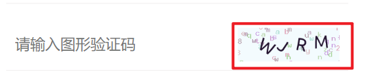

1. 准备数据，获取图形验证码后存储图片路径，存储图片唯一标识

```jsx
async created () {
  this.getPicCode()
},
data () {
  return {
   picKey: '', // 将来请求传递的图形验证码唯一标识
   picUrl: '', // 存储请求渲染的图片地址
   picCode: '' // 用户输入的图形验证码
  }
},
methods: {
  // 获取图形验证码
  // 将方法封装起来：1.更清晰，全写在created里太麻烦了 2.点击盒子需要刷新，刷新又需要重新调
  async getPicCode () {
    // 后端可以通过这个key找到验证码图片
    const { data: { base64, key } } = await request.get('/captcha/image')
    this.picUrl = base64
    this.picKey = key
  }
}
```

2. 动态渲染图形验证码，并且点击时要重新刷新验证码

```jsx
<!-- 顺便将picCode的v-model绑定一下 -->
<input v-model="picCode" class="inp" maxlength="5" placeholder="请输入图形验证码" type="text">
<!-- v-if="picUrl"：有图片的时候才渲染，或者可以给个默认的图片加载失败的图片 -->

```

# 111.封装api接口 - 图片验证码接口

**1.目标：**将请求封装成方法，统一存放到 api 模块，与页面分离

**2.原因：以前的模式**

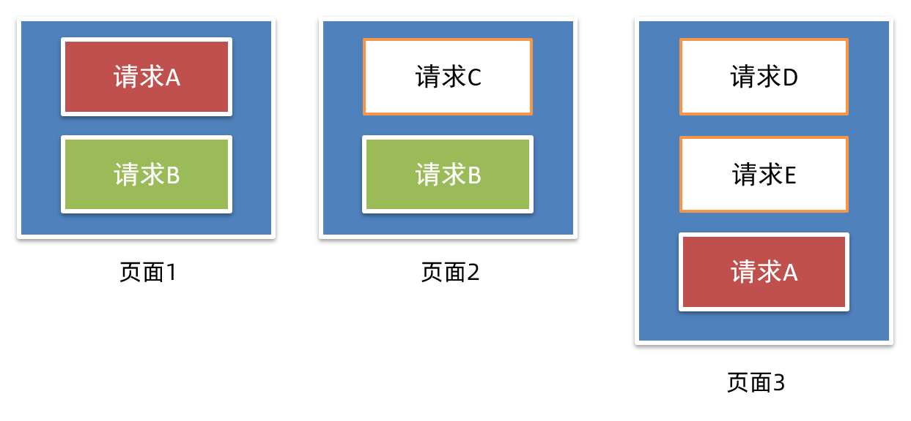

- 页面中充斥着请求代码

- 可阅读性不高

- **相同的请求没有复用请求没有统一管理**

  

**3.期望：**


- 请求与页面逻辑分离
- 相同的请求可以直接复用请求
- 进行了统一管理


**4.具体实现**

新建 `api/login.js` 提供获取图形验证码 Api 函数

```jsx
import request from '@/utils/request'

// 获取图形验证码
// 按需导出
export const getPicCode = () => {
  // 注意必须加return
  return request.get('/captcha/image')
}
```

`login/index.vue`页面中调用测试

```jsx
// 按需导入
// 方法名和methods中的方法名冲突没有关系，这个导入的是一个全局变量，方法名前面没有this
import { getPicCode } from '@/api/login'
async getPicCode () {
  const { data: { base64, key } } = await getPicCode()
  this.picUrl = base64
  this.picKey = key
},
```

# 112.toast 轻提示

https://vant-contrib.gitee.io/vant/v2/#/zh-CN/toast

注册安装

~~~js
import { Toast } from 'vant';
Vue.use(Toast)
~~~

两种使用方式

1. 导入调用 ( **组件内** 或 **非组件中均可** ) 

> 比如main.js中也可以调用


```jsx
import { Toast } from 'vant';
Toast('提示内容');
```

2. 通过this直接调用 ( **组件内 **)（更方便）

main.js 注册绑定到原型

本质：将方法，注册挂载到了Vue原型上 Vue.prototype.$toast = xxx

那么Vue上所有的组件都是可以访问到原型上的方法的


```jsx
this.$toast('提示内容')
```

# 113.短信验证倒计时功能


**(1) 倒计时基础效果**

1. 准备 data 数据

```jsx
data () {
  return {
    totalSecond: 60, // 总秒数
    second: 60, // 倒计时的秒数
    timer: null // 定时器 id
  }
},
```

2. 给按钮注册点击事件

```jsx
<button @click="getCode">
  {{ second === totalSecond ? '获取验证码' : second + `秒后重新发送`}}
</button>
```

3. 开启倒计时时

```jsx
async getCode () {
    // 当前目前没有定时器开着，且 totalSecond 和 second 一致 (秒数归位) 才可以倒计时
  if (!this.timer && this.second === this.totalSecond) {
    // 开启倒计时
    this.timer = setInterval(() => {
      this.second--

      if (this.second <= 0) {
            clearInterval(this.timer)
            this.timer = null // 重置定时器 id
            this.second = this.totalSecond // 归位
      }
    }, 1000)

    // 发送请求，获取验证码
    this.$toast('发送成功，请注意查收')
  }
}
```

4. 离开页面销毁定时器

> 否则很有可能浪费性能，因为如果不关闭，离开页面的时候倒计时还在进行

```jsx
destroyed () {
  clearInterval(this.timer)
}
```


**(2) 验证码请求校验处理**

1. 输入框 v-model 绑定变量

```jsx
data () {
  return {
    mobile: '', // 手机号
    picCode: '' // 图形验证码
  }
},
    
<input v-model="mobile" class="inp" maxlength="11" placeholder="请输入手机号码" type="text">
<input v-model="picCode" class="inp" maxlength="5" placeholder="请输入图形验证码" type="text">
```

2. methods中封装校验方法

```jsx
// 校验输入框内容
validFn () {
  if (!/^1[3-9]\d{9}$/.test(this.mobile)) {
    this.$toast('请输入正确的手机号')
    return false
  }
  if (!/^\w{4}$/.test(this.picCode)) {
    this.$toast('请输入正确的图形验证码')
    return false
  }
  return true
},
```

3. 请求倒计时前进行校验

```jsx
// 获取短信验证码
async getCode () {
  if (!this.validFn()) {
    return
  }
  ...
}
```


**(3) 封装接口，请求获取验证码**

1. 封装接口 `api/login.js`

```jsx
// 获取短信验证码
export const getMsgCode = (captchaCode, captchaKey, mobile) => {
  return request.post('/captcha/sendSmsCaptcha', {
    form: {
      captchaCode,
      captchaKey,
      mobile
    }
  })
}
```

2. 调用接口，添加提示

```jsx
// 获取短信验证码
async getCode () {
  if (!this.validFn()) {
    return
  }

  if (!this.timer && this.second === this.totalSecond) {
    // 发送请求，获取验证码
    await getMsgCode(this.picCode, this.picKey, this.mobile)
    this.$toast('发送成功，请注意查收')
    
    // 开启倒计时
    ...
  }
}
```

# 114.封装api接口 - 登录功能

`api/login.js` 提供登录 Api 函数

```jsx
// 验证码登录
export const codeLogin = (mobile, smsCode) => {
  return request.post('/passport/login', {
    form: {
      isParty: false, // 通用的直接传默认值
      mobile,
      partyData: {}, // 通用的直接传默认值
      smsCode
    }
  })
}
```

`login/index.vue` 登录功能

```vue
<input class="inp" v-model="msgCode" maxlength="6" placeholder="请输入短信验证码" type="text">
<div class="login-btn" @click="login">登录</div>

<script>
// import { getPicCode, getMsgCode, codeLogin } from '@/api/login'
data () {
  return {
    msgCode: '',
  }
},
methods: {
  async login () {
    // 前端一定要先校验，否则会给后端很大的压力
    if (!this.validFn()) {
      return
    }
    if (!/^\d{6}$/.test(this.msgCode)) {
      this.$toast('请输入正确的手机验证码')
      return
    }
    // 如果这里有提示，直接回车，上面会自动帮你导包
    await codeLogin(this.mobile, this.msgCode)
    this.$router.push('/')
    this.$toast('登录成功')
  }
}
</script>
```

# 115. 响应拦截器统一处理错误提示

响应拦截器是咱们拿到数据的 **第一个** “数据流转站”，可以在里面统一处理错误，只要不是 200 默认给提示，抛出错误

`utils/request.js`

```jsx
import { Toast } from 'vant'

...

// 添加响应拦截器
request.interceptors.response.use(function (response) {
  const res = response.data
  if (res.status !== 200) {
    Toast(res.message)
    // 抛出一个错误的promise，否则await会继续往下走，此时你还需要加判断，会很麻烦
    // 这里直接让它在控制台抛出一个错误就好，原地方不需要使用try catch处理
    return Promise.reject(res.message)
  }
  // 对响应数据做点什么
  return res
}, function (error) {
  // 对响应错误做点什么
  return Promise.reject(error)
})
```

# 116.将登录权证信息存入 vuex

好处：

- token 存入 vuex 的好处，易获取，响应式
- vuex 需要分模块 => user 模块

1. 新建 vuex user 模块  store/modules/user.js

```jsx
export default {
  namespaced: true,
  state () {
    return {
      // 个人权限相关
      userInfo: {
        token: '',
        userId: ''
      },
    }
  },
  mutations: {},
  actions: {}
}
```

2. 挂载到 vuex 上

```jsx
import Vue from 'vue'
import Vuex from 'vuex'
import user from './modules/user'

Vue.use(Vuex)

export default new Vuex.Store({
  modules: {
    user,
  }
})
```

3. 提供 mutations

```jsx
mutations: {
  setUserInfo (state, obj) {
    state.userInfo = obj
  },
},
```

4. 页面中 commit 调用

```jsx
// 登录按钮（校验 & 提交）
async login () {
  if (!this.validFn()) {
    return
  }
  ...
  const res = await codeLogin(this.mobile, this.msgCode)
  this.$store.commit('user/setUserInfo', res.data)
  this.$router.push('/')
  this.$toast('登录成功')
}
```

# 117.vuex持久化处理

目标：封装 storage 存储模块，利用本地存储，进行 vuex 持久化处理

1. 新建 `utils/storage.js` 封装方法

```jsx
// 约定一个通用的键名
const INFO_KEY = 'hm_shopping_info

// 获取个人信息
export const getInfo = () => {
  const defaultObj = { token: '', userId: '' }
  const result = localStorage.getItem(INFO_KEY)
  return result ? JSON.parse(result) : defaultObj
}

// 设置个人信息
export const setInfo = (obj) => {
  localStorage.setItem(INFO_KEY, JSON.stringify(obj))
}

// 移除个人信息
export const removeInfo = () => {
  localStorage.removeItem(INFO_KEY)
}
```

2. vuex user 模块持久化处理

```jsx
import { getInfo, setInfo } from '@/utils/storage'
export default {
  namespaced: true,
  state () {
    return {
      userInfo: getInfo()
    }
  },
  mutations: {
    setUserInfo (state, obj) {
      state.userInfo = obj
      setInfo(obj)
    }
  },
  actions: {}
}
```

# 118. 优化：添加请求 loading 效果

目标：统一在每次请求后台时，添加 loading 效果

背景：有时候因为网络原因，一次请求的结果可能需要一段时间后才能回来， 此时，需要给用户 添加 loading 提示。

添加 loading 提示的好处：

1. 节流处理：防止用户在一次请求还没回来之前，多次进行点击，发送无效请求
2. 友好提示：告知用户，目前是在加载中，请耐心等待，用户体验会更好

实操步骤：

1. 请求拦截器中，每次请求，打开 loading

   

2. 响应拦截器中，每次响应，关闭 loading

1. 请求时，打开 loading

```jsx
// 自定义配置 - 请求/响应 拦截器
// 添加请求拦截器
instance.interceptors.request.use(function (config) {
  // 在发送请求之前做些什么
  // 开启loading，禁止背景点击 (节流处理，防止多次无效触发)
  Toast.loading({
    message: '加载中...',
    forbidClick: true, // 禁止背景点击
    loadingType: 'spinner', // 配置loading图标
    duration: 0 // 不会自动消失
  })
  returnz config
}, function (error) {
  // 对请求错误做些什么
  return Promise.reject(error)
})
```

2. 响应时，关闭 loading

```jsx
// 添加响应拦截器
instance.interceptors.response.use(function (response) {
  // 2xx 范围内的状态码都会触发该函数。
  // 对响应数据做点什么 (默认axios会多包装一层data，需要响应拦截器中处理一下)
  const res = response.data
  if (res.status !== 200) {
    // 给错误提示, Toast 默认是单例模式，后面的 Toast调用了，会将前一个 Toast 效果覆盖
    // 同时只能存在一个 Toast
    Toast(res.message)
    // 抛出一个错误的promise
    return Promise.reject(res.message)
  } else {
    // 正确情况，直接走业务核心逻辑，清除loading效果
    Toast.clear()
  }
  return res
}, function (error) {
  // 超出 2xx 范围的状态码都会触发该函数。
  // 对响应错误做点什么
  return Promise.reject(error)
})
```

如果需要多个Toast，则需要配置，但一般不用


# 119.登录访问拦截 - 路由前置守卫

注意搜的是vue-router的官网


**目标：基于全局前置守卫，进行页面访问拦截处理**

说明：智慧商城项目，大部分页面，游客都可以直接访问, 如遇到需要登录才能进行的操作，提示并跳转到登录

但是：对于支付页，订单页等，必须是登录的用户才能访问的，游客不能进入该页面，需要做拦截处理

访问权限页面时，拦截或放行的关键点？ → 用户是否有登录权证 token


路由导航守卫 - [全局前置守卫](https://v3.router.vuejs.org/zh/guide/advanced/navigation-guards.html)

1.所有的路由一旦被匹配到，都会先经过全局前置守卫

2.只有全局前置守卫放行，才会真正解析渲染组件，才能看到页面内容

```jsx
router.beforeEach((to, from, next) => {
  // 所有的路由在真正访问到之前（解析渲染对应组件页面前），都会先经过全局前置守卫
  // to和from是路由器对象，next是函数
  // 1. to   往哪里去， 到哪去的路由信息对象（路径，参数）
  // 2. from 从哪里来， 从哪来的路由信息对象（路径，参数）
  // 3. next() 是否放行
  //    如果next()调用，就是放行，放行到to要去的路径
  //    next(路径) 进行拦截，拦截到next里面配置的路径页面
})
```


path和fullPath区别

path：指的就是路径，不包含一些查询参数

fullPath：包含查询参数


store/index.js

~~~js
export default new Vuex.Store({
  getters: {
    token (state) {
      return state.user.userInfo.token
    }
  },
  modules: {
    user,
    cart
  }
})
~~~

router/index.js

```jsx
// 定义一个数组，专门用户存放所有需要权限访问的页面
const authUrls = ['/pay', '/myorder']

router.beforeEach((to, from, next) => {
  // console.log(to, from, next)
  // 看 to.path 是否在 authUrls 中出现过
  if (!authUrls.includes(to.path)) {
    // 非权限页面，直接放行
    next()
    // 后面的代码就不需要执行了
    return
  }

  // 是权限页面，需要判断token
  // const token = store.state.user.userInfo.token
  const token = store.getters.token
  if (token) {
    next()
  } else {
    next('/login')
  }
})
```

# 120.首页 - 静态结构准备

目标：实现首页静态结构，封装接口，完成首页动态渲染


1. 静态结构和样式 `layout/home.vue`

```jsx
<template>
  <div class="home">
    <!-- 导航条 -->
    <van-nav-bar title="智慧商城" fixed />

    <!-- 搜索框 -->
    <van-search
      readonly
      shape="round"
      background="#f1f1f2"
      placeholder="请在此输入搜索关键词"
      @click="$router.push('/search')"
    />

    <!-- 轮播图 -->
    <van-swipe class="my-swipe" :autoplay="3000" indicator-color="white">
      <van-swipe-item>
        
      </van-swipe-item>
      <van-swipe-item>
        
      </van-swipe-item>
      <van-swipe-item>
        
      </van-swipe-item>
    </van-swipe>

    <!-- 导航 -->
    <van-grid column-num="5" icon-size="40">
      <van-grid-item
        v-for="item in 10" :key="item"
        icon="http://cba.itlike.com/public/uploads/10001/20230320/58a7c1f62df4cb1eb47fe83ff0e566e6.png"
        text="新品首发"
        @click="$router.push('/category')"
      />
    </van-grid>

    <!-- 主会场 -->
    <div class="main">
      
    </div>

    <!-- 猜你喜欢 -->
    <div class="guess">
      <p class="guess-title">—— 猜你喜欢 ——</p>

      <div class="goods-list">
        <GoodsItem v-for="item in 10" :key="item"></GoodsItem>
      </div>
    </div>
  </div>
</template>

<script>
import GoodsItem from '@/components/GoodsItem.vue'
export default {
  name: 'HomePage',
  components: {
    GoodsItem
  }
}
</script>

<style lang="less" scoped>
// 主题 padding
.home {
  padding-top: 100px;
  padding-bottom: 50px;
}

// 导航条样式定制
.van-nav-bar {
  z-index: 999;
  background-color: #c21401;
  ::v-deep .van-nav-bar__title {
    color: #fff;
  }
}

// 搜索框样式定制
.van-search {
  position: fixed;
  width: 100%;
  top: 46px;
  z-index: 999;
}

// 分类导航部分
.my-swipe .van-swipe-item {
  height: 185px;
  color: #fff;
  font-size: 20px;
  text-align: center;
  background-color: #39a9ed;
}
.my-swipe .van-swipe-item img {
  width: 100%;
  height: 185px;
}

// 主会场
.main img {
  display: block;
  width: 100%;
}

// 猜你喜欢
.guess .guess-title {
  height: 40px;
  line-height: 40px;
  text-align: center;
}

// 商品样式
.goods-list {
  background-color: #f6f6f6;
}
</style>
```

2. 新建`components/GoodsItem.vue`

```jsx
<template>
  <div class="goods-item" @click="$router.push('/prodetail')">
    <div class="left">
      
    </div>
    <div class="right">
      <p class="tit text-ellipsis-2">
        三星手机 SAMSUNG Galaxy S23 8GB+256GB 超视觉夜拍系统 超清夜景 悠雾紫
        5G手机 游戏拍照旗舰机s23
      </p>
      <p class="count">已售104件</p>
      <p class="price">
        <span class="new">¥3999.00</span>
        <span class="old">¥6699.00</span>
      </p>
    </div>
  </div>
</template>

<script>
export default {
  name: 'GoodsItem'
}
</script>

<style lang="less" scoped>
.goods-item {
  height: 148px;
  margin-bottom: 6px;
  padding: 10px;
  background-color: #fff;
  display: flex;
  .left {
    width: 127px;
    img {
      display: block;
      width: 100%;
    }
  }
  .right {
    flex: 1;
    font-size: 14px;
    line-height: 1.3;
    padding: 10px;
    display: flex;
    flex-direction: column;
    justify-content: space-evenly;

    .count {
      color: #999;
      font-size: 12px;
    }
    .price {
      color: #999;
      font-size: 16px;
      .new {
        color: #f03c3c;
        margin-right: 10px;
      }
      .old {
        text-decoration: line-through;
        font-size: 12px;
      }
    }
  }
}
</style>

```

3. 组件按需引入

```jsx
import { Search, Swipe, SwipeItem, Grid, GridItem } from 'vant'

Vue.use(GridItem)
Vue.use(Search)
Vue.use(Swipe)
Vue.use(SwipeItem)
Vue.use(Grid)
```


# 首页 - 动态渲染

grid自定义图标


grid自定义内容


并且icon也支持图片链接


1. 封装准备接口 `api/home.js`

```jsx
import request from '@/utils/request'

// 获取首页数据
export const getHomeData = () => {
  return request.get('/page/detail', {
    params: {
      pageId: 0
    }
  })
}
```

2. 页面中请求调用

```jsx
import GoodsItem from '@/components/GoodsItem.vue'
import { getHomeData } from '@/api/home'
export default {
  name: 'HomePage',
  components: {
    GoodsItem
  },
  data () {
    return {
      bannerList: [], // 轮播
      navList: [], // 导航
      proList: [] // 商品
    }
  },
  async created () {
    const { data: { pageData } } = await getHomeData()
    this.bannerList = pageData.items[1].data
    this.navList = pageData.items[4].data
    this.proList = pageData.items[6].data
  }
}
```

3. 轮播图、导航、猜你喜欢渲染

```jsx
<!-- 轮播图 -->
<van-swipe class="my-swipe" :autoplay="3000" indicator-color="white">
  <van-swipe-item v-for="item in bannerList" :key="item.imgUrl">
    
  </van-swipe-item>
</van-swipe>

<!-- 导航 -->
<van-grid column-num="5" icon-size="40">
  <van-grid-item
    v-for="item in navList" :key="item.imgUrl"
    :icon="item.imgUrl"
    :text="item.text"
    @click="$router.push('/category')"
  />
</van-grid>
    
<!-- 猜你喜欢 -->
<div class="guess">
  <p class="guess-title">—— 猜你喜欢 ——</p>

  <div class="goods-list">
    <GoodsItem v-for="item in proList"  :item="item" :key="item.goods_id"></GoodsItem>
  </div>
</div>
```

4. 商品组件内，动态渲染

```jsx
<template>
  <!-- 当前item的id存在，就可以进行渲染了 -->
  <div v-if="item.goods_id" class="goods-item" @click="$router.push(`/prodetail/${item.goods_id}`)">
    <div class="left">
      
    </div>
    <div class="right">
      <p class="tit text-ellipsis-2">
        {{ item.goods_name }}
      </p>
      <p class="count">已售 {{ item.goods_sales }}件</p>
      <p class="price">
        <!-- 新价格肯定便宜一些 -->
        <span class="new">¥{{ item.goods_price_min }}</span>
        <span class="old">¥{{ item.goods_price_max }}</span>
      </p>
    </div>
  </div>
</template>

<script>
export default {
  props: {
    item: {
      type: Object,
      // 对于对象类的，需要是个函数，在函数中的返回值就是它的默认值
      default: () => {
        return {}
      }
    }
  }
}
</script>
```

# 121. 搜索 - 静态布局准备

需求：

1. 搜索历史基本渲染

2. 点击搜索 (添加历史)

   点击 搜索按钮 或 底下历史记录，都能进行搜索

   ① 若之前 没有 相同搜索关键字，则直接追加到最前面

   ② 若之前 已有 相同搜索关键字，将该原有关键字移除，再追加

3. 清空历史：添加清空图标，可以清空历史记录

4.  持久化：搜索历史需要持久化，刷新历史不丢失

   > 一般不会存放在后台


1. 静态结构和代码

```jsx
<template>
  <div class="search">
    <van-nav-bar title="商品搜索" left-arrow @click-left="$router.go(-1)" />

    <van-search show-action placeholder="请输入搜索关键词" clearable>
      <template #action>
        <div>搜索</div>
      </template>
    </van-search>

    <!-- 搜索历史 -->
    <div class="search-history">
      <div class="title">
        <span>最近搜索</span>
        <van-icon name="delete-o" size="16" />
      </div>
      <div class="list">
        <div class="list-item" @click="$router.push('/searchlist')">炒锅</div>
        <div class="list-item" @click="$router.push('/searchlist')">电视</div>
        <div class="list-item" @click="$router.push('/searchlist')">冰箱</div>
        <div class="list-item" @click="$router.push('/searchlist')">手机</div>
      </div>
    </div>
  </div>
</template>

<script>
export default {
  name: 'SearchIndex'
}
</script>

<style lang="less" scoped>
.search {
  .searchBtn {
    background-color: #fa2209;
    color: #fff;
  }
  ::v-deep .van-search__action {
    background-color: #c21401;
    color: #fff;
    padding: 0 20px;
    border-radius: 0 5px 5px 0;
    margin-right: 10px;
  }
  ::v-deep .van-icon-arrow-left {
    color: #333;
  }
  .title {
    height: 40px;
    line-height: 40px;
    font-size: 14px;
    display: flex;
    justify-content: space-between;
    align-items: center;
    padding: 0 15px;
  }
  .list {
    display: flex;
    justify-content: flex-start;
    flex-wrap: wrap;
    padding: 0 10px;
    gap: 5%;
  }
  .list-item {
    width: 30%;
    text-align: center;
    padding: 7px;
    line-height: 15px;
    border-radius: 50px;
    background: #fff;
    font-size: 13px;
    border: 1px solid #efefef;
    overflow: hidden;
    white-space: nowrap;
    text-overflow: ellipsis;
    margin-bottom: 10px;
  }
}
</style>
```

2. 组件按需导入

```jsx
import { Icon } from 'vant'
Vue.use(Icon)
```

# 搜索 - 历史记录 - 基本管理

1. data 中提供数据，和搜索框双向绑定 (实时获取用户内容)


```jsx
data () {
  return {
    search: ''
  }
}

<van-search v-model="search" show-action placeholder="请输入搜索关键词" clearable>
  <template #action>
    <div>搜索</div>
  </template>
</van-search>
```

2. 准备假数据，进行基本的历史纪录渲染

```jsx
data () {
  return {
    ...
    history: ['手机', '空调', '白酒', '电视']
  }
},
<!-- 有历史记录才去做渲染 -->
<div class="search-history" v-if="history.length > 0">
  <div class="title">
    <span>最近搜索</span>
    <van-icon @click="clear" name="delete-o" size="16" />
  </div>
  <div class="list">
    <div v-for="item in history" :key="item" @click="goSearch(item)" class="list-item">
      {{ item }}
    </div>
  </div>
</div>
```

3. 点击搜索，或者下面搜索历史按钮，都要进行搜索历史记录更新 (去重，新搜索的内容置顶)

```jsx
<div @click="goSearch(search)">搜索</div>

<div class="list">
    <div v-for="item in history" :key="item" @click="goSearch(item)" class="list-item">
        {{ item }}
    </div>
</div>

<script>
methods: {
    goSearch (key) {
        const index = this.history.indexOf(key)
        if (index !== -1) {
            this.history.splice(index, 1)
        }
        this.history.unshift(key)
        this.$router.push(`/searchlist?search=${key}`)
    }
}
</script>
```

4. 清空历史

```jsx
<van-icon @click="clear" name="delete-o" size="16" />

clear () {
  this.history = []
}
```

# 搜索 - 历史记录 - 持久化

1. 持久化到本地 - 封装方法

```jsx
const HISTORY_KEY = 'hm_history_list'

// 获取搜索历史
export const getHistoryList = () => {
  const result = localStorage.getItem(HISTORY_KEY)
  return result ? JSON.parse(result) : []
}

// 设置搜索历史
export const setHistoryList = (arr) => {
  localStorage.setItem(HISTORY_KEY, JSON.stringify(arr))
}
```

2. 页面中调用 - 实现持久化

```jsx
data () {
  return {
    search: '',
    history: getHistoryList()
  }
},
methods: {
  goSearch (key) {
    ...
    setHistoryList(this.history)
    this.$router.push(`/searchlist?search=${key}`)
  },
  clear () {
    this.history = []
    setHistoryList([])
    this.$toast.success('清空历史成功')
  }
}
```

# 122. 搜索列表 - 静态布局


search/list.vue

```jsx
<template>
  <div class="search">
    <van-nav-bar fixed title="商品列表" left-arrow @click-left="$router.go(-1)" />

    <van-search
      readonly
      shape="round"
      background="#ffffff"
      value="手机"
      show-action
      @click="$router.push('/search')"
    >
      <template #action>
        <van-icon class="tool" name="apps-o" />
      </template>
    </van-search>

    <!-- 排序选项按钮 -->
    <div class="sort-btns">
      <div class="sort-item">综合</div>
      <div class="sort-item">销量</div>
      <div class="sort-item">价格 </div>
    </div>

    <div class="goods-list">
      <GoodsItem v-for="item in 10" :key="item"></GoodsItem>
    </div>
  </div>
</template>

<script>
import GoodsItem from '@/components/GoodsItem.vue'
export default {
  name: 'SearchIndex',
  components: {
    GoodsItem
  }
}
</script>

<style lang="less" scoped>
.search {
  padding-top: 46px;
  ::v-deep .van-icon-arrow-left {
    color: #333;
  }
  .tool {
    font-size: 24px;
    height: 40px;
    line-height: 40px;
  }

  .sort-btns {
    display: flex;
    height: 36px;
    line-height: 36px;
    .sort-item {
      text-align: center;
      flex: 1;
      font-size: 16px;
    }
  }
}

// 商品样式
.goods-list {
  background-color: #f6f6f6;
}
</style>
```

# 搜索列表 - 动态渲染

接口文档的意思就是，该接口即可以根据分类id进行搜索，也可以根据商品名字进行搜索


## (1) 搜索关键字搜索

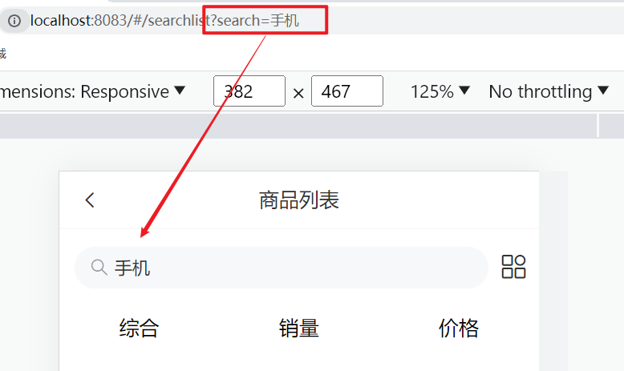

1. 计算属性，基于query 解析路由参数

```jsx
computed: {
  querySearch () {
    return this.$route.query.search
  }
}
```

2. 根据不同的情况，设置输入框的值

```jsx
<van-search
  ...
  // 设置默认值的原因是，将来可能是从分类页跳过来的
  :value="querySearch || '搜索商品'"
  // 一点击，就会跳到原来的搜索页
  @click="$router.push('/search')"
></van-search>
```

3. `api/product.js` 封装接口，获取搜索商品

```jsx
import request from '@/utils/request'

// 获取搜索商品列表数据
export const getProList = (paramsObj) => {
  const { categoryId, goodsName, page } = paramsObj
  return request.get('/goods/list', {
    params: {
      // 当categoryId传过来的值为undefined或者null，axios在进行请求的时候会自动把这个参数屏蔽掉
      categoryId,
      goodsName,
      page
    }
  })
}
```

4. 页面中基于 goodsName 发送请求，动态渲染

```jsx
data () {
  return {
    page: 1,
    proList: []
  }
},
async created () {
  const { data: { list } } = await getProList({
    goodsName: this.querySearch,
    page: this.page
  })
  this.proList = list.data
}

<div class="goods-list">
  <GoodsItem v-for="item in proList" :key="item.goods_id" :item="item"></GoodsItem>
</div>
```


## (2) 分类id搜索

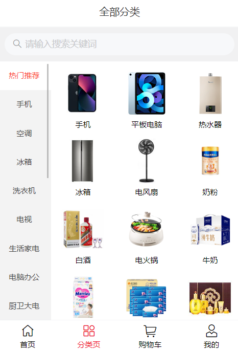

1 封装接口 `api/category.js`

```jsx
import request from '@/utils/request'

// 获取分类数据
export const getCategoryData = () => {
  return request.get('/category/list')
}
```

2 分类页静态结构

```jsx
<template>
  <div class="category">
    <!-- 分类 -->
    <van-nav-bar title="全部分类" fixed />

    <!-- 搜索框 -->
    <van-search
      readonly
      shape="round"
      background="#f1f1f2"
      placeholder="请输入搜索关键词"
      @click="$router.push('/search')"
    />

    <!-- 分类列表 -->
    <div class="list-box">
      <div class="left">
        <ul>
          <li v-for="(item, index) in list" :key="item.category_id">
            <a :class="{ active: index === activeIndex }" @click="activeIndex = index" href="javascript:;">{{ item.name }}</a>
          </li>
        </ul>
      </div>
      <div class="right">
        <div @click="$router.push(`/searchlist?categoryId=${item.category_id}`)" v-for="item in list[activeIndex]?.children" :key="item.category_id" class="cate-goods">
          
          <p>{{ item.name }}</p>
        </div>
      </div>
    </div>
  </div>
</template>

<script>
import { getCategoryData } from '@/api/category'
export default {
  name: 'CategoryPage',
  created () {
    this.getCategoryList()
  },
  data () {
    return {
      list: [],
      activeIndex: 0
    }
  },
  methods: {
    async getCategoryList () {
      const { data: { list } } = await getCategoryData()
      this.list = list
    }
  }
}
</script>

<style lang="less" scoped>
// 主题 padding
.category {
  padding-top: 100px;
  padding-bottom: 50px;
  height: 100vh;
  .list-box {
    height: 100%;
    display: flex;
    .left {
      width: 85px;
      height: 100%;
      background-color: #f3f3f3;
      overflow: auto;
      a {
        display: block;
        height: 45px;
        line-height: 45px;
        text-align: center;
        color: #444444;
        font-size: 12px;
        &.active {
          color: #fb442f;
          background-color: #fff;
        }
      }
    }
    .right {
      flex: 1;
      height: 100%;
      background-color: #ffffff;
      display: flex;
      flex-wrap: wrap;
      justify-content: flex-start;
      align-content: flex-start;
      padding: 10px 0;
      overflow: auto;

      .cate-goods {
        width: 33.3%;
        margin-bottom: 10px;
        img {
          width: 70px;
          height: 70px;
          display: block;
          margin: 5px auto;
        }
        p {
          text-align: center;
          font-size: 12px;
        }
      }
    }
  }
}

// 导航条样式定制
.van-nav-bar {
  z-index: 999;
}

// 搜索框样式定制
.van-search {
  position: fixed;
  width: 100%;
  top: 46px;
  z-index: 999;
}
</style>
```

3 搜索页，基于分类 ID 请求

```jsx
async created () {
  const { data: { list } } = await getProList({
    categoryId: this.$route.query.categoryId,
    goodsName: this.querySearch,
    page: this.page
  })
  this.proList = list.data
}
```

# 123. 商品详情 - 静态布局


静态结构 和 样式

```jsx
<template>
  <div class="prodetail">
    <van-nav-bar fixed title="商品详情页" left-arrow @click-left="$router.go(-1)" />

    <!-- 3000：3秒轮播，onChange：控制下面的提示器，提示器会做一些基本的渲染 -->
    <van-swipe :autoplay="3000" @change="onChange">
      <van-swipe-item v-for="(image, index) in images" :key="index">
        
      </van-swipe-item>

      <template #indicator>
        <div class="custom-indicator">{{ current + 1 }} / {{ images.length }}</div>
      </template>
    </van-swipe>

    <!-- 商品说明 -->
    <div class="info">
      <div class="title">
        <div class="price">
          <span class="now">￥0.01</span>
          <span class="oldprice">￥6699.00</span>
        </div>
        <div class="sellcount">已售1001件</div>
      </div>
      <div class="msg text-ellipsis-2">
        三星手机 SAMSUNG Galaxy S23 8GB+256GB 超视觉夜拍系统 超清夜景 悠雾紫 5G手机 游戏拍照旗舰机s23
      </div>

      <div class="service">
        <div class="left-words">
          <span><van-icon name="passed" />七天无理由退货</span>
          <span><van-icon name="passed" />48小时发货</span>
        </div>
        <div class="right-icon">
          <van-icon name="arrow" />
        </div>
      </div>
    </div>

    <!-- 商品评价 -->
    <div class="comment">
      <div class="comment-title">
        <div class="left">商品评价 (5条)</div>
        <div class="right">查看更多 <van-icon name="arrow" /> </div>
      </div>
      <div class="comment-list">
        <div class="comment-item" v-for="item in 3" :key="item">
          <div class="top">
            
            <div class="name">神雕大侠</div>
            <van-rate :size="16" :value="5" color="#ffd21e" void-icon="star" void-color="#eee"/>
          </div>
          <div class="content">
            质量很不错 挺喜欢的
          </div>
          <div class="time">
            2023-03-21 15:01:35
          </div>
        </div>
      </div>
    </div>

    <!-- 商品描述 -->
    <div class="desc">
      
      
      
      
    </div>

    <!-- 底部 -->
    <div class="footer">
      <div class="icon-home">
        <van-icon name="wap-home-o" />
        <span>首页</span>
      </div>
      <div class="icon-cart">
        <van-icon name="shopping-cart-o" />
        <span>购物车</span>
      </div>
      <div class="btn-add">加入购物车</div>
      <div class="btn-buy">立刻购买</div>
    </div>
  </div>
</template>

<script>
export default {
  name: 'ProDetail',
  data () {
    return {
      images: [
        'https://img01.yzcdn.cn/vant/apple-1.jpg',
        'https://img01.yzcdn.cn/vant/apple-2.jpg'
      ],
      current: 0
    }
  },
  methods: {
    onChange (index) {
      this.current = index
    }
  }
}
</script>

<style lang="less" scoped>
.prodetail {
  padding-top: 46px;
  ::v-deep .van-icon-arrow-left {
    color: #333;
  }
  img {
    display: block;
    width: 100%;
  }
  .custom-indicator {
    position: absolute;
    right: 10px;
    bottom: 10px;
    padding: 5px 10px;
    font-size: 12px;
    background: rgba(0, 0, 0, 0.1);
    border-radius: 15px;
  }
  .desc {
    width: 100%;
    overflow: scroll;
    ::v-deep img {
      display: block;
      width: 100%!important;
    }
  }
  .info {
    padding: 10px;
  }
  .title {
    display: flex;
    justify-content: space-between;
    .now {
      color: #fa2209;
      font-size: 20px;
    }
    .oldprice {
      color: #959595;
      font-size: 16px;
      text-decoration: line-through;
      margin-left: 5px;
    }
    .sellcount {
      color: #959595;
      font-size: 16px;
      position: relative;
      top: 4px;
    }
  }
  .msg {
    font-size: 16px;
    line-height: 24px;
    margin-top: 5px;
  }
  .service {
    display: flex;
    justify-content: space-between;
    line-height: 40px;
    margin-top: 10px;
    font-size: 16px;
    background-color: #fafafa;
    .left-words {
      span {
        margin-right: 10px;
      }
      .van-icon {
        margin-right: 4px;
        color: #fa2209;
      }
    }
  }

  .comment {
    padding: 10px;
  }
  .comment-title {
    display: flex;
    justify-content: space-between;
    .right {
      color: #959595;
    }
  }

  .comment-item {
    font-size: 16px;
    line-height: 30px;
    .top {
      height: 30px;
      display: flex;
      align-items: center;
      margin-top: 20px;
      img {
        width: 20px;
        height: 20px;
      }
      .name {
        margin: 0 10px;
      }
    }
    .time {
      color: #999;
    }
  }

  .footer {
    position: fixed;
    left: 0;
    bottom: 0;
    width: 100%;
    height: 55px;
    background-color: #fff;
    border-top: 1px solid #ccc;
    display: flex;
    justify-content: space-evenly;
    align-items: center;
    .icon-home, .icon-cart {
      display: flex;
      flex-direction: column;
      align-items: center;
      justify-content: center;
      font-size: 14px;
      .van-icon {
        font-size: 24px;
      }
    }
    .btn-add,
    .btn-buy {
      height: 36px;
      line-height: 36px;
      width: 120px;
      border-radius: 18px;
      background-color: #ffa900;
      text-align: center;
      color: #fff;
      font-size: 14px;
    }
    .btn-buy {
      background-color: #fe5630;
    }
  }
}
    
.tips {
  padding: 10px;
}
</style>
```

`Lazyload` 是 `Vue` 指令，使用前需要对指令进行注册。

```jsx
import { Lazyload } from 'vant'
Vue.use(Lazyload)
```

# 商品详情 - 动态渲染介绍

1. 动态路由参数，获取商品 id

```jsx
computed: {
  goodsId () {
    return this.$route.params.id
  }
},
```

2. 封装 api 接口 `api/product.js`

```jsx
// 获取商品详情数据
export const getProDetail = (goodsId) => {
  return request.get('/goods/detail', {
    params: {
      goodsId
    }
  })
}
```

3. 一进入页面发送请求，获取商品详情数据

```jsx
data () {
  return {
    images: [
      'https://img01.yzcdn.cn/vant/apple-1.jpg',
      'https://img01.yzcdn.cn/vant/apple-2.jpg'
    ],
    // 轮播图当前是第几页
    current: 0,
    detail: {},
  }
},

async created () {
  this.getDetail()
},

methods: {
  ...
  async getDetail () {
    const { data: { detail } } = await getProDetail(this.goodsId)
    this.detail = detail
    this.images = detail.goods_images
  }
}
```

4. 动态渲染

```jsx
<div class="prodetail" v-if="detail.goods_name">

<van-swipe :autoplay="3000" @change="onChange">
  <van-swipe-item v-for="(image, index) in images" :key="index">
    
  </van-swipe-item>

  <template #indicator>
    <div class="custom-indicator">{{ current + 1 }} / {{ images.length }}</div>
  </template>
</van-swipe>

<!-- 商品说明 -->
<div class="info">
  <div class="title">
    <div class="price">
      <span class="now">￥{{ detail.goods_price_min }}</span>
      <span class="oldprice">￥{{ detail.goods_price_max }}</span>
    </div>
    <div class="sellcount">已售{{ detail.goods_sales }}件</div>
  </div>
  <div class="msg text-ellipsis-2">
    {{ detail.goods_name }}
  </div>

  <div class="service">
    <div class="left-words">
      <span><van-icon name="passed" />七天无理由退货</span>
      <span><van-icon name="passed" />48小时发货</span>
    </div>
    <div class="right-icon">
      <van-icon name="arrow" />
    </div>
  </div>
</div>

<!-- 商品描述 -->
<div class="tips">商品描述</div>
<!-- 带标签的使用v-html渲染 -->
<div class="desc" v-html="detail.content"></div>
```

# 商品详情 - 动态渲染评价

1. 封装接口 `api/product.js`

```jsx
// 获取商品评价
export const getProComments = (goodsId, limit) => {
  return request.get('/comment/listRows', {
    params: {
      goodsId,
      limit
    }
  })
}
```

2. 页面调用获取数据

```jsx
import defaultImg from '@/assets/default-avatar.png'

data () {
  return {
    ...
    total: 0,
    commentList: [],
    defaultImg
},

async created () {
  ...
  this.getComments()
},
    
async getComments () {
  const { data: { list, total } } = await getProComments(this.goodsId, 3)
  this.commentList = list
  this.total = total
},
```

3. 动态渲染评价

```jsx
<!-- 商品评价 -->
<div class="comment" v-if="total > 0">
  <div class="comment-title">
    <div class="left">商品评价 ({{ total }}条)</div>
    <div class="right">查看更多 <van-icon name="arrow" /> </div>
  </div>
  <div class="comment-list">
    <div class="comment-item" v-for="item in commentList" :key="item.comment_id">
      <div class="top">
        
        <div class="name">{{ item.user.nick_name }}</div>
        <!-- 这里分数是10分置，需要除以2 -->
        <van-rate :size="16" :value="item.score / 2" color="#ffd21e" void-icon="star" void-color="#eee"/>
      </div>
      <div class="content">
        {{ item.content }}
      </div>
      <div class="time">
        {{ item.create_time }}
      </div>
    </div> 
  </div>
</div>
```

# 124. 加入购物车 - 唤起弹窗

ActionSheet：在底部弹出弹层


1. 按需导入 van-action-sheet


```jsx
import { ActionSheet } from 'vant'
Vue.use(ActionSheet)
```

2. 准备 van-action-sheet 基本结构

prodetail/index.vuev-if="mode === 'cart'"

弹层一般都是独立起来，放在外部


```jsx
<van-action-sheet v-model="showPannel" :title="mode === 'cart' ? '加入购物车' : '立刻购买'">
	111
</van-action-sheet>
    
data () {
  return {
    ...
    mode: 'cart' // 标记弹层状态
    showPannel: false
  }
},
```

3. 注册点击事件，点击时唤起弹窗

```jsx
<div class="btn-add" @click="addFn">加入购物车</div>
<!-- 立刻购买肯定也是需要弹层的，这里可以共用同一个 -->
<div class="btn-buy" @click="buyFn">立刻购买</div>

addFn () {
  this.mode = 'cart'
  this.showPannel = true
},
buyFn () {
  this.mode = 'buyNow'
  this.showPannel = true
}
```

4. 完善结构

```jsx
<!-- 加入购物车的弹层 -->
<van-action-sheet v-model="showPannel" :title="mode === 'cart' ? '加入购物车' : '立刻购买'">
  <div class="product">
    <div class="product-title">
      <div class="left">
        
      </div>
      <div class="right">
        <div class="price">
          <span>¥</span>
          <span class="nowprice">9.99</span>
        </div>
        <div class="count">
          <span>库存</span>
          <span>55</span>
        </div>
      </div>
    </div>
    <div class="num-box">
      <span>数量</span>
      数字框占位
    </div>
    <div class="showbtn" v-if="true">
      <div class="btn" v-if="true">加入购物车</div>
      <div class="btn now" v-else>立刻购买</div>
    </div>
    <div class="btn-none" v-else>该商品已抢完</div>
  </div>
</van-action-sheet>
```

```less
// 弹层样式
.product {
  .product-title {
    display: flex;
    .left {
      img {
        width: 90px;
        height: 90px;
      }
      margin: 10px;
    }
    .right {
      flex: 1;
      padding: 10px;
      .price {
        font-size: 14px;
        color: #fe560a;
        .nowprice {
          font-size: 24px;
          margin: 0 5px;
        }
      }
    }
  }

  .num-box {
    display: flex;
    justify-content: space-between;
    padding: 10px;
    align-items: center;
  }

  .btn, .btn-none {
    height: 40px;
    line-height: 40px;
    margin: 20px;
    border-radius: 20px;
    text-align: center;
    color: rgb(255, 255, 255);
    background-color: rgb(255, 148, 2);
  }
  .btn.now {
    background-color: #fe5630;
  }
  .btn-none {
    background-color: #cccccc;
  }
}
```

5. 动态渲染

```jsx
<van-action-sheet v-model="showPannel" :title="mode === 'cart' ? '加入购物车' : '立刻购买'">
  <div class="product">
    <div class="product-title">
      <div class="left">
        
      </div>
      <div class="right">
        <div class="price">
          <span>¥</span>
          <span class="nowprice">{{ detail.goods_price_min }}</span>
        </div>
        <div class="count">
          <span>库存</span>
          <span>{{ detail.stock_total }}</span>
        </div>
      </div>
    </div>
    <div class="num-box">
      <span>数量</span>
      数字框组件
    </div>
    <!-- 
		有库存才显示提交按钮，测试的话可以直接把这里改为false
		<div class="showbtn" v-if="false">
 	-->
    <div class="showbtn" v-if="detail.stock_total > 0">
      <div class="btn" v-if="mode === 'cart'">加入购物车</div>
      <div class="btn now" v-if="mode === 'buyNow'">立刻购买</div>
    </div>
    <div class="btn-none" v-else>该商品已抢完</div>
  </div>
</van-action-sheet>
```

# 125. 加入购物车 - 封装数字框组件


1. 封装组件 `components/CountBox.vue`

```jsx
<template>
  <div class="count-box">
    <button @click="handleSub" class="minus">-</button>
    <input :value="value" @change="handleChange" class="inp" type="text">
    <button @click="handleAdd" class="add">+</button>
  </div>
</template>

    
<script>
export default {
  props: {
    value: {
      type: Number,
      default: 1
    }
  },
  methods: {
    handleSub () {
      if (this.value <= 1) {
        return
      }
      this.$emit('input', this.value - 1)
    },
    handleAdd () {
      this.$emit('input', this.value + 1)
    },
    handleChange (e) {
      // console.log(e.target.value)
      const num = +e.target.value // 转数字处理 (1) 数字 (2) NaN

      // 输入了不合法的文本 或 输入了负值，回退成原来的 value 值
      if (isNaN(num) || num < 1) {
        e.target.value = this.value
        return
      }

      this.$emit('input', num)
    }
  }
}
</script>
    

<style lang="less" scoped>
.count-box {
  width: 110px;
  display: flex;
  .add, .minus {
    width: 30px;
    height: 30px;
    outline: none;
    border: none;
    background-color: #efefef;
  }
  .inp {
    width: 40px;
    height: 30px;
    outline: none;
    border: none;
    margin: 0 5px;
    background-color: #efefef;
    text-align: center;
  }
}
</style>

```

2. 使用组件

```jsx
import CountBox from '@/components/CountBox.vue'

export default {
  name: 'ProDetail',
  components: {
    CountBox
  },
  data () {
    return {
      addCount: 1 // 数字框绑定的数据
      ...
    }
  },
}

<div class="num-box">
  <span>数量</span>
  <CountBox v-model="addCount"></CountBox>
</div>
```

# 126. 加入购物车 - 判断 token 登录提示

说明：加入购物车，是一个登录后的用户才能进行的操作，所以需要进行鉴权判断，判断用户 token 是否存在

1. 若存在：继续加入购物车操作
2. 不存在：提示用户未登录，引导到登录页


1. 按需注册 dialog 组件

```jsx
import { Dialog } from 'vant'
Vue.use(Dialog)
```

2. 按钮注册点击事件

```jsx
<div class="btn" v-if="mode === 'cart'" @click="addCart">加入购物车</div>
```

3. 添加 token 鉴权判断，跳转携带回跳地址


```jsx
async addCart () {
  // 判断用户是否有登录
  if (!this.$store.getters.token) {
    this.$dialog.confirm({
      title: '温馨提示',
      message: '此时需要先登录才能继续操作哦',
      confirmButtonText: '去登录',
      cancelButtonText: '再逛逛'
    })
      .then(() => {
        // this.$router.push({这里最好不要使用push，因为如果用户点击返回，则又返回到了登录页面，这里直接使用replace（替换），这样的好处就是不会额外加很多历史
        this.$router.replace({
          path: '/login',
          query: {
            // path不带查询参数，但是fullPath带
            backUrl: this.$route.fullPath
          }
        })
      })
      .catch(() => {})
    return
  }
  console.log('进行加入购物车操作')
}
```

4. 登录后，若有回跳地址，则回跳页面

```jsx
// 判断有无回跳地址
const url = this.$route.query.backUrl || '/'
this.$router.replace(url)
```

#  加入购物车 - 封装接口进行请求


1. 封装接口 `api/cart.js`

```jsx
// 加入购物车
// goodsId => 商品id iphone8
// goodsSkuId => 商品规格id 红色的iphone8 粉色的iphone8
export const addCart = (goodsId, goodsNum, goodsSkuId) => {
  return request.post('/cart/add', {
    goodsId,
    goodsNum,
    goodsSkuId
  })
}
```

2. 页面中调用请求

> 请求回来的数据在这里是可以看见的，我居然忘光光了。。
>
> 

```jsx
data () {
  return {
      // 默认值为0
      cartTotal: 0
  }  
},

async addCart () {
  ...
  const { data } = await addCart(this.goodsId, this.addCount, this.detail.skuList[0].goods_sku_id)
  this.cartTotal = data.cartTotal
  this.$toast('加入购物车成功')
  this.showPannel = false
},
```


3. 请求拦截器中，统一携带 token

```jsx
// 自定义配置 - 请求/响应 拦截器
// 添加请求拦截器
instance.interceptors.request.use(function (config) {
  ...
  // 只要有token，就在请求时携带，便于请求需要授权的接口
  const token = store.getters.token
  if (token) {
    config.headers['Access-Token'] = token
    config.headers.platform = 'H5'
  }
  return config
}, function (error) {
  // 对请求错误做些什么
  return Promise.reject(error)
})
```

4. 准备小图标

```jsx
<div class="icon-cart">
  <span v-if="cartTotal > 0" class="num">{{ cartTotal }}</span>
  <van-icon name="shopping-cart-o" />
  <span>购物车</span>
</div>
```

5. 定制样式

```css
.footer .icon-cart {
  position: relative;
  padding: 0 6px;
  .num {
    z-index: 999;
    position: absolute;
    top: -2px;
    right: 0;
    min-width: 16px;
    padding: 0 4px;
    color: #fff;
    text-align: center;
    background-color: #ee0a24;
    border-radius: 50%;
  }
}
```

给购物车的底部添加跳转功能

~~~html
<div @click="$router.push('/')" class="icon-home">
    <van-icon name="wap-home-o" />
    <span>首页</span>
</div>
<div @click="$route.push('/cart')" class="icon-cart">
    <span v-if="cartTotal > 0" class="num">{{ cartTotal }}</span>
    <van-icon name="shopping-cart-o" />
    <span>购物车</span>
</div>
~~~

# 127. 购物车 - 静态布局

说明：购物车 数据联动关系 较多，且通常会封装一些 小组件，

所以为了便于维护，一般都会将购物车的数据基于 vuex 分模块管理

需求分析：

1. 基本静态结构 (快速实现)
2. 构建 vuex cart 模块，获取数据存储
3. 基于 数据 动态渲染 购物车列表
4. 封装 getters 实现动态统计
5. 全选反选功能
6. 数字框修改数量功能
7. 编辑切换状态，删除功能
8. 空购物车处理

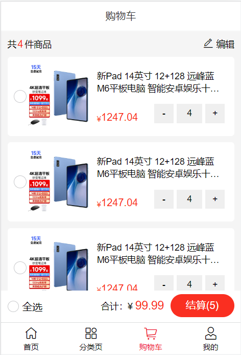

1. 基本结构

```jsx
<template>
  <div class="cart">
    <van-nav-bar title="购物车" fixed />
    <!-- 购物车开头 -->
    <div class="cart-title">
      <span class="all">共<i>4</i>件商品</span>
      <span class="edit">
        <van-icon name="edit" />
        编辑
      </span>
    </div>

    <!-- 购物车列表 -->
    <div class="cart-list">
      <div class="cart-item" v-for="item in 10" :key="item">
        <van-checkbox></van-checkbox>
        <div class="show">
          
        </div>
        <div class="info">
          <span class="tit text-ellipsis-2">新Pad 14英寸 12+128 远峰蓝 M6平板电脑 智能安卓娱乐十核游戏学习二合一 低蓝光护眼超清4K全面三星屏5GWIFI全网通 蓝魔快本平板</span>
          <span class="bottom">
            <div class="price">¥ <span>1247.04</span></div>
            <div class="count-box">
              <button class="minus">-</button>
              <input class="inp" :value="4" type="text" readonly>
              <button class="add">+</button>
            </div>
          </span>
        </div>
      </div>
    </div>

    <div class="footer-fixed">
      <div  class="all-check">
        <van-checkbox  icon-size="18"></van-checkbox>
        全选
      </div>

      <div class="all-total">
        <div class="price">
          <span>合计：</span>
          <span>¥ <i class="totalPrice">99.99</i></span>
        </div>
        <div v-if="true" class="goPay">结算(5)</div>
        <div v-else class="delete">删除</div>
      </div>
    </div>
  </div>
</template>

<script>
export default {
  name: 'CartPage'
}
</script>

<style lang="less" scoped>
// 主题 padding
.cart {
  padding-top: 46px;
  padding-bottom: 100px;
  background-color: #f5f5f5;
  min-height: 100vh;
  .cart-title {
    height: 40px;
    display: flex;
    justify-content: space-between;
    align-items: center;
    padding: 0 10px;
    font-size: 14px;
    .all {
      i {
        font-style: normal;
        margin: 0 2px;
        color: #fa2209;
        font-size: 16px;
      }
    }
    .edit {
      .van-icon {
        font-size: 18px;
      }
    }
  }

  .cart-item {
    margin: 0 10px 10px 10px;
    padding: 10px;
    display: flex;
    justify-content: space-between;
    background-color: #ffffff;
    border-radius: 5px;

    .show img {
      width: 100px;
      height: 100px;
    }
    .info {
      width: 210px;
      padding: 10px 5px;
      font-size: 14px;
      display: flex;
      flex-direction: column;
      justify-content: space-between;

      .bottom {
        display: flex;
        justify-content: space-between;
        .price {
          display: flex;
          align-items: flex-end;
          color: #fa2209;
          font-size: 12px;
          span {
            font-size: 16px;
          }
        }
        .count-box {
          display: flex;
          width: 110px;
          .add,
          .minus {
            width: 30px;
            height: 30px;
            outline: none;
            border: none;
          }
          .inp {
            width: 40px;
            height: 30px;
            outline: none;
            border: none;
            background-color: #efefef;
            text-align: center;
            margin: 0 5px;
          }
        }
      }
    }
  }
}

.footer-fixed {
  position: fixed;
  left: 0;
  bottom: 50px;
  height: 50px;
  width: 100%;
  border-bottom: 1px solid #ccc;
  background-color: #fff;
  display: flex;
  justify-content: space-between;
  align-items: center;
  padding: 0 10px;

  .all-check {
    display: flex;
    align-items: center;
    .van-checkbox {
      margin-right: 5px;
    }
  }

  .all-total {
    display: flex;
    line-height: 36px;
    .price {
      font-size: 14px;
      margin-right: 10px;
      .totalPrice {
        color: #fa2209;
        font-size: 18px;
        font-style: normal;
      }
    }

    .goPay, .delete {
      min-width: 100px;
      height: 36px;
      line-height: 36px;
      text-align: center;
      background-color: #fa2f21;
      color: #fff;
      border-radius: 18px;
      &.disabled {
        background-color: #ff9779;
      }
    }
  }

}
</style>
```

2. 按需导入组件

```jsx
import { Checkbox } from 'vant'
Vue.use(Checkbox)
```

# 128. 购物车 - 构建 vuex 模块 - 获取数据存储


1. 新建 `modules/cart.js` 模块

```jsx
export default {
  namespaced: true,
  state () {
    return {
      cartList: []
    }
  },
  mutations: {
  },
  actions: {
  },
  getters: {
  }
}
```

2. 挂载到 store 上面

```jsx
import Vue from 'vue'
import Vuex from 'vuex'
import user from './modules/user'
import cart from './modules/cart'

Vue.use(Vuex)

export default new Vuex.Store({
  getters: {
    token: state => state.user.userInfo.token
  },
  modules: {
    user,
    cart
  }
})
```

3. 封装 API 接口 `api/cart.js`

```jsx
// 获取购物车列表数据
export const getCartList = () => {
  return request.get('/cart/list')
}
```

4. 封装 action 和 mutation

```js
mutations: {
  setCartList (state, newList) {
    state.cartList = newList
  },
},
actions: {
  async getCartAction (context) {
    const { data } = await getCartList()
    // 后台返回的数据中，不包含复选框的选中状态，为了实现将来的功能
    // 需要手动维护数据，给每一项，添加一个 isChecked 状态 (标记当前商品是否选中)
    data.list.forEach(item => {
      // 为了让用户多消费
      item.isChecked = true
    })
    context.commit('setCartList', data.list)
  }
},
```

5. 页面中 dispatch 调用

```jsx
computed: {
  isLogin () {
    return this.$store.getters.token
  }
},
created () {
  if (this.isLogin) {
    this.$store.dispatch('cart/getCartAction')
  }
},
```

# 129. 购物车 - mapState - 渲染购物车列表

1. 将数据映射到页面

```jsx
import { mapState } from 'vuex'

computed: {
  ...mapState('cart', ['cartList'])
}
```

2. 动态渲染

```jsx
<!-- 购物车列表 -->
<div class="cart-list">
  <div class="cart-item" v-for="item in cartList" :key="item.goods_id">
    <!-- 这里只能单向绑定 -->
    <van-checkbox icon-size="18" :value="item.isChecked"></van-checkbox>
    <div class="show" @click="$router.push(`/prodetail/${item.goods_id}`)">
      
    </div>
    <div class="info">
      <span class="tit text-ellipsis-2">{{ item.goods.goods_name }}</span>
      <span class="bottom">
        <div class="price">¥ <span>{{ item.goods.goods_price_min }}</span></div>
        <CountBox :value="item.goods_num"></CountBox>
      </span>
    </div>
  </div>
</div>
```

# 130. 购物车 - 封装 getters - 动态计算展示

1. 封装 getters：商品总数  / 选中的商品列表  /   选中的商品总数  /   选中的商品总价

> 小知识点：如何在getters中访问其他getters => 查询vuex官方文档
>
>  

```jsx
// 求所有的商品累加总数
cartTotal (state) {
  return state.cartList.reduce((sum, item) => sum + item.goods_num, 0)
},
// 选中的商品项，这里是为了方便，因为选中的总数和选中的总价都需要依赖这个
selCartList (state) {
  return state.cartList.filter(item => item.isChecked)
},
// 选中的总数
selCount (state, getters) {
  return getters.selCartList.reduce((sum, item) => sum + item.goods_num, 0)
},
// 选中的总价
selPrice (state, getters) {
  return getters.selCartList.reduce((sum, item) => {
    // 如果式子比较长，就不要简写
    // 这种带小数通常是保留两位小数，一方面是让它更整齐一些，另一方面是避免0.1 + 0.2这种情况，会出现精度不准的问题
    return sum + item.goods_num * item.goods.goods_price_min
  }, 0).toFixed(2)
}
```

2. 页面中 mapGetters 映射使用

```jsx
computed: {
  ...mapGetters('cart', ['cartTotal', 'selCount', 'selPrice']),
},
    
<!-- 购物车开头 -->
<div class="cart-title">
  <span class="all">共<i>{{ cartTotal || 0 }}</i>件商品</span>
  <span class="edit">
    <van-icon name="edit"  />
    编辑
  </span>
</div>


<div class="footer-fixed">
  <div  class="all-check">
    <van-checkbox  icon-size="18"></van-checkbox>
    全选
  </div>
  <div class="all-total">
    <div class="price">
      <span>合计：</span>
      <span>¥ <i class="totalPrice">{{ selPrice }}</i></span>
    </div>
    <!-- 小优化 -->
    <div v-if="true" :class="{ disabled: selCount === 0 }" class="goPay">
      结算({{ selCount }})
    </div>
    <div v-else  :class="{ disabled: selCount === 0 }" class="delete">
      删除({{ selCount }})
    </div>
  </div>
</div>
```

# 131. 购物车 - 全选反选功能

1. 点击小选，修改状态

> 监听什么事件需要去vant官网进行确认，这里监听的是点击事件
>
> 
>
> toggleCheck：切换，并且告诉它切换的是哪个商品

```jsx
<van-checkbox @click="toggleCheck(item.goods_id)" ...></van-checkbox>
    
toggleCheck (goodsId) {
  this.$store.commit('cart/toggleCheck', goodsId)
},
    
mutations: {
  toggleCheck (state, goodsId) {
    // 让对应的 id 的项 状态取反
    const goods = state.cartList.find(item => item.goods_id === goodsId)
    goods.isChecked = !goods.isChecked
  },
}
```

2. 全选 getters

```jsx
getters: {
  // 是否全选
  isAllChecked (state) {
    return state.cartList.every(item => item.isChecked)
  }
}
    
...mapGetters('cart', ['isAllChecked']),

<div class="all-check">
  <van-checkbox :value="isAllChecked" icon-size="18"></van-checkbox>
  全选
</div>
```

3. 点击全选，重置状态

```jsx
<!-- 为了选中区域大一点，可以给all-check注册点击事件 -->
<div @click="toggleAllCheck" class="all-check">
  <van-checkbox :value="isAllChecked" icon-size="18"></van-checkbox>
  全选
</div>

toggleAllCheck () {
  this.$store.commit('cart/toggleAllCheck', !this.isAllChecked)
},

mutations: {
  toggleAllCheck (state, flag) {
    state.cartList.forEach(item => {
      item.isChecked = flag
    })
  },
}
```

# 132. 购物车 - 数字框修改数量

数字框修改数量是需要同步到后台的

1. 封装 api 接口

```jsx
// 更新购物车商品数量
export const changeCount = (goodsId, goodsNum, goodsSkuId) => {
  return request.post('/cart/update', {
    goodsId,
    goodsNum,
    goodsSkuId
  })
}
```

2. 页面中注册点击事件，传递数据

```jsx
<!-- 如果直接写成：@input="changeCount(item.goods_id, item.goods_sku_id)"，就会丢失它原本input传递过来的形参 -->
<!-- 
既希望保留原本的形参，又需要通过调用函数传参 => 箭头函数包装一层
() => changeCount(item)
 -->
<CountBox :value="item.goods_num" @input="value => changeCount(value, item.goods_id, item.goods_sku_id)"></CountBox>

changeCount (goodsNum, goodsId, goodsSkuId) {
    // console.log(goodsNum, goodsId, goodsSkuId)
    // 调用 vuex 的 action，进行数量的修改
    this.$store.dispatch('cart/changeCountAction', {
        goodsNum,
        goodsId,
        goodsSkuId
    })
},
```

3. 提供 action 发送请求， commit mutation

```jsx
import { changeCount } from '@/api/cart'
mutations: {
  changeCount (state, { goodsId, goodsNum }) {
      const goods = state.cartList.find(item => item.goods_id === goodsId)
      goods.goods_num = goodsNum
  },
},
actions: {
  async changeCountAction (context, obj) {
  const { goodsNum, goodsId, goodsSkuId } = obj
  // 先本地修改
  context.commit('changeCount', { goodsId, goodsNum })
  // 再同步到后台
  await changeCount(goodsId, goodsNum, goodsSkuId)
},
```

# 133. 购物车 - 编辑切换状态

1. data 提供数据, 定义是否在编辑删除的状态

```jsx
data () {
  return {
    isEdit: false
  }
},
```

2. 注册点击事件，修改状态

```jsx
<span class="edit" @click="isEdit = !isEdit">
  <van-icon name="edit"  />
  编辑
</span>
```

3. 底下按钮根据状态变化

```jsx
<div v-if="!isEdit" :class="{ disabled: selCount === 0 }" class="goPay">
    去结算（{{ selCount }}）
</div>
<div v-else :class="{ disabled: selCount === 0 }" class="delete">删除</div>
```

4. 监视编辑状态，动态控制复选框状态

```jsx
watch: {
  isEdit (value) {
    if (value) {
      this.$store.commit('cart/toggleAllCheck', false)
    } else {
      this.$store.commit('cart/toggleAllCheck', true)
    }
  }
}
```

#  购物车 - 删除功能完成

1. 查看接口，封装 API ( 注意：此处 id 为获取回来的购物车数据的 id，它代表着这一条购物车数据 )

   

```jsx
// 删除购物车
export const delSelect = (cartIds) => {
  return request.post('/cart/clear', {
    cartIds
  })
}
```

2. 注册删除点击事件

```jsx
<div v-else :class="{ disabled: selCount === 0 }" @click="handleDel" class="delete">
  删除({{ selCount }})
</div>

async handleDel () {
  if (this.selCount === 0) return
  await this.$store.dispatch('cart/delSelect')
  this.isEdit = false
},
```

3. 提供 actions

```jsx
actions: {
    // 删除购物车数据
    async delSelect (context) {
      const selCartList = context.getters.selCartList
      // 选出所有item的id
      const cartIds = selCartList.map(item => item.id)
      await delSelect(cartIds)
      Toast('删除成功')

      // 重新拉取最新的购物车数据 (重新渲染)
      context.dispatch('getCartAction')
    }
},
```

# 购物车 - 空购物车处理

1. 外面包个大盒子，添加 v-if 判断

```jsx
<div class="cart-box" v-if="isLogin && cartList.length > 0">
  <!-- 购物车开头 -->
  <div class="cart-title">
    ...
  </div>
  <!-- 购物车列表 -->
  <div class="cart-list">
    ...
  </div>
  <div class="footer-fixed">
    ...
  </div>
</div>

<div class="empty-cart" v-else>
  
  <div class="tips">
    您的购物车是空的, 快去逛逛吧
  </div>
  <div class="btn" @click="$router.push('/')">去逛逛</div>
</div>
```

2. 相关样式

```css
.empty-cart {
  padding: 80px 30px;
  img {
    width: 140px;
    height: 92px;
    display: block;
    margin: 0 auto;
  }
  .tips {
    text-align: center;
    color: #666;
    margin: 30px;
  }
  .btn {
    width: 110px;
    height: 32px;
    line-height: 32px;
    text-align: center;
    background-color: #fa2c20;
    border-radius: 16px;
    color: #fff;
    display: block;
    margin: 0 auto;
  }
}
```

# 134. 订单结算台

所谓的 “立即结算”，本质就是跳转到订单结算台，并且跳转的同时，需要携带上对应的订单参数。

而具体需要哪些参数，就需要基于 【订单结算台】 的需求来定。

### (1) 静态布局

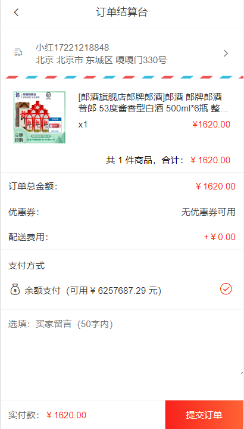

准备静态页面

```jsx
<template>
  <div class="pay">
    <van-nav-bar fixed title="订单结算台" left-arrow @click-left="$router.go(-1)" />

    <!-- 地址相关 -->
    <div class="address">

      <div class="left-icon">
        <van-icon name="logistics" />
      </div>

      <div class="info" v-if="true">
        <div class="info-content">
          <span class="name">小红</span>
          <span class="mobile">13811112222</span>
        </div>
        <div class="info-address">
          江苏省 无锡市 南长街 110号 504
        </div>
      </div>

      <div class="info" v-else>
        请选择配送地址
      </div>

      <div class="right-icon">
        <van-icon name="arrow" />
      </div>
    </div>

    <!-- 订单明细 -->
    <div class="pay-list">
      <div class="list">
        <div class="goods-item">
            <div class="left">
              
            </div>
            <div class="right">
              <p class="tit text-ellipsis-2">
                 三星手机 SAMSUNG Galaxy S23 8GB+256GB 超视觉夜拍系统 超清夜景 悠雾紫 5G手机 游戏拍照旗舰机s23
              </p>
              <p class="info">
                <span class="count">x3</span>
                <span class="price">¥9.99</span>
              </p>
            </div>
        </div>
      </div>

      <div class="flow-num-box">
        <span>共 12 件商品，合计：</span>
        <span class="money">￥1219.00</span>
      </div>

      <div class="pay-detail">
        <div class="pay-cell">
          <span>订单总金额：</span>
          <span class="red">￥1219.00</span>
        </div>

        <div class="pay-cell">
          <span>优惠券：</span>
          <span>无优惠券可用</span>
        </div>

        <div class="pay-cell">
          <span>配送费用：</span>
          <span v-if="false">请先选择配送地址</span>
          <span v-else class="red">+￥0.00</span>
        </div>
      </div>

      <!-- 支付方式 -->
      <div class="pay-way">
        <span class="tit">支付方式</span>
        <div class="pay-cell">
          <span><van-icon name="balance-o" />余额支付（可用 ¥ 999919.00 元）</span>
          <!-- <span>请先选择配送地址</span> -->
          <span class="red"><van-icon name="passed" /></span>
        </div>
      </div>

      <!-- 买家留言 -->
      <div class="buytips">
        <textarea placeholder="选填：买家留言（50字内）" name="" id="" cols="30" rows="10"></textarea>
      </div>
    </div>

    <!-- 底部提交 -->
    <div class="footer-fixed">
      <div class="left">实付款：<span>￥999919</span></div>
      <div class="tipsbtn">提交订单</div>
    </div>
  </div>
</template>

<script>
export default {
  name: 'PayIndex',
  data () {
    return {
    }
  },
  methods: {
  }
}
</script>

<style lang="less" scoped>
.pay {
  padding-top: 46px;
  padding-bottom: 46px;
  ::v-deep {
    .van-nav-bar__arrow {
      color: #333;
    }
  }
}
.address {
  display: flex;
  align-items: center;
  justify-content: flex-start;
  padding: 20px;
  font-size: 14px;
  color: #666;
  position: relative;
  background: url(@/assets/border-line.png) bottom repeat-x;
  background-size: 60px auto;
  .left-icon {
    margin-right: 20px;
  }
  .right-icon {
    position: absolute;
    right: 20px;
    top: 50%;
    transform: translateY(-7px);
  }
}
.goods-item {
  height: 100px;
  margin-bottom: 6px;
  padding: 10px;
  background-color: #fff;
  display: flex;
  .left {
    width: 100px;
    img {
      display: block;
      width: 80px;
      margin: 10px auto;
    }
  }
  .right {
    flex: 1;
    font-size: 14px;
    line-height: 1.3;
    padding: 10px;
    padding-right: 0px;
    display: flex;
    flex-direction: column;
    justify-content: space-evenly;
    color: #333;
    .info {
      margin-top: 5px;
      display: flex;
      justify-content: space-between;
      .price {
        color: #fa2209;
      }
    }
  }
}

.flow-num-box {
  display: flex;
  justify-content: flex-end;
  padding: 10px 10px;
  font-size: 14px;
  border-bottom: 1px solid #efefef;
  .money {
    color: #fa2209;
  }
}

.pay-cell {
  font-size: 14px;
  padding: 10px 12px;
  color: #333;
  display: flex;
  justify-content: space-between;
  .red {
    color: #fa2209;
  }
}
.pay-detail {
  border-bottom: 1px solid #efefef;
}

.pay-way {
  font-size: 14px;
  padding: 10px 12px;
  border-bottom: 1px solid #efefef;
  color: #333;
  .tit {
    line-height: 30px;
  }
  .pay-cell {
    padding: 10px 0;
  }
  .van-icon {
    font-size: 20px;
    margin-right: 5px;
  }
}

.buytips {
  display: block;
  textarea {
    display: block;
    width: 100%;
    border: none;
    font-size: 14px;
    padding: 12px;
    height: 100px;
  }
}

.footer-fixed {
  position: fixed;
  background-color: #fff;
  left: 0;
  bottom: 0;
  width: 100%;
  height: 46px;
  line-height: 46px;
  border-top: 1px solid #efefef;
  font-size: 14px;
  display: flex;
  .left {
    flex: 1;
    padding-left: 12px;
    color: #666;
    span {
      color:#fa2209;
    }
  }
  .tipsbtn {
    width: 121px;
    background: linear-gradient(90deg,#f9211c,#ff6335);
    color: #fff;
    text-align: center;
    line-height: 46px;
    display: block;
    font-size: 14px;
  }
}
</style>
```

### (2) 获取收货地址列表

1 封装获取地址的接口

```jsx
import request from '@/utils/request'

// 获取地址列表
export const getAddressList = () => {
  return request.get('/address/list')
}
```

2 页面中 - 调用获取地址

```jsx
data () {
  return {
    addressList: []
  }
},
computed: {
  selectAddress () {
    // 这里地址管理非主线业务，直接获取第一个项作为选中的地址
    return this.addressList[0] || {}
  }
},
async created () {
  this.getAddressList()
},
methods: {
  async getAddressList () {
    const { data: { list } } = await getAddressList()
    this.addressList = list
  }
}
```

3 页面中 - 进行渲染

```jsx
computed: {
  longAddress () {
    const region = this.selectAddress.region
    return region.province + region.city + region.region + this.selectAddress.detail
  }
},

<!-- 有address_id就代表存在 -->
<div class="info" v-if="selectAddress?.address_id">
  <div class="info-content">
    <span class="name">{{ selectAddress.name }}</span>
    <span class="mobile">{{ selectAddress.phone }}</span>
  </div>
  <div class="info-address">
    {{ longAddress }}
  </div>
</div>
```

# 135.(3) 订单结算 - 封装通用接口

**思路分析：**这里的订单结算，有两种情况：

1. 购物车结算，需要两个参数

   ① mode="cart"

   ② cartIds="cartId, cartId"

2. 立即购买结算，需要三个参数

   ① mode="buyNow"

   ② goodsId="商品id" 

   ③ goodsSkuId="商品skuId"

都需要跳转时将参数传递过来

---

封装通用 API 接口 `api/order` 

```jsx
import request from '@/utils/request'

// 订单结算确认
// mode: cart    => obj { cartIds }
// mode: buyNow  => obj { goodsId  goodsNum  goodsSkuId }
export const checkOrder = (mode, obj) => {
  return request.get('/checkout/order', {
    params: {
      mode, // cart buyNow
      delivery: 10, // 10 快递配送 20 门店自提
      couponId: 0, // 优惠券ID 传0 不使用优惠券
      isUsePoints: 0, // 积分 传0 不使用积分
      ...obj // 将传递过来的参数对象 动态展开
    }
  })
}
```


### (4) 订单结算 - 购物车结算

1 跳转时，传递查询参数

`layout/cart.vue`

```jsx
<div @click="goPay">结算({{ selCount }})</div>

goPay () {
  // 判断有没有选中商品
  if (this.selCount > 0) {
    // 有选中的 商品 才进行结算跳转
    this.$router.push({
      path: '/pay',
      query: {
        mode: 'cart',
        cartIds: this.selCartList.map(item => item.id).join(',') // 'cartId,cartId,cartId'（用逗号引起来的字符串）
      }
    })
  }
}
```

2 页面中接收参数,   调用接口，获取数据

```jsx
data () {
  return {
    order: {},
    personal: {}
  }
},
    
computed: {
  // 建议将这两个值提供为计算属性
  mode () {
    return this.$route.query.mode
  },
  cartIds () {
    return this.$route.query.cartIds
  }
}

async created () {
  this.getOrderList()
},

async getOrderList () {
  if (this.mode === 'cart') {
    const { data: { order, personal } } = await checkOrder(this.mode, { cartIds: this.cartIds })
    // order指的是当前订单的信息，买的商品、价格等
    this.order = order
    // personal是余额
    this.personal = personal
  }
}
```

3 基于数据进行渲染

```jsx
<!-- 订单明细 -->
<!-- order.goodsList存在才去渲染 -->
<div class="pay-list" v-if="order.goodsList">
  <div class="list">
    <div class="goods-item" v-for="item in order.goodsList" :key="item.goods_id">
        <div class="left">
          
        </div>
        <div class="right">
          <p class="tit text-ellipsis-2">
            {{ item.goods_name }}
          </p>
          <p class="info">
            <span class="count">x{{ item.total_num }}</span>
            <span class="price">¥{{ item.total_pay_price }}</span>
          </p>
        </div>
    </div>
  </div>

  <div class="flow-num-box">
    <span>共 {{ order.orderTotalNum }} 件商品，合计：</span>
    <span class="money">￥{{ order.orderTotalPrice }}</span>
  </div>

  <div class="pay-detail">
    <div class="pay-cell">
      <span>订单总金额：</span>
      <span class="red">￥{{ order.orderTotalPrice }}</span>
    </div>

    <div class="pay-cell">
      <span>优惠券：</span>
      <span>无优惠券可用</span>
    </div>

    <div class="pay-cell">
      <span>配送费用：</span>
      <span v-if="!selectAddress">请先选择配送地址</span>
      <span v-else class="red">+￥0.00</span>
    </div>
  </div>

  <!-- 支付方式 -->
  <div class="pay-way">
    <span class="tit">支付方式</span>
    <div class="pay-cell">
      <span><van-icon name="balance-o" />余额支付（可用 ¥ {{ personal.balance }} 元）</span>
      <!-- <span>请先选择配送地址</span> -->
      <span class="red"><van-icon name="passed" /></span>
    </div>
  </div>

  <!-- 买家留言 -->
  <div class="buytips">
    <textarea placeholder="选填：买家留言（50字内）" name="" id="" cols="30" rows="10"></textarea>
  </div>
</div>

<!-- 底部提交 -->
<div class="footer-fixed">
  <div class="left">实付款：<span>￥{{ order.orderTotalPrice }}</span></div>
  <div class="tipsbtn">提交订单</div>
</div>
```

# 136.(5) 订单结算 - 立即购买结算

目标：购物车结算跳转，传递参数，调用接口渲染订单结算台

核心步骤：

1. 跳转传递查询参数

   mode="buyNow", goodsId, goodsSkuId, goodsNum

2. 页面中 $route.query 接收参数

3. 调用接口，获取数据

4.  基于数据渲染

5. . 未登录时，确认框的复用 (mixins混入)

1 点击跳转传参

`prodetail/index.vue`

```jsx
<div class="btn" v-if="mode === 'buyNow'" @click="goBuyNow">立刻购买</div>

goBuyNow () {
  if (this.loginConfirm()) {
    return
  }
  this.$router.push({
    path: '/pay',
    query: {
      mode: 'buyNow',
      goodsId: this.goodsId,
      goodsSkuId: this.detail.skuList[0].goods_sku_id,
      goodsNum: this.addCount
    }
  })
}
```

2 计算属性处理参数

```jsx
computed: {
  ...
  goodsId () {
    return this.$route.query.goodsId
  },
  goodsSkuId () {
    return this.$route.query.goodsSkuId
  },
  goodsNum () {
    return this.$route.query.goodsNum
  }
}
```

3 基于请求时携带参数发请求渲染

```jsx
async getOrderList () {
  ...
  // 立刻购买结算
  if (this.mode === 'buyNow') {
    const { data: { order, personal } } = await checkOrder(this.mode, {
      goodsId: this.goodsId,
      goodsSkuId: this.goodsSkuId,
      goodsNum: this.goodsNum
    })
    this.order = order
    this.personal = personal
  }
}
```

### (6) mixins 复用 - 处理登录确认框的弹出

> 如果当前这个组件没有一些属性/方法/生命周期里提供的逻辑，都可以通过mixins来进行混入
>
> 很多页面都有可能共用的就可以使用mixins来进行混入

1 新建一个 mixin 文件   `mixins/loginConfirm.js`

```jsx
export default {
  // 此处编写的就是 Vue组件实例的 配置项，通过一定语法，可以直接混入到组件内部
  // data methods computed 生命周期函数 ...
  // 注意点：
  // 1. 如果此处 和 组件内，提供了同名的 data 或 methods， 则组件内优先级更高
  // 2. 如果编写了生命周期函数，则mixins中的生命周期函数 和 页面的生命周期函数，
  //    会用数组管理，统一执行，所以生命周期函数并不会覆盖
  created () {
    // console.log('嘎嘎')
  },
  data () {
    return {
      title: '标题'
    }
  },
  methods: {
    sayHi () {
      // console.log('你好')
    },

    // 根据登录状态，判断是否需要显示登录确认框
    // 1. 如果未登录 => 显示确认框 返回 true
    // 2. 如果已登录 => 啥也不干   返回 false
    loginConfirm () {
      // 判断 token 是否存在
      if (!this.$store.getters.token) {
        // 弹确认框
        this.$dialog.confirm({
          title: '温馨提示',
          message: '此时需要先登录才能继续操作哦',
          confirmButtonText: '去登陆',
          cancelButtonText: '再逛逛'
        })
          .then(() => {
            this.$router.replace({
              path: '/login',
              query: {
                backUrl: this.$route.fullPath
              }
            })
          })
          .catch(() => {})
        return true
      }
      return false
    }
  }
}
```

2 页面中导入，混入方法

```jsx
// 导入
import loginConfirm from '@/mixins/loginConfirm'

export default {
  name: 'ProDetail',
  // 混入最好往上放，好观察，数组里面包你要混入的内容，使用数组的目的是将来可能混入多个，loginConfirm里的data methods等都会进行混入
  mixins: [loginConfirm],
  ...
}
```

3 页面中调用 混入的方法

```jsx
async addCart () {
  // 如果弹了确认框，那就直接return
  if (this.loginConfirm()) {
    return
  }
  const { data } = await addCart(this.goodsId, this.addCount, this.detail.skuList[0].goods_sku_id)
  this.cartTotal = data.cartTotal
  this.$toast('加入购物车成功')
  this.showPannel = false
  console.log(this.cartTotal)
},

goBuyNow () {
  if (this.loginConfirm()) {
    return
  }
  this.$router.push({
    path: '/pay',
    query: {
      mode: 'buyNow',
      goodsId: this.goodsId,
      goodsSkuId: this.detail.skuList[0].goods_sku_id,
      goodsNum: this.addCount
    }
  })
}
```

# 137. 提交订单并支付

1 封装 API 通用方法（统一余额支付）

```jsx
// 提交订单
// mode: cart    => obj { cartIds, remark }
// mode: buyNow  => obj { goodsId, goodsNum, goodsSkuId, remark }
export const submitOrder = (mode, obj) => {
  return request.post('/checkout/submit', {
    mode,
    delivery: 10, // 10 快递配送
    couponId: 0,
    isUsePoints: 0,
    payType: 10, // 余额支付
    ...obj
  })
}
```

2 买家留言绑定

```jsx
data () {
  return {
    remark: ''
  }
},
<div class="buytips">
  <textarea v-model="remark" placeholder="选填：买家留言（50字内）" name="" id="" cols="30" rows="10">
  </textarea>
</div>
```

3 注册点击事件，提交订单并支付 

```jsx
<div class="tipsbtn" @click="submitOrder">提交订单</div>

// 提交订单
async submitOrder () {
  if (this.mode === 'cart') {
    await submitOrder(this.mode, {
      cartIds: this.cartIds,
      remark: this.remark
    })
  }
  if (this.mode === 'buyNow') {
    await submitOrder(this.mode, {
      goodsId: this.goodsId,
      goodsSkuId: this.goodsSkuId,
      goodsNum: this.goodsNum,
      remark: this.remark
    })
  }
  this.$toast.success('支付成功')
  this.$router.replace('/myorder')
},
```

# 138. 订单管理

### (1) 静态布局

1 基础静态结构

```jsx
<template>
  <div class="order">
    <van-nav-bar title="我的订单" left-arrow @click-left="$router.go(-1)" />
    <van-tabs v-model="active">
      <van-tab title="全部"></van-tab>
      <van-tab title="待支付"></van-tab>
      <van-tab title="待发货"></van-tab>
      <van-tab title="待收货"></van-tab>
      <van-tab title="待评价"></van-tab>
    </van-tabs>

    <OrderListItem></OrderListItem>
  </div>
</template>

<script>
import OrderListItem from '@/components/OrderListItem.vue'
export default {
  name: 'OrderPage',
  components: {
    OrderListItem
  },
  data () {
    return {
      active: 0
    }
  }
}
</script>

<style lang="less" scoped>
.order {
  background-color: #fafafa;
}
.van-tabs {
  position: sticky;
  top: 0;
}
</style>
```

2 `components/OrderListItem`

```jsx
<template>
  <div class="order-list-item">
    <div class="tit">
      <div class="time">2023-07-01 12:02:13</div>
      <div class="status">
        <span>待支付</span>
      </div>
    </div>
    <div class="list">
      <div class="list-item">
        <div class="goods-img">
          
        </div>
        <div class="goods-content text-ellipsis-2">
          Apple iPhone 14 Pro Max 256G 银色 移动联通电信5G双卡双待手机
        </div>
        <div class="goods-trade">
          <p>¥ 1299.00</p>
          <p>x 3</p>
        </div>
      </div>
      <div class="list-item">
        <div class="goods-img">
          
        </div>
        <div class="goods-content text-ellipsis-2">
          Apple iPhone 14 Pro Max 256G 银色 移动联通电信5G双卡双待手机
        </div>
        <div class="goods-trade">
          <p>¥ 1299.00</p>
          <p>x 3</p>
        </div>
      </div>
      <div class="list-item">
        <div class="goods-img">
          
        </div>
        <div class="goods-content text-ellipsis-2">
          Apple iPhone 14 Pro Max 256G 银色 移动联通电信5G双卡双待手机
        </div>
        <div class="goods-trade">
          <p>¥ 1299.00</p>
          <p>x 3</p>
        </div>
      </div>
    </div>
    <div class="total">
      共12件商品，总金额 ¥29888.00
    </div>
    <div class="actions">
      <span v-if="false">立刻付款</span>
      <span v-if="true">申请取消</span>
      <span v-if="false">确认收货</span>
      <span v-if="false">评价</span>
    </div>
  </div>
</template>

<script>
export default {

}
</script>

<style lang="less" scoped>
.order-list-item {
  margin: 10px auto;
  width: 94%;
  padding: 15px;
  background-color: #ffffff;
  box-shadow: 0 0.5px 2px 0 rgba(0,0,0,.05);
  border-radius: 8px;
  color: #333;
  font-size: 13px;

  .tit {
    height: 24px;
    line-height: 24px;
    display: flex;
    justify-content: space-between;
    margin-bottom: 20px;
    .status {
      color: #fa2209;
    }
  }

  .list-item {
    display: flex;
    .goods-img {
      width: 90px;
      height: 90px;
      margin: 0px 10px 10px 0;
      img {
        width: 100%;
        height: 100%;
      }
    }
    .goods-content {
      flex: 2;
      line-height: 18px;
      max-height: 36px;
      margin-top: 8px;
    }
    .goods-trade {
      flex: 1;
      line-height: 18px;
      text-align: right;
      color: #b39999;
      margin-top: 8px;
    }
  }

  .total {
    text-align: right;
  }
  .actions {
    text-align: right;
    span {
      display: inline-block;
      height: 28px;
      line-height: 28px;
      color: #383838;
      border: 0.5px solid #a8a8a8;
      font-size: 14px;
      padding: 0 15px;
      border-radius: 5px;
      margin: 10px 0;
    }
  }
}
</style>
```

3 导入注册

```jsx
import { Tab, Tabs } from 'vant'
Vue.use(Tab)
Vue.use(Tabs)
```


### (2) 点击 tab 切换渲染

1 封装获取订单列表的 API 接口

```jsx
// 订单列表
export const getMyOrderList = (dataType, page) => {
  return request.get('/order/list', {
    params: {
      dataType,
      page // 这里可以使用到vant里面的List组件去做分页
    }
  })
}
```

2 给 tab 绑定 name 属性

```jsx
<!-- 由于订单页面可能是从个人中心跳过去的，一条过去就需要调到对应的tab，所以tab所绑定的参数最好通过地址栏传递过去 -->
<van-tabs v-model="active" sticky>
  <van-tab name="all" title="全部"></van-tab>
  <van-tab name="payment" title="待支付"></van-tab>
  <van-tab name="delivery" title="待发货"></van-tab>
  <van-tab name="received" title="待收货"></van-tab>
  <van-tab name="comment" title="待评价"></van-tab>
</van-tabs>

data () {
  return {
    // active另一种用法就是可以通过索引值来匹配，详情可以见官网
    // active: 0,
    active: this.$route.query.dataType || 'all',
    page: 1,
    list: []
  }
},
```

3 封装调用接口获取数据

```jsx
methods: {
  async getOrderList () {
    const { data: { list } } = await getMyOrderList(this.active, this.page)
    list.data.forEach((item) => {
      // 自己封装total_num数据
      item.total_num = 0
      item.goods.forEach(goods => {
        item.total_num += goods.total_num
      })
    })
    this.list = list.data
  }
},
watch: {
  active: {
    immediate: true,
    handler () {
      this.getOrderList()
    }
  }
}
```

4 动态渲染

```jsx
<OrderListItem v-for="item in list" :key="item.order_id" :item="item"></OrderListItem>

<template>
  <div class="order-list-item" v-if="item.order_id">
    <div class="tit">
      <div class="time">{{ item.create_time }}</div>
      <div class="status">
        <span>{{ item.state_text }}</span>
      </div>
    </div>
    <div class="list" >
      <div class="list-item" v-for="(goods, index) in item.goods" :key="index">
        <div class="goods-img">
          
        </div>
        <div class="goods-content text-ellipsis-2">
          {{ goods.goods_name }}
        </div>
        <div class="goods-trade">
          <p>¥ {{ goods.total_pay_price }}</p>
          <p>x {{ goods.total_num }}</p>
        </div>
      </div>
    </div>
    <div class="total">
      共 {{ item.total_num }} 件商品，总金额 ¥{{ item.total_price }}
    </div>
    <div class="actions">
      <div v-if="item.order_status === 10">
        <span v-if="item.pay_status === 10">立刻付款</span>
        <span v-else-if="item.delivery_status === 10">申请取消</span>
        <span v-else-if="item.delivery_status === 20 || item.delivery_status === 30">确认收货</span>
      </div>
      <div v-if="item.order_status === 30">
        <span>评价</span>
      </div>
    </div>
  </div>
</template>

<script>
export default {
  props: {
    item: {
      type: Object,
      default: () => {
        return {}
      }
    }
  }
}
</script>
```


## 个人中心 - 基本渲染

1 封装获取个人信息 - API接口

api/user.js

```jsx
import request from '@/utils/request'

// 获取个人信息
export const getUserInfoDetail = () => {
  return request.get('/user/info')
}
```

2 调用接口，获取数据进行渲染

```jsx
<template>
  <div class="user">
    <div class="head-page" v-if="isLogin">
      <div class="head-img">
        
      </div>
      <div class="info">
        <div class="mobile">{{ detail.mobile }}</div>
        <div class="vip">
          <van-icon name="diamond-o" />
          普通会员
        </div>
      </div>
    </div>

    <div v-else class="head-page" @click="$router.push('/login')">
      <div class="head-img">
        
      </div>
      <div class="info">
        <div class="mobile">未登录</div>
        <div class="words">点击登录账号</div>
      </div>
    </div>

    <div class="my-asset">
      <div class="asset-left">
        <div class="asset-left-item">
          <span>{{ detail.pay_money || 0 }}</span>
          <span>账户余额</span>
        </div>
        <div class="asset-left-item">
          <span>0</span>
          <span>积分</span>
        </div>
        <div class="asset-left-item">
          <span>0</span>
          <span>优惠券</span>
        </div>
      </div>
      <div class="asset-right">
        <div class="asset-right-item">
          <van-icon name="balance-pay" />
          <span>我的钱包</span>
        </div>
      </div>
    </div>
    <div class="order-navbar">
      <div class="order-navbar-item" @click="$router.push('/myorder?dataType=all')">
        <van-icon name="balance-list-o" />
        <span>全部订单</span>
      </div>
      <div class="order-navbar-item" @click="$router.push('/myorder?dataType=payment')">
        <van-icon name="clock-o" />
        <span>待支付</span>
      </div>
      <div class="order-navbar-item" @click="$router.push('/myorder?dataType=delivery')">
        <van-icon name="logistics" />
        <span>待发货</span>
      </div>
      <div class="order-navbar-item" @click="$router.push('/myorder?dataType=received')">
        <van-icon name="send-gift-o" />
        <span>待收货</span>
      </div>
    </div>

    <div class="service">
      <div class="title">我的服务</div>
      <div class="content">
        <div class="content-item">
          <van-icon name="records" />
          <span>收货地址</span>
        </div>
        <div class="content-item">
          <van-icon name="gift-o" />
          <span>领券中心</span>
        </div>
        <div class="content-item">
          <van-icon name="gift-card-o" />
          <span>优惠券</span>
        </div>
        <div class="content-item">
          <van-icon name="question-o" />
          <span>我的帮助</span>
        </div>
        <div class="content-item">
          <van-icon name="balance-o" />
          <span>我的积分</span>
        </div>
        <div class="content-item">
          <van-icon name="refund-o" />
          <span>退换/售后</span>
        </div>
      </div>
    </div>

    <div class="logout-btn">
     <button>退出登录</button>
    </div>
  </div>
</template>

<script>
import { getUserInfoDetail } from '@/api/user.js'
export default {
  name: 'UserPage',
  data () {
    return {
      detail: {}
    }
  },
  created () {
    if (this.isLogin) {
      this.getUserInfoDetail()
    }
  },
  computed: {
    isLogin () {
      return this.$store.getters.token
    }
  },
  methods: {
    async getUserInfoDetail () {
      const { data: { userInfo } } = await getUserInfoDetail()
      this.detail = userInfo
      console.log(this.detail)
    }
  }
}
</script>

<style lang="less" scoped>
.user {
  min-height: 100vh;
  background-color: #f7f7f7;
  padding-bottom: 50px;
}

.head-page {
  height: 130px;
  background: url("http://cba.itlike.com/public/mweb/static/background/user-header2.png");
  background-size: cover;
  display: flex;
  align-items: center;
  .head-img {
    width: 50px;
    height: 50px;
    border-radius: 50%;
    overflow: hidden;
    margin: 0 10px;
    img {
      width: 100%;
      height: 100%;
      object-fit: cover;
    }
  }
}
.info {
  .mobile {
    margin-bottom: 5px;
    color: #c59a46;
    font-size: 18px;
    font-weight: bold;
  }
  .vip {
    display: inline-block;
    background-color: #3c3c3c;
    padding: 3px 5px;
    border-radius: 5px;
    color: #e0d3b6;
    font-size: 14px;
    .van-icon {
      font-weight: bold;
      color: #ffb632;
    }
  }
}

.my-asset {
  display: flex;
  padding: 20px 0;
  font-size: 14px;
  background-color: #fff;
  .asset-left {
    display: flex;
    justify-content: space-evenly;
    flex: 3;
    .asset-left-item {
      display: flex;
      flex-direction: column;
      justify-content: center;
      align-items: center;
      span:first-child {
        margin-bottom: 5px;
        color: #ff0000;
        font-size: 16px;
      }
    }
  }
  .asset-right {
    flex: 1;
    .asset-right-item {
      display: flex;
      flex-direction: column;
      justify-content: center;
      align-items: center;
      .van-icon {
        font-size: 24px;
        margin-bottom: 5px;
      }
    }
  }
}

.order-navbar {
  display: flex;
  padding: 15px 0;
  margin: 10px;
  font-size: 14px;
  background-color: #fff;
  border-radius: 5px;
  .order-navbar-item {
    display: flex;
    flex-direction: column;
    justify-content: center;
    align-items: center;
    width: 25%;
    .van-icon {
      font-size: 24px;
      margin-bottom: 5px;
    }
  }
}

.service {
  font-size: 14px;
  background-color: #fff;
  border-radius: 5px;
  margin: 10px;
  .title {
    height: 50px;
    line-height: 50px;
    padding: 0 15px;
    font-size: 16px;
  }
  .content {
    display: flex;
    justify-content: flex-start;
    flex-wrap: wrap;
    font-size: 14px;
    background-color: #fff;
    border-radius: 5px;
    .content-item {
      display: flex;
      flex-direction: column;
      justify-content: center;
      align-items: center;
      width: 25%;
      margin-bottom: 20px;

      .van-icon {
        font-size: 24px;
        margin-bottom: 5px;
        color: #ff3800;
      }
    }
  }
}

.logout-btn {
  button {
    width: 60%;
    margin: 10px auto;
    display: block;
    font-size: 13px;
    color: #616161;
    border-radius: 9px;
    border: 1px solid #dcdcdc;
    padding: 7px 0;
    text-align: center;
    background-color: #fafafa;
  }
}
</style>
```


## 个人中心 - 退出功能

1 注册点击事件

```jsx
<button @click="logout">退出登录</button>
```

2 提供方法

> actions中跨模块调用：
>
> 1 如果直接写action名，相当于访问的是自己命名空间下的，局部化的action
>
> 2 加上`root: true`相当于调用了全局的根级别的action
>
> 

```jsx
methods: {
  logout () {
    this.$dialog.confirm({
      title: '温馨提示',
      message: '你确认要退出么？'
    }.then(() => {
        // 退出是一个动作 => 包含了两步，分别是将 user 和 cart 进行重置
        this.$store.dispatch('user/logout')
    }).catch(() => {

      })
  }
}

actions: {
  logout (context) {
      // 退出的时候重点关注vuex中的内容
      // 个人信息要重置
      context.commit('setUserInfo', {})

      // 购物车信息要重置 (跨模块调用 mutation)  cart/setCartList
      // root: true 相当于调用了全局的根级别的action
      context.commit('cart/setCartList', [], { root: true })
    }
},
```

# 139. 项目打包

vue脚手架只是开发过程中，协助开发的工具，当真正开发完了 => 脚手架不参与上线

> 这是因为脚手架中有很多我们开发当中的依赖，eg：node_modules，甚至会包含浏览器无法识别的语法，eg：es6新增的语法，都会在我们脚手架中存在。

参与上线的是 => 打包后的源代码

打包：

- 将多个文件压缩合并成一个文件

  > 节约请求次数，减轻服务器压力

- 语法降级

- less sass ts 语法解析, 解析成css

- ....

打包后，可以生成，浏览器能够直接运行的网页 => 就是需要上线的源码！

上线：将打包后的代码上传到运行在公网环境的服务器，将来所有的手机都可以通过ip、域名访问到了


**(1) 打包命令**

vue脚手架工具已经提供了打包命令，直接使用即可。

```bash
yarn build
```

在项目的根目录会自动创建一个文件夹`dist`,dist中的文件就是打包后的文件，只需要放到服务器中即可。

**(2) 配置publicPath**

默认情况下，需要放到服务器根目录打开，如果希望双击运行，需要配置publicPath 配成相对路径

> 默认情况下dist目录下打包的所有文件去加载其他文件时，用的是绝对路径，一旦是绝对路径，它就必须放到服务器的根路径才能打开
>
> 
>
> 配置前（这些内容如果没有部署到服务器根目录，这些资源都加载不到）
>
> 
>
> 配置后（将来放到服务器子目录也能够继续运行
>
> 

vue.config.js

```js
module.exports = {
  // 设置获取.js,.css文件时，是以相对地址为基准的。
  // 配置完成之后，加载资源就是用相对路径来加的，这样放哪个目录都是可以的
  // https://cli.vuejs.org/zh/config/#publicpath
  publicPath: './'
}
```

然后直接将dist目录复制到服务器的根目录（这里是模拟服务器根目录）


### (3) 路由懒加载

路由懒加载 & 异步组件， 不会一上来就将所有的组件都加载，而是访问到对应的路由了，才加载解析这个路由对应的所有组件

官网链接：https://router.vuejs.org/zh/guide/advanced/lazy-loading.html#%E4%BD%BF%E7%94%A8-webpack

> 当打包构建应用时，JavaScript 包会变得非常大，影响页面加载。如果我们能把不同路由对应的组件分割成不同的代码块，然后当路由被访问的时候才加载对应组件，这样就更加高效了。
>
> 查看所需要加载的跟逻辑相关的核心文件
>
> 
>
> 导入需要往上放，定义成变量之后就需要往下放，否则会报错
>
> 
>
> 
>
> 
>
> 打包前，观察dist下js包里，js文件只有两个
>
> > app是主核心逻辑，chunk是第三方包
>
> 
>
> 打包后再观察js包下的内容
>
> 
>
> 此时再去观察访问不同页面所加载的js，此时它就会按需加载，但跳转不同页面，所加载过js是不会消失的
>
> 

步骤1：异步组件改造

router/index.js

```js
// 由于首页是用户需要频繁访问到的，就让它默认加载
import Home from '@/views/layout/home'
import Category from '@/views/layout/category'
import Cart from '@/views/layout/cart'
import User from '@/views/layout/user'
import store from '@/store'

// 除首页以外的所有内容都让它按需加载
// 注意变成变量之后需要放到import（导入）的后面
const Search = () => import('@/views/search')
const SearchList = () => import('@/views/search/list')
const ProDetail = () => import('@/views/prodetail')
// 如果我们加载的是文件夹下的index根文件，只需要加载到文件夹就可以了，它会自动帮你去找到
const Login = () => import('@/views/login')
const Pay = () => import('@/views/pay')
const MyOrder = () => import('@/views/myorder')
const Layout = () => import('@/views/layout')
```

步骤2：路由中应用

# 140.认识Vue3

**Vue3的优势**

> 更好的TS支持：这是因为Vue3的整个源码用TS去重写的，所以将来如果喜欢用TS去开发的同学，这个就非常的友好了
>
> 由于Vue3底层进行了重新设计，所以它有更良好的TreeShaking支持，并且在里面配置了按需导入，也就意味着Vue3在进行打包的时候它会有着更小的体积
>
> Vue3底层采用了ES7的Proxy进行了底层的代理，用Proxy进行代理的好处就是，它是针对于对象进行的代理，将来无论这个对象里新增了属性还是减少了属性，都不会影响数据的整个劫持，而Vue2中对于对象中的新增属性，减少属性是劫持不到的，它还需要通过额外的语法来进行处理


**Vue2 选项式 API vs Vue3 组合式API**

> 之前学的代码都是选项式API，即配置项中有着一个一个选项，eg：data、methods、computed、watch...
>
> 选项式API的特征：如果我们要实现一个功能，实际上我们需要分散式的将代码散落到各个配置项中，这种方式如果代码量少，看似没什么问题，但如果多了，它们之间的数据对应就很难以维护，需要大量通过滚轮来进行维护
>
> 

> 在Vue3中就改成了Composition API，在这里提供数据再也不用到data中去提供了，而是可以调用方法的时候来提供，这样就将同功能相关的所有内容进行了集中式管理
>
> **从可维护性的角度，这样集中式的管理更加的方便**
>
> 从复用性的角度，在Vue2中，可以使用mixins语法进行混入，但是就算用mixins，实际上整个Vue2中关于页面逻辑的复用还不是特别的方便，就比如功能A在A页面有，在B页面也有，由于A相关的所有东西是散落于各个位置的，这样它散落起来也不是特别的方便
>
> 一旦到了Composition API之后，由于所有东西都集中式管理，所以到另外一个页面当中，如果我们要复用的话，完全可以把这一整块封装成一个函数，在函数中声明数据、方法、计算属性...将来在页面当中，哪个页面要用，直接去调用函数，自然而然就可以把这段内容去生成了，这样的话对于我们来说就更易于维护了
>
> 

需求：点击按钮，可以让数字+1

Vue2

```vue
<script>
export default {
  data(){
    return {
      count:0
    }
  },
  methods:{
    addCount(){
      this.count++
    }
  }
}
</script>
```

Vue3

```vue
<script setup>
import { ref } from 'vue'
// 通过调方法的方式去声明数据
const count = ref(0)
// 声明一个函数，当你点击调用函数的时候，可以让当前的数据++
const addCount = () => count.value++
</script>
```

特点：

1. 代码量变少
2. 分散式维护变成集中式维护

# 141.使用create-vue搭建Vue3项目

**1. 认识create-vue**

> Vue CLI 是用来创建Vue2的。如果是创建Vue3，底层更推荐使用create-vue。
>
> vite是尤大大创建的vue构建工具，并且是市场上非常火爆的
>
> create-vue是Vue官方新的脚手架工具，底层切换到了 vite （下一代前端工具链），为开发提供极速响应


**2. 使用create-vue创建项目**

> 前置条件 - 已安装16.0或更高版本的Node.js

执行如下命令（初始化），这一指令将会安装并执行 create-vue

```bash
npm init vue@latest
```


使用键盘上的左右键进行切换选择

> 由于现在还没有到项目，到项目再具体的去定制化，现在就一律选中No即可，ESLint可以选上


创建完项目后记得安装依赖

~~~shell
npm install / npm i
~~~

# 142.熟悉项目和关键文件

不同点

**vite.config.js**

> vite.config.js 与 vue.config.js的作用是一样的
>
> Vue2是基于Webpack的，Vue3是基于vite的
>
> 将来如果需要更改跟构建工具vite相关的配置，就往vite.config.js里面配置
>
> ~~~js
> import { fileURLToPath, URL } from 'node:url'
> 
> import { defineConfig } from 'vite'
> import vue from '@vitejs/plugin-vue'
> 
> // https://vitejs.dev/config/
> export default defineConfig({
>       plugins: [
>            vue(),
>       ],
>       resolve: {
>            // 别名
>            alias: {
>                // 这句话的意思就是允许在项目当中支持@去访问目录，这个在脚手架里是自带的，但是vite里面需要进行配置
>                '@': fileURLToPath(new URL('./src', import.meta.url))
>            }
>       }
> })
> ~~~


**package.json**

> 构建工具改成了vite，vue的版本也改成了3.x
>
> 


**main.js**

> 它是导入了一个函数，并且基于函数去创建Vue的
>
> ~~~js
> //Vue2
> import Vue from 'vue'
> import App from './App.vue'
> 
> Vue.config.productionTip = false
> 
> new Vue({
>   render: h => h(App)
> }).$mount('#app')
> 
> // ======================================
> 
> // Vue3
> import './assets/main.css'
> 
> // 以前是通过new Vue() 去创建一个Vue实例的 => createApp()
> // 将创建实例封装成了一个函数，直接将语法进行了统一，创建实例是createApp()，将来创建路由就是createRouter()，创建仓库：createStore()，这样做的好处就是保证每个实例的独立封闭性
> // 体现差异的地方是在我们要创建多个实例的时候，这一般会在微前端，或者一些其他的应用场景会用到，我们写一些中小型的项目可能体会不到
> import { createApp } from 'vue'
> import App from './App.vue'
> 
> // mount指的就是设置挂载点 #app指的是页面当中id为app的盒子
> createApp(App).mount('#app')
> ~~~


**插件**

> Vue2所使用的插件是Vetur，Vue3所使用的插件是volar
>
> 首先将Vetur给禁用，然后安装volar，然后重启VSCode即可
>
> 


**App.vue**

> 脚本script 和 模版template调整顺序的原因是：结构与样式理应该放一起，写结构，然后写样式，然后再回到上面写逻辑，这样做结构和样式更易于维护，并且写逻辑的时间肯定更多一些
>
> ~~~vue
> <!-- 加上setup表示：允许在script中直接编写组合式API -->
> <script setup>
> import HelloWorld from './components/HelloWorld.vue'
> import TheWelcome from './components/TheWelcome.vue'
> </script>
> 
> <template>
>   <!-- 不再要求唯一根元素 -->
>   <header>
>     
> 
>     <div class="wrapper">
>       <!-- 在Vue3中,script导了组件,不需要注册,直接使用即可 -->
>       <HelloWorld msg="You did it!" />
>     </div>
>   </header>
> 
>   <main>
>     <TheWelcome />
>   </main>
> </template>
> 
> <style scoped>
> ...
> </style>
> ~~~


# 143.setup选项

> 组合式API可以理解成一系列函数，通常需要调用这些函数去编写将来的组件逻辑。
>
> setup就是组合式API的入口，只有先写setup，才能写组合式API相关的函数

**1. setup选项的写法和执行时机**

写法

```vue
<script>
  export default {
    // setup需要写成一个函数，跟我们当前的生命周期钩子是非常类似的，直接往配置项里面去写就行了，将来我们配置一些组合式的API，往里面可以调各种函数
    // setup
	// 1. 执行时机，比beforeCreate还要早
	// 2. setup函数中，获取不到this (this指向undefined)，因为此时Vue实例还没有创建成功，并且this指向当前的组件实例，它会依赖当前的环境，不用this有利于我们去进行封装，进行组合式，所以到了Vue3还有一个好处就是，不用再管这个this指向谁了，基本上我们不会再去使用this了
	// 3. 数据 和 函数，需要在 setup 最后 return，才能模板中应用
	//    问题：每次都要return，好麻烦？
	// 4. 通过 setup 语法糖简化代码
    setup(){
      console.log('setup函数')
    },
    beforeCreate(){
      console.log('beforeCreate')
    }
  }
</script>
```

执行时机

> 在beforeCreate钩子之前自动执行


**2. setup中写代码的特点**

> 在选项式写法中，在setup函数中写的数据和方法需要在**末尾**（在这个对象中暴露出去）以对象的方式return，才能给模版使用

```vue
<script>
  export default {
    setup(){
      const message = 'this is message'
      const logMessage = ()=>{
        console.log(message)
      }
      // 必须return才可以
      return {
        message,
        logMessage
      }
    }
  }
</script>
```


**3. `<script setup>`语法糖**

> script标签添加 setup标记，不需要再写导出语句，默认会添加导出语句
>
> 表面上没写return，但底层帮你return了

```vue
<script setup>
  const message = 'this is message'
  const logMessage = ()=>{
    console.log(message)
  }
</script>
```


**语法糖原理**

将左边写的内容，转化成右边的setup选项，并且转化完后，也声明了一个数据，最后return


# 144.reactive和ref函数

> 在Vue中，数据默认不是响应式的，如果希望数据是响应式的，就需要通过reactive或者ref来处理
>
> 不处理的话就是普通数据

**1. reactive**

> 接受对象类型数据的参数传入并返回一个响应式的对象

核心步骤：

1. 从 vue 包中导入 reactive 函数
2. 在 `<script setup>`中执行 reactive 函数并传入**类型为对象**的初始值，并使用变量接收返回值

~~~vue
<script setup>
// 1. reactive: 接收一个对象类型的数据，返回一个响应式的对象
//    问题：如果是简单类型，怎么办呢？
// 导入
import { reactive } from 'vue'
// 执行函数 传入参数 变量接收
// 并且在对象数据的外面包一层reactive，一旦包完后，这个对象得到的数据就是响应式的，最后把响应式的结果赋值给state
const state = reactive({
  count: 100
})
const setCount = () => {
  // 修改数据更新视图，使响应式对象里的count++
  state.count++
}
</script>

<template>
  <div>
    <div>{{ state.count }}</div>
    <button @click="setCount">+1</button>
  </div>
</template>
~~~


**2. ref**

> ref函数专门用来处理简单类型的响应式
>
> 接收**简单类型**或者**对象类型**的数据传入并返回一个响应式的对象

count得到的是一个对象，并且里面有个属性叫value


```vue
<script setup>
// 2. ref: 接收简单类型 或 复杂类型，返回一个响应式的对象
//    本质：是在原有传入数据的基础上，外层包了一层对象，包成了复杂类型
//    底层，包成复杂类型之后，再借助 reactive 实现的响应式
//    注意点：
//    1. 脚本中访问数据，需要通过 .value
//    2. 在template中，.value不需要加 (帮我们扒了一层)

// 推荐：以后声明数据，统一用 ref => 目的是为了统一了编码规范
// 执行函数 传入参数 变量接收
import { ref } from 'vue'
const count = ref(0)
const setCount = () => {
  // 修改数据更新视图必须加上.value，count实际上是一个响应式对象，此时需要对count里面的值做操作
  count.value++
}
</script>

<template>
  <div>
    <div>{{ count }}</div>
    <button @click="setCount">+1</button>
  </div>
</template>
```


**3. reactive 对比 ref**

1. 都是用来生成响应式数据
2. 不同点
   1. reactive不能处理简单类型的数据
   2. ref参数类型支持更好，但是必须通过.value做访问修改
   3. ref函数内部的实现依赖于reactive函数
3. 在实际工作中的推荐
   1. 推荐使用ref函数，减少记忆负担，小兔鲜项目都使用ref

# 145.computed

> 计算属性基本思想和Vue2保持一致，组合式API下的计算属性只是修改了API写法

核心步骤：

1. 导入computed函数
2. 执行函数 在回调参数中return基于响应式数据做计算的值，用变量接收

~~~vue
<script setup>
// const 计算属性 = computed(() => {
//    return 计算返回的结果
// })

import { computed, ref } from 'vue'

// 声明数据
const list = ref([1, 2, 3, 4, 5, 6, 7, 8])

// 基于list派生一个计算属性，从list中过滤出 > 2
const computedList = computed(() => {
  return list.value.filter(item => item > 2)
})

// 定义一个修改数组的方法
const addFn = () => {
  list.value.push(666)
}
</script>

<template>
  <div>
    <div>原始数据: {{ list }}</div>
    <div>计算后的数据: {{ computedList }}</div>
    <button @click="addFn" type="button">修改</button>
  </div>
</template>
~~~


**计算属性应该是只读的，特殊情况可以配置 get set**

> 查询官网，找到组合式API：
>
> 
>
> 但是通常用的还是只读的语法
>
> 

总结

1. 计算属性中不应该有“副作用”

   eg：异步请求/修改dom，这些一般会丢到watch中

2. 避免直接修改计算属性的值

   计算属性应该是只读的，特殊情况可以配置 get se

   eg：全选反选

# 146.watch

> 侦听一个或者多个数据的变化，数据变化时执行回调函数
>
> 俩个额外参数 immediate控制立刻执行，deep开启深度侦听

**1. 侦听单个数据**

```vue
<script setup>
  // 1. 导入watch
  import { ref, watch } from 'vue'
  const count = ref(0)
  // 2. 调用watch 侦听变化
  // watch(ref对象, (newValue, oldValue) => { ... })
  watch(count, (newValue, oldValue)=>{
    console.log(`count发生了变化，老值为${oldValue},新值为${newValue}`)
  })
</script>
```

**2. 侦听多个数据**

> 侦听多个数据，第一个参数可以改写成数组的写法

```vue
<script setup>
  // 1. 导入watch
  import { ref, watch } from 'vue'
  const count = ref(0)
  const name = ref('cp')
  // 2. 调用watch 侦听变化
  // watch([ref对象1, ref对象2], (newArr, oldArr) => { ... })
  watch([count, nickname], (newArr, oldArr) => {
  console.log(newArr, oldArr) // [newCount, newName], [oldCount,oldName])
  })
  // 这两种写法对应的结果都是一样的，这种写法相当于数据解构
  watch([count, name], ([newCount, newName],[oldCount,oldName]) => {
    console.log(`count或者name变化了，[newCount, newName],[oldCount,oldName])
  })
</script>
```

**3. immediate**

> 在侦听器创建时立即出发回调，响应式数据变化之后继续执行回调


```vue
<script setup>
  // 1. 导入watch
  import { ref, watch } from 'vue'
  const count = ref(0)
  // 2. 调用watch 侦听变化
  watch(count, (newValue, oldValue)=>{
    console.log(`count发生了变化，老值为${oldValue},新值为${newValue}`)
  },{ // 往后面接上一个对象，对象里面写immediate: true 即可，并且此时oldValue是undefined，是没有值的
    immediate: true
  })
</script>
```

**4. deep**

> 通过watch监听的ref对象默认是浅层侦听的，直接修改嵌套的对象属性不会触发回调执行，需要开启deep

```vue
<script setup>
// 4. deep 深度监视, 默认 watch 进行的是 浅层监视
//    const ref1 = ref(简单类型) 可以直接监视
//    const ref2 = ref(复杂类型) 监视不到复杂类型内部数据的变化
// 1. 导入watch
import { ref, watch } from 'vue'
const userInfo = ref({
  name: 'zs',
  age: 18
})
const setUserInfo = () => {
  // 不加deep时，修改了 userInfo.value 修改了对象的地址，才能监视到
  // userInfo.value = { name: 'ls', age: 50 }
  // 加上deep: true后，age变化也能检测到
  userInfo.value.age++
}

// deep 深度监视
watch(userInfo, (newValue) => {
  console.log(newValue)
}, {
  deep: true
})
</script>

<template>
  <div>{{ userInfo }}</div>
  <button @click="setUserInfo">修改userInfo</button>
</template>
```

**5.精确侦听对象的某个属性**

需求：在不开启deep的前提下，侦听age的变化，只有age变化时才执行回调

解决方案：可以把第一个参数写成函数的写法，返回要监听的具体属性


~~~js
// 5. 对于对象中的单个属性，进行监视
watch(() => userInfo.value.age, (newValue, oldValue) => {
  console.log(newValue, oldValue) // 19 20
})
~~~

# 147.生命周期函数

**1. 选项式对比组合式**

> Vue3中写选项式的写法也是可以的，但既然都到Vue3来了，选项式直接不用了，直接写组合式了，组合式带来的好处就是：逻辑更方便复用，更好维护。
>
> 左边都是一个个配置项，右边都是一个个函数，相当于配了一个小的生命周期逻辑
>
> 组合式API中生命周期函数的格式：on + 生命周期名字。
>
> 组合式API中没有onCreated这个钩子函数，而是直接写到setup中
>
> Vue2中的beforeDestroy变成了beforeUnmount，destroyed变成了unmounted


**2. 生命周期函数基本使用**

> 1. 导入生命周期函数
> 2. 执行生命周期函数，传入回调

```vue
<scirpt setup>
import { onMounted } from 'vue'
onMounted(()=>{
  // 自定义逻辑
})
</script>
```


**3. 执行多次**

> 生命周期函数执行多次的时候，会按照顺序依次执行

```vue
<scirpt setup>
import { onMounted } from 'vue'
onMounted(()=>{
  // 自定义逻辑
})

onMounted(()=>{
  // 自定义逻辑
})
</script>
```


**代码示例**

~~~vue
<script setup>
import { onMounted } from 'vue';

// beforeCreate 和 created 的相关代码
// 一律放在 setup 中执行

const getList = () => {
  setTimeout(() => {
    console.log('发送请求，获取数据')
  }, 2000)
}
// 一进入页面的请求
getList()

// 如果有些代码需要在mounted生命周期中执行，created直接写在setup里即可，mounted需要写在onMounted函数里
onMounted(() => {
  console.log('mounted生命周期函数 - 逻辑1')
})

// 写成函数的调用方式，可以调用多次，并不会冲突，而是按照顺序依次执行
onMounted(() => {
  console.log('mounted生命周期函数 - 逻辑2')
})

</script>

<template>
  <div></div>
</template>
~~~

# 148. 父子通信

**1. 父传子**

> 基本思想
>
> 1. 父组件中给子组件绑定属性
> 2. 子组件内部通过props选项接收数据

> 一旦写成setup之后，对象当中的props就没地方写了，没地方写之后，它支持了defineProps（编译器宏），暂时可以理解为：你这边编写的代码，它会帮你编译到原来的组件对象中的props选项当中去
>
> 并且在模版中渲染数据的时候，不需要props.message，直接message就能渲染了
>
> 编译器哄不需要手动导入，在setup语法糖里可直接使用


> 在组合式中，如果子组件要在父组件中渲染：1.全局注册 2.局部导入

App.vue

~~~vue
<script setup>
// 父传子
// 1. 给子组件，添加属性的方式传值
// 2. 在子组件，通过props接收

// 局部组件(导入进来就能用)
import { ref } from 'vue'
import SonCom from '@/components/son-com.vue'

const money = ref(100)
const getMoney = () => {
  money.value += 10
}
</script>

<template>
  <div>
    <h3>
      父组件 - {{ money }}
      <button @click="getMoney">挣钱</button>
    </h3>
    <!-- 给子组件，添加属性的方式传值 -->
    <!-- 这里的car是写死的值，money是响应式数据 -->
    <SonCom car="宝马车" :money="money"></SonCom>
  </div>
</template>
~~~

SonCom.vue

~~~vue
<script setup>
// 注意：由于写了 setup，所以无法直接配置 props 选项
// 所以：此处需要借助于 “编译器宏” 函数接收子组件传递的数据
const props = defineProps({
  car: String,
  money: Number
})
console.log(props.car)
console.log(props.money)
</script>

<template>
  <!-- 对于props传递过来的数据，模板中可以直接使用 -->
  <div class="son">
    <!-- 模板中直接渲染 -->
    我是子组件 - {{ car }} - {{ money }}
    <button @click="buy">花钱</button>
  </div>
</template>

<style scoped>
.son {
  border: 1px solid #000;
  padding: 30px;
}
</style>
~~~


defineProps（编译器宏） 原理：就是编译阶段的一个标识，实际编译器解析时，遇到后会进行编译转换

> 实际上编译器解析成完整的配置对象之后，它相当于有setup，也有name，也有组件的props，所以看似是写在setup里面的，但是到了编译器里面它会把这一段内容，转化成props配置项


**2. 子传父**

> 基本思想
>
> 1. 父组件中给子组件标签通过@绑定事件
> 2. 子组件内部通过 emit 方法触发事件


**代码示例**

App.vue

~~~vue
<script setup>
// 子传父
// 1. 在子组件内部，emit触发事件 (编译器宏获取)
// 2. 在父组件，通过 @ 监听
import { ref } from 'vue'
import SonCom from '@/components/son-com.vue'

const money = ref(100)
const changeFn = (newMoney) => {
  money.value = newMoney
}
</script>

<template>
  <div>
    <h3>
      父组件 - {{ money }}
    </h3>
    <!-- 给子组件，添加属性的方式传值 -->
    <SonCom 
      @changeMoney="changeFn"
      car="宝马车" 
      :money="money">
    </SonCom>
  </div>
</template>
~~~

SonCom.vue

~~~vue
<script setup>
const props = defineProps({
  car: String,
  money: Number
})
// 通过 defineEmits编译器宏生成emit方法
// 并且里面需要显示的写一个数组，它需要将emit所触发所绑定的自定义事件在这边声明
const emit = defineEmits(['changeMoney'])
console.log(props.car)
console.log(props.money)

const buy = () => {
  // 需要 emit 触发事件
  // setup里面没有this了，就算有this，那也是指向undefined
  emit('changeMoney', 5)
}
</script>

<template>
  <!-- 对于props传递过来的数据，模板中可以直接使用 -->
  <div class="son">
    我是子组件 - {{ car }} - {{ money }}
    <button @click="buy">花钱</button>
  </div>
</template>

<style scoped>
.son {
  border: 1px solid #000;
  padding: 30px;
}
</style>
~~~

# 149.获取dom对象或者组件实例

> 概念：通过 ref标识 获取真实的 dom对象或者组件实例对象
>
> 模版引用的时机：组件挂载完毕

**1. 基本使用**

> 实现步骤：
>
> 1. 调用ref函数生成一个ref对象
> 2. 通过ref标识绑定ref对象到标签（绑定的时候需要与上面的变量名同名）

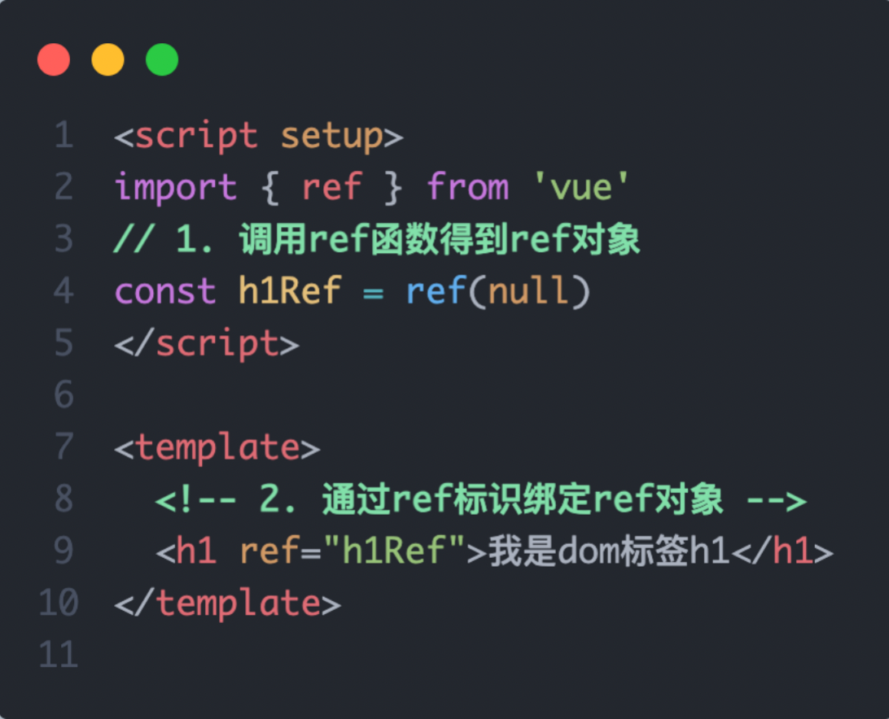

~~~vue
<script setup>
import TestCom from '@/components/test-com.vue'
import { onMounted, ref } from 'vue'

// 模板引用(可以获取dom，也可以获取组件)
// 1. 调用ref函数，生成一个ref对象
// 2. 通过ref标识，进行绑定
// 3. 通过ref对象.value即可访问到绑定的元素(前提：必须渲染完成后，才能拿到)
const inp = ref(null)
console.log(inp) // 此时打印出来的inp的value里面是有值的
console.log(inp.value) // 此时打印的值为null，打印的这一瞬间value还没有绑定上，它必须等dom渲染完
// 所以不能一进页面就直接聚焦
// inp.value.focus()

// 生命周期钩子 onMounted
onMounted(() => {
  console.log(inp.value)
  inp.value.focus()
})
const clickFn = () => {
  inp.value.focus()
}
</script>

<template>
  <div>
    <input ref="inp" type="text">
    <!-- 能点了，说明按钮肯定有了，按钮有了说明dom肯定渲染完了 -->
    <button @click="clickFn">点击让输入框聚焦</button>
  </div>
</template>
~~~


**2. defineExpose**

> 默认情况下在 <script setup>语法糖下组件内部的属性和方法是不开放给父组件访问的，可以通过defineExpose编译宏指定哪些属性和方法容许访问
> 说明：指定testMessage属性可以被访问到


App.vue

~~~vue
<script setup>
import TestCom from '@/components/test-com.vue'
import { onMounted, ref } from 'vue'
const testRef = ref(null)
const getCom = () => {
  console.log(testRef.value) // 此时可以看见元素上面挂载了count和sayHi()
  console.log(testRef.value.count)
  testRef.value.sayHi()
}
</script>

<template>
  <TestCom ref="testRef"></TestCom>
  <button @click="getCom">获取组件</button>
</template>
~~~

text-com.vue

~~~vue
<script setup>
const count = 999
const sayHi = () => {
  console.log('打招呼')
}

defineExpose({
  count,
  sayHi
})
</script>

<template>
  <div>
    我是用于测试的组件 - {{ count }}
  </div>
</template>
~~~

# 150.provide和inject

**1. 作用和场景**

> 顶层组件向任意的底层组件传递数据和方法，实现跨层组件通信


**2. 跨层传递普通数据**

> 实现步骤
>
> 1. 顶层组件通过 `provide` 函数提供数据
> 2. 底层组件通过 `inject` 函数提供数据
>
> 并且这两个键名要统一


**3. 跨层传递响应式数据**

> 在调用provide函数时，第二个参数设置为ref对象


**4. 跨层传递方法**

> 顶层组件可以向底层组件传递方法，底层组件调用方法修改顶层组件的数据


App.vue

~~~vue
<script setup>
import CenterCom from '@/components/center-com.vue'
import { provide, ref } from 'vue'

// 1. 跨层传递普通数据
provide('theme-color', 'pink')

// 2. 跨层传递响应式数据
const count = ref(100)
provide('count', count)

setTimeout(() => {
  count.value = 500
}, 2000)

// 3. 跨层传递函数 => 给子孙后代传递可以修改数据的方法
provide('changeCount', (newCount) => {
  count.value = newCount
})

</script>

<template>
<div>
  <h1>我是顶层组件</h1>
  <CenterCom></CenterCom>
</div>
</template>
~~~

center-com.vue

~~~vue
<script setup>
import BottomCom from './bottom-com.vue'
</script>

<template>
<div>
  <h2>我是中间组件</h2>
  <BottomCom></BottomCom>
</div>
</template>
~~~

bottom.vue

~~~vue
<script setup>
import { inject } from 'vue'
const themeColor = inject('theme-color')
const count = inject('count')
const changeCount = inject('changeCount')
const clickFn = () => {
  changeCount(1000)
}
</script>

<template>
<div>
  <h3>我是底层组件-{{ themeColor }} - {{ count }}</h3>
  <button @click="clickFn">更新count</button>
</div>
</template>
~~~

# 151.defineOptions

**Vue3.3 新特性-defineOptions**

背景说明：

有 <script setup> 之前，如果要定义 props, emits 可以轻而易举地添加一个与 setup 平级的属性。 

但是用了 <script setup> 后，就没法这么干了 setup 属性已经没有了，自然无法添加与其平级的属性。

---

为了解决这一问题，引入了 defineProps 与 defineEmits 这两个宏。最终编译出来了这两个配置项，但这只解决了 props 与 emits 这两个属性。

如果我们要定义组件的 name 或其他自定义的属性，还是得回到最原始的用法——再添加一个普通的 <script> 标签。

这样就会存在两个 <script> 标签。让人无法接受。

~~~vue
<script>
// 组件名必须要为多个单词
export default {
  name: 'LoginIndex'
}
</script>

<script setup>
</script>

<template>
  <div>
    我是登录页
  </div>
</template>
~~~

---

所以在 **Vue 3.3** 中新引入了 defineOptions 宏。顾名思义，主要是用来定义 Options API 的选项。可以用 defineOptions 定义任意的选项， props, emits, expose, slots 除外（因为这些可以使用 defineXXX 来做到，这些已经存在了）


~~~vue
<script setup>
defineOptions({
  name: 'LoginIndex'
})
</script>

<template>
  <div>
    我是登录页
  </div>
</template>
~~~

# 152.defineModel

**Vue3.3新特性-defineModel**

> Vue2中v-model相当于:value和@input
>
> Vue3是进行了统一，让我们的记忆负担更小一些

在Vue3中，自定义组件上使用v-model, 相当于传递一个modelValue属性，同时触发 update:modelValue 事件


我们需要先定义 props，再定义 emits 。其中有许多重复的代码。如果需要修改此值，还需要手动调用 emit 函数。

父组件（180p）

~~~html
<channel-select v-model="cateId"></channel-select>
~~~

子组件

> 使用工具选中标签
>
> 

~~~vue
<script setup>
defineProps({
  modelValue: {
  	type: [String, Number]
  }
})
const emit = defineEmits(['update:modelValue'])
</script>

<template>
  <!-- 一旦这里的value修改了，就会触发事件update:modelValue然后子传父，将得到的值更新到上层的cateId里 -->
  <el-select :modelValue="modelValue" @update:modelValue="emit('update:modelValue', $event)">
    <el-option></el-option>
  </el-select>
</template>
~~~

Vue3中相当于将sync语法和:value进行了合并

~~~html
<channel-select v-model="cateId"></channel-select>
// 等价于，此时:modelValue是可以省略的
<channel-select v-model:modelValue="cateId"></channel-select>
~~~

所以它也可以改名字，以下代码等价于 :cid 和 @update:cid 的简写，但使用最多的还是modelValue

~~~html
<channel-select v-model:cid="cateId"></channel-select>

// 子组件也需要跟着改
defineProps({
  cid: {
  	type: [String, Number]
  }
})
const emit = defineEmits(['update:cid'])

// 子组件中使用的地方也需要修改
<el-select :modelValue="cid" @update:modelValue="emit('update:cid', $event)">
~~~


于是乎 defineModel 诞生了。

> modelValue接收完后
>
> 1. 可以直接当做接收过来的props来进行渲染 
> 2. 接收过来的数据不再需要emits，可以直接改


生效需要配置 vite.config.js

```jsx
import { fileURLToPath, URL } from 'node:url'

import { defineConfig } from 'vite'
import vue from '@vitejs/plugin-vue'

// https://vitejs.dev/config/
export default defineConfig({
  plugins: [
    vue({
      script: {
        // 将defineModel启动起来
        defineModel: true
      }
    }),
  ],
  resolve: {
    alias: {
      '@': fileURLToPath(new URL('./src', import.meta.url))
    }
  }
})
```

配置完后记得重启

App.vue

~~~vue
<script setup>
import MyInput from '@/components/my-input.vue'
import { ref } from 'vue'
const txt = ref('123456')
</script>

<template>
<div>
  <MyInput v-model="txt"></MyInput>
  {{ txt }}
</div>
</template>
~~~

my-input.vue

~~~vue
<script setup>
import { defineModel } from 'vue'
const modelValue = defineModel()
</script>

<template>
<div>
  <input 
    type="text" 
    :value="modelValue" 
    @input="e => modelValue = e.target.value"
  >
</div>
</template>
~~~

# 154.Vue3 状态管理 - Pinia

**1. 什么是Pinia**

Pinia 是 Vue 的专属的最新状态管理库 ，是 Vuex 状态管理工具的替代品

> Vuex和Pinia都可以在Vue3中进行状态管理，但是官方更加推荐Pinia

1. 提供更加简单的API （去掉了 mutation）

2. 提供符合 组合式风格 的API （和 Vue3 新语法统一）

3. 去掉了 modules 的概念，每一个 store 都是一个独立的模块

   > 都不用开namespaced了

4. 配合 TypeScript 更加友好，提供可靠的类型推断


# 155.手动添加Pinia到Vue项目

后面在实际开发项目的时候，Pinia可以在项目创建时自动添加，现在我们初次学习，从零开始：

1.  使用 Vite 创建一个空的 Vue3项目

```bash
npm init vue@latest
```

> 清理一下目录
>
> 1. 删除scr下的assets和components目录
>
> 2. 将main.js里的样式删除
>
> 3. 清理App.vue
>
>    ~~~vue
>    <script setup>
>    </script>
>                               
>    <template>
>      <div>
>        App.vue根组件
>      </div>
>    </template>
>                               
>    <style scoped>
>    </style>
>    ~~~

2. 按照官方文档安装 pinia 到项目中 

   

   首先安装，然后根据官网创建pinia实例，挂载到vue里面

   

   Vue2也有相关的使用说明，需要安装插件，但我们使用的是Vue3

   

~~~js
import { createApp } from 'vue'
import { createPinia } from 'pinia'

import App from './App.vue'
const pinia = createPinia() // 创建Pinia实例

// 这里是支持链式的，但是这样看的不是很清晰
// createApp(App).use(pinia).mount('#app')

// 将createApp(App)提出来
const app = createApp(App) // 创建根实例
app.use(pinia) // pinia插件的安装配置
app.mount('#app') // 视图的挂载
~~~

# 155.Pinia的基础语法

1. 定义store
2. 组件使用store


查询官网

首先导入defineStore包，并且在里面

第一个参数需要声明仓库的唯一标识，这是因为在Pinia中，每个仓库模块都是独立的，并且所有仓库最终都会挂到同一个状态树上面，这个跟之前学的state是蛮像的。

第二个参数就可以去配置一些小的配置项，风格可以是组合式API也可以是选项式API


- 如果是选项式API，就传对象，往里面去配选项

  > 在state里提供数据，给一个箭头函数，然后把箭头函数的返回值返回的对象作为我们的数据，下面就相当于维护了数据count。
  >
  > getters和Vuex一模一样。
  >
  > 不一样的地方在于，没有mutations了，可以直接在actions里修改数据，所提供的方法全部在actions里面提供，并且操作数据是通过this来操作的，this就是当前的state。

  

- 但Options Store并不是我们后面常用的，我们常用的是跟我们平时编码统一的Composition API写法

  

  与 Vue 组合式 API 的 **setup 函数** 相似，在第二个参数中可以直接传入箭头函数，然后在这个setup函数里就可以使用ref定义数据、方法。

  一旦定义完后，就将数据、方法进行return（暴露出去），暴露出去之后，将来页面就可以使用了。

  并且在 *Setup Store* 中：

  - `ref()` 就是 `state` 属性
  - `computed()` 就是 `getters`
  - `function()` 就是 `actions`

## 1.定义store

创建scr/store文件夹

> 在store中可以创建任意数目的子仓库，并且每一个store是独立的

store/counter.js

> 直接输入ref，然后回车，此时它会自动导入
>
> 

~~~js
import { defineStore } from 'pinia'
import { computed, ref } from 'vue'

// 定义store
// defineStore(仓库的唯一标识, () => { ... })
// 仓库的唯一标识不要乱写，写仓库名即可
// 你可以对 `defineStore()` 的返回值进行任意命名，但最好使用 store 的名字，同时以 `use` 开头且以 `Store` 结尾，中间就是我们的仓库名。(比如 `useUserStore`，`useCartStore`，`useProductStore`)
// 定义完仓库之后，返回的是一个函数，这个函数一旦调用，就可以拿到return后面暴露出来的数据，用变量接收这个对象，对象里面就有想要的数据和方法
export const useCounterStore = defineStore('counter', () => {
  // 声明数据 state - count
  const count = ref(100)
  
  // 声明数据 state - msg
  const msg = ref('hello pinia')
  return {
    count,
    msg
  }
})
~~~

## 2.组件使用store

然后在App.vue中调用

> 这里要注意的是，不要对conterStore去做解构，因为会丢失数据的响应式


~~~vue
<script setup>
import Son1Com from '@/components/Son1Com.vue'
import Son2Com from '@/components/Son2Com.vue'
import { userCounterStore } from '@/store/counter.js'
const counterStore = userCounterStore()
console.log(counterStore);
</script>

<template>
  <div>
    <!-- 模板中需要访问数据的时候直接访问即可 -->
    <h3>App.vue根组件
         - {{ counterStore.count }}
         - {{ counterStore.msg }}
    </h3>
    <Son1Com></Son1Com>
    <Son2Com></Son2Com>
  </div>
</template>

<style scoped>
</style>
~~~

如果要在Son1中调用也是同理

~~~vue
<script setup>
import { userCounterStore } from '@/store/counter'
const counterStore = userCounterStore()
</script>

<template>
  <div>
    我是Son1.vue - {{ counterStore.count }}
    <button>+</button>
  </div>
</template>

<style scoped>

</style>
~~~

如果要在Son2中调用也是同理

~~~vue
<script setup>
import { userCounterStore } from '@/store/counter'
const counterStore = userCounterStore()
</script>

<template>
  <div>
    我是Son2.vue - {{ counterStore.count }}
    <button>-</button>
  </div>
</template>

<style scoped>

</style>
~~~

点加减修改数据

> 页面当中是不能直接修改数据的，我们应该要定义对应的方法，谁的数据谁来维护

store/counter.js

~~~js
import { defineStore } from 'pinia'
import { computed, ref } from 'vue'

// 定义store
export const useCounterStore = defineStore('counter', () => {
  // 声明操作数据的方法 action (普通函数和异步请求的都是在action里面)
  const addCount = () => count.value++
  const subCount = () => count.value--
  return {
    addCount,
    subCount
  }
})
~~~


## 4. getters实现

Pinia中的 getters 直接使用 computed函数 进行模拟, 组件中需要使用需要把 getters return出去


store/counter.js

~~~js
import { defineStore } from 'pinia'
import { computed, ref } from 'vue'

// 定义store
export const useCounterStore = defineStore('counter', () => {
  // 声明基于数据派生的计算属性 getters (computed)
  const double = computed(() => count.value * 2)
  return {
    double
  }
})
~~~

Son1Com.vue

~~~vue
<script setup>
import { userCounterStore } from '@/store/counter'
const counterStore = userCounterStore()
</script>

<template>
  <div>
    我是Son1.vue - {{ counterStore.count }} - {{ counterStore.double }}
    <button @click="counterStore.addCount">+</button>
  </div>
</template>

<style scoped>

</style>
~~~

# 156_5. action异步实现

方式：异步action函数的写法和组件中获取异步数据的写法完全一致

- 接口地址：http://geek.itheima.net/v1_0/channels

- 请求方式：get

- 请求参数：无


需求：在Pinia中获取频道列表数据并把数据渲染App组件的模板中
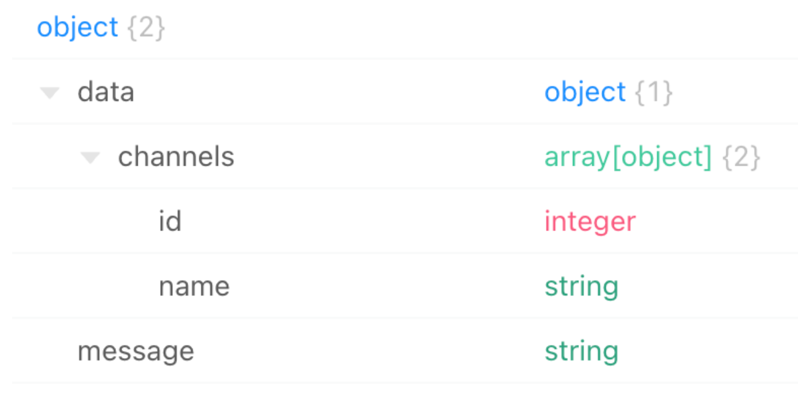

步骤：

1. 安装axios

2. 重启服务

3. 编写函数

   store/channel.js

   ~~~js
   import { defineStore } from 'pinia'
   import { ref } from 'vue'
   import axios from 'axios'
   
   export const useChannelStore = defineStore('channel', () => {
     // 声明数据
     const channelList = ref([])
   
     // 声明操作数据的方法
     const getList = async () => {
       // 支持异步
       const { data: { data }} = await axios.get('http://geek.itheima.net/v1_0/channels')
       channelList.value = data.channels
     }
   
     // 声明getters相关
     return {
       channelList,
       getList
     }
   })
   ~~~

   App.vue

   ~~~vue
   <script setup>
   import { useChannelStore } from './store/channel'
   const channelStore = useChannelStore()
   
   // 此时，直接解构，不处理，数据会丢失响应式
   const { getList } = channelStore
   </script>
   
   <template>
     <div>
       <button @click="getList">获取频道数据</button>
       <ul>
         <li v-for="item in channelList" :key="item.id">{{ item.name }}</li>
       </ul>
     </div>
   </template>
   
   <style scoped>
   
   </style>
   ~~~

## 6. Pinia的调试

~~~js
// 此时，直接解构，不处理，数据会丢失响应式
const { count, msg } = channelStore
~~~

Vue官方的 dev-tools 调试工具 对 Pinia直接支持，可以直接进行调试


# 157.storeToRefs工具函数

使用storeToRefs函数可以辅助保持数据（state + getter）的响应式解构


直接解构不起作用的原因跟 `store 是一个用 `reactive` 包装的对象` 有关系，reactive实现响应式底层的原理其实是proxy，而这个proxy是针对对象进行监视的，可以理解成：它整个对数据的监听都是针对对象的，如果解构，那就是将原来的数据直接赋值到了新的变量，此时这个变量和原来的响应式数据就没有半毛钱关系了。


解决办法：


当你只使用 store 的状态而不调用任何 action 时，它会非常有用。

一个模块当中既有属性又有方法，属性解构的时候需要storeToRefs()，响应式处理一下，把每一个处理的数据都往我们原始的对象中添加了响应式引用，用我们的ref包装一下。

底下如果要去导方法的话，方法并不需要ref去做处理。因为一般不会去改方法，方法是直接调用的，所以可以直接解构。

# 158. Pinia持久化插件

> 使用Vuex的时候持久化是使用localStorage做的，但Pinia是不需要手动写的，它有相对应的插件。

官方文档：https://prazdevs.github.io/pinia-plugin-persistedstate/zh/

> 底下有个保存图标，就是持久化的意思
>
> 
>
> 兼容 `pinia^2.0.0`的意思就是pinia必须在2.0.0以上才行
>
> 
>
> 查看pinia版本
>
> 
>
> 并且Vuex中也有相对应的插件来做持久化
>
> 

1. 安装插件 pinia-plugin-persistedstate

```jsx
npm i pinia-plugin-persistedstate
pnpm add pinia-plugin-persistedstate -D
```

2. 使用 main.js

```jsx
// 导入持久化的插件，由于官网导入进来的名字 piniaPluginPersistedstate 有点长，我们可以直接修改为persist
import persist from 'pinia-plugin-persistedstate'
...
// 并且这个插件是pinia的插件，也就是说这个插件不是给app直接去用的，而是往pinia上面挂
// app.use(createPinia().use(persist))
// 将pinia.use(persist)的结果给app.use()
app.use(pinia.use(persist))
```

3. 配置 store/counter.js

直接将persist写成对象的形式

> 选项式中直接跟getters、actions并列
>
> 
>
> 组合式中，在第三个参数的位置写一个`persist: true`

```jsx
import { defineStore } from 'pinia'
import { computed, ref } from 'vue'

export const useCounterStore = defineStore('counter', () => {
  ...
  return {
    count,
    doubleCount,
    increment
  }
}, {
  // 开启当前模块的持久化
  persist: true
})
```

此时本地化已经完成，它会帮你做两件事：

1. 在你改的时候往本地存
2. 在刷新的时候优先从本地获取

并且在当前的Application当中可以看到存储到本地的数据

并且存的键名就是基于仓库的唯一标识往本地存的


4. 其他配置，看官网文档即可


sessionStorage相对localStorage就没有那么常用了


 指定 state 中哪些数据需要被持久化

> 支持对象里的子属性做持久化，但一般都会一整个对象做持久化，其他的就不持久化


~~~js
// persist: true // 开启当前模块的持久化
persist: {
  key: 'hm-counter', // 修改本地存储的唯一标识
  paths: ['count'] // 存储的是哪些数据
}
~~~

# 大事件管理-后台数据管理系统 - 项目架构设计

在线演示：https://fe-bigevent-web.itheima.net/login

接口文档:   https://apifox.com/apidoc/shared-26c67aee-0233-4d23-aab7-08448fdf95ff/api-93850835

**接口根路径：**  http://big-event-vue-api-t.itheima.net

本项目的技术栈 本项目技术栈基于 [ES6](http://es6.ruanyifeng.com/)、[vue3](https://cn.vuejs.org/index.html)、[pinia](https://pinia.web3doc.top/)、[vue-router](https://router.vuejs.org/) 、vite 、axios 和 [element-plus](https://element-plus.org/)


**项目页面介绍**

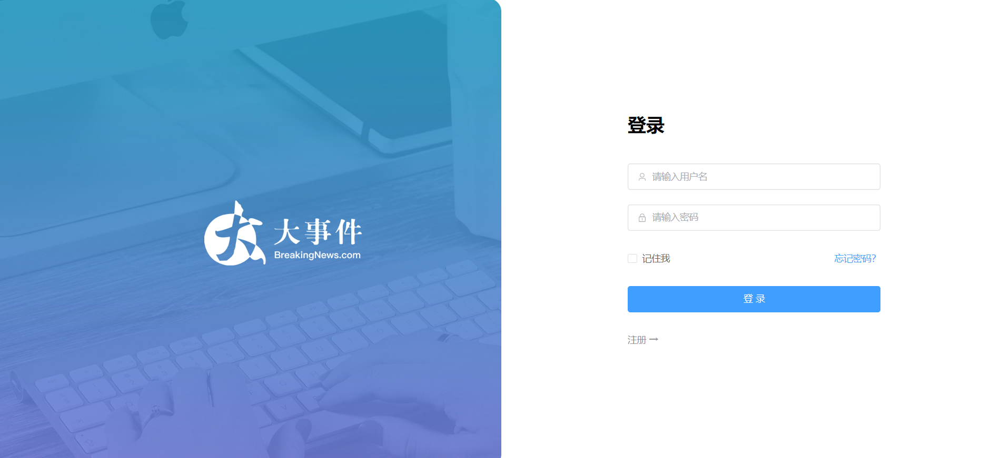


# 159.pnpm 包管理器 - 创建项目

> npm => yarn（yarn比npm会快）=> pnpm

一些优势：比同类工具快 2倍 左右、节省磁盘空间... https://www.pnpm.cn/

安装方式：

```
npm install -g pnpm
```

创建项目：

> npm支持init和create，但pnpm不支持init。所以以后创建项目的时候统一使用create
>
> pnpm创建项目的时候最好不要往最根的目录去建，最好创建一个子目录，因为往根级别去建它有时候会报权限不够。
>
> pnpm即支持add也支持install

```
pnpm create vue
```

安装依赖

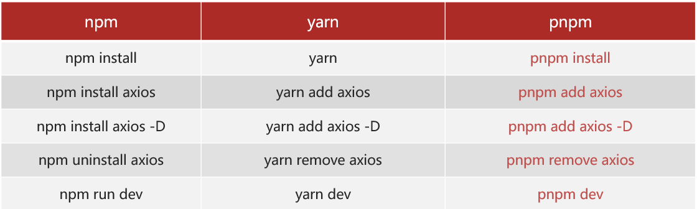

ESLint是用来看规范的，Prettier是专门用来美化代码的格式化工具

`pnpm format`会借助Prettier对里面的内容做格式化


# 160.ESLint & prettier 配置代码风格

**环境同步：**

1. **安装了插件 ESlint，开启保存自动修复**

2. **禁用了插件 Prettier，并关闭保存自动格式化**

   > 这是因为它使用的不是VSCode里面的prettier插件，而是安装的包当中的prettier
   >
   > 

```jsx
// ESlint插件 + Vscode配置 实现自动格式化修复
"editor.codeActionsOnSave": {
    "source.fixAll": true
},
"editor.formatOnSave": false,
```

**配置文件 .eslintrc.cjs**

> prettier 是专注于代码格式化的一个插件，它可以使得我们的代码更加的美观。
>
> 上面的 ESLint 更多的在于规范纠错。
>
> 现在通常都是ESLint和prettier配合起来使用，因为这两个各有所长。

1. prettier 风格配置 [https://prettier.io](https://prettier.io/docs/en/options.html )

   1. 单引号

   2. 不使用分号

   3. 每行宽度至多80字符

   4. 不加对象|数组最后逗号

   5. 换行符号不限制（win mac 不一致）

2. vue组件名称多单词组成（忽略index.vue）

3. props解构（将这个错误关闭）

   > props解构会进行报错，因为props在解构的时候会丢失数据的响应式。后面有办法处理让props在解构的时候还保留原本的响应式。

直接将下面的一整个rules对象拷贝到`.eslintrc.cjs`


如果还想配置更多配置，可以去prettier的官方网站

```jsx
rules: {
  // prettier专注于代码的美观度 (格式化工具)
  // 前置：
  // 1. 禁用格式化插件 prettier  format on save 关闭
  // 2. 安装Eslint插件, 并配置保存时自动修复
  'prettier/prettier': [
    'warn',
    {
      singleQuote: true, // 单引号
      semi: false, // 无分号
      printWidth: 80, // 每行宽度至多80字符
      trailingComma: 'none', // 不加对象|数组最后逗号
      endOfLine: 'auto' // 换行符号不限制（因为win mac 不一致）
    }
  ],
  // ESLint关注于规范, 如果不符合规范，报错（有些东西它并不影响美观度，但是它也会被ESLint校验到
  'vue/multi-word-component-names': [
    'warn',
    {
      ignores: ['index'] // vue组件名称多单词组成，唯独有一个可以例外，那就是index（忽略index.vue，eg：view/Login/index.vue）
    }
  ],
  'vue/no-setup-props-destructure': ['off'], // 关闭 props 解构的校验 (props解构丢失响应式，所以默认它会给你报错)
  // 添加未定义变量错误提示，create-vue@3.6.3 关闭，这里加上是为了支持下一个章节演示。
  // 'no-undef': 'off' 此时未定义的变量使用它就不会报错
  'no-undef': 'error'
},
globals: {
  ElMessage: 'readonly',
  ElMessageBox: 'readonly',
  ElLoading: 'readonly'
}
```

# 161.基于 husky  的代码检查工作流

husky 是一个 git hooks 工具  ( git的钩子工具，可以在特定时机执行特定的命令 )

**husky 配置**

> 打开终端的时候是打开bash终端
>
> 

1. git初始化 git init

2. 初始化 husky 工具安装配置  https://typicode.github.io/husky/

```jsx
pnpm dlx husky-init && pnpm install
```

安装配置完后，项目的根目录就会出现.husky文件夹


3. 修改 .husky/pre-commit（提交代码之前） 文件

> lint命令会将以这些一系列为后缀的文件进行校验并且尝试着帮你去修复
>
> 

```jsx
// npm test
pnpm lint // lint命令是默认在package.json中配置好的，一次性对整个项目中的所有文件进行校验，并且它发现有错误的地方，它会帮你自动修复
```

可以理解为：只要你一提交，它就会触发pnpm lint，这条命令也可以手动执行


如下图，在main.js的11行第13个字符发现了错误


**问题：**默认进行的是全量检查，耗时问题，历史问题（别人没有采用规范，但是我们使用了）。


**lint-staged 配置**

> 暂存区eslint校验。这个更符合实际开发企业中的习惯，它只会去校验暂存区新添加的代码，此时它不会去管之前已经提交过的代码。

1. 安装

安装 lint-staged 包 pnpm i lint-staged -D

> 注意这个命令是在git环境下使用的，所以需要在bash下面安装

```jsx
pnpm i lint-staged -D
```

2. 配置 `package.json`

package.json 配置 lint-staged 命令，配置完后，就可以使用这个命令了

```jsx
{
  // ... 省略 ...
  "lint-staged": {
    "*.{js,ts,vue}": [
      "eslint --fix"
    ]
  }
}

{
  "scripts": {
    // ... 省略 ...
    "lint-staged": "lint-staged"
  }
}
```

3. 修改 .husky/pre-commit 文件

改完也就意味着要执行第一步的命令，但是我们肯定是希望在提交的时候进行校验

```jsx
pnpm lint-staged
```

# 162.调整项目目录

默认生成的目录结构不满足我们的开发需求，所以这里需要做一些自定义改动。主要是两个工作：

- 删除初始化的默认文件
- 修改剩余代码内容
- 新增调整我们需要的目录结构
- 拷贝初始化资源文件，安装预处理器插件

1. 删除文件
2. 修改内容

我们这个项目的CSS处理器使用到的是sass

1. 删除初始化的默认文件
   - assets里的所有文件
   - components里的所有文件

`src/router/index.js`

```jsx
import { createRouter, createWebHistory } from 'vue-router'

const router = createRouter({
  history: createWebHistory(import.meta.env.BASE_URL),
  routes: []
})

export default router
```

`src/App.vue`

```jsx
<script setup></script>

<template>
  <div>
    <!-- App.vue只需要留一个路由出口 router-view即可 -->
    <router-view></router-view>
  </div>
</template>

<style scoped></style>
```

> 由于store里面可以新建任意多的仓库模块，而且所有的仓库模块如果没有在页面当中引用，实际上是不会初始化的，所以counter.js可留可不留。但为了代码的干净程度，这里选择删除。

清空views下的文件

`src/main.js`

```jsx
import { createApp } from 'vue'
import { createPinia } from 'pinia'

import App from './App.vue'
import router from './router'

const app = createApp(App)

app.use(createPinia())
app.use(router)
app.mount('#app')
```

3. 新增需要目录 api  utils


4. 将项目需要的全局样式 和 图片文件，复制到 assets 文件夹中,  并将全局样式在main.js中引入

```jsx
import '@/assets/main.scss'
```

- 安装 sass 依赖

```jsx
pnpm add sass -D
```

# 163.VueRouter4 路由代码解析

> Vue3都是导入一个创建实例的方法，它的底层是把new VueRouter()做了一个封装，可以把它当成一个封装的函数，它的内部还是进行new VueRouter的。

1. 创建路由实例由 createRouter 实现
2. 路由模式
   1. history 模式使用 createWebHistory()

基础代码解析

```jsx
import { createRouter, createWebHistory } from 'vue-router'

// createRouter 创建路由实例，===> new VueRouter()
// 配置 history 模式
// 1. history模式：createWebHistory     地址栏不带 #，这个会用的更多一些，因为地址栏不带 #更美观一些
// 2. hash模式：   createWebHashHistory 地址栏带 #
// console.log(import.meta.env.DEV)

// vite 的配置 import.meta.env.BASE_URL 是路由的基准地址，默认是 ’/‘，代表着默认访问地址的前缀
// 而这个东西不应该写死，应该把它提成一个变量，import.meta.env.BASE_URL是vite中的环境变量，这个可以在vite.config.js中配置

// 如果将来你部署的域名路径是：http://xxx/my-path/user
// vite.config.ts  添加配置  base: my-path，路由这就会加上 my-path 前缀了

const router = createRouter({
  // 当前的模式就是看当前导的方法，createWebHashHistory、createWebHistory（也就是Vue2中的history模式）
  history: createWebHistory(import.meta.env.BASE_URL),
  // routes还是一样的，原来怎么配，将来就怎么配
  routes: []
})

export default router
```

import.meta.env.BASE_URL 是Vite 环境变量：[https://cn.vitejs.dev/guide/env-and-mode.html](https://cn.vitejs.dev/guide/env-and-mode.html)

vite.config.js

~~~js
import { fileURLToPath, URL } from 'node:url'

import { defineConfig } from 'vite'
import vue from '@vitejs/plugin-vue'

// https://vitejs.dev/config/
export default defineConfig({
  plugins: [vue()],
  // 配置基地址
  base: '/',
  resolve: {
    alias: {
      '@': fileURLToPath(new URL('./src', import.meta.url))
    }
  }
})
~~~

> 前三个单词都是固定的，里面会给你提供一些变量


vue.config.js

~~~js
import { fileURLToPath, URL } from 'node:url'

import { defineConfig } from 'vite'
import vue from '@vitejs/plugin-vue'

// https://vitejs.dev/config/
export default defineConfig({
  plugins: [vue()],
  // 配置基地址
  base: '/',
  resolve: {
    alias: {
      '@': fileURLToPath(new URL('./src', import.meta.url))
    }
  }
})
~~~


如下图，router里面都含有相关的函数，route里面就含有参数对象


App.vue

~~~vue
<script setup>
// 包是从router里面导进来的
import { useRoute, useRouter } from 'vue-router';
// 大的路由对象也可以直接导入
// import router from '@/router'

// const goList = () => {
//   // setup函数中的this指向undefined
//   this.$router.push('/list')
// }

// 在 Vue3 CompositionAPI 中
// 1. 获取路由对象 router 使用方法：useRouter
//  const router = useRouter()
// 2. 获取路由参数 route（Vue2中是this.$route），但在Vue3中，有个专门的语法 => useRoute
//  const route = useRoute()

const router = useRouter()
const route = useRoute()
const goList = () => {
  // 前面是大的路由器对象，后面是路由参数
  router.push('/list')
  console.log(router, route);
}
</script>

<template>
  <div>
    我是App
    <!-- Vue3中router是直接向前兼容Vue2中router的 -->
    <button @click="$router.push('/home')">跳首页</button>
    <!-- 但是当它提成一个函数时，setup函数中的this指向undefined -->
    <button @click="goList">跳列表页</button>

  </div>
</template>

<style scoped></style>
~~~

# 165.引入 element-ui 组件库

**官方文档：** https://element-plus.org/zh-CN/

- 安装

```jsx
$ pnpm add element-plus
```


**自动按需：**


1. 安装插件

一个是自动引入，另一个是组件注册

```jsx
pnpm add -D unplugin-vue-components unplugin-auto-import
```

2. 然后把下列代码插入到你的 `Vite` 或 `Webpack` 的配置文件中

```jsx
...
import AutoImport from 'unplugin-auto-import/vite'
import Components from 'unplugin-vue-components/vite'
import { ElementPlusResolver } from 'unplugin-vue-components/resolvers'

// https://vitejs.dev/config/
export default defineConfig({
  plugins: [
    ...
    AutoImport({
      resolvers: [ElementPlusResolver()]
    }),
    Components({
      resolvers: [ElementPlusResolver()]
    })
  ]
})
```

3. 直接使用

使用的时候任何事情都不需要做，也不需要import。这个就是我们第二步配置的按需导入的强大之处。我们不需要去关心用哪个组件，它一旦发现你用了，它会帮助你提前注册的

```jsx
<template>
  <div>
    <el-button type="primary">Primary</el-button>
    <el-button type="success">Success</el-button>
    <el-button type="info">Info</el-button>
    <el-button type="warning">Warning</el-button>
    <el-button type="danger">Danger</el-button>
    ...
  </div>
</template>
```


**彩蛋：**默认 components 下的文件也会被自动注册~

> 正常情况下的components需要导入注册才能使用，但是使用了这个插件之后，直接在页面中使用组件即可，无需导入。
>
> 组件名字都是使用test-demo这种形式

# 166.Pinia - 构建用户仓库 和 持久化

官方文档：https://prazdevs.github.io/pinia-plugin-persistedstate/zh/

1. 安装插件 pinia-plugin-persistedstate

```jsx
pnpm add pinia-plugin-persistedstate -D
```

2. 使用 main.js

```jsx
import persist from 'pinia-plugin-persistedstate'
...
app.use(createPinia().use(persist))
```

3. 配置 stores/user.js

```jsx
import { defineStore } from 'pinia'
import { ref } from 'vue'

// 用户模块
export const useUserStore = defineStore(
  'big-user',
  () => {
    const token = ref('') // 定义 token
    const setToken = (t) => (token.value = t) // 设置 token

    return { token, setToken }
  },
  {
    persist: true // 持久化
  }
)

```

# Pinia - 配置仓库统一管理

**pinia 独立维护**

\- 现在：初始化代码在 main.js 中，仓库代码在 stores 中，代码分散职能不单一

\- 优化：由 stores 统一维护，在 stores/index.js 中完成 pinia 初始化，交付 main.js 使用

> 项目如果涉及到文件的修改，可以重启

store/index.js

~~~js
import { createPinia } from 'pinia'

import persist from 'pinia-plugin-persistedstate'

const pinia = createPinia()
pinia.use(persist)

export default pinia
~~~


**仓库 统一导出**

\- 现在：使用一个仓库 import { useUserStore } from `./stores/user.js` 不同仓库路径不一致

\- 优化：由 stores/index.js 统一导出，导入路径统一 `./stores`，而且仓库维护在 stores/modules 中

stores/index.js

~~~js
import { createPinia } from 'pinia'

import persist from 'pinia-plugin-persistedstate'

const pinia = createPinia()
pinia.use(persist)

export default pinia

// import { useUserStore } from './modules/user'
// // 按需导出
// export { useUserStore }

// import { useCounterStore } from './modules/counter'
// // 按需导出
// export { useCounterStore }

// 有没有办法快速的将一个模块里面的内容都拿到，直接进行按需导出呢？
// 这一句话就等价于上面两句话，并且比上面两句话更高级
export * from './modules/user' // 接收user模块的所有并按需导出
~~~

# 166.数据交互 - 请求工具设计


**1. 创建 axios 实例**

们会使用 axios 来请求后端接口, 一般都会对 axios 进行一些配置 (比如: 配置基础地址等)

一般项目开发中, 都会对 axios 进行基本的二次封装, 单独封装到一个模块中, 便于使用

1. 安装 axios

```
pnpm add axios
```

2. 新建 `utils/request.js` 封装 axios 模块

   利用 axios.create 创建一个自定义的 axios 来使用

   http://www.axios-js.com/zh-cn/docs/#axios-create-config

```js
import axios from 'axios'

const baseURL = 'http://big-event-vue-api-t.itheima.net'

const instance = axios.create({
  // TODO 1. 基础地址，超时时间
})

instance.interceptors.request.use(
  (config) => {
    // TODO 2. 携带token
    return config
  },
  (err) => Promise.reject(err)
)

instance.interceptors.response.use(
  (res) => {
    // TODO 3. 处理业务失败
    // TODO 4. 摘取核心响应数据
    return res
  },
  (err) => {
    // TODO 5. 处理401错误
    return Promise.reject(err)
  }
)

export default instance
```


**2. 完成 axios 基本配置** 

> 携带token时，使用仓库里的数据。
>
> CompositionAPI比较好的地方就是它根本用不到this，用不到this就意味着它不会受组件范围的影响，一旦任何地方你想要去用，你就导我们的方法就可以了，而且我们整个仓库已经分模块架起来了，只需要找到统一的出口导入我们的方法即可。

```jsx
import axios from 'axios'
import { useUserStore } from '@/stores'
import { ElMessage } from 'element-plus'
import router from '@/router'
const baseURL = 'http://big-event-vue-api-t.itheima.net'

const instance = axios.create({
  // TODO 1. 基础地址，超时时间
  baseURL,
  timeout: 10000
})

// 请求拦截器
instance.interceptors.request.use(
  (config) => {
    // TODO 2. 携带token
    const useStore = useUserStore()
    if (useStore.token) {
      config.headers.Authorization = useStore.token
    }
    return config
  },
  (err) => Promise.reject(err)
)

// 响应拦截器
instance.interceptors.response.use(
  (res) => {
    // TODO 4. 摘取核心响应数据
    if (res.data.code === 0) {
      return res
    }
    // TODO 3. 处理业务失败
    // 使用Element-Plus插件中的。处理业务失败, 给错误提示，抛出错误
    ElMessage.error(res.data.message || '服务异常')
    return Promise.reject(res.data)
  },
  (err) => {
    // TODO 5. 处理401错误
    // 错误的特殊情况 => 401 权限不足 或 token 过期 => 拦截到登录
    if (err.response?.status === 401) {
      router.push('/login')
    }

    // 错误的默认情况 => 只要给提示
    ElMessage.error(err.response.data.message || '服务异常')
    return Promise.reject(err)
  }
)

export default instance
// 默认导出与按需导出不冲突
export { baseURL }

```

# 167.首页整体路由设计

**实现目标:**

- 完成整体路由规划【搞清楚要做几个页面，它们分别在哪个路由下面，怎么跳转的.....】
- 通过观察,  点击左侧导航,  右侧区域在切换,  那右侧区域内容一直在变,  那这个地方就是一个路由的出口
- 我们需要搭建嵌套路由

目标：

- 把项目中所有用到的组件及路由表, 约定下来

**约定路由规则**

| path                | 文件                             | 功能      | 组件名          | 路由级别 |
| ------------------- | -------------------------------- | --------- | --------------- | -------- |
| /login              | views/login/LoginPage.vue        | 登录&注册 | LoginPage       | 一级路由 |
| /                   | views/layout/LayoutContainer.vue | 布局架子  | LayoutContainer | 一级路由 |
| ├─ /article/manage  | views/article/ArticleManage.vue  | 文章管理  | ArticleManage   | 二级路由 |
| ├─ /article/channel | views/article/ArticleChannel.vue | 频道管理  | ArticleChannel  | 二级路由 |
| ├─ /user/profile    | views/user/UserProfile.vue       | 个人详情  | UserProfile     | 二级路由 |
| ├─ /user/avatar     | views/user/UserAvatar.vue        | 更换头像  | UserAvatar      | 二级路由 |
| ├─ /user/password   | views/user/UserPassword.vue      | 重置密码  | UserPassword    | 二级路由 |

明确了路由规则，可以全部配完，也可以边写边配。

# 168.登录注册页面 静态结构【layout】

**注册登录 静态结构 & 基本切换**

1. 安装 element-plus 图标库


```jsx
pnpm i @element-plus/icons-vue
```

使用：先导入，再使用


~~~vue
import { User, Lock } from '@element-plus/icons-vue'

<el-form-item>
    <el-input :prefix-icon="Lock"></el-input>
</el-form-item>
~~~

2. 静态结构准备


所谓的偏移就是margin-left


加label属性，前面就会有label标签


```jsx
<script setup>
import { User, Lock } from '@element-plus/icons-vue'
import { ref } from 'vue'
const isRegister = ref(true)
</script>

<template>
    <!-- 
    1. 结构相关
      el-row表示一行，一行分成24份 
       el-col表示列  
       (1) :span="12"  代表在一行中，占12份 (50%)
       (2) :span="6"   表示在一行中，占6份  (25%)
       (3) :offset="3" 代表在一行中，左侧margin份数

       el-form 整个表单组件
       el-form-item 表单的一行 （一个表单域），每个表单域之间都是独立的，互相之间不影响
       el-input 表单元素（输入框）
  -->
  <el-row class="login-page">
    <el-col :span="12" class="bg"></el-col>
    <el-col :span="6" :offset="3" class="form">
      <el-form ref="form" size="large" autocomplete="off" v-if="isRegister">
        <el-form-item>
          <h1>注册</h1>
        </el-form-item>
        <el-form-item>
          <el-input :prefix-icon="User" placeholder="请输入用户名"></el-input>
        </el-form-item>
        <el-form-item>
          <el-input
            :prefix-icon="Lock"
            type="password"
            placeholder="请输入密码"
          ></el-input>
        </el-form-item>
        <el-form-item>
          <el-input
            :prefix-icon="Lock"
            type="password"
            placeholder="请输入再次密码"
          ></el-input>
        </el-form-item>
        <el-form-item>
          <el-button class="button" type="primary" auto-insert-space>
            注册
          </el-button>
        </el-form-item>
        <el-form-item class="flex">
          <el-link type="info" :underline="false" @click="isRegister = false">
            ← 返回
          </el-link>
        </el-form-item>
      </el-form>
      <el-form ref="form" size="large" autocomplete="off" v-else>
        <el-form-item>
          <h1>登录</h1>
        </el-form-item>
        <el-form-item>
          <el-input :prefix-icon="User" placeholder="请输入用户名"></el-input>
        </el-form-item>
        <el-form-item>
          <el-input
            name="password"
            :prefix-icon="Lock"
            type="password"
            placeholder="请输入密码"
          ></el-input>
        </el-form-item>
        <el-form-item class="flex">
          <div class="flex">
            <el-checkbox>记住我</el-checkbox>
            <el-link type="primary" :underline="false">忘记密码？</el-link>
          </div>
        </el-form-item>
        <el-form-item>
          <el-button class="button" type="primary" auto-insert-space
            >登录</el-button
          >
        </el-form-item>
        <el-form-item class="flex">
          <el-link type="info" :underline="false" @click="isRegister = true">
            注册 →
          </el-link>
        </el-form-item>
      </el-form>
    </el-col>
  </el-row>
</template>

<style lang="scss" scoped>
.login-page {
  height: 100vh;
  background-color: #fff;
  .bg {
    background: url('@/assets/logo2.png') no-repeat 60% center / 240px auto,
      url('@/assets/login_bg.jpg') no-repeat center / cover;
    border-radius: 0 20px 20px 0;
  }
  .form {
    display: flex;
    flex-direction: column;
    justify-content: center;
    user-select: none;
    .title {
      margin: 0 auto;
    }
    .button {
      width: 100%;
    }
    .flex {
      width: 100%;
      display: flex;
      justify-content: space-between;
    }
  }
}
</style>
```

# 169.注册功能【el-form】

**实现注册校验**

【需求】注册页面基本校验

1. 用户名非空，长度校验5-10位
2. 密码非空，长度校验6-15位
3. 再次输入密码，非空，长度校验6-15位

【进阶】再次输入密码需要自定义校验规则，和密码框值一致（可选）


> 1. `el-form => :model="ruleForm"` ：绑定的是绑定的整个form的数据对象 { xxx, xxx, xxx }。
>
>    为了方便校验，我们需要将ruleForm绑定在el身上
>
>    ruleForm绑定的是form对象，这个form对象是用来收集当前表单里全部的表单数据的
>
> 2. `el-form => :rules="rules"` ：绑定的整个rules规则对象  { xxx, xxx, xxx }，form中可能有多个表单数据，里面的分别对应三个校验规则，所以rules是要基于ruleForm里的数据进行实现的。
>
> 3. 表单元素 => v-model="ruleForm.xxx" 给表单元素，绑定form的子属性
>
> 4. el-form-item => prop 配置生效的是哪个校验规则 (和rules中的字段要对应)


步骤：

1. model 属性绑定 form 数据对象

数据将来是需要提交给后台的，不能自己编，应该看我们的接口文档


```jsx
// 整个用于提交的form数据对象
const formModel = ref({
  username: '',
  password: '',
  repassword: ''
})

<el-form :model="formModel" >
```

2. v-model 绑定 form 数据对象的子属性

```jsx
<el-input
  v-model="formModel.username"
  :prefix-icon="User"
  placeholder="请输入用户名"
></el-input>
... 
(其他两个也要绑定)
```

3. rules 配置校验规则

rules并不需要是响应式的，所以直接提供一个普通对象即可

rules里的字段名需要与formModel里的字段名要统一。

规则是个数组，表示可以配置很多条规则。每个规则都是个对象。

trigger：什么时候触发，blur —> 失焦时校验，change —> 实时校验，不写的话，默认是change。


```vue
<el-form :rules="rules" >
    
<script setup>
// 整个表单的校验规则
// 1. 非空校验 required: true      message消息提示，  trigger触发校验的时机 blur change
// 2. 长度校验 min:xx, max: xx
// 3. 正则校验 配置pattern字段: 正则规则    \S 非空字符
const rules = {
  username: [
    { required: true, message: '请输入用户名', trigger: 'blur' },
    { min: 5, max: 10, message: '用户名必须是5-10位的字符', trigger: 'blur' }
  ],
  password: [
    { required: true, message: '请输入密码', trigger: 'blur' },
    {
      pattern: /^\S{6,15}$/,
      message: '密码必须是6-15位的非空字符',
      trigger: 'blur'
    }
  ],
  repassword: [
    { required: true, message: '请再次输入密码', trigger: 'blur' },
    {
      pattern: /^\S{6,15}$/,
      message: '密码必须是6-15的非空字符',
      trigger: 'blur'
    },
    {
      validator: (rule, value, callback) => {
        if (value !== formModel.value.password) {
          callback(new Error('两次输入密码不一致!'))
        } else {
          callback()
        }
      },
      trigger: 'blur'
    }
  ]
}
</script>
```

4. prop 绑定校验规则

注意prop校验规则需要往`el-form-item`上面配

```jsx
<el-form-item prop="username">
  <el-input
    v-model="formModel.username"
    :prefix-icon="User"
    placeholder="请输入用户名"
  ></el-input>
</el-form-item>
... 
(其他两个也要绑定prop)
```


## 自定义校验

官网


在失焦的时候调用前面的校验函数去进行校验


参数1：当前相关的规则，但第一个我们一般用不到

参数2：所校验的表单元素目前的表单值

参数3：callback回调 无论成功还是失败，都需要callback回调，否则将来校验会出现问题

- callback() 校验成功
- callback(new Error(错误信息)) 校验失败


~~~js
// 4. 自定义校验 => 自己写逻辑校验 (校验函数)
//    validator: (rule, value, callback)
//    (1) rule  当前校验规则相关的信息
//    (2) value 所校验的表单元素目前的表单值
//    (3) callback 无论成功还是失败，都需要 callback 回调
//        - callback() 校验成功
//        - callback(new Error(错误信息)) 校验失败
const rules = {
  repassword: [
    { required: true, message: '请输入密码', trigger: 'blur' },
    {
      pattern: /^\S{6,15}$/,
      message: '密码必须是 6-15位 的非空字符',
      trigger: 'blur'
    },
    {
      // 官网是将函数提出去的，但这里没必要提出去
      validator: (rule, value, callback) => {
        // 判断 value 和 当前 form 中收集的 password 是否一致
        if (value !== formModel.value.password) {
          callback(new Error('两次输入密码不一致'))
        } else { // else 一定要写！
          callback() // 就算校验成功，也需要callback
        }
      },
      trigger: 'blur'
    }
  ]
}
~~~

# 170.注册前的预校验

进入官网，查询Form组件实例暴露出去的方法。

validate：对整个表单进行验证，并且会返回一个Promise。所以可以通过这个方法来判断表单是否通过了校验。

如果需要调方法，需要拿到Form组件对象实例的


需求：点击注册按钮，注册之前，需要先校验

1. 通过 ref 获取到 表单组件

```jsx
const form = ref()

// 登录和注册共用一个，但并不会冲突，因为v-if的原因，组件只会显示一个
<el-form ref="form">
```

2. 注册之前进行校验

```jsx
<el-button
  @click="register"
  class="button"
  type="primary"
  auto-insert-space
>
  注册
</el-button>

const register = async () => {
  // 成功了就继续往后走，失败了，由于validate()一调，它会触发我们的校验，触发校验就回去给用户显示错误提示，这个时候我们不需要对错误做出任何处理
    // 注册成功之前，先进行校验，校验成功 → 请求，校验失败 → 自动提示
  await form.value.validate()
  console.log('开始注册请求')
}
```


### 封装 api 实现注册功能

需求：封装注册api，进行注册，注册成功切换到登录

1. 新建 api/user.js 封装

```jsx
import request from '@/utils/request'

// api模块的方法最好也遵循一定的规范，user模块中的用途：注册（Register），请求服务（Service）。user模块下的注册方法，并且它是一个请求服务。名字不要嫌单词长，当项目越来越大的时候，语义就会越来越明显
// 解构，这里可以直接将花括号与return简写
// 注册接口
export const userRegisterService = ({ username, password, repassword }) =>
  request.post('/api/reg', { username, password, repassword })
```

2. 页面中调用

ElMessage：

1. 直接传入一个方法，里面传入消息
2. 里面传入一个对象，对象里面填入消息，加一个type类型
3. 还有一种更简单的形式：el跟上所要进行的方法名


```jsx
const register = async () => {
  await form.value.validate()
  // 直接将这个对象传过去
  await userRegisterService(formModel.value)
  ElMessage.success('注册成功')
  // 切换到登录
  isRegister.value = false
}
```

3. eslintrc 中声明全局变量名,  解决 ElMessage 报错问题

> Elment UI在最早期配的一个按需，按需会帮我们自动进行导入进行注册，包括这个方法，但是VSCode/ESLint 并不知道你注册了这个方法，我们的声明一下这个全局变量，这个变量是不需要去校验的

这些全局变量名无需校验，是可以直接使用的

.eslintrc.cjs

```jsx
module.exports = {
  ...
  globals: {
    ElMessage: 'readonly',
    ElMessageBox: 'readonly',
    ElLoading: 'readonly'
  }
}
```

# 171.登录功能

**实现登录校验**

【需求说明】给输入框添加表单校验

1. 用户名不能为空，用户名必须是5-10位的字符，失去焦点 和 修改内容时触发校验
2. 密码不能为空，密码必须是6-15位的字符，失去焦点 和 修改内容时触发校验

操作步骤：

1. model 属性绑定 form 数据对象，直接绑定之前提供好的数据对象即可

> formModel可以直接共用

```jsx
<el-form :model="formModel" >
```

2. rules 配置校验规则，共用注册的规则即可

```jsx
<el-form :rules="rules" >
```

3. v-model 绑定 form 数据对象的子属性

```jsx
<el-input
  v-model="formModel.username"
  :prefix-icon="User"
  placeholder="请输入用户名"
></el-input>

<el-input
  v-model="formModel.password"
  name="password"
  :prefix-icon="Lock"
  type="password"
  placeholder="请输入密码"
></el-input>
```

4. prop 绑定校验规则

```jsx
<el-form-item prop="username">
  <el-input
    v-model="formModel.username"
    :prefix-icon="User"
    placeholder="请输入用户名"
  ></el-input>
</el-form-item>
... 
```

5. 切换的时候重置

```jsx
// 切换的时候，重置表单内容
watch(isRegister, () => {
  formModel.value = {
    username: '',
    password: '',
    repassword: ''
  }
})
```

这些是在校验中产生的提示消息，在正式上线的时候会去掉，不用担心


**登录前的预校验 & 登录成功**

【需求说明1】登录之前的预校验

- 登录请求之前，需要对用户的输入内容，进行校验
- 校验通过才发送请求

【需求说明2】**登录功能**

1. 封装登录API，点击按钮发送登录请求
2. 登录成功存储token，存入pinia 和 持久化本地storage
3. 跳转到首页，给提示

【测试账号】

- 登录的测试账号:  shuaipeng

- 登录测试密码:  123456

PS: 每天账号会重置，如果被重置了，可以去注册页，注册一个新号


实现步骤：

1.  注册事件，进行登录前的预校验 (获取到组件调用方法)

```jsx
<el-form ref="form">
    
const login = async () => {
  await form.value.validate()
  console.log('开始登录')
}
```

2. 封装接口 API

```jsx
export const userLoginService = ({ username, password }) =>
  request.post('api/login', { username, password })
```

3. 调用方法将 token 存入 pinia 并 自动持久化本地

```jsx
const userStore = useUserStore()
const router = useRouter()
const login = async () => {
  await form.value.validate()
  const res = await userLoginService(formModel.value)
  userStore.setToken(res.data.token)
  ElMessage.success('登录成功')
  router.push('/')
}
```

# 172.首页 layout 架子 [element-plus 菜单]

**基本架子拆解**

**架子组件列表：**

> 可以将下述标签理解为div，只不过更有语义一些
>
> 

el-container

- el-aside 左侧
  - el-menu 左侧边栏菜单

- el-container  右侧
  - el-header  右侧头部
    - el-dropdown
  - el-main  右侧主体
    - router-view


```jsx
<script setup>
import {
  Management,
  Promotion,
  UserFilled,
  User,
  Crop,
  EditPen,
  SwitchButton,
  CaretBottom
} from '@element-plus/icons-vue'
import avatar from '@/assets/default.png'
</script>

<template>
  <el-container class="layout-container">
    <el-aside width="200px">
      <div class="el-aside__logo"></div>
      <!-- 
      el-menu 整个菜单组件
      active-text-color：点亮的时候文字应该是什么颜色
      :default-active="$route.path"  配置默认高亮的菜单项，即当前$route.path作为当前高亮的标识，这个值一旦跟下面配置的index是相等的，它就会高亮
      router  router选项开启，el-menu-item 的 index 就是点击跳转的路径

      el-menu-item 菜单项
      index="/article/channel" 配置的是访问的跳转路径，配合default-active的值，实现高亮
      -->
      <el-menu
        active-text-color="#ffd04b"
        background-color="#232323"
        :default-active="$route.path"
        text-color="#fff"
        router
      >
        <el-menu-item index="/article/channel">
          <el-icon><Management /></el-icon>
          <span>文章分类</span>
        </el-menu-item>
        <el-menu-item index="/article/manage">
          <el-icon><Promotion /></el-icon>
          <span>文章管理</span>
        </el-menu-item>
        <el-sub-menu index="/user">
          <!-- 多级菜单的标题 - 具名插槽 title -->
          <template #title>
            <el-icon><UserFilled /></el-icon>
            <span>个人中心</span>
          </template>
            
          <!-- 展开的二级内容 - 默认插槽 -->
          <el-menu-item index="/user/profile">
            <el-icon><User /></el-icon>
            <span>基本资料</span>
          </el-menu-item>
          <el-menu-item index="/user/avatar">
            <el-icon><Crop /></el-icon>
            <span>更换头像</span>
          </el-menu-item>
          <el-menu-item index="/user/password">
            <el-icon><EditPen /></el-icon>
            <span>重置密码</span>
          </el-menu-item>
        </el-sub-menu>
      </el-menu>
    </el-aside>
    <el-container>
      <el-header>
        <div>黑马程序员：<strong>小帅鹏</strong></div>
        <el-dropdown placement="bottom-end">
          <!-- 展示给用户，默认看到的 -->
          <span class="el-dropdown__box">
            <el-avatar :src="avatar" />
            <el-icon><CaretBottom /></el-icon>
          </span>
            
          <!-- 折叠的下拉部分 -->
          <template #dropdown>
            <el-dropdown-menu>
              <el-dropdown-item command="profile" :icon="User"
                >基本资料</el-dropdown-item
              >
              <el-dropdown-item command="avatar" :icon="Crop"
                >更换头像</el-dropdown-item
              >
              <el-dropdown-item command="password" :icon="EditPen"
                >重置密码</el-dropdown-item
              >
              <el-dropdown-item command="logout" :icon="SwitchButton"
                >退出登录</el-dropdown-item
              >
            </el-dropdown-menu>
          </template>
        </el-dropdown>
      </el-header>
      <el-main>
        <router-view></router-view>
      </el-main>
      <el-footer>大事件 ©2023 Created by 黑马程序员</el-footer>
    </el-container>
  </el-container>
</template>

<style lang="scss" scoped>
.layout-container {
  height: 100vh;
  .el-aside {
    background-color: #232323;
    &__logo {
      height: 120px;
      background: url('@/assets/logo.png') no-repeat center / 120px auto;
    }
    .el-menu {
      border-right: none;
    }
  }
  .el-header {
    background-color: #fff;
    display: flex;
    align-items: center;
    justify-content: space-between;
    .el-dropdown__box {
      display: flex;
      align-items: center;
      .el-icon {
        color: #999;
        margin-left: 10px;
      }

      &:active,
      &:focus {
        outline: none;
      }
    }
  }
  .el-footer {
    display: flex;
    align-items: center;
    justify-content: center;
    font-size: 14px;
    color: #666;
  }
}
</style>

```


## 登录访问拦截

router4和router3的全局前置守卫还是有区别的，根据返回值决定，是放行还是拦截


即箭头函数里没配任何东西，相当于配了undefined，默认直接放行。

~~~js
// 登录访问拦截
router.beforeEach(() => {})
~~~


需求：只有登录页，可以未授权的时候访问，其他所有页面，都需要先登录再访问

```jsx
// 登录访问拦截 => 默认是直接放行的
// 根据返回值决定，是放行还是拦截
// 返回值：
// 1. undefined / true  直接放行
// 2. false 拦回from的地址页面
// 3. 具体路径 或 路径对象  拦截到对应的地址
//    '/login' 或者 { name: 'login' }
router.beforeEach((to) => {
  // 如果没有token, 且访问的是非登录页，拦截到登录，其他情况正常放行
  const useStore = useUserStore()
  if (!useStore.token && to.path !== '/login') return '/login'
  // 这个可以不写，因为默认情况下就是放行
  // return true
})
```

# 173.用户基本信息获取&渲染

1. `api/user.js`封装接口

```jsx
export const userGetInfoService = () => request.get('/my/userinfo')
```

2. stores/modules/user.js 定义数据

```jsx
const user = ref({})
const getUser = async () => {
  const res = await userGetInfoService() // 请求获取数据
  // 一定要养成根据接口文档写结果的习惯，否则每次打印效率太低了
  user.value = res.data.data
}
```

3. `layout/LayoutContainer`页面中调用

```js
import { useUserStore } from '@/stores'
const userStore = useUserStore()
// 一进页面就调，或者放在生命周期周期钩子里也可以，放在外面就相当于在created里发请求
onMounted(() => {
  userStore.getUser()
})
```

4. 动态渲染

```jsx
<div>
  黑马程序员：<strong>{{ userStore.user.nickname || userStore.user.username }}</strong>
</div>

<el-avatar :src="userStore.user.user_pic || avatar" />
```


## 退出功能 [Dripdown下拉菜单、ElMessageBox确认框]

1. 注册点击事件

下拉菜单


**指令事件**

函数 handleCommand 形参中是可以拿到命名名字的


```jsx
<el-dropdown placement="bottom-end" @command="handleCommand">

<el-dropdown-menu>
  <!-- 注意前三个加上的command跟我们的路由对应起来 -->
  <el-dropdown-item command="profile" :icon="User">基本资料</el-dropdown-item>
  <el-dropdown-item command="avatar" :icon="Crop">更换头像</el-dropdown-item>
  <el-dropdown-item command="password" :icon="EditPen">重置密码</el-dropdown-item>
  <el-dropdown-item command="logout" :icon="SwitchButton">退出登录</el-dropdown-item>
</el-dropdown-menu>
```

2. 添加退出功能

> 如果报错，需要在.eslintrc.cjs中配置globals


ElMessage：

1. 直接传入一个方法，里面传入消息
2. 里面传入一个对象，对象里面填入消息，加一个type类型
3. 还有一种更简单的形式：el跟上所要进行的方法名

```jsx
const handleCommand = async (key) => {
  if (key === 'logout') {
    // 退出操作，注意一定要写await，等它执行完才去执行下面的代码
    await ElMessageBox.confirm('你确认要进行退出么', '温馨提示', {
      type: 'warning',
      confirmButtonText: '确认',
      cancelButtonText: '取消'
    })

    // 清除本地的数据 (token + user信息)
    userStore.removeToken()
    userStore.setUser({})
    router.push('/login')
  } else {
    // 跳转操作
    router.push(`/user/${key}`)
  }
}
```

3. pinia  user.js 模块 提供 setUser 方法

```jsx
const setUser = (obj) => (user.value = obj)
```

# 174.文章分类页面 - [el-card卡片]

**基本架子 - PageContainer**

> 由于各个模块都会有头部和下面的内容部分，所以将其封装成小的组件，运用到插槽
>
> pageContainer：页面容器

1. 基本结构样式，用到了 el-card 组件

> 具名插槽提供头部，默认插槽提供内容
>
> 

```jsx
<template>
  <el-card class="page-container">
    <template #header>
      <div class="header">
        <span>文章分类</span>
        <div class="extra">
          <el-button type="primary">添加分类</el-button>
        </div>
      </div>
    </template>
    <!-- 内容部分都是通过默认插槽提供的 -->
     ...
  </el-card>
</template>

<style lang="scss" scoped>
.page-container {
  min-height: 100%;
  box-sizing: border-box;
  .header {
    display: flex;
    align-items: center;
    justify-content: space-between;
  }
}
</style>
```

2. 考虑到多个页面复用，封装成组件
   - props 定制标题
   - 默认插槽 default 定制内容主体
   - 具名插槽 extra  定制头部右侧额外的按钮

```jsx
<script setup>
defineProps({
  title: {
    required: true,
    type: String
  }
})
</script>

<template>
  <el-card class="page-container">
    <template #header>
      <div class="header">
        <span>{{ title }}</span>
        <div class="extra">
          <!-- 使用具名插槽，定制额外的按钮 -->
          <slot name="extra"></slot>
        </div>
      </div>
    </template>
    <!-- 内容直接使用默认插槽 -->
    <slot></slot>
  </el-card>
</template>

<style lang="scss" scoped>
.page-container {
  min-height: 100%;
  box-sizing: border-box;
  .header {
    display: flex;
    align-items: center;
    justify-content: space-between;
  }
}
</style>
```

3. 页面中直接使用测试 ( unplugin-vue-components 会自动注册)

- 文章分类测试：

```jsx
<template>
  <page-container title="文章分类">
    <template #extra>
      <el-button type="primary"> 添加分类 </el-button>
    </template>

    主体部分
  </page-container>
</template>
```

- 文章管理测试：

```jsx
<template>
  <page-container title="文章管理">
    <template #extra>
      <el-button type="primary">发布文章</el-button>
    </template>

    主体部分
  </page-container>
</template>
```

# 175.文章分类渲染

**封装API - 请求获取表格数据**

1.  新建 `api/article.js` 封装获取频道列表的接口

```jsx
import request from '@/utils/request'
// 获取文章分类，维护的是自己的分类
export const artGetChannelsService = () => request.get('/my/cate/list')
```

2. 页面中调用接口，获取数据存储

```js
const channelList = ref([])

const getChannelList = async () => {
  // 一旦方法前加上模块名，找起来就很方便
  const res = await artGetChannelsService()
  channelList.value = res.data.data
}
// 并且一进页面就调用
getChannelList()
```

# el-table 表格动态渲染

查询官网可发现，可以通过`:data`注入数据，data里是数组里包对象的格式。

每个对象里面都有三个字段，基于这三个字段去配置`el-table-column`的值。label就是它的列名，值就是prop，即字段里去对象找的数据。

建议学会盲写，因为表格后面会用的非常多。

列宽直接使用width就行了


如果需要显示索引


# eltable-自定义插槽

> prop是直接数据的填充，而作用域插槽我们可以自己去拿到数据，然后填写自定义的结构。

如果想要提供自定义列内容，只需要提供插槽即可，而且这个插槽是默认插槽，插槽当中可以拿到一个作用域参数，它里面有row，row就是当前行的信息，即：数组里包对象，可以理解为每一个对象就是一个row的数据。


Button图标是可以更换的，每一个通过:icon就可以展示不同的小图标

圆的就加上circle属性，type可以配置属性，蓝的就type="primary"。


并且也可以调整尺寸


添加plain就是落空的效果


```jsx
// 注意图标是需要导入的
import { Edit, Delete } from @element-plus/icons-vue'

const onEditChannel = (row) => {
  console.log(row)
}
const onDelChannel = (row) => {
  console.log(row)
}

<el-table :data="channelList" style="width: 100%">
  <!-- 如果需要显示索引，只需要加上type="index" -->
  <el-table-column label="序号" width="100" type="index"> </el-table-column>
  <el-table-column label="分类名称" prop="cate_name"></el-table-column>
  <el-table-column label="分类别名" prop="cate_alias"></el-table-column>
  <!-- 列宽直接使用width就行了 -->
  <el-table-column label="操作" width="100">
    <!-- row 就是 channelList 的一项，可以理解为之前遍历的item。 $index 下标 -->
    <template #default="{ row, $index }">
      <el-button
        :icon="Edit"
        circle
        plain
        type="primary"
        @click="onEditChannel(row)"
      ></el-button>
      <el-button
        :icon="Delete"
        circle
        plain
        type="danger"
        @click="onDelChannel(row)"
      ></el-button>
    </template>
  </el-table-column>
  <template #empty>
    <el-empty description="没有数据" />
  </template>
</el-table>
```


## el-table 表格 loading 效果


1. 定义变量，v-loading绑定

```jsx
const loading = ref(false)

// <el-table v-loading="true"> 直接写true代表写死了，它就会一直加载
// 发请求之前将loading开起来
<el-table v-loading="loading">
```

2. 发送请求前开启，请求结束关闭

```jsx
const getChannelList = async () => {
  loading.value = true
  const res = await artGetChannelsService()
  channelList.value = res.data.data
  loading.value = false
}
```


## el-empty

当表格没有数据时，会显示No Data比较丑


element-plus里还提供了el-empty组件


~~~html
<el-table v-loading="loading" :data="channelList" style="width: 100%">
    ...
    <!-- 在表格最后添加 -->
    <!-- 如果没有数据，额外配一个template，并且el-table表格支持empty插槽，去定制它空的内容 -->
    <template #empty>
        <!-- 一旦为空，就可以使用上el-empty组件 -->
        <el-empty description="没有数据"></el-empty>
    </template>
</el-table>
~~~

# 176.文章分类添加编辑 [element-plus 弹层]

**点击显示弹层**

> 由于添加和编辑的弹层组件是可以复用的，所以直接封装成小组件
>
> 

1. 准备弹层

使用弹窗的时候直接去官网复制粘贴即可


```jsx
const dialogVisible = ref(false)

<el-dialog v-model="dialogVisible" title="添加弹层" width="30%">
  <div>我是内容部分</div>
  <template #footer>
    <span class="dialog-footer">
      <el-button @click="dialogVisible = false">取消</el-button>
      <el-button type="primary"> 确认 </el-button>
    </span>
  </template>
</el-dialog>
```

2. 点击事件

```jsx
<template #extra><el-button type="primary" @click="onAddChannel">添加分类</el-button></template>

const onAddChannel = () => {
  dialogVisible.value = true
}
```


### 封装弹层组件 ChannelEdit

添加 和 编辑，可以共用一个弹层，所以可以将弹层封装成一个组件

组件对外暴露一个方法 open,  基于 open 的参数，初始化表单数据，并判断区分是添加 还是 编辑

由于这个弹层属于当前模块的小的封装组件，所以建议往当前article文件下的再去新建一个components，相当于新建的是子模块的小组件，跟全局是不影响的，这样可阅读性更高。

1. open({ })                   =>  添加操作，添加表单初始化无数据
2. open({ id: xx,  ...  })  =>  编辑操作，编辑表单初始化需回显

具体实现：

1. 封装组件 `article/components/ChannelEdit.vue`

```vue
<script setup>
import { ref } from 'vue'
const dialogVisible = ref(false)

// 组件对外暴露一个方法 open，基于open传来的参数，区分添加还是编辑
// open({})  => 表单无需渲染，说明是添加
// open({ id, cate_name, ... })  => 表单需要渲染，说明是编辑
// open调用后，可以打开弹窗
const open = async (row) => {
  dialogVisible.value = true
  console.log(row)
}

// 在组件外部暴露方法
// 往外暴露方法会比外暴露属性方便的多，暴露方法不仅可以实现功能，另外还可以去传参，组件内部就可以通过传过来的参数去初始化表单内部的数据即可。
defineExpose({
  open
})
</script>

<template>
  <el-dialog v-model="dialogVisible" title="添加弹层" width="30%">
    <div>我是内容部分</div>
    <template #footer>
      <span class="dialog-footer">
        <el-button @click="dialogVisible = false">取消</el-button>
        <el-button type="primary"> 确认 </el-button>
      </span>
    </template>
  </el-dialog>
</template>
```

2. 通过 ref 绑定

```jsx
// ChannelEdit组件在article的components下，而不是在src的components下，所以没有彩蛋，需要导入！
import channelEdit from './components/ChannelEdit'
const dialog = ref()

<!-- 弹窗 -->
<channel-edit ref="dialog"></channel-edit>
```

3. 点击调用方法显示弹窗

```jsx
const onAddChannel = () => {
  dialog.value.open({})
}
const onEditChannel = (row) => {
  dialog.value.open(row)
}
```

# 177.准备弹层表单【编辑回显，表单提交】

1. 准备数据 和 校验规则

加上校验后，label的前面就会有 * 号


规则请参考接口文档


> 这里一定要注意，el-form绑定的是:model，el-dialog绑定的是v-model

```jsx
const formModel = ref({
  cate_name: '',
  cate_alias: ''
})
const rules = {
  cate_name: [
    { required: true, message: '请输入分类名称', trigger: 'blur' },
    {
      pattern: /^\S{1,10}$/,
      message: '分类名必须是1-10位的非空字符',
      trigger: 'blur'
    }
  ],
  cate_alias: [
    { required: true, message: '请输入分类别名', trigger: 'blur' },
    {
      pattern: /^[a-zA-Z0-9]{1,15}$/,
      message: '分类别名必须是1-15位的字母数字',
      trigger: 'blur'
    }
  ]
}
```

2. 准备表单

如果觉得label的宽度不够，可以通过label-width设置


```jsx

<el-form
  :model="formModel"
  :rules="rules"
  label-width="100px"
  style="padding-right: 30px"
>
  <el-form-item label="分类名称" prop="cate_name">
    <el-input
      v-model="formModel.cate_name"
      minlength="1"
      maxlength="10"
    ></el-input>
  </el-form-item>
  <el-form-item label="分类别名" prop="cate_alias">
    <el-input
      v-model="formModel.cate_alias"
      minlength="1"
      maxlength="15"
    ></el-input>
  </el-form-item>
</el-form>
```

3. 编辑需要回显，表单数据需要初始化

```jsx
const open = async (row) => {
  dialogVisible.value = true
  // 将当前这一行的数据赋值给formModel变量
  // 如果是添加，相当于重置了表单内容
  // 如果是编辑，相当于存储了我们需要的数据
  formModel.value = { ...row }
}
```

4. 基于传过来的表单数据，进行标题控制，有 id 的是编辑

```jsx
:title="formModel.id ? '编辑分类' : '添加分类'"
```


**确认提交**

1.  `api/article.js  `  封装请求 API

```jsx
// 添加文章分类
export const artAddChannelService = (data) => request.post('/my/cate/add', data)
// 编辑文章分类
export const artEditChannelService = (data) =>
  request.put('/my/cate/info', data)
```

2. 页面中校验，判断，提交请求

```jsx
<el-form ref="formRef">
```

```jsx
const formRef = ref()
const onSubmit = async () => {
  await formRef.value.validate()
  const isEdit = formModel.value.id
  if (isEdit) {
    await artEditChannelService(formModel.value)
    ElMessage.success('编辑成功')
  } else {
    await artAddChannelService(formModel.value)
    ElMessage.success('添加成功')
  }
  dialogVisible.value = false
  emit('success')
}

<el-button type="primary" @click="onSubmit"> 确认 </el-button>
```

3. 通知父组件进行回显

```jsx
// 编译器哄不需要手动导入，在setup语法糖里可直接使用
const emit = defineEmits(['success'])

const onSubmit = async () => {
  ...
  emit('success')
}
```

4. 父组件监听 success 事件，进行调用回显

```jsx
<channel-edit ref="dialog" @success="onSuccess"></channel-edit>

const onSuccess = () => {
  getChannelList()
}
```

# 178.文章分类删除

1. `api/article.js`封装接口 api

```jsx
// 删除文章分类
export const artDelChannelService = (id) =>
  request.delete('/my/cate/del', {
    params: { id }
  })
```

2. 页面中添加确认框，调用接口进行提示

```jsx
const onDelChannel = async (row) => {
  await ElMessageBox.confirm('你确认要删除该分类么', '温馨提示', {
    type: 'warning',
    confirmButtonText: '确认',
    cancelButtonText: '取消'
  })
  await artDelChannelService(row.id)
  ElMessage.success('删除成功')
  getChannelList()
}
```

# 

# 文章管理页面 - [element-plus 强化]

# 179.文章列表渲染

**基本架子搭建**


1. 搜索表单

inline不给值默认就是true


```jsx
<!-- 表单区域，这上面加上inline，就可以使元素都在一行显示了 -->
<el-form inline>
  <el-form-item label="文章分类：">
    <el-select>
      <!-- label是展示给用户看的，value是提交给后台的，通常value给的是id值 -->
      <el-option label="新闻" value="111"></el-option>
      <el-option label="体育" value="222"></el-option>
    </el-select>
  </el-form-item>
  <el-form-item label="发布状态：">
    <el-select>
      <!-- 这里后台标记发布状态，就是通过中文标记的， 已发布 / 草稿 -->
      <el-option label="已发布" value="已发布"></el-option>
      <el-option label="草稿" value="草稿"></el-option>
    </el-select>
  </el-form-item>
  <el-form-item>
    <el-button type="primary">搜索</el-button>
    <el-button>重置</el-button>
  </el-form-item>
</el-form>
```

2. 表格准备，模拟假数据渲染


```jsx
import { Delete, Edit } from '@element-plus/icons-vue'
import { ref } from 'vue'
// 假数据
const articleList = ref([
  {
    id: 5961,
    title: '新的文章啊',
    pub_date: '2022-07-10 14:53:52.604',
    state: '已发布',
    cate_name: '体育'
  },
  {
    id: 5962,
    title: '新的文章啊',
    pub_date: '2022-07-10 14:54:30.904',
    state: null,
    cate_name: '体育'
  }
])
```


### el-link

显示链接的效果


```jsx
<el-table :data="articleList" style="width: 100%">
  <el-table-column label="文章标题" width="400">
    <template #default="{ row }">
      <el-link type="primary" :underline="false">{{ row.title }}</el-link>
    </template>
  </el-table-column>
  <el-table-column label="分类" prop="cate_name"></el-table-column>
  <el-table-column label="发表时间" prop="pub_date"> </el-table-column>
  <el-table-column label="状态" prop="state"></el-table-column>
  <el-table-column label="操作" width="100">
    <!-- 利用作用域插槽 row 可以获取当前行的数据 => v-for 遍历 item -->
    <template #default="{ row }">
      <el-button
        :icon="Edit"
        circle
        plain
        type="primary"
        @click="onEditArticle(row)"
      ></el-button>
      <el-button
        :icon="Delete"
        circle
        plain
        type="danger"
        @click="onDeleteArticle(row)"
      ></el-button>
    </template>
  </el-table-column>
  <template #empty>
    <el-empty description="没有数据" />
  </template>
</el-table>


const onEditArticle = (row) => {
  console.log(row)
}
const onDeleteArticle = (row) => {
  console.log(row)
}
```

# 180.中英国际化处理

elment UI Vue2中默认是中文包，但Vue3中默认是英文的语言包，由于这里不涉及切换， 所以在 App.vue 中直接导入设置成中文即可

点击如下图，可以中英文切换


可以看见`el-config-provider`报过来el-table等，即它允许你对局部的组件进行中英文切换


但如果想要对整个页面进行切换，那就在App.vue使用`el-config-provider`对整个页面包裹即可

```vue
<script setup>
// 引包
import zh from 'element-plus/es/locale/lang/zh-cn.mjs'
</script>

<template>
  <!-- 国际化处理 -->
  <el-config-provider :locale="zh">
    <router-view />
  </el-config-provider>
</template>
```


### 文章分类选择

> 发布状态是写死的，就两个状态，无需发请求问后台

为了便于维护，直接拆分成一个小组件 ChannelSelect.vue

1. 新建 article/components/ChannelSelect.vue

```jsx
<template>
  <el-select>
    <el-option label="新闻" value="新闻"></el-option>
    <el-option label="体育" value="体育"></el-option>
  </el-select>
</template>
```

2. 页面中导入渲染

```jsx
import ChannelSelect from './components/ChannelSelect.vue'

<el-form-item label="文章分类：">
  <channel-select></channel-select>
</el-form-item>
```

3. 调用接口，动态渲染下拉分类，设计成 v-model 的使用方式

```vue
<script setup>
import { artGetChannelsService } from '@/api/article'
import { ref } from 'vue'

defineProps({
  modelValue: {
    type: [Number, String]
  }
})

const emit = defineEmits(['update:modelValue'])
const channelList = ref([])
const getChannelList = async () => {
  const res = await artGetChannelsService()
  channelList.value = res.data.data
}
getChannelList()
</script>
<template>
  <!-- 
注意，这里不要直接使用v-model绑定数据，因为v-model本质上是用来双向绑定，收集我们的数据的。在这里我们希望收集完数据给父组件，所以el-select的数据项一定是由父组件传过来的prop值，既然是由父组件传过来的值，就不能用v-model绑定了

Vue3中相当于将sync语法和:value进行了合并
-->
  <el-select
    :modelValue="modelValue"
    @update:modelValue="emit('update:modelValue', $event)"
  >
    <el-option
      v-for="channel in channelList"
      :key="channel.id"
      :label="channel.cate_name"
      :value="channel.id"
    ></el-option>
  </el-select>
</template>
```

4. 父组件定义参数绑定

> 由于将来会有很多数据需要维护，最好是将它收集到对象里进行维护，通过查询获取文章列表的接口可看见所需要传递的数据
>
> cate_id接口文档上写的是String，但我们拿回来的数据是Number，所以校验modelValue的时候String、Number都可以。
>
> 

```jsx
const params = ref({
  pagenum: 1,
  pagesize: 5,
  cate_id: '',
  state: '' // 空表示没选中
})

<channel-select v-model="params.cate_id"></channel-select>
```

5. 发布状态，也绑定一下，便于将来提交表单

```jsx
<el-select v-model="params.state">
  <el-option label="已发布" value="已发布"></el-option>
  <el-option label="草稿" value="草稿"></el-option>
</el-select>
```

# 181.文章列表 - 封装 API 接口，请求渲染

**没有数据，可以登录已完成的系统，添加几条数据**

1. `api/article.js`封装接口

```jsx
// 文章：获取文章列表
// PS：第二个参数是对象里去配params
export const artGetListService = (params) =>
  request.get('/my/article/list', { params })
```

2. 页面中调用保存数据

```jsx
const articleList = ref([]) // 文章列表
const total = ref(0) // 总条数

// 基于params参数获取文章列表
const getArticleList = async () => {
  const res = await artGetListService(params.value)
  articleList.value = res.data.data
  total.value = res.data.total
}
getArticleList()
```


### 格式化日期函数

> Element插件里内置了dayjs，所以这里不需要导

3. 新建 `utils/format.js` 封装格式化日期函数

```jsx
import { dayjs } from 'element-plus'

export const formatTime = (time) => dayjs(time).format('YYYY年MM月DD日')
```

4. 导入使用

```vue
import { formatTime } from '@/utils/format'

// 使用prop="format(pub_date)"是绝对不行的，prop是直接用来渲染的，所以这里prop可以去掉
<el-table-column label="发表时间">
  <template #default="{ row }">
    {{ formatTime(row.pub_date) }}
  </template>
</el-table-column>
```

# 182.分页渲染 [element-plus 分页]

1. 分页组件

找到All combined，即：完整的示例


将代码直接复制粘贴


可供选择的列表项


layout的顺序和展示出来的顺序都是一一对应的


两个函数都能接收到参数，并且都是number类型


整个el布局是加了flex布局的


~~~jsx
<!-- 分页区域 -->
<el-pagination
    v-model:current-page="params.pagenum"
    v-model:page-size="params.pagesize"
    // 可供选择的列表项
    :page-sizes="[100, 200, 300, 400]"
    // 是否需要小一点
    :small="small"
    // 是否需要禁用
    :disabled="disabled"
    // 是否需要加个背景颜色，直接给个true的话就是蓝色的
    :background="true"
    // layout是用来控制工具栏的
    layout="total, sizes, prev, pager, next, jumper"
    // 与上面的total做绑定
    :total="total"
    // 每页条数变化的时候会触发(page-size变化时触发)，并且这两个函数还能接收到对应的参数
    @size-change="onSizeChange"
    // 当前页变化的时候(current-page, page-size变化时触发)
    @current-change="onCurrentChange"
    />
~~~

代码：

```jsx
<el-pagination
  v-model:current-page="params.pagenum"
  v-model:page-size="params.pagesize"
  :page-sizes="[2, 3, 4, 5, 10]"
  layout="jumper, total, sizes, prev, pager, next"
  background
  :total="total"
  @size-change="onSizeChange"
  @current-change="onCurrentChange"
  // 需要放尾部的效果  
  style="margin-top: 20px; justify-content: flex-end"
/>
```

2. 提供分页修改逻辑

```jsx
// 参数就是当前变化的size
const onSizeChange = (size) => {
  // 只要是每页条数变化了，那么原本正在访问的当前页意义不大了，数据大概率已经不在原来那一页了
  // 重新从第一页渲染即可
  params.value.pagenum = 1 // 当前页
  params.value.pagesize = size // 当前生效的每页条数
  // 基于最新的当前页 和 每页条数，渲染数据
  getArticleList()
}

const onCurrentChange = (page) => {
  // 更新当前页
  params.value.pagenum = page
  // 基于最新的当前页，渲染数据
  getArticleList()
}
```

# 183.添加 loading 处理

1. 准备数据

```jsx
const loading = ref(false)
```

2. el-table上面绑定

```jsx
<el-table v-loading="loading" > ... </el-table>
```

3. 发送请求时添加 loading

```jsx
const getArticleList = async () => {
  loading.value = true
    
  ...
  
  loading.value = false
}
getArticleList()
```


### 搜索 和 重置功能

1. 注册事件

```jsx
<el-form-item>
  <el-button @click="onSearch" type="primary">搜索</el-button>
  <el-button @click="onReset">重置</el-button>
</el-form-item>
```

2. 绑定处理

```jsx
// 搜索逻辑 => 按照最新的条件，重新检索，从第一页开始展示
const onSearch = () => {
  params.value. => 按照最新的条件，重新检索，从第一页开始展示pagenum = 1
  getArticleList()
}

// 重置逻辑 => 将筛选条件清空，重新检索，从第一页开始展示
const onReset = () => {
  params.value.pagenum = 1
  params.value.cate_id = ''
  params.value.state = ''
  getArticleList()
}
```

# 

# 文章发布

# 183.点击显示抽屉 

> 添加和编辑会共用一个抽屉


修改方向


改变大小


~~~jsx
  <el-drawer
    v-model="drawer"
    // 标题
    title="I am the title"
    // 方向，不配的话默认从右边出来
    :direction="direction"
    // 关闭之前是否要询问，这个一般不加
    :before-close="handleClose"
    // 控制大小，可以传像素也可以传百分比
    size="50%"
  >
~~~


1. 准备数据

```jsx
import { ref } from 'vue'
const visibleDrawer = ref(false)
```

2. 准备抽屉容器

```jsx
<el-drawer
  v-model="visibleDrawer"
  title="大标题"
  direction="rtl"
  size="50%"
>
  <span>Hi there!</span>
</el-drawer>
```

3. 点击修改布尔值显示抽屉

```jsx
<el-button type="primary" @click="onAddArticle">发布文章</el-button>

const visibleDrawer = ref(false)
const onAddArticle = () => {
  visibleDrawer.value = true
}
```


### 封装抽屉组件 ArticleEdit

添加 和 编辑，可以共用一个抽屉，所以可以将抽屉封装成一个组件

组件对外暴露一个方法 open,  基于 open 的参数，初始化表单数据，并判断区分是添加 还是 编辑

1. open({ })                   =>  添加操作，添加表单初始化无数据
2. open({ id: xx,  ...  })  =>  编辑操作，编辑表单初始化需回显

具体实现：

1. 封装组件 `article/components/ArticleEdit.vue`

```jsx
<script setup>
import { ref } from 'vue'
const visibleDrawer = ref(false)

const open = (row) => {
  visibleDrawer.value = true // 显示抽屉
  console.log(row)
}

defineExpose({
  open
})
</script>

<template>
  <!-- 抽屉 -->
  <el-drawer v-model="visibleDrawer" title="大标题" direction="rtl" size="50%">
    <span>Hi there!</span>
  </el-drawer>
</template>
```

2. 通过 ref 绑定

```jsx
const articleEditRef = ref()

<!-- 弹窗 -->
<article-edit ref="articleEditRef"></article-edit>
```

3. 点击调用方法显示弹窗

```jsx
// 编辑新增逻辑
const onAddArticle = () => {
  articleEditRef.value.open({})
}
const onEditArticle = (row) => {
  articleEditRef.value.open(row)
}
```

# 185.完善抽屉表单结构

1. 准备数据

```jsx
// 准备数据
const formModel = ref({
  title: '', // 标题
  cate_id: '', // 分类id
  cover_img: '', // 封面图片 file 对象
  content: '', // String 内容
  state: '' // 状态
})

const open = async (row) => {
  visibleDrawer.value = true
  if (row.id) {
    console.log('编辑回显')
  } else {
    console.log('添加功能')
  }
}
```

2. 准备 form 表单结构

```jsx
import ChannelSelect from './ChannelSelect.vue'

<template>
  <el-drawer
    v-model="visibleDrawer"
    :title="formModel.id ? '编辑文章' : '添加文章'"
    direction="rtl"
    size="50%"
  >
    <!-- 发表文章表单 -->
    <el-form :model="formModel" ref="formRef" label-width="100px">
      <el-form-item label="文章标题" prop="title">
        <el-input v-model="formModel.title" placeholder="请输入标题"></el-input>
      </el-form-item>
      <el-form-item label="文章分类" prop="cate_id">
        <channel-select
          v-model="formModel.cate_id"
          width="100%"
        ></channel-select>
      </el-form-item>
      <el-form-item label="文章封面" prop="cover_img"> 文件上传 </el-form-item>
      <el-form-item label="文章内容" prop="content">
        <div class="editor">富文本编辑器</div>
      </el-form-item>
      <el-form-item>
        <el-button type="primary">发布</el-button>
        <el-button type="info">草稿</el-button>
      </el-form-item>
    </el-form>
  </el-drawer>
</template>
```

3. 一打开默认重置添加的 form 表单数据

```jsx
// 默认数据
const defaultData = {
  title: '', // 标题
  cate_id: '', // 分类id
  cover_img: '', // 封面图片 file 对象
  content: '', // String 内容
  state: '' // 状态
}
// 准备数据
const formModel = ref({ ...defaultForm })

const open = async (row) => {
  visibleDrawer.value = true
  if (row.id) {
    // 这里无法基于row展开回显，而是需要基于 row.id 发送请求，获取编辑对应的详情数据，进行回显
    console.log('编辑回显')
  } else {
    // 添加之前需要重置数据
    console.log('添加功能')
    formModel.value = { ...defaultForm } // 基于默认的数据重置form数据
  }
}
```

4. 扩展 下拉菜单 width props

其中，下拉组件`channel-select`拉长比较好看，但是下面设置的width="100%"并没有生效，这是因为封装成组件后，上面所添加的东西都会变成属性，想要属性生效的话必须要自己去配才行

~~~html
<channel-select
  v-model="formModel.cate_id"
  width="100%"
></channel-select>
~~~

ChannelSelect.vue

```jsx
defineProps({
  modelValue: {
    type: [Number, String]
  },
  width: {
    type: String // 要么百分比，要么px
  }
})

<el-select
 ...
 // :width="width" 是谁教你这么写的！这样写邦的是属性而不是样式，越写越糊涂了。。。
 <!-- 属性名和属性值相等时可以省略 -->
 :style="{ width }"
>
```

# 186.上传文件 [element-plus - 文件预览]

> 文件上传一般需要查看接口文档，因为文件上传通常有两种做法：
>
> 1. 跟当前的提交是分离的，这种方式会增加服务器的负担
> 2. 无论用户怎么选，都是本地的预览，当用户点发布时，才是真正把图片上传到服务器，但是这个时候提交的速度会慢一些
>
> 查看接口文档
>
> 1. 没有文件上传的接口，可以看出它一定是跟发布一起提交的
>
> 2. 并且在发布的过程中，请求体中需要传文件对象，并且异步文件上传它是通过form-data的方式进行提交的
>
>    

element-plus实际上是支持默认文件上传的。


name的默认值是file，如果需要修改，可以通过method修改


~~~jsx
<template>
  <el-upload
    class="avatar-uploader"
    // action配置的就是后台接口地址，只要配置了action，在用户选择图片的同时，它会帮助它文件上次，请求方式会配成post，传递的name默认配成file
    action="https://run.mocky.io/v3/9d059bf9-4660-45f2-925d-ce80ad6c4d15"
    :show-file-list="false"
    // success是设置自动上传之后才有用
    :on-success="handleAvatarSuccess"
    // 提交前的校验，限制格式/大小
    :before-upload="beforeAvatarUpload"
  >
    
    <el-icon v-else class="avatar-uploader-icon"><Plus /></el-icon>
  </el-upload>
</template>
~~~

> 但是我们这个项目是最后一起提交，所以最后要做的是前端的本地预览

1. 关闭自动上传，准备结构

> 关闭自动上传
>
> 
>
> 
>
> element plus提供了一个钩子，帮你去监听文件的选择，由于我们这里关闭了自动上传，所以只需要关注第一个功能：添加文件，第一个形参就可以拿到uploadFile，如果涉及到多文件上传的时候，第二个参数就可以拿到uploadFiles。
>
> > 在Vue中，`on-change` 是一个组件内部定义的自定义事件钩子，它不是HTML原生事件。`el-upload`是Element UI库中的一个组件，用于实现文件上传功能。这个组件提供了多个钩子函数（或称为事件处理器），`on-change` 就是其中之一。
> >
> > 当使用 `el-upload` 组件时，可以通过 Vue 的 v-bind (`:`) 缩写语法来绑定组件提供的自定义事件到父组件的方法上。
>
> 
>
> 打印第一个对象，File对象就是这个raw，如果我们要创建预览地址时，需要基于这个raw createObjectURL，并且把这个值给imgURL
>
> 

```vue
import { Plus } from '@element-plus/icons-vue'

<!-- 此处需要关闭 element-plus 的自动上传，不需要配置 action 等参数
   只需要做前端的本地预览图片即可，无需在提交前上传图片
   本地预览的语法：URL.createObjectURL(文件对象) 它可以基于文件对象去创建本地预览的地址
-->
<el-upload
  class="avatar-uploader"
  :auto-upload="false"
  :show-file-list="false"
  :on-change="onSelectFile"
>
  <!-- imgUrl取名短一些，并且Plus需要导包 -->
  
  <el-icon v-else class="avatar-uploader-icon"><Plus /></el-icon>
</el-upload>
```

2. 准备数据 和 选择图片的处理逻辑

```jsx
// 图片上传相关逻辑
const imgUrl = ref('')
const onSelectFile = (uploadFile) => {
  // createObjectURL会得到一个地址，直接将这个地址赋值给imgUrl
  imgUrl.value = URL.createObjectURL(uploadFile.raw) // 预览图片
  // 立即将图片对象，存入 formModel.value.cover_img 将来用于提交
  formModel.value.cover_img = uploadFile.raw
}
```

3. 样式美化

```css
.avatar-uploader {
  :deep() {
    .avatar {
      width: 178px;
      height: 178px;
      display: block;
    }
    .el-upload {
      border: 1px dashed var(--el-border-color);
      border-radius: 6px;
      cursor: pointer;
      position: relative;
      overflow: hidden;
      transition: var(--el-transition-duration-fast);
    }
    .el-upload:hover {
      /* 这里用到的是element plus里的css变量，在原生css里面是支持的 */
      border-color: var(--el-color-primary);
    }
    .el-icon.avatar-uploader-icon {
      font-size: 28px;
      color: #8c939d;
      width: 178px;
      height: 178px;
      text-align: center;
    }
  }
}
```

# 187.富文本编辑器 [ vue-quill ]

这是Vue3的文本编辑器

官网地址：https://vueup.github.io/vue-quill/

1. 安装包


```js
pnpm add @vueup/vue-quill@latest
```

2. 注册成局部组件

> 分为全局注册和局部注册，我们这里使用局部注册就行了
>
> 

```jsx
import { QuillEditor } from '@vueup/vue-quill'
import '@vueup/vue-quill/dist/vue-quill.snow.css'
```

3. 页面中使用绑定

```jsx
<div class="editor">
  <quill-editor
    // 主题默认是snow
    theme="snow"
    v-model:content="formModel.content"
    // 设置内容格式，当前格式是富文本，将来格式是html字符串
    content-type="html"
  >
  </quill-editor>
</div>
```

4. 样式美化

> 样式都是审查元素一个一个找的，如果在某个元素身上有效果，那就代表是它

```jsx
.editor {
  width: 100%;
  // :deep(.ql-editor) 的意思是选取任何嵌套在 .editor 组件内部，无论层级多深的 .ql-editor 类名的元素，并为其设置 min-height 为 200px。这样可以确保即使 .ql-editor 元素位于 Shadow DOM 中，外部样式也能作用于它。
  :deep(.ql-editor) {
    min-height: 200px;
  }
}
```

# 188.添加文章功能

1. 封装添加接口

```jsx
// 文章：发布文章
export const artPublishService = (data) =>
  request.post('/my/article/add', data)
```

2. 注册点击事件调用

```jsx
<el-form-item>
  <el-button @click="onPublish('已发布')" type="primary">发布</el-button>
  <el-button @click="onPublish('草稿')" type="info">草稿</el-button>
</el-form-item>

// 提交
const emit = defineEmits(['success'])
const onPublish = async (state) => {
  // 将已发布还是草稿状态，存入 formModel
  formModel.value.state = state

  // 注意：当前接口，需要的是 formData 对象
  // 将普通对象 => 转换成 => formData对象
  const fd = new FormData()
  for (let key in formModel.value) {
    fd.append(key, formModel.value[key])
  }

  // 发请求
  if (formModel.value.id) {
    // 编辑操作
    await artEditService(fd)
    ElMessage.success('修改成功')
    visibleDrawer.value = false
    emit('success', 'edit')
  } else {
    // 添加操作
    await artPublishService(fd)
    ElMessage.success('添加成功')
    visibleDrawer.value = false
    // 通知到父组件，添加成功了
    emit('success', 'add')
  }
}
```

3. 父组件监听事件，重新渲染

```jsx
<article-edit ref="articleEditRef" @success="onSuccess"></article-edit>

// 添加修改成功
const onSuccess = (type) => {
  if (type === 'add') {
    // 如果是添加，需要跳转渲染最后一页，编辑直接渲染当前页
    // 添加之后总条数会多一条，(total.value + 1) / params.value.pagesize是带小数的
    const lastPage = Math.ceil((total.value + 1) / params.value.pagesize)
    // 更新成最大页码数
    params.value.pagenum = lastPage
  }
  getArticleList()
}
```


### 添加完成后的内容重置

> 图片预览并不是使用formModel里的数据去预览的，而是使用imgUrl去预览的
>
> 富文本编辑器使用的是官网的API，下面这个方法可以设置富文本编辑器的内容，这种带格式的需要调用方法才能重置
>
> 

```jsx
const formRef = ref()
const editorRef = ref()
const open = async (row) => {
  visibleDrawer.value = true
  if (row.id) {
    console.log('编辑回显')
  } else {
    formModel.value = { ...defaultForm } // 基于默认的数据，重置form数据
    // 这里重置了表单的数据，但是图片上传img地址，富文本编辑器内容 => 需要手动重置
    imgUrl.value = ''
    editorRef.value.setHTML('')
  }
}
```

# 189.编辑文章完成

### 编辑文章回显

如果是编辑操作，一打开抽屉，就需要发送请求，获取数据进行回显

1. 封装接口，根据 id 获取详情数据

```jsx
export const artGetDetailService = (id) =>
  request.get('my/article/info', { params: { id } })
```

2. 页面中调用渲染

```jsx
const open = async (row) => {
  visibleDrawer.value = true
  if (row.id) {
    console.log('编辑回显')
    // 需要基于 row.id 发送请求，获取编辑对应的详情数据，进行回显
    const res = await artGetDetailService(row.id)
    formModel.value = res.data.data
    imgUrl.value = baseURL + formModel.value.cover_img
    // 提交给后台，需要的是 file 格式的，将网络图片，转成 file 格式，将来便于提交
    // 网络图片转成 file 对象, 需要转换一下
    // 正常情况下后台接口应该两个都支持，即cover_img应该两个都支持，如果是File对象，就相当于做一个转成，如果是地址就直接用，但是这里后台没加处理，我们就需要转一转
    // 这里直接使用后缀路径去作为文件名
    formModel.value.cover_img = await imageUrlToFile(imgUrl.value, formModel.value.cover_img)
  } else {
    console.log('添加功能')
    ...
  }
}
```

chatGPT prompt：封装一个函数，基于 axios， 网络图片地址，转 file 对象， 请注意：写中文注释

```jsx
// 将网络图片地址转换为File对象
// 它会基于文件名返回一个Promise对象
async function imageUrlToFile(url, fileName) {
  try {
    // 第一步：使用axios获取网络图片数据
    const response = await axios.get(url, { responseType: 'arraybuffer' });
    const imageData = response.data;

    // 第二步：将图片数据转换为Blob对象
    const blob = new Blob([imageData], { type: response.headers['content-type'] });

    // 第三步：创建一个新的File对象
    const file = new File([blob], fileName, { type: blob.type });

    return file;
  } catch (error) {
    console.error('将图片转换为File对象时发生错误:', error);
    throw error;
  }
}
```


### 编辑文章功能

1. 封装编辑接口

```jsx
export const artEditService = (data) => request.put('my/article/info', data)
```

2. 提交时调用

```jsx
const onPublish = async (state) => {
  ...
  if (formModel.value.id) {
    await artEditService(fd)
    ElMessage.success('编辑成功')
    visibleDrawer.value = false
    emit('success', 'edit')
  } else {
    // 添加请求
    ...
  }
}
```

# 文章删除

1. 封装删除接口

```jsx
// 文章:删除文章
export const artDelService = (id) => request.delete('my/article/info', { params: { id } })
```

2. 页面中添加确认框调用

```jsx
const onDeleteArticle = async (row) => {
  await ElMessageBox.confirm('你确认删除该文章信息吗？', '温馨提示', {
    type: 'warning',
    confirmButtonText: '确认',
    cancelButtonText: '取消'
  })
  await artDelService(row.id)
  ElMessage.success('删除成功')
  getArticleList()
}
```

# 

# ChatGPT & Copilot

# 190.AI 的认知 & 讲解内容说明

认知同步：

1. AI 早已不是新事物 (接受)  =>  语音识别，人脸识别，无人驾驶，智能机器人...    (包括 ChatGPT 也是研发了多年的产物)
2. AI 本质是智能工具 (认识)  =>  人工智能辅助，可以提升效率，但不具备思想意识，无法从零到一取代人类工作
3. AI 一定会淘汰掉一部分人  =>  逆水行舟，不进则退；学会拥抱变化，尽早上车

两个工具：

1. ChatGPT 3.5 的使用   (4.0 使用方式一致，回答准确度更高，但付费，且每3小时，有次数限制)

   1. 正常注册流程  (IP限制，手机号限制)

   2. 三方整合产品

      - 谷歌搜索：chatgpt 免费网站列表

      - https://github.com/LiLittleCat/awesome-free-chatgpt

2. 工具 Github Copilot 智能生成代码

# 191.ChatGPT 的基本使用 - Prompt 优化

AI 互动的过程中，容易出现的问题：

- AI未能理解问题的核心要点
- AI的回答过于宽泛 或 过于具体
- AI提供了错误的信息或观点
- AI未能提供有价值的建议或解决方案

在识别了问题所在之后，我们可以尝试以下策略来优化我们的Prompt：

- **明确提问**：

  确保问题表述清晰明确，关键字的准确度，决定了AI 对于需求的理解。

- **细化需求：**

  将问题拆分成多个小问题，可以帮助AI更具针对性地回答，也利于即时纠错。

- **添加背景信息：**

  提供有关问题背景的详细信息，也可以给 AI 预设一个角色，将有助于AI生成更具深度和价值的回答。

- **适当引导：**

  比如：“例如”、“请注意”、“请使用”等，来告诉模型你期望它做什么 或者 不做什么

- **限制范围：**

  通过限定回答的范围和长度，可以引导AI生成更精炼的回答

​	...


### 案例 - 前端简历

#### Prompt 优化前：

Prompt1:  

```
前端简历
```

#### Prompt 优化后：

Prompt1:  

```
背景：你是一名【具有三年开发经验】的前端开发工程师，这三年期间，前两年，你做的【金融】相关四个项目，最后一年做的是【医疗】相关领域的两个项目，且有一定的管理 10人+ 团队的经验。主要的技术栈：【Vue】 和 【小程序】。由于你是计算机软件工程专业，所以你具备一些Java后台、Mysql数据库的知识，也掌握一些基础的算法。

问题：你会如何编写你的简历个人技能介绍

要求：8条技能介绍，请注意：你不会 angular。
```

Prompt2：

```jsx
基于上文情境，你会如何编写你的项目经验介绍
```

Prompt3：

```jsx
你刚才说的方向完全没有问题，但是我想看到更多的项目技术亮点，项目业务解决方案。
请注意：每个项目3个技术亮点，3个业务解决方案。
```

# 192.工具 Github Copilot 智能生成代码的使用

### 安装步骤

- 登录 github，试用 Copilot

- 打开 vscode， 搜索并安装插件 Copilot

  

### 使用说明

> 它会去分析上下文，什么样的风格习惯等等，它都会去借鉴，借鉴完后自然而然按照你想要的方式帮你生成代码

- 删除键：不接受
- Tab键：接收
- Ctrl + enter： 查看更多方案

还有一个ai插件，是咱们国内开发的，强烈推荐：CodeGeeX: AI Code AutoComplete


# 193.个人中心项目实战 - 基本资料

**静态结构 + 校验处理**

chatgpt prompt 提示词参考：

```
请基于 elementPlus 和 Vue3 的语法，生成组件代码
要求：
一、表单结构要求
1.  组件中包含一个el-form表单，有四行内容，前三行是输入框，第四行是按钮
2. 第一行 label 登录名称，输入框禁用不可输入状态
3. 第二行 label 用户昵称，输入框可输入
4. 第三行 label 用户邮箱，输入框可输入
5. 第四行按钮，提交修改

二、校验需求
给昵称 和 邮箱添加校验
1. 昵称 nickname 必须是2-10位的非空字符串
2. 邮箱 email 符合邮箱格式即可，且不能为空
```

参考目标代码：

注意复制过来的代码，不要加<template>

因为在Vue3中已经不支持直接写template这样的写法了，如果要表示下面的内容是我们的默认插槽，必须在template上加上#default


```vue
<script setup>
import { useUserStore } from '@/stores'
import { ref } from 'vue'
// 这里可以解构的原因是：在使用仓库中数据的初始值（无需响应式）解构无问题
const {
  user: { username, nickname, email, id }
} = useUserStore()

const userInfo = ref({ username, nickname, email, id })

const rules = {
  nickname: [
    { required: true, message: '请输入用户昵称', trigger: 'blur' },
    {
      pattern: /^\S{2,10}$/,
      message: '昵称必须是2-10位的非空字符串',
      trigger: 'blur'
    }
  ],
  email: [
    { required: true, message: '请输入用户邮箱', trigger: 'blur' },
    { type: 'email', message: '邮箱格式不正确', trigger: 'blur' }
  ]
}
</script>

<template>
  <page-container title="基本资料">
    <el-row>
      <el-col :span="12">
        <el-form
          :model="userInfo"
          :rules="rules"
          ref="formRef"
          label-width="100px"
          size="large"
        >
          <el-form-item label="登录名称">
            <el-input v-model="userInfo.username" disabled></el-input>
          </el-form-item>
          <el-form-item label="用户昵称" prop="nickname">
            <el-input v-model="userInfo.nickname"></el-input>
          </el-form-item>
          <el-form-item label="用户邮箱" prop="email">
            <el-input v-model="userInfo.email"></el-input>
          </el-form-item>
          <el-form-item>
            <el-button type="primary">提交修改</el-button>
          </el-form-item>
        </el-form>
      </el-col>
    </el-row>
  </page-container>
</template>
```

### 封装接口，更新个人信息

1. 封装接口

```jsx
export const userUpdateInfoService = ({ id, nickname, email }) =>
  request.put('/my/userinfo', { id, nickname, email })
```

2. 页面中校验后，封装调用

```jsx
const userInfo = ref({ username, nickname, email, id }, getUser)
const formRef = ref()
const submitForm = async () => {
  // 等待校验结果
  await formRef.value.validate()
  // 提交修改
  await userUpdateInfoService(form.value)
  // 通知 user 模块，进行数据的更新
  getUser()
  // 提示用户
  ElMessage.success('修改成功')
}
```

# 194.个人中心 - 更换头像

**静态结构**

```vue
<script setup>
import { ref } from 'vue'
import { Plus, Upload } from '@element-plus/icons-vue'
import { useUserStore } from '@/stores'

const userStore = useUserStore()

const imgUrl = ref(userStore.user.user_pic)
const onUploadFile = (file) => {
  console.log(file)
}
</script>

<template>
  <page-container title="更换头像">
    <el-row>
      <el-col :span="12">
        <el-upload
          ref="uploadRef"
          class="avatar-uploader"
          :auto-upload="false"
          :show-file-list="false"
          :on-change="onSelectFile"
        >
          
          
        </el-upload>
        <br />
        <el-button type="primary" :icon="Plus" size="large">
          选择图片
        </el-button>
        <el-button type="success" :icon="Upload" size="large">
          上传头像
        </el-button>
      </el-col>
    </el-row>
  </page-container>
</template>

<style lang="scss" scoped>
.avatar-uploader {
  :deep() {
    .avatar {
      width: 278px;
      height: 278px;
      display: block;
    }
    .el-upload {
      border: 1px dashed var(--el-border-color);
      border-radius: 6px;
      cursor: pointer;
      position: relative;
      overflow: hidden;
      transition: var(--el-transition-duration-fast);
    }
    .el-upload:hover {
      border-color: var(--el-color-primary);
    }
    .el-icon.avatar-uploader-icon {
      font-size: 28px;
      color: #8c939d;
      width: 278px;
      height: 278px;
      text-align: center;
    }
  }
}
</style>
```

# 195.选择预览图片

```jsx
const uploadRef = ref()
const imgUrl = ref(userStore.user.user_pic)
const onSelectFile = (uploadFile) => {
  // 预览方式一：得到的不是base64格式的
  // imgUrl.value = URL.createObjectURL(uploadFile.raw)
  // 预览方式二：得到的是base64格式的。基于 FileReader 读取图片做预览
  const reader = new FileReader()
  reader.readAsDataURL(uploadFile.raw)
  reader.onload = () => {
    // 并且存的是base64格式的
    imgUrl.value = reader.result
  }
}
<el-upload ref="uploadRef"></el-upload> 
<el-button
  @click="uploadRef.$el.querySelector('input').click()"
  type="primary"
  :icon="Plus"
  size="large"
  >选择图片</el-button
>
```


### 上传头像

1. 封装接口

```jsx
// 更新用户头像
export const userUploadAvatarService = (avatar) => request.patch('/my/update/avatar', { avatar })
```

2. 调用接口

```jsx
const onUpdateAvatar = async () => {
  await userUploadAvatarService(imgUrl.value)
  await userStore.getUser()
  ElMessage.success('头像更新成功')
}
```

# 196.个人中心项目实战 - 重置密码

chatgpt  prompt

```jsx
请基于 elementPlus 和 Vue3 的语法，生成组件代码
要求：
一、表单结构要求
1. 组件中包含一个el-form表单，有四行内容，前三行是表单输入框，第四行是两个按钮
2. 第一行 label 原密码
3. 第二行 label 新密码
4. 第三行 label 确认密码
5. 第四行两个按钮，修改密码 和 重置

二、form绑定字段如下：
const pwdForm = ref({
  old_pwd: '',
  new_pwd: '',
  re_pwd: ''
})

三、校验需求
所有字段，都是 6-15位 非空
自定义校验1：原密码 和 新密码不能一样
自定义校验2：新密码 和 确认密码必须一样
```


### 静态结构 + 校验处理

```jsx
<script setup>
import { ref } from 'vue'
const pwdForm = ref({
  old_pwd: '',
  new_pwd: '',
  re_pwd: ''
})

const checkOldSame = (rule, value, cb) => {
  if (value === pwdForm.value.old_pwd) {
    cb(new Error('原密码和新密码不能一样!'))
  } else {
    cb()
  }
}

const checkNewSame = (rule, value, cb) => {
  if (value !== pwdForm.value.new_pwd) {
    cb(new Error('新密码和确认再次输入的新密码不一样!'))
  } else {
    cb()
  }
}
const rules = {
  // 原密码
  old_pwd: [
    { required: true, message: '请输入密码', trigger: 'blur' },
    {
      pattern: /^\S{6,15}$/,
      message: '密码长度必须是6-15位的非空字符串',
      trigger: 'blur'
    }
  ],
  // 新密码
  new_pwd: [
    { required: true, message: '请输入新密码', trigger: 'blur' },
    {
      pattern: /^\S{6,15}$/,
      message: '密码长度必须是6-15位的非空字符串',
      trigger: 'blur'
    },
    { validator: checkOldSame, trigger: 'blur' }
  ],
  // 确认新密码
  re_pwd: [
    { required: true, message: '请再次确认新密码', trigger: 'blur' },
    {
      pattern: /^\S{6,15}$/,
      message: '密码长度必须是6-15位的非空字符串',
      trigger: 'blur'
    },
    { validator: checkNewSame, trigger: 'blur' }
  ]
}
</script>
<template>
  <page-container title="重置密码">
    <!-- 它的宽度默认是100%，如果想让它宽度短一点，可以加上el-row、el-col，设定为12份 -->
    <el-row>
      <el-col :span="12">
        <el-form
          :model="pwdForm"
          :rules="rules"
          ref="formRef"
          label-width="100px"
          size="large"
        >
          <el-form-item label="原密码" prop="old_pwd">
            <el-input v-model="pwdForm.old_pwd" type="password"></el-input>
          </el-form-item>
          <el-form-item label="新密码" prop="new_pwd">
            <el-input v-model="pwdForm.new_pwd" type="password"></el-input>
          </el-form-item>
          <el-form-item label="确认新密码" prop="re_pwd">
            <el-input v-model="pwdForm.re_pwd" type="password"></el-input>
          </el-form-item>
          <el-form-item>
            <el-button @click="onSubmit" type="primary">修改密码</el-button>
            <el-button @click="onReset">重置</el-button>
          </el-form-item>
        </el-form>
      </el-col>
    </el-row>
  </page-container>
</template>
```


### 封装接口，更新密码信息

1. 封装接口

```jsx
export const userUpdatePassService = ({ old_pwd, new_pwd, re_pwd }) =>
  request.patch('/my/updatepwd', { old_pwd, new_pwd, re_pwd })
```

2. 页面中调用

```jsx
const submitForm = async () => {
  await formRef.value.validate()
  await userUpdatePasswordService(pwdForm.value)
  ElMessage.success('密码修改成功')

  // 密码修改成功后，退出重新登录
  // 清空本地存储的 token 和 个人信息
  userStore.setToken('')
  userStore.setUser({})

  // 拦截登录
  router.push('/login')
}

const resetForm = () => {
  formRef.value.resetFields()
}
```


