# 项目简介

OJ = Online Judge 在线判题评测系统

用户可以选择题目在线做题，编写代码并且提交代码；系统会对用户提交的代码，根据我们出题人设置的答案，来判断用户的提交结果是否正确。

作为一款提供给用户能够在线进行编程学习的平台，用户能查看编程题目，并使用自己擅长的语言用代码来进行解题。

ACM（程序设计大赛），也是需要依赖判题系统来检测参赛者答案是否合理。

AC：表示你的题目通过，结果正确。

OJ系统最大的难点在于 **判断题系统**

用于在线评测编程题目代码的系统，能够根据用户提交的代码、出题人预先设置的题目输入和输出用例，进行编译代码、运行代码、潘丹代码运行结果是否正确。

创新：判题系统作为一个开放API提供给大家，相当于无论是谁，只要调用你这个API，输入给你一个题目的代码，你就可以给它去运行代码，甚至检测答案是否正确，这样就便于开发者开发自己的OJ系统


---

# 为什么带大家做这个项目？


---

# 项目调研

GitHub搜索hoj，然后总结出功能

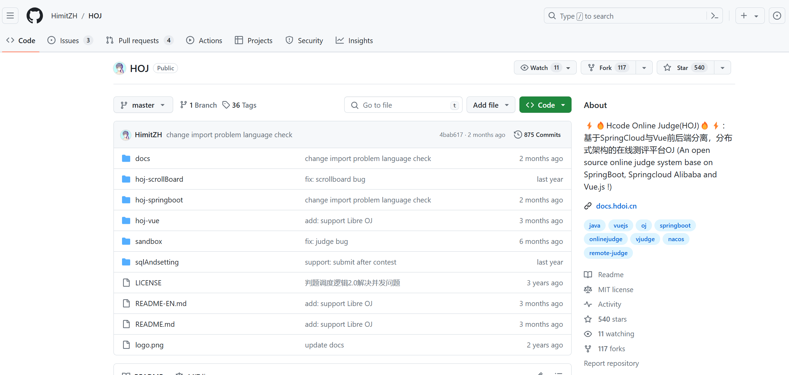

查看它的文档


---

# 如何画时序图？

首先要明确你的时序图要有哪些模块。

时序图也是按照一个时间顺序 / 调用的顺序去画的，时间越往后，线的顺序就越往下。

消息队列如果是满的，就提交失败。


---

# 架构设计如何画？

不同项目架构设计肯定是不一样的，这里采用的是分层架构。

第一步你需要知道分哪些层

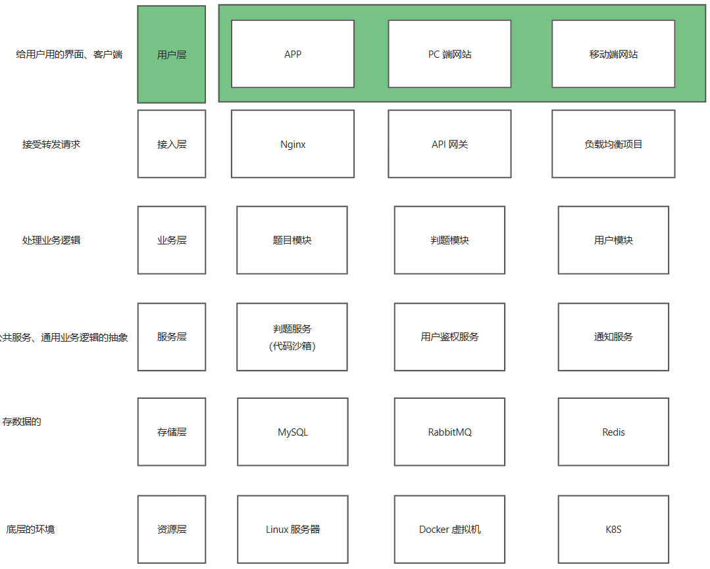

---

# 前端项目初始化

## 确认环境！！！

nodeJS 版本：v18.16.0 或 16

检测命令：

~~~shell
node -v
~~~


切换和管理 node 版本的工具：https://github.com/nvm-sh/nvm


npm 版本：9.5.1

~~~shell
npm -v
~~~

---

## 初始化

使用 vue-cli 脚手架：https://cli.vuejs.org/zh/

其实有想着使用新的，但是新的东西有很多莫名其妙的问题，因此为了稳妥起见，还是使用vue-cli


然后在终端执行


创建项目


~~~shell
vue create yuoj-frontend
~~~

创建项目的步骤根据以下流程来

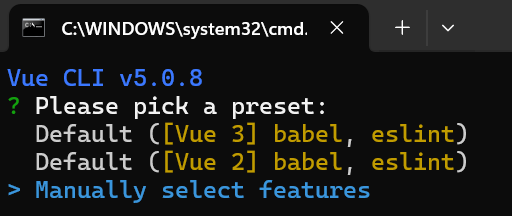


创建项目完成


找到项目目录，使用 `WebStorm(版本：2021.2)` 打开

有任何的项目初始化后，我们先运行


然后直接打开 `package.json`，直接运行项目


然后等待


能看见以下界面，就表示初始化成功了


---

## 前端工程化配置

我们为了保证代码开发过程中，代码的质量是过关的，我们肯定要配置一些代码的检测、包括代码的格式化、代码美化插件。

这里我们用的脚手架已经帮我们配置了代码美化、自动校验、格式化插件等，无需再自行配置。

但这里我们需要去开启一下配置。为什么要配置呢？

例如我们随便找一个页面，然后按 <kbd>ctrl + alt + L</kbd> 进行格式化，然后可以发现格式化了18个，但是格式化后报错了，报错的原因就是开发工具默认的格式化和我们代码校验工具ESlint的配置不一样。


所以你要做的是在webstorm中，打开settings，搜prettier，将prettier选上，然后下面的文件加上vue文件的格式化

勾选上 `On 'Reformat Code' action`，当你按格式化快捷键的时候，它会自动的给你格式化，重构代码，最后确认即可。


然后再搜一下ESLint，这里你只需要保证它的开启的，自动识别配置就OK了。


在 `HelloWorld.vue` 中按 <kbd>ctrl + alt + L</kbd> 进行格式化，执行完后不报错，表示配置工程化成功


----

## 如果自己整合

自己整合就去看下面三个文档

代码规范:https://eslint.org/docs/latest/use/getting-started
代码美化:https://prettier.io/docs/en/install.html
直接整合:https://github.com/prettier/eslint-plugin-prettier#recommended-configuration(包括了https://github.com/prettier/eslint-config-prettier#installation)

---

## 引入组件

Arco Design（https://arco.design/）是字节跳动开源的对标阿里Ant Design的组件库，它们两个很像，或者说国内大厂的组件库都是这种模式

它其实是有一个中后台框架的，但是我试了一下，你的环境如果不同，可能会有坑，所以就没使用这个了，我们打算带大家撸一套模板。


因此这里我们就直接选中Vue的组件库：https://arco.design/vue/docs/start


脚手架自动帮我们整合了 `vue-router`，因此这里我们不用管

我们直接根据 Arco Design 官方文档的快速上手安装就行了。

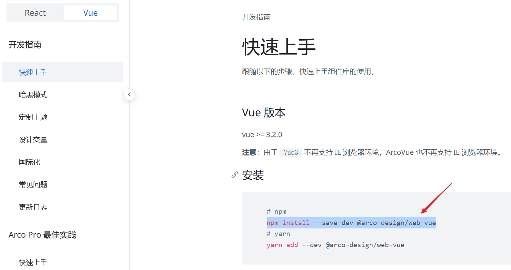

接下来引入，我们推荐完整引入，因为我们现在是为了学习，而不是生产，所以我们这里就不用按需引入了，等到后面优化的时候再使用按需引入。


直接复制，然后找到 `main.js` 入口文件粘贴过来


然后我们试一下是否引入成功，复制一个最复杂的组件


引到App.vue中，看看能不能用，如下图可以发现生效了，说明你的组件库引入成功了。

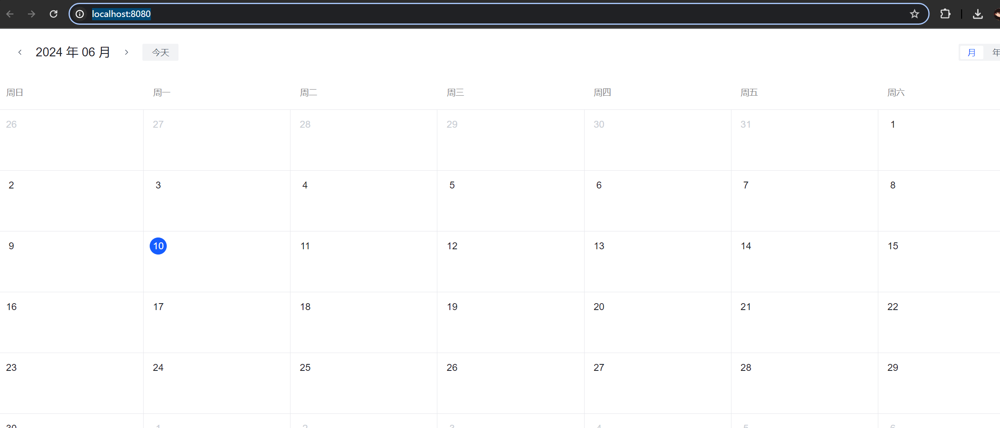

---

# 项目通用模板

## 一、项目通用布局

### 全局

首先建一个专门存放布局的文件layouts，然后复制一个vue文件直接粘贴到layouts中，叫 `BasicLayout.vue`。

将除 `<router-view />` 以外的内容都删掉，因为对于一个布局来说，肯定要能动态的展示不同的页面，只不过导航栏、底部信息、中间的内容可能是有固定区域的。这个才叫同样的布局。


然后在 `App.vue` 中，直接留一个 `<BasicLayout>` 即可，建议外层包一层 `<div id="app">`，个人习惯，这样会方便有一些

那这里为什么要引布局呢？其实如果你以后还有一个别的布局，此时你就可以在 `App.vue` 中进行多套布局的切换

~~~vue
<template>
  <div id="app">
    <BasicLayout />
  </div>
</template>

<style>
#app {
}
</style>
<script>
import BasicLayout from "@/layouts/BasicLayout";

export default {
  components: { BasicLayout },
};
</script>
~~~

---

来想一下，一个常见的网站布局应该是怎么样的？

导航栏、中间的内容、底部的footer版权信息

那怎么做呢？有现成的就不要自己写，首先找到布局，可以发现第一个布局就是我们想要的，那我们直接使用第一个布局的示例代码。

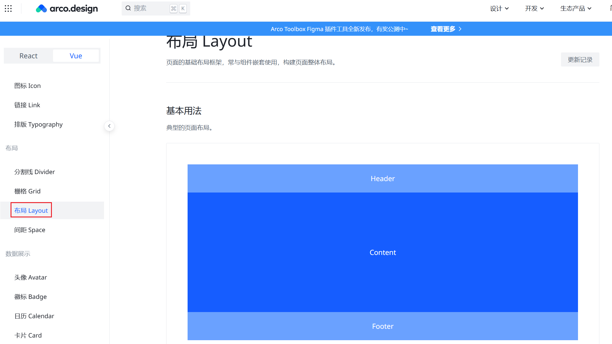

~~~vue
<template>
  <a-layout style="height: 400px">
    <a-layout-header>导航栏</a-layout-header>
    <a-layout-content>
      <router-view />
    </a-layout-content>
    <a-layout-footer>
      <a href="" target="_blank"> by 小奉 </a>
    </a-layout-footer>
  </a-layout>
</template>

<style></style>
~~~

然后打开浏览器查看，可以发现布局出来了


---

可以发现有点丑，接下来给每个布局加一个样式

~~~vue
<template>
  <div id="basicLayout">
    <a-layout style="height: 400px">
      <a-layout-header class="header">导航栏</a-layout-header>
      <a-layout-content class="content">
        <router-view />
      </a-layout-content>
      <a-layout-footer class="footer">
        <a href="" target="_blank"> by 小奉 </a>
      </a-layout-footer>
    </a-layout>
  </div>
</template>

<style scoped>
#basicLayout {
}

#basicLayout .header {
  background: red;
  margin-bottom: 16px;
}

#basicLayout .content {
  /* 渐变背景色 */
  background: linear-gradient(to right, #bbb, #fff);
  margin-bottom: 16px;
}

#basicLayout .footer {
  background: #efefef; /* 浅灰色 */
}
</style>
~~~


---

接下来将footer绝对定位到底部

~~~css
#basicLayout .footer {
  background: #efefef; /* 浅灰色 */
  padding: 16px;
  position: absolute;
  bottom: 0;
  left: 0;
  right: 0; /*left 和 right 都设为0，让它占满*/
  text-align: center;
}
~~~


---

### 导航栏

直接使用现成的组件即可

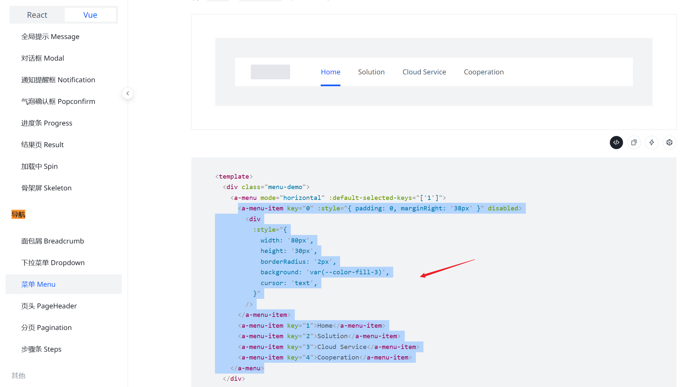

这里考虑到导航菜单可能会比较复杂，因此这里会将它抽离成公共的组件 `components/GlobalHeader`


我们来搞一个动态的导航栏，可以根据路由来生成导航菜单，这里先将复制来的vue文件中多余的东西全删掉，然后引入刚刚复制粘贴的菜单

~~~vue
<template>
  <div id="globleHeader">
    <a-menu mode="horizontal" :default-selected-keys="['1']">
      <a-menu-item
        key="0"
        :style="{ padding: 0, marginRight: '38px' }"
        disabled
      >
        <div
          :style="{
            width: '80px',
            height: '30px',
            borderRadius: '2px',
            background: 'var(--color-fill-3)',
            cursor: 'text',
          }"
        />
      </a-menu-item>
      <a-menu-item key="1">Home</a-menu-item>
      <a-menu-item key="2">Solution</a-menu-item>
      <a-menu-item key="3">Cloud Service</a-menu-item>
      <a-menu-item key="4">Cooperation</a-menu-item>
    </a-menu>
  </div>
</template>

<script setup lang="ts"></script>

<!-- Add "scoped" attribute to limit CSS to this component only -->
<style scoped></style>
~~~

最后在 `BasicLayout.vue` 中引入 `GloableHeader`。

~~~vue
<a-layout-header class="header">
    <GlobalHeader />
</a-layout-header>
~~~

如果报格式错误，到 `BasicLayout.vue` 中 <kbd>ctrl + alt + L</kbd> 格式化一下就好了。


但导航栏我想整点花的，第一块搞个logo，这个OJ系统怎么说也是一个项目，来一个好一点的logo

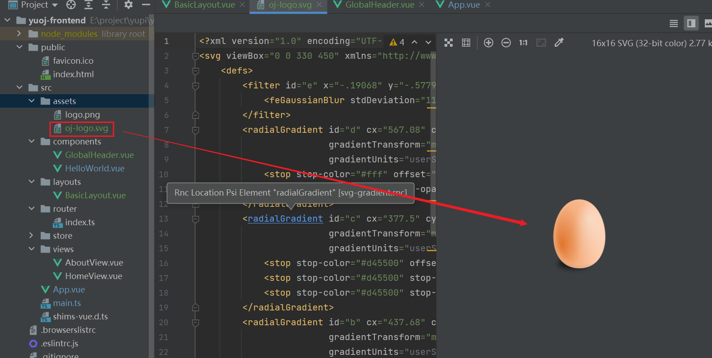

注意img一定要给宽高，否则显示不出来

~~~vue
<template>
  <div id="globleHeader">
    <a-menu mode="horizontal" :default-selected-keys="['1']">
      <a-menu-item
        key="0"
        :style="{ padding: 0, marginRight: '38px' }"
        disabled
      >
        <div class="title-bar">
          
        </div>
      </a-menu-item>
      <a-menu-item key="1">Home</a-menu-item>
      <a-menu-item key="2">Solution</a-menu-item>
      <a-menu-item key="3">Cloud Service</a-menu-item>
      <a-menu-item key="4">Cooperation</a-menu-item>
    </a-menu>
  </div>
</template>

<script setup lang="ts"></script>

<!-- Add "scoped" attribute to limit CSS to this component only -->
<style scoped>
.title-bar {
}

.logo {
  width: 48px;
}
</style>
~~~

可以发现图标出来了。但为什么选一个蛋呢？因为OJ系统是跟鸡有关系的，蛋是O的形状，然后它跟鸡又有关系，所以这个蛋简直太形象了。

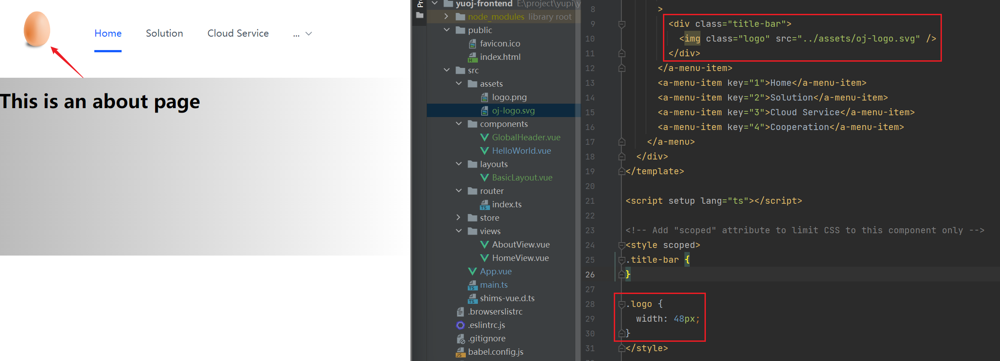

然后再给一个标题，然后顺便将样式调一下，建议先在浏览器中调整样式会好一些


最后粘贴到webstorm中即可。

~~~vue
<template>
  <div id="globleHeader">
    <a-menu mode="horizontal" :default-selected-keys="['1']">
      <a-menu-item
        key="0"
        :style="{ padding: 0, marginRight: '38px' }"
        disabled
      >
        <div class="title-bar">
          
          <div class="title">OJ</div>
        </div>
      </a-menu-item>
    </a-menu>
  </div>
</template>

<script setup lang="ts"></script>

<!-- Add "scoped" attribute to limit CSS to this component only -->
<style scoped>
.title-bar {
  display: flex;
  align-items: center;
}

.title {
  color: #444;
  margin-left: 16px; /*给一个左边距，让它与蛋拉开一定距离*/
}
</style>
~~~

---

## 二、实现动态路由配置

### 1）提取通用路由文件

脚手架会帮你自动生成router文件，但是routes路由，它是定义在index中的，它导出的是router整体，我们不好导出router的部分，因此我们完全可以把这一部分路由文件抽象出来，然后作为参数输入给菜单项。

src/router/routes.ts

~~~ts
import { RouteRecordRaw } from "vue-router";
import HomeView from "@/views/HomeView.vue";

export const routes: Array<RouteRecordRaw> = [
  {
    path: "/",
    name: "home",
    component: HomeView,
  },
  {
    path: "/about",
    name: "about",
    // route level code-splitting
    // this generates a separate chunk (about.[hash].js) for this route
    // which is lazy-loaded when the route is visited.
    component: () =>
      import(/* webpackChunkName: "about" */ "../views/AboutView.vue"),
  },
];
~~~

src/router/routes.ts

~~~ts
import { createRouter, createWebHistory, RouteRecordRaw } from "vue-router";
import { routes } from "@/router/routes";

const router = createRouter({
  history: createWebHistory(process.env.BASE_URL),
  routes,
});

export default router;
~~~

---

### 2）编写路由菜单组件读取路由，动态渲染菜单项

然后路由通用文件就可以喂给菜单项了，我们现在的菜单是写死的，但我们现在不能这么写，我们需要将它改为动态的。


~~~vue
<template>
  <div id="globleHeader">
    <a-menu mode="horizontal" :default-selected-keys="['1']">
      <a-menu-item
        key="0"
        :style="{ padding: 0, marginRight: '38px' }"
        disabled
      >
        <div class="title-bar">
          
          <div class="title">OJ</div>
        </div>
      </a-menu-item>
      <a-menu-item v-for="item in routes" :key="item.path">
        {{ item.name }}
      </a-menu-item>
    </a-menu>
  </div>
</template>

<script setup lang="ts">
import { routes } from "../router/routes";
</script>
~~~

可以发现成功了，点击后会高亮，但是它并没有跳转


---

### 3）绑定跳转事件

所以接下来我们应该实现跳转，绑定什么事件需要看官网，它获得的参数是key，表示要跳转到哪个路由，因此我们就使用这个事件。


GlobalHeader.vue

~~~vue
<template>
  <div id="globleHeader">
    <a-menu
      mode="horizontal"
      :default-selected-keys="['1']"
      @menu-item-click="doMenuClick"
    >
      <a-menu-item
        key="0"
        :style="{ padding: 0, marginRight: '38px' }"
        disabled
      >
        <div class="title-bar">
          
          <div class="title">OJ</div>
        </div>
      </a-menu-item>
      <a-menu-item v-for="item in routes" :key="item.path">
        {{ item.name }}
      </a-menu-item>
    </a-menu>
  </div>
</template>

<script setup lang="ts">
import { routes } from "../router/routes";
import { useRouter } from "vue-router";

const router = useRouter();

const doMenuClick = (key: string) => {
  router.push({
    path: key,
  });
};
</script>
~~~

---

### 4）同步路由到菜单项

接下来还有一个细节，就是当我刷新的时候，可以发现菜单并没有保留记录状态


我们现在要做的是：根据当前的页面地址去激活当前菜单对应的状态。

我们首先来看一下导航组件是从哪一个判断哪一个菜单项的

```
selectedKeys：当前选中的菜单项，它是一个数组
```

现在我们要做的是：怎么样才能当用户刷新页面时将路由信息同步到菜单项上。

我们使用监听路由的方式，因为我们每次点击都会改变路由地址，那我们在改变路由地址的时候去改变菜单的高亮，这也是可以的。

首先点击菜单项 => 跳转更新路由 => 更新路由后，同步去更新菜单栏的高亮状态

~~~vue
<template>
  <div id="globleHeader">
    <a-menu
      mode="horizontal"
      :selected-keys="selectedKeys"
      @menu-item-click="doMenuClick"
    >
    </a-menu>
  </div>
</template>

<script setup lang="ts">
import { routes } from "../router/routes";
import { useRoute, useRouter } from "vue-router";
import { ref } from "vue";

const router = useRouter();
const route = useRoute();

// 默认主页
const selectedKeys = ref(["/"]);

// 路由跳转后，更新选中的菜单项
router.afterEach((to, from, failure) => {
  selectedKeys.value = [to.path];
});
</script>
~~~


---

## 三、全局状态管理

vuex：https://vuex.vuejs.org/zh/

本人更喜欢使用pinia，这里使用vuex纯粹是为了方便

所有页面全局共享的变量，而不是局限在某一个页面中

适合作为全局状态的数据：已登录用户信息

本质上：给你提供了一套增删改查全局变量的API，只不过可能多了一些功能（比如时间旅行）

下图是从官网截来的


可以直接参考购物车示例：https://github.com/vuejs/vuex/tree/main/examples/classic/shopping-cart


---

state：存储的状态信息，比如用户信息

mutation（尽量同步）：定义了对变量进行增删改（更新）的方法

actions（支持异步）：执行异步操作，并且触发mutation的更改（actions 调用 mutation）

**src/store/user.ts**

~~~ts
import shop from "../../api/shop";

// initial state
const state = () => ({
  loginUser: {
    userName: "未登录",
  },
});

// getters
const getters = {};

// actions
const actions = {
  getLoginUser({ commit, state }, payload) {
    commit("updateUser", { userName: "小奉" });
  },
};

// mutations
const mutations = {
  updateUser(state, payload) {
    state.loginUser = payload;
  },
};

export default {
  namespaced: true,
  state,
  getters,
  actions,
  mutations,
};
~~~

---

state变量最重要肯定是给前端用的，给前端去展示的。

将已登录用户跟菜单栏放在一行，这里需要使用一个布局组件，这里需要用到Flex，因为右侧用户信息其实是固定的，但左侧的菜单以及屏幕是不固定宽度的。

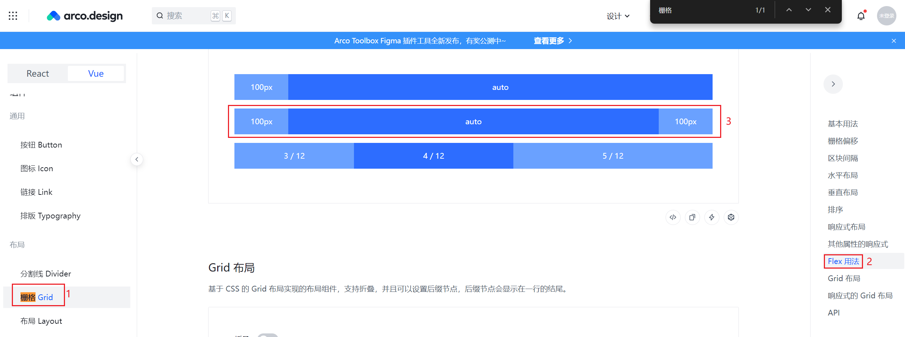

**GlobalHeader.vue**

~~~vue
<template>
  <a-row id="globalHeader" class="grid-demo" style="margin-bottom: 16px">
    <a-col flex="auto">
      <a-menu
        mode="horizontal"
        :selected-keys="selectedKeys"
        @menu-item-click="doMenuClick"
      >
        <a-menu-item
          key="0"
          :style="{ padding: 0, marginRight: '38px' }"
          disabled
        >
          <div class="title-bar">
            
            <div class="title">OJ</div>
          </div>
        </a-menu-item>
        <a-menu-item v-for="item in routes" :key="item.path">
          {{ item.name }}
        </a-menu-item>
      </a-menu>
    </a-col>
    <a-col flex="100px">
      <div>小奉</div>
    </a-col>
  </a-row>
</template>
~~~

出现的效果如下图所示


如果我们想要让它和菜单栏在同一行，需要加一个属性


GlobalHead.vue

~~~html
<a-row id="globalHeader" align="center" style="margin-bottom: 16px">
~~~

顺便给头部加个阴影，BasicLayout.vue

~~~css
#basicLayout .header {
  /*background: red;*/
  margin-bottom: 16px;
  box-shadow: #eee 1px 1px 5px;
}
~~~

效果如下图


定义user模块，src/store/user.ts

~~~ts
// initial state
import { StoreOptions } from "vuex";

export default {
  namespaced: true,
  state: () => ({
    loginUser: {
      userName: "未登录",
    },
  }),
  getters: {},
  actions: {
    getLoginUser({ commit, state }, payload) {
      commit("updateUser", { userName: "小奉" });
    },
  },
  mutations: {
    updateUser(state, payload) {
      state.loginUser = payload;
    },
  },
} as StoreOptions<any>;
~~~

src/store/index.ts

~~~ts
import { createStore } from "vuex";
import user from "./user";

export default createStore({
  state: () => ({
    all: [],
  }),
  getters: {},
  mutations: {},
  actions: {},
  modules: {
    user,
  },
});
~~~

---

接下来就可以直接在页面中渲染了，在渲染的时候推荐加一些可选项操作符

GlobalHeader.vue

~~~vue
<div>{{ store.state.user?.loginUser?.userName ?? "未登录" }}</div>

<script setup lang="ts">
const store = useStore();
console.log(store.state.user.loginUser); // 可以先打印一下，然后再在页面中渲染
</script>
~~~

---

修改状态变量

我们可以先在GlobalHeader.vue中加一个setTimeout，看看它是否可以及时更新

~~~js
setTimeout(() => {
  store.dispatch("user/getLoginUser", { userName: "小奉" });
}, 3000);
~~~

保存，查看效果，可以发现三秒后登录状态已经改变了


现在前端用户的状态管理就已经好了，只不过当我们真正要实现登录的时候，需要将user.ts中改成远程登录

~~~ts
actions: {
    getLoginUser({ commit, state }, payload) {
      // todo 改为从远程请求获取登录信息
      commit("updateUser", payload);
    },
},
~~~

---

## 四、权限管理

我能够直接以一套通用的机制，去定义哪个页面需要哪些权限。

我们的菜单是根据路由配置实现的，那我们既然要控制用户访问不同页面的时候，去看看它是否有对应的权限，那我们就可以直接在路由中去定义每个页面需要什么权限就好了。

---

### 1）在路由配置文件，定义某个路由的访问权限

我们直接在routes.ts中加一个meta，这个是 `vue-router` 提供的一个附带元信息的功能

~~~ts
{
    path: "/admin",
    name: "仅管理员可见",
    component: AdminView,
    meta: {
      access: "canAdmin",
    },
}
~~~

在 `src/views` 下新增 `AdminView.vue页面` 

~~~vue
<template>
  <div class="home">
    管理员可见
    
    <HelloWorld msg="Welcome to Your Vue.js + TypeScript App" />
  </div>
</template>

<script lang="ts">
import { defineComponent } from "vue";
import HelloWorld from "@/components/HelloWorld.vue"; // @ is an alias to /src

export default defineComponent({
  name: "HomeView",
  components: {
    HelloWorld,
  },
});
</script>
~~~

---

### 2）在全局页面组件中，绑定一个全局路由监听

然后我们可以来一个全局的机制，用户每次访问一个页面的时候，我们来判断一下，它是否有这个页面路由对应的admin权限，如果有则允许访问，如果没有则跳转到一个401 / 403，即没有权限的页面。

App.vue

~~~vue
<template>
  <div id="app">
    <BasicLayout />
  </div>
</template>

<script setup lang="ts">
import { useRouter } from "vue-router";

const router = useRouter();

router.beforeEach((to) => {
  console.log(to);
});
</script>
~~~

打印结果如下，可以发现我们可以从to变量中拿到权限定义的逻辑


那这就简单了

App.vue

~~~vue
<script setup lang="ts">
import { useRouter } from "vue-router";
import { useStore } from "vuex";

const router = useRouter();
const store = useStore();

router.beforeEach((to) => {
  // 仅管理员可见，判断当前用户是否有权限
  if (to.meta?.access == "canAdmin") {
    if (store.state.user.loginUser?.role !== "admin") {
      return "/noAuth";
    }
  }
  console.log(to);
});
</script>
~~~

---

src/router/routes.ts

~~~ts
{
    path: "/noAuth",
    name: "无权限",
    component: NoAuthView,
}
~~~

---

## 五、优化页面布局

### 1）底部footer布局优化

当页面缩小的时候，底部的footer并没有一直处于底部


这个其实很简单，我们修改一下定位 `stiky(粘性)`，滑动滚动条，这样当高度如果已经比上面的内容还要小的时候，底下的footer会固定住

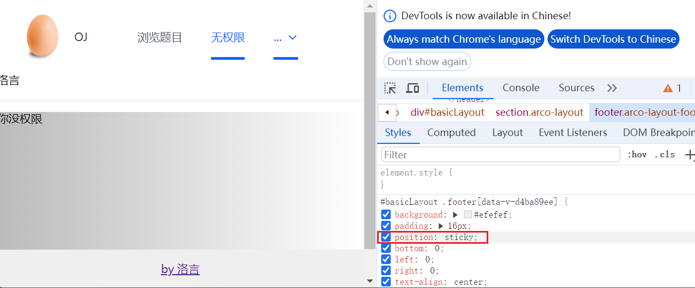

但是当界面放大的时候，又出现问题了

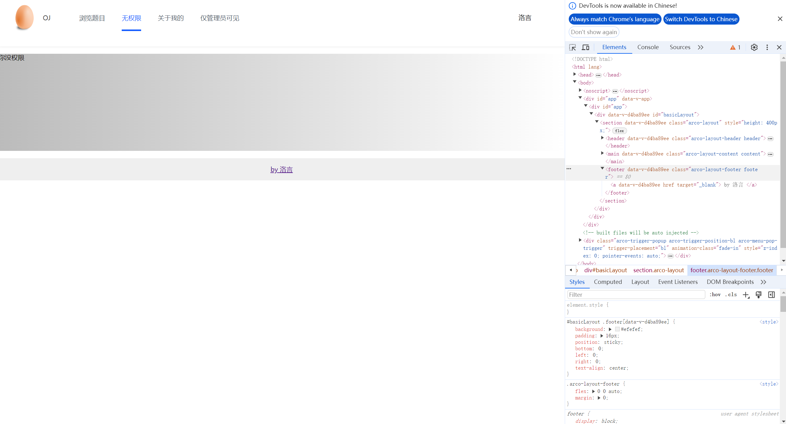

此时我们只需要让父节点元素加一个最小高度限制，万一它超过了当前屏幕的高度，还可以再扩展。

vh就是屏幕可视区域的高度。

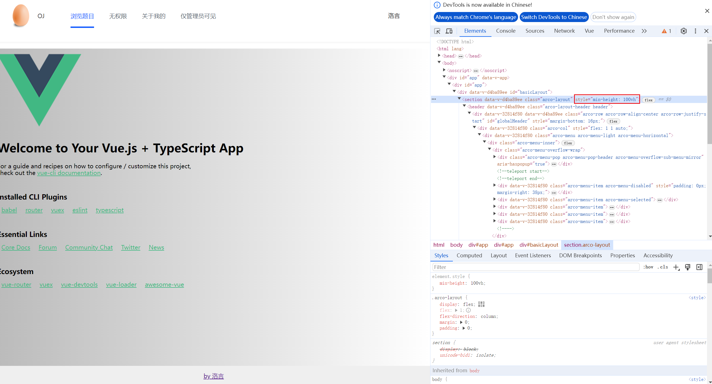

现在调试完成了，回到代码中

BasicLayout.vue

~~~vue
<template>
  <div id="basicLayout">
    <a-layout style="min-height: 100vh">
    </a-layout>
  </div>
</template>

<style scoped>
#basicLayout .footer {
  position: sticky;
}
</style>
~~~

---

### 2）优化导航栏用户名称的换行

还有个问题，当缩小的时候，`"未登录"` 放到下一行去了


目的：我们应该让 `"未登录"` 即使在屏幕很小的时候也不会被挤压到第二行

BasicLayout.vue

~~~html
<a-layout style="min-height: 100vh" :wrap="false">
~~~

---

### 3）优化 content、GlobalHeader的样式

可以发现它多了一个底部的间距，去掉就会好多了


然后内容区域和边上感觉又有点挤，这里加一个padding

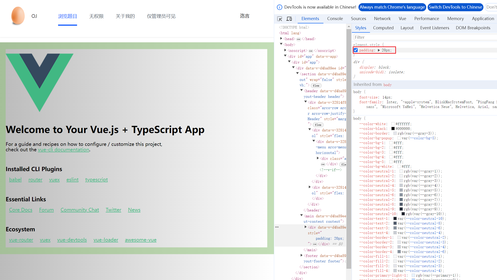

调式完成后修改代码

BasicLayout.vue

~~~css
#basicLayout .content {
  padding: 20px;
}
~~~

GlobalHeader.vue


---

## 六、通用导航栏组件优化 —— 根据配置控制菜单的显隐

### 1）给路由新增一个标志位，用于判断路由是否显隐

src/router/routes.ts

~~~ts
{
    path: "/hide",
    name: "隐藏页面",
    component: HomeView,
    meta: {
      hideInMenu: true,
    },
},
~~~

---

### 2）不要用 v-for + v-if 去条件渲染元素

GlobalHeader.vue

处理办法：在外层加一层div

~~~html
<div v-for="item in routes" :key="item.path">
    <a-menu-item :key="item.path" v-if="!item.meta?.hideInMenu">
        {{ item.name }}
    </a-menu-item>
</div>
~~~

PS：这样写会导致无限循环报错，But `v-for` 和 `v-if` 不要同时用，因为 `v-for` 会先执行，如果你的 `v-for` 先执行，如果你有1000个路由，只有1个要显示，剩下999个都要隐藏，如果你先用 `v-for` 那就需要先渲染1000遍，然后再到里面判断 `v-if`，再把剩下的 `999` 个隐藏。

因此比较推荐的做法是，先到JS中过滤，先去判断到底哪些路由你要显示，然后保留出一个比较经典的数组。这样就可以减少 `v-for` 渲染的次数，并且也不会出现刚刚的死循环报错的问题了。

**GlobalHeader.vue**

这个语句可以简写，但这里不简写，因为估计后面还需要改造

~~~ts
// 展示在菜单的路由数组
const visibleRoutes = routes.filter((item) => {
  if (item.meta?.hideInMenu) {
    return false;
  }
  return true;
});
~~~

保存代码查看效果，可以发现成功隐藏


---

## 七、根据权限控制菜单

需求：只有具有权限的菜单，才对用户可见。

原理：类似上面的控制路由显示隐藏，只要判断用户没有这个权限，就直接过滤掉


---

## 全局权限管理

### 1）定义权限

在src目录下新建access目录，然后新建 `accessEnum.ts`

~~~ts
/**
 * 权限定义
 */
const ACCESS_ENUM = {
  NOT_LOGIN: "notLogin",
  USER: "user",
  ADMIN: "admin",
};

export default ACCESS_ENUM;
~~~

---

### 2）定义一个公用的权限校验方法

想法：能不能将判断它是否有权限的功能从之前的APP.vue文件中抽出来，我们专门去写一个判断权限的方法，这样其他的地方要用到判断权限的方法，例如菜单、路由全局拦截，就都可以去共用这个方法。

src/access/checkAccess.ts

~~~ts
~~~


题目显示


> 判题服务：获取题目信息、预计的输入输出结果，返回给主业务后端：用户的答案是否正确
> 代码沙箱：只负责运行代码，给出结果，不管什么结果是正确的。

代码沙箱中作为独立的一个服务。

## **项目的基本功能**

1. 题目模块

   1. 管理员

   - 创建题目
   - 删除题目
   - 修改题目

- 用户
  - 搜索题目
  - 在线做题
  - 提交题目代码

2. 用户模块
   1. 注册
   2. 登录
3. 判题模块
   1. 提交判题（结果正确性)
   2. 错误处理（内存溢出，安全性，超时）
   3. 自主实现 代码沙箱（安全沙箱）
   4. 开放接口（提供一个独立的新服务类似于SDK）

## 架构设计


## 判题和代码沙箱

**判题和代码沙箱是两个不同的服务！！！**

### **判题模块和代码沙箱的关系**

**判题**：对代码沙箱执行出来的结果和题目预期设定的值进行对比，如：运行时间，内存消耗...等信息判断用户是否在规定的条件下完成题目。
**沙箱**：执行用户的代码，并返回执行用户代码过程中出现的各种问题：编译错误，运行错误，运行耗时，内存消耗...这些信息提供给判题服务进判题。
判题成功**≠**作对了题目，判题成功仅仅表示对你的代码执行结果进行了判断，是否做对了题目要参考判题信息中的messg提示信息。

这两个模块完全解耦：

其中发送题目用例的时候，可以一次性发送多组代码。减少资源的浪费
为什么会有多组用例，检测代码的可用性，同时在判题的时候有更多的条件进行判断对比
二者通过api交互，简单直接的调用双方，避免更多的配置。

### 判题流程：

1）传入题目的提交 id，获取到对应的题目、提交信息（包含代码、编程语言等）
2）如果题目提交状态不为等待中，就不用重复执行了
3）更改判题（题目提交）的状态为 “判题中”，防止重复执行，也能让用户即时看到状态
4）调用沙箱，获取到执行结果
5）根据沙箱结果，判断代码是否有误，代码正常执行才进行判题
5）根据沙箱的执行结果，设置题目的判题状态和信息


#### 判题信息判断、判题状态修改

对用户提交的题目答案信息（代码，语言，题目id）进行判断，查看题目是否存在，是否已经提交过题目还没有判题处理？

1. 判断用户是否含有已经提交的题目信息，但是还没有进行判题，如果有就禁止提交题目答案。**如果没有就提交新判题！（还未进行判题）**

```java
        //如果用户已经提交了题目答案，并且可能是对成功的题目再次提交
        QueryWrapper<QuestionSubmit> questionSubmitQueryWrapper = new QueryWrapper<>();
        questionSubmitQueryWrapper.eq("questionId", questSubmitAddRequest.getQuestionId());
        questionSubmitQueryWrapper.eq("userId", loginUser.getId());
        List<QuestionSubmit> questionSubmitList = this.list(questionSubmitQueryWrapper);
        List<Integer> questionStateList = questionSubmitList.stream().map(QuestionSubmit::getStatus).collect(Collectors.toList());
        for (int i = 0; i < questionStateList.size(); i++) {
            if (questionStateList.get(i).equals(QuestionSubmitStatusEnum.WAITING.getValue()) || questionStateList.get(i).equals(QuestionSubmitStatusEnum.RUNNING.getValue())) {
                throw new BusinessException(ErrorCode.NO_AUTH_ERROR, "已经提交过题目，请等待");

            }
        }
```

2. 对提交的信息进行判断（提交判题，前置信息判断）

```java
QuestionSubmit questionSubmitServiceById = questionSubmitService.getById(questionSubmitId);
        if (questionSubmitServiceById == null) {
            throw new BusinessException(ErrorCode.NOT_FOUND_ERROR, "提交信息不存在");
        }
        // 1.2) 题目不存在
        Question questionServiceById = questionService.getById(questionSubmitServiceById.getQuestionId());
        if (questionServiceById == null) {
            throw new BusinessException(ErrorCode.NOT_FOUND_ERROR, "题目不存在");
        }
        // 2）如果题目提交状态不为等待中，就不用重复执行了
        if (!questionSubmitServiceById.getStatus().equals(QuestionSubmitStatusEnum.WAITING.getValue())) {
            throw new BusinessException(ErrorCode.OPERATION_ERROR, "题目正在判题中");
        }
```

#### 题目状态修改 --判断中

这里的题目状态修改，是为了告诉顾客你的题目已经在进行判断的过程中了，用户不知道代码沙箱，实际上还需要调用代码沙箱，得到结果之后在进行判题

```java
// 3）更改判题（题目提交）的状态为 “判题中”，防止重复执行，也能让用户即时看到状态
        QuestionSubmit questionSubmitUpdate = new QuestionSubmit();
        questionSubmitUpdate.setStatus(QuestionSubmitStatusEnum.RUNNING.getValue());
        questionSubmitUpdate.setId(questionSubmitId);
        boolean update = questionSubmitService.updateById(questionSubmitUpdate);
        if (!update) {
            throw new BusinessException(ErrorCode.SYSTEM_ERROR, "题目状态更新错误");
        }
```

#### 调用代码沙箱

其中代码沙箱采用工厂模式+代理模式，可能有多个代码沙箱，根据不同的情况使用不同的代码沙箱。传递参数为：代码，输入用例，编程语言。
**调用代码沙箱的接口架构**请参阅**5.代码沙箱架构**
工厂模式：根据用户的配置文件，后期可搭配nacos的配置文件，选择不同的代码沙箱（本地，远程，第三方）来运行用户的代码，并得到运行过程中产生的信息。
代理模式：对用户选中的代码沙箱进行代理，对其功能进行增强（日志）。

```java
// 4）调用沙箱，获取到执行结果
        // 4.1) 工厂模式和代理模式确定使用的代码沙箱
        CodeSandbox codeSandbox = CodeSandboxFactory.newInstance(type);
        codeSandbox = new CodeSandboxProxy(codeSandbox);
        // 4.2) 调用沙箱接口需要传递请求参数ExecuteCodeRequest类：代码，语言，输入用例
        // 4.2.1） 构建输入用例
        String judgeCase = questionServiceById.getJudgeCase(); //判题用例
        List<JudgeCase> judgeCaseToList = JSONUtil.toList(judgeCase, JudgeCase.class);
        List<String> judgeCaseInputList = judgeCaseToList.stream().map(JudgeCase::getInput).collect(Collectors.toList());
        ExecuteCodeRequest executeCodeRequest = ExecuteCodeRequest.builder()
                .code(questionSubmitServiceById.getCode())
                .inputList(judgeCaseInputList)
                .language(questionSubmitServiceById.getLanguage())
                .build();
        //工厂模式根据用户配置创造的代码沙箱实例
        ExecuteCodeResponse executeCodeResponse = codeSandbox.executeCode(executeCodeRequest);
```

#### 根据代码沙箱结果初次判题

代码沙箱执行完成之后会给出沙箱的响应结果进行初次判题，如果沙箱中的执行状态不是成功，意味着可能出现编译错误或者运行错误，那么可以直接进行判题，用户的代码出现错误，修改数据库信息，不需要后续在进行详细的判题。
**注：代码沙箱的具体实现流程请参考：**

```java
// 根据沙箱结果先执行判断state 判断代码是否编译或者执行错误，
        //判题是在执行成果的条件下，对其内存，输入输出等条件进行对比判断
        Integer status = executeCodeResponse.getStatus();
        JudgeInfo judgeInfo = new JudgeInfo();
        questionSubmitUpdate = new QuestionSubmit();
        if (status != CodeSandboxEnum.SUCCEED.getValue()){
            //编译错误
            if (status == CodeSandboxEnum.WAITING.getValue()){
                judgeInfo.setMessage(JudgeInfoMessageEnum.COMPILE_ERROR.getText());
            }

            //运行错误
            if (status == CodeSandboxEnum.RUNNING.getValue()){
                judgeInfo.setMessage(JudgeInfoMessageEnum.RUNTIME_ERROR.getText());
            }

            if (status==null){
                judgeInfo.setMessage(JudgeInfoMessageEnum.COMPILE_ERROR.getText());
            }

            questionSubmitUpdate.setId(questionSubmitId);
            questionSubmitUpdate.setStatus(QuestionSubmitStatusEnum.FAILED.getValue());
            questionSubmitUpdate.setJudgeInfo(JSONUtil.toJsonStr(judgeInfo));
            update = questionSubmitService.updateById(questionSubmitUpdate);
            if (!update) {
                throw new BusinessException(ErrorCode.SYSTEM_ERROR, "题目状态更新错误");
            }
        }
```

#### 判题服务 判题 (策略模式)

如果代码沙箱代码成功执行，没有任何异常信息，那么就可以调用判题服务进行判题：用户的代码运行是否符合要求。
判题服务可以使用策略模式，根据不同的情况进行判题，例如用户使用的编程语言不同，其代码执行消耗的时间也可能所差异
**判题服务的策略模式请参考：6. 判题策略模式**

```java
// 5）根据沙箱的执行结果，设置题目的判题状态和信息
        JudgeContext judgeContext = new JudgeContext();
        judgeContext.setJudgeInfo(executeCodeResponse.getJudgeInfo());
        judgeContext.setInputList(inputList);
        judgeContext.setOutputList(outputList);
        judgeContext.setJudgeCaseList(judgeCaseList);
        judgeContext.setQuestion(question);
        judgeContext.setQuestionSubmit(questionSubmit);
        JudgeInfo judgeInfo = judgeManager.doJudge(judgeContext);
        // 6）修改数据库中的判题结果
        questionSubmitUpdate = new QuestionSubmit();
        questionSubmitUpdate.setId(questionSubmitId);
        questionSubmitUpdate.setStatus(QuestionSubmitStatusEnum.SUCCEED.getValue());
        questionSubmitUpdate.setJudgeInfo(JSONUtil.toJsonStr(judgeInfo));
        update = questionSubmitService.updateById(questionSubmitUpdate);
        if (!update) {
            throw new BusinessException(ErrorCode.SYSTEM_ERROR, "题目状态更新错误");
        }
        QuestionSubmit questionSubmitResult = questionSubmitService.getById(questionId);
  return questionSubmitResult;
```

#### 总结例子：

当用户提交题目之后：
1）判断当前题目是否存在当前用户已经提交过，但是还未完成判题的数据，如果有，就不在提交数据，如果不存在存入数据，提交进行判题，
2）对提交的题目信息进行判断，题目是否存在..等等的信息判断 
3）更改题目状态为判题中，避免后续继续提交题目。
4）调用代码沙箱进行用户代码的测试，参数：用户代码，题目的测试用例输入...等 
4.1）代码沙箱的选择通过application.yml当中的配置，使用**工厂模式**来确定使用那个代码沙箱，同时对选中的沙箱使用代理模式，对其进行代理（**代理模式**），增强了他的能力（日志），也可以用aop切面来实现。
4.2）代码沙箱在执行的过程中会产生信息是否通过编译，运行是否错误等等信息，**代码沙箱的详情请参考：**
5）根据调用代码沙箱得到的返回信息初步进行判题，如果沙箱在运行用户的代码过程中没有出现错误，成功运行的情况下，提交代码沙箱的返回信息进行判题，判断代码的运行结果是否符合题目设置的要求如：运行时间，内存等等，如果没有成功运行出现了编译/运行异常，直接修改数据库，判题失败，出现了编译错误。
6）代码沙箱运行成功，对返回的结果信息提交给判题服务进行判断，而判题服务使用了**策略模式**，也就是可能有不同的判题策略，例如使用的编程语言不同，题目类型不同，因而不同的情况使用不同的判题策略，根据创建题目设置的要求和程序运行的结果进行对比，进行判题，判题成功仅仅表示对题目进行了判断是否成功，不代表题目就符合了要求，也可能出现，运行时间超时了，但是判题服务对其进行了判断，就是判题成功，但答案不符合要求。
**注：再次说明，判题服务和代码沙箱是两个服务，题目是否正确是通过代码沙箱的运行结果和判题逻辑两者一起决定的，例如：判题成功-代码不符合要求（超时） 判题成功-代码符合要求，判题失败-代码运行错误。**

## 调用代码沙箱接口开发（工厂/代理模式）

#### 定义代码沙箱的接口，提高通用性

1）之后我们的项目代码只调用接口，不调用具体的实现类，这样在你使用其他的代码沙箱实现类时，就不用去修改名称了， 便于扩展。
判题服务调用代码沙箱服务的接口：判题用例（一组或多组），用户代码，变成语言

```java
   /**
     * 执行代码，输入请求，得到输出
     * @param executeCodeRequest
     * @return
     */

    ExecuteCodeResponse executeCode(ExecuteCodeRequest executeCodeRequest);
```

```java
/**
 * 沙箱请求数据
 */
@Data
@Builder
@NoArgsConstructor
@AllArgsConstructor
public class ExecuteCodeRequest {
    /**
     * 输入用例 多组，减少资源的使用
     */
    private List<String> inputList;

    /**
     * 用户提交的题目代码
     */
    private String code;
    /**
     * 编程语言
     */
    private String language;
}
```

```java
/**
 * 沙箱响应数据
 */
@Data
@Builder
@NoArgsConstructor
@AllArgsConstructor
public class ExecuteCodeResponse {

    /**
     * 多组判题用例输出
     */
    private List<String> outputList;

    /**
     * 接口信息
     */
    private String message;

    /**
     * 执行状态
     */
    private Integer status;

    /**
     * 判题信息: 程序执行时间，耗时，消耗内存
     */
    private JudgeInfo judgeInfo;
    
}
```

代码沙箱的请求接口中，timeLimit 可加可不加，可自行扩展，即时中断程序

扩展思路：增加一个查看代码沙箱状态的接口

2）定义多种不同的代码沙箱实现
**接口是抽象的，实现类是具体的**
示例代码沙箱：仅为了跑通业务流程
远程代码沙箱：实际调用接口的沙箱
第三方代码沙箱：调用网上现成的代码沙箱，[https://github.com/criyle/go-judge](https://github.com/criyle/go-judge)

#### 沙箱接口实现 --简单工厂模式

在上一步我们定义了调用代码沙箱的接口，但是如果我们的沙箱有多个，例如本地的，远程的，第三方的沙箱服务,但是我们只需要对接口做一个实现即可，具体怎么去调用沙箱服务在实现类里面完成，我们只需要调用接口即可。**降低耦合性**！
但是如果我们的沙箱有多个，例如本地的，远程的，第三方的沙箱服务，如果我们要对沙箱服务选择，每次都需要去new一个新的对象来进行调用，如果服务已经上线，再次修改代码，维护性变得很低，因此可以使用工厂模式搭配nacos配置中心，通过传递一个字符串变量来实现不同的沙箱切换。

1. 创建工厂

根据传递的字符串不同，new不同的调用沙箱接口实现类（不同的沙箱服务）

```java
/**
 * 代码沙箱工厂（根据字符串参数创建指定的代码沙箱实例）
 */

public class CodeSandboxFactory {

    /**
     * 创建代码沙箱示例
     *
     * @param type 沙箱类型
     * @return
     */
    public static CodeSandbox newInstance(String type) {
        switch (type) {
            case "example":
                return new ExampleCodeSandbox();
            case "remote":
                return new RemoteCodeSandbox();
            case "thirdParty":
                return new ThirdPartyCodeSandbox();
            default:
                return new ExampleCodeSandbox();
        }
    }
}

```

2. 接口实现

实现调用沙箱接口，不同的沙箱服务（本地，远程，第三方...）对应不同的实现类。

```java
/**
 * 示例代码沙箱（仅为了跑通业务流程）
 */
@Slf4j
public class ExampleCodeSandbox implements CodeSandbox {

    @Override
    public ExecuteCodeResponse executeCode(ExecuteCodeRequest executeCodeRequest) {
        System.out.println("示例代码沙箱");
		return null;
    }
}
```

```java
/**
 * 远程代码沙箱（实际调用接口的沙箱）
 */
public class RemoteCodeSandbox implements CodeSandbox {


    @Override
    public ExecuteCodeResponse executeCode(ExecuteCodeRequest executeCodeRequest) {
        System.out.println(" 远程代码沙箱");
        return null;
    }
}
```

```java
/**
 * 第三方代码沙箱（调用网上现成的代码沙箱）
 */
public class ThirdPartyCodeSandbox implements CodeSandbox {
    @Override
    public ExecuteCodeResponse executeCode(ExecuteCodeRequest executeCodeRequest) {
        System.out.println("第三方代码沙箱");
        return null;
    }
}
```

3. 调用工厂

通过application.yml配置文件种的信息，进行不同的代码沙箱服务切换。


```java
 @Value("${codesandbox.type:example}")
    private String type;
```

```java
 @Test
    void executeCodeByValue() {
        //使用工厂，根据配置得到的字符串变量创造不同的对象实例（不同的代码沙箱）
        CodeSandbox codeSandbox = CodeSandboxFactory.newInstance(type);
        String code = "int main() { }";
        String language = QuestionSubmitLanguageEnum.JAVA.getValue();
        List<String> inputList = Arrays.asList("1 2", "3 4");
        ExecuteCodeRequest executeCodeRequest = ExecuteCodeRequest.builder()
                .code(code)
                .language(language)
                .inputList(inputList)
                .build();
        //调用service:调用代码沙箱接口codeSandbox.executeCode()
        ExecuteCodeResponse executeCodeResponse = codeSandbox.executeCode(executeCodeRequest);
        Assertions.assertNotNull(executeCodeResponse);
    }
```

#### 代码沙箱增强 ---代理模式

在上一步当中我们通过工厂模式实现能够根据不同的配置去是切换代码沙箱服务。
如果我们想在每个沙箱服务当中去获取日志，那么就意味着每一个代码沙箱都需要去编写日志的实现方法，使得操作变得繁琐，为了偷懒（不是！），可以使用**代理模式**，不改变原有的操作，并对其功能进行增强，或者使用**aop切面**进行增强也可以实现。
调用者原本调用

使用代理模式进行调用

**代理模式的实现原理**：
实现被代理的接口
通过构造函数接受一个被代理的接口实现类
调用被代理的接口实现类，在调用前后增加对应的操作

```java
/**
 * 静态代理，使用代理模式对其原有的进行增强
 */
@Slf4j
public class CodeSandboxProxy implements CodeSandbox {

    private final CodeSandbox codeSandbox;


    public CodeSandboxProxy(CodeSandbox codeSandbox) {
        this.codeSandbox = codeSandbox;
    }

    @Override
    public ExecuteCodeResponse executeCode(ExecuteCodeRequest executeCodeRequest) {
        log.info("代码沙箱请求信息：" + executeCodeRequest.toString());
        ExecuteCodeResponse executeCodeResponse = codeSandbox.executeCode(executeCodeRequest);
        log.info("代码沙箱响应信息：" + executeCodeResponse.toString());
        return executeCodeResponse;
    }
}
```

**代理模式和工厂模式怎么一起使用？**
工厂模式是根据不同的状态new不同的接口实现类，代理模式是代理了接口并对其增强，因此，先使用工厂模式new出不同的接口实现类，然后再代理被实现的接口，这样就可以对实现的接口进行增强。
不管是代理模式还是工厂模式都是对接口进行操作，而所有的代码沙箱的调用都是对接口（沙箱调用接口）进行实现。

```java
 CodeSandbox codeSandbox = CodeSandboxFactory.newInstance(type); //工厂模式，new出选择实现类
        codeSandbox = new CodeSandboxProxy(codeSandbox); //代理模式 对new的实现类进行增强
...
    	//接口调用
        ExecuteCodeResponse executeCodeResponse = codeSandbox.executeCode(executeCodeRequest);

```

#### 小知识 - Lombok Builder 注解、

以前我们是使用 new 对象后，再逐行执行 set 方法的方式来给对象赋值的。
还有另外一种可能更方便的方式 builder。
1）实体类加上 [@Builder ](/Builder ) 等注解： 

```java
@Data
@Builder
@NoArgsConstructor
@AllArgsConstructor
public class ExecuteCodeRequest {

    private List<String> inputList;

    private String code;

    private String language;
}
```

2）可以使用链式的方式更方便地给对象赋值：

```java
ExecuteCodeRequest executeCodeRequest = ExecuteCodeRequest.builder()
        .code(code)
        .language(language)
        .inputList(inputList)
        .build();
```

**判题服务：**
判题服务要做的事情：用户提交做题信息之后，判题服务通过传递题目的id获取到用户提交的信息，然后调用代码沙箱，将代码沙箱处理完成的结果信息重新写入数据库，修改判题状态。

## 判题策略模式

根据不同的情况使用不同的判题策略
定义判题策略接口，不同的策略模式实现接口即可，具体如何进行判题在接口的实现类中定义。

#### 判题接口定义：

```java
/**
 * 判题策略
 */
public interface JudgeStrategy {

    /**
     * 执行判题
     * @param judgeContext
     * @return
     */
    JudgeInfo doJudge(JudgeContext judgeContext);
}
```

上下文数据类定义：用于传递判题的策略上下调用需要的参数类。

```java
/**
 * 上下文（用于定义在策略中传递的参数）
 */
@Data
public class JudgeContext {
    /**
     * 判题信息，程序执行信息内存消耗等等
     */
    private JudgeInfo judgeInfo;
    /**
     * 输入用例
     */
    private List<String> inputList;
    /**
     * 输出结果
     */
    private List<String> outputList;
    /**
     * 题目用例
     */
    private List<JudgeCase> judgeCaseList;
    /**
     * 题目信息
     */
    private Question question;
    /**
     * 题目提交信息
     */
    private QuestionSubmit questionSubmit;

}
```

#### 判题策略选择 

根据提交的判题信息可以进行选择，但是如果后期有很多的条件进行判断，同一个类中需要的判断就会越写越多，因此可以将这个判读抽象出来。

```java
/**
 * 判题管理（简化调用）
 */
@Service
public class JudgeManager {

    /**
     * 执行判题
     *
     * @param judgeContext
     * @return
     */
    JudgeInfo doJudge(JudgeContext judgeContext) {
        QuestionSubmit questionSubmit = judgeContext.getQuestionSubmit();
        String language = questionSubmit.getLanguage();
        JudgeStrategy judgeStrategy = new DefaultJudgeStrategy();
        if ("java".equals(language)) {
            judgeStrategy = new JavaLanguageJudgeStrategy();
        }
        return judgeStrategy.doJudge(judgeContext);
    }

}
```

通过以上的代码简单的实现了根据编程语言实现判题逻辑的选择，**不同的判题策略都实现了判题策略接口（doJudge）**
判题策略：根据不同的条件进行对比来判断题目是否正确，例如判断代码运行时间，内存消耗，输出用例等等判断信息进行判断
**扩展：根据代码沙箱得到的信息JudgaInfo中的信息先直接判断题目是否编译成功等等信息。**
判题策略只对题目进行判断是否成功，不对数据库进行操作

#### 判题策略进行判题

```java
/**
 * Java 程序的判题策略
 */
public class JavaLanguageJudgeStrategy implements JudgeStrategy {

    /**
     * 执行判题
     * @param judgeContext
     * @return
     */
    @Override
    public JudgeInfo doJudge(JudgeContext judgeContext) {
        JudgeInfo judgeInfo = judgeContext.getJudgeInfo();
        Long memory = Optional.ofNullable(judgeInfo.getMemory()).orElse(0L);
        Long time = Optional.ofNullable(judgeInfo.getTime()).orElse(0L);
        List<String> inputList = judgeContext.getInputList();
        List<String> outputList = judgeContext.getOutputList();
        Question question = judgeContext.getQuestion();
        List<JudgeCase> judgeCaseList = judgeContext.getJudgeCaseList();
        JudgeInfoMessageEnum judgeInfoMessageEnum = JudgeInfoMessageEnum.ACCEPTED;
        JudgeInfo judgeInfoResponse = new JudgeInfo();
        judgeInfoResponse.setMemory(memory);
        judgeInfoResponse.setTime(time);
        // 先判断沙箱执行的结果输出数量是否和预期输出数量相等
        if (outputList.size() != inputList.size()) {
            judgeInfoMessageEnum = JudgeInfoMessageEnum.WRONG_ANSWER;
            judgeInfoResponse.setMessage(judgeInfoMessageEnum.getValue());
            return judgeInfoResponse;
        }
        // 依次判断每一项输出和预期输出是否相等
        for (int i = 0; i < judgeCaseList.size(); i++) {
            JudgeCase judgeCase = judgeCaseList.get(i);
            if (!judgeCase.getOutput().equals(outputList.get(i))) {
                judgeInfoMessageEnum = JudgeInfoMessageEnum.WRONG_ANSWER;
                judgeInfoResponse.setMessage(judgeInfoMessageEnum.getValue());
                return judgeInfoResponse;
            }
        }
        // 判断题目限制
        String judgeConfigStr = question.getJudgeConfig();
        JudgeConfig judgeConfig = JSONUtil.toBean(judgeConfigStr, JudgeConfig.class);
        Long needMemoryLimit = judgeConfig.getMemoryLimit();
        Long needTimeLimit = judgeConfig.getTimeLimit();
        if (memory > needMemoryLimit) {
            judgeInfoMessageEnum = JudgeInfoMessageEnum.MEMORY_LIMIT_EXCEEDED;
            judgeInfoResponse.setMessage(judgeInfoMessageEnum.getValue());
            return judgeInfoResponse;
        }
        // Java 程序本身需要额外执行 10 秒钟
        long JAVA_PROGRAM_TIME_COST = 10000L;
        if ((time - JAVA_PROGRAM_TIME_COST) > needTimeLimit) {
            judgeInfoMessageEnum = JudgeInfoMessageEnum.TIME_LIMIT_EXCEEDED;
            judgeInfoResponse.setMessage(judgeInfoMessageEnum.getValue());
            return judgeInfoResponse;
        }
        judgeInfoResponse.setMessage(judgeInfoMessageEnum.getValue());
        return judgeInfoResponse;
    }
}
```

将判题结果返回给响应信息，读取判题响应信息，修改数据库信息。

## 代码沙箱（java原生）

代码沙箱的作用: 只负责接收代码和输入，返回编译运行的结果，不负责判题（相当于把结果返回之后在根据结果跟题目结果进行判断来看该次做题是否成功）可以作为独立的项目或者服务，提供给其他需要执行代码的项目中使用。
其本质就是使用代码的方式去执行java的程序的编译（javac）和运行（java）。是在系统层次上的实现。

### 沙箱核心实现思路

对于java的编译运行等操纵从人工输入转化成用代码输入来进行编译
需要依赖java的进程类 process
1 把用户的代码保存为文件
2 编译代码，得到 class 文件
3 执行代码，得到输出结果
4 收集整理输出结果
5 文件清理，释放空间
6 错误处理，提升程序健壮性

### 保存用户代码

将用户的代码读取，并存储在某个文件夹下面，然后对其进行编译和执行，这里可以使用hutool的工具类进行操作，便捷的对文件进行操作

```xml
<dependency>
  <groupId>cn.hutool</groupId>
  <artifactId>hutool-all</artifactId>
  <version>5.8.8</version>
</dependency>
```

```java
String code = executeCodeRequest.getCode();
        

        //1. 给每个用户提交的代码文件都存入文件中。
        String userDir = System.getProperty("user.dir");
        String globalCodePathName = userDir + File.separator + GLOBAL_CODE_DIR_NAME;
        // 判断全局代码目录是否存在，没有则新建
        if (!FileUtil.exist(globalCodePathName)) {
            FileUtil.mkdir(globalCodePathName);
        }

        // 把用户的代码隔离存放

        // 临时文件夹tmpCode/随机文件夹   存放编译前的java文件和编译后的class文件
        String userCodeParentPath = globalCodePathName + File.separator + UUID.randomUUID();
        //临时文件夹tmpCode/随机文件夹/Main.java
        String userCodePath = userCodeParentPath + File.separator + GLOBAL_JAVA_CLASS_NAME;
        File userCodeFile = FileUtil.writeString(code, userCodePath, StandardCharsets.UTF_8);

```

### 编译代码

读取之前保存的代码，然后使用代码的方式进行命令行的编译
使用process类在终端执行命令
在编译代码的命令执行的过程中，对输出的信息可能会出现乱码的情况，因为每个服务器的控制台采用的编码格式都不一样，在执行命令的过程中可以指定编码。

```java
//2. 编译代码，得到 class 文件
String compileCmd = String.format("javac -encoding utf-8 %s", userCodeFile.getAbsolutePath());
try {
    //创建进程
    Process compileProcess = Runtime.getRuntime().exec(compileCmd);
    //编译过程中的提示信息，成功或者失败等等...
    ExecuteMessage executeMessage = ProcessUtils.runProcessAndGetMessage(compileProcess, "编译");
    System.out.println(executeMessage);
} catch (Exception e) {
    //如果在创建进程中出现异常，直接返回异常信息 ExecuteCodeResponse；
    return getErrorResponse(e);
}
```

在代码编译的过程中可能出现各种各样的错误，执行 process.waitFor 等待程序执行完成，并通过返回的 exitValue 判断程序是否正常返回，然后从 Process 的**输入流** **inputStream** 和错误流 errorStream 获取控制台输出。
不管是编译成功还是失败都需要对信息进行保存，后期代码执行也是同理，不管是执行成功还是失败都需要对信息进行保存，因此可以直接抽象出来这一部分信息。

```java
/**
     * 执行进程并获取信息
     *
     * @param runProcess
     * @param opName
     * @return
     */
    public static ExecuteMessage runProcessAndGetMessage(Process runProcess, String opName) {
        ExecuteMessage executeMessage = new ExecuteMessage();

        try {
            StopWatch stopWatch = new StopWatch();
            stopWatch.start();
            // 等待程序执行，获取错误码
            int exitValue = runProcess.waitFor();
            executeMessage.setExitValue(exitValue);
            // 正常退出
            if (exitValue == 0) {
                System.out.println(opName + "成功");
                // 分批获取进程的正常输出
                BufferedReader bufferedReader = new BufferedReader(new InputStreamReader(runProcess.getInputStream()));
                List<String> outputStrList = new ArrayList<>();
                // 逐行读取
                String compileOutputLine;
                while ((compileOutputLine = bufferedReader.readLine()) != null) {
                    outputStrList.add(compileOutputLine);
                }
                executeMessage.setMessage(StringUtils.join(outputStrList, "\n"));
            } else {
                // 异常退出
                System.out.println(opName + "失败，错误码： " + exitValue);
                // 分批获取进程的正常输出
                BufferedReader bufferedReader = new BufferedReader(new InputStreamReader(runProcess.getInputStream()));
                List<String> outputStrList = new ArrayList<>();
                // 逐行读取
                String compileOutputLine;
                while ((compileOutputLine = bufferedReader.readLine()) != null) {
                    outputStrList.add(compileOutputLine);
                }
                executeMessage.setMessage(StringUtils.join(outputStrList, "\n"));

                // 分批获取进程的错误输出
                BufferedReader errorBufferedReader = new BufferedReader(new InputStreamReader(runProcess.getErrorStream()));
                // 逐行读取
                List<String> errorOutputStrList = new ArrayList<>();
                // 逐行读取
                String errorCompileOutputLine;
                while ((errorCompileOutputLine = errorBufferedReader.readLine()) != null) {
                    errorOutputStrList.add(errorCompileOutputLine);
                }
                executeMessage.setErrorMessage(StringUtils.join(errorOutputStrList, "\n"));
            }
            stopWatch.stop();
            executeMessage.setTime(stopWatch.getLastTaskTimeMillis());
        } catch (Exception e) {
            e.printStackTrace();
        }
        return executeMessage;
    }
```

### 执行代码

执行代码同理，使用代码的方式执行命令行，也需要注意使用的字符集编码，同时因为在执行编码的过程中我们是一次传入多组输入用例，节省资源，所以对输出的结果也需要使用集合来获取。
同时题目分为了两种类型，交互式和无需交互式，即用户是否需要向控制台输入信息。这里以非交互式进行学习。
**注：**-Xmx256m最大堆内存限制，但是不等于实际只能运行这么多内存，动态分配

```java
// 3. 执行代码，得到输出结果  输入多组用例，因此需要多次执行编译后的代码，每次都有不同的情况，所以需要得到每次执行的信息

        List<ExecuteMessage> executeMessageList = new ArrayList<>();
        for (String inputArgs : inputList) {
            String runCmd = String.format("java -Xmx256m -Dfile.encoding=UTF-8 -cp %s Main %s", userCodeParentPath, inputArgs);
            try {
                Process compileProcess = Runtime.getRuntime().exec(runCmd);
                ExecuteMessage executeMessage = ProcessUtils.runProcessAndGetMessage(compileProcess, "运行");
                executeMessageList.add(executeMessage);
                System.out.println(executeMessage);
            } catch (IOException e) {
                return getErrorResponse(e);
            }

        }
```

###  整理输出

对输出的结果进行整理。
 1）通过 for 循环遍历执行结果，从中获取输出列表
	2）获取程序执行时间，可以使用 Spring 的 StopWatch 获取一段程序的执行时间：

```java
StopWatch stopWatch = new StopWatch();
stopWatch.start();
... 程序执行
stopWatch.stop();
stopWatch.getLastTaskTimeMillis(); // 获取时间
```

使用最大值来统计时间，便于后续判题服务计算程序是否超时：只要在运行的过程中有一次超时，就代表不符合要求。

```java
long maxTime=0;
for (ExecuteMessage executeMessage:executeMessageList){
    String errorMessage=executeMessage.getErrorMessage();
    if (StrUtil.isNotBlank(errorMessage)) {
        executeCodeResponse.setMessage(errorMessage);
        //用户提交代码存在错误
        executeCodeResponse.setStatus(3);
        break;
    }
    outPutList.add(executeMessage.getMessage());
    Long time=executeMessage.getTime();
    if(time!=null){
        maxTime=Math.max(maxTime,time);
    }
}
```

3）获取内存信息
	实现比较复杂，因为无法从 Process 对象中获取到子进程号，也不推荐在 Java 原生实现代码沙箱的过程中获取。
4）文件清理：防止文件过多服务器空间不足

```java
if (userCodeFile.getParentFile() != null) {
    boolean del = FileUtil.del(userCodeParentPath);
    System.out.println("删除" + (del ? "成功" : "失败"));
}
```

5）统一的错误处理

```java
/**
 * 获取错误响应
 *
 * @param e
 * @return
 */
private ExecuteCodeResponse getErrorResponse(Throwable e) {
    ExecuteCodeResponse executeCodeResponse = new ExecuteCodeResponse();
    executeCodeResponse.setOutputList(new ArrayList<>());
    executeCodeResponse.setMessage(e.getMessage());
    // 表示代码沙箱错误
    executeCodeResponse.setStatus(2);
    executeCodeResponse.setJudgeInfo(new JudgeInfo());
    return executeCodeResponse;
}
```

### 安全考虑

#### 可能出现的问题

1. 执行超时
2. 占用内存资源
3. 读取文件信息
4. 写入文件木马信息
5. 运行程序

#### 解决办法

没有绝对的安全，当前只能从系统层面上进行限制，依旧无法对其进行根本的限制。
**方案一：**

1. 超时限制：在使用代码执行命令行的时候（Runtime.getRuntime().exec(runCmd)），是一个异步的操作，在执行改程序的时候，创建新的线程，执行休眠时间，如果休眠结束进程仍然未执行结束，则对进程进行销毁

```java
Process runProcess = Runtime.getRuntime().exec(runCmd);
                // 超时控制
                new Thread(() -> {
                    try {
                        Thread.sleep(TIME_OUT);
                        System.out.println("超时了，中断");
                        runProcess.destroy();
                    } catch (InterruptedException e) {
                        throw new RuntimeException(e);
                    }
                }).start();
```

2. 占用内存资源：可以在使用命令行的时候，在启动 Java 程序时，可以指定 JVM 的参数：**-Xmx256m（最大堆空间大小）**

> 注意！-Xmx 参数、JVM 的堆内存限制，不等同于系统实际占用的最大资源，可能会超出。
> 如果需要更严格的内存限制，要在系统层面去限制，而不是 JVM 层面的限制。
> 如果是 Linux 系统，可以使用 cgroup 来实现对某个进程的 CPU、内存等资源的分配。

**小知识 - 什么是 cgroup？**
cgroup 是 Linux 内核提供的一种机制，可以用来限制进程组（包括子进程）的资源使用，例如内存、CPU、磁盘 I/O 等。通过将 Java 进程放置在特定的 cgroup 中，你可以实现限制其使用的内存和 CPU 数。
可以用于在docker的容器当中对容器的操作进行限制。

3. 读写限制：对用户的代码进行限制，对代码中的关键词进行限制，此处可以使用**字典树**进行存储敏感词，能节约空间。

字典树：读取第一个单词的每个字符进行单独存储，形成链式结果，然后读取第二个字符，直到读取到不同的字符，如果第二个单词在第一个单词的链式结构之上，则在第二个单词结束的地方进行标记，表示这是一个单词。
例子：读取apple单次，形成链式a-p-p-l-e这是一个的单词，读取第二个单词app，a-p-p刚好前三个字母在第一个单词的链式上的前三个字母，则在apple的链式上表明前三个字母a-p-p是一个单词。


此方案也存在缺点，
1）你无法遍历所有的黑名单
2）不同的编程语言，你对应的领域、关键词都不一样，限制人工成本很大
**方案二：**
使用**Java 安全管理器（Security Manager）**是 Java 提供的保护 JVM、Java 安全的机制，可以实现更严格的资源和操作限制。
编写安全管理器，只需要继承 Security Manager。
1）所有权限放开：

```java
package com.yupi.yuojcodesandbox.security;

import java.security.Permission;

/**
 * 默认安全管理器
 */
public class DefaultSecurityManager extends SecurityManager {

    // 检查所有的权限
    @Override
    public void checkPermission(Permission perm) {
        System.out.println("默认不做任何限制");
        System.out.println(perm);
        // super.checkPermission(perm);
    }
}
```

2）所有权限拒绝：

```java
package com.yupi.yuojcodesandbox.security;

import java.security.Permission;

/**
 * 禁用所有权限安全管理器
 */
public class DenySecurityManager extends SecurityManager {

    // 检查所有的权限
    @Override
    public void checkPermission(Permission perm) {
        throw new SecurityException("权限异常：" + perm.toString());
    }
}
```

3）限制读权限：

```java
@Override
    public void checkRead(String file) {
        System.out.println(file);
        if (file.contains("C:\\code\\yuoj-code-sandbox")) {
            return;
        }
//        throw new SecurityException("checkRead 权限异常：" + file);
    }
```

4）限制写文件权限：

```java
@Override
public void checkWrite(String file) {
    throw new SecurityException("checkWrite 权限异常：" + file);
}
```

5）限制执行文件权限：

```java
@Override
public void checkExec(String cmd) {
	throw new SecurityException("checkExec 权限异常：" + cmd);
}
```

6）限制网络连接权限：

```java
public void checkConnect(String host, int port) {
    throw new SecurityException("checkConnect 权限异常：" + host + ":" + port);
}
```

**结合项目运用**
实际情况下，不应该在主类（开发者自己写的程序）中做限制，只需要限制子程序的权限即可。
启动子进程执行命令时，设置安全管理器，而不是在外层设置（会限制住测试用例的读写和子命令的执行）。

具体操作如下：
1）根据需要开发自定义的安全管理器（比如 MySecurityManager）
2）复制 MySecurityManager 类到 resources/security 目录下，**移除类的包名 **
3）手动输入命令编译 MySecurityManager 类，得到 class 文件
4）在运行 java 程序时，指定安全管理器 class 文件的路径、安全管理器的名称。
命令如下：
注意，windows 下要用分号间隔多个类路径！

```
java -Dfile.encoding=UTF-8 -cp %s;%s -Djava.security.manager=MySecurityManager Main
```

依次执行之前的所有测试用例，发现资源成功被限制。

#### **安全管理器优点**

1权限控制很灵活
2实现简单

#### **安全管理器缺点**

1如果要做比较严格的权限限制，需要自己去判断哪些文件、包名需要允许读写。粒度太细了，难以精细化控制。
2安全管理器本身也是 Java 代码，也有可能存在漏洞。本质上还是程序层面的限制，没深入系统的层面。


## Docker代码沙箱

为了进一步提升系统的安全性，把不同的程序和宿主机进行隔离，使得某个程序（应用）的执行不会影响到系统本身。

Docker 技术可以实现程序和宿主机的隔离。
使用[docker-java](https://github.com/docker-java/docker-java/blob/main/docs/getting_started.md)对docker进行操作，像使用命令一样的简单操作docker，需要引入两个依赖包

```xml
<!-- https://mvnrepository.com/artifact/com.github.docker-java/docker-java -->
<dependency>
  <groupId>com.github.docker-java</groupId>
  <artifactId>docker-java</artifactId>
  <version>3.3.0</version>
</dependency>
<!-- https://mvnrepository.com/artifact/com.github.docker-java/docker-java-transport-httpclient5 -->
<dependency>
  <groupId>com.github.docker-java</groupId>
  <artifactId>docker-java-transport-httpclient5</artifactId>
  <version>3.3.0</version>
</dependency>
```

### 读取文件并进行编译

和使用java原生的方式差不多，先在linux上读取文件，然后进行编译之后存储在特定的目录下面

```java
List<String> inputList = executeCodeRequest.getInputList();
String code = executeCodeRequest.getCode();


//1. 给每个用户提交的代码文件都存入文件中。
String userDir = System.getProperty("user.dir");
String globalCodePathName = userDir + File.separator + GLOBAL_CODE_DIR_NAME;
// 判断全局代码目录是否存在，没有则新建
if (!FileUtil.exist(globalCodePathName)) {
    FileUtil.mkdir(globalCodePathName);
}
// 把用户的代码隔离存放
// 临时文件夹tmpCode/随机文件夹   存放编译前的java文件和编译后的class文件
String userCodeParentPath = globalCodePathName + File.separator + UUID.randomUUID();
//临时文件夹tmpCode/随机文件夹/Main.java
String userCodePath = userCodeParentPath + File.separator + GLOBAL_JAVA_CLASS_NAME;
File userCodeFile = FileUtil.writeString(code, userCodePath, StandardCharsets.UTF_8);


// 2. 编译代码，得到 class 文件
String compileCmd = String.format("javac -encoding utf-8 %s", userCodeFile.getAbsolutePath());
try {
    Process compileProcess = Runtime.getRuntime().exec(compileCmd);
    ExecuteMessage executeMessage = ProcessUtils.runProcessAndGetMessage(compileProcess, "编译");
    System.out.println(executeMessage);
} catch (Exception e) {
    return getErrorResponse(e);
}
```

### 获取docker镜像

首先判断当前本地是否含有镜像，如果镜像不存在就获取镜像文件，不需要每一次调用代码都去拉取镜像，会耗费资源

```java
//创建java操作docker的客户端
DockerClient dockerClient = DockerClientBuilder.getInstance().build();
```

拉取镜像：
这段代码首先检查名为**IMAGE_NAME**的镜像是否已经存在。如果不存在，那么它会拉取这个镜像。
在拉取镜像时，它使用了以下配置：

- 使用**IMAGE_NAME**作为镜像名称。
- 创建了一个新的回调函数，用于处理拉取镜像的结果。在这个回调函数中，你可以处理每一步的结果，例如在这个例子中，它会打印出每一步的状态。

然后，这段代码执行了拉取镜像的命令，并等待其完成。如果在拉取过程中发生任何错误，例如网络问题或者镜像不存在，那么它会抛出一个**InterruptedException**异常，并打印出"拉取镜像异常"。
如果名为**IMAGE_NAME**的镜像已经存在，那么它会打印出"镜像已经存在"。

```java
//3. 拉取镜像（镜像不存在）
List<Image> images = dockerClient.listImagesCmd().exec();
boolean imageExists = images.stream()
.anyMatch(image -> Arrays.asList(image.getRepoTags()).contains(IMAGE_NAME));

if (!imageExists) {
    // 拉取镜像的代码
    PullImageCmd pullImageCmd = dockerClient.pullImageCmd(IMAGE_NAME);
    PullImageResultCallback pullImageResultCallback = new PullImageResultCallback() {
        @Override
        public void onNext(PullResponseItem item) {
            String status = item.getStatus();
            System.out.println("下载镜像：" + item.getStatus());
            super.onNext(item);
        }
    };
    try {
        pullImageCmd
        .exec(pullImageResultCallback)
        .awaitCompletion();
        System.out.println("下载完成");
    } catch (InterruptedException e) {
        System.out.println("拉取镜像异常");
        throw new RuntimeException(e);
    }
} else {
    System.out.println("镜像已经存在");
}
```

### 创建容器

判断容器是否存在，容器是否启动，如果没有启动则启动容器，容器不存在创建容器，避免创建过过多的容器

1. 首先，它列出了所有的Docker容器，包括非运行状态的容器。
2. 然后，它检查是否存在名为**JAVA_CODE_SANDBOX**的容器。如果这样的容器存在并且没有运行，它会启动该容器。
3. 如果不存在这样的容器，它将创建一个新的名为**JAVA_CODE_SANDBOX**的容器，并进行一些特定的配置（如内存限制、CPU计数等）。它还将主机上的一个卷挂载到容器中。
4. 创建容器后，它会启动该容器。

```java
        List<Container> containers = dockerClient.listContainersCmd().withShowAll(true).exec();
        Optional<Container> containerOptional = containers.stream()
                .filter(container -> Arrays.asList(container.getNames()).contains("/" + JAVA_CODE_SANDBOX))
                .findFirst();

        if (containerOptional.isPresent()) {
            Container container = containerOptional.get();
            if (!"running".equals(container.getState())) {
                dockerClient.startContainerCmd(container.getId()).exec();
            }
        } else {

            // 创建容器的代码
            CreateContainerCmd containerCmd = dockerClient.createContainerCmd(IMAGE_NAME).withName(JAVA_CODE_SANDBOX);
            HostConfig hostConfig = new HostConfig();
            hostConfig.withMemory(100 * 1000 * 1000L);
            hostConfig.withMemorySwap(0L);
            hostConfig.withCpuCount(1L);
            // hostConfig.withSecurityOpts(Arrays.asList("seccomp=安全管理配置字符串"));
            //此处我认为应该是将整个存放代码的文件夹挂载到容器的内部，，同时不应该每次都去创建新的容器，
            hostConfig.setBinds(new Bind(globalCodePathName, new Volume("/code")));
            CreateContainerResponse createContainerResponse = containerCmd
                    .withHostConfig(hostConfig)
                    .withNetworkDisabled(true)
                    .withReadonlyRootfs(true)
                    .withAttachStdin(true)
                    .withAttachStderr(true)
                    .withAttachStdout(true)
                    .withTty(true)
                    .exec();
            System.out.println(createContainerResponse);
            String containerId = createContainerResponse.getId();
            dockerClient.startContainerCmd(containerId).exec();
        }
```

### 执行代码

前文挂载的是一个目录文件，每次新增编译后的文件，docker内部也会新增文件，此处需要注意执行的时候对应的文件位置。

1. 它首先获取了名为**JAVA_CODE_SANDBOX**的容器的ID。
2. 然后，对于输入列表中的每个输入参数，它创建了一个包含Java命令的命令数组，并将输入参数添加到该数组中。
3. 接下来，它创建了一个执行命令，并附加了标准输入、标准错误和标准输出。
4. 它定义了一个回调函数，该函数在命令执行完成时被调用，并处理命令的输出。
5. 它还定义了一个统计命令，用于获取容器的内存使用情况。
6. 最后，它执行了创建的命令，并等待其完成。

因为输入用例含有多个因此输入的是多组用例，然后使用for循环添加命令，dockerClient.execCreateCmd 是创建一个命令，不是直接执行命令。

```java
            String[] cmdArray = ArrayUtil.append(new String[]{"java", "-cp", "/code/" + randomUUID, "Main"}, inputArgsArray);

ExecCreateCmdResponse execCreateCmdResponse = dockerClient.execCreateCmd(containerId)
                    .withCmd(cmdArray)
                    .withAttachStderr(true)
                    .withAttachStdin(true)
                    .withAttachStdout(true)
                    .exec();
```

代码的执行还需要获取他的执行过程中的内存消耗等数据，因此可以创建一个回调函数，在真正执行命令的时候在执行完成之后得到调用回调函数，获取信息，这是异步的。

```java
// 获取占用的内存
            StatsCmd statsCmd = dockerClient.statsCmd(containerId);
            ResultCallback<Statistics> statisticsResultCallback = statsCmd.exec(new ResultCallback<Statistics>() {

                @Override
                public void onNext(Statistics statistics) {
                    System.out.println("内存占用：" + statistics.getMemoryStats().getUsage());
                    maxMemory[0] = Math.max(statistics.getMemoryStats().getUsage(), maxMemory[0]);
                }

                @Override
                public void close() throws IOException {

                }

                @Override
                public void onStart(Closeable closeable) {

                }

                @Override
                public void onError(Throwable throwable) {

                }

                @Override
                public void onComplete() {

                }
            });
```

在执行命令的过程中，首先是先执行statisticsResultCallback（获取内存，网络等信息）函数，这是异步的函数，当真正执行命令的时候也使用了回调函数execStartResultCallback（执行命令的标准输出、错误信息等的部分）两个都是回调函数，但是确是在同的情况下执行。

> 在你的代码中，**ExecStartResultCallback**和**StatsCmd**的执行是异步的，也就是说它们在单独的线程中运行。这就意味着，尽管你在代码中先定义了这些回调函数，但它们实际上可能会在**dockerClient.execStartCmd(execId).exec()**命令之前、之后或者同时运行。
> 当你调用**dockerClient.execStartCmd(execId).exec()**时，Docker会开始执行你指定的命令。然而，由于**ExecStartResultCallback**和**StatsCmd**是异步的，所以它们可能会在Docker开始执行命令之前就已经开始运行了。
> 此外，你的**ExecStartResultCallback**回调函数在命令执行完成时会被调用，但是由于它是异步的，所以即使命令已经完成，回调函数可能仍然在运行。这就是为什么你会看到回调函数似乎在命令执行之后才关闭。

> **ExecStartResultCallback**和**ResultCallback<Statistics>**都是回调函数，它们在某个操作完成时被调用。然而，它们的用途和上下文是不同的。
>
> - **ExecStartResultCallback**是在执行Docker容器中的命令时使用的。当你调用**dockerClient.execStartCmd(execId).exec()**时，Docker会开始执行你指定的命令。**ExecStartResultCallback**允许你定义一些在命令执行过程中或完成时需要执行的操作。例如，你可以在命令输出到标准输出或标准错误时进行一些操作，或者在命令完成时进行一些清理工作。
> - **ResultCallback<Statistics>**则是在获取Docker容器的统计信息时使用的。当你调用**dockerClient.statsCmd(containerId).exec()**时，Docker会开始收集你指定的容器的统计信息。**ResultCallback<Statistics>**允许你定义一些在收集统计信息过程中或完成时需要执行的操作。例如，你可以在收到新的统计信息时更新你的监控仪表板，或者在收集完成后关闭资源。

总结的说：一共有三个线程，在执行我的指令之前开启statisticsResultCallback 函数异步的获取执行命令过程中消耗的内存等数据信息，然后执行命令，在这个过程中有开了了另外一个线程ExecStartResultCallback函数，会异步的获取执行过程中的输出流等信息，等到命令执行完，ExecStartResultCallback函数也结束，最后在结束statisticsResultCallback 函数的线程。

```java
statsCmd.exec(statisticsResultCallback);

            try {
                stopWatch.start();
                dockerClient.execStartCmd(execId)
                        
                        .exec(execStartResultCallback)
                        // .awaitCompletion(TIME_OUT, TimeUnit.MICROSECONDS);
                        .awaitCompletion();
                stopWatch.stop();
                time = stopWatch.getLastTaskTimeMillis();
                statsCmd.close();
            } catch (InterruptedException e) {
                System.out.println("程序执行异常");
                throw new RuntimeException(e);
            }
```

```java
String containerId = containerOptional.get().getId(); //容器id
        // 执行命令并获取结果
        List<ExecuteMessage> executeMessageList = new ArrayList<>();
        for (String inputArgs : inputList) {
            StopWatch stopWatch = new StopWatch();
            String[] inputArgsArray = inputArgs.split(" ");
            String[] cmdArray = ArrayUtil.append(new String[]{"java", "-cp", "/code/" + randomUUID, "Main"}, inputArgsArray);
            System.out.printf("执行的java命令");
            System.out.printf(cmdArray.toString());
            ExecCreateCmdResponse execCreateCmdResponse = dockerClient.execCreateCmd(containerId)
                    .withCmd(cmdArray)
                    .withAttachStderr(true)
                    .withAttachStdin(true)
                    .withAttachStdout(true)
                    .exec();
            

            ExecuteMessage executeMessage = new ExecuteMessage();
            final String[] message = {null};
            final String[] errorMessage = {null};
            long time = 0L;
            // 判断是否超时
            final boolean[] timeout = {true};
            String execId = execCreateCmdResponse.getId();
            System.out.printf("execCreateCmdResponse.getId()的id" + execId);
            System.out.printf("容器id" + containerId);


            ExecStartResultCallback execStartResultCallback = new ExecStartResultCallback() {
                @Override
                public void onComplete() {
                    // 如果执行完成，则表示没超时
                    timeout[0] = false;
                    super.onComplete();
                }

                @Override
                public void onNext(Frame frame) {
                    StreamType streamType = frame.getStreamType();
                    if (StreamType.STDERR.equals(streamType)) {
                        errorMessage[0] = new String(frame.getPayload());
                        System.out.println("输出错误结果：" + errorMessage[0]);
                    } else {
                        message[0] = new String(frame.getPayload());
                        System.out.println("输出结果：" + message[0]);
                    }
                    super.onNext(frame);
                }


            };

            final long[] maxMemory = {0L};

            // 获取占用的内存
            StatsCmd statsCmd = dockerClient.statsCmd(containerId);
            ResultCallback<Statistics> statisticsResultCallback = statsCmd.exec(new ResultCallback<Statistics>() {

                @Override
                public void onNext(Statistics statistics) {
                    System.out.println("内存占用：" + statistics.getMemoryStats().getUsage());
                    maxMemory[0] = Math.max(statistics.getMemoryStats().getUsage(), maxMemory[0]);
                }

                @Override
                public void close() throws IOException {

                }

                @Override
                public void onStart(Closeable closeable) {

                }

                @Override
                public void onError(Throwable throwable) {

                }

                @Override
                public void onComplete() {

                }
            });
            statsCmd.exec(statisticsResultCallback);

            try {
                stopWatch.start();
                dockerClient.execStartCmd(execId)
                        .exec(execStartResultCallback)
                        // .awaitCompletion(TIME_OUT, TimeUnit.MICROSECONDS);
                        .awaitCompletion();
                stopWatch.stop();
                time = stopWatch.getLastTaskTimeMillis();
                statsCmd.close();
            } catch (InterruptedException e) {
                System.out.println("程序执行异常");
                throw new RuntimeException(e);
            }
            executeMessage.setMessage(message[0]);
            executeMessage.setErrorMessage(errorMessage[0]);
            executeMessage.setTime(time);
            executeMessage.setMemory(maxMemory[0]);
            executeMessageList.add(executeMessage);
        }
```

### 数据整理

得到输出的结果并整理删除原来的文件。

```java
// 4、封装结果，跟原生实现方式完全一致
        ExecuteCodeResponse executeCodeResponse = new ExecuteCodeResponse();
        List<String> outputList = new ArrayList<>();
        // 取用时最大值，便于判断是否超时
        long maxTime = 0;
        for (ExecuteMessage executeMessage : executeMessageList) {
            //判断执行状态
            String errorMessage = executeMessage.getErrorMessage();
            //运行过程中有错误信息，直接返回
            if (StrUtil.isNotBlank(errorMessage)){
                executeCodeResponse.setMessage(errorMessage);
                executeCodeResponse.setStatus(CodeSandboxEnum.RUNNING.getValue());
                break;
            }
            //运行过程中没错，封装输出用例
            outputList.add(executeMessage.getMessage());
            Long time = executeMessage.getTime();

            if (time != null) {
                maxTime = Math.max(maxTime, time);
            }


        }

        // 正常运行完成  todo 存在问题，输出用例和judgeinfo为null
        JudgeInfo judgeInfo = new JudgeInfo();
        if (outputList.size() == executeMessageList.size()) {
            executeCodeResponse.setOutputList(outputList);
            executeCodeResponse.setStatus(CodeSandboxEnum.SUCCEED.getValue());
            executeCodeResponse.setMessage("程序执行成功");
            judgeInfo.setTime(maxTime);
            judgeInfo.setMemory(executeMessageList.get(0).getMemory());
            executeCodeResponse.setJudgeInfo(judgeInfo);
        }

        // 5. 文件清理
        if (userCodeFile.getParentFile() != null) {
            boolean del = FileUtil.del(userCodeParentPath);
            System.out.println("删除" + (del ? "成功" : "失败"));
        }

        return executeCodeResponse;

```

## 模板方法

在我们的代码实现当中，不管是原生的实现还是使用docker容器实现，都有相似的步骤，由此可知，整个代码沙箱的实现流程都是差别不大的，只有在一些细节步骤上有差别，因此可以使用模板方法：将完成某件事情的流程固定下来，编写一个基础的实现步骤，如果有新的沙箱，后续如果有其他修改，只需要修改自己想要修改的步骤即可。
**模板方法设计模式的核心思想：定义一个操作中的算法骨架（也就是总方法），而将一些步骤延迟到子类中实现。这样可以让子类在不改变算法结构的情况下，重新定义算法中的某些步骤**
1 把用户的代码保存为文件
2 编译代码，得到 class 文件
3 执行代码，得到输出结果（区别在于这一步使用的不同的容器去实现）
4 收集整理输出结果
5 文件清理，释放空间
6 错误处理，提升程序健壮性

### 模板方法的实现

创建抽象类，将其中的每个步骤抽象出来作为方法，抽象类也需要实现代码沙箱调用接口

```java
public abstract class JavaDockerCodeSandboxTemplate implements CodeSandbox {
@Override
public ExecuteCodeResponse executeCode(ExecuteCodeRequest executeCodeRequest) {

        List<String> inputList = executeCodeRequest.getInputList();
        String code = executeCodeRequest.getCode();
        UUID randomUUID = UUID.randomUUID();
        //1. 给每个用户提交的代码文件都存入文件中。
        String userDir = System.getProperty("user.dir");
        String globalCodePathName = userDir + File.separator + GLOBAL_CODE_DIR_NAME;
        String userCodeParentPath = globalCodePathName + File.separator + randomUUID;

        //1. 存储用户代码
        File file = addCodeFile(code, randomUUID, globalCodePathName, userCodeParentPath);
        //2. 编译代码
        DockerClient dockerClient = buildCode(file);
        //3. 获取镜像,容器
        Optional<Container> containerOptional = getDockerImages(dockerClient, globalCodePathName);

// 获取占用的内存
        /*getMemory(dockerClient,containerOptional);*/
        //4. 执行代码
        List<ExecuteMessage> executeMessageList = compileCodeDoceker(dockerClient, inputList, containerOptional, randomUUID);
        //5. 结果整理
        ExecuteCodeResponse executeCodeResponse = outputResult(executeMessageList);
        //6. 删除文件
        Boolean flag = delFileCode(file, userCodeParentPath);

        System.out.println(executeCodeResponse);
        return executeCodeResponse;

    }
}
```

此时子类继承父类之后如果重写了其中的一个步骤，那么子类在调用总方法时，如果其中的步骤没有被重写就调用父类定义的方法，如果被重写就调用子类的方法。

```java
/**
 * 模板方法的实现
 *
 */
@Service
public  class JavaDockerCodeSandboxTemplateImpl extends JavaDockerCodeSandboxTemplate {
    @Override
    public Boolean delFileCode(File file, String userCodeParentPath) {
        System.out.println("子类重写步骤，执行时调用子类的步骤");
        return super.delFileCode(file, userCodeParentPath);
    }

    /**
     * 调用父类的代码沙箱流程，如果有自己的变化，那么可重写父类的方法，将其中的步骤修改为自己重写的方法
     * @param executeCodeRequest
     * @return
     */


    @Override
    public ExecuteCodeResponse executeCode(ExecuteCodeRequest executeCodeRequest) {
        return super.executeCode(executeCodeRequest);
    }


}
```


## 微服务拆分

在进行微服务的拆分之前，我们应当首先跑通整个流程，同时新增在向代码沙箱服务发起请求的时候应该注意安全性，这里是内部服务之间的调用，因此可以通过传递签名和认证（加密）的方式来实现安全性。

```java
public class DockerCodeSandbox implements CodeSandbox {

    private static final String AUTH_REQUEST_HEADER = "auth";

    private static final String AUTH_REQUEST_SECRET = "appleDocekrCodeSandboxAuth";


    @Override
    public ExecuteCodeResponse executeCode(ExecuteCodeRequest executeCodeRequest) {

        System.out.println("远程代码沙箱");
        String url = "http://192.168.195.10:8090/codesandbox/dockersandbox";
        String json = JSONUtil.toJsonStr(executeCodeRequest);


        String responseStr = HttpUtil.createPost(url)
                .header(AUTH_REQUEST_HEADER, DigestUtil.md5Hex(AUTH_REQUEST_SECRET))
                .body(json)
                .execute()
                .body();
        if (StringUtils.isBlank(responseStr)) {
            throw new RuntimeException("异常信息");
            //  throw new BusinessException(ErrorCode.API_REQUEST_ERROR, "executeCode remoteSandbox error, message = " + responseStr);
        }
        ExecuteCodeResponse bean = JSONUtil.toBean(responseStr, ExecuteCodeResponse.class);

        return bean;
    }
}
```

###  改为分布式登录

1.  application.yml 增加 redis 配置 
2.  补充依赖： 

```xml
<!-- redis -->
<dependency>
    <groupId>org.springframework.boot</groupId>
    <artifactId>spring-boot-starter-data-redis</artifactId>
</dependency>
<dependency>
    <groupId>org.springframework.session</groupId>
    <artifactId>spring-session-data-redis</artifactId>
</dependency>
```


3.  主类取消Redis自动配置的移除 
4.  修改session存储方式： 

```yaml
spring:
  session:
    # 取消注释开启分布式 session（须先配置 Redis）
    store-type: redis
```


5.  使用 redis-cli 或者 redis 管理工具，查看是否有登录后的信息 

### 微服务划分

依赖服务：

- 注册中心：Nacos
- 微服务网关（shieroj-backend-gateway ，8104端口 ）：Gateway 聚合所有的接口，统一接受处理前端的请求

公共模块：

- common 公共模块（shieroj-backend-common）：全局异常处理器、请求响应封装类、公用的工具类等
- model 模型模块（shieroj-backend-model）：很多服务公用的实体类
- 公用接口模块（shieroj-backend-service-client）：只存放接口，不存放实现（多个服务之间要共享）

代码沙箱（shier-code-sandbox，8081 端口，只做判题，得到判题结果）：

> 代码沙箱服务本身就是独立的，不用纳入 Spring Cloud 的管理


1. 用户服务（shieroj-backend-user-service：8105 端口）： 
   1. 注册（后端已实现）
   2. 登录（后端已实现，前端已实现）
   3. 用户管理
2. 题目服务（shieroj-backend-question-service：8106 端口） 
   1. 创建题目（管理员）
   2. 删除题目（管理员）
   3. 修改题目（管理员）
   4. 搜索题目（用户）
   5. 在线做题（题目详情页）
   6. 题目提交
3. 判题服务（shieroj-backend-judge-service，8107 端口，较重的操作） 
   1. 执行判题逻辑
   2. 错误处理（内存溢出、安全性、超时）
   3. **自主实现** 代码沙箱（安全沙箱）
   4. 开放接口（提供一个独立的新服务）

### 路由划分

用 springboot 的 context-path 统一修改各项目的接口前缀，比如：

1. 用户服务： 
   - `/api/user`
   - `/api/user/inner`（内部调用，网关层面要做限制）
2. 题目服务： 
   - `/api/question`（也包括题目提交信息）
   - `/api/question/inner`（内部调用，网关层面要做限制）
3. 判题服务： 
   - `/api/judge`
   - `/api/judge/inner`（内部调用，网关层面要做限制）

### 微服务搭建

将各个服务划分，并创建模块，父子项目依赖，注意父项目的dependencyManagement中的依赖无法被子项目继承
公共被使用的模块使用new mode的形式创建因为只需要被依赖使用，其它的服务使用springboot

```xml
<dependencyManagement>
  <dependencies>
    ...
  </dependencies>
</dependencyManagement>
```

父项目中包含子项目

```xml
<modules>
        <module>yangoj-backend-common</module>
        <module>yangoj-backend-gateway-service</module>
        <module>yangoj-backend-judge-service</module>
        <module>yangoj-backend-model</module>
        <module>yangoj-backend-question-service</module>
        <module>yangoj-backend-service-client</module>
        <module>yangoj-backend-user-service</module>
    </modules>
```

子项目依赖父项目

```xml
<parent>
        <groupId>com.yang</groupId>
        <artifactId>yangoj-backend-microservice</artifactId>
        <version>0.0.1-SNAPSHOT</version>
    </parent>
```

模块创建完成之后，服务需要引入application.yml文件，并根据每个服务的功能配置对应的信息。还有主类主要使用的注解
完整的项目结构


### 服务之间调用关系

在原有的单体项目中，各个服务之间会存在服务相互依赖调用的关系，而现在将服务拆分出来之后，每个服务都是独立的，因此每个服务之间调用都会存在问题

> Open Feign：Http 调用客户端，提供了更方便的方式来让你远程调用其他服务，不用关心服务的调用地址
>
> Nacos 注册中心获取服务调用地址

使用Open Feign + Nacos 的方式来实现服务之间的调用，Nacos进行服务注册与发现，Open Feign进行服务的远程调用，或者这里使用RPC（Dubbo）模式来也可以实现
1） 梳理服务调用的接口

1. 用户服务：没有其他的依赖，只有本服务的接口
2. 题目服务： 
   - `userService.getById(userId)`
   - `userService.getUserVO(user)`
   - `userService.listByIds(userIdSet)`
   - `userService.isAdmin(loginUser)`
   - `userService.getLoginUser(request)`
   - `judgeService.doJudge(questionSubmitId)`
   - 本服务的接口
3. 判题服务： 
   - `questionService.getById(questionId)`
   - `questionSubmitService.getById(questionSubmitId)`
   - `questionSubmitService.updateById(questionSubmitUpdate)`
   - 本服务的接口

在题目服务当中使用了用户服务和判题服务的一些接口，在判题服务当中使用了题目服务的一些接口，那么我们可以将对应使用到的这些接口开放出来，作为服务之间调用的接口，在公用接口模块（shieroj-backend-service-client）当中编写
2） 提供给其他接口调用的服务

1. 用户服务：没有其他的依赖 
   - `userService.getById(userId)`
   - `userService.getUserVO(user)`
   - `userService.listByIds(userIdSet)`
   - `userService.isAdmin(loginUser)`
   - `userService.getLoginUser(request)`
2. 题目服务： 
   - `questionService.getById(questionId)`
   - `questionSubmitService.getById(questionSubmitId)`
   - `questionSubmitService.updateById(questionSubmitUpdate)`
3. 判题服务： 
   - `judgeService.doJudge(questionSubmitId)`

#### 服务抽象

在知道服务之间的调用关系之后，将需要被调用的服务抽象出来，然后使用Feign进行调用，将各个服务注册到nacos上，Feign从nacos上发现服务，然后进行调用。
**@FeignClient(name="服务名称"，url="调用的服务地址")，服务名称要和注册到nacos上的服务名称一样，url要和实现类的请求路径一致。**

1. ** 要给接口的每个方法打上请求注解，注意区分 Get、Post **
2. ** 要给请求参数打上注解，比如 Get请求 => RequestParam、Post 请求 => RequestBody **
3. ** FeignClient 定义的请求路径一定要和服务提供方实际的请求路径保持一致**


**判题服务：**调用判题服务的doJudge接口就等价于：http：//yangoj-backend-judge-service/api/judge/inner/do 接口

```java
/**
 * 判题服务开放接口
 */
@FeignClient(name = "yangoj-backend-judge-service", url = "/api/judge/inner")
public interface JudgeFeignClient {


    @PostMapping("/do")
    QuestionSubmit doJudge(@RequestParam("questionSubmitId") Long questionSubmitId);


}
```

**题目服务**

```java
package com.yang.yangojbackendserviceclient.service;


import com.yang.yangojbanckendmodel.model.entity.Question;
import com.yang.yangojbanckendmodel.model.entity.QuestionSubmit;

import org.springframework.cloud.openfeign.FeignClient;
import org.springframework.web.bind.annotation.GetMapping;
import org.springframework.web.bind.annotation.PostMapping;
import org.springframework.web.bind.annotation.RequestBody;
import org.springframework.web.bind.annotation.RequestParam;


import javax.servlet.http.HttpServletRequest;

/**
 * @author Administrator
 * @description 针对表【question(题目)】的数据库操作Service
 * @createDate 2023-10-18 13:46:09
 */
@FeignClient(name = "yangoj-backend-question-service", path = "/api/question/inner")
public interface QuestionFeignClient {


    /**
     * 根据id获取题目信息
     *
     * @param questionId
     * @return
     */
    @GetMapping("/get/id")
    Question questionGetById(@RequestParam("questionId") Long questionId);

    /**
     * 根据id获取题目提交信息
     *
     * @param questionSubmitId
     * @return
     */
    @GetMapping("/question_submit/get/id")
    QuestionSubmit questionSubmitGetById(@RequestParam("questionSubmitId") Long questionSubmitId);


    /**
     * 修改题目提交信息
     *
     * @param questionSubmit
     * @return
     */
    @PostMapping("/question_submit/update")
    boolean questionSubmitUpdateById(@RequestBody QuestionSubmit questionSubmit);


}

```

**用户服务**

```java
package com.yang.yangojbackendserviceclient.service;

import com.baomidou.mybatisplus.core.conditions.query.QueryWrapper;
import com.baomidou.mybatisplus.extension.service.IService;
import com.yang.yangojbanckendcommon.common.ErrorCode;
import com.yang.yangojbanckendcommon.exception.BusinessException;
import com.yang.yangojbanckendmodel.model.dto.user.UserQueryRequest;
import com.yang.yangojbanckendmodel.model.entity.User;
import com.yang.yangojbanckendmodel.model.enums.UserRoleEnum;
import com.yang.yangojbanckendmodel.model.vo.LoginUserVO;
import com.yang.yangojbanckendmodel.model.vo.UserVO;
import org.springframework.beans.BeanUtils;
import org.springframework.cloud.openfeign.FeignClient;
import org.springframework.web.bind.annotation.GetMapping;
import org.springframework.web.bind.annotation.RequestParam;


import javax.servlet.http.HttpServletRequest;
import java.util.Collection;
import java.util.List;

import static com.yang.yangojbanckendcommon.constant.UserConstant.USER_LOGIN_STATE;

/**
 * 用户服务
 *

 *//**
 * 公共用户服务接口
 *
 * @author Shier
 */
@FeignClient(name = "yangoj-backend-user-service", path = "/api/user/inner")
public interface UserFeignClient {

    /**
     * 根据 id 获取用户信息
     *
     * @param userId
     * @return
     */
    @GetMapping("/get/id")
    User getById(@RequestParam("userId") long userId);

    /**
     * 根据 id 获取用户列表
     *
     * @param idList
     * @return
     */
    @GetMapping("/get/ids")
    List<User> listByIds(@RequestParam("idList") Collection<Long> idList);

    /**
     * 获取当前登录用户
     *
     * @param request
     * @return
     */
    default User getLoginUser(HttpServletRequest request) {
        // 先判断是否已登录
        Object userObj = request.getSession().getAttribute(USER_LOGIN_STATE);
        User currentUser = (User) userObj;
        if (currentUser == null || currentUser.getId() == null) {
            throw new BusinessException(ErrorCode.NOT_LOGIN_ERROR);
        }
        return currentUser;
    }

    /**
     * 是否为管理员
     *
     * @param user
     * @return
     */
    default boolean isAdmin(User user) {
        return user != null && UserRoleEnum.ADMIN.getValue().equals(user.getUserRole());
    }

    /**
     * 获取脱敏的用户信息
     *
     * @param user
     * @return
     */
    default UserVO getUserVO(User user) {
        if (user == null) {
            return null;
        }
        UserVO userVO = new UserVO();
        BeanUtils.copyProperties(user, userVO);
        return userVO;
    }
}

```

将需要内部调用的服务抽象出来之后，同时在每个服务去做具体的实现，这些具体的实现也是一个接口，因此也需要添加注解RestController，同时要注意路径的匹配。

#### 开启服务发现

将服务抽象出来之后，还需要在每个服务的启动类上添加注解，确保能够扫描到服务

```java
@EnableDiscoveryClient
@EnableFeignClients(basePackages ={"com.shier.shierojbackendserviceclient.service"})
```

可能还需要引入负载均衡的注解

```xml
<!--负载均衡-->
<dependency>
  <groupId>org.springframework.cloud</groupId>
  <artifactId>spring-cloud-loadbalancer</artifactId>
  <version>3.1.5</version>
</dependency>
```

#### 内部服务接口是实现

**用户服务内部调用实现类：**
对于用户服务，有一些不利于远程调用参数传递、或者实现起来非常简单（工具类），可以直接用默认方法，无需远程调用，节约性能

```java
@RestController
@RequestMapping("/inner")
@Slf4j
/**
 * 用户内部调用接口UserFeignClient的实现
 */
public class UserInnerController implements UserFeignClient {


    @Resource
    private UserService userService;

    @GetMapping("/get/id")
    public User getById(@RequestParam("userId") long userId) {
        return userService.getById(userId);
    }

    /**
     * 根据 id 获取用户列表
     *
     * @param idList
     * @return
     */
    @GetMapping("/get/ids")
    public List<User> listByIds(@RequestParam("idList") Collection<Long> idList) {
        return userService.listByIds(idList);

    }
}
```

**判题服务内部调用实现类**

```java
@RestController
@RequestMapping("/inner")
/**
 * 判题服务内部接口JudgeFeignClient实现
 */
public class JudgeInnerController implements JudgeFeignClient {
    @Resource
    private JudgeService judgeService;

    @Override
    @PostMapping("/do")
    public QuestionSubmit doJudge(@RequestParam("questionSubmitId") Long questionSubmitId) {

        return judgeService.doJudge(questionSubmitId);
    }
}
```

**问题服务内部调用实现类**

```java
@RestController
@RequestMapping("/inner")
/**
 * 问题服务内部接口QuestionFeignClient实现
 */
public class QuestionInnerController implements QuestionFeignClient {
    @Resource
    private QuestionService questionService;

    @Resource
    private QuestionSubmitService questionSubmitService;


    /**
     * 根据id获取题目信息
     *
     * @param questionId
     * @return
     */
    @GetMapping("/get/id")
    public Question questionGetById(@RequestParam("questionId") Long questionId) {
        return questionService.getById(questionId);
    }

    /**
     * 根据id获取题目提交信息
     *
     * @param questionSubmitId
     * @return
     */
    @GetMapping("/question_submit/get/id")
    public QuestionSubmit questionSubmitGetById(@RequestParam("questionSubmitId") Long questionSubmitId) {
        return questionSubmitService.getById(questionSubmitId);
    }


    /**
     * 修改题目提交信息
     *
     * @param questionSubmit
     * @return
     */
    @PostMapping("/question_submit/update")
    public boolean questionSubmitUpdateById(@RequestBody QuestionSubmit questionSubmit) {
        return questionSubmitService.updateById(questionSubmit);

    }
}
```


### Gateway网关

微服务网关：Gateway 聚合所有的接口，统一接受处理前端的请求

为什么要用？

- 所有的服务端口不同，增大了前端调用成本
- 所有服务是分散的，你可需要集中进行管理、操作，比如集中解决跨域、鉴权、接口文档、服务的路由、接口安全性、流量染色、限流

> - Gateway：想自定义一些功能，需要对这个技术有比较深的理解
> - Gateway 是应用层网关：会有一定的业务逻辑（比如根据用户信息判断权限）
> - Nginx 是接入层网关：比如每个请求的日志，通常没有业务逻辑


可以配置路由匹配规则，所有的服务发送到网关上，通过请求的路由，进行规则的匹配，匹配到对应的规则之后转发到对应的服务当中，编写拦截器，统一的对服务进行一些操作如鉴权，染色，限流，负载均衡等等操作

注意：因为采用的父子项目结构，而gateway依赖和springwebmvc的依赖存在冲突关系，需要使用排除springwebmvc依赖，可以查看依赖树来查看


通过搜索发现服务被谁依赖，可能这个服务并没有导入，我们可以先导入服务，然后，在依赖中排除webmvc依赖
这是已经排除之后的结果

```xml
<dependency>
            <groupId>org.springframework.boot</groupId>
            <artifactId>spring-boot-starter-web</artifactId>
            <exclusions>
                <exclusion>
                    <groupId>org.springframework</groupId>
                    <artifactId>spring-webmvc</artifactId>
                </exclusion>
            </exclusions>
        </dependency>
```


编写路由断路器

```yaml
spring:
  cloud:
    nacos:
      server-addr: 127.0.0.1:8848
    gateway:
      routes:
        - id: yangoj-backend-user-service
          uri: lb://yangoj-backend-user-service
          predicates:
            - Path=/api/user/**

        - id: yangoj-backend-question-service
          uri: lb://yangoj-backend-question-service
          predicates:
            - Path=/api/question/**

        - id: yangoj-backend-judge-service
          uri: lb://yangoj-backend-judge-service
          predicates:
            - Path=/api/judge/**
```

> 配置解读：
>
> 首先要将 gateway 配置到nacos服务发现中心，就是要在启动类中配置注解 `@EnableDiscoveryClient` ，能让网关从nacos中获取的服务列表。但前端请求来的时候，网关就会先从nacos中找到对应的服务，然后将该请求转发到对应服务上。
>
> - `routes`：指定了一组路由规则，用于定义客户端请求的转发目标。

> 每一个路由规则包含以下几个配置项：
>
> - `id`：路由的唯一标识符，用于区分不同的路由规则。与实际的服务名字一致
> - `uri`：指定了请求转发的目标服务的地址，使用 `lb://` 前缀表示从注册中心中获取服务。
> - `predicates`：定义了请求匹配的条件，当请求满足条件时，将会进行转发。这里的 `Path=/api/user/**` 表示匹配以 `/api/user/` 开头的所有请求。

> 通过这样的配置，当客户端发送符合条件的请求时，Spring Cloud Gateway 网关将会根据路由规则（id）将请求转发到相应的目标服务上。这样，通过网关的统一入口，可以实现请求的动态转发和负载均衡，将请求分发到不同的服务上处理。
>
> 总结起来，上述配置项定义了一组路由规则，通过匹配请求的 URL 路径，将请求转发到相应的服务中。这样就实现了网关路由请求转发的功能。


如果该服务没有使用到数据库相关的服务，可以在启动类中配置排除数据源

```java
@SpringBootApplication(exclude = {DataSourceAutoConfiguration.class})
```

### 聚合文档

以一个全局的视角集中查看管理接口文档

使用 Knife4j 接口文档生成器，非常方便：[https://doc.xiaominfo.com/docs/middleware-sources/spring-cloud-gateway/spring-gateway-introduction](https://doc.xiaominfo.com/docs/middleware-sources/spring-cloud-gateway/spring-gateway-introduction)

1）先给所有业务服务引入依赖，同时开启接口文档的配置（包括服务模块：user、file、judge、question）

[接口文档配置参考文章](https://doc.xiaominfo.com/docs/middleware-sources/spring-cloud-gateway/spring-gateway-introduction#%E6%89%8B%E5%8A%A8%E9%85%8D%E7%BD%AE%E8%81%9A%E5%90%88manual)

```xml
<dependency>
    <groupId>com.github.xiaoymin</groupId>
    <artifactId>knife4j-openapi2-spring-boot-starter</artifactId>
    <version>4.3.0</version>
</dependency>
```

配置文件，开启knife4j：

```yaml
# 开启knife4j接口文档
knife4j:
  enable: true
```

2）给网关配置集中管理接口文档

网关项目引入依赖：

```xml
<dependency>
    <groupId>com.github.xiaoymin</groupId>
    <artifactId>knife4j-gateway-spring-boot-starter</artifactId>
    <version>4.3.0</version>
</dependency>
```

引入配置：

```yaml
knife4j:
  gateway:
    # ① 第一个配置，开启gateway聚合组件
    enabled: true
    # ② 第二行配置，设置聚合模式采用discover服务发现的模式
    strategy: discover
    discover:
      # ③ 第三行配置，开启discover模式
      enabled: true
      # ④ 第四行配置，聚合子服务全部为Swagger2规范的文档
      version: swagger2
```

3）访问地址即可查看聚合接口文档：[http://localhost:8104/doc.html#/home](http://localhost:8104/doc.html#/home)

### 分布式Session登录

必须引入 spring data redis 依赖：

```xml
<!-- redis -->
<dependency>
    <groupId>org.springframework.boot</groupId>
    <artifactId>spring-boot-starter-data-redis</artifactId>
</dependency>
<dependency>
    <groupId>org.springframework.session</groupId>
    <artifactId>spring-session-data-redis</artifactId>
</dependency>
```

解决 cookie 跨路径问题：

```yaml
server:
  address: 0.0.0.0
  port: 8108
  servlet:
    context-path: /api/file
    # cookie 30 天过期
    session:
      cookie:
        max-age: 2592000
        path: /api   # 增加这一行，将cookie种在同一个路径下
```

### 跨域配置

全局解决跨域配置：

```java
/**
 * 网关跨域
 *
 * @author Shier 2023/9/6 23:15
 */
@Configuration
public class CorsConfig {

    @Bean
    public CorsWebFilter corsWebFilter() {
        CorsConfiguration config = new CorsConfiguration();
        config.addAllowedMethod("*");
        config.addAllowedHeader("*");
        config.setAllowCredentials(true);
        // 设置线上前端项目地址
        config.setAllowedOriginPatterns(Arrays.asList("http://localhost:8080", "http://127.0.0.1:8080", "http://oj.kongshier.top", "http://8.134.37.7:80"));
        UrlBasedCorsConfigurationSource source = new UrlBasedCorsConfigurationSource();
        source.registerCorsConfiguration("/**", config);
        return new CorsWebFilter(source);
    }
}
```

###  权限校验

避免内部服务直接的被外部调用

```java
/**
 * 网关全局拦截拦截
 *
 * @author Shier 2023/9/6 23:26
 */
@Component
public class GlobalAuthFilter implements GlobalFilter, Ordered {

    private AntPathMatcher antPathMatcher = new AntPathMatcher();

    @Override
    public Mono<Void> filter(ServerWebExchange exchange, GatewayFilterChain chain) {
        ServerHttpRequest serverHttpRequest = exchange.getRequest();
        String path = serverHttpRequest.getURI().getPath();
        // 判读路径中是否包含有 inner ,只允许内部调用
        if (antPathMatcher.match("/**/inner/**", path)) {
            ServerHttpResponse response = exchange.getResponse();
            response.setStatusCode(HttpStatus.FORBIDDEN);
            DataBufferFactory dataBufferFactory = response.bufferFactory();
            DataBuffer dataBuffer = dataBufferFactory.wrap(String.valueOf("无权限").getBytes(StandardCharsets.UTF_8));
            // Mono 反应式编程
            return response.writeWith(Mono.just(dataBuffer));
        }
        // todo 网关设置权限，JWT 获取登录信息
        return chain.filter(exchange);
    }

    /**
     * 优先级最高
     * @return
     */
    @Override
    public int getOrder() {
        return 0;
    }
}
```

## 消息队列解耦合

此处选用 RabbitMQ 消息队列改造项目，解耦判题服务和题目服务，题目服务只需要向消息队列发消息，判题服务从消息队列中取消息去执行判题，然后异步更新数据库即可
可以参考之前的springcloud的学习笔记

### 服务搭建

1. 导入依赖：注意版本需要和springcloude版本一致，这里采用了父子项目结构，所以只需要在生产者和消费者中导入即可

```xml
<dependency>
  <groupId>org.springframework.boot</groupId>
  <artifactId>spring-boot-starter-amqp</artifactId>
</dependency>
```

2. 配置rabbitmq：注意rabbitmq的管理员guest只允许本地服务登录，不允许远程服务登录，因此需要创建新的服务，然后设为管理员权限，同时配置其对虚拟机的权限


还需要注意，在yml中配置服务的时候需要注意格式！！！格式不对会导致无法读取到服务

```yaml
spring:
  rabbitmq:
    host: 111.230.17.74
    port: 5672
    username: root
    password: password
    virtual-host: /
```

3. 创建队列，在服务启动时候，最好**先创建队列**，如果消费者读取队列的时候，发现消息队列并没有创建，可能导致服务无法启动。因为在项目启动时可以创建一个消息队列和交换器。这里使用AmqpAdmin来创建交换机和消息队列

```java
/**
 * 项目启动时创建消息队列
 */
@Slf4j
@Component
public class InitRabbitMqBean {

    @Autowired
    private AmqpAdmin amqpAdmin;


    public  void init() {
        String EXCHANGE_NAME = "code_exchange";
        String QUEUE_NAME = "code_queue";
        String ROUTING_KEY = "my_routingKey";

        // 声明交换器
        DirectExchange exchange = new DirectExchange(EXCHANGE_NAME);
        amqpAdmin.declareExchange(exchange);

        // 声明队列
        Queue queue = new Queue(QUEUE_NAME);
        amqpAdmin.declareQueue(queue);

        // 绑定队列到交换器
        Binding binding = BindingBuilder.bind(queue).to(exchange).with(ROUTING_KEY);
        amqpAdmin.declareBinding(binding);
    }
}
```

这里采用模式是发布订阅者模式，但是只有一个队列和一个消费者，后期可以进行微服务部署的时候进行优化。
Fanout Ecchange模式下，广播者订阅，面向所有绑定了该交换机的队列发送消息，如果没有绑定则无法接收到，同时忽略路由键（指定某个队列）在原有的生产者到队列之间新增了一个交换机。其中**交换机只负责信息的传递不负责存储**，一旦传递失败信息丢失。


### 生产者发送消息

修改原有的逻辑，将异步调用修改为通过发送数据到消息队列。
这里使用rabbitTemplate来实现对队列的发送，这是springamqp的封装的对rabbitmq的实现。详情参考之前的笔记。

```java
rabbitTemplate.convertAndSend("code_exchange", "my_routingKey", String.valueOf(questionSubmitId));

```

### 消费者处理消息

消费者在发送消息之后，生产监听队列，对获取的信息进行处理，调用判题服务
这里就使用消息队列实现了**解耦合**，原有的逻辑是问题服务异步通过feign远程调用判题服务，现在只需要将消息存入消息队列，消费者监听消息队列，获取信息并进行处理，调用判题接口，实现了服务之间的解耦合。
注：没有学星球当中的智能BI项目，所有生产者声明队列采用和自己的方式，消费者监听队列采用鱼皮给的那种，不太了解死信队列所以直接cv消费者这部分，但其实在我的生产者中并灭有声明死信队列队列，等待后续学习了解。

```java
@Component
@Slf4j
public class MyMessageListener {


    @Resource
    private JudgeService judgeService;


    @SneakyThrows
    @RabbitListener(queues = {"code_queue"}, ackMode = "MANUAL")
    public void receiveMessage(String message, Channel channel, @Header(AmqpHeaders.DELIVERY_TAG) long deliveryTag) {
        log.info("receiveMessage message = {}", message);
        long questionSubmitId = Long.parseLong(message);
        try {
            judgeService.doJudge(questionSubmitId);
            channel.basicAck(deliveryTag, false);
        } catch (Exception e) {
            System.out.println(e);
            channel.basicNack(deliveryTag, false, false);
        }
    }
}
```

消费者和生产者都是绑定同一个交换机和消息队列，从而实现消息的接收。

### 


## 其他扩展

### 使用redisson进行限流

导入依赖

```xml
<!-- https://mvnrepository.com/artifact/org.redisson/redisson -->
<dependency>
  <groupId>org.redisson</groupId>
  <artifactId>redisson</artifactId>
  <version>3.24.3</version>
</dependency>
```


```java
Config config = new Config();
config.useSingleServer().setAddress("redis://111.230.17.74:6379");
RedissonClient redissonClient = Redisson.create(config);

String key = "myRateLimiter";
RRateLimiter rateLimiter = redissonClient.getRateLimiter(key);

// 设置速率：每5秒钟产生3个令牌
rateLimiter.trySetRate(RateType.OVERALL, 3, 5, RateIntervalUnit.SECONDS);

// 在接口中使用
if (!rateLimiter.tryAcquire()) {
    throw new RuntimeException("操作过于频繁，请稍后再试");
}
```

### Sentinel限流

参考链接
官方文档： [https://sentinelguard.io/zh-cn/docs/metrics.html](https://sentinelguard.io/zh-cn/docs/metrics.html) 
Sentinel客户端地址：[https://github.com/alibaba/Sentinel/releases](https://github.com/alibaba/Sentinel/releases) 下载jar包启动即可

在Sentinel中限流只是其中的一个作用，还可以进行熔断等等，而在Sentinel最终要的就是资源，请求地址，或者服务，或者代码段都可以是一种资源
实现对提交题目答案接口进行限流，即将请求地址表示为一种资源。

```xml
<dependency>
  <groupId>com.alibaba.cloud</groupId>
  <artifactId>spring-cloud-starter-alibaba-sentinel</artifactId>
</dependency>
```

在接口上使用注解SentinelResource，参数value表示资源名称，参数blockHandler表示异常的处理方法，返回类型需要与原方法相匹配

更多参数可以查看文档。
注解支持：[https://github.com/alibaba/Sentinel/wiki/%E6%B3%A8%E8%A7%A3%E6%94%AF%E6%8C%81](https://github.com/alibaba/Sentinel/wiki/%E6%B3%A8%E8%A7%A3%E6%94%AF%E6%8C%81)

```java
@PostMapping("/question_submit/do")
@SentinelResource(value = "doQuestionSubmit", blockHandler = "handleException")
public BaseResponse<Long> doQuestionSubmit(@RequestBody QuestSubmitAddRequest questSubmitAddRequest, HttpServletRequest request) {
if (questSubmitAddRequest == null || questSubmitAddRequest.getQuestionId() <= 0) {
    throw new BusinessException(ErrorCode.PARAMS_ERROR);
}
// 登录才能提交
final User loginUser = userFeignClient.getLoginUser(request);
long questionSubmitId = questionSubmitService.doQuestionSubmit(questSubmitAddRequest, loginUser);
return ResultUtils.success(questionSubmitId);

}
/**
     * 异常处理
     * @param exception
     * @return
     */
    public BaseResponse<Long> handleException(BlockException exception) {
        log.info("限流异常信息"+exception);
        return ResultUtils.success(0L);

    }
```

上面仅仅只是实现了对某个接口的限流，也可以对某个服务进行限流访问


### jwt鉴权（仅供参考！！！）

因为前端比较差，所以仅仅做了后端的jwt鉴权的工具类编写
思路：用户请求gateway网关，然后查看请求的地址，如果是登录或者退出等请求不做鉴权校验，如果是其它的地址需要做鉴权查看token是否有效，用户登录之后生成新的token并返回给前端，用户每次访问带上token。
这里我有一些想法或者疑惑：

1. 如何避免用户使用其他人的token来处理，我的设想是redis的分布式登录+token，用户范围跟接口，从redis中获取登录的用户名，和传递的token中的用户名进行比对是否一致，但是可不可以把token也一起存入到redis中直接进行比较，如果直接都存入redis那么对redis的要求比较高
2. token的签发放在gateway中比较好还是用户服务中比较好，如果在gateway中能对token进行管理（销毁）但是需要用户登录的时候查看用户的账号和密码是否正确才发放token，这样就会导致需要调用数据库耦合度提高了，但是如果将token的签发放在用户服务当中，又没办法很好的去管理。

**仅供参考**

```xml
<dependencies>
  <dependency>
    <groupId>io.jsonwebtoken</groupId>
    <artifactId>jjwt</artifactId>
    <version>0.9.1</version>
  </dependency>
</dependencies>
```

```java
public class JwtUtil {


    private static String SECRET_KEY = "secret";

    public static String extractUsername(String token) {
        return extractClaim(token, Claims::getSubject);
    }

    public static Date extractExpiration(String token) {
        return extractClaim(token, Claims::getExpiration);
    }

    public static <T> T extractClaim(String token, Function<Claims, T> claimsResolver) {
        final Claims claims = extractAllClaims(token);
        return claimsResolver.apply(claims);
    }

    private static Claims extractAllClaims(String token) {
        return Jwts.parser().setSigningKey(SECRET_KEY).parseClaimsJws(token).getBody();
    }

    private static Boolean isTokenExpired(String token) {
        return extractExpiration(token).before(new Date());
    }

    public static String generateToken(String username) {
        return createToken(username);
    }

    private static String createToken(String subject) {
        return Jwts.builder().setSubject(subject).setIssuedAt(new Date(System.currentTimeMillis()))
                .setExpiration(new Date(System.currentTimeMillis() + 1000 * 60 * 60 * 10))  // 10 hours
                .signWith(SignatureAlgorithm.HS256, SECRET_KEY).compact();
    }

    public static Boolean validateToken(String token, String userName) {
        final String username = extractUsername(token);
        return (username.equals(userName) && !isTokenExpired(token));
    }
}
```

## 微服务项目部署

参考文档[鱼皮微服务部署](https://mp.weixin.qq.com/s/GEJ5BUQ8OzXMM7Htxh9grA)，建议结合两者一起参考

### 服务梳理

在服务部署前，我们需要理清楚目前含有那些服务

| 服务名称 | 英文名                        | 端口号      | 版本号  | 服务类别 |
| -------- | ----------------------------- | ----------- | ------- | -------- |
| 数据库   | mysql                         | 3306        | v8      | 环境依赖 |
| 缓存     | redis                         | 6379        | v6      | 环境依赖 |
| 消息队列 | rabbitmq                      | 5672, 15672 | v3.12.6 | 环境依赖 |
| 注册中心 | nacos                         | 8848        | v2.2.0  | 环境依赖 |
| 网关服务 | gateway                       | 8101        | java 8  | 业务服务 |
| 用户服务 | yuoj-backend-user-service     | 8102        | java 8  | 业务服务 |
| 题目服务 | yuoj-backend-question-service | 8103        | java 8  | 业务服务 |
| 判题服务 | yuoj-backend-judge-service    | 8104        | java 8  | 业务服务 |

以上的这些服务是我们微服务当中的服务，但是还有一个“**代码沙箱**”服务，代码沙箱算一个独立的服务，可能是我们自己编写的，也可能是第三方的，所以这里并没有列入表格当中。

项目中采用的父子项目结构，所以可以使用maven集中的进行打包服务。
父项目pom.xml配置

```xml
<build>
        <plugins>
            <plugin>
                <groupId>org.apache.maven.plugins</groupId>
                <artifactId>maven-compiler-plugin</artifactId>
                <version>3.8.1</version>
                <configuration>
                    <source>1.8</source>
                    <target>1.8</target>
                    <encoding>UTF-8</encoding>
                </configuration>
            </plugin>
            <plugin>
                <groupId>org.springframework.boot</groupId>
                <artifactId>spring-boot-maven-plugin</artifactId>
                <version>${spring-boot.version}</version>
            </plugin>
        </plugins>
    </build>
```

子项目

```xml
<build>
        <plugins>
            <plugin>
                <groupId>org.springframework.boot</groupId>
                <artifactId>spring-boot-maven-plugin</artifactId>
                <executions>
                    <execution>
                        <id>repackage</id>
                        <goals>
                            <goal>repackage</goal>
                        </goals>
                    </execution>
                </executions>
            </plugin>
        </plugins>
    </build>
```


### 创建依赖服务容器

在启动业务服务之前，需要先创建依赖服务(mysql，redis...)，所以先创建依赖服务的容器，所以需要两套Docker Compose 配置，一套是依赖服务（docker-compose.env.yml），一套是业务服务（docker-compose.service.yml）

这里直接粘贴最终的配置：docker-compose.env.yml
**注意：**

1. mysql这里是已经在根目录下创建了mysql目录，并且含有建表sql，如果自己在编写的时候建表数据库有改变，后续的数据库也需要改变！鱼皮的配置默认是yuoj数据库，请保证配置一致性


2. **数据库如果实在window上做验证，本地含有数据库，端口3306会被占用，调试可以将容器的3306端口映射到其他端口，上线可以切回来**
3. rabbitmq如果采用的**不是本地的服务**，是其它的服务使用guest可能会导致无法连接的情况，请在你的服务上创建新的超级管理员，并设置权限信息，guest用户只允许本地连接，如果是请忽略这一条。

```yaml
version: '3'
services:
  mysql:
    image: mysql:8 # 使用的镜像
    container_name: yangoj-mysql # 启动的实例名称
    environment:
      MYSQL_ROOT_PASSWORD: password # root 用户密码
    ports:
      - "3307:3306" # 端口映射
    volumes:
      - ./.mysql-data:/var/lib/mysql # 将数据目录挂载到本地目录以进行持久化
      - ./mysql-init:/docker-entrypoint-initdb.d # 启动脚本
    restart: always # 崩溃后自动重启
    networks:
      - mynetwork # 指定网络
  redis:
    image: redis:6
    container_name: yangoj-redis
    ports:
      - "6379:6379"
    networks:
      - mynetwork
    volumes:
      - ./.redis-data:/data # 持久化
  rabbitmq:
    image: rabbitmq:3.12.6-management # 支持管理面板的消息队列
    container_name: yangoj-rabbitmq
    environment:
      RABBITMQ_DEFAULT_USER: guest
      RABBITMQ_DEFAULT_PASS: guest
    ports:
      - "5672:5672"
      - "15672:15672" # RabbitMQ Dashboard 端口
    volumes:
      - ./.rabbitmq-data:/var/lib/rabbitmq # 持久化
    networks:
      - mynetwork
  nacos:
    image: nacos/nacos-server:v2.2.0-slim
    container_name: yangoj-nacos
    ports:
      - "8848:8848"
    volumes:
      - ./.nacos-data:/home/nacos/data
    networks:
      - mynetwork
    environment:
      - MODE=standalone # 单节点模式启动
      - PREFER_HOST_MODE=hostname # 支持 hostname
      - TZ=Asia/Shanghai # 控制时区
networks:
  mynetwork:
```

执行成功之后能看到容器的情况，注意**需要本地docker环境**哦！服务启动之后可以尝试连接mysql或者rabbitmq服务判断是否成功


### 多环境配置

在开发当中和我们可能含有多套环境，开发环境，测试环境..每套环境配置都不一样，所依赖的地址也不一样，在开发环境中我们的redis环境可能是本地，线上环境又是另一个地址，所以采用多环境模式。
在前面我们已经成功的构建了依赖服务的环境，那么在上线的时候，对应的环境配置地址（redis地址，nacos地址...）也应该有所改变，指向为依赖服务的地址。
在每个服务中创建application-prod.yml配置文件。将需要的依赖服务地址改为前面生成的容器服务地址。

gateway的application-prod.ym，修改nacos地址为依赖服务nacos的地址，就是服务名

```yaml
spring:
  cloud:
    nacos:
      discovery:
        server-addr: nacos:8848  #地址修改为依赖服务
    gateway:
      routes:
        - id: yangoj-backend-user-service
          uri: lb://yangoj-backend-user-service
          predicates:
            - Path=/api/user/**

        - id: yangoj-backend-question-service
          uri: lb://yangoj-backend-question-service
          predicates:
            - Path=/api/question/**

        - id: yangoj-backend-judge-service
          uri: lb://yangoj-backend-judge-service
          predicates:
            - Path=/api/judge/**
  application:
    name: yangoj-backend-gateway-service
  main:
    web-application-type: reactive
server:
  port: 8101
knife4j:
  gateway:
    # ① 第一个配置，开启gateway聚合组件
    enabled: true
    # ② 第二行配置，设置聚合模式采用discover服务发现的模式
    strategy: discover
    discover:
      # ③ 第三行配置，开启discover模式
      enabled: true
      # ④ 第四行配置，聚合子服务全部为Swagger2规范的文档
      version: swagger2
```

judge判题服务application-prod.ym，修改mysql地址，nacos地址，redis地址，rabbitmq地址

```yaml
# 生产环境配置文件
spring:
  # 数据库配置
  datasource:
    driver-class-name: com.mysql.cj.jdbc.Driver
    url: jdbc:mysql://mysql:3306/yuoj
    username: root
    password: password
  # Redis 配置
  redis:
    database: 1
    host: redis
    port: 6379
    timeout: 5000
  cloud:
    nacos:
      discovery:
        server-addr: nacos:8848
  rabbitmq:
    host: rabbitmq
    port: 5672
    password: guest
    username: guest

```

question题目服务application-prod.ym，修改mysql地址，nacos地址，redis地址，rabbitmq地址

```yaml
# 生产环境配置文件
# @author <a href="https://github.com/liyupi">程序员鱼皮</a>
# @from <a href="https://yupi.icu">编程导航知识星球</a>
spring:
  application:
    name: yangoj-backend-question-service
  # 数据库配置
  datasource:
    driver-class-name: com.mysql.cj.jdbc.Driver
    url: jdbc:mysql://mysql:3306/yuoj
    username: root
    password: password
  # Redis 配置
  redis:
    database: 1
    host: redis
    port: 6379
    timeout: 5000
  servlet:
    multipart:
      # 大小限制
      max-file-size: 10MB
  cloud:
    nacos:
      discovery:
        server-addr: nacos:8848
  rabbitmq:
    host: rabbitmq
    port: 5672
    password: guest
    username: guest

```

user用户服务application-prod.ym，修改mysql地址，nacos地址，redis地址，rabbitmq地址

```yaml
# 生产环境配置文件
# @author <a href="https://github.com/liyupi">程序员鱼皮</a>
# @from <a href="https://yupi.icu">编程导航知识星球</a>
spring:
  application:
    name: yangoj-backend-user-service
  # 数据库配置
  datasource:
    driver-class-name: com.mysql.cj.jdbc.Driver
    url: jdbc:mysql://mysql:3306/yuoj
    username: root
    password: 123456
  # Redis 配置
  redis:
    database: 1
    host: redis
    port: 6379
    timeout: 5000
  servlet:
    multipart:
      # 大小限制
      max-file-size: 10MB
  cloud:
    nacos:
      discovery:
        server-addr: nacos:8848
  rabbitmq:
    host: rabbitmq
    port: 5672
    password: guest
    username: guest

```

### Dockerfile 编写

含有两种方式进行项目部署

1. 我们可以将服务打包成jar包之后放入docker容器运行，
2. 将项目同步到docker中，使用maven进行打包运行

此处由于我们的微服务项目可以一键打好所有子服务的 jar 包，就没必要每个服务单独在容器中打包了，所以选择第一种方式的 Dockerfile。

这里直接cv鱼皮的文章中的，修改其中的配置
以gateway网关服务为例子，需要注意的地方，

1. 将jar包添加到工作目录，这里的jar包就是执行maven package之后再target目录下生成的jar包
2. 注意端口的暴露要一致
3. 启动命令中的jar包要和target目录下的jar包名称一致，都是同一个jar包，其次最后--spring.profiles.active表明了启动项目的时候采用那一套配置，这里是多环境配置，使用线上环境-prod配置。

```dockerfile
# 基础镜像
FROM openjdk:8-jdk-alpine

# 指定工作目录
WORKDIR /app

# 将 jar 包添加到工作目录，比如 target/yuoj-backend-user-service-0.0.1-SNAPSHOT.jar
ADD target/yangoj-backend-gateway-service-0.0.1-SNAPSHOT.jar .

# 暴露端口
EXPOSE 8091

# 启动命令
ENTRYPOINT ["java","-jar","/app/yangoj-backend-gateway-service-0.0.1-SNAPSHOT.jar","--spring.profiles.active=prod"]
```

judge判题服务

```dockerfile
# 基础镜像
FROM openjdk:8-jdk-alpine

# 指定工作目录
WORKDIR /app

# 将 jar 包添加到工作目录，比如 target/yuoj-backend-user-service-0.0.1-SNAPSHOT.jar
ADD target/yangoj-backend-judge-service-0.0.1-SNAPSHOT.jar .

# 暴露端口
EXPOSE 8105

# 启动命令
ENTRYPOINT ["java","-jar","/app/yangoj-backend-judge-service-0.0.1-SNAPSHOT.jar","--spring.profiles.active=prod"]
```

question题目服务

```dockerfile
# 基础镜像
FROM openjdk:8-jdk-alpine

# 指定工作目录
WORKDIR /app

# 将 jar 包添加到工作目录，比如 target/yuoj-backend-user-service-0.0.1-SNAPSHOT.jar
ADD target/yangoj-backend-question-service-0.0.1-SNAPSHOT.jar .

# 暴露端口
EXPOSE 8106

# 启动命令
ENTRYPOINT ["java","-jar","/app/yangoj-backend-question-service-0.0.1-SNAPSHOT.jar","--spring.profiles.active=prod"]
```

user用户服务

```dockerfile
# 基础镜像
FROM openjdk:8-jdk-alpine

# 指定工作目录
WORKDIR /app

# 将 jar 包添加到工作目录，比如 target/yuoj-backend-user-service-0.0.1-SNAPSHOT.jar
ADD target/yangoj-backend-user-service-0.0.1-SNAPSHOT.jar .

# 暴露端口
EXPOSE 8107

# 启动命令
ENTRYPOINT ["java","-jar","/app/yangoj-backend-user-service-0.0.1-SNAPSHOT.jar","--spring.profiles.active=prod"]
```

没个服务都就可以单独允许查看是否成功，但是如果依赖服务未成功可能会报错，只需要控制台出现spring的图标就算基本成功


### 编写业务服务配置

之前我们已经编写了依赖服务的配置信息，同理创建业务服务的配置文件docker-compose.service.yml
示例代码如下，其中需要格外关注的配置是 build 和 depends_on：
这里**depends_on: 参数表示启动顺序，但是并不会等待服务完全启动成功之后才会启动下一个服务，所以需要注意：判题服务和问题服务，谁初始化创建消息队列，谁先启动，如果是消费者会监听消息队列，如果队列不存在会存在启动失败的情况，所以消息队列的创建最好在消费者启动的时候创建，或者两者都创建!!!**

```yaml
version: '3'
services:
  yangoj-backend-gateway-service:
    container_name: yangoj-backend-gateway-service
    build:
      context: ./yangoj-backend-gateway-service
      dockerfile: Dockerfile
    ports:
      - "8101:8101"
    networks:
      - mynetwork

  yangoj-backend-user-service:
    container_name: yangoj-backend-user-service
    build:
      context: ./yangoj-backend-user-service
      dockerfile: Dockerfile
    ports:
      - "8102:8102"
    networks:
      - mynetwork
    depends_on:
      - yangoj-backend-gateway-service

  yangoj-backend-question-service:
    container_name: yangoj-backend-question-service
    build:
      context: ./yangoj-backend-question-service
      dockerfile: Dockerfile
    ports:
      - "8103:8103"
    networks:
      - mynetwork
    depends_on:
      - yangoj-backend-user-service
      - yangoj-backend-gateway-service

  yangoj-backend-judge-service:
    container_name: yangoj-backend-judge-service
    build:
      context: ./yangoj-backend-judge-service
      dockerfile: Dockerfile
    ports:
      - "8104:8104"
    networks:
      - mynetwork
    depends_on:
      - yangoj-backend-user-service
      - yangoj-backend-gateway-service
      - yangoj-backend-question-service

# 网络，不定义的话就是默认网络
networks:
  mynetwork:

```

### 本地启动

分别启动docker-compose.service.env.yml和docker-compose.service.yml配置文件


### 服务器部署

将代码远程上传到服务器，下载maven进行打包分别执行文件即可，需要注意的是：服务器上的maven的版本要和你的项目中的版本一致，不然可能导致错误。


