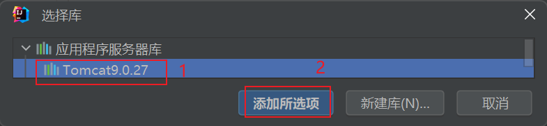
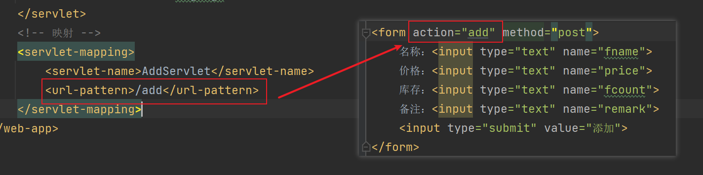
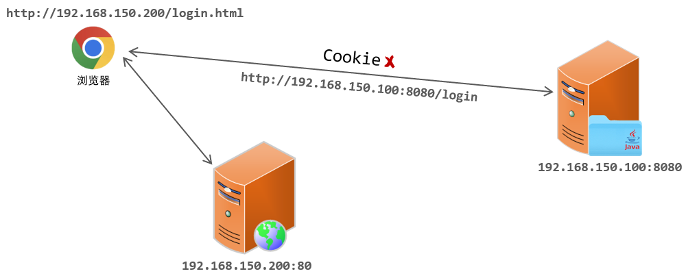
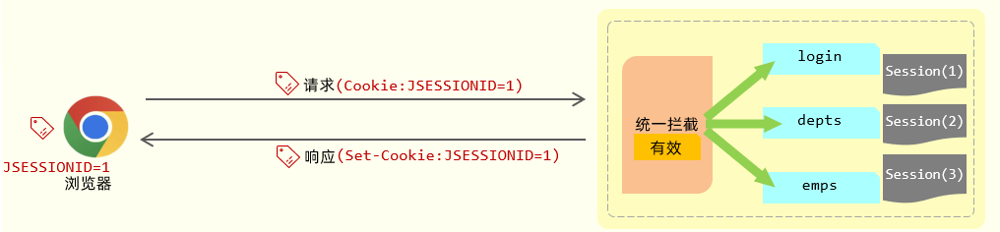
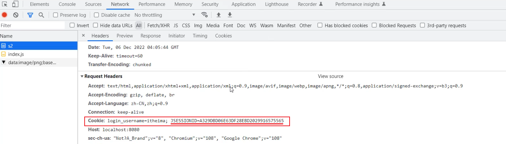
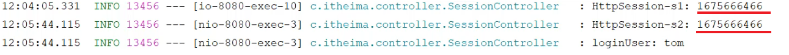
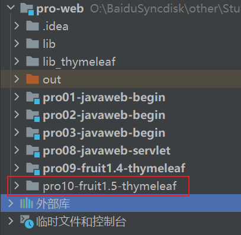
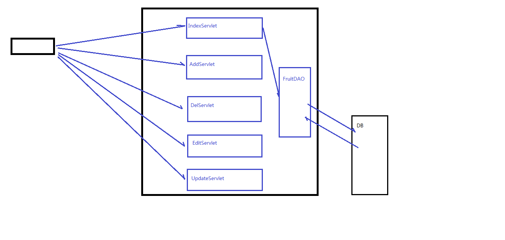
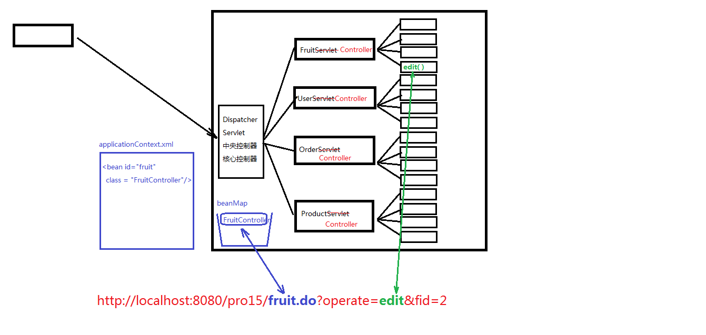

# 21.Servlet入门

## 一、介绍

概念：server applet，即：运行在服务器端的小程序

Servlet就是一个接口，定义了Java类被浏览器访问到（tomcat识别）的规则。

将来我们定义一个类，实现Servlet接口，复写方法，tomcat就可以识别这个类，我们就称它为一个Servlet


作用：

1. 获取用户（客户端）发给我的数据
2. 调用DAO中的方法完成添加功能
3. 在控制台打印添加成功


Servlet用大白话来说，就像是一个在Web服务器上运行的Java小程序，它专门用来处理来自浏览器或其他客户端的请求，并根据这些请求动态生成响应内容。你可以想象一下，每当我们在网页上点击按钮或链接发送请求时，Servlet就在后台接收到这个请求，并进行一系列操作，比如从数据库查询数据、执行业务逻辑或者计算结果。

Servlet并不是直接给用户看的一个静态HTML页面，而是负责生成这些动态页面背后的内容。当Servlet完成工作后，会把生成的结果（可能是HTML页面的一部分、JSON数据、XML数据或者其他格式的数据）返回给客户端，客户端（通常是浏览器）再将这些数据呈现给我们用户。

打个比方，如果你在网上购物，当你点击“查看购物车”按钮时，实际上就是向服务器发送了一个请求。这时，服务器上的Servlet就发挥作用了，它读取你的购物车信息，计算总价等细节，然后生成包含你购物车商品列表的网页并传回给你，这样你就能看到自己挑选的商品了。

总之，Servlet是Java语言提供的一种强大工具，用于开发和扩展Web服务器功能，实现与用户的交互式通信，从而创建动态、功能丰富的Web应用程序。

---

## 二、入门案例

在web目录下新建add.html文件

~~~html
<!DOCTYPE html>
<html lang="en" xmlns:th="http://www.thymeleaf.org">
<head>
    <meta charset="UTF-8">
    <title>Title</title>
</head>
<body>
<form action="add" method="post">
    名称：<input type="text" name="fname">
    价格：<input type="text" name="price">
    库存：<input type="text" name="fcount">
    备注：<input type="text" name="remark">
    <input type="submit" value="添加">
</form>
</body>
</html>
~~~

新建AddServlet类


如果是一个普通类，它是不能够去获取用户发给我的数据的，此时需要让它继承HttpServlet，而这个类并不在JDK包里，而在servlet-api包下。


---

### 导入servlet-api的解决办法

1. 将servlet-api导入到项目里去

   - 在父项目的根目录新建lib文件夹，然后将servlet-api引入。

     这种情况是在很多个Module共享的，默认情况下和module是没有关系的。

     > 第一步：右击，将它添加为库
     >
     > 
     >
     > 然后从子项目中引用它
     >
     > 
     >
     > 加进来后，表示这个module依赖这个Library，但是这个Module里有一个artifact部署包，它是已经生成了。
     >
     > - 方法一：将artifact删掉，重新建一个
     >
     > - 方法二：点击Problems，将lib加入进入
     >
     >   

   - 在当前项目的web\WEB-INF下新建lib文件夹，导入servlet-api

     缺点：只能是当前module独享。如果有第二个module，我们需要再次重复的新建lib。

     优点：启动的时候会自动将lib加进去

2. 将Tomcat依赖加入进来

   找到库（Library）

   

   将tomcat依赖导入进来

   

   查看外部库，可以看见tomcat库已被引入

   

此时HttpServlet已经可以正常导入了

编写AddServlet类

~~~java
package com.atguigu.servlets;

import javax.servlet.ServletException;
import javax.servlet.http.HttpServlet;
import javax.servlet.http.HttpServletRequest;
import javax.servlet.http.HttpServletResponse;
import java.io.IOException;

public class AddServlet extends HttpServlet {
    /**
     * 这个方法可以帮你去响应post请求，发一个post请求过来，doPost方法就会被调用
     * 当客户端给服务端发请求的时候，服务器端就把这个请求封装成一个对象：request
     */
    @Override
    public void doPost(HttpServletRequest request, HttpServletResponse response) throws IOException, ServletException {
        // 请求里去获取参数，获取名字为fname的值
        String fname = request.getParameter("fname");
        // 通过Http请求发过来的只能是字符串
        String priceStr = request.getParameter("price");
        // 如果需要用到数字，强转即可。
        int price = Integer.parseInt(priceStr);
        String fcountStr = request.getParameter("fcount");
        String fcount = request.getParameter(fcountStr);
        String remark = request.getParameter("remark");

        System.out.println("fname = " + fname);
        System.out.println("price = " + price);
        System.out.println("fcount = " + fcount);
        System.out.println("remark = " + remark);
    }
}
~~~

将servlet的名字和某个类对应上，请求add这个组件可以对应上我们刚刚写的AddServlet



配置web\WEB-INF\web.xml

> 一个`servlet`允许对应多个`servlet-mapping`，无论发给哪个<url-pattern>，都是对应一个servlet。这样可以在servlet当中获取我们到底是通过哪个URL请求过来的。根据不同URL发送的请求，可以执行不同的业务逻辑。
>
> ~~~xml
> <servlet>
>     <servlet-name>Demo02Servlet</servlet-name>
>     <servlet-class>com.atguigu.servlets.Demo02Servlet</servlet-class>
> </servlet>
> <servlet-mapping>
>     <servlet-name>Demo02Servlet</servlet-name>
>     <url-pattern>/demo02</url-pattern>
> </servlet-mapping>
> <servlet-mapping>
>     <servlet-name>Demo02Servlet</servlet-name>
>     <url-pattern>/demo021</url-pattern>
> </servlet-mapping>
> <servlet-mapping>
>     <servlet-name>Demo02Servlet</servlet-name>
>     <url-pattern>/demo022</url-pattern>
> </servlet-mapping>
> ~~~
>
> 但是一个`servlet-mapping`不能对应多个`servlet`。

~~~xml
<?xml version="1.0" encoding="UTF-8"?>
<web-app xmlns="http://xmlns.jcp.org/xml/ns/javaee"
         xmlns:xsi="http://www.w3.org/2001/XMLSchema-instance"
         xsi:schemaLocation="http://xmlns.jcp.org/xml/ns/javaee http://xmlns.jcp.org/xml/ns/javaee/web-app_4_0.xsd"
         version="4.0">
    <servlet>
        <!-- servlet名字可以随便写 -->
        <servlet-name>AddServlet</servlet-name>
        <!-- 这里需要写上类的全类名 -->
        <servlet-class>com.atguigu.servlets.AddServlet</servlet-class>
    </servlet>
    <!-- 映射 -->
    <servlet-mapping>
        <servlet-name>AddServlet</servlet-name>
        <!-- 这里/千万不能丢！ -->
        <url-pattern>/add</url-pattern>
    </servlet-mapping>
</web-app>
~~~

执行流程：

1. 用户发请求：`action=add`
2. 服务器（tomcat，项目）中，web.xml中找到`servlet-mapping`中的`url-pattern = /add`
3. 找`servlet-name = AddServlet`
4. 找和`servlet-mapping`中`servlet-name`一致的`servlet`
5. 找到`servlet`中的`servlet-class`就能通过 `<servlet>` 找到`com.atguigu.servlets.AddServlet`类
6. tomcat会将字节码文件加载进内存，并且创建其对象
7. 用户发送的是post请求（method=post），因此 tomcat 会执行AddServlet中的doPost方法


---

# 22.servlet-review

## 一、前言

新建项目后，默认就有一个模块，这个模块名和项目名同名。所以说为了防止混淆，就把根目录看成一个文件夹，删除掉src，然后再在这个文件夹中新建模块。

Web项目的web目录就是context root。

---

## 二、创建部署包

部署到tomcat时，它并不是将源代码部署进去，而是将项目的部署包部署进去，部署的包就叫Artifact。

### 1）方法一：直接点击提示的创建

当你把Web模块加入进项目后，说明你是个Web项目，既然是个web项目，将来就需要部署到tomcat上，但是部署到tomcat上时需要一个部署的包，但你现在还没有这个部署的包，它就问你要不要生成这个部署的包（'Web'任何工件中都不包含 Facet 资源），点击生成即可。


就算这里没有点击，也可以通过另一种方式创建Artifact

---

### 2）方法二：手动创建

Web Application:Exploded（Web应用程序：展开型）下面的归档（Archive）就是压缩包，jar包是java应用程序的压缩包。

Web Application:Archive：war包就是Web应用的压缩包，将该压缩包仍到tomcat中，就有一个叫webapps。

当你把war包仍进去后，tomcat会自动给你解压。

我们也可以不扔一个压缩包，我们仍一个压缩包解压之后的，就是Web Application:Exploded（Web应用程序：展开型），推荐添加解压包解压之后的，即`Web Application:Exploded` 。


选择需要创建的模块


然后就会出现，这个就是war包解压缩之后的一个包


旁边的名字随便更改，无所谓，反正我们也用不到这个名字


然后再回到Modules，它就不会再报`'Web'任何工件中不包含Facet 资源`错误了，因为咱们web项目已经有一个压缩包了。

---

## 三、lib和artifact的关系

现有artifact，后来才添加的jar文件，此时这个jar包并没有添加到部署包中。

那么在 Project Struct里有一个叫Problems，里面会有疑问。

当前请求的方法不支持。比如：我们表单method=post，那么Servlet必须对应doPost，否则报405错误。

---

# 23.servlet-处理请求参数

需要注意的是，设置编码（post）这一句代码必须在所有的获取参数动作之前，如果出现在获取玩fname之后，不仅fname是乱码，计算是在request.setCharacterEncoding("UTF-8");之后的，也会是乱码

~~~java
@Override
    public void doPost(HttpServletRequest request, HttpServletResponse response) throws IOException, ServletException {
        // post方式下，设置编码，防止中文乱码
        // 需要注意的是，设置编码（post）这一句代码必须在所有的获取参数动作之前，如果出现在获取玩fname之后，不仅fname是乱码，计算是在request.setCharacterEncoding("UTF-8");之后的，也会是乱码
        request.setCharacterEncoding("UTF-8");
        
        -----------------------------------------------------------------------------------------------------------
        
        // get方式目前不需要设置编码（基于tomcat8以后）
        // 如果是get请求发送的中文数据，转码稍微有点麻烦（tomcat8之前）
        String fname = request.getParameter("fname");
        // 1.将字符串打散成字节数组
        byte[] bytes = fname.getBytes("ISO-8859-1");// 因为tomcat8之前底层的编码默认使用的编码就是ISO-8859-1
        // 2.将字节数组安装设定的编码重新组装成字符串，第二个参数是你想要的编码格式
        fname = new String(bytes, "UTF-8");

        ...
    }
~~~

---

# 24.继承关系以及service方法

## 一、继承关系

Servlet接口下有一个GenericServlet抽象类。在GenericServlet下有一个子类HttpServlet，它是基于http协议。

**继承关系**

~~~
javax.servlet.Servlet接口

​		javax.GenericServlet抽象类

​			javax.servlet.http.HttpServlet
~~~

---

## 二、相关方法

javax.servlet.Servlet接口

1. void init(config) - 初始方法

2. void service(request, response) - 服务方法

   当发请求过来时，service方法会被自动调用。（其实是tomcat容器调用的）

3. void destroy() - 销毁方法


javax.GenericServlet抽象类中service方法仍然是抽象的，但init()和destroy()方法已经实现


javax.servlet.http.HttpServlet实现了service方法

~~~java
protected void service(HttpServletRequest req, HttpServletResponse resp) throws ServletException, IOException {
        String method = req.getMethod(); // 获取请求的方式
        long lastModified;
        // 各种if判断，根据请求方式不同，决定去调用不同的do方法
    	// 在HttpServlet中这些do方法默认都是405的实现风格-要我们子类去实现对应的方法，否则默认会报405错误
    	// 因此，我们在新建Servlet时，我们才会去考虑请求方法，从而决定重写哪个do方法
        if (method.equals("GET")) { // 如果发过来的是GET请求
            ...
        } else if (method.equals("HEAD")) {
            lastModified = this.getLastModified(req);
            this.maybeSetLastModified(resp, lastModified);
            this.doHead(req, resp);
        } else if (method.equals("POST")) {
            this.doPost(req, resp);
        } else if (method.equals("PUT")) {
            this.doPut(req, resp);
        } else if (method.equals("DELETE")) {
            this.doDelete(req, resp);
        } else if (method.equals("OPTIONS")) {
            this.doOptions(req, resp);
        } else if (method.equals("TRACE")) {
            this.doTrace(req, resp);
        } else {
            String errMsg = lStrings.getString("http.method_not_implemented");
            Object[] errArgs = new Object[]{method};
            errMsg = MessageFormat.format(errMsg, errArgs);
            resp.sendError(501, errMsg);
        }
    }
~~~

查看doPost方法，如果我们继承HttpServlet的类没有重写HttpServlet的doPost请求，它就会调用父类（HttpServlet）的doPost方法，直接报405错。

在HttpServlet这个抽象类中，do方法基本都差不多。

~~~java
protected void doPost(HttpServletRequest req, HttpServletResponse resp) throws ServletException, IOException {
        String protocol = req.getProtocol(); // 获取http协议
        String msg = lStrings.getString("http.method_post_not_supported"); // 它会根据http.method_post_not_supported字符串去找另一个字符串，所对应的value值就是消息
        if (protocol.endsWith("1.1")) {
            resp.sendError(405, msg); // 报405错，然后把msg显示出来
        } else {
            resp.sendError(400, msg);
        }
    }
~~~

将tomcat的启动路径直接设置成`http://localhost:8088/Demo01`，表示直接访问servlet


---

# 25.生命周期

## 一、生命周期

生命周期：实例化、初始化、服务、销毁

从出生到死亡的过程。对应Servlet中的三个方法：init()，service()，destroy()

1. 被创建：执行init方法，只执行一次

   默认情况下，第一次接收请求时，这个Servlet会进行实例化（在底层使用反射，调用构造方法）、初始化（init()方法）、然后服务（service）

2. 提供服务：执行service方法，执行多次

   从第二次请求开始，每一次都是服务

3. 被销毁：执行destroy方法，只执行一次

   随着tomcat容器的销毁，其中的所有servlet实例会被销毁，并调用销毁方法

   

结论：Servlet实例tomcat只会创建一个，所有的请求都是这个实例去响应。

---

## 二、错误实例

Demo02Servlet.java

~~~java
// 注意这里改成了private
private Demo02Servlet () {
    System.out.println("正在实例化...");
}
~~~


默认情况下，第一次请求时，tomcat才会去实例化，初始化，然后再服务。这样的好处是提高系统的启动速度。缺点是：第一次请求时，耗时较长。

结论：如果需要提高系统的启动速度，当前默认情况就是这样。如果需要提高响应速度，我们应该设置Servlet的初始化时机。

---

## 三、修改Servlet的初始化时机

默认是第一次请求时实例化，初始化。我们可以通过<load-on-startup>（startup：启动，load：加载）

可以配置指定Servlet启动的先后顺序，在<servlet>标签下配置

<load-on-startup>的值为0或正整数（一般是0-10之间，最小值是0），数字越小，启动的时间越靠前

~~~xml
<servlet>
    <servlet-name>Demo02Servlet</servlet-name>
    <servlet-class>com.atguigu.servlets.Demo02Servlet</servlet-class>
    <load-on-startup>1</load-on-startup>
</servlet>
~~~

Servlet在容器中是单例（Demo02Servlet在tomcat容器里只会创建一个实例，即所有的请求都是同一个实例去响应）的、线程不安全的（一个线程需要根据这个实例中的某个成员变量值去做逻辑判断，但是在中间某个时机，从而导致第一个线程的执行路径发生了变化）。

> 线程1在读取num=1的时候，进入了service，刚刚准备执行if这个判断，但这个瞬间，线程2执行不同路径的代码，将num的值修改为了5，这个if就不成立了，就把线程1执行的路径修改掉了。
>
> 因为Servlet是单例的，所以所有的线程都是单例的，就会出现线程不安全。
>
> 

我们已经知道了servlet是线程不安全的，给我们的启发是：尽量的不要在servlet中定义成员变量。如果不得不定义成员变量，那么：

 ①不要去修改成员变量的值  

②不要根据成员变量的值做一些逻辑判断。

---

# 25.session会话跟踪技术

# 一、会话技术

## 1）什么是会话？

- 在我们日常生活当中，会话指的就是谈话、交谈。

- 在web开发当中，会话指的就是浏览器与服务器之间的一次连接，我们就称为一次会话。

  > 在用户打开浏览器第一次访问服务器的时候，这个会话就建立了，直到有任何一方断开连接，此时会话就结束了。在一次会话当中，是可以包含多次请求和响应的。
  >
  > 比如：打开了浏览器来访问web服务器上的资源（浏览器不能关闭、服务器不能断开）
  >
  > - 第1次：访问的是登录的接口，完成登录操作
  > - 第2次：访问的是部门管理接口，查询所有部门数据
  > - 第3次：访问的是员工管理接口，查询员工数据
  >
  > 只要浏览器和服务器都没有关闭，以上3次请求都属于一次会话当中完成的。


需要注意的是：会话是和浏览器关联的，当有三个浏览器客户端和服务器建立了连接时，就会有三个会话。同一个浏览器在未关闭之前请求了多次服务器，这多次请求是属于同一个会话。比如：1、2、3这三个请求都是属于同一个会话。当我们关闭浏览器之后，这次会话就结束了。而如果我们是直接把web服务器关了，那么所有的会话就都结束了。

---

## 2）会话跟踪

知道了会话的概念了，接下来我们再来了解下会话跟踪。

会话跟踪：一种维护浏览器状态的方法，服务器需要识别多次请求是否来自于同一浏览器，以便在同一次会话的多次请求间共享数据。

> 服务器会接收很多的请求，但是服务器是需要识别出这些请求是不是同一个浏览器发出来的。比如：1和2这两个请求是不是同一个浏览器发出来的，3和5这两个请求不是同一个浏览器发出来的。如果是同一个浏览器发出来的，就说明是同一个会话。如果是不同的浏览器发出来的，就说明是不同的会话。而识别多次请求是否来自于同一浏览器的过程，我们就称为会话跟踪。

我们使用会话跟踪技术就是要完成在同一个会话中，多个请求之间进行共享数据。

> 为什么要共享数据呢？
>
> 由于HTTP是无状态协议，在后面请求中怎么拿到前一次请求生成的数据呢？此时就需要在一次会话的多次请求之间进行数据共享


会话跟踪技术有两种：

1. Cookie（客户端会话跟踪技术）
   - 数据存储在客户端浏览器当中
2. Session（服务端会话跟踪技术）
   - 数据存储在储在服务端
3. 令牌技术

---

# 二、会话跟踪方案

上面我们介绍了什么是会话，什么是会话跟踪，并且也提到了会话跟踪 3 种常见的技术方案。接下来，我们就来对比一下这 3 种会话跟踪的技术方案，来看一下具体的实现思路，以及它们之间的优缺点。

## 方案一：Cookie

### 1）Cookie介绍

cookie 是客户端会话跟踪技术，它是存储在客户端浏览器的，我们使用 cookie 来跟踪会话，我们就可以在浏览器第一次发起请求来请求服务器的时候，我们在服务器端来设置一个cookie。

比如第一次请求了登录接口，登录接口执行完成之后，我们就可以设置一个cookie，在 cookie 当中我们就可以来存储用户相关的一些数据信息。比如我可以在 cookie 当中来存储当前登录用户的用户名，用户的ID。

服务器端在给客户端在响应数据的时候，会**自动**的将 cookie 响应给浏览器，浏览器接收到响应回来的 cookie 之后，会**自动**的将 cookie 的值存储在浏览器本地。接下来在后续的每一次请求当中，都会将浏览器本地所存储的 cookie **自动**地携带到服务端。


接下来在服务端我们就可以获取到 cookie 的值。我们可以去判断一下这个 cookie 的值是否存在，如果不存在这个cookie，就说明客户端之前是没有访问登录接口的；如果存在 cookie 的值，就说明客户端之前已经登录完成了。这样我们就可以基于 cookie 在同一次会话的不同请求之间来共享数据。


我刚才在介绍流程的时候，用了 3 个自动：

- 服务器会 **自动** 的将 cookie 响应给浏览器。

- 浏览器接收到响应回来的数据之后，会 **自动** 的将 cookie 存储在浏览器本地。

- 在后续的请求当中，浏览器会 **自动** 的将 cookie 携带到服务器端。

  

**为什么这一切都是自动化进行的？**

是因为 cookie 它是 HTP 协议当中所支持的技术，而各大浏览器厂商都支持了这一标准。在 HTTP 协议官方给我们提供了一个响应头和请求头：

- 响应头 Set-Cookie ：设置Cookie数据的

- 请求头 Cookie：携带Cookie数据的

 


腾讯云里就维护了http的相关文档

> 请求头：cookie：
> HTTP请求包头包含存储先前通过与所述服务器发送的HTTP cookes Set-Cookie头（name=value，前面的name就是cookie的名称，后面的value就是cookie的值）
>
> 响应头：Set-Cookie：服务器向客户端发送，然后客户端就会获得一个Cookie，之后客户端的每一次请求就会自动的携带着这个Cookie给服务器

----

### 2）Cookie代码测试

```java
@Slf4j
@RestController
public class SessionController {

    //设置Cookie
    @GetMapping("/c1")
    public Result cookie1(HttpServletResponse response){
        response.addCookie(new Cookie("login_username","itheima")); //设置Cookie/响应Cookie
        return Result.success();
    }
	
    //获取Cookie
    @GetMapping("/c2")
    public Result cookie2(HttpServletRequest request){
        Cookie[] cookies = request.getCookies();
        for (Cookie cookie : cookies) {
            if(cookie.getName().equals("login_username")){
                System.out.println("login_username: "+cookie.getValue()); //输出name为login_username的cookie
            }
        }
        return Result.success();
    }
}    
```


A. 访问c1接口，设置Cookie，http://localhost:8080/c1


我们可以看到，设置的cookie，通过**响应头Set-Cookie**响应给浏览器，并且浏览器会将Cookie，存储在浏览器本地。


查看cookie：

 


B. 访问c2接口 http://localhost:8080/c2，此时浏览器会自动的将Cookie携带到服务端，是通过**请求头Cookie**，携带的。


---

### 3）Cookie优缺点

- 优点：HTTP协议中支持的技术（像Set-Cookie 响应头的解析以及 Cookie 请求头数据的携带，都是浏览器自动进行的，是无需我们手动操作的）

- 缺点：

  - 移动端APP(Android、IOS)中无法使用Cookie

  - 不安全，用户可以自己禁用Cookie

    在浏览器里设置cookie：

    

    如果点击了这个选项，cookie就被禁用了

    

  - Cookie不能跨域

> 跨域介绍：
>
> 
>
> - 现在的项目，大部分都是前后端分离的，前后端最终也会分开部署，前端部署在服务器 192.168.150.200 上，端口 80，后端部署在 192.168.150.100上，端口 8080
> - 我们打开浏览器直接访问前端工程，访问url：http://192.168.150.200/login.html
> - 然后在该页面发起请求到服务端，而服务端所在地址不再是localhost，而是服务器的IP地址192.168.150.100，假设访问接口地址为：http://192.168.150.100:8080/login
> - 那此时就存在跨域操作了，因为我们是在 http://192.168.150.200/login.html 这个页面上访问了http://192.168.150.100:8080/login 接口
> - 此时如果服务器设置了一个Cookie，这个Cookie是不能使用的，因为Cookie无法跨域
>
> 
>
> 区分跨域的维度：
>
> - 协议
> - IP/协议
> - 端口
>
> 只要上述的三个维度有任何一个维度不同，那就是跨域操作
>
> 
>
> 举例：
>
> 	http://192.168.150.200/login.html ----------> https://192.168.150.200/login   		[协议不同，跨域]
> 			
> 	http://192.168.150.200/login.html ----------> http://192.168.150.100/login     		[IP不同，跨域]
> 			
> 	http://192.168.150.200/login.html ----------> http://192.168.150.200:8080/login   [端口不同，跨域]
> 			
> 	http://192.168.150.200/login.html ----------> http://192.168.150.200/login    		 [不跨域]   

---

## 方案二 - Session

### 1）Session介绍

前面介绍的时候，我们提到Session，它是服务器端会话跟踪技术，所以它是存储在服务器端的。而 Session 的底层其实就是基于我们刚才所介绍的 Cookie 来实现的。

 

- 获取Session

  


如果我们现在要基于 Session 来进行会话跟踪，浏览器在第一次请求服务器的时候，我们就可以直接在服务器当中来获取到会话对象Session。如果是第一次请求Session ，会话对象是不存在的，这个时候服务器会自动的创建一个会话对象Session 。而每一个会话对象Session ，它都有一个ID（示意图中Session后面括号中的1，就表示ID），我们称之为 Session 的ID。

 

- 响应Cookie (JSESSIONID)

   

  接下来，服务器端在给浏览器响应数据的时候，它会将 Session 的 ID 通过 Cookie 响应给浏览器。其实在响应头当中增加了一个 Set-Cookie 响应头。这个  Set-Cookie  响应头对应的值是不是cookie？ cookie 的名字是固定的 JSESSIONID 代表的服务器端会话对象 Session 的 ID。浏览器会自动识别这个响应头，然后自动将Cookie存储在浏览器本地。


- 查找Session

  


接下来，在后续的每一次请求当中，都会将 Cookie 的数据获取出来，并且携带到服务端。接下来服务器拿到JSESSIONID这个 Cookie 的值，也就是 Session 的ID。拿到 ID 之后，就会从众多的 Session 当中来找到当前请求对应的会话对象Session。

这样我们是不是就可以通过 Session 会话对象在同一次会话的多次请求之间来共享数据了？好，这就是基于 Session 进行会话跟踪的流程。

---

### 2）Session代码测试一

```java
@Slf4j
@RestController
public class SessionController {

    @GetMapping("/s1")
    //获取session对象，直接在controller中声明一个session的参数，这个HttpSession指的就是会话对象session，此时服务区会判断，当前这次请求对应的会话session到底存在不存在，如果不存在，它就会创建一个新的session，如果存在，它会获取到当前请求对应的session，拿到session之后输出日志
    public Result session1(HttpSession session){
        log.info("HttpSession-s1: {}", session.hashCode());

        //往对象会话中来存值
        session.setAttribute("loginUser", "tom"); //往session中存储数据
        return Result.success();
    }

    @GetMapping("/s2")
    public Result session2(HttpServletRequest request){
        //获取当前会话请求对应的对象
        HttpSession session = request.getSession();
        log.info("HttpSession-s2: {}", session.hashCode());

        Object loginUser = session.getAttribute("loginUser"); //从session中获取数据
        log.info("loginUser: {}", loginUser);
        return Result.success(loginUser);
    }
}
```


A. 访问 s1 接口，http://localhost:8080/s1


请求完成之后，在响应头中，就会看到有一个Set-Cookie的响应头，里面响应回来了一个Cookie，就是JSESSIONID，这个就是服务端会话对象 Session 的ID。

并且将cookie也储存起来了


B. 访问 s2 接口，http://localhost:8080/s2




接下来，在后续的每次请求时，都会将Cookie的值，携带到服务端，那服务端呢，接收到Cookie之后，会自动的根据JSESSIONID的值，找到对应的会话对象Session。


那经过这两步测试，大家也会看到，在控制台中输出如下日志：

 

两次请求，获取到的Session会话对象的hashcode是一样的，就说明是同一个会话对象。而且，第一次请求时，往Session会话对象中存储的值，第二次请求时，也获取到了。 那这样，我们就可以通过Session会话对象，在同一个会话的多次请求之间来进行数据共享了。

---

### 3）Session代码测试二(使用servlet)

Demo03Servlet.java

~~~java
public class Demo03Servlet extends HttpServlet {
    @Override
    protected void service(HttpServletRequest request, HttpServletResponse response) throws ServletException, IOException {
        // 获取session，如果获取不到，则创建一个新的
        HttpSession session = request.getSession();
        System.out.println("session ID：" + session.getId());
    }
}
~~~

**第一次发送请求给服务器时**，服务器获取session，获取不到，则创建新的，然后响应给客户端：


搜索这个SessionId，在请求头里是找不到这个SessionId的，唯一的SessionId就是服务器刚刚响应回来的JSESSIONID


**发送第二次请求给服务器时**，会把sessionId带给服务器，那么服务器就能获取到sessionId，服务器就能判断这次请求和上次请求是同一个客户端，从而能够区分开客户端。

使用断点调试时，获取到的SessionId还是和第一次请求是一样的，说明它并没有重新创建！并且它有一个属性：isNew，这里为false，说明不是新的。


搜索到的唯一SessionId已经到了请求头里了


常用API：

- request.getSession()  —> 获取当前会话请求对应的对象，没有则创建一个新的会话
- request.getSession(true)   —>  效果和不带参数相同
- request.getSession(false)  —>  获取当前会话，没有则返回null，不会创建新的。
- session.getId()   —>  获取sessionId，这个id是一大长串字符串，是全局唯一的，不会重复的。
- session.isNew  —>  返回一个布尔值，判断当前session是否是新的
- session.getMaxInactiveInterval()  —>  最大的非激活的间隔时间（即不操作的情况下），默认1800秒（即半小时）
- session.setMaxInactiveInterval()  —>  
- session.invalidate() —>  强制性让会话立即失效
- session.getCreationTime()  —>  获取会话的创建时间
- session.getLastAccessedTime() —>  上一次最近的一次访问时间

---

### 4）Session优缺点

优点：Session是存储在服务端的（服务器端是普通人获取不到的），安全

缺点：

- 服务器集群环境下无法直接使用Session
- 移动端APP(Android、IOS)中无法使用Cookie
- 用户可以自己禁用Cookie
- Cookie不能跨域

PS：Session 底层是基于Cookie实现的会话跟踪，如果Cookie不可用，则该方案，也就失效了。


服务器集群环境为何无法使用Session？


- 首先第一点，我们现在所开发的项目，一般都不会只部署在一台服务器上，因为一台服务器会存在一个很大的问题，就是单点故障。所谓单点故障，指的就是一旦这台服务器挂了，整个应用都没法访问了。


- 所以在现在的企业项目开发当中，最终部署的时候都是以集群的形式来进行部署，也就是同一个项目它会部署多份。比如这个项目我们现在就部署了 3 份。

- 而用户在访问的时候，到底访问这三台其中的哪一台？其实用户在访问的时候，他会访问一台前置的服务器，我们叫负载均衡服务器。它的作用就是将前端发起的请求均匀的分发给后面的这三台服务器。

   

- 此时假如我们通过 session 来进行会话跟踪，可能就会存在这样一个问题。用户打开浏览器要进行登录操作，此时会发起登录请求。登录请求到达负载均衡服务器，将这个请求转给了第一台 Tomcat 服务器。

  Tomcat 服务器接收到请求之后，要获取到会话对象session。获取到会话对象 session 之后，要给浏览器响应数据，最终在给浏览器响应数据的时候，就会携带这么一个 cookie 的名字，就是 JSESSIONID ，下一次再请求的时候，是不是又会将 Cookie 携带到服务端？

  好。此时假如又执行了一次查询操作，要查询部门的数据。这次请求到达负载均衡服务器之后，负载均衡服务器将这次请求转给了第二台 Tomcat 服务器，此时他就要到第二台 Tomcat 服务器当中。根据JSESSIONID 也就是对应的 session 的 ID 值，要找对应的 session 会话对象。

  我想请问在第二台服务器当中有没有这个ID的会话对象 Session， 是没有的。此时是不是就出现问题了？我同一个浏览器发起了 2 次请求，结果获取到的不是同一个会话对象，这就是Session这种会话跟踪方案它的缺点，在服务器集群环境下无法直接使用Session。

---

##  方案三 - 令牌技术

### 1）令牌技术介绍

大家会看到上面这两种传统的会话技术，在现在的企业开发当中是不是会存在很多的问题。 为了解决这些问题，在现在的企业开发当中，基本上都会采用第三种方案，通过令牌技术来进行会话跟踪。接下来我们就来介绍一下令牌技术，来看一下令牌技术又是如何跟踪会话的。

这里我们所提到的令牌，其实它就是一个用户身份的标识，看似很高大上，很神秘，其实本质就是一个字符串。

 

如果通过令牌技术来跟踪会话，我们就可以在浏览器发起请求。在请求登录接口的时候，如果登录成功，我就可以生成一个令牌，令牌就是用户的合法身份凭证。接下来我在响应数据的时候，我就可以直接将令牌响应给前端。

接下来我们在前端程序当中接收到令牌之后，就需要将这个令牌存储起来。这个存储可以存储在 cookie 当中，也可以存储在其他的存储空间(比如：localStorage)当中。

接下来，在后续的每一次请求当中，都需要将令牌携带到服务端。携带到服务端之后，接下来我们就需要来校验令牌的有效性。如果令牌是有效的，就说明用户已经执行了登录操作，如果令牌是无效的，就说明用户之前并未执行登录操作。

此时，如果是在同一次会话的多次请求之间，我们想共享数据，我们就可以将共享的数据存储在令牌当中就可以了。

---

### 2）令牌技术优缺点

- 优点：
  - 支持PC端、移动端（因为不需要存储在cookie中）
  - 解决集群环境下的认证问题
  - 减轻服务器的存储压力（无需在服务器端存储）
- 缺点：需要自己实现（包括令牌的生成、令牌的传递、令牌的校验）


**针对于这三种方案，现在企业开发当中使用的最多的就是第三种令牌技术进行会话跟踪。而前面的这两种传统的方案，现在企业项目开发当中已经很少使用了。**

---

# 28.session保存作用域

session保存作用域：一次会话范围都有效

Java的服务器端，有一块内存专门存储在session保存作用域的数据。

session保存作用域是和具体的某一个session对应的。

常用API：

- void session.setAttribute(k, v)
- Object session.getAttrivute(k)  —>  返回的是Object类型的
- void removeAttribute(k)


## 代码示例

Demo04Servlet.java

```java
// 演示向HttpSession保存数据
public class Demo04Servlet extends HttpServlet {
    @Override
    protected void service(HttpServletRequest request, HttpServletResponse response) throws ServletException, IOException {
        request.getSession().setAttribute("uname", "lina");
    }
}
```

Demo05Servlet.java

```java
// 演示从HttpSession保存作用域中获取数据
public class Demo05Servlet extends HttpServlet {
    @Override
    protected void service(HttpServletRequest request, HttpServletResponse response) throws ServletException, IOException {
        // 它获取到的是Object类型
        Object unameObj = request.getSession().getAttribute("uname");
        System.out.println(unameObj);
    }
}
```

web.xml

```xml
<servlet>
    <servlet-name>Demo04Servlet</servlet-name>
    <servlet-class>com.atguigu.servlets.Demo04Servlet</servlet-class>
</servlet>
<servlet-mapping>
    <servlet-name>Demo04Servlet</servlet-name>
    <url-pattern>/demo04</url-pattern>
</servlet-mapping>

<servlet>
    <servlet-name>Demo05Servlet</servlet-name>
    <servlet-class>com.atguigu.servlets.Demo05Servlet</servlet-class>
</servlet>
<servlet-mapping>
    <servlet-name>Demo05Servlet</servlet-name>
    <url-pattern>/demo05</url-pattern>
</servlet-mapping>
```

---

# 29.服务器内部转发以及客户端重定向

## 一、服务器内部转发：request.getRequestDispatcher("...").forward(request, response);

一次请求响应的过程，对于客户端而言，内部经过了多少次转发，客户端是不知道的。地址栏中的URL是不会变化的。

内部经过3、4次跳转都是一次请求响应。如图所示：


---

## 二、客户端重定向：response.sendRedirect("×××");

两次请求响应的过程。客户端肯定知道请求URL有变化。如图所示：


---

## 三、服务器内部转发代码示例

**服务器内部转发**：证明可通过代码断点调试

Demo06Servlet.java

```java
// 演示服务器端内部转发
public class Demo06Servlet extends HttpServlet {
    @Override
    protected void service(HttpServletRequest request, HttpServletResponse response) throws ServletException, IOException {
        System.out.println("demo06....");
        // 服务器端内部转发
        request.getRequestDispatcher("demo07").forward(request, response);
    }
}
```

Demo07Servlet.java

```java
public class Demo07Servlet extends HttpServlet {
    @Override
    protected void service(HttpServletRequest request, HttpServletResponse response) throws ServletException, IOException {
        System.out.println("demo07....");
    }
}
```

web.xml

~~~xml
<servlet>
    <servlet-name>Demo06Servlet</servlet-name>
    <servlet-class>com.atguigu.servlets.Demo06Servlet</servlet-class>
</servlet>
<servlet-mapping>
    <servlet-name>Demo06Servlet</servlet-name>
    <url-pattern>/demo06</url-pattern>
</servlet-mapping>

<servlet>
    <servlet-name>Demo07Servlet</servlet-name>
    <servlet-class>com.atguigu.servlets.Demo07Servlet</servlet-class>
</servlet>
<servlet-mapping>
    <servlet-name>Demo07Servlet</servlet-name>
    <url-pattern>/demo07</url-pattern>
</servlet-mapping>
~~~

---

## 四、客户端重定向代码示例

Demo06Servlet.java

```java
// 演示服务器端内部转发以及客户端重定向
public class Demo06Servlet extends HttpServlet {
    @Override
    protected void service(HttpServletRequest request, HttpServletResponse response) throws ServletException, IOException {
        System.out.println("demo06....");
        // 客户端重定向
        response.sendRedirect("demo07");
    }
}
```

Demo07Servlet.java

```java
public class Demo07Servlet extends HttpServlet {
    @Override
    protected void service(HttpServletRequest request, HttpServletResponse response) throws ServletException, IOException {
        System.out.println("demo07....");
    }
}
```

web.xml

~~~xml
<servlet-mapping>
    <servlet-name>Demo06Servlet</servlet-name>
    <url-pattern>/demo06</url-pattern>
</servlet-mapping>

<servlet>
    <servlet-name>Demo07Servlet</servlet-name>
    <servlet-class>com.atguigu.servlets.Demo07Servlet</servlet-class>
</servlet>
<servlet-mapping>
    <servlet-name>Demo07Servlet</servlet-name>
    <url-pattern>/demo07</url-pattern>
</servlet-mapping>
~~~

访问demo06，一敲回车，可以发现它发送了两次请求

点击demo06的请求，可以发现状态码为302（重定向），Location也变成了demo07


demo07的状态码则是200


---

# 30.thymeleaf快速入门

## 一、thymeleaf介绍

Thymeleaf：视图模板技术

在index.html页面上加载java内存中的fruitList数据，这个过程我们称之为渲染（render）。

thymeleaf是用来帮助我们做视图渲染的一个技术。


---

## 二、入门案例

一般servlet都需要在web.xml中注册，但如果觉得标签很多，servlet从3.0开始，也支持注解方式注册：@WebServlet("/index")，所以我们的web.xml文件是可以删掉的。

在IndexServlet.java中获取数据库数据

~~~java
// servlet从3.0开始，也支持注解方式注册
@WebServlet("/index")
public class IndexServlet extends HttpServlet {
    @Override
    protected void doGet(HttpServletRequest request, HttpServletResponse response) throws ServletException, IOException {
        FruitDAO fruitDAO = new FruitDAOImpl();
        List<Fruit> fruitList = fruitDAO.getFruitList();
        HttpSession session = request.getSession();
        session.setAttribute("fruitList", fruitList);
    }
}
~~~

将数据展示到页面上：在web文件夹下新建index.html页面

加入thymeleaf的jar包

1. 直接往根目录的lib里仍

   

2. 新建文件夹lib_thymeleaf

   将thymeleaf的jar包全部拷贝进去

   

   然后将它添加为库

   

   名字跟文件夹名一样即可

   

   然后将项目包导入工程

   

   将项目包导入Artifact

2）在myssm文件夹下新建Servlet类ViewBaseServlet（这个类直接从thymeleaf源代码里拷出来即可）

> 类名不一定叫ViewBaseServlet，新建它的目的是因为它里面有两个方法。

```java
import org.thymeleaf.TemplateEngine;
import org.thymeleaf.context.WebContext;
import org.thymeleaf.templatemode.TemplateMode;
import org.thymeleaf.templateresolver.ServletContextTemplateResolver;

import javax.servlet.ServletContext;
import javax.servlet.ServletException;
import javax.servlet.http.HttpServlet;
import javax.servlet.http.HttpServletRequest;
import javax.servlet.http.HttpServletResponse;
import java.io.IOException;

public class ViewBaseServlet extends HttpServlet {

    private TemplateEngine templateEngine;

    @Override
    public void init() throws ServletException {

        // 1.获取ServletContext对象
        ServletContext servletContext = this.getServletContext();

        // 2.创建Thymeleaf解析器对象
        ServletContextTemplateResolver templateResolver = new ServletContextTemplateResolver(servletContext);

        // 3.给解析器对象设置参数
        // ①HTML是默认模式，明确设置是为了代码更容易理解
        templateResolver.setTemplateMode(TemplateMode.HTML);

        // ②设置前缀
        String viewPrefix = servletContext.getInitParameter("view-prefix");

        templateResolver.setPrefix(viewPrefix);

        // ③设置后缀
        String viewSuffix = servletContext.getInitParameter("view-suffix");

        templateResolver.setSuffix(viewSuffix);

        // ④设置缓存过期时间（毫秒）
        templateResolver.setCacheTTLMs(60000L);

        // ⑤设置是否缓存
        templateResolver.setCacheable(true);

        // ⑥设置服务器端编码方式
        templateResolver.setCharacterEncoding("utf-8");

        // 4.创建模板引擎对象
        templateEngine = new TemplateEngine();

        // 5.给模板引擎对象设置模板解析器
        templateEngine.setTemplateResolver(templateResolver);

    }
    
    // 处理模板（模板名字，请求，响应）
    // 这个方法它可以帮我们完成资源的转发，并且数据的渲染
    protected void processTemplate(String templateName, HttpServletRequest req, HttpServletResponse resp) throws IOException {
        // 1.设置响应体内容类型和字符集
        resp.setContentType("text/html;charset=UTF-8");

        // 2.创建WebContext对象
        WebContext webContext = new WebContext(req, resp, getServletContext());

        // 3.处理模板数据
        templateEngine.process(templateName, webContext, resp.getWriter());
    }
}
```


3）在web.xml中添加配置

- 配置前缀 view-prefix
- 配置后缀 view-suffix

```xml
<!-- 配置上下文参数 -->
<context-param>
    <param-name>view-prefix</param-name>
    <!-- / 代表的是web根目录 -->
    <param-value>/</param-value>
</context-param>
<context-param>
    <param-name>view-suffix</param-name>
    <param-value>.html</param-value>
</context-param>
```

它会在`ViewBaseServlet`中的`init()`方法中读取这两个配置，然后会创建出engin（引擎），然后根据引擎再去渲染我们的页面


4）使得我们的Servlet继承ViewBaseServlet

~~~java
// servlet从3.0开始，也支持注解方式注册
@WebServlet("/index")
public class IndexServlet extends ViewBaseServlet {
    @Override
    protected void doGet(HttpServletRequest request, HttpServletResponse response) throws ServletException, IOException {
        FruitDAO fruitDAO = new FruitDAOImpl();
        List<Fruit> fruitList = fruitDAO.getFruitList();
        HttpSession session = request.getSession();
        session.setAttribute("fruitList", fruitList);

        // 此处的视图名称是 index
        // 那么thymeleaf会将这个 逻辑视图名称 对应到物理视图名称上去
        // 逻辑视图名称： index
        // 物理视图名称： view-prefix + 逻辑视图名称 + view-suffix
        // 所以真实的视图名称是： /    index           .html，这个就是web目录下的index.html页面
        super.processTemplate("index", request, response);
    }
}
~~~

继承后我们的Servlet依旧是Servlet，这是因为ViewBaseServlet继承了HttpServlet


5）调用父类ViewBaseServlet中的processTemplate方法


6）根据逻辑视图名称，得到 物理视图名称


7）重新启动项目

虽然地址栏依旧是index，但是它页面显示的已经是index.html这个页面了


8）使用thymeleaf，将数据动态渲染

在需要渲染的标签里加上th，此时会报错，但alt + enter，然后直接回车即可

```html
<tr th>
```

此时它会自动在上面加上表头，这个表头它会有提示，输入th:，然后就会出现提示

```html
<html xmlns:th="http://www.thymeleaf.org">
```

如果需要判断数据库中的fruitList是否为空，需要使用到内置对象


访问session里的数据


如果把session.省略掉了，它就会从request作用域获取数据。

~~~html
<tr th:if="${#lists.isEmpty(session.fruitList)}">
~~~

单元格循环及迭代

> 让标记了 `th:if`、`th:unless`的标签根据条件决定是否显示。

~~~html
<tr th:if="${#lists.isEmpty(session.fruitList)}">
    <td colspan="4">对不起，库存为空！</td>
</tr>
<tr th:unless="${#lists.isEmpty(session.fruitList)}" th:each="fruit : ${session.fruitList}">
    <!-- th:text：显示名称 -->
    <!-- 默认情况下，这里会显示文本，但是使用thymeleaf渲染后，它会把这个值覆盖掉里面的内容 -->
    <td th:text="${fruit.fname}">苹果</td>
    <td th:text="${fruit.price}">5</td>
    <td th:text="${fruit.fcount}">20</td>
    <td></td>
</tr>
~~~


---

# 32.thymeleaf-review

复制过来的项目并没有加粗，即并没有加入到当前项目的project中



解决办法：

将该module加到project中去


点击需要加入项目的目录即可

添加依赖


---

# 33.保存作用域

## 一、引入

原始情况下，保存作用域我们可以认为有四个：page（页面级别），request（一次请求响应范围），session（一次会话范围），application（整个应用程序范围）

> page目前已经不用了，除非我们学的是之前老的jsp技术。

---

## 二、request：一次请求响应范围


Demo01Servlet.java

~~~java
@WebServlet("/demo01")
public class Demo01Servlet extends HttpServlet {
    @Override
    protected void service(HttpServletRequest request, HttpServletResponse response) throws ServletException, IOException {
        // 1.向request保存作用域保存数据
        request.setAttribute("uname", "lili");
        // 2.客户端重定向
        response.sendRedirect("demo02"); // demo2不可以获取到

        // 3.服务器转发
        request.getRequestDispatcher("demo02").forward(request, response); // demo2可以获取到
    }
}
~~~

Demo02Servlet.java

~~~java
@WebServlet("/demo02")
public class Demo02Servlet extends HttpServlet {
    @Override
    protected void service(HttpServletRequest request, HttpServletResponse response) throws ServletException, IOException {
        // 1.获取request保存作用域保存的数据，key为name
        Object unameObj = request.getAttribute("uname");
        System.out.println(unameObj);
    }
}
~~~

---

## 二、session：一次会话范围内有效


Demo03Servlet.java

~~~java
@WebServlet("/demo03")
public class Demo03Servlet extends HttpServlet {
    @Override
    protected void service(HttpServletRequest request, HttpServletResponse response) throws ServletException, IOException {
        // 1.向session保存作用域保存数据
        request.getSession().setAttribute("uname", "lili");
        // 2.客户端重定向
        response.sendRedirect("demo04"); // demo3可以获取到

        // 3.服务器转发
        request.getRequestDispatcher("demo04").forward(request, response); // demo3也可以获取到
    }
}
~~~

Demo04Servlet.java

~~~java
@WebServlet("/demo04")
public class Demo04Servlet extends HttpServlet {
    @Override
    protected void service(HttpServletRequest request, HttpServletResponse response) throws ServletException, IOException {
        // 1.获取request保存作用域保存的数据，key为name
        Object unameObj = request.getSession().getAttribute("uname");
        System.out.println(unameObj);
    }
}
~~~

---

## 三、application：一次应用范围内有效

除非tomcat停止掉，tomcat一停止，这个应用程序就结束了。


Demo05Servlet.java

~~~java
@WebServlet("/demo05")
public class Demo05Servlet extends HttpServlet {
    @Override
    protected void service(HttpServletRequest request, HttpServletResponse response) throws ServletException, IOException {
        // 1.向application保存作用域保存数据。
        // ServletContext叫servlet上下文。正常情况下，不严谨的情况来讲，当前的web程序可以称之为servlet程序，因为它里面有大量的控制器组件叫servlet，表示这一次的tomcat启动了，上下文开始了，tomcat停止，上下文就结束了
        ServletContext application = request.getServletContext();
        application.setAttribute("uname", "lili");
        // 2.客户端重定向
        response.sendRedirect("demo06"); // demo2不可以获取到

        // 3.服务器转发
        request.getRequestDispatcher("demo06").forward(request, response); // demo6可以获取到
    }
}
~~~

Demo06Servlet.java

~~~java
@WebServlet("/demo06")
public class Demo02Servlet extends HttpServlet {
    @Override
    protected void service(HttpServletRequest request, HttpServletResponse response) throws ServletException, IOException {
        // 1.获取request保存作用域保存的数据，key为name
        Object unameObj = request.getServletContext.getAttribute("uname");
        System.out.println(unameObj);
    }
}
~~~

---

## 四、删除工件的办法

一般如果有多个artifact，用哪个项目就创建哪个项目的artifact，其他的artifact就可以删除了

1）


2）


3）创建工件


---

# 40.servlet优化1

将方法全部写到一个servlet中去，这样servlet的数量就少了。




fruitServlet.java

~~~java
@WebServlet("/fruit.do")
public class FruitServlet extends ViewBaseServlet {
    private FruitDAO fruitDAO = new FruitDAOImpl();

    @Override
    protected void service(HttpServletRequest request, HttpServletResponse response) throws ServletException, IOException {
        //设置编码
        request.setCharacterEncoding("UTF-8");

        String operate = request.getParameter("operate");
        if(StringUtil.isEmpty(operate)){
            operate = "index" ;
        }

        switch(operate){
            case "index":
                index(request,response);
                break;
            case "add":
                add(request,response);
                break;
            case "del":
                del(request,response);
                break;
            case "edit":
                edit(request,response);
                break;
            case "update":
                update(request,response);
                break;
            default:
                throw new RuntimeException("operate值非法!");
        }
    }

    private void update(HttpServletRequest request, HttpServletResponse response) throws ServletException, IOException {
        //1.设置编码
        request.setCharacterEncoding("utf-8");

        //2.获取参数
        String fidStr = request.getParameter("fid");
        Integer fid = Integer.parseInt(fidStr);
        String fname = request.getParameter("fname");
        String priceStr = request.getParameter("price");
        int price = Integer.parseInt(priceStr);
        String fcountStr = request.getParameter("fcount");
        Integer fcount = Integer.parseInt(fcountStr);
        String remark = request.getParameter("remark");

        //3.执行更新
        fruitDAO.updateFruit(new Fruit(fid,fname, price ,fcount ,remark ));

        //4.资源跳转
        //super.processTemplate("index",request,response);
        //request.getRequestDispatcher("index.html").forward(request,response);
        //此处需要重定向，目的是重新给IndexServlet发请求，重新获取furitList，然后覆盖到session中，这样index.html页面上显示的session中的数据才是最新的
        response.sendRedirect("fruit.do");
    }

    private void edit(HttpServletRequest request , HttpServletResponse response)throws IOException, ServletException {
        String fidStr = request.getParameter("fid");
        if(StringUtil.isNotEmpty(fidStr)){
            ...
            super.processTemplate("edit",request,response);
        }
    }

    private void del(HttpServletRequest request , HttpServletResponse response)throws IOException, ServletException {
        ...
            response.sendRedirect("fruit.do");
        }
    }

    private void add(HttpServletRequest request, HttpServletResponse response) throws ServletException, IOException {
        ...
            response.sendRedirect("fruit.do");

    }

    private void index(HttpServletRequest request , HttpServletResponse response)throws IOException, ServletException {
        ...
    }
}
~~~


---

# 41.dispatcherServlet引入



src.com.atguigu.myssm.myspringmvc.DispatherServlet

~~~java
// 拦截所有以.do结尾的请求
@WebServlet("*.do")
public class DispatcherServlet extends HttpServlet {
    @Override
    protected void service(HttpServletRequest request, HttpServletResponse response) throws ServletException, IOException {
        //设置编码
        request.setCharacterEncoding("UTF-8");
        //假设url是：  http://localhost:8080/pro15/hello.do
        //那么servletPath是：    /hello.do
        // 我的思路是：
        // 第1步： /hello.do ->   hello   或者  /fruit.do  -> fruit
        // 第2步： hello -> HelloController 或者 fruit -> FruitController
        String servletPath = request.getServletPath();
        servletPath = servletPath.substring(1);
        int lastDotIndex = servletPath.lastIndexOf(".do") ;
        servletPath = servletPath.substring(0,lastDotIndex);

        Object controllerBeanObj = beanMap.get(servletPath);

        String operate = request.getParameter("operate");
        if(StringUtil.isEmpty(operate)){
            operate = "index" ;
        }
    }
}
~~~

删除原来servlet中的@WebServlet注解

然后将servlets包名改为controllers，FruitServlet改为FruitController

编写 src\applicationContext.xml

~~~xml
<?xml version="1.0" encoding="utf-8"?>

<beans>
    <!-- 这个bean标签的作用是 将来servletpath中涉及的名字对应的是fruit，那么就要FruitController这个类来处理 -->
    <bean id="fruit" class="com.atguigu.fruit.controllers.FruitController"/>
</beans>

<!--
1.概念
HTML : 超文本标记语言
XML : 可扩展的标记语言
HTML是XML的一个子集

2.XML包含三个部分：
1) XML声明 ， 而且声明这一行代码必须在XML文件的第一行
2) DTD 文档类型定义
3) XML正文
 -->
~~~


1. ServletConfig：

   获取ServletConfig对象 

   ServletConfig：Servlet的配置对象

2. getServletInfo

   获取Servlet的一些信息，版本，作者等等。。。

