`对象.getClass.getName()`：获取对象的全类名

# 191.反射的概述

下面这句话中是从 `API帮助文档` 中粘贴过来的，是Java官方对反射的解释。

反射允许对封装类的字段，方法和构造函数的信息进行编程访问。

这里的字段指的就是字段成员变量，方法指的就是成员方法，构造函数指的就是构造方法。

在一个类中，经常使用的有 `成员变量、构造方法、成员变量`，反射你就可以将它理解为是一个人，这个人可以将这三个都获取出来，并挨个进行操作。

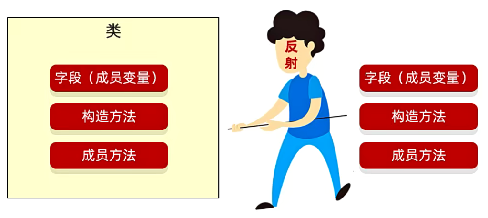

获取出来其实有很多的用处

- IDEA中的自动提示功能其实就是利用反射进行实现的

  我们创建了一个对象，用对象调用方法或者成员变量，IDEA就会利用反射将这个类中能调用的所有方法、成员变量都获取出来并进行展示。

  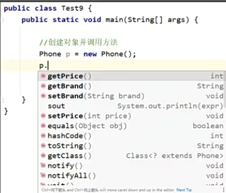

- IDEA的形参列表提示，也是利用反射

  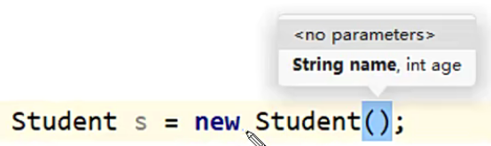

说白了，反射就是可以从类里面拿东西，常用的有：成员变量、构造方法、成员方法。

说到这里有同学会想，既然是从类里面拿东西，那为什么要用反射呢？

我们用IO流不行吗，从上往下一行一行的读，一行一行的拿，是不是也可以？

但是，当我们读到构造方法和普通成员方法的时候，你怎么区分？

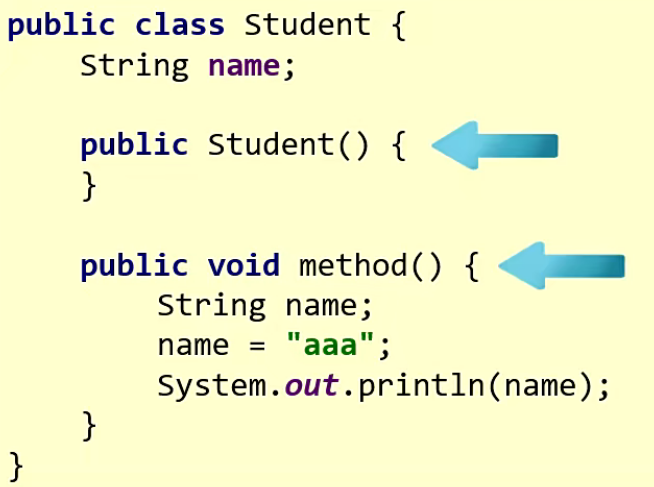

很难了吧，如果你想要用返回值区分，那我问你第二个问题：成员变量和局部变量怎么区分呢？

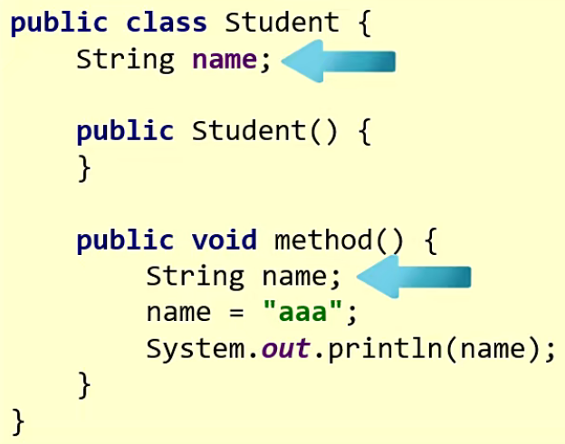

你还得通过上下文区分，非常的麻烦，这个时候就可以使用反射了。

利用反射我们可以将所有的成员变量获取出来，获取出来后就可以得到所有成员变量的信息了。

获取信息：

1. 字段（成员变量）
   可以 获取修饰符，获取名字，获取名字，获取类型，赋值/获取值
2. 构造方法
   获取 修饰符，获取名字，获取形参，创建对象
3. 成员方法
   获取修饰符、获取名字、获取形参、获取返回值、抛出的异常、获取注解、运行方法

在这么多的方式中，我们可以将它分为两类：获取和解刨

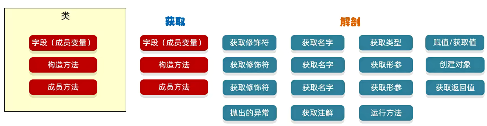

但是在获取的时候有一个小注意点：我们不是从Java文件中获取的，而是从class字节码文件中获取的。

因此我们需要先学习如何获取class字节码文件的对象，再去学习如何从字节码文件中获取到字段、构造方法、成员方法，一旦将这三个获取出来后，我们再进行解刨，获取到里面的成员信息。

----

# 192..获取class对象的三种方式（即字节码文件）

## 一、介绍

获取class对象的三种方式：

1、`Class.forName("全类名");`

这个Class是大写的，说明它是一个类名。`java`中已经定义好了一个类，就叫做class，它是用来描述字节码文件的。

这个类里面有个静态方法，叫做`forName`，括号中可以传递一个类的全类名，这样就可以获取到这个类的字节码文件对象。

2、`类名.class`

3、`对象.getClass();`

如果已经有了这个类的对象，我们可以用对象去调用 `getClass()`，`getClass()` 是定义在Object当中的，所以所有的对象都可以调用这个方法。

现在有三种方式，我们什么时候用哪种呢？其实也是有说法的，这三种方式其实就对应着Java中三种不同的阶段。

如果我想创建一个类的对象是分以下三个阶段的。

Java里三种不同的阶段：

① 源代码阶段

需要先编译Java文件，把它编译成.class字节码文件，在这一阶段，它是没有把代码加载到内存当中的，它只是在硬盘里进行的操作。所以这个阶段也被叫做：源代码阶段。在这个阶段，我们会使用第一种方式去获取到字节码文件的对象。

② 加载阶段

接下来要运行代码了，就需要将字节码阶段加载到内存当中，在这一阶段叫做加载阶段，我们会使用第二种方式

③ 运行阶段

我可以在内存当中去创建这个类的对象，这一阶段叫做运行阶段，我们会使用第三种方式

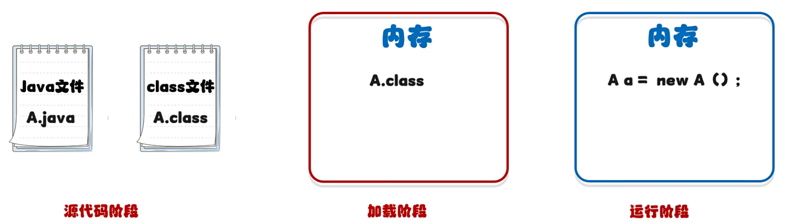

---

## 二、代码实现

### 1）方式一

`Class.forName("全类名");`

全类名：包名+类名，但是这个不需要我们自己写，我们需要学会去粘贴复制：com.itheima.myreflect1.Student

but，不能粘贴在外面，如果粘贴在外面的话，就是类名。如下图，粘贴在外面就是一个类名，而不是全类名。

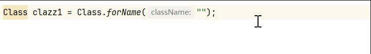

选中类名 ——> Copy ——> Copy Reference

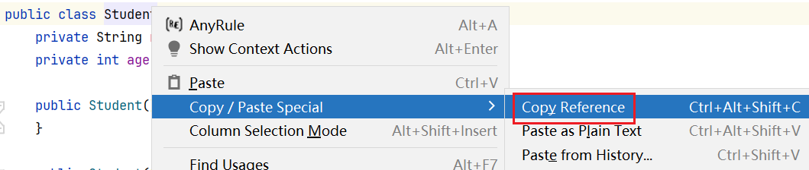

~~~java
//这个clazz就表示Student类的字节码文件的对象
Class clazz = Class.forName("com.itheima.myreflect1.Student");
//打印
System.out.println(clazz); // class com.itheima.myreflect1.Student
~~~

----

### 2）方式二

~~~java
//2.第二种方法：类名.class，一般当做参数进行传递
Class clazz2 = Student.class; // 此时获取的也是Student类的字节码文件对象，跟上面获取的其实是一模一样的
//如果你不信，这里可以进行比较
System.out.println(clazz2 == clazz);//返回结果为true，说明这两个获取的其实是一个对象
~~~

----

### 3）方式三

当我们已经有了这个类对象时，就可以直接用对象调用 `getClass()`

```java
//3.第三种方法：对象.getClass(); - 有局限性：当我们已经有了这个类的对象时，才可以使用
Student student = new Student();
Class clazz3 = student.getClass();
System.out.println(clazz == clazz2);//true
System.out.println(clazz2 == clazz3);//返回结果都为true，说明这三个获取的字节码文件对象其实都是同一个对象
```

----

## 三、什么时候用哪种？

第一种方式是以后最为常用的，而第二种方式更多的是当做参数进行传递。

例如多线程中，`synchronized()` 同步代码块中，小括号中就需要传递锁对象，当时我们写的就是 `Student.class` 字节码文件对象 当做锁对象。

第三种方式是有局限性的，因为要使用对象去调用，因此只有一个种情况：当我们已经有了这个类的对象时，才可以使用。

-----

# 万物皆对象

在Java里面，万物皆对象。简单来说就是：什么玩意都可以将它看做是一个对象。

例如：字节码文件，我可以看做是Class这个类的对象；

构造方法也可以看做是一个对象，那么是哪个类的对象呢？在Java中定义了一个类：Constructor，这个类就是用来描述构造方法的，同理，这个类的对象就表示构造方法的对象。

再往下，在Java中有一个类，叫 `Field`，就是用来描述成员变量的，所以这个类的对象就表示成员变量的对象。

最后一个，在Java中有一个列叫做 `Method` 用来描述成员方法，这个类的对象就是成员方法的对象。

接下来我们就来学习利用反射获取构造方法。

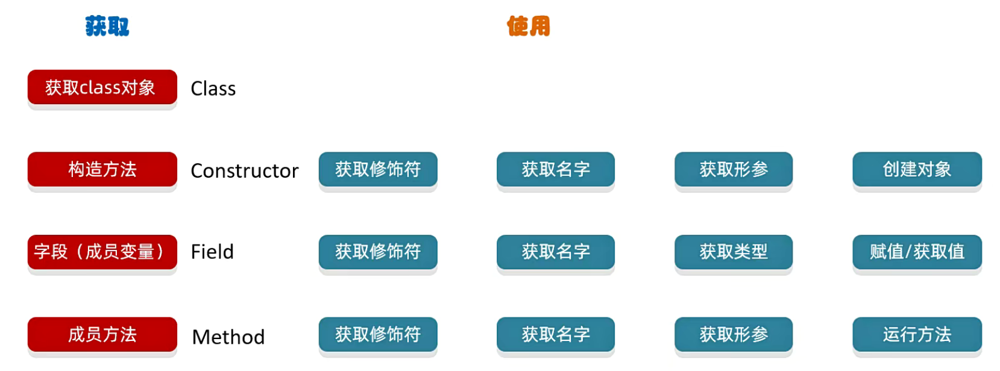

# 193.反射获取构造方法

## 一、获取构造方法

方法相对来讲有点多，不需要硬记，我们需要去找到里面的规律。

利用反射获取构造方法（其中的 declared 可以理解为权限的意思，有了declared我就可以获取到所有的，包括私有的构造方法我都能获取到）

```java
Class类中用于获取构造方法的方法
// `get` 表示获取，`Constructor` 表示构造方法，`s` 复数形式，即私有的构造方法
Constructor<?>[] getConstructors():返回所有公共构造方法对象的数组
Constructor<?>[] getDeclaredConstructors():返回所有构造方法对象的数组
Constructor<T> getConstructor(Class<?>...parameterTypes):返回单个公共构造方法的对象
Constructor<T> getDeclaredConstructor(Class<?>...ParameterTypes):返回单个构造方法对象
```

代码实现：

```java
//1.构造方法是在字节码文件里面的，因此第一步是获取class字节码文件对象
Class clazz = Class.forName("com.itheima.myreflect2.Student");
//2.获取构造方法
Constructor[] cons1 = clazz.getConstructors();
for (Constructor con : cons1) {
    System.out.println(con);
}
Constructor[] cons2 = clazz.getDeclaredConstructors();
for (Constructor con : cons2) {
    System.out.println(con);
}
//3.获取单个
//那就有问题了，构造方法那么多，我们获取哪个呢？我们首先获取到空参的
Constructor con1 = clazz.getDeclaredConstructor();
System.out.println(con1);
//括号中是可以传递参数，这个参数要跟构造方法里面的参数保持一致才行，如果构造方法的参数是String，那么就传递字符串的字节码文件对象就行了，即String.class
Constructor con2 = clazz.getDeclaredConstructor(String.class);
System.out.println(con2);
//如果传的是私有构造器的参数，却没有加Declared，则会报错
//在java中，int也是有对应的字节码文件的
Constructor con3 = clazz.getDeclaredConstructor(int.class);
System.out.println(con3);
Constructor con4 = clazz.getDeclaredConstructor(String.class, int.class);
```

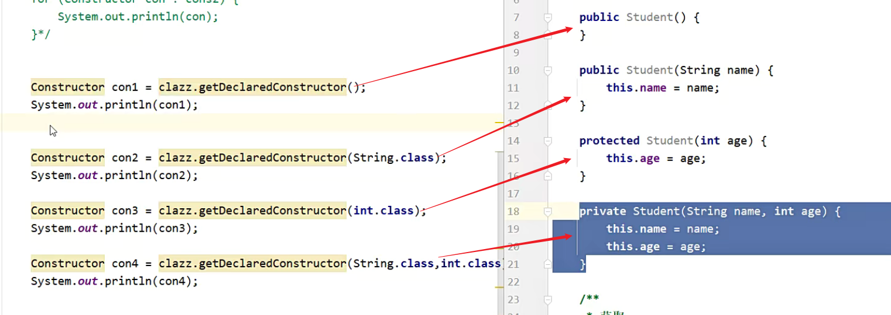

构造方法获取到了后，我们能干的事情非常非常多：获取到构造方法的权限修饰符、获取到构造方法的形参、利用这个构造方法去创建这个类的对象，所有的事情都能做。

在反射的面前，一切都是赤裸裸的，我们可以将构造方法里面所有的东西全都拿到。

----

## 二、获取权限修饰符

~~~java
//常量字段值：每一个权限制，都有对应的编码，
int modifiers = con4.getModifiers();//获取到它的权限修饰符，但是这个权限修饰符不是字符串，而是通过整数的形式来进行体现的
System.out.println(modifiers); //private返回2，public返回1
~~~

那这个权限修饰符有没有什么规律呢？其实是有的，打开一下 `API帮助文档`，在 `API帮助文档` 中我们需要搜索 `常量字段值`

我们随便找到一个常量字段值，来点击一下

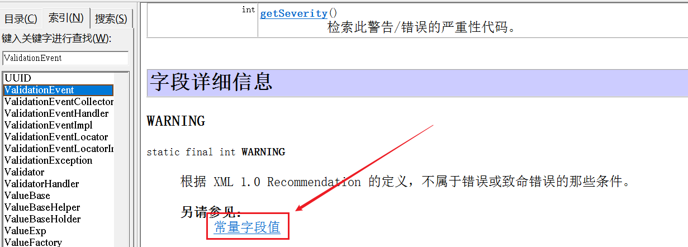

此时在Java中所有定义的常量就罗列出来，我们可以来搜索一下 `reflact`

在这里权限修饰符所对应的数字都能看见了。

可以发现它并没有按照123456789这种方式来定义，而是按照1,2,4,8,16,32这种形式来定义的，其实跟底层的运算效率有关。

如果忘记了可以回顾一下之前学的原反补。

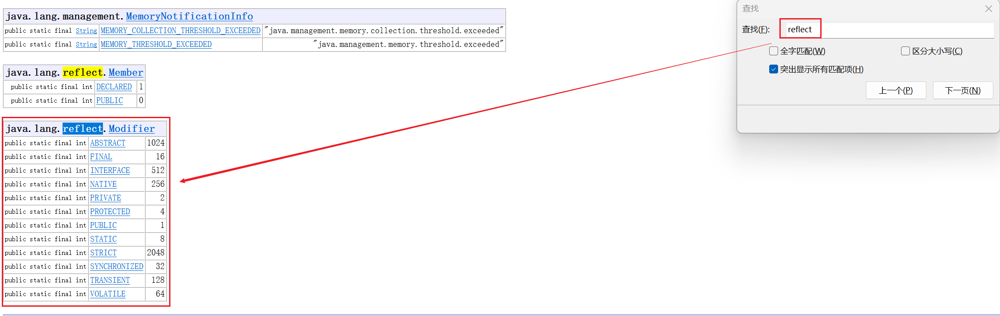

那么权限修饰符获取到有什么用呢？

虽然我们没什么用，但是IDEA是有用的。

例如下面，创建Student对象的时候，<Kbd>ctrl + p</kbd> ，可以发现其他的构造我们都能使用，只有第四个私有的构造我们不能用，但是它怎么知道第四个是私有的？

其实IDEA底层利用的就是反射，在IDEA底层它会获取到这个构造的权限修饰符，如果是私有的，它就不会让你去调用，这就是它的应用场景。

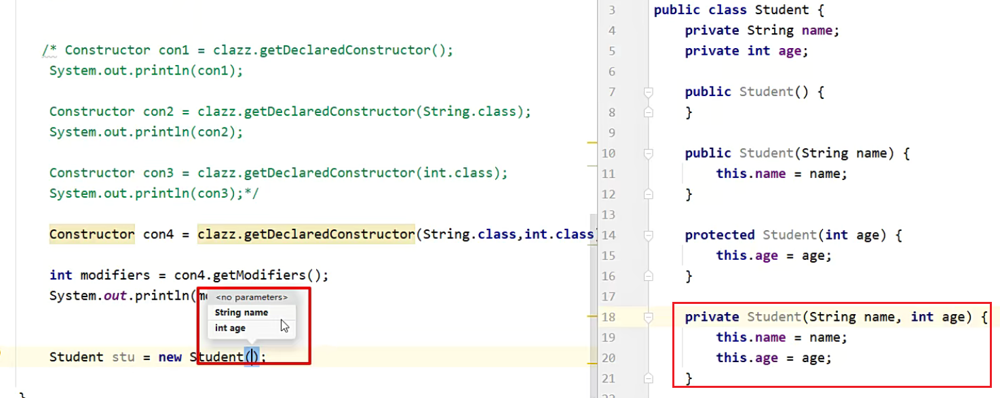

----

## 三、获取其他

获取参数个数、获取到参数的类型、获取到构造方法中所有的参数。

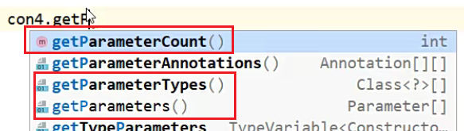

~~~java
Parameter[] parameters = con4.getParameters();
for (Parameter parameter : parameters) {
    System.out.println(parameter);
}

打印结果：
java.lang.String arg0
int arg1
~~~

IDEA底层获取到参数后，就可以以图形化的形式给我们展示出来：当我们创建对象，想要看见构造方法里面的参数时，就可以看见了。

----

## 四、创建对象

~~~java
//括号中的属性要跟构造方法中的参数保持一致
//返回值是Object，但是我们知道这个对象一定是一个学生对象，因此可以强转
Student stu = (Student) con4.newInstance("张三", 23);
System.out.println(stu);
~~~

程序运行完毕，可以发现报错了：`with modifiers "private"`，这个权限修饰符是私有的，你不能用。

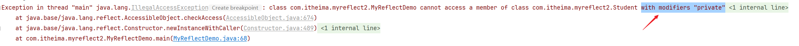

`getDeclaredConstructor()` 只是能让你看到这个构造，但是你还无法直接利用这个构造去创建对象，如果你想要利用它去创建对象，那么在它的前面还需调用 `setAccessible()`，它就表示：临时取消权限校验。这种方式也叫作 `暴力反射`。

~~~java
con4.setAccessible(true);
~~~


----

# 194.反射获取成员变量

Class类中用于获取成员变量的方法

```java
Field[] getFields()：返回所有公共成员变量对象的数组
Field[] getDeclaredFields():返回所有成员变量对象的数组
Field getField(String name):返回单个公共成员变量对象
Field getDeclaredField(String name):返回单个成员变量对象
```

Field类中用于对象的方法

```java
void set(Object obj, Object value):赋值
Object get(Object obj):获取值
```

代码实现

```java
//1.获取class字节码文件的对象
Class clazz = Class.forName("com.itheima.myreflect3.Student");
//2.获取所有的成员变量
Field[] fields = clazz.getDeclaredFields();
for (Field field : fields) {
    System.out.println(field);
}
//获取单个的成员变量
Field name = clazz.getDeclaredField("name");
System.out.println(name);
//获取权限修饰符
int modifiers = name.getModifiers();
System.out.println(modifiers);
//获取成员变量的名字
String n = name.getName();
System.out.println(n);
//获取成员变量的数据类型
Class<?> type = name.getType();
System.out.println(type);

//获取成员变量记录的值，这个值，和成员变量的对象有关。因此如果想要获取值，就需要先来创建一个对象
Student s = new Student("zhangsan", 23, "男");
//但如果这个成员变量是私有的，就需要用name.setAccessible(true)，让它临时取消访问权限
//由于知道zhangsan是字符串类型的，就可以做一个强转
name.setAccessible(true);
String value = (String) name.get(s);
System.out.println(value);
//修改对象里面记录的值
//参数一：你要把对象里面的哪个参数进行修改？     参数二：你要修改成什么？
name.set(s, "lisi");
System.out.println(s);
```

----

# 195.反射获取成员方法

## 一、获取成员方法

Class类中用于获取成员方法的方法：

```java
Method[] getMethods():返回所有公共成员方法对象的数组，包含继承的
Method[] getDeclaredMethods():返回所有成员方法对象的数组，不包含继承的
Method[] getMethod(String name, Class<?>...parameterTypes):返回单个公共成员方法对象
Method[] getDeclaredMethod(String name, Class<?>...parameterTypes):返回单个成员方法对象
```

Method类中用于创建对象的方法

```java
//参数一：用obj对象调用该方法
//参数二：调用方法的传递的参数（如果没有就不写）
//返回值：方法的返回值，没有就不写
Object invoke(Object obj, Object... args):运行方法
```

代码实现

```java
//1. 获取class字节码文件对象
Class clazz = Class.forName("com.itheima.myreflect4.Student");

//2. 获取里面所有的方法对象(包含父类中所有的公共方法)
Method[] methods = clazz.getMethods();
for (Method method : methods) {
    System.out.println(method);
}

// 获取里面所有的方法对象(不能获取父类的，但是可以获取本类中私有的方法)
Method[] methods = clazz.getDeclaredMethods();
for (Method method : methods) {
    System.out.println(method);
}

// 获取指定的单一方法
//参数一：方法的名字；参数二：方法的形参，目的是为了方法的重载。
// Method m = clazz.getMethod("eat", String.class);由于eat是私有的，因此需要加declared，否则报错
Method m = clazz.getDeclaredMethod("eat", String.class); //不能获取父类的，但是可以获取本类中私有的方法
System.out.println(m);

// 获取方法的修饰符
int modifiers = m.getModifiers();
System.out.println(modifiers);

// 获取方法的名字
String name = m.getName();
System.out.println(name);

// 获取方法的形参，将参数对象获取到并放到一个数组中
Parameter[] parameters = m.getParameters();
for (Parameter parameter : parameters) {
    System.out.println(parameter); //例如打印出java.lang.String arg0，表示有一个参数是String类型的
}

//获取方法的抛出的异常
Class[] exceptionTypes = m.getExceptionTypes();
for (Class exceptionType : exceptionTypes) {
    System.out.println(exceptionType); //class java.lang.NullPointerException
}
```

Student类中的方法抛出的异常，在上面就可以获取到。

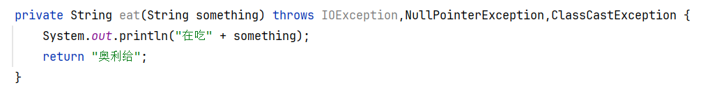

----

## 二、让反射获取到的方法运行

~~~java
//方法运行
/*Method类中用于创建对象的方法
Object invoke(Object obj, Object... args)：运行你获取出来的方法
参数一：方法的调用者，相当于就是用obj对象调用该方法
参数二：方法的形参，调用方法的传递的参数（如果是空参，第二个方法就不写）
返回值：方法的返回值（如果没有返回值，那么invoke方法的返回值你就不用管）*/

Method m = clazz.getDeclaredMethod("eat", String.class); //不能获取父类的，但是可以获取本类中私有的方法
System.out.println(m);
Student s = new Student();
m.setAccessible(true);//由于eat方法是私有的，因此需要临时取消它的访问权限，才能成功运行它
//参数一s：表示方法的调用者
//参数二"汉堡包"：表示在调用方法的时候传递的实际参数
//如果已经知道方法的返回值是一个字符串，这里也可以使用字符串来接收，直接强转
String result = (String) m.invoke(s, "汉堡包");
System.out.println(result);
~~~


-----

# 196.综合练习01：保存信息

对于任意一个对象，都可以把对象所有的字段名和值，保存到文件中。

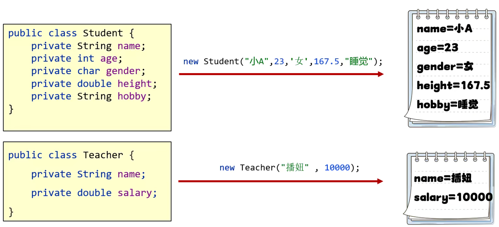

这个练习体现的反射的作用：获取一个类里面所有的信息，获取到了之后，再执行其他的业务逻辑

~~~java
public static void main(String[] args) throws IllegalAccessException, IOException {
    /*
    对于任意一个对象，都可以把对象所有的字段名和值，保存到文件中去
    */
    Student s = new Student("小A", 23, '女', 167.5, "睡觉");
    Teacher t = new Teacher("播妞", 10000);
    saveObject(s);
}

//把对象里面所有的成员变量名和值保存到本地文件中
public static void saveObject(Object obj) throws IllegalAccessException, IOException {
    //1.获取字节码文件的对象
    Class clazz = obj.getClass();
    //2. 创建IO流
    BufferedWriter bw = new BufferedWriter(new FileWriter("myreflect\\a.txt"));
    //3. 获取所有的成员变量，由于我也不知道你的成员变量是不是私有的，因此这里一律使用getDeclaredFields()
    Field[] fields = clazz.getDeclaredFields();
    for (Field field : fields) {
        //由于我也不知道你的成员变量是不是私有的，这里一律先去取消临时访问权限
        field.setAccessible(true);
        //获取成员变量的名字
        String name = field.getName();
        //获取成员变量的值，要记住，成员变量的值是跟对象有关系的，因此需要传入对象
        Object value = field.get(obj);
        //写出数据
        bw.write(name + "=" + value);
        bw.newLine();
    }
    bw.close();
}
~~~


-----

# 197.综合练习02：结合配置文件动态的创建对象，并调用方法

反射可以跟配置文件结合，动态的创建对象，并调用方法

需求: 利用反射根据文件中的不同类名和方法名，创建不同的对象并调用方法。

分析:

① 通过Properties加载配置文件

② 得到类名和方法名

③ 通过类名反射得到Class对象

④ 通过Class对象创建一个对象

⑤ 通过Class对象得到方法

⑥ 调用方法

这个练习体现的反射的作用：结合配置文件，动态的创建对象并调用方法

这里已经准备好了 `prop.properties` 配置文件的内容，它就表示：一会程序在运行的时候，我要创建 `com.itheima.myreflect6.Teacher` 类的对象，并调用下面 `teach方法`，以后如果我们需要调用其他类里面的方法，那么代码是不需要修改的，我们只需要修改一下配置文件里面的信息就行了。

```properties
classname=com.itheima.myreflect6.Teacher
method=teach
```

~~~java
//1.读取配置文件中的信息
Properties prop = new Properties();
FileInputStream fis = new FileInputStream("myreflect\\prop.properties");
//如果忘记我们要读文件也没关系，写load方法的时候看一下看出就想起来了。
prop.load(fis);
fis.close();
System.out.println(prop);
//2.获取全类名和方法名
String className = (String) prop.get("classname");
String methodName = (String) prop.get("method");
System.out.println(className); //com.itheima.myreflect6.Teacher
System.out.println(methodName); //teach
//3.利用反射创建对象并运行方法
//思路：创建对象首先就需要来获取构造方法，而构造方法是在字节码文件里面的，所以一开始需要获取字节码文件的对象
Class clazz = Class.forName(className);
//获取构造方法，但是为了防止构造方法私有化，这里直接使用暴力反射最稳妥
//如果是利用空参去创建对象，其实还有一种最为简单的方式：直接通过clazz调用里面的newInstance()，但是这个方法已经过时了，因此已过时的方法了解一下就行了，现在我们还是使用最为正当的方式
Constructor con = clazz.getDeclaredConstructor();
Object o = con.newInstance();
System.out.println(o);
//获取成员方法并运行
Method method = clazz.getDeclaredMethod(methodName);
method.setAccessible(true);
method.invoke(o); //用上面创建出来的对象去调用就行了
~~~


----

# 反射总结

**1、反射的作用**

1. 获取一个类里面所有的信息，获取到了之后，再执行其他的业务逻辑
2. 结合配置文件，动态的创建对象并调用方法

2、获得class字节码文件对象的三种方式

① `Class.forName("全类名");`

② `类名.class`

③ `对象.getClass();`

3、如何获取构造方法、成员方法、成员变量

方法不需要去背，看见单词能想起方法的意思就行了

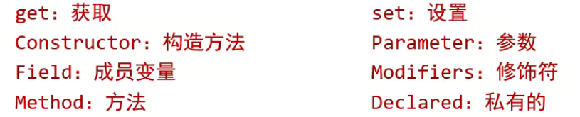

----

# 198.动态代理的思想分析

## 一、介绍

什么是动态代理，动态代理又有什么用呢？

假设Student中有一个吃饭的方法，我要去给这个方法增加其他的功能，例如吃饭前要拿筷子、盛饭.......

按照以前所学，我们只能将这两段代码写在eat方法中。

此时直接修改代码，我们其实是叫做 `侵入式修改`。

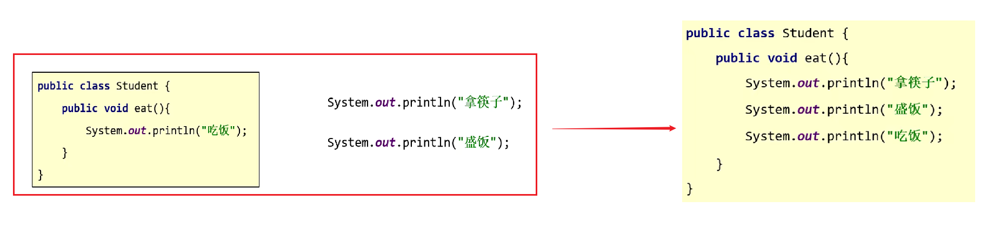

在以后，在一个成熟的项目中，我们一般很少会这么去干。

但是我们又不能修改原有的代码，又要增加原有的功能，此时就得去找一个代理。

代理说白了就是中介公司，它会帮你去做 `拿筷子`、`盛饭` 这两个准备工作，等真正吃饭了，再去调用 `Student` 里面的方法去吃饭，这个其实就是动态代理。

因此动态代理我们可以这么去理解：它可以无侵入式的给对象增强其他的功能。

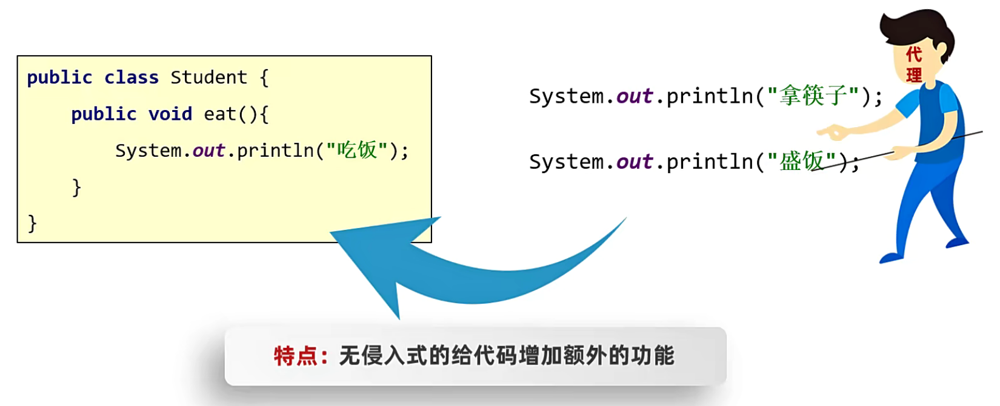

**1、程序为什么要有代理？**

对象如果嫌身上干的事太多的话，可以通过代理来转义部分职责。

代理可以无侵入式的给对象增强其他的功能。

当调用者想要去调用对象中的方法的时候，它并不是直接通过对象去调用，而是先通过代理的方法，代理会做一些准备工作，然后再由代理调用对象中的方法。

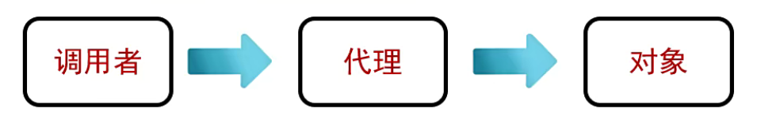

**2、代理长什么因样子？**

代理里面就是对象要被代理的所有的方法，对象要有什么方法想要被代理，那么代理也要有相应的方法，只不过方法里面干的事情是不太一样的，代理会先把准备工作先做完，然后再去调用对象中的方法。

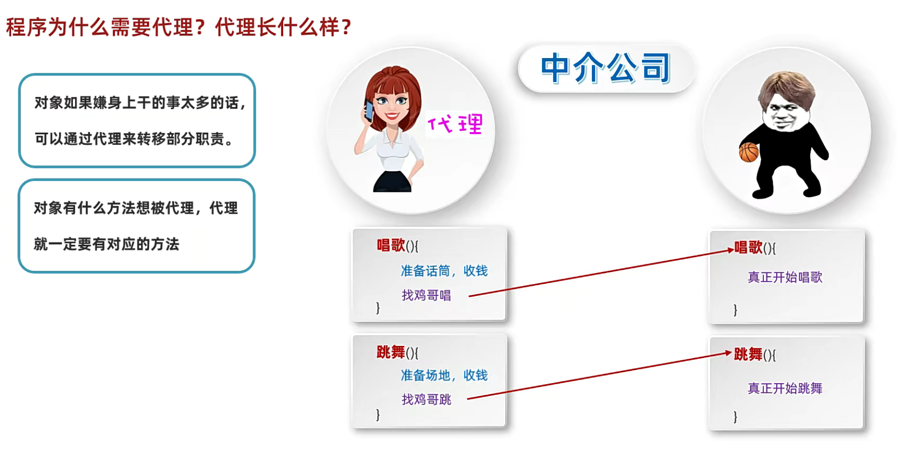

----

## 二、Java通过什么来保证代理的样子？

那么中间的代理，它是如何知道鸡哥要代理唱歌和跳舞的两个方法呢？

因此为了解决这个问题，在代码中我们是通过接口来搞定的，在中间我们会实现定一个接口，有唱歌和跳舞的方法。

PS：这个接口中所有的方法就是我们想要代理的方法。

写完了接口，左边的代理和右边的鸡哥都要去实现这个接口。

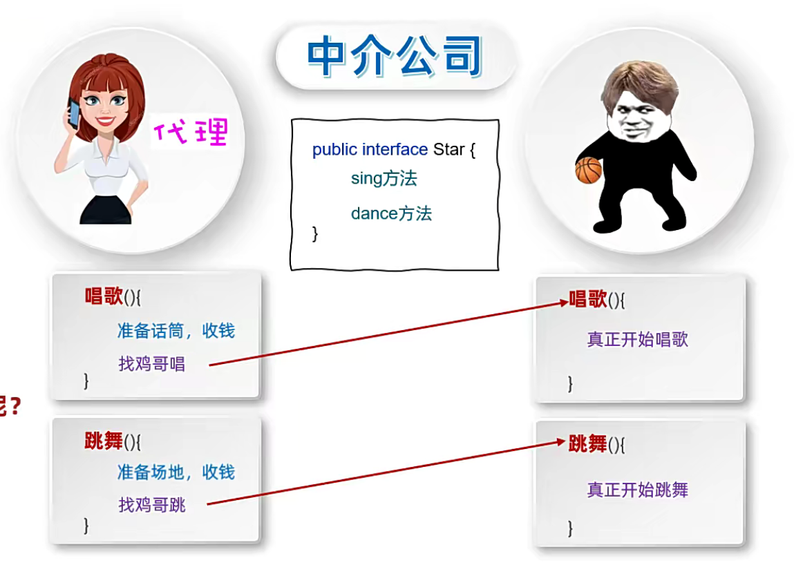

总结：我们是通过一个接口来保证的后面的对象和代理需要实现同一个接口，接口中就是被代理的所有方法。


----


# 199.动态代理的代码实现

如何创建代理呢？其实Java有一个类

`java.lang.reflect.Proxy`类：提供了为对象产生代理对象的方法，方法的名字叫做：newProxyInstance

```java
public static Object newProxyInstance(ClassLoader loader, Class<?>[] insterface, InvocationHandler h)
```

在Java中，每个class都有一个相应的Class对象。也就是说，当我们编写一个类，编译完成后，在生成的.class文件中，就会产生一个Class对象，用于表示这个类的类型信息。

其实任何一个类，都会有一个Class对象于这个类对应，在这个Class对象中，保存着实例化该类时所需要的基本信息，`A.class` 其实返回的是一个类A的Class对象

`getClassLoader()`：取得该Class对象的类装载器

`BigStar`代码实现：

```java
public class BigStar implements Star {
    private String name;


    public BigStar() {
    }

    public BigStar(String name) {
        this.name = name;
    }

    //唱歌
    @Override
    public String sing(String name) {
        System.out.println(this.name + "正在唱" + name);
        return "谢谢";
    }

    //跳舞
    @Override
    public void dance() {
        System.out.println(this.name + "正在跳舞");
    }

    /**
     * 获取
     *
     * @return name
     */
    public String getName() {
        return name;
    }

    /**
     * 设置
     *
     * @param name
     */
    public void setName(String name) {
        this.name = name;
    }

    public String toString() {
        return "BigStar{name = " + name + "}";
    }
}
```

Star接口代码实现：

```java
package com.itheima.mydynamicproxy1;

public interface Star {
    //我们可以把所有想要被代理的方法定义在接口中
    //唱歌
    public abstract String sing(String name);
    
    //跳舞
    public void dance();
}
```

`ProxyUtil`代码实现：

```java
/**
 * 类的作用：
 *  创建一个代理
 */

public class ProxyUtil {
    /**
     * 方法的作用：
     *      给一个明星对象，创建一个代理
     *
     * 形参：
     *      被代理的明星对象
     *
     * 返回值：
     *      给明星创建的代理
     */
    public static Star createProxy(BigStar bigStar) {
        /**
         * 参数一： loader 用于指定用哪个类加载器，去加载生成的代理对象
         * 类加载器：Java在运行的时候，需要有个东西将把字节码文件加载到类中，就是类加载器去加载的
         *
         * ProxyUtil.class：是谁把当前的类加载到内存的，让它
         *
         * 参数二： insterface 指定接口，这些接口用于指定生成的代理长什么样，有就是有哪些方法
         *         ctrl + p查看形参，发现在代码中是以数组的方式来体现的，数组里的参数都是字节码，里面写接口的类.class
         *
         * 参数三： h 用来指定生成的代理对象要干什么事情
         * @return
         *
         * 需求：
         *   外面的人想要大明星唱一首歌
         *   1. 获取代理人的对象
         *     代理对象 = proxyUtil.createProxy(大明星的对象);
         *
         *   2.在调用代理的唱歌方法
         *      代理对象.唱歌方法("只因你太美");
         *      此时会去调用invoke方法，因为invoke方法里面就是代理要干的事情
         */
        //public static Object newProxyInstance(ClassLoader loader, Class<?>[] insterface, InvocationHandler h)
        //由于方法是静态的，因此可以直接使用类名调用
        //这里需要加一个强转，因为方法是return Object
        Star star = (Star) Proxy.newProxyInstance(
            ProxyUtil.class.getClassLoader(), //ProxyUtil.class：先找到是谁将当前的类加载到内存的。找到这个人后让它再干一件事情：将当前的代理加载到内存中
            //这个代理可以代理Star里面所有的方法，这个地方是数组，如果你还想代理其他接口的方法，也是可以写在后面的
            new Class[]{Star.class},
            //参数三： h 用来指定生成的代理对象要干什么事情。代理需要做一些准备工作
            new InvocationHandler() {
                @Override
                public Object invoke(Object proxy, Method method, Object[] args) throws Throwable {
                    /**
                         * 参数一：代理的对象，即就是这个Star，但是这个对象我们一般不使用
                         * 参数二：要运行的方法 sing
                         * 参数三：调用sing方法时，传递的实参
                         */
                    if ("sing".equals((method.getName()))) {
                        System.out.println("准备话筒，收钱");
                    } else if ("dance".equals((method.getName()))) {
                        System.out.println("准备场地，收钱");
                    }

                    //去找大明星开始唱歌或者跳舞
                    //代码的表现形式：调用大明星里面唱歌或者跳舞的方法
                    //PS：method.invoke方法和Invocation里的invoke不一样，只是名字一样而已
                    return method.invoke(bigStar, args);
                }
            }
        );
        return star;
    }

}
```

**测试类**

~~~java
/*
需求：
外面的人想要大明星唱一首歌
 1. 获取代理的对象
    代理对象 = ProxyUtil.createProxy(大明星的对象);
 2. 再调用代理的唱歌方法
    代理对象.唱歌的方法("只因你太美");
*/
//1. 获取代理的对象
BigStar bigStar = new BigStar("鸡哥");
Star proxy = ProxyUtil.createProxy(bigStar);//表示现在我是给这个明星去生成代理
//2. 调用唱歌的方法
String result = proxy.sing("只因你太美"); //方法的底层会去自动调用invoke方法
System.out.println(result);
~~~

