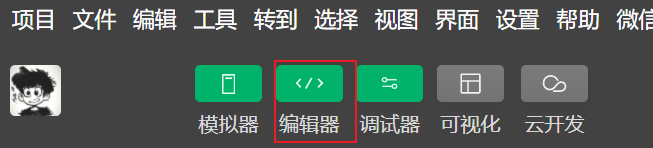
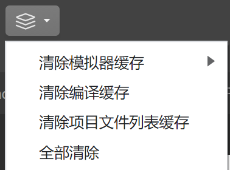

# 一、小程序基础知识

# 2.初识微信小程序


**什么是微信小程序（Mini programs）**


微信小程序是一种运行在微信内部的 轻量级 应用程序。

在使用小程序时 不需要下载安装，用户 扫一扫 或 搜一下 即可打开应用。它也体现了 “用完即走” 的理念，用户不用关心安装太多应用的问题。它实现了应用“触手可及”的梦想，应用无处不在，随时可用，但又 无须安装卸载。


**特点**:

小程序的四大特性：无须安装、用完即走、无须卸载、触手可及

1. 无须安装：体积小，用户感知不到下载的过程
2. 触手可及：用户 扫一扫 或 搜一下 即可打开应用，通过下拉能访问使用的小程序
3. 用完即走，无须卸载

---

# 3. 微信小程序账号注册

小程序开发 与 网页开发不一样，在开始微信小程序开发之前，需要访问 [微信公众平台](https://mp.weixin.qq.com/)，注册一个微信小程序账号。

在拥有了小程序的账号以后，我们才可以开发和管理小程序，后续可以通过该账号进行开发信息的设置、成员的添加，也可以用该账号查看、运营小程序的相关数据。

> 📌 **注意事项**：
>
> 在申请账号前，我们需要先准备一个邮箱，该邮箱要求：
>
> 1️⃣ 未被微信公众平台注册❗
>
> 2️⃣ 未被微信开放平台注册❗
>
> 3️⃣ **未被个人微信号绑定过 ！**如果被绑定了需要解绑 或 使用其他邮箱 ❗

1. 打开 [微信公众平台](https://mp.weixin.qq.com/)，点击立即注册

   

   

   

2. 选择注册的帐号类型，在这里我们需要 **选择小程序**

   

   

   

   

3. 输入账号信息

   

   

   

4. 邮箱激活，需要进入邮箱进行激活

   

   

   

   

   

5. 信息登记，注册类型 (需要选择中国大陆和个人，企业其他需要资质认证)

   

   

   

6. 主体信息登记与确认

   > 📌 注意:
   >
   > ​    在进行管理员身份验证的时候，推荐使用自已的微信进行扫码，
   >
   > ​    将自已设置为小程序账号的管理员，方便以后对小程序进行开发、成员等相关的设置

   

   

   

   

7. 小程序注册完成，点击前往小程序，即可进入小程序后台

    

   

   

   

---

# 4.完善小程序账号信息

在完成小程序账号的注册后，你便可以打开微信公众平台对小程序账号进行一些设置，这是你开发前的准备工作，完善后才可以进入后续的开发步骤，这是因为小程序在后续进行提交审核的时候，小程序账号信息是必填项，因此在注册小程序以后，需要补充小程序的基本信息，如名称、图标、描述等。

> 📌 **注意事项**：
>
> ​	在填写小程序类目时**不要选择游戏类型**，否则微信官方将会视为小游戏开发 ❗


点击 **前往填写**，填写小程序基本信息即可


点击 **前往设置** , 设置小程序信息


**补充小程序类目**


1. 点击右上角添加类目

   


2. 管理员授权

   

   

3. 手机微信进行认证

   

   

4. 添加小程序类目，<font color="red">**注意：选择类目的时候不要选择小游戏类目 ！！！！**</font>，否则微信官方会视为小游戏开发，但我们目前学习的是小程序开发。


然后点击左上角的微信小程序图标，返回微信公众后台


下面的小程序备案和微信认证，需要以后自己的小程序上线之前打开微信公众平台来进行相关设置。


## 更改小程序信息 / 类目

点击设置


---

# 5.项目成员和体验成员

在公司中开发运营一个小程序，需要产品测试、研发、运营等各部门来进行紧密的配合。为了方便对各部门人员的管理，小程序就提供了两种不同的成员角色：**项目成员** 和 **体验成员**。

**项目成员**：参与小程序开发、运营的成员，可登陆小程序管理后台，包括运营者、开发者及数据分析者，我们以后在开发中属于开发者，因此属于项目成员。项目成员以后可以登录微信公众后台。微信小程序的管理员可在“成员管理”中添加、删除项目成员，并设置项目成员的角色。

**体验成员**：参与小程序内测体验的成员，例如产品经理例如测试。体验成员可使用体验版小程序，但不属于项目成员。管理员及项目成员均可添加、删除体验成员。

目前我们是个人开发者，所以可以添加15个项目成员和15个体验成员。但是以后在公司中，如果是公司的账号，是可以添加90个项目成员以及90个体验成员。


添加项目成员


微信号这里输入的必须是微信号，而不能是手机号！

权限选择开发权限，以后在公司中就是开发权限。如果是运营人员，就是运营者权限；如果是数据分析者，就是数据分析者权限。


在选择好权限之后，点击`确认添加`，这时候又会弹出一个二维码，需要管理员来进行身份认证。


**删除成员**

点击右上角的编辑按钮


然后将鼠标移至需要删除的成员上面，就会出现一个删除的图表，点击删除即可


体验成员同理。

---

# 6. 小程序开发者 ID

小程序的开发者账号是免费的，只要开发者满足开发资质就可以免费注册，并且会获得对应的开发者 ID

一个完整的开发者 ID 由 **<font color="red">小程序 ID（AppID）</font>**和一个 **<font color="red">小程序密钥（AppSecret）</font>**组成。


**小程序 ID 即 AppId**  是小程序在整个微信账号体系内的唯一身份凭证，类似于身份证号或者银行卡号。后续在很多地方都会用到，例如：新建小程序项目、真机调试、发布小程序等操作时，必须有小程序 ID。

**小程序密钥** 是开发者对小程序拥有所有权的凭证，类似于银行卡密码。在进行 微信登录、微信支付，或进行发送消息等高级操作时会使用到。


在微信公众后台，单击左侧开发标签，选择 "开发管理"，在新的页面中点击 "开发设置"，就可以看到开发者 ID 信息。请妥善保管你的小程序 ID 和小程序密钥，在后续的开发中会经常使用到，获取位置见下图：


如果已经生成过小程序秘钥，则小程序秘钥后面的按钮会变成重置。


小程序ID会明文展示，但小程序秘钥并没有任何东西。这是因为微信官方处于安全的角度出发，并没有进行明文展示。如果在开发中需要使用到小程序秘钥，可以点击后面的生成，或者重置，在弹框里面就可以看见自己的秘钥，复制之后就可以进行使用了


我们以后在开发中使用最多的是小程序ID。秘诀：在桌面上新建一个文本文件，然后将自己的小程序ID粘贴进去，这样就不需要每次都打开微信公众号后台进行查看了。

---

# 7. 微信开发者工具

微信小程序只能运行在微信中，在脱离微信后，微信小程序将不能进行运行和使用，也就是说微信小程序它不能运行在浏览器中，我们不能通过浏览器来运行和调试小程序，但我们在开发过程中就无可避免的需要对微信小程序进行调试，这时候该怎么办呢？

为了帮助开发者简单和高效地开发和调试微信小程序，微信官方提供了 [微信开发者工具](https://developers.weixin.qq.com/miniprogram/dev/devtools/download.html)，利用开发者工具可以很方便地进行小程序开发、代码查看以及编辑、预览和发布等功能。

在 [微信开发者工具](https://developers.weixin.qq.com/miniprogram/dev/devtools/download.html) 下载页面，可以看到微信开发者工具包含三个版本：

1. 稳定版：稳定性高，**开发中一般推荐大家使用稳定版本**
2. 预发布版：稳定性尚可，一般包含新的、大的特性，这些特性通过了内部测试
3. 开发版：稳定性差，主要用于尽快修复缺陷和敏捷上线小的特性，如果想体验新特性，可以使用这个版本

> 📌 **注意事项**：
>
> ​	微信开发者工具必须联网使用 ❗
>
> 如果没有联网，或者网断了，那么在开发中都会出现一些问题。


选择合适的版本进行下载，在下载完成后，双击下载好的微信开发者工具安装包，根据引导点击下一步、我接受、直至安装完成。第一次使用微信开发者工具的时候，需要使用手机微信扫码登录，登录成功即可进入项目选择界面


---

# 8. 创建小程序项目

**创建项目**

使用小程序开发者工具创建一个新的项目，步骤如下：

1. 打开微信开发者工具，左侧选择小程序，点击 + 号即可新建项目。默认情况下选择的就是小程序。

   

   

   

2. 在弹出的新页面，填写项目信息

   - 项目名称：输入项目名称
   - 目录：选择小程序开发文件夹
   - AppID：填写自己申请的小程序 AppID
   - 开发模式：选择小程序
   - 后端服务：选择 **不使用云服务**
   - 模板选择：选择 **不使用模板**

   注意项目目录的结尾仍需加上项目名称，因为小程序创建项目是不会自动帮你生成根项目目录的。

   

   

   小程序的目录建议是空目录，否则官方会有提示，见下图

   

   

3. 点击确定，如果能够看到小程序的开发主界面，说明小程序项目已经创建成功

   

   


## 开发者工具设置

为了后续高效的对小程序项目进行开发，我们需要对微信开发者工具进行一些个性化的设置，例如：设置模拟器位置、编辑器主题、编辑区行高等，当然你可以继续使用官方默认的，也可以按照自己的喜好设置，设置步骤如下：

1. 将小程序模拟器移动右侧：点击菜单栏的 视图 ➡ 外观 ➡ 将模拟器移到右侧，小程序模拟器即可调整到右侧

   

   

   

   

2. 将机型切换到 `iPhone 6/7/8`

   

   

3. 移动调试器到底部

   右机调试器，在弹出来的弹窗中选择 `将面板移动到底部`

   

   最终页面

   

   

4. 小程序主题设置，点击菜单栏的 设置 ➡ 外观设置 ➡ 在弹框中将主题和调试工具选择为深色

   

   

   

   

5. 编辑区的设置，点击菜单栏的 设置 ➡ 编辑器设置 ➡ 按照自己的喜好调整行距和字号，或者其他设置

   

---

# 9. 小程序目录结构和文件介绍

在将小程序项目创建好以后，我们先来熟悉小程序项目的目录结构，如下图：


一个完整的小程序项目分为两个部分：**主体文件**、**页面文件**

**主体文件** 又称小程序全局文件，顾名思义，全局文件能够作用于整个小程序，影响到小程序的每个页面，且**主体文件必须放到项目的根目录下**，主要由三部分组成：

> 📌 **注意事项**：
>
> ​	  主体文件的名字必须是 app。
>
> ​	  app.js 和 app.json 文件是必须存在的！

|  文件名  |                             作用                             | 是否必须 |
| :------: | :----------------------------------------------------------: | :------: |
| app.json |                     小程序的全局配置文件                     |   必须   |
|  app.js  | 小程序入口文件，可以在这个.js文件中去存放一些全局的逻辑，来定义一些全局共享的数据 |   必须   |
| app.wxss |   小程序的全局样式，类似于网页开发中的.css，是一个样式文件   |  非必须  |


**页面文件** 是每个页面所需的文件，小程序页面文件都存放在 pages 目录下，一个页面一个文件夹，每个页面通常由四个文件组成（并且这四个文件的命名和文件夹的命名时保存一致的，这是为了后期调试的时候方便），每个文件只对当前页面有效：

| 文件名 |                 作用                 | 是否必须 |
| :----: | :----------------------------------: | :------: |
|  .js   |               页面逻辑               |   必须   |
| .wxml  |               页面结构               |   必须   |
| .wxss  |               页面样式               |  非必须  |
| .json  | 页面配置，这个配置项只对当前页面生效 |  非必须  |

> 📌 **注意事项**：
>
> 1. .js和.wxml这两个文件是必须存在的
> 2. 页面文件，wxss、json 文件能够覆盖主体文件中的样式和配置
> 3. 强烈建议：页面文件夹名称和页面文件名称要保持一致


## 修改小程序的渲染模式

小程序目前有两种渲染模式：Skyline 和 WebView


由于Skyline最新的渲染模式目前还不是很成熟，所以我们需要把这个项目的渲染模式切换为WebView渲染模式。

在 `app.json` 文件中将一下三个配置项全部去掉就可以了

~~~json
"renderer": "skyline",
"rendererOptions": {
    "skyline": {
        "defaultDisplayBlock": true,
        "disableABTest": true,
        "sdkVersionBegin": "3.0.0",
        "sdkVersionEnd": "15.255.255"
    }
},
"componentFramework": "glass-easel",
~~~

去掉之后，保存一下，保存之后项目会重新编译，这个时候我们已经将渲染模式换成WebView渲染模式。


## 小程序文件和文件夹作用清单

> 以`.json`结尾的都是配置文件

```shell
├─components	            ➡ 用来存放每个页面里的公共组件的
├─pages	                    ➡ 小程序页面存放目录
│  ├─index				   ➡ index 文件夹代表是 index 页面所需的文件
│  │      index.js          ➡ index 页面逻辑
│  │      index.json        ➡ index 页面配置
│  │      index.wxml        ➡ index 页面结构
│  │      index.wxss        ➡ index 页面样式
|
│  .eslintrc.js              ➡ Eslint 配置文件
│  app.js                    ➡ 小程序入口，即打开小程序首页执行的项目
│  app.json                  ➡ 小程序的全局配置
│  app.wxss                  ➡ 小程序的全局样式
│  project.config.json       ➡ 小程序开发者工具配置
│  project.private.config.json
│  sitemap.json              ➡ 小程序搜索优化
```


## 如何新建页面

**第一种方式：**

1. 在 pages 目录上 点击右键 `新建文件夹`，输入页面目录的名称，例如：list

   

2. 在 list  目录上 点击右键 `点击 page`，输入页面文件的名称，例如：list，不需要输入任何后缀名，任何按回车

   							

   这个时候list对应的四个文件就已经创建成功了。

   

   

>  📌 **注意事项：**
>
>  1. 新建页面成功以后，会在 app.json 的 pages 选项中新增页面路径

---

**第二种方式：**

在 app.json 的 pages 选项中，新增页面路径即可

在新增页面目录以后，会自动在 pages 目录下生成页面文件


---


## 调试基础库

小程序调试基础库是指 微信开发者工具中可以选择的微信基础库版本。

微信基础库是指小程序的运行环境，给小程序提供了运行所需的各种 API 和工具，以及基础框架和运行逻辑等。

小程序开发者可以在微信开发者工具中选择所需的微信基础库版本，作为运行和调试小程序时的运行环境。

每个小程序有自己所允许使用的基础库最低版本要求，开发者需要选择要兼容的基础库版本，从而确保小程序的功能正常运行。

详情 ==> 本地设置 ===> 调试基础库 ===> 点击需要的基础库版本


在后续学习，以及在公司中开发小程序时，如果某个API或者某个功能没有实现，这个时候你要确认一下当前功能、当前API所支持的基础库是哪一个。例如：我们想实现分享到朋友圈功能，这个功能要求基础库从2.11.3才支持。


----

# 10.如何调试小程序

在进行项目开发的时候，不可避免的需要进行调试，那么如何调试小程序呢 ?

点击上方的调试器，可以控制调试器的显示和隐藏




由于控制台中有许多系统打印的信息，这样不方便程序员进行调试。

在系统打印信息上，点击右键，选择 隐藏系统打印的东西 就可以了


## 工具栏位置4个按钮


### 1）编译

有点类似于浏览器里的刷新，在点击之后就能够重新编译，刷新当前页面。

---

### 2）预览

点击之后会弹出一个弹框，点击底下的 `继续浏览小程序` 按钮

点击之后就会弹出一个二维码，此时我们可以打开自己的手机微信扫描二维码，在扫描之后，就会弹出图中这一个界面

							

点击三个点，然后再点击`开发调试`，此时就需要重启。


重启之后重新扫描二维码，这个时候我们就可以自己在手机上来对小程序进行一些调试的工作。

---

### 3）真机调试

在点击之后，又会出现一个二维码，选择对应的手机系统之后，使用手机微信扫描二维码


这个时候它会弹出一个调试器


在真机调试中，在调试器中选中想要查看的结构，在手机上面就会发现对应的结构被选中了


然后也可以调试样式


当在手机上发送请求时，在 Network 中也可以查看发送的请求


也可以看见存储了哪些数据


当前页面定义了哪些数据


---

### 4）清缓存

📌 **注意事项：**

微信开发者工具缓存非常严重❗❗❗❗

如果发现代码和预期不一样，先点击编译（刷新）❗

编译后还是没有达到预期的效果，就需要清除缓存❗ 



甚至重启项目才可以❗


---

# 11.小程序配置文件

在小程序中，每个配置文件都是放到 .json 结尾的文件中。`JSON`是一种轻量级的数据格式，在开发中，我们经常会建一个`.json`的文件用于模拟数据。常用于前后端数据的交互，但是在小程序中，`JSON` 扮演的静态配置的角色，用于配置当前页面或组件的属性和行为，每个页面或组件也都可以拥有一个对应的 json 文件。


小程序中常见的配置文件有以下几种：

1. 全局配置文件：`app.json` ➡ 小程序全局配置文件，用于配置小程序的一些全局属性和页面路由。

   例如，在每个小程序底部，一般都会有个 tabbar，用来快速切换页面，想配置这个效果，就需要在app.json中配置。包括在每个小程序中都有很多很多页面，也需要在app.json中进行配置。

2. 局部配置文件：`页面.json ` ➡ 小程序页面配置文件，用于配置当前页面的窗口样式、页面标题等。在小程序中，每个页面都可以有一个 `.json` 文件，这个 `.json` 文件一般也称之为：局部配置文件。在这个配置文件中，我们一般可以配置当前页面的窗口样式，以及配置当前页面的标题。

3. 项目配置文件：`project.config.json` ➡ 小程序项目的配置文件，用于保存项目的一些配置信息和开发者的个人设置

4. 搜索配置文件：`sitemap.json`  ➡ 配置小程序及其页面是否允许被微信索引，提高小程序在搜索引擎搜索到的概率


下面我们依次来说明一下它们的用途。


### 2. 全局配置


小程序 `app.json` 文件是小程序的全局配置文件，用于配置小程序的一些全局属性和页面路由。

当小程序启动时，会自动读取 `app.json` 文件中的配置，根据配置生成对应的页面和组件、界面表现、网络超时时间、底部 tab，在小程序运行过程中起着关键的作用。


#### 2.1 pages


`pages` 字段：用于指定小程序由哪些页面组成，用于为了让小程序知道由哪些页面组成以及页面定义在哪个目录，每一项都对应一个页面的 路径（含文件名） 信息。

```json
{
  "pages": [
    "pages/index/index",
    "pages/list/list"
  ]
}

```

> 📌 **注意事项：**
>
> 1. 文件名不需要写文件后缀框架会自动去寻找对应位置的 `.json`, `.js`, `.wxml`, `.wxss` 四个文件进行处理
> 2. 小程序中新增/减少页面，都需要对 pages 数组进行修改。
> 3. 未指定 `entryPagePath` 时，数组的第一项代表小程序的初始页面（首页）

> 🔔 **开发小技巧**：
>
> ​    可以通过配置小程序的页面路径快速生成小程序的页面


详细文档: [pages 配置项](https://developers.weixin.qq.com/miniprogram/dev/reference/configuration/app.html#pages)


#### 2.2 window


`window`字段： 用于设置小程序的状态栏、导航条、标题、窗口背景色。


|             属性             |                     描述                      |   类型   |  默认值  |
| :--------------------------: | :-------------------------------------------: | :------: | :------: |
| navigationBarBackgroundColor |                导航栏背景颜色                 | HexColor | \#000000 |
|    navigationBarTextStyle    |   导航栏标题颜色，仅支持 `black` / `white`    |  string  |  white   |
|    navigationBarTitleText    |              导航栏标题文字内容               |  string  |          |
|       backgroundColor        | 下拉 loading 的样式，仅支持 `dark` / `light`  |  string  |   dark   |
|    enablePullDownRefresh     |            是否开启全局的下拉刷新             | boolean  |  false   |
|    onReachBottomDistance     | 页面上拉触底事件触发时距页面底部距离单位为 px |  number  |    50    |


我们按照下图来配置 `window`


```json
{
  "window": {
    "backgroundTextStyle": "light",
    "backgroundColor": "#eee",
    "navigationBarBackgroundColor": "#f3514f",
    "navigationBarTitleText": "慕尚花坊",
    "navigationBarTextStyle": "white",
    "enablePullDownRefresh": true
  }
}
```


详细文档: [window 配置项](https://developers.weixin.qq.com/miniprogram/dev/reference/configuration/app.html#window)


#### 2.3 tabBar


`tabBar` 字段：定义小程序顶部、底部 `tab` 栏，如果小程序是一个多 tab 应用，例如：可以在客户端窗口的底部或顶部通过 tab 栏可以切换页面，可以通过 tabBar 配置项指定 tab 栏的表现，以及 tab 切换时显示的对应页面。


**`tabBar` 配置项**

|      属性       |                            描述                            |   类型   | 默认值 |
| :-------------: | :--------------------------------------------------------: | :------: | :----: |
|      color      |          tab 上的文字默认颜色，仅支持十六进制颜色          | HexColor |        |
|  selectedColor  |        tab 上的文字选中时的颜色，仅支持十六进制颜色        | HexColor |        |
| backgroundColor |              tab 的背景色，仅支持十六进制颜色              | HexColor |        |
|   borderStyle   |       tabbar 上边框的颜色， 仅支持 `black` / `white`       |  string  | black  |
|      list       | tab 的列表，详见 `list` 属性说明，最少 2 个、最多 5 个 tab |          |        |
|    position     |           tabBar 的位置，仅支持 `bottom` / `top`           |  string  | bottom |


**List  配置项**：list 是一个数组，**只能配置最少 2 个、最多 5 个 tab**，tab 按数组的顺序排序，每个项都是一个对象

|       属性       |                             描述                             |  类型  | 是否必填 |
| :--------------: | :----------------------------------------------------------: | :----: | :------: |
|     pagePath     |               页面路径，必须在 pages 中先定义                | string |    是    |
|       text       |                        tab 上按钮文字                        | string |    是    |
|     iconPath     | 图片路径，icon 大小限制为 40kb，<br />建议尺寸为 81px * 81px， | string |    是    |
| selectedIconPath | 选中时的图片路径，icon 大小限制为 40kb，<br />建议尺寸为 81px * 81px，不支持网络图片。 | string |    是    |


> 📌 **注意事项：**
>
> 1. list 是一个数组，**只能配置最少 2 个、最多 5 个 tab**
> 2. 当 `position` 为 `top` 时，不显示 icon


我们按照下图来配置 `tabBar`


```json
{
  "tabBar": {
    "color": "#252933",
    "selectedColor": "#FF734C",
    "backgroundColor": "#ffffff",
    "borderStyle": "black",
    "list": [
      {
        "text": "首页",
        "iconPath": "/assets/tabbar/home.png",
        "selectedIconPath": "/assets/tabbar/home-active.png",
        "pagePath": "pages/home/home"
      },
      {
        "text": "列表",
        "iconPath": "/assets/tabbar/list.png",
        "selectedIconPath": "/assets/tabbar/list-active.png",
        "pagePath": "pages/list/list"
      },
      {
        "text": "购物车",
        "iconPath": "/assets/tabbar/cart.png",
        "selectedIconPath": "/assets/tabbar/cart-active.png",
        "pagePath": "pages/cart/cart"
      },
      {
        "text": "我的",
        "iconPath": "/assets/tabbar/my.png",
        "selectedIconPath": "/assets/tabbar/my-active.png",
        "pagePath": "pages/my/my"
      }
    ]
  }
}
```


详细文档: [window 配置项](https://developers.weixin.qq.com/miniprogram/dev/reference/configuration/app.html#tabBar)


### 3. 页面配置


小程序的页面配置，也称局部配置，每一个小程序页面也可以使用自己的 .json 文件来对本页面的窗口表现进行配置

需要注意的是：**页面配置文件的属性和 全局配置文件中的 window 属性几乎一致**

只不过这里不需要额外指定 window 字段，因此如果出现相同的配置项，页面中配置项 会覆盖全局配置文件中相同的配置项。

|             属性             |                     描述                      |   类型   |  默认值  |
| :--------------------------: | :-------------------------------------------: | :------: | :------: |
| navigationBarBackgroundColor |                导航栏背景颜色                 | HexColor | \#000000 |
|    navigationBarTextStyle    |   导航栏标题颜色，仅支持 `black` / `white`    |  string  |  white   |
|    navigationBarTitleText    |              导航栏标题文字内容               |  string  |          |
|       backgroundColor        | 下拉 loading 的样式，仅支持 `dark` / `light`  |  string  |   dark   |
|    enablePullDownRefresh     |            是否开启全局的下拉刷新             | boolean  |  false   |
|    onReachBottomDistance     | 页面上拉触底事件触发时距页面底部距离单位为 px |  number  |    50    |


> 📌 **注意事项**：
>
> ​       页面配置项和 `app.json` 中的 `window` 属性几乎一致，但这里不需要额外指定 `window` 字段


```json
{
  "usingComponents": {},
  "navigationBarTitleText": "商品分类",
  "navigationBarTextStyle": "white",
  "navigationBarBackgroundColor": "#00AF92",
  "enablePullDownRefresh": true,
  "backgroundColor": "#eee",
  "backgroundTextStyle": "light"
}
```


### 4. 项目配置文件


通常大家在使用一个工具的时候，都会针对各自喜好做一些个性化配置，例如  编译配置等等，当你换了另外一台电脑重新安装工具的时候，你还要重新配置。


考虑到这点，小程序开发者工具在每个项目的根目录都会生成一个 `project.config.json`，你在工具上做的任何配置都会写入到这个文件，当你重新安装工具或者换电脑工作时，你只要载入同一个项目的代码包，开发者工具就自动会帮你恢复到当时你开发项目时的个性化配置，其中会包括编辑器的颜色、代码上传时自动压缩等等一系列选项


`project.config.json` 文件中配置公共的配置，

`project.private.config.json` 配置个人配置


`project.private.config.json` 文件同样可以对项目进行配置

`project.private.config.json`中的相同设置优先级高于`project.config.json`


> 📌 **注意事项**：
>
> 1. project.private.config.json 写到 .gitignore 避免版本管理的冲突。
>
> 2. 与最终编译结果有关的设置 必须 设置到 project.config.json 中 


可以在微信开发者工具，点击以下两个配置选项进行相关的设置，然后观察两个文件的变化即可。


项目配置文件的配置选项比较多，如有需要

大家可以参考详细的官方配置文档：[项目配置文件](https://developers.weixin.qq.com/miniprogram/dev/devtools/projectconfig.html)


### 5. 支持使用 sass/less


小程序代码包要求代码文件为 wxml / wxss / js / json / wxs。

如果我们希望使用 sass 或 less 去开发小程序，就需要将 sass / less 文件编译成对应的 wxss 文件。


在 `project.config.json` 文件中，修改 `setting` 下的 `useCompilerPlugins` 字段为 `["sass"]`，即可开启工具内置的 sass 编译插件。 如需同时开启 typescript 编译插件，可将该字段修改为 ["typescript ", "sass"]。 目前支持三个编译插件：typescript、less、sass


```json
{
  "setting": {
+    "useCompilerPlugins": [
+      "sass"
+    ]
  }
}
```


配置好以后，需要将 `.wxss` 改成 `.scss`


> 📌 **注意：**
>
> 我们在配置的时候，编译插件的名称是 sass，但是文件的后缀名是 .scss
>
> 这是因为 Sass 是 Css 预处理语言，scss 是 Sass 的一个语法版本


[官方文档：开发辅助，支持以编译插件的形式，扩展编译功能](https://developers.weixin.qq.com/miniprogram/dev/devtools/compilets.html)


### 6. sitemap.json


微信现已开放小程序内搜索，当开发者允许微信索引时，微信会通过爬虫的形式，为小程序的页面内容建立索引。当用户的搜索词条触发该索引时，小程序的页面将可能展示在搜索结果中。


可以通过 `sitemap.json` 配置，或者管理后台页面收录开关来配置其小程序页面是否允许微信索引。语法如下：

```json
{
  "rules": [
    {
      "action": "allow",
      "page": "*"
    }
  ]
}
```


常用配置项：

|  属性  |        属性说明         |           属性值           |
| :----: | :---------------------: | :------------------------: |
| action |     是否允许被搜索      | 可选项有：allow 、disallow |
|  page  | 允许/不允许被搜索的页面 |     页面路径或者通配符     |


```json
// 所有页面都会被微信索引（默认情况）
{
  "rules": [
    {
      "action": "allow",
      "page": "*"
    }
  ]
}
```

```json
// 配置 path/to/page 页面不被索引，其余页面允许被索引
{
  "rules":[
    {
      "action": "disallow",
      "page": "path/to/page"
    }
  ]
}
```


> 📌 **注意事项**：
>
> 1. 没有 sitemap.json 则默认所有页面都能被索引
> 2. sitemap.json 文件中默认的设置，是优先级最低的默认规则，所有页面都会被微信索引


