IDEA上下移动一行或多行：alt + shift + 向上/向下

ctrl + h：查询子类

shift + alt + f：全面查找

选中一个单词，ctrl + d：就会自动一起选中下一个单词

扩展快捷键：例如 `Goods g1 = new Goods();` 中，我相对 `g1` 在创建对象的时候同时进行初始化，那小括号里面那些参数的顺序我需要点开 `Goods` 类一个一个对比着看吗？这是不需要的。

这里我们只需要用鼠标点击一下小括号，然后按快捷键 <kbd>ctrl + p</kbd> 。此时就会把方法所对应的参数给你做一个展示。

此时会展现两个，第一个叫：`<no parameters>` ，表示没参数，你可以什么都不传。第二个就是有参构造的顺序。

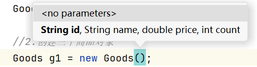

`循环次数.fori` 可以直接正序打印出for循环，`循环次数.forr` 倒叙遍历。是倒叙遍历我们需要修改变量的名字，可以在出现for循环的时候直接修改，也可以按快捷键<kbd>shift + F6</kbd>批量修改，并且需要将 `length > 0` 改为 `length >= 0`'。

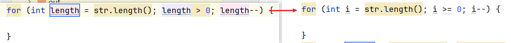

`数组名.fori` 直接打印出 `0 - 数组.length` 的fou循环

这个小方块也叫作：程序运行指示灯，如果这个方块是亮着的，表示程序在运行。如果按一下，给它按灭了，表示程序停止了。

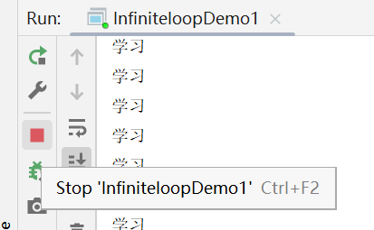

自动的快速生成数组的遍历方式：数组名.fori

IDEA快捷键：ctrl + alt + M 自动抽取方法 首先选中要抽取的代码

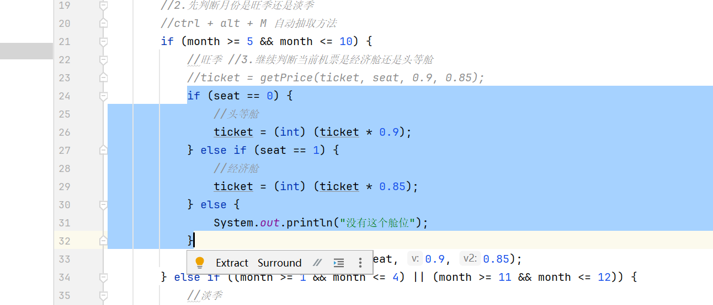

然后按住快捷键 <kbd>ctrl + alt + M</kbd>

之后会弹出一个页面，说收取完后还有重复的代码，是否要一起抽取，点击 `Accept Signature Change` 即可。

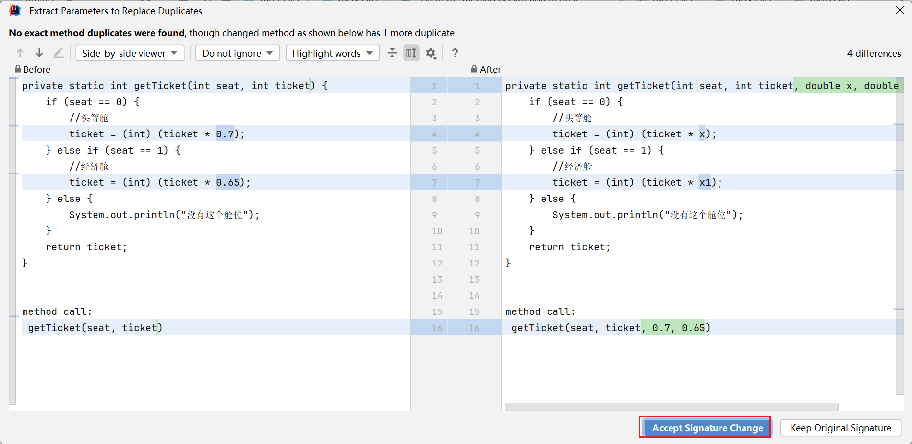

接下来又会有一个提示：这段重复代码要不要用调用方法的形式去调用，必须的噻，所以点击 `Replace`

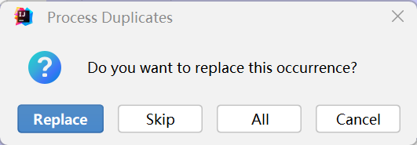

变量的批量修改：如果要替换一个方法中的多个值：选中max，然后按 <kbd>shift + F6</kbd>，即可一起替换

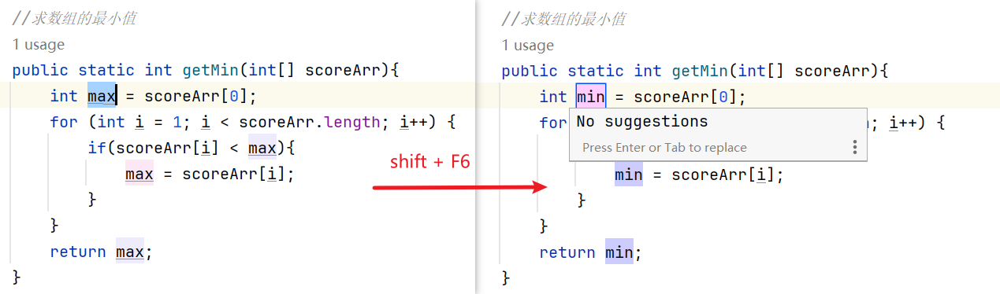

选中代码，然后 <kbd>ctrl + alt + t</kbd>就可以添加if、while等

按住鼠标滚轮（或者按住alt + 鼠标左键）一拖，就可以选择需要选中的代码，然后进行修改即可。

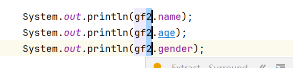

----

### 1）生成构造、get、set方法的快捷键设置

快捷键：<kbd>alt + insert</kbd>，如果按没反应，就按 <kbd>alt + Fn + insert</kbd>，可以创建构造、get、set方法。

但是我们不使用这个默认的快捷键，而是将它修改为 <kbd>ctrl + g</kbd>。

settings —> Keymap ——> 搜索 `Generate` ——> 右击`Generate...` ——> Remove Alt+Insert

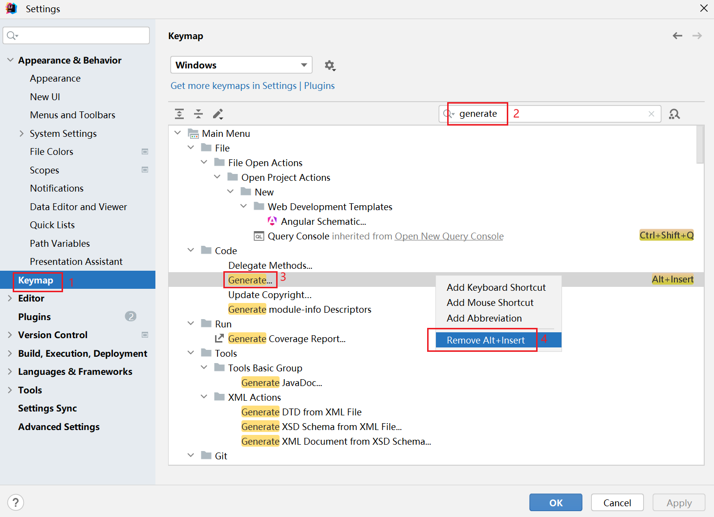

然后再右击，选择 `Add Keyboard Shortcut`。

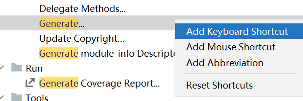

然后在键盘上输入 <kbd>ctrl + G</kbd>，点击OK，点击Apply，点击OK即可。

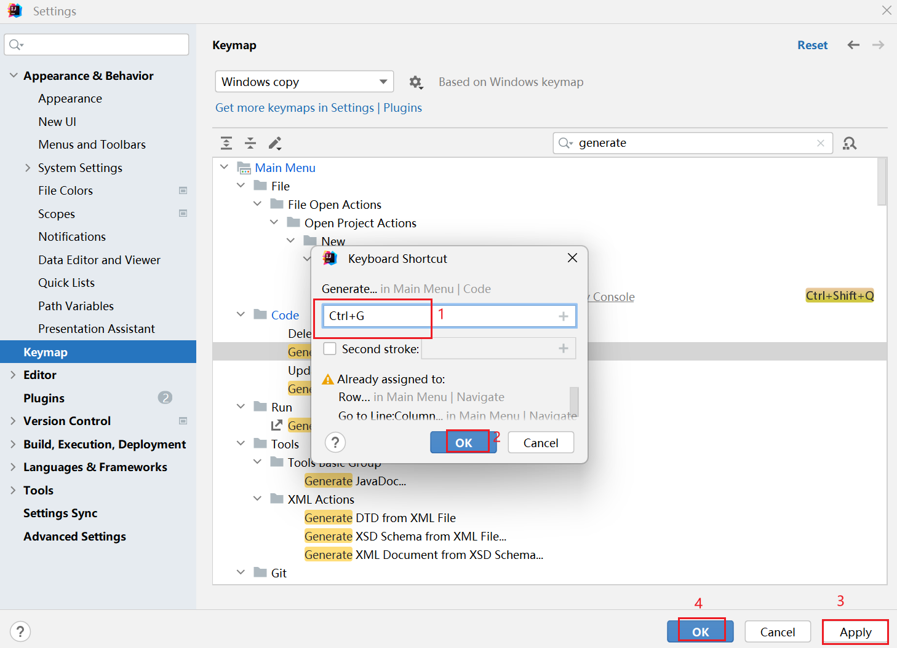

如果出现警告，直接点击 `Remove` 即可。

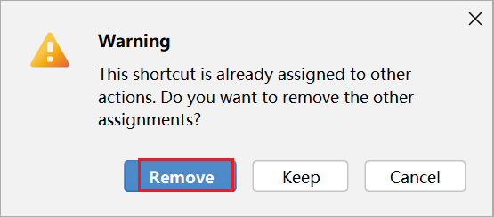

----

### 2）生成构造

输入快捷键 <kbd>ctrl + g</kbd>，然后点击 `Constructor`

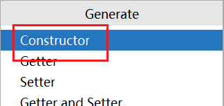

它默认选中的是第一个参数：username

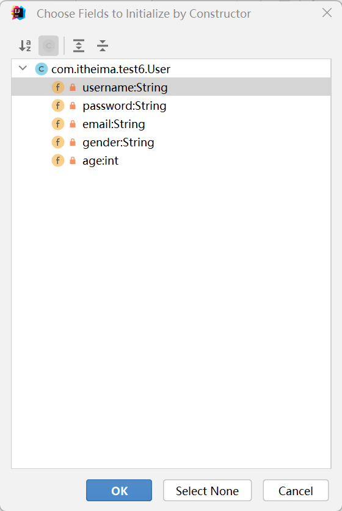

这个时候还不能点ok，因为一旦点了ok，它就会对第一个参数 `username` 来生成构造，但这并不是我们想要的。如果需要选中全部参数，只需要点击下方的 `Select None`，表示什么属性都不选

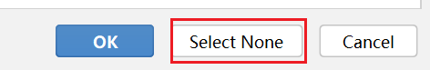

或者按两下 `tab`键，第一下 `tab` 是取消默认选择。第二下 `tab` 会把 `Select None` 按钮背景变蓝，即选中 `Select None`。

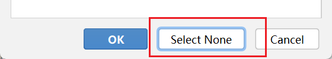

点击完成后，它就会直接生成空参构造。

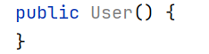

如果需要生成带全部参数的构造方法，重新按住快捷键<kbd>ctrl + g</kbd>，重新点击 `Constructor`。这次需要按住 `shift` 不松开，再点击最下面的 `age`，相当于将所有的属性全选了，当然也可以按快捷键 <kbd>ctrl + a</kbd> 全选，再点击下面的ok即可。

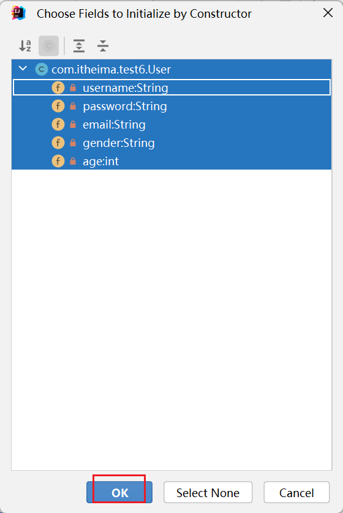

或者直接按住 `shift` 不要松，然后按键盘中上下键的下键，它就会逐一选择，直到全部选中，此时再点 `OK` 即可。但 <kbd>Ctrl + A</kbd> 更方便。

此时就会生成带有全部参数的构造方法。

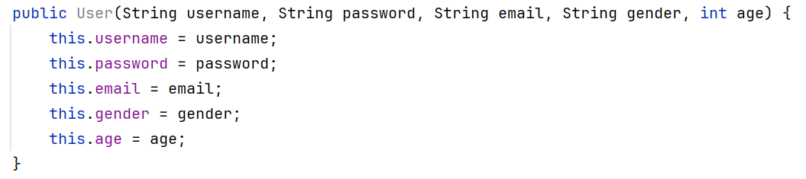

----

### 3）get、set方法的生成

使用快捷键<kbd>ctrl + g</kbd>，然后选中第四个 `Getter and Setter`

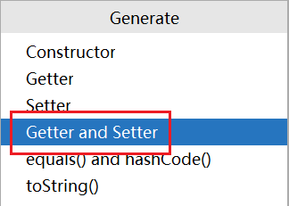

同样的，我们也可以<kbd>ctrl + A</kbd>全选，然后点击OK。

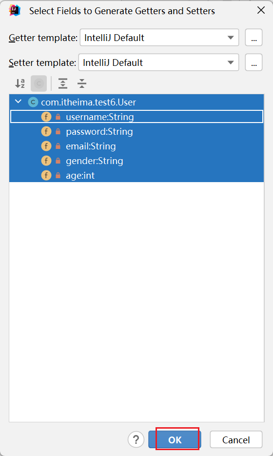

此时都给每个成员变量提供了对应的`get`跟`set`方法，非常的快。

---

### 4）PTG插件

PTG插件可以1秒生成标准Javabean。

首先进入下载插件的地方：settings ——> Plugins ——> Marketplace

`Marketplace`：表示下载页面。`Installed`：表示在电脑当中已经安装了的插件。

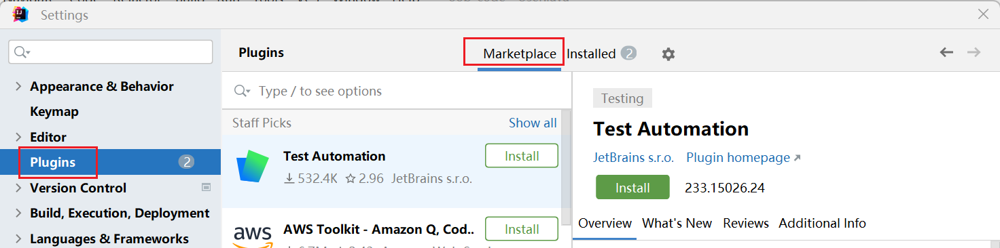

在插件市场搜索 `ptg`，然后直接点击 `Install` 即可。

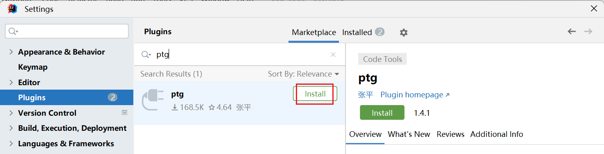

此时就可以右键点击空白处，选择 `Ptg To JavaBean`，也就是利用 `ptg` 插件去生成Javabean。

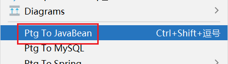

点击后发现，它将空参构造、全参构造、get跟set方法全都自动生成了。更爽的是，它连注释都帮我们自动生成了。

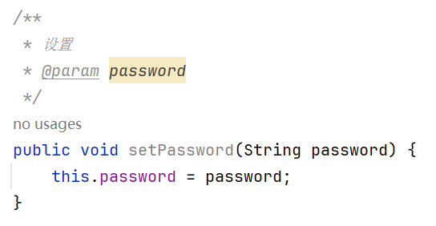

----

自动生成代码的左边 <kbd>ctrl + alt + v</kbd>

快捷键：<kbd>ctrl + alt + T</kbd> 使用语句包裹

快捷键<kbd>ctrl + N</kbd> ，就会出现一个搜索的界面

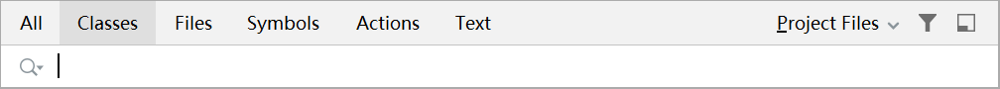

然后输入 `StringBuilder`，点开右上角的 `Project Files` 默认情况下会选择 `Project Files` ，表示是在你当前项目中去找 `StringBuilder`，但我当前项目肯定没有，`StringBuilder` 是Java提供的。

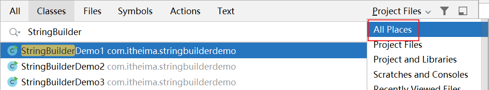

因此我们需要将右上角选择成 `All Places`，表示在所有的地方都进行查询。

此时在下面就会出现 `StringBuilder` 相关所出现的所有的类。

按快捷键 <kbd>ctrl + F12</kbd>，我们需要来找一个 `toString()` 方法，直接输入 `toString`，然后点进去即可。

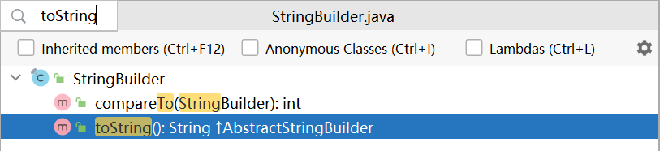

