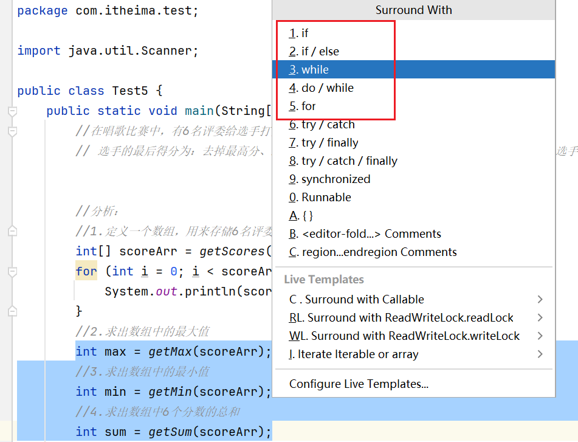

IDEA上下移动一行或多行：alt + shift + 向上/向下

ctrl + h：查询子类

shift + alt + f：全面查找

选中一个单词，ctrl + d：就会自动一起选中下一个单词

快捷键 `ctrl + p` 查看注释所具有的属性。

`循环次数.fori` 可以直接打印出for循环

`数组名.fori` 直接打印出 `0 - 数组.length` 的fou循环

这个小方块也叫作：程序运行指示灯，如果这个方块是亮着的，表示程序在运行。如果按一下，给它按灭了，表示程序停止了。

自动的快速生成数组的遍历方式：数组名.fori

IDEA快捷键：ctrl + alt + M 自动抽取方法 首先选中要抽取的代码

然后按住快捷键 <kbd>ctrl + alt + M</kbd>

之后会弹出一个页面，说收取完后还有重复的代码，是否要一起抽取，点击 `Accept Signature Change` 即可。

接下来又会有一个提示：这段重复代码要不要用调用方法的形式去调用，必须的噻，所以点击 `Replace`

变量的批量修改：如果要替换一个方法中的多个值：选中max，然后按 <kbd>shift + F6</kbd>，即可一起替换

选中代码，然后 <kbd>ctrl + alt + t</kbd>就可以添加if、while等

按住鼠标滚轮（或者按住alt + 鼠标左键）一拖，就可以选择需要选中的代码，然后进行修改即可。

