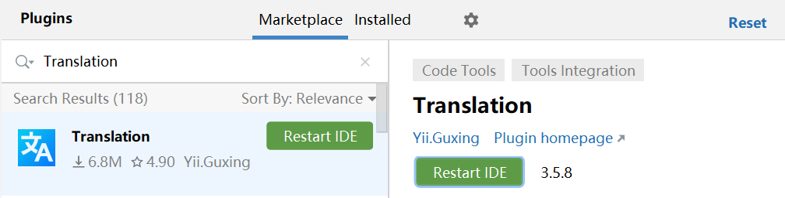
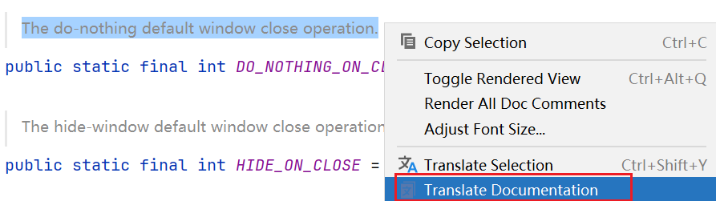
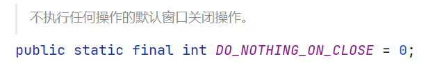

[【IDEA】SpringBoot项目的yml配置文件注释中文乱码_spring boot 项目打包 nacos yml 乱码-CSDN博客](https://blog.csdn.net/qq_39921135/article/details/134862671?csdn_share_tail={"type"%3A"blog"%2C"rType"%3A"article"%2C"rId"%3A"134862671"%2C"source"%3A"qq_39921135"})

下载一个翻译插件：`Translation`，它支持源码翻译，下载好后重启IDEA即可。

然后选中我们需要翻译的语句，右击，选择 `Translate Documentation`

此时它就会把翻译结果直接给你写出来

