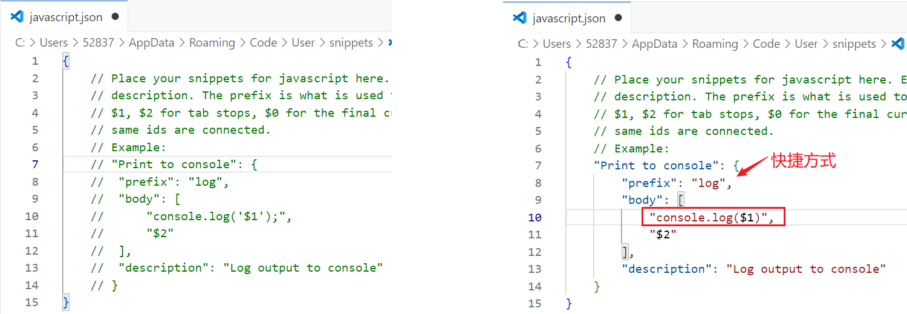

在设置里搜索

```
 trigger on tab
```


此时这两个地方按tab都可以补全


---

## 快捷方式log去掉分号

### 一、引入

我们使用 `log` 快速生成的 `console.log()` 都是带分号的


但是我们的编程习惯都是不带分号，每次自动生成后还需要手动删掉分号，太麻烦了！

那有没有办法能够生成的时候就不带分号呢？自然是有的。

---

### 二、解决办法

文件 ——> 首选项 ——> 配置用户代码片段


选择 `javascript`


将注释打开，然后根据自己的需求进行修改。

这里我将括号中的单引号和分号都去掉了。



保存，此时再去敲 `log`，可以发现已经配置成功

