# 1.0 认识计算机网络

《计算机网络》学什么？ —— 数据如何通过网络正确、可靠的从A传送到B

----

# 1.1_1计算机网络的概念及功能

## 一、网络的概念

网络：网样的东西或网状系统。

- 人体内的神经网络，这个网络就是由很多的神经元来组成的网状的系统
- 电信网络：打电话时通过电话线通过电路，连接起来的网状系统
- 有线电视网络：通过电缆 / 光缆将录制好的节目发给千家万户，也构成了一个非常庞大的网络系统
- 计算机网络：通过各个节点，这些节点包括终端的电脑、手机、集线器、中继器、交换机、路由器等中间设备通过有线或者无线的方式将所有刚刚说的连接起来，就构成了计算机网络。

其中 `有线电视网络`、`电信网络`、`计算机网络`，它们三个就是我们常说的三网，这三网在现在计算机社会有一个非常潮的名字：三网融合。就是通过计算机网络这个非常关键的媒介来实现的。

现在所处的社会是一个高度信息化以及高度数字化的社会，这个数字技术就广泛运用于计算机网络中，我们可以把所有的媒体、文字、图片、视频等等全部转换成0或1这样的数字比特流的形式，再放到链路上面进行传输，这样就可以实现不同的节点之间的通信，以及资源的共享，我们就可以将电信网络当中的音频信号编码为数字信号，同时也可以将有线电视网络中的图像、音频等全部编码成数字信号，再放到链路上进行传输。

所以通过计算机网络就可以把有线电视网络和电信网络融合在一起，可以达到的效果就是：我们可以在电脑上看电视，或者在电脑上打电话。

除此之外，最近还新建了一个四网融合的概念，第四网指的就是电网。例如路灯控制，随着城市规模不断扩大，这个路灯的管理和维护就成了非常重要的问题，那么电信的运营商就可以结合电信网络、计算机网络、有线电视网络来实现无线路灯的监控方案，这样就可以实现一个终端自动报警的功能。

----

## 二、计算机网络的定义

关于计算机网路的定义并没有一个统一的标准，不同的教材有不同的说法，下面是王道书对于计算机网络的定义：

计算机网络：是一个将分散的、具有独立功能的**计算机系统**，通过**通信设备**与**线路**连接起来，由功能完善的网络**软件**实现**资源共享**和**信息传递**的系统。

- 计算机系统：包括各种系统的手机端以及电脑端

- 通过的通信设备包括路由器、集线器、中继器、交换机等

- 线路：这里的线路可以说是逻辑线路，因为有的地方可以是无限的

  例如手机可以连WiFi，连到我所在的这个局域网的网关中，这也是实现了一个逻辑上的连接，也是线路的连接，再由功能完善的软件来实现资源共享和信息传递。

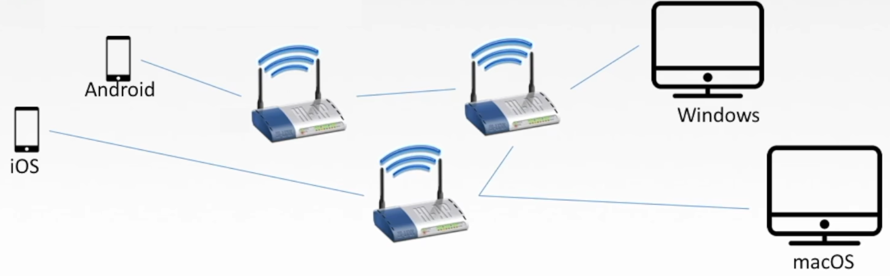

目前为止我们有了系统、通信设备、线路，但是只是一个空的架子，我们什么都不能干。因此目前的这个结构还需要有软件的支撑，才能够实现每个终端和终端之间的资源共享、以及信息的传递。

简单来说计算机网络就是一个**互连**的、**自治**的计算机集合。

- 互连：通过通信链路实现互连互通
- 自治：这些终端以及各个节点之间是没有主从关系的，是高度自治的

这个概念中其实也暴露出了计算机网络两个重要的功能：**资源共享**和**信息传递**

---

## 三、计算机网络的功能

### 1）数据通信

例如下面两台电脑，我可以将我的文件发给你，或者是给你发邮件，以及我们之间的项目发消息等等，这都是数据通信的功能。

---

### 2）资源共享

资源共享：同一个计算机网络上的其它计算机可使用某台计算机的计算机资源的行为，可共享**硬件**、**软件**、**数据资源**。

- 共享硬件：其中硬件资源最常用的就是网络式打印机，只要我们的主机和打印机都连在同样一个网络内，同样给这个打印机配置一个固定的静态ip地址，这样我们的手机就可以通过网络和打印机连在一起，实现所有人对于这台打印机的共享。至于这个打印机如何处理每个人发来的这样一个文件的请求，就是操作系统将要学习的一些内容了。
- 共享软件：例如我在这个电脑上面远程访问了我的另一台电脑，然后使用我另一台电脑上面的一些软件(办公软件、画图软件等等)，这些都是实现了软件资源共享。
- 数据资源共享：就是我们最常用的了，例如我们在百度文库上面上传或者下载文件，这都是数据资源的共享。

当然这个网络资源的共享不一定都是免费的，它还会有收费的情况。以上两个功能非常的重要，接下来还有一些其它功能。

----

### 3）分布式处理

当一台计算机它所承受的符合过大的时候，所以它只能把它自己的任务分给其他计算机，即**多台计算机各自承担同一工作任务的不同部分。**

这样工作效率会高，同时也不会导致某一台的计算机负荷过大。一个典型的应用就是Hadoop这样的一个分布式平台，它可以进行告诉的运算以及分布式的存储。

----

### 4）提高可靠性

这个功能是分布式处理引申出的一个功能，可以提高网络的可靠性，由于使用了分布式处理，网络中的一台主机如果宕机了，此时我们就可以有另一台机器叫做 `替代机` 来接班。

----

### 5）负载均衡

其实也是分布式处理引申出来的一个功能特点，因为使用了分布式处理，所以可以使多台计算机各自承担一部分的工作任务，这样也**可以使计算机之间更加的亲密**，工作效率也会更高，更加合理的安排和分配资源。

----

# 计算机网络的发展

## 一、第一阶段

我们要回溯到美苏冷战时期这个时期，美国国防部他们是有一个单一的、非常集中的指挥点，但是他们就想，如果这个中心真的被苏联大哥一个核武器摧毁了，那么全国的军事系统将全部瘫痪，因为所有的节点全部依附在这样一个指挥中心上面。

所以他们就想：可不可以设计一个比较分散的指挥系统呢？这个指挥系统就可以由一个个的分散的指挥点组成，当一个指挥点被炸掉后，还会有另外几个指挥点接替他的工作，而且还可以实现彼此之间的通信，这个非常厉害的组织就是 `美国国防部高级研究计划局（ARPA）`，它就研究出来了这样一个网络 `阿帕网`，即 `ARPAnet`，即组织名 + 网络。

阿帕网的原形就是由四个分布在不同地区的节点组成，它们通过 `无线分组交换网 & 以及卫星通信网连接`，可以看见再这样一个连接过程中，如果其中一个节点被炸掉了，那么另外三个节点还是可以继续工作，以及继续通信的。

所以这个阿帕网的发展的每一个节点后面都会接入很多其它的一些终端、电脑，从而扩大了阿帕网这样一个规模。

但是有一个弊端就是：阿帕网它只可以连接同一类型的网络，随着信息量的增长，他们希望可以实现不同网络的互联，即  **internet(interconnected network)互联网**，奔着这个目标去努力就出现了一个协议：TCP/IP，通过这个协议可以实现不同网络的连接，其中这个IP协议是基本的一个通信协议，TCP是帮助IP实现可靠传输的协议，因此记住这两个协议他们联合起来就可以实现网络的互联。

阿帕网在1983年的时候正式的接受了这样一个协议，并且用它取代之前使用的一个旧协议，同时选定 `internet` 为主要的计算机通信系统。

最后得到的就是我们现在常说的因特网**（`Internet`）**。

这里要注意有大小写的区别，小写的 `因特网` 指的就是相互连接的这样一个网络的网络，它的是一个通用的名词；但是 `Internet` 中大写的 `I` 代表的是专有名词因特网，目前来说 `因特网` 就是我们现在全球范围内最大的 `互联网` ，所以 `阿帕网` 就是 `因特网` 的前身。

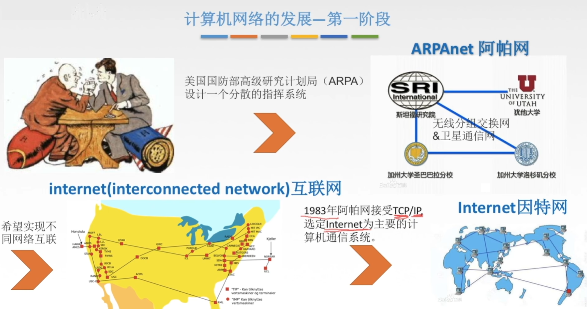

----

结合刚刚第一阶段来看，我们对网络应该有了一个更深层次的认识了。

网络其实本质上就是由若干个节点和连接这些节点的链路组成，构成的这样一朵云彩就叫做一个网络。

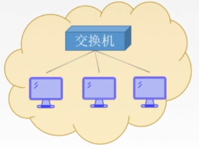

将网络和网络通过路由器连接起来，就构成了一个大型的网络，也就是互联网。

网络把许多计算机连接在一起，而互联网则把许多网络连接在一起，因特网是实际上最大的互联网。

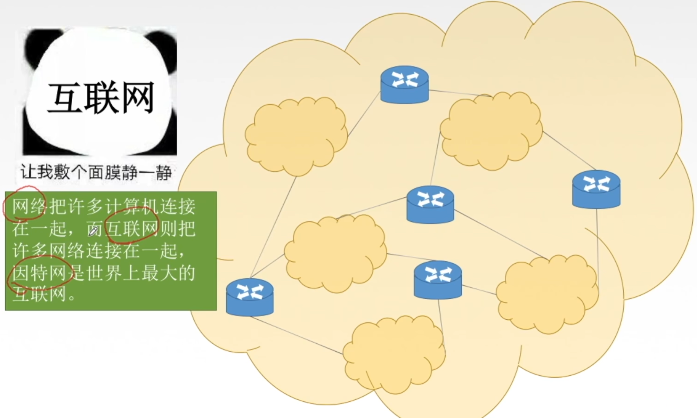

----

## 二、第二阶段

第二阶段是从1985年起，美国国家科学基金会NSF围绕6个大型计算机中心建设计算机网络，即国家科学基金网NSFNET。

这种网络是三层结构，最底层就是校园网或者是企业网，第三层次的用户如果想要连到网上，就需要再连接到第二层的地区网，并且第二层的地区网再连接到第一层的主干网，因此就形成了这样逻辑比较清晰的三层网络结构。

这种三级的网络结构其实就覆盖了当时美国大部分的学校以及研究所，并且成为了因特网当中的主要组成部分。

但是随着技术的发展，越来越多的用户、公司都可以连到这个互联网当中，所以就会导致这个网络的信息量急剧的增大，而美国当时他掌控的这个因特网其实是已经满足不了大量的需求了，所以美国政府就觉得把这个因特网的主干网交给一些私人公司来经营，并且开始对接入因特网的单位来进行收费，那么也就到了我们接下来的第三阶段。

---

## 三、第三阶段  ——  多层次的ISP结构

刚刚说过美国在第二阶段把这个控制权逐步的移交给了很多公司，这些公司在第三阶段就称之为ISP。

**ISP**：因特网服务提供者 / 因特网服务提供商，是一个向广大用户综合提供互联网接入业务、信息业务、和增值业务的公司，如中国电信、中国联通、中国移动等。分为主干ISP、地区ISP和本地ISP。

其实它也是沿用了第二阶段的三层结构，只不过是把网络的管理权利分散，由它们来进行网络的分配以及服务的提供等等。

那我们无论在校园还是在家里，我们都会交网费，这个网费其实就是给ISP的服务费，我们通过给ISP支付服务费的这种方式，才能够使用ISP的服务，以升到一个IP地址来畅游网络。

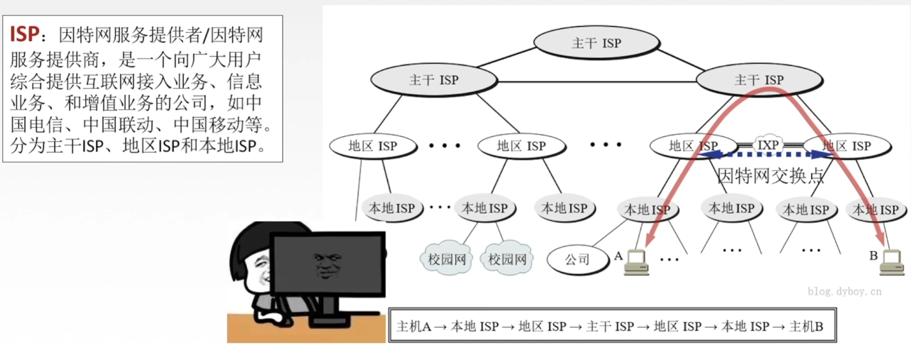

具体来讲就是：全世界有一个这么大的IP池，叫做因特网管理机构来管理的，如果ISP供应商要给用户提供服务给它们分配IP，它就首先要从IP池要到一个网段的IP地址，然后再分配给用户，这样每个用户就会有一个IP地址，就能够正常的上网了。

有的人会说：我想花重金买个靓号可以吗？这跟手机号是不一样的，IP地址是ISP给你分配好的，感兴趣的同学可以在百度收一下本地IP，然后就可以看到你自己现在在的这个位置，例如下面搜 `110.110.110.110`，这个IP地址是在 `黑龙江省哈尔滨市` ，`铁通` 指的就是这个IP地址所在的公司。刚刚说了，ISP会给这一个区域范围内的用户分配IP地址，假设我现在所在的小区是由四川电信分配的IP地址，所以我们就可以享受到四川电信给我们提供的一些互联网的业务和服务。那我能不能享受享受到北京电信的服务呢？当然也可以，只不过那个路程非常遥远，它不是直接管理的ISP，所以我们就会在下载一些游戏或者电影的时候就会看到有很多选项，什么四川电信、四川移动、北京电信等等，这些其实就是根据ISP来选择的。那如果你在四川，你家是电信网，那你自然就连四川电信，那如果你选择别的运营商下载，可能会有速度比较慢的情况，只要每一个本地ISP都安装路由器连接到了地区ISP，而地区ISP也有路由器连接到了主干ISP，就可以完成因特网中所有的数据分组转发的任务，也就可以让我们畅游网络，访问各个网站的资源。

但是随着这个流量的激增，人们对于网络的要求也越来越高，就开始研究怎么更快的转发数据、转发分组。因此就诞生了这样一个概念：因特网交换点IXP。原本的A和B如果要通信的话，就需要经过一层又一层的ISP结构，通过本地ISP到地区ISP再到主干ISP，然后再一路下去；但有了因特网交换点，我们就可以允许这两个网络直接相连，而不再需要第三个网络来转换分组了。

IXP的出现也大大提高了信息传递和资源共享的速度。

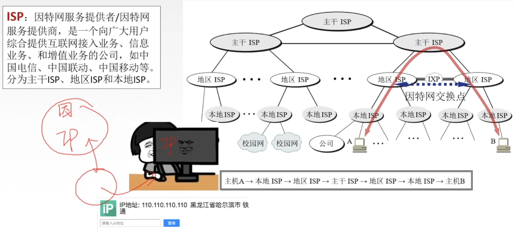

----

## 四、总结

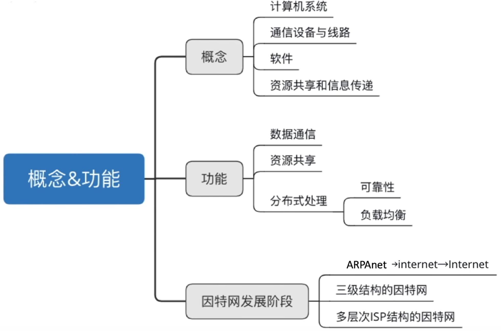

---

# 1.1_2 组成与分类

# 计算机网络的组成

从不同的角度入手，我们可以先从计算机网络的一个基本架子的组成来看一下。

## 一、从组成部分上

它是由**硬件**、**软件**、**协议(一系列规则和约定的结合)** 这三大组要要素在一起构成了计算机网络。

- 硬件：这个端系统以及中间的这些路由器、交换机等等的中间设备
- 软件：就是附在端系统上，甚至是包括这个中间设备上面也有一定的软件，将这些软件步到这些硬件上
- 再通过协议穿梭于各个硬件中，就构成了一个计算机网络

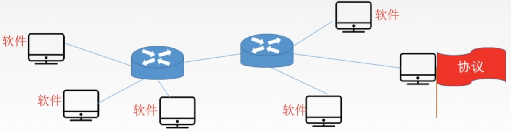

计算机网络每一个层次它其实是有很多协议的，根据这些协议，我们就可以规定这个数据如何封装、如何打包、如何传输、如何从这一端到你的另一端，这些都是协议要包含要学习的内容。

----

## 二、从工作方式上

从工作方式上我们可以将计算机网络分为

- 边缘部分
- 核心部分

### 1）边缘部分

虽然它称之为边缘部分，但是它也非常的重要。把一部分就是由一系列的端系统组成的，这些端系统不仅包括一些计算机，也可以包括非常庞大的一些服务器，和大型计算机，甚至还可以包括是非常小的计算机网络摄像头，它可以实时的捕获到一些信息，并且把这些信息实时的发布出去，这些都是边缘部分。

但计算机网络只有边缘部分还不够，它需要使用核心部分的一些服务，也就是通过核心部分提供服务，边缘部分才能实现端系统与端系统之间的这样一个通信。

端系统之间的通信强调的是进程之间的通信，也就是我们主机A和主机B在通信，其实讲的是主机A当中的某个进程和主机B当中的某个进程之间的通信。例如我们在打开QQ的时候，登录后，我在界面上输入要发出的文件，此时QQ就是我电脑中正在运行的一个程序，而B这边也有人打开了QQ，在这边接收我的消息，或者他给别人发信息，那它使用的QQ也是一个正在运行的程序，也是一个进程。

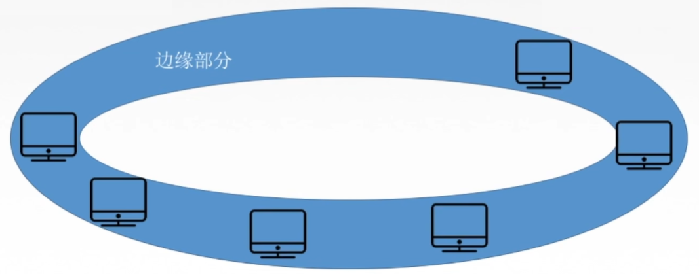

所以在这里再强调一下，就是端和端之间的通信其实只的是两个端系统之间的进程通信，那么这两个端系统之间的进程通信包括两种方式：

- `C/S方式`：Client and Server,即客户/服务器的方式，这种方式是因特网上最常用的，也是最传统的一种方式，它描述的是这两个端系统之间的进程，呈现着一种服务与被服务的关系，client客户就是被服务的，server就是为客户提供服务的。

例如我们在使用微信的时候，在给别人发消息的时候，就需要把消息发给腾讯的服务器，然后由这个服务器处理我们的这个请求，再把消息传递给另一个人。但此时此刻不止我一个人在发微信，有可能正在看我笔记的你也在发微信，有很多很多人都在发微信，就会像这个服务器发出很多请求，这个服务器就需要一次处理这些请求，并且执行这个请求当中的一些任务。

所以发出请求的我们，即客户，承接我们请求的这个服务器就是这个CS方式中的server。

但由于资源是有限的，当访问的人越多的时候，我们就可以知道这个速度是越慢的。

举个例子：在我们微信、支付宝等平台上抢红包的时候，大家经常会出现卡顿，正是因为这个服务器要接收很多很多请求，所以由于它的资源有限，就会导致访问这个服务器的请求越多，那么得到这个响应的速度就越慢。

除了 `C/S` 外，还有一个叫做 `B/S方式`。`C/S方式` 通常指的是你要下载一些客户端的软件，包括QQ、微信客户端等。而`B/S` 中的 `B` 指的就是 `Browser`，即浏览器的意思。`B/S方式` 和 `C/S方式` 其实都很类似，只不过把我们这个客户端换成浏览器了而已。

----

- `P2P方式`(peer-to-peer，即对等的连接)：这个情况下大家都是对等的，没有一台主机说我一定是服务器，也没有一台主机说我永远是一个客户机，在这种方式下所有的主机都有两个身份：一面试提供服务的服务者，另一面就是使用服务的享受者，即客户，所以这里面的每一个端系统它同时又是客户，又是服务器。

简单来说：假设A它现在手里有一个500M的大片，然后现在有B、C、D三个人都想下这个片子。`P2P下载` 其实就是将一个大的文件切分成几个大小不等或者大小相等的数据块，假设B先拿到一部分数据，例如它下了250M的片子，下了这250M之后，马上就给C传了200M，同时B还会继续从A下载电影，那么C收到200M之后，它很功德无量，继续把这个东西分享给小D，假设分到了150M，这个小D同时又可以向A发出请求：你再分我一点，此时C和A其实都可以一起资助D，那么A又给D传了一部分视频，所以D在很快的时间内就可以下完这个片子了。当然D其实也可以向B请求服务，B同时也可以把自己片子中已经下好的一部分再继续上传给D，这样看D又收到了B的恩惠，所以可以看到在 `P2P` 下载的这种情况下，其实是一个我为人人人人为我的情况。

例如B跟C这两个既是服务器，同时又是客户，因为它们两个即承担了上传的功能，同时它们也享受到了下载服务。

我们再来看这个小D，小D它同时有A、B、C3个人一起给他传文件，可想而知这个D获得这个文件的速度应该非常快，所以在 `P2P下载` 的环境中，当这个主机越多越好，我们下载的速度就越快，刚好和 `C/S` 是相反的，`C/S` 由于只有固定的几个机器做服务器，所以请求他们这个服务的人越多，就会导致这个服务器的相应越慢；但是 `P2P` 却相反，因为每一个人，即每一个端系统既可以是客户，同时也可以是服务器。

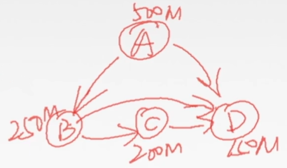

----

### 2）核心部分

核心部分其实就是被边缘部分服务的，包括路由器、一些中间设备，还有一些网络连接起来，那么核心部分和边缘部分连接在一起就构成了计算机网络，这也是在工作方式上面对于计算机网络组成的一个划分。

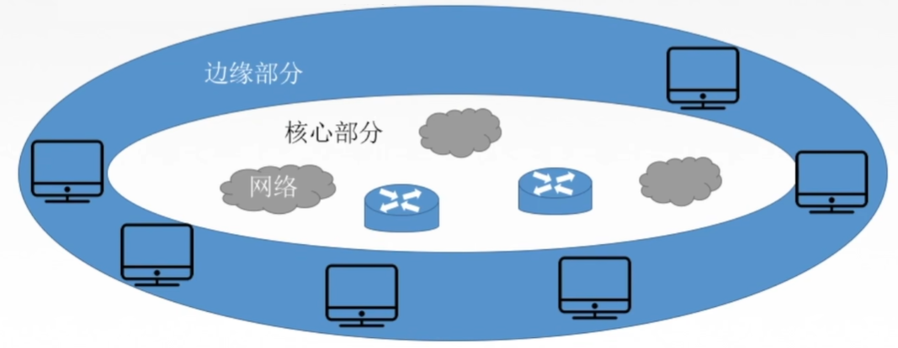

----

## 三、从功能组成方面

这也是非常重要的一点，在上节课我们学过计算机网络主要有两个功能呢，分别是数据通信以及资源共享。

根据这两个功能我们就可以将计算机网络分成 `通信子网` 和 `资源子网`。

- 通信子网：实现数据通信
- 资源子网：实现资源共享 / 数据处理

计算机网络我们可以给它按照层次来划分，在OSI参考模型中它是被划分成了七层。

在这七层中，下三层代表的就是通信子网，因为它们是由各种传输介质、通信设备、相应的网络协议所组成，它可以让这个网络具有传输交换、控制和存储的能力，同时还可以实现联网计算机之间的数据通信。

那在这三个层次当中，实现数据通信的主要设备就是包括网络层的路由器、链路层的交换机、网桥、网络层的集线器和中继器等等。

下面三层实现的是通信子网，相当于把这个公路铺好。

那么上面三层其实就是资源子网，实现资源共享功能的设备和软件的集合，资源子网就可以向网络用户提供共享其它计算机上的硬件资源、软件资源和数据资源等等的服务。

那其实可以理解为上三层就是对数据进行一个封装和处理，下三层就是把这个数据送上路；那中间这个传输层起到一个非常重要的融会贯通的作用，这个传输层主要是为了弥补上面三层要求的服务和网络层提供的服务之间的差距，并且向高层用户屏蔽这个通信子网中的一些细节，所以这个层次也是非常重要的。

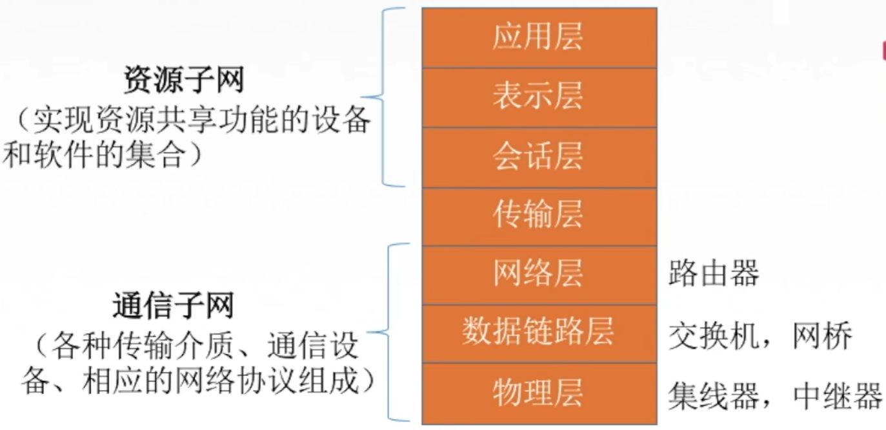

----

# 计算机网络的分类

## 一、按分步范围分

计算机网络按照分布范围分，可以分为 `广域网WAN`、`城域网MAN`、`局域网LAN`、`个人区域网PAN`

- `广域网WAN` 范围非常广，几十到几千公里，它属于因特网的核心部分，它的任务就是通过比较长的距离，可以是跨国家的距离，然后来运送主机之间所要发送的一些数据。
- `城域网MAN` 作用范围顾名思义，就是可以覆盖一个城市的这样一个网络。
- `局域网LAN` 也是我们要学习的非常重要的一种网络类型，局域网在地理上是比较小的一个范围，例如一个学校或者一个办公楼。

`个人区域网PAN`，即个人工作的地方把自己的一些电子设备，例如电脑、智能手表通过无线技术连接起来的网络，也称之为：`无线个人区域网PAN`，范围很小，通常就在10m左右。

我们主要学习的就是广域网和局域网，这两个网络通常使用广播技术。

局域网和广域网的区别不仅仅是他们在地理范围上的差别，而且更重要的是我们不能仅看它那个地理范围多大多小就判断它是广域网还是局域网，我们更重要的是看它使用的是什么技术，如果使用的是广域网的技术，那它其实就是广域网；如果使用的是局域网的技术，那它就应该被定义为是局域网。

例如我就住在你家对面，但我们两个之间的通信是通过拨号上网，你也是通过拨号上网，然后我们的数据在这个网络中进行交换和传递，这个网络是互联网，所以我们目前虽然离的近，但是我们实际上使用的是广域网的技术，因此这个地方还有个称之为是广域网。

这个图就体现了这样一个道理：世界上最远的距离不是我住在你隔壁，是我们之间的数据通信需要经过一个广域网的距离。

分清了这两个的区别后，我们还需要补充的一点就是：这两个网络通常使用的技术，局域网通常使用的是 `广播技术`、广域网通常使用的是交换技术。

局域网通常范围是比较小的，那么在一个比较小的范围内，我喊一声大家都听得见。例如在一个村子里，村长打开广播说几句话，全村的人都能听见，这个就是局域网使用的广播技术。

但是对于广域网来说，你在小区喊，对面的人甚至都已经听不到你的声音了，所以广域网靠广播是不合适的，因此它使用的就是交换技术就是通过路由器等等一些中间设备，把我们这个数据一点一点地转发存储，并且交换出去。

----

## 二、按照使用者分

可以分为公共网和专用网。

- 公用网：国有 / 私有出资建造的一些大型网络，包括电信、联通、移动等
- 专用网：某个部门 / 行业 为了自己的一些特殊的工作需要所以构建的网络，例如军队、政府、很多互联网公司的办公室，使用的都是专用网、内网

----

## 三、按交换技术分

按交换技术分可以分为 `电路交换`、`报文交换`、`分组交换`。

这几种交换技术其实就是在说我们这个数据是怎么交换的。

- 电路交换：因为我们打的电话使用的就是电路交换方式。我们可以想象打电话的流程，首先你要拿起电话，然后拨号，拨号之后如果打通了，那你其实就在和另一个人之间建立好了一个连接，而且你们这两个连接不会轻易的被别人插入，当别人在给你打电话的时候，就会发现你其实是在跟别人打电话的，那么这个时候就会听到：对不起，您拨打的电话正在通话中，请稍后再拨。这就是因为我已经在和另一个人打电话占线了，即占了这条线了。

  所以电路交换的原理就是首先建立连接，即占用这样一个通信资源，第二个就是通话，通话就是一直占用这个资源，第三个就是释放连接，我们打完电话，把电话一放下，也就是释放连接，归还了通信资源，那么有这三个步骤的一种交换方式就称之为是电路交换。

  所以电路交换的特点就是：在通话的全部时间内，通话的两个人是完全占着中间的资源不能被别人所使用的。

- 报文交换和分组交换在这一点上面就显得格外的友好一点了，它们两个不会说一直占着这条线路，它们两个使用的技术的特点叫做 `存储转发`，它们的区别主要是它们的主体不一样，这个数据可以是报文或者是分组的形式，其实简单来讲，这个分组其实就是将报文切开了，切成一小个一小个的。一整个完整的文件，例如一个媒体文件，都称之为是一个报文。

  存储转发指的就是我们要发的这个数据，无论是报文还是分组，首先我们要放到网络上面传输，可能我先给了一个路由器，这个路由器R1，这个路由器R1就会存下来我的这个报文或者分组来检查一下它要往哪发，例如现在有两条路可以经过R2和R3，它会发现如果走R2，接下来的路会走的更快一点，那么它就会把这个数据转发给R2。

  所以存储转发中的存储是指这个路由器对于收过来的这个数据，先存储，然后查看一下这个数据的一些目的地址、还有很多一些其他相关的信息，接下来再转发出去，转发给正确的一个路由方向，这个就是报文交换和分组交换的一个特点。

  可以看到这个特点它只是一段一段的占用这个链路，并不是像电路交换一样独享占用的资源；同时如果有别的数据在这样一条链路上面发送也是可以的，再次反映出来这种存储转发的交换方式还是非常和平友好的

----

## 四、按拓扑结构分

按拓扑结构分我们可以分为很多种类型，这里面只简单的举这几种总线型、星型、环形、网状型。

拓扑结构其实就是把网络中的节点，这个节点可以是路由器、交换机这些中间设备，也可以是端系统中的主机，把这些节点变成这一个个的小圆圈，然后把通信链路抽象成一条线，将圆圈和线组合在一起的结构就称之为拓扑结构，是一个非常清晰的几何结构。

那么我们常见的几种计算机网络的拓扑结构就包括

- 总线型：所有的端系统 / 节点都连接在这个总线上面
- 星型：由工件这个节点四散开来链接每一个节点，关于星型这块通常会考察节点的个数和中间这个链路数的一个关系，这里面如果有两个节点，那么它需要的是五条链路
- 环形：将他这些节点全部连在一起连成环
- 网状型：就是我们现在**广域网**中常用的一个拓扑结构

----

## 五、按传输技术分

- 广播式网路：其实就是应用在局域网中的一种网络，它是共享公共通信信道的，通常使用的是总线型拓扑结构，共享中间这条公共的信道，所有联网的计算机都可以享用这个信道，并且**当一台计算机向这个共享信道发送报文分组的时候，其他的所有计算机都会听到 / 收到这个分组。**

- 点对点网络：使用**分组存储转发**和**路由选择机制**

  这种网络通常就是对应这个广域网，这个广域网基本都是属于点对点的网络，它指的是在这个网络中，如果两台主机之间需要通信，但是没有直接连接的话，它就需要很多中间节点来实现分组的存储转发和路由的选择。

  也就是我们刚刚在讲报文交换和分组交换这一块存储转发的机制。

  在点对点网络中，它和广播式网络不同的就是：我要发的这个信息并不是所有人都能听得到，只有你才能听得到，并且这个信息如果传到你那，就需要通过分组存储转发以及路由选择机制。

---

# 思维导图总结

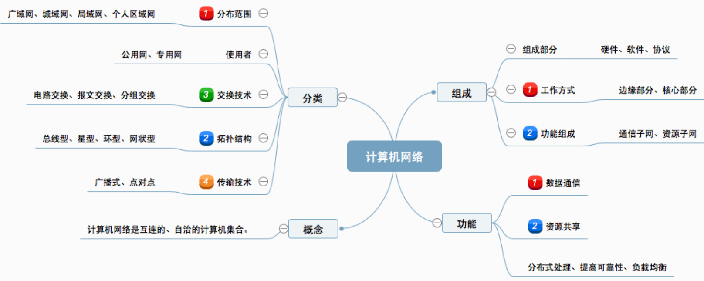

----

# 1.1.3 标准化工作

我们说国有国法，家有家法，那在计算机网络这门领域也要有一定的标准。

标准化对计算机网络是非常重要的。不知道同学们有没有遇见过这种情况：发现你下载的游戏玩不了了，就是和你的操作系统不兼容，这种情况就说明我们这个游戏在标准化工作的设计上面出现了一些问题。

所以说如果要实现一些不同厂商的硬件和软件之间的相互联通，必须要遵从统一的标准。

## 一、标准的分类

- 法定标准：由权威机构制定的正式的、合法的标准。这个法定标准可以是国内的法定标准，也可以是国际上的法定标准，比较常见的就有OSI的标准。

- 事实标准：由于某些公司的产品在竞争中占据了主流，时间一长，这些产品中的一些协议或者技术就成为了事实上的标准。

  比较常见的就是 `TCP/IP协议`。

例如手机卡的例子，市面上常见的有这三种手机卡，随着时代和技术的发展，我们手机卡也变得越来越小，这样可以使我们的机身更加的轻薄。右边的第一个就是大卡，既以前常用的，第二个就是 `Micro SIM卡`，最后就是最新的 `Nano SIM卡`，即苹果在IPhone5开始使用的这样一个小卡微型卡，苹果一采用后，其他的厂家纷纷就跟着苹果来学了，目前来看 `Nano SIM卡` 就称为了目前事实上的标准。

---

## 二、标准化工作建立标准的流程

讲到这里有很多同学觉得这个标准化工作特别的厉害，是不是有些高大上，那我自己可以指定一个标准吗？答案是可以的，如果你感想，你就可以制定出一个这样的草案出来，等到上面的组织来审核，如果审核成功，那你这个标准就成为了一个非常棒的因特网标准。

这里面一定要提的一个重量级的嘉宾：RFC(request for comments)，字面意思就是请求评论。它是因特网标准的一种形式，也就是说只要你这个是一个因特网标准，它就一定是RFC形式，但是不代表所有的RFC都是因特网标准。

我们要知道，RFC如果要上升因特网标准，要经过哪四个阶段

**1）因特网草案（Internet Draft）**：这个阶段还不是RFC文档，只能说是你的一个构思，假如你现在想要指定一个标准，你就可以先拟一个因特网草案出来，然后以邮件的方式发给这个邮箱

等你发完之后，RFC编辑就会给你一个回复，如果你的这个草案他们觉得很不错，那你就进入了下一个阶段，当然如果不行，它也会回复你：欢迎你下次再来。

----

**2）建议标准（Proposed Sstandard）**：从这个阶段开始成为RFC文档，即草案成为了建议的标准。

----

**3）草案标准（Draft Standard）**

当你的草案成为了建议的标准，即成为了一个RFC文档后，它就可以开始请求评论了，也就是说你可以把你这个RFC文档放到因特网上面，然后等很多人过来给你进行一些修改、意见，将你的这个RFC文档进一步的进行一个完善，当完善后就形成了一个草案标准。

这个时候就是要到最终环节了，把它拿到IETF、IAB这两个组织上面给他们去审核，如果最后一关你也通过了，那你这个因特网草案就真正的成为了一个因特网的标准。

当然我们现在的这个从2011年开始后，第三个阶段就已经取消了。

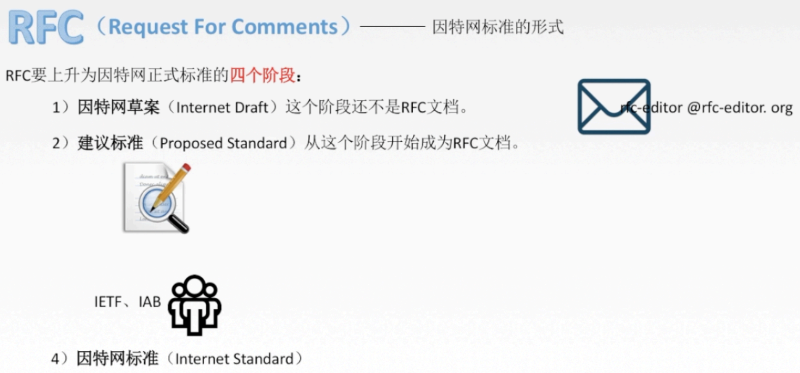

---

## 三、标准化工作的相关组织

在相关组织中，打头阵的就是这个 `国际化标准化组织ISO`，它的主要贡献是：OSI参考模型以及HDLC协议。

其次就是 `国际电信联盟ITU`，它的主要贡献是指定了通信规则，也就是它是负责电信电话这一方面的。

第三个就是 `国际电气电子工程师协会IEEE`，它是一个学术机构，这个大家在研究生的时候会经常接触到，例如你要去找一些优质的论文，就可以在IEEE上面找，它是一个非常强大的平台，上面有黑车非常广的学术论文的资源。 `IEEE802系列标准` 也是 `IEEE` 来建立的、`5G` 相关的协议也是 `IEEE` 来规定的。

最后一个就是 `Internet工程任务组IETF`，刚刚讲过，`IETF`、`IAB` 这两个组织是负责因特网相关标准的指定，也就是说你这个RFC文档最后能不能成为一个因特网标准，就看这两个组织能不能同意了，如果同意了，你就可以成为一个因特网标准，而且会有这样一个形式 `RFC XXXX`，后面是数字编号。当然如果你这个RFC文档迭代更新后，你的这个编号就会继续往上增加。

其中最重要的是 `国际化标准化组织ISO`。

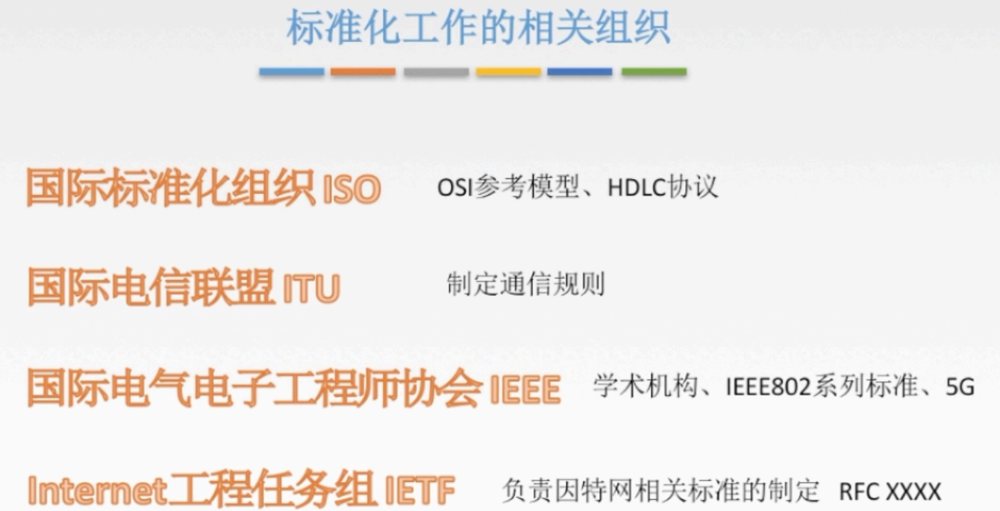

----

## 四、总结

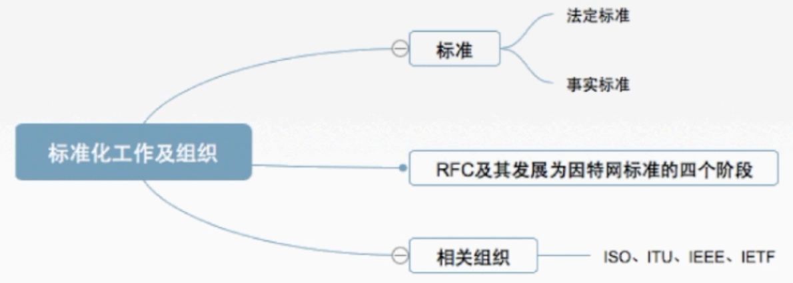

----

# 1.1-4 性能指标：速率、宽带、吞吐量

这节我们学习三个性能指标，下节我们学习四个性能指标。

那为什么要将这三个放在一起呢？因为这三个它们其实是密切相关的，这三兄弟有一个核心就是 `吞吐量`，这个 `吞吐量` 是严格受到个宽带和速率的影响，接下来看一下这三者的定义以及它们之间的关系。

---

## 一、速率

### 1）概念

速率指的就是快慢，我们在计算机网络中的速率指**数据率**，或者说是**数据传输率**，也叫作**比特率**。

前导知识：比特。

我们知道在计算机中，计算机发出的信号它都是以数字形式发送的，比特就是计算机当中数据量的一个单位。

就好像我们进游乐园排队的时候，我们是一个人一个人的进游乐园，在这个数据传输的过程中，也是一个比特一个比特的进入信道，我们数据传输的单位就是一个比特，它的表现形式无非就两种：`数字1` 或者 `数字0`，它的单位就是 `位`。

例如 `1` 可以说是 `1位比特`，`0` 也可以叫做是 `一位比特`。

**速率**它指的就是**连接在计算机网络上的主机在数字信道上传送数据位数的速率**。

单位是 `b/s`、`kb/s`、`Mb/s`、`Gb/s`、`Tb/s`。

----

接下来用一个小例子理解一下什么是速率。

假如发送端、接收端，这两个端分别是两个主机a和b，那a要给b发送数据，假如说它准备了十位的数据，也就是十位的比特位，刚好是是个数字，它要把这十位数据发送给接收端，在一秒内它刚好把这十位数据发送完毕，也就是将这十位数据传到了信道上面，这个就说明它的速率就是 `10b/s`。

---

### 2）单位换算

速率的两个单位都相差 `10的三次方`

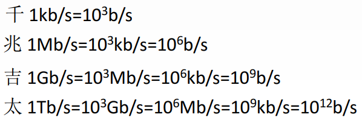

但容量就不一样，相差 `2的十次方`，即 `1024`。

小写的 `b` 换成了大写的 `B`， 即 `Byte` 字节；`k` 换成了大写的 `K`。

这个是我们通常的写法，存储容量的时候我们通常都会采用KB。

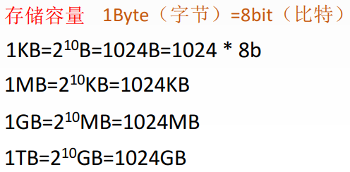

接下来要讲一个经常与速率混着考的一个概念：带宽，它也是计算机网络中的一种性能指标。

----

## 二、带宽

`速率` 其实都比较偏向是一个实际上的速率，即实际上我们可以传输的速率。但是 `带宽` 主要指的是理想条件下能够达到的最高的发送速率。

（1）`带宽` 原本指某个信号具有的频带宽度，即最高频率与最低频率之差，单位是赫兹（Hz）。

在过去很长时间内，通信的主干路线传送的都是模拟信号，而不是像现在0101这样的数字信号。所以说表示通信线路允许通过信号的频带范围就叫做线路的带宽。

（2）计算机网络中，带宽用来表示网络的通信线路传送数据的能力，通常是指单位时间内从网络中的某一点到另一点所能通过的 “最高数据率”。单位是 “比特每秒”，`b/s`、`kb/s`，`Mb/s`、`Gb/s`，并且刚刚讲过速率间的换算是 `10的三次方`。

这里面的 `带宽` 其实还可以这样理解：它是网络设备所能支持的最高速度。

例如我买了一台交换机，这台交换机的口是100M的口，也就是说我这一个交换机最多、极限的传输速率就是100`Mb/s`，假设我的交换机这边再连一个百兆的网卡，那我们两个就可以实现相互通信，通信的过程中，我这一秒内交换机能往信道 / 链路上面传输的比特数就是 `100Mb/s`，这个就是网络设备所能支持的最高速度。这就是说这样设备的物理极限传输值。

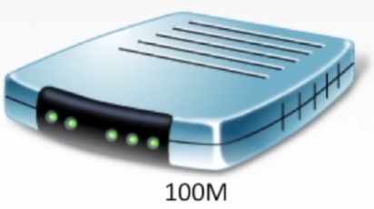

---

接下来我们再举一个例子带宽是什么。

首先我们放一个非常大的链路，链路也可以叫做信道，链路它通常的介质可以是双绞线、同轴电缆等等，这个在之后第二章的物理层会学到。

我们对于这个链路首先要有一个大概的了解，两个条件如图

光的传播速率为 `3 × 10的八次方m / s`，由于链路是固态的，经过这个链路传输后，它会有一定的能量损耗，因此就会导致这个电磁波现在的传播速率是 `2 × 10的八次方米每秒`，也就是电磁波 `1us` 内可以向前传播200m。这个电磁波就是以信号的一个展示形式，也就是说信号是以电磁波为载体在链路上进行传输。

我们知道这两个条件之后，我们首先把这个链路分个段，假如说我们这个链路目前只有600m，每200m分一段，因为我们刚刚说了这个电磁波 `1us` 可以向前传播200m。

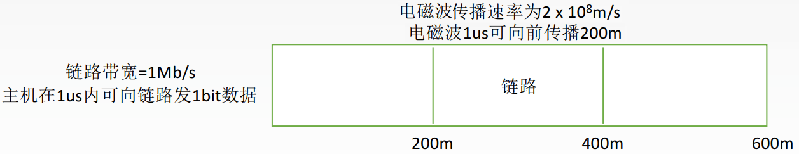

接下来开始，经过了第 `1us(1微妙)` 后，我们这一边的设备可以是交换机，也可以是主机，它可以往这个链路上刚好就可以发送 `1比特` 的数据，因为上图说了主机 `1us` 内可向链路发送 `1bit数据`，所以过了 `1us` 后，就有一个比特出现在链路上。

再来看，再经过 `1us`，也就是 `t = 2us` 的时候，第一个 `比特` 在 `1us` 内往前移动了200m，那第二个比特从这个主机上面传送到链路上，这就是第二秒内发生的两个动作。

我们再来看第三个微秒，在第三个微秒的时候，第一个比特它又往前移动了200m，也就是移到了过了400m这条线，第二个bit也移动了200m到了第二段，第三个比特出现了，从主机到注入到这个链路中来，花了1微秒，在这1微秒中他们干了三件事：三个比特都分别有自己的动作。

---

我们再来看另一种情况：如果链路带宽相爱变成了2兆比特每秒，那么对应的主机或者交换机等它在 `1us` 内可以向链路注入 / 发送 `2bit` 数据。

在这种情况下，在 `3us` 内往链路中注入的比特数有六个。

讲到这大家可以发现，我们这个**链路的带宽指的就是在链路入口的位置最高能发送数据的速率，而不是指的是在链路上传播的速率**，因为在链路上我们都是以电磁波的形式来传播的。

可以发现如果带宽变大的话，只能说它 `1us` 内单位时间内往链路中注入的数据 / 数据量比特数变多了，而不会影响这个比特在这样一个链路上面传播的速度。

---

## 三、吞吐量

吞吐量这个词不仅在计算机网络中会学到，而且在操作系统的pv原理那部分，做例题的时候也会碰到，同时这个词在我们生活中也很常用，例如我们在这个假期去旅游的时候，这个景点就非常多的人进进出出，比如十分钟之内进出了多少人。

----

吞吐量：表示在**单位时间**内通过**某个网络(或信道、接口)**的数量了。它们也是一个表示速度的单位 `b/s`、`kb/s`、`Mb/s` 等，和刚才的速率 / 带宽的单位都是一样的。

**吞吐量是受网络的带宽 / 网络的额定速率 / 标称速率的限制**（这几个都是同义词），指的都是我们这样一条信道，或者是这样一个网络设备每秒它能通过的最高的数据量，也就是最快的速度是多少。

这里我们举个例子：下图有一个主机、一台交换机、两个服务器，这两个服务器提供的功能就是我们在访问网页或者是在进行一些计算程序、视频渲染都可以用得到。

交换机这里不展开讲，我们可以暂时将它理解为：相当于是把这两个服务器拿来的数据捆成一捆，传送给我们自己的电脑，可以将它想象成一个桥梁，一个中介的形式。

主机、交换机、服务器中间需要通过链路（双绞线、同轴电缆、光线等等），通过他们把这些东西连在一起，然后基本就搭好了一个架子，就可以来实现计算机网络数据通信的一个功能

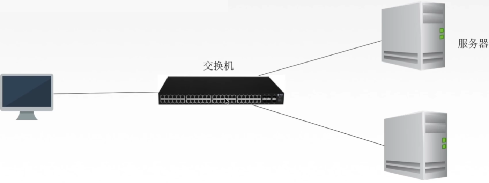

首先主机和交换机的两个口它们都是百兆口。

百兆口就是说我们这台计算机往外发送速率最快是 `100Mb/s`，这个交换机同样往外发送的速率也是最高 `100Mb/s`，这两个口刚好就对上了，既然这两个都是 `100M/s`，那我们就可以说这条链路的带宽就是 `100Mb/s`。

当然我们刚刚说的带宽指的是发送的速率，也是传输速率，单是接受速率受的影响还是比较多的，而且接收速率主要是看你这个缓存的大小，这个是来限制你接受的速度有多快的。

然后主机就需要来访问两个网页，假设从服务器1访问的网页的速率是 `20Mb/s`，也就是说这个服务器最多1s中可以给你传 `20Mb(兆比特)`，第二个服务器一秒最多给你传 `10Mb`，这个速率其实是受服务器它们自身的发送速率的限制了，它们只能发送这么多，所以他们就给你发了20Mb/s，以及10Mb/s的数据。

根据这个我们可以看见，带宽其实是一种理想的状态，这个是不可能达到的，实际的传输速率都是要比带宽小的。

根据这个我们就可以算一下，我这台电脑的网卡，或者说在这个两路上面吞吐量是多少呢？

自然就是将这两个相加，1s中这样一条链路上我们总共能收到多少数据。

因此我们这个网卡，或者是线路中某个端口，1s中可以接收到30M比特，这个就是吞吐量，但我自己自身的能力其实是可以接收100M比特Mb/s。

链路贷款就是它这个标准的最高的数据率，这个速率指的通常都是实际上传输的数据率，吞吐量就是把所有链路都相加。

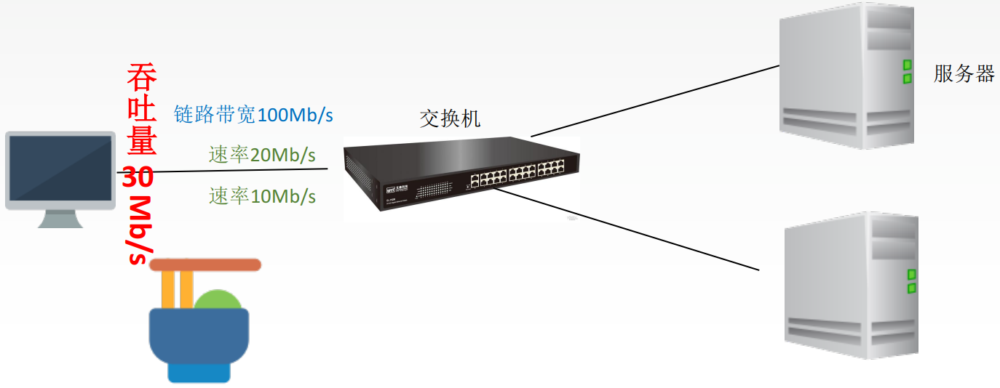

----

# 1.1_5 性能指标：时延、时延带宽积、往返时延RTT、利用率

----

## 一、时延

延时：指数据 (报文/分组/比特流) 从网络（或链路）的一端传送到另一端所需的时间。也叫作延迟或迟延。单位是s。

非常重要的描述时间的性能指标。

时延包括四大类，如果题目要求我们求总时延，自然要将这四种时延全都加在一起。

接下来我们结合AB两个主机通信的例子，来理解一下这四种时延分别发生在哪一个位置。

AB两个主机之间通过电路，这个电路可以是光纤或者是同轴电缆进行连接，然后中间再安上这样一个路由器。

---

### 1）发送时延

**发送时延：从发送分组的第一个比特算起，到该分组的最后一个比特发送完毕所需的时间。**也叫传输时延。

假设A主机它有10位比特，它要把这些数据发送给b，首先它要经过的就是这个 `发送时延`，它把所有的这个数据从他自己身上推到信道上，直到最后一个比特也到了信道上为止，这样一端时间就叫做发送时延。

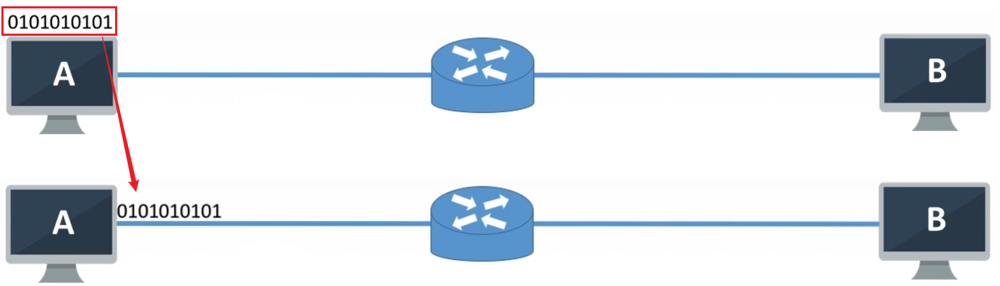

可以看到发送时延它是受两个因素影响的：1、我有多长的数据；2、我发送的快慢

所以发送时延的公式如下图，信道带宽就是发送速率了。

上节我们讲过，带宽指的是单位时间内从网络中的某一点到另一点所能通过的 “最高数据率”，也就是我们这个主机可以发送的最高数据率。

但是我们在实际生活中传输速率是达不到我们的信道的带宽的，它只能说是一个理想的值，可是在做题的时候它基本给的都是带宽，所以我们做题的时候还是要用带宽来当做发送速率来求它的发送时延。

假如说主机这个口的带宽是 `10b/s`，也就是A主机一秒可以把10个比特完全推到这个信道上面来，那么这个发送时延就是 `10 / 10 = 1s`，即A把这10个比特推送到信道上面的时间是1秒。

---

### 2）传播时延

我们还是结合这10个比特来看它传播时延这段时间发生了什么。

这10个比特我们可以看到，从起始位置一直推到了碰到路由器为止，例如刚好如下图在路由器等候为止，这样一段时间就叫做传播时延。

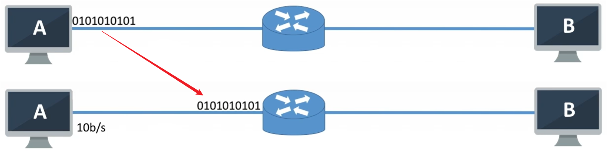

**传播时延是电磁波在信道上传播一定距离所花费的时间**，所以说它取决于**电磁波的传播速度**以及**电路的长度**。

电磁波的传播速度通常都是比较固定的数字，都是 `二点几 × 10的八次方 m/s`，因为我们知道电磁波在真空中传播的速度和光速基本是一样的，即 `3 × 10的八次方 m/s`，但是我们在这个固体介质上面进行传输会有一定的损耗，导致我们的速度要比 `3 × 10的八次方 m/s` 要小，基本上最后这个实际应用中都是 `2 × 10的八次方 m/s`。

传播时延的公式如下图

这里可能有同学有疑问：为什么是电磁波在信道上传输的速度呢？不应该是比特流或者是信号的传输吗？

其实是这样的，我们的信号会经过一定的调制手法，把这个信道以电磁波为载体进行传输，所以说可以理解为电磁波就是一个工人，然后电磁波就可以背着这些比特流往前跑，所以这个比特流在信道上面传输的速率就是电池包在上面传输的速率。

假设电磁波在信道上面的传播速率是 `10m/s`，我们先不考虑这个路由器，就只看AB之间进行一个数据通信。

假设AB之间的距离是100m，那么A上的这些数据在起始位置，一直发送到B全部接收完毕，这样的一段时间就应该用 `(100m) / (10m/s)` ，也就是说通过10s我们这10个数据才可以从A的一端一直发送到B，这样一段时间才是我们的传播时延。

综上我们可以看到，传播时延和发送时延的主要区别就是发送时延它发生的是在这个主机内部的，一般就是发送在网络适配器中，即机器内部的发送器中；而传播时延是发生在机器外的，即信道上面的。

----

### 3）排队时延

排队时延：等待输出/输入链路可用说需要的等待时间。

如下图，我们可以看到我们现在的十个比特已经到路由器的这一边了，但是路由器它现在挺忙的，所以就要让它们几个先等待，它们等待其实是在这个缓存里面（路由器的每一个口都有一个缓存空间），它们会在这里面先待一会，待的时间其实就可以叫做排队时延。

----

### 4）处理时延

假如说等到它们了，那么路由器就可以开始进行一些转发的工作了，这个转发其实也是需要一定时间的，因为这个路由器它需要看你这些数据需要发到哪，然后并检查一下我们这样一个序列有没有出错，所以在检错和找出口这也需要一段时间，就需要我们这个**处理时延**。

因此路由器这主要发生的是排队时延以及处理时延。

---

### 5）补充

我们现在是1s可以传输10比特到链路上，如果把它换成1s可以传输100比特，因此我们的发送速率/信道带宽自然就提高了，那么在数据长度不变的条件下，我的发送时延肯定会变小，这个就是我们对于告诉链路正确的理解。

高速链路指的是：发送速率提高，而并不会影响到电磁波的传播速率，因为电磁波的传播速率只受两点影响：1、我是用什么传的；2、我们使用的是什么介质，如果对于这种固态的介质，尤其是光纤、同轴电缆等，基本上都是 `2 × 10的八次方m/s`，比如说我们的高速只是说提高了发送速率，提高了带宽，减小了发送时延，但是传播时延以及传播速率都是不变的。

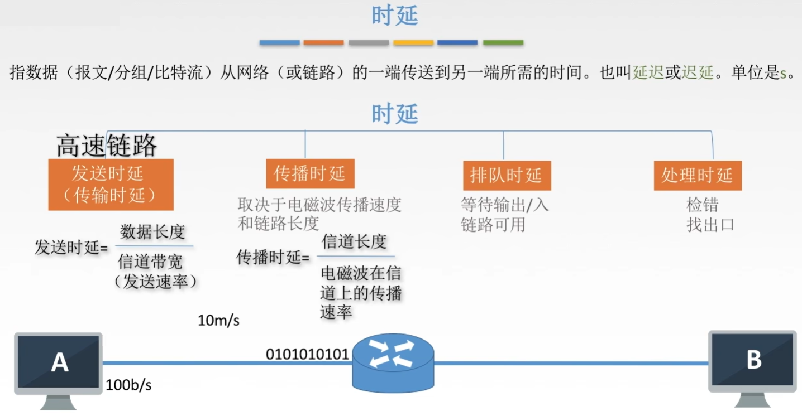

----

## 二、时延带宽积

时延带宽积是一个非常有用的度量它指的是时延和带宽的乘积，注意，**这里的时延指的是传播时延**，带宽是发送端在发送数据时可以达到的最高数据率，强调的是发送速率，单位是 `b/s(比特每秒)`。

传播时延是指电磁波在信道上传播一定的距离所花费的时间，单位是s，因此 `时延带宽积` 的单位就是 `s × b/s = bit(比特)`，所以 `时延带宽积` 是一个用来描述数据量 / 信息量的一个性能属性。

下面有两台主机A、B它们进行通信，那中间肯定有这样一条链路 / 信道，它可以是光纤、可以是同轴电缆、双绞线等，这条链路的长我们定义为传播时延，链路的横截面我们将它当做带宽，下面我们就结合这个图来理解一下时延带宽积是什么。

首先我们知道，`带宽` 指的是 `发送速率`，`传播时延` 就可以这样理解：1个比特经过一个传播时延，刚好就走过了这样一条信道。

第一个比特往前走的时候，其它比特照样往信道上面跳，一直跳，直到第一个比特碰到B为止，也就是第一个比特刚到B为止，发送停止，那么 `时延带宽积` 就是现在信道中所有的比特。

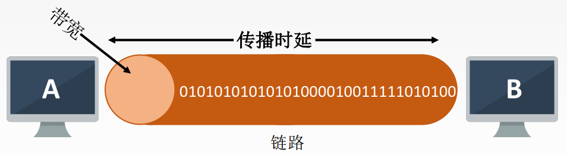

**`时延带宽积` 又成为以 `比特位单位的链路长度`**，在上图中也就是说，这一段链路现在有多少比特，说的就是时延带宽积了。

因此时延带宽积是一个描述数据量，也可以说是这样一个链路中此时此刻的数据容量，这样一个性能指标。

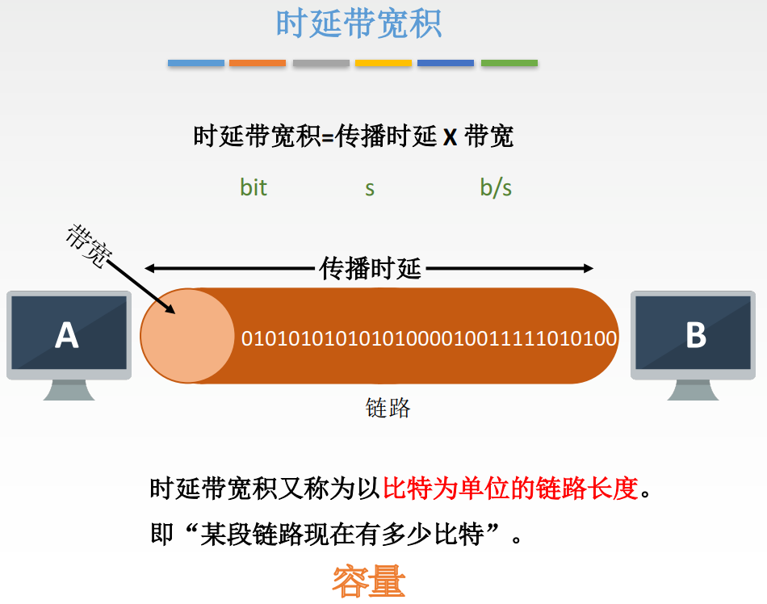

----

## 三、往返时延RTT

`往返时延RTT` 在生活中还是比较常见的，例如我们在打游戏的时候，游戏界面上面就会有RTT，大概是等于多少毫秒，那如果数字比较大，肯定打起来就非常卡，那如果数字比较小，打起来就很流畅也很爽。那我们来看下计算机网络中往返时延RTT是如何定义的。

`往返时延RTT` ：从发送方发送数据开始，到发送方收到接收方的确认（接收方收到数据后立即发送确认），总共经历的时延。

- 从发送方发送数据开始：指的是发送方的第一个比特刚放到信道上开始，这个时候才是我们起始的时间
- 到发送方收到接收方的确认：也就是收到我的第一个比特的确认为止

在终端输入 `ping命令`，然后后面可以加上IP地址/域名，此时就可以测出这个网络的往返时延是多少了。

如下图，我和百度的往返时延就是5.5毫秒左右。为什么它这个数字是不定的呢？因为我们这个网络本身就不稳定，如果你连国外的网，肯定这个时间会更长一点。

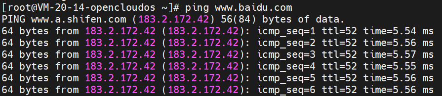

有一个说法：RTT越大，在收到确认之前，可以发送的数据越多。

首先我们知道，RTT越大，我们就会等很久才能等到这样一个确认，在等确认之前，我们能干什么呢？就只能一直发送，所以说我等的越久，我能发送的自然就越多。

总结：RTT包括 `往返传播时延 = 传播时延 × 2`、`末端处理时间`

- 传播时延：电磁波在信道上传播一定距离所花费的时间，即在信道上的时间。往返传播时延那肯定就是2次来回的传播时延

- 末端处理时间：通常指的就是接收方可以会对这个数据进行一个处理，然后再发出一个确认帧

当然 `末端处理时间` 题目中要么就给，要么就说忽略不计。我们主要要注意的是RTT主要包括的是 `两倍的传播时延`。

根据这个我们可以看出，RTT是不包括发送时延的，也就是说它不包括把所有的数据从主机放到信道上这样一段的时间，它只管传播时延。

----

## 四、利用率

`利用率` 顾名思义就是 `利用的效率`。

在计算机网络中，利用率分成两种，一种是信道利用率、另一种是网络利用率。

在这里举一个车道的例子，如下图是一个比较宽的车道，刚修好，现在开始行车，上面只有几台车，此时我们这个车道是没有被利用好的，浪费了，此时车道的利用率是比较低的。

但如果这个车道上面铺满了车，就像下图，那就说明我们这个车道被完全利用了，所以说明我们这个车道的利用率比较高。

在计算机网络中也是一样的，如果主机A和主机B进行通信的话，它们之间的这条链路就可以看这个链路的利用率是高还是低，主要就是我们这个链路有多长时间上面是有数据的，也就是说如果我们这个链路上面一直都有数据进行传输，那我们这个链路就用的很好，利用率很高；如果一直没有数据传输，利用率就非常低，接近为0。

所以利用率的计算如下图

最后再看一张图，这张图表示的其实就是 `时延` 与 `利用率` 的关系，可以发现它们之间有类似于像凹函数的关系，而且随着利用率趋近于1的时候，`时延` 是无限的，急剧增大的。

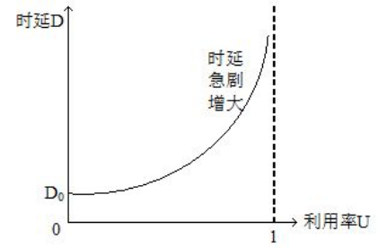

还是使用车道来理解，如果车道利用率将近 `100%`，也就是说车道上面全是车，那我们可以想到堵车的情况，每个车移动的都会非常缓慢，所以导致我们车辆往前走，例如走 `100m` 的时延，就要比平常的时延多很多。

所以在网络中也是一样的道理，如果利用率几乎达到百分之百了，信道上全都是数据，一直在跑，就会导致时延非常大，也就会最后导致速率其实又被降低了。

因此我们可以发现，为什么我们家里虽然是10M网，但是我们实际上加速球上面，或者是电脑右上角上面显示的一些下载上传速度可能只有十几K，其中有一个原因就是因为那个 `十几K/s`，k后面省略了b，那这里面的b其实应该是自己的k大写的b，所以要再乘以一个8，也就是接近于80多

另一个原因其实是，带宽其实是我们理想中能达到的最高数据率，在实际生活中是绝对不可能达到的，所以一定会被带宽要小。

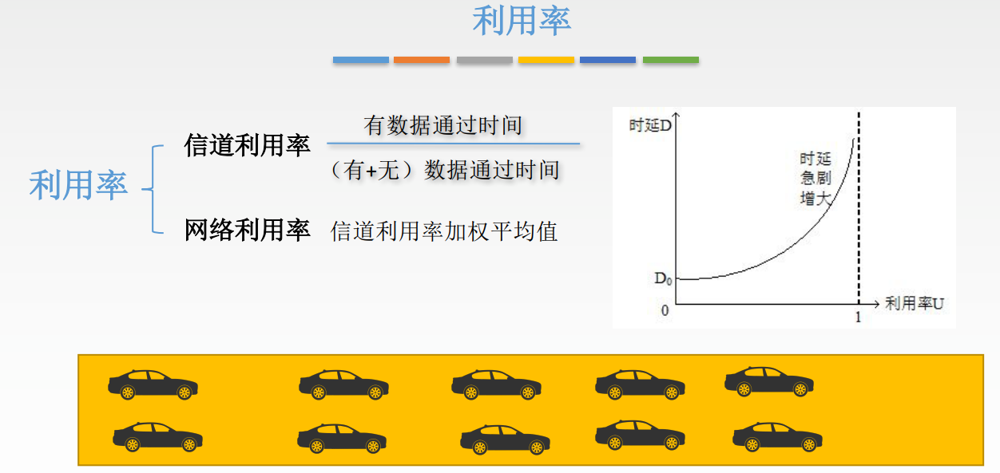

---

## 五、总结

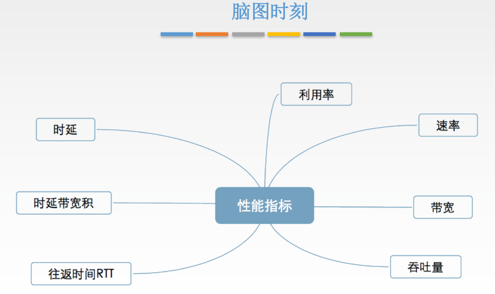

