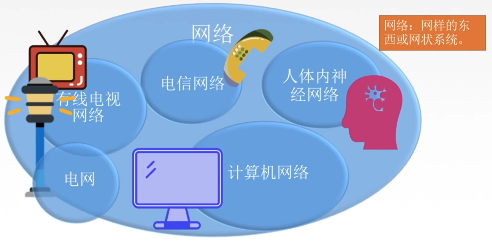

# 1.0 认识计算机网络

《计算机网络》学什么？ —— 数据如何通过网络正确、可靠的从A传送到B

----

# 1.1_1计算机网络的概念及功能

## 一、网络的概念

网络：网样的东西或网状系统。

- 人体内的神经网络，这个网络就是由很多的神经元来组成的网状的系统
- 电信网络：打电话时通过电话线通过电路，连接起来的网状系统
- 有线电视网络：通过电缆 / 光缆将录制好的节目发给千家万户，也构成了一个非常庞大的网络系统
- 计算机网络：通过各个节点，这些节点包括终端的电脑、手机、集线器、中继器、交换机、路由器等中间设备通过有线或者无线的方式将所有刚刚说的连接起来，就构成了计算机网络。

其中 `有线电视网络`、`电信网络`、`计算机网络`，它们三个就是我们常说的三网，这三网在现在计算机社会有一个非常潮的名字：三网融合。就是通过计算机网络这个非常关键的媒介来实现的。

现在所处的社会是一个高度信息化以及高度数字化的社会，这个数字技术就广泛运用于计算机网络中，我们可以把所有的媒体、文字、图片、视频等等全部转换成0或1这样的数字比特流的形式，再放到链路上面进行传输，这样就可以实现不同的节点之间的通信，以及资源的共享，我们就可以将电信网络当中的音频信号编码为数字信号，同时也可以将有线电视网络中的图像、音频等全部编码成数字信号，再放到链路上进行传输。

所以通过计算机网络就可以把有线电视网络和电信网络融合在一起，可以达到的效果就是：我们可以在电脑上看电视，或者在电脑上打电话。

除此之外，最近还新建了一个四网融合的概念，第四网指的就是电网。例如路灯控制，随着城市规模不断扩大，这个路灯的管理和维护就成了非常重要的问题，那么电信的运营商就可以结合电信网络、计算机网络、有线电视网络来实现无线路灯的监控方案，这样就可以实现一个终端自动报警的功能。

----

## 二、计算机网络的定义

关于计算机网路的定义并没有一个统一的标准，不同的教材有不同的说法，下面是王道书对于计算机网络的定义：

计算机网络：是一个将分散的、具有独立功能的**计算机系统**，通过**通信设备**与**线路**连接起来，由功能完善的网络**软件**实现**资源共享**和**信息传递**的系统。

- 计算机系统：包括各种系统的手机端以及电脑端

- 通过的通信设备包括路由器、集线器、中继器、交换机等

- 线路：这里的线路可以说是逻辑线路，因为有的地方可以是无限的

  例如手机可以连WiFi，连到我所在的这个局域网的网关中，这也是实现了一个逻辑上的连接，也是线路的连接，再由功能完善的软件来实现资源共享和信息传递。

目前为止我们有了系统、通信设备、线路，但是只是一个空的架子，我们什么都不能干。因此目前的这个结构还需要有软件的支撑，才能够实现每个终端和终端之间的资源共享、以及信息的传递。

简单来说计算机网络就是一个**互连**的、**自治**的计算机集合。

- 互连：通过通信链路实现互连互通
- 自治：这些终端以及各个节点之间是没有主从关系的，是高度自治的

这个概念中其实也暴露出了计算机网络两个重要的功能：**资源共享**和**信息传递**

---

## 三、计算机网络的功能

### 1）数据通信

例如下面两台电脑，我可以将我的文件发给你，或者是给你发邮件，以及我们之间的项目发消息等等，这都是数据通信的功能。

---

### 2）资源共享

资源共享：同一个计算机网络上的其它计算机可使用某台计算机的计算机资源的行为，可共享**硬件**、**软件**、**数据资源**。

- 共享硬件：其中硬件资源最常用的就是网络式打印机，只要我们的主机和打印机都连在同样一个网络内，同样给这个打印机配置一个固定的静态ip地址，这样我们的手机就可以通过网络和打印机连在一起，实现所有人对于这台打印机的共享。至于这个打印机如何处理每个人发来的这样一个文件的请求，就是操作系统将要学习的一些内容了。
- 共享软件：例如我在这个电脑上面远程访问了我的另一台电脑，然后使用我另一台电脑上面的一些软件(办公软件、画图软件等等)，这些都是实现了软件资源共享。
- 数据资源共享：就是我们最常用的了，例如我们在百度文库上面上传或者下载文件，这都是数据资源的共享。

当然这个网络资源的共享不一定都是免费的，它还会有收费的情况。以上两个功能非常的重要，接下来还有一些其它功能。

----

### 3）分布式处理

当一台计算机它所承受的符合过大的时候，所以它只能把它自己的任务分给其他计算机，即**多台计算机各自承担同一工作任务的不同部分。**

这样工作效率会高，同时也不会导致某一台的计算机负荷过大。一个典型的应用就是Hadoop这样的一个分布式平台，它可以进行告诉的运算以及分布式的存储。

----

### 4）提高可靠性

这个功能是分布式处理引申出的一个功能，可以提高网络的可靠性，由于使用了分布式处理，网络中的一台主机如果宕机了，此时我们就可以有另一台机器叫做 `替代机` 来接班。

----

### 5）负载均衡

其实也是分布式处理引申出来的一个功能特点，因为使用了分布式处理，所以可以使多台计算机各自承担一部分的工作任务，这样也**可以使计算机之间更加的亲密**，工作效率也会更高，更加合理的安排和分配资源。

----

# 计算机网络的发展

## 一、第一阶段

我们要回溯到美苏冷战时期这个时期，美国国防部他们是有一个单一的、非常集中的指挥点，但是他们就想，如果这个中心真的被苏联大哥一个核武器摧毁了，那么全国的军事系统将全部瘫痪，因为所有的节点全部依附在这样一个指挥中心上面。

所以他们就想：可不可以设计一个比较分散的指挥系统呢？这个指挥系统就可以由一个个的分散的指挥点组成，当一个指挥点被炸掉后，还会有另外几个指挥点接替他的工作，而且还可以实现彼此之间的通信，这个非常厉害的组织就是 `美国国防部高级研究计划局（ARPA）`，它就研究出来了这样一个网络 `阿帕网`，即 `ARPAnet`，即组织名 + 网络。

阿帕网的原形就是由四个分布在不同地区的节点组成，它们通过 `无线分组交换网 & 以及卫星通信网连接`，可以看见再这样一个连接过程中，如果其中一个节点被炸掉了，那么另外三个节点还是可以继续工作，以及继续通信的。

所以这个阿帕网的发展的每一个节点后面都会接入很多其它的一些终端、电脑，从而扩大了阿帕网这样一个规模。

但是有一个弊端就是：阿帕网它只可以连接同一类型的网络，随着信息量的增长，他们希望可以实现不同网络的互联，即  **internet(interconnected network)互联网**，奔着这个目标去努力就出现了一个协议：TCP/IP，通过这个协议可以实现不同网络的连接，其中这个IP协议是基本的一个通信协议，TCP是帮助IP实现可靠传输的协议，因此记住这两个协议他们联合起来就可以实现网络的互联。

阿帕网在1983年的时候正式的接受了这样一个协议，并且用它取代之前使用的一个旧协议，同时选定 `internet` 为主要的计算机通信系统。

最后得到的就是我们现在常说的因特网**（`Internet`）**。

这里要注意有大小写的区别，小写的 `因特网` 指的就是相互连接的这样一个网络的网络，它的是一个通用的名词；但是 `Internet` 中大写的 `I` 代表的是专有名词因特网，目前来说 `因特网` 就是我们现在全球范围内最大的 `互联网` ，所以 `阿帕网` 就是 `因特网` 的前身。

----

结合刚刚第一阶段来看，我们对网络应该有了一个更深层次的认识了。

网络其实本质上就是由若干个节点和连接这些节点的链路组成，构成的这样一朵云彩就叫做一个网络。

将网络和网络通过路由器连接起来，就构成了一个大型的网络，也就是互联网。

网络把许多计算机连接在一起，而互联网则把许多网络连接在一起，因特网是实际上最大的互联网。

----

## 二、第二阶段

第二阶段是从1985年起，美国国家科学基金会NSF围绕6个大型计算机中心建设计算机网络，即国家科学基金网NSFNET。

这种网络是三层结构，最底层就是校园网或者是企业网，第三层次的用户如果想要连到网上，就需要再连接到第二层的地区网，并且第二层的地区网再连接到第一层的主干网，因此就形成了这样逻辑比较清晰的三层网络结构。

这种三级的网络结构其实就覆盖了当时美国大部分的学校以及研究所，并且成为了因特网当中的主要组成部分。

但是随着技术的发展，越来越多的用户、公司都可以连到这个互联网当中，所以就会导致这个网络的信息量急剧的增大，而美国当时他掌控的这个因特网其实是已经满足不了大量的需求了，所以美国政府就觉得把这个因特网的主干网交给一些私人公司来经营，并且开始对接入因特网的单位来进行收费，那么也就到了我们接下来的第三阶段。

---

## 三、第三阶段  ——  多层次的ISP结构

刚刚说过美国在第二阶段把这个控制权逐步的移交给了很多公司，这些公司在第三阶段就称之为ISP。

**ISP**：因特网服务提供者 / 因特网服务提供商，是一个向广大用户综合提供互联网接入业务、信息业务、和增值业务的公司，如中国电信、中国联通、中国移动等。分为主干ISP、地区ISP和本地ISP。

其实它也是沿用了第二阶段的三层结构，只不过是把网络的管理权利分散，由它们来进行网络的分配以及服务的提供等等。

那我们无论在校园还是在家里，我们都会交网费，这个网费其实就是给ISP的服务费，我们通过给ISP支付服务费的这种方式，才能够使用ISP的服务，以升到一个IP地址来畅游网络。

具体来讲就是：全世界有一个这么大的IP池，叫做因特网管理机构来管理的，如果ISP供应商要给用户提供服务给它们分配IP，它就首先要从IP池要到一个网段的IP地址，然后再分配给用户，这样每个用户就会有一个IP地址，就能够正常的上网了。

有的人会说：我想花重金买个靓号可以吗？这跟手机号是不一样的，IP地址是ISP给你分配好的，感兴趣的同学可以在百度收一下本地IP，然后就可以看到你自己现在在的这个位置，例如下面搜 `110.110.110.110`，这个IP地址是在 `黑龙江省哈尔滨市` ，`铁通` 指的就是这个IP地址所在的公司。刚刚说了，ISP会给这一个区域范围内的用户分配IP地址，假设我现在所在的小区是由四川电信分配的IP地址，所以我们就可以享受到四川电信给我们提供的一些互联网的业务和服务。那我能不能享受享受到北京电信的服务呢？当然也可以，只不过那个路程非常遥远，它不是直接管理的ISP，所以我们就会在下载一些游戏或者电影的时候就会看到有很多选项，什么四川电信、四川移动、北京电信等等，这些其实就是根据ISP来选择的。那如果你在四川，你家是电信网，那你自然就连四川电信，那如果你选择别的运营商下载，可能会有速度比较慢的情况，只要每一个本地ISP都安装路由器连接到了地区ISP，而地区ISP也有路由器连接到了主干ISP，就可以完成因特网中所有的数据分组转发的任务，也就可以让我们畅游网络，访问各个网站的资源。

但是随着这个流量的激增，人们对于网络的要求也越来越高，就开始研究怎么更快的转发数据、转发分组。因此就诞生了这样一个概念：因特网交换点IXP。原本的A和B如果要通信的话，就需要经过一层又一层的ISP结构，通过本地ISP到地区ISP再到主干ISP，然后再一路下去；但有了因特网交换点，我们就可以允许这两个网络直接相连，而不再需要第三个网络来转换分组了。

IXP的出现也大大提高了信息传递和资源共享的速度。

----

## 四、总结

---

# 1.1_2 组成与分类

# 计算机网络的组成

从不同的角度入手，我们可以先从计算机网络的一个基本架子的组成来看一下。

## 一、从组成部分上

它是由**硬件**、**软件**、**协议(一系列规则和约定的结合)** 这三大组要要素在一起构成了计算机网络。

- 硬件：这个端系统以及中间的这些路由器、交换机等等的中间设备
- 软件：就是附在端系统上，甚至是包括这个中间设备上面也有一定的软件，将这些软件步到这些硬件上
- 再通过协议穿梭于各个硬件中，就构成了一个计算机网络

计算机网络每一个层次它其实是有很多协议的，根据这些协议，我们就可以规定这个数据如何封装、如何打包、如何传输、如何从这一端到你的另一端，这些都是协议要包含要学习的内容。

----

## 二、从工作方式上

从工作方式上我们可以将计算机网络分为

- 边缘部分
- 核心部分

### 1）边缘部分

虽然它称之为边缘部分，但是它也非常的重要。把一部分就是由一系列的端系统组成的，这些端系统不仅包括一些计算机，也可以包括非常庞大的一些服务器，和大型计算机，甚至还可以包括是非常小的计算机网络摄像头，它可以实时的捕获到一些信息，并且把这些信息实时的发布出去，这些都是边缘部分。

但计算机网络只有边缘部分还不够，它需要使用核心部分的一些服务，也就是通过核心部分提供服务，边缘部分才能实现端系统与端系统之间的这样一个通信。

端系统之间的通信强调的是进程之间的通信，也就是我们主机A和主机B在通信，其实讲的是主机A当中的某个进程和主机B当中的某个进程之间的通信。例如我们在打开QQ的时候，登录后，我在界面上输入要发出的文件，此时QQ就是我电脑中正在运行的一个程序，而B这边也有人打开了QQ，在这边接收我的消息，或者他给别人发信息，那它使用的QQ也是一个正在运行的程序，也是一个进程。

所以在这里再强调一下，就是端和端之间的通信其实只的是两个端系统之间的进程通信，那么这两个端系统之间的进程通信包括两种方式：

- `C/S方式`：Client and Server,即客户/服务器的方式，这种方式是因特网上最常用的，也是最传统的一种方式，它描述的是这两个端系统之间的进程，呈现着一种服务与被服务的关系，client客户就是被服务的，server就是为客户提供服务的。

例如我们在使用微信的时候，在给别人发消息的时候，就需要把消息发给腾讯的服务器，然后由这个服务器处理我们的这个请求，再把消息传递给另一个人。但此时此刻不止我一个人在发微信，有可能正在看我笔记的你也在发微信，有很多很多人都在发微信，就会像这个服务器发出很多请求，这个服务器就需要一次处理这些请求，并且执行这个请求当中的一些任务。

所以发出请求的我们，即客户，承接我们请求的这个服务器就是这个CS方式中的server。

但由于资源是有限的，当访问的人越多的时候，我们就可以知道这个速度是越慢的。

举个例子：在我们微信、支付宝等平台上抢红包的时候，大家经常会出现卡顿，正是因为这个服务器要接收很多很多请求，所以由于它的资源有限，就会导致访问这个服务器的请求越多，那么得到这个响应的速度就越慢。

除了 `C/S` 外，还有一个叫做 `B/S方式`。`C/S方式` 通常指的是你要下载一些客户端的软件，包括QQ、微信客户端等。而`B/S` 中的 `B` 指的就是 `Browser`，即浏览器的意思。`B/S方式` 和 `C/S方式` 其实都很类似，只不过把我们这个客户端换成浏览器了而已。

----

- `P2P方式`(peer-to-peer，即对等的连接)：这个情况下大家都是对等的，没有一台主机说我一定是服务器，也没有一台主机说我永远是一个客户机，在这种方式下所有的主机都有两个身份：一面试提供服务的服务者，另一面就是使用服务的享受者，即客户，所以这里面的每一个端系统它同时又是客户，又是服务器。

简单来说：假设A它现在手里有一个500M的大片，然后现在有B、C、D三个人都想下这个片子。`P2P下载` 其实就是将一个大的文件切分成几个大小不等或者大小相等的数据块，假设B先拿到一部分数据，例如它下了250M的片子，下了这250M之后，马上就给C传了200M，同时B还会继续从A下载电影，那么C收到200M之后，它很功德无量，继续把这个东西分享给小D，假设分到了150M，这个小D同时又可以向A发出请求：你再分我一点，此时C和A其实都可以一起资助D，那么A又给D传了一部分视频，所以D在很快的时间内就可以下完这个片子了。当然D其实也可以向B请求服务，B同时也可以把自己片子中已经下好的一部分再继续上传给D，这样看D又收到了B的恩惠，所以可以看到在 `P2P` 下载的这种情况下，其实是一个我为人人人人为我的情况。

例如B跟C这两个既是服务器，同时又是客户，因为它们两个即承担了上传的功能，同时它们也享受到了下载服务。

我们再来看这个小D，小D它同时有A、B、C3个人一起给他传文件，可想而知这个D获得这个文件的速度应该非常快，所以在 `P2P下载` 的环境中，当这个主机越多越好，我们下载的速度就越快，刚好和 `C/S` 是相反的，`C/S` 由于只有固定的几个机器做服务器，所以请求他们这个服务的人越多，就会导致这个服务器的相应越慢；但是 `P2P` 却相反，因为每一个人，即每一个端系统既可以是客户，同时也可以是服务器。

----

### 2）核心部分

核心部分其实就是被边缘部分服务的，包括路由器、一些中间设备，还有一些网络连接起来，那么核心部分和边缘部分连接在一起就构成了计算机网络，这也是在工作方式上面对于计算机网络组成的一个划分。

